cola Report for recount2:DRP001797
==================

**Date**: 2019-12-25 22:23:31 CET, **cola version**: 1.3.2

----------------------------------------------------------------

<style type='text/css'>

body, td, th {
   font-family: Arial,Helvetica,sans-serif;
   background-color: white;
   font-size: 13px;
  max-width: 800px;
  margin: auto;
  margin-left:210px;
  padding: 0px 10px 0px 10px;
  border-left: 1px solid #EEEEEE;
  line-height: 150%;
}

tt, code, pre {
   font-family: 'DejaVu Sans Mono', 'Droid Sans Mono', 'Lucida Console', Consolas, Monaco, 

monospace;
}

h1 {
   font-size:2.2em;
}

h2 {
   font-size:1.8em;
}

h3 {
   font-size:1.4em;
}

h4 {
   font-size:1.0em;
}

h5 {
   font-size:0.9em;
}

h6 {
   font-size:0.8em;
}

a {
  text-decoration: none;
  color: #0366d6;
}

a:hover {
  text-decoration: underline;
}

a:visited {
   color: #0366d6;
}

pre, img {
  max-width: 100%;
}
pre {
  overflow-x: auto;
}
pre code {
   display: block; padding: 0.5em;
}

code {
  font-size: 92%;
  border: 1px solid #ccc;
}

code[class] {
  background-color: #F8F8F8;
}

table, td, th {
  border: 1px solid #ccc;
}

blockquote {
   color:#666666;
   margin:0;
   padding-left: 1em;
   border-left: 0.5em #EEE solid;
}

hr {
   height: 0px;
   border-bottom: none;
   border-top-width: thin;
   border-top-style: dotted;
   border-top-color: #999999;
}

@media print {
   * {
      background: transparent !important;
      color: black !important;
      filter:none !important;
      -ms-filter: none !important;
   }

   body {
      font-size:12pt;
      max-width:100%;
   }

   a, a:visited {
      text-decoration: underline;
   }

   hr {
      visibility: hidden;
      page-break-before: always;
   }

   pre, blockquote {
      padding-right: 1em;
      page-break-inside: avoid;
   }

   tr, img {
      page-break-inside: avoid;
   }

   img {
      max-width: 100% !important;
   }

   @page :left {
      margin: 15mm 20mm 15mm 10mm;
   }

   @page :right {
      margin: 15mm 10mm 15mm 20mm;
   }

   p, h2, h3 {
      orphans: 3; widows: 3;
   }

   h2, h3 {
      page-break-after: avoid;
   }
}
</style>


## Summary


All available functions which can be applied to this `res_list` object:


```r
res_list
```

```
#> A 'ConsensusPartitionList' object with 24 methods.
#>   On a matrix with 13278 rows and 322 columns.
#>   Top rows are extracted by 'SD, CV, MAD, ATC' methods.
#>   Subgroups are detected by 'hclust, kmeans, skmeans, pam, mclust, NMF' method.
#>   Number of partitions are tried for k = 2, 3, 4, 5, 6.
#>   Performed in total 30000 partitions by row resampling.
#> 
#> Following methods can be applied to this 'ConsensusPartitionList' object:
#>  [1] "cola_report"           "collect_classes"       "collect_plots"         "collect_stats"        
#>  [5] "colnames"              "functional_enrichment" "get_anno_col"          "get_anno"             
#>  [9] "get_classes"           "get_matrix"            "get_membership"        "get_stats"            
#> [13] "is_best_k"             "is_stable_k"           "ncol"                  "nrow"                 
#> [17] "rownames"              "show"                  "suggest_best_k"        "test_to_known_factors"
#> [21] "top_rows_heatmap"      "top_rows_overlap"     
#> 
#> You can get result for a single method by, e.g. object["SD", "hclust"] or object["SD:hclust"]
#> or a subset of methods by object[c("SD", "CV")], c("hclust", "kmeans")]
```

The call of `run_all_consensus_partition_methods()` was:


```
#> run_all_consensus_partition_methods(data = mat, mc.cores = 4)
```

Dimension of the input matrix:


```r
mat = get_matrix(res_list)
dim(mat)
```

```
#> [1] 13278   322
```

### Density distribution

The density distribution for each sample is visualized as in one column in the
following heatmap. The clustering is based on the distance which is the
Kolmogorov-Smirnov statistic between two distributions.


```r
library(ComplexHeatmap)
densityHeatmap(mat, ylab = "value", cluster_columns = TRUE, show_column_names = FALSE,
    mc.cores = 4)
```


### Suggest the best k


Folowing table shows the best `k` (number of partitions) for each combination
of top-value methods and partition methods. Clicking on the method name in
the table goes to the section for a single combination of methods.

[The cola vignette](http://bioconductor.org/packages/devel/bioc/vignettes/cola/inst/doc/cola.html#toc_13)
explains the definition of the metrics used for determining the best
number of partitions.


```r
suggest_best_k(res_list)
```


|                            | The best k| 1-PAC| Mean silhouette| Concordance|   |Optional k |
|:---------------------------|----------:|-----:|---------------:|-----------:|:--|:----------|
|[SD:pam](#SD-pam)           |          6| 1.000|           0.994|       0.997|** |4,5        |
|[CV:hclust](#CV-hclust)     |          3| 1.000|           1.000|       1.000|** |2          |
|[CV:skmeans](#CV-skmeans)   |          4| 1.000|           0.990|       0.991|** |3          |
|[CV:pam](#CV-pam)           |          6| 1.000|           0.979|       0.989|** |3,5        |
|[MAD:skmeans](#MAD-skmeans) |          4| 1.000|           0.995|       0.992|** |3          |
|[MAD:pam](#MAD-pam)         |          6| 1.000|           0.991|       0.995|** |4,5        |
|[MAD:mclust](#MAD-mclust)   |          6| 1.000|           0.970|       0.980|** |5          |
|[ATC:NMF](#ATC-NMF)         |          4| 0.969|           0.959|       0.970|** |2          |
|[SD:NMF](#SD-NMF)           |          6| 0.967|           0.909|       0.944|** |2          |
|[CV:NMF](#CV-NMF)           |          6| 0.963|           0.908|       0.938|** |3          |
|[SD:hclust](#SD-hclust)     |          6| 0.962|           0.941|       0.975|** |2,3,4      |
|[MAD:hclust](#MAD-hclust)   |          6| 0.962|           0.944|       0.976|** |2,4        |
|[ATC:mclust](#ATC-mclust)   |          6| 0.950|           0.931|       0.930|** |3          |
|[ATC:hclust](#ATC-hclust)   |          5| 0.926|           0.851|       0.886|*  |2          |
|[ATC:pam](#ATC-pam)         |          6| 0.925|           0.918|       0.918|*  |3,5        |
|[ATC:skmeans](#ATC-skmeans) |          5| 0.919|           0.964|       0.941|*  |3,4        |
|[MAD:NMF](#MAD-NMF)         |          6| 0.915|           0.895|       0.928|*  |2,3        |
|[SD:skmeans](#SD-skmeans)   |          5| 0.913|           0.759|       0.817|*  |3,4        |
|[SD:mclust](#SD-mclust)     |          6| 0.874|           0.938|       0.911|   |           |
|[CV:mclust](#CV-mclust)     |          4| 0.791|           0.818|       0.909|   |           |
|[ATC:kmeans](#ATC-kmeans)   |          3| 0.741|           0.944|       0.953|   |           |
|[CV:kmeans](#CV-kmeans)     |          3| 0.638|           0.850|       0.865|   |           |
|[MAD:kmeans](#MAD-kmeans)   |          2| 0.524|           0.828|       0.895|   |           |
|[SD:kmeans](#SD-kmeans)     |          2| 0.470|           0.825|       0.866|   |           |

\*\*: 1-PAC > 0.95, \*: 1-PAC > 0.9


### CDF of consensus matrices

Cumulative distribution function curves of consensus matrix for all methods.


```r
collect_plots(res_list, fun = plot_ecdf)
```


### Consensus heatmap

Consensus heatmaps for all methods. ([What is a consensus heatmap?](http://bioconductor.org/packages/devel/bioc/vignettes/cola/inst/doc/cola.html#toc_9))


<style type='text/css'>


.ui-helper-hidden {
	display: none;
}
.ui-helper-hidden-accessible {
	border: 0;
	clip: rect(0 0 0 0);
	height: 1px;
	margin: -1px;
	overflow: hidden;
	padding: 0;
	position: absolute;
	width: 1px;
}
.ui-helper-reset {
	margin: 0;
	padding: 0;
	border: 0;
	outline: 0;
	line-height: 1.3;
	text-decoration: none;
	font-size: 100%;
	list-style: none;
}
.ui-helper-clearfix:before,
.ui-helper-clearfix:after {
	content: "";
	display: table;
	border-collapse: collapse;
}
.ui-helper-clearfix:after {
	clear: both;
}
.ui-helper-zfix {
	width: 100%;
	height: 100%;
	top: 0;
	left: 0;
	position: absolute;
	opacity: 0;
	filter:Alpha(Opacity=0); 
}

.ui-front {
	z-index: 100;
}


.ui-state-disabled {
	cursor: default !important;
	pointer-events: none;
}


.ui-icon {
	display: inline-block;
	vertical-align: middle;
	margin-top: -.25em;
	position: relative;
	text-indent: -99999px;
	overflow: hidden;
	background-repeat: no-repeat;
}

.ui-widget-icon-block {
	left: 50%;
	margin-left: -8px;
	display: block;
}


.ui-widget-overlay {
	position: fixed;
	top: 0;
	left: 0;
	width: 100%;
	height: 100%;
}
.ui-accordion .ui-accordion-header {
	display: block;
	cursor: pointer;
	position: relative;
	margin: 2px 0 0 0;
	padding: .5em .5em .5em .7em;
	font-size: 100%;
}
.ui-accordion .ui-accordion-content {
	padding: 1em 2.2em;
	border-top: 0;
	overflow: auto;
}
.ui-autocomplete {
	position: absolute;
	top: 0;
	left: 0;
	cursor: default;
}
.ui-menu {
	list-style: none;
	padding: 0;
	margin: 0;
	display: block;
	outline: 0;
}
.ui-menu .ui-menu {
	position: absolute;
}
.ui-menu .ui-menu-item {
	margin: 0;
	cursor: pointer;
	
	list-style-image: url("data:image/gif;base64,R0lGODlhAQABAIAAAAAAAP///yH5BAEAAAAALAAAAAABAAEAAAIBRAA7");
}
.ui-menu .ui-menu-item-wrapper {
	position: relative;
	padding: 3px 1em 3px .4em;
}
.ui-menu .ui-menu-divider {
	margin: 5px 0;
	height: 0;
	font-size: 0;
	line-height: 0;
	border-width: 1px 0 0 0;
}
.ui-menu .ui-state-focus,
.ui-menu .ui-state-active {
	margin: -1px;
}


.ui-menu-icons {
	position: relative;
}
.ui-menu-icons .ui-menu-item-wrapper {
	padding-left: 2em;
}


.ui-menu .ui-icon {
	position: absolute;
	top: 0;
	bottom: 0;
	left: .2em;
	margin: auto 0;
}


.ui-menu .ui-menu-icon {
	left: auto;
	right: 0;
}
.ui-button {
	padding: .4em 1em;
	display: inline-block;
	position: relative;
	line-height: normal;
	margin-right: .1em;
	cursor: pointer;
	vertical-align: middle;
	text-align: center;
	-webkit-user-select: none;
	-moz-user-select: none;
	-ms-user-select: none;
	user-select: none;

	
	overflow: visible;
}

.ui-button,
.ui-button:link,
.ui-button:visited,
.ui-button:hover,
.ui-button:active {
	text-decoration: none;
}


.ui-button-icon-only {
	width: 2em;
	box-sizing: border-box;
	text-indent: -9999px;
	white-space: nowrap;
}


input.ui-button.ui-button-icon-only {
	text-indent: 0;
}


.ui-button-icon-only .ui-icon {
	position: absolute;
	top: 50%;
	left: 50%;
	margin-top: -8px;
	margin-left: -8px;
}

.ui-button.ui-icon-notext .ui-icon {
	padding: 0;
	width: 2.1em;
	height: 2.1em;
	text-indent: -9999px;
	white-space: nowrap;

}

input.ui-button.ui-icon-notext .ui-icon {
	width: auto;
	height: auto;
	text-indent: 0;
	white-space: normal;
	padding: .4em 1em;
}


input.ui-button::-moz-focus-inner,
button.ui-button::-moz-focus-inner {
	border: 0;
	padding: 0;
}
.ui-controlgroup {
	vertical-align: middle;
	display: inline-block;
}
.ui-controlgroup > .ui-controlgroup-item {
	float: left;
	margin-left: 0;
	margin-right: 0;
}
.ui-controlgroup > .ui-controlgroup-item:focus,
.ui-controlgroup > .ui-controlgroup-item.ui-visual-focus {
	z-index: 9999;
}
.ui-controlgroup-vertical > .ui-controlgroup-item {
	display: block;
	float: none;
	width: 100%;
	margin-top: 0;
	margin-bottom: 0;
	text-align: left;
}
.ui-controlgroup-vertical .ui-controlgroup-item {
	box-sizing: border-box;
}
.ui-controlgroup .ui-controlgroup-label {
	padding: .4em 1em;
}
.ui-controlgroup .ui-controlgroup-label span {
	font-size: 80%;
}
.ui-controlgroup-horizontal .ui-controlgroup-label + .ui-controlgroup-item {
	border-left: none;
}
.ui-controlgroup-vertical .ui-controlgroup-label + .ui-controlgroup-item {
	border-top: none;
}
.ui-controlgroup-horizontal .ui-controlgroup-label.ui-widget-content {
	border-right: none;
}
.ui-controlgroup-vertical .ui-controlgroup-label.ui-widget-content {
	border-bottom: none;
}


.ui-controlgroup-vertical .ui-spinner-input {

	
	width: 75%;
	width: calc( 100% - 2.4em );
}
.ui-controlgroup-vertical .ui-spinner .ui-spinner-up {
	border-top-style: solid;
}

.ui-checkboxradio-label .ui-icon-background {
	box-shadow: inset 1px 1px 1px #ccc;
	border-radius: .12em;
	border: none;
}
.ui-checkboxradio-radio-label .ui-icon-background {
	width: 16px;
	height: 16px;
	border-radius: 1em;
	overflow: visible;
	border: none;
}
.ui-checkboxradio-radio-label.ui-checkboxradio-checked .ui-icon,
.ui-checkboxradio-radio-label.ui-checkboxradio-checked:hover .ui-icon {
	background-image: none;
	width: 8px;
	height: 8px;
	border-width: 4px;
	border-style: solid;
}
.ui-checkboxradio-disabled {
	pointer-events: none;
}
.ui-datepicker {
	width: 17em;
	padding: .2em .2em 0;
	display: none;
}
.ui-datepicker .ui-datepicker-header {
	position: relative;
	padding: .2em 0;
}
.ui-datepicker .ui-datepicker-prev,
.ui-datepicker .ui-datepicker-next {
	position: absolute;
	top: 2px;
	width: 1.8em;
	height: 1.8em;
}
.ui-datepicker .ui-datepicker-prev-hover,
.ui-datepicker .ui-datepicker-next-hover {
	top: 1px;
}
.ui-datepicker .ui-datepicker-prev {
	left: 2px;
}
.ui-datepicker .ui-datepicker-next {
	right: 2px;
}
.ui-datepicker .ui-datepicker-prev-hover {
	left: 1px;
}
.ui-datepicker .ui-datepicker-next-hover {
	right: 1px;
}
.ui-datepicker .ui-datepicker-prev span,
.ui-datepicker .ui-datepicker-next span {
	display: block;
	position: absolute;
	left: 50%;
	margin-left: -8px;
	top: 50%;
	margin-top: -8px;
}
.ui-datepicker .ui-datepicker-title {
	margin: 0 2.3em;
	line-height: 1.8em;
	text-align: center;
}
.ui-datepicker .ui-datepicker-title select {
	font-size: 1em;
	margin: 1px 0;
}
.ui-datepicker select.ui-datepicker-month,
.ui-datepicker select.ui-datepicker-year {
	width: 45%;
}
.ui-datepicker table {
	width: 100%;
	font-size: .9em;
	border-collapse: collapse;
	margin: 0 0 .4em;
}
.ui-datepicker th {
	padding: .7em .3em;
	text-align: center;
	font-weight: bold;
	border: 0;
}
.ui-datepicker td {
	border: 0;
	padding: 1px;
}
.ui-datepicker td span,
.ui-datepicker td a {
	display: block;
	padding: .2em;
	text-align: right;
	text-decoration: none;
}
.ui-datepicker .ui-datepicker-buttonpane {
	background-image: none;
	margin: .7em 0 0 0;
	padding: 0 .2em;
	border-left: 0;
	border-right: 0;
	border-bottom: 0;
}
.ui-datepicker .ui-datepicker-buttonpane button {
	float: right;
	margin: .5em .2em .4em;
	cursor: pointer;
	padding: .2em .6em .3em .6em;
	width: auto;
	overflow: visible;
}
.ui-datepicker .ui-datepicker-buttonpane button.ui-datepicker-current {
	float: left;
}


.ui-datepicker.ui-datepicker-multi {
	width: auto;
}
.ui-datepicker-multi .ui-datepicker-group {
	float: left;
}
.ui-datepicker-multi .ui-datepicker-group table {
	width: 95%;
	margin: 0 auto .4em;
}
.ui-datepicker-multi-2 .ui-datepicker-group {
	width: 50%;
}
.ui-datepicker-multi-3 .ui-datepicker-group {
	width: 33.3%;
}
.ui-datepicker-multi-4 .ui-datepicker-group {
	width: 25%;
}
.ui-datepicker-multi .ui-datepicker-group-last .ui-datepicker-header,
.ui-datepicker-multi .ui-datepicker-group-middle .ui-datepicker-header {
	border-left-width: 0;
}
.ui-datepicker-multi .ui-datepicker-buttonpane {
	clear: left;
}
.ui-datepicker-row-break {
	clear: both;
	width: 100%;
	font-size: 0;
}


.ui-datepicker-rtl {
	direction: rtl;
}
.ui-datepicker-rtl .ui-datepicker-prev {
	right: 2px;
	left: auto;
}
.ui-datepicker-rtl .ui-datepicker-next {
	left: 2px;
	right: auto;
}
.ui-datepicker-rtl .ui-datepicker-prev:hover {
	right: 1px;
	left: auto;
}
.ui-datepicker-rtl .ui-datepicker-next:hover {
	left: 1px;
	right: auto;
}
.ui-datepicker-rtl .ui-datepicker-buttonpane {
	clear: right;
}
.ui-datepicker-rtl .ui-datepicker-buttonpane button {
	float: left;
}
.ui-datepicker-rtl .ui-datepicker-buttonpane button.ui-datepicker-current,
.ui-datepicker-rtl .ui-datepicker-group {
	float: right;
}
.ui-datepicker-rtl .ui-datepicker-group-last .ui-datepicker-header,
.ui-datepicker-rtl .ui-datepicker-group-middle .ui-datepicker-header {
	border-right-width: 0;
	border-left-width: 1px;
}


.ui-datepicker .ui-icon {
	display: block;
	text-indent: -99999px;
	overflow: hidden;
	background-repeat: no-repeat;
	left: .5em;
	top: .3em;
}
.ui-dialog {
	position: absolute;
	top: 0;
	left: 0;
	padding: .2em;
	outline: 0;
}
.ui-dialog .ui-dialog-titlebar {
	padding: .4em 1em;
	position: relative;
}
.ui-dialog .ui-dialog-title {
	float: left;
	margin: .1em 0;
	white-space: nowrap;
	width: 90%;
	overflow: hidden;
	text-overflow: ellipsis;
}
.ui-dialog .ui-dialog-titlebar-close {
	position: absolute;
	right: .3em;
	top: 50%;
	width: 20px;
	margin: -10px 0 0 0;
	padding: 1px;
	height: 20px;
}
.ui-dialog .ui-dialog-content {
	position: relative;
	border: 0;
	padding: .5em 1em;
	background: none;
	overflow: auto;
}
.ui-dialog .ui-dialog-buttonpane {
	text-align: left;
	border-width: 1px 0 0 0;
	background-image: none;
	margin-top: .5em;
	padding: .3em 1em .5em .4em;
}
.ui-dialog .ui-dialog-buttonpane .ui-dialog-buttonset {
	float: right;
}
.ui-dialog .ui-dialog-buttonpane button {
	margin: .5em .4em .5em 0;
	cursor: pointer;
}
.ui-dialog .ui-resizable-n {
	height: 2px;
	top: 0;
}
.ui-dialog .ui-resizable-e {
	width: 2px;
	right: 0;
}
.ui-dialog .ui-resizable-s {
	height: 2px;
	bottom: 0;
}
.ui-dialog .ui-resizable-w {
	width: 2px;
	left: 0;
}
.ui-dialog .ui-resizable-se,
.ui-dialog .ui-resizable-sw,
.ui-dialog .ui-resizable-ne,
.ui-dialog .ui-resizable-nw {
	width: 7px;
	height: 7px;
}
.ui-dialog .ui-resizable-se {
	right: 0;
	bottom: 0;
}
.ui-dialog .ui-resizable-sw {
	left: 0;
	bottom: 0;
}
.ui-dialog .ui-resizable-ne {
	right: 0;
	top: 0;
}
.ui-dialog .ui-resizable-nw {
	left: 0;
	top: 0;
}
.ui-draggable .ui-dialog-titlebar {
	cursor: move;
}
.ui-draggable-handle {
	-ms-touch-action: none;
	touch-action: none;
}
.ui-resizable {
	position: relative;
}
.ui-resizable-handle {
	position: absolute;
	font-size: 0.1px;
	display: block;
	-ms-touch-action: none;
	touch-action: none;
}
.ui-resizable-disabled .ui-resizable-handle,
.ui-resizable-autohide .ui-resizable-handle {
	display: none;
}
.ui-resizable-n {
	cursor: n-resize;
	height: 7px;
	width: 100%;
	top: -5px;
	left: 0;
}
.ui-resizable-s {
	cursor: s-resize;
	height: 7px;
	width: 100%;
	bottom: -5px;
	left: 0;
}
.ui-resizable-e {
	cursor: e-resize;
	width: 7px;
	right: -5px;
	top: 0;
	height: 100%;
}
.ui-resizable-w {
	cursor: w-resize;
	width: 7px;
	left: -5px;
	top: 0;
	height: 100%;
}
.ui-resizable-se {
	cursor: se-resize;
	width: 12px;
	height: 12px;
	right: 1px;
	bottom: 1px;
}
.ui-resizable-sw {
	cursor: sw-resize;
	width: 9px;
	height: 9px;
	left: -5px;
	bottom: -5px;
}
.ui-resizable-nw {
	cursor: nw-resize;
	width: 9px;
	height: 9px;
	left: -5px;
	top: -5px;
}
.ui-resizable-ne {
	cursor: ne-resize;
	width: 9px;
	height: 9px;
	right: -5px;
	top: -5px;
}
.ui-progressbar {
	height: 2em;
	text-align: left;
	overflow: hidden;
}
.ui-progressbar .ui-progressbar-value {
	margin: -1px;
	height: 100%;
}
.ui-progressbar .ui-progressbar-overlay {
	background: url("data:image/gif;base64,R0lGODlhKAAoAIABAAAAAP///yH/C05FVFNDQVBFMi4wAwEAAAAh+QQJAQABACwAAAAAKAAoAAACkYwNqXrdC52DS06a7MFZI+4FHBCKoDeWKXqymPqGqxvJrXZbMx7Ttc+w9XgU2FB3lOyQRWET2IFGiU9m1frDVpxZZc6bfHwv4c1YXP6k1Vdy292Fb6UkuvFtXpvWSzA+HycXJHUXiGYIiMg2R6W459gnWGfHNdjIqDWVqemH2ekpObkpOlppWUqZiqr6edqqWQAAIfkECQEAAQAsAAAAACgAKAAAApSMgZnGfaqcg1E2uuzDmmHUBR8Qil95hiPKqWn3aqtLsS18y7G1SzNeowWBENtQd+T1JktP05nzPTdJZlR6vUxNWWjV+vUWhWNkWFwxl9VpZRedYcflIOLafaa28XdsH/ynlcc1uPVDZxQIR0K25+cICCmoqCe5mGhZOfeYSUh5yJcJyrkZWWpaR8doJ2o4NYq62lAAACH5BAkBAAEALAAAAAAoACgAAAKVDI4Yy22ZnINRNqosw0Bv7i1gyHUkFj7oSaWlu3ovC8GxNso5fluz3qLVhBVeT/Lz7ZTHyxL5dDalQWPVOsQWtRnuwXaFTj9jVVh8pma9JjZ4zYSj5ZOyma7uuolffh+IR5aW97cHuBUXKGKXlKjn+DiHWMcYJah4N0lYCMlJOXipGRr5qdgoSTrqWSq6WFl2ypoaUAAAIfkECQEAAQAsAAAAACgAKAAAApaEb6HLgd/iO7FNWtcFWe+ufODGjRfoiJ2akShbueb0wtI50zm02pbvwfWEMWBQ1zKGlLIhskiEPm9R6vRXxV4ZzWT2yHOGpWMyorblKlNp8HmHEb/lCXjcW7bmtXP8Xt229OVWR1fod2eWqNfHuMjXCPkIGNileOiImVmCOEmoSfn3yXlJWmoHGhqp6ilYuWYpmTqKUgAAIfkECQEAAQAsAAAAACgAKAAAApiEH6kb58biQ3FNWtMFWW3eNVcojuFGfqnZqSebuS06w5V80/X02pKe8zFwP6EFWOT1lDFk8rGERh1TTNOocQ61Hm4Xm2VexUHpzjymViHrFbiELsefVrn6XKfnt2Q9G/+Xdie499XHd2g4h7ioOGhXGJboGAnXSBnoBwKYyfioubZJ2Hn0RuRZaflZOil56Zp6iioKSXpUAAAh+QQJAQABACwAAAAAKAAoAAACkoQRqRvnxuI7kU1a1UU5bd5tnSeOZXhmn5lWK3qNTWvRdQxP8qvaC+/yaYQzXO7BMvaUEmJRd3TsiMAgswmNYrSgZdYrTX6tSHGZO73ezuAw2uxuQ+BbeZfMxsexY35+/Qe4J1inV0g4x3WHuMhIl2jXOKT2Q+VU5fgoSUI52VfZyfkJGkha6jmY+aaYdirq+lQAACH5BAkBAAEALAAAAAAoACgAAAKWBIKpYe0L3YNKToqswUlvznigd4wiR4KhZrKt9Upqip61i9E3vMvxRdHlbEFiEXfk9YARYxOZZD6VQ2pUunBmtRXo1Lf8hMVVcNl8JafV38aM2/Fu5V16Bn63r6xt97j09+MXSFi4BniGFae3hzbH9+hYBzkpuUh5aZmHuanZOZgIuvbGiNeomCnaxxap2upaCZsq+1kAACH5BAkBAAEALAAAAAAoACgAAAKXjI8By5zf4kOxTVrXNVlv1X0d8IGZGKLnNpYtm8Lr9cqVeuOSvfOW79D9aDHizNhDJidFZhNydEahOaDH6nomtJjp1tutKoNWkvA6JqfRVLHU/QUfau9l2x7G54d1fl995xcIGAdXqMfBNadoYrhH+Mg2KBlpVpbluCiXmMnZ2Sh4GBqJ+ckIOqqJ6LmKSllZmsoq6wpQAAAh+QQJAQABACwAAAAAKAAoAAAClYx/oLvoxuJDkU1a1YUZbJ59nSd2ZXhWqbRa2/gF8Gu2DY3iqs7yrq+xBYEkYvFSM8aSSObE+ZgRl1BHFZNr7pRCavZ5BW2142hY3AN/zWtsmf12p9XxxFl2lpLn1rseztfXZjdIWIf2s5dItwjYKBgo9yg5pHgzJXTEeGlZuenpyPmpGQoKOWkYmSpaSnqKileI2FAAACH5BAkBAAEALAAAAAAoACgAAAKVjB+gu+jG4kORTVrVhRlsnn2dJ3ZleFaptFrb+CXmO9OozeL5VfP99HvAWhpiUdcwkpBH3825AwYdU8xTqlLGhtCosArKMpvfa1mMRae9VvWZfeB2XfPkeLmm18lUcBj+p5dnN8jXZ3YIGEhYuOUn45aoCDkp16hl5IjYJvjWKcnoGQpqyPlpOhr3aElaqrq56Bq7VAAAOw==");
	height: 100%;
	filter: alpha(opacity=25); 
	opacity: 0.25;
}
.ui-progressbar-indeterminate .ui-progressbar-value {
	background-image: none;
}
.ui-selectable {
	-ms-touch-action: none;
	touch-action: none;
}
.ui-selectable-helper {
	position: absolute;
	z-index: 100;
	border: 1px dotted black;
}
.ui-selectmenu-menu {
	padding: 0;
	margin: 0;
	position: absolute;
	top: 0;
	left: 0;
	display: none;
}
.ui-selectmenu-menu .ui-menu {
	overflow: auto;
	overflow-x: hidden;
	padding-bottom: 1px;
}
.ui-selectmenu-menu .ui-menu .ui-selectmenu-optgroup {
	font-size: 1em;
	font-weight: bold;
	line-height: 1.5;
	padding: 2px 0.4em;
	margin: 0.5em 0 0 0;
	height: auto;
	border: 0;
}
.ui-selectmenu-open {
	display: block;
}
.ui-selectmenu-text {
	display: block;
	margin-right: 20px;
	overflow: hidden;
	text-overflow: ellipsis;
}
.ui-selectmenu-button.ui-button {
	text-align: left;
	white-space: nowrap;
	width: 14em;
}
.ui-selectmenu-icon.ui-icon {
	float: right;
	margin-top: 0;
}
.ui-slider {
	position: relative;
	text-align: left;
}
.ui-slider .ui-slider-handle {
	position: absolute;
	z-index: 2;
	width: 1.2em;
	height: 1.2em;
	cursor: default;
	-ms-touch-action: none;
	touch-action: none;
}
.ui-slider .ui-slider-range {
	position: absolute;
	z-index: 1;
	font-size: .7em;
	display: block;
	border: 0;
	background-position: 0 0;
}


.ui-slider.ui-state-disabled .ui-slider-handle,
.ui-slider.ui-state-disabled .ui-slider-range {
	filter: inherit;
}

.ui-slider-horizontal {
	height: .8em;
}
.ui-slider-horizontal .ui-slider-handle {
	top: -.3em;
	margin-left: -.6em;
}
.ui-slider-horizontal .ui-slider-range {
	top: 0;
	height: 100%;
}
.ui-slider-horizontal .ui-slider-range-min {
	left: 0;
}
.ui-slider-horizontal .ui-slider-range-max {
	right: 0;
}

.ui-slider-vertical {
	width: .8em;
	height: 100px;
}
.ui-slider-vertical .ui-slider-handle {
	left: -.3em;
	margin-left: 0;
	margin-bottom: -.6em;
}
.ui-slider-vertical .ui-slider-range {
	left: 0;
	width: 100%;
}
.ui-slider-vertical .ui-slider-range-min {
	bottom: 0;
}
.ui-slider-vertical .ui-slider-range-max {
	top: 0;
}
.ui-sortable-handle {
	-ms-touch-action: none;
	touch-action: none;
}
.ui-spinner {
	position: relative;
	display: inline-block;
	overflow: hidden;
	padding: 0;
	vertical-align: middle;
}
.ui-spinner-input {
	border: none;
	background: none;
	color: inherit;
	padding: .222em 0;
	margin: .2em 0;
	vertical-align: middle;
	margin-left: .4em;
	margin-right: 2em;
}
.ui-spinner-button {
	width: 1.6em;
	height: 50%;
	font-size: .5em;
	padding: 0;
	margin: 0;
	text-align: center;
	position: absolute;
	cursor: default;
	display: block;
	overflow: hidden;
	right: 0;
}

.ui-spinner a.ui-spinner-button {
	border-top-style: none;
	border-bottom-style: none;
	border-right-style: none;
}
.ui-spinner-up {
	top: 0;
}
.ui-spinner-down {
	bottom: 0;
}
.ui-tabs {
	position: relative;
	padding: .2em;
}
.ui-tabs .ui-tabs-nav {
	margin: 0;
	padding: .2em .2em 0;
}
.ui-tabs .ui-tabs-nav li {
	list-style: none;
	float: left;
	position: relative;
	top: 0;
	margin: 1px .2em 0 0;
	border-bottom-width: 0;
	padding: 0;
	white-space: nowrap;
}
.ui-tabs .ui-tabs-nav .ui-tabs-anchor {
	float: left;
	padding: .5em 1em;
	text-decoration: none;
}
.ui-tabs .ui-tabs-nav li.ui-tabs-active {
	margin-bottom: -1px;
	padding-bottom: 1px;
}
.ui-tabs .ui-tabs-nav li.ui-tabs-active .ui-tabs-anchor,
.ui-tabs .ui-tabs-nav li.ui-state-disabled .ui-tabs-anchor,
.ui-tabs .ui-tabs-nav li.ui-tabs-loading .ui-tabs-anchor {
	cursor: text;
}
.ui-tabs-collapsible .ui-tabs-nav li.ui-tabs-active .ui-tabs-anchor {
	cursor: pointer;
}
.ui-tabs .ui-tabs-panel {
	display: block;
	border-width: 0;
	padding: 1em 1.4em;
	background: none;
}
.ui-tooltip {
	padding: 8px;
	position: absolute;
	z-index: 9999;
	max-width: 300px;
}
body .ui-tooltip {
	border-width: 2px;
}

.ui-widget {
	font-family: Arial,Helvetica,sans-serif;
	font-size: 1em;
}
.ui-widget .ui-widget {
	font-size: 1em;
}
.ui-widget input,
.ui-widget select,
.ui-widget textarea,
.ui-widget button {
	font-family: Arial,Helvetica,sans-serif;
	font-size: 1em;
}
.ui-widget.ui-widget-content {
	border: 1px solid #c5c5c5;
}
.ui-widget-content {
	border: 1px solid #dddddd;
	background: #ffffff;
	color: #333333;
}
.ui-widget-content a {
	color: #333333;
}
.ui-widget-header {
	border: 1px solid #dddddd;
	background: #e9e9e9;
	color: #333333;
	font-weight: bold;
}
.ui-widget-header a {
	color: #333333;
}


.ui-state-default,
.ui-widget-content .ui-state-default,
.ui-widget-header .ui-state-default,
.ui-button,


html .ui-button.ui-state-disabled:hover,
html .ui-button.ui-state-disabled:active {
	border: 1px solid #c5c5c5;
	background: #f6f6f6;
	font-weight: normal;
	color: #454545;
}
.ui-state-default a,
.ui-state-default a:link,
.ui-state-default a:visited,
a.ui-button,
a:link.ui-button,
a:visited.ui-button,
.ui-button {
	color: #454545;
	text-decoration: none;
}
.ui-state-hover,
.ui-widget-content .ui-state-hover,
.ui-widget-header .ui-state-hover,
.ui-state-focus,
.ui-widget-content .ui-state-focus,
.ui-widget-header .ui-state-focus,
.ui-button:hover,
.ui-button:focus {
	border: 1px solid #cccccc;
	background: #ededed;
	font-weight: normal;
	color: #2b2b2b;
}
.ui-state-hover a,
.ui-state-hover a:hover,
.ui-state-hover a:link,
.ui-state-hover a:visited,
.ui-state-focus a,
.ui-state-focus a:hover,
.ui-state-focus a:link,
.ui-state-focus a:visited,
a.ui-button:hover,
a.ui-button:focus {
	color: #2b2b2b;
	text-decoration: none;
}

.ui-visual-focus {
	box-shadow: 0 0 3px 1px rgb(94, 158, 214);
}
.ui-state-active,
.ui-widget-content .ui-state-active,
.ui-widget-header .ui-state-active,
a.ui-button:active,
.ui-button:active,
.ui-button.ui-state-active:hover {
	border: 1px solid #003eff;
	background: #007fff;
	font-weight: normal;
	color: #ffffff;
}
.ui-icon-background,
.ui-state-active .ui-icon-background {
	border: #003eff;
	background-color: #ffffff;
}
.ui-state-active a,
.ui-state-active a:link,
.ui-state-active a:visited {
	color: #ffffff;
	text-decoration: none;
}


.ui-state-highlight,
.ui-widget-content .ui-state-highlight,
.ui-widget-header .ui-state-highlight {
	border: 1px solid #dad55e;
	background: #fffa90;
	color: #777620;
}
.ui-state-checked {
	border: 1px solid #dad55e;
	background: #fffa90;
}
.ui-state-highlight a,
.ui-widget-content .ui-state-highlight a,
.ui-widget-header .ui-state-highlight a {
	color: #777620;
}
.ui-state-error,
.ui-widget-content .ui-state-error,
.ui-widget-header .ui-state-error {
	border: 1px solid #f1a899;
	background: #fddfdf;
	color: #5f3f3f;
}
.ui-state-error a,
.ui-widget-content .ui-state-error a,
.ui-widget-header .ui-state-error a {
	color: #5f3f3f;
}
.ui-state-error-text,
.ui-widget-content .ui-state-error-text,
.ui-widget-header .ui-state-error-text {
	color: #5f3f3f;
}
.ui-priority-primary,
.ui-widget-content .ui-priority-primary,
.ui-widget-header .ui-priority-primary {
	font-weight: bold;
}
.ui-priority-secondary,
.ui-widget-content .ui-priority-secondary,
.ui-widget-header .ui-priority-secondary {
	opacity: .7;
	filter:Alpha(Opacity=70); 
	font-weight: normal;
}
.ui-state-disabled,
.ui-widget-content .ui-state-disabled,
.ui-widget-header .ui-state-disabled {
	opacity: .35;
	filter:Alpha(Opacity=35); 
	background-image: none;
}
.ui-state-disabled .ui-icon {
	filter:Alpha(Opacity=35); 
}


.ui-icon {
	width: 16px;
	height: 16px;
}
.ui-icon,
.ui-widget-content .ui-icon {
	background-image: url("images/ui-icons_444444_256x240.png");
}
.ui-widget-header .ui-icon {
	background-image: url("images/ui-icons_444444_256x240.png");
}
.ui-state-hover .ui-icon,
.ui-state-focus .ui-icon,
.ui-button:hover .ui-icon,
.ui-button:focus .ui-icon {
	background-image: url("images/ui-icons_555555_256x240.png");
}
.ui-state-active .ui-icon,
.ui-button:active .ui-icon {
	background-image: url("images/ui-icons_ffffff_256x240.png");
}
.ui-state-highlight .ui-icon,
.ui-button .ui-state-highlight.ui-icon {
	background-image: url("images/ui-icons_777620_256x240.png");
}
.ui-state-error .ui-icon,
.ui-state-error-text .ui-icon {
	background-image: url("images/ui-icons_cc0000_256x240.png");
}
.ui-button .ui-icon {
	background-image: url("images/ui-icons_777777_256x240.png");
}


.ui-icon-blank { background-position: 16px 16px; }
.ui-icon-caret-1-n { background-position: 0 0; }
.ui-icon-caret-1-ne { background-position: -16px 0; }
.ui-icon-caret-1-e { background-position: -32px 0; }
.ui-icon-caret-1-se { background-position: -48px 0; }
.ui-icon-caret-1-s { background-position: -65px 0; }
.ui-icon-caret-1-sw { background-position: -80px 0; }
.ui-icon-caret-1-w { background-position: -96px 0; }
.ui-icon-caret-1-nw { background-position: -112px 0; }
.ui-icon-caret-2-n-s { background-position: -128px 0; }
.ui-icon-caret-2-e-w { background-position: -144px 0; }
.ui-icon-triangle-1-n { background-position: 0 -16px; }
.ui-icon-triangle-1-ne { background-position: -16px -16px; }
.ui-icon-triangle-1-e { background-position: -32px -16px; }
.ui-icon-triangle-1-se { background-position: -48px -16px; }
.ui-icon-triangle-1-s { background-position: -65px -16px; }
.ui-icon-triangle-1-sw { background-position: -80px -16px; }
.ui-icon-triangle-1-w { background-position: -96px -16px; }
.ui-icon-triangle-1-nw { background-position: -112px -16px; }
.ui-icon-triangle-2-n-s { background-position: -128px -16px; }
.ui-icon-triangle-2-e-w { background-position: -144px -16px; }
.ui-icon-arrow-1-n { background-position: 0 -32px; }
.ui-icon-arrow-1-ne { background-position: -16px -32px; }
.ui-icon-arrow-1-e { background-position: -32px -32px; }
.ui-icon-arrow-1-se { background-position: -48px -32px; }
.ui-icon-arrow-1-s { background-position: -65px -32px; }
.ui-icon-arrow-1-sw { background-position: -80px -32px; }
.ui-icon-arrow-1-w { background-position: -96px -32px; }
.ui-icon-arrow-1-nw { background-position: -112px -32px; }
.ui-icon-arrow-2-n-s { background-position: -128px -32px; }
.ui-icon-arrow-2-ne-sw { background-position: -144px -32px; }
.ui-icon-arrow-2-e-w { background-position: -160px -32px; }
.ui-icon-arrow-2-se-nw { background-position: -176px -32px; }
.ui-icon-arrowstop-1-n { background-position: -192px -32px; }
.ui-icon-arrowstop-1-e { background-position: -208px -32px; }
.ui-icon-arrowstop-1-s { background-position: -224px -32px; }
.ui-icon-arrowstop-1-w { background-position: -240px -32px; }
.ui-icon-arrowthick-1-n { background-position: 1px -48px; }
.ui-icon-arrowthick-1-ne { background-position: -16px -48px; }
.ui-icon-arrowthick-1-e { background-position: -32px -48px; }
.ui-icon-arrowthick-1-se { background-position: -48px -48px; }
.ui-icon-arrowthick-1-s { background-position: -64px -48px; }
.ui-icon-arrowthick-1-sw { background-position: -80px -48px; }
.ui-icon-arrowthick-1-w { background-position: -96px -48px; }
.ui-icon-arrowthick-1-nw { background-position: -112px -48px; }
.ui-icon-arrowthick-2-n-s { background-position: -128px -48px; }
.ui-icon-arrowthick-2-ne-sw { background-position: -144px -48px; }
.ui-icon-arrowthick-2-e-w { background-position: -160px -48px; }
.ui-icon-arrowthick-2-se-nw { background-position: -176px -48px; }
.ui-icon-arrowthickstop-1-n { background-position: -192px -48px; }
.ui-icon-arrowthickstop-1-e { background-position: -208px -48px; }
.ui-icon-arrowthickstop-1-s { background-position: -224px -48px; }
.ui-icon-arrowthickstop-1-w { background-position: -240px -48px; }
.ui-icon-arrowreturnthick-1-w { background-position: 0 -64px; }
.ui-icon-arrowreturnthick-1-n { background-position: -16px -64px; }
.ui-icon-arrowreturnthick-1-e { background-position: -32px -64px; }
.ui-icon-arrowreturnthick-1-s { background-position: -48px -64px; }
.ui-icon-arrowreturn-1-w { background-position: -64px -64px; }
.ui-icon-arrowreturn-1-n { background-position: -80px -64px; }
.ui-icon-arrowreturn-1-e { background-position: -96px -64px; }
.ui-icon-arrowreturn-1-s { background-position: -112px -64px; }
.ui-icon-arrowrefresh-1-w { background-position: -128px -64px; }
.ui-icon-arrowrefresh-1-n { background-position: -144px -64px; }
.ui-icon-arrowrefresh-1-e { background-position: -160px -64px; }
.ui-icon-arrowrefresh-1-s { background-position: -176px -64px; }
.ui-icon-arrow-4 { background-position: 0 -80px; }
.ui-icon-arrow-4-diag { background-position: -16px -80px; }
.ui-icon-extlink { background-position: -32px -80px; }
.ui-icon-newwin { background-position: -48px -80px; }
.ui-icon-refresh { background-position: -64px -80px; }
.ui-icon-shuffle { background-position: -80px -80px; }
.ui-icon-transfer-e-w { background-position: -96px -80px; }
.ui-icon-transferthick-e-w { background-position: -112px -80px; }
.ui-icon-folder-collapsed { background-position: 0 -96px; }
.ui-icon-folder-open { background-position: -16px -96px; }
.ui-icon-document { background-position: -32px -96px; }
.ui-icon-document-b { background-position: -48px -96px; }
.ui-icon-note { background-position: -64px -96px; }
.ui-icon-mail-closed { background-position: -80px -96px; }
.ui-icon-mail-open { background-position: -96px -96px; }
.ui-icon-suitcase { background-position: -112px -96px; }
.ui-icon-comment { background-position: -128px -96px; }
.ui-icon-person { background-position: -144px -96px; }
.ui-icon-print { background-position: -160px -96px; }
.ui-icon-trash { background-position: -176px -96px; }
.ui-icon-locked { background-position: -192px -96px; }
.ui-icon-unlocked { background-position: -208px -96px; }
.ui-icon-bookmark { background-position: -224px -96px; }
.ui-icon-tag { background-position: -240px -96px; }
.ui-icon-home { background-position: 0 -112px; }
.ui-icon-flag { background-position: -16px -112px; }
.ui-icon-calendar { background-position: -32px -112px; }
.ui-icon-cart { background-position: -48px -112px; }
.ui-icon-pencil { background-position: -64px -112px; }
.ui-icon-clock { background-position: -80px -112px; }
.ui-icon-disk { background-position: -96px -112px; }
.ui-icon-calculator { background-position: -112px -112px; }
.ui-icon-zoomin { background-position: -128px -112px; }
.ui-icon-zoomout { background-position: -144px -112px; }
.ui-icon-search { background-position: -160px -112px; }
.ui-icon-wrench { background-position: -176px -112px; }
.ui-icon-gear { background-position: -192px -112px; }
.ui-icon-heart { background-position: -208px -112px; }
.ui-icon-star { background-position: -224px -112px; }
.ui-icon-link { background-position: -240px -112px; }
.ui-icon-cancel { background-position: 0 -128px; }
.ui-icon-plus { background-position: -16px -128px; }
.ui-icon-plusthick { background-position: -32px -128px; }
.ui-icon-minus { background-position: -48px -128px; }
.ui-icon-minusthick { background-position: -64px -128px; }
.ui-icon-close { background-position: -80px -128px; }
.ui-icon-closethick { background-position: -96px -128px; }
.ui-icon-key { background-position: -112px -128px; }
.ui-icon-lightbulb { background-position: -128px -128px; }
.ui-icon-scissors { background-position: -144px -128px; }
.ui-icon-clipboard { background-position: -160px -128px; }
.ui-icon-copy { background-position: -176px -128px; }
.ui-icon-contact { background-position: -192px -128px; }
.ui-icon-image { background-position: -208px -128px; }
.ui-icon-video { background-position: -224px -128px; }
.ui-icon-script { background-position: -240px -128px; }
.ui-icon-alert { background-position: 0 -144px; }
.ui-icon-info { background-position: -16px -144px; }
.ui-icon-notice { background-position: -32px -144px; }
.ui-icon-help { background-position: -48px -144px; }
.ui-icon-check { background-position: -64px -144px; }
.ui-icon-bullet { background-position: -80px -144px; }
.ui-icon-radio-on { background-position: -96px -144px; }
.ui-icon-radio-off { background-position: -112px -144px; }
.ui-icon-pin-w { background-position: -128px -144px; }
.ui-icon-pin-s { background-position: -144px -144px; }
.ui-icon-play { background-position: 0 -160px; }
.ui-icon-pause { background-position: -16px -160px; }
.ui-icon-seek-next { background-position: -32px -160px; }
.ui-icon-seek-prev { background-position: -48px -160px; }
.ui-icon-seek-end { background-position: -64px -160px; }
.ui-icon-seek-start { background-position: -80px -160px; }

.ui-icon-seek-first { background-position: -80px -160px; }
.ui-icon-stop { background-position: -96px -160px; }
.ui-icon-eject { background-position: -112px -160px; }
.ui-icon-volume-off { background-position: -128px -160px; }
.ui-icon-volume-on { background-position: -144px -160px; }
.ui-icon-power { background-position: 0 -176px; }
.ui-icon-signal-diag { background-position: -16px -176px; }
.ui-icon-signal { background-position: -32px -176px; }
.ui-icon-battery-0 { background-position: -48px -176px; }
.ui-icon-battery-1 { background-position: -64px -176px; }
.ui-icon-battery-2 { background-position: -80px -176px; }
.ui-icon-battery-3 { background-position: -96px -176px; }
.ui-icon-circle-plus { background-position: 0 -192px; }
.ui-icon-circle-minus { background-position: -16px -192px; }
.ui-icon-circle-close { background-position: -32px -192px; }
.ui-icon-circle-triangle-e { background-position: -48px -192px; }
.ui-icon-circle-triangle-s { background-position: -64px -192px; }
.ui-icon-circle-triangle-w { background-position: -80px -192px; }
.ui-icon-circle-triangle-n { background-position: -96px -192px; }
.ui-icon-circle-arrow-e { background-position: -112px -192px; }
.ui-icon-circle-arrow-s { background-position: -128px -192px; }
.ui-icon-circle-arrow-w { background-position: -144px -192px; }
.ui-icon-circle-arrow-n { background-position: -160px -192px; }
.ui-icon-circle-zoomin { background-position: -176px -192px; }
.ui-icon-circle-zoomout { background-position: -192px -192px; }
.ui-icon-circle-check { background-position: -208px -192px; }
.ui-icon-circlesmall-plus { background-position: 0 -208px; }
.ui-icon-circlesmall-minus { background-position: -16px -208px; }
.ui-icon-circlesmall-close { background-position: -32px -208px; }
.ui-icon-squaresmall-plus { background-position: -48px -208px; }
.ui-icon-squaresmall-minus { background-position: -64px -208px; }
.ui-icon-squaresmall-close { background-position: -80px -208px; }
.ui-icon-grip-dotted-vertical { background-position: 0 -224px; }
.ui-icon-grip-dotted-horizontal { background-position: -16px -224px; }
.ui-icon-grip-solid-vertical { background-position: -32px -224px; }
.ui-icon-grip-solid-horizontal { background-position: -48px -224px; }
.ui-icon-gripsmall-diagonal-se { background-position: -64px -224px; }
.ui-icon-grip-diagonal-se { background-position: -80px -224px; }


.ui-corner-all,
.ui-corner-top,
.ui-corner-left,
.ui-corner-tl {
	border-top-left-radius: 3px;
}
.ui-corner-all,
.ui-corner-top,
.ui-corner-right,
.ui-corner-tr {
	border-top-right-radius: 3px;
}
.ui-corner-all,
.ui-corner-bottom,
.ui-corner-left,
.ui-corner-bl {
	border-bottom-left-radius: 3px;
}
.ui-corner-all,
.ui-corner-bottom,
.ui-corner-right,
.ui-corner-br {
	border-bottom-right-radius: 3px;
}


.ui-widget-overlay {
	background: #aaaaaa;
	opacity: .3;
	filter: Alpha(Opacity=30); 
}
.ui-widget-shadow {
	-webkit-box-shadow: 0px 0px 5px #666666;
	box-shadow: 0px 0px 5px #666666;
} 
</style>
<script src='js/jquery-1.12.4.js'></script>
<script src='js/jquery-ui.js'></script>

<script>
$( function() {
	$( '#tabs-collect-consensus-heatmap' ).tabs();
} );
</script>
<div id='tabs-collect-consensus-heatmap'>
<ul>
<li><a href='#tab-collect-consensus-heatmap-1'>k = 2</a></li>
<li><a href='#tab-collect-consensus-heatmap-2'>k = 3</a></li>
<li><a href='#tab-collect-consensus-heatmap-3'>k = 4</a></li>
<li><a href='#tab-collect-consensus-heatmap-4'>k = 5</a></li>
<li><a href='#tab-collect-consensus-heatmap-5'>k = 6</a></li>
</ul>
<div id='tab-collect-consensus-heatmap-1'>
<pre><code class="r">collect_plots(res_list, k = 2, fun = consensus_heatmap, mc.cores = 4)
</code></pre>

<p></p>

</div>
<div id='tab-collect-consensus-heatmap-2'>
<pre><code class="r">collect_plots(res_list, k = 3, fun = consensus_heatmap, mc.cores = 4)
</code></pre>

<p></p>

</div>
<div id='tab-collect-consensus-heatmap-3'>
<pre><code class="r">collect_plots(res_list, k = 4, fun = consensus_heatmap, mc.cores = 4)
</code></pre>

<p></p>

</div>
<div id='tab-collect-consensus-heatmap-4'>
<pre><code class="r">collect_plots(res_list, k = 5, fun = consensus_heatmap, mc.cores = 4)
</code></pre>

<p></p>

</div>
<div id='tab-collect-consensus-heatmap-5'>
<pre><code class="r">collect_plots(res_list, k = 6, fun = consensus_heatmap, mc.cores = 4)
</code></pre>

<p></p>

</div>
</div>


### Membership heatmap

Membership heatmaps for all methods. ([What is a membership heatmap?](http://bioconductor.org/packages/devel/bioc/vignettes/cola/inst/doc/cola.html#toc_12))


<script>
$( function() {
	$( '#tabs-collect-membership-heatmap' ).tabs();
} );
</script>
<div id='tabs-collect-membership-heatmap'>
<ul>
<li><a href='#tab-collect-membership-heatmap-1'>k = 2</a></li>
<li><a href='#tab-collect-membership-heatmap-2'>k = 3</a></li>
<li><a href='#tab-collect-membership-heatmap-3'>k = 4</a></li>
<li><a href='#tab-collect-membership-heatmap-4'>k = 5</a></li>
<li><a href='#tab-collect-membership-heatmap-5'>k = 6</a></li>
</ul>
<div id='tab-collect-membership-heatmap-1'>
<pre><code class="r">collect_plots(res_list, k = 2, fun = membership_heatmap, mc.cores = 4)
</code></pre>

<p></p>

</div>
<div id='tab-collect-membership-heatmap-2'>
<pre><code class="r">collect_plots(res_list, k = 3, fun = membership_heatmap, mc.cores = 4)
</code></pre>

<p></p>

</div>
<div id='tab-collect-membership-heatmap-3'>
<pre><code class="r">collect_plots(res_list, k = 4, fun = membership_heatmap, mc.cores = 4)
</code></pre>

<p></p>

</div>
<div id='tab-collect-membership-heatmap-4'>
<pre><code class="r">collect_plots(res_list, k = 5, fun = membership_heatmap, mc.cores = 4)
</code></pre>

<p>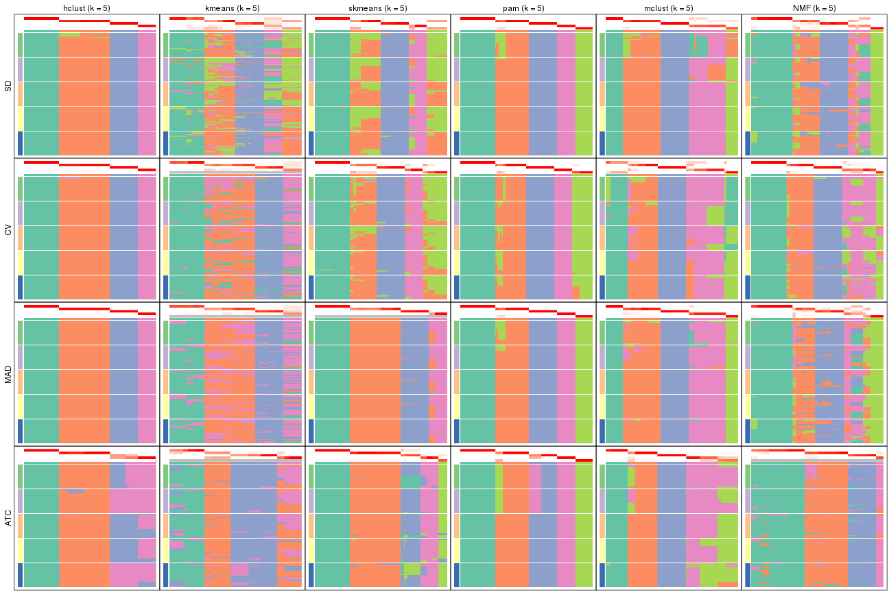</p>

</div>
<div id='tab-collect-membership-heatmap-5'>
<pre><code class="r">collect_plots(res_list, k = 6, fun = membership_heatmap, mc.cores = 4)
</code></pre>

<p></p>

</div>
</div>


### Signature heatmap

Signature heatmaps for all methods. ([What is a signature heatmap?](http://bioconductor.org/packages/devel/bioc/vignettes/cola/inst/doc/cola.html#toc_22))


Note in following heatmaps, rows are scaled.


<script>
$( function() {
	$( '#tabs-collect-get-signatures' ).tabs();
} );
</script>
<div id='tabs-collect-get-signatures'>
<ul>
<li><a href='#tab-collect-get-signatures-1'>k = 2</a></li>
<li><a href='#tab-collect-get-signatures-2'>k = 3</a></li>
<li><a href='#tab-collect-get-signatures-3'>k = 4</a></li>
<li><a href='#tab-collect-get-signatures-4'>k = 5</a></li>
<li><a href='#tab-collect-get-signatures-5'>k = 6</a></li>
</ul>
<div id='tab-collect-get-signatures-1'>
<pre><code class="r">collect_plots(res_list, k = 2, fun = get_signatures, mc.cores = 4)
</code></pre>

<p></p>

</div>
<div id='tab-collect-get-signatures-2'>
<pre><code class="r">collect_plots(res_list, k = 3, fun = get_signatures, mc.cores = 4)
</code></pre>

<p>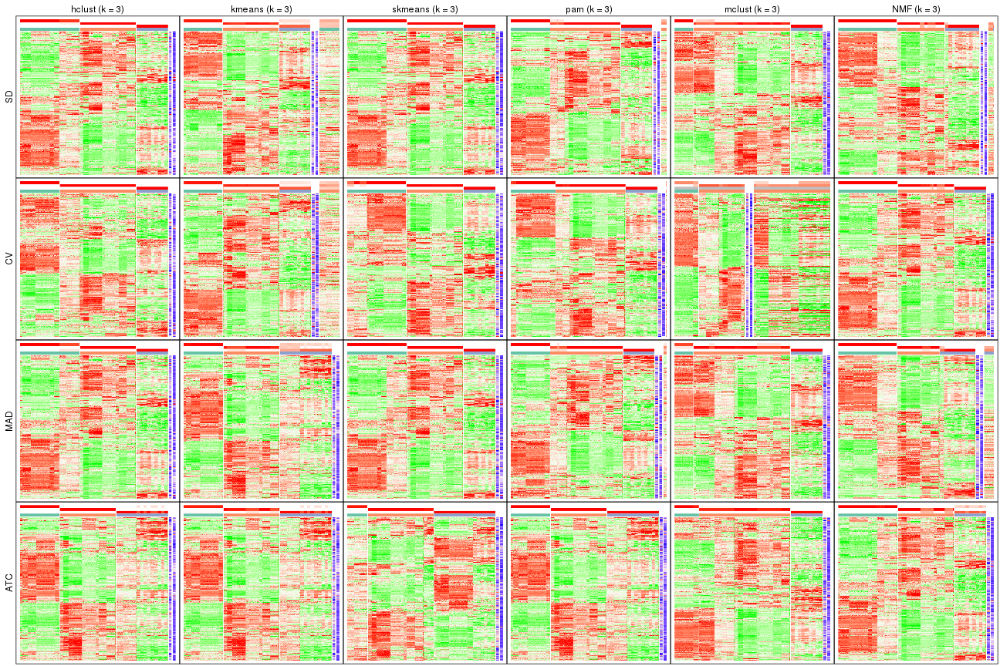</p>

</div>
<div id='tab-collect-get-signatures-3'>
<pre><code class="r">collect_plots(res_list, k = 4, fun = get_signatures, mc.cores = 4)
</code></pre>

<p></p>

</div>
<div id='tab-collect-get-signatures-4'>
<pre><code class="r">collect_plots(res_list, k = 5, fun = get_signatures, mc.cores = 4)
</code></pre>

<p></p>

</div>
<div id='tab-collect-get-signatures-5'>
<pre><code class="r">collect_plots(res_list, k = 6, fun = get_signatures, mc.cores = 4)
</code></pre>

<p></p>

</div>
</div>


### Statistics table

The statistics used for measuring the stability of consensus partitioning.
([How are they
defined?](http://bioconductor.org/packages/devel/bioc/vignettes/cola/inst/doc/cola.html#toc_13))


<script>
$( function() {
	$( '#tabs-get-stats-from-consensus-partition-list' ).tabs();
} );
</script>
<div id='tabs-get-stats-from-consensus-partition-list'>
<ul>
<li><a href='#tab-get-stats-from-consensus-partition-list-1'>k = 2</a></li>
<li><a href='#tab-get-stats-from-consensus-partition-list-2'>k = 3</a></li>
<li><a href='#tab-get-stats-from-consensus-partition-list-3'>k = 4</a></li>
<li><a href='#tab-get-stats-from-consensus-partition-list-4'>k = 5</a></li>
<li><a href='#tab-get-stats-from-consensus-partition-list-5'>k = 6</a></li>
</ul>
<div id='tab-get-stats-from-consensus-partition-list-1'>
<pre><code class="r">get_stats(res_list, k = 2)
</code></pre>

<pre><code>#&gt;             k 1-PAC mean_silhouette concordance area_increased  Rand Jaccard
#&gt; SD:NMF      2 0.970           0.931       0.967          0.489 0.507   0.507
#&gt; CV:NMF      2 0.457           0.864       0.904          0.489 0.504   0.504
#&gt; MAD:NMF     2 1.000           1.000       1.000          0.474 0.526   0.526
#&gt; ATC:NMF     2 1.000           1.000       1.000          0.474 0.526   0.526
#&gt; SD:skmeans  2 0.664           0.841       0.930          0.498 0.504   0.504
#&gt; CV:skmeans  2 0.677           0.929       0.902          0.501 0.499   0.499
#&gt; MAD:skmeans 2 0.680           0.894       0.948          0.498 0.504   0.504
#&gt; ATC:skmeans 2 0.722           0.902       0.955          0.500 0.498   0.498
#&gt; SD:mclust   2 0.492           0.846       0.902          0.465 0.505   0.505
#&gt; CV:mclust   2 0.302           0.766       0.876          0.365 0.607   0.607
#&gt; MAD:mclust  2 0.436           0.907       0.928          0.461 0.505   0.505
#&gt; ATC:mclust  2 0.463           0.845       0.900          0.453 0.525   0.525
#&gt; SD:kmeans   2 0.470           0.825       0.866          0.460 0.526   0.526
#&gt; CV:kmeans   2 0.356           0.688       0.843          0.456 0.499   0.499
#&gt; MAD:kmeans  2 0.524           0.828       0.895          0.473 0.526   0.526
#&gt; ATC:kmeans  2 0.670           0.768       0.833          0.478 0.524   0.524
#&gt; SD:pam      2 0.866           0.910       0.963          0.454 0.553   0.553
#&gt; CV:pam      2 0.895           0.950       0.974          0.475 0.528   0.528
#&gt; MAD:pam     2 0.870           0.909       0.963          0.468 0.549   0.549
#&gt; ATC:pam     2 0.648           0.873       0.923          0.476 0.524   0.524
#&gt; SD:hclust   2 1.000           0.984       0.990          0.476 0.526   0.526
#&gt; CV:hclust   2 1.000           0.993       0.988          0.392 0.607   0.607
#&gt; MAD:hclust  2 1.000           1.000       1.000          0.474 0.526   0.526
#&gt; ATC:hclust  2 1.000           1.000       1.000          0.474 0.526   0.526
</code></pre>

</div>
<div id='tab-get-stats-from-consensus-partition-list-2'>
<pre><code class="r">get_stats(res_list, k = 3)
</code></pre>

<pre><code>#&gt;             k 1-PAC mean_silhouette concordance area_increased  Rand Jaccard
#&gt; SD:NMF      3 0.898           0.913       0.958          0.337 0.788   0.602
#&gt; CV:NMF      3 0.968           0.959       0.978          0.333 0.810   0.637
#&gt; MAD:NMF     3 0.901           0.914       0.958          0.383 0.732   0.528
#&gt; ATC:NMF     3 0.692           0.910       0.896          0.319 0.826   0.670
#&gt; SD:skmeans  3 1.000           0.999       0.999          0.300 0.810   0.637
#&gt; CV:skmeans  3 0.929           0.960       0.980          0.289 0.710   0.493
#&gt; MAD:skmeans 3 1.000           0.999       0.999          0.301 0.810   0.637
#&gt; ATC:skmeans 3 1.000           0.995       0.995          0.220 0.874   0.752
#&gt; SD:mclust   3 0.875           0.935       0.949          0.143 0.596   0.424
#&gt; CV:mclust   3 0.368           0.497       0.625          0.613 0.815   0.757
#&gt; MAD:mclust  3 0.709           0.954       0.956          0.123 0.596   0.424
#&gt; ATC:mclust  3 1.000           0.981       0.981          0.206 0.624   0.446
#&gt; SD:kmeans   3 0.677           0.810       0.839          0.338 0.826   0.670
#&gt; CV:kmeans   3 0.638           0.850       0.865          0.361 0.885   0.770
#&gt; MAD:kmeans  3 0.590           0.874       0.820          0.325 0.812   0.643
#&gt; ATC:kmeans  3 0.741           0.944       0.953          0.375 0.703   0.488
#&gt; SD:pam      3 0.887           0.943       0.972          0.376 0.792   0.636
#&gt; CV:pam      3 1.000           0.985       0.994          0.328 0.794   0.625
#&gt; MAD:pam     3 0.878           0.939       0.967          0.346 0.794   0.638
#&gt; ATC:pam     3 1.000           1.000       1.000          0.391 0.703   0.488
#&gt; SD:hclust   3 1.000           0.985       0.990          0.355 0.826   0.670
#&gt; CV:hclust   3 1.000           1.000       1.000          0.571 0.777   0.633
#&gt; MAD:hclust  3 0.868           0.974       0.983          0.370 0.826   0.670
#&gt; ATC:hclust  3 0.879           0.974       0.982          0.393 0.812   0.643
</code></pre>

</div>
<div id='tab-get-stats-from-consensus-partition-list-3'>
<pre><code class="r">get_stats(res_list, k = 4)
</code></pre>

<pre><code>#&gt;             k 1-PAC mean_silhouette concordance area_increased  Rand Jaccard
#&gt; SD:NMF      4 0.837           0.841       0.902        0.08217 0.937   0.818
#&gt; CV:NMF      4 0.823           0.887       0.925        0.13806 0.805   0.515
#&gt; MAD:NMF     4 0.761           0.776       0.884        0.07314 0.960   0.883
#&gt; ATC:NMF     4 0.969           0.959       0.970        0.10223 0.963   0.896
#&gt; SD:skmeans  4 1.000           0.990       0.984        0.11246 0.927   0.792
#&gt; CV:skmeans  4 1.000           0.990       0.991        0.11875 0.925   0.789
#&gt; MAD:skmeans 4 1.000           0.995       0.992        0.11218 0.927   0.792
#&gt; ATC:skmeans 4 0.923           0.893       0.954        0.13149 0.925   0.808
#&gt; SD:mclust   4 0.721           0.897       0.891        0.31459 0.786   0.568
#&gt; CV:mclust   4 0.791           0.818       0.909        0.24662 0.464   0.292
#&gt; MAD:mclust  4 0.832           0.952       0.958        0.37969 0.786   0.568
#&gt; ATC:mclust  4 0.767           0.890       0.909        0.28775 0.821   0.608
#&gt; SD:kmeans   4 0.618           0.901       0.808        0.12558 0.927   0.792
#&gt; CV:kmeans   4 0.616           0.879       0.815        0.11769 0.895   0.728
#&gt; MAD:kmeans  4 0.596           0.801       0.792        0.11137 1.000   1.000
#&gt; ATC:kmeans  4 0.801           0.875       0.865        0.08753 1.000   1.000
#&gt; SD:pam      4 0.928           0.973       0.974        0.15650 0.895   0.728
#&gt; CV:pam      4 0.883           0.941       0.956        0.14904 0.896   0.724
#&gt; MAD:pam     4 1.000           1.000       1.000        0.14564 0.895   0.728
#&gt; ATC:pam     4 0.853           0.896       0.919        0.08861 0.941   0.826
#&gt; SD:hclust   4 1.000           1.000       1.000        0.11682 0.927   0.792
#&gt; CV:hclust   4 0.895           0.999       0.967        0.13033 0.895   0.728
#&gt; MAD:hclust  4 1.000           1.000       1.000        0.10981 0.927   0.792
#&gt; ATC:hclust  4 0.879           0.963       0.982        0.00311 0.998   0.994
</code></pre>

</div>
<div id='tab-get-stats-from-consensus-partition-list-4'>
<pre><code class="r">get_stats(res_list, k = 5)
</code></pre>

<pre><code>#&gt;             k 1-PAC mean_silhouette concordance area_increased  Rand Jaccard
#&gt; SD:NMF      5 0.782           0.796       0.857        0.07193 0.867   0.583
#&gt; CV:NMF      5 0.900           0.867       0.900        0.05431 0.971   0.887
#&gt; MAD:NMF     5 0.730           0.788       0.837        0.07561 0.863   0.581
#&gt; ATC:NMF     5 0.769           0.877       0.900        0.03627 1.000   1.000
#&gt; SD:skmeans  5 0.913           0.759       0.817        0.05719 0.930   0.749
#&gt; CV:skmeans  5 0.872           0.859       0.903        0.07669 0.927   0.739
#&gt; MAD:skmeans 5 0.905           0.898       0.907        0.04934 1.000   1.000
#&gt; ATC:skmeans 5 0.919           0.964       0.941        0.05760 0.925   0.771
#&gt; SD:mclust   5 0.772           0.918       0.916        0.09298 0.944   0.802
#&gt; CV:mclust   5 0.826           0.802       0.856        0.06015 0.942   0.780
#&gt; MAD:mclust  5 0.929           0.953       0.965        0.08092 0.944   0.802
#&gt; ATC:mclust  5 0.852           0.909       0.884        0.10141 0.926   0.734
#&gt; SD:kmeans   5 0.579           0.764       0.698        0.06606 0.930   0.751
#&gt; CV:kmeans   5 0.611           0.829       0.797        0.07239 1.000   1.000
#&gt; MAD:kmeans  5 0.680           0.837       0.785        0.07438 0.941   0.826
#&gt; ATC:kmeans  5 0.771           0.810       0.743        0.05129 0.927   0.784
#&gt; SD:pam      5 0.952           0.976       0.986        0.09031 0.934   0.765
#&gt; CV:pam      5 0.952           0.941       0.972        0.08989 0.930   0.749
#&gt; MAD:pam     5 0.962           0.977       0.986        0.09331 0.934   0.765
#&gt; ATC:pam     5 0.915           0.891       0.940        0.09374 0.934   0.765
#&gt; SD:hclust   5 1.000           0.990       0.994        0.00554 0.999   0.995
#&gt; CV:hclust   5 1.000           0.994       0.998        0.03742 0.999   0.995
#&gt; MAD:hclust  5 1.000           0.997       1.000        0.00182 0.999   0.995
#&gt; ATC:hclust  5 0.926           0.851       0.886        0.05325 0.945   0.836
</code></pre>

</div>
<div id='tab-get-stats-from-consensus-partition-list-5'>
<pre><code class="r">get_stats(res_list, k = 6)
</code></pre>

<pre><code>#&gt;             k 1-PAC mean_silhouette concordance area_increased  Rand Jaccard
#&gt; SD:NMF      6 0.967           0.909       0.944         0.0576 0.943   0.755
#&gt; CV:NMF      6 0.963           0.908       0.938         0.0345 0.956   0.809
#&gt; MAD:NMF     6 0.915           0.895       0.928         0.0540 0.953   0.799
#&gt; ATC:NMF     6 0.831           0.904       0.886         0.0517 0.927   0.768
#&gt; SD:skmeans  6 0.855           0.916       0.901         0.0434 0.943   0.756
#&gt; CV:skmeans  6 0.881           0.848       0.869         0.0310 0.976   0.892
#&gt; MAD:skmeans 6 0.866           0.921       0.897         0.0440 0.922   0.721
#&gt; ATC:skmeans 6 0.911           0.937       0.928         0.0360 0.992   0.968
#&gt; SD:mclust   6 0.874           0.938       0.911         0.0532 0.957   0.812
#&gt; CV:mclust   6 0.838           0.802       0.833         0.0436 0.958   0.808
#&gt; MAD:mclust  6 1.000           0.970       0.980         0.0485 0.962   0.832
#&gt; ATC:mclust  6 0.950           0.931       0.930         0.0524 0.978   0.895
#&gt; SD:kmeans   6 0.698           0.728       0.712         0.0523 1.000   1.000
#&gt; CV:kmeans   6 0.679           0.668       0.717         0.0391 0.965   0.875
#&gt; MAD:kmeans  6 0.717           0.825       0.782         0.0466 0.934   0.765
#&gt; ATC:kmeans  6 0.768           0.722       0.730         0.0449 0.963   0.873
#&gt; SD:pam      6 1.000           0.994       0.997         0.0269 0.978   0.897
#&gt; CV:pam      6 1.000           0.979       0.989         0.0165 0.989   0.948
#&gt; MAD:pam     6 1.000           0.991       0.995         0.0273 0.978   0.897
#&gt; ATC:pam     6 0.925           0.918       0.918         0.0298 0.977   0.894
#&gt; SD:hclust   6 0.962           0.941       0.975         0.0809 0.945   0.802
#&gt; CV:hclust   6 0.934           0.954       0.969         0.0211 1.000   1.000
#&gt; MAD:hclust  6 0.962           0.944       0.976         0.0890 0.929   0.746
#&gt; ATC:hclust  6 0.854           0.942       0.891         0.0724 0.888   0.629
</code></pre>

</div>
</div>

Following heatmap plots the partition for each combination of methods and the
lightness correspond to the silhouette scores for samples in each method. On
top the consensus subgroup is inferred from all methods by taking the mean
silhouette scores as weight.


<script>
$( function() {
	$( '#tabs-collect-stats-from-consensus-partition-list' ).tabs();
} );
</script>
<div id='tabs-collect-stats-from-consensus-partition-list'>
<ul>
<li><a href='#tab-collect-stats-from-consensus-partition-list-1'>k = 2</a></li>
<li><a href='#tab-collect-stats-from-consensus-partition-list-2'>k = 3</a></li>
<li><a href='#tab-collect-stats-from-consensus-partition-list-3'>k = 4</a></li>
<li><a href='#tab-collect-stats-from-consensus-partition-list-4'>k = 5</a></li>
<li><a href='#tab-collect-stats-from-consensus-partition-list-5'>k = 6</a></li>
</ul>
<div id='tab-collect-stats-from-consensus-partition-list-1'>
<pre><code class="r">collect_stats(res_list, k = 2)
</code></pre>

<p></p>

</div>
<div id='tab-collect-stats-from-consensus-partition-list-2'>
<pre><code class="r">collect_stats(res_list, k = 3)
</code></pre>

<p></p>

</div>
<div id='tab-collect-stats-from-consensus-partition-list-3'>
<pre><code class="r">collect_stats(res_list, k = 4)
</code></pre>

<p></p>

</div>
<div id='tab-collect-stats-from-consensus-partition-list-4'>
<pre><code class="r">collect_stats(res_list, k = 5)
</code></pre>

<p></p>

</div>
<div id='tab-collect-stats-from-consensus-partition-list-5'>
<pre><code class="r">collect_stats(res_list, k = 6)
</code></pre>

<p></p>

</div>
</div>

### Partition from all methods


Collect partitions from all methods:


<script>
$( function() {
	$( '#tabs-collect-classes-from-consensus-partition-list' ).tabs();
} );
</script>
<div id='tabs-collect-classes-from-consensus-partition-list'>
<ul>
<li><a href='#tab-collect-classes-from-consensus-partition-list-1'>k = 2</a></li>
<li><a href='#tab-collect-classes-from-consensus-partition-list-2'>k = 3</a></li>
<li><a href='#tab-collect-classes-from-consensus-partition-list-3'>k = 4</a></li>
<li><a href='#tab-collect-classes-from-consensus-partition-list-4'>k = 5</a></li>
<li><a href='#tab-collect-classes-from-consensus-partition-list-5'>k = 6</a></li>
</ul>
<div id='tab-collect-classes-from-consensus-partition-list-1'>
<pre><code class="r">collect_classes(res_list, k = 2)
</code></pre>

<p></p>

</div>
<div id='tab-collect-classes-from-consensus-partition-list-2'>
<pre><code class="r">collect_classes(res_list, k = 3)
</code></pre>

<p></p>

</div>
<div id='tab-collect-classes-from-consensus-partition-list-3'>
<pre><code class="r">collect_classes(res_list, k = 4)
</code></pre>

<p></p>

</div>
<div id='tab-collect-classes-from-consensus-partition-list-4'>
<pre><code class="r">collect_classes(res_list, k = 5)
</code></pre>

<p></p>

</div>
<div id='tab-collect-classes-from-consensus-partition-list-5'>
<pre><code class="r">collect_classes(res_list, k = 6)
</code></pre>

<p></p>

</div>
</div>


### Top rows overlap


Overlap of top rows from different top-row methods:


<script>
$( function() {
	$( '#tabs-top-rows-overlap-by-euler' ).tabs();
} );
</script>
<div id='tabs-top-rows-overlap-by-euler'>
<ul>
<li><a href='#tab-top-rows-overlap-by-euler-1'>top_n = 1000</a></li>
<li><a href='#tab-top-rows-overlap-by-euler-2'>top_n = 2000</a></li>
<li><a href='#tab-top-rows-overlap-by-euler-3'>top_n = 3000</a></li>
<li><a href='#tab-top-rows-overlap-by-euler-4'>top_n = 4000</a></li>
<li><a href='#tab-top-rows-overlap-by-euler-5'>top_n = 5000</a></li>
</ul>
<div id='tab-top-rows-overlap-by-euler-1'>
<pre><code class="r">top_rows_overlap(res_list, top_n = 1000, method = &quot;euler&quot;)
</code></pre>

<p></p>

</div>
<div id='tab-top-rows-overlap-by-euler-2'>
<pre><code class="r">top_rows_overlap(res_list, top_n = 2000, method = &quot;euler&quot;)
</code></pre>

<p></p>

</div>
<div id='tab-top-rows-overlap-by-euler-3'>
<pre><code class="r">top_rows_overlap(res_list, top_n = 3000, method = &quot;euler&quot;)
</code></pre>

<p></p>

</div>
<div id='tab-top-rows-overlap-by-euler-4'>
<pre><code class="r">top_rows_overlap(res_list, top_n = 4000, method = &quot;euler&quot;)
</code></pre>

<p></p>

</div>
<div id='tab-top-rows-overlap-by-euler-5'>
<pre><code class="r">top_rows_overlap(res_list, top_n = 5000, method = &quot;euler&quot;)
</code></pre>

<p>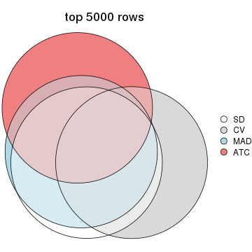</p>

</div>
</div>

Also visualize the correspondance of rankings between different top-row methods:


<script>
$( function() {
	$( '#tabs-top-rows-overlap-by-correspondance' ).tabs();
} );
</script>
<div id='tabs-top-rows-overlap-by-correspondance'>
<ul>
<li><a href='#tab-top-rows-overlap-by-correspondance-1'>top_n = 1000</a></li>
<li><a href='#tab-top-rows-overlap-by-correspondance-2'>top_n = 2000</a></li>
<li><a href='#tab-top-rows-overlap-by-correspondance-3'>top_n = 3000</a></li>
<li><a href='#tab-top-rows-overlap-by-correspondance-4'>top_n = 4000</a></li>
<li><a href='#tab-top-rows-overlap-by-correspondance-5'>top_n = 5000</a></li>
</ul>
<div id='tab-top-rows-overlap-by-correspondance-1'>
<pre><code class="r">top_rows_overlap(res_list, top_n = 1000, method = &quot;correspondance&quot;)
</code></pre>

<p></p>

</div>
<div id='tab-top-rows-overlap-by-correspondance-2'>
<pre><code class="r">top_rows_overlap(res_list, top_n = 2000, method = &quot;correspondance&quot;)
</code></pre>

<p></p>

</div>
<div id='tab-top-rows-overlap-by-correspondance-3'>
<pre><code class="r">top_rows_overlap(res_list, top_n = 3000, method = &quot;correspondance&quot;)
</code></pre>

<p></p>

</div>
<div id='tab-top-rows-overlap-by-correspondance-4'>
<pre><code class="r">top_rows_overlap(res_list, top_n = 4000, method = &quot;correspondance&quot;)
</code></pre>

<p></p>

</div>
<div id='tab-top-rows-overlap-by-correspondance-5'>
<pre><code class="r">top_rows_overlap(res_list, top_n = 5000, method = &quot;correspondance&quot;)
</code></pre>

<p>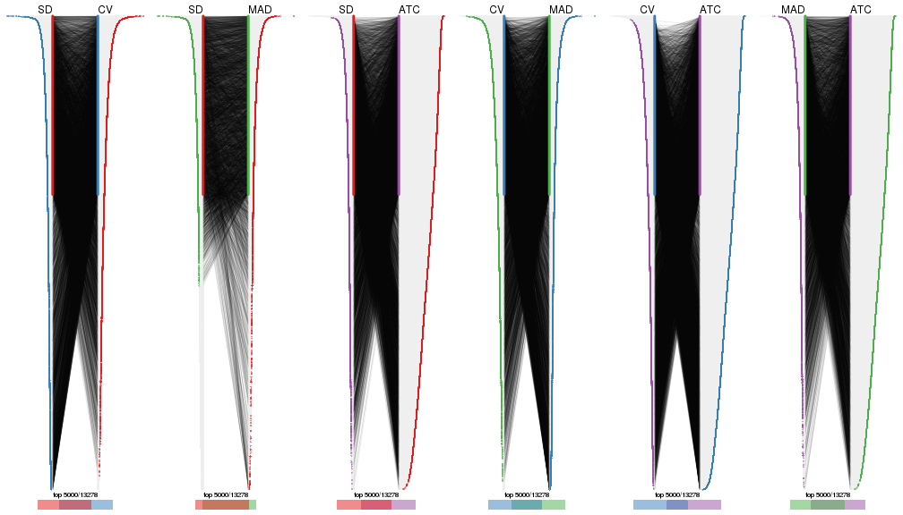</p>

</div>
</div>


Heatmaps of the top rows:


<script>
$( function() {
	$( '#tabs-top-rows-heatmap' ).tabs();
} );
</script>
<div id='tabs-top-rows-heatmap'>
<ul>
<li><a href='#tab-top-rows-heatmap-1'>top_n = 1000</a></li>
<li><a href='#tab-top-rows-heatmap-2'>top_n = 2000</a></li>
<li><a href='#tab-top-rows-heatmap-3'>top_n = 3000</a></li>
<li><a href='#tab-top-rows-heatmap-4'>top_n = 4000</a></li>
<li><a href='#tab-top-rows-heatmap-5'>top_n = 5000</a></li>
</ul>
<div id='tab-top-rows-heatmap-1'>
<pre><code class="r">top_rows_heatmap(res_list, top_n = 1000)
</code></pre>

<p></p>

</div>
<div id='tab-top-rows-heatmap-2'>
<pre><code class="r">top_rows_heatmap(res_list, top_n = 2000)
</code></pre>

<p></p>

</div>
<div id='tab-top-rows-heatmap-3'>
<pre><code class="r">top_rows_heatmap(res_list, top_n = 3000)
</code></pre>

<p></p>

</div>
<div id='tab-top-rows-heatmap-4'>
<pre><code class="r">top_rows_heatmap(res_list, top_n = 4000)
</code></pre>

<p></p>

</div>
<div id='tab-top-rows-heatmap-5'>
<pre><code class="r">top_rows_heatmap(res_list, top_n = 5000)
</code></pre>

<p></p>

</div>
</div>


 
## Results for each method


---------------------------------------------------


### SD:hclust**


The object with results only for a single top-value method and a single partition method 
can be extracted as:

```r
res = res_list["SD", "hclust"]
# you can also extract it by
# res = res_list["SD:hclust"]
```

A summary of `res` and all the functions that can be applied to it:

```r
res
```

```
#> A 'ConsensusPartition' object with k = 2, 3, 4, 5, 6.
#>   On a matrix with 13278 rows and 322 columns.
#>   Top rows (1000, 2000, 3000, 4000, 5000) are extracted by 'SD' method.
#>   Subgroups are detected by 'hclust' method.
#>   Performed in total 1250 partitions by row resampling.
#>   Best k for subgroups seems to be 6.
#> 
#> Following methods can be applied to this 'ConsensusPartition' object:
#>  [1] "cola_report"             "collect_classes"         "collect_plots"          
#>  [4] "collect_stats"           "colnames"                "compare_signatures"     
#>  [7] "consensus_heatmap"       "dimension_reduction"     "functional_enrichment"  
#> [10] "get_anno_col"            "get_anno"                "get_classes"            
#> [13] "get_consensus"           "get_matrix"              "get_membership"         
#> [16] "get_param"               "get_signatures"          "get_stats"              
#> [19] "is_best_k"               "is_stable_k"             "membership_heatmap"     
#> [22] "ncol"                    "nrow"                    "plot_ecdf"              
#> [25] "rownames"                "select_partition_number" "show"                   
#> [28] "suggest_best_k"          "test_to_known_factors"
```

`collect_plots()` function collects all the plots made from `res` for all `k` (number of partitions)
into one single page to provide an easy and fast comparison between different `k`.

```r
collect_plots(res)
```


The plots are:

- The first row: a plot of the ECDF (empirical cumulative distribution
  function) curves of the consensus matrix for each `k` and the heatmap of
  predicted classes for each `k`.
- The second row: heatmaps of the consensus matrix for each `k`.
- The third row: heatmaps of the membership matrix for each `k`.
- The fouth row: heatmaps of the signatures for each `k`.

All the plots in panels can be made by individual functions and they are
plotted later in this section.

`select_partition_number()` produces several plots showing different
statistics for choosing "optimized" `k`. There are following statistics:

- ECDF curves of the consensus matrix for each `k`;
- 1-PAC. [The PAC
  score](https://en.wikipedia.org/wiki/Consensus_clustering#Over-interpretation_potential_of_consensus_clustering)
  measures the proportion of the ambiguous subgrouping.
- Mean silhouette score.
- Concordance. The mean probability of fiting the consensus class ids in all
  partitions.
- Area increased. Denote $A_k$ as the area under the ECDF curve for current
  `k`, the area increased is defined as $A_k - A_{k-1}$.
- Rand index. The percent of pairs of samples that are both in a same cluster
  or both are not in a same cluster in the partition of k and k-1.
- Jaccard index. The ratio of pairs of samples are both in a same cluster in
  the partition of k and k-1 and the pairs of samples are both in a same
  cluster in the partition k or k-1.

The detailed explanations of these statistics can be found in [the _cola_
vignette](http://bioconductor.org/packages/devel/bioc/vignettes/cola/inst/doc/cola.html#toc_13).

Generally speaking, lower PAC score, higher mean silhouette score or higher
concordance corresponds to better partition. Rand index and Jaccard index
measure how similar the current partition is compared to partition with `k-1`.
If they are too similar, we won't accept `k` is better than `k-1`.

```r
select_partition_number(res)
```


The numeric values for all these statistics can be obtained by `get_stats()`.

```r
get_stats(res)
```

```
#>   k 1-PAC mean_silhouette concordance area_increased  Rand Jaccard
#> 2 2 1.000           0.984       0.990        0.47608 0.526   0.526
#> 3 3 1.000           0.985       0.990        0.35544 0.826   0.670
#> 4 4 1.000           1.000       1.000        0.11682 0.927   0.792
#> 5 5 1.000           0.990       0.994        0.00554 0.999   0.995
#> 6 6 0.962           0.941       0.975        0.08094 0.945   0.802
```

`suggest_best_k()` suggests the best $k$ based on these statistics. The rules are as follows:

- All $k$ with Jaccard index larger than 0.95 are removed because increasing
  $k$ does not provide enough extra information. If all $k$ are removed, it is
  marked as no subgroup is detected.
- For all $k$ with 1-PAC score larger than 0.9, the maximal $k$ is taken as
  the best $k$, and other $k$ are marked as optional $k$.
- If it does not fit the second rule. The $k$ with the maximal vote of the
  highest 1-PAC score, highest mean silhouette, and highest concordance is
  taken as the best $k$.

```r
suggest_best_k(res)
```

```
#> [1] 6
#> attr(,"optional")
#> [1] 2 3 4
```

There is also optional best $k$ = 2 3 4 that is worth to check.

Following shows the table of the partitions (You need to click the **show/hide
code output** link to see it). The membership matrix (columns with name `p*`)
is inferred by
[`clue::cl_consensus()`](https://www.rdocumentation.org/link/cl_consensus?package=clue)
function with the `SE` method. Basically the value in the membership matrix
represents the probability to belong to a certain group. The finall class
label for an item is determined with the group with highest probability it
belongs to.

In `get_classes()` function, the entropy is calculated from the membership
matrix and the silhouette score is calculated from the consensus matrix.


<script>
$( function() {
	$( '#tabs-SD-hclust-get-classes' ).tabs();
} );
</script>
<div id='tabs-SD-hclust-get-classes'>
<ul>
<li><a href='#tab-SD-hclust-get-classes-1'>k = 2</a></li>
<li><a href='#tab-SD-hclust-get-classes-2'>k = 3</a></li>
<li><a href='#tab-SD-hclust-get-classes-3'>k = 4</a></li>
<li><a href='#tab-SD-hclust-get-classes-4'>k = 5</a></li>
<li><a href='#tab-SD-hclust-get-classes-5'>k = 6</a></li>
</ul>

<div id='tab-SD-hclust-get-classes-1'>
<p><a id='tab-SD-hclust-get-classes-1-a' style='color:#0366d6' href='#'>show/hide code output</a></p>
<pre><code class="r">cbind(get_classes(res, k = 2), get_membership(res, k = 2))
</code></pre>

<pre><code>#&gt;           class entropy silhouette    p1    p2
#&gt; DRR023371     1   0.000      0.984 1.000 0.000
#&gt; DRR023372     1   0.000      0.984 1.000 0.000
#&gt; DRR023373     1   0.000      0.984 1.000 0.000
#&gt; DRR023374     1   0.000      0.984 1.000 0.000
#&gt; DRR023375     1   0.000      0.984 1.000 0.000
#&gt; DRR023376     1   0.000      0.984 1.000 0.000
#&gt; DRR023377     1   0.000      0.984 1.000 0.000
#&gt; DRR023378     1   0.000      0.984 1.000 0.000
#&gt; DRR023379     1   0.000      0.984 1.000 0.000
#&gt; DRR023380     1   0.000      0.984 1.000 0.000
#&gt; DRR023381     1   0.000      0.984 1.000 0.000
#&gt; DRR023382     1   0.000      0.984 1.000 0.000
#&gt; DRR023383     1   0.000      0.984 1.000 0.000
#&gt; DRR023384     1   0.000      0.984 1.000 0.000
#&gt; DRR023385     1   0.000      0.984 1.000 0.000
#&gt; DRR023386     1   0.000      0.984 1.000 0.000
#&gt; DRR023387     1   0.000      0.984 1.000 0.000
#&gt; DRR023388     1   0.000      0.984 1.000 0.000
#&gt; DRR023389     1   0.000      0.984 1.000 0.000
#&gt; DRR023390     1   0.000      0.984 1.000 0.000
#&gt; DRR023391     1   0.000      0.984 1.000 0.000
#&gt; DRR023392     1   0.000      0.984 1.000 0.000
#&gt; DRR023394     1   0.000      0.984 1.000 0.000
#&gt; DRR023395     1   0.000      0.984 1.000 0.000
#&gt; DRR023396     1   0.000      0.984 1.000 0.000
#&gt; DRR023397     1   0.000      0.984 1.000 0.000
#&gt; DRR023398     1   0.000      0.984 1.000 0.000
#&gt; DRR023399     1   0.000      0.984 1.000 0.000
#&gt; DRR023400     1   0.000      0.984 1.000 0.000
#&gt; DRR023401     1   0.000      0.984 1.000 0.000
#&gt; DRR023402     1   0.000      0.984 1.000 0.000
#&gt; DRR023403     1   0.000      0.984 1.000 0.000
#&gt; DRR023404     2   0.000      1.000 0.000 1.000
#&gt; DRR023405     2   0.000      1.000 0.000 1.000
#&gt; DRR023406     2   0.000      1.000 0.000 1.000
#&gt; DRR023407     2   0.000      1.000 0.000 1.000
#&gt; DRR023408     2   0.000      1.000 0.000 1.000
#&gt; DRR023409     2   0.000      1.000 0.000 1.000
#&gt; DRR023410     2   0.000      1.000 0.000 1.000
#&gt; DRR023411     2   0.000      1.000 0.000 1.000
#&gt; DRR023412     2   0.000      1.000 0.000 1.000
#&gt; DRR023413     2   0.000      1.000 0.000 1.000
#&gt; DRR023414     2   0.000      1.000 0.000 1.000
#&gt; DRR023415     2   0.000      1.000 0.000 1.000
#&gt; DRR023416     2   0.000      1.000 0.000 1.000
#&gt; DRR023417     2   0.000      1.000 0.000 1.000
#&gt; DRR023418     2   0.000      1.000 0.000 1.000
#&gt; DRR023419     2   0.000      1.000 0.000 1.000
#&gt; DRR023420     2   0.000      1.000 0.000 1.000
#&gt; DRR023421     2   0.000      1.000 0.000 1.000
#&gt; DRR023422     2   0.000      1.000 0.000 1.000
#&gt; DRR023423     2   0.000      1.000 0.000 1.000
#&gt; DRR023425     2   0.000      1.000 0.000 1.000
#&gt; DRR023426     2   0.000      1.000 0.000 1.000
#&gt; DRR023427     2   0.000      1.000 0.000 1.000
#&gt; DRR023428     2   0.000      1.000 0.000 1.000
#&gt; DRR023429     2   0.000      1.000 0.000 1.000
#&gt; DRR023430     2   0.000      1.000 0.000 1.000
#&gt; DRR023431     2   0.000      1.000 0.000 1.000
#&gt; DRR023432     2   0.000      1.000 0.000 1.000
#&gt; DRR023433     2   0.000      1.000 0.000 1.000
#&gt; DRR023434     2   0.000      1.000 0.000 1.000
#&gt; DRR023435     2   0.000      1.000 0.000 1.000
#&gt; DRR023436     2   0.000      1.000 0.000 1.000
#&gt; DRR023437     2   0.000      1.000 0.000 1.000
#&gt; DRR023438     2   0.000      1.000 0.000 1.000
#&gt; DRR023439     2   0.000      1.000 0.000 1.000
#&gt; DRR023440     2   0.000      1.000 0.000 1.000
#&gt; DRR023441     2   0.000      1.000 0.000 1.000
#&gt; DRR023442     2   0.000      1.000 0.000 1.000
#&gt; DRR023443     2   0.000      1.000 0.000 1.000
#&gt; DRR023444     2   0.000      1.000 0.000 1.000
#&gt; DRR023445     2   0.000      1.000 0.000 1.000
#&gt; DRR023446     2   0.000      1.000 0.000 1.000
#&gt; DRR023447     2   0.000      1.000 0.000 1.000
#&gt; DRR023448     2   0.000      1.000 0.000 1.000
#&gt; DRR023449     2   0.000      1.000 0.000 1.000
#&gt; DRR023450     2   0.000      1.000 0.000 1.000
#&gt; DRR023451     2   0.000      1.000 0.000 1.000
#&gt; DRR023452     2   0.000      1.000 0.000 1.000
#&gt; DRR023453     1   0.000      0.984 1.000 0.000
#&gt; DRR023454     1   0.000      0.984 1.000 0.000
#&gt; DRR023455     1   0.000      0.984 1.000 0.000
#&gt; DRR023456     1   0.000      0.984 1.000 0.000
#&gt; DRR023457     1   0.000      0.984 1.000 0.000
#&gt; DRR023458     1   0.000      0.984 1.000 0.000
#&gt; DRR023459     1   0.000      0.984 1.000 0.000
#&gt; DRR023460     1   0.000      0.984 1.000 0.000
#&gt; DRR023461     1   0.000      0.984 1.000 0.000
#&gt; DRR023462     1   0.000      0.984 1.000 0.000
#&gt; DRR023463     1   0.000      0.984 1.000 0.000
#&gt; DRR023464     1   0.000      0.984 1.000 0.000
#&gt; DRR023465     1   0.000      0.984 1.000 0.000
#&gt; DRR023466     1   0.000      0.984 1.000 0.000
#&gt; DRR023467     1   0.000      0.984 1.000 0.000
#&gt; DRR023468     1   0.000      0.984 1.000 0.000
#&gt; DRR023469     1   0.000      0.984 1.000 0.000
#&gt; DRR023470     1   0.000      0.984 1.000 0.000
#&gt; DRR023471     1   0.000      0.984 1.000 0.000
#&gt; DRR023472     1   0.000      0.984 1.000 0.000
#&gt; DRR023473     1   0.000      0.984 1.000 0.000
#&gt; DRR023474     1   0.000      0.984 1.000 0.000
#&gt; DRR023475     1   0.000      0.984 1.000 0.000
#&gt; DRR023476     1   0.000      0.984 1.000 0.000
#&gt; DRR023477     1   0.000      0.984 1.000 0.000
#&gt; DRR023478     1   0.000      0.984 1.000 0.000
#&gt; DRR023479     1   0.000      0.984 1.000 0.000
#&gt; DRR023480     1   0.000      0.984 1.000 0.000
#&gt; DRR023481     1   0.000      0.984 1.000 0.000
#&gt; DRR023482     1   0.000      0.984 1.000 0.000
#&gt; DRR023483     1   0.000      0.984 1.000 0.000
#&gt; DRR023484     1   0.000      0.984 1.000 0.000
#&gt; DRR023485     1   0.000      0.984 1.000 0.000
#&gt; DRR023486     1   0.000      0.984 1.000 0.000
#&gt; DRR023487     1   0.000      0.984 1.000 0.000
#&gt; DRR023488     1   0.000      0.984 1.000 0.000
#&gt; DRR023489     1   0.000      0.984 1.000 0.000
#&gt; DRR023490     1   0.000      0.984 1.000 0.000
#&gt; DRR023491     1   0.000      0.984 1.000 0.000
#&gt; DRR023492     1   0.000      0.984 1.000 0.000
#&gt; DRR023493     1   0.000      0.984 1.000 0.000
#&gt; DRR023494     1   0.000      0.984 1.000 0.000
#&gt; DRR023495     1   0.000      0.984 1.000 0.000
#&gt; DRR023496     1   0.000      0.984 1.000 0.000
#&gt; DRR023497     1   0.000      0.984 1.000 0.000
#&gt; DRR023498     1   0.000      0.984 1.000 0.000
#&gt; DRR023499     1   0.000      0.984 1.000 0.000
#&gt; DRR023500     1   0.000      0.984 1.000 0.000
#&gt; DRR023501     1   0.000      0.984 1.000 0.000
#&gt; DRR023502     1   0.000      0.984 1.000 0.000
#&gt; DRR023503     1   0.000      0.984 1.000 0.000
#&gt; DRR023504     1   0.000      0.984 1.000 0.000
#&gt; DRR023505     1   0.000      0.984 1.000 0.000
#&gt; DRR023506     1   0.000      0.984 1.000 0.000
#&gt; DRR023507     1   0.000      0.984 1.000 0.000
#&gt; DRR023508     1   0.000      0.984 1.000 0.000
#&gt; DRR023509     1   0.000      0.984 1.000 0.000
#&gt; DRR023510     1   0.000      0.984 1.000 0.000
#&gt; DRR023511     1   0.000      0.984 1.000 0.000
#&gt; DRR023512     1   0.000      0.984 1.000 0.000
#&gt; DRR023513     1   0.000      0.984 1.000 0.000
#&gt; DRR023514     1   0.000      0.984 1.000 0.000
#&gt; DRR023515     1   0.000      0.984 1.000 0.000
#&gt; DRR023516     1   0.000      0.984 1.000 0.000
#&gt; DRR023517     1   0.000      0.984 1.000 0.000
#&gt; DRR023518     1   0.000      0.984 1.000 0.000
#&gt; DRR023519     1   0.000      0.984 1.000 0.000
#&gt; DRR023520     1   0.000      0.984 1.000 0.000
#&gt; DRR023521     1   0.000      0.984 1.000 0.000
#&gt; DRR023522     1   0.000      0.984 1.000 0.000
#&gt; DRR023523     1   0.000      0.984 1.000 0.000
#&gt; DRR023524     1   0.000      0.984 1.000 0.000
#&gt; DRR023525     1   0.000      0.984 1.000 0.000
#&gt; DRR023526     1   0.000      0.984 1.000 0.000
#&gt; DRR023527     1   0.000      0.984 1.000 0.000
#&gt; DRR023528     1   0.000      0.984 1.000 0.000
#&gt; DRR023529     1   0.000      0.984 1.000 0.000
#&gt; DRR023530     1   0.000      0.984 1.000 0.000
#&gt; DRR023531     1   0.000      0.984 1.000 0.000
#&gt; DRR023532     1   0.000      0.984 1.000 0.000
#&gt; DRR023533     1   0.000      0.984 1.000 0.000
#&gt; DRR023534     1   0.000      0.984 1.000 0.000
#&gt; DRR023535     1   0.000      0.984 1.000 0.000
#&gt; DRR023536     1   0.000      0.984 1.000 0.000
#&gt; DRR023537     1   0.000      0.984 1.000 0.000
#&gt; DRR023538     1   0.000      0.984 1.000 0.000
#&gt; DRR023539     1   0.000      0.984 1.000 0.000
#&gt; DRR023540     1   0.000      0.984 1.000 0.000
#&gt; DRR023541     1   0.000      0.984 1.000 0.000
#&gt; DRR023542     1   0.000      0.984 1.000 0.000
#&gt; DRR023543     1   0.000      0.984 1.000 0.000
#&gt; DRR023544     1   0.000      0.984 1.000 0.000
#&gt; DRR023545     1   0.000      0.984 1.000 0.000
#&gt; DRR023546     1   0.000      0.984 1.000 0.000
#&gt; DRR023547     1   0.000      0.984 1.000 0.000
#&gt; DRR023548     1   0.000      0.984 1.000 0.000
#&gt; DRR023549     1   0.000      0.984 1.000 0.000
#&gt; DRR023550     1   0.000      0.984 1.000 0.000
#&gt; DRR023551     1   0.000      0.984 1.000 0.000
#&gt; DRR023552     1   0.000      0.984 1.000 0.000
#&gt; DRR023553     1   0.000      0.984 1.000 0.000
#&gt; DRR023554     1   0.000      0.984 1.000 0.000
#&gt; DRR023555     1   0.000      0.984 1.000 0.000
#&gt; DRR023556     1   0.000      0.984 1.000 0.000
#&gt; DRR023557     1   0.000      0.984 1.000 0.000
#&gt; DRR023558     1   0.000      0.984 1.000 0.000
#&gt; DRR023559     1   0.000      0.984 1.000 0.000
#&gt; DRR023560     1   0.000      0.984 1.000 0.000
#&gt; DRR023561     1   0.000      0.984 1.000 0.000
#&gt; DRR023562     1   0.000      0.984 1.000 0.000
#&gt; DRR023563     1   0.000      0.984 1.000 0.000
#&gt; DRR023564     1   0.000      0.984 1.000 0.000
#&gt; DRR023565     1   0.000      0.984 1.000 0.000
#&gt; DRR023566     1   0.000      0.984 1.000 0.000
#&gt; DRR023567     1   0.000      0.984 1.000 0.000
#&gt; DRR023568     1   0.000      0.984 1.000 0.000
#&gt; DRR023569     1   0.000      0.984 1.000 0.000
#&gt; DRR023570     1   0.000      0.984 1.000 0.000
#&gt; DRR023571     1   0.000      0.984 1.000 0.000
#&gt; DRR023572     1   0.000      0.984 1.000 0.000
#&gt; DRR023573     1   0.000      0.984 1.000 0.000
#&gt; DRR023574     1   0.000      0.984 1.000 0.000
#&gt; DRR023575     1   0.000      0.984 1.000 0.000
#&gt; DRR023576     2   0.000      1.000 0.000 1.000
#&gt; DRR023577     2   0.000      1.000 0.000 1.000
#&gt; DRR023578     2   0.000      1.000 0.000 1.000
#&gt; DRR023579     2   0.000      1.000 0.000 1.000
#&gt; DRR023580     2   0.000      1.000 0.000 1.000
#&gt; DRR023581     2   0.000      1.000 0.000 1.000
#&gt; DRR023582     2   0.000      1.000 0.000 1.000
#&gt; DRR023583     2   0.000      1.000 0.000 1.000
#&gt; DRR023584     2   0.000      1.000 0.000 1.000
#&gt; DRR023585     2   0.000      1.000 0.000 1.000
#&gt; DRR023586     2   0.000      1.000 0.000 1.000
#&gt; DRR023587     2   0.000      1.000 0.000 1.000
#&gt; DRR023588     2   0.000      1.000 0.000 1.000
#&gt; DRR023589     2   0.000      1.000 0.000 1.000
#&gt; DRR023590     2   0.000      1.000 0.000 1.000
#&gt; DRR023591     2   0.000      1.000 0.000 1.000
#&gt; DRR023592     2   0.000      1.000 0.000 1.000
#&gt; DRR023593     2   0.000      1.000 0.000 1.000
#&gt; DRR023594     2   0.000      1.000 0.000 1.000
#&gt; DRR023595     2   0.000      1.000 0.000 1.000
#&gt; DRR023596     2   0.000      1.000 0.000 1.000
#&gt; DRR023597     2   0.000      1.000 0.000 1.000
#&gt; DRR023598     2   0.000      1.000 0.000 1.000
#&gt; DRR023599     2   0.000      1.000 0.000 1.000
#&gt; DRR023600     2   0.000      1.000 0.000 1.000
#&gt; DRR023601     2   0.000      1.000 0.000 1.000
#&gt; DRR023602     2   0.000      1.000 0.000 1.000
#&gt; DRR023603     2   0.000      1.000 0.000 1.000
#&gt; DRR023604     2   0.000      1.000 0.000 1.000
#&gt; DRR023605     2   0.000      1.000 0.000 1.000
#&gt; DRR023606     2   0.000      1.000 0.000 1.000
#&gt; DRR023607     2   0.000      1.000 0.000 1.000
#&gt; DRR023608     2   0.000      1.000 0.000 1.000
#&gt; DRR023609     2   0.000      1.000 0.000 1.000
#&gt; DRR023610     2   0.000      1.000 0.000 1.000
#&gt; DRR023611     2   0.000      1.000 0.000 1.000
#&gt; DRR023612     2   0.000      1.000 0.000 1.000
#&gt; DRR023613     2   0.000      1.000 0.000 1.000
#&gt; DRR023614     2   0.000      1.000 0.000 1.000
#&gt; DRR023615     2   0.000      1.000 0.000 1.000
#&gt; DRR023616     2   0.000      1.000 0.000 1.000
#&gt; DRR023617     2   0.000      1.000 0.000 1.000
#&gt; DRR023619     1   0.373      0.939 0.928 0.072
#&gt; DRR023620     1   0.373      0.939 0.928 0.072
#&gt; DRR023621     1   0.373      0.939 0.928 0.072
#&gt; DRR023622     1   0.373      0.939 0.928 0.072
#&gt; DRR023623     1   0.373      0.939 0.928 0.072
#&gt; DRR023624     1   0.373      0.939 0.928 0.072
#&gt; DRR023625     1   0.373      0.939 0.928 0.072
#&gt; DRR023626     1   0.373      0.939 0.928 0.072
#&gt; DRR023627     1   0.373      0.939 0.928 0.072
#&gt; DRR023628     1   0.373      0.939 0.928 0.072
#&gt; DRR023629     1   0.373      0.939 0.928 0.072
#&gt; DRR023630     1   0.373      0.939 0.928 0.072
#&gt; DRR023631     1   0.373      0.939 0.928 0.072
#&gt; DRR023632     1   0.373      0.939 0.928 0.072
#&gt; DRR023633     1   0.373      0.939 0.928 0.072
#&gt; DRR023635     2   0.000      1.000 0.000 1.000
#&gt; DRR023636     2   0.000      1.000 0.000 1.000
#&gt; DRR023637     2   0.000      1.000 0.000 1.000
#&gt; DRR023638     2   0.000      1.000 0.000 1.000
#&gt; DRR023639     2   0.000      1.000 0.000 1.000
#&gt; DRR023640     2   0.000      1.000 0.000 1.000
#&gt; DRR023641     2   0.000      1.000 0.000 1.000
#&gt; DRR023642     2   0.000      1.000 0.000 1.000
#&gt; DRR023643     2   0.000      1.000 0.000 1.000
#&gt; DRR023644     2   0.000      1.000 0.000 1.000
#&gt; DRR023645     2   0.000      1.000 0.000 1.000
#&gt; DRR023646     2   0.000      1.000 0.000 1.000
#&gt; DRR023647     2   0.000      1.000 0.000 1.000
#&gt; DRR023648     2   0.000      1.000 0.000 1.000
#&gt; DRR023649     2   0.000      1.000 0.000 1.000
#&gt; DRR023650     1   0.373      0.939 0.928 0.072
#&gt; DRR023651     1   0.373      0.939 0.928 0.072
#&gt; DRR023652     1   0.373      0.939 0.928 0.072
#&gt; DRR023653     1   0.373      0.939 0.928 0.072
#&gt; DRR023654     1   0.373      0.939 0.928 0.072
#&gt; DRR023655     1   0.373      0.939 0.928 0.072
#&gt; DRR023656     1   0.373      0.939 0.928 0.072
#&gt; DRR023657     1   0.373      0.939 0.928 0.072
#&gt; DRR023658     1   0.373      0.939 0.928 0.072
#&gt; DRR023659     1   0.373      0.939 0.928 0.072
#&gt; DRR023660     1   0.373      0.939 0.928 0.072
#&gt; DRR023661     1   0.373      0.939 0.928 0.072
#&gt; DRR023662     1   0.373      0.939 0.928 0.072
#&gt; DRR023663     1   0.373      0.939 0.928 0.072
#&gt; DRR023664     1   0.373      0.939 0.928 0.072
#&gt; DRR023665     1   0.373      0.939 0.928 0.072
#&gt; DRR023666     1   0.373      0.939 0.928 0.072
#&gt; DRR023667     1   0.373      0.939 0.928 0.072
#&gt; DRR023668     1   0.373      0.939 0.928 0.072
#&gt; DRR023669     1   0.373      0.939 0.928 0.072
#&gt; DRR023670     1   0.373      0.939 0.928 0.072
#&gt; DRR023671     1   0.373      0.939 0.928 0.072
#&gt; DRR023672     1   0.373      0.939 0.928 0.072
#&gt; DRR023673     1   0.373      0.939 0.928 0.072
#&gt; DRR023674     1   0.373      0.939 0.928 0.072
#&gt; DRR023675     1   0.373      0.939 0.928 0.072
#&gt; DRR023676     1   0.373      0.939 0.928 0.072
#&gt; DRR023677     1   0.373      0.939 0.928 0.072
#&gt; DRR023678     1   0.373      0.939 0.928 0.072
#&gt; DRR023683     2   0.000      1.000 0.000 1.000
#&gt; DRR023684     2   0.000      1.000 0.000 1.000
#&gt; DRR023685     2   0.000      1.000 0.000 1.000
#&gt; DRR023686     2   0.000      1.000 0.000 1.000
#&gt; DRR023687     2   0.000      1.000 0.000 1.000
#&gt; DRR023688     2   0.000      1.000 0.000 1.000
#&gt; DRR023689     2   0.000      1.000 0.000 1.000
#&gt; DRR023690     2   0.000      1.000 0.000 1.000
#&gt; DRR023691     2   0.000      1.000 0.000 1.000
#&gt; DRR023692     2   0.000      1.000 0.000 1.000
#&gt; DRR023693     2   0.000      1.000 0.000 1.000
#&gt; DRR023694     2   0.000      1.000 0.000 1.000
#&gt; DRR023695     2   0.000      1.000 0.000 1.000
#&gt; DRR023696     2   0.000      1.000 0.000 1.000
#&gt; DRR023697     2   0.000      1.000 0.000 1.000
#&gt; DRR023698     2   0.000      1.000 0.000 1.000
#&gt; DRR023699     2   0.000      1.000 0.000 1.000
#&gt; DRR023700     2   0.000      1.000 0.000 1.000
</code></pre>

<script>
$('#tab-SD-hclust-get-classes-1-a').parent().next().next().hide();
$('#tab-SD-hclust-get-classes-1-a').click(function(){
  $('#tab-SD-hclust-get-classes-1-a').parent().next().next().toggle();
  return(false);
});
</script>
</div>

<div id='tab-SD-hclust-get-classes-2'>
<p><a id='tab-SD-hclust-get-classes-2-a' style='color:#0366d6' href='#'>show/hide code output</a></p>
<pre><code class="r">cbind(get_classes(res, k = 3), get_membership(res, k = 3))
</code></pre>

<pre><code>#&gt;           class entropy silhouette    p1    p2 p3
#&gt; DRR023371     3   0.000      1.000 0.000 0.000  1
#&gt; DRR023372     3   0.000      1.000 0.000 0.000  1
#&gt; DRR023373     3   0.000      1.000 0.000 0.000  1
#&gt; DRR023374     3   0.000      1.000 0.000 0.000  1
#&gt; DRR023375     3   0.000      1.000 0.000 0.000  1
#&gt; DRR023376     3   0.000      1.000 0.000 0.000  1
#&gt; DRR023377     3   0.000      1.000 0.000 0.000  1
#&gt; DRR023378     3   0.000      1.000 0.000 0.000  1
#&gt; DRR023379     3   0.000      1.000 0.000 0.000  1
#&gt; DRR023380     3   0.000      1.000 0.000 0.000  1
#&gt; DRR023381     3   0.000      1.000 0.000 0.000  1
#&gt; DRR023382     3   0.000      1.000 0.000 0.000  1
#&gt; DRR023383     3   0.000      1.000 0.000 0.000  1
#&gt; DRR023384     3   0.000      1.000 0.000 0.000  1
#&gt; DRR023385     3   0.000      1.000 0.000 0.000  1
#&gt; DRR023386     3   0.000      1.000 0.000 0.000  1
#&gt; DRR023387     3   0.000      1.000 0.000 0.000  1
#&gt; DRR023388     3   0.000      1.000 0.000 0.000  1
#&gt; DRR023389     3   0.000      1.000 0.000 0.000  1
#&gt; DRR023390     3   0.000      1.000 0.000 0.000  1
#&gt; DRR023391     3   0.000      1.000 0.000 0.000  1
#&gt; DRR023392     3   0.000      1.000 0.000 0.000  1
#&gt; DRR023394     3   0.000      1.000 0.000 0.000  1
#&gt; DRR023395     3   0.000      1.000 0.000 0.000  1
#&gt; DRR023396     3   0.000      1.000 0.000 0.000  1
#&gt; DRR023397     3   0.000      1.000 0.000 0.000  1
#&gt; DRR023398     3   0.000      1.000 0.000 0.000  1
#&gt; DRR023399     3   0.000      1.000 0.000 0.000  1
#&gt; DRR023400     3   0.000      1.000 0.000 0.000  1
#&gt; DRR023401     3   0.000      1.000 0.000 0.000  1
#&gt; DRR023402     3   0.000      1.000 0.000 0.000  1
#&gt; DRR023403     3   0.000      1.000 0.000 0.000  1
#&gt; DRR023404     2   0.000      1.000 0.000 1.000  0
#&gt; DRR023405     2   0.000      1.000 0.000 1.000  0
#&gt; DRR023406     2   0.000      1.000 0.000 1.000  0
#&gt; DRR023407     2   0.000      1.000 0.000 1.000  0
#&gt; DRR023408     2   0.000      1.000 0.000 1.000  0
#&gt; DRR023409     2   0.000      1.000 0.000 1.000  0
#&gt; DRR023410     2   0.000      1.000 0.000 1.000  0
#&gt; DRR023411     2   0.000      1.000 0.000 1.000  0
#&gt; DRR023412     2   0.000      1.000 0.000 1.000  0
#&gt; DRR023413     2   0.000      1.000 0.000 1.000  0
#&gt; DRR023414     2   0.000      1.000 0.000 1.000  0
#&gt; DRR023415     2   0.000      1.000 0.000 1.000  0
#&gt; DRR023416     2   0.000      1.000 0.000 1.000  0
#&gt; DRR023417     2   0.000      1.000 0.000 1.000  0
#&gt; DRR023418     2   0.000      1.000 0.000 1.000  0
#&gt; DRR023419     2   0.000      1.000 0.000 1.000  0
#&gt; DRR023420     2   0.000      1.000 0.000 1.000  0
#&gt; DRR023421     2   0.000      1.000 0.000 1.000  0
#&gt; DRR023422     2   0.000      1.000 0.000 1.000  0
#&gt; DRR023423     2   0.000      1.000 0.000 1.000  0
#&gt; DRR023425     2   0.000      1.000 0.000 1.000  0
#&gt; DRR023426     2   0.000      1.000 0.000 1.000  0
#&gt; DRR023427     2   0.000      1.000 0.000 1.000  0
#&gt; DRR023428     2   0.000      1.000 0.000 1.000  0
#&gt; DRR023429     2   0.000      1.000 0.000 1.000  0
#&gt; DRR023430     2   0.000      1.000 0.000 1.000  0
#&gt; DRR023431     2   0.000      1.000 0.000 1.000  0
#&gt; DRR023432     2   0.000      1.000 0.000 1.000  0
#&gt; DRR023433     2   0.000      1.000 0.000 1.000  0
#&gt; DRR023434     2   0.000      1.000 0.000 1.000  0
#&gt; DRR023435     2   0.000      1.000 0.000 1.000  0
#&gt; DRR023436     2   0.000      1.000 0.000 1.000  0
#&gt; DRR023437     2   0.000      1.000 0.000 1.000  0
#&gt; DRR023438     2   0.000      1.000 0.000 1.000  0
#&gt; DRR023439     2   0.000      1.000 0.000 1.000  0
#&gt; DRR023440     2   0.000      1.000 0.000 1.000  0
#&gt; DRR023441     2   0.000      1.000 0.000 1.000  0
#&gt; DRR023442     2   0.000      1.000 0.000 1.000  0
#&gt; DRR023443     2   0.000      1.000 0.000 1.000  0
#&gt; DRR023444     2   0.000      1.000 0.000 1.000  0
#&gt; DRR023445     2   0.000      1.000 0.000 1.000  0
#&gt; DRR023446     2   0.000      1.000 0.000 1.000  0
#&gt; DRR023447     2   0.000      1.000 0.000 1.000  0
#&gt; DRR023448     2   0.000      1.000 0.000 1.000  0
#&gt; DRR023449     2   0.000      1.000 0.000 1.000  0
#&gt; DRR023450     2   0.000      1.000 0.000 1.000  0
#&gt; DRR023451     2   0.000      1.000 0.000 1.000  0
#&gt; DRR023452     2   0.000      1.000 0.000 1.000  0
#&gt; DRR023453     3   0.000      1.000 0.000 0.000  1
#&gt; DRR023454     3   0.000      1.000 0.000 0.000  1
#&gt; DRR023455     3   0.000      1.000 0.000 0.000  1
#&gt; DRR023456     3   0.000      1.000 0.000 0.000  1
#&gt; DRR023457     3   0.000      1.000 0.000 0.000  1
#&gt; DRR023458     3   0.000      1.000 0.000 0.000  1
#&gt; DRR023459     3   0.000      1.000 0.000 0.000  1
#&gt; DRR023460     3   0.000      1.000 0.000 0.000  1
#&gt; DRR023461     3   0.000      1.000 0.000 0.000  1
#&gt; DRR023462     3   0.000      1.000 0.000 0.000  1
#&gt; DRR023463     3   0.000      1.000 0.000 0.000  1
#&gt; DRR023464     3   0.000      1.000 0.000 0.000  1
#&gt; DRR023465     3   0.000      1.000 0.000 0.000  1
#&gt; DRR023466     3   0.000      1.000 0.000 0.000  1
#&gt; DRR023467     3   0.000      1.000 0.000 0.000  1
#&gt; DRR023468     3   0.000      1.000 0.000 0.000  1
#&gt; DRR023469     3   0.000      1.000 0.000 0.000  1
#&gt; DRR023470     3   0.000      1.000 0.000 0.000  1
#&gt; DRR023471     3   0.000      1.000 0.000 0.000  1
#&gt; DRR023472     3   0.000      1.000 0.000 0.000  1
#&gt; DRR023473     3   0.000      1.000 0.000 0.000  1
#&gt; DRR023474     3   0.000      1.000 0.000 0.000  1
#&gt; DRR023475     3   0.000      1.000 0.000 0.000  1
#&gt; DRR023476     3   0.000      1.000 0.000 0.000  1
#&gt; DRR023477     3   0.000      1.000 0.000 0.000  1
#&gt; DRR023478     3   0.000      1.000 0.000 0.000  1
#&gt; DRR023479     3   0.000      1.000 0.000 0.000  1
#&gt; DRR023480     3   0.000      1.000 0.000 0.000  1
#&gt; DRR023481     3   0.000      1.000 0.000 0.000  1
#&gt; DRR023482     3   0.000      1.000 0.000 0.000  1
#&gt; DRR023483     3   0.000      1.000 0.000 0.000  1
#&gt; DRR023484     3   0.000      1.000 0.000 0.000  1
#&gt; DRR023485     3   0.000      1.000 0.000 0.000  1
#&gt; DRR023486     3   0.000      1.000 0.000 0.000  1
#&gt; DRR023487     3   0.000      1.000 0.000 0.000  1
#&gt; DRR023488     3   0.000      1.000 0.000 0.000  1
#&gt; DRR023489     3   0.000      1.000 0.000 0.000  1
#&gt; DRR023490     1   0.000      0.972 1.000 0.000  0
#&gt; DRR023491     1   0.000      0.972 1.000 0.000  0
#&gt; DRR023492     1   0.000      0.972 1.000 0.000  0
#&gt; DRR023493     1   0.000      0.972 1.000 0.000  0
#&gt; DRR023494     1   0.000      0.972 1.000 0.000  0
#&gt; DRR023495     1   0.000      0.972 1.000 0.000  0
#&gt; DRR023496     1   0.000      0.972 1.000 0.000  0
#&gt; DRR023497     1   0.000      0.972 1.000 0.000  0
#&gt; DRR023498     1   0.000      0.972 1.000 0.000  0
#&gt; DRR023499     1   0.000      0.972 1.000 0.000  0
#&gt; DRR023500     1   0.000      0.972 1.000 0.000  0
#&gt; DRR023501     1   0.000      0.972 1.000 0.000  0
#&gt; DRR023502     1   0.000      0.972 1.000 0.000  0
#&gt; DRR023503     1   0.000      0.972 1.000 0.000  0
#&gt; DRR023504     1   0.000      0.972 1.000 0.000  0
#&gt; DRR023505     1   0.000      0.972 1.000 0.000  0
#&gt; DRR023506     1   0.000      0.972 1.000 0.000  0
#&gt; DRR023507     1   0.000      0.972 1.000 0.000  0
#&gt; DRR023508     1   0.000      0.972 1.000 0.000  0
#&gt; DRR023509     1   0.000      0.972 1.000 0.000  0
#&gt; DRR023510     1   0.000      0.972 1.000 0.000  0
#&gt; DRR023511     1   0.000      0.972 1.000 0.000  0
#&gt; DRR023512     1   0.000      0.972 1.000 0.000  0
#&gt; DRR023513     1   0.000      0.972 1.000 0.000  0
#&gt; DRR023514     1   0.000      0.972 1.000 0.000  0
#&gt; DRR023515     1   0.000      0.972 1.000 0.000  0
#&gt; DRR023516     1   0.000      0.972 1.000 0.000  0
#&gt; DRR023517     1   0.000      0.972 1.000 0.000  0
#&gt; DRR023518     1   0.000      0.972 1.000 0.000  0
#&gt; DRR023519     1   0.000      0.972 1.000 0.000  0
#&gt; DRR023520     1   0.000      0.972 1.000 0.000  0
#&gt; DRR023521     1   0.000      0.972 1.000 0.000  0
#&gt; DRR023522     1   0.000      0.972 1.000 0.000  0
#&gt; DRR023523     1   0.000      0.972 1.000 0.000  0
#&gt; DRR023524     1   0.000      0.972 1.000 0.000  0
#&gt; DRR023525     1   0.000      0.972 1.000 0.000  0
#&gt; DRR023526     1   0.000      0.972 1.000 0.000  0
#&gt; DRR023527     1   0.000      0.972 1.000 0.000  0
#&gt; DRR023528     1   0.000      0.972 1.000 0.000  0
#&gt; DRR023529     1   0.000      0.972 1.000 0.000  0
#&gt; DRR023530     1   0.000      0.972 1.000 0.000  0
#&gt; DRR023531     1   0.000      0.972 1.000 0.000  0
#&gt; DRR023532     1   0.000      0.972 1.000 0.000  0
#&gt; DRR023533     1   0.000      0.972 1.000 0.000  0
#&gt; DRR023534     1   0.000      0.972 1.000 0.000  0
#&gt; DRR023535     1   0.000      0.972 1.000 0.000  0
#&gt; DRR023536     1   0.000      0.972 1.000 0.000  0
#&gt; DRR023537     1   0.000      0.972 1.000 0.000  0
#&gt; DRR023538     1   0.000      0.972 1.000 0.000  0
#&gt; DRR023539     1   0.000      0.972 1.000 0.000  0
#&gt; DRR023540     1   0.000      0.972 1.000 0.000  0
#&gt; DRR023541     1   0.000      0.972 1.000 0.000  0
#&gt; DRR023542     1   0.000      0.972 1.000 0.000  0
#&gt; DRR023543     1   0.000      0.972 1.000 0.000  0
#&gt; DRR023544     1   0.000      0.972 1.000 0.000  0
#&gt; DRR023545     1   0.000      0.972 1.000 0.000  0
#&gt; DRR023546     1   0.000      0.972 1.000 0.000  0
#&gt; DRR023547     1   0.000      0.972 1.000 0.000  0
#&gt; DRR023548     1   0.000      0.972 1.000 0.000  0
#&gt; DRR023549     1   0.000      0.972 1.000 0.000  0
#&gt; DRR023550     1   0.000      0.972 1.000 0.000  0
#&gt; DRR023551     1   0.000      0.972 1.000 0.000  0
#&gt; DRR023552     1   0.000      0.972 1.000 0.000  0
#&gt; DRR023553     1   0.000      0.972 1.000 0.000  0
#&gt; DRR023554     1   0.000      0.972 1.000 0.000  0
#&gt; DRR023555     1   0.000      0.972 1.000 0.000  0
#&gt; DRR023556     1   0.000      0.972 1.000 0.000  0
#&gt; DRR023557     1   0.000      0.972 1.000 0.000  0
#&gt; DRR023558     1   0.000      0.972 1.000 0.000  0
#&gt; DRR023559     1   0.000      0.972 1.000 0.000  0
#&gt; DRR023560     1   0.000      0.972 1.000 0.000  0
#&gt; DRR023561     1   0.000      0.972 1.000 0.000  0
#&gt; DRR023562     1   0.000      0.972 1.000 0.000  0
#&gt; DRR023563     1   0.000      0.972 1.000 0.000  0
#&gt; DRR023564     1   0.000      0.972 1.000 0.000  0
#&gt; DRR023565     1   0.000      0.972 1.000 0.000  0
#&gt; DRR023566     1   0.000      0.972 1.000 0.000  0
#&gt; DRR023567     1   0.000      0.972 1.000 0.000  0
#&gt; DRR023568     1   0.000      0.972 1.000 0.000  0
#&gt; DRR023569     1   0.000      0.972 1.000 0.000  0
#&gt; DRR023570     1   0.000      0.972 1.000 0.000  0
#&gt; DRR023571     1   0.000      0.972 1.000 0.000  0
#&gt; DRR023572     1   0.000      0.972 1.000 0.000  0
#&gt; DRR023573     1   0.000      0.972 1.000 0.000  0
#&gt; DRR023574     1   0.000      0.972 1.000 0.000  0
#&gt; DRR023575     1   0.000      0.972 1.000 0.000  0
#&gt; DRR023576     2   0.000      1.000 0.000 1.000  0
#&gt; DRR023577     2   0.000      1.000 0.000 1.000  0
#&gt; DRR023578     2   0.000      1.000 0.000 1.000  0
#&gt; DRR023579     2   0.000      1.000 0.000 1.000  0
#&gt; DRR023580     2   0.000      1.000 0.000 1.000  0
#&gt; DRR023581     2   0.000      1.000 0.000 1.000  0
#&gt; DRR023582     2   0.000      1.000 0.000 1.000  0
#&gt; DRR023583     2   0.000      1.000 0.000 1.000  0
#&gt; DRR023584     2   0.000      1.000 0.000 1.000  0
#&gt; DRR023585     2   0.000      1.000 0.000 1.000  0
#&gt; DRR023586     2   0.000      1.000 0.000 1.000  0
#&gt; DRR023587     2   0.000      1.000 0.000 1.000  0
#&gt; DRR023588     2   0.000      1.000 0.000 1.000  0
#&gt; DRR023589     2   0.000      1.000 0.000 1.000  0
#&gt; DRR023590     2   0.000      1.000 0.000 1.000  0
#&gt; DRR023591     2   0.000      1.000 0.000 1.000  0
#&gt; DRR023592     2   0.000      1.000 0.000 1.000  0
#&gt; DRR023593     2   0.000      1.000 0.000 1.000  0
#&gt; DRR023594     2   0.000      1.000 0.000 1.000  0
#&gt; DRR023595     2   0.000      1.000 0.000 1.000  0
#&gt; DRR023596     2   0.000      1.000 0.000 1.000  0
#&gt; DRR023597     2   0.000      1.000 0.000 1.000  0
#&gt; DRR023598     2   0.000      1.000 0.000 1.000  0
#&gt; DRR023599     2   0.000      1.000 0.000 1.000  0
#&gt; DRR023600     2   0.000      1.000 0.000 1.000  0
#&gt; DRR023601     2   0.000      1.000 0.000 1.000  0
#&gt; DRR023602     2   0.000      1.000 0.000 1.000  0
#&gt; DRR023603     2   0.000      1.000 0.000 1.000  0
#&gt; DRR023604     2   0.000      1.000 0.000 1.000  0
#&gt; DRR023605     2   0.000      1.000 0.000 1.000  0
#&gt; DRR023606     2   0.000      1.000 0.000 1.000  0
#&gt; DRR023607     2   0.000      1.000 0.000 1.000  0
#&gt; DRR023608     2   0.000      1.000 0.000 1.000  0
#&gt; DRR023609     2   0.000      1.000 0.000 1.000  0
#&gt; DRR023610     2   0.000      1.000 0.000 1.000  0
#&gt; DRR023611     2   0.000      1.000 0.000 1.000  0
#&gt; DRR023612     2   0.000      1.000 0.000 1.000  0
#&gt; DRR023613     2   0.000      1.000 0.000 1.000  0
#&gt; DRR023614     2   0.000      1.000 0.000 1.000  0
#&gt; DRR023615     2   0.000      1.000 0.000 1.000  0
#&gt; DRR023616     2   0.000      1.000 0.000 1.000  0
#&gt; DRR023617     2   0.000      1.000 0.000 1.000  0
#&gt; DRR023619     1   0.236      0.944 0.928 0.072  0
#&gt; DRR023620     1   0.236      0.944 0.928 0.072  0
#&gt; DRR023621     1   0.236      0.944 0.928 0.072  0
#&gt; DRR023622     1   0.236      0.944 0.928 0.072  0
#&gt; DRR023623     1   0.236      0.944 0.928 0.072  0
#&gt; DRR023624     1   0.236      0.944 0.928 0.072  0
#&gt; DRR023625     1   0.236      0.944 0.928 0.072  0
#&gt; DRR023626     1   0.236      0.944 0.928 0.072  0
#&gt; DRR023627     1   0.236      0.944 0.928 0.072  0
#&gt; DRR023628     1   0.236      0.944 0.928 0.072  0
#&gt; DRR023629     1   0.236      0.944 0.928 0.072  0
#&gt; DRR023630     1   0.236      0.944 0.928 0.072  0
#&gt; DRR023631     1   0.236      0.944 0.928 0.072  0
#&gt; DRR023632     1   0.236      0.944 0.928 0.072  0
#&gt; DRR023633     1   0.236      0.944 0.928 0.072  0
#&gt; DRR023635     2   0.000      1.000 0.000 1.000  0
#&gt; DRR023636     2   0.000      1.000 0.000 1.000  0
#&gt; DRR023637     2   0.000      1.000 0.000 1.000  0
#&gt; DRR023638     2   0.000      1.000 0.000 1.000  0
#&gt; DRR023639     2   0.000      1.000 0.000 1.000  0
#&gt; DRR023640     2   0.000      1.000 0.000 1.000  0
#&gt; DRR023641     2   0.000      1.000 0.000 1.000  0
#&gt; DRR023642     2   0.000      1.000 0.000 1.000  0
#&gt; DRR023643     2   0.000      1.000 0.000 1.000  0
#&gt; DRR023644     2   0.000      1.000 0.000 1.000  0
#&gt; DRR023645     2   0.000      1.000 0.000 1.000  0
#&gt; DRR023646     2   0.000      1.000 0.000 1.000  0
#&gt; DRR023647     2   0.000      1.000 0.000 1.000  0
#&gt; DRR023648     2   0.000      1.000 0.000 1.000  0
#&gt; DRR023649     2   0.000      1.000 0.000 1.000  0
#&gt; DRR023650     1   0.236      0.944 0.928 0.072  0
#&gt; DRR023651     1   0.236      0.944 0.928 0.072  0
#&gt; DRR023652     1   0.236      0.944 0.928 0.072  0
#&gt; DRR023653     1   0.236      0.944 0.928 0.072  0
#&gt; DRR023654     1   0.236      0.944 0.928 0.072  0
#&gt; DRR023655     1   0.236      0.944 0.928 0.072  0
#&gt; DRR023656     1   0.236      0.944 0.928 0.072  0
#&gt; DRR023657     1   0.236      0.944 0.928 0.072  0
#&gt; DRR023658     1   0.236      0.944 0.928 0.072  0
#&gt; DRR023659     1   0.236      0.944 0.928 0.072  0
#&gt; DRR023660     1   0.236      0.944 0.928 0.072  0
#&gt; DRR023661     1   0.236      0.944 0.928 0.072  0
#&gt; DRR023662     1   0.236      0.944 0.928 0.072  0
#&gt; DRR023663     1   0.236      0.944 0.928 0.072  0
#&gt; DRR023664     1   0.236      0.944 0.928 0.072  0
#&gt; DRR023665     1   0.236      0.944 0.928 0.072  0
#&gt; DRR023666     1   0.236      0.944 0.928 0.072  0
#&gt; DRR023667     1   0.236      0.944 0.928 0.072  0
#&gt; DRR023668     1   0.236      0.944 0.928 0.072  0
#&gt; DRR023669     1   0.236      0.944 0.928 0.072  0
#&gt; DRR023670     1   0.236      0.944 0.928 0.072  0
#&gt; DRR023671     1   0.236      0.944 0.928 0.072  0
#&gt; DRR023672     1   0.236      0.944 0.928 0.072  0
#&gt; DRR023673     1   0.236      0.944 0.928 0.072  0
#&gt; DRR023674     1   0.236      0.944 0.928 0.072  0
#&gt; DRR023675     1   0.236      0.944 0.928 0.072  0
#&gt; DRR023676     1   0.236      0.944 0.928 0.072  0
#&gt; DRR023677     1   0.236      0.944 0.928 0.072  0
#&gt; DRR023678     1   0.236      0.944 0.928 0.072  0
#&gt; DRR023683     2   0.000      1.000 0.000 1.000  0
#&gt; DRR023684     2   0.000      1.000 0.000 1.000  0
#&gt; DRR023685     2   0.000      1.000 0.000 1.000  0
#&gt; DRR023686     2   0.000      1.000 0.000 1.000  0
#&gt; DRR023687     2   0.000      1.000 0.000 1.000  0
#&gt; DRR023688     2   0.000      1.000 0.000 1.000  0
#&gt; DRR023689     2   0.000      1.000 0.000 1.000  0
#&gt; DRR023690     2   0.000      1.000 0.000 1.000  0
#&gt; DRR023691     2   0.000      1.000 0.000 1.000  0
#&gt; DRR023692     2   0.000      1.000 0.000 1.000  0
#&gt; DRR023693     2   0.000      1.000 0.000 1.000  0
#&gt; DRR023694     2   0.000      1.000 0.000 1.000  0
#&gt; DRR023695     2   0.000      1.000 0.000 1.000  0
#&gt; DRR023696     2   0.000      1.000 0.000 1.000  0
#&gt; DRR023697     2   0.000      1.000 0.000 1.000  0
#&gt; DRR023698     2   0.000      1.000 0.000 1.000  0
#&gt; DRR023699     2   0.000      1.000 0.000 1.000  0
#&gt; DRR023700     2   0.000      1.000 0.000 1.000  0
</code></pre>

<script>
$('#tab-SD-hclust-get-classes-2-a').parent().next().next().hide();
$('#tab-SD-hclust-get-classes-2-a').click(function(){
  $('#tab-SD-hclust-get-classes-2-a').parent().next().next().toggle();
  return(false);
});
</script>
</div>

<div id='tab-SD-hclust-get-classes-3'>
<p><a id='tab-SD-hclust-get-classes-3-a' style='color:#0366d6' href='#'>show/hide code output</a></p>
<pre><code class="r">cbind(get_classes(res, k = 4), get_membership(res, k = 4))
</code></pre>

<pre><code>#&gt;           class entropy silhouette p1 p2 p3 p4
#&gt; DRR023371     3       0          1  0  0  1  0
#&gt; DRR023372     3       0          1  0  0  1  0
#&gt; DRR023373     3       0          1  0  0  1  0
#&gt; DRR023374     3       0          1  0  0  1  0
#&gt; DRR023375     3       0          1  0  0  1  0
#&gt; DRR023376     3       0          1  0  0  1  0
#&gt; DRR023377     3       0          1  0  0  1  0
#&gt; DRR023378     3       0          1  0  0  1  0
#&gt; DRR023379     3       0          1  0  0  1  0
#&gt; DRR023380     3       0          1  0  0  1  0
#&gt; DRR023381     3       0          1  0  0  1  0
#&gt; DRR023382     3       0          1  0  0  1  0
#&gt; DRR023383     3       0          1  0  0  1  0
#&gt; DRR023384     3       0          1  0  0  1  0
#&gt; DRR023385     3       0          1  0  0  1  0
#&gt; DRR023386     3       0          1  0  0  1  0
#&gt; DRR023387     3       0          1  0  0  1  0
#&gt; DRR023388     3       0          1  0  0  1  0
#&gt; DRR023389     3       0          1  0  0  1  0
#&gt; DRR023390     3       0          1  0  0  1  0
#&gt; DRR023391     3       0          1  0  0  1  0
#&gt; DRR023392     3       0          1  0  0  1  0
#&gt; DRR023394     3       0          1  0  0  1  0
#&gt; DRR023395     3       0          1  0  0  1  0
#&gt; DRR023396     3       0          1  0  0  1  0
#&gt; DRR023397     3       0          1  0  0  1  0
#&gt; DRR023398     3       0          1  0  0  1  0
#&gt; DRR023399     3       0          1  0  0  1  0
#&gt; DRR023400     3       0          1  0  0  1  0
#&gt; DRR023401     3       0          1  0  0  1  0
#&gt; DRR023402     3       0          1  0  0  1  0
#&gt; DRR023403     3       0          1  0  0  1  0
#&gt; DRR023404     2       0          1  0  1  0  0
#&gt; DRR023405     2       0          1  0  1  0  0
#&gt; DRR023406     2       0          1  0  1  0  0
#&gt; DRR023407     2       0          1  0  1  0  0
#&gt; DRR023408     2       0          1  0  1  0  0
#&gt; DRR023409     2       0          1  0  1  0  0
#&gt; DRR023410     2       0          1  0  1  0  0
#&gt; DRR023411     2       0          1  0  1  0  0
#&gt; DRR023412     2       0          1  0  1  0  0
#&gt; DRR023413     2       0          1  0  1  0  0
#&gt; DRR023414     2       0          1  0  1  0  0
#&gt; DRR023415     2       0          1  0  1  0  0
#&gt; DRR023416     2       0          1  0  1  0  0
#&gt; DRR023417     2       0          1  0  1  0  0
#&gt; DRR023418     2       0          1  0  1  0  0
#&gt; DRR023419     2       0          1  0  1  0  0
#&gt; DRR023420     2       0          1  0  1  0  0
#&gt; DRR023421     2       0          1  0  1  0  0
#&gt; DRR023422     2       0          1  0  1  0  0
#&gt; DRR023423     2       0          1  0  1  0  0
#&gt; DRR023425     2       0          1  0  1  0  0
#&gt; DRR023426     2       0          1  0  1  0  0
#&gt; DRR023427     2       0          1  0  1  0  0
#&gt; DRR023428     2       0          1  0  1  0  0
#&gt; DRR023429     2       0          1  0  1  0  0
#&gt; DRR023430     2       0          1  0  1  0  0
#&gt; DRR023431     2       0          1  0  1  0  0
#&gt; DRR023432     2       0          1  0  1  0  0
#&gt; DRR023433     2       0          1  0  1  0  0
#&gt; DRR023434     2       0          1  0  1  0  0
#&gt; DRR023435     2       0          1  0  1  0  0
#&gt; DRR023436     2       0          1  0  1  0  0
#&gt; DRR023437     2       0          1  0  1  0  0
#&gt; DRR023438     2       0          1  0  1  0  0
#&gt; DRR023439     2       0          1  0  1  0  0
#&gt; DRR023440     2       0          1  0  1  0  0
#&gt; DRR023441     2       0          1  0  1  0  0
#&gt; DRR023442     2       0          1  0  1  0  0
#&gt; DRR023443     2       0          1  0  1  0  0
#&gt; DRR023444     2       0          1  0  1  0  0
#&gt; DRR023445     2       0          1  0  1  0  0
#&gt; DRR023446     2       0          1  0  1  0  0
#&gt; DRR023447     2       0          1  0  1  0  0
#&gt; DRR023448     2       0          1  0  1  0  0
#&gt; DRR023449     2       0          1  0  1  0  0
#&gt; DRR023450     2       0          1  0  1  0  0
#&gt; DRR023451     2       0          1  0  1  0  0
#&gt; DRR023452     2       0          1  0  1  0  0
#&gt; DRR023453     3       0          1  0  0  1  0
#&gt; DRR023454     3       0          1  0  0  1  0
#&gt; DRR023455     3       0          1  0  0  1  0
#&gt; DRR023456     3       0          1  0  0  1  0
#&gt; DRR023457     3       0          1  0  0  1  0
#&gt; DRR023458     3       0          1  0  0  1  0
#&gt; DRR023459     3       0          1  0  0  1  0
#&gt; DRR023460     3       0          1  0  0  1  0
#&gt; DRR023461     3       0          1  0  0  1  0
#&gt; DRR023462     3       0          1  0  0  1  0
#&gt; DRR023463     3       0          1  0  0  1  0
#&gt; DRR023464     3       0          1  0  0  1  0
#&gt; DRR023465     3       0          1  0  0  1  0
#&gt; DRR023466     3       0          1  0  0  1  0
#&gt; DRR023467     3       0          1  0  0  1  0
#&gt; DRR023468     3       0          1  0  0  1  0
#&gt; DRR023469     3       0          1  0  0  1  0
#&gt; DRR023470     3       0          1  0  0  1  0
#&gt; DRR023471     3       0          1  0  0  1  0
#&gt; DRR023472     3       0          1  0  0  1  0
#&gt; DRR023473     3       0          1  0  0  1  0
#&gt; DRR023474     3       0          1  0  0  1  0
#&gt; DRR023475     3       0          1  0  0  1  0
#&gt; DRR023476     3       0          1  0  0  1  0
#&gt; DRR023477     3       0          1  0  0  1  0
#&gt; DRR023478     3       0          1  0  0  1  0
#&gt; DRR023479     3       0          1  0  0  1  0
#&gt; DRR023480     3       0          1  0  0  1  0
#&gt; DRR023481     3       0          1  0  0  1  0
#&gt; DRR023482     3       0          1  0  0  1  0
#&gt; DRR023483     3       0          1  0  0  1  0
#&gt; DRR023484     3       0          1  0  0  1  0
#&gt; DRR023485     3       0          1  0  0  1  0
#&gt; DRR023486     3       0          1  0  0  1  0
#&gt; DRR023487     3       0          1  0  0  1  0
#&gt; DRR023488     3       0          1  0  0  1  0
#&gt; DRR023489     3       0          1  0  0  1  0
#&gt; DRR023490     1       0          1  1  0  0  0
#&gt; DRR023491     1       0          1  1  0  0  0
#&gt; DRR023492     1       0          1  1  0  0  0
#&gt; DRR023493     1       0          1  1  0  0  0
#&gt; DRR023494     1       0          1  1  0  0  0
#&gt; DRR023495     1       0          1  1  0  0  0
#&gt; DRR023496     1       0          1  1  0  0  0
#&gt; DRR023497     1       0          1  1  0  0  0
#&gt; DRR023498     1       0          1  1  0  0  0
#&gt; DRR023499     1       0          1  1  0  0  0
#&gt; DRR023500     1       0          1  1  0  0  0
#&gt; DRR023501     1       0          1  1  0  0  0
#&gt; DRR023502     1       0          1  1  0  0  0
#&gt; DRR023503     1       0          1  1  0  0  0
#&gt; DRR023504     1       0          1  1  0  0  0
#&gt; DRR023505     1       0          1  1  0  0  0
#&gt; DRR023506     1       0          1  1  0  0  0
#&gt; DRR023507     1       0          1  1  0  0  0
#&gt; DRR023508     1       0          1  1  0  0  0
#&gt; DRR023509     1       0          1  1  0  0  0
#&gt; DRR023510     1       0          1  1  0  0  0
#&gt; DRR023511     1       0          1  1  0  0  0
#&gt; DRR023512     1       0          1  1  0  0  0
#&gt; DRR023513     1       0          1  1  0  0  0
#&gt; DRR023514     1       0          1  1  0  0  0
#&gt; DRR023515     1       0          1  1  0  0  0
#&gt; DRR023516     1       0          1  1  0  0  0
#&gt; DRR023517     1       0          1  1  0  0  0
#&gt; DRR023518     1       0          1  1  0  0  0
#&gt; DRR023519     1       0          1  1  0  0  0
#&gt; DRR023520     1       0          1  1  0  0  0
#&gt; DRR023521     1       0          1  1  0  0  0
#&gt; DRR023522     1       0          1  1  0  0  0
#&gt; DRR023523     1       0          1  1  0  0  0
#&gt; DRR023524     1       0          1  1  0  0  0
#&gt; DRR023525     1       0          1  1  0  0  0
#&gt; DRR023526     1       0          1  1  0  0  0
#&gt; DRR023527     1       0          1  1  0  0  0
#&gt; DRR023528     1       0          1  1  0  0  0
#&gt; DRR023529     1       0          1  1  0  0  0
#&gt; DRR023530     1       0          1  1  0  0  0
#&gt; DRR023531     1       0          1  1  0  0  0
#&gt; DRR023532     1       0          1  1  0  0  0
#&gt; DRR023533     1       0          1  1  0  0  0
#&gt; DRR023534     1       0          1  1  0  0  0
#&gt; DRR023535     1       0          1  1  0  0  0
#&gt; DRR023536     1       0          1  1  0  0  0
#&gt; DRR023537     1       0          1  1  0  0  0
#&gt; DRR023538     1       0          1  1  0  0  0
#&gt; DRR023539     1       0          1  1  0  0  0
#&gt; DRR023540     1       0          1  1  0  0  0
#&gt; DRR023541     1       0          1  1  0  0  0
#&gt; DRR023542     1       0          1  1  0  0  0
#&gt; DRR023543     1       0          1  1  0  0  0
#&gt; DRR023544     1       0          1  1  0  0  0
#&gt; DRR023545     1       0          1  1  0  0  0
#&gt; DRR023546     1       0          1  1  0  0  0
#&gt; DRR023547     1       0          1  1  0  0  0
#&gt; DRR023548     1       0          1  1  0  0  0
#&gt; DRR023549     1       0          1  1  0  0  0
#&gt; DRR023550     1       0          1  1  0  0  0
#&gt; DRR023551     1       0          1  1  0  0  0
#&gt; DRR023552     1       0          1  1  0  0  0
#&gt; DRR023553     1       0          1  1  0  0  0
#&gt; DRR023554     1       0          1  1  0  0  0
#&gt; DRR023555     1       0          1  1  0  0  0
#&gt; DRR023556     1       0          1  1  0  0  0
#&gt; DRR023557     1       0          1  1  0  0  0
#&gt; DRR023558     1       0          1  1  0  0  0
#&gt; DRR023559     1       0          1  1  0  0  0
#&gt; DRR023560     1       0          1  1  0  0  0
#&gt; DRR023561     1       0          1  1  0  0  0
#&gt; DRR023562     1       0          1  1  0  0  0
#&gt; DRR023563     1       0          1  1  0  0  0
#&gt; DRR023564     1       0          1  1  0  0  0
#&gt; DRR023565     1       0          1  1  0  0  0
#&gt; DRR023566     1       0          1  1  0  0  0
#&gt; DRR023567     1       0          1  1  0  0  0
#&gt; DRR023568     1       0          1  1  0  0  0
#&gt; DRR023569     1       0          1  1  0  0  0
#&gt; DRR023570     1       0          1  1  0  0  0
#&gt; DRR023571     1       0          1  1  0  0  0
#&gt; DRR023572     1       0          1  1  0  0  0
#&gt; DRR023573     1       0          1  1  0  0  0
#&gt; DRR023574     1       0          1  1  0  0  0
#&gt; DRR023575     1       0          1  1  0  0  0
#&gt; DRR023576     2       0          1  0  1  0  0
#&gt; DRR023577     2       0          1  0  1  0  0
#&gt; DRR023578     2       0          1  0  1  0  0
#&gt; DRR023579     2       0          1  0  1  0  0
#&gt; DRR023580     2       0          1  0  1  0  0
#&gt; DRR023581     2       0          1  0  1  0  0
#&gt; DRR023582     2       0          1  0  1  0  0
#&gt; DRR023583     2       0          1  0  1  0  0
#&gt; DRR023584     2       0          1  0  1  0  0
#&gt; DRR023585     2       0          1  0  1  0  0
#&gt; DRR023586     2       0          1  0  1  0  0
#&gt; DRR023587     2       0          1  0  1  0  0
#&gt; DRR023588     2       0          1  0  1  0  0
#&gt; DRR023589     2       0          1  0  1  0  0
#&gt; DRR023590     2       0          1  0  1  0  0
#&gt; DRR023591     2       0          1  0  1  0  0
#&gt; DRR023592     2       0          1  0  1  0  0
#&gt; DRR023593     2       0          1  0  1  0  0
#&gt; DRR023594     2       0          1  0  1  0  0
#&gt; DRR023595     2       0          1  0  1  0  0
#&gt; DRR023596     2       0          1  0  1  0  0
#&gt; DRR023597     2       0          1  0  1  0  0
#&gt; DRR023598     2       0          1  0  1  0  0
#&gt; DRR023599     2       0          1  0  1  0  0
#&gt; DRR023600     2       0          1  0  1  0  0
#&gt; DRR023601     2       0          1  0  1  0  0
#&gt; DRR023602     2       0          1  0  1  0  0
#&gt; DRR023603     2       0          1  0  1  0  0
#&gt; DRR023604     2       0          1  0  1  0  0
#&gt; DRR023605     2       0          1  0  1  0  0
#&gt; DRR023606     2       0          1  0  1  0  0
#&gt; DRR023607     2       0          1  0  1  0  0
#&gt; DRR023608     2       0          1  0  1  0  0
#&gt; DRR023609     2       0          1  0  1  0  0
#&gt; DRR023610     2       0          1  0  1  0  0
#&gt; DRR023611     2       0          1  0  1  0  0
#&gt; DRR023612     2       0          1  0  1  0  0
#&gt; DRR023613     2       0          1  0  1  0  0
#&gt; DRR023614     2       0          1  0  1  0  0
#&gt; DRR023615     2       0          1  0  1  0  0
#&gt; DRR023616     2       0          1  0  1  0  0
#&gt; DRR023617     2       0          1  0  1  0  0
#&gt; DRR023619     4       0          1  0  0  0  1
#&gt; DRR023620     4       0          1  0  0  0  1
#&gt; DRR023621     4       0          1  0  0  0  1
#&gt; DRR023622     4       0          1  0  0  0  1
#&gt; DRR023623     4       0          1  0  0  0  1
#&gt; DRR023624     4       0          1  0  0  0  1
#&gt; DRR023625     4       0          1  0  0  0  1
#&gt; DRR023626     4       0          1  0  0  0  1
#&gt; DRR023627     4       0          1  0  0  0  1
#&gt; DRR023628     4       0          1  0  0  0  1
#&gt; DRR023629     4       0          1  0  0  0  1
#&gt; DRR023630     4       0          1  0  0  0  1
#&gt; DRR023631     4       0          1  0  0  0  1
#&gt; DRR023632     4       0          1  0  0  0  1
#&gt; DRR023633     4       0          1  0  0  0  1
#&gt; DRR023635     2       0          1  0  1  0  0
#&gt; DRR023636     2       0          1  0  1  0  0
#&gt; DRR023637     2       0          1  0  1  0  0
#&gt; DRR023638     2       0          1  0  1  0  0
#&gt; DRR023639     2       0          1  0  1  0  0
#&gt; DRR023640     2       0          1  0  1  0  0
#&gt; DRR023641     2       0          1  0  1  0  0
#&gt; DRR023642     2       0          1  0  1  0  0
#&gt; DRR023643     2       0          1  0  1  0  0
#&gt; DRR023644     2       0          1  0  1  0  0
#&gt; DRR023645     2       0          1  0  1  0  0
#&gt; DRR023646     2       0          1  0  1  0  0
#&gt; DRR023647     2       0          1  0  1  0  0
#&gt; DRR023648     2       0          1  0  1  0  0
#&gt; DRR023649     2       0          1  0  1  0  0
#&gt; DRR023650     4       0          1  0  0  0  1
#&gt; DRR023651     4       0          1  0  0  0  1
#&gt; DRR023652     4       0          1  0  0  0  1
#&gt; DRR023653     4       0          1  0  0  0  1
#&gt; DRR023654     4       0          1  0  0  0  1
#&gt; DRR023655     4       0          1  0  0  0  1
#&gt; DRR023656     4       0          1  0  0  0  1
#&gt; DRR023657     4       0          1  0  0  0  1
#&gt; DRR023658     4       0          1  0  0  0  1
#&gt; DRR023659     4       0          1  0  0  0  1
#&gt; DRR023660     4       0          1  0  0  0  1
#&gt; DRR023661     4       0          1  0  0  0  1
#&gt; DRR023662     4       0          1  0  0  0  1
#&gt; DRR023663     4       0          1  0  0  0  1
#&gt; DRR023664     4       0          1  0  0  0  1
#&gt; DRR023665     4       0          1  0  0  0  1
#&gt; DRR023666     4       0          1  0  0  0  1
#&gt; DRR023667     4       0          1  0  0  0  1
#&gt; DRR023668     4       0          1  0  0  0  1
#&gt; DRR023669     4       0          1  0  0  0  1
#&gt; DRR023670     4       0          1  0  0  0  1
#&gt; DRR023671     4       0          1  0  0  0  1
#&gt; DRR023672     4       0          1  0  0  0  1
#&gt; DRR023673     4       0          1  0  0  0  1
#&gt; DRR023674     4       0          1  0  0  0  1
#&gt; DRR023675     4       0          1  0  0  0  1
#&gt; DRR023676     4       0          1  0  0  0  1
#&gt; DRR023677     4       0          1  0  0  0  1
#&gt; DRR023678     4       0          1  0  0  0  1
#&gt; DRR023683     2       0          1  0  1  0  0
#&gt; DRR023684     2       0          1  0  1  0  0
#&gt; DRR023685     2       0          1  0  1  0  0
#&gt; DRR023686     2       0          1  0  1  0  0
#&gt; DRR023687     2       0          1  0  1  0  0
#&gt; DRR023688     2       0          1  0  1  0  0
#&gt; DRR023689     2       0          1  0  1  0  0
#&gt; DRR023690     2       0          1  0  1  0  0
#&gt; DRR023691     2       0          1  0  1  0  0
#&gt; DRR023692     2       0          1  0  1  0  0
#&gt; DRR023693     2       0          1  0  1  0  0
#&gt; DRR023694     2       0          1  0  1  0  0
#&gt; DRR023695     2       0          1  0  1  0  0
#&gt; DRR023696     2       0          1  0  1  0  0
#&gt; DRR023697     2       0          1  0  1  0  0
#&gt; DRR023698     2       0          1  0  1  0  0
#&gt; DRR023699     2       0          1  0  1  0  0
#&gt; DRR023700     2       0          1  0  1  0  0
</code></pre>

<script>
$('#tab-SD-hclust-get-classes-3-a').parent().next().next().hide();
$('#tab-SD-hclust-get-classes-3-a').click(function(){
  $('#tab-SD-hclust-get-classes-3-a').parent().next().next().toggle();
  return(false);
});
</script>
</div>

<div id='tab-SD-hclust-get-classes-4'>
<p><a id='tab-SD-hclust-get-classes-4-a' style='color:#0366d6' href='#'>show/hide code output</a></p>
<pre><code class="r">cbind(get_classes(res, k = 5), get_membership(res, k = 5))
</code></pre>

<pre><code>#&gt;           class entropy silhouette p1    p2   p3 p4    p5
#&gt; DRR023371     3   0.000      1.000  0 0.000 1.00  0 0.000
#&gt; DRR023372     3   0.000      1.000  0 0.000 1.00  0 0.000
#&gt; DRR023373     3   0.000      1.000  0 0.000 1.00  0 0.000
#&gt; DRR023374     3   0.000      1.000  0 0.000 1.00  0 0.000
#&gt; DRR023375     3   0.000      1.000  0 0.000 1.00  0 0.000
#&gt; DRR023376     3   0.000      1.000  0 0.000 1.00  0 0.000
#&gt; DRR023377     3   0.000      1.000  0 0.000 1.00  0 0.000
#&gt; DRR023378     3   0.000      1.000  0 0.000 1.00  0 0.000
#&gt; DRR023379     3   0.000      1.000  0 0.000 1.00  0 0.000
#&gt; DRR023380     3   0.000      1.000  0 0.000 1.00  0 0.000
#&gt; DRR023381     3   0.000      1.000  0 0.000 1.00  0 0.000
#&gt; DRR023382     3   0.000      1.000  0 0.000 1.00  0 0.000
#&gt; DRR023383     3   0.000      1.000  0 0.000 1.00  0 0.000
#&gt; DRR023384     3   0.000      1.000  0 0.000 1.00  0 0.000
#&gt; DRR023385     3   0.000      1.000  0 0.000 1.00  0 0.000
#&gt; DRR023386     3   0.000      1.000  0 0.000 1.00  0 0.000
#&gt; DRR023387     3   0.000      1.000  0 0.000 1.00  0 0.000
#&gt; DRR023388     3   0.000      1.000  0 0.000 1.00  0 0.000
#&gt; DRR023389     3   0.000      1.000  0 0.000 1.00  0 0.000
#&gt; DRR023390     3   0.000      1.000  0 0.000 1.00  0 0.000
#&gt; DRR023391     3   0.000      1.000  0 0.000 1.00  0 0.000
#&gt; DRR023392     3   0.000      1.000  0 0.000 1.00  0 0.000
#&gt; DRR023394     3   0.000      1.000  0 0.000 1.00  0 0.000
#&gt; DRR023395     3   0.000      1.000  0 0.000 1.00  0 0.000
#&gt; DRR023396     3   0.000      1.000  0 0.000 1.00  0 0.000
#&gt; DRR023397     3   0.000      1.000  0 0.000 1.00  0 0.000
#&gt; DRR023398     3   0.000      1.000  0 0.000 1.00  0 0.000
#&gt; DRR023399     3   0.000      1.000  0 0.000 1.00  0 0.000
#&gt; DRR023400     3   0.000      1.000  0 0.000 1.00  0 0.000
#&gt; DRR023401     3   0.000      1.000  0 0.000 1.00  0 0.000
#&gt; DRR023402     3   0.000      1.000  0 0.000 1.00  0 0.000
#&gt; DRR023403     3   0.000      1.000  0 0.000 1.00  0 0.000
#&gt; DRR023404     2   0.029      0.983  0 0.992 0.00  0 0.008
#&gt; DRR023405     2   0.029      0.983  0 0.992 0.00  0 0.008
#&gt; DRR023406     2   0.029      0.983  0 0.992 0.00  0 0.008
#&gt; DRR023407     2   0.029      0.983  0 0.992 0.00  0 0.008
#&gt; DRR023408     2   0.029      0.983  0 0.992 0.00  0 0.008
#&gt; DRR023409     2   0.029      0.983  0 0.992 0.00  0 0.008
#&gt; DRR023410     2   0.029      0.983  0 0.992 0.00  0 0.008
#&gt; DRR023411     2   0.029      0.983  0 0.992 0.00  0 0.008
#&gt; DRR023412     2   0.029      0.983  0 0.992 0.00  0 0.008
#&gt; DRR023413     2   0.029      0.983  0 0.992 0.00  0 0.008
#&gt; DRR023414     2   0.029      0.983  0 0.992 0.00  0 0.008
#&gt; DRR023415     2   0.029      0.983  0 0.992 0.00  0 0.008
#&gt; DRR023416     2   0.029      0.983  0 0.992 0.00  0 0.008
#&gt; DRR023417     2   0.029      0.983  0 0.992 0.00  0 0.008
#&gt; DRR023418     2   0.029      0.983  0 0.992 0.00  0 0.008
#&gt; DRR023419     2   0.029      0.983  0 0.992 0.00  0 0.008
#&gt; DRR023420     2   0.029      0.983  0 0.992 0.00  0 0.008
#&gt; DRR023421     2   0.029      0.983  0 0.992 0.00  0 0.008
#&gt; DRR023422     2   0.029      0.983  0 0.992 0.00  0 0.008
#&gt; DRR023423     2   0.029      0.983  0 0.992 0.00  0 0.008
#&gt; DRR023425     2   0.029      0.983  0 0.992 0.00  0 0.008
#&gt; DRR023426     2   0.029      0.983  0 0.992 0.00  0 0.008
#&gt; DRR023427     2   0.029      0.983  0 0.992 0.00  0 0.008
#&gt; DRR023428     2   0.029      0.983  0 0.992 0.00  0 0.008
#&gt; DRR023429     2   0.029      0.983  0 0.992 0.00  0 0.008
#&gt; DRR023430     2   0.029      0.983  0 0.992 0.00  0 0.008
#&gt; DRR023431     2   0.029      0.983  0 0.992 0.00  0 0.008
#&gt; DRR023432     2   0.029      0.983  0 0.992 0.00  0 0.008
#&gt; DRR023433     2   0.029      0.983  0 0.992 0.00  0 0.008
#&gt; DRR023434     2   0.029      0.983  0 0.992 0.00  0 0.008
#&gt; DRR023435     2   0.029      0.983  0 0.992 0.00  0 0.008
#&gt; DRR023436     2   0.029      0.983  0 0.992 0.00  0 0.008
#&gt; DRR023437     2   0.029      0.983  0 0.992 0.00  0 0.008
#&gt; DRR023438     2   0.029      0.983  0 0.992 0.00  0 0.008
#&gt; DRR023439     2   0.029      0.983  0 0.992 0.00  0 0.008
#&gt; DRR023440     2   0.029      0.983  0 0.992 0.00  0 0.008
#&gt; DRR023441     2   0.029      0.983  0 0.992 0.00  0 0.008
#&gt; DRR023442     2   0.029      0.983  0 0.992 0.00  0 0.008
#&gt; DRR023443     2   0.029      0.983  0 0.992 0.00  0 0.008
#&gt; DRR023444     2   0.029      0.983  0 0.992 0.00  0 0.008
#&gt; DRR023445     2   0.029      0.983  0 0.992 0.00  0 0.008
#&gt; DRR023446     2   0.029      0.983  0 0.992 0.00  0 0.008
#&gt; DRR023447     2   0.029      0.983  0 0.992 0.00  0 0.008
#&gt; DRR023448     2   0.029      0.983  0 0.992 0.00  0 0.008
#&gt; DRR023449     2   0.029      0.983  0 0.992 0.00  0 0.008
#&gt; DRR023450     2   0.029      0.983  0 0.992 0.00  0 0.008
#&gt; DRR023451     2   0.029      0.983  0 0.992 0.00  0 0.008
#&gt; DRR023452     2   0.029      0.983  0 0.992 0.00  0 0.008
#&gt; DRR023453     3   0.000      1.000  0 0.000 1.00  0 0.000
#&gt; DRR023454     3   0.000      1.000  0 0.000 1.00  0 0.000
#&gt; DRR023455     3   0.000      1.000  0 0.000 1.00  0 0.000
#&gt; DRR023456     3   0.000      1.000  0 0.000 1.00  0 0.000
#&gt; DRR023457     3   0.000      1.000  0 0.000 1.00  0 0.000
#&gt; DRR023458     3   0.000      1.000  0 0.000 1.00  0 0.000
#&gt; DRR023459     3   0.000      1.000  0 0.000 1.00  0 0.000
#&gt; DRR023460     5   0.104      0.000  0 0.000 0.04  0 0.960
#&gt; DRR023461     3   0.000      1.000  0 0.000 1.00  0 0.000
#&gt; DRR023462     3   0.000      1.000  0 0.000 1.00  0 0.000
#&gt; DRR023463     3   0.000      1.000  0 0.000 1.00  0 0.000
#&gt; DRR023464     3   0.000      1.000  0 0.000 1.00  0 0.000
#&gt; DRR023465     3   0.000      1.000  0 0.000 1.00  0 0.000
#&gt; DRR023466     3   0.000      1.000  0 0.000 1.00  0 0.000
#&gt; DRR023467     3   0.000      1.000  0 0.000 1.00  0 0.000
#&gt; DRR023468     3   0.000      1.000  0 0.000 1.00  0 0.000
#&gt; DRR023469     3   0.000      1.000  0 0.000 1.00  0 0.000
#&gt; DRR023470     3   0.000      1.000  0 0.000 1.00  0 0.000
#&gt; DRR023471     3   0.000      1.000  0 0.000 1.00  0 0.000
#&gt; DRR023472     3   0.000      1.000  0 0.000 1.00  0 0.000
#&gt; DRR023473     3   0.000      1.000  0 0.000 1.00  0 0.000
#&gt; DRR023474     3   0.000      1.000  0 0.000 1.00  0 0.000
#&gt; DRR023475     3   0.000      1.000  0 0.000 1.00  0 0.000
#&gt; DRR023476     3   0.000      1.000  0 0.000 1.00  0 0.000
#&gt; DRR023477     3   0.000      1.000  0 0.000 1.00  0 0.000
#&gt; DRR023478     3   0.000      1.000  0 0.000 1.00  0 0.000
#&gt; DRR023479     3   0.000      1.000  0 0.000 1.00  0 0.000
#&gt; DRR023480     3   0.000      1.000  0 0.000 1.00  0 0.000
#&gt; DRR023481     3   0.000      1.000  0 0.000 1.00  0 0.000
#&gt; DRR023482     3   0.000      1.000  0 0.000 1.00  0 0.000
#&gt; DRR023483     3   0.000      1.000  0 0.000 1.00  0 0.000
#&gt; DRR023484     3   0.000      1.000  0 0.000 1.00  0 0.000
#&gt; DRR023485     3   0.000      1.000  0 0.000 1.00  0 0.000
#&gt; DRR023486     3   0.000      1.000  0 0.000 1.00  0 0.000
#&gt; DRR023487     3   0.000      1.000  0 0.000 1.00  0 0.000
#&gt; DRR023488     3   0.000      1.000  0 0.000 1.00  0 0.000
#&gt; DRR023489     3   0.000      1.000  0 0.000 1.00  0 0.000
#&gt; DRR023490     1   0.000      1.000  1 0.000 0.00  0 0.000
#&gt; DRR023491     1   0.000      1.000  1 0.000 0.00  0 0.000
#&gt; DRR023492     1   0.000      1.000  1 0.000 0.00  0 0.000
#&gt; DRR023493     1   0.000      1.000  1 0.000 0.00  0 0.000
#&gt; DRR023494     1   0.000      1.000  1 0.000 0.00  0 0.000
#&gt; DRR023495     1   0.000      1.000  1 0.000 0.00  0 0.000
#&gt; DRR023496     1   0.000      1.000  1 0.000 0.00  0 0.000
#&gt; DRR023497     1   0.000      1.000  1 0.000 0.00  0 0.000
#&gt; DRR023498     1   0.000      1.000  1 0.000 0.00  0 0.000
#&gt; DRR023499     1   0.000      1.000  1 0.000 0.00  0 0.000
#&gt; DRR023500     1   0.000      1.000  1 0.000 0.00  0 0.000
#&gt; DRR023501     1   0.000      1.000  1 0.000 0.00  0 0.000
#&gt; DRR023502     1   0.000      1.000  1 0.000 0.00  0 0.000
#&gt; DRR023503     1   0.000      1.000  1 0.000 0.00  0 0.000
#&gt; DRR023504     1   0.000      1.000  1 0.000 0.00  0 0.000
#&gt; DRR023505     1   0.000      1.000  1 0.000 0.00  0 0.000
#&gt; DRR023506     1   0.000      1.000  1 0.000 0.00  0 0.000
#&gt; DRR023507     1   0.000      1.000  1 0.000 0.00  0 0.000
#&gt; DRR023508     1   0.000      1.000  1 0.000 0.00  0 0.000
#&gt; DRR023509     1   0.000      1.000  1 0.000 0.00  0 0.000
#&gt; DRR023510     1   0.000      1.000  1 0.000 0.00  0 0.000
#&gt; DRR023511     1   0.000      1.000  1 0.000 0.00  0 0.000
#&gt; DRR023512     1   0.000      1.000  1 0.000 0.00  0 0.000
#&gt; DRR023513     1   0.000      1.000  1 0.000 0.00  0 0.000
#&gt; DRR023514     1   0.000      1.000  1 0.000 0.00  0 0.000
#&gt; DRR023515     1   0.000      1.000  1 0.000 0.00  0 0.000
#&gt; DRR023516     1   0.000      1.000  1 0.000 0.00  0 0.000
#&gt; DRR023517     1   0.000      1.000  1 0.000 0.00  0 0.000
#&gt; DRR023518     1   0.000      1.000  1 0.000 0.00  0 0.000
#&gt; DRR023519     1   0.000      1.000  1 0.000 0.00  0 0.000
#&gt; DRR023520     1   0.000      1.000  1 0.000 0.00  0 0.000
#&gt; DRR023521     1   0.000      1.000  1 0.000 0.00  0 0.000
#&gt; DRR023522     1   0.000      1.000  1 0.000 0.00  0 0.000
#&gt; DRR023523     1   0.000      1.000  1 0.000 0.00  0 0.000
#&gt; DRR023524     1   0.000      1.000  1 0.000 0.00  0 0.000
#&gt; DRR023525     1   0.000      1.000  1 0.000 0.00  0 0.000
#&gt; DRR023526     1   0.000      1.000  1 0.000 0.00  0 0.000
#&gt; DRR023527     1   0.000      1.000  1 0.000 0.00  0 0.000
#&gt; DRR023528     1   0.000      1.000  1 0.000 0.00  0 0.000
#&gt; DRR023529     1   0.000      1.000  1 0.000 0.00  0 0.000
#&gt; DRR023530     1   0.000      1.000  1 0.000 0.00  0 0.000
#&gt; DRR023531     1   0.000      1.000  1 0.000 0.00  0 0.000
#&gt; DRR023532     1   0.000      1.000  1 0.000 0.00  0 0.000
#&gt; DRR023533     1   0.000      1.000  1 0.000 0.00  0 0.000
#&gt; DRR023534     1   0.000      1.000  1 0.000 0.00  0 0.000
#&gt; DRR023535     1   0.000      1.000  1 0.000 0.00  0 0.000
#&gt; DRR023536     1   0.000      1.000  1 0.000 0.00  0 0.000
#&gt; DRR023537     1   0.000      1.000  1 0.000 0.00  0 0.000
#&gt; DRR023538     1   0.000      1.000  1 0.000 0.00  0 0.000
#&gt; DRR023539     1   0.000      1.000  1 0.000 0.00  0 0.000
#&gt; DRR023540     1   0.000      1.000  1 0.000 0.00  0 0.000
#&gt; DRR023541     1   0.000      1.000  1 0.000 0.00  0 0.000
#&gt; DRR023542     1   0.000      1.000  1 0.000 0.00  0 0.000
#&gt; DRR023543     1   0.000      1.000  1 0.000 0.00  0 0.000
#&gt; DRR023544     1   0.000      1.000  1 0.000 0.00  0 0.000
#&gt; DRR023545     1   0.000      1.000  1 0.000 0.00  0 0.000
#&gt; DRR023546     1   0.000      1.000  1 0.000 0.00  0 0.000
#&gt; DRR023547     1   0.000      1.000  1 0.000 0.00  0 0.000
#&gt; DRR023548     1   0.000      1.000  1 0.000 0.00  0 0.000
#&gt; DRR023549     1   0.000      1.000  1 0.000 0.00  0 0.000
#&gt; DRR023550     1   0.000      1.000  1 0.000 0.00  0 0.000
#&gt; DRR023551     1   0.000      1.000  1 0.000 0.00  0 0.000
#&gt; DRR023552     1   0.000      1.000  1 0.000 0.00  0 0.000
#&gt; DRR023553     1   0.000      1.000  1 0.000 0.00  0 0.000
#&gt; DRR023554     1   0.000      1.000  1 0.000 0.00  0 0.000
#&gt; DRR023555     1   0.000      1.000  1 0.000 0.00  0 0.000
#&gt; DRR023556     1   0.000      1.000  1 0.000 0.00  0 0.000
#&gt; DRR023557     1   0.000      1.000  1 0.000 0.00  0 0.000
#&gt; DRR023558     1   0.000      1.000  1 0.000 0.00  0 0.000
#&gt; DRR023559     1   0.000      1.000  1 0.000 0.00  0 0.000
#&gt; DRR023560     1   0.000      1.000  1 0.000 0.00  0 0.000
#&gt; DRR023561     1   0.000      1.000  1 0.000 0.00  0 0.000
#&gt; DRR023562     1   0.000      1.000  1 0.000 0.00  0 0.000
#&gt; DRR023563     1   0.000      1.000  1 0.000 0.00  0 0.000
#&gt; DRR023564     1   0.000      1.000  1 0.000 0.00  0 0.000
#&gt; DRR023565     1   0.000      1.000  1 0.000 0.00  0 0.000
#&gt; DRR023566     1   0.000      1.000  1 0.000 0.00  0 0.000
#&gt; DRR023567     1   0.000      1.000  1 0.000 0.00  0 0.000
#&gt; DRR023568     1   0.000      1.000  1 0.000 0.00  0 0.000
#&gt; DRR023569     1   0.000      1.000  1 0.000 0.00  0 0.000
#&gt; DRR023570     1   0.000      1.000  1 0.000 0.00  0 0.000
#&gt; DRR023571     1   0.000      1.000  1 0.000 0.00  0 0.000
#&gt; DRR023572     1   0.000      1.000  1 0.000 0.00  0 0.000
#&gt; DRR023573     1   0.000      1.000  1 0.000 0.00  0 0.000
#&gt; DRR023574     1   0.000      1.000  1 0.000 0.00  0 0.000
#&gt; DRR023575     1   0.000      1.000  1 0.000 0.00  0 0.000
#&gt; DRR023576     2   0.088      0.978  0 0.968 0.00  0 0.032
#&gt; DRR023577     2   0.088      0.978  0 0.968 0.00  0 0.032
#&gt; DRR023578     2   0.088      0.978  0 0.968 0.00  0 0.032
#&gt; DRR023579     2   0.088      0.978  0 0.968 0.00  0 0.032
#&gt; DRR023580     2   0.088      0.978  0 0.968 0.00  0 0.032
#&gt; DRR023581     2   0.088      0.978  0 0.968 0.00  0 0.032
#&gt; DRR023582     2   0.088      0.978  0 0.968 0.00  0 0.032
#&gt; DRR023583     2   0.088      0.978  0 0.968 0.00  0 0.032
#&gt; DRR023584     2   0.088      0.978  0 0.968 0.00  0 0.032
#&gt; DRR023585     2   0.088      0.978  0 0.968 0.00  0 0.032
#&gt; DRR023586     2   0.088      0.978  0 0.968 0.00  0 0.032
#&gt; DRR023587     2   0.088      0.978  0 0.968 0.00  0 0.032
#&gt; DRR023588     2   0.088      0.978  0 0.968 0.00  0 0.032
#&gt; DRR023589     2   0.088      0.978  0 0.968 0.00  0 0.032
#&gt; DRR023590     2   0.088      0.978  0 0.968 0.00  0 0.032
#&gt; DRR023591     2   0.088      0.978  0 0.968 0.00  0 0.032
#&gt; DRR023592     2   0.088      0.978  0 0.968 0.00  0 0.032
#&gt; DRR023593     2   0.088      0.978  0 0.968 0.00  0 0.032
#&gt; DRR023594     2   0.088      0.978  0 0.968 0.00  0 0.032
#&gt; DRR023595     2   0.088      0.978  0 0.968 0.00  0 0.032
#&gt; DRR023596     2   0.088      0.978  0 0.968 0.00  0 0.032
#&gt; DRR023597     2   0.088      0.978  0 0.968 0.00  0 0.032
#&gt; DRR023598     2   0.088      0.978  0 0.968 0.00  0 0.032
#&gt; DRR023599     2   0.088      0.978  0 0.968 0.00  0 0.032
#&gt; DRR023600     2   0.088      0.978  0 0.968 0.00  0 0.032
#&gt; DRR023601     2   0.088      0.978  0 0.968 0.00  0 0.032
#&gt; DRR023602     2   0.088      0.978  0 0.968 0.00  0 0.032
#&gt; DRR023603     2   0.088      0.978  0 0.968 0.00  0 0.032
#&gt; DRR023604     2   0.088      0.978  0 0.968 0.00  0 0.032
#&gt; DRR023605     2   0.088      0.978  0 0.968 0.00  0 0.032
#&gt; DRR023606     2   0.088      0.978  0 0.968 0.00  0 0.032
#&gt; DRR023607     2   0.088      0.978  0 0.968 0.00  0 0.032
#&gt; DRR023608     2   0.088      0.978  0 0.968 0.00  0 0.032
#&gt; DRR023609     2   0.088      0.978  0 0.968 0.00  0 0.032
#&gt; DRR023610     2   0.088      0.978  0 0.968 0.00  0 0.032
#&gt; DRR023611     2   0.088      0.978  0 0.968 0.00  0 0.032
#&gt; DRR023612     2   0.088      0.978  0 0.968 0.00  0 0.032
#&gt; DRR023613     2   0.088      0.978  0 0.968 0.00  0 0.032
#&gt; DRR023614     2   0.088      0.978  0 0.968 0.00  0 0.032
#&gt; DRR023615     2   0.088      0.978  0 0.968 0.00  0 0.032
#&gt; DRR023616     2   0.088      0.978  0 0.968 0.00  0 0.032
#&gt; DRR023617     2   0.088      0.978  0 0.968 0.00  0 0.032
#&gt; DRR023619     4   0.000      1.000  0 0.000 0.00  1 0.000
#&gt; DRR023620     4   0.000      1.000  0 0.000 0.00  1 0.000
#&gt; DRR023621     4   0.000      1.000  0 0.000 0.00  1 0.000
#&gt; DRR023622     4   0.000      1.000  0 0.000 0.00  1 0.000
#&gt; DRR023623     4   0.000      1.000  0 0.000 0.00  1 0.000
#&gt; DRR023624     4   0.000      1.000  0 0.000 0.00  1 0.000
#&gt; DRR023625     4   0.000      1.000  0 0.000 0.00  1 0.000
#&gt; DRR023626     4   0.000      1.000  0 0.000 0.00  1 0.000
#&gt; DRR023627     4   0.000      1.000  0 0.000 0.00  1 0.000
#&gt; DRR023628     4   0.000      1.000  0 0.000 0.00  1 0.000
#&gt; DRR023629     4   0.000      1.000  0 0.000 0.00  1 0.000
#&gt; DRR023630     4   0.000      1.000  0 0.000 0.00  1 0.000
#&gt; DRR023631     4   0.000      1.000  0 0.000 0.00  1 0.000
#&gt; DRR023632     4   0.000      1.000  0 0.000 0.00  1 0.000
#&gt; DRR023633     4   0.000      1.000  0 0.000 0.00  1 0.000
#&gt; DRR023635     2   0.088      0.978  0 0.968 0.00  0 0.032
#&gt; DRR023636     2   0.088      0.978  0 0.968 0.00  0 0.032
#&gt; DRR023637     2   0.088      0.978  0 0.968 0.00  0 0.032
#&gt; DRR023638     2   0.088      0.978  0 0.968 0.00  0 0.032
#&gt; DRR023639     2   0.088      0.978  0 0.968 0.00  0 0.032
#&gt; DRR023640     2   0.088      0.978  0 0.968 0.00  0 0.032
#&gt; DRR023641     2   0.088      0.978  0 0.968 0.00  0 0.032
#&gt; DRR023642     2   0.088      0.978  0 0.968 0.00  0 0.032
#&gt; DRR023643     2   0.000      0.984  0 1.000 0.00  0 0.000
#&gt; DRR023644     2   0.000      0.984  0 1.000 0.00  0 0.000
#&gt; DRR023645     2   0.000      0.984  0 1.000 0.00  0 0.000
#&gt; DRR023646     2   0.000      0.984  0 1.000 0.00  0 0.000
#&gt; DRR023647     2   0.000      0.984  0 1.000 0.00  0 0.000
#&gt; DRR023648     2   0.000      0.984  0 1.000 0.00  0 0.000
#&gt; DRR023649     2   0.000      0.984  0 1.000 0.00  0 0.000
#&gt; DRR023650     4   0.000      1.000  0 0.000 0.00  1 0.000
#&gt; DRR023651     4   0.000      1.000  0 0.000 0.00  1 0.000
#&gt; DRR023652     4   0.000      1.000  0 0.000 0.00  1 0.000
#&gt; DRR023653     4   0.000      1.000  0 0.000 0.00  1 0.000
#&gt; DRR023654     4   0.000      1.000  0 0.000 0.00  1 0.000
#&gt; DRR023655     4   0.000      1.000  0 0.000 0.00  1 0.000
#&gt; DRR023656     4   0.000      1.000  0 0.000 0.00  1 0.000
#&gt; DRR023657     4   0.000      1.000  0 0.000 0.00  1 0.000
#&gt; DRR023658     4   0.000      1.000  0 0.000 0.00  1 0.000
#&gt; DRR023659     4   0.000      1.000  0 0.000 0.00  1 0.000
#&gt; DRR023660     4   0.000      1.000  0 0.000 0.00  1 0.000
#&gt; DRR023661     4   0.000      1.000  0 0.000 0.00  1 0.000
#&gt; DRR023662     4   0.000      1.000  0 0.000 0.00  1 0.000
#&gt; DRR023663     4   0.000      1.000  0 0.000 0.00  1 0.000
#&gt; DRR023664     4   0.000      1.000  0 0.000 0.00  1 0.000
#&gt; DRR023665     4   0.000      1.000  0 0.000 0.00  1 0.000
#&gt; DRR023666     4   0.000      1.000  0 0.000 0.00  1 0.000
#&gt; DRR023667     4   0.000      1.000  0 0.000 0.00  1 0.000
#&gt; DRR023668     4   0.000      1.000  0 0.000 0.00  1 0.000
#&gt; DRR023669     4   0.000      1.000  0 0.000 0.00  1 0.000
#&gt; DRR023670     4   0.000      1.000  0 0.000 0.00  1 0.000
#&gt; DRR023671     4   0.000      1.000  0 0.000 0.00  1 0.000
#&gt; DRR023672     4   0.000      1.000  0 0.000 0.00  1 0.000
#&gt; DRR023673     4   0.000      1.000  0 0.000 0.00  1 0.000
#&gt; DRR023674     4   0.000      1.000  0 0.000 0.00  1 0.000
#&gt; DRR023675     4   0.000      1.000  0 0.000 0.00  1 0.000
#&gt; DRR023676     4   0.000      1.000  0 0.000 0.00  1 0.000
#&gt; DRR023677     4   0.000      1.000  0 0.000 0.00  1 0.000
#&gt; DRR023678     4   0.000      1.000  0 0.000 0.00  1 0.000
#&gt; DRR023683     2   0.000      0.984  0 1.000 0.00  0 0.000
#&gt; DRR023684     2   0.000      0.984  0 1.000 0.00  0 0.000
#&gt; DRR023685     2   0.000      0.984  0 1.000 0.00  0 0.000
#&gt; DRR023686     2   0.000      0.984  0 1.000 0.00  0 0.000
#&gt; DRR023687     2   0.000      0.984  0 1.000 0.00  0 0.000
#&gt; DRR023688     2   0.000      0.984  0 1.000 0.00  0 0.000
#&gt; DRR023689     2   0.000      0.984  0 1.000 0.00  0 0.000
#&gt; DRR023690     2   0.000      0.984  0 1.000 0.00  0 0.000
#&gt; DRR023691     2   0.000      0.984  0 1.000 0.00  0 0.000
#&gt; DRR023692     2   0.000      0.984  0 1.000 0.00  0 0.000
#&gt; DRR023693     2   0.000      0.984  0 1.000 0.00  0 0.000
#&gt; DRR023694     2   0.000      0.984  0 1.000 0.00  0 0.000
#&gt; DRR023695     2   0.000      0.984  0 1.000 0.00  0 0.000
#&gt; DRR023696     2   0.000      0.984  0 1.000 0.00  0 0.000
#&gt; DRR023697     2   0.000      0.984  0 1.000 0.00  0 0.000
#&gt; DRR023698     2   0.000      0.984  0 1.000 0.00  0 0.000
#&gt; DRR023699     2   0.000      0.984  0 1.000 0.00  0 0.000
#&gt; DRR023700     2   0.000      0.984  0 1.000 0.00  0 0.000
</code></pre>

<script>
$('#tab-SD-hclust-get-classes-4-a').parent().next().next().hide();
$('#tab-SD-hclust-get-classes-4-a').click(function(){
  $('#tab-SD-hclust-get-classes-4-a').parent().next().next().toggle();
  return(false);
});
</script>
</div>

<div id='tab-SD-hclust-get-classes-5'>
<p><a id='tab-SD-hclust-get-classes-5-a' style='color:#0366d6' href='#'>show/hide code output</a></p>
<pre><code class="r">cbind(get_classes(res, k = 6), get_membership(res, k = 6))
</code></pre>

<pre><code>#&gt;           class entropy silhouette p1    p2 p3 p4    p5 p6
#&gt; DRR023371     3  0.0000      1.000  0 0.000  1  0 0.000  0
#&gt; DRR023372     3  0.0000      1.000  0 0.000  1  0 0.000  0
#&gt; DRR023373     3  0.0000      1.000  0 0.000  1  0 0.000  0
#&gt; DRR023374     3  0.0000      1.000  0 0.000  1  0 0.000  0
#&gt; DRR023375     3  0.0000      1.000  0 0.000  1  0 0.000  0
#&gt; DRR023376     3  0.0000      1.000  0 0.000  1  0 0.000  0
#&gt; DRR023377     3  0.0000      1.000  0 0.000  1  0 0.000  0
#&gt; DRR023378     3  0.0000      1.000  0 0.000  1  0 0.000  0
#&gt; DRR023379     3  0.0000      1.000  0 0.000  1  0 0.000  0
#&gt; DRR023380     3  0.0000      1.000  0 0.000  1  0 0.000  0
#&gt; DRR023381     3  0.0000      1.000  0 0.000  1  0 0.000  0
#&gt; DRR023382     3  0.0000      1.000  0 0.000  1  0 0.000  0
#&gt; DRR023383     3  0.0000      1.000  0 0.000  1  0 0.000  0
#&gt; DRR023384     3  0.0000      1.000  0 0.000  1  0 0.000  0
#&gt; DRR023385     3  0.0000      1.000  0 0.000  1  0 0.000  0
#&gt; DRR023386     3  0.0000      1.000  0 0.000  1  0 0.000  0
#&gt; DRR023387     3  0.0000      1.000  0 0.000  1  0 0.000  0
#&gt; DRR023388     3  0.0000      1.000  0 0.000  1  0 0.000  0
#&gt; DRR023389     3  0.0000      1.000  0 0.000  1  0 0.000  0
#&gt; DRR023390     3  0.0000      1.000  0 0.000  1  0 0.000  0
#&gt; DRR023391     3  0.0000      1.000  0 0.000  1  0 0.000  0
#&gt; DRR023392     3  0.0000      1.000  0 0.000  1  0 0.000  0
#&gt; DRR023394     3  0.0000      1.000  0 0.000  1  0 0.000  0
#&gt; DRR023395     3  0.0000      1.000  0 0.000  1  0 0.000  0
#&gt; DRR023396     3  0.0000      1.000  0 0.000  1  0 0.000  0
#&gt; DRR023397     3  0.0000      1.000  0 0.000  1  0 0.000  0
#&gt; DRR023398     3  0.0000      1.000  0 0.000  1  0 0.000  0
#&gt; DRR023399     3  0.0000      1.000  0 0.000  1  0 0.000  0
#&gt; DRR023400     3  0.0000      1.000  0 0.000  1  0 0.000  0
#&gt; DRR023401     3  0.0000      1.000  0 0.000  1  0 0.000  0
#&gt; DRR023402     3  0.0000      1.000  0 0.000  1  0 0.000  0
#&gt; DRR023403     3  0.0000      1.000  0 0.000  1  0 0.000  0
#&gt; DRR023404     2  0.0000      0.890  0 1.000  0  0 0.000  0
#&gt; DRR023405     2  0.0000      0.890  0 1.000  0  0 0.000  0
#&gt; DRR023406     2  0.0000      0.890  0 1.000  0  0 0.000  0
#&gt; DRR023407     2  0.0000      0.890  0 1.000  0  0 0.000  0
#&gt; DRR023408     2  0.0000      0.890  0 1.000  0  0 0.000  0
#&gt; DRR023409     2  0.0000      0.890  0 1.000  0  0 0.000  0
#&gt; DRR023410     2  0.0000      0.890  0 1.000  0  0 0.000  0
#&gt; DRR023411     2  0.0000      0.890  0 1.000  0  0 0.000  0
#&gt; DRR023412     2  0.0000      0.890  0 1.000  0  0 0.000  0
#&gt; DRR023413     2  0.0000      0.890  0 1.000  0  0 0.000  0
#&gt; DRR023414     2  0.0000      0.890  0 1.000  0  0 0.000  0
#&gt; DRR023415     2  0.0000      0.890  0 1.000  0  0 0.000  0
#&gt; DRR023416     2  0.0000      0.890  0 1.000  0  0 0.000  0
#&gt; DRR023417     2  0.0000      0.890  0 1.000  0  0 0.000  0
#&gt; DRR023418     2  0.0000      0.890  0 1.000  0  0 0.000  0
#&gt; DRR023419     2  0.0000      0.890  0 1.000  0  0 0.000  0
#&gt; DRR023420     2  0.0000      0.890  0 1.000  0  0 0.000  0
#&gt; DRR023421     2  0.0000      0.890  0 1.000  0  0 0.000  0
#&gt; DRR023422     2  0.0000      0.890  0 1.000  0  0 0.000  0
#&gt; DRR023423     2  0.0000      0.890  0 1.000  0  0 0.000  0
#&gt; DRR023425     2  0.0000      0.890  0 1.000  0  0 0.000  0
#&gt; DRR023426     2  0.0000      0.890  0 1.000  0  0 0.000  0
#&gt; DRR023427     2  0.0000      0.890  0 1.000  0  0 0.000  0
#&gt; DRR023428     2  0.0000      0.890  0 1.000  0  0 0.000  0
#&gt; DRR023429     2  0.0000      0.890  0 1.000  0  0 0.000  0
#&gt; DRR023430     2  0.0000      0.890  0 1.000  0  0 0.000  0
#&gt; DRR023431     2  0.0000      0.890  0 1.000  0  0 0.000  0
#&gt; DRR023432     2  0.0000      0.890  0 1.000  0  0 0.000  0
#&gt; DRR023433     2  0.0000      0.890  0 1.000  0  0 0.000  0
#&gt; DRR023434     2  0.0000      0.890  0 1.000  0  0 0.000  0
#&gt; DRR023435     2  0.0000      0.890  0 1.000  0  0 0.000  0
#&gt; DRR023436     2  0.0000      0.890  0 1.000  0  0 0.000  0
#&gt; DRR023437     2  0.0000      0.890  0 1.000  0  0 0.000  0
#&gt; DRR023438     2  0.0000      0.890  0 1.000  0  0 0.000  0
#&gt; DRR023439     2  0.0000      0.890  0 1.000  0  0 0.000  0
#&gt; DRR023440     2  0.0000      0.890  0 1.000  0  0 0.000  0
#&gt; DRR023441     2  0.0000      0.890  0 1.000  0  0 0.000  0
#&gt; DRR023442     2  0.0000      0.890  0 1.000  0  0 0.000  0
#&gt; DRR023443     2  0.0000      0.890  0 1.000  0  0 0.000  0
#&gt; DRR023444     2  0.0000      0.890  0 1.000  0  0 0.000  0
#&gt; DRR023445     2  0.0000      0.890  0 1.000  0  0 0.000  0
#&gt; DRR023446     2  0.0000      0.890  0 1.000  0  0 0.000  0
#&gt; DRR023447     2  0.0000      0.890  0 1.000  0  0 0.000  0
#&gt; DRR023448     2  0.0000      0.890  0 1.000  0  0 0.000  0
#&gt; DRR023449     2  0.0000      0.890  0 1.000  0  0 0.000  0
#&gt; DRR023450     2  0.0000      0.890  0 1.000  0  0 0.000  0
#&gt; DRR023451     2  0.0000      0.890  0 1.000  0  0 0.000  0
#&gt; DRR023452     2  0.0000      0.890  0 1.000  0  0 0.000  0
#&gt; DRR023453     3  0.0000      1.000  0 0.000  1  0 0.000  0
#&gt; DRR023454     3  0.0000      1.000  0 0.000  1  0 0.000  0
#&gt; DRR023455     3  0.0000      1.000  0 0.000  1  0 0.000  0
#&gt; DRR023456     3  0.0000      1.000  0 0.000  1  0 0.000  0
#&gt; DRR023457     3  0.0000      1.000  0 0.000  1  0 0.000  0
#&gt; DRR023458     3  0.0000      1.000  0 0.000  1  0 0.000  0
#&gt; DRR023459     3  0.0000      1.000  0 0.000  1  0 0.000  0
#&gt; DRR023460     6  0.0000      0.000  0 0.000  0  0 0.000  1
#&gt; DRR023461     3  0.0000      1.000  0 0.000  1  0 0.000  0
#&gt; DRR023462     3  0.0000      1.000  0 0.000  1  0 0.000  0
#&gt; DRR023463     3  0.0000      1.000  0 0.000  1  0 0.000  0
#&gt; DRR023464     3  0.0000      1.000  0 0.000  1  0 0.000  0
#&gt; DRR023465     3  0.0000      1.000  0 0.000  1  0 0.000  0
#&gt; DRR023466     3  0.0000      1.000  0 0.000  1  0 0.000  0
#&gt; DRR023467     3  0.0000      1.000  0 0.000  1  0 0.000  0
#&gt; DRR023468     3  0.0000      1.000  0 0.000  1  0 0.000  0
#&gt; DRR023469     3  0.0000      1.000  0 0.000  1  0 0.000  0
#&gt; DRR023470     3  0.0000      1.000  0 0.000  1  0 0.000  0
#&gt; DRR023471     3  0.0000      1.000  0 0.000  1  0 0.000  0
#&gt; DRR023472     3  0.0000      1.000  0 0.000  1  0 0.000  0
#&gt; DRR023473     3  0.0000      1.000  0 0.000  1  0 0.000  0
#&gt; DRR023474     3  0.0000      1.000  0 0.000  1  0 0.000  0
#&gt; DRR023475     3  0.0000      1.000  0 0.000  1  0 0.000  0
#&gt; DRR023476     3  0.0000      1.000  0 0.000  1  0 0.000  0
#&gt; DRR023477     3  0.0000      1.000  0 0.000  1  0 0.000  0
#&gt; DRR023478     3  0.0000      1.000  0 0.000  1  0 0.000  0
#&gt; DRR023479     3  0.0000      1.000  0 0.000  1  0 0.000  0
#&gt; DRR023480     3  0.0000      1.000  0 0.000  1  0 0.000  0
#&gt; DRR023481     3  0.0000      1.000  0 0.000  1  0 0.000  0
#&gt; DRR023482     3  0.0000      1.000  0 0.000  1  0 0.000  0
#&gt; DRR023483     3  0.0000      1.000  0 0.000  1  0 0.000  0
#&gt; DRR023484     3  0.0000      1.000  0 0.000  1  0 0.000  0
#&gt; DRR023485     3  0.0000      1.000  0 0.000  1  0 0.000  0
#&gt; DRR023486     3  0.0000      1.000  0 0.000  1  0 0.000  0
#&gt; DRR023487     3  0.0000      1.000  0 0.000  1  0 0.000  0
#&gt; DRR023488     3  0.0000      1.000  0 0.000  1  0 0.000  0
#&gt; DRR023489     3  0.0000      1.000  0 0.000  1  0 0.000  0
#&gt; DRR023490     1  0.0000      1.000  1 0.000  0  0 0.000  0
#&gt; DRR023491     1  0.0000      1.000  1 0.000  0  0 0.000  0
#&gt; DRR023492     1  0.0000      1.000  1 0.000  0  0 0.000  0
#&gt; DRR023493     1  0.0000      1.000  1 0.000  0  0 0.000  0
#&gt; DRR023494     1  0.0000      1.000  1 0.000  0  0 0.000  0
#&gt; DRR023495     1  0.0000      1.000  1 0.000  0  0 0.000  0
#&gt; DRR023496     1  0.0000      1.000  1 0.000  0  0 0.000  0
#&gt; DRR023497     1  0.0000      1.000  1 0.000  0  0 0.000  0
#&gt; DRR023498     1  0.0000      1.000  1 0.000  0  0 0.000  0
#&gt; DRR023499     1  0.0000      1.000  1 0.000  0  0 0.000  0
#&gt; DRR023500     1  0.0000      1.000  1 0.000  0  0 0.000  0
#&gt; DRR023501     1  0.0000      1.000  1 0.000  0  0 0.000  0
#&gt; DRR023502     1  0.0000      1.000  1 0.000  0  0 0.000  0
#&gt; DRR023503     1  0.0000      1.000  1 0.000  0  0 0.000  0
#&gt; DRR023504     1  0.0000      1.000  1 0.000  0  0 0.000  0
#&gt; DRR023505     1  0.0000      1.000  1 0.000  0  0 0.000  0
#&gt; DRR023506     1  0.0000      1.000  1 0.000  0  0 0.000  0
#&gt; DRR023507     1  0.0000      1.000  1 0.000  0  0 0.000  0
#&gt; DRR023508     1  0.0000      1.000  1 0.000  0  0 0.000  0
#&gt; DRR023509     1  0.0000      1.000  1 0.000  0  0 0.000  0
#&gt; DRR023510     1  0.0000      1.000  1 0.000  0  0 0.000  0
#&gt; DRR023511     1  0.0000      1.000  1 0.000  0  0 0.000  0
#&gt; DRR023512     1  0.0000      1.000  1 0.000  0  0 0.000  0
#&gt; DRR023513     1  0.0000      1.000  1 0.000  0  0 0.000  0
#&gt; DRR023514     1  0.0000      1.000  1 0.000  0  0 0.000  0
#&gt; DRR023515     1  0.0000      1.000  1 0.000  0  0 0.000  0
#&gt; DRR023516     1  0.0000      1.000  1 0.000  0  0 0.000  0
#&gt; DRR023517     1  0.0000      1.000  1 0.000  0  0 0.000  0
#&gt; DRR023518     1  0.0000      1.000  1 0.000  0  0 0.000  0
#&gt; DRR023519     1  0.0000      1.000  1 0.000  0  0 0.000  0
#&gt; DRR023520     1  0.0000      1.000  1 0.000  0  0 0.000  0
#&gt; DRR023521     1  0.0000      1.000  1 0.000  0  0 0.000  0
#&gt; DRR023522     1  0.0000      1.000  1 0.000  0  0 0.000  0
#&gt; DRR023523     1  0.0000      1.000  1 0.000  0  0 0.000  0
#&gt; DRR023524     1  0.0000      1.000  1 0.000  0  0 0.000  0
#&gt; DRR023525     1  0.0000      1.000  1 0.000  0  0 0.000  0
#&gt; DRR023526     1  0.0000      1.000  1 0.000  0  0 0.000  0
#&gt; DRR023527     1  0.0000      1.000  1 0.000  0  0 0.000  0
#&gt; DRR023528     1  0.0000      1.000  1 0.000  0  0 0.000  0
#&gt; DRR023529     1  0.0000      1.000  1 0.000  0  0 0.000  0
#&gt; DRR023530     1  0.0000      1.000  1 0.000  0  0 0.000  0
#&gt; DRR023531     1  0.0000      1.000  1 0.000  0  0 0.000  0
#&gt; DRR023532     1  0.0000      1.000  1 0.000  0  0 0.000  0
#&gt; DRR023533     1  0.0000      1.000  1 0.000  0  0 0.000  0
#&gt; DRR023534     1  0.0000      1.000  1 0.000  0  0 0.000  0
#&gt; DRR023535     1  0.0000      1.000  1 0.000  0  0 0.000  0
#&gt; DRR023536     1  0.0000      1.000  1 0.000  0  0 0.000  0
#&gt; DRR023537     1  0.0000      1.000  1 0.000  0  0 0.000  0
#&gt; DRR023538     1  0.0000      1.000  1 0.000  0  0 0.000  0
#&gt; DRR023539     1  0.0000      1.000  1 0.000  0  0 0.000  0
#&gt; DRR023540     1  0.0000      1.000  1 0.000  0  0 0.000  0
#&gt; DRR023541     1  0.0000      1.000  1 0.000  0  0 0.000  0
#&gt; DRR023542     1  0.0000      1.000  1 0.000  0  0 0.000  0
#&gt; DRR023543     1  0.0000      1.000  1 0.000  0  0 0.000  0
#&gt; DRR023544     1  0.0000      1.000  1 0.000  0  0 0.000  0
#&gt; DRR023545     1  0.0000      1.000  1 0.000  0  0 0.000  0
#&gt; DRR023546     1  0.0000      1.000  1 0.000  0  0 0.000  0
#&gt; DRR023547     1  0.0000      1.000  1 0.000  0  0 0.000  0
#&gt; DRR023548     1  0.0000      1.000  1 0.000  0  0 0.000  0
#&gt; DRR023549     1  0.0000      1.000  1 0.000  0  0 0.000  0
#&gt; DRR023550     1  0.0000      1.000  1 0.000  0  0 0.000  0
#&gt; DRR023551     1  0.0000      1.000  1 0.000  0  0 0.000  0
#&gt; DRR023552     1  0.0000      1.000  1 0.000  0  0 0.000  0
#&gt; DRR023553     1  0.0000      1.000  1 0.000  0  0 0.000  0
#&gt; DRR023554     1  0.0000      1.000  1 0.000  0  0 0.000  0
#&gt; DRR023555     1  0.0000      1.000  1 0.000  0  0 0.000  0
#&gt; DRR023556     1  0.0000      1.000  1 0.000  0  0 0.000  0
#&gt; DRR023557     1  0.0000      1.000  1 0.000  0  0 0.000  0
#&gt; DRR023558     1  0.0000      1.000  1 0.000  0  0 0.000  0
#&gt; DRR023559     1  0.0000      1.000  1 0.000  0  0 0.000  0
#&gt; DRR023560     1  0.0000      1.000  1 0.000  0  0 0.000  0
#&gt; DRR023561     1  0.0000      1.000  1 0.000  0  0 0.000  0
#&gt; DRR023562     1  0.0000      1.000  1 0.000  0  0 0.000  0
#&gt; DRR023563     1  0.0000      1.000  1 0.000  0  0 0.000  0
#&gt; DRR023564     1  0.0000      1.000  1 0.000  0  0 0.000  0
#&gt; DRR023565     1  0.0000      1.000  1 0.000  0  0 0.000  0
#&gt; DRR023566     1  0.0000      1.000  1 0.000  0  0 0.000  0
#&gt; DRR023567     1  0.0000      1.000  1 0.000  0  0 0.000  0
#&gt; DRR023568     1  0.0000      1.000  1 0.000  0  0 0.000  0
#&gt; DRR023569     1  0.0000      1.000  1 0.000  0  0 0.000  0
#&gt; DRR023570     1  0.0000      1.000  1 0.000  0  0 0.000  0
#&gt; DRR023571     1  0.0000      1.000  1 0.000  0  0 0.000  0
#&gt; DRR023572     1  0.0000      1.000  1 0.000  0  0 0.000  0
#&gt; DRR023573     1  0.0000      1.000  1 0.000  0  0 0.000  0
#&gt; DRR023574     1  0.0000      1.000  1 0.000  0  0 0.000  0
#&gt; DRR023575     1  0.0000      1.000  1 0.000  0  0 0.000  0
#&gt; DRR023576     2  0.3765      0.472  0 0.596  0  0 0.404  0
#&gt; DRR023577     2  0.3765      0.472  0 0.596  0  0 0.404  0
#&gt; DRR023578     2  0.3765      0.472  0 0.596  0  0 0.404  0
#&gt; DRR023579     2  0.3765      0.472  0 0.596  0  0 0.404  0
#&gt; DRR023580     2  0.3765      0.472  0 0.596  0  0 0.404  0
#&gt; DRR023581     2  0.3765      0.472  0 0.596  0  0 0.404  0
#&gt; DRR023582     2  0.3765      0.472  0 0.596  0  0 0.404  0
#&gt; DRR023583     2  0.3765      0.472  0 0.596  0  0 0.404  0
#&gt; DRR023584     2  0.3765      0.472  0 0.596  0  0 0.404  0
#&gt; DRR023585     2  0.3765      0.472  0 0.596  0  0 0.404  0
#&gt; DRR023586     2  0.3765      0.472  0 0.596  0  0 0.404  0
#&gt; DRR023587     5  0.0000      1.000  0 0.000  0  0 1.000  0
#&gt; DRR023588     5  0.0000      1.000  0 0.000  0  0 1.000  0
#&gt; DRR023589     5  0.0000      1.000  0 0.000  0  0 1.000  0
#&gt; DRR023590     5  0.0000      1.000  0 0.000  0  0 1.000  0
#&gt; DRR023591     5  0.0000      1.000  0 0.000  0  0 1.000  0
#&gt; DRR023592     5  0.0000      1.000  0 0.000  0  0 1.000  0
#&gt; DRR023593     5  0.0000      1.000  0 0.000  0  0 1.000  0
#&gt; DRR023594     5  0.0000      1.000  0 0.000  0  0 1.000  0
#&gt; DRR023595     5  0.0000      1.000  0 0.000  0  0 1.000  0
#&gt; DRR023596     5  0.0000      1.000  0 0.000  0  0 1.000  0
#&gt; DRR023597     5  0.0000      1.000  0 0.000  0  0 1.000  0
#&gt; DRR023598     5  0.0000      1.000  0 0.000  0  0 1.000  0
#&gt; DRR023599     5  0.0000      1.000  0 0.000  0  0 1.000  0
#&gt; DRR023600     5  0.0000      1.000  0 0.000  0  0 1.000  0
#&gt; DRR023601     5  0.0000      1.000  0 0.000  0  0 1.000  0
#&gt; DRR023602     5  0.0000      1.000  0 0.000  0  0 1.000  0
#&gt; DRR023603     5  0.0000      1.000  0 0.000  0  0 1.000  0
#&gt; DRR023604     5  0.0000      1.000  0 0.000  0  0 1.000  0
#&gt; DRR023605     5  0.0000      1.000  0 0.000  0  0 1.000  0
#&gt; DRR023606     5  0.0000      1.000  0 0.000  0  0 1.000  0
#&gt; DRR023607     5  0.0000      1.000  0 0.000  0  0 1.000  0
#&gt; DRR023608     5  0.0000      1.000  0 0.000  0  0 1.000  0
#&gt; DRR023609     5  0.0000      1.000  0 0.000  0  0 1.000  0
#&gt; DRR023610     5  0.0000      1.000  0 0.000  0  0 1.000  0
#&gt; DRR023611     5  0.0000      1.000  0 0.000  0  0 1.000  0
#&gt; DRR023612     5  0.0000      1.000  0 0.000  0  0 1.000  0
#&gt; DRR023613     5  0.0000      1.000  0 0.000  0  0 1.000  0
#&gt; DRR023614     5  0.0000      1.000  0 0.000  0  0 1.000  0
#&gt; DRR023615     5  0.0000      1.000  0 0.000  0  0 1.000  0
#&gt; DRR023616     5  0.0000      1.000  0 0.000  0  0 1.000  0
#&gt; DRR023617     5  0.0000      1.000  0 0.000  0  0 1.000  0
#&gt; DRR023619     4  0.0000      1.000  0 0.000  0  1 0.000  0
#&gt; DRR023620     4  0.0000      1.000  0 0.000  0  1 0.000  0
#&gt; DRR023621     4  0.0000      1.000  0 0.000  0  1 0.000  0
#&gt; DRR023622     4  0.0000      1.000  0 0.000  0  1 0.000  0
#&gt; DRR023623     4  0.0000      1.000  0 0.000  0  1 0.000  0
#&gt; DRR023624     4  0.0000      1.000  0 0.000  0  1 0.000  0
#&gt; DRR023625     4  0.0000      1.000  0 0.000  0  1 0.000  0
#&gt; DRR023626     4  0.0000      1.000  0 0.000  0  1 0.000  0
#&gt; DRR023627     4  0.0000      1.000  0 0.000  0  1 0.000  0
#&gt; DRR023628     4  0.0000      1.000  0 0.000  0  1 0.000  0
#&gt; DRR023629     4  0.0000      1.000  0 0.000  0  1 0.000  0
#&gt; DRR023630     4  0.0000      1.000  0 0.000  0  1 0.000  0
#&gt; DRR023631     4  0.0000      1.000  0 0.000  0  1 0.000  0
#&gt; DRR023632     4  0.0000      1.000  0 0.000  0  1 0.000  0
#&gt; DRR023633     4  0.0000      1.000  0 0.000  0  1 0.000  0
#&gt; DRR023635     2  0.3765      0.472  0 0.596  0  0 0.404  0
#&gt; DRR023636     2  0.3765      0.472  0 0.596  0  0 0.404  0
#&gt; DRR023637     2  0.3765      0.472  0 0.596  0  0 0.404  0
#&gt; DRR023638     2  0.3765      0.472  0 0.596  0  0 0.404  0
#&gt; DRR023639     2  0.3765      0.472  0 0.596  0  0 0.404  0
#&gt; DRR023640     2  0.3765      0.472  0 0.596  0  0 0.404  0
#&gt; DRR023641     2  0.3765      0.472  0 0.596  0  0 0.404  0
#&gt; DRR023642     2  0.3765      0.472  0 0.596  0  0 0.404  0
#&gt; DRR023643     2  0.0547      0.887  0 0.980  0  0 0.020  0
#&gt; DRR023644     2  0.0547      0.887  0 0.980  0  0 0.020  0
#&gt; DRR023645     2  0.0547      0.887  0 0.980  0  0 0.020  0
#&gt; DRR023646     2  0.0547      0.887  0 0.980  0  0 0.020  0
#&gt; DRR023647     2  0.0547      0.887  0 0.980  0  0 0.020  0
#&gt; DRR023648     2  0.0547      0.887  0 0.980  0  0 0.020  0
#&gt; DRR023649     2  0.0547      0.887  0 0.980  0  0 0.020  0
#&gt; DRR023650     4  0.0000      1.000  0 0.000  0  1 0.000  0
#&gt; DRR023651     4  0.0000      1.000  0 0.000  0  1 0.000  0
#&gt; DRR023652     4  0.0000      1.000  0 0.000  0  1 0.000  0
#&gt; DRR023653     4  0.0000      1.000  0 0.000  0  1 0.000  0
#&gt; DRR023654     4  0.0000      1.000  0 0.000  0  1 0.000  0
#&gt; DRR023655     4  0.0000      1.000  0 0.000  0  1 0.000  0
#&gt; DRR023656     4  0.0000      1.000  0 0.000  0  1 0.000  0
#&gt; DRR023657     4  0.0000      1.000  0 0.000  0  1 0.000  0
#&gt; DRR023658     4  0.0000      1.000  0 0.000  0  1 0.000  0
#&gt; DRR023659     4  0.0000      1.000  0 0.000  0  1 0.000  0
#&gt; DRR023660     4  0.0000      1.000  0 0.000  0  1 0.000  0
#&gt; DRR023661     4  0.0000      1.000  0 0.000  0  1 0.000  0
#&gt; DRR023662     4  0.0000      1.000  0 0.000  0  1 0.000  0
#&gt; DRR023663     4  0.0000      1.000  0 0.000  0  1 0.000  0
#&gt; DRR023664     4  0.0000      1.000  0 0.000  0  1 0.000  0
#&gt; DRR023665     4  0.0000      1.000  0 0.000  0  1 0.000  0
#&gt; DRR023666     4  0.0000      1.000  0 0.000  0  1 0.000  0
#&gt; DRR023667     4  0.0000      1.000  0 0.000  0  1 0.000  0
#&gt; DRR023668     4  0.0000      1.000  0 0.000  0  1 0.000  0
#&gt; DRR023669     4  0.0000      1.000  0 0.000  0  1 0.000  0
#&gt; DRR023670     4  0.0000      1.000  0 0.000  0  1 0.000  0
#&gt; DRR023671     4  0.0000      1.000  0 0.000  0  1 0.000  0
#&gt; DRR023672     4  0.0000      1.000  0 0.000  0  1 0.000  0
#&gt; DRR023673     4  0.0000      1.000  0 0.000  0  1 0.000  0
#&gt; DRR023674     4  0.0000      1.000  0 0.000  0  1 0.000  0
#&gt; DRR023675     4  0.0000      1.000  0 0.000  0  1 0.000  0
#&gt; DRR023676     4  0.0000      1.000  0 0.000  0  1 0.000  0
#&gt; DRR023677     4  0.0000      1.000  0 0.000  0  1 0.000  0
#&gt; DRR023678     4  0.0000      1.000  0 0.000  0  1 0.000  0
#&gt; DRR023683     2  0.0547      0.887  0 0.980  0  0 0.020  0
#&gt; DRR023684     2  0.0547      0.887  0 0.980  0  0 0.020  0
#&gt; DRR023685     2  0.0547      0.887  0 0.980  0  0 0.020  0
#&gt; DRR023686     2  0.0547      0.887  0 0.980  0  0 0.020  0
#&gt; DRR023687     2  0.0547      0.887  0 0.980  0  0 0.020  0
#&gt; DRR023688     2  0.0547      0.887  0 0.980  0  0 0.020  0
#&gt; DRR023689     2  0.0547      0.887  0 0.980  0  0 0.020  0
#&gt; DRR023690     2  0.0547      0.887  0 0.980  0  0 0.020  0
#&gt; DRR023691     2  0.0547      0.887  0 0.980  0  0 0.020  0
#&gt; DRR023692     2  0.0547      0.887  0 0.980  0  0 0.020  0
#&gt; DRR023693     2  0.0547      0.887  0 0.980  0  0 0.020  0
#&gt; DRR023694     2  0.0547      0.887  0 0.980  0  0 0.020  0
#&gt; DRR023695     2  0.0547      0.887  0 0.980  0  0 0.020  0
#&gt; DRR023696     2  0.0547      0.887  0 0.980  0  0 0.020  0
#&gt; DRR023697     2  0.0547      0.887  0 0.980  0  0 0.020  0
#&gt; DRR023698     2  0.0547      0.887  0 0.980  0  0 0.020  0
#&gt; DRR023699     2  0.0547      0.887  0 0.980  0  0 0.020  0
#&gt; DRR023700     2  0.0547      0.887  0 0.980  0  0 0.020  0
</code></pre>

<script>
$('#tab-SD-hclust-get-classes-5-a').parent().next().next().hide();
$('#tab-SD-hclust-get-classes-5-a').click(function(){
  $('#tab-SD-hclust-get-classes-5-a').parent().next().next().toggle();
  return(false);
});
</script>
</div>
</div>

Heatmaps for the consensus matrix. It visualizes the probability of two
samples to be in a same group.


<script>
$( function() {
	$( '#tabs-SD-hclust-consensus-heatmap' ).tabs();
} );
</script>
<div id='tabs-SD-hclust-consensus-heatmap'>
<ul>
<li><a href='#tab-SD-hclust-consensus-heatmap-1'>k = 2</a></li>
<li><a href='#tab-SD-hclust-consensus-heatmap-2'>k = 3</a></li>
<li><a href='#tab-SD-hclust-consensus-heatmap-3'>k = 4</a></li>
<li><a href='#tab-SD-hclust-consensus-heatmap-4'>k = 5</a></li>
<li><a href='#tab-SD-hclust-consensus-heatmap-5'>k = 6</a></li>
</ul>
<div id='tab-SD-hclust-consensus-heatmap-1'>
<pre><code class="r">consensus_heatmap(res, k = 2)
</code></pre>

<p></p>

</div>
<div id='tab-SD-hclust-consensus-heatmap-2'>
<pre><code class="r">consensus_heatmap(res, k = 3)
</code></pre>

<p></p>

</div>
<div id='tab-SD-hclust-consensus-heatmap-3'>
<pre><code class="r">consensus_heatmap(res, k = 4)
</code></pre>

<p></p>

</div>
<div id='tab-SD-hclust-consensus-heatmap-4'>
<pre><code class="r">consensus_heatmap(res, k = 5)
</code></pre>

<p></p>

</div>
<div id='tab-SD-hclust-consensus-heatmap-5'>
<pre><code class="r">consensus_heatmap(res, k = 6)
</code></pre>

<p></p>

</div>
</div>

Heatmaps for the membership of samples in all partitions to see how consistent they are:


<script>
$( function() {
	$( '#tabs-SD-hclust-membership-heatmap' ).tabs();
} );
</script>
<div id='tabs-SD-hclust-membership-heatmap'>
<ul>
<li><a href='#tab-SD-hclust-membership-heatmap-1'>k = 2</a></li>
<li><a href='#tab-SD-hclust-membership-heatmap-2'>k = 3</a></li>
<li><a href='#tab-SD-hclust-membership-heatmap-3'>k = 4</a></li>
<li><a href='#tab-SD-hclust-membership-heatmap-4'>k = 5</a></li>
<li><a href='#tab-SD-hclust-membership-heatmap-5'>k = 6</a></li>
</ul>
<div id='tab-SD-hclust-membership-heatmap-1'>
<pre><code class="r">membership_heatmap(res, k = 2)
</code></pre>

<p></p>

</div>
<div id='tab-SD-hclust-membership-heatmap-2'>
<pre><code class="r">membership_heatmap(res, k = 3)
</code></pre>

<p></p>

</div>
<div id='tab-SD-hclust-membership-heatmap-3'>
<pre><code class="r">membership_heatmap(res, k = 4)
</code></pre>

<p></p>

</div>
<div id='tab-SD-hclust-membership-heatmap-4'>
<pre><code class="r">membership_heatmap(res, k = 5)
</code></pre>

<p></p>

</div>
<div id='tab-SD-hclust-membership-heatmap-5'>
<pre><code class="r">membership_heatmap(res, k = 6)
</code></pre>

<p></p>

</div>
</div>

As soon as we have had the classes for columns, we can look for signatures
which are significantly different between classes which can be candidate marks
for certain classes. Following are the heatmaps for signatures.


Signature heatmaps where rows are scaled:


<script>
$( function() {
	$( '#tabs-SD-hclust-get-signatures' ).tabs();
} );
</script>
<div id='tabs-SD-hclust-get-signatures'>
<ul>
<li><a href='#tab-SD-hclust-get-signatures-1'>k = 2</a></li>
<li><a href='#tab-SD-hclust-get-signatures-2'>k = 3</a></li>
<li><a href='#tab-SD-hclust-get-signatures-3'>k = 4</a></li>
<li><a href='#tab-SD-hclust-get-signatures-4'>k = 5</a></li>
<li><a href='#tab-SD-hclust-get-signatures-5'>k = 6</a></li>
</ul>
<div id='tab-SD-hclust-get-signatures-1'>
<pre><code class="r">get_signatures(res, k = 2)
</code></pre>

<p></p>

</div>
<div id='tab-SD-hclust-get-signatures-2'>
<pre><code class="r">get_signatures(res, k = 3)
</code></pre>

<p></p>

</div>
<div id='tab-SD-hclust-get-signatures-3'>
<pre><code class="r">get_signatures(res, k = 4)
</code></pre>

<p></p>

</div>
<div id='tab-SD-hclust-get-signatures-4'>
<pre><code class="r">get_signatures(res, k = 5)
</code></pre>

<pre><code>#&gt; Error in mat[ceiling(1:nr/h_ratio), ceiling(1:nc/w_ratio), drop = FALSE]: subscript out of bounds
</code></pre>

<p></p>

</div>
<div id='tab-SD-hclust-get-signatures-5'>
<pre><code class="r">get_signatures(res, k = 6)
</code></pre>

<p></p>

</div>
</div>


Signature heatmaps where rows are not scaled:


<script>
$( function() {
	$( '#tabs-SD-hclust-get-signatures-no-scale' ).tabs();
} );
</script>
<div id='tabs-SD-hclust-get-signatures-no-scale'>
<ul>
<li><a href='#tab-SD-hclust-get-signatures-no-scale-1'>k = 2</a></li>
<li><a href='#tab-SD-hclust-get-signatures-no-scale-2'>k = 3</a></li>
<li><a href='#tab-SD-hclust-get-signatures-no-scale-3'>k = 4</a></li>
<li><a href='#tab-SD-hclust-get-signatures-no-scale-4'>k = 5</a></li>
<li><a href='#tab-SD-hclust-get-signatures-no-scale-5'>k = 6</a></li>
</ul>
<div id='tab-SD-hclust-get-signatures-no-scale-1'>
<pre><code class="r">get_signatures(res, k = 2, scale_rows = FALSE)
</code></pre>

<p></p>

</div>
<div id='tab-SD-hclust-get-signatures-no-scale-2'>
<pre><code class="r">get_signatures(res, k = 3, scale_rows = FALSE)
</code></pre>

<p></p>

</div>
<div id='tab-SD-hclust-get-signatures-no-scale-3'>
<pre><code class="r">get_signatures(res, k = 4, scale_rows = FALSE)
</code></pre>

<p></p>

</div>
<div id='tab-SD-hclust-get-signatures-no-scale-4'>
<pre><code class="r">get_signatures(res, k = 5, scale_rows = FALSE)
</code></pre>

<pre><code>#&gt; Error in mat[ceiling(1:nr/h_ratio), ceiling(1:nc/w_ratio), drop = FALSE]: subscript out of bounds
</code></pre>

<p></p>

</div>
<div id='tab-SD-hclust-get-signatures-no-scale-5'>
<pre><code class="r">get_signatures(res, k = 6, scale_rows = FALSE)
</code></pre>

<p></p>

</div>
</div>


Compare the overlap of signatures from different k:

```r
compare_signatures(res)
```


`get_signature()` returns a data frame invisibly. TO get the list of signatures, the function
call should be assigned to a variable explicitly. In following code, if `plot` argument is set
to `FALSE`, no heatmap is plotted while only the differential analysis is performed.

```r
# code only for demonstration
tb = get_signature(res, k = ..., plot = FALSE)
```

An example of the output of `tb` is:

```
#>   which_row         fdr    mean_1    mean_2 scaled_mean_1 scaled_mean_2 km
#> 1        38 0.042760348  8.373488  9.131774    -0.5533452     0.5164555  1
#> 2        40 0.018707592  7.106213  8.469186    -0.6173731     0.5762149  1
#> 3        55 0.019134737 10.221463 11.207825    -0.6159697     0.5749050  1
#> 4        59 0.006059896  5.921854  7.869574    -0.6899429     0.6439467  1
#> 5        60 0.018055526  8.928898 10.211722    -0.6204761     0.5791110  1
#> 6        98 0.009384629 15.714769 14.887706     0.6635654    -0.6193277  2
...
```

The columns in `tb` are:

1. `which_row`: row indices corresponding to the input matrix.
2. `fdr`: FDR for the differential test. 
3. `mean_x`: The mean value in group x.
4. `scaled_mean_x`: The mean value in group x after rows are scaled.
5. `km`: Row groups if k-means clustering is applied to rows.


UMAP plot which shows how samples are separated.


<script>
$( function() {
	$( '#tabs-SD-hclust-dimension-reduction' ).tabs();
} );
</script>
<div id='tabs-SD-hclust-dimension-reduction'>
<ul>
<li><a href='#tab-SD-hclust-dimension-reduction-1'>k = 2</a></li>
<li><a href='#tab-SD-hclust-dimension-reduction-2'>k = 3</a></li>
<li><a href='#tab-SD-hclust-dimension-reduction-3'>k = 4</a></li>
<li><a href='#tab-SD-hclust-dimension-reduction-4'>k = 5</a></li>
<li><a href='#tab-SD-hclust-dimension-reduction-5'>k = 6</a></li>
</ul>
<div id='tab-SD-hclust-dimension-reduction-1'>
<pre><code class="r">dimension_reduction(res, k = 2, method = &quot;UMAP&quot;)
</code></pre>

<p></p>

</div>
<div id='tab-SD-hclust-dimension-reduction-2'>
<pre><code class="r">dimension_reduction(res, k = 3, method = &quot;UMAP&quot;)
</code></pre>

<p></p>

</div>
<div id='tab-SD-hclust-dimension-reduction-3'>
<pre><code class="r">dimension_reduction(res, k = 4, method = &quot;UMAP&quot;)
</code></pre>

<p></p>

</div>
<div id='tab-SD-hclust-dimension-reduction-4'>
<pre><code class="r">dimension_reduction(res, k = 5, method = &quot;UMAP&quot;)
</code></pre>

<p></p>

</div>
<div id='tab-SD-hclust-dimension-reduction-5'>
<pre><code class="r">dimension_reduction(res, k = 6, method = &quot;UMAP&quot;)
</code></pre>

<p></p>

</div>
</div>


Following heatmap shows how subgroups are split when increasing `k`:

```r
collect_classes(res)
```


If matrix rows can be associated to genes, consider to use `functional_enrichment(res,
...)` to perform function enrichment for the signature genes. See [this vignette](http://bioconductor.org/packages/devel/bioc/vignettes/cola/inst/doc/functional_enrichment.html) for more detailed explanations.


 

---------------------------------------------------


### SD:kmeans


The object with results only for a single top-value method and a single partition method 
can be extracted as:

```r
res = res_list["SD", "kmeans"]
# you can also extract it by
# res = res_list["SD:kmeans"]
```

A summary of `res` and all the functions that can be applied to it:

```r
res
```

```
#> A 'ConsensusPartition' object with k = 2, 3, 4, 5, 6.
#>   On a matrix with 13278 rows and 322 columns.
#>   Top rows (1000, 2000, 3000, 4000, 5000) are extracted by 'SD' method.
#>   Subgroups are detected by 'kmeans' method.
#>   Performed in total 1250 partitions by row resampling.
#>   Best k for subgroups seems to be 2.
#> 
#> Following methods can be applied to this 'ConsensusPartition' object:
#>  [1] "cola_report"             "collect_classes"         "collect_plots"          
#>  [4] "collect_stats"           "colnames"                "compare_signatures"     
#>  [7] "consensus_heatmap"       "dimension_reduction"     "functional_enrichment"  
#> [10] "get_anno_col"            "get_anno"                "get_classes"            
#> [13] "get_consensus"           "get_matrix"              "get_membership"         
#> [16] "get_param"               "get_signatures"          "get_stats"              
#> [19] "is_best_k"               "is_stable_k"             "membership_heatmap"     
#> [22] "ncol"                    "nrow"                    "plot_ecdf"              
#> [25] "rownames"                "select_partition_number" "show"                   
#> [28] "suggest_best_k"          "test_to_known_factors"
```

`collect_plots()` function collects all the plots made from `res` for all `k` (number of partitions)
into one single page to provide an easy and fast comparison between different `k`.

```r
collect_plots(res)
```


The plots are:

- The first row: a plot of the ECDF (empirical cumulative distribution
  function) curves of the consensus matrix for each `k` and the heatmap of
  predicted classes for each `k`.
- The second row: heatmaps of the consensus matrix for each `k`.
- The third row: heatmaps of the membership matrix for each `k`.
- The fouth row: heatmaps of the signatures for each `k`.

All the plots in panels can be made by individual functions and they are
plotted later in this section.

`select_partition_number()` produces several plots showing different
statistics for choosing "optimized" `k`. There are following statistics:

- ECDF curves of the consensus matrix for each `k`;
- 1-PAC. [The PAC
  score](https://en.wikipedia.org/wiki/Consensus_clustering#Over-interpretation_potential_of_consensus_clustering)
  measures the proportion of the ambiguous subgrouping.
- Mean silhouette score.
- Concordance. The mean probability of fiting the consensus class ids in all
  partitions.
- Area increased. Denote $A_k$ as the area under the ECDF curve for current
  `k`, the area increased is defined as $A_k - A_{k-1}$.
- Rand index. The percent of pairs of samples that are both in a same cluster
  or both are not in a same cluster in the partition of k and k-1.
- Jaccard index. The ratio of pairs of samples are both in a same cluster in
  the partition of k and k-1 and the pairs of samples are both in a same
  cluster in the partition k or k-1.

The detailed explanations of these statistics can be found in [the _cola_
vignette](http://bioconductor.org/packages/devel/bioc/vignettes/cola/inst/doc/cola.html#toc_13).

Generally speaking, lower PAC score, higher mean silhouette score or higher
concordance corresponds to better partition. Rand index and Jaccard index
measure how similar the current partition is compared to partition with `k-1`.
If they are too similar, we won't accept `k` is better than `k-1`.

```r
select_partition_number(res)
```


The numeric values for all these statistics can be obtained by `get_stats()`.

```r
get_stats(res)
```

```
#>   k 1-PAC mean_silhouette concordance area_increased  Rand Jaccard
#> 2 2 0.470           0.825       0.866         0.4598 0.526   0.526
#> 3 3 0.677           0.810       0.839         0.3377 0.826   0.670
#> 4 4 0.618           0.901       0.808         0.1256 0.927   0.792
#> 5 5 0.579           0.764       0.698         0.0661 0.930   0.751
#> 6 6 0.698           0.728       0.712         0.0523 1.000   1.000
```

`suggest_best_k()` suggests the best $k$ based on these statistics. The rules are as follows:

- All $k$ with Jaccard index larger than 0.95 are removed because increasing
  $k$ does not provide enough extra information. If all $k$ are removed, it is
  marked as no subgroup is detected.
- For all $k$ with 1-PAC score larger than 0.9, the maximal $k$ is taken as
  the best $k$, and other $k$ are marked as optional $k$.
- If it does not fit the second rule. The $k$ with the maximal vote of the
  highest 1-PAC score, highest mean silhouette, and highest concordance is
  taken as the best $k$.

```r
suggest_best_k(res)
```

```
#> [1] 2
```


Following shows the table of the partitions (You need to click the **show/hide
code output** link to see it). The membership matrix (columns with name `p*`)
is inferred by
[`clue::cl_consensus()`](https://www.rdocumentation.org/link/cl_consensus?package=clue)
function with the `SE` method. Basically the value in the membership matrix
represents the probability to belong to a certain group. The finall class
label for an item is determined with the group with highest probability it
belongs to.

In `get_classes()` function, the entropy is calculated from the membership
matrix and the silhouette score is calculated from the consensus matrix.


<script>
$( function() {
	$( '#tabs-SD-kmeans-get-classes' ).tabs();
} );
</script>
<div id='tabs-SD-kmeans-get-classes'>
<ul>
<li><a href='#tab-SD-kmeans-get-classes-1'>k = 2</a></li>
<li><a href='#tab-SD-kmeans-get-classes-2'>k = 3</a></li>
<li><a href='#tab-SD-kmeans-get-classes-3'>k = 4</a></li>
<li><a href='#tab-SD-kmeans-get-classes-4'>k = 5</a></li>
<li><a href='#tab-SD-kmeans-get-classes-5'>k = 6</a></li>
</ul>

<div id='tab-SD-kmeans-get-classes-1'>
<p><a id='tab-SD-kmeans-get-classes-1-a' style='color:#0366d6' href='#'>show/hide code output</a></p>
<pre><code class="r">cbind(get_classes(res, k = 2), get_membership(res, k = 2))
</code></pre>

<pre><code>#&gt;           class entropy silhouette    p1    p2
#&gt; DRR023371     1  0.8327      0.741 0.736 0.264
#&gt; DRR023372     1  0.8327      0.741 0.736 0.264
#&gt; DRR023373     1  0.8327      0.741 0.736 0.264
#&gt; DRR023374     1  0.8327      0.741 0.736 0.264
#&gt; DRR023375     1  0.8327      0.741 0.736 0.264
#&gt; DRR023376     1  0.8327      0.741 0.736 0.264
#&gt; DRR023377     1  0.8327      0.741 0.736 0.264
#&gt; DRR023378     1  0.8327      0.741 0.736 0.264
#&gt; DRR023379     1  0.8327      0.741 0.736 0.264
#&gt; DRR023380     1  0.8327      0.741 0.736 0.264
#&gt; DRR023381     1  0.8327      0.741 0.736 0.264
#&gt; DRR023382     1  0.8327      0.741 0.736 0.264
#&gt; DRR023383     1  0.8327      0.741 0.736 0.264
#&gt; DRR023384     1  0.8327      0.741 0.736 0.264
#&gt; DRR023385     1  0.8327      0.741 0.736 0.264
#&gt; DRR023386     1  0.8327      0.741 0.736 0.264
#&gt; DRR023387     1  0.8144      0.747 0.748 0.252
#&gt; DRR023388     1  0.8144      0.747 0.748 0.252
#&gt; DRR023389     1  0.8144      0.747 0.748 0.252
#&gt; DRR023390     1  0.8144      0.747 0.748 0.252
#&gt; DRR023391     1  0.8144      0.747 0.748 0.252
#&gt; DRR023392     1  0.8144      0.747 0.748 0.252
#&gt; DRR023394     1  0.8144      0.747 0.748 0.252
#&gt; DRR023395     1  0.8267      0.743 0.740 0.260
#&gt; DRR023396     1  0.4815      0.781 0.896 0.104
#&gt; DRR023397     1  0.4815      0.781 0.896 0.104
#&gt; DRR023398     1  0.4815      0.781 0.896 0.104
#&gt; DRR023399     1  0.4815      0.781 0.896 0.104
#&gt; DRR023400     1  0.4815      0.781 0.896 0.104
#&gt; DRR023401     1  0.4815      0.781 0.896 0.104
#&gt; DRR023402     1  0.4815      0.781 0.896 0.104
#&gt; DRR023403     1  0.4815      0.781 0.896 0.104
#&gt; DRR023404     2  0.0376      0.988 0.004 0.996
#&gt; DRR023405     2  0.0376      0.988 0.004 0.996
#&gt; DRR023406     2  0.0376      0.988 0.004 0.996
#&gt; DRR023407     2  0.0376      0.988 0.004 0.996
#&gt; DRR023408     2  0.0376      0.988 0.004 0.996
#&gt; DRR023409     2  0.0376      0.988 0.004 0.996
#&gt; DRR023410     2  0.0376      0.988 0.004 0.996
#&gt; DRR023411     2  0.0376      0.988 0.004 0.996
#&gt; DRR023412     2  0.0376      0.988 0.004 0.996
#&gt; DRR023413     2  0.0376      0.988 0.004 0.996
#&gt; DRR023414     2  0.0376      0.988 0.004 0.996
#&gt; DRR023415     2  0.0376      0.988 0.004 0.996
#&gt; DRR023416     2  0.0376      0.988 0.004 0.996
#&gt; DRR023417     2  0.0376      0.988 0.004 0.996
#&gt; DRR023418     2  0.0376      0.988 0.004 0.996
#&gt; DRR023419     2  0.0376      0.988 0.004 0.996
#&gt; DRR023420     2  0.0376      0.988 0.004 0.996
#&gt; DRR023421     2  0.0376      0.988 0.004 0.996
#&gt; DRR023422     2  0.0000      0.992 0.000 1.000
#&gt; DRR023423     2  0.0000      0.992 0.000 1.000
#&gt; DRR023425     2  0.0000      0.992 0.000 1.000
#&gt; DRR023426     2  0.0000      0.992 0.000 1.000
#&gt; DRR023427     2  0.0000      0.992 0.000 1.000
#&gt; DRR023428     2  0.0000      0.992 0.000 1.000
#&gt; DRR023429     2  0.0000      0.992 0.000 1.000
#&gt; DRR023430     2  0.0000      0.992 0.000 1.000
#&gt; DRR023431     2  0.0000      0.992 0.000 1.000
#&gt; DRR023432     2  0.0000      0.992 0.000 1.000
#&gt; DRR023433     2  0.0000      0.992 0.000 1.000
#&gt; DRR023434     2  0.0000      0.992 0.000 1.000
#&gt; DRR023435     2  0.0000      0.992 0.000 1.000
#&gt; DRR023436     2  0.0000      0.992 0.000 1.000
#&gt; DRR023437     2  0.0000      0.992 0.000 1.000
#&gt; DRR023438     2  0.0000      0.992 0.000 1.000
#&gt; DRR023439     2  0.0000      0.992 0.000 1.000
#&gt; DRR023440     2  0.0000      0.992 0.000 1.000
#&gt; DRR023441     2  0.0000      0.992 0.000 1.000
#&gt; DRR023442     2  0.0000      0.992 0.000 1.000
#&gt; DRR023443     2  0.0000      0.992 0.000 1.000
#&gt; DRR023444     2  0.0000      0.992 0.000 1.000
#&gt; DRR023445     2  0.0000      0.992 0.000 1.000
#&gt; DRR023446     2  0.0000      0.992 0.000 1.000
#&gt; DRR023447     2  0.0000      0.992 0.000 1.000
#&gt; DRR023448     2  0.0000      0.992 0.000 1.000
#&gt; DRR023449     2  0.0000      0.992 0.000 1.000
#&gt; DRR023450     2  0.0000      0.992 0.000 1.000
#&gt; DRR023451     2  0.0000      0.992 0.000 1.000
#&gt; DRR023452     2  0.0000      0.992 0.000 1.000
#&gt; DRR023453     1  0.8267      0.743 0.740 0.260
#&gt; DRR023454     1  0.8267      0.743 0.740 0.260
#&gt; DRR023455     1  0.8267      0.743 0.740 0.260
#&gt; DRR023456     1  0.8267      0.743 0.740 0.260
#&gt; DRR023457     1  0.8267      0.743 0.740 0.260
#&gt; DRR023458     1  0.8267      0.743 0.740 0.260
#&gt; DRR023459     1  0.8267      0.743 0.740 0.260
#&gt; DRR023460     1  0.8386      0.738 0.732 0.268
#&gt; DRR023461     1  0.9988      0.393 0.520 0.480
#&gt; DRR023462     1  0.9988      0.393 0.520 0.480
#&gt; DRR023463     1  0.9988      0.393 0.520 0.480
#&gt; DRR023464     1  0.9988      0.393 0.520 0.480
#&gt; DRR023465     1  0.9988      0.393 0.520 0.480
#&gt; DRR023466     1  0.9988      0.393 0.520 0.480
#&gt; DRR023467     1  0.9988      0.393 0.520 0.480
#&gt; DRR023468     1  0.9988      0.393 0.520 0.480
#&gt; DRR023469     1  0.9988      0.393 0.520 0.480
#&gt; DRR023470     1  0.9988      0.393 0.520 0.480
#&gt; DRR023471     1  0.9988      0.393 0.520 0.480
#&gt; DRR023472     1  0.9988      0.393 0.520 0.480
#&gt; DRR023473     1  0.9988      0.393 0.520 0.480
#&gt; DRR023474     1  0.9988      0.393 0.520 0.480
#&gt; DRR023475     1  0.9988      0.393 0.520 0.480
#&gt; DRR023476     1  0.9988      0.393 0.520 0.480
#&gt; DRR023477     1  0.9988      0.393 0.520 0.480
#&gt; DRR023478     1  0.9988      0.393 0.520 0.480
#&gt; DRR023479     1  0.9988      0.393 0.520 0.480
#&gt; DRR023480     1  0.9988      0.393 0.520 0.480
#&gt; DRR023481     1  0.9988      0.393 0.520 0.480
#&gt; DRR023482     1  0.8327      0.741 0.736 0.264
#&gt; DRR023483     1  0.8327      0.741 0.736 0.264
#&gt; DRR023484     1  0.8327      0.741 0.736 0.264
#&gt; DRR023485     1  0.8327      0.741 0.736 0.264
#&gt; DRR023486     1  0.8327      0.741 0.736 0.264
#&gt; DRR023487     1  0.8327      0.741 0.736 0.264
#&gt; DRR023488     1  0.8327      0.741 0.736 0.264
#&gt; DRR023489     1  0.8327      0.741 0.736 0.264
#&gt; DRR023490     1  0.3274      0.797 0.940 0.060
#&gt; DRR023491     1  0.3274      0.797 0.940 0.060
#&gt; DRR023492     1  0.3274      0.797 0.940 0.060
#&gt; DRR023493     1  0.3274      0.797 0.940 0.060
#&gt; DRR023494     1  0.3274      0.797 0.940 0.060
#&gt; DRR023495     1  0.3274      0.797 0.940 0.060
#&gt; DRR023496     1  0.3274      0.797 0.940 0.060
#&gt; DRR023497     1  0.3274      0.797 0.940 0.060
#&gt; DRR023498     1  0.3274      0.797 0.940 0.060
#&gt; DRR023499     1  0.3274      0.797 0.940 0.060
#&gt; DRR023500     1  0.3274      0.797 0.940 0.060
#&gt; DRR023501     1  0.3274      0.797 0.940 0.060
#&gt; DRR023502     1  0.3274      0.797 0.940 0.060
#&gt; DRR023503     1  0.3274      0.797 0.940 0.060
#&gt; DRR023504     1  0.3274      0.797 0.940 0.060
#&gt; DRR023505     1  0.3274      0.797 0.940 0.060
#&gt; DRR023506     1  0.3274      0.797 0.940 0.060
#&gt; DRR023507     1  0.3274      0.797 0.940 0.060
#&gt; DRR023508     1  0.3274      0.797 0.940 0.060
#&gt; DRR023509     1  0.3274      0.797 0.940 0.060
#&gt; DRR023510     1  0.3274      0.797 0.940 0.060
#&gt; DRR023511     1  0.3274      0.797 0.940 0.060
#&gt; DRR023512     1  0.3274      0.797 0.940 0.060
#&gt; DRR023513     1  0.3274      0.797 0.940 0.060
#&gt; DRR023514     1  0.3274      0.797 0.940 0.060
#&gt; DRR023515     1  0.3274      0.797 0.940 0.060
#&gt; DRR023516     1  0.3274      0.797 0.940 0.060
#&gt; DRR023517     1  0.3274      0.797 0.940 0.060
#&gt; DRR023518     1  0.3274      0.797 0.940 0.060
#&gt; DRR023519     1  0.3274      0.797 0.940 0.060
#&gt; DRR023520     1  0.3274      0.797 0.940 0.060
#&gt; DRR023521     1  0.3274      0.797 0.940 0.060
#&gt; DRR023522     1  0.3274      0.797 0.940 0.060
#&gt; DRR023523     1  0.3274      0.797 0.940 0.060
#&gt; DRR023524     1  0.3274      0.797 0.940 0.060
#&gt; DRR023525     1  0.3274      0.797 0.940 0.060
#&gt; DRR023526     1  0.3274      0.797 0.940 0.060
#&gt; DRR023527     1  0.3274      0.797 0.940 0.060
#&gt; DRR023528     1  0.3274      0.797 0.940 0.060
#&gt; DRR023529     1  0.3274      0.797 0.940 0.060
#&gt; DRR023530     1  0.3274      0.797 0.940 0.060
#&gt; DRR023531     1  0.3274      0.797 0.940 0.060
#&gt; DRR023532     1  0.3274      0.797 0.940 0.060
#&gt; DRR023533     1  0.3274      0.797 0.940 0.060
#&gt; DRR023534     1  0.3274      0.797 0.940 0.060
#&gt; DRR023535     1  0.3274      0.797 0.940 0.060
#&gt; DRR023536     1  0.3274      0.797 0.940 0.060
#&gt; DRR023537     1  0.3274      0.797 0.940 0.060
#&gt; DRR023538     1  0.3274      0.797 0.940 0.060
#&gt; DRR023539     1  0.3274      0.797 0.940 0.060
#&gt; DRR023540     1  0.3274      0.797 0.940 0.060
#&gt; DRR023541     1  0.3274      0.797 0.940 0.060
#&gt; DRR023542     1  0.3274      0.797 0.940 0.060
#&gt; DRR023543     1  0.3274      0.797 0.940 0.060
#&gt; DRR023544     1  0.3274      0.797 0.940 0.060
#&gt; DRR023545     1  0.3274      0.797 0.940 0.060
#&gt; DRR023546     1  0.3274      0.797 0.940 0.060
#&gt; DRR023547     1  0.3274      0.797 0.940 0.060
#&gt; DRR023548     1  0.3274      0.797 0.940 0.060
#&gt; DRR023549     1  0.3274      0.797 0.940 0.060
#&gt; DRR023550     1  0.3274      0.797 0.940 0.060
#&gt; DRR023551     1  0.3274      0.797 0.940 0.060
#&gt; DRR023552     1  0.3274      0.797 0.940 0.060
#&gt; DRR023553     1  0.3274      0.797 0.940 0.060
#&gt; DRR023554     1  0.3274      0.797 0.940 0.060
#&gt; DRR023555     1  0.3274      0.797 0.940 0.060
#&gt; DRR023556     1  0.3274      0.797 0.940 0.060
#&gt; DRR023557     1  0.3274      0.797 0.940 0.060
#&gt; DRR023558     1  0.3274      0.797 0.940 0.060
#&gt; DRR023559     1  0.3274      0.797 0.940 0.060
#&gt; DRR023560     1  0.3274      0.797 0.940 0.060
#&gt; DRR023561     1  0.3274      0.797 0.940 0.060
#&gt; DRR023562     1  0.3274      0.797 0.940 0.060
#&gt; DRR023563     1  0.3274      0.797 0.940 0.060
#&gt; DRR023564     1  0.3274      0.797 0.940 0.060
#&gt; DRR023565     1  0.3274      0.797 0.940 0.060
#&gt; DRR023566     1  0.3274      0.797 0.940 0.060
#&gt; DRR023567     1  0.3274      0.797 0.940 0.060
#&gt; DRR023568     1  0.3274      0.797 0.940 0.060
#&gt; DRR023569     1  0.3274      0.797 0.940 0.060
#&gt; DRR023570     1  0.3274      0.797 0.940 0.060
#&gt; DRR023571     1  0.3274      0.797 0.940 0.060
#&gt; DRR023572     1  0.3274      0.797 0.940 0.060
#&gt; DRR023573     1  0.3274      0.797 0.940 0.060
#&gt; DRR023574     1  0.3274      0.797 0.940 0.060
#&gt; DRR023575     1  0.3274      0.797 0.940 0.060
#&gt; DRR023576     2  0.0672      0.995 0.008 0.992
#&gt; DRR023577     2  0.0672      0.995 0.008 0.992
#&gt; DRR023578     2  0.0672      0.995 0.008 0.992
#&gt; DRR023579     2  0.0672      0.995 0.008 0.992
#&gt; DRR023580     2  0.0672      0.995 0.008 0.992
#&gt; DRR023581     2  0.0672      0.995 0.008 0.992
#&gt; DRR023582     2  0.0672      0.995 0.008 0.992
#&gt; DRR023583     2  0.0672      0.995 0.008 0.992
#&gt; DRR023584     2  0.0672      0.995 0.008 0.992
#&gt; DRR023585     2  0.0672      0.995 0.008 0.992
#&gt; DRR023586     2  0.0672      0.995 0.008 0.992
#&gt; DRR023587     2  0.0672      0.995 0.008 0.992
#&gt; DRR023588     2  0.0672      0.995 0.008 0.992
#&gt; DRR023589     2  0.0672      0.995 0.008 0.992
#&gt; DRR023590     2  0.0672      0.995 0.008 0.992
#&gt; DRR023591     2  0.0672      0.995 0.008 0.992
#&gt; DRR023592     2  0.0672      0.995 0.008 0.992
#&gt; DRR023593     2  0.0672      0.995 0.008 0.992
#&gt; DRR023594     2  0.0672      0.995 0.008 0.992
#&gt; DRR023595     2  0.0672      0.995 0.008 0.992
#&gt; DRR023596     2  0.0672      0.995 0.008 0.992
#&gt; DRR023597     2  0.0672      0.995 0.008 0.992
#&gt; DRR023598     2  0.0672      0.995 0.008 0.992
#&gt; DRR023599     2  0.0672      0.995 0.008 0.992
#&gt; DRR023600     2  0.0672      0.995 0.008 0.992
#&gt; DRR023601     2  0.0672      0.995 0.008 0.992
#&gt; DRR023602     2  0.0672      0.995 0.008 0.992
#&gt; DRR023603     2  0.0672      0.995 0.008 0.992
#&gt; DRR023604     2  0.0672      0.995 0.008 0.992
#&gt; DRR023605     2  0.0672      0.995 0.008 0.992
#&gt; DRR023606     2  0.0672      0.995 0.008 0.992
#&gt; DRR023607     2  0.0672      0.995 0.008 0.992
#&gt; DRR023608     2  0.0672      0.995 0.008 0.992
#&gt; DRR023609     2  0.0672      0.995 0.008 0.992
#&gt; DRR023610     2  0.0672      0.995 0.008 0.992
#&gt; DRR023611     2  0.0672      0.995 0.008 0.992
#&gt; DRR023612     2  0.0672      0.995 0.008 0.992
#&gt; DRR023613     2  0.0672      0.995 0.008 0.992
#&gt; DRR023614     2  0.0672      0.995 0.008 0.992
#&gt; DRR023615     2  0.0672      0.995 0.008 0.992
#&gt; DRR023616     2  0.0672      0.995 0.008 0.992
#&gt; DRR023617     2  0.0672      0.995 0.008 0.992
#&gt; DRR023619     1  0.9552      0.683 0.624 0.376
#&gt; DRR023620     1  0.9552      0.683 0.624 0.376
#&gt; DRR023621     1  0.9552      0.683 0.624 0.376
#&gt; DRR023622     1  0.9552      0.683 0.624 0.376
#&gt; DRR023623     1  0.9552      0.683 0.624 0.376
#&gt; DRR023624     1  0.9552      0.683 0.624 0.376
#&gt; DRR023625     1  0.9552      0.683 0.624 0.376
#&gt; DRR023626     1  0.9552      0.683 0.624 0.376
#&gt; DRR023627     1  0.9552      0.683 0.624 0.376
#&gt; DRR023628     1  0.9552      0.683 0.624 0.376
#&gt; DRR023629     1  0.9552      0.683 0.624 0.376
#&gt; DRR023630     1  0.9552      0.683 0.624 0.376
#&gt; DRR023631     1  0.9552      0.683 0.624 0.376
#&gt; DRR023632     1  0.9552      0.683 0.624 0.376
#&gt; DRR023633     1  0.9552      0.683 0.624 0.376
#&gt; DRR023635     2  0.0672      0.995 0.008 0.992
#&gt; DRR023636     2  0.0672      0.995 0.008 0.992
#&gt; DRR023637     2  0.0672      0.995 0.008 0.992
#&gt; DRR023638     2  0.0672      0.995 0.008 0.992
#&gt; DRR023639     2  0.0672      0.995 0.008 0.992
#&gt; DRR023640     2  0.0672      0.995 0.008 0.992
#&gt; DRR023641     2  0.0672      0.995 0.008 0.992
#&gt; DRR023642     2  0.0672      0.995 0.008 0.992
#&gt; DRR023643     2  0.0672      0.995 0.008 0.992
#&gt; DRR023644     2  0.0672      0.995 0.008 0.992
#&gt; DRR023645     2  0.0672      0.995 0.008 0.992
#&gt; DRR023646     2  0.0672      0.995 0.008 0.992
#&gt; DRR023647     2  0.0672      0.995 0.008 0.992
#&gt; DRR023648     2  0.0672      0.995 0.008 0.992
#&gt; DRR023649     2  0.0672      0.995 0.008 0.992
#&gt; DRR023650     1  0.9552      0.683 0.624 0.376
#&gt; DRR023651     1  0.9552      0.683 0.624 0.376
#&gt; DRR023652     1  0.9552      0.683 0.624 0.376
#&gt; DRR023653     1  0.9552      0.683 0.624 0.376
#&gt; DRR023654     1  0.9522      0.688 0.628 0.372
#&gt; DRR023655     1  0.9552      0.683 0.624 0.376
#&gt; DRR023656     1  0.9552      0.683 0.624 0.376
#&gt; DRR023657     1  0.9552      0.683 0.624 0.376
#&gt; DRR023658     1  0.9552      0.683 0.624 0.376
#&gt; DRR023659     1  0.9552      0.683 0.624 0.376
#&gt; DRR023660     1  0.9552      0.683 0.624 0.376
#&gt; DRR023661     1  0.9552      0.683 0.624 0.376
#&gt; DRR023662     1  0.9552      0.683 0.624 0.376
#&gt; DRR023663     1  0.9552      0.683 0.624 0.376
#&gt; DRR023664     1  0.9552      0.683 0.624 0.376
#&gt; DRR023665     1  0.9815      0.630 0.580 0.420
#&gt; DRR023666     1  0.9170      0.725 0.668 0.332
#&gt; DRR023667     1  0.9170      0.725 0.668 0.332
#&gt; DRR023668     1  0.9170      0.725 0.668 0.332
#&gt; DRR023669     1  0.9170      0.725 0.668 0.332
#&gt; DRR023670     1  0.9170      0.725 0.668 0.332
#&gt; DRR023671     1  0.9170      0.725 0.668 0.332
#&gt; DRR023672     1  0.9170      0.725 0.668 0.332
#&gt; DRR023673     1  0.9170      0.725 0.668 0.332
#&gt; DRR023674     1  0.9170      0.725 0.668 0.332
#&gt; DRR023675     1  0.9170      0.725 0.668 0.332
#&gt; DRR023676     1  0.9170      0.725 0.668 0.332
#&gt; DRR023677     1  0.9170      0.725 0.668 0.332
#&gt; DRR023678     1  0.9170      0.725 0.668 0.332
#&gt; DRR023683     2  0.0672      0.995 0.008 0.992
#&gt; DRR023684     2  0.0672      0.995 0.008 0.992
#&gt; DRR023685     2  0.0672      0.995 0.008 0.992
#&gt; DRR023686     2  0.0672      0.995 0.008 0.992
#&gt; DRR023687     2  0.0672      0.995 0.008 0.992
#&gt; DRR023688     2  0.0672      0.995 0.008 0.992
#&gt; DRR023689     2  0.0672      0.995 0.008 0.992
#&gt; DRR023690     2  0.0672      0.995 0.008 0.992
#&gt; DRR023691     2  0.0672      0.995 0.008 0.992
#&gt; DRR023692     2  0.0672      0.995 0.008 0.992
#&gt; DRR023693     2  0.0672      0.995 0.008 0.992
#&gt; DRR023694     2  0.0672      0.995 0.008 0.992
#&gt; DRR023695     2  0.0672      0.995 0.008 0.992
#&gt; DRR023696     2  0.0672      0.995 0.008 0.992
#&gt; DRR023697     2  0.0672      0.995 0.008 0.992
#&gt; DRR023698     2  0.0672      0.995 0.008 0.992
#&gt; DRR023699     2  0.0672      0.995 0.008 0.992
#&gt; DRR023700     2  0.0672      0.995 0.008 0.992
</code></pre>

<script>
$('#tab-SD-kmeans-get-classes-1-a').parent().next().next().hide();
$('#tab-SD-kmeans-get-classes-1-a').click(function(){
  $('#tab-SD-kmeans-get-classes-1-a').parent().next().next().toggle();
  return(false);
});
</script>
</div>

<div id='tab-SD-kmeans-get-classes-2'>
<p><a id='tab-SD-kmeans-get-classes-2-a' style='color:#0366d6' href='#'>show/hide code output</a></p>
<pre><code class="r">cbind(get_classes(res, k = 3), get_membership(res, k = 3))
</code></pre>

<pre><code>#&gt;           class entropy silhouette    p1    p2    p3
#&gt; DRR023371     3  0.6192      0.974 0.176 0.060 0.764
#&gt; DRR023372     3  0.6192      0.974 0.176 0.060 0.764
#&gt; DRR023373     3  0.6192      0.974 0.176 0.060 0.764
#&gt; DRR023374     3  0.6192      0.974 0.176 0.060 0.764
#&gt; DRR023375     3  0.6192      0.974 0.176 0.060 0.764
#&gt; DRR023376     3  0.6192      0.974 0.176 0.060 0.764
#&gt; DRR023377     3  0.6192      0.974 0.176 0.060 0.764
#&gt; DRR023378     3  0.6192      0.974 0.176 0.060 0.764
#&gt; DRR023379     3  0.6138      0.975 0.172 0.060 0.768
#&gt; DRR023380     3  0.6138      0.975 0.172 0.060 0.768
#&gt; DRR023381     3  0.6138      0.975 0.172 0.060 0.768
#&gt; DRR023382     3  0.6138      0.975 0.172 0.060 0.768
#&gt; DRR023383     3  0.6138      0.975 0.172 0.060 0.768
#&gt; DRR023384     3  0.6138      0.975 0.172 0.060 0.768
#&gt; DRR023385     3  0.6138      0.975 0.172 0.060 0.768
#&gt; DRR023386     3  0.6138      0.975 0.172 0.060 0.768
#&gt; DRR023387     3  0.6138      0.975 0.172 0.060 0.768
#&gt; DRR023388     3  0.6138      0.975 0.172 0.060 0.768
#&gt; DRR023389     3  0.6138      0.975 0.172 0.060 0.768
#&gt; DRR023390     3  0.6138      0.975 0.172 0.060 0.768
#&gt; DRR023391     3  0.6138      0.975 0.172 0.060 0.768
#&gt; DRR023392     3  0.6138      0.975 0.172 0.060 0.768
#&gt; DRR023394     3  0.6138      0.975 0.172 0.060 0.768
#&gt; DRR023395     3  0.6138      0.975 0.172 0.060 0.768
#&gt; DRR023396     3  0.5406      0.925 0.200 0.020 0.780
#&gt; DRR023397     3  0.5406      0.925 0.200 0.020 0.780
#&gt; DRR023398     3  0.5406      0.925 0.200 0.020 0.780
#&gt; DRR023399     3  0.5406      0.925 0.200 0.020 0.780
#&gt; DRR023400     3  0.5406      0.925 0.200 0.020 0.780
#&gt; DRR023401     3  0.5406      0.925 0.200 0.020 0.780
#&gt; DRR023402     3  0.5406      0.925 0.200 0.020 0.780
#&gt; DRR023403     3  0.5406      0.925 0.200 0.020 0.780
#&gt; DRR023404     2  0.0892      0.964 0.000 0.980 0.020
#&gt; DRR023405     2  0.0892      0.964 0.000 0.980 0.020
#&gt; DRR023406     2  0.0892      0.964 0.000 0.980 0.020
#&gt; DRR023407     2  0.0892      0.964 0.000 0.980 0.020
#&gt; DRR023408     2  0.0892      0.964 0.000 0.980 0.020
#&gt; DRR023409     2  0.0892      0.964 0.000 0.980 0.020
#&gt; DRR023410     2  0.0892      0.964 0.000 0.980 0.020
#&gt; DRR023411     2  0.0892      0.964 0.000 0.980 0.020
#&gt; DRR023412     2  0.0892      0.964 0.000 0.980 0.020
#&gt; DRR023413     2  0.0892      0.964 0.000 0.980 0.020
#&gt; DRR023414     2  0.0892      0.964 0.000 0.980 0.020
#&gt; DRR023415     2  0.0892      0.964 0.000 0.980 0.020
#&gt; DRR023416     2  0.0892      0.964 0.000 0.980 0.020
#&gt; DRR023417     2  0.0892      0.964 0.000 0.980 0.020
#&gt; DRR023418     2  0.0892      0.964 0.000 0.980 0.020
#&gt; DRR023419     2  0.0892      0.964 0.000 0.980 0.020
#&gt; DRR023420     2  0.0892      0.964 0.000 0.980 0.020
#&gt; DRR023421     2  0.0892      0.964 0.000 0.980 0.020
#&gt; DRR023422     2  0.0592      0.966 0.000 0.988 0.012
#&gt; DRR023423     2  0.0592      0.966 0.000 0.988 0.012
#&gt; DRR023425     2  0.0592      0.966 0.000 0.988 0.012
#&gt; DRR023426     2  0.0592      0.966 0.000 0.988 0.012
#&gt; DRR023427     2  0.0592      0.966 0.000 0.988 0.012
#&gt; DRR023428     2  0.0592      0.966 0.000 0.988 0.012
#&gt; DRR023429     2  0.0592      0.966 0.000 0.988 0.012
#&gt; DRR023430     2  0.0592      0.966 0.000 0.988 0.012
#&gt; DRR023431     2  0.0592      0.966 0.000 0.988 0.012
#&gt; DRR023432     2  0.0592      0.966 0.000 0.988 0.012
#&gt; DRR023433     2  0.0592      0.966 0.000 0.988 0.012
#&gt; DRR023434     2  0.0592      0.966 0.000 0.988 0.012
#&gt; DRR023435     2  0.0592      0.966 0.000 0.988 0.012
#&gt; DRR023436     2  0.0592      0.966 0.000 0.988 0.012
#&gt; DRR023437     2  0.0592      0.966 0.000 0.988 0.012
#&gt; DRR023438     2  0.0592      0.966 0.000 0.988 0.012
#&gt; DRR023439     2  0.0592      0.966 0.000 0.988 0.012
#&gt; DRR023440     2  0.0592      0.966 0.000 0.988 0.012
#&gt; DRR023441     2  0.0592      0.966 0.000 0.988 0.012
#&gt; DRR023442     2  0.0592      0.966 0.000 0.988 0.012
#&gt; DRR023443     2  0.0592      0.966 0.000 0.988 0.012
#&gt; DRR023444     2  0.0592      0.966 0.000 0.988 0.012
#&gt; DRR023445     2  0.0592      0.966 0.000 0.988 0.012
#&gt; DRR023446     2  0.0592      0.966 0.000 0.988 0.012
#&gt; DRR023447     2  0.0592      0.966 0.000 0.988 0.012
#&gt; DRR023448     2  0.0592      0.966 0.000 0.988 0.012
#&gt; DRR023449     2  0.0592      0.966 0.000 0.988 0.012
#&gt; DRR023450     2  0.0592      0.966 0.000 0.988 0.012
#&gt; DRR023451     2  0.0592      0.966 0.000 0.988 0.012
#&gt; DRR023452     2  0.0592      0.966 0.000 0.988 0.012
#&gt; DRR023453     3  0.6138      0.975 0.172 0.060 0.768
#&gt; DRR023454     3  0.6138      0.975 0.172 0.060 0.768
#&gt; DRR023455     3  0.6138      0.975 0.172 0.060 0.768
#&gt; DRR023456     3  0.6138      0.975 0.172 0.060 0.768
#&gt; DRR023457     3  0.6138      0.975 0.172 0.060 0.768
#&gt; DRR023458     3  0.6138      0.975 0.172 0.060 0.768
#&gt; DRR023459     3  0.6138      0.975 0.172 0.060 0.768
#&gt; DRR023460     3  0.6264      0.970 0.168 0.068 0.764
#&gt; DRR023461     3  0.6510      0.956 0.156 0.088 0.756
#&gt; DRR023462     3  0.6510      0.956 0.156 0.088 0.756
#&gt; DRR023463     3  0.6510      0.956 0.156 0.088 0.756
#&gt; DRR023464     3  0.6510      0.956 0.156 0.088 0.756
#&gt; DRR023465     3  0.6510      0.956 0.156 0.088 0.756
#&gt; DRR023466     3  0.6510      0.956 0.156 0.088 0.756
#&gt; DRR023467     3  0.6510      0.956 0.156 0.088 0.756
#&gt; DRR023468     3  0.6510      0.956 0.156 0.088 0.756
#&gt; DRR023469     3  0.6510      0.956 0.156 0.088 0.756
#&gt; DRR023470     3  0.6510      0.956 0.156 0.088 0.756
#&gt; DRR023471     3  0.6510      0.956 0.156 0.088 0.756
#&gt; DRR023472     3  0.6510      0.956 0.156 0.088 0.756
#&gt; DRR023473     3  0.6510      0.956 0.156 0.088 0.756
#&gt; DRR023474     3  0.6510      0.956 0.156 0.088 0.756
#&gt; DRR023475     3  0.6452      0.957 0.152 0.088 0.760
#&gt; DRR023476     3  0.6452      0.957 0.152 0.088 0.760
#&gt; DRR023477     3  0.6452      0.957 0.152 0.088 0.760
#&gt; DRR023478     3  0.6452      0.957 0.152 0.088 0.760
#&gt; DRR023479     3  0.6452      0.957 0.152 0.088 0.760
#&gt; DRR023480     3  0.6452      0.957 0.152 0.088 0.760
#&gt; DRR023481     3  0.6452      0.957 0.152 0.088 0.760
#&gt; DRR023482     3  0.6138      0.975 0.172 0.060 0.768
#&gt; DRR023483     3  0.6138      0.975 0.172 0.060 0.768
#&gt; DRR023484     3  0.6138      0.975 0.172 0.060 0.768
#&gt; DRR023485     3  0.6138      0.975 0.172 0.060 0.768
#&gt; DRR023486     3  0.6138      0.975 0.172 0.060 0.768
#&gt; DRR023487     3  0.6138      0.975 0.172 0.060 0.768
#&gt; DRR023488     3  0.6138      0.975 0.172 0.060 0.768
#&gt; DRR023489     3  0.6138      0.975 0.172 0.060 0.768
#&gt; DRR023490     1  0.1015      0.749 0.980 0.012 0.008
#&gt; DRR023491     1  0.1015      0.749 0.980 0.012 0.008
#&gt; DRR023492     1  0.1015      0.749 0.980 0.012 0.008
#&gt; DRR023493     1  0.1015      0.749 0.980 0.012 0.008
#&gt; DRR023494     1  0.1015      0.749 0.980 0.012 0.008
#&gt; DRR023495     1  0.1015      0.749 0.980 0.012 0.008
#&gt; DRR023496     1  0.1015      0.749 0.980 0.012 0.008
#&gt; DRR023497     1  0.1015      0.749 0.980 0.012 0.008
#&gt; DRR023498     1  0.1015      0.749 0.980 0.012 0.008
#&gt; DRR023499     1  0.1015      0.749 0.980 0.012 0.008
#&gt; DRR023500     1  0.1015      0.749 0.980 0.012 0.008
#&gt; DRR023501     1  0.1015      0.749 0.980 0.012 0.008
#&gt; DRR023502     1  0.1015      0.749 0.980 0.012 0.008
#&gt; DRR023503     1  0.1015      0.749 0.980 0.012 0.008
#&gt; DRR023504     1  0.1015      0.749 0.980 0.012 0.008
#&gt; DRR023505     1  0.1015      0.749 0.980 0.012 0.008
#&gt; DRR023506     1  0.1015      0.749 0.980 0.012 0.008
#&gt; DRR023507     1  0.1015      0.749 0.980 0.012 0.008
#&gt; DRR023508     1  0.1015      0.749 0.980 0.012 0.008
#&gt; DRR023509     1  0.1015      0.749 0.980 0.012 0.008
#&gt; DRR023510     1  0.1015      0.749 0.980 0.012 0.008
#&gt; DRR023511     1  0.1015      0.749 0.980 0.012 0.008
#&gt; DRR023512     1  0.1015      0.749 0.980 0.012 0.008
#&gt; DRR023513     1  0.1015      0.749 0.980 0.012 0.008
#&gt; DRR023514     1  0.1015      0.749 0.980 0.012 0.008
#&gt; DRR023515     1  0.1015      0.749 0.980 0.012 0.008
#&gt; DRR023516     1  0.1015      0.749 0.980 0.012 0.008
#&gt; DRR023517     1  0.1015      0.749 0.980 0.012 0.008
#&gt; DRR023518     1  0.1182      0.750 0.976 0.012 0.012
#&gt; DRR023519     1  0.1182      0.750 0.976 0.012 0.012
#&gt; DRR023520     1  0.1182      0.750 0.976 0.012 0.012
#&gt; DRR023521     1  0.1182      0.750 0.976 0.012 0.012
#&gt; DRR023522     1  0.1182      0.750 0.976 0.012 0.012
#&gt; DRR023523     1  0.1182      0.750 0.976 0.012 0.012
#&gt; DRR023524     1  0.1182      0.750 0.976 0.012 0.012
#&gt; DRR023525     1  0.1182      0.750 0.976 0.012 0.012
#&gt; DRR023526     1  0.1182      0.750 0.976 0.012 0.012
#&gt; DRR023527     1  0.1182      0.750 0.976 0.012 0.012
#&gt; DRR023528     1  0.1182      0.750 0.976 0.012 0.012
#&gt; DRR023529     1  0.1182      0.750 0.976 0.012 0.012
#&gt; DRR023530     1  0.1182      0.750 0.976 0.012 0.012
#&gt; DRR023531     1  0.1182      0.750 0.976 0.012 0.012
#&gt; DRR023532     1  0.1182      0.750 0.976 0.012 0.012
#&gt; DRR023533     1  0.1182      0.750 0.976 0.012 0.012
#&gt; DRR023534     1  0.1182      0.750 0.976 0.012 0.012
#&gt; DRR023535     1  0.1182      0.750 0.976 0.012 0.012
#&gt; DRR023536     1  0.1182      0.750 0.976 0.012 0.012
#&gt; DRR023537     1  0.1182      0.750 0.976 0.012 0.012
#&gt; DRR023538     1  0.1182      0.750 0.976 0.012 0.012
#&gt; DRR023539     1  0.1182      0.750 0.976 0.012 0.012
#&gt; DRR023540     1  0.1182      0.750 0.976 0.012 0.012
#&gt; DRR023541     1  0.1182      0.750 0.976 0.012 0.012
#&gt; DRR023542     1  0.1182      0.750 0.976 0.012 0.012
#&gt; DRR023543     1  0.1182      0.750 0.976 0.012 0.012
#&gt; DRR023544     1  0.1182      0.750 0.976 0.012 0.012
#&gt; DRR023545     1  0.1182      0.750 0.976 0.012 0.012
#&gt; DRR023546     1  0.1182      0.750 0.976 0.012 0.012
#&gt; DRR023547     1  0.1182      0.750 0.976 0.012 0.012
#&gt; DRR023548     1  0.1182      0.750 0.976 0.012 0.012
#&gt; DRR023549     1  0.1182      0.750 0.976 0.012 0.012
#&gt; DRR023550     1  0.1182      0.750 0.976 0.012 0.012
#&gt; DRR023551     1  0.1182      0.750 0.976 0.012 0.012
#&gt; DRR023552     1  0.1182      0.750 0.976 0.012 0.012
#&gt; DRR023553     1  0.1182      0.750 0.976 0.012 0.012
#&gt; DRR023554     1  0.1182      0.750 0.976 0.012 0.012
#&gt; DRR023555     1  0.1182      0.750 0.976 0.012 0.012
#&gt; DRR023556     1  0.1182      0.750 0.976 0.012 0.012
#&gt; DRR023557     1  0.1182      0.750 0.976 0.012 0.012
#&gt; DRR023558     1  0.1182      0.750 0.976 0.012 0.012
#&gt; DRR023559     1  0.1337      0.746 0.972 0.012 0.016
#&gt; DRR023560     1  0.1337      0.746 0.972 0.012 0.016
#&gt; DRR023561     1  0.1337      0.746 0.972 0.012 0.016
#&gt; DRR023562     1  0.1337      0.746 0.972 0.012 0.016
#&gt; DRR023563     1  0.1337      0.746 0.972 0.012 0.016
#&gt; DRR023564     1  0.1337      0.746 0.972 0.012 0.016
#&gt; DRR023565     1  0.1337      0.746 0.972 0.012 0.016
#&gt; DRR023566     1  0.1337      0.746 0.972 0.012 0.016
#&gt; DRR023567     1  0.1337      0.746 0.972 0.012 0.016
#&gt; DRR023568     1  0.1337      0.746 0.972 0.012 0.016
#&gt; DRR023569     1  0.1337      0.746 0.972 0.012 0.016
#&gt; DRR023570     1  0.1337      0.746 0.972 0.012 0.016
#&gt; DRR023571     1  0.1620      0.745 0.964 0.012 0.024
#&gt; DRR023572     1  0.1620      0.745 0.964 0.012 0.024
#&gt; DRR023573     1  0.1620      0.745 0.964 0.012 0.024
#&gt; DRR023574     1  0.1620      0.745 0.964 0.012 0.024
#&gt; DRR023575     1  0.1620      0.745 0.964 0.012 0.024
#&gt; DRR023576     2  0.1964      0.959 0.000 0.944 0.056
#&gt; DRR023577     2  0.1964      0.959 0.000 0.944 0.056
#&gt; DRR023578     2  0.1964      0.959 0.000 0.944 0.056
#&gt; DRR023579     2  0.1964      0.959 0.000 0.944 0.056
#&gt; DRR023580     2  0.1964      0.959 0.000 0.944 0.056
#&gt; DRR023581     2  0.1964      0.959 0.000 0.944 0.056
#&gt; DRR023582     2  0.1964      0.959 0.000 0.944 0.056
#&gt; DRR023583     2  0.1964      0.959 0.000 0.944 0.056
#&gt; DRR023584     2  0.1964      0.959 0.000 0.944 0.056
#&gt; DRR023585     2  0.1964      0.959 0.000 0.944 0.056
#&gt; DRR023586     2  0.1964      0.959 0.000 0.944 0.056
#&gt; DRR023587     2  0.2625      0.950 0.000 0.916 0.084
#&gt; DRR023588     2  0.2625      0.950 0.000 0.916 0.084
#&gt; DRR023589     2  0.2625      0.950 0.000 0.916 0.084
#&gt; DRR023590     2  0.2625      0.950 0.000 0.916 0.084
#&gt; DRR023591     2  0.2625      0.950 0.000 0.916 0.084
#&gt; DRR023592     2  0.2625      0.950 0.000 0.916 0.084
#&gt; DRR023593     2  0.2625      0.950 0.000 0.916 0.084
#&gt; DRR023594     2  0.2625      0.950 0.000 0.916 0.084
#&gt; DRR023595     2  0.2625      0.950 0.000 0.916 0.084
#&gt; DRR023596     2  0.2625      0.950 0.000 0.916 0.084
#&gt; DRR023597     2  0.2625      0.950 0.000 0.916 0.084
#&gt; DRR023598     2  0.2625      0.950 0.000 0.916 0.084
#&gt; DRR023599     2  0.2625      0.950 0.000 0.916 0.084
#&gt; DRR023600     2  0.2625      0.950 0.000 0.916 0.084
#&gt; DRR023601     2  0.2625      0.950 0.000 0.916 0.084
#&gt; DRR023602     2  0.2625      0.950 0.000 0.916 0.084
#&gt; DRR023603     2  0.2625      0.950 0.000 0.916 0.084
#&gt; DRR023604     2  0.2625      0.950 0.000 0.916 0.084
#&gt; DRR023605     2  0.2625      0.950 0.000 0.916 0.084
#&gt; DRR023606     2  0.2625      0.950 0.000 0.916 0.084
#&gt; DRR023607     2  0.2625      0.950 0.000 0.916 0.084
#&gt; DRR023608     2  0.2625      0.950 0.000 0.916 0.084
#&gt; DRR023609     2  0.2625      0.950 0.000 0.916 0.084
#&gt; DRR023610     2  0.2625      0.950 0.000 0.916 0.084
#&gt; DRR023611     2  0.2625      0.950 0.000 0.916 0.084
#&gt; DRR023612     2  0.2625      0.950 0.000 0.916 0.084
#&gt; DRR023613     2  0.2625      0.950 0.000 0.916 0.084
#&gt; DRR023614     2  0.2625      0.950 0.000 0.916 0.084
#&gt; DRR023615     2  0.2625      0.950 0.000 0.916 0.084
#&gt; DRR023616     2  0.2625      0.950 0.000 0.916 0.084
#&gt; DRR023617     2  0.2625      0.950 0.000 0.916 0.084
#&gt; DRR023619     1  0.9852      0.284 0.420 0.292 0.288
#&gt; DRR023620     1  0.9852      0.284 0.420 0.292 0.288
#&gt; DRR023621     1  0.9852      0.284 0.420 0.292 0.288
#&gt; DRR023622     1  0.9852      0.284 0.420 0.292 0.288
#&gt; DRR023623     1  0.9852      0.284 0.420 0.292 0.288
#&gt; DRR023624     1  0.9852      0.284 0.420 0.292 0.288
#&gt; DRR023625     1  0.9852      0.284 0.420 0.292 0.288
#&gt; DRR023626     1  0.9852      0.284 0.420 0.292 0.288
#&gt; DRR023627     1  0.9852      0.284 0.420 0.292 0.288
#&gt; DRR023628     1  0.9852      0.284 0.420 0.292 0.288
#&gt; DRR023629     1  0.9852      0.284 0.420 0.292 0.288
#&gt; DRR023630     1  0.9852      0.284 0.420 0.292 0.288
#&gt; DRR023631     1  0.9852      0.284 0.420 0.292 0.288
#&gt; DRR023632     1  0.9852      0.284 0.420 0.292 0.288
#&gt; DRR023633     1  0.9852      0.284 0.420 0.292 0.288
#&gt; DRR023635     2  0.1163      0.965 0.000 0.972 0.028
#&gt; DRR023636     2  0.1163      0.965 0.000 0.972 0.028
#&gt; DRR023637     2  0.1163      0.965 0.000 0.972 0.028
#&gt; DRR023638     2  0.1163      0.965 0.000 0.972 0.028
#&gt; DRR023639     2  0.1163      0.965 0.000 0.972 0.028
#&gt; DRR023640     2  0.1163      0.965 0.000 0.972 0.028
#&gt; DRR023641     2  0.1163      0.965 0.000 0.972 0.028
#&gt; DRR023642     2  0.1163      0.965 0.000 0.972 0.028
#&gt; DRR023643     2  0.1031      0.964 0.000 0.976 0.024
#&gt; DRR023644     2  0.1031      0.964 0.000 0.976 0.024
#&gt; DRR023645     2  0.1031      0.964 0.000 0.976 0.024
#&gt; DRR023646     2  0.1031      0.964 0.000 0.976 0.024
#&gt; DRR023647     2  0.1031      0.964 0.000 0.976 0.024
#&gt; DRR023648     2  0.1031      0.964 0.000 0.976 0.024
#&gt; DRR023649     2  0.1031      0.964 0.000 0.976 0.024
#&gt; DRR023650     1  0.9857      0.267 0.416 0.276 0.308
#&gt; DRR023651     1  0.9857      0.267 0.416 0.276 0.308
#&gt; DRR023652     1  0.9857      0.267 0.416 0.276 0.308
#&gt; DRR023653     1  0.9857      0.267 0.416 0.276 0.308
#&gt; DRR023654     1  0.9857      0.267 0.416 0.276 0.308
#&gt; DRR023655     1  0.9857      0.267 0.416 0.276 0.308
#&gt; DRR023656     1  0.9857      0.267 0.416 0.276 0.308
#&gt; DRR023657     1  0.9857      0.267 0.416 0.276 0.308
#&gt; DRR023658     1  0.9857      0.267 0.416 0.276 0.308
#&gt; DRR023659     1  0.9857      0.267 0.416 0.276 0.308
#&gt; DRR023660     1  0.9857      0.267 0.416 0.276 0.308
#&gt; DRR023661     1  0.9857      0.267 0.416 0.276 0.308
#&gt; DRR023662     1  0.9857      0.267 0.416 0.276 0.308
#&gt; DRR023663     1  0.9857      0.267 0.416 0.276 0.308
#&gt; DRR023664     1  0.9857      0.267 0.416 0.276 0.308
#&gt; DRR023665     1  0.9874      0.265 0.412 0.284 0.304
#&gt; DRR023666     1  0.9771      0.278 0.436 0.256 0.308
#&gt; DRR023667     1  0.9771      0.278 0.436 0.256 0.308
#&gt; DRR023668     1  0.9771      0.278 0.436 0.256 0.308
#&gt; DRR023669     1  0.9771      0.278 0.436 0.256 0.308
#&gt; DRR023670     1  0.9771      0.278 0.436 0.256 0.308
#&gt; DRR023671     1  0.9771      0.278 0.436 0.256 0.308
#&gt; DRR023672     1  0.9771      0.278 0.436 0.256 0.308
#&gt; DRR023673     1  0.9771      0.278 0.436 0.256 0.308
#&gt; DRR023674     1  0.9771      0.278 0.436 0.256 0.308
#&gt; DRR023675     1  0.9771      0.278 0.436 0.256 0.308
#&gt; DRR023676     1  0.9771      0.278 0.436 0.256 0.308
#&gt; DRR023677     1  0.9771      0.278 0.436 0.256 0.308
#&gt; DRR023678     1  0.9842      0.270 0.420 0.272 0.308
#&gt; DRR023683     2  0.2165      0.950 0.000 0.936 0.064
#&gt; DRR023684     2  0.2165      0.950 0.000 0.936 0.064
#&gt; DRR023685     2  0.2165      0.950 0.000 0.936 0.064
#&gt; DRR023686     2  0.2165      0.950 0.000 0.936 0.064
#&gt; DRR023687     2  0.2165      0.950 0.000 0.936 0.064
#&gt; DRR023688     2  0.2165      0.950 0.000 0.936 0.064
#&gt; DRR023689     2  0.2165      0.950 0.000 0.936 0.064
#&gt; DRR023690     2  0.2165      0.950 0.000 0.936 0.064
#&gt; DRR023691     2  0.2165      0.950 0.000 0.936 0.064
#&gt; DRR023692     2  0.2165      0.950 0.000 0.936 0.064
#&gt; DRR023693     2  0.2165      0.950 0.000 0.936 0.064
#&gt; DRR023694     2  0.2165      0.950 0.000 0.936 0.064
#&gt; DRR023695     2  0.2165      0.950 0.000 0.936 0.064
#&gt; DRR023696     2  0.2165      0.950 0.000 0.936 0.064
#&gt; DRR023697     2  0.2165      0.950 0.000 0.936 0.064
#&gt; DRR023698     2  0.2165      0.950 0.000 0.936 0.064
#&gt; DRR023699     2  0.2165      0.950 0.000 0.936 0.064
#&gt; DRR023700     2  0.2165      0.950 0.000 0.936 0.064
</code></pre>

<script>
$('#tab-SD-kmeans-get-classes-2-a').parent().next().next().hide();
$('#tab-SD-kmeans-get-classes-2-a').click(function(){
  $('#tab-SD-kmeans-get-classes-2-a').parent().next().next().toggle();
  return(false);
});
</script>
</div>

<div id='tab-SD-kmeans-get-classes-3'>
<p><a id='tab-SD-kmeans-get-classes-3-a' style='color:#0366d6' href='#'>show/hide code output</a></p>
<pre><code class="r">cbind(get_classes(res, k = 4), get_membership(res, k = 4))
</code></pre>

<pre><code>#&gt;           class entropy silhouette    p1    p2    p3    p4
#&gt; DRR023371     3   0.202      0.964 0.056 0.012 0.932 0.000
#&gt; DRR023372     3   0.202      0.964 0.056 0.012 0.932 0.000
#&gt; DRR023373     3   0.202      0.964 0.056 0.012 0.932 0.000
#&gt; DRR023374     3   0.202      0.964 0.056 0.012 0.932 0.000
#&gt; DRR023375     3   0.202      0.964 0.056 0.012 0.932 0.000
#&gt; DRR023376     3   0.202      0.964 0.056 0.012 0.932 0.000
#&gt; DRR023377     3   0.202      0.964 0.056 0.012 0.932 0.000
#&gt; DRR023378     3   0.202      0.964 0.056 0.012 0.932 0.000
#&gt; DRR023379     3   0.248      0.963 0.056 0.012 0.920 0.012
#&gt; DRR023380     3   0.248      0.963 0.056 0.012 0.920 0.012
#&gt; DRR023381     3   0.248      0.963 0.056 0.012 0.920 0.012
#&gt; DRR023382     3   0.248      0.963 0.056 0.012 0.920 0.012
#&gt; DRR023383     3   0.248      0.963 0.056 0.012 0.920 0.012
#&gt; DRR023384     3   0.248      0.963 0.056 0.012 0.920 0.012
#&gt; DRR023385     3   0.248      0.963 0.056 0.012 0.920 0.012
#&gt; DRR023386     3   0.248      0.963 0.056 0.012 0.920 0.012
#&gt; DRR023387     3   0.221      0.963 0.056 0.012 0.928 0.004
#&gt; DRR023388     3   0.221      0.963 0.056 0.012 0.928 0.004
#&gt; DRR023389     3   0.221      0.963 0.056 0.012 0.928 0.004
#&gt; DRR023390     3   0.221      0.963 0.056 0.012 0.928 0.004
#&gt; DRR023391     3   0.221      0.963 0.056 0.012 0.928 0.004
#&gt; DRR023392     3   0.221      0.963 0.056 0.012 0.928 0.004
#&gt; DRR023394     3   0.221      0.963 0.056 0.012 0.928 0.004
#&gt; DRR023395     3   0.221      0.963 0.056 0.012 0.928 0.004
#&gt; DRR023396     3   0.379      0.941 0.060 0.004 0.856 0.080
#&gt; DRR023397     3   0.379      0.941 0.060 0.004 0.856 0.080
#&gt; DRR023398     3   0.379      0.941 0.060 0.004 0.856 0.080
#&gt; DRR023399     3   0.379      0.941 0.060 0.004 0.856 0.080
#&gt; DRR023400     3   0.379      0.941 0.060 0.004 0.856 0.080
#&gt; DRR023401     3   0.379      0.941 0.060 0.004 0.856 0.080
#&gt; DRR023402     3   0.379      0.941 0.060 0.004 0.856 0.080
#&gt; DRR023403     3   0.379      0.941 0.060 0.004 0.856 0.080
#&gt; DRR023404     2   0.254      0.841 0.000 0.904 0.012 0.084
#&gt; DRR023405     2   0.254      0.841 0.000 0.904 0.012 0.084
#&gt; DRR023406     2   0.254      0.841 0.000 0.904 0.012 0.084
#&gt; DRR023407     2   0.254      0.841 0.000 0.904 0.012 0.084
#&gt; DRR023408     2   0.254      0.841 0.000 0.904 0.012 0.084
#&gt; DRR023409     2   0.254      0.841 0.000 0.904 0.012 0.084
#&gt; DRR023410     2   0.254      0.841 0.000 0.904 0.012 0.084
#&gt; DRR023411     2   0.254      0.841 0.000 0.904 0.012 0.084
#&gt; DRR023412     2   0.254      0.841 0.000 0.904 0.012 0.084
#&gt; DRR023413     2   0.254      0.841 0.000 0.904 0.012 0.084
#&gt; DRR023414     2   0.254      0.841 0.000 0.904 0.012 0.084
#&gt; DRR023415     2   0.254      0.841 0.000 0.904 0.012 0.084
#&gt; DRR023416     2   0.254      0.841 0.000 0.904 0.012 0.084
#&gt; DRR023417     2   0.254      0.841 0.000 0.904 0.012 0.084
#&gt; DRR023418     2   0.254      0.841 0.000 0.904 0.012 0.084
#&gt; DRR023419     2   0.254      0.841 0.000 0.904 0.012 0.084
#&gt; DRR023420     2   0.254      0.841 0.000 0.904 0.012 0.084
#&gt; DRR023421     2   0.254      0.841 0.000 0.904 0.012 0.084
#&gt; DRR023422     2   0.298      0.826 0.000 0.872 0.008 0.120
#&gt; DRR023423     2   0.298      0.826 0.000 0.872 0.008 0.120
#&gt; DRR023425     2   0.298      0.826 0.000 0.872 0.008 0.120
#&gt; DRR023426     2   0.298      0.826 0.000 0.872 0.008 0.120
#&gt; DRR023427     2   0.298      0.826 0.000 0.872 0.008 0.120
#&gt; DRR023428     2   0.298      0.826 0.000 0.872 0.008 0.120
#&gt; DRR023429     2   0.298      0.826 0.000 0.872 0.008 0.120
#&gt; DRR023430     2   0.298      0.826 0.000 0.872 0.008 0.120
#&gt; DRR023431     2   0.298      0.826 0.000 0.872 0.008 0.120
#&gt; DRR023432     2   0.298      0.826 0.000 0.872 0.008 0.120
#&gt; DRR023433     2   0.298      0.826 0.000 0.872 0.008 0.120
#&gt; DRR023434     2   0.298      0.826 0.000 0.872 0.008 0.120
#&gt; DRR023435     2   0.298      0.826 0.000 0.872 0.008 0.120
#&gt; DRR023436     2   0.298      0.826 0.000 0.872 0.008 0.120
#&gt; DRR023437     2   0.298      0.826 0.000 0.872 0.008 0.120
#&gt; DRR023438     2   0.298      0.826 0.000 0.872 0.008 0.120
#&gt; DRR023439     2   0.298      0.826 0.000 0.872 0.008 0.120
#&gt; DRR023440     2   0.298      0.826 0.000 0.872 0.008 0.120
#&gt; DRR023441     2   0.298      0.826 0.000 0.872 0.008 0.120
#&gt; DRR023442     2   0.298      0.826 0.000 0.872 0.008 0.120
#&gt; DRR023443     2   0.298      0.826 0.000 0.872 0.008 0.120
#&gt; DRR023444     2   0.298      0.826 0.000 0.872 0.008 0.120
#&gt; DRR023445     2   0.292      0.829 0.000 0.876 0.008 0.116
#&gt; DRR023446     2   0.292      0.829 0.000 0.876 0.008 0.116
#&gt; DRR023447     2   0.292      0.829 0.000 0.876 0.008 0.116
#&gt; DRR023448     2   0.292      0.829 0.000 0.876 0.008 0.116
#&gt; DRR023449     2   0.292      0.829 0.000 0.876 0.008 0.116
#&gt; DRR023450     2   0.292      0.829 0.000 0.876 0.008 0.116
#&gt; DRR023451     2   0.292      0.829 0.000 0.876 0.008 0.116
#&gt; DRR023452     2   0.292      0.829 0.000 0.876 0.008 0.116
#&gt; DRR023453     3   0.202      0.964 0.056 0.012 0.932 0.000
#&gt; DRR023454     3   0.202      0.964 0.056 0.012 0.932 0.000
#&gt; DRR023455     3   0.202      0.964 0.056 0.012 0.932 0.000
#&gt; DRR023456     3   0.202      0.964 0.056 0.012 0.932 0.000
#&gt; DRR023457     3   0.202      0.964 0.056 0.012 0.932 0.000
#&gt; DRR023458     3   0.202      0.964 0.056 0.012 0.932 0.000
#&gt; DRR023459     3   0.202      0.964 0.056 0.012 0.932 0.000
#&gt; DRR023460     3   0.225      0.963 0.052 0.016 0.928 0.004
#&gt; DRR023461     3   0.345      0.955 0.048 0.020 0.884 0.048
#&gt; DRR023462     3   0.345      0.955 0.048 0.020 0.884 0.048
#&gt; DRR023463     3   0.345      0.955 0.048 0.020 0.884 0.048
#&gt; DRR023464     3   0.345      0.955 0.048 0.020 0.884 0.048
#&gt; DRR023465     3   0.345      0.955 0.048 0.020 0.884 0.048
#&gt; DRR023466     3   0.345      0.955 0.048 0.020 0.884 0.048
#&gt; DRR023467     3   0.345      0.955 0.048 0.020 0.884 0.048
#&gt; DRR023468     3   0.300      0.956 0.048 0.020 0.904 0.028
#&gt; DRR023469     3   0.300      0.956 0.048 0.020 0.904 0.028
#&gt; DRR023470     3   0.300      0.956 0.048 0.020 0.904 0.028
#&gt; DRR023471     3   0.300      0.956 0.048 0.020 0.904 0.028
#&gt; DRR023472     3   0.300      0.956 0.048 0.020 0.904 0.028
#&gt; DRR023473     3   0.300      0.956 0.048 0.020 0.904 0.028
#&gt; DRR023474     3   0.300      0.956 0.048 0.020 0.904 0.028
#&gt; DRR023475     3   0.444      0.937 0.048 0.020 0.828 0.104
#&gt; DRR023476     3   0.444      0.937 0.048 0.020 0.828 0.104
#&gt; DRR023477     3   0.444      0.937 0.048 0.020 0.828 0.104
#&gt; DRR023478     3   0.444      0.937 0.048 0.020 0.828 0.104
#&gt; DRR023479     3   0.444      0.937 0.048 0.020 0.828 0.104
#&gt; DRR023480     3   0.444      0.937 0.048 0.020 0.828 0.104
#&gt; DRR023481     3   0.444      0.937 0.048 0.020 0.828 0.104
#&gt; DRR023482     3   0.393      0.947 0.060 0.012 0.856 0.072
#&gt; DRR023483     3   0.393      0.947 0.060 0.012 0.856 0.072
#&gt; DRR023484     3   0.393      0.947 0.060 0.012 0.856 0.072
#&gt; DRR023485     3   0.393      0.947 0.060 0.012 0.856 0.072
#&gt; DRR023486     3   0.393      0.947 0.060 0.012 0.856 0.072
#&gt; DRR023487     3   0.393      0.947 0.060 0.012 0.856 0.072
#&gt; DRR023488     3   0.393      0.947 0.060 0.012 0.856 0.072
#&gt; DRR023489     3   0.393      0.947 0.060 0.012 0.856 0.072
#&gt; DRR023490     1   0.149      0.933 0.952 0.004 0.000 0.044
#&gt; DRR023491     1   0.149      0.933 0.952 0.004 0.000 0.044
#&gt; DRR023492     1   0.149      0.933 0.952 0.004 0.000 0.044
#&gt; DRR023493     1   0.149      0.933 0.952 0.004 0.000 0.044
#&gt; DRR023494     1   0.149      0.933 0.952 0.004 0.000 0.044
#&gt; DRR023495     1   0.149      0.933 0.952 0.004 0.000 0.044
#&gt; DRR023496     1   0.149      0.933 0.952 0.004 0.000 0.044
#&gt; DRR023497     1   0.149      0.933 0.952 0.004 0.000 0.044
#&gt; DRR023498     1   0.149      0.933 0.952 0.004 0.000 0.044
#&gt; DRR023499     1   0.149      0.933 0.952 0.004 0.000 0.044
#&gt; DRR023500     1   0.149      0.933 0.952 0.004 0.000 0.044
#&gt; DRR023501     1   0.149      0.933 0.952 0.004 0.000 0.044
#&gt; DRR023502     1   0.149      0.933 0.952 0.004 0.000 0.044
#&gt; DRR023503     1   0.149      0.933 0.952 0.004 0.000 0.044
#&gt; DRR023504     1   0.149      0.933 0.952 0.004 0.000 0.044
#&gt; DRR023505     1   0.149      0.933 0.952 0.004 0.000 0.044
#&gt; DRR023506     1   0.149      0.933 0.952 0.004 0.000 0.044
#&gt; DRR023507     1   0.149      0.933 0.952 0.004 0.000 0.044
#&gt; DRR023508     1   0.149      0.933 0.952 0.004 0.000 0.044
#&gt; DRR023509     1   0.131      0.935 0.960 0.004 0.000 0.036
#&gt; DRR023510     1   0.131      0.935 0.960 0.004 0.000 0.036
#&gt; DRR023511     1   0.131      0.935 0.960 0.004 0.000 0.036
#&gt; DRR023512     1   0.131      0.935 0.960 0.004 0.000 0.036
#&gt; DRR023513     1   0.131      0.935 0.960 0.004 0.000 0.036
#&gt; DRR023514     1   0.131      0.935 0.960 0.004 0.000 0.036
#&gt; DRR023515     1   0.131      0.935 0.960 0.004 0.000 0.036
#&gt; DRR023516     1   0.131      0.935 0.960 0.004 0.000 0.036
#&gt; DRR023517     1   0.131      0.935 0.960 0.004 0.000 0.036
#&gt; DRR023518     1   0.185      0.941 0.940 0.004 0.004 0.052
#&gt; DRR023519     1   0.185      0.941 0.940 0.004 0.004 0.052
#&gt; DRR023520     1   0.185      0.941 0.940 0.004 0.004 0.052
#&gt; DRR023521     1   0.185      0.941 0.940 0.004 0.004 0.052
#&gt; DRR023522     1   0.185      0.941 0.940 0.004 0.004 0.052
#&gt; DRR023523     1   0.185      0.941 0.940 0.004 0.004 0.052
#&gt; DRR023524     1   0.185      0.941 0.940 0.004 0.004 0.052
#&gt; DRR023525     1   0.185      0.941 0.940 0.004 0.004 0.052
#&gt; DRR023526     1   0.185      0.941 0.940 0.004 0.004 0.052
#&gt; DRR023527     1   0.185      0.941 0.940 0.004 0.004 0.052
#&gt; DRR023528     1   0.185      0.941 0.940 0.004 0.004 0.052
#&gt; DRR023529     1   0.185      0.941 0.940 0.004 0.004 0.052
#&gt; DRR023530     1   0.185      0.941 0.940 0.004 0.004 0.052
#&gt; DRR023531     1   0.185      0.941 0.940 0.004 0.004 0.052
#&gt; DRR023532     1   0.185      0.941 0.940 0.004 0.004 0.052
#&gt; DRR023533     1   0.185      0.941 0.940 0.004 0.004 0.052
#&gt; DRR023534     1   0.185      0.941 0.940 0.004 0.004 0.052
#&gt; DRR023535     1   0.185      0.941 0.940 0.004 0.004 0.052
#&gt; DRR023536     1   0.185      0.941 0.940 0.004 0.004 0.052
#&gt; DRR023537     1   0.185      0.941 0.940 0.004 0.004 0.052
#&gt; DRR023538     1   0.185      0.941 0.940 0.004 0.004 0.052
#&gt; DRR023539     1   0.185      0.941 0.940 0.004 0.004 0.052
#&gt; DRR023540     1   0.185      0.941 0.940 0.004 0.004 0.052
#&gt; DRR023541     1   0.185      0.941 0.940 0.004 0.004 0.052
#&gt; DRR023542     1   0.185      0.941 0.940 0.004 0.004 0.052
#&gt; DRR023543     1   0.185      0.941 0.940 0.004 0.004 0.052
#&gt; DRR023544     1   0.185      0.941 0.940 0.004 0.004 0.052
#&gt; DRR023545     1   0.185      0.941 0.940 0.004 0.004 0.052
#&gt; DRR023546     1   0.185      0.941 0.940 0.004 0.004 0.052
#&gt; DRR023547     1   0.185      0.941 0.940 0.004 0.004 0.052
#&gt; DRR023548     1   0.185      0.941 0.940 0.004 0.004 0.052
#&gt; DRR023549     1   0.185      0.941 0.940 0.004 0.004 0.052
#&gt; DRR023550     1   0.185      0.941 0.940 0.004 0.004 0.052
#&gt; DRR023551     1   0.185      0.941 0.940 0.004 0.004 0.052
#&gt; DRR023552     1   0.185      0.941 0.940 0.004 0.004 0.052
#&gt; DRR023553     1   0.185      0.941 0.940 0.004 0.004 0.052
#&gt; DRR023554     1   0.185      0.941 0.940 0.004 0.004 0.052
#&gt; DRR023555     1   0.185      0.941 0.940 0.004 0.004 0.052
#&gt; DRR023556     1   0.185      0.941 0.940 0.004 0.004 0.052
#&gt; DRR023557     1   0.185      0.941 0.940 0.004 0.004 0.052
#&gt; DRR023558     1   0.185      0.941 0.940 0.004 0.004 0.052
#&gt; DRR023559     1   0.278      0.891 0.888 0.004 0.004 0.104
#&gt; DRR023560     1   0.278      0.891 0.888 0.004 0.004 0.104
#&gt; DRR023561     1   0.278      0.891 0.888 0.004 0.004 0.104
#&gt; DRR023562     1   0.278      0.891 0.888 0.004 0.004 0.104
#&gt; DRR023563     1   0.278      0.891 0.888 0.004 0.004 0.104
#&gt; DRR023564     1   0.278      0.891 0.888 0.004 0.004 0.104
#&gt; DRR023565     1   0.278      0.891 0.888 0.004 0.004 0.104
#&gt; DRR023566     1   0.278      0.891 0.888 0.004 0.004 0.104
#&gt; DRR023567     1   0.278      0.891 0.888 0.004 0.004 0.104
#&gt; DRR023568     1   0.278      0.891 0.888 0.004 0.004 0.104
#&gt; DRR023569     1   0.278      0.891 0.888 0.004 0.004 0.104
#&gt; DRR023570     1   0.278      0.891 0.888 0.004 0.004 0.104
#&gt; DRR023571     1   0.289      0.893 0.872 0.004 0.000 0.124
#&gt; DRR023572     1   0.289      0.893 0.872 0.004 0.000 0.124
#&gt; DRR023573     1   0.289      0.893 0.872 0.004 0.000 0.124
#&gt; DRR023574     1   0.289      0.893 0.872 0.004 0.000 0.124
#&gt; DRR023575     1   0.289      0.893 0.872 0.004 0.000 0.124
#&gt; DRR023576     2   0.396      0.821 0.000 0.824 0.032 0.144
#&gt; DRR023577     2   0.396      0.821 0.000 0.824 0.032 0.144
#&gt; DRR023578     2   0.396      0.821 0.000 0.824 0.032 0.144
#&gt; DRR023579     2   0.396      0.821 0.000 0.824 0.032 0.144
#&gt; DRR023580     2   0.396      0.821 0.000 0.824 0.032 0.144
#&gt; DRR023581     2   0.396      0.821 0.000 0.824 0.032 0.144
#&gt; DRR023582     2   0.396      0.821 0.000 0.824 0.032 0.144
#&gt; DRR023583     2   0.396      0.821 0.000 0.824 0.032 0.144
#&gt; DRR023584     2   0.396      0.821 0.000 0.824 0.032 0.144
#&gt; DRR023585     2   0.396      0.821 0.000 0.824 0.032 0.144
#&gt; DRR023586     2   0.396      0.821 0.000 0.824 0.032 0.144
#&gt; DRR023587     2   0.416      0.805 0.000 0.792 0.020 0.188
#&gt; DRR023588     2   0.416      0.805 0.000 0.792 0.020 0.188
#&gt; DRR023589     2   0.416      0.805 0.000 0.792 0.020 0.188
#&gt; DRR023590     2   0.416      0.805 0.000 0.792 0.020 0.188
#&gt; DRR023591     2   0.416      0.805 0.000 0.792 0.020 0.188
#&gt; DRR023592     2   0.416      0.805 0.000 0.792 0.020 0.188
#&gt; DRR023593     2   0.416      0.805 0.000 0.792 0.020 0.188
#&gt; DRR023594     2   0.416      0.805 0.000 0.792 0.020 0.188
#&gt; DRR023595     2   0.416      0.805 0.000 0.792 0.020 0.188
#&gt; DRR023596     2   0.416      0.805 0.000 0.792 0.020 0.188
#&gt; DRR023597     2   0.410      0.805 0.000 0.792 0.016 0.192
#&gt; DRR023598     2   0.410      0.805 0.000 0.792 0.016 0.192
#&gt; DRR023599     2   0.410      0.805 0.000 0.792 0.016 0.192
#&gt; DRR023600     2   0.410      0.805 0.000 0.792 0.016 0.192
#&gt; DRR023601     2   0.410      0.805 0.000 0.792 0.016 0.192
#&gt; DRR023602     2   0.410      0.805 0.000 0.792 0.016 0.192
#&gt; DRR023603     2   0.410      0.805 0.000 0.792 0.016 0.192
#&gt; DRR023604     2   0.410      0.805 0.000 0.792 0.016 0.192
#&gt; DRR023605     2   0.410      0.805 0.000 0.792 0.016 0.192
#&gt; DRR023606     2   0.410      0.805 0.000 0.792 0.016 0.192
#&gt; DRR023607     2   0.410      0.805 0.000 0.792 0.016 0.192
#&gt; DRR023608     2   0.410      0.805 0.000 0.792 0.016 0.192
#&gt; DRR023609     2   0.410      0.805 0.000 0.792 0.016 0.192
#&gt; DRR023610     2   0.410      0.805 0.000 0.792 0.016 0.192
#&gt; DRR023611     2   0.410      0.805 0.000 0.792 0.016 0.192
#&gt; DRR023612     2   0.410      0.805 0.000 0.792 0.016 0.192
#&gt; DRR023613     2   0.410      0.805 0.000 0.792 0.016 0.192
#&gt; DRR023614     2   0.410      0.805 0.000 0.792 0.016 0.192
#&gt; DRR023615     2   0.410      0.805 0.000 0.792 0.016 0.192
#&gt; DRR023616     2   0.410      0.805 0.000 0.792 0.016 0.192
#&gt; DRR023617     2   0.410      0.805 0.000 0.792 0.016 0.192
#&gt; DRR023619     4   0.988      0.975 0.220 0.244 0.208 0.328
#&gt; DRR023620     4   0.988      0.975 0.220 0.244 0.208 0.328
#&gt; DRR023621     4   0.988      0.975 0.220 0.244 0.208 0.328
#&gt; DRR023622     4   0.988      0.975 0.220 0.244 0.208 0.328
#&gt; DRR023623     4   0.988      0.975 0.220 0.244 0.208 0.328
#&gt; DRR023624     4   0.988      0.975 0.220 0.244 0.208 0.328
#&gt; DRR023625     4   0.988      0.975 0.220 0.244 0.208 0.328
#&gt; DRR023626     4   0.988      0.975 0.220 0.244 0.208 0.328
#&gt; DRR023627     4   0.988      0.975 0.220 0.244 0.208 0.328
#&gt; DRR023628     4   0.988      0.975 0.220 0.244 0.208 0.328
#&gt; DRR023629     4   0.988      0.975 0.220 0.244 0.208 0.328
#&gt; DRR023630     4   0.988      0.975 0.220 0.244 0.208 0.328
#&gt; DRR023631     4   0.988      0.975 0.220 0.244 0.208 0.328
#&gt; DRR023632     4   0.988      0.975 0.220 0.244 0.208 0.328
#&gt; DRR023633     4   0.988      0.975 0.220 0.244 0.208 0.328
#&gt; DRR023635     2   0.292      0.835 0.000 0.876 0.008 0.116
#&gt; DRR023636     2   0.292      0.835 0.000 0.876 0.008 0.116
#&gt; DRR023637     2   0.292      0.835 0.000 0.876 0.008 0.116
#&gt; DRR023638     2   0.292      0.835 0.000 0.876 0.008 0.116
#&gt; DRR023639     2   0.292      0.835 0.000 0.876 0.008 0.116
#&gt; DRR023640     2   0.292      0.835 0.000 0.876 0.008 0.116
#&gt; DRR023641     2   0.292      0.835 0.000 0.876 0.008 0.116
#&gt; DRR023642     2   0.292      0.835 0.000 0.876 0.008 0.116
#&gt; DRR023643     2   0.149      0.851 0.000 0.952 0.004 0.044
#&gt; DRR023644     2   0.149      0.851 0.000 0.952 0.004 0.044
#&gt; DRR023645     2   0.149      0.851 0.000 0.952 0.004 0.044
#&gt; DRR023646     2   0.149      0.851 0.000 0.952 0.004 0.044
#&gt; DRR023647     2   0.149      0.851 0.000 0.952 0.004 0.044
#&gt; DRR023648     2   0.149      0.851 0.000 0.952 0.004 0.044
#&gt; DRR023649     2   0.149      0.851 0.000 0.952 0.004 0.044
#&gt; DRR023650     4   0.990      0.985 0.220 0.232 0.224 0.324
#&gt; DRR023651     4   0.990      0.985 0.220 0.232 0.224 0.324
#&gt; DRR023652     4   0.990      0.985 0.220 0.232 0.224 0.324
#&gt; DRR023653     4   0.990      0.985 0.220 0.232 0.224 0.324
#&gt; DRR023654     4   0.990      0.985 0.220 0.232 0.224 0.324
#&gt; DRR023655     4   0.990      0.985 0.220 0.232 0.224 0.324
#&gt; DRR023656     4   0.990      0.985 0.220 0.232 0.224 0.324
#&gt; DRR023657     4   0.990      0.985 0.220 0.232 0.224 0.324
#&gt; DRR023658     4   0.990      0.985 0.220 0.232 0.224 0.324
#&gt; DRR023659     4   0.990      0.985 0.220 0.232 0.224 0.324
#&gt; DRR023660     4   0.990      0.985 0.220 0.232 0.224 0.324
#&gt; DRR023661     4   0.990      0.985 0.220 0.232 0.224 0.324
#&gt; DRR023662     4   0.990      0.985 0.220 0.232 0.224 0.324
#&gt; DRR023663     4   0.990      0.985 0.220 0.232 0.224 0.324
#&gt; DRR023664     4   0.990      0.985 0.220 0.232 0.224 0.324
#&gt; DRR023665     4   0.990      0.981 0.216 0.236 0.224 0.324
#&gt; DRR023666     4   0.990      0.983 0.224 0.228 0.224 0.324
#&gt; DRR023667     4   0.990      0.983 0.224 0.228 0.224 0.324
#&gt; DRR023668     4   0.990      0.983 0.224 0.228 0.224 0.324
#&gt; DRR023669     4   0.990      0.983 0.224 0.228 0.224 0.324
#&gt; DRR023670     4   0.990      0.983 0.224 0.228 0.224 0.324
#&gt; DRR023671     4   0.990      0.983 0.224 0.228 0.224 0.324
#&gt; DRR023672     4   0.990      0.983 0.224 0.228 0.224 0.324
#&gt; DRR023673     4   0.990      0.983 0.224 0.228 0.224 0.324
#&gt; DRR023674     4   0.990      0.983 0.224 0.228 0.224 0.324
#&gt; DRR023675     4   0.990      0.983 0.224 0.228 0.224 0.324
#&gt; DRR023676     4   0.990      0.983 0.224 0.228 0.224 0.324
#&gt; DRR023677     4   0.990      0.983 0.224 0.228 0.224 0.324
#&gt; DRR023678     4   0.990      0.985 0.220 0.232 0.224 0.324
#&gt; DRR023683     2   0.335      0.806 0.000 0.844 0.008 0.148
#&gt; DRR023684     2   0.335      0.806 0.000 0.844 0.008 0.148
#&gt; DRR023685     2   0.343      0.806 0.000 0.844 0.012 0.144
#&gt; DRR023686     2   0.335      0.806 0.000 0.844 0.008 0.148
#&gt; DRR023687     2   0.343      0.806 0.000 0.844 0.012 0.144
#&gt; DRR023688     2   0.343      0.806 0.000 0.844 0.012 0.144
#&gt; DRR023689     2   0.335      0.806 0.000 0.844 0.008 0.148
#&gt; DRR023690     2   0.343      0.806 0.000 0.844 0.012 0.144
#&gt; DRR023691     2   0.343      0.806 0.000 0.844 0.012 0.144
#&gt; DRR023692     2   0.335      0.806 0.000 0.844 0.008 0.148
#&gt; DRR023693     2   0.335      0.806 0.000 0.844 0.008 0.148
#&gt; DRR023694     2   0.343      0.806 0.000 0.844 0.012 0.144
#&gt; DRR023695     2   0.335      0.806 0.000 0.844 0.008 0.148
#&gt; DRR023696     2   0.335      0.806 0.000 0.844 0.008 0.148
#&gt; DRR023697     2   0.335      0.806 0.000 0.844 0.008 0.148
#&gt; DRR023698     2   0.343      0.806 0.000 0.844 0.012 0.144
#&gt; DRR023699     2   0.335      0.806 0.000 0.844 0.008 0.148
#&gt; DRR023700     2   0.343      0.806 0.000 0.844 0.012 0.144
</code></pre>

<script>
$('#tab-SD-kmeans-get-classes-3-a').parent().next().next().hide();
$('#tab-SD-kmeans-get-classes-3-a').click(function(){
  $('#tab-SD-kmeans-get-classes-3-a').parent().next().next().toggle();
  return(false);
});
</script>
</div>

<div id='tab-SD-kmeans-get-classes-4'>
<p><a id='tab-SD-kmeans-get-classes-4-a' style='color:#0366d6' href='#'>show/hide code output</a></p>
<pre><code class="r">cbind(get_classes(res, k = 5), get_membership(res, k = 5))
</code></pre>

<pre><code>#&gt;           class entropy silhouette    p1    p2    p3    p4    p5
#&gt; DRR023371     3  0.1847    0.93638 0.028 0.004 0.940 0.020 0.008
#&gt; DRR023372     3  0.1847    0.93638 0.028 0.004 0.940 0.020 0.008
#&gt; DRR023373     3  0.1847    0.93638 0.028 0.004 0.940 0.020 0.008
#&gt; DRR023374     3  0.1847    0.93638 0.028 0.004 0.940 0.020 0.008
#&gt; DRR023375     3  0.1847    0.93638 0.028 0.004 0.940 0.020 0.008
#&gt; DRR023376     3  0.1847    0.93638 0.028 0.004 0.940 0.020 0.008
#&gt; DRR023377     3  0.1847    0.93638 0.028 0.004 0.940 0.020 0.008
#&gt; DRR023378     3  0.1847    0.93638 0.028 0.004 0.940 0.020 0.008
#&gt; DRR023379     3  0.1960    0.93724 0.028 0.004 0.936 0.012 0.020
#&gt; DRR023380     3  0.1960    0.93724 0.028 0.004 0.936 0.012 0.020
#&gt; DRR023381     3  0.1960    0.93724 0.028 0.004 0.936 0.012 0.020
#&gt; DRR023382     3  0.1960    0.93724 0.028 0.004 0.936 0.012 0.020
#&gt; DRR023383     3  0.1960    0.93724 0.028 0.004 0.936 0.012 0.020
#&gt; DRR023384     3  0.1960    0.93724 0.028 0.004 0.936 0.012 0.020
#&gt; DRR023385     3  0.1960    0.93724 0.028 0.004 0.936 0.012 0.020
#&gt; DRR023386     3  0.1960    0.93724 0.028 0.004 0.936 0.012 0.020
#&gt; DRR023387     3  0.1622    0.93616 0.028 0.004 0.948 0.004 0.016
#&gt; DRR023388     3  0.1622    0.93616 0.028 0.004 0.948 0.004 0.016
#&gt; DRR023389     3  0.1622    0.93616 0.028 0.004 0.948 0.004 0.016
#&gt; DRR023390     3  0.1622    0.93616 0.028 0.004 0.948 0.004 0.016
#&gt; DRR023391     3  0.1622    0.93616 0.028 0.004 0.948 0.004 0.016
#&gt; DRR023392     3  0.1622    0.93616 0.028 0.004 0.948 0.004 0.016
#&gt; DRR023394     3  0.1622    0.93616 0.028 0.004 0.948 0.004 0.016
#&gt; DRR023395     3  0.1622    0.93616 0.028 0.004 0.948 0.004 0.016
#&gt; DRR023396     3  0.4341    0.90874 0.028 0.004 0.808 0.080 0.080
#&gt; DRR023397     3  0.4341    0.90874 0.028 0.004 0.808 0.080 0.080
#&gt; DRR023398     3  0.4341    0.90874 0.028 0.004 0.808 0.080 0.080
#&gt; DRR023399     3  0.4341    0.90874 0.028 0.004 0.808 0.080 0.080
#&gt; DRR023400     3  0.4341    0.90874 0.028 0.004 0.808 0.080 0.080
#&gt; DRR023401     3  0.4341    0.90874 0.028 0.004 0.808 0.080 0.080
#&gt; DRR023402     3  0.4341    0.90874 0.028 0.004 0.808 0.080 0.080
#&gt; DRR023403     3  0.4341    0.90874 0.028 0.004 0.808 0.080 0.080
#&gt; DRR023404     5  0.5295    0.84011 0.000 0.456 0.008 0.032 0.504
#&gt; DRR023405     5  0.5295    0.84011 0.000 0.456 0.008 0.032 0.504
#&gt; DRR023406     5  0.5295    0.84011 0.000 0.456 0.008 0.032 0.504
#&gt; DRR023407     5  0.5295    0.84011 0.000 0.456 0.008 0.032 0.504
#&gt; DRR023408     5  0.5295    0.84011 0.000 0.456 0.008 0.032 0.504
#&gt; DRR023409     5  0.5295    0.84011 0.000 0.456 0.008 0.032 0.504
#&gt; DRR023410     5  0.5295    0.84011 0.000 0.456 0.008 0.032 0.504
#&gt; DRR023411     5  0.5295    0.84011 0.000 0.456 0.008 0.032 0.504
#&gt; DRR023412     5  0.5295    0.84011 0.000 0.456 0.008 0.032 0.504
#&gt; DRR023413     5  0.5295    0.84011 0.000 0.456 0.008 0.032 0.504
#&gt; DRR023414     5  0.5295    0.84011 0.000 0.456 0.008 0.032 0.504
#&gt; DRR023415     5  0.5295    0.84011 0.000 0.456 0.008 0.032 0.504
#&gt; DRR023416     5  0.5295    0.84011 0.000 0.456 0.008 0.032 0.504
#&gt; DRR023417     5  0.5295    0.84011 0.000 0.456 0.008 0.032 0.504
#&gt; DRR023418     5  0.5295    0.84011 0.000 0.456 0.008 0.032 0.504
#&gt; DRR023419     5  0.5295    0.84011 0.000 0.456 0.008 0.032 0.504
#&gt; DRR023420     5  0.5295    0.84011 0.000 0.456 0.008 0.032 0.504
#&gt; DRR023421     5  0.5295    0.84011 0.000 0.456 0.008 0.032 0.504
#&gt; DRR023422     5  0.4675    0.90462 0.000 0.444 0.008 0.004 0.544
#&gt; DRR023423     5  0.4675    0.90462 0.000 0.444 0.008 0.004 0.544
#&gt; DRR023425     5  0.4675    0.90462 0.000 0.444 0.008 0.004 0.544
#&gt; DRR023426     5  0.4675    0.90462 0.000 0.444 0.008 0.004 0.544
#&gt; DRR023427     5  0.4675    0.90462 0.000 0.444 0.008 0.004 0.544
#&gt; DRR023428     5  0.4675    0.90462 0.000 0.444 0.008 0.004 0.544
#&gt; DRR023429     5  0.4675    0.90462 0.000 0.444 0.008 0.004 0.544
#&gt; DRR023430     5  0.4675    0.90462 0.000 0.444 0.008 0.004 0.544
#&gt; DRR023431     5  0.4675    0.90462 0.000 0.444 0.008 0.004 0.544
#&gt; DRR023432     5  0.4675    0.90462 0.000 0.444 0.008 0.004 0.544
#&gt; DRR023433     5  0.4675    0.90462 0.000 0.444 0.008 0.004 0.544
#&gt; DRR023434     5  0.4675    0.90462 0.000 0.444 0.008 0.004 0.544
#&gt; DRR023435     5  0.4675    0.90462 0.000 0.444 0.008 0.004 0.544
#&gt; DRR023436     5  0.4675    0.90462 0.000 0.444 0.008 0.004 0.544
#&gt; DRR023437     5  0.4675    0.90462 0.000 0.444 0.008 0.004 0.544
#&gt; DRR023438     5  0.4675    0.90462 0.000 0.444 0.008 0.004 0.544
#&gt; DRR023439     5  0.4675    0.90462 0.000 0.444 0.008 0.004 0.544
#&gt; DRR023440     5  0.4675    0.90462 0.000 0.444 0.008 0.004 0.544
#&gt; DRR023441     5  0.4675    0.90462 0.000 0.444 0.008 0.004 0.544
#&gt; DRR023442     5  0.4675    0.90462 0.000 0.444 0.008 0.004 0.544
#&gt; DRR023443     5  0.4675    0.90462 0.000 0.444 0.008 0.004 0.544
#&gt; DRR023444     5  0.4675    0.90462 0.000 0.444 0.008 0.004 0.544
#&gt; DRR023445     5  0.4792    0.90309 0.000 0.448 0.008 0.008 0.536
#&gt; DRR023446     5  0.4792    0.90309 0.000 0.448 0.008 0.008 0.536
#&gt; DRR023447     5  0.4792    0.90309 0.000 0.448 0.008 0.008 0.536
#&gt; DRR023448     5  0.4792    0.90309 0.000 0.448 0.008 0.008 0.536
#&gt; DRR023449     5  0.4792    0.90309 0.000 0.448 0.008 0.008 0.536
#&gt; DRR023450     5  0.4792    0.90309 0.000 0.448 0.008 0.008 0.536
#&gt; DRR023451     5  0.4792    0.90309 0.000 0.448 0.008 0.008 0.536
#&gt; DRR023452     5  0.4792    0.90309 0.000 0.448 0.008 0.008 0.536
#&gt; DRR023453     3  0.1243    0.93740 0.028 0.004 0.960 0.000 0.008
#&gt; DRR023454     3  0.1243    0.93740 0.028 0.004 0.960 0.000 0.008
#&gt; DRR023455     3  0.1243    0.93740 0.028 0.004 0.960 0.000 0.008
#&gt; DRR023456     3  0.1243    0.93740 0.028 0.004 0.960 0.000 0.008
#&gt; DRR023457     3  0.1243    0.93740 0.028 0.004 0.960 0.000 0.008
#&gt; DRR023458     3  0.1243    0.93740 0.028 0.004 0.960 0.000 0.008
#&gt; DRR023459     3  0.1243    0.93740 0.028 0.004 0.960 0.000 0.008
#&gt; DRR023460     3  0.2053    0.93561 0.028 0.004 0.932 0.024 0.012
#&gt; DRR023461     3  0.3722    0.92360 0.028 0.004 0.840 0.100 0.028
#&gt; DRR023462     3  0.3722    0.92360 0.028 0.004 0.840 0.100 0.028
#&gt; DRR023463     3  0.3722    0.92360 0.028 0.004 0.840 0.100 0.028
#&gt; DRR023464     3  0.3722    0.92360 0.028 0.004 0.840 0.100 0.028
#&gt; DRR023465     3  0.3722    0.92360 0.028 0.004 0.840 0.100 0.028
#&gt; DRR023466     3  0.3722    0.92360 0.028 0.004 0.840 0.100 0.028
#&gt; DRR023467     3  0.3722    0.92360 0.028 0.004 0.840 0.100 0.028
#&gt; DRR023468     3  0.2983    0.92650 0.028 0.004 0.884 0.068 0.016
#&gt; DRR023469     3  0.2983    0.92650 0.028 0.004 0.884 0.068 0.016
#&gt; DRR023470     3  0.2983    0.92650 0.028 0.004 0.884 0.068 0.016
#&gt; DRR023471     3  0.2983    0.92650 0.028 0.004 0.884 0.068 0.016
#&gt; DRR023472     3  0.2983    0.92650 0.028 0.004 0.884 0.068 0.016
#&gt; DRR023473     3  0.2983    0.92650 0.028 0.004 0.884 0.068 0.016
#&gt; DRR023474     3  0.2983    0.92650 0.028 0.004 0.884 0.068 0.016
#&gt; DRR023475     3  0.4508    0.90938 0.028 0.004 0.792 0.116 0.060
#&gt; DRR023476     3  0.4508    0.90938 0.028 0.004 0.792 0.116 0.060
#&gt; DRR023477     3  0.4508    0.90938 0.028 0.004 0.792 0.116 0.060
#&gt; DRR023478     3  0.4508    0.90938 0.028 0.004 0.792 0.116 0.060
#&gt; DRR023479     3  0.4508    0.90938 0.028 0.004 0.792 0.116 0.060
#&gt; DRR023480     3  0.4508    0.90938 0.028 0.004 0.792 0.116 0.060
#&gt; DRR023481     3  0.4508    0.90938 0.028 0.004 0.792 0.116 0.060
#&gt; DRR023482     3  0.4040    0.91536 0.028 0.004 0.828 0.076 0.064
#&gt; DRR023483     3  0.4040    0.91536 0.028 0.004 0.828 0.076 0.064
#&gt; DRR023484     3  0.4040    0.91536 0.028 0.004 0.828 0.076 0.064
#&gt; DRR023485     3  0.4040    0.91536 0.028 0.004 0.828 0.076 0.064
#&gt; DRR023486     3  0.4040    0.91536 0.028 0.004 0.828 0.076 0.064
#&gt; DRR023487     3  0.4040    0.91536 0.028 0.004 0.828 0.076 0.064
#&gt; DRR023488     3  0.4040    0.91536 0.028 0.004 0.828 0.076 0.064
#&gt; DRR023489     3  0.4040    0.91536 0.028 0.004 0.828 0.076 0.064
#&gt; DRR023490     1  0.3578    0.87493 0.820 0.000 0.000 0.048 0.132
#&gt; DRR023491     1  0.3578    0.87493 0.820 0.000 0.000 0.048 0.132
#&gt; DRR023492     1  0.3578    0.87493 0.820 0.000 0.000 0.048 0.132
#&gt; DRR023493     1  0.3578    0.87493 0.820 0.000 0.000 0.048 0.132
#&gt; DRR023494     1  0.3578    0.87493 0.820 0.000 0.000 0.048 0.132
#&gt; DRR023495     1  0.3578    0.87493 0.820 0.000 0.000 0.048 0.132
#&gt; DRR023496     1  0.3578    0.87493 0.820 0.000 0.000 0.048 0.132
#&gt; DRR023497     1  0.3578    0.87493 0.820 0.000 0.000 0.048 0.132
#&gt; DRR023498     1  0.3578    0.87493 0.820 0.000 0.000 0.048 0.132
#&gt; DRR023499     1  0.3578    0.87493 0.820 0.000 0.000 0.048 0.132
#&gt; DRR023500     1  0.3578    0.87493 0.820 0.000 0.000 0.048 0.132
#&gt; DRR023501     1  0.3578    0.87493 0.820 0.000 0.000 0.048 0.132
#&gt; DRR023502     1  0.3578    0.87493 0.820 0.000 0.000 0.048 0.132
#&gt; DRR023503     1  0.3578    0.87493 0.820 0.000 0.000 0.048 0.132
#&gt; DRR023504     1  0.3578    0.87493 0.820 0.000 0.000 0.048 0.132
#&gt; DRR023505     1  0.3578    0.87493 0.820 0.000 0.000 0.048 0.132
#&gt; DRR023506     1  0.3578    0.87493 0.820 0.000 0.000 0.048 0.132
#&gt; DRR023507     1  0.3578    0.87493 0.820 0.000 0.000 0.048 0.132
#&gt; DRR023508     1  0.3578    0.87493 0.820 0.000 0.000 0.048 0.132
#&gt; DRR023509     1  0.2932    0.88436 0.864 0.000 0.000 0.032 0.104
#&gt; DRR023510     1  0.2932    0.88436 0.864 0.000 0.000 0.032 0.104
#&gt; DRR023511     1  0.2932    0.88436 0.864 0.000 0.000 0.032 0.104
#&gt; DRR023512     1  0.2932    0.88436 0.864 0.000 0.000 0.032 0.104
#&gt; DRR023513     1  0.2932    0.88436 0.864 0.000 0.000 0.032 0.104
#&gt; DRR023514     1  0.2932    0.88436 0.864 0.000 0.000 0.032 0.104
#&gt; DRR023515     1  0.2932    0.88436 0.864 0.000 0.000 0.032 0.104
#&gt; DRR023516     1  0.2932    0.88436 0.864 0.000 0.000 0.032 0.104
#&gt; DRR023517     1  0.2932    0.88436 0.864 0.000 0.000 0.032 0.104
#&gt; DRR023518     1  0.0510    0.89376 0.984 0.000 0.000 0.000 0.016
#&gt; DRR023519     1  0.0566    0.89386 0.984 0.000 0.000 0.004 0.012
#&gt; DRR023520     1  0.0510    0.89376 0.984 0.000 0.000 0.000 0.016
#&gt; DRR023521     1  0.0566    0.89394 0.984 0.000 0.000 0.004 0.012
#&gt; DRR023522     1  0.0566    0.89381 0.984 0.000 0.000 0.012 0.004
#&gt; DRR023523     1  0.0566    0.89381 0.984 0.000 0.000 0.012 0.004
#&gt; DRR023524     1  0.0566    0.89381 0.984 0.000 0.000 0.012 0.004
#&gt; DRR023525     1  0.0510    0.89376 0.984 0.000 0.000 0.000 0.016
#&gt; DRR023526     1  0.0566    0.89386 0.984 0.000 0.000 0.004 0.012
#&gt; DRR023527     1  0.0566    0.89390 0.984 0.000 0.000 0.004 0.012
#&gt; DRR023528     1  0.0566    0.89422 0.984 0.000 0.000 0.012 0.004
#&gt; DRR023529     1  0.0579    0.89401 0.984 0.000 0.000 0.008 0.008
#&gt; DRR023530     1  0.0566    0.89381 0.984 0.000 0.000 0.012 0.004
#&gt; DRR023531     1  0.0566    0.89381 0.984 0.000 0.000 0.012 0.004
#&gt; DRR023532     1  0.0566    0.89386 0.984 0.000 0.000 0.004 0.012
#&gt; DRR023533     1  0.0566    0.89390 0.984 0.000 0.000 0.004 0.012
#&gt; DRR023534     1  0.0579    0.89385 0.984 0.000 0.000 0.008 0.008
#&gt; DRR023535     1  0.0579    0.89385 0.984 0.000 0.000 0.008 0.008
#&gt; DRR023536     1  0.0579    0.89401 0.984 0.000 0.000 0.008 0.008
#&gt; DRR023537     1  0.0566    0.89381 0.984 0.000 0.000 0.012 0.004
#&gt; DRR023538     1  0.0566    0.89386 0.984 0.000 0.000 0.004 0.012
#&gt; DRR023539     1  0.0566    0.89386 0.984 0.000 0.000 0.004 0.012
#&gt; DRR023540     1  0.0566    0.89390 0.984 0.000 0.000 0.004 0.012
#&gt; DRR023541     1  0.0510    0.89376 0.984 0.000 0.000 0.000 0.016
#&gt; DRR023542     1  0.0566    0.89381 0.984 0.000 0.000 0.012 0.004
#&gt; DRR023543     1  0.0566    0.89381 0.984 0.000 0.000 0.012 0.004
#&gt; DRR023544     1  0.0566    0.89381 0.984 0.000 0.000 0.012 0.004
#&gt; DRR023545     1  0.0579    0.89401 0.984 0.000 0.000 0.008 0.008
#&gt; DRR023546     1  0.0566    0.89386 0.984 0.000 0.000 0.004 0.012
#&gt; DRR023547     1  0.0566    0.89386 0.984 0.000 0.000 0.004 0.012
#&gt; DRR023548     1  0.0510    0.89376 0.984 0.000 0.000 0.000 0.016
#&gt; DRR023549     1  0.0510    0.89376 0.984 0.000 0.000 0.000 0.016
#&gt; DRR023550     1  0.0566    0.89381 0.984 0.000 0.000 0.012 0.004
#&gt; DRR023551     1  0.0566    0.89381 0.984 0.000 0.000 0.012 0.004
#&gt; DRR023552     1  0.0566    0.89386 0.984 0.000 0.000 0.004 0.012
#&gt; DRR023553     1  0.0566    0.89386 0.984 0.000 0.000 0.004 0.012
#&gt; DRR023554     1  0.0510    0.89376 0.984 0.000 0.000 0.000 0.016
#&gt; DRR023555     1  0.0566    0.89390 0.984 0.000 0.000 0.004 0.012
#&gt; DRR023556     1  0.0579    0.89385 0.984 0.000 0.000 0.008 0.008
#&gt; DRR023557     1  0.0566    0.89381 0.984 0.000 0.000 0.012 0.004
#&gt; DRR023558     1  0.0510    0.89413 0.984 0.000 0.000 0.016 0.000
#&gt; DRR023559     1  0.4671    0.80926 0.740 0.000 0.000 0.144 0.116
#&gt; DRR023560     1  0.4671    0.80926 0.740 0.000 0.000 0.144 0.116
#&gt; DRR023561     1  0.4671    0.80926 0.740 0.000 0.000 0.144 0.116
#&gt; DRR023562     1  0.4671    0.80926 0.740 0.000 0.000 0.144 0.116
#&gt; DRR023563     1  0.4671    0.80926 0.740 0.000 0.000 0.144 0.116
#&gt; DRR023564     1  0.4671    0.80926 0.740 0.000 0.000 0.144 0.116
#&gt; DRR023565     1  0.4671    0.80926 0.740 0.000 0.000 0.144 0.116
#&gt; DRR023566     1  0.4671    0.80926 0.740 0.000 0.000 0.144 0.116
#&gt; DRR023567     1  0.4671    0.80926 0.740 0.000 0.000 0.144 0.116
#&gt; DRR023568     1  0.4671    0.80926 0.740 0.000 0.000 0.144 0.116
#&gt; DRR023569     1  0.4671    0.80926 0.740 0.000 0.000 0.144 0.116
#&gt; DRR023570     1  0.4671    0.80926 0.740 0.000 0.000 0.144 0.116
#&gt; DRR023571     1  0.4433    0.84773 0.764 0.000 0.004 0.076 0.156
#&gt; DRR023572     1  0.4433    0.84773 0.764 0.000 0.004 0.076 0.156
#&gt; DRR023573     1  0.4433    0.84773 0.764 0.000 0.004 0.076 0.156
#&gt; DRR023574     1  0.4433    0.84773 0.764 0.000 0.004 0.076 0.156
#&gt; DRR023575     1  0.4433    0.84773 0.764 0.000 0.004 0.076 0.156
#&gt; DRR023576     2  0.4773    0.44290 0.000 0.748 0.012 0.084 0.156
#&gt; DRR023577     2  0.4773    0.44290 0.000 0.748 0.012 0.084 0.156
#&gt; DRR023578     2  0.4773    0.44290 0.000 0.748 0.012 0.084 0.156
#&gt; DRR023579     2  0.4773    0.44290 0.000 0.748 0.012 0.084 0.156
#&gt; DRR023580     2  0.4773    0.44290 0.000 0.748 0.012 0.084 0.156
#&gt; DRR023581     2  0.4773    0.44290 0.000 0.748 0.012 0.084 0.156
#&gt; DRR023582     2  0.4773    0.44290 0.000 0.748 0.012 0.084 0.156
#&gt; DRR023583     2  0.4773    0.44290 0.000 0.748 0.012 0.084 0.156
#&gt; DRR023584     2  0.4773    0.44290 0.000 0.748 0.012 0.084 0.156
#&gt; DRR023585     2  0.4773    0.44290 0.000 0.748 0.012 0.084 0.156
#&gt; DRR023586     2  0.4773    0.44290 0.000 0.748 0.012 0.084 0.156
#&gt; DRR023587     2  0.0451    0.59206 0.000 0.988 0.004 0.008 0.000
#&gt; DRR023588     2  0.0451    0.59206 0.000 0.988 0.004 0.008 0.000
#&gt; DRR023589     2  0.0451    0.59206 0.000 0.988 0.004 0.008 0.000
#&gt; DRR023590     2  0.0451    0.59206 0.000 0.988 0.004 0.008 0.000
#&gt; DRR023591     2  0.0451    0.59206 0.000 0.988 0.004 0.008 0.000
#&gt; DRR023592     2  0.0451    0.59206 0.000 0.988 0.004 0.008 0.000
#&gt; DRR023593     2  0.0451    0.59206 0.000 0.988 0.004 0.008 0.000
#&gt; DRR023594     2  0.0451    0.59206 0.000 0.988 0.004 0.008 0.000
#&gt; DRR023595     2  0.0451    0.59206 0.000 0.988 0.004 0.008 0.000
#&gt; DRR023596     2  0.0451    0.59206 0.000 0.988 0.004 0.008 0.000
#&gt; DRR023597     2  0.0000    0.59326 0.000 1.000 0.000 0.000 0.000
#&gt; DRR023598     2  0.0000    0.59326 0.000 1.000 0.000 0.000 0.000
#&gt; DRR023599     2  0.0000    0.59326 0.000 1.000 0.000 0.000 0.000
#&gt; DRR023600     2  0.0000    0.59326 0.000 1.000 0.000 0.000 0.000
#&gt; DRR023601     2  0.0000    0.59326 0.000 1.000 0.000 0.000 0.000
#&gt; DRR023602     2  0.0000    0.59326 0.000 1.000 0.000 0.000 0.000
#&gt; DRR023603     2  0.0000    0.59326 0.000 1.000 0.000 0.000 0.000
#&gt; DRR023604     2  0.0000    0.59326 0.000 1.000 0.000 0.000 0.000
#&gt; DRR023605     2  0.0000    0.59326 0.000 1.000 0.000 0.000 0.000
#&gt; DRR023606     2  0.0000    0.59326 0.000 1.000 0.000 0.000 0.000
#&gt; DRR023607     2  0.0000    0.59326 0.000 1.000 0.000 0.000 0.000
#&gt; DRR023608     2  0.0000    0.59326 0.000 1.000 0.000 0.000 0.000
#&gt; DRR023609     2  0.0000    0.59326 0.000 1.000 0.000 0.000 0.000
#&gt; DRR023610     2  0.0000    0.59326 0.000 1.000 0.000 0.000 0.000
#&gt; DRR023611     2  0.0000    0.59326 0.000 1.000 0.000 0.000 0.000
#&gt; DRR023612     2  0.0000    0.59326 0.000 1.000 0.000 0.000 0.000
#&gt; DRR023613     2  0.0000    0.59326 0.000 1.000 0.000 0.000 0.000
#&gt; DRR023614     2  0.0000    0.59326 0.000 1.000 0.000 0.000 0.000
#&gt; DRR023615     2  0.0000    0.59326 0.000 1.000 0.000 0.000 0.000
#&gt; DRR023616     2  0.0000    0.59326 0.000 1.000 0.000 0.000 0.000
#&gt; DRR023617     2  0.0162    0.59310 0.000 0.996 0.004 0.000 0.000
#&gt; DRR023619     4  0.9230    0.98054 0.208 0.128 0.120 0.404 0.140
#&gt; DRR023620     4  0.9230    0.98054 0.208 0.128 0.120 0.404 0.140
#&gt; DRR023621     4  0.9230    0.98054 0.208 0.128 0.120 0.404 0.140
#&gt; DRR023622     4  0.9230    0.98054 0.208 0.128 0.120 0.404 0.140
#&gt; DRR023623     4  0.9230    0.98054 0.208 0.128 0.120 0.404 0.140
#&gt; DRR023624     4  0.9230    0.98054 0.208 0.128 0.120 0.404 0.140
#&gt; DRR023625     4  0.9230    0.98054 0.208 0.128 0.120 0.404 0.140
#&gt; DRR023626     4  0.9230    0.98054 0.208 0.128 0.120 0.404 0.140
#&gt; DRR023627     4  0.9230    0.98054 0.208 0.128 0.120 0.404 0.140
#&gt; DRR023628     4  0.9230    0.98054 0.208 0.128 0.120 0.404 0.140
#&gt; DRR023629     4  0.9230    0.98054 0.208 0.128 0.120 0.404 0.140
#&gt; DRR023630     4  0.9230    0.98054 0.208 0.128 0.120 0.404 0.140
#&gt; DRR023631     4  0.9230    0.98054 0.208 0.128 0.120 0.404 0.140
#&gt; DRR023632     4  0.9230    0.98054 0.208 0.128 0.120 0.404 0.140
#&gt; DRR023633     4  0.9230    0.98054 0.208 0.128 0.120 0.404 0.140
#&gt; DRR023635     2  0.5738   -0.00218 0.000 0.588 0.008 0.084 0.320
#&gt; DRR023636     2  0.5738   -0.00218 0.000 0.588 0.008 0.084 0.320
#&gt; DRR023637     2  0.5738   -0.00218 0.000 0.588 0.008 0.084 0.320
#&gt; DRR023638     2  0.5738   -0.00218 0.000 0.588 0.008 0.084 0.320
#&gt; DRR023639     2  0.5738   -0.00218 0.000 0.588 0.008 0.084 0.320
#&gt; DRR023640     2  0.5738   -0.00218 0.000 0.588 0.008 0.084 0.320
#&gt; DRR023641     2  0.5738   -0.00218 0.000 0.588 0.008 0.084 0.320
#&gt; DRR023642     2  0.5738   -0.00218 0.000 0.588 0.008 0.084 0.320
#&gt; DRR023643     2  0.5333   -0.42209 0.000 0.564 0.004 0.048 0.384
#&gt; DRR023644     2  0.5333   -0.42209 0.000 0.564 0.004 0.048 0.384
#&gt; DRR023645     2  0.5333   -0.42209 0.000 0.564 0.004 0.048 0.384
#&gt; DRR023646     2  0.5333   -0.42209 0.000 0.564 0.004 0.048 0.384
#&gt; DRR023647     2  0.5333   -0.42209 0.000 0.564 0.004 0.048 0.384
#&gt; DRR023648     2  0.5333   -0.42209 0.000 0.564 0.004 0.048 0.384
#&gt; DRR023649     2  0.5333   -0.42209 0.000 0.564 0.004 0.048 0.384
#&gt; DRR023650     4  0.9019    0.98666 0.208 0.128 0.124 0.432 0.108
#&gt; DRR023651     4  0.9019    0.98666 0.208 0.128 0.124 0.432 0.108
#&gt; DRR023652     4  0.9019    0.98666 0.208 0.128 0.124 0.432 0.108
#&gt; DRR023653     4  0.9019    0.98666 0.208 0.128 0.124 0.432 0.108
#&gt; DRR023654     4  0.9019    0.98666 0.208 0.128 0.124 0.432 0.108
#&gt; DRR023655     4  0.9019    0.98666 0.208 0.128 0.124 0.432 0.108
#&gt; DRR023656     4  0.9019    0.98666 0.208 0.128 0.124 0.432 0.108
#&gt; DRR023657     4  0.9019    0.98666 0.208 0.128 0.124 0.432 0.108
#&gt; DRR023658     4  0.9019    0.98666 0.208 0.128 0.124 0.432 0.108
#&gt; DRR023659     4  0.9019    0.98666 0.208 0.128 0.124 0.432 0.108
#&gt; DRR023660     4  0.9019    0.98666 0.208 0.128 0.124 0.432 0.108
#&gt; DRR023661     4  0.9019    0.98666 0.208 0.128 0.124 0.432 0.108
#&gt; DRR023662     4  0.9019    0.98666 0.208 0.128 0.124 0.432 0.108
#&gt; DRR023663     4  0.9019    0.98666 0.208 0.128 0.124 0.432 0.108
#&gt; DRR023664     4  0.9019    0.98666 0.208 0.128 0.124 0.432 0.108
#&gt; DRR023665     4  0.9022    0.98477 0.208 0.128 0.120 0.432 0.112
#&gt; DRR023666     4  0.8992    0.98357 0.216 0.120 0.124 0.432 0.108
#&gt; DRR023667     4  0.8992    0.98357 0.216 0.120 0.124 0.432 0.108
#&gt; DRR023668     4  0.8992    0.98357 0.216 0.120 0.124 0.432 0.108
#&gt; DRR023669     4  0.8992    0.98357 0.216 0.120 0.124 0.432 0.108
#&gt; DRR023670     4  0.8992    0.98357 0.216 0.120 0.124 0.432 0.108
#&gt; DRR023671     4  0.8992    0.98357 0.216 0.120 0.124 0.432 0.108
#&gt; DRR023672     4  0.8992    0.98357 0.216 0.120 0.124 0.432 0.108
#&gt; DRR023673     4  0.8992    0.98357 0.216 0.120 0.124 0.432 0.108
#&gt; DRR023674     4  0.8992    0.98357 0.216 0.120 0.124 0.432 0.108
#&gt; DRR023675     4  0.8992    0.98357 0.216 0.120 0.124 0.432 0.108
#&gt; DRR023676     4  0.8992    0.98357 0.216 0.120 0.124 0.432 0.108
#&gt; DRR023677     4  0.8992    0.98357 0.216 0.120 0.124 0.432 0.108
#&gt; DRR023678     4  0.9006    0.98515 0.212 0.124 0.124 0.432 0.108
#&gt; DRR023683     2  0.6427    0.06766 0.000 0.492 0.004 0.164 0.340
#&gt; DRR023684     2  0.6427    0.06766 0.000 0.492 0.004 0.164 0.340
#&gt; DRR023685     2  0.6444    0.06766 0.000 0.492 0.004 0.168 0.336
#&gt; DRR023686     2  0.6427    0.06766 0.000 0.492 0.004 0.164 0.340
#&gt; DRR023687     2  0.6427    0.06766 0.000 0.492 0.004 0.164 0.340
#&gt; DRR023688     2  0.6427    0.06766 0.000 0.492 0.004 0.164 0.340
#&gt; DRR023689     2  0.6444    0.06766 0.000 0.492 0.004 0.168 0.336
#&gt; DRR023690     2  0.6444    0.06766 0.000 0.492 0.004 0.168 0.336
#&gt; DRR023691     2  0.6444    0.06766 0.000 0.492 0.004 0.168 0.336
#&gt; DRR023692     2  0.6444    0.06766 0.000 0.492 0.004 0.168 0.336
#&gt; DRR023693     2  0.6427    0.06766 0.000 0.492 0.004 0.164 0.340
#&gt; DRR023694     2  0.6444    0.06766 0.000 0.492 0.004 0.168 0.336
#&gt; DRR023695     2  0.6427    0.06766 0.000 0.492 0.004 0.164 0.340
#&gt; DRR023696     2  0.6444    0.06766 0.000 0.492 0.004 0.168 0.336
#&gt; DRR023697     2  0.6427    0.06766 0.000 0.492 0.004 0.164 0.340
#&gt; DRR023698     2  0.6444    0.06766 0.000 0.492 0.004 0.168 0.336
#&gt; DRR023699     2  0.6427    0.06766 0.000 0.492 0.004 0.164 0.340
#&gt; DRR023700     2  0.6444    0.06766 0.000 0.492 0.004 0.168 0.336
</code></pre>

<script>
$('#tab-SD-kmeans-get-classes-4-a').parent().next().next().hide();
$('#tab-SD-kmeans-get-classes-4-a').click(function(){
  $('#tab-SD-kmeans-get-classes-4-a').parent().next().next().toggle();
  return(false);
});
</script>
</div>

<div id='tab-SD-kmeans-get-classes-5'>
<p><a id='tab-SD-kmeans-get-classes-5-a' style='color:#0366d6' href='#'>show/hide code output</a></p>
<pre><code class="r">cbind(get_classes(res, k = 6), get_membership(res, k = 6))
</code></pre>

<pre><code>#&gt;           class entropy silhouette    p1    p2    p3    p4    p5 p6
#&gt; DRR023371     3  0.1579      0.898 0.004 0.020 0.944 0.008 0.000 NA
#&gt; DRR023372     3  0.1579      0.898 0.004 0.020 0.944 0.008 0.000 NA
#&gt; DRR023373     3  0.1579      0.898 0.004 0.020 0.944 0.008 0.000 NA
#&gt; DRR023374     3  0.1579      0.898 0.004 0.020 0.944 0.008 0.000 NA
#&gt; DRR023375     3  0.1579      0.898 0.004 0.020 0.944 0.008 0.000 NA
#&gt; DRR023376     3  0.1579      0.898 0.004 0.020 0.944 0.008 0.000 NA
#&gt; DRR023377     3  0.1579      0.898 0.004 0.020 0.944 0.008 0.000 NA
#&gt; DRR023378     3  0.1579      0.898 0.004 0.020 0.944 0.008 0.000 NA
#&gt; DRR023379     3  0.1774      0.897 0.004 0.020 0.936 0.016 0.000 NA
#&gt; DRR023380     3  0.1774      0.897 0.004 0.020 0.936 0.016 0.000 NA
#&gt; DRR023381     3  0.1774      0.897 0.004 0.020 0.936 0.016 0.000 NA
#&gt; DRR023382     3  0.1774      0.897 0.004 0.020 0.936 0.016 0.000 NA
#&gt; DRR023383     3  0.1774      0.897 0.004 0.020 0.936 0.016 0.000 NA
#&gt; DRR023384     3  0.1774      0.897 0.004 0.020 0.936 0.016 0.000 NA
#&gt; DRR023385     3  0.1774      0.897 0.004 0.020 0.936 0.016 0.000 NA
#&gt; DRR023386     3  0.1774      0.897 0.004 0.020 0.936 0.016 0.000 NA
#&gt; DRR023387     3  0.1476      0.894 0.004 0.012 0.948 0.008 0.000 NA
#&gt; DRR023388     3  0.1476      0.894 0.004 0.012 0.948 0.008 0.000 NA
#&gt; DRR023389     3  0.1476      0.894 0.004 0.012 0.948 0.008 0.000 NA
#&gt; DRR023390     3  0.1476      0.894 0.004 0.012 0.948 0.008 0.000 NA
#&gt; DRR023391     3  0.1476      0.894 0.004 0.012 0.948 0.008 0.000 NA
#&gt; DRR023392     3  0.1476      0.894 0.004 0.012 0.948 0.008 0.000 NA
#&gt; DRR023394     3  0.1476      0.894 0.004 0.012 0.948 0.008 0.000 NA
#&gt; DRR023395     3  0.1476      0.894 0.004 0.012 0.948 0.008 0.000 NA
#&gt; DRR023396     3  0.3959      0.866 0.004 0.044 0.780 0.016 0.000 NA
#&gt; DRR023397     3  0.3959      0.866 0.004 0.044 0.780 0.016 0.000 NA
#&gt; DRR023398     3  0.3959      0.866 0.004 0.044 0.780 0.016 0.000 NA
#&gt; DRR023399     3  0.3959      0.866 0.004 0.044 0.780 0.016 0.000 NA
#&gt; DRR023400     3  0.3959      0.866 0.004 0.044 0.780 0.016 0.000 NA
#&gt; DRR023401     3  0.3959      0.866 0.004 0.044 0.780 0.016 0.000 NA
#&gt; DRR023402     3  0.3959      0.866 0.004 0.044 0.780 0.016 0.000 NA
#&gt; DRR023403     3  0.3959      0.866 0.004 0.044 0.780 0.016 0.000 NA
#&gt; DRR023404     2  0.5389      0.694 0.000 0.500 0.000 0.064 0.416 NA
#&gt; DRR023405     2  0.5389      0.694 0.000 0.500 0.000 0.064 0.416 NA
#&gt; DRR023406     2  0.5389      0.694 0.000 0.500 0.000 0.064 0.416 NA
#&gt; DRR023407     2  0.5389      0.694 0.000 0.500 0.000 0.064 0.416 NA
#&gt; DRR023408     2  0.5389      0.694 0.000 0.500 0.000 0.064 0.416 NA
#&gt; DRR023409     2  0.5389      0.694 0.000 0.500 0.000 0.064 0.416 NA
#&gt; DRR023410     2  0.5389      0.694 0.000 0.500 0.000 0.064 0.416 NA
#&gt; DRR023411     2  0.5389      0.694 0.000 0.500 0.000 0.064 0.416 NA
#&gt; DRR023412     2  0.5389      0.694 0.000 0.500 0.000 0.064 0.416 NA
#&gt; DRR023413     2  0.5389      0.694 0.000 0.500 0.000 0.064 0.416 NA
#&gt; DRR023414     2  0.5389      0.694 0.000 0.500 0.000 0.064 0.416 NA
#&gt; DRR023415     2  0.5389      0.694 0.000 0.500 0.000 0.064 0.416 NA
#&gt; DRR023416     2  0.5389      0.694 0.000 0.500 0.000 0.064 0.416 NA
#&gt; DRR023417     2  0.5389      0.694 0.000 0.500 0.000 0.064 0.416 NA
#&gt; DRR023418     2  0.5389      0.694 0.000 0.500 0.000 0.064 0.416 NA
#&gt; DRR023419     2  0.5389      0.694 0.000 0.500 0.000 0.064 0.416 NA
#&gt; DRR023420     2  0.5389      0.694 0.000 0.500 0.000 0.064 0.416 NA
#&gt; DRR023421     2  0.5389      0.694 0.000 0.500 0.000 0.064 0.416 NA
#&gt; DRR023422     2  0.5917      0.834 0.000 0.472 0.004 0.128 0.384 NA
#&gt; DRR023423     2  0.5917      0.834 0.000 0.472 0.004 0.128 0.384 NA
#&gt; DRR023425     2  0.5917      0.834 0.000 0.472 0.004 0.128 0.384 NA
#&gt; DRR023426     2  0.5917      0.834 0.000 0.472 0.004 0.128 0.384 NA
#&gt; DRR023427     2  0.5917      0.834 0.000 0.472 0.004 0.128 0.384 NA
#&gt; DRR023428     2  0.5917      0.834 0.000 0.472 0.004 0.128 0.384 NA
#&gt; DRR023429     2  0.5917      0.834 0.000 0.472 0.004 0.128 0.384 NA
#&gt; DRR023430     2  0.5917      0.834 0.000 0.472 0.004 0.128 0.384 NA
#&gt; DRR023431     2  0.5917      0.834 0.000 0.472 0.004 0.128 0.384 NA
#&gt; DRR023432     2  0.5917      0.834 0.000 0.472 0.004 0.128 0.384 NA
#&gt; DRR023433     2  0.5917      0.834 0.000 0.472 0.004 0.128 0.384 NA
#&gt; DRR023434     2  0.5917      0.834 0.000 0.472 0.004 0.128 0.384 NA
#&gt; DRR023435     2  0.5917      0.834 0.000 0.472 0.004 0.128 0.384 NA
#&gt; DRR023436     2  0.5917      0.834 0.000 0.472 0.004 0.128 0.384 NA
#&gt; DRR023437     2  0.5917      0.834 0.000 0.472 0.004 0.128 0.384 NA
#&gt; DRR023438     2  0.5917      0.834 0.000 0.472 0.004 0.128 0.384 NA
#&gt; DRR023439     2  0.5917      0.834 0.000 0.472 0.004 0.128 0.384 NA
#&gt; DRR023440     2  0.5917      0.834 0.000 0.472 0.004 0.128 0.384 NA
#&gt; DRR023441     2  0.5917      0.834 0.000 0.472 0.004 0.128 0.384 NA
#&gt; DRR023442     2  0.5917      0.834 0.000 0.472 0.004 0.128 0.384 NA
#&gt; DRR023443     2  0.5917      0.834 0.000 0.472 0.004 0.128 0.384 NA
#&gt; DRR023444     2  0.5917      0.834 0.000 0.472 0.004 0.128 0.384 NA
#&gt; DRR023445     2  0.6001      0.829 0.000 0.460 0.004 0.140 0.384 NA
#&gt; DRR023446     2  0.6001      0.829 0.000 0.460 0.004 0.140 0.384 NA
#&gt; DRR023447     2  0.6001      0.829 0.000 0.460 0.004 0.140 0.384 NA
#&gt; DRR023448     2  0.6001      0.829 0.000 0.460 0.004 0.140 0.384 NA
#&gt; DRR023449     2  0.6001      0.829 0.000 0.460 0.004 0.140 0.384 NA
#&gt; DRR023450     2  0.6001      0.829 0.000 0.460 0.004 0.140 0.384 NA
#&gt; DRR023451     2  0.6001      0.829 0.000 0.460 0.004 0.140 0.384 NA
#&gt; DRR023452     2  0.6001      0.829 0.000 0.460 0.004 0.140 0.384 NA
#&gt; DRR023453     3  0.0810      0.899 0.004 0.008 0.976 0.004 0.000 NA
#&gt; DRR023454     3  0.0810      0.899 0.004 0.008 0.976 0.004 0.000 NA
#&gt; DRR023455     3  0.0810      0.899 0.004 0.008 0.976 0.004 0.000 NA
#&gt; DRR023456     3  0.0810      0.899 0.004 0.008 0.976 0.004 0.000 NA
#&gt; DRR023457     3  0.0810      0.899 0.004 0.008 0.976 0.004 0.000 NA
#&gt; DRR023458     3  0.0810      0.899 0.004 0.008 0.976 0.004 0.000 NA
#&gt; DRR023459     3  0.0810      0.899 0.004 0.008 0.976 0.004 0.000 NA
#&gt; DRR023460     3  0.2014      0.898 0.004 0.024 0.924 0.016 0.000 NA
#&gt; DRR023461     3  0.3986      0.873 0.004 0.048 0.780 0.016 0.000 NA
#&gt; DRR023462     3  0.3986      0.873 0.004 0.048 0.780 0.016 0.000 NA
#&gt; DRR023463     3  0.3986      0.873 0.004 0.048 0.780 0.016 0.000 NA
#&gt; DRR023464     3  0.3986      0.873 0.004 0.048 0.780 0.016 0.000 NA
#&gt; DRR023465     3  0.3986      0.873 0.004 0.048 0.780 0.016 0.000 NA
#&gt; DRR023466     3  0.3986      0.873 0.004 0.048 0.780 0.016 0.000 NA
#&gt; DRR023467     3  0.3986      0.873 0.004 0.048 0.780 0.016 0.000 NA
#&gt; DRR023468     3  0.3046      0.885 0.004 0.036 0.860 0.016 0.000 NA
#&gt; DRR023469     3  0.3046      0.885 0.004 0.036 0.860 0.016 0.000 NA
#&gt; DRR023470     3  0.3046      0.885 0.004 0.036 0.860 0.016 0.000 NA
#&gt; DRR023471     3  0.3046      0.885 0.004 0.036 0.860 0.016 0.000 NA
#&gt; DRR023472     3  0.3046      0.885 0.004 0.036 0.860 0.016 0.000 NA
#&gt; DRR023473     3  0.3046      0.885 0.004 0.036 0.860 0.016 0.000 NA
#&gt; DRR023474     3  0.3046      0.885 0.004 0.036 0.860 0.016 0.000 NA
#&gt; DRR023475     3  0.4288      0.852 0.004 0.028 0.716 0.016 0.000 NA
#&gt; DRR023476     3  0.4288      0.852 0.004 0.028 0.716 0.016 0.000 NA
#&gt; DRR023477     3  0.4288      0.852 0.004 0.028 0.716 0.016 0.000 NA
#&gt; DRR023478     3  0.4288      0.852 0.004 0.028 0.716 0.016 0.000 NA
#&gt; DRR023479     3  0.4288      0.852 0.004 0.028 0.716 0.016 0.000 NA
#&gt; DRR023480     3  0.4288      0.852 0.004 0.028 0.716 0.016 0.000 NA
#&gt; DRR023481     3  0.4288      0.852 0.004 0.028 0.716 0.016 0.000 NA
#&gt; DRR023482     3  0.3668      0.872 0.004 0.040 0.788 0.004 0.000 NA
#&gt; DRR023483     3  0.3668      0.872 0.004 0.040 0.788 0.004 0.000 NA
#&gt; DRR023484     3  0.3668      0.872 0.004 0.040 0.788 0.004 0.000 NA
#&gt; DRR023485     3  0.3668      0.872 0.004 0.040 0.788 0.004 0.000 NA
#&gt; DRR023486     3  0.3668      0.872 0.004 0.040 0.788 0.004 0.000 NA
#&gt; DRR023487     3  0.3668      0.872 0.004 0.040 0.788 0.004 0.000 NA
#&gt; DRR023488     3  0.3668      0.872 0.004 0.040 0.788 0.004 0.000 NA
#&gt; DRR023489     3  0.3668      0.872 0.004 0.040 0.788 0.004 0.000 NA
#&gt; DRR023490     1  0.0508      0.818 0.984 0.012 0.000 0.004 0.000 NA
#&gt; DRR023491     1  0.0508      0.818 0.984 0.012 0.000 0.004 0.000 NA
#&gt; DRR023492     1  0.0508      0.818 0.984 0.012 0.000 0.004 0.000 NA
#&gt; DRR023493     1  0.0508      0.818 0.984 0.012 0.000 0.004 0.000 NA
#&gt; DRR023494     1  0.0508      0.818 0.984 0.012 0.000 0.004 0.000 NA
#&gt; DRR023495     1  0.0508      0.818 0.984 0.012 0.000 0.004 0.000 NA
#&gt; DRR023496     1  0.0508      0.818 0.984 0.012 0.000 0.004 0.000 NA
#&gt; DRR023497     1  0.0508      0.818 0.984 0.012 0.000 0.004 0.000 NA
#&gt; DRR023498     1  0.0508      0.818 0.984 0.012 0.000 0.004 0.000 NA
#&gt; DRR023499     1  0.0508      0.818 0.984 0.012 0.000 0.004 0.000 NA
#&gt; DRR023500     1  0.0508      0.818 0.984 0.012 0.000 0.004 0.000 NA
#&gt; DRR023501     1  0.0508      0.818 0.984 0.012 0.000 0.004 0.000 NA
#&gt; DRR023502     1  0.0508      0.818 0.984 0.012 0.000 0.004 0.000 NA
#&gt; DRR023503     1  0.0508      0.818 0.984 0.012 0.000 0.004 0.000 NA
#&gt; DRR023504     1  0.0508      0.818 0.984 0.012 0.000 0.004 0.000 NA
#&gt; DRR023505     1  0.0508      0.818 0.984 0.012 0.000 0.004 0.000 NA
#&gt; DRR023506     1  0.0508      0.818 0.984 0.012 0.000 0.004 0.000 NA
#&gt; DRR023507     1  0.0508      0.818 0.984 0.012 0.000 0.004 0.000 NA
#&gt; DRR023508     1  0.0508      0.818 0.984 0.012 0.000 0.004 0.000 NA
#&gt; DRR023509     1  0.1390      0.824 0.948 0.016 0.000 0.004 0.000 NA
#&gt; DRR023510     1  0.1390      0.824 0.948 0.016 0.000 0.004 0.000 NA
#&gt; DRR023511     1  0.1390      0.824 0.948 0.016 0.000 0.004 0.000 NA
#&gt; DRR023512     1  0.1390      0.824 0.948 0.016 0.000 0.004 0.000 NA
#&gt; DRR023513     1  0.1390      0.824 0.948 0.016 0.000 0.004 0.000 NA
#&gt; DRR023514     1  0.1390      0.824 0.948 0.016 0.000 0.004 0.000 NA
#&gt; DRR023515     1  0.1390      0.824 0.948 0.016 0.000 0.004 0.000 NA
#&gt; DRR023516     1  0.1390      0.824 0.948 0.016 0.000 0.004 0.000 NA
#&gt; DRR023517     1  0.1390      0.824 0.948 0.016 0.000 0.004 0.000 NA
#&gt; DRR023518     1  0.3791      0.840 0.688 0.008 0.000 0.004 0.000 NA
#&gt; DRR023519     1  0.4097      0.840 0.688 0.016 0.000 0.012 0.000 NA
#&gt; DRR023520     1  0.3791      0.840 0.688 0.008 0.000 0.004 0.000 NA
#&gt; DRR023521     1  0.3954      0.840 0.688 0.012 0.000 0.008 0.000 NA
#&gt; DRR023522     1  0.4022      0.841 0.688 0.016 0.000 0.008 0.000 NA
#&gt; DRR023523     1  0.4097      0.840 0.688 0.016 0.000 0.012 0.000 NA
#&gt; DRR023524     1  0.4029      0.841 0.688 0.012 0.000 0.012 0.000 NA
#&gt; DRR023525     1  0.3791      0.840 0.688 0.008 0.000 0.004 0.000 NA
#&gt; DRR023526     1  0.4097      0.840 0.688 0.016 0.000 0.012 0.000 NA
#&gt; DRR023527     1  0.3584      0.841 0.688 0.000 0.000 0.004 0.000 NA
#&gt; DRR023528     1  0.4097      0.840 0.688 0.016 0.000 0.012 0.000 NA
#&gt; DRR023529     1  0.4022      0.841 0.688 0.016 0.000 0.008 0.000 NA
#&gt; DRR023530     1  0.3935      0.840 0.688 0.016 0.000 0.004 0.000 NA
#&gt; DRR023531     1  0.3867      0.840 0.688 0.012 0.000 0.004 0.000 NA
#&gt; DRR023532     1  0.3791      0.840 0.688 0.008 0.000 0.004 0.000 NA
#&gt; DRR023533     1  0.3954      0.841 0.688 0.012 0.000 0.008 0.000 NA
#&gt; DRR023534     1  0.3954      0.840 0.688 0.012 0.000 0.008 0.000 NA
#&gt; DRR023535     1  0.3791      0.840 0.688 0.008 0.000 0.004 0.000 NA
#&gt; DRR023536     1  0.3867      0.840 0.688 0.012 0.000 0.004 0.000 NA
#&gt; DRR023537     1  0.4158      0.840 0.688 0.020 0.000 0.012 0.000 NA
#&gt; DRR023538     1  0.4097      0.840 0.688 0.016 0.000 0.012 0.000 NA
#&gt; DRR023539     1  0.3791      0.840 0.688 0.008 0.000 0.004 0.000 NA
#&gt; DRR023540     1  0.4083      0.840 0.688 0.020 0.000 0.008 0.000 NA
#&gt; DRR023541     1  0.3791      0.840 0.688 0.008 0.000 0.004 0.000 NA
#&gt; DRR023542     1  0.4029      0.840 0.688 0.012 0.000 0.012 0.000 NA
#&gt; DRR023543     1  0.4158      0.840 0.688 0.020 0.000 0.012 0.000 NA
#&gt; DRR023544     1  0.4158      0.840 0.688 0.020 0.000 0.012 0.000 NA
#&gt; DRR023545     1  0.3878      0.840 0.688 0.008 0.000 0.008 0.000 NA
#&gt; DRR023546     1  0.4097      0.840 0.688 0.016 0.000 0.012 0.000 NA
#&gt; DRR023547     1  0.4097      0.840 0.688 0.016 0.000 0.012 0.000 NA
#&gt; DRR023548     1  0.3935      0.841 0.688 0.016 0.000 0.004 0.000 NA
#&gt; DRR023549     1  0.3791      0.841 0.688 0.008 0.000 0.004 0.000 NA
#&gt; DRR023550     1  0.3867      0.840 0.688 0.012 0.000 0.004 0.000 NA
#&gt; DRR023551     1  0.3867      0.840 0.688 0.012 0.000 0.004 0.000 NA
#&gt; DRR023552     1  0.4029      0.840 0.688 0.012 0.000 0.012 0.000 NA
#&gt; DRR023553     1  0.4097      0.840 0.688 0.016 0.000 0.012 0.000 NA
#&gt; DRR023554     1  0.3791      0.840 0.688 0.008 0.000 0.004 0.000 NA
#&gt; DRR023555     1  0.3867      0.840 0.688 0.012 0.000 0.004 0.000 NA
#&gt; DRR023556     1  0.3954      0.840 0.688 0.012 0.000 0.008 0.000 NA
#&gt; DRR023557     1  0.3867      0.840 0.688 0.012 0.000 0.004 0.000 NA
#&gt; DRR023558     1  0.4022      0.841 0.688 0.016 0.000 0.008 0.000 NA
#&gt; DRR023559     1  0.4467      0.766 0.736 0.040 0.000 0.044 0.000 NA
#&gt; DRR023560     1  0.4467      0.766 0.736 0.040 0.000 0.044 0.000 NA
#&gt; DRR023561     1  0.4467      0.766 0.736 0.040 0.000 0.044 0.000 NA
#&gt; DRR023562     1  0.4467      0.766 0.736 0.040 0.000 0.044 0.000 NA
#&gt; DRR023563     1  0.4467      0.766 0.736 0.040 0.000 0.044 0.000 NA
#&gt; DRR023564     1  0.4467      0.766 0.736 0.040 0.000 0.044 0.000 NA
#&gt; DRR023565     1  0.4467      0.766 0.736 0.040 0.000 0.044 0.000 NA
#&gt; DRR023566     1  0.4467      0.766 0.736 0.040 0.000 0.044 0.000 NA
#&gt; DRR023567     1  0.4467      0.766 0.736 0.040 0.000 0.044 0.000 NA
#&gt; DRR023568     1  0.4467      0.766 0.736 0.040 0.000 0.044 0.000 NA
#&gt; DRR023569     1  0.4467      0.766 0.736 0.040 0.000 0.044 0.000 NA
#&gt; DRR023570     1  0.4467      0.766 0.736 0.040 0.000 0.044 0.000 NA
#&gt; DRR023571     1  0.3072      0.772 0.856 0.036 0.000 0.024 0.000 NA
#&gt; DRR023572     1  0.3072      0.772 0.856 0.036 0.000 0.024 0.000 NA
#&gt; DRR023573     1  0.3072      0.772 0.856 0.036 0.000 0.024 0.000 NA
#&gt; DRR023574     1  0.3072      0.772 0.856 0.036 0.000 0.024 0.000 NA
#&gt; DRR023575     1  0.3072      0.772 0.856 0.036 0.000 0.024 0.000 NA
#&gt; DRR023576     5  0.3950      0.514 0.000 0.080 0.004 0.028 0.804 NA
#&gt; DRR023577     5  0.3950      0.514 0.000 0.080 0.004 0.028 0.804 NA
#&gt; DRR023578     5  0.3950      0.514 0.000 0.080 0.004 0.028 0.804 NA
#&gt; DRR023579     5  0.3950      0.514 0.000 0.080 0.004 0.028 0.804 NA
#&gt; DRR023580     5  0.3950      0.514 0.000 0.080 0.004 0.028 0.804 NA
#&gt; DRR023581     5  0.3950      0.514 0.000 0.080 0.004 0.028 0.804 NA
#&gt; DRR023582     5  0.3950      0.514 0.000 0.080 0.004 0.028 0.804 NA
#&gt; DRR023583     5  0.3950      0.514 0.000 0.080 0.004 0.028 0.804 NA
#&gt; DRR023584     5  0.3950      0.514 0.000 0.080 0.004 0.028 0.804 NA
#&gt; DRR023585     5  0.3950      0.514 0.000 0.080 0.004 0.028 0.804 NA
#&gt; DRR023586     5  0.3950      0.514 0.000 0.080 0.004 0.028 0.804 NA
#&gt; DRR023587     5  0.0291      0.601 0.000 0.000 0.000 0.004 0.992 NA
#&gt; DRR023588     5  0.0291      0.601 0.000 0.000 0.000 0.004 0.992 NA
#&gt; DRR023589     5  0.0291      0.601 0.000 0.000 0.000 0.004 0.992 NA
#&gt; DRR023590     5  0.0291      0.601 0.000 0.000 0.000 0.004 0.992 NA
#&gt; DRR023591     5  0.0291      0.601 0.000 0.000 0.000 0.004 0.992 NA
#&gt; DRR023592     5  0.0291      0.601 0.000 0.000 0.000 0.004 0.992 NA
#&gt; DRR023593     5  0.0291      0.601 0.000 0.000 0.000 0.004 0.992 NA
#&gt; DRR023594     5  0.0291      0.601 0.000 0.000 0.000 0.004 0.992 NA
#&gt; DRR023595     5  0.0291      0.601 0.000 0.000 0.000 0.004 0.992 NA
#&gt; DRR023596     5  0.0291      0.601 0.000 0.000 0.000 0.004 0.992 NA
#&gt; DRR023597     5  0.0000      0.602 0.000 0.000 0.000 0.000 1.000 NA
#&gt; DRR023598     5  0.0000      0.602 0.000 0.000 0.000 0.000 1.000 NA
#&gt; DRR023599     5  0.0000      0.602 0.000 0.000 0.000 0.000 1.000 NA
#&gt; DRR023600     5  0.0000      0.602 0.000 0.000 0.000 0.000 1.000 NA
#&gt; DRR023601     5  0.0000      0.602 0.000 0.000 0.000 0.000 1.000 NA
#&gt; DRR023602     5  0.0000      0.602 0.000 0.000 0.000 0.000 1.000 NA
#&gt; DRR023603     5  0.0000      0.602 0.000 0.000 0.000 0.000 1.000 NA
#&gt; DRR023604     5  0.0000      0.602 0.000 0.000 0.000 0.000 1.000 NA
#&gt; DRR023605     5  0.0000      0.602 0.000 0.000 0.000 0.000 1.000 NA
#&gt; DRR023606     5  0.0000      0.602 0.000 0.000 0.000 0.000 1.000 NA
#&gt; DRR023607     5  0.0000      0.602 0.000 0.000 0.000 0.000 1.000 NA
#&gt; DRR023608     5  0.0000      0.602 0.000 0.000 0.000 0.000 1.000 NA
#&gt; DRR023609     5  0.0000      0.602 0.000 0.000 0.000 0.000 1.000 NA
#&gt; DRR023610     5  0.0000      0.602 0.000 0.000 0.000 0.000 1.000 NA
#&gt; DRR023611     5  0.0000      0.602 0.000 0.000 0.000 0.000 1.000 NA
#&gt; DRR023612     5  0.0000      0.602 0.000 0.000 0.000 0.000 1.000 NA
#&gt; DRR023613     5  0.0000      0.602 0.000 0.000 0.000 0.000 1.000 NA
#&gt; DRR023614     5  0.0000      0.602 0.000 0.000 0.000 0.000 1.000 NA
#&gt; DRR023615     5  0.0000      0.602 0.000 0.000 0.000 0.000 1.000 NA
#&gt; DRR023616     5  0.0000      0.602 0.000 0.000 0.000 0.000 1.000 NA
#&gt; DRR023617     5  0.0000      0.602 0.000 0.000 0.000 0.000 1.000 NA
#&gt; DRR023619     4  0.6883      0.942 0.088 0.048 0.108 0.632 0.072 NA
#&gt; DRR023620     4  0.6883      0.942 0.088 0.048 0.108 0.632 0.072 NA
#&gt; DRR023621     4  0.6883      0.942 0.088 0.048 0.108 0.632 0.072 NA
#&gt; DRR023622     4  0.6883      0.942 0.088 0.048 0.108 0.632 0.072 NA
#&gt; DRR023623     4  0.6883      0.942 0.088 0.048 0.108 0.632 0.072 NA
#&gt; DRR023624     4  0.6883      0.942 0.088 0.048 0.108 0.632 0.072 NA
#&gt; DRR023625     4  0.6883      0.942 0.088 0.048 0.108 0.632 0.072 NA
#&gt; DRR023626     4  0.6883      0.942 0.088 0.048 0.108 0.632 0.072 NA
#&gt; DRR023627     4  0.6883      0.942 0.088 0.048 0.108 0.632 0.072 NA
#&gt; DRR023628     4  0.6883      0.942 0.088 0.048 0.108 0.632 0.072 NA
#&gt; DRR023629     4  0.6883      0.942 0.088 0.048 0.108 0.632 0.072 NA
#&gt; DRR023630     4  0.6883      0.942 0.088 0.048 0.108 0.632 0.072 NA
#&gt; DRR023631     4  0.6883      0.942 0.088 0.048 0.108 0.632 0.072 NA
#&gt; DRR023632     4  0.6883      0.942 0.088 0.048 0.108 0.632 0.072 NA
#&gt; DRR023633     4  0.6883      0.942 0.088 0.048 0.108 0.632 0.072 NA
#&gt; DRR023635     5  0.6331     -0.173 0.000 0.248 0.000 0.128 0.548 NA
#&gt; DRR023636     5  0.6331     -0.173 0.000 0.248 0.000 0.128 0.548 NA
#&gt; DRR023637     5  0.6331     -0.173 0.000 0.248 0.000 0.128 0.548 NA
#&gt; DRR023638     5  0.6331     -0.173 0.000 0.248 0.000 0.128 0.548 NA
#&gt; DRR023639     5  0.6331     -0.173 0.000 0.248 0.000 0.128 0.548 NA
#&gt; DRR023640     5  0.6331     -0.173 0.000 0.248 0.000 0.128 0.548 NA
#&gt; DRR023641     5  0.6331     -0.173 0.000 0.248 0.000 0.128 0.548 NA
#&gt; DRR023642     5  0.6331     -0.173 0.000 0.248 0.000 0.128 0.548 NA
#&gt; DRR023643     5  0.5372     -0.349 0.000 0.400 0.000 0.032 0.520 NA
#&gt; DRR023644     5  0.5372     -0.349 0.000 0.400 0.000 0.032 0.520 NA
#&gt; DRR023645     5  0.5372     -0.349 0.000 0.400 0.000 0.032 0.520 NA
#&gt; DRR023646     5  0.5372     -0.349 0.000 0.400 0.000 0.032 0.520 NA
#&gt; DRR023647     5  0.5372     -0.349 0.000 0.400 0.000 0.032 0.520 NA
#&gt; DRR023648     5  0.5372     -0.349 0.000 0.400 0.000 0.032 0.520 NA
#&gt; DRR023649     5  0.5366     -0.334 0.000 0.396 0.000 0.032 0.524 NA
#&gt; DRR023650     4  0.4813      0.970 0.080 0.000 0.112 0.736 0.072 NA
#&gt; DRR023651     4  0.4813      0.970 0.080 0.000 0.112 0.736 0.072 NA
#&gt; DRR023652     4  0.4813      0.970 0.080 0.000 0.112 0.736 0.072 NA
#&gt; DRR023653     4  0.4813      0.970 0.080 0.000 0.112 0.736 0.072 NA
#&gt; DRR023654     4  0.4813      0.970 0.080 0.000 0.112 0.736 0.072 NA
#&gt; DRR023655     4  0.4813      0.970 0.080 0.000 0.112 0.736 0.072 NA
#&gt; DRR023656     4  0.4813      0.970 0.080 0.000 0.112 0.736 0.072 NA
#&gt; DRR023657     4  0.4813      0.970 0.080 0.000 0.112 0.736 0.072 NA
#&gt; DRR023658     4  0.4813      0.970 0.080 0.000 0.112 0.736 0.072 NA
#&gt; DRR023659     4  0.4813      0.970 0.080 0.000 0.112 0.736 0.072 NA
#&gt; DRR023660     4  0.4813      0.970 0.080 0.000 0.112 0.736 0.072 NA
#&gt; DRR023661     4  0.4813      0.970 0.080 0.000 0.112 0.736 0.072 NA
#&gt; DRR023662     4  0.4813      0.970 0.080 0.000 0.112 0.736 0.072 NA
#&gt; DRR023663     4  0.4813      0.970 0.080 0.000 0.112 0.736 0.072 NA
#&gt; DRR023664     4  0.4813      0.970 0.080 0.000 0.112 0.736 0.072 NA
#&gt; DRR023665     4  0.4813      0.970 0.080 0.000 0.112 0.736 0.072 NA
#&gt; DRR023666     4  0.4951      0.969 0.080 0.004 0.112 0.732 0.072 NA
#&gt; DRR023667     4  0.4951      0.969 0.080 0.004 0.112 0.732 0.072 NA
#&gt; DRR023668     4  0.4951      0.969 0.080 0.004 0.112 0.732 0.072 NA
#&gt; DRR023669     4  0.4951      0.969 0.080 0.004 0.112 0.732 0.072 NA
#&gt; DRR023670     4  0.4951      0.969 0.080 0.004 0.112 0.732 0.072 NA
#&gt; DRR023671     4  0.4951      0.969 0.080 0.004 0.112 0.732 0.072 NA
#&gt; DRR023672     4  0.4951      0.969 0.080 0.004 0.112 0.732 0.072 NA
#&gt; DRR023673     4  0.4951      0.969 0.080 0.004 0.112 0.732 0.072 NA
#&gt; DRR023674     4  0.4951      0.969 0.080 0.004 0.112 0.732 0.072 NA
#&gt; DRR023675     4  0.4951      0.969 0.080 0.004 0.112 0.732 0.072 NA
#&gt; DRR023676     4  0.4951      0.969 0.080 0.004 0.112 0.732 0.072 NA
#&gt; DRR023677     4  0.4951      0.969 0.080 0.004 0.112 0.732 0.072 NA
#&gt; DRR023678     4  0.4951      0.969 0.080 0.004 0.112 0.732 0.072 NA
#&gt; DRR023683     5  0.6670      0.165 0.000 0.380 0.000 0.120 0.416 NA
#&gt; DRR023684     5  0.6650      0.165 0.000 0.380 0.000 0.128 0.416 NA
#&gt; DRR023685     5  0.6685      0.164 0.000 0.376 0.000 0.128 0.416 NA
#&gt; DRR023686     5  0.6643      0.164 0.000 0.384 0.000 0.116 0.416 NA
#&gt; DRR023687     5  0.6685      0.164 0.000 0.376 0.000 0.128 0.416 NA
#&gt; DRR023688     5  0.6685      0.164 0.000 0.376 0.000 0.128 0.416 NA
#&gt; DRR023689     5  0.6635      0.164 0.000 0.384 0.000 0.120 0.416 NA
#&gt; DRR023690     5  0.6695      0.164 0.000 0.376 0.000 0.124 0.416 NA
#&gt; DRR023691     5  0.6685      0.164 0.000 0.376 0.000 0.128 0.416 NA
#&gt; DRR023692     5  0.6650      0.165 0.000 0.380 0.000 0.128 0.416 NA
#&gt; DRR023693     5  0.6637      0.165 0.000 0.380 0.000 0.132 0.416 NA
#&gt; DRR023694     5  0.6643      0.164 0.000 0.384 0.000 0.116 0.416 NA
#&gt; DRR023695     5  0.6643      0.164 0.000 0.384 0.000 0.116 0.416 NA
#&gt; DRR023696     5  0.6643      0.164 0.000 0.384 0.000 0.116 0.416 NA
#&gt; DRR023697     5  0.6643      0.164 0.000 0.384 0.000 0.116 0.416 NA
#&gt; DRR023698     5  0.6670      0.164 0.000 0.380 0.000 0.120 0.416 NA
#&gt; DRR023699     5  0.6643      0.164 0.000 0.384 0.000 0.116 0.416 NA
#&gt; DRR023700     5  0.6685      0.164 0.000 0.376 0.000 0.128 0.416 NA
</code></pre>

<script>
$('#tab-SD-kmeans-get-classes-5-a').parent().next().next().hide();
$('#tab-SD-kmeans-get-classes-5-a').click(function(){
  $('#tab-SD-kmeans-get-classes-5-a').parent().next().next().toggle();
  return(false);
});
</script>
</div>
</div>

Heatmaps for the consensus matrix. It visualizes the probability of two
samples to be in a same group.


<script>
$( function() {
	$( '#tabs-SD-kmeans-consensus-heatmap' ).tabs();
} );
</script>
<div id='tabs-SD-kmeans-consensus-heatmap'>
<ul>
<li><a href='#tab-SD-kmeans-consensus-heatmap-1'>k = 2</a></li>
<li><a href='#tab-SD-kmeans-consensus-heatmap-2'>k = 3</a></li>
<li><a href='#tab-SD-kmeans-consensus-heatmap-3'>k = 4</a></li>
<li><a href='#tab-SD-kmeans-consensus-heatmap-4'>k = 5</a></li>
<li><a href='#tab-SD-kmeans-consensus-heatmap-5'>k = 6</a></li>
</ul>
<div id='tab-SD-kmeans-consensus-heatmap-1'>
<pre><code class="r">consensus_heatmap(res, k = 2)
</code></pre>

<p></p>

</div>
<div id='tab-SD-kmeans-consensus-heatmap-2'>
<pre><code class="r">consensus_heatmap(res, k = 3)
</code></pre>

<p></p>

</div>
<div id='tab-SD-kmeans-consensus-heatmap-3'>
<pre><code class="r">consensus_heatmap(res, k = 4)
</code></pre>

<p></p>

</div>
<div id='tab-SD-kmeans-consensus-heatmap-4'>
<pre><code class="r">consensus_heatmap(res, k = 5)
</code></pre>

<p></p>

</div>
<div id='tab-SD-kmeans-consensus-heatmap-5'>
<pre><code class="r">consensus_heatmap(res, k = 6)
</code></pre>

<p></p>

</div>
</div>

Heatmaps for the membership of samples in all partitions to see how consistent they are:


<script>
$( function() {
	$( '#tabs-SD-kmeans-membership-heatmap' ).tabs();
} );
</script>
<div id='tabs-SD-kmeans-membership-heatmap'>
<ul>
<li><a href='#tab-SD-kmeans-membership-heatmap-1'>k = 2</a></li>
<li><a href='#tab-SD-kmeans-membership-heatmap-2'>k = 3</a></li>
<li><a href='#tab-SD-kmeans-membership-heatmap-3'>k = 4</a></li>
<li><a href='#tab-SD-kmeans-membership-heatmap-4'>k = 5</a></li>
<li><a href='#tab-SD-kmeans-membership-heatmap-5'>k = 6</a></li>
</ul>
<div id='tab-SD-kmeans-membership-heatmap-1'>
<pre><code class="r">membership_heatmap(res, k = 2)
</code></pre>

<p></p>

</div>
<div id='tab-SD-kmeans-membership-heatmap-2'>
<pre><code class="r">membership_heatmap(res, k = 3)
</code></pre>

<p></p>

</div>
<div id='tab-SD-kmeans-membership-heatmap-3'>
<pre><code class="r">membership_heatmap(res, k = 4)
</code></pre>

<p></p>

</div>
<div id='tab-SD-kmeans-membership-heatmap-4'>
<pre><code class="r">membership_heatmap(res, k = 5)
</code></pre>

<p></p>

</div>
<div id='tab-SD-kmeans-membership-heatmap-5'>
<pre><code class="r">membership_heatmap(res, k = 6)
</code></pre>

<p></p>

</div>
</div>

As soon as we have had the classes for columns, we can look for signatures
which are significantly different between classes which can be candidate marks
for certain classes. Following are the heatmaps for signatures.


Signature heatmaps where rows are scaled:


<script>
$( function() {
	$( '#tabs-SD-kmeans-get-signatures' ).tabs();
} );
</script>
<div id='tabs-SD-kmeans-get-signatures'>
<ul>
<li><a href='#tab-SD-kmeans-get-signatures-1'>k = 2</a></li>
<li><a href='#tab-SD-kmeans-get-signatures-2'>k = 3</a></li>
<li><a href='#tab-SD-kmeans-get-signatures-3'>k = 4</a></li>
<li><a href='#tab-SD-kmeans-get-signatures-4'>k = 5</a></li>
<li><a href='#tab-SD-kmeans-get-signatures-5'>k = 6</a></li>
</ul>
<div id='tab-SD-kmeans-get-signatures-1'>
<pre><code class="r">get_signatures(res, k = 2)
</code></pre>

<p></p>

</div>
<div id='tab-SD-kmeans-get-signatures-2'>
<pre><code class="r">get_signatures(res, k = 3)
</code></pre>

<p></p>

</div>
<div id='tab-SD-kmeans-get-signatures-3'>
<pre><code class="r">get_signatures(res, k = 4)
</code></pre>

<p></p>

</div>
<div id='tab-SD-kmeans-get-signatures-4'>
<pre><code class="r">get_signatures(res, k = 5)
</code></pre>

<p></p>

</div>
<div id='tab-SD-kmeans-get-signatures-5'>
<pre><code class="r">get_signatures(res, k = 6)
</code></pre>

<p></p>

</div>
</div>


Signature heatmaps where rows are not scaled:


<script>
$( function() {
	$( '#tabs-SD-kmeans-get-signatures-no-scale' ).tabs();
} );
</script>
<div id='tabs-SD-kmeans-get-signatures-no-scale'>
<ul>
<li><a href='#tab-SD-kmeans-get-signatures-no-scale-1'>k = 2</a></li>
<li><a href='#tab-SD-kmeans-get-signatures-no-scale-2'>k = 3</a></li>
<li><a href='#tab-SD-kmeans-get-signatures-no-scale-3'>k = 4</a></li>
<li><a href='#tab-SD-kmeans-get-signatures-no-scale-4'>k = 5</a></li>
<li><a href='#tab-SD-kmeans-get-signatures-no-scale-5'>k = 6</a></li>
</ul>
<div id='tab-SD-kmeans-get-signatures-no-scale-1'>
<pre><code class="r">get_signatures(res, k = 2, scale_rows = FALSE)
</code></pre>

<p></p>

</div>
<div id='tab-SD-kmeans-get-signatures-no-scale-2'>
<pre><code class="r">get_signatures(res, k = 3, scale_rows = FALSE)
</code></pre>

<p></p>

</div>
<div id='tab-SD-kmeans-get-signatures-no-scale-3'>
<pre><code class="r">get_signatures(res, k = 4, scale_rows = FALSE)
</code></pre>

<p></p>

</div>
<div id='tab-SD-kmeans-get-signatures-no-scale-4'>
<pre><code class="r">get_signatures(res, k = 5, scale_rows = FALSE)
</code></pre>

<p></p>

</div>
<div id='tab-SD-kmeans-get-signatures-no-scale-5'>
<pre><code class="r">get_signatures(res, k = 6, scale_rows = FALSE)
</code></pre>

<p></p>

</div>
</div>


Compare the overlap of signatures from different k:

```r
compare_signatures(res)
```


`get_signature()` returns a data frame invisibly. TO get the list of signatures, the function
call should be assigned to a variable explicitly. In following code, if `plot` argument is set
to `FALSE`, no heatmap is plotted while only the differential analysis is performed.

```r
# code only for demonstration
tb = get_signature(res, k = ..., plot = FALSE)
```

An example of the output of `tb` is:

```
#>   which_row         fdr    mean_1    mean_2 scaled_mean_1 scaled_mean_2 km
#> 1        38 0.042760348  8.373488  9.131774    -0.5533452     0.5164555  1
#> 2        40 0.018707592  7.106213  8.469186    -0.6173731     0.5762149  1
#> 3        55 0.019134737 10.221463 11.207825    -0.6159697     0.5749050  1
#> 4        59 0.006059896  5.921854  7.869574    -0.6899429     0.6439467  1
#> 5        60 0.018055526  8.928898 10.211722    -0.6204761     0.5791110  1
#> 6        98 0.009384629 15.714769 14.887706     0.6635654    -0.6193277  2
...
```

The columns in `tb` are:

1. `which_row`: row indices corresponding to the input matrix.
2. `fdr`: FDR for the differential test. 
3. `mean_x`: The mean value in group x.
4. `scaled_mean_x`: The mean value in group x after rows are scaled.
5. `km`: Row groups if k-means clustering is applied to rows.


UMAP plot which shows how samples are separated.


<script>
$( function() {
	$( '#tabs-SD-kmeans-dimension-reduction' ).tabs();
} );
</script>
<div id='tabs-SD-kmeans-dimension-reduction'>
<ul>
<li><a href='#tab-SD-kmeans-dimension-reduction-1'>k = 2</a></li>
<li><a href='#tab-SD-kmeans-dimension-reduction-2'>k = 3</a></li>
<li><a href='#tab-SD-kmeans-dimension-reduction-3'>k = 4</a></li>
<li><a href='#tab-SD-kmeans-dimension-reduction-4'>k = 5</a></li>
<li><a href='#tab-SD-kmeans-dimension-reduction-5'>k = 6</a></li>
</ul>
<div id='tab-SD-kmeans-dimension-reduction-1'>
<pre><code class="r">dimension_reduction(res, k = 2, method = &quot;UMAP&quot;)
</code></pre>

<p></p>

</div>
<div id='tab-SD-kmeans-dimension-reduction-2'>
<pre><code class="r">dimension_reduction(res, k = 3, method = &quot;UMAP&quot;)
</code></pre>

<p></p>

</div>
<div id='tab-SD-kmeans-dimension-reduction-3'>
<pre><code class="r">dimension_reduction(res, k = 4, method = &quot;UMAP&quot;)
</code></pre>

<p></p>

</div>
<div id='tab-SD-kmeans-dimension-reduction-4'>
<pre><code class="r">dimension_reduction(res, k = 5, method = &quot;UMAP&quot;)
</code></pre>

<p></p>

</div>
<div id='tab-SD-kmeans-dimension-reduction-5'>
<pre><code class="r">dimension_reduction(res, k = 6, method = &quot;UMAP&quot;)
</code></pre>

<p></p>

</div>
</div>


Following heatmap shows how subgroups are split when increasing `k`:

```r
collect_classes(res)
```


If matrix rows can be associated to genes, consider to use `functional_enrichment(res,
...)` to perform function enrichment for the signature genes. See [this vignette](http://bioconductor.org/packages/devel/bioc/vignettes/cola/inst/doc/functional_enrichment.html) for more detailed explanations.


 

---------------------------------------------------


### SD:skmeans*


The object with results only for a single top-value method and a single partition method 
can be extracted as:

```r
res = res_list["SD", "skmeans"]
# you can also extract it by
# res = res_list["SD:skmeans"]
```

A summary of `res` and all the functions that can be applied to it:

```r
res
```

```
#> A 'ConsensusPartition' object with k = 2, 3, 4, 5, 6.
#>   On a matrix with 13278 rows and 322 columns.
#>   Top rows (1000, 2000, 3000, 4000, 5000) are extracted by 'SD' method.
#>   Subgroups are detected by 'skmeans' method.
#>   Performed in total 1250 partitions by row resampling.
#>   Best k for subgroups seems to be 5.
#> 
#> Following methods can be applied to this 'ConsensusPartition' object:
#>  [1] "cola_report"             "collect_classes"         "collect_plots"          
#>  [4] "collect_stats"           "colnames"                "compare_signatures"     
#>  [7] "consensus_heatmap"       "dimension_reduction"     "functional_enrichment"  
#> [10] "get_anno_col"            "get_anno"                "get_classes"            
#> [13] "get_consensus"           "get_matrix"              "get_membership"         
#> [16] "get_param"               "get_signatures"          "get_stats"              
#> [19] "is_best_k"               "is_stable_k"             "membership_heatmap"     
#> [22] "ncol"                    "nrow"                    "plot_ecdf"              
#> [25] "rownames"                "select_partition_number" "show"                   
#> [28] "suggest_best_k"          "test_to_known_factors"
```

`collect_plots()` function collects all the plots made from `res` for all `k` (number of partitions)
into one single page to provide an easy and fast comparison between different `k`.

```r
collect_plots(res)
```


The plots are:

- The first row: a plot of the ECDF (empirical cumulative distribution
  function) curves of the consensus matrix for each `k` and the heatmap of
  predicted classes for each `k`.
- The second row: heatmaps of the consensus matrix for each `k`.
- The third row: heatmaps of the membership matrix for each `k`.
- The fouth row: heatmaps of the signatures for each `k`.

All the plots in panels can be made by individual functions and they are
plotted later in this section.

`select_partition_number()` produces several plots showing different
statistics for choosing "optimized" `k`. There are following statistics:

- ECDF curves of the consensus matrix for each `k`;
- 1-PAC. [The PAC
  score](https://en.wikipedia.org/wiki/Consensus_clustering#Over-interpretation_potential_of_consensus_clustering)
  measures the proportion of the ambiguous subgrouping.
- Mean silhouette score.
- Concordance. The mean probability of fiting the consensus class ids in all
  partitions.
- Area increased. Denote $A_k$ as the area under the ECDF curve for current
  `k`, the area increased is defined as $A_k - A_{k-1}$.
- Rand index. The percent of pairs of samples that are both in a same cluster
  or both are not in a same cluster in the partition of k and k-1.
- Jaccard index. The ratio of pairs of samples are both in a same cluster in
  the partition of k and k-1 and the pairs of samples are both in a same
  cluster in the partition k or k-1.

The detailed explanations of these statistics can be found in [the _cola_
vignette](http://bioconductor.org/packages/devel/bioc/vignettes/cola/inst/doc/cola.html#toc_13).

Generally speaking, lower PAC score, higher mean silhouette score or higher
concordance corresponds to better partition. Rand index and Jaccard index
measure how similar the current partition is compared to partition with `k-1`.
If they are too similar, we won't accept `k` is better than `k-1`.

```r
select_partition_number(res)
```


The numeric values for all these statistics can be obtained by `get_stats()`.

```r
get_stats(res)
```

```
#>   k 1-PAC mean_silhouette concordance area_increased  Rand Jaccard
#> 2 2 0.664           0.841       0.930         0.4981 0.504   0.504
#> 3 3 1.000           0.999       0.999         0.2997 0.810   0.637
#> 4 4 1.000           0.990       0.984         0.1125 0.927   0.792
#> 5 5 0.913           0.759       0.817         0.0572 0.930   0.749
#> 6 6 0.855           0.916       0.901         0.0434 0.943   0.756
```

`suggest_best_k()` suggests the best $k$ based on these statistics. The rules are as follows:

- All $k$ with Jaccard index larger than 0.95 are removed because increasing
  $k$ does not provide enough extra information. If all $k$ are removed, it is
  marked as no subgroup is detected.
- For all $k$ with 1-PAC score larger than 0.9, the maximal $k$ is taken as
  the best $k$, and other $k$ are marked as optional $k$.
- If it does not fit the second rule. The $k$ with the maximal vote of the
  highest 1-PAC score, highest mean silhouette, and highest concordance is
  taken as the best $k$.

```r
suggest_best_k(res)
```

```
#> [1] 5
#> attr(,"optional")
#> [1] 3 4
```

There is also optional best $k$ = 3 4 that is worth to check.

Following shows the table of the partitions (You need to click the **show/hide
code output** link to see it). The membership matrix (columns with name `p*`)
is inferred by
[`clue::cl_consensus()`](https://www.rdocumentation.org/link/cl_consensus?package=clue)
function with the `SE` method. Basically the value in the membership matrix
represents the probability to belong to a certain group. The finall class
label for an item is determined with the group with highest probability it
belongs to.

In `get_classes()` function, the entropy is calculated from the membership
matrix and the silhouette score is calculated from the consensus matrix.


<script>
$( function() {
	$( '#tabs-SD-skmeans-get-classes' ).tabs();
} );
</script>
<div id='tabs-SD-skmeans-get-classes'>
<ul>
<li><a href='#tab-SD-skmeans-get-classes-1'>k = 2</a></li>
<li><a href='#tab-SD-skmeans-get-classes-2'>k = 3</a></li>
<li><a href='#tab-SD-skmeans-get-classes-3'>k = 4</a></li>
<li><a href='#tab-SD-skmeans-get-classes-4'>k = 5</a></li>
<li><a href='#tab-SD-skmeans-get-classes-5'>k = 6</a></li>
</ul>

<div id='tab-SD-skmeans-get-classes-1'>
<p><a id='tab-SD-skmeans-get-classes-1-a' style='color:#0366d6' href='#'>show/hide code output</a></p>
<pre><code class="r">cbind(get_classes(res, k = 2), get_membership(res, k = 2))
</code></pre>

<pre><code>#&gt;           class entropy silhouette    p1    p2
#&gt; DRR023371     1  0.0000      0.908 1.000 0.000
#&gt; DRR023372     1  0.0000      0.908 1.000 0.000
#&gt; DRR023373     1  0.0000      0.908 1.000 0.000
#&gt; DRR023374     1  0.0000      0.908 1.000 0.000
#&gt; DRR023375     1  0.0000      0.908 1.000 0.000
#&gt; DRR023376     1  0.0000      0.908 1.000 0.000
#&gt; DRR023377     1  0.0000      0.908 1.000 0.000
#&gt; DRR023378     1  0.0000      0.908 1.000 0.000
#&gt; DRR023379     1  0.0000      0.908 1.000 0.000
#&gt; DRR023380     1  0.0000      0.908 1.000 0.000
#&gt; DRR023381     1  0.0000      0.908 1.000 0.000
#&gt; DRR023382     1  0.0000      0.908 1.000 0.000
#&gt; DRR023383     1  0.0000      0.908 1.000 0.000
#&gt; DRR023384     1  0.0000      0.908 1.000 0.000
#&gt; DRR023385     1  0.0000      0.908 1.000 0.000
#&gt; DRR023386     1  0.0000      0.908 1.000 0.000
#&gt; DRR023387     1  0.0000      0.908 1.000 0.000
#&gt; DRR023388     1  0.0000      0.908 1.000 0.000
#&gt; DRR023389     1  0.0000      0.908 1.000 0.000
#&gt; DRR023390     1  0.0000      0.908 1.000 0.000
#&gt; DRR023391     1  0.0000      0.908 1.000 0.000
#&gt; DRR023392     1  0.0000      0.908 1.000 0.000
#&gt; DRR023394     1  0.0000      0.908 1.000 0.000
#&gt; DRR023395     1  0.0000      0.908 1.000 0.000
#&gt; DRR023396     1  0.0000      0.908 1.000 0.000
#&gt; DRR023397     1  0.0000      0.908 1.000 0.000
#&gt; DRR023398     1  0.0000      0.908 1.000 0.000
#&gt; DRR023399     1  0.0000      0.908 1.000 0.000
#&gt; DRR023400     1  0.0000      0.908 1.000 0.000
#&gt; DRR023401     1  0.0000      0.908 1.000 0.000
#&gt; DRR023402     1  0.0000      0.908 1.000 0.000
#&gt; DRR023403     1  0.0000      0.908 1.000 0.000
#&gt; DRR023404     2  0.0000      0.934 0.000 1.000
#&gt; DRR023405     2  0.0000      0.934 0.000 1.000
#&gt; DRR023406     2  0.0000      0.934 0.000 1.000
#&gt; DRR023407     2  0.0000      0.934 0.000 1.000
#&gt; DRR023408     2  0.0000      0.934 0.000 1.000
#&gt; DRR023409     2  0.0000      0.934 0.000 1.000
#&gt; DRR023410     2  0.0000      0.934 0.000 1.000
#&gt; DRR023411     2  0.0000      0.934 0.000 1.000
#&gt; DRR023412     2  0.0000      0.934 0.000 1.000
#&gt; DRR023413     2  0.0000      0.934 0.000 1.000
#&gt; DRR023414     2  0.0000      0.934 0.000 1.000
#&gt; DRR023415     2  0.0000      0.934 0.000 1.000
#&gt; DRR023416     2  0.0000      0.934 0.000 1.000
#&gt; DRR023417     2  0.0000      0.934 0.000 1.000
#&gt; DRR023418     2  0.0000      0.934 0.000 1.000
#&gt; DRR023419     2  0.0000      0.934 0.000 1.000
#&gt; DRR023420     2  0.0000      0.934 0.000 1.000
#&gt; DRR023421     2  0.0000      0.934 0.000 1.000
#&gt; DRR023422     2  0.0000      0.934 0.000 1.000
#&gt; DRR023423     2  0.0000      0.934 0.000 1.000
#&gt; DRR023425     2  0.0000      0.934 0.000 1.000
#&gt; DRR023426     2  0.0000      0.934 0.000 1.000
#&gt; DRR023427     2  0.0000      0.934 0.000 1.000
#&gt; DRR023428     2  0.0000      0.934 0.000 1.000
#&gt; DRR023429     2  0.0000      0.934 0.000 1.000
#&gt; DRR023430     2  0.0000      0.934 0.000 1.000
#&gt; DRR023431     2  0.0000      0.934 0.000 1.000
#&gt; DRR023432     2  0.0000      0.934 0.000 1.000
#&gt; DRR023433     2  0.0000      0.934 0.000 1.000
#&gt; DRR023434     2  0.0000      0.934 0.000 1.000
#&gt; DRR023435     2  0.0000      0.934 0.000 1.000
#&gt; DRR023436     2  0.0000      0.934 0.000 1.000
#&gt; DRR023437     2  0.0000      0.934 0.000 1.000
#&gt; DRR023438     2  0.0000      0.934 0.000 1.000
#&gt; DRR023439     2  0.0000      0.934 0.000 1.000
#&gt; DRR023440     2  0.0000      0.934 0.000 1.000
#&gt; DRR023441     2  0.0000      0.934 0.000 1.000
#&gt; DRR023442     2  0.0000      0.934 0.000 1.000
#&gt; DRR023443     2  0.0000      0.934 0.000 1.000
#&gt; DRR023444     2  0.0000      0.934 0.000 1.000
#&gt; DRR023445     2  0.0000      0.934 0.000 1.000
#&gt; DRR023446     2  0.0000      0.934 0.000 1.000
#&gt; DRR023447     2  0.0000      0.934 0.000 1.000
#&gt; DRR023448     2  0.0000      0.934 0.000 1.000
#&gt; DRR023449     2  0.0000      0.934 0.000 1.000
#&gt; DRR023450     2  0.0000      0.934 0.000 1.000
#&gt; DRR023451     2  0.0000      0.934 0.000 1.000
#&gt; DRR023452     2  0.0000      0.934 0.000 1.000
#&gt; DRR023453     1  0.0000      0.908 1.000 0.000
#&gt; DRR023454     1  0.0000      0.908 1.000 0.000
#&gt; DRR023455     1  0.0000      0.908 1.000 0.000
#&gt; DRR023456     1  0.0000      0.908 1.000 0.000
#&gt; DRR023457     1  0.0000      0.908 1.000 0.000
#&gt; DRR023458     1  0.0000      0.908 1.000 0.000
#&gt; DRR023459     1  0.0000      0.908 1.000 0.000
#&gt; DRR023460     1  0.0376      0.905 0.996 0.004
#&gt; DRR023461     2  0.9661      0.429 0.392 0.608
#&gt; DRR023462     2  0.9661      0.429 0.392 0.608
#&gt; DRR023463     2  0.9661      0.429 0.392 0.608
#&gt; DRR023464     2  0.9661      0.429 0.392 0.608
#&gt; DRR023465     2  0.9661      0.429 0.392 0.608
#&gt; DRR023466     2  0.9661      0.429 0.392 0.608
#&gt; DRR023467     2  0.9661      0.429 0.392 0.608
#&gt; DRR023468     2  0.9661      0.429 0.392 0.608
#&gt; DRR023469     2  0.9661      0.429 0.392 0.608
#&gt; DRR023470     2  0.9661      0.429 0.392 0.608
#&gt; DRR023471     2  0.9661      0.429 0.392 0.608
#&gt; DRR023472     2  0.9661      0.429 0.392 0.608
#&gt; DRR023473     2  0.9661      0.429 0.392 0.608
#&gt; DRR023474     2  0.9661      0.429 0.392 0.608
#&gt; DRR023475     2  0.9661      0.429 0.392 0.608
#&gt; DRR023476     2  0.9661      0.429 0.392 0.608
#&gt; DRR023477     2  0.9661      0.429 0.392 0.608
#&gt; DRR023478     2  0.9661      0.429 0.392 0.608
#&gt; DRR023479     2  0.9661      0.429 0.392 0.608
#&gt; DRR023480     2  0.9661      0.429 0.392 0.608
#&gt; DRR023481     2  0.9661      0.429 0.392 0.608
#&gt; DRR023482     1  0.0000      0.908 1.000 0.000
#&gt; DRR023483     1  0.0000      0.908 1.000 0.000
#&gt; DRR023484     1  0.0000      0.908 1.000 0.000
#&gt; DRR023485     1  0.0000      0.908 1.000 0.000
#&gt; DRR023486     1  0.0000      0.908 1.000 0.000
#&gt; DRR023487     1  0.0000      0.908 1.000 0.000
#&gt; DRR023488     1  0.0000      0.908 1.000 0.000
#&gt; DRR023489     1  0.0000      0.908 1.000 0.000
#&gt; DRR023490     1  0.0000      0.908 1.000 0.000
#&gt; DRR023491     1  0.0000      0.908 1.000 0.000
#&gt; DRR023492     1  0.0000      0.908 1.000 0.000
#&gt; DRR023493     1  0.0000      0.908 1.000 0.000
#&gt; DRR023494     1  0.0000      0.908 1.000 0.000
#&gt; DRR023495     1  0.0000      0.908 1.000 0.000
#&gt; DRR023496     1  0.0000      0.908 1.000 0.000
#&gt; DRR023497     1  0.0000      0.908 1.000 0.000
#&gt; DRR023498     1  0.0000      0.908 1.000 0.000
#&gt; DRR023499     1  0.0000      0.908 1.000 0.000
#&gt; DRR023500     1  0.0000      0.908 1.000 0.000
#&gt; DRR023501     1  0.0000      0.908 1.000 0.000
#&gt; DRR023502     1  0.0000      0.908 1.000 0.000
#&gt; DRR023503     1  0.0000      0.908 1.000 0.000
#&gt; DRR023504     1  0.0000      0.908 1.000 0.000
#&gt; DRR023505     1  0.0000      0.908 1.000 0.000
#&gt; DRR023506     1  0.0000      0.908 1.000 0.000
#&gt; DRR023507     1  0.0000      0.908 1.000 0.000
#&gt; DRR023508     1  0.0000      0.908 1.000 0.000
#&gt; DRR023509     1  0.0000      0.908 1.000 0.000
#&gt; DRR023510     1  0.0000      0.908 1.000 0.000
#&gt; DRR023511     1  0.0000      0.908 1.000 0.000
#&gt; DRR023512     1  0.0000      0.908 1.000 0.000
#&gt; DRR023513     1  0.0000      0.908 1.000 0.000
#&gt; DRR023514     1  0.0000      0.908 1.000 0.000
#&gt; DRR023515     1  0.0000      0.908 1.000 0.000
#&gt; DRR023516     1  0.0000      0.908 1.000 0.000
#&gt; DRR023517     1  0.0000      0.908 1.000 0.000
#&gt; DRR023518     1  0.0000      0.908 1.000 0.000
#&gt; DRR023519     1  0.0000      0.908 1.000 0.000
#&gt; DRR023520     1  0.0000      0.908 1.000 0.000
#&gt; DRR023521     1  0.0000      0.908 1.000 0.000
#&gt; DRR023522     1  0.0000      0.908 1.000 0.000
#&gt; DRR023523     1  0.0000      0.908 1.000 0.000
#&gt; DRR023524     1  0.0000      0.908 1.000 0.000
#&gt; DRR023525     1  0.0000      0.908 1.000 0.000
#&gt; DRR023526     1  0.0000      0.908 1.000 0.000
#&gt; DRR023527     1  0.0000      0.908 1.000 0.000
#&gt; DRR023528     1  0.0000      0.908 1.000 0.000
#&gt; DRR023529     1  0.0000      0.908 1.000 0.000
#&gt; DRR023530     1  0.0000      0.908 1.000 0.000
#&gt; DRR023531     1  0.0000      0.908 1.000 0.000
#&gt; DRR023532     1  0.0000      0.908 1.000 0.000
#&gt; DRR023533     1  0.0000      0.908 1.000 0.000
#&gt; DRR023534     1  0.0000      0.908 1.000 0.000
#&gt; DRR023535     1  0.0000      0.908 1.000 0.000
#&gt; DRR023536     1  0.0000      0.908 1.000 0.000
#&gt; DRR023537     1  0.0000      0.908 1.000 0.000
#&gt; DRR023538     1  0.0000      0.908 1.000 0.000
#&gt; DRR023539     1  0.0000      0.908 1.000 0.000
#&gt; DRR023540     1  0.0000      0.908 1.000 0.000
#&gt; DRR023541     1  0.0000      0.908 1.000 0.000
#&gt; DRR023542     1  0.0000      0.908 1.000 0.000
#&gt; DRR023543     1  0.0000      0.908 1.000 0.000
#&gt; DRR023544     1  0.0000      0.908 1.000 0.000
#&gt; DRR023545     1  0.0000      0.908 1.000 0.000
#&gt; DRR023546     1  0.0000      0.908 1.000 0.000
#&gt; DRR023547     1  0.0000      0.908 1.000 0.000
#&gt; DRR023548     1  0.0000      0.908 1.000 0.000
#&gt; DRR023549     1  0.0000      0.908 1.000 0.000
#&gt; DRR023550     1  0.0000      0.908 1.000 0.000
#&gt; DRR023551     1  0.0000      0.908 1.000 0.000
#&gt; DRR023552     1  0.0000      0.908 1.000 0.000
#&gt; DRR023553     1  0.0000      0.908 1.000 0.000
#&gt; DRR023554     1  0.0000      0.908 1.000 0.000
#&gt; DRR023555     1  0.0000      0.908 1.000 0.000
#&gt; DRR023556     1  0.0000      0.908 1.000 0.000
#&gt; DRR023557     1  0.0000      0.908 1.000 0.000
#&gt; DRR023558     1  0.0000      0.908 1.000 0.000
#&gt; DRR023559     1  0.0000      0.908 1.000 0.000
#&gt; DRR023560     1  0.0000      0.908 1.000 0.000
#&gt; DRR023561     1  0.0000      0.908 1.000 0.000
#&gt; DRR023562     1  0.0000      0.908 1.000 0.000
#&gt; DRR023563     1  0.0000      0.908 1.000 0.000
#&gt; DRR023564     1  0.0000      0.908 1.000 0.000
#&gt; DRR023565     1  0.0000      0.908 1.000 0.000
#&gt; DRR023566     1  0.0000      0.908 1.000 0.000
#&gt; DRR023567     1  0.0000      0.908 1.000 0.000
#&gt; DRR023568     1  0.0000      0.908 1.000 0.000
#&gt; DRR023569     1  0.0000      0.908 1.000 0.000
#&gt; DRR023570     1  0.0000      0.908 1.000 0.000
#&gt; DRR023571     1  0.0000      0.908 1.000 0.000
#&gt; DRR023572     1  0.0000      0.908 1.000 0.000
#&gt; DRR023573     1  0.0000      0.908 1.000 0.000
#&gt; DRR023574     1  0.0000      0.908 1.000 0.000
#&gt; DRR023575     1  0.0000      0.908 1.000 0.000
#&gt; DRR023576     2  0.0000      0.934 0.000 1.000
#&gt; DRR023577     2  0.0000      0.934 0.000 1.000
#&gt; DRR023578     2  0.0000      0.934 0.000 1.000
#&gt; DRR023579     2  0.0000      0.934 0.000 1.000
#&gt; DRR023580     2  0.0000      0.934 0.000 1.000
#&gt; DRR023581     2  0.0000      0.934 0.000 1.000
#&gt; DRR023582     2  0.0000      0.934 0.000 1.000
#&gt; DRR023583     2  0.0000      0.934 0.000 1.000
#&gt; DRR023584     2  0.0000      0.934 0.000 1.000
#&gt; DRR023585     2  0.0000      0.934 0.000 1.000
#&gt; DRR023586     2  0.0000      0.934 0.000 1.000
#&gt; DRR023587     2  0.0000      0.934 0.000 1.000
#&gt; DRR023588     2  0.0000      0.934 0.000 1.000
#&gt; DRR023589     2  0.0000      0.934 0.000 1.000
#&gt; DRR023590     2  0.0000      0.934 0.000 1.000
#&gt; DRR023591     2  0.0000      0.934 0.000 1.000
#&gt; DRR023592     2  0.0000      0.934 0.000 1.000
#&gt; DRR023593     2  0.0000      0.934 0.000 1.000
#&gt; DRR023594     2  0.0000      0.934 0.000 1.000
#&gt; DRR023595     2  0.0000      0.934 0.000 1.000
#&gt; DRR023596     2  0.0000      0.934 0.000 1.000
#&gt; DRR023597     2  0.0000      0.934 0.000 1.000
#&gt; DRR023598     2  0.0000      0.934 0.000 1.000
#&gt; DRR023599     2  0.0000      0.934 0.000 1.000
#&gt; DRR023600     2  0.0000      0.934 0.000 1.000
#&gt; DRR023601     2  0.0000      0.934 0.000 1.000
#&gt; DRR023602     2  0.0000      0.934 0.000 1.000
#&gt; DRR023603     2  0.0000      0.934 0.000 1.000
#&gt; DRR023604     2  0.0000      0.934 0.000 1.000
#&gt; DRR023605     2  0.0000      0.934 0.000 1.000
#&gt; DRR023606     2  0.0000      0.934 0.000 1.000
#&gt; DRR023607     2  0.0000      0.934 0.000 1.000
#&gt; DRR023608     2  0.0000      0.934 0.000 1.000
#&gt; DRR023609     2  0.0000      0.934 0.000 1.000
#&gt; DRR023610     2  0.0000      0.934 0.000 1.000
#&gt; DRR023611     2  0.0000      0.934 0.000 1.000
#&gt; DRR023612     2  0.0000      0.934 0.000 1.000
#&gt; DRR023613     2  0.0000      0.934 0.000 1.000
#&gt; DRR023614     2  0.0000      0.934 0.000 1.000
#&gt; DRR023615     2  0.0000      0.934 0.000 1.000
#&gt; DRR023616     2  0.0000      0.934 0.000 1.000
#&gt; DRR023617     2  0.0000      0.934 0.000 1.000
#&gt; DRR023619     1  0.9661      0.479 0.608 0.392
#&gt; DRR023620     1  0.9661      0.479 0.608 0.392
#&gt; DRR023621     1  0.9661      0.479 0.608 0.392
#&gt; DRR023622     1  0.9661      0.479 0.608 0.392
#&gt; DRR023623     1  0.9661      0.479 0.608 0.392
#&gt; DRR023624     1  0.9661      0.479 0.608 0.392
#&gt; DRR023625     1  0.9661      0.479 0.608 0.392
#&gt; DRR023626     1  0.9661      0.479 0.608 0.392
#&gt; DRR023627     1  0.9661      0.479 0.608 0.392
#&gt; DRR023628     1  0.9661      0.479 0.608 0.392
#&gt; DRR023629     1  0.9661      0.479 0.608 0.392
#&gt; DRR023630     1  0.9661      0.479 0.608 0.392
#&gt; DRR023631     1  0.9661      0.479 0.608 0.392
#&gt; DRR023632     1  0.9661      0.479 0.608 0.392
#&gt; DRR023633     1  0.9661      0.479 0.608 0.392
#&gt; DRR023635     2  0.0000      0.934 0.000 1.000
#&gt; DRR023636     2  0.0000      0.934 0.000 1.000
#&gt; DRR023637     2  0.0000      0.934 0.000 1.000
#&gt; DRR023638     2  0.0000      0.934 0.000 1.000
#&gt; DRR023639     2  0.0000      0.934 0.000 1.000
#&gt; DRR023640     2  0.0000      0.934 0.000 1.000
#&gt; DRR023641     2  0.0000      0.934 0.000 1.000
#&gt; DRR023642     2  0.0000      0.934 0.000 1.000
#&gt; DRR023643     2  0.0000      0.934 0.000 1.000
#&gt; DRR023644     2  0.0000      0.934 0.000 1.000
#&gt; DRR023645     2  0.0000      0.934 0.000 1.000
#&gt; DRR023646     2  0.0000      0.934 0.000 1.000
#&gt; DRR023647     2  0.0000      0.934 0.000 1.000
#&gt; DRR023648     2  0.0000      0.934 0.000 1.000
#&gt; DRR023649     2  0.0000      0.934 0.000 1.000
#&gt; DRR023650     1  0.9491      0.523 0.632 0.368
#&gt; DRR023651     1  0.9491      0.523 0.632 0.368
#&gt; DRR023652     1  0.9491      0.523 0.632 0.368
#&gt; DRR023653     1  0.9491      0.523 0.632 0.368
#&gt; DRR023654     1  0.9491      0.523 0.632 0.368
#&gt; DRR023655     1  0.9491      0.523 0.632 0.368
#&gt; DRR023656     1  0.9491      0.523 0.632 0.368
#&gt; DRR023657     1  0.9491      0.523 0.632 0.368
#&gt; DRR023658     1  0.9491      0.523 0.632 0.368
#&gt; DRR023659     1  0.9491      0.523 0.632 0.368
#&gt; DRR023660     1  0.9491      0.523 0.632 0.368
#&gt; DRR023661     1  0.9491      0.523 0.632 0.368
#&gt; DRR023662     1  0.9491      0.523 0.632 0.368
#&gt; DRR023663     1  0.9491      0.523 0.632 0.368
#&gt; DRR023664     1  0.9491      0.523 0.632 0.368
#&gt; DRR023665     1  0.9661      0.479 0.608 0.392
#&gt; DRR023666     1  0.7139      0.750 0.804 0.196
#&gt; DRR023667     1  0.7139      0.750 0.804 0.196
#&gt; DRR023668     1  0.7139      0.750 0.804 0.196
#&gt; DRR023669     1  0.7139      0.750 0.804 0.196
#&gt; DRR023670     1  0.7139      0.750 0.804 0.196
#&gt; DRR023671     1  0.7139      0.750 0.804 0.196
#&gt; DRR023672     1  0.7139      0.750 0.804 0.196
#&gt; DRR023673     1  0.7139      0.750 0.804 0.196
#&gt; DRR023674     1  0.7139      0.750 0.804 0.196
#&gt; DRR023675     1  0.7139      0.750 0.804 0.196
#&gt; DRR023676     1  0.7139      0.750 0.804 0.196
#&gt; DRR023677     1  0.7139      0.750 0.804 0.196
#&gt; DRR023678     1  0.7139      0.750 0.804 0.196
#&gt; DRR023683     2  0.0000      0.934 0.000 1.000
#&gt; DRR023684     2  0.0000      0.934 0.000 1.000
#&gt; DRR023685     2  0.0000      0.934 0.000 1.000
#&gt; DRR023686     2  0.0000      0.934 0.000 1.000
#&gt; DRR023687     2  0.0000      0.934 0.000 1.000
#&gt; DRR023688     2  0.0000      0.934 0.000 1.000
#&gt; DRR023689     2  0.0000      0.934 0.000 1.000
#&gt; DRR023690     2  0.0000      0.934 0.000 1.000
#&gt; DRR023691     2  0.0000      0.934 0.000 1.000
#&gt; DRR023692     2  0.0000      0.934 0.000 1.000
#&gt; DRR023693     2  0.0000      0.934 0.000 1.000
#&gt; DRR023694     2  0.0000      0.934 0.000 1.000
#&gt; DRR023695     2  0.0000      0.934 0.000 1.000
#&gt; DRR023696     2  0.0000      0.934 0.000 1.000
#&gt; DRR023697     2  0.0000      0.934 0.000 1.000
#&gt; DRR023698     2  0.0000      0.934 0.000 1.000
#&gt; DRR023699     2  0.0000      0.934 0.000 1.000
#&gt; DRR023700     2  0.0000      0.934 0.000 1.000
</code></pre>

<script>
$('#tab-SD-skmeans-get-classes-1-a').parent().next().next().hide();
$('#tab-SD-skmeans-get-classes-1-a').click(function(){
  $('#tab-SD-skmeans-get-classes-1-a').parent().next().next().toggle();
  return(false);
});
</script>
</div>

<div id='tab-SD-skmeans-get-classes-2'>
<p><a id='tab-SD-skmeans-get-classes-2-a' style='color:#0366d6' href='#'>show/hide code output</a></p>
<pre><code class="r">cbind(get_classes(res, k = 3), get_membership(res, k = 3))
</code></pre>

<pre><code>#&gt;           class entropy silhouette    p1    p2 p3
#&gt; DRR023371     3  0.0000      1.000 0.000 0.000  1
#&gt; DRR023372     3  0.0000      1.000 0.000 0.000  1
#&gt; DRR023373     3  0.0000      1.000 0.000 0.000  1
#&gt; DRR023374     3  0.0000      1.000 0.000 0.000  1
#&gt; DRR023375     3  0.0000      1.000 0.000 0.000  1
#&gt; DRR023376     3  0.0000      1.000 0.000 0.000  1
#&gt; DRR023377     3  0.0000      1.000 0.000 0.000  1
#&gt; DRR023378     3  0.0000      1.000 0.000 0.000  1
#&gt; DRR023379     3  0.0000      1.000 0.000 0.000  1
#&gt; DRR023380     3  0.0000      1.000 0.000 0.000  1
#&gt; DRR023381     3  0.0000      1.000 0.000 0.000  1
#&gt; DRR023382     3  0.0000      1.000 0.000 0.000  1
#&gt; DRR023383     3  0.0000      1.000 0.000 0.000  1
#&gt; DRR023384     3  0.0000      1.000 0.000 0.000  1
#&gt; DRR023385     3  0.0000      1.000 0.000 0.000  1
#&gt; DRR023386     3  0.0000      1.000 0.000 0.000  1
#&gt; DRR023387     3  0.0000      1.000 0.000 0.000  1
#&gt; DRR023388     3  0.0000      1.000 0.000 0.000  1
#&gt; DRR023389     3  0.0000      1.000 0.000 0.000  1
#&gt; DRR023390     3  0.0000      1.000 0.000 0.000  1
#&gt; DRR023391     3  0.0000      1.000 0.000 0.000  1
#&gt; DRR023392     3  0.0000      1.000 0.000 0.000  1
#&gt; DRR023394     3  0.0000      1.000 0.000 0.000  1
#&gt; DRR023395     3  0.0000      1.000 0.000 0.000  1
#&gt; DRR023396     3  0.0000      1.000 0.000 0.000  1
#&gt; DRR023397     3  0.0000      1.000 0.000 0.000  1
#&gt; DRR023398     3  0.0000      1.000 0.000 0.000  1
#&gt; DRR023399     3  0.0000      1.000 0.000 0.000  1
#&gt; DRR023400     3  0.0000      1.000 0.000 0.000  1
#&gt; DRR023401     3  0.0000      1.000 0.000 0.000  1
#&gt; DRR023402     3  0.0000      1.000 0.000 0.000  1
#&gt; DRR023403     3  0.0000      1.000 0.000 0.000  1
#&gt; DRR023404     2  0.0000      1.000 0.000 1.000  0
#&gt; DRR023405     2  0.0000      1.000 0.000 1.000  0
#&gt; DRR023406     2  0.0000      1.000 0.000 1.000  0
#&gt; DRR023407     2  0.0000      1.000 0.000 1.000  0
#&gt; DRR023408     2  0.0000      1.000 0.000 1.000  0
#&gt; DRR023409     2  0.0000      1.000 0.000 1.000  0
#&gt; DRR023410     2  0.0000      1.000 0.000 1.000  0
#&gt; DRR023411     2  0.0000      1.000 0.000 1.000  0
#&gt; DRR023412     2  0.0000      1.000 0.000 1.000  0
#&gt; DRR023413     2  0.0000      1.000 0.000 1.000  0
#&gt; DRR023414     2  0.0000      1.000 0.000 1.000  0
#&gt; DRR023415     2  0.0000      1.000 0.000 1.000  0
#&gt; DRR023416     2  0.0000      1.000 0.000 1.000  0
#&gt; DRR023417     2  0.0000      1.000 0.000 1.000  0
#&gt; DRR023418     2  0.0000      1.000 0.000 1.000  0
#&gt; DRR023419     2  0.0000      1.000 0.000 1.000  0
#&gt; DRR023420     2  0.0000      1.000 0.000 1.000  0
#&gt; DRR023421     2  0.0000      1.000 0.000 1.000  0
#&gt; DRR023422     2  0.0000      1.000 0.000 1.000  0
#&gt; DRR023423     2  0.0000      1.000 0.000 1.000  0
#&gt; DRR023425     2  0.0000      1.000 0.000 1.000  0
#&gt; DRR023426     2  0.0000      1.000 0.000 1.000  0
#&gt; DRR023427     2  0.0000      1.000 0.000 1.000  0
#&gt; DRR023428     2  0.0000      1.000 0.000 1.000  0
#&gt; DRR023429     2  0.0000      1.000 0.000 1.000  0
#&gt; DRR023430     2  0.0000      1.000 0.000 1.000  0
#&gt; DRR023431     2  0.0000      1.000 0.000 1.000  0
#&gt; DRR023432     2  0.0000      1.000 0.000 1.000  0
#&gt; DRR023433     2  0.0000      1.000 0.000 1.000  0
#&gt; DRR023434     2  0.0000      1.000 0.000 1.000  0
#&gt; DRR023435     2  0.0000      1.000 0.000 1.000  0
#&gt; DRR023436     2  0.0000      1.000 0.000 1.000  0
#&gt; DRR023437     2  0.0000      1.000 0.000 1.000  0
#&gt; DRR023438     2  0.0000      1.000 0.000 1.000  0
#&gt; DRR023439     2  0.0000      1.000 0.000 1.000  0
#&gt; DRR023440     2  0.0000      1.000 0.000 1.000  0
#&gt; DRR023441     2  0.0000      1.000 0.000 1.000  0
#&gt; DRR023442     2  0.0000      1.000 0.000 1.000  0
#&gt; DRR023443     2  0.0000      1.000 0.000 1.000  0
#&gt; DRR023444     2  0.0000      1.000 0.000 1.000  0
#&gt; DRR023445     2  0.0000      1.000 0.000 1.000  0
#&gt; DRR023446     2  0.0000      1.000 0.000 1.000  0
#&gt; DRR023447     2  0.0000      1.000 0.000 1.000  0
#&gt; DRR023448     2  0.0000      1.000 0.000 1.000  0
#&gt; DRR023449     2  0.0000      1.000 0.000 1.000  0
#&gt; DRR023450     2  0.0000      1.000 0.000 1.000  0
#&gt; DRR023451     2  0.0000      1.000 0.000 1.000  0
#&gt; DRR023452     2  0.0000      1.000 0.000 1.000  0
#&gt; DRR023453     3  0.0000      1.000 0.000 0.000  1
#&gt; DRR023454     3  0.0000      1.000 0.000 0.000  1
#&gt; DRR023455     3  0.0000      1.000 0.000 0.000  1
#&gt; DRR023456     3  0.0000      1.000 0.000 0.000  1
#&gt; DRR023457     3  0.0000      1.000 0.000 0.000  1
#&gt; DRR023458     3  0.0000      1.000 0.000 0.000  1
#&gt; DRR023459     3  0.0000      1.000 0.000 0.000  1
#&gt; DRR023460     3  0.0000      1.000 0.000 0.000  1
#&gt; DRR023461     3  0.0000      1.000 0.000 0.000  1
#&gt; DRR023462     3  0.0000      1.000 0.000 0.000  1
#&gt; DRR023463     3  0.0000      1.000 0.000 0.000  1
#&gt; DRR023464     3  0.0000      1.000 0.000 0.000  1
#&gt; DRR023465     3  0.0000      1.000 0.000 0.000  1
#&gt; DRR023466     3  0.0000      1.000 0.000 0.000  1
#&gt; DRR023467     3  0.0000      1.000 0.000 0.000  1
#&gt; DRR023468     3  0.0000      1.000 0.000 0.000  1
#&gt; DRR023469     3  0.0000      1.000 0.000 0.000  1
#&gt; DRR023470     3  0.0000      1.000 0.000 0.000  1
#&gt; DRR023471     3  0.0000      1.000 0.000 0.000  1
#&gt; DRR023472     3  0.0000      1.000 0.000 0.000  1
#&gt; DRR023473     3  0.0000      1.000 0.000 0.000  1
#&gt; DRR023474     3  0.0000      1.000 0.000 0.000  1
#&gt; DRR023475     3  0.0000      1.000 0.000 0.000  1
#&gt; DRR023476     3  0.0000      1.000 0.000 0.000  1
#&gt; DRR023477     3  0.0000      1.000 0.000 0.000  1
#&gt; DRR023478     3  0.0000      1.000 0.000 0.000  1
#&gt; DRR023479     3  0.0000      1.000 0.000 0.000  1
#&gt; DRR023480     3  0.0000      1.000 0.000 0.000  1
#&gt; DRR023481     3  0.0000      1.000 0.000 0.000  1
#&gt; DRR023482     3  0.0000      1.000 0.000 0.000  1
#&gt; DRR023483     3  0.0000      1.000 0.000 0.000  1
#&gt; DRR023484     3  0.0000      1.000 0.000 0.000  1
#&gt; DRR023485     3  0.0000      1.000 0.000 0.000  1
#&gt; DRR023486     3  0.0000      1.000 0.000 0.000  1
#&gt; DRR023487     3  0.0000      1.000 0.000 0.000  1
#&gt; DRR023488     3  0.0000      1.000 0.000 0.000  1
#&gt; DRR023489     3  0.0000      1.000 0.000 0.000  1
#&gt; DRR023490     1  0.0000      0.998 1.000 0.000  0
#&gt; DRR023491     1  0.0000      0.998 1.000 0.000  0
#&gt; DRR023492     1  0.0000      0.998 1.000 0.000  0
#&gt; DRR023493     1  0.0000      0.998 1.000 0.000  0
#&gt; DRR023494     1  0.0000      0.998 1.000 0.000  0
#&gt; DRR023495     1  0.0000      0.998 1.000 0.000  0
#&gt; DRR023496     1  0.0000      0.998 1.000 0.000  0
#&gt; DRR023497     1  0.0000      0.998 1.000 0.000  0
#&gt; DRR023498     1  0.0000      0.998 1.000 0.000  0
#&gt; DRR023499     1  0.0000      0.998 1.000 0.000  0
#&gt; DRR023500     1  0.0000      0.998 1.000 0.000  0
#&gt; DRR023501     1  0.0000      0.998 1.000 0.000  0
#&gt; DRR023502     1  0.0000      0.998 1.000 0.000  0
#&gt; DRR023503     1  0.0000      0.998 1.000 0.000  0
#&gt; DRR023504     1  0.0000      0.998 1.000 0.000  0
#&gt; DRR023505     1  0.0000      0.998 1.000 0.000  0
#&gt; DRR023506     1  0.0000      0.998 1.000 0.000  0
#&gt; DRR023507     1  0.0000      0.998 1.000 0.000  0
#&gt; DRR023508     1  0.0000      0.998 1.000 0.000  0
#&gt; DRR023509     1  0.0000      0.998 1.000 0.000  0
#&gt; DRR023510     1  0.0000      0.998 1.000 0.000  0
#&gt; DRR023511     1  0.0000      0.998 1.000 0.000  0
#&gt; DRR023512     1  0.0000      0.998 1.000 0.000  0
#&gt; DRR023513     1  0.0000      0.998 1.000 0.000  0
#&gt; DRR023514     1  0.0000      0.998 1.000 0.000  0
#&gt; DRR023515     1  0.0000      0.998 1.000 0.000  0
#&gt; DRR023516     1  0.0000      0.998 1.000 0.000  0
#&gt; DRR023517     1  0.0000      0.998 1.000 0.000  0
#&gt; DRR023518     1  0.0000      0.998 1.000 0.000  0
#&gt; DRR023519     1  0.0000      0.998 1.000 0.000  0
#&gt; DRR023520     1  0.0000      0.998 1.000 0.000  0
#&gt; DRR023521     1  0.0000      0.998 1.000 0.000  0
#&gt; DRR023522     1  0.0000      0.998 1.000 0.000  0
#&gt; DRR023523     1  0.0000      0.998 1.000 0.000  0
#&gt; DRR023524     1  0.0000      0.998 1.000 0.000  0
#&gt; DRR023525     1  0.0000      0.998 1.000 0.000  0
#&gt; DRR023526     1  0.0000      0.998 1.000 0.000  0
#&gt; DRR023527     1  0.0000      0.998 1.000 0.000  0
#&gt; DRR023528     1  0.0000      0.998 1.000 0.000  0
#&gt; DRR023529     1  0.0000      0.998 1.000 0.000  0
#&gt; DRR023530     1  0.0000      0.998 1.000 0.000  0
#&gt; DRR023531     1  0.0000      0.998 1.000 0.000  0
#&gt; DRR023532     1  0.0000      0.998 1.000 0.000  0
#&gt; DRR023533     1  0.0000      0.998 1.000 0.000  0
#&gt; DRR023534     1  0.0000      0.998 1.000 0.000  0
#&gt; DRR023535     1  0.0000      0.998 1.000 0.000  0
#&gt; DRR023536     1  0.0000      0.998 1.000 0.000  0
#&gt; DRR023537     1  0.0000      0.998 1.000 0.000  0
#&gt; DRR023538     1  0.0000      0.998 1.000 0.000  0
#&gt; DRR023539     1  0.0000      0.998 1.000 0.000  0
#&gt; DRR023540     1  0.0000      0.998 1.000 0.000  0
#&gt; DRR023541     1  0.0000      0.998 1.000 0.000  0
#&gt; DRR023542     1  0.0000      0.998 1.000 0.000  0
#&gt; DRR023543     1  0.0000      0.998 1.000 0.000  0
#&gt; DRR023544     1  0.0000      0.998 1.000 0.000  0
#&gt; DRR023545     1  0.0000      0.998 1.000 0.000  0
#&gt; DRR023546     1  0.0000      0.998 1.000 0.000  0
#&gt; DRR023547     1  0.0000      0.998 1.000 0.000  0
#&gt; DRR023548     1  0.0000      0.998 1.000 0.000  0
#&gt; DRR023549     1  0.0000      0.998 1.000 0.000  0
#&gt; DRR023550     1  0.0000      0.998 1.000 0.000  0
#&gt; DRR023551     1  0.0000      0.998 1.000 0.000  0
#&gt; DRR023552     1  0.0000      0.998 1.000 0.000  0
#&gt; DRR023553     1  0.0000      0.998 1.000 0.000  0
#&gt; DRR023554     1  0.0000      0.998 1.000 0.000  0
#&gt; DRR023555     1  0.0000      0.998 1.000 0.000  0
#&gt; DRR023556     1  0.0000      0.998 1.000 0.000  0
#&gt; DRR023557     1  0.0000      0.998 1.000 0.000  0
#&gt; DRR023558     1  0.0000      0.998 1.000 0.000  0
#&gt; DRR023559     1  0.0000      0.998 1.000 0.000  0
#&gt; DRR023560     1  0.0000      0.998 1.000 0.000  0
#&gt; DRR023561     1  0.0000      0.998 1.000 0.000  0
#&gt; DRR023562     1  0.0000      0.998 1.000 0.000  0
#&gt; DRR023563     1  0.0000      0.998 1.000 0.000  0
#&gt; DRR023564     1  0.0000      0.998 1.000 0.000  0
#&gt; DRR023565     1  0.0000      0.998 1.000 0.000  0
#&gt; DRR023566     1  0.0000      0.998 1.000 0.000  0
#&gt; DRR023567     1  0.0000      0.998 1.000 0.000  0
#&gt; DRR023568     1  0.0000      0.998 1.000 0.000  0
#&gt; DRR023569     1  0.0000      0.998 1.000 0.000  0
#&gt; DRR023570     1  0.0000      0.998 1.000 0.000  0
#&gt; DRR023571     1  0.0000      0.998 1.000 0.000  0
#&gt; DRR023572     1  0.0000      0.998 1.000 0.000  0
#&gt; DRR023573     1  0.0000      0.998 1.000 0.000  0
#&gt; DRR023574     1  0.0000      0.998 1.000 0.000  0
#&gt; DRR023575     1  0.0000      0.998 1.000 0.000  0
#&gt; DRR023576     2  0.0000      1.000 0.000 1.000  0
#&gt; DRR023577     2  0.0000      1.000 0.000 1.000  0
#&gt; DRR023578     2  0.0000      1.000 0.000 1.000  0
#&gt; DRR023579     2  0.0000      1.000 0.000 1.000  0
#&gt; DRR023580     2  0.0000      1.000 0.000 1.000  0
#&gt; DRR023581     2  0.0000      1.000 0.000 1.000  0
#&gt; DRR023582     2  0.0000      1.000 0.000 1.000  0
#&gt; DRR023583     2  0.0000      1.000 0.000 1.000  0
#&gt; DRR023584     2  0.0000      1.000 0.000 1.000  0
#&gt; DRR023585     2  0.0000      1.000 0.000 1.000  0
#&gt; DRR023586     2  0.0000      1.000 0.000 1.000  0
#&gt; DRR023587     2  0.0000      1.000 0.000 1.000  0
#&gt; DRR023588     2  0.0000      1.000 0.000 1.000  0
#&gt; DRR023589     2  0.0000      1.000 0.000 1.000  0
#&gt; DRR023590     2  0.0000      1.000 0.000 1.000  0
#&gt; DRR023591     2  0.0000      1.000 0.000 1.000  0
#&gt; DRR023592     2  0.0000      1.000 0.000 1.000  0
#&gt; DRR023593     2  0.0000      1.000 0.000 1.000  0
#&gt; DRR023594     2  0.0000      1.000 0.000 1.000  0
#&gt; DRR023595     2  0.0000      1.000 0.000 1.000  0
#&gt; DRR023596     2  0.0000      1.000 0.000 1.000  0
#&gt; DRR023597     2  0.0000      1.000 0.000 1.000  0
#&gt; DRR023598     2  0.0000      1.000 0.000 1.000  0
#&gt; DRR023599     2  0.0000      1.000 0.000 1.000  0
#&gt; DRR023600     2  0.0000      1.000 0.000 1.000  0
#&gt; DRR023601     2  0.0000      1.000 0.000 1.000  0
#&gt; DRR023602     2  0.0000      1.000 0.000 1.000  0
#&gt; DRR023603     2  0.0000      1.000 0.000 1.000  0
#&gt; DRR023604     2  0.0000      1.000 0.000 1.000  0
#&gt; DRR023605     2  0.0000      1.000 0.000 1.000  0
#&gt; DRR023606     2  0.0000      1.000 0.000 1.000  0
#&gt; DRR023607     2  0.0000      1.000 0.000 1.000  0
#&gt; DRR023608     2  0.0000      1.000 0.000 1.000  0
#&gt; DRR023609     2  0.0000      1.000 0.000 1.000  0
#&gt; DRR023610     2  0.0000      1.000 0.000 1.000  0
#&gt; DRR023611     2  0.0000      1.000 0.000 1.000  0
#&gt; DRR023612     2  0.0000      1.000 0.000 1.000  0
#&gt; DRR023613     2  0.0000      1.000 0.000 1.000  0
#&gt; DRR023614     2  0.0000      1.000 0.000 1.000  0
#&gt; DRR023615     2  0.0000      1.000 0.000 1.000  0
#&gt; DRR023616     2  0.0000      1.000 0.000 1.000  0
#&gt; DRR023617     2  0.0000      1.000 0.000 1.000  0
#&gt; DRR023619     1  0.0237      0.997 0.996 0.004  0
#&gt; DRR023620     1  0.0237      0.997 0.996 0.004  0
#&gt; DRR023621     1  0.0237      0.997 0.996 0.004  0
#&gt; DRR023622     1  0.0237      0.997 0.996 0.004  0
#&gt; DRR023623     1  0.0237      0.997 0.996 0.004  0
#&gt; DRR023624     1  0.0237      0.997 0.996 0.004  0
#&gt; DRR023625     1  0.0237      0.997 0.996 0.004  0
#&gt; DRR023626     1  0.0237      0.997 0.996 0.004  0
#&gt; DRR023627     1  0.0237      0.997 0.996 0.004  0
#&gt; DRR023628     1  0.0237      0.997 0.996 0.004  0
#&gt; DRR023629     1  0.0237      0.997 0.996 0.004  0
#&gt; DRR023630     1  0.0237      0.997 0.996 0.004  0
#&gt; DRR023631     1  0.0237      0.997 0.996 0.004  0
#&gt; DRR023632     1  0.0237      0.997 0.996 0.004  0
#&gt; DRR023633     1  0.0237      0.997 0.996 0.004  0
#&gt; DRR023635     2  0.0000      1.000 0.000 1.000  0
#&gt; DRR023636     2  0.0000      1.000 0.000 1.000  0
#&gt; DRR023637     2  0.0000      1.000 0.000 1.000  0
#&gt; DRR023638     2  0.0000      1.000 0.000 1.000  0
#&gt; DRR023639     2  0.0000      1.000 0.000 1.000  0
#&gt; DRR023640     2  0.0000      1.000 0.000 1.000  0
#&gt; DRR023641     2  0.0000      1.000 0.000 1.000  0
#&gt; DRR023642     2  0.0000      1.000 0.000 1.000  0
#&gt; DRR023643     2  0.0000      1.000 0.000 1.000  0
#&gt; DRR023644     2  0.0000      1.000 0.000 1.000  0
#&gt; DRR023645     2  0.0000      1.000 0.000 1.000  0
#&gt; DRR023646     2  0.0000      1.000 0.000 1.000  0
#&gt; DRR023647     2  0.0000      1.000 0.000 1.000  0
#&gt; DRR023648     2  0.0000      1.000 0.000 1.000  0
#&gt; DRR023649     2  0.0000      1.000 0.000 1.000  0
#&gt; DRR023650     1  0.0237      0.997 0.996 0.004  0
#&gt; DRR023651     1  0.0237      0.997 0.996 0.004  0
#&gt; DRR023652     1  0.0237      0.997 0.996 0.004  0
#&gt; DRR023653     1  0.0237      0.997 0.996 0.004  0
#&gt; DRR023654     1  0.0237      0.997 0.996 0.004  0
#&gt; DRR023655     1  0.0237      0.997 0.996 0.004  0
#&gt; DRR023656     1  0.0237      0.997 0.996 0.004  0
#&gt; DRR023657     1  0.0237      0.997 0.996 0.004  0
#&gt; DRR023658     1  0.0237      0.997 0.996 0.004  0
#&gt; DRR023659     1  0.0237      0.997 0.996 0.004  0
#&gt; DRR023660     1  0.0237      0.997 0.996 0.004  0
#&gt; DRR023661     1  0.0237      0.997 0.996 0.004  0
#&gt; DRR023662     1  0.0237      0.997 0.996 0.004  0
#&gt; DRR023663     1  0.0237      0.997 0.996 0.004  0
#&gt; DRR023664     1  0.0237      0.997 0.996 0.004  0
#&gt; DRR023665     1  0.0237      0.997 0.996 0.004  0
#&gt; DRR023666     1  0.0237      0.997 0.996 0.004  0
#&gt; DRR023667     1  0.0237      0.997 0.996 0.004  0
#&gt; DRR023668     1  0.0237      0.997 0.996 0.004  0
#&gt; DRR023669     1  0.0237      0.997 0.996 0.004  0
#&gt; DRR023670     1  0.0237      0.997 0.996 0.004  0
#&gt; DRR023671     1  0.0237      0.997 0.996 0.004  0
#&gt; DRR023672     1  0.0237      0.997 0.996 0.004  0
#&gt; DRR023673     1  0.0237      0.997 0.996 0.004  0
#&gt; DRR023674     1  0.0237      0.997 0.996 0.004  0
#&gt; DRR023675     1  0.0237      0.997 0.996 0.004  0
#&gt; DRR023676     1  0.0237      0.997 0.996 0.004  0
#&gt; DRR023677     1  0.0237      0.997 0.996 0.004  0
#&gt; DRR023678     1  0.0237      0.997 0.996 0.004  0
#&gt; DRR023683     2  0.0000      1.000 0.000 1.000  0
#&gt; DRR023684     2  0.0000      1.000 0.000 1.000  0
#&gt; DRR023685     2  0.0000      1.000 0.000 1.000  0
#&gt; DRR023686     2  0.0000      1.000 0.000 1.000  0
#&gt; DRR023687     2  0.0000      1.000 0.000 1.000  0
#&gt; DRR023688     2  0.0000      1.000 0.000 1.000  0
#&gt; DRR023689     2  0.0000      1.000 0.000 1.000  0
#&gt; DRR023690     2  0.0000      1.000 0.000 1.000  0
#&gt; DRR023691     2  0.0000      1.000 0.000 1.000  0
#&gt; DRR023692     2  0.0000      1.000 0.000 1.000  0
#&gt; DRR023693     2  0.0000      1.000 0.000 1.000  0
#&gt; DRR023694     2  0.0000      1.000 0.000 1.000  0
#&gt; DRR023695     2  0.0000      1.000 0.000 1.000  0
#&gt; DRR023696     2  0.0000      1.000 0.000 1.000  0
#&gt; DRR023697     2  0.0000      1.000 0.000 1.000  0
#&gt; DRR023698     2  0.0000      1.000 0.000 1.000  0
#&gt; DRR023699     2  0.0000      1.000 0.000 1.000  0
#&gt; DRR023700     2  0.0000      1.000 0.000 1.000  0
</code></pre>

<script>
$('#tab-SD-skmeans-get-classes-2-a').parent().next().next().hide();
$('#tab-SD-skmeans-get-classes-2-a').click(function(){
  $('#tab-SD-skmeans-get-classes-2-a').parent().next().next().toggle();
  return(false);
});
</script>
</div>

<div id='tab-SD-skmeans-get-classes-3'>
<p><a id='tab-SD-skmeans-get-classes-3-a' style='color:#0366d6' href='#'>show/hide code output</a></p>
<pre><code class="r">cbind(get_classes(res, k = 4), get_membership(res, k = 4))
</code></pre>

<pre><code>#&gt;           class entropy silhouette    p1    p2 p3    p4
#&gt; DRR023371     3  0.0000      1.000 0.000 0.000  1 0.000
#&gt; DRR023372     3  0.0000      1.000 0.000 0.000  1 0.000
#&gt; DRR023373     3  0.0000      1.000 0.000 0.000  1 0.000
#&gt; DRR023374     3  0.0000      1.000 0.000 0.000  1 0.000
#&gt; DRR023375     3  0.0000      1.000 0.000 0.000  1 0.000
#&gt; DRR023376     3  0.0000      1.000 0.000 0.000  1 0.000
#&gt; DRR023377     3  0.0000      1.000 0.000 0.000  1 0.000
#&gt; DRR023378     3  0.0000      1.000 0.000 0.000  1 0.000
#&gt; DRR023379     3  0.0000      1.000 0.000 0.000  1 0.000
#&gt; DRR023380     3  0.0000      1.000 0.000 0.000  1 0.000
#&gt; DRR023381     3  0.0000      1.000 0.000 0.000  1 0.000
#&gt; DRR023382     3  0.0000      1.000 0.000 0.000  1 0.000
#&gt; DRR023383     3  0.0000      1.000 0.000 0.000  1 0.000
#&gt; DRR023384     3  0.0000      1.000 0.000 0.000  1 0.000
#&gt; DRR023385     3  0.0000      1.000 0.000 0.000  1 0.000
#&gt; DRR023386     3  0.0000      1.000 0.000 0.000  1 0.000
#&gt; DRR023387     3  0.0000      1.000 0.000 0.000  1 0.000
#&gt; DRR023388     3  0.0000      1.000 0.000 0.000  1 0.000
#&gt; DRR023389     3  0.0000      1.000 0.000 0.000  1 0.000
#&gt; DRR023390     3  0.0000      1.000 0.000 0.000  1 0.000
#&gt; DRR023391     3  0.0000      1.000 0.000 0.000  1 0.000
#&gt; DRR023392     3  0.0000      1.000 0.000 0.000  1 0.000
#&gt; DRR023394     3  0.0000      1.000 0.000 0.000  1 0.000
#&gt; DRR023395     3  0.0000      1.000 0.000 0.000  1 0.000
#&gt; DRR023396     3  0.0000      1.000 0.000 0.000  1 0.000
#&gt; DRR023397     3  0.0000      1.000 0.000 0.000  1 0.000
#&gt; DRR023398     3  0.0000      1.000 0.000 0.000  1 0.000
#&gt; DRR023399     3  0.0000      1.000 0.000 0.000  1 0.000
#&gt; DRR023400     3  0.0000      1.000 0.000 0.000  1 0.000
#&gt; DRR023401     3  0.0000      1.000 0.000 0.000  1 0.000
#&gt; DRR023402     3  0.0000      1.000 0.000 0.000  1 0.000
#&gt; DRR023403     3  0.0000      1.000 0.000 0.000  1 0.000
#&gt; DRR023404     2  0.1118      0.976 0.000 0.964  0 0.036
#&gt; DRR023405     2  0.1118      0.976 0.000 0.964  0 0.036
#&gt; DRR023406     2  0.1118      0.976 0.000 0.964  0 0.036
#&gt; DRR023407     2  0.1118      0.976 0.000 0.964  0 0.036
#&gt; DRR023408     2  0.1118      0.976 0.000 0.964  0 0.036
#&gt; DRR023409     2  0.1118      0.976 0.000 0.964  0 0.036
#&gt; DRR023410     2  0.1118      0.976 0.000 0.964  0 0.036
#&gt; DRR023411     2  0.1118      0.976 0.000 0.964  0 0.036
#&gt; DRR023412     2  0.1118      0.976 0.000 0.964  0 0.036
#&gt; DRR023413     2  0.1118      0.976 0.000 0.964  0 0.036
#&gt; DRR023414     2  0.1118      0.976 0.000 0.964  0 0.036
#&gt; DRR023415     2  0.1118      0.976 0.000 0.964  0 0.036
#&gt; DRR023416     2  0.1118      0.976 0.000 0.964  0 0.036
#&gt; DRR023417     2  0.1118      0.976 0.000 0.964  0 0.036
#&gt; DRR023418     2  0.1118      0.976 0.000 0.964  0 0.036
#&gt; DRR023419     2  0.1118      0.976 0.000 0.964  0 0.036
#&gt; DRR023420     2  0.1118      0.976 0.000 0.964  0 0.036
#&gt; DRR023421     2  0.1118      0.976 0.000 0.964  0 0.036
#&gt; DRR023422     2  0.1211      0.976 0.000 0.960  0 0.040
#&gt; DRR023423     2  0.1211      0.976 0.000 0.960  0 0.040
#&gt; DRR023425     2  0.1211      0.976 0.000 0.960  0 0.040
#&gt; DRR023426     2  0.1211      0.976 0.000 0.960  0 0.040
#&gt; DRR023427     2  0.1211      0.976 0.000 0.960  0 0.040
#&gt; DRR023428     2  0.1211      0.976 0.000 0.960  0 0.040
#&gt; DRR023429     2  0.1211      0.976 0.000 0.960  0 0.040
#&gt; DRR023430     2  0.1211      0.976 0.000 0.960  0 0.040
#&gt; DRR023431     2  0.1211      0.976 0.000 0.960  0 0.040
#&gt; DRR023432     2  0.1211      0.976 0.000 0.960  0 0.040
#&gt; DRR023433     2  0.1211      0.976 0.000 0.960  0 0.040
#&gt; DRR023434     2  0.1211      0.976 0.000 0.960  0 0.040
#&gt; DRR023435     2  0.1211      0.976 0.000 0.960  0 0.040
#&gt; DRR023436     2  0.1211      0.976 0.000 0.960  0 0.040
#&gt; DRR023437     2  0.1211      0.976 0.000 0.960  0 0.040
#&gt; DRR023438     2  0.1211      0.976 0.000 0.960  0 0.040
#&gt; DRR023439     2  0.1211      0.976 0.000 0.960  0 0.040
#&gt; DRR023440     2  0.1211      0.976 0.000 0.960  0 0.040
#&gt; DRR023441     2  0.1211      0.976 0.000 0.960  0 0.040
#&gt; DRR023442     2  0.1211      0.976 0.000 0.960  0 0.040
#&gt; DRR023443     2  0.1211      0.976 0.000 0.960  0 0.040
#&gt; DRR023444     2  0.1211      0.976 0.000 0.960  0 0.040
#&gt; DRR023445     2  0.1211      0.976 0.000 0.960  0 0.040
#&gt; DRR023446     2  0.1211      0.976 0.000 0.960  0 0.040
#&gt; DRR023447     2  0.1211      0.976 0.000 0.960  0 0.040
#&gt; DRR023448     2  0.1211      0.976 0.000 0.960  0 0.040
#&gt; DRR023449     2  0.1211      0.976 0.000 0.960  0 0.040
#&gt; DRR023450     2  0.1211      0.976 0.000 0.960  0 0.040
#&gt; DRR023451     2  0.1211      0.976 0.000 0.960  0 0.040
#&gt; DRR023452     2  0.1211      0.976 0.000 0.960  0 0.040
#&gt; DRR023453     3  0.0000      1.000 0.000 0.000  1 0.000
#&gt; DRR023454     3  0.0000      1.000 0.000 0.000  1 0.000
#&gt; DRR023455     3  0.0000      1.000 0.000 0.000  1 0.000
#&gt; DRR023456     3  0.0000      1.000 0.000 0.000  1 0.000
#&gt; DRR023457     3  0.0000      1.000 0.000 0.000  1 0.000
#&gt; DRR023458     3  0.0000      1.000 0.000 0.000  1 0.000
#&gt; DRR023459     3  0.0000      1.000 0.000 0.000  1 0.000
#&gt; DRR023460     3  0.0000      1.000 0.000 0.000  1 0.000
#&gt; DRR023461     3  0.0000      1.000 0.000 0.000  1 0.000
#&gt; DRR023462     3  0.0000      1.000 0.000 0.000  1 0.000
#&gt; DRR023463     3  0.0000      1.000 0.000 0.000  1 0.000
#&gt; DRR023464     3  0.0000      1.000 0.000 0.000  1 0.000
#&gt; DRR023465     3  0.0000      1.000 0.000 0.000  1 0.000
#&gt; DRR023466     3  0.0000      1.000 0.000 0.000  1 0.000
#&gt; DRR023467     3  0.0000      1.000 0.000 0.000  1 0.000
#&gt; DRR023468     3  0.0000      1.000 0.000 0.000  1 0.000
#&gt; DRR023469     3  0.0000      1.000 0.000 0.000  1 0.000
#&gt; DRR023470     3  0.0000      1.000 0.000 0.000  1 0.000
#&gt; DRR023471     3  0.0000      1.000 0.000 0.000  1 0.000
#&gt; DRR023472     3  0.0000      1.000 0.000 0.000  1 0.000
#&gt; DRR023473     3  0.0000      1.000 0.000 0.000  1 0.000
#&gt; DRR023474     3  0.0000      1.000 0.000 0.000  1 0.000
#&gt; DRR023475     3  0.0000      1.000 0.000 0.000  1 0.000
#&gt; DRR023476     3  0.0000      1.000 0.000 0.000  1 0.000
#&gt; DRR023477     3  0.0000      1.000 0.000 0.000  1 0.000
#&gt; DRR023478     3  0.0000      1.000 0.000 0.000  1 0.000
#&gt; DRR023479     3  0.0000      1.000 0.000 0.000  1 0.000
#&gt; DRR023480     3  0.0000      1.000 0.000 0.000  1 0.000
#&gt; DRR023481     3  0.0000      1.000 0.000 0.000  1 0.000
#&gt; DRR023482     3  0.0000      1.000 0.000 0.000  1 0.000
#&gt; DRR023483     3  0.0000      1.000 0.000 0.000  1 0.000
#&gt; DRR023484     3  0.0000      1.000 0.000 0.000  1 0.000
#&gt; DRR023485     3  0.0000      1.000 0.000 0.000  1 0.000
#&gt; DRR023486     3  0.0000      1.000 0.000 0.000  1 0.000
#&gt; DRR023487     3  0.0000      1.000 0.000 0.000  1 0.000
#&gt; DRR023488     3  0.0000      1.000 0.000 0.000  1 0.000
#&gt; DRR023489     3  0.0000      1.000 0.000 0.000  1 0.000
#&gt; DRR023490     1  0.0000      1.000 1.000 0.000  0 0.000
#&gt; DRR023491     1  0.0000      1.000 1.000 0.000  0 0.000
#&gt; DRR023492     1  0.0000      1.000 1.000 0.000  0 0.000
#&gt; DRR023493     1  0.0000      1.000 1.000 0.000  0 0.000
#&gt; DRR023494     1  0.0000      1.000 1.000 0.000  0 0.000
#&gt; DRR023495     1  0.0000      1.000 1.000 0.000  0 0.000
#&gt; DRR023496     1  0.0000      1.000 1.000 0.000  0 0.000
#&gt; DRR023497     1  0.0000      1.000 1.000 0.000  0 0.000
#&gt; DRR023498     1  0.0000      1.000 1.000 0.000  0 0.000
#&gt; DRR023499     1  0.0000      1.000 1.000 0.000  0 0.000
#&gt; DRR023500     1  0.0000      1.000 1.000 0.000  0 0.000
#&gt; DRR023501     1  0.0000      1.000 1.000 0.000  0 0.000
#&gt; DRR023502     1  0.0000      1.000 1.000 0.000  0 0.000
#&gt; DRR023503     1  0.0000      1.000 1.000 0.000  0 0.000
#&gt; DRR023504     1  0.0000      1.000 1.000 0.000  0 0.000
#&gt; DRR023505     1  0.0000      1.000 1.000 0.000  0 0.000
#&gt; DRR023506     1  0.0000      1.000 1.000 0.000  0 0.000
#&gt; DRR023507     1  0.0000      1.000 1.000 0.000  0 0.000
#&gt; DRR023508     1  0.0000      1.000 1.000 0.000  0 0.000
#&gt; DRR023509     1  0.0000      1.000 1.000 0.000  0 0.000
#&gt; DRR023510     1  0.0000      1.000 1.000 0.000  0 0.000
#&gt; DRR023511     1  0.0000      1.000 1.000 0.000  0 0.000
#&gt; DRR023512     1  0.0000      1.000 1.000 0.000  0 0.000
#&gt; DRR023513     1  0.0000      1.000 1.000 0.000  0 0.000
#&gt; DRR023514     1  0.0000      1.000 1.000 0.000  0 0.000
#&gt; DRR023515     1  0.0000      1.000 1.000 0.000  0 0.000
#&gt; DRR023516     1  0.0000      1.000 1.000 0.000  0 0.000
#&gt; DRR023517     1  0.0000      1.000 1.000 0.000  0 0.000
#&gt; DRR023518     1  0.0000      1.000 1.000 0.000  0 0.000
#&gt; DRR023519     1  0.0000      1.000 1.000 0.000  0 0.000
#&gt; DRR023520     1  0.0000      1.000 1.000 0.000  0 0.000
#&gt; DRR023521     1  0.0000      1.000 1.000 0.000  0 0.000
#&gt; DRR023522     1  0.0000      1.000 1.000 0.000  0 0.000
#&gt; DRR023523     1  0.0000      1.000 1.000 0.000  0 0.000
#&gt; DRR023524     1  0.0000      1.000 1.000 0.000  0 0.000
#&gt; DRR023525     1  0.0000      1.000 1.000 0.000  0 0.000
#&gt; DRR023526     1  0.0000      1.000 1.000 0.000  0 0.000
#&gt; DRR023527     1  0.0000      1.000 1.000 0.000  0 0.000
#&gt; DRR023528     1  0.0000      1.000 1.000 0.000  0 0.000
#&gt; DRR023529     1  0.0000      1.000 1.000 0.000  0 0.000
#&gt; DRR023530     1  0.0000      1.000 1.000 0.000  0 0.000
#&gt; DRR023531     1  0.0000      1.000 1.000 0.000  0 0.000
#&gt; DRR023532     1  0.0000      1.000 1.000 0.000  0 0.000
#&gt; DRR023533     1  0.0000      1.000 1.000 0.000  0 0.000
#&gt; DRR023534     1  0.0000      1.000 1.000 0.000  0 0.000
#&gt; DRR023535     1  0.0000      1.000 1.000 0.000  0 0.000
#&gt; DRR023536     1  0.0000      1.000 1.000 0.000  0 0.000
#&gt; DRR023537     1  0.0000      1.000 1.000 0.000  0 0.000
#&gt; DRR023538     1  0.0000      1.000 1.000 0.000  0 0.000
#&gt; DRR023539     1  0.0000      1.000 1.000 0.000  0 0.000
#&gt; DRR023540     1  0.0000      1.000 1.000 0.000  0 0.000
#&gt; DRR023541     1  0.0000      1.000 1.000 0.000  0 0.000
#&gt; DRR023542     1  0.0000      1.000 1.000 0.000  0 0.000
#&gt; DRR023543     1  0.0000      1.000 1.000 0.000  0 0.000
#&gt; DRR023544     1  0.0000      1.000 1.000 0.000  0 0.000
#&gt; DRR023545     1  0.0000      1.000 1.000 0.000  0 0.000
#&gt; DRR023546     1  0.0000      1.000 1.000 0.000  0 0.000
#&gt; DRR023547     1  0.0000      1.000 1.000 0.000  0 0.000
#&gt; DRR023548     1  0.0000      1.000 1.000 0.000  0 0.000
#&gt; DRR023549     1  0.0000      1.000 1.000 0.000  0 0.000
#&gt; DRR023550     1  0.0000      1.000 1.000 0.000  0 0.000
#&gt; DRR023551     1  0.0000      1.000 1.000 0.000  0 0.000
#&gt; DRR023552     1  0.0000      1.000 1.000 0.000  0 0.000
#&gt; DRR023553     1  0.0000      1.000 1.000 0.000  0 0.000
#&gt; DRR023554     1  0.0000      1.000 1.000 0.000  0 0.000
#&gt; DRR023555     1  0.0000      1.000 1.000 0.000  0 0.000
#&gt; DRR023556     1  0.0000      1.000 1.000 0.000  0 0.000
#&gt; DRR023557     1  0.0000      1.000 1.000 0.000  0 0.000
#&gt; DRR023558     1  0.0000      1.000 1.000 0.000  0 0.000
#&gt; DRR023559     1  0.0000      1.000 1.000 0.000  0 0.000
#&gt; DRR023560     1  0.0000      1.000 1.000 0.000  0 0.000
#&gt; DRR023561     1  0.0000      1.000 1.000 0.000  0 0.000
#&gt; DRR023562     1  0.0000      1.000 1.000 0.000  0 0.000
#&gt; DRR023563     1  0.0000      1.000 1.000 0.000  0 0.000
#&gt; DRR023564     1  0.0000      1.000 1.000 0.000  0 0.000
#&gt; DRR023565     1  0.0000      1.000 1.000 0.000  0 0.000
#&gt; DRR023566     1  0.0000      1.000 1.000 0.000  0 0.000
#&gt; DRR023567     1  0.0000      1.000 1.000 0.000  0 0.000
#&gt; DRR023568     1  0.0000      1.000 1.000 0.000  0 0.000
#&gt; DRR023569     1  0.0000      1.000 1.000 0.000  0 0.000
#&gt; DRR023570     1  0.0000      1.000 1.000 0.000  0 0.000
#&gt; DRR023571     1  0.0000      1.000 1.000 0.000  0 0.000
#&gt; DRR023572     1  0.0000      1.000 1.000 0.000  0 0.000
#&gt; DRR023573     1  0.0000      1.000 1.000 0.000  0 0.000
#&gt; DRR023574     1  0.0000      1.000 1.000 0.000  0 0.000
#&gt; DRR023575     1  0.0000      1.000 1.000 0.000  0 0.000
#&gt; DRR023576     2  0.0336      0.982 0.000 0.992  0 0.008
#&gt; DRR023577     2  0.0336      0.982 0.000 0.992  0 0.008
#&gt; DRR023578     2  0.0336      0.982 0.000 0.992  0 0.008
#&gt; DRR023579     2  0.0336      0.982 0.000 0.992  0 0.008
#&gt; DRR023580     2  0.0336      0.982 0.000 0.992  0 0.008
#&gt; DRR023581     2  0.0336      0.982 0.000 0.992  0 0.008
#&gt; DRR023582     2  0.0336      0.982 0.000 0.992  0 0.008
#&gt; DRR023583     2  0.0336      0.982 0.000 0.992  0 0.008
#&gt; DRR023584     2  0.0336      0.982 0.000 0.992  0 0.008
#&gt; DRR023585     2  0.0336      0.982 0.000 0.992  0 0.008
#&gt; DRR023586     2  0.0336      0.982 0.000 0.992  0 0.008
#&gt; DRR023587     2  0.0469      0.982 0.000 0.988  0 0.012
#&gt; DRR023588     2  0.0469      0.982 0.000 0.988  0 0.012
#&gt; DRR023589     2  0.0469      0.982 0.000 0.988  0 0.012
#&gt; DRR023590     2  0.0469      0.982 0.000 0.988  0 0.012
#&gt; DRR023591     2  0.0469      0.982 0.000 0.988  0 0.012
#&gt; DRR023592     2  0.0469      0.982 0.000 0.988  0 0.012
#&gt; DRR023593     2  0.0469      0.982 0.000 0.988  0 0.012
#&gt; DRR023594     2  0.0469      0.982 0.000 0.988  0 0.012
#&gt; DRR023595     2  0.0469      0.982 0.000 0.988  0 0.012
#&gt; DRR023596     2  0.0469      0.982 0.000 0.988  0 0.012
#&gt; DRR023597     2  0.0469      0.982 0.000 0.988  0 0.012
#&gt; DRR023598     2  0.0469      0.982 0.000 0.988  0 0.012
#&gt; DRR023599     2  0.0469      0.982 0.000 0.988  0 0.012
#&gt; DRR023600     2  0.0469      0.982 0.000 0.988  0 0.012
#&gt; DRR023601     2  0.0469      0.982 0.000 0.988  0 0.012
#&gt; DRR023602     2  0.0469      0.982 0.000 0.988  0 0.012
#&gt; DRR023603     2  0.0469      0.982 0.000 0.988  0 0.012
#&gt; DRR023604     2  0.0469      0.982 0.000 0.988  0 0.012
#&gt; DRR023605     2  0.0469      0.982 0.000 0.988  0 0.012
#&gt; DRR023606     2  0.0469      0.982 0.000 0.988  0 0.012
#&gt; DRR023607     2  0.0469      0.982 0.000 0.988  0 0.012
#&gt; DRR023608     2  0.0469      0.982 0.000 0.988  0 0.012
#&gt; DRR023609     2  0.0469      0.982 0.000 0.988  0 0.012
#&gt; DRR023610     2  0.0469      0.982 0.000 0.988  0 0.012
#&gt; DRR023611     2  0.0469      0.982 0.000 0.988  0 0.012
#&gt; DRR023612     2  0.0469      0.982 0.000 0.988  0 0.012
#&gt; DRR023613     2  0.0469      0.982 0.000 0.988  0 0.012
#&gt; DRR023614     2  0.0469      0.982 0.000 0.988  0 0.012
#&gt; DRR023615     2  0.0469      0.982 0.000 0.988  0 0.012
#&gt; DRR023616     2  0.0469      0.982 0.000 0.988  0 0.012
#&gt; DRR023617     2  0.0469      0.982 0.000 0.988  0 0.012
#&gt; DRR023619     4  0.2179      0.979 0.064 0.012  0 0.924
#&gt; DRR023620     4  0.2179      0.979 0.064 0.012  0 0.924
#&gt; DRR023621     4  0.2179      0.979 0.064 0.012  0 0.924
#&gt; DRR023622     4  0.2179      0.979 0.064 0.012  0 0.924
#&gt; DRR023623     4  0.2179      0.979 0.064 0.012  0 0.924
#&gt; DRR023624     4  0.2179      0.979 0.064 0.012  0 0.924
#&gt; DRR023625     4  0.2179      0.979 0.064 0.012  0 0.924
#&gt; DRR023626     4  0.2179      0.979 0.064 0.012  0 0.924
#&gt; DRR023627     4  0.2179      0.979 0.064 0.012  0 0.924
#&gt; DRR023628     4  0.2179      0.979 0.064 0.012  0 0.924
#&gt; DRR023629     4  0.2179      0.979 0.064 0.012  0 0.924
#&gt; DRR023630     4  0.2179      0.979 0.064 0.012  0 0.924
#&gt; DRR023631     4  0.2179      0.979 0.064 0.012  0 0.924
#&gt; DRR023632     4  0.2179      0.979 0.064 0.012  0 0.924
#&gt; DRR023633     4  0.2179      0.979 0.064 0.012  0 0.924
#&gt; DRR023635     2  0.0336      0.982 0.000 0.992  0 0.008
#&gt; DRR023636     2  0.0336      0.982 0.000 0.992  0 0.008
#&gt; DRR023637     2  0.0336      0.982 0.000 0.992  0 0.008
#&gt; DRR023638     2  0.0336      0.982 0.000 0.992  0 0.008
#&gt; DRR023639     2  0.0336      0.982 0.000 0.992  0 0.008
#&gt; DRR023640     2  0.0336      0.982 0.000 0.992  0 0.008
#&gt; DRR023641     2  0.0336      0.982 0.000 0.992  0 0.008
#&gt; DRR023642     2  0.0336      0.982 0.000 0.992  0 0.008
#&gt; DRR023643     2  0.0336      0.983 0.000 0.992  0 0.008
#&gt; DRR023644     2  0.0336      0.983 0.000 0.992  0 0.008
#&gt; DRR023645     2  0.0336      0.983 0.000 0.992  0 0.008
#&gt; DRR023646     2  0.0336      0.983 0.000 0.992  0 0.008
#&gt; DRR023647     2  0.0336      0.983 0.000 0.992  0 0.008
#&gt; DRR023648     2  0.0336      0.983 0.000 0.992  0 0.008
#&gt; DRR023649     2  0.0336      0.983 0.000 0.992  0 0.008
#&gt; DRR023650     4  0.1474      0.989 0.052 0.000  0 0.948
#&gt; DRR023651     4  0.1474      0.989 0.052 0.000  0 0.948
#&gt; DRR023652     4  0.1474      0.989 0.052 0.000  0 0.948
#&gt; DRR023653     4  0.1474      0.989 0.052 0.000  0 0.948
#&gt; DRR023654     4  0.1474      0.989 0.052 0.000  0 0.948
#&gt; DRR023655     4  0.1474      0.989 0.052 0.000  0 0.948
#&gt; DRR023656     4  0.1474      0.989 0.052 0.000  0 0.948
#&gt; DRR023657     4  0.1474      0.989 0.052 0.000  0 0.948
#&gt; DRR023658     4  0.1474      0.989 0.052 0.000  0 0.948
#&gt; DRR023659     4  0.1474      0.989 0.052 0.000  0 0.948
#&gt; DRR023660     4  0.1474      0.989 0.052 0.000  0 0.948
#&gt; DRR023661     4  0.1474      0.989 0.052 0.000  0 0.948
#&gt; DRR023662     4  0.1474      0.989 0.052 0.000  0 0.948
#&gt; DRR023663     4  0.1474      0.989 0.052 0.000  0 0.948
#&gt; DRR023664     4  0.1474      0.989 0.052 0.000  0 0.948
#&gt; DRR023665     4  0.1489      0.983 0.044 0.004  0 0.952
#&gt; DRR023666     4  0.1474      0.989 0.052 0.000  0 0.948
#&gt; DRR023667     4  0.1474      0.989 0.052 0.000  0 0.948
#&gt; DRR023668     4  0.1474      0.989 0.052 0.000  0 0.948
#&gt; DRR023669     4  0.1474      0.989 0.052 0.000  0 0.948
#&gt; DRR023670     4  0.1474      0.989 0.052 0.000  0 0.948
#&gt; DRR023671     4  0.1474      0.989 0.052 0.000  0 0.948
#&gt; DRR023672     4  0.1474      0.989 0.052 0.000  0 0.948
#&gt; DRR023673     4  0.1474      0.989 0.052 0.000  0 0.948
#&gt; DRR023674     4  0.1474      0.989 0.052 0.000  0 0.948
#&gt; DRR023675     4  0.1474      0.989 0.052 0.000  0 0.948
#&gt; DRR023676     4  0.1474      0.989 0.052 0.000  0 0.948
#&gt; DRR023677     4  0.1474      0.989 0.052 0.000  0 0.948
#&gt; DRR023678     4  0.1474      0.989 0.052 0.000  0 0.948
#&gt; DRR023683     2  0.0336      0.983 0.000 0.992  0 0.008
#&gt; DRR023684     2  0.0336      0.983 0.000 0.992  0 0.008
#&gt; DRR023685     2  0.0336      0.983 0.000 0.992  0 0.008
#&gt; DRR023686     2  0.0336      0.983 0.000 0.992  0 0.008
#&gt; DRR023687     2  0.0336      0.983 0.000 0.992  0 0.008
#&gt; DRR023688     2  0.0336      0.983 0.000 0.992  0 0.008
#&gt; DRR023689     2  0.0336      0.983 0.000 0.992  0 0.008
#&gt; DRR023690     2  0.0336      0.983 0.000 0.992  0 0.008
#&gt; DRR023691     2  0.0336      0.983 0.000 0.992  0 0.008
#&gt; DRR023692     2  0.0336      0.983 0.000 0.992  0 0.008
#&gt; DRR023693     2  0.0336      0.983 0.000 0.992  0 0.008
#&gt; DRR023694     2  0.0336      0.983 0.000 0.992  0 0.008
#&gt; DRR023695     2  0.0336      0.983 0.000 0.992  0 0.008
#&gt; DRR023696     2  0.0336      0.983 0.000 0.992  0 0.008
#&gt; DRR023697     2  0.0336      0.983 0.000 0.992  0 0.008
#&gt; DRR023698     2  0.0336      0.983 0.000 0.992  0 0.008
#&gt; DRR023699     2  0.0336      0.983 0.000 0.992  0 0.008
#&gt; DRR023700     2  0.0336      0.983 0.000 0.992  0 0.008
</code></pre>

<script>
$('#tab-SD-skmeans-get-classes-3-a').parent().next().next().hide();
$('#tab-SD-skmeans-get-classes-3-a').click(function(){
  $('#tab-SD-skmeans-get-classes-3-a').parent().next().next().toggle();
  return(false);
});
</script>
</div>

<div id='tab-SD-skmeans-get-classes-4'>
<p><a id='tab-SD-skmeans-get-classes-4-a' style='color:#0366d6' href='#'>show/hide code output</a></p>
<pre><code class="r">cbind(get_classes(res, k = 5), get_membership(res, k = 5))
</code></pre>

<pre><code>#&gt;           class entropy silhouette    p1    p2    p3   p4    p5
#&gt; DRR023371     3  0.0000      0.991 0.000 0.000 1.000 0.00 0.000
#&gt; DRR023372     3  0.0000      0.991 0.000 0.000 1.000 0.00 0.000
#&gt; DRR023373     3  0.0000      0.991 0.000 0.000 1.000 0.00 0.000
#&gt; DRR023374     3  0.0000      0.991 0.000 0.000 1.000 0.00 0.000
#&gt; DRR023375     3  0.0000      0.991 0.000 0.000 1.000 0.00 0.000
#&gt; DRR023376     3  0.0000      0.991 0.000 0.000 1.000 0.00 0.000
#&gt; DRR023377     3  0.0000      0.991 0.000 0.000 1.000 0.00 0.000
#&gt; DRR023378     3  0.0000      0.991 0.000 0.000 1.000 0.00 0.000
#&gt; DRR023379     3  0.0000      0.991 0.000 0.000 1.000 0.00 0.000
#&gt; DRR023380     3  0.0000      0.991 0.000 0.000 1.000 0.00 0.000
#&gt; DRR023381     3  0.0000      0.991 0.000 0.000 1.000 0.00 0.000
#&gt; DRR023382     3  0.0000      0.991 0.000 0.000 1.000 0.00 0.000
#&gt; DRR023383     3  0.0000      0.991 0.000 0.000 1.000 0.00 0.000
#&gt; DRR023384     3  0.0000      0.991 0.000 0.000 1.000 0.00 0.000
#&gt; DRR023385     3  0.0000      0.991 0.000 0.000 1.000 0.00 0.000
#&gt; DRR023386     3  0.0000      0.991 0.000 0.000 1.000 0.00 0.000
#&gt; DRR023387     3  0.0000      0.991 0.000 0.000 1.000 0.00 0.000
#&gt; DRR023388     3  0.0000      0.991 0.000 0.000 1.000 0.00 0.000
#&gt; DRR023389     3  0.0000      0.991 0.000 0.000 1.000 0.00 0.000
#&gt; DRR023390     3  0.0000      0.991 0.000 0.000 1.000 0.00 0.000
#&gt; DRR023391     3  0.0000      0.991 0.000 0.000 1.000 0.00 0.000
#&gt; DRR023392     3  0.0000      0.991 0.000 0.000 1.000 0.00 0.000
#&gt; DRR023394     3  0.0000      0.991 0.000 0.000 1.000 0.00 0.000
#&gt; DRR023395     3  0.0000      0.991 0.000 0.000 1.000 0.00 0.000
#&gt; DRR023396     3  0.0609      0.987 0.000 0.000 0.980 0.00 0.020
#&gt; DRR023397     3  0.0609      0.987 0.000 0.000 0.980 0.00 0.020
#&gt; DRR023398     3  0.0609      0.987 0.000 0.000 0.980 0.00 0.020
#&gt; DRR023399     3  0.0609      0.987 0.000 0.000 0.980 0.00 0.020
#&gt; DRR023400     3  0.0609      0.987 0.000 0.000 0.980 0.00 0.020
#&gt; DRR023401     3  0.0609      0.987 0.000 0.000 0.980 0.00 0.020
#&gt; DRR023402     3  0.0609      0.987 0.000 0.000 0.980 0.00 0.020
#&gt; DRR023403     3  0.0609      0.987 0.000 0.000 0.980 0.00 0.020
#&gt; DRR023404     2  0.1478      0.614 0.000 0.936 0.000 0.00 0.064
#&gt; DRR023405     2  0.1478      0.614 0.000 0.936 0.000 0.00 0.064
#&gt; DRR023406     2  0.1478      0.614 0.000 0.936 0.000 0.00 0.064
#&gt; DRR023407     2  0.1478      0.614 0.000 0.936 0.000 0.00 0.064
#&gt; DRR023408     2  0.1478      0.614 0.000 0.936 0.000 0.00 0.064
#&gt; DRR023409     2  0.1478      0.614 0.000 0.936 0.000 0.00 0.064
#&gt; DRR023410     2  0.1478      0.614 0.000 0.936 0.000 0.00 0.064
#&gt; DRR023411     2  0.1478      0.614 0.000 0.936 0.000 0.00 0.064
#&gt; DRR023412     2  0.1478      0.614 0.000 0.936 0.000 0.00 0.064
#&gt; DRR023413     2  0.1478      0.614 0.000 0.936 0.000 0.00 0.064
#&gt; DRR023414     2  0.1478      0.614 0.000 0.936 0.000 0.00 0.064
#&gt; DRR023415     2  0.1478      0.614 0.000 0.936 0.000 0.00 0.064
#&gt; DRR023416     2  0.1478      0.614 0.000 0.936 0.000 0.00 0.064
#&gt; DRR023417     2  0.1478      0.614 0.000 0.936 0.000 0.00 0.064
#&gt; DRR023418     2  0.1478      0.614 0.000 0.936 0.000 0.00 0.064
#&gt; DRR023419     2  0.1478      0.614 0.000 0.936 0.000 0.00 0.064
#&gt; DRR023420     2  0.1478      0.614 0.000 0.936 0.000 0.00 0.064
#&gt; DRR023421     2  0.1478      0.614 0.000 0.936 0.000 0.00 0.064
#&gt; DRR023422     2  0.0000      0.636 0.000 1.000 0.000 0.00 0.000
#&gt; DRR023423     2  0.0000      0.636 0.000 1.000 0.000 0.00 0.000
#&gt; DRR023425     2  0.0000      0.636 0.000 1.000 0.000 0.00 0.000
#&gt; DRR023426     2  0.0000      0.636 0.000 1.000 0.000 0.00 0.000
#&gt; DRR023427     2  0.0000      0.636 0.000 1.000 0.000 0.00 0.000
#&gt; DRR023428     2  0.0000      0.636 0.000 1.000 0.000 0.00 0.000
#&gt; DRR023429     2  0.0000      0.636 0.000 1.000 0.000 0.00 0.000
#&gt; DRR023430     2  0.0000      0.636 0.000 1.000 0.000 0.00 0.000
#&gt; DRR023431     2  0.0000      0.636 0.000 1.000 0.000 0.00 0.000
#&gt; DRR023432     2  0.0000      0.636 0.000 1.000 0.000 0.00 0.000
#&gt; DRR023433     2  0.0000      0.636 0.000 1.000 0.000 0.00 0.000
#&gt; DRR023434     2  0.0000      0.636 0.000 1.000 0.000 0.00 0.000
#&gt; DRR023435     2  0.0000      0.636 0.000 1.000 0.000 0.00 0.000
#&gt; DRR023436     2  0.0000      0.636 0.000 1.000 0.000 0.00 0.000
#&gt; DRR023437     2  0.0000      0.636 0.000 1.000 0.000 0.00 0.000
#&gt; DRR023438     2  0.0000      0.636 0.000 1.000 0.000 0.00 0.000
#&gt; DRR023439     2  0.0000      0.636 0.000 1.000 0.000 0.00 0.000
#&gt; DRR023440     2  0.0000      0.636 0.000 1.000 0.000 0.00 0.000
#&gt; DRR023441     2  0.0000      0.636 0.000 1.000 0.000 0.00 0.000
#&gt; DRR023442     2  0.0000      0.636 0.000 1.000 0.000 0.00 0.000
#&gt; DRR023443     2  0.0000      0.636 0.000 1.000 0.000 0.00 0.000
#&gt; DRR023444     2  0.0000      0.636 0.000 1.000 0.000 0.00 0.000
#&gt; DRR023445     2  0.0000      0.636 0.000 1.000 0.000 0.00 0.000
#&gt; DRR023446     2  0.0000      0.636 0.000 1.000 0.000 0.00 0.000
#&gt; DRR023447     2  0.0000      0.636 0.000 1.000 0.000 0.00 0.000
#&gt; DRR023448     2  0.0000      0.636 0.000 1.000 0.000 0.00 0.000
#&gt; DRR023449     2  0.0000      0.636 0.000 1.000 0.000 0.00 0.000
#&gt; DRR023450     2  0.0000      0.636 0.000 1.000 0.000 0.00 0.000
#&gt; DRR023451     2  0.0000      0.636 0.000 1.000 0.000 0.00 0.000
#&gt; DRR023452     2  0.0000      0.636 0.000 1.000 0.000 0.00 0.000
#&gt; DRR023453     3  0.0000      0.991 0.000 0.000 1.000 0.00 0.000
#&gt; DRR023454     3  0.0000      0.991 0.000 0.000 1.000 0.00 0.000
#&gt; DRR023455     3  0.0000      0.991 0.000 0.000 1.000 0.00 0.000
#&gt; DRR023456     3  0.0000      0.991 0.000 0.000 1.000 0.00 0.000
#&gt; DRR023457     3  0.0000      0.991 0.000 0.000 1.000 0.00 0.000
#&gt; DRR023458     3  0.0000      0.991 0.000 0.000 1.000 0.00 0.000
#&gt; DRR023459     3  0.0000      0.991 0.000 0.000 1.000 0.00 0.000
#&gt; DRR023460     3  0.0000      0.991 0.000 0.000 1.000 0.00 0.000
#&gt; DRR023461     3  0.0404      0.990 0.000 0.000 0.988 0.00 0.012
#&gt; DRR023462     3  0.0404      0.990 0.000 0.000 0.988 0.00 0.012
#&gt; DRR023463     3  0.0404      0.990 0.000 0.000 0.988 0.00 0.012
#&gt; DRR023464     3  0.0404      0.990 0.000 0.000 0.988 0.00 0.012
#&gt; DRR023465     3  0.0404      0.990 0.000 0.000 0.988 0.00 0.012
#&gt; DRR023466     3  0.0404      0.990 0.000 0.000 0.988 0.00 0.012
#&gt; DRR023467     3  0.0404      0.990 0.000 0.000 0.988 0.00 0.012
#&gt; DRR023468     3  0.0404      0.990 0.000 0.000 0.988 0.00 0.012
#&gt; DRR023469     3  0.0404      0.990 0.000 0.000 0.988 0.00 0.012
#&gt; DRR023470     3  0.0404      0.990 0.000 0.000 0.988 0.00 0.012
#&gt; DRR023471     3  0.0404      0.990 0.000 0.000 0.988 0.00 0.012
#&gt; DRR023472     3  0.0404      0.990 0.000 0.000 0.988 0.00 0.012
#&gt; DRR023473     3  0.0404      0.990 0.000 0.000 0.988 0.00 0.012
#&gt; DRR023474     3  0.0404      0.990 0.000 0.000 0.988 0.00 0.012
#&gt; DRR023475     3  0.0880      0.985 0.000 0.000 0.968 0.00 0.032
#&gt; DRR023476     3  0.0880      0.985 0.000 0.000 0.968 0.00 0.032
#&gt; DRR023477     3  0.0880      0.985 0.000 0.000 0.968 0.00 0.032
#&gt; DRR023478     3  0.0880      0.985 0.000 0.000 0.968 0.00 0.032
#&gt; DRR023479     3  0.0880      0.985 0.000 0.000 0.968 0.00 0.032
#&gt; DRR023480     3  0.0880      0.985 0.000 0.000 0.968 0.00 0.032
#&gt; DRR023481     3  0.0880      0.985 0.000 0.000 0.968 0.00 0.032
#&gt; DRR023482     3  0.0794      0.986 0.000 0.000 0.972 0.00 0.028
#&gt; DRR023483     3  0.0794      0.986 0.000 0.000 0.972 0.00 0.028
#&gt; DRR023484     3  0.0794      0.986 0.000 0.000 0.972 0.00 0.028
#&gt; DRR023485     3  0.0794      0.986 0.000 0.000 0.972 0.00 0.028
#&gt; DRR023486     3  0.0794      0.986 0.000 0.000 0.972 0.00 0.028
#&gt; DRR023487     3  0.0794      0.986 0.000 0.000 0.972 0.00 0.028
#&gt; DRR023488     3  0.0794      0.986 0.000 0.000 0.972 0.00 0.028
#&gt; DRR023489     3  0.0794      0.986 0.000 0.000 0.972 0.00 0.028
#&gt; DRR023490     1  0.0290      0.995 0.992 0.000 0.000 0.00 0.008
#&gt; DRR023491     1  0.0290      0.995 0.992 0.000 0.000 0.00 0.008
#&gt; DRR023492     1  0.0290      0.995 0.992 0.000 0.000 0.00 0.008
#&gt; DRR023493     1  0.0290      0.995 0.992 0.000 0.000 0.00 0.008
#&gt; DRR023494     1  0.0290      0.995 0.992 0.000 0.000 0.00 0.008
#&gt; DRR023495     1  0.0290      0.995 0.992 0.000 0.000 0.00 0.008
#&gt; DRR023496     1  0.0290      0.995 0.992 0.000 0.000 0.00 0.008
#&gt; DRR023497     1  0.0290      0.995 0.992 0.000 0.000 0.00 0.008
#&gt; DRR023498     1  0.0290      0.995 0.992 0.000 0.000 0.00 0.008
#&gt; DRR023499     1  0.0290      0.995 0.992 0.000 0.000 0.00 0.008
#&gt; DRR023500     1  0.0290      0.995 0.992 0.000 0.000 0.00 0.008
#&gt; DRR023501     1  0.0290      0.995 0.992 0.000 0.000 0.00 0.008
#&gt; DRR023502     1  0.0290      0.995 0.992 0.000 0.000 0.00 0.008
#&gt; DRR023503     1  0.0290      0.995 0.992 0.000 0.000 0.00 0.008
#&gt; DRR023504     1  0.0290      0.995 0.992 0.000 0.000 0.00 0.008
#&gt; DRR023505     1  0.0290      0.995 0.992 0.000 0.000 0.00 0.008
#&gt; DRR023506     1  0.0290      0.995 0.992 0.000 0.000 0.00 0.008
#&gt; DRR023507     1  0.0290      0.995 0.992 0.000 0.000 0.00 0.008
#&gt; DRR023508     1  0.0290      0.995 0.992 0.000 0.000 0.00 0.008
#&gt; DRR023509     1  0.0290      0.995 0.992 0.000 0.000 0.00 0.008
#&gt; DRR023510     1  0.0290      0.995 0.992 0.000 0.000 0.00 0.008
#&gt; DRR023511     1  0.0290      0.995 0.992 0.000 0.000 0.00 0.008
#&gt; DRR023512     1  0.0290      0.995 0.992 0.000 0.000 0.00 0.008
#&gt; DRR023513     1  0.0290      0.995 0.992 0.000 0.000 0.00 0.008
#&gt; DRR023514     1  0.0290      0.995 0.992 0.000 0.000 0.00 0.008
#&gt; DRR023515     1  0.0290      0.995 0.992 0.000 0.000 0.00 0.008
#&gt; DRR023516     1  0.0290      0.995 0.992 0.000 0.000 0.00 0.008
#&gt; DRR023517     1  0.0290      0.995 0.992 0.000 0.000 0.00 0.008
#&gt; DRR023518     1  0.0162      0.995 0.996 0.000 0.000 0.00 0.004
#&gt; DRR023519     1  0.0162      0.995 0.996 0.000 0.000 0.00 0.004
#&gt; DRR023520     1  0.0162      0.995 0.996 0.000 0.000 0.00 0.004
#&gt; DRR023521     1  0.0162      0.995 0.996 0.000 0.000 0.00 0.004
#&gt; DRR023522     1  0.0162      0.995 0.996 0.000 0.000 0.00 0.004
#&gt; DRR023523     1  0.0162      0.995 0.996 0.000 0.000 0.00 0.004
#&gt; DRR023524     1  0.0162      0.995 0.996 0.000 0.000 0.00 0.004
#&gt; DRR023525     1  0.0162      0.995 0.996 0.000 0.000 0.00 0.004
#&gt; DRR023526     1  0.0162      0.995 0.996 0.000 0.000 0.00 0.004
#&gt; DRR023527     1  0.0162      0.995 0.996 0.000 0.000 0.00 0.004
#&gt; DRR023528     1  0.0162      0.995 0.996 0.000 0.000 0.00 0.004
#&gt; DRR023529     1  0.0162      0.995 0.996 0.000 0.000 0.00 0.004
#&gt; DRR023530     1  0.0162      0.995 0.996 0.000 0.000 0.00 0.004
#&gt; DRR023531     1  0.0162      0.995 0.996 0.000 0.000 0.00 0.004
#&gt; DRR023532     1  0.0162      0.995 0.996 0.000 0.000 0.00 0.004
#&gt; DRR023533     1  0.0162      0.995 0.996 0.000 0.000 0.00 0.004
#&gt; DRR023534     1  0.0162      0.995 0.996 0.000 0.000 0.00 0.004
#&gt; DRR023535     1  0.0162      0.995 0.996 0.000 0.000 0.00 0.004
#&gt; DRR023536     1  0.0162      0.995 0.996 0.000 0.000 0.00 0.004
#&gt; DRR023537     1  0.0162      0.995 0.996 0.000 0.000 0.00 0.004
#&gt; DRR023538     1  0.0162      0.995 0.996 0.000 0.000 0.00 0.004
#&gt; DRR023539     1  0.0162      0.995 0.996 0.000 0.000 0.00 0.004
#&gt; DRR023540     1  0.0162      0.995 0.996 0.000 0.000 0.00 0.004
#&gt; DRR023541     1  0.0162      0.995 0.996 0.000 0.000 0.00 0.004
#&gt; DRR023542     1  0.0162      0.995 0.996 0.000 0.000 0.00 0.004
#&gt; DRR023543     1  0.0162      0.995 0.996 0.000 0.000 0.00 0.004
#&gt; DRR023544     1  0.0162      0.995 0.996 0.000 0.000 0.00 0.004
#&gt; DRR023545     1  0.0162      0.995 0.996 0.000 0.000 0.00 0.004
#&gt; DRR023546     1  0.0162      0.995 0.996 0.000 0.000 0.00 0.004
#&gt; DRR023547     1  0.0162      0.995 0.996 0.000 0.000 0.00 0.004
#&gt; DRR023548     1  0.0162      0.995 0.996 0.000 0.000 0.00 0.004
#&gt; DRR023549     1  0.0162      0.995 0.996 0.000 0.000 0.00 0.004
#&gt; DRR023550     1  0.0162      0.995 0.996 0.000 0.000 0.00 0.004
#&gt; DRR023551     1  0.0162      0.995 0.996 0.000 0.000 0.00 0.004
#&gt; DRR023552     1  0.0162      0.995 0.996 0.000 0.000 0.00 0.004
#&gt; DRR023553     1  0.0162      0.995 0.996 0.000 0.000 0.00 0.004
#&gt; DRR023554     1  0.0162      0.995 0.996 0.000 0.000 0.00 0.004
#&gt; DRR023555     1  0.0162      0.995 0.996 0.000 0.000 0.00 0.004
#&gt; DRR023556     1  0.0162      0.995 0.996 0.000 0.000 0.00 0.004
#&gt; DRR023557     1  0.0162      0.995 0.996 0.000 0.000 0.00 0.004
#&gt; DRR023558     1  0.0162      0.995 0.996 0.000 0.000 0.00 0.004
#&gt; DRR023559     1  0.0162      0.995 0.996 0.000 0.000 0.00 0.004
#&gt; DRR023560     1  0.0162      0.995 0.996 0.000 0.000 0.00 0.004
#&gt; DRR023561     1  0.0162      0.995 0.996 0.000 0.000 0.00 0.004
#&gt; DRR023562     1  0.0162      0.995 0.996 0.000 0.000 0.00 0.004
#&gt; DRR023563     1  0.0162      0.995 0.996 0.000 0.000 0.00 0.004
#&gt; DRR023564     1  0.0162      0.995 0.996 0.000 0.000 0.00 0.004
#&gt; DRR023565     1  0.0162      0.995 0.996 0.000 0.000 0.00 0.004
#&gt; DRR023566     1  0.0162      0.995 0.996 0.000 0.000 0.00 0.004
#&gt; DRR023567     1  0.0162      0.995 0.996 0.000 0.000 0.00 0.004
#&gt; DRR023568     1  0.0162      0.995 0.996 0.000 0.000 0.00 0.004
#&gt; DRR023569     1  0.0162      0.995 0.996 0.000 0.000 0.00 0.004
#&gt; DRR023570     1  0.0162      0.995 0.996 0.000 0.000 0.00 0.004
#&gt; DRR023571     1  0.0290      0.995 0.992 0.000 0.000 0.00 0.008
#&gt; DRR023572     1  0.0290      0.995 0.992 0.000 0.000 0.00 0.008
#&gt; DRR023573     1  0.0290      0.995 0.992 0.000 0.000 0.00 0.008
#&gt; DRR023574     1  0.0290      0.995 0.992 0.000 0.000 0.00 0.008
#&gt; DRR023575     1  0.0290      0.995 0.992 0.000 0.000 0.00 0.008
#&gt; DRR023576     2  0.4278     -0.731 0.000 0.548 0.000 0.00 0.452
#&gt; DRR023577     2  0.4278     -0.731 0.000 0.548 0.000 0.00 0.452
#&gt; DRR023578     2  0.4278     -0.731 0.000 0.548 0.000 0.00 0.452
#&gt; DRR023579     2  0.4278     -0.731 0.000 0.548 0.000 0.00 0.452
#&gt; DRR023580     2  0.4278     -0.731 0.000 0.548 0.000 0.00 0.452
#&gt; DRR023581     2  0.4278     -0.731 0.000 0.548 0.000 0.00 0.452
#&gt; DRR023582     2  0.4278     -0.731 0.000 0.548 0.000 0.00 0.452
#&gt; DRR023583     2  0.4278     -0.731 0.000 0.548 0.000 0.00 0.452
#&gt; DRR023584     2  0.4278     -0.731 0.000 0.548 0.000 0.00 0.452
#&gt; DRR023585     2  0.4278     -0.731 0.000 0.548 0.000 0.00 0.452
#&gt; DRR023586     2  0.4278     -0.731 0.000 0.548 0.000 0.00 0.452
#&gt; DRR023587     5  0.4305      0.902 0.000 0.488 0.000 0.00 0.512
#&gt; DRR023588     5  0.4305      0.902 0.000 0.488 0.000 0.00 0.512
#&gt; DRR023589     5  0.4305      0.902 0.000 0.488 0.000 0.00 0.512
#&gt; DRR023590     5  0.4305      0.902 0.000 0.488 0.000 0.00 0.512
#&gt; DRR023591     5  0.4305      0.902 0.000 0.488 0.000 0.00 0.512
#&gt; DRR023592     5  0.4305      0.902 0.000 0.488 0.000 0.00 0.512
#&gt; DRR023593     5  0.4305      0.902 0.000 0.488 0.000 0.00 0.512
#&gt; DRR023594     5  0.4305      0.902 0.000 0.488 0.000 0.00 0.512
#&gt; DRR023595     5  0.4305      0.902 0.000 0.488 0.000 0.00 0.512
#&gt; DRR023596     5  0.4305      0.902 0.000 0.488 0.000 0.00 0.512
#&gt; DRR023597     5  0.4305      0.902 0.000 0.488 0.000 0.00 0.512
#&gt; DRR023598     5  0.4305      0.902 0.000 0.488 0.000 0.00 0.512
#&gt; DRR023599     5  0.4305      0.902 0.000 0.488 0.000 0.00 0.512
#&gt; DRR023600     5  0.4305      0.902 0.000 0.488 0.000 0.00 0.512
#&gt; DRR023601     5  0.4305      0.902 0.000 0.488 0.000 0.00 0.512
#&gt; DRR023602     5  0.4305      0.902 0.000 0.488 0.000 0.00 0.512
#&gt; DRR023603     5  0.4305      0.902 0.000 0.488 0.000 0.00 0.512
#&gt; DRR023604     5  0.4305      0.902 0.000 0.488 0.000 0.00 0.512
#&gt; DRR023605     5  0.4305      0.902 0.000 0.488 0.000 0.00 0.512
#&gt; DRR023606     5  0.4305      0.902 0.000 0.488 0.000 0.00 0.512
#&gt; DRR023607     5  0.4305      0.902 0.000 0.488 0.000 0.00 0.512
#&gt; DRR023608     5  0.4305      0.902 0.000 0.488 0.000 0.00 0.512
#&gt; DRR023609     5  0.4305      0.902 0.000 0.488 0.000 0.00 0.512
#&gt; DRR023610     5  0.4305      0.902 0.000 0.488 0.000 0.00 0.512
#&gt; DRR023611     5  0.4305      0.902 0.000 0.488 0.000 0.00 0.512
#&gt; DRR023612     5  0.4305      0.902 0.000 0.488 0.000 0.00 0.512
#&gt; DRR023613     5  0.4305      0.902 0.000 0.488 0.000 0.00 0.512
#&gt; DRR023614     5  0.4305      0.902 0.000 0.488 0.000 0.00 0.512
#&gt; DRR023615     5  0.4305      0.902 0.000 0.488 0.000 0.00 0.512
#&gt; DRR023616     5  0.4305      0.902 0.000 0.488 0.000 0.00 0.512
#&gt; DRR023617     5  0.4305      0.902 0.000 0.488 0.000 0.00 0.512
#&gt; DRR023619     4  0.5271      0.765 0.048 0.000 0.000 0.52 0.432
#&gt; DRR023620     4  0.5271      0.765 0.048 0.000 0.000 0.52 0.432
#&gt; DRR023621     4  0.5271      0.765 0.048 0.000 0.000 0.52 0.432
#&gt; DRR023622     4  0.5271      0.765 0.048 0.000 0.000 0.52 0.432
#&gt; DRR023623     4  0.5271      0.765 0.048 0.000 0.000 0.52 0.432
#&gt; DRR023624     4  0.5271      0.765 0.048 0.000 0.000 0.52 0.432
#&gt; DRR023625     4  0.5271      0.765 0.048 0.000 0.000 0.52 0.432
#&gt; DRR023626     4  0.5271      0.765 0.048 0.000 0.000 0.52 0.432
#&gt; DRR023627     4  0.5271      0.765 0.048 0.000 0.000 0.52 0.432
#&gt; DRR023628     4  0.5271      0.765 0.048 0.000 0.000 0.52 0.432
#&gt; DRR023629     4  0.5271      0.765 0.048 0.000 0.000 0.52 0.432
#&gt; DRR023630     4  0.5271      0.765 0.048 0.000 0.000 0.52 0.432
#&gt; DRR023631     4  0.5271      0.765 0.048 0.000 0.000 0.52 0.432
#&gt; DRR023632     4  0.5271      0.765 0.048 0.000 0.000 0.52 0.432
#&gt; DRR023633     4  0.5271      0.765 0.048 0.000 0.000 0.52 0.432
#&gt; DRR023635     2  0.4283     -0.738 0.000 0.544 0.000 0.00 0.456
#&gt; DRR023636     2  0.4283     -0.738 0.000 0.544 0.000 0.00 0.456
#&gt; DRR023637     2  0.4283     -0.738 0.000 0.544 0.000 0.00 0.456
#&gt; DRR023638     2  0.4283     -0.738 0.000 0.544 0.000 0.00 0.456
#&gt; DRR023639     2  0.4283     -0.738 0.000 0.544 0.000 0.00 0.456
#&gt; DRR023640     2  0.4283     -0.738 0.000 0.544 0.000 0.00 0.456
#&gt; DRR023641     2  0.4283     -0.738 0.000 0.544 0.000 0.00 0.456
#&gt; DRR023642     2  0.4283     -0.738 0.000 0.544 0.000 0.00 0.456
#&gt; DRR023643     2  0.4307     -0.858 0.000 0.504 0.000 0.00 0.496
#&gt; DRR023644     2  0.4307     -0.858 0.000 0.504 0.000 0.00 0.496
#&gt; DRR023645     2  0.4307     -0.858 0.000 0.504 0.000 0.00 0.496
#&gt; DRR023646     2  0.4307     -0.858 0.000 0.504 0.000 0.00 0.496
#&gt; DRR023647     2  0.4307     -0.858 0.000 0.504 0.000 0.00 0.496
#&gt; DRR023648     2  0.4307     -0.858 0.000 0.504 0.000 0.00 0.496
#&gt; DRR023649     2  0.4307     -0.858 0.000 0.504 0.000 0.00 0.496
#&gt; DRR023650     4  0.0000      0.886 0.000 0.000 0.000 1.00 0.000
#&gt; DRR023651     4  0.0000      0.886 0.000 0.000 0.000 1.00 0.000
#&gt; DRR023652     4  0.0000      0.886 0.000 0.000 0.000 1.00 0.000
#&gt; DRR023653     4  0.0000      0.886 0.000 0.000 0.000 1.00 0.000
#&gt; DRR023654     4  0.0000      0.886 0.000 0.000 0.000 1.00 0.000
#&gt; DRR023655     4  0.0000      0.886 0.000 0.000 0.000 1.00 0.000
#&gt; DRR023656     4  0.0000      0.886 0.000 0.000 0.000 1.00 0.000
#&gt; DRR023657     4  0.0000      0.886 0.000 0.000 0.000 1.00 0.000
#&gt; DRR023658     4  0.0000      0.886 0.000 0.000 0.000 1.00 0.000
#&gt; DRR023659     4  0.0000      0.886 0.000 0.000 0.000 1.00 0.000
#&gt; DRR023660     4  0.0000      0.886 0.000 0.000 0.000 1.00 0.000
#&gt; DRR023661     4  0.0000      0.886 0.000 0.000 0.000 1.00 0.000
#&gt; DRR023662     4  0.0000      0.886 0.000 0.000 0.000 1.00 0.000
#&gt; DRR023663     4  0.0000      0.886 0.000 0.000 0.000 1.00 0.000
#&gt; DRR023664     4  0.0000      0.886 0.000 0.000 0.000 1.00 0.000
#&gt; DRR023665     4  0.0000      0.886 0.000 0.000 0.000 1.00 0.000
#&gt; DRR023666     4  0.0000      0.886 0.000 0.000 0.000 1.00 0.000
#&gt; DRR023667     4  0.0000      0.886 0.000 0.000 0.000 1.00 0.000
#&gt; DRR023668     4  0.0000      0.886 0.000 0.000 0.000 1.00 0.000
#&gt; DRR023669     4  0.0000      0.886 0.000 0.000 0.000 1.00 0.000
#&gt; DRR023670     4  0.0000      0.886 0.000 0.000 0.000 1.00 0.000
#&gt; DRR023671     4  0.0000      0.886 0.000 0.000 0.000 1.00 0.000
#&gt; DRR023672     4  0.0000      0.886 0.000 0.000 0.000 1.00 0.000
#&gt; DRR023673     4  0.0000      0.886 0.000 0.000 0.000 1.00 0.000
#&gt; DRR023674     4  0.0000      0.886 0.000 0.000 0.000 1.00 0.000
#&gt; DRR023675     4  0.0000      0.886 0.000 0.000 0.000 1.00 0.000
#&gt; DRR023676     4  0.0000      0.886 0.000 0.000 0.000 1.00 0.000
#&gt; DRR023677     4  0.0000      0.886 0.000 0.000 0.000 1.00 0.000
#&gt; DRR023678     4  0.0000      0.886 0.000 0.000 0.000 1.00 0.000
#&gt; DRR023683     5  0.4262      0.839 0.000 0.440 0.000 0.00 0.560
#&gt; DRR023684     5  0.4262      0.839 0.000 0.440 0.000 0.00 0.560
#&gt; DRR023685     5  0.4262      0.839 0.000 0.440 0.000 0.00 0.560
#&gt; DRR023686     5  0.4262      0.839 0.000 0.440 0.000 0.00 0.560
#&gt; DRR023687     5  0.4262      0.839 0.000 0.440 0.000 0.00 0.560
#&gt; DRR023688     5  0.4262      0.839 0.000 0.440 0.000 0.00 0.560
#&gt; DRR023689     5  0.4262      0.839 0.000 0.440 0.000 0.00 0.560
#&gt; DRR023690     5  0.4262      0.839 0.000 0.440 0.000 0.00 0.560
#&gt; DRR023691     5  0.4262      0.839 0.000 0.440 0.000 0.00 0.560
#&gt; DRR023692     5  0.4262      0.839 0.000 0.440 0.000 0.00 0.560
#&gt; DRR023693     5  0.4262      0.839 0.000 0.440 0.000 0.00 0.560
#&gt; DRR023694     5  0.4262      0.839 0.000 0.440 0.000 0.00 0.560
#&gt; DRR023695     5  0.4262      0.839 0.000 0.440 0.000 0.00 0.560
#&gt; DRR023696     5  0.4262      0.839 0.000 0.440 0.000 0.00 0.560
#&gt; DRR023697     5  0.4262      0.839 0.000 0.440 0.000 0.00 0.560
#&gt; DRR023698     5  0.4262      0.839 0.000 0.440 0.000 0.00 0.560
#&gt; DRR023699     5  0.4262      0.839 0.000 0.440 0.000 0.00 0.560
#&gt; DRR023700     5  0.4262      0.839 0.000 0.440 0.000 0.00 0.560
</code></pre>

<script>
$('#tab-SD-skmeans-get-classes-4-a').parent().next().next().hide();
$('#tab-SD-skmeans-get-classes-4-a').click(function(){
  $('#tab-SD-skmeans-get-classes-4-a').parent().next().next().toggle();
  return(false);
});
</script>
</div>

<div id='tab-SD-skmeans-get-classes-5'>
<p><a id='tab-SD-skmeans-get-classes-5-a' style='color:#0366d6' href='#'>show/hide code output</a></p>
<pre><code class="r">cbind(get_classes(res, k = 6), get_membership(res, k = 6))
</code></pre>

<pre><code>#&gt;           class entropy silhouette    p1    p2    p3    p4    p5    p6
#&gt; DRR023371     3  0.0291      0.970 0.000 0.004 0.992 0.000 0.000 0.004
#&gt; DRR023372     3  0.0291      0.970 0.000 0.004 0.992 0.000 0.000 0.004
#&gt; DRR023373     3  0.0291      0.970 0.000 0.004 0.992 0.000 0.000 0.004
#&gt; DRR023374     3  0.0291      0.970 0.000 0.004 0.992 0.000 0.000 0.004
#&gt; DRR023375     3  0.0291      0.970 0.000 0.004 0.992 0.000 0.000 0.004
#&gt; DRR023376     3  0.0291      0.970 0.000 0.004 0.992 0.000 0.000 0.004
#&gt; DRR023377     3  0.0291      0.970 0.000 0.004 0.992 0.000 0.000 0.004
#&gt; DRR023378     3  0.0291      0.970 0.000 0.004 0.992 0.000 0.000 0.004
#&gt; DRR023379     3  0.0000      0.970 0.000 0.000 1.000 0.000 0.000 0.000
#&gt; DRR023380     3  0.0000      0.970 0.000 0.000 1.000 0.000 0.000 0.000
#&gt; DRR023381     3  0.0000      0.970 0.000 0.000 1.000 0.000 0.000 0.000
#&gt; DRR023382     3  0.0000      0.970 0.000 0.000 1.000 0.000 0.000 0.000
#&gt; DRR023383     3  0.0000      0.970 0.000 0.000 1.000 0.000 0.000 0.000
#&gt; DRR023384     3  0.0000      0.970 0.000 0.000 1.000 0.000 0.000 0.000
#&gt; DRR023385     3  0.0000      0.970 0.000 0.000 1.000 0.000 0.000 0.000
#&gt; DRR023386     3  0.0000      0.970 0.000 0.000 1.000 0.000 0.000 0.000
#&gt; DRR023387     3  0.0000      0.970 0.000 0.000 1.000 0.000 0.000 0.000
#&gt; DRR023388     3  0.0000      0.970 0.000 0.000 1.000 0.000 0.000 0.000
#&gt; DRR023389     3  0.0000      0.970 0.000 0.000 1.000 0.000 0.000 0.000
#&gt; DRR023390     3  0.0000      0.970 0.000 0.000 1.000 0.000 0.000 0.000
#&gt; DRR023391     3  0.0000      0.970 0.000 0.000 1.000 0.000 0.000 0.000
#&gt; DRR023392     3  0.0000      0.970 0.000 0.000 1.000 0.000 0.000 0.000
#&gt; DRR023394     3  0.0000      0.970 0.000 0.000 1.000 0.000 0.000 0.000
#&gt; DRR023395     3  0.0000      0.970 0.000 0.000 1.000 0.000 0.000 0.000
#&gt; DRR023396     3  0.2046      0.940 0.000 0.032 0.908 0.000 0.000 0.060
#&gt; DRR023397     3  0.2046      0.940 0.000 0.032 0.908 0.000 0.000 0.060
#&gt; DRR023398     3  0.2046      0.940 0.000 0.032 0.908 0.000 0.000 0.060
#&gt; DRR023399     3  0.2046      0.940 0.000 0.032 0.908 0.000 0.000 0.060
#&gt; DRR023400     3  0.2046      0.940 0.000 0.032 0.908 0.000 0.000 0.060
#&gt; DRR023401     3  0.2046      0.940 0.000 0.032 0.908 0.000 0.000 0.060
#&gt; DRR023402     3  0.2046      0.940 0.000 0.032 0.908 0.000 0.000 0.060
#&gt; DRR023403     3  0.2046      0.940 0.000 0.032 0.908 0.000 0.000 0.060
#&gt; DRR023404     2  0.3679      0.847 0.000 0.760 0.000 0.000 0.200 0.040
#&gt; DRR023405     2  0.3679      0.847 0.000 0.760 0.000 0.000 0.200 0.040
#&gt; DRR023406     2  0.3679      0.847 0.000 0.760 0.000 0.000 0.200 0.040
#&gt; DRR023407     2  0.3679      0.847 0.000 0.760 0.000 0.000 0.200 0.040
#&gt; DRR023408     2  0.3679      0.847 0.000 0.760 0.000 0.000 0.200 0.040
#&gt; DRR023409     2  0.3679      0.847 0.000 0.760 0.000 0.000 0.200 0.040
#&gt; DRR023410     2  0.3679      0.847 0.000 0.760 0.000 0.000 0.200 0.040
#&gt; DRR023411     2  0.3679      0.847 0.000 0.760 0.000 0.000 0.200 0.040
#&gt; DRR023412     2  0.3679      0.847 0.000 0.760 0.000 0.000 0.200 0.040
#&gt; DRR023413     2  0.3679      0.847 0.000 0.760 0.000 0.000 0.200 0.040
#&gt; DRR023414     2  0.3679      0.847 0.000 0.760 0.000 0.000 0.200 0.040
#&gt; DRR023415     2  0.3679      0.847 0.000 0.760 0.000 0.000 0.200 0.040
#&gt; DRR023416     2  0.3679      0.847 0.000 0.760 0.000 0.000 0.200 0.040
#&gt; DRR023417     2  0.3679      0.847 0.000 0.760 0.000 0.000 0.200 0.040
#&gt; DRR023418     2  0.3679      0.847 0.000 0.760 0.000 0.000 0.200 0.040
#&gt; DRR023419     2  0.3679      0.847 0.000 0.760 0.000 0.000 0.200 0.040
#&gt; DRR023420     2  0.3679      0.847 0.000 0.760 0.000 0.000 0.200 0.040
#&gt; DRR023421     2  0.3679      0.847 0.000 0.760 0.000 0.000 0.200 0.040
#&gt; DRR023422     2  0.1663      0.919 0.000 0.912 0.000 0.000 0.088 0.000
#&gt; DRR023423     2  0.1663      0.919 0.000 0.912 0.000 0.000 0.088 0.000
#&gt; DRR023425     2  0.1663      0.919 0.000 0.912 0.000 0.000 0.088 0.000
#&gt; DRR023426     2  0.1663      0.919 0.000 0.912 0.000 0.000 0.088 0.000
#&gt; DRR023427     2  0.1663      0.919 0.000 0.912 0.000 0.000 0.088 0.000
#&gt; DRR023428     2  0.1663      0.919 0.000 0.912 0.000 0.000 0.088 0.000
#&gt; DRR023429     2  0.1663      0.919 0.000 0.912 0.000 0.000 0.088 0.000
#&gt; DRR023430     2  0.1663      0.919 0.000 0.912 0.000 0.000 0.088 0.000
#&gt; DRR023431     2  0.1663      0.919 0.000 0.912 0.000 0.000 0.088 0.000
#&gt; DRR023432     2  0.1663      0.919 0.000 0.912 0.000 0.000 0.088 0.000
#&gt; DRR023433     2  0.1663      0.919 0.000 0.912 0.000 0.000 0.088 0.000
#&gt; DRR023434     2  0.1663      0.919 0.000 0.912 0.000 0.000 0.088 0.000
#&gt; DRR023435     2  0.1663      0.919 0.000 0.912 0.000 0.000 0.088 0.000
#&gt; DRR023436     2  0.1663      0.919 0.000 0.912 0.000 0.000 0.088 0.000
#&gt; DRR023437     2  0.1663      0.919 0.000 0.912 0.000 0.000 0.088 0.000
#&gt; DRR023438     2  0.1663      0.919 0.000 0.912 0.000 0.000 0.088 0.000
#&gt; DRR023439     2  0.1663      0.919 0.000 0.912 0.000 0.000 0.088 0.000
#&gt; DRR023440     2  0.1663      0.919 0.000 0.912 0.000 0.000 0.088 0.000
#&gt; DRR023441     2  0.1663      0.919 0.000 0.912 0.000 0.000 0.088 0.000
#&gt; DRR023442     2  0.1663      0.919 0.000 0.912 0.000 0.000 0.088 0.000
#&gt; DRR023443     2  0.1663      0.919 0.000 0.912 0.000 0.000 0.088 0.000
#&gt; DRR023444     2  0.1663      0.919 0.000 0.912 0.000 0.000 0.088 0.000
#&gt; DRR023445     2  0.1806      0.918 0.000 0.908 0.000 0.000 0.088 0.004
#&gt; DRR023446     2  0.1806      0.918 0.000 0.908 0.000 0.000 0.088 0.004
#&gt; DRR023447     2  0.1806      0.918 0.000 0.908 0.000 0.000 0.088 0.004
#&gt; DRR023448     2  0.1806      0.918 0.000 0.908 0.000 0.000 0.088 0.004
#&gt; DRR023449     2  0.1806      0.918 0.000 0.908 0.000 0.000 0.088 0.004
#&gt; DRR023450     2  0.1806      0.918 0.000 0.908 0.000 0.000 0.088 0.004
#&gt; DRR023451     2  0.1806      0.918 0.000 0.908 0.000 0.000 0.088 0.004
#&gt; DRR023452     2  0.1806      0.918 0.000 0.908 0.000 0.000 0.088 0.004
#&gt; DRR023453     3  0.0146      0.970 0.000 0.000 0.996 0.000 0.000 0.004
#&gt; DRR023454     3  0.0146      0.970 0.000 0.000 0.996 0.000 0.000 0.004
#&gt; DRR023455     3  0.0146      0.970 0.000 0.000 0.996 0.000 0.000 0.004
#&gt; DRR023456     3  0.0146      0.970 0.000 0.000 0.996 0.000 0.000 0.004
#&gt; DRR023457     3  0.0146      0.970 0.000 0.000 0.996 0.000 0.000 0.004
#&gt; DRR023458     3  0.0146      0.970 0.000 0.000 0.996 0.000 0.000 0.004
#&gt; DRR023459     3  0.0146      0.970 0.000 0.000 0.996 0.000 0.000 0.004
#&gt; DRR023460     3  0.0291      0.970 0.000 0.004 0.992 0.000 0.000 0.004
#&gt; DRR023461     3  0.0405      0.970 0.000 0.004 0.988 0.000 0.000 0.008
#&gt; DRR023462     3  0.0405      0.970 0.000 0.004 0.988 0.000 0.000 0.008
#&gt; DRR023463     3  0.0405      0.970 0.000 0.004 0.988 0.000 0.000 0.008
#&gt; DRR023464     3  0.0405      0.970 0.000 0.004 0.988 0.000 0.000 0.008
#&gt; DRR023465     3  0.0405      0.970 0.000 0.004 0.988 0.000 0.000 0.008
#&gt; DRR023466     3  0.0405      0.970 0.000 0.004 0.988 0.000 0.000 0.008
#&gt; DRR023467     3  0.0405      0.970 0.000 0.004 0.988 0.000 0.000 0.008
#&gt; DRR023468     3  0.0405      0.970 0.000 0.004 0.988 0.000 0.000 0.008
#&gt; DRR023469     3  0.0405      0.970 0.000 0.004 0.988 0.000 0.000 0.008
#&gt; DRR023470     3  0.0405      0.970 0.000 0.004 0.988 0.000 0.000 0.008
#&gt; DRR023471     3  0.0405      0.970 0.000 0.004 0.988 0.000 0.000 0.008
#&gt; DRR023472     3  0.0405      0.970 0.000 0.004 0.988 0.000 0.000 0.008
#&gt; DRR023473     3  0.0405      0.970 0.000 0.004 0.988 0.000 0.000 0.008
#&gt; DRR023474     3  0.0405      0.970 0.000 0.004 0.988 0.000 0.000 0.008
#&gt; DRR023475     3  0.2058      0.943 0.000 0.036 0.908 0.000 0.000 0.056
#&gt; DRR023476     3  0.2058      0.943 0.000 0.036 0.908 0.000 0.000 0.056
#&gt; DRR023477     3  0.2058      0.943 0.000 0.036 0.908 0.000 0.000 0.056
#&gt; DRR023478     3  0.2058      0.943 0.000 0.036 0.908 0.000 0.000 0.056
#&gt; DRR023479     3  0.2058      0.943 0.000 0.036 0.908 0.000 0.000 0.056
#&gt; DRR023480     3  0.2058      0.943 0.000 0.036 0.908 0.000 0.000 0.056
#&gt; DRR023481     3  0.2058      0.943 0.000 0.036 0.908 0.000 0.000 0.056
#&gt; DRR023482     3  0.1984      0.943 0.000 0.032 0.912 0.000 0.000 0.056
#&gt; DRR023483     3  0.1984      0.943 0.000 0.032 0.912 0.000 0.000 0.056
#&gt; DRR023484     3  0.1984      0.943 0.000 0.032 0.912 0.000 0.000 0.056
#&gt; DRR023485     3  0.1984      0.943 0.000 0.032 0.912 0.000 0.000 0.056
#&gt; DRR023486     3  0.1984      0.943 0.000 0.032 0.912 0.000 0.000 0.056
#&gt; DRR023487     3  0.1984      0.943 0.000 0.032 0.912 0.000 0.000 0.056
#&gt; DRR023488     3  0.1984      0.943 0.000 0.032 0.912 0.000 0.000 0.056
#&gt; DRR023489     3  0.1984      0.943 0.000 0.032 0.912 0.000 0.000 0.056
#&gt; DRR023490     1  0.0000      0.969 1.000 0.000 0.000 0.000 0.000 0.000
#&gt; DRR023491     1  0.0000      0.969 1.000 0.000 0.000 0.000 0.000 0.000
#&gt; DRR023492     1  0.0000      0.969 1.000 0.000 0.000 0.000 0.000 0.000
#&gt; DRR023493     1  0.0000      0.969 1.000 0.000 0.000 0.000 0.000 0.000
#&gt; DRR023494     1  0.0000      0.969 1.000 0.000 0.000 0.000 0.000 0.000
#&gt; DRR023495     1  0.0000      0.969 1.000 0.000 0.000 0.000 0.000 0.000
#&gt; DRR023496     1  0.0000      0.969 1.000 0.000 0.000 0.000 0.000 0.000
#&gt; DRR023497     1  0.0000      0.969 1.000 0.000 0.000 0.000 0.000 0.000
#&gt; DRR023498     1  0.0000      0.969 1.000 0.000 0.000 0.000 0.000 0.000
#&gt; DRR023499     1  0.0000      0.969 1.000 0.000 0.000 0.000 0.000 0.000
#&gt; DRR023500     1  0.0000      0.969 1.000 0.000 0.000 0.000 0.000 0.000
#&gt; DRR023501     1  0.0000      0.969 1.000 0.000 0.000 0.000 0.000 0.000
#&gt; DRR023502     1  0.0000      0.969 1.000 0.000 0.000 0.000 0.000 0.000
#&gt; DRR023503     1  0.0000      0.969 1.000 0.000 0.000 0.000 0.000 0.000
#&gt; DRR023504     1  0.0000      0.969 1.000 0.000 0.000 0.000 0.000 0.000
#&gt; DRR023505     1  0.0000      0.969 1.000 0.000 0.000 0.000 0.000 0.000
#&gt; DRR023506     1  0.0000      0.969 1.000 0.000 0.000 0.000 0.000 0.000
#&gt; DRR023507     1  0.0000      0.969 1.000 0.000 0.000 0.000 0.000 0.000
#&gt; DRR023508     1  0.0000      0.969 1.000 0.000 0.000 0.000 0.000 0.000
#&gt; DRR023509     1  0.0000      0.969 1.000 0.000 0.000 0.000 0.000 0.000
#&gt; DRR023510     1  0.0000      0.969 1.000 0.000 0.000 0.000 0.000 0.000
#&gt; DRR023511     1  0.0000      0.969 1.000 0.000 0.000 0.000 0.000 0.000
#&gt; DRR023512     1  0.0000      0.969 1.000 0.000 0.000 0.000 0.000 0.000
#&gt; DRR023513     1  0.0000      0.969 1.000 0.000 0.000 0.000 0.000 0.000
#&gt; DRR023514     1  0.0000      0.969 1.000 0.000 0.000 0.000 0.000 0.000
#&gt; DRR023515     1  0.0000      0.969 1.000 0.000 0.000 0.000 0.000 0.000
#&gt; DRR023516     1  0.0000      0.969 1.000 0.000 0.000 0.000 0.000 0.000
#&gt; DRR023517     1  0.0000      0.969 1.000 0.000 0.000 0.000 0.000 0.000
#&gt; DRR023518     1  0.1421      0.968 0.944 0.028 0.000 0.000 0.000 0.028
#&gt; DRR023519     1  0.1421      0.968 0.944 0.028 0.000 0.000 0.000 0.028
#&gt; DRR023520     1  0.1421      0.968 0.944 0.028 0.000 0.000 0.000 0.028
#&gt; DRR023521     1  0.1421      0.968 0.944 0.028 0.000 0.000 0.000 0.028
#&gt; DRR023522     1  0.1421      0.968 0.944 0.028 0.000 0.000 0.000 0.028
#&gt; DRR023523     1  0.1421      0.968 0.944 0.028 0.000 0.000 0.000 0.028
#&gt; DRR023524     1  0.1421      0.968 0.944 0.028 0.000 0.000 0.000 0.028
#&gt; DRR023525     1  0.1421      0.968 0.944 0.028 0.000 0.000 0.000 0.028
#&gt; DRR023526     1  0.1421      0.968 0.944 0.028 0.000 0.000 0.000 0.028
#&gt; DRR023527     1  0.1421      0.968 0.944 0.028 0.000 0.000 0.000 0.028
#&gt; DRR023528     1  0.1421      0.968 0.944 0.028 0.000 0.000 0.000 0.028
#&gt; DRR023529     1  0.1421      0.968 0.944 0.028 0.000 0.000 0.000 0.028
#&gt; DRR023530     1  0.1421      0.968 0.944 0.028 0.000 0.000 0.000 0.028
#&gt; DRR023531     1  0.1421      0.968 0.944 0.028 0.000 0.000 0.000 0.028
#&gt; DRR023532     1  0.1421      0.968 0.944 0.028 0.000 0.000 0.000 0.028
#&gt; DRR023533     1  0.1421      0.968 0.944 0.028 0.000 0.000 0.000 0.028
#&gt; DRR023534     1  0.1421      0.968 0.944 0.028 0.000 0.000 0.000 0.028
#&gt; DRR023535     1  0.1421      0.968 0.944 0.028 0.000 0.000 0.000 0.028
#&gt; DRR023536     1  0.1421      0.968 0.944 0.028 0.000 0.000 0.000 0.028
#&gt; DRR023537     1  0.1421      0.968 0.944 0.028 0.000 0.000 0.000 0.028
#&gt; DRR023538     1  0.1421      0.968 0.944 0.028 0.000 0.000 0.000 0.028
#&gt; DRR023539     1  0.1421      0.968 0.944 0.028 0.000 0.000 0.000 0.028
#&gt; DRR023540     1  0.1421      0.968 0.944 0.028 0.000 0.000 0.000 0.028
#&gt; DRR023541     1  0.1421      0.968 0.944 0.028 0.000 0.000 0.000 0.028
#&gt; DRR023542     1  0.1421      0.968 0.944 0.028 0.000 0.000 0.000 0.028
#&gt; DRR023543     1  0.1421      0.968 0.944 0.028 0.000 0.000 0.000 0.028
#&gt; DRR023544     1  0.1421      0.968 0.944 0.028 0.000 0.000 0.000 0.028
#&gt; DRR023545     1  0.1421      0.968 0.944 0.028 0.000 0.000 0.000 0.028
#&gt; DRR023546     1  0.1421      0.968 0.944 0.028 0.000 0.000 0.000 0.028
#&gt; DRR023547     1  0.1421      0.968 0.944 0.028 0.000 0.000 0.000 0.028
#&gt; DRR023548     1  0.1421      0.968 0.944 0.028 0.000 0.000 0.000 0.028
#&gt; DRR023549     1  0.1421      0.968 0.944 0.028 0.000 0.000 0.000 0.028
#&gt; DRR023550     1  0.1421      0.968 0.944 0.028 0.000 0.000 0.000 0.028
#&gt; DRR023551     1  0.1421      0.968 0.944 0.028 0.000 0.000 0.000 0.028
#&gt; DRR023552     1  0.1421      0.968 0.944 0.028 0.000 0.000 0.000 0.028
#&gt; DRR023553     1  0.1421      0.968 0.944 0.028 0.000 0.000 0.000 0.028
#&gt; DRR023554     1  0.1421      0.968 0.944 0.028 0.000 0.000 0.000 0.028
#&gt; DRR023555     1  0.1421      0.968 0.944 0.028 0.000 0.000 0.000 0.028
#&gt; DRR023556     1  0.1421      0.968 0.944 0.028 0.000 0.000 0.000 0.028
#&gt; DRR023557     1  0.1421      0.968 0.944 0.028 0.000 0.000 0.000 0.028
#&gt; DRR023558     1  0.1421      0.968 0.944 0.028 0.000 0.000 0.000 0.028
#&gt; DRR023559     1  0.0820      0.957 0.972 0.012 0.000 0.000 0.000 0.016
#&gt; DRR023560     1  0.0820      0.957 0.972 0.012 0.000 0.000 0.000 0.016
#&gt; DRR023561     1  0.0820      0.957 0.972 0.012 0.000 0.000 0.000 0.016
#&gt; DRR023562     1  0.0820      0.957 0.972 0.012 0.000 0.000 0.000 0.016
#&gt; DRR023563     1  0.0820      0.957 0.972 0.012 0.000 0.000 0.000 0.016
#&gt; DRR023564     1  0.0820      0.957 0.972 0.012 0.000 0.000 0.000 0.016
#&gt; DRR023565     1  0.0820      0.957 0.972 0.012 0.000 0.000 0.000 0.016
#&gt; DRR023566     1  0.0820      0.957 0.972 0.012 0.000 0.000 0.000 0.016
#&gt; DRR023567     1  0.0820      0.957 0.972 0.012 0.000 0.000 0.000 0.016
#&gt; DRR023568     1  0.0820      0.957 0.972 0.012 0.000 0.000 0.000 0.016
#&gt; DRR023569     1  0.0820      0.957 0.972 0.012 0.000 0.000 0.000 0.016
#&gt; DRR023570     1  0.0820      0.957 0.972 0.012 0.000 0.000 0.000 0.016
#&gt; DRR023571     1  0.0725      0.959 0.976 0.012 0.000 0.000 0.000 0.012
#&gt; DRR023572     1  0.0725      0.959 0.976 0.012 0.000 0.000 0.000 0.012
#&gt; DRR023573     1  0.0725      0.959 0.976 0.012 0.000 0.000 0.000 0.012
#&gt; DRR023574     1  0.0725      0.959 0.976 0.012 0.000 0.000 0.000 0.012
#&gt; DRR023575     1  0.0725      0.959 0.976 0.012 0.000 0.000 0.000 0.012
#&gt; DRR023576     5  0.2980      0.804 0.000 0.180 0.000 0.000 0.808 0.012
#&gt; DRR023577     5  0.2980      0.804 0.000 0.180 0.000 0.000 0.808 0.012
#&gt; DRR023578     5  0.2980      0.804 0.000 0.180 0.000 0.000 0.808 0.012
#&gt; DRR023579     5  0.2980      0.804 0.000 0.180 0.000 0.000 0.808 0.012
#&gt; DRR023580     5  0.2980      0.804 0.000 0.180 0.000 0.000 0.808 0.012
#&gt; DRR023581     5  0.2980      0.804 0.000 0.180 0.000 0.000 0.808 0.012
#&gt; DRR023582     5  0.2980      0.804 0.000 0.180 0.000 0.000 0.808 0.012
#&gt; DRR023583     5  0.2980      0.804 0.000 0.180 0.000 0.000 0.808 0.012
#&gt; DRR023584     5  0.2980      0.804 0.000 0.180 0.000 0.000 0.808 0.012
#&gt; DRR023585     5  0.2980      0.804 0.000 0.180 0.000 0.000 0.808 0.012
#&gt; DRR023586     5  0.2980      0.804 0.000 0.180 0.000 0.000 0.808 0.012
#&gt; DRR023587     5  0.2112      0.844 0.000 0.088 0.000 0.000 0.896 0.016
#&gt; DRR023588     5  0.2112      0.844 0.000 0.088 0.000 0.000 0.896 0.016
#&gt; DRR023589     5  0.2112      0.844 0.000 0.088 0.000 0.000 0.896 0.016
#&gt; DRR023590     5  0.2112      0.844 0.000 0.088 0.000 0.000 0.896 0.016
#&gt; DRR023591     5  0.2112      0.844 0.000 0.088 0.000 0.000 0.896 0.016
#&gt; DRR023592     5  0.2112      0.844 0.000 0.088 0.000 0.000 0.896 0.016
#&gt; DRR023593     5  0.2112      0.844 0.000 0.088 0.000 0.000 0.896 0.016
#&gt; DRR023594     5  0.2112      0.844 0.000 0.088 0.000 0.000 0.896 0.016
#&gt; DRR023595     5  0.2112      0.844 0.000 0.088 0.000 0.000 0.896 0.016
#&gt; DRR023596     5  0.2112      0.844 0.000 0.088 0.000 0.000 0.896 0.016
#&gt; DRR023597     5  0.2112      0.844 0.000 0.088 0.000 0.000 0.896 0.016
#&gt; DRR023598     5  0.2112      0.844 0.000 0.088 0.000 0.000 0.896 0.016
#&gt; DRR023599     5  0.2112      0.844 0.000 0.088 0.000 0.000 0.896 0.016
#&gt; DRR023600     5  0.2112      0.844 0.000 0.088 0.000 0.000 0.896 0.016
#&gt; DRR023601     5  0.2112      0.844 0.000 0.088 0.000 0.000 0.896 0.016
#&gt; DRR023602     5  0.2112      0.844 0.000 0.088 0.000 0.000 0.896 0.016
#&gt; DRR023603     5  0.2112      0.844 0.000 0.088 0.000 0.000 0.896 0.016
#&gt; DRR023604     5  0.2112      0.844 0.000 0.088 0.000 0.000 0.896 0.016
#&gt; DRR023605     5  0.2112      0.844 0.000 0.088 0.000 0.000 0.896 0.016
#&gt; DRR023606     5  0.2112      0.844 0.000 0.088 0.000 0.000 0.896 0.016
#&gt; DRR023607     5  0.2112      0.844 0.000 0.088 0.000 0.000 0.896 0.016
#&gt; DRR023608     5  0.2112      0.844 0.000 0.088 0.000 0.000 0.896 0.016
#&gt; DRR023609     5  0.2112      0.844 0.000 0.088 0.000 0.000 0.896 0.016
#&gt; DRR023610     5  0.2112      0.844 0.000 0.088 0.000 0.000 0.896 0.016
#&gt; DRR023611     5  0.2112      0.844 0.000 0.088 0.000 0.000 0.896 0.016
#&gt; DRR023612     5  0.2112      0.844 0.000 0.088 0.000 0.000 0.896 0.016
#&gt; DRR023613     5  0.2112      0.844 0.000 0.088 0.000 0.000 0.896 0.016
#&gt; DRR023614     5  0.2112      0.844 0.000 0.088 0.000 0.000 0.896 0.016
#&gt; DRR023615     5  0.2112      0.844 0.000 0.088 0.000 0.000 0.896 0.016
#&gt; DRR023616     5  0.2112      0.844 0.000 0.088 0.000 0.000 0.896 0.016
#&gt; DRR023617     5  0.2112      0.844 0.000 0.088 0.000 0.000 0.896 0.016
#&gt; DRR023619     6  0.5666      1.000 0.036 0.000 0.000 0.248 0.112 0.604
#&gt; DRR023620     6  0.5666      1.000 0.036 0.000 0.000 0.248 0.112 0.604
#&gt; DRR023621     6  0.5666      1.000 0.036 0.000 0.000 0.248 0.112 0.604
#&gt; DRR023622     6  0.5666      1.000 0.036 0.000 0.000 0.248 0.112 0.604
#&gt; DRR023623     6  0.5666      1.000 0.036 0.000 0.000 0.248 0.112 0.604
#&gt; DRR023624     6  0.5666      1.000 0.036 0.000 0.000 0.248 0.112 0.604
#&gt; DRR023625     6  0.5666      1.000 0.036 0.000 0.000 0.248 0.112 0.604
#&gt; DRR023626     6  0.5666      1.000 0.036 0.000 0.000 0.248 0.112 0.604
#&gt; DRR023627     6  0.5666      1.000 0.036 0.000 0.000 0.248 0.112 0.604
#&gt; DRR023628     6  0.5666      1.000 0.036 0.000 0.000 0.248 0.112 0.604
#&gt; DRR023629     6  0.5666      1.000 0.036 0.000 0.000 0.248 0.112 0.604
#&gt; DRR023630     6  0.5666      1.000 0.036 0.000 0.000 0.248 0.112 0.604
#&gt; DRR023631     6  0.5666      1.000 0.036 0.000 0.000 0.248 0.112 0.604
#&gt; DRR023632     6  0.5666      1.000 0.036 0.000 0.000 0.248 0.112 0.604
#&gt; DRR023633     6  0.5666      1.000 0.036 0.000 0.000 0.248 0.112 0.604
#&gt; DRR023635     5  0.2980      0.804 0.000 0.180 0.000 0.000 0.808 0.012
#&gt; DRR023636     5  0.2980      0.804 0.000 0.180 0.000 0.000 0.808 0.012
#&gt; DRR023637     5  0.2980      0.804 0.000 0.180 0.000 0.000 0.808 0.012
#&gt; DRR023638     5  0.2980      0.804 0.000 0.180 0.000 0.000 0.808 0.012
#&gt; DRR023639     5  0.2980      0.804 0.000 0.180 0.000 0.000 0.808 0.012
#&gt; DRR023640     5  0.2980      0.804 0.000 0.180 0.000 0.000 0.808 0.012
#&gt; DRR023641     5  0.2980      0.804 0.000 0.180 0.000 0.000 0.808 0.012
#&gt; DRR023642     5  0.2980      0.804 0.000 0.180 0.000 0.000 0.808 0.012
#&gt; DRR023643     5  0.3660      0.790 0.000 0.160 0.000 0.000 0.780 0.060
#&gt; DRR023644     5  0.3660      0.790 0.000 0.160 0.000 0.000 0.780 0.060
#&gt; DRR023645     5  0.3660      0.790 0.000 0.160 0.000 0.000 0.780 0.060
#&gt; DRR023646     5  0.3660      0.790 0.000 0.160 0.000 0.000 0.780 0.060
#&gt; DRR023647     5  0.3660      0.790 0.000 0.160 0.000 0.000 0.780 0.060
#&gt; DRR023648     5  0.3660      0.790 0.000 0.160 0.000 0.000 0.780 0.060
#&gt; DRR023649     5  0.3660      0.790 0.000 0.160 0.000 0.000 0.780 0.060
#&gt; DRR023650     4  0.0000      1.000 0.000 0.000 0.000 1.000 0.000 0.000
#&gt; DRR023651     4  0.0000      1.000 0.000 0.000 0.000 1.000 0.000 0.000
#&gt; DRR023652     4  0.0000      1.000 0.000 0.000 0.000 1.000 0.000 0.000
#&gt; DRR023653     4  0.0000      1.000 0.000 0.000 0.000 1.000 0.000 0.000
#&gt; DRR023654     4  0.0000      1.000 0.000 0.000 0.000 1.000 0.000 0.000
#&gt; DRR023655     4  0.0000      1.000 0.000 0.000 0.000 1.000 0.000 0.000
#&gt; DRR023656     4  0.0000      1.000 0.000 0.000 0.000 1.000 0.000 0.000
#&gt; DRR023657     4  0.0000      1.000 0.000 0.000 0.000 1.000 0.000 0.000
#&gt; DRR023658     4  0.0000      1.000 0.000 0.000 0.000 1.000 0.000 0.000
#&gt; DRR023659     4  0.0000      1.000 0.000 0.000 0.000 1.000 0.000 0.000
#&gt; DRR023660     4  0.0000      1.000 0.000 0.000 0.000 1.000 0.000 0.000
#&gt; DRR023661     4  0.0000      1.000 0.000 0.000 0.000 1.000 0.000 0.000
#&gt; DRR023662     4  0.0000      1.000 0.000 0.000 0.000 1.000 0.000 0.000
#&gt; DRR023663     4  0.0000      1.000 0.000 0.000 0.000 1.000 0.000 0.000
#&gt; DRR023664     4  0.0000      1.000 0.000 0.000 0.000 1.000 0.000 0.000
#&gt; DRR023665     4  0.0000      1.000 0.000 0.000 0.000 1.000 0.000 0.000
#&gt; DRR023666     4  0.0000      1.000 0.000 0.000 0.000 1.000 0.000 0.000
#&gt; DRR023667     4  0.0000      1.000 0.000 0.000 0.000 1.000 0.000 0.000
#&gt; DRR023668     4  0.0000      1.000 0.000 0.000 0.000 1.000 0.000 0.000
#&gt; DRR023669     4  0.0000      1.000 0.000 0.000 0.000 1.000 0.000 0.000
#&gt; DRR023670     4  0.0000      1.000 0.000 0.000 0.000 1.000 0.000 0.000
#&gt; DRR023671     4  0.0000      1.000 0.000 0.000 0.000 1.000 0.000 0.000
#&gt; DRR023672     4  0.0000      1.000 0.000 0.000 0.000 1.000 0.000 0.000
#&gt; DRR023673     4  0.0000      1.000 0.000 0.000 0.000 1.000 0.000 0.000
#&gt; DRR023674     4  0.0000      1.000 0.000 0.000 0.000 1.000 0.000 0.000
#&gt; DRR023675     4  0.0000      1.000 0.000 0.000 0.000 1.000 0.000 0.000
#&gt; DRR023676     4  0.0000      1.000 0.000 0.000 0.000 1.000 0.000 0.000
#&gt; DRR023677     4  0.0000      1.000 0.000 0.000 0.000 1.000 0.000 0.000
#&gt; DRR023678     4  0.0000      1.000 0.000 0.000 0.000 1.000 0.000 0.000
#&gt; DRR023683     5  0.4357      0.651 0.000 0.072 0.000 0.000 0.696 0.232
#&gt; DRR023684     5  0.4357      0.651 0.000 0.072 0.000 0.000 0.696 0.232
#&gt; DRR023685     5  0.4357      0.651 0.000 0.072 0.000 0.000 0.696 0.232
#&gt; DRR023686     5  0.4357      0.651 0.000 0.072 0.000 0.000 0.696 0.232
#&gt; DRR023687     5  0.4357      0.651 0.000 0.072 0.000 0.000 0.696 0.232
#&gt; DRR023688     5  0.4357      0.651 0.000 0.072 0.000 0.000 0.696 0.232
#&gt; DRR023689     5  0.4357      0.651 0.000 0.072 0.000 0.000 0.696 0.232
#&gt; DRR023690     5  0.4357      0.651 0.000 0.072 0.000 0.000 0.696 0.232
#&gt; DRR023691     5  0.4357      0.651 0.000 0.072 0.000 0.000 0.696 0.232
#&gt; DRR023692     5  0.4357      0.651 0.000 0.072 0.000 0.000 0.696 0.232
#&gt; DRR023693     5  0.4357      0.651 0.000 0.072 0.000 0.000 0.696 0.232
#&gt; DRR023694     5  0.4357      0.651 0.000 0.072 0.000 0.000 0.696 0.232
#&gt; DRR023695     5  0.4357      0.651 0.000 0.072 0.000 0.000 0.696 0.232
#&gt; DRR023696     5  0.4357      0.651 0.000 0.072 0.000 0.000 0.696 0.232
#&gt; DRR023697     5  0.4357      0.651 0.000 0.072 0.000 0.000 0.696 0.232
#&gt; DRR023698     5  0.4357      0.651 0.000 0.072 0.000 0.000 0.696 0.232
#&gt; DRR023699     5  0.4357      0.651 0.000 0.072 0.000 0.000 0.696 0.232
#&gt; DRR023700     5  0.4357      0.651 0.000 0.072 0.000 0.000 0.696 0.232
</code></pre>

<script>
$('#tab-SD-skmeans-get-classes-5-a').parent().next().next().hide();
$('#tab-SD-skmeans-get-classes-5-a').click(function(){
  $('#tab-SD-skmeans-get-classes-5-a').parent().next().next().toggle();
  return(false);
});
</script>
</div>
</div>

Heatmaps for the consensus matrix. It visualizes the probability of two
samples to be in a same group.


<script>
$( function() {
	$( '#tabs-SD-skmeans-consensus-heatmap' ).tabs();
} );
</script>
<div id='tabs-SD-skmeans-consensus-heatmap'>
<ul>
<li><a href='#tab-SD-skmeans-consensus-heatmap-1'>k = 2</a></li>
<li><a href='#tab-SD-skmeans-consensus-heatmap-2'>k = 3</a></li>
<li><a href='#tab-SD-skmeans-consensus-heatmap-3'>k = 4</a></li>
<li><a href='#tab-SD-skmeans-consensus-heatmap-4'>k = 5</a></li>
<li><a href='#tab-SD-skmeans-consensus-heatmap-5'>k = 6</a></li>
</ul>
<div id='tab-SD-skmeans-consensus-heatmap-1'>
<pre><code class="r">consensus_heatmap(res, k = 2)
</code></pre>

<p></p>

</div>
<div id='tab-SD-skmeans-consensus-heatmap-2'>
<pre><code class="r">consensus_heatmap(res, k = 3)
</code></pre>

<p></p>

</div>
<div id='tab-SD-skmeans-consensus-heatmap-3'>
<pre><code class="r">consensus_heatmap(res, k = 4)
</code></pre>

<p></p>

</div>
<div id='tab-SD-skmeans-consensus-heatmap-4'>
<pre><code class="r">consensus_heatmap(res, k = 5)
</code></pre>

<p></p>

</div>
<div id='tab-SD-skmeans-consensus-heatmap-5'>
<pre><code class="r">consensus_heatmap(res, k = 6)
</code></pre>

<p>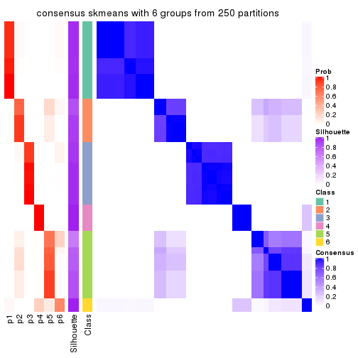</p>

</div>
</div>

Heatmaps for the membership of samples in all partitions to see how consistent they are:


<script>
$( function() {
	$( '#tabs-SD-skmeans-membership-heatmap' ).tabs();
} );
</script>
<div id='tabs-SD-skmeans-membership-heatmap'>
<ul>
<li><a href='#tab-SD-skmeans-membership-heatmap-1'>k = 2</a></li>
<li><a href='#tab-SD-skmeans-membership-heatmap-2'>k = 3</a></li>
<li><a href='#tab-SD-skmeans-membership-heatmap-3'>k = 4</a></li>
<li><a href='#tab-SD-skmeans-membership-heatmap-4'>k = 5</a></li>
<li><a href='#tab-SD-skmeans-membership-heatmap-5'>k = 6</a></li>
</ul>
<div id='tab-SD-skmeans-membership-heatmap-1'>
<pre><code class="r">membership_heatmap(res, k = 2)
</code></pre>

<p></p>

</div>
<div id='tab-SD-skmeans-membership-heatmap-2'>
<pre><code class="r">membership_heatmap(res, k = 3)
</code></pre>

<p></p>

</div>
<div id='tab-SD-skmeans-membership-heatmap-3'>
<pre><code class="r">membership_heatmap(res, k = 4)
</code></pre>

<p></p>

</div>
<div id='tab-SD-skmeans-membership-heatmap-4'>
<pre><code class="r">membership_heatmap(res, k = 5)
</code></pre>

<p></p>

</div>
<div id='tab-SD-skmeans-membership-heatmap-5'>
<pre><code class="r">membership_heatmap(res, k = 6)
</code></pre>

<p></p>

</div>
</div>

As soon as we have had the classes for columns, we can look for signatures
which are significantly different between classes which can be candidate marks
for certain classes. Following are the heatmaps for signatures.


Signature heatmaps where rows are scaled:


<script>
$( function() {
	$( '#tabs-SD-skmeans-get-signatures' ).tabs();
} );
</script>
<div id='tabs-SD-skmeans-get-signatures'>
<ul>
<li><a href='#tab-SD-skmeans-get-signatures-1'>k = 2</a></li>
<li><a href='#tab-SD-skmeans-get-signatures-2'>k = 3</a></li>
<li><a href='#tab-SD-skmeans-get-signatures-3'>k = 4</a></li>
<li><a href='#tab-SD-skmeans-get-signatures-4'>k = 5</a></li>
<li><a href='#tab-SD-skmeans-get-signatures-5'>k = 6</a></li>
</ul>
<div id='tab-SD-skmeans-get-signatures-1'>
<pre><code class="r">get_signatures(res, k = 2)
</code></pre>

<p></p>

</div>
<div id='tab-SD-skmeans-get-signatures-2'>
<pre><code class="r">get_signatures(res, k = 3)
</code></pre>

<p></p>

</div>
<div id='tab-SD-skmeans-get-signatures-3'>
<pre><code class="r">get_signatures(res, k = 4)
</code></pre>

<p></p>

</div>
<div id='tab-SD-skmeans-get-signatures-4'>
<pre><code class="r">get_signatures(res, k = 5)
</code></pre>

<p></p>

</div>
<div id='tab-SD-skmeans-get-signatures-5'>
<pre><code class="r">get_signatures(res, k = 6)
</code></pre>

<p></p>

</div>
</div>


Signature heatmaps where rows are not scaled:


<script>
$( function() {
	$( '#tabs-SD-skmeans-get-signatures-no-scale' ).tabs();
} );
</script>
<div id='tabs-SD-skmeans-get-signatures-no-scale'>
<ul>
<li><a href='#tab-SD-skmeans-get-signatures-no-scale-1'>k = 2</a></li>
<li><a href='#tab-SD-skmeans-get-signatures-no-scale-2'>k = 3</a></li>
<li><a href='#tab-SD-skmeans-get-signatures-no-scale-3'>k = 4</a></li>
<li><a href='#tab-SD-skmeans-get-signatures-no-scale-4'>k = 5</a></li>
<li><a href='#tab-SD-skmeans-get-signatures-no-scale-5'>k = 6</a></li>
</ul>
<div id='tab-SD-skmeans-get-signatures-no-scale-1'>
<pre><code class="r">get_signatures(res, k = 2, scale_rows = FALSE)
</code></pre>

<p></p>

</div>
<div id='tab-SD-skmeans-get-signatures-no-scale-2'>
<pre><code class="r">get_signatures(res, k = 3, scale_rows = FALSE)
</code></pre>

<p></p>

</div>
<div id='tab-SD-skmeans-get-signatures-no-scale-3'>
<pre><code class="r">get_signatures(res, k = 4, scale_rows = FALSE)
</code></pre>

<p></p>

</div>
<div id='tab-SD-skmeans-get-signatures-no-scale-4'>
<pre><code class="r">get_signatures(res, k = 5, scale_rows = FALSE)
</code></pre>

<p></p>

</div>
<div id='tab-SD-skmeans-get-signatures-no-scale-5'>
<pre><code class="r">get_signatures(res, k = 6, scale_rows = FALSE)
</code></pre>

<p></p>

</div>
</div>


Compare the overlap of signatures from different k:

```r
compare_signatures(res)
```


`get_signature()` returns a data frame invisibly. TO get the list of signatures, the function
call should be assigned to a variable explicitly. In following code, if `plot` argument is set
to `FALSE`, no heatmap is plotted while only the differential analysis is performed.

```r
# code only for demonstration
tb = get_signature(res, k = ..., plot = FALSE)
```

An example of the output of `tb` is:

```
#>   which_row         fdr    mean_1    mean_2 scaled_mean_1 scaled_mean_2 km
#> 1        38 0.042760348  8.373488  9.131774    -0.5533452     0.5164555  1
#> 2        40 0.018707592  7.106213  8.469186    -0.6173731     0.5762149  1
#> 3        55 0.019134737 10.221463 11.207825    -0.6159697     0.5749050  1
#> 4        59 0.006059896  5.921854  7.869574    -0.6899429     0.6439467  1
#> 5        60 0.018055526  8.928898 10.211722    -0.6204761     0.5791110  1
#> 6        98 0.009384629 15.714769 14.887706     0.6635654    -0.6193277  2
...
```

The columns in `tb` are:

1. `which_row`: row indices corresponding to the input matrix.
2. `fdr`: FDR for the differential test. 
3. `mean_x`: The mean value in group x.
4. `scaled_mean_x`: The mean value in group x after rows are scaled.
5. `km`: Row groups if k-means clustering is applied to rows.


UMAP plot which shows how samples are separated.


<script>
$( function() {
	$( '#tabs-SD-skmeans-dimension-reduction' ).tabs();
} );
</script>
<div id='tabs-SD-skmeans-dimension-reduction'>
<ul>
<li><a href='#tab-SD-skmeans-dimension-reduction-1'>k = 2</a></li>
<li><a href='#tab-SD-skmeans-dimension-reduction-2'>k = 3</a></li>
<li><a href='#tab-SD-skmeans-dimension-reduction-3'>k = 4</a></li>
<li><a href='#tab-SD-skmeans-dimension-reduction-4'>k = 5</a></li>
<li><a href='#tab-SD-skmeans-dimension-reduction-5'>k = 6</a></li>
</ul>
<div id='tab-SD-skmeans-dimension-reduction-1'>
<pre><code class="r">dimension_reduction(res, k = 2, method = &quot;UMAP&quot;)
</code></pre>

<p></p>

</div>
<div id='tab-SD-skmeans-dimension-reduction-2'>
<pre><code class="r">dimension_reduction(res, k = 3, method = &quot;UMAP&quot;)
</code></pre>

<p></p>

</div>
<div id='tab-SD-skmeans-dimension-reduction-3'>
<pre><code class="r">dimension_reduction(res, k = 4, method = &quot;UMAP&quot;)
</code></pre>

<p></p>

</div>
<div id='tab-SD-skmeans-dimension-reduction-4'>
<pre><code class="r">dimension_reduction(res, k = 5, method = &quot;UMAP&quot;)
</code></pre>

<p></p>

</div>
<div id='tab-SD-skmeans-dimension-reduction-5'>
<pre><code class="r">dimension_reduction(res, k = 6, method = &quot;UMAP&quot;)
</code></pre>

<p></p>

</div>
</div>


Following heatmap shows how subgroups are split when increasing `k`:

```r
collect_classes(res)
```


If matrix rows can be associated to genes, consider to use `functional_enrichment(res,
...)` to perform function enrichment for the signature genes. See [this vignette](http://bioconductor.org/packages/devel/bioc/vignettes/cola/inst/doc/functional_enrichment.html) for more detailed explanations.


 

---------------------------------------------------


### SD:pam**


The object with results only for a single top-value method and a single partition method 
can be extracted as:

```r
res = res_list["SD", "pam"]
# you can also extract it by
# res = res_list["SD:pam"]
```

A summary of `res` and all the functions that can be applied to it:

```r
res
```

```
#> A 'ConsensusPartition' object with k = 2, 3, 4, 5, 6.
#>   On a matrix with 13278 rows and 322 columns.
#>   Top rows (1000, 2000, 3000, 4000, 5000) are extracted by 'SD' method.
#>   Subgroups are detected by 'pam' method.
#>   Performed in total 1250 partitions by row resampling.
#>   Best k for subgroups seems to be 6.
#> 
#> Following methods can be applied to this 'ConsensusPartition' object:
#>  [1] "cola_report"             "collect_classes"         "collect_plots"          
#>  [4] "collect_stats"           "colnames"                "compare_signatures"     
#>  [7] "consensus_heatmap"       "dimension_reduction"     "functional_enrichment"  
#> [10] "get_anno_col"            "get_anno"                "get_classes"            
#> [13] "get_consensus"           "get_matrix"              "get_membership"         
#> [16] "get_param"               "get_signatures"          "get_stats"              
#> [19] "is_best_k"               "is_stable_k"             "membership_heatmap"     
#> [22] "ncol"                    "nrow"                    "plot_ecdf"              
#> [25] "rownames"                "select_partition_number" "show"                   
#> [28] "suggest_best_k"          "test_to_known_factors"
```

`collect_plots()` function collects all the plots made from `res` for all `k` (number of partitions)
into one single page to provide an easy and fast comparison between different `k`.

```r
collect_plots(res)
```


The plots are:

- The first row: a plot of the ECDF (empirical cumulative distribution
  function) curves of the consensus matrix for each `k` and the heatmap of
  predicted classes for each `k`.
- The second row: heatmaps of the consensus matrix for each `k`.
- The third row: heatmaps of the membership matrix for each `k`.
- The fouth row: heatmaps of the signatures for each `k`.

All the plots in panels can be made by individual functions and they are
plotted later in this section.

`select_partition_number()` produces several plots showing different
statistics for choosing "optimized" `k`. There are following statistics:

- ECDF curves of the consensus matrix for each `k`;
- 1-PAC. [The PAC
  score](https://en.wikipedia.org/wiki/Consensus_clustering#Over-interpretation_potential_of_consensus_clustering)
  measures the proportion of the ambiguous subgrouping.
- Mean silhouette score.
- Concordance. The mean probability of fiting the consensus class ids in all
  partitions.
- Area increased. Denote $A_k$ as the area under the ECDF curve for current
  `k`, the area increased is defined as $A_k - A_{k-1}$.
- Rand index. The percent of pairs of samples that are both in a same cluster
  or both are not in a same cluster in the partition of k and k-1.
- Jaccard index. The ratio of pairs of samples are both in a same cluster in
  the partition of k and k-1 and the pairs of samples are both in a same
  cluster in the partition k or k-1.

The detailed explanations of these statistics can be found in [the _cola_
vignette](http://bioconductor.org/packages/devel/bioc/vignettes/cola/inst/doc/cola.html#toc_13).

Generally speaking, lower PAC score, higher mean silhouette score or higher
concordance corresponds to better partition. Rand index and Jaccard index
measure how similar the current partition is compared to partition with `k-1`.
If they are too similar, we won't accept `k` is better than `k-1`.

```r
select_partition_number(res)
```

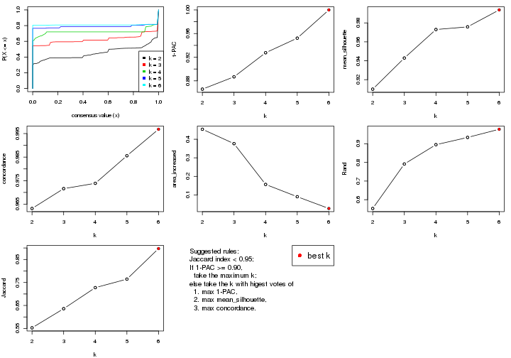

The numeric values for all these statistics can be obtained by `get_stats()`.

```r
get_stats(res)
```

```
#>   k 1-PAC mean_silhouette concordance area_increased  Rand Jaccard
#> 2 2 0.866           0.910       0.963         0.4540 0.553   0.553
#> 3 3 0.887           0.943       0.972         0.3764 0.792   0.636
#> 4 4 0.928           0.973       0.974         0.1565 0.895   0.728
#> 5 5 0.952           0.976       0.986         0.0903 0.934   0.765
#> 6 6 1.000           0.994       0.997         0.0269 0.978   0.897
```

`suggest_best_k()` suggests the best $k$ based on these statistics. The rules are as follows:

- All $k$ with Jaccard index larger than 0.95 are removed because increasing
  $k$ does not provide enough extra information. If all $k$ are removed, it is
  marked as no subgroup is detected.
- For all $k$ with 1-PAC score larger than 0.9, the maximal $k$ is taken as
  the best $k$, and other $k$ are marked as optional $k$.
- If it does not fit the second rule. The $k$ with the maximal vote of the
  highest 1-PAC score, highest mean silhouette, and highest concordance is
  taken as the best $k$.

```r
suggest_best_k(res)
```

```
#> [1] 6
#> attr(,"optional")
#> [1] 4 5
```

There is also optional best $k$ = 4 5 that is worth to check.

Following shows the table of the partitions (You need to click the **show/hide
code output** link to see it). The membership matrix (columns with name `p*`)
is inferred by
[`clue::cl_consensus()`](https://www.rdocumentation.org/link/cl_consensus?package=clue)
function with the `SE` method. Basically the value in the membership matrix
represents the probability to belong to a certain group. The finall class
label for an item is determined with the group with highest probability it
belongs to.

In `get_classes()` function, the entropy is calculated from the membership
matrix and the silhouette score is calculated from the consensus matrix.


<script>
$( function() {
	$( '#tabs-SD-pam-get-classes' ).tabs();
} );
</script>
<div id='tabs-SD-pam-get-classes'>
<ul>
<li><a href='#tab-SD-pam-get-classes-1'>k = 2</a></li>
<li><a href='#tab-SD-pam-get-classes-2'>k = 3</a></li>
<li><a href='#tab-SD-pam-get-classes-3'>k = 4</a></li>
<li><a href='#tab-SD-pam-get-classes-4'>k = 5</a></li>
<li><a href='#tab-SD-pam-get-classes-5'>k = 6</a></li>
</ul>

<div id='tab-SD-pam-get-classes-1'>
<p><a id='tab-SD-pam-get-classes-1-a' style='color:#0366d6' href='#'>show/hide code output</a></p>
<pre><code class="r">cbind(get_classes(res, k = 2), get_membership(res, k = 2))
</code></pre>

<pre><code>#&gt;           class entropy silhouette    p1    p2
#&gt; DRR023371     2  0.0000     0.9576 0.000 1.000
#&gt; DRR023372     2  0.0000     0.9576 0.000 1.000
#&gt; DRR023373     2  0.0000     0.9576 0.000 1.000
#&gt; DRR023374     2  0.0000     0.9576 0.000 1.000
#&gt; DRR023375     2  0.0000     0.9576 0.000 1.000
#&gt; DRR023376     2  0.0000     0.9576 0.000 1.000
#&gt; DRR023377     2  0.0000     0.9576 0.000 1.000
#&gt; DRR023378     2  0.0000     0.9576 0.000 1.000
#&gt; DRR023379     2  0.2603     0.9300 0.044 0.956
#&gt; DRR023380     2  0.2948     0.9243 0.052 0.948
#&gt; DRR023381     2  0.3114     0.9213 0.056 0.944
#&gt; DRR023382     2  0.3274     0.9184 0.060 0.940
#&gt; DRR023383     2  0.2948     0.9243 0.052 0.948
#&gt; DRR023384     2  0.2603     0.9300 0.044 0.956
#&gt; DRR023385     2  0.4298     0.8947 0.088 0.912
#&gt; DRR023386     2  0.3114     0.9213 0.056 0.944
#&gt; DRR023387     1  0.0000     0.9677 1.000 0.000
#&gt; DRR023388     1  0.0376     0.9641 0.996 0.004
#&gt; DRR023389     1  0.0376     0.9641 0.996 0.004
#&gt; DRR023390     1  0.0376     0.9641 0.996 0.004
#&gt; DRR023391     1  0.0376     0.9641 0.996 0.004
#&gt; DRR023392     1  0.0376     0.9641 0.996 0.004
#&gt; DRR023394     1  0.0376     0.9641 0.996 0.004
#&gt; DRR023395     1  0.9754     0.2684 0.592 0.408
#&gt; DRR023396     1  0.0000     0.9677 1.000 0.000
#&gt; DRR023397     1  0.0000     0.9677 1.000 0.000
#&gt; DRR023398     1  0.0000     0.9677 1.000 0.000
#&gt; DRR023399     1  0.0000     0.9677 1.000 0.000
#&gt; DRR023400     1  0.0000     0.9677 1.000 0.000
#&gt; DRR023401     1  0.0000     0.9677 1.000 0.000
#&gt; DRR023402     1  0.0000     0.9677 1.000 0.000
#&gt; DRR023403     1  0.0000     0.9677 1.000 0.000
#&gt; DRR023404     2  0.0000     0.9576 0.000 1.000
#&gt; DRR023405     2  0.0000     0.9576 0.000 1.000
#&gt; DRR023406     2  0.0000     0.9576 0.000 1.000
#&gt; DRR023407     2  0.0000     0.9576 0.000 1.000
#&gt; DRR023408     2  0.0000     0.9576 0.000 1.000
#&gt; DRR023409     2  0.0000     0.9576 0.000 1.000
#&gt; DRR023410     2  0.0000     0.9576 0.000 1.000
#&gt; DRR023411     2  0.0000     0.9576 0.000 1.000
#&gt; DRR023412     2  0.0000     0.9576 0.000 1.000
#&gt; DRR023413     2  0.0000     0.9576 0.000 1.000
#&gt; DRR023414     2  0.0000     0.9576 0.000 1.000
#&gt; DRR023415     2  0.0000     0.9576 0.000 1.000
#&gt; DRR023416     2  0.0000     0.9576 0.000 1.000
#&gt; DRR023417     2  0.0000     0.9576 0.000 1.000
#&gt; DRR023418     2  0.0000     0.9576 0.000 1.000
#&gt; DRR023419     2  0.0000     0.9576 0.000 1.000
#&gt; DRR023420     2  0.0000     0.9576 0.000 1.000
#&gt; DRR023421     2  0.0000     0.9576 0.000 1.000
#&gt; DRR023422     2  0.0000     0.9576 0.000 1.000
#&gt; DRR023423     2  0.0000     0.9576 0.000 1.000
#&gt; DRR023425     2  0.0000     0.9576 0.000 1.000
#&gt; DRR023426     2  0.0000     0.9576 0.000 1.000
#&gt; DRR023427     2  0.0000     0.9576 0.000 1.000
#&gt; DRR023428     2  0.0000     0.9576 0.000 1.000
#&gt; DRR023429     2  0.0000     0.9576 0.000 1.000
#&gt; DRR023430     2  0.0000     0.9576 0.000 1.000
#&gt; DRR023431     2  0.0000     0.9576 0.000 1.000
#&gt; DRR023432     2  0.0000     0.9576 0.000 1.000
#&gt; DRR023433     2  0.0000     0.9576 0.000 1.000
#&gt; DRR023434     2  0.0000     0.9576 0.000 1.000
#&gt; DRR023435     2  0.0000     0.9576 0.000 1.000
#&gt; DRR023436     2  0.0000     0.9576 0.000 1.000
#&gt; DRR023437     2  0.0000     0.9576 0.000 1.000
#&gt; DRR023438     2  0.0000     0.9576 0.000 1.000
#&gt; DRR023439     2  0.0000     0.9576 0.000 1.000
#&gt; DRR023440     2  0.0000     0.9576 0.000 1.000
#&gt; DRR023441     2  0.0000     0.9576 0.000 1.000
#&gt; DRR023442     2  0.0000     0.9576 0.000 1.000
#&gt; DRR023443     2  0.0000     0.9576 0.000 1.000
#&gt; DRR023444     2  0.0000     0.9576 0.000 1.000
#&gt; DRR023445     2  0.0000     0.9576 0.000 1.000
#&gt; DRR023446     2  0.0000     0.9576 0.000 1.000
#&gt; DRR023447     2  0.0000     0.9576 0.000 1.000
#&gt; DRR023448     2  0.0000     0.9576 0.000 1.000
#&gt; DRR023449     2  0.0000     0.9576 0.000 1.000
#&gt; DRR023450     2  0.0000     0.9576 0.000 1.000
#&gt; DRR023451     2  0.0000     0.9576 0.000 1.000
#&gt; DRR023452     2  0.0000     0.9576 0.000 1.000
#&gt; DRR023453     1  0.9988     0.0159 0.520 0.480
#&gt; DRR023454     1  0.9977     0.0466 0.528 0.472
#&gt; DRR023455     2  1.0000     0.0552 0.500 0.500
#&gt; DRR023456     1  0.9963     0.0769 0.536 0.464
#&gt; DRR023457     1  0.9850     0.2044 0.572 0.428
#&gt; DRR023458     1  0.9881     0.1755 0.564 0.436
#&gt; DRR023459     1  0.9977     0.0466 0.528 0.472
#&gt; DRR023460     2  0.0000     0.9576 0.000 1.000
#&gt; DRR023461     2  0.0000     0.9576 0.000 1.000
#&gt; DRR023462     2  0.0000     0.9576 0.000 1.000
#&gt; DRR023463     2  0.0000     0.9576 0.000 1.000
#&gt; DRR023464     2  0.0000     0.9576 0.000 1.000
#&gt; DRR023465     2  0.0000     0.9576 0.000 1.000
#&gt; DRR023466     2  0.0000     0.9576 0.000 1.000
#&gt; DRR023467     2  0.0000     0.9576 0.000 1.000
#&gt; DRR023468     2  0.0000     0.9576 0.000 1.000
#&gt; DRR023469     2  0.0000     0.9576 0.000 1.000
#&gt; DRR023470     2  0.0000     0.9576 0.000 1.000
#&gt; DRR023471     2  0.0000     0.9576 0.000 1.000
#&gt; DRR023472     2  0.0000     0.9576 0.000 1.000
#&gt; DRR023473     2  0.0000     0.9576 0.000 1.000
#&gt; DRR023474     2  0.0000     0.9576 0.000 1.000
#&gt; DRR023475     2  0.0000     0.9576 0.000 1.000
#&gt; DRR023476     2  0.0000     0.9576 0.000 1.000
#&gt; DRR023477     2  0.0000     0.9576 0.000 1.000
#&gt; DRR023478     2  0.0000     0.9576 0.000 1.000
#&gt; DRR023479     2  0.0000     0.9576 0.000 1.000
#&gt; DRR023480     2  0.0000     0.9576 0.000 1.000
#&gt; DRR023481     2  0.0000     0.9576 0.000 1.000
#&gt; DRR023482     2  0.0000     0.9576 0.000 1.000
#&gt; DRR023483     2  0.0000     0.9576 0.000 1.000
#&gt; DRR023484     2  0.0000     0.9576 0.000 1.000
#&gt; DRR023485     2  0.0000     0.9576 0.000 1.000
#&gt; DRR023486     2  0.0000     0.9576 0.000 1.000
#&gt; DRR023487     2  0.0000     0.9576 0.000 1.000
#&gt; DRR023488     2  0.0000     0.9576 0.000 1.000
#&gt; DRR023489     2  0.0000     0.9576 0.000 1.000
#&gt; DRR023490     1  0.0000     0.9677 1.000 0.000
#&gt; DRR023491     1  0.0000     0.9677 1.000 0.000
#&gt; DRR023492     1  0.0000     0.9677 1.000 0.000
#&gt; DRR023493     1  0.0000     0.9677 1.000 0.000
#&gt; DRR023494     1  0.0000     0.9677 1.000 0.000
#&gt; DRR023495     1  0.0000     0.9677 1.000 0.000
#&gt; DRR023496     1  0.0000     0.9677 1.000 0.000
#&gt; DRR023497     1  0.0000     0.9677 1.000 0.000
#&gt; DRR023498     1  0.0000     0.9677 1.000 0.000
#&gt; DRR023499     1  0.0000     0.9677 1.000 0.000
#&gt; DRR023500     1  0.0000     0.9677 1.000 0.000
#&gt; DRR023501     1  0.0000     0.9677 1.000 0.000
#&gt; DRR023502     1  0.0000     0.9677 1.000 0.000
#&gt; DRR023503     1  0.0000     0.9677 1.000 0.000
#&gt; DRR023504     1  0.0000     0.9677 1.000 0.000
#&gt; DRR023505     1  0.0000     0.9677 1.000 0.000
#&gt; DRR023506     1  0.0000     0.9677 1.000 0.000
#&gt; DRR023507     1  0.0000     0.9677 1.000 0.000
#&gt; DRR023508     1  0.0000     0.9677 1.000 0.000
#&gt; DRR023509     1  0.0000     0.9677 1.000 0.000
#&gt; DRR023510     1  0.0000     0.9677 1.000 0.000
#&gt; DRR023511     1  0.0000     0.9677 1.000 0.000
#&gt; DRR023512     1  0.0000     0.9677 1.000 0.000
#&gt; DRR023513     1  0.0000     0.9677 1.000 0.000
#&gt; DRR023514     1  0.0000     0.9677 1.000 0.000
#&gt; DRR023515     1  0.0000     0.9677 1.000 0.000
#&gt; DRR023516     1  0.0000     0.9677 1.000 0.000
#&gt; DRR023517     1  0.0000     0.9677 1.000 0.000
#&gt; DRR023518     1  0.0000     0.9677 1.000 0.000
#&gt; DRR023519     1  0.0000     0.9677 1.000 0.000
#&gt; DRR023520     1  0.0000     0.9677 1.000 0.000
#&gt; DRR023521     1  0.0000     0.9677 1.000 0.000
#&gt; DRR023522     1  0.0000     0.9677 1.000 0.000
#&gt; DRR023523     1  0.0000     0.9677 1.000 0.000
#&gt; DRR023524     1  0.0000     0.9677 1.000 0.000
#&gt; DRR023525     1  0.0000     0.9677 1.000 0.000
#&gt; DRR023526     1  0.0000     0.9677 1.000 0.000
#&gt; DRR023527     1  0.0000     0.9677 1.000 0.000
#&gt; DRR023528     1  0.0000     0.9677 1.000 0.000
#&gt; DRR023529     1  0.0000     0.9677 1.000 0.000
#&gt; DRR023530     1  0.0000     0.9677 1.000 0.000
#&gt; DRR023531     1  0.0000     0.9677 1.000 0.000
#&gt; DRR023532     1  0.0000     0.9677 1.000 0.000
#&gt; DRR023533     1  0.0000     0.9677 1.000 0.000
#&gt; DRR023534     1  0.0000     0.9677 1.000 0.000
#&gt; DRR023535     1  0.0000     0.9677 1.000 0.000
#&gt; DRR023536     1  0.0000     0.9677 1.000 0.000
#&gt; DRR023537     1  0.0000     0.9677 1.000 0.000
#&gt; DRR023538     1  0.0000     0.9677 1.000 0.000
#&gt; DRR023539     1  0.0000     0.9677 1.000 0.000
#&gt; DRR023540     1  0.0000     0.9677 1.000 0.000
#&gt; DRR023541     1  0.0000     0.9677 1.000 0.000
#&gt; DRR023542     1  0.0000     0.9677 1.000 0.000
#&gt; DRR023543     1  0.0000     0.9677 1.000 0.000
#&gt; DRR023544     1  0.0000     0.9677 1.000 0.000
#&gt; DRR023545     1  0.0000     0.9677 1.000 0.000
#&gt; DRR023546     1  0.0000     0.9677 1.000 0.000
#&gt; DRR023547     1  0.0000     0.9677 1.000 0.000
#&gt; DRR023548     1  0.0000     0.9677 1.000 0.000
#&gt; DRR023549     1  0.0000     0.9677 1.000 0.000
#&gt; DRR023550     1  0.0000     0.9677 1.000 0.000
#&gt; DRR023551     1  0.0000     0.9677 1.000 0.000
#&gt; DRR023552     1  0.0000     0.9677 1.000 0.000
#&gt; DRR023553     1  0.0000     0.9677 1.000 0.000
#&gt; DRR023554     1  0.0000     0.9677 1.000 0.000
#&gt; DRR023555     1  0.0000     0.9677 1.000 0.000
#&gt; DRR023556     1  0.0000     0.9677 1.000 0.000
#&gt; DRR023557     1  0.0000     0.9677 1.000 0.000
#&gt; DRR023558     1  0.0000     0.9677 1.000 0.000
#&gt; DRR023559     1  0.0000     0.9677 1.000 0.000
#&gt; DRR023560     1  0.0000     0.9677 1.000 0.000
#&gt; DRR023561     1  0.0000     0.9677 1.000 0.000
#&gt; DRR023562     1  0.0000     0.9677 1.000 0.000
#&gt; DRR023563     1  0.0000     0.9677 1.000 0.000
#&gt; DRR023564     1  0.0000     0.9677 1.000 0.000
#&gt; DRR023565     1  0.0000     0.9677 1.000 0.000
#&gt; DRR023566     1  0.0000     0.9677 1.000 0.000
#&gt; DRR023567     1  0.0000     0.9677 1.000 0.000
#&gt; DRR023568     1  0.0000     0.9677 1.000 0.000
#&gt; DRR023569     1  0.0000     0.9677 1.000 0.000
#&gt; DRR023570     1  0.0000     0.9677 1.000 0.000
#&gt; DRR023571     1  0.0000     0.9677 1.000 0.000
#&gt; DRR023572     1  0.0000     0.9677 1.000 0.000
#&gt; DRR023573     1  0.0000     0.9677 1.000 0.000
#&gt; DRR023574     1  0.0000     0.9677 1.000 0.000
#&gt; DRR023575     1  0.0000     0.9677 1.000 0.000
#&gt; DRR023576     2  0.0000     0.9576 0.000 1.000
#&gt; DRR023577     2  0.0000     0.9576 0.000 1.000
#&gt; DRR023578     2  0.0000     0.9576 0.000 1.000
#&gt; DRR023579     2  0.0000     0.9576 0.000 1.000
#&gt; DRR023580     2  0.0000     0.9576 0.000 1.000
#&gt; DRR023581     2  0.0000     0.9576 0.000 1.000
#&gt; DRR023582     2  0.0000     0.9576 0.000 1.000
#&gt; DRR023583     2  0.0000     0.9576 0.000 1.000
#&gt; DRR023584     2  0.0000     0.9576 0.000 1.000
#&gt; DRR023585     2  0.0000     0.9576 0.000 1.000
#&gt; DRR023586     2  0.0000     0.9576 0.000 1.000
#&gt; DRR023587     2  0.0000     0.9576 0.000 1.000
#&gt; DRR023588     2  0.0000     0.9576 0.000 1.000
#&gt; DRR023589     2  0.0000     0.9576 0.000 1.000
#&gt; DRR023590     2  0.0000     0.9576 0.000 1.000
#&gt; DRR023591     2  0.0000     0.9576 0.000 1.000
#&gt; DRR023592     2  0.0000     0.9576 0.000 1.000
#&gt; DRR023593     2  0.0000     0.9576 0.000 1.000
#&gt; DRR023594     2  0.0000     0.9576 0.000 1.000
#&gt; DRR023595     2  0.0000     0.9576 0.000 1.000
#&gt; DRR023596     2  0.0000     0.9576 0.000 1.000
#&gt; DRR023597     2  0.0000     0.9576 0.000 1.000
#&gt; DRR023598     2  0.0000     0.9576 0.000 1.000
#&gt; DRR023599     2  0.0000     0.9576 0.000 1.000
#&gt; DRR023600     2  0.0000     0.9576 0.000 1.000
#&gt; DRR023601     2  0.0000     0.9576 0.000 1.000
#&gt; DRR023602     2  0.0000     0.9576 0.000 1.000
#&gt; DRR023603     2  0.0000     0.9576 0.000 1.000
#&gt; DRR023604     2  0.0000     0.9576 0.000 1.000
#&gt; DRR023605     2  0.0000     0.9576 0.000 1.000
#&gt; DRR023606     2  0.0000     0.9576 0.000 1.000
#&gt; DRR023607     2  0.0000     0.9576 0.000 1.000
#&gt; DRR023608     2  0.0000     0.9576 0.000 1.000
#&gt; DRR023609     2  0.0000     0.9576 0.000 1.000
#&gt; DRR023610     2  0.0000     0.9576 0.000 1.000
#&gt; DRR023611     2  0.0000     0.9576 0.000 1.000
#&gt; DRR023612     2  0.0000     0.9576 0.000 1.000
#&gt; DRR023613     2  0.0000     0.9576 0.000 1.000
#&gt; DRR023614     2  0.0000     0.9576 0.000 1.000
#&gt; DRR023615     2  0.0000     0.9576 0.000 1.000
#&gt; DRR023616     2  0.0000     0.9576 0.000 1.000
#&gt; DRR023617     2  0.0000     0.9576 0.000 1.000
#&gt; DRR023619     2  0.5519     0.8537 0.128 0.872
#&gt; DRR023620     2  0.5059     0.8705 0.112 0.888
#&gt; DRR023621     2  0.4815     0.8787 0.104 0.896
#&gt; DRR023622     2  0.5294     0.8621 0.120 0.880
#&gt; DRR023623     2  0.5519     0.8537 0.128 0.872
#&gt; DRR023624     2  0.4562     0.8865 0.096 0.904
#&gt; DRR023625     2  0.5408     0.8578 0.124 0.876
#&gt; DRR023626     2  0.4939     0.8746 0.108 0.892
#&gt; DRR023627     2  0.4022     0.9014 0.080 0.920
#&gt; DRR023628     2  0.3733     0.9084 0.072 0.928
#&gt; DRR023629     2  0.6801     0.7905 0.180 0.820
#&gt; DRR023630     2  0.5408     0.8582 0.124 0.876
#&gt; DRR023631     2  0.4939     0.8746 0.108 0.892
#&gt; DRR023632     2  0.5842     0.8400 0.140 0.860
#&gt; DRR023633     2  0.2043     0.9380 0.032 0.968
#&gt; DRR023635     2  0.0000     0.9576 0.000 1.000
#&gt; DRR023636     2  0.0000     0.9576 0.000 1.000
#&gt; DRR023637     2  0.0000     0.9576 0.000 1.000
#&gt; DRR023638     2  0.0000     0.9576 0.000 1.000
#&gt; DRR023639     2  0.0000     0.9576 0.000 1.000
#&gt; DRR023640     2  0.0000     0.9576 0.000 1.000
#&gt; DRR023641     2  0.0000     0.9576 0.000 1.000
#&gt; DRR023642     2  0.0000     0.9576 0.000 1.000
#&gt; DRR023643     2  0.0000     0.9576 0.000 1.000
#&gt; DRR023644     2  0.0000     0.9576 0.000 1.000
#&gt; DRR023645     2  0.0000     0.9576 0.000 1.000
#&gt; DRR023646     2  0.0000     0.9576 0.000 1.000
#&gt; DRR023647     2  0.0000     0.9576 0.000 1.000
#&gt; DRR023648     2  0.0000     0.9576 0.000 1.000
#&gt; DRR023649     2  0.0000     0.9576 0.000 1.000
#&gt; DRR023650     2  0.3274     0.9179 0.060 0.940
#&gt; DRR023651     2  0.3114     0.9212 0.056 0.944
#&gt; DRR023652     2  0.3733     0.9082 0.072 0.928
#&gt; DRR023653     2  0.3584     0.9116 0.068 0.932
#&gt; DRR023654     2  0.4690     0.8826 0.100 0.900
#&gt; DRR023655     2  0.2778     0.9268 0.048 0.952
#&gt; DRR023656     2  0.4431     0.8903 0.092 0.908
#&gt; DRR023657     2  0.2236     0.9351 0.036 0.964
#&gt; DRR023658     2  0.1633     0.9428 0.024 0.976
#&gt; DRR023659     2  0.3733     0.9082 0.072 0.928
#&gt; DRR023660     2  0.3274     0.9179 0.060 0.940
#&gt; DRR023661     2  0.3584     0.9116 0.068 0.932
#&gt; DRR023662     2  0.3274     0.9180 0.060 0.940
#&gt; DRR023663     2  0.2236     0.9351 0.036 0.964
#&gt; DRR023664     2  0.4431     0.8903 0.092 0.908
#&gt; DRR023665     2  0.0000     0.9576 0.000 1.000
#&gt; DRR023666     2  0.9754     0.3613 0.408 0.592
#&gt; DRR023667     2  0.9710     0.3828 0.400 0.600
#&gt; DRR023668     2  0.9710     0.3828 0.400 0.600
#&gt; DRR023669     2  0.9710     0.3828 0.400 0.600
#&gt; DRR023670     2  0.9710     0.3828 0.400 0.600
#&gt; DRR023671     2  0.9710     0.3828 0.400 0.600
#&gt; DRR023672     2  0.9710     0.3828 0.400 0.600
#&gt; DRR023673     2  0.9710     0.3828 0.400 0.600
#&gt; DRR023674     2  0.9710     0.3828 0.400 0.600
#&gt; DRR023675     2  0.9710     0.3828 0.400 0.600
#&gt; DRR023676     2  0.9732     0.3722 0.404 0.596
#&gt; DRR023677     2  0.9710     0.3828 0.400 0.600
#&gt; DRR023678     2  0.8909     0.5853 0.308 0.692
#&gt; DRR023683     2  0.0000     0.9576 0.000 1.000
#&gt; DRR023684     2  0.0000     0.9576 0.000 1.000
#&gt; DRR023685     2  0.0000     0.9576 0.000 1.000
#&gt; DRR023686     2  0.0000     0.9576 0.000 1.000
#&gt; DRR023687     2  0.0000     0.9576 0.000 1.000
#&gt; DRR023688     2  0.0000     0.9576 0.000 1.000
#&gt; DRR023689     2  0.0000     0.9576 0.000 1.000
#&gt; DRR023690     2  0.0000     0.9576 0.000 1.000
#&gt; DRR023691     2  0.0000     0.9576 0.000 1.000
#&gt; DRR023692     2  0.0000     0.9576 0.000 1.000
#&gt; DRR023693     2  0.0000     0.9576 0.000 1.000
#&gt; DRR023694     2  0.0000     0.9576 0.000 1.000
#&gt; DRR023695     2  0.0000     0.9576 0.000 1.000
#&gt; DRR023696     2  0.0000     0.9576 0.000 1.000
#&gt; DRR023697     2  0.0000     0.9576 0.000 1.000
#&gt; DRR023698     2  0.0000     0.9576 0.000 1.000
#&gt; DRR023699     2  0.0000     0.9576 0.000 1.000
#&gt; DRR023700     2  0.0000     0.9576 0.000 1.000
</code></pre>

<script>
$('#tab-SD-pam-get-classes-1-a').parent().next().next().hide();
$('#tab-SD-pam-get-classes-1-a').click(function(){
  $('#tab-SD-pam-get-classes-1-a').parent().next().next().toggle();
  return(false);
});
</script>
</div>

<div id='tab-SD-pam-get-classes-2'>
<p><a id='tab-SD-pam-get-classes-2-a' style='color:#0366d6' href='#'>show/hide code output</a></p>
<pre><code class="r">cbind(get_classes(res, k = 3), get_membership(res, k = 3))
</code></pre>

<pre><code>#&gt;           class entropy silhouette    p1    p2 p3
#&gt; DRR023371     3   0.000      1.000 0.000 0.000  1
#&gt; DRR023372     3   0.000      1.000 0.000 0.000  1
#&gt; DRR023373     3   0.000      1.000 0.000 0.000  1
#&gt; DRR023374     3   0.000      1.000 0.000 0.000  1
#&gt; DRR023375     3   0.000      1.000 0.000 0.000  1
#&gt; DRR023376     3   0.000      1.000 0.000 0.000  1
#&gt; DRR023377     3   0.000      1.000 0.000 0.000  1
#&gt; DRR023378     3   0.000      1.000 0.000 0.000  1
#&gt; DRR023379     3   0.000      1.000 0.000 0.000  1
#&gt; DRR023380     3   0.000      1.000 0.000 0.000  1
#&gt; DRR023381     3   0.000      1.000 0.000 0.000  1
#&gt; DRR023382     3   0.000      1.000 0.000 0.000  1
#&gt; DRR023383     3   0.000      1.000 0.000 0.000  1
#&gt; DRR023384     3   0.000      1.000 0.000 0.000  1
#&gt; DRR023385     3   0.000      1.000 0.000 0.000  1
#&gt; DRR023386     3   0.000      1.000 0.000 0.000  1
#&gt; DRR023387     3   0.000      1.000 0.000 0.000  1
#&gt; DRR023388     3   0.000      1.000 0.000 0.000  1
#&gt; DRR023389     3   0.000      1.000 0.000 0.000  1
#&gt; DRR023390     3   0.000      1.000 0.000 0.000  1
#&gt; DRR023391     3   0.000      1.000 0.000 0.000  1
#&gt; DRR023392     3   0.000      1.000 0.000 0.000  1
#&gt; DRR023394     3   0.000      1.000 0.000 0.000  1
#&gt; DRR023395     3   0.000      1.000 0.000 0.000  1
#&gt; DRR023396     3   0.000      1.000 0.000 0.000  1
#&gt; DRR023397     3   0.000      1.000 0.000 0.000  1
#&gt; DRR023398     3   0.000      1.000 0.000 0.000  1
#&gt; DRR023399     3   0.000      1.000 0.000 0.000  1
#&gt; DRR023400     3   0.000      1.000 0.000 0.000  1
#&gt; DRR023401     3   0.000      1.000 0.000 0.000  1
#&gt; DRR023402     3   0.000      1.000 0.000 0.000  1
#&gt; DRR023403     3   0.000      1.000 0.000 0.000  1
#&gt; DRR023404     2   0.000      0.943 0.000 1.000  0
#&gt; DRR023405     2   0.000      0.943 0.000 1.000  0
#&gt; DRR023406     2   0.000      0.943 0.000 1.000  0
#&gt; DRR023407     2   0.000      0.943 0.000 1.000  0
#&gt; DRR023408     2   0.000      0.943 0.000 1.000  0
#&gt; DRR023409     2   0.000      0.943 0.000 1.000  0
#&gt; DRR023410     2   0.000      0.943 0.000 1.000  0
#&gt; DRR023411     2   0.000      0.943 0.000 1.000  0
#&gt; DRR023412     2   0.000      0.943 0.000 1.000  0
#&gt; DRR023413     2   0.000      0.943 0.000 1.000  0
#&gt; DRR023414     2   0.000      0.943 0.000 1.000  0
#&gt; DRR023415     2   0.000      0.943 0.000 1.000  0
#&gt; DRR023416     2   0.000      0.943 0.000 1.000  0
#&gt; DRR023417     2   0.000      0.943 0.000 1.000  0
#&gt; DRR023418     2   0.000      0.943 0.000 1.000  0
#&gt; DRR023419     2   0.000      0.943 0.000 1.000  0
#&gt; DRR023420     2   0.000      0.943 0.000 1.000  0
#&gt; DRR023421     2   0.000      0.943 0.000 1.000  0
#&gt; DRR023422     2   0.000      0.943 0.000 1.000  0
#&gt; DRR023423     2   0.000      0.943 0.000 1.000  0
#&gt; DRR023425     2   0.000      0.943 0.000 1.000  0
#&gt; DRR023426     2   0.000      0.943 0.000 1.000  0
#&gt; DRR023427     2   0.000      0.943 0.000 1.000  0
#&gt; DRR023428     2   0.000      0.943 0.000 1.000  0
#&gt; DRR023429     2   0.000      0.943 0.000 1.000  0
#&gt; DRR023430     2   0.000      0.943 0.000 1.000  0
#&gt; DRR023431     2   0.000      0.943 0.000 1.000  0
#&gt; DRR023432     2   0.000      0.943 0.000 1.000  0
#&gt; DRR023433     2   0.000      0.943 0.000 1.000  0
#&gt; DRR023434     2   0.000      0.943 0.000 1.000  0
#&gt; DRR023435     2   0.000      0.943 0.000 1.000  0
#&gt; DRR023436     2   0.000      0.943 0.000 1.000  0
#&gt; DRR023437     2   0.000      0.943 0.000 1.000  0
#&gt; DRR023438     2   0.000      0.943 0.000 1.000  0
#&gt; DRR023439     2   0.000      0.943 0.000 1.000  0
#&gt; DRR023440     2   0.000      0.943 0.000 1.000  0
#&gt; DRR023441     2   0.000      0.943 0.000 1.000  0
#&gt; DRR023442     2   0.000      0.943 0.000 1.000  0
#&gt; DRR023443     2   0.000      0.943 0.000 1.000  0
#&gt; DRR023444     2   0.000      0.943 0.000 1.000  0
#&gt; DRR023445     2   0.000      0.943 0.000 1.000  0
#&gt; DRR023446     2   0.000      0.943 0.000 1.000  0
#&gt; DRR023447     2   0.000      0.943 0.000 1.000  0
#&gt; DRR023448     2   0.000      0.943 0.000 1.000  0
#&gt; DRR023449     2   0.000      0.943 0.000 1.000  0
#&gt; DRR023450     2   0.000      0.943 0.000 1.000  0
#&gt; DRR023451     2   0.000      0.943 0.000 1.000  0
#&gt; DRR023452     2   0.000      0.943 0.000 1.000  0
#&gt; DRR023453     3   0.000      1.000 0.000 0.000  1
#&gt; DRR023454     3   0.000      1.000 0.000 0.000  1
#&gt; DRR023455     3   0.000      1.000 0.000 0.000  1
#&gt; DRR023456     3   0.000      1.000 0.000 0.000  1
#&gt; DRR023457     3   0.000      1.000 0.000 0.000  1
#&gt; DRR023458     3   0.000      1.000 0.000 0.000  1
#&gt; DRR023459     3   0.000      1.000 0.000 0.000  1
#&gt; DRR023460     3   0.000      1.000 0.000 0.000  1
#&gt; DRR023461     3   0.000      1.000 0.000 0.000  1
#&gt; DRR023462     3   0.000      1.000 0.000 0.000  1
#&gt; DRR023463     3   0.000      1.000 0.000 0.000  1
#&gt; DRR023464     3   0.000      1.000 0.000 0.000  1
#&gt; DRR023465     3   0.000      1.000 0.000 0.000  1
#&gt; DRR023466     3   0.000      1.000 0.000 0.000  1
#&gt; DRR023467     3   0.000      1.000 0.000 0.000  1
#&gt; DRR023468     3   0.000      1.000 0.000 0.000  1
#&gt; DRR023469     3   0.000      1.000 0.000 0.000  1
#&gt; DRR023470     3   0.000      1.000 0.000 0.000  1
#&gt; DRR023471     3   0.000      1.000 0.000 0.000  1
#&gt; DRR023472     3   0.000      1.000 0.000 0.000  1
#&gt; DRR023473     3   0.000      1.000 0.000 0.000  1
#&gt; DRR023474     3   0.000      1.000 0.000 0.000  1
#&gt; DRR023475     3   0.000      1.000 0.000 0.000  1
#&gt; DRR023476     3   0.000      1.000 0.000 0.000  1
#&gt; DRR023477     3   0.000      1.000 0.000 0.000  1
#&gt; DRR023478     3   0.000      1.000 0.000 0.000  1
#&gt; DRR023479     3   0.000      1.000 0.000 0.000  1
#&gt; DRR023480     3   0.000      1.000 0.000 0.000  1
#&gt; DRR023481     3   0.000      1.000 0.000 0.000  1
#&gt; DRR023482     3   0.000      1.000 0.000 0.000  1
#&gt; DRR023483     3   0.000      1.000 0.000 0.000  1
#&gt; DRR023484     3   0.000      1.000 0.000 0.000  1
#&gt; DRR023485     3   0.000      1.000 0.000 0.000  1
#&gt; DRR023486     3   0.000      1.000 0.000 0.000  1
#&gt; DRR023487     3   0.000      1.000 0.000 0.000  1
#&gt; DRR023488     3   0.000      1.000 0.000 0.000  1
#&gt; DRR023489     3   0.000      1.000 0.000 0.000  1
#&gt; DRR023490     1   0.000      1.000 1.000 0.000  0
#&gt; DRR023491     1   0.000      1.000 1.000 0.000  0
#&gt; DRR023492     1   0.000      1.000 1.000 0.000  0
#&gt; DRR023493     1   0.000      1.000 1.000 0.000  0
#&gt; DRR023494     1   0.000      1.000 1.000 0.000  0
#&gt; DRR023495     1   0.000      1.000 1.000 0.000  0
#&gt; DRR023496     1   0.000      1.000 1.000 0.000  0
#&gt; DRR023497     1   0.000      1.000 1.000 0.000  0
#&gt; DRR023498     1   0.000      1.000 1.000 0.000  0
#&gt; DRR023499     1   0.000      1.000 1.000 0.000  0
#&gt; DRR023500     1   0.000      1.000 1.000 0.000  0
#&gt; DRR023501     1   0.000      1.000 1.000 0.000  0
#&gt; DRR023502     1   0.000      1.000 1.000 0.000  0
#&gt; DRR023503     1   0.000      1.000 1.000 0.000  0
#&gt; DRR023504     1   0.000      1.000 1.000 0.000  0
#&gt; DRR023505     1   0.000      1.000 1.000 0.000  0
#&gt; DRR023506     1   0.000      1.000 1.000 0.000  0
#&gt; DRR023507     1   0.000      1.000 1.000 0.000  0
#&gt; DRR023508     1   0.000      1.000 1.000 0.000  0
#&gt; DRR023509     1   0.000      1.000 1.000 0.000  0
#&gt; DRR023510     1   0.000      1.000 1.000 0.000  0
#&gt; DRR023511     1   0.000      1.000 1.000 0.000  0
#&gt; DRR023512     1   0.000      1.000 1.000 0.000  0
#&gt; DRR023513     1   0.000      1.000 1.000 0.000  0
#&gt; DRR023514     1   0.000      1.000 1.000 0.000  0
#&gt; DRR023515     1   0.000      1.000 1.000 0.000  0
#&gt; DRR023516     1   0.000      1.000 1.000 0.000  0
#&gt; DRR023517     1   0.000      1.000 1.000 0.000  0
#&gt; DRR023518     1   0.000      1.000 1.000 0.000  0
#&gt; DRR023519     1   0.000      1.000 1.000 0.000  0
#&gt; DRR023520     1   0.000      1.000 1.000 0.000  0
#&gt; DRR023521     1   0.000      1.000 1.000 0.000  0
#&gt; DRR023522     1   0.000      1.000 1.000 0.000  0
#&gt; DRR023523     1   0.000      1.000 1.000 0.000  0
#&gt; DRR023524     1   0.000      1.000 1.000 0.000  0
#&gt; DRR023525     1   0.000      1.000 1.000 0.000  0
#&gt; DRR023526     1   0.000      1.000 1.000 0.000  0
#&gt; DRR023527     1   0.000      1.000 1.000 0.000  0
#&gt; DRR023528     1   0.000      1.000 1.000 0.000  0
#&gt; DRR023529     1   0.000      1.000 1.000 0.000  0
#&gt; DRR023530     1   0.000      1.000 1.000 0.000  0
#&gt; DRR023531     1   0.000      1.000 1.000 0.000  0
#&gt; DRR023532     1   0.000      1.000 1.000 0.000  0
#&gt; DRR023533     1   0.000      1.000 1.000 0.000  0
#&gt; DRR023534     1   0.000      1.000 1.000 0.000  0
#&gt; DRR023535     1   0.000      1.000 1.000 0.000  0
#&gt; DRR023536     1   0.000      1.000 1.000 0.000  0
#&gt; DRR023537     1   0.000      1.000 1.000 0.000  0
#&gt; DRR023538     1   0.000      1.000 1.000 0.000  0
#&gt; DRR023539     1   0.000      1.000 1.000 0.000  0
#&gt; DRR023540     1   0.000      1.000 1.000 0.000  0
#&gt; DRR023541     1   0.000      1.000 1.000 0.000  0
#&gt; DRR023542     1   0.000      1.000 1.000 0.000  0
#&gt; DRR023543     1   0.000      1.000 1.000 0.000  0
#&gt; DRR023544     1   0.000      1.000 1.000 0.000  0
#&gt; DRR023545     1   0.000      1.000 1.000 0.000  0
#&gt; DRR023546     1   0.000      1.000 1.000 0.000  0
#&gt; DRR023547     1   0.000      1.000 1.000 0.000  0
#&gt; DRR023548     1   0.000      1.000 1.000 0.000  0
#&gt; DRR023549     1   0.000      1.000 1.000 0.000  0
#&gt; DRR023550     1   0.000      1.000 1.000 0.000  0
#&gt; DRR023551     1   0.000      1.000 1.000 0.000  0
#&gt; DRR023552     1   0.000      1.000 1.000 0.000  0
#&gt; DRR023553     1   0.000      1.000 1.000 0.000  0
#&gt; DRR023554     1   0.000      1.000 1.000 0.000  0
#&gt; DRR023555     1   0.000      1.000 1.000 0.000  0
#&gt; DRR023556     1   0.000      1.000 1.000 0.000  0
#&gt; DRR023557     1   0.000      1.000 1.000 0.000  0
#&gt; DRR023558     1   0.000      1.000 1.000 0.000  0
#&gt; DRR023559     1   0.000      1.000 1.000 0.000  0
#&gt; DRR023560     1   0.000      1.000 1.000 0.000  0
#&gt; DRR023561     1   0.000      1.000 1.000 0.000  0
#&gt; DRR023562     1   0.000      1.000 1.000 0.000  0
#&gt; DRR023563     1   0.000      1.000 1.000 0.000  0
#&gt; DRR023564     1   0.000      1.000 1.000 0.000  0
#&gt; DRR023565     1   0.000      1.000 1.000 0.000  0
#&gt; DRR023566     1   0.000      1.000 1.000 0.000  0
#&gt; DRR023567     1   0.000      1.000 1.000 0.000  0
#&gt; DRR023568     1   0.000      1.000 1.000 0.000  0
#&gt; DRR023569     1   0.000      1.000 1.000 0.000  0
#&gt; DRR023570     1   0.000      1.000 1.000 0.000  0
#&gt; DRR023571     1   0.000      1.000 1.000 0.000  0
#&gt; DRR023572     1   0.000      1.000 1.000 0.000  0
#&gt; DRR023573     1   0.000      1.000 1.000 0.000  0
#&gt; DRR023574     1   0.000      1.000 1.000 0.000  0
#&gt; DRR023575     1   0.000      1.000 1.000 0.000  0
#&gt; DRR023576     2   0.000      0.943 0.000 1.000  0
#&gt; DRR023577     2   0.000      0.943 0.000 1.000  0
#&gt; DRR023578     2   0.000      0.943 0.000 1.000  0
#&gt; DRR023579     2   0.000      0.943 0.000 1.000  0
#&gt; DRR023580     2   0.000      0.943 0.000 1.000  0
#&gt; DRR023581     2   0.000      0.943 0.000 1.000  0
#&gt; DRR023582     2   0.000      0.943 0.000 1.000  0
#&gt; DRR023583     2   0.000      0.943 0.000 1.000  0
#&gt; DRR023584     2   0.000      0.943 0.000 1.000  0
#&gt; DRR023585     2   0.000      0.943 0.000 1.000  0
#&gt; DRR023586     2   0.000      0.943 0.000 1.000  0
#&gt; DRR023587     2   0.000      0.943 0.000 1.000  0
#&gt; DRR023588     2   0.000      0.943 0.000 1.000  0
#&gt; DRR023589     2   0.000      0.943 0.000 1.000  0
#&gt; DRR023590     2   0.000      0.943 0.000 1.000  0
#&gt; DRR023591     2   0.000      0.943 0.000 1.000  0
#&gt; DRR023592     2   0.000      0.943 0.000 1.000  0
#&gt; DRR023593     2   0.000      0.943 0.000 1.000  0
#&gt; DRR023594     2   0.000      0.943 0.000 1.000  0
#&gt; DRR023595     2   0.000      0.943 0.000 1.000  0
#&gt; DRR023596     2   0.000      0.943 0.000 1.000  0
#&gt; DRR023597     2   0.000      0.943 0.000 1.000  0
#&gt; DRR023598     2   0.000      0.943 0.000 1.000  0
#&gt; DRR023599     2   0.000      0.943 0.000 1.000  0
#&gt; DRR023600     2   0.000      0.943 0.000 1.000  0
#&gt; DRR023601     2   0.000      0.943 0.000 1.000  0
#&gt; DRR023602     2   0.000      0.943 0.000 1.000  0
#&gt; DRR023603     2   0.000      0.943 0.000 1.000  0
#&gt; DRR023604     2   0.000      0.943 0.000 1.000  0
#&gt; DRR023605     2   0.000      0.943 0.000 1.000  0
#&gt; DRR023606     2   0.000      0.943 0.000 1.000  0
#&gt; DRR023607     2   0.000      0.943 0.000 1.000  0
#&gt; DRR023608     2   0.000      0.943 0.000 1.000  0
#&gt; DRR023609     2   0.000      0.943 0.000 1.000  0
#&gt; DRR023610     2   0.000      0.943 0.000 1.000  0
#&gt; DRR023611     2   0.000      0.943 0.000 1.000  0
#&gt; DRR023612     2   0.000      0.943 0.000 1.000  0
#&gt; DRR023613     2   0.000      0.943 0.000 1.000  0
#&gt; DRR023614     2   0.000      0.943 0.000 1.000  0
#&gt; DRR023615     2   0.000      0.943 0.000 1.000  0
#&gt; DRR023616     2   0.000      0.943 0.000 1.000  0
#&gt; DRR023617     2   0.000      0.943 0.000 1.000  0
#&gt; DRR023619     2   0.375      0.847 0.144 0.856  0
#&gt; DRR023620     2   0.362      0.855 0.136 0.864  0
#&gt; DRR023621     2   0.369      0.851 0.140 0.860  0
#&gt; DRR023622     2   0.369      0.851 0.140 0.860  0
#&gt; DRR023623     2   0.382      0.843 0.148 0.852  0
#&gt; DRR023624     2   0.355      0.858 0.132 0.868  0
#&gt; DRR023625     2   0.394      0.835 0.156 0.844  0
#&gt; DRR023626     2   0.355      0.858 0.132 0.868  0
#&gt; DRR023627     2   0.304      0.879 0.104 0.896  0
#&gt; DRR023628     2   0.334      0.868 0.120 0.880  0
#&gt; DRR023629     2   0.429      0.809 0.180 0.820  0
#&gt; DRR023630     2   0.369      0.851 0.140 0.860  0
#&gt; DRR023631     2   0.362      0.855 0.136 0.864  0
#&gt; DRR023632     2   0.400      0.831 0.160 0.840  0
#&gt; DRR023633     2   0.207      0.908 0.060 0.940  0
#&gt; DRR023635     2   0.000      0.943 0.000 1.000  0
#&gt; DRR023636     2   0.000      0.943 0.000 1.000  0
#&gt; DRR023637     2   0.000      0.943 0.000 1.000  0
#&gt; DRR023638     2   0.000      0.943 0.000 1.000  0
#&gt; DRR023639     2   0.000      0.943 0.000 1.000  0
#&gt; DRR023640     2   0.000      0.943 0.000 1.000  0
#&gt; DRR023641     2   0.000      0.943 0.000 1.000  0
#&gt; DRR023642     2   0.000      0.943 0.000 1.000  0
#&gt; DRR023643     2   0.000      0.943 0.000 1.000  0
#&gt; DRR023644     2   0.000      0.943 0.000 1.000  0
#&gt; DRR023645     2   0.000      0.943 0.000 1.000  0
#&gt; DRR023646     2   0.000      0.943 0.000 1.000  0
#&gt; DRR023647     2   0.000      0.943 0.000 1.000  0
#&gt; DRR023648     2   0.000      0.943 0.000 1.000  0
#&gt; DRR023649     2   0.000      0.943 0.000 1.000  0
#&gt; DRR023650     2   0.355      0.858 0.132 0.868  0
#&gt; DRR023651     2   0.355      0.858 0.132 0.868  0
#&gt; DRR023652     2   0.355      0.858 0.132 0.868  0
#&gt; DRR023653     2   0.355      0.858 0.132 0.868  0
#&gt; DRR023654     2   0.362      0.855 0.136 0.864  0
#&gt; DRR023655     2   0.355      0.858 0.132 0.868  0
#&gt; DRR023656     2   0.355      0.858 0.132 0.868  0
#&gt; DRR023657     2   0.355      0.858 0.132 0.868  0
#&gt; DRR023658     2   0.355      0.858 0.132 0.868  0
#&gt; DRR023659     2   0.355      0.858 0.132 0.868  0
#&gt; DRR023660     2   0.355      0.858 0.132 0.868  0
#&gt; DRR023661     2   0.355      0.858 0.132 0.868  0
#&gt; DRR023662     2   0.355      0.858 0.132 0.868  0
#&gt; DRR023663     2   0.355      0.858 0.132 0.868  0
#&gt; DRR023664     2   0.355      0.858 0.132 0.868  0
#&gt; DRR023665     2   0.000      0.943 0.000 1.000  0
#&gt; DRR023666     2   0.613      0.449 0.400 0.600  0
#&gt; DRR023667     2   0.613      0.449 0.400 0.600  0
#&gt; DRR023668     2   0.613      0.449 0.400 0.600  0
#&gt; DRR023669     2   0.613      0.449 0.400 0.600  0
#&gt; DRR023670     2   0.613      0.449 0.400 0.600  0
#&gt; DRR023671     2   0.613      0.449 0.400 0.600  0
#&gt; DRR023672     2   0.613      0.449 0.400 0.600  0
#&gt; DRR023673     2   0.613      0.449 0.400 0.600  0
#&gt; DRR023674     2   0.613      0.449 0.400 0.600  0
#&gt; DRR023675     2   0.613      0.449 0.400 0.600  0
#&gt; DRR023676     2   0.614      0.439 0.404 0.596  0
#&gt; DRR023677     2   0.613      0.449 0.400 0.600  0
#&gt; DRR023678     2   0.573      0.601 0.324 0.676  0
#&gt; DRR023683     2   0.000      0.943 0.000 1.000  0
#&gt; DRR023684     2   0.000      0.943 0.000 1.000  0
#&gt; DRR023685     2   0.000      0.943 0.000 1.000  0
#&gt; DRR023686     2   0.000      0.943 0.000 1.000  0
#&gt; DRR023687     2   0.000      0.943 0.000 1.000  0
#&gt; DRR023688     2   0.000      0.943 0.000 1.000  0
#&gt; DRR023689     2   0.000      0.943 0.000 1.000  0
#&gt; DRR023690     2   0.000      0.943 0.000 1.000  0
#&gt; DRR023691     2   0.000      0.943 0.000 1.000  0
#&gt; DRR023692     2   0.000      0.943 0.000 1.000  0
#&gt; DRR023693     2   0.000      0.943 0.000 1.000  0
#&gt; DRR023694     2   0.000      0.943 0.000 1.000  0
#&gt; DRR023695     2   0.000      0.943 0.000 1.000  0
#&gt; DRR023696     2   0.000      0.943 0.000 1.000  0
#&gt; DRR023697     2   0.000      0.943 0.000 1.000  0
#&gt; DRR023698     2   0.000      0.943 0.000 1.000  0
#&gt; DRR023699     2   0.000      0.943 0.000 1.000  0
#&gt; DRR023700     2   0.000      0.943 0.000 1.000  0
</code></pre>

<script>
$('#tab-SD-pam-get-classes-2-a').parent().next().next().hide();
$('#tab-SD-pam-get-classes-2-a').click(function(){
  $('#tab-SD-pam-get-classes-2-a').parent().next().next().toggle();
  return(false);
});
</script>
</div>

<div id='tab-SD-pam-get-classes-3'>
<p><a id='tab-SD-pam-get-classes-3-a' style='color:#0366d6' href='#'>show/hide code output</a></p>
<pre><code class="r">cbind(get_classes(res, k = 4), get_membership(res, k = 4))
</code></pre>

<pre><code>#&gt;           class entropy silhouette    p1    p2 p3    p4
#&gt; DRR023371     3  0.0000      1.000 0.000 0.000  1 0.000
#&gt; DRR023372     3  0.0000      1.000 0.000 0.000  1 0.000
#&gt; DRR023373     3  0.0000      1.000 0.000 0.000  1 0.000
#&gt; DRR023374     3  0.0000      1.000 0.000 0.000  1 0.000
#&gt; DRR023375     3  0.0000      1.000 0.000 0.000  1 0.000
#&gt; DRR023376     3  0.0000      1.000 0.000 0.000  1 0.000
#&gt; DRR023377     3  0.0000      1.000 0.000 0.000  1 0.000
#&gt; DRR023378     3  0.0000      1.000 0.000 0.000  1 0.000
#&gt; DRR023379     3  0.0000      1.000 0.000 0.000  1 0.000
#&gt; DRR023380     3  0.0000      1.000 0.000 0.000  1 0.000
#&gt; DRR023381     3  0.0000      1.000 0.000 0.000  1 0.000
#&gt; DRR023382     3  0.0000      1.000 0.000 0.000  1 0.000
#&gt; DRR023383     3  0.0000      1.000 0.000 0.000  1 0.000
#&gt; DRR023384     3  0.0000      1.000 0.000 0.000  1 0.000
#&gt; DRR023385     3  0.0000      1.000 0.000 0.000  1 0.000
#&gt; DRR023386     3  0.0000      1.000 0.000 0.000  1 0.000
#&gt; DRR023387     3  0.0000      1.000 0.000 0.000  1 0.000
#&gt; DRR023388     3  0.0000      1.000 0.000 0.000  1 0.000
#&gt; DRR023389     3  0.0000      1.000 0.000 0.000  1 0.000
#&gt; DRR023390     3  0.0000      1.000 0.000 0.000  1 0.000
#&gt; DRR023391     3  0.0000      1.000 0.000 0.000  1 0.000
#&gt; DRR023392     3  0.0000      1.000 0.000 0.000  1 0.000
#&gt; DRR023394     3  0.0000      1.000 0.000 0.000  1 0.000
#&gt; DRR023395     3  0.0000      1.000 0.000 0.000  1 0.000
#&gt; DRR023396     3  0.0000      1.000 0.000 0.000  1 0.000
#&gt; DRR023397     3  0.0000      1.000 0.000 0.000  1 0.000
#&gt; DRR023398     3  0.0000      1.000 0.000 0.000  1 0.000
#&gt; DRR023399     3  0.0000      1.000 0.000 0.000  1 0.000
#&gt; DRR023400     3  0.0000      1.000 0.000 0.000  1 0.000
#&gt; DRR023401     3  0.0000      1.000 0.000 0.000  1 0.000
#&gt; DRR023402     3  0.0000      1.000 0.000 0.000  1 0.000
#&gt; DRR023403     3  0.0000      1.000 0.000 0.000  1 0.000
#&gt; DRR023404     2  0.2408      0.947 0.000 0.896  0 0.104
#&gt; DRR023405     2  0.2408      0.947 0.000 0.896  0 0.104
#&gt; DRR023406     2  0.2408      0.947 0.000 0.896  0 0.104
#&gt; DRR023407     2  0.2408      0.947 0.000 0.896  0 0.104
#&gt; DRR023408     2  0.2408      0.947 0.000 0.896  0 0.104
#&gt; DRR023409     2  0.2408      0.947 0.000 0.896  0 0.104
#&gt; DRR023410     2  0.2408      0.947 0.000 0.896  0 0.104
#&gt; DRR023411     2  0.2408      0.947 0.000 0.896  0 0.104
#&gt; DRR023412     2  0.2408      0.947 0.000 0.896  0 0.104
#&gt; DRR023413     2  0.2408      0.947 0.000 0.896  0 0.104
#&gt; DRR023414     2  0.2408      0.947 0.000 0.896  0 0.104
#&gt; DRR023415     2  0.2408      0.947 0.000 0.896  0 0.104
#&gt; DRR023416     2  0.2408      0.947 0.000 0.896  0 0.104
#&gt; DRR023417     2  0.2408      0.947 0.000 0.896  0 0.104
#&gt; DRR023418     2  0.2408      0.947 0.000 0.896  0 0.104
#&gt; DRR023419     2  0.2408      0.947 0.000 0.896  0 0.104
#&gt; DRR023420     2  0.2408      0.947 0.000 0.896  0 0.104
#&gt; DRR023421     2  0.2408      0.947 0.000 0.896  0 0.104
#&gt; DRR023422     2  0.2408      0.947 0.000 0.896  0 0.104
#&gt; DRR023423     2  0.2408      0.947 0.000 0.896  0 0.104
#&gt; DRR023425     2  0.2408      0.947 0.000 0.896  0 0.104
#&gt; DRR023426     2  0.2408      0.947 0.000 0.896  0 0.104
#&gt; DRR023427     2  0.2408      0.947 0.000 0.896  0 0.104
#&gt; DRR023428     2  0.2408      0.947 0.000 0.896  0 0.104
#&gt; DRR023429     2  0.2408      0.947 0.000 0.896  0 0.104
#&gt; DRR023430     2  0.2408      0.947 0.000 0.896  0 0.104
#&gt; DRR023431     2  0.2408      0.947 0.000 0.896  0 0.104
#&gt; DRR023432     2  0.2408      0.947 0.000 0.896  0 0.104
#&gt; DRR023433     2  0.2408      0.947 0.000 0.896  0 0.104
#&gt; DRR023434     2  0.2408      0.947 0.000 0.896  0 0.104
#&gt; DRR023435     2  0.2408      0.947 0.000 0.896  0 0.104
#&gt; DRR023436     2  0.2408      0.947 0.000 0.896  0 0.104
#&gt; DRR023437     2  0.2408      0.947 0.000 0.896  0 0.104
#&gt; DRR023438     2  0.2408      0.947 0.000 0.896  0 0.104
#&gt; DRR023439     2  0.2408      0.947 0.000 0.896  0 0.104
#&gt; DRR023440     2  0.2408      0.947 0.000 0.896  0 0.104
#&gt; DRR023441     2  0.2408      0.947 0.000 0.896  0 0.104
#&gt; DRR023442     2  0.2408      0.947 0.000 0.896  0 0.104
#&gt; DRR023443     2  0.2408      0.947 0.000 0.896  0 0.104
#&gt; DRR023444     2  0.2408      0.947 0.000 0.896  0 0.104
#&gt; DRR023445     2  0.2408      0.947 0.000 0.896  0 0.104
#&gt; DRR023446     2  0.2408      0.947 0.000 0.896  0 0.104
#&gt; DRR023447     2  0.2408      0.947 0.000 0.896  0 0.104
#&gt; DRR023448     2  0.2408      0.947 0.000 0.896  0 0.104
#&gt; DRR023449     2  0.2408      0.947 0.000 0.896  0 0.104
#&gt; DRR023450     2  0.2408      0.947 0.000 0.896  0 0.104
#&gt; DRR023451     2  0.2408      0.947 0.000 0.896  0 0.104
#&gt; DRR023452     2  0.2408      0.947 0.000 0.896  0 0.104
#&gt; DRR023453     3  0.0000      1.000 0.000 0.000  1 0.000
#&gt; DRR023454     3  0.0000      1.000 0.000 0.000  1 0.000
#&gt; DRR023455     3  0.0000      1.000 0.000 0.000  1 0.000
#&gt; DRR023456     3  0.0000      1.000 0.000 0.000  1 0.000
#&gt; DRR023457     3  0.0000      1.000 0.000 0.000  1 0.000
#&gt; DRR023458     3  0.0000      1.000 0.000 0.000  1 0.000
#&gt; DRR023459     3  0.0000      1.000 0.000 0.000  1 0.000
#&gt; DRR023460     3  0.0000      1.000 0.000 0.000  1 0.000
#&gt; DRR023461     3  0.0000      1.000 0.000 0.000  1 0.000
#&gt; DRR023462     3  0.0000      1.000 0.000 0.000  1 0.000
#&gt; DRR023463     3  0.0000      1.000 0.000 0.000  1 0.000
#&gt; DRR023464     3  0.0000      1.000 0.000 0.000  1 0.000
#&gt; DRR023465     3  0.0000      1.000 0.000 0.000  1 0.000
#&gt; DRR023466     3  0.0000      1.000 0.000 0.000  1 0.000
#&gt; DRR023467     3  0.0000      1.000 0.000 0.000  1 0.000
#&gt; DRR023468     3  0.0000      1.000 0.000 0.000  1 0.000
#&gt; DRR023469     3  0.0000      1.000 0.000 0.000  1 0.000
#&gt; DRR023470     3  0.0000      1.000 0.000 0.000  1 0.000
#&gt; DRR023471     3  0.0000      1.000 0.000 0.000  1 0.000
#&gt; DRR023472     3  0.0000      1.000 0.000 0.000  1 0.000
#&gt; DRR023473     3  0.0000      1.000 0.000 0.000  1 0.000
#&gt; DRR023474     3  0.0000      1.000 0.000 0.000  1 0.000
#&gt; DRR023475     3  0.0000      1.000 0.000 0.000  1 0.000
#&gt; DRR023476     3  0.0000      1.000 0.000 0.000  1 0.000
#&gt; DRR023477     3  0.0000      1.000 0.000 0.000  1 0.000
#&gt; DRR023478     3  0.0000      1.000 0.000 0.000  1 0.000
#&gt; DRR023479     3  0.0000      1.000 0.000 0.000  1 0.000
#&gt; DRR023480     3  0.0000      1.000 0.000 0.000  1 0.000
#&gt; DRR023481     3  0.0000      1.000 0.000 0.000  1 0.000
#&gt; DRR023482     3  0.0000      1.000 0.000 0.000  1 0.000
#&gt; DRR023483     3  0.0000      1.000 0.000 0.000  1 0.000
#&gt; DRR023484     3  0.0000      1.000 0.000 0.000  1 0.000
#&gt; DRR023485     3  0.0000      1.000 0.000 0.000  1 0.000
#&gt; DRR023486     3  0.0000      1.000 0.000 0.000  1 0.000
#&gt; DRR023487     3  0.0000      1.000 0.000 0.000  1 0.000
#&gt; DRR023488     3  0.0000      1.000 0.000 0.000  1 0.000
#&gt; DRR023489     3  0.0000      1.000 0.000 0.000  1 0.000
#&gt; DRR023490     1  0.0000      1.000 1.000 0.000  0 0.000
#&gt; DRR023491     1  0.0000      1.000 1.000 0.000  0 0.000
#&gt; DRR023492     1  0.0000      1.000 1.000 0.000  0 0.000
#&gt; DRR023493     1  0.0000      1.000 1.000 0.000  0 0.000
#&gt; DRR023494     1  0.0000      1.000 1.000 0.000  0 0.000
#&gt; DRR023495     1  0.0000      1.000 1.000 0.000  0 0.000
#&gt; DRR023496     1  0.0000      1.000 1.000 0.000  0 0.000
#&gt; DRR023497     1  0.0000      1.000 1.000 0.000  0 0.000
#&gt; DRR023498     1  0.0000      1.000 1.000 0.000  0 0.000
#&gt; DRR023499     1  0.0000      1.000 1.000 0.000  0 0.000
#&gt; DRR023500     1  0.0000      1.000 1.000 0.000  0 0.000
#&gt; DRR023501     1  0.0000      1.000 1.000 0.000  0 0.000
#&gt; DRR023502     1  0.0000      1.000 1.000 0.000  0 0.000
#&gt; DRR023503     1  0.0000      1.000 1.000 0.000  0 0.000
#&gt; DRR023504     1  0.0000      1.000 1.000 0.000  0 0.000
#&gt; DRR023505     1  0.0000      1.000 1.000 0.000  0 0.000
#&gt; DRR023506     1  0.0000      1.000 1.000 0.000  0 0.000
#&gt; DRR023507     1  0.0000      1.000 1.000 0.000  0 0.000
#&gt; DRR023508     1  0.0000      1.000 1.000 0.000  0 0.000
#&gt; DRR023509     1  0.0000      1.000 1.000 0.000  0 0.000
#&gt; DRR023510     1  0.0000      1.000 1.000 0.000  0 0.000
#&gt; DRR023511     1  0.0000      1.000 1.000 0.000  0 0.000
#&gt; DRR023512     1  0.0000      1.000 1.000 0.000  0 0.000
#&gt; DRR023513     1  0.0000      1.000 1.000 0.000  0 0.000
#&gt; DRR023514     1  0.0000      1.000 1.000 0.000  0 0.000
#&gt; DRR023515     1  0.0000      1.000 1.000 0.000  0 0.000
#&gt; DRR023516     1  0.0000      1.000 1.000 0.000  0 0.000
#&gt; DRR023517     1  0.0000      1.000 1.000 0.000  0 0.000
#&gt; DRR023518     1  0.0000      1.000 1.000 0.000  0 0.000
#&gt; DRR023519     1  0.0000      1.000 1.000 0.000  0 0.000
#&gt; DRR023520     1  0.0000      1.000 1.000 0.000  0 0.000
#&gt; DRR023521     1  0.0000      1.000 1.000 0.000  0 0.000
#&gt; DRR023522     1  0.0000      1.000 1.000 0.000  0 0.000
#&gt; DRR023523     1  0.0000      1.000 1.000 0.000  0 0.000
#&gt; DRR023524     1  0.0000      1.000 1.000 0.000  0 0.000
#&gt; DRR023525     1  0.0000      1.000 1.000 0.000  0 0.000
#&gt; DRR023526     1  0.0000      1.000 1.000 0.000  0 0.000
#&gt; DRR023527     1  0.0000      1.000 1.000 0.000  0 0.000
#&gt; DRR023528     1  0.0000      1.000 1.000 0.000  0 0.000
#&gt; DRR023529     1  0.0000      1.000 1.000 0.000  0 0.000
#&gt; DRR023530     1  0.0000      1.000 1.000 0.000  0 0.000
#&gt; DRR023531     1  0.0000      1.000 1.000 0.000  0 0.000
#&gt; DRR023532     1  0.0000      1.000 1.000 0.000  0 0.000
#&gt; DRR023533     1  0.0000      1.000 1.000 0.000  0 0.000
#&gt; DRR023534     1  0.0000      1.000 1.000 0.000  0 0.000
#&gt; DRR023535     1  0.0000      1.000 1.000 0.000  0 0.000
#&gt; DRR023536     1  0.0000      1.000 1.000 0.000  0 0.000
#&gt; DRR023537     1  0.0000      1.000 1.000 0.000  0 0.000
#&gt; DRR023538     1  0.0000      1.000 1.000 0.000  0 0.000
#&gt; DRR023539     1  0.0000      1.000 1.000 0.000  0 0.000
#&gt; DRR023540     1  0.0000      1.000 1.000 0.000  0 0.000
#&gt; DRR023541     1  0.0000      1.000 1.000 0.000  0 0.000
#&gt; DRR023542     1  0.0000      1.000 1.000 0.000  0 0.000
#&gt; DRR023543     1  0.0000      1.000 1.000 0.000  0 0.000
#&gt; DRR023544     1  0.0000      1.000 1.000 0.000  0 0.000
#&gt; DRR023545     1  0.0000      1.000 1.000 0.000  0 0.000
#&gt; DRR023546     1  0.0000      1.000 1.000 0.000  0 0.000
#&gt; DRR023547     1  0.0000      1.000 1.000 0.000  0 0.000
#&gt; DRR023548     1  0.0000      1.000 1.000 0.000  0 0.000
#&gt; DRR023549     1  0.0000      1.000 1.000 0.000  0 0.000
#&gt; DRR023550     1  0.0000      1.000 1.000 0.000  0 0.000
#&gt; DRR023551     1  0.0000      1.000 1.000 0.000  0 0.000
#&gt; DRR023552     1  0.0000      1.000 1.000 0.000  0 0.000
#&gt; DRR023553     1  0.0000      1.000 1.000 0.000  0 0.000
#&gt; DRR023554     1  0.0000      1.000 1.000 0.000  0 0.000
#&gt; DRR023555     1  0.0000      1.000 1.000 0.000  0 0.000
#&gt; DRR023556     1  0.0000      1.000 1.000 0.000  0 0.000
#&gt; DRR023557     1  0.0000      1.000 1.000 0.000  0 0.000
#&gt; DRR023558     1  0.0000      1.000 1.000 0.000  0 0.000
#&gt; DRR023559     1  0.0000      1.000 1.000 0.000  0 0.000
#&gt; DRR023560     1  0.0000      1.000 1.000 0.000  0 0.000
#&gt; DRR023561     1  0.0000      1.000 1.000 0.000  0 0.000
#&gt; DRR023562     1  0.0000      1.000 1.000 0.000  0 0.000
#&gt; DRR023563     1  0.0000      1.000 1.000 0.000  0 0.000
#&gt; DRR023564     1  0.0000      1.000 1.000 0.000  0 0.000
#&gt; DRR023565     1  0.0000      1.000 1.000 0.000  0 0.000
#&gt; DRR023566     1  0.0000      1.000 1.000 0.000  0 0.000
#&gt; DRR023567     1  0.0000      1.000 1.000 0.000  0 0.000
#&gt; DRR023568     1  0.0000      1.000 1.000 0.000  0 0.000
#&gt; DRR023569     1  0.0000      1.000 1.000 0.000  0 0.000
#&gt; DRR023570     1  0.0000      1.000 1.000 0.000  0 0.000
#&gt; DRR023571     1  0.0000      1.000 1.000 0.000  0 0.000
#&gt; DRR023572     1  0.0000      1.000 1.000 0.000  0 0.000
#&gt; DRR023573     1  0.0000      1.000 1.000 0.000  0 0.000
#&gt; DRR023574     1  0.0000      1.000 1.000 0.000  0 0.000
#&gt; DRR023575     1  0.0000      1.000 1.000 0.000  0 0.000
#&gt; DRR023576     2  0.0000      0.951 0.000 1.000  0 0.000
#&gt; DRR023577     2  0.0000      0.951 0.000 1.000  0 0.000
#&gt; DRR023578     2  0.0000      0.951 0.000 1.000  0 0.000
#&gt; DRR023579     2  0.0000      0.951 0.000 1.000  0 0.000
#&gt; DRR023580     2  0.0000      0.951 0.000 1.000  0 0.000
#&gt; DRR023581     2  0.0000      0.951 0.000 1.000  0 0.000
#&gt; DRR023582     2  0.0000      0.951 0.000 1.000  0 0.000
#&gt; DRR023583     2  0.0000      0.951 0.000 1.000  0 0.000
#&gt; DRR023584     2  0.0000      0.951 0.000 1.000  0 0.000
#&gt; DRR023585     2  0.0000      0.951 0.000 1.000  0 0.000
#&gt; DRR023586     2  0.0000      0.951 0.000 1.000  0 0.000
#&gt; DRR023587     2  0.0000      0.951 0.000 1.000  0 0.000
#&gt; DRR023588     2  0.0000      0.951 0.000 1.000  0 0.000
#&gt; DRR023589     2  0.0000      0.951 0.000 1.000  0 0.000
#&gt; DRR023590     2  0.0000      0.951 0.000 1.000  0 0.000
#&gt; DRR023591     2  0.0000      0.951 0.000 1.000  0 0.000
#&gt; DRR023592     2  0.0000      0.951 0.000 1.000  0 0.000
#&gt; DRR023593     2  0.0000      0.951 0.000 1.000  0 0.000
#&gt; DRR023594     2  0.0000      0.951 0.000 1.000  0 0.000
#&gt; DRR023595     2  0.0000      0.951 0.000 1.000  0 0.000
#&gt; DRR023596     2  0.0000      0.951 0.000 1.000  0 0.000
#&gt; DRR023597     2  0.0000      0.951 0.000 1.000  0 0.000
#&gt; DRR023598     2  0.0000      0.951 0.000 1.000  0 0.000
#&gt; DRR023599     2  0.0000      0.951 0.000 1.000  0 0.000
#&gt; DRR023600     2  0.0000      0.951 0.000 1.000  0 0.000
#&gt; DRR023601     2  0.0000      0.951 0.000 1.000  0 0.000
#&gt; DRR023602     2  0.0000      0.951 0.000 1.000  0 0.000
#&gt; DRR023603     2  0.0000      0.951 0.000 1.000  0 0.000
#&gt; DRR023604     2  0.0000      0.951 0.000 1.000  0 0.000
#&gt; DRR023605     2  0.0000      0.951 0.000 1.000  0 0.000
#&gt; DRR023606     2  0.0000      0.951 0.000 1.000  0 0.000
#&gt; DRR023607     2  0.0000      0.951 0.000 1.000  0 0.000
#&gt; DRR023608     2  0.0000      0.951 0.000 1.000  0 0.000
#&gt; DRR023609     2  0.0000      0.951 0.000 1.000  0 0.000
#&gt; DRR023610     2  0.0000      0.951 0.000 1.000  0 0.000
#&gt; DRR023611     2  0.0000      0.951 0.000 1.000  0 0.000
#&gt; DRR023612     2  0.0000      0.951 0.000 1.000  0 0.000
#&gt; DRR023613     2  0.0000      0.951 0.000 1.000  0 0.000
#&gt; DRR023614     2  0.0000      0.951 0.000 1.000  0 0.000
#&gt; DRR023615     2  0.0000      0.951 0.000 1.000  0 0.000
#&gt; DRR023616     2  0.0000      0.951 0.000 1.000  0 0.000
#&gt; DRR023617     2  0.0000      0.951 0.000 1.000  0 0.000
#&gt; DRR023619     4  0.1389      0.954 0.048 0.000  0 0.952
#&gt; DRR023620     4  0.1211      0.955 0.040 0.000  0 0.960
#&gt; DRR023621     4  0.1109      0.955 0.028 0.004  0 0.968
#&gt; DRR023622     4  0.1302      0.955 0.044 0.000  0 0.956
#&gt; DRR023623     4  0.1389      0.954 0.048 0.000  0 0.952
#&gt; DRR023624     4  0.0817      0.955 0.024 0.000  0 0.976
#&gt; DRR023625     4  0.1637      0.950 0.060 0.000  0 0.940
#&gt; DRR023626     4  0.0817      0.955 0.024 0.000  0 0.976
#&gt; DRR023627     4  0.0927      0.952 0.016 0.008  0 0.976
#&gt; DRR023628     4  0.0817      0.955 0.024 0.000  0 0.976
#&gt; DRR023629     4  0.2216      0.935 0.092 0.000  0 0.908
#&gt; DRR023630     4  0.1211      0.955 0.040 0.000  0 0.960
#&gt; DRR023631     4  0.1022      0.956 0.032 0.000  0 0.968
#&gt; DRR023632     4  0.1867      0.945 0.072 0.000  0 0.928
#&gt; DRR023633     4  0.0707      0.938 0.000 0.020  0 0.980
#&gt; DRR023635     2  0.2408      0.947 0.000 0.896  0 0.104
#&gt; DRR023636     2  0.2408      0.947 0.000 0.896  0 0.104
#&gt; DRR023637     2  0.2408      0.947 0.000 0.896  0 0.104
#&gt; DRR023638     2  0.2408      0.947 0.000 0.896  0 0.104
#&gt; DRR023639     2  0.2408      0.947 0.000 0.896  0 0.104
#&gt; DRR023640     2  0.2408      0.947 0.000 0.896  0 0.104
#&gt; DRR023641     2  0.2408      0.947 0.000 0.896  0 0.104
#&gt; DRR023642     2  0.2408      0.947 0.000 0.896  0 0.104
#&gt; DRR023643     2  0.1557      0.951 0.000 0.944  0 0.056
#&gt; DRR023644     2  0.1557      0.951 0.000 0.944  0 0.056
#&gt; DRR023645     2  0.1557      0.951 0.000 0.944  0 0.056
#&gt; DRR023646     2  0.1557      0.951 0.000 0.944  0 0.056
#&gt; DRR023647     2  0.1557      0.951 0.000 0.944  0 0.056
#&gt; DRR023648     2  0.1557      0.951 0.000 0.944  0 0.056
#&gt; DRR023649     2  0.1302      0.951 0.000 0.956  0 0.044
#&gt; DRR023650     4  0.0469      0.949 0.012 0.000  0 0.988
#&gt; DRR023651     4  0.0592      0.952 0.016 0.000  0 0.984
#&gt; DRR023652     4  0.0592      0.952 0.016 0.000  0 0.984
#&gt; DRR023653     4  0.0592      0.952 0.016 0.000  0 0.984
#&gt; DRR023654     4  0.1022      0.956 0.032 0.000  0 0.968
#&gt; DRR023655     4  0.0469      0.949 0.012 0.000  0 0.988
#&gt; DRR023656     4  0.0707      0.954 0.020 0.000  0 0.980
#&gt; DRR023657     4  0.0469      0.949 0.012 0.000  0 0.988
#&gt; DRR023658     4  0.0188      0.941 0.004 0.000  0 0.996
#&gt; DRR023659     4  0.0469      0.949 0.012 0.000  0 0.988
#&gt; DRR023660     4  0.0592      0.952 0.016 0.000  0 0.984
#&gt; DRR023661     4  0.0592      0.952 0.016 0.000  0 0.984
#&gt; DRR023662     4  0.0592      0.952 0.016 0.000  0 0.984
#&gt; DRR023663     4  0.0469      0.949 0.012 0.000  0 0.988
#&gt; DRR023664     4  0.0707      0.954 0.020 0.000  0 0.980
#&gt; DRR023665     4  0.0000      0.936 0.000 0.000  0 1.000
#&gt; DRR023666     4  0.2408      0.928 0.104 0.000  0 0.896
#&gt; DRR023667     4  0.2408      0.928 0.104 0.000  0 0.896
#&gt; DRR023668     4  0.2408      0.928 0.104 0.000  0 0.896
#&gt; DRR023669     4  0.2408      0.928 0.104 0.000  0 0.896
#&gt; DRR023670     4  0.2408      0.928 0.104 0.000  0 0.896
#&gt; DRR023671     4  0.2408      0.928 0.104 0.000  0 0.896
#&gt; DRR023672     4  0.2408      0.928 0.104 0.000  0 0.896
#&gt; DRR023673     4  0.2408      0.928 0.104 0.000  0 0.896
#&gt; DRR023674     4  0.2408      0.928 0.104 0.000  0 0.896
#&gt; DRR023675     4  0.2408      0.928 0.104 0.000  0 0.896
#&gt; DRR023676     4  0.2408      0.928 0.104 0.000  0 0.896
#&gt; DRR023677     4  0.2408      0.928 0.104 0.000  0 0.896
#&gt; DRR023678     4  0.2408      0.928 0.104 0.000  0 0.896
#&gt; DRR023683     2  0.0000      0.951 0.000 1.000  0 0.000
#&gt; DRR023684     2  0.0000      0.951 0.000 1.000  0 0.000
#&gt; DRR023685     2  0.0000      0.951 0.000 1.000  0 0.000
#&gt; DRR023686     2  0.0000      0.951 0.000 1.000  0 0.000
#&gt; DRR023687     2  0.0000      0.951 0.000 1.000  0 0.000
#&gt; DRR023688     2  0.0000      0.951 0.000 1.000  0 0.000
#&gt; DRR023689     2  0.0000      0.951 0.000 1.000  0 0.000
#&gt; DRR023690     2  0.0000      0.951 0.000 1.000  0 0.000
#&gt; DRR023691     2  0.0000      0.951 0.000 1.000  0 0.000
#&gt; DRR023692     2  0.0000      0.951 0.000 1.000  0 0.000
#&gt; DRR023693     2  0.0000      0.951 0.000 1.000  0 0.000
#&gt; DRR023694     2  0.0000      0.951 0.000 1.000  0 0.000
#&gt; DRR023695     2  0.0000      0.951 0.000 1.000  0 0.000
#&gt; DRR023696     2  0.0000      0.951 0.000 1.000  0 0.000
#&gt; DRR023697     2  0.0000      0.951 0.000 1.000  0 0.000
#&gt; DRR023698     2  0.0000      0.951 0.000 1.000  0 0.000
#&gt; DRR023699     2  0.0000      0.951 0.000 1.000  0 0.000
#&gt; DRR023700     2  0.0000      0.951 0.000 1.000  0 0.000
</code></pre>

<script>
$('#tab-SD-pam-get-classes-3-a').parent().next().next().hide();
$('#tab-SD-pam-get-classes-3-a').click(function(){
  $('#tab-SD-pam-get-classes-3-a').parent().next().next().toggle();
  return(false);
});
</script>
</div>

<div id='tab-SD-pam-get-classes-4'>
<p><a id='tab-SD-pam-get-classes-4-a' style='color:#0366d6' href='#'>show/hide code output</a></p>
<pre><code class="r">cbind(get_classes(res, k = 5), get_membership(res, k = 5))
</code></pre>

<pre><code>#&gt;           class entropy silhouette p1    p2 p3 p4    p5
#&gt; DRR023371     3   0.000      1.000  0 0.000  1  0 0.000
#&gt; DRR023372     3   0.000      1.000  0 0.000  1  0 0.000
#&gt; DRR023373     3   0.000      1.000  0 0.000  1  0 0.000
#&gt; DRR023374     3   0.000      1.000  0 0.000  1  0 0.000
#&gt; DRR023375     3   0.000      1.000  0 0.000  1  0 0.000
#&gt; DRR023376     3   0.000      1.000  0 0.000  1  0 0.000
#&gt; DRR023377     3   0.000      1.000  0 0.000  1  0 0.000
#&gt; DRR023378     3   0.000      1.000  0 0.000  1  0 0.000
#&gt; DRR023379     3   0.000      1.000  0 0.000  1  0 0.000
#&gt; DRR023380     3   0.000      1.000  0 0.000  1  0 0.000
#&gt; DRR023381     3   0.000      1.000  0 0.000  1  0 0.000
#&gt; DRR023382     3   0.000      1.000  0 0.000  1  0 0.000
#&gt; DRR023383     3   0.000      1.000  0 0.000  1  0 0.000
#&gt; DRR023384     3   0.000      1.000  0 0.000  1  0 0.000
#&gt; DRR023385     3   0.000      1.000  0 0.000  1  0 0.000
#&gt; DRR023386     3   0.000      1.000  0 0.000  1  0 0.000
#&gt; DRR023387     3   0.000      1.000  0 0.000  1  0 0.000
#&gt; DRR023388     3   0.000      1.000  0 0.000  1  0 0.000
#&gt; DRR023389     3   0.000      1.000  0 0.000  1  0 0.000
#&gt; DRR023390     3   0.000      1.000  0 0.000  1  0 0.000
#&gt; DRR023391     3   0.000      1.000  0 0.000  1  0 0.000
#&gt; DRR023392     3   0.000      1.000  0 0.000  1  0 0.000
#&gt; DRR023394     3   0.000      1.000  0 0.000  1  0 0.000
#&gt; DRR023395     3   0.000      1.000  0 0.000  1  0 0.000
#&gt; DRR023396     3   0.000      1.000  0 0.000  1  0 0.000
#&gt; DRR023397     3   0.000      1.000  0 0.000  1  0 0.000
#&gt; DRR023398     3   0.000      1.000  0 0.000  1  0 0.000
#&gt; DRR023399     3   0.000      1.000  0 0.000  1  0 0.000
#&gt; DRR023400     3   0.000      1.000  0 0.000  1  0 0.000
#&gt; DRR023401     3   0.000      1.000  0 0.000  1  0 0.000
#&gt; DRR023402     3   0.000      1.000  0 0.000  1  0 0.000
#&gt; DRR023403     3   0.000      1.000  0 0.000  1  0 0.000
#&gt; DRR023404     2   0.000      0.940  0 1.000  0  0 0.000
#&gt; DRR023405     2   0.000      0.940  0 1.000  0  0 0.000
#&gt; DRR023406     2   0.000      0.940  0 1.000  0  0 0.000
#&gt; DRR023407     2   0.000      0.940  0 1.000  0  0 0.000
#&gt; DRR023408     2   0.000      0.940  0 1.000  0  0 0.000
#&gt; DRR023409     2   0.000      0.940  0 1.000  0  0 0.000
#&gt; DRR023410     2   0.000      0.940  0 1.000  0  0 0.000
#&gt; DRR023411     2   0.000      0.940  0 1.000  0  0 0.000
#&gt; DRR023412     2   0.000      0.940  0 1.000  0  0 0.000
#&gt; DRR023413     2   0.000      0.940  0 1.000  0  0 0.000
#&gt; DRR023414     2   0.000      0.940  0 1.000  0  0 0.000
#&gt; DRR023415     2   0.000      0.940  0 1.000  0  0 0.000
#&gt; DRR023416     2   0.000      0.940  0 1.000  0  0 0.000
#&gt; DRR023417     2   0.000      0.940  0 1.000  0  0 0.000
#&gt; DRR023418     2   0.000      0.940  0 1.000  0  0 0.000
#&gt; DRR023419     2   0.000      0.940  0 1.000  0  0 0.000
#&gt; DRR023420     2   0.000      0.940  0 1.000  0  0 0.000
#&gt; DRR023421     2   0.000      0.940  0 1.000  0  0 0.000
#&gt; DRR023422     2   0.000      0.940  0 1.000  0  0 0.000
#&gt; DRR023423     2   0.000      0.940  0 1.000  0  0 0.000
#&gt; DRR023425     2   0.000      0.940  0 1.000  0  0 0.000
#&gt; DRR023426     2   0.000      0.940  0 1.000  0  0 0.000
#&gt; DRR023427     2   0.000      0.940  0 1.000  0  0 0.000
#&gt; DRR023428     2   0.000      0.940  0 1.000  0  0 0.000
#&gt; DRR023429     2   0.000      0.940  0 1.000  0  0 0.000
#&gt; DRR023430     2   0.000      0.940  0 1.000  0  0 0.000
#&gt; DRR023431     2   0.000      0.940  0 1.000  0  0 0.000
#&gt; DRR023432     2   0.000      0.940  0 1.000  0  0 0.000
#&gt; DRR023433     2   0.000      0.940  0 1.000  0  0 0.000
#&gt; DRR023434     2   0.000      0.940  0 1.000  0  0 0.000
#&gt; DRR023435     2   0.000      0.940  0 1.000  0  0 0.000
#&gt; DRR023436     2   0.000      0.940  0 1.000  0  0 0.000
#&gt; DRR023437     2   0.000      0.940  0 1.000  0  0 0.000
#&gt; DRR023438     2   0.000      0.940  0 1.000  0  0 0.000
#&gt; DRR023439     2   0.000      0.940  0 1.000  0  0 0.000
#&gt; DRR023440     2   0.000      0.940  0 1.000  0  0 0.000
#&gt; DRR023441     2   0.000      0.940  0 1.000  0  0 0.000
#&gt; DRR023442     2   0.000      0.940  0 1.000  0  0 0.000
#&gt; DRR023443     2   0.000      0.940  0 1.000  0  0 0.000
#&gt; DRR023444     2   0.000      0.940  0 1.000  0  0 0.000
#&gt; DRR023445     2   0.000      0.940  0 1.000  0  0 0.000
#&gt; DRR023446     2   0.000      0.940  0 1.000  0  0 0.000
#&gt; DRR023447     2   0.000      0.940  0 1.000  0  0 0.000
#&gt; DRR023448     2   0.000      0.940  0 1.000  0  0 0.000
#&gt; DRR023449     2   0.000      0.940  0 1.000  0  0 0.000
#&gt; DRR023450     2   0.000      0.940  0 1.000  0  0 0.000
#&gt; DRR023451     2   0.000      0.940  0 1.000  0  0 0.000
#&gt; DRR023452     2   0.000      0.940  0 1.000  0  0 0.000
#&gt; DRR023453     3   0.000      1.000  0 0.000  1  0 0.000
#&gt; DRR023454     3   0.000      1.000  0 0.000  1  0 0.000
#&gt; DRR023455     3   0.000      1.000  0 0.000  1  0 0.000
#&gt; DRR023456     3   0.000      1.000  0 0.000  1  0 0.000
#&gt; DRR023457     3   0.000      1.000  0 0.000  1  0 0.000
#&gt; DRR023458     3   0.000      1.000  0 0.000  1  0 0.000
#&gt; DRR023459     3   0.000      1.000  0 0.000  1  0 0.000
#&gt; DRR023460     3   0.000      1.000  0 0.000  1  0 0.000
#&gt; DRR023461     3   0.000      1.000  0 0.000  1  0 0.000
#&gt; DRR023462     3   0.000      1.000  0 0.000  1  0 0.000
#&gt; DRR023463     3   0.000      1.000  0 0.000  1  0 0.000
#&gt; DRR023464     3   0.000      1.000  0 0.000  1  0 0.000
#&gt; DRR023465     3   0.000      1.000  0 0.000  1  0 0.000
#&gt; DRR023466     3   0.000      1.000  0 0.000  1  0 0.000
#&gt; DRR023467     3   0.000      1.000  0 0.000  1  0 0.000
#&gt; DRR023468     3   0.000      1.000  0 0.000  1  0 0.000
#&gt; DRR023469     3   0.000      1.000  0 0.000  1  0 0.000
#&gt; DRR023470     3   0.000      1.000  0 0.000  1  0 0.000
#&gt; DRR023471     3   0.000      1.000  0 0.000  1  0 0.000
#&gt; DRR023472     3   0.000      1.000  0 0.000  1  0 0.000
#&gt; DRR023473     3   0.000      1.000  0 0.000  1  0 0.000
#&gt; DRR023474     3   0.000      1.000  0 0.000  1  0 0.000
#&gt; DRR023475     3   0.000      1.000  0 0.000  1  0 0.000
#&gt; DRR023476     3   0.000      1.000  0 0.000  1  0 0.000
#&gt; DRR023477     3   0.000      1.000  0 0.000  1  0 0.000
#&gt; DRR023478     3   0.000      1.000  0 0.000  1  0 0.000
#&gt; DRR023479     3   0.000      1.000  0 0.000  1  0 0.000
#&gt; DRR023480     3   0.000      1.000  0 0.000  1  0 0.000
#&gt; DRR023481     3   0.000      1.000  0 0.000  1  0 0.000
#&gt; DRR023482     3   0.000      1.000  0 0.000  1  0 0.000
#&gt; DRR023483     3   0.000      1.000  0 0.000  1  0 0.000
#&gt; DRR023484     3   0.000      1.000  0 0.000  1  0 0.000
#&gt; DRR023485     3   0.000      1.000  0 0.000  1  0 0.000
#&gt; DRR023486     3   0.000      1.000  0 0.000  1  0 0.000
#&gt; DRR023487     3   0.000      1.000  0 0.000  1  0 0.000
#&gt; DRR023488     3   0.000      1.000  0 0.000  1  0 0.000
#&gt; DRR023489     3   0.000      1.000  0 0.000  1  0 0.000
#&gt; DRR023490     1   0.000      1.000  1 0.000  0  0 0.000
#&gt; DRR023491     1   0.000      1.000  1 0.000  0  0 0.000
#&gt; DRR023492     1   0.000      1.000  1 0.000  0  0 0.000
#&gt; DRR023493     1   0.000      1.000  1 0.000  0  0 0.000
#&gt; DRR023494     1   0.000      1.000  1 0.000  0  0 0.000
#&gt; DRR023495     1   0.000      1.000  1 0.000  0  0 0.000
#&gt; DRR023496     1   0.000      1.000  1 0.000  0  0 0.000
#&gt; DRR023497     1   0.000      1.000  1 0.000  0  0 0.000
#&gt; DRR023498     1   0.000      1.000  1 0.000  0  0 0.000
#&gt; DRR023499     1   0.000      1.000  1 0.000  0  0 0.000
#&gt; DRR023500     1   0.000      1.000  1 0.000  0  0 0.000
#&gt; DRR023501     1   0.000      1.000  1 0.000  0  0 0.000
#&gt; DRR023502     1   0.000      1.000  1 0.000  0  0 0.000
#&gt; DRR023503     1   0.000      1.000  1 0.000  0  0 0.000
#&gt; DRR023504     1   0.000      1.000  1 0.000  0  0 0.000
#&gt; DRR023505     1   0.000      1.000  1 0.000  0  0 0.000
#&gt; DRR023506     1   0.000      1.000  1 0.000  0  0 0.000
#&gt; DRR023507     1   0.000      1.000  1 0.000  0  0 0.000
#&gt; DRR023508     1   0.000      1.000  1 0.000  0  0 0.000
#&gt; DRR023509     1   0.000      1.000  1 0.000  0  0 0.000
#&gt; DRR023510     1   0.000      1.000  1 0.000  0  0 0.000
#&gt; DRR023511     1   0.000      1.000  1 0.000  0  0 0.000
#&gt; DRR023512     1   0.000      1.000  1 0.000  0  0 0.000
#&gt; DRR023513     1   0.000      1.000  1 0.000  0  0 0.000
#&gt; DRR023514     1   0.000      1.000  1 0.000  0  0 0.000
#&gt; DRR023515     1   0.000      1.000  1 0.000  0  0 0.000
#&gt; DRR023516     1   0.000      1.000  1 0.000  0  0 0.000
#&gt; DRR023517     1   0.000      1.000  1 0.000  0  0 0.000
#&gt; DRR023518     1   0.000      1.000  1 0.000  0  0 0.000
#&gt; DRR023519     1   0.000      1.000  1 0.000  0  0 0.000
#&gt; DRR023520     1   0.000      1.000  1 0.000  0  0 0.000
#&gt; DRR023521     1   0.000      1.000  1 0.000  0  0 0.000
#&gt; DRR023522     1   0.000      1.000  1 0.000  0  0 0.000
#&gt; DRR023523     1   0.000      1.000  1 0.000  0  0 0.000
#&gt; DRR023524     1   0.000      1.000  1 0.000  0  0 0.000
#&gt; DRR023525     1   0.000      1.000  1 0.000  0  0 0.000
#&gt; DRR023526     1   0.000      1.000  1 0.000  0  0 0.000
#&gt; DRR023527     1   0.000      1.000  1 0.000  0  0 0.000
#&gt; DRR023528     1   0.000      1.000  1 0.000  0  0 0.000
#&gt; DRR023529     1   0.000      1.000  1 0.000  0  0 0.000
#&gt; DRR023530     1   0.000      1.000  1 0.000  0  0 0.000
#&gt; DRR023531     1   0.000      1.000  1 0.000  0  0 0.000
#&gt; DRR023532     1   0.000      1.000  1 0.000  0  0 0.000
#&gt; DRR023533     1   0.000      1.000  1 0.000  0  0 0.000
#&gt; DRR023534     1   0.000      1.000  1 0.000  0  0 0.000
#&gt; DRR023535     1   0.000      1.000  1 0.000  0  0 0.000
#&gt; DRR023536     1   0.000      1.000  1 0.000  0  0 0.000
#&gt; DRR023537     1   0.000      1.000  1 0.000  0  0 0.000
#&gt; DRR023538     1   0.000      1.000  1 0.000  0  0 0.000
#&gt; DRR023539     1   0.000      1.000  1 0.000  0  0 0.000
#&gt; DRR023540     1   0.000      1.000  1 0.000  0  0 0.000
#&gt; DRR023541     1   0.000      1.000  1 0.000  0  0 0.000
#&gt; DRR023542     1   0.000      1.000  1 0.000  0  0 0.000
#&gt; DRR023543     1   0.000      1.000  1 0.000  0  0 0.000
#&gt; DRR023544     1   0.000      1.000  1 0.000  0  0 0.000
#&gt; DRR023545     1   0.000      1.000  1 0.000  0  0 0.000
#&gt; DRR023546     1   0.000      1.000  1 0.000  0  0 0.000
#&gt; DRR023547     1   0.000      1.000  1 0.000  0  0 0.000
#&gt; DRR023548     1   0.000      1.000  1 0.000  0  0 0.000
#&gt; DRR023549     1   0.000      1.000  1 0.000  0  0 0.000
#&gt; DRR023550     1   0.000      1.000  1 0.000  0  0 0.000
#&gt; DRR023551     1   0.000      1.000  1 0.000  0  0 0.000
#&gt; DRR023552     1   0.000      1.000  1 0.000  0  0 0.000
#&gt; DRR023553     1   0.000      1.000  1 0.000  0  0 0.000
#&gt; DRR023554     1   0.000      1.000  1 0.000  0  0 0.000
#&gt; DRR023555     1   0.000      1.000  1 0.000  0  0 0.000
#&gt; DRR023556     1   0.000      1.000  1 0.000  0  0 0.000
#&gt; DRR023557     1   0.000      1.000  1 0.000  0  0 0.000
#&gt; DRR023558     1   0.000      1.000  1 0.000  0  0 0.000
#&gt; DRR023559     1   0.000      1.000  1 0.000  0  0 0.000
#&gt; DRR023560     1   0.000      1.000  1 0.000  0  0 0.000
#&gt; DRR023561     1   0.000      1.000  1 0.000  0  0 0.000
#&gt; DRR023562     1   0.000      1.000  1 0.000  0  0 0.000
#&gt; DRR023563     1   0.000      1.000  1 0.000  0  0 0.000
#&gt; DRR023564     1   0.000      1.000  1 0.000  0  0 0.000
#&gt; DRR023565     1   0.000      1.000  1 0.000  0  0 0.000
#&gt; DRR023566     1   0.000      1.000  1 0.000  0  0 0.000
#&gt; DRR023567     1   0.000      1.000  1 0.000  0  0 0.000
#&gt; DRR023568     1   0.000      1.000  1 0.000  0  0 0.000
#&gt; DRR023569     1   0.000      1.000  1 0.000  0  0 0.000
#&gt; DRR023570     1   0.000      1.000  1 0.000  0  0 0.000
#&gt; DRR023571     1   0.000      1.000  1 0.000  0  0 0.000
#&gt; DRR023572     1   0.000      1.000  1 0.000  0  0 0.000
#&gt; DRR023573     1   0.000      1.000  1 0.000  0  0 0.000
#&gt; DRR023574     1   0.000      1.000  1 0.000  0  0 0.000
#&gt; DRR023575     1   0.000      1.000  1 0.000  0  0 0.000
#&gt; DRR023576     5   0.000      1.000  0 0.000  0  0 1.000
#&gt; DRR023577     5   0.000      1.000  0 0.000  0  0 1.000
#&gt; DRR023578     5   0.000      1.000  0 0.000  0  0 1.000
#&gt; DRR023579     5   0.000      1.000  0 0.000  0  0 1.000
#&gt; DRR023580     5   0.000      1.000  0 0.000  0  0 1.000
#&gt; DRR023581     5   0.000      1.000  0 0.000  0  0 1.000
#&gt; DRR023582     5   0.000      1.000  0 0.000  0  0 1.000
#&gt; DRR023583     5   0.000      1.000  0 0.000  0  0 1.000
#&gt; DRR023584     5   0.000      1.000  0 0.000  0  0 1.000
#&gt; DRR023585     5   0.000      1.000  0 0.000  0  0 1.000
#&gt; DRR023586     5   0.000      1.000  0 0.000  0  0 1.000
#&gt; DRR023587     5   0.000      1.000  0 0.000  0  0 1.000
#&gt; DRR023588     5   0.000      1.000  0 0.000  0  0 1.000
#&gt; DRR023589     5   0.000      1.000  0 0.000  0  0 1.000
#&gt; DRR023590     5   0.000      1.000  0 0.000  0  0 1.000
#&gt; DRR023591     5   0.000      1.000  0 0.000  0  0 1.000
#&gt; DRR023592     5   0.000      1.000  0 0.000  0  0 1.000
#&gt; DRR023593     5   0.000      1.000  0 0.000  0  0 1.000
#&gt; DRR023594     5   0.000      1.000  0 0.000  0  0 1.000
#&gt; DRR023595     5   0.000      1.000  0 0.000  0  0 1.000
#&gt; DRR023596     5   0.000      1.000  0 0.000  0  0 1.000
#&gt; DRR023597     5   0.000      1.000  0 0.000  0  0 1.000
#&gt; DRR023598     5   0.000      1.000  0 0.000  0  0 1.000
#&gt; DRR023599     5   0.000      1.000  0 0.000  0  0 1.000
#&gt; DRR023600     5   0.000      1.000  0 0.000  0  0 1.000
#&gt; DRR023601     5   0.000      1.000  0 0.000  0  0 1.000
#&gt; DRR023602     5   0.000      1.000  0 0.000  0  0 1.000
#&gt; DRR023603     5   0.000      1.000  0 0.000  0  0 1.000
#&gt; DRR023604     5   0.000      1.000  0 0.000  0  0 1.000
#&gt; DRR023605     5   0.000      1.000  0 0.000  0  0 1.000
#&gt; DRR023606     5   0.000      1.000  0 0.000  0  0 1.000
#&gt; DRR023607     5   0.000      1.000  0 0.000  0  0 1.000
#&gt; DRR023608     5   0.000      1.000  0 0.000  0  0 1.000
#&gt; DRR023609     5   0.000      1.000  0 0.000  0  0 1.000
#&gt; DRR023610     5   0.000      1.000  0 0.000  0  0 1.000
#&gt; DRR023611     5   0.000      1.000  0 0.000  0  0 1.000
#&gt; DRR023612     5   0.000      1.000  0 0.000  0  0 1.000
#&gt; DRR023613     5   0.000      1.000  0 0.000  0  0 1.000
#&gt; DRR023614     5   0.000      1.000  0 0.000  0  0 1.000
#&gt; DRR023615     5   0.000      1.000  0 0.000  0  0 1.000
#&gt; DRR023616     5   0.000      1.000  0 0.000  0  0 1.000
#&gt; DRR023617     5   0.000      1.000  0 0.000  0  0 1.000
#&gt; DRR023619     4   0.000      1.000  0 0.000  0  1 0.000
#&gt; DRR023620     4   0.000      1.000  0 0.000  0  1 0.000
#&gt; DRR023621     4   0.000      1.000  0 0.000  0  1 0.000
#&gt; DRR023622     4   0.000      1.000  0 0.000  0  1 0.000
#&gt; DRR023623     4   0.000      1.000  0 0.000  0  1 0.000
#&gt; DRR023624     4   0.000      1.000  0 0.000  0  1 0.000
#&gt; DRR023625     4   0.000      1.000  0 0.000  0  1 0.000
#&gt; DRR023626     4   0.000      1.000  0 0.000  0  1 0.000
#&gt; DRR023627     4   0.000      1.000  0 0.000  0  1 0.000
#&gt; DRR023628     4   0.000      1.000  0 0.000  0  1 0.000
#&gt; DRR023629     4   0.000      1.000  0 0.000  0  1 0.000
#&gt; DRR023630     4   0.000      1.000  0 0.000  0  1 0.000
#&gt; DRR023631     4   0.000      1.000  0 0.000  0  1 0.000
#&gt; DRR023632     4   0.000      1.000  0 0.000  0  1 0.000
#&gt; DRR023633     4   0.000      1.000  0 0.000  0  1 0.000
#&gt; DRR023635     2   0.000      0.940  0 1.000  0  0 0.000
#&gt; DRR023636     2   0.000      0.940  0 1.000  0  0 0.000
#&gt; DRR023637     2   0.000      0.940  0 1.000  0  0 0.000
#&gt; DRR023638     2   0.000      0.940  0 1.000  0  0 0.000
#&gt; DRR023639     2   0.000      0.940  0 1.000  0  0 0.000
#&gt; DRR023640     2   0.000      0.940  0 1.000  0  0 0.000
#&gt; DRR023641     2   0.000      0.940  0 1.000  0  0 0.000
#&gt; DRR023642     2   0.000      0.940  0 1.000  0  0 0.000
#&gt; DRR023643     2   0.207      0.887  0 0.896  0  0 0.104
#&gt; DRR023644     2   0.207      0.887  0 0.896  0  0 0.104
#&gt; DRR023645     2   0.207      0.887  0 0.896  0  0 0.104
#&gt; DRR023646     2   0.207      0.887  0 0.896  0  0 0.104
#&gt; DRR023647     2   0.207      0.887  0 0.896  0  0 0.104
#&gt; DRR023648     2   0.207      0.887  0 0.896  0  0 0.104
#&gt; DRR023649     2   0.238      0.870  0 0.872  0  0 0.128
#&gt; DRR023650     4   0.000      1.000  0 0.000  0  1 0.000
#&gt; DRR023651     4   0.000      1.000  0 0.000  0  1 0.000
#&gt; DRR023652     4   0.000      1.000  0 0.000  0  1 0.000
#&gt; DRR023653     4   0.000      1.000  0 0.000  0  1 0.000
#&gt; DRR023654     4   0.000      1.000  0 0.000  0  1 0.000
#&gt; DRR023655     4   0.000      1.000  0 0.000  0  1 0.000
#&gt; DRR023656     4   0.000      1.000  0 0.000  0  1 0.000
#&gt; DRR023657     4   0.000      1.000  0 0.000  0  1 0.000
#&gt; DRR023658     4   0.000      1.000  0 0.000  0  1 0.000
#&gt; DRR023659     4   0.000      1.000  0 0.000  0  1 0.000
#&gt; DRR023660     4   0.000      1.000  0 0.000  0  1 0.000
#&gt; DRR023661     4   0.000      1.000  0 0.000  0  1 0.000
#&gt; DRR023662     4   0.000      1.000  0 0.000  0  1 0.000
#&gt; DRR023663     4   0.000      1.000  0 0.000  0  1 0.000
#&gt; DRR023664     4   0.000      1.000  0 0.000  0  1 0.000
#&gt; DRR023665     4   0.000      1.000  0 0.000  0  1 0.000
#&gt; DRR023666     4   0.000      1.000  0 0.000  0  1 0.000
#&gt; DRR023667     4   0.000      1.000  0 0.000  0  1 0.000
#&gt; DRR023668     4   0.000      1.000  0 0.000  0  1 0.000
#&gt; DRR023669     4   0.000      1.000  0 0.000  0  1 0.000
#&gt; DRR023670     4   0.000      1.000  0 0.000  0  1 0.000
#&gt; DRR023671     4   0.000      1.000  0 0.000  0  1 0.000
#&gt; DRR023672     4   0.000      1.000  0 0.000  0  1 0.000
#&gt; DRR023673     4   0.000      1.000  0 0.000  0  1 0.000
#&gt; DRR023674     4   0.000      1.000  0 0.000  0  1 0.000
#&gt; DRR023675     4   0.000      1.000  0 0.000  0  1 0.000
#&gt; DRR023676     4   0.000      1.000  0 0.000  0  1 0.000
#&gt; DRR023677     4   0.000      1.000  0 0.000  0  1 0.000
#&gt; DRR023678     4   0.000      1.000  0 0.000  0  1 0.000
#&gt; DRR023683     2   0.324      0.801  0 0.784  0  0 0.216
#&gt; DRR023684     2   0.324      0.801  0 0.784  0  0 0.216
#&gt; DRR023685     2   0.324      0.801  0 0.784  0  0 0.216
#&gt; DRR023686     2   0.324      0.801  0 0.784  0  0 0.216
#&gt; DRR023687     2   0.324      0.801  0 0.784  0  0 0.216
#&gt; DRR023688     2   0.324      0.801  0 0.784  0  0 0.216
#&gt; DRR023689     2   0.324      0.801  0 0.784  0  0 0.216
#&gt; DRR023690     2   0.324      0.801  0 0.784  0  0 0.216
#&gt; DRR023691     2   0.324      0.801  0 0.784  0  0 0.216
#&gt; DRR023692     2   0.324      0.801  0 0.784  0  0 0.216
#&gt; DRR023693     2   0.324      0.801  0 0.784  0  0 0.216
#&gt; DRR023694     2   0.324      0.801  0 0.784  0  0 0.216
#&gt; DRR023695     2   0.324      0.801  0 0.784  0  0 0.216
#&gt; DRR023696     2   0.324      0.801  0 0.784  0  0 0.216
#&gt; DRR023697     2   0.324      0.801  0 0.784  0  0 0.216
#&gt; DRR023698     2   0.327      0.796  0 0.780  0  0 0.220
#&gt; DRR023699     2   0.324      0.801  0 0.784  0  0 0.216
#&gt; DRR023700     2   0.324      0.801  0 0.784  0  0 0.216
</code></pre>

<script>
$('#tab-SD-pam-get-classes-4-a').parent().next().next().hide();
$('#tab-SD-pam-get-classes-4-a').click(function(){
  $('#tab-SD-pam-get-classes-4-a').parent().next().next().toggle();
  return(false);
});
</script>
</div>

<div id='tab-SD-pam-get-classes-5'>
<p><a id='tab-SD-pam-get-classes-5-a' style='color:#0366d6' href='#'>show/hide code output</a></p>
<pre><code class="r">cbind(get_classes(res, k = 6), get_membership(res, k = 6))
</code></pre>

<pre><code>#&gt;           class entropy silhouette p1    p2 p3 p4    p5    p6
#&gt; DRR023371     3   0.000      1.000  0 0.000  1  0 0.000 0.000
#&gt; DRR023372     3   0.000      1.000  0 0.000  1  0 0.000 0.000
#&gt; DRR023373     3   0.000      1.000  0 0.000  1  0 0.000 0.000
#&gt; DRR023374     3   0.000      1.000  0 0.000  1  0 0.000 0.000
#&gt; DRR023375     3   0.000      1.000  0 0.000  1  0 0.000 0.000
#&gt; DRR023376     3   0.000      1.000  0 0.000  1  0 0.000 0.000
#&gt; DRR023377     3   0.000      1.000  0 0.000  1  0 0.000 0.000
#&gt; DRR023378     3   0.000      1.000  0 0.000  1  0 0.000 0.000
#&gt; DRR023379     3   0.000      1.000  0 0.000  1  0 0.000 0.000
#&gt; DRR023380     3   0.000      1.000  0 0.000  1  0 0.000 0.000
#&gt; DRR023381     3   0.000      1.000  0 0.000  1  0 0.000 0.000
#&gt; DRR023382     3   0.000      1.000  0 0.000  1  0 0.000 0.000
#&gt; DRR023383     3   0.000      1.000  0 0.000  1  0 0.000 0.000
#&gt; DRR023384     3   0.000      1.000  0 0.000  1  0 0.000 0.000
#&gt; DRR023385     3   0.000      1.000  0 0.000  1  0 0.000 0.000
#&gt; DRR023386     3   0.000      1.000  0 0.000  1  0 0.000 0.000
#&gt; DRR023387     3   0.000      1.000  0 0.000  1  0 0.000 0.000
#&gt; DRR023388     3   0.000      1.000  0 0.000  1  0 0.000 0.000
#&gt; DRR023389     3   0.000      1.000  0 0.000  1  0 0.000 0.000
#&gt; DRR023390     3   0.000      1.000  0 0.000  1  0 0.000 0.000
#&gt; DRR023391     3   0.000      1.000  0 0.000  1  0 0.000 0.000
#&gt; DRR023392     3   0.000      1.000  0 0.000  1  0 0.000 0.000
#&gt; DRR023394     3   0.000      1.000  0 0.000  1  0 0.000 0.000
#&gt; DRR023395     3   0.000      1.000  0 0.000  1  0 0.000 0.000
#&gt; DRR023396     3   0.000      1.000  0 0.000  1  0 0.000 0.000
#&gt; DRR023397     3   0.000      1.000  0 0.000  1  0 0.000 0.000
#&gt; DRR023398     3   0.000      1.000  0 0.000  1  0 0.000 0.000
#&gt; DRR023399     3   0.000      1.000  0 0.000  1  0 0.000 0.000
#&gt; DRR023400     3   0.000      1.000  0 0.000  1  0 0.000 0.000
#&gt; DRR023401     3   0.000      1.000  0 0.000  1  0 0.000 0.000
#&gt; DRR023402     3   0.000      1.000  0 0.000  1  0 0.000 0.000
#&gt; DRR023403     3   0.000      1.000  0 0.000  1  0 0.000 0.000
#&gt; DRR023404     2   0.000      0.983  0 1.000  0  0 0.000 0.000
#&gt; DRR023405     2   0.000      0.983  0 1.000  0  0 0.000 0.000
#&gt; DRR023406     2   0.000      0.983  0 1.000  0  0 0.000 0.000
#&gt; DRR023407     2   0.000      0.983  0 1.000  0  0 0.000 0.000
#&gt; DRR023408     2   0.000      0.983  0 1.000  0  0 0.000 0.000
#&gt; DRR023409     2   0.000      0.983  0 1.000  0  0 0.000 0.000
#&gt; DRR023410     2   0.000      0.983  0 1.000  0  0 0.000 0.000
#&gt; DRR023411     2   0.000      0.983  0 1.000  0  0 0.000 0.000
#&gt; DRR023412     2   0.000      0.983  0 1.000  0  0 0.000 0.000
#&gt; DRR023413     2   0.000      0.983  0 1.000  0  0 0.000 0.000
#&gt; DRR023414     2   0.000      0.983  0 1.000  0  0 0.000 0.000
#&gt; DRR023415     2   0.000      0.983  0 1.000  0  0 0.000 0.000
#&gt; DRR023416     2   0.000      0.983  0 1.000  0  0 0.000 0.000
#&gt; DRR023417     2   0.000      0.983  0 1.000  0  0 0.000 0.000
#&gt; DRR023418     2   0.000      0.983  0 1.000  0  0 0.000 0.000
#&gt; DRR023419     2   0.000      0.983  0 1.000  0  0 0.000 0.000
#&gt; DRR023420     2   0.000      0.983  0 1.000  0  0 0.000 0.000
#&gt; DRR023421     2   0.000      0.983  0 1.000  0  0 0.000 0.000
#&gt; DRR023422     2   0.000      0.983  0 1.000  0  0 0.000 0.000
#&gt; DRR023423     2   0.000      0.983  0 1.000  0  0 0.000 0.000
#&gt; DRR023425     2   0.000      0.983  0 1.000  0  0 0.000 0.000
#&gt; DRR023426     2   0.000      0.983  0 1.000  0  0 0.000 0.000
#&gt; DRR023427     2   0.000      0.983  0 1.000  0  0 0.000 0.000
#&gt; DRR023428     2   0.000      0.983  0 1.000  0  0 0.000 0.000
#&gt; DRR023429     2   0.000      0.983  0 1.000  0  0 0.000 0.000
#&gt; DRR023430     2   0.000      0.983  0 1.000  0  0 0.000 0.000
#&gt; DRR023431     2   0.000      0.983  0 1.000  0  0 0.000 0.000
#&gt; DRR023432     2   0.000      0.983  0 1.000  0  0 0.000 0.000
#&gt; DRR023433     2   0.000      0.983  0 1.000  0  0 0.000 0.000
#&gt; DRR023434     2   0.000      0.983  0 1.000  0  0 0.000 0.000
#&gt; DRR023435     2   0.000      0.983  0 1.000  0  0 0.000 0.000
#&gt; DRR023436     2   0.000      0.983  0 1.000  0  0 0.000 0.000
#&gt; DRR023437     2   0.000      0.983  0 1.000  0  0 0.000 0.000
#&gt; DRR023438     2   0.000      0.983  0 1.000  0  0 0.000 0.000
#&gt; DRR023439     2   0.000      0.983  0 1.000  0  0 0.000 0.000
#&gt; DRR023440     2   0.000      0.983  0 1.000  0  0 0.000 0.000
#&gt; DRR023441     2   0.000      0.983  0 1.000  0  0 0.000 0.000
#&gt; DRR023442     2   0.000      0.983  0 1.000  0  0 0.000 0.000
#&gt; DRR023443     2   0.000      0.983  0 1.000  0  0 0.000 0.000
#&gt; DRR023444     2   0.000      0.983  0 1.000  0  0 0.000 0.000
#&gt; DRR023445     2   0.000      0.983  0 1.000  0  0 0.000 0.000
#&gt; DRR023446     2   0.000      0.983  0 1.000  0  0 0.000 0.000
#&gt; DRR023447     2   0.000      0.983  0 1.000  0  0 0.000 0.000
#&gt; DRR023448     2   0.000      0.983  0 1.000  0  0 0.000 0.000
#&gt; DRR023449     2   0.000      0.983  0 1.000  0  0 0.000 0.000
#&gt; DRR023450     2   0.000      0.983  0 1.000  0  0 0.000 0.000
#&gt; DRR023451     2   0.000      0.983  0 1.000  0  0 0.000 0.000
#&gt; DRR023452     2   0.000      0.983  0 1.000  0  0 0.000 0.000
#&gt; DRR023453     3   0.000      1.000  0 0.000  1  0 0.000 0.000
#&gt; DRR023454     3   0.000      1.000  0 0.000  1  0 0.000 0.000
#&gt; DRR023455     3   0.000      1.000  0 0.000  1  0 0.000 0.000
#&gt; DRR023456     3   0.000      1.000  0 0.000  1  0 0.000 0.000
#&gt; DRR023457     3   0.000      1.000  0 0.000  1  0 0.000 0.000
#&gt; DRR023458     3   0.000      1.000  0 0.000  1  0 0.000 0.000
#&gt; DRR023459     3   0.000      1.000  0 0.000  1  0 0.000 0.000
#&gt; DRR023460     3   0.000      1.000  0 0.000  1  0 0.000 0.000
#&gt; DRR023461     3   0.000      1.000  0 0.000  1  0 0.000 0.000
#&gt; DRR023462     3   0.000      1.000  0 0.000  1  0 0.000 0.000
#&gt; DRR023463     3   0.000      1.000  0 0.000  1  0 0.000 0.000
#&gt; DRR023464     3   0.000      1.000  0 0.000  1  0 0.000 0.000
#&gt; DRR023465     3   0.000      1.000  0 0.000  1  0 0.000 0.000
#&gt; DRR023466     3   0.000      1.000  0 0.000  1  0 0.000 0.000
#&gt; DRR023467     3   0.000      1.000  0 0.000  1  0 0.000 0.000
#&gt; DRR023468     3   0.000      1.000  0 0.000  1  0 0.000 0.000
#&gt; DRR023469     3   0.000      1.000  0 0.000  1  0 0.000 0.000
#&gt; DRR023470     3   0.000      1.000  0 0.000  1  0 0.000 0.000
#&gt; DRR023471     3   0.000      1.000  0 0.000  1  0 0.000 0.000
#&gt; DRR023472     3   0.000      1.000  0 0.000  1  0 0.000 0.000
#&gt; DRR023473     3   0.000      1.000  0 0.000  1  0 0.000 0.000
#&gt; DRR023474     3   0.000      1.000  0 0.000  1  0 0.000 0.000
#&gt; DRR023475     3   0.000      1.000  0 0.000  1  0 0.000 0.000
#&gt; DRR023476     3   0.000      1.000  0 0.000  1  0 0.000 0.000
#&gt; DRR023477     3   0.000      1.000  0 0.000  1  0 0.000 0.000
#&gt; DRR023478     3   0.000      1.000  0 0.000  1  0 0.000 0.000
#&gt; DRR023479     3   0.000      1.000  0 0.000  1  0 0.000 0.000
#&gt; DRR023480     3   0.000      1.000  0 0.000  1  0 0.000 0.000
#&gt; DRR023481     3   0.000      1.000  0 0.000  1  0 0.000 0.000
#&gt; DRR023482     3   0.000      1.000  0 0.000  1  0 0.000 0.000
#&gt; DRR023483     3   0.000      1.000  0 0.000  1  0 0.000 0.000
#&gt; DRR023484     3   0.000      1.000  0 0.000  1  0 0.000 0.000
#&gt; DRR023485     3   0.000      1.000  0 0.000  1  0 0.000 0.000
#&gt; DRR023486     3   0.000      1.000  0 0.000  1  0 0.000 0.000
#&gt; DRR023487     3   0.000      1.000  0 0.000  1  0 0.000 0.000
#&gt; DRR023488     3   0.000      1.000  0 0.000  1  0 0.000 0.000
#&gt; DRR023489     3   0.000      1.000  0 0.000  1  0 0.000 0.000
#&gt; DRR023490     1   0.000      1.000  1 0.000  0  0 0.000 0.000
#&gt; DRR023491     1   0.000      1.000  1 0.000  0  0 0.000 0.000
#&gt; DRR023492     1   0.000      1.000  1 0.000  0  0 0.000 0.000
#&gt; DRR023493     1   0.000      1.000  1 0.000  0  0 0.000 0.000
#&gt; DRR023494     1   0.000      1.000  1 0.000  0  0 0.000 0.000
#&gt; DRR023495     1   0.000      1.000  1 0.000  0  0 0.000 0.000
#&gt; DRR023496     1   0.000      1.000  1 0.000  0  0 0.000 0.000
#&gt; DRR023497     1   0.000      1.000  1 0.000  0  0 0.000 0.000
#&gt; DRR023498     1   0.000      1.000  1 0.000  0  0 0.000 0.000
#&gt; DRR023499     1   0.000      1.000  1 0.000  0  0 0.000 0.000
#&gt; DRR023500     1   0.000      1.000  1 0.000  0  0 0.000 0.000
#&gt; DRR023501     1   0.000      1.000  1 0.000  0  0 0.000 0.000
#&gt; DRR023502     1   0.000      1.000  1 0.000  0  0 0.000 0.000
#&gt; DRR023503     1   0.000      1.000  1 0.000  0  0 0.000 0.000
#&gt; DRR023504     1   0.000      1.000  1 0.000  0  0 0.000 0.000
#&gt; DRR023505     1   0.000      1.000  1 0.000  0  0 0.000 0.000
#&gt; DRR023506     1   0.000      1.000  1 0.000  0  0 0.000 0.000
#&gt; DRR023507     1   0.000      1.000  1 0.000  0  0 0.000 0.000
#&gt; DRR023508     1   0.000      1.000  1 0.000  0  0 0.000 0.000
#&gt; DRR023509     1   0.000      1.000  1 0.000  0  0 0.000 0.000
#&gt; DRR023510     1   0.000      1.000  1 0.000  0  0 0.000 0.000
#&gt; DRR023511     1   0.000      1.000  1 0.000  0  0 0.000 0.000
#&gt; DRR023512     1   0.000      1.000  1 0.000  0  0 0.000 0.000
#&gt; DRR023513     1   0.000      1.000  1 0.000  0  0 0.000 0.000
#&gt; DRR023514     1   0.000      1.000  1 0.000  0  0 0.000 0.000
#&gt; DRR023515     1   0.000      1.000  1 0.000  0  0 0.000 0.000
#&gt; DRR023516     1   0.000      1.000  1 0.000  0  0 0.000 0.000
#&gt; DRR023517     1   0.000      1.000  1 0.000  0  0 0.000 0.000
#&gt; DRR023518     1   0.000      1.000  1 0.000  0  0 0.000 0.000
#&gt; DRR023519     1   0.000      1.000  1 0.000  0  0 0.000 0.000
#&gt; DRR023520     1   0.000      1.000  1 0.000  0  0 0.000 0.000
#&gt; DRR023521     1   0.000      1.000  1 0.000  0  0 0.000 0.000
#&gt; DRR023522     1   0.000      1.000  1 0.000  0  0 0.000 0.000
#&gt; DRR023523     1   0.000      1.000  1 0.000  0  0 0.000 0.000
#&gt; DRR023524     1   0.000      1.000  1 0.000  0  0 0.000 0.000
#&gt; DRR023525     1   0.000      1.000  1 0.000  0  0 0.000 0.000
#&gt; DRR023526     1   0.000      1.000  1 0.000  0  0 0.000 0.000
#&gt; DRR023527     1   0.000      1.000  1 0.000  0  0 0.000 0.000
#&gt; DRR023528     1   0.000      1.000  1 0.000  0  0 0.000 0.000
#&gt; DRR023529     1   0.000      1.000  1 0.000  0  0 0.000 0.000
#&gt; DRR023530     1   0.000      1.000  1 0.000  0  0 0.000 0.000
#&gt; DRR023531     1   0.000      1.000  1 0.000  0  0 0.000 0.000
#&gt; DRR023532     1   0.000      1.000  1 0.000  0  0 0.000 0.000
#&gt; DRR023533     1   0.000      1.000  1 0.000  0  0 0.000 0.000
#&gt; DRR023534     1   0.000      1.000  1 0.000  0  0 0.000 0.000
#&gt; DRR023535     1   0.000      1.000  1 0.000  0  0 0.000 0.000
#&gt; DRR023536     1   0.000      1.000  1 0.000  0  0 0.000 0.000
#&gt; DRR023537     1   0.000      1.000  1 0.000  0  0 0.000 0.000
#&gt; DRR023538     1   0.000      1.000  1 0.000  0  0 0.000 0.000
#&gt; DRR023539     1   0.000      1.000  1 0.000  0  0 0.000 0.000
#&gt; DRR023540     1   0.000      1.000  1 0.000  0  0 0.000 0.000
#&gt; DRR023541     1   0.000      1.000  1 0.000  0  0 0.000 0.000
#&gt; DRR023542     1   0.000      1.000  1 0.000  0  0 0.000 0.000
#&gt; DRR023543     1   0.000      1.000  1 0.000  0  0 0.000 0.000
#&gt; DRR023544     1   0.000      1.000  1 0.000  0  0 0.000 0.000
#&gt; DRR023545     1   0.000      1.000  1 0.000  0  0 0.000 0.000
#&gt; DRR023546     1   0.000      1.000  1 0.000  0  0 0.000 0.000
#&gt; DRR023547     1   0.000      1.000  1 0.000  0  0 0.000 0.000
#&gt; DRR023548     1   0.000      1.000  1 0.000  0  0 0.000 0.000
#&gt; DRR023549     1   0.000      1.000  1 0.000  0  0 0.000 0.000
#&gt; DRR023550     1   0.000      1.000  1 0.000  0  0 0.000 0.000
#&gt; DRR023551     1   0.000      1.000  1 0.000  0  0 0.000 0.000
#&gt; DRR023552     1   0.000      1.000  1 0.000  0  0 0.000 0.000
#&gt; DRR023553     1   0.000      1.000  1 0.000  0  0 0.000 0.000
#&gt; DRR023554     1   0.000      1.000  1 0.000  0  0 0.000 0.000
#&gt; DRR023555     1   0.000      1.000  1 0.000  0  0 0.000 0.000
#&gt; DRR023556     1   0.000      1.000  1 0.000  0  0 0.000 0.000
#&gt; DRR023557     1   0.000      1.000  1 0.000  0  0 0.000 0.000
#&gt; DRR023558     1   0.000      1.000  1 0.000  0  0 0.000 0.000
#&gt; DRR023559     1   0.000      1.000  1 0.000  0  0 0.000 0.000
#&gt; DRR023560     1   0.000      1.000  1 0.000  0  0 0.000 0.000
#&gt; DRR023561     1   0.000      1.000  1 0.000  0  0 0.000 0.000
#&gt; DRR023562     1   0.000      1.000  1 0.000  0  0 0.000 0.000
#&gt; DRR023563     1   0.000      1.000  1 0.000  0  0 0.000 0.000
#&gt; DRR023564     1   0.000      1.000  1 0.000  0  0 0.000 0.000
#&gt; DRR023565     1   0.000      1.000  1 0.000  0  0 0.000 0.000
#&gt; DRR023566     1   0.000      1.000  1 0.000  0  0 0.000 0.000
#&gt; DRR023567     1   0.000      1.000  1 0.000  0  0 0.000 0.000
#&gt; DRR023568     1   0.000      1.000  1 0.000  0  0 0.000 0.000
#&gt; DRR023569     1   0.000      1.000  1 0.000  0  0 0.000 0.000
#&gt; DRR023570     1   0.000      1.000  1 0.000  0  0 0.000 0.000
#&gt; DRR023571     1   0.000      1.000  1 0.000  0  0 0.000 0.000
#&gt; DRR023572     1   0.000      1.000  1 0.000  0  0 0.000 0.000
#&gt; DRR023573     1   0.000      1.000  1 0.000  0  0 0.000 0.000
#&gt; DRR023574     1   0.000      1.000  1 0.000  0  0 0.000 0.000
#&gt; DRR023575     1   0.000      1.000  1 0.000  0  0 0.000 0.000
#&gt; DRR023576     5   0.000      1.000  0 0.000  0  0 1.000 0.000
#&gt; DRR023577     5   0.000      1.000  0 0.000  0  0 1.000 0.000
#&gt; DRR023578     5   0.000      1.000  0 0.000  0  0 1.000 0.000
#&gt; DRR023579     5   0.000      1.000  0 0.000  0  0 1.000 0.000
#&gt; DRR023580     5   0.000      1.000  0 0.000  0  0 1.000 0.000
#&gt; DRR023581     5   0.000      1.000  0 0.000  0  0 1.000 0.000
#&gt; DRR023582     5   0.000      1.000  0 0.000  0  0 1.000 0.000
#&gt; DRR023583     5   0.000      1.000  0 0.000  0  0 1.000 0.000
#&gt; DRR023584     5   0.000      1.000  0 0.000  0  0 1.000 0.000
#&gt; DRR023585     5   0.000      1.000  0 0.000  0  0 1.000 0.000
#&gt; DRR023586     5   0.000      1.000  0 0.000  0  0 1.000 0.000
#&gt; DRR023587     5   0.000      1.000  0 0.000  0  0 1.000 0.000
#&gt; DRR023588     5   0.000      1.000  0 0.000  0  0 1.000 0.000
#&gt; DRR023589     5   0.000      1.000  0 0.000  0  0 1.000 0.000
#&gt; DRR023590     5   0.000      1.000  0 0.000  0  0 1.000 0.000
#&gt; DRR023591     5   0.000      1.000  0 0.000  0  0 1.000 0.000
#&gt; DRR023592     5   0.000      1.000  0 0.000  0  0 1.000 0.000
#&gt; DRR023593     5   0.000      1.000  0 0.000  0  0 1.000 0.000
#&gt; DRR023594     5   0.000      1.000  0 0.000  0  0 1.000 0.000
#&gt; DRR023595     5   0.000      1.000  0 0.000  0  0 1.000 0.000
#&gt; DRR023596     5   0.000      1.000  0 0.000  0  0 1.000 0.000
#&gt; DRR023597     5   0.000      1.000  0 0.000  0  0 1.000 0.000
#&gt; DRR023598     5   0.000      1.000  0 0.000  0  0 1.000 0.000
#&gt; DRR023599     5   0.000      1.000  0 0.000  0  0 1.000 0.000
#&gt; DRR023600     5   0.000      1.000  0 0.000  0  0 1.000 0.000
#&gt; DRR023601     5   0.000      1.000  0 0.000  0  0 1.000 0.000
#&gt; DRR023602     5   0.000      1.000  0 0.000  0  0 1.000 0.000
#&gt; DRR023603     5   0.000      1.000  0 0.000  0  0 1.000 0.000
#&gt; DRR023604     5   0.000      1.000  0 0.000  0  0 1.000 0.000
#&gt; DRR023605     5   0.000      1.000  0 0.000  0  0 1.000 0.000
#&gt; DRR023606     5   0.000      1.000  0 0.000  0  0 1.000 0.000
#&gt; DRR023607     5   0.000      1.000  0 0.000  0  0 1.000 0.000
#&gt; DRR023608     5   0.000      1.000  0 0.000  0  0 1.000 0.000
#&gt; DRR023609     5   0.000      1.000  0 0.000  0  0 1.000 0.000
#&gt; DRR023610     5   0.000      1.000  0 0.000  0  0 1.000 0.000
#&gt; DRR023611     5   0.000      1.000  0 0.000  0  0 1.000 0.000
#&gt; DRR023612     5   0.000      1.000  0 0.000  0  0 1.000 0.000
#&gt; DRR023613     5   0.000      1.000  0 0.000  0  0 1.000 0.000
#&gt; DRR023614     5   0.000      1.000  0 0.000  0  0 1.000 0.000
#&gt; DRR023615     5   0.000      1.000  0 0.000  0  0 1.000 0.000
#&gt; DRR023616     5   0.000      1.000  0 0.000  0  0 1.000 0.000
#&gt; DRR023617     5   0.000      1.000  0 0.000  0  0 1.000 0.000
#&gt; DRR023619     4   0.000      1.000  0 0.000  0  1 0.000 0.000
#&gt; DRR023620     4   0.000      1.000  0 0.000  0  1 0.000 0.000
#&gt; DRR023621     4   0.000      1.000  0 0.000  0  1 0.000 0.000
#&gt; DRR023622     4   0.000      1.000  0 0.000  0  1 0.000 0.000
#&gt; DRR023623     4   0.000      1.000  0 0.000  0  1 0.000 0.000
#&gt; DRR023624     4   0.000      1.000  0 0.000  0  1 0.000 0.000
#&gt; DRR023625     4   0.000      1.000  0 0.000  0  1 0.000 0.000
#&gt; DRR023626     4   0.000      1.000  0 0.000  0  1 0.000 0.000
#&gt; DRR023627     4   0.000      1.000  0 0.000  0  1 0.000 0.000
#&gt; DRR023628     4   0.000      1.000  0 0.000  0  1 0.000 0.000
#&gt; DRR023629     4   0.000      1.000  0 0.000  0  1 0.000 0.000
#&gt; DRR023630     4   0.000      1.000  0 0.000  0  1 0.000 0.000
#&gt; DRR023631     4   0.000      1.000  0 0.000  0  1 0.000 0.000
#&gt; DRR023632     4   0.000      1.000  0 0.000  0  1 0.000 0.000
#&gt; DRR023633     4   0.000      1.000  0 0.000  0  1 0.000 0.000
#&gt; DRR023635     2   0.000      0.983  0 1.000  0  0 0.000 0.000
#&gt; DRR023636     2   0.000      0.983  0 1.000  0  0 0.000 0.000
#&gt; DRR023637     2   0.000      0.983  0 1.000  0  0 0.000 0.000
#&gt; DRR023638     2   0.000      0.983  0 1.000  0  0 0.000 0.000
#&gt; DRR023639     2   0.000      0.983  0 1.000  0  0 0.000 0.000
#&gt; DRR023640     2   0.000      0.983  0 1.000  0  0 0.000 0.000
#&gt; DRR023641     2   0.000      0.983  0 1.000  0  0 0.000 0.000
#&gt; DRR023642     2   0.000      0.983  0 1.000  0  0 0.000 0.000
#&gt; DRR023643     2   0.226      0.851  0 0.860  0  0 0.000 0.140
#&gt; DRR023644     2   0.186      0.889  0 0.896  0  0 0.000 0.104
#&gt; DRR023645     2   0.218      0.860  0 0.868  0  0 0.000 0.132
#&gt; DRR023646     2   0.222      0.856  0 0.864  0  0 0.000 0.136
#&gt; DRR023647     2   0.263      0.802  0 0.820  0  0 0.000 0.180
#&gt; DRR023648     2   0.238      0.837  0 0.848  0  0 0.000 0.152
#&gt; DRR023649     2   0.270      0.809  0 0.824  0  0 0.004 0.172
#&gt; DRR023650     4   0.000      1.000  0 0.000  0  1 0.000 0.000
#&gt; DRR023651     4   0.000      1.000  0 0.000  0  1 0.000 0.000
#&gt; DRR023652     4   0.000      1.000  0 0.000  0  1 0.000 0.000
#&gt; DRR023653     4   0.000      1.000  0 0.000  0  1 0.000 0.000
#&gt; DRR023654     4   0.000      1.000  0 0.000  0  1 0.000 0.000
#&gt; DRR023655     4   0.000      1.000  0 0.000  0  1 0.000 0.000
#&gt; DRR023656     4   0.000      1.000  0 0.000  0  1 0.000 0.000
#&gt; DRR023657     4   0.000      1.000  0 0.000  0  1 0.000 0.000
#&gt; DRR023658     4   0.000      1.000  0 0.000  0  1 0.000 0.000
#&gt; DRR023659     4   0.000      1.000  0 0.000  0  1 0.000 0.000
#&gt; DRR023660     4   0.000      1.000  0 0.000  0  1 0.000 0.000
#&gt; DRR023661     4   0.000      1.000  0 0.000  0  1 0.000 0.000
#&gt; DRR023662     4   0.000      1.000  0 0.000  0  1 0.000 0.000
#&gt; DRR023663     4   0.000      1.000  0 0.000  0  1 0.000 0.000
#&gt; DRR023664     4   0.000      1.000  0 0.000  0  1 0.000 0.000
#&gt; DRR023665     4   0.000      1.000  0 0.000  0  1 0.000 0.000
#&gt; DRR023666     4   0.000      1.000  0 0.000  0  1 0.000 0.000
#&gt; DRR023667     4   0.000      1.000  0 0.000  0  1 0.000 0.000
#&gt; DRR023668     4   0.000      1.000  0 0.000  0  1 0.000 0.000
#&gt; DRR023669     4   0.000      1.000  0 0.000  0  1 0.000 0.000
#&gt; DRR023670     4   0.000      1.000  0 0.000  0  1 0.000 0.000
#&gt; DRR023671     4   0.000      1.000  0 0.000  0  1 0.000 0.000
#&gt; DRR023672     4   0.000      1.000  0 0.000  0  1 0.000 0.000
#&gt; DRR023673     4   0.000      1.000  0 0.000  0  1 0.000 0.000
#&gt; DRR023674     4   0.000      1.000  0 0.000  0  1 0.000 0.000
#&gt; DRR023675     4   0.000      1.000  0 0.000  0  1 0.000 0.000
#&gt; DRR023676     4   0.000      1.000  0 0.000  0  1 0.000 0.000
#&gt; DRR023677     4   0.000      1.000  0 0.000  0  1 0.000 0.000
#&gt; DRR023678     4   0.000      1.000  0 0.000  0  1 0.000 0.000
#&gt; DRR023683     6   0.000      1.000  0 0.000  0  0 0.000 1.000
#&gt; DRR023684     6   0.000      1.000  0 0.000  0  0 0.000 1.000
#&gt; DRR023685     6   0.000      1.000  0 0.000  0  0 0.000 1.000
#&gt; DRR023686     6   0.000      1.000  0 0.000  0  0 0.000 1.000
#&gt; DRR023687     6   0.000      1.000  0 0.000  0  0 0.000 1.000
#&gt; DRR023688     6   0.000      1.000  0 0.000  0  0 0.000 1.000
#&gt; DRR023689     6   0.000      1.000  0 0.000  0  0 0.000 1.000
#&gt; DRR023690     6   0.000      1.000  0 0.000  0  0 0.000 1.000
#&gt; DRR023691     6   0.000      1.000  0 0.000  0  0 0.000 1.000
#&gt; DRR023692     6   0.000      1.000  0 0.000  0  0 0.000 1.000
#&gt; DRR023693     6   0.000      1.000  0 0.000  0  0 0.000 1.000
#&gt; DRR023694     6   0.000      1.000  0 0.000  0  0 0.000 1.000
#&gt; DRR023695     6   0.000      1.000  0 0.000  0  0 0.000 1.000
#&gt; DRR023696     6   0.000      1.000  0 0.000  0  0 0.000 1.000
#&gt; DRR023697     6   0.000      1.000  0 0.000  0  0 0.000 1.000
#&gt; DRR023698     6   0.000      1.000  0 0.000  0  0 0.000 1.000
#&gt; DRR023699     6   0.000      1.000  0 0.000  0  0 0.000 1.000
#&gt; DRR023700     6   0.000      1.000  0 0.000  0  0 0.000 1.000
</code></pre>

<script>
$('#tab-SD-pam-get-classes-5-a').parent().next().next().hide();
$('#tab-SD-pam-get-classes-5-a').click(function(){
  $('#tab-SD-pam-get-classes-5-a').parent().next().next().toggle();
  return(false);
});
</script>
</div>
</div>

Heatmaps for the consensus matrix. It visualizes the probability of two
samples to be in a same group.


<script>
$( function() {
	$( '#tabs-SD-pam-consensus-heatmap' ).tabs();
} );
</script>
<div id='tabs-SD-pam-consensus-heatmap'>
<ul>
<li><a href='#tab-SD-pam-consensus-heatmap-1'>k = 2</a></li>
<li><a href='#tab-SD-pam-consensus-heatmap-2'>k = 3</a></li>
<li><a href='#tab-SD-pam-consensus-heatmap-3'>k = 4</a></li>
<li><a href='#tab-SD-pam-consensus-heatmap-4'>k = 5</a></li>
<li><a href='#tab-SD-pam-consensus-heatmap-5'>k = 6</a></li>
</ul>
<div id='tab-SD-pam-consensus-heatmap-1'>
<pre><code class="r">consensus_heatmap(res, k = 2)
</code></pre>

<p>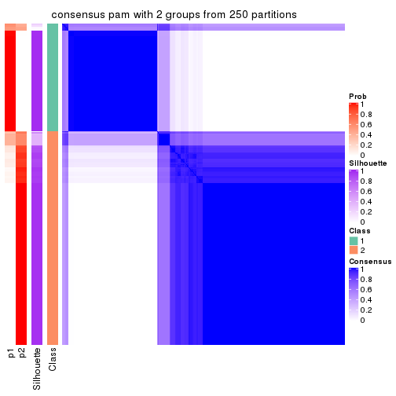</p>

</div>
<div id='tab-SD-pam-consensus-heatmap-2'>
<pre><code class="r">consensus_heatmap(res, k = 3)
</code></pre>

<p></p>

</div>
<div id='tab-SD-pam-consensus-heatmap-3'>
<pre><code class="r">consensus_heatmap(res, k = 4)
</code></pre>

<p></p>

</div>
<div id='tab-SD-pam-consensus-heatmap-4'>
<pre><code class="r">consensus_heatmap(res, k = 5)
</code></pre>

<p></p>

</div>
<div id='tab-SD-pam-consensus-heatmap-5'>
<pre><code class="r">consensus_heatmap(res, k = 6)
</code></pre>

<p></p>

</div>
</div>

Heatmaps for the membership of samples in all partitions to see how consistent they are:


<script>
$( function() {
	$( '#tabs-SD-pam-membership-heatmap' ).tabs();
} );
</script>
<div id='tabs-SD-pam-membership-heatmap'>
<ul>
<li><a href='#tab-SD-pam-membership-heatmap-1'>k = 2</a></li>
<li><a href='#tab-SD-pam-membership-heatmap-2'>k = 3</a></li>
<li><a href='#tab-SD-pam-membership-heatmap-3'>k = 4</a></li>
<li><a href='#tab-SD-pam-membership-heatmap-4'>k = 5</a></li>
<li><a href='#tab-SD-pam-membership-heatmap-5'>k = 6</a></li>
</ul>
<div id='tab-SD-pam-membership-heatmap-1'>
<pre><code class="r">membership_heatmap(res, k = 2)
</code></pre>

<p></p>

</div>
<div id='tab-SD-pam-membership-heatmap-2'>
<pre><code class="r">membership_heatmap(res, k = 3)
</code></pre>

<p></p>

</div>
<div id='tab-SD-pam-membership-heatmap-3'>
<pre><code class="r">membership_heatmap(res, k = 4)
</code></pre>

<p></p>

</div>
<div id='tab-SD-pam-membership-heatmap-4'>
<pre><code class="r">membership_heatmap(res, k = 5)
</code></pre>

<p></p>

</div>
<div id='tab-SD-pam-membership-heatmap-5'>
<pre><code class="r">membership_heatmap(res, k = 6)
</code></pre>

<p></p>

</div>
</div>

As soon as we have had the classes for columns, we can look for signatures
which are significantly different between classes which can be candidate marks
for certain classes. Following are the heatmaps for signatures.


Signature heatmaps where rows are scaled:


<script>
$( function() {
	$( '#tabs-SD-pam-get-signatures' ).tabs();
} );
</script>
<div id='tabs-SD-pam-get-signatures'>
<ul>
<li><a href='#tab-SD-pam-get-signatures-1'>k = 2</a></li>
<li><a href='#tab-SD-pam-get-signatures-2'>k = 3</a></li>
<li><a href='#tab-SD-pam-get-signatures-3'>k = 4</a></li>
<li><a href='#tab-SD-pam-get-signatures-4'>k = 5</a></li>
<li><a href='#tab-SD-pam-get-signatures-5'>k = 6</a></li>
</ul>
<div id='tab-SD-pam-get-signatures-1'>
<pre><code class="r">get_signatures(res, k = 2)
</code></pre>

<p></p>

</div>
<div id='tab-SD-pam-get-signatures-2'>
<pre><code class="r">get_signatures(res, k = 3)
</code></pre>

<p></p>

</div>
<div id='tab-SD-pam-get-signatures-3'>
<pre><code class="r">get_signatures(res, k = 4)
</code></pre>

<p></p>

</div>
<div id='tab-SD-pam-get-signatures-4'>
<pre><code class="r">get_signatures(res, k = 5)
</code></pre>

<p></p>

</div>
<div id='tab-SD-pam-get-signatures-5'>
<pre><code class="r">get_signatures(res, k = 6)
</code></pre>

<p></p>

</div>
</div>


Signature heatmaps where rows are not scaled:


<script>
$( function() {
	$( '#tabs-SD-pam-get-signatures-no-scale' ).tabs();
} );
</script>
<div id='tabs-SD-pam-get-signatures-no-scale'>
<ul>
<li><a href='#tab-SD-pam-get-signatures-no-scale-1'>k = 2</a></li>
<li><a href='#tab-SD-pam-get-signatures-no-scale-2'>k = 3</a></li>
<li><a href='#tab-SD-pam-get-signatures-no-scale-3'>k = 4</a></li>
<li><a href='#tab-SD-pam-get-signatures-no-scale-4'>k = 5</a></li>
<li><a href='#tab-SD-pam-get-signatures-no-scale-5'>k = 6</a></li>
</ul>
<div id='tab-SD-pam-get-signatures-no-scale-1'>
<pre><code class="r">get_signatures(res, k = 2, scale_rows = FALSE)
</code></pre>

<p>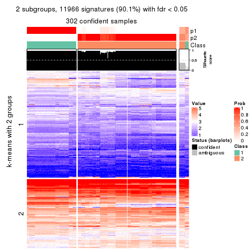</p>

</div>
<div id='tab-SD-pam-get-signatures-no-scale-2'>
<pre><code class="r">get_signatures(res, k = 3, scale_rows = FALSE)
</code></pre>

<p></p>

</div>
<div id='tab-SD-pam-get-signatures-no-scale-3'>
<pre><code class="r">get_signatures(res, k = 4, scale_rows = FALSE)
</code></pre>

<p></p>

</div>
<div id='tab-SD-pam-get-signatures-no-scale-4'>
<pre><code class="r">get_signatures(res, k = 5, scale_rows = FALSE)
</code></pre>

<p></p>

</div>
<div id='tab-SD-pam-get-signatures-no-scale-5'>
<pre><code class="r">get_signatures(res, k = 6, scale_rows = FALSE)
</code></pre>

<p></p>

</div>
</div>


Compare the overlap of signatures from different k:

```r
compare_signatures(res)
```


`get_signature()` returns a data frame invisibly. TO get the list of signatures, the function
call should be assigned to a variable explicitly. In following code, if `plot` argument is set
to `FALSE`, no heatmap is plotted while only the differential analysis is performed.

```r
# code only for demonstration
tb = get_signature(res, k = ..., plot = FALSE)
```

An example of the output of `tb` is:

```
#>   which_row         fdr    mean_1    mean_2 scaled_mean_1 scaled_mean_2 km
#> 1        38 0.042760348  8.373488  9.131774    -0.5533452     0.5164555  1
#> 2        40 0.018707592  7.106213  8.469186    -0.6173731     0.5762149  1
#> 3        55 0.019134737 10.221463 11.207825    -0.6159697     0.5749050  1
#> 4        59 0.006059896  5.921854  7.869574    -0.6899429     0.6439467  1
#> 5        60 0.018055526  8.928898 10.211722    -0.6204761     0.5791110  1
#> 6        98 0.009384629 15.714769 14.887706     0.6635654    -0.6193277  2
...
```

The columns in `tb` are:

1. `which_row`: row indices corresponding to the input matrix.
2. `fdr`: FDR for the differential test. 
3. `mean_x`: The mean value in group x.
4. `scaled_mean_x`: The mean value in group x after rows are scaled.
5. `km`: Row groups if k-means clustering is applied to rows.


UMAP plot which shows how samples are separated.


<script>
$( function() {
	$( '#tabs-SD-pam-dimension-reduction' ).tabs();
} );
</script>
<div id='tabs-SD-pam-dimension-reduction'>
<ul>
<li><a href='#tab-SD-pam-dimension-reduction-1'>k = 2</a></li>
<li><a href='#tab-SD-pam-dimension-reduction-2'>k = 3</a></li>
<li><a href='#tab-SD-pam-dimension-reduction-3'>k = 4</a></li>
<li><a href='#tab-SD-pam-dimension-reduction-4'>k = 5</a></li>
<li><a href='#tab-SD-pam-dimension-reduction-5'>k = 6</a></li>
</ul>
<div id='tab-SD-pam-dimension-reduction-1'>
<pre><code class="r">dimension_reduction(res, k = 2, method = &quot;UMAP&quot;)
</code></pre>

<p></p>

</div>
<div id='tab-SD-pam-dimension-reduction-2'>
<pre><code class="r">dimension_reduction(res, k = 3, method = &quot;UMAP&quot;)
</code></pre>

<p></p>

</div>
<div id='tab-SD-pam-dimension-reduction-3'>
<pre><code class="r">dimension_reduction(res, k = 4, method = &quot;UMAP&quot;)
</code></pre>

<p></p>

</div>
<div id='tab-SD-pam-dimension-reduction-4'>
<pre><code class="r">dimension_reduction(res, k = 5, method = &quot;UMAP&quot;)
</code></pre>

<p></p>

</div>
<div id='tab-SD-pam-dimension-reduction-5'>
<pre><code class="r">dimension_reduction(res, k = 6, method = &quot;UMAP&quot;)
</code></pre>

<p></p>

</div>
</div>


Following heatmap shows how subgroups are split when increasing `k`:

```r
collect_classes(res)
```


If matrix rows can be associated to genes, consider to use `functional_enrichment(res,
...)` to perform function enrichment for the signature genes. See [this vignette](http://bioconductor.org/packages/devel/bioc/vignettes/cola/inst/doc/functional_enrichment.html) for more detailed explanations.


 

---------------------------------------------------


### SD:mclust


The object with results only for a single top-value method and a single partition method 
can be extracted as:

```r
res = res_list["SD", "mclust"]
# you can also extract it by
# res = res_list["SD:mclust"]
```

A summary of `res` and all the functions that can be applied to it:

```r
res
```

```
#> A 'ConsensusPartition' object with k = 2, 3, 4, 5, 6.
#>   On a matrix with 13278 rows and 322 columns.
#>   Top rows (1000, 2000, 3000, 4000, 5000) are extracted by 'SD' method.
#>   Subgroups are detected by 'mclust' method.
#>   Performed in total 1250 partitions by row resampling.
#>   Best k for subgroups seems to be 6.
#> 
#> Following methods can be applied to this 'ConsensusPartition' object:
#>  [1] "cola_report"             "collect_classes"         "collect_plots"          
#>  [4] "collect_stats"           "colnames"                "compare_signatures"     
#>  [7] "consensus_heatmap"       "dimension_reduction"     "functional_enrichment"  
#> [10] "get_anno_col"            "get_anno"                "get_classes"            
#> [13] "get_consensus"           "get_matrix"              "get_membership"         
#> [16] "get_param"               "get_signatures"          "get_stats"              
#> [19] "is_best_k"               "is_stable_k"             "membership_heatmap"     
#> [22] "ncol"                    "nrow"                    "plot_ecdf"              
#> [25] "rownames"                "select_partition_number" "show"                   
#> [28] "suggest_best_k"          "test_to_known_factors"
```

`collect_plots()` function collects all the plots made from `res` for all `k` (number of partitions)
into one single page to provide an easy and fast comparison between different `k`.

```r
collect_plots(res)
```


The plots are:

- The first row: a plot of the ECDF (empirical cumulative distribution
  function) curves of the consensus matrix for each `k` and the heatmap of
  predicted classes for each `k`.
- The second row: heatmaps of the consensus matrix for each `k`.
- The third row: heatmaps of the membership matrix for each `k`.
- The fouth row: heatmaps of the signatures for each `k`.

All the plots in panels can be made by individual functions and they are
plotted later in this section.

`select_partition_number()` produces several plots showing different
statistics for choosing "optimized" `k`. There are following statistics:

- ECDF curves of the consensus matrix for each `k`;
- 1-PAC. [The PAC
  score](https://en.wikipedia.org/wiki/Consensus_clustering#Over-interpretation_potential_of_consensus_clustering)
  measures the proportion of the ambiguous subgrouping.
- Mean silhouette score.
- Concordance. The mean probability of fiting the consensus class ids in all
  partitions.
- Area increased. Denote $A_k$ as the area under the ECDF curve for current
  `k`, the area increased is defined as $A_k - A_{k-1}$.
- Rand index. The percent of pairs of samples that are both in a same cluster
  or both are not in a same cluster in the partition of k and k-1.
- Jaccard index. The ratio of pairs of samples are both in a same cluster in
  the partition of k and k-1 and the pairs of samples are both in a same
  cluster in the partition k or k-1.

The detailed explanations of these statistics can be found in [the _cola_
vignette](http://bioconductor.org/packages/devel/bioc/vignettes/cola/inst/doc/cola.html#toc_13).

Generally speaking, lower PAC score, higher mean silhouette score or higher
concordance corresponds to better partition. Rand index and Jaccard index
measure how similar the current partition is compared to partition with `k-1`.
If they are too similar, we won't accept `k` is better than `k-1`.

```r
select_partition_number(res)
```


The numeric values for all these statistics can be obtained by `get_stats()`.

```r
get_stats(res)
```

```
#>   k 1-PAC mean_silhouette concordance area_increased  Rand Jaccard
#> 2 2 0.492           0.846       0.902         0.4654 0.505   0.505
#> 3 3 0.875           0.935       0.949         0.1431 0.596   0.424
#> 4 4 0.721           0.897       0.891         0.3146 0.786   0.568
#> 5 5 0.772           0.918       0.916         0.0930 0.944   0.802
#> 6 6 0.874           0.938       0.911         0.0532 0.957   0.812
```

`suggest_best_k()` suggests the best $k$ based on these statistics. The rules are as follows:

- All $k$ with Jaccard index larger than 0.95 are removed because increasing
  $k$ does not provide enough extra information. If all $k$ are removed, it is
  marked as no subgroup is detected.
- For all $k$ with 1-PAC score larger than 0.9, the maximal $k$ is taken as
  the best $k$, and other $k$ are marked as optional $k$.
- If it does not fit the second rule. The $k$ with the maximal vote of the
  highest 1-PAC score, highest mean silhouette, and highest concordance is
  taken as the best $k$.

```r
suggest_best_k(res)
```

```
#> [1] 6
```


Following shows the table of the partitions (You need to click the **show/hide
code output** link to see it). The membership matrix (columns with name `p*`)
is inferred by
[`clue::cl_consensus()`](https://www.rdocumentation.org/link/cl_consensus?package=clue)
function with the `SE` method. Basically the value in the membership matrix
represents the probability to belong to a certain group. The finall class
label for an item is determined with the group with highest probability it
belongs to.

In `get_classes()` function, the entropy is calculated from the membership
matrix and the silhouette score is calculated from the consensus matrix.


<script>
$( function() {
	$( '#tabs-SD-mclust-get-classes' ).tabs();
} );
</script>
<div id='tabs-SD-mclust-get-classes'>
<ul>
<li><a href='#tab-SD-mclust-get-classes-1'>k = 2</a></li>
<li><a href='#tab-SD-mclust-get-classes-2'>k = 3</a></li>
<li><a href='#tab-SD-mclust-get-classes-3'>k = 4</a></li>
<li><a href='#tab-SD-mclust-get-classes-4'>k = 5</a></li>
<li><a href='#tab-SD-mclust-get-classes-5'>k = 6</a></li>
</ul>

<div id='tab-SD-mclust-get-classes-1'>
<p><a id='tab-SD-mclust-get-classes-1-a' style='color:#0366d6' href='#'>show/hide code output</a></p>
<pre><code class="r">cbind(get_classes(res, k = 2), get_membership(res, k = 2))
</code></pre>

<pre><code>#&gt;           class entropy silhouette    p1    p2
#&gt; DRR023371     2  0.0000      0.926 0.000 1.000
#&gt; DRR023372     2  0.0000      0.926 0.000 1.000
#&gt; DRR023373     2  0.0000      0.926 0.000 1.000
#&gt; DRR023374     2  0.0000      0.926 0.000 1.000
#&gt; DRR023375     2  0.0000      0.926 0.000 1.000
#&gt; DRR023376     2  0.0000      0.926 0.000 1.000
#&gt; DRR023377     2  0.0000      0.926 0.000 1.000
#&gt; DRR023378     2  0.0000      0.926 0.000 1.000
#&gt; DRR023379     2  0.0000      0.926 0.000 1.000
#&gt; DRR023380     2  0.0000      0.926 0.000 1.000
#&gt; DRR023381     2  0.0000      0.926 0.000 1.000
#&gt; DRR023382     2  0.0000      0.926 0.000 1.000
#&gt; DRR023383     2  0.0000      0.926 0.000 1.000
#&gt; DRR023384     2  0.0000      0.926 0.000 1.000
#&gt; DRR023385     2  0.0000      0.926 0.000 1.000
#&gt; DRR023386     2  0.0000      0.926 0.000 1.000
#&gt; DRR023387     2  0.0000      0.926 0.000 1.000
#&gt; DRR023388     2  0.0000      0.926 0.000 1.000
#&gt; DRR023389     2  0.0000      0.926 0.000 1.000
#&gt; DRR023390     2  0.0000      0.926 0.000 1.000
#&gt; DRR023391     2  0.0000      0.926 0.000 1.000
#&gt; DRR023392     2  0.0000      0.926 0.000 1.000
#&gt; DRR023394     2  0.0000      0.926 0.000 1.000
#&gt; DRR023395     2  0.0000      0.926 0.000 1.000
#&gt; DRR023396     2  0.0000      0.926 0.000 1.000
#&gt; DRR023397     2  0.0000      0.926 0.000 1.000
#&gt; DRR023398     2  0.0000      0.926 0.000 1.000
#&gt; DRR023399     2  0.0000      0.926 0.000 1.000
#&gt; DRR023400     2  0.0000      0.926 0.000 1.000
#&gt; DRR023401     2  0.0000      0.926 0.000 1.000
#&gt; DRR023402     2  0.0000      0.926 0.000 1.000
#&gt; DRR023403     2  0.0000      0.926 0.000 1.000
#&gt; DRR023404     2  0.0938      0.925 0.012 0.988
#&gt; DRR023405     2  0.0938      0.925 0.012 0.988
#&gt; DRR023406     2  0.0938      0.925 0.012 0.988
#&gt; DRR023407     2  0.0938      0.925 0.012 0.988
#&gt; DRR023408     2  0.0938      0.925 0.012 0.988
#&gt; DRR023409     2  0.0938      0.925 0.012 0.988
#&gt; DRR023410     2  0.0938      0.925 0.012 0.988
#&gt; DRR023411     2  0.0938      0.925 0.012 0.988
#&gt; DRR023412     2  0.0938      0.925 0.012 0.988
#&gt; DRR023413     2  0.0938      0.925 0.012 0.988
#&gt; DRR023414     2  0.0938      0.925 0.012 0.988
#&gt; DRR023415     2  0.0938      0.925 0.012 0.988
#&gt; DRR023416     2  0.0938      0.925 0.012 0.988
#&gt; DRR023417     2  0.0938      0.925 0.012 0.988
#&gt; DRR023418     2  0.0938      0.925 0.012 0.988
#&gt; DRR023419     2  0.0938      0.925 0.012 0.988
#&gt; DRR023420     2  0.0938      0.925 0.012 0.988
#&gt; DRR023421     2  0.0938      0.925 0.012 0.988
#&gt; DRR023422     2  0.1184      0.923 0.016 0.984
#&gt; DRR023423     2  0.1184      0.923 0.016 0.984
#&gt; DRR023425     2  0.1184      0.923 0.016 0.984
#&gt; DRR023426     2  0.1184      0.923 0.016 0.984
#&gt; DRR023427     2  0.1184      0.923 0.016 0.984
#&gt; DRR023428     2  0.1184      0.923 0.016 0.984
#&gt; DRR023429     2  0.1184      0.923 0.016 0.984
#&gt; DRR023430     2  0.1184      0.923 0.016 0.984
#&gt; DRR023431     2  0.1184      0.923 0.016 0.984
#&gt; DRR023432     2  0.1184      0.923 0.016 0.984
#&gt; DRR023433     2  0.1184      0.923 0.016 0.984
#&gt; DRR023434     2  0.1184      0.923 0.016 0.984
#&gt; DRR023435     2  0.1184      0.923 0.016 0.984
#&gt; DRR023436     2  0.1184      0.923 0.016 0.984
#&gt; DRR023437     2  0.1184      0.923 0.016 0.984
#&gt; DRR023438     2  0.1184      0.923 0.016 0.984
#&gt; DRR023439     2  0.1184      0.923 0.016 0.984
#&gt; DRR023440     2  0.1184      0.923 0.016 0.984
#&gt; DRR023441     2  0.1184      0.923 0.016 0.984
#&gt; DRR023442     2  0.1184      0.923 0.016 0.984
#&gt; DRR023443     2  0.1184      0.923 0.016 0.984
#&gt; DRR023444     2  0.1184      0.923 0.016 0.984
#&gt; DRR023445     2  0.1184      0.923 0.016 0.984
#&gt; DRR023446     2  0.1184      0.923 0.016 0.984
#&gt; DRR023447     2  0.1184      0.923 0.016 0.984
#&gt; DRR023448     2  0.1184      0.923 0.016 0.984
#&gt; DRR023449     2  0.1184      0.923 0.016 0.984
#&gt; DRR023450     2  0.1184      0.923 0.016 0.984
#&gt; DRR023451     2  0.1184      0.923 0.016 0.984
#&gt; DRR023452     2  0.1184      0.923 0.016 0.984
#&gt; DRR023453     2  0.0000      0.926 0.000 1.000
#&gt; DRR023454     2  0.0000      0.926 0.000 1.000
#&gt; DRR023455     2  0.0000      0.926 0.000 1.000
#&gt; DRR023456     2  0.0000      0.926 0.000 1.000
#&gt; DRR023457     2  0.0000      0.926 0.000 1.000
#&gt; DRR023458     2  0.0000      0.926 0.000 1.000
#&gt; DRR023459     2  0.0000      0.926 0.000 1.000
#&gt; DRR023460     2  0.0000      0.926 0.000 1.000
#&gt; DRR023461     2  0.0000      0.926 0.000 1.000
#&gt; DRR023462     2  0.0000      0.926 0.000 1.000
#&gt; DRR023463     2  0.0000      0.926 0.000 1.000
#&gt; DRR023464     2  0.0000      0.926 0.000 1.000
#&gt; DRR023465     2  0.0000      0.926 0.000 1.000
#&gt; DRR023466     2  0.0000      0.926 0.000 1.000
#&gt; DRR023467     2  0.0000      0.926 0.000 1.000
#&gt; DRR023468     2  0.0000      0.926 0.000 1.000
#&gt; DRR023469     2  0.0000      0.926 0.000 1.000
#&gt; DRR023470     2  0.0000      0.926 0.000 1.000
#&gt; DRR023471     2  0.0000      0.926 0.000 1.000
#&gt; DRR023472     2  0.0000      0.926 0.000 1.000
#&gt; DRR023473     2  0.0000      0.926 0.000 1.000
#&gt; DRR023474     2  0.0000      0.926 0.000 1.000
#&gt; DRR023475     2  0.0000      0.926 0.000 1.000
#&gt; DRR023476     2  0.0000      0.926 0.000 1.000
#&gt; DRR023477     2  0.0000      0.926 0.000 1.000
#&gt; DRR023478     2  0.0000      0.926 0.000 1.000
#&gt; DRR023479     2  0.0000      0.926 0.000 1.000
#&gt; DRR023480     2  0.0000      0.926 0.000 1.000
#&gt; DRR023481     2  0.0000      0.926 0.000 1.000
#&gt; DRR023482     2  0.0000      0.926 0.000 1.000
#&gt; DRR023483     2  0.0000      0.926 0.000 1.000
#&gt; DRR023484     2  0.0000      0.926 0.000 1.000
#&gt; DRR023485     2  0.0000      0.926 0.000 1.000
#&gt; DRR023486     2  0.0000      0.926 0.000 1.000
#&gt; DRR023487     2  0.0000      0.926 0.000 1.000
#&gt; DRR023488     2  0.0000      0.926 0.000 1.000
#&gt; DRR023489     2  0.0000      0.926 0.000 1.000
#&gt; DRR023490     1  0.1843      0.871 0.972 0.028
#&gt; DRR023491     1  0.1843      0.871 0.972 0.028
#&gt; DRR023492     1  0.1843      0.871 0.972 0.028
#&gt; DRR023493     1  0.1843      0.871 0.972 0.028
#&gt; DRR023494     1  0.1843      0.871 0.972 0.028
#&gt; DRR023495     1  0.1843      0.871 0.972 0.028
#&gt; DRR023496     1  0.1843      0.871 0.972 0.028
#&gt; DRR023497     1  0.1843      0.871 0.972 0.028
#&gt; DRR023498     1  0.1843      0.871 0.972 0.028
#&gt; DRR023499     1  0.1843      0.871 0.972 0.028
#&gt; DRR023500     1  0.1843      0.871 0.972 0.028
#&gt; DRR023501     1  0.1843      0.871 0.972 0.028
#&gt; DRR023502     1  0.1843      0.871 0.972 0.028
#&gt; DRR023503     1  0.1843      0.871 0.972 0.028
#&gt; DRR023504     1  0.1843      0.871 0.972 0.028
#&gt; DRR023505     1  0.1843      0.871 0.972 0.028
#&gt; DRR023506     1  0.1843      0.871 0.972 0.028
#&gt; DRR023507     1  0.1843      0.871 0.972 0.028
#&gt; DRR023508     1  0.2043      0.871 0.968 0.032
#&gt; DRR023509     1  0.1843      0.871 0.972 0.028
#&gt; DRR023510     1  0.1843      0.871 0.972 0.028
#&gt; DRR023511     1  0.1843      0.871 0.972 0.028
#&gt; DRR023512     1  0.1843      0.871 0.972 0.028
#&gt; DRR023513     1  0.1843      0.871 0.972 0.028
#&gt; DRR023514     1  0.1843      0.871 0.972 0.028
#&gt; DRR023515     1  0.1843      0.871 0.972 0.028
#&gt; DRR023516     1  0.1843      0.871 0.972 0.028
#&gt; DRR023517     1  0.1843      0.871 0.972 0.028
#&gt; DRR023518     1  0.0000      0.858 1.000 0.000
#&gt; DRR023519     1  0.0000      0.858 1.000 0.000
#&gt; DRR023520     1  0.0000      0.858 1.000 0.000
#&gt; DRR023521     1  0.0000      0.858 1.000 0.000
#&gt; DRR023522     1  0.0000      0.858 1.000 0.000
#&gt; DRR023523     1  0.0000      0.858 1.000 0.000
#&gt; DRR023524     1  0.0000      0.858 1.000 0.000
#&gt; DRR023525     1  0.0000      0.858 1.000 0.000
#&gt; DRR023526     1  0.0000      0.858 1.000 0.000
#&gt; DRR023527     1  0.0000      0.858 1.000 0.000
#&gt; DRR023528     1  0.0000      0.858 1.000 0.000
#&gt; DRR023529     1  0.0000      0.858 1.000 0.000
#&gt; DRR023530     1  0.0000      0.858 1.000 0.000
#&gt; DRR023531     1  0.0000      0.858 1.000 0.000
#&gt; DRR023532     1  0.0000      0.858 1.000 0.000
#&gt; DRR023533     1  0.0000      0.858 1.000 0.000
#&gt; DRR023534     1  0.0000      0.858 1.000 0.000
#&gt; DRR023535     1  0.0000      0.858 1.000 0.000
#&gt; DRR023536     1  0.0000      0.858 1.000 0.000
#&gt; DRR023537     1  0.0000      0.858 1.000 0.000
#&gt; DRR023538     1  0.0000      0.858 1.000 0.000
#&gt; DRR023539     1  0.0000      0.858 1.000 0.000
#&gt; DRR023540     1  0.0000      0.858 1.000 0.000
#&gt; DRR023541     1  0.0000      0.858 1.000 0.000
#&gt; DRR023542     1  0.0000      0.858 1.000 0.000
#&gt; DRR023543     1  0.0000      0.858 1.000 0.000
#&gt; DRR023544     1  0.0000      0.858 1.000 0.000
#&gt; DRR023545     1  0.0000      0.858 1.000 0.000
#&gt; DRR023546     1  0.0000      0.858 1.000 0.000
#&gt; DRR023547     1  0.0000      0.858 1.000 0.000
#&gt; DRR023548     1  0.0000      0.858 1.000 0.000
#&gt; DRR023549     1  0.0000      0.858 1.000 0.000
#&gt; DRR023550     1  0.0000      0.858 1.000 0.000
#&gt; DRR023551     1  0.0000      0.858 1.000 0.000
#&gt; DRR023552     1  0.0000      0.858 1.000 0.000
#&gt; DRR023553     1  0.0000      0.858 1.000 0.000
#&gt; DRR023554     1  0.0000      0.858 1.000 0.000
#&gt; DRR023555     1  0.0000      0.858 1.000 0.000
#&gt; DRR023556     1  0.0000      0.858 1.000 0.000
#&gt; DRR023557     1  0.0000      0.858 1.000 0.000
#&gt; DRR023558     1  0.0000      0.858 1.000 0.000
#&gt; DRR023559     1  0.1843      0.871 0.972 0.028
#&gt; DRR023560     1  0.1843      0.871 0.972 0.028
#&gt; DRR023561     1  0.1843      0.871 0.972 0.028
#&gt; DRR023562     1  0.1843      0.871 0.972 0.028
#&gt; DRR023563     1  0.1843      0.871 0.972 0.028
#&gt; DRR023564     1  0.1843      0.871 0.972 0.028
#&gt; DRR023565     1  0.1843      0.871 0.972 0.028
#&gt; DRR023566     1  0.1843      0.871 0.972 0.028
#&gt; DRR023567     1  0.1843      0.871 0.972 0.028
#&gt; DRR023568     1  0.1843      0.871 0.972 0.028
#&gt; DRR023569     1  0.1843      0.871 0.972 0.028
#&gt; DRR023570     1  0.1843      0.871 0.972 0.028
#&gt; DRR023571     1  0.5946      0.870 0.856 0.144
#&gt; DRR023572     1  0.5946      0.870 0.856 0.144
#&gt; DRR023573     1  0.5946      0.870 0.856 0.144
#&gt; DRR023574     1  0.5946      0.870 0.856 0.144
#&gt; DRR023575     1  0.5946      0.870 0.856 0.144
#&gt; DRR023576     1  0.9323      0.666 0.652 0.348
#&gt; DRR023577     1  0.9323      0.666 0.652 0.348
#&gt; DRR023578     1  0.9286      0.673 0.656 0.344
#&gt; DRR023579     1  0.9323      0.666 0.652 0.348
#&gt; DRR023580     1  0.9248      0.680 0.660 0.340
#&gt; DRR023581     1  0.9323      0.666 0.652 0.348
#&gt; DRR023582     1  0.9286      0.673 0.656 0.344
#&gt; DRR023583     1  0.9323      0.666 0.652 0.348
#&gt; DRR023584     1  0.9323      0.666 0.652 0.348
#&gt; DRR023585     1  0.9323      0.666 0.652 0.348
#&gt; DRR023586     1  0.9323      0.666 0.652 0.348
#&gt; DRR023587     1  0.7745      0.833 0.772 0.228
#&gt; DRR023588     1  0.7745      0.833 0.772 0.228
#&gt; DRR023589     1  0.7745      0.833 0.772 0.228
#&gt; DRR023590     1  0.7745      0.833 0.772 0.228
#&gt; DRR023591     1  0.7745      0.833 0.772 0.228
#&gt; DRR023592     1  0.7745      0.833 0.772 0.228
#&gt; DRR023593     1  0.7745      0.833 0.772 0.228
#&gt; DRR023594     1  0.7745      0.833 0.772 0.228
#&gt; DRR023595     1  0.7745      0.833 0.772 0.228
#&gt; DRR023596     1  0.7745      0.833 0.772 0.228
#&gt; DRR023597     1  0.7745      0.833 0.772 0.228
#&gt; DRR023598     1  0.7745      0.833 0.772 0.228
#&gt; DRR023599     1  0.7745      0.833 0.772 0.228
#&gt; DRR023600     1  0.7745      0.833 0.772 0.228
#&gt; DRR023601     1  0.7745      0.833 0.772 0.228
#&gt; DRR023602     1  0.7745      0.833 0.772 0.228
#&gt; DRR023603     1  0.7745      0.833 0.772 0.228
#&gt; DRR023604     1  0.7745      0.833 0.772 0.228
#&gt; DRR023605     1  0.7745      0.833 0.772 0.228
#&gt; DRR023606     1  0.7745      0.833 0.772 0.228
#&gt; DRR023607     1  0.7745      0.833 0.772 0.228
#&gt; DRR023608     1  0.7745      0.833 0.772 0.228
#&gt; DRR023609     1  0.7745      0.833 0.772 0.228
#&gt; DRR023610     1  0.7745      0.833 0.772 0.228
#&gt; DRR023611     1  0.7745      0.833 0.772 0.228
#&gt; DRR023612     1  0.7745      0.833 0.772 0.228
#&gt; DRR023613     1  0.7745      0.833 0.772 0.228
#&gt; DRR023614     1  0.7745      0.833 0.772 0.228
#&gt; DRR023615     1  0.7745      0.833 0.772 0.228
#&gt; DRR023616     1  0.7745      0.833 0.772 0.228
#&gt; DRR023617     1  0.7745      0.833 0.772 0.228
#&gt; DRR023619     1  0.6343      0.866 0.840 0.160
#&gt; DRR023620     1  0.6343      0.866 0.840 0.160
#&gt; DRR023621     1  0.6343      0.866 0.840 0.160
#&gt; DRR023622     1  0.6343      0.866 0.840 0.160
#&gt; DRR023623     1  0.6343      0.866 0.840 0.160
#&gt; DRR023624     1  0.6343      0.866 0.840 0.160
#&gt; DRR023625     1  0.6343      0.866 0.840 0.160
#&gt; DRR023626     1  0.6343      0.866 0.840 0.160
#&gt; DRR023627     1  0.6343      0.866 0.840 0.160
#&gt; DRR023628     1  0.6343      0.866 0.840 0.160
#&gt; DRR023629     1  0.6343      0.866 0.840 0.160
#&gt; DRR023630     1  0.6343      0.866 0.840 0.160
#&gt; DRR023631     1  0.6343      0.866 0.840 0.160
#&gt; DRR023632     1  0.6343      0.866 0.840 0.160
#&gt; DRR023633     1  0.6343      0.866 0.840 0.160
#&gt; DRR023635     1  0.8661      0.763 0.712 0.288
#&gt; DRR023636     1  0.8713      0.759 0.708 0.292
#&gt; DRR023637     1  0.8713      0.758 0.708 0.292
#&gt; DRR023638     1  0.8713      0.758 0.708 0.292
#&gt; DRR023639     1  0.8661      0.763 0.712 0.288
#&gt; DRR023640     1  0.8713      0.758 0.708 0.292
#&gt; DRR023641     1  0.8713      0.758 0.708 0.292
#&gt; DRR023642     1  0.8713      0.758 0.708 0.292
#&gt; DRR023643     2  0.8955      0.522 0.312 0.688
#&gt; DRR023644     2  0.8813      0.548 0.300 0.700
#&gt; DRR023645     2  0.9044      0.503 0.320 0.680
#&gt; DRR023646     2  0.8861      0.540 0.304 0.696
#&gt; DRR023647     2  0.9608      0.317 0.384 0.616
#&gt; DRR023648     2  0.8861      0.540 0.304 0.696
#&gt; DRR023649     2  0.8763      0.553 0.296 0.704
#&gt; DRR023650     1  0.6887      0.860 0.816 0.184
#&gt; DRR023651     1  0.6887      0.860 0.816 0.184
#&gt; DRR023652     1  0.6887      0.860 0.816 0.184
#&gt; DRR023653     1  0.6887      0.860 0.816 0.184
#&gt; DRR023654     1  0.6887      0.860 0.816 0.184
#&gt; DRR023655     1  0.6887      0.860 0.816 0.184
#&gt; DRR023656     1  0.6887      0.860 0.816 0.184
#&gt; DRR023657     1  0.6887      0.860 0.816 0.184
#&gt; DRR023658     1  0.6887      0.860 0.816 0.184
#&gt; DRR023659     1  0.6887      0.860 0.816 0.184
#&gt; DRR023660     1  0.6887      0.860 0.816 0.184
#&gt; DRR023661     1  0.6887      0.860 0.816 0.184
#&gt; DRR023662     1  0.6887      0.860 0.816 0.184
#&gt; DRR023663     1  0.6887      0.860 0.816 0.184
#&gt; DRR023664     1  0.6887      0.860 0.816 0.184
#&gt; DRR023665     1  0.6887      0.860 0.816 0.184
#&gt; DRR023666     1  0.6887      0.860 0.816 0.184
#&gt; DRR023667     1  0.6887      0.860 0.816 0.184
#&gt; DRR023668     1  0.6887      0.860 0.816 0.184
#&gt; DRR023669     1  0.6887      0.860 0.816 0.184
#&gt; DRR023670     1  0.6887      0.860 0.816 0.184
#&gt; DRR023671     1  0.6887      0.860 0.816 0.184
#&gt; DRR023672     1  0.6887      0.860 0.816 0.184
#&gt; DRR023673     1  0.6887      0.860 0.816 0.184
#&gt; DRR023674     1  0.6887      0.860 0.816 0.184
#&gt; DRR023675     1  0.6887      0.860 0.816 0.184
#&gt; DRR023676     1  0.6887      0.860 0.816 0.184
#&gt; DRR023677     1  0.6887      0.860 0.816 0.184
#&gt; DRR023678     1  0.6887      0.860 0.816 0.184
#&gt; DRR023683     2  0.9129      0.504 0.328 0.672
#&gt; DRR023684     2  0.9129      0.504 0.328 0.672
#&gt; DRR023685     2  0.9087      0.513 0.324 0.676
#&gt; DRR023686     2  0.9087      0.513 0.324 0.676
#&gt; DRR023687     2  0.9129      0.504 0.328 0.672
#&gt; DRR023688     2  0.9129      0.504 0.328 0.672
#&gt; DRR023689     2  0.9087      0.513 0.324 0.676
#&gt; DRR023690     2  0.9087      0.513 0.324 0.676
#&gt; DRR023691     2  0.9170      0.494 0.332 0.668
#&gt; DRR023692     2  0.9129      0.504 0.328 0.672
#&gt; DRR023693     2  0.9129      0.504 0.328 0.672
#&gt; DRR023694     2  0.9129      0.504 0.328 0.672
#&gt; DRR023695     2  0.9087      0.513 0.324 0.676
#&gt; DRR023696     2  0.9129      0.504 0.328 0.672
#&gt; DRR023697     2  0.9129      0.504 0.328 0.672
#&gt; DRR023698     2  0.9129      0.504 0.328 0.672
#&gt; DRR023699     2  0.9129      0.504 0.328 0.672
#&gt; DRR023700     2  0.9170      0.494 0.332 0.668
</code></pre>

<script>
$('#tab-SD-mclust-get-classes-1-a').parent().next().next().hide();
$('#tab-SD-mclust-get-classes-1-a').click(function(){
  $('#tab-SD-mclust-get-classes-1-a').parent().next().next().toggle();
  return(false);
});
</script>
</div>

<div id='tab-SD-mclust-get-classes-2'>
<p><a id='tab-SD-mclust-get-classes-2-a' style='color:#0366d6' href='#'>show/hide code output</a></p>
<pre><code class="r">cbind(get_classes(res, k = 3), get_membership(res, k = 3))
</code></pre>

<pre><code>#&gt;           class entropy silhouette    p1    p2    p3
#&gt; DRR023371     3   0.000      1.000 0.000 0.000 1.000
#&gt; DRR023372     3   0.000      1.000 0.000 0.000 1.000
#&gt; DRR023373     3   0.000      1.000 0.000 0.000 1.000
#&gt; DRR023374     3   0.000      1.000 0.000 0.000 1.000
#&gt; DRR023375     3   0.000      1.000 0.000 0.000 1.000
#&gt; DRR023376     3   0.000      1.000 0.000 0.000 1.000
#&gt; DRR023377     3   0.000      1.000 0.000 0.000 1.000
#&gt; DRR023378     3   0.000      1.000 0.000 0.000 1.000
#&gt; DRR023379     3   0.000      1.000 0.000 0.000 1.000
#&gt; DRR023380     3   0.000      1.000 0.000 0.000 1.000
#&gt; DRR023381     3   0.000      1.000 0.000 0.000 1.000
#&gt; DRR023382     3   0.000      1.000 0.000 0.000 1.000
#&gt; DRR023383     3   0.000      1.000 0.000 0.000 1.000
#&gt; DRR023384     3   0.000      1.000 0.000 0.000 1.000
#&gt; DRR023385     3   0.000      1.000 0.000 0.000 1.000
#&gt; DRR023386     3   0.000      1.000 0.000 0.000 1.000
#&gt; DRR023387     3   0.000      1.000 0.000 0.000 1.000
#&gt; DRR023388     3   0.000      1.000 0.000 0.000 1.000
#&gt; DRR023389     3   0.000      1.000 0.000 0.000 1.000
#&gt; DRR023390     3   0.000      1.000 0.000 0.000 1.000
#&gt; DRR023391     3   0.000      1.000 0.000 0.000 1.000
#&gt; DRR023392     3   0.000      1.000 0.000 0.000 1.000
#&gt; DRR023394     3   0.000      1.000 0.000 0.000 1.000
#&gt; DRR023395     3   0.000      1.000 0.000 0.000 1.000
#&gt; DRR023396     3   0.000      1.000 0.000 0.000 1.000
#&gt; DRR023397     3   0.000      1.000 0.000 0.000 1.000
#&gt; DRR023398     3   0.000      1.000 0.000 0.000 1.000
#&gt; DRR023399     3   0.000      1.000 0.000 0.000 1.000
#&gt; DRR023400     3   0.000      1.000 0.000 0.000 1.000
#&gt; DRR023401     3   0.000      1.000 0.000 0.000 1.000
#&gt; DRR023402     3   0.000      1.000 0.000 0.000 1.000
#&gt; DRR023403     3   0.000      1.000 0.000 0.000 1.000
#&gt; DRR023404     2   0.000      0.927 0.000 1.000 0.000
#&gt; DRR023405     2   0.000      0.927 0.000 1.000 0.000
#&gt; DRR023406     2   0.000      0.927 0.000 1.000 0.000
#&gt; DRR023407     2   0.000      0.927 0.000 1.000 0.000
#&gt; DRR023408     2   0.000      0.927 0.000 1.000 0.000
#&gt; DRR023409     2   0.000      0.927 0.000 1.000 0.000
#&gt; DRR023410     2   0.000      0.927 0.000 1.000 0.000
#&gt; DRR023411     2   0.000      0.927 0.000 1.000 0.000
#&gt; DRR023412     2   0.000      0.927 0.000 1.000 0.000
#&gt; DRR023413     2   0.000      0.927 0.000 1.000 0.000
#&gt; DRR023414     2   0.000      0.927 0.000 1.000 0.000
#&gt; DRR023415     2   0.000      0.927 0.000 1.000 0.000
#&gt; DRR023416     2   0.000      0.927 0.000 1.000 0.000
#&gt; DRR023417     2   0.000      0.927 0.000 1.000 0.000
#&gt; DRR023418     2   0.000      0.927 0.000 1.000 0.000
#&gt; DRR023419     2   0.000      0.927 0.000 1.000 0.000
#&gt; DRR023420     2   0.000      0.927 0.000 1.000 0.000
#&gt; DRR023421     2   0.000      0.927 0.000 1.000 0.000
#&gt; DRR023422     2   0.000      0.927 0.000 1.000 0.000
#&gt; DRR023423     2   0.000      0.927 0.000 1.000 0.000
#&gt; DRR023425     2   0.000      0.927 0.000 1.000 0.000
#&gt; DRR023426     2   0.000      0.927 0.000 1.000 0.000
#&gt; DRR023427     2   0.000      0.927 0.000 1.000 0.000
#&gt; DRR023428     2   0.000      0.927 0.000 1.000 0.000
#&gt; DRR023429     2   0.000      0.927 0.000 1.000 0.000
#&gt; DRR023430     2   0.000      0.927 0.000 1.000 0.000
#&gt; DRR023431     2   0.000      0.927 0.000 1.000 0.000
#&gt; DRR023432     2   0.000      0.927 0.000 1.000 0.000
#&gt; DRR023433     2   0.000      0.927 0.000 1.000 0.000
#&gt; DRR023434     2   0.000      0.927 0.000 1.000 0.000
#&gt; DRR023435     2   0.000      0.927 0.000 1.000 0.000
#&gt; DRR023436     2   0.000      0.927 0.000 1.000 0.000
#&gt; DRR023437     2   0.000      0.927 0.000 1.000 0.000
#&gt; DRR023438     2   0.000      0.927 0.000 1.000 0.000
#&gt; DRR023439     2   0.000      0.927 0.000 1.000 0.000
#&gt; DRR023440     2   0.000      0.927 0.000 1.000 0.000
#&gt; DRR023441     2   0.000      0.927 0.000 1.000 0.000
#&gt; DRR023442     2   0.000      0.927 0.000 1.000 0.000
#&gt; DRR023443     2   0.000      0.927 0.000 1.000 0.000
#&gt; DRR023444     2   0.000      0.927 0.000 1.000 0.000
#&gt; DRR023445     2   0.000      0.927 0.000 1.000 0.000
#&gt; DRR023446     2   0.000      0.927 0.000 1.000 0.000
#&gt; DRR023447     2   0.000      0.927 0.000 1.000 0.000
#&gt; DRR023448     2   0.000      0.927 0.000 1.000 0.000
#&gt; DRR023449     2   0.000      0.927 0.000 1.000 0.000
#&gt; DRR023450     2   0.000      0.927 0.000 1.000 0.000
#&gt; DRR023451     2   0.000      0.927 0.000 1.000 0.000
#&gt; DRR023452     2   0.000      0.927 0.000 1.000 0.000
#&gt; DRR023453     3   0.000      1.000 0.000 0.000 1.000
#&gt; DRR023454     3   0.000      1.000 0.000 0.000 1.000
#&gt; DRR023455     3   0.000      1.000 0.000 0.000 1.000
#&gt; DRR023456     3   0.000      1.000 0.000 0.000 1.000
#&gt; DRR023457     3   0.000      1.000 0.000 0.000 1.000
#&gt; DRR023458     3   0.000      1.000 0.000 0.000 1.000
#&gt; DRR023459     3   0.000      1.000 0.000 0.000 1.000
#&gt; DRR023460     3   0.000      1.000 0.000 0.000 1.000
#&gt; DRR023461     3   0.000      1.000 0.000 0.000 1.000
#&gt; DRR023462     3   0.000      1.000 0.000 0.000 1.000
#&gt; DRR023463     3   0.000      1.000 0.000 0.000 1.000
#&gt; DRR023464     3   0.000      1.000 0.000 0.000 1.000
#&gt; DRR023465     3   0.000      1.000 0.000 0.000 1.000
#&gt; DRR023466     3   0.000      1.000 0.000 0.000 1.000
#&gt; DRR023467     3   0.000      1.000 0.000 0.000 1.000
#&gt; DRR023468     3   0.000      1.000 0.000 0.000 1.000
#&gt; DRR023469     3   0.000      1.000 0.000 0.000 1.000
#&gt; DRR023470     3   0.000      1.000 0.000 0.000 1.000
#&gt; DRR023471     3   0.000      1.000 0.000 0.000 1.000
#&gt; DRR023472     3   0.000      1.000 0.000 0.000 1.000
#&gt; DRR023473     3   0.000      1.000 0.000 0.000 1.000
#&gt; DRR023474     3   0.000      1.000 0.000 0.000 1.000
#&gt; DRR023475     3   0.000      1.000 0.000 0.000 1.000
#&gt; DRR023476     3   0.000      1.000 0.000 0.000 1.000
#&gt; DRR023477     3   0.000      1.000 0.000 0.000 1.000
#&gt; DRR023478     3   0.000      1.000 0.000 0.000 1.000
#&gt; DRR023479     3   0.000      1.000 0.000 0.000 1.000
#&gt; DRR023480     3   0.000      1.000 0.000 0.000 1.000
#&gt; DRR023481     3   0.000      1.000 0.000 0.000 1.000
#&gt; DRR023482     3   0.000      1.000 0.000 0.000 1.000
#&gt; DRR023483     3   0.000      1.000 0.000 0.000 1.000
#&gt; DRR023484     3   0.000      1.000 0.000 0.000 1.000
#&gt; DRR023485     3   0.000      1.000 0.000 0.000 1.000
#&gt; DRR023486     3   0.000      1.000 0.000 0.000 1.000
#&gt; DRR023487     3   0.000      1.000 0.000 0.000 1.000
#&gt; DRR023488     3   0.000      1.000 0.000 0.000 1.000
#&gt; DRR023489     3   0.000      1.000 0.000 0.000 1.000
#&gt; DRR023490     2   0.587      0.807 0.208 0.760 0.032
#&gt; DRR023491     2   0.587      0.807 0.208 0.760 0.032
#&gt; DRR023492     2   0.587      0.807 0.208 0.760 0.032
#&gt; DRR023493     2   0.587      0.807 0.208 0.760 0.032
#&gt; DRR023494     2   0.587      0.807 0.208 0.760 0.032
#&gt; DRR023495     2   0.587      0.807 0.208 0.760 0.032
#&gt; DRR023496     2   0.587      0.807 0.208 0.760 0.032
#&gt; DRR023497     2   0.587      0.807 0.208 0.760 0.032
#&gt; DRR023498     2   0.587      0.807 0.208 0.760 0.032
#&gt; DRR023499     2   0.587      0.807 0.208 0.760 0.032
#&gt; DRR023500     2   0.587      0.807 0.208 0.760 0.032
#&gt; DRR023501     2   0.587      0.807 0.208 0.760 0.032
#&gt; DRR023502     2   0.587      0.807 0.208 0.760 0.032
#&gt; DRR023503     2   0.587      0.807 0.208 0.760 0.032
#&gt; DRR023504     2   0.587      0.807 0.208 0.760 0.032
#&gt; DRR023505     2   0.587      0.807 0.208 0.760 0.032
#&gt; DRR023506     2   0.587      0.807 0.208 0.760 0.032
#&gt; DRR023507     2   0.587      0.807 0.208 0.760 0.032
#&gt; DRR023508     2   0.583      0.811 0.204 0.764 0.032
#&gt; DRR023509     2   0.587      0.807 0.208 0.760 0.032
#&gt; DRR023510     2   0.587      0.807 0.208 0.760 0.032
#&gt; DRR023511     2   0.587      0.807 0.208 0.760 0.032
#&gt; DRR023512     2   0.587      0.807 0.208 0.760 0.032
#&gt; DRR023513     2   0.587      0.807 0.208 0.760 0.032
#&gt; DRR023514     2   0.587      0.807 0.208 0.760 0.032
#&gt; DRR023515     2   0.587      0.807 0.208 0.760 0.032
#&gt; DRR023516     2   0.587      0.807 0.208 0.760 0.032
#&gt; DRR023517     2   0.587      0.807 0.208 0.760 0.032
#&gt; DRR023518     1   0.000      1.000 1.000 0.000 0.000
#&gt; DRR023519     1   0.000      1.000 1.000 0.000 0.000
#&gt; DRR023520     1   0.000      1.000 1.000 0.000 0.000
#&gt; DRR023521     1   0.000      1.000 1.000 0.000 0.000
#&gt; DRR023522     1   0.000      1.000 1.000 0.000 0.000
#&gt; DRR023523     1   0.000      1.000 1.000 0.000 0.000
#&gt; DRR023524     1   0.000      1.000 1.000 0.000 0.000
#&gt; DRR023525     1   0.000      1.000 1.000 0.000 0.000
#&gt; DRR023526     1   0.000      1.000 1.000 0.000 0.000
#&gt; DRR023527     1   0.000      1.000 1.000 0.000 0.000
#&gt; DRR023528     1   0.000      1.000 1.000 0.000 0.000
#&gt; DRR023529     1   0.000      1.000 1.000 0.000 0.000
#&gt; DRR023530     1   0.000      1.000 1.000 0.000 0.000
#&gt; DRR023531     1   0.000      1.000 1.000 0.000 0.000
#&gt; DRR023532     1   0.000      1.000 1.000 0.000 0.000
#&gt; DRR023533     1   0.000      1.000 1.000 0.000 0.000
#&gt; DRR023534     1   0.000      1.000 1.000 0.000 0.000
#&gt; DRR023535     1   0.000      1.000 1.000 0.000 0.000
#&gt; DRR023536     1   0.000      1.000 1.000 0.000 0.000
#&gt; DRR023537     1   0.000      1.000 1.000 0.000 0.000
#&gt; DRR023538     1   0.000      1.000 1.000 0.000 0.000
#&gt; DRR023539     1   0.000      1.000 1.000 0.000 0.000
#&gt; DRR023540     1   0.000      1.000 1.000 0.000 0.000
#&gt; DRR023541     1   0.000      1.000 1.000 0.000 0.000
#&gt; DRR023542     1   0.000      1.000 1.000 0.000 0.000
#&gt; DRR023543     1   0.000      1.000 1.000 0.000 0.000
#&gt; DRR023544     1   0.000      1.000 1.000 0.000 0.000
#&gt; DRR023545     1   0.000      1.000 1.000 0.000 0.000
#&gt; DRR023546     1   0.000      1.000 1.000 0.000 0.000
#&gt; DRR023547     1   0.000      1.000 1.000 0.000 0.000
#&gt; DRR023548     1   0.000      1.000 1.000 0.000 0.000
#&gt; DRR023549     1   0.000      1.000 1.000 0.000 0.000
#&gt; DRR023550     1   0.000      1.000 1.000 0.000 0.000
#&gt; DRR023551     1   0.000      1.000 1.000 0.000 0.000
#&gt; DRR023552     1   0.000      1.000 1.000 0.000 0.000
#&gt; DRR023553     1   0.000      1.000 1.000 0.000 0.000
#&gt; DRR023554     1   0.000      1.000 1.000 0.000 0.000
#&gt; DRR023555     1   0.000      1.000 1.000 0.000 0.000
#&gt; DRR023556     1   0.000      1.000 1.000 0.000 0.000
#&gt; DRR023557     1   0.000      1.000 1.000 0.000 0.000
#&gt; DRR023558     1   0.000      1.000 1.000 0.000 0.000
#&gt; DRR023559     2   0.645      0.738 0.264 0.704 0.032
#&gt; DRR023560     2   0.645      0.738 0.264 0.704 0.032
#&gt; DRR023561     2   0.645      0.738 0.264 0.704 0.032
#&gt; DRR023562     2   0.645      0.738 0.264 0.704 0.032
#&gt; DRR023563     2   0.645      0.738 0.264 0.704 0.032
#&gt; DRR023564     2   0.645      0.738 0.264 0.704 0.032
#&gt; DRR023565     2   0.645      0.738 0.264 0.704 0.032
#&gt; DRR023566     2   0.645      0.738 0.264 0.704 0.032
#&gt; DRR023567     2   0.645      0.738 0.264 0.704 0.032
#&gt; DRR023568     2   0.645      0.738 0.264 0.704 0.032
#&gt; DRR023569     2   0.645      0.738 0.264 0.704 0.032
#&gt; DRR023570     2   0.645      0.738 0.264 0.704 0.032
#&gt; DRR023571     2   0.313      0.927 0.052 0.916 0.032
#&gt; DRR023572     2   0.313      0.927 0.052 0.916 0.032
#&gt; DRR023573     2   0.313      0.927 0.052 0.916 0.032
#&gt; DRR023574     2   0.313      0.927 0.052 0.916 0.032
#&gt; DRR023575     2   0.313      0.927 0.052 0.916 0.032
#&gt; DRR023576     2   0.000      0.927 0.000 1.000 0.000
#&gt; DRR023577     2   0.000      0.927 0.000 1.000 0.000
#&gt; DRR023578     2   0.000      0.927 0.000 1.000 0.000
#&gt; DRR023579     2   0.000      0.927 0.000 1.000 0.000
#&gt; DRR023580     2   0.000      0.927 0.000 1.000 0.000
#&gt; DRR023581     2   0.000      0.927 0.000 1.000 0.000
#&gt; DRR023582     2   0.000      0.927 0.000 1.000 0.000
#&gt; DRR023583     2   0.000      0.927 0.000 1.000 0.000
#&gt; DRR023584     2   0.000      0.927 0.000 1.000 0.000
#&gt; DRR023585     2   0.000      0.927 0.000 1.000 0.000
#&gt; DRR023586     2   0.000      0.927 0.000 1.000 0.000
#&gt; DRR023587     2   0.153      0.930 0.004 0.964 0.032
#&gt; DRR023588     2   0.153      0.930 0.004 0.964 0.032
#&gt; DRR023589     2   0.153      0.930 0.004 0.964 0.032
#&gt; DRR023590     2   0.153      0.930 0.004 0.964 0.032
#&gt; DRR023591     2   0.153      0.930 0.004 0.964 0.032
#&gt; DRR023592     2   0.153      0.930 0.004 0.964 0.032
#&gt; DRR023593     2   0.153      0.930 0.004 0.964 0.032
#&gt; DRR023594     2   0.153      0.930 0.004 0.964 0.032
#&gt; DRR023595     2   0.153      0.930 0.004 0.964 0.032
#&gt; DRR023596     2   0.153      0.930 0.004 0.964 0.032
#&gt; DRR023597     2   0.153      0.930 0.004 0.964 0.032
#&gt; DRR023598     2   0.153      0.930 0.004 0.964 0.032
#&gt; DRR023599     2   0.153      0.930 0.004 0.964 0.032
#&gt; DRR023600     2   0.153      0.930 0.004 0.964 0.032
#&gt; DRR023601     2   0.153      0.930 0.004 0.964 0.032
#&gt; DRR023602     2   0.153      0.930 0.004 0.964 0.032
#&gt; DRR023603     2   0.153      0.930 0.004 0.964 0.032
#&gt; DRR023604     2   0.153      0.930 0.004 0.964 0.032
#&gt; DRR023605     2   0.153      0.930 0.004 0.964 0.032
#&gt; DRR023606     2   0.153      0.930 0.004 0.964 0.032
#&gt; DRR023607     2   0.153      0.930 0.004 0.964 0.032
#&gt; DRR023608     2   0.153      0.930 0.004 0.964 0.032
#&gt; DRR023609     2   0.153      0.930 0.004 0.964 0.032
#&gt; DRR023610     2   0.153      0.930 0.004 0.964 0.032
#&gt; DRR023611     2   0.153      0.930 0.004 0.964 0.032
#&gt; DRR023612     2   0.153      0.930 0.004 0.964 0.032
#&gt; DRR023613     2   0.153      0.930 0.004 0.964 0.032
#&gt; DRR023614     2   0.153      0.930 0.004 0.964 0.032
#&gt; DRR023615     2   0.153      0.930 0.004 0.964 0.032
#&gt; DRR023616     2   0.153      0.930 0.004 0.964 0.032
#&gt; DRR023617     2   0.153      0.930 0.004 0.964 0.032
#&gt; DRR023619     2   0.292      0.930 0.044 0.924 0.032
#&gt; DRR023620     2   0.292      0.930 0.044 0.924 0.032
#&gt; DRR023621     2   0.292      0.930 0.044 0.924 0.032
#&gt; DRR023622     2   0.292      0.930 0.044 0.924 0.032
#&gt; DRR023623     2   0.292      0.930 0.044 0.924 0.032
#&gt; DRR023624     2   0.292      0.930 0.044 0.924 0.032
#&gt; DRR023625     2   0.292      0.930 0.044 0.924 0.032
#&gt; DRR023626     2   0.292      0.930 0.044 0.924 0.032
#&gt; DRR023627     2   0.292      0.930 0.044 0.924 0.032
#&gt; DRR023628     2   0.292      0.930 0.044 0.924 0.032
#&gt; DRR023629     2   0.292      0.930 0.044 0.924 0.032
#&gt; DRR023630     2   0.292      0.930 0.044 0.924 0.032
#&gt; DRR023631     2   0.292      0.930 0.044 0.924 0.032
#&gt; DRR023632     2   0.292      0.930 0.044 0.924 0.032
#&gt; DRR023633     2   0.292      0.930 0.044 0.924 0.032
#&gt; DRR023635     2   0.153      0.931 0.040 0.960 0.000
#&gt; DRR023636     2   0.153      0.931 0.040 0.960 0.000
#&gt; DRR023637     2   0.153      0.931 0.040 0.960 0.000
#&gt; DRR023638     2   0.153      0.931 0.040 0.960 0.000
#&gt; DRR023639     2   0.153      0.931 0.040 0.960 0.000
#&gt; DRR023640     2   0.153      0.931 0.040 0.960 0.000
#&gt; DRR023641     2   0.153      0.931 0.040 0.960 0.000
#&gt; DRR023642     2   0.153      0.931 0.040 0.960 0.000
#&gt; DRR023643     2   0.141      0.931 0.036 0.964 0.000
#&gt; DRR023644     2   0.141      0.931 0.036 0.964 0.000
#&gt; DRR023645     2   0.141      0.931 0.036 0.964 0.000
#&gt; DRR023646     2   0.141      0.931 0.036 0.964 0.000
#&gt; DRR023647     2   0.141      0.931 0.036 0.964 0.000
#&gt; DRR023648     2   0.141      0.931 0.036 0.964 0.000
#&gt; DRR023649     2   0.141      0.931 0.036 0.964 0.000
#&gt; DRR023650     2   0.292      0.930 0.044 0.924 0.032
#&gt; DRR023651     2   0.292      0.930 0.044 0.924 0.032
#&gt; DRR023652     2   0.292      0.930 0.044 0.924 0.032
#&gt; DRR023653     2   0.292      0.930 0.044 0.924 0.032
#&gt; DRR023654     2   0.292      0.930 0.044 0.924 0.032
#&gt; DRR023655     2   0.292      0.930 0.044 0.924 0.032
#&gt; DRR023656     2   0.292      0.930 0.044 0.924 0.032
#&gt; DRR023657     2   0.292      0.930 0.044 0.924 0.032
#&gt; DRR023658     2   0.292      0.930 0.044 0.924 0.032
#&gt; DRR023659     2   0.292      0.930 0.044 0.924 0.032
#&gt; DRR023660     2   0.292      0.930 0.044 0.924 0.032
#&gt; DRR023661     2   0.292      0.930 0.044 0.924 0.032
#&gt; DRR023662     2   0.292      0.930 0.044 0.924 0.032
#&gt; DRR023663     2   0.292      0.930 0.044 0.924 0.032
#&gt; DRR023664     2   0.292      0.930 0.044 0.924 0.032
#&gt; DRR023665     2   0.292      0.930 0.044 0.924 0.032
#&gt; DRR023666     2   0.292      0.930 0.044 0.924 0.032
#&gt; DRR023667     2   0.292      0.930 0.044 0.924 0.032
#&gt; DRR023668     2   0.292      0.930 0.044 0.924 0.032
#&gt; DRR023669     2   0.292      0.930 0.044 0.924 0.032
#&gt; DRR023670     2   0.292      0.930 0.044 0.924 0.032
#&gt; DRR023671     2   0.292      0.930 0.044 0.924 0.032
#&gt; DRR023672     2   0.292      0.930 0.044 0.924 0.032
#&gt; DRR023673     2   0.292      0.930 0.044 0.924 0.032
#&gt; DRR023674     2   0.292      0.930 0.044 0.924 0.032
#&gt; DRR023675     2   0.292      0.930 0.044 0.924 0.032
#&gt; DRR023676     2   0.292      0.930 0.044 0.924 0.032
#&gt; DRR023677     2   0.292      0.930 0.044 0.924 0.032
#&gt; DRR023678     2   0.292      0.930 0.044 0.924 0.032
#&gt; DRR023683     2   0.153      0.931 0.040 0.960 0.000
#&gt; DRR023684     2   0.153      0.931 0.040 0.960 0.000
#&gt; DRR023685     2   0.153      0.931 0.040 0.960 0.000
#&gt; DRR023686     2   0.153      0.931 0.040 0.960 0.000
#&gt; DRR023687     2   0.153      0.931 0.040 0.960 0.000
#&gt; DRR023688     2   0.153      0.931 0.040 0.960 0.000
#&gt; DRR023689     2   0.153      0.931 0.040 0.960 0.000
#&gt; DRR023690     2   0.153      0.931 0.040 0.960 0.000
#&gt; DRR023691     2   0.153      0.931 0.040 0.960 0.000
#&gt; DRR023692     2   0.153      0.931 0.040 0.960 0.000
#&gt; DRR023693     2   0.153      0.931 0.040 0.960 0.000
#&gt; DRR023694     2   0.153      0.931 0.040 0.960 0.000
#&gt; DRR023695     2   0.153      0.931 0.040 0.960 0.000
#&gt; DRR023696     2   0.153      0.931 0.040 0.960 0.000
#&gt; DRR023697     2   0.153      0.931 0.040 0.960 0.000
#&gt; DRR023698     2   0.153      0.931 0.040 0.960 0.000
#&gt; DRR023699     2   0.153      0.931 0.040 0.960 0.000
#&gt; DRR023700     2   0.153      0.931 0.040 0.960 0.000
</code></pre>

<script>
$('#tab-SD-mclust-get-classes-2-a').parent().next().next().hide();
$('#tab-SD-mclust-get-classes-2-a').click(function(){
  $('#tab-SD-mclust-get-classes-2-a').parent().next().next().toggle();
  return(false);
});
</script>
</div>

<div id='tab-SD-mclust-get-classes-3'>
<p><a id='tab-SD-mclust-get-classes-3-a' style='color:#0366d6' href='#'>show/hide code output</a></p>
<pre><code class="r">cbind(get_classes(res, k = 4), get_membership(res, k = 4))
</code></pre>

<pre><code>#&gt;           class entropy silhouette    p1    p2    p3    p4
#&gt; DRR023371     3  0.0000      0.999 0.000 0.000 1.000 0.000
#&gt; DRR023372     3  0.0000      0.999 0.000 0.000 1.000 0.000
#&gt; DRR023373     3  0.0000      0.999 0.000 0.000 1.000 0.000
#&gt; DRR023374     3  0.0000      0.999 0.000 0.000 1.000 0.000
#&gt; DRR023375     3  0.0000      0.999 0.000 0.000 1.000 0.000
#&gt; DRR023376     3  0.0000      0.999 0.000 0.000 1.000 0.000
#&gt; DRR023377     3  0.0000      0.999 0.000 0.000 1.000 0.000
#&gt; DRR023378     3  0.0000      0.999 0.000 0.000 1.000 0.000
#&gt; DRR023379     3  0.0000      0.999 0.000 0.000 1.000 0.000
#&gt; DRR023380     3  0.0000      0.999 0.000 0.000 1.000 0.000
#&gt; DRR023381     3  0.0000      0.999 0.000 0.000 1.000 0.000
#&gt; DRR023382     3  0.0000      0.999 0.000 0.000 1.000 0.000
#&gt; DRR023383     3  0.0000      0.999 0.000 0.000 1.000 0.000
#&gt; DRR023384     3  0.0000      0.999 0.000 0.000 1.000 0.000
#&gt; DRR023385     3  0.0000      0.999 0.000 0.000 1.000 0.000
#&gt; DRR023386     3  0.0000      0.999 0.000 0.000 1.000 0.000
#&gt; DRR023387     3  0.0000      0.999 0.000 0.000 1.000 0.000
#&gt; DRR023388     3  0.0000      0.999 0.000 0.000 1.000 0.000
#&gt; DRR023389     3  0.0000      0.999 0.000 0.000 1.000 0.000
#&gt; DRR023390     3  0.0000      0.999 0.000 0.000 1.000 0.000
#&gt; DRR023391     3  0.0000      0.999 0.000 0.000 1.000 0.000
#&gt; DRR023392     3  0.0000      0.999 0.000 0.000 1.000 0.000
#&gt; DRR023394     3  0.0000      0.999 0.000 0.000 1.000 0.000
#&gt; DRR023395     3  0.0000      0.999 0.000 0.000 1.000 0.000
#&gt; DRR023396     3  0.0188      0.995 0.000 0.004 0.996 0.000
#&gt; DRR023397     3  0.0188      0.995 0.000 0.004 0.996 0.000
#&gt; DRR023398     3  0.0188      0.995 0.000 0.004 0.996 0.000
#&gt; DRR023399     3  0.0188      0.995 0.000 0.004 0.996 0.000
#&gt; DRR023400     3  0.0188      0.995 0.000 0.004 0.996 0.000
#&gt; DRR023401     3  0.0188      0.995 0.000 0.004 0.996 0.000
#&gt; DRR023402     3  0.0188      0.995 0.000 0.004 0.996 0.000
#&gt; DRR023403     3  0.0188      0.995 0.000 0.004 0.996 0.000
#&gt; DRR023404     2  0.2530      0.958 0.000 0.888 0.000 0.112
#&gt; DRR023405     2  0.2530      0.958 0.000 0.888 0.000 0.112
#&gt; DRR023406     2  0.2530      0.958 0.000 0.888 0.000 0.112
#&gt; DRR023407     2  0.2530      0.958 0.000 0.888 0.000 0.112
#&gt; DRR023408     2  0.2530      0.958 0.000 0.888 0.000 0.112
#&gt; DRR023409     2  0.2530      0.958 0.000 0.888 0.000 0.112
#&gt; DRR023410     2  0.2530      0.958 0.000 0.888 0.000 0.112
#&gt; DRR023411     2  0.2530      0.958 0.000 0.888 0.000 0.112
#&gt; DRR023412     2  0.2530      0.958 0.000 0.888 0.000 0.112
#&gt; DRR023413     2  0.2530      0.958 0.000 0.888 0.000 0.112
#&gt; DRR023414     2  0.2530      0.958 0.000 0.888 0.000 0.112
#&gt; DRR023415     2  0.2530      0.958 0.000 0.888 0.000 0.112
#&gt; DRR023416     2  0.2530      0.958 0.000 0.888 0.000 0.112
#&gt; DRR023417     2  0.2530      0.958 0.000 0.888 0.000 0.112
#&gt; DRR023418     2  0.2530      0.958 0.000 0.888 0.000 0.112
#&gt; DRR023419     2  0.2530      0.958 0.000 0.888 0.000 0.112
#&gt; DRR023420     2  0.2530      0.958 0.000 0.888 0.000 0.112
#&gt; DRR023421     2  0.2530      0.958 0.000 0.888 0.000 0.112
#&gt; DRR023422     2  0.2149      0.963 0.000 0.912 0.000 0.088
#&gt; DRR023423     2  0.2149      0.963 0.000 0.912 0.000 0.088
#&gt; DRR023425     2  0.2149      0.963 0.000 0.912 0.000 0.088
#&gt; DRR023426     2  0.2149      0.963 0.000 0.912 0.000 0.088
#&gt; DRR023427     2  0.2149      0.963 0.000 0.912 0.000 0.088
#&gt; DRR023428     2  0.2149      0.963 0.000 0.912 0.000 0.088
#&gt; DRR023429     2  0.2149      0.963 0.000 0.912 0.000 0.088
#&gt; DRR023430     2  0.2149      0.963 0.000 0.912 0.000 0.088
#&gt; DRR023431     2  0.2149      0.963 0.000 0.912 0.000 0.088
#&gt; DRR023432     2  0.2149      0.963 0.000 0.912 0.000 0.088
#&gt; DRR023433     2  0.2149      0.963 0.000 0.912 0.000 0.088
#&gt; DRR023434     2  0.2149      0.963 0.000 0.912 0.000 0.088
#&gt; DRR023435     2  0.2149      0.963 0.000 0.912 0.000 0.088
#&gt; DRR023436     2  0.2149      0.963 0.000 0.912 0.000 0.088
#&gt; DRR023437     2  0.2149      0.963 0.000 0.912 0.000 0.088
#&gt; DRR023438     2  0.2149      0.963 0.000 0.912 0.000 0.088
#&gt; DRR023439     2  0.2149      0.963 0.000 0.912 0.000 0.088
#&gt; DRR023440     2  0.2149      0.963 0.000 0.912 0.000 0.088
#&gt; DRR023441     2  0.2149      0.963 0.000 0.912 0.000 0.088
#&gt; DRR023442     2  0.2149      0.963 0.000 0.912 0.000 0.088
#&gt; DRR023443     2  0.2149      0.963 0.000 0.912 0.000 0.088
#&gt; DRR023444     2  0.2149      0.963 0.000 0.912 0.000 0.088
#&gt; DRR023445     2  0.2149      0.963 0.000 0.912 0.000 0.088
#&gt; DRR023446     2  0.2149      0.963 0.000 0.912 0.000 0.088
#&gt; DRR023447     2  0.2149      0.963 0.000 0.912 0.000 0.088
#&gt; DRR023448     2  0.2149      0.963 0.000 0.912 0.000 0.088
#&gt; DRR023449     2  0.2149      0.963 0.000 0.912 0.000 0.088
#&gt; DRR023450     2  0.2149      0.963 0.000 0.912 0.000 0.088
#&gt; DRR023451     2  0.2149      0.963 0.000 0.912 0.000 0.088
#&gt; DRR023452     2  0.2149      0.963 0.000 0.912 0.000 0.088
#&gt; DRR023453     3  0.0000      0.999 0.000 0.000 1.000 0.000
#&gt; DRR023454     3  0.0000      0.999 0.000 0.000 1.000 0.000
#&gt; DRR023455     3  0.0000      0.999 0.000 0.000 1.000 0.000
#&gt; DRR023456     3  0.0000      0.999 0.000 0.000 1.000 0.000
#&gt; DRR023457     3  0.0000      0.999 0.000 0.000 1.000 0.000
#&gt; DRR023458     3  0.0000      0.999 0.000 0.000 1.000 0.000
#&gt; DRR023459     3  0.0000      0.999 0.000 0.000 1.000 0.000
#&gt; DRR023460     3  0.0000      0.999 0.000 0.000 1.000 0.000
#&gt; DRR023461     3  0.0000      0.999 0.000 0.000 1.000 0.000
#&gt; DRR023462     3  0.0000      0.999 0.000 0.000 1.000 0.000
#&gt; DRR023463     3  0.0000      0.999 0.000 0.000 1.000 0.000
#&gt; DRR023464     3  0.0000      0.999 0.000 0.000 1.000 0.000
#&gt; DRR023465     3  0.0000      0.999 0.000 0.000 1.000 0.000
#&gt; DRR023466     3  0.0000      0.999 0.000 0.000 1.000 0.000
#&gt; DRR023467     3  0.0000      0.999 0.000 0.000 1.000 0.000
#&gt; DRR023468     3  0.0000      0.999 0.000 0.000 1.000 0.000
#&gt; DRR023469     3  0.0000      0.999 0.000 0.000 1.000 0.000
#&gt; DRR023470     3  0.0000      0.999 0.000 0.000 1.000 0.000
#&gt; DRR023471     3  0.0000      0.999 0.000 0.000 1.000 0.000
#&gt; DRR023472     3  0.0000      0.999 0.000 0.000 1.000 0.000
#&gt; DRR023473     3  0.0000      0.999 0.000 0.000 1.000 0.000
#&gt; DRR023474     3  0.0000      0.999 0.000 0.000 1.000 0.000
#&gt; DRR023475     3  0.0000      0.999 0.000 0.000 1.000 0.000
#&gt; DRR023476     3  0.0000      0.999 0.000 0.000 1.000 0.000
#&gt; DRR023477     3  0.0000      0.999 0.000 0.000 1.000 0.000
#&gt; DRR023478     3  0.0000      0.999 0.000 0.000 1.000 0.000
#&gt; DRR023479     3  0.0000      0.999 0.000 0.000 1.000 0.000
#&gt; DRR023480     3  0.0000      0.999 0.000 0.000 1.000 0.000
#&gt; DRR023481     3  0.0000      0.999 0.000 0.000 1.000 0.000
#&gt; DRR023482     3  0.0000      0.999 0.000 0.000 1.000 0.000
#&gt; DRR023483     3  0.0000      0.999 0.000 0.000 1.000 0.000
#&gt; DRR023484     3  0.0000      0.999 0.000 0.000 1.000 0.000
#&gt; DRR023485     3  0.0000      0.999 0.000 0.000 1.000 0.000
#&gt; DRR023486     3  0.0000      0.999 0.000 0.000 1.000 0.000
#&gt; DRR023487     3  0.0000      0.999 0.000 0.000 1.000 0.000
#&gt; DRR023488     3  0.0000      0.999 0.000 0.000 1.000 0.000
#&gt; DRR023489     3  0.0000      0.999 0.000 0.000 1.000 0.000
#&gt; DRR023490     4  0.4633      0.706 0.172 0.048 0.000 0.780
#&gt; DRR023491     4  0.4633      0.706 0.172 0.048 0.000 0.780
#&gt; DRR023492     4  0.4633      0.706 0.172 0.048 0.000 0.780
#&gt; DRR023493     4  0.4633      0.706 0.172 0.048 0.000 0.780
#&gt; DRR023494     4  0.4633      0.706 0.172 0.048 0.000 0.780
#&gt; DRR023495     4  0.4633      0.706 0.172 0.048 0.000 0.780
#&gt; DRR023496     4  0.4633      0.706 0.172 0.048 0.000 0.780
#&gt; DRR023497     4  0.4633      0.706 0.172 0.048 0.000 0.780
#&gt; DRR023498     4  0.4633      0.706 0.172 0.048 0.000 0.780
#&gt; DRR023499     4  0.4633      0.706 0.172 0.048 0.000 0.780
#&gt; DRR023500     4  0.4633      0.706 0.172 0.048 0.000 0.780
#&gt; DRR023501     4  0.4633      0.706 0.172 0.048 0.000 0.780
#&gt; DRR023502     4  0.4633      0.706 0.172 0.048 0.000 0.780
#&gt; DRR023503     4  0.4633      0.706 0.172 0.048 0.000 0.780
#&gt; DRR023504     4  0.4633      0.706 0.172 0.048 0.000 0.780
#&gt; DRR023505     4  0.4633      0.706 0.172 0.048 0.000 0.780
#&gt; DRR023506     4  0.4633      0.706 0.172 0.048 0.000 0.780
#&gt; DRR023507     4  0.4633      0.706 0.172 0.048 0.000 0.780
#&gt; DRR023508     4  0.4633      0.706 0.172 0.048 0.000 0.780
#&gt; DRR023509     4  0.4633      0.706 0.172 0.048 0.000 0.780
#&gt; DRR023510     4  0.4633      0.706 0.172 0.048 0.000 0.780
#&gt; DRR023511     4  0.4633      0.706 0.172 0.048 0.000 0.780
#&gt; DRR023512     4  0.4633      0.706 0.172 0.048 0.000 0.780
#&gt; DRR023513     4  0.4633      0.706 0.172 0.048 0.000 0.780
#&gt; DRR023514     4  0.4633      0.706 0.172 0.048 0.000 0.780
#&gt; DRR023515     4  0.4633      0.706 0.172 0.048 0.000 0.780
#&gt; DRR023516     4  0.4633      0.706 0.172 0.048 0.000 0.780
#&gt; DRR023517     4  0.4633      0.706 0.172 0.048 0.000 0.780
#&gt; DRR023518     1  0.0000      1.000 1.000 0.000 0.000 0.000
#&gt; DRR023519     1  0.0000      1.000 1.000 0.000 0.000 0.000
#&gt; DRR023520     1  0.0000      1.000 1.000 0.000 0.000 0.000
#&gt; DRR023521     1  0.0000      1.000 1.000 0.000 0.000 0.000
#&gt; DRR023522     1  0.0000      1.000 1.000 0.000 0.000 0.000
#&gt; DRR023523     1  0.0000      1.000 1.000 0.000 0.000 0.000
#&gt; DRR023524     1  0.0000      1.000 1.000 0.000 0.000 0.000
#&gt; DRR023525     1  0.0000      1.000 1.000 0.000 0.000 0.000
#&gt; DRR023526     1  0.0000      1.000 1.000 0.000 0.000 0.000
#&gt; DRR023527     1  0.0000      1.000 1.000 0.000 0.000 0.000
#&gt; DRR023528     1  0.0000      1.000 1.000 0.000 0.000 0.000
#&gt; DRR023529     1  0.0000      1.000 1.000 0.000 0.000 0.000
#&gt; DRR023530     1  0.0000      1.000 1.000 0.000 0.000 0.000
#&gt; DRR023531     1  0.0000      1.000 1.000 0.000 0.000 0.000
#&gt; DRR023532     1  0.0000      1.000 1.000 0.000 0.000 0.000
#&gt; DRR023533     1  0.0000      1.000 1.000 0.000 0.000 0.000
#&gt; DRR023534     1  0.0000      1.000 1.000 0.000 0.000 0.000
#&gt; DRR023535     1  0.0000      1.000 1.000 0.000 0.000 0.000
#&gt; DRR023536     1  0.0000      1.000 1.000 0.000 0.000 0.000
#&gt; DRR023537     1  0.0000      1.000 1.000 0.000 0.000 0.000
#&gt; DRR023538     1  0.0000      1.000 1.000 0.000 0.000 0.000
#&gt; DRR023539     1  0.0000      1.000 1.000 0.000 0.000 0.000
#&gt; DRR023540     1  0.0000      1.000 1.000 0.000 0.000 0.000
#&gt; DRR023541     1  0.0000      1.000 1.000 0.000 0.000 0.000
#&gt; DRR023542     1  0.0000      1.000 1.000 0.000 0.000 0.000
#&gt; DRR023543     1  0.0000      1.000 1.000 0.000 0.000 0.000
#&gt; DRR023544     1  0.0000      1.000 1.000 0.000 0.000 0.000
#&gt; DRR023545     1  0.0000      1.000 1.000 0.000 0.000 0.000
#&gt; DRR023546     1  0.0000      1.000 1.000 0.000 0.000 0.000
#&gt; DRR023547     1  0.0000      1.000 1.000 0.000 0.000 0.000
#&gt; DRR023548     1  0.0000      1.000 1.000 0.000 0.000 0.000
#&gt; DRR023549     1  0.0000      1.000 1.000 0.000 0.000 0.000
#&gt; DRR023550     1  0.0000      1.000 1.000 0.000 0.000 0.000
#&gt; DRR023551     1  0.0000      1.000 1.000 0.000 0.000 0.000
#&gt; DRR023552     1  0.0000      1.000 1.000 0.000 0.000 0.000
#&gt; DRR023553     1  0.0000      1.000 1.000 0.000 0.000 0.000
#&gt; DRR023554     1  0.0000      1.000 1.000 0.000 0.000 0.000
#&gt; DRR023555     1  0.0000      1.000 1.000 0.000 0.000 0.000
#&gt; DRR023556     1  0.0000      1.000 1.000 0.000 0.000 0.000
#&gt; DRR023557     1  0.0000      1.000 1.000 0.000 0.000 0.000
#&gt; DRR023558     1  0.0000      1.000 1.000 0.000 0.000 0.000
#&gt; DRR023559     4  0.5664      0.699 0.228 0.076 0.000 0.696
#&gt; DRR023560     4  0.5664      0.699 0.228 0.076 0.000 0.696
#&gt; DRR023561     4  0.5664      0.699 0.228 0.076 0.000 0.696
#&gt; DRR023562     4  0.5664      0.699 0.228 0.076 0.000 0.696
#&gt; DRR023563     4  0.5664      0.699 0.228 0.076 0.000 0.696
#&gt; DRR023564     4  0.5664      0.699 0.228 0.076 0.000 0.696
#&gt; DRR023565     4  0.5664      0.699 0.228 0.076 0.000 0.696
#&gt; DRR023566     4  0.5664      0.699 0.228 0.076 0.000 0.696
#&gt; DRR023567     4  0.5664      0.699 0.228 0.076 0.000 0.696
#&gt; DRR023568     4  0.5664      0.699 0.228 0.076 0.000 0.696
#&gt; DRR023569     4  0.5664      0.699 0.228 0.076 0.000 0.696
#&gt; DRR023570     4  0.5664      0.699 0.228 0.076 0.000 0.696
#&gt; DRR023571     4  0.3958      0.774 0.052 0.112 0.000 0.836
#&gt; DRR023572     4  0.3958      0.774 0.052 0.112 0.000 0.836
#&gt; DRR023573     4  0.3958      0.774 0.052 0.112 0.000 0.836
#&gt; DRR023574     4  0.3958      0.774 0.052 0.112 0.000 0.836
#&gt; DRR023575     4  0.3958      0.774 0.052 0.112 0.000 0.836
#&gt; DRR023576     2  0.2469      0.958 0.000 0.892 0.000 0.108
#&gt; DRR023577     2  0.2469      0.958 0.000 0.892 0.000 0.108
#&gt; DRR023578     2  0.2469      0.958 0.000 0.892 0.000 0.108
#&gt; DRR023579     2  0.2469      0.958 0.000 0.892 0.000 0.108
#&gt; DRR023580     2  0.2469      0.958 0.000 0.892 0.000 0.108
#&gt; DRR023581     2  0.2469      0.958 0.000 0.892 0.000 0.108
#&gt; DRR023582     2  0.2469      0.958 0.000 0.892 0.000 0.108
#&gt; DRR023583     2  0.2469      0.958 0.000 0.892 0.000 0.108
#&gt; DRR023584     2  0.2469      0.958 0.000 0.892 0.000 0.108
#&gt; DRR023585     2  0.2469      0.958 0.000 0.892 0.000 0.108
#&gt; DRR023586     2  0.2469      0.958 0.000 0.892 0.000 0.108
#&gt; DRR023587     4  0.4040      0.769 0.000 0.248 0.000 0.752
#&gt; DRR023588     4  0.4040      0.769 0.000 0.248 0.000 0.752
#&gt; DRR023589     4  0.4040      0.769 0.000 0.248 0.000 0.752
#&gt; DRR023590     4  0.4040      0.769 0.000 0.248 0.000 0.752
#&gt; DRR023591     4  0.4040      0.769 0.000 0.248 0.000 0.752
#&gt; DRR023592     4  0.4040      0.769 0.000 0.248 0.000 0.752
#&gt; DRR023593     4  0.4040      0.769 0.000 0.248 0.000 0.752
#&gt; DRR023594     4  0.4040      0.769 0.000 0.248 0.000 0.752
#&gt; DRR023595     4  0.4040      0.769 0.000 0.248 0.000 0.752
#&gt; DRR023596     4  0.4040      0.769 0.000 0.248 0.000 0.752
#&gt; DRR023597     4  0.4040      0.769 0.000 0.248 0.000 0.752
#&gt; DRR023598     4  0.4040      0.769 0.000 0.248 0.000 0.752
#&gt; DRR023599     4  0.4040      0.769 0.000 0.248 0.000 0.752
#&gt; DRR023600     4  0.4040      0.769 0.000 0.248 0.000 0.752
#&gt; DRR023601     4  0.4040      0.769 0.000 0.248 0.000 0.752
#&gt; DRR023602     4  0.4040      0.769 0.000 0.248 0.000 0.752
#&gt; DRR023603     4  0.4040      0.769 0.000 0.248 0.000 0.752
#&gt; DRR023604     4  0.4040      0.769 0.000 0.248 0.000 0.752
#&gt; DRR023605     4  0.4040      0.769 0.000 0.248 0.000 0.752
#&gt; DRR023606     4  0.4040      0.769 0.000 0.248 0.000 0.752
#&gt; DRR023607     4  0.4040      0.769 0.000 0.248 0.000 0.752
#&gt; DRR023608     4  0.4040      0.769 0.000 0.248 0.000 0.752
#&gt; DRR023609     4  0.4040      0.769 0.000 0.248 0.000 0.752
#&gt; DRR023610     4  0.4040      0.769 0.000 0.248 0.000 0.752
#&gt; DRR023611     4  0.4040      0.769 0.000 0.248 0.000 0.752
#&gt; DRR023612     4  0.4040      0.769 0.000 0.248 0.000 0.752
#&gt; DRR023613     4  0.4040      0.769 0.000 0.248 0.000 0.752
#&gt; DRR023614     4  0.4040      0.769 0.000 0.248 0.000 0.752
#&gt; DRR023615     4  0.4040      0.769 0.000 0.248 0.000 0.752
#&gt; DRR023616     4  0.4040      0.769 0.000 0.248 0.000 0.752
#&gt; DRR023617     4  0.4164      0.765 0.000 0.264 0.000 0.736
#&gt; DRR023619     4  0.3569      0.811 0.000 0.196 0.000 0.804
#&gt; DRR023620     4  0.3569      0.811 0.000 0.196 0.000 0.804
#&gt; DRR023621     4  0.3569      0.811 0.000 0.196 0.000 0.804
#&gt; DRR023622     4  0.3569      0.811 0.000 0.196 0.000 0.804
#&gt; DRR023623     4  0.3569      0.811 0.000 0.196 0.000 0.804
#&gt; DRR023624     4  0.3569      0.811 0.000 0.196 0.000 0.804
#&gt; DRR023625     4  0.3569      0.811 0.000 0.196 0.000 0.804
#&gt; DRR023626     4  0.3569      0.811 0.000 0.196 0.000 0.804
#&gt; DRR023627     4  0.3569      0.811 0.000 0.196 0.000 0.804
#&gt; DRR023628     4  0.3569      0.811 0.000 0.196 0.000 0.804
#&gt; DRR023629     4  0.3569      0.811 0.000 0.196 0.000 0.804
#&gt; DRR023630     4  0.3569      0.811 0.000 0.196 0.000 0.804
#&gt; DRR023631     4  0.3569      0.811 0.000 0.196 0.000 0.804
#&gt; DRR023632     4  0.3569      0.811 0.000 0.196 0.000 0.804
#&gt; DRR023633     4  0.3569      0.811 0.000 0.196 0.000 0.804
#&gt; DRR023635     2  0.2408      0.959 0.000 0.896 0.000 0.104
#&gt; DRR023636     2  0.2408      0.959 0.000 0.896 0.000 0.104
#&gt; DRR023637     2  0.2408      0.959 0.000 0.896 0.000 0.104
#&gt; DRR023638     2  0.2408      0.959 0.000 0.896 0.000 0.104
#&gt; DRR023639     2  0.2408      0.959 0.000 0.896 0.000 0.104
#&gt; DRR023640     2  0.2408      0.959 0.000 0.896 0.000 0.104
#&gt; DRR023641     2  0.2408      0.959 0.000 0.896 0.000 0.104
#&gt; DRR023642     2  0.2408      0.959 0.000 0.896 0.000 0.104
#&gt; DRR023643     2  0.2530      0.958 0.000 0.888 0.000 0.112
#&gt; DRR023644     2  0.2530      0.958 0.000 0.888 0.000 0.112
#&gt; DRR023645     2  0.2530      0.958 0.000 0.888 0.000 0.112
#&gt; DRR023646     2  0.2530      0.958 0.000 0.888 0.000 0.112
#&gt; DRR023647     2  0.2530      0.958 0.000 0.888 0.000 0.112
#&gt; DRR023648     2  0.2530      0.958 0.000 0.888 0.000 0.112
#&gt; DRR023649     2  0.2530      0.958 0.000 0.888 0.000 0.112
#&gt; DRR023650     4  0.3569      0.811 0.000 0.196 0.000 0.804
#&gt; DRR023651     4  0.3569      0.811 0.000 0.196 0.000 0.804
#&gt; DRR023652     4  0.3569      0.811 0.000 0.196 0.000 0.804
#&gt; DRR023653     4  0.3569      0.811 0.000 0.196 0.000 0.804
#&gt; DRR023654     4  0.3569      0.811 0.000 0.196 0.000 0.804
#&gt; DRR023655     4  0.3569      0.811 0.000 0.196 0.000 0.804
#&gt; DRR023656     4  0.3569      0.811 0.000 0.196 0.000 0.804
#&gt; DRR023657     4  0.3569      0.811 0.000 0.196 0.000 0.804
#&gt; DRR023658     4  0.3569      0.811 0.000 0.196 0.000 0.804
#&gt; DRR023659     4  0.3569      0.811 0.000 0.196 0.000 0.804
#&gt; DRR023660     4  0.3569      0.811 0.000 0.196 0.000 0.804
#&gt; DRR023661     4  0.3569      0.811 0.000 0.196 0.000 0.804
#&gt; DRR023662     4  0.3569      0.811 0.000 0.196 0.000 0.804
#&gt; DRR023663     4  0.3569      0.811 0.000 0.196 0.000 0.804
#&gt; DRR023664     4  0.3569      0.811 0.000 0.196 0.000 0.804
#&gt; DRR023665     4  0.3837      0.796 0.000 0.224 0.000 0.776
#&gt; DRR023666     4  0.3569      0.811 0.000 0.196 0.000 0.804
#&gt; DRR023667     4  0.3569      0.811 0.000 0.196 0.000 0.804
#&gt; DRR023668     4  0.3569      0.811 0.000 0.196 0.000 0.804
#&gt; DRR023669     4  0.3569      0.811 0.000 0.196 0.000 0.804
#&gt; DRR023670     4  0.3569      0.811 0.000 0.196 0.000 0.804
#&gt; DRR023671     4  0.3569      0.811 0.000 0.196 0.000 0.804
#&gt; DRR023672     4  0.3569      0.811 0.000 0.196 0.000 0.804
#&gt; DRR023673     4  0.3569      0.811 0.000 0.196 0.000 0.804
#&gt; DRR023674     4  0.3569      0.811 0.000 0.196 0.000 0.804
#&gt; DRR023675     4  0.3569      0.811 0.000 0.196 0.000 0.804
#&gt; DRR023676     4  0.3569      0.811 0.000 0.196 0.000 0.804
#&gt; DRR023677     4  0.3569      0.811 0.000 0.196 0.000 0.804
#&gt; DRR023678     4  0.3569      0.811 0.000 0.196 0.000 0.804
#&gt; DRR023683     2  0.0817      0.903 0.000 0.976 0.000 0.024
#&gt; DRR023684     2  0.0817      0.903 0.000 0.976 0.000 0.024
#&gt; DRR023685     2  0.0817      0.903 0.000 0.976 0.000 0.024
#&gt; DRR023686     2  0.0817      0.903 0.000 0.976 0.000 0.024
#&gt; DRR023687     2  0.0817      0.903 0.000 0.976 0.000 0.024
#&gt; DRR023688     2  0.0817      0.903 0.000 0.976 0.000 0.024
#&gt; DRR023689     2  0.0817      0.903 0.000 0.976 0.000 0.024
#&gt; DRR023690     2  0.0817      0.903 0.000 0.976 0.000 0.024
#&gt; DRR023691     2  0.0817      0.903 0.000 0.976 0.000 0.024
#&gt; DRR023692     2  0.0817      0.903 0.000 0.976 0.000 0.024
#&gt; DRR023693     2  0.0817      0.903 0.000 0.976 0.000 0.024
#&gt; DRR023694     2  0.0817      0.903 0.000 0.976 0.000 0.024
#&gt; DRR023695     2  0.0817      0.903 0.000 0.976 0.000 0.024
#&gt; DRR023696     2  0.0817      0.903 0.000 0.976 0.000 0.024
#&gt; DRR023697     2  0.0817      0.903 0.000 0.976 0.000 0.024
#&gt; DRR023698     2  0.0817      0.903 0.000 0.976 0.000 0.024
#&gt; DRR023699     2  0.0817      0.903 0.000 0.976 0.000 0.024
#&gt; DRR023700     2  0.0817      0.903 0.000 0.976 0.000 0.024
</code></pre>

<script>
$('#tab-SD-mclust-get-classes-3-a').parent().next().next().hide();
$('#tab-SD-mclust-get-classes-3-a').click(function(){
  $('#tab-SD-mclust-get-classes-3-a').parent().next().next().toggle();
  return(false);
});
</script>
</div>

<div id='tab-SD-mclust-get-classes-4'>
<p><a id='tab-SD-mclust-get-classes-4-a' style='color:#0366d6' href='#'>show/hide code output</a></p>
<pre><code class="r">cbind(get_classes(res, k = 5), get_membership(res, k = 5))
</code></pre>

<pre><code>#&gt;           class entropy silhouette    p1    p2    p3    p4    p5
#&gt; DRR023371     3  0.0000      0.999 0.000 0.000 1.000 0.000 0.000
#&gt; DRR023372     3  0.0000      0.999 0.000 0.000 1.000 0.000 0.000
#&gt; DRR023373     3  0.0000      0.999 0.000 0.000 1.000 0.000 0.000
#&gt; DRR023374     3  0.0000      0.999 0.000 0.000 1.000 0.000 0.000
#&gt; DRR023375     3  0.0000      0.999 0.000 0.000 1.000 0.000 0.000
#&gt; DRR023376     3  0.0000      0.999 0.000 0.000 1.000 0.000 0.000
#&gt; DRR023377     3  0.0000      0.999 0.000 0.000 1.000 0.000 0.000
#&gt; DRR023378     3  0.0000      0.999 0.000 0.000 1.000 0.000 0.000
#&gt; DRR023379     3  0.0000      0.999 0.000 0.000 1.000 0.000 0.000
#&gt; DRR023380     3  0.0000      0.999 0.000 0.000 1.000 0.000 0.000
#&gt; DRR023381     3  0.0000      0.999 0.000 0.000 1.000 0.000 0.000
#&gt; DRR023382     3  0.0000      0.999 0.000 0.000 1.000 0.000 0.000
#&gt; DRR023383     3  0.0000      0.999 0.000 0.000 1.000 0.000 0.000
#&gt; DRR023384     3  0.0000      0.999 0.000 0.000 1.000 0.000 0.000
#&gt; DRR023385     3  0.0000      0.999 0.000 0.000 1.000 0.000 0.000
#&gt; DRR023386     3  0.0000      0.999 0.000 0.000 1.000 0.000 0.000
#&gt; DRR023387     3  0.0000      0.999 0.000 0.000 1.000 0.000 0.000
#&gt; DRR023388     3  0.0000      0.999 0.000 0.000 1.000 0.000 0.000
#&gt; DRR023389     3  0.0000      0.999 0.000 0.000 1.000 0.000 0.000
#&gt; DRR023390     3  0.0000      0.999 0.000 0.000 1.000 0.000 0.000
#&gt; DRR023391     3  0.0000      0.999 0.000 0.000 1.000 0.000 0.000
#&gt; DRR023392     3  0.0000      0.999 0.000 0.000 1.000 0.000 0.000
#&gt; DRR023394     3  0.0000      0.999 0.000 0.000 1.000 0.000 0.000
#&gt; DRR023395     3  0.0000      0.999 0.000 0.000 1.000 0.000 0.000
#&gt; DRR023396     3  0.0162      0.995 0.000 0.004 0.996 0.000 0.000
#&gt; DRR023397     3  0.0162      0.995 0.000 0.004 0.996 0.000 0.000
#&gt; DRR023398     3  0.0162      0.995 0.000 0.004 0.996 0.000 0.000
#&gt; DRR023399     3  0.0162      0.995 0.000 0.004 0.996 0.000 0.000
#&gt; DRR023400     3  0.0162      0.995 0.000 0.004 0.996 0.000 0.000
#&gt; DRR023401     3  0.0162      0.995 0.000 0.004 0.996 0.000 0.000
#&gt; DRR023402     3  0.0162      0.995 0.000 0.004 0.996 0.000 0.000
#&gt; DRR023403     3  0.0162      0.995 0.000 0.004 0.996 0.000 0.000
#&gt; DRR023404     2  0.0324      0.933 0.000 0.992 0.000 0.004 0.004
#&gt; DRR023405     2  0.0324      0.933 0.000 0.992 0.000 0.004 0.004
#&gt; DRR023406     2  0.0324      0.933 0.000 0.992 0.000 0.004 0.004
#&gt; DRR023407     2  0.0324      0.933 0.000 0.992 0.000 0.004 0.004
#&gt; DRR023408     2  0.0324      0.933 0.000 0.992 0.000 0.004 0.004
#&gt; DRR023409     2  0.0324      0.933 0.000 0.992 0.000 0.004 0.004
#&gt; DRR023410     2  0.0324      0.933 0.000 0.992 0.000 0.004 0.004
#&gt; DRR023411     2  0.0324      0.933 0.000 0.992 0.000 0.004 0.004
#&gt; DRR023412     2  0.0324      0.933 0.000 0.992 0.000 0.004 0.004
#&gt; DRR023413     2  0.0324      0.933 0.000 0.992 0.000 0.004 0.004
#&gt; DRR023414     2  0.0324      0.933 0.000 0.992 0.000 0.004 0.004
#&gt; DRR023415     2  0.0324      0.933 0.000 0.992 0.000 0.004 0.004
#&gt; DRR023416     2  0.0324      0.933 0.000 0.992 0.000 0.004 0.004
#&gt; DRR023417     2  0.0324      0.933 0.000 0.992 0.000 0.004 0.004
#&gt; DRR023418     2  0.0324      0.933 0.000 0.992 0.000 0.004 0.004
#&gt; DRR023419     2  0.0324      0.933 0.000 0.992 0.000 0.004 0.004
#&gt; DRR023420     2  0.0324      0.933 0.000 0.992 0.000 0.004 0.004
#&gt; DRR023421     2  0.0324      0.933 0.000 0.992 0.000 0.004 0.004
#&gt; DRR023422     2  0.0963      0.936 0.000 0.964 0.000 0.000 0.036
#&gt; DRR023423     2  0.0963      0.936 0.000 0.964 0.000 0.000 0.036
#&gt; DRR023425     2  0.0963      0.936 0.000 0.964 0.000 0.000 0.036
#&gt; DRR023426     2  0.0963      0.936 0.000 0.964 0.000 0.000 0.036
#&gt; DRR023427     2  0.0963      0.936 0.000 0.964 0.000 0.000 0.036
#&gt; DRR023428     2  0.0963      0.936 0.000 0.964 0.000 0.000 0.036
#&gt; DRR023429     2  0.0963      0.936 0.000 0.964 0.000 0.000 0.036
#&gt; DRR023430     2  0.0963      0.936 0.000 0.964 0.000 0.000 0.036
#&gt; DRR023431     2  0.0963      0.936 0.000 0.964 0.000 0.000 0.036
#&gt; DRR023432     2  0.0963      0.936 0.000 0.964 0.000 0.000 0.036
#&gt; DRR023433     2  0.0963      0.936 0.000 0.964 0.000 0.000 0.036
#&gt; DRR023434     2  0.0963      0.936 0.000 0.964 0.000 0.000 0.036
#&gt; DRR023435     2  0.0963      0.936 0.000 0.964 0.000 0.000 0.036
#&gt; DRR023436     2  0.0963      0.936 0.000 0.964 0.000 0.000 0.036
#&gt; DRR023437     2  0.0963      0.936 0.000 0.964 0.000 0.000 0.036
#&gt; DRR023438     2  0.0963      0.936 0.000 0.964 0.000 0.000 0.036
#&gt; DRR023439     2  0.0963      0.936 0.000 0.964 0.000 0.000 0.036
#&gt; DRR023440     2  0.0963      0.936 0.000 0.964 0.000 0.000 0.036
#&gt; DRR023441     2  0.0963      0.936 0.000 0.964 0.000 0.000 0.036
#&gt; DRR023442     2  0.0963      0.936 0.000 0.964 0.000 0.000 0.036
#&gt; DRR023443     2  0.0963      0.936 0.000 0.964 0.000 0.000 0.036
#&gt; DRR023444     2  0.0963      0.936 0.000 0.964 0.000 0.000 0.036
#&gt; DRR023445     2  0.0963      0.936 0.000 0.964 0.000 0.000 0.036
#&gt; DRR023446     2  0.0963      0.936 0.000 0.964 0.000 0.000 0.036
#&gt; DRR023447     2  0.0963      0.936 0.000 0.964 0.000 0.000 0.036
#&gt; DRR023448     2  0.0963      0.936 0.000 0.964 0.000 0.000 0.036
#&gt; DRR023449     2  0.0963      0.936 0.000 0.964 0.000 0.000 0.036
#&gt; DRR023450     2  0.0963      0.936 0.000 0.964 0.000 0.000 0.036
#&gt; DRR023451     2  0.0963      0.936 0.000 0.964 0.000 0.000 0.036
#&gt; DRR023452     2  0.0963      0.936 0.000 0.964 0.000 0.000 0.036
#&gt; DRR023453     3  0.0000      0.999 0.000 0.000 1.000 0.000 0.000
#&gt; DRR023454     3  0.0000      0.999 0.000 0.000 1.000 0.000 0.000
#&gt; DRR023455     3  0.0000      0.999 0.000 0.000 1.000 0.000 0.000
#&gt; DRR023456     3  0.0000      0.999 0.000 0.000 1.000 0.000 0.000
#&gt; DRR023457     3  0.0000      0.999 0.000 0.000 1.000 0.000 0.000
#&gt; DRR023458     3  0.0000      0.999 0.000 0.000 1.000 0.000 0.000
#&gt; DRR023459     3  0.0000      0.999 0.000 0.000 1.000 0.000 0.000
#&gt; DRR023460     3  0.0000      0.999 0.000 0.000 1.000 0.000 0.000
#&gt; DRR023461     3  0.0000      0.999 0.000 0.000 1.000 0.000 0.000
#&gt; DRR023462     3  0.0000      0.999 0.000 0.000 1.000 0.000 0.000
#&gt; DRR023463     3  0.0000      0.999 0.000 0.000 1.000 0.000 0.000
#&gt; DRR023464     3  0.0000      0.999 0.000 0.000 1.000 0.000 0.000
#&gt; DRR023465     3  0.0000      0.999 0.000 0.000 1.000 0.000 0.000
#&gt; DRR023466     3  0.0000      0.999 0.000 0.000 1.000 0.000 0.000
#&gt; DRR023467     3  0.0000      0.999 0.000 0.000 1.000 0.000 0.000
#&gt; DRR023468     3  0.0000      0.999 0.000 0.000 1.000 0.000 0.000
#&gt; DRR023469     3  0.0000      0.999 0.000 0.000 1.000 0.000 0.000
#&gt; DRR023470     3  0.0000      0.999 0.000 0.000 1.000 0.000 0.000
#&gt; DRR023471     3  0.0000      0.999 0.000 0.000 1.000 0.000 0.000
#&gt; DRR023472     3  0.0000      0.999 0.000 0.000 1.000 0.000 0.000
#&gt; DRR023473     3  0.0000      0.999 0.000 0.000 1.000 0.000 0.000
#&gt; DRR023474     3  0.0000      0.999 0.000 0.000 1.000 0.000 0.000
#&gt; DRR023475     3  0.0000      0.999 0.000 0.000 1.000 0.000 0.000
#&gt; DRR023476     3  0.0000      0.999 0.000 0.000 1.000 0.000 0.000
#&gt; DRR023477     3  0.0000      0.999 0.000 0.000 1.000 0.000 0.000
#&gt; DRR023478     3  0.0000      0.999 0.000 0.000 1.000 0.000 0.000
#&gt; DRR023479     3  0.0000      0.999 0.000 0.000 1.000 0.000 0.000
#&gt; DRR023480     3  0.0000      0.999 0.000 0.000 1.000 0.000 0.000
#&gt; DRR023481     3  0.0000      0.999 0.000 0.000 1.000 0.000 0.000
#&gt; DRR023482     3  0.0000      0.999 0.000 0.000 1.000 0.000 0.000
#&gt; DRR023483     3  0.0000      0.999 0.000 0.000 1.000 0.000 0.000
#&gt; DRR023484     3  0.0000      0.999 0.000 0.000 1.000 0.000 0.000
#&gt; DRR023485     3  0.0000      0.999 0.000 0.000 1.000 0.000 0.000
#&gt; DRR023486     3  0.0000      0.999 0.000 0.000 1.000 0.000 0.000
#&gt; DRR023487     3  0.0000      0.999 0.000 0.000 1.000 0.000 0.000
#&gt; DRR023488     3  0.0000      0.999 0.000 0.000 1.000 0.000 0.000
#&gt; DRR023489     3  0.0000      0.999 0.000 0.000 1.000 0.000 0.000
#&gt; DRR023490     4  0.3171      0.787 0.176 0.000 0.000 0.816 0.008
#&gt; DRR023491     4  0.3171      0.787 0.176 0.000 0.000 0.816 0.008
#&gt; DRR023492     4  0.3171      0.787 0.176 0.000 0.000 0.816 0.008
#&gt; DRR023493     4  0.3171      0.787 0.176 0.000 0.000 0.816 0.008
#&gt; DRR023494     4  0.3171      0.787 0.176 0.000 0.000 0.816 0.008
#&gt; DRR023495     4  0.3171      0.787 0.176 0.000 0.000 0.816 0.008
#&gt; DRR023496     4  0.3171      0.787 0.176 0.000 0.000 0.816 0.008
#&gt; DRR023497     4  0.3171      0.787 0.176 0.000 0.000 0.816 0.008
#&gt; DRR023498     4  0.3171      0.787 0.176 0.000 0.000 0.816 0.008
#&gt; DRR023499     4  0.3171      0.787 0.176 0.000 0.000 0.816 0.008
#&gt; DRR023500     4  0.3171      0.787 0.176 0.000 0.000 0.816 0.008
#&gt; DRR023501     4  0.3171      0.787 0.176 0.000 0.000 0.816 0.008
#&gt; DRR023502     4  0.3171      0.787 0.176 0.000 0.000 0.816 0.008
#&gt; DRR023503     4  0.3171      0.787 0.176 0.000 0.000 0.816 0.008
#&gt; DRR023504     4  0.3171      0.787 0.176 0.000 0.000 0.816 0.008
#&gt; DRR023505     4  0.3171      0.787 0.176 0.000 0.000 0.816 0.008
#&gt; DRR023506     4  0.3171      0.787 0.176 0.000 0.000 0.816 0.008
#&gt; DRR023507     4  0.3171      0.787 0.176 0.000 0.000 0.816 0.008
#&gt; DRR023508     4  0.3328      0.788 0.176 0.004 0.000 0.812 0.008
#&gt; DRR023509     4  0.3171      0.787 0.176 0.000 0.000 0.816 0.008
#&gt; DRR023510     4  0.3171      0.787 0.176 0.000 0.000 0.816 0.008
#&gt; DRR023511     4  0.3171      0.787 0.176 0.000 0.000 0.816 0.008
#&gt; DRR023512     4  0.3171      0.787 0.176 0.000 0.000 0.816 0.008
#&gt; DRR023513     4  0.3171      0.787 0.176 0.000 0.000 0.816 0.008
#&gt; DRR023514     4  0.3171      0.787 0.176 0.000 0.000 0.816 0.008
#&gt; DRR023515     4  0.3171      0.787 0.176 0.000 0.000 0.816 0.008
#&gt; DRR023516     4  0.3171      0.787 0.176 0.000 0.000 0.816 0.008
#&gt; DRR023517     4  0.3171      0.787 0.176 0.000 0.000 0.816 0.008
#&gt; DRR023518     1  0.0000      1.000 1.000 0.000 0.000 0.000 0.000
#&gt; DRR023519     1  0.0000      1.000 1.000 0.000 0.000 0.000 0.000
#&gt; DRR023520     1  0.0000      1.000 1.000 0.000 0.000 0.000 0.000
#&gt; DRR023521     1  0.0000      1.000 1.000 0.000 0.000 0.000 0.000
#&gt; DRR023522     1  0.0000      1.000 1.000 0.000 0.000 0.000 0.000
#&gt; DRR023523     1  0.0000      1.000 1.000 0.000 0.000 0.000 0.000
#&gt; DRR023524     1  0.0000      1.000 1.000 0.000 0.000 0.000 0.000
#&gt; DRR023525     1  0.0000      1.000 1.000 0.000 0.000 0.000 0.000
#&gt; DRR023526     1  0.0000      1.000 1.000 0.000 0.000 0.000 0.000
#&gt; DRR023527     1  0.0000      1.000 1.000 0.000 0.000 0.000 0.000
#&gt; DRR023528     1  0.0000      1.000 1.000 0.000 0.000 0.000 0.000
#&gt; DRR023529     1  0.0000      1.000 1.000 0.000 0.000 0.000 0.000
#&gt; DRR023530     1  0.0000      1.000 1.000 0.000 0.000 0.000 0.000
#&gt; DRR023531     1  0.0000      1.000 1.000 0.000 0.000 0.000 0.000
#&gt; DRR023532     1  0.0000      1.000 1.000 0.000 0.000 0.000 0.000
#&gt; DRR023533     1  0.0000      1.000 1.000 0.000 0.000 0.000 0.000
#&gt; DRR023534     1  0.0000      1.000 1.000 0.000 0.000 0.000 0.000
#&gt; DRR023535     1  0.0000      1.000 1.000 0.000 0.000 0.000 0.000
#&gt; DRR023536     1  0.0000      1.000 1.000 0.000 0.000 0.000 0.000
#&gt; DRR023537     1  0.0000      1.000 1.000 0.000 0.000 0.000 0.000
#&gt; DRR023538     1  0.0000      1.000 1.000 0.000 0.000 0.000 0.000
#&gt; DRR023539     1  0.0000      1.000 1.000 0.000 0.000 0.000 0.000
#&gt; DRR023540     1  0.0000      1.000 1.000 0.000 0.000 0.000 0.000
#&gt; DRR023541     1  0.0000      1.000 1.000 0.000 0.000 0.000 0.000
#&gt; DRR023542     1  0.0000      1.000 1.000 0.000 0.000 0.000 0.000
#&gt; DRR023543     1  0.0000      1.000 1.000 0.000 0.000 0.000 0.000
#&gt; DRR023544     1  0.0000      1.000 1.000 0.000 0.000 0.000 0.000
#&gt; DRR023545     1  0.0000      1.000 1.000 0.000 0.000 0.000 0.000
#&gt; DRR023546     1  0.0000      1.000 1.000 0.000 0.000 0.000 0.000
#&gt; DRR023547     1  0.0000      1.000 1.000 0.000 0.000 0.000 0.000
#&gt; DRR023548     1  0.0000      1.000 1.000 0.000 0.000 0.000 0.000
#&gt; DRR023549     1  0.0000      1.000 1.000 0.000 0.000 0.000 0.000
#&gt; DRR023550     1  0.0000      1.000 1.000 0.000 0.000 0.000 0.000
#&gt; DRR023551     1  0.0000      1.000 1.000 0.000 0.000 0.000 0.000
#&gt; DRR023552     1  0.0000      1.000 1.000 0.000 0.000 0.000 0.000
#&gt; DRR023553     1  0.0000      1.000 1.000 0.000 0.000 0.000 0.000
#&gt; DRR023554     1  0.0000      1.000 1.000 0.000 0.000 0.000 0.000
#&gt; DRR023555     1  0.0000      1.000 1.000 0.000 0.000 0.000 0.000
#&gt; DRR023556     1  0.0000      1.000 1.000 0.000 0.000 0.000 0.000
#&gt; DRR023557     1  0.0000      1.000 1.000 0.000 0.000 0.000 0.000
#&gt; DRR023558     1  0.0000      1.000 1.000 0.000 0.000 0.000 0.000
#&gt; DRR023559     4  0.4192      0.767 0.232 0.032 0.000 0.736 0.000
#&gt; DRR023560     4  0.4192      0.767 0.232 0.032 0.000 0.736 0.000
#&gt; DRR023561     4  0.4192      0.767 0.232 0.032 0.000 0.736 0.000
#&gt; DRR023562     4  0.4192      0.767 0.232 0.032 0.000 0.736 0.000
#&gt; DRR023563     4  0.4192      0.767 0.232 0.032 0.000 0.736 0.000
#&gt; DRR023564     4  0.4192      0.767 0.232 0.032 0.000 0.736 0.000
#&gt; DRR023565     4  0.4192      0.767 0.232 0.032 0.000 0.736 0.000
#&gt; DRR023566     4  0.4192      0.767 0.232 0.032 0.000 0.736 0.000
#&gt; DRR023567     4  0.4192      0.767 0.232 0.032 0.000 0.736 0.000
#&gt; DRR023568     4  0.4192      0.767 0.232 0.032 0.000 0.736 0.000
#&gt; DRR023569     4  0.4192      0.767 0.232 0.032 0.000 0.736 0.000
#&gt; DRR023570     4  0.4192      0.767 0.232 0.032 0.000 0.736 0.000
#&gt; DRR023571     4  0.3916      0.768 0.056 0.116 0.000 0.816 0.012
#&gt; DRR023572     4  0.3916      0.768 0.056 0.116 0.000 0.816 0.012
#&gt; DRR023573     4  0.3916      0.768 0.056 0.116 0.000 0.816 0.012
#&gt; DRR023574     4  0.3916      0.768 0.056 0.116 0.000 0.816 0.012
#&gt; DRR023575     4  0.3916      0.768 0.056 0.116 0.000 0.816 0.012
#&gt; DRR023576     2  0.1549      0.930 0.000 0.944 0.000 0.016 0.040
#&gt; DRR023577     2  0.1549      0.930 0.000 0.944 0.000 0.016 0.040
#&gt; DRR023578     2  0.1549      0.930 0.000 0.944 0.000 0.016 0.040
#&gt; DRR023579     2  0.1549      0.930 0.000 0.944 0.000 0.016 0.040
#&gt; DRR023580     2  0.1549      0.930 0.000 0.944 0.000 0.016 0.040
#&gt; DRR023581     2  0.1549      0.930 0.000 0.944 0.000 0.016 0.040
#&gt; DRR023582     2  0.1549      0.930 0.000 0.944 0.000 0.016 0.040
#&gt; DRR023583     2  0.1549      0.930 0.000 0.944 0.000 0.016 0.040
#&gt; DRR023584     2  0.1549      0.930 0.000 0.944 0.000 0.016 0.040
#&gt; DRR023585     2  0.1549      0.930 0.000 0.944 0.000 0.016 0.040
#&gt; DRR023586     2  0.1549      0.930 0.000 0.944 0.000 0.016 0.040
#&gt; DRR023587     5  0.2806      1.000 0.000 0.152 0.000 0.004 0.844
#&gt; DRR023588     5  0.2806      1.000 0.000 0.152 0.000 0.004 0.844
#&gt; DRR023589     5  0.2806      1.000 0.000 0.152 0.000 0.004 0.844
#&gt; DRR023590     5  0.2806      1.000 0.000 0.152 0.000 0.004 0.844
#&gt; DRR023591     5  0.2806      1.000 0.000 0.152 0.000 0.004 0.844
#&gt; DRR023592     5  0.2806      1.000 0.000 0.152 0.000 0.004 0.844
#&gt; DRR023593     5  0.2806      1.000 0.000 0.152 0.000 0.004 0.844
#&gt; DRR023594     5  0.2806      1.000 0.000 0.152 0.000 0.004 0.844
#&gt; DRR023595     5  0.2806      1.000 0.000 0.152 0.000 0.004 0.844
#&gt; DRR023596     5  0.2806      1.000 0.000 0.152 0.000 0.004 0.844
#&gt; DRR023597     5  0.2806      1.000 0.000 0.152 0.000 0.004 0.844
#&gt; DRR023598     5  0.2806      1.000 0.000 0.152 0.000 0.004 0.844
#&gt; DRR023599     5  0.2806      1.000 0.000 0.152 0.000 0.004 0.844
#&gt; DRR023600     5  0.2806      1.000 0.000 0.152 0.000 0.004 0.844
#&gt; DRR023601     5  0.2806      1.000 0.000 0.152 0.000 0.004 0.844
#&gt; DRR023602     5  0.2806      1.000 0.000 0.152 0.000 0.004 0.844
#&gt; DRR023603     5  0.2806      1.000 0.000 0.152 0.000 0.004 0.844
#&gt; DRR023604     5  0.2806      1.000 0.000 0.152 0.000 0.004 0.844
#&gt; DRR023605     5  0.2806      1.000 0.000 0.152 0.000 0.004 0.844
#&gt; DRR023606     5  0.2806      1.000 0.000 0.152 0.000 0.004 0.844
#&gt; DRR023607     5  0.2806      1.000 0.000 0.152 0.000 0.004 0.844
#&gt; DRR023608     5  0.2806      1.000 0.000 0.152 0.000 0.004 0.844
#&gt; DRR023609     5  0.2806      1.000 0.000 0.152 0.000 0.004 0.844
#&gt; DRR023610     5  0.2806      1.000 0.000 0.152 0.000 0.004 0.844
#&gt; DRR023611     5  0.2806      1.000 0.000 0.152 0.000 0.004 0.844
#&gt; DRR023612     5  0.2806      1.000 0.000 0.152 0.000 0.004 0.844
#&gt; DRR023613     5  0.2806      1.000 0.000 0.152 0.000 0.004 0.844
#&gt; DRR023614     5  0.2806      1.000 0.000 0.152 0.000 0.004 0.844
#&gt; DRR023615     5  0.2806      1.000 0.000 0.152 0.000 0.004 0.844
#&gt; DRR023616     5  0.2806      1.000 0.000 0.152 0.000 0.004 0.844
#&gt; DRR023617     2  0.4666      0.108 0.000 0.572 0.000 0.016 0.412
#&gt; DRR023619     4  0.2629      0.827 0.000 0.136 0.000 0.860 0.004
#&gt; DRR023620     4  0.2629      0.827 0.000 0.136 0.000 0.860 0.004
#&gt; DRR023621     4  0.2629      0.827 0.000 0.136 0.000 0.860 0.004
#&gt; DRR023622     4  0.2629      0.827 0.000 0.136 0.000 0.860 0.004
#&gt; DRR023623     4  0.2629      0.827 0.000 0.136 0.000 0.860 0.004
#&gt; DRR023624     4  0.2629      0.827 0.000 0.136 0.000 0.860 0.004
#&gt; DRR023625     4  0.2629      0.827 0.000 0.136 0.000 0.860 0.004
#&gt; DRR023626     4  0.2629      0.827 0.000 0.136 0.000 0.860 0.004
#&gt; DRR023627     4  0.2629      0.827 0.000 0.136 0.000 0.860 0.004
#&gt; DRR023628     4  0.2629      0.827 0.000 0.136 0.000 0.860 0.004
#&gt; DRR023629     4  0.2629      0.827 0.000 0.136 0.000 0.860 0.004
#&gt; DRR023630     4  0.2629      0.827 0.000 0.136 0.000 0.860 0.004
#&gt; DRR023631     4  0.2629      0.827 0.000 0.136 0.000 0.860 0.004
#&gt; DRR023632     4  0.2629      0.827 0.000 0.136 0.000 0.860 0.004
#&gt; DRR023633     4  0.2629      0.827 0.000 0.136 0.000 0.860 0.004
#&gt; DRR023635     2  0.1568      0.931 0.000 0.944 0.000 0.020 0.036
#&gt; DRR023636     2  0.1568      0.931 0.000 0.944 0.000 0.020 0.036
#&gt; DRR023637     2  0.1568      0.931 0.000 0.944 0.000 0.020 0.036
#&gt; DRR023638     2  0.1568      0.931 0.000 0.944 0.000 0.020 0.036
#&gt; DRR023639     2  0.1568      0.931 0.000 0.944 0.000 0.020 0.036
#&gt; DRR023640     2  0.1568      0.931 0.000 0.944 0.000 0.020 0.036
#&gt; DRR023641     2  0.1568      0.931 0.000 0.944 0.000 0.020 0.036
#&gt; DRR023642     2  0.1568      0.931 0.000 0.944 0.000 0.020 0.036
#&gt; DRR023643     2  0.0807      0.930 0.000 0.976 0.000 0.012 0.012
#&gt; DRR023644     2  0.0807      0.930 0.000 0.976 0.000 0.012 0.012
#&gt; DRR023645     2  0.0807      0.930 0.000 0.976 0.000 0.012 0.012
#&gt; DRR023646     2  0.0807      0.930 0.000 0.976 0.000 0.012 0.012
#&gt; DRR023647     2  0.0807      0.930 0.000 0.976 0.000 0.012 0.012
#&gt; DRR023648     2  0.0807      0.930 0.000 0.976 0.000 0.012 0.012
#&gt; DRR023649     2  0.1195      0.926 0.000 0.960 0.000 0.028 0.012
#&gt; DRR023650     4  0.2583      0.828 0.000 0.132 0.000 0.864 0.004
#&gt; DRR023651     4  0.2583      0.828 0.000 0.132 0.000 0.864 0.004
#&gt; DRR023652     4  0.2583      0.828 0.000 0.132 0.000 0.864 0.004
#&gt; DRR023653     4  0.2583      0.828 0.000 0.132 0.000 0.864 0.004
#&gt; DRR023654     4  0.2583      0.828 0.000 0.132 0.000 0.864 0.004
#&gt; DRR023655     4  0.2583      0.828 0.000 0.132 0.000 0.864 0.004
#&gt; DRR023656     4  0.2583      0.828 0.000 0.132 0.000 0.864 0.004
#&gt; DRR023657     4  0.2583      0.828 0.000 0.132 0.000 0.864 0.004
#&gt; DRR023658     4  0.2583      0.828 0.000 0.132 0.000 0.864 0.004
#&gt; DRR023659     4  0.2583      0.828 0.000 0.132 0.000 0.864 0.004
#&gt; DRR023660     4  0.2583      0.828 0.000 0.132 0.000 0.864 0.004
#&gt; DRR023661     4  0.2583      0.828 0.000 0.132 0.000 0.864 0.004
#&gt; DRR023662     4  0.2583      0.828 0.000 0.132 0.000 0.864 0.004
#&gt; DRR023663     4  0.2583      0.828 0.000 0.132 0.000 0.864 0.004
#&gt; DRR023664     4  0.2583      0.828 0.000 0.132 0.000 0.864 0.004
#&gt; DRR023665     4  0.3231      0.781 0.000 0.196 0.000 0.800 0.004
#&gt; DRR023666     4  0.2583      0.828 0.000 0.132 0.000 0.864 0.004
#&gt; DRR023667     4  0.2583      0.828 0.000 0.132 0.000 0.864 0.004
#&gt; DRR023668     4  0.2583      0.828 0.000 0.132 0.000 0.864 0.004
#&gt; DRR023669     4  0.2583      0.828 0.000 0.132 0.000 0.864 0.004
#&gt; DRR023670     4  0.2583      0.828 0.000 0.132 0.000 0.864 0.004
#&gt; DRR023671     4  0.2583      0.828 0.000 0.132 0.000 0.864 0.004
#&gt; DRR023672     4  0.2583      0.828 0.000 0.132 0.000 0.864 0.004
#&gt; DRR023673     4  0.2583      0.828 0.000 0.132 0.000 0.864 0.004
#&gt; DRR023674     4  0.2583      0.828 0.000 0.132 0.000 0.864 0.004
#&gt; DRR023675     4  0.2583      0.828 0.000 0.132 0.000 0.864 0.004
#&gt; DRR023676     4  0.2583      0.828 0.000 0.132 0.000 0.864 0.004
#&gt; DRR023677     4  0.2583      0.828 0.000 0.132 0.000 0.864 0.004
#&gt; DRR023678     4  0.2583      0.828 0.000 0.132 0.000 0.864 0.004
#&gt; DRR023683     2  0.2843      0.833 0.000 0.848 0.000 0.008 0.144
#&gt; DRR023684     2  0.2843      0.833 0.000 0.848 0.000 0.008 0.144
#&gt; DRR023685     2  0.2843      0.833 0.000 0.848 0.000 0.008 0.144
#&gt; DRR023686     2  0.2843      0.833 0.000 0.848 0.000 0.008 0.144
#&gt; DRR023687     2  0.2843      0.833 0.000 0.848 0.000 0.008 0.144
#&gt; DRR023688     2  0.2843      0.833 0.000 0.848 0.000 0.008 0.144
#&gt; DRR023689     2  0.2843      0.833 0.000 0.848 0.000 0.008 0.144
#&gt; DRR023690     2  0.2843      0.833 0.000 0.848 0.000 0.008 0.144
#&gt; DRR023691     2  0.2843      0.833 0.000 0.848 0.000 0.008 0.144
#&gt; DRR023692     2  0.2843      0.833 0.000 0.848 0.000 0.008 0.144
#&gt; DRR023693     2  0.2843      0.833 0.000 0.848 0.000 0.008 0.144
#&gt; DRR023694     2  0.2843      0.833 0.000 0.848 0.000 0.008 0.144
#&gt; DRR023695     2  0.2843      0.833 0.000 0.848 0.000 0.008 0.144
#&gt; DRR023696     2  0.2843      0.833 0.000 0.848 0.000 0.008 0.144
#&gt; DRR023697     2  0.2843      0.833 0.000 0.848 0.000 0.008 0.144
#&gt; DRR023698     2  0.2843      0.833 0.000 0.848 0.000 0.008 0.144
#&gt; DRR023699     2  0.2843      0.833 0.000 0.848 0.000 0.008 0.144
#&gt; DRR023700     2  0.2843      0.833 0.000 0.848 0.000 0.008 0.144
</code></pre>

<script>
$('#tab-SD-mclust-get-classes-4-a').parent().next().next().hide();
$('#tab-SD-mclust-get-classes-4-a').click(function(){
  $('#tab-SD-mclust-get-classes-4-a').parent().next().next().toggle();
  return(false);
});
</script>
</div>

<div id='tab-SD-mclust-get-classes-5'>
<p><a id='tab-SD-mclust-get-classes-5-a' style='color:#0366d6' href='#'>show/hide code output</a></p>
<pre><code class="r">cbind(get_classes(res, k = 6), get_membership(res, k = 6))
</code></pre>

<pre><code>#&gt;           class entropy silhouette    p1    p2    p3    p4    p5    p6
#&gt; DRR023371     3  0.0000     0.9983 0.000 0.000 1.000 0.000 0.000 0.000
#&gt; DRR023372     3  0.0000     0.9983 0.000 0.000 1.000 0.000 0.000 0.000
#&gt; DRR023373     3  0.0000     0.9983 0.000 0.000 1.000 0.000 0.000 0.000
#&gt; DRR023374     3  0.0000     0.9983 0.000 0.000 1.000 0.000 0.000 0.000
#&gt; DRR023375     3  0.0000     0.9983 0.000 0.000 1.000 0.000 0.000 0.000
#&gt; DRR023376     3  0.0000     0.9983 0.000 0.000 1.000 0.000 0.000 0.000
#&gt; DRR023377     3  0.0000     0.9983 0.000 0.000 1.000 0.000 0.000 0.000
#&gt; DRR023378     3  0.0000     0.9983 0.000 0.000 1.000 0.000 0.000 0.000
#&gt; DRR023379     3  0.0000     0.9983 0.000 0.000 1.000 0.000 0.000 0.000
#&gt; DRR023380     3  0.0000     0.9983 0.000 0.000 1.000 0.000 0.000 0.000
#&gt; DRR023381     3  0.0000     0.9983 0.000 0.000 1.000 0.000 0.000 0.000
#&gt; DRR023382     3  0.0000     0.9983 0.000 0.000 1.000 0.000 0.000 0.000
#&gt; DRR023383     3  0.0000     0.9983 0.000 0.000 1.000 0.000 0.000 0.000
#&gt; DRR023384     3  0.0000     0.9983 0.000 0.000 1.000 0.000 0.000 0.000
#&gt; DRR023385     3  0.0000     0.9983 0.000 0.000 1.000 0.000 0.000 0.000
#&gt; DRR023386     3  0.0000     0.9983 0.000 0.000 1.000 0.000 0.000 0.000
#&gt; DRR023387     3  0.0000     0.9983 0.000 0.000 1.000 0.000 0.000 0.000
#&gt; DRR023388     3  0.0000     0.9983 0.000 0.000 1.000 0.000 0.000 0.000
#&gt; DRR023389     3  0.0000     0.9983 0.000 0.000 1.000 0.000 0.000 0.000
#&gt; DRR023390     3  0.0000     0.9983 0.000 0.000 1.000 0.000 0.000 0.000
#&gt; DRR023391     3  0.0000     0.9983 0.000 0.000 1.000 0.000 0.000 0.000
#&gt; DRR023392     3  0.0000     0.9983 0.000 0.000 1.000 0.000 0.000 0.000
#&gt; DRR023394     3  0.0000     0.9983 0.000 0.000 1.000 0.000 0.000 0.000
#&gt; DRR023395     3  0.0000     0.9983 0.000 0.000 1.000 0.000 0.000 0.000
#&gt; DRR023396     3  0.0363     0.9869 0.000 0.012 0.988 0.000 0.000 0.000
#&gt; DRR023397     3  0.0363     0.9869 0.000 0.012 0.988 0.000 0.000 0.000
#&gt; DRR023398     3  0.0363     0.9869 0.000 0.012 0.988 0.000 0.000 0.000
#&gt; DRR023399     3  0.0363     0.9869 0.000 0.012 0.988 0.000 0.000 0.000
#&gt; DRR023400     3  0.0363     0.9869 0.000 0.012 0.988 0.000 0.000 0.000
#&gt; DRR023401     3  0.0363     0.9869 0.000 0.012 0.988 0.000 0.000 0.000
#&gt; DRR023402     3  0.0363     0.9869 0.000 0.012 0.988 0.000 0.000 0.000
#&gt; DRR023403     3  0.0363     0.9869 0.000 0.012 0.988 0.000 0.000 0.000
#&gt; DRR023404     2  0.1918     0.8906 0.008 0.904 0.000 0.000 0.088 0.000
#&gt; DRR023405     2  0.1918     0.8906 0.008 0.904 0.000 0.000 0.088 0.000
#&gt; DRR023406     2  0.1918     0.8906 0.008 0.904 0.000 0.000 0.088 0.000
#&gt; DRR023407     2  0.1918     0.8906 0.008 0.904 0.000 0.000 0.088 0.000
#&gt; DRR023408     2  0.1918     0.8906 0.008 0.904 0.000 0.000 0.088 0.000
#&gt; DRR023409     2  0.1918     0.8906 0.008 0.904 0.000 0.000 0.088 0.000
#&gt; DRR023410     2  0.1918     0.8906 0.008 0.904 0.000 0.000 0.088 0.000
#&gt; DRR023411     2  0.1918     0.8906 0.008 0.904 0.000 0.000 0.088 0.000
#&gt; DRR023412     2  0.1918     0.8906 0.008 0.904 0.000 0.000 0.088 0.000
#&gt; DRR023413     2  0.1918     0.8906 0.008 0.904 0.000 0.000 0.088 0.000
#&gt; DRR023414     2  0.1918     0.8906 0.008 0.904 0.000 0.000 0.088 0.000
#&gt; DRR023415     2  0.1918     0.8906 0.008 0.904 0.000 0.000 0.088 0.000
#&gt; DRR023416     2  0.1918     0.8906 0.008 0.904 0.000 0.000 0.088 0.000
#&gt; DRR023417     2  0.1918     0.8906 0.008 0.904 0.000 0.000 0.088 0.000
#&gt; DRR023418     2  0.1918     0.8906 0.008 0.904 0.000 0.000 0.088 0.000
#&gt; DRR023419     2  0.1918     0.8906 0.008 0.904 0.000 0.000 0.088 0.000
#&gt; DRR023420     2  0.1918     0.8906 0.008 0.904 0.000 0.000 0.088 0.000
#&gt; DRR023421     2  0.1918     0.8906 0.008 0.904 0.000 0.000 0.088 0.000
#&gt; DRR023422     2  0.1078     0.8838 0.012 0.964 0.000 0.000 0.016 0.008
#&gt; DRR023423     2  0.1078     0.8838 0.012 0.964 0.000 0.000 0.016 0.008
#&gt; DRR023425     2  0.1078     0.8838 0.012 0.964 0.000 0.000 0.016 0.008
#&gt; DRR023426     2  0.1078     0.8838 0.012 0.964 0.000 0.000 0.016 0.008
#&gt; DRR023427     2  0.1078     0.8838 0.012 0.964 0.000 0.000 0.016 0.008
#&gt; DRR023428     2  0.1078     0.8838 0.012 0.964 0.000 0.000 0.016 0.008
#&gt; DRR023429     2  0.1078     0.8838 0.012 0.964 0.000 0.000 0.016 0.008
#&gt; DRR023430     2  0.1078     0.8838 0.012 0.964 0.000 0.000 0.016 0.008
#&gt; DRR023431     2  0.1078     0.8838 0.012 0.964 0.000 0.000 0.016 0.008
#&gt; DRR023432     2  0.1078     0.8838 0.012 0.964 0.000 0.000 0.016 0.008
#&gt; DRR023433     2  0.1078     0.8838 0.012 0.964 0.000 0.000 0.016 0.008
#&gt; DRR023434     2  0.1078     0.8838 0.012 0.964 0.000 0.000 0.016 0.008
#&gt; DRR023435     2  0.1078     0.8838 0.012 0.964 0.000 0.000 0.016 0.008
#&gt; DRR023436     2  0.1078     0.8838 0.012 0.964 0.000 0.000 0.016 0.008
#&gt; DRR023437     2  0.1078     0.8838 0.012 0.964 0.000 0.000 0.016 0.008
#&gt; DRR023438     2  0.1078     0.8838 0.012 0.964 0.000 0.000 0.016 0.008
#&gt; DRR023439     2  0.1078     0.8838 0.012 0.964 0.000 0.000 0.016 0.008
#&gt; DRR023440     2  0.1078     0.8838 0.012 0.964 0.000 0.000 0.016 0.008
#&gt; DRR023441     2  0.1078     0.8838 0.012 0.964 0.000 0.000 0.016 0.008
#&gt; DRR023442     2  0.1078     0.8838 0.012 0.964 0.000 0.000 0.016 0.008
#&gt; DRR023443     2  0.1078     0.8838 0.012 0.964 0.000 0.000 0.016 0.008
#&gt; DRR023444     2  0.1078     0.8838 0.012 0.964 0.000 0.000 0.016 0.008
#&gt; DRR023445     2  0.1078     0.8838 0.012 0.964 0.000 0.000 0.016 0.008
#&gt; DRR023446     2  0.1078     0.8838 0.012 0.964 0.000 0.000 0.016 0.008
#&gt; DRR023447     2  0.1078     0.8838 0.012 0.964 0.000 0.000 0.016 0.008
#&gt; DRR023448     2  0.1078     0.8838 0.012 0.964 0.000 0.000 0.016 0.008
#&gt; DRR023449     2  0.1078     0.8838 0.012 0.964 0.000 0.000 0.016 0.008
#&gt; DRR023450     2  0.1078     0.8838 0.012 0.964 0.000 0.000 0.016 0.008
#&gt; DRR023451     2  0.1078     0.8838 0.012 0.964 0.000 0.000 0.016 0.008
#&gt; DRR023452     2  0.1078     0.8838 0.012 0.964 0.000 0.000 0.016 0.008
#&gt; DRR023453     3  0.0000     0.9983 0.000 0.000 1.000 0.000 0.000 0.000
#&gt; DRR023454     3  0.0000     0.9983 0.000 0.000 1.000 0.000 0.000 0.000
#&gt; DRR023455     3  0.0000     0.9983 0.000 0.000 1.000 0.000 0.000 0.000
#&gt; DRR023456     3  0.0000     0.9983 0.000 0.000 1.000 0.000 0.000 0.000
#&gt; DRR023457     3  0.0000     0.9983 0.000 0.000 1.000 0.000 0.000 0.000
#&gt; DRR023458     3  0.0000     0.9983 0.000 0.000 1.000 0.000 0.000 0.000
#&gt; DRR023459     3  0.0000     0.9983 0.000 0.000 1.000 0.000 0.000 0.000
#&gt; DRR023460     3  0.0000     0.9983 0.000 0.000 1.000 0.000 0.000 0.000
#&gt; DRR023461     3  0.0000     0.9983 0.000 0.000 1.000 0.000 0.000 0.000
#&gt; DRR023462     3  0.0000     0.9983 0.000 0.000 1.000 0.000 0.000 0.000
#&gt; DRR023463     3  0.0000     0.9983 0.000 0.000 1.000 0.000 0.000 0.000
#&gt; DRR023464     3  0.0000     0.9983 0.000 0.000 1.000 0.000 0.000 0.000
#&gt; DRR023465     3  0.0000     0.9983 0.000 0.000 1.000 0.000 0.000 0.000
#&gt; DRR023466     3  0.0000     0.9983 0.000 0.000 1.000 0.000 0.000 0.000
#&gt; DRR023467     3  0.0000     0.9983 0.000 0.000 1.000 0.000 0.000 0.000
#&gt; DRR023468     3  0.0000     0.9983 0.000 0.000 1.000 0.000 0.000 0.000
#&gt; DRR023469     3  0.0000     0.9983 0.000 0.000 1.000 0.000 0.000 0.000
#&gt; DRR023470     3  0.0000     0.9983 0.000 0.000 1.000 0.000 0.000 0.000
#&gt; DRR023471     3  0.0000     0.9983 0.000 0.000 1.000 0.000 0.000 0.000
#&gt; DRR023472     3  0.0000     0.9983 0.000 0.000 1.000 0.000 0.000 0.000
#&gt; DRR023473     3  0.0000     0.9983 0.000 0.000 1.000 0.000 0.000 0.000
#&gt; DRR023474     3  0.0000     0.9983 0.000 0.000 1.000 0.000 0.000 0.000
#&gt; DRR023475     3  0.0000     0.9983 0.000 0.000 1.000 0.000 0.000 0.000
#&gt; DRR023476     3  0.0000     0.9983 0.000 0.000 1.000 0.000 0.000 0.000
#&gt; DRR023477     3  0.0000     0.9983 0.000 0.000 1.000 0.000 0.000 0.000
#&gt; DRR023478     3  0.0000     0.9983 0.000 0.000 1.000 0.000 0.000 0.000
#&gt; DRR023479     3  0.0000     0.9983 0.000 0.000 1.000 0.000 0.000 0.000
#&gt; DRR023480     3  0.0000     0.9983 0.000 0.000 1.000 0.000 0.000 0.000
#&gt; DRR023481     3  0.0000     0.9983 0.000 0.000 1.000 0.000 0.000 0.000
#&gt; DRR023482     3  0.0000     0.9983 0.000 0.000 1.000 0.000 0.000 0.000
#&gt; DRR023483     3  0.0000     0.9983 0.000 0.000 1.000 0.000 0.000 0.000
#&gt; DRR023484     3  0.0000     0.9983 0.000 0.000 1.000 0.000 0.000 0.000
#&gt; DRR023485     3  0.0000     0.9983 0.000 0.000 1.000 0.000 0.000 0.000
#&gt; DRR023486     3  0.0000     0.9983 0.000 0.000 1.000 0.000 0.000 0.000
#&gt; DRR023487     3  0.0000     0.9983 0.000 0.000 1.000 0.000 0.000 0.000
#&gt; DRR023488     3  0.0000     0.9983 0.000 0.000 1.000 0.000 0.000 0.000
#&gt; DRR023489     3  0.0000     0.9983 0.000 0.000 1.000 0.000 0.000 0.000
#&gt; DRR023490     1  0.0363     0.9456 0.988 0.000 0.000 0.012 0.000 0.000
#&gt; DRR023491     1  0.0363     0.9456 0.988 0.000 0.000 0.012 0.000 0.000
#&gt; DRR023492     1  0.0363     0.9456 0.988 0.000 0.000 0.012 0.000 0.000
#&gt; DRR023493     1  0.0363     0.9456 0.988 0.000 0.000 0.012 0.000 0.000
#&gt; DRR023494     1  0.0363     0.9456 0.988 0.000 0.000 0.012 0.000 0.000
#&gt; DRR023495     1  0.0363     0.9456 0.988 0.000 0.000 0.012 0.000 0.000
#&gt; DRR023496     1  0.0363     0.9456 0.988 0.000 0.000 0.012 0.000 0.000
#&gt; DRR023497     1  0.0363     0.9456 0.988 0.000 0.000 0.012 0.000 0.000
#&gt; DRR023498     1  0.0363     0.9456 0.988 0.000 0.000 0.012 0.000 0.000
#&gt; DRR023499     1  0.0363     0.9456 0.988 0.000 0.000 0.012 0.000 0.000
#&gt; DRR023500     1  0.0363     0.9456 0.988 0.000 0.000 0.012 0.000 0.000
#&gt; DRR023501     1  0.0363     0.9456 0.988 0.000 0.000 0.012 0.000 0.000
#&gt; DRR023502     1  0.0363     0.9456 0.988 0.000 0.000 0.012 0.000 0.000
#&gt; DRR023503     1  0.0363     0.9456 0.988 0.000 0.000 0.012 0.000 0.000
#&gt; DRR023504     1  0.0363     0.9456 0.988 0.000 0.000 0.012 0.000 0.000
#&gt; DRR023505     1  0.0363     0.9456 0.988 0.000 0.000 0.012 0.000 0.000
#&gt; DRR023506     1  0.0363     0.9456 0.988 0.000 0.000 0.012 0.000 0.000
#&gt; DRR023507     1  0.0363     0.9456 0.988 0.000 0.000 0.012 0.000 0.000
#&gt; DRR023508     1  0.0508     0.9421 0.984 0.004 0.000 0.012 0.000 0.000
#&gt; DRR023509     1  0.0363     0.9456 0.988 0.000 0.000 0.012 0.000 0.000
#&gt; DRR023510     1  0.0363     0.9456 0.988 0.000 0.000 0.012 0.000 0.000
#&gt; DRR023511     1  0.0363     0.9456 0.988 0.000 0.000 0.012 0.000 0.000
#&gt; DRR023512     1  0.0363     0.9456 0.988 0.000 0.000 0.012 0.000 0.000
#&gt; DRR023513     1  0.0363     0.9456 0.988 0.000 0.000 0.012 0.000 0.000
#&gt; DRR023514     1  0.0363     0.9456 0.988 0.000 0.000 0.012 0.000 0.000
#&gt; DRR023515     1  0.0363     0.9456 0.988 0.000 0.000 0.012 0.000 0.000
#&gt; DRR023516     1  0.0363     0.9456 0.988 0.000 0.000 0.012 0.000 0.000
#&gt; DRR023517     1  0.0363     0.9456 0.988 0.000 0.000 0.012 0.000 0.000
#&gt; DRR023518     6  0.2416     1.0000 0.156 0.000 0.000 0.000 0.000 0.844
#&gt; DRR023519     6  0.2416     1.0000 0.156 0.000 0.000 0.000 0.000 0.844
#&gt; DRR023520     6  0.2416     1.0000 0.156 0.000 0.000 0.000 0.000 0.844
#&gt; DRR023521     6  0.2416     1.0000 0.156 0.000 0.000 0.000 0.000 0.844
#&gt; DRR023522     6  0.2416     1.0000 0.156 0.000 0.000 0.000 0.000 0.844
#&gt; DRR023523     6  0.2416     1.0000 0.156 0.000 0.000 0.000 0.000 0.844
#&gt; DRR023524     6  0.2416     1.0000 0.156 0.000 0.000 0.000 0.000 0.844
#&gt; DRR023525     6  0.2416     1.0000 0.156 0.000 0.000 0.000 0.000 0.844
#&gt; DRR023526     6  0.2416     1.0000 0.156 0.000 0.000 0.000 0.000 0.844
#&gt; DRR023527     6  0.2416     1.0000 0.156 0.000 0.000 0.000 0.000 0.844
#&gt; DRR023528     6  0.2416     1.0000 0.156 0.000 0.000 0.000 0.000 0.844
#&gt; DRR023529     6  0.2416     1.0000 0.156 0.000 0.000 0.000 0.000 0.844
#&gt; DRR023530     6  0.2416     1.0000 0.156 0.000 0.000 0.000 0.000 0.844
#&gt; DRR023531     6  0.2416     1.0000 0.156 0.000 0.000 0.000 0.000 0.844
#&gt; DRR023532     6  0.2416     1.0000 0.156 0.000 0.000 0.000 0.000 0.844
#&gt; DRR023533     6  0.2416     1.0000 0.156 0.000 0.000 0.000 0.000 0.844
#&gt; DRR023534     6  0.2416     1.0000 0.156 0.000 0.000 0.000 0.000 0.844
#&gt; DRR023535     6  0.2416     1.0000 0.156 0.000 0.000 0.000 0.000 0.844
#&gt; DRR023536     6  0.2416     1.0000 0.156 0.000 0.000 0.000 0.000 0.844
#&gt; DRR023537     6  0.2416     1.0000 0.156 0.000 0.000 0.000 0.000 0.844
#&gt; DRR023538     6  0.2416     1.0000 0.156 0.000 0.000 0.000 0.000 0.844
#&gt; DRR023539     6  0.2416     1.0000 0.156 0.000 0.000 0.000 0.000 0.844
#&gt; DRR023540     6  0.2416     1.0000 0.156 0.000 0.000 0.000 0.000 0.844
#&gt; DRR023541     6  0.2416     1.0000 0.156 0.000 0.000 0.000 0.000 0.844
#&gt; DRR023542     6  0.2416     1.0000 0.156 0.000 0.000 0.000 0.000 0.844
#&gt; DRR023543     6  0.2416     1.0000 0.156 0.000 0.000 0.000 0.000 0.844
#&gt; DRR023544     6  0.2416     1.0000 0.156 0.000 0.000 0.000 0.000 0.844
#&gt; DRR023545     6  0.2416     1.0000 0.156 0.000 0.000 0.000 0.000 0.844
#&gt; DRR023546     6  0.2416     1.0000 0.156 0.000 0.000 0.000 0.000 0.844
#&gt; DRR023547     6  0.2416     1.0000 0.156 0.000 0.000 0.000 0.000 0.844
#&gt; DRR023548     6  0.2416     1.0000 0.156 0.000 0.000 0.000 0.000 0.844
#&gt; DRR023549     6  0.2416     1.0000 0.156 0.000 0.000 0.000 0.000 0.844
#&gt; DRR023550     6  0.2416     1.0000 0.156 0.000 0.000 0.000 0.000 0.844
#&gt; DRR023551     6  0.2416     1.0000 0.156 0.000 0.000 0.000 0.000 0.844
#&gt; DRR023552     6  0.2416     1.0000 0.156 0.000 0.000 0.000 0.000 0.844
#&gt; DRR023553     6  0.2416     1.0000 0.156 0.000 0.000 0.000 0.000 0.844
#&gt; DRR023554     6  0.2416     1.0000 0.156 0.000 0.000 0.000 0.000 0.844
#&gt; DRR023555     6  0.2416     1.0000 0.156 0.000 0.000 0.000 0.000 0.844
#&gt; DRR023556     6  0.2416     1.0000 0.156 0.000 0.000 0.000 0.000 0.844
#&gt; DRR023557     6  0.2416     1.0000 0.156 0.000 0.000 0.000 0.000 0.844
#&gt; DRR023558     6  0.2416     1.0000 0.156 0.000 0.000 0.000 0.000 0.844
#&gt; DRR023559     1  0.2577     0.8869 0.884 0.012 0.000 0.032 0.000 0.072
#&gt; DRR023560     1  0.2577     0.8869 0.884 0.012 0.000 0.032 0.000 0.072
#&gt; DRR023561     1  0.2577     0.8869 0.884 0.012 0.000 0.032 0.000 0.072
#&gt; DRR023562     1  0.2577     0.8869 0.884 0.012 0.000 0.032 0.000 0.072
#&gt; DRR023563     1  0.2577     0.8869 0.884 0.012 0.000 0.032 0.000 0.072
#&gt; DRR023564     1  0.2577     0.8869 0.884 0.012 0.000 0.032 0.000 0.072
#&gt; DRR023565     1  0.2577     0.8869 0.884 0.012 0.000 0.032 0.000 0.072
#&gt; DRR023566     1  0.2577     0.8869 0.884 0.012 0.000 0.032 0.000 0.072
#&gt; DRR023567     1  0.2577     0.8869 0.884 0.012 0.000 0.032 0.000 0.072
#&gt; DRR023568     1  0.2577     0.8869 0.884 0.012 0.000 0.032 0.000 0.072
#&gt; DRR023569     1  0.2577     0.8869 0.884 0.012 0.000 0.032 0.000 0.072
#&gt; DRR023570     1  0.2577     0.8869 0.884 0.012 0.000 0.032 0.000 0.072
#&gt; DRR023571     1  0.2806     0.8240 0.872 0.060 0.000 0.012 0.056 0.000
#&gt; DRR023572     1  0.2806     0.8240 0.872 0.060 0.000 0.012 0.056 0.000
#&gt; DRR023573     1  0.2806     0.8240 0.872 0.060 0.000 0.012 0.056 0.000
#&gt; DRR023574     1  0.2806     0.8240 0.872 0.060 0.000 0.012 0.056 0.000
#&gt; DRR023575     1  0.2806     0.8240 0.872 0.060 0.000 0.012 0.056 0.000
#&gt; DRR023576     2  0.2178     0.8813 0.000 0.868 0.000 0.000 0.132 0.000
#&gt; DRR023577     2  0.2178     0.8813 0.000 0.868 0.000 0.000 0.132 0.000
#&gt; DRR023578     2  0.2178     0.8813 0.000 0.868 0.000 0.000 0.132 0.000
#&gt; DRR023579     2  0.2178     0.8813 0.000 0.868 0.000 0.000 0.132 0.000
#&gt; DRR023580     2  0.2178     0.8813 0.000 0.868 0.000 0.000 0.132 0.000
#&gt; DRR023581     2  0.2178     0.8813 0.000 0.868 0.000 0.000 0.132 0.000
#&gt; DRR023582     2  0.2178     0.8813 0.000 0.868 0.000 0.000 0.132 0.000
#&gt; DRR023583     2  0.2178     0.8813 0.000 0.868 0.000 0.000 0.132 0.000
#&gt; DRR023584     2  0.2178     0.8813 0.000 0.868 0.000 0.000 0.132 0.000
#&gt; DRR023585     2  0.2178     0.8813 0.000 0.868 0.000 0.000 0.132 0.000
#&gt; DRR023586     2  0.2178     0.8813 0.000 0.868 0.000 0.000 0.132 0.000
#&gt; DRR023587     5  0.0260     0.9800 0.000 0.008 0.000 0.000 0.992 0.000
#&gt; DRR023588     5  0.0260     0.9800 0.000 0.008 0.000 0.000 0.992 0.000
#&gt; DRR023589     5  0.0260     0.9800 0.000 0.008 0.000 0.000 0.992 0.000
#&gt; DRR023590     5  0.0260     0.9800 0.000 0.008 0.000 0.000 0.992 0.000
#&gt; DRR023591     5  0.0260     0.9800 0.000 0.008 0.000 0.000 0.992 0.000
#&gt; DRR023592     5  0.0260     0.9800 0.000 0.008 0.000 0.000 0.992 0.000
#&gt; DRR023593     5  0.0260     0.9800 0.000 0.008 0.000 0.000 0.992 0.000
#&gt; DRR023594     5  0.0260     0.9800 0.000 0.008 0.000 0.000 0.992 0.000
#&gt; DRR023595     5  0.0260     0.9800 0.000 0.008 0.000 0.000 0.992 0.000
#&gt; DRR023596     5  0.0260     0.9800 0.000 0.008 0.000 0.000 0.992 0.000
#&gt; DRR023597     5  0.0260     0.9800 0.000 0.008 0.000 0.000 0.992 0.000
#&gt; DRR023598     5  0.0260     0.9800 0.000 0.008 0.000 0.000 0.992 0.000
#&gt; DRR023599     5  0.0260     0.9800 0.000 0.008 0.000 0.000 0.992 0.000
#&gt; DRR023600     5  0.0260     0.9800 0.000 0.008 0.000 0.000 0.992 0.000
#&gt; DRR023601     5  0.0260     0.9800 0.000 0.008 0.000 0.000 0.992 0.000
#&gt; DRR023602     5  0.0260     0.9800 0.000 0.008 0.000 0.000 0.992 0.000
#&gt; DRR023603     5  0.0260     0.9800 0.000 0.008 0.000 0.000 0.992 0.000
#&gt; DRR023604     5  0.0260     0.9800 0.000 0.008 0.000 0.000 0.992 0.000
#&gt; DRR023605     5  0.0260     0.9800 0.000 0.008 0.000 0.000 0.992 0.000
#&gt; DRR023606     5  0.0260     0.9800 0.000 0.008 0.000 0.000 0.992 0.000
#&gt; DRR023607     5  0.0260     0.9800 0.000 0.008 0.000 0.000 0.992 0.000
#&gt; DRR023608     5  0.0260     0.9800 0.000 0.008 0.000 0.000 0.992 0.000
#&gt; DRR023609     5  0.0260     0.9800 0.000 0.008 0.000 0.000 0.992 0.000
#&gt; DRR023610     5  0.0260     0.9800 0.000 0.008 0.000 0.000 0.992 0.000
#&gt; DRR023611     5  0.0260     0.9800 0.000 0.008 0.000 0.000 0.992 0.000
#&gt; DRR023612     5  0.0260     0.9800 0.000 0.008 0.000 0.000 0.992 0.000
#&gt; DRR023613     5  0.0260     0.9800 0.000 0.008 0.000 0.000 0.992 0.000
#&gt; DRR023614     5  0.0260     0.9800 0.000 0.008 0.000 0.000 0.992 0.000
#&gt; DRR023615     5  0.0260     0.9800 0.000 0.008 0.000 0.000 0.992 0.000
#&gt; DRR023616     5  0.0260     0.9800 0.000 0.008 0.000 0.000 0.992 0.000
#&gt; DRR023617     5  0.3993    -0.1205 0.004 0.476 0.000 0.000 0.520 0.000
#&gt; DRR023619     4  0.2537     0.9882 0.032 0.096 0.000 0.872 0.000 0.000
#&gt; DRR023620     4  0.2537     0.9882 0.032 0.096 0.000 0.872 0.000 0.000
#&gt; DRR023621     4  0.2537     0.9882 0.032 0.096 0.000 0.872 0.000 0.000
#&gt; DRR023622     4  0.2537     0.9882 0.032 0.096 0.000 0.872 0.000 0.000
#&gt; DRR023623     4  0.2537     0.9882 0.032 0.096 0.000 0.872 0.000 0.000
#&gt; DRR023624     4  0.2537     0.9882 0.032 0.096 0.000 0.872 0.000 0.000
#&gt; DRR023625     4  0.2537     0.9882 0.032 0.096 0.000 0.872 0.000 0.000
#&gt; DRR023626     4  0.2537     0.9882 0.032 0.096 0.000 0.872 0.000 0.000
#&gt; DRR023627     4  0.2537     0.9882 0.032 0.096 0.000 0.872 0.000 0.000
#&gt; DRR023628     4  0.2537     0.9882 0.032 0.096 0.000 0.872 0.000 0.000
#&gt; DRR023629     4  0.2537     0.9882 0.032 0.096 0.000 0.872 0.000 0.000
#&gt; DRR023630     4  0.2537     0.9882 0.032 0.096 0.000 0.872 0.000 0.000
#&gt; DRR023631     4  0.2537     0.9882 0.032 0.096 0.000 0.872 0.000 0.000
#&gt; DRR023632     4  0.2537     0.9882 0.032 0.096 0.000 0.872 0.000 0.000
#&gt; DRR023633     4  0.2537     0.9882 0.032 0.096 0.000 0.872 0.000 0.000
#&gt; DRR023635     2  0.2667     0.8800 0.020 0.852 0.000 0.000 0.128 0.000
#&gt; DRR023636     2  0.2667     0.8800 0.020 0.852 0.000 0.000 0.128 0.000
#&gt; DRR023637     2  0.2667     0.8800 0.020 0.852 0.000 0.000 0.128 0.000
#&gt; DRR023638     2  0.2667     0.8800 0.020 0.852 0.000 0.000 0.128 0.000
#&gt; DRR023639     2  0.2667     0.8800 0.020 0.852 0.000 0.000 0.128 0.000
#&gt; DRR023640     2  0.2667     0.8800 0.020 0.852 0.000 0.000 0.128 0.000
#&gt; DRR023641     2  0.2667     0.8800 0.020 0.852 0.000 0.000 0.128 0.000
#&gt; DRR023642     2  0.2667     0.8800 0.020 0.852 0.000 0.000 0.128 0.000
#&gt; DRR023643     2  0.2432     0.8824 0.024 0.876 0.000 0.000 0.100 0.000
#&gt; DRR023644     2  0.2432     0.8824 0.024 0.876 0.000 0.000 0.100 0.000
#&gt; DRR023645     2  0.2432     0.8824 0.024 0.876 0.000 0.000 0.100 0.000
#&gt; DRR023646     2  0.2432     0.8824 0.024 0.876 0.000 0.000 0.100 0.000
#&gt; DRR023647     2  0.2432     0.8824 0.024 0.876 0.000 0.000 0.100 0.000
#&gt; DRR023648     2  0.2432     0.8824 0.024 0.876 0.000 0.000 0.100 0.000
#&gt; DRR023649     2  0.2637     0.8821 0.024 0.876 0.000 0.012 0.088 0.000
#&gt; DRR023650     4  0.2214     0.9937 0.016 0.096 0.000 0.888 0.000 0.000
#&gt; DRR023651     4  0.2214     0.9937 0.016 0.096 0.000 0.888 0.000 0.000
#&gt; DRR023652     4  0.2214     0.9937 0.016 0.096 0.000 0.888 0.000 0.000
#&gt; DRR023653     4  0.2214     0.9937 0.016 0.096 0.000 0.888 0.000 0.000
#&gt; DRR023654     4  0.2214     0.9937 0.016 0.096 0.000 0.888 0.000 0.000
#&gt; DRR023655     4  0.2214     0.9937 0.016 0.096 0.000 0.888 0.000 0.000
#&gt; DRR023656     4  0.2214     0.9937 0.016 0.096 0.000 0.888 0.000 0.000
#&gt; DRR023657     4  0.2214     0.9937 0.016 0.096 0.000 0.888 0.000 0.000
#&gt; DRR023658     4  0.2214     0.9937 0.016 0.096 0.000 0.888 0.000 0.000
#&gt; DRR023659     4  0.2214     0.9937 0.016 0.096 0.000 0.888 0.000 0.000
#&gt; DRR023660     4  0.2214     0.9937 0.016 0.096 0.000 0.888 0.000 0.000
#&gt; DRR023661     4  0.2214     0.9937 0.016 0.096 0.000 0.888 0.000 0.000
#&gt; DRR023662     4  0.2214     0.9937 0.016 0.096 0.000 0.888 0.000 0.000
#&gt; DRR023663     4  0.2214     0.9937 0.016 0.096 0.000 0.888 0.000 0.000
#&gt; DRR023664     4  0.2214     0.9937 0.016 0.096 0.000 0.888 0.000 0.000
#&gt; DRR023665     2  0.5274     0.0901 0.024 0.500 0.000 0.428 0.048 0.000
#&gt; DRR023666     4  0.2214     0.9937 0.016 0.096 0.000 0.888 0.000 0.000
#&gt; DRR023667     4  0.2214     0.9937 0.016 0.096 0.000 0.888 0.000 0.000
#&gt; DRR023668     4  0.2214     0.9937 0.016 0.096 0.000 0.888 0.000 0.000
#&gt; DRR023669     4  0.2214     0.9937 0.016 0.096 0.000 0.888 0.000 0.000
#&gt; DRR023670     4  0.2214     0.9937 0.016 0.096 0.000 0.888 0.000 0.000
#&gt; DRR023671     4  0.2214     0.9937 0.016 0.096 0.000 0.888 0.000 0.000
#&gt; DRR023672     4  0.2214     0.9937 0.016 0.096 0.000 0.888 0.000 0.000
#&gt; DRR023673     4  0.2214     0.9937 0.016 0.096 0.000 0.888 0.000 0.000
#&gt; DRR023674     4  0.2214     0.9937 0.016 0.096 0.000 0.888 0.000 0.000
#&gt; DRR023675     4  0.2214     0.9937 0.016 0.096 0.000 0.888 0.000 0.000
#&gt; DRR023676     4  0.2214     0.9937 0.016 0.096 0.000 0.888 0.000 0.000
#&gt; DRR023677     4  0.2214     0.9937 0.016 0.096 0.000 0.888 0.000 0.000
#&gt; DRR023678     4  0.2214     0.9937 0.016 0.096 0.000 0.888 0.000 0.000
#&gt; DRR023683     2  0.4683     0.7602 0.008 0.724 0.000 0.112 0.008 0.148
#&gt; DRR023684     2  0.4683     0.7602 0.008 0.724 0.000 0.112 0.008 0.148
#&gt; DRR023685     2  0.4683     0.7602 0.008 0.724 0.000 0.112 0.008 0.148
#&gt; DRR023686     2  0.4683     0.7602 0.008 0.724 0.000 0.112 0.008 0.148
#&gt; DRR023687     2  0.4683     0.7602 0.008 0.724 0.000 0.112 0.008 0.148
#&gt; DRR023688     2  0.4683     0.7602 0.008 0.724 0.000 0.112 0.008 0.148
#&gt; DRR023689     2  0.4683     0.7602 0.008 0.724 0.000 0.112 0.008 0.148
#&gt; DRR023690     2  0.4683     0.7602 0.008 0.724 0.000 0.112 0.008 0.148
#&gt; DRR023691     2  0.4683     0.7602 0.008 0.724 0.000 0.112 0.008 0.148
#&gt; DRR023692     2  0.4683     0.7602 0.008 0.724 0.000 0.112 0.008 0.148
#&gt; DRR023693     2  0.4683     0.7602 0.008 0.724 0.000 0.112 0.008 0.148
#&gt; DRR023694     2  0.4683     0.7602 0.008 0.724 0.000 0.112 0.008 0.148
#&gt; DRR023695     2  0.4683     0.7602 0.008 0.724 0.000 0.112 0.008 0.148
#&gt; DRR023696     2  0.4683     0.7602 0.008 0.724 0.000 0.112 0.008 0.148
#&gt; DRR023697     2  0.4683     0.7602 0.008 0.724 0.000 0.112 0.008 0.148
#&gt; DRR023698     2  0.4683     0.7602 0.008 0.724 0.000 0.112 0.008 0.148
#&gt; DRR023699     2  0.4683     0.7602 0.008 0.724 0.000 0.112 0.008 0.148
#&gt; DRR023700     2  0.4683     0.7602 0.008 0.724 0.000 0.112 0.008 0.148
</code></pre>

<script>
$('#tab-SD-mclust-get-classes-5-a').parent().next().next().hide();
$('#tab-SD-mclust-get-classes-5-a').click(function(){
  $('#tab-SD-mclust-get-classes-5-a').parent().next().next().toggle();
  return(false);
});
</script>
</div>
</div>

Heatmaps for the consensus matrix. It visualizes the probability of two
samples to be in a same group.


<script>
$( function() {
	$( '#tabs-SD-mclust-consensus-heatmap' ).tabs();
} );
</script>
<div id='tabs-SD-mclust-consensus-heatmap'>
<ul>
<li><a href='#tab-SD-mclust-consensus-heatmap-1'>k = 2</a></li>
<li><a href='#tab-SD-mclust-consensus-heatmap-2'>k = 3</a></li>
<li><a href='#tab-SD-mclust-consensus-heatmap-3'>k = 4</a></li>
<li><a href='#tab-SD-mclust-consensus-heatmap-4'>k = 5</a></li>
<li><a href='#tab-SD-mclust-consensus-heatmap-5'>k = 6</a></li>
</ul>
<div id='tab-SD-mclust-consensus-heatmap-1'>
<pre><code class="r">consensus_heatmap(res, k = 2)
</code></pre>

<p></p>

</div>
<div id='tab-SD-mclust-consensus-heatmap-2'>
<pre><code class="r">consensus_heatmap(res, k = 3)
</code></pre>

<p></p>

</div>
<div id='tab-SD-mclust-consensus-heatmap-3'>
<pre><code class="r">consensus_heatmap(res, k = 4)
</code></pre>

<p></p>

</div>
<div id='tab-SD-mclust-consensus-heatmap-4'>
<pre><code class="r">consensus_heatmap(res, k = 5)
</code></pre>

<p></p>

</div>
<div id='tab-SD-mclust-consensus-heatmap-5'>
<pre><code class="r">consensus_heatmap(res, k = 6)
</code></pre>

<p></p>

</div>
</div>

Heatmaps for the membership of samples in all partitions to see how consistent they are:


<script>
$( function() {
	$( '#tabs-SD-mclust-membership-heatmap' ).tabs();
} );
</script>
<div id='tabs-SD-mclust-membership-heatmap'>
<ul>
<li><a href='#tab-SD-mclust-membership-heatmap-1'>k = 2</a></li>
<li><a href='#tab-SD-mclust-membership-heatmap-2'>k = 3</a></li>
<li><a href='#tab-SD-mclust-membership-heatmap-3'>k = 4</a></li>
<li><a href='#tab-SD-mclust-membership-heatmap-4'>k = 5</a></li>
<li><a href='#tab-SD-mclust-membership-heatmap-5'>k = 6</a></li>
</ul>
<div id='tab-SD-mclust-membership-heatmap-1'>
<pre><code class="r">membership_heatmap(res, k = 2)
</code></pre>

<p></p>

</div>
<div id='tab-SD-mclust-membership-heatmap-2'>
<pre><code class="r">membership_heatmap(res, k = 3)
</code></pre>

<p>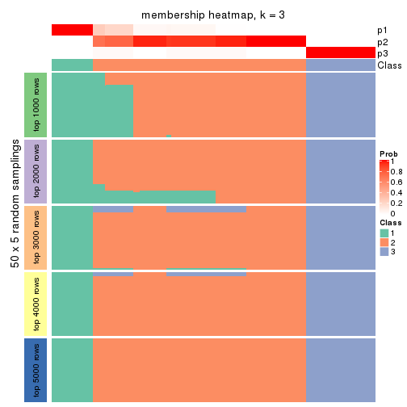</p>

</div>
<div id='tab-SD-mclust-membership-heatmap-3'>
<pre><code class="r">membership_heatmap(res, k = 4)
</code></pre>

<p></p>

</div>
<div id='tab-SD-mclust-membership-heatmap-4'>
<pre><code class="r">membership_heatmap(res, k = 5)
</code></pre>

<p></p>

</div>
<div id='tab-SD-mclust-membership-heatmap-5'>
<pre><code class="r">membership_heatmap(res, k = 6)
</code></pre>

<p></p>

</div>
</div>

As soon as we have had the classes for columns, we can look for signatures
which are significantly different between classes which can be candidate marks
for certain classes. Following are the heatmaps for signatures.


Signature heatmaps where rows are scaled:


<script>
$( function() {
	$( '#tabs-SD-mclust-get-signatures' ).tabs();
} );
</script>
<div id='tabs-SD-mclust-get-signatures'>
<ul>
<li><a href='#tab-SD-mclust-get-signatures-1'>k = 2</a></li>
<li><a href='#tab-SD-mclust-get-signatures-2'>k = 3</a></li>
<li><a href='#tab-SD-mclust-get-signatures-3'>k = 4</a></li>
<li><a href='#tab-SD-mclust-get-signatures-4'>k = 5</a></li>
<li><a href='#tab-SD-mclust-get-signatures-5'>k = 6</a></li>
</ul>
<div id='tab-SD-mclust-get-signatures-1'>
<pre><code class="r">get_signatures(res, k = 2)
</code></pre>

<p></p>

</div>
<div id='tab-SD-mclust-get-signatures-2'>
<pre><code class="r">get_signatures(res, k = 3)
</code></pre>

<p></p>

</div>
<div id='tab-SD-mclust-get-signatures-3'>
<pre><code class="r">get_signatures(res, k = 4)
</code></pre>

<p></p>

</div>
<div id='tab-SD-mclust-get-signatures-4'>
<pre><code class="r">get_signatures(res, k = 5)
</code></pre>

<pre><code>#&gt; Error in mat[ceiling(1:nr/h_ratio), ceiling(1:nc/w_ratio), drop = FALSE]: subscript out of bounds
</code></pre>

<p></p>

</div>
<div id='tab-SD-mclust-get-signatures-5'>
<pre><code class="r">get_signatures(res, k = 6)
</code></pre>

<p></p>

</div>
</div>


Signature heatmaps where rows are not scaled:


<script>
$( function() {
	$( '#tabs-SD-mclust-get-signatures-no-scale' ).tabs();
} );
</script>
<div id='tabs-SD-mclust-get-signatures-no-scale'>
<ul>
<li><a href='#tab-SD-mclust-get-signatures-no-scale-1'>k = 2</a></li>
<li><a href='#tab-SD-mclust-get-signatures-no-scale-2'>k = 3</a></li>
<li><a href='#tab-SD-mclust-get-signatures-no-scale-3'>k = 4</a></li>
<li><a href='#tab-SD-mclust-get-signatures-no-scale-4'>k = 5</a></li>
<li><a href='#tab-SD-mclust-get-signatures-no-scale-5'>k = 6</a></li>
</ul>
<div id='tab-SD-mclust-get-signatures-no-scale-1'>
<pre><code class="r">get_signatures(res, k = 2, scale_rows = FALSE)
</code></pre>

<p></p>

</div>
<div id='tab-SD-mclust-get-signatures-no-scale-2'>
<pre><code class="r">get_signatures(res, k = 3, scale_rows = FALSE)
</code></pre>

<p></p>

</div>
<div id='tab-SD-mclust-get-signatures-no-scale-3'>
<pre><code class="r">get_signatures(res, k = 4, scale_rows = FALSE)
</code></pre>

<p></p>

</div>
<div id='tab-SD-mclust-get-signatures-no-scale-4'>
<pre><code class="r">get_signatures(res, k = 5, scale_rows = FALSE)
</code></pre>

<pre><code>#&gt; Error in mat[ceiling(1:nr/h_ratio), ceiling(1:nc/w_ratio), drop = FALSE]: subscript out of bounds
</code></pre>

<p></p>

</div>
<div id='tab-SD-mclust-get-signatures-no-scale-5'>
<pre><code class="r">get_signatures(res, k = 6, scale_rows = FALSE)
</code></pre>

<p></p>

</div>
</div>


Compare the overlap of signatures from different k:

```r
compare_signatures(res)
```


`get_signature()` returns a data frame invisibly. TO get the list of signatures, the function
call should be assigned to a variable explicitly. In following code, if `plot` argument is set
to `FALSE`, no heatmap is plotted while only the differential analysis is performed.

```r
# code only for demonstration
tb = get_signature(res, k = ..., plot = FALSE)
```

An example of the output of `tb` is:

```
#>   which_row         fdr    mean_1    mean_2 scaled_mean_1 scaled_mean_2 km
#> 1        38 0.042760348  8.373488  9.131774    -0.5533452     0.5164555  1
#> 2        40 0.018707592  7.106213  8.469186    -0.6173731     0.5762149  1
#> 3        55 0.019134737 10.221463 11.207825    -0.6159697     0.5749050  1
#> 4        59 0.006059896  5.921854  7.869574    -0.6899429     0.6439467  1
#> 5        60 0.018055526  8.928898 10.211722    -0.6204761     0.5791110  1
#> 6        98 0.009384629 15.714769 14.887706     0.6635654    -0.6193277  2
...
```

The columns in `tb` are:

1. `which_row`: row indices corresponding to the input matrix.
2. `fdr`: FDR for the differential test. 
3. `mean_x`: The mean value in group x.
4. `scaled_mean_x`: The mean value in group x after rows are scaled.
5. `km`: Row groups if k-means clustering is applied to rows.


UMAP plot which shows how samples are separated.


<script>
$( function() {
	$( '#tabs-SD-mclust-dimension-reduction' ).tabs();
} );
</script>
<div id='tabs-SD-mclust-dimension-reduction'>
<ul>
<li><a href='#tab-SD-mclust-dimension-reduction-1'>k = 2</a></li>
<li><a href='#tab-SD-mclust-dimension-reduction-2'>k = 3</a></li>
<li><a href='#tab-SD-mclust-dimension-reduction-3'>k = 4</a></li>
<li><a href='#tab-SD-mclust-dimension-reduction-4'>k = 5</a></li>
<li><a href='#tab-SD-mclust-dimension-reduction-5'>k = 6</a></li>
</ul>
<div id='tab-SD-mclust-dimension-reduction-1'>
<pre><code class="r">dimension_reduction(res, k = 2, method = &quot;UMAP&quot;)
</code></pre>

<p></p>

</div>
<div id='tab-SD-mclust-dimension-reduction-2'>
<pre><code class="r">dimension_reduction(res, k = 3, method = &quot;UMAP&quot;)
</code></pre>

<p></p>

</div>
<div id='tab-SD-mclust-dimension-reduction-3'>
<pre><code class="r">dimension_reduction(res, k = 4, method = &quot;UMAP&quot;)
</code></pre>

<p></p>

</div>
<div id='tab-SD-mclust-dimension-reduction-4'>
<pre><code class="r">dimension_reduction(res, k = 5, method = &quot;UMAP&quot;)
</code></pre>

<p></p>

</div>
<div id='tab-SD-mclust-dimension-reduction-5'>
<pre><code class="r">dimension_reduction(res, k = 6, method = &quot;UMAP&quot;)
</code></pre>

<p></p>

</div>
</div>


Following heatmap shows how subgroups are split when increasing `k`:

```r
collect_classes(res)
```


If matrix rows can be associated to genes, consider to use `functional_enrichment(res,
...)` to perform function enrichment for the signature genes. See [this vignette](http://bioconductor.org/packages/devel/bioc/vignettes/cola/inst/doc/functional_enrichment.html) for more detailed explanations.


 

---------------------------------------------------


### SD:NMF**


The object with results only for a single top-value method and a single partition method 
can be extracted as:

```r
res = res_list["SD", "NMF"]
# you can also extract it by
# res = res_list["SD:NMF"]
```

A summary of `res` and all the functions that can be applied to it:

```r
res
```

```
#> A 'ConsensusPartition' object with k = 2, 3, 4, 5, 6.
#>   On a matrix with 13278 rows and 322 columns.
#>   Top rows (1000, 2000, 3000, 4000, 5000) are extracted by 'SD' method.
#>   Subgroups are detected by 'NMF' method.
#>   Performed in total 1250 partitions by row resampling.
#>   Best k for subgroups seems to be 6.
#> 
#> Following methods can be applied to this 'ConsensusPartition' object:
#>  [1] "cola_report"             "collect_classes"         "collect_plots"          
#>  [4] "collect_stats"           "colnames"                "compare_signatures"     
#>  [7] "consensus_heatmap"       "dimension_reduction"     "functional_enrichment"  
#> [10] "get_anno_col"            "get_anno"                "get_classes"            
#> [13] "get_consensus"           "get_matrix"              "get_membership"         
#> [16] "get_param"               "get_signatures"          "get_stats"              
#> [19] "is_best_k"               "is_stable_k"             "membership_heatmap"     
#> [22] "ncol"                    "nrow"                    "plot_ecdf"              
#> [25] "rownames"                "select_partition_number" "show"                   
#> [28] "suggest_best_k"          "test_to_known_factors"
```

`collect_plots()` function collects all the plots made from `res` for all `k` (number of partitions)
into one single page to provide an easy and fast comparison between different `k`.

```r
collect_plots(res)
```


The plots are:

- The first row: a plot of the ECDF (empirical cumulative distribution
  function) curves of the consensus matrix for each `k` and the heatmap of
  predicted classes for each `k`.
- The second row: heatmaps of the consensus matrix for each `k`.
- The third row: heatmaps of the membership matrix for each `k`.
- The fouth row: heatmaps of the signatures for each `k`.

All the plots in panels can be made by individual functions and they are
plotted later in this section.

`select_partition_number()` produces several plots showing different
statistics for choosing "optimized" `k`. There are following statistics:

- ECDF curves of the consensus matrix for each `k`;
- 1-PAC. [The PAC
  score](https://en.wikipedia.org/wiki/Consensus_clustering#Over-interpretation_potential_of_consensus_clustering)
  measures the proportion of the ambiguous subgrouping.
- Mean silhouette score.
- Concordance. The mean probability of fiting the consensus class ids in all
  partitions.
- Area increased. Denote $A_k$ as the area under the ECDF curve for current
  `k`, the area increased is defined as $A_k - A_{k-1}$.
- Rand index. The percent of pairs of samples that are both in a same cluster
  or both are not in a same cluster in the partition of k and k-1.
- Jaccard index. The ratio of pairs of samples are both in a same cluster in
  the partition of k and k-1 and the pairs of samples are both in a same
  cluster in the partition k or k-1.

The detailed explanations of these statistics can be found in [the _cola_
vignette](http://bioconductor.org/packages/devel/bioc/vignettes/cola/inst/doc/cola.html#toc_13).

Generally speaking, lower PAC score, higher mean silhouette score or higher
concordance corresponds to better partition. Rand index and Jaccard index
measure how similar the current partition is compared to partition with `k-1`.
If they are too similar, we won't accept `k` is better than `k-1`.

```r
select_partition_number(res)
```


The numeric values for all these statistics can be obtained by `get_stats()`.

```r
get_stats(res)
```

```
#>   k 1-PAC mean_silhouette concordance area_increased  Rand Jaccard
#> 2 2 0.970           0.931       0.967         0.4894 0.507   0.507
#> 3 3 0.898           0.913       0.958         0.3373 0.788   0.602
#> 4 4 0.837           0.841       0.902         0.0822 0.937   0.818
#> 5 5 0.782           0.796       0.857         0.0719 0.867   0.583
#> 6 6 0.967           0.909       0.944         0.0576 0.943   0.755
```

`suggest_best_k()` suggests the best $k$ based on these statistics. The rules are as follows:

- All $k$ with Jaccard index larger than 0.95 are removed because increasing
  $k$ does not provide enough extra information. If all $k$ are removed, it is
  marked as no subgroup is detected.
- For all $k$ with 1-PAC score larger than 0.9, the maximal $k$ is taken as
  the best $k$, and other $k$ are marked as optional $k$.
- If it does not fit the second rule. The $k$ with the maximal vote of the
  highest 1-PAC score, highest mean silhouette, and highest concordance is
  taken as the best $k$.

```r
suggest_best_k(res)
```

```
#> [1] 6
#> attr(,"optional")
#> [1] 2
```

There is also optional best $k$ = 2 that is worth to check.

Following shows the table of the partitions (You need to click the **show/hide
code output** link to see it). The membership matrix (columns with name `p*`)
is inferred by
[`clue::cl_consensus()`](https://www.rdocumentation.org/link/cl_consensus?package=clue)
function with the `SE` method. Basically the value in the membership matrix
represents the probability to belong to a certain group. The finall class
label for an item is determined with the group with highest probability it
belongs to.

In `get_classes()` function, the entropy is calculated from the membership
matrix and the silhouette score is calculated from the consensus matrix.


<script>
$( function() {
	$( '#tabs-SD-NMF-get-classes' ).tabs();
} );
</script>
<div id='tabs-SD-NMF-get-classes'>
<ul>
<li><a href='#tab-SD-NMF-get-classes-1'>k = 2</a></li>
<li><a href='#tab-SD-NMF-get-classes-2'>k = 3</a></li>
<li><a href='#tab-SD-NMF-get-classes-3'>k = 4</a></li>
<li><a href='#tab-SD-NMF-get-classes-4'>k = 5</a></li>
<li><a href='#tab-SD-NMF-get-classes-5'>k = 6</a></li>
</ul>

<div id='tab-SD-NMF-get-classes-1'>
<p><a id='tab-SD-NMF-get-classes-1-a' style='color:#0366d6' href='#'>show/hide code output</a></p>
<pre><code class="r">cbind(get_classes(res, k = 2), get_membership(res, k = 2))
</code></pre>

<pre><code>#&gt;           class entropy silhouette    p1    p2
#&gt; DRR023371     1   0.388    0.92495 0.924 0.076
#&gt; DRR023372     1   0.373    0.92903 0.928 0.072
#&gt; DRR023373     1   0.443    0.90769 0.908 0.092
#&gt; DRR023374     1   0.430    0.91214 0.912 0.088
#&gt; DRR023375     1   0.443    0.90769 0.908 0.092
#&gt; DRR023376     1   0.416    0.91650 0.916 0.084
#&gt; DRR023377     1   0.373    0.92903 0.928 0.072
#&gt; DRR023378     1   0.482    0.89375 0.896 0.104
#&gt; DRR023379     1   0.242    0.95726 0.960 0.040
#&gt; DRR023380     1   0.260    0.95443 0.956 0.044
#&gt; DRR023381     1   0.260    0.95443 0.956 0.044
#&gt; DRR023382     1   0.242    0.95726 0.960 0.040
#&gt; DRR023383     1   0.260    0.95443 0.956 0.044
#&gt; DRR023384     1   0.242    0.95726 0.960 0.040
#&gt; DRR023385     1   0.224    0.95981 0.964 0.036
#&gt; DRR023386     1   0.260    0.95443 0.956 0.044
#&gt; DRR023387     1   0.163    0.96530 0.976 0.024
#&gt; DRR023388     1   0.163    0.96530 0.976 0.024
#&gt; DRR023389     1   0.163    0.96530 0.976 0.024
#&gt; DRR023390     1   0.163    0.96530 0.976 0.024
#&gt; DRR023391     1   0.163    0.96530 0.976 0.024
#&gt; DRR023392     1   0.163    0.96530 0.976 0.024
#&gt; DRR023394     1   0.163    0.96530 0.976 0.024
#&gt; DRR023395     1   0.163    0.96530 0.976 0.024
#&gt; DRR023396     1   0.163    0.96530 0.976 0.024
#&gt; DRR023397     1   0.163    0.96530 0.976 0.024
#&gt; DRR023398     1   0.163    0.96530 0.976 0.024
#&gt; DRR023399     1   0.163    0.96530 0.976 0.024
#&gt; DRR023400     1   0.163    0.96530 0.976 0.024
#&gt; DRR023401     1   0.163    0.96530 0.976 0.024
#&gt; DRR023402     1   0.163    0.96530 0.976 0.024
#&gt; DRR023403     1   0.163    0.96530 0.976 0.024
#&gt; DRR023404     2   0.000    0.94981 0.000 1.000
#&gt; DRR023405     2   0.000    0.94981 0.000 1.000
#&gt; DRR023406     2   0.000    0.94981 0.000 1.000
#&gt; DRR023407     2   0.000    0.94981 0.000 1.000
#&gt; DRR023408     2   0.000    0.94981 0.000 1.000
#&gt; DRR023409     2   0.000    0.94981 0.000 1.000
#&gt; DRR023410     2   0.000    0.94981 0.000 1.000
#&gt; DRR023411     2   0.000    0.94981 0.000 1.000
#&gt; DRR023412     2   0.000    0.94981 0.000 1.000
#&gt; DRR023413     2   0.000    0.94981 0.000 1.000
#&gt; DRR023414     2   0.000    0.94981 0.000 1.000
#&gt; DRR023415     2   0.000    0.94981 0.000 1.000
#&gt; DRR023416     2   0.000    0.94981 0.000 1.000
#&gt; DRR023417     2   0.000    0.94981 0.000 1.000
#&gt; DRR023418     2   0.000    0.94981 0.000 1.000
#&gt; DRR023419     2   0.000    0.94981 0.000 1.000
#&gt; DRR023420     2   0.000    0.94981 0.000 1.000
#&gt; DRR023421     2   0.000    0.94981 0.000 1.000
#&gt; DRR023422     2   0.000    0.94981 0.000 1.000
#&gt; DRR023423     2   0.000    0.94981 0.000 1.000
#&gt; DRR023425     2   0.000    0.94981 0.000 1.000
#&gt; DRR023426     2   0.000    0.94981 0.000 1.000
#&gt; DRR023427     2   0.000    0.94981 0.000 1.000
#&gt; DRR023428     2   0.000    0.94981 0.000 1.000
#&gt; DRR023429     2   0.000    0.94981 0.000 1.000
#&gt; DRR023430     2   0.000    0.94981 0.000 1.000
#&gt; DRR023431     2   0.000    0.94981 0.000 1.000
#&gt; DRR023432     2   0.000    0.94981 0.000 1.000
#&gt; DRR023433     2   0.000    0.94981 0.000 1.000
#&gt; DRR023434     2   0.000    0.94981 0.000 1.000
#&gt; DRR023435     2   0.000    0.94981 0.000 1.000
#&gt; DRR023436     2   0.000    0.94981 0.000 1.000
#&gt; DRR023437     2   0.000    0.94981 0.000 1.000
#&gt; DRR023438     2   0.000    0.94981 0.000 1.000
#&gt; DRR023439     2   0.000    0.94981 0.000 1.000
#&gt; DRR023440     2   0.000    0.94981 0.000 1.000
#&gt; DRR023441     2   0.000    0.94981 0.000 1.000
#&gt; DRR023442     2   0.000    0.94981 0.000 1.000
#&gt; DRR023443     2   0.000    0.94981 0.000 1.000
#&gt; DRR023444     2   0.000    0.94981 0.000 1.000
#&gt; DRR023445     2   0.000    0.94981 0.000 1.000
#&gt; DRR023446     2   0.000    0.94981 0.000 1.000
#&gt; DRR023447     2   0.000    0.94981 0.000 1.000
#&gt; DRR023448     2   0.000    0.94981 0.000 1.000
#&gt; DRR023449     2   0.000    0.94981 0.000 1.000
#&gt; DRR023450     2   0.000    0.94981 0.000 1.000
#&gt; DRR023451     2   0.000    0.94981 0.000 1.000
#&gt; DRR023452     2   0.000    0.94981 0.000 1.000
#&gt; DRR023453     1   0.163    0.96530 0.976 0.024
#&gt; DRR023454     1   0.163    0.96530 0.976 0.024
#&gt; DRR023455     1   0.163    0.96530 0.976 0.024
#&gt; DRR023456     1   0.163    0.96530 0.976 0.024
#&gt; DRR023457     1   0.163    0.96530 0.976 0.024
#&gt; DRR023458     1   0.163    0.96530 0.976 0.024
#&gt; DRR023459     1   0.163    0.96530 0.976 0.024
#&gt; DRR023460     1   0.260    0.95459 0.956 0.044
#&gt; DRR023461     2   0.767    0.71723 0.224 0.776
#&gt; DRR023462     2   0.808    0.68022 0.248 0.752
#&gt; DRR023463     2   0.760    0.72303 0.220 0.780
#&gt; DRR023464     2   0.767    0.71723 0.224 0.776
#&gt; DRR023465     2   0.808    0.68022 0.248 0.752
#&gt; DRR023466     2   0.760    0.72306 0.220 0.780
#&gt; DRR023467     2   0.584    0.82524 0.140 0.860
#&gt; DRR023468     2   0.855    0.62483 0.280 0.720
#&gt; DRR023469     2   0.876    0.59427 0.296 0.704
#&gt; DRR023470     2   0.844    0.63943 0.272 0.728
#&gt; DRR023471     2   0.781    0.70535 0.232 0.768
#&gt; DRR023472     2   0.839    0.64648 0.268 0.732
#&gt; DRR023473     2   0.844    0.63946 0.272 0.728
#&gt; DRR023474     2   0.671    0.78199 0.176 0.824
#&gt; DRR023475     2   1.000    0.01029 0.500 0.500
#&gt; DRR023476     2   0.999    0.07404 0.484 0.516
#&gt; DRR023477     2   1.000    0.01029 0.500 0.500
#&gt; DRR023478     1   1.000   -0.02276 0.500 0.500
#&gt; DRR023479     1   1.000   -0.00631 0.504 0.496
#&gt; DRR023480     1   1.000    0.01022 0.508 0.492
#&gt; DRR023481     1   1.000   -0.02276 0.500 0.500
#&gt; DRR023482     1   0.224    0.95981 0.964 0.036
#&gt; DRR023483     1   0.224    0.95981 0.964 0.036
#&gt; DRR023484     1   0.224    0.95981 0.964 0.036
#&gt; DRR023485     1   0.224    0.95981 0.964 0.036
#&gt; DRR023486     1   0.224    0.95981 0.964 0.036
#&gt; DRR023487     1   0.224    0.95981 0.964 0.036
#&gt; DRR023488     1   0.224    0.95981 0.964 0.036
#&gt; DRR023489     1   0.260    0.95449 0.956 0.044
#&gt; DRR023490     1   0.000    0.97838 1.000 0.000
#&gt; DRR023491     1   0.000    0.97838 1.000 0.000
#&gt; DRR023492     1   0.000    0.97838 1.000 0.000
#&gt; DRR023493     1   0.000    0.97838 1.000 0.000
#&gt; DRR023494     1   0.000    0.97838 1.000 0.000
#&gt; DRR023495     1   0.000    0.97838 1.000 0.000
#&gt; DRR023496     1   0.000    0.97838 1.000 0.000
#&gt; DRR023497     1   0.000    0.97838 1.000 0.000
#&gt; DRR023498     1   0.000    0.97838 1.000 0.000
#&gt; DRR023499     1   0.000    0.97838 1.000 0.000
#&gt; DRR023500     1   0.000    0.97838 1.000 0.000
#&gt; DRR023501     1   0.000    0.97838 1.000 0.000
#&gt; DRR023502     1   0.000    0.97838 1.000 0.000
#&gt; DRR023503     1   0.000    0.97838 1.000 0.000
#&gt; DRR023504     1   0.000    0.97838 1.000 0.000
#&gt; DRR023505     1   0.000    0.97838 1.000 0.000
#&gt; DRR023506     1   0.000    0.97838 1.000 0.000
#&gt; DRR023507     1   0.000    0.97838 1.000 0.000
#&gt; DRR023508     1   0.000    0.97838 1.000 0.000
#&gt; DRR023509     1   0.000    0.97838 1.000 0.000
#&gt; DRR023510     1   0.000    0.97838 1.000 0.000
#&gt; DRR023511     1   0.000    0.97838 1.000 0.000
#&gt; DRR023512     1   0.000    0.97838 1.000 0.000
#&gt; DRR023513     1   0.000    0.97838 1.000 0.000
#&gt; DRR023514     1   0.000    0.97838 1.000 0.000
#&gt; DRR023515     1   0.000    0.97838 1.000 0.000
#&gt; DRR023516     1   0.000    0.97838 1.000 0.000
#&gt; DRR023517     1   0.000    0.97838 1.000 0.000
#&gt; DRR023518     1   0.000    0.97838 1.000 0.000
#&gt; DRR023519     1   0.000    0.97838 1.000 0.000
#&gt; DRR023520     1   0.000    0.97838 1.000 0.000
#&gt; DRR023521     1   0.000    0.97838 1.000 0.000
#&gt; DRR023522     1   0.000    0.97838 1.000 0.000
#&gt; DRR023523     1   0.000    0.97838 1.000 0.000
#&gt; DRR023524     1   0.000    0.97838 1.000 0.000
#&gt; DRR023525     1   0.000    0.97838 1.000 0.000
#&gt; DRR023526     1   0.000    0.97838 1.000 0.000
#&gt; DRR023527     1   0.000    0.97838 1.000 0.000
#&gt; DRR023528     1   0.000    0.97838 1.000 0.000
#&gt; DRR023529     1   0.000    0.97838 1.000 0.000
#&gt; DRR023530     1   0.000    0.97838 1.000 0.000
#&gt; DRR023531     1   0.000    0.97838 1.000 0.000
#&gt; DRR023532     1   0.000    0.97838 1.000 0.000
#&gt; DRR023533     1   0.000    0.97838 1.000 0.000
#&gt; DRR023534     1   0.000    0.97838 1.000 0.000
#&gt; DRR023535     1   0.000    0.97838 1.000 0.000
#&gt; DRR023536     1   0.000    0.97838 1.000 0.000
#&gt; DRR023537     1   0.000    0.97838 1.000 0.000
#&gt; DRR023538     1   0.000    0.97838 1.000 0.000
#&gt; DRR023539     1   0.000    0.97838 1.000 0.000
#&gt; DRR023540     1   0.000    0.97838 1.000 0.000
#&gt; DRR023541     1   0.000    0.97838 1.000 0.000
#&gt; DRR023542     1   0.000    0.97838 1.000 0.000
#&gt; DRR023543     1   0.000    0.97838 1.000 0.000
#&gt; DRR023544     1   0.000    0.97838 1.000 0.000
#&gt; DRR023545     1   0.000    0.97838 1.000 0.000
#&gt; DRR023546     1   0.000    0.97838 1.000 0.000
#&gt; DRR023547     1   0.000    0.97838 1.000 0.000
#&gt; DRR023548     1   0.000    0.97838 1.000 0.000
#&gt; DRR023549     1   0.000    0.97838 1.000 0.000
#&gt; DRR023550     1   0.000    0.97838 1.000 0.000
#&gt; DRR023551     1   0.000    0.97838 1.000 0.000
#&gt; DRR023552     1   0.000    0.97838 1.000 0.000
#&gt; DRR023553     1   0.000    0.97838 1.000 0.000
#&gt; DRR023554     1   0.000    0.97838 1.000 0.000
#&gt; DRR023555     1   0.000    0.97838 1.000 0.000
#&gt; DRR023556     1   0.000    0.97838 1.000 0.000
#&gt; DRR023557     1   0.000    0.97838 1.000 0.000
#&gt; DRR023558     1   0.000    0.97838 1.000 0.000
#&gt; DRR023559     1   0.000    0.97838 1.000 0.000
#&gt; DRR023560     1   0.000    0.97838 1.000 0.000
#&gt; DRR023561     1   0.000    0.97838 1.000 0.000
#&gt; DRR023562     1   0.000    0.97838 1.000 0.000
#&gt; DRR023563     1   0.000    0.97838 1.000 0.000
#&gt; DRR023564     1   0.000    0.97838 1.000 0.000
#&gt; DRR023565     1   0.000    0.97838 1.000 0.000
#&gt; DRR023566     1   0.000    0.97838 1.000 0.000
#&gt; DRR023567     1   0.000    0.97838 1.000 0.000
#&gt; DRR023568     1   0.000    0.97838 1.000 0.000
#&gt; DRR023569     1   0.000    0.97838 1.000 0.000
#&gt; DRR023570     1   0.000    0.97838 1.000 0.000
#&gt; DRR023571     1   0.000    0.97838 1.000 0.000
#&gt; DRR023572     1   0.000    0.97838 1.000 0.000
#&gt; DRR023573     1   0.000    0.97838 1.000 0.000
#&gt; DRR023574     1   0.000    0.97838 1.000 0.000
#&gt; DRR023575     1   0.000    0.97838 1.000 0.000
#&gt; DRR023576     2   0.163    0.95447 0.024 0.976
#&gt; DRR023577     2   0.163    0.95447 0.024 0.976
#&gt; DRR023578     2   0.163    0.95447 0.024 0.976
#&gt; DRR023579     2   0.163    0.95447 0.024 0.976
#&gt; DRR023580     2   0.163    0.95447 0.024 0.976
#&gt; DRR023581     2   0.163    0.95447 0.024 0.976
#&gt; DRR023582     2   0.163    0.95447 0.024 0.976
#&gt; DRR023583     2   0.163    0.95447 0.024 0.976
#&gt; DRR023584     2   0.163    0.95447 0.024 0.976
#&gt; DRR023585     2   0.163    0.95447 0.024 0.976
#&gt; DRR023586     2   0.163    0.95447 0.024 0.976
#&gt; DRR023587     2   0.163    0.95447 0.024 0.976
#&gt; DRR023588     2   0.163    0.95447 0.024 0.976
#&gt; DRR023589     2   0.163    0.95447 0.024 0.976
#&gt; DRR023590     2   0.163    0.95447 0.024 0.976
#&gt; DRR023591     2   0.163    0.95447 0.024 0.976
#&gt; DRR023592     2   0.163    0.95447 0.024 0.976
#&gt; DRR023593     2   0.163    0.95447 0.024 0.976
#&gt; DRR023594     2   0.163    0.95447 0.024 0.976
#&gt; DRR023595     2   0.163    0.95447 0.024 0.976
#&gt; DRR023596     2   0.163    0.95447 0.024 0.976
#&gt; DRR023597     2   0.163    0.95447 0.024 0.976
#&gt; DRR023598     2   0.163    0.95447 0.024 0.976
#&gt; DRR023599     2   0.163    0.95447 0.024 0.976
#&gt; DRR023600     2   0.163    0.95447 0.024 0.976
#&gt; DRR023601     2   0.163    0.95447 0.024 0.976
#&gt; DRR023602     2   0.163    0.95447 0.024 0.976
#&gt; DRR023603     2   0.163    0.95447 0.024 0.976
#&gt; DRR023604     2   0.163    0.95447 0.024 0.976
#&gt; DRR023605     2   0.163    0.95447 0.024 0.976
#&gt; DRR023606     2   0.163    0.95447 0.024 0.976
#&gt; DRR023607     2   0.163    0.95447 0.024 0.976
#&gt; DRR023608     2   0.163    0.95447 0.024 0.976
#&gt; DRR023609     2   0.163    0.95447 0.024 0.976
#&gt; DRR023610     2   0.163    0.95447 0.024 0.976
#&gt; DRR023611     2   0.163    0.95447 0.024 0.976
#&gt; DRR023612     2   0.163    0.95447 0.024 0.976
#&gt; DRR023613     2   0.163    0.95447 0.024 0.976
#&gt; DRR023614     2   0.163    0.95447 0.024 0.976
#&gt; DRR023615     2   0.163    0.95447 0.024 0.976
#&gt; DRR023616     2   0.163    0.95447 0.024 0.976
#&gt; DRR023617     2   0.163    0.95447 0.024 0.976
#&gt; DRR023619     1   0.000    0.97838 1.000 0.000
#&gt; DRR023620     1   0.000    0.97838 1.000 0.000
#&gt; DRR023621     1   0.000    0.97838 1.000 0.000
#&gt; DRR023622     1   0.000    0.97838 1.000 0.000
#&gt; DRR023623     1   0.000    0.97838 1.000 0.000
#&gt; DRR023624     1   0.000    0.97838 1.000 0.000
#&gt; DRR023625     1   0.000    0.97838 1.000 0.000
#&gt; DRR023626     1   0.000    0.97838 1.000 0.000
#&gt; DRR023627     1   0.000    0.97838 1.000 0.000
#&gt; DRR023628     1   0.000    0.97838 1.000 0.000
#&gt; DRR023629     1   0.000    0.97838 1.000 0.000
#&gt; DRR023630     1   0.000    0.97838 1.000 0.000
#&gt; DRR023631     1   0.000    0.97838 1.000 0.000
#&gt; DRR023632     1   0.000    0.97838 1.000 0.000
#&gt; DRR023633     1   0.000    0.97838 1.000 0.000
#&gt; DRR023635     2   0.163    0.95447 0.024 0.976
#&gt; DRR023636     2   0.163    0.95447 0.024 0.976
#&gt; DRR023637     2   0.163    0.95447 0.024 0.976
#&gt; DRR023638     2   0.163    0.95447 0.024 0.976
#&gt; DRR023639     2   0.163    0.95447 0.024 0.976
#&gt; DRR023640     2   0.163    0.95447 0.024 0.976
#&gt; DRR023641     2   0.163    0.95447 0.024 0.976
#&gt; DRR023642     2   0.163    0.95447 0.024 0.976
#&gt; DRR023643     2   0.141    0.95391 0.020 0.980
#&gt; DRR023644     2   0.141    0.95391 0.020 0.980
#&gt; DRR023645     2   0.163    0.95447 0.024 0.976
#&gt; DRR023646     2   0.141    0.95391 0.020 0.980
#&gt; DRR023647     2   0.163    0.95447 0.024 0.976
#&gt; DRR023648     2   0.141    0.95391 0.020 0.980
#&gt; DRR023649     2   0.141    0.95391 0.020 0.980
#&gt; DRR023650     1   0.000    0.97838 1.000 0.000
#&gt; DRR023651     1   0.000    0.97838 1.000 0.000
#&gt; DRR023652     1   0.000    0.97838 1.000 0.000
#&gt; DRR023653     1   0.000    0.97838 1.000 0.000
#&gt; DRR023654     1   0.000    0.97838 1.000 0.000
#&gt; DRR023655     1   0.000    0.97838 1.000 0.000
#&gt; DRR023656     1   0.000    0.97838 1.000 0.000
#&gt; DRR023657     1   0.000    0.97838 1.000 0.000
#&gt; DRR023658     1   0.000    0.97838 1.000 0.000
#&gt; DRR023659     1   0.000    0.97838 1.000 0.000
#&gt; DRR023660     1   0.000    0.97838 1.000 0.000
#&gt; DRR023661     1   0.000    0.97838 1.000 0.000
#&gt; DRR023662     1   0.000    0.97838 1.000 0.000
#&gt; DRR023663     1   0.000    0.97838 1.000 0.000
#&gt; DRR023664     1   0.000    0.97838 1.000 0.000
#&gt; DRR023665     1   0.000    0.97838 1.000 0.000
#&gt; DRR023666     1   0.000    0.97838 1.000 0.000
#&gt; DRR023667     1   0.000    0.97838 1.000 0.000
#&gt; DRR023668     1   0.000    0.97838 1.000 0.000
#&gt; DRR023669     1   0.000    0.97838 1.000 0.000
#&gt; DRR023670     1   0.000    0.97838 1.000 0.000
#&gt; DRR023671     1   0.000    0.97838 1.000 0.000
#&gt; DRR023672     1   0.000    0.97838 1.000 0.000
#&gt; DRR023673     1   0.000    0.97838 1.000 0.000
#&gt; DRR023674     1   0.000    0.97838 1.000 0.000
#&gt; DRR023675     1   0.000    0.97838 1.000 0.000
#&gt; DRR023676     1   0.000    0.97838 1.000 0.000
#&gt; DRR023677     1   0.000    0.97838 1.000 0.000
#&gt; DRR023678     1   0.000    0.97838 1.000 0.000
#&gt; DRR023683     2   0.163    0.95447 0.024 0.976
#&gt; DRR023684     2   0.163    0.95447 0.024 0.976
#&gt; DRR023685     2   0.163    0.95447 0.024 0.976
#&gt; DRR023686     2   0.163    0.95447 0.024 0.976
#&gt; DRR023687     2   0.163    0.95447 0.024 0.976
#&gt; DRR023688     2   0.163    0.95447 0.024 0.976
#&gt; DRR023689     2   0.163    0.95447 0.024 0.976
#&gt; DRR023690     2   0.163    0.95447 0.024 0.976
#&gt; DRR023691     2   0.163    0.95447 0.024 0.976
#&gt; DRR023692     2   0.163    0.95447 0.024 0.976
#&gt; DRR023693     2   0.163    0.95447 0.024 0.976
#&gt; DRR023694     2   0.163    0.95447 0.024 0.976
#&gt; DRR023695     2   0.163    0.95447 0.024 0.976
#&gt; DRR023696     2   0.163    0.95447 0.024 0.976
#&gt; DRR023697     2   0.163    0.95447 0.024 0.976
#&gt; DRR023698     2   0.163    0.95447 0.024 0.976
#&gt; DRR023699     2   0.163    0.95447 0.024 0.976
#&gt; DRR023700     2   0.163    0.95447 0.024 0.976
</code></pre>

<script>
$('#tab-SD-NMF-get-classes-1-a').parent().next().next().hide();
$('#tab-SD-NMF-get-classes-1-a').click(function(){
  $('#tab-SD-NMF-get-classes-1-a').parent().next().next().toggle();
  return(false);
});
</script>
</div>

<div id='tab-SD-NMF-get-classes-2'>
<p><a id='tab-SD-NMF-get-classes-2-a' style='color:#0366d6' href='#'>show/hide code output</a></p>
<pre><code class="r">cbind(get_classes(res, k = 3), get_membership(res, k = 3))
</code></pre>

<pre><code>#&gt;           class entropy silhouette p1    p2    p3
#&gt; DRR023371     3   0.000      0.966  0 0.000 1.000
#&gt; DRR023372     3   0.000      0.966  0 0.000 1.000
#&gt; DRR023373     3   0.000      0.966  0 0.000 1.000
#&gt; DRR023374     3   0.000      0.966  0 0.000 1.000
#&gt; DRR023375     3   0.000      0.966  0 0.000 1.000
#&gt; DRR023376     3   0.000      0.966  0 0.000 1.000
#&gt; DRR023377     3   0.000      0.966  0 0.000 1.000
#&gt; DRR023378     3   0.000      0.966  0 0.000 1.000
#&gt; DRR023379     3   0.000      0.966  0 0.000 1.000
#&gt; DRR023380     3   0.000      0.966  0 0.000 1.000
#&gt; DRR023381     3   0.000      0.966  0 0.000 1.000
#&gt; DRR023382     3   0.000      0.966  0 0.000 1.000
#&gt; DRR023383     3   0.000      0.966  0 0.000 1.000
#&gt; DRR023384     3   0.000      0.966  0 0.000 1.000
#&gt; DRR023385     3   0.000      0.966  0 0.000 1.000
#&gt; DRR023386     3   0.000      0.966  0 0.000 1.000
#&gt; DRR023387     3   0.000      0.966  0 0.000 1.000
#&gt; DRR023388     3   0.000      0.966  0 0.000 1.000
#&gt; DRR023389     3   0.000      0.966  0 0.000 1.000
#&gt; DRR023390     3   0.000      0.966  0 0.000 1.000
#&gt; DRR023391     3   0.000      0.966  0 0.000 1.000
#&gt; DRR023392     3   0.000      0.966  0 0.000 1.000
#&gt; DRR023394     3   0.000      0.966  0 0.000 1.000
#&gt; DRR023395     3   0.000      0.966  0 0.000 1.000
#&gt; DRR023396     3   0.000      0.966  0 0.000 1.000
#&gt; DRR023397     3   0.000      0.966  0 0.000 1.000
#&gt; DRR023398     3   0.000      0.966  0 0.000 1.000
#&gt; DRR023399     3   0.000      0.966  0 0.000 1.000
#&gt; DRR023400     3   0.000      0.966  0 0.000 1.000
#&gt; DRR023401     3   0.000      0.966  0 0.000 1.000
#&gt; DRR023402     3   0.000      0.966  0 0.000 1.000
#&gt; DRR023403     3   0.000      0.966  0 0.000 1.000
#&gt; DRR023404     2   0.375      0.815  0 0.856 0.144
#&gt; DRR023405     2   0.400      0.805  0 0.840 0.160
#&gt; DRR023406     2   0.418      0.796  0 0.828 0.172
#&gt; DRR023407     2   0.362      0.820  0 0.864 0.136
#&gt; DRR023408     2   0.440      0.783  0 0.812 0.188
#&gt; DRR023409     2   0.450      0.776  0 0.804 0.196
#&gt; DRR023410     2   0.394      0.808  0 0.844 0.156
#&gt; DRR023411     2   0.460      0.768  0 0.796 0.204
#&gt; DRR023412     2   0.400      0.805  0 0.840 0.160
#&gt; DRR023413     2   0.400      0.805  0 0.840 0.160
#&gt; DRR023414     2   0.375      0.815  0 0.856 0.144
#&gt; DRR023415     2   0.429      0.790  0 0.820 0.180
#&gt; DRR023416     2   0.412      0.799  0 0.832 0.168
#&gt; DRR023417     2   0.465      0.764  0 0.792 0.208
#&gt; DRR023418     2   0.429      0.790  0 0.820 0.180
#&gt; DRR023419     2   0.400      0.805  0 0.840 0.160
#&gt; DRR023420     2   0.400      0.806  0 0.840 0.160
#&gt; DRR023421     2   0.475      0.756  0 0.784 0.216
#&gt; DRR023422     2   0.588      0.579  0 0.652 0.348
#&gt; DRR023423     2   0.559      0.645  0 0.696 0.304
#&gt; DRR023425     2   0.617      0.455  0 0.588 0.412
#&gt; DRR023426     2   0.599      0.544  0 0.632 0.368
#&gt; DRR023427     2   0.595      0.559  0 0.640 0.360
#&gt; DRR023428     2   0.614      0.471  0 0.596 0.404
#&gt; DRR023429     2   0.603      0.529  0 0.624 0.376
#&gt; DRR023430     2   0.586      0.586  0 0.656 0.344
#&gt; DRR023431     2   0.614      0.473  0 0.596 0.404
#&gt; DRR023432     2   0.593      0.565  0 0.644 0.356
#&gt; DRR023433     2   0.615      0.464  0 0.592 0.408
#&gt; DRR023434     2   0.613      0.480  0 0.600 0.400
#&gt; DRR023435     2   0.613      0.480  0 0.600 0.400
#&gt; DRR023436     2   0.610      0.497  0 0.608 0.392
#&gt; DRR023437     2   0.588      0.579  0 0.652 0.348
#&gt; DRR023438     2   0.595      0.559  0 0.640 0.360
#&gt; DRR023439     2   0.619      0.435  0 0.580 0.420
#&gt; DRR023440     2   0.613      0.480  0 0.600 0.400
#&gt; DRR023441     2   0.583      0.592  0 0.660 0.340
#&gt; DRR023442     2   0.619      0.435  0 0.580 0.420
#&gt; DRR023443     2   0.579      0.604  0 0.668 0.332
#&gt; DRR023444     2   0.621      0.413  0 0.572 0.428
#&gt; DRR023445     3   0.514      0.612  0 0.252 0.748
#&gt; DRR023446     3   0.543      0.542  0 0.284 0.716
#&gt; DRR023447     3   0.493      0.650  0 0.232 0.768
#&gt; DRR023448     3   0.506      0.627  0 0.244 0.756
#&gt; DRR023449     3   0.533      0.569  0 0.272 0.728
#&gt; DRR023450     3   0.559      0.492  0 0.304 0.696
#&gt; DRR023451     3   0.546      0.532  0 0.288 0.712
#&gt; DRR023452     3   0.518      0.604  0 0.256 0.744
#&gt; DRR023453     3   0.000      0.966  0 0.000 1.000
#&gt; DRR023454     3   0.000      0.966  0 0.000 1.000
#&gt; DRR023455     3   0.000      0.966  0 0.000 1.000
#&gt; DRR023456     3   0.000      0.966  0 0.000 1.000
#&gt; DRR023457     3   0.000      0.966  0 0.000 1.000
#&gt; DRR023458     3   0.000      0.966  0 0.000 1.000
#&gt; DRR023459     3   0.000      0.966  0 0.000 1.000
#&gt; DRR023460     3   0.000      0.966  0 0.000 1.000
#&gt; DRR023461     3   0.000      0.966  0 0.000 1.000
#&gt; DRR023462     3   0.000      0.966  0 0.000 1.000
#&gt; DRR023463     3   0.000      0.966  0 0.000 1.000
#&gt; DRR023464     3   0.000      0.966  0 0.000 1.000
#&gt; DRR023465     3   0.000      0.966  0 0.000 1.000
#&gt; DRR023466     3   0.000      0.966  0 0.000 1.000
#&gt; DRR023467     3   0.000      0.966  0 0.000 1.000
#&gt; DRR023468     3   0.000      0.966  0 0.000 1.000
#&gt; DRR023469     3   0.000      0.966  0 0.000 1.000
#&gt; DRR023470     3   0.000      0.966  0 0.000 1.000
#&gt; DRR023471     3   0.000      0.966  0 0.000 1.000
#&gt; DRR023472     3   0.000      0.966  0 0.000 1.000
#&gt; DRR023473     3   0.000      0.966  0 0.000 1.000
#&gt; DRR023474     3   0.000      0.966  0 0.000 1.000
#&gt; DRR023475     3   0.000      0.966  0 0.000 1.000
#&gt; DRR023476     3   0.000      0.966  0 0.000 1.000
#&gt; DRR023477     3   0.000      0.966  0 0.000 1.000
#&gt; DRR023478     3   0.000      0.966  0 0.000 1.000
#&gt; DRR023479     3   0.000      0.966  0 0.000 1.000
#&gt; DRR023480     3   0.000      0.966  0 0.000 1.000
#&gt; DRR023481     3   0.000      0.966  0 0.000 1.000
#&gt; DRR023482     3   0.000      0.966  0 0.000 1.000
#&gt; DRR023483     3   0.000      0.966  0 0.000 1.000
#&gt; DRR023484     3   0.000      0.966  0 0.000 1.000
#&gt; DRR023485     3   0.000      0.966  0 0.000 1.000
#&gt; DRR023486     3   0.000      0.966  0 0.000 1.000
#&gt; DRR023487     3   0.000      0.966  0 0.000 1.000
#&gt; DRR023488     3   0.000      0.966  0 0.000 1.000
#&gt; DRR023489     3   0.000      0.966  0 0.000 1.000
#&gt; DRR023490     1   0.000      1.000  1 0.000 0.000
#&gt; DRR023491     1   0.000      1.000  1 0.000 0.000
#&gt; DRR023492     1   0.000      1.000  1 0.000 0.000
#&gt; DRR023493     1   0.000      1.000  1 0.000 0.000
#&gt; DRR023494     1   0.000      1.000  1 0.000 0.000
#&gt; DRR023495     1   0.000      1.000  1 0.000 0.000
#&gt; DRR023496     1   0.000      1.000  1 0.000 0.000
#&gt; DRR023497     1   0.000      1.000  1 0.000 0.000
#&gt; DRR023498     1   0.000      1.000  1 0.000 0.000
#&gt; DRR023499     1   0.000      1.000  1 0.000 0.000
#&gt; DRR023500     1   0.000      1.000  1 0.000 0.000
#&gt; DRR023501     1   0.000      1.000  1 0.000 0.000
#&gt; DRR023502     1   0.000      1.000  1 0.000 0.000
#&gt; DRR023503     1   0.000      1.000  1 0.000 0.000
#&gt; DRR023504     1   0.000      1.000  1 0.000 0.000
#&gt; DRR023505     1   0.000      1.000  1 0.000 0.000
#&gt; DRR023506     1   0.000      1.000  1 0.000 0.000
#&gt; DRR023507     1   0.000      1.000  1 0.000 0.000
#&gt; DRR023508     1   0.000      1.000  1 0.000 0.000
#&gt; DRR023509     1   0.000      1.000  1 0.000 0.000
#&gt; DRR023510     1   0.000      1.000  1 0.000 0.000
#&gt; DRR023511     1   0.000      1.000  1 0.000 0.000
#&gt; DRR023512     1   0.000      1.000  1 0.000 0.000
#&gt; DRR023513     1   0.000      1.000  1 0.000 0.000
#&gt; DRR023514     1   0.000      1.000  1 0.000 0.000
#&gt; DRR023515     1   0.000      1.000  1 0.000 0.000
#&gt; DRR023516     1   0.000      1.000  1 0.000 0.000
#&gt; DRR023517     1   0.000      1.000  1 0.000 0.000
#&gt; DRR023518     1   0.000      1.000  1 0.000 0.000
#&gt; DRR023519     1   0.000      1.000  1 0.000 0.000
#&gt; DRR023520     1   0.000      1.000  1 0.000 0.000
#&gt; DRR023521     1   0.000      1.000  1 0.000 0.000
#&gt; DRR023522     1   0.000      1.000  1 0.000 0.000
#&gt; DRR023523     1   0.000      1.000  1 0.000 0.000
#&gt; DRR023524     1   0.000      1.000  1 0.000 0.000
#&gt; DRR023525     1   0.000      1.000  1 0.000 0.000
#&gt; DRR023526     1   0.000      1.000  1 0.000 0.000
#&gt; DRR023527     1   0.000      1.000  1 0.000 0.000
#&gt; DRR023528     1   0.000      1.000  1 0.000 0.000
#&gt; DRR023529     1   0.000      1.000  1 0.000 0.000
#&gt; DRR023530     1   0.000      1.000  1 0.000 0.000
#&gt; DRR023531     1   0.000      1.000  1 0.000 0.000
#&gt; DRR023532     1   0.000      1.000  1 0.000 0.000
#&gt; DRR023533     1   0.000      1.000  1 0.000 0.000
#&gt; DRR023534     1   0.000      1.000  1 0.000 0.000
#&gt; DRR023535     1   0.000      1.000  1 0.000 0.000
#&gt; DRR023536     1   0.000      1.000  1 0.000 0.000
#&gt; DRR023537     1   0.000      1.000  1 0.000 0.000
#&gt; DRR023538     1   0.000      1.000  1 0.000 0.000
#&gt; DRR023539     1   0.000      1.000  1 0.000 0.000
#&gt; DRR023540     1   0.000      1.000  1 0.000 0.000
#&gt; DRR023541     1   0.000      1.000  1 0.000 0.000
#&gt; DRR023542     1   0.000      1.000  1 0.000 0.000
#&gt; DRR023543     1   0.000      1.000  1 0.000 0.000
#&gt; DRR023544     1   0.000      1.000  1 0.000 0.000
#&gt; DRR023545     1   0.000      1.000  1 0.000 0.000
#&gt; DRR023546     1   0.000      1.000  1 0.000 0.000
#&gt; DRR023547     1   0.000      1.000  1 0.000 0.000
#&gt; DRR023548     1   0.000      1.000  1 0.000 0.000
#&gt; DRR023549     1   0.000      1.000  1 0.000 0.000
#&gt; DRR023550     1   0.000      1.000  1 0.000 0.000
#&gt; DRR023551     1   0.000      1.000  1 0.000 0.000
#&gt; DRR023552     1   0.000      1.000  1 0.000 0.000
#&gt; DRR023553     1   0.000      1.000  1 0.000 0.000
#&gt; DRR023554     1   0.000      1.000  1 0.000 0.000
#&gt; DRR023555     1   0.000      1.000  1 0.000 0.000
#&gt; DRR023556     1   0.000      1.000  1 0.000 0.000
#&gt; DRR023557     1   0.000      1.000  1 0.000 0.000
#&gt; DRR023558     1   0.000      1.000  1 0.000 0.000
#&gt; DRR023559     1   0.000      1.000  1 0.000 0.000
#&gt; DRR023560     1   0.000      1.000  1 0.000 0.000
#&gt; DRR023561     1   0.000      1.000  1 0.000 0.000
#&gt; DRR023562     1   0.000      1.000  1 0.000 0.000
#&gt; DRR023563     1   0.000      1.000  1 0.000 0.000
#&gt; DRR023564     1   0.000      1.000  1 0.000 0.000
#&gt; DRR023565     1   0.000      1.000  1 0.000 0.000
#&gt; DRR023566     1   0.000      1.000  1 0.000 0.000
#&gt; DRR023567     1   0.000      1.000  1 0.000 0.000
#&gt; DRR023568     1   0.000      1.000  1 0.000 0.000
#&gt; DRR023569     1   0.000      1.000  1 0.000 0.000
#&gt; DRR023570     1   0.000      1.000  1 0.000 0.000
#&gt; DRR023571     1   0.000      1.000  1 0.000 0.000
#&gt; DRR023572     1   0.000      1.000  1 0.000 0.000
#&gt; DRR023573     1   0.000      1.000  1 0.000 0.000
#&gt; DRR023574     1   0.000      1.000  1 0.000 0.000
#&gt; DRR023575     1   0.000      1.000  1 0.000 0.000
#&gt; DRR023576     2   0.000      0.891  0 1.000 0.000
#&gt; DRR023577     2   0.000      0.891  0 1.000 0.000
#&gt; DRR023578     2   0.000      0.891  0 1.000 0.000
#&gt; DRR023579     2   0.000      0.891  0 1.000 0.000
#&gt; DRR023580     2   0.000      0.891  0 1.000 0.000
#&gt; DRR023581     2   0.000      0.891  0 1.000 0.000
#&gt; DRR023582     2   0.000      0.891  0 1.000 0.000
#&gt; DRR023583     2   0.000      0.891  0 1.000 0.000
#&gt; DRR023584     2   0.000      0.891  0 1.000 0.000
#&gt; DRR023585     2   0.000      0.891  0 1.000 0.000
#&gt; DRR023586     2   0.000      0.891  0 1.000 0.000
#&gt; DRR023587     2   0.000      0.891  0 1.000 0.000
#&gt; DRR023588     2   0.000      0.891  0 1.000 0.000
#&gt; DRR023589     2   0.000      0.891  0 1.000 0.000
#&gt; DRR023590     2   0.000      0.891  0 1.000 0.000
#&gt; DRR023591     2   0.000      0.891  0 1.000 0.000
#&gt; DRR023592     2   0.000      0.891  0 1.000 0.000
#&gt; DRR023593     2   0.000      0.891  0 1.000 0.000
#&gt; DRR023594     2   0.000      0.891  0 1.000 0.000
#&gt; DRR023595     2   0.000      0.891  0 1.000 0.000
#&gt; DRR023596     2   0.000      0.891  0 1.000 0.000
#&gt; DRR023597     2   0.000      0.891  0 1.000 0.000
#&gt; DRR023598     2   0.000      0.891  0 1.000 0.000
#&gt; DRR023599     2   0.000      0.891  0 1.000 0.000
#&gt; DRR023600     2   0.000      0.891  0 1.000 0.000
#&gt; DRR023601     2   0.000      0.891  0 1.000 0.000
#&gt; DRR023602     2   0.000      0.891  0 1.000 0.000
#&gt; DRR023603     2   0.000      0.891  0 1.000 0.000
#&gt; DRR023604     2   0.000      0.891  0 1.000 0.000
#&gt; DRR023605     2   0.000      0.891  0 1.000 0.000
#&gt; DRR023606     2   0.000      0.891  0 1.000 0.000
#&gt; DRR023607     2   0.000      0.891  0 1.000 0.000
#&gt; DRR023608     2   0.000      0.891  0 1.000 0.000
#&gt; DRR023609     2   0.000      0.891  0 1.000 0.000
#&gt; DRR023610     2   0.000      0.891  0 1.000 0.000
#&gt; DRR023611     2   0.000      0.891  0 1.000 0.000
#&gt; DRR023612     2   0.000      0.891  0 1.000 0.000
#&gt; DRR023613     2   0.000      0.891  0 1.000 0.000
#&gt; DRR023614     2   0.000      0.891  0 1.000 0.000
#&gt; DRR023615     2   0.000      0.891  0 1.000 0.000
#&gt; DRR023616     2   0.000      0.891  0 1.000 0.000
#&gt; DRR023617     2   0.000      0.891  0 1.000 0.000
#&gt; DRR023619     1   0.000      1.000  1 0.000 0.000
#&gt; DRR023620     1   0.000      1.000  1 0.000 0.000
#&gt; DRR023621     1   0.000      1.000  1 0.000 0.000
#&gt; DRR023622     1   0.000      1.000  1 0.000 0.000
#&gt; DRR023623     1   0.000      1.000  1 0.000 0.000
#&gt; DRR023624     1   0.000      1.000  1 0.000 0.000
#&gt; DRR023625     1   0.000      1.000  1 0.000 0.000
#&gt; DRR023626     1   0.000      1.000  1 0.000 0.000
#&gt; DRR023627     1   0.000      1.000  1 0.000 0.000
#&gt; DRR023628     1   0.000      1.000  1 0.000 0.000
#&gt; DRR023629     1   0.000      1.000  1 0.000 0.000
#&gt; DRR023630     1   0.000      1.000  1 0.000 0.000
#&gt; DRR023631     1   0.000      1.000  1 0.000 0.000
#&gt; DRR023632     1   0.000      1.000  1 0.000 0.000
#&gt; DRR023633     1   0.000      1.000  1 0.000 0.000
#&gt; DRR023635     2   0.000      0.891  0 1.000 0.000
#&gt; DRR023636     2   0.000      0.891  0 1.000 0.000
#&gt; DRR023637     2   0.000      0.891  0 1.000 0.000
#&gt; DRR023638     2   0.000      0.891  0 1.000 0.000
#&gt; DRR023639     2   0.000      0.891  0 1.000 0.000
#&gt; DRR023640     2   0.000      0.891  0 1.000 0.000
#&gt; DRR023641     2   0.000      0.891  0 1.000 0.000
#&gt; DRR023642     2   0.000      0.891  0 1.000 0.000
#&gt; DRR023643     2   0.000      0.891  0 1.000 0.000
#&gt; DRR023644     2   0.000      0.891  0 1.000 0.000
#&gt; DRR023645     2   0.000      0.891  0 1.000 0.000
#&gt; DRR023646     2   0.000      0.891  0 1.000 0.000
#&gt; DRR023647     2   0.000      0.891  0 1.000 0.000
#&gt; DRR023648     2   0.000      0.891  0 1.000 0.000
#&gt; DRR023649     2   0.000      0.891  0 1.000 0.000
#&gt; DRR023650     1   0.000      1.000  1 0.000 0.000
#&gt; DRR023651     1   0.000      1.000  1 0.000 0.000
#&gt; DRR023652     1   0.000      1.000  1 0.000 0.000
#&gt; DRR023653     1   0.000      1.000  1 0.000 0.000
#&gt; DRR023654     1   0.000      1.000  1 0.000 0.000
#&gt; DRR023655     1   0.000      1.000  1 0.000 0.000
#&gt; DRR023656     1   0.000      1.000  1 0.000 0.000
#&gt; DRR023657     1   0.000      1.000  1 0.000 0.000
#&gt; DRR023658     1   0.000      1.000  1 0.000 0.000
#&gt; DRR023659     1   0.000      1.000  1 0.000 0.000
#&gt; DRR023660     1   0.000      1.000  1 0.000 0.000
#&gt; DRR023661     1   0.000      1.000  1 0.000 0.000
#&gt; DRR023662     1   0.000      1.000  1 0.000 0.000
#&gt; DRR023663     1   0.000      1.000  1 0.000 0.000
#&gt; DRR023664     1   0.000      1.000  1 0.000 0.000
#&gt; DRR023665     1   0.000      1.000  1 0.000 0.000
#&gt; DRR023666     1   0.000      1.000  1 0.000 0.000
#&gt; DRR023667     1   0.000      1.000  1 0.000 0.000
#&gt; DRR023668     1   0.000      1.000  1 0.000 0.000
#&gt; DRR023669     1   0.000      1.000  1 0.000 0.000
#&gt; DRR023670     1   0.000      1.000  1 0.000 0.000
#&gt; DRR023671     1   0.000      1.000  1 0.000 0.000
#&gt; DRR023672     1   0.000      1.000  1 0.000 0.000
#&gt; DRR023673     1   0.000      1.000  1 0.000 0.000
#&gt; DRR023674     1   0.000      1.000  1 0.000 0.000
#&gt; DRR023675     1   0.000      1.000  1 0.000 0.000
#&gt; DRR023676     1   0.000      1.000  1 0.000 0.000
#&gt; DRR023677     1   0.000      1.000  1 0.000 0.000
#&gt; DRR023678     1   0.000      1.000  1 0.000 0.000
#&gt; DRR023683     2   0.000      0.891  0 1.000 0.000
#&gt; DRR023684     2   0.000      0.891  0 1.000 0.000
#&gt; DRR023685     2   0.000      0.891  0 1.000 0.000
#&gt; DRR023686     2   0.000      0.891  0 1.000 0.000
#&gt; DRR023687     2   0.000      0.891  0 1.000 0.000
#&gt; DRR023688     2   0.000      0.891  0 1.000 0.000
#&gt; DRR023689     2   0.000      0.891  0 1.000 0.000
#&gt; DRR023690     2   0.000      0.891  0 1.000 0.000
#&gt; DRR023691     2   0.000      0.891  0 1.000 0.000
#&gt; DRR023692     2   0.000      0.891  0 1.000 0.000
#&gt; DRR023693     2   0.000      0.891  0 1.000 0.000
#&gt; DRR023694     2   0.000      0.891  0 1.000 0.000
#&gt; DRR023695     2   0.000      0.891  0 1.000 0.000
#&gt; DRR023696     2   0.000      0.891  0 1.000 0.000
#&gt; DRR023697     2   0.000      0.891  0 1.000 0.000
#&gt; DRR023698     2   0.000      0.891  0 1.000 0.000
#&gt; DRR023699     2   0.000      0.891  0 1.000 0.000
#&gt; DRR023700     2   0.000      0.891  0 1.000 0.000
</code></pre>

<script>
$('#tab-SD-NMF-get-classes-2-a').parent().next().next().hide();
$('#tab-SD-NMF-get-classes-2-a').click(function(){
  $('#tab-SD-NMF-get-classes-2-a').parent().next().next().toggle();
  return(false);
});
</script>
</div>

<div id='tab-SD-NMF-get-classes-3'>
<p><a id='tab-SD-NMF-get-classes-3-a' style='color:#0366d6' href='#'>show/hide code output</a></p>
<pre><code class="r">cbind(get_classes(res, k = 4), get_membership(res, k = 4))
</code></pre>

<pre><code>#&gt;           class entropy silhouette    p1    p2    p3    p4
#&gt; DRR023371     3  0.0336      0.940 0.000 0.008 0.992 0.000
#&gt; DRR023372     3  0.0188      0.941 0.000 0.004 0.996 0.000
#&gt; DRR023373     3  0.0188      0.941 0.000 0.004 0.996 0.000
#&gt; DRR023374     3  0.0188      0.941 0.000 0.004 0.996 0.000
#&gt; DRR023375     3  0.0188      0.941 0.000 0.004 0.996 0.000
#&gt; DRR023376     3  0.0188      0.941 0.000 0.004 0.996 0.000
#&gt; DRR023377     3  0.0188      0.941 0.000 0.004 0.996 0.000
#&gt; DRR023378     3  0.0188      0.941 0.000 0.004 0.996 0.000
#&gt; DRR023379     3  0.0000      0.941 0.000 0.000 1.000 0.000
#&gt; DRR023380     3  0.0000      0.941 0.000 0.000 1.000 0.000
#&gt; DRR023381     3  0.0000      0.941 0.000 0.000 1.000 0.000
#&gt; DRR023382     3  0.0000      0.941 0.000 0.000 1.000 0.000
#&gt; DRR023383     3  0.0000      0.941 0.000 0.000 1.000 0.000
#&gt; DRR023384     3  0.0000      0.941 0.000 0.000 1.000 0.000
#&gt; DRR023385     3  0.0000      0.941 0.000 0.000 1.000 0.000
#&gt; DRR023386     3  0.0000      0.941 0.000 0.000 1.000 0.000
#&gt; DRR023387     3  0.0000      0.941 0.000 0.000 1.000 0.000
#&gt; DRR023388     3  0.0000      0.941 0.000 0.000 1.000 0.000
#&gt; DRR023389     3  0.0000      0.941 0.000 0.000 1.000 0.000
#&gt; DRR023390     3  0.0000      0.941 0.000 0.000 1.000 0.000
#&gt; DRR023391     3  0.0000      0.941 0.000 0.000 1.000 0.000
#&gt; DRR023392     3  0.0000      0.941 0.000 0.000 1.000 0.000
#&gt; DRR023394     3  0.0000      0.941 0.000 0.000 1.000 0.000
#&gt; DRR023395     3  0.0000      0.941 0.000 0.000 1.000 0.000
#&gt; DRR023396     3  0.0000      0.941 0.000 0.000 1.000 0.000
#&gt; DRR023397     3  0.0000      0.941 0.000 0.000 1.000 0.000
#&gt; DRR023398     3  0.0000      0.941 0.000 0.000 1.000 0.000
#&gt; DRR023399     3  0.0000      0.941 0.000 0.000 1.000 0.000
#&gt; DRR023400     3  0.0000      0.941 0.000 0.000 1.000 0.000
#&gt; DRR023401     3  0.0000      0.941 0.000 0.000 1.000 0.000
#&gt; DRR023402     3  0.0000      0.941 0.000 0.000 1.000 0.000
#&gt; DRR023403     3  0.0000      0.941 0.000 0.000 1.000 0.000
#&gt; DRR023404     2  0.5119      0.694 0.000 0.764 0.112 0.124
#&gt; DRR023405     2  0.5012      0.696 0.000 0.772 0.116 0.112
#&gt; DRR023406     2  0.5066      0.696 0.000 0.768 0.120 0.112
#&gt; DRR023407     2  0.4901      0.695 0.000 0.780 0.108 0.112
#&gt; DRR023408     2  0.5121      0.695 0.000 0.764 0.120 0.116
#&gt; DRR023409     2  0.5012      0.696 0.000 0.772 0.116 0.112
#&gt; DRR023410     2  0.5067      0.696 0.000 0.768 0.116 0.116
#&gt; DRR023411     2  0.5066      0.696 0.000 0.768 0.120 0.112
#&gt; DRR023412     2  0.4957      0.696 0.000 0.776 0.112 0.112
#&gt; DRR023413     2  0.4956      0.695 0.000 0.776 0.108 0.116
#&gt; DRR023414     2  0.4956      0.695 0.000 0.776 0.108 0.116
#&gt; DRR023415     2  0.5067      0.696 0.000 0.768 0.116 0.116
#&gt; DRR023416     2  0.5012      0.696 0.000 0.772 0.116 0.112
#&gt; DRR023417     2  0.5066      0.696 0.000 0.768 0.120 0.112
#&gt; DRR023418     2  0.5066      0.695 0.000 0.768 0.112 0.120
#&gt; DRR023419     2  0.4956      0.696 0.000 0.776 0.108 0.116
#&gt; DRR023420     2  0.4898      0.694 0.000 0.780 0.104 0.116
#&gt; DRR023421     2  0.5121      0.695 0.000 0.764 0.116 0.120
#&gt; DRR023422     2  0.7603      0.564 0.000 0.476 0.280 0.244
#&gt; DRR023423     2  0.7622      0.560 0.000 0.472 0.280 0.248
#&gt; DRR023425     2  0.7478      0.562 0.000 0.468 0.344 0.188
#&gt; DRR023426     2  0.7544      0.577 0.000 0.484 0.292 0.224
#&gt; DRR023427     2  0.7531      0.573 0.000 0.476 0.316 0.208
#&gt; DRR023428     2  0.7505      0.572 0.000 0.476 0.324 0.200
#&gt; DRR023429     2  0.7614      0.567 0.000 0.468 0.300 0.232
#&gt; DRR023430     2  0.7603      0.564 0.000 0.476 0.280 0.244
#&gt; DRR023431     2  0.7529      0.571 0.000 0.472 0.324 0.204
#&gt; DRR023432     2  0.7518      0.572 0.000 0.476 0.320 0.204
#&gt; DRR023433     2  0.7529      0.573 0.000 0.472 0.324 0.204
#&gt; DRR023434     2  0.7572      0.573 0.000 0.476 0.300 0.224
#&gt; DRR023435     2  0.7475      0.569 0.000 0.476 0.332 0.192
#&gt; DRR023436     2  0.7531      0.578 0.000 0.476 0.316 0.208
#&gt; DRR023437     2  0.7607      0.566 0.000 0.472 0.292 0.236
#&gt; DRR023438     2  0.7540      0.565 0.000 0.468 0.328 0.204
#&gt; DRR023439     2  0.7516      0.572 0.000 0.472 0.328 0.200
#&gt; DRR023440     2  0.7518      0.573 0.000 0.476 0.320 0.204
#&gt; DRR023441     2  0.7580      0.570 0.000 0.476 0.296 0.228
#&gt; DRR023442     2  0.7505      0.575 0.000 0.476 0.324 0.200
#&gt; DRR023443     2  0.7580      0.571 0.000 0.476 0.296 0.228
#&gt; DRR023444     2  0.7540      0.569 0.000 0.468 0.328 0.204
#&gt; DRR023445     3  0.5773      0.288 0.000 0.320 0.632 0.048
#&gt; DRR023446     3  0.5884      0.251 0.000 0.328 0.620 0.052
#&gt; DRR023447     3  0.5848      0.234 0.000 0.336 0.616 0.048
#&gt; DRR023448     3  0.5773      0.287 0.000 0.320 0.632 0.048
#&gt; DRR023449     3  0.5954      0.193 0.000 0.344 0.604 0.052
#&gt; DRR023450     3  0.6234      0.124 0.000 0.348 0.584 0.068
#&gt; DRR023451     3  0.6136      0.119 0.000 0.356 0.584 0.060
#&gt; DRR023452     3  0.5955      0.237 0.000 0.328 0.616 0.056
#&gt; DRR023453     3  0.0000      0.941 0.000 0.000 1.000 0.000
#&gt; DRR023454     3  0.0000      0.941 0.000 0.000 1.000 0.000
#&gt; DRR023455     3  0.0188      0.941 0.000 0.004 0.996 0.000
#&gt; DRR023456     3  0.0000      0.941 0.000 0.000 1.000 0.000
#&gt; DRR023457     3  0.0000      0.941 0.000 0.000 1.000 0.000
#&gt; DRR023458     3  0.0000      0.941 0.000 0.000 1.000 0.000
#&gt; DRR023459     3  0.0000      0.941 0.000 0.000 1.000 0.000
#&gt; DRR023460     3  0.0188      0.941 0.000 0.004 0.996 0.000
#&gt; DRR023461     3  0.0592      0.938 0.000 0.016 0.984 0.000
#&gt; DRR023462     3  0.0592      0.938 0.000 0.016 0.984 0.000
#&gt; DRR023463     3  0.0592      0.938 0.000 0.016 0.984 0.000
#&gt; DRR023464     3  0.0592      0.938 0.000 0.016 0.984 0.000
#&gt; DRR023465     3  0.0592      0.938 0.000 0.016 0.984 0.000
#&gt; DRR023466     3  0.0592      0.938 0.000 0.016 0.984 0.000
#&gt; DRR023467     3  0.0592      0.938 0.000 0.016 0.984 0.000
#&gt; DRR023468     3  0.0592      0.938 0.000 0.016 0.984 0.000
#&gt; DRR023469     3  0.0592      0.938 0.000 0.016 0.984 0.000
#&gt; DRR023470     3  0.0592      0.938 0.000 0.016 0.984 0.000
#&gt; DRR023471     3  0.0592      0.938 0.000 0.016 0.984 0.000
#&gt; DRR023472     3  0.0592      0.938 0.000 0.016 0.984 0.000
#&gt; DRR023473     3  0.0592      0.938 0.000 0.016 0.984 0.000
#&gt; DRR023474     3  0.0592      0.938 0.000 0.016 0.984 0.000
#&gt; DRR023475     3  0.0592      0.938 0.000 0.016 0.984 0.000
#&gt; DRR023476     3  0.0592      0.938 0.000 0.016 0.984 0.000
#&gt; DRR023477     3  0.0592      0.938 0.000 0.016 0.984 0.000
#&gt; DRR023478     3  0.0592      0.938 0.000 0.016 0.984 0.000
#&gt; DRR023479     3  0.0592      0.938 0.000 0.016 0.984 0.000
#&gt; DRR023480     3  0.0707      0.935 0.000 0.020 0.980 0.000
#&gt; DRR023481     3  0.0592      0.938 0.000 0.016 0.984 0.000
#&gt; DRR023482     3  0.0336      0.940 0.000 0.008 0.992 0.000
#&gt; DRR023483     3  0.0336      0.940 0.000 0.008 0.992 0.000
#&gt; DRR023484     3  0.0336      0.940 0.000 0.008 0.992 0.000
#&gt; DRR023485     3  0.0336      0.940 0.000 0.008 0.992 0.000
#&gt; DRR023486     3  0.0336      0.940 0.000 0.008 0.992 0.000
#&gt; DRR023487     3  0.0336      0.940 0.000 0.008 0.992 0.000
#&gt; DRR023488     3  0.0336      0.940 0.000 0.008 0.992 0.000
#&gt; DRR023489     3  0.0336      0.940 0.000 0.008 0.992 0.000
#&gt; DRR023490     1  0.0000      0.979 1.000 0.000 0.000 0.000
#&gt; DRR023491     1  0.0000      0.979 1.000 0.000 0.000 0.000
#&gt; DRR023492     1  0.0000      0.979 1.000 0.000 0.000 0.000
#&gt; DRR023493     1  0.0000      0.979 1.000 0.000 0.000 0.000
#&gt; DRR023494     1  0.0000      0.979 1.000 0.000 0.000 0.000
#&gt; DRR023495     1  0.0000      0.979 1.000 0.000 0.000 0.000
#&gt; DRR023496     1  0.0000      0.979 1.000 0.000 0.000 0.000
#&gt; DRR023497     1  0.0000      0.979 1.000 0.000 0.000 0.000
#&gt; DRR023498     1  0.0000      0.979 1.000 0.000 0.000 0.000
#&gt; DRR023499     1  0.0000      0.979 1.000 0.000 0.000 0.000
#&gt; DRR023500     1  0.0000      0.979 1.000 0.000 0.000 0.000
#&gt; DRR023501     1  0.0000      0.979 1.000 0.000 0.000 0.000
#&gt; DRR023502     1  0.0000      0.979 1.000 0.000 0.000 0.000
#&gt; DRR023503     1  0.0000      0.979 1.000 0.000 0.000 0.000
#&gt; DRR023504     1  0.0000      0.979 1.000 0.000 0.000 0.000
#&gt; DRR023505     1  0.0000      0.979 1.000 0.000 0.000 0.000
#&gt; DRR023506     1  0.0000      0.979 1.000 0.000 0.000 0.000
#&gt; DRR023507     1  0.0000      0.979 1.000 0.000 0.000 0.000
#&gt; DRR023508     1  0.0000      0.979 1.000 0.000 0.000 0.000
#&gt; DRR023509     1  0.0000      0.979 1.000 0.000 0.000 0.000
#&gt; DRR023510     1  0.0000      0.979 1.000 0.000 0.000 0.000
#&gt; DRR023511     1  0.0000      0.979 1.000 0.000 0.000 0.000
#&gt; DRR023512     1  0.0000      0.979 1.000 0.000 0.000 0.000
#&gt; DRR023513     1  0.0000      0.979 1.000 0.000 0.000 0.000
#&gt; DRR023514     1  0.0000      0.979 1.000 0.000 0.000 0.000
#&gt; DRR023515     1  0.0000      0.979 1.000 0.000 0.000 0.000
#&gt; DRR023516     1  0.0000      0.979 1.000 0.000 0.000 0.000
#&gt; DRR023517     1  0.0000      0.979 1.000 0.000 0.000 0.000
#&gt; DRR023518     1  0.0188      0.979 0.996 0.004 0.000 0.000
#&gt; DRR023519     1  0.0188      0.979 0.996 0.004 0.000 0.000
#&gt; DRR023520     1  0.0188      0.979 0.996 0.004 0.000 0.000
#&gt; DRR023521     1  0.0188      0.979 0.996 0.004 0.000 0.000
#&gt; DRR023522     1  0.0188      0.979 0.996 0.004 0.000 0.000
#&gt; DRR023523     1  0.0188      0.979 0.996 0.004 0.000 0.000
#&gt; DRR023524     1  0.0188      0.979 0.996 0.004 0.000 0.000
#&gt; DRR023525     1  0.0188      0.979 0.996 0.004 0.000 0.000
#&gt; DRR023526     1  0.0188      0.979 0.996 0.004 0.000 0.000
#&gt; DRR023527     1  0.0188      0.979 0.996 0.004 0.000 0.000
#&gt; DRR023528     1  0.0188      0.979 0.996 0.004 0.000 0.000
#&gt; DRR023529     1  0.0188      0.979 0.996 0.004 0.000 0.000
#&gt; DRR023530     1  0.0188      0.979 0.996 0.004 0.000 0.000
#&gt; DRR023531     1  0.0188      0.979 0.996 0.004 0.000 0.000
#&gt; DRR023532     1  0.0188      0.979 0.996 0.004 0.000 0.000
#&gt; DRR023533     1  0.0188      0.979 0.996 0.004 0.000 0.000
#&gt; DRR023534     1  0.0188      0.979 0.996 0.004 0.000 0.000
#&gt; DRR023535     1  0.0188      0.979 0.996 0.004 0.000 0.000
#&gt; DRR023536     1  0.0188      0.979 0.996 0.004 0.000 0.000
#&gt; DRR023537     1  0.0188      0.979 0.996 0.004 0.000 0.000
#&gt; DRR023538     1  0.0188      0.979 0.996 0.004 0.000 0.000
#&gt; DRR023539     1  0.0188      0.979 0.996 0.004 0.000 0.000
#&gt; DRR023540     1  0.0188      0.979 0.996 0.004 0.000 0.000
#&gt; DRR023541     1  0.0188      0.979 0.996 0.004 0.000 0.000
#&gt; DRR023542     1  0.0188      0.979 0.996 0.004 0.000 0.000
#&gt; DRR023543     1  0.0188      0.979 0.996 0.004 0.000 0.000
#&gt; DRR023544     1  0.0188      0.979 0.996 0.004 0.000 0.000
#&gt; DRR023545     1  0.0188      0.979 0.996 0.004 0.000 0.000
#&gt; DRR023546     1  0.0188      0.979 0.996 0.004 0.000 0.000
#&gt; DRR023547     1  0.0188      0.979 0.996 0.004 0.000 0.000
#&gt; DRR023548     1  0.0188      0.979 0.996 0.004 0.000 0.000
#&gt; DRR023549     1  0.0188      0.979 0.996 0.004 0.000 0.000
#&gt; DRR023550     1  0.0188      0.979 0.996 0.004 0.000 0.000
#&gt; DRR023551     1  0.0188      0.979 0.996 0.004 0.000 0.000
#&gt; DRR023552     1  0.0188      0.979 0.996 0.004 0.000 0.000
#&gt; DRR023553     1  0.0188      0.979 0.996 0.004 0.000 0.000
#&gt; DRR023554     1  0.0188      0.979 0.996 0.004 0.000 0.000
#&gt; DRR023555     1  0.0188      0.979 0.996 0.004 0.000 0.000
#&gt; DRR023556     1  0.0188      0.979 0.996 0.004 0.000 0.000
#&gt; DRR023557     1  0.0188      0.979 0.996 0.004 0.000 0.000
#&gt; DRR023558     1  0.0188      0.979 0.996 0.004 0.000 0.000
#&gt; DRR023559     1  0.0000      0.979 1.000 0.000 0.000 0.000
#&gt; DRR023560     1  0.0000      0.979 1.000 0.000 0.000 0.000
#&gt; DRR023561     1  0.0000      0.979 1.000 0.000 0.000 0.000
#&gt; DRR023562     1  0.0000      0.979 1.000 0.000 0.000 0.000
#&gt; DRR023563     1  0.0000      0.979 1.000 0.000 0.000 0.000
#&gt; DRR023564     1  0.0000      0.979 1.000 0.000 0.000 0.000
#&gt; DRR023565     1  0.0000      0.979 1.000 0.000 0.000 0.000
#&gt; DRR023566     1  0.0000      0.979 1.000 0.000 0.000 0.000
#&gt; DRR023567     1  0.0000      0.979 1.000 0.000 0.000 0.000
#&gt; DRR023568     1  0.0000      0.979 1.000 0.000 0.000 0.000
#&gt; DRR023569     1  0.0000      0.979 1.000 0.000 0.000 0.000
#&gt; DRR023570     1  0.0000      0.979 1.000 0.000 0.000 0.000
#&gt; DRR023571     1  0.0000      0.979 1.000 0.000 0.000 0.000
#&gt; DRR023572     1  0.0000      0.979 1.000 0.000 0.000 0.000
#&gt; DRR023573     1  0.0000      0.979 1.000 0.000 0.000 0.000
#&gt; DRR023574     1  0.0000      0.979 1.000 0.000 0.000 0.000
#&gt; DRR023575     1  0.0000      0.979 1.000 0.000 0.000 0.000
#&gt; DRR023576     4  0.3873      0.696 0.000 0.228 0.000 0.772
#&gt; DRR023577     4  0.3907      0.689 0.000 0.232 0.000 0.768
#&gt; DRR023578     4  0.3764      0.709 0.000 0.216 0.000 0.784
#&gt; DRR023579     4  0.3837      0.700 0.000 0.224 0.000 0.776
#&gt; DRR023580     4  0.3837      0.700 0.000 0.224 0.000 0.776
#&gt; DRR023581     4  0.3837      0.700 0.000 0.224 0.000 0.776
#&gt; DRR023582     4  0.3873      0.696 0.000 0.228 0.000 0.772
#&gt; DRR023583     4  0.3873      0.696 0.000 0.228 0.000 0.772
#&gt; DRR023584     4  0.3837      0.700 0.000 0.224 0.000 0.776
#&gt; DRR023585     4  0.3873      0.696 0.000 0.228 0.000 0.772
#&gt; DRR023586     4  0.3873      0.696 0.000 0.228 0.000 0.772
#&gt; DRR023587     4  0.0188      0.860 0.000 0.004 0.000 0.996
#&gt; DRR023588     4  0.0188      0.860 0.000 0.004 0.000 0.996
#&gt; DRR023589     4  0.0188      0.860 0.000 0.004 0.000 0.996
#&gt; DRR023590     4  0.0188      0.860 0.000 0.004 0.000 0.996
#&gt; DRR023591     4  0.0188      0.860 0.000 0.004 0.000 0.996
#&gt; DRR023592     4  0.0188      0.860 0.000 0.004 0.000 0.996
#&gt; DRR023593     4  0.0188      0.860 0.000 0.004 0.000 0.996
#&gt; DRR023594     4  0.0188      0.860 0.000 0.004 0.000 0.996
#&gt; DRR023595     4  0.0188      0.860 0.000 0.004 0.000 0.996
#&gt; DRR023596     4  0.0188      0.860 0.000 0.004 0.000 0.996
#&gt; DRR023597     4  0.0188      0.860 0.000 0.004 0.000 0.996
#&gt; DRR023598     4  0.0188      0.860 0.000 0.004 0.000 0.996
#&gt; DRR023599     4  0.0188      0.860 0.000 0.004 0.000 0.996
#&gt; DRR023600     4  0.0188      0.860 0.000 0.004 0.000 0.996
#&gt; DRR023601     4  0.0188      0.860 0.000 0.004 0.000 0.996
#&gt; DRR023602     4  0.0188      0.860 0.000 0.004 0.000 0.996
#&gt; DRR023603     4  0.0188      0.860 0.000 0.004 0.000 0.996
#&gt; DRR023604     4  0.0188      0.860 0.000 0.004 0.000 0.996
#&gt; DRR023605     4  0.0188      0.860 0.000 0.004 0.000 0.996
#&gt; DRR023606     4  0.0188      0.860 0.000 0.004 0.000 0.996
#&gt; DRR023607     4  0.0188      0.860 0.000 0.004 0.000 0.996
#&gt; DRR023608     4  0.0188      0.860 0.000 0.004 0.000 0.996
#&gt; DRR023609     4  0.0188      0.860 0.000 0.004 0.000 0.996
#&gt; DRR023610     4  0.0188      0.860 0.000 0.004 0.000 0.996
#&gt; DRR023611     4  0.0188      0.860 0.000 0.004 0.000 0.996
#&gt; DRR023612     4  0.0188      0.860 0.000 0.004 0.000 0.996
#&gt; DRR023613     4  0.0188      0.860 0.000 0.004 0.000 0.996
#&gt; DRR023614     4  0.0188      0.860 0.000 0.004 0.000 0.996
#&gt; DRR023615     4  0.0188      0.860 0.000 0.004 0.000 0.996
#&gt; DRR023616     4  0.0188      0.860 0.000 0.004 0.000 0.996
#&gt; DRR023617     4  0.0188      0.860 0.000 0.004 0.000 0.996
#&gt; DRR023619     1  0.0657      0.975 0.984 0.012 0.000 0.004
#&gt; DRR023620     1  0.0657      0.975 0.984 0.012 0.000 0.004
#&gt; DRR023621     1  0.0657      0.975 0.984 0.012 0.000 0.004
#&gt; DRR023622     1  0.0657      0.975 0.984 0.012 0.000 0.004
#&gt; DRR023623     1  0.0657      0.975 0.984 0.012 0.000 0.004
#&gt; DRR023624     1  0.0657      0.975 0.984 0.012 0.000 0.004
#&gt; DRR023625     1  0.0657      0.975 0.984 0.012 0.000 0.004
#&gt; DRR023626     1  0.0657      0.975 0.984 0.012 0.000 0.004
#&gt; DRR023627     1  0.0804      0.973 0.980 0.012 0.000 0.008
#&gt; DRR023628     1  0.0804      0.973 0.980 0.012 0.000 0.008
#&gt; DRR023629     1  0.0657      0.975 0.984 0.012 0.000 0.004
#&gt; DRR023630     1  0.0657      0.975 0.984 0.012 0.000 0.004
#&gt; DRR023631     1  0.0657      0.975 0.984 0.012 0.000 0.004
#&gt; DRR023632     1  0.0804      0.973 0.980 0.012 0.000 0.008
#&gt; DRR023633     1  0.0657      0.975 0.984 0.012 0.000 0.004
#&gt; DRR023635     4  0.4454      0.616 0.000 0.308 0.000 0.692
#&gt; DRR023636     4  0.4543      0.587 0.000 0.324 0.000 0.676
#&gt; DRR023637     4  0.4454      0.616 0.000 0.308 0.000 0.692
#&gt; DRR023638     4  0.4522      0.594 0.000 0.320 0.000 0.680
#&gt; DRR023639     4  0.4585      0.571 0.000 0.332 0.000 0.668
#&gt; DRR023640     4  0.4477      0.609 0.000 0.312 0.000 0.688
#&gt; DRR023641     4  0.4679      0.527 0.000 0.352 0.000 0.648
#&gt; DRR023642     4  0.4679      0.528 0.000 0.352 0.000 0.648
#&gt; DRR023643     2  0.4406      0.510 0.000 0.700 0.000 0.300
#&gt; DRR023644     2  0.4500      0.489 0.000 0.684 0.000 0.316
#&gt; DRR023645     2  0.4222      0.543 0.000 0.728 0.000 0.272
#&gt; DRR023646     2  0.4406      0.511 0.000 0.700 0.000 0.300
#&gt; DRR023647     2  0.4406      0.509 0.000 0.700 0.000 0.300
#&gt; DRR023648     2  0.4454      0.500 0.000 0.692 0.000 0.308
#&gt; DRR023649     2  0.4500      0.480 0.000 0.684 0.000 0.316
#&gt; DRR023650     1  0.2528      0.934 0.908 0.080 0.008 0.004
#&gt; DRR023651     1  0.2673      0.931 0.904 0.080 0.008 0.008
#&gt; DRR023652     1  0.2528      0.934 0.908 0.080 0.008 0.004
#&gt; DRR023653     1  0.2528      0.934 0.908 0.080 0.008 0.004
#&gt; DRR023654     1  0.2528      0.934 0.908 0.080 0.008 0.004
#&gt; DRR023655     1  0.2673      0.931 0.904 0.080 0.008 0.008
#&gt; DRR023656     1  0.2528      0.934 0.908 0.080 0.008 0.004
#&gt; DRR023657     1  0.2673      0.931 0.904 0.080 0.008 0.008
#&gt; DRR023658     1  0.2673      0.931 0.904 0.080 0.008 0.008
#&gt; DRR023659     1  0.2528      0.934 0.908 0.080 0.008 0.004
#&gt; DRR023660     1  0.2528      0.934 0.908 0.080 0.008 0.004
#&gt; DRR023661     1  0.2528      0.934 0.908 0.080 0.008 0.004
#&gt; DRR023662     1  0.2528      0.934 0.908 0.080 0.008 0.004
#&gt; DRR023663     1  0.2528      0.934 0.908 0.080 0.008 0.004
#&gt; DRR023664     1  0.2673      0.931 0.904 0.080 0.008 0.008
#&gt; DRR023665     1  0.3245      0.914 0.884 0.080 0.008 0.028
#&gt; DRR023666     1  0.2528      0.934 0.908 0.080 0.008 0.004
#&gt; DRR023667     1  0.2528      0.934 0.908 0.080 0.008 0.004
#&gt; DRR023668     1  0.2382      0.936 0.912 0.080 0.004 0.004
#&gt; DRR023669     1  0.2528      0.934 0.908 0.080 0.008 0.004
#&gt; DRR023670     1  0.2528      0.934 0.908 0.080 0.008 0.004
#&gt; DRR023671     1  0.2528      0.934 0.908 0.080 0.008 0.004
#&gt; DRR023672     1  0.2528      0.934 0.908 0.080 0.008 0.004
#&gt; DRR023673     1  0.2673      0.931 0.904 0.080 0.008 0.008
#&gt; DRR023674     1  0.2528      0.934 0.908 0.080 0.008 0.004
#&gt; DRR023675     1  0.2528      0.934 0.908 0.080 0.008 0.004
#&gt; DRR023676     1  0.2382      0.936 0.912 0.080 0.004 0.004
#&gt; DRR023677     1  0.2528      0.934 0.908 0.080 0.008 0.004
#&gt; DRR023678     1  0.2528      0.934 0.908 0.080 0.008 0.004
#&gt; DRR023683     2  0.2345      0.607 0.000 0.900 0.000 0.100
#&gt; DRR023684     2  0.2281      0.610 0.000 0.904 0.000 0.096
#&gt; DRR023685     2  0.2216      0.611 0.000 0.908 0.000 0.092
#&gt; DRR023686     2  0.2281      0.610 0.000 0.904 0.000 0.096
#&gt; DRR023687     2  0.2281      0.610 0.000 0.904 0.000 0.096
#&gt; DRR023688     2  0.2281      0.610 0.000 0.904 0.000 0.096
#&gt; DRR023689     2  0.2345      0.607 0.000 0.900 0.000 0.100
#&gt; DRR023690     2  0.2345      0.607 0.000 0.900 0.000 0.100
#&gt; DRR023691     2  0.2345      0.607 0.000 0.900 0.000 0.100
#&gt; DRR023692     2  0.2345      0.607 0.000 0.900 0.000 0.100
#&gt; DRR023693     2  0.2345      0.607 0.000 0.900 0.000 0.100
#&gt; DRR023694     2  0.2345      0.607 0.000 0.900 0.000 0.100
#&gt; DRR023695     2  0.2345      0.607 0.000 0.900 0.000 0.100
#&gt; DRR023696     2  0.2345      0.607 0.000 0.900 0.000 0.100
#&gt; DRR023697     2  0.2345      0.607 0.000 0.900 0.000 0.100
#&gt; DRR023698     2  0.2345      0.607 0.000 0.900 0.000 0.100
#&gt; DRR023699     2  0.2281      0.610 0.000 0.904 0.000 0.096
#&gt; DRR023700     2  0.2149      0.613 0.000 0.912 0.000 0.088
</code></pre>

<script>
$('#tab-SD-NMF-get-classes-3-a').parent().next().next().hide();
$('#tab-SD-NMF-get-classes-3-a').click(function(){
  $('#tab-SD-NMF-get-classes-3-a').parent().next().next().toggle();
  return(false);
});
</script>
</div>

<div id='tab-SD-NMF-get-classes-4'>
<p><a id='tab-SD-NMF-get-classes-4-a' style='color:#0366d6' href='#'>show/hide code output</a></p>
<pre><code class="r">cbind(get_classes(res, k = 5), get_membership(res, k = 5))
</code></pre>

<pre><code>#&gt;           class entropy silhouette    p1    p2    p3    p4    p5
#&gt; DRR023371     3  0.0000     0.9686 0.000 0.000 1.000 0.000 0.000
#&gt; DRR023372     3  0.0000     0.9686 0.000 0.000 1.000 0.000 0.000
#&gt; DRR023373     3  0.0000     0.9686 0.000 0.000 1.000 0.000 0.000
#&gt; DRR023374     3  0.0000     0.9686 0.000 0.000 1.000 0.000 0.000
#&gt; DRR023375     3  0.0000     0.9686 0.000 0.000 1.000 0.000 0.000
#&gt; DRR023376     3  0.0000     0.9686 0.000 0.000 1.000 0.000 0.000
#&gt; DRR023377     3  0.0000     0.9686 0.000 0.000 1.000 0.000 0.000
#&gt; DRR023378     3  0.0000     0.9686 0.000 0.000 1.000 0.000 0.000
#&gt; DRR023379     3  0.0963     0.9540 0.000 0.000 0.964 0.036 0.000
#&gt; DRR023380     3  0.1341     0.9404 0.000 0.000 0.944 0.056 0.000
#&gt; DRR023381     3  0.1043     0.9513 0.000 0.000 0.960 0.040 0.000
#&gt; DRR023382     3  0.0963     0.9540 0.000 0.000 0.964 0.036 0.000
#&gt; DRR023383     3  0.1121     0.9489 0.000 0.000 0.956 0.044 0.000
#&gt; DRR023384     3  0.1197     0.9462 0.000 0.000 0.952 0.048 0.000
#&gt; DRR023385     3  0.1197     0.9462 0.000 0.000 0.952 0.048 0.000
#&gt; DRR023386     3  0.1197     0.9462 0.000 0.000 0.952 0.048 0.000
#&gt; DRR023387     3  0.1502     0.9371 0.000 0.004 0.940 0.056 0.000
#&gt; DRR023388     3  0.1430     0.9409 0.000 0.004 0.944 0.052 0.000
#&gt; DRR023389     3  0.1430     0.9409 0.000 0.004 0.944 0.052 0.000
#&gt; DRR023390     3  0.1430     0.9409 0.000 0.004 0.944 0.052 0.000
#&gt; DRR023391     3  0.1430     0.9409 0.000 0.004 0.944 0.052 0.000
#&gt; DRR023392     3  0.1502     0.9371 0.000 0.004 0.940 0.056 0.000
#&gt; DRR023394     3  0.1502     0.9371 0.000 0.004 0.940 0.056 0.000
#&gt; DRR023395     3  0.1282     0.9474 0.000 0.004 0.952 0.044 0.000
#&gt; DRR023396     3  0.0703     0.9671 0.000 0.024 0.976 0.000 0.000
#&gt; DRR023397     3  0.0703     0.9671 0.000 0.024 0.976 0.000 0.000
#&gt; DRR023398     3  0.0703     0.9671 0.000 0.024 0.976 0.000 0.000
#&gt; DRR023399     3  0.0703     0.9671 0.000 0.024 0.976 0.000 0.000
#&gt; DRR023400     3  0.0703     0.9671 0.000 0.024 0.976 0.000 0.000
#&gt; DRR023401     3  0.0703     0.9671 0.000 0.024 0.976 0.000 0.000
#&gt; DRR023402     3  0.0703     0.9671 0.000 0.024 0.976 0.000 0.000
#&gt; DRR023403     3  0.0703     0.9671 0.000 0.024 0.976 0.000 0.000
#&gt; DRR023404     2  0.2416     0.7928 0.000 0.888 0.100 0.012 0.000
#&gt; DRR023405     2  0.2416     0.7928 0.000 0.888 0.100 0.012 0.000
#&gt; DRR023406     2  0.2470     0.7928 0.000 0.884 0.104 0.012 0.000
#&gt; DRR023407     2  0.2361     0.7913 0.000 0.892 0.096 0.012 0.000
#&gt; DRR023408     2  0.2416     0.7928 0.000 0.888 0.100 0.012 0.000
#&gt; DRR023409     2  0.2416     0.7928 0.000 0.888 0.100 0.012 0.000
#&gt; DRR023410     2  0.2416     0.7928 0.000 0.888 0.100 0.012 0.000
#&gt; DRR023411     2  0.2416     0.7928 0.000 0.888 0.100 0.012 0.000
#&gt; DRR023412     2  0.2416     0.7928 0.000 0.888 0.100 0.012 0.000
#&gt; DRR023413     2  0.2416     0.7928 0.000 0.888 0.100 0.012 0.000
#&gt; DRR023414     2  0.2416     0.7928 0.000 0.888 0.100 0.012 0.000
#&gt; DRR023415     2  0.2416     0.7928 0.000 0.888 0.100 0.012 0.000
#&gt; DRR023416     2  0.2416     0.7928 0.000 0.888 0.100 0.012 0.000
#&gt; DRR023417     2  0.2416     0.7928 0.000 0.888 0.100 0.012 0.000
#&gt; DRR023418     2  0.2416     0.7928 0.000 0.888 0.100 0.012 0.000
#&gt; DRR023419     2  0.2361     0.7913 0.000 0.892 0.096 0.012 0.000
#&gt; DRR023420     2  0.2361     0.7913 0.000 0.892 0.096 0.012 0.000
#&gt; DRR023421     2  0.2416     0.7928 0.000 0.888 0.100 0.012 0.000
#&gt; DRR023422     2  0.3912     0.8176 0.000 0.804 0.108 0.000 0.088
#&gt; DRR023423     2  0.3912     0.8176 0.000 0.804 0.108 0.000 0.088
#&gt; DRR023425     2  0.3946     0.8186 0.000 0.800 0.120 0.000 0.080
#&gt; DRR023426     2  0.3906     0.8190 0.000 0.804 0.112 0.000 0.084
#&gt; DRR023427     2  0.3955     0.8186 0.000 0.800 0.116 0.000 0.084
#&gt; DRR023428     2  0.3980     0.8169 0.000 0.796 0.128 0.000 0.076
#&gt; DRR023429     2  0.3962     0.8180 0.000 0.800 0.112 0.000 0.088
#&gt; DRR023430     2  0.3912     0.8176 0.000 0.804 0.108 0.000 0.088
#&gt; DRR023431     2  0.3992     0.8176 0.000 0.796 0.124 0.000 0.080
#&gt; DRR023432     2  0.3934     0.8182 0.000 0.800 0.124 0.000 0.076
#&gt; DRR023433     2  0.3992     0.8180 0.000 0.796 0.124 0.000 0.080
#&gt; DRR023434     2  0.3946     0.8186 0.000 0.800 0.120 0.000 0.080
#&gt; DRR023435     2  0.3888     0.8192 0.000 0.804 0.120 0.000 0.076
#&gt; DRR023436     2  0.3898     0.8190 0.000 0.804 0.116 0.000 0.080
#&gt; DRR023437     2  0.3955     0.8183 0.000 0.800 0.116 0.000 0.084
#&gt; DRR023438     2  0.3946     0.8189 0.000 0.800 0.120 0.000 0.080
#&gt; DRR023439     2  0.3992     0.8176 0.000 0.796 0.124 0.000 0.080
#&gt; DRR023440     2  0.3888     0.8190 0.000 0.804 0.120 0.000 0.076
#&gt; DRR023441     2  0.3962     0.8177 0.000 0.800 0.112 0.000 0.088
#&gt; DRR023442     2  0.3875     0.8184 0.000 0.804 0.124 0.000 0.072
#&gt; DRR023443     2  0.3912     0.8176 0.000 0.804 0.108 0.000 0.088
#&gt; DRR023444     2  0.3980     0.8169 0.000 0.796 0.128 0.000 0.076
#&gt; DRR023445     2  0.4104     0.7626 0.000 0.748 0.220 0.000 0.032
#&gt; DRR023446     2  0.4104     0.7626 0.000 0.748 0.220 0.000 0.032
#&gt; DRR023447     2  0.4104     0.7626 0.000 0.748 0.220 0.000 0.032
#&gt; DRR023448     2  0.4104     0.7626 0.000 0.748 0.220 0.000 0.032
#&gt; DRR023449     2  0.4193     0.7691 0.000 0.748 0.212 0.000 0.040
#&gt; DRR023450     2  0.4233     0.7718 0.000 0.748 0.208 0.000 0.044
#&gt; DRR023451     2  0.4193     0.7691 0.000 0.748 0.212 0.000 0.040
#&gt; DRR023452     2  0.4193     0.7691 0.000 0.748 0.212 0.000 0.040
#&gt; DRR023453     3  0.0703     0.9602 0.000 0.000 0.976 0.024 0.000
#&gt; DRR023454     3  0.0703     0.9602 0.000 0.000 0.976 0.024 0.000
#&gt; DRR023455     3  0.0794     0.9583 0.000 0.000 0.972 0.028 0.000
#&gt; DRR023456     3  0.0794     0.9583 0.000 0.000 0.972 0.028 0.000
#&gt; DRR023457     3  0.0794     0.9583 0.000 0.000 0.972 0.028 0.000
#&gt; DRR023458     3  0.0794     0.9583 0.000 0.000 0.972 0.028 0.000
#&gt; DRR023459     3  0.0794     0.9583 0.000 0.000 0.972 0.028 0.000
#&gt; DRR023460     3  0.0510     0.9635 0.000 0.000 0.984 0.016 0.000
#&gt; DRR023461     3  0.0865     0.9660 0.000 0.024 0.972 0.004 0.000
#&gt; DRR023462     3  0.0865     0.9660 0.000 0.024 0.972 0.004 0.000
#&gt; DRR023463     3  0.0865     0.9660 0.000 0.024 0.972 0.004 0.000
#&gt; DRR023464     3  0.0865     0.9660 0.000 0.024 0.972 0.004 0.000
#&gt; DRR023465     3  0.0865     0.9660 0.000 0.024 0.972 0.004 0.000
#&gt; DRR023466     3  0.0865     0.9660 0.000 0.024 0.972 0.004 0.000
#&gt; DRR023467     3  0.0865     0.9660 0.000 0.024 0.972 0.004 0.000
#&gt; DRR023468     3  0.0865     0.9660 0.000 0.024 0.972 0.004 0.000
#&gt; DRR023469     3  0.0865     0.9660 0.000 0.024 0.972 0.004 0.000
#&gt; DRR023470     3  0.0865     0.9660 0.000 0.024 0.972 0.004 0.000
#&gt; DRR023471     3  0.0865     0.9660 0.000 0.024 0.972 0.004 0.000
#&gt; DRR023472     3  0.0865     0.9660 0.000 0.024 0.972 0.004 0.000
#&gt; DRR023473     3  0.0865     0.9660 0.000 0.024 0.972 0.004 0.000
#&gt; DRR023474     3  0.0865     0.9660 0.000 0.024 0.972 0.004 0.000
#&gt; DRR023475     3  0.0955     0.9636 0.000 0.028 0.968 0.004 0.000
#&gt; DRR023476     3  0.0955     0.9636 0.000 0.028 0.968 0.004 0.000
#&gt; DRR023477     3  0.0955     0.9636 0.000 0.028 0.968 0.004 0.000
#&gt; DRR023478     3  0.0955     0.9636 0.000 0.028 0.968 0.004 0.000
#&gt; DRR023479     3  0.0955     0.9636 0.000 0.028 0.968 0.004 0.000
#&gt; DRR023480     3  0.0955     0.9636 0.000 0.028 0.968 0.004 0.000
#&gt; DRR023481     3  0.0955     0.9636 0.000 0.028 0.968 0.004 0.000
#&gt; DRR023482     3  0.0404     0.9688 0.000 0.012 0.988 0.000 0.000
#&gt; DRR023483     3  0.0290     0.9691 0.000 0.008 0.992 0.000 0.000
#&gt; DRR023484     3  0.0404     0.9688 0.000 0.012 0.988 0.000 0.000
#&gt; DRR023485     3  0.0290     0.9691 0.000 0.008 0.992 0.000 0.000
#&gt; DRR023486     3  0.0290     0.9691 0.000 0.008 0.992 0.000 0.000
#&gt; DRR023487     3  0.0290     0.9691 0.000 0.008 0.992 0.000 0.000
#&gt; DRR023488     3  0.0162     0.9689 0.000 0.004 0.996 0.000 0.000
#&gt; DRR023489     3  0.0162     0.9689 0.000 0.004 0.996 0.000 0.000
#&gt; DRR023490     1  0.0162     0.9626 0.996 0.004 0.000 0.000 0.000
#&gt; DRR023491     1  0.0162     0.9626 0.996 0.004 0.000 0.000 0.000
#&gt; DRR023492     1  0.0162     0.9626 0.996 0.004 0.000 0.000 0.000
#&gt; DRR023493     1  0.0162     0.9626 0.996 0.004 0.000 0.000 0.000
#&gt; DRR023494     1  0.0162     0.9626 0.996 0.004 0.000 0.000 0.000
#&gt; DRR023495     1  0.0162     0.9626 0.996 0.004 0.000 0.000 0.000
#&gt; DRR023496     1  0.0162     0.9626 0.996 0.004 0.000 0.000 0.000
#&gt; DRR023497     1  0.0162     0.9626 0.996 0.004 0.000 0.000 0.000
#&gt; DRR023498     1  0.0162     0.9626 0.996 0.004 0.000 0.000 0.000
#&gt; DRR023499     1  0.0162     0.9626 0.996 0.004 0.000 0.000 0.000
#&gt; DRR023500     1  0.0162     0.9626 0.996 0.004 0.000 0.000 0.000
#&gt; DRR023501     1  0.0162     0.9626 0.996 0.004 0.000 0.000 0.000
#&gt; DRR023502     1  0.0162     0.9626 0.996 0.004 0.000 0.000 0.000
#&gt; DRR023503     1  0.0162     0.9626 0.996 0.004 0.000 0.000 0.000
#&gt; DRR023504     1  0.0162     0.9626 0.996 0.004 0.000 0.000 0.000
#&gt; DRR023505     1  0.0162     0.9626 0.996 0.004 0.000 0.000 0.000
#&gt; DRR023506     1  0.0162     0.9626 0.996 0.004 0.000 0.000 0.000
#&gt; DRR023507     1  0.0162     0.9626 0.996 0.004 0.000 0.000 0.000
#&gt; DRR023508     1  0.0162     0.9626 0.996 0.004 0.000 0.000 0.000
#&gt; DRR023509     1  0.0162     0.9626 0.996 0.004 0.000 0.000 0.000
#&gt; DRR023510     1  0.0162     0.9626 0.996 0.004 0.000 0.000 0.000
#&gt; DRR023511     1  0.0162     0.9626 0.996 0.004 0.000 0.000 0.000
#&gt; DRR023512     1  0.0162     0.9626 0.996 0.004 0.000 0.000 0.000
#&gt; DRR023513     1  0.0162     0.9626 0.996 0.004 0.000 0.000 0.000
#&gt; DRR023514     1  0.0162     0.9626 0.996 0.004 0.000 0.000 0.000
#&gt; DRR023515     1  0.0162     0.9626 0.996 0.004 0.000 0.000 0.000
#&gt; DRR023516     1  0.0162     0.9626 0.996 0.004 0.000 0.000 0.000
#&gt; DRR023517     1  0.0162     0.9626 0.996 0.004 0.000 0.000 0.000
#&gt; DRR023518     1  0.0000     0.9635 1.000 0.000 0.000 0.000 0.000
#&gt; DRR023519     1  0.0000     0.9635 1.000 0.000 0.000 0.000 0.000
#&gt; DRR023520     1  0.0000     0.9635 1.000 0.000 0.000 0.000 0.000
#&gt; DRR023521     1  0.0000     0.9635 1.000 0.000 0.000 0.000 0.000
#&gt; DRR023522     1  0.0000     0.9635 1.000 0.000 0.000 0.000 0.000
#&gt; DRR023523     1  0.0000     0.9635 1.000 0.000 0.000 0.000 0.000
#&gt; DRR023524     1  0.0000     0.9635 1.000 0.000 0.000 0.000 0.000
#&gt; DRR023525     1  0.0000     0.9635 1.000 0.000 0.000 0.000 0.000
#&gt; DRR023526     1  0.0000     0.9635 1.000 0.000 0.000 0.000 0.000
#&gt; DRR023527     1  0.0000     0.9635 1.000 0.000 0.000 0.000 0.000
#&gt; DRR023528     1  0.0000     0.9635 1.000 0.000 0.000 0.000 0.000
#&gt; DRR023529     1  0.0000     0.9635 1.000 0.000 0.000 0.000 0.000
#&gt; DRR023530     1  0.0000     0.9635 1.000 0.000 0.000 0.000 0.000
#&gt; DRR023531     1  0.0000     0.9635 1.000 0.000 0.000 0.000 0.000
#&gt; DRR023532     1  0.0000     0.9635 1.000 0.000 0.000 0.000 0.000
#&gt; DRR023533     1  0.0000     0.9635 1.000 0.000 0.000 0.000 0.000
#&gt; DRR023534     1  0.0000     0.9635 1.000 0.000 0.000 0.000 0.000
#&gt; DRR023535     1  0.0000     0.9635 1.000 0.000 0.000 0.000 0.000
#&gt; DRR023536     1  0.0000     0.9635 1.000 0.000 0.000 0.000 0.000
#&gt; DRR023537     1  0.0000     0.9635 1.000 0.000 0.000 0.000 0.000
#&gt; DRR023538     1  0.0000     0.9635 1.000 0.000 0.000 0.000 0.000
#&gt; DRR023539     1  0.0000     0.9635 1.000 0.000 0.000 0.000 0.000
#&gt; DRR023540     1  0.0000     0.9635 1.000 0.000 0.000 0.000 0.000
#&gt; DRR023541     1  0.0000     0.9635 1.000 0.000 0.000 0.000 0.000
#&gt; DRR023542     1  0.0000     0.9635 1.000 0.000 0.000 0.000 0.000
#&gt; DRR023543     1  0.0000     0.9635 1.000 0.000 0.000 0.000 0.000
#&gt; DRR023544     1  0.0000     0.9635 1.000 0.000 0.000 0.000 0.000
#&gt; DRR023545     1  0.0000     0.9635 1.000 0.000 0.000 0.000 0.000
#&gt; DRR023546     1  0.0000     0.9635 1.000 0.000 0.000 0.000 0.000
#&gt; DRR023547     1  0.0000     0.9635 1.000 0.000 0.000 0.000 0.000
#&gt; DRR023548     1  0.0000     0.9635 1.000 0.000 0.000 0.000 0.000
#&gt; DRR023549     1  0.0000     0.9635 1.000 0.000 0.000 0.000 0.000
#&gt; DRR023550     1  0.0000     0.9635 1.000 0.000 0.000 0.000 0.000
#&gt; DRR023551     1  0.0000     0.9635 1.000 0.000 0.000 0.000 0.000
#&gt; DRR023552     1  0.0000     0.9635 1.000 0.000 0.000 0.000 0.000
#&gt; DRR023553     1  0.0000     0.9635 1.000 0.000 0.000 0.000 0.000
#&gt; DRR023554     1  0.0000     0.9635 1.000 0.000 0.000 0.000 0.000
#&gt; DRR023555     1  0.0000     0.9635 1.000 0.000 0.000 0.000 0.000
#&gt; DRR023556     1  0.0000     0.9635 1.000 0.000 0.000 0.000 0.000
#&gt; DRR023557     1  0.0000     0.9635 1.000 0.000 0.000 0.000 0.000
#&gt; DRR023558     1  0.0000     0.9635 1.000 0.000 0.000 0.000 0.000
#&gt; DRR023559     1  0.0000     0.9635 1.000 0.000 0.000 0.000 0.000
#&gt; DRR023560     1  0.0000     0.9635 1.000 0.000 0.000 0.000 0.000
#&gt; DRR023561     1  0.0000     0.9635 1.000 0.000 0.000 0.000 0.000
#&gt; DRR023562     1  0.0000     0.9635 1.000 0.000 0.000 0.000 0.000
#&gt; DRR023563     1  0.0000     0.9635 1.000 0.000 0.000 0.000 0.000
#&gt; DRR023564     1  0.0000     0.9635 1.000 0.000 0.000 0.000 0.000
#&gt; DRR023565     1  0.0000     0.9635 1.000 0.000 0.000 0.000 0.000
#&gt; DRR023566     1  0.0000     0.9635 1.000 0.000 0.000 0.000 0.000
#&gt; DRR023567     1  0.0000     0.9635 1.000 0.000 0.000 0.000 0.000
#&gt; DRR023568     1  0.0000     0.9635 1.000 0.000 0.000 0.000 0.000
#&gt; DRR023569     1  0.0000     0.9635 1.000 0.000 0.000 0.000 0.000
#&gt; DRR023570     1  0.0000     0.9635 1.000 0.000 0.000 0.000 0.000
#&gt; DRR023571     1  0.0162     0.9626 0.996 0.004 0.000 0.000 0.000
#&gt; DRR023572     1  0.0162     0.9626 0.996 0.004 0.000 0.000 0.000
#&gt; DRR023573     1  0.0162     0.9626 0.996 0.004 0.000 0.000 0.000
#&gt; DRR023574     1  0.0162     0.9626 0.996 0.004 0.000 0.000 0.000
#&gt; DRR023575     1  0.0162     0.9626 0.996 0.004 0.000 0.000 0.000
#&gt; DRR023576     2  0.4192     0.5209 0.000 0.596 0.000 0.000 0.404
#&gt; DRR023577     2  0.4182     0.5268 0.000 0.600 0.000 0.000 0.400
#&gt; DRR023578     2  0.4192     0.5209 0.000 0.596 0.000 0.000 0.404
#&gt; DRR023579     2  0.4192     0.5209 0.000 0.596 0.000 0.000 0.404
#&gt; DRR023580     2  0.4192     0.5209 0.000 0.596 0.000 0.000 0.404
#&gt; DRR023581     2  0.4192     0.5209 0.000 0.596 0.000 0.000 0.404
#&gt; DRR023582     2  0.4192     0.5209 0.000 0.596 0.000 0.000 0.404
#&gt; DRR023583     2  0.4182     0.5268 0.000 0.600 0.000 0.000 0.400
#&gt; DRR023584     2  0.4192     0.5209 0.000 0.596 0.000 0.000 0.404
#&gt; DRR023585     2  0.4192     0.5209 0.000 0.596 0.000 0.000 0.404
#&gt; DRR023586     2  0.4192     0.5209 0.000 0.596 0.000 0.000 0.404
#&gt; DRR023587     5  0.0000     1.0000 0.000 0.000 0.000 0.000 1.000
#&gt; DRR023588     5  0.0000     1.0000 0.000 0.000 0.000 0.000 1.000
#&gt; DRR023589     5  0.0000     1.0000 0.000 0.000 0.000 0.000 1.000
#&gt; DRR023590     5  0.0000     1.0000 0.000 0.000 0.000 0.000 1.000
#&gt; DRR023591     5  0.0000     1.0000 0.000 0.000 0.000 0.000 1.000
#&gt; DRR023592     5  0.0000     1.0000 0.000 0.000 0.000 0.000 1.000
#&gt; DRR023593     5  0.0000     1.0000 0.000 0.000 0.000 0.000 1.000
#&gt; DRR023594     5  0.0000     1.0000 0.000 0.000 0.000 0.000 1.000
#&gt; DRR023595     5  0.0000     1.0000 0.000 0.000 0.000 0.000 1.000
#&gt; DRR023596     5  0.0000     1.0000 0.000 0.000 0.000 0.000 1.000
#&gt; DRR023597     5  0.0000     1.0000 0.000 0.000 0.000 0.000 1.000
#&gt; DRR023598     5  0.0000     1.0000 0.000 0.000 0.000 0.000 1.000
#&gt; DRR023599     5  0.0000     1.0000 0.000 0.000 0.000 0.000 1.000
#&gt; DRR023600     5  0.0000     1.0000 0.000 0.000 0.000 0.000 1.000
#&gt; DRR023601     5  0.0000     1.0000 0.000 0.000 0.000 0.000 1.000
#&gt; DRR023602     5  0.0000     1.0000 0.000 0.000 0.000 0.000 1.000
#&gt; DRR023603     5  0.0000     1.0000 0.000 0.000 0.000 0.000 1.000
#&gt; DRR023604     5  0.0000     1.0000 0.000 0.000 0.000 0.000 1.000
#&gt; DRR023605     5  0.0000     1.0000 0.000 0.000 0.000 0.000 1.000
#&gt; DRR023606     5  0.0000     1.0000 0.000 0.000 0.000 0.000 1.000
#&gt; DRR023607     5  0.0000     1.0000 0.000 0.000 0.000 0.000 1.000
#&gt; DRR023608     5  0.0000     1.0000 0.000 0.000 0.000 0.000 1.000
#&gt; DRR023609     5  0.0000     1.0000 0.000 0.000 0.000 0.000 1.000
#&gt; DRR023610     5  0.0000     1.0000 0.000 0.000 0.000 0.000 1.000
#&gt; DRR023611     5  0.0000     1.0000 0.000 0.000 0.000 0.000 1.000
#&gt; DRR023612     5  0.0000     1.0000 0.000 0.000 0.000 0.000 1.000
#&gt; DRR023613     5  0.0000     1.0000 0.000 0.000 0.000 0.000 1.000
#&gt; DRR023614     5  0.0000     1.0000 0.000 0.000 0.000 0.000 1.000
#&gt; DRR023615     5  0.0000     1.0000 0.000 0.000 0.000 0.000 1.000
#&gt; DRR023616     5  0.0000     1.0000 0.000 0.000 0.000 0.000 1.000
#&gt; DRR023617     5  0.0000     1.0000 0.000 0.000 0.000 0.000 1.000
#&gt; DRR023619     1  0.3825     0.7555 0.804 0.000 0.000 0.060 0.136
#&gt; DRR023620     1  0.3460     0.7853 0.828 0.000 0.000 0.044 0.128
#&gt; DRR023621     1  0.3437     0.7913 0.832 0.000 0.000 0.048 0.120
#&gt; DRR023622     1  0.3888     0.7502 0.800 0.000 0.000 0.064 0.136
#&gt; DRR023623     1  0.3365     0.7955 0.836 0.000 0.000 0.044 0.120
#&gt; DRR023624     1  0.3622     0.7704 0.816 0.000 0.000 0.048 0.136
#&gt; DRR023625     1  0.3555     0.7812 0.824 0.000 0.000 0.052 0.124
#&gt; DRR023626     1  0.3601     0.7762 0.820 0.000 0.000 0.052 0.128
#&gt; DRR023627     1  0.4152     0.7074 0.772 0.000 0.000 0.060 0.168
#&gt; DRR023628     1  0.4238     0.7016 0.768 0.000 0.000 0.068 0.164
#&gt; DRR023629     1  0.3339     0.7948 0.836 0.000 0.000 0.040 0.124
#&gt; DRR023630     1  0.3798     0.7609 0.808 0.000 0.000 0.064 0.128
#&gt; DRR023631     1  0.3868     0.7496 0.800 0.000 0.000 0.060 0.140
#&gt; DRR023632     1  0.3906     0.7501 0.800 0.000 0.000 0.068 0.132
#&gt; DRR023633     1  0.4252     0.6950 0.764 0.000 0.000 0.064 0.172
#&gt; DRR023635     4  0.6799    -0.0174 0.000 0.296 0.000 0.372 0.332
#&gt; DRR023636     4  0.6796    -0.0132 0.000 0.304 0.000 0.380 0.316
#&gt; DRR023637     4  0.6804    -0.0237 0.000 0.304 0.000 0.372 0.324
#&gt; DRR023638     4  0.6807    -0.0259 0.000 0.304 0.000 0.368 0.328
#&gt; DRR023639     4  0.6813    -0.0448 0.000 0.304 0.000 0.356 0.340
#&gt; DRR023640     4  0.6807    -0.0296 0.000 0.300 0.000 0.364 0.336
#&gt; DRR023641     4  0.6805    -0.0313 0.000 0.312 0.000 0.372 0.316
#&gt; DRR023642     4  0.6809    -0.0270 0.000 0.312 0.000 0.368 0.320
#&gt; DRR023643     2  0.5687     0.5268 0.000 0.628 0.000 0.208 0.164
#&gt; DRR023644     2  0.5696     0.5374 0.000 0.628 0.000 0.200 0.172
#&gt; DRR023645     2  0.5759     0.5100 0.000 0.616 0.000 0.224 0.160
#&gt; DRR023646     2  0.5602     0.5413 0.000 0.640 0.000 0.196 0.164
#&gt; DRR023647     2  0.5792     0.5078 0.000 0.612 0.000 0.224 0.164
#&gt; DRR023648     2  0.5784     0.5268 0.000 0.616 0.000 0.208 0.176
#&gt; DRR023649     2  0.5980     0.4785 0.000 0.584 0.000 0.240 0.176
#&gt; DRR023650     4  0.4763     0.5115 0.352 0.000 0.016 0.624 0.008
#&gt; DRR023651     4  0.4763     0.5115 0.352 0.000 0.016 0.624 0.008
#&gt; DRR023652     4  0.4749     0.5048 0.356 0.000 0.020 0.620 0.004
#&gt; DRR023653     4  0.4661     0.5056 0.356 0.000 0.016 0.624 0.004
#&gt; DRR023654     4  0.4763     0.4983 0.360 0.000 0.020 0.616 0.004
#&gt; DRR023655     4  0.4851     0.5106 0.352 0.000 0.020 0.620 0.008
#&gt; DRR023656     4  0.4851     0.5106 0.352 0.000 0.020 0.620 0.008
#&gt; DRR023657     4  0.4763     0.5115 0.352 0.000 0.016 0.624 0.008
#&gt; DRR023658     4  0.4763     0.5115 0.352 0.000 0.016 0.624 0.008
#&gt; DRR023659     4  0.4763     0.5115 0.352 0.000 0.016 0.624 0.008
#&gt; DRR023660     4  0.4749     0.5152 0.348 0.000 0.016 0.628 0.008
#&gt; DRR023661     4  0.4661     0.5056 0.356 0.000 0.016 0.624 0.004
#&gt; DRR023662     4  0.4851     0.5106 0.352 0.000 0.020 0.620 0.008
#&gt; DRR023663     4  0.4763     0.5115 0.352 0.000 0.016 0.624 0.008
#&gt; DRR023664     4  0.4865     0.5049 0.356 0.000 0.020 0.616 0.008
#&gt; DRR023665     4  0.4895     0.5227 0.336 0.000 0.020 0.632 0.012
#&gt; DRR023666     4  0.5020     0.5182 0.344 0.000 0.016 0.620 0.020
#&gt; DRR023667     4  0.5103     0.5167 0.344 0.000 0.016 0.616 0.024
#&gt; DRR023668     4  0.5073     0.5231 0.336 0.000 0.016 0.624 0.024
#&gt; DRR023669     4  0.5117     0.5120 0.348 0.000 0.016 0.612 0.024
#&gt; DRR023670     4  0.5073     0.5231 0.336 0.000 0.016 0.624 0.024
#&gt; DRR023671     4  0.5117     0.5120 0.348 0.000 0.016 0.612 0.024
#&gt; DRR023672     4  0.5088     0.5203 0.340 0.000 0.016 0.620 0.024
#&gt; DRR023673     4  0.5103     0.5167 0.344 0.000 0.016 0.616 0.024
#&gt; DRR023674     4  0.5073     0.5231 0.336 0.000 0.016 0.624 0.024
#&gt; DRR023675     4  0.5034     0.5138 0.348 0.000 0.016 0.616 0.020
#&gt; DRR023676     4  0.5088     0.5205 0.340 0.000 0.016 0.620 0.024
#&gt; DRR023677     4  0.5034     0.5138 0.348 0.000 0.016 0.616 0.020
#&gt; DRR023678     4  0.5073     0.5231 0.336 0.000 0.016 0.624 0.024
#&gt; DRR023683     4  0.4954     0.1255 0.004 0.448 0.000 0.528 0.020
#&gt; DRR023684     4  0.4949     0.1327 0.004 0.444 0.000 0.532 0.020
#&gt; DRR023685     4  0.4949     0.1327 0.004 0.444 0.000 0.532 0.020
#&gt; DRR023686     4  0.4954     0.1255 0.004 0.448 0.000 0.528 0.020
#&gt; DRR023687     4  0.4949     0.1327 0.004 0.444 0.000 0.532 0.020
#&gt; DRR023688     4  0.4949     0.1327 0.004 0.444 0.000 0.532 0.020
#&gt; DRR023689     4  0.4958     0.1190 0.004 0.452 0.000 0.524 0.020
#&gt; DRR023690     4  0.4958     0.1190 0.004 0.452 0.000 0.524 0.020
#&gt; DRR023691     4  0.4949     0.1327 0.004 0.444 0.000 0.532 0.020
#&gt; DRR023692     4  0.4958     0.1190 0.004 0.452 0.000 0.524 0.020
#&gt; DRR023693     4  0.4949     0.1327 0.004 0.444 0.000 0.532 0.020
#&gt; DRR023694     4  0.4949     0.1327 0.004 0.444 0.000 0.532 0.020
#&gt; DRR023695     4  0.4954     0.1255 0.004 0.448 0.000 0.528 0.020
#&gt; DRR023696     4  0.4949     0.1327 0.004 0.444 0.000 0.532 0.020
#&gt; DRR023697     4  0.4949     0.1327 0.004 0.444 0.000 0.532 0.020
#&gt; DRR023698     4  0.4958     0.1190 0.004 0.452 0.000 0.524 0.020
#&gt; DRR023699     4  0.4954     0.1255 0.004 0.448 0.000 0.528 0.020
#&gt; DRR023700     4  0.4949     0.1327 0.004 0.444 0.000 0.532 0.020
</code></pre>

<script>
$('#tab-SD-NMF-get-classes-4-a').parent().next().next().hide();
$('#tab-SD-NMF-get-classes-4-a').click(function(){
  $('#tab-SD-NMF-get-classes-4-a').parent().next().next().toggle();
  return(false);
});
</script>
</div>

<div id='tab-SD-NMF-get-classes-5'>
<p><a id='tab-SD-NMF-get-classes-5-a' style='color:#0366d6' href='#'>show/hide code output</a></p>
<pre><code class="r">cbind(get_classes(res, k = 6), get_membership(res, k = 6))
</code></pre>

<pre><code>#&gt;           class entropy silhouette    p1    p2    p3    p4    p5    p6
#&gt; DRR023371     3  0.0000      0.996 0.000 0.000 1.000 0.000 0.000 0.000
#&gt; DRR023372     3  0.0000      0.996 0.000 0.000 1.000 0.000 0.000 0.000
#&gt; DRR023373     3  0.0000      0.996 0.000 0.000 1.000 0.000 0.000 0.000
#&gt; DRR023374     3  0.0000      0.996 0.000 0.000 1.000 0.000 0.000 0.000
#&gt; DRR023375     3  0.0000      0.996 0.000 0.000 1.000 0.000 0.000 0.000
#&gt; DRR023376     3  0.0000      0.996 0.000 0.000 1.000 0.000 0.000 0.000
#&gt; DRR023377     3  0.0000      0.996 0.000 0.000 1.000 0.000 0.000 0.000
#&gt; DRR023378     3  0.0000      0.996 0.000 0.000 1.000 0.000 0.000 0.000
#&gt; DRR023379     3  0.0260      0.992 0.000 0.000 0.992 0.008 0.000 0.000
#&gt; DRR023380     3  0.0260      0.992 0.000 0.000 0.992 0.008 0.000 0.000
#&gt; DRR023381     3  0.0260      0.992 0.000 0.000 0.992 0.008 0.000 0.000
#&gt; DRR023382     3  0.0260      0.992 0.000 0.000 0.992 0.008 0.000 0.000
#&gt; DRR023383     3  0.0260      0.992 0.000 0.000 0.992 0.008 0.000 0.000
#&gt; DRR023384     3  0.0260      0.992 0.000 0.000 0.992 0.008 0.000 0.000
#&gt; DRR023385     3  0.0260      0.992 0.000 0.000 0.992 0.008 0.000 0.000
#&gt; DRR023386     3  0.0260      0.992 0.000 0.000 0.992 0.008 0.000 0.000
#&gt; DRR023387     3  0.0000      0.996 0.000 0.000 1.000 0.000 0.000 0.000
#&gt; DRR023388     3  0.0000      0.996 0.000 0.000 1.000 0.000 0.000 0.000
#&gt; DRR023389     3  0.0000      0.996 0.000 0.000 1.000 0.000 0.000 0.000
#&gt; DRR023390     3  0.0000      0.996 0.000 0.000 1.000 0.000 0.000 0.000
#&gt; DRR023391     3  0.0000      0.996 0.000 0.000 1.000 0.000 0.000 0.000
#&gt; DRR023392     3  0.0000      0.996 0.000 0.000 1.000 0.000 0.000 0.000
#&gt; DRR023394     3  0.0000      0.996 0.000 0.000 1.000 0.000 0.000 0.000
#&gt; DRR023395     3  0.0000      0.996 0.000 0.000 1.000 0.000 0.000 0.000
#&gt; DRR023396     3  0.0260      0.994 0.000 0.008 0.992 0.000 0.000 0.000
#&gt; DRR023397     3  0.0260      0.994 0.000 0.008 0.992 0.000 0.000 0.000
#&gt; DRR023398     3  0.0260      0.994 0.000 0.008 0.992 0.000 0.000 0.000
#&gt; DRR023399     3  0.0260      0.994 0.000 0.008 0.992 0.000 0.000 0.000
#&gt; DRR023400     3  0.0405      0.991 0.000 0.008 0.988 0.000 0.000 0.004
#&gt; DRR023401     3  0.0260      0.994 0.000 0.008 0.992 0.000 0.000 0.000
#&gt; DRR023402     3  0.0260      0.994 0.000 0.008 0.992 0.000 0.000 0.000
#&gt; DRR023403     3  0.0405      0.991 0.000 0.008 0.988 0.000 0.000 0.004
#&gt; DRR023404     2  0.0935      0.928 0.000 0.964 0.004 0.000 0.000 0.032
#&gt; DRR023405     2  0.0935      0.928 0.000 0.964 0.004 0.000 0.000 0.032
#&gt; DRR023406     2  0.0935      0.928 0.000 0.964 0.004 0.000 0.000 0.032
#&gt; DRR023407     2  0.1010      0.926 0.000 0.960 0.004 0.000 0.000 0.036
#&gt; DRR023408     2  0.0935      0.928 0.000 0.964 0.004 0.000 0.000 0.032
#&gt; DRR023409     2  0.1010      0.927 0.000 0.960 0.004 0.000 0.000 0.036
#&gt; DRR023410     2  0.0935      0.928 0.000 0.964 0.004 0.000 0.000 0.032
#&gt; DRR023411     2  0.0935      0.928 0.000 0.964 0.004 0.000 0.000 0.032
#&gt; DRR023412     2  0.0935      0.928 0.000 0.964 0.004 0.000 0.000 0.032
#&gt; DRR023413     2  0.0935      0.928 0.000 0.964 0.004 0.000 0.000 0.032
#&gt; DRR023414     2  0.0935      0.928 0.000 0.964 0.004 0.000 0.000 0.032
#&gt; DRR023415     2  0.0935      0.928 0.000 0.964 0.004 0.000 0.000 0.032
#&gt; DRR023416     2  0.0935      0.928 0.000 0.964 0.004 0.000 0.000 0.032
#&gt; DRR023417     2  0.0935      0.928 0.000 0.964 0.004 0.000 0.000 0.032
#&gt; DRR023418     2  0.0935      0.928 0.000 0.964 0.004 0.000 0.000 0.032
#&gt; DRR023419     2  0.0935      0.928 0.000 0.964 0.004 0.000 0.000 0.032
#&gt; DRR023420     2  0.0935      0.928 0.000 0.964 0.004 0.000 0.000 0.032
#&gt; DRR023421     2  0.0972      0.928 0.000 0.964 0.008 0.000 0.000 0.028
#&gt; DRR023422     2  0.0508      0.935 0.000 0.984 0.012 0.000 0.000 0.004
#&gt; DRR023423     2  0.0508      0.935 0.000 0.984 0.012 0.000 0.000 0.004
#&gt; DRR023425     2  0.0508      0.935 0.000 0.984 0.012 0.000 0.000 0.004
#&gt; DRR023426     2  0.0622      0.935 0.000 0.980 0.012 0.000 0.000 0.008
#&gt; DRR023427     2  0.0508      0.935 0.000 0.984 0.012 0.000 0.000 0.004
#&gt; DRR023428     2  0.0508      0.935 0.000 0.984 0.012 0.000 0.000 0.004
#&gt; DRR023429     2  0.0508      0.935 0.000 0.984 0.012 0.000 0.000 0.004
#&gt; DRR023430     2  0.0508      0.935 0.000 0.984 0.012 0.000 0.000 0.004
#&gt; DRR023431     2  0.0508      0.935 0.000 0.984 0.012 0.000 0.000 0.004
#&gt; DRR023432     2  0.0508      0.935 0.000 0.984 0.012 0.000 0.000 0.004
#&gt; DRR023433     2  0.0508      0.935 0.000 0.984 0.012 0.000 0.000 0.004
#&gt; DRR023434     2  0.0508      0.935 0.000 0.984 0.012 0.000 0.000 0.004
#&gt; DRR023435     2  0.0622      0.935 0.000 0.980 0.012 0.000 0.000 0.008
#&gt; DRR023436     2  0.0508      0.935 0.000 0.984 0.012 0.000 0.000 0.004
#&gt; DRR023437     2  0.0508      0.935 0.000 0.984 0.012 0.000 0.000 0.004
#&gt; DRR023438     2  0.0508      0.935 0.000 0.984 0.012 0.000 0.000 0.004
#&gt; DRR023439     2  0.0508      0.935 0.000 0.984 0.012 0.000 0.000 0.004
#&gt; DRR023440     2  0.0508      0.935 0.000 0.984 0.012 0.000 0.000 0.004
#&gt; DRR023441     2  0.0508      0.935 0.000 0.984 0.012 0.000 0.000 0.004
#&gt; DRR023442     2  0.0508      0.935 0.000 0.984 0.012 0.000 0.000 0.004
#&gt; DRR023443     2  0.0508      0.935 0.000 0.984 0.012 0.000 0.000 0.004
#&gt; DRR023444     2  0.0508      0.935 0.000 0.984 0.012 0.000 0.000 0.004
#&gt; DRR023445     2  0.1007      0.931 0.000 0.968 0.016 0.008 0.004 0.004
#&gt; DRR023446     2  0.1007      0.931 0.000 0.968 0.016 0.008 0.004 0.004
#&gt; DRR023447     2  0.1007      0.931 0.000 0.968 0.016 0.008 0.004 0.004
#&gt; DRR023448     2  0.1007      0.931 0.000 0.968 0.016 0.008 0.004 0.004
#&gt; DRR023449     2  0.1007      0.931 0.000 0.968 0.016 0.008 0.004 0.004
#&gt; DRR023450     2  0.1026      0.932 0.000 0.968 0.012 0.008 0.008 0.004
#&gt; DRR023451     2  0.1007      0.931 0.000 0.968 0.016 0.008 0.004 0.004
#&gt; DRR023452     2  0.1007      0.931 0.000 0.968 0.016 0.008 0.004 0.004
#&gt; DRR023453     3  0.0000      0.996 0.000 0.000 1.000 0.000 0.000 0.000
#&gt; DRR023454     3  0.0000      0.996 0.000 0.000 1.000 0.000 0.000 0.000
#&gt; DRR023455     3  0.0000      0.996 0.000 0.000 1.000 0.000 0.000 0.000
#&gt; DRR023456     3  0.0000      0.996 0.000 0.000 1.000 0.000 0.000 0.000
#&gt; DRR023457     3  0.0000      0.996 0.000 0.000 1.000 0.000 0.000 0.000
#&gt; DRR023458     3  0.0000      0.996 0.000 0.000 1.000 0.000 0.000 0.000
#&gt; DRR023459     3  0.0000      0.996 0.000 0.000 1.000 0.000 0.000 0.000
#&gt; DRR023460     3  0.0000      0.996 0.000 0.000 1.000 0.000 0.000 0.000
#&gt; DRR023461     3  0.0146      0.996 0.000 0.004 0.996 0.000 0.000 0.000
#&gt; DRR023462     3  0.0146      0.996 0.000 0.004 0.996 0.000 0.000 0.000
#&gt; DRR023463     3  0.0146      0.996 0.000 0.004 0.996 0.000 0.000 0.000
#&gt; DRR023464     3  0.0146      0.996 0.000 0.004 0.996 0.000 0.000 0.000
#&gt; DRR023465     3  0.0146      0.996 0.000 0.004 0.996 0.000 0.000 0.000
#&gt; DRR023466     3  0.0146      0.996 0.000 0.004 0.996 0.000 0.000 0.000
#&gt; DRR023467     3  0.0146      0.996 0.000 0.004 0.996 0.000 0.000 0.000
#&gt; DRR023468     3  0.0146      0.996 0.000 0.004 0.996 0.000 0.000 0.000
#&gt; DRR023469     3  0.0146      0.996 0.000 0.004 0.996 0.000 0.000 0.000
#&gt; DRR023470     3  0.0146      0.996 0.000 0.004 0.996 0.000 0.000 0.000
#&gt; DRR023471     3  0.0146      0.996 0.000 0.004 0.996 0.000 0.000 0.000
#&gt; DRR023472     3  0.0146      0.996 0.000 0.004 0.996 0.000 0.000 0.000
#&gt; DRR023473     3  0.0146      0.996 0.000 0.004 0.996 0.000 0.000 0.000
#&gt; DRR023474     3  0.0146      0.996 0.000 0.004 0.996 0.000 0.000 0.000
#&gt; DRR023475     3  0.0260      0.994 0.000 0.008 0.992 0.000 0.000 0.000
#&gt; DRR023476     3  0.0260      0.994 0.000 0.008 0.992 0.000 0.000 0.000
#&gt; DRR023477     3  0.0260      0.994 0.000 0.008 0.992 0.000 0.000 0.000
#&gt; DRR023478     3  0.0260      0.994 0.000 0.008 0.992 0.000 0.000 0.000
#&gt; DRR023479     3  0.0260      0.994 0.000 0.008 0.992 0.000 0.000 0.000
#&gt; DRR023480     3  0.0260      0.994 0.000 0.008 0.992 0.000 0.000 0.000
#&gt; DRR023481     3  0.0260      0.994 0.000 0.008 0.992 0.000 0.000 0.000
#&gt; DRR023482     3  0.0000      0.996 0.000 0.000 1.000 0.000 0.000 0.000
#&gt; DRR023483     3  0.0000      0.996 0.000 0.000 1.000 0.000 0.000 0.000
#&gt; DRR023484     3  0.0000      0.996 0.000 0.000 1.000 0.000 0.000 0.000
#&gt; DRR023485     3  0.0000      0.996 0.000 0.000 1.000 0.000 0.000 0.000
#&gt; DRR023486     3  0.0000      0.996 0.000 0.000 1.000 0.000 0.000 0.000
#&gt; DRR023487     3  0.0000      0.996 0.000 0.000 1.000 0.000 0.000 0.000
#&gt; DRR023488     3  0.0000      0.996 0.000 0.000 1.000 0.000 0.000 0.000
#&gt; DRR023489     3  0.0000      0.996 0.000 0.000 1.000 0.000 0.000 0.000
#&gt; DRR023490     1  0.0146      0.983 0.996 0.000 0.000 0.004 0.000 0.000
#&gt; DRR023491     1  0.0146      0.983 0.996 0.000 0.000 0.004 0.000 0.000
#&gt; DRR023492     1  0.0146      0.983 0.996 0.000 0.000 0.004 0.000 0.000
#&gt; DRR023493     1  0.0146      0.983 0.996 0.000 0.000 0.004 0.000 0.000
#&gt; DRR023494     1  0.0146      0.983 0.996 0.000 0.000 0.004 0.000 0.000
#&gt; DRR023495     1  0.0146      0.983 0.996 0.000 0.000 0.004 0.000 0.000
#&gt; DRR023496     1  0.0146      0.983 0.996 0.000 0.000 0.004 0.000 0.000
#&gt; DRR023497     1  0.0146      0.983 0.996 0.000 0.000 0.004 0.000 0.000
#&gt; DRR023498     1  0.0146      0.983 0.996 0.000 0.000 0.004 0.000 0.000
#&gt; DRR023499     1  0.0146      0.983 0.996 0.000 0.000 0.004 0.000 0.000
#&gt; DRR023500     1  0.0146      0.983 0.996 0.000 0.000 0.004 0.000 0.000
#&gt; DRR023501     1  0.0146      0.983 0.996 0.000 0.000 0.004 0.000 0.000
#&gt; DRR023502     1  0.0146      0.983 0.996 0.000 0.000 0.004 0.000 0.000
#&gt; DRR023503     1  0.0146      0.983 0.996 0.000 0.000 0.004 0.000 0.000
#&gt; DRR023504     1  0.0146      0.983 0.996 0.000 0.000 0.004 0.000 0.000
#&gt; DRR023505     1  0.0146      0.983 0.996 0.000 0.000 0.004 0.000 0.000
#&gt; DRR023506     1  0.0146      0.983 0.996 0.000 0.000 0.004 0.000 0.000
#&gt; DRR023507     1  0.0146      0.983 0.996 0.000 0.000 0.004 0.000 0.000
#&gt; DRR023508     1  0.0146      0.983 0.996 0.000 0.000 0.004 0.000 0.000
#&gt; DRR023509     1  0.0363      0.985 0.988 0.000 0.000 0.012 0.000 0.000
#&gt; DRR023510     1  0.0458      0.985 0.984 0.000 0.000 0.016 0.000 0.000
#&gt; DRR023511     1  0.0458      0.985 0.984 0.000 0.000 0.016 0.000 0.000
#&gt; DRR023512     1  0.0458      0.985 0.984 0.000 0.000 0.016 0.000 0.000
#&gt; DRR023513     1  0.0458      0.985 0.984 0.000 0.000 0.016 0.000 0.000
#&gt; DRR023514     1  0.0458      0.985 0.984 0.000 0.000 0.016 0.000 0.000
#&gt; DRR023515     1  0.0458      0.985 0.984 0.000 0.000 0.016 0.000 0.000
#&gt; DRR023516     1  0.0458      0.985 0.984 0.000 0.000 0.016 0.000 0.000
#&gt; DRR023517     1  0.0458      0.985 0.984 0.000 0.000 0.016 0.000 0.000
#&gt; DRR023518     1  0.0692      0.985 0.976 0.000 0.000 0.020 0.004 0.000
#&gt; DRR023519     1  0.0692      0.985 0.976 0.000 0.000 0.020 0.004 0.000
#&gt; DRR023520     1  0.0692      0.985 0.976 0.000 0.000 0.020 0.004 0.000
#&gt; DRR023521     1  0.0692      0.985 0.976 0.000 0.000 0.020 0.004 0.000
#&gt; DRR023522     1  0.0692      0.985 0.976 0.000 0.000 0.020 0.004 0.000
#&gt; DRR023523     1  0.0692      0.985 0.976 0.000 0.000 0.020 0.004 0.000
#&gt; DRR023524     1  0.0692      0.985 0.976 0.000 0.000 0.020 0.004 0.000
#&gt; DRR023525     1  0.0692      0.985 0.976 0.000 0.000 0.020 0.004 0.000
#&gt; DRR023526     1  0.0692      0.985 0.976 0.000 0.000 0.020 0.004 0.000
#&gt; DRR023527     1  0.0692      0.985 0.976 0.000 0.000 0.020 0.004 0.000
#&gt; DRR023528     1  0.0692      0.985 0.976 0.000 0.000 0.020 0.004 0.000
#&gt; DRR023529     1  0.0692      0.985 0.976 0.000 0.000 0.020 0.004 0.000
#&gt; DRR023530     1  0.0692      0.985 0.976 0.000 0.000 0.020 0.004 0.000
#&gt; DRR023531     1  0.0692      0.985 0.976 0.000 0.000 0.020 0.004 0.000
#&gt; DRR023532     1  0.0692      0.985 0.976 0.000 0.000 0.020 0.004 0.000
#&gt; DRR023533     1  0.0692      0.985 0.976 0.000 0.000 0.020 0.004 0.000
#&gt; DRR023534     1  0.0692      0.985 0.976 0.000 0.000 0.020 0.004 0.000
#&gt; DRR023535     1  0.0692      0.985 0.976 0.000 0.000 0.020 0.004 0.000
#&gt; DRR023536     1  0.0692      0.985 0.976 0.000 0.000 0.020 0.004 0.000
#&gt; DRR023537     1  0.0692      0.985 0.976 0.000 0.000 0.020 0.004 0.000
#&gt; DRR023538     1  0.0692      0.985 0.976 0.000 0.000 0.020 0.004 0.000
#&gt; DRR023539     1  0.0692      0.985 0.976 0.000 0.000 0.020 0.004 0.000
#&gt; DRR023540     1  0.0692      0.985 0.976 0.000 0.000 0.020 0.004 0.000
#&gt; DRR023541     1  0.0692      0.985 0.976 0.000 0.000 0.020 0.004 0.000
#&gt; DRR023542     1  0.0692      0.985 0.976 0.000 0.000 0.020 0.004 0.000
#&gt; DRR023543     1  0.0692      0.985 0.976 0.000 0.000 0.020 0.004 0.000
#&gt; DRR023544     1  0.0692      0.985 0.976 0.000 0.000 0.020 0.004 0.000
#&gt; DRR023545     1  0.0692      0.985 0.976 0.000 0.000 0.020 0.004 0.000
#&gt; DRR023546     1  0.0692      0.985 0.976 0.000 0.000 0.020 0.004 0.000
#&gt; DRR023547     1  0.0692      0.985 0.976 0.000 0.000 0.020 0.004 0.000
#&gt; DRR023548     1  0.0692      0.985 0.976 0.000 0.000 0.020 0.004 0.000
#&gt; DRR023549     1  0.0692      0.985 0.976 0.000 0.000 0.020 0.004 0.000
#&gt; DRR023550     1  0.0692      0.985 0.976 0.000 0.000 0.020 0.004 0.000
#&gt; DRR023551     1  0.0692      0.985 0.976 0.000 0.000 0.020 0.004 0.000
#&gt; DRR023552     1  0.0692      0.985 0.976 0.000 0.000 0.020 0.004 0.000
#&gt; DRR023553     1  0.0692      0.985 0.976 0.000 0.000 0.020 0.004 0.000
#&gt; DRR023554     1  0.0692      0.985 0.976 0.000 0.000 0.020 0.004 0.000
#&gt; DRR023555     1  0.0692      0.985 0.976 0.000 0.000 0.020 0.004 0.000
#&gt; DRR023556     1  0.0692      0.985 0.976 0.000 0.000 0.020 0.004 0.000
#&gt; DRR023557     1  0.0692      0.985 0.976 0.000 0.000 0.020 0.004 0.000
#&gt; DRR023558     1  0.0692      0.985 0.976 0.000 0.000 0.020 0.004 0.000
#&gt; DRR023559     1  0.0260      0.981 0.992 0.000 0.000 0.008 0.000 0.000
#&gt; DRR023560     1  0.0363      0.978 0.988 0.000 0.000 0.012 0.000 0.000
#&gt; DRR023561     1  0.0260      0.981 0.992 0.000 0.000 0.008 0.000 0.000
#&gt; DRR023562     1  0.0260      0.981 0.992 0.000 0.000 0.008 0.000 0.000
#&gt; DRR023563     1  0.0260      0.981 0.992 0.000 0.000 0.008 0.000 0.000
#&gt; DRR023564     1  0.0363      0.978 0.988 0.000 0.000 0.012 0.000 0.000
#&gt; DRR023565     1  0.0363      0.978 0.988 0.000 0.000 0.012 0.000 0.000
#&gt; DRR023566     1  0.0363      0.978 0.988 0.000 0.000 0.012 0.000 0.000
#&gt; DRR023567     1  0.0260      0.981 0.992 0.000 0.000 0.008 0.000 0.000
#&gt; DRR023568     1  0.0260      0.981 0.992 0.000 0.000 0.008 0.000 0.000
#&gt; DRR023569     1  0.0260      0.981 0.992 0.000 0.000 0.008 0.000 0.000
#&gt; DRR023570     1  0.0363      0.978 0.988 0.000 0.000 0.012 0.000 0.000
#&gt; DRR023571     1  0.0146      0.983 0.996 0.000 0.000 0.004 0.000 0.000
#&gt; DRR023572     1  0.0146      0.983 0.996 0.000 0.000 0.004 0.000 0.000
#&gt; DRR023573     1  0.0146      0.983 0.996 0.000 0.000 0.004 0.000 0.000
#&gt; DRR023574     1  0.0146      0.983 0.996 0.000 0.000 0.004 0.000 0.000
#&gt; DRR023575     1  0.0146      0.983 0.996 0.000 0.000 0.004 0.000 0.000
#&gt; DRR023576     2  0.4209      0.763 0.000 0.744 0.000 0.052 0.188 0.016
#&gt; DRR023577     2  0.4178      0.768 0.000 0.748 0.000 0.052 0.184 0.016
#&gt; DRR023578     2  0.4178      0.768 0.000 0.748 0.000 0.052 0.184 0.016
#&gt; DRR023579     2  0.4178      0.768 0.000 0.748 0.000 0.052 0.184 0.016
#&gt; DRR023580     2  0.4178      0.768 0.000 0.748 0.000 0.052 0.184 0.016
#&gt; DRR023581     2  0.4209      0.763 0.000 0.744 0.000 0.052 0.188 0.016
#&gt; DRR023582     2  0.4209      0.763 0.000 0.744 0.000 0.052 0.188 0.016
#&gt; DRR023583     2  0.4178      0.768 0.000 0.748 0.000 0.052 0.184 0.016
#&gt; DRR023584     2  0.4178      0.768 0.000 0.748 0.000 0.052 0.184 0.016
#&gt; DRR023585     2  0.4178      0.768 0.000 0.748 0.000 0.052 0.184 0.016
#&gt; DRR023586     2  0.4178      0.768 0.000 0.748 0.000 0.052 0.184 0.016
#&gt; DRR023587     5  0.0146      0.792 0.000 0.004 0.000 0.000 0.996 0.000
#&gt; DRR023588     5  0.0146      0.792 0.000 0.004 0.000 0.000 0.996 0.000
#&gt; DRR023589     5  0.0146      0.792 0.000 0.004 0.000 0.000 0.996 0.000
#&gt; DRR023590     5  0.0146      0.792 0.000 0.004 0.000 0.000 0.996 0.000
#&gt; DRR023591     5  0.0146      0.792 0.000 0.004 0.000 0.000 0.996 0.000
#&gt; DRR023592     5  0.0146      0.792 0.000 0.004 0.000 0.000 0.996 0.000
#&gt; DRR023593     5  0.0146      0.792 0.000 0.004 0.000 0.000 0.996 0.000
#&gt; DRR023594     5  0.0146      0.792 0.000 0.004 0.000 0.000 0.996 0.000
#&gt; DRR023595     5  0.0146      0.792 0.000 0.004 0.000 0.000 0.996 0.000
#&gt; DRR023596     5  0.0146      0.792 0.000 0.004 0.000 0.000 0.996 0.000
#&gt; DRR023597     5  0.0146      0.792 0.000 0.004 0.000 0.000 0.996 0.000
#&gt; DRR023598     5  0.0146      0.792 0.000 0.004 0.000 0.000 0.996 0.000
#&gt; DRR023599     5  0.0146      0.792 0.000 0.004 0.000 0.000 0.996 0.000
#&gt; DRR023600     5  0.0146      0.792 0.000 0.004 0.000 0.000 0.996 0.000
#&gt; DRR023601     5  0.0146      0.792 0.000 0.004 0.000 0.000 0.996 0.000
#&gt; DRR023602     5  0.0146      0.792 0.000 0.004 0.000 0.000 0.996 0.000
#&gt; DRR023603     5  0.0146      0.792 0.000 0.004 0.000 0.000 0.996 0.000
#&gt; DRR023604     5  0.0146      0.792 0.000 0.004 0.000 0.000 0.996 0.000
#&gt; DRR023605     5  0.0146      0.792 0.000 0.004 0.000 0.000 0.996 0.000
#&gt; DRR023606     5  0.0146      0.792 0.000 0.004 0.000 0.000 0.996 0.000
#&gt; DRR023607     5  0.0146      0.792 0.000 0.004 0.000 0.000 0.996 0.000
#&gt; DRR023608     5  0.0146      0.792 0.000 0.004 0.000 0.000 0.996 0.000
#&gt; DRR023609     5  0.0146      0.792 0.000 0.004 0.000 0.000 0.996 0.000
#&gt; DRR023610     5  0.0146      0.792 0.000 0.004 0.000 0.000 0.996 0.000
#&gt; DRR023611     5  0.0146      0.792 0.000 0.004 0.000 0.000 0.996 0.000
#&gt; DRR023612     5  0.0146      0.792 0.000 0.004 0.000 0.000 0.996 0.000
#&gt; DRR023613     5  0.0146      0.792 0.000 0.004 0.000 0.000 0.996 0.000
#&gt; DRR023614     5  0.0146      0.792 0.000 0.004 0.000 0.000 0.996 0.000
#&gt; DRR023615     5  0.0146      0.792 0.000 0.004 0.000 0.000 0.996 0.000
#&gt; DRR023616     5  0.0146      0.792 0.000 0.004 0.000 0.000 0.996 0.000
#&gt; DRR023617     5  0.0146      0.792 0.000 0.004 0.000 0.000 0.996 0.000
#&gt; DRR023619     5  0.4917      0.541 0.348 0.000 0.000 0.076 0.576 0.000
#&gt; DRR023620     5  0.5033      0.319 0.452 0.000 0.000 0.072 0.476 0.000
#&gt; DRR023621     5  0.4957      0.426 0.412 0.000 0.000 0.068 0.520 0.000
#&gt; DRR023622     5  0.5240      0.517 0.348 0.000 0.000 0.108 0.544 0.000
#&gt; DRR023623     5  0.4936      0.366 0.436 0.000 0.000 0.064 0.500 0.000
#&gt; DRR023624     5  0.4932      0.504 0.372 0.000 0.000 0.072 0.556 0.000
#&gt; DRR023625     5  0.4919      0.477 0.388 0.000 0.000 0.068 0.544 0.000
#&gt; DRR023626     5  0.5118      0.434 0.404 0.000 0.000 0.084 0.512 0.000
#&gt; DRR023627     5  0.4887      0.555 0.324 0.000 0.000 0.080 0.596 0.000
#&gt; DRR023628     5  0.5257      0.522 0.328 0.000 0.000 0.116 0.556 0.000
#&gt; DRR023629     5  0.4984      0.357 0.440 0.000 0.000 0.068 0.492 0.000
#&gt; DRR023630     5  0.5159      0.476 0.380 0.000 0.000 0.092 0.528 0.000
#&gt; DRR023631     5  0.4993      0.521 0.360 0.000 0.000 0.080 0.560 0.000
#&gt; DRR023632     5  0.5035      0.519 0.360 0.000 0.000 0.084 0.556 0.000
#&gt; DRR023633     5  0.4887      0.561 0.300 0.000 0.000 0.088 0.612 0.000
#&gt; DRR023635     4  0.4644      0.581 0.000 0.268 0.000 0.660 0.068 0.004
#&gt; DRR023636     4  0.4559      0.603 0.000 0.252 0.000 0.676 0.068 0.004
#&gt; DRR023637     4  0.4537      0.610 0.000 0.248 0.000 0.680 0.068 0.004
#&gt; DRR023638     4  0.4663      0.575 0.000 0.272 0.000 0.656 0.068 0.004
#&gt; DRR023639     4  0.4809      0.560 0.000 0.272 0.000 0.644 0.080 0.004
#&gt; DRR023640     4  0.4663      0.575 0.000 0.272 0.000 0.656 0.068 0.004
#&gt; DRR023641     4  0.4683      0.567 0.000 0.276 0.000 0.652 0.068 0.004
#&gt; DRR023642     4  0.4694      0.578 0.000 0.268 0.000 0.656 0.072 0.004
#&gt; DRR023643     6  0.2177      0.925 0.000 0.052 0.000 0.008 0.032 0.908
#&gt; DRR023644     6  0.2314      0.920 0.000 0.056 0.000 0.008 0.036 0.900
#&gt; DRR023645     6  0.2036      0.929 0.000 0.048 0.000 0.008 0.028 0.916
#&gt; DRR023646     6  0.2302      0.918 0.000 0.060 0.000 0.008 0.032 0.900
#&gt; DRR023647     6  0.2186      0.925 0.000 0.048 0.000 0.008 0.036 0.908
#&gt; DRR023648     6  0.2240      0.922 0.000 0.056 0.000 0.008 0.032 0.904
#&gt; DRR023649     6  0.2257      0.924 0.000 0.048 0.000 0.008 0.040 0.904
#&gt; DRR023650     4  0.1141      0.894 0.052 0.000 0.000 0.948 0.000 0.000
#&gt; DRR023651     4  0.1219      0.893 0.048 0.000 0.000 0.948 0.000 0.004
#&gt; DRR023652     4  0.1285      0.894 0.052 0.000 0.000 0.944 0.000 0.004
#&gt; DRR023653     4  0.1285      0.894 0.052 0.000 0.000 0.944 0.000 0.004
#&gt; DRR023654     4  0.1204      0.895 0.056 0.000 0.000 0.944 0.000 0.000
#&gt; DRR023655     4  0.1152      0.890 0.044 0.000 0.000 0.952 0.000 0.004
#&gt; DRR023656     4  0.1204      0.895 0.056 0.000 0.000 0.944 0.000 0.000
#&gt; DRR023657     4  0.1152      0.890 0.044 0.000 0.000 0.952 0.000 0.004
#&gt; DRR023658     4  0.1219      0.893 0.048 0.000 0.000 0.948 0.000 0.004
#&gt; DRR023659     4  0.1219      0.893 0.048 0.000 0.000 0.948 0.000 0.004
#&gt; DRR023660     4  0.1219      0.893 0.048 0.000 0.000 0.948 0.000 0.004
#&gt; DRR023661     4  0.1204      0.895 0.056 0.000 0.000 0.944 0.000 0.000
#&gt; DRR023662     4  0.1075      0.892 0.048 0.000 0.000 0.952 0.000 0.000
#&gt; DRR023663     4  0.1219      0.893 0.048 0.000 0.000 0.948 0.000 0.004
#&gt; DRR023664     4  0.1141      0.894 0.052 0.000 0.000 0.948 0.000 0.000
#&gt; DRR023665     4  0.1268      0.881 0.036 0.000 0.000 0.952 0.004 0.008
#&gt; DRR023666     4  0.1267      0.894 0.060 0.000 0.000 0.940 0.000 0.000
#&gt; DRR023667     4  0.1267      0.894 0.060 0.000 0.000 0.940 0.000 0.000
#&gt; DRR023668     4  0.1267      0.894 0.060 0.000 0.000 0.940 0.000 0.000
#&gt; DRR023669     4  0.1267      0.894 0.060 0.000 0.000 0.940 0.000 0.000
#&gt; DRR023670     4  0.1267      0.894 0.060 0.000 0.000 0.940 0.000 0.000
#&gt; DRR023671     4  0.1267      0.894 0.060 0.000 0.000 0.940 0.000 0.000
#&gt; DRR023672     4  0.1267      0.894 0.060 0.000 0.000 0.940 0.000 0.000
#&gt; DRR023673     4  0.1267      0.894 0.060 0.000 0.000 0.940 0.000 0.000
#&gt; DRR023674     4  0.1267      0.894 0.060 0.000 0.000 0.940 0.000 0.000
#&gt; DRR023675     4  0.1267      0.894 0.060 0.000 0.000 0.940 0.000 0.000
#&gt; DRR023676     4  0.1267      0.894 0.060 0.000 0.000 0.940 0.000 0.000
#&gt; DRR023677     4  0.1267      0.894 0.060 0.000 0.000 0.940 0.000 0.000
#&gt; DRR023678     4  0.1267      0.894 0.060 0.000 0.000 0.940 0.000 0.000
#&gt; DRR023683     6  0.0547      0.971 0.000 0.000 0.000 0.020 0.000 0.980
#&gt; DRR023684     6  0.0547      0.971 0.000 0.000 0.000 0.020 0.000 0.980
#&gt; DRR023685     6  0.0547      0.971 0.000 0.000 0.000 0.020 0.000 0.980
#&gt; DRR023686     6  0.0547      0.971 0.000 0.000 0.000 0.020 0.000 0.980
#&gt; DRR023687     6  0.0547      0.971 0.000 0.000 0.000 0.020 0.000 0.980
#&gt; DRR023688     6  0.0547      0.971 0.000 0.000 0.000 0.020 0.000 0.980
#&gt; DRR023689     6  0.0547      0.971 0.000 0.000 0.000 0.020 0.000 0.980
#&gt; DRR023690     6  0.0547      0.971 0.000 0.000 0.000 0.020 0.000 0.980
#&gt; DRR023691     6  0.0547      0.971 0.000 0.000 0.000 0.020 0.000 0.980
#&gt; DRR023692     6  0.0547      0.971 0.000 0.000 0.000 0.020 0.000 0.980
#&gt; DRR023693     6  0.0547      0.971 0.000 0.000 0.000 0.020 0.000 0.980
#&gt; DRR023694     6  0.0547      0.971 0.000 0.000 0.000 0.020 0.000 0.980
#&gt; DRR023695     6  0.0547      0.971 0.000 0.000 0.000 0.020 0.000 0.980
#&gt; DRR023696     6  0.0547      0.971 0.000 0.000 0.000 0.020 0.000 0.980
#&gt; DRR023697     6  0.0547      0.971 0.000 0.000 0.000 0.020 0.000 0.980
#&gt; DRR023698     6  0.0547      0.971 0.000 0.000 0.000 0.020 0.000 0.980
#&gt; DRR023699     6  0.0547      0.971 0.000 0.000 0.000 0.020 0.000 0.980
#&gt; DRR023700     6  0.0547      0.971 0.000 0.000 0.000 0.020 0.000 0.980
</code></pre>

<script>
$('#tab-SD-NMF-get-classes-5-a').parent().next().next().hide();
$('#tab-SD-NMF-get-classes-5-a').click(function(){
  $('#tab-SD-NMF-get-classes-5-a').parent().next().next().toggle();
  return(false);
});
</script>
</div>
</div>

Heatmaps for the consensus matrix. It visualizes the probability of two
samples to be in a same group.


<script>
$( function() {
	$( '#tabs-SD-NMF-consensus-heatmap' ).tabs();
} );
</script>
<div id='tabs-SD-NMF-consensus-heatmap'>
<ul>
<li><a href='#tab-SD-NMF-consensus-heatmap-1'>k = 2</a></li>
<li><a href='#tab-SD-NMF-consensus-heatmap-2'>k = 3</a></li>
<li><a href='#tab-SD-NMF-consensus-heatmap-3'>k = 4</a></li>
<li><a href='#tab-SD-NMF-consensus-heatmap-4'>k = 5</a></li>
<li><a href='#tab-SD-NMF-consensus-heatmap-5'>k = 6</a></li>
</ul>
<div id='tab-SD-NMF-consensus-heatmap-1'>
<pre><code class="r">consensus_heatmap(res, k = 2)
</code></pre>

<p></p>

</div>
<div id='tab-SD-NMF-consensus-heatmap-2'>
<pre><code class="r">consensus_heatmap(res, k = 3)
</code></pre>

<p></p>

</div>
<div id='tab-SD-NMF-consensus-heatmap-3'>
<pre><code class="r">consensus_heatmap(res, k = 4)
</code></pre>

<p></p>

</div>
<div id='tab-SD-NMF-consensus-heatmap-4'>
<pre><code class="r">consensus_heatmap(res, k = 5)
</code></pre>

<p></p>

</div>
<div id='tab-SD-NMF-consensus-heatmap-5'>
<pre><code class="r">consensus_heatmap(res, k = 6)
</code></pre>

<p></p>

</div>
</div>

Heatmaps for the membership of samples in all partitions to see how consistent they are:


<script>
$( function() {
	$( '#tabs-SD-NMF-membership-heatmap' ).tabs();
} );
</script>
<div id='tabs-SD-NMF-membership-heatmap'>
<ul>
<li><a href='#tab-SD-NMF-membership-heatmap-1'>k = 2</a></li>
<li><a href='#tab-SD-NMF-membership-heatmap-2'>k = 3</a></li>
<li><a href='#tab-SD-NMF-membership-heatmap-3'>k = 4</a></li>
<li><a href='#tab-SD-NMF-membership-heatmap-4'>k = 5</a></li>
<li><a href='#tab-SD-NMF-membership-heatmap-5'>k = 6</a></li>
</ul>
<div id='tab-SD-NMF-membership-heatmap-1'>
<pre><code class="r">membership_heatmap(res, k = 2)
</code></pre>

<p></p>

</div>
<div id='tab-SD-NMF-membership-heatmap-2'>
<pre><code class="r">membership_heatmap(res, k = 3)
</code></pre>

<p></p>

</div>
<div id='tab-SD-NMF-membership-heatmap-3'>
<pre><code class="r">membership_heatmap(res, k = 4)
</code></pre>

<p></p>

</div>
<div id='tab-SD-NMF-membership-heatmap-4'>
<pre><code class="r">membership_heatmap(res, k = 5)
</code></pre>

<p>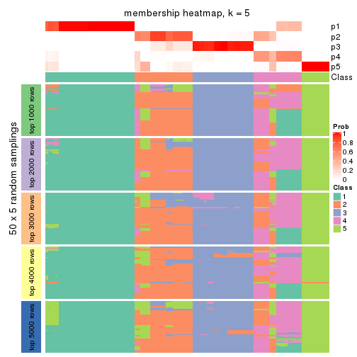</p>

</div>
<div id='tab-SD-NMF-membership-heatmap-5'>
<pre><code class="r">membership_heatmap(res, k = 6)
</code></pre>

<p></p>

</div>
</div>

As soon as we have had the classes for columns, we can look for signatures
which are significantly different between classes which can be candidate marks
for certain classes. Following are the heatmaps for signatures.


Signature heatmaps where rows are scaled:


<script>
$( function() {
	$( '#tabs-SD-NMF-get-signatures' ).tabs();
} );
</script>
<div id='tabs-SD-NMF-get-signatures'>
<ul>
<li><a href='#tab-SD-NMF-get-signatures-1'>k = 2</a></li>
<li><a href='#tab-SD-NMF-get-signatures-2'>k = 3</a></li>
<li><a href='#tab-SD-NMF-get-signatures-3'>k = 4</a></li>
<li><a href='#tab-SD-NMF-get-signatures-4'>k = 5</a></li>
<li><a href='#tab-SD-NMF-get-signatures-5'>k = 6</a></li>
</ul>
<div id='tab-SD-NMF-get-signatures-1'>
<pre><code class="r">get_signatures(res, k = 2)
</code></pre>

<p></p>

</div>
<div id='tab-SD-NMF-get-signatures-2'>
<pre><code class="r">get_signatures(res, k = 3)
</code></pre>

<p></p>

</div>
<div id='tab-SD-NMF-get-signatures-3'>
<pre><code class="r">get_signatures(res, k = 4)
</code></pre>

<p></p>

</div>
<div id='tab-SD-NMF-get-signatures-4'>
<pre><code class="r">get_signatures(res, k = 5)
</code></pre>

<p></p>

</div>
<div id='tab-SD-NMF-get-signatures-5'>
<pre><code class="r">get_signatures(res, k = 6)
</code></pre>

<p></p>

</div>
</div>


Signature heatmaps where rows are not scaled:


<script>
$( function() {
	$( '#tabs-SD-NMF-get-signatures-no-scale' ).tabs();
} );
</script>
<div id='tabs-SD-NMF-get-signatures-no-scale'>
<ul>
<li><a href='#tab-SD-NMF-get-signatures-no-scale-1'>k = 2</a></li>
<li><a href='#tab-SD-NMF-get-signatures-no-scale-2'>k = 3</a></li>
<li><a href='#tab-SD-NMF-get-signatures-no-scale-3'>k = 4</a></li>
<li><a href='#tab-SD-NMF-get-signatures-no-scale-4'>k = 5</a></li>
<li><a href='#tab-SD-NMF-get-signatures-no-scale-5'>k = 6</a></li>
</ul>
<div id='tab-SD-NMF-get-signatures-no-scale-1'>
<pre><code class="r">get_signatures(res, k = 2, scale_rows = FALSE)
</code></pre>

<p></p>

</div>
<div id='tab-SD-NMF-get-signatures-no-scale-2'>
<pre><code class="r">get_signatures(res, k = 3, scale_rows = FALSE)
</code></pre>

<p></p>

</div>
<div id='tab-SD-NMF-get-signatures-no-scale-3'>
<pre><code class="r">get_signatures(res, k = 4, scale_rows = FALSE)
</code></pre>

<p></p>

</div>
<div id='tab-SD-NMF-get-signatures-no-scale-4'>
<pre><code class="r">get_signatures(res, k = 5, scale_rows = FALSE)
</code></pre>

<p></p>

</div>
<div id='tab-SD-NMF-get-signatures-no-scale-5'>
<pre><code class="r">get_signatures(res, k = 6, scale_rows = FALSE)
</code></pre>

<p></p>

</div>
</div>


Compare the overlap of signatures from different k:

```r
compare_signatures(res)
```


`get_signature()` returns a data frame invisibly. TO get the list of signatures, the function
call should be assigned to a variable explicitly. In following code, if `plot` argument is set
to `FALSE`, no heatmap is plotted while only the differential analysis is performed.

```r
# code only for demonstration
tb = get_signature(res, k = ..., plot = FALSE)
```

An example of the output of `tb` is:

```
#>   which_row         fdr    mean_1    mean_2 scaled_mean_1 scaled_mean_2 km
#> 1        38 0.042760348  8.373488  9.131774    -0.5533452     0.5164555  1
#> 2        40 0.018707592  7.106213  8.469186    -0.6173731     0.5762149  1
#> 3        55 0.019134737 10.221463 11.207825    -0.6159697     0.5749050  1
#> 4        59 0.006059896  5.921854  7.869574    -0.6899429     0.6439467  1
#> 5        60 0.018055526  8.928898 10.211722    -0.6204761     0.5791110  1
#> 6        98 0.009384629 15.714769 14.887706     0.6635654    -0.6193277  2
...
```

The columns in `tb` are:

1. `which_row`: row indices corresponding to the input matrix.
2. `fdr`: FDR for the differential test. 
3. `mean_x`: The mean value in group x.
4. `scaled_mean_x`: The mean value in group x after rows are scaled.
5. `km`: Row groups if k-means clustering is applied to rows.


UMAP plot which shows how samples are separated.


<script>
$( function() {
	$( '#tabs-SD-NMF-dimension-reduction' ).tabs();
} );
</script>
<div id='tabs-SD-NMF-dimension-reduction'>
<ul>
<li><a href='#tab-SD-NMF-dimension-reduction-1'>k = 2</a></li>
<li><a href='#tab-SD-NMF-dimension-reduction-2'>k = 3</a></li>
<li><a href='#tab-SD-NMF-dimension-reduction-3'>k = 4</a></li>
<li><a href='#tab-SD-NMF-dimension-reduction-4'>k = 5</a></li>
<li><a href='#tab-SD-NMF-dimension-reduction-5'>k = 6</a></li>
</ul>
<div id='tab-SD-NMF-dimension-reduction-1'>
<pre><code class="r">dimension_reduction(res, k = 2, method = &quot;UMAP&quot;)
</code></pre>

<p></p>

</div>
<div id='tab-SD-NMF-dimension-reduction-2'>
<pre><code class="r">dimension_reduction(res, k = 3, method = &quot;UMAP&quot;)
</code></pre>

<p></p>

</div>
<div id='tab-SD-NMF-dimension-reduction-3'>
<pre><code class="r">dimension_reduction(res, k = 4, method = &quot;UMAP&quot;)
</code></pre>

<p></p>

</div>
<div id='tab-SD-NMF-dimension-reduction-4'>
<pre><code class="r">dimension_reduction(res, k = 5, method = &quot;UMAP&quot;)
</code></pre>

<p></p>

</div>
<div id='tab-SD-NMF-dimension-reduction-5'>
<pre><code class="r">dimension_reduction(res, k = 6, method = &quot;UMAP&quot;)
</code></pre>

<p></p>

</div>
</div>


Following heatmap shows how subgroups are split when increasing `k`:

```r
collect_classes(res)
```


If matrix rows can be associated to genes, consider to use `functional_enrichment(res,
...)` to perform function enrichment for the signature genes. See [this vignette](http://bioconductor.org/packages/devel/bioc/vignettes/cola/inst/doc/functional_enrichment.html) for more detailed explanations.


 

---------------------------------------------------


### CV:hclust**


The object with results only for a single top-value method and a single partition method 
can be extracted as:

```r
res = res_list["CV", "hclust"]
# you can also extract it by
# res = res_list["CV:hclust"]
```

A summary of `res` and all the functions that can be applied to it:

```r
res
```

```
#> A 'ConsensusPartition' object with k = 2, 3, 4, 5, 6.
#>   On a matrix with 13278 rows and 322 columns.
#>   Top rows (1000, 2000, 3000, 4000, 5000) are extracted by 'CV' method.
#>   Subgroups are detected by 'hclust' method.
#>   Performed in total 1250 partitions by row resampling.
#>   Best k for subgroups seems to be 3.
#> 
#> Following methods can be applied to this 'ConsensusPartition' object:
#>  [1] "cola_report"             "collect_classes"         "collect_plots"          
#>  [4] "collect_stats"           "colnames"                "compare_signatures"     
#>  [7] "consensus_heatmap"       "dimension_reduction"     "functional_enrichment"  
#> [10] "get_anno_col"            "get_anno"                "get_classes"            
#> [13] "get_consensus"           "get_matrix"              "get_membership"         
#> [16] "get_param"               "get_signatures"          "get_stats"              
#> [19] "is_best_k"               "is_stable_k"             "membership_heatmap"     
#> [22] "ncol"                    "nrow"                    "plot_ecdf"              
#> [25] "rownames"                "select_partition_number" "show"                   
#> [28] "suggest_best_k"          "test_to_known_factors"
```

`collect_plots()` function collects all the plots made from `res` for all `k` (number of partitions)
into one single page to provide an easy and fast comparison between different `k`.

```r
collect_plots(res)
```


The plots are:

- The first row: a plot of the ECDF (empirical cumulative distribution
  function) curves of the consensus matrix for each `k` and the heatmap of
  predicted classes for each `k`.
- The second row: heatmaps of the consensus matrix for each `k`.
- The third row: heatmaps of the membership matrix for each `k`.
- The fouth row: heatmaps of the signatures for each `k`.

All the plots in panels can be made by individual functions and they are
plotted later in this section.

`select_partition_number()` produces several plots showing different
statistics for choosing "optimized" `k`. There are following statistics:

- ECDF curves of the consensus matrix for each `k`;
- 1-PAC. [The PAC
  score](https://en.wikipedia.org/wiki/Consensus_clustering#Over-interpretation_potential_of_consensus_clustering)
  measures the proportion of the ambiguous subgrouping.
- Mean silhouette score.
- Concordance. The mean probability of fiting the consensus class ids in all
  partitions.
- Area increased. Denote $A_k$ as the area under the ECDF curve for current
  `k`, the area increased is defined as $A_k - A_{k-1}$.
- Rand index. The percent of pairs of samples that are both in a same cluster
  or both are not in a same cluster in the partition of k and k-1.
- Jaccard index. The ratio of pairs of samples are both in a same cluster in
  the partition of k and k-1 and the pairs of samples are both in a same
  cluster in the partition k or k-1.

The detailed explanations of these statistics can be found in [the _cola_
vignette](http://bioconductor.org/packages/devel/bioc/vignettes/cola/inst/doc/cola.html#toc_13).

Generally speaking, lower PAC score, higher mean silhouette score or higher
concordance corresponds to better partition. Rand index and Jaccard index
measure how similar the current partition is compared to partition with `k-1`.
If they are too similar, we won't accept `k` is better than `k-1`.

```r
select_partition_number(res)
```


The numeric values for all these statistics can be obtained by `get_stats()`.

```r
get_stats(res)
```

```
#>   k 1-PAC mean_silhouette concordance area_increased  Rand Jaccard
#> 2 2 1.000           0.993       0.988         0.3921 0.607   0.607
#> 3 3 1.000           1.000       1.000         0.5714 0.777   0.633
#> 4 4 0.895           0.999       0.967         0.1303 0.895   0.728
#> 5 5 1.000           0.994       0.998         0.0374 0.999   0.995
#> 6 6 0.934           0.954       0.969         0.0211 1.000   1.000
```

`suggest_best_k()` suggests the best $k$ based on these statistics. The rules are as follows:

- All $k$ with Jaccard index larger than 0.95 are removed because increasing
  $k$ does not provide enough extra information. If all $k$ are removed, it is
  marked as no subgroup is detected.
- For all $k$ with 1-PAC score larger than 0.9, the maximal $k$ is taken as
  the best $k$, and other $k$ are marked as optional $k$.
- If it does not fit the second rule. The $k$ with the maximal vote of the
  highest 1-PAC score, highest mean silhouette, and highest concordance is
  taken as the best $k$.

```r
suggest_best_k(res)
```

```
#> [1] 3
#> attr(,"optional")
#> [1] 2
```

There is also optional best $k$ = 2 that is worth to check.

Following shows the table of the partitions (You need to click the **show/hide
code output** link to see it). The membership matrix (columns with name `p*`)
is inferred by
[`clue::cl_consensus()`](https://www.rdocumentation.org/link/cl_consensus?package=clue)
function with the `SE` method. Basically the value in the membership matrix
represents the probability to belong to a certain group. The finall class
label for an item is determined with the group with highest probability it
belongs to.

In `get_classes()` function, the entropy is calculated from the membership
matrix and the silhouette score is calculated from the consensus matrix.


<script>
$( function() {
	$( '#tabs-CV-hclust-get-classes' ).tabs();
} );
</script>
<div id='tabs-CV-hclust-get-classes'>
<ul>
<li><a href='#tab-CV-hclust-get-classes-1'>k = 2</a></li>
<li><a href='#tab-CV-hclust-get-classes-2'>k = 3</a></li>
<li><a href='#tab-CV-hclust-get-classes-3'>k = 4</a></li>
<li><a href='#tab-CV-hclust-get-classes-4'>k = 5</a></li>
<li><a href='#tab-CV-hclust-get-classes-5'>k = 6</a></li>
</ul>

<div id='tab-CV-hclust-get-classes-1'>
<p><a id='tab-CV-hclust-get-classes-1-a' style='color:#0366d6' href='#'>show/hide code output</a></p>
<pre><code class="r">cbind(get_classes(res, k = 2), get_membership(res, k = 2))
</code></pre>

<pre><code>#&gt;           class entropy silhouette    p1    p2
#&gt; DRR023371     2   0.163      0.983 0.024 0.976
#&gt; DRR023372     2   0.163      0.983 0.024 0.976
#&gt; DRR023373     2   0.163      0.983 0.024 0.976
#&gt; DRR023374     2   0.163      0.983 0.024 0.976
#&gt; DRR023375     2   0.163      0.983 0.024 0.976
#&gt; DRR023376     2   0.163      0.983 0.024 0.976
#&gt; DRR023377     2   0.163      0.983 0.024 0.976
#&gt; DRR023378     2   0.163      0.983 0.024 0.976
#&gt; DRR023379     2   0.163      0.983 0.024 0.976
#&gt; DRR023380     2   0.163      0.983 0.024 0.976
#&gt; DRR023381     2   0.163      0.983 0.024 0.976
#&gt; DRR023382     2   0.163      0.983 0.024 0.976
#&gt; DRR023383     2   0.163      0.983 0.024 0.976
#&gt; DRR023384     2   0.163      0.983 0.024 0.976
#&gt; DRR023385     2   0.163      0.983 0.024 0.976
#&gt; DRR023386     2   0.163      0.983 0.024 0.976
#&gt; DRR023387     2   0.163      0.983 0.024 0.976
#&gt; DRR023388     2   0.163      0.983 0.024 0.976
#&gt; DRR023389     2   0.163      0.983 0.024 0.976
#&gt; DRR023390     2   0.163      0.983 0.024 0.976
#&gt; DRR023391     2   0.163      0.983 0.024 0.976
#&gt; DRR023392     2   0.163      0.983 0.024 0.976
#&gt; DRR023394     2   0.163      0.983 0.024 0.976
#&gt; DRR023395     2   0.163      0.983 0.024 0.976
#&gt; DRR023396     2   0.163      0.983 0.024 0.976
#&gt; DRR023397     2   0.163      0.983 0.024 0.976
#&gt; DRR023398     2   0.163      0.983 0.024 0.976
#&gt; DRR023399     2   0.163      0.983 0.024 0.976
#&gt; DRR023400     2   0.163      0.983 0.024 0.976
#&gt; DRR023401     2   0.163      0.983 0.024 0.976
#&gt; DRR023402     2   0.163      0.983 0.024 0.976
#&gt; DRR023403     2   0.163      0.983 0.024 0.976
#&gt; DRR023404     2   0.000      0.993 0.000 1.000
#&gt; DRR023405     2   0.000      0.993 0.000 1.000
#&gt; DRR023406     2   0.000      0.993 0.000 1.000
#&gt; DRR023407     2   0.000      0.993 0.000 1.000
#&gt; DRR023408     2   0.000      0.993 0.000 1.000
#&gt; DRR023409     2   0.000      0.993 0.000 1.000
#&gt; DRR023410     2   0.000      0.993 0.000 1.000
#&gt; DRR023411     2   0.000      0.993 0.000 1.000
#&gt; DRR023412     2   0.000      0.993 0.000 1.000
#&gt; DRR023413     2   0.000      0.993 0.000 1.000
#&gt; DRR023414     2   0.000      0.993 0.000 1.000
#&gt; DRR023415     2   0.000      0.993 0.000 1.000
#&gt; DRR023416     2   0.000      0.993 0.000 1.000
#&gt; DRR023417     2   0.000      0.993 0.000 1.000
#&gt; DRR023418     2   0.000      0.993 0.000 1.000
#&gt; DRR023419     2   0.000      0.993 0.000 1.000
#&gt; DRR023420     2   0.000      0.993 0.000 1.000
#&gt; DRR023421     2   0.000      0.993 0.000 1.000
#&gt; DRR023422     2   0.000      0.993 0.000 1.000
#&gt; DRR023423     2   0.000      0.993 0.000 1.000
#&gt; DRR023425     2   0.000      0.993 0.000 1.000
#&gt; DRR023426     2   0.000      0.993 0.000 1.000
#&gt; DRR023427     2   0.000      0.993 0.000 1.000
#&gt; DRR023428     2   0.000      0.993 0.000 1.000
#&gt; DRR023429     2   0.000      0.993 0.000 1.000
#&gt; DRR023430     2   0.000      0.993 0.000 1.000
#&gt; DRR023431     2   0.000      0.993 0.000 1.000
#&gt; DRR023432     2   0.000      0.993 0.000 1.000
#&gt; DRR023433     2   0.000      0.993 0.000 1.000
#&gt; DRR023434     2   0.000      0.993 0.000 1.000
#&gt; DRR023435     2   0.000      0.993 0.000 1.000
#&gt; DRR023436     2   0.000      0.993 0.000 1.000
#&gt; DRR023437     2   0.000      0.993 0.000 1.000
#&gt; DRR023438     2   0.000      0.993 0.000 1.000
#&gt; DRR023439     2   0.000      0.993 0.000 1.000
#&gt; DRR023440     2   0.000      0.993 0.000 1.000
#&gt; DRR023441     2   0.000      0.993 0.000 1.000
#&gt; DRR023442     2   0.000      0.993 0.000 1.000
#&gt; DRR023443     2   0.000      0.993 0.000 1.000
#&gt; DRR023444     2   0.000      0.993 0.000 1.000
#&gt; DRR023445     2   0.000      0.993 0.000 1.000
#&gt; DRR023446     2   0.000      0.993 0.000 1.000
#&gt; DRR023447     2   0.000      0.993 0.000 1.000
#&gt; DRR023448     2   0.000      0.993 0.000 1.000
#&gt; DRR023449     2   0.000      0.993 0.000 1.000
#&gt; DRR023450     2   0.000      0.993 0.000 1.000
#&gt; DRR023451     2   0.000      0.993 0.000 1.000
#&gt; DRR023452     2   0.000      0.993 0.000 1.000
#&gt; DRR023453     2   0.163      0.983 0.024 0.976
#&gt; DRR023454     2   0.163      0.983 0.024 0.976
#&gt; DRR023455     2   0.163      0.983 0.024 0.976
#&gt; DRR023456     2   0.163      0.983 0.024 0.976
#&gt; DRR023457     2   0.163      0.983 0.024 0.976
#&gt; DRR023458     2   0.163      0.983 0.024 0.976
#&gt; DRR023459     2   0.163      0.983 0.024 0.976
#&gt; DRR023460     2   0.163      0.983 0.024 0.976
#&gt; DRR023461     2   0.163      0.983 0.024 0.976
#&gt; DRR023462     2   0.163      0.983 0.024 0.976
#&gt; DRR023463     2   0.163      0.983 0.024 0.976
#&gt; DRR023464     2   0.163      0.983 0.024 0.976
#&gt; DRR023465     2   0.163      0.983 0.024 0.976
#&gt; DRR023466     2   0.163      0.983 0.024 0.976
#&gt; DRR023467     2   0.163      0.983 0.024 0.976
#&gt; DRR023468     2   0.163      0.983 0.024 0.976
#&gt; DRR023469     2   0.163      0.983 0.024 0.976
#&gt; DRR023470     2   0.163      0.983 0.024 0.976
#&gt; DRR023471     2   0.163      0.983 0.024 0.976
#&gt; DRR023472     2   0.163      0.983 0.024 0.976
#&gt; DRR023473     2   0.163      0.983 0.024 0.976
#&gt; DRR023474     2   0.163      0.983 0.024 0.976
#&gt; DRR023475     2   0.163      0.983 0.024 0.976
#&gt; DRR023476     2   0.163      0.983 0.024 0.976
#&gt; DRR023477     2   0.163      0.983 0.024 0.976
#&gt; DRR023478     2   0.163      0.983 0.024 0.976
#&gt; DRR023479     2   0.163      0.983 0.024 0.976
#&gt; DRR023480     2   0.163      0.983 0.024 0.976
#&gt; DRR023481     2   0.163      0.983 0.024 0.976
#&gt; DRR023482     2   0.163      0.983 0.024 0.976
#&gt; DRR023483     2   0.163      0.983 0.024 0.976
#&gt; DRR023484     2   0.163      0.983 0.024 0.976
#&gt; DRR023485     2   0.163      0.983 0.024 0.976
#&gt; DRR023486     2   0.163      0.983 0.024 0.976
#&gt; DRR023487     2   0.163      0.983 0.024 0.976
#&gt; DRR023488     2   0.163      0.983 0.024 0.976
#&gt; DRR023489     2   0.163      0.983 0.024 0.976
#&gt; DRR023490     1   0.163      1.000 0.976 0.024
#&gt; DRR023491     1   0.163      1.000 0.976 0.024
#&gt; DRR023492     1   0.163      1.000 0.976 0.024
#&gt; DRR023493     1   0.163      1.000 0.976 0.024
#&gt; DRR023494     1   0.163      1.000 0.976 0.024
#&gt; DRR023495     1   0.163      1.000 0.976 0.024
#&gt; DRR023496     1   0.163      1.000 0.976 0.024
#&gt; DRR023497     1   0.163      1.000 0.976 0.024
#&gt; DRR023498     1   0.163      1.000 0.976 0.024
#&gt; DRR023499     1   0.163      1.000 0.976 0.024
#&gt; DRR023500     1   0.163      1.000 0.976 0.024
#&gt; DRR023501     1   0.163      1.000 0.976 0.024
#&gt; DRR023502     1   0.163      1.000 0.976 0.024
#&gt; DRR023503     1   0.163      1.000 0.976 0.024
#&gt; DRR023504     1   0.163      1.000 0.976 0.024
#&gt; DRR023505     1   0.163      1.000 0.976 0.024
#&gt; DRR023506     1   0.163      1.000 0.976 0.024
#&gt; DRR023507     1   0.163      1.000 0.976 0.024
#&gt; DRR023508     1   0.163      1.000 0.976 0.024
#&gt; DRR023509     1   0.163      1.000 0.976 0.024
#&gt; DRR023510     1   0.163      1.000 0.976 0.024
#&gt; DRR023511     1   0.163      1.000 0.976 0.024
#&gt; DRR023512     1   0.163      1.000 0.976 0.024
#&gt; DRR023513     1   0.163      1.000 0.976 0.024
#&gt; DRR023514     1   0.163      1.000 0.976 0.024
#&gt; DRR023515     1   0.163      1.000 0.976 0.024
#&gt; DRR023516     1   0.163      1.000 0.976 0.024
#&gt; DRR023517     1   0.163      1.000 0.976 0.024
#&gt; DRR023518     1   0.163      1.000 0.976 0.024
#&gt; DRR023519     1   0.163      1.000 0.976 0.024
#&gt; DRR023520     1   0.163      1.000 0.976 0.024
#&gt; DRR023521     1   0.163      1.000 0.976 0.024
#&gt; DRR023522     1   0.163      1.000 0.976 0.024
#&gt; DRR023523     1   0.163      1.000 0.976 0.024
#&gt; DRR023524     1   0.163      1.000 0.976 0.024
#&gt; DRR023525     1   0.163      1.000 0.976 0.024
#&gt; DRR023526     1   0.163      1.000 0.976 0.024
#&gt; DRR023527     1   0.163      1.000 0.976 0.024
#&gt; DRR023528     1   0.163      1.000 0.976 0.024
#&gt; DRR023529     1   0.163      1.000 0.976 0.024
#&gt; DRR023530     1   0.163      1.000 0.976 0.024
#&gt; DRR023531     1   0.163      1.000 0.976 0.024
#&gt; DRR023532     1   0.163      1.000 0.976 0.024
#&gt; DRR023533     1   0.163      1.000 0.976 0.024
#&gt; DRR023534     1   0.163      1.000 0.976 0.024
#&gt; DRR023535     1   0.163      1.000 0.976 0.024
#&gt; DRR023536     1   0.163      1.000 0.976 0.024
#&gt; DRR023537     1   0.163      1.000 0.976 0.024
#&gt; DRR023538     1   0.163      1.000 0.976 0.024
#&gt; DRR023539     1   0.163      1.000 0.976 0.024
#&gt; DRR023540     1   0.163      1.000 0.976 0.024
#&gt; DRR023541     1   0.163      1.000 0.976 0.024
#&gt; DRR023542     1   0.163      1.000 0.976 0.024
#&gt; DRR023543     1   0.163      1.000 0.976 0.024
#&gt; DRR023544     1   0.163      1.000 0.976 0.024
#&gt; DRR023545     1   0.163      1.000 0.976 0.024
#&gt; DRR023546     1   0.163      1.000 0.976 0.024
#&gt; DRR023547     1   0.163      1.000 0.976 0.024
#&gt; DRR023548     1   0.163      1.000 0.976 0.024
#&gt; DRR023549     1   0.163      1.000 0.976 0.024
#&gt; DRR023550     1   0.163      1.000 0.976 0.024
#&gt; DRR023551     1   0.163      1.000 0.976 0.024
#&gt; DRR023552     1   0.163      1.000 0.976 0.024
#&gt; DRR023553     1   0.163      1.000 0.976 0.024
#&gt; DRR023554     1   0.163      1.000 0.976 0.024
#&gt; DRR023555     1   0.163      1.000 0.976 0.024
#&gt; DRR023556     1   0.163      1.000 0.976 0.024
#&gt; DRR023557     1   0.163      1.000 0.976 0.024
#&gt; DRR023558     1   0.163      1.000 0.976 0.024
#&gt; DRR023559     1   0.163      1.000 0.976 0.024
#&gt; DRR023560     1   0.163      1.000 0.976 0.024
#&gt; DRR023561     1   0.163      1.000 0.976 0.024
#&gt; DRR023562     1   0.163      1.000 0.976 0.024
#&gt; DRR023563     1   0.163      1.000 0.976 0.024
#&gt; DRR023564     1   0.163      1.000 0.976 0.024
#&gt; DRR023565     1   0.163      1.000 0.976 0.024
#&gt; DRR023566     1   0.163      1.000 0.976 0.024
#&gt; DRR023567     1   0.163      1.000 0.976 0.024
#&gt; DRR023568     1   0.163      1.000 0.976 0.024
#&gt; DRR023569     1   0.163      1.000 0.976 0.024
#&gt; DRR023570     1   0.163      1.000 0.976 0.024
#&gt; DRR023571     1   0.163      1.000 0.976 0.024
#&gt; DRR023572     1   0.163      1.000 0.976 0.024
#&gt; DRR023573     1   0.163      1.000 0.976 0.024
#&gt; DRR023574     1   0.163      1.000 0.976 0.024
#&gt; DRR023575     1   0.163      1.000 0.976 0.024
#&gt; DRR023576     2   0.000      0.993 0.000 1.000
#&gt; DRR023577     2   0.000      0.993 0.000 1.000
#&gt; DRR023578     2   0.000      0.993 0.000 1.000
#&gt; DRR023579     2   0.000      0.993 0.000 1.000
#&gt; DRR023580     2   0.000      0.993 0.000 1.000
#&gt; DRR023581     2   0.000      0.993 0.000 1.000
#&gt; DRR023582     2   0.000      0.993 0.000 1.000
#&gt; DRR023583     2   0.000      0.993 0.000 1.000
#&gt; DRR023584     2   0.000      0.993 0.000 1.000
#&gt; DRR023585     2   0.000      0.993 0.000 1.000
#&gt; DRR023586     2   0.000      0.993 0.000 1.000
#&gt; DRR023587     2   0.000      0.993 0.000 1.000
#&gt; DRR023588     2   0.000      0.993 0.000 1.000
#&gt; DRR023589     2   0.000      0.993 0.000 1.000
#&gt; DRR023590     2   0.000      0.993 0.000 1.000
#&gt; DRR023591     2   0.000      0.993 0.000 1.000
#&gt; DRR023592     2   0.000      0.993 0.000 1.000
#&gt; DRR023593     2   0.000      0.993 0.000 1.000
#&gt; DRR023594     2   0.000      0.993 0.000 1.000
#&gt; DRR023595     2   0.000      0.993 0.000 1.000
#&gt; DRR023596     2   0.000      0.993 0.000 1.000
#&gt; DRR023597     2   0.000      0.993 0.000 1.000
#&gt; DRR023598     2   0.000      0.993 0.000 1.000
#&gt; DRR023599     2   0.000      0.993 0.000 1.000
#&gt; DRR023600     2   0.000      0.993 0.000 1.000
#&gt; DRR023601     2   0.000      0.993 0.000 1.000
#&gt; DRR023602     2   0.000      0.993 0.000 1.000
#&gt; DRR023603     2   0.000      0.993 0.000 1.000
#&gt; DRR023604     2   0.000      0.993 0.000 1.000
#&gt; DRR023605     2   0.000      0.993 0.000 1.000
#&gt; DRR023606     2   0.000      0.993 0.000 1.000
#&gt; DRR023607     2   0.000      0.993 0.000 1.000
#&gt; DRR023608     2   0.000      0.993 0.000 1.000
#&gt; DRR023609     2   0.000      0.993 0.000 1.000
#&gt; DRR023610     2   0.000      0.993 0.000 1.000
#&gt; DRR023611     2   0.000      0.993 0.000 1.000
#&gt; DRR023612     2   0.000      0.993 0.000 1.000
#&gt; DRR023613     2   0.000      0.993 0.000 1.000
#&gt; DRR023614     2   0.000      0.993 0.000 1.000
#&gt; DRR023615     2   0.000      0.993 0.000 1.000
#&gt; DRR023616     2   0.000      0.993 0.000 1.000
#&gt; DRR023617     2   0.000      0.993 0.000 1.000
#&gt; DRR023619     2   0.000      0.993 0.000 1.000
#&gt; DRR023620     2   0.000      0.993 0.000 1.000
#&gt; DRR023621     2   0.000      0.993 0.000 1.000
#&gt; DRR023622     2   0.000      0.993 0.000 1.000
#&gt; DRR023623     2   0.000      0.993 0.000 1.000
#&gt; DRR023624     2   0.000      0.993 0.000 1.000
#&gt; DRR023625     2   0.000      0.993 0.000 1.000
#&gt; DRR023626     2   0.000      0.993 0.000 1.000
#&gt; DRR023627     2   0.000      0.993 0.000 1.000
#&gt; DRR023628     2   0.000      0.993 0.000 1.000
#&gt; DRR023629     2   0.000      0.993 0.000 1.000
#&gt; DRR023630     2   0.000      0.993 0.000 1.000
#&gt; DRR023631     2   0.000      0.993 0.000 1.000
#&gt; DRR023632     2   0.000      0.993 0.000 1.000
#&gt; DRR023633     2   0.000      0.993 0.000 1.000
#&gt; DRR023635     2   0.000      0.993 0.000 1.000
#&gt; DRR023636     2   0.000      0.993 0.000 1.000
#&gt; DRR023637     2   0.000      0.993 0.000 1.000
#&gt; DRR023638     2   0.000      0.993 0.000 1.000
#&gt; DRR023639     2   0.000      0.993 0.000 1.000
#&gt; DRR023640     2   0.000      0.993 0.000 1.000
#&gt; DRR023641     2   0.000      0.993 0.000 1.000
#&gt; DRR023642     2   0.000      0.993 0.000 1.000
#&gt; DRR023643     2   0.000      0.993 0.000 1.000
#&gt; DRR023644     2   0.000      0.993 0.000 1.000
#&gt; DRR023645     2   0.000      0.993 0.000 1.000
#&gt; DRR023646     2   0.000      0.993 0.000 1.000
#&gt; DRR023647     2   0.000      0.993 0.000 1.000
#&gt; DRR023648     2   0.000      0.993 0.000 1.000
#&gt; DRR023649     2   0.000      0.993 0.000 1.000
#&gt; DRR023650     2   0.000      0.993 0.000 1.000
#&gt; DRR023651     2   0.000      0.993 0.000 1.000
#&gt; DRR023652     2   0.000      0.993 0.000 1.000
#&gt; DRR023653     2   0.000      0.993 0.000 1.000
#&gt; DRR023654     2   0.000      0.993 0.000 1.000
#&gt; DRR023655     2   0.000      0.993 0.000 1.000
#&gt; DRR023656     2   0.000      0.993 0.000 1.000
#&gt; DRR023657     2   0.000      0.993 0.000 1.000
#&gt; DRR023658     2   0.000      0.993 0.000 1.000
#&gt; DRR023659     2   0.000      0.993 0.000 1.000
#&gt; DRR023660     2   0.000      0.993 0.000 1.000
#&gt; DRR023661     2   0.000      0.993 0.000 1.000
#&gt; DRR023662     2   0.000      0.993 0.000 1.000
#&gt; DRR023663     2   0.000      0.993 0.000 1.000
#&gt; DRR023664     2   0.000      0.993 0.000 1.000
#&gt; DRR023665     2   0.000      0.993 0.000 1.000
#&gt; DRR023666     2   0.000      0.993 0.000 1.000
#&gt; DRR023667     2   0.000      0.993 0.000 1.000
#&gt; DRR023668     2   0.000      0.993 0.000 1.000
#&gt; DRR023669     2   0.000      0.993 0.000 1.000
#&gt; DRR023670     2   0.000      0.993 0.000 1.000
#&gt; DRR023671     2   0.000      0.993 0.000 1.000
#&gt; DRR023672     2   0.000      0.993 0.000 1.000
#&gt; DRR023673     2   0.000      0.993 0.000 1.000
#&gt; DRR023674     2   0.000      0.993 0.000 1.000
#&gt; DRR023675     2   0.000      0.993 0.000 1.000
#&gt; DRR023676     2   0.000      0.993 0.000 1.000
#&gt; DRR023677     2   0.000      0.993 0.000 1.000
#&gt; DRR023678     2   0.000      0.993 0.000 1.000
#&gt; DRR023683     2   0.000      0.993 0.000 1.000
#&gt; DRR023684     2   0.000      0.993 0.000 1.000
#&gt; DRR023685     2   0.000      0.993 0.000 1.000
#&gt; DRR023686     2   0.000      0.993 0.000 1.000
#&gt; DRR023687     2   0.000      0.993 0.000 1.000
#&gt; DRR023688     2   0.000      0.993 0.000 1.000
#&gt; DRR023689     2   0.000      0.993 0.000 1.000
#&gt; DRR023690     2   0.000      0.993 0.000 1.000
#&gt; DRR023691     2   0.000      0.993 0.000 1.000
#&gt; DRR023692     2   0.000      0.993 0.000 1.000
#&gt; DRR023693     2   0.000      0.993 0.000 1.000
#&gt; DRR023694     2   0.000      0.993 0.000 1.000
#&gt; DRR023695     2   0.000      0.993 0.000 1.000
#&gt; DRR023696     2   0.000      0.993 0.000 1.000
#&gt; DRR023697     2   0.000      0.993 0.000 1.000
#&gt; DRR023698     2   0.000      0.993 0.000 1.000
#&gt; DRR023699     2   0.000      0.993 0.000 1.000
#&gt; DRR023700     2   0.000      0.993 0.000 1.000
</code></pre>

<script>
$('#tab-CV-hclust-get-classes-1-a').parent().next().next().hide();
$('#tab-CV-hclust-get-classes-1-a').click(function(){
  $('#tab-CV-hclust-get-classes-1-a').parent().next().next().toggle();
  return(false);
});
</script>
</div>

<div id='tab-CV-hclust-get-classes-2'>
<p><a id='tab-CV-hclust-get-classes-2-a' style='color:#0366d6' href='#'>show/hide code output</a></p>
<pre><code class="r">cbind(get_classes(res, k = 3), get_membership(res, k = 3))
</code></pre>

<pre><code>#&gt;           class entropy silhouette p1 p2 p3
#&gt; DRR023371     3       0          1  0  0  1
#&gt; DRR023372     3       0          1  0  0  1
#&gt; DRR023373     3       0          1  0  0  1
#&gt; DRR023374     3       0          1  0  0  1
#&gt; DRR023375     3       0          1  0  0  1
#&gt; DRR023376     3       0          1  0  0  1
#&gt; DRR023377     3       0          1  0  0  1
#&gt; DRR023378     3       0          1  0  0  1
#&gt; DRR023379     3       0          1  0  0  1
#&gt; DRR023380     3       0          1  0  0  1
#&gt; DRR023381     3       0          1  0  0  1
#&gt; DRR023382     3       0          1  0  0  1
#&gt; DRR023383     3       0          1  0  0  1
#&gt; DRR023384     3       0          1  0  0  1
#&gt; DRR023385     3       0          1  0  0  1
#&gt; DRR023386     3       0          1  0  0  1
#&gt; DRR023387     3       0          1  0  0  1
#&gt; DRR023388     3       0          1  0  0  1
#&gt; DRR023389     3       0          1  0  0  1
#&gt; DRR023390     3       0          1  0  0  1
#&gt; DRR023391     3       0          1  0  0  1
#&gt; DRR023392     3       0          1  0  0  1
#&gt; DRR023394     3       0          1  0  0  1
#&gt; DRR023395     3       0          1  0  0  1
#&gt; DRR023396     3       0          1  0  0  1
#&gt; DRR023397     3       0          1  0  0  1
#&gt; DRR023398     3       0          1  0  0  1
#&gt; DRR023399     3       0          1  0  0  1
#&gt; DRR023400     3       0          1  0  0  1
#&gt; DRR023401     3       0          1  0  0  1
#&gt; DRR023402     3       0          1  0  0  1
#&gt; DRR023403     3       0          1  0  0  1
#&gt; DRR023404     2       0          1  0  1  0
#&gt; DRR023405     2       0          1  0  1  0
#&gt; DRR023406     2       0          1  0  1  0
#&gt; DRR023407     2       0          1  0  1  0
#&gt; DRR023408     2       0          1  0  1  0
#&gt; DRR023409     2       0          1  0  1  0
#&gt; DRR023410     2       0          1  0  1  0
#&gt; DRR023411     2       0          1  0  1  0
#&gt; DRR023412     2       0          1  0  1  0
#&gt; DRR023413     2       0          1  0  1  0
#&gt; DRR023414     2       0          1  0  1  0
#&gt; DRR023415     2       0          1  0  1  0
#&gt; DRR023416     2       0          1  0  1  0
#&gt; DRR023417     2       0          1  0  1  0
#&gt; DRR023418     2       0          1  0  1  0
#&gt; DRR023419     2       0          1  0  1  0
#&gt; DRR023420     2       0          1  0  1  0
#&gt; DRR023421     2       0          1  0  1  0
#&gt; DRR023422     2       0          1  0  1  0
#&gt; DRR023423     2       0          1  0  1  0
#&gt; DRR023425     2       0          1  0  1  0
#&gt; DRR023426     2       0          1  0  1  0
#&gt; DRR023427     2       0          1  0  1  0
#&gt; DRR023428     2       0          1  0  1  0
#&gt; DRR023429     2       0          1  0  1  0
#&gt; DRR023430     2       0          1  0  1  0
#&gt; DRR023431     2       0          1  0  1  0
#&gt; DRR023432     2       0          1  0  1  0
#&gt; DRR023433     2       0          1  0  1  0
#&gt; DRR023434     2       0          1  0  1  0
#&gt; DRR023435     2       0          1  0  1  0
#&gt; DRR023436     2       0          1  0  1  0
#&gt; DRR023437     2       0          1  0  1  0
#&gt; DRR023438     2       0          1  0  1  0
#&gt; DRR023439     2       0          1  0  1  0
#&gt; DRR023440     2       0          1  0  1  0
#&gt; DRR023441     2       0          1  0  1  0
#&gt; DRR023442     2       0          1  0  1  0
#&gt; DRR023443     2       0          1  0  1  0
#&gt; DRR023444     2       0          1  0  1  0
#&gt; DRR023445     2       0          1  0  1  0
#&gt; DRR023446     2       0          1  0  1  0
#&gt; DRR023447     2       0          1  0  1  0
#&gt; DRR023448     2       0          1  0  1  0
#&gt; DRR023449     2       0          1  0  1  0
#&gt; DRR023450     2       0          1  0  1  0
#&gt; DRR023451     2       0          1  0  1  0
#&gt; DRR023452     2       0          1  0  1  0
#&gt; DRR023453     3       0          1  0  0  1
#&gt; DRR023454     3       0          1  0  0  1
#&gt; DRR023455     3       0          1  0  0  1
#&gt; DRR023456     3       0          1  0  0  1
#&gt; DRR023457     3       0          1  0  0  1
#&gt; DRR023458     3       0          1  0  0  1
#&gt; DRR023459     3       0          1  0  0  1
#&gt; DRR023460     3       0          1  0  0  1
#&gt; DRR023461     3       0          1  0  0  1
#&gt; DRR023462     3       0          1  0  0  1
#&gt; DRR023463     3       0          1  0  0  1
#&gt; DRR023464     3       0          1  0  0  1
#&gt; DRR023465     3       0          1  0  0  1
#&gt; DRR023466     3       0          1  0  0  1
#&gt; DRR023467     3       0          1  0  0  1
#&gt; DRR023468     3       0          1  0  0  1
#&gt; DRR023469     3       0          1  0  0  1
#&gt; DRR023470     3       0          1  0  0  1
#&gt; DRR023471     3       0          1  0  0  1
#&gt; DRR023472     3       0          1  0  0  1
#&gt; DRR023473     3       0          1  0  0  1
#&gt; DRR023474     3       0          1  0  0  1
#&gt; DRR023475     3       0          1  0  0  1
#&gt; DRR023476     3       0          1  0  0  1
#&gt; DRR023477     3       0          1  0  0  1
#&gt; DRR023478     3       0          1  0  0  1
#&gt; DRR023479     3       0          1  0  0  1
#&gt; DRR023480     3       0          1  0  0  1
#&gt; DRR023481     3       0          1  0  0  1
#&gt; DRR023482     3       0          1  0  0  1
#&gt; DRR023483     3       0          1  0  0  1
#&gt; DRR023484     3       0          1  0  0  1
#&gt; DRR023485     3       0          1  0  0  1
#&gt; DRR023486     3       0          1  0  0  1
#&gt; DRR023487     3       0          1  0  0  1
#&gt; DRR023488     3       0          1  0  0  1
#&gt; DRR023489     3       0          1  0  0  1
#&gt; DRR023490     1       0          1  1  0  0
#&gt; DRR023491     1       0          1  1  0  0
#&gt; DRR023492     1       0          1  1  0  0
#&gt; DRR023493     1       0          1  1  0  0
#&gt; DRR023494     1       0          1  1  0  0
#&gt; DRR023495     1       0          1  1  0  0
#&gt; DRR023496     1       0          1  1  0  0
#&gt; DRR023497     1       0          1  1  0  0
#&gt; DRR023498     1       0          1  1  0  0
#&gt; DRR023499     1       0          1  1  0  0
#&gt; DRR023500     1       0          1  1  0  0
#&gt; DRR023501     1       0          1  1  0  0
#&gt; DRR023502     1       0          1  1  0  0
#&gt; DRR023503     1       0          1  1  0  0
#&gt; DRR023504     1       0          1  1  0  0
#&gt; DRR023505     1       0          1  1  0  0
#&gt; DRR023506     1       0          1  1  0  0
#&gt; DRR023507     1       0          1  1  0  0
#&gt; DRR023508     1       0          1  1  0  0
#&gt; DRR023509     1       0          1  1  0  0
#&gt; DRR023510     1       0          1  1  0  0
#&gt; DRR023511     1       0          1  1  0  0
#&gt; DRR023512     1       0          1  1  0  0
#&gt; DRR023513     1       0          1  1  0  0
#&gt; DRR023514     1       0          1  1  0  0
#&gt; DRR023515     1       0          1  1  0  0
#&gt; DRR023516     1       0          1  1  0  0
#&gt; DRR023517     1       0          1  1  0  0
#&gt; DRR023518     1       0          1  1  0  0
#&gt; DRR023519     1       0          1  1  0  0
#&gt; DRR023520     1       0          1  1  0  0
#&gt; DRR023521     1       0          1  1  0  0
#&gt; DRR023522     1       0          1  1  0  0
#&gt; DRR023523     1       0          1  1  0  0
#&gt; DRR023524     1       0          1  1  0  0
#&gt; DRR023525     1       0          1  1  0  0
#&gt; DRR023526     1       0          1  1  0  0
#&gt; DRR023527     1       0          1  1  0  0
#&gt; DRR023528     1       0          1  1  0  0
#&gt; DRR023529     1       0          1  1  0  0
#&gt; DRR023530     1       0          1  1  0  0
#&gt; DRR023531     1       0          1  1  0  0
#&gt; DRR023532     1       0          1  1  0  0
#&gt; DRR023533     1       0          1  1  0  0
#&gt; DRR023534     1       0          1  1  0  0
#&gt; DRR023535     1       0          1  1  0  0
#&gt; DRR023536     1       0          1  1  0  0
#&gt; DRR023537     1       0          1  1  0  0
#&gt; DRR023538     1       0          1  1  0  0
#&gt; DRR023539     1       0          1  1  0  0
#&gt; DRR023540     1       0          1  1  0  0
#&gt; DRR023541     1       0          1  1  0  0
#&gt; DRR023542     1       0          1  1  0  0
#&gt; DRR023543     1       0          1  1  0  0
#&gt; DRR023544     1       0          1  1  0  0
#&gt; DRR023545     1       0          1  1  0  0
#&gt; DRR023546     1       0          1  1  0  0
#&gt; DRR023547     1       0          1  1  0  0
#&gt; DRR023548     1       0          1  1  0  0
#&gt; DRR023549     1       0          1  1  0  0
#&gt; DRR023550     1       0          1  1  0  0
#&gt; DRR023551     1       0          1  1  0  0
#&gt; DRR023552     1       0          1  1  0  0
#&gt; DRR023553     1       0          1  1  0  0
#&gt; DRR023554     1       0          1  1  0  0
#&gt; DRR023555     1       0          1  1  0  0
#&gt; DRR023556     1       0          1  1  0  0
#&gt; DRR023557     1       0          1  1  0  0
#&gt; DRR023558     1       0          1  1  0  0
#&gt; DRR023559     1       0          1  1  0  0
#&gt; DRR023560     1       0          1  1  0  0
#&gt; DRR023561     1       0          1  1  0  0
#&gt; DRR023562     1       0          1  1  0  0
#&gt; DRR023563     1       0          1  1  0  0
#&gt; DRR023564     1       0          1  1  0  0
#&gt; DRR023565     1       0          1  1  0  0
#&gt; DRR023566     1       0          1  1  0  0
#&gt; DRR023567     1       0          1  1  0  0
#&gt; DRR023568     1       0          1  1  0  0
#&gt; DRR023569     1       0          1  1  0  0
#&gt; DRR023570     1       0          1  1  0  0
#&gt; DRR023571     1       0          1  1  0  0
#&gt; DRR023572     1       0          1  1  0  0
#&gt; DRR023573     1       0          1  1  0  0
#&gt; DRR023574     1       0          1  1  0  0
#&gt; DRR023575     1       0          1  1  0  0
#&gt; DRR023576     2       0          1  0  1  0
#&gt; DRR023577     2       0          1  0  1  0
#&gt; DRR023578     2       0          1  0  1  0
#&gt; DRR023579     2       0          1  0  1  0
#&gt; DRR023580     2       0          1  0  1  0
#&gt; DRR023581     2       0          1  0  1  0
#&gt; DRR023582     2       0          1  0  1  0
#&gt; DRR023583     2       0          1  0  1  0
#&gt; DRR023584     2       0          1  0  1  0
#&gt; DRR023585     2       0          1  0  1  0
#&gt; DRR023586     2       0          1  0  1  0
#&gt; DRR023587     2       0          1  0  1  0
#&gt; DRR023588     2       0          1  0  1  0
#&gt; DRR023589     2       0          1  0  1  0
#&gt; DRR023590     2       0          1  0  1  0
#&gt; DRR023591     2       0          1  0  1  0
#&gt; DRR023592     2       0          1  0  1  0
#&gt; DRR023593     2       0          1  0  1  0
#&gt; DRR023594     2       0          1  0  1  0
#&gt; DRR023595     2       0          1  0  1  0
#&gt; DRR023596     2       0          1  0  1  0
#&gt; DRR023597     2       0          1  0  1  0
#&gt; DRR023598     2       0          1  0  1  0
#&gt; DRR023599     2       0          1  0  1  0
#&gt; DRR023600     2       0          1  0  1  0
#&gt; DRR023601     2       0          1  0  1  0
#&gt; DRR023602     2       0          1  0  1  0
#&gt; DRR023603     2       0          1  0  1  0
#&gt; DRR023604     2       0          1  0  1  0
#&gt; DRR023605     2       0          1  0  1  0
#&gt; DRR023606     2       0          1  0  1  0
#&gt; DRR023607     2       0          1  0  1  0
#&gt; DRR023608     2       0          1  0  1  0
#&gt; DRR023609     2       0          1  0  1  0
#&gt; DRR023610     2       0          1  0  1  0
#&gt; DRR023611     2       0          1  0  1  0
#&gt; DRR023612     2       0          1  0  1  0
#&gt; DRR023613     2       0          1  0  1  0
#&gt; DRR023614     2       0          1  0  1  0
#&gt; DRR023615     2       0          1  0  1  0
#&gt; DRR023616     2       0          1  0  1  0
#&gt; DRR023617     2       0          1  0  1  0
#&gt; DRR023619     2       0          1  0  1  0
#&gt; DRR023620     2       0          1  0  1  0
#&gt; DRR023621     2       0          1  0  1  0
#&gt; DRR023622     2       0          1  0  1  0
#&gt; DRR023623     2       0          1  0  1  0
#&gt; DRR023624     2       0          1  0  1  0
#&gt; DRR023625     2       0          1  0  1  0
#&gt; DRR023626     2       0          1  0  1  0
#&gt; DRR023627     2       0          1  0  1  0
#&gt; DRR023628     2       0          1  0  1  0
#&gt; DRR023629     2       0          1  0  1  0
#&gt; DRR023630     2       0          1  0  1  0
#&gt; DRR023631     2       0          1  0  1  0
#&gt; DRR023632     2       0          1  0  1  0
#&gt; DRR023633     2       0          1  0  1  0
#&gt; DRR023635     2       0          1  0  1  0
#&gt; DRR023636     2       0          1  0  1  0
#&gt; DRR023637     2       0          1  0  1  0
#&gt; DRR023638     2       0          1  0  1  0
#&gt; DRR023639     2       0          1  0  1  0
#&gt; DRR023640     2       0          1  0  1  0
#&gt; DRR023641     2       0          1  0  1  0
#&gt; DRR023642     2       0          1  0  1  0
#&gt; DRR023643     2       0          1  0  1  0
#&gt; DRR023644     2       0          1  0  1  0
#&gt; DRR023645     2       0          1  0  1  0
#&gt; DRR023646     2       0          1  0  1  0
#&gt; DRR023647     2       0          1  0  1  0
#&gt; DRR023648     2       0          1  0  1  0
#&gt; DRR023649     2       0          1  0  1  0
#&gt; DRR023650     2       0          1  0  1  0
#&gt; DRR023651     2       0          1  0  1  0
#&gt; DRR023652     2       0          1  0  1  0
#&gt; DRR023653     2       0          1  0  1  0
#&gt; DRR023654     2       0          1  0  1  0
#&gt; DRR023655     2       0          1  0  1  0
#&gt; DRR023656     2       0          1  0  1  0
#&gt; DRR023657     2       0          1  0  1  0
#&gt; DRR023658     2       0          1  0  1  0
#&gt; DRR023659     2       0          1  0  1  0
#&gt; DRR023660     2       0          1  0  1  0
#&gt; DRR023661     2       0          1  0  1  0
#&gt; DRR023662     2       0          1  0  1  0
#&gt; DRR023663     2       0          1  0  1  0
#&gt; DRR023664     2       0          1  0  1  0
#&gt; DRR023665     2       0          1  0  1  0
#&gt; DRR023666     2       0          1  0  1  0
#&gt; DRR023667     2       0          1  0  1  0
#&gt; DRR023668     2       0          1  0  1  0
#&gt; DRR023669     2       0          1  0  1  0
#&gt; DRR023670     2       0          1  0  1  0
#&gt; DRR023671     2       0          1  0  1  0
#&gt; DRR023672     2       0          1  0  1  0
#&gt; DRR023673     2       0          1  0  1  0
#&gt; DRR023674     2       0          1  0  1  0
#&gt; DRR023675     2       0          1  0  1  0
#&gt; DRR023676     2       0          1  0  1  0
#&gt; DRR023677     2       0          1  0  1  0
#&gt; DRR023678     2       0          1  0  1  0
#&gt; DRR023683     2       0          1  0  1  0
#&gt; DRR023684     2       0          1  0  1  0
#&gt; DRR023685     2       0          1  0  1  0
#&gt; DRR023686     2       0          1  0  1  0
#&gt; DRR023687     2       0          1  0  1  0
#&gt; DRR023688     2       0          1  0  1  0
#&gt; DRR023689     2       0          1  0  1  0
#&gt; DRR023690     2       0          1  0  1  0
#&gt; DRR023691     2       0          1  0  1  0
#&gt; DRR023692     2       0          1  0  1  0
#&gt; DRR023693     2       0          1  0  1  0
#&gt; DRR023694     2       0          1  0  1  0
#&gt; DRR023695     2       0          1  0  1  0
#&gt; DRR023696     2       0          1  0  1  0
#&gt; DRR023697     2       0          1  0  1  0
#&gt; DRR023698     2       0          1  0  1  0
#&gt; DRR023699     2       0          1  0  1  0
#&gt; DRR023700     2       0          1  0  1  0
</code></pre>

<script>
$('#tab-CV-hclust-get-classes-2-a').parent().next().next().hide();
$('#tab-CV-hclust-get-classes-2-a').click(function(){
  $('#tab-CV-hclust-get-classes-2-a').parent().next().next().toggle();
  return(false);
});
</script>
</div>

<div id='tab-CV-hclust-get-classes-3'>
<p><a id='tab-CV-hclust-get-classes-3-a' style='color:#0366d6' href='#'>show/hide code output</a></p>
<pre><code class="r">cbind(get_classes(res, k = 4), get_membership(res, k = 4))
</code></pre>

<pre><code>#&gt;           class entropy silhouette p1    p2    p3    p4
#&gt; DRR023371     3   0.000      0.997  0 0.000 1.000 0.000
#&gt; DRR023372     3   0.000      0.997  0 0.000 1.000 0.000
#&gt; DRR023373     3   0.000      0.997  0 0.000 1.000 0.000
#&gt; DRR023374     3   0.000      0.997  0 0.000 1.000 0.000
#&gt; DRR023375     3   0.000      0.997  0 0.000 1.000 0.000
#&gt; DRR023376     3   0.000      0.997  0 0.000 1.000 0.000
#&gt; DRR023377     3   0.000      0.997  0 0.000 1.000 0.000
#&gt; DRR023378     3   0.000      0.997  0 0.000 1.000 0.000
#&gt; DRR023379     3   0.000      0.997  0 0.000 1.000 0.000
#&gt; DRR023380     3   0.000      0.997  0 0.000 1.000 0.000
#&gt; DRR023381     3   0.000      0.997  0 0.000 1.000 0.000
#&gt; DRR023382     3   0.000      0.997  0 0.000 1.000 0.000
#&gt; DRR023383     3   0.000      0.997  0 0.000 1.000 0.000
#&gt; DRR023384     3   0.000      0.997  0 0.000 1.000 0.000
#&gt; DRR023385     3   0.000      0.997  0 0.000 1.000 0.000
#&gt; DRR023386     3   0.000      0.997  0 0.000 1.000 0.000
#&gt; DRR023387     3   0.000      0.997  0 0.000 1.000 0.000
#&gt; DRR023388     3   0.000      0.997  0 0.000 1.000 0.000
#&gt; DRR023389     3   0.000      0.997  0 0.000 1.000 0.000
#&gt; DRR023390     3   0.000      0.997  0 0.000 1.000 0.000
#&gt; DRR023391     3   0.000      0.997  0 0.000 1.000 0.000
#&gt; DRR023392     3   0.000      0.997  0 0.000 1.000 0.000
#&gt; DRR023394     3   0.000      0.997  0 0.000 1.000 0.000
#&gt; DRR023395     3   0.000      0.997  0 0.000 1.000 0.000
#&gt; DRR023396     3   0.000      0.997  0 0.000 1.000 0.000
#&gt; DRR023397     3   0.000      0.997  0 0.000 1.000 0.000
#&gt; DRR023398     3   0.000      0.997  0 0.000 1.000 0.000
#&gt; DRR023399     3   0.000      0.997  0 0.000 1.000 0.000
#&gt; DRR023400     3   0.000      0.997  0 0.000 1.000 0.000
#&gt; DRR023401     3   0.000      0.997  0 0.000 1.000 0.000
#&gt; DRR023402     3   0.000      0.997  0 0.000 1.000 0.000
#&gt; DRR023403     3   0.000      0.997  0 0.000 1.000 0.000
#&gt; DRR023404     2   0.000      1.000  0 1.000 0.000 0.000
#&gt; DRR023405     2   0.000      1.000  0 1.000 0.000 0.000
#&gt; DRR023406     2   0.000      1.000  0 1.000 0.000 0.000
#&gt; DRR023407     2   0.000      1.000  0 1.000 0.000 0.000
#&gt; DRR023408     2   0.000      1.000  0 1.000 0.000 0.000
#&gt; DRR023409     2   0.000      1.000  0 1.000 0.000 0.000
#&gt; DRR023410     2   0.000      1.000  0 1.000 0.000 0.000
#&gt; DRR023411     2   0.000      1.000  0 1.000 0.000 0.000
#&gt; DRR023412     2   0.000      1.000  0 1.000 0.000 0.000
#&gt; DRR023413     2   0.000      1.000  0 1.000 0.000 0.000
#&gt; DRR023414     2   0.000      1.000  0 1.000 0.000 0.000
#&gt; DRR023415     2   0.000      1.000  0 1.000 0.000 0.000
#&gt; DRR023416     2   0.000      1.000  0 1.000 0.000 0.000
#&gt; DRR023417     2   0.000      1.000  0 1.000 0.000 0.000
#&gt; DRR023418     2   0.000      1.000  0 1.000 0.000 0.000
#&gt; DRR023419     2   0.000      1.000  0 1.000 0.000 0.000
#&gt; DRR023420     2   0.000      1.000  0 1.000 0.000 0.000
#&gt; DRR023421     2   0.000      1.000  0 1.000 0.000 0.000
#&gt; DRR023422     2   0.000      1.000  0 1.000 0.000 0.000
#&gt; DRR023423     2   0.000      1.000  0 1.000 0.000 0.000
#&gt; DRR023425     2   0.000      1.000  0 1.000 0.000 0.000
#&gt; DRR023426     2   0.000      1.000  0 1.000 0.000 0.000
#&gt; DRR023427     2   0.000      1.000  0 1.000 0.000 0.000
#&gt; DRR023428     2   0.000      1.000  0 1.000 0.000 0.000
#&gt; DRR023429     2   0.000      1.000  0 1.000 0.000 0.000
#&gt; DRR023430     2   0.000      1.000  0 1.000 0.000 0.000
#&gt; DRR023431     2   0.000      1.000  0 1.000 0.000 0.000
#&gt; DRR023432     2   0.000      1.000  0 1.000 0.000 0.000
#&gt; DRR023433     2   0.000      1.000  0 1.000 0.000 0.000
#&gt; DRR023434     2   0.000      1.000  0 1.000 0.000 0.000
#&gt; DRR023435     2   0.000      1.000  0 1.000 0.000 0.000
#&gt; DRR023436     2   0.000      1.000  0 1.000 0.000 0.000
#&gt; DRR023437     2   0.000      1.000  0 1.000 0.000 0.000
#&gt; DRR023438     2   0.000      1.000  0 1.000 0.000 0.000
#&gt; DRR023439     2   0.000      1.000  0 1.000 0.000 0.000
#&gt; DRR023440     2   0.000      1.000  0 1.000 0.000 0.000
#&gt; DRR023441     2   0.000      1.000  0 1.000 0.000 0.000
#&gt; DRR023442     2   0.000      1.000  0 1.000 0.000 0.000
#&gt; DRR023443     2   0.000      1.000  0 1.000 0.000 0.000
#&gt; DRR023444     2   0.000      1.000  0 1.000 0.000 0.000
#&gt; DRR023445     2   0.000      1.000  0 1.000 0.000 0.000
#&gt; DRR023446     2   0.000      1.000  0 1.000 0.000 0.000
#&gt; DRR023447     2   0.000      1.000  0 1.000 0.000 0.000
#&gt; DRR023448     2   0.000      1.000  0 1.000 0.000 0.000
#&gt; DRR023449     2   0.000      1.000  0 1.000 0.000 0.000
#&gt; DRR023450     2   0.000      1.000  0 1.000 0.000 0.000
#&gt; DRR023451     2   0.000      1.000  0 1.000 0.000 0.000
#&gt; DRR023452     2   0.000      1.000  0 1.000 0.000 0.000
#&gt; DRR023453     3   0.000      0.997  0 0.000 1.000 0.000
#&gt; DRR023454     3   0.000      0.997  0 0.000 1.000 0.000
#&gt; DRR023455     3   0.000      0.997  0 0.000 1.000 0.000
#&gt; DRR023456     3   0.000      0.997  0 0.000 1.000 0.000
#&gt; DRR023457     3   0.000      0.997  0 0.000 1.000 0.000
#&gt; DRR023458     3   0.000      0.997  0 0.000 1.000 0.000
#&gt; DRR023459     3   0.000      0.997  0 0.000 1.000 0.000
#&gt; DRR023460     3   0.394      0.795  0 0.000 0.764 0.236
#&gt; DRR023461     3   0.000      0.997  0 0.000 1.000 0.000
#&gt; DRR023462     3   0.000      0.997  0 0.000 1.000 0.000
#&gt; DRR023463     3   0.000      0.997  0 0.000 1.000 0.000
#&gt; DRR023464     3   0.000      0.997  0 0.000 1.000 0.000
#&gt; DRR023465     3   0.000      0.997  0 0.000 1.000 0.000
#&gt; DRR023466     3   0.000      0.997  0 0.000 1.000 0.000
#&gt; DRR023467     3   0.000      0.997  0 0.000 1.000 0.000
#&gt; DRR023468     3   0.000      0.997  0 0.000 1.000 0.000
#&gt; DRR023469     3   0.000      0.997  0 0.000 1.000 0.000
#&gt; DRR023470     3   0.000      0.997  0 0.000 1.000 0.000
#&gt; DRR023471     3   0.000      0.997  0 0.000 1.000 0.000
#&gt; DRR023472     3   0.000      0.997  0 0.000 1.000 0.000
#&gt; DRR023473     3   0.000      0.997  0 0.000 1.000 0.000
#&gt; DRR023474     3   0.000      0.997  0 0.000 1.000 0.000
#&gt; DRR023475     3   0.000      0.997  0 0.000 1.000 0.000
#&gt; DRR023476     3   0.000      0.997  0 0.000 1.000 0.000
#&gt; DRR023477     3   0.000      0.997  0 0.000 1.000 0.000
#&gt; DRR023478     3   0.000      0.997  0 0.000 1.000 0.000
#&gt; DRR023479     3   0.000      0.997  0 0.000 1.000 0.000
#&gt; DRR023480     3   0.000      0.997  0 0.000 1.000 0.000
#&gt; DRR023481     3   0.000      0.997  0 0.000 1.000 0.000
#&gt; DRR023482     3   0.000      0.997  0 0.000 1.000 0.000
#&gt; DRR023483     3   0.000      0.997  0 0.000 1.000 0.000
#&gt; DRR023484     3   0.000      0.997  0 0.000 1.000 0.000
#&gt; DRR023485     3   0.000      0.997  0 0.000 1.000 0.000
#&gt; DRR023486     3   0.000      0.997  0 0.000 1.000 0.000
#&gt; DRR023487     3   0.000      0.997  0 0.000 1.000 0.000
#&gt; DRR023488     3   0.000      0.997  0 0.000 1.000 0.000
#&gt; DRR023489     3   0.000      0.997  0 0.000 1.000 0.000
#&gt; DRR023490     1   0.000      1.000  1 0.000 0.000 0.000
#&gt; DRR023491     1   0.000      1.000  1 0.000 0.000 0.000
#&gt; DRR023492     1   0.000      1.000  1 0.000 0.000 0.000
#&gt; DRR023493     1   0.000      1.000  1 0.000 0.000 0.000
#&gt; DRR023494     1   0.000      1.000  1 0.000 0.000 0.000
#&gt; DRR023495     1   0.000      1.000  1 0.000 0.000 0.000
#&gt; DRR023496     1   0.000      1.000  1 0.000 0.000 0.000
#&gt; DRR023497     1   0.000      1.000  1 0.000 0.000 0.000
#&gt; DRR023498     1   0.000      1.000  1 0.000 0.000 0.000
#&gt; DRR023499     1   0.000      1.000  1 0.000 0.000 0.000
#&gt; DRR023500     1   0.000      1.000  1 0.000 0.000 0.000
#&gt; DRR023501     1   0.000      1.000  1 0.000 0.000 0.000
#&gt; DRR023502     1   0.000      1.000  1 0.000 0.000 0.000
#&gt; DRR023503     1   0.000      1.000  1 0.000 0.000 0.000
#&gt; DRR023504     1   0.000      1.000  1 0.000 0.000 0.000
#&gt; DRR023505     1   0.000      1.000  1 0.000 0.000 0.000
#&gt; DRR023506     1   0.000      1.000  1 0.000 0.000 0.000
#&gt; DRR023507     1   0.000      1.000  1 0.000 0.000 0.000
#&gt; DRR023508     1   0.000      1.000  1 0.000 0.000 0.000
#&gt; DRR023509     1   0.000      1.000  1 0.000 0.000 0.000
#&gt; DRR023510     1   0.000      1.000  1 0.000 0.000 0.000
#&gt; DRR023511     1   0.000      1.000  1 0.000 0.000 0.000
#&gt; DRR023512     1   0.000      1.000  1 0.000 0.000 0.000
#&gt; DRR023513     1   0.000      1.000  1 0.000 0.000 0.000
#&gt; DRR023514     1   0.000      1.000  1 0.000 0.000 0.000
#&gt; DRR023515     1   0.000      1.000  1 0.000 0.000 0.000
#&gt; DRR023516     1   0.000      1.000  1 0.000 0.000 0.000
#&gt; DRR023517     1   0.000      1.000  1 0.000 0.000 0.000
#&gt; DRR023518     1   0.000      1.000  1 0.000 0.000 0.000
#&gt; DRR023519     1   0.000      1.000  1 0.000 0.000 0.000
#&gt; DRR023520     1   0.000      1.000  1 0.000 0.000 0.000
#&gt; DRR023521     1   0.000      1.000  1 0.000 0.000 0.000
#&gt; DRR023522     1   0.000      1.000  1 0.000 0.000 0.000
#&gt; DRR023523     1   0.000      1.000  1 0.000 0.000 0.000
#&gt; DRR023524     1   0.000      1.000  1 0.000 0.000 0.000
#&gt; DRR023525     1   0.000      1.000  1 0.000 0.000 0.000
#&gt; DRR023526     1   0.000      1.000  1 0.000 0.000 0.000
#&gt; DRR023527     1   0.000      1.000  1 0.000 0.000 0.000
#&gt; DRR023528     1   0.000      1.000  1 0.000 0.000 0.000
#&gt; DRR023529     1   0.000      1.000  1 0.000 0.000 0.000
#&gt; DRR023530     1   0.000      1.000  1 0.000 0.000 0.000
#&gt; DRR023531     1   0.000      1.000  1 0.000 0.000 0.000
#&gt; DRR023532     1   0.000      1.000  1 0.000 0.000 0.000
#&gt; DRR023533     1   0.000      1.000  1 0.000 0.000 0.000
#&gt; DRR023534     1   0.000      1.000  1 0.000 0.000 0.000
#&gt; DRR023535     1   0.000      1.000  1 0.000 0.000 0.000
#&gt; DRR023536     1   0.000      1.000  1 0.000 0.000 0.000
#&gt; DRR023537     1   0.000      1.000  1 0.000 0.000 0.000
#&gt; DRR023538     1   0.000      1.000  1 0.000 0.000 0.000
#&gt; DRR023539     1   0.000      1.000  1 0.000 0.000 0.000
#&gt; DRR023540     1   0.000      1.000  1 0.000 0.000 0.000
#&gt; DRR023541     1   0.000      1.000  1 0.000 0.000 0.000
#&gt; DRR023542     1   0.000      1.000  1 0.000 0.000 0.000
#&gt; DRR023543     1   0.000      1.000  1 0.000 0.000 0.000
#&gt; DRR023544     1   0.000      1.000  1 0.000 0.000 0.000
#&gt; DRR023545     1   0.000      1.000  1 0.000 0.000 0.000
#&gt; DRR023546     1   0.000      1.000  1 0.000 0.000 0.000
#&gt; DRR023547     1   0.000      1.000  1 0.000 0.000 0.000
#&gt; DRR023548     1   0.000      1.000  1 0.000 0.000 0.000
#&gt; DRR023549     1   0.000      1.000  1 0.000 0.000 0.000
#&gt; DRR023550     1   0.000      1.000  1 0.000 0.000 0.000
#&gt; DRR023551     1   0.000      1.000  1 0.000 0.000 0.000
#&gt; DRR023552     1   0.000      1.000  1 0.000 0.000 0.000
#&gt; DRR023553     1   0.000      1.000  1 0.000 0.000 0.000
#&gt; DRR023554     1   0.000      1.000  1 0.000 0.000 0.000
#&gt; DRR023555     1   0.000      1.000  1 0.000 0.000 0.000
#&gt; DRR023556     1   0.000      1.000  1 0.000 0.000 0.000
#&gt; DRR023557     1   0.000      1.000  1 0.000 0.000 0.000
#&gt; DRR023558     1   0.000      1.000  1 0.000 0.000 0.000
#&gt; DRR023559     1   0.000      1.000  1 0.000 0.000 0.000
#&gt; DRR023560     1   0.000      1.000  1 0.000 0.000 0.000
#&gt; DRR023561     1   0.000      1.000  1 0.000 0.000 0.000
#&gt; DRR023562     1   0.000      1.000  1 0.000 0.000 0.000
#&gt; DRR023563     1   0.000      1.000  1 0.000 0.000 0.000
#&gt; DRR023564     1   0.000      1.000  1 0.000 0.000 0.000
#&gt; DRR023565     1   0.000      1.000  1 0.000 0.000 0.000
#&gt; DRR023566     1   0.000      1.000  1 0.000 0.000 0.000
#&gt; DRR023567     1   0.000      1.000  1 0.000 0.000 0.000
#&gt; DRR023568     1   0.000      1.000  1 0.000 0.000 0.000
#&gt; DRR023569     1   0.000      1.000  1 0.000 0.000 0.000
#&gt; DRR023570     1   0.000      1.000  1 0.000 0.000 0.000
#&gt; DRR023571     1   0.000      1.000  1 0.000 0.000 0.000
#&gt; DRR023572     1   0.000      1.000  1 0.000 0.000 0.000
#&gt; DRR023573     1   0.000      1.000  1 0.000 0.000 0.000
#&gt; DRR023574     1   0.000      1.000  1 0.000 0.000 0.000
#&gt; DRR023575     1   0.000      1.000  1 0.000 0.000 0.000
#&gt; DRR023576     2   0.000      1.000  0 1.000 0.000 0.000
#&gt; DRR023577     2   0.000      1.000  0 1.000 0.000 0.000
#&gt; DRR023578     2   0.000      1.000  0 1.000 0.000 0.000
#&gt; DRR023579     2   0.000      1.000  0 1.000 0.000 0.000
#&gt; DRR023580     2   0.000      1.000  0 1.000 0.000 0.000
#&gt; DRR023581     2   0.000      1.000  0 1.000 0.000 0.000
#&gt; DRR023582     2   0.000      1.000  0 1.000 0.000 0.000
#&gt; DRR023583     2   0.000      1.000  0 1.000 0.000 0.000
#&gt; DRR023584     2   0.000      1.000  0 1.000 0.000 0.000
#&gt; DRR023585     2   0.000      1.000  0 1.000 0.000 0.000
#&gt; DRR023586     2   0.000      1.000  0 1.000 0.000 0.000
#&gt; DRR023587     2   0.000      1.000  0 1.000 0.000 0.000
#&gt; DRR023588     2   0.000      1.000  0 1.000 0.000 0.000
#&gt; DRR023589     2   0.000      1.000  0 1.000 0.000 0.000
#&gt; DRR023590     2   0.000      1.000  0 1.000 0.000 0.000
#&gt; DRR023591     2   0.000      1.000  0 1.000 0.000 0.000
#&gt; DRR023592     2   0.000      1.000  0 1.000 0.000 0.000
#&gt; DRR023593     2   0.000      1.000  0 1.000 0.000 0.000
#&gt; DRR023594     2   0.000      1.000  0 1.000 0.000 0.000
#&gt; DRR023595     2   0.000      1.000  0 1.000 0.000 0.000
#&gt; DRR023596     2   0.000      1.000  0 1.000 0.000 0.000
#&gt; DRR023597     2   0.000      1.000  0 1.000 0.000 0.000
#&gt; DRR023598     2   0.000      1.000  0 1.000 0.000 0.000
#&gt; DRR023599     2   0.000      1.000  0 1.000 0.000 0.000
#&gt; DRR023600     2   0.000      1.000  0 1.000 0.000 0.000
#&gt; DRR023601     2   0.000      1.000  0 1.000 0.000 0.000
#&gt; DRR023602     2   0.000      1.000  0 1.000 0.000 0.000
#&gt; DRR023603     2   0.000      1.000  0 1.000 0.000 0.000
#&gt; DRR023604     2   0.000      1.000  0 1.000 0.000 0.000
#&gt; DRR023605     2   0.000      1.000  0 1.000 0.000 0.000
#&gt; DRR023606     2   0.000      1.000  0 1.000 0.000 0.000
#&gt; DRR023607     2   0.000      1.000  0 1.000 0.000 0.000
#&gt; DRR023608     2   0.000      1.000  0 1.000 0.000 0.000
#&gt; DRR023609     2   0.000      1.000  0 1.000 0.000 0.000
#&gt; DRR023610     2   0.000      1.000  0 1.000 0.000 0.000
#&gt; DRR023611     2   0.000      1.000  0 1.000 0.000 0.000
#&gt; DRR023612     2   0.000      1.000  0 1.000 0.000 0.000
#&gt; DRR023613     2   0.000      1.000  0 1.000 0.000 0.000
#&gt; DRR023614     2   0.000      1.000  0 1.000 0.000 0.000
#&gt; DRR023615     2   0.000      1.000  0 1.000 0.000 0.000
#&gt; DRR023616     2   0.000      1.000  0 1.000 0.000 0.000
#&gt; DRR023617     2   0.000      1.000  0 1.000 0.000 0.000
#&gt; DRR023619     4   0.394      1.000  0 0.236 0.000 0.764
#&gt; DRR023620     4   0.394      1.000  0 0.236 0.000 0.764
#&gt; DRR023621     4   0.394      1.000  0 0.236 0.000 0.764
#&gt; DRR023622     4   0.394      1.000  0 0.236 0.000 0.764
#&gt; DRR023623     4   0.394      1.000  0 0.236 0.000 0.764
#&gt; DRR023624     4   0.394      1.000  0 0.236 0.000 0.764
#&gt; DRR023625     4   0.394      1.000  0 0.236 0.000 0.764
#&gt; DRR023626     4   0.394      1.000  0 0.236 0.000 0.764
#&gt; DRR023627     4   0.394      1.000  0 0.236 0.000 0.764
#&gt; DRR023628     4   0.394      1.000  0 0.236 0.000 0.764
#&gt; DRR023629     4   0.394      1.000  0 0.236 0.000 0.764
#&gt; DRR023630     4   0.394      1.000  0 0.236 0.000 0.764
#&gt; DRR023631     4   0.394      1.000  0 0.236 0.000 0.764
#&gt; DRR023632     4   0.394      1.000  0 0.236 0.000 0.764
#&gt; DRR023633     4   0.394      1.000  0 0.236 0.000 0.764
#&gt; DRR023635     2   0.000      1.000  0 1.000 0.000 0.000
#&gt; DRR023636     2   0.000      1.000  0 1.000 0.000 0.000
#&gt; DRR023637     2   0.000      1.000  0 1.000 0.000 0.000
#&gt; DRR023638     2   0.000      1.000  0 1.000 0.000 0.000
#&gt; DRR023639     2   0.000      1.000  0 1.000 0.000 0.000
#&gt; DRR023640     2   0.000      1.000  0 1.000 0.000 0.000
#&gt; DRR023641     2   0.000      1.000  0 1.000 0.000 0.000
#&gt; DRR023642     2   0.000      1.000  0 1.000 0.000 0.000
#&gt; DRR023643     2   0.000      1.000  0 1.000 0.000 0.000
#&gt; DRR023644     2   0.000      1.000  0 1.000 0.000 0.000
#&gt; DRR023645     2   0.000      1.000  0 1.000 0.000 0.000
#&gt; DRR023646     2   0.000      1.000  0 1.000 0.000 0.000
#&gt; DRR023647     2   0.000      1.000  0 1.000 0.000 0.000
#&gt; DRR023648     2   0.000      1.000  0 1.000 0.000 0.000
#&gt; DRR023649     2   0.000      1.000  0 1.000 0.000 0.000
#&gt; DRR023650     4   0.394      1.000  0 0.236 0.000 0.764
#&gt; DRR023651     4   0.394      1.000  0 0.236 0.000 0.764
#&gt; DRR023652     4   0.394      1.000  0 0.236 0.000 0.764
#&gt; DRR023653     4   0.394      1.000  0 0.236 0.000 0.764
#&gt; DRR023654     4   0.394      1.000  0 0.236 0.000 0.764
#&gt; DRR023655     4   0.394      1.000  0 0.236 0.000 0.764
#&gt; DRR023656     4   0.394      1.000  0 0.236 0.000 0.764
#&gt; DRR023657     4   0.394      1.000  0 0.236 0.000 0.764
#&gt; DRR023658     4   0.394      1.000  0 0.236 0.000 0.764
#&gt; DRR023659     4   0.394      1.000  0 0.236 0.000 0.764
#&gt; DRR023660     4   0.394      1.000  0 0.236 0.000 0.764
#&gt; DRR023661     4   0.394      1.000  0 0.236 0.000 0.764
#&gt; DRR023662     4   0.394      1.000  0 0.236 0.000 0.764
#&gt; DRR023663     4   0.394      1.000  0 0.236 0.000 0.764
#&gt; DRR023664     4   0.394      1.000  0 0.236 0.000 0.764
#&gt; DRR023665     4   0.394      1.000  0 0.236 0.000 0.764
#&gt; DRR023666     4   0.394      1.000  0 0.236 0.000 0.764
#&gt; DRR023667     4   0.394      1.000  0 0.236 0.000 0.764
#&gt; DRR023668     4   0.394      1.000  0 0.236 0.000 0.764
#&gt; DRR023669     4   0.394      1.000  0 0.236 0.000 0.764
#&gt; DRR023670     4   0.394      1.000  0 0.236 0.000 0.764
#&gt; DRR023671     4   0.394      1.000  0 0.236 0.000 0.764
#&gt; DRR023672     4   0.394      1.000  0 0.236 0.000 0.764
#&gt; DRR023673     4   0.394      1.000  0 0.236 0.000 0.764
#&gt; DRR023674     4   0.394      1.000  0 0.236 0.000 0.764
#&gt; DRR023675     4   0.394      1.000  0 0.236 0.000 0.764
#&gt; DRR023676     4   0.394      1.000  0 0.236 0.000 0.764
#&gt; DRR023677     4   0.394      1.000  0 0.236 0.000 0.764
#&gt; DRR023678     4   0.394      1.000  0 0.236 0.000 0.764
#&gt; DRR023683     2   0.000      1.000  0 1.000 0.000 0.000
#&gt; DRR023684     2   0.000      1.000  0 1.000 0.000 0.000
#&gt; DRR023685     2   0.000      1.000  0 1.000 0.000 0.000
#&gt; DRR023686     2   0.000      1.000  0 1.000 0.000 0.000
#&gt; DRR023687     2   0.000      1.000  0 1.000 0.000 0.000
#&gt; DRR023688     2   0.000      1.000  0 1.000 0.000 0.000
#&gt; DRR023689     2   0.000      1.000  0 1.000 0.000 0.000
#&gt; DRR023690     2   0.000      1.000  0 1.000 0.000 0.000
#&gt; DRR023691     2   0.000      1.000  0 1.000 0.000 0.000
#&gt; DRR023692     2   0.000      1.000  0 1.000 0.000 0.000
#&gt; DRR023693     2   0.000      1.000  0 1.000 0.000 0.000
#&gt; DRR023694     2   0.000      1.000  0 1.000 0.000 0.000
#&gt; DRR023695     2   0.000      1.000  0 1.000 0.000 0.000
#&gt; DRR023696     2   0.000      1.000  0 1.000 0.000 0.000
#&gt; DRR023697     2   0.000      1.000  0 1.000 0.000 0.000
#&gt; DRR023698     2   0.000      1.000  0 1.000 0.000 0.000
#&gt; DRR023699     2   0.000      1.000  0 1.000 0.000 0.000
#&gt; DRR023700     2   0.000      1.000  0 1.000 0.000 0.000
</code></pre>

<script>
$('#tab-CV-hclust-get-classes-3-a').parent().next().next().hide();
$('#tab-CV-hclust-get-classes-3-a').click(function(){
  $('#tab-CV-hclust-get-classes-3-a').parent().next().next().toggle();
  return(false);
});
</script>
</div>

<div id='tab-CV-hclust-get-classes-4'>
<p><a id='tab-CV-hclust-get-classes-4-a' style='color:#0366d6' href='#'>show/hide code output</a></p>
<pre><code class="r">cbind(get_classes(res, k = 5), get_membership(res, k = 5))
</code></pre>

<pre><code>#&gt;           class entropy silhouette p1    p2 p3    p4 p5
#&gt; DRR023371     3  0.0000      1.000  0 0.000  1 0.000  0
#&gt; DRR023372     3  0.0000      1.000  0 0.000  1 0.000  0
#&gt; DRR023373     3  0.0000      1.000  0 0.000  1 0.000  0
#&gt; DRR023374     3  0.0000      1.000  0 0.000  1 0.000  0
#&gt; DRR023375     3  0.0000      1.000  0 0.000  1 0.000  0
#&gt; DRR023376     3  0.0000      1.000  0 0.000  1 0.000  0
#&gt; DRR023377     3  0.0000      1.000  0 0.000  1 0.000  0
#&gt; DRR023378     3  0.0000      1.000  0 0.000  1 0.000  0
#&gt; DRR023379     3  0.0000      1.000  0 0.000  1 0.000  0
#&gt; DRR023380     3  0.0000      1.000  0 0.000  1 0.000  0
#&gt; DRR023381     3  0.0000      1.000  0 0.000  1 0.000  0
#&gt; DRR023382     3  0.0000      1.000  0 0.000  1 0.000  0
#&gt; DRR023383     3  0.0000      1.000  0 0.000  1 0.000  0
#&gt; DRR023384     3  0.0000      1.000  0 0.000  1 0.000  0
#&gt; DRR023385     3  0.0000      1.000  0 0.000  1 0.000  0
#&gt; DRR023386     3  0.0000      1.000  0 0.000  1 0.000  0
#&gt; DRR023387     3  0.0000      1.000  0 0.000  1 0.000  0
#&gt; DRR023388     3  0.0000      1.000  0 0.000  1 0.000  0
#&gt; DRR023389     3  0.0000      1.000  0 0.000  1 0.000  0
#&gt; DRR023390     3  0.0000      1.000  0 0.000  1 0.000  0
#&gt; DRR023391     3  0.0000      1.000  0 0.000  1 0.000  0
#&gt; DRR023392     3  0.0000      1.000  0 0.000  1 0.000  0
#&gt; DRR023394     3  0.0000      1.000  0 0.000  1 0.000  0
#&gt; DRR023395     3  0.0000      1.000  0 0.000  1 0.000  0
#&gt; DRR023396     3  0.0000      1.000  0 0.000  1 0.000  0
#&gt; DRR023397     3  0.0000      1.000  0 0.000  1 0.000  0
#&gt; DRR023398     3  0.0000      1.000  0 0.000  1 0.000  0
#&gt; DRR023399     3  0.0000      1.000  0 0.000  1 0.000  0
#&gt; DRR023400     3  0.0000      1.000  0 0.000  1 0.000  0
#&gt; DRR023401     3  0.0000      1.000  0 0.000  1 0.000  0
#&gt; DRR023402     3  0.0000      1.000  0 0.000  1 0.000  0
#&gt; DRR023403     3  0.0000      1.000  0 0.000  1 0.000  0
#&gt; DRR023404     2  0.0000      0.993  0 1.000  0 0.000  0
#&gt; DRR023405     2  0.0000      0.993  0 1.000  0 0.000  0
#&gt; DRR023406     2  0.0000      0.993  0 1.000  0 0.000  0
#&gt; DRR023407     2  0.0000      0.993  0 1.000  0 0.000  0
#&gt; DRR023408     2  0.0000      0.993  0 1.000  0 0.000  0
#&gt; DRR023409     2  0.0000      0.993  0 1.000  0 0.000  0
#&gt; DRR023410     2  0.0000      0.993  0 1.000  0 0.000  0
#&gt; DRR023411     2  0.0000      0.993  0 1.000  0 0.000  0
#&gt; DRR023412     2  0.0000      0.993  0 1.000  0 0.000  0
#&gt; DRR023413     2  0.0000      0.993  0 1.000  0 0.000  0
#&gt; DRR023414     2  0.0000      0.993  0 1.000  0 0.000  0
#&gt; DRR023415     2  0.0000      0.993  0 1.000  0 0.000  0
#&gt; DRR023416     2  0.0000      0.993  0 1.000  0 0.000  0
#&gt; DRR023417     2  0.0000      0.993  0 1.000  0 0.000  0
#&gt; DRR023418     2  0.0000      0.993  0 1.000  0 0.000  0
#&gt; DRR023419     2  0.0000      0.993  0 1.000  0 0.000  0
#&gt; DRR023420     2  0.0000      0.993  0 1.000  0 0.000  0
#&gt; DRR023421     2  0.0000      0.993  0 1.000  0 0.000  0
#&gt; DRR023422     2  0.0000      0.993  0 1.000  0 0.000  0
#&gt; DRR023423     2  0.0000      0.993  0 1.000  0 0.000  0
#&gt; DRR023425     2  0.0000      0.993  0 1.000  0 0.000  0
#&gt; DRR023426     2  0.0000      0.993  0 1.000  0 0.000  0
#&gt; DRR023427     2  0.0000      0.993  0 1.000  0 0.000  0
#&gt; DRR023428     2  0.0000      0.993  0 1.000  0 0.000  0
#&gt; DRR023429     2  0.0000      0.993  0 1.000  0 0.000  0
#&gt; DRR023430     2  0.0000      0.993  0 1.000  0 0.000  0
#&gt; DRR023431     2  0.0000      0.993  0 1.000  0 0.000  0
#&gt; DRR023432     2  0.0000      0.993  0 1.000  0 0.000  0
#&gt; DRR023433     2  0.0000      0.993  0 1.000  0 0.000  0
#&gt; DRR023434     2  0.0000      0.993  0 1.000  0 0.000  0
#&gt; DRR023435     2  0.0000      0.993  0 1.000  0 0.000  0
#&gt; DRR023436     2  0.0000      0.993  0 1.000  0 0.000  0
#&gt; DRR023437     2  0.0000      0.993  0 1.000  0 0.000  0
#&gt; DRR023438     2  0.0000      0.993  0 1.000  0 0.000  0
#&gt; DRR023439     2  0.0000      0.993  0 1.000  0 0.000  0
#&gt; DRR023440     2  0.0000      0.993  0 1.000  0 0.000  0
#&gt; DRR023441     2  0.0000      0.993  0 1.000  0 0.000  0
#&gt; DRR023442     2  0.0000      0.993  0 1.000  0 0.000  0
#&gt; DRR023443     2  0.0000      0.993  0 1.000  0 0.000  0
#&gt; DRR023444     2  0.0000      0.993  0 1.000  0 0.000  0
#&gt; DRR023445     2  0.0000      0.993  0 1.000  0 0.000  0
#&gt; DRR023446     2  0.0000      0.993  0 1.000  0 0.000  0
#&gt; DRR023447     2  0.0000      0.993  0 1.000  0 0.000  0
#&gt; DRR023448     2  0.0000      0.993  0 1.000  0 0.000  0
#&gt; DRR023449     2  0.0000      0.993  0 1.000  0 0.000  0
#&gt; DRR023450     2  0.0000      0.993  0 1.000  0 0.000  0
#&gt; DRR023451     2  0.0000      0.993  0 1.000  0 0.000  0
#&gt; DRR023452     2  0.0000      0.993  0 1.000  0 0.000  0
#&gt; DRR023453     3  0.0000      1.000  0 0.000  1 0.000  0
#&gt; DRR023454     3  0.0000      1.000  0 0.000  1 0.000  0
#&gt; DRR023455     3  0.0000      1.000  0 0.000  1 0.000  0
#&gt; DRR023456     3  0.0000      1.000  0 0.000  1 0.000  0
#&gt; DRR023457     3  0.0000      1.000  0 0.000  1 0.000  0
#&gt; DRR023458     3  0.0000      1.000  0 0.000  1 0.000  0
#&gt; DRR023459     3  0.0000      1.000  0 0.000  1 0.000  0
#&gt; DRR023460     5  0.0000      0.000  0 0.000  0 0.000  1
#&gt; DRR023461     3  0.0000      1.000  0 0.000  1 0.000  0
#&gt; DRR023462     3  0.0000      1.000  0 0.000  1 0.000  0
#&gt; DRR023463     3  0.0000      1.000  0 0.000  1 0.000  0
#&gt; DRR023464     3  0.0000      1.000  0 0.000  1 0.000  0
#&gt; DRR023465     3  0.0000      1.000  0 0.000  1 0.000  0
#&gt; DRR023466     3  0.0000      1.000  0 0.000  1 0.000  0
#&gt; DRR023467     3  0.0000      1.000  0 0.000  1 0.000  0
#&gt; DRR023468     3  0.0000      1.000  0 0.000  1 0.000  0
#&gt; DRR023469     3  0.0000      1.000  0 0.000  1 0.000  0
#&gt; DRR023470     3  0.0000      1.000  0 0.000  1 0.000  0
#&gt; DRR023471     3  0.0000      1.000  0 0.000  1 0.000  0
#&gt; DRR023472     3  0.0000      1.000  0 0.000  1 0.000  0
#&gt; DRR023473     3  0.0000      1.000  0 0.000  1 0.000  0
#&gt; DRR023474     3  0.0000      1.000  0 0.000  1 0.000  0
#&gt; DRR023475     3  0.0000      1.000  0 0.000  1 0.000  0
#&gt; DRR023476     3  0.0000      1.000  0 0.000  1 0.000  0
#&gt; DRR023477     3  0.0000      1.000  0 0.000  1 0.000  0
#&gt; DRR023478     3  0.0000      1.000  0 0.000  1 0.000  0
#&gt; DRR023479     3  0.0000      1.000  0 0.000  1 0.000  0
#&gt; DRR023480     3  0.0000      1.000  0 0.000  1 0.000  0
#&gt; DRR023481     3  0.0000      1.000  0 0.000  1 0.000  0
#&gt; DRR023482     3  0.0000      1.000  0 0.000  1 0.000  0
#&gt; DRR023483     3  0.0000      1.000  0 0.000  1 0.000  0
#&gt; DRR023484     3  0.0000      1.000  0 0.000  1 0.000  0
#&gt; DRR023485     3  0.0000      1.000  0 0.000  1 0.000  0
#&gt; DRR023486     3  0.0000      1.000  0 0.000  1 0.000  0
#&gt; DRR023487     3  0.0000      1.000  0 0.000  1 0.000  0
#&gt; DRR023488     3  0.0000      1.000  0 0.000  1 0.000  0
#&gt; DRR023489     3  0.0000      1.000  0 0.000  1 0.000  0
#&gt; DRR023490     1  0.0000      1.000  1 0.000  0 0.000  0
#&gt; DRR023491     1  0.0000      1.000  1 0.000  0 0.000  0
#&gt; DRR023492     1  0.0000      1.000  1 0.000  0 0.000  0
#&gt; DRR023493     1  0.0000      1.000  1 0.000  0 0.000  0
#&gt; DRR023494     1  0.0000      1.000  1 0.000  0 0.000  0
#&gt; DRR023495     1  0.0000      1.000  1 0.000  0 0.000  0
#&gt; DRR023496     1  0.0000      1.000  1 0.000  0 0.000  0
#&gt; DRR023497     1  0.0000      1.000  1 0.000  0 0.000  0
#&gt; DRR023498     1  0.0000      1.000  1 0.000  0 0.000  0
#&gt; DRR023499     1  0.0000      1.000  1 0.000  0 0.000  0
#&gt; DRR023500     1  0.0000      1.000  1 0.000  0 0.000  0
#&gt; DRR023501     1  0.0000      1.000  1 0.000  0 0.000  0
#&gt; DRR023502     1  0.0000      1.000  1 0.000  0 0.000  0
#&gt; DRR023503     1  0.0000      1.000  1 0.000  0 0.000  0
#&gt; DRR023504     1  0.0000      1.000  1 0.000  0 0.000  0
#&gt; DRR023505     1  0.0000      1.000  1 0.000  0 0.000  0
#&gt; DRR023506     1  0.0000      1.000  1 0.000  0 0.000  0
#&gt; DRR023507     1  0.0000      1.000  1 0.000  0 0.000  0
#&gt; DRR023508     1  0.0000      1.000  1 0.000  0 0.000  0
#&gt; DRR023509     1  0.0000      1.000  1 0.000  0 0.000  0
#&gt; DRR023510     1  0.0000      1.000  1 0.000  0 0.000  0
#&gt; DRR023511     1  0.0000      1.000  1 0.000  0 0.000  0
#&gt; DRR023512     1  0.0000      1.000  1 0.000  0 0.000  0
#&gt; DRR023513     1  0.0000      1.000  1 0.000  0 0.000  0
#&gt; DRR023514     1  0.0000      1.000  1 0.000  0 0.000  0
#&gt; DRR023515     1  0.0000      1.000  1 0.000  0 0.000  0
#&gt; DRR023516     1  0.0000      1.000  1 0.000  0 0.000  0
#&gt; DRR023517     1  0.0000      1.000  1 0.000  0 0.000  0
#&gt; DRR023518     1  0.0000      1.000  1 0.000  0 0.000  0
#&gt; DRR023519     1  0.0000      1.000  1 0.000  0 0.000  0
#&gt; DRR023520     1  0.0000      1.000  1 0.000  0 0.000  0
#&gt; DRR023521     1  0.0000      1.000  1 0.000  0 0.000  0
#&gt; DRR023522     1  0.0000      1.000  1 0.000  0 0.000  0
#&gt; DRR023523     1  0.0000      1.000  1 0.000  0 0.000  0
#&gt; DRR023524     1  0.0000      1.000  1 0.000  0 0.000  0
#&gt; DRR023525     1  0.0000      1.000  1 0.000  0 0.000  0
#&gt; DRR023526     1  0.0000      1.000  1 0.000  0 0.000  0
#&gt; DRR023527     1  0.0000      1.000  1 0.000  0 0.000  0
#&gt; DRR023528     1  0.0000      1.000  1 0.000  0 0.000  0
#&gt; DRR023529     1  0.0000      1.000  1 0.000  0 0.000  0
#&gt; DRR023530     1  0.0000      1.000  1 0.000  0 0.000  0
#&gt; DRR023531     1  0.0000      1.000  1 0.000  0 0.000  0
#&gt; DRR023532     1  0.0000      1.000  1 0.000  0 0.000  0
#&gt; DRR023533     1  0.0000      1.000  1 0.000  0 0.000  0
#&gt; DRR023534     1  0.0000      1.000  1 0.000  0 0.000  0
#&gt; DRR023535     1  0.0000      1.000  1 0.000  0 0.000  0
#&gt; DRR023536     1  0.0000      1.000  1 0.000  0 0.000  0
#&gt; DRR023537     1  0.0000      1.000  1 0.000  0 0.000  0
#&gt; DRR023538     1  0.0000      1.000  1 0.000  0 0.000  0
#&gt; DRR023539     1  0.0000      1.000  1 0.000  0 0.000  0
#&gt; DRR023540     1  0.0000      1.000  1 0.000  0 0.000  0
#&gt; DRR023541     1  0.0000      1.000  1 0.000  0 0.000  0
#&gt; DRR023542     1  0.0000      1.000  1 0.000  0 0.000  0
#&gt; DRR023543     1  0.0000      1.000  1 0.000  0 0.000  0
#&gt; DRR023544     1  0.0000      1.000  1 0.000  0 0.000  0
#&gt; DRR023545     1  0.0000      1.000  1 0.000  0 0.000  0
#&gt; DRR023546     1  0.0000      1.000  1 0.000  0 0.000  0
#&gt; DRR023547     1  0.0000      1.000  1 0.000  0 0.000  0
#&gt; DRR023548     1  0.0000      1.000  1 0.000  0 0.000  0
#&gt; DRR023549     1  0.0000      1.000  1 0.000  0 0.000  0
#&gt; DRR023550     1  0.0000      1.000  1 0.000  0 0.000  0
#&gt; DRR023551     1  0.0000      1.000  1 0.000  0 0.000  0
#&gt; DRR023552     1  0.0000      1.000  1 0.000  0 0.000  0
#&gt; DRR023553     1  0.0000      1.000  1 0.000  0 0.000  0
#&gt; DRR023554     1  0.0000      1.000  1 0.000  0 0.000  0
#&gt; DRR023555     1  0.0000      1.000  1 0.000  0 0.000  0
#&gt; DRR023556     1  0.0000      1.000  1 0.000  0 0.000  0
#&gt; DRR023557     1  0.0000      1.000  1 0.000  0 0.000  0
#&gt; DRR023558     1  0.0000      1.000  1 0.000  0 0.000  0
#&gt; DRR023559     1  0.0000      1.000  1 0.000  0 0.000  0
#&gt; DRR023560     1  0.0000      1.000  1 0.000  0 0.000  0
#&gt; DRR023561     1  0.0000      1.000  1 0.000  0 0.000  0
#&gt; DRR023562     1  0.0000      1.000  1 0.000  0 0.000  0
#&gt; DRR023563     1  0.0000      1.000  1 0.000  0 0.000  0
#&gt; DRR023564     1  0.0000      1.000  1 0.000  0 0.000  0
#&gt; DRR023565     1  0.0000      1.000  1 0.000  0 0.000  0
#&gt; DRR023566     1  0.0000      1.000  1 0.000  0 0.000  0
#&gt; DRR023567     1  0.0000      1.000  1 0.000  0 0.000  0
#&gt; DRR023568     1  0.0000      1.000  1 0.000  0 0.000  0
#&gt; DRR023569     1  0.0000      1.000  1 0.000  0 0.000  0
#&gt; DRR023570     1  0.0000      1.000  1 0.000  0 0.000  0
#&gt; DRR023571     1  0.0000      1.000  1 0.000  0 0.000  0
#&gt; DRR023572     1  0.0000      1.000  1 0.000  0 0.000  0
#&gt; DRR023573     1  0.0000      1.000  1 0.000  0 0.000  0
#&gt; DRR023574     1  0.0000      1.000  1 0.000  0 0.000  0
#&gt; DRR023575     1  0.0000      1.000  1 0.000  0 0.000  0
#&gt; DRR023576     2  0.0000      0.993  0 1.000  0 0.000  0
#&gt; DRR023577     2  0.0000      0.993  0 1.000  0 0.000  0
#&gt; DRR023578     2  0.0000      0.993  0 1.000  0 0.000  0
#&gt; DRR023579     2  0.0000      0.993  0 1.000  0 0.000  0
#&gt; DRR023580     2  0.0000      0.993  0 1.000  0 0.000  0
#&gt; DRR023581     2  0.0000      0.993  0 1.000  0 0.000  0
#&gt; DRR023582     2  0.0000      0.993  0 1.000  0 0.000  0
#&gt; DRR023583     2  0.0000      0.993  0 1.000  0 0.000  0
#&gt; DRR023584     2  0.0000      0.993  0 1.000  0 0.000  0
#&gt; DRR023585     2  0.0000      0.993  0 1.000  0 0.000  0
#&gt; DRR023586     2  0.0000      0.993  0 1.000  0 0.000  0
#&gt; DRR023587     2  0.0510      0.988  0 0.984  0 0.016  0
#&gt; DRR023588     2  0.0510      0.988  0 0.984  0 0.016  0
#&gt; DRR023589     2  0.0510      0.988  0 0.984  0 0.016  0
#&gt; DRR023590     2  0.0510      0.988  0 0.984  0 0.016  0
#&gt; DRR023591     2  0.0510      0.988  0 0.984  0 0.016  0
#&gt; DRR023592     2  0.0510      0.988  0 0.984  0 0.016  0
#&gt; DRR023593     2  0.0510      0.988  0 0.984  0 0.016  0
#&gt; DRR023594     2  0.0510      0.988  0 0.984  0 0.016  0
#&gt; DRR023595     2  0.0510      0.988  0 0.984  0 0.016  0
#&gt; DRR023596     2  0.0510      0.988  0 0.984  0 0.016  0
#&gt; DRR023597     2  0.0510      0.988  0 0.984  0 0.016  0
#&gt; DRR023598     2  0.0510      0.988  0 0.984  0 0.016  0
#&gt; DRR023599     2  0.0510      0.988  0 0.984  0 0.016  0
#&gt; DRR023600     2  0.0510      0.988  0 0.984  0 0.016  0
#&gt; DRR023601     2  0.0510      0.988  0 0.984  0 0.016  0
#&gt; DRR023602     2  0.0510      0.988  0 0.984  0 0.016  0
#&gt; DRR023603     2  0.0510      0.988  0 0.984  0 0.016  0
#&gt; DRR023604     2  0.0510      0.988  0 0.984  0 0.016  0
#&gt; DRR023605     2  0.0510      0.988  0 0.984  0 0.016  0
#&gt; DRR023606     2  0.0510      0.988  0 0.984  0 0.016  0
#&gt; DRR023607     2  0.0510      0.988  0 0.984  0 0.016  0
#&gt; DRR023608     2  0.0510      0.988  0 0.984  0 0.016  0
#&gt; DRR023609     2  0.0510      0.988  0 0.984  0 0.016  0
#&gt; DRR023610     2  0.0510      0.988  0 0.984  0 0.016  0
#&gt; DRR023611     2  0.0510      0.988  0 0.984  0 0.016  0
#&gt; DRR023612     2  0.0510      0.988  0 0.984  0 0.016  0
#&gt; DRR023613     2  0.0510      0.988  0 0.984  0 0.016  0
#&gt; DRR023614     2  0.0510      0.988  0 0.984  0 0.016  0
#&gt; DRR023615     2  0.0510      0.988  0 0.984  0 0.016  0
#&gt; DRR023616     2  0.0510      0.988  0 0.984  0 0.016  0
#&gt; DRR023617     2  0.0510      0.988  0 0.984  0 0.016  0
#&gt; DRR023619     4  0.0000      1.000  0 0.000  0 1.000  0
#&gt; DRR023620     4  0.0000      1.000  0 0.000  0 1.000  0
#&gt; DRR023621     4  0.0000      1.000  0 0.000  0 1.000  0
#&gt; DRR023622     4  0.0000      1.000  0 0.000  0 1.000  0
#&gt; DRR023623     4  0.0000      1.000  0 0.000  0 1.000  0
#&gt; DRR023624     4  0.0000      1.000  0 0.000  0 1.000  0
#&gt; DRR023625     4  0.0000      1.000  0 0.000  0 1.000  0
#&gt; DRR023626     4  0.0000      1.000  0 0.000  0 1.000  0
#&gt; DRR023627     4  0.0000      1.000  0 0.000  0 1.000  0
#&gt; DRR023628     4  0.0000      1.000  0 0.000  0 1.000  0
#&gt; DRR023629     4  0.0000      1.000  0 0.000  0 1.000  0
#&gt; DRR023630     4  0.0000      1.000  0 0.000  0 1.000  0
#&gt; DRR023631     4  0.0000      1.000  0 0.000  0 1.000  0
#&gt; DRR023632     4  0.0000      1.000  0 0.000  0 1.000  0
#&gt; DRR023633     4  0.0000      1.000  0 0.000  0 1.000  0
#&gt; DRR023635     2  0.0000      0.993  0 1.000  0 0.000  0
#&gt; DRR023636     2  0.0000      0.993  0 1.000  0 0.000  0
#&gt; DRR023637     2  0.0000      0.993  0 1.000  0 0.000  0
#&gt; DRR023638     2  0.0000      0.993  0 1.000  0 0.000  0
#&gt; DRR023639     2  0.0000      0.993  0 1.000  0 0.000  0
#&gt; DRR023640     2  0.0000      0.993  0 1.000  0 0.000  0
#&gt; DRR023641     2  0.0000      0.993  0 1.000  0 0.000  0
#&gt; DRR023642     2  0.0000      0.993  0 1.000  0 0.000  0
#&gt; DRR023643     2  0.0000      0.993  0 1.000  0 0.000  0
#&gt; DRR023644     2  0.0000      0.993  0 1.000  0 0.000  0
#&gt; DRR023645     2  0.0000      0.993  0 1.000  0 0.000  0
#&gt; DRR023646     2  0.0000      0.993  0 1.000  0 0.000  0
#&gt; DRR023647     2  0.0000      0.993  0 1.000  0 0.000  0
#&gt; DRR023648     2  0.0000      0.993  0 1.000  0 0.000  0
#&gt; DRR023649     2  0.0000      0.993  0 1.000  0 0.000  0
#&gt; DRR023650     4  0.0000      1.000  0 0.000  0 1.000  0
#&gt; DRR023651     4  0.0000      1.000  0 0.000  0 1.000  0
#&gt; DRR023652     4  0.0000      1.000  0 0.000  0 1.000  0
#&gt; DRR023653     4  0.0000      1.000  0 0.000  0 1.000  0
#&gt; DRR023654     4  0.0000      1.000  0 0.000  0 1.000  0
#&gt; DRR023655     4  0.0000      1.000  0 0.000  0 1.000  0
#&gt; DRR023656     4  0.0000      1.000  0 0.000  0 1.000  0
#&gt; DRR023657     4  0.0000      1.000  0 0.000  0 1.000  0
#&gt; DRR023658     4  0.0000      1.000  0 0.000  0 1.000  0
#&gt; DRR023659     4  0.0000      1.000  0 0.000  0 1.000  0
#&gt; DRR023660     4  0.0000      1.000  0 0.000  0 1.000  0
#&gt; DRR023661     4  0.0000      1.000  0 0.000  0 1.000  0
#&gt; DRR023662     4  0.0000      1.000  0 0.000  0 1.000  0
#&gt; DRR023663     4  0.0000      1.000  0 0.000  0 1.000  0
#&gt; DRR023664     4  0.0000      1.000  0 0.000  0 1.000  0
#&gt; DRR023665     4  0.0000      1.000  0 0.000  0 1.000  0
#&gt; DRR023666     4  0.0000      1.000  0 0.000  0 1.000  0
#&gt; DRR023667     4  0.0000      1.000  0 0.000  0 1.000  0
#&gt; DRR023668     4  0.0000      1.000  0 0.000  0 1.000  0
#&gt; DRR023669     4  0.0000      1.000  0 0.000  0 1.000  0
#&gt; DRR023670     4  0.0000      1.000  0 0.000  0 1.000  0
#&gt; DRR023671     4  0.0000      1.000  0 0.000  0 1.000  0
#&gt; DRR023672     4  0.0000      1.000  0 0.000  0 1.000  0
#&gt; DRR023673     4  0.0000      1.000  0 0.000  0 1.000  0
#&gt; DRR023674     4  0.0000      1.000  0 0.000  0 1.000  0
#&gt; DRR023675     4  0.0000      1.000  0 0.000  0 1.000  0
#&gt; DRR023676     4  0.0000      1.000  0 0.000  0 1.000  0
#&gt; DRR023677     4  0.0000      1.000  0 0.000  0 1.000  0
#&gt; DRR023678     4  0.0000      1.000  0 0.000  0 1.000  0
#&gt; DRR023683     2  0.0404      0.990  0 0.988  0 0.012  0
#&gt; DRR023684     2  0.0404      0.990  0 0.988  0 0.012  0
#&gt; DRR023685     2  0.0404      0.990  0 0.988  0 0.012  0
#&gt; DRR023686     2  0.0404      0.990  0 0.988  0 0.012  0
#&gt; DRR023687     2  0.0404      0.990  0 0.988  0 0.012  0
#&gt; DRR023688     2  0.0404      0.990  0 0.988  0 0.012  0
#&gt; DRR023689     2  0.0404      0.990  0 0.988  0 0.012  0
#&gt; DRR023690     2  0.0404      0.990  0 0.988  0 0.012  0
#&gt; DRR023691     2  0.0404      0.990  0 0.988  0 0.012  0
#&gt; DRR023692     2  0.0404      0.990  0 0.988  0 0.012  0
#&gt; DRR023693     2  0.0404      0.990  0 0.988  0 0.012  0
#&gt; DRR023694     2  0.0404      0.990  0 0.988  0 0.012  0
#&gt; DRR023695     2  0.0404      0.990  0 0.988  0 0.012  0
#&gt; DRR023696     2  0.0404      0.990  0 0.988  0 0.012  0
#&gt; DRR023697     2  0.0404      0.990  0 0.988  0 0.012  0
#&gt; DRR023698     2  0.0404      0.990  0 0.988  0 0.012  0
#&gt; DRR023699     2  0.0404      0.990  0 0.988  0 0.012  0
#&gt; DRR023700     2  0.0404      0.990  0 0.988  0 0.012  0
</code></pre>

<script>
$('#tab-CV-hclust-get-classes-4-a').parent().next().next().hide();
$('#tab-CV-hclust-get-classes-4-a').click(function(){
  $('#tab-CV-hclust-get-classes-4-a').parent().next().next().toggle();
  return(false);
});
</script>
</div>

<div id='tab-CV-hclust-get-classes-5'>
<p><a id='tab-CV-hclust-get-classes-5-a' style='color:#0366d6' href='#'>show/hide code output</a></p>
<pre><code class="r">cbind(get_classes(res, k = 6), get_membership(res, k = 6))
</code></pre>

<pre><code>#&gt;           class entropy silhouette p1    p2 p3    p4    p5 p6
#&gt; DRR023371     3   0.000      1.000  0 0.000  1 0.000 0.000 NA
#&gt; DRR023372     3   0.000      1.000  0 0.000  1 0.000 0.000 NA
#&gt; DRR023373     3   0.000      1.000  0 0.000  1 0.000 0.000 NA
#&gt; DRR023374     3   0.000      1.000  0 0.000  1 0.000 0.000 NA
#&gt; DRR023375     3   0.000      1.000  0 0.000  1 0.000 0.000 NA
#&gt; DRR023376     3   0.000      1.000  0 0.000  1 0.000 0.000 NA
#&gt; DRR023377     3   0.000      1.000  0 0.000  1 0.000 0.000 NA
#&gt; DRR023378     3   0.000      1.000  0 0.000  1 0.000 0.000 NA
#&gt; DRR023379     3   0.000      1.000  0 0.000  1 0.000 0.000 NA
#&gt; DRR023380     3   0.000      1.000  0 0.000  1 0.000 0.000 NA
#&gt; DRR023381     3   0.000      1.000  0 0.000  1 0.000 0.000 NA
#&gt; DRR023382     3   0.000      1.000  0 0.000  1 0.000 0.000 NA
#&gt; DRR023383     3   0.000      1.000  0 0.000  1 0.000 0.000 NA
#&gt; DRR023384     3   0.000      1.000  0 0.000  1 0.000 0.000 NA
#&gt; DRR023385     3   0.000      1.000  0 0.000  1 0.000 0.000 NA
#&gt; DRR023386     3   0.000      1.000  0 0.000  1 0.000 0.000 NA
#&gt; DRR023387     3   0.000      1.000  0 0.000  1 0.000 0.000 NA
#&gt; DRR023388     3   0.000      1.000  0 0.000  1 0.000 0.000 NA
#&gt; DRR023389     3   0.000      1.000  0 0.000  1 0.000 0.000 NA
#&gt; DRR023390     3   0.000      1.000  0 0.000  1 0.000 0.000 NA
#&gt; DRR023391     3   0.000      1.000  0 0.000  1 0.000 0.000 NA
#&gt; DRR023392     3   0.000      1.000  0 0.000  1 0.000 0.000 NA
#&gt; DRR023394     3   0.000      1.000  0 0.000  1 0.000 0.000 NA
#&gt; DRR023395     3   0.000      1.000  0 0.000  1 0.000 0.000 NA
#&gt; DRR023396     3   0.000      1.000  0 0.000  1 0.000 0.000 NA
#&gt; DRR023397     3   0.000      1.000  0 0.000  1 0.000 0.000 NA
#&gt; DRR023398     3   0.000      1.000  0 0.000  1 0.000 0.000 NA
#&gt; DRR023399     3   0.000      1.000  0 0.000  1 0.000 0.000 NA
#&gt; DRR023400     3   0.000      1.000  0 0.000  1 0.000 0.000 NA
#&gt; DRR023401     3   0.000      1.000  0 0.000  1 0.000 0.000 NA
#&gt; DRR023402     3   0.000      1.000  0 0.000  1 0.000 0.000 NA
#&gt; DRR023403     3   0.000      1.000  0 0.000  1 0.000 0.000 NA
#&gt; DRR023404     2   0.079      0.921  0 0.968  0 0.000 0.032 NA
#&gt; DRR023405     2   0.079      0.921  0 0.968  0 0.000 0.032 NA
#&gt; DRR023406     2   0.079      0.921  0 0.968  0 0.000 0.032 NA
#&gt; DRR023407     2   0.079      0.921  0 0.968  0 0.000 0.032 NA
#&gt; DRR023408     2   0.079      0.921  0 0.968  0 0.000 0.032 NA
#&gt; DRR023409     2   0.079      0.921  0 0.968  0 0.000 0.032 NA
#&gt; DRR023410     2   0.079      0.921  0 0.968  0 0.000 0.032 NA
#&gt; DRR023411     2   0.079      0.921  0 0.968  0 0.000 0.032 NA
#&gt; DRR023412     2   0.079      0.921  0 0.968  0 0.000 0.032 NA
#&gt; DRR023413     2   0.079      0.921  0 0.968  0 0.000 0.032 NA
#&gt; DRR023414     2   0.079      0.921  0 0.968  0 0.000 0.032 NA
#&gt; DRR023415     2   0.079      0.921  0 0.968  0 0.000 0.032 NA
#&gt; DRR023416     2   0.079      0.921  0 0.968  0 0.000 0.032 NA
#&gt; DRR023417     2   0.079      0.921  0 0.968  0 0.000 0.032 NA
#&gt; DRR023418     2   0.079      0.921  0 0.968  0 0.000 0.032 NA
#&gt; DRR023419     2   0.079      0.921  0 0.968  0 0.000 0.032 NA
#&gt; DRR023420     2   0.079      0.921  0 0.968  0 0.000 0.032 NA
#&gt; DRR023421     2   0.079      0.921  0 0.968  0 0.000 0.032 NA
#&gt; DRR023422     2   0.079      0.921  0 0.968  0 0.000 0.032 NA
#&gt; DRR023423     2   0.079      0.921  0 0.968  0 0.000 0.032 NA
#&gt; DRR023425     2   0.079      0.921  0 0.968  0 0.000 0.032 NA
#&gt; DRR023426     2   0.079      0.921  0 0.968  0 0.000 0.032 NA
#&gt; DRR023427     2   0.079      0.921  0 0.968  0 0.000 0.032 NA
#&gt; DRR023428     2   0.079      0.921  0 0.968  0 0.000 0.032 NA
#&gt; DRR023429     2   0.079      0.921  0 0.968  0 0.000 0.032 NA
#&gt; DRR023430     2   0.079      0.921  0 0.968  0 0.000 0.032 NA
#&gt; DRR023431     2   0.079      0.921  0 0.968  0 0.000 0.032 NA
#&gt; DRR023432     2   0.079      0.921  0 0.968  0 0.000 0.032 NA
#&gt; DRR023433     2   0.079      0.921  0 0.968  0 0.000 0.032 NA
#&gt; DRR023434     2   0.079      0.921  0 0.968  0 0.000 0.032 NA
#&gt; DRR023435     2   0.079      0.921  0 0.968  0 0.000 0.032 NA
#&gt; DRR023436     2   0.079      0.921  0 0.968  0 0.000 0.032 NA
#&gt; DRR023437     2   0.079      0.921  0 0.968  0 0.000 0.032 NA
#&gt; DRR023438     2   0.079      0.921  0 0.968  0 0.000 0.032 NA
#&gt; DRR023439     2   0.079      0.921  0 0.968  0 0.000 0.032 NA
#&gt; DRR023440     2   0.079      0.921  0 0.968  0 0.000 0.032 NA
#&gt; DRR023441     2   0.079      0.921  0 0.968  0 0.000 0.032 NA
#&gt; DRR023442     2   0.079      0.921  0 0.968  0 0.000 0.032 NA
#&gt; DRR023443     2   0.079      0.921  0 0.968  0 0.000 0.032 NA
#&gt; DRR023444     2   0.079      0.921  0 0.968  0 0.000 0.032 NA
#&gt; DRR023445     2   0.079      0.921  0 0.968  0 0.000 0.032 NA
#&gt; DRR023446     2   0.079      0.921  0 0.968  0 0.000 0.032 NA
#&gt; DRR023447     2   0.079      0.921  0 0.968  0 0.000 0.032 NA
#&gt; DRR023448     2   0.079      0.921  0 0.968  0 0.000 0.032 NA
#&gt; DRR023449     2   0.079      0.921  0 0.968  0 0.000 0.032 NA
#&gt; DRR023450     2   0.079      0.921  0 0.968  0 0.000 0.032 NA
#&gt; DRR023451     2   0.079      0.921  0 0.968  0 0.000 0.032 NA
#&gt; DRR023452     2   0.079      0.921  0 0.968  0 0.000 0.032 NA
#&gt; DRR023453     3   0.000      1.000  0 0.000  1 0.000 0.000 NA
#&gt; DRR023454     3   0.000      1.000  0 0.000  1 0.000 0.000 NA
#&gt; DRR023455     3   0.000      1.000  0 0.000  1 0.000 0.000 NA
#&gt; DRR023456     3   0.000      1.000  0 0.000  1 0.000 0.000 NA
#&gt; DRR023457     3   0.000      1.000  0 0.000  1 0.000 0.000 NA
#&gt; DRR023458     3   0.000      1.000  0 0.000  1 0.000 0.000 NA
#&gt; DRR023459     3   0.000      1.000  0 0.000  1 0.000 0.000 NA
#&gt; DRR023460     5   0.327      0.000  0 0.000  0 0.000 0.728 NA
#&gt; DRR023461     3   0.000      1.000  0 0.000  1 0.000 0.000 NA
#&gt; DRR023462     3   0.000      1.000  0 0.000  1 0.000 0.000 NA
#&gt; DRR023463     3   0.000      1.000  0 0.000  1 0.000 0.000 NA
#&gt; DRR023464     3   0.000      1.000  0 0.000  1 0.000 0.000 NA
#&gt; DRR023465     3   0.000      1.000  0 0.000  1 0.000 0.000 NA
#&gt; DRR023466     3   0.000      1.000  0 0.000  1 0.000 0.000 NA
#&gt; DRR023467     3   0.000      1.000  0 0.000  1 0.000 0.000 NA
#&gt; DRR023468     3   0.000      1.000  0 0.000  1 0.000 0.000 NA
#&gt; DRR023469     3   0.000      1.000  0 0.000  1 0.000 0.000 NA
#&gt; DRR023470     3   0.000      1.000  0 0.000  1 0.000 0.000 NA
#&gt; DRR023471     3   0.000      1.000  0 0.000  1 0.000 0.000 NA
#&gt; DRR023472     3   0.000      1.000  0 0.000  1 0.000 0.000 NA
#&gt; DRR023473     3   0.000      1.000  0 0.000  1 0.000 0.000 NA
#&gt; DRR023474     3   0.000      1.000  0 0.000  1 0.000 0.000 NA
#&gt; DRR023475     3   0.000      1.000  0 0.000  1 0.000 0.000 NA
#&gt; DRR023476     3   0.000      1.000  0 0.000  1 0.000 0.000 NA
#&gt; DRR023477     3   0.000      1.000  0 0.000  1 0.000 0.000 NA
#&gt; DRR023478     3   0.000      1.000  0 0.000  1 0.000 0.000 NA
#&gt; DRR023479     3   0.000      1.000  0 0.000  1 0.000 0.000 NA
#&gt; DRR023480     3   0.000      1.000  0 0.000  1 0.000 0.000 NA
#&gt; DRR023481     3   0.000      1.000  0 0.000  1 0.000 0.000 NA
#&gt; DRR023482     3   0.000      1.000  0 0.000  1 0.000 0.000 NA
#&gt; DRR023483     3   0.000      1.000  0 0.000  1 0.000 0.000 NA
#&gt; DRR023484     3   0.000      1.000  0 0.000  1 0.000 0.000 NA
#&gt; DRR023485     3   0.000      1.000  0 0.000  1 0.000 0.000 NA
#&gt; DRR023486     3   0.000      1.000  0 0.000  1 0.000 0.000 NA
#&gt; DRR023487     3   0.000      1.000  0 0.000  1 0.000 0.000 NA
#&gt; DRR023488     3   0.000      1.000  0 0.000  1 0.000 0.000 NA
#&gt; DRR023489     3   0.000      1.000  0 0.000  1 0.000 0.000 NA
#&gt; DRR023490     1   0.000      1.000  1 0.000  0 0.000 0.000 NA
#&gt; DRR023491     1   0.000      1.000  1 0.000  0 0.000 0.000 NA
#&gt; DRR023492     1   0.000      1.000  1 0.000  0 0.000 0.000 NA
#&gt; DRR023493     1   0.000      1.000  1 0.000  0 0.000 0.000 NA
#&gt; DRR023494     1   0.000      1.000  1 0.000  0 0.000 0.000 NA
#&gt; DRR023495     1   0.000      1.000  1 0.000  0 0.000 0.000 NA
#&gt; DRR023496     1   0.000      1.000  1 0.000  0 0.000 0.000 NA
#&gt; DRR023497     1   0.000      1.000  1 0.000  0 0.000 0.000 NA
#&gt; DRR023498     1   0.000      1.000  1 0.000  0 0.000 0.000 NA
#&gt; DRR023499     1   0.000      1.000  1 0.000  0 0.000 0.000 NA
#&gt; DRR023500     1   0.000      1.000  1 0.000  0 0.000 0.000 NA
#&gt; DRR023501     1   0.000      1.000  1 0.000  0 0.000 0.000 NA
#&gt; DRR023502     1   0.000      1.000  1 0.000  0 0.000 0.000 NA
#&gt; DRR023503     1   0.000      1.000  1 0.000  0 0.000 0.000 NA
#&gt; DRR023504     1   0.000      1.000  1 0.000  0 0.000 0.000 NA
#&gt; DRR023505     1   0.000      1.000  1 0.000  0 0.000 0.000 NA
#&gt; DRR023506     1   0.000      1.000  1 0.000  0 0.000 0.000 NA
#&gt; DRR023507     1   0.000      1.000  1 0.000  0 0.000 0.000 NA
#&gt; DRR023508     1   0.000      1.000  1 0.000  0 0.000 0.000 NA
#&gt; DRR023509     1   0.000      1.000  1 0.000  0 0.000 0.000 NA
#&gt; DRR023510     1   0.000      1.000  1 0.000  0 0.000 0.000 NA
#&gt; DRR023511     1   0.000      1.000  1 0.000  0 0.000 0.000 NA
#&gt; DRR023512     1   0.000      1.000  1 0.000  0 0.000 0.000 NA
#&gt; DRR023513     1   0.000      1.000  1 0.000  0 0.000 0.000 NA
#&gt; DRR023514     1   0.000      1.000  1 0.000  0 0.000 0.000 NA
#&gt; DRR023515     1   0.000      1.000  1 0.000  0 0.000 0.000 NA
#&gt; DRR023516     1   0.000      1.000  1 0.000  0 0.000 0.000 NA
#&gt; DRR023517     1   0.000      1.000  1 0.000  0 0.000 0.000 NA
#&gt; DRR023518     1   0.000      1.000  1 0.000  0 0.000 0.000 NA
#&gt; DRR023519     1   0.000      1.000  1 0.000  0 0.000 0.000 NA
#&gt; DRR023520     1   0.000      1.000  1 0.000  0 0.000 0.000 NA
#&gt; DRR023521     1   0.000      1.000  1 0.000  0 0.000 0.000 NA
#&gt; DRR023522     1   0.000      1.000  1 0.000  0 0.000 0.000 NA
#&gt; DRR023523     1   0.000      1.000  1 0.000  0 0.000 0.000 NA
#&gt; DRR023524     1   0.000      1.000  1 0.000  0 0.000 0.000 NA
#&gt; DRR023525     1   0.000      1.000  1 0.000  0 0.000 0.000 NA
#&gt; DRR023526     1   0.000      1.000  1 0.000  0 0.000 0.000 NA
#&gt; DRR023527     1   0.000      1.000  1 0.000  0 0.000 0.000 NA
#&gt; DRR023528     1   0.000      1.000  1 0.000  0 0.000 0.000 NA
#&gt; DRR023529     1   0.000      1.000  1 0.000  0 0.000 0.000 NA
#&gt; DRR023530     1   0.000      1.000  1 0.000  0 0.000 0.000 NA
#&gt; DRR023531     1   0.000      1.000  1 0.000  0 0.000 0.000 NA
#&gt; DRR023532     1   0.000      1.000  1 0.000  0 0.000 0.000 NA
#&gt; DRR023533     1   0.000      1.000  1 0.000  0 0.000 0.000 NA
#&gt; DRR023534     1   0.000      1.000  1 0.000  0 0.000 0.000 NA
#&gt; DRR023535     1   0.000      1.000  1 0.000  0 0.000 0.000 NA
#&gt; DRR023536     1   0.000      1.000  1 0.000  0 0.000 0.000 NA
#&gt; DRR023537     1   0.000      1.000  1 0.000  0 0.000 0.000 NA
#&gt; DRR023538     1   0.000      1.000  1 0.000  0 0.000 0.000 NA
#&gt; DRR023539     1   0.000      1.000  1 0.000  0 0.000 0.000 NA
#&gt; DRR023540     1   0.000      1.000  1 0.000  0 0.000 0.000 NA
#&gt; DRR023541     1   0.000      1.000  1 0.000  0 0.000 0.000 NA
#&gt; DRR023542     1   0.000      1.000  1 0.000  0 0.000 0.000 NA
#&gt; DRR023543     1   0.000      1.000  1 0.000  0 0.000 0.000 NA
#&gt; DRR023544     1   0.000      1.000  1 0.000  0 0.000 0.000 NA
#&gt; DRR023545     1   0.000      1.000  1 0.000  0 0.000 0.000 NA
#&gt; DRR023546     1   0.000      1.000  1 0.000  0 0.000 0.000 NA
#&gt; DRR023547     1   0.000      1.000  1 0.000  0 0.000 0.000 NA
#&gt; DRR023548     1   0.000      1.000  1 0.000  0 0.000 0.000 NA
#&gt; DRR023549     1   0.000      1.000  1 0.000  0 0.000 0.000 NA
#&gt; DRR023550     1   0.000      1.000  1 0.000  0 0.000 0.000 NA
#&gt; DRR023551     1   0.000      1.000  1 0.000  0 0.000 0.000 NA
#&gt; DRR023552     1   0.000      1.000  1 0.000  0 0.000 0.000 NA
#&gt; DRR023553     1   0.000      1.000  1 0.000  0 0.000 0.000 NA
#&gt; DRR023554     1   0.000      1.000  1 0.000  0 0.000 0.000 NA
#&gt; DRR023555     1   0.000      1.000  1 0.000  0 0.000 0.000 NA
#&gt; DRR023556     1   0.000      1.000  1 0.000  0 0.000 0.000 NA
#&gt; DRR023557     1   0.000      1.000  1 0.000  0 0.000 0.000 NA
#&gt; DRR023558     1   0.000      1.000  1 0.000  0 0.000 0.000 NA
#&gt; DRR023559     1   0.000      1.000  1 0.000  0 0.000 0.000 NA
#&gt; DRR023560     1   0.000      1.000  1 0.000  0 0.000 0.000 NA
#&gt; DRR023561     1   0.000      1.000  1 0.000  0 0.000 0.000 NA
#&gt; DRR023562     1   0.000      1.000  1 0.000  0 0.000 0.000 NA
#&gt; DRR023563     1   0.000      1.000  1 0.000  0 0.000 0.000 NA
#&gt; DRR023564     1   0.000      1.000  1 0.000  0 0.000 0.000 NA
#&gt; DRR023565     1   0.000      1.000  1 0.000  0 0.000 0.000 NA
#&gt; DRR023566     1   0.000      1.000  1 0.000  0 0.000 0.000 NA
#&gt; DRR023567     1   0.000      1.000  1 0.000  0 0.000 0.000 NA
#&gt; DRR023568     1   0.000      1.000  1 0.000  0 0.000 0.000 NA
#&gt; DRR023569     1   0.000      1.000  1 0.000  0 0.000 0.000 NA
#&gt; DRR023570     1   0.000      1.000  1 0.000  0 0.000 0.000 NA
#&gt; DRR023571     1   0.000      1.000  1 0.000  0 0.000 0.000 NA
#&gt; DRR023572     1   0.000      1.000  1 0.000  0 0.000 0.000 NA
#&gt; DRR023573     1   0.000      1.000  1 0.000  0 0.000 0.000 NA
#&gt; DRR023574     1   0.000      1.000  1 0.000  0 0.000 0.000 NA
#&gt; DRR023575     1   0.000      1.000  1 0.000  0 0.000 0.000 NA
#&gt; DRR023576     2   0.000      0.922  0 1.000  0 0.000 0.000 NA
#&gt; DRR023577     2   0.000      0.922  0 1.000  0 0.000 0.000 NA
#&gt; DRR023578     2   0.000      0.922  0 1.000  0 0.000 0.000 NA
#&gt; DRR023579     2   0.000      0.922  0 1.000  0 0.000 0.000 NA
#&gt; DRR023580     2   0.000      0.922  0 1.000  0 0.000 0.000 NA
#&gt; DRR023581     2   0.000      0.922  0 1.000  0 0.000 0.000 NA
#&gt; DRR023582     2   0.000      0.922  0 1.000  0 0.000 0.000 NA
#&gt; DRR023583     2   0.000      0.922  0 1.000  0 0.000 0.000 NA
#&gt; DRR023584     2   0.000      0.922  0 1.000  0 0.000 0.000 NA
#&gt; DRR023585     2   0.000      0.922  0 1.000  0 0.000 0.000 NA
#&gt; DRR023586     2   0.000      0.922  0 1.000  0 0.000 0.000 NA
#&gt; DRR023587     2   0.196      0.902  0 0.896  0 0.004 0.000 NA
#&gt; DRR023588     2   0.196      0.902  0 0.896  0 0.004 0.000 NA
#&gt; DRR023589     2   0.196      0.902  0 0.896  0 0.004 0.000 NA
#&gt; DRR023590     2   0.196      0.902  0 0.896  0 0.004 0.000 NA
#&gt; DRR023591     2   0.196      0.902  0 0.896  0 0.004 0.000 NA
#&gt; DRR023592     2   0.196      0.902  0 0.896  0 0.004 0.000 NA
#&gt; DRR023593     2   0.196      0.902  0 0.896  0 0.004 0.000 NA
#&gt; DRR023594     2   0.196      0.902  0 0.896  0 0.004 0.000 NA
#&gt; DRR023595     2   0.196      0.902  0 0.896  0 0.004 0.000 NA
#&gt; DRR023596     2   0.196      0.902  0 0.896  0 0.004 0.000 NA
#&gt; DRR023597     2   0.196      0.902  0 0.896  0 0.004 0.000 NA
#&gt; DRR023598     2   0.196      0.902  0 0.896  0 0.004 0.000 NA
#&gt; DRR023599     2   0.196      0.902  0 0.896  0 0.004 0.000 NA
#&gt; DRR023600     2   0.196      0.902  0 0.896  0 0.004 0.000 NA
#&gt; DRR023601     2   0.196      0.902  0 0.896  0 0.004 0.000 NA
#&gt; DRR023602     2   0.196      0.902  0 0.896  0 0.004 0.000 NA
#&gt; DRR023603     2   0.196      0.902  0 0.896  0 0.004 0.000 NA
#&gt; DRR023604     2   0.196      0.902  0 0.896  0 0.004 0.000 NA
#&gt; DRR023605     2   0.196      0.902  0 0.896  0 0.004 0.000 NA
#&gt; DRR023606     2   0.196      0.902  0 0.896  0 0.004 0.000 NA
#&gt; DRR023607     2   0.196      0.902  0 0.896  0 0.004 0.000 NA
#&gt; DRR023608     2   0.196      0.902  0 0.896  0 0.004 0.000 NA
#&gt; DRR023609     2   0.196      0.902  0 0.896  0 0.004 0.000 NA
#&gt; DRR023610     2   0.196      0.902  0 0.896  0 0.004 0.000 NA
#&gt; DRR023611     2   0.196      0.902  0 0.896  0 0.004 0.000 NA
#&gt; DRR023612     2   0.196      0.902  0 0.896  0 0.004 0.000 NA
#&gt; DRR023613     2   0.196      0.902  0 0.896  0 0.004 0.000 NA
#&gt; DRR023614     2   0.196      0.902  0 0.896  0 0.004 0.000 NA
#&gt; DRR023615     2   0.196      0.902  0 0.896  0 0.004 0.000 NA
#&gt; DRR023616     2   0.196      0.902  0 0.896  0 0.004 0.000 NA
#&gt; DRR023617     2   0.403      0.468  0 0.588  0 0.004 0.004 NA
#&gt; DRR023619     4   0.000      1.000  0 0.000  0 1.000 0.000 NA
#&gt; DRR023620     4   0.000      1.000  0 0.000  0 1.000 0.000 NA
#&gt; DRR023621     4   0.000      1.000  0 0.000  0 1.000 0.000 NA
#&gt; DRR023622     4   0.000      1.000  0 0.000  0 1.000 0.000 NA
#&gt; DRR023623     4   0.000      1.000  0 0.000  0 1.000 0.000 NA
#&gt; DRR023624     4   0.000      1.000  0 0.000  0 1.000 0.000 NA
#&gt; DRR023625     4   0.000      1.000  0 0.000  0 1.000 0.000 NA
#&gt; DRR023626     4   0.000      1.000  0 0.000  0 1.000 0.000 NA
#&gt; DRR023627     4   0.000      1.000  0 0.000  0 1.000 0.000 NA
#&gt; DRR023628     4   0.000      1.000  0 0.000  0 1.000 0.000 NA
#&gt; DRR023629     4   0.000      1.000  0 0.000  0 1.000 0.000 NA
#&gt; DRR023630     4   0.000      1.000  0 0.000  0 1.000 0.000 NA
#&gt; DRR023631     4   0.000      1.000  0 0.000  0 1.000 0.000 NA
#&gt; DRR023632     4   0.000      1.000  0 0.000  0 1.000 0.000 NA
#&gt; DRR023633     4   0.000      1.000  0 0.000  0 1.000 0.000 NA
#&gt; DRR023635     2   0.000      0.922  0 1.000  0 0.000 0.000 NA
#&gt; DRR023636     2   0.000      0.922  0 1.000  0 0.000 0.000 NA
#&gt; DRR023637     2   0.000      0.922  0 1.000  0 0.000 0.000 NA
#&gt; DRR023638     2   0.000      0.922  0 1.000  0 0.000 0.000 NA
#&gt; DRR023639     2   0.000      0.922  0 1.000  0 0.000 0.000 NA
#&gt; DRR023640     2   0.000      0.922  0 1.000  0 0.000 0.000 NA
#&gt; DRR023641     2   0.000      0.922  0 1.000  0 0.000 0.000 NA
#&gt; DRR023642     2   0.000      0.922  0 1.000  0 0.000 0.000 NA
#&gt; DRR023643     2   0.340      0.688  0 0.724  0 0.000 0.272 NA
#&gt; DRR023644     2   0.340      0.688  0 0.724  0 0.000 0.272 NA
#&gt; DRR023645     2   0.340      0.688  0 0.724  0 0.000 0.272 NA
#&gt; DRR023646     2   0.340      0.688  0 0.724  0 0.000 0.272 NA
#&gt; DRR023647     2   0.340      0.688  0 0.724  0 0.000 0.272 NA
#&gt; DRR023648     2   0.340      0.688  0 0.724  0 0.000 0.272 NA
#&gt; DRR023649     2   0.606     -0.183  0 0.404  0 0.000 0.272 NA
#&gt; DRR023650     4   0.000      1.000  0 0.000  0 1.000 0.000 NA
#&gt; DRR023651     4   0.000      1.000  0 0.000  0 1.000 0.000 NA
#&gt; DRR023652     4   0.000      1.000  0 0.000  0 1.000 0.000 NA
#&gt; DRR023653     4   0.000      1.000  0 0.000  0 1.000 0.000 NA
#&gt; DRR023654     4   0.000      1.000  0 0.000  0 1.000 0.000 NA
#&gt; DRR023655     4   0.000      1.000  0 0.000  0 1.000 0.000 NA
#&gt; DRR023656     4   0.000      1.000  0 0.000  0 1.000 0.000 NA
#&gt; DRR023657     4   0.000      1.000  0 0.000  0 1.000 0.000 NA
#&gt; DRR023658     4   0.000      1.000  0 0.000  0 1.000 0.000 NA
#&gt; DRR023659     4   0.000      1.000  0 0.000  0 1.000 0.000 NA
#&gt; DRR023660     4   0.000      1.000  0 0.000  0 1.000 0.000 NA
#&gt; DRR023661     4   0.000      1.000  0 0.000  0 1.000 0.000 NA
#&gt; DRR023662     4   0.000      1.000  0 0.000  0 1.000 0.000 NA
#&gt; DRR023663     4   0.000      1.000  0 0.000  0 1.000 0.000 NA
#&gt; DRR023664     4   0.000      1.000  0 0.000  0 1.000 0.000 NA
#&gt; DRR023665     4   0.000      1.000  0 0.000  0 1.000 0.000 NA
#&gt; DRR023666     4   0.000      1.000  0 0.000  0 1.000 0.000 NA
#&gt; DRR023667     4   0.000      1.000  0 0.000  0 1.000 0.000 NA
#&gt; DRR023668     4   0.000      1.000  0 0.000  0 1.000 0.000 NA
#&gt; DRR023669     4   0.000      1.000  0 0.000  0 1.000 0.000 NA
#&gt; DRR023670     4   0.000      1.000  0 0.000  0 1.000 0.000 NA
#&gt; DRR023671     4   0.000      1.000  0 0.000  0 1.000 0.000 NA
#&gt; DRR023672     4   0.000      1.000  0 0.000  0 1.000 0.000 NA
#&gt; DRR023673     4   0.000      1.000  0 0.000  0 1.000 0.000 NA
#&gt; DRR023674     4   0.000      1.000  0 0.000  0 1.000 0.000 NA
#&gt; DRR023675     4   0.000      1.000  0 0.000  0 1.000 0.000 NA
#&gt; DRR023676     4   0.000      1.000  0 0.000  0 1.000 0.000 NA
#&gt; DRR023677     4   0.000      1.000  0 0.000  0 1.000 0.000 NA
#&gt; DRR023678     4   0.000      1.000  0 0.000  0 1.000 0.000 NA
#&gt; DRR023683     2   0.256      0.892  0 0.872  0 0.000 0.036 NA
#&gt; DRR023684     2   0.256      0.892  0 0.872  0 0.000 0.036 NA
#&gt; DRR023685     2   0.256      0.892  0 0.872  0 0.000 0.036 NA
#&gt; DRR023686     2   0.256      0.892  0 0.872  0 0.000 0.036 NA
#&gt; DRR023687     2   0.256      0.892  0 0.872  0 0.000 0.036 NA
#&gt; DRR023688     2   0.256      0.892  0 0.872  0 0.000 0.036 NA
#&gt; DRR023689     2   0.256      0.892  0 0.872  0 0.000 0.036 NA
#&gt; DRR023690     2   0.256      0.892  0 0.872  0 0.000 0.036 NA
#&gt; DRR023691     2   0.256      0.892  0 0.872  0 0.000 0.036 NA
#&gt; DRR023692     2   0.256      0.892  0 0.872  0 0.000 0.036 NA
#&gt; DRR023693     2   0.256      0.892  0 0.872  0 0.000 0.036 NA
#&gt; DRR023694     2   0.256      0.892  0 0.872  0 0.000 0.036 NA
#&gt; DRR023695     2   0.256      0.892  0 0.872  0 0.000 0.036 NA
#&gt; DRR023696     2   0.256      0.892  0 0.872  0 0.000 0.036 NA
#&gt; DRR023697     2   0.256      0.892  0 0.872  0 0.000 0.036 NA
#&gt; DRR023698     2   0.256      0.892  0 0.872  0 0.000 0.036 NA
#&gt; DRR023699     2   0.256      0.892  0 0.872  0 0.000 0.036 NA
#&gt; DRR023700     2   0.256      0.892  0 0.872  0 0.000 0.036 NA
</code></pre>

<script>
$('#tab-CV-hclust-get-classes-5-a').parent().next().next().hide();
$('#tab-CV-hclust-get-classes-5-a').click(function(){
  $('#tab-CV-hclust-get-classes-5-a').parent().next().next().toggle();
  return(false);
});
</script>
</div>
</div>

Heatmaps for the consensus matrix. It visualizes the probability of two
samples to be in a same group.


<script>
$( function() {
	$( '#tabs-CV-hclust-consensus-heatmap' ).tabs();
} );
</script>
<div id='tabs-CV-hclust-consensus-heatmap'>
<ul>
<li><a href='#tab-CV-hclust-consensus-heatmap-1'>k = 2</a></li>
<li><a href='#tab-CV-hclust-consensus-heatmap-2'>k = 3</a></li>
<li><a href='#tab-CV-hclust-consensus-heatmap-3'>k = 4</a></li>
<li><a href='#tab-CV-hclust-consensus-heatmap-4'>k = 5</a></li>
<li><a href='#tab-CV-hclust-consensus-heatmap-5'>k = 6</a></li>
</ul>
<div id='tab-CV-hclust-consensus-heatmap-1'>
<pre><code class="r">consensus_heatmap(res, k = 2)
</code></pre>

<p></p>

</div>
<div id='tab-CV-hclust-consensus-heatmap-2'>
<pre><code class="r">consensus_heatmap(res, k = 3)
</code></pre>

<p></p>

</div>
<div id='tab-CV-hclust-consensus-heatmap-3'>
<pre><code class="r">consensus_heatmap(res, k = 4)
</code></pre>

<p></p>

</div>
<div id='tab-CV-hclust-consensus-heatmap-4'>
<pre><code class="r">consensus_heatmap(res, k = 5)
</code></pre>

<p></p>

</div>
<div id='tab-CV-hclust-consensus-heatmap-5'>
<pre><code class="r">consensus_heatmap(res, k = 6)
</code></pre>

<p></p>

</div>
</div>

Heatmaps for the membership of samples in all partitions to see how consistent they are:


<script>
$( function() {
	$( '#tabs-CV-hclust-membership-heatmap' ).tabs();
} );
</script>
<div id='tabs-CV-hclust-membership-heatmap'>
<ul>
<li><a href='#tab-CV-hclust-membership-heatmap-1'>k = 2</a></li>
<li><a href='#tab-CV-hclust-membership-heatmap-2'>k = 3</a></li>
<li><a href='#tab-CV-hclust-membership-heatmap-3'>k = 4</a></li>
<li><a href='#tab-CV-hclust-membership-heatmap-4'>k = 5</a></li>
<li><a href='#tab-CV-hclust-membership-heatmap-5'>k = 6</a></li>
</ul>
<div id='tab-CV-hclust-membership-heatmap-1'>
<pre><code class="r">membership_heatmap(res, k = 2)
</code></pre>

<p></p>

</div>
<div id='tab-CV-hclust-membership-heatmap-2'>
<pre><code class="r">membership_heatmap(res, k = 3)
</code></pre>

<p></p>

</div>
<div id='tab-CV-hclust-membership-heatmap-3'>
<pre><code class="r">membership_heatmap(res, k = 4)
</code></pre>

<p></p>

</div>
<div id='tab-CV-hclust-membership-heatmap-4'>
<pre><code class="r">membership_heatmap(res, k = 5)
</code></pre>

<p></p>

</div>
<div id='tab-CV-hclust-membership-heatmap-5'>
<pre><code class="r">membership_heatmap(res, k = 6)
</code></pre>

<p></p>

</div>
</div>

As soon as we have had the classes for columns, we can look for signatures
which are significantly different between classes which can be candidate marks
for certain classes. Following are the heatmaps for signatures.


Signature heatmaps where rows are scaled:


<script>
$( function() {
	$( '#tabs-CV-hclust-get-signatures' ).tabs();
} );
</script>
<div id='tabs-CV-hclust-get-signatures'>
<ul>
<li><a href='#tab-CV-hclust-get-signatures-1'>k = 2</a></li>
<li><a href='#tab-CV-hclust-get-signatures-2'>k = 3</a></li>
<li><a href='#tab-CV-hclust-get-signatures-3'>k = 4</a></li>
<li><a href='#tab-CV-hclust-get-signatures-4'>k = 5</a></li>
<li><a href='#tab-CV-hclust-get-signatures-5'>k = 6</a></li>
</ul>
<div id='tab-CV-hclust-get-signatures-1'>
<pre><code class="r">get_signatures(res, k = 2)
</code></pre>

<p></p>

</div>
<div id='tab-CV-hclust-get-signatures-2'>
<pre><code class="r">get_signatures(res, k = 3)
</code></pre>

<p></p>

</div>
<div id='tab-CV-hclust-get-signatures-3'>
<pre><code class="r">get_signatures(res, k = 4)
</code></pre>

<p></p>

</div>
<div id='tab-CV-hclust-get-signatures-4'>
<pre><code class="r">get_signatures(res, k = 5)
</code></pre>

<pre><code>#&gt; Error in mat[ceiling(1:nr/h_ratio), ceiling(1:nc/w_ratio), drop = FALSE]: subscript out of bounds
</code></pre>

<p></p>

</div>
<div id='tab-CV-hclust-get-signatures-5'>
<pre><code class="r">get_signatures(res, k = 6)
</code></pre>

<p></p>

</div>
</div>


Signature heatmaps where rows are not scaled:


<script>
$( function() {
	$( '#tabs-CV-hclust-get-signatures-no-scale' ).tabs();
} );
</script>
<div id='tabs-CV-hclust-get-signatures-no-scale'>
<ul>
<li><a href='#tab-CV-hclust-get-signatures-no-scale-1'>k = 2</a></li>
<li><a href='#tab-CV-hclust-get-signatures-no-scale-2'>k = 3</a></li>
<li><a href='#tab-CV-hclust-get-signatures-no-scale-3'>k = 4</a></li>
<li><a href='#tab-CV-hclust-get-signatures-no-scale-4'>k = 5</a></li>
<li><a href='#tab-CV-hclust-get-signatures-no-scale-5'>k = 6</a></li>
</ul>
<div id='tab-CV-hclust-get-signatures-no-scale-1'>
<pre><code class="r">get_signatures(res, k = 2, scale_rows = FALSE)
</code></pre>

<p></p>

</div>
<div id='tab-CV-hclust-get-signatures-no-scale-2'>
<pre><code class="r">get_signatures(res, k = 3, scale_rows = FALSE)
</code></pre>

<p></p>

</div>
<div id='tab-CV-hclust-get-signatures-no-scale-3'>
<pre><code class="r">get_signatures(res, k = 4, scale_rows = FALSE)
</code></pre>

<p></p>

</div>
<div id='tab-CV-hclust-get-signatures-no-scale-4'>
<pre><code class="r">get_signatures(res, k = 5, scale_rows = FALSE)
</code></pre>

<pre><code>#&gt; Error in mat[ceiling(1:nr/h_ratio), ceiling(1:nc/w_ratio), drop = FALSE]: subscript out of bounds
</code></pre>

<p></p>

</div>
<div id='tab-CV-hclust-get-signatures-no-scale-5'>
<pre><code class="r">get_signatures(res, k = 6, scale_rows = FALSE)
</code></pre>

<p></p>

</div>
</div>


Compare the overlap of signatures from different k:

```r
compare_signatures(res)
```


`get_signature()` returns a data frame invisibly. TO get the list of signatures, the function
call should be assigned to a variable explicitly. In following code, if `plot` argument is set
to `FALSE`, no heatmap is plotted while only the differential analysis is performed.

```r
# code only for demonstration
tb = get_signature(res, k = ..., plot = FALSE)
```

An example of the output of `tb` is:

```
#>   which_row         fdr    mean_1    mean_2 scaled_mean_1 scaled_mean_2 km
#> 1        38 0.042760348  8.373488  9.131774    -0.5533452     0.5164555  1
#> 2        40 0.018707592  7.106213  8.469186    -0.6173731     0.5762149  1
#> 3        55 0.019134737 10.221463 11.207825    -0.6159697     0.5749050  1
#> 4        59 0.006059896  5.921854  7.869574    -0.6899429     0.6439467  1
#> 5        60 0.018055526  8.928898 10.211722    -0.6204761     0.5791110  1
#> 6        98 0.009384629 15.714769 14.887706     0.6635654    -0.6193277  2
...
```

The columns in `tb` are:

1. `which_row`: row indices corresponding to the input matrix.
2. `fdr`: FDR for the differential test. 
3. `mean_x`: The mean value in group x.
4. `scaled_mean_x`: The mean value in group x after rows are scaled.
5. `km`: Row groups if k-means clustering is applied to rows.


UMAP plot which shows how samples are separated.


<script>
$( function() {
	$( '#tabs-CV-hclust-dimension-reduction' ).tabs();
} );
</script>
<div id='tabs-CV-hclust-dimension-reduction'>
<ul>
<li><a href='#tab-CV-hclust-dimension-reduction-1'>k = 2</a></li>
<li><a href='#tab-CV-hclust-dimension-reduction-2'>k = 3</a></li>
<li><a href='#tab-CV-hclust-dimension-reduction-3'>k = 4</a></li>
<li><a href='#tab-CV-hclust-dimension-reduction-4'>k = 5</a></li>
<li><a href='#tab-CV-hclust-dimension-reduction-5'>k = 6</a></li>
</ul>
<div id='tab-CV-hclust-dimension-reduction-1'>
<pre><code class="r">dimension_reduction(res, k = 2, method = &quot;UMAP&quot;)
</code></pre>

<p></p>

</div>
<div id='tab-CV-hclust-dimension-reduction-2'>
<pre><code class="r">dimension_reduction(res, k = 3, method = &quot;UMAP&quot;)
</code></pre>

<p></p>

</div>
<div id='tab-CV-hclust-dimension-reduction-3'>
<pre><code class="r">dimension_reduction(res, k = 4, method = &quot;UMAP&quot;)
</code></pre>

<p></p>

</div>
<div id='tab-CV-hclust-dimension-reduction-4'>
<pre><code class="r">dimension_reduction(res, k = 5, method = &quot;UMAP&quot;)
</code></pre>

<p></p>

</div>
<div id='tab-CV-hclust-dimension-reduction-5'>
<pre><code class="r">dimension_reduction(res, k = 6, method = &quot;UMAP&quot;)
</code></pre>

<p></p>

</div>
</div>


Following heatmap shows how subgroups are split when increasing `k`:

```r
collect_classes(res)
```


If matrix rows can be associated to genes, consider to use `functional_enrichment(res,
...)` to perform function enrichment for the signature genes. See [this vignette](http://bioconductor.org/packages/devel/bioc/vignettes/cola/inst/doc/functional_enrichment.html) for more detailed explanations.


 

---------------------------------------------------


### CV:kmeans


The object with results only for a single top-value method and a single partition method 
can be extracted as:

```r
res = res_list["CV", "kmeans"]
# you can also extract it by
# res = res_list["CV:kmeans"]
```

A summary of `res` and all the functions that can be applied to it:

```r
res
```

```
#> A 'ConsensusPartition' object with k = 2, 3, 4, 5, 6.
#>   On a matrix with 13278 rows and 322 columns.
#>   Top rows (1000, 2000, 3000, 4000, 5000) are extracted by 'CV' method.
#>   Subgroups are detected by 'kmeans' method.
#>   Performed in total 1250 partitions by row resampling.
#>   Best k for subgroups seems to be 3.
#> 
#> Following methods can be applied to this 'ConsensusPartition' object:
#>  [1] "cola_report"             "collect_classes"         "collect_plots"          
#>  [4] "collect_stats"           "colnames"                "compare_signatures"     
#>  [7] "consensus_heatmap"       "dimension_reduction"     "functional_enrichment"  
#> [10] "get_anno_col"            "get_anno"                "get_classes"            
#> [13] "get_consensus"           "get_matrix"              "get_membership"         
#> [16] "get_param"               "get_signatures"          "get_stats"              
#> [19] "is_best_k"               "is_stable_k"             "membership_heatmap"     
#> [22] "ncol"                    "nrow"                    "plot_ecdf"              
#> [25] "rownames"                "select_partition_number" "show"                   
#> [28] "suggest_best_k"          "test_to_known_factors"
```

`collect_plots()` function collects all the plots made from `res` for all `k` (number of partitions)
into one single page to provide an easy and fast comparison between different `k`.

```r
collect_plots(res)
```


The plots are:

- The first row: a plot of the ECDF (empirical cumulative distribution
  function) curves of the consensus matrix for each `k` and the heatmap of
  predicted classes for each `k`.
- The second row: heatmaps of the consensus matrix for each `k`.
- The third row: heatmaps of the membership matrix for each `k`.
- The fouth row: heatmaps of the signatures for each `k`.

All the plots in panels can be made by individual functions and they are
plotted later in this section.

`select_partition_number()` produces several plots showing different
statistics for choosing "optimized" `k`. There are following statistics:

- ECDF curves of the consensus matrix for each `k`;
- 1-PAC. [The PAC
  score](https://en.wikipedia.org/wiki/Consensus_clustering#Over-interpretation_potential_of_consensus_clustering)
  measures the proportion of the ambiguous subgrouping.
- Mean silhouette score.
- Concordance. The mean probability of fiting the consensus class ids in all
  partitions.
- Area increased. Denote $A_k$ as the area under the ECDF curve for current
  `k`, the area increased is defined as $A_k - A_{k-1}$.
- Rand index. The percent of pairs of samples that are both in a same cluster
  or both are not in a same cluster in the partition of k and k-1.
- Jaccard index. The ratio of pairs of samples are both in a same cluster in
  the partition of k and k-1 and the pairs of samples are both in a same
  cluster in the partition k or k-1.

The detailed explanations of these statistics can be found in [the _cola_
vignette](http://bioconductor.org/packages/devel/bioc/vignettes/cola/inst/doc/cola.html#toc_13).

Generally speaking, lower PAC score, higher mean silhouette score or higher
concordance corresponds to better partition. Rand index and Jaccard index
measure how similar the current partition is compared to partition with `k-1`.
If they are too similar, we won't accept `k` is better than `k-1`.

```r
select_partition_number(res)
```


The numeric values for all these statistics can be obtained by `get_stats()`.

```r
get_stats(res)
```

```
#>   k 1-PAC mean_silhouette concordance area_increased  Rand Jaccard
#> 2 2 0.356           0.688       0.843         0.4563 0.499   0.499
#> 3 3 0.638           0.850       0.865         0.3608 0.885   0.770
#> 4 4 0.616           0.879       0.815         0.1177 0.895   0.728
#> 5 5 0.611           0.829       0.797         0.0724 1.000   1.000
#> 6 6 0.679           0.668       0.717         0.0391 0.965   0.875
```

`suggest_best_k()` suggests the best $k$ based on these statistics. The rules are as follows:

- All $k$ with Jaccard index larger than 0.95 are removed because increasing
  $k$ does not provide enough extra information. If all $k$ are removed, it is
  marked as no subgroup is detected.
- For all $k$ with 1-PAC score larger than 0.9, the maximal $k$ is taken as
  the best $k$, and other $k$ are marked as optional $k$.
- If it does not fit the second rule. The $k$ with the maximal vote of the
  highest 1-PAC score, highest mean silhouette, and highest concordance is
  taken as the best $k$.

```r
suggest_best_k(res)
```

```
#> [1] 3
```


Following shows the table of the partitions (You need to click the **show/hide
code output** link to see it). The membership matrix (columns with name `p*`)
is inferred by
[`clue::cl_consensus()`](https://www.rdocumentation.org/link/cl_consensus?package=clue)
function with the `SE` method. Basically the value in the membership matrix
represents the probability to belong to a certain group. The finall class
label for an item is determined with the group with highest probability it
belongs to.

In `get_classes()` function, the entropy is calculated from the membership
matrix and the silhouette score is calculated from the consensus matrix.


<script>
$( function() {
	$( '#tabs-CV-kmeans-get-classes' ).tabs();
} );
</script>
<div id='tabs-CV-kmeans-get-classes'>
<ul>
<li><a href='#tab-CV-kmeans-get-classes-1'>k = 2</a></li>
<li><a href='#tab-CV-kmeans-get-classes-2'>k = 3</a></li>
<li><a href='#tab-CV-kmeans-get-classes-3'>k = 4</a></li>
<li><a href='#tab-CV-kmeans-get-classes-4'>k = 5</a></li>
<li><a href='#tab-CV-kmeans-get-classes-5'>k = 6</a></li>
</ul>

<div id='tab-CV-kmeans-get-classes-1'>
<p><a id='tab-CV-kmeans-get-classes-1-a' style='color:#0366d6' href='#'>show/hide code output</a></p>
<pre><code class="r">cbind(get_classes(res, k = 2), get_membership(res, k = 2))
</code></pre>

<pre><code>#&gt;           class entropy silhouette    p1    p2
#&gt; DRR023371     1  0.8955      0.624 0.688 0.312
#&gt; DRR023372     1  0.8955      0.624 0.688 0.312
#&gt; DRR023373     1  0.8955      0.624 0.688 0.312
#&gt; DRR023374     1  0.8955      0.624 0.688 0.312
#&gt; DRR023375     1  0.8955      0.624 0.688 0.312
#&gt; DRR023376     1  0.8955      0.624 0.688 0.312
#&gt; DRR023377     1  0.8955      0.624 0.688 0.312
#&gt; DRR023378     1  0.8955      0.624 0.688 0.312
#&gt; DRR023379     1  0.8909      0.630 0.692 0.308
#&gt; DRR023380     1  0.8909      0.630 0.692 0.308
#&gt; DRR023381     1  0.8909      0.630 0.692 0.308
#&gt; DRR023382     1  0.8909      0.630 0.692 0.308
#&gt; DRR023383     1  0.8909      0.630 0.692 0.308
#&gt; DRR023384     1  0.8909      0.630 0.692 0.308
#&gt; DRR023385     1  0.8909      0.630 0.692 0.308
#&gt; DRR023386     1  0.8909      0.630 0.692 0.308
#&gt; DRR023387     1  0.8763      0.642 0.704 0.296
#&gt; DRR023388     1  0.8763      0.642 0.704 0.296
#&gt; DRR023389     1  0.8763      0.642 0.704 0.296
#&gt; DRR023390     1  0.8763      0.642 0.704 0.296
#&gt; DRR023391     1  0.8763      0.642 0.704 0.296
#&gt; DRR023392     1  0.8763      0.642 0.704 0.296
#&gt; DRR023394     1  0.8763      0.642 0.704 0.296
#&gt; DRR023395     1  0.8763      0.642 0.704 0.296
#&gt; DRR023396     1  0.7883      0.677 0.764 0.236
#&gt; DRR023397     1  0.7883      0.677 0.764 0.236
#&gt; DRR023398     1  0.7883      0.677 0.764 0.236
#&gt; DRR023399     1  0.7883      0.677 0.764 0.236
#&gt; DRR023400     1  0.7883      0.677 0.764 0.236
#&gt; DRR023401     1  0.7883      0.677 0.764 0.236
#&gt; DRR023402     1  0.7883      0.677 0.764 0.236
#&gt; DRR023403     1  0.7883      0.677 0.764 0.236
#&gt; DRR023404     2  0.0672      0.828 0.008 0.992
#&gt; DRR023405     2  0.0672      0.828 0.008 0.992
#&gt; DRR023406     2  0.0672      0.828 0.008 0.992
#&gt; DRR023407     2  0.0672      0.828 0.008 0.992
#&gt; DRR023408     2  0.0672      0.828 0.008 0.992
#&gt; DRR023409     2  0.0672      0.828 0.008 0.992
#&gt; DRR023410     2  0.0672      0.828 0.008 0.992
#&gt; DRR023411     2  0.0672      0.828 0.008 0.992
#&gt; DRR023412     2  0.0672      0.828 0.008 0.992
#&gt; DRR023413     2  0.0672      0.828 0.008 0.992
#&gt; DRR023414     2  0.0672      0.828 0.008 0.992
#&gt; DRR023415     2  0.0672      0.828 0.008 0.992
#&gt; DRR023416     2  0.0672      0.828 0.008 0.992
#&gt; DRR023417     2  0.0672      0.828 0.008 0.992
#&gt; DRR023418     2  0.0672      0.828 0.008 0.992
#&gt; DRR023419     2  0.0672      0.828 0.008 0.992
#&gt; DRR023420     2  0.0672      0.828 0.008 0.992
#&gt; DRR023421     2  0.0672      0.828 0.008 0.992
#&gt; DRR023422     2  0.0000      0.835 0.000 1.000
#&gt; DRR023423     2  0.0000      0.835 0.000 1.000
#&gt; DRR023425     2  0.0000      0.835 0.000 1.000
#&gt; DRR023426     2  0.0000      0.835 0.000 1.000
#&gt; DRR023427     2  0.0000      0.835 0.000 1.000
#&gt; DRR023428     2  0.0000      0.835 0.000 1.000
#&gt; DRR023429     2  0.0000      0.835 0.000 1.000
#&gt; DRR023430     2  0.0000      0.835 0.000 1.000
#&gt; DRR023431     2  0.0000      0.835 0.000 1.000
#&gt; DRR023432     2  0.0000      0.835 0.000 1.000
#&gt; DRR023433     2  0.0000      0.835 0.000 1.000
#&gt; DRR023434     2  0.0000      0.835 0.000 1.000
#&gt; DRR023435     2  0.0000      0.835 0.000 1.000
#&gt; DRR023436     2  0.0000      0.835 0.000 1.000
#&gt; DRR023437     2  0.0000      0.835 0.000 1.000
#&gt; DRR023438     2  0.0000      0.835 0.000 1.000
#&gt; DRR023439     2  0.0000      0.835 0.000 1.000
#&gt; DRR023440     2  0.0000      0.835 0.000 1.000
#&gt; DRR023441     2  0.0000      0.835 0.000 1.000
#&gt; DRR023442     2  0.0000      0.835 0.000 1.000
#&gt; DRR023443     2  0.0000      0.835 0.000 1.000
#&gt; DRR023444     2  0.0000      0.835 0.000 1.000
#&gt; DRR023445     2  0.0000      0.835 0.000 1.000
#&gt; DRR023446     2  0.0000      0.835 0.000 1.000
#&gt; DRR023447     2  0.0000      0.835 0.000 1.000
#&gt; DRR023448     2  0.0000      0.835 0.000 1.000
#&gt; DRR023449     2  0.0000      0.835 0.000 1.000
#&gt; DRR023450     2  0.0000      0.835 0.000 1.000
#&gt; DRR023451     2  0.0000      0.835 0.000 1.000
#&gt; DRR023452     2  0.0000      0.835 0.000 1.000
#&gt; DRR023453     1  0.8763      0.642 0.704 0.296
#&gt; DRR023454     1  0.8763      0.642 0.704 0.296
#&gt; DRR023455     1  0.8763      0.642 0.704 0.296
#&gt; DRR023456     1  0.8763      0.642 0.704 0.296
#&gt; DRR023457     1  0.8763      0.642 0.704 0.296
#&gt; DRR023458     1  0.8763      0.642 0.704 0.296
#&gt; DRR023459     1  0.8763      0.642 0.704 0.296
#&gt; DRR023460     1  0.9988      0.290 0.520 0.480
#&gt; DRR023461     1  0.9988      0.290 0.520 0.480
#&gt; DRR023462     1  0.9988      0.290 0.520 0.480
#&gt; DRR023463     1  0.9988      0.290 0.520 0.480
#&gt; DRR023464     1  0.9988      0.290 0.520 0.480
#&gt; DRR023465     1  0.9988      0.290 0.520 0.480
#&gt; DRR023466     1  0.9988      0.290 0.520 0.480
#&gt; DRR023467     1  0.9988      0.290 0.520 0.480
#&gt; DRR023468     1  0.9988      0.290 0.520 0.480
#&gt; DRR023469     1  0.9988      0.290 0.520 0.480
#&gt; DRR023470     1  0.9988      0.290 0.520 0.480
#&gt; DRR023471     1  0.9988      0.290 0.520 0.480
#&gt; DRR023472     1  0.9988      0.290 0.520 0.480
#&gt; DRR023473     1  0.9988      0.290 0.520 0.480
#&gt; DRR023474     1  0.9988      0.290 0.520 0.480
#&gt; DRR023475     1  0.9988      0.290 0.520 0.480
#&gt; DRR023476     1  0.9988      0.290 0.520 0.480
#&gt; DRR023477     1  0.9988      0.290 0.520 0.480
#&gt; DRR023478     1  0.9988      0.290 0.520 0.480
#&gt; DRR023479     1  0.9988      0.290 0.520 0.480
#&gt; DRR023480     1  0.9988      0.290 0.520 0.480
#&gt; DRR023481     1  0.9988      0.290 0.520 0.480
#&gt; DRR023482     1  0.8909      0.630 0.692 0.308
#&gt; DRR023483     1  0.8909      0.630 0.692 0.308
#&gt; DRR023484     1  0.8909      0.630 0.692 0.308
#&gt; DRR023485     1  0.8909      0.630 0.692 0.308
#&gt; DRR023486     1  0.8909      0.630 0.692 0.308
#&gt; DRR023487     1  0.8909      0.630 0.692 0.308
#&gt; DRR023488     1  0.8909      0.630 0.692 0.308
#&gt; DRR023489     1  0.8909      0.630 0.692 0.308
#&gt; DRR023490     1  0.4161      0.783 0.916 0.084
#&gt; DRR023491     1  0.4161      0.783 0.916 0.084
#&gt; DRR023492     1  0.4161      0.783 0.916 0.084
#&gt; DRR023493     1  0.4161      0.783 0.916 0.084
#&gt; DRR023494     1  0.4161      0.783 0.916 0.084
#&gt; DRR023495     1  0.4161      0.783 0.916 0.084
#&gt; DRR023496     1  0.4161      0.783 0.916 0.084
#&gt; DRR023497     1  0.4161      0.783 0.916 0.084
#&gt; DRR023498     1  0.4161      0.783 0.916 0.084
#&gt; DRR023499     1  0.4161      0.783 0.916 0.084
#&gt; DRR023500     1  0.4161      0.783 0.916 0.084
#&gt; DRR023501     1  0.4161      0.783 0.916 0.084
#&gt; DRR023502     1  0.4161      0.783 0.916 0.084
#&gt; DRR023503     1  0.4161      0.783 0.916 0.084
#&gt; DRR023504     1  0.4161      0.783 0.916 0.084
#&gt; DRR023505     1  0.4161      0.783 0.916 0.084
#&gt; DRR023506     1  0.4161      0.783 0.916 0.084
#&gt; DRR023507     1  0.4161      0.783 0.916 0.084
#&gt; DRR023508     1  0.4161      0.783 0.916 0.084
#&gt; DRR023509     1  0.4161      0.783 0.916 0.084
#&gt; DRR023510     1  0.4161      0.783 0.916 0.084
#&gt; DRR023511     1  0.4161      0.783 0.916 0.084
#&gt; DRR023512     1  0.4161      0.783 0.916 0.084
#&gt; DRR023513     1  0.4161      0.783 0.916 0.084
#&gt; DRR023514     1  0.4161      0.783 0.916 0.084
#&gt; DRR023515     1  0.4161      0.783 0.916 0.084
#&gt; DRR023516     1  0.4161      0.783 0.916 0.084
#&gt; DRR023517     1  0.4161      0.783 0.916 0.084
#&gt; DRR023518     1  0.4161      0.783 0.916 0.084
#&gt; DRR023519     1  0.4161      0.783 0.916 0.084
#&gt; DRR023520     1  0.4161      0.783 0.916 0.084
#&gt; DRR023521     1  0.4161      0.783 0.916 0.084
#&gt; DRR023522     1  0.4161      0.783 0.916 0.084
#&gt; DRR023523     1  0.4161      0.783 0.916 0.084
#&gt; DRR023524     1  0.4161      0.783 0.916 0.084
#&gt; DRR023525     1  0.4161      0.783 0.916 0.084
#&gt; DRR023526     1  0.4161      0.783 0.916 0.084
#&gt; DRR023527     1  0.4161      0.783 0.916 0.084
#&gt; DRR023528     1  0.4161      0.783 0.916 0.084
#&gt; DRR023529     1  0.4161      0.783 0.916 0.084
#&gt; DRR023530     1  0.4161      0.783 0.916 0.084
#&gt; DRR023531     1  0.4161      0.783 0.916 0.084
#&gt; DRR023532     1  0.4161      0.783 0.916 0.084
#&gt; DRR023533     1  0.4161      0.783 0.916 0.084
#&gt; DRR023534     1  0.4161      0.783 0.916 0.084
#&gt; DRR023535     1  0.4161      0.783 0.916 0.084
#&gt; DRR023536     1  0.4161      0.783 0.916 0.084
#&gt; DRR023537     1  0.4161      0.783 0.916 0.084
#&gt; DRR023538     1  0.4161      0.783 0.916 0.084
#&gt; DRR023539     1  0.4161      0.783 0.916 0.084
#&gt; DRR023540     1  0.4161      0.783 0.916 0.084
#&gt; DRR023541     1  0.4161      0.783 0.916 0.084
#&gt; DRR023542     1  0.4161      0.783 0.916 0.084
#&gt; DRR023543     1  0.4161      0.783 0.916 0.084
#&gt; DRR023544     1  0.4161      0.783 0.916 0.084
#&gt; DRR023545     1  0.4161      0.783 0.916 0.084
#&gt; DRR023546     1  0.4161      0.783 0.916 0.084
#&gt; DRR023547     1  0.4161      0.783 0.916 0.084
#&gt; DRR023548     1  0.4161      0.783 0.916 0.084
#&gt; DRR023549     1  0.4161      0.783 0.916 0.084
#&gt; DRR023550     1  0.4161      0.783 0.916 0.084
#&gt; DRR023551     1  0.4161      0.783 0.916 0.084
#&gt; DRR023552     1  0.4161      0.783 0.916 0.084
#&gt; DRR023553     1  0.4161      0.783 0.916 0.084
#&gt; DRR023554     1  0.4161      0.783 0.916 0.084
#&gt; DRR023555     1  0.4161      0.783 0.916 0.084
#&gt; DRR023556     1  0.4161      0.783 0.916 0.084
#&gt; DRR023557     1  0.4161      0.783 0.916 0.084
#&gt; DRR023558     1  0.4161      0.783 0.916 0.084
#&gt; DRR023559     1  0.4161      0.783 0.916 0.084
#&gt; DRR023560     1  0.4161      0.783 0.916 0.084
#&gt; DRR023561     1  0.4161      0.783 0.916 0.084
#&gt; DRR023562     1  0.4161      0.783 0.916 0.084
#&gt; DRR023563     1  0.4161      0.783 0.916 0.084
#&gt; DRR023564     1  0.4161      0.783 0.916 0.084
#&gt; DRR023565     1  0.4161      0.783 0.916 0.084
#&gt; DRR023566     1  0.4161      0.783 0.916 0.084
#&gt; DRR023567     1  0.4161      0.783 0.916 0.084
#&gt; DRR023568     1  0.4161      0.783 0.916 0.084
#&gt; DRR023569     1  0.4161      0.783 0.916 0.084
#&gt; DRR023570     1  0.4161      0.783 0.916 0.084
#&gt; DRR023571     1  0.4161      0.783 0.916 0.084
#&gt; DRR023572     1  0.4161      0.783 0.916 0.084
#&gt; DRR023573     1  0.4161      0.783 0.916 0.084
#&gt; DRR023574     1  0.4161      0.783 0.916 0.084
#&gt; DRR023575     1  0.4161      0.783 0.916 0.084
#&gt; DRR023576     2  0.2043      0.843 0.032 0.968
#&gt; DRR023577     2  0.2043      0.843 0.032 0.968
#&gt; DRR023578     2  0.2043      0.843 0.032 0.968
#&gt; DRR023579     2  0.2043      0.843 0.032 0.968
#&gt; DRR023580     2  0.2043      0.843 0.032 0.968
#&gt; DRR023581     2  0.2043      0.843 0.032 0.968
#&gt; DRR023582     2  0.2043      0.843 0.032 0.968
#&gt; DRR023583     2  0.2043      0.843 0.032 0.968
#&gt; DRR023584     2  0.2043      0.843 0.032 0.968
#&gt; DRR023585     2  0.2043      0.843 0.032 0.968
#&gt; DRR023586     2  0.2043      0.843 0.032 0.968
#&gt; DRR023587     2  0.2423      0.842 0.040 0.960
#&gt; DRR023588     2  0.2423      0.842 0.040 0.960
#&gt; DRR023589     2  0.2423      0.842 0.040 0.960
#&gt; DRR023590     2  0.2423      0.842 0.040 0.960
#&gt; DRR023591     2  0.2423      0.842 0.040 0.960
#&gt; DRR023592     2  0.2423      0.842 0.040 0.960
#&gt; DRR023593     2  0.2423      0.842 0.040 0.960
#&gt; DRR023594     2  0.2423      0.842 0.040 0.960
#&gt; DRR023595     2  0.2423      0.842 0.040 0.960
#&gt; DRR023596     2  0.2423      0.842 0.040 0.960
#&gt; DRR023597     2  0.2423      0.842 0.040 0.960
#&gt; DRR023598     2  0.2423      0.842 0.040 0.960
#&gt; DRR023599     2  0.2423      0.842 0.040 0.960
#&gt; DRR023600     2  0.2423      0.842 0.040 0.960
#&gt; DRR023601     2  0.2423      0.842 0.040 0.960
#&gt; DRR023602     2  0.2423      0.842 0.040 0.960
#&gt; DRR023603     2  0.2423      0.842 0.040 0.960
#&gt; DRR023604     2  0.2423      0.842 0.040 0.960
#&gt; DRR023605     2  0.2423      0.842 0.040 0.960
#&gt; DRR023606     2  0.2423      0.842 0.040 0.960
#&gt; DRR023607     2  0.2423      0.842 0.040 0.960
#&gt; DRR023608     2  0.2423      0.842 0.040 0.960
#&gt; DRR023609     2  0.2423      0.842 0.040 0.960
#&gt; DRR023610     2  0.2423      0.842 0.040 0.960
#&gt; DRR023611     2  0.2423      0.842 0.040 0.960
#&gt; DRR023612     2  0.2423      0.842 0.040 0.960
#&gt; DRR023613     2  0.2423      0.842 0.040 0.960
#&gt; DRR023614     2  0.2423      0.842 0.040 0.960
#&gt; DRR023615     2  0.2423      0.842 0.040 0.960
#&gt; DRR023616     2  0.2423      0.842 0.040 0.960
#&gt; DRR023617     2  0.2423      0.842 0.040 0.960
#&gt; DRR023619     2  0.9552      0.398 0.376 0.624
#&gt; DRR023620     2  0.9552      0.398 0.376 0.624
#&gt; DRR023621     2  0.9552      0.398 0.376 0.624
#&gt; DRR023622     2  0.9552      0.398 0.376 0.624
#&gt; DRR023623     2  0.9552      0.398 0.376 0.624
#&gt; DRR023624     2  0.9552      0.398 0.376 0.624
#&gt; DRR023625     2  0.9552      0.398 0.376 0.624
#&gt; DRR023626     2  0.9552      0.398 0.376 0.624
#&gt; DRR023627     2  0.9552      0.398 0.376 0.624
#&gt; DRR023628     2  0.9552      0.398 0.376 0.624
#&gt; DRR023629     2  0.9552      0.398 0.376 0.624
#&gt; DRR023630     2  0.9552      0.398 0.376 0.624
#&gt; DRR023631     2  0.9552      0.398 0.376 0.624
#&gt; DRR023632     2  0.9552      0.398 0.376 0.624
#&gt; DRR023633     2  0.9286      0.441 0.344 0.656
#&gt; DRR023635     2  0.2423      0.842 0.040 0.960
#&gt; DRR023636     2  0.2423      0.842 0.040 0.960
#&gt; DRR023637     2  0.2423      0.842 0.040 0.960
#&gt; DRR023638     2  0.2423      0.842 0.040 0.960
#&gt; DRR023639     2  0.2423      0.842 0.040 0.960
#&gt; DRR023640     2  0.2423      0.842 0.040 0.960
#&gt; DRR023641     2  0.2423      0.842 0.040 0.960
#&gt; DRR023642     2  0.2423      0.842 0.040 0.960
#&gt; DRR023643     2  0.1414      0.841 0.020 0.980
#&gt; DRR023644     2  0.1414      0.841 0.020 0.980
#&gt; DRR023645     2  0.1414      0.841 0.020 0.980
#&gt; DRR023646     2  0.1414      0.841 0.020 0.980
#&gt; DRR023647     2  0.1414      0.841 0.020 0.980
#&gt; DRR023648     2  0.1414      0.841 0.020 0.980
#&gt; DRR023649     2  0.1414      0.841 0.020 0.980
#&gt; DRR023650     2  0.9635      0.369 0.388 0.612
#&gt; DRR023651     2  0.9635      0.369 0.388 0.612
#&gt; DRR023652     2  0.9635      0.369 0.388 0.612
#&gt; DRR023653     2  0.9635      0.369 0.388 0.612
#&gt; DRR023654     2  0.9635      0.369 0.388 0.612
#&gt; DRR023655     2  0.9635      0.369 0.388 0.612
#&gt; DRR023656     2  0.9635      0.369 0.388 0.612
#&gt; DRR023657     2  0.9635      0.369 0.388 0.612
#&gt; DRR023658     2  0.9635      0.369 0.388 0.612
#&gt; DRR023659     2  0.9635      0.369 0.388 0.612
#&gt; DRR023660     2  0.9635      0.369 0.388 0.612
#&gt; DRR023661     2  0.9635      0.369 0.388 0.612
#&gt; DRR023662     2  0.9635      0.369 0.388 0.612
#&gt; DRR023663     2  0.9635      0.369 0.388 0.612
#&gt; DRR023664     2  0.9635      0.369 0.388 0.612
#&gt; DRR023665     2  0.7453      0.653 0.212 0.788
#&gt; DRR023666     2  0.9922      0.173 0.448 0.552
#&gt; DRR023667     2  0.9922      0.173 0.448 0.552
#&gt; DRR023668     2  0.9922      0.173 0.448 0.552
#&gt; DRR023669     2  0.9922      0.173 0.448 0.552
#&gt; DRR023670     2  0.9922      0.173 0.448 0.552
#&gt; DRR023671     2  0.9922      0.173 0.448 0.552
#&gt; DRR023672     2  0.9922      0.173 0.448 0.552
#&gt; DRR023673     2  0.9922      0.173 0.448 0.552
#&gt; DRR023674     2  0.9922      0.173 0.448 0.552
#&gt; DRR023675     2  0.9922      0.173 0.448 0.552
#&gt; DRR023676     2  0.9922      0.173 0.448 0.552
#&gt; DRR023677     2  0.9922      0.173 0.448 0.552
#&gt; DRR023678     2  0.9754      0.308 0.408 0.592
#&gt; DRR023683     2  0.2043      0.844 0.032 0.968
#&gt; DRR023684     2  0.2043      0.844 0.032 0.968
#&gt; DRR023685     2  0.2043      0.844 0.032 0.968
#&gt; DRR023686     2  0.2043      0.844 0.032 0.968
#&gt; DRR023687     2  0.2043      0.844 0.032 0.968
#&gt; DRR023688     2  0.2043      0.844 0.032 0.968
#&gt; DRR023689     2  0.2043      0.844 0.032 0.968
#&gt; DRR023690     2  0.2043      0.844 0.032 0.968
#&gt; DRR023691     2  0.2043      0.844 0.032 0.968
#&gt; DRR023692     2  0.2043      0.844 0.032 0.968
#&gt; DRR023693     2  0.2043      0.844 0.032 0.968
#&gt; DRR023694     2  0.2043      0.844 0.032 0.968
#&gt; DRR023695     2  0.2043      0.844 0.032 0.968
#&gt; DRR023696     2  0.2043      0.844 0.032 0.968
#&gt; DRR023697     2  0.2043      0.844 0.032 0.968
#&gt; DRR023698     2  0.2043      0.844 0.032 0.968
#&gt; DRR023699     2  0.2043      0.844 0.032 0.968
#&gt; DRR023700     2  0.2043      0.844 0.032 0.968
</code></pre>

<script>
$('#tab-CV-kmeans-get-classes-1-a').parent().next().next().hide();
$('#tab-CV-kmeans-get-classes-1-a').click(function(){
  $('#tab-CV-kmeans-get-classes-1-a').parent().next().next().toggle();
  return(false);
});
</script>
</div>

<div id='tab-CV-kmeans-get-classes-2'>
<p><a id='tab-CV-kmeans-get-classes-2-a' style='color:#0366d6' href='#'>show/hide code output</a></p>
<pre><code class="r">cbind(get_classes(res, k = 3), get_membership(res, k = 3))
</code></pre>

<pre><code>#&gt;           class entropy silhouette    p1    p2    p3
#&gt; DRR023371     3  0.5343      0.984 0.132 0.052 0.816
#&gt; DRR023372     3  0.5343      0.984 0.132 0.052 0.816
#&gt; DRR023373     3  0.5343      0.984 0.132 0.052 0.816
#&gt; DRR023374     3  0.5343      0.984 0.132 0.052 0.816
#&gt; DRR023375     3  0.5343      0.984 0.132 0.052 0.816
#&gt; DRR023376     3  0.5343      0.984 0.132 0.052 0.816
#&gt; DRR023377     3  0.5343      0.984 0.132 0.052 0.816
#&gt; DRR023378     3  0.5343      0.984 0.132 0.052 0.816
#&gt; DRR023379     3  0.5408      0.984 0.136 0.052 0.812
#&gt; DRR023380     3  0.5408      0.984 0.136 0.052 0.812
#&gt; DRR023381     3  0.5408      0.984 0.136 0.052 0.812
#&gt; DRR023382     3  0.5408      0.984 0.136 0.052 0.812
#&gt; DRR023383     3  0.5408      0.984 0.136 0.052 0.812
#&gt; DRR023384     3  0.5408      0.984 0.136 0.052 0.812
#&gt; DRR023385     3  0.5408      0.984 0.136 0.052 0.812
#&gt; DRR023386     3  0.5408      0.984 0.136 0.052 0.812
#&gt; DRR023387     3  0.5330      0.981 0.144 0.044 0.812
#&gt; DRR023388     3  0.5330      0.981 0.144 0.044 0.812
#&gt; DRR023389     3  0.5330      0.981 0.144 0.044 0.812
#&gt; DRR023390     3  0.5330      0.981 0.144 0.044 0.812
#&gt; DRR023391     3  0.5330      0.981 0.144 0.044 0.812
#&gt; DRR023392     3  0.5330      0.981 0.144 0.044 0.812
#&gt; DRR023394     3  0.5330      0.981 0.144 0.044 0.812
#&gt; DRR023395     3  0.5371      0.983 0.140 0.048 0.812
#&gt; DRR023396     3  0.4937      0.967 0.148 0.028 0.824
#&gt; DRR023397     3  0.4937      0.967 0.148 0.028 0.824
#&gt; DRR023398     3  0.4937      0.967 0.148 0.028 0.824
#&gt; DRR023399     3  0.4937      0.967 0.148 0.028 0.824
#&gt; DRR023400     3  0.4937      0.967 0.148 0.028 0.824
#&gt; DRR023401     3  0.4937      0.967 0.148 0.028 0.824
#&gt; DRR023402     3  0.4937      0.967 0.148 0.028 0.824
#&gt; DRR023403     3  0.4937      0.967 0.148 0.028 0.824
#&gt; DRR023404     2  0.1753      0.821 0.000 0.952 0.048
#&gt; DRR023405     2  0.1753      0.821 0.000 0.952 0.048
#&gt; DRR023406     2  0.1753      0.821 0.000 0.952 0.048
#&gt; DRR023407     2  0.1753      0.821 0.000 0.952 0.048
#&gt; DRR023408     2  0.1753      0.821 0.000 0.952 0.048
#&gt; DRR023409     2  0.1753      0.821 0.000 0.952 0.048
#&gt; DRR023410     2  0.1753      0.821 0.000 0.952 0.048
#&gt; DRR023411     2  0.1753      0.821 0.000 0.952 0.048
#&gt; DRR023412     2  0.1753      0.821 0.000 0.952 0.048
#&gt; DRR023413     2  0.1753      0.821 0.000 0.952 0.048
#&gt; DRR023414     2  0.1753      0.821 0.000 0.952 0.048
#&gt; DRR023415     2  0.1753      0.821 0.000 0.952 0.048
#&gt; DRR023416     2  0.1753      0.821 0.000 0.952 0.048
#&gt; DRR023417     2  0.1753      0.821 0.000 0.952 0.048
#&gt; DRR023418     2  0.1753      0.821 0.000 0.952 0.048
#&gt; DRR023419     2  0.1753      0.821 0.000 0.952 0.048
#&gt; DRR023420     2  0.1753      0.821 0.000 0.952 0.048
#&gt; DRR023421     2  0.1753      0.821 0.000 0.952 0.048
#&gt; DRR023422     2  0.1860      0.824 0.000 0.948 0.052
#&gt; DRR023423     2  0.1860      0.824 0.000 0.948 0.052
#&gt; DRR023425     2  0.1860      0.824 0.000 0.948 0.052
#&gt; DRR023426     2  0.1860      0.824 0.000 0.948 0.052
#&gt; DRR023427     2  0.1860      0.824 0.000 0.948 0.052
#&gt; DRR023428     2  0.1860      0.824 0.000 0.948 0.052
#&gt; DRR023429     2  0.1860      0.824 0.000 0.948 0.052
#&gt; DRR023430     2  0.1860      0.824 0.000 0.948 0.052
#&gt; DRR023431     2  0.1860      0.824 0.000 0.948 0.052
#&gt; DRR023432     2  0.1860      0.824 0.000 0.948 0.052
#&gt; DRR023433     2  0.1860      0.824 0.000 0.948 0.052
#&gt; DRR023434     2  0.1860      0.824 0.000 0.948 0.052
#&gt; DRR023435     2  0.1860      0.824 0.000 0.948 0.052
#&gt; DRR023436     2  0.1860      0.824 0.000 0.948 0.052
#&gt; DRR023437     2  0.1860      0.824 0.000 0.948 0.052
#&gt; DRR023438     2  0.1860      0.824 0.000 0.948 0.052
#&gt; DRR023439     2  0.1860      0.824 0.000 0.948 0.052
#&gt; DRR023440     2  0.1860      0.824 0.000 0.948 0.052
#&gt; DRR023441     2  0.1860      0.824 0.000 0.948 0.052
#&gt; DRR023442     2  0.1860      0.824 0.000 0.948 0.052
#&gt; DRR023443     2  0.1860      0.824 0.000 0.948 0.052
#&gt; DRR023444     2  0.1860      0.824 0.000 0.948 0.052
#&gt; DRR023445     2  0.1860      0.824 0.000 0.948 0.052
#&gt; DRR023446     2  0.1860      0.824 0.000 0.948 0.052
#&gt; DRR023447     2  0.1860      0.824 0.000 0.948 0.052
#&gt; DRR023448     2  0.1860      0.824 0.000 0.948 0.052
#&gt; DRR023449     2  0.1860      0.824 0.000 0.948 0.052
#&gt; DRR023450     2  0.1860      0.824 0.000 0.948 0.052
#&gt; DRR023451     2  0.1860      0.824 0.000 0.948 0.052
#&gt; DRR023452     2  0.1860      0.824 0.000 0.948 0.052
#&gt; DRR023453     3  0.5267      0.981 0.140 0.044 0.816
#&gt; DRR023454     3  0.5267      0.981 0.140 0.044 0.816
#&gt; DRR023455     3  0.5267      0.981 0.140 0.044 0.816
#&gt; DRR023456     3  0.5267      0.981 0.140 0.044 0.816
#&gt; DRR023457     3  0.5267      0.981 0.140 0.044 0.816
#&gt; DRR023458     3  0.5267      0.981 0.140 0.044 0.816
#&gt; DRR023459     3  0.5267      0.981 0.140 0.044 0.816
#&gt; DRR023460     3  0.5377      0.975 0.112 0.068 0.820
#&gt; DRR023461     3  0.5519      0.977 0.120 0.068 0.812
#&gt; DRR023462     3  0.5519      0.977 0.120 0.068 0.812
#&gt; DRR023463     3  0.5519      0.977 0.120 0.068 0.812
#&gt; DRR023464     3  0.5519      0.977 0.120 0.068 0.812
#&gt; DRR023465     3  0.5519      0.977 0.120 0.068 0.812
#&gt; DRR023466     3  0.5519      0.977 0.120 0.068 0.812
#&gt; DRR023467     3  0.5519      0.977 0.120 0.068 0.812
#&gt; DRR023468     3  0.5449      0.978 0.116 0.068 0.816
#&gt; DRR023469     3  0.5449      0.978 0.116 0.068 0.816
#&gt; DRR023470     3  0.5449      0.978 0.116 0.068 0.816
#&gt; DRR023471     3  0.5449      0.978 0.116 0.068 0.816
#&gt; DRR023472     3  0.5449      0.978 0.116 0.068 0.816
#&gt; DRR023473     3  0.5449      0.978 0.116 0.068 0.816
#&gt; DRR023474     3  0.5449      0.978 0.116 0.068 0.816
#&gt; DRR023475     3  0.5588      0.977 0.124 0.068 0.808
#&gt; DRR023476     3  0.5588      0.977 0.124 0.068 0.808
#&gt; DRR023477     3  0.5588      0.977 0.124 0.068 0.808
#&gt; DRR023478     3  0.5588      0.977 0.124 0.068 0.808
#&gt; DRR023479     3  0.5588      0.977 0.124 0.068 0.808
#&gt; DRR023480     3  0.5588      0.977 0.124 0.068 0.808
#&gt; DRR023481     3  0.5588      0.977 0.124 0.068 0.808
#&gt; DRR023482     3  0.5408      0.984 0.136 0.052 0.812
#&gt; DRR023483     3  0.5408      0.984 0.136 0.052 0.812
#&gt; DRR023484     3  0.5408      0.984 0.136 0.052 0.812
#&gt; DRR023485     3  0.5408      0.984 0.136 0.052 0.812
#&gt; DRR023486     3  0.5408      0.984 0.136 0.052 0.812
#&gt; DRR023487     3  0.5408      0.984 0.136 0.052 0.812
#&gt; DRR023488     3  0.5408      0.984 0.136 0.052 0.812
#&gt; DRR023489     3  0.5408      0.984 0.136 0.052 0.812
#&gt; DRR023490     1  0.1015      0.993 0.980 0.012 0.008
#&gt; DRR023491     1  0.1015      0.993 0.980 0.012 0.008
#&gt; DRR023492     1  0.1015      0.993 0.980 0.012 0.008
#&gt; DRR023493     1  0.1015      0.993 0.980 0.012 0.008
#&gt; DRR023494     1  0.1015      0.993 0.980 0.012 0.008
#&gt; DRR023495     1  0.1015      0.993 0.980 0.012 0.008
#&gt; DRR023496     1  0.1015      0.993 0.980 0.012 0.008
#&gt; DRR023497     1  0.1015      0.993 0.980 0.012 0.008
#&gt; DRR023498     1  0.1015      0.993 0.980 0.012 0.008
#&gt; DRR023499     1  0.1015      0.993 0.980 0.012 0.008
#&gt; DRR023500     1  0.1015      0.993 0.980 0.012 0.008
#&gt; DRR023501     1  0.1015      0.993 0.980 0.012 0.008
#&gt; DRR023502     1  0.1015      0.993 0.980 0.012 0.008
#&gt; DRR023503     1  0.1015      0.993 0.980 0.012 0.008
#&gt; DRR023504     1  0.1015      0.993 0.980 0.012 0.008
#&gt; DRR023505     1  0.1015      0.993 0.980 0.012 0.008
#&gt; DRR023506     1  0.1015      0.993 0.980 0.012 0.008
#&gt; DRR023507     1  0.1015      0.993 0.980 0.012 0.008
#&gt; DRR023508     1  0.1015      0.993 0.980 0.012 0.008
#&gt; DRR023509     1  0.0829      0.994 0.984 0.012 0.004
#&gt; DRR023510     1  0.0829      0.994 0.984 0.012 0.004
#&gt; DRR023511     1  0.0829      0.994 0.984 0.012 0.004
#&gt; DRR023512     1  0.0829      0.994 0.984 0.012 0.004
#&gt; DRR023513     1  0.0829      0.994 0.984 0.012 0.004
#&gt; DRR023514     1  0.0829      0.994 0.984 0.012 0.004
#&gt; DRR023515     1  0.0829      0.994 0.984 0.012 0.004
#&gt; DRR023516     1  0.0829      0.994 0.984 0.012 0.004
#&gt; DRR023517     1  0.0829      0.994 0.984 0.012 0.004
#&gt; DRR023518     1  0.0829      0.994 0.984 0.012 0.004
#&gt; DRR023519     1  0.0829      0.994 0.984 0.012 0.004
#&gt; DRR023520     1  0.0829      0.994 0.984 0.012 0.004
#&gt; DRR023521     1  0.0829      0.994 0.984 0.012 0.004
#&gt; DRR023522     1  0.0829      0.994 0.984 0.012 0.004
#&gt; DRR023523     1  0.0829      0.994 0.984 0.012 0.004
#&gt; DRR023524     1  0.0829      0.994 0.984 0.012 0.004
#&gt; DRR023525     1  0.0829      0.994 0.984 0.012 0.004
#&gt; DRR023526     1  0.0829      0.994 0.984 0.012 0.004
#&gt; DRR023527     1  0.0829      0.994 0.984 0.012 0.004
#&gt; DRR023528     1  0.0829      0.994 0.984 0.012 0.004
#&gt; DRR023529     1  0.0829      0.994 0.984 0.012 0.004
#&gt; DRR023530     1  0.0829      0.994 0.984 0.012 0.004
#&gt; DRR023531     1  0.0829      0.994 0.984 0.012 0.004
#&gt; DRR023532     1  0.0829      0.994 0.984 0.012 0.004
#&gt; DRR023533     1  0.0829      0.994 0.984 0.012 0.004
#&gt; DRR023534     1  0.0829      0.994 0.984 0.012 0.004
#&gt; DRR023535     1  0.0829      0.994 0.984 0.012 0.004
#&gt; DRR023536     1  0.0829      0.994 0.984 0.012 0.004
#&gt; DRR023537     1  0.0829      0.994 0.984 0.012 0.004
#&gt; DRR023538     1  0.0829      0.994 0.984 0.012 0.004
#&gt; DRR023539     1  0.0829      0.994 0.984 0.012 0.004
#&gt; DRR023540     1  0.0829      0.994 0.984 0.012 0.004
#&gt; DRR023541     1  0.0829      0.994 0.984 0.012 0.004
#&gt; DRR023542     1  0.0829      0.994 0.984 0.012 0.004
#&gt; DRR023543     1  0.0829      0.994 0.984 0.012 0.004
#&gt; DRR023544     1  0.0829      0.994 0.984 0.012 0.004
#&gt; DRR023545     1  0.0829      0.994 0.984 0.012 0.004
#&gt; DRR023546     1  0.0829      0.994 0.984 0.012 0.004
#&gt; DRR023547     1  0.0829      0.994 0.984 0.012 0.004
#&gt; DRR023548     1  0.0829      0.994 0.984 0.012 0.004
#&gt; DRR023549     1  0.0829      0.994 0.984 0.012 0.004
#&gt; DRR023550     1  0.0829      0.994 0.984 0.012 0.004
#&gt; DRR023551     1  0.0829      0.994 0.984 0.012 0.004
#&gt; DRR023552     1  0.0829      0.994 0.984 0.012 0.004
#&gt; DRR023553     1  0.0829      0.994 0.984 0.012 0.004
#&gt; DRR023554     1  0.0829      0.994 0.984 0.012 0.004
#&gt; DRR023555     1  0.0829      0.994 0.984 0.012 0.004
#&gt; DRR023556     1  0.0829      0.994 0.984 0.012 0.004
#&gt; DRR023557     1  0.0829      0.994 0.984 0.012 0.004
#&gt; DRR023558     1  0.0829      0.994 0.984 0.012 0.004
#&gt; DRR023559     1  0.1182      0.991 0.976 0.012 0.012
#&gt; DRR023560     1  0.1182      0.991 0.976 0.012 0.012
#&gt; DRR023561     1  0.1182      0.991 0.976 0.012 0.012
#&gt; DRR023562     1  0.1182      0.991 0.976 0.012 0.012
#&gt; DRR023563     1  0.1182      0.991 0.976 0.012 0.012
#&gt; DRR023564     1  0.1182      0.991 0.976 0.012 0.012
#&gt; DRR023565     1  0.1182      0.991 0.976 0.012 0.012
#&gt; DRR023566     1  0.1182      0.991 0.976 0.012 0.012
#&gt; DRR023567     1  0.1182      0.991 0.976 0.012 0.012
#&gt; DRR023568     1  0.1182      0.991 0.976 0.012 0.012
#&gt; DRR023569     1  0.1182      0.991 0.976 0.012 0.012
#&gt; DRR023570     1  0.1182      0.991 0.976 0.012 0.012
#&gt; DRR023571     1  0.1482      0.987 0.968 0.012 0.020
#&gt; DRR023572     1  0.1482      0.987 0.968 0.012 0.020
#&gt; DRR023573     1  0.1482      0.987 0.968 0.012 0.020
#&gt; DRR023574     1  0.1482      0.987 0.968 0.012 0.020
#&gt; DRR023575     1  0.1482      0.987 0.968 0.012 0.020
#&gt; DRR023576     2  0.1163      0.829 0.000 0.972 0.028
#&gt; DRR023577     2  0.1163      0.829 0.000 0.972 0.028
#&gt; DRR023578     2  0.1163      0.829 0.000 0.972 0.028
#&gt; DRR023579     2  0.1163      0.829 0.000 0.972 0.028
#&gt; DRR023580     2  0.1163      0.829 0.000 0.972 0.028
#&gt; DRR023581     2  0.1163      0.829 0.000 0.972 0.028
#&gt; DRR023582     2  0.1163      0.829 0.000 0.972 0.028
#&gt; DRR023583     2  0.1163      0.829 0.000 0.972 0.028
#&gt; DRR023584     2  0.1163      0.829 0.000 0.972 0.028
#&gt; DRR023585     2  0.1163      0.829 0.000 0.972 0.028
#&gt; DRR023586     2  0.1163      0.829 0.000 0.972 0.028
#&gt; DRR023587     2  0.1643      0.828 0.000 0.956 0.044
#&gt; DRR023588     2  0.1643      0.828 0.000 0.956 0.044
#&gt; DRR023589     2  0.1643      0.828 0.000 0.956 0.044
#&gt; DRR023590     2  0.1643      0.828 0.000 0.956 0.044
#&gt; DRR023591     2  0.1643      0.828 0.000 0.956 0.044
#&gt; DRR023592     2  0.1643      0.828 0.000 0.956 0.044
#&gt; DRR023593     2  0.1643      0.828 0.000 0.956 0.044
#&gt; DRR023594     2  0.1643      0.828 0.000 0.956 0.044
#&gt; DRR023595     2  0.1643      0.828 0.000 0.956 0.044
#&gt; DRR023596     2  0.1643      0.828 0.000 0.956 0.044
#&gt; DRR023597     2  0.1643      0.828 0.000 0.956 0.044
#&gt; DRR023598     2  0.1643      0.828 0.000 0.956 0.044
#&gt; DRR023599     2  0.1643      0.828 0.000 0.956 0.044
#&gt; DRR023600     2  0.1643      0.828 0.000 0.956 0.044
#&gt; DRR023601     2  0.1643      0.828 0.000 0.956 0.044
#&gt; DRR023602     2  0.1643      0.828 0.000 0.956 0.044
#&gt; DRR023603     2  0.1643      0.828 0.000 0.956 0.044
#&gt; DRR023604     2  0.1643      0.828 0.000 0.956 0.044
#&gt; DRR023605     2  0.1643      0.828 0.000 0.956 0.044
#&gt; DRR023606     2  0.1643      0.828 0.000 0.956 0.044
#&gt; DRR023607     2  0.1643      0.828 0.000 0.956 0.044
#&gt; DRR023608     2  0.1643      0.828 0.000 0.956 0.044
#&gt; DRR023609     2  0.1643      0.828 0.000 0.956 0.044
#&gt; DRR023610     2  0.1643      0.828 0.000 0.956 0.044
#&gt; DRR023611     2  0.1643      0.828 0.000 0.956 0.044
#&gt; DRR023612     2  0.1643      0.828 0.000 0.956 0.044
#&gt; DRR023613     2  0.1643      0.828 0.000 0.956 0.044
#&gt; DRR023614     2  0.1643      0.828 0.000 0.956 0.044
#&gt; DRR023615     2  0.1643      0.828 0.000 0.956 0.044
#&gt; DRR023616     2  0.1643      0.828 0.000 0.956 0.044
#&gt; DRR023617     2  0.1643      0.828 0.000 0.956 0.044
#&gt; DRR023619     2  0.9302      0.485 0.240 0.524 0.236
#&gt; DRR023620     2  0.9302      0.485 0.240 0.524 0.236
#&gt; DRR023621     2  0.9302      0.485 0.240 0.524 0.236
#&gt; DRR023622     2  0.9302      0.485 0.240 0.524 0.236
#&gt; DRR023623     2  0.9302      0.485 0.240 0.524 0.236
#&gt; DRR023624     2  0.9302      0.485 0.240 0.524 0.236
#&gt; DRR023625     2  0.9302      0.485 0.240 0.524 0.236
#&gt; DRR023626     2  0.9302      0.485 0.240 0.524 0.236
#&gt; DRR023627     2  0.9302      0.485 0.240 0.524 0.236
#&gt; DRR023628     2  0.9302      0.485 0.240 0.524 0.236
#&gt; DRR023629     2  0.9302      0.485 0.240 0.524 0.236
#&gt; DRR023630     2  0.9302      0.485 0.240 0.524 0.236
#&gt; DRR023631     2  0.9302      0.485 0.240 0.524 0.236
#&gt; DRR023632     2  0.9302      0.485 0.240 0.524 0.236
#&gt; DRR023633     2  0.9302      0.485 0.240 0.524 0.236
#&gt; DRR023635     2  0.1753      0.828 0.000 0.952 0.048
#&gt; DRR023636     2  0.1753      0.828 0.000 0.952 0.048
#&gt; DRR023637     2  0.1753      0.828 0.000 0.952 0.048
#&gt; DRR023638     2  0.1753      0.828 0.000 0.952 0.048
#&gt; DRR023639     2  0.1753      0.828 0.000 0.952 0.048
#&gt; DRR023640     2  0.1753      0.828 0.000 0.952 0.048
#&gt; DRR023641     2  0.1753      0.828 0.000 0.952 0.048
#&gt; DRR023642     2  0.1753      0.828 0.000 0.952 0.048
#&gt; DRR023643     2  0.0892      0.829 0.000 0.980 0.020
#&gt; DRR023644     2  0.0892      0.829 0.000 0.980 0.020
#&gt; DRR023645     2  0.0892      0.829 0.000 0.980 0.020
#&gt; DRR023646     2  0.0892      0.829 0.000 0.980 0.020
#&gt; DRR023647     2  0.0892      0.829 0.000 0.980 0.020
#&gt; DRR023648     2  0.0892      0.829 0.000 0.980 0.020
#&gt; DRR023649     2  0.0892      0.829 0.000 0.980 0.020
#&gt; DRR023650     2  0.9681      0.408 0.284 0.460 0.256
#&gt; DRR023651     2  0.9681      0.408 0.284 0.460 0.256
#&gt; DRR023652     2  0.9681      0.408 0.284 0.460 0.256
#&gt; DRR023653     2  0.9681      0.408 0.284 0.460 0.256
#&gt; DRR023654     2  0.9681      0.408 0.284 0.460 0.256
#&gt; DRR023655     2  0.9681      0.408 0.284 0.460 0.256
#&gt; DRR023656     2  0.9681      0.408 0.284 0.460 0.256
#&gt; DRR023657     2  0.9681      0.408 0.284 0.460 0.256
#&gt; DRR023658     2  0.9681      0.408 0.284 0.460 0.256
#&gt; DRR023659     2  0.9681      0.408 0.284 0.460 0.256
#&gt; DRR023660     2  0.9681      0.408 0.284 0.460 0.256
#&gt; DRR023661     2  0.9681      0.408 0.284 0.460 0.256
#&gt; DRR023662     2  0.9681      0.408 0.284 0.460 0.256
#&gt; DRR023663     2  0.9681      0.408 0.284 0.460 0.256
#&gt; DRR023664     2  0.9681      0.408 0.284 0.460 0.256
#&gt; DRR023665     2  0.6067      0.661 0.028 0.736 0.236
#&gt; DRR023666     2  0.9681      0.408 0.284 0.460 0.256
#&gt; DRR023667     2  0.9681      0.408 0.284 0.460 0.256
#&gt; DRR023668     2  0.9681      0.408 0.284 0.460 0.256
#&gt; DRR023669     2  0.9681      0.408 0.284 0.460 0.256
#&gt; DRR023670     2  0.9681      0.408 0.284 0.460 0.256
#&gt; DRR023671     2  0.9681      0.408 0.284 0.460 0.256
#&gt; DRR023672     2  0.9681      0.408 0.284 0.460 0.256
#&gt; DRR023673     2  0.9681      0.408 0.284 0.460 0.256
#&gt; DRR023674     2  0.9681      0.408 0.284 0.460 0.256
#&gt; DRR023675     2  0.9681      0.408 0.284 0.460 0.256
#&gt; DRR023676     2  0.9681      0.408 0.284 0.460 0.256
#&gt; DRR023677     2  0.9681      0.408 0.284 0.460 0.256
#&gt; DRR023678     2  0.9681      0.408 0.284 0.460 0.256
#&gt; DRR023683     2  0.1964      0.822 0.000 0.944 0.056
#&gt; DRR023684     2  0.1964      0.822 0.000 0.944 0.056
#&gt; DRR023685     2  0.1964      0.822 0.000 0.944 0.056
#&gt; DRR023686     2  0.1964      0.822 0.000 0.944 0.056
#&gt; DRR023687     2  0.1964      0.822 0.000 0.944 0.056
#&gt; DRR023688     2  0.1964      0.822 0.000 0.944 0.056
#&gt; DRR023689     2  0.1964      0.822 0.000 0.944 0.056
#&gt; DRR023690     2  0.1964      0.822 0.000 0.944 0.056
#&gt; DRR023691     2  0.1964      0.822 0.000 0.944 0.056
#&gt; DRR023692     2  0.1964      0.822 0.000 0.944 0.056
#&gt; DRR023693     2  0.1964      0.822 0.000 0.944 0.056
#&gt; DRR023694     2  0.1964      0.822 0.000 0.944 0.056
#&gt; DRR023695     2  0.1964      0.822 0.000 0.944 0.056
#&gt; DRR023696     2  0.1964      0.822 0.000 0.944 0.056
#&gt; DRR023697     2  0.1964      0.822 0.000 0.944 0.056
#&gt; DRR023698     2  0.1964      0.822 0.000 0.944 0.056
#&gt; DRR023699     2  0.1964      0.822 0.000 0.944 0.056
#&gt; DRR023700     2  0.1964      0.822 0.000 0.944 0.056
</code></pre>

<script>
$('#tab-CV-kmeans-get-classes-2-a').parent().next().next().hide();
$('#tab-CV-kmeans-get-classes-2-a').click(function(){
  $('#tab-CV-kmeans-get-classes-2-a').parent().next().next().toggle();
  return(false);
});
</script>
</div>

<div id='tab-CV-kmeans-get-classes-3'>
<p><a id='tab-CV-kmeans-get-classes-3-a' style='color:#0366d6' href='#'>show/hide code output</a></p>
<pre><code class="r">cbind(get_classes(res, k = 4), get_membership(res, k = 4))
</code></pre>

<pre><code>#&gt;           class entropy silhouette    p1    p2    p3    p4
#&gt; DRR023371     3   0.149      0.961 0.032 0.000 0.956 0.012
#&gt; DRR023372     3   0.149      0.961 0.032 0.000 0.956 0.012
#&gt; DRR023373     3   0.149      0.961 0.032 0.000 0.956 0.012
#&gt; DRR023374     3   0.149      0.961 0.032 0.000 0.956 0.012
#&gt; DRR023375     3   0.149      0.961 0.032 0.000 0.956 0.012
#&gt; DRR023376     3   0.149      0.961 0.032 0.000 0.956 0.012
#&gt; DRR023377     3   0.149      0.961 0.032 0.000 0.956 0.012
#&gt; DRR023378     3   0.149      0.961 0.032 0.000 0.956 0.012
#&gt; DRR023379     3   0.194      0.959 0.032 0.008 0.944 0.016
#&gt; DRR023380     3   0.194      0.959 0.032 0.008 0.944 0.016
#&gt; DRR023381     3   0.194      0.959 0.032 0.008 0.944 0.016
#&gt; DRR023382     3   0.194      0.959 0.032 0.008 0.944 0.016
#&gt; DRR023383     3   0.194      0.959 0.032 0.008 0.944 0.016
#&gt; DRR023384     3   0.194      0.959 0.032 0.008 0.944 0.016
#&gt; DRR023385     3   0.194      0.959 0.032 0.008 0.944 0.016
#&gt; DRR023386     3   0.194      0.959 0.032 0.008 0.944 0.016
#&gt; DRR023387     3   0.194      0.959 0.032 0.008 0.944 0.016
#&gt; DRR023388     3   0.194      0.959 0.032 0.008 0.944 0.016
#&gt; DRR023389     3   0.194      0.959 0.032 0.008 0.944 0.016
#&gt; DRR023390     3   0.194      0.959 0.032 0.008 0.944 0.016
#&gt; DRR023391     3   0.194      0.959 0.032 0.008 0.944 0.016
#&gt; DRR023392     3   0.194      0.959 0.032 0.008 0.944 0.016
#&gt; DRR023394     3   0.194      0.959 0.032 0.008 0.944 0.016
#&gt; DRR023395     3   0.194      0.959 0.032 0.008 0.944 0.016
#&gt; DRR023396     3   0.414      0.943 0.036 0.072 0.852 0.040
#&gt; DRR023397     3   0.414      0.943 0.036 0.072 0.852 0.040
#&gt; DRR023398     3   0.414      0.943 0.036 0.072 0.852 0.040
#&gt; DRR023399     3   0.414      0.943 0.036 0.072 0.852 0.040
#&gt; DRR023400     3   0.414      0.943 0.036 0.072 0.852 0.040
#&gt; DRR023401     3   0.414      0.943 0.036 0.072 0.852 0.040
#&gt; DRR023402     3   0.414      0.943 0.036 0.072 0.852 0.040
#&gt; DRR023403     3   0.414      0.943 0.036 0.072 0.852 0.040
#&gt; DRR023404     2   0.486      0.802 0.000 0.700 0.016 0.284
#&gt; DRR023405     2   0.486      0.802 0.000 0.700 0.016 0.284
#&gt; DRR023406     2   0.486      0.802 0.000 0.700 0.016 0.284
#&gt; DRR023407     2   0.486      0.802 0.000 0.700 0.016 0.284
#&gt; DRR023408     2   0.486      0.802 0.000 0.700 0.016 0.284
#&gt; DRR023409     2   0.486      0.802 0.000 0.700 0.016 0.284
#&gt; DRR023410     2   0.486      0.802 0.000 0.700 0.016 0.284
#&gt; DRR023411     2   0.486      0.802 0.000 0.700 0.016 0.284
#&gt; DRR023412     2   0.486      0.802 0.000 0.700 0.016 0.284
#&gt; DRR023413     2   0.486      0.802 0.000 0.700 0.016 0.284
#&gt; DRR023414     2   0.486      0.802 0.000 0.700 0.016 0.284
#&gt; DRR023415     2   0.486      0.802 0.000 0.700 0.016 0.284
#&gt; DRR023416     2   0.486      0.802 0.000 0.700 0.016 0.284
#&gt; DRR023417     2   0.486      0.802 0.000 0.700 0.016 0.284
#&gt; DRR023418     2   0.486      0.802 0.000 0.700 0.016 0.284
#&gt; DRR023419     2   0.486      0.802 0.000 0.700 0.016 0.284
#&gt; DRR023420     2   0.486      0.802 0.000 0.700 0.016 0.284
#&gt; DRR023421     2   0.486      0.802 0.000 0.700 0.016 0.284
#&gt; DRR023422     2   0.503      0.798 0.004 0.664 0.008 0.324
#&gt; DRR023423     2   0.503      0.798 0.004 0.664 0.008 0.324
#&gt; DRR023425     2   0.503      0.798 0.004 0.664 0.008 0.324
#&gt; DRR023426     2   0.503      0.798 0.004 0.664 0.008 0.324
#&gt; DRR023427     2   0.503      0.798 0.004 0.664 0.008 0.324
#&gt; DRR023428     2   0.503      0.798 0.004 0.664 0.008 0.324
#&gt; DRR023429     2   0.503      0.798 0.004 0.664 0.008 0.324
#&gt; DRR023430     2   0.503      0.798 0.004 0.664 0.008 0.324
#&gt; DRR023431     2   0.503      0.798 0.004 0.664 0.008 0.324
#&gt; DRR023432     2   0.503      0.798 0.004 0.664 0.008 0.324
#&gt; DRR023433     2   0.503      0.798 0.004 0.664 0.008 0.324
#&gt; DRR023434     2   0.503      0.798 0.004 0.664 0.008 0.324
#&gt; DRR023435     2   0.503      0.798 0.004 0.664 0.008 0.324
#&gt; DRR023436     2   0.503      0.798 0.004 0.664 0.008 0.324
#&gt; DRR023437     2   0.503      0.798 0.004 0.664 0.008 0.324
#&gt; DRR023438     2   0.503      0.798 0.004 0.664 0.008 0.324
#&gt; DRR023439     2   0.503      0.798 0.004 0.664 0.008 0.324
#&gt; DRR023440     2   0.503      0.798 0.004 0.664 0.008 0.324
#&gt; DRR023441     2   0.503      0.798 0.004 0.664 0.008 0.324
#&gt; DRR023442     2   0.503      0.798 0.004 0.664 0.008 0.324
#&gt; DRR023443     2   0.503      0.798 0.004 0.664 0.008 0.324
#&gt; DRR023444     2   0.503      0.798 0.004 0.664 0.008 0.324
#&gt; DRR023445     2   0.501      0.798 0.004 0.668 0.008 0.320
#&gt; DRR023446     2   0.501      0.798 0.004 0.668 0.008 0.320
#&gt; DRR023447     2   0.501      0.798 0.004 0.668 0.008 0.320
#&gt; DRR023448     2   0.501      0.798 0.004 0.668 0.008 0.320
#&gt; DRR023449     2   0.501      0.798 0.004 0.668 0.008 0.320
#&gt; DRR023450     2   0.501      0.798 0.004 0.668 0.008 0.320
#&gt; DRR023451     2   0.501      0.798 0.004 0.668 0.008 0.320
#&gt; DRR023452     2   0.501      0.798 0.004 0.668 0.008 0.320
#&gt; DRR023453     3   0.149      0.961 0.032 0.000 0.956 0.012
#&gt; DRR023454     3   0.149      0.961 0.032 0.000 0.956 0.012
#&gt; DRR023455     3   0.149      0.961 0.032 0.000 0.956 0.012
#&gt; DRR023456     3   0.149      0.961 0.032 0.000 0.956 0.012
#&gt; DRR023457     3   0.149      0.961 0.032 0.000 0.956 0.012
#&gt; DRR023458     3   0.149      0.961 0.032 0.000 0.956 0.012
#&gt; DRR023459     3   0.149      0.961 0.032 0.000 0.956 0.012
#&gt; DRR023460     3   0.185      0.957 0.024 0.008 0.948 0.020
#&gt; DRR023461     3   0.362      0.949 0.028 0.064 0.876 0.032
#&gt; DRR023462     3   0.362      0.949 0.028 0.064 0.876 0.032
#&gt; DRR023463     3   0.362      0.949 0.028 0.064 0.876 0.032
#&gt; DRR023464     3   0.362      0.949 0.028 0.064 0.876 0.032
#&gt; DRR023465     3   0.362      0.949 0.028 0.064 0.876 0.032
#&gt; DRR023466     3   0.362      0.949 0.028 0.064 0.876 0.032
#&gt; DRR023467     3   0.362      0.949 0.028 0.064 0.876 0.032
#&gt; DRR023468     3   0.197      0.958 0.028 0.012 0.944 0.016
#&gt; DRR023469     3   0.197      0.958 0.028 0.012 0.944 0.016
#&gt; DRR023470     3   0.197      0.958 0.028 0.012 0.944 0.016
#&gt; DRR023471     3   0.197      0.958 0.028 0.012 0.944 0.016
#&gt; DRR023472     3   0.197      0.958 0.028 0.012 0.944 0.016
#&gt; DRR023473     3   0.197      0.958 0.028 0.012 0.944 0.016
#&gt; DRR023474     3   0.197      0.958 0.028 0.012 0.944 0.016
#&gt; DRR023475     3   0.429      0.937 0.028 0.092 0.840 0.040
#&gt; DRR023476     3   0.429      0.937 0.028 0.092 0.840 0.040
#&gt; DRR023477     3   0.429      0.937 0.028 0.092 0.840 0.040
#&gt; DRR023478     3   0.429      0.937 0.028 0.092 0.840 0.040
#&gt; DRR023479     3   0.429      0.937 0.028 0.092 0.840 0.040
#&gt; DRR023480     3   0.429      0.937 0.028 0.092 0.840 0.040
#&gt; DRR023481     3   0.429      0.937 0.028 0.092 0.840 0.040
#&gt; DRR023482     3   0.405      0.944 0.032 0.072 0.856 0.040
#&gt; DRR023483     3   0.405      0.944 0.032 0.072 0.856 0.040
#&gt; DRR023484     3   0.405      0.944 0.032 0.072 0.856 0.040
#&gt; DRR023485     3   0.405      0.944 0.032 0.072 0.856 0.040
#&gt; DRR023486     3   0.405      0.944 0.032 0.072 0.856 0.040
#&gt; DRR023487     3   0.405      0.944 0.032 0.072 0.856 0.040
#&gt; DRR023488     3   0.405      0.944 0.032 0.072 0.856 0.040
#&gt; DRR023489     3   0.405      0.944 0.032 0.072 0.856 0.040
#&gt; DRR023490     1   0.291      0.937 0.896 0.064 0.000 0.040
#&gt; DRR023491     1   0.291      0.937 0.896 0.064 0.000 0.040
#&gt; DRR023492     1   0.291      0.937 0.896 0.064 0.000 0.040
#&gt; DRR023493     1   0.291      0.937 0.896 0.064 0.000 0.040
#&gt; DRR023494     1   0.291      0.937 0.896 0.064 0.000 0.040
#&gt; DRR023495     1   0.291      0.937 0.896 0.064 0.000 0.040
#&gt; DRR023496     1   0.291      0.937 0.896 0.064 0.000 0.040
#&gt; DRR023497     1   0.291      0.937 0.896 0.064 0.000 0.040
#&gt; DRR023498     1   0.291      0.937 0.896 0.064 0.000 0.040
#&gt; DRR023499     1   0.291      0.937 0.896 0.064 0.000 0.040
#&gt; DRR023500     1   0.291      0.937 0.896 0.064 0.000 0.040
#&gt; DRR023501     1   0.291      0.937 0.896 0.064 0.000 0.040
#&gt; DRR023502     1   0.291      0.937 0.896 0.064 0.000 0.040
#&gt; DRR023503     1   0.291      0.937 0.896 0.064 0.000 0.040
#&gt; DRR023504     1   0.291      0.937 0.896 0.064 0.000 0.040
#&gt; DRR023505     1   0.291      0.937 0.896 0.064 0.000 0.040
#&gt; DRR023506     1   0.291      0.937 0.896 0.064 0.000 0.040
#&gt; DRR023507     1   0.291      0.937 0.896 0.064 0.000 0.040
#&gt; DRR023508     1   0.291      0.937 0.896 0.064 0.000 0.040
#&gt; DRR023509     1   0.266      0.938 0.908 0.056 0.000 0.036
#&gt; DRR023510     1   0.266      0.938 0.908 0.056 0.000 0.036
#&gt; DRR023511     1   0.266      0.938 0.908 0.056 0.000 0.036
#&gt; DRR023512     1   0.266      0.938 0.908 0.056 0.000 0.036
#&gt; DRR023513     1   0.266      0.938 0.908 0.056 0.000 0.036
#&gt; DRR023514     1   0.266      0.938 0.908 0.056 0.000 0.036
#&gt; DRR023515     1   0.266      0.938 0.908 0.056 0.000 0.036
#&gt; DRR023516     1   0.266      0.938 0.908 0.056 0.000 0.036
#&gt; DRR023517     1   0.266      0.938 0.908 0.056 0.000 0.036
#&gt; DRR023518     1   0.000      0.950 1.000 0.000 0.000 0.000
#&gt; DRR023519     1   0.000      0.950 1.000 0.000 0.000 0.000
#&gt; DRR023520     1   0.000      0.950 1.000 0.000 0.000 0.000
#&gt; DRR023521     1   0.000      0.950 1.000 0.000 0.000 0.000
#&gt; DRR023522     1   0.000      0.950 1.000 0.000 0.000 0.000
#&gt; DRR023523     1   0.000      0.950 1.000 0.000 0.000 0.000
#&gt; DRR023524     1   0.000      0.950 1.000 0.000 0.000 0.000
#&gt; DRR023525     1   0.000      0.950 1.000 0.000 0.000 0.000
#&gt; DRR023526     1   0.000      0.950 1.000 0.000 0.000 0.000
#&gt; DRR023527     1   0.000      0.950 1.000 0.000 0.000 0.000
#&gt; DRR023528     1   0.000      0.950 1.000 0.000 0.000 0.000
#&gt; DRR023529     1   0.000      0.950 1.000 0.000 0.000 0.000
#&gt; DRR023530     1   0.000      0.950 1.000 0.000 0.000 0.000
#&gt; DRR023531     1   0.000      0.950 1.000 0.000 0.000 0.000
#&gt; DRR023532     1   0.000      0.950 1.000 0.000 0.000 0.000
#&gt; DRR023533     1   0.000      0.950 1.000 0.000 0.000 0.000
#&gt; DRR023534     1   0.000      0.950 1.000 0.000 0.000 0.000
#&gt; DRR023535     1   0.000      0.950 1.000 0.000 0.000 0.000
#&gt; DRR023536     1   0.000      0.950 1.000 0.000 0.000 0.000
#&gt; DRR023537     1   0.000      0.950 1.000 0.000 0.000 0.000
#&gt; DRR023538     1   0.000      0.950 1.000 0.000 0.000 0.000
#&gt; DRR023539     1   0.000      0.950 1.000 0.000 0.000 0.000
#&gt; DRR023540     1   0.000      0.950 1.000 0.000 0.000 0.000
#&gt; DRR023541     1   0.000      0.950 1.000 0.000 0.000 0.000
#&gt; DRR023542     1   0.000      0.950 1.000 0.000 0.000 0.000
#&gt; DRR023543     1   0.000      0.950 1.000 0.000 0.000 0.000
#&gt; DRR023544     1   0.000      0.950 1.000 0.000 0.000 0.000
#&gt; DRR023545     1   0.000      0.950 1.000 0.000 0.000 0.000
#&gt; DRR023546     1   0.000      0.950 1.000 0.000 0.000 0.000
#&gt; DRR023547     1   0.000      0.950 1.000 0.000 0.000 0.000
#&gt; DRR023548     1   0.000      0.950 1.000 0.000 0.000 0.000
#&gt; DRR023549     1   0.000      0.950 1.000 0.000 0.000 0.000
#&gt; DRR023550     1   0.000      0.950 1.000 0.000 0.000 0.000
#&gt; DRR023551     1   0.000      0.950 1.000 0.000 0.000 0.000
#&gt; DRR023552     1   0.000      0.950 1.000 0.000 0.000 0.000
#&gt; DRR023553     1   0.000      0.950 1.000 0.000 0.000 0.000
#&gt; DRR023554     1   0.000      0.950 1.000 0.000 0.000 0.000
#&gt; DRR023555     1   0.000      0.950 1.000 0.000 0.000 0.000
#&gt; DRR023556     1   0.000      0.950 1.000 0.000 0.000 0.000
#&gt; DRR023557     1   0.000      0.950 1.000 0.000 0.000 0.000
#&gt; DRR023558     1   0.000      0.950 1.000 0.000 0.000 0.000
#&gt; DRR023559     1   0.338      0.916 0.884 0.048 0.012 0.056
#&gt; DRR023560     1   0.338      0.916 0.884 0.048 0.012 0.056
#&gt; DRR023561     1   0.338      0.916 0.884 0.048 0.012 0.056
#&gt; DRR023562     1   0.338      0.916 0.884 0.048 0.012 0.056
#&gt; DRR023563     1   0.338      0.916 0.884 0.048 0.012 0.056
#&gt; DRR023564     1   0.338      0.916 0.884 0.048 0.012 0.056
#&gt; DRR023565     1   0.338      0.916 0.884 0.048 0.012 0.056
#&gt; DRR023566     1   0.338      0.916 0.884 0.048 0.012 0.056
#&gt; DRR023567     1   0.338      0.916 0.884 0.048 0.012 0.056
#&gt; DRR023568     1   0.338      0.916 0.884 0.048 0.012 0.056
#&gt; DRR023569     1   0.338      0.916 0.884 0.048 0.012 0.056
#&gt; DRR023570     1   0.338      0.916 0.884 0.048 0.012 0.056
#&gt; DRR023571     1   0.410      0.907 0.832 0.092 0.000 0.076
#&gt; DRR023572     1   0.410      0.907 0.832 0.092 0.000 0.076
#&gt; DRR023573     1   0.410      0.907 0.832 0.092 0.000 0.076
#&gt; DRR023574     1   0.410      0.907 0.832 0.092 0.000 0.076
#&gt; DRR023575     1   0.410      0.907 0.832 0.092 0.000 0.076
#&gt; DRR023576     2   0.543      0.801 0.004 0.620 0.016 0.360
#&gt; DRR023577     2   0.543      0.801 0.004 0.620 0.016 0.360
#&gt; DRR023578     2   0.543      0.801 0.004 0.620 0.016 0.360
#&gt; DRR023579     2   0.543      0.801 0.004 0.620 0.016 0.360
#&gt; DRR023580     2   0.543      0.801 0.004 0.620 0.016 0.360
#&gt; DRR023581     2   0.543      0.801 0.004 0.620 0.016 0.360
#&gt; DRR023582     2   0.543      0.801 0.004 0.620 0.016 0.360
#&gt; DRR023583     2   0.543      0.801 0.004 0.620 0.016 0.360
#&gt; DRR023584     2   0.543      0.801 0.004 0.620 0.016 0.360
#&gt; DRR023585     2   0.543      0.801 0.004 0.620 0.016 0.360
#&gt; DRR023586     2   0.543      0.801 0.004 0.620 0.016 0.360
#&gt; DRR023587     2   0.546      0.731 0.004 0.516 0.008 0.472
#&gt; DRR023588     2   0.546      0.731 0.004 0.516 0.008 0.472
#&gt; DRR023589     2   0.546      0.731 0.004 0.516 0.008 0.472
#&gt; DRR023590     2   0.546      0.731 0.004 0.516 0.008 0.472
#&gt; DRR023591     2   0.546      0.731 0.004 0.516 0.008 0.472
#&gt; DRR023592     2   0.546      0.731 0.004 0.516 0.008 0.472
#&gt; DRR023593     2   0.546      0.731 0.004 0.516 0.008 0.472
#&gt; DRR023594     2   0.546      0.731 0.004 0.516 0.008 0.472
#&gt; DRR023595     2   0.546      0.731 0.004 0.516 0.008 0.472
#&gt; DRR023596     2   0.546      0.731 0.004 0.516 0.008 0.472
#&gt; DRR023597     2   0.546      0.731 0.004 0.516 0.008 0.472
#&gt; DRR023598     2   0.546      0.731 0.004 0.516 0.008 0.472
#&gt; DRR023599     2   0.546      0.731 0.004 0.516 0.008 0.472
#&gt; DRR023600     2   0.546      0.731 0.004 0.516 0.008 0.472
#&gt; DRR023601     2   0.546      0.731 0.004 0.516 0.008 0.472
#&gt; DRR023602     2   0.546      0.731 0.004 0.516 0.008 0.472
#&gt; DRR023603     2   0.546      0.731 0.004 0.516 0.008 0.472
#&gt; DRR023604     2   0.546      0.731 0.004 0.516 0.008 0.472
#&gt; DRR023605     2   0.546      0.731 0.004 0.516 0.008 0.472
#&gt; DRR023606     2   0.546      0.731 0.004 0.516 0.008 0.472
#&gt; DRR023607     2   0.546      0.731 0.004 0.516 0.008 0.472
#&gt; DRR023608     2   0.546      0.731 0.004 0.516 0.008 0.472
#&gt; DRR023609     2   0.546      0.731 0.004 0.516 0.008 0.472
#&gt; DRR023610     2   0.546      0.731 0.004 0.516 0.008 0.472
#&gt; DRR023611     2   0.546      0.731 0.004 0.516 0.008 0.472
#&gt; DRR023612     2   0.546      0.731 0.004 0.516 0.008 0.472
#&gt; DRR023613     2   0.546      0.731 0.004 0.516 0.008 0.472
#&gt; DRR023614     2   0.546      0.731 0.004 0.516 0.008 0.472
#&gt; DRR023615     2   0.546      0.731 0.004 0.516 0.008 0.472
#&gt; DRR023616     2   0.546      0.731 0.004 0.516 0.008 0.472
#&gt; DRR023617     2   0.545      0.736 0.004 0.524 0.008 0.464
#&gt; DRR023619     4   0.676      0.952 0.180 0.024 0.132 0.664
#&gt; DRR023620     4   0.676      0.952 0.180 0.024 0.132 0.664
#&gt; DRR023621     4   0.676      0.952 0.180 0.024 0.132 0.664
#&gt; DRR023622     4   0.676      0.952 0.180 0.024 0.132 0.664
#&gt; DRR023623     4   0.676      0.952 0.180 0.024 0.132 0.664
#&gt; DRR023624     4   0.676      0.952 0.180 0.024 0.132 0.664
#&gt; DRR023625     4   0.676      0.952 0.180 0.024 0.132 0.664
#&gt; DRR023626     4   0.676      0.952 0.180 0.024 0.132 0.664
#&gt; DRR023627     4   0.676      0.952 0.180 0.024 0.132 0.664
#&gt; DRR023628     4   0.676      0.952 0.180 0.024 0.132 0.664
#&gt; DRR023629     4   0.676      0.952 0.180 0.024 0.132 0.664
#&gt; DRR023630     4   0.676      0.952 0.180 0.024 0.132 0.664
#&gt; DRR023631     4   0.676      0.952 0.180 0.024 0.132 0.664
#&gt; DRR023632     4   0.676      0.952 0.180 0.024 0.132 0.664
#&gt; DRR023633     4   0.682      0.946 0.176 0.028 0.132 0.664
#&gt; DRR023635     2   0.556      0.759 0.004 0.524 0.012 0.460
#&gt; DRR023636     2   0.556      0.759 0.004 0.524 0.012 0.460
#&gt; DRR023637     2   0.556      0.759 0.004 0.524 0.012 0.460
#&gt; DRR023638     2   0.556      0.759 0.004 0.524 0.012 0.460
#&gt; DRR023639     2   0.556      0.759 0.004 0.524 0.012 0.460
#&gt; DRR023640     2   0.556      0.759 0.004 0.524 0.012 0.460
#&gt; DRR023641     2   0.556      0.759 0.004 0.524 0.012 0.460
#&gt; DRR023642     2   0.556      0.759 0.004 0.524 0.012 0.460
#&gt; DRR023643     2   0.479      0.812 0.004 0.688 0.004 0.304
#&gt; DRR023644     2   0.479      0.812 0.004 0.688 0.004 0.304
#&gt; DRR023645     2   0.479      0.812 0.004 0.688 0.004 0.304
#&gt; DRR023646     2   0.479      0.812 0.004 0.688 0.004 0.304
#&gt; DRR023647     2   0.479      0.812 0.004 0.688 0.004 0.304
#&gt; DRR023648     2   0.479      0.812 0.004 0.688 0.004 0.304
#&gt; DRR023649     2   0.479      0.811 0.004 0.688 0.004 0.304
#&gt; DRR023650     4   0.665      0.970 0.196 0.008 0.148 0.648
#&gt; DRR023651     4   0.665      0.970 0.196 0.008 0.148 0.648
#&gt; DRR023652     4   0.665      0.970 0.196 0.008 0.148 0.648
#&gt; DRR023653     4   0.665      0.970 0.196 0.008 0.148 0.648
#&gt; DRR023654     4   0.665      0.970 0.196 0.008 0.148 0.648
#&gt; DRR023655     4   0.665      0.970 0.196 0.008 0.148 0.648
#&gt; DRR023656     4   0.665      0.970 0.196 0.008 0.148 0.648
#&gt; DRR023657     4   0.665      0.970 0.196 0.008 0.148 0.648
#&gt; DRR023658     4   0.665      0.970 0.196 0.008 0.148 0.648
#&gt; DRR023659     4   0.665      0.970 0.196 0.008 0.148 0.648
#&gt; DRR023660     4   0.665      0.970 0.196 0.008 0.148 0.648
#&gt; DRR023661     4   0.665      0.970 0.196 0.008 0.148 0.648
#&gt; DRR023662     4   0.665      0.970 0.196 0.008 0.148 0.648
#&gt; DRR023663     4   0.665      0.970 0.196 0.008 0.148 0.648
#&gt; DRR023664     4   0.665      0.970 0.196 0.008 0.148 0.648
#&gt; DRR023665     4   0.679      0.559 0.028 0.168 0.136 0.668
#&gt; DRR023666     4   0.655      0.967 0.200 0.004 0.148 0.648
#&gt; DRR023667     4   0.655      0.967 0.200 0.004 0.148 0.648
#&gt; DRR023668     4   0.655      0.967 0.200 0.004 0.148 0.648
#&gt; DRR023669     4   0.655      0.967 0.200 0.004 0.148 0.648
#&gt; DRR023670     4   0.655      0.967 0.200 0.004 0.148 0.648
#&gt; DRR023671     4   0.655      0.967 0.200 0.004 0.148 0.648
#&gt; DRR023672     4   0.655      0.967 0.200 0.004 0.148 0.648
#&gt; DRR023673     4   0.655      0.967 0.200 0.004 0.148 0.648
#&gt; DRR023674     4   0.655      0.967 0.200 0.004 0.148 0.648
#&gt; DRR023675     4   0.655      0.967 0.200 0.004 0.148 0.648
#&gt; DRR023676     4   0.655      0.967 0.200 0.004 0.148 0.648
#&gt; DRR023677     4   0.655      0.967 0.200 0.004 0.148 0.648
#&gt; DRR023678     4   0.665      0.970 0.196 0.008 0.148 0.648
#&gt; DRR023683     2   0.571      0.720 0.004 0.552 0.020 0.424
#&gt; DRR023684     2   0.571      0.720 0.004 0.556 0.020 0.420
#&gt; DRR023685     2   0.562      0.720 0.004 0.552 0.016 0.428
#&gt; DRR023686     2   0.571      0.720 0.004 0.556 0.020 0.420
#&gt; DRR023687     2   0.562      0.720 0.004 0.556 0.016 0.424
#&gt; DRR023688     2   0.562      0.720 0.004 0.556 0.016 0.424
#&gt; DRR023689     2   0.571      0.720 0.004 0.556 0.020 0.420
#&gt; DRR023690     2   0.562      0.720 0.004 0.552 0.016 0.428
#&gt; DRR023691     2   0.562      0.720 0.004 0.556 0.016 0.424
#&gt; DRR023692     2   0.571      0.720 0.004 0.552 0.020 0.424
#&gt; DRR023693     2   0.562      0.720 0.004 0.552 0.016 0.428
#&gt; DRR023694     2   0.562      0.720 0.004 0.552 0.016 0.428
#&gt; DRR023695     2   0.571      0.720 0.004 0.556 0.020 0.420
#&gt; DRR023696     2   0.562      0.720 0.004 0.556 0.016 0.424
#&gt; DRR023697     2   0.562      0.720 0.004 0.552 0.016 0.428
#&gt; DRR023698     2   0.562      0.720 0.004 0.552 0.016 0.428
#&gt; DRR023699     2   0.571      0.720 0.004 0.552 0.020 0.424
#&gt; DRR023700     2   0.562      0.720 0.004 0.556 0.016 0.424
</code></pre>

<script>
$('#tab-CV-kmeans-get-classes-3-a').parent().next().next().hide();
$('#tab-CV-kmeans-get-classes-3-a').click(function(){
  $('#tab-CV-kmeans-get-classes-3-a').parent().next().next().toggle();
  return(false);
});
</script>
</div>

<div id='tab-CV-kmeans-get-classes-4'>
<p><a id='tab-CV-kmeans-get-classes-4-a' style='color:#0366d6' href='#'>show/hide code output</a></p>
<pre><code class="r">cbind(get_classes(res, k = 5), get_membership(res, k = 5))
</code></pre>

<pre><code>#&gt;           class entropy silhouette    p1    p2    p3    p4 p5
#&gt; DRR023371     3  0.0579      0.930 0.008 0.000 0.984 0.008 NA
#&gt; DRR023372     3  0.0579      0.930 0.008 0.000 0.984 0.008 NA
#&gt; DRR023373     3  0.0579      0.930 0.008 0.000 0.984 0.008 NA
#&gt; DRR023374     3  0.0579      0.930 0.008 0.000 0.984 0.008 NA
#&gt; DRR023375     3  0.0579      0.930 0.008 0.000 0.984 0.008 NA
#&gt; DRR023376     3  0.0579      0.930 0.008 0.000 0.984 0.008 NA
#&gt; DRR023377     3  0.0579      0.930 0.008 0.000 0.984 0.008 NA
#&gt; DRR023378     3  0.0579      0.930 0.008 0.000 0.984 0.008 NA
#&gt; DRR023379     3  0.1455      0.925 0.008 0.000 0.952 0.008 NA
#&gt; DRR023380     3  0.1455      0.925 0.008 0.000 0.952 0.008 NA
#&gt; DRR023381     3  0.1455      0.925 0.008 0.000 0.952 0.008 NA
#&gt; DRR023382     3  0.1455      0.925 0.008 0.000 0.952 0.008 NA
#&gt; DRR023383     3  0.1455      0.925 0.008 0.000 0.952 0.008 NA
#&gt; DRR023384     3  0.1455      0.925 0.008 0.000 0.952 0.008 NA
#&gt; DRR023385     3  0.1455      0.925 0.008 0.000 0.952 0.008 NA
#&gt; DRR023386     3  0.1455      0.925 0.008 0.000 0.952 0.008 NA
#&gt; DRR023387     3  0.1483      0.925 0.008 0.000 0.952 0.012 NA
#&gt; DRR023388     3  0.1483      0.925 0.008 0.000 0.952 0.012 NA
#&gt; DRR023389     3  0.1483      0.925 0.008 0.000 0.952 0.012 NA
#&gt; DRR023390     3  0.1483      0.925 0.008 0.000 0.952 0.012 NA
#&gt; DRR023391     3  0.1483      0.925 0.008 0.000 0.952 0.012 NA
#&gt; DRR023392     3  0.1483      0.925 0.008 0.000 0.952 0.012 NA
#&gt; DRR023394     3  0.1483      0.925 0.008 0.000 0.952 0.012 NA
#&gt; DRR023395     3  0.1483      0.925 0.008 0.000 0.952 0.012 NA
#&gt; DRR023396     3  0.3811      0.907 0.008 0.000 0.808 0.036 NA
#&gt; DRR023397     3  0.3811      0.907 0.008 0.000 0.808 0.036 NA
#&gt; DRR023398     3  0.3811      0.907 0.008 0.000 0.808 0.036 NA
#&gt; DRR023399     3  0.3811      0.907 0.008 0.000 0.808 0.036 NA
#&gt; DRR023400     3  0.3811      0.907 0.008 0.000 0.808 0.036 NA
#&gt; DRR023401     3  0.3811      0.907 0.008 0.000 0.808 0.036 NA
#&gt; DRR023402     3  0.3811      0.907 0.008 0.000 0.808 0.036 NA
#&gt; DRR023403     3  0.3811      0.907 0.008 0.000 0.808 0.036 NA
#&gt; DRR023404     2  0.3774      0.716 0.000 0.840 0.032 0.056 NA
#&gt; DRR023405     2  0.3774      0.716 0.000 0.840 0.032 0.056 NA
#&gt; DRR023406     2  0.3774      0.716 0.000 0.840 0.032 0.056 NA
#&gt; DRR023407     2  0.3774      0.716 0.000 0.840 0.032 0.056 NA
#&gt; DRR023408     2  0.3774      0.716 0.000 0.840 0.032 0.056 NA
#&gt; DRR023409     2  0.3774      0.716 0.000 0.840 0.032 0.056 NA
#&gt; DRR023410     2  0.3774      0.716 0.000 0.840 0.032 0.056 NA
#&gt; DRR023411     2  0.3774      0.716 0.000 0.840 0.032 0.056 NA
#&gt; DRR023412     2  0.3774      0.716 0.000 0.840 0.032 0.056 NA
#&gt; DRR023413     2  0.3774      0.716 0.000 0.840 0.032 0.056 NA
#&gt; DRR023414     2  0.3774      0.716 0.000 0.840 0.032 0.056 NA
#&gt; DRR023415     2  0.3774      0.716 0.000 0.840 0.032 0.056 NA
#&gt; DRR023416     2  0.3774      0.716 0.000 0.840 0.032 0.056 NA
#&gt; DRR023417     2  0.3774      0.716 0.000 0.840 0.032 0.056 NA
#&gt; DRR023418     2  0.3774      0.716 0.000 0.840 0.032 0.056 NA
#&gt; DRR023419     2  0.3774      0.716 0.000 0.840 0.032 0.056 NA
#&gt; DRR023420     2  0.3774      0.716 0.000 0.840 0.032 0.056 NA
#&gt; DRR023421     2  0.3774      0.716 0.000 0.840 0.032 0.056 NA
#&gt; DRR023422     2  0.2452      0.709 0.000 0.908 0.028 0.052 NA
#&gt; DRR023423     2  0.2452      0.709 0.000 0.908 0.028 0.052 NA
#&gt; DRR023425     2  0.2452      0.709 0.000 0.908 0.028 0.052 NA
#&gt; DRR023426     2  0.2452      0.709 0.000 0.908 0.028 0.052 NA
#&gt; DRR023427     2  0.2452      0.709 0.000 0.908 0.028 0.052 NA
#&gt; DRR023428     2  0.2452      0.709 0.000 0.908 0.028 0.052 NA
#&gt; DRR023429     2  0.2452      0.709 0.000 0.908 0.028 0.052 NA
#&gt; DRR023430     2  0.2452      0.709 0.000 0.908 0.028 0.052 NA
#&gt; DRR023431     2  0.2452      0.709 0.000 0.908 0.028 0.052 NA
#&gt; DRR023432     2  0.2452      0.709 0.000 0.908 0.028 0.052 NA
#&gt; DRR023433     2  0.2452      0.709 0.000 0.908 0.028 0.052 NA
#&gt; DRR023434     2  0.2452      0.709 0.000 0.908 0.028 0.052 NA
#&gt; DRR023435     2  0.2452      0.709 0.000 0.908 0.028 0.052 NA
#&gt; DRR023436     2  0.2452      0.709 0.000 0.908 0.028 0.052 NA
#&gt; DRR023437     2  0.2452      0.709 0.000 0.908 0.028 0.052 NA
#&gt; DRR023438     2  0.2452      0.709 0.000 0.908 0.028 0.052 NA
#&gt; DRR023439     2  0.2452      0.709 0.000 0.908 0.028 0.052 NA
#&gt; DRR023440     2  0.2452      0.709 0.000 0.908 0.028 0.052 NA
#&gt; DRR023441     2  0.2452      0.709 0.000 0.908 0.028 0.052 NA
#&gt; DRR023442     2  0.2452      0.709 0.000 0.908 0.028 0.052 NA
#&gt; DRR023443     2  0.2452      0.709 0.000 0.908 0.028 0.052 NA
#&gt; DRR023444     2  0.2452      0.709 0.000 0.908 0.028 0.052 NA
#&gt; DRR023445     2  0.2379      0.711 0.000 0.912 0.028 0.048 NA
#&gt; DRR023446     2  0.2379      0.711 0.000 0.912 0.028 0.048 NA
#&gt; DRR023447     2  0.2379      0.711 0.000 0.912 0.028 0.048 NA
#&gt; DRR023448     2  0.2379      0.711 0.000 0.912 0.028 0.048 NA
#&gt; DRR023449     2  0.2379      0.711 0.000 0.912 0.028 0.048 NA
#&gt; DRR023450     2  0.2379      0.711 0.000 0.912 0.028 0.048 NA
#&gt; DRR023451     2  0.2379      0.711 0.000 0.912 0.028 0.048 NA
#&gt; DRR023452     2  0.2379      0.711 0.000 0.912 0.028 0.048 NA
#&gt; DRR023453     3  0.0579      0.930 0.008 0.000 0.984 0.008 NA
#&gt; DRR023454     3  0.0579      0.930 0.008 0.000 0.984 0.008 NA
#&gt; DRR023455     3  0.0579      0.930 0.008 0.000 0.984 0.008 NA
#&gt; DRR023456     3  0.0579      0.930 0.008 0.000 0.984 0.008 NA
#&gt; DRR023457     3  0.0579      0.930 0.008 0.000 0.984 0.008 NA
#&gt; DRR023458     3  0.0579      0.930 0.008 0.000 0.984 0.008 NA
#&gt; DRR023459     3  0.0579      0.930 0.008 0.000 0.984 0.008 NA
#&gt; DRR023460     3  0.2116      0.913 0.008 0.000 0.924 0.040 NA
#&gt; DRR023461     3  0.3518      0.914 0.008 0.000 0.840 0.048 NA
#&gt; DRR023462     3  0.3518      0.914 0.008 0.000 0.840 0.048 NA
#&gt; DRR023463     3  0.3518      0.914 0.008 0.000 0.840 0.048 NA
#&gt; DRR023464     3  0.3518      0.914 0.008 0.000 0.840 0.048 NA
#&gt; DRR023465     3  0.3518      0.914 0.008 0.000 0.840 0.048 NA
#&gt; DRR023466     3  0.3518      0.914 0.008 0.000 0.840 0.048 NA
#&gt; DRR023467     3  0.3518      0.914 0.008 0.000 0.840 0.048 NA
#&gt; DRR023468     3  0.1686      0.927 0.008 0.000 0.944 0.020 NA
#&gt; DRR023469     3  0.1686      0.927 0.008 0.000 0.944 0.020 NA
#&gt; DRR023470     3  0.1686      0.927 0.008 0.000 0.944 0.020 NA
#&gt; DRR023471     3  0.1686      0.927 0.008 0.000 0.944 0.020 NA
#&gt; DRR023472     3  0.1686      0.927 0.008 0.000 0.944 0.020 NA
#&gt; DRR023473     3  0.1686      0.927 0.008 0.000 0.944 0.020 NA
#&gt; DRR023474     3  0.1686      0.927 0.008 0.000 0.944 0.020 NA
#&gt; DRR023475     3  0.4009      0.897 0.008 0.000 0.792 0.040 NA
#&gt; DRR023476     3  0.4009      0.897 0.008 0.000 0.792 0.040 NA
#&gt; DRR023477     3  0.4009      0.897 0.008 0.000 0.792 0.040 NA
#&gt; DRR023478     3  0.4009      0.897 0.008 0.000 0.792 0.040 NA
#&gt; DRR023479     3  0.4009      0.897 0.008 0.000 0.792 0.040 NA
#&gt; DRR023480     3  0.4009      0.897 0.008 0.000 0.792 0.040 NA
#&gt; DRR023481     3  0.4009      0.897 0.008 0.000 0.792 0.040 NA
#&gt; DRR023482     3  0.3556      0.908 0.008 0.000 0.828 0.032 NA
#&gt; DRR023483     3  0.3556      0.908 0.008 0.000 0.828 0.032 NA
#&gt; DRR023484     3  0.3556      0.908 0.008 0.000 0.828 0.032 NA
#&gt; DRR023485     3  0.3556      0.908 0.008 0.000 0.828 0.032 NA
#&gt; DRR023486     3  0.3556      0.908 0.008 0.000 0.828 0.032 NA
#&gt; DRR023487     3  0.3556      0.908 0.008 0.000 0.828 0.032 NA
#&gt; DRR023488     3  0.3556      0.908 0.008 0.000 0.828 0.032 NA
#&gt; DRR023489     3  0.3556      0.908 0.008 0.000 0.828 0.032 NA
#&gt; DRR023490     1  0.2890      0.897 0.836 0.000 0.000 0.004 NA
#&gt; DRR023491     1  0.2890      0.897 0.836 0.000 0.000 0.004 NA
#&gt; DRR023492     1  0.2890      0.897 0.836 0.000 0.000 0.004 NA
#&gt; DRR023493     1  0.2890      0.897 0.836 0.000 0.000 0.004 NA
#&gt; DRR023494     1  0.2890      0.897 0.836 0.000 0.000 0.004 NA
#&gt; DRR023495     1  0.2890      0.897 0.836 0.000 0.000 0.004 NA
#&gt; DRR023496     1  0.2890      0.897 0.836 0.000 0.000 0.004 NA
#&gt; DRR023497     1  0.2890      0.897 0.836 0.000 0.000 0.004 NA
#&gt; DRR023498     1  0.2890      0.897 0.836 0.000 0.000 0.004 NA
#&gt; DRR023499     1  0.2890      0.897 0.836 0.000 0.000 0.004 NA
#&gt; DRR023500     1  0.2890      0.897 0.836 0.000 0.000 0.004 NA
#&gt; DRR023501     1  0.2890      0.897 0.836 0.000 0.000 0.004 NA
#&gt; DRR023502     1  0.2890      0.897 0.836 0.000 0.000 0.004 NA
#&gt; DRR023503     1  0.2890      0.897 0.836 0.000 0.000 0.004 NA
#&gt; DRR023504     1  0.2890      0.897 0.836 0.000 0.000 0.004 NA
#&gt; DRR023505     1  0.2890      0.897 0.836 0.000 0.000 0.004 NA
#&gt; DRR023506     1  0.2890      0.897 0.836 0.000 0.000 0.004 NA
#&gt; DRR023507     1  0.2890      0.897 0.836 0.000 0.000 0.004 NA
#&gt; DRR023508     1  0.2890      0.897 0.836 0.000 0.000 0.004 NA
#&gt; DRR023509     1  0.2707      0.901 0.860 0.000 0.000 0.008 NA
#&gt; DRR023510     1  0.2707      0.901 0.860 0.000 0.000 0.008 NA
#&gt; DRR023511     1  0.2707      0.901 0.860 0.000 0.000 0.008 NA
#&gt; DRR023512     1  0.2707      0.901 0.860 0.000 0.000 0.008 NA
#&gt; DRR023513     1  0.2707      0.901 0.860 0.000 0.000 0.008 NA
#&gt; DRR023514     1  0.2707      0.901 0.860 0.000 0.000 0.008 NA
#&gt; DRR023515     1  0.2707      0.901 0.860 0.000 0.000 0.008 NA
#&gt; DRR023516     1  0.2707      0.901 0.860 0.000 0.000 0.008 NA
#&gt; DRR023517     1  0.2707      0.901 0.860 0.000 0.000 0.008 NA
#&gt; DRR023518     1  0.0404      0.914 0.988 0.000 0.000 0.012 NA
#&gt; DRR023519     1  0.0404      0.914 0.988 0.000 0.000 0.012 NA
#&gt; DRR023520     1  0.0404      0.914 0.988 0.000 0.000 0.012 NA
#&gt; DRR023521     1  0.0404      0.914 0.988 0.000 0.000 0.012 NA
#&gt; DRR023522     1  0.0404      0.914 0.988 0.000 0.000 0.012 NA
#&gt; DRR023523     1  0.0404      0.914 0.988 0.000 0.000 0.012 NA
#&gt; DRR023524     1  0.0404      0.914 0.988 0.000 0.000 0.012 NA
#&gt; DRR023525     1  0.0404      0.914 0.988 0.000 0.000 0.012 NA
#&gt; DRR023526     1  0.0404      0.914 0.988 0.000 0.000 0.012 NA
#&gt; DRR023527     1  0.0404      0.914 0.988 0.000 0.000 0.012 NA
#&gt; DRR023528     1  0.0404      0.914 0.988 0.000 0.000 0.012 NA
#&gt; DRR023529     1  0.0404      0.914 0.988 0.000 0.000 0.012 NA
#&gt; DRR023530     1  0.0404      0.914 0.988 0.000 0.000 0.012 NA
#&gt; DRR023531     1  0.0404      0.914 0.988 0.000 0.000 0.012 NA
#&gt; DRR023532     1  0.0404      0.914 0.988 0.000 0.000 0.012 NA
#&gt; DRR023533     1  0.0404      0.914 0.988 0.000 0.000 0.012 NA
#&gt; DRR023534     1  0.0404      0.914 0.988 0.000 0.000 0.012 NA
#&gt; DRR023535     1  0.0404      0.914 0.988 0.000 0.000 0.012 NA
#&gt; DRR023536     1  0.0404      0.914 0.988 0.000 0.000 0.012 NA
#&gt; DRR023537     1  0.0404      0.914 0.988 0.000 0.000 0.012 NA
#&gt; DRR023538     1  0.0404      0.914 0.988 0.000 0.000 0.012 NA
#&gt; DRR023539     1  0.0404      0.914 0.988 0.000 0.000 0.012 NA
#&gt; DRR023540     1  0.0404      0.914 0.988 0.000 0.000 0.012 NA
#&gt; DRR023541     1  0.0404      0.914 0.988 0.000 0.000 0.012 NA
#&gt; DRR023542     1  0.0404      0.914 0.988 0.000 0.000 0.012 NA
#&gt; DRR023543     1  0.0404      0.914 0.988 0.000 0.000 0.012 NA
#&gt; DRR023544     1  0.0404      0.914 0.988 0.000 0.000 0.012 NA
#&gt; DRR023545     1  0.0404      0.914 0.988 0.000 0.000 0.012 NA
#&gt; DRR023546     1  0.0404      0.914 0.988 0.000 0.000 0.012 NA
#&gt; DRR023547     1  0.0404      0.914 0.988 0.000 0.000 0.012 NA
#&gt; DRR023548     1  0.0404      0.914 0.988 0.000 0.000 0.012 NA
#&gt; DRR023549     1  0.0404      0.914 0.988 0.000 0.000 0.012 NA
#&gt; DRR023550     1  0.0404      0.914 0.988 0.000 0.000 0.012 NA
#&gt; DRR023551     1  0.0404      0.914 0.988 0.000 0.000 0.012 NA
#&gt; DRR023552     1  0.0404      0.914 0.988 0.000 0.000 0.012 NA
#&gt; DRR023553     1  0.0404      0.914 0.988 0.000 0.000 0.012 NA
#&gt; DRR023554     1  0.0404      0.914 0.988 0.000 0.000 0.012 NA
#&gt; DRR023555     1  0.0404      0.914 0.988 0.000 0.000 0.012 NA
#&gt; DRR023556     1  0.0404      0.914 0.988 0.000 0.000 0.012 NA
#&gt; DRR023557     1  0.0404      0.914 0.988 0.000 0.000 0.012 NA
#&gt; DRR023558     1  0.0404      0.914 0.988 0.000 0.000 0.012 NA
#&gt; DRR023559     1  0.3841      0.856 0.780 0.000 0.000 0.032 NA
#&gt; DRR023560     1  0.3841      0.856 0.780 0.000 0.000 0.032 NA
#&gt; DRR023561     1  0.3841      0.856 0.780 0.000 0.000 0.032 NA
#&gt; DRR023562     1  0.3841      0.856 0.780 0.000 0.000 0.032 NA
#&gt; DRR023563     1  0.3841      0.856 0.780 0.000 0.000 0.032 NA
#&gt; DRR023564     1  0.3841      0.856 0.780 0.000 0.000 0.032 NA
#&gt; DRR023565     1  0.3841      0.856 0.780 0.000 0.000 0.032 NA
#&gt; DRR023566     1  0.3841      0.856 0.780 0.000 0.000 0.032 NA
#&gt; DRR023567     1  0.3841      0.856 0.780 0.000 0.000 0.032 NA
#&gt; DRR023568     1  0.3841      0.856 0.780 0.000 0.000 0.032 NA
#&gt; DRR023569     1  0.3841      0.856 0.780 0.000 0.000 0.032 NA
#&gt; DRR023570     1  0.3841      0.856 0.780 0.000 0.000 0.032 NA
#&gt; DRR023571     1  0.4522      0.831 0.708 0.000 0.000 0.044 NA
#&gt; DRR023572     1  0.4522      0.831 0.708 0.000 0.000 0.044 NA
#&gt; DRR023573     1  0.4522      0.831 0.708 0.000 0.000 0.044 NA
#&gt; DRR023574     1  0.4522      0.831 0.708 0.000 0.000 0.044 NA
#&gt; DRR023575     1  0.4522      0.831 0.708 0.000 0.000 0.044 NA
#&gt; DRR023576     2  0.4612      0.715 0.000 0.736 0.000 0.084 NA
#&gt; DRR023577     2  0.4612      0.715 0.000 0.736 0.000 0.084 NA
#&gt; DRR023578     2  0.4612      0.715 0.000 0.736 0.000 0.084 NA
#&gt; DRR023579     2  0.4612      0.715 0.000 0.736 0.000 0.084 NA
#&gt; DRR023580     2  0.4612      0.715 0.000 0.736 0.000 0.084 NA
#&gt; DRR023581     2  0.4612      0.715 0.000 0.736 0.000 0.084 NA
#&gt; DRR023582     2  0.4612      0.715 0.000 0.736 0.000 0.084 NA
#&gt; DRR023583     2  0.4612      0.715 0.000 0.736 0.000 0.084 NA
#&gt; DRR023584     2  0.4612      0.715 0.000 0.736 0.000 0.084 NA
#&gt; DRR023585     2  0.4612      0.715 0.000 0.736 0.000 0.084 NA
#&gt; DRR023586     2  0.4612      0.715 0.000 0.736 0.000 0.084 NA
#&gt; DRR023587     2  0.5851      0.663 0.000 0.588 0.000 0.140 NA
#&gt; DRR023588     2  0.5851      0.663 0.000 0.588 0.000 0.140 NA
#&gt; DRR023589     2  0.5851      0.663 0.000 0.588 0.000 0.140 NA
#&gt; DRR023590     2  0.5851      0.663 0.000 0.588 0.000 0.140 NA
#&gt; DRR023591     2  0.5851      0.663 0.000 0.588 0.000 0.140 NA
#&gt; DRR023592     2  0.5851      0.663 0.000 0.588 0.000 0.140 NA
#&gt; DRR023593     2  0.5851      0.663 0.000 0.588 0.000 0.140 NA
#&gt; DRR023594     2  0.5851      0.663 0.000 0.588 0.000 0.140 NA
#&gt; DRR023595     2  0.5851      0.663 0.000 0.588 0.000 0.140 NA
#&gt; DRR023596     2  0.5851      0.663 0.000 0.588 0.000 0.140 NA
#&gt; DRR023597     2  0.5834      0.663 0.000 0.588 0.000 0.136 NA
#&gt; DRR023598     2  0.5834      0.663 0.000 0.588 0.000 0.136 NA
#&gt; DRR023599     2  0.5834      0.663 0.000 0.588 0.000 0.136 NA
#&gt; DRR023600     2  0.5834      0.663 0.000 0.588 0.000 0.136 NA
#&gt; DRR023601     2  0.5834      0.663 0.000 0.588 0.000 0.136 NA
#&gt; DRR023602     2  0.5834      0.663 0.000 0.588 0.000 0.136 NA
#&gt; DRR023603     2  0.5834      0.663 0.000 0.588 0.000 0.136 NA
#&gt; DRR023604     2  0.5834      0.663 0.000 0.588 0.000 0.136 NA
#&gt; DRR023605     2  0.5834      0.663 0.000 0.588 0.000 0.136 NA
#&gt; DRR023606     2  0.5834      0.663 0.000 0.588 0.000 0.136 NA
#&gt; DRR023607     2  0.5834      0.663 0.000 0.588 0.000 0.136 NA
#&gt; DRR023608     2  0.5834      0.663 0.000 0.588 0.000 0.136 NA
#&gt; DRR023609     2  0.5834      0.663 0.000 0.588 0.000 0.136 NA
#&gt; DRR023610     2  0.5834      0.663 0.000 0.588 0.000 0.136 NA
#&gt; DRR023611     2  0.5834      0.663 0.000 0.588 0.000 0.136 NA
#&gt; DRR023612     2  0.5834      0.663 0.000 0.588 0.000 0.136 NA
#&gt; DRR023613     2  0.5834      0.663 0.000 0.588 0.000 0.136 NA
#&gt; DRR023614     2  0.5834      0.663 0.000 0.588 0.000 0.136 NA
#&gt; DRR023615     2  0.5834      0.663 0.000 0.588 0.000 0.136 NA
#&gt; DRR023616     2  0.5834      0.663 0.000 0.588 0.000 0.136 NA
#&gt; DRR023617     2  0.5852      0.662 0.000 0.584 0.000 0.136 NA
#&gt; DRR023619     4  0.6745      0.965 0.092 0.156 0.104 0.636 NA
#&gt; DRR023620     4  0.6745      0.965 0.092 0.156 0.104 0.636 NA
#&gt; DRR023621     4  0.6745      0.965 0.092 0.156 0.104 0.636 NA
#&gt; DRR023622     4  0.6745      0.965 0.092 0.156 0.104 0.636 NA
#&gt; DRR023623     4  0.6745      0.965 0.092 0.156 0.104 0.636 NA
#&gt; DRR023624     4  0.6745      0.965 0.092 0.156 0.104 0.636 NA
#&gt; DRR023625     4  0.6745      0.965 0.092 0.156 0.104 0.636 NA
#&gt; DRR023626     4  0.6745      0.965 0.092 0.156 0.104 0.636 NA
#&gt; DRR023627     4  0.6745      0.965 0.092 0.156 0.104 0.636 NA
#&gt; DRR023628     4  0.6745      0.965 0.092 0.156 0.104 0.636 NA
#&gt; DRR023629     4  0.6745      0.965 0.092 0.156 0.104 0.636 NA
#&gt; DRR023630     4  0.6745      0.965 0.092 0.156 0.104 0.636 NA
#&gt; DRR023631     4  0.6745      0.965 0.092 0.156 0.104 0.636 NA
#&gt; DRR023632     4  0.6745      0.965 0.092 0.156 0.104 0.636 NA
#&gt; DRR023633     4  0.6745      0.965 0.092 0.156 0.104 0.636 NA
#&gt; DRR023635     2  0.5183      0.667 0.000 0.692 0.004 0.200 NA
#&gt; DRR023636     2  0.5183      0.667 0.000 0.692 0.004 0.200 NA
#&gt; DRR023637     2  0.5213      0.664 0.000 0.688 0.004 0.204 NA
#&gt; DRR023638     2  0.5183      0.667 0.000 0.692 0.004 0.200 NA
#&gt; DRR023639     2  0.5183      0.667 0.000 0.692 0.004 0.200 NA
#&gt; DRR023640     2  0.5183      0.667 0.000 0.692 0.004 0.200 NA
#&gt; DRR023641     2  0.5183      0.667 0.000 0.692 0.004 0.200 NA
#&gt; DRR023642     2  0.5183      0.667 0.000 0.692 0.004 0.200 NA
#&gt; DRR023643     2  0.3064      0.740 0.000 0.856 0.000 0.036 NA
#&gt; DRR023644     2  0.3064      0.740 0.000 0.856 0.000 0.036 NA
#&gt; DRR023645     2  0.3064      0.740 0.000 0.856 0.000 0.036 NA
#&gt; DRR023646     2  0.3064      0.740 0.000 0.856 0.000 0.036 NA
#&gt; DRR023647     2  0.3064      0.740 0.000 0.856 0.000 0.036 NA
#&gt; DRR023648     2  0.3064      0.740 0.000 0.856 0.000 0.036 NA
#&gt; DRR023649     2  0.3035      0.738 0.000 0.856 0.000 0.032 NA
#&gt; DRR023650     4  0.6841      0.976 0.104 0.148 0.116 0.624 NA
#&gt; DRR023651     4  0.6841      0.976 0.104 0.148 0.116 0.624 NA
#&gt; DRR023652     4  0.6841      0.976 0.104 0.148 0.116 0.624 NA
#&gt; DRR023653     4  0.6841      0.976 0.104 0.148 0.116 0.624 NA
#&gt; DRR023654     4  0.6841      0.976 0.104 0.148 0.116 0.624 NA
#&gt; DRR023655     4  0.6841      0.976 0.104 0.148 0.116 0.624 NA
#&gt; DRR023656     4  0.6841      0.976 0.104 0.148 0.116 0.624 NA
#&gt; DRR023657     4  0.6841      0.976 0.104 0.148 0.116 0.624 NA
#&gt; DRR023658     4  0.6841      0.976 0.104 0.148 0.116 0.624 NA
#&gt; DRR023659     4  0.6841      0.976 0.104 0.148 0.116 0.624 NA
#&gt; DRR023660     4  0.6841      0.976 0.104 0.148 0.116 0.624 NA
#&gt; DRR023661     4  0.6841      0.976 0.104 0.148 0.116 0.624 NA
#&gt; DRR023662     4  0.6841      0.976 0.104 0.148 0.116 0.624 NA
#&gt; DRR023663     4  0.6841      0.976 0.104 0.148 0.116 0.624 NA
#&gt; DRR023664     4  0.6841      0.976 0.104 0.148 0.116 0.624 NA
#&gt; DRR023665     4  0.6327      0.854 0.020 0.200 0.112 0.644 NA
#&gt; DRR023666     4  0.6733      0.974 0.108 0.144 0.116 0.628 NA
#&gt; DRR023667     4  0.6733      0.974 0.108 0.144 0.116 0.628 NA
#&gt; DRR023668     4  0.6733      0.974 0.108 0.144 0.116 0.628 NA
#&gt; DRR023669     4  0.6733      0.974 0.108 0.144 0.116 0.628 NA
#&gt; DRR023670     4  0.6733      0.974 0.108 0.144 0.116 0.628 NA
#&gt; DRR023671     4  0.6733      0.974 0.108 0.144 0.116 0.628 NA
#&gt; DRR023672     4  0.6733      0.974 0.108 0.144 0.116 0.628 NA
#&gt; DRR023673     4  0.6733      0.974 0.108 0.144 0.116 0.628 NA
#&gt; DRR023674     4  0.6733      0.974 0.108 0.144 0.116 0.628 NA
#&gt; DRR023675     4  0.6733      0.974 0.108 0.144 0.116 0.628 NA
#&gt; DRR023676     4  0.6733      0.974 0.108 0.144 0.116 0.628 NA
#&gt; DRR023677     4  0.6733      0.974 0.108 0.144 0.116 0.628 NA
#&gt; DRR023678     4  0.6725      0.976 0.104 0.148 0.116 0.628 NA
#&gt; DRR023683     2  0.6193      0.597 0.000 0.544 0.000 0.272 NA
#&gt; DRR023684     2  0.6193      0.597 0.000 0.544 0.000 0.272 NA
#&gt; DRR023685     2  0.6193      0.597 0.000 0.544 0.000 0.272 NA
#&gt; DRR023686     2  0.6193      0.597 0.000 0.544 0.000 0.272 NA
#&gt; DRR023687     2  0.6193      0.597 0.000 0.544 0.000 0.272 NA
#&gt; DRR023688     2  0.6193      0.597 0.000 0.544 0.000 0.272 NA
#&gt; DRR023689     2  0.6193      0.597 0.000 0.544 0.000 0.272 NA
#&gt; DRR023690     2  0.6193      0.597 0.000 0.544 0.000 0.272 NA
#&gt; DRR023691     2  0.6193      0.597 0.000 0.544 0.000 0.272 NA
#&gt; DRR023692     2  0.6193      0.597 0.000 0.544 0.000 0.272 NA
#&gt; DRR023693     2  0.6193      0.597 0.000 0.544 0.000 0.272 NA
#&gt; DRR023694     2  0.6193      0.597 0.000 0.544 0.000 0.272 NA
#&gt; DRR023695     2  0.6193      0.597 0.000 0.544 0.000 0.272 NA
#&gt; DRR023696     2  0.6193      0.597 0.000 0.544 0.000 0.272 NA
#&gt; DRR023697     2  0.6193      0.597 0.000 0.544 0.000 0.272 NA
#&gt; DRR023698     2  0.6193      0.597 0.000 0.544 0.000 0.272 NA
#&gt; DRR023699     2  0.6193      0.597 0.000 0.544 0.000 0.272 NA
#&gt; DRR023700     2  0.6193      0.597 0.000 0.544 0.000 0.272 NA
</code></pre>

<script>
$('#tab-CV-kmeans-get-classes-4-a').parent().next().next().hide();
$('#tab-CV-kmeans-get-classes-4-a').click(function(){
  $('#tab-CV-kmeans-get-classes-4-a').parent().next().next().toggle();
  return(false);
});
</script>
</div>

<div id='tab-CV-kmeans-get-classes-5'>
<p><a id='tab-CV-kmeans-get-classes-5-a' style='color:#0366d6' href='#'>show/hide code output</a></p>
<pre><code class="r">cbind(get_classes(res, k = 6), get_membership(res, k = 6))
</code></pre>

<pre><code>#&gt;           class entropy silhouette    p1    p2    p3    p4    p5 p6
#&gt; DRR023371     3  0.0912      0.896 0.004 0.000 0.972 0.008 0.012 NA
#&gt; DRR023372     3  0.0912      0.896 0.004 0.000 0.972 0.008 0.012 NA
#&gt; DRR023373     3  0.0912      0.896 0.004 0.000 0.972 0.008 0.012 NA
#&gt; DRR023374     3  0.0912      0.896 0.004 0.000 0.972 0.008 0.012 NA
#&gt; DRR023375     3  0.0912      0.896 0.004 0.000 0.972 0.008 0.012 NA
#&gt; DRR023376     3  0.0912      0.896 0.004 0.000 0.972 0.008 0.012 NA
#&gt; DRR023377     3  0.0912      0.896 0.004 0.000 0.972 0.008 0.012 NA
#&gt; DRR023378     3  0.0912      0.896 0.004 0.000 0.972 0.008 0.012 NA
#&gt; DRR023379     3  0.1938      0.892 0.004 0.000 0.928 0.028 0.016 NA
#&gt; DRR023380     3  0.1938      0.892 0.004 0.000 0.928 0.028 0.016 NA
#&gt; DRR023381     3  0.1938      0.892 0.004 0.000 0.928 0.028 0.016 NA
#&gt; DRR023382     3  0.1938      0.892 0.004 0.000 0.928 0.028 0.016 NA
#&gt; DRR023383     3  0.1938      0.892 0.004 0.000 0.928 0.028 0.016 NA
#&gt; DRR023384     3  0.1938      0.892 0.004 0.000 0.928 0.028 0.016 NA
#&gt; DRR023385     3  0.1938      0.892 0.004 0.000 0.928 0.028 0.016 NA
#&gt; DRR023386     3  0.1938      0.892 0.004 0.000 0.928 0.028 0.016 NA
#&gt; DRR023387     3  0.1858      0.892 0.004 0.000 0.932 0.024 0.016 NA
#&gt; DRR023388     3  0.1858      0.892 0.004 0.000 0.932 0.024 0.016 NA
#&gt; DRR023389     3  0.1858      0.892 0.004 0.000 0.932 0.024 0.016 NA
#&gt; DRR023390     3  0.1858      0.892 0.004 0.000 0.932 0.024 0.016 NA
#&gt; DRR023391     3  0.1858      0.892 0.004 0.000 0.932 0.024 0.016 NA
#&gt; DRR023392     3  0.1858      0.892 0.004 0.000 0.932 0.024 0.016 NA
#&gt; DRR023394     3  0.1858      0.892 0.004 0.000 0.932 0.024 0.016 NA
#&gt; DRR023395     3  0.1858      0.892 0.004 0.000 0.932 0.024 0.016 NA
#&gt; DRR023396     3  0.4907      0.852 0.004 0.000 0.716 0.056 0.052 NA
#&gt; DRR023397     3  0.4907      0.852 0.004 0.000 0.716 0.056 0.052 NA
#&gt; DRR023398     3  0.4907      0.852 0.004 0.000 0.716 0.056 0.052 NA
#&gt; DRR023399     3  0.4907      0.852 0.004 0.000 0.716 0.056 0.052 NA
#&gt; DRR023400     3  0.4907      0.852 0.004 0.000 0.716 0.056 0.052 NA
#&gt; DRR023401     3  0.4907      0.852 0.004 0.000 0.716 0.056 0.052 NA
#&gt; DRR023402     3  0.4907      0.852 0.004 0.000 0.716 0.056 0.052 NA
#&gt; DRR023403     3  0.4907      0.852 0.004 0.000 0.716 0.056 0.052 NA
#&gt; DRR023404     2  0.4529      0.159 0.000 0.756 0.008 0.032 0.140 NA
#&gt; DRR023405     2  0.4529      0.159 0.000 0.756 0.008 0.032 0.140 NA
#&gt; DRR023406     2  0.4529      0.159 0.000 0.756 0.008 0.032 0.140 NA
#&gt; DRR023407     2  0.4529      0.159 0.000 0.756 0.008 0.032 0.140 NA
#&gt; DRR023408     2  0.4529      0.159 0.000 0.756 0.008 0.032 0.140 NA
#&gt; DRR023409     2  0.4529      0.159 0.000 0.756 0.008 0.032 0.140 NA
#&gt; DRR023410     2  0.4529      0.159 0.000 0.756 0.008 0.032 0.140 NA
#&gt; DRR023411     2  0.4529      0.159 0.000 0.756 0.008 0.032 0.140 NA
#&gt; DRR023412     2  0.4529      0.159 0.000 0.756 0.008 0.032 0.140 NA
#&gt; DRR023413     2  0.4529      0.159 0.000 0.756 0.008 0.032 0.140 NA
#&gt; DRR023414     2  0.4529      0.159 0.000 0.756 0.008 0.032 0.140 NA
#&gt; DRR023415     2  0.4529      0.159 0.000 0.756 0.008 0.032 0.140 NA
#&gt; DRR023416     2  0.4529      0.159 0.000 0.756 0.008 0.032 0.140 NA
#&gt; DRR023417     2  0.4529      0.159 0.000 0.756 0.008 0.032 0.140 NA
#&gt; DRR023418     2  0.4529      0.159 0.000 0.756 0.008 0.032 0.140 NA
#&gt; DRR023419     2  0.4529      0.159 0.000 0.756 0.008 0.032 0.140 NA
#&gt; DRR023420     2  0.4529      0.159 0.000 0.756 0.008 0.032 0.140 NA
#&gt; DRR023421     2  0.4529      0.159 0.000 0.756 0.008 0.032 0.140 NA
#&gt; DRR023422     2  0.1901      0.403 0.000 0.912 0.008 0.076 0.000 NA
#&gt; DRR023423     2  0.1901      0.403 0.000 0.912 0.008 0.076 0.000 NA
#&gt; DRR023425     2  0.1901      0.403 0.000 0.912 0.008 0.076 0.000 NA
#&gt; DRR023426     2  0.1901      0.403 0.000 0.912 0.008 0.076 0.000 NA
#&gt; DRR023427     2  0.1901      0.403 0.000 0.912 0.008 0.076 0.000 NA
#&gt; DRR023428     2  0.1901      0.403 0.000 0.912 0.008 0.076 0.000 NA
#&gt; DRR023429     2  0.1901      0.403 0.000 0.912 0.008 0.076 0.000 NA
#&gt; DRR023430     2  0.1901      0.403 0.000 0.912 0.008 0.076 0.000 NA
#&gt; DRR023431     2  0.1901      0.403 0.000 0.912 0.008 0.076 0.000 NA
#&gt; DRR023432     2  0.1901      0.403 0.000 0.912 0.008 0.076 0.000 NA
#&gt; DRR023433     2  0.1901      0.403 0.000 0.912 0.008 0.076 0.000 NA
#&gt; DRR023434     2  0.1901      0.403 0.000 0.912 0.008 0.076 0.000 NA
#&gt; DRR023435     2  0.1901      0.403 0.000 0.912 0.008 0.076 0.000 NA
#&gt; DRR023436     2  0.1901      0.403 0.000 0.912 0.008 0.076 0.000 NA
#&gt; DRR023437     2  0.1901      0.403 0.000 0.912 0.008 0.076 0.000 NA
#&gt; DRR023438     2  0.1901      0.403 0.000 0.912 0.008 0.076 0.000 NA
#&gt; DRR023439     2  0.1901      0.403 0.000 0.912 0.008 0.076 0.000 NA
#&gt; DRR023440     2  0.1901      0.403 0.000 0.912 0.008 0.076 0.000 NA
#&gt; DRR023441     2  0.1901      0.403 0.000 0.912 0.008 0.076 0.000 NA
#&gt; DRR023442     2  0.1901      0.403 0.000 0.912 0.008 0.076 0.000 NA
#&gt; DRR023443     2  0.1901      0.403 0.000 0.912 0.008 0.076 0.000 NA
#&gt; DRR023444     2  0.1901      0.403 0.000 0.912 0.008 0.076 0.000 NA
#&gt; DRR023445     2  0.1845      0.402 0.000 0.916 0.008 0.072 0.000 NA
#&gt; DRR023446     2  0.1845      0.402 0.000 0.916 0.008 0.072 0.000 NA
#&gt; DRR023447     2  0.1845      0.402 0.000 0.916 0.008 0.072 0.000 NA
#&gt; DRR023448     2  0.1845      0.402 0.000 0.916 0.008 0.072 0.000 NA
#&gt; DRR023449     2  0.1845      0.402 0.000 0.916 0.008 0.072 0.000 NA
#&gt; DRR023450     2  0.1845      0.402 0.000 0.916 0.008 0.072 0.000 NA
#&gt; DRR023451     2  0.1845      0.402 0.000 0.916 0.008 0.072 0.000 NA
#&gt; DRR023452     2  0.1845      0.402 0.000 0.916 0.008 0.072 0.000 NA
#&gt; DRR023453     3  0.0912      0.897 0.004 0.000 0.972 0.012 0.008 NA
#&gt; DRR023454     3  0.0912      0.897 0.004 0.000 0.972 0.012 0.008 NA
#&gt; DRR023455     3  0.0912      0.897 0.004 0.000 0.972 0.012 0.008 NA
#&gt; DRR023456     3  0.0912      0.897 0.004 0.000 0.972 0.012 0.008 NA
#&gt; DRR023457     3  0.0912      0.897 0.004 0.000 0.972 0.012 0.008 NA
#&gt; DRR023458     3  0.0912      0.897 0.004 0.000 0.972 0.012 0.008 NA
#&gt; DRR023459     3  0.0912      0.897 0.004 0.000 0.972 0.012 0.008 NA
#&gt; DRR023460     3  0.2488      0.884 0.004 0.000 0.900 0.024 0.036 NA
#&gt; DRR023461     3  0.4248      0.872 0.004 0.008 0.780 0.024 0.048 NA
#&gt; DRR023462     3  0.4248      0.872 0.004 0.008 0.780 0.024 0.048 NA
#&gt; DRR023463     3  0.4248      0.872 0.004 0.008 0.780 0.024 0.048 NA
#&gt; DRR023464     3  0.4248      0.872 0.004 0.008 0.780 0.024 0.048 NA
#&gt; DRR023465     3  0.4248      0.872 0.004 0.008 0.780 0.024 0.048 NA
#&gt; DRR023466     3  0.4248      0.872 0.004 0.008 0.780 0.024 0.048 NA
#&gt; DRR023467     3  0.4248      0.872 0.004 0.008 0.780 0.024 0.048 NA
#&gt; DRR023468     3  0.2150      0.891 0.004 0.008 0.920 0.008 0.036 NA
#&gt; DRR023469     3  0.2150      0.891 0.004 0.008 0.920 0.008 0.036 NA
#&gt; DRR023470     3  0.2150      0.891 0.004 0.008 0.920 0.008 0.036 NA
#&gt; DRR023471     3  0.2150      0.891 0.004 0.008 0.920 0.008 0.036 NA
#&gt; DRR023472     3  0.2150      0.891 0.004 0.008 0.920 0.008 0.036 NA
#&gt; DRR023473     3  0.2150      0.891 0.004 0.008 0.920 0.008 0.036 NA
#&gt; DRR023474     3  0.2150      0.891 0.004 0.008 0.920 0.008 0.036 NA
#&gt; DRR023475     3  0.4704      0.849 0.004 0.008 0.712 0.024 0.036 NA
#&gt; DRR023476     3  0.4704      0.849 0.004 0.008 0.712 0.024 0.036 NA
#&gt; DRR023477     3  0.4704      0.849 0.004 0.008 0.712 0.024 0.036 NA
#&gt; DRR023478     3  0.4704      0.849 0.004 0.008 0.712 0.024 0.036 NA
#&gt; DRR023479     3  0.4704      0.849 0.004 0.008 0.712 0.024 0.036 NA
#&gt; DRR023480     3  0.4704      0.849 0.004 0.008 0.712 0.024 0.036 NA
#&gt; DRR023481     3  0.4704      0.849 0.004 0.008 0.712 0.024 0.036 NA
#&gt; DRR023482     3  0.4128      0.865 0.004 0.000 0.760 0.028 0.028 NA
#&gt; DRR023483     3  0.4128      0.865 0.004 0.000 0.760 0.028 0.028 NA
#&gt; DRR023484     3  0.4128      0.865 0.004 0.000 0.760 0.028 0.028 NA
#&gt; DRR023485     3  0.4128      0.865 0.004 0.000 0.760 0.028 0.028 NA
#&gt; DRR023486     3  0.4128      0.865 0.004 0.000 0.760 0.028 0.028 NA
#&gt; DRR023487     3  0.4128      0.865 0.004 0.000 0.760 0.028 0.028 NA
#&gt; DRR023488     3  0.4128      0.865 0.004 0.000 0.760 0.028 0.028 NA
#&gt; DRR023489     3  0.4128      0.865 0.004 0.000 0.760 0.028 0.028 NA
#&gt; DRR023490     1  0.3695      0.785 0.624 0.000 0.000 0.000 0.000 NA
#&gt; DRR023491     1  0.3695      0.785 0.624 0.000 0.000 0.000 0.000 NA
#&gt; DRR023492     1  0.3695      0.785 0.624 0.000 0.000 0.000 0.000 NA
#&gt; DRR023493     1  0.3695      0.785 0.624 0.000 0.000 0.000 0.000 NA
#&gt; DRR023494     1  0.3695      0.785 0.624 0.000 0.000 0.000 0.000 NA
#&gt; DRR023495     1  0.3695      0.785 0.624 0.000 0.000 0.000 0.000 NA
#&gt; DRR023496     1  0.3695      0.785 0.624 0.000 0.000 0.000 0.000 NA
#&gt; DRR023497     1  0.3695      0.785 0.624 0.000 0.000 0.000 0.000 NA
#&gt; DRR023498     1  0.3695      0.785 0.624 0.000 0.000 0.000 0.000 NA
#&gt; DRR023499     1  0.3695      0.785 0.624 0.000 0.000 0.000 0.000 NA
#&gt; DRR023500     1  0.3695      0.785 0.624 0.000 0.000 0.000 0.000 NA
#&gt; DRR023501     1  0.3695      0.785 0.624 0.000 0.000 0.000 0.000 NA
#&gt; DRR023502     1  0.3695      0.785 0.624 0.000 0.000 0.000 0.000 NA
#&gt; DRR023503     1  0.3695      0.785 0.624 0.000 0.000 0.000 0.000 NA
#&gt; DRR023504     1  0.3695      0.785 0.624 0.000 0.000 0.000 0.000 NA
#&gt; DRR023505     1  0.3695      0.785 0.624 0.000 0.000 0.000 0.000 NA
#&gt; DRR023506     1  0.3695      0.785 0.624 0.000 0.000 0.000 0.000 NA
#&gt; DRR023507     1  0.3695      0.785 0.624 0.000 0.000 0.000 0.000 NA
#&gt; DRR023508     1  0.3819      0.786 0.624 0.000 0.000 0.004 0.000 NA
#&gt; DRR023509     1  0.4287      0.792 0.656 0.000 0.000 0.008 0.024 NA
#&gt; DRR023510     1  0.4287      0.792 0.656 0.000 0.000 0.008 0.024 NA
#&gt; DRR023511     1  0.4287      0.792 0.656 0.000 0.000 0.008 0.024 NA
#&gt; DRR023512     1  0.4287      0.792 0.656 0.000 0.000 0.008 0.024 NA
#&gt; DRR023513     1  0.4287      0.792 0.656 0.000 0.000 0.008 0.024 NA
#&gt; DRR023514     1  0.4287      0.792 0.656 0.000 0.000 0.008 0.024 NA
#&gt; DRR023515     1  0.4287      0.792 0.656 0.000 0.000 0.008 0.024 NA
#&gt; DRR023516     1  0.4287      0.792 0.656 0.000 0.000 0.008 0.024 NA
#&gt; DRR023517     1  0.4287      0.792 0.656 0.000 0.000 0.008 0.024 NA
#&gt; DRR023518     1  0.0291      0.828 0.992 0.004 0.000 0.004 0.000 NA
#&gt; DRR023519     1  0.0146      0.828 0.996 0.004 0.000 0.000 0.000 NA
#&gt; DRR023520     1  0.0146      0.828 0.996 0.000 0.000 0.004 0.000 NA
#&gt; DRR023521     1  0.0291      0.828 0.992 0.004 0.000 0.004 0.000 NA
#&gt; DRR023522     1  0.0000      0.828 1.000 0.000 0.000 0.000 0.000 NA
#&gt; DRR023523     1  0.0291      0.828 0.992 0.004 0.000 0.004 0.000 NA
#&gt; DRR023524     1  0.0291      0.828 0.992 0.004 0.000 0.004 0.000 NA
#&gt; DRR023525     1  0.0291      0.828 0.992 0.004 0.000 0.004 0.000 NA
#&gt; DRR023526     1  0.0000      0.828 1.000 0.000 0.000 0.000 0.000 NA
#&gt; DRR023527     1  0.0291      0.828 0.992 0.004 0.000 0.004 0.000 NA
#&gt; DRR023528     1  0.0146      0.828 0.996 0.000 0.000 0.004 0.000 NA
#&gt; DRR023529     1  0.0000      0.828 1.000 0.000 0.000 0.000 0.000 NA
#&gt; DRR023530     1  0.0146      0.828 0.996 0.000 0.000 0.004 0.000 NA
#&gt; DRR023531     1  0.0291      0.828 0.992 0.004 0.000 0.004 0.000 NA
#&gt; DRR023532     1  0.0000      0.828 1.000 0.000 0.000 0.000 0.000 NA
#&gt; DRR023533     1  0.0000      0.828 1.000 0.000 0.000 0.000 0.000 NA
#&gt; DRR023534     1  0.0146      0.828 0.996 0.000 0.000 0.004 0.000 NA
#&gt; DRR023535     1  0.0146      0.828 0.996 0.000 0.000 0.004 0.000 NA
#&gt; DRR023536     1  0.0291      0.828 0.992 0.004 0.000 0.004 0.000 NA
#&gt; DRR023537     1  0.0291      0.828 0.992 0.004 0.000 0.004 0.000 NA
#&gt; DRR023538     1  0.0146      0.828 0.996 0.000 0.000 0.004 0.000 NA
#&gt; DRR023539     1  0.0291      0.828 0.992 0.004 0.000 0.004 0.000 NA
#&gt; DRR023540     1  0.0291      0.828 0.992 0.004 0.000 0.004 0.000 NA
#&gt; DRR023541     1  0.0000      0.828 1.000 0.000 0.000 0.000 0.000 NA
#&gt; DRR023542     1  0.0146      0.828 0.996 0.000 0.000 0.004 0.000 NA
#&gt; DRR023543     1  0.0146      0.828 0.996 0.004 0.000 0.000 0.000 NA
#&gt; DRR023544     1  0.0000      0.828 1.000 0.000 0.000 0.000 0.000 NA
#&gt; DRR023545     1  0.0146      0.828 0.996 0.004 0.000 0.000 0.000 NA
#&gt; DRR023546     1  0.0000      0.828 1.000 0.000 0.000 0.000 0.000 NA
#&gt; DRR023547     1  0.0000      0.828 1.000 0.000 0.000 0.000 0.000 NA
#&gt; DRR023548     1  0.0146      0.828 0.996 0.004 0.000 0.000 0.000 NA
#&gt; DRR023549     1  0.0146      0.828 0.996 0.004 0.000 0.000 0.000 NA
#&gt; DRR023550     1  0.0146      0.828 0.996 0.000 0.000 0.004 0.000 NA
#&gt; DRR023551     1  0.0000      0.828 1.000 0.000 0.000 0.000 0.000 NA
#&gt; DRR023552     1  0.0000      0.828 1.000 0.000 0.000 0.000 0.000 NA
#&gt; DRR023553     1  0.0146      0.828 0.996 0.004 0.000 0.000 0.000 NA
#&gt; DRR023554     1  0.0146      0.828 0.996 0.000 0.000 0.004 0.000 NA
#&gt; DRR023555     1  0.0146      0.828 0.996 0.004 0.000 0.000 0.000 NA
#&gt; DRR023556     1  0.0146      0.828 0.996 0.004 0.000 0.000 0.000 NA
#&gt; DRR023557     1  0.0146      0.828 0.996 0.004 0.000 0.000 0.000 NA
#&gt; DRR023558     1  0.0000      0.828 1.000 0.000 0.000 0.000 0.000 NA
#&gt; DRR023559     1  0.5227      0.757 0.648 0.000 0.000 0.012 0.164 NA
#&gt; DRR023560     1  0.5281      0.757 0.648 0.000 0.000 0.016 0.160 NA
#&gt; DRR023561     1  0.5227      0.757 0.648 0.000 0.000 0.012 0.164 NA
#&gt; DRR023562     1  0.5281      0.757 0.648 0.000 0.000 0.016 0.160 NA
#&gt; DRR023563     1  0.5227      0.757 0.648 0.000 0.000 0.012 0.164 NA
#&gt; DRR023564     1  0.5281      0.757 0.648 0.000 0.000 0.016 0.160 NA
#&gt; DRR023565     1  0.5281      0.757 0.648 0.000 0.000 0.016 0.160 NA
#&gt; DRR023566     1  0.5281      0.757 0.648 0.000 0.000 0.016 0.160 NA
#&gt; DRR023567     1  0.5227      0.757 0.648 0.000 0.000 0.012 0.164 NA
#&gt; DRR023568     1  0.5227      0.757 0.648 0.000 0.000 0.012 0.164 NA
#&gt; DRR023569     1  0.5227      0.757 0.648 0.000 0.000 0.012 0.164 NA
#&gt; DRR023570     1  0.5227      0.757 0.648 0.000 0.000 0.012 0.164 NA
#&gt; DRR023571     1  0.5430      0.742 0.540 0.000 0.000 0.024 0.068 NA
#&gt; DRR023572     1  0.5430      0.742 0.540 0.000 0.000 0.024 0.068 NA
#&gt; DRR023573     1  0.5430      0.742 0.540 0.000 0.000 0.024 0.068 NA
#&gt; DRR023574     1  0.5430      0.742 0.540 0.000 0.000 0.024 0.068 NA
#&gt; DRR023575     1  0.5430      0.742 0.540 0.000 0.000 0.024 0.068 NA
#&gt; DRR023576     2  0.5817      0.303 0.000 0.640 0.000 0.148 0.120 NA
#&gt; DRR023577     2  0.5817      0.303 0.000 0.640 0.000 0.148 0.120 NA
#&gt; DRR023578     2  0.5817      0.303 0.000 0.640 0.000 0.148 0.120 NA
#&gt; DRR023579     2  0.5817      0.303 0.000 0.640 0.000 0.148 0.120 NA
#&gt; DRR023580     2  0.5817      0.303 0.000 0.640 0.000 0.148 0.120 NA
#&gt; DRR023581     2  0.5817      0.303 0.000 0.640 0.000 0.148 0.120 NA
#&gt; DRR023582     2  0.5817      0.303 0.000 0.640 0.000 0.148 0.120 NA
#&gt; DRR023583     2  0.5817      0.303 0.000 0.640 0.000 0.148 0.120 NA
#&gt; DRR023584     2  0.5817      0.303 0.000 0.640 0.000 0.148 0.120 NA
#&gt; DRR023585     2  0.5817      0.303 0.000 0.640 0.000 0.148 0.120 NA
#&gt; DRR023586     2  0.5817      0.303 0.000 0.640 0.000 0.148 0.120 NA
#&gt; DRR023587     2  0.7204      0.216 0.000 0.412 0.000 0.240 0.240 NA
#&gt; DRR023588     2  0.7204      0.216 0.000 0.412 0.000 0.240 0.240 NA
#&gt; DRR023589     2  0.7204      0.216 0.000 0.412 0.000 0.240 0.240 NA
#&gt; DRR023590     2  0.7204      0.216 0.000 0.412 0.000 0.240 0.240 NA
#&gt; DRR023591     2  0.7204      0.216 0.000 0.412 0.000 0.240 0.240 NA
#&gt; DRR023592     2  0.7204      0.216 0.000 0.412 0.000 0.240 0.240 NA
#&gt; DRR023593     2  0.7204      0.216 0.000 0.412 0.000 0.240 0.240 NA
#&gt; DRR023594     2  0.7204      0.216 0.000 0.412 0.000 0.240 0.240 NA
#&gt; DRR023595     2  0.7204      0.216 0.000 0.412 0.000 0.240 0.240 NA
#&gt; DRR023596     2  0.7204      0.216 0.000 0.412 0.000 0.240 0.240 NA
#&gt; DRR023597     2  0.7203      0.216 0.000 0.412 0.000 0.244 0.236 NA
#&gt; DRR023598     2  0.7203      0.216 0.000 0.412 0.000 0.244 0.236 NA
#&gt; DRR023599     2  0.7203      0.216 0.000 0.412 0.000 0.244 0.236 NA
#&gt; DRR023600     2  0.7203      0.216 0.000 0.412 0.000 0.244 0.236 NA
#&gt; DRR023601     2  0.7203      0.216 0.000 0.412 0.000 0.244 0.236 NA
#&gt; DRR023602     2  0.7203      0.216 0.000 0.412 0.000 0.244 0.236 NA
#&gt; DRR023603     2  0.7203      0.216 0.000 0.412 0.000 0.244 0.236 NA
#&gt; DRR023604     2  0.7203      0.216 0.000 0.412 0.000 0.244 0.236 NA
#&gt; DRR023605     2  0.7203      0.216 0.000 0.412 0.000 0.244 0.236 NA
#&gt; DRR023606     2  0.7203      0.216 0.000 0.412 0.000 0.244 0.236 NA
#&gt; DRR023607     2  0.7203      0.216 0.000 0.412 0.000 0.244 0.236 NA
#&gt; DRR023608     2  0.7203      0.216 0.000 0.412 0.000 0.244 0.236 NA
#&gt; DRR023609     2  0.7203      0.216 0.000 0.412 0.000 0.244 0.236 NA
#&gt; DRR023610     2  0.7203      0.216 0.000 0.412 0.000 0.244 0.236 NA
#&gt; DRR023611     2  0.7203      0.216 0.000 0.412 0.000 0.244 0.236 NA
#&gt; DRR023612     2  0.7203      0.216 0.000 0.412 0.000 0.244 0.236 NA
#&gt; DRR023613     2  0.7203      0.216 0.000 0.412 0.000 0.244 0.236 NA
#&gt; DRR023614     2  0.7203      0.216 0.000 0.412 0.000 0.244 0.236 NA
#&gt; DRR023615     2  0.7203      0.216 0.000 0.412 0.000 0.244 0.236 NA
#&gt; DRR023616     2  0.7203      0.216 0.000 0.412 0.000 0.244 0.236 NA
#&gt; DRR023617     2  0.7221      0.213 0.000 0.412 0.000 0.236 0.240 NA
#&gt; DRR023619     4  0.6339      0.937 0.096 0.108 0.072 0.664 0.036 NA
#&gt; DRR023620     4  0.6339      0.937 0.096 0.108 0.072 0.664 0.036 NA
#&gt; DRR023621     4  0.6339      0.937 0.096 0.108 0.072 0.664 0.036 NA
#&gt; DRR023622     4  0.6339      0.937 0.096 0.108 0.072 0.664 0.036 NA
#&gt; DRR023623     4  0.6339      0.937 0.096 0.108 0.072 0.664 0.036 NA
#&gt; DRR023624     4  0.6339      0.937 0.096 0.108 0.072 0.664 0.036 NA
#&gt; DRR023625     4  0.6339      0.937 0.096 0.108 0.072 0.664 0.036 NA
#&gt; DRR023626     4  0.6339      0.937 0.096 0.108 0.072 0.664 0.036 NA
#&gt; DRR023627     4  0.6339      0.937 0.096 0.108 0.072 0.664 0.036 NA
#&gt; DRR023628     4  0.6339      0.937 0.096 0.108 0.072 0.664 0.036 NA
#&gt; DRR023629     4  0.6339      0.937 0.096 0.108 0.072 0.664 0.036 NA
#&gt; DRR023630     4  0.6339      0.937 0.096 0.108 0.072 0.664 0.036 NA
#&gt; DRR023631     4  0.6339      0.937 0.096 0.108 0.072 0.664 0.036 NA
#&gt; DRR023632     4  0.6339      0.937 0.096 0.108 0.072 0.664 0.036 NA
#&gt; DRR023633     4  0.6339      0.937 0.096 0.108 0.072 0.664 0.036 NA
#&gt; DRR023635     2  0.6072      0.273 0.000 0.572 0.000 0.256 0.100 NA
#&gt; DRR023636     2  0.6072      0.273 0.000 0.572 0.000 0.256 0.100 NA
#&gt; DRR023637     2  0.6072      0.273 0.000 0.572 0.000 0.256 0.100 NA
#&gt; DRR023638     2  0.6072      0.273 0.000 0.572 0.000 0.256 0.100 NA
#&gt; DRR023639     2  0.6072      0.273 0.000 0.572 0.000 0.256 0.100 NA
#&gt; DRR023640     2  0.6072      0.273 0.000 0.572 0.000 0.256 0.100 NA
#&gt; DRR023641     2  0.6072      0.273 0.000 0.572 0.000 0.256 0.100 NA
#&gt; DRR023642     2  0.6072      0.273 0.000 0.572 0.000 0.256 0.100 NA
#&gt; DRR023643     2  0.3514      0.163 0.000 0.808 0.000 0.028 0.144 NA
#&gt; DRR023644     2  0.3514      0.163 0.000 0.808 0.000 0.028 0.144 NA
#&gt; DRR023645     2  0.3514      0.163 0.000 0.808 0.000 0.028 0.144 NA
#&gt; DRR023646     2  0.3514      0.163 0.000 0.808 0.000 0.028 0.144 NA
#&gt; DRR023647     2  0.3514      0.163 0.000 0.808 0.000 0.028 0.144 NA
#&gt; DRR023648     2  0.3514      0.163 0.000 0.808 0.000 0.028 0.144 NA
#&gt; DRR023649     2  0.3513      0.166 0.000 0.804 0.000 0.024 0.152 NA
#&gt; DRR023650     4  0.5620      0.955 0.108 0.100 0.076 0.696 0.016 NA
#&gt; DRR023651     4  0.5620      0.955 0.108 0.100 0.076 0.696 0.016 NA
#&gt; DRR023652     4  0.5620      0.955 0.108 0.100 0.076 0.696 0.016 NA
#&gt; DRR023653     4  0.5620      0.955 0.108 0.100 0.076 0.696 0.016 NA
#&gt; DRR023654     4  0.5620      0.955 0.108 0.100 0.076 0.696 0.016 NA
#&gt; DRR023655     4  0.5620      0.955 0.108 0.100 0.076 0.696 0.016 NA
#&gt; DRR023656     4  0.5620      0.955 0.108 0.100 0.076 0.696 0.016 NA
#&gt; DRR023657     4  0.5620      0.955 0.108 0.100 0.076 0.696 0.016 NA
#&gt; DRR023658     4  0.5620      0.955 0.108 0.100 0.076 0.696 0.016 NA
#&gt; DRR023659     4  0.5620      0.955 0.108 0.100 0.076 0.696 0.016 NA
#&gt; DRR023660     4  0.5620      0.955 0.108 0.100 0.076 0.696 0.016 NA
#&gt; DRR023661     4  0.5620      0.955 0.108 0.100 0.076 0.696 0.016 NA
#&gt; DRR023662     4  0.5620      0.955 0.108 0.100 0.076 0.696 0.016 NA
#&gt; DRR023663     4  0.5620      0.955 0.108 0.100 0.076 0.696 0.016 NA
#&gt; DRR023664     4  0.5620      0.955 0.108 0.100 0.076 0.696 0.016 NA
#&gt; DRR023665     4  0.5464      0.851 0.036 0.148 0.072 0.708 0.024 NA
#&gt; DRR023666     4  0.4994      0.951 0.120 0.084 0.076 0.720 0.000 NA
#&gt; DRR023667     4  0.4994      0.951 0.120 0.084 0.076 0.720 0.000 NA
#&gt; DRR023668     4  0.4994      0.951 0.120 0.084 0.076 0.720 0.000 NA
#&gt; DRR023669     4  0.4994      0.951 0.120 0.084 0.076 0.720 0.000 NA
#&gt; DRR023670     4  0.4994      0.951 0.120 0.084 0.076 0.720 0.000 NA
#&gt; DRR023671     4  0.4994      0.951 0.120 0.084 0.076 0.720 0.000 NA
#&gt; DRR023672     4  0.4994      0.951 0.120 0.084 0.076 0.720 0.000 NA
#&gt; DRR023673     4  0.4994      0.951 0.120 0.084 0.076 0.720 0.000 NA
#&gt; DRR023674     4  0.4994      0.951 0.120 0.084 0.076 0.720 0.000 NA
#&gt; DRR023675     4  0.4994      0.951 0.120 0.084 0.076 0.720 0.000 NA
#&gt; DRR023676     4  0.4994      0.951 0.120 0.084 0.076 0.720 0.000 NA
#&gt; DRR023677     4  0.4994      0.951 0.120 0.084 0.076 0.720 0.000 NA
#&gt; DRR023678     4  0.4994      0.951 0.120 0.084 0.076 0.720 0.000 NA
#&gt; DRR023683     5  0.5329      0.995 0.000 0.444 0.000 0.104 0.452 NA
#&gt; DRR023684     5  0.5551      0.995 0.000 0.444 0.004 0.100 0.448 NA
#&gt; DRR023685     5  0.5296      0.995 0.000 0.444 0.000 0.100 0.456 NA
#&gt; DRR023686     2  0.5584     -0.994 0.000 0.444 0.004 0.104 0.444 NA
#&gt; DRR023687     5  0.5424      0.995 0.000 0.444 0.000 0.100 0.452 NA
#&gt; DRR023688     5  0.5424      0.995 0.000 0.444 0.000 0.100 0.452 NA
#&gt; DRR023689     5  0.5424      0.995 0.000 0.444 0.000 0.100 0.452 NA
#&gt; DRR023690     5  0.5424      0.995 0.000 0.444 0.004 0.100 0.452 NA
#&gt; DRR023691     5  0.5551      0.995 0.000 0.444 0.004 0.100 0.448 NA
#&gt; DRR023692     5  0.5457      0.994 0.000 0.444 0.004 0.104 0.448 NA
#&gt; DRR023693     5  0.5296      0.995 0.000 0.444 0.000 0.100 0.456 NA
#&gt; DRR023694     5  0.5296      0.995 0.000 0.444 0.000 0.100 0.456 NA
#&gt; DRR023695     5  0.5584      0.994 0.000 0.444 0.004 0.104 0.444 NA
#&gt; DRR023696     5  0.5584      0.994 0.000 0.444 0.004 0.104 0.444 NA
#&gt; DRR023697     5  0.5457      0.994 0.000 0.444 0.004 0.104 0.448 NA
#&gt; DRR023698     5  0.5329      0.995 0.000 0.444 0.000 0.104 0.452 NA
#&gt; DRR023699     5  0.5296      0.995 0.000 0.444 0.000 0.100 0.456 NA
#&gt; DRR023700     5  0.5424      0.995 0.000 0.444 0.000 0.100 0.452 NA
</code></pre>

<script>
$('#tab-CV-kmeans-get-classes-5-a').parent().next().next().hide();
$('#tab-CV-kmeans-get-classes-5-a').click(function(){
  $('#tab-CV-kmeans-get-classes-5-a').parent().next().next().toggle();
  return(false);
});
</script>
</div>
</div>

Heatmaps for the consensus matrix. It visualizes the probability of two
samples to be in a same group.


<script>
$( function() {
	$( '#tabs-CV-kmeans-consensus-heatmap' ).tabs();
} );
</script>
<div id='tabs-CV-kmeans-consensus-heatmap'>
<ul>
<li><a href='#tab-CV-kmeans-consensus-heatmap-1'>k = 2</a></li>
<li><a href='#tab-CV-kmeans-consensus-heatmap-2'>k = 3</a></li>
<li><a href='#tab-CV-kmeans-consensus-heatmap-3'>k = 4</a></li>
<li><a href='#tab-CV-kmeans-consensus-heatmap-4'>k = 5</a></li>
<li><a href='#tab-CV-kmeans-consensus-heatmap-5'>k = 6</a></li>
</ul>
<div id='tab-CV-kmeans-consensus-heatmap-1'>
<pre><code class="r">consensus_heatmap(res, k = 2)
</code></pre>

<p></p>

</div>
<div id='tab-CV-kmeans-consensus-heatmap-2'>
<pre><code class="r">consensus_heatmap(res, k = 3)
</code></pre>

<p></p>

</div>
<div id='tab-CV-kmeans-consensus-heatmap-3'>
<pre><code class="r">consensus_heatmap(res, k = 4)
</code></pre>

<p>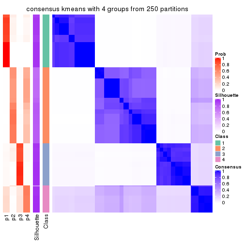</p>

</div>
<div id='tab-CV-kmeans-consensus-heatmap-4'>
<pre><code class="r">consensus_heatmap(res, k = 5)
</code></pre>

<p></p>

</div>
<div id='tab-CV-kmeans-consensus-heatmap-5'>
<pre><code class="r">consensus_heatmap(res, k = 6)
</code></pre>

<p></p>

</div>
</div>

Heatmaps for the membership of samples in all partitions to see how consistent they are:


<script>
$( function() {
	$( '#tabs-CV-kmeans-membership-heatmap' ).tabs();
} );
</script>
<div id='tabs-CV-kmeans-membership-heatmap'>
<ul>
<li><a href='#tab-CV-kmeans-membership-heatmap-1'>k = 2</a></li>
<li><a href='#tab-CV-kmeans-membership-heatmap-2'>k = 3</a></li>
<li><a href='#tab-CV-kmeans-membership-heatmap-3'>k = 4</a></li>
<li><a href='#tab-CV-kmeans-membership-heatmap-4'>k = 5</a></li>
<li><a href='#tab-CV-kmeans-membership-heatmap-5'>k = 6</a></li>
</ul>
<div id='tab-CV-kmeans-membership-heatmap-1'>
<pre><code class="r">membership_heatmap(res, k = 2)
</code></pre>

<p></p>

</div>
<div id='tab-CV-kmeans-membership-heatmap-2'>
<pre><code class="r">membership_heatmap(res, k = 3)
</code></pre>

<p></p>

</div>
<div id='tab-CV-kmeans-membership-heatmap-3'>
<pre><code class="r">membership_heatmap(res, k = 4)
</code></pre>

<p></p>

</div>
<div id='tab-CV-kmeans-membership-heatmap-4'>
<pre><code class="r">membership_heatmap(res, k = 5)
</code></pre>

<p></p>

</div>
<div id='tab-CV-kmeans-membership-heatmap-5'>
<pre><code class="r">membership_heatmap(res, k = 6)
</code></pre>

<p></p>

</div>
</div>

As soon as we have had the classes for columns, we can look for signatures
which are significantly different between classes which can be candidate marks
for certain classes. Following are the heatmaps for signatures.


Signature heatmaps where rows are scaled:


<script>
$( function() {
	$( '#tabs-CV-kmeans-get-signatures' ).tabs();
} );
</script>
<div id='tabs-CV-kmeans-get-signatures'>
<ul>
<li><a href='#tab-CV-kmeans-get-signatures-1'>k = 2</a></li>
<li><a href='#tab-CV-kmeans-get-signatures-2'>k = 3</a></li>
<li><a href='#tab-CV-kmeans-get-signatures-3'>k = 4</a></li>
<li><a href='#tab-CV-kmeans-get-signatures-4'>k = 5</a></li>
<li><a href='#tab-CV-kmeans-get-signatures-5'>k = 6</a></li>
</ul>
<div id='tab-CV-kmeans-get-signatures-1'>
<pre><code class="r">get_signatures(res, k = 2)
</code></pre>

<p></p>

</div>
<div id='tab-CV-kmeans-get-signatures-2'>
<pre><code class="r">get_signatures(res, k = 3)
</code></pre>

<p></p>

</div>
<div id='tab-CV-kmeans-get-signatures-3'>
<pre><code class="r">get_signatures(res, k = 4)
</code></pre>

<p></p>

</div>
<div id='tab-CV-kmeans-get-signatures-4'>
<pre><code class="r">get_signatures(res, k = 5)
</code></pre>

<p></p>

</div>
<div id='tab-CV-kmeans-get-signatures-5'>
<pre><code class="r">get_signatures(res, k = 6)
</code></pre>

<p></p>

</div>
</div>


Signature heatmaps where rows are not scaled:


<script>
$( function() {
	$( '#tabs-CV-kmeans-get-signatures-no-scale' ).tabs();
} );
</script>
<div id='tabs-CV-kmeans-get-signatures-no-scale'>
<ul>
<li><a href='#tab-CV-kmeans-get-signatures-no-scale-1'>k = 2</a></li>
<li><a href='#tab-CV-kmeans-get-signatures-no-scale-2'>k = 3</a></li>
<li><a href='#tab-CV-kmeans-get-signatures-no-scale-3'>k = 4</a></li>
<li><a href='#tab-CV-kmeans-get-signatures-no-scale-4'>k = 5</a></li>
<li><a href='#tab-CV-kmeans-get-signatures-no-scale-5'>k = 6</a></li>
</ul>
<div id='tab-CV-kmeans-get-signatures-no-scale-1'>
<pre><code class="r">get_signatures(res, k = 2, scale_rows = FALSE)
</code></pre>

<p></p>

</div>
<div id='tab-CV-kmeans-get-signatures-no-scale-2'>
<pre><code class="r">get_signatures(res, k = 3, scale_rows = FALSE)
</code></pre>

<p></p>

</div>
<div id='tab-CV-kmeans-get-signatures-no-scale-3'>
<pre><code class="r">get_signatures(res, k = 4, scale_rows = FALSE)
</code></pre>

<p></p>

</div>
<div id='tab-CV-kmeans-get-signatures-no-scale-4'>
<pre><code class="r">get_signatures(res, k = 5, scale_rows = FALSE)
</code></pre>

<p></p>

</div>
<div id='tab-CV-kmeans-get-signatures-no-scale-5'>
<pre><code class="r">get_signatures(res, k = 6, scale_rows = FALSE)
</code></pre>

<p></p>

</div>
</div>


Compare the overlap of signatures from different k:

```r
compare_signatures(res)
```


`get_signature()` returns a data frame invisibly. TO get the list of signatures, the function
call should be assigned to a variable explicitly. In following code, if `plot` argument is set
to `FALSE`, no heatmap is plotted while only the differential analysis is performed.

```r
# code only for demonstration
tb = get_signature(res, k = ..., plot = FALSE)
```

An example of the output of `tb` is:

```
#>   which_row         fdr    mean_1    mean_2 scaled_mean_1 scaled_mean_2 km
#> 1        38 0.042760348  8.373488  9.131774    -0.5533452     0.5164555  1
#> 2        40 0.018707592  7.106213  8.469186    -0.6173731     0.5762149  1
#> 3        55 0.019134737 10.221463 11.207825    -0.6159697     0.5749050  1
#> 4        59 0.006059896  5.921854  7.869574    -0.6899429     0.6439467  1
#> 5        60 0.018055526  8.928898 10.211722    -0.6204761     0.5791110  1
#> 6        98 0.009384629 15.714769 14.887706     0.6635654    -0.6193277  2
...
```

The columns in `tb` are:

1. `which_row`: row indices corresponding to the input matrix.
2. `fdr`: FDR for the differential test. 
3. `mean_x`: The mean value in group x.
4. `scaled_mean_x`: The mean value in group x after rows are scaled.
5. `km`: Row groups if k-means clustering is applied to rows.


UMAP plot which shows how samples are separated.


<script>
$( function() {
	$( '#tabs-CV-kmeans-dimension-reduction' ).tabs();
} );
</script>
<div id='tabs-CV-kmeans-dimension-reduction'>
<ul>
<li><a href='#tab-CV-kmeans-dimension-reduction-1'>k = 2</a></li>
<li><a href='#tab-CV-kmeans-dimension-reduction-2'>k = 3</a></li>
<li><a href='#tab-CV-kmeans-dimension-reduction-3'>k = 4</a></li>
<li><a href='#tab-CV-kmeans-dimension-reduction-4'>k = 5</a></li>
<li><a href='#tab-CV-kmeans-dimension-reduction-5'>k = 6</a></li>
</ul>
<div id='tab-CV-kmeans-dimension-reduction-1'>
<pre><code class="r">dimension_reduction(res, k = 2, method = &quot;UMAP&quot;)
</code></pre>

<p></p>

</div>
<div id='tab-CV-kmeans-dimension-reduction-2'>
<pre><code class="r">dimension_reduction(res, k = 3, method = &quot;UMAP&quot;)
</code></pre>

<p></p>

</div>
<div id='tab-CV-kmeans-dimension-reduction-3'>
<pre><code class="r">dimension_reduction(res, k = 4, method = &quot;UMAP&quot;)
</code></pre>

<p></p>

</div>
<div id='tab-CV-kmeans-dimension-reduction-4'>
<pre><code class="r">dimension_reduction(res, k = 5, method = &quot;UMAP&quot;)
</code></pre>

<p></p>

</div>
<div id='tab-CV-kmeans-dimension-reduction-5'>
<pre><code class="r">dimension_reduction(res, k = 6, method = &quot;UMAP&quot;)
</code></pre>

<p></p>

</div>
</div>


Following heatmap shows how subgroups are split when increasing `k`:

```r
collect_classes(res)
```


If matrix rows can be associated to genes, consider to use `functional_enrichment(res,
...)` to perform function enrichment for the signature genes. See [this vignette](http://bioconductor.org/packages/devel/bioc/vignettes/cola/inst/doc/functional_enrichment.html) for more detailed explanations.


 

---------------------------------------------------


### CV:skmeans**


The object with results only for a single top-value method and a single partition method 
can be extracted as:

```r
res = res_list["CV", "skmeans"]
# you can also extract it by
# res = res_list["CV:skmeans"]
```

A summary of `res` and all the functions that can be applied to it:

```r
res
```

```
#> A 'ConsensusPartition' object with k = 2, 3, 4, 5, 6.
#>   On a matrix with 13278 rows and 322 columns.
#>   Top rows (1000, 2000, 3000, 4000, 5000) are extracted by 'CV' method.
#>   Subgroups are detected by 'skmeans' method.
#>   Performed in total 1250 partitions by row resampling.
#>   Best k for subgroups seems to be 4.
#> 
#> Following methods can be applied to this 'ConsensusPartition' object:
#>  [1] "cola_report"             "collect_classes"         "collect_plots"          
#>  [4] "collect_stats"           "colnames"                "compare_signatures"     
#>  [7] "consensus_heatmap"       "dimension_reduction"     "functional_enrichment"  
#> [10] "get_anno_col"            "get_anno"                "get_classes"            
#> [13] "get_consensus"           "get_matrix"              "get_membership"         
#> [16] "get_param"               "get_signatures"          "get_stats"              
#> [19] "is_best_k"               "is_stable_k"             "membership_heatmap"     
#> [22] "ncol"                    "nrow"                    "plot_ecdf"              
#> [25] "rownames"                "select_partition_number" "show"                   
#> [28] "suggest_best_k"          "test_to_known_factors"
```

`collect_plots()` function collects all the plots made from `res` for all `k` (number of partitions)
into one single page to provide an easy and fast comparison between different `k`.

```r
collect_plots(res)
```


The plots are:

- The first row: a plot of the ECDF (empirical cumulative distribution
  function) curves of the consensus matrix for each `k` and the heatmap of
  predicted classes for each `k`.
- The second row: heatmaps of the consensus matrix for each `k`.
- The third row: heatmaps of the membership matrix for each `k`.
- The fouth row: heatmaps of the signatures for each `k`.

All the plots in panels can be made by individual functions and they are
plotted later in this section.

`select_partition_number()` produces several plots showing different
statistics for choosing "optimized" `k`. There are following statistics:

- ECDF curves of the consensus matrix for each `k`;
- 1-PAC. [The PAC
  score](https://en.wikipedia.org/wiki/Consensus_clustering#Over-interpretation_potential_of_consensus_clustering)
  measures the proportion of the ambiguous subgrouping.
- Mean silhouette score.
- Concordance. The mean probability of fiting the consensus class ids in all
  partitions.
- Area increased. Denote $A_k$ as the area under the ECDF curve for current
  `k`, the area increased is defined as $A_k - A_{k-1}$.
- Rand index. The percent of pairs of samples that are both in a same cluster
  or both are not in a same cluster in the partition of k and k-1.
- Jaccard index. The ratio of pairs of samples are both in a same cluster in
  the partition of k and k-1 and the pairs of samples are both in a same
  cluster in the partition k or k-1.

The detailed explanations of these statistics can be found in [the _cola_
vignette](http://bioconductor.org/packages/devel/bioc/vignettes/cola/inst/doc/cola.html#toc_13).

Generally speaking, lower PAC score, higher mean silhouette score or higher
concordance corresponds to better partition. Rand index and Jaccard index
measure how similar the current partition is compared to partition with `k-1`.
If they are too similar, we won't accept `k` is better than `k-1`.

```r
select_partition_number(res)
```


The numeric values for all these statistics can be obtained by `get_stats()`.

```r
get_stats(res)
```

```
#>   k 1-PAC mean_silhouette concordance area_increased  Rand Jaccard
#> 2 2 0.677           0.929       0.902         0.5007 0.499   0.499
#> 3 3 0.929           0.960       0.980         0.2890 0.710   0.493
#> 4 4 1.000           0.990       0.991         0.1187 0.925   0.789
#> 5 5 0.872           0.859       0.903         0.0767 0.927   0.739
#> 6 6 0.881           0.848       0.869         0.0310 0.976   0.892
```

`suggest_best_k()` suggests the best $k$ based on these statistics. The rules are as follows:

- All $k$ with Jaccard index larger than 0.95 are removed because increasing
  $k$ does not provide enough extra information. If all $k$ are removed, it is
  marked as no subgroup is detected.
- For all $k$ with 1-PAC score larger than 0.9, the maximal $k$ is taken as
  the best $k$, and other $k$ are marked as optional $k$.
- If it does not fit the second rule. The $k$ with the maximal vote of the
  highest 1-PAC score, highest mean silhouette, and highest concordance is
  taken as the best $k$.

```r
suggest_best_k(res)
```

```
#> [1] 4
#> attr(,"optional")
#> [1] 3
```

There is also optional best $k$ = 3 that is worth to check.

Following shows the table of the partitions (You need to click the **show/hide
code output** link to see it). The membership matrix (columns with name `p*`)
is inferred by
[`clue::cl_consensus()`](https://www.rdocumentation.org/link/cl_consensus?package=clue)
function with the `SE` method. Basically the value in the membership matrix
represents the probability to belong to a certain group. The finall class
label for an item is determined with the group with highest probability it
belongs to.

In `get_classes()` function, the entropy is calculated from the membership
matrix and the silhouette score is calculated from the consensus matrix.


<script>
$( function() {
	$( '#tabs-CV-skmeans-get-classes' ).tabs();
} );
</script>
<div id='tabs-CV-skmeans-get-classes'>
<ul>
<li><a href='#tab-CV-skmeans-get-classes-1'>k = 2</a></li>
<li><a href='#tab-CV-skmeans-get-classes-2'>k = 3</a></li>
<li><a href='#tab-CV-skmeans-get-classes-3'>k = 4</a></li>
<li><a href='#tab-CV-skmeans-get-classes-4'>k = 5</a></li>
<li><a href='#tab-CV-skmeans-get-classes-5'>k = 6</a></li>
</ul>

<div id='tab-CV-skmeans-get-classes-1'>
<p><a id='tab-CV-skmeans-get-classes-1-a' style='color:#0366d6' href='#'>show/hide code output</a></p>
<pre><code class="r">cbind(get_classes(res, k = 2), get_membership(res, k = 2))
</code></pre>

<pre><code>#&gt;           class entropy silhouette    p1    p2
#&gt; DRR023371     1   0.000      0.970 1.000 0.000
#&gt; DRR023372     1   0.000      0.970 1.000 0.000
#&gt; DRR023373     1   0.000      0.970 1.000 0.000
#&gt; DRR023374     1   0.000      0.970 1.000 0.000
#&gt; DRR023375     1   0.000      0.970 1.000 0.000
#&gt; DRR023376     1   0.000      0.970 1.000 0.000
#&gt; DRR023377     1   0.000      0.970 1.000 0.000
#&gt; DRR023378     1   0.000      0.970 1.000 0.000
#&gt; DRR023379     1   0.000      0.970 1.000 0.000
#&gt; DRR023380     1   0.000      0.970 1.000 0.000
#&gt; DRR023381     1   0.000      0.970 1.000 0.000
#&gt; DRR023382     1   0.000      0.970 1.000 0.000
#&gt; DRR023383     1   0.000      0.970 1.000 0.000
#&gt; DRR023384     1   0.000      0.970 1.000 0.000
#&gt; DRR023385     1   0.000      0.970 1.000 0.000
#&gt; DRR023386     1   0.000      0.970 1.000 0.000
#&gt; DRR023387     1   0.000      0.970 1.000 0.000
#&gt; DRR023388     1   0.000      0.970 1.000 0.000
#&gt; DRR023389     1   0.000      0.970 1.000 0.000
#&gt; DRR023390     1   0.000      0.970 1.000 0.000
#&gt; DRR023391     1   0.000      0.970 1.000 0.000
#&gt; DRR023392     1   0.000      0.970 1.000 0.000
#&gt; DRR023394     1   0.000      0.970 1.000 0.000
#&gt; DRR023395     1   0.000      0.970 1.000 0.000
#&gt; DRR023396     1   0.000      0.970 1.000 0.000
#&gt; DRR023397     1   0.000      0.970 1.000 0.000
#&gt; DRR023398     1   0.000      0.970 1.000 0.000
#&gt; DRR023399     1   0.000      0.970 1.000 0.000
#&gt; DRR023400     1   0.000      0.970 1.000 0.000
#&gt; DRR023401     1   0.000      0.970 1.000 0.000
#&gt; DRR023402     1   0.000      0.970 1.000 0.000
#&gt; DRR023403     1   0.000      0.970 1.000 0.000
#&gt; DRR023404     2   0.000      0.947 0.000 1.000
#&gt; DRR023405     2   0.000      0.947 0.000 1.000
#&gt; DRR023406     2   0.000      0.947 0.000 1.000
#&gt; DRR023407     2   0.000      0.947 0.000 1.000
#&gt; DRR023408     2   0.000      0.947 0.000 1.000
#&gt; DRR023409     2   0.000      0.947 0.000 1.000
#&gt; DRR023410     2   0.000      0.947 0.000 1.000
#&gt; DRR023411     2   0.000      0.947 0.000 1.000
#&gt; DRR023412     2   0.000      0.947 0.000 1.000
#&gt; DRR023413     2   0.000      0.947 0.000 1.000
#&gt; DRR023414     2   0.000      0.947 0.000 1.000
#&gt; DRR023415     2   0.000      0.947 0.000 1.000
#&gt; DRR023416     2   0.000      0.947 0.000 1.000
#&gt; DRR023417     2   0.000      0.947 0.000 1.000
#&gt; DRR023418     2   0.000      0.947 0.000 1.000
#&gt; DRR023419     2   0.000      0.947 0.000 1.000
#&gt; DRR023420     2   0.000      0.947 0.000 1.000
#&gt; DRR023421     2   0.000      0.947 0.000 1.000
#&gt; DRR023422     2   0.000      0.947 0.000 1.000
#&gt; DRR023423     2   0.000      0.947 0.000 1.000
#&gt; DRR023425     2   0.000      0.947 0.000 1.000
#&gt; DRR023426     2   0.000      0.947 0.000 1.000
#&gt; DRR023427     2   0.000      0.947 0.000 1.000
#&gt; DRR023428     2   0.000      0.947 0.000 1.000
#&gt; DRR023429     2   0.000      0.947 0.000 1.000
#&gt; DRR023430     2   0.000      0.947 0.000 1.000
#&gt; DRR023431     2   0.000      0.947 0.000 1.000
#&gt; DRR023432     2   0.000      0.947 0.000 1.000
#&gt; DRR023433     2   0.000      0.947 0.000 1.000
#&gt; DRR023434     2   0.000      0.947 0.000 1.000
#&gt; DRR023435     2   0.000      0.947 0.000 1.000
#&gt; DRR023436     2   0.000      0.947 0.000 1.000
#&gt; DRR023437     2   0.000      0.947 0.000 1.000
#&gt; DRR023438     2   0.000      0.947 0.000 1.000
#&gt; DRR023439     2   0.000      0.947 0.000 1.000
#&gt; DRR023440     2   0.000      0.947 0.000 1.000
#&gt; DRR023441     2   0.000      0.947 0.000 1.000
#&gt; DRR023442     2   0.000      0.947 0.000 1.000
#&gt; DRR023443     2   0.000      0.947 0.000 1.000
#&gt; DRR023444     2   0.000      0.947 0.000 1.000
#&gt; DRR023445     2   0.000      0.947 0.000 1.000
#&gt; DRR023446     2   0.000      0.947 0.000 1.000
#&gt; DRR023447     2   0.000      0.947 0.000 1.000
#&gt; DRR023448     2   0.000      0.947 0.000 1.000
#&gt; DRR023449     2   0.000      0.947 0.000 1.000
#&gt; DRR023450     2   0.000      0.947 0.000 1.000
#&gt; DRR023451     2   0.000      0.947 0.000 1.000
#&gt; DRR023452     2   0.000      0.947 0.000 1.000
#&gt; DRR023453     1   0.000      0.970 1.000 0.000
#&gt; DRR023454     1   0.000      0.970 1.000 0.000
#&gt; DRR023455     1   0.000      0.970 1.000 0.000
#&gt; DRR023456     1   0.000      0.970 1.000 0.000
#&gt; DRR023457     1   0.000      0.970 1.000 0.000
#&gt; DRR023458     1   0.000      0.970 1.000 0.000
#&gt; DRR023459     1   0.000      0.970 1.000 0.000
#&gt; DRR023460     1   0.697      0.794 0.812 0.188
#&gt; DRR023461     1   0.697      0.794 0.812 0.188
#&gt; DRR023462     1   0.697      0.794 0.812 0.188
#&gt; DRR023463     1   0.697      0.794 0.812 0.188
#&gt; DRR023464     1   0.697      0.794 0.812 0.188
#&gt; DRR023465     1   0.697      0.794 0.812 0.188
#&gt; DRR023466     1   0.697      0.794 0.812 0.188
#&gt; DRR023467     1   0.697      0.794 0.812 0.188
#&gt; DRR023468     1   0.697      0.794 0.812 0.188
#&gt; DRR023469     1   0.697      0.794 0.812 0.188
#&gt; DRR023470     1   0.697      0.794 0.812 0.188
#&gt; DRR023471     1   0.697      0.794 0.812 0.188
#&gt; DRR023472     1   0.697      0.794 0.812 0.188
#&gt; DRR023473     1   0.697      0.794 0.812 0.188
#&gt; DRR023474     1   0.697      0.794 0.812 0.188
#&gt; DRR023475     1   0.697      0.794 0.812 0.188
#&gt; DRR023476     1   0.697      0.794 0.812 0.188
#&gt; DRR023477     1   0.697      0.794 0.812 0.188
#&gt; DRR023478     1   0.697      0.794 0.812 0.188
#&gt; DRR023479     1   0.697      0.794 0.812 0.188
#&gt; DRR023480     1   0.697      0.794 0.812 0.188
#&gt; DRR023481     1   0.697      0.794 0.812 0.188
#&gt; DRR023482     1   0.000      0.970 1.000 0.000
#&gt; DRR023483     1   0.000      0.970 1.000 0.000
#&gt; DRR023484     1   0.000      0.970 1.000 0.000
#&gt; DRR023485     1   0.000      0.970 1.000 0.000
#&gt; DRR023486     1   0.000      0.970 1.000 0.000
#&gt; DRR023487     1   0.000      0.970 1.000 0.000
#&gt; DRR023488     1   0.000      0.970 1.000 0.000
#&gt; DRR023489     1   0.000      0.970 1.000 0.000
#&gt; DRR023490     1   0.000      0.970 1.000 0.000
#&gt; DRR023491     1   0.000      0.970 1.000 0.000
#&gt; DRR023492     1   0.000      0.970 1.000 0.000
#&gt; DRR023493     1   0.000      0.970 1.000 0.000
#&gt; DRR023494     1   0.000      0.970 1.000 0.000
#&gt; DRR023495     1   0.000      0.970 1.000 0.000
#&gt; DRR023496     1   0.000      0.970 1.000 0.000
#&gt; DRR023497     1   0.000      0.970 1.000 0.000
#&gt; DRR023498     1   0.000      0.970 1.000 0.000
#&gt; DRR023499     1   0.000      0.970 1.000 0.000
#&gt; DRR023500     1   0.000      0.970 1.000 0.000
#&gt; DRR023501     1   0.000      0.970 1.000 0.000
#&gt; DRR023502     1   0.000      0.970 1.000 0.000
#&gt; DRR023503     1   0.000      0.970 1.000 0.000
#&gt; DRR023504     1   0.000      0.970 1.000 0.000
#&gt; DRR023505     1   0.000      0.970 1.000 0.000
#&gt; DRR023506     1   0.000      0.970 1.000 0.000
#&gt; DRR023507     1   0.000      0.970 1.000 0.000
#&gt; DRR023508     1   0.000      0.970 1.000 0.000
#&gt; DRR023509     1   0.000      0.970 1.000 0.000
#&gt; DRR023510     1   0.000      0.970 1.000 0.000
#&gt; DRR023511     1   0.000      0.970 1.000 0.000
#&gt; DRR023512     1   0.000      0.970 1.000 0.000
#&gt; DRR023513     1   0.000      0.970 1.000 0.000
#&gt; DRR023514     1   0.000      0.970 1.000 0.000
#&gt; DRR023515     1   0.000      0.970 1.000 0.000
#&gt; DRR023516     1   0.000      0.970 1.000 0.000
#&gt; DRR023517     1   0.000      0.970 1.000 0.000
#&gt; DRR023518     1   0.000      0.970 1.000 0.000
#&gt; DRR023519     1   0.000      0.970 1.000 0.000
#&gt; DRR023520     1   0.000      0.970 1.000 0.000
#&gt; DRR023521     1   0.000      0.970 1.000 0.000
#&gt; DRR023522     1   0.000      0.970 1.000 0.000
#&gt; DRR023523     1   0.000      0.970 1.000 0.000
#&gt; DRR023524     1   0.000      0.970 1.000 0.000
#&gt; DRR023525     1   0.000      0.970 1.000 0.000
#&gt; DRR023526     1   0.000      0.970 1.000 0.000
#&gt; DRR023527     1   0.000      0.970 1.000 0.000
#&gt; DRR023528     1   0.000      0.970 1.000 0.000
#&gt; DRR023529     1   0.000      0.970 1.000 0.000
#&gt; DRR023530     1   0.000      0.970 1.000 0.000
#&gt; DRR023531     1   0.000      0.970 1.000 0.000
#&gt; DRR023532     1   0.000      0.970 1.000 0.000
#&gt; DRR023533     1   0.000      0.970 1.000 0.000
#&gt; DRR023534     1   0.000      0.970 1.000 0.000
#&gt; DRR023535     1   0.000      0.970 1.000 0.000
#&gt; DRR023536     1   0.000      0.970 1.000 0.000
#&gt; DRR023537     1   0.000      0.970 1.000 0.000
#&gt; DRR023538     1   0.000      0.970 1.000 0.000
#&gt; DRR023539     1   0.000      0.970 1.000 0.000
#&gt; DRR023540     1   0.000      0.970 1.000 0.000
#&gt; DRR023541     1   0.000      0.970 1.000 0.000
#&gt; DRR023542     1   0.000      0.970 1.000 0.000
#&gt; DRR023543     1   0.000      0.970 1.000 0.000
#&gt; DRR023544     1   0.000      0.970 1.000 0.000
#&gt; DRR023545     1   0.000      0.970 1.000 0.000
#&gt; DRR023546     1   0.000      0.970 1.000 0.000
#&gt; DRR023547     1   0.000      0.970 1.000 0.000
#&gt; DRR023548     1   0.000      0.970 1.000 0.000
#&gt; DRR023549     1   0.000      0.970 1.000 0.000
#&gt; DRR023550     1   0.000      0.970 1.000 0.000
#&gt; DRR023551     1   0.000      0.970 1.000 0.000
#&gt; DRR023552     1   0.000      0.970 1.000 0.000
#&gt; DRR023553     1   0.000      0.970 1.000 0.000
#&gt; DRR023554     1   0.000      0.970 1.000 0.000
#&gt; DRR023555     1   0.000      0.970 1.000 0.000
#&gt; DRR023556     1   0.000      0.970 1.000 0.000
#&gt; DRR023557     1   0.000      0.970 1.000 0.000
#&gt; DRR023558     1   0.000      0.970 1.000 0.000
#&gt; DRR023559     1   0.000      0.970 1.000 0.000
#&gt; DRR023560     1   0.000      0.970 1.000 0.000
#&gt; DRR023561     1   0.000      0.970 1.000 0.000
#&gt; DRR023562     1   0.000      0.970 1.000 0.000
#&gt; DRR023563     1   0.000      0.970 1.000 0.000
#&gt; DRR023564     1   0.000      0.970 1.000 0.000
#&gt; DRR023565     1   0.000      0.970 1.000 0.000
#&gt; DRR023566     1   0.000      0.970 1.000 0.000
#&gt; DRR023567     1   0.000      0.970 1.000 0.000
#&gt; DRR023568     1   0.000      0.970 1.000 0.000
#&gt; DRR023569     1   0.000      0.970 1.000 0.000
#&gt; DRR023570     1   0.000      0.970 1.000 0.000
#&gt; DRR023571     1   0.000      0.970 1.000 0.000
#&gt; DRR023572     1   0.000      0.970 1.000 0.000
#&gt; DRR023573     1   0.000      0.970 1.000 0.000
#&gt; DRR023574     1   0.000      0.970 1.000 0.000
#&gt; DRR023575     1   0.000      0.970 1.000 0.000
#&gt; DRR023576     2   0.000      0.947 0.000 1.000
#&gt; DRR023577     2   0.000      0.947 0.000 1.000
#&gt; DRR023578     2   0.000      0.947 0.000 1.000
#&gt; DRR023579     2   0.000      0.947 0.000 1.000
#&gt; DRR023580     2   0.000      0.947 0.000 1.000
#&gt; DRR023581     2   0.000      0.947 0.000 1.000
#&gt; DRR023582     2   0.000      0.947 0.000 1.000
#&gt; DRR023583     2   0.000      0.947 0.000 1.000
#&gt; DRR023584     2   0.000      0.947 0.000 1.000
#&gt; DRR023585     2   0.000      0.947 0.000 1.000
#&gt; DRR023586     2   0.000      0.947 0.000 1.000
#&gt; DRR023587     2   0.000      0.947 0.000 1.000
#&gt; DRR023588     2   0.000      0.947 0.000 1.000
#&gt; DRR023589     2   0.000      0.947 0.000 1.000
#&gt; DRR023590     2   0.000      0.947 0.000 1.000
#&gt; DRR023591     2   0.000      0.947 0.000 1.000
#&gt; DRR023592     2   0.000      0.947 0.000 1.000
#&gt; DRR023593     2   0.000      0.947 0.000 1.000
#&gt; DRR023594     2   0.000      0.947 0.000 1.000
#&gt; DRR023595     2   0.000      0.947 0.000 1.000
#&gt; DRR023596     2   0.000      0.947 0.000 1.000
#&gt; DRR023597     2   0.000      0.947 0.000 1.000
#&gt; DRR023598     2   0.000      0.947 0.000 1.000
#&gt; DRR023599     2   0.000      0.947 0.000 1.000
#&gt; DRR023600     2   0.000      0.947 0.000 1.000
#&gt; DRR023601     2   0.000      0.947 0.000 1.000
#&gt; DRR023602     2   0.000      0.947 0.000 1.000
#&gt; DRR023603     2   0.000      0.947 0.000 1.000
#&gt; DRR023604     2   0.000      0.947 0.000 1.000
#&gt; DRR023605     2   0.000      0.947 0.000 1.000
#&gt; DRR023606     2   0.000      0.947 0.000 1.000
#&gt; DRR023607     2   0.000      0.947 0.000 1.000
#&gt; DRR023608     2   0.000      0.947 0.000 1.000
#&gt; DRR023609     2   0.000      0.947 0.000 1.000
#&gt; DRR023610     2   0.000      0.947 0.000 1.000
#&gt; DRR023611     2   0.000      0.947 0.000 1.000
#&gt; DRR023612     2   0.000      0.947 0.000 1.000
#&gt; DRR023613     2   0.000      0.947 0.000 1.000
#&gt; DRR023614     2   0.000      0.947 0.000 1.000
#&gt; DRR023615     2   0.000      0.947 0.000 1.000
#&gt; DRR023616     2   0.000      0.947 0.000 1.000
#&gt; DRR023617     2   0.000      0.947 0.000 1.000
#&gt; DRR023619     2   0.680      0.829 0.180 0.820
#&gt; DRR023620     2   0.680      0.829 0.180 0.820
#&gt; DRR023621     2   0.680      0.829 0.180 0.820
#&gt; DRR023622     2   0.680      0.829 0.180 0.820
#&gt; DRR023623     2   0.680      0.829 0.180 0.820
#&gt; DRR023624     2   0.680      0.829 0.180 0.820
#&gt; DRR023625     2   0.680      0.829 0.180 0.820
#&gt; DRR023626     2   0.680      0.829 0.180 0.820
#&gt; DRR023627     2   0.680      0.829 0.180 0.820
#&gt; DRR023628     2   0.680      0.829 0.180 0.820
#&gt; DRR023629     2   0.680      0.829 0.180 0.820
#&gt; DRR023630     2   0.680      0.829 0.180 0.820
#&gt; DRR023631     2   0.680      0.829 0.180 0.820
#&gt; DRR023632     2   0.680      0.829 0.180 0.820
#&gt; DRR023633     2   0.671      0.832 0.176 0.824
#&gt; DRR023635     2   0.000      0.947 0.000 1.000
#&gt; DRR023636     2   0.000      0.947 0.000 1.000
#&gt; DRR023637     2   0.000      0.947 0.000 1.000
#&gt; DRR023638     2   0.000      0.947 0.000 1.000
#&gt; DRR023639     2   0.000      0.947 0.000 1.000
#&gt; DRR023640     2   0.000      0.947 0.000 1.000
#&gt; DRR023641     2   0.000      0.947 0.000 1.000
#&gt; DRR023642     2   0.000      0.947 0.000 1.000
#&gt; DRR023643     2   0.000      0.947 0.000 1.000
#&gt; DRR023644     2   0.000      0.947 0.000 1.000
#&gt; DRR023645     2   0.000      0.947 0.000 1.000
#&gt; DRR023646     2   0.000      0.947 0.000 1.000
#&gt; DRR023647     2   0.000      0.947 0.000 1.000
#&gt; DRR023648     2   0.000      0.947 0.000 1.000
#&gt; DRR023649     2   0.000      0.947 0.000 1.000
#&gt; DRR023650     2   0.697      0.822 0.188 0.812
#&gt; DRR023651     2   0.697      0.822 0.188 0.812
#&gt; DRR023652     2   0.697      0.822 0.188 0.812
#&gt; DRR023653     2   0.697      0.822 0.188 0.812
#&gt; DRR023654     2   0.697      0.822 0.188 0.812
#&gt; DRR023655     2   0.697      0.822 0.188 0.812
#&gt; DRR023656     2   0.697      0.822 0.188 0.812
#&gt; DRR023657     2   0.697      0.822 0.188 0.812
#&gt; DRR023658     2   0.697      0.822 0.188 0.812
#&gt; DRR023659     2   0.697      0.822 0.188 0.812
#&gt; DRR023660     2   0.697      0.822 0.188 0.812
#&gt; DRR023661     2   0.697      0.822 0.188 0.812
#&gt; DRR023662     2   0.697      0.822 0.188 0.812
#&gt; DRR023663     2   0.697      0.822 0.188 0.812
#&gt; DRR023664     2   0.697      0.822 0.188 0.812
#&gt; DRR023665     2   0.000      0.947 0.000 1.000
#&gt; DRR023666     2   0.730      0.806 0.204 0.796
#&gt; DRR023667     2   0.730      0.806 0.204 0.796
#&gt; DRR023668     2   0.730      0.806 0.204 0.796
#&gt; DRR023669     2   0.730      0.806 0.204 0.796
#&gt; DRR023670     2   0.730      0.806 0.204 0.796
#&gt; DRR023671     2   0.730      0.806 0.204 0.796
#&gt; DRR023672     2   0.730      0.806 0.204 0.796
#&gt; DRR023673     2   0.730      0.806 0.204 0.796
#&gt; DRR023674     2   0.730      0.806 0.204 0.796
#&gt; DRR023675     2   0.730      0.806 0.204 0.796
#&gt; DRR023676     2   0.730      0.806 0.204 0.796
#&gt; DRR023677     2   0.730      0.806 0.204 0.796
#&gt; DRR023678     2   0.697      0.822 0.188 0.812
#&gt; DRR023683     2   0.000      0.947 0.000 1.000
#&gt; DRR023684     2   0.000      0.947 0.000 1.000
#&gt; DRR023685     2   0.000      0.947 0.000 1.000
#&gt; DRR023686     2   0.000      0.947 0.000 1.000
#&gt; DRR023687     2   0.000      0.947 0.000 1.000
#&gt; DRR023688     2   0.000      0.947 0.000 1.000
#&gt; DRR023689     2   0.000      0.947 0.000 1.000
#&gt; DRR023690     2   0.000      0.947 0.000 1.000
#&gt; DRR023691     2   0.000      0.947 0.000 1.000
#&gt; DRR023692     2   0.000      0.947 0.000 1.000
#&gt; DRR023693     2   0.000      0.947 0.000 1.000
#&gt; DRR023694     2   0.000      0.947 0.000 1.000
#&gt; DRR023695     2   0.000      0.947 0.000 1.000
#&gt; DRR023696     2   0.000      0.947 0.000 1.000
#&gt; DRR023697     2   0.000      0.947 0.000 1.000
#&gt; DRR023698     2   0.000      0.947 0.000 1.000
#&gt; DRR023699     2   0.000      0.947 0.000 1.000
#&gt; DRR023700     2   0.000      0.947 0.000 1.000
</code></pre>

<script>
$('#tab-CV-skmeans-get-classes-1-a').parent().next().next().hide();
$('#tab-CV-skmeans-get-classes-1-a').click(function(){
  $('#tab-CV-skmeans-get-classes-1-a').parent().next().next().toggle();
  return(false);
});
</script>
</div>

<div id='tab-CV-skmeans-get-classes-2'>
<p><a id='tab-CV-skmeans-get-classes-2-a' style='color:#0366d6' href='#'>show/hide code output</a></p>
<pre><code class="r">cbind(get_classes(res, k = 3), get_membership(res, k = 3))
</code></pre>

<pre><code>#&gt;           class entropy silhouette    p1    p2    p3
#&gt; DRR023371     3  0.0000      1.000 0.000 0.000 1.000
#&gt; DRR023372     3  0.0000      1.000 0.000 0.000 1.000
#&gt; DRR023373     3  0.0000      1.000 0.000 0.000 1.000
#&gt; DRR023374     3  0.0000      1.000 0.000 0.000 1.000
#&gt; DRR023375     3  0.0000      1.000 0.000 0.000 1.000
#&gt; DRR023376     3  0.0000      1.000 0.000 0.000 1.000
#&gt; DRR023377     3  0.0000      1.000 0.000 0.000 1.000
#&gt; DRR023378     3  0.0000      1.000 0.000 0.000 1.000
#&gt; DRR023379     3  0.0000      1.000 0.000 0.000 1.000
#&gt; DRR023380     3  0.0000      1.000 0.000 0.000 1.000
#&gt; DRR023381     3  0.0000      1.000 0.000 0.000 1.000
#&gt; DRR023382     3  0.0000      1.000 0.000 0.000 1.000
#&gt; DRR023383     3  0.0000      1.000 0.000 0.000 1.000
#&gt; DRR023384     3  0.0000      1.000 0.000 0.000 1.000
#&gt; DRR023385     3  0.0000      1.000 0.000 0.000 1.000
#&gt; DRR023386     3  0.0000      1.000 0.000 0.000 1.000
#&gt; DRR023387     3  0.0000      1.000 0.000 0.000 1.000
#&gt; DRR023388     3  0.0000      1.000 0.000 0.000 1.000
#&gt; DRR023389     3  0.0000      1.000 0.000 0.000 1.000
#&gt; DRR023390     3  0.0000      1.000 0.000 0.000 1.000
#&gt; DRR023391     3  0.0000      1.000 0.000 0.000 1.000
#&gt; DRR023392     3  0.0000      1.000 0.000 0.000 1.000
#&gt; DRR023394     3  0.0000      1.000 0.000 0.000 1.000
#&gt; DRR023395     3  0.0000      1.000 0.000 0.000 1.000
#&gt; DRR023396     3  0.0000      1.000 0.000 0.000 1.000
#&gt; DRR023397     3  0.0000      1.000 0.000 0.000 1.000
#&gt; DRR023398     3  0.0000      1.000 0.000 0.000 1.000
#&gt; DRR023399     3  0.0000      1.000 0.000 0.000 1.000
#&gt; DRR023400     3  0.0000      1.000 0.000 0.000 1.000
#&gt; DRR023401     3  0.0000      1.000 0.000 0.000 1.000
#&gt; DRR023402     3  0.0000      1.000 0.000 0.000 1.000
#&gt; DRR023403     3  0.0000      1.000 0.000 0.000 1.000
#&gt; DRR023404     2  0.0237      0.997 0.000 0.996 0.004
#&gt; DRR023405     2  0.0237      0.997 0.000 0.996 0.004
#&gt; DRR023406     2  0.0237      0.997 0.000 0.996 0.004
#&gt; DRR023407     2  0.0237      0.997 0.000 0.996 0.004
#&gt; DRR023408     2  0.0237      0.997 0.000 0.996 0.004
#&gt; DRR023409     2  0.0237      0.997 0.000 0.996 0.004
#&gt; DRR023410     2  0.0237      0.997 0.000 0.996 0.004
#&gt; DRR023411     2  0.0237      0.997 0.000 0.996 0.004
#&gt; DRR023412     2  0.0237      0.997 0.000 0.996 0.004
#&gt; DRR023413     2  0.0237      0.997 0.000 0.996 0.004
#&gt; DRR023414     2  0.0237      0.997 0.000 0.996 0.004
#&gt; DRR023415     2  0.0237      0.997 0.000 0.996 0.004
#&gt; DRR023416     2  0.0237      0.997 0.000 0.996 0.004
#&gt; DRR023417     2  0.0237      0.997 0.000 0.996 0.004
#&gt; DRR023418     2  0.0237      0.997 0.000 0.996 0.004
#&gt; DRR023419     2  0.0237      0.997 0.000 0.996 0.004
#&gt; DRR023420     2  0.0237      0.997 0.000 0.996 0.004
#&gt; DRR023421     2  0.0237      0.997 0.000 0.996 0.004
#&gt; DRR023422     2  0.0237      0.997 0.000 0.996 0.004
#&gt; DRR023423     2  0.0237      0.997 0.000 0.996 0.004
#&gt; DRR023425     2  0.0237      0.997 0.000 0.996 0.004
#&gt; DRR023426     2  0.0237      0.997 0.000 0.996 0.004
#&gt; DRR023427     2  0.0237      0.997 0.000 0.996 0.004
#&gt; DRR023428     2  0.0237      0.997 0.000 0.996 0.004
#&gt; DRR023429     2  0.0237      0.997 0.000 0.996 0.004
#&gt; DRR023430     2  0.0237      0.997 0.000 0.996 0.004
#&gt; DRR023431     2  0.0237      0.997 0.000 0.996 0.004
#&gt; DRR023432     2  0.0237      0.997 0.000 0.996 0.004
#&gt; DRR023433     2  0.0237      0.997 0.000 0.996 0.004
#&gt; DRR023434     2  0.0237      0.997 0.000 0.996 0.004
#&gt; DRR023435     2  0.0237      0.997 0.000 0.996 0.004
#&gt; DRR023436     2  0.0237      0.997 0.000 0.996 0.004
#&gt; DRR023437     2  0.0237      0.997 0.000 0.996 0.004
#&gt; DRR023438     2  0.0237      0.997 0.000 0.996 0.004
#&gt; DRR023439     2  0.0237      0.997 0.000 0.996 0.004
#&gt; DRR023440     2  0.0237      0.997 0.000 0.996 0.004
#&gt; DRR023441     2  0.0237      0.997 0.000 0.996 0.004
#&gt; DRR023442     2  0.0237      0.997 0.000 0.996 0.004
#&gt; DRR023443     2  0.0237      0.997 0.000 0.996 0.004
#&gt; DRR023444     2  0.0237      0.997 0.000 0.996 0.004
#&gt; DRR023445     2  0.0237      0.997 0.000 0.996 0.004
#&gt; DRR023446     2  0.0237      0.997 0.000 0.996 0.004
#&gt; DRR023447     2  0.0237      0.997 0.000 0.996 0.004
#&gt; DRR023448     2  0.0237      0.997 0.000 0.996 0.004
#&gt; DRR023449     2  0.0237      0.997 0.000 0.996 0.004
#&gt; DRR023450     2  0.0237      0.997 0.000 0.996 0.004
#&gt; DRR023451     2  0.0237      0.997 0.000 0.996 0.004
#&gt; DRR023452     2  0.0237      0.997 0.000 0.996 0.004
#&gt; DRR023453     3  0.0000      1.000 0.000 0.000 1.000
#&gt; DRR023454     3  0.0000      1.000 0.000 0.000 1.000
#&gt; DRR023455     3  0.0000      1.000 0.000 0.000 1.000
#&gt; DRR023456     3  0.0000      1.000 0.000 0.000 1.000
#&gt; DRR023457     3  0.0000      1.000 0.000 0.000 1.000
#&gt; DRR023458     3  0.0000      1.000 0.000 0.000 1.000
#&gt; DRR023459     3  0.0000      1.000 0.000 0.000 1.000
#&gt; DRR023460     3  0.0000      1.000 0.000 0.000 1.000
#&gt; DRR023461     3  0.0000      1.000 0.000 0.000 1.000
#&gt; DRR023462     3  0.0000      1.000 0.000 0.000 1.000
#&gt; DRR023463     3  0.0000      1.000 0.000 0.000 1.000
#&gt; DRR023464     3  0.0000      1.000 0.000 0.000 1.000
#&gt; DRR023465     3  0.0000      1.000 0.000 0.000 1.000
#&gt; DRR023466     3  0.0000      1.000 0.000 0.000 1.000
#&gt; DRR023467     3  0.0000      1.000 0.000 0.000 1.000
#&gt; DRR023468     3  0.0000      1.000 0.000 0.000 1.000
#&gt; DRR023469     3  0.0000      1.000 0.000 0.000 1.000
#&gt; DRR023470     3  0.0000      1.000 0.000 0.000 1.000
#&gt; DRR023471     3  0.0000      1.000 0.000 0.000 1.000
#&gt; DRR023472     3  0.0000      1.000 0.000 0.000 1.000
#&gt; DRR023473     3  0.0000      1.000 0.000 0.000 1.000
#&gt; DRR023474     3  0.0000      1.000 0.000 0.000 1.000
#&gt; DRR023475     3  0.0000      1.000 0.000 0.000 1.000
#&gt; DRR023476     3  0.0000      1.000 0.000 0.000 1.000
#&gt; DRR023477     3  0.0000      1.000 0.000 0.000 1.000
#&gt; DRR023478     3  0.0000      1.000 0.000 0.000 1.000
#&gt; DRR023479     3  0.0000      1.000 0.000 0.000 1.000
#&gt; DRR023480     3  0.0000      1.000 0.000 0.000 1.000
#&gt; DRR023481     3  0.0000      1.000 0.000 0.000 1.000
#&gt; DRR023482     3  0.0000      1.000 0.000 0.000 1.000
#&gt; DRR023483     3  0.0000      1.000 0.000 0.000 1.000
#&gt; DRR023484     3  0.0000      1.000 0.000 0.000 1.000
#&gt; DRR023485     3  0.0000      1.000 0.000 0.000 1.000
#&gt; DRR023486     3  0.0000      1.000 0.000 0.000 1.000
#&gt; DRR023487     3  0.0000      1.000 0.000 0.000 1.000
#&gt; DRR023488     3  0.0000      1.000 0.000 0.000 1.000
#&gt; DRR023489     3  0.0000      1.000 0.000 0.000 1.000
#&gt; DRR023490     1  0.0000      0.944 1.000 0.000 0.000
#&gt; DRR023491     1  0.0000      0.944 1.000 0.000 0.000
#&gt; DRR023492     1  0.0000      0.944 1.000 0.000 0.000
#&gt; DRR023493     1  0.0000      0.944 1.000 0.000 0.000
#&gt; DRR023494     1  0.0000      0.944 1.000 0.000 0.000
#&gt; DRR023495     1  0.0000      0.944 1.000 0.000 0.000
#&gt; DRR023496     1  0.0000      0.944 1.000 0.000 0.000
#&gt; DRR023497     1  0.0000      0.944 1.000 0.000 0.000
#&gt; DRR023498     1  0.0000      0.944 1.000 0.000 0.000
#&gt; DRR023499     1  0.0000      0.944 1.000 0.000 0.000
#&gt; DRR023500     1  0.0000      0.944 1.000 0.000 0.000
#&gt; DRR023501     1  0.0000      0.944 1.000 0.000 0.000
#&gt; DRR023502     1  0.0000      0.944 1.000 0.000 0.000
#&gt; DRR023503     1  0.0000      0.944 1.000 0.000 0.000
#&gt; DRR023504     1  0.0000      0.944 1.000 0.000 0.000
#&gt; DRR023505     1  0.0000      0.944 1.000 0.000 0.000
#&gt; DRR023506     1  0.0000      0.944 1.000 0.000 0.000
#&gt; DRR023507     1  0.0000      0.944 1.000 0.000 0.000
#&gt; DRR023508     1  0.0000      0.944 1.000 0.000 0.000
#&gt; DRR023509     1  0.0000      0.944 1.000 0.000 0.000
#&gt; DRR023510     1  0.0000      0.944 1.000 0.000 0.000
#&gt; DRR023511     1  0.0000      0.944 1.000 0.000 0.000
#&gt; DRR023512     1  0.0000      0.944 1.000 0.000 0.000
#&gt; DRR023513     1  0.0000      0.944 1.000 0.000 0.000
#&gt; DRR023514     1  0.0000      0.944 1.000 0.000 0.000
#&gt; DRR023515     1  0.0000      0.944 1.000 0.000 0.000
#&gt; DRR023516     1  0.0000      0.944 1.000 0.000 0.000
#&gt; DRR023517     1  0.0000      0.944 1.000 0.000 0.000
#&gt; DRR023518     1  0.0000      0.944 1.000 0.000 0.000
#&gt; DRR023519     1  0.0000      0.944 1.000 0.000 0.000
#&gt; DRR023520     1  0.0000      0.944 1.000 0.000 0.000
#&gt; DRR023521     1  0.0000      0.944 1.000 0.000 0.000
#&gt; DRR023522     1  0.0000      0.944 1.000 0.000 0.000
#&gt; DRR023523     1  0.0000      0.944 1.000 0.000 0.000
#&gt; DRR023524     1  0.0000      0.944 1.000 0.000 0.000
#&gt; DRR023525     1  0.0000      0.944 1.000 0.000 0.000
#&gt; DRR023526     1  0.0000      0.944 1.000 0.000 0.000
#&gt; DRR023527     1  0.0000      0.944 1.000 0.000 0.000
#&gt; DRR023528     1  0.0000      0.944 1.000 0.000 0.000
#&gt; DRR023529     1  0.0000      0.944 1.000 0.000 0.000
#&gt; DRR023530     1  0.0000      0.944 1.000 0.000 0.000
#&gt; DRR023531     1  0.0000      0.944 1.000 0.000 0.000
#&gt; DRR023532     1  0.0000      0.944 1.000 0.000 0.000
#&gt; DRR023533     1  0.0000      0.944 1.000 0.000 0.000
#&gt; DRR023534     1  0.0000      0.944 1.000 0.000 0.000
#&gt; DRR023535     1  0.0000      0.944 1.000 0.000 0.000
#&gt; DRR023536     1  0.0000      0.944 1.000 0.000 0.000
#&gt; DRR023537     1  0.0000      0.944 1.000 0.000 0.000
#&gt; DRR023538     1  0.0000      0.944 1.000 0.000 0.000
#&gt; DRR023539     1  0.0000      0.944 1.000 0.000 0.000
#&gt; DRR023540     1  0.0000      0.944 1.000 0.000 0.000
#&gt; DRR023541     1  0.0000      0.944 1.000 0.000 0.000
#&gt; DRR023542     1  0.0000      0.944 1.000 0.000 0.000
#&gt; DRR023543     1  0.0000      0.944 1.000 0.000 0.000
#&gt; DRR023544     1  0.0000      0.944 1.000 0.000 0.000
#&gt; DRR023545     1  0.0000      0.944 1.000 0.000 0.000
#&gt; DRR023546     1  0.0000      0.944 1.000 0.000 0.000
#&gt; DRR023547     1  0.0000      0.944 1.000 0.000 0.000
#&gt; DRR023548     1  0.0000      0.944 1.000 0.000 0.000
#&gt; DRR023549     1  0.0000      0.944 1.000 0.000 0.000
#&gt; DRR023550     1  0.0000      0.944 1.000 0.000 0.000
#&gt; DRR023551     1  0.0000      0.944 1.000 0.000 0.000
#&gt; DRR023552     1  0.0000      0.944 1.000 0.000 0.000
#&gt; DRR023553     1  0.0000      0.944 1.000 0.000 0.000
#&gt; DRR023554     1  0.0000      0.944 1.000 0.000 0.000
#&gt; DRR023555     1  0.0000      0.944 1.000 0.000 0.000
#&gt; DRR023556     1  0.0000      0.944 1.000 0.000 0.000
#&gt; DRR023557     1  0.0000      0.944 1.000 0.000 0.000
#&gt; DRR023558     1  0.0000      0.944 1.000 0.000 0.000
#&gt; DRR023559     1  0.0000      0.944 1.000 0.000 0.000
#&gt; DRR023560     1  0.0000      0.944 1.000 0.000 0.000
#&gt; DRR023561     1  0.0000      0.944 1.000 0.000 0.000
#&gt; DRR023562     1  0.0000      0.944 1.000 0.000 0.000
#&gt; DRR023563     1  0.0000      0.944 1.000 0.000 0.000
#&gt; DRR023564     1  0.0000      0.944 1.000 0.000 0.000
#&gt; DRR023565     1  0.0000      0.944 1.000 0.000 0.000
#&gt; DRR023566     1  0.0000      0.944 1.000 0.000 0.000
#&gt; DRR023567     1  0.0000      0.944 1.000 0.000 0.000
#&gt; DRR023568     1  0.0000      0.944 1.000 0.000 0.000
#&gt; DRR023569     1  0.0000      0.944 1.000 0.000 0.000
#&gt; DRR023570     1  0.0000      0.944 1.000 0.000 0.000
#&gt; DRR023571     1  0.0000      0.944 1.000 0.000 0.000
#&gt; DRR023572     1  0.0000      0.944 1.000 0.000 0.000
#&gt; DRR023573     1  0.0000      0.944 1.000 0.000 0.000
#&gt; DRR023574     1  0.0000      0.944 1.000 0.000 0.000
#&gt; DRR023575     1  0.0000      0.944 1.000 0.000 0.000
#&gt; DRR023576     2  0.0000      0.998 0.000 1.000 0.000
#&gt; DRR023577     2  0.0000      0.998 0.000 1.000 0.000
#&gt; DRR023578     2  0.0000      0.998 0.000 1.000 0.000
#&gt; DRR023579     2  0.0000      0.998 0.000 1.000 0.000
#&gt; DRR023580     2  0.0000      0.998 0.000 1.000 0.000
#&gt; DRR023581     2  0.0000      0.998 0.000 1.000 0.000
#&gt; DRR023582     2  0.0000      0.998 0.000 1.000 0.000
#&gt; DRR023583     2  0.0000      0.998 0.000 1.000 0.000
#&gt; DRR023584     2  0.0000      0.998 0.000 1.000 0.000
#&gt; DRR023585     2  0.0000      0.998 0.000 1.000 0.000
#&gt; DRR023586     2  0.0000      0.998 0.000 1.000 0.000
#&gt; DRR023587     2  0.0000      0.998 0.000 1.000 0.000
#&gt; DRR023588     2  0.0000      0.998 0.000 1.000 0.000
#&gt; DRR023589     2  0.0000      0.998 0.000 1.000 0.000
#&gt; DRR023590     2  0.0000      0.998 0.000 1.000 0.000
#&gt; DRR023591     2  0.0000      0.998 0.000 1.000 0.000
#&gt; DRR023592     2  0.0000      0.998 0.000 1.000 0.000
#&gt; DRR023593     2  0.0000      0.998 0.000 1.000 0.000
#&gt; DRR023594     2  0.0000      0.998 0.000 1.000 0.000
#&gt; DRR023595     2  0.0000      0.998 0.000 1.000 0.000
#&gt; DRR023596     2  0.0000      0.998 0.000 1.000 0.000
#&gt; DRR023597     2  0.0000      0.998 0.000 1.000 0.000
#&gt; DRR023598     2  0.0000      0.998 0.000 1.000 0.000
#&gt; DRR023599     2  0.0000      0.998 0.000 1.000 0.000
#&gt; DRR023600     2  0.0000      0.998 0.000 1.000 0.000
#&gt; DRR023601     2  0.0000      0.998 0.000 1.000 0.000
#&gt; DRR023602     2  0.0000      0.998 0.000 1.000 0.000
#&gt; DRR023603     2  0.0000      0.998 0.000 1.000 0.000
#&gt; DRR023604     2  0.0000      0.998 0.000 1.000 0.000
#&gt; DRR023605     2  0.0000      0.998 0.000 1.000 0.000
#&gt; DRR023606     2  0.0000      0.998 0.000 1.000 0.000
#&gt; DRR023607     2  0.0000      0.998 0.000 1.000 0.000
#&gt; DRR023608     2  0.0000      0.998 0.000 1.000 0.000
#&gt; DRR023609     2  0.0000      0.998 0.000 1.000 0.000
#&gt; DRR023610     2  0.0000      0.998 0.000 1.000 0.000
#&gt; DRR023611     2  0.0000      0.998 0.000 1.000 0.000
#&gt; DRR023612     2  0.0000      0.998 0.000 1.000 0.000
#&gt; DRR023613     2  0.0000      0.998 0.000 1.000 0.000
#&gt; DRR023614     2  0.0000      0.998 0.000 1.000 0.000
#&gt; DRR023615     2  0.0000      0.998 0.000 1.000 0.000
#&gt; DRR023616     2  0.0000      0.998 0.000 1.000 0.000
#&gt; DRR023617     2  0.0000      0.998 0.000 1.000 0.000
#&gt; DRR023619     1  0.5465      0.673 0.712 0.288 0.000
#&gt; DRR023620     1  0.5465      0.673 0.712 0.288 0.000
#&gt; DRR023621     1  0.5465      0.673 0.712 0.288 0.000
#&gt; DRR023622     1  0.5465      0.673 0.712 0.288 0.000
#&gt; DRR023623     1  0.5465      0.673 0.712 0.288 0.000
#&gt; DRR023624     1  0.5465      0.673 0.712 0.288 0.000
#&gt; DRR023625     1  0.5465      0.673 0.712 0.288 0.000
#&gt; DRR023626     1  0.5465      0.673 0.712 0.288 0.000
#&gt; DRR023627     1  0.5465      0.673 0.712 0.288 0.000
#&gt; DRR023628     1  0.5465      0.673 0.712 0.288 0.000
#&gt; DRR023629     1  0.5465      0.673 0.712 0.288 0.000
#&gt; DRR023630     1  0.5465      0.673 0.712 0.288 0.000
#&gt; DRR023631     1  0.5465      0.673 0.712 0.288 0.000
#&gt; DRR023632     1  0.5465      0.673 0.712 0.288 0.000
#&gt; DRR023633     1  0.5465      0.673 0.712 0.288 0.000
#&gt; DRR023635     2  0.0000      0.998 0.000 1.000 0.000
#&gt; DRR023636     2  0.0000      0.998 0.000 1.000 0.000
#&gt; DRR023637     2  0.0000      0.998 0.000 1.000 0.000
#&gt; DRR023638     2  0.0000      0.998 0.000 1.000 0.000
#&gt; DRR023639     2  0.0000      0.998 0.000 1.000 0.000
#&gt; DRR023640     2  0.0000      0.998 0.000 1.000 0.000
#&gt; DRR023641     2  0.0000      0.998 0.000 1.000 0.000
#&gt; DRR023642     2  0.0000      0.998 0.000 1.000 0.000
#&gt; DRR023643     2  0.0000      0.998 0.000 1.000 0.000
#&gt; DRR023644     2  0.0000      0.998 0.000 1.000 0.000
#&gt; DRR023645     2  0.0000      0.998 0.000 1.000 0.000
#&gt; DRR023646     2  0.0000      0.998 0.000 1.000 0.000
#&gt; DRR023647     2  0.0000      0.998 0.000 1.000 0.000
#&gt; DRR023648     2  0.0000      0.998 0.000 1.000 0.000
#&gt; DRR023649     2  0.0000      0.998 0.000 1.000 0.000
#&gt; DRR023650     1  0.3551      0.855 0.868 0.132 0.000
#&gt; DRR023651     1  0.3551      0.855 0.868 0.132 0.000
#&gt; DRR023652     1  0.3551      0.855 0.868 0.132 0.000
#&gt; DRR023653     1  0.3551      0.855 0.868 0.132 0.000
#&gt; DRR023654     1  0.3551      0.855 0.868 0.132 0.000
#&gt; DRR023655     1  0.3551      0.855 0.868 0.132 0.000
#&gt; DRR023656     1  0.3551      0.855 0.868 0.132 0.000
#&gt; DRR023657     1  0.3551      0.855 0.868 0.132 0.000
#&gt; DRR023658     1  0.3551      0.855 0.868 0.132 0.000
#&gt; DRR023659     1  0.3551      0.855 0.868 0.132 0.000
#&gt; DRR023660     1  0.3551      0.855 0.868 0.132 0.000
#&gt; DRR023661     1  0.3551      0.855 0.868 0.132 0.000
#&gt; DRR023662     1  0.3551      0.855 0.868 0.132 0.000
#&gt; DRR023663     1  0.3551      0.855 0.868 0.132 0.000
#&gt; DRR023664     1  0.3551      0.855 0.868 0.132 0.000
#&gt; DRR023665     2  0.0000      0.998 0.000 1.000 0.000
#&gt; DRR023666     1  0.0237      0.942 0.996 0.004 0.000
#&gt; DRR023667     1  0.0237      0.942 0.996 0.004 0.000
#&gt; DRR023668     1  0.0237      0.942 0.996 0.004 0.000
#&gt; DRR023669     1  0.0237      0.942 0.996 0.004 0.000
#&gt; DRR023670     1  0.0237      0.942 0.996 0.004 0.000
#&gt; DRR023671     1  0.0237      0.942 0.996 0.004 0.000
#&gt; DRR023672     1  0.0237      0.942 0.996 0.004 0.000
#&gt; DRR023673     1  0.0237      0.942 0.996 0.004 0.000
#&gt; DRR023674     1  0.0237      0.942 0.996 0.004 0.000
#&gt; DRR023675     1  0.0237      0.942 0.996 0.004 0.000
#&gt; DRR023676     1  0.0237      0.942 0.996 0.004 0.000
#&gt; DRR023677     1  0.0237      0.942 0.996 0.004 0.000
#&gt; DRR023678     1  0.0237      0.942 0.996 0.004 0.000
#&gt; DRR023683     2  0.0000      0.998 0.000 1.000 0.000
#&gt; DRR023684     2  0.0000      0.998 0.000 1.000 0.000
#&gt; DRR023685     2  0.0000      0.998 0.000 1.000 0.000
#&gt; DRR023686     2  0.0000      0.998 0.000 1.000 0.000
#&gt; DRR023687     2  0.0000      0.998 0.000 1.000 0.000
#&gt; DRR023688     2  0.0000      0.998 0.000 1.000 0.000
#&gt; DRR023689     2  0.0000      0.998 0.000 1.000 0.000
#&gt; DRR023690     2  0.0000      0.998 0.000 1.000 0.000
#&gt; DRR023691     2  0.0000      0.998 0.000 1.000 0.000
#&gt; DRR023692     2  0.0000      0.998 0.000 1.000 0.000
#&gt; DRR023693     2  0.0000      0.998 0.000 1.000 0.000
#&gt; DRR023694     2  0.0000      0.998 0.000 1.000 0.000
#&gt; DRR023695     2  0.0000      0.998 0.000 1.000 0.000
#&gt; DRR023696     2  0.0000      0.998 0.000 1.000 0.000
#&gt; DRR023697     2  0.0000      0.998 0.000 1.000 0.000
#&gt; DRR023698     2  0.0000      0.998 0.000 1.000 0.000
#&gt; DRR023699     2  0.0000      0.998 0.000 1.000 0.000
#&gt; DRR023700     2  0.0000      0.998 0.000 1.000 0.000
</code></pre>

<script>
$('#tab-CV-skmeans-get-classes-2-a').parent().next().next().hide();
$('#tab-CV-skmeans-get-classes-2-a').click(function(){
  $('#tab-CV-skmeans-get-classes-2-a').parent().next().next().toggle();
  return(false);
});
</script>
</div>

<div id='tab-CV-skmeans-get-classes-3'>
<p><a id='tab-CV-skmeans-get-classes-3-a' style='color:#0366d6' href='#'>show/hide code output</a></p>
<pre><code class="r">cbind(get_classes(res, k = 4), get_membership(res, k = 4))
</code></pre>

<pre><code>#&gt;           class entropy silhouette    p1    p2 p3    p4
#&gt; DRR023371     3  0.0000      1.000 0.000 0.000  1 0.000
#&gt; DRR023372     3  0.0000      1.000 0.000 0.000  1 0.000
#&gt; DRR023373     3  0.0000      1.000 0.000 0.000  1 0.000
#&gt; DRR023374     3  0.0000      1.000 0.000 0.000  1 0.000
#&gt; DRR023375     3  0.0000      1.000 0.000 0.000  1 0.000
#&gt; DRR023376     3  0.0000      1.000 0.000 0.000  1 0.000
#&gt; DRR023377     3  0.0000      1.000 0.000 0.000  1 0.000
#&gt; DRR023378     3  0.0000      1.000 0.000 0.000  1 0.000
#&gt; DRR023379     3  0.0000      1.000 0.000 0.000  1 0.000
#&gt; DRR023380     3  0.0000      1.000 0.000 0.000  1 0.000
#&gt; DRR023381     3  0.0000      1.000 0.000 0.000  1 0.000
#&gt; DRR023382     3  0.0000      1.000 0.000 0.000  1 0.000
#&gt; DRR023383     3  0.0000      1.000 0.000 0.000  1 0.000
#&gt; DRR023384     3  0.0000      1.000 0.000 0.000  1 0.000
#&gt; DRR023385     3  0.0000      1.000 0.000 0.000  1 0.000
#&gt; DRR023386     3  0.0000      1.000 0.000 0.000  1 0.000
#&gt; DRR023387     3  0.0000      1.000 0.000 0.000  1 0.000
#&gt; DRR023388     3  0.0000      1.000 0.000 0.000  1 0.000
#&gt; DRR023389     3  0.0000      1.000 0.000 0.000  1 0.000
#&gt; DRR023390     3  0.0000      1.000 0.000 0.000  1 0.000
#&gt; DRR023391     3  0.0000      1.000 0.000 0.000  1 0.000
#&gt; DRR023392     3  0.0000      1.000 0.000 0.000  1 0.000
#&gt; DRR023394     3  0.0000      1.000 0.000 0.000  1 0.000
#&gt; DRR023395     3  0.0000      1.000 0.000 0.000  1 0.000
#&gt; DRR023396     3  0.0000      1.000 0.000 0.000  1 0.000
#&gt; DRR023397     3  0.0000      1.000 0.000 0.000  1 0.000
#&gt; DRR023398     3  0.0000      1.000 0.000 0.000  1 0.000
#&gt; DRR023399     3  0.0000      1.000 0.000 0.000  1 0.000
#&gt; DRR023400     3  0.0000      1.000 0.000 0.000  1 0.000
#&gt; DRR023401     3  0.0000      1.000 0.000 0.000  1 0.000
#&gt; DRR023402     3  0.0000      1.000 0.000 0.000  1 0.000
#&gt; DRR023403     3  0.0000      1.000 0.000 0.000  1 0.000
#&gt; DRR023404     2  0.0188      0.977 0.000 0.996  0 0.004
#&gt; DRR023405     2  0.0188      0.977 0.000 0.996  0 0.004
#&gt; DRR023406     2  0.0188      0.977 0.000 0.996  0 0.004
#&gt; DRR023407     2  0.0188      0.977 0.000 0.996  0 0.004
#&gt; DRR023408     2  0.0188      0.977 0.000 0.996  0 0.004
#&gt; DRR023409     2  0.0188      0.977 0.000 0.996  0 0.004
#&gt; DRR023410     2  0.0188      0.977 0.000 0.996  0 0.004
#&gt; DRR023411     2  0.0188      0.977 0.000 0.996  0 0.004
#&gt; DRR023412     2  0.0188      0.977 0.000 0.996  0 0.004
#&gt; DRR023413     2  0.0188      0.977 0.000 0.996  0 0.004
#&gt; DRR023414     2  0.0188      0.977 0.000 0.996  0 0.004
#&gt; DRR023415     2  0.0188      0.977 0.000 0.996  0 0.004
#&gt; DRR023416     2  0.0188      0.977 0.000 0.996  0 0.004
#&gt; DRR023417     2  0.0188      0.977 0.000 0.996  0 0.004
#&gt; DRR023418     2  0.0188      0.977 0.000 0.996  0 0.004
#&gt; DRR023419     2  0.0188      0.977 0.000 0.996  0 0.004
#&gt; DRR023420     2  0.0188      0.977 0.000 0.996  0 0.004
#&gt; DRR023421     2  0.0188      0.977 0.000 0.996  0 0.004
#&gt; DRR023422     2  0.0000      0.978 0.000 1.000  0 0.000
#&gt; DRR023423     2  0.0000      0.978 0.000 1.000  0 0.000
#&gt; DRR023425     2  0.0000      0.978 0.000 1.000  0 0.000
#&gt; DRR023426     2  0.0000      0.978 0.000 1.000  0 0.000
#&gt; DRR023427     2  0.0000      0.978 0.000 1.000  0 0.000
#&gt; DRR023428     2  0.0000      0.978 0.000 1.000  0 0.000
#&gt; DRR023429     2  0.0000      0.978 0.000 1.000  0 0.000
#&gt; DRR023430     2  0.0000      0.978 0.000 1.000  0 0.000
#&gt; DRR023431     2  0.0000      0.978 0.000 1.000  0 0.000
#&gt; DRR023432     2  0.0000      0.978 0.000 1.000  0 0.000
#&gt; DRR023433     2  0.0000      0.978 0.000 1.000  0 0.000
#&gt; DRR023434     2  0.0000      0.978 0.000 1.000  0 0.000
#&gt; DRR023435     2  0.0000      0.978 0.000 1.000  0 0.000
#&gt; DRR023436     2  0.0000      0.978 0.000 1.000  0 0.000
#&gt; DRR023437     2  0.0000      0.978 0.000 1.000  0 0.000
#&gt; DRR023438     2  0.0000      0.978 0.000 1.000  0 0.000
#&gt; DRR023439     2  0.0000      0.978 0.000 1.000  0 0.000
#&gt; DRR023440     2  0.0000      0.978 0.000 1.000  0 0.000
#&gt; DRR023441     2  0.0000      0.978 0.000 1.000  0 0.000
#&gt; DRR023442     2  0.0000      0.978 0.000 1.000  0 0.000
#&gt; DRR023443     2  0.0000      0.978 0.000 1.000  0 0.000
#&gt; DRR023444     2  0.0000      0.978 0.000 1.000  0 0.000
#&gt; DRR023445     2  0.0000      0.978 0.000 1.000  0 0.000
#&gt; DRR023446     2  0.0000      0.978 0.000 1.000  0 0.000
#&gt; DRR023447     2  0.0000      0.978 0.000 1.000  0 0.000
#&gt; DRR023448     2  0.0000      0.978 0.000 1.000  0 0.000
#&gt; DRR023449     2  0.0000      0.978 0.000 1.000  0 0.000
#&gt; DRR023450     2  0.0000      0.978 0.000 1.000  0 0.000
#&gt; DRR023451     2  0.0000      0.978 0.000 1.000  0 0.000
#&gt; DRR023452     2  0.0000      0.978 0.000 1.000  0 0.000
#&gt; DRR023453     3  0.0000      1.000 0.000 0.000  1 0.000
#&gt; DRR023454     3  0.0000      1.000 0.000 0.000  1 0.000
#&gt; DRR023455     3  0.0000      1.000 0.000 0.000  1 0.000
#&gt; DRR023456     3  0.0000      1.000 0.000 0.000  1 0.000
#&gt; DRR023457     3  0.0000      1.000 0.000 0.000  1 0.000
#&gt; DRR023458     3  0.0000      1.000 0.000 0.000  1 0.000
#&gt; DRR023459     3  0.0000      1.000 0.000 0.000  1 0.000
#&gt; DRR023460     3  0.0000      1.000 0.000 0.000  1 0.000
#&gt; DRR023461     3  0.0000      1.000 0.000 0.000  1 0.000
#&gt; DRR023462     3  0.0000      1.000 0.000 0.000  1 0.000
#&gt; DRR023463     3  0.0000      1.000 0.000 0.000  1 0.000
#&gt; DRR023464     3  0.0000      1.000 0.000 0.000  1 0.000
#&gt; DRR023465     3  0.0000      1.000 0.000 0.000  1 0.000
#&gt; DRR023466     3  0.0000      1.000 0.000 0.000  1 0.000
#&gt; DRR023467     3  0.0000      1.000 0.000 0.000  1 0.000
#&gt; DRR023468     3  0.0000      1.000 0.000 0.000  1 0.000
#&gt; DRR023469     3  0.0000      1.000 0.000 0.000  1 0.000
#&gt; DRR023470     3  0.0000      1.000 0.000 0.000  1 0.000
#&gt; DRR023471     3  0.0000      1.000 0.000 0.000  1 0.000
#&gt; DRR023472     3  0.0000      1.000 0.000 0.000  1 0.000
#&gt; DRR023473     3  0.0000      1.000 0.000 0.000  1 0.000
#&gt; DRR023474     3  0.0000      1.000 0.000 0.000  1 0.000
#&gt; DRR023475     3  0.0000      1.000 0.000 0.000  1 0.000
#&gt; DRR023476     3  0.0000      1.000 0.000 0.000  1 0.000
#&gt; DRR023477     3  0.0000      1.000 0.000 0.000  1 0.000
#&gt; DRR023478     3  0.0000      1.000 0.000 0.000  1 0.000
#&gt; DRR023479     3  0.0000      1.000 0.000 0.000  1 0.000
#&gt; DRR023480     3  0.0000      1.000 0.000 0.000  1 0.000
#&gt; DRR023481     3  0.0000      1.000 0.000 0.000  1 0.000
#&gt; DRR023482     3  0.0000      1.000 0.000 0.000  1 0.000
#&gt; DRR023483     3  0.0000      1.000 0.000 0.000  1 0.000
#&gt; DRR023484     3  0.0000      1.000 0.000 0.000  1 0.000
#&gt; DRR023485     3  0.0000      1.000 0.000 0.000  1 0.000
#&gt; DRR023486     3  0.0000      1.000 0.000 0.000  1 0.000
#&gt; DRR023487     3  0.0000      1.000 0.000 0.000  1 0.000
#&gt; DRR023488     3  0.0000      1.000 0.000 0.000  1 0.000
#&gt; DRR023489     3  0.0000      1.000 0.000 0.000  1 0.000
#&gt; DRR023490     1  0.0000      1.000 1.000 0.000  0 0.000
#&gt; DRR023491     1  0.0000      1.000 1.000 0.000  0 0.000
#&gt; DRR023492     1  0.0000      1.000 1.000 0.000  0 0.000
#&gt; DRR023493     1  0.0000      1.000 1.000 0.000  0 0.000
#&gt; DRR023494     1  0.0000      1.000 1.000 0.000  0 0.000
#&gt; DRR023495     1  0.0000      1.000 1.000 0.000  0 0.000
#&gt; DRR023496     1  0.0000      1.000 1.000 0.000  0 0.000
#&gt; DRR023497     1  0.0000      1.000 1.000 0.000  0 0.000
#&gt; DRR023498     1  0.0000      1.000 1.000 0.000  0 0.000
#&gt; DRR023499     1  0.0000      1.000 1.000 0.000  0 0.000
#&gt; DRR023500     1  0.0000      1.000 1.000 0.000  0 0.000
#&gt; DRR023501     1  0.0000      1.000 1.000 0.000  0 0.000
#&gt; DRR023502     1  0.0000      1.000 1.000 0.000  0 0.000
#&gt; DRR023503     1  0.0000      1.000 1.000 0.000  0 0.000
#&gt; DRR023504     1  0.0000      1.000 1.000 0.000  0 0.000
#&gt; DRR023505     1  0.0000      1.000 1.000 0.000  0 0.000
#&gt; DRR023506     1  0.0000      1.000 1.000 0.000  0 0.000
#&gt; DRR023507     1  0.0000      1.000 1.000 0.000  0 0.000
#&gt; DRR023508     1  0.0000      1.000 1.000 0.000  0 0.000
#&gt; DRR023509     1  0.0000      1.000 1.000 0.000  0 0.000
#&gt; DRR023510     1  0.0000      1.000 1.000 0.000  0 0.000
#&gt; DRR023511     1  0.0000      1.000 1.000 0.000  0 0.000
#&gt; DRR023512     1  0.0000      1.000 1.000 0.000  0 0.000
#&gt; DRR023513     1  0.0000      1.000 1.000 0.000  0 0.000
#&gt; DRR023514     1  0.0000      1.000 1.000 0.000  0 0.000
#&gt; DRR023515     1  0.0000      1.000 1.000 0.000  0 0.000
#&gt; DRR023516     1  0.0000      1.000 1.000 0.000  0 0.000
#&gt; DRR023517     1  0.0000      1.000 1.000 0.000  0 0.000
#&gt; DRR023518     1  0.0000      1.000 1.000 0.000  0 0.000
#&gt; DRR023519     1  0.0000      1.000 1.000 0.000  0 0.000
#&gt; DRR023520     1  0.0000      1.000 1.000 0.000  0 0.000
#&gt; DRR023521     1  0.0000      1.000 1.000 0.000  0 0.000
#&gt; DRR023522     1  0.0000      1.000 1.000 0.000  0 0.000
#&gt; DRR023523     1  0.0000      1.000 1.000 0.000  0 0.000
#&gt; DRR023524     1  0.0000      1.000 1.000 0.000  0 0.000
#&gt; DRR023525     1  0.0000      1.000 1.000 0.000  0 0.000
#&gt; DRR023526     1  0.0000      1.000 1.000 0.000  0 0.000
#&gt; DRR023527     1  0.0000      1.000 1.000 0.000  0 0.000
#&gt; DRR023528     1  0.0000      1.000 1.000 0.000  0 0.000
#&gt; DRR023529     1  0.0000      1.000 1.000 0.000  0 0.000
#&gt; DRR023530     1  0.0000      1.000 1.000 0.000  0 0.000
#&gt; DRR023531     1  0.0000      1.000 1.000 0.000  0 0.000
#&gt; DRR023532     1  0.0000      1.000 1.000 0.000  0 0.000
#&gt; DRR023533     1  0.0000      1.000 1.000 0.000  0 0.000
#&gt; DRR023534     1  0.0000      1.000 1.000 0.000  0 0.000
#&gt; DRR023535     1  0.0000      1.000 1.000 0.000  0 0.000
#&gt; DRR023536     1  0.0000      1.000 1.000 0.000  0 0.000
#&gt; DRR023537     1  0.0000      1.000 1.000 0.000  0 0.000
#&gt; DRR023538     1  0.0000      1.000 1.000 0.000  0 0.000
#&gt; DRR023539     1  0.0000      1.000 1.000 0.000  0 0.000
#&gt; DRR023540     1  0.0000      1.000 1.000 0.000  0 0.000
#&gt; DRR023541     1  0.0000      1.000 1.000 0.000  0 0.000
#&gt; DRR023542     1  0.0000      1.000 1.000 0.000  0 0.000
#&gt; DRR023543     1  0.0000      1.000 1.000 0.000  0 0.000
#&gt; DRR023544     1  0.0000      1.000 1.000 0.000  0 0.000
#&gt; DRR023545     1  0.0000      1.000 1.000 0.000  0 0.000
#&gt; DRR023546     1  0.0000      1.000 1.000 0.000  0 0.000
#&gt; DRR023547     1  0.0000      1.000 1.000 0.000  0 0.000
#&gt; DRR023548     1  0.0000      1.000 1.000 0.000  0 0.000
#&gt; DRR023549     1  0.0000      1.000 1.000 0.000  0 0.000
#&gt; DRR023550     1  0.0000      1.000 1.000 0.000  0 0.000
#&gt; DRR023551     1  0.0000      1.000 1.000 0.000  0 0.000
#&gt; DRR023552     1  0.0000      1.000 1.000 0.000  0 0.000
#&gt; DRR023553     1  0.0000      1.000 1.000 0.000  0 0.000
#&gt; DRR023554     1  0.0000      1.000 1.000 0.000  0 0.000
#&gt; DRR023555     1  0.0000      1.000 1.000 0.000  0 0.000
#&gt; DRR023556     1  0.0000      1.000 1.000 0.000  0 0.000
#&gt; DRR023557     1  0.0000      1.000 1.000 0.000  0 0.000
#&gt; DRR023558     1  0.0000      1.000 1.000 0.000  0 0.000
#&gt; DRR023559     1  0.0000      1.000 1.000 0.000  0 0.000
#&gt; DRR023560     1  0.0000      1.000 1.000 0.000  0 0.000
#&gt; DRR023561     1  0.0000      1.000 1.000 0.000  0 0.000
#&gt; DRR023562     1  0.0000      1.000 1.000 0.000  0 0.000
#&gt; DRR023563     1  0.0000      1.000 1.000 0.000  0 0.000
#&gt; DRR023564     1  0.0000      1.000 1.000 0.000  0 0.000
#&gt; DRR023565     1  0.0000      1.000 1.000 0.000  0 0.000
#&gt; DRR023566     1  0.0000      1.000 1.000 0.000  0 0.000
#&gt; DRR023567     1  0.0000      1.000 1.000 0.000  0 0.000
#&gt; DRR023568     1  0.0000      1.000 1.000 0.000  0 0.000
#&gt; DRR023569     1  0.0000      1.000 1.000 0.000  0 0.000
#&gt; DRR023570     1  0.0000      1.000 1.000 0.000  0 0.000
#&gt; DRR023571     1  0.0000      1.000 1.000 0.000  0 0.000
#&gt; DRR023572     1  0.0000      1.000 1.000 0.000  0 0.000
#&gt; DRR023573     1  0.0000      1.000 1.000 0.000  0 0.000
#&gt; DRR023574     1  0.0000      1.000 1.000 0.000  0 0.000
#&gt; DRR023575     1  0.0000      1.000 1.000 0.000  0 0.000
#&gt; DRR023576     2  0.0188      0.978 0.000 0.996  0 0.004
#&gt; DRR023577     2  0.0188      0.978 0.000 0.996  0 0.004
#&gt; DRR023578     2  0.0188      0.978 0.000 0.996  0 0.004
#&gt; DRR023579     2  0.0188      0.978 0.000 0.996  0 0.004
#&gt; DRR023580     2  0.0188      0.978 0.000 0.996  0 0.004
#&gt; DRR023581     2  0.0188      0.978 0.000 0.996  0 0.004
#&gt; DRR023582     2  0.0188      0.978 0.000 0.996  0 0.004
#&gt; DRR023583     2  0.0188      0.978 0.000 0.996  0 0.004
#&gt; DRR023584     2  0.0188      0.978 0.000 0.996  0 0.004
#&gt; DRR023585     2  0.0188      0.978 0.000 0.996  0 0.004
#&gt; DRR023586     2  0.0188      0.978 0.000 0.996  0 0.004
#&gt; DRR023587     2  0.1474      0.969 0.000 0.948  0 0.052
#&gt; DRR023588     2  0.1474      0.969 0.000 0.948  0 0.052
#&gt; DRR023589     2  0.1474      0.969 0.000 0.948  0 0.052
#&gt; DRR023590     2  0.1474      0.969 0.000 0.948  0 0.052
#&gt; DRR023591     2  0.1474      0.969 0.000 0.948  0 0.052
#&gt; DRR023592     2  0.1474      0.969 0.000 0.948  0 0.052
#&gt; DRR023593     2  0.1474      0.969 0.000 0.948  0 0.052
#&gt; DRR023594     2  0.1474      0.969 0.000 0.948  0 0.052
#&gt; DRR023595     2  0.1474      0.969 0.000 0.948  0 0.052
#&gt; DRR023596     2  0.1474      0.969 0.000 0.948  0 0.052
#&gt; DRR023597     2  0.1474      0.969 0.000 0.948  0 0.052
#&gt; DRR023598     2  0.1474      0.969 0.000 0.948  0 0.052
#&gt; DRR023599     2  0.1474      0.969 0.000 0.948  0 0.052
#&gt; DRR023600     2  0.1474      0.969 0.000 0.948  0 0.052
#&gt; DRR023601     2  0.1474      0.969 0.000 0.948  0 0.052
#&gt; DRR023602     2  0.1474      0.969 0.000 0.948  0 0.052
#&gt; DRR023603     2  0.1474      0.969 0.000 0.948  0 0.052
#&gt; DRR023604     2  0.1474      0.969 0.000 0.948  0 0.052
#&gt; DRR023605     2  0.1474      0.969 0.000 0.948  0 0.052
#&gt; DRR023606     2  0.1474      0.969 0.000 0.948  0 0.052
#&gt; DRR023607     2  0.1474      0.969 0.000 0.948  0 0.052
#&gt; DRR023608     2  0.1474      0.969 0.000 0.948  0 0.052
#&gt; DRR023609     2  0.1474      0.969 0.000 0.948  0 0.052
#&gt; DRR023610     2  0.1474      0.969 0.000 0.948  0 0.052
#&gt; DRR023611     2  0.1474      0.969 0.000 0.948  0 0.052
#&gt; DRR023612     2  0.1474      0.969 0.000 0.948  0 0.052
#&gt; DRR023613     2  0.1474      0.969 0.000 0.948  0 0.052
#&gt; DRR023614     2  0.1474      0.969 0.000 0.948  0 0.052
#&gt; DRR023615     2  0.1474      0.969 0.000 0.948  0 0.052
#&gt; DRR023616     2  0.1474      0.969 0.000 0.948  0 0.052
#&gt; DRR023617     2  0.1474      0.969 0.000 0.948  0 0.052
#&gt; DRR023619     4  0.0188      0.995 0.000 0.004  0 0.996
#&gt; DRR023620     4  0.0188      0.995 0.000 0.004  0 0.996
#&gt; DRR023621     4  0.0188      0.995 0.000 0.004  0 0.996
#&gt; DRR023622     4  0.0188      0.995 0.000 0.004  0 0.996
#&gt; DRR023623     4  0.0188      0.995 0.000 0.004  0 0.996
#&gt; DRR023624     4  0.0188      0.995 0.000 0.004  0 0.996
#&gt; DRR023625     4  0.0188      0.995 0.000 0.004  0 0.996
#&gt; DRR023626     4  0.0188      0.995 0.000 0.004  0 0.996
#&gt; DRR023627     4  0.0188      0.995 0.000 0.004  0 0.996
#&gt; DRR023628     4  0.0188      0.995 0.000 0.004  0 0.996
#&gt; DRR023629     4  0.0188      0.995 0.000 0.004  0 0.996
#&gt; DRR023630     4  0.0188      0.995 0.000 0.004  0 0.996
#&gt; DRR023631     4  0.0188      0.995 0.000 0.004  0 0.996
#&gt; DRR023632     4  0.0188      0.995 0.000 0.004  0 0.996
#&gt; DRR023633     4  0.0188      0.995 0.000 0.004  0 0.996
#&gt; DRR023635     2  0.1474      0.969 0.000 0.948  0 0.052
#&gt; DRR023636     2  0.1474      0.969 0.000 0.948  0 0.052
#&gt; DRR023637     2  0.1474      0.969 0.000 0.948  0 0.052
#&gt; DRR023638     2  0.1474      0.969 0.000 0.948  0 0.052
#&gt; DRR023639     2  0.1474      0.969 0.000 0.948  0 0.052
#&gt; DRR023640     2  0.1474      0.969 0.000 0.948  0 0.052
#&gt; DRR023641     2  0.1474      0.969 0.000 0.948  0 0.052
#&gt; DRR023642     2  0.1474      0.969 0.000 0.948  0 0.052
#&gt; DRR023643     2  0.0188      0.977 0.000 0.996  0 0.004
#&gt; DRR023644     2  0.0188      0.977 0.000 0.996  0 0.004
#&gt; DRR023645     2  0.0188      0.977 0.000 0.996  0 0.004
#&gt; DRR023646     2  0.0188      0.977 0.000 0.996  0 0.004
#&gt; DRR023647     2  0.0188      0.977 0.000 0.996  0 0.004
#&gt; DRR023648     2  0.0188      0.977 0.000 0.996  0 0.004
#&gt; DRR023649     2  0.0188      0.977 0.000 0.996  0 0.004
#&gt; DRR023650     4  0.0188      0.996 0.004 0.000  0 0.996
#&gt; DRR023651     4  0.0188      0.996 0.004 0.000  0 0.996
#&gt; DRR023652     4  0.0188      0.996 0.004 0.000  0 0.996
#&gt; DRR023653     4  0.0188      0.996 0.004 0.000  0 0.996
#&gt; DRR023654     4  0.0188      0.996 0.004 0.000  0 0.996
#&gt; DRR023655     4  0.0188      0.996 0.004 0.000  0 0.996
#&gt; DRR023656     4  0.0188      0.996 0.004 0.000  0 0.996
#&gt; DRR023657     4  0.0188      0.996 0.004 0.000  0 0.996
#&gt; DRR023658     4  0.0188      0.996 0.004 0.000  0 0.996
#&gt; DRR023659     4  0.0188      0.996 0.004 0.000  0 0.996
#&gt; DRR023660     4  0.0188      0.996 0.004 0.000  0 0.996
#&gt; DRR023661     4  0.0188      0.996 0.004 0.000  0 0.996
#&gt; DRR023662     4  0.0188      0.996 0.004 0.000  0 0.996
#&gt; DRR023663     4  0.0188      0.996 0.004 0.000  0 0.996
#&gt; DRR023664     4  0.0188      0.996 0.004 0.000  0 0.996
#&gt; DRR023665     4  0.0188      0.995 0.000 0.004  0 0.996
#&gt; DRR023666     4  0.0336      0.994 0.008 0.000  0 0.992
#&gt; DRR023667     4  0.0336      0.994 0.008 0.000  0 0.992
#&gt; DRR023668     4  0.0336      0.994 0.008 0.000  0 0.992
#&gt; DRR023669     4  0.0336      0.994 0.008 0.000  0 0.992
#&gt; DRR023670     4  0.0336      0.994 0.008 0.000  0 0.992
#&gt; DRR023671     4  0.0336      0.994 0.008 0.000  0 0.992
#&gt; DRR023672     4  0.0336      0.994 0.008 0.000  0 0.992
#&gt; DRR023673     4  0.0336      0.994 0.008 0.000  0 0.992
#&gt; DRR023674     4  0.0336      0.994 0.008 0.000  0 0.992
#&gt; DRR023675     4  0.0336      0.994 0.008 0.000  0 0.992
#&gt; DRR023676     4  0.0336      0.994 0.008 0.000  0 0.992
#&gt; DRR023677     4  0.0336      0.994 0.008 0.000  0 0.992
#&gt; DRR023678     4  0.0188      0.996 0.004 0.000  0 0.996
#&gt; DRR023683     2  0.1118      0.976 0.000 0.964  0 0.036
#&gt; DRR023684     2  0.1118      0.976 0.000 0.964  0 0.036
#&gt; DRR023685     2  0.1118      0.976 0.000 0.964  0 0.036
#&gt; DRR023686     2  0.1118      0.976 0.000 0.964  0 0.036
#&gt; DRR023687     2  0.1118      0.976 0.000 0.964  0 0.036
#&gt; DRR023688     2  0.1118      0.976 0.000 0.964  0 0.036
#&gt; DRR023689     2  0.1118      0.976 0.000 0.964  0 0.036
#&gt; DRR023690     2  0.1118      0.976 0.000 0.964  0 0.036
#&gt; DRR023691     2  0.1118      0.976 0.000 0.964  0 0.036
#&gt; DRR023692     2  0.1118      0.976 0.000 0.964  0 0.036
#&gt; DRR023693     2  0.1118      0.976 0.000 0.964  0 0.036
#&gt; DRR023694     2  0.1118      0.976 0.000 0.964  0 0.036
#&gt; DRR023695     2  0.1118      0.976 0.000 0.964  0 0.036
#&gt; DRR023696     2  0.1118      0.976 0.000 0.964  0 0.036
#&gt; DRR023697     2  0.1118      0.976 0.000 0.964  0 0.036
#&gt; DRR023698     2  0.1118      0.976 0.000 0.964  0 0.036
#&gt; DRR023699     2  0.1118      0.976 0.000 0.964  0 0.036
#&gt; DRR023700     2  0.1118      0.976 0.000 0.964  0 0.036
</code></pre>

<script>
$('#tab-CV-skmeans-get-classes-3-a').parent().next().next().hide();
$('#tab-CV-skmeans-get-classes-3-a').click(function(){
  $('#tab-CV-skmeans-get-classes-3-a').parent().next().next().toggle();
  return(false);
});
</script>
</div>

<div id='tab-CV-skmeans-get-classes-4'>
<p><a id='tab-CV-skmeans-get-classes-4-a' style='color:#0366d6' href='#'>show/hide code output</a></p>
<pre><code class="r">cbind(get_classes(res, k = 5), get_membership(res, k = 5))
</code></pre>

<pre><code>#&gt;           class entropy silhouette    p1    p2    p3    p4    p5
#&gt; DRR023371     3  0.0000      0.984 0.000 0.000 1.000 0.000 0.000
#&gt; DRR023372     3  0.0000      0.984 0.000 0.000 1.000 0.000 0.000
#&gt; DRR023373     3  0.0000      0.984 0.000 0.000 1.000 0.000 0.000
#&gt; DRR023374     3  0.0000      0.984 0.000 0.000 1.000 0.000 0.000
#&gt; DRR023375     3  0.0000      0.984 0.000 0.000 1.000 0.000 0.000
#&gt; DRR023376     3  0.0000      0.984 0.000 0.000 1.000 0.000 0.000
#&gt; DRR023377     3  0.0000      0.984 0.000 0.000 1.000 0.000 0.000
#&gt; DRR023378     3  0.0000      0.984 0.000 0.000 1.000 0.000 0.000
#&gt; DRR023379     3  0.0000      0.984 0.000 0.000 1.000 0.000 0.000
#&gt; DRR023380     3  0.0000      0.984 0.000 0.000 1.000 0.000 0.000
#&gt; DRR023381     3  0.0000      0.984 0.000 0.000 1.000 0.000 0.000
#&gt; DRR023382     3  0.0000      0.984 0.000 0.000 1.000 0.000 0.000
#&gt; DRR023383     3  0.0000      0.984 0.000 0.000 1.000 0.000 0.000
#&gt; DRR023384     3  0.0000      0.984 0.000 0.000 1.000 0.000 0.000
#&gt; DRR023385     3  0.0000      0.984 0.000 0.000 1.000 0.000 0.000
#&gt; DRR023386     3  0.0000      0.984 0.000 0.000 1.000 0.000 0.000
#&gt; DRR023387     3  0.0000      0.984 0.000 0.000 1.000 0.000 0.000
#&gt; DRR023388     3  0.0000      0.984 0.000 0.000 1.000 0.000 0.000
#&gt; DRR023389     3  0.0000      0.984 0.000 0.000 1.000 0.000 0.000
#&gt; DRR023390     3  0.0000      0.984 0.000 0.000 1.000 0.000 0.000
#&gt; DRR023391     3  0.0000      0.984 0.000 0.000 1.000 0.000 0.000
#&gt; DRR023392     3  0.0000      0.984 0.000 0.000 1.000 0.000 0.000
#&gt; DRR023394     3  0.0000      0.984 0.000 0.000 1.000 0.000 0.000
#&gt; DRR023395     3  0.0000      0.984 0.000 0.000 1.000 0.000 0.000
#&gt; DRR023396     3  0.1270      0.973 0.000 0.052 0.948 0.000 0.000
#&gt; DRR023397     3  0.1270      0.973 0.000 0.052 0.948 0.000 0.000
#&gt; DRR023398     3  0.1270      0.973 0.000 0.052 0.948 0.000 0.000
#&gt; DRR023399     3  0.1270      0.973 0.000 0.052 0.948 0.000 0.000
#&gt; DRR023400     3  0.1270      0.973 0.000 0.052 0.948 0.000 0.000
#&gt; DRR023401     3  0.1270      0.973 0.000 0.052 0.948 0.000 0.000
#&gt; DRR023402     3  0.1270      0.973 0.000 0.052 0.948 0.000 0.000
#&gt; DRR023403     3  0.1270      0.973 0.000 0.052 0.948 0.000 0.000
#&gt; DRR023404     5  0.2424      0.753 0.000 0.132 0.000 0.000 0.868
#&gt; DRR023405     5  0.2424      0.753 0.000 0.132 0.000 0.000 0.868
#&gt; DRR023406     5  0.2424      0.753 0.000 0.132 0.000 0.000 0.868
#&gt; DRR023407     5  0.2424      0.753 0.000 0.132 0.000 0.000 0.868
#&gt; DRR023408     5  0.2424      0.753 0.000 0.132 0.000 0.000 0.868
#&gt; DRR023409     5  0.2424      0.753 0.000 0.132 0.000 0.000 0.868
#&gt; DRR023410     5  0.2424      0.753 0.000 0.132 0.000 0.000 0.868
#&gt; DRR023411     5  0.2424      0.753 0.000 0.132 0.000 0.000 0.868
#&gt; DRR023412     5  0.2424      0.753 0.000 0.132 0.000 0.000 0.868
#&gt; DRR023413     5  0.2424      0.753 0.000 0.132 0.000 0.000 0.868
#&gt; DRR023414     5  0.2424      0.753 0.000 0.132 0.000 0.000 0.868
#&gt; DRR023415     5  0.2424      0.753 0.000 0.132 0.000 0.000 0.868
#&gt; DRR023416     5  0.2424      0.753 0.000 0.132 0.000 0.000 0.868
#&gt; DRR023417     5  0.2424      0.753 0.000 0.132 0.000 0.000 0.868
#&gt; DRR023418     5  0.2424      0.753 0.000 0.132 0.000 0.000 0.868
#&gt; DRR023419     5  0.2424      0.753 0.000 0.132 0.000 0.000 0.868
#&gt; DRR023420     5  0.2424      0.753 0.000 0.132 0.000 0.000 0.868
#&gt; DRR023421     5  0.2424      0.753 0.000 0.132 0.000 0.000 0.868
#&gt; DRR023422     5  0.0162      0.802 0.000 0.004 0.000 0.000 0.996
#&gt; DRR023423     5  0.0162      0.802 0.000 0.004 0.000 0.000 0.996
#&gt; DRR023425     5  0.0162      0.802 0.000 0.004 0.000 0.000 0.996
#&gt; DRR023426     5  0.0162      0.802 0.000 0.004 0.000 0.000 0.996
#&gt; DRR023427     5  0.0162      0.802 0.000 0.004 0.000 0.000 0.996
#&gt; DRR023428     5  0.0162      0.802 0.000 0.004 0.000 0.000 0.996
#&gt; DRR023429     5  0.0162      0.802 0.000 0.004 0.000 0.000 0.996
#&gt; DRR023430     5  0.0162      0.802 0.000 0.004 0.000 0.000 0.996
#&gt; DRR023431     5  0.0162      0.802 0.000 0.004 0.000 0.000 0.996
#&gt; DRR023432     5  0.0162      0.802 0.000 0.004 0.000 0.000 0.996
#&gt; DRR023433     5  0.0162      0.802 0.000 0.004 0.000 0.000 0.996
#&gt; DRR023434     5  0.0162      0.802 0.000 0.004 0.000 0.000 0.996
#&gt; DRR023435     5  0.0162      0.802 0.000 0.004 0.000 0.000 0.996
#&gt; DRR023436     5  0.0162      0.802 0.000 0.004 0.000 0.000 0.996
#&gt; DRR023437     5  0.0162      0.802 0.000 0.004 0.000 0.000 0.996
#&gt; DRR023438     5  0.0162      0.802 0.000 0.004 0.000 0.000 0.996
#&gt; DRR023439     5  0.0162      0.802 0.000 0.004 0.000 0.000 0.996
#&gt; DRR023440     5  0.0162      0.802 0.000 0.004 0.000 0.000 0.996
#&gt; DRR023441     5  0.0162      0.802 0.000 0.004 0.000 0.000 0.996
#&gt; DRR023442     5  0.0162      0.802 0.000 0.004 0.000 0.000 0.996
#&gt; DRR023443     5  0.0162      0.802 0.000 0.004 0.000 0.000 0.996
#&gt; DRR023444     5  0.0162      0.802 0.000 0.004 0.000 0.000 0.996
#&gt; DRR023445     5  0.0162      0.802 0.000 0.004 0.000 0.000 0.996
#&gt; DRR023446     5  0.0162      0.802 0.000 0.004 0.000 0.000 0.996
#&gt; DRR023447     5  0.0162      0.802 0.000 0.004 0.000 0.000 0.996
#&gt; DRR023448     5  0.0162      0.802 0.000 0.004 0.000 0.000 0.996
#&gt; DRR023449     5  0.0162      0.802 0.000 0.004 0.000 0.000 0.996
#&gt; DRR023450     5  0.0162      0.802 0.000 0.004 0.000 0.000 0.996
#&gt; DRR023451     5  0.0162      0.802 0.000 0.004 0.000 0.000 0.996
#&gt; DRR023452     5  0.0162      0.802 0.000 0.004 0.000 0.000 0.996
#&gt; DRR023453     3  0.0000      0.984 0.000 0.000 1.000 0.000 0.000
#&gt; DRR023454     3  0.0000      0.984 0.000 0.000 1.000 0.000 0.000
#&gt; DRR023455     3  0.0000      0.984 0.000 0.000 1.000 0.000 0.000
#&gt; DRR023456     3  0.0000      0.984 0.000 0.000 1.000 0.000 0.000
#&gt; DRR023457     3  0.0000      0.984 0.000 0.000 1.000 0.000 0.000
#&gt; DRR023458     3  0.0000      0.984 0.000 0.000 1.000 0.000 0.000
#&gt; DRR023459     3  0.0000      0.984 0.000 0.000 1.000 0.000 0.000
#&gt; DRR023460     3  0.0000      0.984 0.000 0.000 1.000 0.000 0.000
#&gt; DRR023461     3  0.0609      0.982 0.000 0.020 0.980 0.000 0.000
#&gt; DRR023462     3  0.0609      0.982 0.000 0.020 0.980 0.000 0.000
#&gt; DRR023463     3  0.0609      0.982 0.000 0.020 0.980 0.000 0.000
#&gt; DRR023464     3  0.0609      0.982 0.000 0.020 0.980 0.000 0.000
#&gt; DRR023465     3  0.0609      0.982 0.000 0.020 0.980 0.000 0.000
#&gt; DRR023466     3  0.0609      0.982 0.000 0.020 0.980 0.000 0.000
#&gt; DRR023467     3  0.0609      0.982 0.000 0.020 0.980 0.000 0.000
#&gt; DRR023468     3  0.0162      0.983 0.000 0.004 0.996 0.000 0.000
#&gt; DRR023469     3  0.0162      0.983 0.000 0.004 0.996 0.000 0.000
#&gt; DRR023470     3  0.0162      0.983 0.000 0.004 0.996 0.000 0.000
#&gt; DRR023471     3  0.0162      0.983 0.000 0.004 0.996 0.000 0.000
#&gt; DRR023472     3  0.0162      0.983 0.000 0.004 0.996 0.000 0.000
#&gt; DRR023473     3  0.0162      0.983 0.000 0.004 0.996 0.000 0.000
#&gt; DRR023474     3  0.0162      0.983 0.000 0.004 0.996 0.000 0.000
#&gt; DRR023475     3  0.1341      0.972 0.000 0.056 0.944 0.000 0.000
#&gt; DRR023476     3  0.1341      0.972 0.000 0.056 0.944 0.000 0.000
#&gt; DRR023477     3  0.1341      0.972 0.000 0.056 0.944 0.000 0.000
#&gt; DRR023478     3  0.1341      0.972 0.000 0.056 0.944 0.000 0.000
#&gt; DRR023479     3  0.1341      0.972 0.000 0.056 0.944 0.000 0.000
#&gt; DRR023480     3  0.1341      0.972 0.000 0.056 0.944 0.000 0.000
#&gt; DRR023481     3  0.1341      0.972 0.000 0.056 0.944 0.000 0.000
#&gt; DRR023482     3  0.1341      0.972 0.000 0.056 0.944 0.000 0.000
#&gt; DRR023483     3  0.1341      0.972 0.000 0.056 0.944 0.000 0.000
#&gt; DRR023484     3  0.1341      0.972 0.000 0.056 0.944 0.000 0.000
#&gt; DRR023485     3  0.1341      0.972 0.000 0.056 0.944 0.000 0.000
#&gt; DRR023486     3  0.1341      0.972 0.000 0.056 0.944 0.000 0.000
#&gt; DRR023487     3  0.1341      0.972 0.000 0.056 0.944 0.000 0.000
#&gt; DRR023488     3  0.1341      0.972 0.000 0.056 0.944 0.000 0.000
#&gt; DRR023489     3  0.1341      0.972 0.000 0.056 0.944 0.000 0.000
#&gt; DRR023490     1  0.0162      0.998 0.996 0.004 0.000 0.000 0.000
#&gt; DRR023491     1  0.0162      0.998 0.996 0.004 0.000 0.000 0.000
#&gt; DRR023492     1  0.0162      0.998 0.996 0.004 0.000 0.000 0.000
#&gt; DRR023493     1  0.0162      0.998 0.996 0.004 0.000 0.000 0.000
#&gt; DRR023494     1  0.0162      0.998 0.996 0.004 0.000 0.000 0.000
#&gt; DRR023495     1  0.0162      0.998 0.996 0.004 0.000 0.000 0.000
#&gt; DRR023496     1  0.0162      0.998 0.996 0.004 0.000 0.000 0.000
#&gt; DRR023497     1  0.0162      0.998 0.996 0.004 0.000 0.000 0.000
#&gt; DRR023498     1  0.0162      0.998 0.996 0.004 0.000 0.000 0.000
#&gt; DRR023499     1  0.0162      0.998 0.996 0.004 0.000 0.000 0.000
#&gt; DRR023500     1  0.0162      0.998 0.996 0.004 0.000 0.000 0.000
#&gt; DRR023501     1  0.0162      0.998 0.996 0.004 0.000 0.000 0.000
#&gt; DRR023502     1  0.0162      0.998 0.996 0.004 0.000 0.000 0.000
#&gt; DRR023503     1  0.0162      0.998 0.996 0.004 0.000 0.000 0.000
#&gt; DRR023504     1  0.0162      0.998 0.996 0.004 0.000 0.000 0.000
#&gt; DRR023505     1  0.0162      0.998 0.996 0.004 0.000 0.000 0.000
#&gt; DRR023506     1  0.0162      0.998 0.996 0.004 0.000 0.000 0.000
#&gt; DRR023507     1  0.0162      0.998 0.996 0.004 0.000 0.000 0.000
#&gt; DRR023508     1  0.0162      0.998 0.996 0.004 0.000 0.000 0.000
#&gt; DRR023509     1  0.0162      0.998 0.996 0.004 0.000 0.000 0.000
#&gt; DRR023510     1  0.0162      0.998 0.996 0.004 0.000 0.000 0.000
#&gt; DRR023511     1  0.0162      0.998 0.996 0.004 0.000 0.000 0.000
#&gt; DRR023512     1  0.0162      0.998 0.996 0.004 0.000 0.000 0.000
#&gt; DRR023513     1  0.0162      0.998 0.996 0.004 0.000 0.000 0.000
#&gt; DRR023514     1  0.0162      0.998 0.996 0.004 0.000 0.000 0.000
#&gt; DRR023515     1  0.0162      0.998 0.996 0.004 0.000 0.000 0.000
#&gt; DRR023516     1  0.0162      0.998 0.996 0.004 0.000 0.000 0.000
#&gt; DRR023517     1  0.0162      0.998 0.996 0.004 0.000 0.000 0.000
#&gt; DRR023518     1  0.0000      0.998 1.000 0.000 0.000 0.000 0.000
#&gt; DRR023519     1  0.0000      0.998 1.000 0.000 0.000 0.000 0.000
#&gt; DRR023520     1  0.0000      0.998 1.000 0.000 0.000 0.000 0.000
#&gt; DRR023521     1  0.0000      0.998 1.000 0.000 0.000 0.000 0.000
#&gt; DRR023522     1  0.0000      0.998 1.000 0.000 0.000 0.000 0.000
#&gt; DRR023523     1  0.0000      0.998 1.000 0.000 0.000 0.000 0.000
#&gt; DRR023524     1  0.0000      0.998 1.000 0.000 0.000 0.000 0.000
#&gt; DRR023525     1  0.0000      0.998 1.000 0.000 0.000 0.000 0.000
#&gt; DRR023526     1  0.0000      0.998 1.000 0.000 0.000 0.000 0.000
#&gt; DRR023527     1  0.0000      0.998 1.000 0.000 0.000 0.000 0.000
#&gt; DRR023528     1  0.0000      0.998 1.000 0.000 0.000 0.000 0.000
#&gt; DRR023529     1  0.0000      0.998 1.000 0.000 0.000 0.000 0.000
#&gt; DRR023530     1  0.0000      0.998 1.000 0.000 0.000 0.000 0.000
#&gt; DRR023531     1  0.0000      0.998 1.000 0.000 0.000 0.000 0.000
#&gt; DRR023532     1  0.0000      0.998 1.000 0.000 0.000 0.000 0.000
#&gt; DRR023533     1  0.0000      0.998 1.000 0.000 0.000 0.000 0.000
#&gt; DRR023534     1  0.0000      0.998 1.000 0.000 0.000 0.000 0.000
#&gt; DRR023535     1  0.0000      0.998 1.000 0.000 0.000 0.000 0.000
#&gt; DRR023536     1  0.0000      0.998 1.000 0.000 0.000 0.000 0.000
#&gt; DRR023537     1  0.0000      0.998 1.000 0.000 0.000 0.000 0.000
#&gt; DRR023538     1  0.0000      0.998 1.000 0.000 0.000 0.000 0.000
#&gt; DRR023539     1  0.0000      0.998 1.000 0.000 0.000 0.000 0.000
#&gt; DRR023540     1  0.0000      0.998 1.000 0.000 0.000 0.000 0.000
#&gt; DRR023541     1  0.0000      0.998 1.000 0.000 0.000 0.000 0.000
#&gt; DRR023542     1  0.0000      0.998 1.000 0.000 0.000 0.000 0.000
#&gt; DRR023543     1  0.0000      0.998 1.000 0.000 0.000 0.000 0.000
#&gt; DRR023544     1  0.0000      0.998 1.000 0.000 0.000 0.000 0.000
#&gt; DRR023545     1  0.0000      0.998 1.000 0.000 0.000 0.000 0.000
#&gt; DRR023546     1  0.0000      0.998 1.000 0.000 0.000 0.000 0.000
#&gt; DRR023547     1  0.0000      0.998 1.000 0.000 0.000 0.000 0.000
#&gt; DRR023548     1  0.0000      0.998 1.000 0.000 0.000 0.000 0.000
#&gt; DRR023549     1  0.0000      0.998 1.000 0.000 0.000 0.000 0.000
#&gt; DRR023550     1  0.0000      0.998 1.000 0.000 0.000 0.000 0.000
#&gt; DRR023551     1  0.0000      0.998 1.000 0.000 0.000 0.000 0.000
#&gt; DRR023552     1  0.0000      0.998 1.000 0.000 0.000 0.000 0.000
#&gt; DRR023553     1  0.0000      0.998 1.000 0.000 0.000 0.000 0.000
#&gt; DRR023554     1  0.0000      0.998 1.000 0.000 0.000 0.000 0.000
#&gt; DRR023555     1  0.0000      0.998 1.000 0.000 0.000 0.000 0.000
#&gt; DRR023556     1  0.0000      0.998 1.000 0.000 0.000 0.000 0.000
#&gt; DRR023557     1  0.0000      0.998 1.000 0.000 0.000 0.000 0.000
#&gt; DRR023558     1  0.0000      0.998 1.000 0.000 0.000 0.000 0.000
#&gt; DRR023559     1  0.0162      0.997 0.996 0.004 0.000 0.000 0.000
#&gt; DRR023560     1  0.0162      0.997 0.996 0.004 0.000 0.000 0.000
#&gt; DRR023561     1  0.0162      0.997 0.996 0.004 0.000 0.000 0.000
#&gt; DRR023562     1  0.0162      0.997 0.996 0.004 0.000 0.000 0.000
#&gt; DRR023563     1  0.0162      0.997 0.996 0.004 0.000 0.000 0.000
#&gt; DRR023564     1  0.0162      0.997 0.996 0.004 0.000 0.000 0.000
#&gt; DRR023565     1  0.0162      0.997 0.996 0.004 0.000 0.000 0.000
#&gt; DRR023566     1  0.0162      0.997 0.996 0.004 0.000 0.000 0.000
#&gt; DRR023567     1  0.0162      0.997 0.996 0.004 0.000 0.000 0.000
#&gt; DRR023568     1  0.0162      0.997 0.996 0.004 0.000 0.000 0.000
#&gt; DRR023569     1  0.0162      0.997 0.996 0.004 0.000 0.000 0.000
#&gt; DRR023570     1  0.0162      0.997 0.996 0.004 0.000 0.000 0.000
#&gt; DRR023571     1  0.0290      0.996 0.992 0.008 0.000 0.000 0.000
#&gt; DRR023572     1  0.0290      0.996 0.992 0.008 0.000 0.000 0.000
#&gt; DRR023573     1  0.0290      0.996 0.992 0.008 0.000 0.000 0.000
#&gt; DRR023574     1  0.0290      0.996 0.992 0.008 0.000 0.000 0.000
#&gt; DRR023575     1  0.0290      0.996 0.992 0.008 0.000 0.000 0.000
#&gt; DRR023576     5  0.4297     -0.377 0.000 0.472 0.000 0.000 0.528
#&gt; DRR023577     5  0.4297     -0.377 0.000 0.472 0.000 0.000 0.528
#&gt; DRR023578     5  0.4297     -0.377 0.000 0.472 0.000 0.000 0.528
#&gt; DRR023579     5  0.4297     -0.377 0.000 0.472 0.000 0.000 0.528
#&gt; DRR023580     5  0.4297     -0.377 0.000 0.472 0.000 0.000 0.528
#&gt; DRR023581     5  0.4297     -0.377 0.000 0.472 0.000 0.000 0.528
#&gt; DRR023582     5  0.4297     -0.377 0.000 0.472 0.000 0.000 0.528
#&gt; DRR023583     5  0.4297     -0.377 0.000 0.472 0.000 0.000 0.528
#&gt; DRR023584     5  0.4297     -0.377 0.000 0.472 0.000 0.000 0.528
#&gt; DRR023585     5  0.4297     -0.377 0.000 0.472 0.000 0.000 0.528
#&gt; DRR023586     5  0.4297     -0.377 0.000 0.472 0.000 0.000 0.528
#&gt; DRR023587     2  0.3942      0.854 0.000 0.748 0.000 0.020 0.232
#&gt; DRR023588     2  0.3942      0.854 0.000 0.748 0.000 0.020 0.232
#&gt; DRR023589     2  0.3942      0.854 0.000 0.748 0.000 0.020 0.232
#&gt; DRR023590     2  0.3942      0.854 0.000 0.748 0.000 0.020 0.232
#&gt; DRR023591     2  0.3942      0.854 0.000 0.748 0.000 0.020 0.232
#&gt; DRR023592     2  0.3942      0.854 0.000 0.748 0.000 0.020 0.232
#&gt; DRR023593     2  0.3942      0.854 0.000 0.748 0.000 0.020 0.232
#&gt; DRR023594     2  0.3942      0.854 0.000 0.748 0.000 0.020 0.232
#&gt; DRR023595     2  0.3942      0.854 0.000 0.748 0.000 0.020 0.232
#&gt; DRR023596     2  0.3942      0.854 0.000 0.748 0.000 0.020 0.232
#&gt; DRR023597     2  0.3942      0.854 0.000 0.748 0.000 0.020 0.232
#&gt; DRR023598     2  0.3942      0.854 0.000 0.748 0.000 0.020 0.232
#&gt; DRR023599     2  0.3942      0.854 0.000 0.748 0.000 0.020 0.232
#&gt; DRR023600     2  0.3942      0.854 0.000 0.748 0.000 0.020 0.232
#&gt; DRR023601     2  0.3942      0.854 0.000 0.748 0.000 0.020 0.232
#&gt; DRR023602     2  0.3942      0.854 0.000 0.748 0.000 0.020 0.232
#&gt; DRR023603     2  0.3942      0.854 0.000 0.748 0.000 0.020 0.232
#&gt; DRR023604     2  0.3942      0.854 0.000 0.748 0.000 0.020 0.232
#&gt; DRR023605     2  0.3942      0.854 0.000 0.748 0.000 0.020 0.232
#&gt; DRR023606     2  0.3942      0.854 0.000 0.748 0.000 0.020 0.232
#&gt; DRR023607     2  0.3942      0.854 0.000 0.748 0.000 0.020 0.232
#&gt; DRR023608     2  0.3942      0.854 0.000 0.748 0.000 0.020 0.232
#&gt; DRR023609     2  0.3942      0.854 0.000 0.748 0.000 0.020 0.232
#&gt; DRR023610     2  0.3942      0.854 0.000 0.748 0.000 0.020 0.232
#&gt; DRR023611     2  0.3942      0.854 0.000 0.748 0.000 0.020 0.232
#&gt; DRR023612     2  0.3942      0.854 0.000 0.748 0.000 0.020 0.232
#&gt; DRR023613     2  0.3942      0.854 0.000 0.748 0.000 0.020 0.232
#&gt; DRR023614     2  0.3942      0.854 0.000 0.748 0.000 0.020 0.232
#&gt; DRR023615     2  0.3942      0.854 0.000 0.748 0.000 0.020 0.232
#&gt; DRR023616     2  0.3942      0.854 0.000 0.748 0.000 0.020 0.232
#&gt; DRR023617     2  0.3942      0.854 0.000 0.748 0.000 0.020 0.232
#&gt; DRR023619     4  0.3366      0.859 0.000 0.232 0.000 0.768 0.000
#&gt; DRR023620     4  0.3366      0.859 0.000 0.232 0.000 0.768 0.000
#&gt; DRR023621     4  0.3366      0.859 0.000 0.232 0.000 0.768 0.000
#&gt; DRR023622     4  0.3366      0.859 0.000 0.232 0.000 0.768 0.000
#&gt; DRR023623     4  0.3366      0.859 0.000 0.232 0.000 0.768 0.000
#&gt; DRR023624     4  0.3366      0.859 0.000 0.232 0.000 0.768 0.000
#&gt; DRR023625     4  0.3366      0.859 0.000 0.232 0.000 0.768 0.000
#&gt; DRR023626     4  0.3366      0.859 0.000 0.232 0.000 0.768 0.000
#&gt; DRR023627     4  0.3366      0.859 0.000 0.232 0.000 0.768 0.000
#&gt; DRR023628     4  0.3366      0.859 0.000 0.232 0.000 0.768 0.000
#&gt; DRR023629     4  0.3366      0.859 0.000 0.232 0.000 0.768 0.000
#&gt; DRR023630     4  0.3366      0.859 0.000 0.232 0.000 0.768 0.000
#&gt; DRR023631     4  0.3366      0.859 0.000 0.232 0.000 0.768 0.000
#&gt; DRR023632     4  0.3366      0.859 0.000 0.232 0.000 0.768 0.000
#&gt; DRR023633     4  0.3366      0.859 0.000 0.232 0.000 0.768 0.000
#&gt; DRR023635     2  0.4774      0.629 0.000 0.556 0.000 0.020 0.424
#&gt; DRR023636     2  0.4774      0.629 0.000 0.556 0.000 0.020 0.424
#&gt; DRR023637     2  0.4774      0.629 0.000 0.556 0.000 0.020 0.424
#&gt; DRR023638     2  0.4774      0.629 0.000 0.556 0.000 0.020 0.424
#&gt; DRR023639     2  0.4774      0.629 0.000 0.556 0.000 0.020 0.424
#&gt; DRR023640     2  0.4774      0.629 0.000 0.556 0.000 0.020 0.424
#&gt; DRR023641     2  0.4774      0.629 0.000 0.556 0.000 0.020 0.424
#&gt; DRR023642     2  0.4774      0.629 0.000 0.556 0.000 0.020 0.424
#&gt; DRR023643     2  0.4294      0.533 0.000 0.532 0.000 0.000 0.468
#&gt; DRR023644     2  0.4294      0.533 0.000 0.532 0.000 0.000 0.468
#&gt; DRR023645     2  0.4294      0.533 0.000 0.532 0.000 0.000 0.468
#&gt; DRR023646     2  0.4294      0.533 0.000 0.532 0.000 0.000 0.468
#&gt; DRR023647     2  0.4294      0.533 0.000 0.532 0.000 0.000 0.468
#&gt; DRR023648     2  0.4294      0.533 0.000 0.532 0.000 0.000 0.468
#&gt; DRR023649     2  0.4294      0.531 0.000 0.532 0.000 0.000 0.468
#&gt; DRR023650     4  0.0000      0.934 0.000 0.000 0.000 1.000 0.000
#&gt; DRR023651     4  0.0000      0.934 0.000 0.000 0.000 1.000 0.000
#&gt; DRR023652     4  0.0000      0.934 0.000 0.000 0.000 1.000 0.000
#&gt; DRR023653     4  0.0000      0.934 0.000 0.000 0.000 1.000 0.000
#&gt; DRR023654     4  0.0000      0.934 0.000 0.000 0.000 1.000 0.000
#&gt; DRR023655     4  0.0000      0.934 0.000 0.000 0.000 1.000 0.000
#&gt; DRR023656     4  0.0000      0.934 0.000 0.000 0.000 1.000 0.000
#&gt; DRR023657     4  0.0000      0.934 0.000 0.000 0.000 1.000 0.000
#&gt; DRR023658     4  0.0000      0.934 0.000 0.000 0.000 1.000 0.000
#&gt; DRR023659     4  0.0000      0.934 0.000 0.000 0.000 1.000 0.000
#&gt; DRR023660     4  0.0000      0.934 0.000 0.000 0.000 1.000 0.000
#&gt; DRR023661     4  0.0000      0.934 0.000 0.000 0.000 1.000 0.000
#&gt; DRR023662     4  0.0000      0.934 0.000 0.000 0.000 1.000 0.000
#&gt; DRR023663     4  0.0000      0.934 0.000 0.000 0.000 1.000 0.000
#&gt; DRR023664     4  0.0000      0.934 0.000 0.000 0.000 1.000 0.000
#&gt; DRR023665     4  0.0000      0.934 0.000 0.000 0.000 1.000 0.000
#&gt; DRR023666     4  0.0000      0.934 0.000 0.000 0.000 1.000 0.000
#&gt; DRR023667     4  0.0000      0.934 0.000 0.000 0.000 1.000 0.000
#&gt; DRR023668     4  0.0000      0.934 0.000 0.000 0.000 1.000 0.000
#&gt; DRR023669     4  0.0000      0.934 0.000 0.000 0.000 1.000 0.000
#&gt; DRR023670     4  0.0000      0.934 0.000 0.000 0.000 1.000 0.000
#&gt; DRR023671     4  0.0000      0.934 0.000 0.000 0.000 1.000 0.000
#&gt; DRR023672     4  0.0000      0.934 0.000 0.000 0.000 1.000 0.000
#&gt; DRR023673     4  0.0000      0.934 0.000 0.000 0.000 1.000 0.000
#&gt; DRR023674     4  0.0000      0.934 0.000 0.000 0.000 1.000 0.000
#&gt; DRR023675     4  0.0000      0.934 0.000 0.000 0.000 1.000 0.000
#&gt; DRR023676     4  0.0000      0.934 0.000 0.000 0.000 1.000 0.000
#&gt; DRR023677     4  0.0000      0.934 0.000 0.000 0.000 1.000 0.000
#&gt; DRR023678     4  0.0000      0.934 0.000 0.000 0.000 1.000 0.000
#&gt; DRR023683     2  0.3607      0.798 0.000 0.752 0.000 0.004 0.244
#&gt; DRR023684     2  0.3607      0.798 0.000 0.752 0.000 0.004 0.244
#&gt; DRR023685     2  0.3607      0.798 0.000 0.752 0.000 0.004 0.244
#&gt; DRR023686     2  0.3607      0.798 0.000 0.752 0.000 0.004 0.244
#&gt; DRR023687     2  0.3607      0.798 0.000 0.752 0.000 0.004 0.244
#&gt; DRR023688     2  0.3607      0.798 0.000 0.752 0.000 0.004 0.244
#&gt; DRR023689     2  0.3607      0.798 0.000 0.752 0.000 0.004 0.244
#&gt; DRR023690     2  0.3607      0.798 0.000 0.752 0.000 0.004 0.244
#&gt; DRR023691     2  0.3607      0.798 0.000 0.752 0.000 0.004 0.244
#&gt; DRR023692     2  0.3607      0.798 0.000 0.752 0.000 0.004 0.244
#&gt; DRR023693     2  0.3607      0.798 0.000 0.752 0.000 0.004 0.244
#&gt; DRR023694     2  0.3607      0.798 0.000 0.752 0.000 0.004 0.244
#&gt; DRR023695     2  0.3607      0.798 0.000 0.752 0.000 0.004 0.244
#&gt; DRR023696     2  0.3607      0.798 0.000 0.752 0.000 0.004 0.244
#&gt; DRR023697     2  0.3607      0.798 0.000 0.752 0.000 0.004 0.244
#&gt; DRR023698     2  0.3607      0.798 0.000 0.752 0.000 0.004 0.244
#&gt; DRR023699     2  0.3607      0.798 0.000 0.752 0.000 0.004 0.244
#&gt; DRR023700     2  0.3607      0.798 0.000 0.752 0.000 0.004 0.244
</code></pre>

<script>
$('#tab-CV-skmeans-get-classes-4-a').parent().next().next().hide();
$('#tab-CV-skmeans-get-classes-4-a').click(function(){
  $('#tab-CV-skmeans-get-classes-4-a').parent().next().next().toggle();
  return(false);
});
</script>
</div>

<div id='tab-CV-skmeans-get-classes-5'>
<p><a id='tab-CV-skmeans-get-classes-5-a' style='color:#0366d6' href='#'>show/hide code output</a></p>
<pre><code class="r">cbind(get_classes(res, k = 6), get_membership(res, k = 6))
</code></pre>

<pre><code>#&gt;           class entropy silhouette    p1    p2    p3    p4    p5 p6
#&gt; DRR023371     3  0.0146      0.944 0.000 0.000 0.996 0.000 0.000 NA
#&gt; DRR023372     3  0.0146      0.944 0.000 0.000 0.996 0.000 0.000 NA
#&gt; DRR023373     3  0.0146      0.944 0.000 0.000 0.996 0.000 0.000 NA
#&gt; DRR023374     3  0.0146      0.944 0.000 0.000 0.996 0.000 0.000 NA
#&gt; DRR023375     3  0.0146      0.944 0.000 0.000 0.996 0.000 0.000 NA
#&gt; DRR023376     3  0.0146      0.944 0.000 0.000 0.996 0.000 0.000 NA
#&gt; DRR023377     3  0.0146      0.944 0.000 0.000 0.996 0.000 0.000 NA
#&gt; DRR023378     3  0.0146      0.944 0.000 0.000 0.996 0.000 0.000 NA
#&gt; DRR023379     3  0.0000      0.945 0.000 0.000 1.000 0.000 0.000 NA
#&gt; DRR023380     3  0.0000      0.945 0.000 0.000 1.000 0.000 0.000 NA
#&gt; DRR023381     3  0.0000      0.945 0.000 0.000 1.000 0.000 0.000 NA
#&gt; DRR023382     3  0.0000      0.945 0.000 0.000 1.000 0.000 0.000 NA
#&gt; DRR023383     3  0.0000      0.945 0.000 0.000 1.000 0.000 0.000 NA
#&gt; DRR023384     3  0.0000      0.945 0.000 0.000 1.000 0.000 0.000 NA
#&gt; DRR023385     3  0.0000      0.945 0.000 0.000 1.000 0.000 0.000 NA
#&gt; DRR023386     3  0.0000      0.945 0.000 0.000 1.000 0.000 0.000 NA
#&gt; DRR023387     3  0.0000      0.945 0.000 0.000 1.000 0.000 0.000 NA
#&gt; DRR023388     3  0.0000      0.945 0.000 0.000 1.000 0.000 0.000 NA
#&gt; DRR023389     3  0.0000      0.945 0.000 0.000 1.000 0.000 0.000 NA
#&gt; DRR023390     3  0.0000      0.945 0.000 0.000 1.000 0.000 0.000 NA
#&gt; DRR023391     3  0.0000      0.945 0.000 0.000 1.000 0.000 0.000 NA
#&gt; DRR023392     3  0.0000      0.945 0.000 0.000 1.000 0.000 0.000 NA
#&gt; DRR023394     3  0.0000      0.945 0.000 0.000 1.000 0.000 0.000 NA
#&gt; DRR023395     3  0.0000      0.945 0.000 0.000 1.000 0.000 0.000 NA
#&gt; DRR023396     3  0.2911      0.908 0.000 0.024 0.832 0.000 0.000 NA
#&gt; DRR023397     3  0.2911      0.908 0.000 0.024 0.832 0.000 0.000 NA
#&gt; DRR023398     3  0.2911      0.908 0.000 0.024 0.832 0.000 0.000 NA
#&gt; DRR023399     3  0.2911      0.908 0.000 0.024 0.832 0.000 0.000 NA
#&gt; DRR023400     3  0.2911      0.908 0.000 0.024 0.832 0.000 0.000 NA
#&gt; DRR023401     3  0.2911      0.908 0.000 0.024 0.832 0.000 0.000 NA
#&gt; DRR023402     3  0.2911      0.908 0.000 0.024 0.832 0.000 0.000 NA
#&gt; DRR023403     3  0.2911      0.908 0.000 0.024 0.832 0.000 0.000 NA
#&gt; DRR023404     2  0.3627      0.846 0.000 0.792 0.000 0.000 0.128 NA
#&gt; DRR023405     2  0.3627      0.846 0.000 0.792 0.000 0.000 0.128 NA
#&gt; DRR023406     2  0.3627      0.846 0.000 0.792 0.000 0.000 0.128 NA
#&gt; DRR023407     2  0.3627      0.846 0.000 0.792 0.000 0.000 0.128 NA
#&gt; DRR023408     2  0.3627      0.846 0.000 0.792 0.000 0.000 0.128 NA
#&gt; DRR023409     2  0.3627      0.846 0.000 0.792 0.000 0.000 0.128 NA
#&gt; DRR023410     2  0.3627      0.846 0.000 0.792 0.000 0.000 0.128 NA
#&gt; DRR023411     2  0.3627      0.846 0.000 0.792 0.000 0.000 0.128 NA
#&gt; DRR023412     2  0.3627      0.846 0.000 0.792 0.000 0.000 0.128 NA
#&gt; DRR023413     2  0.3627      0.846 0.000 0.792 0.000 0.000 0.128 NA
#&gt; DRR023414     2  0.3627      0.846 0.000 0.792 0.000 0.000 0.128 NA
#&gt; DRR023415     2  0.3627      0.846 0.000 0.792 0.000 0.000 0.128 NA
#&gt; DRR023416     2  0.3627      0.846 0.000 0.792 0.000 0.000 0.128 NA
#&gt; DRR023417     2  0.3627      0.846 0.000 0.792 0.000 0.000 0.128 NA
#&gt; DRR023418     2  0.3627      0.846 0.000 0.792 0.000 0.000 0.128 NA
#&gt; DRR023419     2  0.3627      0.846 0.000 0.792 0.000 0.000 0.128 NA
#&gt; DRR023420     2  0.3627      0.846 0.000 0.792 0.000 0.000 0.128 NA
#&gt; DRR023421     2  0.3627      0.846 0.000 0.792 0.000 0.000 0.128 NA
#&gt; DRR023422     2  0.0865      0.917 0.000 0.964 0.000 0.000 0.036 NA
#&gt; DRR023423     2  0.0865      0.917 0.000 0.964 0.000 0.000 0.036 NA
#&gt; DRR023425     2  0.0865      0.917 0.000 0.964 0.000 0.000 0.036 NA
#&gt; DRR023426     2  0.0865      0.917 0.000 0.964 0.000 0.000 0.036 NA
#&gt; DRR023427     2  0.0865      0.917 0.000 0.964 0.000 0.000 0.036 NA
#&gt; DRR023428     2  0.0865      0.917 0.000 0.964 0.000 0.000 0.036 NA
#&gt; DRR023429     2  0.0865      0.917 0.000 0.964 0.000 0.000 0.036 NA
#&gt; DRR023430     2  0.0865      0.917 0.000 0.964 0.000 0.000 0.036 NA
#&gt; DRR023431     2  0.0865      0.917 0.000 0.964 0.000 0.000 0.036 NA
#&gt; DRR023432     2  0.0865      0.917 0.000 0.964 0.000 0.000 0.036 NA
#&gt; DRR023433     2  0.0865      0.917 0.000 0.964 0.000 0.000 0.036 NA
#&gt; DRR023434     2  0.0865      0.917 0.000 0.964 0.000 0.000 0.036 NA
#&gt; DRR023435     2  0.0865      0.917 0.000 0.964 0.000 0.000 0.036 NA
#&gt; DRR023436     2  0.0865      0.917 0.000 0.964 0.000 0.000 0.036 NA
#&gt; DRR023437     2  0.0865      0.917 0.000 0.964 0.000 0.000 0.036 NA
#&gt; DRR023438     2  0.0865      0.917 0.000 0.964 0.000 0.000 0.036 NA
#&gt; DRR023439     2  0.0865      0.917 0.000 0.964 0.000 0.000 0.036 NA
#&gt; DRR023440     2  0.0865      0.917 0.000 0.964 0.000 0.000 0.036 NA
#&gt; DRR023441     2  0.0865      0.917 0.000 0.964 0.000 0.000 0.036 NA
#&gt; DRR023442     2  0.0865      0.917 0.000 0.964 0.000 0.000 0.036 NA
#&gt; DRR023443     2  0.0865      0.917 0.000 0.964 0.000 0.000 0.036 NA
#&gt; DRR023444     2  0.0865      0.917 0.000 0.964 0.000 0.000 0.036 NA
#&gt; DRR023445     2  0.0865      0.917 0.000 0.964 0.000 0.000 0.036 NA
#&gt; DRR023446     2  0.0865      0.917 0.000 0.964 0.000 0.000 0.036 NA
#&gt; DRR023447     2  0.0865      0.917 0.000 0.964 0.000 0.000 0.036 NA
#&gt; DRR023448     2  0.0865      0.917 0.000 0.964 0.000 0.000 0.036 NA
#&gt; DRR023449     2  0.0865      0.917 0.000 0.964 0.000 0.000 0.036 NA
#&gt; DRR023450     2  0.0865      0.917 0.000 0.964 0.000 0.000 0.036 NA
#&gt; DRR023451     2  0.0865      0.917 0.000 0.964 0.000 0.000 0.036 NA
#&gt; DRR023452     2  0.0865      0.917 0.000 0.964 0.000 0.000 0.036 NA
#&gt; DRR023453     3  0.0146      0.944 0.000 0.000 0.996 0.000 0.000 NA
#&gt; DRR023454     3  0.0146      0.944 0.000 0.000 0.996 0.000 0.000 NA
#&gt; DRR023455     3  0.0146      0.944 0.000 0.000 0.996 0.000 0.000 NA
#&gt; DRR023456     3  0.0146      0.944 0.000 0.000 0.996 0.000 0.000 NA
#&gt; DRR023457     3  0.0146      0.944 0.000 0.000 0.996 0.000 0.000 NA
#&gt; DRR023458     3  0.0146      0.944 0.000 0.000 0.996 0.000 0.000 NA
#&gt; DRR023459     3  0.0146      0.944 0.000 0.000 0.996 0.000 0.000 NA
#&gt; DRR023460     3  0.0146      0.944 0.000 0.000 0.996 0.000 0.000 NA
#&gt; DRR023461     3  0.1701      0.933 0.000 0.008 0.920 0.000 0.000 NA
#&gt; DRR023462     3  0.1701      0.933 0.000 0.008 0.920 0.000 0.000 NA
#&gt; DRR023463     3  0.1701      0.933 0.000 0.008 0.920 0.000 0.000 NA
#&gt; DRR023464     3  0.1701      0.933 0.000 0.008 0.920 0.000 0.000 NA
#&gt; DRR023465     3  0.1701      0.933 0.000 0.008 0.920 0.000 0.000 NA
#&gt; DRR023466     3  0.1701      0.933 0.000 0.008 0.920 0.000 0.000 NA
#&gt; DRR023467     3  0.1701      0.933 0.000 0.008 0.920 0.000 0.000 NA
#&gt; DRR023468     3  0.0146      0.944 0.000 0.000 0.996 0.000 0.000 NA
#&gt; DRR023469     3  0.0146      0.944 0.000 0.000 0.996 0.000 0.000 NA
#&gt; DRR023470     3  0.0146      0.944 0.000 0.000 0.996 0.000 0.000 NA
#&gt; DRR023471     3  0.0146      0.944 0.000 0.000 0.996 0.000 0.000 NA
#&gt; DRR023472     3  0.0146      0.944 0.000 0.000 0.996 0.000 0.000 NA
#&gt; DRR023473     3  0.0146      0.944 0.000 0.000 0.996 0.000 0.000 NA
#&gt; DRR023474     3  0.0146      0.944 0.000 0.000 0.996 0.000 0.000 NA
#&gt; DRR023475     3  0.2911      0.908 0.000 0.024 0.832 0.000 0.000 NA
#&gt; DRR023476     3  0.2911      0.908 0.000 0.024 0.832 0.000 0.000 NA
#&gt; DRR023477     3  0.2911      0.908 0.000 0.024 0.832 0.000 0.000 NA
#&gt; DRR023478     3  0.2911      0.908 0.000 0.024 0.832 0.000 0.000 NA
#&gt; DRR023479     3  0.2911      0.908 0.000 0.024 0.832 0.000 0.000 NA
#&gt; DRR023480     3  0.2911      0.908 0.000 0.024 0.832 0.000 0.000 NA
#&gt; DRR023481     3  0.2911      0.908 0.000 0.024 0.832 0.000 0.000 NA
#&gt; DRR023482     3  0.2911      0.908 0.000 0.024 0.832 0.000 0.000 NA
#&gt; DRR023483     3  0.2911      0.908 0.000 0.024 0.832 0.000 0.000 NA
#&gt; DRR023484     3  0.2911      0.908 0.000 0.024 0.832 0.000 0.000 NA
#&gt; DRR023485     3  0.2911      0.908 0.000 0.024 0.832 0.000 0.000 NA
#&gt; DRR023486     3  0.2911      0.908 0.000 0.024 0.832 0.000 0.000 NA
#&gt; DRR023487     3  0.2911      0.908 0.000 0.024 0.832 0.000 0.000 NA
#&gt; DRR023488     3  0.2911      0.908 0.000 0.024 0.832 0.000 0.000 NA
#&gt; DRR023489     3  0.2911      0.908 0.000 0.024 0.832 0.000 0.000 NA
#&gt; DRR023490     1  0.0260      0.983 0.992 0.000 0.000 0.000 0.000 NA
#&gt; DRR023491     1  0.0260      0.983 0.992 0.000 0.000 0.000 0.000 NA
#&gt; DRR023492     1  0.0260      0.983 0.992 0.000 0.000 0.000 0.000 NA
#&gt; DRR023493     1  0.0260      0.983 0.992 0.000 0.000 0.000 0.000 NA
#&gt; DRR023494     1  0.0260      0.983 0.992 0.000 0.000 0.000 0.000 NA
#&gt; DRR023495     1  0.0260      0.983 0.992 0.000 0.000 0.000 0.000 NA
#&gt; DRR023496     1  0.0260      0.983 0.992 0.000 0.000 0.000 0.000 NA
#&gt; DRR023497     1  0.0260      0.983 0.992 0.000 0.000 0.000 0.000 NA
#&gt; DRR023498     1  0.0260      0.983 0.992 0.000 0.000 0.000 0.000 NA
#&gt; DRR023499     1  0.0260      0.983 0.992 0.000 0.000 0.000 0.000 NA
#&gt; DRR023500     1  0.0260      0.983 0.992 0.000 0.000 0.000 0.000 NA
#&gt; DRR023501     1  0.0260      0.983 0.992 0.000 0.000 0.000 0.000 NA
#&gt; DRR023502     1  0.0260      0.983 0.992 0.000 0.000 0.000 0.000 NA
#&gt; DRR023503     1  0.0260      0.983 0.992 0.000 0.000 0.000 0.000 NA
#&gt; DRR023504     1  0.0260      0.983 0.992 0.000 0.000 0.000 0.000 NA
#&gt; DRR023505     1  0.0260      0.983 0.992 0.000 0.000 0.000 0.000 NA
#&gt; DRR023506     1  0.0260      0.983 0.992 0.000 0.000 0.000 0.000 NA
#&gt; DRR023507     1  0.0260      0.983 0.992 0.000 0.000 0.000 0.000 NA
#&gt; DRR023508     1  0.0260      0.983 0.992 0.000 0.000 0.000 0.000 NA
#&gt; DRR023509     1  0.0260      0.983 0.992 0.000 0.000 0.000 0.000 NA
#&gt; DRR023510     1  0.0260      0.983 0.992 0.000 0.000 0.000 0.000 NA
#&gt; DRR023511     1  0.0260      0.983 0.992 0.000 0.000 0.000 0.000 NA
#&gt; DRR023512     1  0.0260      0.983 0.992 0.000 0.000 0.000 0.000 NA
#&gt; DRR023513     1  0.0260      0.983 0.992 0.000 0.000 0.000 0.000 NA
#&gt; DRR023514     1  0.0260      0.983 0.992 0.000 0.000 0.000 0.000 NA
#&gt; DRR023515     1  0.0260      0.983 0.992 0.000 0.000 0.000 0.000 NA
#&gt; DRR023516     1  0.0260      0.983 0.992 0.000 0.000 0.000 0.000 NA
#&gt; DRR023517     1  0.0260      0.983 0.992 0.000 0.000 0.000 0.000 NA
#&gt; DRR023518     1  0.0632      0.984 0.976 0.000 0.000 0.000 0.000 NA
#&gt; DRR023519     1  0.0632      0.984 0.976 0.000 0.000 0.000 0.000 NA
#&gt; DRR023520     1  0.0632      0.984 0.976 0.000 0.000 0.000 0.000 NA
#&gt; DRR023521     1  0.0632      0.984 0.976 0.000 0.000 0.000 0.000 NA
#&gt; DRR023522     1  0.0632      0.984 0.976 0.000 0.000 0.000 0.000 NA
#&gt; DRR023523     1  0.0632      0.984 0.976 0.000 0.000 0.000 0.000 NA
#&gt; DRR023524     1  0.0632      0.984 0.976 0.000 0.000 0.000 0.000 NA
#&gt; DRR023525     1  0.0632      0.984 0.976 0.000 0.000 0.000 0.000 NA
#&gt; DRR023526     1  0.0632      0.984 0.976 0.000 0.000 0.000 0.000 NA
#&gt; DRR023527     1  0.0632      0.984 0.976 0.000 0.000 0.000 0.000 NA
#&gt; DRR023528     1  0.0632      0.984 0.976 0.000 0.000 0.000 0.000 NA
#&gt; DRR023529     1  0.0632      0.984 0.976 0.000 0.000 0.000 0.000 NA
#&gt; DRR023530     1  0.0632      0.984 0.976 0.000 0.000 0.000 0.000 NA
#&gt; DRR023531     1  0.0632      0.984 0.976 0.000 0.000 0.000 0.000 NA
#&gt; DRR023532     1  0.0632      0.984 0.976 0.000 0.000 0.000 0.000 NA
#&gt; DRR023533     1  0.0632      0.984 0.976 0.000 0.000 0.000 0.000 NA
#&gt; DRR023534     1  0.0632      0.984 0.976 0.000 0.000 0.000 0.000 NA
#&gt; DRR023535     1  0.0632      0.984 0.976 0.000 0.000 0.000 0.000 NA
#&gt; DRR023536     1  0.0632      0.984 0.976 0.000 0.000 0.000 0.000 NA
#&gt; DRR023537     1  0.0632      0.984 0.976 0.000 0.000 0.000 0.000 NA
#&gt; DRR023538     1  0.0632      0.984 0.976 0.000 0.000 0.000 0.000 NA
#&gt; DRR023539     1  0.0632      0.984 0.976 0.000 0.000 0.000 0.000 NA
#&gt; DRR023540     1  0.0632      0.984 0.976 0.000 0.000 0.000 0.000 NA
#&gt; DRR023541     1  0.0632      0.984 0.976 0.000 0.000 0.000 0.000 NA
#&gt; DRR023542     1  0.0632      0.984 0.976 0.000 0.000 0.000 0.000 NA
#&gt; DRR023543     1  0.0632      0.984 0.976 0.000 0.000 0.000 0.000 NA
#&gt; DRR023544     1  0.0632      0.984 0.976 0.000 0.000 0.000 0.000 NA
#&gt; DRR023545     1  0.0632      0.984 0.976 0.000 0.000 0.000 0.000 NA
#&gt; DRR023546     1  0.0632      0.984 0.976 0.000 0.000 0.000 0.000 NA
#&gt; DRR023547     1  0.0632      0.984 0.976 0.000 0.000 0.000 0.000 NA
#&gt; DRR023548     1  0.0632      0.984 0.976 0.000 0.000 0.000 0.000 NA
#&gt; DRR023549     1  0.0632      0.984 0.976 0.000 0.000 0.000 0.000 NA
#&gt; DRR023550     1  0.0632      0.984 0.976 0.000 0.000 0.000 0.000 NA
#&gt; DRR023551     1  0.0632      0.984 0.976 0.000 0.000 0.000 0.000 NA
#&gt; DRR023552     1  0.0632      0.984 0.976 0.000 0.000 0.000 0.000 NA
#&gt; DRR023553     1  0.0632      0.984 0.976 0.000 0.000 0.000 0.000 NA
#&gt; DRR023554     1  0.0632      0.984 0.976 0.000 0.000 0.000 0.000 NA
#&gt; DRR023555     1  0.0632      0.984 0.976 0.000 0.000 0.000 0.000 NA
#&gt; DRR023556     1  0.0632      0.984 0.976 0.000 0.000 0.000 0.000 NA
#&gt; DRR023557     1  0.0632      0.984 0.976 0.000 0.000 0.000 0.000 NA
#&gt; DRR023558     1  0.0632      0.984 0.976 0.000 0.000 0.000 0.000 NA
#&gt; DRR023559     1  0.0777      0.973 0.972 0.004 0.000 0.000 0.000 NA
#&gt; DRR023560     1  0.0777      0.973 0.972 0.004 0.000 0.000 0.000 NA
#&gt; DRR023561     1  0.0777      0.973 0.972 0.004 0.000 0.000 0.000 NA
#&gt; DRR023562     1  0.0777      0.973 0.972 0.004 0.000 0.000 0.000 NA
#&gt; DRR023563     1  0.0777      0.973 0.972 0.004 0.000 0.000 0.000 NA
#&gt; DRR023564     1  0.0777      0.973 0.972 0.004 0.000 0.000 0.000 NA
#&gt; DRR023565     1  0.0777      0.973 0.972 0.004 0.000 0.000 0.000 NA
#&gt; DRR023566     1  0.0777      0.973 0.972 0.004 0.000 0.000 0.000 NA
#&gt; DRR023567     1  0.0777      0.973 0.972 0.004 0.000 0.000 0.000 NA
#&gt; DRR023568     1  0.0777      0.973 0.972 0.004 0.000 0.000 0.000 NA
#&gt; DRR023569     1  0.0777      0.973 0.972 0.004 0.000 0.000 0.000 NA
#&gt; DRR023570     1  0.0777      0.973 0.972 0.004 0.000 0.000 0.000 NA
#&gt; DRR023571     1  0.0713      0.975 0.972 0.000 0.000 0.000 0.000 NA
#&gt; DRR023572     1  0.0713      0.975 0.972 0.000 0.000 0.000 0.000 NA
#&gt; DRR023573     1  0.0713      0.975 0.972 0.000 0.000 0.000 0.000 NA
#&gt; DRR023574     1  0.0713      0.975 0.972 0.000 0.000 0.000 0.000 NA
#&gt; DRR023575     1  0.0713      0.975 0.972 0.000 0.000 0.000 0.000 NA
#&gt; DRR023576     5  0.4518      0.544 0.000 0.352 0.000 0.000 0.604 NA
#&gt; DRR023577     5  0.4518      0.544 0.000 0.352 0.000 0.000 0.604 NA
#&gt; DRR023578     5  0.4518      0.544 0.000 0.352 0.000 0.000 0.604 NA
#&gt; DRR023579     5  0.4518      0.544 0.000 0.352 0.000 0.000 0.604 NA
#&gt; DRR023580     5  0.4518      0.544 0.000 0.352 0.000 0.000 0.604 NA
#&gt; DRR023581     5  0.4518      0.544 0.000 0.352 0.000 0.000 0.604 NA
#&gt; DRR023582     5  0.4518      0.544 0.000 0.352 0.000 0.000 0.604 NA
#&gt; DRR023583     5  0.4518      0.544 0.000 0.352 0.000 0.000 0.604 NA
#&gt; DRR023584     5  0.4518      0.544 0.000 0.352 0.000 0.000 0.604 NA
#&gt; DRR023585     5  0.4518      0.544 0.000 0.352 0.000 0.000 0.604 NA
#&gt; DRR023586     5  0.4518      0.544 0.000 0.352 0.000 0.000 0.604 NA
#&gt; DRR023587     5  0.1524      0.750 0.000 0.060 0.000 0.008 0.932 NA
#&gt; DRR023588     5  0.1524      0.750 0.000 0.060 0.000 0.008 0.932 NA
#&gt; DRR023589     5  0.1524      0.750 0.000 0.060 0.000 0.008 0.932 NA
#&gt; DRR023590     5  0.1524      0.750 0.000 0.060 0.000 0.008 0.932 NA
#&gt; DRR023591     5  0.1524      0.750 0.000 0.060 0.000 0.008 0.932 NA
#&gt; DRR023592     5  0.1524      0.750 0.000 0.060 0.000 0.008 0.932 NA
#&gt; DRR023593     5  0.1524      0.750 0.000 0.060 0.000 0.008 0.932 NA
#&gt; DRR023594     5  0.1524      0.750 0.000 0.060 0.000 0.008 0.932 NA
#&gt; DRR023595     5  0.1524      0.750 0.000 0.060 0.000 0.008 0.932 NA
#&gt; DRR023596     5  0.1524      0.750 0.000 0.060 0.000 0.008 0.932 NA
#&gt; DRR023597     5  0.1524      0.750 0.000 0.060 0.000 0.008 0.932 NA
#&gt; DRR023598     5  0.1524      0.750 0.000 0.060 0.000 0.008 0.932 NA
#&gt; DRR023599     5  0.1524      0.750 0.000 0.060 0.000 0.008 0.932 NA
#&gt; DRR023600     5  0.1524      0.750 0.000 0.060 0.000 0.008 0.932 NA
#&gt; DRR023601     5  0.1524      0.750 0.000 0.060 0.000 0.008 0.932 NA
#&gt; DRR023602     5  0.1524      0.750 0.000 0.060 0.000 0.008 0.932 NA
#&gt; DRR023603     5  0.1524      0.750 0.000 0.060 0.000 0.008 0.932 NA
#&gt; DRR023604     5  0.1524      0.750 0.000 0.060 0.000 0.008 0.932 NA
#&gt; DRR023605     5  0.1524      0.750 0.000 0.060 0.000 0.008 0.932 NA
#&gt; DRR023606     5  0.1524      0.750 0.000 0.060 0.000 0.008 0.932 NA
#&gt; DRR023607     5  0.1524      0.750 0.000 0.060 0.000 0.008 0.932 NA
#&gt; DRR023608     5  0.1524      0.750 0.000 0.060 0.000 0.008 0.932 NA
#&gt; DRR023609     5  0.1524      0.750 0.000 0.060 0.000 0.008 0.932 NA
#&gt; DRR023610     5  0.1524      0.750 0.000 0.060 0.000 0.008 0.932 NA
#&gt; DRR023611     5  0.1524      0.750 0.000 0.060 0.000 0.008 0.932 NA
#&gt; DRR023612     5  0.1524      0.750 0.000 0.060 0.000 0.008 0.932 NA
#&gt; DRR023613     5  0.1524      0.750 0.000 0.060 0.000 0.008 0.932 NA
#&gt; DRR023614     5  0.1524      0.750 0.000 0.060 0.000 0.008 0.932 NA
#&gt; DRR023615     5  0.1524      0.750 0.000 0.060 0.000 0.008 0.932 NA
#&gt; DRR023616     5  0.1524      0.750 0.000 0.060 0.000 0.008 0.932 NA
#&gt; DRR023617     5  0.1524      0.750 0.000 0.060 0.000 0.008 0.932 NA
#&gt; DRR023619     4  0.5879      0.613 0.000 0.000 0.000 0.448 0.208 NA
#&gt; DRR023620     4  0.5879      0.613 0.000 0.000 0.000 0.448 0.208 NA
#&gt; DRR023621     4  0.5879      0.613 0.000 0.000 0.000 0.448 0.208 NA
#&gt; DRR023622     4  0.5879      0.613 0.000 0.000 0.000 0.448 0.208 NA
#&gt; DRR023623     4  0.5879      0.613 0.000 0.000 0.000 0.448 0.208 NA
#&gt; DRR023624     4  0.5879      0.613 0.000 0.000 0.000 0.448 0.208 NA
#&gt; DRR023625     4  0.5879      0.613 0.000 0.000 0.000 0.448 0.208 NA
#&gt; DRR023626     4  0.5879      0.613 0.000 0.000 0.000 0.448 0.208 NA
#&gt; DRR023627     4  0.5879      0.613 0.000 0.000 0.000 0.448 0.208 NA
#&gt; DRR023628     4  0.5879      0.613 0.000 0.000 0.000 0.448 0.208 NA
#&gt; DRR023629     4  0.5879      0.613 0.000 0.000 0.000 0.448 0.208 NA
#&gt; DRR023630     4  0.5879      0.613 0.000 0.000 0.000 0.448 0.208 NA
#&gt; DRR023631     4  0.5879      0.613 0.000 0.000 0.000 0.448 0.208 NA
#&gt; DRR023632     4  0.5879      0.613 0.000 0.000 0.000 0.448 0.208 NA
#&gt; DRR023633     4  0.5879      0.613 0.000 0.000 0.000 0.448 0.208 NA
#&gt; DRR023635     5  0.4469      0.622 0.000 0.276 0.000 0.004 0.668 NA
#&gt; DRR023636     5  0.4469      0.622 0.000 0.276 0.000 0.004 0.668 NA
#&gt; DRR023637     5  0.4469      0.622 0.000 0.276 0.000 0.004 0.668 NA
#&gt; DRR023638     5  0.4469      0.622 0.000 0.276 0.000 0.004 0.668 NA
#&gt; DRR023639     5  0.4469      0.622 0.000 0.276 0.000 0.004 0.668 NA
#&gt; DRR023640     5  0.4469      0.622 0.000 0.276 0.000 0.004 0.668 NA
#&gt; DRR023641     5  0.4469      0.622 0.000 0.276 0.000 0.004 0.668 NA
#&gt; DRR023642     5  0.4469      0.622 0.000 0.276 0.000 0.004 0.668 NA
#&gt; DRR023643     5  0.5314      0.483 0.000 0.336 0.000 0.000 0.544 NA
#&gt; DRR023644     5  0.5314      0.483 0.000 0.336 0.000 0.000 0.544 NA
#&gt; DRR023645     5  0.5314      0.483 0.000 0.336 0.000 0.000 0.544 NA
#&gt; DRR023646     5  0.5314      0.483 0.000 0.336 0.000 0.000 0.544 NA
#&gt; DRR023647     5  0.5314      0.483 0.000 0.336 0.000 0.000 0.544 NA
#&gt; DRR023648     5  0.5314      0.483 0.000 0.336 0.000 0.000 0.544 NA
#&gt; DRR023649     5  0.5357      0.471 0.000 0.340 0.000 0.000 0.536 NA
#&gt; DRR023650     4  0.0000      0.839 0.000 0.000 0.000 1.000 0.000 NA
#&gt; DRR023651     4  0.0000      0.839 0.000 0.000 0.000 1.000 0.000 NA
#&gt; DRR023652     4  0.0000      0.839 0.000 0.000 0.000 1.000 0.000 NA
#&gt; DRR023653     4  0.0000      0.839 0.000 0.000 0.000 1.000 0.000 NA
#&gt; DRR023654     4  0.0000      0.839 0.000 0.000 0.000 1.000 0.000 NA
#&gt; DRR023655     4  0.0000      0.839 0.000 0.000 0.000 1.000 0.000 NA
#&gt; DRR023656     4  0.0000      0.839 0.000 0.000 0.000 1.000 0.000 NA
#&gt; DRR023657     4  0.0000      0.839 0.000 0.000 0.000 1.000 0.000 NA
#&gt; DRR023658     4  0.0000      0.839 0.000 0.000 0.000 1.000 0.000 NA
#&gt; DRR023659     4  0.0000      0.839 0.000 0.000 0.000 1.000 0.000 NA
#&gt; DRR023660     4  0.0000      0.839 0.000 0.000 0.000 1.000 0.000 NA
#&gt; DRR023661     4  0.0000      0.839 0.000 0.000 0.000 1.000 0.000 NA
#&gt; DRR023662     4  0.0000      0.839 0.000 0.000 0.000 1.000 0.000 NA
#&gt; DRR023663     4  0.0000      0.839 0.000 0.000 0.000 1.000 0.000 NA
#&gt; DRR023664     4  0.0000      0.839 0.000 0.000 0.000 1.000 0.000 NA
#&gt; DRR023665     4  0.0000      0.839 0.000 0.000 0.000 1.000 0.000 NA
#&gt; DRR023666     4  0.0146      0.839 0.000 0.000 0.000 0.996 0.000 NA
#&gt; DRR023667     4  0.0146      0.839 0.000 0.000 0.000 0.996 0.000 NA
#&gt; DRR023668     4  0.0146      0.839 0.000 0.000 0.000 0.996 0.000 NA
#&gt; DRR023669     4  0.0146      0.839 0.000 0.000 0.000 0.996 0.000 NA
#&gt; DRR023670     4  0.0146      0.839 0.000 0.000 0.000 0.996 0.000 NA
#&gt; DRR023671     4  0.0146      0.839 0.000 0.000 0.000 0.996 0.000 NA
#&gt; DRR023672     4  0.0146      0.839 0.000 0.000 0.000 0.996 0.000 NA
#&gt; DRR023673     4  0.0146      0.839 0.000 0.000 0.000 0.996 0.000 NA
#&gt; DRR023674     4  0.0146      0.839 0.000 0.000 0.000 0.996 0.000 NA
#&gt; DRR023675     4  0.0146      0.839 0.000 0.000 0.000 0.996 0.000 NA
#&gt; DRR023676     4  0.0146      0.839 0.000 0.000 0.000 0.996 0.000 NA
#&gt; DRR023677     4  0.0146      0.839 0.000 0.000 0.000 0.996 0.000 NA
#&gt; DRR023678     4  0.0146      0.839 0.000 0.000 0.000 0.996 0.000 NA
#&gt; DRR023683     5  0.4782      0.584 0.000 0.048 0.000 0.004 0.568 NA
#&gt; DRR023684     5  0.4782      0.584 0.000 0.048 0.000 0.004 0.568 NA
#&gt; DRR023685     5  0.4782      0.584 0.000 0.048 0.000 0.004 0.568 NA
#&gt; DRR023686     5  0.4782      0.584 0.000 0.048 0.000 0.004 0.568 NA
#&gt; DRR023687     5  0.4782      0.584 0.000 0.048 0.000 0.004 0.568 NA
#&gt; DRR023688     5  0.4782      0.584 0.000 0.048 0.000 0.004 0.568 NA
#&gt; DRR023689     5  0.4782      0.584 0.000 0.048 0.000 0.004 0.568 NA
#&gt; DRR023690     5  0.4782      0.584 0.000 0.048 0.000 0.004 0.568 NA
#&gt; DRR023691     5  0.4782      0.584 0.000 0.048 0.000 0.004 0.568 NA
#&gt; DRR023692     5  0.4782      0.584 0.000 0.048 0.000 0.004 0.568 NA
#&gt; DRR023693     5  0.4782      0.584 0.000 0.048 0.000 0.004 0.568 NA
#&gt; DRR023694     5  0.4782      0.584 0.000 0.048 0.000 0.004 0.568 NA
#&gt; DRR023695     5  0.4782      0.584 0.000 0.048 0.000 0.004 0.568 NA
#&gt; DRR023696     5  0.4782      0.584 0.000 0.048 0.000 0.004 0.568 NA
#&gt; DRR023697     5  0.4782      0.584 0.000 0.048 0.000 0.004 0.568 NA
#&gt; DRR023698     5  0.4782      0.584 0.000 0.048 0.000 0.004 0.568 NA
#&gt; DRR023699     5  0.4782      0.584 0.000 0.048 0.000 0.004 0.568 NA
#&gt; DRR023700     5  0.4782      0.584 0.000 0.048 0.000 0.004 0.568 NA
</code></pre>

<script>
$('#tab-CV-skmeans-get-classes-5-a').parent().next().next().hide();
$('#tab-CV-skmeans-get-classes-5-a').click(function(){
  $('#tab-CV-skmeans-get-classes-5-a').parent().next().next().toggle();
  return(false);
});
</script>
</div>
</div>

Heatmaps for the consensus matrix. It visualizes the probability of two
samples to be in a same group.


<script>
$( function() {
	$( '#tabs-CV-skmeans-consensus-heatmap' ).tabs();
} );
</script>
<div id='tabs-CV-skmeans-consensus-heatmap'>
<ul>
<li><a href='#tab-CV-skmeans-consensus-heatmap-1'>k = 2</a></li>
<li><a href='#tab-CV-skmeans-consensus-heatmap-2'>k = 3</a></li>
<li><a href='#tab-CV-skmeans-consensus-heatmap-3'>k = 4</a></li>
<li><a href='#tab-CV-skmeans-consensus-heatmap-4'>k = 5</a></li>
<li><a href='#tab-CV-skmeans-consensus-heatmap-5'>k = 6</a></li>
</ul>
<div id='tab-CV-skmeans-consensus-heatmap-1'>
<pre><code class="r">consensus_heatmap(res, k = 2)
</code></pre>

<p></p>

</div>
<div id='tab-CV-skmeans-consensus-heatmap-2'>
<pre><code class="r">consensus_heatmap(res, k = 3)
</code></pre>

<p></p>

</div>
<div id='tab-CV-skmeans-consensus-heatmap-3'>
<pre><code class="r">consensus_heatmap(res, k = 4)
</code></pre>

<p></p>

</div>
<div id='tab-CV-skmeans-consensus-heatmap-4'>
<pre><code class="r">consensus_heatmap(res, k = 5)
</code></pre>

<p></p>

</div>
<div id='tab-CV-skmeans-consensus-heatmap-5'>
<pre><code class="r">consensus_heatmap(res, k = 6)
</code></pre>

<p></p>

</div>
</div>

Heatmaps for the membership of samples in all partitions to see how consistent they are:


<script>
$( function() {
	$( '#tabs-CV-skmeans-membership-heatmap' ).tabs();
} );
</script>
<div id='tabs-CV-skmeans-membership-heatmap'>
<ul>
<li><a href='#tab-CV-skmeans-membership-heatmap-1'>k = 2</a></li>
<li><a href='#tab-CV-skmeans-membership-heatmap-2'>k = 3</a></li>
<li><a href='#tab-CV-skmeans-membership-heatmap-3'>k = 4</a></li>
<li><a href='#tab-CV-skmeans-membership-heatmap-4'>k = 5</a></li>
<li><a href='#tab-CV-skmeans-membership-heatmap-5'>k = 6</a></li>
</ul>
<div id='tab-CV-skmeans-membership-heatmap-1'>
<pre><code class="r">membership_heatmap(res, k = 2)
</code></pre>

<p></p>

</div>
<div id='tab-CV-skmeans-membership-heatmap-2'>
<pre><code class="r">membership_heatmap(res, k = 3)
</code></pre>

<p></p>

</div>
<div id='tab-CV-skmeans-membership-heatmap-3'>
<pre><code class="r">membership_heatmap(res, k = 4)
</code></pre>

<p></p>

</div>
<div id='tab-CV-skmeans-membership-heatmap-4'>
<pre><code class="r">membership_heatmap(res, k = 5)
</code></pre>

<p></p>

</div>
<div id='tab-CV-skmeans-membership-heatmap-5'>
<pre><code class="r">membership_heatmap(res, k = 6)
</code></pre>

<p></p>

</div>
</div>

As soon as we have had the classes for columns, we can look for signatures
which are significantly different between classes which can be candidate marks
for certain classes. Following are the heatmaps for signatures.


Signature heatmaps where rows are scaled:


<script>
$( function() {
	$( '#tabs-CV-skmeans-get-signatures' ).tabs();
} );
</script>
<div id='tabs-CV-skmeans-get-signatures'>
<ul>
<li><a href='#tab-CV-skmeans-get-signatures-1'>k = 2</a></li>
<li><a href='#tab-CV-skmeans-get-signatures-2'>k = 3</a></li>
<li><a href='#tab-CV-skmeans-get-signatures-3'>k = 4</a></li>
<li><a href='#tab-CV-skmeans-get-signatures-4'>k = 5</a></li>
<li><a href='#tab-CV-skmeans-get-signatures-5'>k = 6</a></li>
</ul>
<div id='tab-CV-skmeans-get-signatures-1'>
<pre><code class="r">get_signatures(res, k = 2)
</code></pre>

<p></p>

</div>
<div id='tab-CV-skmeans-get-signatures-2'>
<pre><code class="r">get_signatures(res, k = 3)
</code></pre>

<p></p>

</div>
<div id='tab-CV-skmeans-get-signatures-3'>
<pre><code class="r">get_signatures(res, k = 4)
</code></pre>

<p></p>

</div>
<div id='tab-CV-skmeans-get-signatures-4'>
<pre><code class="r">get_signatures(res, k = 5)
</code></pre>

<p></p>

</div>
<div id='tab-CV-skmeans-get-signatures-5'>
<pre><code class="r">get_signatures(res, k = 6)
</code></pre>

<p>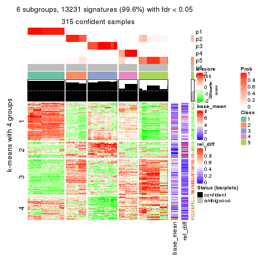</p>

</div>
</div>


Signature heatmaps where rows are not scaled:


<script>
$( function() {
	$( '#tabs-CV-skmeans-get-signatures-no-scale' ).tabs();
} );
</script>
<div id='tabs-CV-skmeans-get-signatures-no-scale'>
<ul>
<li><a href='#tab-CV-skmeans-get-signatures-no-scale-1'>k = 2</a></li>
<li><a href='#tab-CV-skmeans-get-signatures-no-scale-2'>k = 3</a></li>
<li><a href='#tab-CV-skmeans-get-signatures-no-scale-3'>k = 4</a></li>
<li><a href='#tab-CV-skmeans-get-signatures-no-scale-4'>k = 5</a></li>
<li><a href='#tab-CV-skmeans-get-signatures-no-scale-5'>k = 6</a></li>
</ul>
<div id='tab-CV-skmeans-get-signatures-no-scale-1'>
<pre><code class="r">get_signatures(res, k = 2, scale_rows = FALSE)
</code></pre>

<p></p>

</div>
<div id='tab-CV-skmeans-get-signatures-no-scale-2'>
<pre><code class="r">get_signatures(res, k = 3, scale_rows = FALSE)
</code></pre>

<p></p>

</div>
<div id='tab-CV-skmeans-get-signatures-no-scale-3'>
<pre><code class="r">get_signatures(res, k = 4, scale_rows = FALSE)
</code></pre>

<p></p>

</div>
<div id='tab-CV-skmeans-get-signatures-no-scale-4'>
<pre><code class="r">get_signatures(res, k = 5, scale_rows = FALSE)
</code></pre>

<p></p>

</div>
<div id='tab-CV-skmeans-get-signatures-no-scale-5'>
<pre><code class="r">get_signatures(res, k = 6, scale_rows = FALSE)
</code></pre>

<p></p>

</div>
</div>


Compare the overlap of signatures from different k:

```r
compare_signatures(res)
```


`get_signature()` returns a data frame invisibly. TO get the list of signatures, the function
call should be assigned to a variable explicitly. In following code, if `plot` argument is set
to `FALSE`, no heatmap is plotted while only the differential analysis is performed.

```r
# code only for demonstration
tb = get_signature(res, k = ..., plot = FALSE)
```

An example of the output of `tb` is:

```
#>   which_row         fdr    mean_1    mean_2 scaled_mean_1 scaled_mean_2 km
#> 1        38 0.042760348  8.373488  9.131774    -0.5533452     0.5164555  1
#> 2        40 0.018707592  7.106213  8.469186    -0.6173731     0.5762149  1
#> 3        55 0.019134737 10.221463 11.207825    -0.6159697     0.5749050  1
#> 4        59 0.006059896  5.921854  7.869574    -0.6899429     0.6439467  1
#> 5        60 0.018055526  8.928898 10.211722    -0.6204761     0.5791110  1
#> 6        98 0.009384629 15.714769 14.887706     0.6635654    -0.6193277  2
...
```

The columns in `tb` are:

1. `which_row`: row indices corresponding to the input matrix.
2. `fdr`: FDR for the differential test. 
3. `mean_x`: The mean value in group x.
4. `scaled_mean_x`: The mean value in group x after rows are scaled.
5. `km`: Row groups if k-means clustering is applied to rows.


UMAP plot which shows how samples are separated.


<script>
$( function() {
	$( '#tabs-CV-skmeans-dimension-reduction' ).tabs();
} );
</script>
<div id='tabs-CV-skmeans-dimension-reduction'>
<ul>
<li><a href='#tab-CV-skmeans-dimension-reduction-1'>k = 2</a></li>
<li><a href='#tab-CV-skmeans-dimension-reduction-2'>k = 3</a></li>
<li><a href='#tab-CV-skmeans-dimension-reduction-3'>k = 4</a></li>
<li><a href='#tab-CV-skmeans-dimension-reduction-4'>k = 5</a></li>
<li><a href='#tab-CV-skmeans-dimension-reduction-5'>k = 6</a></li>
</ul>
<div id='tab-CV-skmeans-dimension-reduction-1'>
<pre><code class="r">dimension_reduction(res, k = 2, method = &quot;UMAP&quot;)
</code></pre>

<p></p>

</div>
<div id='tab-CV-skmeans-dimension-reduction-2'>
<pre><code class="r">dimension_reduction(res, k = 3, method = &quot;UMAP&quot;)
</code></pre>

<p></p>

</div>
<div id='tab-CV-skmeans-dimension-reduction-3'>
<pre><code class="r">dimension_reduction(res, k = 4, method = &quot;UMAP&quot;)
</code></pre>

<p></p>

</div>
<div id='tab-CV-skmeans-dimension-reduction-4'>
<pre><code class="r">dimension_reduction(res, k = 5, method = &quot;UMAP&quot;)
</code></pre>

<p></p>

</div>
<div id='tab-CV-skmeans-dimension-reduction-5'>
<pre><code class="r">dimension_reduction(res, k = 6, method = &quot;UMAP&quot;)
</code></pre>

<p></p>

</div>
</div>


Following heatmap shows how subgroups are split when increasing `k`:

```r
collect_classes(res)
```


If matrix rows can be associated to genes, consider to use `functional_enrichment(res,
...)` to perform function enrichment for the signature genes. See [this vignette](http://bioconductor.org/packages/devel/bioc/vignettes/cola/inst/doc/functional_enrichment.html) for more detailed explanations.


 

---------------------------------------------------


### CV:pam**


The object with results only for a single top-value method and a single partition method 
can be extracted as:

```r
res = res_list["CV", "pam"]
# you can also extract it by
# res = res_list["CV:pam"]
```

A summary of `res` and all the functions that can be applied to it:

```r
res
```

```
#> A 'ConsensusPartition' object with k = 2, 3, 4, 5, 6.
#>   On a matrix with 13278 rows and 322 columns.
#>   Top rows (1000, 2000, 3000, 4000, 5000) are extracted by 'CV' method.
#>   Subgroups are detected by 'pam' method.
#>   Performed in total 1250 partitions by row resampling.
#>   Best k for subgroups seems to be 6.
#> 
#> Following methods can be applied to this 'ConsensusPartition' object:
#>  [1] "cola_report"             "collect_classes"         "collect_plots"          
#>  [4] "collect_stats"           "colnames"                "compare_signatures"     
#>  [7] "consensus_heatmap"       "dimension_reduction"     "functional_enrichment"  
#> [10] "get_anno_col"            "get_anno"                "get_classes"            
#> [13] "get_consensus"           "get_matrix"              "get_membership"         
#> [16] "get_param"               "get_signatures"          "get_stats"              
#> [19] "is_best_k"               "is_stable_k"             "membership_heatmap"     
#> [22] "ncol"                    "nrow"                    "plot_ecdf"              
#> [25] "rownames"                "select_partition_number" "show"                   
#> [28] "suggest_best_k"          "test_to_known_factors"
```

`collect_plots()` function collects all the plots made from `res` for all `k` (number of partitions)
into one single page to provide an easy and fast comparison between different `k`.

```r
collect_plots(res)
```


The plots are:

- The first row: a plot of the ECDF (empirical cumulative distribution
  function) curves of the consensus matrix for each `k` and the heatmap of
  predicted classes for each `k`.
- The second row: heatmaps of the consensus matrix for each `k`.
- The third row: heatmaps of the membership matrix for each `k`.
- The fouth row: heatmaps of the signatures for each `k`.

All the plots in panels can be made by individual functions and they are
plotted later in this section.

`select_partition_number()` produces several plots showing different
statistics for choosing "optimized" `k`. There are following statistics:

- ECDF curves of the consensus matrix for each `k`;
- 1-PAC. [The PAC
  score](https://en.wikipedia.org/wiki/Consensus_clustering#Over-interpretation_potential_of_consensus_clustering)
  measures the proportion of the ambiguous subgrouping.
- Mean silhouette score.
- Concordance. The mean probability of fiting the consensus class ids in all
  partitions.
- Area increased. Denote $A_k$ as the area under the ECDF curve for current
  `k`, the area increased is defined as $A_k - A_{k-1}$.
- Rand index. The percent of pairs of samples that are both in a same cluster
  or both are not in a same cluster in the partition of k and k-1.
- Jaccard index. The ratio of pairs of samples are both in a same cluster in
  the partition of k and k-1 and the pairs of samples are both in a same
  cluster in the partition k or k-1.

The detailed explanations of these statistics can be found in [the _cola_
vignette](http://bioconductor.org/packages/devel/bioc/vignettes/cola/inst/doc/cola.html#toc_13).

Generally speaking, lower PAC score, higher mean silhouette score or higher
concordance corresponds to better partition. Rand index and Jaccard index
measure how similar the current partition is compared to partition with `k-1`.
If they are too similar, we won't accept `k` is better than `k-1`.

```r
select_partition_number(res)
```


The numeric values for all these statistics can be obtained by `get_stats()`.

```r
get_stats(res)
```

```
#>   k 1-PAC mean_silhouette concordance area_increased  Rand Jaccard
#> 2 2 0.895           0.950       0.974         0.4754 0.528   0.528
#> 3 3 1.000           0.985       0.994         0.3284 0.794   0.625
#> 4 4 0.883           0.941       0.956         0.1490 0.896   0.724
#> 5 5 0.952           0.941       0.972         0.0899 0.930   0.749
#> 6 6 1.000           0.979       0.989         0.0165 0.989   0.948
```

`suggest_best_k()` suggests the best $k$ based on these statistics. The rules are as follows:

- All $k$ with Jaccard index larger than 0.95 are removed because increasing
  $k$ does not provide enough extra information. If all $k$ are removed, it is
  marked as no subgroup is detected.
- For all $k$ with 1-PAC score larger than 0.9, the maximal $k$ is taken as
  the best $k$, and other $k$ are marked as optional $k$.
- If it does not fit the second rule. The $k$ with the maximal vote of the
  highest 1-PAC score, highest mean silhouette, and highest concordance is
  taken as the best $k$.

```r
suggest_best_k(res)
```

```
#> [1] 6
#> attr(,"optional")
#> [1] 3 5
```

There is also optional best $k$ = 3 5 that is worth to check.

Following shows the table of the partitions (You need to click the **show/hide
code output** link to see it). The membership matrix (columns with name `p*`)
is inferred by
[`clue::cl_consensus()`](https://www.rdocumentation.org/link/cl_consensus?package=clue)
function with the `SE` method. Basically the value in the membership matrix
represents the probability to belong to a certain group. The finall class
label for an item is determined with the group with highest probability it
belongs to.

In `get_classes()` function, the entropy is calculated from the membership
matrix and the silhouette score is calculated from the consensus matrix.


<script>
$( function() {
	$( '#tabs-CV-pam-get-classes' ).tabs();
} );
</script>
<div id='tabs-CV-pam-get-classes'>
<ul>
<li><a href='#tab-CV-pam-get-classes-1'>k = 2</a></li>
<li><a href='#tab-CV-pam-get-classes-2'>k = 3</a></li>
<li><a href='#tab-CV-pam-get-classes-3'>k = 4</a></li>
<li><a href='#tab-CV-pam-get-classes-4'>k = 5</a></li>
<li><a href='#tab-CV-pam-get-classes-5'>k = 6</a></li>
</ul>

<div id='tab-CV-pam-get-classes-1'>
<p><a id='tab-CV-pam-get-classes-1-a' style='color:#0366d6' href='#'>show/hide code output</a></p>
<pre><code class="r">cbind(get_classes(res, k = 2), get_membership(res, k = 2))
</code></pre>

<pre><code>#&gt;           class entropy silhouette    p1    p2
#&gt; DRR023371     2  0.2236      0.951 0.036 0.964
#&gt; DRR023372     2  0.2236      0.951 0.036 0.964
#&gt; DRR023373     2  0.2236      0.951 0.036 0.964
#&gt; DRR023374     2  0.2236      0.951 0.036 0.964
#&gt; DRR023375     2  0.2236      0.951 0.036 0.964
#&gt; DRR023376     2  0.2236      0.951 0.036 0.964
#&gt; DRR023377     2  0.2236      0.951 0.036 0.964
#&gt; DRR023378     2  0.2236      0.951 0.036 0.964
#&gt; DRR023379     2  0.7299      0.758 0.204 0.796
#&gt; DRR023380     2  0.7745      0.720 0.228 0.772
#&gt; DRR023381     2  0.8386      0.656 0.268 0.732
#&gt; DRR023382     2  0.7883      0.711 0.236 0.764
#&gt; DRR023383     2  0.9944      0.162 0.456 0.544
#&gt; DRR023384     2  0.5946      0.848 0.144 0.856
#&gt; DRR023385     2  0.9944      0.162 0.456 0.544
#&gt; DRR023386     2  0.6247      0.832 0.156 0.844
#&gt; DRR023387     1  0.2043      0.957 0.968 0.032
#&gt; DRR023388     1  0.4431      0.904 0.908 0.092
#&gt; DRR023389     1  0.2423      0.951 0.960 0.040
#&gt; DRR023390     1  0.4022      0.917 0.920 0.080
#&gt; DRR023391     1  0.4690      0.896 0.900 0.100
#&gt; DRR023392     1  0.2043      0.958 0.968 0.032
#&gt; DRR023394     1  0.3114      0.939 0.944 0.056
#&gt; DRR023395     1  0.7602      0.735 0.780 0.220
#&gt; DRR023396     1  0.0000      0.976 1.000 0.000
#&gt; DRR023397     1  0.0000      0.976 1.000 0.000
#&gt; DRR023398     1  0.0000      0.976 1.000 0.000
#&gt; DRR023399     1  0.0672      0.973 0.992 0.008
#&gt; DRR023400     1  0.0000      0.976 1.000 0.000
#&gt; DRR023401     1  0.0000      0.976 1.000 0.000
#&gt; DRR023402     1  0.0000      0.976 1.000 0.000
#&gt; DRR023403     1  0.0376      0.975 0.996 0.004
#&gt; DRR023404     2  0.0000      0.972 0.000 1.000
#&gt; DRR023405     2  0.0000      0.972 0.000 1.000
#&gt; DRR023406     2  0.0000      0.972 0.000 1.000
#&gt; DRR023407     2  0.0000      0.972 0.000 1.000
#&gt; DRR023408     2  0.0000      0.972 0.000 1.000
#&gt; DRR023409     2  0.0000      0.972 0.000 1.000
#&gt; DRR023410     2  0.0000      0.972 0.000 1.000
#&gt; DRR023411     2  0.0000      0.972 0.000 1.000
#&gt; DRR023412     2  0.0000      0.972 0.000 1.000
#&gt; DRR023413     2  0.0000      0.972 0.000 1.000
#&gt; DRR023414     2  0.0000      0.972 0.000 1.000
#&gt; DRR023415     2  0.0000      0.972 0.000 1.000
#&gt; DRR023416     2  0.0000      0.972 0.000 1.000
#&gt; DRR023417     2  0.0000      0.972 0.000 1.000
#&gt; DRR023418     2  0.0000      0.972 0.000 1.000
#&gt; DRR023419     2  0.0000      0.972 0.000 1.000
#&gt; DRR023420     2  0.0000      0.972 0.000 1.000
#&gt; DRR023421     2  0.0000      0.972 0.000 1.000
#&gt; DRR023422     2  0.0000      0.972 0.000 1.000
#&gt; DRR023423     2  0.0000      0.972 0.000 1.000
#&gt; DRR023425     2  0.0000      0.972 0.000 1.000
#&gt; DRR023426     2  0.0000      0.972 0.000 1.000
#&gt; DRR023427     2  0.0000      0.972 0.000 1.000
#&gt; DRR023428     2  0.0000      0.972 0.000 1.000
#&gt; DRR023429     2  0.0000      0.972 0.000 1.000
#&gt; DRR023430     2  0.0000      0.972 0.000 1.000
#&gt; DRR023431     2  0.0000      0.972 0.000 1.000
#&gt; DRR023432     2  0.0000      0.972 0.000 1.000
#&gt; DRR023433     2  0.0000      0.972 0.000 1.000
#&gt; DRR023434     2  0.0000      0.972 0.000 1.000
#&gt; DRR023435     2  0.0000      0.972 0.000 1.000
#&gt; DRR023436     2  0.0000      0.972 0.000 1.000
#&gt; DRR023437     2  0.0000      0.972 0.000 1.000
#&gt; DRR023438     2  0.0000      0.972 0.000 1.000
#&gt; DRR023439     2  0.0000      0.972 0.000 1.000
#&gt; DRR023440     2  0.0000      0.972 0.000 1.000
#&gt; DRR023441     2  0.0000      0.972 0.000 1.000
#&gt; DRR023442     2  0.0000      0.972 0.000 1.000
#&gt; DRR023443     2  0.0000      0.972 0.000 1.000
#&gt; DRR023444     2  0.0000      0.972 0.000 1.000
#&gt; DRR023445     2  0.0000      0.972 0.000 1.000
#&gt; DRR023446     2  0.0000      0.972 0.000 1.000
#&gt; DRR023447     2  0.0000      0.972 0.000 1.000
#&gt; DRR023448     2  0.0000      0.972 0.000 1.000
#&gt; DRR023449     2  0.0000      0.972 0.000 1.000
#&gt; DRR023450     2  0.0000      0.972 0.000 1.000
#&gt; DRR023451     2  0.0000      0.972 0.000 1.000
#&gt; DRR023452     2  0.0000      0.972 0.000 1.000
#&gt; DRR023453     1  0.6247      0.830 0.844 0.156
#&gt; DRR023454     1  0.3274      0.936 0.940 0.060
#&gt; DRR023455     1  0.5294      0.874 0.880 0.120
#&gt; DRR023456     1  0.3274      0.935 0.940 0.060
#&gt; DRR023457     1  0.2603      0.949 0.956 0.044
#&gt; DRR023458     1  0.4022      0.917 0.920 0.080
#&gt; DRR023459     1  0.2603      0.949 0.956 0.044
#&gt; DRR023460     2  0.2043      0.954 0.032 0.968
#&gt; DRR023461     2  0.0376      0.969 0.004 0.996
#&gt; DRR023462     2  0.0376      0.969 0.004 0.996
#&gt; DRR023463     2  0.0376      0.969 0.004 0.996
#&gt; DRR023464     2  0.0376      0.969 0.004 0.996
#&gt; DRR023465     2  0.0376      0.969 0.004 0.996
#&gt; DRR023466     2  0.0376      0.969 0.004 0.996
#&gt; DRR023467     2  0.0376      0.969 0.004 0.996
#&gt; DRR023468     2  0.0376      0.969 0.004 0.996
#&gt; DRR023469     2  0.0376      0.969 0.004 0.996
#&gt; DRR023470     2  0.0376      0.969 0.004 0.996
#&gt; DRR023471     2  0.0376      0.969 0.004 0.996
#&gt; DRR023472     2  0.0376      0.969 0.004 0.996
#&gt; DRR023473     2  0.0376      0.969 0.004 0.996
#&gt; DRR023474     2  0.0376      0.969 0.004 0.996
#&gt; DRR023475     2  0.0376      0.969 0.004 0.996
#&gt; DRR023476     2  0.0376      0.969 0.004 0.996
#&gt; DRR023477     2  0.0376      0.969 0.004 0.996
#&gt; DRR023478     2  0.0376      0.969 0.004 0.996
#&gt; DRR023479     2  0.0376      0.969 0.004 0.996
#&gt; DRR023480     2  0.0376      0.969 0.004 0.996
#&gt; DRR023481     2  0.0376      0.969 0.004 0.996
#&gt; DRR023482     2  0.2236      0.951 0.036 0.964
#&gt; DRR023483     2  0.2236      0.951 0.036 0.964
#&gt; DRR023484     2  0.2236      0.951 0.036 0.964
#&gt; DRR023485     2  0.2236      0.951 0.036 0.964
#&gt; DRR023486     2  0.2236      0.951 0.036 0.964
#&gt; DRR023487     2  0.2236      0.951 0.036 0.964
#&gt; DRR023488     2  0.2236      0.951 0.036 0.964
#&gt; DRR023489     2  0.2236      0.951 0.036 0.964
#&gt; DRR023490     1  0.0376      0.979 0.996 0.004
#&gt; DRR023491     1  0.0376      0.979 0.996 0.004
#&gt; DRR023492     1  0.0376      0.979 0.996 0.004
#&gt; DRR023493     1  0.0376      0.979 0.996 0.004
#&gt; DRR023494     1  0.0376      0.979 0.996 0.004
#&gt; DRR023495     1  0.0376      0.979 0.996 0.004
#&gt; DRR023496     1  0.0376      0.979 0.996 0.004
#&gt; DRR023497     1  0.0376      0.979 0.996 0.004
#&gt; DRR023498     1  0.0376      0.979 0.996 0.004
#&gt; DRR023499     1  0.0376      0.979 0.996 0.004
#&gt; DRR023500     1  0.0376      0.979 0.996 0.004
#&gt; DRR023501     1  0.0376      0.979 0.996 0.004
#&gt; DRR023502     1  0.0376      0.979 0.996 0.004
#&gt; DRR023503     1  0.0376      0.979 0.996 0.004
#&gt; DRR023504     1  0.0376      0.979 0.996 0.004
#&gt; DRR023505     1  0.0376      0.979 0.996 0.004
#&gt; DRR023506     1  0.0376      0.979 0.996 0.004
#&gt; DRR023507     1  0.0376      0.979 0.996 0.004
#&gt; DRR023508     1  0.0376      0.979 0.996 0.004
#&gt; DRR023509     1  0.0376      0.979 0.996 0.004
#&gt; DRR023510     1  0.0376      0.979 0.996 0.004
#&gt; DRR023511     1  0.0376      0.979 0.996 0.004
#&gt; DRR023512     1  0.0376      0.979 0.996 0.004
#&gt; DRR023513     1  0.0376      0.979 0.996 0.004
#&gt; DRR023514     1  0.0376      0.979 0.996 0.004
#&gt; DRR023515     1  0.0376      0.979 0.996 0.004
#&gt; DRR023516     1  0.0376      0.979 0.996 0.004
#&gt; DRR023517     1  0.0376      0.979 0.996 0.004
#&gt; DRR023518     1  0.0376      0.979 0.996 0.004
#&gt; DRR023519     1  0.0376      0.979 0.996 0.004
#&gt; DRR023520     1  0.0376      0.979 0.996 0.004
#&gt; DRR023521     1  0.0376      0.979 0.996 0.004
#&gt; DRR023522     1  0.0376      0.979 0.996 0.004
#&gt; DRR023523     1  0.0376      0.979 0.996 0.004
#&gt; DRR023524     1  0.0376      0.979 0.996 0.004
#&gt; DRR023525     1  0.0376      0.979 0.996 0.004
#&gt; DRR023526     1  0.0376      0.979 0.996 0.004
#&gt; DRR023527     1  0.0376      0.979 0.996 0.004
#&gt; DRR023528     1  0.0376      0.979 0.996 0.004
#&gt; DRR023529     1  0.0376      0.979 0.996 0.004
#&gt; DRR023530     1  0.0376      0.979 0.996 0.004
#&gt; DRR023531     1  0.0376      0.979 0.996 0.004
#&gt; DRR023532     1  0.0376      0.979 0.996 0.004
#&gt; DRR023533     1  0.0376      0.979 0.996 0.004
#&gt; DRR023534     1  0.0376      0.979 0.996 0.004
#&gt; DRR023535     1  0.0376      0.979 0.996 0.004
#&gt; DRR023536     1  0.0376      0.979 0.996 0.004
#&gt; DRR023537     1  0.0376      0.979 0.996 0.004
#&gt; DRR023538     1  0.0376      0.979 0.996 0.004
#&gt; DRR023539     1  0.0376      0.979 0.996 0.004
#&gt; DRR023540     1  0.0376      0.979 0.996 0.004
#&gt; DRR023541     1  0.0376      0.979 0.996 0.004
#&gt; DRR023542     1  0.0376      0.979 0.996 0.004
#&gt; DRR023543     1  0.0376      0.979 0.996 0.004
#&gt; DRR023544     1  0.0376      0.979 0.996 0.004
#&gt; DRR023545     1  0.0376      0.979 0.996 0.004
#&gt; DRR023546     1  0.0376      0.979 0.996 0.004
#&gt; DRR023547     1  0.0376      0.979 0.996 0.004
#&gt; DRR023548     1  0.0376      0.979 0.996 0.004
#&gt; DRR023549     1  0.0376      0.979 0.996 0.004
#&gt; DRR023550     1  0.0376      0.979 0.996 0.004
#&gt; DRR023551     1  0.0376      0.979 0.996 0.004
#&gt; DRR023552     1  0.0376      0.979 0.996 0.004
#&gt; DRR023553     1  0.0376      0.979 0.996 0.004
#&gt; DRR023554     1  0.0376      0.979 0.996 0.004
#&gt; DRR023555     1  0.0376      0.979 0.996 0.004
#&gt; DRR023556     1  0.0376      0.979 0.996 0.004
#&gt; DRR023557     1  0.0376      0.979 0.996 0.004
#&gt; DRR023558     1  0.0376      0.979 0.996 0.004
#&gt; DRR023559     1  0.0376      0.979 0.996 0.004
#&gt; DRR023560     1  0.0376      0.979 0.996 0.004
#&gt; DRR023561     1  0.0376      0.979 0.996 0.004
#&gt; DRR023562     1  0.0376      0.979 0.996 0.004
#&gt; DRR023563     1  0.0376      0.979 0.996 0.004
#&gt; DRR023564     1  0.0376      0.979 0.996 0.004
#&gt; DRR023565     1  0.0376      0.979 0.996 0.004
#&gt; DRR023566     1  0.0376      0.979 0.996 0.004
#&gt; DRR023567     1  0.0376      0.979 0.996 0.004
#&gt; DRR023568     1  0.0376      0.979 0.996 0.004
#&gt; DRR023569     1  0.0376      0.979 0.996 0.004
#&gt; DRR023570     1  0.0376      0.979 0.996 0.004
#&gt; DRR023571     1  0.0376      0.979 0.996 0.004
#&gt; DRR023572     1  0.0376      0.979 0.996 0.004
#&gt; DRR023573     1  0.0376      0.979 0.996 0.004
#&gt; DRR023574     1  0.0376      0.979 0.996 0.004
#&gt; DRR023575     1  0.0376      0.979 0.996 0.004
#&gt; DRR023576     2  0.0000      0.972 0.000 1.000
#&gt; DRR023577     2  0.0000      0.972 0.000 1.000
#&gt; DRR023578     2  0.0000      0.972 0.000 1.000
#&gt; DRR023579     2  0.0000      0.972 0.000 1.000
#&gt; DRR023580     2  0.0000      0.972 0.000 1.000
#&gt; DRR023581     2  0.0000      0.972 0.000 1.000
#&gt; DRR023582     2  0.0000      0.972 0.000 1.000
#&gt; DRR023583     2  0.0000      0.972 0.000 1.000
#&gt; DRR023584     2  0.0000      0.972 0.000 1.000
#&gt; DRR023585     2  0.0000      0.972 0.000 1.000
#&gt; DRR023586     2  0.0000      0.972 0.000 1.000
#&gt; DRR023587     2  0.0000      0.972 0.000 1.000
#&gt; DRR023588     2  0.0000      0.972 0.000 1.000
#&gt; DRR023589     2  0.0000      0.972 0.000 1.000
#&gt; DRR023590     2  0.0000      0.972 0.000 1.000
#&gt; DRR023591     2  0.0000      0.972 0.000 1.000
#&gt; DRR023592     2  0.0000      0.972 0.000 1.000
#&gt; DRR023593     2  0.0000      0.972 0.000 1.000
#&gt; DRR023594     2  0.0000      0.972 0.000 1.000
#&gt; DRR023595     2  0.0000      0.972 0.000 1.000
#&gt; DRR023596     2  0.0000      0.972 0.000 1.000
#&gt; DRR023597     2  0.0000      0.972 0.000 1.000
#&gt; DRR023598     2  0.0000      0.972 0.000 1.000
#&gt; DRR023599     2  0.0000      0.972 0.000 1.000
#&gt; DRR023600     2  0.0000      0.972 0.000 1.000
#&gt; DRR023601     2  0.0000      0.972 0.000 1.000
#&gt; DRR023602     2  0.0000      0.972 0.000 1.000
#&gt; DRR023603     2  0.0000      0.972 0.000 1.000
#&gt; DRR023604     2  0.0000      0.972 0.000 1.000
#&gt; DRR023605     2  0.0000      0.972 0.000 1.000
#&gt; DRR023606     2  0.0000      0.972 0.000 1.000
#&gt; DRR023607     2  0.0000      0.972 0.000 1.000
#&gt; DRR023608     2  0.0000      0.972 0.000 1.000
#&gt; DRR023609     2  0.0000      0.972 0.000 1.000
#&gt; DRR023610     2  0.0000      0.972 0.000 1.000
#&gt; DRR023611     2  0.0000      0.972 0.000 1.000
#&gt; DRR023612     2  0.0000      0.972 0.000 1.000
#&gt; DRR023613     2  0.0000      0.972 0.000 1.000
#&gt; DRR023614     2  0.0000      0.972 0.000 1.000
#&gt; DRR023615     2  0.0000      0.972 0.000 1.000
#&gt; DRR023616     2  0.0000      0.972 0.000 1.000
#&gt; DRR023617     2  0.0000      0.972 0.000 1.000
#&gt; DRR023619     2  0.5294      0.876 0.120 0.880
#&gt; DRR023620     2  0.4815      0.892 0.104 0.896
#&gt; DRR023621     2  0.3114      0.934 0.056 0.944
#&gt; DRR023622     2  0.1843      0.955 0.028 0.972
#&gt; DRR023623     2  0.6148      0.839 0.152 0.848
#&gt; DRR023624     2  0.3274      0.931 0.060 0.940
#&gt; DRR023625     2  0.4431      0.903 0.092 0.908
#&gt; DRR023626     2  0.4161      0.911 0.084 0.916
#&gt; DRR023627     2  0.2043      0.952 0.032 0.968
#&gt; DRR023628     2  0.0938      0.965 0.012 0.988
#&gt; DRR023629     2  0.3431      0.927 0.064 0.936
#&gt; DRR023630     2  0.1414      0.960 0.020 0.980
#&gt; DRR023631     2  0.0376      0.970 0.004 0.996
#&gt; DRR023632     2  0.1843      0.955 0.028 0.972
#&gt; DRR023633     2  0.0376      0.970 0.004 0.996
#&gt; DRR023635     2  0.0000      0.972 0.000 1.000
#&gt; DRR023636     2  0.0000      0.972 0.000 1.000
#&gt; DRR023637     2  0.0000      0.972 0.000 1.000
#&gt; DRR023638     2  0.0000      0.972 0.000 1.000
#&gt; DRR023639     2  0.0000      0.972 0.000 1.000
#&gt; DRR023640     2  0.0000      0.972 0.000 1.000
#&gt; DRR023641     2  0.0000      0.972 0.000 1.000
#&gt; DRR023642     2  0.0000      0.972 0.000 1.000
#&gt; DRR023643     2  0.0000      0.972 0.000 1.000
#&gt; DRR023644     2  0.0000      0.972 0.000 1.000
#&gt; DRR023645     2  0.0000      0.972 0.000 1.000
#&gt; DRR023646     2  0.0000      0.972 0.000 1.000
#&gt; DRR023647     2  0.0000      0.972 0.000 1.000
#&gt; DRR023648     2  0.0000      0.972 0.000 1.000
#&gt; DRR023649     2  0.0000      0.972 0.000 1.000
#&gt; DRR023650     2  0.5519      0.867 0.128 0.872
#&gt; DRR023651     2  0.6148      0.839 0.152 0.848
#&gt; DRR023652     2  0.5294      0.875 0.120 0.880
#&gt; DRR023653     2  0.5294      0.875 0.120 0.880
#&gt; DRR023654     2  0.5519      0.867 0.128 0.872
#&gt; DRR023655     2  0.4815      0.891 0.104 0.896
#&gt; DRR023656     2  0.6438      0.823 0.164 0.836
#&gt; DRR023657     2  0.4939      0.888 0.108 0.892
#&gt; DRR023658     2  0.4815      0.892 0.104 0.896
#&gt; DRR023659     2  0.5178      0.879 0.116 0.884
#&gt; DRR023660     2  0.5629      0.862 0.132 0.868
#&gt; DRR023661     2  0.5178      0.879 0.116 0.884
#&gt; DRR023662     2  0.5519      0.867 0.128 0.872
#&gt; DRR023663     2  0.5294      0.875 0.120 0.880
#&gt; DRR023664     2  0.5408      0.871 0.124 0.876
#&gt; DRR023665     2  0.0000      0.972 0.000 1.000
#&gt; DRR023666     1  0.1843      0.964 0.972 0.028
#&gt; DRR023667     1  0.6148      0.830 0.848 0.152
#&gt; DRR023668     1  0.4022      0.917 0.920 0.080
#&gt; DRR023669     1  0.5059      0.881 0.888 0.112
#&gt; DRR023670     1  0.4562      0.899 0.904 0.096
#&gt; DRR023671     1  0.2603      0.951 0.956 0.044
#&gt; DRR023672     1  0.2043      0.960 0.968 0.032
#&gt; DRR023673     1  0.6438      0.813 0.836 0.164
#&gt; DRR023674     1  0.4562      0.900 0.904 0.096
#&gt; DRR023675     1  0.3274      0.937 0.940 0.060
#&gt; DRR023676     1  0.2236      0.958 0.964 0.036
#&gt; DRR023677     1  0.1633      0.966 0.976 0.024
#&gt; DRR023678     1  0.9044      0.535 0.680 0.320
#&gt; DRR023683     2  0.0000      0.972 0.000 1.000
#&gt; DRR023684     2  0.0000      0.972 0.000 1.000
#&gt; DRR023685     2  0.0000      0.972 0.000 1.000
#&gt; DRR023686     2  0.0000      0.972 0.000 1.000
#&gt; DRR023687     2  0.0000      0.972 0.000 1.000
#&gt; DRR023688     2  0.0000      0.972 0.000 1.000
#&gt; DRR023689     2  0.0000      0.972 0.000 1.000
#&gt; DRR023690     2  0.0000      0.972 0.000 1.000
#&gt; DRR023691     2  0.0000      0.972 0.000 1.000
#&gt; DRR023692     2  0.0000      0.972 0.000 1.000
#&gt; DRR023693     2  0.0000      0.972 0.000 1.000
#&gt; DRR023694     2  0.0000      0.972 0.000 1.000
#&gt; DRR023695     2  0.0000      0.972 0.000 1.000
#&gt; DRR023696     2  0.0000      0.972 0.000 1.000
#&gt; DRR023697     2  0.0000      0.972 0.000 1.000
#&gt; DRR023698     2  0.0000      0.972 0.000 1.000
#&gt; DRR023699     2  0.0000      0.972 0.000 1.000
#&gt; DRR023700     2  0.0000      0.972 0.000 1.000
</code></pre>

<script>
$('#tab-CV-pam-get-classes-1-a').parent().next().next().hide();
$('#tab-CV-pam-get-classes-1-a').click(function(){
  $('#tab-CV-pam-get-classes-1-a').parent().next().next().toggle();
  return(false);
});
</script>
</div>

<div id='tab-CV-pam-get-classes-2'>
<p><a id='tab-CV-pam-get-classes-2-a' style='color:#0366d6' href='#'>show/hide code output</a></p>
<pre><code class="r">cbind(get_classes(res, k = 3), get_membership(res, k = 3))
</code></pre>

<pre><code>#&gt;           class entropy silhouette    p1    p2 p3
#&gt; DRR023371     3  0.0000    1.00000 0.000 0.000  1
#&gt; DRR023372     3  0.0000    1.00000 0.000 0.000  1
#&gt; DRR023373     3  0.0000    1.00000 0.000 0.000  1
#&gt; DRR023374     3  0.0000    1.00000 0.000 0.000  1
#&gt; DRR023375     3  0.0000    1.00000 0.000 0.000  1
#&gt; DRR023376     3  0.0000    1.00000 0.000 0.000  1
#&gt; DRR023377     3  0.0000    1.00000 0.000 0.000  1
#&gt; DRR023378     3  0.0000    1.00000 0.000 0.000  1
#&gt; DRR023379     3  0.0000    1.00000 0.000 0.000  1
#&gt; DRR023380     3  0.0000    1.00000 0.000 0.000  1
#&gt; DRR023381     3  0.0000    1.00000 0.000 0.000  1
#&gt; DRR023382     3  0.0000    1.00000 0.000 0.000  1
#&gt; DRR023383     3  0.0000    1.00000 0.000 0.000  1
#&gt; DRR023384     3  0.0000    1.00000 0.000 0.000  1
#&gt; DRR023385     3  0.0000    1.00000 0.000 0.000  1
#&gt; DRR023386     3  0.0000    1.00000 0.000 0.000  1
#&gt; DRR023387     3  0.0000    1.00000 0.000 0.000  1
#&gt; DRR023388     3  0.0000    1.00000 0.000 0.000  1
#&gt; DRR023389     3  0.0000    1.00000 0.000 0.000  1
#&gt; DRR023390     3  0.0000    1.00000 0.000 0.000  1
#&gt; DRR023391     3  0.0000    1.00000 0.000 0.000  1
#&gt; DRR023392     3  0.0000    1.00000 0.000 0.000  1
#&gt; DRR023394     3  0.0000    1.00000 0.000 0.000  1
#&gt; DRR023395     3  0.0000    1.00000 0.000 0.000  1
#&gt; DRR023396     3  0.0000    1.00000 0.000 0.000  1
#&gt; DRR023397     3  0.0000    1.00000 0.000 0.000  1
#&gt; DRR023398     3  0.0000    1.00000 0.000 0.000  1
#&gt; DRR023399     3  0.0000    1.00000 0.000 0.000  1
#&gt; DRR023400     3  0.0000    1.00000 0.000 0.000  1
#&gt; DRR023401     3  0.0000    1.00000 0.000 0.000  1
#&gt; DRR023402     3  0.0000    1.00000 0.000 0.000  1
#&gt; DRR023403     3  0.0000    1.00000 0.000 0.000  1
#&gt; DRR023404     2  0.0000    0.99389 0.000 1.000  0
#&gt; DRR023405     2  0.0000    0.99389 0.000 1.000  0
#&gt; DRR023406     2  0.0000    0.99389 0.000 1.000  0
#&gt; DRR023407     2  0.0000    0.99389 0.000 1.000  0
#&gt; DRR023408     2  0.0000    0.99389 0.000 1.000  0
#&gt; DRR023409     2  0.0000    0.99389 0.000 1.000  0
#&gt; DRR023410     2  0.0000    0.99389 0.000 1.000  0
#&gt; DRR023411     2  0.0000    0.99389 0.000 1.000  0
#&gt; DRR023412     2  0.0000    0.99389 0.000 1.000  0
#&gt; DRR023413     2  0.0000    0.99389 0.000 1.000  0
#&gt; DRR023414     2  0.0000    0.99389 0.000 1.000  0
#&gt; DRR023415     2  0.0000    0.99389 0.000 1.000  0
#&gt; DRR023416     2  0.0000    0.99389 0.000 1.000  0
#&gt; DRR023417     2  0.0000    0.99389 0.000 1.000  0
#&gt; DRR023418     2  0.0000    0.99389 0.000 1.000  0
#&gt; DRR023419     2  0.0000    0.99389 0.000 1.000  0
#&gt; DRR023420     2  0.0000    0.99389 0.000 1.000  0
#&gt; DRR023421     2  0.0000    0.99389 0.000 1.000  0
#&gt; DRR023422     2  0.0000    0.99389 0.000 1.000  0
#&gt; DRR023423     2  0.0000    0.99389 0.000 1.000  0
#&gt; DRR023425     2  0.0000    0.99389 0.000 1.000  0
#&gt; DRR023426     2  0.0000    0.99389 0.000 1.000  0
#&gt; DRR023427     2  0.0000    0.99389 0.000 1.000  0
#&gt; DRR023428     2  0.0000    0.99389 0.000 1.000  0
#&gt; DRR023429     2  0.0000    0.99389 0.000 1.000  0
#&gt; DRR023430     2  0.0000    0.99389 0.000 1.000  0
#&gt; DRR023431     2  0.0000    0.99389 0.000 1.000  0
#&gt; DRR023432     2  0.0000    0.99389 0.000 1.000  0
#&gt; DRR023433     2  0.0000    0.99389 0.000 1.000  0
#&gt; DRR023434     2  0.0000    0.99389 0.000 1.000  0
#&gt; DRR023435     2  0.0000    0.99389 0.000 1.000  0
#&gt; DRR023436     2  0.0000    0.99389 0.000 1.000  0
#&gt; DRR023437     2  0.0000    0.99389 0.000 1.000  0
#&gt; DRR023438     2  0.0000    0.99389 0.000 1.000  0
#&gt; DRR023439     2  0.0000    0.99389 0.000 1.000  0
#&gt; DRR023440     2  0.0000    0.99389 0.000 1.000  0
#&gt; DRR023441     2  0.0000    0.99389 0.000 1.000  0
#&gt; DRR023442     2  0.0000    0.99389 0.000 1.000  0
#&gt; DRR023443     2  0.0000    0.99389 0.000 1.000  0
#&gt; DRR023444     2  0.0000    0.99389 0.000 1.000  0
#&gt; DRR023445     2  0.0000    0.99389 0.000 1.000  0
#&gt; DRR023446     2  0.0000    0.99389 0.000 1.000  0
#&gt; DRR023447     2  0.0000    0.99389 0.000 1.000  0
#&gt; DRR023448     2  0.0000    0.99389 0.000 1.000  0
#&gt; DRR023449     2  0.0000    0.99389 0.000 1.000  0
#&gt; DRR023450     2  0.0000    0.99389 0.000 1.000  0
#&gt; DRR023451     2  0.0000    0.99389 0.000 1.000  0
#&gt; DRR023452     2  0.0000    0.99389 0.000 1.000  0
#&gt; DRR023453     3  0.0000    1.00000 0.000 0.000  1
#&gt; DRR023454     3  0.0000    1.00000 0.000 0.000  1
#&gt; DRR023455     3  0.0000    1.00000 0.000 0.000  1
#&gt; DRR023456     3  0.0000    1.00000 0.000 0.000  1
#&gt; DRR023457     3  0.0000    1.00000 0.000 0.000  1
#&gt; DRR023458     3  0.0000    1.00000 0.000 0.000  1
#&gt; DRR023459     3  0.0000    1.00000 0.000 0.000  1
#&gt; DRR023460     3  0.0000    1.00000 0.000 0.000  1
#&gt; DRR023461     3  0.0000    1.00000 0.000 0.000  1
#&gt; DRR023462     3  0.0000    1.00000 0.000 0.000  1
#&gt; DRR023463     3  0.0000    1.00000 0.000 0.000  1
#&gt; DRR023464     3  0.0000    1.00000 0.000 0.000  1
#&gt; DRR023465     3  0.0000    1.00000 0.000 0.000  1
#&gt; DRR023466     3  0.0000    1.00000 0.000 0.000  1
#&gt; DRR023467     3  0.0000    1.00000 0.000 0.000  1
#&gt; DRR023468     3  0.0000    1.00000 0.000 0.000  1
#&gt; DRR023469     3  0.0000    1.00000 0.000 0.000  1
#&gt; DRR023470     3  0.0000    1.00000 0.000 0.000  1
#&gt; DRR023471     3  0.0000    1.00000 0.000 0.000  1
#&gt; DRR023472     3  0.0000    1.00000 0.000 0.000  1
#&gt; DRR023473     3  0.0000    1.00000 0.000 0.000  1
#&gt; DRR023474     3  0.0000    1.00000 0.000 0.000  1
#&gt; DRR023475     3  0.0000    1.00000 0.000 0.000  1
#&gt; DRR023476     3  0.0000    1.00000 0.000 0.000  1
#&gt; DRR023477     3  0.0000    1.00000 0.000 0.000  1
#&gt; DRR023478     3  0.0000    1.00000 0.000 0.000  1
#&gt; DRR023479     3  0.0000    1.00000 0.000 0.000  1
#&gt; DRR023480     3  0.0000    1.00000 0.000 0.000  1
#&gt; DRR023481     3  0.0000    1.00000 0.000 0.000  1
#&gt; DRR023482     3  0.0000    1.00000 0.000 0.000  1
#&gt; DRR023483     3  0.0000    1.00000 0.000 0.000  1
#&gt; DRR023484     3  0.0000    1.00000 0.000 0.000  1
#&gt; DRR023485     3  0.0000    1.00000 0.000 0.000  1
#&gt; DRR023486     3  0.0000    1.00000 0.000 0.000  1
#&gt; DRR023487     3  0.0000    1.00000 0.000 0.000  1
#&gt; DRR023488     3  0.0000    1.00000 0.000 0.000  1
#&gt; DRR023489     3  0.0000    1.00000 0.000 0.000  1
#&gt; DRR023490     1  0.0000    0.98566 1.000 0.000  0
#&gt; DRR023491     1  0.0000    0.98566 1.000 0.000  0
#&gt; DRR023492     1  0.0000    0.98566 1.000 0.000  0
#&gt; DRR023493     1  0.0000    0.98566 1.000 0.000  0
#&gt; DRR023494     1  0.0000    0.98566 1.000 0.000  0
#&gt; DRR023495     1  0.0000    0.98566 1.000 0.000  0
#&gt; DRR023496     1  0.0000    0.98566 1.000 0.000  0
#&gt; DRR023497     1  0.0000    0.98566 1.000 0.000  0
#&gt; DRR023498     1  0.0000    0.98566 1.000 0.000  0
#&gt; DRR023499     1  0.0000    0.98566 1.000 0.000  0
#&gt; DRR023500     1  0.0000    0.98566 1.000 0.000  0
#&gt; DRR023501     1  0.0000    0.98566 1.000 0.000  0
#&gt; DRR023502     1  0.0000    0.98566 1.000 0.000  0
#&gt; DRR023503     1  0.0000    0.98566 1.000 0.000  0
#&gt; DRR023504     1  0.0000    0.98566 1.000 0.000  0
#&gt; DRR023505     1  0.0000    0.98566 1.000 0.000  0
#&gt; DRR023506     1  0.0000    0.98566 1.000 0.000  0
#&gt; DRR023507     1  0.0000    0.98566 1.000 0.000  0
#&gt; DRR023508     1  0.0000    0.98566 1.000 0.000  0
#&gt; DRR023509     1  0.0000    0.98566 1.000 0.000  0
#&gt; DRR023510     1  0.0000    0.98566 1.000 0.000  0
#&gt; DRR023511     1  0.0000    0.98566 1.000 0.000  0
#&gt; DRR023512     1  0.0000    0.98566 1.000 0.000  0
#&gt; DRR023513     1  0.0000    0.98566 1.000 0.000  0
#&gt; DRR023514     1  0.0000    0.98566 1.000 0.000  0
#&gt; DRR023515     1  0.0000    0.98566 1.000 0.000  0
#&gt; DRR023516     1  0.0000    0.98566 1.000 0.000  0
#&gt; DRR023517     1  0.0000    0.98566 1.000 0.000  0
#&gt; DRR023518     1  0.0000    0.98566 1.000 0.000  0
#&gt; DRR023519     1  0.0000    0.98566 1.000 0.000  0
#&gt; DRR023520     1  0.0000    0.98566 1.000 0.000  0
#&gt; DRR023521     1  0.0000    0.98566 1.000 0.000  0
#&gt; DRR023522     1  0.0000    0.98566 1.000 0.000  0
#&gt; DRR023523     1  0.0000    0.98566 1.000 0.000  0
#&gt; DRR023524     1  0.0000    0.98566 1.000 0.000  0
#&gt; DRR023525     1  0.0000    0.98566 1.000 0.000  0
#&gt; DRR023526     1  0.0000    0.98566 1.000 0.000  0
#&gt; DRR023527     1  0.0000    0.98566 1.000 0.000  0
#&gt; DRR023528     1  0.0000    0.98566 1.000 0.000  0
#&gt; DRR023529     1  0.0000    0.98566 1.000 0.000  0
#&gt; DRR023530     1  0.0000    0.98566 1.000 0.000  0
#&gt; DRR023531     1  0.0000    0.98566 1.000 0.000  0
#&gt; DRR023532     1  0.0000    0.98566 1.000 0.000  0
#&gt; DRR023533     1  0.0000    0.98566 1.000 0.000  0
#&gt; DRR023534     1  0.0000    0.98566 1.000 0.000  0
#&gt; DRR023535     1  0.0000    0.98566 1.000 0.000  0
#&gt; DRR023536     1  0.0000    0.98566 1.000 0.000  0
#&gt; DRR023537     1  0.0000    0.98566 1.000 0.000  0
#&gt; DRR023538     1  0.0000    0.98566 1.000 0.000  0
#&gt; DRR023539     1  0.0000    0.98566 1.000 0.000  0
#&gt; DRR023540     1  0.0000    0.98566 1.000 0.000  0
#&gt; DRR023541     1  0.0000    0.98566 1.000 0.000  0
#&gt; DRR023542     1  0.0000    0.98566 1.000 0.000  0
#&gt; DRR023543     1  0.0000    0.98566 1.000 0.000  0
#&gt; DRR023544     1  0.0000    0.98566 1.000 0.000  0
#&gt; DRR023545     1  0.0000    0.98566 1.000 0.000  0
#&gt; DRR023546     1  0.0000    0.98566 1.000 0.000  0
#&gt; DRR023547     1  0.0000    0.98566 1.000 0.000  0
#&gt; DRR023548     1  0.0000    0.98566 1.000 0.000  0
#&gt; DRR023549     1  0.0000    0.98566 1.000 0.000  0
#&gt; DRR023550     1  0.0000    0.98566 1.000 0.000  0
#&gt; DRR023551     1  0.0000    0.98566 1.000 0.000  0
#&gt; DRR023552     1  0.0000    0.98566 1.000 0.000  0
#&gt; DRR023553     1  0.0000    0.98566 1.000 0.000  0
#&gt; DRR023554     1  0.0000    0.98566 1.000 0.000  0
#&gt; DRR023555     1  0.0000    0.98566 1.000 0.000  0
#&gt; DRR023556     1  0.0000    0.98566 1.000 0.000  0
#&gt; DRR023557     1  0.0000    0.98566 1.000 0.000  0
#&gt; DRR023558     1  0.0000    0.98566 1.000 0.000  0
#&gt; DRR023559     1  0.0000    0.98566 1.000 0.000  0
#&gt; DRR023560     1  0.0000    0.98566 1.000 0.000  0
#&gt; DRR023561     1  0.0000    0.98566 1.000 0.000  0
#&gt; DRR023562     1  0.0000    0.98566 1.000 0.000  0
#&gt; DRR023563     1  0.0000    0.98566 1.000 0.000  0
#&gt; DRR023564     1  0.0000    0.98566 1.000 0.000  0
#&gt; DRR023565     1  0.0000    0.98566 1.000 0.000  0
#&gt; DRR023566     1  0.0000    0.98566 1.000 0.000  0
#&gt; DRR023567     1  0.0000    0.98566 1.000 0.000  0
#&gt; DRR023568     1  0.0000    0.98566 1.000 0.000  0
#&gt; DRR023569     1  0.0000    0.98566 1.000 0.000  0
#&gt; DRR023570     1  0.0000    0.98566 1.000 0.000  0
#&gt; DRR023571     1  0.0000    0.98566 1.000 0.000  0
#&gt; DRR023572     1  0.0000    0.98566 1.000 0.000  0
#&gt; DRR023573     1  0.0000    0.98566 1.000 0.000  0
#&gt; DRR023574     1  0.0000    0.98566 1.000 0.000  0
#&gt; DRR023575     1  0.0000    0.98566 1.000 0.000  0
#&gt; DRR023576     2  0.0000    0.99389 0.000 1.000  0
#&gt; DRR023577     2  0.0000    0.99389 0.000 1.000  0
#&gt; DRR023578     2  0.0000    0.99389 0.000 1.000  0
#&gt; DRR023579     2  0.0000    0.99389 0.000 1.000  0
#&gt; DRR023580     2  0.0000    0.99389 0.000 1.000  0
#&gt; DRR023581     2  0.0000    0.99389 0.000 1.000  0
#&gt; DRR023582     2  0.0000    0.99389 0.000 1.000  0
#&gt; DRR023583     2  0.0000    0.99389 0.000 1.000  0
#&gt; DRR023584     2  0.0000    0.99389 0.000 1.000  0
#&gt; DRR023585     2  0.0000    0.99389 0.000 1.000  0
#&gt; DRR023586     2  0.0000    0.99389 0.000 1.000  0
#&gt; DRR023587     2  0.0000    0.99389 0.000 1.000  0
#&gt; DRR023588     2  0.0000    0.99389 0.000 1.000  0
#&gt; DRR023589     2  0.0000    0.99389 0.000 1.000  0
#&gt; DRR023590     2  0.0000    0.99389 0.000 1.000  0
#&gt; DRR023591     2  0.0000    0.99389 0.000 1.000  0
#&gt; DRR023592     2  0.0000    0.99389 0.000 1.000  0
#&gt; DRR023593     2  0.0000    0.99389 0.000 1.000  0
#&gt; DRR023594     2  0.0000    0.99389 0.000 1.000  0
#&gt; DRR023595     2  0.0000    0.99389 0.000 1.000  0
#&gt; DRR023596     2  0.0000    0.99389 0.000 1.000  0
#&gt; DRR023597     2  0.0000    0.99389 0.000 1.000  0
#&gt; DRR023598     2  0.0000    0.99389 0.000 1.000  0
#&gt; DRR023599     2  0.0000    0.99389 0.000 1.000  0
#&gt; DRR023600     2  0.0000    0.99389 0.000 1.000  0
#&gt; DRR023601     2  0.0000    0.99389 0.000 1.000  0
#&gt; DRR023602     2  0.0000    0.99389 0.000 1.000  0
#&gt; DRR023603     2  0.0000    0.99389 0.000 1.000  0
#&gt; DRR023604     2  0.0000    0.99389 0.000 1.000  0
#&gt; DRR023605     2  0.0000    0.99389 0.000 1.000  0
#&gt; DRR023606     2  0.0000    0.99389 0.000 1.000  0
#&gt; DRR023607     2  0.0000    0.99389 0.000 1.000  0
#&gt; DRR023608     2  0.0000    0.99389 0.000 1.000  0
#&gt; DRR023609     2  0.0000    0.99389 0.000 1.000  0
#&gt; DRR023610     2  0.0000    0.99389 0.000 1.000  0
#&gt; DRR023611     2  0.0000    0.99389 0.000 1.000  0
#&gt; DRR023612     2  0.0000    0.99389 0.000 1.000  0
#&gt; DRR023613     2  0.0000    0.99389 0.000 1.000  0
#&gt; DRR023614     2  0.0000    0.99389 0.000 1.000  0
#&gt; DRR023615     2  0.0000    0.99389 0.000 1.000  0
#&gt; DRR023616     2  0.0000    0.99389 0.000 1.000  0
#&gt; DRR023617     2  0.0000    0.99389 0.000 1.000  0
#&gt; DRR023619     2  0.0000    0.99389 0.000 1.000  0
#&gt; DRR023620     2  0.0000    0.99389 0.000 1.000  0
#&gt; DRR023621     2  0.0000    0.99389 0.000 1.000  0
#&gt; DRR023622     2  0.0000    0.99389 0.000 1.000  0
#&gt; DRR023623     2  0.0000    0.99389 0.000 1.000  0
#&gt; DRR023624     2  0.0000    0.99389 0.000 1.000  0
#&gt; DRR023625     2  0.0000    0.99389 0.000 1.000  0
#&gt; DRR023626     2  0.0000    0.99389 0.000 1.000  0
#&gt; DRR023627     2  0.0000    0.99389 0.000 1.000  0
#&gt; DRR023628     2  0.0000    0.99389 0.000 1.000  0
#&gt; DRR023629     2  0.0000    0.99389 0.000 1.000  0
#&gt; DRR023630     2  0.0000    0.99389 0.000 1.000  0
#&gt; DRR023631     2  0.0000    0.99389 0.000 1.000  0
#&gt; DRR023632     2  0.0000    0.99389 0.000 1.000  0
#&gt; DRR023633     2  0.0000    0.99389 0.000 1.000  0
#&gt; DRR023635     2  0.0000    0.99389 0.000 1.000  0
#&gt; DRR023636     2  0.0000    0.99389 0.000 1.000  0
#&gt; DRR023637     2  0.0000    0.99389 0.000 1.000  0
#&gt; DRR023638     2  0.0000    0.99389 0.000 1.000  0
#&gt; DRR023639     2  0.0000    0.99389 0.000 1.000  0
#&gt; DRR023640     2  0.0000    0.99389 0.000 1.000  0
#&gt; DRR023641     2  0.0000    0.99389 0.000 1.000  0
#&gt; DRR023642     2  0.0000    0.99389 0.000 1.000  0
#&gt; DRR023643     2  0.0000    0.99389 0.000 1.000  0
#&gt; DRR023644     2  0.0000    0.99389 0.000 1.000  0
#&gt; DRR023645     2  0.0000    0.99389 0.000 1.000  0
#&gt; DRR023646     2  0.0000    0.99389 0.000 1.000  0
#&gt; DRR023647     2  0.0000    0.99389 0.000 1.000  0
#&gt; DRR023648     2  0.0000    0.99389 0.000 1.000  0
#&gt; DRR023649     2  0.0000    0.99389 0.000 1.000  0
#&gt; DRR023650     2  0.1163    0.96899 0.028 0.972  0
#&gt; DRR023651     2  0.1289    0.96495 0.032 0.968  0
#&gt; DRR023652     2  0.1529    0.95679 0.040 0.960  0
#&gt; DRR023653     2  0.1643    0.95251 0.044 0.956  0
#&gt; DRR023654     2  0.1163    0.96886 0.028 0.972  0
#&gt; DRR023655     2  0.0892    0.97634 0.020 0.980  0
#&gt; DRR023656     2  0.1163    0.96886 0.028 0.972  0
#&gt; DRR023657     2  0.1289    0.96495 0.032 0.968  0
#&gt; DRR023658     2  0.0592    0.98357 0.012 0.988  0
#&gt; DRR023659     2  0.1163    0.96886 0.028 0.972  0
#&gt; DRR023660     2  0.0747    0.98002 0.016 0.984  0
#&gt; DRR023661     2  0.1031    0.97262 0.024 0.976  0
#&gt; DRR023662     2  0.0592    0.98357 0.012 0.988  0
#&gt; DRR023663     2  0.0747    0.98000 0.016 0.984  0
#&gt; DRR023664     2  0.1411    0.96089 0.036 0.964  0
#&gt; DRR023665     2  0.0000    0.99389 0.000 1.000  0
#&gt; DRR023666     1  0.1289    0.95519 0.968 0.032  0
#&gt; DRR023667     1  0.4452    0.75998 0.808 0.192  0
#&gt; DRR023668     1  0.3482    0.84541 0.872 0.128  0
#&gt; DRR023669     1  0.3686    0.82995 0.860 0.140  0
#&gt; DRR023670     1  0.3267    0.86017 0.884 0.116  0
#&gt; DRR023671     1  0.2261    0.91632 0.932 0.068  0
#&gt; DRR023672     1  0.1411    0.95094 0.964 0.036  0
#&gt; DRR023673     1  0.4178    0.78730 0.828 0.172  0
#&gt; DRR023674     1  0.2959    0.87940 0.900 0.100  0
#&gt; DRR023675     1  0.2537    0.90291 0.920 0.080  0
#&gt; DRR023676     1  0.1643    0.94255 0.956 0.044  0
#&gt; DRR023677     1  0.1289    0.95488 0.968 0.032  0
#&gt; DRR023678     2  0.6309   -0.00951 0.496 0.504  0
#&gt; DRR023683     2  0.0000    0.99389 0.000 1.000  0
#&gt; DRR023684     2  0.0000    0.99389 0.000 1.000  0
#&gt; DRR023685     2  0.0000    0.99389 0.000 1.000  0
#&gt; DRR023686     2  0.0000    0.99389 0.000 1.000  0
#&gt; DRR023687     2  0.0000    0.99389 0.000 1.000  0
#&gt; DRR023688     2  0.0000    0.99389 0.000 1.000  0
#&gt; DRR023689     2  0.0000    0.99389 0.000 1.000  0
#&gt; DRR023690     2  0.0000    0.99389 0.000 1.000  0
#&gt; DRR023691     2  0.0000    0.99389 0.000 1.000  0
#&gt; DRR023692     2  0.0000    0.99389 0.000 1.000  0
#&gt; DRR023693     2  0.0000    0.99389 0.000 1.000  0
#&gt; DRR023694     2  0.0000    0.99389 0.000 1.000  0
#&gt; DRR023695     2  0.0000    0.99389 0.000 1.000  0
#&gt; DRR023696     2  0.0000    0.99389 0.000 1.000  0
#&gt; DRR023697     2  0.0000    0.99389 0.000 1.000  0
#&gt; DRR023698     2  0.0000    0.99389 0.000 1.000  0
#&gt; DRR023699     2  0.0000    0.99389 0.000 1.000  0
#&gt; DRR023700     2  0.0000    0.99389 0.000 1.000  0
</code></pre>

<script>
$('#tab-CV-pam-get-classes-2-a').parent().next().next().hide();
$('#tab-CV-pam-get-classes-2-a').click(function(){
  $('#tab-CV-pam-get-classes-2-a').parent().next().next().toggle();
  return(false);
});
</script>
</div>

<div id='tab-CV-pam-get-classes-3'>
<p><a id='tab-CV-pam-get-classes-3-a' style='color:#0366d6' href='#'>show/hide code output</a></p>
<pre><code class="r">cbind(get_classes(res, k = 4), get_membership(res, k = 4))
</code></pre>

<pre><code>#&gt;           class entropy silhouette    p1    p2 p3    p4
#&gt; DRR023371     3  0.0000      1.000 0.000 0.000  1 0.000
#&gt; DRR023372     3  0.0000      1.000 0.000 0.000  1 0.000
#&gt; DRR023373     3  0.0000      1.000 0.000 0.000  1 0.000
#&gt; DRR023374     3  0.0000      1.000 0.000 0.000  1 0.000
#&gt; DRR023375     3  0.0000      1.000 0.000 0.000  1 0.000
#&gt; DRR023376     3  0.0000      1.000 0.000 0.000  1 0.000
#&gt; DRR023377     3  0.0000      1.000 0.000 0.000  1 0.000
#&gt; DRR023378     3  0.0000      1.000 0.000 0.000  1 0.000
#&gt; DRR023379     3  0.0000      1.000 0.000 0.000  1 0.000
#&gt; DRR023380     3  0.0000      1.000 0.000 0.000  1 0.000
#&gt; DRR023381     3  0.0000      1.000 0.000 0.000  1 0.000
#&gt; DRR023382     3  0.0000      1.000 0.000 0.000  1 0.000
#&gt; DRR023383     3  0.0000      1.000 0.000 0.000  1 0.000
#&gt; DRR023384     3  0.0000      1.000 0.000 0.000  1 0.000
#&gt; DRR023385     3  0.0000      1.000 0.000 0.000  1 0.000
#&gt; DRR023386     3  0.0000      1.000 0.000 0.000  1 0.000
#&gt; DRR023387     3  0.0000      1.000 0.000 0.000  1 0.000
#&gt; DRR023388     3  0.0000      1.000 0.000 0.000  1 0.000
#&gt; DRR023389     3  0.0000      1.000 0.000 0.000  1 0.000
#&gt; DRR023390     3  0.0000      1.000 0.000 0.000  1 0.000
#&gt; DRR023391     3  0.0000      1.000 0.000 0.000  1 0.000
#&gt; DRR023392     3  0.0000      1.000 0.000 0.000  1 0.000
#&gt; DRR023394     3  0.0000      1.000 0.000 0.000  1 0.000
#&gt; DRR023395     3  0.0000      1.000 0.000 0.000  1 0.000
#&gt; DRR023396     3  0.0000      1.000 0.000 0.000  1 0.000
#&gt; DRR023397     3  0.0000      1.000 0.000 0.000  1 0.000
#&gt; DRR023398     3  0.0000      1.000 0.000 0.000  1 0.000
#&gt; DRR023399     3  0.0000      1.000 0.000 0.000  1 0.000
#&gt; DRR023400     3  0.0000      1.000 0.000 0.000  1 0.000
#&gt; DRR023401     3  0.0000      1.000 0.000 0.000  1 0.000
#&gt; DRR023402     3  0.0000      1.000 0.000 0.000  1 0.000
#&gt; DRR023403     3  0.0000      1.000 0.000 0.000  1 0.000
#&gt; DRR023404     2  0.0000      0.896 0.000 1.000  0 0.000
#&gt; DRR023405     2  0.0000      0.896 0.000 1.000  0 0.000
#&gt; DRR023406     2  0.0000      0.896 0.000 1.000  0 0.000
#&gt; DRR023407     2  0.0000      0.896 0.000 1.000  0 0.000
#&gt; DRR023408     2  0.0000      0.896 0.000 1.000  0 0.000
#&gt; DRR023409     2  0.0000      0.896 0.000 1.000  0 0.000
#&gt; DRR023410     2  0.0000      0.896 0.000 1.000  0 0.000
#&gt; DRR023411     2  0.0000      0.896 0.000 1.000  0 0.000
#&gt; DRR023412     2  0.0000      0.896 0.000 1.000  0 0.000
#&gt; DRR023413     2  0.0000      0.896 0.000 1.000  0 0.000
#&gt; DRR023414     2  0.0000      0.896 0.000 1.000  0 0.000
#&gt; DRR023415     2  0.0000      0.896 0.000 1.000  0 0.000
#&gt; DRR023416     2  0.0000      0.896 0.000 1.000  0 0.000
#&gt; DRR023417     2  0.0000      0.896 0.000 1.000  0 0.000
#&gt; DRR023418     2  0.0000      0.896 0.000 1.000  0 0.000
#&gt; DRR023419     2  0.0000      0.896 0.000 1.000  0 0.000
#&gt; DRR023420     2  0.0000      0.896 0.000 1.000  0 0.000
#&gt; DRR023421     2  0.0000      0.896 0.000 1.000  0 0.000
#&gt; DRR023422     2  0.0000      0.896 0.000 1.000  0 0.000
#&gt; DRR023423     2  0.0000      0.896 0.000 1.000  0 0.000
#&gt; DRR023425     2  0.0000      0.896 0.000 1.000  0 0.000
#&gt; DRR023426     2  0.0000      0.896 0.000 1.000  0 0.000
#&gt; DRR023427     2  0.0000      0.896 0.000 1.000  0 0.000
#&gt; DRR023428     2  0.0000      0.896 0.000 1.000  0 0.000
#&gt; DRR023429     2  0.0000      0.896 0.000 1.000  0 0.000
#&gt; DRR023430     2  0.0000      0.896 0.000 1.000  0 0.000
#&gt; DRR023431     2  0.0000      0.896 0.000 1.000  0 0.000
#&gt; DRR023432     2  0.0000      0.896 0.000 1.000  0 0.000
#&gt; DRR023433     2  0.0000      0.896 0.000 1.000  0 0.000
#&gt; DRR023434     2  0.0000      0.896 0.000 1.000  0 0.000
#&gt; DRR023435     2  0.0000      0.896 0.000 1.000  0 0.000
#&gt; DRR023436     2  0.0000      0.896 0.000 1.000  0 0.000
#&gt; DRR023437     2  0.0000      0.896 0.000 1.000  0 0.000
#&gt; DRR023438     2  0.0000      0.896 0.000 1.000  0 0.000
#&gt; DRR023439     2  0.0000      0.896 0.000 1.000  0 0.000
#&gt; DRR023440     2  0.0000      0.896 0.000 1.000  0 0.000
#&gt; DRR023441     2  0.0000      0.896 0.000 1.000  0 0.000
#&gt; DRR023442     2  0.0000      0.896 0.000 1.000  0 0.000
#&gt; DRR023443     2  0.0000      0.896 0.000 1.000  0 0.000
#&gt; DRR023444     2  0.0000      0.896 0.000 1.000  0 0.000
#&gt; DRR023445     2  0.0000      0.896 0.000 1.000  0 0.000
#&gt; DRR023446     2  0.0000      0.896 0.000 1.000  0 0.000
#&gt; DRR023447     2  0.0000      0.896 0.000 1.000  0 0.000
#&gt; DRR023448     2  0.0000      0.896 0.000 1.000  0 0.000
#&gt; DRR023449     2  0.0000      0.896 0.000 1.000  0 0.000
#&gt; DRR023450     2  0.0000      0.896 0.000 1.000  0 0.000
#&gt; DRR023451     2  0.0000      0.896 0.000 1.000  0 0.000
#&gt; DRR023452     2  0.0000      0.896 0.000 1.000  0 0.000
#&gt; DRR023453     3  0.0000      1.000 0.000 0.000  1 0.000
#&gt; DRR023454     3  0.0000      1.000 0.000 0.000  1 0.000
#&gt; DRR023455     3  0.0000      1.000 0.000 0.000  1 0.000
#&gt; DRR023456     3  0.0000      1.000 0.000 0.000  1 0.000
#&gt; DRR023457     3  0.0000      1.000 0.000 0.000  1 0.000
#&gt; DRR023458     3  0.0000      1.000 0.000 0.000  1 0.000
#&gt; DRR023459     3  0.0000      1.000 0.000 0.000  1 0.000
#&gt; DRR023460     3  0.0000      1.000 0.000 0.000  1 0.000
#&gt; DRR023461     3  0.0000      1.000 0.000 0.000  1 0.000
#&gt; DRR023462     3  0.0000      1.000 0.000 0.000  1 0.000
#&gt; DRR023463     3  0.0000      1.000 0.000 0.000  1 0.000
#&gt; DRR023464     3  0.0000      1.000 0.000 0.000  1 0.000
#&gt; DRR023465     3  0.0000      1.000 0.000 0.000  1 0.000
#&gt; DRR023466     3  0.0000      1.000 0.000 0.000  1 0.000
#&gt; DRR023467     3  0.0000      1.000 0.000 0.000  1 0.000
#&gt; DRR023468     3  0.0000      1.000 0.000 0.000  1 0.000
#&gt; DRR023469     3  0.0000      1.000 0.000 0.000  1 0.000
#&gt; DRR023470     3  0.0000      1.000 0.000 0.000  1 0.000
#&gt; DRR023471     3  0.0000      1.000 0.000 0.000  1 0.000
#&gt; DRR023472     3  0.0000      1.000 0.000 0.000  1 0.000
#&gt; DRR023473     3  0.0000      1.000 0.000 0.000  1 0.000
#&gt; DRR023474     3  0.0000      1.000 0.000 0.000  1 0.000
#&gt; DRR023475     3  0.0000      1.000 0.000 0.000  1 0.000
#&gt; DRR023476     3  0.0000      1.000 0.000 0.000  1 0.000
#&gt; DRR023477     3  0.0000      1.000 0.000 0.000  1 0.000
#&gt; DRR023478     3  0.0000      1.000 0.000 0.000  1 0.000
#&gt; DRR023479     3  0.0000      1.000 0.000 0.000  1 0.000
#&gt; DRR023480     3  0.0000      1.000 0.000 0.000  1 0.000
#&gt; DRR023481     3  0.0000      1.000 0.000 0.000  1 0.000
#&gt; DRR023482     3  0.0000      1.000 0.000 0.000  1 0.000
#&gt; DRR023483     3  0.0000      1.000 0.000 0.000  1 0.000
#&gt; DRR023484     3  0.0000      1.000 0.000 0.000  1 0.000
#&gt; DRR023485     3  0.0000      1.000 0.000 0.000  1 0.000
#&gt; DRR023486     3  0.0000      1.000 0.000 0.000  1 0.000
#&gt; DRR023487     3  0.0000      1.000 0.000 0.000  1 0.000
#&gt; DRR023488     3  0.0000      1.000 0.000 0.000  1 0.000
#&gt; DRR023489     3  0.0000      1.000 0.000 0.000  1 0.000
#&gt; DRR023490     1  0.0000      1.000 1.000 0.000  0 0.000
#&gt; DRR023491     1  0.0000      1.000 1.000 0.000  0 0.000
#&gt; DRR023492     1  0.0000      1.000 1.000 0.000  0 0.000
#&gt; DRR023493     1  0.0000      1.000 1.000 0.000  0 0.000
#&gt; DRR023494     1  0.0000      1.000 1.000 0.000  0 0.000
#&gt; DRR023495     1  0.0000      1.000 1.000 0.000  0 0.000
#&gt; DRR023496     1  0.0000      1.000 1.000 0.000  0 0.000
#&gt; DRR023497     1  0.0000      1.000 1.000 0.000  0 0.000
#&gt; DRR023498     1  0.0000      1.000 1.000 0.000  0 0.000
#&gt; DRR023499     1  0.0000      1.000 1.000 0.000  0 0.000
#&gt; DRR023500     1  0.0000      1.000 1.000 0.000  0 0.000
#&gt; DRR023501     1  0.0000      1.000 1.000 0.000  0 0.000
#&gt; DRR023502     1  0.0000      1.000 1.000 0.000  0 0.000
#&gt; DRR023503     1  0.0000      1.000 1.000 0.000  0 0.000
#&gt; DRR023504     1  0.0000      1.000 1.000 0.000  0 0.000
#&gt; DRR023505     1  0.0000      1.000 1.000 0.000  0 0.000
#&gt; DRR023506     1  0.0000      1.000 1.000 0.000  0 0.000
#&gt; DRR023507     1  0.0000      1.000 1.000 0.000  0 0.000
#&gt; DRR023508     1  0.0000      1.000 1.000 0.000  0 0.000
#&gt; DRR023509     1  0.0000      1.000 1.000 0.000  0 0.000
#&gt; DRR023510     1  0.0000      1.000 1.000 0.000  0 0.000
#&gt; DRR023511     1  0.0000      1.000 1.000 0.000  0 0.000
#&gt; DRR023512     1  0.0000      1.000 1.000 0.000  0 0.000
#&gt; DRR023513     1  0.0000      1.000 1.000 0.000  0 0.000
#&gt; DRR023514     1  0.0000      1.000 1.000 0.000  0 0.000
#&gt; DRR023515     1  0.0000      1.000 1.000 0.000  0 0.000
#&gt; DRR023516     1  0.0000      1.000 1.000 0.000  0 0.000
#&gt; DRR023517     1  0.0000      1.000 1.000 0.000  0 0.000
#&gt; DRR023518     1  0.0000      1.000 1.000 0.000  0 0.000
#&gt; DRR023519     1  0.0000      1.000 1.000 0.000  0 0.000
#&gt; DRR023520     1  0.0000      1.000 1.000 0.000  0 0.000
#&gt; DRR023521     1  0.0000      1.000 1.000 0.000  0 0.000
#&gt; DRR023522     1  0.0000      1.000 1.000 0.000  0 0.000
#&gt; DRR023523     1  0.0000      1.000 1.000 0.000  0 0.000
#&gt; DRR023524     1  0.0000      1.000 1.000 0.000  0 0.000
#&gt; DRR023525     1  0.0000      1.000 1.000 0.000  0 0.000
#&gt; DRR023526     1  0.0000      1.000 1.000 0.000  0 0.000
#&gt; DRR023527     1  0.0000      1.000 1.000 0.000  0 0.000
#&gt; DRR023528     1  0.0000      1.000 1.000 0.000  0 0.000
#&gt; DRR023529     1  0.0000      1.000 1.000 0.000  0 0.000
#&gt; DRR023530     1  0.0000      1.000 1.000 0.000  0 0.000
#&gt; DRR023531     1  0.0000      1.000 1.000 0.000  0 0.000
#&gt; DRR023532     1  0.0000      1.000 1.000 0.000  0 0.000
#&gt; DRR023533     1  0.0000      1.000 1.000 0.000  0 0.000
#&gt; DRR023534     1  0.0000      1.000 1.000 0.000  0 0.000
#&gt; DRR023535     1  0.0000      1.000 1.000 0.000  0 0.000
#&gt; DRR023536     1  0.0000      1.000 1.000 0.000  0 0.000
#&gt; DRR023537     1  0.0000      1.000 1.000 0.000  0 0.000
#&gt; DRR023538     1  0.0000      1.000 1.000 0.000  0 0.000
#&gt; DRR023539     1  0.0000      1.000 1.000 0.000  0 0.000
#&gt; DRR023540     1  0.0000      1.000 1.000 0.000  0 0.000
#&gt; DRR023541     1  0.0000      1.000 1.000 0.000  0 0.000
#&gt; DRR023542     1  0.0000      1.000 1.000 0.000  0 0.000
#&gt; DRR023543     1  0.0000      1.000 1.000 0.000  0 0.000
#&gt; DRR023544     1  0.0000      1.000 1.000 0.000  0 0.000
#&gt; DRR023545     1  0.0000      1.000 1.000 0.000  0 0.000
#&gt; DRR023546     1  0.0000      1.000 1.000 0.000  0 0.000
#&gt; DRR023547     1  0.0000      1.000 1.000 0.000  0 0.000
#&gt; DRR023548     1  0.0000      1.000 1.000 0.000  0 0.000
#&gt; DRR023549     1  0.0000      1.000 1.000 0.000  0 0.000
#&gt; DRR023550     1  0.0000      1.000 1.000 0.000  0 0.000
#&gt; DRR023551     1  0.0000      1.000 1.000 0.000  0 0.000
#&gt; DRR023552     1  0.0000      1.000 1.000 0.000  0 0.000
#&gt; DRR023553     1  0.0000      1.000 1.000 0.000  0 0.000
#&gt; DRR023554     1  0.0000      1.000 1.000 0.000  0 0.000
#&gt; DRR023555     1  0.0000      1.000 1.000 0.000  0 0.000
#&gt; DRR023556     1  0.0000      1.000 1.000 0.000  0 0.000
#&gt; DRR023557     1  0.0000      1.000 1.000 0.000  0 0.000
#&gt; DRR023558     1  0.0000      1.000 1.000 0.000  0 0.000
#&gt; DRR023559     1  0.0000      1.000 1.000 0.000  0 0.000
#&gt; DRR023560     1  0.0000      1.000 1.000 0.000  0 0.000
#&gt; DRR023561     1  0.0000      1.000 1.000 0.000  0 0.000
#&gt; DRR023562     1  0.0000      1.000 1.000 0.000  0 0.000
#&gt; DRR023563     1  0.0000      1.000 1.000 0.000  0 0.000
#&gt; DRR023564     1  0.0000      1.000 1.000 0.000  0 0.000
#&gt; DRR023565     1  0.0000      1.000 1.000 0.000  0 0.000
#&gt; DRR023566     1  0.0000      1.000 1.000 0.000  0 0.000
#&gt; DRR023567     1  0.0000      1.000 1.000 0.000  0 0.000
#&gt; DRR023568     1  0.0000      1.000 1.000 0.000  0 0.000
#&gt; DRR023569     1  0.0000      1.000 1.000 0.000  0 0.000
#&gt; DRR023570     1  0.0000      1.000 1.000 0.000  0 0.000
#&gt; DRR023571     1  0.0000      1.000 1.000 0.000  0 0.000
#&gt; DRR023572     1  0.0000      1.000 1.000 0.000  0 0.000
#&gt; DRR023573     1  0.0000      1.000 1.000 0.000  0 0.000
#&gt; DRR023574     1  0.0000      1.000 1.000 0.000  0 0.000
#&gt; DRR023575     1  0.0000      1.000 1.000 0.000  0 0.000
#&gt; DRR023576     2  0.0469      0.897 0.000 0.988  0 0.012
#&gt; DRR023577     2  0.0469      0.897 0.000 0.988  0 0.012
#&gt; DRR023578     2  0.0469      0.897 0.000 0.988  0 0.012
#&gt; DRR023579     2  0.0707      0.896 0.000 0.980  0 0.020
#&gt; DRR023580     2  0.0469      0.897 0.000 0.988  0 0.012
#&gt; DRR023581     2  0.0469      0.897 0.000 0.988  0 0.012
#&gt; DRR023582     2  0.0817      0.896 0.000 0.976  0 0.024
#&gt; DRR023583     2  0.0707      0.896 0.000 0.980  0 0.020
#&gt; DRR023584     2  0.0336      0.896 0.000 0.992  0 0.008
#&gt; DRR023585     2  0.0592      0.896 0.000 0.984  0 0.016
#&gt; DRR023586     2  0.0707      0.896 0.000 0.980  0 0.020
#&gt; DRR023587     2  0.3649      0.873 0.000 0.796  0 0.204
#&gt; DRR023588     2  0.3649      0.873 0.000 0.796  0 0.204
#&gt; DRR023589     2  0.3649      0.873 0.000 0.796  0 0.204
#&gt; DRR023590     2  0.3649      0.873 0.000 0.796  0 0.204
#&gt; DRR023591     2  0.3649      0.873 0.000 0.796  0 0.204
#&gt; DRR023592     2  0.3649      0.873 0.000 0.796  0 0.204
#&gt; DRR023593     2  0.3649      0.873 0.000 0.796  0 0.204
#&gt; DRR023594     2  0.3649      0.873 0.000 0.796  0 0.204
#&gt; DRR023595     2  0.3649      0.873 0.000 0.796  0 0.204
#&gt; DRR023596     2  0.3649      0.873 0.000 0.796  0 0.204
#&gt; DRR023597     2  0.3649      0.873 0.000 0.796  0 0.204
#&gt; DRR023598     2  0.3649      0.873 0.000 0.796  0 0.204
#&gt; DRR023599     2  0.3649      0.873 0.000 0.796  0 0.204
#&gt; DRR023600     2  0.3649      0.873 0.000 0.796  0 0.204
#&gt; DRR023601     2  0.3649      0.873 0.000 0.796  0 0.204
#&gt; DRR023602     2  0.3649      0.873 0.000 0.796  0 0.204
#&gt; DRR023603     2  0.3649      0.873 0.000 0.796  0 0.204
#&gt; DRR023604     2  0.3649      0.873 0.000 0.796  0 0.204
#&gt; DRR023605     2  0.3649      0.873 0.000 0.796  0 0.204
#&gt; DRR023606     2  0.3649      0.873 0.000 0.796  0 0.204
#&gt; DRR023607     2  0.3649      0.873 0.000 0.796  0 0.204
#&gt; DRR023608     2  0.3649      0.873 0.000 0.796  0 0.204
#&gt; DRR023609     2  0.3649      0.873 0.000 0.796  0 0.204
#&gt; DRR023610     2  0.3649      0.873 0.000 0.796  0 0.204
#&gt; DRR023611     2  0.3649      0.873 0.000 0.796  0 0.204
#&gt; DRR023612     2  0.3649      0.873 0.000 0.796  0 0.204
#&gt; DRR023613     2  0.3649      0.873 0.000 0.796  0 0.204
#&gt; DRR023614     2  0.3649      0.873 0.000 0.796  0 0.204
#&gt; DRR023615     2  0.3649      0.873 0.000 0.796  0 0.204
#&gt; DRR023616     2  0.3649      0.873 0.000 0.796  0 0.204
#&gt; DRR023617     2  0.3649      0.873 0.000 0.796  0 0.204
#&gt; DRR023619     4  0.0000      0.926 0.000 0.000  0 1.000
#&gt; DRR023620     4  0.0000      0.926 0.000 0.000  0 1.000
#&gt; DRR023621     4  0.0000      0.926 0.000 0.000  0 1.000
#&gt; DRR023622     4  0.0000      0.926 0.000 0.000  0 1.000
#&gt; DRR023623     4  0.0000      0.926 0.000 0.000  0 1.000
#&gt; DRR023624     4  0.0000      0.926 0.000 0.000  0 1.000
#&gt; DRR023625     4  0.0000      0.926 0.000 0.000  0 1.000
#&gt; DRR023626     4  0.0000      0.926 0.000 0.000  0 1.000
#&gt; DRR023627     4  0.0000      0.926 0.000 0.000  0 1.000
#&gt; DRR023628     4  0.0000      0.926 0.000 0.000  0 1.000
#&gt; DRR023629     4  0.0000      0.926 0.000 0.000  0 1.000
#&gt; DRR023630     4  0.0000      0.926 0.000 0.000  0 1.000
#&gt; DRR023631     4  0.0000      0.926 0.000 0.000  0 1.000
#&gt; DRR023632     4  0.0000      0.926 0.000 0.000  0 1.000
#&gt; DRR023633     4  0.0000      0.926 0.000 0.000  0 1.000
#&gt; DRR023635     2  0.3486      0.876 0.000 0.812  0 0.188
#&gt; DRR023636     2  0.3444      0.876 0.000 0.816  0 0.184
#&gt; DRR023637     2  0.3649      0.873 0.000 0.796  0 0.204
#&gt; DRR023638     2  0.3610      0.873 0.000 0.800  0 0.200
#&gt; DRR023639     2  0.3569      0.874 0.000 0.804  0 0.196
#&gt; DRR023640     2  0.3486      0.876 0.000 0.812  0 0.188
#&gt; DRR023641     2  0.3528      0.875 0.000 0.808  0 0.192
#&gt; DRR023642     2  0.3610      0.873 0.000 0.800  0 0.200
#&gt; DRR023643     2  0.0188      0.896 0.000 0.996  0 0.004
#&gt; DRR023644     2  0.0188      0.896 0.000 0.996  0 0.004
#&gt; DRR023645     2  0.0188      0.896 0.000 0.996  0 0.004
#&gt; DRR023646     2  0.0188      0.896 0.000 0.996  0 0.004
#&gt; DRR023647     2  0.0188      0.896 0.000 0.996  0 0.004
#&gt; DRR023648     2  0.0188      0.896 0.000 0.996  0 0.004
#&gt; DRR023649     2  0.1022      0.895 0.000 0.968  0 0.032
#&gt; DRR023650     4  0.0000      0.926 0.000 0.000  0 1.000
#&gt; DRR023651     4  0.0000      0.926 0.000 0.000  0 1.000
#&gt; DRR023652     4  0.0000      0.926 0.000 0.000  0 1.000
#&gt; DRR023653     4  0.0000      0.926 0.000 0.000  0 1.000
#&gt; DRR023654     4  0.0000      0.926 0.000 0.000  0 1.000
#&gt; DRR023655     4  0.0000      0.926 0.000 0.000  0 1.000
#&gt; DRR023656     4  0.0000      0.926 0.000 0.000  0 1.000
#&gt; DRR023657     4  0.0000      0.926 0.000 0.000  0 1.000
#&gt; DRR023658     4  0.0000      0.926 0.000 0.000  0 1.000
#&gt; DRR023659     4  0.0000      0.926 0.000 0.000  0 1.000
#&gt; DRR023660     4  0.0000      0.926 0.000 0.000  0 1.000
#&gt; DRR023661     4  0.0000      0.926 0.000 0.000  0 1.000
#&gt; DRR023662     4  0.0000      0.926 0.000 0.000  0 1.000
#&gt; DRR023663     4  0.0000      0.926 0.000 0.000  0 1.000
#&gt; DRR023664     4  0.0000      0.926 0.000 0.000  0 1.000
#&gt; DRR023665     4  0.0000      0.926 0.000 0.000  0 1.000
#&gt; DRR023666     4  0.3610      0.777 0.200 0.000  0 0.800
#&gt; DRR023667     4  0.3649      0.772 0.204 0.000  0 0.796
#&gt; DRR023668     4  0.3610      0.777 0.200 0.000  0 0.800
#&gt; DRR023669     4  0.3528      0.785 0.192 0.000  0 0.808
#&gt; DRR023670     4  0.3649      0.772 0.204 0.000  0 0.796
#&gt; DRR023671     4  0.3649      0.772 0.204 0.000  0 0.796
#&gt; DRR023672     4  0.3610      0.777 0.200 0.000  0 0.800
#&gt; DRR023673     4  0.3649      0.772 0.204 0.000  0 0.796
#&gt; DRR023674     4  0.3649      0.772 0.204 0.000  0 0.796
#&gt; DRR023675     4  0.3610      0.777 0.200 0.000  0 0.800
#&gt; DRR023676     4  0.3649      0.772 0.204 0.000  0 0.796
#&gt; DRR023677     4  0.3649      0.772 0.204 0.000  0 0.796
#&gt; DRR023678     4  0.0921      0.910 0.028 0.000  0 0.972
#&gt; DRR023683     2  0.3649      0.873 0.000 0.796  0 0.204
#&gt; DRR023684     2  0.3649      0.873 0.000 0.796  0 0.204
#&gt; DRR023685     2  0.3649      0.873 0.000 0.796  0 0.204
#&gt; DRR023686     2  0.3649      0.873 0.000 0.796  0 0.204
#&gt; DRR023687     2  0.3649      0.873 0.000 0.796  0 0.204
#&gt; DRR023688     2  0.3649      0.873 0.000 0.796  0 0.204
#&gt; DRR023689     2  0.3649      0.873 0.000 0.796  0 0.204
#&gt; DRR023690     2  0.3649      0.873 0.000 0.796  0 0.204
#&gt; DRR023691     2  0.3649      0.873 0.000 0.796  0 0.204
#&gt; DRR023692     2  0.3649      0.873 0.000 0.796  0 0.204
#&gt; DRR023693     2  0.3649      0.873 0.000 0.796  0 0.204
#&gt; DRR023694     2  0.3649      0.873 0.000 0.796  0 0.204
#&gt; DRR023695     2  0.3649      0.873 0.000 0.796  0 0.204
#&gt; DRR023696     2  0.3649      0.873 0.000 0.796  0 0.204
#&gt; DRR023697     2  0.3649      0.873 0.000 0.796  0 0.204
#&gt; DRR023698     2  0.3649      0.873 0.000 0.796  0 0.204
#&gt; DRR023699     2  0.3649      0.873 0.000 0.796  0 0.204
#&gt; DRR023700     2  0.3649      0.873 0.000 0.796  0 0.204
</code></pre>

<script>
$('#tab-CV-pam-get-classes-3-a').parent().next().next().hide();
$('#tab-CV-pam-get-classes-3-a').click(function(){
  $('#tab-CV-pam-get-classes-3-a').parent().next().next().toggle();
  return(false);
});
</script>
</div>

<div id='tab-CV-pam-get-classes-4'>
<p><a id='tab-CV-pam-get-classes-4-a' style='color:#0366d6' href='#'>show/hide code output</a></p>
<pre><code class="r">cbind(get_classes(res, k = 5), get_membership(res, k = 5))
</code></pre>

<pre><code>#&gt;           class entropy silhouette p1    p2 p3    p4    p5
#&gt; DRR023371     3   0.000      1.000  0 0.000  1 0.000 0.000
#&gt; DRR023372     3   0.000      1.000  0 0.000  1 0.000 0.000
#&gt; DRR023373     3   0.000      1.000  0 0.000  1 0.000 0.000
#&gt; DRR023374     3   0.000      1.000  0 0.000  1 0.000 0.000
#&gt; DRR023375     3   0.000      1.000  0 0.000  1 0.000 0.000
#&gt; DRR023376     3   0.000      1.000  0 0.000  1 0.000 0.000
#&gt; DRR023377     3   0.000      1.000  0 0.000  1 0.000 0.000
#&gt; DRR023378     3   0.000      1.000  0 0.000  1 0.000 0.000
#&gt; DRR023379     3   0.000      1.000  0 0.000  1 0.000 0.000
#&gt; DRR023380     3   0.000      1.000  0 0.000  1 0.000 0.000
#&gt; DRR023381     3   0.000      1.000  0 0.000  1 0.000 0.000
#&gt; DRR023382     3   0.000      1.000  0 0.000  1 0.000 0.000
#&gt; DRR023383     3   0.000      1.000  0 0.000  1 0.000 0.000
#&gt; DRR023384     3   0.000      1.000  0 0.000  1 0.000 0.000
#&gt; DRR023385     3   0.000      1.000  0 0.000  1 0.000 0.000
#&gt; DRR023386     3   0.000      1.000  0 0.000  1 0.000 0.000
#&gt; DRR023387     3   0.000      1.000  0 0.000  1 0.000 0.000
#&gt; DRR023388     3   0.000      1.000  0 0.000  1 0.000 0.000
#&gt; DRR023389     3   0.000      1.000  0 0.000  1 0.000 0.000
#&gt; DRR023390     3   0.000      1.000  0 0.000  1 0.000 0.000
#&gt; DRR023391     3   0.000      1.000  0 0.000  1 0.000 0.000
#&gt; DRR023392     3   0.000      1.000  0 0.000  1 0.000 0.000
#&gt; DRR023394     3   0.000      1.000  0 0.000  1 0.000 0.000
#&gt; DRR023395     3   0.000      1.000  0 0.000  1 0.000 0.000
#&gt; DRR023396     3   0.000      1.000  0 0.000  1 0.000 0.000
#&gt; DRR023397     3   0.000      1.000  0 0.000  1 0.000 0.000
#&gt; DRR023398     3   0.000      1.000  0 0.000  1 0.000 0.000
#&gt; DRR023399     3   0.000      1.000  0 0.000  1 0.000 0.000
#&gt; DRR023400     3   0.000      1.000  0 0.000  1 0.000 0.000
#&gt; DRR023401     3   0.000      1.000  0 0.000  1 0.000 0.000
#&gt; DRR023402     3   0.000      1.000  0 0.000  1 0.000 0.000
#&gt; DRR023403     3   0.000      1.000  0 0.000  1 0.000 0.000
#&gt; DRR023404     2   0.000      0.892  0 1.000  0 0.000 0.000
#&gt; DRR023405     2   0.000      0.892  0 1.000  0 0.000 0.000
#&gt; DRR023406     2   0.000      0.892  0 1.000  0 0.000 0.000
#&gt; DRR023407     2   0.000      0.892  0 1.000  0 0.000 0.000
#&gt; DRR023408     2   0.000      0.892  0 1.000  0 0.000 0.000
#&gt; DRR023409     2   0.000      0.892  0 1.000  0 0.000 0.000
#&gt; DRR023410     2   0.000      0.892  0 1.000  0 0.000 0.000
#&gt; DRR023411     2   0.000      0.892  0 1.000  0 0.000 0.000
#&gt; DRR023412     2   0.000      0.892  0 1.000  0 0.000 0.000
#&gt; DRR023413     2   0.000      0.892  0 1.000  0 0.000 0.000
#&gt; DRR023414     2   0.000      0.892  0 1.000  0 0.000 0.000
#&gt; DRR023415     2   0.000      0.892  0 1.000  0 0.000 0.000
#&gt; DRR023416     2   0.000      0.892  0 1.000  0 0.000 0.000
#&gt; DRR023417     2   0.000      0.892  0 1.000  0 0.000 0.000
#&gt; DRR023418     2   0.000      0.892  0 1.000  0 0.000 0.000
#&gt; DRR023419     2   0.000      0.892  0 1.000  0 0.000 0.000
#&gt; DRR023420     2   0.000      0.892  0 1.000  0 0.000 0.000
#&gt; DRR023421     2   0.000      0.892  0 1.000  0 0.000 0.000
#&gt; DRR023422     2   0.000      0.892  0 1.000  0 0.000 0.000
#&gt; DRR023423     2   0.000      0.892  0 1.000  0 0.000 0.000
#&gt; DRR023425     2   0.000      0.892  0 1.000  0 0.000 0.000
#&gt; DRR023426     2   0.000      0.892  0 1.000  0 0.000 0.000
#&gt; DRR023427     2   0.000      0.892  0 1.000  0 0.000 0.000
#&gt; DRR023428     2   0.000      0.892  0 1.000  0 0.000 0.000
#&gt; DRR023429     2   0.000      0.892  0 1.000  0 0.000 0.000
#&gt; DRR023430     2   0.000      0.892  0 1.000  0 0.000 0.000
#&gt; DRR023431     2   0.000      0.892  0 1.000  0 0.000 0.000
#&gt; DRR023432     2   0.000      0.892  0 1.000  0 0.000 0.000
#&gt; DRR023433     2   0.000      0.892  0 1.000  0 0.000 0.000
#&gt; DRR023434     2   0.000      0.892  0 1.000  0 0.000 0.000
#&gt; DRR023435     2   0.000      0.892  0 1.000  0 0.000 0.000
#&gt; DRR023436     2   0.000      0.892  0 1.000  0 0.000 0.000
#&gt; DRR023437     2   0.000      0.892  0 1.000  0 0.000 0.000
#&gt; DRR023438     2   0.000      0.892  0 1.000  0 0.000 0.000
#&gt; DRR023439     2   0.000      0.892  0 1.000  0 0.000 0.000
#&gt; DRR023440     2   0.000      0.892  0 1.000  0 0.000 0.000
#&gt; DRR023441     2   0.000      0.892  0 1.000  0 0.000 0.000
#&gt; DRR023442     2   0.000      0.892  0 1.000  0 0.000 0.000
#&gt; DRR023443     2   0.000      0.892  0 1.000  0 0.000 0.000
#&gt; DRR023444     2   0.000      0.892  0 1.000  0 0.000 0.000
#&gt; DRR023445     2   0.000      0.892  0 1.000  0 0.000 0.000
#&gt; DRR023446     2   0.000      0.892  0 1.000  0 0.000 0.000
#&gt; DRR023447     2   0.000      0.892  0 1.000  0 0.000 0.000
#&gt; DRR023448     2   0.000      0.892  0 1.000  0 0.000 0.000
#&gt; DRR023449     2   0.000      0.892  0 1.000  0 0.000 0.000
#&gt; DRR023450     2   0.000      0.892  0 1.000  0 0.000 0.000
#&gt; DRR023451     2   0.000      0.892  0 1.000  0 0.000 0.000
#&gt; DRR023452     2   0.000      0.892  0 1.000  0 0.000 0.000
#&gt; DRR023453     3   0.000      1.000  0 0.000  1 0.000 0.000
#&gt; DRR023454     3   0.000      1.000  0 0.000  1 0.000 0.000
#&gt; DRR023455     3   0.000      1.000  0 0.000  1 0.000 0.000
#&gt; DRR023456     3   0.000      1.000  0 0.000  1 0.000 0.000
#&gt; DRR023457     3   0.000      1.000  0 0.000  1 0.000 0.000
#&gt; DRR023458     3   0.000      1.000  0 0.000  1 0.000 0.000
#&gt; DRR023459     3   0.000      1.000  0 0.000  1 0.000 0.000
#&gt; DRR023460     3   0.000      1.000  0 0.000  1 0.000 0.000
#&gt; DRR023461     3   0.000      1.000  0 0.000  1 0.000 0.000
#&gt; DRR023462     3   0.000      1.000  0 0.000  1 0.000 0.000
#&gt; DRR023463     3   0.000      1.000  0 0.000  1 0.000 0.000
#&gt; DRR023464     3   0.000      1.000  0 0.000  1 0.000 0.000
#&gt; DRR023465     3   0.000      1.000  0 0.000  1 0.000 0.000
#&gt; DRR023466     3   0.000      1.000  0 0.000  1 0.000 0.000
#&gt; DRR023467     3   0.000      1.000  0 0.000  1 0.000 0.000
#&gt; DRR023468     3   0.000      1.000  0 0.000  1 0.000 0.000
#&gt; DRR023469     3   0.000      1.000  0 0.000  1 0.000 0.000
#&gt; DRR023470     3   0.000      1.000  0 0.000  1 0.000 0.000
#&gt; DRR023471     3   0.000      1.000  0 0.000  1 0.000 0.000
#&gt; DRR023472     3   0.000      1.000  0 0.000  1 0.000 0.000
#&gt; DRR023473     3   0.000      1.000  0 0.000  1 0.000 0.000
#&gt; DRR023474     3   0.000      1.000  0 0.000  1 0.000 0.000
#&gt; DRR023475     3   0.000      1.000  0 0.000  1 0.000 0.000
#&gt; DRR023476     3   0.000      1.000  0 0.000  1 0.000 0.000
#&gt; DRR023477     3   0.000      1.000  0 0.000  1 0.000 0.000
#&gt; DRR023478     3   0.000      1.000  0 0.000  1 0.000 0.000
#&gt; DRR023479     3   0.000      1.000  0 0.000  1 0.000 0.000
#&gt; DRR023480     3   0.000      1.000  0 0.000  1 0.000 0.000
#&gt; DRR023481     3   0.000      1.000  0 0.000  1 0.000 0.000
#&gt; DRR023482     3   0.000      1.000  0 0.000  1 0.000 0.000
#&gt; DRR023483     3   0.000      1.000  0 0.000  1 0.000 0.000
#&gt; DRR023484     3   0.000      1.000  0 0.000  1 0.000 0.000
#&gt; DRR023485     3   0.000      1.000  0 0.000  1 0.000 0.000
#&gt; DRR023486     3   0.000      1.000  0 0.000  1 0.000 0.000
#&gt; DRR023487     3   0.000      1.000  0 0.000  1 0.000 0.000
#&gt; DRR023488     3   0.000      1.000  0 0.000  1 0.000 0.000
#&gt; DRR023489     3   0.000      1.000  0 0.000  1 0.000 0.000
#&gt; DRR023490     1   0.000      1.000  1 0.000  0 0.000 0.000
#&gt; DRR023491     1   0.000      1.000  1 0.000  0 0.000 0.000
#&gt; DRR023492     1   0.000      1.000  1 0.000  0 0.000 0.000
#&gt; DRR023493     1   0.000      1.000  1 0.000  0 0.000 0.000
#&gt; DRR023494     1   0.000      1.000  1 0.000  0 0.000 0.000
#&gt; DRR023495     1   0.000      1.000  1 0.000  0 0.000 0.000
#&gt; DRR023496     1   0.000      1.000  1 0.000  0 0.000 0.000
#&gt; DRR023497     1   0.000      1.000  1 0.000  0 0.000 0.000
#&gt; DRR023498     1   0.000      1.000  1 0.000  0 0.000 0.000
#&gt; DRR023499     1   0.000      1.000  1 0.000  0 0.000 0.000
#&gt; DRR023500     1   0.000      1.000  1 0.000  0 0.000 0.000
#&gt; DRR023501     1   0.000      1.000  1 0.000  0 0.000 0.000
#&gt; DRR023502     1   0.000      1.000  1 0.000  0 0.000 0.000
#&gt; DRR023503     1   0.000      1.000  1 0.000  0 0.000 0.000
#&gt; DRR023504     1   0.000      1.000  1 0.000  0 0.000 0.000
#&gt; DRR023505     1   0.000      1.000  1 0.000  0 0.000 0.000
#&gt; DRR023506     1   0.000      1.000  1 0.000  0 0.000 0.000
#&gt; DRR023507     1   0.000      1.000  1 0.000  0 0.000 0.000
#&gt; DRR023508     1   0.000      1.000  1 0.000  0 0.000 0.000
#&gt; DRR023509     1   0.000      1.000  1 0.000  0 0.000 0.000
#&gt; DRR023510     1   0.000      1.000  1 0.000  0 0.000 0.000
#&gt; DRR023511     1   0.000      1.000  1 0.000  0 0.000 0.000
#&gt; DRR023512     1   0.000      1.000  1 0.000  0 0.000 0.000
#&gt; DRR023513     1   0.000      1.000  1 0.000  0 0.000 0.000
#&gt; DRR023514     1   0.000      1.000  1 0.000  0 0.000 0.000
#&gt; DRR023515     1   0.000      1.000  1 0.000  0 0.000 0.000
#&gt; DRR023516     1   0.000      1.000  1 0.000  0 0.000 0.000
#&gt; DRR023517     1   0.000      1.000  1 0.000  0 0.000 0.000
#&gt; DRR023518     1   0.000      1.000  1 0.000  0 0.000 0.000
#&gt; DRR023519     1   0.000      1.000  1 0.000  0 0.000 0.000
#&gt; DRR023520     1   0.000      1.000  1 0.000  0 0.000 0.000
#&gt; DRR023521     1   0.000      1.000  1 0.000  0 0.000 0.000
#&gt; DRR023522     1   0.000      1.000  1 0.000  0 0.000 0.000
#&gt; DRR023523     1   0.000      1.000  1 0.000  0 0.000 0.000
#&gt; DRR023524     1   0.000      1.000  1 0.000  0 0.000 0.000
#&gt; DRR023525     1   0.000      1.000  1 0.000  0 0.000 0.000
#&gt; DRR023526     1   0.000      1.000  1 0.000  0 0.000 0.000
#&gt; DRR023527     1   0.000      1.000  1 0.000  0 0.000 0.000
#&gt; DRR023528     1   0.000      1.000  1 0.000  0 0.000 0.000
#&gt; DRR023529     1   0.000      1.000  1 0.000  0 0.000 0.000
#&gt; DRR023530     1   0.000      1.000  1 0.000  0 0.000 0.000
#&gt; DRR023531     1   0.000      1.000  1 0.000  0 0.000 0.000
#&gt; DRR023532     1   0.000      1.000  1 0.000  0 0.000 0.000
#&gt; DRR023533     1   0.000      1.000  1 0.000  0 0.000 0.000
#&gt; DRR023534     1   0.000      1.000  1 0.000  0 0.000 0.000
#&gt; DRR023535     1   0.000      1.000  1 0.000  0 0.000 0.000
#&gt; DRR023536     1   0.000      1.000  1 0.000  0 0.000 0.000
#&gt; DRR023537     1   0.000      1.000  1 0.000  0 0.000 0.000
#&gt; DRR023538     1   0.000      1.000  1 0.000  0 0.000 0.000
#&gt; DRR023539     1   0.000      1.000  1 0.000  0 0.000 0.000
#&gt; DRR023540     1   0.000      1.000  1 0.000  0 0.000 0.000
#&gt; DRR023541     1   0.000      1.000  1 0.000  0 0.000 0.000
#&gt; DRR023542     1   0.000      1.000  1 0.000  0 0.000 0.000
#&gt; DRR023543     1   0.000      1.000  1 0.000  0 0.000 0.000
#&gt; DRR023544     1   0.000      1.000  1 0.000  0 0.000 0.000
#&gt; DRR023545     1   0.000      1.000  1 0.000  0 0.000 0.000
#&gt; DRR023546     1   0.000      1.000  1 0.000  0 0.000 0.000
#&gt; DRR023547     1   0.000      1.000  1 0.000  0 0.000 0.000
#&gt; DRR023548     1   0.000      1.000  1 0.000  0 0.000 0.000
#&gt; DRR023549     1   0.000      1.000  1 0.000  0 0.000 0.000
#&gt; DRR023550     1   0.000      1.000  1 0.000  0 0.000 0.000
#&gt; DRR023551     1   0.000      1.000  1 0.000  0 0.000 0.000
#&gt; DRR023552     1   0.000      1.000  1 0.000  0 0.000 0.000
#&gt; DRR023553     1   0.000      1.000  1 0.000  0 0.000 0.000
#&gt; DRR023554     1   0.000      1.000  1 0.000  0 0.000 0.000
#&gt; DRR023555     1   0.000      1.000  1 0.000  0 0.000 0.000
#&gt; DRR023556     1   0.000      1.000  1 0.000  0 0.000 0.000
#&gt; DRR023557     1   0.000      1.000  1 0.000  0 0.000 0.000
#&gt; DRR023558     1   0.000      1.000  1 0.000  0 0.000 0.000
#&gt; DRR023559     1   0.000      1.000  1 0.000  0 0.000 0.000
#&gt; DRR023560     1   0.000      1.000  1 0.000  0 0.000 0.000
#&gt; DRR023561     1   0.000      1.000  1 0.000  0 0.000 0.000
#&gt; DRR023562     1   0.000      1.000  1 0.000  0 0.000 0.000
#&gt; DRR023563     1   0.000      1.000  1 0.000  0 0.000 0.000
#&gt; DRR023564     1   0.000      1.000  1 0.000  0 0.000 0.000
#&gt; DRR023565     1   0.000      1.000  1 0.000  0 0.000 0.000
#&gt; DRR023566     1   0.000      1.000  1 0.000  0 0.000 0.000
#&gt; DRR023567     1   0.000      1.000  1 0.000  0 0.000 0.000
#&gt; DRR023568     1   0.000      1.000  1 0.000  0 0.000 0.000
#&gt; DRR023569     1   0.000      1.000  1 0.000  0 0.000 0.000
#&gt; DRR023570     1   0.000      1.000  1 0.000  0 0.000 0.000
#&gt; DRR023571     1   0.000      1.000  1 0.000  0 0.000 0.000
#&gt; DRR023572     1   0.000      1.000  1 0.000  0 0.000 0.000
#&gt; DRR023573     1   0.000      1.000  1 0.000  0 0.000 0.000
#&gt; DRR023574     1   0.000      1.000  1 0.000  0 0.000 0.000
#&gt; DRR023575     1   0.000      1.000  1 0.000  0 0.000 0.000
#&gt; DRR023576     2   0.430      0.181  0 0.524  0 0.000 0.476
#&gt; DRR023577     2   0.421      0.368  0 0.588  0 0.000 0.412
#&gt; DRR023578     2   0.409      0.476  0 0.632  0 0.000 0.368
#&gt; DRR023579     2   0.413      0.449  0 0.620  0 0.000 0.380
#&gt; DRR023580     2   0.384      0.588  0 0.692  0 0.000 0.308
#&gt; DRR023581     2   0.413      0.448  0 0.620  0 0.000 0.380
#&gt; DRR023582     2   0.430      0.161  0 0.520  0 0.000 0.480
#&gt; DRR023583     2   0.423      0.337  0 0.576  0 0.000 0.424
#&gt; DRR023584     2   0.388      0.574  0 0.684  0 0.000 0.316
#&gt; DRR023585     2   0.402      0.517  0 0.652  0 0.000 0.348
#&gt; DRR023586     2   0.420      0.381  0 0.592  0 0.000 0.408
#&gt; DRR023587     5   0.000      0.949  0 0.000  0 0.000 1.000
#&gt; DRR023588     5   0.000      0.949  0 0.000  0 0.000 1.000
#&gt; DRR023589     5   0.000      0.949  0 0.000  0 0.000 1.000
#&gt; DRR023590     5   0.000      0.949  0 0.000  0 0.000 1.000
#&gt; DRR023591     5   0.000      0.949  0 0.000  0 0.000 1.000
#&gt; DRR023592     5   0.000      0.949  0 0.000  0 0.000 1.000
#&gt; DRR023593     5   0.000      0.949  0 0.000  0 0.000 1.000
#&gt; DRR023594     5   0.000      0.949  0 0.000  0 0.000 1.000
#&gt; DRR023595     5   0.000      0.949  0 0.000  0 0.000 1.000
#&gt; DRR023596     5   0.000      0.949  0 0.000  0 0.000 1.000
#&gt; DRR023597     5   0.000      0.949  0 0.000  0 0.000 1.000
#&gt; DRR023598     5   0.000      0.949  0 0.000  0 0.000 1.000
#&gt; DRR023599     5   0.000      0.949  0 0.000  0 0.000 1.000
#&gt; DRR023600     5   0.000      0.949  0 0.000  0 0.000 1.000
#&gt; DRR023601     5   0.000      0.949  0 0.000  0 0.000 1.000
#&gt; DRR023602     5   0.000      0.949  0 0.000  0 0.000 1.000
#&gt; DRR023603     5   0.000      0.949  0 0.000  0 0.000 1.000
#&gt; DRR023604     5   0.000      0.949  0 0.000  0 0.000 1.000
#&gt; DRR023605     5   0.000      0.949  0 0.000  0 0.000 1.000
#&gt; DRR023606     5   0.000      0.949  0 0.000  0 0.000 1.000
#&gt; DRR023607     5   0.000      0.949  0 0.000  0 0.000 1.000
#&gt; DRR023608     5   0.000      0.949  0 0.000  0 0.000 1.000
#&gt; DRR023609     5   0.000      0.949  0 0.000  0 0.000 1.000
#&gt; DRR023610     5   0.000      0.949  0 0.000  0 0.000 1.000
#&gt; DRR023611     5   0.000      0.949  0 0.000  0 0.000 1.000
#&gt; DRR023612     5   0.000      0.949  0 0.000  0 0.000 1.000
#&gt; DRR023613     5   0.000      0.949  0 0.000  0 0.000 1.000
#&gt; DRR023614     5   0.000      0.949  0 0.000  0 0.000 1.000
#&gt; DRR023615     5   0.000      0.949  0 0.000  0 0.000 1.000
#&gt; DRR023616     5   0.000      0.949  0 0.000  0 0.000 1.000
#&gt; DRR023617     5   0.000      0.949  0 0.000  0 0.000 1.000
#&gt; DRR023619     4   0.000      1.000  0 0.000  0 1.000 0.000
#&gt; DRR023620     4   0.000      1.000  0 0.000  0 1.000 0.000
#&gt; DRR023621     4   0.000      1.000  0 0.000  0 1.000 0.000
#&gt; DRR023622     4   0.000      1.000  0 0.000  0 1.000 0.000
#&gt; DRR023623     4   0.000      1.000  0 0.000  0 1.000 0.000
#&gt; DRR023624     4   0.000      1.000  0 0.000  0 1.000 0.000
#&gt; DRR023625     4   0.000      1.000  0 0.000  0 1.000 0.000
#&gt; DRR023626     4   0.000      1.000  0 0.000  0 1.000 0.000
#&gt; DRR023627     4   0.000      1.000  0 0.000  0 1.000 0.000
#&gt; DRR023628     4   0.000      1.000  0 0.000  0 1.000 0.000
#&gt; DRR023629     4   0.000      1.000  0 0.000  0 1.000 0.000
#&gt; DRR023630     4   0.000      1.000  0 0.000  0 1.000 0.000
#&gt; DRR023631     4   0.000      1.000  0 0.000  0 1.000 0.000
#&gt; DRR023632     4   0.000      1.000  0 0.000  0 1.000 0.000
#&gt; DRR023633     4   0.000      1.000  0 0.000  0 1.000 0.000
#&gt; DRR023635     2   0.320      0.734  0 0.804  0 0.004 0.192
#&gt; DRR023636     2   0.328      0.738  0 0.804  0 0.008 0.188
#&gt; DRR023637     2   0.343      0.704  0 0.776  0 0.004 0.220
#&gt; DRR023638     2   0.311      0.727  0 0.800  0 0.000 0.200
#&gt; DRR023639     2   0.323      0.729  0 0.800  0 0.004 0.196
#&gt; DRR023640     2   0.325      0.740  0 0.808  0 0.008 0.184
#&gt; DRR023641     2   0.332      0.731  0 0.800  0 0.008 0.192
#&gt; DRR023642     2   0.330      0.723  0 0.792  0 0.004 0.204
#&gt; DRR023643     2   0.340      0.695  0 0.764  0 0.000 0.236
#&gt; DRR023644     2   0.218      0.821  0 0.888  0 0.000 0.112
#&gt; DRR023645     2   0.307      0.744  0 0.804  0 0.000 0.196
#&gt; DRR023646     2   0.247      0.802  0 0.864  0 0.000 0.136
#&gt; DRR023647     2   0.314      0.734  0 0.796  0 0.000 0.204
#&gt; DRR023648     2   0.297      0.756  0 0.816  0 0.000 0.184
#&gt; DRR023649     2   0.134      0.864  0 0.944  0 0.000 0.056
#&gt; DRR023650     4   0.000      1.000  0 0.000  0 1.000 0.000
#&gt; DRR023651     4   0.000      1.000  0 0.000  0 1.000 0.000
#&gt; DRR023652     4   0.000      1.000  0 0.000  0 1.000 0.000
#&gt; DRR023653     4   0.000      1.000  0 0.000  0 1.000 0.000
#&gt; DRR023654     4   0.000      1.000  0 0.000  0 1.000 0.000
#&gt; DRR023655     4   0.000      1.000  0 0.000  0 1.000 0.000
#&gt; DRR023656     4   0.000      1.000  0 0.000  0 1.000 0.000
#&gt; DRR023657     4   0.000      1.000  0 0.000  0 1.000 0.000
#&gt; DRR023658     4   0.000      1.000  0 0.000  0 1.000 0.000
#&gt; DRR023659     4   0.000      1.000  0 0.000  0 1.000 0.000
#&gt; DRR023660     4   0.000      1.000  0 0.000  0 1.000 0.000
#&gt; DRR023661     4   0.000      1.000  0 0.000  0 1.000 0.000
#&gt; DRR023662     4   0.000      1.000  0 0.000  0 1.000 0.000
#&gt; DRR023663     4   0.000      1.000  0 0.000  0 1.000 0.000
#&gt; DRR023664     4   0.000      1.000  0 0.000  0 1.000 0.000
#&gt; DRR023665     4   0.000      1.000  0 0.000  0 1.000 0.000
#&gt; DRR023666     4   0.000      1.000  0 0.000  0 1.000 0.000
#&gt; DRR023667     4   0.000      1.000  0 0.000  0 1.000 0.000
#&gt; DRR023668     4   0.000      1.000  0 0.000  0 1.000 0.000
#&gt; DRR023669     4   0.000      1.000  0 0.000  0 1.000 0.000
#&gt; DRR023670     4   0.000      1.000  0 0.000  0 1.000 0.000
#&gt; DRR023671     4   0.000      1.000  0 0.000  0 1.000 0.000
#&gt; DRR023672     4   0.000      1.000  0 0.000  0 1.000 0.000
#&gt; DRR023673     4   0.000      1.000  0 0.000  0 1.000 0.000
#&gt; DRR023674     4   0.000      1.000  0 0.000  0 1.000 0.000
#&gt; DRR023675     4   0.000      1.000  0 0.000  0 1.000 0.000
#&gt; DRR023676     4   0.000      1.000  0 0.000  0 1.000 0.000
#&gt; DRR023677     4   0.000      1.000  0 0.000  0 1.000 0.000
#&gt; DRR023678     4   0.000      1.000  0 0.000  0 1.000 0.000
#&gt; DRR023683     5   0.213      0.902  0 0.108  0 0.000 0.892
#&gt; DRR023684     5   0.213      0.902  0 0.108  0 0.000 0.892
#&gt; DRR023685     5   0.213      0.902  0 0.108  0 0.000 0.892
#&gt; DRR023686     5   0.207      0.905  0 0.104  0 0.000 0.896
#&gt; DRR023687     5   0.218      0.899  0 0.112  0 0.000 0.888
#&gt; DRR023688     5   0.213      0.902  0 0.108  0 0.000 0.892
#&gt; DRR023689     5   0.223      0.895  0 0.116  0 0.000 0.884
#&gt; DRR023690     5   0.223      0.895  0 0.116  0 0.000 0.884
#&gt; DRR023691     5   0.238      0.881  0 0.128  0 0.000 0.872
#&gt; DRR023692     5   0.207      0.905  0 0.104  0 0.000 0.896
#&gt; DRR023693     5   0.223      0.895  0 0.116  0 0.000 0.884
#&gt; DRR023694     5   0.223      0.895  0 0.116  0 0.000 0.884
#&gt; DRR023695     5   0.207      0.905  0 0.104  0 0.000 0.896
#&gt; DRR023696     5   0.207      0.905  0 0.104  0 0.000 0.896
#&gt; DRR023697     5   0.228      0.891  0 0.120  0 0.000 0.880
#&gt; DRR023698     5   0.207      0.905  0 0.104  0 0.000 0.896
#&gt; DRR023699     5   0.207      0.905  0 0.104  0 0.000 0.896
#&gt; DRR023700     5   0.238      0.881  0 0.128  0 0.000 0.872
</code></pre>

<script>
$('#tab-CV-pam-get-classes-4-a').parent().next().next().hide();
$('#tab-CV-pam-get-classes-4-a').click(function(){
  $('#tab-CV-pam-get-classes-4-a').parent().next().next().toggle();
  return(false);
});
</script>
</div>

<div id='tab-CV-pam-get-classes-5'>
<p><a id='tab-CV-pam-get-classes-5-a' style='color:#0366d6' href='#'>show/hide code output</a></p>
<pre><code class="r">cbind(get_classes(res, k = 6), get_membership(res, k = 6))
</code></pre>

<pre><code>#&gt;           class entropy silhouette p1    p2 p3    p4    p5 p6
#&gt; DRR023371     3  0.0000      1.000  0 0.000  1 0.000 0.000  0
#&gt; DRR023372     3  0.0000      1.000  0 0.000  1 0.000 0.000  0
#&gt; DRR023373     3  0.0000      1.000  0 0.000  1 0.000 0.000  0
#&gt; DRR023374     3  0.0000      1.000  0 0.000  1 0.000 0.000  0
#&gt; DRR023375     3  0.0000      1.000  0 0.000  1 0.000 0.000  0
#&gt; DRR023376     3  0.0000      1.000  0 0.000  1 0.000 0.000  0
#&gt; DRR023377     3  0.0000      1.000  0 0.000  1 0.000 0.000  0
#&gt; DRR023378     3  0.0000      1.000  0 0.000  1 0.000 0.000  0
#&gt; DRR023379     3  0.0000      1.000  0 0.000  1 0.000 0.000  0
#&gt; DRR023380     3  0.0000      1.000  0 0.000  1 0.000 0.000  0
#&gt; DRR023381     3  0.0000      1.000  0 0.000  1 0.000 0.000  0
#&gt; DRR023382     3  0.0000      1.000  0 0.000  1 0.000 0.000  0
#&gt; DRR023383     3  0.0000      1.000  0 0.000  1 0.000 0.000  0
#&gt; DRR023384     3  0.0000      1.000  0 0.000  1 0.000 0.000  0
#&gt; DRR023385     3  0.0000      1.000  0 0.000  1 0.000 0.000  0
#&gt; DRR023386     3  0.0000      1.000  0 0.000  1 0.000 0.000  0
#&gt; DRR023387     3  0.0000      1.000  0 0.000  1 0.000 0.000  0
#&gt; DRR023388     3  0.0000      1.000  0 0.000  1 0.000 0.000  0
#&gt; DRR023389     3  0.0000      1.000  0 0.000  1 0.000 0.000  0
#&gt; DRR023390     3  0.0000      1.000  0 0.000  1 0.000 0.000  0
#&gt; DRR023391     3  0.0000      1.000  0 0.000  1 0.000 0.000  0
#&gt; DRR023392     3  0.0000      1.000  0 0.000  1 0.000 0.000  0
#&gt; DRR023394     3  0.0000      1.000  0 0.000  1 0.000 0.000  0
#&gt; DRR023395     3  0.0000      1.000  0 0.000  1 0.000 0.000  0
#&gt; DRR023396     3  0.0000      1.000  0 0.000  1 0.000 0.000  0
#&gt; DRR023397     3  0.0000      1.000  0 0.000  1 0.000 0.000  0
#&gt; DRR023398     3  0.0000      1.000  0 0.000  1 0.000 0.000  0
#&gt; DRR023399     3  0.0000      1.000  0 0.000  1 0.000 0.000  0
#&gt; DRR023400     3  0.0000      1.000  0 0.000  1 0.000 0.000  0
#&gt; DRR023401     3  0.0000      1.000  0 0.000  1 0.000 0.000  0
#&gt; DRR023402     3  0.0000      1.000  0 0.000  1 0.000 0.000  0
#&gt; DRR023403     3  0.0000      1.000  0 0.000  1 0.000 0.000  0
#&gt; DRR023404     2  0.0000      0.950  0 1.000  0 0.000 0.000  0
#&gt; DRR023405     2  0.0000      0.950  0 1.000  0 0.000 0.000  0
#&gt; DRR023406     2  0.0000      0.950  0 1.000  0 0.000 0.000  0
#&gt; DRR023407     2  0.0000      0.950  0 1.000  0 0.000 0.000  0
#&gt; DRR023408     2  0.0000      0.950  0 1.000  0 0.000 0.000  0
#&gt; DRR023409     2  0.0000      0.950  0 1.000  0 0.000 0.000  0
#&gt; DRR023410     2  0.0000      0.950  0 1.000  0 0.000 0.000  0
#&gt; DRR023411     2  0.0000      0.950  0 1.000  0 0.000 0.000  0
#&gt; DRR023412     2  0.0000      0.950  0 1.000  0 0.000 0.000  0
#&gt; DRR023413     2  0.0000      0.950  0 1.000  0 0.000 0.000  0
#&gt; DRR023414     2  0.0000      0.950  0 1.000  0 0.000 0.000  0
#&gt; DRR023415     2  0.0000      0.950  0 1.000  0 0.000 0.000  0
#&gt; DRR023416     2  0.0000      0.950  0 1.000  0 0.000 0.000  0
#&gt; DRR023417     2  0.0000      0.950  0 1.000  0 0.000 0.000  0
#&gt; DRR023418     2  0.0000      0.950  0 1.000  0 0.000 0.000  0
#&gt; DRR023419     2  0.0000      0.950  0 1.000  0 0.000 0.000  0
#&gt; DRR023420     2  0.0000      0.950  0 1.000  0 0.000 0.000  0
#&gt; DRR023421     2  0.0000      0.950  0 1.000  0 0.000 0.000  0
#&gt; DRR023422     2  0.0000      0.950  0 1.000  0 0.000 0.000  0
#&gt; DRR023423     2  0.0000      0.950  0 1.000  0 0.000 0.000  0
#&gt; DRR023425     2  0.0000      0.950  0 1.000  0 0.000 0.000  0
#&gt; DRR023426     2  0.0000      0.950  0 1.000  0 0.000 0.000  0
#&gt; DRR023427     2  0.0000      0.950  0 1.000  0 0.000 0.000  0
#&gt; DRR023428     2  0.0000      0.950  0 1.000  0 0.000 0.000  0
#&gt; DRR023429     2  0.0000      0.950  0 1.000  0 0.000 0.000  0
#&gt; DRR023430     2  0.0000      0.950  0 1.000  0 0.000 0.000  0
#&gt; DRR023431     2  0.0000      0.950  0 1.000  0 0.000 0.000  0
#&gt; DRR023432     2  0.0000      0.950  0 1.000  0 0.000 0.000  0
#&gt; DRR023433     2  0.0000      0.950  0 1.000  0 0.000 0.000  0
#&gt; DRR023434     2  0.0000      0.950  0 1.000  0 0.000 0.000  0
#&gt; DRR023435     2  0.0000      0.950  0 1.000  0 0.000 0.000  0
#&gt; DRR023436     2  0.0000      0.950  0 1.000  0 0.000 0.000  0
#&gt; DRR023437     2  0.0000      0.950  0 1.000  0 0.000 0.000  0
#&gt; DRR023438     2  0.0000      0.950  0 1.000  0 0.000 0.000  0
#&gt; DRR023439     2  0.0000      0.950  0 1.000  0 0.000 0.000  0
#&gt; DRR023440     2  0.0000      0.950  0 1.000  0 0.000 0.000  0
#&gt; DRR023441     2  0.0000      0.950  0 1.000  0 0.000 0.000  0
#&gt; DRR023442     2  0.0000      0.950  0 1.000  0 0.000 0.000  0
#&gt; DRR023443     2  0.0000      0.950  0 1.000  0 0.000 0.000  0
#&gt; DRR023444     2  0.0000      0.950  0 1.000  0 0.000 0.000  0
#&gt; DRR023445     2  0.0000      0.950  0 1.000  0 0.000 0.000  0
#&gt; DRR023446     2  0.0000      0.950  0 1.000  0 0.000 0.000  0
#&gt; DRR023447     2  0.0000      0.950  0 1.000  0 0.000 0.000  0
#&gt; DRR023448     2  0.0000      0.950  0 1.000  0 0.000 0.000  0
#&gt; DRR023449     2  0.0000      0.950  0 1.000  0 0.000 0.000  0
#&gt; DRR023450     2  0.0000      0.950  0 1.000  0 0.000 0.000  0
#&gt; DRR023451     2  0.0000      0.950  0 1.000  0 0.000 0.000  0
#&gt; DRR023452     2  0.0000      0.950  0 1.000  0 0.000 0.000  0
#&gt; DRR023453     3  0.0000      1.000  0 0.000  1 0.000 0.000  0
#&gt; DRR023454     3  0.0000      1.000  0 0.000  1 0.000 0.000  0
#&gt; DRR023455     3  0.0000      1.000  0 0.000  1 0.000 0.000  0
#&gt; DRR023456     3  0.0000      1.000  0 0.000  1 0.000 0.000  0
#&gt; DRR023457     3  0.0000      1.000  0 0.000  1 0.000 0.000  0
#&gt; DRR023458     3  0.0000      1.000  0 0.000  1 0.000 0.000  0
#&gt; DRR023459     3  0.0000      1.000  0 0.000  1 0.000 0.000  0
#&gt; DRR023460     3  0.0000      1.000  0 0.000  1 0.000 0.000  0
#&gt; DRR023461     3  0.0000      1.000  0 0.000  1 0.000 0.000  0
#&gt; DRR023462     3  0.0000      1.000  0 0.000  1 0.000 0.000  0
#&gt; DRR023463     3  0.0000      1.000  0 0.000  1 0.000 0.000  0
#&gt; DRR023464     3  0.0000      1.000  0 0.000  1 0.000 0.000  0
#&gt; DRR023465     3  0.0000      1.000  0 0.000  1 0.000 0.000  0
#&gt; DRR023466     3  0.0000      1.000  0 0.000  1 0.000 0.000  0
#&gt; DRR023467     3  0.0000      1.000  0 0.000  1 0.000 0.000  0
#&gt; DRR023468     3  0.0000      1.000  0 0.000  1 0.000 0.000  0
#&gt; DRR023469     3  0.0000      1.000  0 0.000  1 0.000 0.000  0
#&gt; DRR023470     3  0.0000      1.000  0 0.000  1 0.000 0.000  0
#&gt; DRR023471     3  0.0000      1.000  0 0.000  1 0.000 0.000  0
#&gt; DRR023472     3  0.0000      1.000  0 0.000  1 0.000 0.000  0
#&gt; DRR023473     3  0.0000      1.000  0 0.000  1 0.000 0.000  0
#&gt; DRR023474     3  0.0000      1.000  0 0.000  1 0.000 0.000  0
#&gt; DRR023475     3  0.0000      1.000  0 0.000  1 0.000 0.000  0
#&gt; DRR023476     3  0.0000      1.000  0 0.000  1 0.000 0.000  0
#&gt; DRR023477     3  0.0000      1.000  0 0.000  1 0.000 0.000  0
#&gt; DRR023478     3  0.0000      1.000  0 0.000  1 0.000 0.000  0
#&gt; DRR023479     3  0.0000      1.000  0 0.000  1 0.000 0.000  0
#&gt; DRR023480     3  0.0000      1.000  0 0.000  1 0.000 0.000  0
#&gt; DRR023481     3  0.0000      1.000  0 0.000  1 0.000 0.000  0
#&gt; DRR023482     3  0.0000      1.000  0 0.000  1 0.000 0.000  0
#&gt; DRR023483     3  0.0000      1.000  0 0.000  1 0.000 0.000  0
#&gt; DRR023484     3  0.0000      1.000  0 0.000  1 0.000 0.000  0
#&gt; DRR023485     3  0.0000      1.000  0 0.000  1 0.000 0.000  0
#&gt; DRR023486     3  0.0000      1.000  0 0.000  1 0.000 0.000  0
#&gt; DRR023487     3  0.0000      1.000  0 0.000  1 0.000 0.000  0
#&gt; DRR023488     3  0.0000      1.000  0 0.000  1 0.000 0.000  0
#&gt; DRR023489     3  0.0000      1.000  0 0.000  1 0.000 0.000  0
#&gt; DRR023490     1  0.0000      1.000  1 0.000  0 0.000 0.000  0
#&gt; DRR023491     1  0.0000      1.000  1 0.000  0 0.000 0.000  0
#&gt; DRR023492     1  0.0000      1.000  1 0.000  0 0.000 0.000  0
#&gt; DRR023493     1  0.0000      1.000  1 0.000  0 0.000 0.000  0
#&gt; DRR023494     1  0.0000      1.000  1 0.000  0 0.000 0.000  0
#&gt; DRR023495     1  0.0000      1.000  1 0.000  0 0.000 0.000  0
#&gt; DRR023496     1  0.0000      1.000  1 0.000  0 0.000 0.000  0
#&gt; DRR023497     1  0.0000      1.000  1 0.000  0 0.000 0.000  0
#&gt; DRR023498     1  0.0000      1.000  1 0.000  0 0.000 0.000  0
#&gt; DRR023499     1  0.0000      1.000  1 0.000  0 0.000 0.000  0
#&gt; DRR023500     1  0.0000      1.000  1 0.000  0 0.000 0.000  0
#&gt; DRR023501     1  0.0000      1.000  1 0.000  0 0.000 0.000  0
#&gt; DRR023502     1  0.0000      1.000  1 0.000  0 0.000 0.000  0
#&gt; DRR023503     1  0.0000      1.000  1 0.000  0 0.000 0.000  0
#&gt; DRR023504     1  0.0000      1.000  1 0.000  0 0.000 0.000  0
#&gt; DRR023505     1  0.0000      1.000  1 0.000  0 0.000 0.000  0
#&gt; DRR023506     1  0.0000      1.000  1 0.000  0 0.000 0.000  0
#&gt; DRR023507     1  0.0000      1.000  1 0.000  0 0.000 0.000  0
#&gt; DRR023508     1  0.0000      1.000  1 0.000  0 0.000 0.000  0
#&gt; DRR023509     1  0.0000      1.000  1 0.000  0 0.000 0.000  0
#&gt; DRR023510     1  0.0000      1.000  1 0.000  0 0.000 0.000  0
#&gt; DRR023511     1  0.0000      1.000  1 0.000  0 0.000 0.000  0
#&gt; DRR023512     1  0.0000      1.000  1 0.000  0 0.000 0.000  0
#&gt; DRR023513     1  0.0000      1.000  1 0.000  0 0.000 0.000  0
#&gt; DRR023514     1  0.0000      1.000  1 0.000  0 0.000 0.000  0
#&gt; DRR023515     1  0.0000      1.000  1 0.000  0 0.000 0.000  0
#&gt; DRR023516     1  0.0000      1.000  1 0.000  0 0.000 0.000  0
#&gt; DRR023517     1  0.0000      1.000  1 0.000  0 0.000 0.000  0
#&gt; DRR023518     1  0.0000      1.000  1 0.000  0 0.000 0.000  0
#&gt; DRR023519     1  0.0000      1.000  1 0.000  0 0.000 0.000  0
#&gt; DRR023520     1  0.0000      1.000  1 0.000  0 0.000 0.000  0
#&gt; DRR023521     1  0.0000      1.000  1 0.000  0 0.000 0.000  0
#&gt; DRR023522     1  0.0000      1.000  1 0.000  0 0.000 0.000  0
#&gt; DRR023523     1  0.0000      1.000  1 0.000  0 0.000 0.000  0
#&gt; DRR023524     1  0.0000      1.000  1 0.000  0 0.000 0.000  0
#&gt; DRR023525     1  0.0000      1.000  1 0.000  0 0.000 0.000  0
#&gt; DRR023526     1  0.0000      1.000  1 0.000  0 0.000 0.000  0
#&gt; DRR023527     1  0.0000      1.000  1 0.000  0 0.000 0.000  0
#&gt; DRR023528     1  0.0000      1.000  1 0.000  0 0.000 0.000  0
#&gt; DRR023529     1  0.0000      1.000  1 0.000  0 0.000 0.000  0
#&gt; DRR023530     1  0.0000      1.000  1 0.000  0 0.000 0.000  0
#&gt; DRR023531     1  0.0000      1.000  1 0.000  0 0.000 0.000  0
#&gt; DRR023532     1  0.0000      1.000  1 0.000  0 0.000 0.000  0
#&gt; DRR023533     1  0.0000      1.000  1 0.000  0 0.000 0.000  0
#&gt; DRR023534     1  0.0000      1.000  1 0.000  0 0.000 0.000  0
#&gt; DRR023535     1  0.0000      1.000  1 0.000  0 0.000 0.000  0
#&gt; DRR023536     1  0.0000      1.000  1 0.000  0 0.000 0.000  0
#&gt; DRR023537     1  0.0000      1.000  1 0.000  0 0.000 0.000  0
#&gt; DRR023538     1  0.0000      1.000  1 0.000  0 0.000 0.000  0
#&gt; DRR023539     1  0.0000      1.000  1 0.000  0 0.000 0.000  0
#&gt; DRR023540     1  0.0000      1.000  1 0.000  0 0.000 0.000  0
#&gt; DRR023541     1  0.0000      1.000  1 0.000  0 0.000 0.000  0
#&gt; DRR023542     1  0.0000      1.000  1 0.000  0 0.000 0.000  0
#&gt; DRR023543     1  0.0000      1.000  1 0.000  0 0.000 0.000  0
#&gt; DRR023544     1  0.0000      1.000  1 0.000  0 0.000 0.000  0
#&gt; DRR023545     1  0.0000      1.000  1 0.000  0 0.000 0.000  0
#&gt; DRR023546     1  0.0000      1.000  1 0.000  0 0.000 0.000  0
#&gt; DRR023547     1  0.0000      1.000  1 0.000  0 0.000 0.000  0
#&gt; DRR023548     1  0.0000      1.000  1 0.000  0 0.000 0.000  0
#&gt; DRR023549     1  0.0000      1.000  1 0.000  0 0.000 0.000  0
#&gt; DRR023550     1  0.0000      1.000  1 0.000  0 0.000 0.000  0
#&gt; DRR023551     1  0.0000      1.000  1 0.000  0 0.000 0.000  0
#&gt; DRR023552     1  0.0000      1.000  1 0.000  0 0.000 0.000  0
#&gt; DRR023553     1  0.0000      1.000  1 0.000  0 0.000 0.000  0
#&gt; DRR023554     1  0.0000      1.000  1 0.000  0 0.000 0.000  0
#&gt; DRR023555     1  0.0000      1.000  1 0.000  0 0.000 0.000  0
#&gt; DRR023556     1  0.0000      1.000  1 0.000  0 0.000 0.000  0
#&gt; DRR023557     1  0.0000      1.000  1 0.000  0 0.000 0.000  0
#&gt; DRR023558     1  0.0000      1.000  1 0.000  0 0.000 0.000  0
#&gt; DRR023559     1  0.0000      1.000  1 0.000  0 0.000 0.000  0
#&gt; DRR023560     1  0.0000      1.000  1 0.000  0 0.000 0.000  0
#&gt; DRR023561     1  0.0000      1.000  1 0.000  0 0.000 0.000  0
#&gt; DRR023562     1  0.0000      1.000  1 0.000  0 0.000 0.000  0
#&gt; DRR023563     1  0.0000      1.000  1 0.000  0 0.000 0.000  0
#&gt; DRR023564     1  0.0000      1.000  1 0.000  0 0.000 0.000  0
#&gt; DRR023565     1  0.0000      1.000  1 0.000  0 0.000 0.000  0
#&gt; DRR023566     1  0.0000      1.000  1 0.000  0 0.000 0.000  0
#&gt; DRR023567     1  0.0000      1.000  1 0.000  0 0.000 0.000  0
#&gt; DRR023568     1  0.0000      1.000  1 0.000  0 0.000 0.000  0
#&gt; DRR023569     1  0.0000      1.000  1 0.000  0 0.000 0.000  0
#&gt; DRR023570     1  0.0000      1.000  1 0.000  0 0.000 0.000  0
#&gt; DRR023571     1  0.0000      1.000  1 0.000  0 0.000 0.000  0
#&gt; DRR023572     1  0.0000      1.000  1 0.000  0 0.000 0.000  0
#&gt; DRR023573     1  0.0000      1.000  1 0.000  0 0.000 0.000  0
#&gt; DRR023574     1  0.0000      1.000  1 0.000  0 0.000 0.000  0
#&gt; DRR023575     1  0.0000      1.000  1 0.000  0 0.000 0.000  0
#&gt; DRR023576     2  0.3607      0.519  0 0.652  0 0.000 0.348  0
#&gt; DRR023577     2  0.2597      0.805  0 0.824  0 0.000 0.176  0
#&gt; DRR023578     2  0.2135      0.856  0 0.872  0 0.000 0.128  0
#&gt; DRR023579     2  0.2454      0.825  0 0.840  0 0.000 0.160  0
#&gt; DRR023580     2  0.0632      0.935  0 0.976  0 0.000 0.024  0
#&gt; DRR023581     2  0.2219      0.849  0 0.864  0 0.000 0.136  0
#&gt; DRR023582     2  0.3446      0.605  0 0.692  0 0.000 0.308  0
#&gt; DRR023583     2  0.2883      0.760  0 0.788  0 0.000 0.212  0
#&gt; DRR023584     2  0.0937      0.924  0 0.960  0 0.000 0.040  0
#&gt; DRR023585     2  0.1610      0.893  0 0.916  0 0.000 0.084  0
#&gt; DRR023586     2  0.2597      0.808  0 0.824  0 0.000 0.176  0
#&gt; DRR023587     5  0.0000      1.000  0 0.000  0 0.000 1.000  0
#&gt; DRR023588     5  0.0000      1.000  0 0.000  0 0.000 1.000  0
#&gt; DRR023589     5  0.0000      1.000  0 0.000  0 0.000 1.000  0
#&gt; DRR023590     5  0.0000      1.000  0 0.000  0 0.000 1.000  0
#&gt; DRR023591     5  0.0000      1.000  0 0.000  0 0.000 1.000  0
#&gt; DRR023592     5  0.0000      1.000  0 0.000  0 0.000 1.000  0
#&gt; DRR023593     5  0.0000      1.000  0 0.000  0 0.000 1.000  0
#&gt; DRR023594     5  0.0000      1.000  0 0.000  0 0.000 1.000  0
#&gt; DRR023595     5  0.0000      1.000  0 0.000  0 0.000 1.000  0
#&gt; DRR023596     5  0.0000      1.000  0 0.000  0 0.000 1.000  0
#&gt; DRR023597     5  0.0000      1.000  0 0.000  0 0.000 1.000  0
#&gt; DRR023598     5  0.0000      1.000  0 0.000  0 0.000 1.000  0
#&gt; DRR023599     5  0.0000      1.000  0 0.000  0 0.000 1.000  0
#&gt; DRR023600     5  0.0000      1.000  0 0.000  0 0.000 1.000  0
#&gt; DRR023601     5  0.0000      1.000  0 0.000  0 0.000 1.000  0
#&gt; DRR023602     5  0.0000      1.000  0 0.000  0 0.000 1.000  0
#&gt; DRR023603     5  0.0000      1.000  0 0.000  0 0.000 1.000  0
#&gt; DRR023604     5  0.0000      1.000  0 0.000  0 0.000 1.000  0
#&gt; DRR023605     5  0.0000      1.000  0 0.000  0 0.000 1.000  0
#&gt; DRR023606     5  0.0000      1.000  0 0.000  0 0.000 1.000  0
#&gt; DRR023607     5  0.0000      1.000  0 0.000  0 0.000 1.000  0
#&gt; DRR023608     5  0.0000      1.000  0 0.000  0 0.000 1.000  0
#&gt; DRR023609     5  0.0000      1.000  0 0.000  0 0.000 1.000  0
#&gt; DRR023610     5  0.0000      1.000  0 0.000  0 0.000 1.000  0
#&gt; DRR023611     5  0.0000      1.000  0 0.000  0 0.000 1.000  0
#&gt; DRR023612     5  0.0000      1.000  0 0.000  0 0.000 1.000  0
#&gt; DRR023613     5  0.0000      1.000  0 0.000  0 0.000 1.000  0
#&gt; DRR023614     5  0.0000      1.000  0 0.000  0 0.000 1.000  0
#&gt; DRR023615     5  0.0000      1.000  0 0.000  0 0.000 1.000  0
#&gt; DRR023616     5  0.0000      1.000  0 0.000  0 0.000 1.000  0
#&gt; DRR023617     5  0.0000      1.000  0 0.000  0 0.000 1.000  0
#&gt; DRR023619     4  0.0000      1.000  0 0.000  0 1.000 0.000  0
#&gt; DRR023620     4  0.0000      1.000  0 0.000  0 1.000 0.000  0
#&gt; DRR023621     4  0.0000      1.000  0 0.000  0 1.000 0.000  0
#&gt; DRR023622     4  0.0000      1.000  0 0.000  0 1.000 0.000  0
#&gt; DRR023623     4  0.0000      1.000  0 0.000  0 1.000 0.000  0
#&gt; DRR023624     4  0.0000      1.000  0 0.000  0 1.000 0.000  0
#&gt; DRR023625     4  0.0000      1.000  0 0.000  0 1.000 0.000  0
#&gt; DRR023626     4  0.0000      1.000  0 0.000  0 1.000 0.000  0
#&gt; DRR023627     4  0.0000      1.000  0 0.000  0 1.000 0.000  0
#&gt; DRR023628     4  0.0000      1.000  0 0.000  0 1.000 0.000  0
#&gt; DRR023629     4  0.0000      1.000  0 0.000  0 1.000 0.000  0
#&gt; DRR023630     4  0.0000      1.000  0 0.000  0 1.000 0.000  0
#&gt; DRR023631     4  0.0000      1.000  0 0.000  0 1.000 0.000  0
#&gt; DRR023632     4  0.0000      1.000  0 0.000  0 1.000 0.000  0
#&gt; DRR023633     4  0.0000      1.000  0 0.000  0 1.000 0.000  0
#&gt; DRR023635     2  0.2871      0.783  0 0.804  0 0.004 0.192  0
#&gt; DRR023636     2  0.2915      0.789  0 0.808  0 0.008 0.184  0
#&gt; DRR023637     2  0.2994      0.763  0 0.788  0 0.004 0.208  0
#&gt; DRR023638     2  0.2793      0.776  0 0.800  0 0.000 0.200  0
#&gt; DRR023639     2  0.2902      0.778  0 0.800  0 0.004 0.196  0
#&gt; DRR023640     2  0.2915      0.789  0 0.808  0 0.008 0.184  0
#&gt; DRR023641     2  0.2980      0.779  0 0.800  0 0.008 0.192  0
#&gt; DRR023642     2  0.2902      0.778  0 0.800  0 0.004 0.196  0
#&gt; DRR023643     2  0.0000      0.950  0 1.000  0 0.000 0.000  0
#&gt; DRR023644     2  0.0000      0.950  0 1.000  0 0.000 0.000  0
#&gt; DRR023645     2  0.0000      0.950  0 1.000  0 0.000 0.000  0
#&gt; DRR023646     2  0.0000      0.950  0 1.000  0 0.000 0.000  0
#&gt; DRR023647     2  0.0000      0.950  0 1.000  0 0.000 0.000  0
#&gt; DRR023648     2  0.0000      0.950  0 1.000  0 0.000 0.000  0
#&gt; DRR023649     2  0.0790      0.932  0 0.968  0 0.000 0.032  0
#&gt; DRR023650     4  0.0000      1.000  0 0.000  0 1.000 0.000  0
#&gt; DRR023651     4  0.0000      1.000  0 0.000  0 1.000 0.000  0
#&gt; DRR023652     4  0.0000      1.000  0 0.000  0 1.000 0.000  0
#&gt; DRR023653     4  0.0000      1.000  0 0.000  0 1.000 0.000  0
#&gt; DRR023654     4  0.0000      1.000  0 0.000  0 1.000 0.000  0
#&gt; DRR023655     4  0.0000      1.000  0 0.000  0 1.000 0.000  0
#&gt; DRR023656     4  0.0000      1.000  0 0.000  0 1.000 0.000  0
#&gt; DRR023657     4  0.0000      1.000  0 0.000  0 1.000 0.000  0
#&gt; DRR023658     4  0.0000      1.000  0 0.000  0 1.000 0.000  0
#&gt; DRR023659     4  0.0000      1.000  0 0.000  0 1.000 0.000  0
#&gt; DRR023660     4  0.0000      1.000  0 0.000  0 1.000 0.000  0
#&gt; DRR023661     4  0.0000      1.000  0 0.000  0 1.000 0.000  0
#&gt; DRR023662     4  0.0000      1.000  0 0.000  0 1.000 0.000  0
#&gt; DRR023663     4  0.0000      1.000  0 0.000  0 1.000 0.000  0
#&gt; DRR023664     4  0.0000      1.000  0 0.000  0 1.000 0.000  0
#&gt; DRR023665     4  0.0000      1.000  0 0.000  0 1.000 0.000  0
#&gt; DRR023666     4  0.0000      1.000  0 0.000  0 1.000 0.000  0
#&gt; DRR023667     4  0.0000      1.000  0 0.000  0 1.000 0.000  0
#&gt; DRR023668     4  0.0000      1.000  0 0.000  0 1.000 0.000  0
#&gt; DRR023669     4  0.0000      1.000  0 0.000  0 1.000 0.000  0
#&gt; DRR023670     4  0.0000      1.000  0 0.000  0 1.000 0.000  0
#&gt; DRR023671     4  0.0000      1.000  0 0.000  0 1.000 0.000  0
#&gt; DRR023672     4  0.0000      1.000  0 0.000  0 1.000 0.000  0
#&gt; DRR023673     4  0.0000      1.000  0 0.000  0 1.000 0.000  0
#&gt; DRR023674     4  0.0000      1.000  0 0.000  0 1.000 0.000  0
#&gt; DRR023675     4  0.0000      1.000  0 0.000  0 1.000 0.000  0
#&gt; DRR023676     4  0.0000      1.000  0 0.000  0 1.000 0.000  0
#&gt; DRR023677     4  0.0000      1.000  0 0.000  0 1.000 0.000  0
#&gt; DRR023678     4  0.0000      1.000  0 0.000  0 1.000 0.000  0
#&gt; DRR023683     6  0.0000      1.000  0 0.000  0 0.000 0.000  1
#&gt; DRR023684     6  0.0000      1.000  0 0.000  0 0.000 0.000  1
#&gt; DRR023685     6  0.0000      1.000  0 0.000  0 0.000 0.000  1
#&gt; DRR023686     6  0.0000      1.000  0 0.000  0 0.000 0.000  1
#&gt; DRR023687     6  0.0000      1.000  0 0.000  0 0.000 0.000  1
#&gt; DRR023688     6  0.0000      1.000  0 0.000  0 0.000 0.000  1
#&gt; DRR023689     6  0.0000      1.000  0 0.000  0 0.000 0.000  1
#&gt; DRR023690     6  0.0000      1.000  0 0.000  0 0.000 0.000  1
#&gt; DRR023691     6  0.0000      1.000  0 0.000  0 0.000 0.000  1
#&gt; DRR023692     6  0.0000      1.000  0 0.000  0 0.000 0.000  1
#&gt; DRR023693     6  0.0000      1.000  0 0.000  0 0.000 0.000  1
#&gt; DRR023694     6  0.0000      1.000  0 0.000  0 0.000 0.000  1
#&gt; DRR023695     6  0.0000      1.000  0 0.000  0 0.000 0.000  1
#&gt; DRR023696     6  0.0000      1.000  0 0.000  0 0.000 0.000  1
#&gt; DRR023697     6  0.0000      1.000  0 0.000  0 0.000 0.000  1
#&gt; DRR023698     6  0.0000      1.000  0 0.000  0 0.000 0.000  1
#&gt; DRR023699     6  0.0000      1.000  0 0.000  0 0.000 0.000  1
#&gt; DRR023700     6  0.0000      1.000  0 0.000  0 0.000 0.000  1
</code></pre>

<script>
$('#tab-CV-pam-get-classes-5-a').parent().next().next().hide();
$('#tab-CV-pam-get-classes-5-a').click(function(){
  $('#tab-CV-pam-get-classes-5-a').parent().next().next().toggle();
  return(false);
});
</script>
</div>
</div>

Heatmaps for the consensus matrix. It visualizes the probability of two
samples to be in a same group.


<script>
$( function() {
	$( '#tabs-CV-pam-consensus-heatmap' ).tabs();
} );
</script>
<div id='tabs-CV-pam-consensus-heatmap'>
<ul>
<li><a href='#tab-CV-pam-consensus-heatmap-1'>k = 2</a></li>
<li><a href='#tab-CV-pam-consensus-heatmap-2'>k = 3</a></li>
<li><a href='#tab-CV-pam-consensus-heatmap-3'>k = 4</a></li>
<li><a href='#tab-CV-pam-consensus-heatmap-4'>k = 5</a></li>
<li><a href='#tab-CV-pam-consensus-heatmap-5'>k = 6</a></li>
</ul>
<div id='tab-CV-pam-consensus-heatmap-1'>
<pre><code class="r">consensus_heatmap(res, k = 2)
</code></pre>

<p></p>

</div>
<div id='tab-CV-pam-consensus-heatmap-2'>
<pre><code class="r">consensus_heatmap(res, k = 3)
</code></pre>

<p></p>

</div>
<div id='tab-CV-pam-consensus-heatmap-3'>
<pre><code class="r">consensus_heatmap(res, k = 4)
</code></pre>

<p></p>

</div>
<div id='tab-CV-pam-consensus-heatmap-4'>
<pre><code class="r">consensus_heatmap(res, k = 5)
</code></pre>

<p></p>

</div>
<div id='tab-CV-pam-consensus-heatmap-5'>
<pre><code class="r">consensus_heatmap(res, k = 6)
</code></pre>

<p></p>

</div>
</div>

Heatmaps for the membership of samples in all partitions to see how consistent they are:


<script>
$( function() {
	$( '#tabs-CV-pam-membership-heatmap' ).tabs();
} );
</script>
<div id='tabs-CV-pam-membership-heatmap'>
<ul>
<li><a href='#tab-CV-pam-membership-heatmap-1'>k = 2</a></li>
<li><a href='#tab-CV-pam-membership-heatmap-2'>k = 3</a></li>
<li><a href='#tab-CV-pam-membership-heatmap-3'>k = 4</a></li>
<li><a href='#tab-CV-pam-membership-heatmap-4'>k = 5</a></li>
<li><a href='#tab-CV-pam-membership-heatmap-5'>k = 6</a></li>
</ul>
<div id='tab-CV-pam-membership-heatmap-1'>
<pre><code class="r">membership_heatmap(res, k = 2)
</code></pre>

<p></p>

</div>
<div id='tab-CV-pam-membership-heatmap-2'>
<pre><code class="r">membership_heatmap(res, k = 3)
</code></pre>

<p></p>

</div>
<div id='tab-CV-pam-membership-heatmap-3'>
<pre><code class="r">membership_heatmap(res, k = 4)
</code></pre>

<p>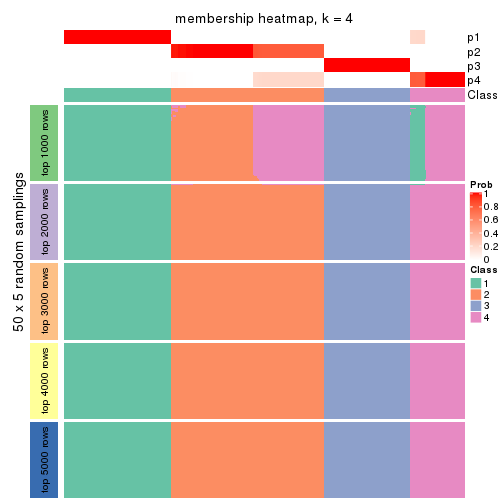</p>

</div>
<div id='tab-CV-pam-membership-heatmap-4'>
<pre><code class="r">membership_heatmap(res, k = 5)
</code></pre>

<p></p>

</div>
<div id='tab-CV-pam-membership-heatmap-5'>
<pre><code class="r">membership_heatmap(res, k = 6)
</code></pre>

<p></p>

</div>
</div>

As soon as we have had the classes for columns, we can look for signatures
which are significantly different between classes which can be candidate marks
for certain classes. Following are the heatmaps for signatures.


Signature heatmaps where rows are scaled:


<script>
$( function() {
	$( '#tabs-CV-pam-get-signatures' ).tabs();
} );
</script>
<div id='tabs-CV-pam-get-signatures'>
<ul>
<li><a href='#tab-CV-pam-get-signatures-1'>k = 2</a></li>
<li><a href='#tab-CV-pam-get-signatures-2'>k = 3</a></li>
<li><a href='#tab-CV-pam-get-signatures-3'>k = 4</a></li>
<li><a href='#tab-CV-pam-get-signatures-4'>k = 5</a></li>
<li><a href='#tab-CV-pam-get-signatures-5'>k = 6</a></li>
</ul>
<div id='tab-CV-pam-get-signatures-1'>
<pre><code class="r">get_signatures(res, k = 2)
</code></pre>

<p></p>

</div>
<div id='tab-CV-pam-get-signatures-2'>
<pre><code class="r">get_signatures(res, k = 3)
</code></pre>

<pre><code>#&gt; Error in mat[ceiling(1:nr/h_ratio), ceiling(1:nc/w_ratio), drop = FALSE]: subscript out of bounds
</code></pre>

<p></p>

</div>
<div id='tab-CV-pam-get-signatures-3'>
<pre><code class="r">get_signatures(res, k = 4)
</code></pre>

<p></p>

</div>
<div id='tab-CV-pam-get-signatures-4'>
<pre><code class="r">get_signatures(res, k = 5)
</code></pre>

<p></p>

</div>
<div id='tab-CV-pam-get-signatures-5'>
<pre><code class="r">get_signatures(res, k = 6)
</code></pre>

<p></p>

</div>
</div>


Signature heatmaps where rows are not scaled:


<script>
$( function() {
	$( '#tabs-CV-pam-get-signatures-no-scale' ).tabs();
} );
</script>
<div id='tabs-CV-pam-get-signatures-no-scale'>
<ul>
<li><a href='#tab-CV-pam-get-signatures-no-scale-1'>k = 2</a></li>
<li><a href='#tab-CV-pam-get-signatures-no-scale-2'>k = 3</a></li>
<li><a href='#tab-CV-pam-get-signatures-no-scale-3'>k = 4</a></li>
<li><a href='#tab-CV-pam-get-signatures-no-scale-4'>k = 5</a></li>
<li><a href='#tab-CV-pam-get-signatures-no-scale-5'>k = 6</a></li>
</ul>
<div id='tab-CV-pam-get-signatures-no-scale-1'>
<pre><code class="r">get_signatures(res, k = 2, scale_rows = FALSE)
</code></pre>

<p></p>

</div>
<div id='tab-CV-pam-get-signatures-no-scale-2'>
<pre><code class="r">get_signatures(res, k = 3, scale_rows = FALSE)
</code></pre>

<pre><code>#&gt; Error in mat[ceiling(1:nr/h_ratio), ceiling(1:nc/w_ratio), drop = FALSE]: subscript out of bounds
</code></pre>

<p></p>

</div>
<div id='tab-CV-pam-get-signatures-no-scale-3'>
<pre><code class="r">get_signatures(res, k = 4, scale_rows = FALSE)
</code></pre>

<p></p>

</div>
<div id='tab-CV-pam-get-signatures-no-scale-4'>
<pre><code class="r">get_signatures(res, k = 5, scale_rows = FALSE)
</code></pre>

<p></p>

</div>
<div id='tab-CV-pam-get-signatures-no-scale-5'>
<pre><code class="r">get_signatures(res, k = 6, scale_rows = FALSE)
</code></pre>

<p></p>

</div>
</div>


Compare the overlap of signatures from different k:

```r
compare_signatures(res)
```


`get_signature()` returns a data frame invisibly. TO get the list of signatures, the function
call should be assigned to a variable explicitly. In following code, if `plot` argument is set
to `FALSE`, no heatmap is plotted while only the differential analysis is performed.

```r
# code only for demonstration
tb = get_signature(res, k = ..., plot = FALSE)
```

An example of the output of `tb` is:

```
#>   which_row         fdr    mean_1    mean_2 scaled_mean_1 scaled_mean_2 km
#> 1        38 0.042760348  8.373488  9.131774    -0.5533452     0.5164555  1
#> 2        40 0.018707592  7.106213  8.469186    -0.6173731     0.5762149  1
#> 3        55 0.019134737 10.221463 11.207825    -0.6159697     0.5749050  1
#> 4        59 0.006059896  5.921854  7.869574    -0.6899429     0.6439467  1
#> 5        60 0.018055526  8.928898 10.211722    -0.6204761     0.5791110  1
#> 6        98 0.009384629 15.714769 14.887706     0.6635654    -0.6193277  2
...
```

The columns in `tb` are:

1. `which_row`: row indices corresponding to the input matrix.
2. `fdr`: FDR for the differential test. 
3. `mean_x`: The mean value in group x.
4. `scaled_mean_x`: The mean value in group x after rows are scaled.
5. `km`: Row groups if k-means clustering is applied to rows.


UMAP plot which shows how samples are separated.


<script>
$( function() {
	$( '#tabs-CV-pam-dimension-reduction' ).tabs();
} );
</script>
<div id='tabs-CV-pam-dimension-reduction'>
<ul>
<li><a href='#tab-CV-pam-dimension-reduction-1'>k = 2</a></li>
<li><a href='#tab-CV-pam-dimension-reduction-2'>k = 3</a></li>
<li><a href='#tab-CV-pam-dimension-reduction-3'>k = 4</a></li>
<li><a href='#tab-CV-pam-dimension-reduction-4'>k = 5</a></li>
<li><a href='#tab-CV-pam-dimension-reduction-5'>k = 6</a></li>
</ul>
<div id='tab-CV-pam-dimension-reduction-1'>
<pre><code class="r">dimension_reduction(res, k = 2, method = &quot;UMAP&quot;)
</code></pre>

<p></p>

</div>
<div id='tab-CV-pam-dimension-reduction-2'>
<pre><code class="r">dimension_reduction(res, k = 3, method = &quot;UMAP&quot;)
</code></pre>

<p></p>

</div>
<div id='tab-CV-pam-dimension-reduction-3'>
<pre><code class="r">dimension_reduction(res, k = 4, method = &quot;UMAP&quot;)
</code></pre>

<p></p>

</div>
<div id='tab-CV-pam-dimension-reduction-4'>
<pre><code class="r">dimension_reduction(res, k = 5, method = &quot;UMAP&quot;)
</code></pre>

<p></p>

</div>
<div id='tab-CV-pam-dimension-reduction-5'>
<pre><code class="r">dimension_reduction(res, k = 6, method = &quot;UMAP&quot;)
</code></pre>

<p></p>

</div>
</div>


Following heatmap shows how subgroups are split when increasing `k`:

```r
collect_classes(res)
```


If matrix rows can be associated to genes, consider to use `functional_enrichment(res,
...)` to perform function enrichment for the signature genes. See [this vignette](http://bioconductor.org/packages/devel/bioc/vignettes/cola/inst/doc/functional_enrichment.html) for more detailed explanations.


 

---------------------------------------------------


### CV:mclust


The object with results only for a single top-value method and a single partition method 
can be extracted as:

```r
res = res_list["CV", "mclust"]
# you can also extract it by
# res = res_list["CV:mclust"]
```

A summary of `res` and all the functions that can be applied to it:

```r
res
```

```
#> A 'ConsensusPartition' object with k = 2, 3, 4, 5, 6.
#>   On a matrix with 13278 rows and 322 columns.
#>   Top rows (1000, 2000, 3000, 4000, 5000) are extracted by 'CV' method.
#>   Subgroups are detected by 'mclust' method.
#>   Performed in total 1250 partitions by row resampling.
#>   Best k for subgroups seems to be 4.
#> 
#> Following methods can be applied to this 'ConsensusPartition' object:
#>  [1] "cola_report"             "collect_classes"         "collect_plots"          
#>  [4] "collect_stats"           "colnames"                "compare_signatures"     
#>  [7] "consensus_heatmap"       "dimension_reduction"     "functional_enrichment"  
#> [10] "get_anno_col"            "get_anno"                "get_classes"            
#> [13] "get_consensus"           "get_matrix"              "get_membership"         
#> [16] "get_param"               "get_signatures"          "get_stats"              
#> [19] "is_best_k"               "is_stable_k"             "membership_heatmap"     
#> [22] "ncol"                    "nrow"                    "plot_ecdf"              
#> [25] "rownames"                "select_partition_number" "show"                   
#> [28] "suggest_best_k"          "test_to_known_factors"
```

`collect_plots()` function collects all the plots made from `res` for all `k` (number of partitions)
into one single page to provide an easy and fast comparison between different `k`.

```r
collect_plots(res)
```


The plots are:

- The first row: a plot of the ECDF (empirical cumulative distribution
  function) curves of the consensus matrix for each `k` and the heatmap of
  predicted classes for each `k`.
- The second row: heatmaps of the consensus matrix for each `k`.
- The third row: heatmaps of the membership matrix for each `k`.
- The fouth row: heatmaps of the signatures for each `k`.

All the plots in panels can be made by individual functions and they are
plotted later in this section.

`select_partition_number()` produces several plots showing different
statistics for choosing "optimized" `k`. There are following statistics:

- ECDF curves of the consensus matrix for each `k`;
- 1-PAC. [The PAC
  score](https://en.wikipedia.org/wiki/Consensus_clustering#Over-interpretation_potential_of_consensus_clustering)
  measures the proportion of the ambiguous subgrouping.
- Mean silhouette score.
- Concordance. The mean probability of fiting the consensus class ids in all
  partitions.
- Area increased. Denote $A_k$ as the area under the ECDF curve for current
  `k`, the area increased is defined as $A_k - A_{k-1}$.
- Rand index. The percent of pairs of samples that are both in a same cluster
  or both are not in a same cluster in the partition of k and k-1.
- Jaccard index. The ratio of pairs of samples are both in a same cluster in
  the partition of k and k-1 and the pairs of samples are both in a same
  cluster in the partition k or k-1.

The detailed explanations of these statistics can be found in [the _cola_
vignette](http://bioconductor.org/packages/devel/bioc/vignettes/cola/inst/doc/cola.html#toc_13).

Generally speaking, lower PAC score, higher mean silhouette score or higher
concordance corresponds to better partition. Rand index and Jaccard index
measure how similar the current partition is compared to partition with `k-1`.
If they are too similar, we won't accept `k` is better than `k-1`.

```r
select_partition_number(res)
```


The numeric values for all these statistics can be obtained by `get_stats()`.

```r
get_stats(res)
```

```
#>   k 1-PAC mean_silhouette concordance area_increased  Rand Jaccard
#> 2 2 0.302           0.766       0.876         0.3649 0.607   0.607
#> 3 3 0.368           0.497       0.625         0.6130 0.815   0.757
#> 4 4 0.791           0.818       0.909         0.2466 0.464   0.292
#> 5 5 0.826           0.802       0.856         0.0602 0.942   0.780
#> 6 6 0.838           0.802       0.833         0.0436 0.958   0.808
```

`suggest_best_k()` suggests the best $k$ based on these statistics. The rules are as follows:

- All $k$ with Jaccard index larger than 0.95 are removed because increasing
  $k$ does not provide enough extra information. If all $k$ are removed, it is
  marked as no subgroup is detected.
- For all $k$ with 1-PAC score larger than 0.9, the maximal $k$ is taken as
  the best $k$, and other $k$ are marked as optional $k$.
- If it does not fit the second rule. The $k$ with the maximal vote of the
  highest 1-PAC score, highest mean silhouette, and highest concordance is
  taken as the best $k$.

```r
suggest_best_k(res)
```

```
#> [1] 4
```


Following shows the table of the partitions (You need to click the **show/hide
code output** link to see it). The membership matrix (columns with name `p*`)
is inferred by
[`clue::cl_consensus()`](https://www.rdocumentation.org/link/cl_consensus?package=clue)
function with the `SE` method. Basically the value in the membership matrix
represents the probability to belong to a certain group. The finall class
label for an item is determined with the group with highest probability it
belongs to.

In `get_classes()` function, the entropy is calculated from the membership
matrix and the silhouette score is calculated from the consensus matrix.


<script>
$( function() {
	$( '#tabs-CV-mclust-get-classes' ).tabs();
} );
</script>
<div id='tabs-CV-mclust-get-classes'>
<ul>
<li><a href='#tab-CV-mclust-get-classes-1'>k = 2</a></li>
<li><a href='#tab-CV-mclust-get-classes-2'>k = 3</a></li>
<li><a href='#tab-CV-mclust-get-classes-3'>k = 4</a></li>
<li><a href='#tab-CV-mclust-get-classes-4'>k = 5</a></li>
<li><a href='#tab-CV-mclust-get-classes-5'>k = 6</a></li>
</ul>

<div id='tab-CV-mclust-get-classes-1'>
<p><a id='tab-CV-mclust-get-classes-1-a' style='color:#0366d6' href='#'>show/hide code output</a></p>
<pre><code class="r">cbind(get_classes(res, k = 2), get_membership(res, k = 2))
</code></pre>

<pre><code>#&gt;           class entropy silhouette    p1    p2
#&gt; DRR023371     2  0.5737      0.793 0.136 0.864
#&gt; DRR023372     2  0.5737      0.793 0.136 0.864
#&gt; DRR023373     2  0.5737      0.793 0.136 0.864
#&gt; DRR023374     2  0.5737      0.793 0.136 0.864
#&gt; DRR023375     2  0.5737      0.793 0.136 0.864
#&gt; DRR023376     2  0.5737      0.793 0.136 0.864
#&gt; DRR023377     2  0.5737      0.793 0.136 0.864
#&gt; DRR023378     2  0.5737      0.793 0.136 0.864
#&gt; DRR023379     2  0.5737      0.793 0.136 0.864
#&gt; DRR023380     2  0.5737      0.793 0.136 0.864
#&gt; DRR023381     2  0.5737      0.793 0.136 0.864
#&gt; DRR023382     2  0.5737      0.793 0.136 0.864
#&gt; DRR023383     2  0.5737      0.793 0.136 0.864
#&gt; DRR023384     2  0.5737      0.793 0.136 0.864
#&gt; DRR023385     2  0.5737      0.793 0.136 0.864
#&gt; DRR023386     2  0.5737      0.793 0.136 0.864
#&gt; DRR023387     2  0.5737      0.793 0.136 0.864
#&gt; DRR023388     2  0.5737      0.793 0.136 0.864
#&gt; DRR023389     2  0.5737      0.793 0.136 0.864
#&gt; DRR023390     2  0.5737      0.793 0.136 0.864
#&gt; DRR023391     2  0.5737      0.793 0.136 0.864
#&gt; DRR023392     2  0.5737      0.793 0.136 0.864
#&gt; DRR023394     2  0.5737      0.793 0.136 0.864
#&gt; DRR023395     2  0.5737      0.793 0.136 0.864
#&gt; DRR023396     2  0.5737      0.793 0.136 0.864
#&gt; DRR023397     2  0.5737      0.793 0.136 0.864
#&gt; DRR023398     2  0.5737      0.793 0.136 0.864
#&gt; DRR023399     2  0.5737      0.793 0.136 0.864
#&gt; DRR023400     2  0.5737      0.793 0.136 0.864
#&gt; DRR023401     2  0.5737      0.793 0.136 0.864
#&gt; DRR023402     2  0.5737      0.793 0.136 0.864
#&gt; DRR023403     2  0.5737      0.793 0.136 0.864
#&gt; DRR023404     2  0.0672      0.849 0.008 0.992
#&gt; DRR023405     2  0.0672      0.849 0.008 0.992
#&gt; DRR023406     2  0.0672      0.849 0.008 0.992
#&gt; DRR023407     2  0.0672      0.849 0.008 0.992
#&gt; DRR023408     2  0.0672      0.849 0.008 0.992
#&gt; DRR023409     2  0.0672      0.849 0.008 0.992
#&gt; DRR023410     2  0.0672      0.849 0.008 0.992
#&gt; DRR023411     2  0.0672      0.849 0.008 0.992
#&gt; DRR023412     2  0.0672      0.849 0.008 0.992
#&gt; DRR023413     2  0.0672      0.849 0.008 0.992
#&gt; DRR023414     2  0.0672      0.849 0.008 0.992
#&gt; DRR023415     2  0.0672      0.849 0.008 0.992
#&gt; DRR023416     2  0.0672      0.849 0.008 0.992
#&gt; DRR023417     2  0.0672      0.849 0.008 0.992
#&gt; DRR023418     2  0.0672      0.849 0.008 0.992
#&gt; DRR023419     2  0.0672      0.849 0.008 0.992
#&gt; DRR023420     2  0.0672      0.849 0.008 0.992
#&gt; DRR023421     2  0.0672      0.849 0.008 0.992
#&gt; DRR023422     2  0.0672      0.849 0.008 0.992
#&gt; DRR023423     2  0.0672      0.849 0.008 0.992
#&gt; DRR023425     2  0.0672      0.849 0.008 0.992
#&gt; DRR023426     2  0.0672      0.849 0.008 0.992
#&gt; DRR023427     2  0.0672      0.849 0.008 0.992
#&gt; DRR023428     2  0.0672      0.849 0.008 0.992
#&gt; DRR023429     2  0.0672      0.849 0.008 0.992
#&gt; DRR023430     2  0.0672      0.849 0.008 0.992
#&gt; DRR023431     2  0.0672      0.849 0.008 0.992
#&gt; DRR023432     2  0.0672      0.849 0.008 0.992
#&gt; DRR023433     2  0.0672      0.849 0.008 0.992
#&gt; DRR023434     2  0.0672      0.849 0.008 0.992
#&gt; DRR023435     2  0.0672      0.849 0.008 0.992
#&gt; DRR023436     2  0.0672      0.849 0.008 0.992
#&gt; DRR023437     2  0.0672      0.849 0.008 0.992
#&gt; DRR023438     2  0.0672      0.849 0.008 0.992
#&gt; DRR023439     2  0.0672      0.849 0.008 0.992
#&gt; DRR023440     2  0.0672      0.849 0.008 0.992
#&gt; DRR023441     2  0.0672      0.849 0.008 0.992
#&gt; DRR023442     2  0.0672      0.849 0.008 0.992
#&gt; DRR023443     2  0.0672      0.849 0.008 0.992
#&gt; DRR023444     2  0.0672      0.849 0.008 0.992
#&gt; DRR023445     2  0.0672      0.849 0.008 0.992
#&gt; DRR023446     2  0.0672      0.849 0.008 0.992
#&gt; DRR023447     2  0.0672      0.849 0.008 0.992
#&gt; DRR023448     2  0.0672      0.849 0.008 0.992
#&gt; DRR023449     2  0.0672      0.849 0.008 0.992
#&gt; DRR023450     2  0.0672      0.849 0.008 0.992
#&gt; DRR023451     2  0.0672      0.849 0.008 0.992
#&gt; DRR023452     2  0.0672      0.849 0.008 0.992
#&gt; DRR023453     2  0.5737      0.793 0.136 0.864
#&gt; DRR023454     2  0.5737      0.793 0.136 0.864
#&gt; DRR023455     2  0.5737      0.793 0.136 0.864
#&gt; DRR023456     2  0.5737      0.793 0.136 0.864
#&gt; DRR023457     2  0.5737      0.793 0.136 0.864
#&gt; DRR023458     2  0.5737      0.793 0.136 0.864
#&gt; DRR023459     2  0.5737      0.793 0.136 0.864
#&gt; DRR023460     2  0.5737      0.793 0.136 0.864
#&gt; DRR023461     2  0.5737      0.793 0.136 0.864
#&gt; DRR023462     2  0.5737      0.793 0.136 0.864
#&gt; DRR023463     2  0.5737      0.793 0.136 0.864
#&gt; DRR023464     2  0.5737      0.793 0.136 0.864
#&gt; DRR023465     2  0.5737      0.793 0.136 0.864
#&gt; DRR023466     2  0.5737      0.793 0.136 0.864
#&gt; DRR023467     2  0.5737      0.793 0.136 0.864
#&gt; DRR023468     2  0.5737      0.793 0.136 0.864
#&gt; DRR023469     2  0.5737      0.793 0.136 0.864
#&gt; DRR023470     2  0.5737      0.793 0.136 0.864
#&gt; DRR023471     2  0.5737      0.793 0.136 0.864
#&gt; DRR023472     2  0.5737      0.793 0.136 0.864
#&gt; DRR023473     2  0.5737      0.793 0.136 0.864
#&gt; DRR023474     2  0.5737      0.793 0.136 0.864
#&gt; DRR023475     2  0.5737      0.793 0.136 0.864
#&gt; DRR023476     2  0.5737      0.793 0.136 0.864
#&gt; DRR023477     2  0.5737      0.793 0.136 0.864
#&gt; DRR023478     2  0.5737      0.793 0.136 0.864
#&gt; DRR023479     2  0.5737      0.793 0.136 0.864
#&gt; DRR023480     2  0.5737      0.793 0.136 0.864
#&gt; DRR023481     2  0.5737      0.793 0.136 0.864
#&gt; DRR023482     2  0.5737      0.793 0.136 0.864
#&gt; DRR023483     2  0.5737      0.793 0.136 0.864
#&gt; DRR023484     2  0.5737      0.793 0.136 0.864
#&gt; DRR023485     2  0.5737      0.793 0.136 0.864
#&gt; DRR023486     2  0.5737      0.793 0.136 0.864
#&gt; DRR023487     2  0.5737      0.793 0.136 0.864
#&gt; DRR023488     2  0.5737      0.793 0.136 0.864
#&gt; DRR023489     2  0.5737      0.793 0.136 0.864
#&gt; DRR023490     1  0.9944      0.289 0.544 0.456
#&gt; DRR023491     1  0.9944      0.289 0.544 0.456
#&gt; DRR023492     1  0.9944      0.289 0.544 0.456
#&gt; DRR023493     1  0.9944      0.289 0.544 0.456
#&gt; DRR023494     1  0.9944      0.289 0.544 0.456
#&gt; DRR023495     1  0.9944      0.289 0.544 0.456
#&gt; DRR023496     1  0.9944      0.289 0.544 0.456
#&gt; DRR023497     1  0.9944      0.289 0.544 0.456
#&gt; DRR023498     1  0.9944      0.289 0.544 0.456
#&gt; DRR023499     1  0.9944      0.289 0.544 0.456
#&gt; DRR023500     1  0.9944      0.289 0.544 0.456
#&gt; DRR023501     1  0.9944      0.289 0.544 0.456
#&gt; DRR023502     1  0.9944      0.289 0.544 0.456
#&gt; DRR023503     1  0.9944      0.289 0.544 0.456
#&gt; DRR023504     1  0.9944      0.289 0.544 0.456
#&gt; DRR023505     1  0.9944      0.289 0.544 0.456
#&gt; DRR023506     1  0.9944      0.289 0.544 0.456
#&gt; DRR023507     1  0.9944      0.289 0.544 0.456
#&gt; DRR023508     1  0.9944      0.289 0.544 0.456
#&gt; DRR023509     1  0.9944      0.289 0.544 0.456
#&gt; DRR023510     1  0.9944      0.289 0.544 0.456
#&gt; DRR023511     1  0.9944      0.289 0.544 0.456
#&gt; DRR023512     1  0.9944      0.289 0.544 0.456
#&gt; DRR023513     1  0.9944      0.289 0.544 0.456
#&gt; DRR023514     1  0.9944      0.289 0.544 0.456
#&gt; DRR023515     1  0.9944      0.289 0.544 0.456
#&gt; DRR023516     1  0.9944      0.289 0.544 0.456
#&gt; DRR023517     1  0.9944      0.289 0.544 0.456
#&gt; DRR023518     1  0.1414      0.768 0.980 0.020
#&gt; DRR023519     1  0.1414      0.768 0.980 0.020
#&gt; DRR023520     1  0.1414      0.768 0.980 0.020
#&gt; DRR023521     1  0.1414      0.768 0.980 0.020
#&gt; DRR023522     1  0.1414      0.768 0.980 0.020
#&gt; DRR023523     1  0.1414      0.768 0.980 0.020
#&gt; DRR023524     1  0.1414      0.768 0.980 0.020
#&gt; DRR023525     1  0.1414      0.768 0.980 0.020
#&gt; DRR023526     1  0.1414      0.768 0.980 0.020
#&gt; DRR023527     1  0.1414      0.768 0.980 0.020
#&gt; DRR023528     1  0.1414      0.768 0.980 0.020
#&gt; DRR023529     1  0.1414      0.768 0.980 0.020
#&gt; DRR023530     1  0.1414      0.768 0.980 0.020
#&gt; DRR023531     1  0.1414      0.768 0.980 0.020
#&gt; DRR023532     1  0.1414      0.768 0.980 0.020
#&gt; DRR023533     1  0.1414      0.768 0.980 0.020
#&gt; DRR023534     1  0.1414      0.768 0.980 0.020
#&gt; DRR023535     1  0.1414      0.768 0.980 0.020
#&gt; DRR023536     1  0.1414      0.768 0.980 0.020
#&gt; DRR023537     1  0.1414      0.768 0.980 0.020
#&gt; DRR023538     1  0.1414      0.768 0.980 0.020
#&gt; DRR023539     1  0.1414      0.768 0.980 0.020
#&gt; DRR023540     1  0.1414      0.768 0.980 0.020
#&gt; DRR023541     1  0.1414      0.768 0.980 0.020
#&gt; DRR023542     1  0.1414      0.768 0.980 0.020
#&gt; DRR023543     1  0.1414      0.768 0.980 0.020
#&gt; DRR023544     1  0.1414      0.768 0.980 0.020
#&gt; DRR023545     1  0.1414      0.768 0.980 0.020
#&gt; DRR023546     1  0.1414      0.768 0.980 0.020
#&gt; DRR023547     1  0.1414      0.768 0.980 0.020
#&gt; DRR023548     1  0.1414      0.768 0.980 0.020
#&gt; DRR023549     1  0.1414      0.768 0.980 0.020
#&gt; DRR023550     1  0.1414      0.768 0.980 0.020
#&gt; DRR023551     1  0.1414      0.768 0.980 0.020
#&gt; DRR023552     1  0.1414      0.768 0.980 0.020
#&gt; DRR023553     1  0.1414      0.768 0.980 0.020
#&gt; DRR023554     1  0.1414      0.768 0.980 0.020
#&gt; DRR023555     1  0.1414      0.768 0.980 0.020
#&gt; DRR023556     1  0.1414      0.768 0.980 0.020
#&gt; DRR023557     1  0.1414      0.768 0.980 0.020
#&gt; DRR023558     1  0.1414      0.768 0.980 0.020
#&gt; DRR023559     1  0.3879      0.748 0.924 0.076
#&gt; DRR023560     1  0.3879      0.748 0.924 0.076
#&gt; DRR023561     1  0.3879      0.748 0.924 0.076
#&gt; DRR023562     1  0.3879      0.748 0.924 0.076
#&gt; DRR023563     1  0.3879      0.748 0.924 0.076
#&gt; DRR023564     1  0.3879      0.748 0.924 0.076
#&gt; DRR023565     1  0.3879      0.748 0.924 0.076
#&gt; DRR023566     1  0.3879      0.748 0.924 0.076
#&gt; DRR023567     1  0.3879      0.748 0.924 0.076
#&gt; DRR023568     1  0.3879      0.748 0.924 0.076
#&gt; DRR023569     1  0.3879      0.748 0.924 0.076
#&gt; DRR023570     1  0.3879      0.748 0.924 0.076
#&gt; DRR023571     1  0.9866      0.334 0.568 0.432
#&gt; DRR023572     1  0.9866      0.334 0.568 0.432
#&gt; DRR023573     1  0.9866      0.334 0.568 0.432
#&gt; DRR023574     1  0.9866      0.334 0.568 0.432
#&gt; DRR023575     1  0.9866      0.334 0.568 0.432
#&gt; DRR023576     2  0.2423      0.857 0.040 0.960
#&gt; DRR023577     2  0.2423      0.857 0.040 0.960
#&gt; DRR023578     2  0.2423      0.857 0.040 0.960
#&gt; DRR023579     2  0.2423      0.857 0.040 0.960
#&gt; DRR023580     2  0.2423      0.857 0.040 0.960
#&gt; DRR023581     2  0.2423      0.857 0.040 0.960
#&gt; DRR023582     2  0.2423      0.857 0.040 0.960
#&gt; DRR023583     2  0.2423      0.857 0.040 0.960
#&gt; DRR023584     2  0.2423      0.857 0.040 0.960
#&gt; DRR023585     2  0.2423      0.857 0.040 0.960
#&gt; DRR023586     2  0.2423      0.857 0.040 0.960
#&gt; DRR023587     2  0.5629      0.845 0.132 0.868
#&gt; DRR023588     2  0.5629      0.845 0.132 0.868
#&gt; DRR023589     2  0.5629      0.845 0.132 0.868
#&gt; DRR023590     2  0.5629      0.845 0.132 0.868
#&gt; DRR023591     2  0.5629      0.845 0.132 0.868
#&gt; DRR023592     2  0.5629      0.845 0.132 0.868
#&gt; DRR023593     2  0.5629      0.845 0.132 0.868
#&gt; DRR023594     2  0.5629      0.845 0.132 0.868
#&gt; DRR023595     2  0.5629      0.845 0.132 0.868
#&gt; DRR023596     2  0.5629      0.845 0.132 0.868
#&gt; DRR023597     2  0.5629      0.845 0.132 0.868
#&gt; DRR023598     2  0.5629      0.845 0.132 0.868
#&gt; DRR023599     2  0.5629      0.845 0.132 0.868
#&gt; DRR023600     2  0.5629      0.845 0.132 0.868
#&gt; DRR023601     2  0.5629      0.845 0.132 0.868
#&gt; DRR023602     2  0.5629      0.845 0.132 0.868
#&gt; DRR023603     2  0.5629      0.845 0.132 0.868
#&gt; DRR023604     2  0.5629      0.845 0.132 0.868
#&gt; DRR023605     2  0.5629      0.845 0.132 0.868
#&gt; DRR023606     2  0.5629      0.845 0.132 0.868
#&gt; DRR023607     2  0.5629      0.845 0.132 0.868
#&gt; DRR023608     2  0.5629      0.845 0.132 0.868
#&gt; DRR023609     2  0.5629      0.845 0.132 0.868
#&gt; DRR023610     2  0.5629      0.845 0.132 0.868
#&gt; DRR023611     2  0.5629      0.845 0.132 0.868
#&gt; DRR023612     2  0.5629      0.845 0.132 0.868
#&gt; DRR023613     2  0.5629      0.845 0.132 0.868
#&gt; DRR023614     2  0.5629      0.845 0.132 0.868
#&gt; DRR023615     2  0.5629      0.845 0.132 0.868
#&gt; DRR023616     2  0.5629      0.845 0.132 0.868
#&gt; DRR023617     2  0.5629      0.845 0.132 0.868
#&gt; DRR023619     2  0.5629      0.845 0.132 0.868
#&gt; DRR023620     2  0.5629      0.845 0.132 0.868
#&gt; DRR023621     2  0.5629      0.845 0.132 0.868
#&gt; DRR023622     2  0.5629      0.845 0.132 0.868
#&gt; DRR023623     2  0.5629      0.845 0.132 0.868
#&gt; DRR023624     2  0.5629      0.845 0.132 0.868
#&gt; DRR023625     2  0.5629      0.845 0.132 0.868
#&gt; DRR023626     2  0.5629      0.845 0.132 0.868
#&gt; DRR023627     2  0.5629      0.845 0.132 0.868
#&gt; DRR023628     2  0.5629      0.845 0.132 0.868
#&gt; DRR023629     2  0.5629      0.845 0.132 0.868
#&gt; DRR023630     2  0.5629      0.845 0.132 0.868
#&gt; DRR023631     2  0.5629      0.845 0.132 0.868
#&gt; DRR023632     2  0.5629      0.845 0.132 0.868
#&gt; DRR023633     2  0.5629      0.845 0.132 0.868
#&gt; DRR023635     2  0.5629      0.845 0.132 0.868
#&gt; DRR023636     2  0.5629      0.845 0.132 0.868
#&gt; DRR023637     2  0.5629      0.845 0.132 0.868
#&gt; DRR023638     2  0.5629      0.845 0.132 0.868
#&gt; DRR023639     2  0.5629      0.845 0.132 0.868
#&gt; DRR023640     2  0.5629      0.845 0.132 0.868
#&gt; DRR023641     2  0.5629      0.845 0.132 0.868
#&gt; DRR023642     2  0.5629      0.845 0.132 0.868
#&gt; DRR023643     2  0.0938      0.854 0.012 0.988
#&gt; DRR023644     2  0.0938      0.854 0.012 0.988
#&gt; DRR023645     2  0.0938      0.854 0.012 0.988
#&gt; DRR023646     2  0.0938      0.854 0.012 0.988
#&gt; DRR023647     2  0.0938      0.854 0.012 0.988
#&gt; DRR023648     2  0.0672      0.853 0.008 0.992
#&gt; DRR023649     2  0.1184      0.855 0.016 0.984
#&gt; DRR023650     2  0.5629      0.845 0.132 0.868
#&gt; DRR023651     2  0.5629      0.845 0.132 0.868
#&gt; DRR023652     2  0.5629      0.845 0.132 0.868
#&gt; DRR023653     2  0.5629      0.845 0.132 0.868
#&gt; DRR023654     2  0.5629      0.845 0.132 0.868
#&gt; DRR023655     2  0.5629      0.845 0.132 0.868
#&gt; DRR023656     2  0.5629      0.845 0.132 0.868
#&gt; DRR023657     2  0.5629      0.845 0.132 0.868
#&gt; DRR023658     2  0.5629      0.845 0.132 0.868
#&gt; DRR023659     2  0.5629      0.845 0.132 0.868
#&gt; DRR023660     2  0.5629      0.845 0.132 0.868
#&gt; DRR023661     2  0.5629      0.845 0.132 0.868
#&gt; DRR023662     2  0.5629      0.845 0.132 0.868
#&gt; DRR023663     2  0.5629      0.845 0.132 0.868
#&gt; DRR023664     2  0.5629      0.845 0.132 0.868
#&gt; DRR023665     2  0.5629      0.845 0.132 0.868
#&gt; DRR023666     2  0.5629      0.845 0.132 0.868
#&gt; DRR023667     2  0.5629      0.845 0.132 0.868
#&gt; DRR023668     2  0.5629      0.845 0.132 0.868
#&gt; DRR023669     2  0.5629      0.845 0.132 0.868
#&gt; DRR023670     2  0.5629      0.845 0.132 0.868
#&gt; DRR023671     2  0.5629      0.845 0.132 0.868
#&gt; DRR023672     2  0.5629      0.845 0.132 0.868
#&gt; DRR023673     2  0.5629      0.845 0.132 0.868
#&gt; DRR023674     2  0.5629      0.845 0.132 0.868
#&gt; DRR023675     2  0.5629      0.845 0.132 0.868
#&gt; DRR023676     2  0.5629      0.845 0.132 0.868
#&gt; DRR023677     2  0.5629      0.845 0.132 0.868
#&gt; DRR023678     2  0.5629      0.845 0.132 0.868
#&gt; DRR023683     2  0.5059      0.851 0.112 0.888
#&gt; DRR023684     2  0.5059      0.851 0.112 0.888
#&gt; DRR023685     2  0.5059      0.851 0.112 0.888
#&gt; DRR023686     2  0.5059      0.851 0.112 0.888
#&gt; DRR023687     2  0.5059      0.851 0.112 0.888
#&gt; DRR023688     2  0.5059      0.851 0.112 0.888
#&gt; DRR023689     2  0.5059      0.851 0.112 0.888
#&gt; DRR023690     2  0.5059      0.851 0.112 0.888
#&gt; DRR023691     2  0.5059      0.851 0.112 0.888
#&gt; DRR023692     2  0.5059      0.851 0.112 0.888
#&gt; DRR023693     2  0.5059      0.851 0.112 0.888
#&gt; DRR023694     2  0.5059      0.851 0.112 0.888
#&gt; DRR023695     2  0.5059      0.851 0.112 0.888
#&gt; DRR023696     2  0.5059      0.851 0.112 0.888
#&gt; DRR023697     2  0.5059      0.851 0.112 0.888
#&gt; DRR023698     2  0.5059      0.851 0.112 0.888
#&gt; DRR023699     2  0.5059      0.851 0.112 0.888
#&gt; DRR023700     2  0.5059      0.851 0.112 0.888
</code></pre>

<script>
$('#tab-CV-mclust-get-classes-1-a').parent().next().next().hide();
$('#tab-CV-mclust-get-classes-1-a').click(function(){
  $('#tab-CV-mclust-get-classes-1-a').parent().next().next().toggle();
  return(false);
});
</script>
</div>

<div id='tab-CV-mclust-get-classes-2'>
<p><a id='tab-CV-mclust-get-classes-2-a' style='color:#0366d6' href='#'>show/hide code output</a></p>
<pre><code class="r">cbind(get_classes(res, k = 3), get_membership(res, k = 3))
</code></pre>

<pre><code>#&gt;           class entropy silhouette    p1    p2 p3
#&gt; DRR023371     2   0.615     0.4303 0.408 0.592 NA
#&gt; DRR023372     2   0.615     0.4303 0.408 0.592 NA
#&gt; DRR023373     2   0.615     0.4303 0.408 0.592 NA
#&gt; DRR023374     2   0.615     0.4303 0.408 0.592 NA
#&gt; DRR023375     2   0.615     0.4303 0.408 0.592 NA
#&gt; DRR023376     2   0.615     0.4303 0.408 0.592 NA
#&gt; DRR023377     2   0.615     0.4303 0.408 0.592 NA
#&gt; DRR023378     2   0.615     0.4303 0.408 0.592 NA
#&gt; DRR023379     2   0.615     0.4303 0.408 0.592 NA
#&gt; DRR023380     2   0.615     0.4303 0.408 0.592 NA
#&gt; DRR023381     2   0.615     0.4303 0.408 0.592 NA
#&gt; DRR023382     2   0.615     0.4303 0.408 0.592 NA
#&gt; DRR023383     2   0.615     0.4303 0.408 0.592 NA
#&gt; DRR023384     2   0.615     0.4303 0.408 0.592 NA
#&gt; DRR023385     2   0.615     0.4303 0.408 0.592 NA
#&gt; DRR023386     2   0.615     0.4303 0.408 0.592 NA
#&gt; DRR023387     2   0.615     0.4303 0.408 0.592 NA
#&gt; DRR023388     2   0.615     0.4303 0.408 0.592 NA
#&gt; DRR023389     2   0.615     0.4303 0.408 0.592 NA
#&gt; DRR023390     2   0.615     0.4303 0.408 0.592 NA
#&gt; DRR023391     2   0.615     0.4303 0.408 0.592 NA
#&gt; DRR023392     2   0.615     0.4303 0.408 0.592 NA
#&gt; DRR023394     2   0.615     0.4303 0.408 0.592 NA
#&gt; DRR023395     2   0.615     0.4303 0.408 0.592 NA
#&gt; DRR023396     2   0.615     0.4303 0.408 0.592 NA
#&gt; DRR023397     2   0.615     0.4303 0.408 0.592 NA
#&gt; DRR023398     2   0.615     0.4303 0.408 0.592 NA
#&gt; DRR023399     2   0.615     0.4303 0.408 0.592 NA
#&gt; DRR023400     2   0.615     0.4303 0.408 0.592 NA
#&gt; DRR023401     2   0.615     0.4303 0.408 0.592 NA
#&gt; DRR023402     2   0.615     0.4303 0.408 0.592 NA
#&gt; DRR023403     2   0.615     0.4303 0.408 0.592 NA
#&gt; DRR023404     2   0.642     0.4269 0.004 0.572 NA
#&gt; DRR023405     2   0.642     0.4269 0.004 0.572 NA
#&gt; DRR023406     2   0.642     0.4269 0.004 0.572 NA
#&gt; DRR023407     2   0.642     0.4269 0.004 0.572 NA
#&gt; DRR023408     2   0.642     0.4269 0.004 0.572 NA
#&gt; DRR023409     2   0.642     0.4269 0.004 0.572 NA
#&gt; DRR023410     2   0.642     0.4269 0.004 0.572 NA
#&gt; DRR023411     2   0.642     0.4269 0.004 0.572 NA
#&gt; DRR023412     2   0.642     0.4269 0.004 0.572 NA
#&gt; DRR023413     2   0.642     0.4269 0.004 0.572 NA
#&gt; DRR023414     2   0.642     0.4269 0.004 0.572 NA
#&gt; DRR023415     2   0.642     0.4269 0.004 0.572 NA
#&gt; DRR023416     2   0.642     0.4269 0.004 0.572 NA
#&gt; DRR023417     2   0.642     0.4269 0.004 0.572 NA
#&gt; DRR023418     2   0.642     0.4269 0.004 0.572 NA
#&gt; DRR023419     2   0.642     0.4269 0.004 0.572 NA
#&gt; DRR023420     2   0.642     0.4269 0.004 0.572 NA
#&gt; DRR023421     2   0.642     0.4269 0.004 0.572 NA
#&gt; DRR023422     2   0.642     0.4269 0.004 0.572 NA
#&gt; DRR023423     2   0.642     0.4269 0.004 0.572 NA
#&gt; DRR023425     2   0.642     0.4269 0.004 0.572 NA
#&gt; DRR023426     2   0.642     0.4269 0.004 0.572 NA
#&gt; DRR023427     2   0.642     0.4269 0.004 0.572 NA
#&gt; DRR023428     2   0.642     0.4269 0.004 0.572 NA
#&gt; DRR023429     2   0.642     0.4269 0.004 0.572 NA
#&gt; DRR023430     2   0.642     0.4269 0.004 0.572 NA
#&gt; DRR023431     2   0.642     0.4269 0.004 0.572 NA
#&gt; DRR023432     2   0.642     0.4269 0.004 0.572 NA
#&gt; DRR023433     2   0.642     0.4269 0.004 0.572 NA
#&gt; DRR023434     2   0.642     0.4269 0.004 0.572 NA
#&gt; DRR023435     2   0.642     0.4269 0.004 0.572 NA
#&gt; DRR023436     2   0.642     0.4269 0.004 0.572 NA
#&gt; DRR023437     2   0.642     0.4269 0.004 0.572 NA
#&gt; DRR023438     2   0.642     0.4269 0.004 0.572 NA
#&gt; DRR023439     2   0.642     0.4269 0.004 0.572 NA
#&gt; DRR023440     2   0.642     0.4269 0.004 0.572 NA
#&gt; DRR023441     2   0.642     0.4269 0.004 0.572 NA
#&gt; DRR023442     2   0.642     0.4269 0.004 0.572 NA
#&gt; DRR023443     2   0.642     0.4269 0.004 0.572 NA
#&gt; DRR023444     2   0.642     0.4269 0.004 0.572 NA
#&gt; DRR023445     2   0.642     0.4269 0.004 0.572 NA
#&gt; DRR023446     2   0.642     0.4269 0.004 0.572 NA
#&gt; DRR023447     2   0.642     0.4269 0.004 0.572 NA
#&gt; DRR023448     2   0.642     0.4269 0.004 0.572 NA
#&gt; DRR023449     2   0.642     0.4269 0.004 0.572 NA
#&gt; DRR023450     2   0.642     0.4269 0.004 0.572 NA
#&gt; DRR023451     2   0.642     0.4269 0.004 0.572 NA
#&gt; DRR023452     2   0.642     0.4269 0.004 0.572 NA
#&gt; DRR023453     2   0.615     0.4303 0.408 0.592 NA
#&gt; DRR023454     2   0.615     0.4303 0.408 0.592 NA
#&gt; DRR023455     2   0.615     0.4303 0.408 0.592 NA
#&gt; DRR023456     2   0.615     0.4303 0.408 0.592 NA
#&gt; DRR023457     2   0.615     0.4303 0.408 0.592 NA
#&gt; DRR023458     2   0.615     0.4303 0.408 0.592 NA
#&gt; DRR023459     2   0.615     0.4303 0.408 0.592 NA
#&gt; DRR023460     2   0.615     0.4303 0.408 0.592 NA
#&gt; DRR023461     2   0.615     0.4303 0.408 0.592 NA
#&gt; DRR023462     2   0.615     0.4303 0.408 0.592 NA
#&gt; DRR023463     2   0.615     0.4303 0.408 0.592 NA
#&gt; DRR023464     2   0.615     0.4303 0.408 0.592 NA
#&gt; DRR023465     2   0.615     0.4303 0.408 0.592 NA
#&gt; DRR023466     2   0.615     0.4303 0.408 0.592 NA
#&gt; DRR023467     2   0.615     0.4303 0.408 0.592 NA
#&gt; DRR023468     2   0.615     0.4303 0.408 0.592 NA
#&gt; DRR023469     2   0.615     0.4303 0.408 0.592 NA
#&gt; DRR023470     2   0.615     0.4303 0.408 0.592 NA
#&gt; DRR023471     2   0.615     0.4303 0.408 0.592 NA
#&gt; DRR023472     2   0.615     0.4303 0.408 0.592 NA
#&gt; DRR023473     2   0.615     0.4303 0.408 0.592 NA
#&gt; DRR023474     2   0.615     0.4303 0.408 0.592 NA
#&gt; DRR023475     2   0.615     0.4303 0.408 0.592 NA
#&gt; DRR023476     2   0.615     0.4303 0.408 0.592 NA
#&gt; DRR023477     2   0.615     0.4303 0.408 0.592 NA
#&gt; DRR023478     2   0.615     0.4303 0.408 0.592 NA
#&gt; DRR023479     2   0.615     0.4303 0.408 0.592 NA
#&gt; DRR023480     2   0.615     0.4303 0.408 0.592 NA
#&gt; DRR023481     2   0.615     0.4303 0.408 0.592 NA
#&gt; DRR023482     2   0.615     0.4303 0.408 0.592 NA
#&gt; DRR023483     2   0.615     0.4303 0.408 0.592 NA
#&gt; DRR023484     2   0.615     0.4303 0.408 0.592 NA
#&gt; DRR023485     2   0.615     0.4303 0.408 0.592 NA
#&gt; DRR023486     2   0.615     0.4303 0.408 0.592 NA
#&gt; DRR023487     2   0.615     0.4303 0.408 0.592 NA
#&gt; DRR023488     2   0.615     0.4303 0.408 0.592 NA
#&gt; DRR023489     2   0.615     0.4303 0.408 0.592 NA
#&gt; DRR023490     2   0.953    -0.0830 0.212 0.472 NA
#&gt; DRR023491     2   0.953    -0.0830 0.212 0.472 NA
#&gt; DRR023492     2   0.953    -0.0830 0.212 0.472 NA
#&gt; DRR023493     2   0.953    -0.0830 0.212 0.472 NA
#&gt; DRR023494     2   0.953    -0.0830 0.212 0.472 NA
#&gt; DRR023495     2   0.953    -0.0830 0.212 0.472 NA
#&gt; DRR023496     2   0.953    -0.0830 0.212 0.472 NA
#&gt; DRR023497     2   0.953    -0.0830 0.212 0.472 NA
#&gt; DRR023498     2   0.953    -0.0830 0.212 0.472 NA
#&gt; DRR023499     2   0.953    -0.0830 0.212 0.472 NA
#&gt; DRR023500     2   0.953    -0.0830 0.212 0.472 NA
#&gt; DRR023501     2   0.953    -0.0830 0.212 0.472 NA
#&gt; DRR023502     2   0.953    -0.0830 0.212 0.472 NA
#&gt; DRR023503     2   0.953    -0.0830 0.212 0.472 NA
#&gt; DRR023504     2   0.953    -0.0830 0.212 0.472 NA
#&gt; DRR023505     2   0.953    -0.0830 0.212 0.472 NA
#&gt; DRR023506     2   0.953    -0.0830 0.212 0.472 NA
#&gt; DRR023507     2   0.953    -0.0830 0.212 0.472 NA
#&gt; DRR023508     2   0.950    -0.0681 0.212 0.480 NA
#&gt; DRR023509     2   0.953    -0.0830 0.212 0.472 NA
#&gt; DRR023510     2   0.953    -0.0830 0.212 0.472 NA
#&gt; DRR023511     2   0.953    -0.0830 0.212 0.472 NA
#&gt; DRR023512     2   0.953    -0.0830 0.212 0.472 NA
#&gt; DRR023513     2   0.953    -0.0830 0.212 0.472 NA
#&gt; DRR023514     2   0.953    -0.0830 0.212 0.472 NA
#&gt; DRR023515     2   0.953    -0.0830 0.212 0.472 NA
#&gt; DRR023516     2   0.953    -0.0830 0.212 0.472 NA
#&gt; DRR023517     2   0.953    -0.0830 0.212 0.472 NA
#&gt; DRR023518     1   0.677     0.9267 0.592 0.016 NA
#&gt; DRR023519     1   0.677     0.9267 0.592 0.016 NA
#&gt; DRR023520     1   0.677     0.9267 0.592 0.016 NA
#&gt; DRR023521     1   0.677     0.9267 0.592 0.016 NA
#&gt; DRR023522     1   0.677     0.9267 0.592 0.016 NA
#&gt; DRR023523     1   0.677     0.9267 0.592 0.016 NA
#&gt; DRR023524     1   0.677     0.9267 0.592 0.016 NA
#&gt; DRR023525     1   0.677     0.9267 0.592 0.016 NA
#&gt; DRR023526     1   0.677     0.9267 0.592 0.016 NA
#&gt; DRR023527     1   0.677     0.9267 0.592 0.016 NA
#&gt; DRR023528     1   0.677     0.9267 0.592 0.016 NA
#&gt; DRR023529     1   0.677     0.9267 0.592 0.016 NA
#&gt; DRR023530     1   0.677     0.9267 0.592 0.016 NA
#&gt; DRR023531     1   0.677     0.9267 0.592 0.016 NA
#&gt; DRR023532     1   0.677     0.9267 0.592 0.016 NA
#&gt; DRR023533     1   0.677     0.9267 0.592 0.016 NA
#&gt; DRR023534     1   0.677     0.9267 0.592 0.016 NA
#&gt; DRR023535     1   0.677     0.9267 0.592 0.016 NA
#&gt; DRR023536     1   0.677     0.9267 0.592 0.016 NA
#&gt; DRR023537     1   0.677     0.9267 0.592 0.016 NA
#&gt; DRR023538     1   0.677     0.9267 0.592 0.016 NA
#&gt; DRR023539     1   0.677     0.9267 0.592 0.016 NA
#&gt; DRR023540     1   0.677     0.9267 0.592 0.016 NA
#&gt; DRR023541     1   0.677     0.9267 0.592 0.016 NA
#&gt; DRR023542     1   0.677     0.9267 0.592 0.016 NA
#&gt; DRR023543     1   0.677     0.9267 0.592 0.016 NA
#&gt; DRR023544     1   0.677     0.9267 0.592 0.016 NA
#&gt; DRR023545     1   0.677     0.9267 0.592 0.016 NA
#&gt; DRR023546     1   0.677     0.9267 0.592 0.016 NA
#&gt; DRR023547     1   0.677     0.9267 0.592 0.016 NA
#&gt; DRR023548     1   0.677     0.9267 0.592 0.016 NA
#&gt; DRR023549     1   0.677     0.9267 0.592 0.016 NA
#&gt; DRR023550     1   0.677     0.9267 0.592 0.016 NA
#&gt; DRR023551     1   0.677     0.9267 0.592 0.016 NA
#&gt; DRR023552     1   0.677     0.9267 0.592 0.016 NA
#&gt; DRR023553     1   0.677     0.9267 0.592 0.016 NA
#&gt; DRR023554     1   0.677     0.9267 0.592 0.016 NA
#&gt; DRR023555     1   0.677     0.9267 0.592 0.016 NA
#&gt; DRR023556     1   0.677     0.9267 0.592 0.016 NA
#&gt; DRR023557     1   0.677     0.9267 0.592 0.016 NA
#&gt; DRR023558     1   0.688     0.9233 0.592 0.020 NA
#&gt; DRR023559     1   0.974     0.6899 0.448 0.272 NA
#&gt; DRR023560     1   0.974     0.6899 0.448 0.272 NA
#&gt; DRR023561     1   0.974     0.6899 0.448 0.272 NA
#&gt; DRR023562     1   0.974     0.6899 0.448 0.272 NA
#&gt; DRR023563     1   0.974     0.6899 0.448 0.272 NA
#&gt; DRR023564     1   0.974     0.6899 0.448 0.272 NA
#&gt; DRR023565     1   0.974     0.6899 0.448 0.272 NA
#&gt; DRR023566     1   0.974     0.6899 0.448 0.272 NA
#&gt; DRR023567     1   0.974     0.6899 0.448 0.272 NA
#&gt; DRR023568     1   0.974     0.6899 0.448 0.272 NA
#&gt; DRR023569     1   0.974     0.6899 0.448 0.272 NA
#&gt; DRR023570     1   0.974     0.6899 0.448 0.272 NA
#&gt; DRR023571     2   0.843     0.1034 0.176 0.620 NA
#&gt; DRR023572     2   0.843     0.1034 0.176 0.620 NA
#&gt; DRR023573     2   0.843     0.1034 0.176 0.620 NA
#&gt; DRR023574     2   0.843     0.1034 0.176 0.620 NA
#&gt; DRR023575     2   0.843     0.1034 0.176 0.620 NA
#&gt; DRR023576     2   0.518     0.5143 0.000 0.744 NA
#&gt; DRR023577     2   0.518     0.5143 0.000 0.744 NA
#&gt; DRR023578     2   0.518     0.5143 0.000 0.744 NA
#&gt; DRR023579     2   0.518     0.5143 0.000 0.744 NA
#&gt; DRR023580     2   0.518     0.5143 0.000 0.744 NA
#&gt; DRR023581     2   0.518     0.5143 0.000 0.744 NA
#&gt; DRR023582     2   0.518     0.5143 0.000 0.744 NA
#&gt; DRR023583     2   0.518     0.5143 0.000 0.744 NA
#&gt; DRR023584     2   0.518     0.5143 0.000 0.744 NA
#&gt; DRR023585     2   0.518     0.5143 0.000 0.744 NA
#&gt; DRR023586     2   0.518     0.5143 0.000 0.744 NA
#&gt; DRR023587     2   0.435     0.5759 0.000 0.816 NA
#&gt; DRR023588     2   0.435     0.5759 0.000 0.816 NA
#&gt; DRR023589     2   0.435     0.5759 0.000 0.816 NA
#&gt; DRR023590     2   0.435     0.5759 0.000 0.816 NA
#&gt; DRR023591     2   0.435     0.5759 0.000 0.816 NA
#&gt; DRR023592     2   0.435     0.5759 0.000 0.816 NA
#&gt; DRR023593     2   0.435     0.5759 0.000 0.816 NA
#&gt; DRR023594     2   0.435     0.5759 0.000 0.816 NA
#&gt; DRR023595     2   0.435     0.5759 0.000 0.816 NA
#&gt; DRR023596     2   0.435     0.5759 0.000 0.816 NA
#&gt; DRR023597     2   0.435     0.5759 0.000 0.816 NA
#&gt; DRR023598     2   0.435     0.5759 0.000 0.816 NA
#&gt; DRR023599     2   0.435     0.5759 0.000 0.816 NA
#&gt; DRR023600     2   0.435     0.5759 0.000 0.816 NA
#&gt; DRR023601     2   0.435     0.5759 0.000 0.816 NA
#&gt; DRR023602     2   0.435     0.5759 0.000 0.816 NA
#&gt; DRR023603     2   0.435     0.5759 0.000 0.816 NA
#&gt; DRR023604     2   0.435     0.5759 0.000 0.816 NA
#&gt; DRR023605     2   0.435     0.5759 0.000 0.816 NA
#&gt; DRR023606     2   0.435     0.5759 0.000 0.816 NA
#&gt; DRR023607     2   0.435     0.5759 0.000 0.816 NA
#&gt; DRR023608     2   0.435     0.5759 0.000 0.816 NA
#&gt; DRR023609     2   0.435     0.5759 0.000 0.816 NA
#&gt; DRR023610     2   0.435     0.5759 0.000 0.816 NA
#&gt; DRR023611     2   0.435     0.5759 0.000 0.816 NA
#&gt; DRR023612     2   0.435     0.5759 0.000 0.816 NA
#&gt; DRR023613     2   0.435     0.5759 0.000 0.816 NA
#&gt; DRR023614     2   0.435     0.5759 0.000 0.816 NA
#&gt; DRR023615     2   0.435     0.5759 0.000 0.816 NA
#&gt; DRR023616     2   0.435     0.5759 0.000 0.816 NA
#&gt; DRR023617     2   0.435     0.5759 0.000 0.816 NA
#&gt; DRR023619     2   0.440     0.5749 0.000 0.812 NA
#&gt; DRR023620     2   0.440     0.5749 0.000 0.812 NA
#&gt; DRR023621     2   0.440     0.5749 0.000 0.812 NA
#&gt; DRR023622     2   0.440     0.5749 0.000 0.812 NA
#&gt; DRR023623     2   0.440     0.5749 0.000 0.812 NA
#&gt; DRR023624     2   0.440     0.5749 0.000 0.812 NA
#&gt; DRR023625     2   0.440     0.5749 0.000 0.812 NA
#&gt; DRR023626     2   0.440     0.5749 0.000 0.812 NA
#&gt; DRR023627     2   0.440     0.5749 0.000 0.812 NA
#&gt; DRR023628     2   0.440     0.5749 0.000 0.812 NA
#&gt; DRR023629     2   0.440     0.5749 0.000 0.812 NA
#&gt; DRR023630     2   0.440     0.5749 0.000 0.812 NA
#&gt; DRR023631     2   0.440     0.5749 0.000 0.812 NA
#&gt; DRR023632     2   0.440     0.5749 0.000 0.812 NA
#&gt; DRR023633     2   0.440     0.5749 0.000 0.812 NA
#&gt; DRR023635     2   0.606     0.5185 0.000 0.616 NA
#&gt; DRR023636     2   0.606     0.5185 0.000 0.616 NA
#&gt; DRR023637     2   0.606     0.5185 0.000 0.616 NA
#&gt; DRR023638     2   0.606     0.5185 0.000 0.616 NA
#&gt; DRR023639     2   0.606     0.5185 0.000 0.616 NA
#&gt; DRR023640     2   0.606     0.5185 0.000 0.616 NA
#&gt; DRR023641     2   0.606     0.5185 0.000 0.616 NA
#&gt; DRR023642     2   0.606     0.5185 0.000 0.616 NA
#&gt; DRR023643     2   0.536     0.5066 0.000 0.724 NA
#&gt; DRR023644     2   0.536     0.5066 0.000 0.724 NA
#&gt; DRR023645     2   0.536     0.5066 0.000 0.724 NA
#&gt; DRR023646     2   0.536     0.5066 0.000 0.724 NA
#&gt; DRR023647     2   0.536     0.5066 0.000 0.724 NA
#&gt; DRR023648     2   0.536     0.5066 0.000 0.724 NA
#&gt; DRR023649     2   0.529     0.5091 0.000 0.732 NA
#&gt; DRR023650     2   0.440     0.5749 0.000 0.812 NA
#&gt; DRR023651     2   0.440     0.5749 0.000 0.812 NA
#&gt; DRR023652     2   0.440     0.5749 0.000 0.812 NA
#&gt; DRR023653     2   0.440     0.5749 0.000 0.812 NA
#&gt; DRR023654     2   0.440     0.5749 0.000 0.812 NA
#&gt; DRR023655     2   0.440     0.5749 0.000 0.812 NA
#&gt; DRR023656     2   0.440     0.5749 0.000 0.812 NA
#&gt; DRR023657     2   0.440     0.5749 0.000 0.812 NA
#&gt; DRR023658     2   0.440     0.5749 0.000 0.812 NA
#&gt; DRR023659     2   0.440     0.5749 0.000 0.812 NA
#&gt; DRR023660     2   0.440     0.5749 0.000 0.812 NA
#&gt; DRR023661     2   0.440     0.5749 0.000 0.812 NA
#&gt; DRR023662     2   0.440     0.5749 0.000 0.812 NA
#&gt; DRR023663     2   0.440     0.5749 0.000 0.812 NA
#&gt; DRR023664     2   0.440     0.5749 0.000 0.812 NA
#&gt; DRR023665     2   0.440     0.5749 0.000 0.812 NA
#&gt; DRR023666     2   0.440     0.5749 0.000 0.812 NA
#&gt; DRR023667     2   0.440     0.5749 0.000 0.812 NA
#&gt; DRR023668     2   0.440     0.5749 0.000 0.812 NA
#&gt; DRR023669     2   0.440     0.5749 0.000 0.812 NA
#&gt; DRR023670     2   0.440     0.5749 0.000 0.812 NA
#&gt; DRR023671     2   0.440     0.5749 0.000 0.812 NA
#&gt; DRR023672     2   0.440     0.5749 0.000 0.812 NA
#&gt; DRR023673     2   0.440     0.5749 0.000 0.812 NA
#&gt; DRR023674     2   0.440     0.5749 0.000 0.812 NA
#&gt; DRR023675     2   0.440     0.5749 0.000 0.812 NA
#&gt; DRR023676     2   0.440     0.5749 0.000 0.812 NA
#&gt; DRR023677     2   0.440     0.5749 0.000 0.812 NA
#&gt; DRR023678     2   0.440     0.5749 0.000 0.812 NA
#&gt; DRR023683     2   0.628     0.4989 0.000 0.540 NA
#&gt; DRR023684     2   0.628     0.4989 0.000 0.540 NA
#&gt; DRR023685     2   0.628     0.4989 0.000 0.540 NA
#&gt; DRR023686     2   0.628     0.4989 0.000 0.540 NA
#&gt; DRR023687     2   0.628     0.4989 0.000 0.540 NA
#&gt; DRR023688     2   0.628     0.4989 0.000 0.540 NA
#&gt; DRR023689     2   0.628     0.4989 0.000 0.540 NA
#&gt; DRR023690     2   0.628     0.4989 0.000 0.540 NA
#&gt; DRR023691     2   0.628     0.4989 0.000 0.540 NA
#&gt; DRR023692     2   0.628     0.4989 0.000 0.540 NA
#&gt; DRR023693     2   0.628     0.4989 0.000 0.540 NA
#&gt; DRR023694     2   0.628     0.4989 0.000 0.540 NA
#&gt; DRR023695     2   0.628     0.4989 0.000 0.540 NA
#&gt; DRR023696     2   0.628     0.4989 0.000 0.540 NA
#&gt; DRR023697     2   0.628     0.4989 0.000 0.540 NA
#&gt; DRR023698     2   0.628     0.4989 0.000 0.540 NA
#&gt; DRR023699     2   0.628     0.4989 0.000 0.540 NA
#&gt; DRR023700     2   0.628     0.4989 0.000 0.540 NA
</code></pre>

<script>
$('#tab-CV-mclust-get-classes-2-a').parent().next().next().hide();
$('#tab-CV-mclust-get-classes-2-a').click(function(){
  $('#tab-CV-mclust-get-classes-2-a').parent().next().next().toggle();
  return(false);
});
</script>
</div>

<div id='tab-CV-mclust-get-classes-3'>
<p><a id='tab-CV-mclust-get-classes-3-a' style='color:#0366d6' href='#'>show/hide code output</a></p>
<pre><code class="r">cbind(get_classes(res, k = 4), get_membership(res, k = 4))
</code></pre>

<pre><code>#&gt;           class entropy silhouette    p1    p2 p3    p4
#&gt; DRR023371     3  0.0000      1.000 0.000 0.000  1 0.000
#&gt; DRR023372     3  0.0000      1.000 0.000 0.000  1 0.000
#&gt; DRR023373     3  0.0000      1.000 0.000 0.000  1 0.000
#&gt; DRR023374     3  0.0000      1.000 0.000 0.000  1 0.000
#&gt; DRR023375     3  0.0000      1.000 0.000 0.000  1 0.000
#&gt; DRR023376     3  0.0000      1.000 0.000 0.000  1 0.000
#&gt; DRR023377     3  0.0000      1.000 0.000 0.000  1 0.000
#&gt; DRR023378     3  0.0000      1.000 0.000 0.000  1 0.000
#&gt; DRR023379     3  0.0000      1.000 0.000 0.000  1 0.000
#&gt; DRR023380     3  0.0000      1.000 0.000 0.000  1 0.000
#&gt; DRR023381     3  0.0000      1.000 0.000 0.000  1 0.000
#&gt; DRR023382     3  0.0000      1.000 0.000 0.000  1 0.000
#&gt; DRR023383     3  0.0000      1.000 0.000 0.000  1 0.000
#&gt; DRR023384     3  0.0000      1.000 0.000 0.000  1 0.000
#&gt; DRR023385     3  0.0000      1.000 0.000 0.000  1 0.000
#&gt; DRR023386     3  0.0000      1.000 0.000 0.000  1 0.000
#&gt; DRR023387     3  0.0000      1.000 0.000 0.000  1 0.000
#&gt; DRR023388     3  0.0000      1.000 0.000 0.000  1 0.000
#&gt; DRR023389     3  0.0000      1.000 0.000 0.000  1 0.000
#&gt; DRR023390     3  0.0000      1.000 0.000 0.000  1 0.000
#&gt; DRR023391     3  0.0000      1.000 0.000 0.000  1 0.000
#&gt; DRR023392     3  0.0000      1.000 0.000 0.000  1 0.000
#&gt; DRR023394     3  0.0000      1.000 0.000 0.000  1 0.000
#&gt; DRR023395     3  0.0000      1.000 0.000 0.000  1 0.000
#&gt; DRR023396     3  0.0000      1.000 0.000 0.000  1 0.000
#&gt; DRR023397     3  0.0000      1.000 0.000 0.000  1 0.000
#&gt; DRR023398     3  0.0000      1.000 0.000 0.000  1 0.000
#&gt; DRR023399     3  0.0000      1.000 0.000 0.000  1 0.000
#&gt; DRR023400     3  0.0000      1.000 0.000 0.000  1 0.000
#&gt; DRR023401     3  0.0000      1.000 0.000 0.000  1 0.000
#&gt; DRR023402     3  0.0000      1.000 0.000 0.000  1 0.000
#&gt; DRR023403     3  0.0000      1.000 0.000 0.000  1 0.000
#&gt; DRR023404     2  0.0336      0.928 0.000 0.992  0 0.008
#&gt; DRR023405     2  0.0336      0.928 0.000 0.992  0 0.008
#&gt; DRR023406     2  0.0336      0.928 0.000 0.992  0 0.008
#&gt; DRR023407     2  0.0336      0.928 0.000 0.992  0 0.008
#&gt; DRR023408     2  0.0336      0.928 0.000 0.992  0 0.008
#&gt; DRR023409     2  0.0336      0.928 0.000 0.992  0 0.008
#&gt; DRR023410     2  0.0336      0.928 0.000 0.992  0 0.008
#&gt; DRR023411     2  0.0336      0.928 0.000 0.992  0 0.008
#&gt; DRR023412     2  0.0336      0.928 0.000 0.992  0 0.008
#&gt; DRR023413     2  0.0336      0.928 0.000 0.992  0 0.008
#&gt; DRR023414     2  0.0336      0.928 0.000 0.992  0 0.008
#&gt; DRR023415     2  0.0336      0.928 0.000 0.992  0 0.008
#&gt; DRR023416     2  0.0336      0.928 0.000 0.992  0 0.008
#&gt; DRR023417     2  0.0336      0.928 0.000 0.992  0 0.008
#&gt; DRR023418     2  0.0336      0.928 0.000 0.992  0 0.008
#&gt; DRR023419     2  0.0336      0.928 0.000 0.992  0 0.008
#&gt; DRR023420     2  0.0336      0.928 0.000 0.992  0 0.008
#&gt; DRR023421     2  0.0336      0.928 0.000 0.992  0 0.008
#&gt; DRR023422     2  0.0000      0.928 0.000 1.000  0 0.000
#&gt; DRR023423     2  0.0000      0.928 0.000 1.000  0 0.000
#&gt; DRR023425     2  0.0000      0.928 0.000 1.000  0 0.000
#&gt; DRR023426     2  0.0000      0.928 0.000 1.000  0 0.000
#&gt; DRR023427     2  0.0000      0.928 0.000 1.000  0 0.000
#&gt; DRR023428     2  0.0000      0.928 0.000 1.000  0 0.000
#&gt; DRR023429     2  0.0000      0.928 0.000 1.000  0 0.000
#&gt; DRR023430     2  0.0000      0.928 0.000 1.000  0 0.000
#&gt; DRR023431     2  0.0000      0.928 0.000 1.000  0 0.000
#&gt; DRR023432     2  0.0000      0.928 0.000 1.000  0 0.000
#&gt; DRR023433     2  0.0000      0.928 0.000 1.000  0 0.000
#&gt; DRR023434     2  0.0000      0.928 0.000 1.000  0 0.000
#&gt; DRR023435     2  0.0000      0.928 0.000 1.000  0 0.000
#&gt; DRR023436     2  0.0000      0.928 0.000 1.000  0 0.000
#&gt; DRR023437     2  0.0000      0.928 0.000 1.000  0 0.000
#&gt; DRR023438     2  0.0000      0.928 0.000 1.000  0 0.000
#&gt; DRR023439     2  0.0000      0.928 0.000 1.000  0 0.000
#&gt; DRR023440     2  0.0000      0.928 0.000 1.000  0 0.000
#&gt; DRR023441     2  0.0000      0.928 0.000 1.000  0 0.000
#&gt; DRR023442     2  0.0000      0.928 0.000 1.000  0 0.000
#&gt; DRR023443     2  0.0000      0.928 0.000 1.000  0 0.000
#&gt; DRR023444     2  0.0000      0.928 0.000 1.000  0 0.000
#&gt; DRR023445     2  0.0000      0.928 0.000 1.000  0 0.000
#&gt; DRR023446     2  0.0000      0.928 0.000 1.000  0 0.000
#&gt; DRR023447     2  0.0000      0.928 0.000 1.000  0 0.000
#&gt; DRR023448     2  0.0000      0.928 0.000 1.000  0 0.000
#&gt; DRR023449     2  0.0000      0.928 0.000 1.000  0 0.000
#&gt; DRR023450     2  0.0000      0.928 0.000 1.000  0 0.000
#&gt; DRR023451     2  0.0000      0.928 0.000 1.000  0 0.000
#&gt; DRR023452     2  0.0000      0.928 0.000 1.000  0 0.000
#&gt; DRR023453     3  0.0000      1.000 0.000 0.000  1 0.000
#&gt; DRR023454     3  0.0000      1.000 0.000 0.000  1 0.000
#&gt; DRR023455     3  0.0000      1.000 0.000 0.000  1 0.000
#&gt; DRR023456     3  0.0000      1.000 0.000 0.000  1 0.000
#&gt; DRR023457     3  0.0000      1.000 0.000 0.000  1 0.000
#&gt; DRR023458     3  0.0000      1.000 0.000 0.000  1 0.000
#&gt; DRR023459     3  0.0000      1.000 0.000 0.000  1 0.000
#&gt; DRR023460     3  0.0000      1.000 0.000 0.000  1 0.000
#&gt; DRR023461     3  0.0000      1.000 0.000 0.000  1 0.000
#&gt; DRR023462     3  0.0000      1.000 0.000 0.000  1 0.000
#&gt; DRR023463     3  0.0000      1.000 0.000 0.000  1 0.000
#&gt; DRR023464     3  0.0000      1.000 0.000 0.000  1 0.000
#&gt; DRR023465     3  0.0000      1.000 0.000 0.000  1 0.000
#&gt; DRR023466     3  0.0000      1.000 0.000 0.000  1 0.000
#&gt; DRR023467     3  0.0000      1.000 0.000 0.000  1 0.000
#&gt; DRR023468     3  0.0000      1.000 0.000 0.000  1 0.000
#&gt; DRR023469     3  0.0000      1.000 0.000 0.000  1 0.000
#&gt; DRR023470     3  0.0000      1.000 0.000 0.000  1 0.000
#&gt; DRR023471     3  0.0000      1.000 0.000 0.000  1 0.000
#&gt; DRR023472     3  0.0000      1.000 0.000 0.000  1 0.000
#&gt; DRR023473     3  0.0000      1.000 0.000 0.000  1 0.000
#&gt; DRR023474     3  0.0000      1.000 0.000 0.000  1 0.000
#&gt; DRR023475     3  0.0000      1.000 0.000 0.000  1 0.000
#&gt; DRR023476     3  0.0000      1.000 0.000 0.000  1 0.000
#&gt; DRR023477     3  0.0000      1.000 0.000 0.000  1 0.000
#&gt; DRR023478     3  0.0000      1.000 0.000 0.000  1 0.000
#&gt; DRR023479     3  0.0000      1.000 0.000 0.000  1 0.000
#&gt; DRR023480     3  0.0000      1.000 0.000 0.000  1 0.000
#&gt; DRR023481     3  0.0000      1.000 0.000 0.000  1 0.000
#&gt; DRR023482     3  0.0000      1.000 0.000 0.000  1 0.000
#&gt; DRR023483     3  0.0000      1.000 0.000 0.000  1 0.000
#&gt; DRR023484     3  0.0000      1.000 0.000 0.000  1 0.000
#&gt; DRR023485     3  0.0000      1.000 0.000 0.000  1 0.000
#&gt; DRR023486     3  0.0000      1.000 0.000 0.000  1 0.000
#&gt; DRR023487     3  0.0000      1.000 0.000 0.000  1 0.000
#&gt; DRR023488     3  0.0000      1.000 0.000 0.000  1 0.000
#&gt; DRR023489     3  0.0000      1.000 0.000 0.000  1 0.000
#&gt; DRR023490     1  0.4972      0.519 0.544 0.000  0 0.456
#&gt; DRR023491     1  0.4972      0.519 0.544 0.000  0 0.456
#&gt; DRR023492     1  0.4972      0.519 0.544 0.000  0 0.456
#&gt; DRR023493     1  0.4972      0.519 0.544 0.000  0 0.456
#&gt; DRR023494     1  0.4972      0.519 0.544 0.000  0 0.456
#&gt; DRR023495     1  0.4972      0.519 0.544 0.000  0 0.456
#&gt; DRR023496     1  0.4972      0.519 0.544 0.000  0 0.456
#&gt; DRR023497     1  0.4972      0.519 0.544 0.000  0 0.456
#&gt; DRR023498     1  0.4972      0.519 0.544 0.000  0 0.456
#&gt; DRR023499     1  0.4972      0.519 0.544 0.000  0 0.456
#&gt; DRR023500     1  0.4972      0.519 0.544 0.000  0 0.456
#&gt; DRR023501     1  0.4972      0.519 0.544 0.000  0 0.456
#&gt; DRR023502     1  0.4972      0.519 0.544 0.000  0 0.456
#&gt; DRR023503     1  0.4972      0.519 0.544 0.000  0 0.456
#&gt; DRR023504     1  0.4972      0.519 0.544 0.000  0 0.456
#&gt; DRR023505     1  0.4972      0.519 0.544 0.000  0 0.456
#&gt; DRR023506     1  0.4972      0.519 0.544 0.000  0 0.456
#&gt; DRR023507     1  0.4972      0.519 0.544 0.000  0 0.456
#&gt; DRR023508     1  0.4972      0.519 0.544 0.000  0 0.456
#&gt; DRR023509     1  0.4972      0.519 0.544 0.000  0 0.456
#&gt; DRR023510     1  0.4972      0.519 0.544 0.000  0 0.456
#&gt; DRR023511     1  0.4972      0.519 0.544 0.000  0 0.456
#&gt; DRR023512     1  0.4972      0.519 0.544 0.000  0 0.456
#&gt; DRR023513     1  0.4972      0.519 0.544 0.000  0 0.456
#&gt; DRR023514     1  0.4972      0.519 0.544 0.000  0 0.456
#&gt; DRR023515     1  0.4972      0.519 0.544 0.000  0 0.456
#&gt; DRR023516     1  0.4972      0.519 0.544 0.000  0 0.456
#&gt; DRR023517     1  0.4972      0.519 0.544 0.000  0 0.456
#&gt; DRR023518     1  0.0000      0.796 1.000 0.000  0 0.000
#&gt; DRR023519     1  0.0000      0.796 1.000 0.000  0 0.000
#&gt; DRR023520     1  0.0000      0.796 1.000 0.000  0 0.000
#&gt; DRR023521     1  0.0000      0.796 1.000 0.000  0 0.000
#&gt; DRR023522     1  0.0000      0.796 1.000 0.000  0 0.000
#&gt; DRR023523     1  0.0000      0.796 1.000 0.000  0 0.000
#&gt; DRR023524     1  0.0000      0.796 1.000 0.000  0 0.000
#&gt; DRR023525     1  0.0000      0.796 1.000 0.000  0 0.000
#&gt; DRR023526     1  0.0000      0.796 1.000 0.000  0 0.000
#&gt; DRR023527     1  0.0000      0.796 1.000 0.000  0 0.000
#&gt; DRR023528     1  0.0000      0.796 1.000 0.000  0 0.000
#&gt; DRR023529     1  0.0000      0.796 1.000 0.000  0 0.000
#&gt; DRR023530     1  0.0000      0.796 1.000 0.000  0 0.000
#&gt; DRR023531     1  0.0000      0.796 1.000 0.000  0 0.000
#&gt; DRR023532     1  0.0000      0.796 1.000 0.000  0 0.000
#&gt; DRR023533     1  0.0000      0.796 1.000 0.000  0 0.000
#&gt; DRR023534     1  0.0000      0.796 1.000 0.000  0 0.000
#&gt; DRR023535     1  0.0000      0.796 1.000 0.000  0 0.000
#&gt; DRR023536     1  0.0000      0.796 1.000 0.000  0 0.000
#&gt; DRR023537     1  0.0000      0.796 1.000 0.000  0 0.000
#&gt; DRR023538     1  0.0000      0.796 1.000 0.000  0 0.000
#&gt; DRR023539     1  0.0000      0.796 1.000 0.000  0 0.000
#&gt; DRR023540     1  0.0000      0.796 1.000 0.000  0 0.000
#&gt; DRR023541     1  0.0000      0.796 1.000 0.000  0 0.000
#&gt; DRR023542     1  0.0000      0.796 1.000 0.000  0 0.000
#&gt; DRR023543     1  0.0000      0.796 1.000 0.000  0 0.000
#&gt; DRR023544     1  0.0000      0.796 1.000 0.000  0 0.000
#&gt; DRR023545     1  0.0000      0.796 1.000 0.000  0 0.000
#&gt; DRR023546     1  0.0000      0.796 1.000 0.000  0 0.000
#&gt; DRR023547     1  0.0000      0.796 1.000 0.000  0 0.000
#&gt; DRR023548     1  0.0000      0.796 1.000 0.000  0 0.000
#&gt; DRR023549     1  0.0000      0.796 1.000 0.000  0 0.000
#&gt; DRR023550     1  0.0000      0.796 1.000 0.000  0 0.000
#&gt; DRR023551     1  0.0000      0.796 1.000 0.000  0 0.000
#&gt; DRR023552     1  0.0000      0.796 1.000 0.000  0 0.000
#&gt; DRR023553     1  0.0000      0.796 1.000 0.000  0 0.000
#&gt; DRR023554     1  0.0000      0.796 1.000 0.000  0 0.000
#&gt; DRR023555     1  0.0000      0.796 1.000 0.000  0 0.000
#&gt; DRR023556     1  0.0000      0.796 1.000 0.000  0 0.000
#&gt; DRR023557     1  0.0000      0.796 1.000 0.000  0 0.000
#&gt; DRR023558     1  0.0188      0.795 0.996 0.000  0 0.004
#&gt; DRR023559     1  0.1256      0.778 0.964 0.028  0 0.008
#&gt; DRR023560     1  0.1256      0.778 0.964 0.028  0 0.008
#&gt; DRR023561     1  0.1256      0.778 0.964 0.028  0 0.008
#&gt; DRR023562     1  0.1256      0.778 0.964 0.028  0 0.008
#&gt; DRR023563     1  0.1256      0.778 0.964 0.028  0 0.008
#&gt; DRR023564     1  0.1256      0.778 0.964 0.028  0 0.008
#&gt; DRR023565     1  0.1256      0.778 0.964 0.028  0 0.008
#&gt; DRR023566     1  0.1256      0.778 0.964 0.028  0 0.008
#&gt; DRR023567     1  0.1256      0.778 0.964 0.028  0 0.008
#&gt; DRR023568     1  0.1256      0.778 0.964 0.028  0 0.008
#&gt; DRR023569     1  0.1256      0.778 0.964 0.028  0 0.008
#&gt; DRR023570     1  0.1256      0.778 0.964 0.028  0 0.008
#&gt; DRR023571     1  0.5626      0.582 0.588 0.028  0 0.384
#&gt; DRR023572     1  0.5626      0.582 0.588 0.028  0 0.384
#&gt; DRR023573     1  0.5626      0.582 0.588 0.028  0 0.384
#&gt; DRR023574     1  0.5626      0.582 0.588 0.028  0 0.384
#&gt; DRR023575     1  0.5626      0.582 0.588 0.028  0 0.384
#&gt; DRR023576     2  0.3764      0.756 0.000 0.784  0 0.216
#&gt; DRR023577     2  0.3764      0.756 0.000 0.784  0 0.216
#&gt; DRR023578     2  0.3764      0.756 0.000 0.784  0 0.216
#&gt; DRR023579     2  0.3764      0.756 0.000 0.784  0 0.216
#&gt; DRR023580     2  0.3764      0.756 0.000 0.784  0 0.216
#&gt; DRR023581     2  0.3764      0.756 0.000 0.784  0 0.216
#&gt; DRR023582     2  0.3764      0.756 0.000 0.784  0 0.216
#&gt; DRR023583     2  0.3764      0.756 0.000 0.784  0 0.216
#&gt; DRR023584     2  0.3764      0.756 0.000 0.784  0 0.216
#&gt; DRR023585     2  0.3764      0.756 0.000 0.784  0 0.216
#&gt; DRR023586     2  0.3764      0.756 0.000 0.784  0 0.216
#&gt; DRR023587     4  0.0592      0.861 0.000 0.016  0 0.984
#&gt; DRR023588     4  0.0592      0.861 0.000 0.016  0 0.984
#&gt; DRR023589     4  0.0592      0.861 0.000 0.016  0 0.984
#&gt; DRR023590     4  0.0592      0.861 0.000 0.016  0 0.984
#&gt; DRR023591     4  0.0592      0.861 0.000 0.016  0 0.984
#&gt; DRR023592     4  0.0592      0.861 0.000 0.016  0 0.984
#&gt; DRR023593     4  0.0592      0.861 0.000 0.016  0 0.984
#&gt; DRR023594     4  0.0592      0.861 0.000 0.016  0 0.984
#&gt; DRR023595     4  0.0592      0.861 0.000 0.016  0 0.984
#&gt; DRR023596     4  0.0592      0.861 0.000 0.016  0 0.984
#&gt; DRR023597     4  0.0592      0.861 0.000 0.016  0 0.984
#&gt; DRR023598     4  0.0592      0.861 0.000 0.016  0 0.984
#&gt; DRR023599     4  0.0592      0.861 0.000 0.016  0 0.984
#&gt; DRR023600     4  0.0592      0.861 0.000 0.016  0 0.984
#&gt; DRR023601     4  0.0592      0.861 0.000 0.016  0 0.984
#&gt; DRR023602     4  0.0592      0.861 0.000 0.016  0 0.984
#&gt; DRR023603     4  0.0592      0.861 0.000 0.016  0 0.984
#&gt; DRR023604     4  0.0592      0.861 0.000 0.016  0 0.984
#&gt; DRR023605     4  0.0592      0.861 0.000 0.016  0 0.984
#&gt; DRR023606     4  0.0592      0.861 0.000 0.016  0 0.984
#&gt; DRR023607     4  0.0592      0.861 0.000 0.016  0 0.984
#&gt; DRR023608     4  0.0592      0.861 0.000 0.016  0 0.984
#&gt; DRR023609     4  0.0592      0.861 0.000 0.016  0 0.984
#&gt; DRR023610     4  0.0592      0.861 0.000 0.016  0 0.984
#&gt; DRR023611     4  0.0592      0.861 0.000 0.016  0 0.984
#&gt; DRR023612     4  0.0592      0.861 0.000 0.016  0 0.984
#&gt; DRR023613     4  0.0592      0.861 0.000 0.016  0 0.984
#&gt; DRR023614     4  0.0592      0.861 0.000 0.016  0 0.984
#&gt; DRR023615     4  0.0592      0.861 0.000 0.016  0 0.984
#&gt; DRR023616     4  0.0592      0.861 0.000 0.016  0 0.984
#&gt; DRR023617     4  0.3569      0.713 0.000 0.196  0 0.804
#&gt; DRR023619     4  0.0000      0.862 0.000 0.000  0 1.000
#&gt; DRR023620     4  0.0000      0.862 0.000 0.000  0 1.000
#&gt; DRR023621     4  0.0000      0.862 0.000 0.000  0 1.000
#&gt; DRR023622     4  0.0000      0.862 0.000 0.000  0 1.000
#&gt; DRR023623     4  0.0000      0.862 0.000 0.000  0 1.000
#&gt; DRR023624     4  0.0000      0.862 0.000 0.000  0 1.000
#&gt; DRR023625     4  0.0000      0.862 0.000 0.000  0 1.000
#&gt; DRR023626     4  0.0000      0.862 0.000 0.000  0 1.000
#&gt; DRR023627     4  0.0000      0.862 0.000 0.000  0 1.000
#&gt; DRR023628     4  0.0000      0.862 0.000 0.000  0 1.000
#&gt; DRR023629     4  0.0000      0.862 0.000 0.000  0 1.000
#&gt; DRR023630     4  0.0000      0.862 0.000 0.000  0 1.000
#&gt; DRR023631     4  0.0000      0.862 0.000 0.000  0 1.000
#&gt; DRR023632     4  0.0000      0.862 0.000 0.000  0 1.000
#&gt; DRR023633     4  0.0000      0.862 0.000 0.000  0 1.000
#&gt; DRR023635     4  0.4776      0.450 0.000 0.376  0 0.624
#&gt; DRR023636     4  0.4776      0.450 0.000 0.376  0 0.624
#&gt; DRR023637     4  0.4776      0.450 0.000 0.376  0 0.624
#&gt; DRR023638     4  0.4776      0.450 0.000 0.376  0 0.624
#&gt; DRR023639     4  0.4776      0.450 0.000 0.376  0 0.624
#&gt; DRR023640     4  0.4776      0.450 0.000 0.376  0 0.624
#&gt; DRR023641     4  0.4776      0.450 0.000 0.376  0 0.624
#&gt; DRR023642     4  0.4776      0.450 0.000 0.376  0 0.624
#&gt; DRR023643     2  0.3444      0.787 0.000 0.816  0 0.184
#&gt; DRR023644     2  0.3444      0.787 0.000 0.816  0 0.184
#&gt; DRR023645     2  0.3444      0.787 0.000 0.816  0 0.184
#&gt; DRR023646     2  0.3444      0.787 0.000 0.816  0 0.184
#&gt; DRR023647     2  0.3444      0.787 0.000 0.816  0 0.184
#&gt; DRR023648     2  0.3444      0.787 0.000 0.816  0 0.184
#&gt; DRR023649     2  0.3649      0.767 0.000 0.796  0 0.204
#&gt; DRR023650     4  0.0000      0.862 0.000 0.000  0 1.000
#&gt; DRR023651     4  0.0000      0.862 0.000 0.000  0 1.000
#&gt; DRR023652     4  0.0000      0.862 0.000 0.000  0 1.000
#&gt; DRR023653     4  0.0000      0.862 0.000 0.000  0 1.000
#&gt; DRR023654     4  0.0000      0.862 0.000 0.000  0 1.000
#&gt; DRR023655     4  0.0000      0.862 0.000 0.000  0 1.000
#&gt; DRR023656     4  0.0000      0.862 0.000 0.000  0 1.000
#&gt; DRR023657     4  0.0000      0.862 0.000 0.000  0 1.000
#&gt; DRR023658     4  0.0000      0.862 0.000 0.000  0 1.000
#&gt; DRR023659     4  0.0000      0.862 0.000 0.000  0 1.000
#&gt; DRR023660     4  0.0000      0.862 0.000 0.000  0 1.000
#&gt; DRR023661     4  0.0000      0.862 0.000 0.000  0 1.000
#&gt; DRR023662     4  0.0000      0.862 0.000 0.000  0 1.000
#&gt; DRR023663     4  0.0000      0.862 0.000 0.000  0 1.000
#&gt; DRR023664     4  0.0000      0.862 0.000 0.000  0 1.000
#&gt; DRR023665     4  0.0000      0.862 0.000 0.000  0 1.000
#&gt; DRR023666     4  0.0000      0.862 0.000 0.000  0 1.000
#&gt; DRR023667     4  0.0000      0.862 0.000 0.000  0 1.000
#&gt; DRR023668     4  0.0000      0.862 0.000 0.000  0 1.000
#&gt; DRR023669     4  0.0000      0.862 0.000 0.000  0 1.000
#&gt; DRR023670     4  0.0000      0.862 0.000 0.000  0 1.000
#&gt; DRR023671     4  0.0000      0.862 0.000 0.000  0 1.000
#&gt; DRR023672     4  0.0000      0.862 0.000 0.000  0 1.000
#&gt; DRR023673     4  0.0000      0.862 0.000 0.000  0 1.000
#&gt; DRR023674     4  0.0000      0.862 0.000 0.000  0 1.000
#&gt; DRR023675     4  0.0000      0.862 0.000 0.000  0 1.000
#&gt; DRR023676     4  0.0000      0.862 0.000 0.000  0 1.000
#&gt; DRR023677     4  0.0000      0.862 0.000 0.000  0 1.000
#&gt; DRR023678     4  0.0000      0.862 0.000 0.000  0 1.000
#&gt; DRR023683     4  0.4730      0.478 0.000 0.364  0 0.636
#&gt; DRR023684     4  0.4730      0.478 0.000 0.364  0 0.636
#&gt; DRR023685     4  0.4730      0.478 0.000 0.364  0 0.636
#&gt; DRR023686     4  0.4730      0.478 0.000 0.364  0 0.636
#&gt; DRR023687     4  0.4730      0.478 0.000 0.364  0 0.636
#&gt; DRR023688     4  0.4730      0.478 0.000 0.364  0 0.636
#&gt; DRR023689     4  0.4730      0.478 0.000 0.364  0 0.636
#&gt; DRR023690     4  0.4730      0.478 0.000 0.364  0 0.636
#&gt; DRR023691     4  0.4730      0.478 0.000 0.364  0 0.636
#&gt; DRR023692     4  0.4730      0.478 0.000 0.364  0 0.636
#&gt; DRR023693     4  0.4730      0.478 0.000 0.364  0 0.636
#&gt; DRR023694     4  0.4730      0.478 0.000 0.364  0 0.636
#&gt; DRR023695     4  0.4730      0.478 0.000 0.364  0 0.636
#&gt; DRR023696     4  0.4730      0.478 0.000 0.364  0 0.636
#&gt; DRR023697     4  0.4730      0.478 0.000 0.364  0 0.636
#&gt; DRR023698     4  0.4730      0.478 0.000 0.364  0 0.636
#&gt; DRR023699     4  0.4730      0.478 0.000 0.364  0 0.636
#&gt; DRR023700     4  0.4730      0.478 0.000 0.364  0 0.636
</code></pre>

<script>
$('#tab-CV-mclust-get-classes-3-a').parent().next().next().hide();
$('#tab-CV-mclust-get-classes-3-a').click(function(){
  $('#tab-CV-mclust-get-classes-3-a').parent().next().next().toggle();
  return(false);
});
</script>
</div>

<div id='tab-CV-mclust-get-classes-4'>
<p><a id='tab-CV-mclust-get-classes-4-a' style='color:#0366d6' href='#'>show/hide code output</a></p>
<pre><code class="r">cbind(get_classes(res, k = 5), get_membership(res, k = 5))
</code></pre>

<pre><code>#&gt;           class entropy silhouette    p1    p2    p3    p4    p5
#&gt; DRR023371     3  0.0000     0.9999 0.000 0.000 1.000 0.000 0.000
#&gt; DRR023372     3  0.0000     0.9999 0.000 0.000 1.000 0.000 0.000
#&gt; DRR023373     3  0.0000     0.9999 0.000 0.000 1.000 0.000 0.000
#&gt; DRR023374     3  0.0000     0.9999 0.000 0.000 1.000 0.000 0.000
#&gt; DRR023375     3  0.0000     0.9999 0.000 0.000 1.000 0.000 0.000
#&gt; DRR023376     3  0.0000     0.9999 0.000 0.000 1.000 0.000 0.000
#&gt; DRR023377     3  0.0000     0.9999 0.000 0.000 1.000 0.000 0.000
#&gt; DRR023378     3  0.0000     0.9999 0.000 0.000 1.000 0.000 0.000
#&gt; DRR023379     3  0.0000     0.9999 0.000 0.000 1.000 0.000 0.000
#&gt; DRR023380     3  0.0000     0.9999 0.000 0.000 1.000 0.000 0.000
#&gt; DRR023381     3  0.0000     0.9999 0.000 0.000 1.000 0.000 0.000
#&gt; DRR023382     3  0.0000     0.9999 0.000 0.000 1.000 0.000 0.000
#&gt; DRR023383     3  0.0000     0.9999 0.000 0.000 1.000 0.000 0.000
#&gt; DRR023384     3  0.0000     0.9999 0.000 0.000 1.000 0.000 0.000
#&gt; DRR023385     3  0.0000     0.9999 0.000 0.000 1.000 0.000 0.000
#&gt; DRR023386     3  0.0000     0.9999 0.000 0.000 1.000 0.000 0.000
#&gt; DRR023387     3  0.0000     0.9999 0.000 0.000 1.000 0.000 0.000
#&gt; DRR023388     3  0.0000     0.9999 0.000 0.000 1.000 0.000 0.000
#&gt; DRR023389     3  0.0000     0.9999 0.000 0.000 1.000 0.000 0.000
#&gt; DRR023390     3  0.0000     0.9999 0.000 0.000 1.000 0.000 0.000
#&gt; DRR023391     3  0.0000     0.9999 0.000 0.000 1.000 0.000 0.000
#&gt; DRR023392     3  0.0000     0.9999 0.000 0.000 1.000 0.000 0.000
#&gt; DRR023394     3  0.0000     0.9999 0.000 0.000 1.000 0.000 0.000
#&gt; DRR023395     3  0.0000     0.9999 0.000 0.000 1.000 0.000 0.000
#&gt; DRR023396     3  0.0000     0.9999 0.000 0.000 1.000 0.000 0.000
#&gt; DRR023397     3  0.0000     0.9999 0.000 0.000 1.000 0.000 0.000
#&gt; DRR023398     3  0.0000     0.9999 0.000 0.000 1.000 0.000 0.000
#&gt; DRR023399     3  0.0000     0.9999 0.000 0.000 1.000 0.000 0.000
#&gt; DRR023400     3  0.0000     0.9999 0.000 0.000 1.000 0.000 0.000
#&gt; DRR023401     3  0.0000     0.9999 0.000 0.000 1.000 0.000 0.000
#&gt; DRR023402     3  0.0000     0.9999 0.000 0.000 1.000 0.000 0.000
#&gt; DRR023403     3  0.0000     0.9999 0.000 0.000 1.000 0.000 0.000
#&gt; DRR023404     2  0.1608     0.8470 0.072 0.928 0.000 0.000 0.000
#&gt; DRR023405     2  0.1608     0.8470 0.072 0.928 0.000 0.000 0.000
#&gt; DRR023406     2  0.1608     0.8470 0.072 0.928 0.000 0.000 0.000
#&gt; DRR023407     2  0.1608     0.8470 0.072 0.928 0.000 0.000 0.000
#&gt; DRR023408     2  0.1608     0.8470 0.072 0.928 0.000 0.000 0.000
#&gt; DRR023409     2  0.1608     0.8470 0.072 0.928 0.000 0.000 0.000
#&gt; DRR023410     2  0.1608     0.8470 0.072 0.928 0.000 0.000 0.000
#&gt; DRR023411     2  0.1608     0.8470 0.072 0.928 0.000 0.000 0.000
#&gt; DRR023412     2  0.1608     0.8470 0.072 0.928 0.000 0.000 0.000
#&gt; DRR023413     2  0.1608     0.8470 0.072 0.928 0.000 0.000 0.000
#&gt; DRR023414     2  0.1608     0.8470 0.072 0.928 0.000 0.000 0.000
#&gt; DRR023415     2  0.1608     0.8470 0.072 0.928 0.000 0.000 0.000
#&gt; DRR023416     2  0.1608     0.8470 0.072 0.928 0.000 0.000 0.000
#&gt; DRR023417     2  0.1608     0.8470 0.072 0.928 0.000 0.000 0.000
#&gt; DRR023418     2  0.1608     0.8470 0.072 0.928 0.000 0.000 0.000
#&gt; DRR023419     2  0.1608     0.8470 0.072 0.928 0.000 0.000 0.000
#&gt; DRR023420     2  0.1608     0.8470 0.072 0.928 0.000 0.000 0.000
#&gt; DRR023421     2  0.1608     0.8470 0.072 0.928 0.000 0.000 0.000
#&gt; DRR023422     2  0.0000     0.8496 0.000 1.000 0.000 0.000 0.000
#&gt; DRR023423     2  0.0000     0.8496 0.000 1.000 0.000 0.000 0.000
#&gt; DRR023425     2  0.0000     0.8496 0.000 1.000 0.000 0.000 0.000
#&gt; DRR023426     2  0.0000     0.8496 0.000 1.000 0.000 0.000 0.000
#&gt; DRR023427     2  0.0000     0.8496 0.000 1.000 0.000 0.000 0.000
#&gt; DRR023428     2  0.0000     0.8496 0.000 1.000 0.000 0.000 0.000
#&gt; DRR023429     2  0.0000     0.8496 0.000 1.000 0.000 0.000 0.000
#&gt; DRR023430     2  0.0000     0.8496 0.000 1.000 0.000 0.000 0.000
#&gt; DRR023431     2  0.0000     0.8496 0.000 1.000 0.000 0.000 0.000
#&gt; DRR023432     2  0.0000     0.8496 0.000 1.000 0.000 0.000 0.000
#&gt; DRR023433     2  0.0000     0.8496 0.000 1.000 0.000 0.000 0.000
#&gt; DRR023434     2  0.0000     0.8496 0.000 1.000 0.000 0.000 0.000
#&gt; DRR023435     2  0.0000     0.8496 0.000 1.000 0.000 0.000 0.000
#&gt; DRR023436     2  0.0000     0.8496 0.000 1.000 0.000 0.000 0.000
#&gt; DRR023437     2  0.0000     0.8496 0.000 1.000 0.000 0.000 0.000
#&gt; DRR023438     2  0.0000     0.8496 0.000 1.000 0.000 0.000 0.000
#&gt; DRR023439     2  0.0000     0.8496 0.000 1.000 0.000 0.000 0.000
#&gt; DRR023440     2  0.0000     0.8496 0.000 1.000 0.000 0.000 0.000
#&gt; DRR023441     2  0.0000     0.8496 0.000 1.000 0.000 0.000 0.000
#&gt; DRR023442     2  0.0000     0.8496 0.000 1.000 0.000 0.000 0.000
#&gt; DRR023443     2  0.0000     0.8496 0.000 1.000 0.000 0.000 0.000
#&gt; DRR023444     2  0.0000     0.8496 0.000 1.000 0.000 0.000 0.000
#&gt; DRR023445     2  0.0000     0.8496 0.000 1.000 0.000 0.000 0.000
#&gt; DRR023446     2  0.0000     0.8496 0.000 1.000 0.000 0.000 0.000
#&gt; DRR023447     2  0.0000     0.8496 0.000 1.000 0.000 0.000 0.000
#&gt; DRR023448     2  0.0000     0.8496 0.000 1.000 0.000 0.000 0.000
#&gt; DRR023449     2  0.0000     0.8496 0.000 1.000 0.000 0.000 0.000
#&gt; DRR023450     2  0.0000     0.8496 0.000 1.000 0.000 0.000 0.000
#&gt; DRR023451     2  0.0000     0.8496 0.000 1.000 0.000 0.000 0.000
#&gt; DRR023452     2  0.0000     0.8496 0.000 1.000 0.000 0.000 0.000
#&gt; DRR023453     3  0.0000     0.9999 0.000 0.000 1.000 0.000 0.000
#&gt; DRR023454     3  0.0000     0.9999 0.000 0.000 1.000 0.000 0.000
#&gt; DRR023455     3  0.0000     0.9999 0.000 0.000 1.000 0.000 0.000
#&gt; DRR023456     3  0.0000     0.9999 0.000 0.000 1.000 0.000 0.000
#&gt; DRR023457     3  0.0000     0.9999 0.000 0.000 1.000 0.000 0.000
#&gt; DRR023458     3  0.0000     0.9999 0.000 0.000 1.000 0.000 0.000
#&gt; DRR023459     3  0.0000     0.9999 0.000 0.000 1.000 0.000 0.000
#&gt; DRR023460     3  0.0162     0.9957 0.004 0.000 0.996 0.000 0.000
#&gt; DRR023461     3  0.0000     0.9999 0.000 0.000 1.000 0.000 0.000
#&gt; DRR023462     3  0.0000     0.9999 0.000 0.000 1.000 0.000 0.000
#&gt; DRR023463     3  0.0000     0.9999 0.000 0.000 1.000 0.000 0.000
#&gt; DRR023464     3  0.0000     0.9999 0.000 0.000 1.000 0.000 0.000
#&gt; DRR023465     3  0.0000     0.9999 0.000 0.000 1.000 0.000 0.000
#&gt; DRR023466     3  0.0000     0.9999 0.000 0.000 1.000 0.000 0.000
#&gt; DRR023467     3  0.0000     0.9999 0.000 0.000 1.000 0.000 0.000
#&gt; DRR023468     3  0.0000     0.9999 0.000 0.000 1.000 0.000 0.000
#&gt; DRR023469     3  0.0000     0.9999 0.000 0.000 1.000 0.000 0.000
#&gt; DRR023470     3  0.0000     0.9999 0.000 0.000 1.000 0.000 0.000
#&gt; DRR023471     3  0.0000     0.9999 0.000 0.000 1.000 0.000 0.000
#&gt; DRR023472     3  0.0000     0.9999 0.000 0.000 1.000 0.000 0.000
#&gt; DRR023473     3  0.0000     0.9999 0.000 0.000 1.000 0.000 0.000
#&gt; DRR023474     3  0.0000     0.9999 0.000 0.000 1.000 0.000 0.000
#&gt; DRR023475     3  0.0000     0.9999 0.000 0.000 1.000 0.000 0.000
#&gt; DRR023476     3  0.0000     0.9999 0.000 0.000 1.000 0.000 0.000
#&gt; DRR023477     3  0.0000     0.9999 0.000 0.000 1.000 0.000 0.000
#&gt; DRR023478     3  0.0000     0.9999 0.000 0.000 1.000 0.000 0.000
#&gt; DRR023479     3  0.0000     0.9999 0.000 0.000 1.000 0.000 0.000
#&gt; DRR023480     3  0.0000     0.9999 0.000 0.000 1.000 0.000 0.000
#&gt; DRR023481     3  0.0000     0.9999 0.000 0.000 1.000 0.000 0.000
#&gt; DRR023482     3  0.0000     0.9999 0.000 0.000 1.000 0.000 0.000
#&gt; DRR023483     3  0.0000     0.9999 0.000 0.000 1.000 0.000 0.000
#&gt; DRR023484     3  0.0000     0.9999 0.000 0.000 1.000 0.000 0.000
#&gt; DRR023485     3  0.0000     0.9999 0.000 0.000 1.000 0.000 0.000
#&gt; DRR023486     3  0.0000     0.9999 0.000 0.000 1.000 0.000 0.000
#&gt; DRR023487     3  0.0000     0.9999 0.000 0.000 1.000 0.000 0.000
#&gt; DRR023488     3  0.0000     0.9999 0.000 0.000 1.000 0.000 0.000
#&gt; DRR023489     3  0.0000     0.9999 0.000 0.000 1.000 0.000 0.000
#&gt; DRR023490     5  0.0000     0.9048 0.000 0.000 0.000 0.000 1.000
#&gt; DRR023491     5  0.0000     0.9048 0.000 0.000 0.000 0.000 1.000
#&gt; DRR023492     5  0.0000     0.9048 0.000 0.000 0.000 0.000 1.000
#&gt; DRR023493     5  0.0000     0.9048 0.000 0.000 0.000 0.000 1.000
#&gt; DRR023494     5  0.0000     0.9048 0.000 0.000 0.000 0.000 1.000
#&gt; DRR023495     5  0.0000     0.9048 0.000 0.000 0.000 0.000 1.000
#&gt; DRR023496     5  0.0000     0.9048 0.000 0.000 0.000 0.000 1.000
#&gt; DRR023497     5  0.0000     0.9048 0.000 0.000 0.000 0.000 1.000
#&gt; DRR023498     5  0.0000     0.9048 0.000 0.000 0.000 0.000 1.000
#&gt; DRR023499     5  0.0000     0.9048 0.000 0.000 0.000 0.000 1.000
#&gt; DRR023500     5  0.0000     0.9048 0.000 0.000 0.000 0.000 1.000
#&gt; DRR023501     5  0.0000     0.9048 0.000 0.000 0.000 0.000 1.000
#&gt; DRR023502     5  0.0000     0.9048 0.000 0.000 0.000 0.000 1.000
#&gt; DRR023503     5  0.0000     0.9048 0.000 0.000 0.000 0.000 1.000
#&gt; DRR023504     5  0.0000     0.9048 0.000 0.000 0.000 0.000 1.000
#&gt; DRR023505     5  0.0000     0.9048 0.000 0.000 0.000 0.000 1.000
#&gt; DRR023506     5  0.0000     0.9048 0.000 0.000 0.000 0.000 1.000
#&gt; DRR023507     5  0.0000     0.9048 0.000 0.000 0.000 0.000 1.000
#&gt; DRR023508     5  0.0000     0.9048 0.000 0.000 0.000 0.000 1.000
#&gt; DRR023509     5  0.0000     0.9048 0.000 0.000 0.000 0.000 1.000
#&gt; DRR023510     5  0.0000     0.9048 0.000 0.000 0.000 0.000 1.000
#&gt; DRR023511     5  0.0000     0.9048 0.000 0.000 0.000 0.000 1.000
#&gt; DRR023512     5  0.0000     0.9048 0.000 0.000 0.000 0.000 1.000
#&gt; DRR023513     5  0.0000     0.9048 0.000 0.000 0.000 0.000 1.000
#&gt; DRR023514     5  0.0000     0.9048 0.000 0.000 0.000 0.000 1.000
#&gt; DRR023515     5  0.0000     0.9048 0.000 0.000 0.000 0.000 1.000
#&gt; DRR023516     5  0.0000     0.9048 0.000 0.000 0.000 0.000 1.000
#&gt; DRR023517     5  0.0000     0.9048 0.000 0.000 0.000 0.000 1.000
#&gt; DRR023518     1  0.4273     0.8859 0.552 0.000 0.000 0.000 0.448
#&gt; DRR023519     1  0.4273     0.8859 0.552 0.000 0.000 0.000 0.448
#&gt; DRR023520     1  0.4273     0.8859 0.552 0.000 0.000 0.000 0.448
#&gt; DRR023521     1  0.4273     0.8859 0.552 0.000 0.000 0.000 0.448
#&gt; DRR023522     1  0.4273     0.8859 0.552 0.000 0.000 0.000 0.448
#&gt; DRR023523     1  0.4273     0.8859 0.552 0.000 0.000 0.000 0.448
#&gt; DRR023524     1  0.4273     0.8859 0.552 0.000 0.000 0.000 0.448
#&gt; DRR023525     1  0.4273     0.8859 0.552 0.000 0.000 0.000 0.448
#&gt; DRR023526     1  0.4273     0.8859 0.552 0.000 0.000 0.000 0.448
#&gt; DRR023527     1  0.4273     0.8859 0.552 0.000 0.000 0.000 0.448
#&gt; DRR023528     1  0.4273     0.8859 0.552 0.000 0.000 0.000 0.448
#&gt; DRR023529     1  0.4273     0.8859 0.552 0.000 0.000 0.000 0.448
#&gt; DRR023530     1  0.4273     0.8859 0.552 0.000 0.000 0.000 0.448
#&gt; DRR023531     1  0.4273     0.8859 0.552 0.000 0.000 0.000 0.448
#&gt; DRR023532     1  0.4273     0.8859 0.552 0.000 0.000 0.000 0.448
#&gt; DRR023533     1  0.4273     0.8859 0.552 0.000 0.000 0.000 0.448
#&gt; DRR023534     1  0.4273     0.8859 0.552 0.000 0.000 0.000 0.448
#&gt; DRR023535     1  0.4273     0.8859 0.552 0.000 0.000 0.000 0.448
#&gt; DRR023536     1  0.4273     0.8859 0.552 0.000 0.000 0.000 0.448
#&gt; DRR023537     1  0.4273     0.8859 0.552 0.000 0.000 0.000 0.448
#&gt; DRR023538     1  0.4273     0.8859 0.552 0.000 0.000 0.000 0.448
#&gt; DRR023539     1  0.4273     0.8859 0.552 0.000 0.000 0.000 0.448
#&gt; DRR023540     1  0.4273     0.8859 0.552 0.000 0.000 0.000 0.448
#&gt; DRR023541     1  0.4273     0.8859 0.552 0.000 0.000 0.000 0.448
#&gt; DRR023542     1  0.4273     0.8859 0.552 0.000 0.000 0.000 0.448
#&gt; DRR023543     1  0.4273     0.8859 0.552 0.000 0.000 0.000 0.448
#&gt; DRR023544     1  0.4273     0.8859 0.552 0.000 0.000 0.000 0.448
#&gt; DRR023545     1  0.4273     0.8859 0.552 0.000 0.000 0.000 0.448
#&gt; DRR023546     1  0.4273     0.8859 0.552 0.000 0.000 0.000 0.448
#&gt; DRR023547     1  0.4273     0.8859 0.552 0.000 0.000 0.000 0.448
#&gt; DRR023548     1  0.4273     0.8859 0.552 0.000 0.000 0.000 0.448
#&gt; DRR023549     1  0.4273     0.8859 0.552 0.000 0.000 0.000 0.448
#&gt; DRR023550     1  0.4273     0.8859 0.552 0.000 0.000 0.000 0.448
#&gt; DRR023551     1  0.4273     0.8859 0.552 0.000 0.000 0.000 0.448
#&gt; DRR023552     1  0.4273     0.8859 0.552 0.000 0.000 0.000 0.448
#&gt; DRR023553     1  0.4273     0.8859 0.552 0.000 0.000 0.000 0.448
#&gt; DRR023554     1  0.4273     0.8859 0.552 0.000 0.000 0.000 0.448
#&gt; DRR023555     1  0.4273     0.8859 0.552 0.000 0.000 0.000 0.448
#&gt; DRR023556     1  0.4273     0.8859 0.552 0.000 0.000 0.000 0.448
#&gt; DRR023557     1  0.4273     0.8859 0.552 0.000 0.000 0.000 0.448
#&gt; DRR023558     1  0.4273     0.8859 0.552 0.000 0.000 0.000 0.448
#&gt; DRR023559     1  0.3812     0.6309 0.780 0.020 0.000 0.004 0.196
#&gt; DRR023560     1  0.3812     0.6309 0.780 0.020 0.000 0.004 0.196
#&gt; DRR023561     1  0.3812     0.6309 0.780 0.020 0.000 0.004 0.196
#&gt; DRR023562     1  0.3812     0.6309 0.780 0.020 0.000 0.004 0.196
#&gt; DRR023563     1  0.3812     0.6309 0.780 0.020 0.000 0.004 0.196
#&gt; DRR023564     1  0.3812     0.6309 0.780 0.020 0.000 0.004 0.196
#&gt; DRR023565     1  0.3812     0.6309 0.780 0.020 0.000 0.004 0.196
#&gt; DRR023566     1  0.3812     0.6309 0.780 0.020 0.000 0.004 0.196
#&gt; DRR023567     1  0.3812     0.6309 0.780 0.020 0.000 0.004 0.196
#&gt; DRR023568     1  0.3812     0.6309 0.780 0.020 0.000 0.004 0.196
#&gt; DRR023569     1  0.3812     0.6309 0.780 0.020 0.000 0.004 0.196
#&gt; DRR023570     1  0.3812     0.6309 0.780 0.020 0.000 0.004 0.196
#&gt; DRR023571     5  0.4928     0.3182 0.428 0.020 0.000 0.004 0.548
#&gt; DRR023572     5  0.4928     0.3182 0.428 0.020 0.000 0.004 0.548
#&gt; DRR023573     5  0.4928     0.3182 0.428 0.020 0.000 0.004 0.548
#&gt; DRR023574     5  0.4928     0.3182 0.428 0.020 0.000 0.004 0.548
#&gt; DRR023575     5  0.4928     0.3182 0.428 0.020 0.000 0.004 0.548
#&gt; DRR023576     2  0.4855     0.7265 0.112 0.720 0.000 0.168 0.000
#&gt; DRR023577     2  0.4855     0.7265 0.112 0.720 0.000 0.168 0.000
#&gt; DRR023578     2  0.4855     0.7265 0.112 0.720 0.000 0.168 0.000
#&gt; DRR023579     2  0.4855     0.7265 0.112 0.720 0.000 0.168 0.000
#&gt; DRR023580     2  0.4855     0.7265 0.112 0.720 0.000 0.168 0.000
#&gt; DRR023581     2  0.4855     0.7265 0.112 0.720 0.000 0.168 0.000
#&gt; DRR023582     2  0.4855     0.7265 0.112 0.720 0.000 0.168 0.000
#&gt; DRR023583     2  0.4855     0.7265 0.112 0.720 0.000 0.168 0.000
#&gt; DRR023584     2  0.4855     0.7265 0.112 0.720 0.000 0.168 0.000
#&gt; DRR023585     2  0.4855     0.7265 0.112 0.720 0.000 0.168 0.000
#&gt; DRR023586     2  0.4855     0.7265 0.112 0.720 0.000 0.168 0.000
#&gt; DRR023587     4  0.3519     0.7789 0.216 0.008 0.000 0.776 0.000
#&gt; DRR023588     4  0.3519     0.7789 0.216 0.008 0.000 0.776 0.000
#&gt; DRR023589     4  0.3519     0.7789 0.216 0.008 0.000 0.776 0.000
#&gt; DRR023590     4  0.3519     0.7789 0.216 0.008 0.000 0.776 0.000
#&gt; DRR023591     4  0.3519     0.7789 0.216 0.008 0.000 0.776 0.000
#&gt; DRR023592     4  0.3519     0.7789 0.216 0.008 0.000 0.776 0.000
#&gt; DRR023593     4  0.3519     0.7789 0.216 0.008 0.000 0.776 0.000
#&gt; DRR023594     4  0.3519     0.7789 0.216 0.008 0.000 0.776 0.000
#&gt; DRR023595     4  0.3519     0.7789 0.216 0.008 0.000 0.776 0.000
#&gt; DRR023596     4  0.3519     0.7789 0.216 0.008 0.000 0.776 0.000
#&gt; DRR023597     4  0.3519     0.7789 0.216 0.008 0.000 0.776 0.000
#&gt; DRR023598     4  0.3519     0.7789 0.216 0.008 0.000 0.776 0.000
#&gt; DRR023599     4  0.3519     0.7789 0.216 0.008 0.000 0.776 0.000
#&gt; DRR023600     4  0.3519     0.7789 0.216 0.008 0.000 0.776 0.000
#&gt; DRR023601     4  0.3519     0.7789 0.216 0.008 0.000 0.776 0.000
#&gt; DRR023602     4  0.3519     0.7789 0.216 0.008 0.000 0.776 0.000
#&gt; DRR023603     4  0.3519     0.7789 0.216 0.008 0.000 0.776 0.000
#&gt; DRR023604     4  0.3519     0.7789 0.216 0.008 0.000 0.776 0.000
#&gt; DRR023605     4  0.3519     0.7789 0.216 0.008 0.000 0.776 0.000
#&gt; DRR023606     4  0.3519     0.7789 0.216 0.008 0.000 0.776 0.000
#&gt; DRR023607     4  0.3519     0.7789 0.216 0.008 0.000 0.776 0.000
#&gt; DRR023608     4  0.3519     0.7789 0.216 0.008 0.000 0.776 0.000
#&gt; DRR023609     4  0.3519     0.7789 0.216 0.008 0.000 0.776 0.000
#&gt; DRR023610     4  0.3519     0.7789 0.216 0.008 0.000 0.776 0.000
#&gt; DRR023611     4  0.3519     0.7789 0.216 0.008 0.000 0.776 0.000
#&gt; DRR023612     4  0.3519     0.7789 0.216 0.008 0.000 0.776 0.000
#&gt; DRR023613     4  0.3519     0.7789 0.216 0.008 0.000 0.776 0.000
#&gt; DRR023614     4  0.3519     0.7789 0.216 0.008 0.000 0.776 0.000
#&gt; DRR023615     4  0.3519     0.7789 0.216 0.008 0.000 0.776 0.000
#&gt; DRR023616     4  0.3519     0.7789 0.216 0.008 0.000 0.776 0.000
#&gt; DRR023617     4  0.6637     0.3470 0.112 0.352 0.000 0.504 0.032
#&gt; DRR023619     4  0.0880     0.8006 0.000 0.000 0.000 0.968 0.032
#&gt; DRR023620     4  0.0880     0.8006 0.000 0.000 0.000 0.968 0.032
#&gt; DRR023621     4  0.0880     0.8006 0.000 0.000 0.000 0.968 0.032
#&gt; DRR023622     4  0.0880     0.8006 0.000 0.000 0.000 0.968 0.032
#&gt; DRR023623     4  0.0880     0.8006 0.000 0.000 0.000 0.968 0.032
#&gt; DRR023624     4  0.0880     0.8006 0.000 0.000 0.000 0.968 0.032
#&gt; DRR023625     4  0.0880     0.8006 0.000 0.000 0.000 0.968 0.032
#&gt; DRR023626     4  0.0880     0.8006 0.000 0.000 0.000 0.968 0.032
#&gt; DRR023627     4  0.0880     0.8006 0.000 0.000 0.000 0.968 0.032
#&gt; DRR023628     4  0.0880     0.8006 0.000 0.000 0.000 0.968 0.032
#&gt; DRR023629     4  0.0880     0.8006 0.000 0.000 0.000 0.968 0.032
#&gt; DRR023630     4  0.0880     0.8006 0.000 0.000 0.000 0.968 0.032
#&gt; DRR023631     4  0.0880     0.8006 0.000 0.000 0.000 0.968 0.032
#&gt; DRR023632     4  0.0880     0.8006 0.000 0.000 0.000 0.968 0.032
#&gt; DRR023633     4  0.0880     0.8006 0.000 0.000 0.000 0.968 0.032
#&gt; DRR023635     2  0.6244     0.0492 0.144 0.444 0.000 0.412 0.000
#&gt; DRR023636     2  0.6244     0.0492 0.144 0.444 0.000 0.412 0.000
#&gt; DRR023637     2  0.6244     0.0492 0.144 0.444 0.000 0.412 0.000
#&gt; DRR023638     2  0.6244     0.0492 0.144 0.444 0.000 0.412 0.000
#&gt; DRR023639     2  0.6244     0.0492 0.144 0.444 0.000 0.412 0.000
#&gt; DRR023640     2  0.6244     0.0492 0.144 0.444 0.000 0.412 0.000
#&gt; DRR023641     2  0.6244     0.0492 0.144 0.444 0.000 0.412 0.000
#&gt; DRR023642     2  0.6244     0.0492 0.144 0.444 0.000 0.412 0.000
#&gt; DRR023643     2  0.4569     0.7480 0.104 0.748 0.000 0.148 0.000
#&gt; DRR023644     2  0.4569     0.7480 0.104 0.748 0.000 0.148 0.000
#&gt; DRR023645     2  0.4569     0.7480 0.104 0.748 0.000 0.148 0.000
#&gt; DRR023646     2  0.4569     0.7480 0.104 0.748 0.000 0.148 0.000
#&gt; DRR023647     2  0.4569     0.7480 0.104 0.748 0.000 0.148 0.000
#&gt; DRR023648     2  0.4569     0.7480 0.104 0.748 0.000 0.148 0.000
#&gt; DRR023649     2  0.4637     0.7405 0.100 0.740 0.000 0.160 0.000
#&gt; DRR023650     4  0.0880     0.8006 0.000 0.000 0.000 0.968 0.032
#&gt; DRR023651     4  0.0880     0.8006 0.000 0.000 0.000 0.968 0.032
#&gt; DRR023652     4  0.0880     0.8006 0.000 0.000 0.000 0.968 0.032
#&gt; DRR023653     4  0.0880     0.8006 0.000 0.000 0.000 0.968 0.032
#&gt; DRR023654     4  0.0880     0.8006 0.000 0.000 0.000 0.968 0.032
#&gt; DRR023655     4  0.0880     0.8006 0.000 0.000 0.000 0.968 0.032
#&gt; DRR023656     4  0.0880     0.8006 0.000 0.000 0.000 0.968 0.032
#&gt; DRR023657     4  0.0880     0.8006 0.000 0.000 0.000 0.968 0.032
#&gt; DRR023658     4  0.0880     0.8006 0.000 0.000 0.000 0.968 0.032
#&gt; DRR023659     4  0.0880     0.8006 0.000 0.000 0.000 0.968 0.032
#&gt; DRR023660     4  0.0880     0.8006 0.000 0.000 0.000 0.968 0.032
#&gt; DRR023661     4  0.0880     0.8006 0.000 0.000 0.000 0.968 0.032
#&gt; DRR023662     4  0.0880     0.8006 0.000 0.000 0.000 0.968 0.032
#&gt; DRR023663     4  0.0880     0.8006 0.000 0.000 0.000 0.968 0.032
#&gt; DRR023664     4  0.0880     0.8006 0.000 0.000 0.000 0.968 0.032
#&gt; DRR023665     4  0.2494     0.7840 0.016 0.044 0.000 0.908 0.032
#&gt; DRR023666     4  0.0880     0.8006 0.000 0.000 0.000 0.968 0.032
#&gt; DRR023667     4  0.0880     0.8006 0.000 0.000 0.000 0.968 0.032
#&gt; DRR023668     4  0.0880     0.8006 0.000 0.000 0.000 0.968 0.032
#&gt; DRR023669     4  0.0880     0.8006 0.000 0.000 0.000 0.968 0.032
#&gt; DRR023670     4  0.0880     0.8006 0.000 0.000 0.000 0.968 0.032
#&gt; DRR023671     4  0.0880     0.8006 0.000 0.000 0.000 0.968 0.032
#&gt; DRR023672     4  0.0880     0.8006 0.000 0.000 0.000 0.968 0.032
#&gt; DRR023673     4  0.0880     0.8006 0.000 0.000 0.000 0.968 0.032
#&gt; DRR023674     4  0.0880     0.8006 0.000 0.000 0.000 0.968 0.032
#&gt; DRR023675     4  0.0880     0.8006 0.000 0.000 0.000 0.968 0.032
#&gt; DRR023676     4  0.0880     0.8006 0.000 0.000 0.000 0.968 0.032
#&gt; DRR023677     4  0.0880     0.8006 0.000 0.000 0.000 0.968 0.032
#&gt; DRR023678     4  0.0880     0.8006 0.000 0.000 0.000 0.968 0.032
#&gt; DRR023683     4  0.6602     0.2940 0.216 0.360 0.000 0.424 0.000
#&gt; DRR023684     4  0.6602     0.2940 0.216 0.360 0.000 0.424 0.000
#&gt; DRR023685     4  0.6602     0.2940 0.216 0.360 0.000 0.424 0.000
#&gt; DRR023686     4  0.6602     0.2940 0.216 0.360 0.000 0.424 0.000
#&gt; DRR023687     4  0.6602     0.2940 0.216 0.360 0.000 0.424 0.000
#&gt; DRR023688     4  0.6602     0.2940 0.216 0.360 0.000 0.424 0.000
#&gt; DRR023689     4  0.6602     0.2940 0.216 0.360 0.000 0.424 0.000
#&gt; DRR023690     4  0.6602     0.2940 0.216 0.360 0.000 0.424 0.000
#&gt; DRR023691     4  0.6602     0.2940 0.216 0.360 0.000 0.424 0.000
#&gt; DRR023692     4  0.6602     0.2940 0.216 0.360 0.000 0.424 0.000
#&gt; DRR023693     4  0.6602     0.2940 0.216 0.360 0.000 0.424 0.000
#&gt; DRR023694     4  0.6602     0.2940 0.216 0.360 0.000 0.424 0.000
#&gt; DRR023695     4  0.6602     0.2940 0.216 0.360 0.000 0.424 0.000
#&gt; DRR023696     4  0.6602     0.2940 0.216 0.360 0.000 0.424 0.000
#&gt; DRR023697     4  0.6602     0.2940 0.216 0.360 0.000 0.424 0.000
#&gt; DRR023698     4  0.6602     0.2940 0.216 0.360 0.000 0.424 0.000
#&gt; DRR023699     4  0.6602     0.2940 0.216 0.360 0.000 0.424 0.000
#&gt; DRR023700     4  0.6602     0.2940 0.216 0.360 0.000 0.424 0.000
</code></pre>

<script>
$('#tab-CV-mclust-get-classes-4-a').parent().next().next().hide();
$('#tab-CV-mclust-get-classes-4-a').click(function(){
  $('#tab-CV-mclust-get-classes-4-a').parent().next().next().toggle();
  return(false);
});
</script>
</div>

<div id='tab-CV-mclust-get-classes-5'>
<p><a id='tab-CV-mclust-get-classes-5-a' style='color:#0366d6' href='#'>show/hide code output</a></p>
<pre><code class="r">cbind(get_classes(res, k = 6), get_membership(res, k = 6))
</code></pre>

<pre><code>#&gt;           class entropy silhouette    p1    p2 p3    p4    p5    p6
#&gt; DRR023371     3   0.000     1.0000 0.000 0.000  1 0.000 0.000 0.000
#&gt; DRR023372     3   0.000     1.0000 0.000 0.000  1 0.000 0.000 0.000
#&gt; DRR023373     3   0.000     1.0000 0.000 0.000  1 0.000 0.000 0.000
#&gt; DRR023374     3   0.000     1.0000 0.000 0.000  1 0.000 0.000 0.000
#&gt; DRR023375     3   0.000     1.0000 0.000 0.000  1 0.000 0.000 0.000
#&gt; DRR023376     3   0.000     1.0000 0.000 0.000  1 0.000 0.000 0.000
#&gt; DRR023377     3   0.000     1.0000 0.000 0.000  1 0.000 0.000 0.000
#&gt; DRR023378     3   0.000     1.0000 0.000 0.000  1 0.000 0.000 0.000
#&gt; DRR023379     3   0.000     1.0000 0.000 0.000  1 0.000 0.000 0.000
#&gt; DRR023380     3   0.000     1.0000 0.000 0.000  1 0.000 0.000 0.000
#&gt; DRR023381     3   0.000     1.0000 0.000 0.000  1 0.000 0.000 0.000
#&gt; DRR023382     3   0.000     1.0000 0.000 0.000  1 0.000 0.000 0.000
#&gt; DRR023383     3   0.000     1.0000 0.000 0.000  1 0.000 0.000 0.000
#&gt; DRR023384     3   0.000     1.0000 0.000 0.000  1 0.000 0.000 0.000
#&gt; DRR023385     3   0.000     1.0000 0.000 0.000  1 0.000 0.000 0.000
#&gt; DRR023386     3   0.000     1.0000 0.000 0.000  1 0.000 0.000 0.000
#&gt; DRR023387     3   0.000     1.0000 0.000 0.000  1 0.000 0.000 0.000
#&gt; DRR023388     3   0.000     1.0000 0.000 0.000  1 0.000 0.000 0.000
#&gt; DRR023389     3   0.000     1.0000 0.000 0.000  1 0.000 0.000 0.000
#&gt; DRR023390     3   0.000     1.0000 0.000 0.000  1 0.000 0.000 0.000
#&gt; DRR023391     3   0.000     1.0000 0.000 0.000  1 0.000 0.000 0.000
#&gt; DRR023392     3   0.000     1.0000 0.000 0.000  1 0.000 0.000 0.000
#&gt; DRR023394     3   0.000     1.0000 0.000 0.000  1 0.000 0.000 0.000
#&gt; DRR023395     3   0.000     1.0000 0.000 0.000  1 0.000 0.000 0.000
#&gt; DRR023396     3   0.000     1.0000 0.000 0.000  1 0.000 0.000 0.000
#&gt; DRR023397     3   0.000     1.0000 0.000 0.000  1 0.000 0.000 0.000
#&gt; DRR023398     3   0.000     1.0000 0.000 0.000  1 0.000 0.000 0.000
#&gt; DRR023399     3   0.000     1.0000 0.000 0.000  1 0.000 0.000 0.000
#&gt; DRR023400     3   0.000     1.0000 0.000 0.000  1 0.000 0.000 0.000
#&gt; DRR023401     3   0.000     1.0000 0.000 0.000  1 0.000 0.000 0.000
#&gt; DRR023402     3   0.000     1.0000 0.000 0.000  1 0.000 0.000 0.000
#&gt; DRR023403     3   0.000     1.0000 0.000 0.000  1 0.000 0.000 0.000
#&gt; DRR023404     2   0.322     0.7503 0.000 0.736  0 0.000 0.000 0.264
#&gt; DRR023405     2   0.322     0.7503 0.000 0.736  0 0.000 0.000 0.264
#&gt; DRR023406     2   0.322     0.7503 0.000 0.736  0 0.000 0.000 0.264
#&gt; DRR023407     2   0.322     0.7503 0.000 0.736  0 0.000 0.000 0.264
#&gt; DRR023408     2   0.322     0.7503 0.000 0.736  0 0.000 0.000 0.264
#&gt; DRR023409     2   0.322     0.7503 0.000 0.736  0 0.000 0.000 0.264
#&gt; DRR023410     2   0.322     0.7503 0.000 0.736  0 0.000 0.000 0.264
#&gt; DRR023411     2   0.322     0.7503 0.000 0.736  0 0.000 0.000 0.264
#&gt; DRR023412     2   0.322     0.7503 0.000 0.736  0 0.000 0.000 0.264
#&gt; DRR023413     2   0.322     0.7503 0.000 0.736  0 0.000 0.000 0.264
#&gt; DRR023414     2   0.322     0.7503 0.000 0.736  0 0.000 0.000 0.264
#&gt; DRR023415     2   0.322     0.7503 0.000 0.736  0 0.000 0.000 0.264
#&gt; DRR023416     2   0.322     0.7503 0.000 0.736  0 0.000 0.000 0.264
#&gt; DRR023417     2   0.322     0.7503 0.000 0.736  0 0.000 0.000 0.264
#&gt; DRR023418     2   0.322     0.7503 0.000 0.736  0 0.000 0.000 0.264
#&gt; DRR023419     2   0.322     0.7503 0.000 0.736  0 0.000 0.000 0.264
#&gt; DRR023420     2   0.322     0.7503 0.000 0.736  0 0.000 0.000 0.264
#&gt; DRR023421     2   0.322     0.7503 0.000 0.736  0 0.000 0.000 0.264
#&gt; DRR023422     2   0.000     0.7418 0.000 1.000  0 0.000 0.000 0.000
#&gt; DRR023423     2   0.000     0.7418 0.000 1.000  0 0.000 0.000 0.000
#&gt; DRR023425     2   0.000     0.7418 0.000 1.000  0 0.000 0.000 0.000
#&gt; DRR023426     2   0.000     0.7418 0.000 1.000  0 0.000 0.000 0.000
#&gt; DRR023427     2   0.000     0.7418 0.000 1.000  0 0.000 0.000 0.000
#&gt; DRR023428     2   0.000     0.7418 0.000 1.000  0 0.000 0.000 0.000
#&gt; DRR023429     2   0.000     0.7418 0.000 1.000  0 0.000 0.000 0.000
#&gt; DRR023430     2   0.000     0.7418 0.000 1.000  0 0.000 0.000 0.000
#&gt; DRR023431     2   0.000     0.7418 0.000 1.000  0 0.000 0.000 0.000
#&gt; DRR023432     2   0.000     0.7418 0.000 1.000  0 0.000 0.000 0.000
#&gt; DRR023433     2   0.000     0.7418 0.000 1.000  0 0.000 0.000 0.000
#&gt; DRR023434     2   0.000     0.7418 0.000 1.000  0 0.000 0.000 0.000
#&gt; DRR023435     2   0.000     0.7418 0.000 1.000  0 0.000 0.000 0.000
#&gt; DRR023436     2   0.000     0.7418 0.000 1.000  0 0.000 0.000 0.000
#&gt; DRR023437     2   0.000     0.7418 0.000 1.000  0 0.000 0.000 0.000
#&gt; DRR023438     2   0.000     0.7418 0.000 1.000  0 0.000 0.000 0.000
#&gt; DRR023439     2   0.000     0.7418 0.000 1.000  0 0.000 0.000 0.000
#&gt; DRR023440     2   0.000     0.7418 0.000 1.000  0 0.000 0.000 0.000
#&gt; DRR023441     2   0.000     0.7418 0.000 1.000  0 0.000 0.000 0.000
#&gt; DRR023442     2   0.000     0.7418 0.000 1.000  0 0.000 0.000 0.000
#&gt; DRR023443     2   0.000     0.7418 0.000 1.000  0 0.000 0.000 0.000
#&gt; DRR023444     2   0.000     0.7418 0.000 1.000  0 0.000 0.000 0.000
#&gt; DRR023445     2   0.000     0.7418 0.000 1.000  0 0.000 0.000 0.000
#&gt; DRR023446     2   0.000     0.7418 0.000 1.000  0 0.000 0.000 0.000
#&gt; DRR023447     2   0.000     0.7418 0.000 1.000  0 0.000 0.000 0.000
#&gt; DRR023448     2   0.000     0.7418 0.000 1.000  0 0.000 0.000 0.000
#&gt; DRR023449     2   0.000     0.7418 0.000 1.000  0 0.000 0.000 0.000
#&gt; DRR023450     2   0.000     0.7418 0.000 1.000  0 0.000 0.000 0.000
#&gt; DRR023451     2   0.000     0.7418 0.000 1.000  0 0.000 0.000 0.000
#&gt; DRR023452     2   0.000     0.7418 0.000 1.000  0 0.000 0.000 0.000
#&gt; DRR023453     3   0.000     1.0000 0.000 0.000  1 0.000 0.000 0.000
#&gt; DRR023454     3   0.000     1.0000 0.000 0.000  1 0.000 0.000 0.000
#&gt; DRR023455     3   0.000     1.0000 0.000 0.000  1 0.000 0.000 0.000
#&gt; DRR023456     3   0.000     1.0000 0.000 0.000  1 0.000 0.000 0.000
#&gt; DRR023457     3   0.000     1.0000 0.000 0.000  1 0.000 0.000 0.000
#&gt; DRR023458     3   0.000     1.0000 0.000 0.000  1 0.000 0.000 0.000
#&gt; DRR023459     3   0.000     1.0000 0.000 0.000  1 0.000 0.000 0.000
#&gt; DRR023460     3   0.000     1.0000 0.000 0.000  1 0.000 0.000 0.000
#&gt; DRR023461     3   0.000     1.0000 0.000 0.000  1 0.000 0.000 0.000
#&gt; DRR023462     3   0.000     1.0000 0.000 0.000  1 0.000 0.000 0.000
#&gt; DRR023463     3   0.000     1.0000 0.000 0.000  1 0.000 0.000 0.000
#&gt; DRR023464     3   0.000     1.0000 0.000 0.000  1 0.000 0.000 0.000
#&gt; DRR023465     3   0.000     1.0000 0.000 0.000  1 0.000 0.000 0.000
#&gt; DRR023466     3   0.000     1.0000 0.000 0.000  1 0.000 0.000 0.000
#&gt; DRR023467     3   0.000     1.0000 0.000 0.000  1 0.000 0.000 0.000
#&gt; DRR023468     3   0.000     1.0000 0.000 0.000  1 0.000 0.000 0.000
#&gt; DRR023469     3   0.000     1.0000 0.000 0.000  1 0.000 0.000 0.000
#&gt; DRR023470     3   0.000     1.0000 0.000 0.000  1 0.000 0.000 0.000
#&gt; DRR023471     3   0.000     1.0000 0.000 0.000  1 0.000 0.000 0.000
#&gt; DRR023472     3   0.000     1.0000 0.000 0.000  1 0.000 0.000 0.000
#&gt; DRR023473     3   0.000     1.0000 0.000 0.000  1 0.000 0.000 0.000
#&gt; DRR023474     3   0.000     1.0000 0.000 0.000  1 0.000 0.000 0.000
#&gt; DRR023475     3   0.000     1.0000 0.000 0.000  1 0.000 0.000 0.000
#&gt; DRR023476     3   0.000     1.0000 0.000 0.000  1 0.000 0.000 0.000
#&gt; DRR023477     3   0.000     1.0000 0.000 0.000  1 0.000 0.000 0.000
#&gt; DRR023478     3   0.000     1.0000 0.000 0.000  1 0.000 0.000 0.000
#&gt; DRR023479     3   0.000     1.0000 0.000 0.000  1 0.000 0.000 0.000
#&gt; DRR023480     3   0.000     1.0000 0.000 0.000  1 0.000 0.000 0.000
#&gt; DRR023481     3   0.000     1.0000 0.000 0.000  1 0.000 0.000 0.000
#&gt; DRR023482     3   0.000     1.0000 0.000 0.000  1 0.000 0.000 0.000
#&gt; DRR023483     3   0.000     1.0000 0.000 0.000  1 0.000 0.000 0.000
#&gt; DRR023484     3   0.000     1.0000 0.000 0.000  1 0.000 0.000 0.000
#&gt; DRR023485     3   0.000     1.0000 0.000 0.000  1 0.000 0.000 0.000
#&gt; DRR023486     3   0.000     1.0000 0.000 0.000  1 0.000 0.000 0.000
#&gt; DRR023487     3   0.000     1.0000 0.000 0.000  1 0.000 0.000 0.000
#&gt; DRR023488     3   0.000     1.0000 0.000 0.000  1 0.000 0.000 0.000
#&gt; DRR023489     3   0.000     1.0000 0.000 0.000  1 0.000 0.000 0.000
#&gt; DRR023490     6   0.372     0.8985 0.384 0.000  0 0.000 0.000 0.616
#&gt; DRR023491     6   0.372     0.8985 0.384 0.000  0 0.000 0.000 0.616
#&gt; DRR023492     6   0.372     0.8985 0.384 0.000  0 0.000 0.000 0.616
#&gt; DRR023493     6   0.372     0.8985 0.384 0.000  0 0.000 0.000 0.616
#&gt; DRR023494     6   0.372     0.8985 0.384 0.000  0 0.000 0.000 0.616
#&gt; DRR023495     6   0.372     0.8985 0.384 0.000  0 0.000 0.000 0.616
#&gt; DRR023496     6   0.372     0.8985 0.384 0.000  0 0.000 0.000 0.616
#&gt; DRR023497     6   0.372     0.8985 0.384 0.000  0 0.000 0.000 0.616
#&gt; DRR023498     6   0.372     0.8985 0.384 0.000  0 0.000 0.000 0.616
#&gt; DRR023499     6   0.372     0.8985 0.384 0.000  0 0.000 0.000 0.616
#&gt; DRR023500     6   0.372     0.8985 0.384 0.000  0 0.000 0.000 0.616
#&gt; DRR023501     6   0.372     0.8985 0.384 0.000  0 0.000 0.000 0.616
#&gt; DRR023502     6   0.372     0.8985 0.384 0.000  0 0.000 0.000 0.616
#&gt; DRR023503     6   0.372     0.8985 0.384 0.000  0 0.000 0.000 0.616
#&gt; DRR023504     6   0.372     0.8985 0.384 0.000  0 0.000 0.000 0.616
#&gt; DRR023505     6   0.372     0.8985 0.384 0.000  0 0.000 0.000 0.616
#&gt; DRR023506     6   0.372     0.8985 0.384 0.000  0 0.000 0.000 0.616
#&gt; DRR023507     6   0.372     0.8985 0.384 0.000  0 0.000 0.000 0.616
#&gt; DRR023508     6   0.372     0.8985 0.384 0.000  0 0.000 0.000 0.616
#&gt; DRR023509     6   0.372     0.8985 0.384 0.000  0 0.000 0.000 0.616
#&gt; DRR023510     6   0.372     0.8985 0.384 0.000  0 0.000 0.000 0.616
#&gt; DRR023511     6   0.372     0.8985 0.384 0.000  0 0.000 0.000 0.616
#&gt; DRR023512     6   0.372     0.8985 0.384 0.000  0 0.000 0.000 0.616
#&gt; DRR023513     6   0.372     0.8985 0.384 0.000  0 0.000 0.000 0.616
#&gt; DRR023514     6   0.372     0.8985 0.384 0.000  0 0.000 0.000 0.616
#&gt; DRR023515     6   0.372     0.8985 0.384 0.000  0 0.000 0.000 0.616
#&gt; DRR023516     6   0.372     0.8985 0.384 0.000  0 0.000 0.000 0.616
#&gt; DRR023517     6   0.372     0.8985 0.384 0.000  0 0.000 0.000 0.616
#&gt; DRR023518     1   0.000     0.8775 1.000 0.000  0 0.000 0.000 0.000
#&gt; DRR023519     1   0.000     0.8775 1.000 0.000  0 0.000 0.000 0.000
#&gt; DRR023520     1   0.000     0.8775 1.000 0.000  0 0.000 0.000 0.000
#&gt; DRR023521     1   0.000     0.8775 1.000 0.000  0 0.000 0.000 0.000
#&gt; DRR023522     1   0.000     0.8775 1.000 0.000  0 0.000 0.000 0.000
#&gt; DRR023523     1   0.000     0.8775 1.000 0.000  0 0.000 0.000 0.000
#&gt; DRR023524     1   0.000     0.8775 1.000 0.000  0 0.000 0.000 0.000
#&gt; DRR023525     1   0.000     0.8775 1.000 0.000  0 0.000 0.000 0.000
#&gt; DRR023526     1   0.000     0.8775 1.000 0.000  0 0.000 0.000 0.000
#&gt; DRR023527     1   0.000     0.8775 1.000 0.000  0 0.000 0.000 0.000
#&gt; DRR023528     1   0.000     0.8775 1.000 0.000  0 0.000 0.000 0.000
#&gt; DRR023529     1   0.000     0.8775 1.000 0.000  0 0.000 0.000 0.000
#&gt; DRR023530     1   0.000     0.8775 1.000 0.000  0 0.000 0.000 0.000
#&gt; DRR023531     1   0.000     0.8775 1.000 0.000  0 0.000 0.000 0.000
#&gt; DRR023532     1   0.000     0.8775 1.000 0.000  0 0.000 0.000 0.000
#&gt; DRR023533     1   0.000     0.8775 1.000 0.000  0 0.000 0.000 0.000
#&gt; DRR023534     1   0.000     0.8775 1.000 0.000  0 0.000 0.000 0.000
#&gt; DRR023535     1   0.000     0.8775 1.000 0.000  0 0.000 0.000 0.000
#&gt; DRR023536     1   0.000     0.8775 1.000 0.000  0 0.000 0.000 0.000
#&gt; DRR023537     1   0.000     0.8775 1.000 0.000  0 0.000 0.000 0.000
#&gt; DRR023538     1   0.000     0.8775 1.000 0.000  0 0.000 0.000 0.000
#&gt; DRR023539     1   0.000     0.8775 1.000 0.000  0 0.000 0.000 0.000
#&gt; DRR023540     1   0.000     0.8775 1.000 0.000  0 0.000 0.000 0.000
#&gt; DRR023541     1   0.000     0.8775 1.000 0.000  0 0.000 0.000 0.000
#&gt; DRR023542     1   0.000     0.8775 1.000 0.000  0 0.000 0.000 0.000
#&gt; DRR023543     1   0.000     0.8775 1.000 0.000  0 0.000 0.000 0.000
#&gt; DRR023544     1   0.000     0.8775 1.000 0.000  0 0.000 0.000 0.000
#&gt; DRR023545     1   0.000     0.8775 1.000 0.000  0 0.000 0.000 0.000
#&gt; DRR023546     1   0.000     0.8775 1.000 0.000  0 0.000 0.000 0.000
#&gt; DRR023547     1   0.000     0.8775 1.000 0.000  0 0.000 0.000 0.000
#&gt; DRR023548     1   0.000     0.8775 1.000 0.000  0 0.000 0.000 0.000
#&gt; DRR023549     1   0.000     0.8775 1.000 0.000  0 0.000 0.000 0.000
#&gt; DRR023550     1   0.000     0.8775 1.000 0.000  0 0.000 0.000 0.000
#&gt; DRR023551     1   0.000     0.8775 1.000 0.000  0 0.000 0.000 0.000
#&gt; DRR023552     1   0.000     0.8775 1.000 0.000  0 0.000 0.000 0.000
#&gt; DRR023553     1   0.000     0.8775 1.000 0.000  0 0.000 0.000 0.000
#&gt; DRR023554     1   0.000     0.8775 1.000 0.000  0 0.000 0.000 0.000
#&gt; DRR023555     1   0.000     0.8775 1.000 0.000  0 0.000 0.000 0.000
#&gt; DRR023556     1   0.000     0.8775 1.000 0.000  0 0.000 0.000 0.000
#&gt; DRR023557     1   0.000     0.8775 1.000 0.000  0 0.000 0.000 0.000
#&gt; DRR023558     1   0.000     0.8775 1.000 0.000  0 0.000 0.000 0.000
#&gt; DRR023559     1   0.474     0.5958 0.680 0.000  0 0.000 0.160 0.160
#&gt; DRR023560     1   0.474     0.5958 0.680 0.000  0 0.000 0.160 0.160
#&gt; DRR023561     1   0.474     0.5958 0.680 0.000  0 0.000 0.160 0.160
#&gt; DRR023562     1   0.474     0.5958 0.680 0.000  0 0.000 0.160 0.160
#&gt; DRR023563     1   0.474     0.5958 0.680 0.000  0 0.000 0.160 0.160
#&gt; DRR023564     1   0.474     0.5958 0.680 0.000  0 0.000 0.160 0.160
#&gt; DRR023565     1   0.474     0.5958 0.680 0.000  0 0.000 0.160 0.160
#&gt; DRR023566     1   0.474     0.5958 0.680 0.000  0 0.000 0.160 0.160
#&gt; DRR023567     1   0.474     0.5958 0.680 0.000  0 0.000 0.160 0.160
#&gt; DRR023568     1   0.474     0.5958 0.680 0.000  0 0.000 0.160 0.160
#&gt; DRR023569     1   0.474     0.5958 0.680 0.000  0 0.000 0.160 0.160
#&gt; DRR023570     1   0.474     0.5958 0.680 0.000  0 0.000 0.160 0.160
#&gt; DRR023571     6   0.560     0.2537 0.332 0.000  0 0.000 0.160 0.508
#&gt; DRR023572     6   0.560     0.2537 0.332 0.000  0 0.000 0.160 0.508
#&gt; DRR023573     6   0.560     0.2537 0.332 0.000  0 0.000 0.160 0.508
#&gt; DRR023574     6   0.560     0.2537 0.332 0.000  0 0.000 0.160 0.508
#&gt; DRR023575     6   0.560     0.2537 0.332 0.000  0 0.000 0.160 0.508
#&gt; DRR023576     2   0.564     0.6429 0.000 0.524  0 0.000 0.188 0.288
#&gt; DRR023577     2   0.564     0.6429 0.000 0.524  0 0.000 0.188 0.288
#&gt; DRR023578     2   0.564     0.6429 0.000 0.524  0 0.000 0.188 0.288
#&gt; DRR023579     2   0.564     0.6429 0.000 0.524  0 0.000 0.188 0.288
#&gt; DRR023580     2   0.564     0.6429 0.000 0.524  0 0.000 0.188 0.288
#&gt; DRR023581     2   0.564     0.6429 0.000 0.524  0 0.000 0.188 0.288
#&gt; DRR023582     2   0.564     0.6429 0.000 0.524  0 0.000 0.188 0.288
#&gt; DRR023583     2   0.564     0.6429 0.000 0.524  0 0.000 0.188 0.288
#&gt; DRR023584     2   0.564     0.6429 0.000 0.524  0 0.000 0.188 0.288
#&gt; DRR023585     2   0.564     0.6429 0.000 0.524  0 0.000 0.188 0.288
#&gt; DRR023586     2   0.564     0.6429 0.000 0.524  0 0.000 0.188 0.288
#&gt; DRR023587     5   0.308     0.7192 0.000 0.000  0 0.240 0.760 0.000
#&gt; DRR023588     5   0.308     0.7192 0.000 0.000  0 0.240 0.760 0.000
#&gt; DRR023589     5   0.308     0.7192 0.000 0.000  0 0.240 0.760 0.000
#&gt; DRR023590     5   0.308     0.7192 0.000 0.000  0 0.240 0.760 0.000
#&gt; DRR023591     5   0.308     0.7192 0.000 0.000  0 0.240 0.760 0.000
#&gt; DRR023592     5   0.308     0.7192 0.000 0.000  0 0.240 0.760 0.000
#&gt; DRR023593     5   0.308     0.7192 0.000 0.000  0 0.240 0.760 0.000
#&gt; DRR023594     5   0.308     0.7192 0.000 0.000  0 0.240 0.760 0.000
#&gt; DRR023595     5   0.308     0.7192 0.000 0.000  0 0.240 0.760 0.000
#&gt; DRR023596     5   0.308     0.7192 0.000 0.000  0 0.240 0.760 0.000
#&gt; DRR023597     5   0.313     0.7173 0.000 0.000  0 0.248 0.752 0.000
#&gt; DRR023598     5   0.313     0.7173 0.000 0.000  0 0.248 0.752 0.000
#&gt; DRR023599     5   0.313     0.7173 0.000 0.000  0 0.248 0.752 0.000
#&gt; DRR023600     5   0.313     0.7173 0.000 0.000  0 0.248 0.752 0.000
#&gt; DRR023601     5   0.313     0.7173 0.000 0.000  0 0.248 0.752 0.000
#&gt; DRR023602     5   0.313     0.7173 0.000 0.000  0 0.248 0.752 0.000
#&gt; DRR023603     5   0.313     0.7173 0.000 0.000  0 0.248 0.752 0.000
#&gt; DRR023604     5   0.313     0.7173 0.000 0.000  0 0.248 0.752 0.000
#&gt; DRR023605     5   0.313     0.7173 0.000 0.000  0 0.248 0.752 0.000
#&gt; DRR023606     5   0.313     0.7173 0.000 0.000  0 0.248 0.752 0.000
#&gt; DRR023607     5   0.313     0.7173 0.000 0.000  0 0.248 0.752 0.000
#&gt; DRR023608     5   0.313     0.7173 0.000 0.000  0 0.248 0.752 0.000
#&gt; DRR023609     5   0.313     0.7173 0.000 0.000  0 0.248 0.752 0.000
#&gt; DRR023610     5   0.313     0.7173 0.000 0.000  0 0.248 0.752 0.000
#&gt; DRR023611     5   0.313     0.7173 0.000 0.000  0 0.248 0.752 0.000
#&gt; DRR023612     5   0.313     0.7173 0.000 0.000  0 0.248 0.752 0.000
#&gt; DRR023613     5   0.313     0.7173 0.000 0.000  0 0.248 0.752 0.000
#&gt; DRR023614     5   0.313     0.7173 0.000 0.000  0 0.248 0.752 0.000
#&gt; DRR023615     5   0.313     0.7173 0.000 0.000  0 0.248 0.752 0.000
#&gt; DRR023616     5   0.313     0.7173 0.000 0.000  0 0.248 0.752 0.000
#&gt; DRR023617     5   0.664     0.4156 0.000 0.304  0 0.180 0.460 0.056
#&gt; DRR023619     4   0.000     0.9897 0.000 0.000  0 1.000 0.000 0.000
#&gt; DRR023620     4   0.000     0.9897 0.000 0.000  0 1.000 0.000 0.000
#&gt; DRR023621     4   0.000     0.9897 0.000 0.000  0 1.000 0.000 0.000
#&gt; DRR023622     4   0.000     0.9897 0.000 0.000  0 1.000 0.000 0.000
#&gt; DRR023623     4   0.000     0.9897 0.000 0.000  0 1.000 0.000 0.000
#&gt; DRR023624     4   0.000     0.9897 0.000 0.000  0 1.000 0.000 0.000
#&gt; DRR023625     4   0.000     0.9897 0.000 0.000  0 1.000 0.000 0.000
#&gt; DRR023626     4   0.000     0.9897 0.000 0.000  0 1.000 0.000 0.000
#&gt; DRR023627     4   0.000     0.9897 0.000 0.000  0 1.000 0.000 0.000
#&gt; DRR023628     4   0.000     0.9897 0.000 0.000  0 1.000 0.000 0.000
#&gt; DRR023629     4   0.000     0.9897 0.000 0.000  0 1.000 0.000 0.000
#&gt; DRR023630     4   0.000     0.9897 0.000 0.000  0 1.000 0.000 0.000
#&gt; DRR023631     4   0.000     0.9897 0.000 0.000  0 1.000 0.000 0.000
#&gt; DRR023632     4   0.000     0.9897 0.000 0.000  0 1.000 0.000 0.000
#&gt; DRR023633     4   0.000     0.9897 0.000 0.000  0 1.000 0.000 0.000
#&gt; DRR023635     2   0.731     0.0139 0.000 0.356  0 0.140 0.336 0.168
#&gt; DRR023636     2   0.731     0.0139 0.000 0.356  0 0.140 0.336 0.168
#&gt; DRR023637     2   0.731     0.0139 0.000 0.356  0 0.140 0.336 0.168
#&gt; DRR023638     2   0.731     0.0139 0.000 0.356  0 0.140 0.336 0.168
#&gt; DRR023639     2   0.731     0.0139 0.000 0.356  0 0.140 0.336 0.168
#&gt; DRR023640     2   0.731     0.0139 0.000 0.356  0 0.140 0.336 0.168
#&gt; DRR023641     2   0.731     0.0139 0.000 0.356  0 0.140 0.336 0.168
#&gt; DRR023642     2   0.731     0.0139 0.000 0.356  0 0.140 0.336 0.168
#&gt; DRR023643     2   0.550     0.6585 0.000 0.548  0 0.000 0.164 0.288
#&gt; DRR023644     2   0.550     0.6585 0.000 0.548  0 0.000 0.164 0.288
#&gt; DRR023645     2   0.550     0.6585 0.000 0.548  0 0.000 0.164 0.288
#&gt; DRR023646     2   0.550     0.6585 0.000 0.548  0 0.000 0.164 0.288
#&gt; DRR023647     2   0.550     0.6585 0.000 0.548  0 0.000 0.164 0.288
#&gt; DRR023648     2   0.550     0.6585 0.000 0.548  0 0.000 0.164 0.288
#&gt; DRR023649     2   0.573     0.6515 0.000 0.544  0 0.008 0.168 0.280
#&gt; DRR023650     4   0.000     0.9897 0.000 0.000  0 1.000 0.000 0.000
#&gt; DRR023651     4   0.000     0.9897 0.000 0.000  0 1.000 0.000 0.000
#&gt; DRR023652     4   0.000     0.9897 0.000 0.000  0 1.000 0.000 0.000
#&gt; DRR023653     4   0.000     0.9897 0.000 0.000  0 1.000 0.000 0.000
#&gt; DRR023654     4   0.000     0.9897 0.000 0.000  0 1.000 0.000 0.000
#&gt; DRR023655     4   0.000     0.9897 0.000 0.000  0 1.000 0.000 0.000
#&gt; DRR023656     4   0.000     0.9897 0.000 0.000  0 1.000 0.000 0.000
#&gt; DRR023657     4   0.000     0.9897 0.000 0.000  0 1.000 0.000 0.000
#&gt; DRR023658     4   0.000     0.9897 0.000 0.000  0 1.000 0.000 0.000
#&gt; DRR023659     4   0.000     0.9897 0.000 0.000  0 1.000 0.000 0.000
#&gt; DRR023660     4   0.000     0.9897 0.000 0.000  0 1.000 0.000 0.000
#&gt; DRR023661     4   0.000     0.9897 0.000 0.000  0 1.000 0.000 0.000
#&gt; DRR023662     4   0.000     0.9897 0.000 0.000  0 1.000 0.000 0.000
#&gt; DRR023663     4   0.000     0.9897 0.000 0.000  0 1.000 0.000 0.000
#&gt; DRR023664     4   0.000     0.9897 0.000 0.000  0 1.000 0.000 0.000
#&gt; DRR023665     4   0.508     0.3773 0.000 0.168  0 0.692 0.104 0.036
#&gt; DRR023666     4   0.000     0.9897 0.000 0.000  0 1.000 0.000 0.000
#&gt; DRR023667     4   0.000     0.9897 0.000 0.000  0 1.000 0.000 0.000
#&gt; DRR023668     4   0.000     0.9897 0.000 0.000  0 1.000 0.000 0.000
#&gt; DRR023669     4   0.000     0.9897 0.000 0.000  0 1.000 0.000 0.000
#&gt; DRR023670     4   0.000     0.9897 0.000 0.000  0 1.000 0.000 0.000
#&gt; DRR023671     4   0.000     0.9897 0.000 0.000  0 1.000 0.000 0.000
#&gt; DRR023672     4   0.000     0.9897 0.000 0.000  0 1.000 0.000 0.000
#&gt; DRR023673     4   0.000     0.9897 0.000 0.000  0 1.000 0.000 0.000
#&gt; DRR023674     4   0.000     0.9897 0.000 0.000  0 1.000 0.000 0.000
#&gt; DRR023675     4   0.000     0.9897 0.000 0.000  0 1.000 0.000 0.000
#&gt; DRR023676     4   0.000     0.9897 0.000 0.000  0 1.000 0.000 0.000
#&gt; DRR023677     4   0.000     0.9897 0.000 0.000  0 1.000 0.000 0.000
#&gt; DRR023678     4   0.000     0.9897 0.000 0.000  0 1.000 0.000 0.000
#&gt; DRR023683     5   0.638     0.4064 0.000 0.348  0 0.176 0.444 0.032
#&gt; DRR023684     5   0.638     0.4064 0.000 0.348  0 0.176 0.444 0.032
#&gt; DRR023685     5   0.638     0.4064 0.000 0.348  0 0.176 0.444 0.032
#&gt; DRR023686     5   0.638     0.4064 0.000 0.348  0 0.176 0.444 0.032
#&gt; DRR023687     5   0.638     0.4064 0.000 0.348  0 0.176 0.444 0.032
#&gt; DRR023688     5   0.638     0.4064 0.000 0.348  0 0.176 0.444 0.032
#&gt; DRR023689     5   0.638     0.4064 0.000 0.348  0 0.176 0.444 0.032
#&gt; DRR023690     5   0.638     0.4064 0.000 0.348  0 0.176 0.444 0.032
#&gt; DRR023691     5   0.638     0.4064 0.000 0.348  0 0.176 0.444 0.032
#&gt; DRR023692     5   0.638     0.4064 0.000 0.348  0 0.176 0.444 0.032
#&gt; DRR023693     5   0.638     0.4064 0.000 0.348  0 0.176 0.444 0.032
#&gt; DRR023694     5   0.638     0.4064 0.000 0.348  0 0.176 0.444 0.032
#&gt; DRR023695     5   0.638     0.4064 0.000 0.348  0 0.176 0.444 0.032
#&gt; DRR023696     5   0.638     0.4064 0.000 0.348  0 0.176 0.444 0.032
#&gt; DRR023697     5   0.638     0.4064 0.000 0.348  0 0.176 0.444 0.032
#&gt; DRR023698     5   0.638     0.4064 0.000 0.348  0 0.176 0.444 0.032
#&gt; DRR023699     5   0.638     0.4064 0.000 0.348  0 0.176 0.444 0.032
#&gt; DRR023700     5   0.638     0.4064 0.000 0.348  0 0.176 0.444 0.032
</code></pre>

<script>
$('#tab-CV-mclust-get-classes-5-a').parent().next().next().hide();
$('#tab-CV-mclust-get-classes-5-a').click(function(){
  $('#tab-CV-mclust-get-classes-5-a').parent().next().next().toggle();
  return(false);
});
</script>
</div>
</div>

Heatmaps for the consensus matrix. It visualizes the probability of two
samples to be in a same group.


<script>
$( function() {
	$( '#tabs-CV-mclust-consensus-heatmap' ).tabs();
} );
</script>
<div id='tabs-CV-mclust-consensus-heatmap'>
<ul>
<li><a href='#tab-CV-mclust-consensus-heatmap-1'>k = 2</a></li>
<li><a href='#tab-CV-mclust-consensus-heatmap-2'>k = 3</a></li>
<li><a href='#tab-CV-mclust-consensus-heatmap-3'>k = 4</a></li>
<li><a href='#tab-CV-mclust-consensus-heatmap-4'>k = 5</a></li>
<li><a href='#tab-CV-mclust-consensus-heatmap-5'>k = 6</a></li>
</ul>
<div id='tab-CV-mclust-consensus-heatmap-1'>
<pre><code class="r">consensus_heatmap(res, k = 2)
</code></pre>

<p></p>

</div>
<div id='tab-CV-mclust-consensus-heatmap-2'>
<pre><code class="r">consensus_heatmap(res, k = 3)
</code></pre>

<p></p>

</div>
<div id='tab-CV-mclust-consensus-heatmap-3'>
<pre><code class="r">consensus_heatmap(res, k = 4)
</code></pre>

<p></p>

</div>
<div id='tab-CV-mclust-consensus-heatmap-4'>
<pre><code class="r">consensus_heatmap(res, k = 5)
</code></pre>

<p></p>

</div>
<div id='tab-CV-mclust-consensus-heatmap-5'>
<pre><code class="r">consensus_heatmap(res, k = 6)
</code></pre>

<p></p>

</div>
</div>

Heatmaps for the membership of samples in all partitions to see how consistent they are:


<script>
$( function() {
	$( '#tabs-CV-mclust-membership-heatmap' ).tabs();
} );
</script>
<div id='tabs-CV-mclust-membership-heatmap'>
<ul>
<li><a href='#tab-CV-mclust-membership-heatmap-1'>k = 2</a></li>
<li><a href='#tab-CV-mclust-membership-heatmap-2'>k = 3</a></li>
<li><a href='#tab-CV-mclust-membership-heatmap-3'>k = 4</a></li>
<li><a href='#tab-CV-mclust-membership-heatmap-4'>k = 5</a></li>
<li><a href='#tab-CV-mclust-membership-heatmap-5'>k = 6</a></li>
</ul>
<div id='tab-CV-mclust-membership-heatmap-1'>
<pre><code class="r">membership_heatmap(res, k = 2)
</code></pre>

<p></p>

</div>
<div id='tab-CV-mclust-membership-heatmap-2'>
<pre><code class="r">membership_heatmap(res, k = 3)
</code></pre>

<p></p>

</div>
<div id='tab-CV-mclust-membership-heatmap-3'>
<pre><code class="r">membership_heatmap(res, k = 4)
</code></pre>

<p></p>

</div>
<div id='tab-CV-mclust-membership-heatmap-4'>
<pre><code class="r">membership_heatmap(res, k = 5)
</code></pre>

<p></p>

</div>
<div id='tab-CV-mclust-membership-heatmap-5'>
<pre><code class="r">membership_heatmap(res, k = 6)
</code></pre>

<p></p>

</div>
</div>

As soon as we have had the classes for columns, we can look for signatures
which are significantly different between classes which can be candidate marks
for certain classes. Following are the heatmaps for signatures.


Signature heatmaps where rows are scaled:


<script>
$( function() {
	$( '#tabs-CV-mclust-get-signatures' ).tabs();
} );
</script>
<div id='tabs-CV-mclust-get-signatures'>
<ul>
<li><a href='#tab-CV-mclust-get-signatures-1'>k = 2</a></li>
<li><a href='#tab-CV-mclust-get-signatures-2'>k = 3</a></li>
<li><a href='#tab-CV-mclust-get-signatures-3'>k = 4</a></li>
<li><a href='#tab-CV-mclust-get-signatures-4'>k = 5</a></li>
<li><a href='#tab-CV-mclust-get-signatures-5'>k = 6</a></li>
</ul>
<div id='tab-CV-mclust-get-signatures-1'>
<pre><code class="r">get_signatures(res, k = 2)
</code></pre>

<p></p>

</div>
<div id='tab-CV-mclust-get-signatures-2'>
<pre><code class="r">get_signatures(res, k = 3)
</code></pre>

<p></p>

</div>
<div id='tab-CV-mclust-get-signatures-3'>
<pre><code class="r">get_signatures(res, k = 4)
</code></pre>

<p></p>

</div>
<div id='tab-CV-mclust-get-signatures-4'>
<pre><code class="r">get_signatures(res, k = 5)
</code></pre>

<p></p>

</div>
<div id='tab-CV-mclust-get-signatures-5'>
<pre><code class="r">get_signatures(res, k = 6)
</code></pre>

<p></p>

</div>
</div>


Signature heatmaps where rows are not scaled:


<script>
$( function() {
	$( '#tabs-CV-mclust-get-signatures-no-scale' ).tabs();
} );
</script>
<div id='tabs-CV-mclust-get-signatures-no-scale'>
<ul>
<li><a href='#tab-CV-mclust-get-signatures-no-scale-1'>k = 2</a></li>
<li><a href='#tab-CV-mclust-get-signatures-no-scale-2'>k = 3</a></li>
<li><a href='#tab-CV-mclust-get-signatures-no-scale-3'>k = 4</a></li>
<li><a href='#tab-CV-mclust-get-signatures-no-scale-4'>k = 5</a></li>
<li><a href='#tab-CV-mclust-get-signatures-no-scale-5'>k = 6</a></li>
</ul>
<div id='tab-CV-mclust-get-signatures-no-scale-1'>
<pre><code class="r">get_signatures(res, k = 2, scale_rows = FALSE)
</code></pre>

<p></p>

</div>
<div id='tab-CV-mclust-get-signatures-no-scale-2'>
<pre><code class="r">get_signatures(res, k = 3, scale_rows = FALSE)
</code></pre>

<p></p>

</div>
<div id='tab-CV-mclust-get-signatures-no-scale-3'>
<pre><code class="r">get_signatures(res, k = 4, scale_rows = FALSE)
</code></pre>

<p></p>

</div>
<div id='tab-CV-mclust-get-signatures-no-scale-4'>
<pre><code class="r">get_signatures(res, k = 5, scale_rows = FALSE)
</code></pre>

<p></p>

</div>
<div id='tab-CV-mclust-get-signatures-no-scale-5'>
<pre><code class="r">get_signatures(res, k = 6, scale_rows = FALSE)
</code></pre>

<p></p>

</div>
</div>


Compare the overlap of signatures from different k:

```r
compare_signatures(res)
```


`get_signature()` returns a data frame invisibly. TO get the list of signatures, the function
call should be assigned to a variable explicitly. In following code, if `plot` argument is set
to `FALSE`, no heatmap is plotted while only the differential analysis is performed.

```r
# code only for demonstration
tb = get_signature(res, k = ..., plot = FALSE)
```

An example of the output of `tb` is:

```
#>   which_row         fdr    mean_1    mean_2 scaled_mean_1 scaled_mean_2 km
#> 1        38 0.042760348  8.373488  9.131774    -0.5533452     0.5164555  1
#> 2        40 0.018707592  7.106213  8.469186    -0.6173731     0.5762149  1
#> 3        55 0.019134737 10.221463 11.207825    -0.6159697     0.5749050  1
#> 4        59 0.006059896  5.921854  7.869574    -0.6899429     0.6439467  1
#> 5        60 0.018055526  8.928898 10.211722    -0.6204761     0.5791110  1
#> 6        98 0.009384629 15.714769 14.887706     0.6635654    -0.6193277  2
...
```

The columns in `tb` are:

1. `which_row`: row indices corresponding to the input matrix.
2. `fdr`: FDR for the differential test. 
3. `mean_x`: The mean value in group x.
4. `scaled_mean_x`: The mean value in group x after rows are scaled.
5. `km`: Row groups if k-means clustering is applied to rows.


UMAP plot which shows how samples are separated.


<script>
$( function() {
	$( '#tabs-CV-mclust-dimension-reduction' ).tabs();
} );
</script>
<div id='tabs-CV-mclust-dimension-reduction'>
<ul>
<li><a href='#tab-CV-mclust-dimension-reduction-1'>k = 2</a></li>
<li><a href='#tab-CV-mclust-dimension-reduction-2'>k = 3</a></li>
<li><a href='#tab-CV-mclust-dimension-reduction-3'>k = 4</a></li>
<li><a href='#tab-CV-mclust-dimension-reduction-4'>k = 5</a></li>
<li><a href='#tab-CV-mclust-dimension-reduction-5'>k = 6</a></li>
</ul>
<div id='tab-CV-mclust-dimension-reduction-1'>
<pre><code class="r">dimension_reduction(res, k = 2, method = &quot;UMAP&quot;)
</code></pre>

<p></p>

</div>
<div id='tab-CV-mclust-dimension-reduction-2'>
<pre><code class="r">dimension_reduction(res, k = 3, method = &quot;UMAP&quot;)
</code></pre>

<p></p>

</div>
<div id='tab-CV-mclust-dimension-reduction-3'>
<pre><code class="r">dimension_reduction(res, k = 4, method = &quot;UMAP&quot;)
</code></pre>

<p>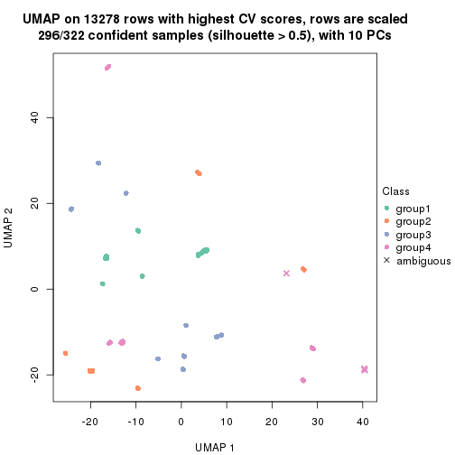</p>

</div>
<div id='tab-CV-mclust-dimension-reduction-4'>
<pre><code class="r">dimension_reduction(res, k = 5, method = &quot;UMAP&quot;)
</code></pre>

<p>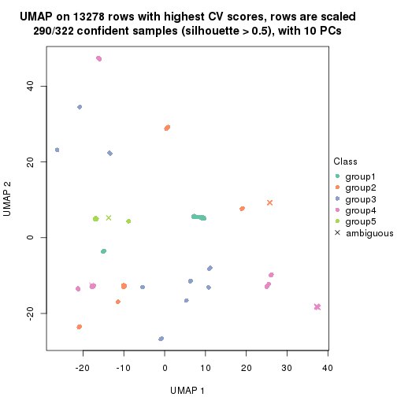</p>

</div>
<div id='tab-CV-mclust-dimension-reduction-5'>
<pre><code class="r">dimension_reduction(res, k = 6, method = &quot;UMAP&quot;)
</code></pre>

<p></p>

</div>
</div>


Following heatmap shows how subgroups are split when increasing `k`:

```r
collect_classes(res)
```


If matrix rows can be associated to genes, consider to use `functional_enrichment(res,
...)` to perform function enrichment for the signature genes. See [this vignette](http://bioconductor.org/packages/devel/bioc/vignettes/cola/inst/doc/functional_enrichment.html) for more detailed explanations.


 

---------------------------------------------------


### CV:NMF**


The object with results only for a single top-value method and a single partition method 
can be extracted as:

```r
res = res_list["CV", "NMF"]
# you can also extract it by
# res = res_list["CV:NMF"]
```

A summary of `res` and all the functions that can be applied to it:

```r
res
```

```
#> A 'ConsensusPartition' object with k = 2, 3, 4, 5, 6.
#>   On a matrix with 13278 rows and 322 columns.
#>   Top rows (1000, 2000, 3000, 4000, 5000) are extracted by 'CV' method.
#>   Subgroups are detected by 'NMF' method.
#>   Performed in total 1250 partitions by row resampling.
#>   Best k for subgroups seems to be 6.
#> 
#> Following methods can be applied to this 'ConsensusPartition' object:
#>  [1] "cola_report"             "collect_classes"         "collect_plots"          
#>  [4] "collect_stats"           "colnames"                "compare_signatures"     
#>  [7] "consensus_heatmap"       "dimension_reduction"     "functional_enrichment"  
#> [10] "get_anno_col"            "get_anno"                "get_classes"            
#> [13] "get_consensus"           "get_matrix"              "get_membership"         
#> [16] "get_param"               "get_signatures"          "get_stats"              
#> [19] "is_best_k"               "is_stable_k"             "membership_heatmap"     
#> [22] "ncol"                    "nrow"                    "plot_ecdf"              
#> [25] "rownames"                "select_partition_number" "show"                   
#> [28] "suggest_best_k"          "test_to_known_factors"
```

`collect_plots()` function collects all the plots made from `res` for all `k` (number of partitions)
into one single page to provide an easy and fast comparison between different `k`.

```r
collect_plots(res)
```


The plots are:

- The first row: a plot of the ECDF (empirical cumulative distribution
  function) curves of the consensus matrix for each `k` and the heatmap of
  predicted classes for each `k`.
- The second row: heatmaps of the consensus matrix for each `k`.
- The third row: heatmaps of the membership matrix for each `k`.
- The fouth row: heatmaps of the signatures for each `k`.

All the plots in panels can be made by individual functions and they are
plotted later in this section.

`select_partition_number()` produces several plots showing different
statistics for choosing "optimized" `k`. There are following statistics:

- ECDF curves of the consensus matrix for each `k`;
- 1-PAC. [The PAC
  score](https://en.wikipedia.org/wiki/Consensus_clustering#Over-interpretation_potential_of_consensus_clustering)
  measures the proportion of the ambiguous subgrouping.
- Mean silhouette score.
- Concordance. The mean probability of fiting the consensus class ids in all
  partitions.
- Area increased. Denote $A_k$ as the area under the ECDF curve for current
  `k`, the area increased is defined as $A_k - A_{k-1}$.
- Rand index. The percent of pairs of samples that are both in a same cluster
  or both are not in a same cluster in the partition of k and k-1.
- Jaccard index. The ratio of pairs of samples are both in a same cluster in
  the partition of k and k-1 and the pairs of samples are both in a same
  cluster in the partition k or k-1.

The detailed explanations of these statistics can be found in [the _cola_
vignette](http://bioconductor.org/packages/devel/bioc/vignettes/cola/inst/doc/cola.html#toc_13).

Generally speaking, lower PAC score, higher mean silhouette score or higher
concordance corresponds to better partition. Rand index and Jaccard index
measure how similar the current partition is compared to partition with `k-1`.
If they are too similar, we won't accept `k` is better than `k-1`.

```r
select_partition_number(res)
```


The numeric values for all these statistics can be obtained by `get_stats()`.

```r
get_stats(res)
```

```
#>   k 1-PAC mean_silhouette concordance area_increased  Rand Jaccard
#> 2 2 0.457           0.864       0.904         0.4893 0.504   0.504
#> 3 3 0.968           0.959       0.978         0.3331 0.810   0.637
#> 4 4 0.823           0.887       0.925         0.1381 0.805   0.515
#> 5 5 0.900           0.867       0.900         0.0543 0.971   0.887
#> 6 6 0.963           0.908       0.938         0.0345 0.956   0.809
```

`suggest_best_k()` suggests the best $k$ based on these statistics. The rules are as follows:

- All $k$ with Jaccard index larger than 0.95 are removed because increasing
  $k$ does not provide enough extra information. If all $k$ are removed, it is
  marked as no subgroup is detected.
- For all $k$ with 1-PAC score larger than 0.9, the maximal $k$ is taken as
  the best $k$, and other $k$ are marked as optional $k$.
- If it does not fit the second rule. The $k$ with the maximal vote of the
  highest 1-PAC score, highest mean silhouette, and highest concordance is
  taken as the best $k$.

```r
suggest_best_k(res)
```

```
#> [1] 6
#> attr(,"optional")
#> [1] 3
```

There is also optional best $k$ = 3 that is worth to check.

Following shows the table of the partitions (You need to click the **show/hide
code output** link to see it). The membership matrix (columns with name `p*`)
is inferred by
[`clue::cl_consensus()`](https://www.rdocumentation.org/link/cl_consensus?package=clue)
function with the `SE` method. Basically the value in the membership matrix
represents the probability to belong to a certain group. The finall class
label for an item is determined with the group with highest probability it
belongs to.

In `get_classes()` function, the entropy is calculated from the membership
matrix and the silhouette score is calculated from the consensus matrix.


<script>
$( function() {
	$( '#tabs-CV-NMF-get-classes' ).tabs();
} );
</script>
<div id='tabs-CV-NMF-get-classes'>
<ul>
<li><a href='#tab-CV-NMF-get-classes-1'>k = 2</a></li>
<li><a href='#tab-CV-NMF-get-classes-2'>k = 3</a></li>
<li><a href='#tab-CV-NMF-get-classes-3'>k = 4</a></li>
<li><a href='#tab-CV-NMF-get-classes-4'>k = 5</a></li>
<li><a href='#tab-CV-NMF-get-classes-5'>k = 6</a></li>
</ul>

<div id='tab-CV-NMF-get-classes-1'>
<p><a id='tab-CV-NMF-get-classes-1-a' style='color:#0366d6' href='#'>show/hide code output</a></p>
<pre><code class="r">cbind(get_classes(res, k = 2), get_membership(res, k = 2))
</code></pre>

<pre><code>#&gt;           class entropy silhouette    p1    p2
#&gt; DRR023371     1  0.9580      0.546 0.620 0.380
#&gt; DRR023372     1  0.9580      0.546 0.620 0.380
#&gt; DRR023373     1  0.9580      0.546 0.620 0.380
#&gt; DRR023374     1  0.9608      0.538 0.616 0.384
#&gt; DRR023375     1  0.9635      0.529 0.612 0.388
#&gt; DRR023376     1  0.9580      0.546 0.620 0.380
#&gt; DRR023377     1  0.9580      0.546 0.620 0.380
#&gt; DRR023378     1  0.9552      0.554 0.624 0.376
#&gt; DRR023379     1  0.8443      0.719 0.728 0.272
#&gt; DRR023380     1  0.8763      0.687 0.704 0.296
#&gt; DRR023381     1  0.8207      0.739 0.744 0.256
#&gt; DRR023382     1  0.8555      0.709 0.720 0.280
#&gt; DRR023383     1  0.8207      0.739 0.744 0.256
#&gt; DRR023384     1  0.8207      0.739 0.744 0.256
#&gt; DRR023385     1  0.8081      0.748 0.752 0.248
#&gt; DRR023386     1  0.7950      0.756 0.760 0.240
#&gt; DRR023387     1  0.6973      0.800 0.812 0.188
#&gt; DRR023388     1  0.6973      0.800 0.812 0.188
#&gt; DRR023389     1  0.6973      0.800 0.812 0.188
#&gt; DRR023390     1  0.7056      0.798 0.808 0.192
#&gt; DRR023391     1  0.7056      0.798 0.808 0.192
#&gt; DRR023392     1  0.6973      0.800 0.812 0.188
#&gt; DRR023394     1  0.6973      0.800 0.812 0.188
#&gt; DRR023395     1  0.7299      0.789 0.796 0.204
#&gt; DRR023396     1  0.6973      0.800 0.812 0.188
#&gt; DRR023397     1  0.6973      0.800 0.812 0.188
#&gt; DRR023398     1  0.6973      0.800 0.812 0.188
#&gt; DRR023399     1  0.6973      0.800 0.812 0.188
#&gt; DRR023400     1  0.6973      0.800 0.812 0.188
#&gt; DRR023401     1  0.6973      0.800 0.812 0.188
#&gt; DRR023402     1  0.6973      0.800 0.812 0.188
#&gt; DRR023403     1  0.6973      0.800 0.812 0.188
#&gt; DRR023404     2  0.0000      0.880 0.000 1.000
#&gt; DRR023405     2  0.0000      0.880 0.000 1.000
#&gt; DRR023406     2  0.0000      0.880 0.000 1.000
#&gt; DRR023407     2  0.0000      0.880 0.000 1.000
#&gt; DRR023408     2  0.0000      0.880 0.000 1.000
#&gt; DRR023409     2  0.0000      0.880 0.000 1.000
#&gt; DRR023410     2  0.0000      0.880 0.000 1.000
#&gt; DRR023411     2  0.0000      0.880 0.000 1.000
#&gt; DRR023412     2  0.0000      0.880 0.000 1.000
#&gt; DRR023413     2  0.0000      0.880 0.000 1.000
#&gt; DRR023414     2  0.0000      0.880 0.000 1.000
#&gt; DRR023415     2  0.0000      0.880 0.000 1.000
#&gt; DRR023416     2  0.0000      0.880 0.000 1.000
#&gt; DRR023417     2  0.0000      0.880 0.000 1.000
#&gt; DRR023418     2  0.0000      0.880 0.000 1.000
#&gt; DRR023419     2  0.0000      0.880 0.000 1.000
#&gt; DRR023420     2  0.0000      0.880 0.000 1.000
#&gt; DRR023421     2  0.0000      0.880 0.000 1.000
#&gt; DRR023422     2  0.0000      0.880 0.000 1.000
#&gt; DRR023423     2  0.0000      0.880 0.000 1.000
#&gt; DRR023425     2  0.0000      0.880 0.000 1.000
#&gt; DRR023426     2  0.0000      0.880 0.000 1.000
#&gt; DRR023427     2  0.0000      0.880 0.000 1.000
#&gt; DRR023428     2  0.0000      0.880 0.000 1.000
#&gt; DRR023429     2  0.0000      0.880 0.000 1.000
#&gt; DRR023430     2  0.0000      0.880 0.000 1.000
#&gt; DRR023431     2  0.0000      0.880 0.000 1.000
#&gt; DRR023432     2  0.0000      0.880 0.000 1.000
#&gt; DRR023433     2  0.0000      0.880 0.000 1.000
#&gt; DRR023434     2  0.0000      0.880 0.000 1.000
#&gt; DRR023435     2  0.0000      0.880 0.000 1.000
#&gt; DRR023436     2  0.0000      0.880 0.000 1.000
#&gt; DRR023437     2  0.0000      0.880 0.000 1.000
#&gt; DRR023438     2  0.0000      0.880 0.000 1.000
#&gt; DRR023439     2  0.0000      0.880 0.000 1.000
#&gt; DRR023440     2  0.0000      0.880 0.000 1.000
#&gt; DRR023441     2  0.0000      0.880 0.000 1.000
#&gt; DRR023442     2  0.0000      0.880 0.000 1.000
#&gt; DRR023443     2  0.0000      0.880 0.000 1.000
#&gt; DRR023444     2  0.0000      0.880 0.000 1.000
#&gt; DRR023445     2  0.0000      0.880 0.000 1.000
#&gt; DRR023446     2  0.0000      0.880 0.000 1.000
#&gt; DRR023447     2  0.0000      0.880 0.000 1.000
#&gt; DRR023448     2  0.0000      0.880 0.000 1.000
#&gt; DRR023449     2  0.0000      0.880 0.000 1.000
#&gt; DRR023450     2  0.0000      0.880 0.000 1.000
#&gt; DRR023451     2  0.0000      0.880 0.000 1.000
#&gt; DRR023452     2  0.0000      0.880 0.000 1.000
#&gt; DRR023453     1  0.8081      0.748 0.752 0.248
#&gt; DRR023454     1  0.7674      0.772 0.776 0.224
#&gt; DRR023455     1  0.7602      0.775 0.780 0.220
#&gt; DRR023456     1  0.7453      0.782 0.788 0.212
#&gt; DRR023457     1  0.7745      0.768 0.772 0.228
#&gt; DRR023458     1  0.7376      0.785 0.792 0.208
#&gt; DRR023459     1  0.7815      0.765 0.768 0.232
#&gt; DRR023460     1  0.7528      0.779 0.784 0.216
#&gt; DRR023461     2  0.4939      0.817 0.108 0.892
#&gt; DRR023462     2  0.5059      0.813 0.112 0.888
#&gt; DRR023463     2  0.4690      0.824 0.100 0.900
#&gt; DRR023464     2  0.5294      0.805 0.120 0.880
#&gt; DRR023465     2  0.5519      0.797 0.128 0.872
#&gt; DRR023466     2  0.5519      0.797 0.128 0.872
#&gt; DRR023467     2  0.4431      0.830 0.092 0.908
#&gt; DRR023468     2  0.7528      0.678 0.216 0.784
#&gt; DRR023469     2  0.7376      0.692 0.208 0.792
#&gt; DRR023470     2  0.7453      0.685 0.212 0.788
#&gt; DRR023471     2  0.7139      0.711 0.196 0.804
#&gt; DRR023472     2  0.7219      0.705 0.200 0.800
#&gt; DRR023473     2  0.7219      0.705 0.200 0.800
#&gt; DRR023474     2  0.6973      0.723 0.188 0.812
#&gt; DRR023475     2  0.6801      0.735 0.180 0.820
#&gt; DRR023476     2  0.6623      0.746 0.172 0.828
#&gt; DRR023477     2  0.6973      0.723 0.188 0.812
#&gt; DRR023478     2  0.6712      0.740 0.176 0.824
#&gt; DRR023479     2  0.6531      0.751 0.168 0.832
#&gt; DRR023480     2  0.7219      0.705 0.200 0.800
#&gt; DRR023481     2  0.7219      0.705 0.200 0.800
#&gt; DRR023482     1  0.9552      0.554 0.624 0.376
#&gt; DRR023483     1  0.9552      0.554 0.624 0.376
#&gt; DRR023484     1  0.9552      0.554 0.624 0.376
#&gt; DRR023485     1  0.9552      0.554 0.624 0.376
#&gt; DRR023486     1  0.9552      0.554 0.624 0.376
#&gt; DRR023487     1  0.9552      0.554 0.624 0.376
#&gt; DRR023488     1  0.9552      0.554 0.624 0.376
#&gt; DRR023489     1  0.9552      0.554 0.624 0.376
#&gt; DRR023490     1  0.0000      0.918 1.000 0.000
#&gt; DRR023491     1  0.0000      0.918 1.000 0.000
#&gt; DRR023492     1  0.0000      0.918 1.000 0.000
#&gt; DRR023493     1  0.0000      0.918 1.000 0.000
#&gt; DRR023494     1  0.0000      0.918 1.000 0.000
#&gt; DRR023495     1  0.0000      0.918 1.000 0.000
#&gt; DRR023496     1  0.0000      0.918 1.000 0.000
#&gt; DRR023497     1  0.0000      0.918 1.000 0.000
#&gt; DRR023498     1  0.0000      0.918 1.000 0.000
#&gt; DRR023499     1  0.0000      0.918 1.000 0.000
#&gt; DRR023500     1  0.0000      0.918 1.000 0.000
#&gt; DRR023501     1  0.0000      0.918 1.000 0.000
#&gt; DRR023502     1  0.0000      0.918 1.000 0.000
#&gt; DRR023503     1  0.0000      0.918 1.000 0.000
#&gt; DRR023504     1  0.0000      0.918 1.000 0.000
#&gt; DRR023505     1  0.0000      0.918 1.000 0.000
#&gt; DRR023506     1  0.0000      0.918 1.000 0.000
#&gt; DRR023507     1  0.0000      0.918 1.000 0.000
#&gt; DRR023508     1  0.0000      0.918 1.000 0.000
#&gt; DRR023509     1  0.0000      0.918 1.000 0.000
#&gt; DRR023510     1  0.0000      0.918 1.000 0.000
#&gt; DRR023511     1  0.0000      0.918 1.000 0.000
#&gt; DRR023512     1  0.0000      0.918 1.000 0.000
#&gt; DRR023513     1  0.0000      0.918 1.000 0.000
#&gt; DRR023514     1  0.0000      0.918 1.000 0.000
#&gt; DRR023515     1  0.0000      0.918 1.000 0.000
#&gt; DRR023516     1  0.0000      0.918 1.000 0.000
#&gt; DRR023517     1  0.0000      0.918 1.000 0.000
#&gt; DRR023518     1  0.0000      0.918 1.000 0.000
#&gt; DRR023519     1  0.0000      0.918 1.000 0.000
#&gt; DRR023520     1  0.0000      0.918 1.000 0.000
#&gt; DRR023521     1  0.0000      0.918 1.000 0.000
#&gt; DRR023522     1  0.0000      0.918 1.000 0.000
#&gt; DRR023523     1  0.0000      0.918 1.000 0.000
#&gt; DRR023524     1  0.0000      0.918 1.000 0.000
#&gt; DRR023525     1  0.0000      0.918 1.000 0.000
#&gt; DRR023526     1  0.0000      0.918 1.000 0.000
#&gt; DRR023527     1  0.0000      0.918 1.000 0.000
#&gt; DRR023528     1  0.0000      0.918 1.000 0.000
#&gt; DRR023529     1  0.0000      0.918 1.000 0.000
#&gt; DRR023530     1  0.0000      0.918 1.000 0.000
#&gt; DRR023531     1  0.0000      0.918 1.000 0.000
#&gt; DRR023532     1  0.0000      0.918 1.000 0.000
#&gt; DRR023533     1  0.0000      0.918 1.000 0.000
#&gt; DRR023534     1  0.0000      0.918 1.000 0.000
#&gt; DRR023535     1  0.0000      0.918 1.000 0.000
#&gt; DRR023536     1  0.0000      0.918 1.000 0.000
#&gt; DRR023537     1  0.0000      0.918 1.000 0.000
#&gt; DRR023538     1  0.0000      0.918 1.000 0.000
#&gt; DRR023539     1  0.0000      0.918 1.000 0.000
#&gt; DRR023540     1  0.0000      0.918 1.000 0.000
#&gt; DRR023541     1  0.0000      0.918 1.000 0.000
#&gt; DRR023542     1  0.0000      0.918 1.000 0.000
#&gt; DRR023543     1  0.0000      0.918 1.000 0.000
#&gt; DRR023544     1  0.0000      0.918 1.000 0.000
#&gt; DRR023545     1  0.0000      0.918 1.000 0.000
#&gt; DRR023546     1  0.0000      0.918 1.000 0.000
#&gt; DRR023547     1  0.0000      0.918 1.000 0.000
#&gt; DRR023548     1  0.0000      0.918 1.000 0.000
#&gt; DRR023549     1  0.0000      0.918 1.000 0.000
#&gt; DRR023550     1  0.0000      0.918 1.000 0.000
#&gt; DRR023551     1  0.0000      0.918 1.000 0.000
#&gt; DRR023552     1  0.0000      0.918 1.000 0.000
#&gt; DRR023553     1  0.0000      0.918 1.000 0.000
#&gt; DRR023554     1  0.0000      0.918 1.000 0.000
#&gt; DRR023555     1  0.0000      0.918 1.000 0.000
#&gt; DRR023556     1  0.0000      0.918 1.000 0.000
#&gt; DRR023557     1  0.0000      0.918 1.000 0.000
#&gt; DRR023558     1  0.0000      0.918 1.000 0.000
#&gt; DRR023559     1  0.0000      0.918 1.000 0.000
#&gt; DRR023560     1  0.0000      0.918 1.000 0.000
#&gt; DRR023561     1  0.0000      0.918 1.000 0.000
#&gt; DRR023562     1  0.0000      0.918 1.000 0.000
#&gt; DRR023563     1  0.0000      0.918 1.000 0.000
#&gt; DRR023564     1  0.0000      0.918 1.000 0.000
#&gt; DRR023565     1  0.0000      0.918 1.000 0.000
#&gt; DRR023566     1  0.0000      0.918 1.000 0.000
#&gt; DRR023567     1  0.0000      0.918 1.000 0.000
#&gt; DRR023568     1  0.0000      0.918 1.000 0.000
#&gt; DRR023569     1  0.0000      0.918 1.000 0.000
#&gt; DRR023570     1  0.0000      0.918 1.000 0.000
#&gt; DRR023571     1  0.0000      0.918 1.000 0.000
#&gt; DRR023572     1  0.0000      0.918 1.000 0.000
#&gt; DRR023573     1  0.0000      0.918 1.000 0.000
#&gt; DRR023574     1  0.0000      0.918 1.000 0.000
#&gt; DRR023575     1  0.0000      0.918 1.000 0.000
#&gt; DRR023576     2  0.5842      0.900 0.140 0.860
#&gt; DRR023577     2  0.5842      0.900 0.140 0.860
#&gt; DRR023578     2  0.5842      0.900 0.140 0.860
#&gt; DRR023579     2  0.5842      0.900 0.140 0.860
#&gt; DRR023580     2  0.5842      0.900 0.140 0.860
#&gt; DRR023581     2  0.5842      0.900 0.140 0.860
#&gt; DRR023582     2  0.5842      0.900 0.140 0.860
#&gt; DRR023583     2  0.5842      0.900 0.140 0.860
#&gt; DRR023584     2  0.5842      0.900 0.140 0.860
#&gt; DRR023585     2  0.5842      0.900 0.140 0.860
#&gt; DRR023586     2  0.5842      0.900 0.140 0.860
#&gt; DRR023587     2  0.5842      0.900 0.140 0.860
#&gt; DRR023588     2  0.5842      0.900 0.140 0.860
#&gt; DRR023589     2  0.5842      0.900 0.140 0.860
#&gt; DRR023590     2  0.5842      0.900 0.140 0.860
#&gt; DRR023591     2  0.5842      0.900 0.140 0.860
#&gt; DRR023592     2  0.5842      0.900 0.140 0.860
#&gt; DRR023593     2  0.5842      0.900 0.140 0.860
#&gt; DRR023594     2  0.5842      0.900 0.140 0.860
#&gt; DRR023595     2  0.5842      0.900 0.140 0.860
#&gt; DRR023596     2  0.5842      0.900 0.140 0.860
#&gt; DRR023597     2  0.5842      0.900 0.140 0.860
#&gt; DRR023598     2  0.5842      0.900 0.140 0.860
#&gt; DRR023599     2  0.5842      0.900 0.140 0.860
#&gt; DRR023600     2  0.5842      0.900 0.140 0.860
#&gt; DRR023601     2  0.5842      0.900 0.140 0.860
#&gt; DRR023602     2  0.5842      0.900 0.140 0.860
#&gt; DRR023603     2  0.5842      0.900 0.140 0.860
#&gt; DRR023604     2  0.5842      0.900 0.140 0.860
#&gt; DRR023605     2  0.5842      0.900 0.140 0.860
#&gt; DRR023606     2  0.5842      0.900 0.140 0.860
#&gt; DRR023607     2  0.5842      0.900 0.140 0.860
#&gt; DRR023608     2  0.5842      0.900 0.140 0.860
#&gt; DRR023609     2  0.5842      0.900 0.140 0.860
#&gt; DRR023610     2  0.5842      0.900 0.140 0.860
#&gt; DRR023611     2  0.5842      0.900 0.140 0.860
#&gt; DRR023612     2  0.5842      0.900 0.140 0.860
#&gt; DRR023613     2  0.5842      0.900 0.140 0.860
#&gt; DRR023614     2  0.5842      0.900 0.140 0.860
#&gt; DRR023615     2  0.5842      0.900 0.140 0.860
#&gt; DRR023616     2  0.5842      0.900 0.140 0.860
#&gt; DRR023617     2  0.5842      0.900 0.140 0.860
#&gt; DRR023619     1  0.1184      0.911 0.984 0.016
#&gt; DRR023620     1  0.0938      0.913 0.988 0.012
#&gt; DRR023621     1  0.1184      0.911 0.984 0.016
#&gt; DRR023622     1  0.1184      0.911 0.984 0.016
#&gt; DRR023623     1  0.0938      0.913 0.988 0.012
#&gt; DRR023624     1  0.1184      0.911 0.984 0.016
#&gt; DRR023625     1  0.1184      0.911 0.984 0.016
#&gt; DRR023626     1  0.1184      0.911 0.984 0.016
#&gt; DRR023627     1  0.1184      0.911 0.984 0.016
#&gt; DRR023628     1  0.1414      0.909 0.980 0.020
#&gt; DRR023629     1  0.1184      0.911 0.984 0.016
#&gt; DRR023630     1  0.1184      0.911 0.984 0.016
#&gt; DRR023631     1  0.1414      0.909 0.980 0.020
#&gt; DRR023632     1  0.1184      0.911 0.984 0.016
#&gt; DRR023633     1  0.1414      0.909 0.980 0.020
#&gt; DRR023635     2  0.5842      0.900 0.140 0.860
#&gt; DRR023636     2  0.5842      0.900 0.140 0.860
#&gt; DRR023637     2  0.5842      0.900 0.140 0.860
#&gt; DRR023638     2  0.5842      0.900 0.140 0.860
#&gt; DRR023639     2  0.5842      0.900 0.140 0.860
#&gt; DRR023640     2  0.5842      0.900 0.140 0.860
#&gt; DRR023641     2  0.5842      0.900 0.140 0.860
#&gt; DRR023642     2  0.5842      0.900 0.140 0.860
#&gt; DRR023643     2  0.5842      0.900 0.140 0.860
#&gt; DRR023644     2  0.5842      0.900 0.140 0.860
#&gt; DRR023645     2  0.5842      0.900 0.140 0.860
#&gt; DRR023646     2  0.5842      0.900 0.140 0.860
#&gt; DRR023647     2  0.5842      0.900 0.140 0.860
#&gt; DRR023648     2  0.5842      0.900 0.140 0.860
#&gt; DRR023649     2  0.5737      0.900 0.136 0.864
#&gt; DRR023650     1  0.1184      0.911 0.984 0.016
#&gt; DRR023651     1  0.1184      0.911 0.984 0.016
#&gt; DRR023652     1  0.1414      0.909 0.980 0.020
#&gt; DRR023653     1  0.1414      0.909 0.980 0.020
#&gt; DRR023654     1  0.1184      0.911 0.984 0.016
#&gt; DRR023655     1  0.1414      0.909 0.980 0.020
#&gt; DRR023656     1  0.1184      0.911 0.984 0.016
#&gt; DRR023657     1  0.1414      0.909 0.980 0.020
#&gt; DRR023658     1  0.1414      0.909 0.980 0.020
#&gt; DRR023659     1  0.1414      0.909 0.980 0.020
#&gt; DRR023660     1  0.1414      0.909 0.980 0.020
#&gt; DRR023661     1  0.1414      0.909 0.980 0.020
#&gt; DRR023662     1  0.1184      0.911 0.984 0.016
#&gt; DRR023663     1  0.1414      0.909 0.980 0.020
#&gt; DRR023664     1  0.1414      0.909 0.980 0.020
#&gt; DRR023665     1  0.1414      0.909 0.980 0.020
#&gt; DRR023666     1  0.0672      0.915 0.992 0.008
#&gt; DRR023667     1  0.0672      0.915 0.992 0.008
#&gt; DRR023668     1  0.0672      0.915 0.992 0.008
#&gt; DRR023669     1  0.0672      0.915 0.992 0.008
#&gt; DRR023670     1  0.0672      0.915 0.992 0.008
#&gt; DRR023671     1  0.0000      0.918 1.000 0.000
#&gt; DRR023672     1  0.0672      0.915 0.992 0.008
#&gt; DRR023673     1  0.0376      0.917 0.996 0.004
#&gt; DRR023674     1  0.0376      0.917 0.996 0.004
#&gt; DRR023675     1  0.0672      0.915 0.992 0.008
#&gt; DRR023676     1  0.0672      0.915 0.992 0.008
#&gt; DRR023677     1  0.0672      0.915 0.992 0.008
#&gt; DRR023678     1  0.0672      0.915 0.992 0.008
#&gt; DRR023683     2  0.5842      0.900 0.140 0.860
#&gt; DRR023684     2  0.5842      0.900 0.140 0.860
#&gt; DRR023685     2  0.5842      0.900 0.140 0.860
#&gt; DRR023686     2  0.5842      0.900 0.140 0.860
#&gt; DRR023687     2  0.5842      0.900 0.140 0.860
#&gt; DRR023688     2  0.5842      0.900 0.140 0.860
#&gt; DRR023689     2  0.5842      0.900 0.140 0.860
#&gt; DRR023690     2  0.5842      0.900 0.140 0.860
#&gt; DRR023691     2  0.5842      0.900 0.140 0.860
#&gt; DRR023692     2  0.5842      0.900 0.140 0.860
#&gt; DRR023693     2  0.5842      0.900 0.140 0.860
#&gt; DRR023694     2  0.5842      0.900 0.140 0.860
#&gt; DRR023695     2  0.5842      0.900 0.140 0.860
#&gt; DRR023696     2  0.5842      0.900 0.140 0.860
#&gt; DRR023697     2  0.5842      0.900 0.140 0.860
#&gt; DRR023698     2  0.5842      0.900 0.140 0.860
#&gt; DRR023699     2  0.5842      0.900 0.140 0.860
#&gt; DRR023700     2  0.5842      0.900 0.140 0.860
</code></pre>

<script>
$('#tab-CV-NMF-get-classes-1-a').parent().next().next().hide();
$('#tab-CV-NMF-get-classes-1-a').click(function(){
  $('#tab-CV-NMF-get-classes-1-a').parent().next().next().toggle();
  return(false);
});
</script>
</div>

<div id='tab-CV-NMF-get-classes-2'>
<p><a id='tab-CV-NMF-get-classes-2-a' style='color:#0366d6' href='#'>show/hide code output</a></p>
<pre><code class="r">cbind(get_classes(res, k = 3), get_membership(res, k = 3))
</code></pre>

<pre><code>#&gt;           class entropy silhouette   p1    p2    p3
#&gt; DRR023371     3  0.0000      1.000 0.00 0.000 1.000
#&gt; DRR023372     3  0.0000      1.000 0.00 0.000 1.000
#&gt; DRR023373     3  0.0000      1.000 0.00 0.000 1.000
#&gt; DRR023374     3  0.0000      1.000 0.00 0.000 1.000
#&gt; DRR023375     3  0.0000      1.000 0.00 0.000 1.000
#&gt; DRR023376     3  0.0000      1.000 0.00 0.000 1.000
#&gt; DRR023377     3  0.0000      1.000 0.00 0.000 1.000
#&gt; DRR023378     3  0.0000      1.000 0.00 0.000 1.000
#&gt; DRR023379     3  0.0000      1.000 0.00 0.000 1.000
#&gt; DRR023380     3  0.0000      1.000 0.00 0.000 1.000
#&gt; DRR023381     3  0.0000      1.000 0.00 0.000 1.000
#&gt; DRR023382     3  0.0000      1.000 0.00 0.000 1.000
#&gt; DRR023383     3  0.0000      1.000 0.00 0.000 1.000
#&gt; DRR023384     3  0.0000      1.000 0.00 0.000 1.000
#&gt; DRR023385     3  0.0000      1.000 0.00 0.000 1.000
#&gt; DRR023386     3  0.0000      1.000 0.00 0.000 1.000
#&gt; DRR023387     3  0.0000      1.000 0.00 0.000 1.000
#&gt; DRR023388     3  0.0000      1.000 0.00 0.000 1.000
#&gt; DRR023389     3  0.0000      1.000 0.00 0.000 1.000
#&gt; DRR023390     3  0.0000      1.000 0.00 0.000 1.000
#&gt; DRR023391     3  0.0000      1.000 0.00 0.000 1.000
#&gt; DRR023392     3  0.0000      1.000 0.00 0.000 1.000
#&gt; DRR023394     3  0.0000      1.000 0.00 0.000 1.000
#&gt; DRR023395     3  0.0000      1.000 0.00 0.000 1.000
#&gt; DRR023396     3  0.0000      1.000 0.00 0.000 1.000
#&gt; DRR023397     3  0.0000      1.000 0.00 0.000 1.000
#&gt; DRR023398     3  0.0000      1.000 0.00 0.000 1.000
#&gt; DRR023399     3  0.0000      1.000 0.00 0.000 1.000
#&gt; DRR023400     3  0.0000      1.000 0.00 0.000 1.000
#&gt; DRR023401     3  0.0000      1.000 0.00 0.000 1.000
#&gt; DRR023402     3  0.0000      1.000 0.00 0.000 1.000
#&gt; DRR023403     3  0.0000      1.000 0.00 0.000 1.000
#&gt; DRR023404     2  0.4931      0.745 0.00 0.768 0.232
#&gt; DRR023405     2  0.5291      0.697 0.00 0.732 0.268
#&gt; DRR023406     2  0.4842      0.757 0.00 0.776 0.224
#&gt; DRR023407     2  0.5178      0.714 0.00 0.744 0.256
#&gt; DRR023408     2  0.5706      0.618 0.00 0.680 0.320
#&gt; DRR023409     2  0.5178      0.714 0.00 0.744 0.256
#&gt; DRR023410     2  0.5098      0.725 0.00 0.752 0.248
#&gt; DRR023411     2  0.5678      0.621 0.00 0.684 0.316
#&gt; DRR023412     2  0.4796      0.759 0.00 0.780 0.220
#&gt; DRR023413     2  0.4887      0.749 0.00 0.772 0.228
#&gt; DRR023414     2  0.5254      0.703 0.00 0.736 0.264
#&gt; DRR023415     2  0.4605      0.777 0.00 0.796 0.204
#&gt; DRR023416     2  0.5988      0.522 0.00 0.632 0.368
#&gt; DRR023417     2  0.5560      0.651 0.00 0.700 0.300
#&gt; DRR023418     2  0.5591      0.646 0.00 0.696 0.304
#&gt; DRR023419     2  0.5431      0.675 0.00 0.716 0.284
#&gt; DRR023420     2  0.4121      0.812 0.00 0.832 0.168
#&gt; DRR023421     2  0.5327      0.692 0.00 0.728 0.272
#&gt; DRR023422     2  0.0237      0.941 0.00 0.996 0.004
#&gt; DRR023423     2  0.0237      0.941 0.00 0.996 0.004
#&gt; DRR023425     2  0.2711      0.891 0.00 0.912 0.088
#&gt; DRR023426     2  0.0747      0.937 0.00 0.984 0.016
#&gt; DRR023427     2  0.1289      0.928 0.00 0.968 0.032
#&gt; DRR023428     2  0.0747      0.937 0.00 0.984 0.016
#&gt; DRR023429     2  0.0747      0.937 0.00 0.984 0.016
#&gt; DRR023430     2  0.0424      0.940 0.00 0.992 0.008
#&gt; DRR023431     2  0.0747      0.937 0.00 0.984 0.016
#&gt; DRR023432     2  0.0892      0.935 0.00 0.980 0.020
#&gt; DRR023433     2  0.2537      0.897 0.00 0.920 0.080
#&gt; DRR023434     2  0.0747      0.937 0.00 0.984 0.016
#&gt; DRR023435     2  0.0592      0.938 0.00 0.988 0.012
#&gt; DRR023436     2  0.1031      0.933 0.00 0.976 0.024
#&gt; DRR023437     2  0.0592      0.938 0.00 0.988 0.012
#&gt; DRR023438     2  0.0747      0.937 0.00 0.984 0.016
#&gt; DRR023439     2  0.2165      0.909 0.00 0.936 0.064
#&gt; DRR023440     2  0.1289      0.928 0.00 0.968 0.032
#&gt; DRR023441     2  0.0592      0.938 0.00 0.988 0.012
#&gt; DRR023442     2  0.1753      0.918 0.00 0.952 0.048
#&gt; DRR023443     2  0.0592      0.938 0.00 0.988 0.012
#&gt; DRR023444     2  0.2537      0.898 0.00 0.920 0.080
#&gt; DRR023445     2  0.5835      0.557 0.00 0.660 0.340
#&gt; DRR023446     2  0.4399      0.799 0.00 0.812 0.188
#&gt; DRR023447     2  0.5882      0.542 0.00 0.652 0.348
#&gt; DRR023448     2  0.3482      0.859 0.00 0.872 0.128
#&gt; DRR023449     2  0.3267      0.869 0.00 0.884 0.116
#&gt; DRR023450     2  0.4291      0.807 0.00 0.820 0.180
#&gt; DRR023451     2  0.3267      0.868 0.00 0.884 0.116
#&gt; DRR023452     2  0.4121      0.818 0.00 0.832 0.168
#&gt; DRR023453     3  0.0000      1.000 0.00 0.000 1.000
#&gt; DRR023454     3  0.0000      1.000 0.00 0.000 1.000
#&gt; DRR023455     3  0.0000      1.000 0.00 0.000 1.000
#&gt; DRR023456     3  0.0000      1.000 0.00 0.000 1.000
#&gt; DRR023457     3  0.0000      1.000 0.00 0.000 1.000
#&gt; DRR023458     3  0.0000      1.000 0.00 0.000 1.000
#&gt; DRR023459     3  0.0000      1.000 0.00 0.000 1.000
#&gt; DRR023460     3  0.0000      1.000 0.00 0.000 1.000
#&gt; DRR023461     3  0.0000      1.000 0.00 0.000 1.000
#&gt; DRR023462     3  0.0000      1.000 0.00 0.000 1.000
#&gt; DRR023463     3  0.0000      1.000 0.00 0.000 1.000
#&gt; DRR023464     3  0.0000      1.000 0.00 0.000 1.000
#&gt; DRR023465     3  0.0000      1.000 0.00 0.000 1.000
#&gt; DRR023466     3  0.0000      1.000 0.00 0.000 1.000
#&gt; DRR023467     3  0.0000      1.000 0.00 0.000 1.000
#&gt; DRR023468     3  0.0000      1.000 0.00 0.000 1.000
#&gt; DRR023469     3  0.0000      1.000 0.00 0.000 1.000
#&gt; DRR023470     3  0.0000      1.000 0.00 0.000 1.000
#&gt; DRR023471     3  0.0000      1.000 0.00 0.000 1.000
#&gt; DRR023472     3  0.0000      1.000 0.00 0.000 1.000
#&gt; DRR023473     3  0.0000      1.000 0.00 0.000 1.000
#&gt; DRR023474     3  0.0000      1.000 0.00 0.000 1.000
#&gt; DRR023475     3  0.0000      1.000 0.00 0.000 1.000
#&gt; DRR023476     3  0.0000      1.000 0.00 0.000 1.000
#&gt; DRR023477     3  0.0000      1.000 0.00 0.000 1.000
#&gt; DRR023478     3  0.0000      1.000 0.00 0.000 1.000
#&gt; DRR023479     3  0.0000      1.000 0.00 0.000 1.000
#&gt; DRR023480     3  0.0000      1.000 0.00 0.000 1.000
#&gt; DRR023481     3  0.0000      1.000 0.00 0.000 1.000
#&gt; DRR023482     3  0.0000      1.000 0.00 0.000 1.000
#&gt; DRR023483     3  0.0000      1.000 0.00 0.000 1.000
#&gt; DRR023484     3  0.0000      1.000 0.00 0.000 1.000
#&gt; DRR023485     3  0.0000      1.000 0.00 0.000 1.000
#&gt; DRR023486     3  0.0000      1.000 0.00 0.000 1.000
#&gt; DRR023487     3  0.0000      1.000 0.00 0.000 1.000
#&gt; DRR023488     3  0.0000      1.000 0.00 0.000 1.000
#&gt; DRR023489     3  0.0000      1.000 0.00 0.000 1.000
#&gt; DRR023490     1  0.0000      1.000 1.00 0.000 0.000
#&gt; DRR023491     1  0.0000      1.000 1.00 0.000 0.000
#&gt; DRR023492     1  0.0000      1.000 1.00 0.000 0.000
#&gt; DRR023493     1  0.0000      1.000 1.00 0.000 0.000
#&gt; DRR023494     1  0.0000      1.000 1.00 0.000 0.000
#&gt; DRR023495     1  0.0000      1.000 1.00 0.000 0.000
#&gt; DRR023496     1  0.0000      1.000 1.00 0.000 0.000
#&gt; DRR023497     1  0.0000      1.000 1.00 0.000 0.000
#&gt; DRR023498     1  0.0000      1.000 1.00 0.000 0.000
#&gt; DRR023499     1  0.0000      1.000 1.00 0.000 0.000
#&gt; DRR023500     1  0.0000      1.000 1.00 0.000 0.000
#&gt; DRR023501     1  0.0000      1.000 1.00 0.000 0.000
#&gt; DRR023502     1  0.0000      1.000 1.00 0.000 0.000
#&gt; DRR023503     1  0.0000      1.000 1.00 0.000 0.000
#&gt; DRR023504     1  0.0000      1.000 1.00 0.000 0.000
#&gt; DRR023505     1  0.0000      1.000 1.00 0.000 0.000
#&gt; DRR023506     1  0.0000      1.000 1.00 0.000 0.000
#&gt; DRR023507     1  0.0000      1.000 1.00 0.000 0.000
#&gt; DRR023508     1  0.0000      1.000 1.00 0.000 0.000
#&gt; DRR023509     1  0.0000      1.000 1.00 0.000 0.000
#&gt; DRR023510     1  0.0000      1.000 1.00 0.000 0.000
#&gt; DRR023511     1  0.0000      1.000 1.00 0.000 0.000
#&gt; DRR023512     1  0.0000      1.000 1.00 0.000 0.000
#&gt; DRR023513     1  0.0000      1.000 1.00 0.000 0.000
#&gt; DRR023514     1  0.0000      1.000 1.00 0.000 0.000
#&gt; DRR023515     1  0.0000      1.000 1.00 0.000 0.000
#&gt; DRR023516     1  0.0000      1.000 1.00 0.000 0.000
#&gt; DRR023517     1  0.0000      1.000 1.00 0.000 0.000
#&gt; DRR023518     1  0.0000      1.000 1.00 0.000 0.000
#&gt; DRR023519     1  0.0000      1.000 1.00 0.000 0.000
#&gt; DRR023520     1  0.0000      1.000 1.00 0.000 0.000
#&gt; DRR023521     1  0.0000      1.000 1.00 0.000 0.000
#&gt; DRR023522     1  0.0000      1.000 1.00 0.000 0.000
#&gt; DRR023523     1  0.0000      1.000 1.00 0.000 0.000
#&gt; DRR023524     1  0.0000      1.000 1.00 0.000 0.000
#&gt; DRR023525     1  0.0000      1.000 1.00 0.000 0.000
#&gt; DRR023526     1  0.0000      1.000 1.00 0.000 0.000
#&gt; DRR023527     1  0.0000      1.000 1.00 0.000 0.000
#&gt; DRR023528     1  0.0000      1.000 1.00 0.000 0.000
#&gt; DRR023529     1  0.0000      1.000 1.00 0.000 0.000
#&gt; DRR023530     1  0.0000      1.000 1.00 0.000 0.000
#&gt; DRR023531     1  0.0000      1.000 1.00 0.000 0.000
#&gt; DRR023532     1  0.0000      1.000 1.00 0.000 0.000
#&gt; DRR023533     1  0.0000      1.000 1.00 0.000 0.000
#&gt; DRR023534     1  0.0000      1.000 1.00 0.000 0.000
#&gt; DRR023535     1  0.0000      1.000 1.00 0.000 0.000
#&gt; DRR023536     1  0.0000      1.000 1.00 0.000 0.000
#&gt; DRR023537     1  0.0000      1.000 1.00 0.000 0.000
#&gt; DRR023538     1  0.0000      1.000 1.00 0.000 0.000
#&gt; DRR023539     1  0.0000      1.000 1.00 0.000 0.000
#&gt; DRR023540     1  0.0000      1.000 1.00 0.000 0.000
#&gt; DRR023541     1  0.0000      1.000 1.00 0.000 0.000
#&gt; DRR023542     1  0.0000      1.000 1.00 0.000 0.000
#&gt; DRR023543     1  0.0000      1.000 1.00 0.000 0.000
#&gt; DRR023544     1  0.0000      1.000 1.00 0.000 0.000
#&gt; DRR023545     1  0.0000      1.000 1.00 0.000 0.000
#&gt; DRR023546     1  0.0000      1.000 1.00 0.000 0.000
#&gt; DRR023547     1  0.0000      1.000 1.00 0.000 0.000
#&gt; DRR023548     1  0.0000      1.000 1.00 0.000 0.000
#&gt; DRR023549     1  0.0000      1.000 1.00 0.000 0.000
#&gt; DRR023550     1  0.0000      1.000 1.00 0.000 0.000
#&gt; DRR023551     1  0.0000      1.000 1.00 0.000 0.000
#&gt; DRR023552     1  0.0000      1.000 1.00 0.000 0.000
#&gt; DRR023553     1  0.0000      1.000 1.00 0.000 0.000
#&gt; DRR023554     1  0.0000      1.000 1.00 0.000 0.000
#&gt; DRR023555     1  0.0000      1.000 1.00 0.000 0.000
#&gt; DRR023556     1  0.0000      1.000 1.00 0.000 0.000
#&gt; DRR023557     1  0.0000      1.000 1.00 0.000 0.000
#&gt; DRR023558     1  0.0000      1.000 1.00 0.000 0.000
#&gt; DRR023559     1  0.0000      1.000 1.00 0.000 0.000
#&gt; DRR023560     1  0.0000      1.000 1.00 0.000 0.000
#&gt; DRR023561     1  0.0000      1.000 1.00 0.000 0.000
#&gt; DRR023562     1  0.0000      1.000 1.00 0.000 0.000
#&gt; DRR023563     1  0.0000      1.000 1.00 0.000 0.000
#&gt; DRR023564     1  0.0000      1.000 1.00 0.000 0.000
#&gt; DRR023565     1  0.0000      1.000 1.00 0.000 0.000
#&gt; DRR023566     1  0.0000      1.000 1.00 0.000 0.000
#&gt; DRR023567     1  0.0000      1.000 1.00 0.000 0.000
#&gt; DRR023568     1  0.0000      1.000 1.00 0.000 0.000
#&gt; DRR023569     1  0.0000      1.000 1.00 0.000 0.000
#&gt; DRR023570     1  0.0000      1.000 1.00 0.000 0.000
#&gt; DRR023571     1  0.0000      1.000 1.00 0.000 0.000
#&gt; DRR023572     1  0.0000      1.000 1.00 0.000 0.000
#&gt; DRR023573     1  0.0000      1.000 1.00 0.000 0.000
#&gt; DRR023574     1  0.0000      1.000 1.00 0.000 0.000
#&gt; DRR023575     1  0.0000      1.000 1.00 0.000 0.000
#&gt; DRR023576     2  0.0000      0.943 0.00 1.000 0.000
#&gt; DRR023577     2  0.0000      0.943 0.00 1.000 0.000
#&gt; DRR023578     2  0.0000      0.943 0.00 1.000 0.000
#&gt; DRR023579     2  0.0000      0.943 0.00 1.000 0.000
#&gt; DRR023580     2  0.0000      0.943 0.00 1.000 0.000
#&gt; DRR023581     2  0.0000      0.943 0.00 1.000 0.000
#&gt; DRR023582     2  0.0000      0.943 0.00 1.000 0.000
#&gt; DRR023583     2  0.0000      0.943 0.00 1.000 0.000
#&gt; DRR023584     2  0.0000      0.943 0.00 1.000 0.000
#&gt; DRR023585     2  0.0000      0.943 0.00 1.000 0.000
#&gt; DRR023586     2  0.0000      0.943 0.00 1.000 0.000
#&gt; DRR023587     2  0.0000      0.943 0.00 1.000 0.000
#&gt; DRR023588     2  0.0000      0.943 0.00 1.000 0.000
#&gt; DRR023589     2  0.0000      0.943 0.00 1.000 0.000
#&gt; DRR023590     2  0.0000      0.943 0.00 1.000 0.000
#&gt; DRR023591     2  0.0000      0.943 0.00 1.000 0.000
#&gt; DRR023592     2  0.0000      0.943 0.00 1.000 0.000
#&gt; DRR023593     2  0.0000      0.943 0.00 1.000 0.000
#&gt; DRR023594     2  0.0000      0.943 0.00 1.000 0.000
#&gt; DRR023595     2  0.0000      0.943 0.00 1.000 0.000
#&gt; DRR023596     2  0.0000      0.943 0.00 1.000 0.000
#&gt; DRR023597     2  0.0000      0.943 0.00 1.000 0.000
#&gt; DRR023598     2  0.0000      0.943 0.00 1.000 0.000
#&gt; DRR023599     2  0.0000      0.943 0.00 1.000 0.000
#&gt; DRR023600     2  0.0000      0.943 0.00 1.000 0.000
#&gt; DRR023601     2  0.0000      0.943 0.00 1.000 0.000
#&gt; DRR023602     2  0.0000      0.943 0.00 1.000 0.000
#&gt; DRR023603     2  0.0000      0.943 0.00 1.000 0.000
#&gt; DRR023604     2  0.0000      0.943 0.00 1.000 0.000
#&gt; DRR023605     2  0.0000      0.943 0.00 1.000 0.000
#&gt; DRR023606     2  0.0000      0.943 0.00 1.000 0.000
#&gt; DRR023607     2  0.0000      0.943 0.00 1.000 0.000
#&gt; DRR023608     2  0.0000      0.943 0.00 1.000 0.000
#&gt; DRR023609     2  0.0000      0.943 0.00 1.000 0.000
#&gt; DRR023610     2  0.0000      0.943 0.00 1.000 0.000
#&gt; DRR023611     2  0.0000      0.943 0.00 1.000 0.000
#&gt; DRR023612     2  0.0000      0.943 0.00 1.000 0.000
#&gt; DRR023613     2  0.0000      0.943 0.00 1.000 0.000
#&gt; DRR023614     2  0.0000      0.943 0.00 1.000 0.000
#&gt; DRR023615     2  0.0000      0.943 0.00 1.000 0.000
#&gt; DRR023616     2  0.0000      0.943 0.00 1.000 0.000
#&gt; DRR023617     2  0.0000      0.943 0.00 1.000 0.000
#&gt; DRR023619     1  0.0000      1.000 1.00 0.000 0.000
#&gt; DRR023620     1  0.0000      1.000 1.00 0.000 0.000
#&gt; DRR023621     1  0.0000      1.000 1.00 0.000 0.000
#&gt; DRR023622     1  0.0000      1.000 1.00 0.000 0.000
#&gt; DRR023623     1  0.0000      1.000 1.00 0.000 0.000
#&gt; DRR023624     1  0.0000      1.000 1.00 0.000 0.000
#&gt; DRR023625     1  0.0000      1.000 1.00 0.000 0.000
#&gt; DRR023626     1  0.0000      1.000 1.00 0.000 0.000
#&gt; DRR023627     1  0.0000      1.000 1.00 0.000 0.000
#&gt; DRR023628     1  0.0000      1.000 1.00 0.000 0.000
#&gt; DRR023629     1  0.0000      1.000 1.00 0.000 0.000
#&gt; DRR023630     1  0.0000      1.000 1.00 0.000 0.000
#&gt; DRR023631     1  0.0000      1.000 1.00 0.000 0.000
#&gt; DRR023632     1  0.0000      1.000 1.00 0.000 0.000
#&gt; DRR023633     1  0.0000      1.000 1.00 0.000 0.000
#&gt; DRR023635     2  0.0000      0.943 0.00 1.000 0.000
#&gt; DRR023636     2  0.0000      0.943 0.00 1.000 0.000
#&gt; DRR023637     2  0.0000      0.943 0.00 1.000 0.000
#&gt; DRR023638     2  0.0000      0.943 0.00 1.000 0.000
#&gt; DRR023639     2  0.0000      0.943 0.00 1.000 0.000
#&gt; DRR023640     2  0.0000      0.943 0.00 1.000 0.000
#&gt; DRR023641     2  0.0000      0.943 0.00 1.000 0.000
#&gt; DRR023642     2  0.0000      0.943 0.00 1.000 0.000
#&gt; DRR023643     2  0.0000      0.943 0.00 1.000 0.000
#&gt; DRR023644     2  0.0000      0.943 0.00 1.000 0.000
#&gt; DRR023645     2  0.0000      0.943 0.00 1.000 0.000
#&gt; DRR023646     2  0.0000      0.943 0.00 1.000 0.000
#&gt; DRR023647     2  0.0000      0.943 0.00 1.000 0.000
#&gt; DRR023648     2  0.0000      0.943 0.00 1.000 0.000
#&gt; DRR023649     2  0.0000      0.943 0.00 1.000 0.000
#&gt; DRR023650     1  0.0000      1.000 1.00 0.000 0.000
#&gt; DRR023651     1  0.0000      1.000 1.00 0.000 0.000
#&gt; DRR023652     1  0.0000      1.000 1.00 0.000 0.000
#&gt; DRR023653     1  0.0000      1.000 1.00 0.000 0.000
#&gt; DRR023654     1  0.0000      1.000 1.00 0.000 0.000
#&gt; DRR023655     1  0.0000      1.000 1.00 0.000 0.000
#&gt; DRR023656     1  0.0000      1.000 1.00 0.000 0.000
#&gt; DRR023657     1  0.0000      1.000 1.00 0.000 0.000
#&gt; DRR023658     1  0.0000      1.000 1.00 0.000 0.000
#&gt; DRR023659     1  0.0000      1.000 1.00 0.000 0.000
#&gt; DRR023660     1  0.0000      1.000 1.00 0.000 0.000
#&gt; DRR023661     1  0.0000      1.000 1.00 0.000 0.000
#&gt; DRR023662     1  0.0000      1.000 1.00 0.000 0.000
#&gt; DRR023663     1  0.0000      1.000 1.00 0.000 0.000
#&gt; DRR023664     1  0.0000      1.000 1.00 0.000 0.000
#&gt; DRR023665     1  0.0892      0.978 0.98 0.020 0.000
#&gt; DRR023666     1  0.0000      1.000 1.00 0.000 0.000
#&gt; DRR023667     1  0.0000      1.000 1.00 0.000 0.000
#&gt; DRR023668     1  0.0000      1.000 1.00 0.000 0.000
#&gt; DRR023669     1  0.0000      1.000 1.00 0.000 0.000
#&gt; DRR023670     1  0.0000      1.000 1.00 0.000 0.000
#&gt; DRR023671     1  0.0000      1.000 1.00 0.000 0.000
#&gt; DRR023672     1  0.0000      1.000 1.00 0.000 0.000
#&gt; DRR023673     1  0.0000      1.000 1.00 0.000 0.000
#&gt; DRR023674     1  0.0000      1.000 1.00 0.000 0.000
#&gt; DRR023675     1  0.0000      1.000 1.00 0.000 0.000
#&gt; DRR023676     1  0.0000      1.000 1.00 0.000 0.000
#&gt; DRR023677     1  0.0000      1.000 1.00 0.000 0.000
#&gt; DRR023678     1  0.0000      1.000 1.00 0.000 0.000
#&gt; DRR023683     2  0.0000      0.943 0.00 1.000 0.000
#&gt; DRR023684     2  0.0000      0.943 0.00 1.000 0.000
#&gt; DRR023685     2  0.0000      0.943 0.00 1.000 0.000
#&gt; DRR023686     2  0.0000      0.943 0.00 1.000 0.000
#&gt; DRR023687     2  0.0000      0.943 0.00 1.000 0.000
#&gt; DRR023688     2  0.0000      0.943 0.00 1.000 0.000
#&gt; DRR023689     2  0.0000      0.943 0.00 1.000 0.000
#&gt; DRR023690     2  0.0000      0.943 0.00 1.000 0.000
#&gt; DRR023691     2  0.0000      0.943 0.00 1.000 0.000
#&gt; DRR023692     2  0.0000      0.943 0.00 1.000 0.000
#&gt; DRR023693     2  0.0000      0.943 0.00 1.000 0.000
#&gt; DRR023694     2  0.0000      0.943 0.00 1.000 0.000
#&gt; DRR023695     2  0.0000      0.943 0.00 1.000 0.000
#&gt; DRR023696     2  0.0000      0.943 0.00 1.000 0.000
#&gt; DRR023697     2  0.0000      0.943 0.00 1.000 0.000
#&gt; DRR023698     2  0.0000      0.943 0.00 1.000 0.000
#&gt; DRR023699     2  0.0000      0.943 0.00 1.000 0.000
#&gt; DRR023700     2  0.0000      0.943 0.00 1.000 0.000
</code></pre>

<script>
$('#tab-CV-NMF-get-classes-2-a').parent().next().next().hide();
$('#tab-CV-NMF-get-classes-2-a').click(function(){
  $('#tab-CV-NMF-get-classes-2-a').parent().next().next().toggle();
  return(false);
});
</script>
</div>

<div id='tab-CV-NMF-get-classes-3'>
<p><a id='tab-CV-NMF-get-classes-3-a' style='color:#0366d6' href='#'>show/hide code output</a></p>
<pre><code class="r">cbind(get_classes(res, k = 4), get_membership(res, k = 4))
</code></pre>

<pre><code>#&gt;           class entropy silhouette    p1    p2    p3    p4
#&gt; DRR023371     3  0.0000      0.998 0.000 0.000 1.000 0.000
#&gt; DRR023372     3  0.0000      0.998 0.000 0.000 1.000 0.000
#&gt; DRR023373     3  0.0000      0.998 0.000 0.000 1.000 0.000
#&gt; DRR023374     3  0.0000      0.998 0.000 0.000 1.000 0.000
#&gt; DRR023375     3  0.0000      0.998 0.000 0.000 1.000 0.000
#&gt; DRR023376     3  0.0000      0.998 0.000 0.000 1.000 0.000
#&gt; DRR023377     3  0.0000      0.998 0.000 0.000 1.000 0.000
#&gt; DRR023378     3  0.0000      0.998 0.000 0.000 1.000 0.000
#&gt; DRR023379     3  0.0000      0.998 0.000 0.000 1.000 0.000
#&gt; DRR023380     3  0.0188      0.995 0.000 0.000 0.996 0.004
#&gt; DRR023381     3  0.0000      0.998 0.000 0.000 1.000 0.000
#&gt; DRR023382     3  0.0000      0.998 0.000 0.000 1.000 0.000
#&gt; DRR023383     3  0.0000      0.998 0.000 0.000 1.000 0.000
#&gt; DRR023384     3  0.0000      0.998 0.000 0.000 1.000 0.000
#&gt; DRR023385     3  0.0000      0.998 0.000 0.000 1.000 0.000
#&gt; DRR023386     3  0.0000      0.998 0.000 0.000 1.000 0.000
#&gt; DRR023387     3  0.0188      0.995 0.000 0.000 0.996 0.004
#&gt; DRR023388     3  0.0188      0.995 0.000 0.000 0.996 0.004
#&gt; DRR023389     3  0.0188      0.995 0.000 0.000 0.996 0.004
#&gt; DRR023390     3  0.0000      0.998 0.000 0.000 1.000 0.000
#&gt; DRR023391     3  0.0188      0.995 0.000 0.000 0.996 0.004
#&gt; DRR023392     3  0.0188      0.995 0.000 0.000 0.996 0.004
#&gt; DRR023394     3  0.0188      0.995 0.000 0.000 0.996 0.004
#&gt; DRR023395     3  0.0188      0.995 0.000 0.000 0.996 0.004
#&gt; DRR023396     3  0.0000      0.998 0.000 0.000 1.000 0.000
#&gt; DRR023397     3  0.0000      0.998 0.000 0.000 1.000 0.000
#&gt; DRR023398     3  0.0000      0.998 0.000 0.000 1.000 0.000
#&gt; DRR023399     3  0.0000      0.998 0.000 0.000 1.000 0.000
#&gt; DRR023400     3  0.0000      0.998 0.000 0.000 1.000 0.000
#&gt; DRR023401     3  0.0000      0.998 0.000 0.000 1.000 0.000
#&gt; DRR023402     3  0.0000      0.998 0.000 0.000 1.000 0.000
#&gt; DRR023403     3  0.0000      0.998 0.000 0.000 1.000 0.000
#&gt; DRR023404     2  0.0469      0.958 0.000 0.988 0.012 0.000
#&gt; DRR023405     2  0.0469      0.958 0.000 0.988 0.012 0.000
#&gt; DRR023406     2  0.0592      0.956 0.000 0.984 0.016 0.000
#&gt; DRR023407     2  0.0592      0.956 0.000 0.984 0.016 0.000
#&gt; DRR023408     2  0.0592      0.956 0.000 0.984 0.016 0.000
#&gt; DRR023409     2  0.0592      0.956 0.000 0.984 0.016 0.000
#&gt; DRR023410     2  0.0657      0.960 0.000 0.984 0.012 0.004
#&gt; DRR023411     2  0.0592      0.956 0.000 0.984 0.016 0.000
#&gt; DRR023412     2  0.0469      0.958 0.000 0.988 0.012 0.000
#&gt; DRR023413     2  0.0336      0.959 0.000 0.992 0.008 0.000
#&gt; DRR023414     2  0.0592      0.956 0.000 0.984 0.016 0.000
#&gt; DRR023415     2  0.0469      0.958 0.000 0.988 0.012 0.000
#&gt; DRR023416     2  0.0592      0.956 0.000 0.984 0.016 0.000
#&gt; DRR023417     2  0.0592      0.956 0.000 0.984 0.016 0.000
#&gt; DRR023418     2  0.0469      0.958 0.000 0.988 0.012 0.000
#&gt; DRR023419     2  0.0469      0.958 0.000 0.988 0.012 0.000
#&gt; DRR023420     2  0.0469      0.958 0.000 0.988 0.012 0.000
#&gt; DRR023421     2  0.0469      0.958 0.000 0.988 0.012 0.000
#&gt; DRR023422     2  0.1209      0.964 0.000 0.964 0.004 0.032
#&gt; DRR023423     2  0.1356      0.966 0.000 0.960 0.008 0.032
#&gt; DRR023425     2  0.1488      0.965 0.000 0.956 0.012 0.032
#&gt; DRR023426     2  0.1356      0.966 0.000 0.960 0.008 0.032
#&gt; DRR023427     2  0.1356      0.966 0.000 0.960 0.008 0.032
#&gt; DRR023428     2  0.1356      0.966 0.000 0.960 0.008 0.032
#&gt; DRR023429     2  0.1356      0.966 0.000 0.960 0.008 0.032
#&gt; DRR023430     2  0.1209      0.964 0.000 0.964 0.004 0.032
#&gt; DRR023431     2  0.1356      0.966 0.000 0.960 0.008 0.032
#&gt; DRR023432     2  0.1356      0.966 0.000 0.960 0.008 0.032
#&gt; DRR023433     2  0.1356      0.966 0.000 0.960 0.008 0.032
#&gt; DRR023434     2  0.1356      0.966 0.000 0.960 0.008 0.032
#&gt; DRR023435     2  0.1209      0.964 0.000 0.964 0.004 0.032
#&gt; DRR023436     2  0.1356      0.966 0.000 0.960 0.008 0.032
#&gt; DRR023437     2  0.1356      0.966 0.000 0.960 0.008 0.032
#&gt; DRR023438     2  0.1356      0.966 0.000 0.960 0.008 0.032
#&gt; DRR023439     2  0.1356      0.966 0.000 0.960 0.008 0.032
#&gt; DRR023440     2  0.1356      0.966 0.000 0.960 0.008 0.032
#&gt; DRR023441     2  0.1209      0.964 0.000 0.964 0.004 0.032
#&gt; DRR023442     2  0.1356      0.966 0.000 0.960 0.008 0.032
#&gt; DRR023443     2  0.1356      0.966 0.000 0.960 0.008 0.032
#&gt; DRR023444     2  0.1488      0.965 0.000 0.956 0.012 0.032
#&gt; DRR023445     2  0.1724      0.961 0.000 0.948 0.020 0.032
#&gt; DRR023446     2  0.1610      0.964 0.000 0.952 0.016 0.032
#&gt; DRR023447     2  0.1610      0.964 0.000 0.952 0.016 0.032
#&gt; DRR023448     2  0.1356      0.966 0.000 0.960 0.008 0.032
#&gt; DRR023449     2  0.1356      0.966 0.000 0.960 0.008 0.032
#&gt; DRR023450     2  0.1488      0.965 0.000 0.956 0.012 0.032
#&gt; DRR023451     2  0.1610      0.964 0.000 0.952 0.016 0.032
#&gt; DRR023452     2  0.1610      0.964 0.000 0.952 0.016 0.032
#&gt; DRR023453     3  0.0000      0.998 0.000 0.000 1.000 0.000
#&gt; DRR023454     3  0.0000      0.998 0.000 0.000 1.000 0.000
#&gt; DRR023455     3  0.0000      0.998 0.000 0.000 1.000 0.000
#&gt; DRR023456     3  0.0000      0.998 0.000 0.000 1.000 0.000
#&gt; DRR023457     3  0.0000      0.998 0.000 0.000 1.000 0.000
#&gt; DRR023458     3  0.0000      0.998 0.000 0.000 1.000 0.000
#&gt; DRR023459     3  0.0000      0.998 0.000 0.000 1.000 0.000
#&gt; DRR023460     3  0.0000      0.998 0.000 0.000 1.000 0.000
#&gt; DRR023461     3  0.0188      0.997 0.000 0.004 0.996 0.000
#&gt; DRR023462     3  0.0188      0.997 0.000 0.004 0.996 0.000
#&gt; DRR023463     3  0.0188      0.997 0.000 0.004 0.996 0.000
#&gt; DRR023464     3  0.0188      0.997 0.000 0.004 0.996 0.000
#&gt; DRR023465     3  0.0188      0.997 0.000 0.004 0.996 0.000
#&gt; DRR023466     3  0.0188      0.997 0.000 0.004 0.996 0.000
#&gt; DRR023467     3  0.0188      0.997 0.000 0.004 0.996 0.000
#&gt; DRR023468     3  0.0188      0.997 0.000 0.004 0.996 0.000
#&gt; DRR023469     3  0.0188      0.997 0.000 0.004 0.996 0.000
#&gt; DRR023470     3  0.0188      0.997 0.000 0.004 0.996 0.000
#&gt; DRR023471     3  0.0188      0.997 0.000 0.004 0.996 0.000
#&gt; DRR023472     3  0.0188      0.997 0.000 0.004 0.996 0.000
#&gt; DRR023473     3  0.0188      0.997 0.000 0.004 0.996 0.000
#&gt; DRR023474     3  0.0188      0.997 0.000 0.004 0.996 0.000
#&gt; DRR023475     3  0.0188      0.997 0.000 0.004 0.996 0.000
#&gt; DRR023476     3  0.0188      0.997 0.000 0.004 0.996 0.000
#&gt; DRR023477     3  0.0188      0.997 0.000 0.004 0.996 0.000
#&gt; DRR023478     3  0.0188      0.997 0.000 0.004 0.996 0.000
#&gt; DRR023479     3  0.0188      0.997 0.000 0.004 0.996 0.000
#&gt; DRR023480     3  0.0188      0.997 0.000 0.004 0.996 0.000
#&gt; DRR023481     3  0.0188      0.997 0.000 0.004 0.996 0.000
#&gt; DRR023482     3  0.0188      0.997 0.000 0.004 0.996 0.000
#&gt; DRR023483     3  0.0188      0.997 0.000 0.004 0.996 0.000
#&gt; DRR023484     3  0.0188      0.997 0.000 0.004 0.996 0.000
#&gt; DRR023485     3  0.0188      0.997 0.000 0.004 0.996 0.000
#&gt; DRR023486     3  0.0188      0.997 0.000 0.004 0.996 0.000
#&gt; DRR023487     3  0.0188      0.997 0.000 0.004 0.996 0.000
#&gt; DRR023488     3  0.0188      0.997 0.000 0.004 0.996 0.000
#&gt; DRR023489     3  0.0188      0.997 0.000 0.004 0.996 0.000
#&gt; DRR023490     1  0.0000      1.000 1.000 0.000 0.000 0.000
#&gt; DRR023491     1  0.0000      1.000 1.000 0.000 0.000 0.000
#&gt; DRR023492     1  0.0000      1.000 1.000 0.000 0.000 0.000
#&gt; DRR023493     1  0.0000      1.000 1.000 0.000 0.000 0.000
#&gt; DRR023494     1  0.0000      1.000 1.000 0.000 0.000 0.000
#&gt; DRR023495     1  0.0000      1.000 1.000 0.000 0.000 0.000
#&gt; DRR023496     1  0.0000      1.000 1.000 0.000 0.000 0.000
#&gt; DRR023497     1  0.0000      1.000 1.000 0.000 0.000 0.000
#&gt; DRR023498     1  0.0000      1.000 1.000 0.000 0.000 0.000
#&gt; DRR023499     1  0.0000      1.000 1.000 0.000 0.000 0.000
#&gt; DRR023500     1  0.0000      1.000 1.000 0.000 0.000 0.000
#&gt; DRR023501     1  0.0000      1.000 1.000 0.000 0.000 0.000
#&gt; DRR023502     1  0.0000      1.000 1.000 0.000 0.000 0.000
#&gt; DRR023503     1  0.0000      1.000 1.000 0.000 0.000 0.000
#&gt; DRR023504     1  0.0000      1.000 1.000 0.000 0.000 0.000
#&gt; DRR023505     1  0.0000      1.000 1.000 0.000 0.000 0.000
#&gt; DRR023506     1  0.0000      1.000 1.000 0.000 0.000 0.000
#&gt; DRR023507     1  0.0000      1.000 1.000 0.000 0.000 0.000
#&gt; DRR023508     1  0.0000      1.000 1.000 0.000 0.000 0.000
#&gt; DRR023509     1  0.0000      1.000 1.000 0.000 0.000 0.000
#&gt; DRR023510     1  0.0000      1.000 1.000 0.000 0.000 0.000
#&gt; DRR023511     1  0.0000      1.000 1.000 0.000 0.000 0.000
#&gt; DRR023512     1  0.0000      1.000 1.000 0.000 0.000 0.000
#&gt; DRR023513     1  0.0000      1.000 1.000 0.000 0.000 0.000
#&gt; DRR023514     1  0.0000      1.000 1.000 0.000 0.000 0.000
#&gt; DRR023515     1  0.0000      1.000 1.000 0.000 0.000 0.000
#&gt; DRR023516     1  0.0000      1.000 1.000 0.000 0.000 0.000
#&gt; DRR023517     1  0.0000      1.000 1.000 0.000 0.000 0.000
#&gt; DRR023518     1  0.0000      1.000 1.000 0.000 0.000 0.000
#&gt; DRR023519     1  0.0000      1.000 1.000 0.000 0.000 0.000
#&gt; DRR023520     1  0.0000      1.000 1.000 0.000 0.000 0.000
#&gt; DRR023521     1  0.0000      1.000 1.000 0.000 0.000 0.000
#&gt; DRR023522     1  0.0000      1.000 1.000 0.000 0.000 0.000
#&gt; DRR023523     1  0.0000      1.000 1.000 0.000 0.000 0.000
#&gt; DRR023524     1  0.0000      1.000 1.000 0.000 0.000 0.000
#&gt; DRR023525     1  0.0000      1.000 1.000 0.000 0.000 0.000
#&gt; DRR023526     1  0.0000      1.000 1.000 0.000 0.000 0.000
#&gt; DRR023527     1  0.0000      1.000 1.000 0.000 0.000 0.000
#&gt; DRR023528     1  0.0000      1.000 1.000 0.000 0.000 0.000
#&gt; DRR023529     1  0.0000      1.000 1.000 0.000 0.000 0.000
#&gt; DRR023530     1  0.0000      1.000 1.000 0.000 0.000 0.000
#&gt; DRR023531     1  0.0000      1.000 1.000 0.000 0.000 0.000
#&gt; DRR023532     1  0.0000      1.000 1.000 0.000 0.000 0.000
#&gt; DRR023533     1  0.0000      1.000 1.000 0.000 0.000 0.000
#&gt; DRR023534     1  0.0000      1.000 1.000 0.000 0.000 0.000
#&gt; DRR023535     1  0.0000      1.000 1.000 0.000 0.000 0.000
#&gt; DRR023536     1  0.0000      1.000 1.000 0.000 0.000 0.000
#&gt; DRR023537     1  0.0000      1.000 1.000 0.000 0.000 0.000
#&gt; DRR023538     1  0.0000      1.000 1.000 0.000 0.000 0.000
#&gt; DRR023539     1  0.0000      1.000 1.000 0.000 0.000 0.000
#&gt; DRR023540     1  0.0000      1.000 1.000 0.000 0.000 0.000
#&gt; DRR023541     1  0.0000      1.000 1.000 0.000 0.000 0.000
#&gt; DRR023542     1  0.0000      1.000 1.000 0.000 0.000 0.000
#&gt; DRR023543     1  0.0000      1.000 1.000 0.000 0.000 0.000
#&gt; DRR023544     1  0.0000      1.000 1.000 0.000 0.000 0.000
#&gt; DRR023545     1  0.0000      1.000 1.000 0.000 0.000 0.000
#&gt; DRR023546     1  0.0000      1.000 1.000 0.000 0.000 0.000
#&gt; DRR023547     1  0.0000      1.000 1.000 0.000 0.000 0.000
#&gt; DRR023548     1  0.0000      1.000 1.000 0.000 0.000 0.000
#&gt; DRR023549     1  0.0000      1.000 1.000 0.000 0.000 0.000
#&gt; DRR023550     1  0.0000      1.000 1.000 0.000 0.000 0.000
#&gt; DRR023551     1  0.0000      1.000 1.000 0.000 0.000 0.000
#&gt; DRR023552     1  0.0000      1.000 1.000 0.000 0.000 0.000
#&gt; DRR023553     1  0.0000      1.000 1.000 0.000 0.000 0.000
#&gt; DRR023554     1  0.0000      1.000 1.000 0.000 0.000 0.000
#&gt; DRR023555     1  0.0000      1.000 1.000 0.000 0.000 0.000
#&gt; DRR023556     1  0.0000      1.000 1.000 0.000 0.000 0.000
#&gt; DRR023557     1  0.0000      1.000 1.000 0.000 0.000 0.000
#&gt; DRR023558     1  0.0000      1.000 1.000 0.000 0.000 0.000
#&gt; DRR023559     1  0.0000      1.000 1.000 0.000 0.000 0.000
#&gt; DRR023560     1  0.0000      1.000 1.000 0.000 0.000 0.000
#&gt; DRR023561     1  0.0000      1.000 1.000 0.000 0.000 0.000
#&gt; DRR023562     1  0.0000      1.000 1.000 0.000 0.000 0.000
#&gt; DRR023563     1  0.0000      1.000 1.000 0.000 0.000 0.000
#&gt; DRR023564     1  0.0000      1.000 1.000 0.000 0.000 0.000
#&gt; DRR023565     1  0.0000      1.000 1.000 0.000 0.000 0.000
#&gt; DRR023566     1  0.0000      1.000 1.000 0.000 0.000 0.000
#&gt; DRR023567     1  0.0000      1.000 1.000 0.000 0.000 0.000
#&gt; DRR023568     1  0.0000      1.000 1.000 0.000 0.000 0.000
#&gt; DRR023569     1  0.0000      1.000 1.000 0.000 0.000 0.000
#&gt; DRR023570     1  0.0000      1.000 1.000 0.000 0.000 0.000
#&gt; DRR023571     1  0.0000      1.000 1.000 0.000 0.000 0.000
#&gt; DRR023572     1  0.0000      1.000 1.000 0.000 0.000 0.000
#&gt; DRR023573     1  0.0000      1.000 1.000 0.000 0.000 0.000
#&gt; DRR023574     1  0.0000      1.000 1.000 0.000 0.000 0.000
#&gt; DRR023575     1  0.0000      1.000 1.000 0.000 0.000 0.000
#&gt; DRR023576     2  0.2408      0.908 0.000 0.896 0.000 0.104
#&gt; DRR023577     2  0.2530      0.899 0.000 0.888 0.000 0.112
#&gt; DRR023578     2  0.2408      0.908 0.000 0.896 0.000 0.104
#&gt; DRR023579     2  0.2469      0.904 0.000 0.892 0.000 0.108
#&gt; DRR023580     2  0.2469      0.904 0.000 0.892 0.000 0.108
#&gt; DRR023581     2  0.2530      0.899 0.000 0.888 0.000 0.112
#&gt; DRR023582     2  0.2469      0.904 0.000 0.892 0.000 0.108
#&gt; DRR023583     2  0.2469      0.904 0.000 0.892 0.000 0.108
#&gt; DRR023584     2  0.2469      0.904 0.000 0.892 0.000 0.108
#&gt; DRR023585     2  0.2469      0.904 0.000 0.892 0.000 0.108
#&gt; DRR023586     2  0.2408      0.908 0.000 0.896 0.000 0.104
#&gt; DRR023587     4  0.3074      0.765 0.000 0.152 0.000 0.848
#&gt; DRR023588     4  0.3074      0.765 0.000 0.152 0.000 0.848
#&gt; DRR023589     4  0.3024      0.767 0.000 0.148 0.000 0.852
#&gt; DRR023590     4  0.3074      0.765 0.000 0.152 0.000 0.848
#&gt; DRR023591     4  0.3074      0.765 0.000 0.152 0.000 0.848
#&gt; DRR023592     4  0.3074      0.765 0.000 0.152 0.000 0.848
#&gt; DRR023593     4  0.3074      0.765 0.000 0.152 0.000 0.848
#&gt; DRR023594     4  0.3074      0.765 0.000 0.152 0.000 0.848
#&gt; DRR023595     4  0.3074      0.765 0.000 0.152 0.000 0.848
#&gt; DRR023596     4  0.3024      0.767 0.000 0.148 0.000 0.852
#&gt; DRR023597     4  0.3024      0.767 0.000 0.148 0.000 0.852
#&gt; DRR023598     4  0.3024      0.767 0.000 0.148 0.000 0.852
#&gt; DRR023599     4  0.3024      0.767 0.000 0.148 0.000 0.852
#&gt; DRR023600     4  0.3024      0.767 0.000 0.148 0.000 0.852
#&gt; DRR023601     4  0.3024      0.767 0.000 0.148 0.000 0.852
#&gt; DRR023602     4  0.3024      0.767 0.000 0.148 0.000 0.852
#&gt; DRR023603     4  0.3024      0.767 0.000 0.148 0.000 0.852
#&gt; DRR023604     4  0.3024      0.767 0.000 0.148 0.000 0.852
#&gt; DRR023605     4  0.3024      0.767 0.000 0.148 0.000 0.852
#&gt; DRR023606     4  0.3024      0.767 0.000 0.148 0.000 0.852
#&gt; DRR023607     4  0.3024      0.767 0.000 0.148 0.000 0.852
#&gt; DRR023608     4  0.3024      0.767 0.000 0.148 0.000 0.852
#&gt; DRR023609     4  0.3024      0.767 0.000 0.148 0.000 0.852
#&gt; DRR023610     4  0.3024      0.767 0.000 0.148 0.000 0.852
#&gt; DRR023611     4  0.3024      0.767 0.000 0.148 0.000 0.852
#&gt; DRR023612     4  0.3024      0.767 0.000 0.148 0.000 0.852
#&gt; DRR023613     4  0.3024      0.767 0.000 0.148 0.000 0.852
#&gt; DRR023614     4  0.3024      0.767 0.000 0.148 0.000 0.852
#&gt; DRR023615     4  0.3024      0.767 0.000 0.148 0.000 0.852
#&gt; DRR023616     4  0.3024      0.767 0.000 0.148 0.000 0.852
#&gt; DRR023617     4  0.2589      0.772 0.000 0.116 0.000 0.884
#&gt; DRR023619     4  0.2921      0.754 0.140 0.000 0.000 0.860
#&gt; DRR023620     4  0.3356      0.734 0.176 0.000 0.000 0.824
#&gt; DRR023621     4  0.4040      0.668 0.248 0.000 0.000 0.752
#&gt; DRR023622     4  0.2647      0.761 0.120 0.000 0.000 0.880
#&gt; DRR023623     4  0.3837      0.693 0.224 0.000 0.000 0.776
#&gt; DRR023624     4  0.3726      0.703 0.212 0.000 0.000 0.788
#&gt; DRR023625     4  0.2973      0.752 0.144 0.000 0.000 0.856
#&gt; DRR023626     4  0.2345      0.766 0.100 0.000 0.000 0.900
#&gt; DRR023627     4  0.3266      0.741 0.168 0.000 0.000 0.832
#&gt; DRR023628     4  0.3311      0.738 0.172 0.000 0.000 0.828
#&gt; DRR023629     4  0.3688      0.707 0.208 0.000 0.000 0.792
#&gt; DRR023630     4  0.4008      0.673 0.244 0.000 0.000 0.756
#&gt; DRR023631     4  0.2647      0.761 0.120 0.000 0.000 0.880
#&gt; DRR023632     4  0.2469      0.764 0.108 0.000 0.000 0.892
#&gt; DRR023633     4  0.2408      0.766 0.104 0.000 0.000 0.896
#&gt; DRR023635     4  0.2647      0.760 0.000 0.120 0.000 0.880
#&gt; DRR023636     4  0.3123      0.743 0.000 0.156 0.000 0.844
#&gt; DRR023637     4  0.2281      0.768 0.000 0.096 0.000 0.904
#&gt; DRR023638     4  0.2921      0.753 0.000 0.140 0.000 0.860
#&gt; DRR023639     4  0.2408      0.765 0.000 0.104 0.000 0.896
#&gt; DRR023640     4  0.2647      0.762 0.000 0.120 0.000 0.880
#&gt; DRR023641     4  0.2973      0.750 0.000 0.144 0.000 0.856
#&gt; DRR023642     4  0.2760      0.757 0.000 0.128 0.000 0.872
#&gt; DRR023643     2  0.0336      0.955 0.000 0.992 0.000 0.008
#&gt; DRR023644     2  0.0336      0.955 0.000 0.992 0.000 0.008
#&gt; DRR023645     2  0.0336      0.955 0.000 0.992 0.000 0.008
#&gt; DRR023646     2  0.0336      0.955 0.000 0.992 0.000 0.008
#&gt; DRR023647     2  0.0336      0.955 0.000 0.992 0.000 0.008
#&gt; DRR023648     2  0.0336      0.955 0.000 0.992 0.000 0.008
#&gt; DRR023649     2  0.0336      0.955 0.000 0.992 0.000 0.008
#&gt; DRR023650     4  0.1305      0.774 0.036 0.000 0.004 0.960
#&gt; DRR023651     4  0.1305      0.774 0.036 0.000 0.004 0.960
#&gt; DRR023652     4  0.1398      0.774 0.040 0.000 0.004 0.956
#&gt; DRR023653     4  0.1398      0.774 0.040 0.000 0.004 0.956
#&gt; DRR023654     4  0.1305      0.774 0.036 0.000 0.004 0.960
#&gt; DRR023655     4  0.1305      0.774 0.036 0.000 0.004 0.960
#&gt; DRR023656     4  0.1489      0.773 0.044 0.000 0.004 0.952
#&gt; DRR023657     4  0.1305      0.774 0.036 0.000 0.004 0.960
#&gt; DRR023658     4  0.1305      0.774 0.036 0.000 0.004 0.960
#&gt; DRR023659     4  0.1305      0.774 0.036 0.000 0.004 0.960
#&gt; DRR023660     4  0.1305      0.774 0.036 0.000 0.004 0.960
#&gt; DRR023661     4  0.1489      0.773 0.044 0.000 0.004 0.952
#&gt; DRR023662     4  0.1305      0.774 0.036 0.000 0.004 0.960
#&gt; DRR023663     4  0.1398      0.774 0.040 0.000 0.004 0.956
#&gt; DRR023664     4  0.1576      0.773 0.048 0.000 0.004 0.948
#&gt; DRR023665     4  0.2334      0.767 0.088 0.000 0.004 0.908
#&gt; DRR023666     4  0.4761      0.541 0.332 0.000 0.004 0.664
#&gt; DRR023667     4  0.4761      0.537 0.332 0.000 0.004 0.664
#&gt; DRR023668     4  0.4428      0.626 0.276 0.000 0.004 0.720
#&gt; DRR023669     4  0.3982      0.689 0.220 0.000 0.004 0.776
#&gt; DRR023670     4  0.4677      0.566 0.316 0.000 0.004 0.680
#&gt; DRR023671     4  0.4699      0.562 0.320 0.000 0.004 0.676
#&gt; DRR023672     4  0.4800      0.528 0.340 0.000 0.004 0.656
#&gt; DRR023673     4  0.4761      0.538 0.332 0.000 0.004 0.664
#&gt; DRR023674     4  0.4456      0.616 0.280 0.000 0.004 0.716
#&gt; DRR023675     4  0.4372      0.634 0.268 0.000 0.004 0.728
#&gt; DRR023676     4  0.4872      0.496 0.356 0.000 0.004 0.640
#&gt; DRR023677     4  0.4936      0.461 0.372 0.000 0.004 0.624
#&gt; DRR023678     4  0.4905      0.482 0.364 0.000 0.004 0.632
#&gt; DRR023683     4  0.4972      0.421 0.000 0.456 0.000 0.544
#&gt; DRR023684     4  0.4972      0.421 0.000 0.456 0.000 0.544
#&gt; DRR023685     4  0.4967      0.429 0.000 0.452 0.000 0.548
#&gt; DRR023686     4  0.4972      0.421 0.000 0.456 0.000 0.544
#&gt; DRR023687     4  0.4972      0.421 0.000 0.456 0.000 0.544
#&gt; DRR023688     4  0.4977      0.412 0.000 0.460 0.000 0.540
#&gt; DRR023689     4  0.4972      0.421 0.000 0.456 0.000 0.544
#&gt; DRR023690     4  0.4977      0.412 0.000 0.460 0.000 0.540
#&gt; DRR023691     4  0.4977      0.412 0.000 0.460 0.000 0.540
#&gt; DRR023692     4  0.4967      0.429 0.000 0.452 0.000 0.548
#&gt; DRR023693     4  0.4967      0.429 0.000 0.452 0.000 0.548
#&gt; DRR023694     4  0.4972      0.421 0.000 0.456 0.000 0.544
#&gt; DRR023695     4  0.4972      0.421 0.000 0.456 0.000 0.544
#&gt; DRR023696     4  0.4967      0.429 0.000 0.452 0.000 0.548
#&gt; DRR023697     4  0.4977      0.412 0.000 0.460 0.000 0.540
#&gt; DRR023698     4  0.4977      0.412 0.000 0.460 0.000 0.540
#&gt; DRR023699     4  0.4972      0.421 0.000 0.456 0.000 0.544
#&gt; DRR023700     4  0.4972      0.421 0.000 0.456 0.000 0.544
</code></pre>

<script>
$('#tab-CV-NMF-get-classes-3-a').parent().next().next().hide();
$('#tab-CV-NMF-get-classes-3-a').click(function(){
  $('#tab-CV-NMF-get-classes-3-a').parent().next().next().toggle();
  return(false);
});
</script>
</div>

<div id='tab-CV-NMF-get-classes-4'>
<p><a id='tab-CV-NMF-get-classes-4-a' style='color:#0366d6' href='#'>show/hide code output</a></p>
<pre><code class="r">cbind(get_classes(res, k = 5), get_membership(res, k = 5))
</code></pre>

<pre><code>#&gt;           class entropy silhouette    p1    p2    p3    p4    p5
#&gt; DRR023371     3  0.0000      0.992 0.000 0.000 1.000 0.000 0.000
#&gt; DRR023372     3  0.0000      0.992 0.000 0.000 1.000 0.000 0.000
#&gt; DRR023373     3  0.0162      0.991 0.000 0.000 0.996 0.004 0.000
#&gt; DRR023374     3  0.0000      0.992 0.000 0.000 1.000 0.000 0.000
#&gt; DRR023375     3  0.0000      0.992 0.000 0.000 1.000 0.000 0.000
#&gt; DRR023376     3  0.0000      0.992 0.000 0.000 1.000 0.000 0.000
#&gt; DRR023377     3  0.0162      0.991 0.000 0.000 0.996 0.004 0.000
#&gt; DRR023378     3  0.0000      0.992 0.000 0.000 1.000 0.000 0.000
#&gt; DRR023379     3  0.0404      0.987 0.000 0.000 0.988 0.012 0.000
#&gt; DRR023380     3  0.0404      0.987 0.000 0.000 0.988 0.012 0.000
#&gt; DRR023381     3  0.0404      0.987 0.000 0.000 0.988 0.012 0.000
#&gt; DRR023382     3  0.0404      0.987 0.000 0.000 0.988 0.012 0.000
#&gt; DRR023383     3  0.0404      0.987 0.000 0.000 0.988 0.012 0.000
#&gt; DRR023384     3  0.0404      0.987 0.000 0.000 0.988 0.012 0.000
#&gt; DRR023385     3  0.0404      0.987 0.000 0.000 0.988 0.012 0.000
#&gt; DRR023386     3  0.0404      0.987 0.000 0.000 0.988 0.012 0.000
#&gt; DRR023387     3  0.0290      0.990 0.000 0.000 0.992 0.008 0.000
#&gt; DRR023388     3  0.0290      0.990 0.000 0.000 0.992 0.008 0.000
#&gt; DRR023389     3  0.0290      0.990 0.000 0.000 0.992 0.008 0.000
#&gt; DRR023390     3  0.0290      0.990 0.000 0.000 0.992 0.008 0.000
#&gt; DRR023391     3  0.0290      0.990 0.000 0.000 0.992 0.008 0.000
#&gt; DRR023392     3  0.0290      0.990 0.000 0.000 0.992 0.008 0.000
#&gt; DRR023394     3  0.0290      0.990 0.000 0.000 0.992 0.008 0.000
#&gt; DRR023395     3  0.0290      0.990 0.000 0.000 0.992 0.008 0.000
#&gt; DRR023396     3  0.0404      0.992 0.000 0.000 0.988 0.000 0.012
#&gt; DRR023397     3  0.0404      0.992 0.000 0.000 0.988 0.000 0.012
#&gt; DRR023398     3  0.0404      0.992 0.000 0.000 0.988 0.000 0.012
#&gt; DRR023399     3  0.0404      0.992 0.000 0.000 0.988 0.000 0.012
#&gt; DRR023400     3  0.0404      0.992 0.000 0.000 0.988 0.000 0.012
#&gt; DRR023401     3  0.0404      0.992 0.000 0.000 0.988 0.000 0.012
#&gt; DRR023402     3  0.0404      0.992 0.000 0.000 0.988 0.000 0.012
#&gt; DRR023403     3  0.0404      0.992 0.000 0.000 0.988 0.000 0.012
#&gt; DRR023404     2  0.2520      0.869 0.000 0.888 0.012 0.004 0.096
#&gt; DRR023405     2  0.2520      0.869 0.000 0.888 0.012 0.004 0.096
#&gt; DRR023406     2  0.2464      0.871 0.000 0.892 0.012 0.004 0.092
#&gt; DRR023407     2  0.2520      0.869 0.000 0.888 0.012 0.004 0.096
#&gt; DRR023408     2  0.2464      0.871 0.000 0.892 0.012 0.004 0.092
#&gt; DRR023409     2  0.2463      0.869 0.000 0.888 0.008 0.004 0.100
#&gt; DRR023410     2  0.2464      0.871 0.000 0.892 0.012 0.004 0.092
#&gt; DRR023411     2  0.2520      0.869 0.000 0.888 0.012 0.004 0.096
#&gt; DRR023412     2  0.2407      0.873 0.000 0.896 0.012 0.004 0.088
#&gt; DRR023413     2  0.2463      0.869 0.000 0.888 0.008 0.004 0.100
#&gt; DRR023414     2  0.2464      0.871 0.000 0.892 0.012 0.004 0.092
#&gt; DRR023415     2  0.2463      0.869 0.000 0.888 0.008 0.004 0.100
#&gt; DRR023416     2  0.2464      0.871 0.000 0.892 0.012 0.004 0.092
#&gt; DRR023417     2  0.2464      0.871 0.000 0.892 0.012 0.004 0.092
#&gt; DRR023418     2  0.2520      0.869 0.000 0.888 0.012 0.004 0.096
#&gt; DRR023419     2  0.2621      0.861 0.000 0.876 0.008 0.004 0.112
#&gt; DRR023420     2  0.2407      0.873 0.000 0.896 0.012 0.004 0.088
#&gt; DRR023421     2  0.2464      0.871 0.000 0.892 0.012 0.004 0.092
#&gt; DRR023422     2  0.0162      0.913 0.000 0.996 0.004 0.000 0.000
#&gt; DRR023423     2  0.0000      0.911 0.000 1.000 0.000 0.000 0.000
#&gt; DRR023425     2  0.0162      0.913 0.000 0.996 0.004 0.000 0.000
#&gt; DRR023426     2  0.0162      0.913 0.000 0.996 0.004 0.000 0.000
#&gt; DRR023427     2  0.0162      0.913 0.000 0.996 0.004 0.000 0.000
#&gt; DRR023428     2  0.0162      0.913 0.000 0.996 0.004 0.000 0.000
#&gt; DRR023429     2  0.0000      0.911 0.000 1.000 0.000 0.000 0.000
#&gt; DRR023430     2  0.0000      0.911 0.000 1.000 0.000 0.000 0.000
#&gt; DRR023431     2  0.0000      0.911 0.000 1.000 0.000 0.000 0.000
#&gt; DRR023432     2  0.0162      0.913 0.000 0.996 0.004 0.000 0.000
#&gt; DRR023433     2  0.0162      0.913 0.000 0.996 0.004 0.000 0.000
#&gt; DRR023434     2  0.0324      0.913 0.000 0.992 0.004 0.000 0.004
#&gt; DRR023435     2  0.0162      0.912 0.000 0.996 0.000 0.000 0.004
#&gt; DRR023436     2  0.0162      0.913 0.000 0.996 0.004 0.000 0.000
#&gt; DRR023437     2  0.0162      0.913 0.000 0.996 0.004 0.000 0.000
#&gt; DRR023438     2  0.0162      0.913 0.000 0.996 0.004 0.000 0.000
#&gt; DRR023439     2  0.0324      0.913 0.000 0.992 0.004 0.000 0.004
#&gt; DRR023440     2  0.0324      0.913 0.000 0.992 0.004 0.000 0.004
#&gt; DRR023441     2  0.0324      0.913 0.000 0.992 0.004 0.000 0.004
#&gt; DRR023442     2  0.0324      0.913 0.000 0.992 0.004 0.000 0.004
#&gt; DRR023443     2  0.0162      0.913 0.000 0.996 0.004 0.000 0.000
#&gt; DRR023444     2  0.0162      0.913 0.000 0.996 0.004 0.000 0.000
#&gt; DRR023445     2  0.0162      0.913 0.000 0.996 0.004 0.000 0.000
#&gt; DRR023446     2  0.0162      0.913 0.000 0.996 0.004 0.000 0.000
#&gt; DRR023447     2  0.0290      0.912 0.000 0.992 0.008 0.000 0.000
#&gt; DRR023448     2  0.0162      0.913 0.000 0.996 0.004 0.000 0.000
#&gt; DRR023449     2  0.0162      0.913 0.000 0.996 0.004 0.000 0.000
#&gt; DRR023450     2  0.0162      0.913 0.000 0.996 0.004 0.000 0.000
#&gt; DRR023451     2  0.0162      0.913 0.000 0.996 0.004 0.000 0.000
#&gt; DRR023452     2  0.0162      0.913 0.000 0.996 0.004 0.000 0.000
#&gt; DRR023453     3  0.0000      0.992 0.000 0.000 1.000 0.000 0.000
#&gt; DRR023454     3  0.0000      0.992 0.000 0.000 1.000 0.000 0.000
#&gt; DRR023455     3  0.0000      0.992 0.000 0.000 1.000 0.000 0.000
#&gt; DRR023456     3  0.0162      0.991 0.000 0.000 0.996 0.004 0.000
#&gt; DRR023457     3  0.0000      0.992 0.000 0.000 1.000 0.000 0.000
#&gt; DRR023458     3  0.0000      0.992 0.000 0.000 1.000 0.000 0.000
#&gt; DRR023459     3  0.0162      0.991 0.000 0.000 0.996 0.004 0.000
#&gt; DRR023460     3  0.0162      0.991 0.000 0.000 0.996 0.004 0.000
#&gt; DRR023461     3  0.0404      0.992 0.000 0.000 0.988 0.000 0.012
#&gt; DRR023462     3  0.0404      0.992 0.000 0.000 0.988 0.000 0.012
#&gt; DRR023463     3  0.0404      0.992 0.000 0.000 0.988 0.000 0.012
#&gt; DRR023464     3  0.0404      0.992 0.000 0.000 0.988 0.000 0.012
#&gt; DRR023465     3  0.0404      0.992 0.000 0.000 0.988 0.000 0.012
#&gt; DRR023466     3  0.0404      0.992 0.000 0.000 0.988 0.000 0.012
#&gt; DRR023467     3  0.0404      0.992 0.000 0.000 0.988 0.000 0.012
#&gt; DRR023468     3  0.0000      0.992 0.000 0.000 1.000 0.000 0.000
#&gt; DRR023469     3  0.0000      0.992 0.000 0.000 1.000 0.000 0.000
#&gt; DRR023470     3  0.0000      0.992 0.000 0.000 1.000 0.000 0.000
#&gt; DRR023471     3  0.0000      0.992 0.000 0.000 1.000 0.000 0.000
#&gt; DRR023472     3  0.0000      0.992 0.000 0.000 1.000 0.000 0.000
#&gt; DRR023473     3  0.0000      0.992 0.000 0.000 1.000 0.000 0.000
#&gt; DRR023474     3  0.0000      0.992 0.000 0.000 1.000 0.000 0.000
#&gt; DRR023475     3  0.0404      0.992 0.000 0.000 0.988 0.000 0.012
#&gt; DRR023476     3  0.0404      0.992 0.000 0.000 0.988 0.000 0.012
#&gt; DRR023477     3  0.0404      0.992 0.000 0.000 0.988 0.000 0.012
#&gt; DRR023478     3  0.0404      0.992 0.000 0.000 0.988 0.000 0.012
#&gt; DRR023479     3  0.0404      0.992 0.000 0.000 0.988 0.000 0.012
#&gt; DRR023480     3  0.0404      0.992 0.000 0.000 0.988 0.000 0.012
#&gt; DRR023481     3  0.0404      0.992 0.000 0.000 0.988 0.000 0.012
#&gt; DRR023482     3  0.0404      0.992 0.000 0.000 0.988 0.000 0.012
#&gt; DRR023483     3  0.0404      0.992 0.000 0.000 0.988 0.000 0.012
#&gt; DRR023484     3  0.0404      0.992 0.000 0.000 0.988 0.000 0.012
#&gt; DRR023485     3  0.0404      0.992 0.000 0.000 0.988 0.000 0.012
#&gt; DRR023486     3  0.0404      0.992 0.000 0.000 0.988 0.000 0.012
#&gt; DRR023487     3  0.0404      0.992 0.000 0.000 0.988 0.000 0.012
#&gt; DRR023488     3  0.0404      0.992 0.000 0.000 0.988 0.000 0.012
#&gt; DRR023489     3  0.0404      0.992 0.000 0.000 0.988 0.000 0.012
#&gt; DRR023490     1  0.0000      0.998 1.000 0.000 0.000 0.000 0.000
#&gt; DRR023491     1  0.0000      0.998 1.000 0.000 0.000 0.000 0.000
#&gt; DRR023492     1  0.0000      0.998 1.000 0.000 0.000 0.000 0.000
#&gt; DRR023493     1  0.0000      0.998 1.000 0.000 0.000 0.000 0.000
#&gt; DRR023494     1  0.0000      0.998 1.000 0.000 0.000 0.000 0.000
#&gt; DRR023495     1  0.0000      0.998 1.000 0.000 0.000 0.000 0.000
#&gt; DRR023496     1  0.0000      0.998 1.000 0.000 0.000 0.000 0.000
#&gt; DRR023497     1  0.0000      0.998 1.000 0.000 0.000 0.000 0.000
#&gt; DRR023498     1  0.0000      0.998 1.000 0.000 0.000 0.000 0.000
#&gt; DRR023499     1  0.0000      0.998 1.000 0.000 0.000 0.000 0.000
#&gt; DRR023500     1  0.0000      0.998 1.000 0.000 0.000 0.000 0.000
#&gt; DRR023501     1  0.0000      0.998 1.000 0.000 0.000 0.000 0.000
#&gt; DRR023502     1  0.0000      0.998 1.000 0.000 0.000 0.000 0.000
#&gt; DRR023503     1  0.0000      0.998 1.000 0.000 0.000 0.000 0.000
#&gt; DRR023504     1  0.0000      0.998 1.000 0.000 0.000 0.000 0.000
#&gt; DRR023505     1  0.0000      0.998 1.000 0.000 0.000 0.000 0.000
#&gt; DRR023506     1  0.0000      0.998 1.000 0.000 0.000 0.000 0.000
#&gt; DRR023507     1  0.0000      0.998 1.000 0.000 0.000 0.000 0.000
#&gt; DRR023508     1  0.0000      0.998 1.000 0.000 0.000 0.000 0.000
#&gt; DRR023509     1  0.0000      0.998 1.000 0.000 0.000 0.000 0.000
#&gt; DRR023510     1  0.0000      0.998 1.000 0.000 0.000 0.000 0.000
#&gt; DRR023511     1  0.0000      0.998 1.000 0.000 0.000 0.000 0.000
#&gt; DRR023512     1  0.0000      0.998 1.000 0.000 0.000 0.000 0.000
#&gt; DRR023513     1  0.0000      0.998 1.000 0.000 0.000 0.000 0.000
#&gt; DRR023514     1  0.0000      0.998 1.000 0.000 0.000 0.000 0.000
#&gt; DRR023515     1  0.0000      0.998 1.000 0.000 0.000 0.000 0.000
#&gt; DRR023516     1  0.0000      0.998 1.000 0.000 0.000 0.000 0.000
#&gt; DRR023517     1  0.0000      0.998 1.000 0.000 0.000 0.000 0.000
#&gt; DRR023518     1  0.0162      0.998 0.996 0.000 0.000 0.000 0.004
#&gt; DRR023519     1  0.0162      0.998 0.996 0.000 0.000 0.000 0.004
#&gt; DRR023520     1  0.0162      0.998 0.996 0.000 0.000 0.000 0.004
#&gt; DRR023521     1  0.0162      0.998 0.996 0.000 0.000 0.000 0.004
#&gt; DRR023522     1  0.0162      0.998 0.996 0.000 0.000 0.000 0.004
#&gt; DRR023523     1  0.0162      0.998 0.996 0.000 0.000 0.000 0.004
#&gt; DRR023524     1  0.0162      0.998 0.996 0.000 0.000 0.000 0.004
#&gt; DRR023525     1  0.0162      0.998 0.996 0.000 0.000 0.000 0.004
#&gt; DRR023526     1  0.0162      0.998 0.996 0.000 0.000 0.000 0.004
#&gt; DRR023527     1  0.0162      0.998 0.996 0.000 0.000 0.000 0.004
#&gt; DRR023528     1  0.0162      0.998 0.996 0.000 0.000 0.000 0.004
#&gt; DRR023529     1  0.0162      0.998 0.996 0.000 0.000 0.000 0.004
#&gt; DRR023530     1  0.0162      0.998 0.996 0.000 0.000 0.000 0.004
#&gt; DRR023531     1  0.0162      0.998 0.996 0.000 0.000 0.000 0.004
#&gt; DRR023532     1  0.0162      0.998 0.996 0.000 0.000 0.000 0.004
#&gt; DRR023533     1  0.0162      0.998 0.996 0.000 0.000 0.000 0.004
#&gt; DRR023534     1  0.0162      0.998 0.996 0.000 0.000 0.000 0.004
#&gt; DRR023535     1  0.0162      0.998 0.996 0.000 0.000 0.000 0.004
#&gt; DRR023536     1  0.0162      0.998 0.996 0.000 0.000 0.000 0.004
#&gt; DRR023537     1  0.0162      0.998 0.996 0.000 0.000 0.000 0.004
#&gt; DRR023538     1  0.0162      0.998 0.996 0.000 0.000 0.000 0.004
#&gt; DRR023539     1  0.0162      0.998 0.996 0.000 0.000 0.000 0.004
#&gt; DRR023540     1  0.0162      0.998 0.996 0.000 0.000 0.000 0.004
#&gt; DRR023541     1  0.0162      0.998 0.996 0.000 0.000 0.000 0.004
#&gt; DRR023542     1  0.0162      0.998 0.996 0.000 0.000 0.000 0.004
#&gt; DRR023543     1  0.0162      0.998 0.996 0.000 0.000 0.000 0.004
#&gt; DRR023544     1  0.0162      0.998 0.996 0.000 0.000 0.000 0.004
#&gt; DRR023545     1  0.0162      0.998 0.996 0.000 0.000 0.000 0.004
#&gt; DRR023546     1  0.0162      0.998 0.996 0.000 0.000 0.000 0.004
#&gt; DRR023547     1  0.0162      0.998 0.996 0.000 0.000 0.000 0.004
#&gt; DRR023548     1  0.0162      0.998 0.996 0.000 0.000 0.000 0.004
#&gt; DRR023549     1  0.0162      0.998 0.996 0.000 0.000 0.000 0.004
#&gt; DRR023550     1  0.0162      0.998 0.996 0.000 0.000 0.000 0.004
#&gt; DRR023551     1  0.0162      0.998 0.996 0.000 0.000 0.000 0.004
#&gt; DRR023552     1  0.0162      0.998 0.996 0.000 0.000 0.000 0.004
#&gt; DRR023553     1  0.0162      0.998 0.996 0.000 0.000 0.000 0.004
#&gt; DRR023554     1  0.0162      0.998 0.996 0.000 0.000 0.000 0.004
#&gt; DRR023555     1  0.0162      0.998 0.996 0.000 0.000 0.000 0.004
#&gt; DRR023556     1  0.0162      0.998 0.996 0.000 0.000 0.000 0.004
#&gt; DRR023557     1  0.0162      0.998 0.996 0.000 0.000 0.000 0.004
#&gt; DRR023558     1  0.0162      0.998 0.996 0.000 0.000 0.000 0.004
#&gt; DRR023559     1  0.0000      0.998 1.000 0.000 0.000 0.000 0.000
#&gt; DRR023560     1  0.0000      0.998 1.000 0.000 0.000 0.000 0.000
#&gt; DRR023561     1  0.0000      0.998 1.000 0.000 0.000 0.000 0.000
#&gt; DRR023562     1  0.0000      0.998 1.000 0.000 0.000 0.000 0.000
#&gt; DRR023563     1  0.0000      0.998 1.000 0.000 0.000 0.000 0.000
#&gt; DRR023564     1  0.0000      0.998 1.000 0.000 0.000 0.000 0.000
#&gt; DRR023565     1  0.0000      0.998 1.000 0.000 0.000 0.000 0.000
#&gt; DRR023566     1  0.0000      0.998 1.000 0.000 0.000 0.000 0.000
#&gt; DRR023567     1  0.0000      0.998 1.000 0.000 0.000 0.000 0.000
#&gt; DRR023568     1  0.0000      0.998 1.000 0.000 0.000 0.000 0.000
#&gt; DRR023569     1  0.0000      0.998 1.000 0.000 0.000 0.000 0.000
#&gt; DRR023570     1  0.0000      0.998 1.000 0.000 0.000 0.000 0.000
#&gt; DRR023571     1  0.0000      0.998 1.000 0.000 0.000 0.000 0.000
#&gt; DRR023572     1  0.0000      0.998 1.000 0.000 0.000 0.000 0.000
#&gt; DRR023573     1  0.0000      0.998 1.000 0.000 0.000 0.000 0.000
#&gt; DRR023574     1  0.0000      0.998 1.000 0.000 0.000 0.000 0.000
#&gt; DRR023575     1  0.0000      0.998 1.000 0.000 0.000 0.000 0.000
#&gt; DRR023576     2  0.0771      0.899 0.000 0.976 0.000 0.020 0.004
#&gt; DRR023577     2  0.0671      0.902 0.000 0.980 0.000 0.016 0.004
#&gt; DRR023578     2  0.0671      0.902 0.000 0.980 0.000 0.016 0.004
#&gt; DRR023579     2  0.0865      0.896 0.000 0.972 0.000 0.024 0.004
#&gt; DRR023580     2  0.0671      0.902 0.000 0.980 0.000 0.016 0.004
#&gt; DRR023581     2  0.0865      0.896 0.000 0.972 0.000 0.024 0.004
#&gt; DRR023582     2  0.0955      0.892 0.000 0.968 0.000 0.028 0.004
#&gt; DRR023583     2  0.0955      0.892 0.000 0.968 0.000 0.028 0.004
#&gt; DRR023584     2  0.0671      0.902 0.000 0.980 0.000 0.016 0.004
#&gt; DRR023585     2  0.0771      0.899 0.000 0.976 0.000 0.020 0.004
#&gt; DRR023586     2  0.0451      0.906 0.000 0.988 0.000 0.008 0.004
#&gt; DRR023587     4  0.5382      0.589 0.000 0.100 0.000 0.640 0.260
#&gt; DRR023588     4  0.5382      0.589 0.000 0.100 0.000 0.640 0.260
#&gt; DRR023589     4  0.5382      0.589 0.000 0.100 0.000 0.640 0.260
#&gt; DRR023590     4  0.5382      0.589 0.000 0.100 0.000 0.640 0.260
#&gt; DRR023591     4  0.5382      0.589 0.000 0.100 0.000 0.640 0.260
#&gt; DRR023592     4  0.5382      0.589 0.000 0.100 0.000 0.640 0.260
#&gt; DRR023593     4  0.5382      0.589 0.000 0.100 0.000 0.640 0.260
#&gt; DRR023594     4  0.5382      0.589 0.000 0.100 0.000 0.640 0.260
#&gt; DRR023595     4  0.5382      0.589 0.000 0.100 0.000 0.640 0.260
#&gt; DRR023596     4  0.5382      0.589 0.000 0.100 0.000 0.640 0.260
#&gt; DRR023597     4  0.5382      0.589 0.000 0.100 0.000 0.640 0.260
#&gt; DRR023598     4  0.5382      0.589 0.000 0.100 0.000 0.640 0.260
#&gt; DRR023599     4  0.5382      0.589 0.000 0.100 0.000 0.640 0.260
#&gt; DRR023600     4  0.5382      0.589 0.000 0.100 0.000 0.640 0.260
#&gt; DRR023601     4  0.5382      0.589 0.000 0.100 0.000 0.640 0.260
#&gt; DRR023602     4  0.5382      0.589 0.000 0.100 0.000 0.640 0.260
#&gt; DRR023603     4  0.5382      0.589 0.000 0.100 0.000 0.640 0.260
#&gt; DRR023604     4  0.5382      0.589 0.000 0.100 0.000 0.640 0.260
#&gt; DRR023605     4  0.5382      0.589 0.000 0.100 0.000 0.640 0.260
#&gt; DRR023606     4  0.5382      0.589 0.000 0.100 0.000 0.640 0.260
#&gt; DRR023607     4  0.5382      0.589 0.000 0.100 0.000 0.640 0.260
#&gt; DRR023608     4  0.5382      0.589 0.000 0.100 0.000 0.640 0.260
#&gt; DRR023609     4  0.5382      0.589 0.000 0.100 0.000 0.640 0.260
#&gt; DRR023610     4  0.5382      0.589 0.000 0.100 0.000 0.640 0.260
#&gt; DRR023611     4  0.5382      0.589 0.000 0.100 0.000 0.640 0.260
#&gt; DRR023612     4  0.5382      0.589 0.000 0.100 0.000 0.640 0.260
#&gt; DRR023613     4  0.5382      0.589 0.000 0.100 0.000 0.640 0.260
#&gt; DRR023614     4  0.5382      0.589 0.000 0.100 0.000 0.640 0.260
#&gt; DRR023615     4  0.5382      0.589 0.000 0.100 0.000 0.640 0.260
#&gt; DRR023616     4  0.5382      0.589 0.000 0.100 0.000 0.640 0.260
#&gt; DRR023617     4  0.5335      0.590 0.000 0.096 0.000 0.644 0.260
#&gt; DRR023619     4  0.0854      0.709 0.008 0.004 0.000 0.976 0.012
#&gt; DRR023620     4  0.0960      0.709 0.008 0.004 0.000 0.972 0.016
#&gt; DRR023621     4  0.0932      0.709 0.020 0.004 0.000 0.972 0.004
#&gt; DRR023622     4  0.0486      0.709 0.004 0.004 0.000 0.988 0.004
#&gt; DRR023623     4  0.0960      0.710 0.016 0.004 0.000 0.972 0.008
#&gt; DRR023624     4  0.0833      0.709 0.016 0.004 0.000 0.976 0.004
#&gt; DRR023625     4  0.0740      0.709 0.008 0.004 0.000 0.980 0.008
#&gt; DRR023626     4  0.0854      0.710 0.008 0.004 0.000 0.976 0.012
#&gt; DRR023627     4  0.0727      0.710 0.012 0.004 0.000 0.980 0.004
#&gt; DRR023628     4  0.0854      0.710 0.012 0.004 0.000 0.976 0.008
#&gt; DRR023629     4  0.0854      0.710 0.012 0.004 0.000 0.976 0.008
#&gt; DRR023630     4  0.0727      0.710 0.012 0.004 0.000 0.980 0.004
#&gt; DRR023631     4  0.0613      0.709 0.008 0.004 0.000 0.984 0.004
#&gt; DRR023632     4  0.0960      0.709 0.008 0.004 0.000 0.972 0.016
#&gt; DRR023633     4  0.0613      0.709 0.008 0.004 0.000 0.984 0.004
#&gt; DRR023635     4  0.4613      0.591 0.000 0.200 0.000 0.728 0.072
#&gt; DRR023636     4  0.4955      0.540 0.000 0.248 0.000 0.680 0.072
#&gt; DRR023637     4  0.4258      0.629 0.000 0.160 0.000 0.768 0.072
#&gt; DRR023638     4  0.4904      0.547 0.000 0.240 0.000 0.688 0.072
#&gt; DRR023639     4  0.4444      0.605 0.000 0.180 0.000 0.748 0.072
#&gt; DRR023640     4  0.4645      0.583 0.000 0.204 0.000 0.724 0.072
#&gt; DRR023641     4  0.4736      0.566 0.000 0.216 0.000 0.712 0.072
#&gt; DRR023642     4  0.4613      0.585 0.000 0.200 0.000 0.728 0.072
#&gt; DRR023643     2  0.4288      0.422 0.000 0.612 0.000 0.004 0.384
#&gt; DRR023644     2  0.4182      0.498 0.000 0.644 0.000 0.004 0.352
#&gt; DRR023645     2  0.4420      0.258 0.000 0.548 0.000 0.004 0.448
#&gt; DRR023646     2  0.4403      0.288 0.000 0.560 0.000 0.004 0.436
#&gt; DRR023647     2  0.4434      0.219 0.000 0.536 0.000 0.004 0.460
#&gt; DRR023648     2  0.4341      0.381 0.000 0.592 0.000 0.004 0.404
#&gt; DRR023649     2  0.4084      0.578 0.000 0.668 0.000 0.004 0.328
#&gt; DRR023650     4  0.2124      0.692 0.004 0.000 0.000 0.900 0.096
#&gt; DRR023651     4  0.2124      0.692 0.004 0.000 0.000 0.900 0.096
#&gt; DRR023652     4  0.2124      0.692 0.004 0.000 0.000 0.900 0.096
#&gt; DRR023653     4  0.2124      0.692 0.004 0.000 0.000 0.900 0.096
#&gt; DRR023654     4  0.2124      0.692 0.004 0.000 0.000 0.900 0.096
#&gt; DRR023655     4  0.2124      0.692 0.004 0.000 0.000 0.900 0.096
#&gt; DRR023656     4  0.2124      0.692 0.004 0.000 0.000 0.900 0.096
#&gt; DRR023657     4  0.2124      0.692 0.004 0.000 0.000 0.900 0.096
#&gt; DRR023658     4  0.2124      0.692 0.004 0.000 0.000 0.900 0.096
#&gt; DRR023659     4  0.2124      0.692 0.004 0.000 0.000 0.900 0.096
#&gt; DRR023660     4  0.2124      0.692 0.004 0.000 0.000 0.900 0.096
#&gt; DRR023661     4  0.2124      0.692 0.004 0.000 0.000 0.900 0.096
#&gt; DRR023662     4  0.2124      0.692 0.004 0.000 0.000 0.900 0.096
#&gt; DRR023663     4  0.2124      0.692 0.004 0.000 0.000 0.900 0.096
#&gt; DRR023664     4  0.2124      0.692 0.004 0.000 0.000 0.900 0.096
#&gt; DRR023665     4  0.2561      0.686 0.020 0.000 0.000 0.884 0.096
#&gt; DRR023666     4  0.5088      0.508 0.228 0.000 0.000 0.680 0.092
#&gt; DRR023667     4  0.4683      0.566 0.176 0.000 0.000 0.732 0.092
#&gt; DRR023668     4  0.5024      0.526 0.212 0.000 0.000 0.692 0.096
#&gt; DRR023669     4  0.4255      0.608 0.128 0.000 0.000 0.776 0.096
#&gt; DRR023670     4  0.4994      0.530 0.208 0.000 0.000 0.696 0.096
#&gt; DRR023671     4  0.5053      0.521 0.216 0.000 0.000 0.688 0.096
#&gt; DRR023672     4  0.4994      0.530 0.208 0.000 0.000 0.696 0.096
#&gt; DRR023673     4  0.5110      0.510 0.224 0.000 0.000 0.680 0.096
#&gt; DRR023674     4  0.4901      0.543 0.196 0.000 0.000 0.708 0.096
#&gt; DRR023675     4  0.4851      0.546 0.196 0.000 0.000 0.712 0.092
#&gt; DRR023676     4  0.5088      0.508 0.228 0.000 0.000 0.680 0.092
#&gt; DRR023677     4  0.5004      0.524 0.216 0.000 0.000 0.692 0.092
#&gt; DRR023678     4  0.5088      0.509 0.228 0.000 0.000 0.680 0.092
#&gt; DRR023683     5  0.1012      0.994 0.000 0.020 0.000 0.012 0.968
#&gt; DRR023684     5  0.1117      0.997 0.000 0.020 0.000 0.016 0.964
#&gt; DRR023685     5  0.1117      0.997 0.000 0.020 0.000 0.016 0.964
#&gt; DRR023686     5  0.1117      0.997 0.000 0.020 0.000 0.016 0.964
#&gt; DRR023687     5  0.1117      0.997 0.000 0.020 0.000 0.016 0.964
#&gt; DRR023688     5  0.1117      0.997 0.000 0.020 0.000 0.016 0.964
#&gt; DRR023689     5  0.1012      0.994 0.000 0.020 0.000 0.012 0.968
#&gt; DRR023690     5  0.1211      0.993 0.000 0.024 0.000 0.016 0.960
#&gt; DRR023691     5  0.1117      0.997 0.000 0.020 0.000 0.016 0.964
#&gt; DRR023692     5  0.1117      0.997 0.000 0.020 0.000 0.016 0.964
#&gt; DRR023693     5  0.1012      0.994 0.000 0.020 0.000 0.012 0.968
#&gt; DRR023694     5  0.1117      0.997 0.000 0.020 0.000 0.016 0.964
#&gt; DRR023695     5  0.1012      0.994 0.000 0.020 0.000 0.012 0.968
#&gt; DRR023696     5  0.1117      0.997 0.000 0.020 0.000 0.016 0.964
#&gt; DRR023697     5  0.1117      0.997 0.000 0.020 0.000 0.016 0.964
#&gt; DRR023698     5  0.1386      0.981 0.000 0.032 0.000 0.016 0.952
#&gt; DRR023699     5  0.1117      0.997 0.000 0.020 0.000 0.016 0.964
#&gt; DRR023700     5  0.1117      0.997 0.000 0.020 0.000 0.016 0.964
</code></pre>

<script>
$('#tab-CV-NMF-get-classes-4-a').parent().next().next().hide();
$('#tab-CV-NMF-get-classes-4-a').click(function(){
  $('#tab-CV-NMF-get-classes-4-a').parent().next().next().toggle();
  return(false);
});
</script>
</div>

<div id='tab-CV-NMF-get-classes-5'>
<p><a id='tab-CV-NMF-get-classes-5-a' style='color:#0366d6' href='#'>show/hide code output</a></p>
<pre><code class="r">cbind(get_classes(res, k = 6), get_membership(res, k = 6))
</code></pre>

<pre><code>#&gt;           class entropy silhouette    p1    p2    p3    p4    p5    p6
#&gt; DRR023371     3  0.0000     0.9667 0.000 0.000 1.000 0.000 0.000 0.000
#&gt; DRR023372     3  0.0000     0.9667 0.000 0.000 1.000 0.000 0.000 0.000
#&gt; DRR023373     3  0.0000     0.9667 0.000 0.000 1.000 0.000 0.000 0.000
#&gt; DRR023374     3  0.0000     0.9667 0.000 0.000 1.000 0.000 0.000 0.000
#&gt; DRR023375     3  0.0000     0.9667 0.000 0.000 1.000 0.000 0.000 0.000
#&gt; DRR023376     3  0.0000     0.9667 0.000 0.000 1.000 0.000 0.000 0.000
#&gt; DRR023377     3  0.0000     0.9667 0.000 0.000 1.000 0.000 0.000 0.000
#&gt; DRR023378     3  0.0000     0.9667 0.000 0.000 1.000 0.000 0.000 0.000
#&gt; DRR023379     3  0.0000     0.9667 0.000 0.000 1.000 0.000 0.000 0.000
#&gt; DRR023380     3  0.0000     0.9667 0.000 0.000 1.000 0.000 0.000 0.000
#&gt; DRR023381     3  0.0000     0.9667 0.000 0.000 1.000 0.000 0.000 0.000
#&gt; DRR023382     3  0.0000     0.9667 0.000 0.000 1.000 0.000 0.000 0.000
#&gt; DRR023383     3  0.0000     0.9667 0.000 0.000 1.000 0.000 0.000 0.000
#&gt; DRR023384     3  0.0000     0.9667 0.000 0.000 1.000 0.000 0.000 0.000
#&gt; DRR023385     3  0.0000     0.9667 0.000 0.000 1.000 0.000 0.000 0.000
#&gt; DRR023386     3  0.0000     0.9667 0.000 0.000 1.000 0.000 0.000 0.000
#&gt; DRR023387     3  0.0000     0.9667 0.000 0.000 1.000 0.000 0.000 0.000
#&gt; DRR023388     3  0.0000     0.9667 0.000 0.000 1.000 0.000 0.000 0.000
#&gt; DRR023389     3  0.0000     0.9667 0.000 0.000 1.000 0.000 0.000 0.000
#&gt; DRR023390     3  0.0000     0.9667 0.000 0.000 1.000 0.000 0.000 0.000
#&gt; DRR023391     3  0.0000     0.9667 0.000 0.000 1.000 0.000 0.000 0.000
#&gt; DRR023392     3  0.0000     0.9667 0.000 0.000 1.000 0.000 0.000 0.000
#&gt; DRR023394     3  0.0000     0.9667 0.000 0.000 1.000 0.000 0.000 0.000
#&gt; DRR023395     3  0.0000     0.9667 0.000 0.000 1.000 0.000 0.000 0.000
#&gt; DRR023396     3  0.2177     0.9514 0.000 0.004 0.908 0.004 0.060 0.024
#&gt; DRR023397     3  0.2177     0.9514 0.000 0.004 0.908 0.004 0.060 0.024
#&gt; DRR023398     3  0.2177     0.9514 0.000 0.004 0.908 0.004 0.060 0.024
#&gt; DRR023399     3  0.2177     0.9514 0.000 0.004 0.908 0.004 0.060 0.024
#&gt; DRR023400     3  0.2177     0.9514 0.000 0.004 0.908 0.004 0.060 0.024
#&gt; DRR023401     3  0.2177     0.9514 0.000 0.004 0.908 0.004 0.060 0.024
#&gt; DRR023402     3  0.2177     0.9514 0.000 0.004 0.908 0.004 0.060 0.024
#&gt; DRR023403     3  0.2177     0.9514 0.000 0.004 0.908 0.004 0.060 0.024
#&gt; DRR023404     2  0.1065     0.9610 0.000 0.964 0.000 0.008 0.008 0.020
#&gt; DRR023405     2  0.1149     0.9595 0.000 0.960 0.000 0.008 0.008 0.024
#&gt; DRR023406     2  0.1149     0.9596 0.000 0.960 0.000 0.008 0.008 0.024
#&gt; DRR023407     2  0.1307     0.9555 0.000 0.952 0.000 0.008 0.008 0.032
#&gt; DRR023408     2  0.1065     0.9610 0.000 0.964 0.000 0.008 0.008 0.020
#&gt; DRR023409     2  0.1230     0.9576 0.000 0.956 0.000 0.008 0.008 0.028
#&gt; DRR023410     2  0.1065     0.9610 0.000 0.964 0.000 0.008 0.008 0.020
#&gt; DRR023411     2  0.1149     0.9595 0.000 0.960 0.000 0.008 0.008 0.024
#&gt; DRR023412     2  0.0976     0.9620 0.000 0.968 0.000 0.008 0.008 0.016
#&gt; DRR023413     2  0.1065     0.9610 0.000 0.964 0.000 0.008 0.008 0.020
#&gt; DRR023414     2  0.1230     0.9576 0.000 0.956 0.000 0.008 0.008 0.028
#&gt; DRR023415     2  0.1382     0.9527 0.000 0.948 0.000 0.008 0.008 0.036
#&gt; DRR023416     2  0.1230     0.9578 0.000 0.956 0.000 0.008 0.008 0.028
#&gt; DRR023417     2  0.1065     0.9610 0.000 0.964 0.000 0.008 0.008 0.020
#&gt; DRR023418     2  0.1149     0.9595 0.000 0.960 0.000 0.008 0.008 0.024
#&gt; DRR023419     2  0.1523     0.9468 0.000 0.940 0.000 0.008 0.008 0.044
#&gt; DRR023420     2  0.0976     0.9620 0.000 0.968 0.000 0.008 0.008 0.016
#&gt; DRR023421     2  0.1149     0.9596 0.000 0.960 0.000 0.008 0.008 0.024
#&gt; DRR023422     2  0.0260     0.9676 0.000 0.992 0.000 0.008 0.000 0.000
#&gt; DRR023423     2  0.0146     0.9688 0.000 0.996 0.000 0.004 0.000 0.000
#&gt; DRR023425     2  0.0000     0.9692 0.000 1.000 0.000 0.000 0.000 0.000
#&gt; DRR023426     2  0.0000     0.9692 0.000 1.000 0.000 0.000 0.000 0.000
#&gt; DRR023427     2  0.0146     0.9688 0.000 0.996 0.000 0.004 0.000 0.000
#&gt; DRR023428     2  0.0000     0.9692 0.000 1.000 0.000 0.000 0.000 0.000
#&gt; DRR023429     2  0.0146     0.9688 0.000 0.996 0.000 0.004 0.000 0.000
#&gt; DRR023430     2  0.0000     0.9692 0.000 1.000 0.000 0.000 0.000 0.000
#&gt; DRR023431     2  0.0146     0.9688 0.000 0.996 0.000 0.004 0.000 0.000
#&gt; DRR023432     2  0.0000     0.9692 0.000 1.000 0.000 0.000 0.000 0.000
#&gt; DRR023433     2  0.0146     0.9688 0.000 0.996 0.000 0.004 0.000 0.000
#&gt; DRR023434     2  0.0000     0.9692 0.000 1.000 0.000 0.000 0.000 0.000
#&gt; DRR023435     2  0.0146     0.9688 0.000 0.996 0.000 0.004 0.000 0.000
#&gt; DRR023436     2  0.0000     0.9692 0.000 1.000 0.000 0.000 0.000 0.000
#&gt; DRR023437     2  0.0146     0.9688 0.000 0.996 0.000 0.004 0.000 0.000
#&gt; DRR023438     2  0.0146     0.9688 0.000 0.996 0.000 0.004 0.000 0.000
#&gt; DRR023439     2  0.0000     0.9692 0.000 1.000 0.000 0.000 0.000 0.000
#&gt; DRR023440     2  0.0146     0.9688 0.000 0.996 0.000 0.004 0.000 0.000
#&gt; DRR023441     2  0.0146     0.9688 0.000 0.996 0.000 0.004 0.000 0.000
#&gt; DRR023442     2  0.0000     0.9692 0.000 1.000 0.000 0.000 0.000 0.000
#&gt; DRR023443     2  0.0000     0.9692 0.000 1.000 0.000 0.000 0.000 0.000
#&gt; DRR023444     2  0.0000     0.9692 0.000 1.000 0.000 0.000 0.000 0.000
#&gt; DRR023445     2  0.0146     0.9688 0.000 0.996 0.000 0.004 0.000 0.000
#&gt; DRR023446     2  0.0146     0.9688 0.000 0.996 0.000 0.004 0.000 0.000
#&gt; DRR023447     2  0.0000     0.9692 0.000 1.000 0.000 0.000 0.000 0.000
#&gt; DRR023448     2  0.0000     0.9692 0.000 1.000 0.000 0.000 0.000 0.000
#&gt; DRR023449     2  0.0000     0.9692 0.000 1.000 0.000 0.000 0.000 0.000
#&gt; DRR023450     2  0.0000     0.9692 0.000 1.000 0.000 0.000 0.000 0.000
#&gt; DRR023451     2  0.0000     0.9692 0.000 1.000 0.000 0.000 0.000 0.000
#&gt; DRR023452     2  0.0000     0.9692 0.000 1.000 0.000 0.000 0.000 0.000
#&gt; DRR023453     3  0.0000     0.9667 0.000 0.000 1.000 0.000 0.000 0.000
#&gt; DRR023454     3  0.0000     0.9667 0.000 0.000 1.000 0.000 0.000 0.000
#&gt; DRR023455     3  0.0000     0.9667 0.000 0.000 1.000 0.000 0.000 0.000
#&gt; DRR023456     3  0.0000     0.9667 0.000 0.000 1.000 0.000 0.000 0.000
#&gt; DRR023457     3  0.0000     0.9667 0.000 0.000 1.000 0.000 0.000 0.000
#&gt; DRR023458     3  0.0000     0.9667 0.000 0.000 1.000 0.000 0.000 0.000
#&gt; DRR023459     3  0.0000     0.9667 0.000 0.000 1.000 0.000 0.000 0.000
#&gt; DRR023460     3  0.0000     0.9667 0.000 0.000 1.000 0.000 0.000 0.000
#&gt; DRR023461     3  0.1801     0.9563 0.000 0.000 0.924 0.004 0.056 0.016
#&gt; DRR023462     3  0.1801     0.9563 0.000 0.000 0.924 0.004 0.056 0.016
#&gt; DRR023463     3  0.1801     0.9563 0.000 0.000 0.924 0.004 0.056 0.016
#&gt; DRR023464     3  0.1801     0.9563 0.000 0.000 0.924 0.004 0.056 0.016
#&gt; DRR023465     3  0.1801     0.9563 0.000 0.000 0.924 0.004 0.056 0.016
#&gt; DRR023466     3  0.1801     0.9563 0.000 0.000 0.924 0.004 0.056 0.016
#&gt; DRR023467     3  0.1801     0.9563 0.000 0.000 0.924 0.004 0.056 0.016
#&gt; DRR023468     3  0.0000     0.9667 0.000 0.000 1.000 0.000 0.000 0.000
#&gt; DRR023469     3  0.0000     0.9667 0.000 0.000 1.000 0.000 0.000 0.000
#&gt; DRR023470     3  0.0000     0.9667 0.000 0.000 1.000 0.000 0.000 0.000
#&gt; DRR023471     3  0.0000     0.9667 0.000 0.000 1.000 0.000 0.000 0.000
#&gt; DRR023472     3  0.0000     0.9667 0.000 0.000 1.000 0.000 0.000 0.000
#&gt; DRR023473     3  0.0000     0.9667 0.000 0.000 1.000 0.000 0.000 0.000
#&gt; DRR023474     3  0.0000     0.9667 0.000 0.000 1.000 0.000 0.000 0.000
#&gt; DRR023475     3  0.2177     0.9514 0.000 0.004 0.908 0.004 0.060 0.024
#&gt; DRR023476     3  0.2177     0.9514 0.000 0.004 0.908 0.004 0.060 0.024
#&gt; DRR023477     3  0.2177     0.9514 0.000 0.004 0.908 0.004 0.060 0.024
#&gt; DRR023478     3  0.2177     0.9514 0.000 0.004 0.908 0.004 0.060 0.024
#&gt; DRR023479     3  0.2177     0.9514 0.000 0.004 0.908 0.004 0.060 0.024
#&gt; DRR023480     3  0.2177     0.9514 0.000 0.004 0.908 0.004 0.060 0.024
#&gt; DRR023481     3  0.2177     0.9514 0.000 0.004 0.908 0.004 0.060 0.024
#&gt; DRR023482     3  0.1951     0.9542 0.000 0.000 0.916 0.004 0.060 0.020
#&gt; DRR023483     3  0.1951     0.9542 0.000 0.000 0.916 0.004 0.060 0.020
#&gt; DRR023484     3  0.1951     0.9542 0.000 0.000 0.916 0.004 0.060 0.020
#&gt; DRR023485     3  0.1951     0.9542 0.000 0.000 0.916 0.004 0.060 0.020
#&gt; DRR023486     3  0.1951     0.9542 0.000 0.000 0.916 0.004 0.060 0.020
#&gt; DRR023487     3  0.1951     0.9542 0.000 0.000 0.916 0.004 0.060 0.020
#&gt; DRR023488     3  0.1951     0.9542 0.000 0.000 0.916 0.004 0.060 0.020
#&gt; DRR023489     3  0.1951     0.9542 0.000 0.000 0.916 0.004 0.060 0.020
#&gt; DRR023490     1  0.0405     0.9837 0.988 0.000 0.000 0.004 0.008 0.000
#&gt; DRR023491     1  0.0508     0.9824 0.984 0.000 0.000 0.004 0.012 0.000
#&gt; DRR023492     1  0.0405     0.9837 0.988 0.000 0.000 0.004 0.008 0.000
#&gt; DRR023493     1  0.0405     0.9837 0.988 0.000 0.000 0.004 0.008 0.000
#&gt; DRR023494     1  0.0405     0.9837 0.988 0.000 0.000 0.004 0.008 0.000
#&gt; DRR023495     1  0.0405     0.9837 0.988 0.000 0.000 0.004 0.008 0.000
#&gt; DRR023496     1  0.0405     0.9837 0.988 0.000 0.000 0.004 0.008 0.000
#&gt; DRR023497     1  0.0405     0.9837 0.988 0.000 0.000 0.004 0.008 0.000
#&gt; DRR023498     1  0.0405     0.9837 0.988 0.000 0.000 0.004 0.008 0.000
#&gt; DRR023499     1  0.0405     0.9837 0.988 0.000 0.000 0.004 0.008 0.000
#&gt; DRR023500     1  0.0405     0.9837 0.988 0.000 0.000 0.004 0.008 0.000
#&gt; DRR023501     1  0.0405     0.9837 0.988 0.000 0.000 0.004 0.008 0.000
#&gt; DRR023502     1  0.0405     0.9837 0.988 0.000 0.000 0.004 0.008 0.000
#&gt; DRR023503     1  0.0405     0.9837 0.988 0.000 0.000 0.004 0.008 0.000
#&gt; DRR023504     1  0.0508     0.9824 0.984 0.000 0.000 0.004 0.012 0.000
#&gt; DRR023505     1  0.0405     0.9837 0.988 0.000 0.000 0.004 0.008 0.000
#&gt; DRR023506     1  0.0405     0.9837 0.988 0.000 0.000 0.004 0.008 0.000
#&gt; DRR023507     1  0.0405     0.9837 0.988 0.000 0.000 0.004 0.008 0.000
#&gt; DRR023508     1  0.0405     0.9837 0.988 0.000 0.000 0.004 0.008 0.000
#&gt; DRR023509     1  0.0000     0.9855 1.000 0.000 0.000 0.000 0.000 0.000
#&gt; DRR023510     1  0.0000     0.9855 1.000 0.000 0.000 0.000 0.000 0.000
#&gt; DRR023511     1  0.0000     0.9855 1.000 0.000 0.000 0.000 0.000 0.000
#&gt; DRR023512     1  0.0000     0.9855 1.000 0.000 0.000 0.000 0.000 0.000
#&gt; DRR023513     1  0.0146     0.9858 0.996 0.000 0.000 0.004 0.000 0.000
#&gt; DRR023514     1  0.0146     0.9858 0.996 0.000 0.000 0.004 0.000 0.000
#&gt; DRR023515     1  0.0000     0.9855 1.000 0.000 0.000 0.000 0.000 0.000
#&gt; DRR023516     1  0.0146     0.9858 0.996 0.000 0.000 0.004 0.000 0.000
#&gt; DRR023517     1  0.0000     0.9855 1.000 0.000 0.000 0.000 0.000 0.000
#&gt; DRR023518     1  0.0520     0.9861 0.984 0.000 0.000 0.008 0.000 0.008
#&gt; DRR023519     1  0.0520     0.9861 0.984 0.000 0.000 0.008 0.000 0.008
#&gt; DRR023520     1  0.0520     0.9861 0.984 0.000 0.000 0.008 0.000 0.008
#&gt; DRR023521     1  0.0520     0.9861 0.984 0.000 0.000 0.008 0.000 0.008
#&gt; DRR023522     1  0.0520     0.9861 0.984 0.000 0.000 0.008 0.000 0.008
#&gt; DRR023523     1  0.0520     0.9861 0.984 0.000 0.000 0.008 0.000 0.008
#&gt; DRR023524     1  0.0520     0.9861 0.984 0.000 0.000 0.008 0.000 0.008
#&gt; DRR023525     1  0.0520     0.9861 0.984 0.000 0.000 0.008 0.000 0.008
#&gt; DRR023526     1  0.0520     0.9861 0.984 0.000 0.000 0.008 0.000 0.008
#&gt; DRR023527     1  0.0520     0.9861 0.984 0.000 0.000 0.008 0.000 0.008
#&gt; DRR023528     1  0.0520     0.9861 0.984 0.000 0.000 0.008 0.000 0.008
#&gt; DRR023529     1  0.0520     0.9861 0.984 0.000 0.000 0.008 0.000 0.008
#&gt; DRR023530     1  0.0520     0.9861 0.984 0.000 0.000 0.008 0.000 0.008
#&gt; DRR023531     1  0.0520     0.9861 0.984 0.000 0.000 0.008 0.000 0.008
#&gt; DRR023532     1  0.0520     0.9861 0.984 0.000 0.000 0.008 0.000 0.008
#&gt; DRR023533     1  0.0520     0.9861 0.984 0.000 0.000 0.008 0.000 0.008
#&gt; DRR023534     1  0.0520     0.9861 0.984 0.000 0.000 0.008 0.000 0.008
#&gt; DRR023535     1  0.0520     0.9861 0.984 0.000 0.000 0.008 0.000 0.008
#&gt; DRR023536     1  0.0520     0.9861 0.984 0.000 0.000 0.008 0.000 0.008
#&gt; DRR023537     1  0.0520     0.9861 0.984 0.000 0.000 0.008 0.000 0.008
#&gt; DRR023538     1  0.0520     0.9861 0.984 0.000 0.000 0.008 0.000 0.008
#&gt; DRR023539     1  0.0520     0.9861 0.984 0.000 0.000 0.008 0.000 0.008
#&gt; DRR023540     1  0.0520     0.9861 0.984 0.000 0.000 0.008 0.000 0.008
#&gt; DRR023541     1  0.0520     0.9861 0.984 0.000 0.000 0.008 0.000 0.008
#&gt; DRR023542     1  0.0520     0.9861 0.984 0.000 0.000 0.008 0.000 0.008
#&gt; DRR023543     1  0.0520     0.9861 0.984 0.000 0.000 0.008 0.000 0.008
#&gt; DRR023544     1  0.0520     0.9861 0.984 0.000 0.000 0.008 0.000 0.008
#&gt; DRR023545     1  0.0520     0.9861 0.984 0.000 0.000 0.008 0.000 0.008
#&gt; DRR023546     1  0.0520     0.9861 0.984 0.000 0.000 0.008 0.000 0.008
#&gt; DRR023547     1  0.0520     0.9861 0.984 0.000 0.000 0.008 0.000 0.008
#&gt; DRR023548     1  0.0520     0.9861 0.984 0.000 0.000 0.008 0.000 0.008
#&gt; DRR023549     1  0.0520     0.9861 0.984 0.000 0.000 0.008 0.000 0.008
#&gt; DRR023550     1  0.0520     0.9861 0.984 0.000 0.000 0.008 0.000 0.008
#&gt; DRR023551     1  0.0520     0.9861 0.984 0.000 0.000 0.008 0.000 0.008
#&gt; DRR023552     1  0.0520     0.9861 0.984 0.000 0.000 0.008 0.000 0.008
#&gt; DRR023553     1  0.0520     0.9861 0.984 0.000 0.000 0.008 0.000 0.008
#&gt; DRR023554     1  0.0520     0.9861 0.984 0.000 0.000 0.008 0.000 0.008
#&gt; DRR023555     1  0.0520     0.9861 0.984 0.000 0.000 0.008 0.000 0.008
#&gt; DRR023556     1  0.0520     0.9861 0.984 0.000 0.000 0.008 0.000 0.008
#&gt; DRR023557     1  0.0520     0.9861 0.984 0.000 0.000 0.008 0.000 0.008
#&gt; DRR023558     1  0.0520     0.9861 0.984 0.000 0.000 0.008 0.000 0.008
#&gt; DRR023559     1  0.0951     0.9750 0.968 0.004 0.000 0.008 0.020 0.000
#&gt; DRR023560     1  0.0951     0.9750 0.968 0.004 0.000 0.008 0.020 0.000
#&gt; DRR023561     1  0.0951     0.9750 0.968 0.004 0.000 0.008 0.020 0.000
#&gt; DRR023562     1  0.0951     0.9750 0.968 0.004 0.000 0.008 0.020 0.000
#&gt; DRR023563     1  0.0951     0.9750 0.968 0.004 0.000 0.008 0.020 0.000
#&gt; DRR023564     1  0.0951     0.9750 0.968 0.004 0.000 0.008 0.020 0.000
#&gt; DRR023565     1  0.0951     0.9750 0.968 0.004 0.000 0.008 0.020 0.000
#&gt; DRR023566     1  0.0951     0.9750 0.968 0.004 0.000 0.008 0.020 0.000
#&gt; DRR023567     1  0.0951     0.9750 0.968 0.004 0.000 0.008 0.020 0.000
#&gt; DRR023568     1  0.0951     0.9750 0.968 0.004 0.000 0.008 0.020 0.000
#&gt; DRR023569     1  0.0951     0.9750 0.968 0.004 0.000 0.008 0.020 0.000
#&gt; DRR023570     1  0.0951     0.9750 0.968 0.004 0.000 0.008 0.020 0.000
#&gt; DRR023571     1  0.0767     0.9790 0.976 0.004 0.000 0.008 0.012 0.000
#&gt; DRR023572     1  0.0767     0.9790 0.976 0.004 0.000 0.008 0.012 0.000
#&gt; DRR023573     1  0.0767     0.9790 0.976 0.004 0.000 0.008 0.012 0.000
#&gt; DRR023574     1  0.0767     0.9790 0.976 0.004 0.000 0.008 0.012 0.000
#&gt; DRR023575     1  0.0767     0.9790 0.976 0.004 0.000 0.008 0.012 0.000
#&gt; DRR023576     2  0.2046     0.9188 0.000 0.908 0.000 0.032 0.060 0.000
#&gt; DRR023577     2  0.2046     0.9188 0.000 0.908 0.000 0.032 0.060 0.000
#&gt; DRR023578     2  0.2106     0.9156 0.000 0.904 0.000 0.032 0.064 0.000
#&gt; DRR023579     2  0.2046     0.9188 0.000 0.908 0.000 0.032 0.060 0.000
#&gt; DRR023580     2  0.2046     0.9188 0.000 0.908 0.000 0.032 0.060 0.000
#&gt; DRR023581     2  0.2106     0.9156 0.000 0.904 0.000 0.032 0.064 0.000
#&gt; DRR023582     2  0.2164     0.9116 0.000 0.900 0.000 0.032 0.068 0.000
#&gt; DRR023583     2  0.2106     0.9156 0.000 0.904 0.000 0.032 0.064 0.000
#&gt; DRR023584     2  0.2046     0.9188 0.000 0.908 0.000 0.032 0.060 0.000
#&gt; DRR023585     2  0.2106     0.9156 0.000 0.904 0.000 0.032 0.064 0.000
#&gt; DRR023586     2  0.2106     0.9156 0.000 0.904 0.000 0.032 0.064 0.000
#&gt; DRR023587     5  0.1714     0.9090 0.000 0.000 0.000 0.092 0.908 0.000
#&gt; DRR023588     5  0.1714     0.9090 0.000 0.000 0.000 0.092 0.908 0.000
#&gt; DRR023589     5  0.1714     0.9090 0.000 0.000 0.000 0.092 0.908 0.000
#&gt; DRR023590     5  0.1714     0.9090 0.000 0.000 0.000 0.092 0.908 0.000
#&gt; DRR023591     5  0.1714     0.9090 0.000 0.000 0.000 0.092 0.908 0.000
#&gt; DRR023592     5  0.1714     0.9090 0.000 0.000 0.000 0.092 0.908 0.000
#&gt; DRR023593     5  0.1714     0.9090 0.000 0.000 0.000 0.092 0.908 0.000
#&gt; DRR023594     5  0.1714     0.9090 0.000 0.000 0.000 0.092 0.908 0.000
#&gt; DRR023595     5  0.1714     0.9090 0.000 0.000 0.000 0.092 0.908 0.000
#&gt; DRR023596     5  0.1714     0.9090 0.000 0.000 0.000 0.092 0.908 0.000
#&gt; DRR023597     5  0.1714     0.9090 0.000 0.000 0.000 0.092 0.908 0.000
#&gt; DRR023598     5  0.1714     0.9090 0.000 0.000 0.000 0.092 0.908 0.000
#&gt; DRR023599     5  0.1714     0.9090 0.000 0.000 0.000 0.092 0.908 0.000
#&gt; DRR023600     5  0.1765     0.9057 0.000 0.000 0.000 0.096 0.904 0.000
#&gt; DRR023601     5  0.1765     0.9057 0.000 0.000 0.000 0.096 0.904 0.000
#&gt; DRR023602     5  0.1714     0.9090 0.000 0.000 0.000 0.092 0.908 0.000
#&gt; DRR023603     5  0.1714     0.9090 0.000 0.000 0.000 0.092 0.908 0.000
#&gt; DRR023604     5  0.1714     0.9090 0.000 0.000 0.000 0.092 0.908 0.000
#&gt; DRR023605     5  0.1714     0.9090 0.000 0.000 0.000 0.092 0.908 0.000
#&gt; DRR023606     5  0.1714     0.9090 0.000 0.000 0.000 0.092 0.908 0.000
#&gt; DRR023607     5  0.1714     0.9090 0.000 0.000 0.000 0.092 0.908 0.000
#&gt; DRR023608     5  0.1714     0.9090 0.000 0.000 0.000 0.092 0.908 0.000
#&gt; DRR023609     5  0.1714     0.9090 0.000 0.000 0.000 0.092 0.908 0.000
#&gt; DRR023610     5  0.1714     0.9090 0.000 0.000 0.000 0.092 0.908 0.000
#&gt; DRR023611     5  0.1714     0.9090 0.000 0.000 0.000 0.092 0.908 0.000
#&gt; DRR023612     5  0.1714     0.9090 0.000 0.000 0.000 0.092 0.908 0.000
#&gt; DRR023613     5  0.1714     0.9090 0.000 0.000 0.000 0.092 0.908 0.000
#&gt; DRR023614     5  0.1714     0.9090 0.000 0.000 0.000 0.092 0.908 0.000
#&gt; DRR023615     5  0.1714     0.9090 0.000 0.000 0.000 0.092 0.908 0.000
#&gt; DRR023616     5  0.1714     0.9090 0.000 0.000 0.000 0.092 0.908 0.000
#&gt; DRR023617     5  0.1765     0.9057 0.000 0.000 0.000 0.096 0.904 0.000
#&gt; DRR023619     5  0.4086     0.2620 0.008 0.000 0.000 0.464 0.528 0.000
#&gt; DRR023620     5  0.3841     0.5041 0.004 0.000 0.000 0.380 0.616 0.000
#&gt; DRR023621     4  0.4096    -0.1222 0.008 0.000 0.000 0.508 0.484 0.000
#&gt; DRR023622     4  0.4097    -0.1600 0.008 0.000 0.000 0.500 0.492 0.000
#&gt; DRR023623     5  0.3984     0.4626 0.008 0.000 0.000 0.396 0.596 0.000
#&gt; DRR023624     4  0.4072     0.0338 0.008 0.000 0.000 0.544 0.448 0.000
#&gt; DRR023625     5  0.3950     0.3708 0.004 0.000 0.000 0.432 0.564 0.000
#&gt; DRR023626     4  0.4025     0.1641 0.008 0.000 0.000 0.576 0.416 0.000
#&gt; DRR023627     4  0.3975     0.0273 0.004 0.000 0.000 0.544 0.452 0.000
#&gt; DRR023628     4  0.3912     0.3920 0.012 0.000 0.000 0.648 0.340 0.000
#&gt; DRR023629     5  0.3874     0.5477 0.008 0.000 0.000 0.356 0.636 0.000
#&gt; DRR023630     5  0.4080     0.2909 0.008 0.000 0.000 0.456 0.536 0.000
#&gt; DRR023631     4  0.4025     0.1670 0.008 0.000 0.000 0.576 0.416 0.000
#&gt; DRR023632     5  0.3899     0.5331 0.008 0.000 0.000 0.364 0.628 0.000
#&gt; DRR023633     5  0.4165     0.2982 0.012 0.000 0.000 0.452 0.536 0.000
#&gt; DRR023635     4  0.1572     0.8560 0.000 0.028 0.000 0.936 0.036 0.000
#&gt; DRR023636     4  0.1575     0.8536 0.000 0.032 0.000 0.936 0.032 0.000
#&gt; DRR023637     4  0.1391     0.8637 0.000 0.016 0.000 0.944 0.040 0.000
#&gt; DRR023638     4  0.1564     0.8502 0.000 0.040 0.000 0.936 0.024 0.000
#&gt; DRR023639     4  0.1418     0.8610 0.000 0.024 0.000 0.944 0.032 0.000
#&gt; DRR023640     4  0.1572     0.8560 0.000 0.028 0.000 0.936 0.036 0.000
#&gt; DRR023641     4  0.1498     0.8568 0.000 0.028 0.000 0.940 0.032 0.000
#&gt; DRR023642     4  0.1418     0.8610 0.000 0.024 0.000 0.944 0.032 0.000
#&gt; DRR023643     6  0.4170     0.6291 0.000 0.308 0.000 0.000 0.032 0.660
#&gt; DRR023644     6  0.4078     0.6099 0.000 0.320 0.000 0.000 0.024 0.656
#&gt; DRR023645     6  0.3614     0.7546 0.000 0.220 0.000 0.000 0.028 0.752
#&gt; DRR023646     6  0.3558     0.7629 0.000 0.212 0.000 0.000 0.028 0.760
#&gt; DRR023647     6  0.3500     0.7705 0.000 0.204 0.000 0.000 0.028 0.768
#&gt; DRR023648     6  0.3876     0.6820 0.000 0.276 0.000 0.000 0.024 0.700
#&gt; DRR023649     6  0.4310     0.2993 0.000 0.440 0.000 0.000 0.020 0.540
#&gt; DRR023650     4  0.0935     0.8881 0.004 0.000 0.000 0.964 0.032 0.000
#&gt; DRR023651     4  0.0935     0.8881 0.004 0.000 0.000 0.964 0.032 0.000
#&gt; DRR023652     4  0.0935     0.8881 0.004 0.000 0.000 0.964 0.032 0.000
#&gt; DRR023653     4  0.0935     0.8881 0.004 0.000 0.000 0.964 0.032 0.000
#&gt; DRR023654     4  0.0935     0.8881 0.004 0.000 0.000 0.964 0.032 0.000
#&gt; DRR023655     4  0.0935     0.8881 0.004 0.000 0.000 0.964 0.032 0.000
#&gt; DRR023656     4  0.0935     0.8881 0.004 0.000 0.000 0.964 0.032 0.000
#&gt; DRR023657     4  0.0935     0.8881 0.004 0.000 0.000 0.964 0.032 0.000
#&gt; DRR023658     4  0.0935     0.8881 0.004 0.000 0.000 0.964 0.032 0.000
#&gt; DRR023659     4  0.0935     0.8881 0.004 0.000 0.000 0.964 0.032 0.000
#&gt; DRR023660     4  0.0935     0.8881 0.004 0.000 0.000 0.964 0.032 0.000
#&gt; DRR023661     4  0.0935     0.8881 0.004 0.000 0.000 0.964 0.032 0.000
#&gt; DRR023662     4  0.0935     0.8881 0.004 0.000 0.000 0.964 0.032 0.000
#&gt; DRR023663     4  0.0935     0.8881 0.004 0.000 0.000 0.964 0.032 0.000
#&gt; DRR023664     4  0.0935     0.8881 0.004 0.000 0.000 0.964 0.032 0.000
#&gt; DRR023665     4  0.0935     0.8881 0.004 0.000 0.000 0.964 0.032 0.000
#&gt; DRR023666     4  0.1003     0.8823 0.020 0.000 0.000 0.964 0.016 0.000
#&gt; DRR023667     4  0.1088     0.8795 0.024 0.000 0.000 0.960 0.016 0.000
#&gt; DRR023668     4  0.1003     0.8823 0.020 0.000 0.000 0.964 0.016 0.000
#&gt; DRR023669     4  0.1092     0.8839 0.020 0.000 0.000 0.960 0.020 0.000
#&gt; DRR023670     4  0.1088     0.8795 0.024 0.000 0.000 0.960 0.016 0.000
#&gt; DRR023671     4  0.1092     0.8839 0.020 0.000 0.000 0.960 0.020 0.000
#&gt; DRR023672     4  0.1088     0.8795 0.024 0.000 0.000 0.960 0.016 0.000
#&gt; DRR023673     4  0.1168     0.8752 0.028 0.000 0.000 0.956 0.016 0.000
#&gt; DRR023674     4  0.1168     0.8752 0.028 0.000 0.000 0.956 0.016 0.000
#&gt; DRR023675     4  0.1092     0.8839 0.020 0.000 0.000 0.960 0.020 0.000
#&gt; DRR023676     4  0.1003     0.8823 0.020 0.000 0.000 0.964 0.016 0.000
#&gt; DRR023677     4  0.1391     0.8603 0.040 0.000 0.000 0.944 0.016 0.000
#&gt; DRR023678     4  0.1003     0.8823 0.020 0.000 0.000 0.964 0.016 0.000
#&gt; DRR023683     6  0.0935     0.9011 0.000 0.000 0.000 0.004 0.032 0.964
#&gt; DRR023684     6  0.0935     0.9011 0.000 0.000 0.000 0.004 0.032 0.964
#&gt; DRR023685     6  0.0935     0.9011 0.000 0.000 0.000 0.004 0.032 0.964
#&gt; DRR023686     6  0.0935     0.9011 0.000 0.000 0.000 0.004 0.032 0.964
#&gt; DRR023687     6  0.0935     0.9011 0.000 0.000 0.000 0.004 0.032 0.964
#&gt; DRR023688     6  0.0935     0.9011 0.000 0.000 0.000 0.004 0.032 0.964
#&gt; DRR023689     6  0.0935     0.9011 0.000 0.000 0.000 0.004 0.032 0.964
#&gt; DRR023690     6  0.0935     0.9011 0.000 0.000 0.000 0.004 0.032 0.964
#&gt; DRR023691     6  0.0935     0.9011 0.000 0.000 0.000 0.004 0.032 0.964
#&gt; DRR023692     6  0.0935     0.9011 0.000 0.000 0.000 0.004 0.032 0.964
#&gt; DRR023693     6  0.0935     0.9011 0.000 0.000 0.000 0.004 0.032 0.964
#&gt; DRR023694     6  0.0935     0.9011 0.000 0.000 0.000 0.004 0.032 0.964
#&gt; DRR023695     6  0.0935     0.9011 0.000 0.000 0.000 0.004 0.032 0.964
#&gt; DRR023696     6  0.0935     0.9011 0.000 0.000 0.000 0.004 0.032 0.964
#&gt; DRR023697     6  0.0935     0.9011 0.000 0.000 0.000 0.004 0.032 0.964
#&gt; DRR023698     6  0.0935     0.9011 0.000 0.000 0.000 0.004 0.032 0.964
#&gt; DRR023699     6  0.0935     0.9011 0.000 0.000 0.000 0.004 0.032 0.964
#&gt; DRR023700     6  0.0935     0.9011 0.000 0.000 0.000 0.004 0.032 0.964
</code></pre>

<script>
$('#tab-CV-NMF-get-classes-5-a').parent().next().next().hide();
$('#tab-CV-NMF-get-classes-5-a').click(function(){
  $('#tab-CV-NMF-get-classes-5-a').parent().next().next().toggle();
  return(false);
});
</script>
</div>
</div>

Heatmaps for the consensus matrix. It visualizes the probability of two
samples to be in a same group.


<script>
$( function() {
	$( '#tabs-CV-NMF-consensus-heatmap' ).tabs();
} );
</script>
<div id='tabs-CV-NMF-consensus-heatmap'>
<ul>
<li><a href='#tab-CV-NMF-consensus-heatmap-1'>k = 2</a></li>
<li><a href='#tab-CV-NMF-consensus-heatmap-2'>k = 3</a></li>
<li><a href='#tab-CV-NMF-consensus-heatmap-3'>k = 4</a></li>
<li><a href='#tab-CV-NMF-consensus-heatmap-4'>k = 5</a></li>
<li><a href='#tab-CV-NMF-consensus-heatmap-5'>k = 6</a></li>
</ul>
<div id='tab-CV-NMF-consensus-heatmap-1'>
<pre><code class="r">consensus_heatmap(res, k = 2)
</code></pre>

<p></p>

</div>
<div id='tab-CV-NMF-consensus-heatmap-2'>
<pre><code class="r">consensus_heatmap(res, k = 3)
</code></pre>

<p></p>

</div>
<div id='tab-CV-NMF-consensus-heatmap-3'>
<pre><code class="r">consensus_heatmap(res, k = 4)
</code></pre>

<p></p>

</div>
<div id='tab-CV-NMF-consensus-heatmap-4'>
<pre><code class="r">consensus_heatmap(res, k = 5)
</code></pre>

<p></p>

</div>
<div id='tab-CV-NMF-consensus-heatmap-5'>
<pre><code class="r">consensus_heatmap(res, k = 6)
</code></pre>

<p></p>

</div>
</div>

Heatmaps for the membership of samples in all partitions to see how consistent they are:


<script>
$( function() {
	$( '#tabs-CV-NMF-membership-heatmap' ).tabs();
} );
</script>
<div id='tabs-CV-NMF-membership-heatmap'>
<ul>
<li><a href='#tab-CV-NMF-membership-heatmap-1'>k = 2</a></li>
<li><a href='#tab-CV-NMF-membership-heatmap-2'>k = 3</a></li>
<li><a href='#tab-CV-NMF-membership-heatmap-3'>k = 4</a></li>
<li><a href='#tab-CV-NMF-membership-heatmap-4'>k = 5</a></li>
<li><a href='#tab-CV-NMF-membership-heatmap-5'>k = 6</a></li>
</ul>
<div id='tab-CV-NMF-membership-heatmap-1'>
<pre><code class="r">membership_heatmap(res, k = 2)
</code></pre>

<p></p>

</div>
<div id='tab-CV-NMF-membership-heatmap-2'>
<pre><code class="r">membership_heatmap(res, k = 3)
</code></pre>

<p></p>

</div>
<div id='tab-CV-NMF-membership-heatmap-3'>
<pre><code class="r">membership_heatmap(res, k = 4)
</code></pre>

<p></p>

</div>
<div id='tab-CV-NMF-membership-heatmap-4'>
<pre><code class="r">membership_heatmap(res, k = 5)
</code></pre>

<p></p>

</div>
<div id='tab-CV-NMF-membership-heatmap-5'>
<pre><code class="r">membership_heatmap(res, k = 6)
</code></pre>

<p>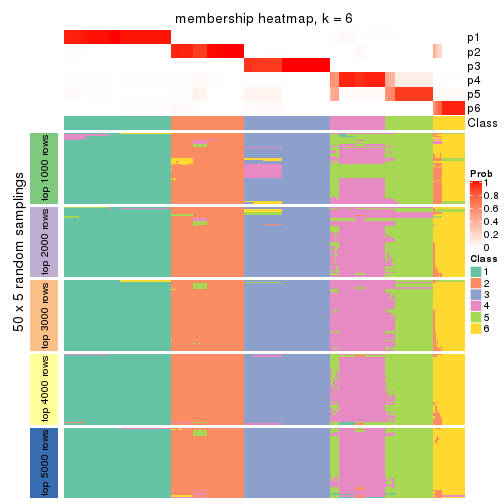</p>

</div>
</div>

As soon as we have had the classes for columns, we can look for signatures
which are significantly different between classes which can be candidate marks
for certain classes. Following are the heatmaps for signatures.


Signature heatmaps where rows are scaled:


<script>
$( function() {
	$( '#tabs-CV-NMF-get-signatures' ).tabs();
} );
</script>
<div id='tabs-CV-NMF-get-signatures'>
<ul>
<li><a href='#tab-CV-NMF-get-signatures-1'>k = 2</a></li>
<li><a href='#tab-CV-NMF-get-signatures-2'>k = 3</a></li>
<li><a href='#tab-CV-NMF-get-signatures-3'>k = 4</a></li>
<li><a href='#tab-CV-NMF-get-signatures-4'>k = 5</a></li>
<li><a href='#tab-CV-NMF-get-signatures-5'>k = 6</a></li>
</ul>
<div id='tab-CV-NMF-get-signatures-1'>
<pre><code class="r">get_signatures(res, k = 2)
</code></pre>

<p></p>

</div>
<div id='tab-CV-NMF-get-signatures-2'>
<pre><code class="r">get_signatures(res, k = 3)
</code></pre>

<p></p>

</div>
<div id='tab-CV-NMF-get-signatures-3'>
<pre><code class="r">get_signatures(res, k = 4)
</code></pre>

<p></p>

</div>
<div id='tab-CV-NMF-get-signatures-4'>
<pre><code class="r">get_signatures(res, k = 5)
</code></pre>

<p></p>

</div>
<div id='tab-CV-NMF-get-signatures-5'>
<pre><code class="r">get_signatures(res, k = 6)
</code></pre>

<p></p>

</div>
</div>


Signature heatmaps where rows are not scaled:


<script>
$( function() {
	$( '#tabs-CV-NMF-get-signatures-no-scale' ).tabs();
} );
</script>
<div id='tabs-CV-NMF-get-signatures-no-scale'>
<ul>
<li><a href='#tab-CV-NMF-get-signatures-no-scale-1'>k = 2</a></li>
<li><a href='#tab-CV-NMF-get-signatures-no-scale-2'>k = 3</a></li>
<li><a href='#tab-CV-NMF-get-signatures-no-scale-3'>k = 4</a></li>
<li><a href='#tab-CV-NMF-get-signatures-no-scale-4'>k = 5</a></li>
<li><a href='#tab-CV-NMF-get-signatures-no-scale-5'>k = 6</a></li>
</ul>
<div id='tab-CV-NMF-get-signatures-no-scale-1'>
<pre><code class="r">get_signatures(res, k = 2, scale_rows = FALSE)
</code></pre>

<p></p>

</div>
<div id='tab-CV-NMF-get-signatures-no-scale-2'>
<pre><code class="r">get_signatures(res, k = 3, scale_rows = FALSE)
</code></pre>

<p></p>

</div>
<div id='tab-CV-NMF-get-signatures-no-scale-3'>
<pre><code class="r">get_signatures(res, k = 4, scale_rows = FALSE)
</code></pre>

<p></p>

</div>
<div id='tab-CV-NMF-get-signatures-no-scale-4'>
<pre><code class="r">get_signatures(res, k = 5, scale_rows = FALSE)
</code></pre>

<p></p>

</div>
<div id='tab-CV-NMF-get-signatures-no-scale-5'>
<pre><code class="r">get_signatures(res, k = 6, scale_rows = FALSE)
</code></pre>

<p></p>

</div>
</div>


Compare the overlap of signatures from different k:

```r
compare_signatures(res)
```


`get_signature()` returns a data frame invisibly. TO get the list of signatures, the function
call should be assigned to a variable explicitly. In following code, if `plot` argument is set
to `FALSE`, no heatmap is plotted while only the differential analysis is performed.

```r
# code only for demonstration
tb = get_signature(res, k = ..., plot = FALSE)
```

An example of the output of `tb` is:

```
#>   which_row         fdr    mean_1    mean_2 scaled_mean_1 scaled_mean_2 km
#> 1        38 0.042760348  8.373488  9.131774    -0.5533452     0.5164555  1
#> 2        40 0.018707592  7.106213  8.469186    -0.6173731     0.5762149  1
#> 3        55 0.019134737 10.221463 11.207825    -0.6159697     0.5749050  1
#> 4        59 0.006059896  5.921854  7.869574    -0.6899429     0.6439467  1
#> 5        60 0.018055526  8.928898 10.211722    -0.6204761     0.5791110  1
#> 6        98 0.009384629 15.714769 14.887706     0.6635654    -0.6193277  2
...
```

The columns in `tb` are:

1. `which_row`: row indices corresponding to the input matrix.
2. `fdr`: FDR for the differential test. 
3. `mean_x`: The mean value in group x.
4. `scaled_mean_x`: The mean value in group x after rows are scaled.
5. `km`: Row groups if k-means clustering is applied to rows.


UMAP plot which shows how samples are separated.


<script>
$( function() {
	$( '#tabs-CV-NMF-dimension-reduction' ).tabs();
} );
</script>
<div id='tabs-CV-NMF-dimension-reduction'>
<ul>
<li><a href='#tab-CV-NMF-dimension-reduction-1'>k = 2</a></li>
<li><a href='#tab-CV-NMF-dimension-reduction-2'>k = 3</a></li>
<li><a href='#tab-CV-NMF-dimension-reduction-3'>k = 4</a></li>
<li><a href='#tab-CV-NMF-dimension-reduction-4'>k = 5</a></li>
<li><a href='#tab-CV-NMF-dimension-reduction-5'>k = 6</a></li>
</ul>
<div id='tab-CV-NMF-dimension-reduction-1'>
<pre><code class="r">dimension_reduction(res, k = 2, method = &quot;UMAP&quot;)
</code></pre>

<p></p>

</div>
<div id='tab-CV-NMF-dimension-reduction-2'>
<pre><code class="r">dimension_reduction(res, k = 3, method = &quot;UMAP&quot;)
</code></pre>

<p></p>

</div>
<div id='tab-CV-NMF-dimension-reduction-3'>
<pre><code class="r">dimension_reduction(res, k = 4, method = &quot;UMAP&quot;)
</code></pre>

<p></p>

</div>
<div id='tab-CV-NMF-dimension-reduction-4'>
<pre><code class="r">dimension_reduction(res, k = 5, method = &quot;UMAP&quot;)
</code></pre>

<p></p>

</div>
<div id='tab-CV-NMF-dimension-reduction-5'>
<pre><code class="r">dimension_reduction(res, k = 6, method = &quot;UMAP&quot;)
</code></pre>

<p></p>

</div>
</div>


Following heatmap shows how subgroups are split when increasing `k`:

```r
collect_classes(res)
```


If matrix rows can be associated to genes, consider to use `functional_enrichment(res,
...)` to perform function enrichment for the signature genes. See [this vignette](http://bioconductor.org/packages/devel/bioc/vignettes/cola/inst/doc/functional_enrichment.html) for more detailed explanations.


 

---------------------------------------------------


### MAD:hclust**


The object with results only for a single top-value method and a single partition method 
can be extracted as:

```r
res = res_list["MAD", "hclust"]
# you can also extract it by
# res = res_list["MAD:hclust"]
```

A summary of `res` and all the functions that can be applied to it:

```r
res
```

```
#> A 'ConsensusPartition' object with k = 2, 3, 4, 5, 6.
#>   On a matrix with 13278 rows and 322 columns.
#>   Top rows (1000, 2000, 3000, 4000, 5000) are extracted by 'MAD' method.
#>   Subgroups are detected by 'hclust' method.
#>   Performed in total 1250 partitions by row resampling.
#>   Best k for subgroups seems to be 6.
#> 
#> Following methods can be applied to this 'ConsensusPartition' object:
#>  [1] "cola_report"             "collect_classes"         "collect_plots"          
#>  [4] "collect_stats"           "colnames"                "compare_signatures"     
#>  [7] "consensus_heatmap"       "dimension_reduction"     "functional_enrichment"  
#> [10] "get_anno_col"            "get_anno"                "get_classes"            
#> [13] "get_consensus"           "get_matrix"              "get_membership"         
#> [16] "get_param"               "get_signatures"          "get_stats"              
#> [19] "is_best_k"               "is_stable_k"             "membership_heatmap"     
#> [22] "ncol"                    "nrow"                    "plot_ecdf"              
#> [25] "rownames"                "select_partition_number" "show"                   
#> [28] "suggest_best_k"          "test_to_known_factors"
```

`collect_plots()` function collects all the plots made from `res` for all `k` (number of partitions)
into one single page to provide an easy and fast comparison between different `k`.

```r
collect_plots(res)
```


The plots are:

- The first row: a plot of the ECDF (empirical cumulative distribution
  function) curves of the consensus matrix for each `k` and the heatmap of
  predicted classes for each `k`.
- The second row: heatmaps of the consensus matrix for each `k`.
- The third row: heatmaps of the membership matrix for each `k`.
- The fouth row: heatmaps of the signatures for each `k`.

All the plots in panels can be made by individual functions and they are
plotted later in this section.

`select_partition_number()` produces several plots showing different
statistics for choosing "optimized" `k`. There are following statistics:

- ECDF curves of the consensus matrix for each `k`;
- 1-PAC. [The PAC
  score](https://en.wikipedia.org/wiki/Consensus_clustering#Over-interpretation_potential_of_consensus_clustering)
  measures the proportion of the ambiguous subgrouping.
- Mean silhouette score.
- Concordance. The mean probability of fiting the consensus class ids in all
  partitions.
- Area increased. Denote $A_k$ as the area under the ECDF curve for current
  `k`, the area increased is defined as $A_k - A_{k-1}$.
- Rand index. The percent of pairs of samples that are both in a same cluster
  or both are not in a same cluster in the partition of k and k-1.
- Jaccard index. The ratio of pairs of samples are both in a same cluster in
  the partition of k and k-1 and the pairs of samples are both in a same
  cluster in the partition k or k-1.

The detailed explanations of these statistics can be found in [the _cola_
vignette](http://bioconductor.org/packages/devel/bioc/vignettes/cola/inst/doc/cola.html#toc_13).

Generally speaking, lower PAC score, higher mean silhouette score or higher
concordance corresponds to better partition. Rand index and Jaccard index
measure how similar the current partition is compared to partition with `k-1`.
If they are too similar, we won't accept `k` is better than `k-1`.

```r
select_partition_number(res)
```


The numeric values for all these statistics can be obtained by `get_stats()`.

```r
get_stats(res)
```

```
#>   k 1-PAC mean_silhouette concordance area_increased  Rand Jaccard
#> 2 2 1.000           1.000       1.000        0.47414 0.526   0.526
#> 3 3 0.868           0.974       0.983        0.36957 0.826   0.670
#> 4 4 1.000           1.000       1.000        0.10981 0.927   0.792
#> 5 5 1.000           0.997       1.000        0.00182 0.999   0.995
#> 6 6 0.962           0.944       0.976        0.08901 0.929   0.746
```

`suggest_best_k()` suggests the best $k$ based on these statistics. The rules are as follows:

- All $k$ with Jaccard index larger than 0.95 are removed because increasing
  $k$ does not provide enough extra information. If all $k$ are removed, it is
  marked as no subgroup is detected.
- For all $k$ with 1-PAC score larger than 0.9, the maximal $k$ is taken as
  the best $k$, and other $k$ are marked as optional $k$.
- If it does not fit the second rule. The $k$ with the maximal vote of the
  highest 1-PAC score, highest mean silhouette, and highest concordance is
  taken as the best $k$.

```r
suggest_best_k(res)
```

```
#> [1] 6
#> attr(,"optional")
#> [1] 2 4
```

There is also optional best $k$ = 2 4 that is worth to check.

Following shows the table of the partitions (You need to click the **show/hide
code output** link to see it). The membership matrix (columns with name `p*`)
is inferred by
[`clue::cl_consensus()`](https://www.rdocumentation.org/link/cl_consensus?package=clue)
function with the `SE` method. Basically the value in the membership matrix
represents the probability to belong to a certain group. The finall class
label for an item is determined with the group with highest probability it
belongs to.

In `get_classes()` function, the entropy is calculated from the membership
matrix and the silhouette score is calculated from the consensus matrix.


<script>
$( function() {
	$( '#tabs-MAD-hclust-get-classes' ).tabs();
} );
</script>
<div id='tabs-MAD-hclust-get-classes'>
<ul>
<li><a href='#tab-MAD-hclust-get-classes-1'>k = 2</a></li>
<li><a href='#tab-MAD-hclust-get-classes-2'>k = 3</a></li>
<li><a href='#tab-MAD-hclust-get-classes-3'>k = 4</a></li>
<li><a href='#tab-MAD-hclust-get-classes-4'>k = 5</a></li>
<li><a href='#tab-MAD-hclust-get-classes-5'>k = 6</a></li>
</ul>

<div id='tab-MAD-hclust-get-classes-1'>
<p><a id='tab-MAD-hclust-get-classes-1-a' style='color:#0366d6' href='#'>show/hide code output</a></p>
<pre><code class="r">cbind(get_classes(res, k = 2), get_membership(res, k = 2))
</code></pre>

<pre><code>#&gt;           class entropy silhouette p1 p2
#&gt; DRR023371     1       0          1  1  0
#&gt; DRR023372     1       0          1  1  0
#&gt; DRR023373     1       0          1  1  0
#&gt; DRR023374     1       0          1  1  0
#&gt; DRR023375     1       0          1  1  0
#&gt; DRR023376     1       0          1  1  0
#&gt; DRR023377     1       0          1  1  0
#&gt; DRR023378     1       0          1  1  0
#&gt; DRR023379     1       0          1  1  0
#&gt; DRR023380     1       0          1  1  0
#&gt; DRR023381     1       0          1  1  0
#&gt; DRR023382     1       0          1  1  0
#&gt; DRR023383     1       0          1  1  0
#&gt; DRR023384     1       0          1  1  0
#&gt; DRR023385     1       0          1  1  0
#&gt; DRR023386     1       0          1  1  0
#&gt; DRR023387     1       0          1  1  0
#&gt; DRR023388     1       0          1  1  0
#&gt; DRR023389     1       0          1  1  0
#&gt; DRR023390     1       0          1  1  0
#&gt; DRR023391     1       0          1  1  0
#&gt; DRR023392     1       0          1  1  0
#&gt; DRR023394     1       0          1  1  0
#&gt; DRR023395     1       0          1  1  0
#&gt; DRR023396     1       0          1  1  0
#&gt; DRR023397     1       0          1  1  0
#&gt; DRR023398     1       0          1  1  0
#&gt; DRR023399     1       0          1  1  0
#&gt; DRR023400     1       0          1  1  0
#&gt; DRR023401     1       0          1  1  0
#&gt; DRR023402     1       0          1  1  0
#&gt; DRR023403     1       0          1  1  0
#&gt; DRR023404     2       0          1  0  1
#&gt; DRR023405     2       0          1  0  1
#&gt; DRR023406     2       0          1  0  1
#&gt; DRR023407     2       0          1  0  1
#&gt; DRR023408     2       0          1  0  1
#&gt; DRR023409     2       0          1  0  1
#&gt; DRR023410     2       0          1  0  1
#&gt; DRR023411     2       0          1  0  1
#&gt; DRR023412     2       0          1  0  1
#&gt; DRR023413     2       0          1  0  1
#&gt; DRR023414     2       0          1  0  1
#&gt; DRR023415     2       0          1  0  1
#&gt; DRR023416     2       0          1  0  1
#&gt; DRR023417     2       0          1  0  1
#&gt; DRR023418     2       0          1  0  1
#&gt; DRR023419     2       0          1  0  1
#&gt; DRR023420     2       0          1  0  1
#&gt; DRR023421     2       0          1  0  1
#&gt; DRR023422     2       0          1  0  1
#&gt; DRR023423     2       0          1  0  1
#&gt; DRR023425     2       0          1  0  1
#&gt; DRR023426     2       0          1  0  1
#&gt; DRR023427     2       0          1  0  1
#&gt; DRR023428     2       0          1  0  1
#&gt; DRR023429     2       0          1  0  1
#&gt; DRR023430     2       0          1  0  1
#&gt; DRR023431     2       0          1  0  1
#&gt; DRR023432     2       0          1  0  1
#&gt; DRR023433     2       0          1  0  1
#&gt; DRR023434     2       0          1  0  1
#&gt; DRR023435     2       0          1  0  1
#&gt; DRR023436     2       0          1  0  1
#&gt; DRR023437     2       0          1  0  1
#&gt; DRR023438     2       0          1  0  1
#&gt; DRR023439     2       0          1  0  1
#&gt; DRR023440     2       0          1  0  1
#&gt; DRR023441     2       0          1  0  1
#&gt; DRR023442     2       0          1  0  1
#&gt; DRR023443     2       0          1  0  1
#&gt; DRR023444     2       0          1  0  1
#&gt; DRR023445     2       0          1  0  1
#&gt; DRR023446     2       0          1  0  1
#&gt; DRR023447     2       0          1  0  1
#&gt; DRR023448     2       0          1  0  1
#&gt; DRR023449     2       0          1  0  1
#&gt; DRR023450     2       0          1  0  1
#&gt; DRR023451     2       0          1  0  1
#&gt; DRR023452     2       0          1  0  1
#&gt; DRR023453     1       0          1  1  0
#&gt; DRR023454     1       0          1  1  0
#&gt; DRR023455     1       0          1  1  0
#&gt; DRR023456     1       0          1  1  0
#&gt; DRR023457     1       0          1  1  0
#&gt; DRR023458     1       0          1  1  0
#&gt; DRR023459     1       0          1  1  0
#&gt; DRR023460     1       0          1  1  0
#&gt; DRR023461     1       0          1  1  0
#&gt; DRR023462     1       0          1  1  0
#&gt; DRR023463     1       0          1  1  0
#&gt; DRR023464     1       0          1  1  0
#&gt; DRR023465     1       0          1  1  0
#&gt; DRR023466     1       0          1  1  0
#&gt; DRR023467     1       0          1  1  0
#&gt; DRR023468     1       0          1  1  0
#&gt; DRR023469     1       0          1  1  0
#&gt; DRR023470     1       0          1  1  0
#&gt; DRR023471     1       0          1  1  0
#&gt; DRR023472     1       0          1  1  0
#&gt; DRR023473     1       0          1  1  0
#&gt; DRR023474     1       0          1  1  0
#&gt; DRR023475     1       0          1  1  0
#&gt; DRR023476     1       0          1  1  0
#&gt; DRR023477     1       0          1  1  0
#&gt; DRR023478     1       0          1  1  0
#&gt; DRR023479     1       0          1  1  0
#&gt; DRR023480     1       0          1  1  0
#&gt; DRR023481     1       0          1  1  0
#&gt; DRR023482     1       0          1  1  0
#&gt; DRR023483     1       0          1  1  0
#&gt; DRR023484     1       0          1  1  0
#&gt; DRR023485     1       0          1  1  0
#&gt; DRR023486     1       0          1  1  0
#&gt; DRR023487     1       0          1  1  0
#&gt; DRR023488     1       0          1  1  0
#&gt; DRR023489     1       0          1  1  0
#&gt; DRR023490     1       0          1  1  0
#&gt; DRR023491     1       0          1  1  0
#&gt; DRR023492     1       0          1  1  0
#&gt; DRR023493     1       0          1  1  0
#&gt; DRR023494     1       0          1  1  0
#&gt; DRR023495     1       0          1  1  0
#&gt; DRR023496     1       0          1  1  0
#&gt; DRR023497     1       0          1  1  0
#&gt; DRR023498     1       0          1  1  0
#&gt; DRR023499     1       0          1  1  0
#&gt; DRR023500     1       0          1  1  0
#&gt; DRR023501     1       0          1  1  0
#&gt; DRR023502     1       0          1  1  0
#&gt; DRR023503     1       0          1  1  0
#&gt; DRR023504     1       0          1  1  0
#&gt; DRR023505     1       0          1  1  0
#&gt; DRR023506     1       0          1  1  0
#&gt; DRR023507     1       0          1  1  0
#&gt; DRR023508     1       0          1  1  0
#&gt; DRR023509     1       0          1  1  0
#&gt; DRR023510     1       0          1  1  0
#&gt; DRR023511     1       0          1  1  0
#&gt; DRR023512     1       0          1  1  0
#&gt; DRR023513     1       0          1  1  0
#&gt; DRR023514     1       0          1  1  0
#&gt; DRR023515     1       0          1  1  0
#&gt; DRR023516     1       0          1  1  0
#&gt; DRR023517     1       0          1  1  0
#&gt; DRR023518     1       0          1  1  0
#&gt; DRR023519     1       0          1  1  0
#&gt; DRR023520     1       0          1  1  0
#&gt; DRR023521     1       0          1  1  0
#&gt; DRR023522     1       0          1  1  0
#&gt; DRR023523     1       0          1  1  0
#&gt; DRR023524     1       0          1  1  0
#&gt; DRR023525     1       0          1  1  0
#&gt; DRR023526     1       0          1  1  0
#&gt; DRR023527     1       0          1  1  0
#&gt; DRR023528     1       0          1  1  0
#&gt; DRR023529     1       0          1  1  0
#&gt; DRR023530     1       0          1  1  0
#&gt; DRR023531     1       0          1  1  0
#&gt; DRR023532     1       0          1  1  0
#&gt; DRR023533     1       0          1  1  0
#&gt; DRR023534     1       0          1  1  0
#&gt; DRR023535     1       0          1  1  0
#&gt; DRR023536     1       0          1  1  0
#&gt; DRR023537     1       0          1  1  0
#&gt; DRR023538     1       0          1  1  0
#&gt; DRR023539     1       0          1  1  0
#&gt; DRR023540     1       0          1  1  0
#&gt; DRR023541     1       0          1  1  0
#&gt; DRR023542     1       0          1  1  0
#&gt; DRR023543     1       0          1  1  0
#&gt; DRR023544     1       0          1  1  0
#&gt; DRR023545     1       0          1  1  0
#&gt; DRR023546     1       0          1  1  0
#&gt; DRR023547     1       0          1  1  0
#&gt; DRR023548     1       0          1  1  0
#&gt; DRR023549     1       0          1  1  0
#&gt; DRR023550     1       0          1  1  0
#&gt; DRR023551     1       0          1  1  0
#&gt; DRR023552     1       0          1  1  0
#&gt; DRR023553     1       0          1  1  0
#&gt; DRR023554     1       0          1  1  0
#&gt; DRR023555     1       0          1  1  0
#&gt; DRR023556     1       0          1  1  0
#&gt; DRR023557     1       0          1  1  0
#&gt; DRR023558     1       0          1  1  0
#&gt; DRR023559     1       0          1  1  0
#&gt; DRR023560     1       0          1  1  0
#&gt; DRR023561     1       0          1  1  0
#&gt; DRR023562     1       0          1  1  0
#&gt; DRR023563     1       0          1  1  0
#&gt; DRR023564     1       0          1  1  0
#&gt; DRR023565     1       0          1  1  0
#&gt; DRR023566     1       0          1  1  0
#&gt; DRR023567     1       0          1  1  0
#&gt; DRR023568     1       0          1  1  0
#&gt; DRR023569     1       0          1  1  0
#&gt; DRR023570     1       0          1  1  0
#&gt; DRR023571     1       0          1  1  0
#&gt; DRR023572     1       0          1  1  0
#&gt; DRR023573     1       0          1  1  0
#&gt; DRR023574     1       0          1  1  0
#&gt; DRR023575     1       0          1  1  0
#&gt; DRR023576     2       0          1  0  1
#&gt; DRR023577     2       0          1  0  1
#&gt; DRR023578     2       0          1  0  1
#&gt; DRR023579     2       0          1  0  1
#&gt; DRR023580     2       0          1  0  1
#&gt; DRR023581     2       0          1  0  1
#&gt; DRR023582     2       0          1  0  1
#&gt; DRR023583     2       0          1  0  1
#&gt; DRR023584     2       0          1  0  1
#&gt; DRR023585     2       0          1  0  1
#&gt; DRR023586     2       0          1  0  1
#&gt; DRR023587     2       0          1  0  1
#&gt; DRR023588     2       0          1  0  1
#&gt; DRR023589     2       0          1  0  1
#&gt; DRR023590     2       0          1  0  1
#&gt; DRR023591     2       0          1  0  1
#&gt; DRR023592     2       0          1  0  1
#&gt; DRR023593     2       0          1  0  1
#&gt; DRR023594     2       0          1  0  1
#&gt; DRR023595     2       0          1  0  1
#&gt; DRR023596     2       0          1  0  1
#&gt; DRR023597     2       0          1  0  1
#&gt; DRR023598     2       0          1  0  1
#&gt; DRR023599     2       0          1  0  1
#&gt; DRR023600     2       0          1  0  1
#&gt; DRR023601     2       0          1  0  1
#&gt; DRR023602     2       0          1  0  1
#&gt; DRR023603     2       0          1  0  1
#&gt; DRR023604     2       0          1  0  1
#&gt; DRR023605     2       0          1  0  1
#&gt; DRR023606     2       0          1  0  1
#&gt; DRR023607     2       0          1  0  1
#&gt; DRR023608     2       0          1  0  1
#&gt; DRR023609     2       0          1  0  1
#&gt; DRR023610     2       0          1  0  1
#&gt; DRR023611     2       0          1  0  1
#&gt; DRR023612     2       0          1  0  1
#&gt; DRR023613     2       0          1  0  1
#&gt; DRR023614     2       0          1  0  1
#&gt; DRR023615     2       0          1  0  1
#&gt; DRR023616     2       0          1  0  1
#&gt; DRR023617     2       0          1  0  1
#&gt; DRR023619     1       0          1  1  0
#&gt; DRR023620     1       0          1  1  0
#&gt; DRR023621     1       0          1  1  0
#&gt; DRR023622     1       0          1  1  0
#&gt; DRR023623     1       0          1  1  0
#&gt; DRR023624     1       0          1  1  0
#&gt; DRR023625     1       0          1  1  0
#&gt; DRR023626     1       0          1  1  0
#&gt; DRR023627     1       0          1  1  0
#&gt; DRR023628     1       0          1  1  0
#&gt; DRR023629     1       0          1  1  0
#&gt; DRR023630     1       0          1  1  0
#&gt; DRR023631     1       0          1  1  0
#&gt; DRR023632     1       0          1  1  0
#&gt; DRR023633     1       0          1  1  0
#&gt; DRR023635     2       0          1  0  1
#&gt; DRR023636     2       0          1  0  1
#&gt; DRR023637     2       0          1  0  1
#&gt; DRR023638     2       0          1  0  1
#&gt; DRR023639     2       0          1  0  1
#&gt; DRR023640     2       0          1  0  1
#&gt; DRR023641     2       0          1  0  1
#&gt; DRR023642     2       0          1  0  1
#&gt; DRR023643     2       0          1  0  1
#&gt; DRR023644     2       0          1  0  1
#&gt; DRR023645     2       0          1  0  1
#&gt; DRR023646     2       0          1  0  1
#&gt; DRR023647     2       0          1  0  1
#&gt; DRR023648     2       0          1  0  1
#&gt; DRR023649     2       0          1  0  1
#&gt; DRR023650     1       0          1  1  0
#&gt; DRR023651     1       0          1  1  0
#&gt; DRR023652     1       0          1  1  0
#&gt; DRR023653     1       0          1  1  0
#&gt; DRR023654     1       0          1  1  0
#&gt; DRR023655     1       0          1  1  0
#&gt; DRR023656     1       0          1  1  0
#&gt; DRR023657     1       0          1  1  0
#&gt; DRR023658     1       0          1  1  0
#&gt; DRR023659     1       0          1  1  0
#&gt; DRR023660     1       0          1  1  0
#&gt; DRR023661     1       0          1  1  0
#&gt; DRR023662     1       0          1  1  0
#&gt; DRR023663     1       0          1  1  0
#&gt; DRR023664     1       0          1  1  0
#&gt; DRR023665     1       0          1  1  0
#&gt; DRR023666     1       0          1  1  0
#&gt; DRR023667     1       0          1  1  0
#&gt; DRR023668     1       0          1  1  0
#&gt; DRR023669     1       0          1  1  0
#&gt; DRR023670     1       0          1  1  0
#&gt; DRR023671     1       0          1  1  0
#&gt; DRR023672     1       0          1  1  0
#&gt; DRR023673     1       0          1  1  0
#&gt; DRR023674     1       0          1  1  0
#&gt; DRR023675     1       0          1  1  0
#&gt; DRR023676     1       0          1  1  0
#&gt; DRR023677     1       0          1  1  0
#&gt; DRR023678     1       0          1  1  0
#&gt; DRR023683     2       0          1  0  1
#&gt; DRR023684     2       0          1  0  1
#&gt; DRR023685     2       0          1  0  1
#&gt; DRR023686     2       0          1  0  1
#&gt; DRR023687     2       0          1  0  1
#&gt; DRR023688     2       0          1  0  1
#&gt; DRR023689     2       0          1  0  1
#&gt; DRR023690     2       0          1  0  1
#&gt; DRR023691     2       0          1  0  1
#&gt; DRR023692     2       0          1  0  1
#&gt; DRR023693     2       0          1  0  1
#&gt; DRR023694     2       0          1  0  1
#&gt; DRR023695     2       0          1  0  1
#&gt; DRR023696     2       0          1  0  1
#&gt; DRR023697     2       0          1  0  1
#&gt; DRR023698     2       0          1  0  1
#&gt; DRR023699     2       0          1  0  1
#&gt; DRR023700     2       0          1  0  1
</code></pre>

<script>
$('#tab-MAD-hclust-get-classes-1-a').parent().next().next().hide();
$('#tab-MAD-hclust-get-classes-1-a').click(function(){
  $('#tab-MAD-hclust-get-classes-1-a').parent().next().next().toggle();
  return(false);
});
</script>
</div>

<div id='tab-MAD-hclust-get-classes-2'>
<p><a id='tab-MAD-hclust-get-classes-2-a' style='color:#0366d6' href='#'>show/hide code output</a></p>
<pre><code class="r">cbind(get_classes(res, k = 3), get_membership(res, k = 3))
</code></pre>

<pre><code>#&gt;           class entropy silhouette    p1 p2    p3
#&gt; DRR023371     3   0.000      1.000 0.000  0 1.000
#&gt; DRR023372     3   0.000      1.000 0.000  0 1.000
#&gt; DRR023373     3   0.000      1.000 0.000  0 1.000
#&gt; DRR023374     3   0.000      1.000 0.000  0 1.000
#&gt; DRR023375     3   0.000      1.000 0.000  0 1.000
#&gt; DRR023376     3   0.000      1.000 0.000  0 1.000
#&gt; DRR023377     3   0.000      1.000 0.000  0 1.000
#&gt; DRR023378     3   0.000      1.000 0.000  0 1.000
#&gt; DRR023379     3   0.000      1.000 0.000  0 1.000
#&gt; DRR023380     3   0.000      1.000 0.000  0 1.000
#&gt; DRR023381     3   0.000      1.000 0.000  0 1.000
#&gt; DRR023382     3   0.000      1.000 0.000  0 1.000
#&gt; DRR023383     3   0.000      1.000 0.000  0 1.000
#&gt; DRR023384     3   0.000      1.000 0.000  0 1.000
#&gt; DRR023385     3   0.000      1.000 0.000  0 1.000
#&gt; DRR023386     3   0.000      1.000 0.000  0 1.000
#&gt; DRR023387     3   0.000      1.000 0.000  0 1.000
#&gt; DRR023388     3   0.000      1.000 0.000  0 1.000
#&gt; DRR023389     3   0.000      1.000 0.000  0 1.000
#&gt; DRR023390     3   0.000      1.000 0.000  0 1.000
#&gt; DRR023391     3   0.000      1.000 0.000  0 1.000
#&gt; DRR023392     3   0.000      1.000 0.000  0 1.000
#&gt; DRR023394     3   0.000      1.000 0.000  0 1.000
#&gt; DRR023395     3   0.000      1.000 0.000  0 1.000
#&gt; DRR023396     3   0.000      1.000 0.000  0 1.000
#&gt; DRR023397     3   0.000      1.000 0.000  0 1.000
#&gt; DRR023398     3   0.000      1.000 0.000  0 1.000
#&gt; DRR023399     3   0.000      1.000 0.000  0 1.000
#&gt; DRR023400     3   0.000      1.000 0.000  0 1.000
#&gt; DRR023401     3   0.000      1.000 0.000  0 1.000
#&gt; DRR023402     3   0.000      1.000 0.000  0 1.000
#&gt; DRR023403     3   0.000      1.000 0.000  0 1.000
#&gt; DRR023404     2   0.000      1.000 0.000  1 0.000
#&gt; DRR023405     2   0.000      1.000 0.000  1 0.000
#&gt; DRR023406     2   0.000      1.000 0.000  1 0.000
#&gt; DRR023407     2   0.000      1.000 0.000  1 0.000
#&gt; DRR023408     2   0.000      1.000 0.000  1 0.000
#&gt; DRR023409     2   0.000      1.000 0.000  1 0.000
#&gt; DRR023410     2   0.000      1.000 0.000  1 0.000
#&gt; DRR023411     2   0.000      1.000 0.000  1 0.000
#&gt; DRR023412     2   0.000      1.000 0.000  1 0.000
#&gt; DRR023413     2   0.000      1.000 0.000  1 0.000
#&gt; DRR023414     2   0.000      1.000 0.000  1 0.000
#&gt; DRR023415     2   0.000      1.000 0.000  1 0.000
#&gt; DRR023416     2   0.000      1.000 0.000  1 0.000
#&gt; DRR023417     2   0.000      1.000 0.000  1 0.000
#&gt; DRR023418     2   0.000      1.000 0.000  1 0.000
#&gt; DRR023419     2   0.000      1.000 0.000  1 0.000
#&gt; DRR023420     2   0.000      1.000 0.000  1 0.000
#&gt; DRR023421     2   0.000      1.000 0.000  1 0.000
#&gt; DRR023422     2   0.000      1.000 0.000  1 0.000
#&gt; DRR023423     2   0.000      1.000 0.000  1 0.000
#&gt; DRR023425     2   0.000      1.000 0.000  1 0.000
#&gt; DRR023426     2   0.000      1.000 0.000  1 0.000
#&gt; DRR023427     2   0.000      1.000 0.000  1 0.000
#&gt; DRR023428     2   0.000      1.000 0.000  1 0.000
#&gt; DRR023429     2   0.000      1.000 0.000  1 0.000
#&gt; DRR023430     2   0.000      1.000 0.000  1 0.000
#&gt; DRR023431     2   0.000      1.000 0.000  1 0.000
#&gt; DRR023432     2   0.000      1.000 0.000  1 0.000
#&gt; DRR023433     2   0.000      1.000 0.000  1 0.000
#&gt; DRR023434     2   0.000      1.000 0.000  1 0.000
#&gt; DRR023435     2   0.000      1.000 0.000  1 0.000
#&gt; DRR023436     2   0.000      1.000 0.000  1 0.000
#&gt; DRR023437     2   0.000      1.000 0.000  1 0.000
#&gt; DRR023438     2   0.000      1.000 0.000  1 0.000
#&gt; DRR023439     2   0.000      1.000 0.000  1 0.000
#&gt; DRR023440     2   0.000      1.000 0.000  1 0.000
#&gt; DRR023441     2   0.000      1.000 0.000  1 0.000
#&gt; DRR023442     2   0.000      1.000 0.000  1 0.000
#&gt; DRR023443     2   0.000      1.000 0.000  1 0.000
#&gt; DRR023444     2   0.000      1.000 0.000  1 0.000
#&gt; DRR023445     2   0.000      1.000 0.000  1 0.000
#&gt; DRR023446     2   0.000      1.000 0.000  1 0.000
#&gt; DRR023447     2   0.000      1.000 0.000  1 0.000
#&gt; DRR023448     2   0.000      1.000 0.000  1 0.000
#&gt; DRR023449     2   0.000      1.000 0.000  1 0.000
#&gt; DRR023450     2   0.000      1.000 0.000  1 0.000
#&gt; DRR023451     2   0.000      1.000 0.000  1 0.000
#&gt; DRR023452     2   0.000      1.000 0.000  1 0.000
#&gt; DRR023453     3   0.000      1.000 0.000  0 1.000
#&gt; DRR023454     3   0.000      1.000 0.000  0 1.000
#&gt; DRR023455     3   0.000      1.000 0.000  0 1.000
#&gt; DRR023456     3   0.000      1.000 0.000  0 1.000
#&gt; DRR023457     3   0.000      1.000 0.000  0 1.000
#&gt; DRR023458     3   0.000      1.000 0.000  0 1.000
#&gt; DRR023459     3   0.000      1.000 0.000  0 1.000
#&gt; DRR023460     3   0.000      1.000 0.000  0 1.000
#&gt; DRR023461     3   0.000      1.000 0.000  0 1.000
#&gt; DRR023462     3   0.000      1.000 0.000  0 1.000
#&gt; DRR023463     3   0.000      1.000 0.000  0 1.000
#&gt; DRR023464     3   0.000      1.000 0.000  0 1.000
#&gt; DRR023465     3   0.000      1.000 0.000  0 1.000
#&gt; DRR023466     3   0.000      1.000 0.000  0 1.000
#&gt; DRR023467     3   0.000      1.000 0.000  0 1.000
#&gt; DRR023468     3   0.000      1.000 0.000  0 1.000
#&gt; DRR023469     3   0.000      1.000 0.000  0 1.000
#&gt; DRR023470     3   0.000      1.000 0.000  0 1.000
#&gt; DRR023471     3   0.000      1.000 0.000  0 1.000
#&gt; DRR023472     3   0.000      1.000 0.000  0 1.000
#&gt; DRR023473     3   0.000      1.000 0.000  0 1.000
#&gt; DRR023474     3   0.000      1.000 0.000  0 1.000
#&gt; DRR023475     3   0.000      1.000 0.000  0 1.000
#&gt; DRR023476     3   0.000      1.000 0.000  0 1.000
#&gt; DRR023477     3   0.000      1.000 0.000  0 1.000
#&gt; DRR023478     3   0.000      1.000 0.000  0 1.000
#&gt; DRR023479     3   0.000      1.000 0.000  0 1.000
#&gt; DRR023480     3   0.000      1.000 0.000  0 1.000
#&gt; DRR023481     3   0.000      1.000 0.000  0 1.000
#&gt; DRR023482     3   0.000      1.000 0.000  0 1.000
#&gt; DRR023483     3   0.000      1.000 0.000  0 1.000
#&gt; DRR023484     3   0.000      1.000 0.000  0 1.000
#&gt; DRR023485     3   0.000      1.000 0.000  0 1.000
#&gt; DRR023486     3   0.000      1.000 0.000  0 1.000
#&gt; DRR023487     3   0.000      1.000 0.000  0 1.000
#&gt; DRR023488     3   0.000      1.000 0.000  0 1.000
#&gt; DRR023489     3   0.000      1.000 0.000  0 1.000
#&gt; DRR023490     1   0.000      0.954 1.000  0 0.000
#&gt; DRR023491     1   0.000      0.954 1.000  0 0.000
#&gt; DRR023492     1   0.000      0.954 1.000  0 0.000
#&gt; DRR023493     1   0.000      0.954 1.000  0 0.000
#&gt; DRR023494     1   0.000      0.954 1.000  0 0.000
#&gt; DRR023495     1   0.000      0.954 1.000  0 0.000
#&gt; DRR023496     1   0.000      0.954 1.000  0 0.000
#&gt; DRR023497     1   0.000      0.954 1.000  0 0.000
#&gt; DRR023498     1   0.000      0.954 1.000  0 0.000
#&gt; DRR023499     1   0.000      0.954 1.000  0 0.000
#&gt; DRR023500     1   0.000      0.954 1.000  0 0.000
#&gt; DRR023501     1   0.000      0.954 1.000  0 0.000
#&gt; DRR023502     1   0.000      0.954 1.000  0 0.000
#&gt; DRR023503     1   0.000      0.954 1.000  0 0.000
#&gt; DRR023504     1   0.000      0.954 1.000  0 0.000
#&gt; DRR023505     1   0.000      0.954 1.000  0 0.000
#&gt; DRR023506     1   0.000      0.954 1.000  0 0.000
#&gt; DRR023507     1   0.000      0.954 1.000  0 0.000
#&gt; DRR023508     1   0.000      0.954 1.000  0 0.000
#&gt; DRR023509     1   0.000      0.954 1.000  0 0.000
#&gt; DRR023510     1   0.000      0.954 1.000  0 0.000
#&gt; DRR023511     1   0.000      0.954 1.000  0 0.000
#&gt; DRR023512     1   0.000      0.954 1.000  0 0.000
#&gt; DRR023513     1   0.000      0.954 1.000  0 0.000
#&gt; DRR023514     1   0.000      0.954 1.000  0 0.000
#&gt; DRR023515     1   0.000      0.954 1.000  0 0.000
#&gt; DRR023516     1   0.000      0.954 1.000  0 0.000
#&gt; DRR023517     1   0.000      0.954 1.000  0 0.000
#&gt; DRR023518     1   0.000      0.954 1.000  0 0.000
#&gt; DRR023519     1   0.000      0.954 1.000  0 0.000
#&gt; DRR023520     1   0.000      0.954 1.000  0 0.000
#&gt; DRR023521     1   0.000      0.954 1.000  0 0.000
#&gt; DRR023522     1   0.000      0.954 1.000  0 0.000
#&gt; DRR023523     1   0.000      0.954 1.000  0 0.000
#&gt; DRR023524     1   0.000      0.954 1.000  0 0.000
#&gt; DRR023525     1   0.000      0.954 1.000  0 0.000
#&gt; DRR023526     1   0.000      0.954 1.000  0 0.000
#&gt; DRR023527     1   0.000      0.954 1.000  0 0.000
#&gt; DRR023528     1   0.000      0.954 1.000  0 0.000
#&gt; DRR023529     1   0.000      0.954 1.000  0 0.000
#&gt; DRR023530     1   0.000      0.954 1.000  0 0.000
#&gt; DRR023531     1   0.000      0.954 1.000  0 0.000
#&gt; DRR023532     1   0.000      0.954 1.000  0 0.000
#&gt; DRR023533     1   0.000      0.954 1.000  0 0.000
#&gt; DRR023534     1   0.000      0.954 1.000  0 0.000
#&gt; DRR023535     1   0.000      0.954 1.000  0 0.000
#&gt; DRR023536     1   0.000      0.954 1.000  0 0.000
#&gt; DRR023537     1   0.000      0.954 1.000  0 0.000
#&gt; DRR023538     1   0.000      0.954 1.000  0 0.000
#&gt; DRR023539     1   0.000      0.954 1.000  0 0.000
#&gt; DRR023540     1   0.000      0.954 1.000  0 0.000
#&gt; DRR023541     1   0.000      0.954 1.000  0 0.000
#&gt; DRR023542     1   0.000      0.954 1.000  0 0.000
#&gt; DRR023543     1   0.000      0.954 1.000  0 0.000
#&gt; DRR023544     1   0.000      0.954 1.000  0 0.000
#&gt; DRR023545     1   0.000      0.954 1.000  0 0.000
#&gt; DRR023546     1   0.000      0.954 1.000  0 0.000
#&gt; DRR023547     1   0.000      0.954 1.000  0 0.000
#&gt; DRR023548     1   0.000      0.954 1.000  0 0.000
#&gt; DRR023549     1   0.000      0.954 1.000  0 0.000
#&gt; DRR023550     1   0.000      0.954 1.000  0 0.000
#&gt; DRR023551     1   0.000      0.954 1.000  0 0.000
#&gt; DRR023552     1   0.000      0.954 1.000  0 0.000
#&gt; DRR023553     1   0.000      0.954 1.000  0 0.000
#&gt; DRR023554     1   0.000      0.954 1.000  0 0.000
#&gt; DRR023555     1   0.000      0.954 1.000  0 0.000
#&gt; DRR023556     1   0.000      0.954 1.000  0 0.000
#&gt; DRR023557     1   0.000      0.954 1.000  0 0.000
#&gt; DRR023558     1   0.000      0.954 1.000  0 0.000
#&gt; DRR023559     1   0.000      0.954 1.000  0 0.000
#&gt; DRR023560     1   0.000      0.954 1.000  0 0.000
#&gt; DRR023561     1   0.000      0.954 1.000  0 0.000
#&gt; DRR023562     1   0.000      0.954 1.000  0 0.000
#&gt; DRR023563     1   0.000      0.954 1.000  0 0.000
#&gt; DRR023564     1   0.000      0.954 1.000  0 0.000
#&gt; DRR023565     1   0.000      0.954 1.000  0 0.000
#&gt; DRR023566     1   0.000      0.954 1.000  0 0.000
#&gt; DRR023567     1   0.000      0.954 1.000  0 0.000
#&gt; DRR023568     1   0.000      0.954 1.000  0 0.000
#&gt; DRR023569     1   0.000      0.954 1.000  0 0.000
#&gt; DRR023570     1   0.000      0.954 1.000  0 0.000
#&gt; DRR023571     1   0.000      0.954 1.000  0 0.000
#&gt; DRR023572     1   0.000      0.954 1.000  0 0.000
#&gt; DRR023573     1   0.000      0.954 1.000  0 0.000
#&gt; DRR023574     1   0.000      0.954 1.000  0 0.000
#&gt; DRR023575     1   0.000      0.954 1.000  0 0.000
#&gt; DRR023576     2   0.000      1.000 0.000  1 0.000
#&gt; DRR023577     2   0.000      1.000 0.000  1 0.000
#&gt; DRR023578     2   0.000      1.000 0.000  1 0.000
#&gt; DRR023579     2   0.000      1.000 0.000  1 0.000
#&gt; DRR023580     2   0.000      1.000 0.000  1 0.000
#&gt; DRR023581     2   0.000      1.000 0.000  1 0.000
#&gt; DRR023582     2   0.000      1.000 0.000  1 0.000
#&gt; DRR023583     2   0.000      1.000 0.000  1 0.000
#&gt; DRR023584     2   0.000      1.000 0.000  1 0.000
#&gt; DRR023585     2   0.000      1.000 0.000  1 0.000
#&gt; DRR023586     2   0.000      1.000 0.000  1 0.000
#&gt; DRR023587     2   0.000      1.000 0.000  1 0.000
#&gt; DRR023588     2   0.000      1.000 0.000  1 0.000
#&gt; DRR023589     2   0.000      1.000 0.000  1 0.000
#&gt; DRR023590     2   0.000      1.000 0.000  1 0.000
#&gt; DRR023591     2   0.000      1.000 0.000  1 0.000
#&gt; DRR023592     2   0.000      1.000 0.000  1 0.000
#&gt; DRR023593     2   0.000      1.000 0.000  1 0.000
#&gt; DRR023594     2   0.000      1.000 0.000  1 0.000
#&gt; DRR023595     2   0.000      1.000 0.000  1 0.000
#&gt; DRR023596     2   0.000      1.000 0.000  1 0.000
#&gt; DRR023597     2   0.000      1.000 0.000  1 0.000
#&gt; DRR023598     2   0.000      1.000 0.000  1 0.000
#&gt; DRR023599     2   0.000      1.000 0.000  1 0.000
#&gt; DRR023600     2   0.000      1.000 0.000  1 0.000
#&gt; DRR023601     2   0.000      1.000 0.000  1 0.000
#&gt; DRR023602     2   0.000      1.000 0.000  1 0.000
#&gt; DRR023603     2   0.000      1.000 0.000  1 0.000
#&gt; DRR023604     2   0.000      1.000 0.000  1 0.000
#&gt; DRR023605     2   0.000      1.000 0.000  1 0.000
#&gt; DRR023606     2   0.000      1.000 0.000  1 0.000
#&gt; DRR023607     2   0.000      1.000 0.000  1 0.000
#&gt; DRR023608     2   0.000      1.000 0.000  1 0.000
#&gt; DRR023609     2   0.000      1.000 0.000  1 0.000
#&gt; DRR023610     2   0.000      1.000 0.000  1 0.000
#&gt; DRR023611     2   0.000      1.000 0.000  1 0.000
#&gt; DRR023612     2   0.000      1.000 0.000  1 0.000
#&gt; DRR023613     2   0.000      1.000 0.000  1 0.000
#&gt; DRR023614     2   0.000      1.000 0.000  1 0.000
#&gt; DRR023615     2   0.000      1.000 0.000  1 0.000
#&gt; DRR023616     2   0.000      1.000 0.000  1 0.000
#&gt; DRR023617     2   0.000      1.000 0.000  1 0.000
#&gt; DRR023619     1   0.348      0.902 0.872  0 0.128
#&gt; DRR023620     1   0.348      0.902 0.872  0 0.128
#&gt; DRR023621     1   0.348      0.902 0.872  0 0.128
#&gt; DRR023622     1   0.348      0.902 0.872  0 0.128
#&gt; DRR023623     1   0.348      0.902 0.872  0 0.128
#&gt; DRR023624     1   0.348      0.902 0.872  0 0.128
#&gt; DRR023625     1   0.348      0.902 0.872  0 0.128
#&gt; DRR023626     1   0.348      0.902 0.872  0 0.128
#&gt; DRR023627     1   0.348      0.902 0.872  0 0.128
#&gt; DRR023628     1   0.348      0.902 0.872  0 0.128
#&gt; DRR023629     1   0.348      0.902 0.872  0 0.128
#&gt; DRR023630     1   0.348      0.902 0.872  0 0.128
#&gt; DRR023631     1   0.348      0.902 0.872  0 0.128
#&gt; DRR023632     1   0.348      0.902 0.872  0 0.128
#&gt; DRR023633     1   0.348      0.902 0.872  0 0.128
#&gt; DRR023635     2   0.000      1.000 0.000  1 0.000
#&gt; DRR023636     2   0.000      1.000 0.000  1 0.000
#&gt; DRR023637     2   0.000      1.000 0.000  1 0.000
#&gt; DRR023638     2   0.000      1.000 0.000  1 0.000
#&gt; DRR023639     2   0.000      1.000 0.000  1 0.000
#&gt; DRR023640     2   0.000      1.000 0.000  1 0.000
#&gt; DRR023641     2   0.000      1.000 0.000  1 0.000
#&gt; DRR023642     2   0.000      1.000 0.000  1 0.000
#&gt; DRR023643     2   0.000      1.000 0.000  1 0.000
#&gt; DRR023644     2   0.000      1.000 0.000  1 0.000
#&gt; DRR023645     2   0.000      1.000 0.000  1 0.000
#&gt; DRR023646     2   0.000      1.000 0.000  1 0.000
#&gt; DRR023647     2   0.000      1.000 0.000  1 0.000
#&gt; DRR023648     2   0.000      1.000 0.000  1 0.000
#&gt; DRR023649     2   0.000      1.000 0.000  1 0.000
#&gt; DRR023650     1   0.348      0.902 0.872  0 0.128
#&gt; DRR023651     1   0.348      0.902 0.872  0 0.128
#&gt; DRR023652     1   0.348      0.902 0.872  0 0.128
#&gt; DRR023653     1   0.348      0.902 0.872  0 0.128
#&gt; DRR023654     1   0.348      0.902 0.872  0 0.128
#&gt; DRR023655     1   0.348      0.902 0.872  0 0.128
#&gt; DRR023656     1   0.348      0.902 0.872  0 0.128
#&gt; DRR023657     1   0.348      0.902 0.872  0 0.128
#&gt; DRR023658     1   0.348      0.902 0.872  0 0.128
#&gt; DRR023659     1   0.348      0.902 0.872  0 0.128
#&gt; DRR023660     1   0.348      0.902 0.872  0 0.128
#&gt; DRR023661     1   0.348      0.902 0.872  0 0.128
#&gt; DRR023662     1   0.348      0.902 0.872  0 0.128
#&gt; DRR023663     1   0.348      0.902 0.872  0 0.128
#&gt; DRR023664     1   0.348      0.902 0.872  0 0.128
#&gt; DRR023665     1   0.348      0.902 0.872  0 0.128
#&gt; DRR023666     1   0.348      0.902 0.872  0 0.128
#&gt; DRR023667     1   0.348      0.902 0.872  0 0.128
#&gt; DRR023668     1   0.348      0.902 0.872  0 0.128
#&gt; DRR023669     1   0.348      0.902 0.872  0 0.128
#&gt; DRR023670     1   0.348      0.902 0.872  0 0.128
#&gt; DRR023671     1   0.348      0.902 0.872  0 0.128
#&gt; DRR023672     1   0.348      0.902 0.872  0 0.128
#&gt; DRR023673     1   0.348      0.902 0.872  0 0.128
#&gt; DRR023674     1   0.348      0.902 0.872  0 0.128
#&gt; DRR023675     1   0.348      0.902 0.872  0 0.128
#&gt; DRR023676     1   0.348      0.902 0.872  0 0.128
#&gt; DRR023677     1   0.348      0.902 0.872  0 0.128
#&gt; DRR023678     1   0.348      0.902 0.872  0 0.128
#&gt; DRR023683     2   0.000      1.000 0.000  1 0.000
#&gt; DRR023684     2   0.000      1.000 0.000  1 0.000
#&gt; DRR023685     2   0.000      1.000 0.000  1 0.000
#&gt; DRR023686     2   0.000      1.000 0.000  1 0.000
#&gt; DRR023687     2   0.000      1.000 0.000  1 0.000
#&gt; DRR023688     2   0.000      1.000 0.000  1 0.000
#&gt; DRR023689     2   0.000      1.000 0.000  1 0.000
#&gt; DRR023690     2   0.000      1.000 0.000  1 0.000
#&gt; DRR023691     2   0.000      1.000 0.000  1 0.000
#&gt; DRR023692     2   0.000      1.000 0.000  1 0.000
#&gt; DRR023693     2   0.000      1.000 0.000  1 0.000
#&gt; DRR023694     2   0.000      1.000 0.000  1 0.000
#&gt; DRR023695     2   0.000      1.000 0.000  1 0.000
#&gt; DRR023696     2   0.000      1.000 0.000  1 0.000
#&gt; DRR023697     2   0.000      1.000 0.000  1 0.000
#&gt; DRR023698     2   0.000      1.000 0.000  1 0.000
#&gt; DRR023699     2   0.000      1.000 0.000  1 0.000
#&gt; DRR023700     2   0.000      1.000 0.000  1 0.000
</code></pre>

<script>
$('#tab-MAD-hclust-get-classes-2-a').parent().next().next().hide();
$('#tab-MAD-hclust-get-classes-2-a').click(function(){
  $('#tab-MAD-hclust-get-classes-2-a').parent().next().next().toggle();
  return(false);
});
</script>
</div>

<div id='tab-MAD-hclust-get-classes-3'>
<p><a id='tab-MAD-hclust-get-classes-3-a' style='color:#0366d6' href='#'>show/hide code output</a></p>
<pre><code class="r">cbind(get_classes(res, k = 4), get_membership(res, k = 4))
</code></pre>

<pre><code>#&gt;           class entropy silhouette p1 p2 p3 p4
#&gt; DRR023371     3       0          1  0  0  1  0
#&gt; DRR023372     3       0          1  0  0  1  0
#&gt; DRR023373     3       0          1  0  0  1  0
#&gt; DRR023374     3       0          1  0  0  1  0
#&gt; DRR023375     3       0          1  0  0  1  0
#&gt; DRR023376     3       0          1  0  0  1  0
#&gt; DRR023377     3       0          1  0  0  1  0
#&gt; DRR023378     3       0          1  0  0  1  0
#&gt; DRR023379     3       0          1  0  0  1  0
#&gt; DRR023380     3       0          1  0  0  1  0
#&gt; DRR023381     3       0          1  0  0  1  0
#&gt; DRR023382     3       0          1  0  0  1  0
#&gt; DRR023383     3       0          1  0  0  1  0
#&gt; DRR023384     3       0          1  0  0  1  0
#&gt; DRR023385     3       0          1  0  0  1  0
#&gt; DRR023386     3       0          1  0  0  1  0
#&gt; DRR023387     3       0          1  0  0  1  0
#&gt; DRR023388     3       0          1  0  0  1  0
#&gt; DRR023389     3       0          1  0  0  1  0
#&gt; DRR023390     3       0          1  0  0  1  0
#&gt; DRR023391     3       0          1  0  0  1  0
#&gt; DRR023392     3       0          1  0  0  1  0
#&gt; DRR023394     3       0          1  0  0  1  0
#&gt; DRR023395     3       0          1  0  0  1  0
#&gt; DRR023396     3       0          1  0  0  1  0
#&gt; DRR023397     3       0          1  0  0  1  0
#&gt; DRR023398     3       0          1  0  0  1  0
#&gt; DRR023399     3       0          1  0  0  1  0
#&gt; DRR023400     3       0          1  0  0  1  0
#&gt; DRR023401     3       0          1  0  0  1  0
#&gt; DRR023402     3       0          1  0  0  1  0
#&gt; DRR023403     3       0          1  0  0  1  0
#&gt; DRR023404     2       0          1  0  1  0  0
#&gt; DRR023405     2       0          1  0  1  0  0
#&gt; DRR023406     2       0          1  0  1  0  0
#&gt; DRR023407     2       0          1  0  1  0  0
#&gt; DRR023408     2       0          1  0  1  0  0
#&gt; DRR023409     2       0          1  0  1  0  0
#&gt; DRR023410     2       0          1  0  1  0  0
#&gt; DRR023411     2       0          1  0  1  0  0
#&gt; DRR023412     2       0          1  0  1  0  0
#&gt; DRR023413     2       0          1  0  1  0  0
#&gt; DRR023414     2       0          1  0  1  0  0
#&gt; DRR023415     2       0          1  0  1  0  0
#&gt; DRR023416     2       0          1  0  1  0  0
#&gt; DRR023417     2       0          1  0  1  0  0
#&gt; DRR023418     2       0          1  0  1  0  0
#&gt; DRR023419     2       0          1  0  1  0  0
#&gt; DRR023420     2       0          1  0  1  0  0
#&gt; DRR023421     2       0          1  0  1  0  0
#&gt; DRR023422     2       0          1  0  1  0  0
#&gt; DRR023423     2       0          1  0  1  0  0
#&gt; DRR023425     2       0          1  0  1  0  0
#&gt; DRR023426     2       0          1  0  1  0  0
#&gt; DRR023427     2       0          1  0  1  0  0
#&gt; DRR023428     2       0          1  0  1  0  0
#&gt; DRR023429     2       0          1  0  1  0  0
#&gt; DRR023430     2       0          1  0  1  0  0
#&gt; DRR023431     2       0          1  0  1  0  0
#&gt; DRR023432     2       0          1  0  1  0  0
#&gt; DRR023433     2       0          1  0  1  0  0
#&gt; DRR023434     2       0          1  0  1  0  0
#&gt; DRR023435     2       0          1  0  1  0  0
#&gt; DRR023436     2       0          1  0  1  0  0
#&gt; DRR023437     2       0          1  0  1  0  0
#&gt; DRR023438     2       0          1  0  1  0  0
#&gt; DRR023439     2       0          1  0  1  0  0
#&gt; DRR023440     2       0          1  0  1  0  0
#&gt; DRR023441     2       0          1  0  1  0  0
#&gt; DRR023442     2       0          1  0  1  0  0
#&gt; DRR023443     2       0          1  0  1  0  0
#&gt; DRR023444     2       0          1  0  1  0  0
#&gt; DRR023445     2       0          1  0  1  0  0
#&gt; DRR023446     2       0          1  0  1  0  0
#&gt; DRR023447     2       0          1  0  1  0  0
#&gt; DRR023448     2       0          1  0  1  0  0
#&gt; DRR023449     2       0          1  0  1  0  0
#&gt; DRR023450     2       0          1  0  1  0  0
#&gt; DRR023451     2       0          1  0  1  0  0
#&gt; DRR023452     2       0          1  0  1  0  0
#&gt; DRR023453     3       0          1  0  0  1  0
#&gt; DRR023454     3       0          1  0  0  1  0
#&gt; DRR023455     3       0          1  0  0  1  0
#&gt; DRR023456     3       0          1  0  0  1  0
#&gt; DRR023457     3       0          1  0  0  1  0
#&gt; DRR023458     3       0          1  0  0  1  0
#&gt; DRR023459     3       0          1  0  0  1  0
#&gt; DRR023460     3       0          1  0  0  1  0
#&gt; DRR023461     3       0          1  0  0  1  0
#&gt; DRR023462     3       0          1  0  0  1  0
#&gt; DRR023463     3       0          1  0  0  1  0
#&gt; DRR023464     3       0          1  0  0  1  0
#&gt; DRR023465     3       0          1  0  0  1  0
#&gt; DRR023466     3       0          1  0  0  1  0
#&gt; DRR023467     3       0          1  0  0  1  0
#&gt; DRR023468     3       0          1  0  0  1  0
#&gt; DRR023469     3       0          1  0  0  1  0
#&gt; DRR023470     3       0          1  0  0  1  0
#&gt; DRR023471     3       0          1  0  0  1  0
#&gt; DRR023472     3       0          1  0  0  1  0
#&gt; DRR023473     3       0          1  0  0  1  0
#&gt; DRR023474     3       0          1  0  0  1  0
#&gt; DRR023475     3       0          1  0  0  1  0
#&gt; DRR023476     3       0          1  0  0  1  0
#&gt; DRR023477     3       0          1  0  0  1  0
#&gt; DRR023478     3       0          1  0  0  1  0
#&gt; DRR023479     3       0          1  0  0  1  0
#&gt; DRR023480     3       0          1  0  0  1  0
#&gt; DRR023481     3       0          1  0  0  1  0
#&gt; DRR023482     3       0          1  0  0  1  0
#&gt; DRR023483     3       0          1  0  0  1  0
#&gt; DRR023484     3       0          1  0  0  1  0
#&gt; DRR023485     3       0          1  0  0  1  0
#&gt; DRR023486     3       0          1  0  0  1  0
#&gt; DRR023487     3       0          1  0  0  1  0
#&gt; DRR023488     3       0          1  0  0  1  0
#&gt; DRR023489     3       0          1  0  0  1  0
#&gt; DRR023490     1       0          1  1  0  0  0
#&gt; DRR023491     1       0          1  1  0  0  0
#&gt; DRR023492     1       0          1  1  0  0  0
#&gt; DRR023493     1       0          1  1  0  0  0
#&gt; DRR023494     1       0          1  1  0  0  0
#&gt; DRR023495     1       0          1  1  0  0  0
#&gt; DRR023496     1       0          1  1  0  0  0
#&gt; DRR023497     1       0          1  1  0  0  0
#&gt; DRR023498     1       0          1  1  0  0  0
#&gt; DRR023499     1       0          1  1  0  0  0
#&gt; DRR023500     1       0          1  1  0  0  0
#&gt; DRR023501     1       0          1  1  0  0  0
#&gt; DRR023502     1       0          1  1  0  0  0
#&gt; DRR023503     1       0          1  1  0  0  0
#&gt; DRR023504     1       0          1  1  0  0  0
#&gt; DRR023505     1       0          1  1  0  0  0
#&gt; DRR023506     1       0          1  1  0  0  0
#&gt; DRR023507     1       0          1  1  0  0  0
#&gt; DRR023508     1       0          1  1  0  0  0
#&gt; DRR023509     1       0          1  1  0  0  0
#&gt; DRR023510     1       0          1  1  0  0  0
#&gt; DRR023511     1       0          1  1  0  0  0
#&gt; DRR023512     1       0          1  1  0  0  0
#&gt; DRR023513     1       0          1  1  0  0  0
#&gt; DRR023514     1       0          1  1  0  0  0
#&gt; DRR023515     1       0          1  1  0  0  0
#&gt; DRR023516     1       0          1  1  0  0  0
#&gt; DRR023517     1       0          1  1  0  0  0
#&gt; DRR023518     1       0          1  1  0  0  0
#&gt; DRR023519     1       0          1  1  0  0  0
#&gt; DRR023520     1       0          1  1  0  0  0
#&gt; DRR023521     1       0          1  1  0  0  0
#&gt; DRR023522     1       0          1  1  0  0  0
#&gt; DRR023523     1       0          1  1  0  0  0
#&gt; DRR023524     1       0          1  1  0  0  0
#&gt; DRR023525     1       0          1  1  0  0  0
#&gt; DRR023526     1       0          1  1  0  0  0
#&gt; DRR023527     1       0          1  1  0  0  0
#&gt; DRR023528     1       0          1  1  0  0  0
#&gt; DRR023529     1       0          1  1  0  0  0
#&gt; DRR023530     1       0          1  1  0  0  0
#&gt; DRR023531     1       0          1  1  0  0  0
#&gt; DRR023532     1       0          1  1  0  0  0
#&gt; DRR023533     1       0          1  1  0  0  0
#&gt; DRR023534     1       0          1  1  0  0  0
#&gt; DRR023535     1       0          1  1  0  0  0
#&gt; DRR023536     1       0          1  1  0  0  0
#&gt; DRR023537     1       0          1  1  0  0  0
#&gt; DRR023538     1       0          1  1  0  0  0
#&gt; DRR023539     1       0          1  1  0  0  0
#&gt; DRR023540     1       0          1  1  0  0  0
#&gt; DRR023541     1       0          1  1  0  0  0
#&gt; DRR023542     1       0          1  1  0  0  0
#&gt; DRR023543     1       0          1  1  0  0  0
#&gt; DRR023544     1       0          1  1  0  0  0
#&gt; DRR023545     1       0          1  1  0  0  0
#&gt; DRR023546     1       0          1  1  0  0  0
#&gt; DRR023547     1       0          1  1  0  0  0
#&gt; DRR023548     1       0          1  1  0  0  0
#&gt; DRR023549     1       0          1  1  0  0  0
#&gt; DRR023550     1       0          1  1  0  0  0
#&gt; DRR023551     1       0          1  1  0  0  0
#&gt; DRR023552     1       0          1  1  0  0  0
#&gt; DRR023553     1       0          1  1  0  0  0
#&gt; DRR023554     1       0          1  1  0  0  0
#&gt; DRR023555     1       0          1  1  0  0  0
#&gt; DRR023556     1       0          1  1  0  0  0
#&gt; DRR023557     1       0          1  1  0  0  0
#&gt; DRR023558     1       0          1  1  0  0  0
#&gt; DRR023559     1       0          1  1  0  0  0
#&gt; DRR023560     1       0          1  1  0  0  0
#&gt; DRR023561     1       0          1  1  0  0  0
#&gt; DRR023562     1       0          1  1  0  0  0
#&gt; DRR023563     1       0          1  1  0  0  0
#&gt; DRR023564     1       0          1  1  0  0  0
#&gt; DRR023565     1       0          1  1  0  0  0
#&gt; DRR023566     1       0          1  1  0  0  0
#&gt; DRR023567     1       0          1  1  0  0  0
#&gt; DRR023568     1       0          1  1  0  0  0
#&gt; DRR023569     1       0          1  1  0  0  0
#&gt; DRR023570     1       0          1  1  0  0  0
#&gt; DRR023571     1       0          1  1  0  0  0
#&gt; DRR023572     1       0          1  1  0  0  0
#&gt; DRR023573     1       0          1  1  0  0  0
#&gt; DRR023574     1       0          1  1  0  0  0
#&gt; DRR023575     1       0          1  1  0  0  0
#&gt; DRR023576     2       0          1  0  1  0  0
#&gt; DRR023577     2       0          1  0  1  0  0
#&gt; DRR023578     2       0          1  0  1  0  0
#&gt; DRR023579     2       0          1  0  1  0  0
#&gt; DRR023580     2       0          1  0  1  0  0
#&gt; DRR023581     2       0          1  0  1  0  0
#&gt; DRR023582     2       0          1  0  1  0  0
#&gt; DRR023583     2       0          1  0  1  0  0
#&gt; DRR023584     2       0          1  0  1  0  0
#&gt; DRR023585     2       0          1  0  1  0  0
#&gt; DRR023586     2       0          1  0  1  0  0
#&gt; DRR023587     2       0          1  0  1  0  0
#&gt; DRR023588     2       0          1  0  1  0  0
#&gt; DRR023589     2       0          1  0  1  0  0
#&gt; DRR023590     2       0          1  0  1  0  0
#&gt; DRR023591     2       0          1  0  1  0  0
#&gt; DRR023592     2       0          1  0  1  0  0
#&gt; DRR023593     2       0          1  0  1  0  0
#&gt; DRR023594     2       0          1  0  1  0  0
#&gt; DRR023595     2       0          1  0  1  0  0
#&gt; DRR023596     2       0          1  0  1  0  0
#&gt; DRR023597     2       0          1  0  1  0  0
#&gt; DRR023598     2       0          1  0  1  0  0
#&gt; DRR023599     2       0          1  0  1  0  0
#&gt; DRR023600     2       0          1  0  1  0  0
#&gt; DRR023601     2       0          1  0  1  0  0
#&gt; DRR023602     2       0          1  0  1  0  0
#&gt; DRR023603     2       0          1  0  1  0  0
#&gt; DRR023604     2       0          1  0  1  0  0
#&gt; DRR023605     2       0          1  0  1  0  0
#&gt; DRR023606     2       0          1  0  1  0  0
#&gt; DRR023607     2       0          1  0  1  0  0
#&gt; DRR023608     2       0          1  0  1  0  0
#&gt; DRR023609     2       0          1  0  1  0  0
#&gt; DRR023610     2       0          1  0  1  0  0
#&gt; DRR023611     2       0          1  0  1  0  0
#&gt; DRR023612     2       0          1  0  1  0  0
#&gt; DRR023613     2       0          1  0  1  0  0
#&gt; DRR023614     2       0          1  0  1  0  0
#&gt; DRR023615     2       0          1  0  1  0  0
#&gt; DRR023616     2       0          1  0  1  0  0
#&gt; DRR023617     2       0          1  0  1  0  0
#&gt; DRR023619     4       0          1  0  0  0  1
#&gt; DRR023620     4       0          1  0  0  0  1
#&gt; DRR023621     4       0          1  0  0  0  1
#&gt; DRR023622     4       0          1  0  0  0  1
#&gt; DRR023623     4       0          1  0  0  0  1
#&gt; DRR023624     4       0          1  0  0  0  1
#&gt; DRR023625     4       0          1  0  0  0  1
#&gt; DRR023626     4       0          1  0  0  0  1
#&gt; DRR023627     4       0          1  0  0  0  1
#&gt; DRR023628     4       0          1  0  0  0  1
#&gt; DRR023629     4       0          1  0  0  0  1
#&gt; DRR023630     4       0          1  0  0  0  1
#&gt; DRR023631     4       0          1  0  0  0  1
#&gt; DRR023632     4       0          1  0  0  0  1
#&gt; DRR023633     4       0          1  0  0  0  1
#&gt; DRR023635     2       0          1  0  1  0  0
#&gt; DRR023636     2       0          1  0  1  0  0
#&gt; DRR023637     2       0          1  0  1  0  0
#&gt; DRR023638     2       0          1  0  1  0  0
#&gt; DRR023639     2       0          1  0  1  0  0
#&gt; DRR023640     2       0          1  0  1  0  0
#&gt; DRR023641     2       0          1  0  1  0  0
#&gt; DRR023642     2       0          1  0  1  0  0
#&gt; DRR023643     2       0          1  0  1  0  0
#&gt; DRR023644     2       0          1  0  1  0  0
#&gt; DRR023645     2       0          1  0  1  0  0
#&gt; DRR023646     2       0          1  0  1  0  0
#&gt; DRR023647     2       0          1  0  1  0  0
#&gt; DRR023648     2       0          1  0  1  0  0
#&gt; DRR023649     2       0          1  0  1  0  0
#&gt; DRR023650     4       0          1  0  0  0  1
#&gt; DRR023651     4       0          1  0  0  0  1
#&gt; DRR023652     4       0          1  0  0  0  1
#&gt; DRR023653     4       0          1  0  0  0  1
#&gt; DRR023654     4       0          1  0  0  0  1
#&gt; DRR023655     4       0          1  0  0  0  1
#&gt; DRR023656     4       0          1  0  0  0  1
#&gt; DRR023657     4       0          1  0  0  0  1
#&gt; DRR023658     4       0          1  0  0  0  1
#&gt; DRR023659     4       0          1  0  0  0  1
#&gt; DRR023660     4       0          1  0  0  0  1
#&gt; DRR023661     4       0          1  0  0  0  1
#&gt; DRR023662     4       0          1  0  0  0  1
#&gt; DRR023663     4       0          1  0  0  0  1
#&gt; DRR023664     4       0          1  0  0  0  1
#&gt; DRR023665     4       0          1  0  0  0  1
#&gt; DRR023666     4       0          1  0  0  0  1
#&gt; DRR023667     4       0          1  0  0  0  1
#&gt; DRR023668     4       0          1  0  0  0  1
#&gt; DRR023669     4       0          1  0  0  0  1
#&gt; DRR023670     4       0          1  0  0  0  1
#&gt; DRR023671     4       0          1  0  0  0  1
#&gt; DRR023672     4       0          1  0  0  0  1
#&gt; DRR023673     4       0          1  0  0  0  1
#&gt; DRR023674     4       0          1  0  0  0  1
#&gt; DRR023675     4       0          1  0  0  0  1
#&gt; DRR023676     4       0          1  0  0  0  1
#&gt; DRR023677     4       0          1  0  0  0  1
#&gt; DRR023678     4       0          1  0  0  0  1
#&gt; DRR023683     2       0          1  0  1  0  0
#&gt; DRR023684     2       0          1  0  1  0  0
#&gt; DRR023685     2       0          1  0  1  0  0
#&gt; DRR023686     2       0          1  0  1  0  0
#&gt; DRR023687     2       0          1  0  1  0  0
#&gt; DRR023688     2       0          1  0  1  0  0
#&gt; DRR023689     2       0          1  0  1  0  0
#&gt; DRR023690     2       0          1  0  1  0  0
#&gt; DRR023691     2       0          1  0  1  0  0
#&gt; DRR023692     2       0          1  0  1  0  0
#&gt; DRR023693     2       0          1  0  1  0  0
#&gt; DRR023694     2       0          1  0  1  0  0
#&gt; DRR023695     2       0          1  0  1  0  0
#&gt; DRR023696     2       0          1  0  1  0  0
#&gt; DRR023697     2       0          1  0  1  0  0
#&gt; DRR023698     2       0          1  0  1  0  0
#&gt; DRR023699     2       0          1  0  1  0  0
#&gt; DRR023700     2       0          1  0  1  0  0
</code></pre>

<script>
$('#tab-MAD-hclust-get-classes-3-a').parent().next().next().hide();
$('#tab-MAD-hclust-get-classes-3-a').click(function(){
  $('#tab-MAD-hclust-get-classes-3-a').parent().next().next().toggle();
  return(false);
});
</script>
</div>

<div id='tab-MAD-hclust-get-classes-4'>
<p><a id='tab-MAD-hclust-get-classes-4-a' style='color:#0366d6' href='#'>show/hide code output</a></p>
<pre><code class="r">cbind(get_classes(res, k = 5), get_membership(res, k = 5))
</code></pre>

<pre><code>#&gt;           class entropy silhouette p1 p2 p3 p4 p5
#&gt; DRR023371     3       0          1  0  0  1  0  0
#&gt; DRR023372     3       0          1  0  0  1  0  0
#&gt; DRR023373     3       0          1  0  0  1  0  0
#&gt; DRR023374     3       0          1  0  0  1  0  0
#&gt; DRR023375     3       0          1  0  0  1  0  0
#&gt; DRR023376     3       0          1  0  0  1  0  0
#&gt; DRR023377     3       0          1  0  0  1  0  0
#&gt; DRR023378     3       0          1  0  0  1  0  0
#&gt; DRR023379     3       0          1  0  0  1  0  0
#&gt; DRR023380     3       0          1  0  0  1  0  0
#&gt; DRR023381     3       0          1  0  0  1  0  0
#&gt; DRR023382     3       0          1  0  0  1  0  0
#&gt; DRR023383     3       0          1  0  0  1  0  0
#&gt; DRR023384     3       0          1  0  0  1  0  0
#&gt; DRR023385     3       0          1  0  0  1  0  0
#&gt; DRR023386     3       0          1  0  0  1  0  0
#&gt; DRR023387     3       0          1  0  0  1  0  0
#&gt; DRR023388     3       0          1  0  0  1  0  0
#&gt; DRR023389     3       0          1  0  0  1  0  0
#&gt; DRR023390     3       0          1  0  0  1  0  0
#&gt; DRR023391     3       0          1  0  0  1  0  0
#&gt; DRR023392     3       0          1  0  0  1  0  0
#&gt; DRR023394     3       0          1  0  0  1  0  0
#&gt; DRR023395     3       0          1  0  0  1  0  0
#&gt; DRR023396     3       0          1  0  0  1  0  0
#&gt; DRR023397     3       0          1  0  0  1  0  0
#&gt; DRR023398     3       0          1  0  0  1  0  0
#&gt; DRR023399     3       0          1  0  0  1  0  0
#&gt; DRR023400     3       0          1  0  0  1  0  0
#&gt; DRR023401     3       0          1  0  0  1  0  0
#&gt; DRR023402     3       0          1  0  0  1  0  0
#&gt; DRR023403     3       0          1  0  0  1  0  0
#&gt; DRR023404     2       0          1  0  1  0  0  0
#&gt; DRR023405     2       0          1  0  1  0  0  0
#&gt; DRR023406     2       0          1  0  1  0  0  0
#&gt; DRR023407     2       0          1  0  1  0  0  0
#&gt; DRR023408     2       0          1  0  1  0  0  0
#&gt; DRR023409     2       0          1  0  1  0  0  0
#&gt; DRR023410     2       0          1  0  1  0  0  0
#&gt; DRR023411     2       0          1  0  1  0  0  0
#&gt; DRR023412     2       0          1  0  1  0  0  0
#&gt; DRR023413     2       0          1  0  1  0  0  0
#&gt; DRR023414     2       0          1  0  1  0  0  0
#&gt; DRR023415     2       0          1  0  1  0  0  0
#&gt; DRR023416     2       0          1  0  1  0  0  0
#&gt; DRR023417     2       0          1  0  1  0  0  0
#&gt; DRR023418     2       0          1  0  1  0  0  0
#&gt; DRR023419     2       0          1  0  1  0  0  0
#&gt; DRR023420     2       0          1  0  1  0  0  0
#&gt; DRR023421     2       0          1  0  1  0  0  0
#&gt; DRR023422     2       0          1  0  1  0  0  0
#&gt; DRR023423     2       0          1  0  1  0  0  0
#&gt; DRR023425     2       0          1  0  1  0  0  0
#&gt; DRR023426     2       0          1  0  1  0  0  0
#&gt; DRR023427     2       0          1  0  1  0  0  0
#&gt; DRR023428     2       0          1  0  1  0  0  0
#&gt; DRR023429     2       0          1  0  1  0  0  0
#&gt; DRR023430     2       0          1  0  1  0  0  0
#&gt; DRR023431     2       0          1  0  1  0  0  0
#&gt; DRR023432     2       0          1  0  1  0  0  0
#&gt; DRR023433     2       0          1  0  1  0  0  0
#&gt; DRR023434     2       0          1  0  1  0  0  0
#&gt; DRR023435     2       0          1  0  1  0  0  0
#&gt; DRR023436     2       0          1  0  1  0  0  0
#&gt; DRR023437     2       0          1  0  1  0  0  0
#&gt; DRR023438     2       0          1  0  1  0  0  0
#&gt; DRR023439     2       0          1  0  1  0  0  0
#&gt; DRR023440     2       0          1  0  1  0  0  0
#&gt; DRR023441     2       0          1  0  1  0  0  0
#&gt; DRR023442     2       0          1  0  1  0  0  0
#&gt; DRR023443     2       0          1  0  1  0  0  0
#&gt; DRR023444     2       0          1  0  1  0  0  0
#&gt; DRR023445     2       0          1  0  1  0  0  0
#&gt; DRR023446     2       0          1  0  1  0  0  0
#&gt; DRR023447     2       0          1  0  1  0  0  0
#&gt; DRR023448     2       0          1  0  1  0  0  0
#&gt; DRR023449     2       0          1  0  1  0  0  0
#&gt; DRR023450     2       0          1  0  1  0  0  0
#&gt; DRR023451     2       0          1  0  1  0  0  0
#&gt; DRR023452     2       0          1  0  1  0  0  0
#&gt; DRR023453     3       0          1  0  0  1  0  0
#&gt; DRR023454     3       0          1  0  0  1  0  0
#&gt; DRR023455     3       0          1  0  0  1  0  0
#&gt; DRR023456     3       0          1  0  0  1  0  0
#&gt; DRR023457     3       0          1  0  0  1  0  0
#&gt; DRR023458     3       0          1  0  0  1  0  0
#&gt; DRR023459     3       0          1  0  0  1  0  0
#&gt; DRR023460     5       0          0  0  0  0  0  1
#&gt; DRR023461     3       0          1  0  0  1  0  0
#&gt; DRR023462     3       0          1  0  0  1  0  0
#&gt; DRR023463     3       0          1  0  0  1  0  0
#&gt; DRR023464     3       0          1  0  0  1  0  0
#&gt; DRR023465     3       0          1  0  0  1  0  0
#&gt; DRR023466     3       0          1  0  0  1  0  0
#&gt; DRR023467     3       0          1  0  0  1  0  0
#&gt; DRR023468     3       0          1  0  0  1  0  0
#&gt; DRR023469     3       0          1  0  0  1  0  0
#&gt; DRR023470     3       0          1  0  0  1  0  0
#&gt; DRR023471     3       0          1  0  0  1  0  0
#&gt; DRR023472     3       0          1  0  0  1  0  0
#&gt; DRR023473     3       0          1  0  0  1  0  0
#&gt; DRR023474     3       0          1  0  0  1  0  0
#&gt; DRR023475     3       0          1  0  0  1  0  0
#&gt; DRR023476     3       0          1  0  0  1  0  0
#&gt; DRR023477     3       0          1  0  0  1  0  0
#&gt; DRR023478     3       0          1  0  0  1  0  0
#&gt; DRR023479     3       0          1  0  0  1  0  0
#&gt; DRR023480     3       0          1  0  0  1  0  0
#&gt; DRR023481     3       0          1  0  0  1  0  0
#&gt; DRR023482     3       0          1  0  0  1  0  0
#&gt; DRR023483     3       0          1  0  0  1  0  0
#&gt; DRR023484     3       0          1  0  0  1  0  0
#&gt; DRR023485     3       0          1  0  0  1  0  0
#&gt; DRR023486     3       0          1  0  0  1  0  0
#&gt; DRR023487     3       0          1  0  0  1  0  0
#&gt; DRR023488     3       0          1  0  0  1  0  0
#&gt; DRR023489     3       0          1  0  0  1  0  0
#&gt; DRR023490     1       0          1  1  0  0  0  0
#&gt; DRR023491     1       0          1  1  0  0  0  0
#&gt; DRR023492     1       0          1  1  0  0  0  0
#&gt; DRR023493     1       0          1  1  0  0  0  0
#&gt; DRR023494     1       0          1  1  0  0  0  0
#&gt; DRR023495     1       0          1  1  0  0  0  0
#&gt; DRR023496     1       0          1  1  0  0  0  0
#&gt; DRR023497     1       0          1  1  0  0  0  0
#&gt; DRR023498     1       0          1  1  0  0  0  0
#&gt; DRR023499     1       0          1  1  0  0  0  0
#&gt; DRR023500     1       0          1  1  0  0  0  0
#&gt; DRR023501     1       0          1  1  0  0  0  0
#&gt; DRR023502     1       0          1  1  0  0  0  0
#&gt; DRR023503     1       0          1  1  0  0  0  0
#&gt; DRR023504     1       0          1  1  0  0  0  0
#&gt; DRR023505     1       0          1  1  0  0  0  0
#&gt; DRR023506     1       0          1  1  0  0  0  0
#&gt; DRR023507     1       0          1  1  0  0  0  0
#&gt; DRR023508     1       0          1  1  0  0  0  0
#&gt; DRR023509     1       0          1  1  0  0  0  0
#&gt; DRR023510     1       0          1  1  0  0  0  0
#&gt; DRR023511     1       0          1  1  0  0  0  0
#&gt; DRR023512     1       0          1  1  0  0  0  0
#&gt; DRR023513     1       0          1  1  0  0  0  0
#&gt; DRR023514     1       0          1  1  0  0  0  0
#&gt; DRR023515     1       0          1  1  0  0  0  0
#&gt; DRR023516     1       0          1  1  0  0  0  0
#&gt; DRR023517     1       0          1  1  0  0  0  0
#&gt; DRR023518     1       0          1  1  0  0  0  0
#&gt; DRR023519     1       0          1  1  0  0  0  0
#&gt; DRR023520     1       0          1  1  0  0  0  0
#&gt; DRR023521     1       0          1  1  0  0  0  0
#&gt; DRR023522     1       0          1  1  0  0  0  0
#&gt; DRR023523     1       0          1  1  0  0  0  0
#&gt; DRR023524     1       0          1  1  0  0  0  0
#&gt; DRR023525     1       0          1  1  0  0  0  0
#&gt; DRR023526     1       0          1  1  0  0  0  0
#&gt; DRR023527     1       0          1  1  0  0  0  0
#&gt; DRR023528     1       0          1  1  0  0  0  0
#&gt; DRR023529     1       0          1  1  0  0  0  0
#&gt; DRR023530     1       0          1  1  0  0  0  0
#&gt; DRR023531     1       0          1  1  0  0  0  0
#&gt; DRR023532     1       0          1  1  0  0  0  0
#&gt; DRR023533     1       0          1  1  0  0  0  0
#&gt; DRR023534     1       0          1  1  0  0  0  0
#&gt; DRR023535     1       0          1  1  0  0  0  0
#&gt; DRR023536     1       0          1  1  0  0  0  0
#&gt; DRR023537     1       0          1  1  0  0  0  0
#&gt; DRR023538     1       0          1  1  0  0  0  0
#&gt; DRR023539     1       0          1  1  0  0  0  0
#&gt; DRR023540     1       0          1  1  0  0  0  0
#&gt; DRR023541     1       0          1  1  0  0  0  0
#&gt; DRR023542     1       0          1  1  0  0  0  0
#&gt; DRR023543     1       0          1  1  0  0  0  0
#&gt; DRR023544     1       0          1  1  0  0  0  0
#&gt; DRR023545     1       0          1  1  0  0  0  0
#&gt; DRR023546     1       0          1  1  0  0  0  0
#&gt; DRR023547     1       0          1  1  0  0  0  0
#&gt; DRR023548     1       0          1  1  0  0  0  0
#&gt; DRR023549     1       0          1  1  0  0  0  0
#&gt; DRR023550     1       0          1  1  0  0  0  0
#&gt; DRR023551     1       0          1  1  0  0  0  0
#&gt; DRR023552     1       0          1  1  0  0  0  0
#&gt; DRR023553     1       0          1  1  0  0  0  0
#&gt; DRR023554     1       0          1  1  0  0  0  0
#&gt; DRR023555     1       0          1  1  0  0  0  0
#&gt; DRR023556     1       0          1  1  0  0  0  0
#&gt; DRR023557     1       0          1  1  0  0  0  0
#&gt; DRR023558     1       0          1  1  0  0  0  0
#&gt; DRR023559     1       0          1  1  0  0  0  0
#&gt; DRR023560     1       0          1  1  0  0  0  0
#&gt; DRR023561     1       0          1  1  0  0  0  0
#&gt; DRR023562     1       0          1  1  0  0  0  0
#&gt; DRR023563     1       0          1  1  0  0  0  0
#&gt; DRR023564     1       0          1  1  0  0  0  0
#&gt; DRR023565     1       0          1  1  0  0  0  0
#&gt; DRR023566     1       0          1  1  0  0  0  0
#&gt; DRR023567     1       0          1  1  0  0  0  0
#&gt; DRR023568     1       0          1  1  0  0  0  0
#&gt; DRR023569     1       0          1  1  0  0  0  0
#&gt; DRR023570     1       0          1  1  0  0  0  0
#&gt; DRR023571     1       0          1  1  0  0  0  0
#&gt; DRR023572     1       0          1  1  0  0  0  0
#&gt; DRR023573     1       0          1  1  0  0  0  0
#&gt; DRR023574     1       0          1  1  0  0  0  0
#&gt; DRR023575     1       0          1  1  0  0  0  0
#&gt; DRR023576     2       0          1  0  1  0  0  0
#&gt; DRR023577     2       0          1  0  1  0  0  0
#&gt; DRR023578     2       0          1  0  1  0  0  0
#&gt; DRR023579     2       0          1  0  1  0  0  0
#&gt; DRR023580     2       0          1  0  1  0  0  0
#&gt; DRR023581     2       0          1  0  1  0  0  0
#&gt; DRR023582     2       0          1  0  1  0  0  0
#&gt; DRR023583     2       0          1  0  1  0  0  0
#&gt; DRR023584     2       0          1  0  1  0  0  0
#&gt; DRR023585     2       0          1  0  1  0  0  0
#&gt; DRR023586     2       0          1  0  1  0  0  0
#&gt; DRR023587     2       0          1  0  1  0  0  0
#&gt; DRR023588     2       0          1  0  1  0  0  0
#&gt; DRR023589     2       0          1  0  1  0  0  0
#&gt; DRR023590     2       0          1  0  1  0  0  0
#&gt; DRR023591     2       0          1  0  1  0  0  0
#&gt; DRR023592     2       0          1  0  1  0  0  0
#&gt; DRR023593     2       0          1  0  1  0  0  0
#&gt; DRR023594     2       0          1  0  1  0  0  0
#&gt; DRR023595     2       0          1  0  1  0  0  0
#&gt; DRR023596     2       0          1  0  1  0  0  0
#&gt; DRR023597     2       0          1  0  1  0  0  0
#&gt; DRR023598     2       0          1  0  1  0  0  0
#&gt; DRR023599     2       0          1  0  1  0  0  0
#&gt; DRR023600     2       0          1  0  1  0  0  0
#&gt; DRR023601     2       0          1  0  1  0  0  0
#&gt; DRR023602     2       0          1  0  1  0  0  0
#&gt; DRR023603     2       0          1  0  1  0  0  0
#&gt; DRR023604     2       0          1  0  1  0  0  0
#&gt; DRR023605     2       0          1  0  1  0  0  0
#&gt; DRR023606     2       0          1  0  1  0  0  0
#&gt; DRR023607     2       0          1  0  1  0  0  0
#&gt; DRR023608     2       0          1  0  1  0  0  0
#&gt; DRR023609     2       0          1  0  1  0  0  0
#&gt; DRR023610     2       0          1  0  1  0  0  0
#&gt; DRR023611     2       0          1  0  1  0  0  0
#&gt; DRR023612     2       0          1  0  1  0  0  0
#&gt; DRR023613     2       0          1  0  1  0  0  0
#&gt; DRR023614     2       0          1  0  1  0  0  0
#&gt; DRR023615     2       0          1  0  1  0  0  0
#&gt; DRR023616     2       0          1  0  1  0  0  0
#&gt; DRR023617     2       0          1  0  1  0  0  0
#&gt; DRR023619     4       0          1  0  0  0  1  0
#&gt; DRR023620     4       0          1  0  0  0  1  0
#&gt; DRR023621     4       0          1  0  0  0  1  0
#&gt; DRR023622     4       0          1  0  0  0  1  0
#&gt; DRR023623     4       0          1  0  0  0  1  0
#&gt; DRR023624     4       0          1  0  0  0  1  0
#&gt; DRR023625     4       0          1  0  0  0  1  0
#&gt; DRR023626     4       0          1  0  0  0  1  0
#&gt; DRR023627     4       0          1  0  0  0  1  0
#&gt; DRR023628     4       0          1  0  0  0  1  0
#&gt; DRR023629     4       0          1  0  0  0  1  0
#&gt; DRR023630     4       0          1  0  0  0  1  0
#&gt; DRR023631     4       0          1  0  0  0  1  0
#&gt; DRR023632     4       0          1  0  0  0  1  0
#&gt; DRR023633     4       0          1  0  0  0  1  0
#&gt; DRR023635     2       0          1  0  1  0  0  0
#&gt; DRR023636     2       0          1  0  1  0  0  0
#&gt; DRR023637     2       0          1  0  1  0  0  0
#&gt; DRR023638     2       0          1  0  1  0  0  0
#&gt; DRR023639     2       0          1  0  1  0  0  0
#&gt; DRR023640     2       0          1  0  1  0  0  0
#&gt; DRR023641     2       0          1  0  1  0  0  0
#&gt; DRR023642     2       0          1  0  1  0  0  0
#&gt; DRR023643     2       0          1  0  1  0  0  0
#&gt; DRR023644     2       0          1  0  1  0  0  0
#&gt; DRR023645     2       0          1  0  1  0  0  0
#&gt; DRR023646     2       0          1  0  1  0  0  0
#&gt; DRR023647     2       0          1  0  1  0  0  0
#&gt; DRR023648     2       0          1  0  1  0  0  0
#&gt; DRR023649     2       0          1  0  1  0  0  0
#&gt; DRR023650     4       0          1  0  0  0  1  0
#&gt; DRR023651     4       0          1  0  0  0  1  0
#&gt; DRR023652     4       0          1  0  0  0  1  0
#&gt; DRR023653     4       0          1  0  0  0  1  0
#&gt; DRR023654     4       0          1  0  0  0  1  0
#&gt; DRR023655     4       0          1  0  0  0  1  0
#&gt; DRR023656     4       0          1  0  0  0  1  0
#&gt; DRR023657     4       0          1  0  0  0  1  0
#&gt; DRR023658     4       0          1  0  0  0  1  0
#&gt; DRR023659     4       0          1  0  0  0  1  0
#&gt; DRR023660     4       0          1  0  0  0  1  0
#&gt; DRR023661     4       0          1  0  0  0  1  0
#&gt; DRR023662     4       0          1  0  0  0  1  0
#&gt; DRR023663     4       0          1  0  0  0  1  0
#&gt; DRR023664     4       0          1  0  0  0  1  0
#&gt; DRR023665     4       0          1  0  0  0  1  0
#&gt; DRR023666     4       0          1  0  0  0  1  0
#&gt; DRR023667     4       0          1  0  0  0  1  0
#&gt; DRR023668     4       0          1  0  0  0  1  0
#&gt; DRR023669     4       0          1  0  0  0  1  0
#&gt; DRR023670     4       0          1  0  0  0  1  0
#&gt; DRR023671     4       0          1  0  0  0  1  0
#&gt; DRR023672     4       0          1  0  0  0  1  0
#&gt; DRR023673     4       0          1  0  0  0  1  0
#&gt; DRR023674     4       0          1  0  0  0  1  0
#&gt; DRR023675     4       0          1  0  0  0  1  0
#&gt; DRR023676     4       0          1  0  0  0  1  0
#&gt; DRR023677     4       0          1  0  0  0  1  0
#&gt; DRR023678     4       0          1  0  0  0  1  0
#&gt; DRR023683     2       0          1  0  1  0  0  0
#&gt; DRR023684     2       0          1  0  1  0  0  0
#&gt; DRR023685     2       0          1  0  1  0  0  0
#&gt; DRR023686     2       0          1  0  1  0  0  0
#&gt; DRR023687     2       0          1  0  1  0  0  0
#&gt; DRR023688     2       0          1  0  1  0  0  0
#&gt; DRR023689     2       0          1  0  1  0  0  0
#&gt; DRR023690     2       0          1  0  1  0  0  0
#&gt; DRR023691     2       0          1  0  1  0  0  0
#&gt; DRR023692     2       0          1  0  1  0  0  0
#&gt; DRR023693     2       0          1  0  1  0  0  0
#&gt; DRR023694     2       0          1  0  1  0  0  0
#&gt; DRR023695     2       0          1  0  1  0  0  0
#&gt; DRR023696     2       0          1  0  1  0  0  0
#&gt; DRR023697     2       0          1  0  1  0  0  0
#&gt; DRR023698     2       0          1  0  1  0  0  0
#&gt; DRR023699     2       0          1  0  1  0  0  0
#&gt; DRR023700     2       0          1  0  1  0  0  0
</code></pre>

<script>
$('#tab-MAD-hclust-get-classes-4-a').parent().next().next().hide();
$('#tab-MAD-hclust-get-classes-4-a').click(function(){
  $('#tab-MAD-hclust-get-classes-4-a').parent().next().next().toggle();
  return(false);
});
</script>
</div>

<div id='tab-MAD-hclust-get-classes-5'>
<p><a id='tab-MAD-hclust-get-classes-5-a' style='color:#0366d6' href='#'>show/hide code output</a></p>
<pre><code class="r">cbind(get_classes(res, k = 6), get_membership(res, k = 6))
</code></pre>

<pre><code>#&gt;           class entropy silhouette p1    p2 p3 p4    p5 p6
#&gt; DRR023371     3   0.000      1.000  0 0.000  1  0 0.000  0
#&gt; DRR023372     3   0.000      1.000  0 0.000  1  0 0.000  0
#&gt; DRR023373     3   0.000      1.000  0 0.000  1  0 0.000  0
#&gt; DRR023374     3   0.000      1.000  0 0.000  1  0 0.000  0
#&gt; DRR023375     3   0.000      1.000  0 0.000  1  0 0.000  0
#&gt; DRR023376     3   0.000      1.000  0 0.000  1  0 0.000  0
#&gt; DRR023377     3   0.000      1.000  0 0.000  1  0 0.000  0
#&gt; DRR023378     3   0.000      1.000  0 0.000  1  0 0.000  0
#&gt; DRR023379     3   0.000      1.000  0 0.000  1  0 0.000  0
#&gt; DRR023380     3   0.000      1.000  0 0.000  1  0 0.000  0
#&gt; DRR023381     3   0.000      1.000  0 0.000  1  0 0.000  0
#&gt; DRR023382     3   0.000      1.000  0 0.000  1  0 0.000  0
#&gt; DRR023383     3   0.000      1.000  0 0.000  1  0 0.000  0
#&gt; DRR023384     3   0.000      1.000  0 0.000  1  0 0.000  0
#&gt; DRR023385     3   0.000      1.000  0 0.000  1  0 0.000  0
#&gt; DRR023386     3   0.000      1.000  0 0.000  1  0 0.000  0
#&gt; DRR023387     3   0.000      1.000  0 0.000  1  0 0.000  0
#&gt; DRR023388     3   0.000      1.000  0 0.000  1  0 0.000  0
#&gt; DRR023389     3   0.000      1.000  0 0.000  1  0 0.000  0
#&gt; DRR023390     3   0.000      1.000  0 0.000  1  0 0.000  0
#&gt; DRR023391     3   0.000      1.000  0 0.000  1  0 0.000  0
#&gt; DRR023392     3   0.000      1.000  0 0.000  1  0 0.000  0
#&gt; DRR023394     3   0.000      1.000  0 0.000  1  0 0.000  0
#&gt; DRR023395     3   0.000      1.000  0 0.000  1  0 0.000  0
#&gt; DRR023396     3   0.000      1.000  0 0.000  1  0 0.000  0
#&gt; DRR023397     3   0.000      1.000  0 0.000  1  0 0.000  0
#&gt; DRR023398     3   0.000      1.000  0 0.000  1  0 0.000  0
#&gt; DRR023399     3   0.000      1.000  0 0.000  1  0 0.000  0
#&gt; DRR023400     3   0.000      1.000  0 0.000  1  0 0.000  0
#&gt; DRR023401     3   0.000      1.000  0 0.000  1  0 0.000  0
#&gt; DRR023402     3   0.000      1.000  0 0.000  1  0 0.000  0
#&gt; DRR023403     3   0.000      1.000  0 0.000  1  0 0.000  0
#&gt; DRR023404     2   0.000      1.000  0 1.000  0  0 0.000  0
#&gt; DRR023405     2   0.000      1.000  0 1.000  0  0 0.000  0
#&gt; DRR023406     2   0.000      1.000  0 1.000  0  0 0.000  0
#&gt; DRR023407     2   0.000      1.000  0 1.000  0  0 0.000  0
#&gt; DRR023408     2   0.000      1.000  0 1.000  0  0 0.000  0
#&gt; DRR023409     2   0.000      1.000  0 1.000  0  0 0.000  0
#&gt; DRR023410     2   0.000      1.000  0 1.000  0  0 0.000  0
#&gt; DRR023411     2   0.000      1.000  0 1.000  0  0 0.000  0
#&gt; DRR023412     2   0.000      1.000  0 1.000  0  0 0.000  0
#&gt; DRR023413     2   0.000      1.000  0 1.000  0  0 0.000  0
#&gt; DRR023414     2   0.000      1.000  0 1.000  0  0 0.000  0
#&gt; DRR023415     2   0.000      1.000  0 1.000  0  0 0.000  0
#&gt; DRR023416     2   0.000      1.000  0 1.000  0  0 0.000  0
#&gt; DRR023417     2   0.000      1.000  0 1.000  0  0 0.000  0
#&gt; DRR023418     2   0.000      1.000  0 1.000  0  0 0.000  0
#&gt; DRR023419     2   0.000      1.000  0 1.000  0  0 0.000  0
#&gt; DRR023420     2   0.000      1.000  0 1.000  0  0 0.000  0
#&gt; DRR023421     2   0.000      1.000  0 1.000  0  0 0.000  0
#&gt; DRR023422     2   0.000      1.000  0 1.000  0  0 0.000  0
#&gt; DRR023423     2   0.000      1.000  0 1.000  0  0 0.000  0
#&gt; DRR023425     2   0.000      1.000  0 1.000  0  0 0.000  0
#&gt; DRR023426     2   0.000      1.000  0 1.000  0  0 0.000  0
#&gt; DRR023427     2   0.000      1.000  0 1.000  0  0 0.000  0
#&gt; DRR023428     2   0.000      1.000  0 1.000  0  0 0.000  0
#&gt; DRR023429     2   0.000      1.000  0 1.000  0  0 0.000  0
#&gt; DRR023430     2   0.000      1.000  0 1.000  0  0 0.000  0
#&gt; DRR023431     2   0.000      1.000  0 1.000  0  0 0.000  0
#&gt; DRR023432     2   0.000      1.000  0 1.000  0  0 0.000  0
#&gt; DRR023433     2   0.000      1.000  0 1.000  0  0 0.000  0
#&gt; DRR023434     2   0.000      1.000  0 1.000  0  0 0.000  0
#&gt; DRR023435     2   0.000      1.000  0 1.000  0  0 0.000  0
#&gt; DRR023436     2   0.000      1.000  0 1.000  0  0 0.000  0
#&gt; DRR023437     2   0.000      1.000  0 1.000  0  0 0.000  0
#&gt; DRR023438     2   0.000      1.000  0 1.000  0  0 0.000  0
#&gt; DRR023439     2   0.000      1.000  0 1.000  0  0 0.000  0
#&gt; DRR023440     2   0.000      1.000  0 1.000  0  0 0.000  0
#&gt; DRR023441     2   0.000      1.000  0 1.000  0  0 0.000  0
#&gt; DRR023442     2   0.000      1.000  0 1.000  0  0 0.000  0
#&gt; DRR023443     2   0.000      1.000  0 1.000  0  0 0.000  0
#&gt; DRR023444     2   0.000      1.000  0 1.000  0  0 0.000  0
#&gt; DRR023445     2   0.000      1.000  0 1.000  0  0 0.000  0
#&gt; DRR023446     2   0.000      1.000  0 1.000  0  0 0.000  0
#&gt; DRR023447     2   0.000      1.000  0 1.000  0  0 0.000  0
#&gt; DRR023448     2   0.000      1.000  0 1.000  0  0 0.000  0
#&gt; DRR023449     2   0.000      1.000  0 1.000  0  0 0.000  0
#&gt; DRR023450     2   0.000      1.000  0 1.000  0  0 0.000  0
#&gt; DRR023451     2   0.000      1.000  0 1.000  0  0 0.000  0
#&gt; DRR023452     2   0.000      1.000  0 1.000  0  0 0.000  0
#&gt; DRR023453     3   0.000      1.000  0 0.000  1  0 0.000  0
#&gt; DRR023454     3   0.000      1.000  0 0.000  1  0 0.000  0
#&gt; DRR023455     3   0.000      1.000  0 0.000  1  0 0.000  0
#&gt; DRR023456     3   0.000      1.000  0 0.000  1  0 0.000  0
#&gt; DRR023457     3   0.000      1.000  0 0.000  1  0 0.000  0
#&gt; DRR023458     3   0.000      1.000  0 0.000  1  0 0.000  0
#&gt; DRR023459     3   0.000      1.000  0 0.000  1  0 0.000  0
#&gt; DRR023460     6   0.000      0.000  0 0.000  0  0 0.000  1
#&gt; DRR023461     3   0.000      1.000  0 0.000  1  0 0.000  0
#&gt; DRR023462     3   0.000      1.000  0 0.000  1  0 0.000  0
#&gt; DRR023463     3   0.000      1.000  0 0.000  1  0 0.000  0
#&gt; DRR023464     3   0.000      1.000  0 0.000  1  0 0.000  0
#&gt; DRR023465     3   0.000      1.000  0 0.000  1  0 0.000  0
#&gt; DRR023466     3   0.000      1.000  0 0.000  1  0 0.000  0
#&gt; DRR023467     3   0.000      1.000  0 0.000  1  0 0.000  0
#&gt; DRR023468     3   0.000      1.000  0 0.000  1  0 0.000  0
#&gt; DRR023469     3   0.000      1.000  0 0.000  1  0 0.000  0
#&gt; DRR023470     3   0.000      1.000  0 0.000  1  0 0.000  0
#&gt; DRR023471     3   0.000      1.000  0 0.000  1  0 0.000  0
#&gt; DRR023472     3   0.000      1.000  0 0.000  1  0 0.000  0
#&gt; DRR023473     3   0.000      1.000  0 0.000  1  0 0.000  0
#&gt; DRR023474     3   0.000      1.000  0 0.000  1  0 0.000  0
#&gt; DRR023475     3   0.000      1.000  0 0.000  1  0 0.000  0
#&gt; DRR023476     3   0.000      1.000  0 0.000  1  0 0.000  0
#&gt; DRR023477     3   0.000      1.000  0 0.000  1  0 0.000  0
#&gt; DRR023478     3   0.000      1.000  0 0.000  1  0 0.000  0
#&gt; DRR023479     3   0.000      1.000  0 0.000  1  0 0.000  0
#&gt; DRR023480     3   0.000      1.000  0 0.000  1  0 0.000  0
#&gt; DRR023481     3   0.000      1.000  0 0.000  1  0 0.000  0
#&gt; DRR023482     3   0.000      1.000  0 0.000  1  0 0.000  0
#&gt; DRR023483     3   0.000      1.000  0 0.000  1  0 0.000  0
#&gt; DRR023484     3   0.000      1.000  0 0.000  1  0 0.000  0
#&gt; DRR023485     3   0.000      1.000  0 0.000  1  0 0.000  0
#&gt; DRR023486     3   0.000      1.000  0 0.000  1  0 0.000  0
#&gt; DRR023487     3   0.000      1.000  0 0.000  1  0 0.000  0
#&gt; DRR023488     3   0.000      1.000  0 0.000  1  0 0.000  0
#&gt; DRR023489     3   0.000      1.000  0 0.000  1  0 0.000  0
#&gt; DRR023490     1   0.000      1.000  1 0.000  0  0 0.000  0
#&gt; DRR023491     1   0.000      1.000  1 0.000  0  0 0.000  0
#&gt; DRR023492     1   0.000      1.000  1 0.000  0  0 0.000  0
#&gt; DRR023493     1   0.000      1.000  1 0.000  0  0 0.000  0
#&gt; DRR023494     1   0.000      1.000  1 0.000  0  0 0.000  0
#&gt; DRR023495     1   0.000      1.000  1 0.000  0  0 0.000  0
#&gt; DRR023496     1   0.000      1.000  1 0.000  0  0 0.000  0
#&gt; DRR023497     1   0.000      1.000  1 0.000  0  0 0.000  0
#&gt; DRR023498     1   0.000      1.000  1 0.000  0  0 0.000  0
#&gt; DRR023499     1   0.000      1.000  1 0.000  0  0 0.000  0
#&gt; DRR023500     1   0.000      1.000  1 0.000  0  0 0.000  0
#&gt; DRR023501     1   0.000      1.000  1 0.000  0  0 0.000  0
#&gt; DRR023502     1   0.000      1.000  1 0.000  0  0 0.000  0
#&gt; DRR023503     1   0.000      1.000  1 0.000  0  0 0.000  0
#&gt; DRR023504     1   0.000      1.000  1 0.000  0  0 0.000  0
#&gt; DRR023505     1   0.000      1.000  1 0.000  0  0 0.000  0
#&gt; DRR023506     1   0.000      1.000  1 0.000  0  0 0.000  0
#&gt; DRR023507     1   0.000      1.000  1 0.000  0  0 0.000  0
#&gt; DRR023508     1   0.000      1.000  1 0.000  0  0 0.000  0
#&gt; DRR023509     1   0.000      1.000  1 0.000  0  0 0.000  0
#&gt; DRR023510     1   0.000      1.000  1 0.000  0  0 0.000  0
#&gt; DRR023511     1   0.000      1.000  1 0.000  0  0 0.000  0
#&gt; DRR023512     1   0.000      1.000  1 0.000  0  0 0.000  0
#&gt; DRR023513     1   0.000      1.000  1 0.000  0  0 0.000  0
#&gt; DRR023514     1   0.000      1.000  1 0.000  0  0 0.000  0
#&gt; DRR023515     1   0.000      1.000  1 0.000  0  0 0.000  0
#&gt; DRR023516     1   0.000      1.000  1 0.000  0  0 0.000  0
#&gt; DRR023517     1   0.000      1.000  1 0.000  0  0 0.000  0
#&gt; DRR023518     1   0.000      1.000  1 0.000  0  0 0.000  0
#&gt; DRR023519     1   0.000      1.000  1 0.000  0  0 0.000  0
#&gt; DRR023520     1   0.000      1.000  1 0.000  0  0 0.000  0
#&gt; DRR023521     1   0.000      1.000  1 0.000  0  0 0.000  0
#&gt; DRR023522     1   0.000      1.000  1 0.000  0  0 0.000  0
#&gt; DRR023523     1   0.000      1.000  1 0.000  0  0 0.000  0
#&gt; DRR023524     1   0.000      1.000  1 0.000  0  0 0.000  0
#&gt; DRR023525     1   0.000      1.000  1 0.000  0  0 0.000  0
#&gt; DRR023526     1   0.000      1.000  1 0.000  0  0 0.000  0
#&gt; DRR023527     1   0.000      1.000  1 0.000  0  0 0.000  0
#&gt; DRR023528     1   0.000      1.000  1 0.000  0  0 0.000  0
#&gt; DRR023529     1   0.000      1.000  1 0.000  0  0 0.000  0
#&gt; DRR023530     1   0.000      1.000  1 0.000  0  0 0.000  0
#&gt; DRR023531     1   0.000      1.000  1 0.000  0  0 0.000  0
#&gt; DRR023532     1   0.000      1.000  1 0.000  0  0 0.000  0
#&gt; DRR023533     1   0.000      1.000  1 0.000  0  0 0.000  0
#&gt; DRR023534     1   0.000      1.000  1 0.000  0  0 0.000  0
#&gt; DRR023535     1   0.000      1.000  1 0.000  0  0 0.000  0
#&gt; DRR023536     1   0.000      1.000  1 0.000  0  0 0.000  0
#&gt; DRR023537     1   0.000      1.000  1 0.000  0  0 0.000  0
#&gt; DRR023538     1   0.000      1.000  1 0.000  0  0 0.000  0
#&gt; DRR023539     1   0.000      1.000  1 0.000  0  0 0.000  0
#&gt; DRR023540     1   0.000      1.000  1 0.000  0  0 0.000  0
#&gt; DRR023541     1   0.000      1.000  1 0.000  0  0 0.000  0
#&gt; DRR023542     1   0.000      1.000  1 0.000  0  0 0.000  0
#&gt; DRR023543     1   0.000      1.000  1 0.000  0  0 0.000  0
#&gt; DRR023544     1   0.000      1.000  1 0.000  0  0 0.000  0
#&gt; DRR023545     1   0.000      1.000  1 0.000  0  0 0.000  0
#&gt; DRR023546     1   0.000      1.000  1 0.000  0  0 0.000  0
#&gt; DRR023547     1   0.000      1.000  1 0.000  0  0 0.000  0
#&gt; DRR023548     1   0.000      1.000  1 0.000  0  0 0.000  0
#&gt; DRR023549     1   0.000      1.000  1 0.000  0  0 0.000  0
#&gt; DRR023550     1   0.000      1.000  1 0.000  0  0 0.000  0
#&gt; DRR023551     1   0.000      1.000  1 0.000  0  0 0.000  0
#&gt; DRR023552     1   0.000      1.000  1 0.000  0  0 0.000  0
#&gt; DRR023553     1   0.000      1.000  1 0.000  0  0 0.000  0
#&gt; DRR023554     1   0.000      1.000  1 0.000  0  0 0.000  0
#&gt; DRR023555     1   0.000      1.000  1 0.000  0  0 0.000  0
#&gt; DRR023556     1   0.000      1.000  1 0.000  0  0 0.000  0
#&gt; DRR023557     1   0.000      1.000  1 0.000  0  0 0.000  0
#&gt; DRR023558     1   0.000      1.000  1 0.000  0  0 0.000  0
#&gt; DRR023559     1   0.000      1.000  1 0.000  0  0 0.000  0
#&gt; DRR023560     1   0.000      1.000  1 0.000  0  0 0.000  0
#&gt; DRR023561     1   0.000      1.000  1 0.000  0  0 0.000  0
#&gt; DRR023562     1   0.000      1.000  1 0.000  0  0 0.000  0
#&gt; DRR023563     1   0.000      1.000  1 0.000  0  0 0.000  0
#&gt; DRR023564     1   0.000      1.000  1 0.000  0  0 0.000  0
#&gt; DRR023565     1   0.000      1.000  1 0.000  0  0 0.000  0
#&gt; DRR023566     1   0.000      1.000  1 0.000  0  0 0.000  0
#&gt; DRR023567     1   0.000      1.000  1 0.000  0  0 0.000  0
#&gt; DRR023568     1   0.000      1.000  1 0.000  0  0 0.000  0
#&gt; DRR023569     1   0.000      1.000  1 0.000  0  0 0.000  0
#&gt; DRR023570     1   0.000      1.000  1 0.000  0  0 0.000  0
#&gt; DRR023571     1   0.000      1.000  1 0.000  0  0 0.000  0
#&gt; DRR023572     1   0.000      1.000  1 0.000  0  0 0.000  0
#&gt; DRR023573     1   0.000      1.000  1 0.000  0  0 0.000  0
#&gt; DRR023574     1   0.000      1.000  1 0.000  0  0 0.000  0
#&gt; DRR023575     1   0.000      1.000  1 0.000  0  0 0.000  0
#&gt; DRR023576     5   0.377      0.564  0 0.408  0  0 0.592  0
#&gt; DRR023577     5   0.377      0.564  0 0.408  0  0 0.592  0
#&gt; DRR023578     5   0.377      0.564  0 0.408  0  0 0.592  0
#&gt; DRR023579     5   0.377      0.564  0 0.408  0  0 0.592  0
#&gt; DRR023580     5   0.377      0.564  0 0.408  0  0 0.592  0
#&gt; DRR023581     5   0.377      0.564  0 0.408  0  0 0.592  0
#&gt; DRR023582     5   0.377      0.564  0 0.408  0  0 0.592  0
#&gt; DRR023583     5   0.377      0.564  0 0.408  0  0 0.592  0
#&gt; DRR023584     5   0.377      0.564  0 0.408  0  0 0.592  0
#&gt; DRR023585     5   0.377      0.564  0 0.408  0  0 0.592  0
#&gt; DRR023586     5   0.377      0.564  0 0.408  0  0 0.592  0
#&gt; DRR023587     5   0.000      0.718  0 0.000  0  0 1.000  0
#&gt; DRR023588     5   0.000      0.718  0 0.000  0  0 1.000  0
#&gt; DRR023589     5   0.000      0.718  0 0.000  0  0 1.000  0
#&gt; DRR023590     5   0.000      0.718  0 0.000  0  0 1.000  0
#&gt; DRR023591     5   0.000      0.718  0 0.000  0  0 1.000  0
#&gt; DRR023592     5   0.000      0.718  0 0.000  0  0 1.000  0
#&gt; DRR023593     5   0.000      0.718  0 0.000  0  0 1.000  0
#&gt; DRR023594     5   0.000      0.718  0 0.000  0  0 1.000  0
#&gt; DRR023595     5   0.000      0.718  0 0.000  0  0 1.000  0
#&gt; DRR023596     5   0.000      0.718  0 0.000  0  0 1.000  0
#&gt; DRR023597     5   0.000      0.718  0 0.000  0  0 1.000  0
#&gt; DRR023598     5   0.000      0.718  0 0.000  0  0 1.000  0
#&gt; DRR023599     5   0.000      0.718  0 0.000  0  0 1.000  0
#&gt; DRR023600     5   0.000      0.718  0 0.000  0  0 1.000  0
#&gt; DRR023601     5   0.000      0.718  0 0.000  0  0 1.000  0
#&gt; DRR023602     5   0.000      0.718  0 0.000  0  0 1.000  0
#&gt; DRR023603     5   0.000      0.718  0 0.000  0  0 1.000  0
#&gt; DRR023604     5   0.000      0.718  0 0.000  0  0 1.000  0
#&gt; DRR023605     5   0.000      0.718  0 0.000  0  0 1.000  0
#&gt; DRR023606     5   0.000      0.718  0 0.000  0  0 1.000  0
#&gt; DRR023607     5   0.000      0.718  0 0.000  0  0 1.000  0
#&gt; DRR023608     5   0.000      0.718  0 0.000  0  0 1.000  0
#&gt; DRR023609     5   0.000      0.718  0 0.000  0  0 1.000  0
#&gt; DRR023610     5   0.000      0.718  0 0.000  0  0 1.000  0
#&gt; DRR023611     5   0.000      0.718  0 0.000  0  0 1.000  0
#&gt; DRR023612     5   0.000      0.718  0 0.000  0  0 1.000  0
#&gt; DRR023613     5   0.000      0.718  0 0.000  0  0 1.000  0
#&gt; DRR023614     5   0.000      0.718  0 0.000  0  0 1.000  0
#&gt; DRR023615     5   0.000      0.718  0 0.000  0  0 1.000  0
#&gt; DRR023616     5   0.000      0.718  0 0.000  0  0 1.000  0
#&gt; DRR023617     5   0.000      0.718  0 0.000  0  0 1.000  0
#&gt; DRR023619     4   0.000      1.000  0 0.000  0  1 0.000  0
#&gt; DRR023620     4   0.000      1.000  0 0.000  0  1 0.000  0
#&gt; DRR023621     4   0.000      1.000  0 0.000  0  1 0.000  0
#&gt; DRR023622     4   0.000      1.000  0 0.000  0  1 0.000  0
#&gt; DRR023623     4   0.000      1.000  0 0.000  0  1 0.000  0
#&gt; DRR023624     4   0.000      1.000  0 0.000  0  1 0.000  0
#&gt; DRR023625     4   0.000      1.000  0 0.000  0  1 0.000  0
#&gt; DRR023626     4   0.000      1.000  0 0.000  0  1 0.000  0
#&gt; DRR023627     4   0.000      1.000  0 0.000  0  1 0.000  0
#&gt; DRR023628     4   0.000      1.000  0 0.000  0  1 0.000  0
#&gt; DRR023629     4   0.000      1.000  0 0.000  0  1 0.000  0
#&gt; DRR023630     4   0.000      1.000  0 0.000  0  1 0.000  0
#&gt; DRR023631     4   0.000      1.000  0 0.000  0  1 0.000  0
#&gt; DRR023632     4   0.000      1.000  0 0.000  0  1 0.000  0
#&gt; DRR023633     4   0.000      1.000  0 0.000  0  1 0.000  0
#&gt; DRR023635     5   0.377      0.564  0 0.408  0  0 0.592  0
#&gt; DRR023636     5   0.377      0.564  0 0.408  0  0 0.592  0
#&gt; DRR023637     5   0.377      0.564  0 0.408  0  0 0.592  0
#&gt; DRR023638     5   0.377      0.564  0 0.408  0  0 0.592  0
#&gt; DRR023639     5   0.377      0.564  0 0.408  0  0 0.592  0
#&gt; DRR023640     5   0.377      0.564  0 0.408  0  0 0.592  0
#&gt; DRR023641     5   0.377      0.564  0 0.408  0  0 0.592  0
#&gt; DRR023642     5   0.377      0.564  0 0.408  0  0 0.592  0
#&gt; DRR023643     2   0.000      1.000  0 1.000  0  0 0.000  0
#&gt; DRR023644     2   0.000      1.000  0 1.000  0  0 0.000  0
#&gt; DRR023645     2   0.000      1.000  0 1.000  0  0 0.000  0
#&gt; DRR023646     2   0.000      1.000  0 1.000  0  0 0.000  0
#&gt; DRR023647     2   0.000      1.000  0 1.000  0  0 0.000  0
#&gt; DRR023648     2   0.000      1.000  0 1.000  0  0 0.000  0
#&gt; DRR023649     2   0.000      1.000  0 1.000  0  0 0.000  0
#&gt; DRR023650     4   0.000      1.000  0 0.000  0  1 0.000  0
#&gt; DRR023651     4   0.000      1.000  0 0.000  0  1 0.000  0
#&gt; DRR023652     4   0.000      1.000  0 0.000  0  1 0.000  0
#&gt; DRR023653     4   0.000      1.000  0 0.000  0  1 0.000  0
#&gt; DRR023654     4   0.000      1.000  0 0.000  0  1 0.000  0
#&gt; DRR023655     4   0.000      1.000  0 0.000  0  1 0.000  0
#&gt; DRR023656     4   0.000      1.000  0 0.000  0  1 0.000  0
#&gt; DRR023657     4   0.000      1.000  0 0.000  0  1 0.000  0
#&gt; DRR023658     4   0.000      1.000  0 0.000  0  1 0.000  0
#&gt; DRR023659     4   0.000      1.000  0 0.000  0  1 0.000  0
#&gt; DRR023660     4   0.000      1.000  0 0.000  0  1 0.000  0
#&gt; DRR023661     4   0.000      1.000  0 0.000  0  1 0.000  0
#&gt; DRR023662     4   0.000      1.000  0 0.000  0  1 0.000  0
#&gt; DRR023663     4   0.000      1.000  0 0.000  0  1 0.000  0
#&gt; DRR023664     4   0.000      1.000  0 0.000  0  1 0.000  0
#&gt; DRR023665     4   0.000      1.000  0 0.000  0  1 0.000  0
#&gt; DRR023666     4   0.000      1.000  0 0.000  0  1 0.000  0
#&gt; DRR023667     4   0.000      1.000  0 0.000  0  1 0.000  0
#&gt; DRR023668     4   0.000      1.000  0 0.000  0  1 0.000  0
#&gt; DRR023669     4   0.000      1.000  0 0.000  0  1 0.000  0
#&gt; DRR023670     4   0.000      1.000  0 0.000  0  1 0.000  0
#&gt; DRR023671     4   0.000      1.000  0 0.000  0  1 0.000  0
#&gt; DRR023672     4   0.000      1.000  0 0.000  0  1 0.000  0
#&gt; DRR023673     4   0.000      1.000  0 0.000  0  1 0.000  0
#&gt; DRR023674     4   0.000      1.000  0 0.000  0  1 0.000  0
#&gt; DRR023675     4   0.000      1.000  0 0.000  0  1 0.000  0
#&gt; DRR023676     4   0.000      1.000  0 0.000  0  1 0.000  0
#&gt; DRR023677     4   0.000      1.000  0 0.000  0  1 0.000  0
#&gt; DRR023678     4   0.000      1.000  0 0.000  0  1 0.000  0
#&gt; DRR023683     2   0.000      1.000  0 1.000  0  0 0.000  0
#&gt; DRR023684     2   0.000      1.000  0 1.000  0  0 0.000  0
#&gt; DRR023685     2   0.000      1.000  0 1.000  0  0 0.000  0
#&gt; DRR023686     2   0.000      1.000  0 1.000  0  0 0.000  0
#&gt; DRR023687     2   0.000      1.000  0 1.000  0  0 0.000  0
#&gt; DRR023688     2   0.000      1.000  0 1.000  0  0 0.000  0
#&gt; DRR023689     2   0.000      1.000  0 1.000  0  0 0.000  0
#&gt; DRR023690     2   0.000      1.000  0 1.000  0  0 0.000  0
#&gt; DRR023691     2   0.000      1.000  0 1.000  0  0 0.000  0
#&gt; DRR023692     2   0.000      1.000  0 1.000  0  0 0.000  0
#&gt; DRR023693     2   0.000      1.000  0 1.000  0  0 0.000  0
#&gt; DRR023694     2   0.000      1.000  0 1.000  0  0 0.000  0
#&gt; DRR023695     2   0.000      1.000  0 1.000  0  0 0.000  0
#&gt; DRR023696     2   0.000      1.000  0 1.000  0  0 0.000  0
#&gt; DRR023697     2   0.000      1.000  0 1.000  0  0 0.000  0
#&gt; DRR023698     2   0.000      1.000  0 1.000  0  0 0.000  0
#&gt; DRR023699     2   0.000      1.000  0 1.000  0  0 0.000  0
#&gt; DRR023700     2   0.000      1.000  0 1.000  0  0 0.000  0
</code></pre>

<script>
$('#tab-MAD-hclust-get-classes-5-a').parent().next().next().hide();
$('#tab-MAD-hclust-get-classes-5-a').click(function(){
  $('#tab-MAD-hclust-get-classes-5-a').parent().next().next().toggle();
  return(false);
});
</script>
</div>
</div>

Heatmaps for the consensus matrix. It visualizes the probability of two
samples to be in a same group.


<script>
$( function() {
	$( '#tabs-MAD-hclust-consensus-heatmap' ).tabs();
} );
</script>
<div id='tabs-MAD-hclust-consensus-heatmap'>
<ul>
<li><a href='#tab-MAD-hclust-consensus-heatmap-1'>k = 2</a></li>
<li><a href='#tab-MAD-hclust-consensus-heatmap-2'>k = 3</a></li>
<li><a href='#tab-MAD-hclust-consensus-heatmap-3'>k = 4</a></li>
<li><a href='#tab-MAD-hclust-consensus-heatmap-4'>k = 5</a></li>
<li><a href='#tab-MAD-hclust-consensus-heatmap-5'>k = 6</a></li>
</ul>
<div id='tab-MAD-hclust-consensus-heatmap-1'>
<pre><code class="r">consensus_heatmap(res, k = 2)
</code></pre>

<p></p>

</div>
<div id='tab-MAD-hclust-consensus-heatmap-2'>
<pre><code class="r">consensus_heatmap(res, k = 3)
</code></pre>

<p></p>

</div>
<div id='tab-MAD-hclust-consensus-heatmap-3'>
<pre><code class="r">consensus_heatmap(res, k = 4)
</code></pre>

<p></p>

</div>
<div id='tab-MAD-hclust-consensus-heatmap-4'>
<pre><code class="r">consensus_heatmap(res, k = 5)
</code></pre>

<p></p>

</div>
<div id='tab-MAD-hclust-consensus-heatmap-5'>
<pre><code class="r">consensus_heatmap(res, k = 6)
</code></pre>

<p></p>

</div>
</div>

Heatmaps for the membership of samples in all partitions to see how consistent they are:


<script>
$( function() {
	$( '#tabs-MAD-hclust-membership-heatmap' ).tabs();
} );
</script>
<div id='tabs-MAD-hclust-membership-heatmap'>
<ul>
<li><a href='#tab-MAD-hclust-membership-heatmap-1'>k = 2</a></li>
<li><a href='#tab-MAD-hclust-membership-heatmap-2'>k = 3</a></li>
<li><a href='#tab-MAD-hclust-membership-heatmap-3'>k = 4</a></li>
<li><a href='#tab-MAD-hclust-membership-heatmap-4'>k = 5</a></li>
<li><a href='#tab-MAD-hclust-membership-heatmap-5'>k = 6</a></li>
</ul>
<div id='tab-MAD-hclust-membership-heatmap-1'>
<pre><code class="r">membership_heatmap(res, k = 2)
</code></pre>

<p></p>

</div>
<div id='tab-MAD-hclust-membership-heatmap-2'>
<pre><code class="r">membership_heatmap(res, k = 3)
</code></pre>

<p></p>

</div>
<div id='tab-MAD-hclust-membership-heatmap-3'>
<pre><code class="r">membership_heatmap(res, k = 4)
</code></pre>

<p></p>

</div>
<div id='tab-MAD-hclust-membership-heatmap-4'>
<pre><code class="r">membership_heatmap(res, k = 5)
</code></pre>

<p></p>

</div>
<div id='tab-MAD-hclust-membership-heatmap-5'>
<pre><code class="r">membership_heatmap(res, k = 6)
</code></pre>

<p></p>

</div>
</div>

As soon as we have had the classes for columns, we can look for signatures
which are significantly different between classes which can be candidate marks
for certain classes. Following are the heatmaps for signatures.


Signature heatmaps where rows are scaled:


<script>
$( function() {
	$( '#tabs-MAD-hclust-get-signatures' ).tabs();
} );
</script>
<div id='tabs-MAD-hclust-get-signatures'>
<ul>
<li><a href='#tab-MAD-hclust-get-signatures-1'>k = 2</a></li>
<li><a href='#tab-MAD-hclust-get-signatures-2'>k = 3</a></li>
<li><a href='#tab-MAD-hclust-get-signatures-3'>k = 4</a></li>
<li><a href='#tab-MAD-hclust-get-signatures-4'>k = 5</a></li>
<li><a href='#tab-MAD-hclust-get-signatures-5'>k = 6</a></li>
</ul>
<div id='tab-MAD-hclust-get-signatures-1'>
<pre><code class="r">get_signatures(res, k = 2)
</code></pre>

<p></p>

</div>
<div id='tab-MAD-hclust-get-signatures-2'>
<pre><code class="r">get_signatures(res, k = 3)
</code></pre>

<p></p>

</div>
<div id='tab-MAD-hclust-get-signatures-3'>
<pre><code class="r">get_signatures(res, k = 4)
</code></pre>

<p></p>

</div>
<div id='tab-MAD-hclust-get-signatures-4'>
<pre><code class="r">get_signatures(res, k = 5)
</code></pre>

<pre><code>#&gt; Error in mat[ceiling(1:nr/h_ratio), ceiling(1:nc/w_ratio), drop = FALSE]: subscript out of bounds
</code></pre>

<p></p>

</div>
<div id='tab-MAD-hclust-get-signatures-5'>
<pre><code class="r">get_signatures(res, k = 6)
</code></pre>

<pre><code>#&gt; Error in mat[ceiling(1:nr/h_ratio), ceiling(1:nc/w_ratio), drop = FALSE]: subscript out of bounds
</code></pre>

<p></p>

</div>
</div>


Signature heatmaps where rows are not scaled:


<script>
$( function() {
	$( '#tabs-MAD-hclust-get-signatures-no-scale' ).tabs();
} );
</script>
<div id='tabs-MAD-hclust-get-signatures-no-scale'>
<ul>
<li><a href='#tab-MAD-hclust-get-signatures-no-scale-1'>k = 2</a></li>
<li><a href='#tab-MAD-hclust-get-signatures-no-scale-2'>k = 3</a></li>
<li><a href='#tab-MAD-hclust-get-signatures-no-scale-3'>k = 4</a></li>
<li><a href='#tab-MAD-hclust-get-signatures-no-scale-4'>k = 5</a></li>
<li><a href='#tab-MAD-hclust-get-signatures-no-scale-5'>k = 6</a></li>
</ul>
<div id='tab-MAD-hclust-get-signatures-no-scale-1'>
<pre><code class="r">get_signatures(res, k = 2, scale_rows = FALSE)
</code></pre>

<p></p>

</div>
<div id='tab-MAD-hclust-get-signatures-no-scale-2'>
<pre><code class="r">get_signatures(res, k = 3, scale_rows = FALSE)
</code></pre>

<p></p>

</div>
<div id='tab-MAD-hclust-get-signatures-no-scale-3'>
<pre><code class="r">get_signatures(res, k = 4, scale_rows = FALSE)
</code></pre>

<p></p>

</div>
<div id='tab-MAD-hclust-get-signatures-no-scale-4'>
<pre><code class="r">get_signatures(res, k = 5, scale_rows = FALSE)
</code></pre>

<pre><code>#&gt; Error in mat[ceiling(1:nr/h_ratio), ceiling(1:nc/w_ratio), drop = FALSE]: subscript out of bounds
</code></pre>

<p></p>

</div>
<div id='tab-MAD-hclust-get-signatures-no-scale-5'>
<pre><code class="r">get_signatures(res, k = 6, scale_rows = FALSE)
</code></pre>

<pre><code>#&gt; Error in mat[ceiling(1:nr/h_ratio), ceiling(1:nc/w_ratio), drop = FALSE]: subscript out of bounds
</code></pre>

<p></p>

</div>
</div>


Compare the overlap of signatures from different k:

```r
compare_signatures(res)
```


`get_signature()` returns a data frame invisibly. TO get the list of signatures, the function
call should be assigned to a variable explicitly. In following code, if `plot` argument is set
to `FALSE`, no heatmap is plotted while only the differential analysis is performed.

```r
# code only for demonstration
tb = get_signature(res, k = ..., plot = FALSE)
```

An example of the output of `tb` is:

```
#>   which_row         fdr    mean_1    mean_2 scaled_mean_1 scaled_mean_2 km
#> 1        38 0.042760348  8.373488  9.131774    -0.5533452     0.5164555  1
#> 2        40 0.018707592  7.106213  8.469186    -0.6173731     0.5762149  1
#> 3        55 0.019134737 10.221463 11.207825    -0.6159697     0.5749050  1
#> 4        59 0.006059896  5.921854  7.869574    -0.6899429     0.6439467  1
#> 5        60 0.018055526  8.928898 10.211722    -0.6204761     0.5791110  1
#> 6        98 0.009384629 15.714769 14.887706     0.6635654    -0.6193277  2
...
```

The columns in `tb` are:

1. `which_row`: row indices corresponding to the input matrix.
2. `fdr`: FDR for the differential test. 
3. `mean_x`: The mean value in group x.
4. `scaled_mean_x`: The mean value in group x after rows are scaled.
5. `km`: Row groups if k-means clustering is applied to rows.


UMAP plot which shows how samples are separated.


<script>
$( function() {
	$( '#tabs-MAD-hclust-dimension-reduction' ).tabs();
} );
</script>
<div id='tabs-MAD-hclust-dimension-reduction'>
<ul>
<li><a href='#tab-MAD-hclust-dimension-reduction-1'>k = 2</a></li>
<li><a href='#tab-MAD-hclust-dimension-reduction-2'>k = 3</a></li>
<li><a href='#tab-MAD-hclust-dimension-reduction-3'>k = 4</a></li>
<li><a href='#tab-MAD-hclust-dimension-reduction-4'>k = 5</a></li>
<li><a href='#tab-MAD-hclust-dimension-reduction-5'>k = 6</a></li>
</ul>
<div id='tab-MAD-hclust-dimension-reduction-1'>
<pre><code class="r">dimension_reduction(res, k = 2, method = &quot;UMAP&quot;)
</code></pre>

<p></p>

</div>
<div id='tab-MAD-hclust-dimension-reduction-2'>
<pre><code class="r">dimension_reduction(res, k = 3, method = &quot;UMAP&quot;)
</code></pre>

<p></p>

</div>
<div id='tab-MAD-hclust-dimension-reduction-3'>
<pre><code class="r">dimension_reduction(res, k = 4, method = &quot;UMAP&quot;)
</code></pre>

<p></p>

</div>
<div id='tab-MAD-hclust-dimension-reduction-4'>
<pre><code class="r">dimension_reduction(res, k = 5, method = &quot;UMAP&quot;)
</code></pre>

<p></p>

</div>
<div id='tab-MAD-hclust-dimension-reduction-5'>
<pre><code class="r">dimension_reduction(res, k = 6, method = &quot;UMAP&quot;)
</code></pre>

<p></p>

</div>
</div>


Following heatmap shows how subgroups are split when increasing `k`:

```r
collect_classes(res)
```


If matrix rows can be associated to genes, consider to use `functional_enrichment(res,
...)` to perform function enrichment for the signature genes. See [this vignette](http://bioconductor.org/packages/devel/bioc/vignettes/cola/inst/doc/functional_enrichment.html) for more detailed explanations.


 

---------------------------------------------------


### MAD:kmeans


The object with results only for a single top-value method and a single partition method 
can be extracted as:

```r
res = res_list["MAD", "kmeans"]
# you can also extract it by
# res = res_list["MAD:kmeans"]
```

A summary of `res` and all the functions that can be applied to it:

```r
res
```

```
#> A 'ConsensusPartition' object with k = 2, 3, 4, 5, 6.
#>   On a matrix with 13278 rows and 322 columns.
#>   Top rows (1000, 2000, 3000, 4000, 5000) are extracted by 'MAD' method.
#>   Subgroups are detected by 'kmeans' method.
#>   Performed in total 1250 partitions by row resampling.
#>   Best k for subgroups seems to be 2.
#> 
#> Following methods can be applied to this 'ConsensusPartition' object:
#>  [1] "cola_report"             "collect_classes"         "collect_plots"          
#>  [4] "collect_stats"           "colnames"                "compare_signatures"     
#>  [7] "consensus_heatmap"       "dimension_reduction"     "functional_enrichment"  
#> [10] "get_anno_col"            "get_anno"                "get_classes"            
#> [13] "get_consensus"           "get_matrix"              "get_membership"         
#> [16] "get_param"               "get_signatures"          "get_stats"              
#> [19] "is_best_k"               "is_stable_k"             "membership_heatmap"     
#> [22] "ncol"                    "nrow"                    "plot_ecdf"              
#> [25] "rownames"                "select_partition_number" "show"                   
#> [28] "suggest_best_k"          "test_to_known_factors"
```

`collect_plots()` function collects all the plots made from `res` for all `k` (number of partitions)
into one single page to provide an easy and fast comparison between different `k`.

```r
collect_plots(res)
```


The plots are:

- The first row: a plot of the ECDF (empirical cumulative distribution
  function) curves of the consensus matrix for each `k` and the heatmap of
  predicted classes for each `k`.
- The second row: heatmaps of the consensus matrix for each `k`.
- The third row: heatmaps of the membership matrix for each `k`.
- The fouth row: heatmaps of the signatures for each `k`.

All the plots in panels can be made by individual functions and they are
plotted later in this section.

`select_partition_number()` produces several plots showing different
statistics for choosing "optimized" `k`. There are following statistics:

- ECDF curves of the consensus matrix for each `k`;
- 1-PAC. [The PAC
  score](https://en.wikipedia.org/wiki/Consensus_clustering#Over-interpretation_potential_of_consensus_clustering)
  measures the proportion of the ambiguous subgrouping.
- Mean silhouette score.
- Concordance. The mean probability of fiting the consensus class ids in all
  partitions.
- Area increased. Denote $A_k$ as the area under the ECDF curve for current
  `k`, the area increased is defined as $A_k - A_{k-1}$.
- Rand index. The percent of pairs of samples that are both in a same cluster
  or both are not in a same cluster in the partition of k and k-1.
- Jaccard index. The ratio of pairs of samples are both in a same cluster in
  the partition of k and k-1 and the pairs of samples are both in a same
  cluster in the partition k or k-1.

The detailed explanations of these statistics can be found in [the _cola_
vignette](http://bioconductor.org/packages/devel/bioc/vignettes/cola/inst/doc/cola.html#toc_13).

Generally speaking, lower PAC score, higher mean silhouette score or higher
concordance corresponds to better partition. Rand index and Jaccard index
measure how similar the current partition is compared to partition with `k-1`.
If they are too similar, we won't accept `k` is better than `k-1`.

```r
select_partition_number(res)
```


The numeric values for all these statistics can be obtained by `get_stats()`.

```r
get_stats(res)
```

```
#>   k 1-PAC mean_silhouette concordance area_increased  Rand Jaccard
#> 2 2 0.524           0.828       0.895         0.4731 0.526   0.526
#> 3 3 0.590           0.874       0.820         0.3250 0.812   0.643
#> 4 4 0.596           0.801       0.792         0.1114 1.000   1.000
#> 5 5 0.680           0.837       0.785         0.0744 0.941   0.826
#> 6 6 0.717           0.825       0.782         0.0466 0.934   0.765
```

`suggest_best_k()` suggests the best $k$ based on these statistics. The rules are as follows:

- All $k$ with Jaccard index larger than 0.95 are removed because increasing
  $k$ does not provide enough extra information. If all $k$ are removed, it is
  marked as no subgroup is detected.
- For all $k$ with 1-PAC score larger than 0.9, the maximal $k$ is taken as
  the best $k$, and other $k$ are marked as optional $k$.
- If it does not fit the second rule. The $k$ with the maximal vote of the
  highest 1-PAC score, highest mean silhouette, and highest concordance is
  taken as the best $k$.

```r
suggest_best_k(res)
```

```
#> [1] 2
```


Following shows the table of the partitions (You need to click the **show/hide
code output** link to see it). The membership matrix (columns with name `p*`)
is inferred by
[`clue::cl_consensus()`](https://www.rdocumentation.org/link/cl_consensus?package=clue)
function with the `SE` method. Basically the value in the membership matrix
represents the probability to belong to a certain group. The finall class
label for an item is determined with the group with highest probability it
belongs to.

In `get_classes()` function, the entropy is calculated from the membership
matrix and the silhouette score is calculated from the consensus matrix.


<script>
$( function() {
	$( '#tabs-MAD-kmeans-get-classes' ).tabs();
} );
</script>
<div id='tabs-MAD-kmeans-get-classes'>
<ul>
<li><a href='#tab-MAD-kmeans-get-classes-1'>k = 2</a></li>
<li><a href='#tab-MAD-kmeans-get-classes-2'>k = 3</a></li>
<li><a href='#tab-MAD-kmeans-get-classes-3'>k = 4</a></li>
<li><a href='#tab-MAD-kmeans-get-classes-4'>k = 5</a></li>
<li><a href='#tab-MAD-kmeans-get-classes-5'>k = 6</a></li>
</ul>

<div id='tab-MAD-kmeans-get-classes-1'>
<p><a id='tab-MAD-kmeans-get-classes-1-a' style='color:#0366d6' href='#'>show/hide code output</a></p>
<pre><code class="r">cbind(get_classes(res, k = 2), get_membership(res, k = 2))
</code></pre>

<pre><code>#&gt;           class entropy silhouette    p1    p2
#&gt; DRR023371     1   0.552      0.805 0.872 0.128
#&gt; DRR023372     1   0.552      0.805 0.872 0.128
#&gt; DRR023373     1   0.552      0.805 0.872 0.128
#&gt; DRR023374     1   0.552      0.805 0.872 0.128
#&gt; DRR023375     1   0.552      0.805 0.872 0.128
#&gt; DRR023376     1   0.552      0.805 0.872 0.128
#&gt; DRR023377     1   0.552      0.805 0.872 0.128
#&gt; DRR023378     1   0.552      0.805 0.872 0.128
#&gt; DRR023379     1   0.541      0.807 0.876 0.124
#&gt; DRR023380     1   0.541      0.807 0.876 0.124
#&gt; DRR023381     1   0.541      0.807 0.876 0.124
#&gt; DRR023382     1   0.541      0.807 0.876 0.124
#&gt; DRR023383     1   0.541      0.807 0.876 0.124
#&gt; DRR023384     1   0.541      0.807 0.876 0.124
#&gt; DRR023385     1   0.541      0.807 0.876 0.124
#&gt; DRR023386     1   0.541      0.807 0.876 0.124
#&gt; DRR023387     1   0.518      0.809 0.884 0.116
#&gt; DRR023388     1   0.518      0.809 0.884 0.116
#&gt; DRR023389     1   0.518      0.809 0.884 0.116
#&gt; DRR023390     1   0.518      0.809 0.884 0.116
#&gt; DRR023391     1   0.518      0.809 0.884 0.116
#&gt; DRR023392     1   0.518      0.809 0.884 0.116
#&gt; DRR023394     1   0.518      0.809 0.884 0.116
#&gt; DRR023395     1   0.518      0.809 0.884 0.116
#&gt; DRR023396     1   0.000      0.818 1.000 0.000
#&gt; DRR023397     1   0.000      0.818 1.000 0.000
#&gt; DRR023398     1   0.000      0.818 1.000 0.000
#&gt; DRR023399     1   0.000      0.818 1.000 0.000
#&gt; DRR023400     1   0.000      0.818 1.000 0.000
#&gt; DRR023401     1   0.000      0.818 1.000 0.000
#&gt; DRR023402     1   0.000      0.818 1.000 0.000
#&gt; DRR023403     1   0.000      0.818 1.000 0.000
#&gt; DRR023404     2   0.000      1.000 0.000 1.000
#&gt; DRR023405     2   0.000      1.000 0.000 1.000
#&gt; DRR023406     2   0.000      1.000 0.000 1.000
#&gt; DRR023407     2   0.000      1.000 0.000 1.000
#&gt; DRR023408     2   0.000      1.000 0.000 1.000
#&gt; DRR023409     2   0.000      1.000 0.000 1.000
#&gt; DRR023410     2   0.000      1.000 0.000 1.000
#&gt; DRR023411     2   0.000      1.000 0.000 1.000
#&gt; DRR023412     2   0.000      1.000 0.000 1.000
#&gt; DRR023413     2   0.000      1.000 0.000 1.000
#&gt; DRR023414     2   0.000      1.000 0.000 1.000
#&gt; DRR023415     2   0.000      1.000 0.000 1.000
#&gt; DRR023416     2   0.000      1.000 0.000 1.000
#&gt; DRR023417     2   0.000      1.000 0.000 1.000
#&gt; DRR023418     2   0.000      1.000 0.000 1.000
#&gt; DRR023419     2   0.000      1.000 0.000 1.000
#&gt; DRR023420     2   0.000      1.000 0.000 1.000
#&gt; DRR023421     2   0.000      1.000 0.000 1.000
#&gt; DRR023422     2   0.000      1.000 0.000 1.000
#&gt; DRR023423     2   0.000      1.000 0.000 1.000
#&gt; DRR023425     2   0.000      1.000 0.000 1.000
#&gt; DRR023426     2   0.000      1.000 0.000 1.000
#&gt; DRR023427     2   0.000      1.000 0.000 1.000
#&gt; DRR023428     2   0.000      1.000 0.000 1.000
#&gt; DRR023429     2   0.000      1.000 0.000 1.000
#&gt; DRR023430     2   0.000      1.000 0.000 1.000
#&gt; DRR023431     2   0.000      1.000 0.000 1.000
#&gt; DRR023432     2   0.000      1.000 0.000 1.000
#&gt; DRR023433     2   0.000      1.000 0.000 1.000
#&gt; DRR023434     2   0.000      1.000 0.000 1.000
#&gt; DRR023435     2   0.000      1.000 0.000 1.000
#&gt; DRR023436     2   0.000      1.000 0.000 1.000
#&gt; DRR023437     2   0.000      1.000 0.000 1.000
#&gt; DRR023438     2   0.000      1.000 0.000 1.000
#&gt; DRR023439     2   0.000      1.000 0.000 1.000
#&gt; DRR023440     2   0.000      1.000 0.000 1.000
#&gt; DRR023441     2   0.000      1.000 0.000 1.000
#&gt; DRR023442     2   0.000      1.000 0.000 1.000
#&gt; DRR023443     2   0.000      1.000 0.000 1.000
#&gt; DRR023444     2   0.000      1.000 0.000 1.000
#&gt; DRR023445     2   0.000      1.000 0.000 1.000
#&gt; DRR023446     2   0.000      1.000 0.000 1.000
#&gt; DRR023447     2   0.000      1.000 0.000 1.000
#&gt; DRR023448     2   0.000      1.000 0.000 1.000
#&gt; DRR023449     2   0.000      1.000 0.000 1.000
#&gt; DRR023450     2   0.000      1.000 0.000 1.000
#&gt; DRR023451     2   0.000      1.000 0.000 1.000
#&gt; DRR023452     2   0.000      1.000 0.000 1.000
#&gt; DRR023453     1   0.518      0.809 0.884 0.116
#&gt; DRR023454     1   0.518      0.809 0.884 0.116
#&gt; DRR023455     1   0.518      0.809 0.884 0.116
#&gt; DRR023456     1   0.518      0.809 0.884 0.116
#&gt; DRR023457     1   0.518      0.809 0.884 0.116
#&gt; DRR023458     1   0.518      0.809 0.884 0.116
#&gt; DRR023459     1   0.518      0.809 0.884 0.116
#&gt; DRR023460     1   0.625      0.790 0.844 0.156
#&gt; DRR023461     1   1.000      0.385 0.512 0.488
#&gt; DRR023462     1   1.000      0.385 0.512 0.488
#&gt; DRR023463     1   1.000      0.385 0.512 0.488
#&gt; DRR023464     1   1.000      0.385 0.512 0.488
#&gt; DRR023465     1   1.000      0.385 0.512 0.488
#&gt; DRR023466     1   1.000      0.385 0.512 0.488
#&gt; DRR023467     1   1.000      0.385 0.512 0.488
#&gt; DRR023468     1   1.000      0.385 0.512 0.488
#&gt; DRR023469     1   1.000      0.385 0.512 0.488
#&gt; DRR023470     1   1.000      0.385 0.512 0.488
#&gt; DRR023471     1   1.000      0.385 0.512 0.488
#&gt; DRR023472     1   1.000      0.385 0.512 0.488
#&gt; DRR023473     1   1.000      0.385 0.512 0.488
#&gt; DRR023474     1   1.000      0.385 0.512 0.488
#&gt; DRR023475     1   0.998      0.415 0.524 0.476
#&gt; DRR023476     1   0.998      0.415 0.524 0.476
#&gt; DRR023477     1   0.998      0.415 0.524 0.476
#&gt; DRR023478     1   0.998      0.415 0.524 0.476
#&gt; DRR023479     1   0.998      0.415 0.524 0.476
#&gt; DRR023480     1   0.998      0.415 0.524 0.476
#&gt; DRR023481     1   0.998      0.415 0.524 0.476
#&gt; DRR023482     1   0.541      0.807 0.876 0.124
#&gt; DRR023483     1   0.541      0.807 0.876 0.124
#&gt; DRR023484     1   0.541      0.807 0.876 0.124
#&gt; DRR023485     1   0.541      0.807 0.876 0.124
#&gt; DRR023486     1   0.541      0.807 0.876 0.124
#&gt; DRR023487     1   0.541      0.807 0.876 0.124
#&gt; DRR023488     1   0.541      0.807 0.876 0.124
#&gt; DRR023489     1   0.541      0.807 0.876 0.124
#&gt; DRR023490     1   0.118      0.826 0.984 0.016
#&gt; DRR023491     1   0.118      0.826 0.984 0.016
#&gt; DRR023492     1   0.118      0.826 0.984 0.016
#&gt; DRR023493     1   0.118      0.826 0.984 0.016
#&gt; DRR023494     1   0.118      0.826 0.984 0.016
#&gt; DRR023495     1   0.118      0.826 0.984 0.016
#&gt; DRR023496     1   0.118      0.826 0.984 0.016
#&gt; DRR023497     1   0.118      0.826 0.984 0.016
#&gt; DRR023498     1   0.118      0.826 0.984 0.016
#&gt; DRR023499     1   0.118      0.826 0.984 0.016
#&gt; DRR023500     1   0.118      0.826 0.984 0.016
#&gt; DRR023501     1   0.118      0.826 0.984 0.016
#&gt; DRR023502     1   0.118      0.826 0.984 0.016
#&gt; DRR023503     1   0.118      0.826 0.984 0.016
#&gt; DRR023504     1   0.118      0.826 0.984 0.016
#&gt; DRR023505     1   0.118      0.826 0.984 0.016
#&gt; DRR023506     1   0.118      0.826 0.984 0.016
#&gt; DRR023507     1   0.118      0.826 0.984 0.016
#&gt; DRR023508     1   0.118      0.826 0.984 0.016
#&gt; DRR023509     1   0.118      0.826 0.984 0.016
#&gt; DRR023510     1   0.118      0.826 0.984 0.016
#&gt; DRR023511     1   0.118      0.826 0.984 0.016
#&gt; DRR023512     1   0.118      0.826 0.984 0.016
#&gt; DRR023513     1   0.118      0.826 0.984 0.016
#&gt; DRR023514     1   0.118      0.826 0.984 0.016
#&gt; DRR023515     1   0.118      0.826 0.984 0.016
#&gt; DRR023516     1   0.118      0.826 0.984 0.016
#&gt; DRR023517     1   0.118      0.826 0.984 0.016
#&gt; DRR023518     1   0.118      0.826 0.984 0.016
#&gt; DRR023519     1   0.118      0.826 0.984 0.016
#&gt; DRR023520     1   0.118      0.826 0.984 0.016
#&gt; DRR023521     1   0.118      0.826 0.984 0.016
#&gt; DRR023522     1   0.118      0.826 0.984 0.016
#&gt; DRR023523     1   0.118      0.826 0.984 0.016
#&gt; DRR023524     1   0.118      0.826 0.984 0.016
#&gt; DRR023525     1   0.118      0.826 0.984 0.016
#&gt; DRR023526     1   0.118      0.826 0.984 0.016
#&gt; DRR023527     1   0.118      0.826 0.984 0.016
#&gt; DRR023528     1   0.118      0.826 0.984 0.016
#&gt; DRR023529     1   0.118      0.826 0.984 0.016
#&gt; DRR023530     1   0.118      0.826 0.984 0.016
#&gt; DRR023531     1   0.118      0.826 0.984 0.016
#&gt; DRR023532     1   0.118      0.826 0.984 0.016
#&gt; DRR023533     1   0.118      0.826 0.984 0.016
#&gt; DRR023534     1   0.118      0.826 0.984 0.016
#&gt; DRR023535     1   0.118      0.826 0.984 0.016
#&gt; DRR023536     1   0.118      0.826 0.984 0.016
#&gt; DRR023537     1   0.118      0.826 0.984 0.016
#&gt; DRR023538     1   0.118      0.826 0.984 0.016
#&gt; DRR023539     1   0.118      0.826 0.984 0.016
#&gt; DRR023540     1   0.118      0.826 0.984 0.016
#&gt; DRR023541     1   0.118      0.826 0.984 0.016
#&gt; DRR023542     1   0.118      0.826 0.984 0.016
#&gt; DRR023543     1   0.118      0.826 0.984 0.016
#&gt; DRR023544     1   0.118      0.826 0.984 0.016
#&gt; DRR023545     1   0.118      0.826 0.984 0.016
#&gt; DRR023546     1   0.118      0.826 0.984 0.016
#&gt; DRR023547     1   0.118      0.826 0.984 0.016
#&gt; DRR023548     1   0.118      0.826 0.984 0.016
#&gt; DRR023549     1   0.118      0.826 0.984 0.016
#&gt; DRR023550     1   0.118      0.826 0.984 0.016
#&gt; DRR023551     1   0.118      0.826 0.984 0.016
#&gt; DRR023552     1   0.118      0.826 0.984 0.016
#&gt; DRR023553     1   0.118      0.826 0.984 0.016
#&gt; DRR023554     1   0.118      0.826 0.984 0.016
#&gt; DRR023555     1   0.118      0.826 0.984 0.016
#&gt; DRR023556     1   0.118      0.826 0.984 0.016
#&gt; DRR023557     1   0.118      0.826 0.984 0.016
#&gt; DRR023558     1   0.118      0.826 0.984 0.016
#&gt; DRR023559     1   0.118      0.826 0.984 0.016
#&gt; DRR023560     1   0.118      0.826 0.984 0.016
#&gt; DRR023561     1   0.118      0.826 0.984 0.016
#&gt; DRR023562     1   0.118      0.826 0.984 0.016
#&gt; DRR023563     1   0.118      0.826 0.984 0.016
#&gt; DRR023564     1   0.118      0.826 0.984 0.016
#&gt; DRR023565     1   0.118      0.826 0.984 0.016
#&gt; DRR023566     1   0.118      0.826 0.984 0.016
#&gt; DRR023567     1   0.118      0.826 0.984 0.016
#&gt; DRR023568     1   0.118      0.826 0.984 0.016
#&gt; DRR023569     1   0.118      0.826 0.984 0.016
#&gt; DRR023570     1   0.118      0.826 0.984 0.016
#&gt; DRR023571     1   0.118      0.826 0.984 0.016
#&gt; DRR023572     1   0.118      0.826 0.984 0.016
#&gt; DRR023573     1   0.118      0.826 0.984 0.016
#&gt; DRR023574     1   0.118      0.826 0.984 0.016
#&gt; DRR023575     1   0.118      0.826 0.984 0.016
#&gt; DRR023576     2   0.000      1.000 0.000 1.000
#&gt; DRR023577     2   0.000      1.000 0.000 1.000
#&gt; DRR023578     2   0.000      1.000 0.000 1.000
#&gt; DRR023579     2   0.000      1.000 0.000 1.000
#&gt; DRR023580     2   0.000      1.000 0.000 1.000
#&gt; DRR023581     2   0.000      1.000 0.000 1.000
#&gt; DRR023582     2   0.000      1.000 0.000 1.000
#&gt; DRR023583     2   0.000      1.000 0.000 1.000
#&gt; DRR023584     2   0.000      1.000 0.000 1.000
#&gt; DRR023585     2   0.000      1.000 0.000 1.000
#&gt; DRR023586     2   0.000      1.000 0.000 1.000
#&gt; DRR023587     2   0.000      1.000 0.000 1.000
#&gt; DRR023588     2   0.000      1.000 0.000 1.000
#&gt; DRR023589     2   0.000      1.000 0.000 1.000
#&gt; DRR023590     2   0.000      1.000 0.000 1.000
#&gt; DRR023591     2   0.000      1.000 0.000 1.000
#&gt; DRR023592     2   0.000      1.000 0.000 1.000
#&gt; DRR023593     2   0.000      1.000 0.000 1.000
#&gt; DRR023594     2   0.000      1.000 0.000 1.000
#&gt; DRR023595     2   0.000      1.000 0.000 1.000
#&gt; DRR023596     2   0.000      1.000 0.000 1.000
#&gt; DRR023597     2   0.000      1.000 0.000 1.000
#&gt; DRR023598     2   0.000      1.000 0.000 1.000
#&gt; DRR023599     2   0.000      1.000 0.000 1.000
#&gt; DRR023600     2   0.000      1.000 0.000 1.000
#&gt; DRR023601     2   0.000      1.000 0.000 1.000
#&gt; DRR023602     2   0.000      1.000 0.000 1.000
#&gt; DRR023603     2   0.000      1.000 0.000 1.000
#&gt; DRR023604     2   0.000      1.000 0.000 1.000
#&gt; DRR023605     2   0.000      1.000 0.000 1.000
#&gt; DRR023606     2   0.000      1.000 0.000 1.000
#&gt; DRR023607     2   0.000      1.000 0.000 1.000
#&gt; DRR023608     2   0.000      1.000 0.000 1.000
#&gt; DRR023609     2   0.000      1.000 0.000 1.000
#&gt; DRR023610     2   0.000      1.000 0.000 1.000
#&gt; DRR023611     2   0.000      1.000 0.000 1.000
#&gt; DRR023612     2   0.000      1.000 0.000 1.000
#&gt; DRR023613     2   0.000      1.000 0.000 1.000
#&gt; DRR023614     2   0.000      1.000 0.000 1.000
#&gt; DRR023615     2   0.000      1.000 0.000 1.000
#&gt; DRR023616     2   0.000      1.000 0.000 1.000
#&gt; DRR023617     2   0.000      1.000 0.000 1.000
#&gt; DRR023619     1   0.990      0.523 0.560 0.440
#&gt; DRR023620     1   0.990      0.523 0.560 0.440
#&gt; DRR023621     1   0.990      0.523 0.560 0.440
#&gt; DRR023622     1   0.990      0.523 0.560 0.440
#&gt; DRR023623     1   0.990      0.523 0.560 0.440
#&gt; DRR023624     1   0.990      0.523 0.560 0.440
#&gt; DRR023625     1   0.990      0.523 0.560 0.440
#&gt; DRR023626     1   0.990      0.523 0.560 0.440
#&gt; DRR023627     1   0.990      0.523 0.560 0.440
#&gt; DRR023628     1   0.990      0.523 0.560 0.440
#&gt; DRR023629     1   0.990      0.523 0.560 0.440
#&gt; DRR023630     1   0.990      0.523 0.560 0.440
#&gt; DRR023631     1   0.990      0.523 0.560 0.440
#&gt; DRR023632     1   0.990      0.523 0.560 0.440
#&gt; DRR023633     1   0.990      0.523 0.560 0.440
#&gt; DRR023635     2   0.000      1.000 0.000 1.000
#&gt; DRR023636     2   0.000      1.000 0.000 1.000
#&gt; DRR023637     2   0.000      1.000 0.000 1.000
#&gt; DRR023638     2   0.000      1.000 0.000 1.000
#&gt; DRR023639     2   0.000      1.000 0.000 1.000
#&gt; DRR023640     2   0.000      1.000 0.000 1.000
#&gt; DRR023641     2   0.000      1.000 0.000 1.000
#&gt; DRR023642     2   0.000      1.000 0.000 1.000
#&gt; DRR023643     2   0.000      1.000 0.000 1.000
#&gt; DRR023644     2   0.000      1.000 0.000 1.000
#&gt; DRR023645     2   0.000      1.000 0.000 1.000
#&gt; DRR023646     2   0.000      1.000 0.000 1.000
#&gt; DRR023647     2   0.000      1.000 0.000 1.000
#&gt; DRR023648     2   0.000      1.000 0.000 1.000
#&gt; DRR023649     2   0.000      1.000 0.000 1.000
#&gt; DRR023650     1   0.987      0.536 0.568 0.432
#&gt; DRR023651     1   0.987      0.536 0.568 0.432
#&gt; DRR023652     1   0.987      0.536 0.568 0.432
#&gt; DRR023653     1   0.987      0.536 0.568 0.432
#&gt; DRR023654     1   0.987      0.536 0.568 0.432
#&gt; DRR023655     1   0.987      0.536 0.568 0.432
#&gt; DRR023656     1   0.987      0.536 0.568 0.432
#&gt; DRR023657     1   0.987      0.536 0.568 0.432
#&gt; DRR023658     1   0.987      0.536 0.568 0.432
#&gt; DRR023659     1   0.987      0.536 0.568 0.432
#&gt; DRR023660     1   0.987      0.536 0.568 0.432
#&gt; DRR023661     1   0.987      0.536 0.568 0.432
#&gt; DRR023662     1   0.987      0.536 0.568 0.432
#&gt; DRR023663     1   0.987      0.536 0.568 0.432
#&gt; DRR023664     1   0.987      0.536 0.568 0.432
#&gt; DRR023665     1   0.990      0.523 0.560 0.440
#&gt; DRR023666     1   0.886      0.692 0.696 0.304
#&gt; DRR023667     1   0.886      0.692 0.696 0.304
#&gt; DRR023668     1   0.886      0.692 0.696 0.304
#&gt; DRR023669     1   0.886      0.692 0.696 0.304
#&gt; DRR023670     1   0.886      0.692 0.696 0.304
#&gt; DRR023671     1   0.886      0.692 0.696 0.304
#&gt; DRR023672     1   0.886      0.692 0.696 0.304
#&gt; DRR023673     1   0.886      0.692 0.696 0.304
#&gt; DRR023674     1   0.886      0.692 0.696 0.304
#&gt; DRR023675     1   0.886      0.692 0.696 0.304
#&gt; DRR023676     1   0.886      0.692 0.696 0.304
#&gt; DRR023677     1   0.886      0.692 0.696 0.304
#&gt; DRR023678     1   0.886      0.692 0.696 0.304
#&gt; DRR023683     2   0.000      1.000 0.000 1.000
#&gt; DRR023684     2   0.000      1.000 0.000 1.000
#&gt; DRR023685     2   0.000      1.000 0.000 1.000
#&gt; DRR023686     2   0.000      1.000 0.000 1.000
#&gt; DRR023687     2   0.000      1.000 0.000 1.000
#&gt; DRR023688     2   0.000      1.000 0.000 1.000
#&gt; DRR023689     2   0.000      1.000 0.000 1.000
#&gt; DRR023690     2   0.000      1.000 0.000 1.000
#&gt; DRR023691     2   0.000      1.000 0.000 1.000
#&gt; DRR023692     2   0.000      1.000 0.000 1.000
#&gt; DRR023693     2   0.000      1.000 0.000 1.000
#&gt; DRR023694     2   0.000      1.000 0.000 1.000
#&gt; DRR023695     2   0.000      1.000 0.000 1.000
#&gt; DRR023696     2   0.000      1.000 0.000 1.000
#&gt; DRR023697     2   0.000      1.000 0.000 1.000
#&gt; DRR023698     2   0.000      1.000 0.000 1.000
#&gt; DRR023699     2   0.000      1.000 0.000 1.000
#&gt; DRR023700     2   0.000      1.000 0.000 1.000
</code></pre>

<script>
$('#tab-MAD-kmeans-get-classes-1-a').parent().next().next().hide();
$('#tab-MAD-kmeans-get-classes-1-a').click(function(){
  $('#tab-MAD-kmeans-get-classes-1-a').parent().next().next().toggle();
  return(false);
});
</script>
</div>

<div id='tab-MAD-kmeans-get-classes-2'>
<p><a id='tab-MAD-kmeans-get-classes-2-a' style='color:#0366d6' href='#'>show/hide code output</a></p>
<pre><code class="r">cbind(get_classes(res, k = 3), get_membership(res, k = 3))
</code></pre>

<pre><code>#&gt;           class entropy silhouette    p1    p2    p3
#&gt; DRR023371     3  0.6007      0.771 0.192 0.044 0.764
#&gt; DRR023372     3  0.6007      0.771 0.192 0.044 0.764
#&gt; DRR023373     3  0.6007      0.771 0.192 0.044 0.764
#&gt; DRR023374     3  0.6007      0.771 0.192 0.044 0.764
#&gt; DRR023375     3  0.6007      0.771 0.192 0.044 0.764
#&gt; DRR023376     3  0.6007      0.771 0.192 0.044 0.764
#&gt; DRR023377     3  0.6007      0.771 0.192 0.044 0.764
#&gt; DRR023378     3  0.6007      0.771 0.192 0.044 0.764
#&gt; DRR023379     3  0.5551      0.763 0.224 0.016 0.760
#&gt; DRR023380     3  0.5551      0.763 0.224 0.016 0.760
#&gt; DRR023381     3  0.5551      0.763 0.224 0.016 0.760
#&gt; DRR023382     3  0.5551      0.763 0.224 0.016 0.760
#&gt; DRR023383     3  0.5551      0.763 0.224 0.016 0.760
#&gt; DRR023384     3  0.5551      0.763 0.224 0.016 0.760
#&gt; DRR023385     3  0.5551      0.763 0.224 0.016 0.760
#&gt; DRR023386     3  0.5551      0.763 0.224 0.016 0.760
#&gt; DRR023387     3  0.5450      0.761 0.228 0.012 0.760
#&gt; DRR023388     3  0.5450      0.761 0.228 0.012 0.760
#&gt; DRR023389     3  0.5450      0.761 0.228 0.012 0.760
#&gt; DRR023390     3  0.5450      0.761 0.228 0.012 0.760
#&gt; DRR023391     3  0.5450      0.761 0.228 0.012 0.760
#&gt; DRR023392     3  0.5450      0.761 0.228 0.012 0.760
#&gt; DRR023394     3  0.5450      0.761 0.228 0.012 0.760
#&gt; DRR023395     3  0.5450      0.761 0.228 0.012 0.760
#&gt; DRR023396     3  0.5016      0.747 0.240 0.000 0.760
#&gt; DRR023397     3  0.5016      0.747 0.240 0.000 0.760
#&gt; DRR023398     3  0.5016      0.747 0.240 0.000 0.760
#&gt; DRR023399     3  0.5016      0.747 0.240 0.000 0.760
#&gt; DRR023400     3  0.5016      0.747 0.240 0.000 0.760
#&gt; DRR023401     3  0.5016      0.747 0.240 0.000 0.760
#&gt; DRR023402     3  0.5016      0.747 0.240 0.000 0.760
#&gt; DRR023403     3  0.5016      0.747 0.240 0.000 0.760
#&gt; DRR023404     2  0.0424      0.945 0.000 0.992 0.008
#&gt; DRR023405     2  0.0424      0.945 0.000 0.992 0.008
#&gt; DRR023406     2  0.0424      0.945 0.000 0.992 0.008
#&gt; DRR023407     2  0.0424      0.945 0.000 0.992 0.008
#&gt; DRR023408     2  0.0424      0.945 0.000 0.992 0.008
#&gt; DRR023409     2  0.0424      0.945 0.000 0.992 0.008
#&gt; DRR023410     2  0.0424      0.945 0.000 0.992 0.008
#&gt; DRR023411     2  0.0424      0.945 0.000 0.992 0.008
#&gt; DRR023412     2  0.0424      0.945 0.000 0.992 0.008
#&gt; DRR023413     2  0.0424      0.945 0.000 0.992 0.008
#&gt; DRR023414     2  0.0424      0.945 0.000 0.992 0.008
#&gt; DRR023415     2  0.0424      0.945 0.000 0.992 0.008
#&gt; DRR023416     2  0.0424      0.945 0.000 0.992 0.008
#&gt; DRR023417     2  0.0424      0.945 0.000 0.992 0.008
#&gt; DRR023418     2  0.0424      0.945 0.000 0.992 0.008
#&gt; DRR023419     2  0.0424      0.945 0.000 0.992 0.008
#&gt; DRR023420     2  0.0424      0.945 0.000 0.992 0.008
#&gt; DRR023421     2  0.0424      0.945 0.000 0.992 0.008
#&gt; DRR023422     2  0.0237      0.946 0.000 0.996 0.004
#&gt; DRR023423     2  0.0237      0.946 0.000 0.996 0.004
#&gt; DRR023425     2  0.0237      0.946 0.000 0.996 0.004
#&gt; DRR023426     2  0.0237      0.946 0.000 0.996 0.004
#&gt; DRR023427     2  0.0237      0.946 0.000 0.996 0.004
#&gt; DRR023428     2  0.0237      0.946 0.000 0.996 0.004
#&gt; DRR023429     2  0.0237      0.946 0.000 0.996 0.004
#&gt; DRR023430     2  0.0237      0.946 0.000 0.996 0.004
#&gt; DRR023431     2  0.0237      0.946 0.000 0.996 0.004
#&gt; DRR023432     2  0.0237      0.946 0.000 0.996 0.004
#&gt; DRR023433     2  0.0237      0.946 0.000 0.996 0.004
#&gt; DRR023434     2  0.0237      0.946 0.000 0.996 0.004
#&gt; DRR023435     2  0.0237      0.946 0.000 0.996 0.004
#&gt; DRR023436     2  0.0237      0.946 0.000 0.996 0.004
#&gt; DRR023437     2  0.0237      0.946 0.000 0.996 0.004
#&gt; DRR023438     2  0.0237      0.946 0.000 0.996 0.004
#&gt; DRR023439     2  0.0237      0.946 0.000 0.996 0.004
#&gt; DRR023440     2  0.0237      0.946 0.000 0.996 0.004
#&gt; DRR023441     2  0.0237      0.946 0.000 0.996 0.004
#&gt; DRR023442     2  0.0237      0.946 0.000 0.996 0.004
#&gt; DRR023443     2  0.0237      0.946 0.000 0.996 0.004
#&gt; DRR023444     2  0.0237      0.946 0.000 0.996 0.004
#&gt; DRR023445     2  0.0237      0.946 0.000 0.996 0.004
#&gt; DRR023446     2  0.0237      0.946 0.000 0.996 0.004
#&gt; DRR023447     2  0.0237      0.946 0.000 0.996 0.004
#&gt; DRR023448     2  0.0237      0.946 0.000 0.996 0.004
#&gt; DRR023449     2  0.0237      0.946 0.000 0.996 0.004
#&gt; DRR023450     2  0.0237      0.946 0.000 0.996 0.004
#&gt; DRR023451     2  0.0237      0.946 0.000 0.996 0.004
#&gt; DRR023452     2  0.0237      0.946 0.000 0.996 0.004
#&gt; DRR023453     3  0.5450      0.761 0.228 0.012 0.760
#&gt; DRR023454     3  0.5450      0.761 0.228 0.012 0.760
#&gt; DRR023455     3  0.5450      0.761 0.228 0.012 0.760
#&gt; DRR023456     3  0.5450      0.761 0.228 0.012 0.760
#&gt; DRR023457     3  0.5450      0.761 0.228 0.012 0.760
#&gt; DRR023458     3  0.5450      0.761 0.228 0.012 0.760
#&gt; DRR023459     3  0.5450      0.761 0.228 0.012 0.760
#&gt; DRR023460     3  0.6349      0.767 0.156 0.080 0.764
#&gt; DRR023461     3  0.6448      0.762 0.132 0.104 0.764
#&gt; DRR023462     3  0.6448      0.762 0.132 0.104 0.764
#&gt; DRR023463     3  0.6448      0.762 0.132 0.104 0.764
#&gt; DRR023464     3  0.6448      0.762 0.132 0.104 0.764
#&gt; DRR023465     3  0.6448      0.762 0.132 0.104 0.764
#&gt; DRR023466     3  0.6448      0.762 0.132 0.104 0.764
#&gt; DRR023467     3  0.6455      0.759 0.128 0.108 0.764
#&gt; DRR023468     3  0.6448      0.762 0.132 0.104 0.764
#&gt; DRR023469     3  0.6448      0.762 0.132 0.104 0.764
#&gt; DRR023470     3  0.6448      0.762 0.132 0.104 0.764
#&gt; DRR023471     3  0.6448      0.762 0.132 0.104 0.764
#&gt; DRR023472     3  0.6448      0.762 0.132 0.104 0.764
#&gt; DRR023473     3  0.6448      0.762 0.132 0.104 0.764
#&gt; DRR023474     3  0.6448      0.762 0.132 0.104 0.764
#&gt; DRR023475     3  0.6448      0.762 0.132 0.104 0.764
#&gt; DRR023476     3  0.6448      0.762 0.132 0.104 0.764
#&gt; DRR023477     3  0.6448      0.762 0.132 0.104 0.764
#&gt; DRR023478     3  0.6448      0.762 0.132 0.104 0.764
#&gt; DRR023479     3  0.6448      0.762 0.132 0.104 0.764
#&gt; DRR023480     3  0.6448      0.762 0.132 0.104 0.764
#&gt; DRR023481     3  0.6448      0.762 0.132 0.104 0.764
#&gt; DRR023482     3  0.5551      0.763 0.224 0.016 0.760
#&gt; DRR023483     3  0.5551      0.763 0.224 0.016 0.760
#&gt; DRR023484     3  0.5551      0.763 0.224 0.016 0.760
#&gt; DRR023485     3  0.5551      0.763 0.224 0.016 0.760
#&gt; DRR023486     3  0.5551      0.763 0.224 0.016 0.760
#&gt; DRR023487     3  0.5551      0.763 0.224 0.016 0.760
#&gt; DRR023488     3  0.5551      0.763 0.224 0.016 0.760
#&gt; DRR023489     3  0.5551      0.763 0.224 0.016 0.760
#&gt; DRR023490     1  0.0000      0.998 1.000 0.000 0.000
#&gt; DRR023491     1  0.0000      0.998 1.000 0.000 0.000
#&gt; DRR023492     1  0.0000      0.998 1.000 0.000 0.000
#&gt; DRR023493     1  0.0000      0.998 1.000 0.000 0.000
#&gt; DRR023494     1  0.0000      0.998 1.000 0.000 0.000
#&gt; DRR023495     1  0.0000      0.998 1.000 0.000 0.000
#&gt; DRR023496     1  0.0000      0.998 1.000 0.000 0.000
#&gt; DRR023497     1  0.0000      0.998 1.000 0.000 0.000
#&gt; DRR023498     1  0.0000      0.998 1.000 0.000 0.000
#&gt; DRR023499     1  0.0000      0.998 1.000 0.000 0.000
#&gt; DRR023500     1  0.0000      0.998 1.000 0.000 0.000
#&gt; DRR023501     1  0.0000      0.998 1.000 0.000 0.000
#&gt; DRR023502     1  0.0000      0.998 1.000 0.000 0.000
#&gt; DRR023503     1  0.0000      0.998 1.000 0.000 0.000
#&gt; DRR023504     1  0.0000      0.998 1.000 0.000 0.000
#&gt; DRR023505     1  0.0000      0.998 1.000 0.000 0.000
#&gt; DRR023506     1  0.0000      0.998 1.000 0.000 0.000
#&gt; DRR023507     1  0.0000      0.998 1.000 0.000 0.000
#&gt; DRR023508     1  0.0000      0.998 1.000 0.000 0.000
#&gt; DRR023509     1  0.0000      0.998 1.000 0.000 0.000
#&gt; DRR023510     1  0.0000      0.998 1.000 0.000 0.000
#&gt; DRR023511     1  0.0000      0.998 1.000 0.000 0.000
#&gt; DRR023512     1  0.0000      0.998 1.000 0.000 0.000
#&gt; DRR023513     1  0.0000      0.998 1.000 0.000 0.000
#&gt; DRR023514     1  0.0000      0.998 1.000 0.000 0.000
#&gt; DRR023515     1  0.0000      0.998 1.000 0.000 0.000
#&gt; DRR023516     1  0.0000      0.998 1.000 0.000 0.000
#&gt; DRR023517     1  0.0000      0.998 1.000 0.000 0.000
#&gt; DRR023518     1  0.0000      0.998 1.000 0.000 0.000
#&gt; DRR023519     1  0.0000      0.998 1.000 0.000 0.000
#&gt; DRR023520     1  0.0000      0.998 1.000 0.000 0.000
#&gt; DRR023521     1  0.0000      0.998 1.000 0.000 0.000
#&gt; DRR023522     1  0.0000      0.998 1.000 0.000 0.000
#&gt; DRR023523     1  0.0000      0.998 1.000 0.000 0.000
#&gt; DRR023524     1  0.0000      0.998 1.000 0.000 0.000
#&gt; DRR023525     1  0.0000      0.998 1.000 0.000 0.000
#&gt; DRR023526     1  0.0000      0.998 1.000 0.000 0.000
#&gt; DRR023527     1  0.0000      0.998 1.000 0.000 0.000
#&gt; DRR023528     1  0.0000      0.998 1.000 0.000 0.000
#&gt; DRR023529     1  0.0000      0.998 1.000 0.000 0.000
#&gt; DRR023530     1  0.0000      0.998 1.000 0.000 0.000
#&gt; DRR023531     1  0.0000      0.998 1.000 0.000 0.000
#&gt; DRR023532     1  0.0000      0.998 1.000 0.000 0.000
#&gt; DRR023533     1  0.0000      0.998 1.000 0.000 0.000
#&gt; DRR023534     1  0.0000      0.998 1.000 0.000 0.000
#&gt; DRR023535     1  0.0000      0.998 1.000 0.000 0.000
#&gt; DRR023536     1  0.0000      0.998 1.000 0.000 0.000
#&gt; DRR023537     1  0.0000      0.998 1.000 0.000 0.000
#&gt; DRR023538     1  0.0000      0.998 1.000 0.000 0.000
#&gt; DRR023539     1  0.0000      0.998 1.000 0.000 0.000
#&gt; DRR023540     1  0.0000      0.998 1.000 0.000 0.000
#&gt; DRR023541     1  0.0000      0.998 1.000 0.000 0.000
#&gt; DRR023542     1  0.0000      0.998 1.000 0.000 0.000
#&gt; DRR023543     1  0.0000      0.998 1.000 0.000 0.000
#&gt; DRR023544     1  0.0000      0.998 1.000 0.000 0.000
#&gt; DRR023545     1  0.0000      0.998 1.000 0.000 0.000
#&gt; DRR023546     1  0.0000      0.998 1.000 0.000 0.000
#&gt; DRR023547     1  0.0000      0.998 1.000 0.000 0.000
#&gt; DRR023548     1  0.0000      0.998 1.000 0.000 0.000
#&gt; DRR023549     1  0.0000      0.998 1.000 0.000 0.000
#&gt; DRR023550     1  0.0000      0.998 1.000 0.000 0.000
#&gt; DRR023551     1  0.0000      0.998 1.000 0.000 0.000
#&gt; DRR023552     1  0.0000      0.998 1.000 0.000 0.000
#&gt; DRR023553     1  0.0000      0.998 1.000 0.000 0.000
#&gt; DRR023554     1  0.0000      0.998 1.000 0.000 0.000
#&gt; DRR023555     1  0.0000      0.998 1.000 0.000 0.000
#&gt; DRR023556     1  0.0000      0.998 1.000 0.000 0.000
#&gt; DRR023557     1  0.0000      0.998 1.000 0.000 0.000
#&gt; DRR023558     1  0.0000      0.998 1.000 0.000 0.000
#&gt; DRR023559     1  0.0592      0.990 0.988 0.000 0.012
#&gt; DRR023560     1  0.0592      0.990 0.988 0.000 0.012
#&gt; DRR023561     1  0.0592      0.990 0.988 0.000 0.012
#&gt; DRR023562     1  0.0592      0.990 0.988 0.000 0.012
#&gt; DRR023563     1  0.0592      0.990 0.988 0.000 0.012
#&gt; DRR023564     1  0.0592      0.990 0.988 0.000 0.012
#&gt; DRR023565     1  0.0592      0.990 0.988 0.000 0.012
#&gt; DRR023566     1  0.0592      0.990 0.988 0.000 0.012
#&gt; DRR023567     1  0.0592      0.990 0.988 0.000 0.012
#&gt; DRR023568     1  0.0592      0.990 0.988 0.000 0.012
#&gt; DRR023569     1  0.0592      0.990 0.988 0.000 0.012
#&gt; DRR023570     1  0.0592      0.990 0.988 0.000 0.012
#&gt; DRR023571     1  0.0237      0.996 0.996 0.000 0.004
#&gt; DRR023572     1  0.0237      0.996 0.996 0.000 0.004
#&gt; DRR023573     1  0.0237      0.996 0.996 0.000 0.004
#&gt; DRR023574     1  0.0237      0.996 0.996 0.000 0.004
#&gt; DRR023575     1  0.0237      0.996 0.996 0.000 0.004
#&gt; DRR023576     2  0.3482      0.914 0.000 0.872 0.128
#&gt; DRR023577     2  0.3482      0.914 0.000 0.872 0.128
#&gt; DRR023578     2  0.3482      0.914 0.000 0.872 0.128
#&gt; DRR023579     2  0.3482      0.914 0.000 0.872 0.128
#&gt; DRR023580     2  0.3482      0.914 0.000 0.872 0.128
#&gt; DRR023581     2  0.3482      0.914 0.000 0.872 0.128
#&gt; DRR023582     2  0.3482      0.914 0.000 0.872 0.128
#&gt; DRR023583     2  0.3482      0.914 0.000 0.872 0.128
#&gt; DRR023584     2  0.3482      0.914 0.000 0.872 0.128
#&gt; DRR023585     2  0.3482      0.914 0.000 0.872 0.128
#&gt; DRR023586     2  0.3482      0.914 0.000 0.872 0.128
#&gt; DRR023587     2  0.3816      0.907 0.000 0.852 0.148
#&gt; DRR023588     2  0.3816      0.907 0.000 0.852 0.148
#&gt; DRR023589     2  0.3816      0.907 0.000 0.852 0.148
#&gt; DRR023590     2  0.3816      0.907 0.000 0.852 0.148
#&gt; DRR023591     2  0.3816      0.907 0.000 0.852 0.148
#&gt; DRR023592     2  0.3816      0.907 0.000 0.852 0.148
#&gt; DRR023593     2  0.3816      0.907 0.000 0.852 0.148
#&gt; DRR023594     2  0.3816      0.907 0.000 0.852 0.148
#&gt; DRR023595     2  0.3816      0.907 0.000 0.852 0.148
#&gt; DRR023596     2  0.3816      0.907 0.000 0.852 0.148
#&gt; DRR023597     2  0.3816      0.907 0.000 0.852 0.148
#&gt; DRR023598     2  0.3816      0.907 0.000 0.852 0.148
#&gt; DRR023599     2  0.3816      0.907 0.000 0.852 0.148
#&gt; DRR023600     2  0.3816      0.907 0.000 0.852 0.148
#&gt; DRR023601     2  0.3816      0.907 0.000 0.852 0.148
#&gt; DRR023602     2  0.3816      0.907 0.000 0.852 0.148
#&gt; DRR023603     2  0.3816      0.907 0.000 0.852 0.148
#&gt; DRR023604     2  0.3816      0.907 0.000 0.852 0.148
#&gt; DRR023605     2  0.3816      0.907 0.000 0.852 0.148
#&gt; DRR023606     2  0.3816      0.907 0.000 0.852 0.148
#&gt; DRR023607     2  0.3816      0.907 0.000 0.852 0.148
#&gt; DRR023608     2  0.3816      0.907 0.000 0.852 0.148
#&gt; DRR023609     2  0.3816      0.907 0.000 0.852 0.148
#&gt; DRR023610     2  0.3816      0.907 0.000 0.852 0.148
#&gt; DRR023611     2  0.3816      0.907 0.000 0.852 0.148
#&gt; DRR023612     2  0.3816      0.907 0.000 0.852 0.148
#&gt; DRR023613     2  0.3816      0.907 0.000 0.852 0.148
#&gt; DRR023614     2  0.3816      0.907 0.000 0.852 0.148
#&gt; DRR023615     2  0.3816      0.907 0.000 0.852 0.148
#&gt; DRR023616     2  0.3816      0.907 0.000 0.852 0.148
#&gt; DRR023617     2  0.3816      0.907 0.000 0.852 0.148
#&gt; DRR023619     3  0.9725      0.655 0.272 0.276 0.452
#&gt; DRR023620     3  0.9725      0.655 0.272 0.276 0.452
#&gt; DRR023621     3  0.9725      0.655 0.272 0.276 0.452
#&gt; DRR023622     3  0.9725      0.655 0.272 0.276 0.452
#&gt; DRR023623     3  0.9725      0.655 0.272 0.276 0.452
#&gt; DRR023624     3  0.9725      0.655 0.272 0.276 0.452
#&gt; DRR023625     3  0.9725      0.655 0.272 0.276 0.452
#&gt; DRR023626     3  0.9725      0.655 0.272 0.276 0.452
#&gt; DRR023627     3  0.9725      0.655 0.272 0.276 0.452
#&gt; DRR023628     3  0.9725      0.655 0.272 0.276 0.452
#&gt; DRR023629     3  0.9725      0.655 0.272 0.276 0.452
#&gt; DRR023630     3  0.9725      0.655 0.272 0.276 0.452
#&gt; DRR023631     3  0.9725      0.655 0.272 0.276 0.452
#&gt; DRR023632     3  0.9725      0.655 0.272 0.276 0.452
#&gt; DRR023633     3  0.9725      0.655 0.272 0.276 0.452
#&gt; DRR023635     2  0.1031      0.944 0.000 0.976 0.024
#&gt; DRR023636     2  0.1031      0.944 0.000 0.976 0.024
#&gt; DRR023637     2  0.1031      0.944 0.000 0.976 0.024
#&gt; DRR023638     2  0.1031      0.944 0.000 0.976 0.024
#&gt; DRR023639     2  0.1031      0.944 0.000 0.976 0.024
#&gt; DRR023640     2  0.1031      0.944 0.000 0.976 0.024
#&gt; DRR023641     2  0.1031      0.944 0.000 0.976 0.024
#&gt; DRR023642     2  0.1031      0.944 0.000 0.976 0.024
#&gt; DRR023643     2  0.0424      0.946 0.000 0.992 0.008
#&gt; DRR023644     2  0.0424      0.946 0.000 0.992 0.008
#&gt; DRR023645     2  0.0424      0.946 0.000 0.992 0.008
#&gt; DRR023646     2  0.0424      0.946 0.000 0.992 0.008
#&gt; DRR023647     2  0.0424      0.946 0.000 0.992 0.008
#&gt; DRR023648     2  0.0424      0.946 0.000 0.992 0.008
#&gt; DRR023649     2  0.0424      0.946 0.000 0.992 0.008
#&gt; DRR023650     3  0.9725      0.655 0.276 0.272 0.452
#&gt; DRR023651     3  0.9725      0.655 0.276 0.272 0.452
#&gt; DRR023652     3  0.9725      0.655 0.276 0.272 0.452
#&gt; DRR023653     3  0.9725      0.655 0.276 0.272 0.452
#&gt; DRR023654     3  0.9725      0.655 0.276 0.272 0.452
#&gt; DRR023655     3  0.9725      0.655 0.276 0.272 0.452
#&gt; DRR023656     3  0.9725      0.655 0.276 0.272 0.452
#&gt; DRR023657     3  0.9725      0.655 0.276 0.272 0.452
#&gt; DRR023658     3  0.9725      0.655 0.276 0.272 0.452
#&gt; DRR023659     3  0.9725      0.655 0.276 0.272 0.452
#&gt; DRR023660     3  0.9725      0.655 0.276 0.272 0.452
#&gt; DRR023661     3  0.9725      0.655 0.276 0.272 0.452
#&gt; DRR023662     3  0.9725      0.655 0.276 0.272 0.452
#&gt; DRR023663     3  0.9725      0.655 0.276 0.272 0.452
#&gt; DRR023664     3  0.9725      0.655 0.276 0.272 0.452
#&gt; DRR023665     3  0.9724      0.653 0.268 0.280 0.452
#&gt; DRR023666     3  0.9677      0.642 0.312 0.236 0.452
#&gt; DRR023667     3  0.9677      0.642 0.312 0.236 0.452
#&gt; DRR023668     3  0.9677      0.642 0.312 0.236 0.452
#&gt; DRR023669     3  0.9677      0.642 0.312 0.236 0.452
#&gt; DRR023670     3  0.9677      0.642 0.312 0.236 0.452
#&gt; DRR023671     3  0.9677      0.642 0.312 0.236 0.452
#&gt; DRR023672     3  0.9677      0.642 0.312 0.236 0.452
#&gt; DRR023673     3  0.9677      0.642 0.312 0.236 0.452
#&gt; DRR023674     3  0.9677      0.642 0.312 0.236 0.452
#&gt; DRR023675     3  0.9677      0.642 0.312 0.236 0.452
#&gt; DRR023676     3  0.9677      0.642 0.312 0.236 0.452
#&gt; DRR023677     3  0.9677      0.642 0.312 0.236 0.452
#&gt; DRR023678     3  0.9718      0.651 0.288 0.260 0.452
#&gt; DRR023683     2  0.1529      0.934 0.000 0.960 0.040
#&gt; DRR023684     2  0.1529      0.934 0.000 0.960 0.040
#&gt; DRR023685     2  0.1529      0.934 0.000 0.960 0.040
#&gt; DRR023686     2  0.1529      0.934 0.000 0.960 0.040
#&gt; DRR023687     2  0.1529      0.934 0.000 0.960 0.040
#&gt; DRR023688     2  0.1529      0.934 0.000 0.960 0.040
#&gt; DRR023689     2  0.1529      0.934 0.000 0.960 0.040
#&gt; DRR023690     2  0.1529      0.934 0.000 0.960 0.040
#&gt; DRR023691     2  0.1529      0.934 0.000 0.960 0.040
#&gt; DRR023692     2  0.1529      0.934 0.000 0.960 0.040
#&gt; DRR023693     2  0.1529      0.934 0.000 0.960 0.040
#&gt; DRR023694     2  0.1529      0.934 0.000 0.960 0.040
#&gt; DRR023695     2  0.1529      0.934 0.000 0.960 0.040
#&gt; DRR023696     2  0.1529      0.934 0.000 0.960 0.040
#&gt; DRR023697     2  0.1529      0.934 0.000 0.960 0.040
#&gt; DRR023698     2  0.1529      0.934 0.000 0.960 0.040
#&gt; DRR023699     2  0.1529      0.934 0.000 0.960 0.040
#&gt; DRR023700     2  0.1529      0.934 0.000 0.960 0.040
</code></pre>

<script>
$('#tab-MAD-kmeans-get-classes-2-a').parent().next().next().hide();
$('#tab-MAD-kmeans-get-classes-2-a').click(function(){
  $('#tab-MAD-kmeans-get-classes-2-a').parent().next().next().toggle();
  return(false);
});
</script>
</div>

<div id='tab-MAD-kmeans-get-classes-3'>
<p><a id='tab-MAD-kmeans-get-classes-3-a' style='color:#0366d6' href='#'>show/hide code output</a></p>
<pre><code class="r">cbind(get_classes(res, k = 4), get_membership(res, k = 4))
</code></pre>

<pre><code>#&gt;           class entropy silhouette    p1    p2    p3 p4
#&gt; DRR023371     3   0.660      0.736 0.072 0.016 0.616 NA
#&gt; DRR023372     3   0.660      0.736 0.072 0.016 0.616 NA
#&gt; DRR023373     3   0.660      0.736 0.072 0.016 0.616 NA
#&gt; DRR023374     3   0.660      0.736 0.072 0.016 0.616 NA
#&gt; DRR023375     3   0.660      0.736 0.072 0.016 0.616 NA
#&gt; DRR023376     3   0.660      0.736 0.072 0.016 0.616 NA
#&gt; DRR023377     3   0.660      0.736 0.072 0.016 0.616 NA
#&gt; DRR023378     3   0.660      0.736 0.072 0.016 0.616 NA
#&gt; DRR023379     3   0.632      0.732 0.100 0.000 0.628 NA
#&gt; DRR023380     3   0.632      0.732 0.100 0.000 0.628 NA
#&gt; DRR023381     3   0.632      0.732 0.100 0.000 0.628 NA
#&gt; DRR023382     3   0.632      0.732 0.100 0.000 0.628 NA
#&gt; DRR023383     3   0.632      0.732 0.100 0.000 0.628 NA
#&gt; DRR023384     3   0.632      0.732 0.100 0.000 0.628 NA
#&gt; DRR023385     3   0.632      0.732 0.100 0.000 0.628 NA
#&gt; DRR023386     3   0.632      0.732 0.100 0.000 0.628 NA
#&gt; DRR023387     3   0.630      0.732 0.100 0.000 0.632 NA
#&gt; DRR023388     3   0.630      0.732 0.100 0.000 0.632 NA
#&gt; DRR023389     3   0.630      0.732 0.100 0.000 0.632 NA
#&gt; DRR023390     3   0.630      0.732 0.100 0.000 0.632 NA
#&gt; DRR023391     3   0.630      0.732 0.100 0.000 0.632 NA
#&gt; DRR023392     3   0.630      0.732 0.100 0.000 0.632 NA
#&gt; DRR023394     3   0.630      0.732 0.100 0.000 0.632 NA
#&gt; DRR023395     3   0.630      0.732 0.100 0.000 0.632 NA
#&gt; DRR023396     3   0.639      0.732 0.100 0.000 0.616 NA
#&gt; DRR023397     3   0.639      0.732 0.100 0.000 0.616 NA
#&gt; DRR023398     3   0.639      0.732 0.100 0.000 0.616 NA
#&gt; DRR023399     3   0.639      0.732 0.100 0.000 0.616 NA
#&gt; DRR023400     3   0.639      0.732 0.100 0.000 0.616 NA
#&gt; DRR023401     3   0.639      0.732 0.100 0.000 0.616 NA
#&gt; DRR023402     3   0.639      0.732 0.100 0.000 0.616 NA
#&gt; DRR023403     3   0.639      0.732 0.100 0.000 0.616 NA
#&gt; DRR023404     2   0.112      0.858 0.000 0.964 0.000 NA
#&gt; DRR023405     2   0.112      0.858 0.000 0.964 0.000 NA
#&gt; DRR023406     2   0.112      0.858 0.000 0.964 0.000 NA
#&gt; DRR023407     2   0.112      0.858 0.000 0.964 0.000 NA
#&gt; DRR023408     2   0.112      0.858 0.000 0.964 0.000 NA
#&gt; DRR023409     2   0.112      0.858 0.000 0.964 0.000 NA
#&gt; DRR023410     2   0.112      0.858 0.000 0.964 0.000 NA
#&gt; DRR023411     2   0.112      0.858 0.000 0.964 0.000 NA
#&gt; DRR023412     2   0.112      0.858 0.000 0.964 0.000 NA
#&gt; DRR023413     2   0.112      0.858 0.000 0.964 0.000 NA
#&gt; DRR023414     2   0.112      0.858 0.000 0.964 0.000 NA
#&gt; DRR023415     2   0.112      0.858 0.000 0.964 0.000 NA
#&gt; DRR023416     2   0.112      0.858 0.000 0.964 0.000 NA
#&gt; DRR023417     2   0.112      0.858 0.000 0.964 0.000 NA
#&gt; DRR023418     2   0.112      0.858 0.000 0.964 0.000 NA
#&gt; DRR023419     2   0.112      0.858 0.000 0.964 0.000 NA
#&gt; DRR023420     2   0.112      0.858 0.000 0.964 0.000 NA
#&gt; DRR023421     2   0.112      0.858 0.000 0.964 0.000 NA
#&gt; DRR023422     2   0.149      0.851 0.000 0.956 0.012 NA
#&gt; DRR023423     2   0.149      0.851 0.000 0.956 0.012 NA
#&gt; DRR023425     2   0.149      0.851 0.000 0.956 0.012 NA
#&gt; DRR023426     2   0.149      0.851 0.000 0.956 0.012 NA
#&gt; DRR023427     2   0.149      0.851 0.000 0.956 0.012 NA
#&gt; DRR023428     2   0.149      0.851 0.000 0.956 0.012 NA
#&gt; DRR023429     2   0.149      0.851 0.000 0.956 0.012 NA
#&gt; DRR023430     2   0.149      0.851 0.000 0.956 0.012 NA
#&gt; DRR023431     2   0.149      0.851 0.000 0.956 0.012 NA
#&gt; DRR023432     2   0.149      0.851 0.000 0.956 0.012 NA
#&gt; DRR023433     2   0.149      0.851 0.000 0.956 0.012 NA
#&gt; DRR023434     2   0.149      0.851 0.000 0.956 0.012 NA
#&gt; DRR023435     2   0.149      0.851 0.000 0.956 0.012 NA
#&gt; DRR023436     2   0.149      0.851 0.000 0.956 0.012 NA
#&gt; DRR023437     2   0.149      0.851 0.000 0.956 0.012 NA
#&gt; DRR023438     2   0.149      0.851 0.000 0.956 0.012 NA
#&gt; DRR023439     2   0.149      0.851 0.000 0.956 0.012 NA
#&gt; DRR023440     2   0.149      0.851 0.000 0.956 0.012 NA
#&gt; DRR023441     2   0.149      0.851 0.000 0.956 0.012 NA
#&gt; DRR023442     2   0.149      0.851 0.000 0.956 0.012 NA
#&gt; DRR023443     2   0.149      0.851 0.000 0.956 0.012 NA
#&gt; DRR023444     2   0.149      0.851 0.000 0.956 0.012 NA
#&gt; DRR023445     2   0.149      0.851 0.000 0.956 0.012 NA
#&gt; DRR023446     2   0.149      0.851 0.000 0.956 0.012 NA
#&gt; DRR023447     2   0.149      0.851 0.000 0.956 0.012 NA
#&gt; DRR023448     2   0.149      0.851 0.000 0.956 0.012 NA
#&gt; DRR023449     2   0.149      0.851 0.000 0.956 0.012 NA
#&gt; DRR023450     2   0.149      0.851 0.000 0.956 0.012 NA
#&gt; DRR023451     2   0.149      0.851 0.000 0.956 0.012 NA
#&gt; DRR023452     2   0.149      0.851 0.000 0.956 0.012 NA
#&gt; DRR023453     3   0.630      0.732 0.100 0.000 0.632 NA
#&gt; DRR023454     3   0.630      0.732 0.100 0.000 0.632 NA
#&gt; DRR023455     3   0.630      0.732 0.100 0.000 0.632 NA
#&gt; DRR023456     3   0.630      0.732 0.100 0.000 0.632 NA
#&gt; DRR023457     3   0.630      0.732 0.100 0.000 0.632 NA
#&gt; DRR023458     3   0.630      0.732 0.100 0.000 0.632 NA
#&gt; DRR023459     3   0.630      0.732 0.100 0.000 0.632 NA
#&gt; DRR023460     3   0.677      0.729 0.040 0.048 0.608 NA
#&gt; DRR023461     3   0.679      0.728 0.036 0.052 0.604 NA
#&gt; DRR023462     3   0.679      0.728 0.036 0.052 0.604 NA
#&gt; DRR023463     3   0.679      0.728 0.036 0.052 0.604 NA
#&gt; DRR023464     3   0.679      0.728 0.036 0.052 0.604 NA
#&gt; DRR023465     3   0.679      0.728 0.036 0.052 0.604 NA
#&gt; DRR023466     3   0.679      0.728 0.036 0.052 0.604 NA
#&gt; DRR023467     3   0.677      0.726 0.032 0.056 0.604 NA
#&gt; DRR023468     3   0.679      0.728 0.036 0.052 0.604 NA
#&gt; DRR023469     3   0.679      0.728 0.036 0.052 0.604 NA
#&gt; DRR023470     3   0.679      0.728 0.036 0.052 0.604 NA
#&gt; DRR023471     3   0.679      0.728 0.036 0.052 0.604 NA
#&gt; DRR023472     3   0.679      0.728 0.036 0.052 0.604 NA
#&gt; DRR023473     3   0.679      0.728 0.036 0.052 0.604 NA
#&gt; DRR023474     3   0.679      0.728 0.036 0.052 0.604 NA
#&gt; DRR023475     3   0.680      0.729 0.036 0.052 0.600 NA
#&gt; DRR023476     3   0.680      0.729 0.036 0.052 0.600 NA
#&gt; DRR023477     3   0.680      0.729 0.036 0.052 0.600 NA
#&gt; DRR023478     3   0.680      0.729 0.036 0.052 0.600 NA
#&gt; DRR023479     3   0.680      0.729 0.036 0.052 0.600 NA
#&gt; DRR023480     3   0.680      0.729 0.036 0.052 0.600 NA
#&gt; DRR023481     3   0.680      0.729 0.036 0.052 0.600 NA
#&gt; DRR023482     3   0.639      0.732 0.100 0.000 0.616 NA
#&gt; DRR023483     3   0.639      0.732 0.100 0.000 0.616 NA
#&gt; DRR023484     3   0.639      0.732 0.100 0.000 0.616 NA
#&gt; DRR023485     3   0.639      0.732 0.100 0.000 0.616 NA
#&gt; DRR023486     3   0.639      0.732 0.100 0.000 0.616 NA
#&gt; DRR023487     3   0.639      0.732 0.100 0.000 0.616 NA
#&gt; DRR023488     3   0.639      0.732 0.100 0.000 0.616 NA
#&gt; DRR023489     3   0.639      0.732 0.100 0.000 0.616 NA
#&gt; DRR023490     1   0.253      0.939 0.888 0.000 0.000 NA
#&gt; DRR023491     1   0.253      0.939 0.888 0.000 0.000 NA
#&gt; DRR023492     1   0.253      0.939 0.888 0.000 0.000 NA
#&gt; DRR023493     1   0.253      0.939 0.888 0.000 0.000 NA
#&gt; DRR023494     1   0.253      0.939 0.888 0.000 0.000 NA
#&gt; DRR023495     1   0.253      0.939 0.888 0.000 0.000 NA
#&gt; DRR023496     1   0.253      0.939 0.888 0.000 0.000 NA
#&gt; DRR023497     1   0.253      0.939 0.888 0.000 0.000 NA
#&gt; DRR023498     1   0.253      0.939 0.888 0.000 0.000 NA
#&gt; DRR023499     1   0.253      0.939 0.888 0.000 0.000 NA
#&gt; DRR023500     1   0.253      0.939 0.888 0.000 0.000 NA
#&gt; DRR023501     1   0.253      0.939 0.888 0.000 0.000 NA
#&gt; DRR023502     1   0.253      0.939 0.888 0.000 0.000 NA
#&gt; DRR023503     1   0.253      0.939 0.888 0.000 0.000 NA
#&gt; DRR023504     1   0.253      0.939 0.888 0.000 0.000 NA
#&gt; DRR023505     1   0.253      0.939 0.888 0.000 0.000 NA
#&gt; DRR023506     1   0.253      0.939 0.888 0.000 0.000 NA
#&gt; DRR023507     1   0.253      0.939 0.888 0.000 0.000 NA
#&gt; DRR023508     1   0.253      0.939 0.888 0.000 0.000 NA
#&gt; DRR023509     1   0.215      0.942 0.912 0.000 0.000 NA
#&gt; DRR023510     1   0.215      0.942 0.912 0.000 0.000 NA
#&gt; DRR023511     1   0.215      0.942 0.912 0.000 0.000 NA
#&gt; DRR023512     1   0.215      0.942 0.912 0.000 0.000 NA
#&gt; DRR023513     1   0.215      0.942 0.912 0.000 0.000 NA
#&gt; DRR023514     1   0.215      0.942 0.912 0.000 0.000 NA
#&gt; DRR023515     1   0.215      0.942 0.912 0.000 0.000 NA
#&gt; DRR023516     1   0.215      0.942 0.912 0.000 0.000 NA
#&gt; DRR023517     1   0.215      0.942 0.912 0.000 0.000 NA
#&gt; DRR023518     1   0.000      0.946 1.000 0.000 0.000 NA
#&gt; DRR023519     1   0.000      0.946 1.000 0.000 0.000 NA
#&gt; DRR023520     1   0.000      0.946 1.000 0.000 0.000 NA
#&gt; DRR023521     1   0.000      0.946 1.000 0.000 0.000 NA
#&gt; DRR023522     1   0.000      0.946 1.000 0.000 0.000 NA
#&gt; DRR023523     1   0.000      0.946 1.000 0.000 0.000 NA
#&gt; DRR023524     1   0.000      0.946 1.000 0.000 0.000 NA
#&gt; DRR023525     1   0.000      0.946 1.000 0.000 0.000 NA
#&gt; DRR023526     1   0.000      0.946 1.000 0.000 0.000 NA
#&gt; DRR023527     1   0.000      0.946 1.000 0.000 0.000 NA
#&gt; DRR023528     1   0.000      0.946 1.000 0.000 0.000 NA
#&gt; DRR023529     1   0.000      0.946 1.000 0.000 0.000 NA
#&gt; DRR023530     1   0.000      0.946 1.000 0.000 0.000 NA
#&gt; DRR023531     1   0.000      0.946 1.000 0.000 0.000 NA
#&gt; DRR023532     1   0.000      0.946 1.000 0.000 0.000 NA
#&gt; DRR023533     1   0.000      0.946 1.000 0.000 0.000 NA
#&gt; DRR023534     1   0.000      0.946 1.000 0.000 0.000 NA
#&gt; DRR023535     1   0.000      0.946 1.000 0.000 0.000 NA
#&gt; DRR023536     1   0.000      0.946 1.000 0.000 0.000 NA
#&gt; DRR023537     1   0.000      0.946 1.000 0.000 0.000 NA
#&gt; DRR023538     1   0.000      0.946 1.000 0.000 0.000 NA
#&gt; DRR023539     1   0.000      0.946 1.000 0.000 0.000 NA
#&gt; DRR023540     1   0.000      0.946 1.000 0.000 0.000 NA
#&gt; DRR023541     1   0.000      0.946 1.000 0.000 0.000 NA
#&gt; DRR023542     1   0.000      0.946 1.000 0.000 0.000 NA
#&gt; DRR023543     1   0.000      0.946 1.000 0.000 0.000 NA
#&gt; DRR023544     1   0.000      0.946 1.000 0.000 0.000 NA
#&gt; DRR023545     1   0.000      0.946 1.000 0.000 0.000 NA
#&gt; DRR023546     1   0.000      0.946 1.000 0.000 0.000 NA
#&gt; DRR023547     1   0.000      0.946 1.000 0.000 0.000 NA
#&gt; DRR023548     1   0.000      0.946 1.000 0.000 0.000 NA
#&gt; DRR023549     1   0.000      0.946 1.000 0.000 0.000 NA
#&gt; DRR023550     1   0.000      0.946 1.000 0.000 0.000 NA
#&gt; DRR023551     1   0.000      0.946 1.000 0.000 0.000 NA
#&gt; DRR023552     1   0.000      0.946 1.000 0.000 0.000 NA
#&gt; DRR023553     1   0.000      0.946 1.000 0.000 0.000 NA
#&gt; DRR023554     1   0.000      0.946 1.000 0.000 0.000 NA
#&gt; DRR023555     1   0.000      0.946 1.000 0.000 0.000 NA
#&gt; DRR023556     1   0.000      0.946 1.000 0.000 0.000 NA
#&gt; DRR023557     1   0.000      0.946 1.000 0.000 0.000 NA
#&gt; DRR023558     1   0.000      0.946 1.000 0.000 0.000 NA
#&gt; DRR023559     1   0.344      0.901 0.816 0.000 0.000 NA
#&gt; DRR023560     1   0.344      0.901 0.816 0.000 0.000 NA
#&gt; DRR023561     1   0.344      0.901 0.816 0.000 0.000 NA
#&gt; DRR023562     1   0.344      0.901 0.816 0.000 0.000 NA
#&gt; DRR023563     1   0.344      0.901 0.816 0.000 0.000 NA
#&gt; DRR023564     1   0.344      0.901 0.816 0.000 0.000 NA
#&gt; DRR023565     1   0.344      0.901 0.816 0.000 0.000 NA
#&gt; DRR023566     1   0.344      0.901 0.816 0.000 0.000 NA
#&gt; DRR023567     1   0.344      0.901 0.816 0.000 0.000 NA
#&gt; DRR023568     1   0.344      0.901 0.816 0.000 0.000 NA
#&gt; DRR023569     1   0.344      0.901 0.816 0.000 0.000 NA
#&gt; DRR023570     1   0.344      0.901 0.816 0.000 0.000 NA
#&gt; DRR023571     1   0.331      0.915 0.828 0.000 0.000 NA
#&gt; DRR023572     1   0.331      0.915 0.828 0.000 0.000 NA
#&gt; DRR023573     1   0.331      0.915 0.828 0.000 0.000 NA
#&gt; DRR023574     1   0.331      0.915 0.828 0.000 0.000 NA
#&gt; DRR023575     1   0.331      0.915 0.828 0.000 0.000 NA
#&gt; DRR023576     2   0.511      0.810 0.000 0.712 0.036 NA
#&gt; DRR023577     2   0.511      0.810 0.000 0.712 0.036 NA
#&gt; DRR023578     2   0.511      0.810 0.000 0.712 0.036 NA
#&gt; DRR023579     2   0.511      0.810 0.000 0.712 0.036 NA
#&gt; DRR023580     2   0.511      0.810 0.000 0.712 0.036 NA
#&gt; DRR023581     2   0.511      0.810 0.000 0.712 0.036 NA
#&gt; DRR023582     2   0.511      0.810 0.000 0.712 0.036 NA
#&gt; DRR023583     2   0.511      0.810 0.000 0.712 0.036 NA
#&gt; DRR023584     2   0.511      0.810 0.000 0.712 0.036 NA
#&gt; DRR023585     2   0.511      0.810 0.000 0.712 0.036 NA
#&gt; DRR023586     2   0.511      0.810 0.000 0.712 0.036 NA
#&gt; DRR023587     2   0.470      0.788 0.000 0.644 0.000 NA
#&gt; DRR023588     2   0.470      0.788 0.000 0.644 0.000 NA
#&gt; DRR023589     2   0.470      0.788 0.000 0.644 0.000 NA
#&gt; DRR023590     2   0.470      0.788 0.000 0.644 0.000 NA
#&gt; DRR023591     2   0.470      0.788 0.000 0.644 0.000 NA
#&gt; DRR023592     2   0.470      0.788 0.000 0.644 0.000 NA
#&gt; DRR023593     2   0.470      0.788 0.000 0.644 0.000 NA
#&gt; DRR023594     2   0.470      0.788 0.000 0.644 0.000 NA
#&gt; DRR023595     2   0.470      0.788 0.000 0.644 0.000 NA
#&gt; DRR023596     2   0.470      0.788 0.000 0.644 0.000 NA
#&gt; DRR023597     2   0.470      0.788 0.000 0.644 0.000 NA
#&gt; DRR023598     2   0.470      0.788 0.000 0.644 0.000 NA
#&gt; DRR023599     2   0.470      0.788 0.000 0.644 0.000 NA
#&gt; DRR023600     2   0.470      0.788 0.000 0.644 0.000 NA
#&gt; DRR023601     2   0.470      0.788 0.000 0.644 0.000 NA
#&gt; DRR023602     2   0.470      0.788 0.000 0.644 0.000 NA
#&gt; DRR023603     2   0.470      0.788 0.000 0.644 0.000 NA
#&gt; DRR023604     2   0.470      0.788 0.000 0.644 0.000 NA
#&gt; DRR023605     2   0.470      0.788 0.000 0.644 0.000 NA
#&gt; DRR023606     2   0.470      0.788 0.000 0.644 0.000 NA
#&gt; DRR023607     2   0.470      0.788 0.000 0.644 0.000 NA
#&gt; DRR023608     2   0.470      0.788 0.000 0.644 0.000 NA
#&gt; DRR023609     2   0.470      0.788 0.000 0.644 0.000 NA
#&gt; DRR023610     2   0.470      0.788 0.000 0.644 0.000 NA
#&gt; DRR023611     2   0.470      0.788 0.000 0.644 0.000 NA
#&gt; DRR023612     2   0.470      0.788 0.000 0.644 0.000 NA
#&gt; DRR023613     2   0.470      0.788 0.000 0.644 0.000 NA
#&gt; DRR023614     2   0.470      0.788 0.000 0.644 0.000 NA
#&gt; DRR023615     2   0.470      0.788 0.000 0.644 0.000 NA
#&gt; DRR023616     2   0.470      0.788 0.000 0.644 0.000 NA
#&gt; DRR023617     2   0.470      0.788 0.000 0.644 0.000 NA
#&gt; DRR023619     3   0.707      0.552 0.144 0.212 0.624 NA
#&gt; DRR023620     3   0.707      0.552 0.144 0.212 0.624 NA
#&gt; DRR023621     3   0.707      0.552 0.144 0.212 0.624 NA
#&gt; DRR023622     3   0.707      0.552 0.144 0.212 0.624 NA
#&gt; DRR023623     3   0.707      0.552 0.144 0.212 0.624 NA
#&gt; DRR023624     3   0.707      0.552 0.144 0.212 0.624 NA
#&gt; DRR023625     3   0.707      0.552 0.144 0.212 0.624 NA
#&gt; DRR023626     3   0.707      0.552 0.144 0.212 0.624 NA
#&gt; DRR023627     3   0.707      0.552 0.144 0.212 0.624 NA
#&gt; DRR023628     3   0.707      0.552 0.144 0.212 0.624 NA
#&gt; DRR023629     3   0.707      0.552 0.144 0.212 0.624 NA
#&gt; DRR023630     3   0.707      0.552 0.144 0.212 0.624 NA
#&gt; DRR023631     3   0.707      0.552 0.144 0.212 0.624 NA
#&gt; DRR023632     3   0.707      0.552 0.144 0.212 0.624 NA
#&gt; DRR023633     3   0.707      0.552 0.144 0.212 0.624 NA
#&gt; DRR023635     2   0.267      0.858 0.000 0.904 0.024 NA
#&gt; DRR023636     2   0.267      0.858 0.000 0.904 0.024 NA
#&gt; DRR023637     2   0.267      0.858 0.000 0.904 0.024 NA
#&gt; DRR023638     2   0.267      0.858 0.000 0.904 0.024 NA
#&gt; DRR023639     2   0.267      0.858 0.000 0.904 0.024 NA
#&gt; DRR023640     2   0.267      0.858 0.000 0.904 0.024 NA
#&gt; DRR023641     2   0.267      0.858 0.000 0.904 0.024 NA
#&gt; DRR023642     2   0.267      0.858 0.000 0.904 0.024 NA
#&gt; DRR023643     2   0.233      0.861 0.000 0.916 0.012 NA
#&gt; DRR023644     2   0.233      0.861 0.000 0.916 0.012 NA
#&gt; DRR023645     2   0.233      0.861 0.000 0.916 0.012 NA
#&gt; DRR023646     2   0.233      0.861 0.000 0.916 0.012 NA
#&gt; DRR023647     2   0.233      0.861 0.000 0.916 0.012 NA
#&gt; DRR023648     2   0.233      0.861 0.000 0.916 0.012 NA
#&gt; DRR023649     2   0.233      0.861 0.000 0.916 0.012 NA
#&gt; DRR023650     3   0.656      0.560 0.140 0.212 0.644 NA
#&gt; DRR023651     3   0.656      0.560 0.140 0.212 0.644 NA
#&gt; DRR023652     3   0.656      0.560 0.140 0.212 0.644 NA
#&gt; DRR023653     3   0.656      0.560 0.140 0.212 0.644 NA
#&gt; DRR023654     3   0.656      0.560 0.140 0.212 0.644 NA
#&gt; DRR023655     3   0.656      0.560 0.140 0.212 0.644 NA
#&gt; DRR023656     3   0.656      0.560 0.140 0.212 0.644 NA
#&gt; DRR023657     3   0.656      0.560 0.140 0.212 0.644 NA
#&gt; DRR023658     3   0.656      0.560 0.140 0.212 0.644 NA
#&gt; DRR023659     3   0.656      0.560 0.140 0.212 0.644 NA
#&gt; DRR023660     3   0.656      0.560 0.140 0.212 0.644 NA
#&gt; DRR023661     3   0.656      0.560 0.140 0.212 0.644 NA
#&gt; DRR023662     3   0.656      0.560 0.140 0.212 0.644 NA
#&gt; DRR023663     3   0.656      0.560 0.140 0.212 0.644 NA
#&gt; DRR023664     3   0.656      0.560 0.140 0.212 0.644 NA
#&gt; DRR023665     3   0.677      0.556 0.136 0.212 0.640 NA
#&gt; DRR023666     3   0.659      0.565 0.152 0.200 0.644 NA
#&gt; DRR023667     3   0.659      0.565 0.152 0.200 0.644 NA
#&gt; DRR023668     3   0.659      0.565 0.152 0.200 0.644 NA
#&gt; DRR023669     3   0.659      0.565 0.152 0.200 0.644 NA
#&gt; DRR023670     3   0.659      0.565 0.152 0.200 0.644 NA
#&gt; DRR023671     3   0.659      0.565 0.152 0.200 0.644 NA
#&gt; DRR023672     3   0.659      0.565 0.152 0.200 0.644 NA
#&gt; DRR023673     3   0.659      0.565 0.152 0.200 0.644 NA
#&gt; DRR023674     3   0.659      0.565 0.152 0.200 0.644 NA
#&gt; DRR023675     3   0.659      0.565 0.152 0.200 0.644 NA
#&gt; DRR023676     3   0.659      0.565 0.152 0.200 0.644 NA
#&gt; DRR023677     3   0.659      0.565 0.152 0.200 0.644 NA
#&gt; DRR023678     3   0.658      0.563 0.148 0.204 0.644 NA
#&gt; DRR023683     2   0.381      0.840 0.000 0.828 0.024 NA
#&gt; DRR023684     2   0.381      0.840 0.000 0.828 0.024 NA
#&gt; DRR023685     2   0.381      0.840 0.000 0.828 0.024 NA
#&gt; DRR023686     2   0.381      0.840 0.000 0.828 0.024 NA
#&gt; DRR023687     2   0.381      0.840 0.000 0.828 0.024 NA
#&gt; DRR023688     2   0.381      0.840 0.000 0.828 0.024 NA
#&gt; DRR023689     2   0.381      0.840 0.000 0.828 0.024 NA
#&gt; DRR023690     2   0.381      0.840 0.000 0.828 0.024 NA
#&gt; DRR023691     2   0.381      0.840 0.000 0.828 0.024 NA
#&gt; DRR023692     2   0.381      0.840 0.000 0.828 0.024 NA
#&gt; DRR023693     2   0.381      0.840 0.000 0.828 0.024 NA
#&gt; DRR023694     2   0.381      0.840 0.000 0.828 0.024 NA
#&gt; DRR023695     2   0.381      0.840 0.000 0.828 0.024 NA
#&gt; DRR023696     2   0.381      0.840 0.000 0.828 0.024 NA
#&gt; DRR023697     2   0.381      0.840 0.000 0.828 0.024 NA
#&gt; DRR023698     2   0.381      0.840 0.000 0.828 0.024 NA
#&gt; DRR023699     2   0.381      0.840 0.000 0.828 0.024 NA
#&gt; DRR023700     2   0.381      0.840 0.000 0.828 0.024 NA
</code></pre>

<script>
$('#tab-MAD-kmeans-get-classes-3-a').parent().next().next().hide();
$('#tab-MAD-kmeans-get-classes-3-a').click(function(){
  $('#tab-MAD-kmeans-get-classes-3-a').parent().next().next().toggle();
  return(false);
});
</script>
</div>

<div id='tab-MAD-kmeans-get-classes-4'>
<p><a id='tab-MAD-kmeans-get-classes-4-a' style='color:#0366d6' href='#'>show/hide code output</a></p>
<pre><code class="r">cbind(get_classes(res, k = 5), get_membership(res, k = 5))
</code></pre>

<pre><code>#&gt;           class entropy silhouette    p1    p2    p3    p4 p5
#&gt; DRR023371     3   0.233      0.927 0.004 0.016 0.920 0.028 NA
#&gt; DRR023372     3   0.233      0.927 0.004 0.016 0.920 0.028 NA
#&gt; DRR023373     3   0.233      0.927 0.004 0.016 0.920 0.028 NA
#&gt; DRR023374     3   0.233      0.927 0.004 0.016 0.920 0.028 NA
#&gt; DRR023375     3   0.233      0.927 0.004 0.016 0.920 0.028 NA
#&gt; DRR023376     3   0.233      0.927 0.004 0.016 0.920 0.028 NA
#&gt; DRR023377     3   0.233      0.927 0.004 0.016 0.920 0.028 NA
#&gt; DRR023378     3   0.233      0.927 0.004 0.016 0.920 0.028 NA
#&gt; DRR023379     3   0.178      0.933 0.020 0.004 0.944 0.020 NA
#&gt; DRR023380     3   0.178      0.933 0.020 0.004 0.944 0.020 NA
#&gt; DRR023381     3   0.178      0.933 0.020 0.004 0.944 0.020 NA
#&gt; DRR023382     3   0.178      0.933 0.020 0.004 0.944 0.020 NA
#&gt; DRR023383     3   0.178      0.933 0.020 0.004 0.944 0.020 NA
#&gt; DRR023384     3   0.178      0.933 0.020 0.004 0.944 0.020 NA
#&gt; DRR023385     3   0.178      0.933 0.020 0.004 0.944 0.020 NA
#&gt; DRR023386     3   0.178      0.933 0.020 0.004 0.944 0.020 NA
#&gt; DRR023387     3   0.140      0.931 0.020 0.000 0.956 0.016 NA
#&gt; DRR023388     3   0.140      0.931 0.020 0.000 0.956 0.016 NA
#&gt; DRR023389     3   0.140      0.931 0.020 0.000 0.956 0.016 NA
#&gt; DRR023390     3   0.140      0.931 0.020 0.000 0.956 0.016 NA
#&gt; DRR023391     3   0.140      0.931 0.020 0.000 0.956 0.016 NA
#&gt; DRR023392     3   0.140      0.931 0.020 0.000 0.956 0.016 NA
#&gt; DRR023394     3   0.140      0.931 0.020 0.000 0.956 0.016 NA
#&gt; DRR023395     3   0.140      0.931 0.020 0.000 0.956 0.016 NA
#&gt; DRR023396     3   0.227      0.926 0.020 0.000 0.920 0.028 NA
#&gt; DRR023397     3   0.227      0.926 0.020 0.000 0.920 0.028 NA
#&gt; DRR023398     3   0.227      0.926 0.020 0.000 0.920 0.028 NA
#&gt; DRR023399     3   0.227      0.926 0.020 0.000 0.920 0.028 NA
#&gt; DRR023400     3   0.227      0.926 0.020 0.000 0.920 0.028 NA
#&gt; DRR023401     3   0.227      0.926 0.020 0.000 0.920 0.028 NA
#&gt; DRR023402     3   0.227      0.926 0.020 0.000 0.920 0.028 NA
#&gt; DRR023403     3   0.227      0.926 0.020 0.000 0.920 0.028 NA
#&gt; DRR023404     2   0.205      0.744 0.000 0.924 0.004 0.024 NA
#&gt; DRR023405     2   0.205      0.744 0.000 0.924 0.004 0.024 NA
#&gt; DRR023406     2   0.205      0.744 0.000 0.924 0.004 0.024 NA
#&gt; DRR023407     2   0.205      0.744 0.000 0.924 0.004 0.024 NA
#&gt; DRR023408     2   0.205      0.744 0.000 0.924 0.004 0.024 NA
#&gt; DRR023409     2   0.205      0.744 0.000 0.924 0.004 0.024 NA
#&gt; DRR023410     2   0.205      0.744 0.000 0.924 0.004 0.024 NA
#&gt; DRR023411     2   0.205      0.744 0.000 0.924 0.004 0.024 NA
#&gt; DRR023412     2   0.205      0.744 0.000 0.924 0.004 0.024 NA
#&gt; DRR023413     2   0.205      0.744 0.000 0.924 0.004 0.024 NA
#&gt; DRR023414     2   0.205      0.744 0.000 0.924 0.004 0.024 NA
#&gt; DRR023415     2   0.205      0.744 0.000 0.924 0.004 0.024 NA
#&gt; DRR023416     2   0.205      0.744 0.000 0.924 0.004 0.024 NA
#&gt; DRR023417     2   0.205      0.744 0.000 0.924 0.004 0.024 NA
#&gt; DRR023418     2   0.205      0.744 0.000 0.924 0.004 0.024 NA
#&gt; DRR023419     2   0.205      0.744 0.000 0.924 0.004 0.024 NA
#&gt; DRR023420     2   0.205      0.744 0.000 0.924 0.004 0.024 NA
#&gt; DRR023421     2   0.205      0.744 0.000 0.924 0.004 0.024 NA
#&gt; DRR023422     2   0.237      0.729 0.000 0.904 0.004 0.072 NA
#&gt; DRR023423     2   0.237      0.729 0.000 0.904 0.004 0.072 NA
#&gt; DRR023425     2   0.237      0.729 0.000 0.904 0.004 0.072 NA
#&gt; DRR023426     2   0.237      0.729 0.000 0.904 0.004 0.072 NA
#&gt; DRR023427     2   0.237      0.729 0.000 0.904 0.004 0.072 NA
#&gt; DRR023428     2   0.237      0.729 0.000 0.904 0.004 0.072 NA
#&gt; DRR023429     2   0.237      0.729 0.000 0.904 0.004 0.072 NA
#&gt; DRR023430     2   0.237      0.729 0.000 0.904 0.004 0.072 NA
#&gt; DRR023431     2   0.237      0.729 0.000 0.904 0.004 0.072 NA
#&gt; DRR023432     2   0.237      0.729 0.000 0.904 0.004 0.072 NA
#&gt; DRR023433     2   0.237      0.729 0.000 0.904 0.004 0.072 NA
#&gt; DRR023434     2   0.237      0.729 0.000 0.904 0.004 0.072 NA
#&gt; DRR023435     2   0.237      0.729 0.000 0.904 0.004 0.072 NA
#&gt; DRR023436     2   0.237      0.729 0.000 0.904 0.004 0.072 NA
#&gt; DRR023437     2   0.237      0.729 0.000 0.904 0.004 0.072 NA
#&gt; DRR023438     2   0.237      0.729 0.000 0.904 0.004 0.072 NA
#&gt; DRR023439     2   0.237      0.729 0.000 0.904 0.004 0.072 NA
#&gt; DRR023440     2   0.237      0.729 0.000 0.904 0.004 0.072 NA
#&gt; DRR023441     2   0.237      0.729 0.000 0.904 0.004 0.072 NA
#&gt; DRR023442     2   0.237      0.729 0.000 0.904 0.004 0.072 NA
#&gt; DRR023443     2   0.237      0.729 0.000 0.904 0.004 0.072 NA
#&gt; DRR023444     2   0.237      0.729 0.000 0.904 0.004 0.072 NA
#&gt; DRR023445     2   0.237      0.729 0.000 0.904 0.004 0.072 NA
#&gt; DRR023446     2   0.237      0.729 0.000 0.904 0.004 0.072 NA
#&gt; DRR023447     2   0.237      0.729 0.000 0.904 0.004 0.072 NA
#&gt; DRR023448     2   0.237      0.729 0.000 0.904 0.004 0.072 NA
#&gt; DRR023449     2   0.237      0.729 0.000 0.904 0.004 0.072 NA
#&gt; DRR023450     2   0.237      0.729 0.000 0.904 0.004 0.072 NA
#&gt; DRR023451     2   0.237      0.729 0.000 0.904 0.004 0.072 NA
#&gt; DRR023452     2   0.237      0.729 0.000 0.904 0.004 0.072 NA
#&gt; DRR023453     3   0.130      0.933 0.020 0.000 0.960 0.012 NA
#&gt; DRR023454     3   0.130      0.933 0.020 0.000 0.960 0.012 NA
#&gt; DRR023455     3   0.130      0.933 0.020 0.000 0.960 0.012 NA
#&gt; DRR023456     3   0.130      0.933 0.020 0.000 0.960 0.012 NA
#&gt; DRR023457     3   0.130      0.933 0.020 0.000 0.960 0.012 NA
#&gt; DRR023458     3   0.130      0.933 0.020 0.000 0.960 0.012 NA
#&gt; DRR023459     3   0.130      0.933 0.020 0.000 0.960 0.012 NA
#&gt; DRR023460     3   0.316      0.917 0.004 0.016 0.876 0.040 NA
#&gt; DRR023461     3   0.344      0.912 0.004 0.016 0.860 0.048 NA
#&gt; DRR023462     3   0.344      0.912 0.004 0.016 0.860 0.048 NA
#&gt; DRR023463     3   0.344      0.912 0.004 0.016 0.860 0.048 NA
#&gt; DRR023464     3   0.344      0.912 0.004 0.016 0.860 0.048 NA
#&gt; DRR023465     3   0.344      0.912 0.004 0.016 0.860 0.048 NA
#&gt; DRR023466     3   0.344      0.912 0.004 0.016 0.860 0.048 NA
#&gt; DRR023467     3   0.344      0.912 0.004 0.016 0.860 0.048 NA
#&gt; DRR023468     3   0.310      0.914 0.004 0.016 0.880 0.040 NA
#&gt; DRR023469     3   0.310      0.914 0.004 0.016 0.880 0.040 NA
#&gt; DRR023470     3   0.310      0.914 0.004 0.016 0.880 0.040 NA
#&gt; DRR023471     3   0.310      0.914 0.004 0.016 0.880 0.040 NA
#&gt; DRR023472     3   0.310      0.914 0.004 0.016 0.880 0.040 NA
#&gt; DRR023473     3   0.310      0.914 0.004 0.016 0.880 0.040 NA
#&gt; DRR023474     3   0.310      0.914 0.004 0.016 0.880 0.040 NA
#&gt; DRR023475     3   0.351      0.914 0.004 0.016 0.856 0.052 NA
#&gt; DRR023476     3   0.351      0.914 0.004 0.016 0.856 0.052 NA
#&gt; DRR023477     3   0.351      0.914 0.004 0.016 0.856 0.052 NA
#&gt; DRR023478     3   0.351      0.914 0.004 0.016 0.856 0.052 NA
#&gt; DRR023479     3   0.351      0.914 0.004 0.016 0.856 0.052 NA
#&gt; DRR023480     3   0.351      0.914 0.004 0.016 0.856 0.052 NA
#&gt; DRR023481     3   0.351      0.914 0.004 0.016 0.856 0.052 NA
#&gt; DRR023482     3   0.259      0.927 0.020 0.004 0.908 0.028 NA
#&gt; DRR023483     3   0.259      0.927 0.020 0.004 0.908 0.028 NA
#&gt; DRR023484     3   0.259      0.927 0.020 0.004 0.908 0.028 NA
#&gt; DRR023485     3   0.259      0.927 0.020 0.004 0.908 0.028 NA
#&gt; DRR023486     3   0.259      0.927 0.020 0.004 0.908 0.028 NA
#&gt; DRR023487     3   0.259      0.927 0.020 0.004 0.908 0.028 NA
#&gt; DRR023488     3   0.259      0.927 0.020 0.004 0.908 0.028 NA
#&gt; DRR023489     3   0.259      0.927 0.020 0.004 0.908 0.028 NA
#&gt; DRR023490     1   0.274      0.865 0.876 0.000 0.000 0.028 NA
#&gt; DRR023491     1   0.274      0.865 0.876 0.000 0.000 0.028 NA
#&gt; DRR023492     1   0.274      0.865 0.876 0.000 0.000 0.028 NA
#&gt; DRR023493     1   0.274      0.865 0.876 0.000 0.000 0.028 NA
#&gt; DRR023494     1   0.274      0.865 0.876 0.000 0.000 0.028 NA
#&gt; DRR023495     1   0.274      0.865 0.876 0.000 0.000 0.028 NA
#&gt; DRR023496     1   0.274      0.865 0.876 0.000 0.000 0.028 NA
#&gt; DRR023497     1   0.274      0.865 0.876 0.000 0.000 0.028 NA
#&gt; DRR023498     1   0.274      0.865 0.876 0.000 0.000 0.028 NA
#&gt; DRR023499     1   0.274      0.865 0.876 0.000 0.000 0.028 NA
#&gt; DRR023500     1   0.274      0.865 0.876 0.000 0.000 0.028 NA
#&gt; DRR023501     1   0.274      0.865 0.876 0.000 0.000 0.028 NA
#&gt; DRR023502     1   0.274      0.865 0.876 0.000 0.000 0.028 NA
#&gt; DRR023503     1   0.274      0.865 0.876 0.000 0.000 0.028 NA
#&gt; DRR023504     1   0.274      0.865 0.876 0.000 0.000 0.028 NA
#&gt; DRR023505     1   0.274      0.865 0.876 0.000 0.000 0.028 NA
#&gt; DRR023506     1   0.274      0.865 0.876 0.000 0.000 0.028 NA
#&gt; DRR023507     1   0.274      0.865 0.876 0.000 0.000 0.028 NA
#&gt; DRR023508     1   0.274      0.865 0.876 0.000 0.000 0.028 NA
#&gt; DRR023509     1   0.214      0.872 0.912 0.000 0.000 0.020 NA
#&gt; DRR023510     1   0.214      0.872 0.912 0.000 0.000 0.020 NA
#&gt; DRR023511     1   0.214      0.872 0.912 0.000 0.000 0.020 NA
#&gt; DRR023512     1   0.214      0.872 0.912 0.000 0.000 0.020 NA
#&gt; DRR023513     1   0.214      0.872 0.912 0.000 0.000 0.020 NA
#&gt; DRR023514     1   0.214      0.872 0.912 0.000 0.000 0.020 NA
#&gt; DRR023515     1   0.214      0.872 0.912 0.000 0.000 0.020 NA
#&gt; DRR023516     1   0.214      0.872 0.912 0.000 0.000 0.020 NA
#&gt; DRR023517     1   0.214      0.872 0.912 0.000 0.000 0.020 NA
#&gt; DRR023518     1   0.298      0.881 0.868 0.000 0.004 0.032 NA
#&gt; DRR023519     1   0.298      0.881 0.868 0.000 0.004 0.032 NA
#&gt; DRR023520     1   0.298      0.881 0.868 0.000 0.004 0.032 NA
#&gt; DRR023521     1   0.301      0.881 0.868 0.000 0.004 0.036 NA
#&gt; DRR023522     1   0.301      0.881 0.868 0.000 0.004 0.036 NA
#&gt; DRR023523     1   0.301      0.881 0.868 0.000 0.004 0.036 NA
#&gt; DRR023524     1   0.301      0.881 0.868 0.000 0.004 0.036 NA
#&gt; DRR023525     1   0.298      0.881 0.868 0.000 0.004 0.032 NA
#&gt; DRR023526     1   0.298      0.881 0.868 0.000 0.004 0.032 NA
#&gt; DRR023527     1   0.298      0.881 0.868 0.000 0.004 0.032 NA
#&gt; DRR023528     1   0.301      0.881 0.868 0.000 0.004 0.036 NA
#&gt; DRR023529     1   0.298      0.881 0.868 0.000 0.004 0.032 NA
#&gt; DRR023530     1   0.301      0.881 0.868 0.000 0.004 0.036 NA
#&gt; DRR023531     1   0.301      0.881 0.868 0.000 0.004 0.036 NA
#&gt; DRR023532     1   0.298      0.881 0.868 0.000 0.004 0.032 NA
#&gt; DRR023533     1   0.298      0.881 0.868 0.000 0.004 0.032 NA
#&gt; DRR023534     1   0.301      0.881 0.868 0.000 0.004 0.036 NA
#&gt; DRR023535     1   0.298      0.881 0.868 0.000 0.004 0.032 NA
#&gt; DRR023536     1   0.301      0.881 0.868 0.000 0.004 0.036 NA
#&gt; DRR023537     1   0.301      0.881 0.868 0.000 0.004 0.036 NA
#&gt; DRR023538     1   0.298      0.881 0.868 0.000 0.004 0.032 NA
#&gt; DRR023539     1   0.298      0.881 0.868 0.000 0.004 0.032 NA
#&gt; DRR023540     1   0.301      0.881 0.868 0.000 0.004 0.036 NA
#&gt; DRR023541     1   0.298      0.881 0.868 0.000 0.004 0.032 NA
#&gt; DRR023542     1   0.301      0.881 0.868 0.000 0.004 0.036 NA
#&gt; DRR023543     1   0.301      0.881 0.868 0.000 0.004 0.036 NA
#&gt; DRR023544     1   0.301      0.881 0.868 0.000 0.004 0.036 NA
#&gt; DRR023545     1   0.298      0.881 0.868 0.000 0.004 0.032 NA
#&gt; DRR023546     1   0.298      0.881 0.868 0.000 0.004 0.032 NA
#&gt; DRR023547     1   0.298      0.881 0.868 0.000 0.004 0.032 NA
#&gt; DRR023548     1   0.298      0.881 0.868 0.000 0.004 0.032 NA
#&gt; DRR023549     1   0.298      0.881 0.868 0.000 0.004 0.032 NA
#&gt; DRR023550     1   0.298      0.881 0.868 0.000 0.004 0.032 NA
#&gt; DRR023551     1   0.298      0.881 0.868 0.000 0.004 0.032 NA
#&gt; DRR023552     1   0.298      0.881 0.868 0.000 0.004 0.032 NA
#&gt; DRR023553     1   0.298      0.881 0.868 0.000 0.004 0.032 NA
#&gt; DRR023554     1   0.298      0.881 0.868 0.000 0.004 0.032 NA
#&gt; DRR023555     1   0.298      0.881 0.868 0.000 0.004 0.032 NA
#&gt; DRR023556     1   0.301      0.881 0.868 0.000 0.004 0.036 NA
#&gt; DRR023557     1   0.301      0.881 0.868 0.000 0.004 0.036 NA
#&gt; DRR023558     1   0.301      0.881 0.868 0.000 0.004 0.036 NA
#&gt; DRR023559     1   0.335      0.839 0.844 0.000 0.000 0.068 NA
#&gt; DRR023560     1   0.335      0.839 0.844 0.000 0.000 0.068 NA
#&gt; DRR023561     1   0.335      0.839 0.844 0.000 0.000 0.068 NA
#&gt; DRR023562     1   0.335      0.839 0.844 0.000 0.000 0.068 NA
#&gt; DRR023563     1   0.335      0.839 0.844 0.000 0.000 0.068 NA
#&gt; DRR023564     1   0.335      0.839 0.844 0.000 0.000 0.068 NA
#&gt; DRR023565     1   0.335      0.839 0.844 0.000 0.000 0.068 NA
#&gt; DRR023566     1   0.335      0.839 0.844 0.000 0.000 0.068 NA
#&gt; DRR023567     1   0.335      0.839 0.844 0.000 0.000 0.068 NA
#&gt; DRR023568     1   0.335      0.839 0.844 0.000 0.000 0.068 NA
#&gt; DRR023569     1   0.335      0.839 0.844 0.000 0.000 0.068 NA
#&gt; DRR023570     1   0.335      0.839 0.844 0.000 0.000 0.068 NA
#&gt; DRR023571     1   0.352      0.841 0.820 0.000 0.000 0.040 NA
#&gt; DRR023572     1   0.352      0.841 0.820 0.000 0.000 0.040 NA
#&gt; DRR023573     1   0.352      0.841 0.820 0.000 0.000 0.040 NA
#&gt; DRR023574     1   0.352      0.841 0.820 0.000 0.000 0.040 NA
#&gt; DRR023575     1   0.352      0.841 0.820 0.000 0.000 0.040 NA
#&gt; DRR023576     2   0.595      0.695 0.000 0.572 0.012 0.092 NA
#&gt; DRR023577     2   0.595      0.695 0.000 0.572 0.012 0.092 NA
#&gt; DRR023578     2   0.595      0.695 0.000 0.572 0.012 0.092 NA
#&gt; DRR023579     2   0.595      0.695 0.000 0.572 0.012 0.092 NA
#&gt; DRR023580     2   0.595      0.695 0.000 0.572 0.012 0.092 NA
#&gt; DRR023581     2   0.595      0.695 0.000 0.572 0.012 0.092 NA
#&gt; DRR023582     2   0.595      0.695 0.000 0.572 0.012 0.092 NA
#&gt; DRR023583     2   0.595      0.695 0.000 0.572 0.012 0.092 NA
#&gt; DRR023584     2   0.595      0.695 0.000 0.572 0.012 0.092 NA
#&gt; DRR023585     2   0.595      0.695 0.000 0.572 0.012 0.092 NA
#&gt; DRR023586     2   0.595      0.695 0.000 0.572 0.012 0.092 NA
#&gt; DRR023587     2   0.466      0.674 0.000 0.508 0.000 0.012 NA
#&gt; DRR023588     2   0.466      0.674 0.000 0.508 0.000 0.012 NA
#&gt; DRR023589     2   0.466      0.674 0.000 0.508 0.000 0.012 NA
#&gt; DRR023590     2   0.466      0.674 0.000 0.508 0.000 0.012 NA
#&gt; DRR023591     2   0.466      0.674 0.000 0.508 0.000 0.012 NA
#&gt; DRR023592     2   0.466      0.674 0.000 0.508 0.000 0.012 NA
#&gt; DRR023593     2   0.466      0.674 0.000 0.508 0.000 0.012 NA
#&gt; DRR023594     2   0.466      0.674 0.000 0.508 0.000 0.012 NA
#&gt; DRR023595     2   0.466      0.674 0.000 0.508 0.000 0.012 NA
#&gt; DRR023596     2   0.466      0.674 0.000 0.508 0.000 0.012 NA
#&gt; DRR023597     2   0.465      0.675 0.000 0.512 0.000 0.012 NA
#&gt; DRR023598     2   0.465      0.675 0.000 0.512 0.000 0.012 NA
#&gt; DRR023599     2   0.465      0.675 0.000 0.512 0.000 0.012 NA
#&gt; DRR023600     2   0.465      0.675 0.000 0.512 0.000 0.012 NA
#&gt; DRR023601     2   0.465      0.675 0.000 0.512 0.000 0.012 NA
#&gt; DRR023602     2   0.465      0.675 0.000 0.512 0.000 0.012 NA
#&gt; DRR023603     2   0.465      0.675 0.000 0.512 0.000 0.012 NA
#&gt; DRR023604     2   0.465      0.675 0.000 0.512 0.000 0.012 NA
#&gt; DRR023605     2   0.465      0.675 0.000 0.512 0.000 0.012 NA
#&gt; DRR023606     2   0.465      0.675 0.000 0.512 0.000 0.012 NA
#&gt; DRR023607     2   0.465      0.675 0.000 0.512 0.000 0.012 NA
#&gt; DRR023608     2   0.465      0.675 0.000 0.512 0.000 0.012 NA
#&gt; DRR023609     2   0.465      0.675 0.000 0.512 0.000 0.012 NA
#&gt; DRR023610     2   0.465      0.675 0.000 0.512 0.000 0.012 NA
#&gt; DRR023611     2   0.465      0.675 0.000 0.512 0.000 0.012 NA
#&gt; DRR023612     2   0.465      0.675 0.000 0.512 0.000 0.012 NA
#&gt; DRR023613     2   0.465      0.675 0.000 0.512 0.000 0.012 NA
#&gt; DRR023614     2   0.465      0.675 0.000 0.512 0.000 0.012 NA
#&gt; DRR023615     2   0.465      0.675 0.000 0.512 0.000 0.012 NA
#&gt; DRR023616     2   0.465      0.675 0.000 0.512 0.000 0.012 NA
#&gt; DRR023617     2   0.465      0.675 0.000 0.512 0.000 0.012 NA
#&gt; DRR023619     4   0.795      0.964 0.092 0.120 0.216 0.528 NA
#&gt; DRR023620     4   0.795      0.964 0.092 0.120 0.216 0.528 NA
#&gt; DRR023621     4   0.795      0.964 0.092 0.120 0.216 0.528 NA
#&gt; DRR023622     4   0.795      0.964 0.092 0.120 0.216 0.528 NA
#&gt; DRR023623     4   0.795      0.964 0.092 0.120 0.216 0.528 NA
#&gt; DRR023624     4   0.795      0.964 0.092 0.120 0.216 0.528 NA
#&gt; DRR023625     4   0.795      0.964 0.092 0.120 0.216 0.528 NA
#&gt; DRR023626     4   0.795      0.964 0.092 0.120 0.216 0.528 NA
#&gt; DRR023627     4   0.795      0.964 0.092 0.120 0.216 0.528 NA
#&gt; DRR023628     4   0.795      0.964 0.092 0.120 0.216 0.528 NA
#&gt; DRR023629     4   0.795      0.964 0.092 0.120 0.216 0.528 NA
#&gt; DRR023630     4   0.795      0.964 0.092 0.120 0.216 0.528 NA
#&gt; DRR023631     4   0.795      0.964 0.092 0.120 0.216 0.528 NA
#&gt; DRR023632     4   0.795      0.964 0.092 0.120 0.216 0.528 NA
#&gt; DRR023633     4   0.795      0.964 0.092 0.120 0.216 0.528 NA
#&gt; DRR023635     2   0.463      0.745 0.000 0.764 0.012 0.132 NA
#&gt; DRR023636     2   0.463      0.745 0.000 0.764 0.012 0.132 NA
#&gt; DRR023637     2   0.463      0.745 0.000 0.764 0.012 0.132 NA
#&gt; DRR023638     2   0.463      0.745 0.000 0.764 0.012 0.132 NA
#&gt; DRR023639     2   0.463      0.745 0.000 0.764 0.012 0.132 NA
#&gt; DRR023640     2   0.463      0.745 0.000 0.764 0.012 0.132 NA
#&gt; DRR023641     2   0.463      0.745 0.000 0.764 0.012 0.132 NA
#&gt; DRR023642     2   0.463      0.745 0.000 0.764 0.012 0.132 NA
#&gt; DRR023643     2   0.279      0.765 0.000 0.872 0.000 0.028 NA
#&gt; DRR023644     2   0.279      0.765 0.000 0.872 0.000 0.028 NA
#&gt; DRR023645     2   0.279      0.765 0.000 0.872 0.000 0.028 NA
#&gt; DRR023646     2   0.279      0.765 0.000 0.872 0.000 0.028 NA
#&gt; DRR023647     2   0.279      0.765 0.000 0.872 0.000 0.028 NA
#&gt; DRR023648     2   0.279      0.765 0.000 0.872 0.000 0.028 NA
#&gt; DRR023649     2   0.279      0.765 0.000 0.872 0.000 0.028 NA
#&gt; DRR023650     4   0.700      0.978 0.096 0.112 0.224 0.568 NA
#&gt; DRR023651     4   0.700      0.978 0.096 0.112 0.224 0.568 NA
#&gt; DRR023652     4   0.700      0.978 0.096 0.112 0.224 0.568 NA
#&gt; DRR023653     4   0.700      0.978 0.096 0.112 0.224 0.568 NA
#&gt; DRR023654     4   0.700      0.978 0.096 0.112 0.224 0.568 NA
#&gt; DRR023655     4   0.700      0.978 0.096 0.112 0.224 0.568 NA
#&gt; DRR023656     4   0.700      0.978 0.096 0.112 0.224 0.568 NA
#&gt; DRR023657     4   0.700      0.978 0.096 0.112 0.224 0.568 NA
#&gt; DRR023658     4   0.700      0.978 0.096 0.112 0.224 0.568 NA
#&gt; DRR023659     4   0.700      0.978 0.096 0.112 0.224 0.568 NA
#&gt; DRR023660     4   0.700      0.978 0.096 0.112 0.224 0.568 NA
#&gt; DRR023661     4   0.700      0.978 0.096 0.112 0.224 0.568 NA
#&gt; DRR023662     4   0.700      0.978 0.096 0.112 0.224 0.568 NA
#&gt; DRR023663     4   0.700      0.978 0.096 0.112 0.224 0.568 NA
#&gt; DRR023664     4   0.700      0.978 0.096 0.112 0.224 0.568 NA
#&gt; DRR023665     4   0.714      0.975 0.092 0.116 0.224 0.564 NA
#&gt; DRR023666     4   0.709      0.974 0.096 0.104 0.228 0.568 NA
#&gt; DRR023667     4   0.709      0.974 0.096 0.104 0.228 0.568 NA
#&gt; DRR023668     4   0.709      0.974 0.096 0.104 0.228 0.568 NA
#&gt; DRR023669     4   0.709      0.974 0.096 0.104 0.228 0.568 NA
#&gt; DRR023670     4   0.709      0.974 0.096 0.104 0.228 0.568 NA
#&gt; DRR023671     4   0.709      0.974 0.096 0.104 0.228 0.568 NA
#&gt; DRR023672     4   0.709      0.974 0.096 0.104 0.228 0.568 NA
#&gt; DRR023673     4   0.709      0.974 0.096 0.104 0.228 0.568 NA
#&gt; DRR023674     4   0.709      0.974 0.096 0.104 0.228 0.568 NA
#&gt; DRR023675     4   0.709      0.974 0.096 0.104 0.228 0.568 NA
#&gt; DRR023676     4   0.709      0.974 0.096 0.104 0.228 0.568 NA
#&gt; DRR023677     4   0.709      0.974 0.096 0.104 0.228 0.568 NA
#&gt; DRR023678     4   0.709      0.974 0.096 0.104 0.228 0.568 NA
#&gt; DRR023683     2   0.489      0.725 0.000 0.720 0.000 0.140 NA
#&gt; DRR023684     2   0.489      0.725 0.000 0.720 0.000 0.144 NA
#&gt; DRR023685     2   0.500      0.725 0.000 0.720 0.004 0.140 NA
#&gt; DRR023686     2   0.489      0.725 0.000 0.720 0.000 0.144 NA
#&gt; DRR023687     2   0.500      0.725 0.000 0.720 0.004 0.140 NA
#&gt; DRR023688     2   0.500      0.725 0.000 0.720 0.004 0.140 NA
#&gt; DRR023689     2   0.489      0.725 0.000 0.720 0.000 0.144 NA
#&gt; DRR023690     2   0.500      0.726 0.000 0.720 0.004 0.136 NA
#&gt; DRR023691     2   0.500      0.726 0.000 0.720 0.004 0.136 NA
#&gt; DRR023692     2   0.489      0.725 0.000 0.720 0.000 0.144 NA
#&gt; DRR023693     2   0.489      0.725 0.000 0.720 0.000 0.144 NA
#&gt; DRR023694     2   0.489      0.725 0.000 0.720 0.000 0.140 NA
#&gt; DRR023695     2   0.489      0.725 0.000 0.720 0.000 0.140 NA
#&gt; DRR023696     2   0.489      0.725 0.000 0.720 0.000 0.144 NA
#&gt; DRR023697     2   0.489      0.725 0.000 0.720 0.000 0.144 NA
#&gt; DRR023698     2   0.500      0.725 0.000 0.720 0.004 0.140 NA
#&gt; DRR023699     2   0.489      0.725 0.000 0.720 0.000 0.144 NA
#&gt; DRR023700     2   0.500      0.726 0.000 0.720 0.004 0.136 NA
</code></pre>

<script>
$('#tab-MAD-kmeans-get-classes-4-a').parent().next().next().hide();
$('#tab-MAD-kmeans-get-classes-4-a').click(function(){
  $('#tab-MAD-kmeans-get-classes-4-a').parent().next().next().toggle();
  return(false);
});
</script>
</div>

<div id='tab-MAD-kmeans-get-classes-5'>
<p><a id='tab-MAD-kmeans-get-classes-5-a' style='color:#0366d6' href='#'>show/hide code output</a></p>
<pre><code class="r">cbind(get_classes(res, k = 6), get_membership(res, k = 6))
</code></pre>

<pre><code>#&gt;           class entropy silhouette    p1    p2    p3    p4    p5 p6
#&gt; DRR023371     3  0.1913      0.906 0.000 0.004 0.920 0.004 0.012 NA
#&gt; DRR023372     3  0.1913      0.906 0.000 0.004 0.920 0.004 0.012 NA
#&gt; DRR023373     3  0.1913      0.906 0.000 0.004 0.920 0.004 0.012 NA
#&gt; DRR023374     3  0.1913      0.906 0.000 0.004 0.920 0.004 0.012 NA
#&gt; DRR023375     3  0.1913      0.906 0.000 0.004 0.920 0.004 0.012 NA
#&gt; DRR023376     3  0.1913      0.906 0.000 0.004 0.920 0.004 0.012 NA
#&gt; DRR023377     3  0.1913      0.906 0.000 0.004 0.920 0.004 0.012 NA
#&gt; DRR023378     3  0.1913      0.906 0.000 0.004 0.920 0.004 0.012 NA
#&gt; DRR023379     3  0.1116      0.910 0.004 0.000 0.960 0.000 0.028 NA
#&gt; DRR023380     3  0.1116      0.910 0.004 0.000 0.960 0.000 0.028 NA
#&gt; DRR023381     3  0.1116      0.910 0.004 0.000 0.960 0.000 0.028 NA
#&gt; DRR023382     3  0.1116      0.910 0.004 0.000 0.960 0.000 0.028 NA
#&gt; DRR023383     3  0.1116      0.910 0.004 0.000 0.960 0.000 0.028 NA
#&gt; DRR023384     3  0.1116      0.910 0.004 0.000 0.960 0.000 0.028 NA
#&gt; DRR023385     3  0.1116      0.910 0.004 0.000 0.960 0.000 0.028 NA
#&gt; DRR023386     3  0.1116      0.910 0.004 0.000 0.960 0.000 0.028 NA
#&gt; DRR023387     3  0.0653      0.910 0.004 0.000 0.980 0.000 0.012 NA
#&gt; DRR023388     3  0.0653      0.910 0.004 0.000 0.980 0.000 0.012 NA
#&gt; DRR023389     3  0.0653      0.910 0.004 0.000 0.980 0.000 0.012 NA
#&gt; DRR023390     3  0.0653      0.910 0.004 0.000 0.980 0.000 0.012 NA
#&gt; DRR023391     3  0.0653      0.910 0.004 0.000 0.980 0.000 0.012 NA
#&gt; DRR023392     3  0.0653      0.910 0.004 0.000 0.980 0.000 0.012 NA
#&gt; DRR023394     3  0.0653      0.910 0.004 0.000 0.980 0.000 0.012 NA
#&gt; DRR023395     3  0.0653      0.910 0.004 0.000 0.980 0.000 0.012 NA
#&gt; DRR023396     3  0.2415      0.896 0.004 0.000 0.896 0.004 0.040 NA
#&gt; DRR023397     3  0.2415      0.896 0.004 0.000 0.896 0.004 0.040 NA
#&gt; DRR023398     3  0.2415      0.896 0.004 0.000 0.896 0.004 0.040 NA
#&gt; DRR023399     3  0.2415      0.896 0.004 0.000 0.896 0.004 0.040 NA
#&gt; DRR023400     3  0.2415      0.896 0.004 0.000 0.896 0.004 0.040 NA
#&gt; DRR023401     3  0.2415      0.896 0.004 0.000 0.896 0.004 0.040 NA
#&gt; DRR023402     3  0.2415      0.896 0.004 0.000 0.896 0.004 0.040 NA
#&gt; DRR023403     3  0.2415      0.896 0.004 0.000 0.896 0.004 0.040 NA
#&gt; DRR023404     2  0.2583      0.711 0.000 0.888 0.000 0.016 0.044 NA
#&gt; DRR023405     2  0.2583      0.711 0.000 0.888 0.000 0.016 0.044 NA
#&gt; DRR023406     2  0.2583      0.711 0.000 0.888 0.000 0.016 0.044 NA
#&gt; DRR023407     2  0.2583      0.711 0.000 0.888 0.000 0.016 0.044 NA
#&gt; DRR023408     2  0.2583      0.711 0.000 0.888 0.000 0.016 0.044 NA
#&gt; DRR023409     2  0.2583      0.711 0.000 0.888 0.000 0.016 0.044 NA
#&gt; DRR023410     2  0.2583      0.711 0.000 0.888 0.000 0.016 0.044 NA
#&gt; DRR023411     2  0.2583      0.711 0.000 0.888 0.000 0.016 0.044 NA
#&gt; DRR023412     2  0.2583      0.711 0.000 0.888 0.000 0.016 0.044 NA
#&gt; DRR023413     2  0.2583      0.711 0.000 0.888 0.000 0.016 0.044 NA
#&gt; DRR023414     2  0.2583      0.711 0.000 0.888 0.000 0.016 0.044 NA
#&gt; DRR023415     2  0.2583      0.711 0.000 0.888 0.000 0.016 0.044 NA
#&gt; DRR023416     2  0.2583      0.711 0.000 0.888 0.000 0.016 0.044 NA
#&gt; DRR023417     2  0.2583      0.711 0.000 0.888 0.000 0.016 0.044 NA
#&gt; DRR023418     2  0.2583      0.711 0.000 0.888 0.000 0.016 0.044 NA
#&gt; DRR023419     2  0.2583      0.711 0.000 0.888 0.000 0.016 0.044 NA
#&gt; DRR023420     2  0.2583      0.711 0.000 0.888 0.000 0.016 0.044 NA
#&gt; DRR023421     2  0.2583      0.711 0.000 0.888 0.000 0.016 0.044 NA
#&gt; DRR023422     2  0.1501      0.740 0.000 0.924 0.000 0.076 0.000 NA
#&gt; DRR023423     2  0.1501      0.740 0.000 0.924 0.000 0.076 0.000 NA
#&gt; DRR023425     2  0.1501      0.740 0.000 0.924 0.000 0.076 0.000 NA
#&gt; DRR023426     2  0.1501      0.740 0.000 0.924 0.000 0.076 0.000 NA
#&gt; DRR023427     2  0.1501      0.740 0.000 0.924 0.000 0.076 0.000 NA
#&gt; DRR023428     2  0.1501      0.740 0.000 0.924 0.000 0.076 0.000 NA
#&gt; DRR023429     2  0.1501      0.740 0.000 0.924 0.000 0.076 0.000 NA
#&gt; DRR023430     2  0.1501      0.740 0.000 0.924 0.000 0.076 0.000 NA
#&gt; DRR023431     2  0.1501      0.740 0.000 0.924 0.000 0.076 0.000 NA
#&gt; DRR023432     2  0.1501      0.740 0.000 0.924 0.000 0.076 0.000 NA
#&gt; DRR023433     2  0.1501      0.740 0.000 0.924 0.000 0.076 0.000 NA
#&gt; DRR023434     2  0.1501      0.740 0.000 0.924 0.000 0.076 0.000 NA
#&gt; DRR023435     2  0.1501      0.740 0.000 0.924 0.000 0.076 0.000 NA
#&gt; DRR023436     2  0.1501      0.740 0.000 0.924 0.000 0.076 0.000 NA
#&gt; DRR023437     2  0.1501      0.740 0.000 0.924 0.000 0.076 0.000 NA
#&gt; DRR023438     2  0.1501      0.740 0.000 0.924 0.000 0.076 0.000 NA
#&gt; DRR023439     2  0.1501      0.740 0.000 0.924 0.000 0.076 0.000 NA
#&gt; DRR023440     2  0.1501      0.740 0.000 0.924 0.000 0.076 0.000 NA
#&gt; DRR023441     2  0.1501      0.740 0.000 0.924 0.000 0.076 0.000 NA
#&gt; DRR023442     2  0.1501      0.740 0.000 0.924 0.000 0.076 0.000 NA
#&gt; DRR023443     2  0.1501      0.740 0.000 0.924 0.000 0.076 0.000 NA
#&gt; DRR023444     2  0.1501      0.740 0.000 0.924 0.000 0.076 0.000 NA
#&gt; DRR023445     2  0.1700      0.739 0.000 0.916 0.000 0.080 0.000 NA
#&gt; DRR023446     2  0.1700      0.739 0.000 0.916 0.000 0.080 0.000 NA
#&gt; DRR023447     2  0.1700      0.739 0.000 0.916 0.000 0.080 0.000 NA
#&gt; DRR023448     2  0.1700      0.739 0.000 0.916 0.000 0.080 0.000 NA
#&gt; DRR023449     2  0.1700      0.739 0.000 0.916 0.000 0.080 0.000 NA
#&gt; DRR023450     2  0.1700      0.739 0.000 0.916 0.000 0.080 0.000 NA
#&gt; DRR023451     2  0.1700      0.739 0.000 0.916 0.000 0.080 0.000 NA
#&gt; DRR023452     2  0.1700      0.739 0.000 0.916 0.000 0.080 0.000 NA
#&gt; DRR023453     3  0.0436      0.912 0.004 0.000 0.988 0.004 0.004 NA
#&gt; DRR023454     3  0.0436      0.912 0.004 0.000 0.988 0.004 0.004 NA
#&gt; DRR023455     3  0.0436      0.912 0.004 0.000 0.988 0.004 0.004 NA
#&gt; DRR023456     3  0.0436      0.912 0.004 0.000 0.988 0.004 0.004 NA
#&gt; DRR023457     3  0.0436      0.912 0.004 0.000 0.988 0.004 0.004 NA
#&gt; DRR023458     3  0.0436      0.912 0.004 0.000 0.988 0.004 0.004 NA
#&gt; DRR023459     3  0.0436      0.912 0.004 0.000 0.988 0.004 0.004 NA
#&gt; DRR023460     3  0.3422      0.882 0.000 0.004 0.824 0.012 0.036 NA
#&gt; DRR023461     3  0.3638      0.871 0.000 0.008 0.784 0.000 0.036 NA
#&gt; DRR023462     3  0.3638      0.871 0.000 0.008 0.784 0.000 0.036 NA
#&gt; DRR023463     3  0.3638      0.871 0.000 0.008 0.784 0.000 0.036 NA
#&gt; DRR023464     3  0.3638      0.871 0.000 0.008 0.784 0.000 0.036 NA
#&gt; DRR023465     3  0.3638      0.871 0.000 0.008 0.784 0.000 0.036 NA
#&gt; DRR023466     3  0.3638      0.871 0.000 0.008 0.784 0.000 0.036 NA
#&gt; DRR023467     3  0.3638      0.871 0.000 0.008 0.784 0.000 0.036 NA
#&gt; DRR023468     3  0.3557      0.872 0.000 0.008 0.800 0.000 0.044 NA
#&gt; DRR023469     3  0.3557      0.872 0.000 0.008 0.800 0.000 0.044 NA
#&gt; DRR023470     3  0.3557      0.872 0.000 0.008 0.800 0.000 0.044 NA
#&gt; DRR023471     3  0.3557      0.872 0.000 0.008 0.800 0.000 0.044 NA
#&gt; DRR023472     3  0.3557      0.872 0.000 0.008 0.800 0.000 0.044 NA
#&gt; DRR023473     3  0.3557      0.872 0.000 0.008 0.800 0.000 0.044 NA
#&gt; DRR023474     3  0.3557      0.872 0.000 0.008 0.800 0.000 0.044 NA
#&gt; DRR023475     3  0.4126      0.866 0.000 0.008 0.756 0.004 0.056 NA
#&gt; DRR023476     3  0.4126      0.866 0.000 0.008 0.756 0.004 0.056 NA
#&gt; DRR023477     3  0.4126      0.866 0.000 0.008 0.756 0.004 0.056 NA
#&gt; DRR023478     3  0.4126      0.866 0.000 0.008 0.756 0.004 0.056 NA
#&gt; DRR023479     3  0.4126      0.866 0.000 0.008 0.756 0.004 0.056 NA
#&gt; DRR023480     3  0.4126      0.866 0.000 0.008 0.756 0.004 0.056 NA
#&gt; DRR023481     3  0.4126      0.866 0.000 0.008 0.756 0.004 0.056 NA
#&gt; DRR023482     3  0.2705      0.899 0.004 0.000 0.876 0.004 0.040 NA
#&gt; DRR023483     3  0.2705      0.899 0.004 0.000 0.876 0.004 0.040 NA
#&gt; DRR023484     3  0.2705      0.899 0.004 0.000 0.876 0.004 0.040 NA
#&gt; DRR023485     3  0.2705      0.899 0.004 0.000 0.876 0.004 0.040 NA
#&gt; DRR023486     3  0.2705      0.899 0.004 0.000 0.876 0.004 0.040 NA
#&gt; DRR023487     3  0.2705      0.899 0.004 0.000 0.876 0.004 0.040 NA
#&gt; DRR023488     3  0.2705      0.899 0.004 0.000 0.876 0.004 0.040 NA
#&gt; DRR023489     3  0.2705      0.899 0.004 0.000 0.876 0.004 0.040 NA
#&gt; DRR023490     1  0.3738      0.831 0.680 0.000 0.000 0.004 0.004 NA
#&gt; DRR023491     1  0.3738      0.831 0.680 0.000 0.000 0.004 0.004 NA
#&gt; DRR023492     1  0.3738      0.831 0.680 0.000 0.000 0.004 0.004 NA
#&gt; DRR023493     1  0.3738      0.831 0.680 0.000 0.000 0.004 0.004 NA
#&gt; DRR023494     1  0.3738      0.831 0.680 0.000 0.000 0.004 0.004 NA
#&gt; DRR023495     1  0.3738      0.831 0.680 0.000 0.000 0.004 0.004 NA
#&gt; DRR023496     1  0.3738      0.831 0.680 0.000 0.000 0.004 0.004 NA
#&gt; DRR023497     1  0.3738      0.831 0.680 0.000 0.000 0.004 0.004 NA
#&gt; DRR023498     1  0.3738      0.831 0.680 0.000 0.000 0.004 0.004 NA
#&gt; DRR023499     1  0.3738      0.831 0.680 0.000 0.000 0.004 0.004 NA
#&gt; DRR023500     1  0.3738      0.831 0.680 0.000 0.000 0.004 0.004 NA
#&gt; DRR023501     1  0.3738      0.831 0.680 0.000 0.000 0.004 0.004 NA
#&gt; DRR023502     1  0.3738      0.831 0.680 0.000 0.000 0.004 0.004 NA
#&gt; DRR023503     1  0.3738      0.831 0.680 0.000 0.000 0.004 0.004 NA
#&gt; DRR023504     1  0.3738      0.831 0.680 0.000 0.000 0.004 0.004 NA
#&gt; DRR023505     1  0.3738      0.831 0.680 0.000 0.000 0.004 0.004 NA
#&gt; DRR023506     1  0.3738      0.831 0.680 0.000 0.000 0.004 0.004 NA
#&gt; DRR023507     1  0.3738      0.831 0.680 0.000 0.000 0.004 0.004 NA
#&gt; DRR023508     1  0.3738      0.831 0.680 0.000 0.000 0.004 0.004 NA
#&gt; DRR023509     1  0.3834      0.841 0.728 0.000 0.000 0.024 0.004 NA
#&gt; DRR023510     1  0.3834      0.841 0.728 0.000 0.000 0.024 0.004 NA
#&gt; DRR023511     1  0.3834      0.841 0.728 0.000 0.000 0.024 0.004 NA
#&gt; DRR023512     1  0.3834      0.841 0.728 0.000 0.000 0.024 0.004 NA
#&gt; DRR023513     1  0.3834      0.841 0.728 0.000 0.000 0.024 0.004 NA
#&gt; DRR023514     1  0.3834      0.841 0.728 0.000 0.000 0.024 0.004 NA
#&gt; DRR023515     1  0.3834      0.841 0.728 0.000 0.000 0.024 0.004 NA
#&gt; DRR023516     1  0.3834      0.841 0.728 0.000 0.000 0.024 0.004 NA
#&gt; DRR023517     1  0.3834      0.841 0.728 0.000 0.000 0.024 0.004 NA
#&gt; DRR023518     1  0.0000      0.860 1.000 0.000 0.000 0.000 0.000 NA
#&gt; DRR023519     1  0.0000      0.860 1.000 0.000 0.000 0.000 0.000 NA
#&gt; DRR023520     1  0.0000      0.860 1.000 0.000 0.000 0.000 0.000 NA
#&gt; DRR023521     1  0.0146      0.860 0.996 0.000 0.000 0.000 0.004 NA
#&gt; DRR023522     1  0.0260      0.860 0.992 0.000 0.000 0.000 0.008 NA
#&gt; DRR023523     1  0.0146      0.860 0.996 0.000 0.000 0.000 0.004 NA
#&gt; DRR023524     1  0.0260      0.860 0.992 0.000 0.000 0.000 0.008 NA
#&gt; DRR023525     1  0.0000      0.860 1.000 0.000 0.000 0.000 0.000 NA
#&gt; DRR023526     1  0.0000      0.860 1.000 0.000 0.000 0.000 0.000 NA
#&gt; DRR023527     1  0.0146      0.860 0.996 0.000 0.000 0.000 0.004 NA
#&gt; DRR023528     1  0.0000      0.860 1.000 0.000 0.000 0.000 0.000 NA
#&gt; DRR023529     1  0.0146      0.860 0.996 0.000 0.000 0.000 0.004 NA
#&gt; DRR023530     1  0.0260      0.860 0.992 0.000 0.000 0.000 0.008 NA
#&gt; DRR023531     1  0.0260      0.860 0.992 0.000 0.000 0.000 0.008 NA
#&gt; DRR023532     1  0.0146      0.860 0.996 0.000 0.000 0.000 0.004 NA
#&gt; DRR023533     1  0.0000      0.860 1.000 0.000 0.000 0.000 0.000 NA
#&gt; DRR023534     1  0.0000      0.860 1.000 0.000 0.000 0.000 0.000 NA
#&gt; DRR023535     1  0.0146      0.860 0.996 0.000 0.000 0.000 0.004 NA
#&gt; DRR023536     1  0.0260      0.860 0.992 0.000 0.000 0.000 0.008 NA
#&gt; DRR023537     1  0.0260      0.860 0.992 0.000 0.000 0.000 0.008 NA
#&gt; DRR023538     1  0.0146      0.860 0.996 0.000 0.000 0.000 0.004 NA
#&gt; DRR023539     1  0.0000      0.860 1.000 0.000 0.000 0.000 0.000 NA
#&gt; DRR023540     1  0.0146      0.860 0.996 0.000 0.000 0.000 0.004 NA
#&gt; DRR023541     1  0.0146      0.860 0.996 0.000 0.000 0.000 0.004 NA
#&gt; DRR023542     1  0.0146      0.860 0.996 0.000 0.000 0.000 0.004 NA
#&gt; DRR023543     1  0.0146      0.860 0.996 0.000 0.000 0.000 0.004 NA
#&gt; DRR023544     1  0.0146      0.860 0.996 0.000 0.000 0.000 0.004 NA
#&gt; DRR023545     1  0.0260      0.860 0.992 0.000 0.000 0.000 0.008 NA
#&gt; DRR023546     1  0.0000      0.860 1.000 0.000 0.000 0.000 0.000 NA
#&gt; DRR023547     1  0.0000      0.860 1.000 0.000 0.000 0.000 0.000 NA
#&gt; DRR023548     1  0.0000      0.860 1.000 0.000 0.000 0.000 0.000 NA
#&gt; DRR023549     1  0.0000      0.860 1.000 0.000 0.000 0.000 0.000 NA
#&gt; DRR023550     1  0.0260      0.860 0.992 0.000 0.000 0.000 0.008 NA
#&gt; DRR023551     1  0.0146      0.860 0.996 0.000 0.000 0.000 0.004 NA
#&gt; DRR023552     1  0.0000      0.860 1.000 0.000 0.000 0.000 0.000 NA
#&gt; DRR023553     1  0.0146      0.860 0.996 0.000 0.000 0.000 0.004 NA
#&gt; DRR023554     1  0.0146      0.860 0.996 0.000 0.000 0.000 0.004 NA
#&gt; DRR023555     1  0.0146      0.860 0.996 0.000 0.000 0.000 0.004 NA
#&gt; DRR023556     1  0.0260      0.860 0.992 0.000 0.000 0.000 0.008 NA
#&gt; DRR023557     1  0.0260      0.860 0.992 0.000 0.000 0.000 0.008 NA
#&gt; DRR023558     1  0.0260      0.860 0.992 0.000 0.000 0.000 0.008 NA
#&gt; DRR023559     1  0.5086      0.788 0.640 0.000 0.000 0.032 0.056 NA
#&gt; DRR023560     1  0.5120      0.788 0.640 0.000 0.000 0.032 0.060 NA
#&gt; DRR023561     1  0.5086      0.788 0.640 0.000 0.000 0.032 0.056 NA
#&gt; DRR023562     1  0.5120      0.788 0.640 0.000 0.000 0.032 0.060 NA
#&gt; DRR023563     1  0.5086      0.788 0.640 0.000 0.000 0.032 0.056 NA
#&gt; DRR023564     1  0.5120      0.788 0.640 0.000 0.000 0.032 0.060 NA
#&gt; DRR023565     1  0.5086      0.788 0.640 0.000 0.000 0.032 0.056 NA
#&gt; DRR023566     1  0.5120      0.788 0.640 0.000 0.000 0.032 0.060 NA
#&gt; DRR023567     1  0.5086      0.788 0.640 0.000 0.000 0.032 0.056 NA
#&gt; DRR023568     1  0.5086      0.788 0.640 0.000 0.000 0.032 0.056 NA
#&gt; DRR023569     1  0.5120      0.788 0.640 0.000 0.000 0.032 0.060 NA
#&gt; DRR023570     1  0.5086      0.788 0.640 0.000 0.000 0.032 0.056 NA
#&gt; DRR023571     1  0.4811      0.803 0.616 0.000 0.000 0.036 0.020 NA
#&gt; DRR023572     1  0.4811      0.803 0.616 0.000 0.000 0.036 0.020 NA
#&gt; DRR023573     1  0.4811      0.803 0.616 0.000 0.000 0.036 0.020 NA
#&gt; DRR023574     1  0.4811      0.803 0.616 0.000 0.000 0.036 0.020 NA
#&gt; DRR023575     1  0.4811      0.803 0.616 0.000 0.000 0.036 0.020 NA
#&gt; DRR023576     5  0.5992      0.753 0.000 0.384 0.000 0.040 0.480 NA
#&gt; DRR023577     5  0.5992      0.753 0.000 0.384 0.000 0.040 0.480 NA
#&gt; DRR023578     5  0.5992      0.753 0.000 0.384 0.000 0.040 0.480 NA
#&gt; DRR023579     5  0.5992      0.753 0.000 0.384 0.000 0.040 0.480 NA
#&gt; DRR023580     5  0.5992      0.753 0.000 0.384 0.000 0.040 0.480 NA
#&gt; DRR023581     5  0.5992      0.753 0.000 0.384 0.000 0.040 0.480 NA
#&gt; DRR023582     5  0.5992      0.753 0.000 0.384 0.000 0.040 0.480 NA
#&gt; DRR023583     5  0.5992      0.753 0.000 0.384 0.000 0.040 0.480 NA
#&gt; DRR023584     5  0.5992      0.753 0.000 0.384 0.000 0.040 0.480 NA
#&gt; DRR023585     5  0.5992      0.753 0.000 0.384 0.000 0.040 0.480 NA
#&gt; DRR023586     5  0.5992      0.753 0.000 0.384 0.000 0.040 0.480 NA
#&gt; DRR023587     5  0.4182      0.917 0.000 0.312 0.000 0.024 0.660 NA
#&gt; DRR023588     5  0.4182      0.917 0.000 0.312 0.000 0.024 0.660 NA
#&gt; DRR023589     5  0.4182      0.917 0.000 0.312 0.000 0.024 0.660 NA
#&gt; DRR023590     5  0.4182      0.917 0.000 0.312 0.000 0.024 0.660 NA
#&gt; DRR023591     5  0.4182      0.917 0.000 0.312 0.000 0.024 0.660 NA
#&gt; DRR023592     5  0.4182      0.917 0.000 0.312 0.000 0.024 0.660 NA
#&gt; DRR023593     5  0.4182      0.917 0.000 0.312 0.000 0.024 0.660 NA
#&gt; DRR023594     5  0.4182      0.917 0.000 0.312 0.000 0.024 0.660 NA
#&gt; DRR023595     5  0.4182      0.917 0.000 0.312 0.000 0.024 0.660 NA
#&gt; DRR023596     5  0.4182      0.917 0.000 0.312 0.000 0.024 0.660 NA
#&gt; DRR023597     5  0.3802      0.920 0.000 0.312 0.000 0.012 0.676 NA
#&gt; DRR023598     5  0.3802      0.920 0.000 0.312 0.000 0.012 0.676 NA
#&gt; DRR023599     5  0.3802      0.920 0.000 0.312 0.000 0.012 0.676 NA
#&gt; DRR023600     5  0.3802      0.920 0.000 0.312 0.000 0.012 0.676 NA
#&gt; DRR023601     5  0.3802      0.920 0.000 0.312 0.000 0.012 0.676 NA
#&gt; DRR023602     5  0.3802      0.920 0.000 0.312 0.000 0.012 0.676 NA
#&gt; DRR023603     5  0.3802      0.920 0.000 0.312 0.000 0.012 0.676 NA
#&gt; DRR023604     5  0.3802      0.920 0.000 0.312 0.000 0.012 0.676 NA
#&gt; DRR023605     5  0.3802      0.920 0.000 0.312 0.000 0.012 0.676 NA
#&gt; DRR023606     5  0.3802      0.920 0.000 0.312 0.000 0.012 0.676 NA
#&gt; DRR023607     5  0.3802      0.920 0.000 0.312 0.000 0.012 0.676 NA
#&gt; DRR023608     5  0.3802      0.920 0.000 0.312 0.000 0.012 0.676 NA
#&gt; DRR023609     5  0.3802      0.920 0.000 0.312 0.000 0.012 0.676 NA
#&gt; DRR023610     5  0.3802      0.920 0.000 0.312 0.000 0.012 0.676 NA
#&gt; DRR023611     5  0.3802      0.920 0.000 0.312 0.000 0.012 0.676 NA
#&gt; DRR023612     5  0.3802      0.920 0.000 0.312 0.000 0.012 0.676 NA
#&gt; DRR023613     5  0.3802      0.920 0.000 0.312 0.000 0.012 0.676 NA
#&gt; DRR023614     5  0.3802      0.920 0.000 0.312 0.000 0.012 0.676 NA
#&gt; DRR023615     5  0.3802      0.920 0.000 0.312 0.000 0.012 0.676 NA
#&gt; DRR023616     5  0.3802      0.920 0.000 0.312 0.000 0.012 0.676 NA
#&gt; DRR023617     5  0.3802      0.920 0.000 0.312 0.000 0.012 0.676 NA
#&gt; DRR023619     4  0.6110      0.952 0.036 0.076 0.128 0.680 0.028 NA
#&gt; DRR023620     4  0.6110      0.952 0.036 0.076 0.128 0.680 0.028 NA
#&gt; DRR023621     4  0.6110      0.952 0.036 0.076 0.128 0.680 0.028 NA
#&gt; DRR023622     4  0.6110      0.952 0.036 0.076 0.128 0.680 0.028 NA
#&gt; DRR023623     4  0.6110      0.952 0.036 0.076 0.128 0.680 0.028 NA
#&gt; DRR023624     4  0.6110      0.952 0.036 0.076 0.128 0.680 0.028 NA
#&gt; DRR023625     4  0.6110      0.952 0.036 0.076 0.128 0.680 0.028 NA
#&gt; DRR023626     4  0.6110      0.952 0.036 0.076 0.128 0.680 0.028 NA
#&gt; DRR023627     4  0.6110      0.952 0.036 0.076 0.128 0.680 0.028 NA
#&gt; DRR023628     4  0.6110      0.952 0.036 0.076 0.128 0.680 0.028 NA
#&gt; DRR023629     4  0.6110      0.952 0.036 0.076 0.128 0.680 0.028 NA
#&gt; DRR023630     4  0.6110      0.952 0.036 0.076 0.128 0.680 0.028 NA
#&gt; DRR023631     4  0.6110      0.952 0.036 0.076 0.128 0.680 0.028 NA
#&gt; DRR023632     4  0.6110      0.952 0.036 0.076 0.128 0.680 0.028 NA
#&gt; DRR023633     4  0.6110      0.952 0.036 0.076 0.128 0.680 0.028 NA
#&gt; DRR023635     2  0.5747      0.519 0.000 0.652 0.004 0.148 0.128 NA
#&gt; DRR023636     2  0.5747      0.519 0.000 0.652 0.004 0.148 0.128 NA
#&gt; DRR023637     2  0.5747      0.519 0.000 0.652 0.004 0.148 0.128 NA
#&gt; DRR023638     2  0.5747      0.519 0.000 0.652 0.004 0.148 0.128 NA
#&gt; DRR023639     2  0.5747      0.519 0.000 0.652 0.004 0.148 0.128 NA
#&gt; DRR023640     2  0.5747      0.519 0.000 0.652 0.004 0.148 0.128 NA
#&gt; DRR023641     2  0.5747      0.519 0.000 0.652 0.004 0.148 0.128 NA
#&gt; DRR023642     2  0.5747      0.519 0.000 0.652 0.004 0.148 0.128 NA
#&gt; DRR023643     2  0.3812      0.660 0.000 0.812 0.004 0.028 0.100 NA
#&gt; DRR023644     2  0.3812      0.660 0.000 0.812 0.004 0.028 0.100 NA
#&gt; DRR023645     2  0.3812      0.660 0.000 0.812 0.004 0.028 0.100 NA
#&gt; DRR023646     2  0.3812      0.660 0.000 0.812 0.004 0.028 0.100 NA
#&gt; DRR023647     2  0.3812      0.660 0.000 0.812 0.004 0.028 0.100 NA
#&gt; DRR023648     2  0.3812      0.660 0.000 0.812 0.004 0.028 0.100 NA
#&gt; DRR023649     2  0.3871      0.657 0.000 0.808 0.004 0.028 0.100 NA
#&gt; DRR023650     4  0.4367      0.972 0.036 0.068 0.136 0.760 0.000 NA
#&gt; DRR023651     4  0.4367      0.972 0.036 0.068 0.136 0.760 0.000 NA
#&gt; DRR023652     4  0.4367      0.972 0.036 0.068 0.136 0.760 0.000 NA
#&gt; DRR023653     4  0.4367      0.972 0.036 0.068 0.136 0.760 0.000 NA
#&gt; DRR023654     4  0.4367      0.972 0.036 0.068 0.136 0.760 0.000 NA
#&gt; DRR023655     4  0.4367      0.972 0.036 0.068 0.136 0.760 0.000 NA
#&gt; DRR023656     4  0.4367      0.972 0.036 0.068 0.136 0.760 0.000 NA
#&gt; DRR023657     4  0.4367      0.972 0.036 0.068 0.136 0.760 0.000 NA
#&gt; DRR023658     4  0.4367      0.972 0.036 0.068 0.136 0.760 0.000 NA
#&gt; DRR023659     4  0.4367      0.972 0.036 0.068 0.136 0.760 0.000 NA
#&gt; DRR023660     4  0.4367      0.972 0.036 0.068 0.136 0.760 0.000 NA
#&gt; DRR023661     4  0.4367      0.972 0.036 0.068 0.136 0.760 0.000 NA
#&gt; DRR023662     4  0.4367      0.972 0.036 0.068 0.136 0.760 0.000 NA
#&gt; DRR023663     4  0.4367      0.972 0.036 0.068 0.136 0.760 0.000 NA
#&gt; DRR023664     4  0.4367      0.972 0.036 0.068 0.136 0.760 0.000 NA
#&gt; DRR023665     4  0.4364      0.966 0.028 0.068 0.136 0.764 0.004 NA
#&gt; DRR023666     4  0.4560      0.971 0.036 0.064 0.136 0.756 0.008 NA
#&gt; DRR023667     4  0.4560      0.971 0.036 0.064 0.136 0.756 0.008 NA
#&gt; DRR023668     4  0.4560      0.971 0.036 0.064 0.136 0.756 0.008 NA
#&gt; DRR023669     4  0.4560      0.971 0.036 0.064 0.136 0.756 0.008 NA
#&gt; DRR023670     4  0.4560      0.971 0.036 0.064 0.136 0.756 0.008 NA
#&gt; DRR023671     4  0.4560      0.971 0.036 0.064 0.136 0.756 0.008 NA
#&gt; DRR023672     4  0.4560      0.971 0.036 0.064 0.136 0.756 0.008 NA
#&gt; DRR023673     4  0.4560      0.971 0.036 0.064 0.136 0.756 0.008 NA
#&gt; DRR023674     4  0.4560      0.971 0.036 0.064 0.136 0.756 0.008 NA
#&gt; DRR023675     4  0.4560      0.971 0.036 0.064 0.136 0.756 0.008 NA
#&gt; DRR023676     4  0.4560      0.971 0.036 0.064 0.136 0.756 0.008 NA
#&gt; DRR023677     4  0.4560      0.971 0.036 0.064 0.136 0.756 0.008 NA
#&gt; DRR023678     4  0.4614      0.971 0.036 0.068 0.136 0.752 0.008 NA
#&gt; DRR023683     2  0.6623      0.483 0.000 0.540 0.000 0.128 0.196 NA
#&gt; DRR023684     2  0.6617      0.482 0.000 0.540 0.000 0.120 0.196 NA
#&gt; DRR023685     2  0.6639      0.482 0.000 0.540 0.000 0.136 0.188 NA
#&gt; DRR023686     2  0.6617      0.482 0.000 0.540 0.000 0.120 0.196 NA
#&gt; DRR023687     2  0.6639      0.482 0.000 0.540 0.000 0.136 0.188 NA
#&gt; DRR023688     2  0.6639      0.482 0.000 0.540 0.000 0.140 0.188 NA
#&gt; DRR023689     2  0.6617      0.482 0.000 0.540 0.000 0.120 0.196 NA
#&gt; DRR023690     2  0.6639      0.482 0.000 0.540 0.000 0.140 0.188 NA
#&gt; DRR023691     2  0.6639      0.482 0.000 0.540 0.000 0.140 0.188 NA
#&gt; DRR023692     2  0.6617      0.482 0.000 0.540 0.000 0.120 0.196 NA
#&gt; DRR023693     2  0.6621      0.483 0.000 0.540 0.000 0.124 0.196 NA
#&gt; DRR023694     2  0.6621      0.483 0.000 0.540 0.000 0.124 0.196 NA
#&gt; DRR023695     2  0.6621      0.483 0.000 0.540 0.000 0.124 0.196 NA
#&gt; DRR023696     2  0.6617      0.482 0.000 0.540 0.000 0.120 0.196 NA
#&gt; DRR023697     2  0.6617      0.482 0.000 0.540 0.000 0.120 0.196 NA
#&gt; DRR023698     2  0.6639      0.482 0.000 0.540 0.000 0.136 0.188 NA
#&gt; DRR023699     2  0.6617      0.482 0.000 0.540 0.000 0.120 0.196 NA
#&gt; DRR023700     2  0.6639      0.482 0.000 0.540 0.000 0.140 0.188 NA
</code></pre>

<script>
$('#tab-MAD-kmeans-get-classes-5-a').parent().next().next().hide();
$('#tab-MAD-kmeans-get-classes-5-a').click(function(){
  $('#tab-MAD-kmeans-get-classes-5-a').parent().next().next().toggle();
  return(false);
});
</script>
</div>
</div>

Heatmaps for the consensus matrix. It visualizes the probability of two
samples to be in a same group.


<script>
$( function() {
	$( '#tabs-MAD-kmeans-consensus-heatmap' ).tabs();
} );
</script>
<div id='tabs-MAD-kmeans-consensus-heatmap'>
<ul>
<li><a href='#tab-MAD-kmeans-consensus-heatmap-1'>k = 2</a></li>
<li><a href='#tab-MAD-kmeans-consensus-heatmap-2'>k = 3</a></li>
<li><a href='#tab-MAD-kmeans-consensus-heatmap-3'>k = 4</a></li>
<li><a href='#tab-MAD-kmeans-consensus-heatmap-4'>k = 5</a></li>
<li><a href='#tab-MAD-kmeans-consensus-heatmap-5'>k = 6</a></li>
</ul>
<div id='tab-MAD-kmeans-consensus-heatmap-1'>
<pre><code class="r">consensus_heatmap(res, k = 2)
</code></pre>

<p></p>

</div>
<div id='tab-MAD-kmeans-consensus-heatmap-2'>
<pre><code class="r">consensus_heatmap(res, k = 3)
</code></pre>

<p></p>

</div>
<div id='tab-MAD-kmeans-consensus-heatmap-3'>
<pre><code class="r">consensus_heatmap(res, k = 4)
</code></pre>

<p></p>

</div>
<div id='tab-MAD-kmeans-consensus-heatmap-4'>
<pre><code class="r">consensus_heatmap(res, k = 5)
</code></pre>

<p></p>

</div>
<div id='tab-MAD-kmeans-consensus-heatmap-5'>
<pre><code class="r">consensus_heatmap(res, k = 6)
</code></pre>

<p></p>

</div>
</div>

Heatmaps for the membership of samples in all partitions to see how consistent they are:


<script>
$( function() {
	$( '#tabs-MAD-kmeans-membership-heatmap' ).tabs();
} );
</script>
<div id='tabs-MAD-kmeans-membership-heatmap'>
<ul>
<li><a href='#tab-MAD-kmeans-membership-heatmap-1'>k = 2</a></li>
<li><a href='#tab-MAD-kmeans-membership-heatmap-2'>k = 3</a></li>
<li><a href='#tab-MAD-kmeans-membership-heatmap-3'>k = 4</a></li>
<li><a href='#tab-MAD-kmeans-membership-heatmap-4'>k = 5</a></li>
<li><a href='#tab-MAD-kmeans-membership-heatmap-5'>k = 6</a></li>
</ul>
<div id='tab-MAD-kmeans-membership-heatmap-1'>
<pre><code class="r">membership_heatmap(res, k = 2)
</code></pre>

<p></p>

</div>
<div id='tab-MAD-kmeans-membership-heatmap-2'>
<pre><code class="r">membership_heatmap(res, k = 3)
</code></pre>

<p></p>

</div>
<div id='tab-MAD-kmeans-membership-heatmap-3'>
<pre><code class="r">membership_heatmap(res, k = 4)
</code></pre>

<p></p>

</div>
<div id='tab-MAD-kmeans-membership-heatmap-4'>
<pre><code class="r">membership_heatmap(res, k = 5)
</code></pre>

<p></p>

</div>
<div id='tab-MAD-kmeans-membership-heatmap-5'>
<pre><code class="r">membership_heatmap(res, k = 6)
</code></pre>

<p></p>

</div>
</div>

As soon as we have had the classes for columns, we can look for signatures
which are significantly different between classes which can be candidate marks
for certain classes. Following are the heatmaps for signatures.


Signature heatmaps where rows are scaled:


<script>
$( function() {
	$( '#tabs-MAD-kmeans-get-signatures' ).tabs();
} );
</script>
<div id='tabs-MAD-kmeans-get-signatures'>
<ul>
<li><a href='#tab-MAD-kmeans-get-signatures-1'>k = 2</a></li>
<li><a href='#tab-MAD-kmeans-get-signatures-2'>k = 3</a></li>
<li><a href='#tab-MAD-kmeans-get-signatures-3'>k = 4</a></li>
<li><a href='#tab-MAD-kmeans-get-signatures-4'>k = 5</a></li>
<li><a href='#tab-MAD-kmeans-get-signatures-5'>k = 6</a></li>
</ul>
<div id='tab-MAD-kmeans-get-signatures-1'>
<pre><code class="r">get_signatures(res, k = 2)
</code></pre>

<p></p>

</div>
<div id='tab-MAD-kmeans-get-signatures-2'>
<pre><code class="r">get_signatures(res, k = 3)
</code></pre>

<p></p>

</div>
<div id='tab-MAD-kmeans-get-signatures-3'>
<pre><code class="r">get_signatures(res, k = 4)
</code></pre>

<p></p>

</div>
<div id='tab-MAD-kmeans-get-signatures-4'>
<pre><code class="r">get_signatures(res, k = 5)
</code></pre>

<p></p>

</div>
<div id='tab-MAD-kmeans-get-signatures-5'>
<pre><code class="r">get_signatures(res, k = 6)
</code></pre>

<p></p>

</div>
</div>


Signature heatmaps where rows are not scaled:


<script>
$( function() {
	$( '#tabs-MAD-kmeans-get-signatures-no-scale' ).tabs();
} );
</script>
<div id='tabs-MAD-kmeans-get-signatures-no-scale'>
<ul>
<li><a href='#tab-MAD-kmeans-get-signatures-no-scale-1'>k = 2</a></li>
<li><a href='#tab-MAD-kmeans-get-signatures-no-scale-2'>k = 3</a></li>
<li><a href='#tab-MAD-kmeans-get-signatures-no-scale-3'>k = 4</a></li>
<li><a href='#tab-MAD-kmeans-get-signatures-no-scale-4'>k = 5</a></li>
<li><a href='#tab-MAD-kmeans-get-signatures-no-scale-5'>k = 6</a></li>
</ul>
<div id='tab-MAD-kmeans-get-signatures-no-scale-1'>
<pre><code class="r">get_signatures(res, k = 2, scale_rows = FALSE)
</code></pre>

<p></p>

</div>
<div id='tab-MAD-kmeans-get-signatures-no-scale-2'>
<pre><code class="r">get_signatures(res, k = 3, scale_rows = FALSE)
</code></pre>

<p></p>

</div>
<div id='tab-MAD-kmeans-get-signatures-no-scale-3'>
<pre><code class="r">get_signatures(res, k = 4, scale_rows = FALSE)
</code></pre>

<p></p>

</div>
<div id='tab-MAD-kmeans-get-signatures-no-scale-4'>
<pre><code class="r">get_signatures(res, k = 5, scale_rows = FALSE)
</code></pre>

<p></p>

</div>
<div id='tab-MAD-kmeans-get-signatures-no-scale-5'>
<pre><code class="r">get_signatures(res, k = 6, scale_rows = FALSE)
</code></pre>

<p></p>

</div>
</div>


Compare the overlap of signatures from different k:

```r
compare_signatures(res)
```


`get_signature()` returns a data frame invisibly. TO get the list of signatures, the function
call should be assigned to a variable explicitly. In following code, if `plot` argument is set
to `FALSE`, no heatmap is plotted while only the differential analysis is performed.

```r
# code only for demonstration
tb = get_signature(res, k = ..., plot = FALSE)
```

An example of the output of `tb` is:

```
#>   which_row         fdr    mean_1    mean_2 scaled_mean_1 scaled_mean_2 km
#> 1        38 0.042760348  8.373488  9.131774    -0.5533452     0.5164555  1
#> 2        40 0.018707592  7.106213  8.469186    -0.6173731     0.5762149  1
#> 3        55 0.019134737 10.221463 11.207825    -0.6159697     0.5749050  1
#> 4        59 0.006059896  5.921854  7.869574    -0.6899429     0.6439467  1
#> 5        60 0.018055526  8.928898 10.211722    -0.6204761     0.5791110  1
#> 6        98 0.009384629 15.714769 14.887706     0.6635654    -0.6193277  2
...
```

The columns in `tb` are:

1. `which_row`: row indices corresponding to the input matrix.
2. `fdr`: FDR for the differential test. 
3. `mean_x`: The mean value in group x.
4. `scaled_mean_x`: The mean value in group x after rows are scaled.
5. `km`: Row groups if k-means clustering is applied to rows.


UMAP plot which shows how samples are separated.


<script>
$( function() {
	$( '#tabs-MAD-kmeans-dimension-reduction' ).tabs();
} );
</script>
<div id='tabs-MAD-kmeans-dimension-reduction'>
<ul>
<li><a href='#tab-MAD-kmeans-dimension-reduction-1'>k = 2</a></li>
<li><a href='#tab-MAD-kmeans-dimension-reduction-2'>k = 3</a></li>
<li><a href='#tab-MAD-kmeans-dimension-reduction-3'>k = 4</a></li>
<li><a href='#tab-MAD-kmeans-dimension-reduction-4'>k = 5</a></li>
<li><a href='#tab-MAD-kmeans-dimension-reduction-5'>k = 6</a></li>
</ul>
<div id='tab-MAD-kmeans-dimension-reduction-1'>
<pre><code class="r">dimension_reduction(res, k = 2, method = &quot;UMAP&quot;)
</code></pre>

<p></p>

</div>
<div id='tab-MAD-kmeans-dimension-reduction-2'>
<pre><code class="r">dimension_reduction(res, k = 3, method = &quot;UMAP&quot;)
</code></pre>

<p></p>

</div>
<div id='tab-MAD-kmeans-dimension-reduction-3'>
<pre><code class="r">dimension_reduction(res, k = 4, method = &quot;UMAP&quot;)
</code></pre>

<p></p>

</div>
<div id='tab-MAD-kmeans-dimension-reduction-4'>
<pre><code class="r">dimension_reduction(res, k = 5, method = &quot;UMAP&quot;)
</code></pre>

<p></p>

</div>
<div id='tab-MAD-kmeans-dimension-reduction-5'>
<pre><code class="r">dimension_reduction(res, k = 6, method = &quot;UMAP&quot;)
</code></pre>

<p></p>

</div>
</div>


Following heatmap shows how subgroups are split when increasing `k`:

```r
collect_classes(res)
```


If matrix rows can be associated to genes, consider to use `functional_enrichment(res,
...)` to perform function enrichment for the signature genes. See [this vignette](http://bioconductor.org/packages/devel/bioc/vignettes/cola/inst/doc/functional_enrichment.html) for more detailed explanations.


 

---------------------------------------------------


### MAD:skmeans**


The object with results only for a single top-value method and a single partition method 
can be extracted as:

```r
res = res_list["MAD", "skmeans"]
# you can also extract it by
# res = res_list["MAD:skmeans"]
```

A summary of `res` and all the functions that can be applied to it:

```r
res
```

```
#> A 'ConsensusPartition' object with k = 2, 3, 4, 5, 6.
#>   On a matrix with 13278 rows and 322 columns.
#>   Top rows (1000, 2000, 3000, 4000, 5000) are extracted by 'MAD' method.
#>   Subgroups are detected by 'skmeans' method.
#>   Performed in total 1250 partitions by row resampling.
#>   Best k for subgroups seems to be 4.
#> 
#> Following methods can be applied to this 'ConsensusPartition' object:
#>  [1] "cola_report"             "collect_classes"         "collect_plots"          
#>  [4] "collect_stats"           "colnames"                "compare_signatures"     
#>  [7] "consensus_heatmap"       "dimension_reduction"     "functional_enrichment"  
#> [10] "get_anno_col"            "get_anno"                "get_classes"            
#> [13] "get_consensus"           "get_matrix"              "get_membership"         
#> [16] "get_param"               "get_signatures"          "get_stats"              
#> [19] "is_best_k"               "is_stable_k"             "membership_heatmap"     
#> [22] "ncol"                    "nrow"                    "plot_ecdf"              
#> [25] "rownames"                "select_partition_number" "show"                   
#> [28] "suggest_best_k"          "test_to_known_factors"
```

`collect_plots()` function collects all the plots made from `res` for all `k` (number of partitions)
into one single page to provide an easy and fast comparison between different `k`.

```r
collect_plots(res)
```


The plots are:

- The first row: a plot of the ECDF (empirical cumulative distribution
  function) curves of the consensus matrix for each `k` and the heatmap of
  predicted classes for each `k`.
- The second row: heatmaps of the consensus matrix for each `k`.
- The third row: heatmaps of the membership matrix for each `k`.
- The fouth row: heatmaps of the signatures for each `k`.

All the plots in panels can be made by individual functions and they are
plotted later in this section.

`select_partition_number()` produces several plots showing different
statistics for choosing "optimized" `k`. There are following statistics:

- ECDF curves of the consensus matrix for each `k`;
- 1-PAC. [The PAC
  score](https://en.wikipedia.org/wiki/Consensus_clustering#Over-interpretation_potential_of_consensus_clustering)
  measures the proportion of the ambiguous subgrouping.
- Mean silhouette score.
- Concordance. The mean probability of fiting the consensus class ids in all
  partitions.
- Area increased. Denote $A_k$ as the area under the ECDF curve for current
  `k`, the area increased is defined as $A_k - A_{k-1}$.
- Rand index. The percent of pairs of samples that are both in a same cluster
  or both are not in a same cluster in the partition of k and k-1.
- Jaccard index. The ratio of pairs of samples are both in a same cluster in
  the partition of k and k-1 and the pairs of samples are both in a same
  cluster in the partition k or k-1.

The detailed explanations of these statistics can be found in [the _cola_
vignette](http://bioconductor.org/packages/devel/bioc/vignettes/cola/inst/doc/cola.html#toc_13).

Generally speaking, lower PAC score, higher mean silhouette score or higher
concordance corresponds to better partition. Rand index and Jaccard index
measure how similar the current partition is compared to partition with `k-1`.
If they are too similar, we won't accept `k` is better than `k-1`.

```r
select_partition_number(res)
```


The numeric values for all these statistics can be obtained by `get_stats()`.

```r
get_stats(res)
```

```
#>   k 1-PAC mean_silhouette concordance area_increased  Rand Jaccard
#> 2 2 0.680           0.894       0.948         0.4976 0.504   0.504
#> 3 3 1.000           0.999       0.999         0.3011 0.810   0.637
#> 4 4 1.000           0.995       0.992         0.1122 0.927   0.792
#> 5 5 0.905           0.898       0.907         0.0493 1.000   1.000
#> 6 6 0.866           0.921       0.897         0.0440 0.922   0.721
```

`suggest_best_k()` suggests the best $k$ based on these statistics. The rules are as follows:

- All $k$ with Jaccard index larger than 0.95 are removed because increasing
  $k$ does not provide enough extra information. If all $k$ are removed, it is
  marked as no subgroup is detected.
- For all $k$ with 1-PAC score larger than 0.9, the maximal $k$ is taken as
  the best $k$, and other $k$ are marked as optional $k$.
- If it does not fit the second rule. The $k$ with the maximal vote of the
  highest 1-PAC score, highest mean silhouette, and highest concordance is
  taken as the best $k$.

```r
suggest_best_k(res)
```

```
#> [1] 4
#> attr(,"optional")
#> [1] 3
```

There is also optional best $k$ = 3 that is worth to check.

Following shows the table of the partitions (You need to click the **show/hide
code output** link to see it). The membership matrix (columns with name `p*`)
is inferred by
[`clue::cl_consensus()`](https://www.rdocumentation.org/link/cl_consensus?package=clue)
function with the `SE` method. Basically the value in the membership matrix
represents the probability to belong to a certain group. The finall class
label for an item is determined with the group with highest probability it
belongs to.

In `get_classes()` function, the entropy is calculated from the membership
matrix and the silhouette score is calculated from the consensus matrix.


<script>
$( function() {
	$( '#tabs-MAD-skmeans-get-classes' ).tabs();
} );
</script>
<div id='tabs-MAD-skmeans-get-classes'>
<ul>
<li><a href='#tab-MAD-skmeans-get-classes-1'>k = 2</a></li>
<li><a href='#tab-MAD-skmeans-get-classes-2'>k = 3</a></li>
<li><a href='#tab-MAD-skmeans-get-classes-3'>k = 4</a></li>
<li><a href='#tab-MAD-skmeans-get-classes-4'>k = 5</a></li>
<li><a href='#tab-MAD-skmeans-get-classes-5'>k = 6</a></li>
</ul>

<div id='tab-MAD-skmeans-get-classes-1'>
<p><a id='tab-MAD-skmeans-get-classes-1-a' style='color:#0366d6' href='#'>show/hide code output</a></p>
<pre><code class="r">cbind(get_classes(res, k = 2), get_membership(res, k = 2))
</code></pre>

<pre><code>#&gt;           class entropy silhouette    p1    p2
#&gt; DRR023371     1  0.0000      0.932 1.000 0.000
#&gt; DRR023372     1  0.0000      0.932 1.000 0.000
#&gt; DRR023373     1  0.0000      0.932 1.000 0.000
#&gt; DRR023374     1  0.0000      0.932 1.000 0.000
#&gt; DRR023375     1  0.0000      0.932 1.000 0.000
#&gt; DRR023376     1  0.0000      0.932 1.000 0.000
#&gt; DRR023377     1  0.0000      0.932 1.000 0.000
#&gt; DRR023378     1  0.0000      0.932 1.000 0.000
#&gt; DRR023379     1  0.0000      0.932 1.000 0.000
#&gt; DRR023380     1  0.0000      0.932 1.000 0.000
#&gt; DRR023381     1  0.0000      0.932 1.000 0.000
#&gt; DRR023382     1  0.0000      0.932 1.000 0.000
#&gt; DRR023383     1  0.0000      0.932 1.000 0.000
#&gt; DRR023384     1  0.0000      0.932 1.000 0.000
#&gt; DRR023385     1  0.0000      0.932 1.000 0.000
#&gt; DRR023386     1  0.0000      0.932 1.000 0.000
#&gt; DRR023387     1  0.0000      0.932 1.000 0.000
#&gt; DRR023388     1  0.0000      0.932 1.000 0.000
#&gt; DRR023389     1  0.0000      0.932 1.000 0.000
#&gt; DRR023390     1  0.0000      0.932 1.000 0.000
#&gt; DRR023391     1  0.0000      0.932 1.000 0.000
#&gt; DRR023392     1  0.0000      0.932 1.000 0.000
#&gt; DRR023394     1  0.0000      0.932 1.000 0.000
#&gt; DRR023395     1  0.0000      0.932 1.000 0.000
#&gt; DRR023396     1  0.0000      0.932 1.000 0.000
#&gt; DRR023397     1  0.0000      0.932 1.000 0.000
#&gt; DRR023398     1  0.0000      0.932 1.000 0.000
#&gt; DRR023399     1  0.0000      0.932 1.000 0.000
#&gt; DRR023400     1  0.0000      0.932 1.000 0.000
#&gt; DRR023401     1  0.0000      0.932 1.000 0.000
#&gt; DRR023402     1  0.0000      0.932 1.000 0.000
#&gt; DRR023403     1  0.0000      0.932 1.000 0.000
#&gt; DRR023404     2  0.0000      0.954 0.000 1.000
#&gt; DRR023405     2  0.0000      0.954 0.000 1.000
#&gt; DRR023406     2  0.0000      0.954 0.000 1.000
#&gt; DRR023407     2  0.0000      0.954 0.000 1.000
#&gt; DRR023408     2  0.0000      0.954 0.000 1.000
#&gt; DRR023409     2  0.0000      0.954 0.000 1.000
#&gt; DRR023410     2  0.0000      0.954 0.000 1.000
#&gt; DRR023411     2  0.0000      0.954 0.000 1.000
#&gt; DRR023412     2  0.0000      0.954 0.000 1.000
#&gt; DRR023413     2  0.0000      0.954 0.000 1.000
#&gt; DRR023414     2  0.0000      0.954 0.000 1.000
#&gt; DRR023415     2  0.0000      0.954 0.000 1.000
#&gt; DRR023416     2  0.0000      0.954 0.000 1.000
#&gt; DRR023417     2  0.0000      0.954 0.000 1.000
#&gt; DRR023418     2  0.0000      0.954 0.000 1.000
#&gt; DRR023419     2  0.0000      0.954 0.000 1.000
#&gt; DRR023420     2  0.0000      0.954 0.000 1.000
#&gt; DRR023421     2  0.0000      0.954 0.000 1.000
#&gt; DRR023422     2  0.0000      0.954 0.000 1.000
#&gt; DRR023423     2  0.0000      0.954 0.000 1.000
#&gt; DRR023425     2  0.0000      0.954 0.000 1.000
#&gt; DRR023426     2  0.0000      0.954 0.000 1.000
#&gt; DRR023427     2  0.0000      0.954 0.000 1.000
#&gt; DRR023428     2  0.0000      0.954 0.000 1.000
#&gt; DRR023429     2  0.0000      0.954 0.000 1.000
#&gt; DRR023430     2  0.0000      0.954 0.000 1.000
#&gt; DRR023431     2  0.0000      0.954 0.000 1.000
#&gt; DRR023432     2  0.0000      0.954 0.000 1.000
#&gt; DRR023433     2  0.0000      0.954 0.000 1.000
#&gt; DRR023434     2  0.0000      0.954 0.000 1.000
#&gt; DRR023435     2  0.0000      0.954 0.000 1.000
#&gt; DRR023436     2  0.0000      0.954 0.000 1.000
#&gt; DRR023437     2  0.0000      0.954 0.000 1.000
#&gt; DRR023438     2  0.0000      0.954 0.000 1.000
#&gt; DRR023439     2  0.0000      0.954 0.000 1.000
#&gt; DRR023440     2  0.0000      0.954 0.000 1.000
#&gt; DRR023441     2  0.0000      0.954 0.000 1.000
#&gt; DRR023442     2  0.0000      0.954 0.000 1.000
#&gt; DRR023443     2  0.0000      0.954 0.000 1.000
#&gt; DRR023444     2  0.0000      0.954 0.000 1.000
#&gt; DRR023445     2  0.0000      0.954 0.000 1.000
#&gt; DRR023446     2  0.0000      0.954 0.000 1.000
#&gt; DRR023447     2  0.0000      0.954 0.000 1.000
#&gt; DRR023448     2  0.0000      0.954 0.000 1.000
#&gt; DRR023449     2  0.0000      0.954 0.000 1.000
#&gt; DRR023450     2  0.0000      0.954 0.000 1.000
#&gt; DRR023451     2  0.0000      0.954 0.000 1.000
#&gt; DRR023452     2  0.0000      0.954 0.000 1.000
#&gt; DRR023453     1  0.0000      0.932 1.000 0.000
#&gt; DRR023454     1  0.0000      0.932 1.000 0.000
#&gt; DRR023455     1  0.0000      0.932 1.000 0.000
#&gt; DRR023456     1  0.0000      0.932 1.000 0.000
#&gt; DRR023457     1  0.0000      0.932 1.000 0.000
#&gt; DRR023458     1  0.0000      0.932 1.000 0.000
#&gt; DRR023459     1  0.0000      0.932 1.000 0.000
#&gt; DRR023460     1  0.0672      0.926 0.992 0.008
#&gt; DRR023461     2  0.8608      0.653 0.284 0.716
#&gt; DRR023462     2  0.8608      0.653 0.284 0.716
#&gt; DRR023463     2  0.8608      0.653 0.284 0.716
#&gt; DRR023464     2  0.8608      0.653 0.284 0.716
#&gt; DRR023465     2  0.8608      0.653 0.284 0.716
#&gt; DRR023466     2  0.8608      0.653 0.284 0.716
#&gt; DRR023467     2  0.8608      0.653 0.284 0.716
#&gt; DRR023468     2  0.8608      0.653 0.284 0.716
#&gt; DRR023469     2  0.8608      0.653 0.284 0.716
#&gt; DRR023470     2  0.8608      0.653 0.284 0.716
#&gt; DRR023471     2  0.8608      0.653 0.284 0.716
#&gt; DRR023472     2  0.8608      0.653 0.284 0.716
#&gt; DRR023473     2  0.8608      0.653 0.284 0.716
#&gt; DRR023474     2  0.8608      0.653 0.284 0.716
#&gt; DRR023475     2  0.8608      0.653 0.284 0.716
#&gt; DRR023476     2  0.8608      0.653 0.284 0.716
#&gt; DRR023477     2  0.8608      0.653 0.284 0.716
#&gt; DRR023478     2  0.8608      0.653 0.284 0.716
#&gt; DRR023479     2  0.8608      0.653 0.284 0.716
#&gt; DRR023480     2  0.8608      0.653 0.284 0.716
#&gt; DRR023481     2  0.8608      0.653 0.284 0.716
#&gt; DRR023482     1  0.0000      0.932 1.000 0.000
#&gt; DRR023483     1  0.0000      0.932 1.000 0.000
#&gt; DRR023484     1  0.0000      0.932 1.000 0.000
#&gt; DRR023485     1  0.0000      0.932 1.000 0.000
#&gt; DRR023486     1  0.0000      0.932 1.000 0.000
#&gt; DRR023487     1  0.0000      0.932 1.000 0.000
#&gt; DRR023488     1  0.0000      0.932 1.000 0.000
#&gt; DRR023489     1  0.0000      0.932 1.000 0.000
#&gt; DRR023490     1  0.0000      0.932 1.000 0.000
#&gt; DRR023491     1  0.0000      0.932 1.000 0.000
#&gt; DRR023492     1  0.0000      0.932 1.000 0.000
#&gt; DRR023493     1  0.0000      0.932 1.000 0.000
#&gt; DRR023494     1  0.0000      0.932 1.000 0.000
#&gt; DRR023495     1  0.0000      0.932 1.000 0.000
#&gt; DRR023496     1  0.0000      0.932 1.000 0.000
#&gt; DRR023497     1  0.0000      0.932 1.000 0.000
#&gt; DRR023498     1  0.0000      0.932 1.000 0.000
#&gt; DRR023499     1  0.0000      0.932 1.000 0.000
#&gt; DRR023500     1  0.0000      0.932 1.000 0.000
#&gt; DRR023501     1  0.0000      0.932 1.000 0.000
#&gt; DRR023502     1  0.0000      0.932 1.000 0.000
#&gt; DRR023503     1  0.0000      0.932 1.000 0.000
#&gt; DRR023504     1  0.0000      0.932 1.000 0.000
#&gt; DRR023505     1  0.0000      0.932 1.000 0.000
#&gt; DRR023506     1  0.0000      0.932 1.000 0.000
#&gt; DRR023507     1  0.0000      0.932 1.000 0.000
#&gt; DRR023508     1  0.0000      0.932 1.000 0.000
#&gt; DRR023509     1  0.0000      0.932 1.000 0.000
#&gt; DRR023510     1  0.0000      0.932 1.000 0.000
#&gt; DRR023511     1  0.0000      0.932 1.000 0.000
#&gt; DRR023512     1  0.0000      0.932 1.000 0.000
#&gt; DRR023513     1  0.0000      0.932 1.000 0.000
#&gt; DRR023514     1  0.0000      0.932 1.000 0.000
#&gt; DRR023515     1  0.0000      0.932 1.000 0.000
#&gt; DRR023516     1  0.0000      0.932 1.000 0.000
#&gt; DRR023517     1  0.0000      0.932 1.000 0.000
#&gt; DRR023518     1  0.0000      0.932 1.000 0.000
#&gt; DRR023519     1  0.0000      0.932 1.000 0.000
#&gt; DRR023520     1  0.0000      0.932 1.000 0.000
#&gt; DRR023521     1  0.0000      0.932 1.000 0.000
#&gt; DRR023522     1  0.0000      0.932 1.000 0.000
#&gt; DRR023523     1  0.0000      0.932 1.000 0.000
#&gt; DRR023524     1  0.0000      0.932 1.000 0.000
#&gt; DRR023525     1  0.0000      0.932 1.000 0.000
#&gt; DRR023526     1  0.0000      0.932 1.000 0.000
#&gt; DRR023527     1  0.0000      0.932 1.000 0.000
#&gt; DRR023528     1  0.0000      0.932 1.000 0.000
#&gt; DRR023529     1  0.0000      0.932 1.000 0.000
#&gt; DRR023530     1  0.0000      0.932 1.000 0.000
#&gt; DRR023531     1  0.0000      0.932 1.000 0.000
#&gt; DRR023532     1  0.0000      0.932 1.000 0.000
#&gt; DRR023533     1  0.0000      0.932 1.000 0.000
#&gt; DRR023534     1  0.0000      0.932 1.000 0.000
#&gt; DRR023535     1  0.0000      0.932 1.000 0.000
#&gt; DRR023536     1  0.0000      0.932 1.000 0.000
#&gt; DRR023537     1  0.0000      0.932 1.000 0.000
#&gt; DRR023538     1  0.0000      0.932 1.000 0.000
#&gt; DRR023539     1  0.0000      0.932 1.000 0.000
#&gt; DRR023540     1  0.0000      0.932 1.000 0.000
#&gt; DRR023541     1  0.0000      0.932 1.000 0.000
#&gt; DRR023542     1  0.0000      0.932 1.000 0.000
#&gt; DRR023543     1  0.0000      0.932 1.000 0.000
#&gt; DRR023544     1  0.0000      0.932 1.000 0.000
#&gt; DRR023545     1  0.0000      0.932 1.000 0.000
#&gt; DRR023546     1  0.0000      0.932 1.000 0.000
#&gt; DRR023547     1  0.0000      0.932 1.000 0.000
#&gt; DRR023548     1  0.0000      0.932 1.000 0.000
#&gt; DRR023549     1  0.0000      0.932 1.000 0.000
#&gt; DRR023550     1  0.0000      0.932 1.000 0.000
#&gt; DRR023551     1  0.0000      0.932 1.000 0.000
#&gt; DRR023552     1  0.0000      0.932 1.000 0.000
#&gt; DRR023553     1  0.0000      0.932 1.000 0.000
#&gt; DRR023554     1  0.0000      0.932 1.000 0.000
#&gt; DRR023555     1  0.0000      0.932 1.000 0.000
#&gt; DRR023556     1  0.0000      0.932 1.000 0.000
#&gt; DRR023557     1  0.0000      0.932 1.000 0.000
#&gt; DRR023558     1  0.0000      0.932 1.000 0.000
#&gt; DRR023559     1  0.0000      0.932 1.000 0.000
#&gt; DRR023560     1  0.0000      0.932 1.000 0.000
#&gt; DRR023561     1  0.0000      0.932 1.000 0.000
#&gt; DRR023562     1  0.0000      0.932 1.000 0.000
#&gt; DRR023563     1  0.0000      0.932 1.000 0.000
#&gt; DRR023564     1  0.0000      0.932 1.000 0.000
#&gt; DRR023565     1  0.0000      0.932 1.000 0.000
#&gt; DRR023566     1  0.0000      0.932 1.000 0.000
#&gt; DRR023567     1  0.0000      0.932 1.000 0.000
#&gt; DRR023568     1  0.0000      0.932 1.000 0.000
#&gt; DRR023569     1  0.0000      0.932 1.000 0.000
#&gt; DRR023570     1  0.0000      0.932 1.000 0.000
#&gt; DRR023571     1  0.0000      0.932 1.000 0.000
#&gt; DRR023572     1  0.0000      0.932 1.000 0.000
#&gt; DRR023573     1  0.0000      0.932 1.000 0.000
#&gt; DRR023574     1  0.0000      0.932 1.000 0.000
#&gt; DRR023575     1  0.0000      0.932 1.000 0.000
#&gt; DRR023576     2  0.0000      0.954 0.000 1.000
#&gt; DRR023577     2  0.0000      0.954 0.000 1.000
#&gt; DRR023578     2  0.0000      0.954 0.000 1.000
#&gt; DRR023579     2  0.0000      0.954 0.000 1.000
#&gt; DRR023580     2  0.0000      0.954 0.000 1.000
#&gt; DRR023581     2  0.0000      0.954 0.000 1.000
#&gt; DRR023582     2  0.0000      0.954 0.000 1.000
#&gt; DRR023583     2  0.0000      0.954 0.000 1.000
#&gt; DRR023584     2  0.0000      0.954 0.000 1.000
#&gt; DRR023585     2  0.0000      0.954 0.000 1.000
#&gt; DRR023586     2  0.0000      0.954 0.000 1.000
#&gt; DRR023587     2  0.0000      0.954 0.000 1.000
#&gt; DRR023588     2  0.0000      0.954 0.000 1.000
#&gt; DRR023589     2  0.0000      0.954 0.000 1.000
#&gt; DRR023590     2  0.0000      0.954 0.000 1.000
#&gt; DRR023591     2  0.0000      0.954 0.000 1.000
#&gt; DRR023592     2  0.0000      0.954 0.000 1.000
#&gt; DRR023593     2  0.0000      0.954 0.000 1.000
#&gt; DRR023594     2  0.0000      0.954 0.000 1.000
#&gt; DRR023595     2  0.0000      0.954 0.000 1.000
#&gt; DRR023596     2  0.0000      0.954 0.000 1.000
#&gt; DRR023597     2  0.0000      0.954 0.000 1.000
#&gt; DRR023598     2  0.0000      0.954 0.000 1.000
#&gt; DRR023599     2  0.0000      0.954 0.000 1.000
#&gt; DRR023600     2  0.0000      0.954 0.000 1.000
#&gt; DRR023601     2  0.0000      0.954 0.000 1.000
#&gt; DRR023602     2  0.0000      0.954 0.000 1.000
#&gt; DRR023603     2  0.0000      0.954 0.000 1.000
#&gt; DRR023604     2  0.0000      0.954 0.000 1.000
#&gt; DRR023605     2  0.0000      0.954 0.000 1.000
#&gt; DRR023606     2  0.0000      0.954 0.000 1.000
#&gt; DRR023607     2  0.0000      0.954 0.000 1.000
#&gt; DRR023608     2  0.0000      0.954 0.000 1.000
#&gt; DRR023609     2  0.0000      0.954 0.000 1.000
#&gt; DRR023610     2  0.0000      0.954 0.000 1.000
#&gt; DRR023611     2  0.0000      0.954 0.000 1.000
#&gt; DRR023612     2  0.0000      0.954 0.000 1.000
#&gt; DRR023613     2  0.0000      0.954 0.000 1.000
#&gt; DRR023614     2  0.0000      0.954 0.000 1.000
#&gt; DRR023615     2  0.0000      0.954 0.000 1.000
#&gt; DRR023616     2  0.0000      0.954 0.000 1.000
#&gt; DRR023617     2  0.0000      0.954 0.000 1.000
#&gt; DRR023619     1  0.8608      0.685 0.716 0.284
#&gt; DRR023620     1  0.8608      0.685 0.716 0.284
#&gt; DRR023621     1  0.8608      0.685 0.716 0.284
#&gt; DRR023622     1  0.8608      0.685 0.716 0.284
#&gt; DRR023623     1  0.8608      0.685 0.716 0.284
#&gt; DRR023624     1  0.8608      0.685 0.716 0.284
#&gt; DRR023625     1  0.8608      0.685 0.716 0.284
#&gt; DRR023626     1  0.8608      0.685 0.716 0.284
#&gt; DRR023627     1  0.8608      0.685 0.716 0.284
#&gt; DRR023628     1  0.8608      0.685 0.716 0.284
#&gt; DRR023629     1  0.8608      0.685 0.716 0.284
#&gt; DRR023630     1  0.8608      0.685 0.716 0.284
#&gt; DRR023631     1  0.8608      0.685 0.716 0.284
#&gt; DRR023632     1  0.8608      0.685 0.716 0.284
#&gt; DRR023633     1  0.8608      0.685 0.716 0.284
#&gt; DRR023635     2  0.0000      0.954 0.000 1.000
#&gt; DRR023636     2  0.0000      0.954 0.000 1.000
#&gt; DRR023637     2  0.0000      0.954 0.000 1.000
#&gt; DRR023638     2  0.0000      0.954 0.000 1.000
#&gt; DRR023639     2  0.0000      0.954 0.000 1.000
#&gt; DRR023640     2  0.0000      0.954 0.000 1.000
#&gt; DRR023641     2  0.0000      0.954 0.000 1.000
#&gt; DRR023642     2  0.0000      0.954 0.000 1.000
#&gt; DRR023643     2  0.0000      0.954 0.000 1.000
#&gt; DRR023644     2  0.0000      0.954 0.000 1.000
#&gt; DRR023645     2  0.0000      0.954 0.000 1.000
#&gt; DRR023646     2  0.0000      0.954 0.000 1.000
#&gt; DRR023647     2  0.0000      0.954 0.000 1.000
#&gt; DRR023648     2  0.0000      0.954 0.000 1.000
#&gt; DRR023649     2  0.0000      0.954 0.000 1.000
#&gt; DRR023650     1  0.8081      0.733 0.752 0.248
#&gt; DRR023651     1  0.8081      0.733 0.752 0.248
#&gt; DRR023652     1  0.8081      0.733 0.752 0.248
#&gt; DRR023653     1  0.8081      0.733 0.752 0.248
#&gt; DRR023654     1  0.8081      0.733 0.752 0.248
#&gt; DRR023655     1  0.8081      0.733 0.752 0.248
#&gt; DRR023656     1  0.8081      0.733 0.752 0.248
#&gt; DRR023657     1  0.8081      0.733 0.752 0.248
#&gt; DRR023658     1  0.8081      0.733 0.752 0.248
#&gt; DRR023659     1  0.8081      0.733 0.752 0.248
#&gt; DRR023660     1  0.8081      0.733 0.752 0.248
#&gt; DRR023661     1  0.8081      0.733 0.752 0.248
#&gt; DRR023662     1  0.8081      0.733 0.752 0.248
#&gt; DRR023663     1  0.8081      0.733 0.752 0.248
#&gt; DRR023664     1  0.8081      0.733 0.752 0.248
#&gt; DRR023665     1  0.9635      0.492 0.612 0.388
#&gt; DRR023666     1  0.7056      0.791 0.808 0.192
#&gt; DRR023667     1  0.7056      0.791 0.808 0.192
#&gt; DRR023668     1  0.7056      0.791 0.808 0.192
#&gt; DRR023669     1  0.7056      0.791 0.808 0.192
#&gt; DRR023670     1  0.7056      0.791 0.808 0.192
#&gt; DRR023671     1  0.7056      0.791 0.808 0.192
#&gt; DRR023672     1  0.7056      0.791 0.808 0.192
#&gt; DRR023673     1  0.7056      0.791 0.808 0.192
#&gt; DRR023674     1  0.7056      0.791 0.808 0.192
#&gt; DRR023675     1  0.7056      0.791 0.808 0.192
#&gt; DRR023676     1  0.7056      0.791 0.808 0.192
#&gt; DRR023677     1  0.7056      0.791 0.808 0.192
#&gt; DRR023678     1  0.7056      0.791 0.808 0.192
#&gt; DRR023683     2  0.0000      0.954 0.000 1.000
#&gt; DRR023684     2  0.0000      0.954 0.000 1.000
#&gt; DRR023685     2  0.0000      0.954 0.000 1.000
#&gt; DRR023686     2  0.0000      0.954 0.000 1.000
#&gt; DRR023687     2  0.0000      0.954 0.000 1.000
#&gt; DRR023688     2  0.0000      0.954 0.000 1.000
#&gt; DRR023689     2  0.0000      0.954 0.000 1.000
#&gt; DRR023690     2  0.0000      0.954 0.000 1.000
#&gt; DRR023691     2  0.0000      0.954 0.000 1.000
#&gt; DRR023692     2  0.0000      0.954 0.000 1.000
#&gt; DRR023693     2  0.0000      0.954 0.000 1.000
#&gt; DRR023694     2  0.0000      0.954 0.000 1.000
#&gt; DRR023695     2  0.0000      0.954 0.000 1.000
#&gt; DRR023696     2  0.0000      0.954 0.000 1.000
#&gt; DRR023697     2  0.0000      0.954 0.000 1.000
#&gt; DRR023698     2  0.0000      0.954 0.000 1.000
#&gt; DRR023699     2  0.0000      0.954 0.000 1.000
#&gt; DRR023700     2  0.0000      0.954 0.000 1.000
</code></pre>

<script>
$('#tab-MAD-skmeans-get-classes-1-a').parent().next().next().hide();
$('#tab-MAD-skmeans-get-classes-1-a').click(function(){
  $('#tab-MAD-skmeans-get-classes-1-a').parent().next().next().toggle();
  return(false);
});
</script>
</div>

<div id='tab-MAD-skmeans-get-classes-2'>
<p><a id='tab-MAD-skmeans-get-classes-2-a' style='color:#0366d6' href='#'>show/hide code output</a></p>
<pre><code class="r">cbind(get_classes(res, k = 3), get_membership(res, k = 3))
</code></pre>

<pre><code>#&gt;           class entropy silhouette    p1    p2 p3
#&gt; DRR023371     3  0.0000      1.000 0.000 0.000  1
#&gt; DRR023372     3  0.0000      1.000 0.000 0.000  1
#&gt; DRR023373     3  0.0000      1.000 0.000 0.000  1
#&gt; DRR023374     3  0.0000      1.000 0.000 0.000  1
#&gt; DRR023375     3  0.0000      1.000 0.000 0.000  1
#&gt; DRR023376     3  0.0000      1.000 0.000 0.000  1
#&gt; DRR023377     3  0.0000      1.000 0.000 0.000  1
#&gt; DRR023378     3  0.0000      1.000 0.000 0.000  1
#&gt; DRR023379     3  0.0000      1.000 0.000 0.000  1
#&gt; DRR023380     3  0.0000      1.000 0.000 0.000  1
#&gt; DRR023381     3  0.0000      1.000 0.000 0.000  1
#&gt; DRR023382     3  0.0000      1.000 0.000 0.000  1
#&gt; DRR023383     3  0.0000      1.000 0.000 0.000  1
#&gt; DRR023384     3  0.0000      1.000 0.000 0.000  1
#&gt; DRR023385     3  0.0000      1.000 0.000 0.000  1
#&gt; DRR023386     3  0.0000      1.000 0.000 0.000  1
#&gt; DRR023387     3  0.0000      1.000 0.000 0.000  1
#&gt; DRR023388     3  0.0000      1.000 0.000 0.000  1
#&gt; DRR023389     3  0.0000      1.000 0.000 0.000  1
#&gt; DRR023390     3  0.0000      1.000 0.000 0.000  1
#&gt; DRR023391     3  0.0000      1.000 0.000 0.000  1
#&gt; DRR023392     3  0.0000      1.000 0.000 0.000  1
#&gt; DRR023394     3  0.0000      1.000 0.000 0.000  1
#&gt; DRR023395     3  0.0000      1.000 0.000 0.000  1
#&gt; DRR023396     3  0.0000      1.000 0.000 0.000  1
#&gt; DRR023397     3  0.0000      1.000 0.000 0.000  1
#&gt; DRR023398     3  0.0000      1.000 0.000 0.000  1
#&gt; DRR023399     3  0.0000      1.000 0.000 0.000  1
#&gt; DRR023400     3  0.0000      1.000 0.000 0.000  1
#&gt; DRR023401     3  0.0000      1.000 0.000 0.000  1
#&gt; DRR023402     3  0.0000      1.000 0.000 0.000  1
#&gt; DRR023403     3  0.0000      1.000 0.000 0.000  1
#&gt; DRR023404     2  0.0000      1.000 0.000 1.000  0
#&gt; DRR023405     2  0.0000      1.000 0.000 1.000  0
#&gt; DRR023406     2  0.0000      1.000 0.000 1.000  0
#&gt; DRR023407     2  0.0000      1.000 0.000 1.000  0
#&gt; DRR023408     2  0.0000      1.000 0.000 1.000  0
#&gt; DRR023409     2  0.0000      1.000 0.000 1.000  0
#&gt; DRR023410     2  0.0000      1.000 0.000 1.000  0
#&gt; DRR023411     2  0.0000      1.000 0.000 1.000  0
#&gt; DRR023412     2  0.0000      1.000 0.000 1.000  0
#&gt; DRR023413     2  0.0000      1.000 0.000 1.000  0
#&gt; DRR023414     2  0.0000      1.000 0.000 1.000  0
#&gt; DRR023415     2  0.0000      1.000 0.000 1.000  0
#&gt; DRR023416     2  0.0000      1.000 0.000 1.000  0
#&gt; DRR023417     2  0.0000      1.000 0.000 1.000  0
#&gt; DRR023418     2  0.0000      1.000 0.000 1.000  0
#&gt; DRR023419     2  0.0000      1.000 0.000 1.000  0
#&gt; DRR023420     2  0.0000      1.000 0.000 1.000  0
#&gt; DRR023421     2  0.0000      1.000 0.000 1.000  0
#&gt; DRR023422     2  0.0000      1.000 0.000 1.000  0
#&gt; DRR023423     2  0.0000      1.000 0.000 1.000  0
#&gt; DRR023425     2  0.0000      1.000 0.000 1.000  0
#&gt; DRR023426     2  0.0000      1.000 0.000 1.000  0
#&gt; DRR023427     2  0.0000      1.000 0.000 1.000  0
#&gt; DRR023428     2  0.0000      1.000 0.000 1.000  0
#&gt; DRR023429     2  0.0000      1.000 0.000 1.000  0
#&gt; DRR023430     2  0.0000      1.000 0.000 1.000  0
#&gt; DRR023431     2  0.0000      1.000 0.000 1.000  0
#&gt; DRR023432     2  0.0000      1.000 0.000 1.000  0
#&gt; DRR023433     2  0.0000      1.000 0.000 1.000  0
#&gt; DRR023434     2  0.0000      1.000 0.000 1.000  0
#&gt; DRR023435     2  0.0000      1.000 0.000 1.000  0
#&gt; DRR023436     2  0.0000      1.000 0.000 1.000  0
#&gt; DRR023437     2  0.0000      1.000 0.000 1.000  0
#&gt; DRR023438     2  0.0000      1.000 0.000 1.000  0
#&gt; DRR023439     2  0.0000      1.000 0.000 1.000  0
#&gt; DRR023440     2  0.0000      1.000 0.000 1.000  0
#&gt; DRR023441     2  0.0000      1.000 0.000 1.000  0
#&gt; DRR023442     2  0.0000      1.000 0.000 1.000  0
#&gt; DRR023443     2  0.0000      1.000 0.000 1.000  0
#&gt; DRR023444     2  0.0000      1.000 0.000 1.000  0
#&gt; DRR023445     2  0.0000      1.000 0.000 1.000  0
#&gt; DRR023446     2  0.0000      1.000 0.000 1.000  0
#&gt; DRR023447     2  0.0000      1.000 0.000 1.000  0
#&gt; DRR023448     2  0.0000      1.000 0.000 1.000  0
#&gt; DRR023449     2  0.0000      1.000 0.000 1.000  0
#&gt; DRR023450     2  0.0000      1.000 0.000 1.000  0
#&gt; DRR023451     2  0.0000      1.000 0.000 1.000  0
#&gt; DRR023452     2  0.0000      1.000 0.000 1.000  0
#&gt; DRR023453     3  0.0000      1.000 0.000 0.000  1
#&gt; DRR023454     3  0.0000      1.000 0.000 0.000  1
#&gt; DRR023455     3  0.0000      1.000 0.000 0.000  1
#&gt; DRR023456     3  0.0000      1.000 0.000 0.000  1
#&gt; DRR023457     3  0.0000      1.000 0.000 0.000  1
#&gt; DRR023458     3  0.0000      1.000 0.000 0.000  1
#&gt; DRR023459     3  0.0000      1.000 0.000 0.000  1
#&gt; DRR023460     3  0.0000      1.000 0.000 0.000  1
#&gt; DRR023461     3  0.0000      1.000 0.000 0.000  1
#&gt; DRR023462     3  0.0000      1.000 0.000 0.000  1
#&gt; DRR023463     3  0.0000      1.000 0.000 0.000  1
#&gt; DRR023464     3  0.0000      1.000 0.000 0.000  1
#&gt; DRR023465     3  0.0000      1.000 0.000 0.000  1
#&gt; DRR023466     3  0.0000      1.000 0.000 0.000  1
#&gt; DRR023467     3  0.0000      1.000 0.000 0.000  1
#&gt; DRR023468     3  0.0000      1.000 0.000 0.000  1
#&gt; DRR023469     3  0.0000      1.000 0.000 0.000  1
#&gt; DRR023470     3  0.0000      1.000 0.000 0.000  1
#&gt; DRR023471     3  0.0000      1.000 0.000 0.000  1
#&gt; DRR023472     3  0.0000      1.000 0.000 0.000  1
#&gt; DRR023473     3  0.0000      1.000 0.000 0.000  1
#&gt; DRR023474     3  0.0000      1.000 0.000 0.000  1
#&gt; DRR023475     3  0.0000      1.000 0.000 0.000  1
#&gt; DRR023476     3  0.0000      1.000 0.000 0.000  1
#&gt; DRR023477     3  0.0000      1.000 0.000 0.000  1
#&gt; DRR023478     3  0.0000      1.000 0.000 0.000  1
#&gt; DRR023479     3  0.0000      1.000 0.000 0.000  1
#&gt; DRR023480     3  0.0000      1.000 0.000 0.000  1
#&gt; DRR023481     3  0.0000      1.000 0.000 0.000  1
#&gt; DRR023482     3  0.0000      1.000 0.000 0.000  1
#&gt; DRR023483     3  0.0000      1.000 0.000 0.000  1
#&gt; DRR023484     3  0.0000      1.000 0.000 0.000  1
#&gt; DRR023485     3  0.0000      1.000 0.000 0.000  1
#&gt; DRR023486     3  0.0000      1.000 0.000 0.000  1
#&gt; DRR023487     3  0.0000      1.000 0.000 0.000  1
#&gt; DRR023488     3  0.0000      1.000 0.000 0.000  1
#&gt; DRR023489     3  0.0000      1.000 0.000 0.000  1
#&gt; DRR023490     1  0.0000      0.998 1.000 0.000  0
#&gt; DRR023491     1  0.0000      0.998 1.000 0.000  0
#&gt; DRR023492     1  0.0000      0.998 1.000 0.000  0
#&gt; DRR023493     1  0.0000      0.998 1.000 0.000  0
#&gt; DRR023494     1  0.0000      0.998 1.000 0.000  0
#&gt; DRR023495     1  0.0000      0.998 1.000 0.000  0
#&gt; DRR023496     1  0.0000      0.998 1.000 0.000  0
#&gt; DRR023497     1  0.0000      0.998 1.000 0.000  0
#&gt; DRR023498     1  0.0000      0.998 1.000 0.000  0
#&gt; DRR023499     1  0.0000      0.998 1.000 0.000  0
#&gt; DRR023500     1  0.0000      0.998 1.000 0.000  0
#&gt; DRR023501     1  0.0000      0.998 1.000 0.000  0
#&gt; DRR023502     1  0.0000      0.998 1.000 0.000  0
#&gt; DRR023503     1  0.0000      0.998 1.000 0.000  0
#&gt; DRR023504     1  0.0000      0.998 1.000 0.000  0
#&gt; DRR023505     1  0.0000      0.998 1.000 0.000  0
#&gt; DRR023506     1  0.0000      0.998 1.000 0.000  0
#&gt; DRR023507     1  0.0000      0.998 1.000 0.000  0
#&gt; DRR023508     1  0.0000      0.998 1.000 0.000  0
#&gt; DRR023509     1  0.0000      0.998 1.000 0.000  0
#&gt; DRR023510     1  0.0000      0.998 1.000 0.000  0
#&gt; DRR023511     1  0.0000      0.998 1.000 0.000  0
#&gt; DRR023512     1  0.0000      0.998 1.000 0.000  0
#&gt; DRR023513     1  0.0000      0.998 1.000 0.000  0
#&gt; DRR023514     1  0.0000      0.998 1.000 0.000  0
#&gt; DRR023515     1  0.0000      0.998 1.000 0.000  0
#&gt; DRR023516     1  0.0000      0.998 1.000 0.000  0
#&gt; DRR023517     1  0.0000      0.998 1.000 0.000  0
#&gt; DRR023518     1  0.0000      0.998 1.000 0.000  0
#&gt; DRR023519     1  0.0000      0.998 1.000 0.000  0
#&gt; DRR023520     1  0.0000      0.998 1.000 0.000  0
#&gt; DRR023521     1  0.0000      0.998 1.000 0.000  0
#&gt; DRR023522     1  0.0000      0.998 1.000 0.000  0
#&gt; DRR023523     1  0.0000      0.998 1.000 0.000  0
#&gt; DRR023524     1  0.0000      0.998 1.000 0.000  0
#&gt; DRR023525     1  0.0000      0.998 1.000 0.000  0
#&gt; DRR023526     1  0.0000      0.998 1.000 0.000  0
#&gt; DRR023527     1  0.0000      0.998 1.000 0.000  0
#&gt; DRR023528     1  0.0000      0.998 1.000 0.000  0
#&gt; DRR023529     1  0.0000      0.998 1.000 0.000  0
#&gt; DRR023530     1  0.0000      0.998 1.000 0.000  0
#&gt; DRR023531     1  0.0000      0.998 1.000 0.000  0
#&gt; DRR023532     1  0.0000      0.998 1.000 0.000  0
#&gt; DRR023533     1  0.0000      0.998 1.000 0.000  0
#&gt; DRR023534     1  0.0000      0.998 1.000 0.000  0
#&gt; DRR023535     1  0.0000      0.998 1.000 0.000  0
#&gt; DRR023536     1  0.0000      0.998 1.000 0.000  0
#&gt; DRR023537     1  0.0000      0.998 1.000 0.000  0
#&gt; DRR023538     1  0.0000      0.998 1.000 0.000  0
#&gt; DRR023539     1  0.0000      0.998 1.000 0.000  0
#&gt; DRR023540     1  0.0000      0.998 1.000 0.000  0
#&gt; DRR023541     1  0.0000      0.998 1.000 0.000  0
#&gt; DRR023542     1  0.0000      0.998 1.000 0.000  0
#&gt; DRR023543     1  0.0000      0.998 1.000 0.000  0
#&gt; DRR023544     1  0.0000      0.998 1.000 0.000  0
#&gt; DRR023545     1  0.0000      0.998 1.000 0.000  0
#&gt; DRR023546     1  0.0000      0.998 1.000 0.000  0
#&gt; DRR023547     1  0.0000      0.998 1.000 0.000  0
#&gt; DRR023548     1  0.0000      0.998 1.000 0.000  0
#&gt; DRR023549     1  0.0000      0.998 1.000 0.000  0
#&gt; DRR023550     1  0.0000      0.998 1.000 0.000  0
#&gt; DRR023551     1  0.0000      0.998 1.000 0.000  0
#&gt; DRR023552     1  0.0000      0.998 1.000 0.000  0
#&gt; DRR023553     1  0.0000      0.998 1.000 0.000  0
#&gt; DRR023554     1  0.0000      0.998 1.000 0.000  0
#&gt; DRR023555     1  0.0000      0.998 1.000 0.000  0
#&gt; DRR023556     1  0.0000      0.998 1.000 0.000  0
#&gt; DRR023557     1  0.0000      0.998 1.000 0.000  0
#&gt; DRR023558     1  0.0000      0.998 1.000 0.000  0
#&gt; DRR023559     1  0.0000      0.998 1.000 0.000  0
#&gt; DRR023560     1  0.0000      0.998 1.000 0.000  0
#&gt; DRR023561     1  0.0000      0.998 1.000 0.000  0
#&gt; DRR023562     1  0.0000      0.998 1.000 0.000  0
#&gt; DRR023563     1  0.0000      0.998 1.000 0.000  0
#&gt; DRR023564     1  0.0000      0.998 1.000 0.000  0
#&gt; DRR023565     1  0.0000      0.998 1.000 0.000  0
#&gt; DRR023566     1  0.0000      0.998 1.000 0.000  0
#&gt; DRR023567     1  0.0000      0.998 1.000 0.000  0
#&gt; DRR023568     1  0.0000      0.998 1.000 0.000  0
#&gt; DRR023569     1  0.0000      0.998 1.000 0.000  0
#&gt; DRR023570     1  0.0000      0.998 1.000 0.000  0
#&gt; DRR023571     1  0.0000      0.998 1.000 0.000  0
#&gt; DRR023572     1  0.0000      0.998 1.000 0.000  0
#&gt; DRR023573     1  0.0000      0.998 1.000 0.000  0
#&gt; DRR023574     1  0.0000      0.998 1.000 0.000  0
#&gt; DRR023575     1  0.0000      0.998 1.000 0.000  0
#&gt; DRR023576     2  0.0000      1.000 0.000 1.000  0
#&gt; DRR023577     2  0.0000      1.000 0.000 1.000  0
#&gt; DRR023578     2  0.0000      1.000 0.000 1.000  0
#&gt; DRR023579     2  0.0000      1.000 0.000 1.000  0
#&gt; DRR023580     2  0.0000      1.000 0.000 1.000  0
#&gt; DRR023581     2  0.0000      1.000 0.000 1.000  0
#&gt; DRR023582     2  0.0000      1.000 0.000 1.000  0
#&gt; DRR023583     2  0.0000      1.000 0.000 1.000  0
#&gt; DRR023584     2  0.0000      1.000 0.000 1.000  0
#&gt; DRR023585     2  0.0000      1.000 0.000 1.000  0
#&gt; DRR023586     2  0.0000      1.000 0.000 1.000  0
#&gt; DRR023587     2  0.0000      1.000 0.000 1.000  0
#&gt; DRR023588     2  0.0000      1.000 0.000 1.000  0
#&gt; DRR023589     2  0.0000      1.000 0.000 1.000  0
#&gt; DRR023590     2  0.0000      1.000 0.000 1.000  0
#&gt; DRR023591     2  0.0000      1.000 0.000 1.000  0
#&gt; DRR023592     2  0.0000      1.000 0.000 1.000  0
#&gt; DRR023593     2  0.0000      1.000 0.000 1.000  0
#&gt; DRR023594     2  0.0000      1.000 0.000 1.000  0
#&gt; DRR023595     2  0.0000      1.000 0.000 1.000  0
#&gt; DRR023596     2  0.0000      1.000 0.000 1.000  0
#&gt; DRR023597     2  0.0000      1.000 0.000 1.000  0
#&gt; DRR023598     2  0.0000      1.000 0.000 1.000  0
#&gt; DRR023599     2  0.0000      1.000 0.000 1.000  0
#&gt; DRR023600     2  0.0000      1.000 0.000 1.000  0
#&gt; DRR023601     2  0.0000      1.000 0.000 1.000  0
#&gt; DRR023602     2  0.0000      1.000 0.000 1.000  0
#&gt; DRR023603     2  0.0000      1.000 0.000 1.000  0
#&gt; DRR023604     2  0.0000      1.000 0.000 1.000  0
#&gt; DRR023605     2  0.0000      1.000 0.000 1.000  0
#&gt; DRR023606     2  0.0000      1.000 0.000 1.000  0
#&gt; DRR023607     2  0.0000      1.000 0.000 1.000  0
#&gt; DRR023608     2  0.0000      1.000 0.000 1.000  0
#&gt; DRR023609     2  0.0000      1.000 0.000 1.000  0
#&gt; DRR023610     2  0.0000      1.000 0.000 1.000  0
#&gt; DRR023611     2  0.0000      1.000 0.000 1.000  0
#&gt; DRR023612     2  0.0000      1.000 0.000 1.000  0
#&gt; DRR023613     2  0.0000      1.000 0.000 1.000  0
#&gt; DRR023614     2  0.0000      1.000 0.000 1.000  0
#&gt; DRR023615     2  0.0000      1.000 0.000 1.000  0
#&gt; DRR023616     2  0.0000      1.000 0.000 1.000  0
#&gt; DRR023617     2  0.0000      1.000 0.000 1.000  0
#&gt; DRR023619     1  0.0237      0.997 0.996 0.004  0
#&gt; DRR023620     1  0.0237      0.997 0.996 0.004  0
#&gt; DRR023621     1  0.0237      0.997 0.996 0.004  0
#&gt; DRR023622     1  0.0237      0.997 0.996 0.004  0
#&gt; DRR023623     1  0.0237      0.997 0.996 0.004  0
#&gt; DRR023624     1  0.0237      0.997 0.996 0.004  0
#&gt; DRR023625     1  0.0237      0.997 0.996 0.004  0
#&gt; DRR023626     1  0.0237      0.997 0.996 0.004  0
#&gt; DRR023627     1  0.0237      0.997 0.996 0.004  0
#&gt; DRR023628     1  0.0237      0.997 0.996 0.004  0
#&gt; DRR023629     1  0.0237      0.997 0.996 0.004  0
#&gt; DRR023630     1  0.0237      0.997 0.996 0.004  0
#&gt; DRR023631     1  0.0237      0.997 0.996 0.004  0
#&gt; DRR023632     1  0.0237      0.997 0.996 0.004  0
#&gt; DRR023633     1  0.0237      0.997 0.996 0.004  0
#&gt; DRR023635     2  0.0000      1.000 0.000 1.000  0
#&gt; DRR023636     2  0.0000      1.000 0.000 1.000  0
#&gt; DRR023637     2  0.0000      1.000 0.000 1.000  0
#&gt; DRR023638     2  0.0000      1.000 0.000 1.000  0
#&gt; DRR023639     2  0.0000      1.000 0.000 1.000  0
#&gt; DRR023640     2  0.0000      1.000 0.000 1.000  0
#&gt; DRR023641     2  0.0000      1.000 0.000 1.000  0
#&gt; DRR023642     2  0.0000      1.000 0.000 1.000  0
#&gt; DRR023643     2  0.0000      1.000 0.000 1.000  0
#&gt; DRR023644     2  0.0000      1.000 0.000 1.000  0
#&gt; DRR023645     2  0.0000      1.000 0.000 1.000  0
#&gt; DRR023646     2  0.0000      1.000 0.000 1.000  0
#&gt; DRR023647     2  0.0000      1.000 0.000 1.000  0
#&gt; DRR023648     2  0.0000      1.000 0.000 1.000  0
#&gt; DRR023649     2  0.0000      1.000 0.000 1.000  0
#&gt; DRR023650     1  0.0237      0.997 0.996 0.004  0
#&gt; DRR023651     1  0.0237      0.997 0.996 0.004  0
#&gt; DRR023652     1  0.0237      0.997 0.996 0.004  0
#&gt; DRR023653     1  0.0237      0.997 0.996 0.004  0
#&gt; DRR023654     1  0.0237      0.997 0.996 0.004  0
#&gt; DRR023655     1  0.0237      0.997 0.996 0.004  0
#&gt; DRR023656     1  0.0237      0.997 0.996 0.004  0
#&gt; DRR023657     1  0.0237      0.997 0.996 0.004  0
#&gt; DRR023658     1  0.0237      0.997 0.996 0.004  0
#&gt; DRR023659     1  0.0237      0.997 0.996 0.004  0
#&gt; DRR023660     1  0.0237      0.997 0.996 0.004  0
#&gt; DRR023661     1  0.0237      0.997 0.996 0.004  0
#&gt; DRR023662     1  0.0237      0.997 0.996 0.004  0
#&gt; DRR023663     1  0.0237      0.997 0.996 0.004  0
#&gt; DRR023664     1  0.0237      0.997 0.996 0.004  0
#&gt; DRR023665     1  0.0747      0.984 0.984 0.016  0
#&gt; DRR023666     1  0.0237      0.997 0.996 0.004  0
#&gt; DRR023667     1  0.0237      0.997 0.996 0.004  0
#&gt; DRR023668     1  0.0237      0.997 0.996 0.004  0
#&gt; DRR023669     1  0.0237      0.997 0.996 0.004  0
#&gt; DRR023670     1  0.0237      0.997 0.996 0.004  0
#&gt; DRR023671     1  0.0237      0.997 0.996 0.004  0
#&gt; DRR023672     1  0.0237      0.997 0.996 0.004  0
#&gt; DRR023673     1  0.0237      0.997 0.996 0.004  0
#&gt; DRR023674     1  0.0237      0.997 0.996 0.004  0
#&gt; DRR023675     1  0.0237      0.997 0.996 0.004  0
#&gt; DRR023676     1  0.0237      0.997 0.996 0.004  0
#&gt; DRR023677     1  0.0237      0.997 0.996 0.004  0
#&gt; DRR023678     1  0.0237      0.997 0.996 0.004  0
#&gt; DRR023683     2  0.0000      1.000 0.000 1.000  0
#&gt; DRR023684     2  0.0000      1.000 0.000 1.000  0
#&gt; DRR023685     2  0.0000      1.000 0.000 1.000  0
#&gt; DRR023686     2  0.0000      1.000 0.000 1.000  0
#&gt; DRR023687     2  0.0000      1.000 0.000 1.000  0
#&gt; DRR023688     2  0.0000      1.000 0.000 1.000  0
#&gt; DRR023689     2  0.0000      1.000 0.000 1.000  0
#&gt; DRR023690     2  0.0000      1.000 0.000 1.000  0
#&gt; DRR023691     2  0.0000      1.000 0.000 1.000  0
#&gt; DRR023692     2  0.0000      1.000 0.000 1.000  0
#&gt; DRR023693     2  0.0000      1.000 0.000 1.000  0
#&gt; DRR023694     2  0.0000      1.000 0.000 1.000  0
#&gt; DRR023695     2  0.0000      1.000 0.000 1.000  0
#&gt; DRR023696     2  0.0000      1.000 0.000 1.000  0
#&gt; DRR023697     2  0.0000      1.000 0.000 1.000  0
#&gt; DRR023698     2  0.0000      1.000 0.000 1.000  0
#&gt; DRR023699     2  0.0000      1.000 0.000 1.000  0
#&gt; DRR023700     2  0.0000      1.000 0.000 1.000  0
</code></pre>

<script>
$('#tab-MAD-skmeans-get-classes-2-a').parent().next().next().hide();
$('#tab-MAD-skmeans-get-classes-2-a').click(function(){
  $('#tab-MAD-skmeans-get-classes-2-a').parent().next().next().toggle();
  return(false);
});
</script>
</div>

<div id='tab-MAD-skmeans-get-classes-3'>
<p><a id='tab-MAD-skmeans-get-classes-3-a' style='color:#0366d6' href='#'>show/hide code output</a></p>
<pre><code class="r">cbind(get_classes(res, k = 4), get_membership(res, k = 4))
</code></pre>

<pre><code>#&gt;           class entropy silhouette    p1    p2 p3    p4
#&gt; DRR023371     3  0.0000      1.000 0.000 0.000  1 0.000
#&gt; DRR023372     3  0.0000      1.000 0.000 0.000  1 0.000
#&gt; DRR023373     3  0.0000      1.000 0.000 0.000  1 0.000
#&gt; DRR023374     3  0.0000      1.000 0.000 0.000  1 0.000
#&gt; DRR023375     3  0.0000      1.000 0.000 0.000  1 0.000
#&gt; DRR023376     3  0.0000      1.000 0.000 0.000  1 0.000
#&gt; DRR023377     3  0.0000      1.000 0.000 0.000  1 0.000
#&gt; DRR023378     3  0.0000      1.000 0.000 0.000  1 0.000
#&gt; DRR023379     3  0.0000      1.000 0.000 0.000  1 0.000
#&gt; DRR023380     3  0.0000      1.000 0.000 0.000  1 0.000
#&gt; DRR023381     3  0.0000      1.000 0.000 0.000  1 0.000
#&gt; DRR023382     3  0.0000      1.000 0.000 0.000  1 0.000
#&gt; DRR023383     3  0.0000      1.000 0.000 0.000  1 0.000
#&gt; DRR023384     3  0.0000      1.000 0.000 0.000  1 0.000
#&gt; DRR023385     3  0.0000      1.000 0.000 0.000  1 0.000
#&gt; DRR023386     3  0.0000      1.000 0.000 0.000  1 0.000
#&gt; DRR023387     3  0.0000      1.000 0.000 0.000  1 0.000
#&gt; DRR023388     3  0.0000      1.000 0.000 0.000  1 0.000
#&gt; DRR023389     3  0.0000      1.000 0.000 0.000  1 0.000
#&gt; DRR023390     3  0.0000      1.000 0.000 0.000  1 0.000
#&gt; DRR023391     3  0.0000      1.000 0.000 0.000  1 0.000
#&gt; DRR023392     3  0.0000      1.000 0.000 0.000  1 0.000
#&gt; DRR023394     3  0.0000      1.000 0.000 0.000  1 0.000
#&gt; DRR023395     3  0.0000      1.000 0.000 0.000  1 0.000
#&gt; DRR023396     3  0.0000      1.000 0.000 0.000  1 0.000
#&gt; DRR023397     3  0.0000      1.000 0.000 0.000  1 0.000
#&gt; DRR023398     3  0.0000      1.000 0.000 0.000  1 0.000
#&gt; DRR023399     3  0.0000      1.000 0.000 0.000  1 0.000
#&gt; DRR023400     3  0.0000      1.000 0.000 0.000  1 0.000
#&gt; DRR023401     3  0.0000      1.000 0.000 0.000  1 0.000
#&gt; DRR023402     3  0.0000      1.000 0.000 0.000  1 0.000
#&gt; DRR023403     3  0.0000      1.000 0.000 0.000  1 0.000
#&gt; DRR023404     2  0.0469      0.992 0.000 0.988  0 0.012
#&gt; DRR023405     2  0.0469      0.992 0.000 0.988  0 0.012
#&gt; DRR023406     2  0.0469      0.992 0.000 0.988  0 0.012
#&gt; DRR023407     2  0.0469      0.992 0.000 0.988  0 0.012
#&gt; DRR023408     2  0.0469      0.992 0.000 0.988  0 0.012
#&gt; DRR023409     2  0.0469      0.992 0.000 0.988  0 0.012
#&gt; DRR023410     2  0.0469      0.992 0.000 0.988  0 0.012
#&gt; DRR023411     2  0.0469      0.992 0.000 0.988  0 0.012
#&gt; DRR023412     2  0.0469      0.992 0.000 0.988  0 0.012
#&gt; DRR023413     2  0.0469      0.992 0.000 0.988  0 0.012
#&gt; DRR023414     2  0.0469      0.992 0.000 0.988  0 0.012
#&gt; DRR023415     2  0.0469      0.992 0.000 0.988  0 0.012
#&gt; DRR023416     2  0.0469      0.992 0.000 0.988  0 0.012
#&gt; DRR023417     2  0.0469      0.992 0.000 0.988  0 0.012
#&gt; DRR023418     2  0.0469      0.992 0.000 0.988  0 0.012
#&gt; DRR023419     2  0.0469      0.992 0.000 0.988  0 0.012
#&gt; DRR023420     2  0.0469      0.992 0.000 0.988  0 0.012
#&gt; DRR023421     2  0.0469      0.992 0.000 0.988  0 0.012
#&gt; DRR023422     2  0.0707      0.990 0.000 0.980  0 0.020
#&gt; DRR023423     2  0.0707      0.990 0.000 0.980  0 0.020
#&gt; DRR023425     2  0.0707      0.990 0.000 0.980  0 0.020
#&gt; DRR023426     2  0.0707      0.990 0.000 0.980  0 0.020
#&gt; DRR023427     2  0.0707      0.990 0.000 0.980  0 0.020
#&gt; DRR023428     2  0.0707      0.990 0.000 0.980  0 0.020
#&gt; DRR023429     2  0.0707      0.990 0.000 0.980  0 0.020
#&gt; DRR023430     2  0.0707      0.990 0.000 0.980  0 0.020
#&gt; DRR023431     2  0.0707      0.990 0.000 0.980  0 0.020
#&gt; DRR023432     2  0.0707      0.990 0.000 0.980  0 0.020
#&gt; DRR023433     2  0.0707      0.990 0.000 0.980  0 0.020
#&gt; DRR023434     2  0.0707      0.990 0.000 0.980  0 0.020
#&gt; DRR023435     2  0.0707      0.990 0.000 0.980  0 0.020
#&gt; DRR023436     2  0.0707      0.990 0.000 0.980  0 0.020
#&gt; DRR023437     2  0.0707      0.990 0.000 0.980  0 0.020
#&gt; DRR023438     2  0.0707      0.990 0.000 0.980  0 0.020
#&gt; DRR023439     2  0.0707      0.990 0.000 0.980  0 0.020
#&gt; DRR023440     2  0.0707      0.990 0.000 0.980  0 0.020
#&gt; DRR023441     2  0.0707      0.990 0.000 0.980  0 0.020
#&gt; DRR023442     2  0.0707      0.990 0.000 0.980  0 0.020
#&gt; DRR023443     2  0.0707      0.990 0.000 0.980  0 0.020
#&gt; DRR023444     2  0.0707      0.990 0.000 0.980  0 0.020
#&gt; DRR023445     2  0.0707      0.990 0.000 0.980  0 0.020
#&gt; DRR023446     2  0.0707      0.990 0.000 0.980  0 0.020
#&gt; DRR023447     2  0.0707      0.990 0.000 0.980  0 0.020
#&gt; DRR023448     2  0.0707      0.990 0.000 0.980  0 0.020
#&gt; DRR023449     2  0.0707      0.990 0.000 0.980  0 0.020
#&gt; DRR023450     2  0.0707      0.990 0.000 0.980  0 0.020
#&gt; DRR023451     2  0.0707      0.990 0.000 0.980  0 0.020
#&gt; DRR023452     2  0.0707      0.990 0.000 0.980  0 0.020
#&gt; DRR023453     3  0.0000      1.000 0.000 0.000  1 0.000
#&gt; DRR023454     3  0.0000      1.000 0.000 0.000  1 0.000
#&gt; DRR023455     3  0.0000      1.000 0.000 0.000  1 0.000
#&gt; DRR023456     3  0.0000      1.000 0.000 0.000  1 0.000
#&gt; DRR023457     3  0.0000      1.000 0.000 0.000  1 0.000
#&gt; DRR023458     3  0.0000      1.000 0.000 0.000  1 0.000
#&gt; DRR023459     3  0.0000      1.000 0.000 0.000  1 0.000
#&gt; DRR023460     3  0.0000      1.000 0.000 0.000  1 0.000
#&gt; DRR023461     3  0.0000      1.000 0.000 0.000  1 0.000
#&gt; DRR023462     3  0.0000      1.000 0.000 0.000  1 0.000
#&gt; DRR023463     3  0.0000      1.000 0.000 0.000  1 0.000
#&gt; DRR023464     3  0.0000      1.000 0.000 0.000  1 0.000
#&gt; DRR023465     3  0.0000      1.000 0.000 0.000  1 0.000
#&gt; DRR023466     3  0.0000      1.000 0.000 0.000  1 0.000
#&gt; DRR023467     3  0.0000      1.000 0.000 0.000  1 0.000
#&gt; DRR023468     3  0.0000      1.000 0.000 0.000  1 0.000
#&gt; DRR023469     3  0.0000      1.000 0.000 0.000  1 0.000
#&gt; DRR023470     3  0.0000      1.000 0.000 0.000  1 0.000
#&gt; DRR023471     3  0.0000      1.000 0.000 0.000  1 0.000
#&gt; DRR023472     3  0.0000      1.000 0.000 0.000  1 0.000
#&gt; DRR023473     3  0.0000      1.000 0.000 0.000  1 0.000
#&gt; DRR023474     3  0.0000      1.000 0.000 0.000  1 0.000
#&gt; DRR023475     3  0.0000      1.000 0.000 0.000  1 0.000
#&gt; DRR023476     3  0.0000      1.000 0.000 0.000  1 0.000
#&gt; DRR023477     3  0.0000      1.000 0.000 0.000  1 0.000
#&gt; DRR023478     3  0.0000      1.000 0.000 0.000  1 0.000
#&gt; DRR023479     3  0.0000      1.000 0.000 0.000  1 0.000
#&gt; DRR023480     3  0.0000      1.000 0.000 0.000  1 0.000
#&gt; DRR023481     3  0.0000      1.000 0.000 0.000  1 0.000
#&gt; DRR023482     3  0.0000      1.000 0.000 0.000  1 0.000
#&gt; DRR023483     3  0.0000      1.000 0.000 0.000  1 0.000
#&gt; DRR023484     3  0.0000      1.000 0.000 0.000  1 0.000
#&gt; DRR023485     3  0.0000      1.000 0.000 0.000  1 0.000
#&gt; DRR023486     3  0.0000      1.000 0.000 0.000  1 0.000
#&gt; DRR023487     3  0.0000      1.000 0.000 0.000  1 0.000
#&gt; DRR023488     3  0.0000      1.000 0.000 0.000  1 0.000
#&gt; DRR023489     3  0.0000      1.000 0.000 0.000  1 0.000
#&gt; DRR023490     1  0.0000      1.000 1.000 0.000  0 0.000
#&gt; DRR023491     1  0.0000      1.000 1.000 0.000  0 0.000
#&gt; DRR023492     1  0.0000      1.000 1.000 0.000  0 0.000
#&gt; DRR023493     1  0.0000      1.000 1.000 0.000  0 0.000
#&gt; DRR023494     1  0.0000      1.000 1.000 0.000  0 0.000
#&gt; DRR023495     1  0.0000      1.000 1.000 0.000  0 0.000
#&gt; DRR023496     1  0.0000      1.000 1.000 0.000  0 0.000
#&gt; DRR023497     1  0.0000      1.000 1.000 0.000  0 0.000
#&gt; DRR023498     1  0.0000      1.000 1.000 0.000  0 0.000
#&gt; DRR023499     1  0.0000      1.000 1.000 0.000  0 0.000
#&gt; DRR023500     1  0.0000      1.000 1.000 0.000  0 0.000
#&gt; DRR023501     1  0.0000      1.000 1.000 0.000  0 0.000
#&gt; DRR023502     1  0.0000      1.000 1.000 0.000  0 0.000
#&gt; DRR023503     1  0.0000      1.000 1.000 0.000  0 0.000
#&gt; DRR023504     1  0.0000      1.000 1.000 0.000  0 0.000
#&gt; DRR023505     1  0.0000      1.000 1.000 0.000  0 0.000
#&gt; DRR023506     1  0.0000      1.000 1.000 0.000  0 0.000
#&gt; DRR023507     1  0.0000      1.000 1.000 0.000  0 0.000
#&gt; DRR023508     1  0.0000      1.000 1.000 0.000  0 0.000
#&gt; DRR023509     1  0.0000      1.000 1.000 0.000  0 0.000
#&gt; DRR023510     1  0.0000      1.000 1.000 0.000  0 0.000
#&gt; DRR023511     1  0.0000      1.000 1.000 0.000  0 0.000
#&gt; DRR023512     1  0.0000      1.000 1.000 0.000  0 0.000
#&gt; DRR023513     1  0.0000      1.000 1.000 0.000  0 0.000
#&gt; DRR023514     1  0.0000      1.000 1.000 0.000  0 0.000
#&gt; DRR023515     1  0.0000      1.000 1.000 0.000  0 0.000
#&gt; DRR023516     1  0.0000      1.000 1.000 0.000  0 0.000
#&gt; DRR023517     1  0.0000      1.000 1.000 0.000  0 0.000
#&gt; DRR023518     1  0.0000      1.000 1.000 0.000  0 0.000
#&gt; DRR023519     1  0.0000      1.000 1.000 0.000  0 0.000
#&gt; DRR023520     1  0.0000      1.000 1.000 0.000  0 0.000
#&gt; DRR023521     1  0.0000      1.000 1.000 0.000  0 0.000
#&gt; DRR023522     1  0.0000      1.000 1.000 0.000  0 0.000
#&gt; DRR023523     1  0.0000      1.000 1.000 0.000  0 0.000
#&gt; DRR023524     1  0.0000      1.000 1.000 0.000  0 0.000
#&gt; DRR023525     1  0.0000      1.000 1.000 0.000  0 0.000
#&gt; DRR023526     1  0.0000      1.000 1.000 0.000  0 0.000
#&gt; DRR023527     1  0.0000      1.000 1.000 0.000  0 0.000
#&gt; DRR023528     1  0.0000      1.000 1.000 0.000  0 0.000
#&gt; DRR023529     1  0.0000      1.000 1.000 0.000  0 0.000
#&gt; DRR023530     1  0.0000      1.000 1.000 0.000  0 0.000
#&gt; DRR023531     1  0.0000      1.000 1.000 0.000  0 0.000
#&gt; DRR023532     1  0.0000      1.000 1.000 0.000  0 0.000
#&gt; DRR023533     1  0.0000      1.000 1.000 0.000  0 0.000
#&gt; DRR023534     1  0.0000      1.000 1.000 0.000  0 0.000
#&gt; DRR023535     1  0.0000      1.000 1.000 0.000  0 0.000
#&gt; DRR023536     1  0.0000      1.000 1.000 0.000  0 0.000
#&gt; DRR023537     1  0.0000      1.000 1.000 0.000  0 0.000
#&gt; DRR023538     1  0.0000      1.000 1.000 0.000  0 0.000
#&gt; DRR023539     1  0.0000      1.000 1.000 0.000  0 0.000
#&gt; DRR023540     1  0.0000      1.000 1.000 0.000  0 0.000
#&gt; DRR023541     1  0.0000      1.000 1.000 0.000  0 0.000
#&gt; DRR023542     1  0.0000      1.000 1.000 0.000  0 0.000
#&gt; DRR023543     1  0.0000      1.000 1.000 0.000  0 0.000
#&gt; DRR023544     1  0.0000      1.000 1.000 0.000  0 0.000
#&gt; DRR023545     1  0.0000      1.000 1.000 0.000  0 0.000
#&gt; DRR023546     1  0.0000      1.000 1.000 0.000  0 0.000
#&gt; DRR023547     1  0.0000      1.000 1.000 0.000  0 0.000
#&gt; DRR023548     1  0.0000      1.000 1.000 0.000  0 0.000
#&gt; DRR023549     1  0.0000      1.000 1.000 0.000  0 0.000
#&gt; DRR023550     1  0.0000      1.000 1.000 0.000  0 0.000
#&gt; DRR023551     1  0.0000      1.000 1.000 0.000  0 0.000
#&gt; DRR023552     1  0.0000      1.000 1.000 0.000  0 0.000
#&gt; DRR023553     1  0.0000      1.000 1.000 0.000  0 0.000
#&gt; DRR023554     1  0.0000      1.000 1.000 0.000  0 0.000
#&gt; DRR023555     1  0.0000      1.000 1.000 0.000  0 0.000
#&gt; DRR023556     1  0.0000      1.000 1.000 0.000  0 0.000
#&gt; DRR023557     1  0.0000      1.000 1.000 0.000  0 0.000
#&gt; DRR023558     1  0.0000      1.000 1.000 0.000  0 0.000
#&gt; DRR023559     1  0.0000      1.000 1.000 0.000  0 0.000
#&gt; DRR023560     1  0.0000      1.000 1.000 0.000  0 0.000
#&gt; DRR023561     1  0.0000      1.000 1.000 0.000  0 0.000
#&gt; DRR023562     1  0.0000      1.000 1.000 0.000  0 0.000
#&gt; DRR023563     1  0.0000      1.000 1.000 0.000  0 0.000
#&gt; DRR023564     1  0.0000      1.000 1.000 0.000  0 0.000
#&gt; DRR023565     1  0.0000      1.000 1.000 0.000  0 0.000
#&gt; DRR023566     1  0.0000      1.000 1.000 0.000  0 0.000
#&gt; DRR023567     1  0.0000      1.000 1.000 0.000  0 0.000
#&gt; DRR023568     1  0.0000      1.000 1.000 0.000  0 0.000
#&gt; DRR023569     1  0.0000      1.000 1.000 0.000  0 0.000
#&gt; DRR023570     1  0.0000      1.000 1.000 0.000  0 0.000
#&gt; DRR023571     1  0.0000      1.000 1.000 0.000  0 0.000
#&gt; DRR023572     1  0.0000      1.000 1.000 0.000  0 0.000
#&gt; DRR023573     1  0.0000      1.000 1.000 0.000  0 0.000
#&gt; DRR023574     1  0.0000      1.000 1.000 0.000  0 0.000
#&gt; DRR023575     1  0.0000      1.000 1.000 0.000  0 0.000
#&gt; DRR023576     2  0.0188      0.993 0.000 0.996  0 0.004
#&gt; DRR023577     2  0.0188      0.993 0.000 0.996  0 0.004
#&gt; DRR023578     2  0.0188      0.993 0.000 0.996  0 0.004
#&gt; DRR023579     2  0.0188      0.993 0.000 0.996  0 0.004
#&gt; DRR023580     2  0.0188      0.993 0.000 0.996  0 0.004
#&gt; DRR023581     2  0.0188      0.993 0.000 0.996  0 0.004
#&gt; DRR023582     2  0.0188      0.993 0.000 0.996  0 0.004
#&gt; DRR023583     2  0.0188      0.993 0.000 0.996  0 0.004
#&gt; DRR023584     2  0.0188      0.993 0.000 0.996  0 0.004
#&gt; DRR023585     2  0.0188      0.993 0.000 0.996  0 0.004
#&gt; DRR023586     2  0.0188      0.993 0.000 0.996  0 0.004
#&gt; DRR023587     2  0.0188      0.992 0.000 0.996  0 0.004
#&gt; DRR023588     2  0.0188      0.992 0.000 0.996  0 0.004
#&gt; DRR023589     2  0.0188      0.992 0.000 0.996  0 0.004
#&gt; DRR023590     2  0.0188      0.992 0.000 0.996  0 0.004
#&gt; DRR023591     2  0.0188      0.992 0.000 0.996  0 0.004
#&gt; DRR023592     2  0.0188      0.992 0.000 0.996  0 0.004
#&gt; DRR023593     2  0.0188      0.992 0.000 0.996  0 0.004
#&gt; DRR023594     2  0.0188      0.992 0.000 0.996  0 0.004
#&gt; DRR023595     2  0.0188      0.992 0.000 0.996  0 0.004
#&gt; DRR023596     2  0.0188      0.992 0.000 0.996  0 0.004
#&gt; DRR023597     2  0.0188      0.992 0.000 0.996  0 0.004
#&gt; DRR023598     2  0.0188      0.992 0.000 0.996  0 0.004
#&gt; DRR023599     2  0.0188      0.992 0.000 0.996  0 0.004
#&gt; DRR023600     2  0.0188      0.992 0.000 0.996  0 0.004
#&gt; DRR023601     2  0.0188      0.992 0.000 0.996  0 0.004
#&gt; DRR023602     2  0.0188      0.992 0.000 0.996  0 0.004
#&gt; DRR023603     2  0.0188      0.992 0.000 0.996  0 0.004
#&gt; DRR023604     2  0.0188      0.992 0.000 0.996  0 0.004
#&gt; DRR023605     2  0.0188      0.992 0.000 0.996  0 0.004
#&gt; DRR023606     2  0.0188      0.992 0.000 0.996  0 0.004
#&gt; DRR023607     2  0.0188      0.992 0.000 0.996  0 0.004
#&gt; DRR023608     2  0.0188      0.992 0.000 0.996  0 0.004
#&gt; DRR023609     2  0.0188      0.992 0.000 0.996  0 0.004
#&gt; DRR023610     2  0.0188      0.992 0.000 0.996  0 0.004
#&gt; DRR023611     2  0.0188      0.992 0.000 0.996  0 0.004
#&gt; DRR023612     2  0.0188      0.992 0.000 0.996  0 0.004
#&gt; DRR023613     2  0.0188      0.992 0.000 0.996  0 0.004
#&gt; DRR023614     2  0.0188      0.992 0.000 0.996  0 0.004
#&gt; DRR023615     2  0.0188      0.992 0.000 0.996  0 0.004
#&gt; DRR023616     2  0.0188      0.992 0.000 0.996  0 0.004
#&gt; DRR023617     2  0.0188      0.992 0.000 0.996  0 0.004
#&gt; DRR023619     4  0.1576      0.978 0.048 0.004  0 0.948
#&gt; DRR023620     4  0.1576      0.978 0.048 0.004  0 0.948
#&gt; DRR023621     4  0.1576      0.978 0.048 0.004  0 0.948
#&gt; DRR023622     4  0.1576      0.978 0.048 0.004  0 0.948
#&gt; DRR023623     4  0.1576      0.978 0.048 0.004  0 0.948
#&gt; DRR023624     4  0.1576      0.978 0.048 0.004  0 0.948
#&gt; DRR023625     4  0.1576      0.978 0.048 0.004  0 0.948
#&gt; DRR023626     4  0.1576      0.978 0.048 0.004  0 0.948
#&gt; DRR023627     4  0.1576      0.978 0.048 0.004  0 0.948
#&gt; DRR023628     4  0.1576      0.978 0.048 0.004  0 0.948
#&gt; DRR023629     4  0.1576      0.978 0.048 0.004  0 0.948
#&gt; DRR023630     4  0.1576      0.978 0.048 0.004  0 0.948
#&gt; DRR023631     4  0.1576      0.978 0.048 0.004  0 0.948
#&gt; DRR023632     4  0.1576      0.978 0.048 0.004  0 0.948
#&gt; DRR023633     4  0.1576      0.978 0.048 0.004  0 0.948
#&gt; DRR023635     2  0.0188      0.993 0.000 0.996  0 0.004
#&gt; DRR023636     2  0.0188      0.993 0.000 0.996  0 0.004
#&gt; DRR023637     2  0.0188      0.993 0.000 0.996  0 0.004
#&gt; DRR023638     2  0.0188      0.993 0.000 0.996  0 0.004
#&gt; DRR023639     2  0.0188      0.993 0.000 0.996  0 0.004
#&gt; DRR023640     2  0.0188      0.993 0.000 0.996  0 0.004
#&gt; DRR023641     2  0.0188      0.993 0.000 0.996  0 0.004
#&gt; DRR023642     2  0.0188      0.993 0.000 0.996  0 0.004
#&gt; DRR023643     2  0.0000      0.993 0.000 1.000  0 0.000
#&gt; DRR023644     2  0.0000      0.993 0.000 1.000  0 0.000
#&gt; DRR023645     2  0.0000      0.993 0.000 1.000  0 0.000
#&gt; DRR023646     2  0.0000      0.993 0.000 1.000  0 0.000
#&gt; DRR023647     2  0.0000      0.993 0.000 1.000  0 0.000
#&gt; DRR023648     2  0.0000      0.993 0.000 1.000  0 0.000
#&gt; DRR023649     2  0.0000      0.993 0.000 1.000  0 0.000
#&gt; DRR023650     4  0.0817      0.988 0.024 0.000  0 0.976
#&gt; DRR023651     4  0.0817      0.988 0.024 0.000  0 0.976
#&gt; DRR023652     4  0.0817      0.988 0.024 0.000  0 0.976
#&gt; DRR023653     4  0.0817      0.988 0.024 0.000  0 0.976
#&gt; DRR023654     4  0.0817      0.988 0.024 0.000  0 0.976
#&gt; DRR023655     4  0.0817      0.988 0.024 0.000  0 0.976
#&gt; DRR023656     4  0.0817      0.988 0.024 0.000  0 0.976
#&gt; DRR023657     4  0.0817      0.988 0.024 0.000  0 0.976
#&gt; DRR023658     4  0.0817      0.988 0.024 0.000  0 0.976
#&gt; DRR023659     4  0.0817      0.988 0.024 0.000  0 0.976
#&gt; DRR023660     4  0.0817      0.988 0.024 0.000  0 0.976
#&gt; DRR023661     4  0.0817      0.988 0.024 0.000  0 0.976
#&gt; DRR023662     4  0.0817      0.988 0.024 0.000  0 0.976
#&gt; DRR023663     4  0.0817      0.988 0.024 0.000  0 0.976
#&gt; DRR023664     4  0.0817      0.988 0.024 0.000  0 0.976
#&gt; DRR023665     4  0.0779      0.981 0.016 0.004  0 0.980
#&gt; DRR023666     4  0.0817      0.988 0.024 0.000  0 0.976
#&gt; DRR023667     4  0.0817      0.988 0.024 0.000  0 0.976
#&gt; DRR023668     4  0.0817      0.988 0.024 0.000  0 0.976
#&gt; DRR023669     4  0.0817      0.988 0.024 0.000  0 0.976
#&gt; DRR023670     4  0.0817      0.988 0.024 0.000  0 0.976
#&gt; DRR023671     4  0.0817      0.988 0.024 0.000  0 0.976
#&gt; DRR023672     4  0.0817      0.988 0.024 0.000  0 0.976
#&gt; DRR023673     4  0.0817      0.988 0.024 0.000  0 0.976
#&gt; DRR023674     4  0.0817      0.988 0.024 0.000  0 0.976
#&gt; DRR023675     4  0.0817      0.988 0.024 0.000  0 0.976
#&gt; DRR023676     4  0.0817      0.988 0.024 0.000  0 0.976
#&gt; DRR023677     4  0.0817      0.988 0.024 0.000  0 0.976
#&gt; DRR023678     4  0.0817      0.988 0.024 0.000  0 0.976
#&gt; DRR023683     2  0.0000      0.993 0.000 1.000  0 0.000
#&gt; DRR023684     2  0.0000      0.993 0.000 1.000  0 0.000
#&gt; DRR023685     2  0.0000      0.993 0.000 1.000  0 0.000
#&gt; DRR023686     2  0.0000      0.993 0.000 1.000  0 0.000
#&gt; DRR023687     2  0.0000      0.993 0.000 1.000  0 0.000
#&gt; DRR023688     2  0.0000      0.993 0.000 1.000  0 0.000
#&gt; DRR023689     2  0.0000      0.993 0.000 1.000  0 0.000
#&gt; DRR023690     2  0.0000      0.993 0.000 1.000  0 0.000
#&gt; DRR023691     2  0.0000      0.993 0.000 1.000  0 0.000
#&gt; DRR023692     2  0.0000      0.993 0.000 1.000  0 0.000
#&gt; DRR023693     2  0.0000      0.993 0.000 1.000  0 0.000
#&gt; DRR023694     2  0.0000      0.993 0.000 1.000  0 0.000
#&gt; DRR023695     2  0.0000      0.993 0.000 1.000  0 0.000
#&gt; DRR023696     2  0.0000      0.993 0.000 1.000  0 0.000
#&gt; DRR023697     2  0.0000      0.993 0.000 1.000  0 0.000
#&gt; DRR023698     2  0.0000      0.993 0.000 1.000  0 0.000
#&gt; DRR023699     2  0.0000      0.993 0.000 1.000  0 0.000
#&gt; DRR023700     2  0.0000      0.993 0.000 1.000  0 0.000
</code></pre>

<script>
$('#tab-MAD-skmeans-get-classes-3-a').parent().next().next().hide();
$('#tab-MAD-skmeans-get-classes-3-a').click(function(){
  $('#tab-MAD-skmeans-get-classes-3-a').parent().next().next().toggle();
  return(false);
});
</script>
</div>

<div id='tab-MAD-skmeans-get-classes-4'>
<p><a id='tab-MAD-skmeans-get-classes-4-a' style='color:#0366d6' href='#'>show/hide code output</a></p>
<pre><code class="r">cbind(get_classes(res, k = 5), get_membership(res, k = 5))
</code></pre>

<pre><code>#&gt;           class entropy silhouette    p1    p2    p3  p4 p5
#&gt; DRR023371     3  0.0162      0.990 0.000 0.000 0.996 0.0 NA
#&gt; DRR023372     3  0.0162      0.990 0.000 0.000 0.996 0.0 NA
#&gt; DRR023373     3  0.0162      0.990 0.000 0.000 0.996 0.0 NA
#&gt; DRR023374     3  0.0162      0.990 0.000 0.000 0.996 0.0 NA
#&gt; DRR023375     3  0.0162      0.990 0.000 0.000 0.996 0.0 NA
#&gt; DRR023376     3  0.0162      0.990 0.000 0.000 0.996 0.0 NA
#&gt; DRR023377     3  0.0162      0.990 0.000 0.000 0.996 0.0 NA
#&gt; DRR023378     3  0.0162      0.990 0.000 0.000 0.996 0.0 NA
#&gt; DRR023379     3  0.0000      0.990 0.000 0.000 1.000 0.0 NA
#&gt; DRR023380     3  0.0000      0.990 0.000 0.000 1.000 0.0 NA
#&gt; DRR023381     3  0.0000      0.990 0.000 0.000 1.000 0.0 NA
#&gt; DRR023382     3  0.0000      0.990 0.000 0.000 1.000 0.0 NA
#&gt; DRR023383     3  0.0000      0.990 0.000 0.000 1.000 0.0 NA
#&gt; DRR023384     3  0.0000      0.990 0.000 0.000 1.000 0.0 NA
#&gt; DRR023385     3  0.0000      0.990 0.000 0.000 1.000 0.0 NA
#&gt; DRR023386     3  0.0000      0.990 0.000 0.000 1.000 0.0 NA
#&gt; DRR023387     3  0.0000      0.990 0.000 0.000 1.000 0.0 NA
#&gt; DRR023388     3  0.0000      0.990 0.000 0.000 1.000 0.0 NA
#&gt; DRR023389     3  0.0000      0.990 0.000 0.000 1.000 0.0 NA
#&gt; DRR023390     3  0.0000      0.990 0.000 0.000 1.000 0.0 NA
#&gt; DRR023391     3  0.0000      0.990 0.000 0.000 1.000 0.0 NA
#&gt; DRR023392     3  0.0000      0.990 0.000 0.000 1.000 0.0 NA
#&gt; DRR023394     3  0.0000      0.990 0.000 0.000 1.000 0.0 NA
#&gt; DRR023395     3  0.0000      0.990 0.000 0.000 1.000 0.0 NA
#&gt; DRR023396     3  0.0703      0.985 0.000 0.000 0.976 0.0 NA
#&gt; DRR023397     3  0.0703      0.985 0.000 0.000 0.976 0.0 NA
#&gt; DRR023398     3  0.0703      0.985 0.000 0.000 0.976 0.0 NA
#&gt; DRR023399     3  0.0703      0.985 0.000 0.000 0.976 0.0 NA
#&gt; DRR023400     3  0.0703      0.985 0.000 0.000 0.976 0.0 NA
#&gt; DRR023401     3  0.0703      0.985 0.000 0.000 0.976 0.0 NA
#&gt; DRR023402     3  0.0703      0.985 0.000 0.000 0.976 0.0 NA
#&gt; DRR023403     3  0.0703      0.985 0.000 0.000 0.976 0.0 NA
#&gt; DRR023404     2  0.0162      0.768 0.000 0.996 0.000 0.0 NA
#&gt; DRR023405     2  0.0162      0.768 0.000 0.996 0.000 0.0 NA
#&gt; DRR023406     2  0.0162      0.768 0.000 0.996 0.000 0.0 NA
#&gt; DRR023407     2  0.0162      0.768 0.000 0.996 0.000 0.0 NA
#&gt; DRR023408     2  0.0162      0.768 0.000 0.996 0.000 0.0 NA
#&gt; DRR023409     2  0.0162      0.768 0.000 0.996 0.000 0.0 NA
#&gt; DRR023410     2  0.0162      0.768 0.000 0.996 0.000 0.0 NA
#&gt; DRR023411     2  0.0162      0.768 0.000 0.996 0.000 0.0 NA
#&gt; DRR023412     2  0.0162      0.768 0.000 0.996 0.000 0.0 NA
#&gt; DRR023413     2  0.0162      0.768 0.000 0.996 0.000 0.0 NA
#&gt; DRR023414     2  0.0162      0.768 0.000 0.996 0.000 0.0 NA
#&gt; DRR023415     2  0.0162      0.768 0.000 0.996 0.000 0.0 NA
#&gt; DRR023416     2  0.0162      0.768 0.000 0.996 0.000 0.0 NA
#&gt; DRR023417     2  0.0162      0.768 0.000 0.996 0.000 0.0 NA
#&gt; DRR023418     2  0.0162      0.768 0.000 0.996 0.000 0.0 NA
#&gt; DRR023419     2  0.0162      0.768 0.000 0.996 0.000 0.0 NA
#&gt; DRR023420     2  0.0162      0.768 0.000 0.996 0.000 0.0 NA
#&gt; DRR023421     2  0.0162      0.768 0.000 0.996 0.000 0.0 NA
#&gt; DRR023422     2  0.1410      0.741 0.000 0.940 0.000 0.0 NA
#&gt; DRR023423     2  0.1410      0.741 0.000 0.940 0.000 0.0 NA
#&gt; DRR023425     2  0.1410      0.741 0.000 0.940 0.000 0.0 NA
#&gt; DRR023426     2  0.1410      0.741 0.000 0.940 0.000 0.0 NA
#&gt; DRR023427     2  0.1410      0.741 0.000 0.940 0.000 0.0 NA
#&gt; DRR023428     2  0.1410      0.741 0.000 0.940 0.000 0.0 NA
#&gt; DRR023429     2  0.1410      0.741 0.000 0.940 0.000 0.0 NA
#&gt; DRR023430     2  0.1410      0.741 0.000 0.940 0.000 0.0 NA
#&gt; DRR023431     2  0.1410      0.741 0.000 0.940 0.000 0.0 NA
#&gt; DRR023432     2  0.1410      0.741 0.000 0.940 0.000 0.0 NA
#&gt; DRR023433     2  0.1410      0.741 0.000 0.940 0.000 0.0 NA
#&gt; DRR023434     2  0.1410      0.741 0.000 0.940 0.000 0.0 NA
#&gt; DRR023435     2  0.1410      0.741 0.000 0.940 0.000 0.0 NA
#&gt; DRR023436     2  0.1410      0.741 0.000 0.940 0.000 0.0 NA
#&gt; DRR023437     2  0.1410      0.741 0.000 0.940 0.000 0.0 NA
#&gt; DRR023438     2  0.1410      0.741 0.000 0.940 0.000 0.0 NA
#&gt; DRR023439     2  0.1410      0.741 0.000 0.940 0.000 0.0 NA
#&gt; DRR023440     2  0.1410      0.741 0.000 0.940 0.000 0.0 NA
#&gt; DRR023441     2  0.1410      0.741 0.000 0.940 0.000 0.0 NA
#&gt; DRR023442     2  0.1410      0.741 0.000 0.940 0.000 0.0 NA
#&gt; DRR023443     2  0.1410      0.741 0.000 0.940 0.000 0.0 NA
#&gt; DRR023444     2  0.1410      0.741 0.000 0.940 0.000 0.0 NA
#&gt; DRR023445     2  0.1410      0.741 0.000 0.940 0.000 0.0 NA
#&gt; DRR023446     2  0.1410      0.741 0.000 0.940 0.000 0.0 NA
#&gt; DRR023447     2  0.1410      0.741 0.000 0.940 0.000 0.0 NA
#&gt; DRR023448     2  0.1410      0.741 0.000 0.940 0.000 0.0 NA
#&gt; DRR023449     2  0.1410      0.741 0.000 0.940 0.000 0.0 NA
#&gt; DRR023450     2  0.1410      0.741 0.000 0.940 0.000 0.0 NA
#&gt; DRR023451     2  0.1410      0.741 0.000 0.940 0.000 0.0 NA
#&gt; DRR023452     2  0.1410      0.741 0.000 0.940 0.000 0.0 NA
#&gt; DRR023453     3  0.0000      0.990 0.000 0.000 1.000 0.0 NA
#&gt; DRR023454     3  0.0000      0.990 0.000 0.000 1.000 0.0 NA
#&gt; DRR023455     3  0.0000      0.990 0.000 0.000 1.000 0.0 NA
#&gt; DRR023456     3  0.0000      0.990 0.000 0.000 1.000 0.0 NA
#&gt; DRR023457     3  0.0000      0.990 0.000 0.000 1.000 0.0 NA
#&gt; DRR023458     3  0.0000      0.990 0.000 0.000 1.000 0.0 NA
#&gt; DRR023459     3  0.0000      0.990 0.000 0.000 1.000 0.0 NA
#&gt; DRR023460     3  0.0162      0.990 0.000 0.000 0.996 0.0 NA
#&gt; DRR023461     3  0.0404      0.989 0.000 0.000 0.988 0.0 NA
#&gt; DRR023462     3  0.0404      0.989 0.000 0.000 0.988 0.0 NA
#&gt; DRR023463     3  0.0404      0.989 0.000 0.000 0.988 0.0 NA
#&gt; DRR023464     3  0.0404      0.989 0.000 0.000 0.988 0.0 NA
#&gt; DRR023465     3  0.0404      0.989 0.000 0.000 0.988 0.0 NA
#&gt; DRR023466     3  0.0404      0.989 0.000 0.000 0.988 0.0 NA
#&gt; DRR023467     3  0.0404      0.989 0.000 0.000 0.988 0.0 NA
#&gt; DRR023468     3  0.0404      0.989 0.000 0.000 0.988 0.0 NA
#&gt; DRR023469     3  0.0404      0.989 0.000 0.000 0.988 0.0 NA
#&gt; DRR023470     3  0.0404      0.989 0.000 0.000 0.988 0.0 NA
#&gt; DRR023471     3  0.0404      0.989 0.000 0.000 0.988 0.0 NA
#&gt; DRR023472     3  0.0404      0.989 0.000 0.000 0.988 0.0 NA
#&gt; DRR023473     3  0.0404      0.989 0.000 0.000 0.988 0.0 NA
#&gt; DRR023474     3  0.0404      0.989 0.000 0.000 0.988 0.0 NA
#&gt; DRR023475     3  0.0963      0.983 0.000 0.000 0.964 0.0 NA
#&gt; DRR023476     3  0.0963      0.983 0.000 0.000 0.964 0.0 NA
#&gt; DRR023477     3  0.0963      0.983 0.000 0.000 0.964 0.0 NA
#&gt; DRR023478     3  0.0963      0.983 0.000 0.000 0.964 0.0 NA
#&gt; DRR023479     3  0.0963      0.983 0.000 0.000 0.964 0.0 NA
#&gt; DRR023480     3  0.0963      0.983 0.000 0.000 0.964 0.0 NA
#&gt; DRR023481     3  0.0963      0.983 0.000 0.000 0.964 0.0 NA
#&gt; DRR023482     3  0.0794      0.984 0.000 0.000 0.972 0.0 NA
#&gt; DRR023483     3  0.0794      0.984 0.000 0.000 0.972 0.0 NA
#&gt; DRR023484     3  0.0794      0.984 0.000 0.000 0.972 0.0 NA
#&gt; DRR023485     3  0.0794      0.984 0.000 0.000 0.972 0.0 NA
#&gt; DRR023486     3  0.0794      0.984 0.000 0.000 0.972 0.0 NA
#&gt; DRR023487     3  0.0794      0.984 0.000 0.000 0.972 0.0 NA
#&gt; DRR023488     3  0.0794      0.984 0.000 0.000 0.972 0.0 NA
#&gt; DRR023489     3  0.0794      0.984 0.000 0.000 0.972 0.0 NA
#&gt; DRR023490     1  0.0000      0.998 1.000 0.000 0.000 0.0 NA
#&gt; DRR023491     1  0.0000      0.998 1.000 0.000 0.000 0.0 NA
#&gt; DRR023492     1  0.0000      0.998 1.000 0.000 0.000 0.0 NA
#&gt; DRR023493     1  0.0000      0.998 1.000 0.000 0.000 0.0 NA
#&gt; DRR023494     1  0.0000      0.998 1.000 0.000 0.000 0.0 NA
#&gt; DRR023495     1  0.0000      0.998 1.000 0.000 0.000 0.0 NA
#&gt; DRR023496     1  0.0000      0.998 1.000 0.000 0.000 0.0 NA
#&gt; DRR023497     1  0.0000      0.998 1.000 0.000 0.000 0.0 NA
#&gt; DRR023498     1  0.0000      0.998 1.000 0.000 0.000 0.0 NA
#&gt; DRR023499     1  0.0000      0.998 1.000 0.000 0.000 0.0 NA
#&gt; DRR023500     1  0.0000      0.998 1.000 0.000 0.000 0.0 NA
#&gt; DRR023501     1  0.0000      0.998 1.000 0.000 0.000 0.0 NA
#&gt; DRR023502     1  0.0000      0.998 1.000 0.000 0.000 0.0 NA
#&gt; DRR023503     1  0.0000      0.998 1.000 0.000 0.000 0.0 NA
#&gt; DRR023504     1  0.0000      0.998 1.000 0.000 0.000 0.0 NA
#&gt; DRR023505     1  0.0000      0.998 1.000 0.000 0.000 0.0 NA
#&gt; DRR023506     1  0.0000      0.998 1.000 0.000 0.000 0.0 NA
#&gt; DRR023507     1  0.0000      0.998 1.000 0.000 0.000 0.0 NA
#&gt; DRR023508     1  0.0000      0.998 1.000 0.000 0.000 0.0 NA
#&gt; DRR023509     1  0.0000      0.998 1.000 0.000 0.000 0.0 NA
#&gt; DRR023510     1  0.0000      0.998 1.000 0.000 0.000 0.0 NA
#&gt; DRR023511     1  0.0000      0.998 1.000 0.000 0.000 0.0 NA
#&gt; DRR023512     1  0.0000      0.998 1.000 0.000 0.000 0.0 NA
#&gt; DRR023513     1  0.0000      0.998 1.000 0.000 0.000 0.0 NA
#&gt; DRR023514     1  0.0000      0.998 1.000 0.000 0.000 0.0 NA
#&gt; DRR023515     1  0.0000      0.998 1.000 0.000 0.000 0.0 NA
#&gt; DRR023516     1  0.0000      0.998 1.000 0.000 0.000 0.0 NA
#&gt; DRR023517     1  0.0000      0.998 1.000 0.000 0.000 0.0 NA
#&gt; DRR023518     1  0.0162      0.998 0.996 0.000 0.000 0.0 NA
#&gt; DRR023519     1  0.0162      0.998 0.996 0.000 0.000 0.0 NA
#&gt; DRR023520     1  0.0162      0.998 0.996 0.000 0.000 0.0 NA
#&gt; DRR023521     1  0.0162      0.998 0.996 0.000 0.000 0.0 NA
#&gt; DRR023522     1  0.0162      0.998 0.996 0.000 0.000 0.0 NA
#&gt; DRR023523     1  0.0162      0.998 0.996 0.000 0.000 0.0 NA
#&gt; DRR023524     1  0.0162      0.998 0.996 0.000 0.000 0.0 NA
#&gt; DRR023525     1  0.0162      0.998 0.996 0.000 0.000 0.0 NA
#&gt; DRR023526     1  0.0162      0.998 0.996 0.000 0.000 0.0 NA
#&gt; DRR023527     1  0.0162      0.998 0.996 0.000 0.000 0.0 NA
#&gt; DRR023528     1  0.0162      0.998 0.996 0.000 0.000 0.0 NA
#&gt; DRR023529     1  0.0162      0.998 0.996 0.000 0.000 0.0 NA
#&gt; DRR023530     1  0.0162      0.998 0.996 0.000 0.000 0.0 NA
#&gt; DRR023531     1  0.0162      0.998 0.996 0.000 0.000 0.0 NA
#&gt; DRR023532     1  0.0162      0.998 0.996 0.000 0.000 0.0 NA
#&gt; DRR023533     1  0.0162      0.998 0.996 0.000 0.000 0.0 NA
#&gt; DRR023534     1  0.0162      0.998 0.996 0.000 0.000 0.0 NA
#&gt; DRR023535     1  0.0162      0.998 0.996 0.000 0.000 0.0 NA
#&gt; DRR023536     1  0.0162      0.998 0.996 0.000 0.000 0.0 NA
#&gt; DRR023537     1  0.0162      0.998 0.996 0.000 0.000 0.0 NA
#&gt; DRR023538     1  0.0162      0.998 0.996 0.000 0.000 0.0 NA
#&gt; DRR023539     1  0.0162      0.998 0.996 0.000 0.000 0.0 NA
#&gt; DRR023540     1  0.0162      0.998 0.996 0.000 0.000 0.0 NA
#&gt; DRR023541     1  0.0162      0.998 0.996 0.000 0.000 0.0 NA
#&gt; DRR023542     1  0.0162      0.998 0.996 0.000 0.000 0.0 NA
#&gt; DRR023543     1  0.0162      0.998 0.996 0.000 0.000 0.0 NA
#&gt; DRR023544     1  0.0162      0.998 0.996 0.000 0.000 0.0 NA
#&gt; DRR023545     1  0.0162      0.998 0.996 0.000 0.000 0.0 NA
#&gt; DRR023546     1  0.0162      0.998 0.996 0.000 0.000 0.0 NA
#&gt; DRR023547     1  0.0162      0.998 0.996 0.000 0.000 0.0 NA
#&gt; DRR023548     1  0.0162      0.998 0.996 0.000 0.000 0.0 NA
#&gt; DRR023549     1  0.0162      0.998 0.996 0.000 0.000 0.0 NA
#&gt; DRR023550     1  0.0162      0.998 0.996 0.000 0.000 0.0 NA
#&gt; DRR023551     1  0.0162      0.998 0.996 0.000 0.000 0.0 NA
#&gt; DRR023552     1  0.0162      0.998 0.996 0.000 0.000 0.0 NA
#&gt; DRR023553     1  0.0162      0.998 0.996 0.000 0.000 0.0 NA
#&gt; DRR023554     1  0.0162      0.998 0.996 0.000 0.000 0.0 NA
#&gt; DRR023555     1  0.0162      0.998 0.996 0.000 0.000 0.0 NA
#&gt; DRR023556     1  0.0162      0.998 0.996 0.000 0.000 0.0 NA
#&gt; DRR023557     1  0.0162      0.998 0.996 0.000 0.000 0.0 NA
#&gt; DRR023558     1  0.0162      0.998 0.996 0.000 0.000 0.0 NA
#&gt; DRR023559     1  0.0162      0.996 0.996 0.000 0.000 0.0 NA
#&gt; DRR023560     1  0.0162      0.996 0.996 0.000 0.000 0.0 NA
#&gt; DRR023561     1  0.0162      0.996 0.996 0.000 0.000 0.0 NA
#&gt; DRR023562     1  0.0162      0.996 0.996 0.000 0.000 0.0 NA
#&gt; DRR023563     1  0.0162      0.996 0.996 0.000 0.000 0.0 NA
#&gt; DRR023564     1  0.0162      0.996 0.996 0.000 0.000 0.0 NA
#&gt; DRR023565     1  0.0162      0.996 0.996 0.000 0.000 0.0 NA
#&gt; DRR023566     1  0.0162      0.996 0.996 0.000 0.000 0.0 NA
#&gt; DRR023567     1  0.0162      0.996 0.996 0.000 0.000 0.0 NA
#&gt; DRR023568     1  0.0162      0.996 0.996 0.000 0.000 0.0 NA
#&gt; DRR023569     1  0.0162      0.996 0.996 0.000 0.000 0.0 NA
#&gt; DRR023570     1  0.0162      0.996 0.996 0.000 0.000 0.0 NA
#&gt; DRR023571     1  0.0162      0.996 0.996 0.000 0.000 0.0 NA
#&gt; DRR023572     1  0.0162      0.996 0.996 0.000 0.000 0.0 NA
#&gt; DRR023573     1  0.0162      0.996 0.996 0.000 0.000 0.0 NA
#&gt; DRR023574     1  0.0162      0.996 0.996 0.000 0.000 0.0 NA
#&gt; DRR023575     1  0.0162      0.996 0.996 0.000 0.000 0.0 NA
#&gt; DRR023576     2  0.3796      0.839 0.000 0.700 0.000 0.0 NA
#&gt; DRR023577     2  0.3796      0.839 0.000 0.700 0.000 0.0 NA
#&gt; DRR023578     2  0.3796      0.839 0.000 0.700 0.000 0.0 NA
#&gt; DRR023579     2  0.3796      0.839 0.000 0.700 0.000 0.0 NA
#&gt; DRR023580     2  0.3796      0.839 0.000 0.700 0.000 0.0 NA
#&gt; DRR023581     2  0.3796      0.839 0.000 0.700 0.000 0.0 NA
#&gt; DRR023582     2  0.3796      0.839 0.000 0.700 0.000 0.0 NA
#&gt; DRR023583     2  0.3796      0.839 0.000 0.700 0.000 0.0 NA
#&gt; DRR023584     2  0.3796      0.839 0.000 0.700 0.000 0.0 NA
#&gt; DRR023585     2  0.3796      0.839 0.000 0.700 0.000 0.0 NA
#&gt; DRR023586     2  0.3796      0.839 0.000 0.700 0.000 0.0 NA
#&gt; DRR023587     2  0.4015      0.835 0.000 0.652 0.000 0.0 NA
#&gt; DRR023588     2  0.4015      0.835 0.000 0.652 0.000 0.0 NA
#&gt; DRR023589     2  0.4015      0.835 0.000 0.652 0.000 0.0 NA
#&gt; DRR023590     2  0.4015      0.835 0.000 0.652 0.000 0.0 NA
#&gt; DRR023591     2  0.4015      0.835 0.000 0.652 0.000 0.0 NA
#&gt; DRR023592     2  0.4015      0.835 0.000 0.652 0.000 0.0 NA
#&gt; DRR023593     2  0.4015      0.835 0.000 0.652 0.000 0.0 NA
#&gt; DRR023594     2  0.4015      0.835 0.000 0.652 0.000 0.0 NA
#&gt; DRR023595     2  0.4015      0.835 0.000 0.652 0.000 0.0 NA
#&gt; DRR023596     2  0.4015      0.835 0.000 0.652 0.000 0.0 NA
#&gt; DRR023597     2  0.4015      0.835 0.000 0.652 0.000 0.0 NA
#&gt; DRR023598     2  0.4015      0.835 0.000 0.652 0.000 0.0 NA
#&gt; DRR023599     2  0.4015      0.835 0.000 0.652 0.000 0.0 NA
#&gt; DRR023600     2  0.4015      0.835 0.000 0.652 0.000 0.0 NA
#&gt; DRR023601     2  0.4015      0.835 0.000 0.652 0.000 0.0 NA
#&gt; DRR023602     2  0.4015      0.835 0.000 0.652 0.000 0.0 NA
#&gt; DRR023603     2  0.4015      0.835 0.000 0.652 0.000 0.0 NA
#&gt; DRR023604     2  0.4015      0.835 0.000 0.652 0.000 0.0 NA
#&gt; DRR023605     2  0.4015      0.835 0.000 0.652 0.000 0.0 NA
#&gt; DRR023606     2  0.4015      0.835 0.000 0.652 0.000 0.0 NA
#&gt; DRR023607     2  0.4015      0.835 0.000 0.652 0.000 0.0 NA
#&gt; DRR023608     2  0.4015      0.835 0.000 0.652 0.000 0.0 NA
#&gt; DRR023609     2  0.4015      0.835 0.000 0.652 0.000 0.0 NA
#&gt; DRR023610     2  0.4015      0.835 0.000 0.652 0.000 0.0 NA
#&gt; DRR023611     2  0.4015      0.835 0.000 0.652 0.000 0.0 NA
#&gt; DRR023612     2  0.4015      0.835 0.000 0.652 0.000 0.0 NA
#&gt; DRR023613     2  0.4015      0.835 0.000 0.652 0.000 0.0 NA
#&gt; DRR023614     2  0.4015      0.835 0.000 0.652 0.000 0.0 NA
#&gt; DRR023615     2  0.4015      0.835 0.000 0.652 0.000 0.0 NA
#&gt; DRR023616     2  0.4015      0.835 0.000 0.652 0.000 0.0 NA
#&gt; DRR023617     2  0.4015      0.835 0.000 0.652 0.000 0.0 NA
#&gt; DRR023619     4  0.4829      0.762 0.020 0.000 0.000 0.5 NA
#&gt; DRR023620     4  0.4829      0.762 0.020 0.000 0.000 0.5 NA
#&gt; DRR023621     4  0.4829      0.762 0.020 0.000 0.000 0.5 NA
#&gt; DRR023622     4  0.4829      0.762 0.020 0.000 0.000 0.5 NA
#&gt; DRR023623     4  0.4829      0.762 0.020 0.000 0.000 0.5 NA
#&gt; DRR023624     4  0.4829      0.762 0.020 0.000 0.000 0.5 NA
#&gt; DRR023625     4  0.4829      0.762 0.020 0.000 0.000 0.5 NA
#&gt; DRR023626     4  0.4829      0.762 0.020 0.000 0.000 0.5 NA
#&gt; DRR023627     4  0.4829      0.762 0.020 0.000 0.000 0.5 NA
#&gt; DRR023628     4  0.4829      0.762 0.020 0.000 0.000 0.5 NA
#&gt; DRR023629     4  0.4829      0.762 0.020 0.000 0.000 0.5 NA
#&gt; DRR023630     4  0.4829      0.762 0.020 0.000 0.000 0.5 NA
#&gt; DRR023631     4  0.4829      0.762 0.020 0.000 0.000 0.5 NA
#&gt; DRR023632     4  0.4829      0.762 0.020 0.000 0.000 0.5 NA
#&gt; DRR023633     4  0.4829      0.762 0.020 0.000 0.000 0.5 NA
#&gt; DRR023635     2  0.3816      0.839 0.000 0.696 0.000 0.0 NA
#&gt; DRR023636     2  0.3816      0.839 0.000 0.696 0.000 0.0 NA
#&gt; DRR023637     2  0.3816      0.839 0.000 0.696 0.000 0.0 NA
#&gt; DRR023638     2  0.3816      0.839 0.000 0.696 0.000 0.0 NA
#&gt; DRR023639     2  0.3816      0.839 0.000 0.696 0.000 0.0 NA
#&gt; DRR023640     2  0.3816      0.839 0.000 0.696 0.000 0.0 NA
#&gt; DRR023641     2  0.3816      0.839 0.000 0.696 0.000 0.0 NA
#&gt; DRR023642     2  0.3816      0.839 0.000 0.696 0.000 0.0 NA
#&gt; DRR023643     2  0.3949      0.837 0.000 0.668 0.000 0.0 NA
#&gt; DRR023644     2  0.3949      0.837 0.000 0.668 0.000 0.0 NA
#&gt; DRR023645     2  0.3949      0.837 0.000 0.668 0.000 0.0 NA
#&gt; DRR023646     2  0.3949      0.837 0.000 0.668 0.000 0.0 NA
#&gt; DRR023647     2  0.3949      0.837 0.000 0.668 0.000 0.0 NA
#&gt; DRR023648     2  0.3949      0.837 0.000 0.668 0.000 0.0 NA
#&gt; DRR023649     2  0.3949      0.837 0.000 0.668 0.000 0.0 NA
#&gt; DRR023650     4  0.0000      0.884 0.000 0.000 0.000 1.0 NA
#&gt; DRR023651     4  0.0000      0.884 0.000 0.000 0.000 1.0 NA
#&gt; DRR023652     4  0.0000      0.884 0.000 0.000 0.000 1.0 NA
#&gt; DRR023653     4  0.0000      0.884 0.000 0.000 0.000 1.0 NA
#&gt; DRR023654     4  0.0000      0.884 0.000 0.000 0.000 1.0 NA
#&gt; DRR023655     4  0.0000      0.884 0.000 0.000 0.000 1.0 NA
#&gt; DRR023656     4  0.0000      0.884 0.000 0.000 0.000 1.0 NA
#&gt; DRR023657     4  0.0000      0.884 0.000 0.000 0.000 1.0 NA
#&gt; DRR023658     4  0.0000      0.884 0.000 0.000 0.000 1.0 NA
#&gt; DRR023659     4  0.0000      0.884 0.000 0.000 0.000 1.0 NA
#&gt; DRR023660     4  0.0000      0.884 0.000 0.000 0.000 1.0 NA
#&gt; DRR023661     4  0.0000      0.884 0.000 0.000 0.000 1.0 NA
#&gt; DRR023662     4  0.0000      0.884 0.000 0.000 0.000 1.0 NA
#&gt; DRR023663     4  0.0000      0.884 0.000 0.000 0.000 1.0 NA
#&gt; DRR023664     4  0.0000      0.884 0.000 0.000 0.000 1.0 NA
#&gt; DRR023665     4  0.0000      0.884 0.000 0.000 0.000 1.0 NA
#&gt; DRR023666     4  0.0000      0.884 0.000 0.000 0.000 1.0 NA
#&gt; DRR023667     4  0.0000      0.884 0.000 0.000 0.000 1.0 NA
#&gt; DRR023668     4  0.0000      0.884 0.000 0.000 0.000 1.0 NA
#&gt; DRR023669     4  0.0000      0.884 0.000 0.000 0.000 1.0 NA
#&gt; DRR023670     4  0.0000      0.884 0.000 0.000 0.000 1.0 NA
#&gt; DRR023671     4  0.0000      0.884 0.000 0.000 0.000 1.0 NA
#&gt; DRR023672     4  0.0000      0.884 0.000 0.000 0.000 1.0 NA
#&gt; DRR023673     4  0.0000      0.884 0.000 0.000 0.000 1.0 NA
#&gt; DRR023674     4  0.0000      0.884 0.000 0.000 0.000 1.0 NA
#&gt; DRR023675     4  0.0000      0.884 0.000 0.000 0.000 1.0 NA
#&gt; DRR023676     4  0.0000      0.884 0.000 0.000 0.000 1.0 NA
#&gt; DRR023677     4  0.0000      0.884 0.000 0.000 0.000 1.0 NA
#&gt; DRR023678     4  0.0000      0.884 0.000 0.000 0.000 1.0 NA
#&gt; DRR023683     2  0.4219      0.800 0.000 0.584 0.000 0.0 NA
#&gt; DRR023684     2  0.4219      0.800 0.000 0.584 0.000 0.0 NA
#&gt; DRR023685     2  0.4219      0.800 0.000 0.584 0.000 0.0 NA
#&gt; DRR023686     2  0.4219      0.800 0.000 0.584 0.000 0.0 NA
#&gt; DRR023687     2  0.4219      0.800 0.000 0.584 0.000 0.0 NA
#&gt; DRR023688     2  0.4219      0.800 0.000 0.584 0.000 0.0 NA
#&gt; DRR023689     2  0.4219      0.800 0.000 0.584 0.000 0.0 NA
#&gt; DRR023690     2  0.4219      0.800 0.000 0.584 0.000 0.0 NA
#&gt; DRR023691     2  0.4219      0.800 0.000 0.584 0.000 0.0 NA
#&gt; DRR023692     2  0.4219      0.800 0.000 0.584 0.000 0.0 NA
#&gt; DRR023693     2  0.4219      0.800 0.000 0.584 0.000 0.0 NA
#&gt; DRR023694     2  0.4219      0.800 0.000 0.584 0.000 0.0 NA
#&gt; DRR023695     2  0.4219      0.800 0.000 0.584 0.000 0.0 NA
#&gt; DRR023696     2  0.4219      0.800 0.000 0.584 0.000 0.0 NA
#&gt; DRR023697     2  0.4219      0.800 0.000 0.584 0.000 0.0 NA
#&gt; DRR023698     2  0.4219      0.800 0.000 0.584 0.000 0.0 NA
#&gt; DRR023699     2  0.4219      0.800 0.000 0.584 0.000 0.0 NA
#&gt; DRR023700     2  0.4219      0.800 0.000 0.584 0.000 0.0 NA
</code></pre>

<script>
$('#tab-MAD-skmeans-get-classes-4-a').parent().next().next().hide();
$('#tab-MAD-skmeans-get-classes-4-a').click(function(){
  $('#tab-MAD-skmeans-get-classes-4-a').parent().next().next().toggle();
  return(false);
});
</script>
</div>

<div id='tab-MAD-skmeans-get-classes-5'>
<p><a id='tab-MAD-skmeans-get-classes-5-a' style='color:#0366d6' href='#'>show/hide code output</a></p>
<pre><code class="r">cbind(get_classes(res, k = 6), get_membership(res, k = 6))
</code></pre>

<pre><code>#&gt;           class entropy silhouette    p1    p2    p3    p4    p5    p6
#&gt; DRR023371     3  0.0820      0.958 0.000 0.016 0.972 0.000 0.000 0.012
#&gt; DRR023372     3  0.0820      0.958 0.000 0.016 0.972 0.000 0.000 0.012
#&gt; DRR023373     3  0.0820      0.958 0.000 0.016 0.972 0.000 0.000 0.012
#&gt; DRR023374     3  0.0820      0.958 0.000 0.016 0.972 0.000 0.000 0.012
#&gt; DRR023375     3  0.0820      0.958 0.000 0.016 0.972 0.000 0.000 0.012
#&gt; DRR023376     3  0.0820      0.958 0.000 0.016 0.972 0.000 0.000 0.012
#&gt; DRR023377     3  0.0820      0.958 0.000 0.016 0.972 0.000 0.000 0.012
#&gt; DRR023378     3  0.0820      0.958 0.000 0.016 0.972 0.000 0.000 0.012
#&gt; DRR023379     3  0.0000      0.959 0.000 0.000 1.000 0.000 0.000 0.000
#&gt; DRR023380     3  0.0000      0.959 0.000 0.000 1.000 0.000 0.000 0.000
#&gt; DRR023381     3  0.0000      0.959 0.000 0.000 1.000 0.000 0.000 0.000
#&gt; DRR023382     3  0.0000      0.959 0.000 0.000 1.000 0.000 0.000 0.000
#&gt; DRR023383     3  0.0000      0.959 0.000 0.000 1.000 0.000 0.000 0.000
#&gt; DRR023384     3  0.0000      0.959 0.000 0.000 1.000 0.000 0.000 0.000
#&gt; DRR023385     3  0.0000      0.959 0.000 0.000 1.000 0.000 0.000 0.000
#&gt; DRR023386     3  0.0000      0.959 0.000 0.000 1.000 0.000 0.000 0.000
#&gt; DRR023387     3  0.0000      0.959 0.000 0.000 1.000 0.000 0.000 0.000
#&gt; DRR023388     3  0.0000      0.959 0.000 0.000 1.000 0.000 0.000 0.000
#&gt; DRR023389     3  0.0000      0.959 0.000 0.000 1.000 0.000 0.000 0.000
#&gt; DRR023390     3  0.0000      0.959 0.000 0.000 1.000 0.000 0.000 0.000
#&gt; DRR023391     3  0.0000      0.959 0.000 0.000 1.000 0.000 0.000 0.000
#&gt; DRR023392     3  0.0000      0.959 0.000 0.000 1.000 0.000 0.000 0.000
#&gt; DRR023394     3  0.0000      0.959 0.000 0.000 1.000 0.000 0.000 0.000
#&gt; DRR023395     3  0.0000      0.959 0.000 0.000 1.000 0.000 0.000 0.000
#&gt; DRR023396     3  0.1700      0.941 0.000 0.048 0.928 0.000 0.000 0.024
#&gt; DRR023397     3  0.1700      0.941 0.000 0.048 0.928 0.000 0.000 0.024
#&gt; DRR023398     3  0.1700      0.941 0.000 0.048 0.928 0.000 0.000 0.024
#&gt; DRR023399     3  0.1700      0.941 0.000 0.048 0.928 0.000 0.000 0.024
#&gt; DRR023400     3  0.1700      0.941 0.000 0.048 0.928 0.000 0.000 0.024
#&gt; DRR023401     3  0.1700      0.941 0.000 0.048 0.928 0.000 0.000 0.024
#&gt; DRR023402     3  0.1700      0.941 0.000 0.048 0.928 0.000 0.000 0.024
#&gt; DRR023403     3  0.1700      0.941 0.000 0.048 0.928 0.000 0.000 0.024
#&gt; DRR023404     2  0.4141      0.850 0.000 0.596 0.000 0.000 0.388 0.016
#&gt; DRR023405     2  0.4141      0.850 0.000 0.596 0.000 0.000 0.388 0.016
#&gt; DRR023406     2  0.4141      0.850 0.000 0.596 0.000 0.000 0.388 0.016
#&gt; DRR023407     2  0.4141      0.850 0.000 0.596 0.000 0.000 0.388 0.016
#&gt; DRR023408     2  0.4141      0.850 0.000 0.596 0.000 0.000 0.388 0.016
#&gt; DRR023409     2  0.4141      0.850 0.000 0.596 0.000 0.000 0.388 0.016
#&gt; DRR023410     2  0.4141      0.850 0.000 0.596 0.000 0.000 0.388 0.016
#&gt; DRR023411     2  0.4141      0.850 0.000 0.596 0.000 0.000 0.388 0.016
#&gt; DRR023412     2  0.4141      0.850 0.000 0.596 0.000 0.000 0.388 0.016
#&gt; DRR023413     2  0.4141      0.850 0.000 0.596 0.000 0.000 0.388 0.016
#&gt; DRR023414     2  0.4141      0.850 0.000 0.596 0.000 0.000 0.388 0.016
#&gt; DRR023415     2  0.4141      0.850 0.000 0.596 0.000 0.000 0.388 0.016
#&gt; DRR023416     2  0.4141      0.850 0.000 0.596 0.000 0.000 0.388 0.016
#&gt; DRR023417     2  0.4141      0.850 0.000 0.596 0.000 0.000 0.388 0.016
#&gt; DRR023418     2  0.4141      0.850 0.000 0.596 0.000 0.000 0.388 0.016
#&gt; DRR023419     2  0.4141      0.850 0.000 0.596 0.000 0.000 0.388 0.016
#&gt; DRR023420     2  0.4141      0.850 0.000 0.596 0.000 0.000 0.388 0.016
#&gt; DRR023421     2  0.4141      0.850 0.000 0.596 0.000 0.000 0.388 0.016
#&gt; DRR023422     2  0.3266      0.922 0.000 0.728 0.000 0.000 0.272 0.000
#&gt; DRR023423     2  0.3266      0.922 0.000 0.728 0.000 0.000 0.272 0.000
#&gt; DRR023425     2  0.3266      0.922 0.000 0.728 0.000 0.000 0.272 0.000
#&gt; DRR023426     2  0.3266      0.922 0.000 0.728 0.000 0.000 0.272 0.000
#&gt; DRR023427     2  0.3266      0.922 0.000 0.728 0.000 0.000 0.272 0.000
#&gt; DRR023428     2  0.3266      0.922 0.000 0.728 0.000 0.000 0.272 0.000
#&gt; DRR023429     2  0.3266      0.922 0.000 0.728 0.000 0.000 0.272 0.000
#&gt; DRR023430     2  0.3266      0.922 0.000 0.728 0.000 0.000 0.272 0.000
#&gt; DRR023431     2  0.3266      0.922 0.000 0.728 0.000 0.000 0.272 0.000
#&gt; DRR023432     2  0.3266      0.922 0.000 0.728 0.000 0.000 0.272 0.000
#&gt; DRR023433     2  0.3266      0.922 0.000 0.728 0.000 0.000 0.272 0.000
#&gt; DRR023434     2  0.3266      0.922 0.000 0.728 0.000 0.000 0.272 0.000
#&gt; DRR023435     2  0.3266      0.922 0.000 0.728 0.000 0.000 0.272 0.000
#&gt; DRR023436     2  0.3266      0.922 0.000 0.728 0.000 0.000 0.272 0.000
#&gt; DRR023437     2  0.3266      0.922 0.000 0.728 0.000 0.000 0.272 0.000
#&gt; DRR023438     2  0.3266      0.922 0.000 0.728 0.000 0.000 0.272 0.000
#&gt; DRR023439     2  0.3266      0.922 0.000 0.728 0.000 0.000 0.272 0.000
#&gt; DRR023440     2  0.3266      0.922 0.000 0.728 0.000 0.000 0.272 0.000
#&gt; DRR023441     2  0.3266      0.922 0.000 0.728 0.000 0.000 0.272 0.000
#&gt; DRR023442     2  0.3266      0.922 0.000 0.728 0.000 0.000 0.272 0.000
#&gt; DRR023443     2  0.3266      0.922 0.000 0.728 0.000 0.000 0.272 0.000
#&gt; DRR023444     2  0.3266      0.922 0.000 0.728 0.000 0.000 0.272 0.000
#&gt; DRR023445     2  0.3266      0.922 0.000 0.728 0.000 0.000 0.272 0.000
#&gt; DRR023446     2  0.3266      0.922 0.000 0.728 0.000 0.000 0.272 0.000
#&gt; DRR023447     2  0.3266      0.922 0.000 0.728 0.000 0.000 0.272 0.000
#&gt; DRR023448     2  0.3266      0.922 0.000 0.728 0.000 0.000 0.272 0.000
#&gt; DRR023449     2  0.3266      0.922 0.000 0.728 0.000 0.000 0.272 0.000
#&gt; DRR023450     2  0.3266      0.922 0.000 0.728 0.000 0.000 0.272 0.000
#&gt; DRR023451     2  0.3266      0.922 0.000 0.728 0.000 0.000 0.272 0.000
#&gt; DRR023452     2  0.3266      0.922 0.000 0.728 0.000 0.000 0.272 0.000
#&gt; DRR023453     3  0.0405      0.958 0.000 0.008 0.988 0.000 0.000 0.004
#&gt; DRR023454     3  0.0405      0.958 0.000 0.008 0.988 0.000 0.000 0.004
#&gt; DRR023455     3  0.0405      0.958 0.000 0.008 0.988 0.000 0.000 0.004
#&gt; DRR023456     3  0.0405      0.958 0.000 0.008 0.988 0.000 0.000 0.004
#&gt; DRR023457     3  0.0405      0.958 0.000 0.008 0.988 0.000 0.000 0.004
#&gt; DRR023458     3  0.0405      0.958 0.000 0.008 0.988 0.000 0.000 0.004
#&gt; DRR023459     3  0.0405      0.958 0.000 0.008 0.988 0.000 0.000 0.004
#&gt; DRR023460     3  0.1257      0.954 0.000 0.028 0.952 0.000 0.000 0.020
#&gt; DRR023461     3  0.1765      0.946 0.000 0.052 0.924 0.000 0.000 0.024
#&gt; DRR023462     3  0.1765      0.946 0.000 0.052 0.924 0.000 0.000 0.024
#&gt; DRR023463     3  0.1765      0.946 0.000 0.052 0.924 0.000 0.000 0.024
#&gt; DRR023464     3  0.1765      0.946 0.000 0.052 0.924 0.000 0.000 0.024
#&gt; DRR023465     3  0.1765      0.946 0.000 0.052 0.924 0.000 0.000 0.024
#&gt; DRR023466     3  0.1765      0.946 0.000 0.052 0.924 0.000 0.000 0.024
#&gt; DRR023467     3  0.1765      0.946 0.000 0.052 0.924 0.000 0.000 0.024
#&gt; DRR023468     3  0.1765      0.946 0.000 0.052 0.924 0.000 0.000 0.024
#&gt; DRR023469     3  0.1765      0.946 0.000 0.052 0.924 0.000 0.000 0.024
#&gt; DRR023470     3  0.1765      0.946 0.000 0.052 0.924 0.000 0.000 0.024
#&gt; DRR023471     3  0.1765      0.946 0.000 0.052 0.924 0.000 0.000 0.024
#&gt; DRR023472     3  0.1765      0.946 0.000 0.052 0.924 0.000 0.000 0.024
#&gt; DRR023473     3  0.1765      0.946 0.000 0.052 0.924 0.000 0.000 0.024
#&gt; DRR023474     3  0.1765      0.946 0.000 0.052 0.924 0.000 0.000 0.024
#&gt; DRR023475     3  0.2595      0.932 0.000 0.084 0.872 0.000 0.000 0.044
#&gt; DRR023476     3  0.2595      0.932 0.000 0.084 0.872 0.000 0.000 0.044
#&gt; DRR023477     3  0.2595      0.932 0.000 0.084 0.872 0.000 0.000 0.044
#&gt; DRR023478     3  0.2595      0.932 0.000 0.084 0.872 0.000 0.000 0.044
#&gt; DRR023479     3  0.2595      0.932 0.000 0.084 0.872 0.000 0.000 0.044
#&gt; DRR023480     3  0.2595      0.932 0.000 0.084 0.872 0.000 0.000 0.044
#&gt; DRR023481     3  0.2595      0.932 0.000 0.084 0.872 0.000 0.000 0.044
#&gt; DRR023482     3  0.1700      0.943 0.000 0.048 0.928 0.000 0.000 0.024
#&gt; DRR023483     3  0.1700      0.943 0.000 0.048 0.928 0.000 0.000 0.024
#&gt; DRR023484     3  0.1700      0.943 0.000 0.048 0.928 0.000 0.000 0.024
#&gt; DRR023485     3  0.1700      0.943 0.000 0.048 0.928 0.000 0.000 0.024
#&gt; DRR023486     3  0.1700      0.943 0.000 0.048 0.928 0.000 0.000 0.024
#&gt; DRR023487     3  0.1700      0.943 0.000 0.048 0.928 0.000 0.000 0.024
#&gt; DRR023488     3  0.1700      0.943 0.000 0.048 0.928 0.000 0.000 0.024
#&gt; DRR023489     3  0.1700      0.943 0.000 0.048 0.928 0.000 0.000 0.024
#&gt; DRR023490     1  0.0520      0.965 0.984 0.008 0.000 0.000 0.000 0.008
#&gt; DRR023491     1  0.0520      0.965 0.984 0.008 0.000 0.000 0.000 0.008
#&gt; DRR023492     1  0.0520      0.965 0.984 0.008 0.000 0.000 0.000 0.008
#&gt; DRR023493     1  0.0520      0.965 0.984 0.008 0.000 0.000 0.000 0.008
#&gt; DRR023494     1  0.0520      0.965 0.984 0.008 0.000 0.000 0.000 0.008
#&gt; DRR023495     1  0.0520      0.965 0.984 0.008 0.000 0.000 0.000 0.008
#&gt; DRR023496     1  0.0520      0.965 0.984 0.008 0.000 0.000 0.000 0.008
#&gt; DRR023497     1  0.0520      0.965 0.984 0.008 0.000 0.000 0.000 0.008
#&gt; DRR023498     1  0.0520      0.965 0.984 0.008 0.000 0.000 0.000 0.008
#&gt; DRR023499     1  0.0520      0.965 0.984 0.008 0.000 0.000 0.000 0.008
#&gt; DRR023500     1  0.0520      0.965 0.984 0.008 0.000 0.000 0.000 0.008
#&gt; DRR023501     1  0.0520      0.965 0.984 0.008 0.000 0.000 0.000 0.008
#&gt; DRR023502     1  0.0520      0.965 0.984 0.008 0.000 0.000 0.000 0.008
#&gt; DRR023503     1  0.0520      0.965 0.984 0.008 0.000 0.000 0.000 0.008
#&gt; DRR023504     1  0.0520      0.965 0.984 0.008 0.000 0.000 0.000 0.008
#&gt; DRR023505     1  0.0520      0.965 0.984 0.008 0.000 0.000 0.000 0.008
#&gt; DRR023506     1  0.0520      0.965 0.984 0.008 0.000 0.000 0.000 0.008
#&gt; DRR023507     1  0.0520      0.965 0.984 0.008 0.000 0.000 0.000 0.008
#&gt; DRR023508     1  0.0520      0.965 0.984 0.008 0.000 0.000 0.000 0.008
#&gt; DRR023509     1  0.0260      0.966 0.992 0.008 0.000 0.000 0.000 0.000
#&gt; DRR023510     1  0.0260      0.966 0.992 0.008 0.000 0.000 0.000 0.000
#&gt; DRR023511     1  0.0260      0.966 0.992 0.008 0.000 0.000 0.000 0.000
#&gt; DRR023512     1  0.0260      0.966 0.992 0.008 0.000 0.000 0.000 0.000
#&gt; DRR023513     1  0.0260      0.966 0.992 0.008 0.000 0.000 0.000 0.000
#&gt; DRR023514     1  0.0260      0.966 0.992 0.008 0.000 0.000 0.000 0.000
#&gt; DRR023515     1  0.0260      0.966 0.992 0.008 0.000 0.000 0.000 0.000
#&gt; DRR023516     1  0.0260      0.966 0.992 0.008 0.000 0.000 0.000 0.000
#&gt; DRR023517     1  0.0260      0.966 0.992 0.008 0.000 0.000 0.000 0.000
#&gt; DRR023518     1  0.1204      0.966 0.944 0.056 0.000 0.000 0.000 0.000
#&gt; DRR023519     1  0.1204      0.966 0.944 0.056 0.000 0.000 0.000 0.000
#&gt; DRR023520     1  0.1204      0.966 0.944 0.056 0.000 0.000 0.000 0.000
#&gt; DRR023521     1  0.1204      0.966 0.944 0.056 0.000 0.000 0.000 0.000
#&gt; DRR023522     1  0.1204      0.966 0.944 0.056 0.000 0.000 0.000 0.000
#&gt; DRR023523     1  0.1204      0.966 0.944 0.056 0.000 0.000 0.000 0.000
#&gt; DRR023524     1  0.1204      0.966 0.944 0.056 0.000 0.000 0.000 0.000
#&gt; DRR023525     1  0.1204      0.966 0.944 0.056 0.000 0.000 0.000 0.000
#&gt; DRR023526     1  0.1204      0.966 0.944 0.056 0.000 0.000 0.000 0.000
#&gt; DRR023527     1  0.1204      0.966 0.944 0.056 0.000 0.000 0.000 0.000
#&gt; DRR023528     1  0.1204      0.966 0.944 0.056 0.000 0.000 0.000 0.000
#&gt; DRR023529     1  0.1204      0.966 0.944 0.056 0.000 0.000 0.000 0.000
#&gt; DRR023530     1  0.1204      0.966 0.944 0.056 0.000 0.000 0.000 0.000
#&gt; DRR023531     1  0.1204      0.966 0.944 0.056 0.000 0.000 0.000 0.000
#&gt; DRR023532     1  0.1204      0.966 0.944 0.056 0.000 0.000 0.000 0.000
#&gt; DRR023533     1  0.1204      0.966 0.944 0.056 0.000 0.000 0.000 0.000
#&gt; DRR023534     1  0.1204      0.966 0.944 0.056 0.000 0.000 0.000 0.000
#&gt; DRR023535     1  0.1204      0.966 0.944 0.056 0.000 0.000 0.000 0.000
#&gt; DRR023536     1  0.1204      0.966 0.944 0.056 0.000 0.000 0.000 0.000
#&gt; DRR023537     1  0.1204      0.966 0.944 0.056 0.000 0.000 0.000 0.000
#&gt; DRR023538     1  0.1204      0.966 0.944 0.056 0.000 0.000 0.000 0.000
#&gt; DRR023539     1  0.1204      0.966 0.944 0.056 0.000 0.000 0.000 0.000
#&gt; DRR023540     1  0.1204      0.966 0.944 0.056 0.000 0.000 0.000 0.000
#&gt; DRR023541     1  0.1204      0.966 0.944 0.056 0.000 0.000 0.000 0.000
#&gt; DRR023542     1  0.1204      0.966 0.944 0.056 0.000 0.000 0.000 0.000
#&gt; DRR023543     1  0.1204      0.966 0.944 0.056 0.000 0.000 0.000 0.000
#&gt; DRR023544     1  0.1204      0.966 0.944 0.056 0.000 0.000 0.000 0.000
#&gt; DRR023545     1  0.1204      0.966 0.944 0.056 0.000 0.000 0.000 0.000
#&gt; DRR023546     1  0.1204      0.966 0.944 0.056 0.000 0.000 0.000 0.000
#&gt; DRR023547     1  0.1204      0.966 0.944 0.056 0.000 0.000 0.000 0.000
#&gt; DRR023548     1  0.1204      0.966 0.944 0.056 0.000 0.000 0.000 0.000
#&gt; DRR023549     1  0.1204      0.966 0.944 0.056 0.000 0.000 0.000 0.000
#&gt; DRR023550     1  0.1204      0.966 0.944 0.056 0.000 0.000 0.000 0.000
#&gt; DRR023551     1  0.1204      0.966 0.944 0.056 0.000 0.000 0.000 0.000
#&gt; DRR023552     1  0.1204      0.966 0.944 0.056 0.000 0.000 0.000 0.000
#&gt; DRR023553     1  0.1204      0.966 0.944 0.056 0.000 0.000 0.000 0.000
#&gt; DRR023554     1  0.1204      0.966 0.944 0.056 0.000 0.000 0.000 0.000
#&gt; DRR023555     1  0.1204      0.966 0.944 0.056 0.000 0.000 0.000 0.000
#&gt; DRR023556     1  0.1204      0.966 0.944 0.056 0.000 0.000 0.000 0.000
#&gt; DRR023557     1  0.1204      0.966 0.944 0.056 0.000 0.000 0.000 0.000
#&gt; DRR023558     1  0.1204      0.966 0.944 0.056 0.000 0.000 0.000 0.000
#&gt; DRR023559     1  0.0717      0.961 0.976 0.016 0.000 0.000 0.000 0.008
#&gt; DRR023560     1  0.0717      0.961 0.976 0.016 0.000 0.000 0.000 0.008
#&gt; DRR023561     1  0.0717      0.961 0.976 0.016 0.000 0.000 0.000 0.008
#&gt; DRR023562     1  0.0717      0.961 0.976 0.016 0.000 0.000 0.000 0.008
#&gt; DRR023563     1  0.0717      0.961 0.976 0.016 0.000 0.000 0.000 0.008
#&gt; DRR023564     1  0.0717      0.961 0.976 0.016 0.000 0.000 0.000 0.008
#&gt; DRR023565     1  0.0717      0.961 0.976 0.016 0.000 0.000 0.000 0.008
#&gt; DRR023566     1  0.0717      0.961 0.976 0.016 0.000 0.000 0.000 0.008
#&gt; DRR023567     1  0.0717      0.961 0.976 0.016 0.000 0.000 0.000 0.008
#&gt; DRR023568     1  0.0717      0.961 0.976 0.016 0.000 0.000 0.000 0.008
#&gt; DRR023569     1  0.0717      0.961 0.976 0.016 0.000 0.000 0.000 0.008
#&gt; DRR023570     1  0.0717      0.961 0.976 0.016 0.000 0.000 0.000 0.008
#&gt; DRR023571     1  0.0717      0.962 0.976 0.016 0.000 0.000 0.000 0.008
#&gt; DRR023572     1  0.0717      0.962 0.976 0.016 0.000 0.000 0.000 0.008
#&gt; DRR023573     1  0.0717      0.962 0.976 0.016 0.000 0.000 0.000 0.008
#&gt; DRR023574     1  0.0717      0.962 0.976 0.016 0.000 0.000 0.000 0.008
#&gt; DRR023575     1  0.0717      0.962 0.976 0.016 0.000 0.000 0.000 0.008
#&gt; DRR023576     5  0.2070      0.820 0.000 0.092 0.000 0.000 0.896 0.012
#&gt; DRR023577     5  0.2070      0.820 0.000 0.092 0.000 0.000 0.896 0.012
#&gt; DRR023578     5  0.2070      0.820 0.000 0.092 0.000 0.000 0.896 0.012
#&gt; DRR023579     5  0.2070      0.820 0.000 0.092 0.000 0.000 0.896 0.012
#&gt; DRR023580     5  0.2070      0.820 0.000 0.092 0.000 0.000 0.896 0.012
#&gt; DRR023581     5  0.2070      0.820 0.000 0.092 0.000 0.000 0.896 0.012
#&gt; DRR023582     5  0.2070      0.820 0.000 0.092 0.000 0.000 0.896 0.012
#&gt; DRR023583     5  0.2070      0.820 0.000 0.092 0.000 0.000 0.896 0.012
#&gt; DRR023584     5  0.2070      0.820 0.000 0.092 0.000 0.000 0.896 0.012
#&gt; DRR023585     5  0.2070      0.820 0.000 0.092 0.000 0.000 0.896 0.012
#&gt; DRR023586     5  0.2070      0.820 0.000 0.092 0.000 0.000 0.896 0.012
#&gt; DRR023587     5  0.0458      0.867 0.000 0.000 0.000 0.000 0.984 0.016
#&gt; DRR023588     5  0.0458      0.867 0.000 0.000 0.000 0.000 0.984 0.016
#&gt; DRR023589     5  0.0458      0.867 0.000 0.000 0.000 0.000 0.984 0.016
#&gt; DRR023590     5  0.0458      0.867 0.000 0.000 0.000 0.000 0.984 0.016
#&gt; DRR023591     5  0.0458      0.867 0.000 0.000 0.000 0.000 0.984 0.016
#&gt; DRR023592     5  0.0458      0.867 0.000 0.000 0.000 0.000 0.984 0.016
#&gt; DRR023593     5  0.0458      0.867 0.000 0.000 0.000 0.000 0.984 0.016
#&gt; DRR023594     5  0.0458      0.867 0.000 0.000 0.000 0.000 0.984 0.016
#&gt; DRR023595     5  0.0458      0.867 0.000 0.000 0.000 0.000 0.984 0.016
#&gt; DRR023596     5  0.0458      0.867 0.000 0.000 0.000 0.000 0.984 0.016
#&gt; DRR023597     5  0.0458      0.867 0.000 0.000 0.000 0.000 0.984 0.016
#&gt; DRR023598     5  0.0458      0.867 0.000 0.000 0.000 0.000 0.984 0.016
#&gt; DRR023599     5  0.0458      0.867 0.000 0.000 0.000 0.000 0.984 0.016
#&gt; DRR023600     5  0.0458      0.867 0.000 0.000 0.000 0.000 0.984 0.016
#&gt; DRR023601     5  0.0458      0.867 0.000 0.000 0.000 0.000 0.984 0.016
#&gt; DRR023602     5  0.0458      0.867 0.000 0.000 0.000 0.000 0.984 0.016
#&gt; DRR023603     5  0.0458      0.867 0.000 0.000 0.000 0.000 0.984 0.016
#&gt; DRR023604     5  0.0458      0.867 0.000 0.000 0.000 0.000 0.984 0.016
#&gt; DRR023605     5  0.0458      0.867 0.000 0.000 0.000 0.000 0.984 0.016
#&gt; DRR023606     5  0.0458      0.867 0.000 0.000 0.000 0.000 0.984 0.016
#&gt; DRR023607     5  0.0458      0.867 0.000 0.000 0.000 0.000 0.984 0.016
#&gt; DRR023608     5  0.0458      0.867 0.000 0.000 0.000 0.000 0.984 0.016
#&gt; DRR023609     5  0.0458      0.867 0.000 0.000 0.000 0.000 0.984 0.016
#&gt; DRR023610     5  0.0458      0.867 0.000 0.000 0.000 0.000 0.984 0.016
#&gt; DRR023611     5  0.0458      0.867 0.000 0.000 0.000 0.000 0.984 0.016
#&gt; DRR023612     5  0.0458      0.867 0.000 0.000 0.000 0.000 0.984 0.016
#&gt; DRR023613     5  0.0458      0.867 0.000 0.000 0.000 0.000 0.984 0.016
#&gt; DRR023614     5  0.0458      0.867 0.000 0.000 0.000 0.000 0.984 0.016
#&gt; DRR023615     5  0.0458      0.867 0.000 0.000 0.000 0.000 0.984 0.016
#&gt; DRR023616     5  0.0458      0.867 0.000 0.000 0.000 0.000 0.984 0.016
#&gt; DRR023617     5  0.0458      0.867 0.000 0.000 0.000 0.000 0.984 0.016
#&gt; DRR023619     6  0.3607      1.000 0.012 0.000 0.000 0.204 0.016 0.768
#&gt; DRR023620     6  0.3607      1.000 0.012 0.000 0.000 0.204 0.016 0.768
#&gt; DRR023621     6  0.3607      1.000 0.012 0.000 0.000 0.204 0.016 0.768
#&gt; DRR023622     6  0.3607      1.000 0.012 0.000 0.000 0.204 0.016 0.768
#&gt; DRR023623     6  0.3607      1.000 0.012 0.000 0.000 0.204 0.016 0.768
#&gt; DRR023624     6  0.3607      1.000 0.012 0.000 0.000 0.204 0.016 0.768
#&gt; DRR023625     6  0.3607      1.000 0.012 0.000 0.000 0.204 0.016 0.768
#&gt; DRR023626     6  0.3607      1.000 0.012 0.000 0.000 0.204 0.016 0.768
#&gt; DRR023627     6  0.3607      1.000 0.012 0.000 0.000 0.204 0.016 0.768
#&gt; DRR023628     6  0.3607      1.000 0.012 0.000 0.000 0.204 0.016 0.768
#&gt; DRR023629     6  0.3607      1.000 0.012 0.000 0.000 0.204 0.016 0.768
#&gt; DRR023630     6  0.3607      1.000 0.012 0.000 0.000 0.204 0.016 0.768
#&gt; DRR023631     6  0.3607      1.000 0.012 0.000 0.000 0.204 0.016 0.768
#&gt; DRR023632     6  0.3607      1.000 0.012 0.000 0.000 0.204 0.016 0.768
#&gt; DRR023633     6  0.3607      1.000 0.012 0.000 0.000 0.204 0.016 0.768
#&gt; DRR023635     5  0.2070      0.820 0.000 0.092 0.000 0.000 0.896 0.012
#&gt; DRR023636     5  0.2070      0.820 0.000 0.092 0.000 0.000 0.896 0.012
#&gt; DRR023637     5  0.2070      0.820 0.000 0.092 0.000 0.000 0.896 0.012
#&gt; DRR023638     5  0.2070      0.820 0.000 0.092 0.000 0.000 0.896 0.012
#&gt; DRR023639     5  0.2070      0.820 0.000 0.092 0.000 0.000 0.896 0.012
#&gt; DRR023640     5  0.2070      0.820 0.000 0.092 0.000 0.000 0.896 0.012
#&gt; DRR023641     5  0.2070      0.820 0.000 0.092 0.000 0.000 0.896 0.012
#&gt; DRR023642     5  0.2070      0.820 0.000 0.092 0.000 0.000 0.896 0.012
#&gt; DRR023643     5  0.1829      0.840 0.000 0.056 0.000 0.000 0.920 0.024
#&gt; DRR023644     5  0.1829      0.840 0.000 0.056 0.000 0.000 0.920 0.024
#&gt; DRR023645     5  0.1829      0.840 0.000 0.056 0.000 0.000 0.920 0.024
#&gt; DRR023646     5  0.1829      0.840 0.000 0.056 0.000 0.000 0.920 0.024
#&gt; DRR023647     5  0.1829      0.840 0.000 0.056 0.000 0.000 0.920 0.024
#&gt; DRR023648     5  0.1829      0.840 0.000 0.056 0.000 0.000 0.920 0.024
#&gt; DRR023649     5  0.1829      0.840 0.000 0.056 0.000 0.000 0.920 0.024
#&gt; DRR023650     4  0.0000      0.994 0.000 0.000 0.000 1.000 0.000 0.000
#&gt; DRR023651     4  0.0000      0.994 0.000 0.000 0.000 1.000 0.000 0.000
#&gt; DRR023652     4  0.0000      0.994 0.000 0.000 0.000 1.000 0.000 0.000
#&gt; DRR023653     4  0.0000      0.994 0.000 0.000 0.000 1.000 0.000 0.000
#&gt; DRR023654     4  0.0000      0.994 0.000 0.000 0.000 1.000 0.000 0.000
#&gt; DRR023655     4  0.0000      0.994 0.000 0.000 0.000 1.000 0.000 0.000
#&gt; DRR023656     4  0.0000      0.994 0.000 0.000 0.000 1.000 0.000 0.000
#&gt; DRR023657     4  0.0000      0.994 0.000 0.000 0.000 1.000 0.000 0.000
#&gt; DRR023658     4  0.0000      0.994 0.000 0.000 0.000 1.000 0.000 0.000
#&gt; DRR023659     4  0.0000      0.994 0.000 0.000 0.000 1.000 0.000 0.000
#&gt; DRR023660     4  0.0000      0.994 0.000 0.000 0.000 1.000 0.000 0.000
#&gt; DRR023661     4  0.0000      0.994 0.000 0.000 0.000 1.000 0.000 0.000
#&gt; DRR023662     4  0.0000      0.994 0.000 0.000 0.000 1.000 0.000 0.000
#&gt; DRR023663     4  0.0000      0.994 0.000 0.000 0.000 1.000 0.000 0.000
#&gt; DRR023664     4  0.0000      0.994 0.000 0.000 0.000 1.000 0.000 0.000
#&gt; DRR023665     4  0.0000      0.994 0.000 0.000 0.000 1.000 0.000 0.000
#&gt; DRR023666     4  0.0363      0.993 0.000 0.012 0.000 0.988 0.000 0.000
#&gt; DRR023667     4  0.0363      0.993 0.000 0.012 0.000 0.988 0.000 0.000
#&gt; DRR023668     4  0.0363      0.993 0.000 0.012 0.000 0.988 0.000 0.000
#&gt; DRR023669     4  0.0363      0.993 0.000 0.012 0.000 0.988 0.000 0.000
#&gt; DRR023670     4  0.0363      0.993 0.000 0.012 0.000 0.988 0.000 0.000
#&gt; DRR023671     4  0.0363      0.993 0.000 0.012 0.000 0.988 0.000 0.000
#&gt; DRR023672     4  0.0363      0.993 0.000 0.012 0.000 0.988 0.000 0.000
#&gt; DRR023673     4  0.0363      0.993 0.000 0.012 0.000 0.988 0.000 0.000
#&gt; DRR023674     4  0.0363      0.993 0.000 0.012 0.000 0.988 0.000 0.000
#&gt; DRR023675     4  0.0363      0.993 0.000 0.012 0.000 0.988 0.000 0.000
#&gt; DRR023676     4  0.0363      0.993 0.000 0.012 0.000 0.988 0.000 0.000
#&gt; DRR023677     4  0.0363      0.993 0.000 0.012 0.000 0.988 0.000 0.000
#&gt; DRR023678     4  0.0363      0.993 0.000 0.012 0.000 0.988 0.000 0.000
#&gt; DRR023683     5  0.4308      0.728 0.000 0.120 0.000 0.000 0.728 0.152
#&gt; DRR023684     5  0.4308      0.728 0.000 0.120 0.000 0.000 0.728 0.152
#&gt; DRR023685     5  0.4308      0.728 0.000 0.120 0.000 0.000 0.728 0.152
#&gt; DRR023686     5  0.4308      0.728 0.000 0.120 0.000 0.000 0.728 0.152
#&gt; DRR023687     5  0.4308      0.728 0.000 0.120 0.000 0.000 0.728 0.152
#&gt; DRR023688     5  0.4308      0.728 0.000 0.120 0.000 0.000 0.728 0.152
#&gt; DRR023689     5  0.4308      0.728 0.000 0.120 0.000 0.000 0.728 0.152
#&gt; DRR023690     5  0.4308      0.728 0.000 0.120 0.000 0.000 0.728 0.152
#&gt; DRR023691     5  0.4308      0.728 0.000 0.120 0.000 0.000 0.728 0.152
#&gt; DRR023692     5  0.4308      0.728 0.000 0.120 0.000 0.000 0.728 0.152
#&gt; DRR023693     5  0.4308      0.728 0.000 0.120 0.000 0.000 0.728 0.152
#&gt; DRR023694     5  0.4308      0.728 0.000 0.120 0.000 0.000 0.728 0.152
#&gt; DRR023695     5  0.4308      0.728 0.000 0.120 0.000 0.000 0.728 0.152
#&gt; DRR023696     5  0.4308      0.728 0.000 0.120 0.000 0.000 0.728 0.152
#&gt; DRR023697     5  0.4308      0.728 0.000 0.120 0.000 0.000 0.728 0.152
#&gt; DRR023698     5  0.4308      0.728 0.000 0.120 0.000 0.000 0.728 0.152
#&gt; DRR023699     5  0.4308      0.728 0.000 0.120 0.000 0.000 0.728 0.152
#&gt; DRR023700     5  0.4308      0.728 0.000 0.120 0.000 0.000 0.728 0.152
</code></pre>

<script>
$('#tab-MAD-skmeans-get-classes-5-a').parent().next().next().hide();
$('#tab-MAD-skmeans-get-classes-5-a').click(function(){
  $('#tab-MAD-skmeans-get-classes-5-a').parent().next().next().toggle();
  return(false);
});
</script>
</div>
</div>

Heatmaps for the consensus matrix. It visualizes the probability of two
samples to be in a same group.


<script>
$( function() {
	$( '#tabs-MAD-skmeans-consensus-heatmap' ).tabs();
} );
</script>
<div id='tabs-MAD-skmeans-consensus-heatmap'>
<ul>
<li><a href='#tab-MAD-skmeans-consensus-heatmap-1'>k = 2</a></li>
<li><a href='#tab-MAD-skmeans-consensus-heatmap-2'>k = 3</a></li>
<li><a href='#tab-MAD-skmeans-consensus-heatmap-3'>k = 4</a></li>
<li><a href='#tab-MAD-skmeans-consensus-heatmap-4'>k = 5</a></li>
<li><a href='#tab-MAD-skmeans-consensus-heatmap-5'>k = 6</a></li>
</ul>
<div id='tab-MAD-skmeans-consensus-heatmap-1'>
<pre><code class="r">consensus_heatmap(res, k = 2)
</code></pre>

<p></p>

</div>
<div id='tab-MAD-skmeans-consensus-heatmap-2'>
<pre><code class="r">consensus_heatmap(res, k = 3)
</code></pre>

<p></p>

</div>
<div id='tab-MAD-skmeans-consensus-heatmap-3'>
<pre><code class="r">consensus_heatmap(res, k = 4)
</code></pre>

<p></p>

</div>
<div id='tab-MAD-skmeans-consensus-heatmap-4'>
<pre><code class="r">consensus_heatmap(res, k = 5)
</code></pre>

<p></p>

</div>
<div id='tab-MAD-skmeans-consensus-heatmap-5'>
<pre><code class="r">consensus_heatmap(res, k = 6)
</code></pre>

<p></p>

</div>
</div>

Heatmaps for the membership of samples in all partitions to see how consistent they are:


<script>
$( function() {
	$( '#tabs-MAD-skmeans-membership-heatmap' ).tabs();
} );
</script>
<div id='tabs-MAD-skmeans-membership-heatmap'>
<ul>
<li><a href='#tab-MAD-skmeans-membership-heatmap-1'>k = 2</a></li>
<li><a href='#tab-MAD-skmeans-membership-heatmap-2'>k = 3</a></li>
<li><a href='#tab-MAD-skmeans-membership-heatmap-3'>k = 4</a></li>
<li><a href='#tab-MAD-skmeans-membership-heatmap-4'>k = 5</a></li>
<li><a href='#tab-MAD-skmeans-membership-heatmap-5'>k = 6</a></li>
</ul>
<div id='tab-MAD-skmeans-membership-heatmap-1'>
<pre><code class="r">membership_heatmap(res, k = 2)
</code></pre>

<p></p>

</div>
<div id='tab-MAD-skmeans-membership-heatmap-2'>
<pre><code class="r">membership_heatmap(res, k = 3)
</code></pre>

<p></p>

</div>
<div id='tab-MAD-skmeans-membership-heatmap-3'>
<pre><code class="r">membership_heatmap(res, k = 4)
</code></pre>

<p></p>

</div>
<div id='tab-MAD-skmeans-membership-heatmap-4'>
<pre><code class="r">membership_heatmap(res, k = 5)
</code></pre>

<p></p>

</div>
<div id='tab-MAD-skmeans-membership-heatmap-5'>
<pre><code class="r">membership_heatmap(res, k = 6)
</code></pre>

<p></p>

</div>
</div>

As soon as we have had the classes for columns, we can look for signatures
which are significantly different between classes which can be candidate marks
for certain classes. Following are the heatmaps for signatures.


Signature heatmaps where rows are scaled:


<script>
$( function() {
	$( '#tabs-MAD-skmeans-get-signatures' ).tabs();
} );
</script>
<div id='tabs-MAD-skmeans-get-signatures'>
<ul>
<li><a href='#tab-MAD-skmeans-get-signatures-1'>k = 2</a></li>
<li><a href='#tab-MAD-skmeans-get-signatures-2'>k = 3</a></li>
<li><a href='#tab-MAD-skmeans-get-signatures-3'>k = 4</a></li>
<li><a href='#tab-MAD-skmeans-get-signatures-4'>k = 5</a></li>
<li><a href='#tab-MAD-skmeans-get-signatures-5'>k = 6</a></li>
</ul>
<div id='tab-MAD-skmeans-get-signatures-1'>
<pre><code class="r">get_signatures(res, k = 2)
</code></pre>

<pre><code>#&gt; Error in mat[ceiling(1:nr/h_ratio), ceiling(1:nc/w_ratio), drop = FALSE]: subscript out of bounds
</code></pre>

<p></p>

</div>
<div id='tab-MAD-skmeans-get-signatures-2'>
<pre><code class="r">get_signatures(res, k = 3)
</code></pre>

<p></p>

</div>
<div id='tab-MAD-skmeans-get-signatures-3'>
<pre><code class="r">get_signatures(res, k = 4)
</code></pre>

<p></p>

</div>
<div id='tab-MAD-skmeans-get-signatures-4'>
<pre><code class="r">get_signatures(res, k = 5)
</code></pre>

<p></p>

</div>
<div id='tab-MAD-skmeans-get-signatures-5'>
<pre><code class="r">get_signatures(res, k = 6)
</code></pre>

<p></p>

</div>
</div>


Signature heatmaps where rows are not scaled:


<script>
$( function() {
	$( '#tabs-MAD-skmeans-get-signatures-no-scale' ).tabs();
} );
</script>
<div id='tabs-MAD-skmeans-get-signatures-no-scale'>
<ul>
<li><a href='#tab-MAD-skmeans-get-signatures-no-scale-1'>k = 2</a></li>
<li><a href='#tab-MAD-skmeans-get-signatures-no-scale-2'>k = 3</a></li>
<li><a href='#tab-MAD-skmeans-get-signatures-no-scale-3'>k = 4</a></li>
<li><a href='#tab-MAD-skmeans-get-signatures-no-scale-4'>k = 5</a></li>
<li><a href='#tab-MAD-skmeans-get-signatures-no-scale-5'>k = 6</a></li>
</ul>
<div id='tab-MAD-skmeans-get-signatures-no-scale-1'>
<pre><code class="r">get_signatures(res, k = 2, scale_rows = FALSE)
</code></pre>

<pre><code>#&gt; Error in mat[ceiling(1:nr/h_ratio), ceiling(1:nc/w_ratio), drop = FALSE]: subscript out of bounds
</code></pre>

<p></p>

</div>
<div id='tab-MAD-skmeans-get-signatures-no-scale-2'>
<pre><code class="r">get_signatures(res, k = 3, scale_rows = FALSE)
</code></pre>

<p></p>

</div>
<div id='tab-MAD-skmeans-get-signatures-no-scale-3'>
<pre><code class="r">get_signatures(res, k = 4, scale_rows = FALSE)
</code></pre>

<p></p>

</div>
<div id='tab-MAD-skmeans-get-signatures-no-scale-4'>
<pre><code class="r">get_signatures(res, k = 5, scale_rows = FALSE)
</code></pre>

<p></p>

</div>
<div id='tab-MAD-skmeans-get-signatures-no-scale-5'>
<pre><code class="r">get_signatures(res, k = 6, scale_rows = FALSE)
</code></pre>

<p></p>

</div>
</div>


Compare the overlap of signatures from different k:

```r
compare_signatures(res)
```


`get_signature()` returns a data frame invisibly. TO get the list of signatures, the function
call should be assigned to a variable explicitly. In following code, if `plot` argument is set
to `FALSE`, no heatmap is plotted while only the differential analysis is performed.

```r
# code only for demonstration
tb = get_signature(res, k = ..., plot = FALSE)
```

An example of the output of `tb` is:

```
#>   which_row         fdr    mean_1    mean_2 scaled_mean_1 scaled_mean_2 km
#> 1        38 0.042760348  8.373488  9.131774    -0.5533452     0.5164555  1
#> 2        40 0.018707592  7.106213  8.469186    -0.6173731     0.5762149  1
#> 3        55 0.019134737 10.221463 11.207825    -0.6159697     0.5749050  1
#> 4        59 0.006059896  5.921854  7.869574    -0.6899429     0.6439467  1
#> 5        60 0.018055526  8.928898 10.211722    -0.6204761     0.5791110  1
#> 6        98 0.009384629 15.714769 14.887706     0.6635654    -0.6193277  2
...
```

The columns in `tb` are:

1. `which_row`: row indices corresponding to the input matrix.
2. `fdr`: FDR for the differential test. 
3. `mean_x`: The mean value in group x.
4. `scaled_mean_x`: The mean value in group x after rows are scaled.
5. `km`: Row groups if k-means clustering is applied to rows.


UMAP plot which shows how samples are separated.


<script>
$( function() {
	$( '#tabs-MAD-skmeans-dimension-reduction' ).tabs();
} );
</script>
<div id='tabs-MAD-skmeans-dimension-reduction'>
<ul>
<li><a href='#tab-MAD-skmeans-dimension-reduction-1'>k = 2</a></li>
<li><a href='#tab-MAD-skmeans-dimension-reduction-2'>k = 3</a></li>
<li><a href='#tab-MAD-skmeans-dimension-reduction-3'>k = 4</a></li>
<li><a href='#tab-MAD-skmeans-dimension-reduction-4'>k = 5</a></li>
<li><a href='#tab-MAD-skmeans-dimension-reduction-5'>k = 6</a></li>
</ul>
<div id='tab-MAD-skmeans-dimension-reduction-1'>
<pre><code class="r">dimension_reduction(res, k = 2, method = &quot;UMAP&quot;)
</code></pre>

<p>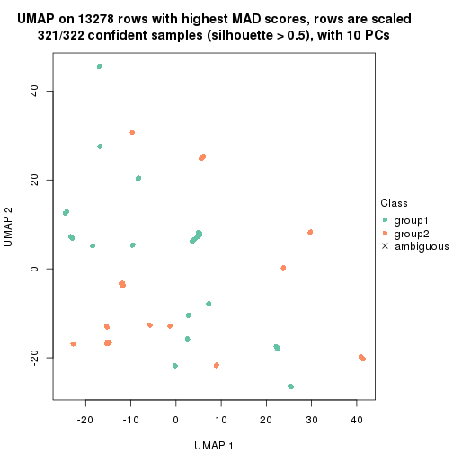</p>

</div>
<div id='tab-MAD-skmeans-dimension-reduction-2'>
<pre><code class="r">dimension_reduction(res, k = 3, method = &quot;UMAP&quot;)
</code></pre>

<p></p>

</div>
<div id='tab-MAD-skmeans-dimension-reduction-3'>
<pre><code class="r">dimension_reduction(res, k = 4, method = &quot;UMAP&quot;)
</code></pre>

<p></p>

</div>
<div id='tab-MAD-skmeans-dimension-reduction-4'>
<pre><code class="r">dimension_reduction(res, k = 5, method = &quot;UMAP&quot;)
</code></pre>

<p></p>

</div>
<div id='tab-MAD-skmeans-dimension-reduction-5'>
<pre><code class="r">dimension_reduction(res, k = 6, method = &quot;UMAP&quot;)
</code></pre>

<p></p>

</div>
</div>


Following heatmap shows how subgroups are split when increasing `k`:

```r
collect_classes(res)
```


If matrix rows can be associated to genes, consider to use `functional_enrichment(res,
...)` to perform function enrichment for the signature genes. See [this vignette](http://bioconductor.org/packages/devel/bioc/vignettes/cola/inst/doc/functional_enrichment.html) for more detailed explanations.


 

---------------------------------------------------


### MAD:pam**


The object with results only for a single top-value method and a single partition method 
can be extracted as:

```r
res = res_list["MAD", "pam"]
# you can also extract it by
# res = res_list["MAD:pam"]
```

A summary of `res` and all the functions that can be applied to it:

```r
res
```

```
#> A 'ConsensusPartition' object with k = 2, 3, 4, 5, 6.
#>   On a matrix with 13278 rows and 322 columns.
#>   Top rows (1000, 2000, 3000, 4000, 5000) are extracted by 'MAD' method.
#>   Subgroups are detected by 'pam' method.
#>   Performed in total 1250 partitions by row resampling.
#>   Best k for subgroups seems to be 6.
#> 
#> Following methods can be applied to this 'ConsensusPartition' object:
#>  [1] "cola_report"             "collect_classes"         "collect_plots"          
#>  [4] "collect_stats"           "colnames"                "compare_signatures"     
#>  [7] "consensus_heatmap"       "dimension_reduction"     "functional_enrichment"  
#> [10] "get_anno_col"            "get_anno"                "get_classes"            
#> [13] "get_consensus"           "get_matrix"              "get_membership"         
#> [16] "get_param"               "get_signatures"          "get_stats"              
#> [19] "is_best_k"               "is_stable_k"             "membership_heatmap"     
#> [22] "ncol"                    "nrow"                    "plot_ecdf"              
#> [25] "rownames"                "select_partition_number" "show"                   
#> [28] "suggest_best_k"          "test_to_known_factors"
```

`collect_plots()` function collects all the plots made from `res` for all `k` (number of partitions)
into one single page to provide an easy and fast comparison between different `k`.

```r
collect_plots(res)
```


The plots are:

- The first row: a plot of the ECDF (empirical cumulative distribution
  function) curves of the consensus matrix for each `k` and the heatmap of
  predicted classes for each `k`.
- The second row: heatmaps of the consensus matrix for each `k`.
- The third row: heatmaps of the membership matrix for each `k`.
- The fouth row: heatmaps of the signatures for each `k`.

All the plots in panels can be made by individual functions and they are
plotted later in this section.

`select_partition_number()` produces several plots showing different
statistics for choosing "optimized" `k`. There are following statistics:

- ECDF curves of the consensus matrix for each `k`;
- 1-PAC. [The PAC
  score](https://en.wikipedia.org/wiki/Consensus_clustering#Over-interpretation_potential_of_consensus_clustering)
  measures the proportion of the ambiguous subgrouping.
- Mean silhouette score.
- Concordance. The mean probability of fiting the consensus class ids in all
  partitions.
- Area increased. Denote $A_k$ as the area under the ECDF curve for current
  `k`, the area increased is defined as $A_k - A_{k-1}$.
- Rand index. The percent of pairs of samples that are both in a same cluster
  or both are not in a same cluster in the partition of k and k-1.
- Jaccard index. The ratio of pairs of samples are both in a same cluster in
  the partition of k and k-1 and the pairs of samples are both in a same
  cluster in the partition k or k-1.

The detailed explanations of these statistics can be found in [the _cola_
vignette](http://bioconductor.org/packages/devel/bioc/vignettes/cola/inst/doc/cola.html#toc_13).

Generally speaking, lower PAC score, higher mean silhouette score or higher
concordance corresponds to better partition. Rand index and Jaccard index
measure how similar the current partition is compared to partition with `k-1`.
If they are too similar, we won't accept `k` is better than `k-1`.

```r
select_partition_number(res)
```


The numeric values for all these statistics can be obtained by `get_stats()`.

```r
get_stats(res)
```

```
#>   k 1-PAC mean_silhouette concordance area_increased  Rand Jaccard
#> 2 2 0.870           0.909       0.963         0.4675 0.549   0.549
#> 3 3 0.878           0.939       0.967         0.3456 0.794   0.638
#> 4 4 1.000           1.000       1.000         0.1456 0.895   0.728
#> 5 5 0.962           0.977       0.986         0.0933 0.934   0.765
#> 6 6 1.000           0.991       0.995         0.0273 0.978   0.897
```

`suggest_best_k()` suggests the best $k$ based on these statistics. The rules are as follows:

- All $k$ with Jaccard index larger than 0.95 are removed because increasing
  $k$ does not provide enough extra information. If all $k$ are removed, it is
  marked as no subgroup is detected.
- For all $k$ with 1-PAC score larger than 0.9, the maximal $k$ is taken as
  the best $k$, and other $k$ are marked as optional $k$.
- If it does not fit the second rule. The $k$ with the maximal vote of the
  highest 1-PAC score, highest mean silhouette, and highest concordance is
  taken as the best $k$.

```r
suggest_best_k(res)
```

```
#> [1] 6
#> attr(,"optional")
#> [1] 4 5
```

There is also optional best $k$ = 4 5 that is worth to check.

Following shows the table of the partitions (You need to click the **show/hide
code output** link to see it). The membership matrix (columns with name `p*`)
is inferred by
[`clue::cl_consensus()`](https://www.rdocumentation.org/link/cl_consensus?package=clue)
function with the `SE` method. Basically the value in the membership matrix
represents the probability to belong to a certain group. The finall class
label for an item is determined with the group with highest probability it
belongs to.

In `get_classes()` function, the entropy is calculated from the membership
matrix and the silhouette score is calculated from the consensus matrix.


<script>
$( function() {
	$( '#tabs-MAD-pam-get-classes' ).tabs();
} );
</script>
<div id='tabs-MAD-pam-get-classes'>
<ul>
<li><a href='#tab-MAD-pam-get-classes-1'>k = 2</a></li>
<li><a href='#tab-MAD-pam-get-classes-2'>k = 3</a></li>
<li><a href='#tab-MAD-pam-get-classes-3'>k = 4</a></li>
<li><a href='#tab-MAD-pam-get-classes-4'>k = 5</a></li>
<li><a href='#tab-MAD-pam-get-classes-5'>k = 6</a></li>
</ul>

<div id='tab-MAD-pam-get-classes-1'>
<p><a id='tab-MAD-pam-get-classes-1-a' style='color:#0366d6' href='#'>show/hide code output</a></p>
<pre><code class="r">cbind(get_classes(res, k = 2), get_membership(res, k = 2))
</code></pre>

<pre><code>#&gt;           class entropy silhouette    p1    p2
#&gt; DRR023371     2   0.000      0.943 0.000 1.000
#&gt; DRR023372     2   0.000      0.943 0.000 1.000
#&gt; DRR023373     2   0.000      0.943 0.000 1.000
#&gt; DRR023374     2   0.000      0.943 0.000 1.000
#&gt; DRR023375     2   0.000      0.943 0.000 1.000
#&gt; DRR023376     2   0.000      0.943 0.000 1.000
#&gt; DRR023377     2   0.000      0.943 0.000 1.000
#&gt; DRR023378     2   0.000      0.943 0.000 1.000
#&gt; DRR023379     2   0.990      0.307 0.440 0.560
#&gt; DRR023380     2   0.996      0.238 0.464 0.536
#&gt; DRR023381     2   0.995      0.250 0.460 0.540
#&gt; DRR023382     2   0.983      0.350 0.424 0.576
#&gt; DRR023383     2   0.998      0.213 0.472 0.528
#&gt; DRR023384     2   1.000      0.119 0.500 0.500
#&gt; DRR023385     1   0.992      0.070 0.552 0.448
#&gt; DRR023386     2   0.971      0.409 0.400 0.600
#&gt; DRR023387     1   0.000      0.995 1.000 0.000
#&gt; DRR023388     1   0.000      0.995 1.000 0.000
#&gt; DRR023389     1   0.000      0.995 1.000 0.000
#&gt; DRR023390     1   0.000      0.995 1.000 0.000
#&gt; DRR023391     1   0.000      0.995 1.000 0.000
#&gt; DRR023392     1   0.000      0.995 1.000 0.000
#&gt; DRR023394     1   0.000      0.995 1.000 0.000
#&gt; DRR023395     1   0.000      0.995 1.000 0.000
#&gt; DRR023396     1   0.000      0.995 1.000 0.000
#&gt; DRR023397     1   0.000      0.995 1.000 0.000
#&gt; DRR023398     1   0.000      0.995 1.000 0.000
#&gt; DRR023399     1   0.000      0.995 1.000 0.000
#&gt; DRR023400     1   0.000      0.995 1.000 0.000
#&gt; DRR023401     1   0.000      0.995 1.000 0.000
#&gt; DRR023402     1   0.000      0.995 1.000 0.000
#&gt; DRR023403     1   0.000      0.995 1.000 0.000
#&gt; DRR023404     2   0.000      0.943 0.000 1.000
#&gt; DRR023405     2   0.000      0.943 0.000 1.000
#&gt; DRR023406     2   0.000      0.943 0.000 1.000
#&gt; DRR023407     2   0.000      0.943 0.000 1.000
#&gt; DRR023408     2   0.000      0.943 0.000 1.000
#&gt; DRR023409     2   0.000      0.943 0.000 1.000
#&gt; DRR023410     2   0.000      0.943 0.000 1.000
#&gt; DRR023411     2   0.000      0.943 0.000 1.000
#&gt; DRR023412     2   0.000      0.943 0.000 1.000
#&gt; DRR023413     2   0.000      0.943 0.000 1.000
#&gt; DRR023414     2   0.000      0.943 0.000 1.000
#&gt; DRR023415     2   0.000      0.943 0.000 1.000
#&gt; DRR023416     2   0.000      0.943 0.000 1.000
#&gt; DRR023417     2   0.000      0.943 0.000 1.000
#&gt; DRR023418     2   0.000      0.943 0.000 1.000
#&gt; DRR023419     2   0.000      0.943 0.000 1.000
#&gt; DRR023420     2   0.000      0.943 0.000 1.000
#&gt; DRR023421     2   0.000      0.943 0.000 1.000
#&gt; DRR023422     2   0.000      0.943 0.000 1.000
#&gt; DRR023423     2   0.000      0.943 0.000 1.000
#&gt; DRR023425     2   0.000      0.943 0.000 1.000
#&gt; DRR023426     2   0.000      0.943 0.000 1.000
#&gt; DRR023427     2   0.000      0.943 0.000 1.000
#&gt; DRR023428     2   0.000      0.943 0.000 1.000
#&gt; DRR023429     2   0.000      0.943 0.000 1.000
#&gt; DRR023430     2   0.000      0.943 0.000 1.000
#&gt; DRR023431     2   0.000      0.943 0.000 1.000
#&gt; DRR023432     2   0.000      0.943 0.000 1.000
#&gt; DRR023433     2   0.000      0.943 0.000 1.000
#&gt; DRR023434     2   0.000      0.943 0.000 1.000
#&gt; DRR023435     2   0.000      0.943 0.000 1.000
#&gt; DRR023436     2   0.000      0.943 0.000 1.000
#&gt; DRR023437     2   0.000      0.943 0.000 1.000
#&gt; DRR023438     2   0.000      0.943 0.000 1.000
#&gt; DRR023439     2   0.000      0.943 0.000 1.000
#&gt; DRR023440     2   0.000      0.943 0.000 1.000
#&gt; DRR023441     2   0.000      0.943 0.000 1.000
#&gt; DRR023442     2   0.000      0.943 0.000 1.000
#&gt; DRR023443     2   0.000      0.943 0.000 1.000
#&gt; DRR023444     2   0.000      0.943 0.000 1.000
#&gt; DRR023445     2   0.000      0.943 0.000 1.000
#&gt; DRR023446     2   0.000      0.943 0.000 1.000
#&gt; DRR023447     2   0.000      0.943 0.000 1.000
#&gt; DRR023448     2   0.000      0.943 0.000 1.000
#&gt; DRR023449     2   0.000      0.943 0.000 1.000
#&gt; DRR023450     2   0.000      0.943 0.000 1.000
#&gt; DRR023451     2   0.000      0.943 0.000 1.000
#&gt; DRR023452     2   0.000      0.943 0.000 1.000
#&gt; DRR023453     1   0.000      0.995 1.000 0.000
#&gt; DRR023454     1   0.000      0.995 1.000 0.000
#&gt; DRR023455     1   0.000      0.995 1.000 0.000
#&gt; DRR023456     1   0.000      0.995 1.000 0.000
#&gt; DRR023457     1   0.000      0.995 1.000 0.000
#&gt; DRR023458     1   0.000      0.995 1.000 0.000
#&gt; DRR023459     1   0.000      0.995 1.000 0.000
#&gt; DRR023460     2   0.000      0.943 0.000 1.000
#&gt; DRR023461     2   0.000      0.943 0.000 1.000
#&gt; DRR023462     2   0.000      0.943 0.000 1.000
#&gt; DRR023463     2   0.000      0.943 0.000 1.000
#&gt; DRR023464     2   0.000      0.943 0.000 1.000
#&gt; DRR023465     2   0.000      0.943 0.000 1.000
#&gt; DRR023466     2   0.000      0.943 0.000 1.000
#&gt; DRR023467     2   0.000      0.943 0.000 1.000
#&gt; DRR023468     2   0.000      0.943 0.000 1.000
#&gt; DRR023469     2   0.000      0.943 0.000 1.000
#&gt; DRR023470     2   0.000      0.943 0.000 1.000
#&gt; DRR023471     2   0.000      0.943 0.000 1.000
#&gt; DRR023472     2   0.000      0.943 0.000 1.000
#&gt; DRR023473     2   0.000      0.943 0.000 1.000
#&gt; DRR023474     2   0.000      0.943 0.000 1.000
#&gt; DRR023475     2   0.000      0.943 0.000 1.000
#&gt; DRR023476     2   0.000      0.943 0.000 1.000
#&gt; DRR023477     2   0.000      0.943 0.000 1.000
#&gt; DRR023478     2   0.000      0.943 0.000 1.000
#&gt; DRR023479     2   0.000      0.943 0.000 1.000
#&gt; DRR023480     2   0.000      0.943 0.000 1.000
#&gt; DRR023481     2   0.000      0.943 0.000 1.000
#&gt; DRR023482     2   0.969      0.418 0.396 0.604
#&gt; DRR023483     2   0.966      0.426 0.392 0.608
#&gt; DRR023484     2   0.969      0.418 0.396 0.604
#&gt; DRR023485     2   0.971      0.409 0.400 0.600
#&gt; DRR023486     2   0.971      0.409 0.400 0.600
#&gt; DRR023487     2   0.969      0.418 0.396 0.604
#&gt; DRR023488     2   0.971      0.409 0.400 0.600
#&gt; DRR023489     2   0.966      0.426 0.392 0.608
#&gt; DRR023490     1   0.000      0.995 1.000 0.000
#&gt; DRR023491     1   0.000      0.995 1.000 0.000
#&gt; DRR023492     1   0.000      0.995 1.000 0.000
#&gt; DRR023493     1   0.000      0.995 1.000 0.000
#&gt; DRR023494     1   0.000      0.995 1.000 0.000
#&gt; DRR023495     1   0.000      0.995 1.000 0.000
#&gt; DRR023496     1   0.000      0.995 1.000 0.000
#&gt; DRR023497     1   0.000      0.995 1.000 0.000
#&gt; DRR023498     1   0.000      0.995 1.000 0.000
#&gt; DRR023499     1   0.000      0.995 1.000 0.000
#&gt; DRR023500     1   0.000      0.995 1.000 0.000
#&gt; DRR023501     1   0.000      0.995 1.000 0.000
#&gt; DRR023502     1   0.000      0.995 1.000 0.000
#&gt; DRR023503     1   0.000      0.995 1.000 0.000
#&gt; DRR023504     1   0.000      0.995 1.000 0.000
#&gt; DRR023505     1   0.000      0.995 1.000 0.000
#&gt; DRR023506     1   0.000      0.995 1.000 0.000
#&gt; DRR023507     1   0.000      0.995 1.000 0.000
#&gt; DRR023508     1   0.000      0.995 1.000 0.000
#&gt; DRR023509     1   0.000      0.995 1.000 0.000
#&gt; DRR023510     1   0.000      0.995 1.000 0.000
#&gt; DRR023511     1   0.000      0.995 1.000 0.000
#&gt; DRR023512     1   0.000      0.995 1.000 0.000
#&gt; DRR023513     1   0.000      0.995 1.000 0.000
#&gt; DRR023514     1   0.000      0.995 1.000 0.000
#&gt; DRR023515     1   0.000      0.995 1.000 0.000
#&gt; DRR023516     1   0.000      0.995 1.000 0.000
#&gt; DRR023517     1   0.000      0.995 1.000 0.000
#&gt; DRR023518     1   0.000      0.995 1.000 0.000
#&gt; DRR023519     1   0.000      0.995 1.000 0.000
#&gt; DRR023520     1   0.000      0.995 1.000 0.000
#&gt; DRR023521     1   0.000      0.995 1.000 0.000
#&gt; DRR023522     1   0.000      0.995 1.000 0.000
#&gt; DRR023523     1   0.000      0.995 1.000 0.000
#&gt; DRR023524     1   0.000      0.995 1.000 0.000
#&gt; DRR023525     1   0.000      0.995 1.000 0.000
#&gt; DRR023526     1   0.000      0.995 1.000 0.000
#&gt; DRR023527     1   0.000      0.995 1.000 0.000
#&gt; DRR023528     1   0.000      0.995 1.000 0.000
#&gt; DRR023529     1   0.000      0.995 1.000 0.000
#&gt; DRR023530     1   0.000      0.995 1.000 0.000
#&gt; DRR023531     1   0.000      0.995 1.000 0.000
#&gt; DRR023532     1   0.000      0.995 1.000 0.000
#&gt; DRR023533     1   0.000      0.995 1.000 0.000
#&gt; DRR023534     1   0.000      0.995 1.000 0.000
#&gt; DRR023535     1   0.000      0.995 1.000 0.000
#&gt; DRR023536     1   0.000      0.995 1.000 0.000
#&gt; DRR023537     1   0.000      0.995 1.000 0.000
#&gt; DRR023538     1   0.000      0.995 1.000 0.000
#&gt; DRR023539     1   0.000      0.995 1.000 0.000
#&gt; DRR023540     1   0.000      0.995 1.000 0.000
#&gt; DRR023541     1   0.000      0.995 1.000 0.000
#&gt; DRR023542     1   0.000      0.995 1.000 0.000
#&gt; DRR023543     1   0.000      0.995 1.000 0.000
#&gt; DRR023544     1   0.000      0.995 1.000 0.000
#&gt; DRR023545     1   0.000      0.995 1.000 0.000
#&gt; DRR023546     1   0.000      0.995 1.000 0.000
#&gt; DRR023547     1   0.000      0.995 1.000 0.000
#&gt; DRR023548     1   0.000      0.995 1.000 0.000
#&gt; DRR023549     1   0.000      0.995 1.000 0.000
#&gt; DRR023550     1   0.000      0.995 1.000 0.000
#&gt; DRR023551     1   0.000      0.995 1.000 0.000
#&gt; DRR023552     1   0.000      0.995 1.000 0.000
#&gt; DRR023553     1   0.000      0.995 1.000 0.000
#&gt; DRR023554     1   0.000      0.995 1.000 0.000
#&gt; DRR023555     1   0.000      0.995 1.000 0.000
#&gt; DRR023556     1   0.000      0.995 1.000 0.000
#&gt; DRR023557     1   0.000      0.995 1.000 0.000
#&gt; DRR023558     1   0.000      0.995 1.000 0.000
#&gt; DRR023559     1   0.000      0.995 1.000 0.000
#&gt; DRR023560     1   0.000      0.995 1.000 0.000
#&gt; DRR023561     1   0.000      0.995 1.000 0.000
#&gt; DRR023562     1   0.000      0.995 1.000 0.000
#&gt; DRR023563     1   0.000      0.995 1.000 0.000
#&gt; DRR023564     1   0.000      0.995 1.000 0.000
#&gt; DRR023565     1   0.000      0.995 1.000 0.000
#&gt; DRR023566     1   0.000      0.995 1.000 0.000
#&gt; DRR023567     1   0.000      0.995 1.000 0.000
#&gt; DRR023568     1   0.000      0.995 1.000 0.000
#&gt; DRR023569     1   0.000      0.995 1.000 0.000
#&gt; DRR023570     1   0.000      0.995 1.000 0.000
#&gt; DRR023571     1   0.000      0.995 1.000 0.000
#&gt; DRR023572     1   0.000      0.995 1.000 0.000
#&gt; DRR023573     1   0.000      0.995 1.000 0.000
#&gt; DRR023574     1   0.000      0.995 1.000 0.000
#&gt; DRR023575     1   0.000      0.995 1.000 0.000
#&gt; DRR023576     2   0.000      0.943 0.000 1.000
#&gt; DRR023577     2   0.000      0.943 0.000 1.000
#&gt; DRR023578     2   0.000      0.943 0.000 1.000
#&gt; DRR023579     2   0.000      0.943 0.000 1.000
#&gt; DRR023580     2   0.000      0.943 0.000 1.000
#&gt; DRR023581     2   0.000      0.943 0.000 1.000
#&gt; DRR023582     2   0.000      0.943 0.000 1.000
#&gt; DRR023583     2   0.000      0.943 0.000 1.000
#&gt; DRR023584     2   0.000      0.943 0.000 1.000
#&gt; DRR023585     2   0.000      0.943 0.000 1.000
#&gt; DRR023586     2   0.000      0.943 0.000 1.000
#&gt; DRR023587     2   0.000      0.943 0.000 1.000
#&gt; DRR023588     2   0.000      0.943 0.000 1.000
#&gt; DRR023589     2   0.000      0.943 0.000 1.000
#&gt; DRR023590     2   0.000      0.943 0.000 1.000
#&gt; DRR023591     2   0.000      0.943 0.000 1.000
#&gt; DRR023592     2   0.000      0.943 0.000 1.000
#&gt; DRR023593     2   0.000      0.943 0.000 1.000
#&gt; DRR023594     2   0.000      0.943 0.000 1.000
#&gt; DRR023595     2   0.000      0.943 0.000 1.000
#&gt; DRR023596     2   0.000      0.943 0.000 1.000
#&gt; DRR023597     2   0.000      0.943 0.000 1.000
#&gt; DRR023598     2   0.000      0.943 0.000 1.000
#&gt; DRR023599     2   0.000      0.943 0.000 1.000
#&gt; DRR023600     2   0.000      0.943 0.000 1.000
#&gt; DRR023601     2   0.000      0.943 0.000 1.000
#&gt; DRR023602     2   0.000      0.943 0.000 1.000
#&gt; DRR023603     2   0.000      0.943 0.000 1.000
#&gt; DRR023604     2   0.000      0.943 0.000 1.000
#&gt; DRR023605     2   0.000      0.943 0.000 1.000
#&gt; DRR023606     2   0.000      0.943 0.000 1.000
#&gt; DRR023607     2   0.000      0.943 0.000 1.000
#&gt; DRR023608     2   0.000      0.943 0.000 1.000
#&gt; DRR023609     2   0.000      0.943 0.000 1.000
#&gt; DRR023610     2   0.000      0.943 0.000 1.000
#&gt; DRR023611     2   0.000      0.943 0.000 1.000
#&gt; DRR023612     2   0.000      0.943 0.000 1.000
#&gt; DRR023613     2   0.000      0.943 0.000 1.000
#&gt; DRR023614     2   0.000      0.943 0.000 1.000
#&gt; DRR023615     2   0.000      0.943 0.000 1.000
#&gt; DRR023616     2   0.000      0.943 0.000 1.000
#&gt; DRR023617     2   0.000      0.943 0.000 1.000
#&gt; DRR023619     2   0.000      0.943 0.000 1.000
#&gt; DRR023620     2   0.000      0.943 0.000 1.000
#&gt; DRR023621     2   0.000      0.943 0.000 1.000
#&gt; DRR023622     2   0.000      0.943 0.000 1.000
#&gt; DRR023623     2   0.000      0.943 0.000 1.000
#&gt; DRR023624     2   0.000      0.943 0.000 1.000
#&gt; DRR023625     2   0.000      0.943 0.000 1.000
#&gt; DRR023626     2   0.000      0.943 0.000 1.000
#&gt; DRR023627     2   0.000      0.943 0.000 1.000
#&gt; DRR023628     2   0.000      0.943 0.000 1.000
#&gt; DRR023629     2   0.000      0.943 0.000 1.000
#&gt; DRR023630     2   0.000      0.943 0.000 1.000
#&gt; DRR023631     2   0.000      0.943 0.000 1.000
#&gt; DRR023632     2   0.000      0.943 0.000 1.000
#&gt; DRR023633     2   0.000      0.943 0.000 1.000
#&gt; DRR023635     2   0.000      0.943 0.000 1.000
#&gt; DRR023636     2   0.000      0.943 0.000 1.000
#&gt; DRR023637     2   0.000      0.943 0.000 1.000
#&gt; DRR023638     2   0.000      0.943 0.000 1.000
#&gt; DRR023639     2   0.000      0.943 0.000 1.000
#&gt; DRR023640     2   0.000      0.943 0.000 1.000
#&gt; DRR023641     2   0.000      0.943 0.000 1.000
#&gt; DRR023642     2   0.000      0.943 0.000 1.000
#&gt; DRR023643     2   0.000      0.943 0.000 1.000
#&gt; DRR023644     2   0.000      0.943 0.000 1.000
#&gt; DRR023645     2   0.000      0.943 0.000 1.000
#&gt; DRR023646     2   0.000      0.943 0.000 1.000
#&gt; DRR023647     2   0.000      0.943 0.000 1.000
#&gt; DRR023648     2   0.000      0.943 0.000 1.000
#&gt; DRR023649     2   0.000      0.943 0.000 1.000
#&gt; DRR023650     2   0.000      0.943 0.000 1.000
#&gt; DRR023651     2   0.000      0.943 0.000 1.000
#&gt; DRR023652     2   0.000      0.943 0.000 1.000
#&gt; DRR023653     2   0.000      0.943 0.000 1.000
#&gt; DRR023654     2   0.000      0.943 0.000 1.000
#&gt; DRR023655     2   0.000      0.943 0.000 1.000
#&gt; DRR023656     2   0.000      0.943 0.000 1.000
#&gt; DRR023657     2   0.000      0.943 0.000 1.000
#&gt; DRR023658     2   0.000      0.943 0.000 1.000
#&gt; DRR023659     2   0.000      0.943 0.000 1.000
#&gt; DRR023660     2   0.000      0.943 0.000 1.000
#&gt; DRR023661     2   0.000      0.943 0.000 1.000
#&gt; DRR023662     2   0.000      0.943 0.000 1.000
#&gt; DRR023663     2   0.000      0.943 0.000 1.000
#&gt; DRR023664     2   0.000      0.943 0.000 1.000
#&gt; DRR023665     2   0.000      0.943 0.000 1.000
#&gt; DRR023666     2   0.971      0.409 0.400 0.600
#&gt; DRR023667     2   0.971      0.409 0.400 0.600
#&gt; DRR023668     2   0.971      0.409 0.400 0.600
#&gt; DRR023669     2   0.971      0.409 0.400 0.600
#&gt; DRR023670     2   0.971      0.409 0.400 0.600
#&gt; DRR023671     2   0.971      0.409 0.400 0.600
#&gt; DRR023672     2   0.971      0.409 0.400 0.600
#&gt; DRR023673     2   0.971      0.409 0.400 0.600
#&gt; DRR023674     2   0.971      0.409 0.400 0.600
#&gt; DRR023675     2   0.971      0.409 0.400 0.600
#&gt; DRR023676     2   0.971      0.409 0.400 0.600
#&gt; DRR023677     2   0.971      0.409 0.400 0.600
#&gt; DRR023678     2   0.932      0.511 0.348 0.652
#&gt; DRR023683     2   0.000      0.943 0.000 1.000
#&gt; DRR023684     2   0.000      0.943 0.000 1.000
#&gt; DRR023685     2   0.000      0.943 0.000 1.000
#&gt; DRR023686     2   0.000      0.943 0.000 1.000
#&gt; DRR023687     2   0.000      0.943 0.000 1.000
#&gt; DRR023688     2   0.000      0.943 0.000 1.000
#&gt; DRR023689     2   0.000      0.943 0.000 1.000
#&gt; DRR023690     2   0.000      0.943 0.000 1.000
#&gt; DRR023691     2   0.000      0.943 0.000 1.000
#&gt; DRR023692     2   0.000      0.943 0.000 1.000
#&gt; DRR023693     2   0.000      0.943 0.000 1.000
#&gt; DRR023694     2   0.000      0.943 0.000 1.000
#&gt; DRR023695     2   0.000      0.943 0.000 1.000
#&gt; DRR023696     2   0.000      0.943 0.000 1.000
#&gt; DRR023697     2   0.000      0.943 0.000 1.000
#&gt; DRR023698     2   0.000      0.943 0.000 1.000
#&gt; DRR023699     2   0.000      0.943 0.000 1.000
#&gt; DRR023700     2   0.000      0.943 0.000 1.000
</code></pre>

<script>
$('#tab-MAD-pam-get-classes-1-a').parent().next().next().hide();
$('#tab-MAD-pam-get-classes-1-a').click(function(){
  $('#tab-MAD-pam-get-classes-1-a').parent().next().next().toggle();
  return(false);
});
</script>
</div>

<div id='tab-MAD-pam-get-classes-2'>
<p><a id='tab-MAD-pam-get-classes-2-a' style='color:#0366d6' href='#'>show/hide code output</a></p>
<pre><code class="r">cbind(get_classes(res, k = 3), get_membership(res, k = 3))
</code></pre>

<pre><code>#&gt;           class entropy silhouette    p1    p2    p3
#&gt; DRR023371     3   0.000      1.000 0.000 0.000 1.000
#&gt; DRR023372     3   0.000      1.000 0.000 0.000 1.000
#&gt; DRR023373     3   0.000      1.000 0.000 0.000 1.000
#&gt; DRR023374     3   0.000      1.000 0.000 0.000 1.000
#&gt; DRR023375     3   0.000      1.000 0.000 0.000 1.000
#&gt; DRR023376     3   0.000      1.000 0.000 0.000 1.000
#&gt; DRR023377     3   0.000      1.000 0.000 0.000 1.000
#&gt; DRR023378     3   0.000      1.000 0.000 0.000 1.000
#&gt; DRR023379     3   0.000      1.000 0.000 0.000 1.000
#&gt; DRR023380     3   0.000      1.000 0.000 0.000 1.000
#&gt; DRR023381     3   0.000      1.000 0.000 0.000 1.000
#&gt; DRR023382     3   0.000      1.000 0.000 0.000 1.000
#&gt; DRR023383     3   0.000      1.000 0.000 0.000 1.000
#&gt; DRR023384     3   0.000      1.000 0.000 0.000 1.000
#&gt; DRR023385     3   0.000      1.000 0.000 0.000 1.000
#&gt; DRR023386     3   0.000      1.000 0.000 0.000 1.000
#&gt; DRR023387     3   0.000      1.000 0.000 0.000 1.000
#&gt; DRR023388     3   0.000      1.000 0.000 0.000 1.000
#&gt; DRR023389     3   0.000      1.000 0.000 0.000 1.000
#&gt; DRR023390     3   0.000      1.000 0.000 0.000 1.000
#&gt; DRR023391     3   0.000      1.000 0.000 0.000 1.000
#&gt; DRR023392     3   0.000      1.000 0.000 0.000 1.000
#&gt; DRR023394     3   0.000      1.000 0.000 0.000 1.000
#&gt; DRR023395     3   0.000      1.000 0.000 0.000 1.000
#&gt; DRR023396     3   0.000      1.000 0.000 0.000 1.000
#&gt; DRR023397     3   0.000      1.000 0.000 0.000 1.000
#&gt; DRR023398     3   0.000      1.000 0.000 0.000 1.000
#&gt; DRR023399     3   0.000      1.000 0.000 0.000 1.000
#&gt; DRR023400     3   0.000      1.000 0.000 0.000 1.000
#&gt; DRR023401     3   0.000      1.000 0.000 0.000 1.000
#&gt; DRR023402     3   0.000      1.000 0.000 0.000 1.000
#&gt; DRR023403     3   0.000      1.000 0.000 0.000 1.000
#&gt; DRR023404     2   0.000      0.936 0.000 1.000 0.000
#&gt; DRR023405     2   0.000      0.936 0.000 1.000 0.000
#&gt; DRR023406     2   0.000      0.936 0.000 1.000 0.000
#&gt; DRR023407     2   0.000      0.936 0.000 1.000 0.000
#&gt; DRR023408     2   0.000      0.936 0.000 1.000 0.000
#&gt; DRR023409     2   0.000      0.936 0.000 1.000 0.000
#&gt; DRR023410     2   0.000      0.936 0.000 1.000 0.000
#&gt; DRR023411     2   0.000      0.936 0.000 1.000 0.000
#&gt; DRR023412     2   0.000      0.936 0.000 1.000 0.000
#&gt; DRR023413     2   0.000      0.936 0.000 1.000 0.000
#&gt; DRR023414     2   0.000      0.936 0.000 1.000 0.000
#&gt; DRR023415     2   0.000      0.936 0.000 1.000 0.000
#&gt; DRR023416     2   0.000      0.936 0.000 1.000 0.000
#&gt; DRR023417     2   0.000      0.936 0.000 1.000 0.000
#&gt; DRR023418     2   0.000      0.936 0.000 1.000 0.000
#&gt; DRR023419     2   0.000      0.936 0.000 1.000 0.000
#&gt; DRR023420     2   0.000      0.936 0.000 1.000 0.000
#&gt; DRR023421     2   0.000      0.936 0.000 1.000 0.000
#&gt; DRR023422     2   0.000      0.936 0.000 1.000 0.000
#&gt; DRR023423     2   0.000      0.936 0.000 1.000 0.000
#&gt; DRR023425     2   0.000      0.936 0.000 1.000 0.000
#&gt; DRR023426     2   0.000      0.936 0.000 1.000 0.000
#&gt; DRR023427     2   0.000      0.936 0.000 1.000 0.000
#&gt; DRR023428     2   0.000      0.936 0.000 1.000 0.000
#&gt; DRR023429     2   0.000      0.936 0.000 1.000 0.000
#&gt; DRR023430     2   0.000      0.936 0.000 1.000 0.000
#&gt; DRR023431     2   0.000      0.936 0.000 1.000 0.000
#&gt; DRR023432     2   0.000      0.936 0.000 1.000 0.000
#&gt; DRR023433     2   0.000      0.936 0.000 1.000 0.000
#&gt; DRR023434     2   0.000      0.936 0.000 1.000 0.000
#&gt; DRR023435     2   0.000      0.936 0.000 1.000 0.000
#&gt; DRR023436     2   0.000      0.936 0.000 1.000 0.000
#&gt; DRR023437     2   0.000      0.936 0.000 1.000 0.000
#&gt; DRR023438     2   0.000      0.936 0.000 1.000 0.000
#&gt; DRR023439     2   0.000      0.936 0.000 1.000 0.000
#&gt; DRR023440     2   0.000      0.936 0.000 1.000 0.000
#&gt; DRR023441     2   0.000      0.936 0.000 1.000 0.000
#&gt; DRR023442     2   0.000      0.936 0.000 1.000 0.000
#&gt; DRR023443     2   0.000      0.936 0.000 1.000 0.000
#&gt; DRR023444     2   0.000      0.936 0.000 1.000 0.000
#&gt; DRR023445     2   0.000      0.936 0.000 1.000 0.000
#&gt; DRR023446     2   0.000      0.936 0.000 1.000 0.000
#&gt; DRR023447     2   0.000      0.936 0.000 1.000 0.000
#&gt; DRR023448     2   0.000      0.936 0.000 1.000 0.000
#&gt; DRR023449     2   0.000      0.936 0.000 1.000 0.000
#&gt; DRR023450     2   0.000      0.936 0.000 1.000 0.000
#&gt; DRR023451     2   0.000      0.936 0.000 1.000 0.000
#&gt; DRR023452     2   0.000      0.936 0.000 1.000 0.000
#&gt; DRR023453     3   0.000      1.000 0.000 0.000 1.000
#&gt; DRR023454     3   0.000      1.000 0.000 0.000 1.000
#&gt; DRR023455     3   0.000      1.000 0.000 0.000 1.000
#&gt; DRR023456     3   0.000      1.000 0.000 0.000 1.000
#&gt; DRR023457     3   0.000      1.000 0.000 0.000 1.000
#&gt; DRR023458     3   0.000      1.000 0.000 0.000 1.000
#&gt; DRR023459     3   0.000      1.000 0.000 0.000 1.000
#&gt; DRR023460     3   0.000      1.000 0.000 0.000 1.000
#&gt; DRR023461     3   0.000      1.000 0.000 0.000 1.000
#&gt; DRR023462     3   0.000      1.000 0.000 0.000 1.000
#&gt; DRR023463     3   0.000      1.000 0.000 0.000 1.000
#&gt; DRR023464     3   0.000      1.000 0.000 0.000 1.000
#&gt; DRR023465     3   0.000      1.000 0.000 0.000 1.000
#&gt; DRR023466     3   0.000      1.000 0.000 0.000 1.000
#&gt; DRR023467     3   0.000      1.000 0.000 0.000 1.000
#&gt; DRR023468     3   0.000      1.000 0.000 0.000 1.000
#&gt; DRR023469     3   0.000      1.000 0.000 0.000 1.000
#&gt; DRR023470     3   0.000      1.000 0.000 0.000 1.000
#&gt; DRR023471     3   0.000      1.000 0.000 0.000 1.000
#&gt; DRR023472     3   0.000      1.000 0.000 0.000 1.000
#&gt; DRR023473     3   0.000      1.000 0.000 0.000 1.000
#&gt; DRR023474     3   0.000      1.000 0.000 0.000 1.000
#&gt; DRR023475     3   0.000      1.000 0.000 0.000 1.000
#&gt; DRR023476     3   0.000      1.000 0.000 0.000 1.000
#&gt; DRR023477     3   0.000      1.000 0.000 0.000 1.000
#&gt; DRR023478     3   0.000      1.000 0.000 0.000 1.000
#&gt; DRR023479     3   0.000      1.000 0.000 0.000 1.000
#&gt; DRR023480     3   0.000      1.000 0.000 0.000 1.000
#&gt; DRR023481     3   0.000      1.000 0.000 0.000 1.000
#&gt; DRR023482     3   0.000      1.000 0.000 0.000 1.000
#&gt; DRR023483     3   0.000      1.000 0.000 0.000 1.000
#&gt; DRR023484     3   0.000      1.000 0.000 0.000 1.000
#&gt; DRR023485     3   0.000      1.000 0.000 0.000 1.000
#&gt; DRR023486     3   0.000      1.000 0.000 0.000 1.000
#&gt; DRR023487     3   0.000      1.000 0.000 0.000 1.000
#&gt; DRR023488     3   0.000      1.000 0.000 0.000 1.000
#&gt; DRR023489     3   0.000      1.000 0.000 0.000 1.000
#&gt; DRR023490     1   0.000      1.000 1.000 0.000 0.000
#&gt; DRR023491     1   0.000      1.000 1.000 0.000 0.000
#&gt; DRR023492     1   0.000      1.000 1.000 0.000 0.000
#&gt; DRR023493     1   0.000      1.000 1.000 0.000 0.000
#&gt; DRR023494     1   0.000      1.000 1.000 0.000 0.000
#&gt; DRR023495     1   0.000      1.000 1.000 0.000 0.000
#&gt; DRR023496     1   0.000      1.000 1.000 0.000 0.000
#&gt; DRR023497     1   0.000      1.000 1.000 0.000 0.000
#&gt; DRR023498     1   0.000      1.000 1.000 0.000 0.000
#&gt; DRR023499     1   0.000      1.000 1.000 0.000 0.000
#&gt; DRR023500     1   0.000      1.000 1.000 0.000 0.000
#&gt; DRR023501     1   0.000      1.000 1.000 0.000 0.000
#&gt; DRR023502     1   0.000      1.000 1.000 0.000 0.000
#&gt; DRR023503     1   0.000      1.000 1.000 0.000 0.000
#&gt; DRR023504     1   0.000      1.000 1.000 0.000 0.000
#&gt; DRR023505     1   0.000      1.000 1.000 0.000 0.000
#&gt; DRR023506     1   0.000      1.000 1.000 0.000 0.000
#&gt; DRR023507     1   0.000      1.000 1.000 0.000 0.000
#&gt; DRR023508     1   0.000      1.000 1.000 0.000 0.000
#&gt; DRR023509     1   0.000      1.000 1.000 0.000 0.000
#&gt; DRR023510     1   0.000      1.000 1.000 0.000 0.000
#&gt; DRR023511     1   0.000      1.000 1.000 0.000 0.000
#&gt; DRR023512     1   0.000      1.000 1.000 0.000 0.000
#&gt; DRR023513     1   0.000      1.000 1.000 0.000 0.000
#&gt; DRR023514     1   0.000      1.000 1.000 0.000 0.000
#&gt; DRR023515     1   0.000      1.000 1.000 0.000 0.000
#&gt; DRR023516     1   0.000      1.000 1.000 0.000 0.000
#&gt; DRR023517     1   0.000      1.000 1.000 0.000 0.000
#&gt; DRR023518     1   0.000      1.000 1.000 0.000 0.000
#&gt; DRR023519     1   0.000      1.000 1.000 0.000 0.000
#&gt; DRR023520     1   0.000      1.000 1.000 0.000 0.000
#&gt; DRR023521     1   0.000      1.000 1.000 0.000 0.000
#&gt; DRR023522     1   0.000      1.000 1.000 0.000 0.000
#&gt; DRR023523     1   0.000      1.000 1.000 0.000 0.000
#&gt; DRR023524     1   0.000      1.000 1.000 0.000 0.000
#&gt; DRR023525     1   0.000      1.000 1.000 0.000 0.000
#&gt; DRR023526     1   0.000      1.000 1.000 0.000 0.000
#&gt; DRR023527     1   0.000      1.000 1.000 0.000 0.000
#&gt; DRR023528     1   0.000      1.000 1.000 0.000 0.000
#&gt; DRR023529     1   0.000      1.000 1.000 0.000 0.000
#&gt; DRR023530     1   0.000      1.000 1.000 0.000 0.000
#&gt; DRR023531     1   0.000      1.000 1.000 0.000 0.000
#&gt; DRR023532     1   0.000      1.000 1.000 0.000 0.000
#&gt; DRR023533     1   0.000      1.000 1.000 0.000 0.000
#&gt; DRR023534     1   0.000      1.000 1.000 0.000 0.000
#&gt; DRR023535     1   0.000      1.000 1.000 0.000 0.000
#&gt; DRR023536     1   0.000      1.000 1.000 0.000 0.000
#&gt; DRR023537     1   0.000      1.000 1.000 0.000 0.000
#&gt; DRR023538     1   0.000      1.000 1.000 0.000 0.000
#&gt; DRR023539     1   0.000      1.000 1.000 0.000 0.000
#&gt; DRR023540     1   0.000      1.000 1.000 0.000 0.000
#&gt; DRR023541     1   0.000      1.000 1.000 0.000 0.000
#&gt; DRR023542     1   0.000      1.000 1.000 0.000 0.000
#&gt; DRR023543     1   0.000      1.000 1.000 0.000 0.000
#&gt; DRR023544     1   0.000      1.000 1.000 0.000 0.000
#&gt; DRR023545     1   0.000      1.000 1.000 0.000 0.000
#&gt; DRR023546     1   0.000      1.000 1.000 0.000 0.000
#&gt; DRR023547     1   0.000      1.000 1.000 0.000 0.000
#&gt; DRR023548     1   0.000      1.000 1.000 0.000 0.000
#&gt; DRR023549     1   0.000      1.000 1.000 0.000 0.000
#&gt; DRR023550     1   0.000      1.000 1.000 0.000 0.000
#&gt; DRR023551     1   0.000      1.000 1.000 0.000 0.000
#&gt; DRR023552     1   0.000      1.000 1.000 0.000 0.000
#&gt; DRR023553     1   0.000      1.000 1.000 0.000 0.000
#&gt; DRR023554     1   0.000      1.000 1.000 0.000 0.000
#&gt; DRR023555     1   0.000      1.000 1.000 0.000 0.000
#&gt; DRR023556     1   0.000      1.000 1.000 0.000 0.000
#&gt; DRR023557     1   0.000      1.000 1.000 0.000 0.000
#&gt; DRR023558     1   0.000      1.000 1.000 0.000 0.000
#&gt; DRR023559     1   0.000      1.000 1.000 0.000 0.000
#&gt; DRR023560     1   0.000      1.000 1.000 0.000 0.000
#&gt; DRR023561     1   0.000      1.000 1.000 0.000 0.000
#&gt; DRR023562     1   0.000      1.000 1.000 0.000 0.000
#&gt; DRR023563     1   0.000      1.000 1.000 0.000 0.000
#&gt; DRR023564     1   0.000      1.000 1.000 0.000 0.000
#&gt; DRR023565     1   0.000      1.000 1.000 0.000 0.000
#&gt; DRR023566     1   0.000      1.000 1.000 0.000 0.000
#&gt; DRR023567     1   0.000      1.000 1.000 0.000 0.000
#&gt; DRR023568     1   0.000      1.000 1.000 0.000 0.000
#&gt; DRR023569     1   0.000      1.000 1.000 0.000 0.000
#&gt; DRR023570     1   0.000      1.000 1.000 0.000 0.000
#&gt; DRR023571     1   0.000      1.000 1.000 0.000 0.000
#&gt; DRR023572     1   0.000      1.000 1.000 0.000 0.000
#&gt; DRR023573     1   0.000      1.000 1.000 0.000 0.000
#&gt; DRR023574     1   0.000      1.000 1.000 0.000 0.000
#&gt; DRR023575     1   0.000      1.000 1.000 0.000 0.000
#&gt; DRR023576     2   0.000      0.936 0.000 1.000 0.000
#&gt; DRR023577     2   0.000      0.936 0.000 1.000 0.000
#&gt; DRR023578     2   0.000      0.936 0.000 1.000 0.000
#&gt; DRR023579     2   0.000      0.936 0.000 1.000 0.000
#&gt; DRR023580     2   0.000      0.936 0.000 1.000 0.000
#&gt; DRR023581     2   0.000      0.936 0.000 1.000 0.000
#&gt; DRR023582     2   0.000      0.936 0.000 1.000 0.000
#&gt; DRR023583     2   0.000      0.936 0.000 1.000 0.000
#&gt; DRR023584     2   0.000      0.936 0.000 1.000 0.000
#&gt; DRR023585     2   0.000      0.936 0.000 1.000 0.000
#&gt; DRR023586     2   0.000      0.936 0.000 1.000 0.000
#&gt; DRR023587     2   0.000      0.936 0.000 1.000 0.000
#&gt; DRR023588     2   0.000      0.936 0.000 1.000 0.000
#&gt; DRR023589     2   0.000      0.936 0.000 1.000 0.000
#&gt; DRR023590     2   0.000      0.936 0.000 1.000 0.000
#&gt; DRR023591     2   0.000      0.936 0.000 1.000 0.000
#&gt; DRR023592     2   0.000      0.936 0.000 1.000 0.000
#&gt; DRR023593     2   0.000      0.936 0.000 1.000 0.000
#&gt; DRR023594     2   0.000      0.936 0.000 1.000 0.000
#&gt; DRR023595     2   0.000      0.936 0.000 1.000 0.000
#&gt; DRR023596     2   0.000      0.936 0.000 1.000 0.000
#&gt; DRR023597     2   0.000      0.936 0.000 1.000 0.000
#&gt; DRR023598     2   0.000      0.936 0.000 1.000 0.000
#&gt; DRR023599     2   0.000      0.936 0.000 1.000 0.000
#&gt; DRR023600     2   0.000      0.936 0.000 1.000 0.000
#&gt; DRR023601     2   0.000      0.936 0.000 1.000 0.000
#&gt; DRR023602     2   0.000      0.936 0.000 1.000 0.000
#&gt; DRR023603     2   0.000      0.936 0.000 1.000 0.000
#&gt; DRR023604     2   0.000      0.936 0.000 1.000 0.000
#&gt; DRR023605     2   0.000      0.936 0.000 1.000 0.000
#&gt; DRR023606     2   0.000      0.936 0.000 1.000 0.000
#&gt; DRR023607     2   0.000      0.936 0.000 1.000 0.000
#&gt; DRR023608     2   0.000      0.936 0.000 1.000 0.000
#&gt; DRR023609     2   0.000      0.936 0.000 1.000 0.000
#&gt; DRR023610     2   0.000      0.936 0.000 1.000 0.000
#&gt; DRR023611     2   0.000      0.936 0.000 1.000 0.000
#&gt; DRR023612     2   0.000      0.936 0.000 1.000 0.000
#&gt; DRR023613     2   0.000      0.936 0.000 1.000 0.000
#&gt; DRR023614     2   0.000      0.936 0.000 1.000 0.000
#&gt; DRR023615     2   0.000      0.936 0.000 1.000 0.000
#&gt; DRR023616     2   0.000      0.936 0.000 1.000 0.000
#&gt; DRR023617     2   0.000      0.936 0.000 1.000 0.000
#&gt; DRR023619     2   0.412      0.826 0.000 0.832 0.168
#&gt; DRR023620     2   0.412      0.826 0.000 0.832 0.168
#&gt; DRR023621     2   0.412      0.826 0.000 0.832 0.168
#&gt; DRR023622     2   0.412      0.826 0.000 0.832 0.168
#&gt; DRR023623     2   0.412      0.826 0.000 0.832 0.168
#&gt; DRR023624     2   0.412      0.826 0.000 0.832 0.168
#&gt; DRR023625     2   0.412      0.826 0.000 0.832 0.168
#&gt; DRR023626     2   0.412      0.826 0.000 0.832 0.168
#&gt; DRR023627     2   0.412      0.826 0.000 0.832 0.168
#&gt; DRR023628     2   0.412      0.826 0.000 0.832 0.168
#&gt; DRR023629     2   0.412      0.826 0.000 0.832 0.168
#&gt; DRR023630     2   0.412      0.826 0.000 0.832 0.168
#&gt; DRR023631     2   0.412      0.826 0.000 0.832 0.168
#&gt; DRR023632     2   0.412      0.826 0.000 0.832 0.168
#&gt; DRR023633     2   0.412      0.826 0.000 0.832 0.168
#&gt; DRR023635     2   0.000      0.936 0.000 1.000 0.000
#&gt; DRR023636     2   0.000      0.936 0.000 1.000 0.000
#&gt; DRR023637     2   0.000      0.936 0.000 1.000 0.000
#&gt; DRR023638     2   0.000      0.936 0.000 1.000 0.000
#&gt; DRR023639     2   0.000      0.936 0.000 1.000 0.000
#&gt; DRR023640     2   0.000      0.936 0.000 1.000 0.000
#&gt; DRR023641     2   0.000      0.936 0.000 1.000 0.000
#&gt; DRR023642     2   0.000      0.936 0.000 1.000 0.000
#&gt; DRR023643     2   0.000      0.936 0.000 1.000 0.000
#&gt; DRR023644     2   0.000      0.936 0.000 1.000 0.000
#&gt; DRR023645     2   0.000      0.936 0.000 1.000 0.000
#&gt; DRR023646     2   0.000      0.936 0.000 1.000 0.000
#&gt; DRR023647     2   0.000      0.936 0.000 1.000 0.000
#&gt; DRR023648     2   0.000      0.936 0.000 1.000 0.000
#&gt; DRR023649     2   0.000      0.936 0.000 1.000 0.000
#&gt; DRR023650     2   0.412      0.826 0.000 0.832 0.168
#&gt; DRR023651     2   0.412      0.826 0.000 0.832 0.168
#&gt; DRR023652     2   0.418      0.822 0.000 0.828 0.172
#&gt; DRR023653     2   0.418      0.822 0.000 0.828 0.172
#&gt; DRR023654     2   0.418      0.822 0.000 0.828 0.172
#&gt; DRR023655     2   0.418      0.822 0.000 0.828 0.172
#&gt; DRR023656     2   0.418      0.822 0.000 0.828 0.172
#&gt; DRR023657     2   0.412      0.826 0.000 0.832 0.168
#&gt; DRR023658     2   0.418      0.822 0.000 0.828 0.172
#&gt; DRR023659     2   0.418      0.822 0.000 0.828 0.172
#&gt; DRR023660     2   0.418      0.822 0.000 0.828 0.172
#&gt; DRR023661     2   0.418      0.822 0.000 0.828 0.172
#&gt; DRR023662     2   0.412      0.826 0.000 0.832 0.168
#&gt; DRR023663     2   0.418      0.822 0.000 0.828 0.172
#&gt; DRR023664     2   0.424      0.818 0.000 0.824 0.176
#&gt; DRR023665     2   0.412      0.826 0.000 0.832 0.168
#&gt; DRR023666     2   0.885      0.458 0.156 0.560 0.284
#&gt; DRR023667     2   0.862      0.514 0.148 0.588 0.264
#&gt; DRR023668     2   0.846      0.499 0.120 0.584 0.296
#&gt; DRR023669     2   0.869      0.507 0.156 0.584 0.260
#&gt; DRR023670     2   0.862      0.505 0.144 0.584 0.272
#&gt; DRR023671     2   0.869      0.500 0.152 0.580 0.268
#&gt; DRR023672     2   0.869      0.508 0.156 0.584 0.260
#&gt; DRR023673     2   0.842      0.496 0.116 0.584 0.300
#&gt; DRR023674     2   0.864      0.458 0.128 0.564 0.308
#&gt; DRR023675     2   0.865      0.497 0.144 0.580 0.276
#&gt; DRR023676     2   0.873      0.509 0.168 0.584 0.248
#&gt; DRR023677     2   0.849      0.498 0.124 0.584 0.292
#&gt; DRR023678     2   0.704      0.526 0.032 0.620 0.348
#&gt; DRR023683     2   0.000      0.936 0.000 1.000 0.000
#&gt; DRR023684     2   0.000      0.936 0.000 1.000 0.000
#&gt; DRR023685     2   0.000      0.936 0.000 1.000 0.000
#&gt; DRR023686     2   0.000      0.936 0.000 1.000 0.000
#&gt; DRR023687     2   0.000      0.936 0.000 1.000 0.000
#&gt; DRR023688     2   0.000      0.936 0.000 1.000 0.000
#&gt; DRR023689     2   0.000      0.936 0.000 1.000 0.000
#&gt; DRR023690     2   0.000      0.936 0.000 1.000 0.000
#&gt; DRR023691     2   0.000      0.936 0.000 1.000 0.000
#&gt; DRR023692     2   0.000      0.936 0.000 1.000 0.000
#&gt; DRR023693     2   0.000      0.936 0.000 1.000 0.000
#&gt; DRR023694     2   0.000      0.936 0.000 1.000 0.000
#&gt; DRR023695     2   0.000      0.936 0.000 1.000 0.000
#&gt; DRR023696     2   0.000      0.936 0.000 1.000 0.000
#&gt; DRR023697     2   0.000      0.936 0.000 1.000 0.000
#&gt; DRR023698     2   0.000      0.936 0.000 1.000 0.000
#&gt; DRR023699     2   0.000      0.936 0.000 1.000 0.000
#&gt; DRR023700     2   0.000      0.936 0.000 1.000 0.000
</code></pre>

<script>
$('#tab-MAD-pam-get-classes-2-a').parent().next().next().hide();
$('#tab-MAD-pam-get-classes-2-a').click(function(){
  $('#tab-MAD-pam-get-classes-2-a').parent().next().next().toggle();
  return(false);
});
</script>
</div>

<div id='tab-MAD-pam-get-classes-3'>
<p><a id='tab-MAD-pam-get-classes-3-a' style='color:#0366d6' href='#'>show/hide code output</a></p>
<pre><code class="r">cbind(get_classes(res, k = 4), get_membership(res, k = 4))
</code></pre>

<pre><code>#&gt;           class entropy silhouette p1 p2 p3 p4
#&gt; DRR023371     3       0          1  0  0  1  0
#&gt; DRR023372     3       0          1  0  0  1  0
#&gt; DRR023373     3       0          1  0  0  1  0
#&gt; DRR023374     3       0          1  0  0  1  0
#&gt; DRR023375     3       0          1  0  0  1  0
#&gt; DRR023376     3       0          1  0  0  1  0
#&gt; DRR023377     3       0          1  0  0  1  0
#&gt; DRR023378     3       0          1  0  0  1  0
#&gt; DRR023379     3       0          1  0  0  1  0
#&gt; DRR023380     3       0          1  0  0  1  0
#&gt; DRR023381     3       0          1  0  0  1  0
#&gt; DRR023382     3       0          1  0  0  1  0
#&gt; DRR023383     3       0          1  0  0  1  0
#&gt; DRR023384     3       0          1  0  0  1  0
#&gt; DRR023385     3       0          1  0  0  1  0
#&gt; DRR023386     3       0          1  0  0  1  0
#&gt; DRR023387     3       0          1  0  0  1  0
#&gt; DRR023388     3       0          1  0  0  1  0
#&gt; DRR023389     3       0          1  0  0  1  0
#&gt; DRR023390     3       0          1  0  0  1  0
#&gt; DRR023391     3       0          1  0  0  1  0
#&gt; DRR023392     3       0          1  0  0  1  0
#&gt; DRR023394     3       0          1  0  0  1  0
#&gt; DRR023395     3       0          1  0  0  1  0
#&gt; DRR023396     3       0          1  0  0  1  0
#&gt; DRR023397     3       0          1  0  0  1  0
#&gt; DRR023398     3       0          1  0  0  1  0
#&gt; DRR023399     3       0          1  0  0  1  0
#&gt; DRR023400     3       0          1  0  0  1  0
#&gt; DRR023401     3       0          1  0  0  1  0
#&gt; DRR023402     3       0          1  0  0  1  0
#&gt; DRR023403     3       0          1  0  0  1  0
#&gt; DRR023404     2       0          1  0  1  0  0
#&gt; DRR023405     2       0          1  0  1  0  0
#&gt; DRR023406     2       0          1  0  1  0  0
#&gt; DRR023407     2       0          1  0  1  0  0
#&gt; DRR023408     2       0          1  0  1  0  0
#&gt; DRR023409     2       0          1  0  1  0  0
#&gt; DRR023410     2       0          1  0  1  0  0
#&gt; DRR023411     2       0          1  0  1  0  0
#&gt; DRR023412     2       0          1  0  1  0  0
#&gt; DRR023413     2       0          1  0  1  0  0
#&gt; DRR023414     2       0          1  0  1  0  0
#&gt; DRR023415     2       0          1  0  1  0  0
#&gt; DRR023416     2       0          1  0  1  0  0
#&gt; DRR023417     2       0          1  0  1  0  0
#&gt; DRR023418     2       0          1  0  1  0  0
#&gt; DRR023419     2       0          1  0  1  0  0
#&gt; DRR023420     2       0          1  0  1  0  0
#&gt; DRR023421     2       0          1  0  1  0  0
#&gt; DRR023422     2       0          1  0  1  0  0
#&gt; DRR023423     2       0          1  0  1  0  0
#&gt; DRR023425     2       0          1  0  1  0  0
#&gt; DRR023426     2       0          1  0  1  0  0
#&gt; DRR023427     2       0          1  0  1  0  0
#&gt; DRR023428     2       0          1  0  1  0  0
#&gt; DRR023429     2       0          1  0  1  0  0
#&gt; DRR023430     2       0          1  0  1  0  0
#&gt; DRR023431     2       0          1  0  1  0  0
#&gt; DRR023432     2       0          1  0  1  0  0
#&gt; DRR023433     2       0          1  0  1  0  0
#&gt; DRR023434     2       0          1  0  1  0  0
#&gt; DRR023435     2       0          1  0  1  0  0
#&gt; DRR023436     2       0          1  0  1  0  0
#&gt; DRR023437     2       0          1  0  1  0  0
#&gt; DRR023438     2       0          1  0  1  0  0
#&gt; DRR023439     2       0          1  0  1  0  0
#&gt; DRR023440     2       0          1  0  1  0  0
#&gt; DRR023441     2       0          1  0  1  0  0
#&gt; DRR023442     2       0          1  0  1  0  0
#&gt; DRR023443     2       0          1  0  1  0  0
#&gt; DRR023444     2       0          1  0  1  0  0
#&gt; DRR023445     2       0          1  0  1  0  0
#&gt; DRR023446     2       0          1  0  1  0  0
#&gt; DRR023447     2       0          1  0  1  0  0
#&gt; DRR023448     2       0          1  0  1  0  0
#&gt; DRR023449     2       0          1  0  1  0  0
#&gt; DRR023450     2       0          1  0  1  0  0
#&gt; DRR023451     2       0          1  0  1  0  0
#&gt; DRR023452     2       0          1  0  1  0  0
#&gt; DRR023453     3       0          1  0  0  1  0
#&gt; DRR023454     3       0          1  0  0  1  0
#&gt; DRR023455     3       0          1  0  0  1  0
#&gt; DRR023456     3       0          1  0  0  1  0
#&gt; DRR023457     3       0          1  0  0  1  0
#&gt; DRR023458     3       0          1  0  0  1  0
#&gt; DRR023459     3       0          1  0  0  1  0
#&gt; DRR023460     3       0          1  0  0  1  0
#&gt; DRR023461     3       0          1  0  0  1  0
#&gt; DRR023462     3       0          1  0  0  1  0
#&gt; DRR023463     3       0          1  0  0  1  0
#&gt; DRR023464     3       0          1  0  0  1  0
#&gt; DRR023465     3       0          1  0  0  1  0
#&gt; DRR023466     3       0          1  0  0  1  0
#&gt; DRR023467     3       0          1  0  0  1  0
#&gt; DRR023468     3       0          1  0  0  1  0
#&gt; DRR023469     3       0          1  0  0  1  0
#&gt; DRR023470     3       0          1  0  0  1  0
#&gt; DRR023471     3       0          1  0  0  1  0
#&gt; DRR023472     3       0          1  0  0  1  0
#&gt; DRR023473     3       0          1  0  0  1  0
#&gt; DRR023474     3       0          1  0  0  1  0
#&gt; DRR023475     3       0          1  0  0  1  0
#&gt; DRR023476     3       0          1  0  0  1  0
#&gt; DRR023477     3       0          1  0  0  1  0
#&gt; DRR023478     3       0          1  0  0  1  0
#&gt; DRR023479     3       0          1  0  0  1  0
#&gt; DRR023480     3       0          1  0  0  1  0
#&gt; DRR023481     3       0          1  0  0  1  0
#&gt; DRR023482     3       0          1  0  0  1  0
#&gt; DRR023483     3       0          1  0  0  1  0
#&gt; DRR023484     3       0          1  0  0  1  0
#&gt; DRR023485     3       0          1  0  0  1  0
#&gt; DRR023486     3       0          1  0  0  1  0
#&gt; DRR023487     3       0          1  0  0  1  0
#&gt; DRR023488     3       0          1  0  0  1  0
#&gt; DRR023489     3       0          1  0  0  1  0
#&gt; DRR023490     1       0          1  1  0  0  0
#&gt; DRR023491     1       0          1  1  0  0  0
#&gt; DRR023492     1       0          1  1  0  0  0
#&gt; DRR023493     1       0          1  1  0  0  0
#&gt; DRR023494     1       0          1  1  0  0  0
#&gt; DRR023495     1       0          1  1  0  0  0
#&gt; DRR023496     1       0          1  1  0  0  0
#&gt; DRR023497     1       0          1  1  0  0  0
#&gt; DRR023498     1       0          1  1  0  0  0
#&gt; DRR023499     1       0          1  1  0  0  0
#&gt; DRR023500     1       0          1  1  0  0  0
#&gt; DRR023501     1       0          1  1  0  0  0
#&gt; DRR023502     1       0          1  1  0  0  0
#&gt; DRR023503     1       0          1  1  0  0  0
#&gt; DRR023504     1       0          1  1  0  0  0
#&gt; DRR023505     1       0          1  1  0  0  0
#&gt; DRR023506     1       0          1  1  0  0  0
#&gt; DRR023507     1       0          1  1  0  0  0
#&gt; DRR023508     1       0          1  1  0  0  0
#&gt; DRR023509     1       0          1  1  0  0  0
#&gt; DRR023510     1       0          1  1  0  0  0
#&gt; DRR023511     1       0          1  1  0  0  0
#&gt; DRR023512     1       0          1  1  0  0  0
#&gt; DRR023513     1       0          1  1  0  0  0
#&gt; DRR023514     1       0          1  1  0  0  0
#&gt; DRR023515     1       0          1  1  0  0  0
#&gt; DRR023516     1       0          1  1  0  0  0
#&gt; DRR023517     1       0          1  1  0  0  0
#&gt; DRR023518     1       0          1  1  0  0  0
#&gt; DRR023519     1       0          1  1  0  0  0
#&gt; DRR023520     1       0          1  1  0  0  0
#&gt; DRR023521     1       0          1  1  0  0  0
#&gt; DRR023522     1       0          1  1  0  0  0
#&gt; DRR023523     1       0          1  1  0  0  0
#&gt; DRR023524     1       0          1  1  0  0  0
#&gt; DRR023525     1       0          1  1  0  0  0
#&gt; DRR023526     1       0          1  1  0  0  0
#&gt; DRR023527     1       0          1  1  0  0  0
#&gt; DRR023528     1       0          1  1  0  0  0
#&gt; DRR023529     1       0          1  1  0  0  0
#&gt; DRR023530     1       0          1  1  0  0  0
#&gt; DRR023531     1       0          1  1  0  0  0
#&gt; DRR023532     1       0          1  1  0  0  0
#&gt; DRR023533     1       0          1  1  0  0  0
#&gt; DRR023534     1       0          1  1  0  0  0
#&gt; DRR023535     1       0          1  1  0  0  0
#&gt; DRR023536     1       0          1  1  0  0  0
#&gt; DRR023537     1       0          1  1  0  0  0
#&gt; DRR023538     1       0          1  1  0  0  0
#&gt; DRR023539     1       0          1  1  0  0  0
#&gt; DRR023540     1       0          1  1  0  0  0
#&gt; DRR023541     1       0          1  1  0  0  0
#&gt; DRR023542     1       0          1  1  0  0  0
#&gt; DRR023543     1       0          1  1  0  0  0
#&gt; DRR023544     1       0          1  1  0  0  0
#&gt; DRR023545     1       0          1  1  0  0  0
#&gt; DRR023546     1       0          1  1  0  0  0
#&gt; DRR023547     1       0          1  1  0  0  0
#&gt; DRR023548     1       0          1  1  0  0  0
#&gt; DRR023549     1       0          1  1  0  0  0
#&gt; DRR023550     1       0          1  1  0  0  0
#&gt; DRR023551     1       0          1  1  0  0  0
#&gt; DRR023552     1       0          1  1  0  0  0
#&gt; DRR023553     1       0          1  1  0  0  0
#&gt; DRR023554     1       0          1  1  0  0  0
#&gt; DRR023555     1       0          1  1  0  0  0
#&gt; DRR023556     1       0          1  1  0  0  0
#&gt; DRR023557     1       0          1  1  0  0  0
#&gt; DRR023558     1       0          1  1  0  0  0
#&gt; DRR023559     1       0          1  1  0  0  0
#&gt; DRR023560     1       0          1  1  0  0  0
#&gt; DRR023561     1       0          1  1  0  0  0
#&gt; DRR023562     1       0          1  1  0  0  0
#&gt; DRR023563     1       0          1  1  0  0  0
#&gt; DRR023564     1       0          1  1  0  0  0
#&gt; DRR023565     1       0          1  1  0  0  0
#&gt; DRR023566     1       0          1  1  0  0  0
#&gt; DRR023567     1       0          1  1  0  0  0
#&gt; DRR023568     1       0          1  1  0  0  0
#&gt; DRR023569     1       0          1  1  0  0  0
#&gt; DRR023570     1       0          1  1  0  0  0
#&gt; DRR023571     1       0          1  1  0  0  0
#&gt; DRR023572     1       0          1  1  0  0  0
#&gt; DRR023573     1       0          1  1  0  0  0
#&gt; DRR023574     1       0          1  1  0  0  0
#&gt; DRR023575     1       0          1  1  0  0  0
#&gt; DRR023576     2       0          1  0  1  0  0
#&gt; DRR023577     2       0          1  0  1  0  0
#&gt; DRR023578     2       0          1  0  1  0  0
#&gt; DRR023579     2       0          1  0  1  0  0
#&gt; DRR023580     2       0          1  0  1  0  0
#&gt; DRR023581     2       0          1  0  1  0  0
#&gt; DRR023582     2       0          1  0  1  0  0
#&gt; DRR023583     2       0          1  0  1  0  0
#&gt; DRR023584     2       0          1  0  1  0  0
#&gt; DRR023585     2       0          1  0  1  0  0
#&gt; DRR023586     2       0          1  0  1  0  0
#&gt; DRR023587     2       0          1  0  1  0  0
#&gt; DRR023588     2       0          1  0  1  0  0
#&gt; DRR023589     2       0          1  0  1  0  0
#&gt; DRR023590     2       0          1  0  1  0  0
#&gt; DRR023591     2       0          1  0  1  0  0
#&gt; DRR023592     2       0          1  0  1  0  0
#&gt; DRR023593     2       0          1  0  1  0  0
#&gt; DRR023594     2       0          1  0  1  0  0
#&gt; DRR023595     2       0          1  0  1  0  0
#&gt; DRR023596     2       0          1  0  1  0  0
#&gt; DRR023597     2       0          1  0  1  0  0
#&gt; DRR023598     2       0          1  0  1  0  0
#&gt; DRR023599     2       0          1  0  1  0  0
#&gt; DRR023600     2       0          1  0  1  0  0
#&gt; DRR023601     2       0          1  0  1  0  0
#&gt; DRR023602     2       0          1  0  1  0  0
#&gt; DRR023603     2       0          1  0  1  0  0
#&gt; DRR023604     2       0          1  0  1  0  0
#&gt; DRR023605     2       0          1  0  1  0  0
#&gt; DRR023606     2       0          1  0  1  0  0
#&gt; DRR023607     2       0          1  0  1  0  0
#&gt; DRR023608     2       0          1  0  1  0  0
#&gt; DRR023609     2       0          1  0  1  0  0
#&gt; DRR023610     2       0          1  0  1  0  0
#&gt; DRR023611     2       0          1  0  1  0  0
#&gt; DRR023612     2       0          1  0  1  0  0
#&gt; DRR023613     2       0          1  0  1  0  0
#&gt; DRR023614     2       0          1  0  1  0  0
#&gt; DRR023615     2       0          1  0  1  0  0
#&gt; DRR023616     2       0          1  0  1  0  0
#&gt; DRR023617     2       0          1  0  1  0  0
#&gt; DRR023619     4       0          1  0  0  0  1
#&gt; DRR023620     4       0          1  0  0  0  1
#&gt; DRR023621     4       0          1  0  0  0  1
#&gt; DRR023622     4       0          1  0  0  0  1
#&gt; DRR023623     4       0          1  0  0  0  1
#&gt; DRR023624     4       0          1  0  0  0  1
#&gt; DRR023625     4       0          1  0  0  0  1
#&gt; DRR023626     4       0          1  0  0  0  1
#&gt; DRR023627     4       0          1  0  0  0  1
#&gt; DRR023628     4       0          1  0  0  0  1
#&gt; DRR023629     4       0          1  0  0  0  1
#&gt; DRR023630     4       0          1  0  0  0  1
#&gt; DRR023631     4       0          1  0  0  0  1
#&gt; DRR023632     4       0          1  0  0  0  1
#&gt; DRR023633     4       0          1  0  0  0  1
#&gt; DRR023635     2       0          1  0  1  0  0
#&gt; DRR023636     2       0          1  0  1  0  0
#&gt; DRR023637     2       0          1  0  1  0  0
#&gt; DRR023638     2       0          1  0  1  0  0
#&gt; DRR023639     2       0          1  0  1  0  0
#&gt; DRR023640     2       0          1  0  1  0  0
#&gt; DRR023641     2       0          1  0  1  0  0
#&gt; DRR023642     2       0          1  0  1  0  0
#&gt; DRR023643     2       0          1  0  1  0  0
#&gt; DRR023644     2       0          1  0  1  0  0
#&gt; DRR023645     2       0          1  0  1  0  0
#&gt; DRR023646     2       0          1  0  1  0  0
#&gt; DRR023647     2       0          1  0  1  0  0
#&gt; DRR023648     2       0          1  0  1  0  0
#&gt; DRR023649     2       0          1  0  1  0  0
#&gt; DRR023650     4       0          1  0  0  0  1
#&gt; DRR023651     4       0          1  0  0  0  1
#&gt; DRR023652     4       0          1  0  0  0  1
#&gt; DRR023653     4       0          1  0  0  0  1
#&gt; DRR023654     4       0          1  0  0  0  1
#&gt; DRR023655     4       0          1  0  0  0  1
#&gt; DRR023656     4       0          1  0  0  0  1
#&gt; DRR023657     4       0          1  0  0  0  1
#&gt; DRR023658     4       0          1  0  0  0  1
#&gt; DRR023659     4       0          1  0  0  0  1
#&gt; DRR023660     4       0          1  0  0  0  1
#&gt; DRR023661     4       0          1  0  0  0  1
#&gt; DRR023662     4       0          1  0  0  0  1
#&gt; DRR023663     4       0          1  0  0  0  1
#&gt; DRR023664     4       0          1  0  0  0  1
#&gt; DRR023665     4       0          1  0  0  0  1
#&gt; DRR023666     4       0          1  0  0  0  1
#&gt; DRR023667     4       0          1  0  0  0  1
#&gt; DRR023668     4       0          1  0  0  0  1
#&gt; DRR023669     4       0          1  0  0  0  1
#&gt; DRR023670     4       0          1  0  0  0  1
#&gt; DRR023671     4       0          1  0  0  0  1
#&gt; DRR023672     4       0          1  0  0  0  1
#&gt; DRR023673     4       0          1  0  0  0  1
#&gt; DRR023674     4       0          1  0  0  0  1
#&gt; DRR023675     4       0          1  0  0  0  1
#&gt; DRR023676     4       0          1  0  0  0  1
#&gt; DRR023677     4       0          1  0  0  0  1
#&gt; DRR023678     4       0          1  0  0  0  1
#&gt; DRR023683     2       0          1  0  1  0  0
#&gt; DRR023684     2       0          1  0  1  0  0
#&gt; DRR023685     2       0          1  0  1  0  0
#&gt; DRR023686     2       0          1  0  1  0  0
#&gt; DRR023687     2       0          1  0  1  0  0
#&gt; DRR023688     2       0          1  0  1  0  0
#&gt; DRR023689     2       0          1  0  1  0  0
#&gt; DRR023690     2       0          1  0  1  0  0
#&gt; DRR023691     2       0          1  0  1  0  0
#&gt; DRR023692     2       0          1  0  1  0  0
#&gt; DRR023693     2       0          1  0  1  0  0
#&gt; DRR023694     2       0          1  0  1  0  0
#&gt; DRR023695     2       0          1  0  1  0  0
#&gt; DRR023696     2       0          1  0  1  0  0
#&gt; DRR023697     2       0          1  0  1  0  0
#&gt; DRR023698     2       0          1  0  1  0  0
#&gt; DRR023699     2       0          1  0  1  0  0
#&gt; DRR023700     2       0          1  0  1  0  0
</code></pre>

<script>
$('#tab-MAD-pam-get-classes-3-a').parent().next().next().hide();
$('#tab-MAD-pam-get-classes-3-a').click(function(){
  $('#tab-MAD-pam-get-classes-3-a').parent().next().next().toggle();
  return(false);
});
</script>
</div>

<div id='tab-MAD-pam-get-classes-4'>
<p><a id='tab-MAD-pam-get-classes-4-a' style='color:#0366d6' href='#'>show/hide code output</a></p>
<pre><code class="r">cbind(get_classes(res, k = 5), get_membership(res, k = 5))
</code></pre>

<pre><code>#&gt;           class entropy silhouette p1    p2 p3 p4    p5
#&gt; DRR023371     3  0.0000      1.000  0 0.000  1  0 0.000
#&gt; DRR023372     3  0.0000      1.000  0 0.000  1  0 0.000
#&gt; DRR023373     3  0.0000      1.000  0 0.000  1  0 0.000
#&gt; DRR023374     3  0.0000      1.000  0 0.000  1  0 0.000
#&gt; DRR023375     3  0.0000      1.000  0 0.000  1  0 0.000
#&gt; DRR023376     3  0.0000      1.000  0 0.000  1  0 0.000
#&gt; DRR023377     3  0.0000      1.000  0 0.000  1  0 0.000
#&gt; DRR023378     3  0.0000      1.000  0 0.000  1  0 0.000
#&gt; DRR023379     3  0.0000      1.000  0 0.000  1  0 0.000
#&gt; DRR023380     3  0.0000      1.000  0 0.000  1  0 0.000
#&gt; DRR023381     3  0.0000      1.000  0 0.000  1  0 0.000
#&gt; DRR023382     3  0.0000      1.000  0 0.000  1  0 0.000
#&gt; DRR023383     3  0.0000      1.000  0 0.000  1  0 0.000
#&gt; DRR023384     3  0.0000      1.000  0 0.000  1  0 0.000
#&gt; DRR023385     3  0.0000      1.000  0 0.000  1  0 0.000
#&gt; DRR023386     3  0.0000      1.000  0 0.000  1  0 0.000
#&gt; DRR023387     3  0.0000      1.000  0 0.000  1  0 0.000
#&gt; DRR023388     3  0.0000      1.000  0 0.000  1  0 0.000
#&gt; DRR023389     3  0.0000      1.000  0 0.000  1  0 0.000
#&gt; DRR023390     3  0.0000      1.000  0 0.000  1  0 0.000
#&gt; DRR023391     3  0.0000      1.000  0 0.000  1  0 0.000
#&gt; DRR023392     3  0.0000      1.000  0 0.000  1  0 0.000
#&gt; DRR023394     3  0.0000      1.000  0 0.000  1  0 0.000
#&gt; DRR023395     3  0.0000      1.000  0 0.000  1  0 0.000
#&gt; DRR023396     3  0.0000      1.000  0 0.000  1  0 0.000
#&gt; DRR023397     3  0.0000      1.000  0 0.000  1  0 0.000
#&gt; DRR023398     3  0.0000      1.000  0 0.000  1  0 0.000
#&gt; DRR023399     3  0.0000      1.000  0 0.000  1  0 0.000
#&gt; DRR023400     3  0.0000      1.000  0 0.000  1  0 0.000
#&gt; DRR023401     3  0.0000      1.000  0 0.000  1  0 0.000
#&gt; DRR023402     3  0.0000      1.000  0 0.000  1  0 0.000
#&gt; DRR023403     3  0.0000      1.000  0 0.000  1  0 0.000
#&gt; DRR023404     2  0.0000      0.943  0 1.000  0  0 0.000
#&gt; DRR023405     2  0.0000      0.943  0 1.000  0  0 0.000
#&gt; DRR023406     2  0.0000      0.943  0 1.000  0  0 0.000
#&gt; DRR023407     2  0.0000      0.943  0 1.000  0  0 0.000
#&gt; DRR023408     2  0.0000      0.943  0 1.000  0  0 0.000
#&gt; DRR023409     2  0.0000      0.943  0 1.000  0  0 0.000
#&gt; DRR023410     2  0.0000      0.943  0 1.000  0  0 0.000
#&gt; DRR023411     2  0.0000      0.943  0 1.000  0  0 0.000
#&gt; DRR023412     2  0.0000      0.943  0 1.000  0  0 0.000
#&gt; DRR023413     2  0.0000      0.943  0 1.000  0  0 0.000
#&gt; DRR023414     2  0.0000      0.943  0 1.000  0  0 0.000
#&gt; DRR023415     2  0.0000      0.943  0 1.000  0  0 0.000
#&gt; DRR023416     2  0.0000      0.943  0 1.000  0  0 0.000
#&gt; DRR023417     2  0.0000      0.943  0 1.000  0  0 0.000
#&gt; DRR023418     2  0.0000      0.943  0 1.000  0  0 0.000
#&gt; DRR023419     2  0.0000      0.943  0 1.000  0  0 0.000
#&gt; DRR023420     2  0.0000      0.943  0 1.000  0  0 0.000
#&gt; DRR023421     2  0.0000      0.943  0 1.000  0  0 0.000
#&gt; DRR023422     2  0.0000      0.943  0 1.000  0  0 0.000
#&gt; DRR023423     2  0.0000      0.943  0 1.000  0  0 0.000
#&gt; DRR023425     2  0.0000      0.943  0 1.000  0  0 0.000
#&gt; DRR023426     2  0.0000      0.943  0 1.000  0  0 0.000
#&gt; DRR023427     2  0.0000      0.943  0 1.000  0  0 0.000
#&gt; DRR023428     2  0.0000      0.943  0 1.000  0  0 0.000
#&gt; DRR023429     2  0.0000      0.943  0 1.000  0  0 0.000
#&gt; DRR023430     2  0.0000      0.943  0 1.000  0  0 0.000
#&gt; DRR023431     2  0.0000      0.943  0 1.000  0  0 0.000
#&gt; DRR023432     2  0.0000      0.943  0 1.000  0  0 0.000
#&gt; DRR023433     2  0.0000      0.943  0 1.000  0  0 0.000
#&gt; DRR023434     2  0.0000      0.943  0 1.000  0  0 0.000
#&gt; DRR023435     2  0.0000      0.943  0 1.000  0  0 0.000
#&gt; DRR023436     2  0.0000      0.943  0 1.000  0  0 0.000
#&gt; DRR023437     2  0.0000      0.943  0 1.000  0  0 0.000
#&gt; DRR023438     2  0.0000      0.943  0 1.000  0  0 0.000
#&gt; DRR023439     2  0.0000      0.943  0 1.000  0  0 0.000
#&gt; DRR023440     2  0.0000      0.943  0 1.000  0  0 0.000
#&gt; DRR023441     2  0.0000      0.943  0 1.000  0  0 0.000
#&gt; DRR023442     2  0.0000      0.943  0 1.000  0  0 0.000
#&gt; DRR023443     2  0.0000      0.943  0 1.000  0  0 0.000
#&gt; DRR023444     2  0.0000      0.943  0 1.000  0  0 0.000
#&gt; DRR023445     2  0.0000      0.943  0 1.000  0  0 0.000
#&gt; DRR023446     2  0.0000      0.943  0 1.000  0  0 0.000
#&gt; DRR023447     2  0.0000      0.943  0 1.000  0  0 0.000
#&gt; DRR023448     2  0.0000      0.943  0 1.000  0  0 0.000
#&gt; DRR023449     2  0.0000      0.943  0 1.000  0  0 0.000
#&gt; DRR023450     2  0.0000      0.943  0 1.000  0  0 0.000
#&gt; DRR023451     2  0.0000      0.943  0 1.000  0  0 0.000
#&gt; DRR023452     2  0.0000      0.943  0 1.000  0  0 0.000
#&gt; DRR023453     3  0.0000      1.000  0 0.000  1  0 0.000
#&gt; DRR023454     3  0.0000      1.000  0 0.000  1  0 0.000
#&gt; DRR023455     3  0.0000      1.000  0 0.000  1  0 0.000
#&gt; DRR023456     3  0.0000      1.000  0 0.000  1  0 0.000
#&gt; DRR023457     3  0.0000      1.000  0 0.000  1  0 0.000
#&gt; DRR023458     3  0.0000      1.000  0 0.000  1  0 0.000
#&gt; DRR023459     3  0.0000      1.000  0 0.000  1  0 0.000
#&gt; DRR023460     3  0.0000      1.000  0 0.000  1  0 0.000
#&gt; DRR023461     3  0.0000      1.000  0 0.000  1  0 0.000
#&gt; DRR023462     3  0.0000      1.000  0 0.000  1  0 0.000
#&gt; DRR023463     3  0.0000      1.000  0 0.000  1  0 0.000
#&gt; DRR023464     3  0.0000      1.000  0 0.000  1  0 0.000
#&gt; DRR023465     3  0.0000      1.000  0 0.000  1  0 0.000
#&gt; DRR023466     3  0.0000      1.000  0 0.000  1  0 0.000
#&gt; DRR023467     3  0.0000      1.000  0 0.000  1  0 0.000
#&gt; DRR023468     3  0.0000      1.000  0 0.000  1  0 0.000
#&gt; DRR023469     3  0.0000      1.000  0 0.000  1  0 0.000
#&gt; DRR023470     3  0.0000      1.000  0 0.000  1  0 0.000
#&gt; DRR023471     3  0.0000      1.000  0 0.000  1  0 0.000
#&gt; DRR023472     3  0.0000      1.000  0 0.000  1  0 0.000
#&gt; DRR023473     3  0.0000      1.000  0 0.000  1  0 0.000
#&gt; DRR023474     3  0.0000      1.000  0 0.000  1  0 0.000
#&gt; DRR023475     3  0.0000      1.000  0 0.000  1  0 0.000
#&gt; DRR023476     3  0.0000      1.000  0 0.000  1  0 0.000
#&gt; DRR023477     3  0.0000      1.000  0 0.000  1  0 0.000
#&gt; DRR023478     3  0.0000      1.000  0 0.000  1  0 0.000
#&gt; DRR023479     3  0.0000      1.000  0 0.000  1  0 0.000
#&gt; DRR023480     3  0.0000      1.000  0 0.000  1  0 0.000
#&gt; DRR023481     3  0.0000      1.000  0 0.000  1  0 0.000
#&gt; DRR023482     3  0.0000      1.000  0 0.000  1  0 0.000
#&gt; DRR023483     3  0.0000      1.000  0 0.000  1  0 0.000
#&gt; DRR023484     3  0.0000      1.000  0 0.000  1  0 0.000
#&gt; DRR023485     3  0.0000      1.000  0 0.000  1  0 0.000
#&gt; DRR023486     3  0.0000      1.000  0 0.000  1  0 0.000
#&gt; DRR023487     3  0.0000      1.000  0 0.000  1  0 0.000
#&gt; DRR023488     3  0.0000      1.000  0 0.000  1  0 0.000
#&gt; DRR023489     3  0.0000      1.000  0 0.000  1  0 0.000
#&gt; DRR023490     1  0.0000      1.000  1 0.000  0  0 0.000
#&gt; DRR023491     1  0.0000      1.000  1 0.000  0  0 0.000
#&gt; DRR023492     1  0.0000      1.000  1 0.000  0  0 0.000
#&gt; DRR023493     1  0.0000      1.000  1 0.000  0  0 0.000
#&gt; DRR023494     1  0.0000      1.000  1 0.000  0  0 0.000
#&gt; DRR023495     1  0.0000      1.000  1 0.000  0  0 0.000
#&gt; DRR023496     1  0.0000      1.000  1 0.000  0  0 0.000
#&gt; DRR023497     1  0.0000      1.000  1 0.000  0  0 0.000
#&gt; DRR023498     1  0.0000      1.000  1 0.000  0  0 0.000
#&gt; DRR023499     1  0.0000      1.000  1 0.000  0  0 0.000
#&gt; DRR023500     1  0.0000      1.000  1 0.000  0  0 0.000
#&gt; DRR023501     1  0.0000      1.000  1 0.000  0  0 0.000
#&gt; DRR023502     1  0.0000      1.000  1 0.000  0  0 0.000
#&gt; DRR023503     1  0.0000      1.000  1 0.000  0  0 0.000
#&gt; DRR023504     1  0.0000      1.000  1 0.000  0  0 0.000
#&gt; DRR023505     1  0.0000      1.000  1 0.000  0  0 0.000
#&gt; DRR023506     1  0.0000      1.000  1 0.000  0  0 0.000
#&gt; DRR023507     1  0.0000      1.000  1 0.000  0  0 0.000
#&gt; DRR023508     1  0.0000      1.000  1 0.000  0  0 0.000
#&gt; DRR023509     1  0.0000      1.000  1 0.000  0  0 0.000
#&gt; DRR023510     1  0.0000      1.000  1 0.000  0  0 0.000
#&gt; DRR023511     1  0.0000      1.000  1 0.000  0  0 0.000
#&gt; DRR023512     1  0.0000      1.000  1 0.000  0  0 0.000
#&gt; DRR023513     1  0.0000      1.000  1 0.000  0  0 0.000
#&gt; DRR023514     1  0.0000      1.000  1 0.000  0  0 0.000
#&gt; DRR023515     1  0.0000      1.000  1 0.000  0  0 0.000
#&gt; DRR023516     1  0.0000      1.000  1 0.000  0  0 0.000
#&gt; DRR023517     1  0.0000      1.000  1 0.000  0  0 0.000
#&gt; DRR023518     1  0.0000      1.000  1 0.000  0  0 0.000
#&gt; DRR023519     1  0.0000      1.000  1 0.000  0  0 0.000
#&gt; DRR023520     1  0.0000      1.000  1 0.000  0  0 0.000
#&gt; DRR023521     1  0.0000      1.000  1 0.000  0  0 0.000
#&gt; DRR023522     1  0.0000      1.000  1 0.000  0  0 0.000
#&gt; DRR023523     1  0.0000      1.000  1 0.000  0  0 0.000
#&gt; DRR023524     1  0.0000      1.000  1 0.000  0  0 0.000
#&gt; DRR023525     1  0.0000      1.000  1 0.000  0  0 0.000
#&gt; DRR023526     1  0.0000      1.000  1 0.000  0  0 0.000
#&gt; DRR023527     1  0.0000      1.000  1 0.000  0  0 0.000
#&gt; DRR023528     1  0.0000      1.000  1 0.000  0  0 0.000
#&gt; DRR023529     1  0.0000      1.000  1 0.000  0  0 0.000
#&gt; DRR023530     1  0.0000      1.000  1 0.000  0  0 0.000
#&gt; DRR023531     1  0.0000      1.000  1 0.000  0  0 0.000
#&gt; DRR023532     1  0.0000      1.000  1 0.000  0  0 0.000
#&gt; DRR023533     1  0.0000      1.000  1 0.000  0  0 0.000
#&gt; DRR023534     1  0.0000      1.000  1 0.000  0  0 0.000
#&gt; DRR023535     1  0.0000      1.000  1 0.000  0  0 0.000
#&gt; DRR023536     1  0.0000      1.000  1 0.000  0  0 0.000
#&gt; DRR023537     1  0.0000      1.000  1 0.000  0  0 0.000
#&gt; DRR023538     1  0.0000      1.000  1 0.000  0  0 0.000
#&gt; DRR023539     1  0.0000      1.000  1 0.000  0  0 0.000
#&gt; DRR023540     1  0.0000      1.000  1 0.000  0  0 0.000
#&gt; DRR023541     1  0.0000      1.000  1 0.000  0  0 0.000
#&gt; DRR023542     1  0.0000      1.000  1 0.000  0  0 0.000
#&gt; DRR023543     1  0.0000      1.000  1 0.000  0  0 0.000
#&gt; DRR023544     1  0.0000      1.000  1 0.000  0  0 0.000
#&gt; DRR023545     1  0.0000      1.000  1 0.000  0  0 0.000
#&gt; DRR023546     1  0.0000      1.000  1 0.000  0  0 0.000
#&gt; DRR023547     1  0.0000      1.000  1 0.000  0  0 0.000
#&gt; DRR023548     1  0.0000      1.000  1 0.000  0  0 0.000
#&gt; DRR023549     1  0.0000      1.000  1 0.000  0  0 0.000
#&gt; DRR023550     1  0.0000      1.000  1 0.000  0  0 0.000
#&gt; DRR023551     1  0.0000      1.000  1 0.000  0  0 0.000
#&gt; DRR023552     1  0.0000      1.000  1 0.000  0  0 0.000
#&gt; DRR023553     1  0.0000      1.000  1 0.000  0  0 0.000
#&gt; DRR023554     1  0.0000      1.000  1 0.000  0  0 0.000
#&gt; DRR023555     1  0.0000      1.000  1 0.000  0  0 0.000
#&gt; DRR023556     1  0.0000      1.000  1 0.000  0  0 0.000
#&gt; DRR023557     1  0.0000      1.000  1 0.000  0  0 0.000
#&gt; DRR023558     1  0.0000      1.000  1 0.000  0  0 0.000
#&gt; DRR023559     1  0.0000      1.000  1 0.000  0  0 0.000
#&gt; DRR023560     1  0.0000      1.000  1 0.000  0  0 0.000
#&gt; DRR023561     1  0.0000      1.000  1 0.000  0  0 0.000
#&gt; DRR023562     1  0.0000      1.000  1 0.000  0  0 0.000
#&gt; DRR023563     1  0.0000      1.000  1 0.000  0  0 0.000
#&gt; DRR023564     1  0.0000      1.000  1 0.000  0  0 0.000
#&gt; DRR023565     1  0.0000      1.000  1 0.000  0  0 0.000
#&gt; DRR023566     1  0.0000      1.000  1 0.000  0  0 0.000
#&gt; DRR023567     1  0.0000      1.000  1 0.000  0  0 0.000
#&gt; DRR023568     1  0.0000      1.000  1 0.000  0  0 0.000
#&gt; DRR023569     1  0.0000      1.000  1 0.000  0  0 0.000
#&gt; DRR023570     1  0.0000      1.000  1 0.000  0  0 0.000
#&gt; DRR023571     1  0.0000      1.000  1 0.000  0  0 0.000
#&gt; DRR023572     1  0.0000      1.000  1 0.000  0  0 0.000
#&gt; DRR023573     1  0.0000      1.000  1 0.000  0  0 0.000
#&gt; DRR023574     1  0.0000      1.000  1 0.000  0  0 0.000
#&gt; DRR023575     1  0.0000      1.000  1 0.000  0  0 0.000
#&gt; DRR023576     5  0.0000      1.000  0 0.000  0  0 1.000
#&gt; DRR023577     5  0.0000      1.000  0 0.000  0  0 1.000
#&gt; DRR023578     5  0.0000      1.000  0 0.000  0  0 1.000
#&gt; DRR023579     5  0.0000      1.000  0 0.000  0  0 1.000
#&gt; DRR023580     5  0.0000      1.000  0 0.000  0  0 1.000
#&gt; DRR023581     5  0.0000      1.000  0 0.000  0  0 1.000
#&gt; DRR023582     5  0.0000      1.000  0 0.000  0  0 1.000
#&gt; DRR023583     5  0.0000      1.000  0 0.000  0  0 1.000
#&gt; DRR023584     5  0.0000      1.000  0 0.000  0  0 1.000
#&gt; DRR023585     5  0.0000      1.000  0 0.000  0  0 1.000
#&gt; DRR023586     5  0.0000      1.000  0 0.000  0  0 1.000
#&gt; DRR023587     5  0.0000      1.000  0 0.000  0  0 1.000
#&gt; DRR023588     5  0.0000      1.000  0 0.000  0  0 1.000
#&gt; DRR023589     5  0.0000      1.000  0 0.000  0  0 1.000
#&gt; DRR023590     5  0.0000      1.000  0 0.000  0  0 1.000
#&gt; DRR023591     5  0.0000      1.000  0 0.000  0  0 1.000
#&gt; DRR023592     5  0.0000      1.000  0 0.000  0  0 1.000
#&gt; DRR023593     5  0.0000      1.000  0 0.000  0  0 1.000
#&gt; DRR023594     5  0.0000      1.000  0 0.000  0  0 1.000
#&gt; DRR023595     5  0.0000      1.000  0 0.000  0  0 1.000
#&gt; DRR023596     5  0.0000      1.000  0 0.000  0  0 1.000
#&gt; DRR023597     5  0.0000      1.000  0 0.000  0  0 1.000
#&gt; DRR023598     5  0.0000      1.000  0 0.000  0  0 1.000
#&gt; DRR023599     5  0.0000      1.000  0 0.000  0  0 1.000
#&gt; DRR023600     5  0.0000      1.000  0 0.000  0  0 1.000
#&gt; DRR023601     5  0.0000      1.000  0 0.000  0  0 1.000
#&gt; DRR023602     5  0.0000      1.000  0 0.000  0  0 1.000
#&gt; DRR023603     5  0.0000      1.000  0 0.000  0  0 1.000
#&gt; DRR023604     5  0.0000      1.000  0 0.000  0  0 1.000
#&gt; DRR023605     5  0.0000      1.000  0 0.000  0  0 1.000
#&gt; DRR023606     5  0.0000      1.000  0 0.000  0  0 1.000
#&gt; DRR023607     5  0.0000      1.000  0 0.000  0  0 1.000
#&gt; DRR023608     5  0.0000      1.000  0 0.000  0  0 1.000
#&gt; DRR023609     5  0.0000      1.000  0 0.000  0  0 1.000
#&gt; DRR023610     5  0.0000      1.000  0 0.000  0  0 1.000
#&gt; DRR023611     5  0.0000      1.000  0 0.000  0  0 1.000
#&gt; DRR023612     5  0.0000      1.000  0 0.000  0  0 1.000
#&gt; DRR023613     5  0.0000      1.000  0 0.000  0  0 1.000
#&gt; DRR023614     5  0.0000      1.000  0 0.000  0  0 1.000
#&gt; DRR023615     5  0.0000      1.000  0 0.000  0  0 1.000
#&gt; DRR023616     5  0.0000      1.000  0 0.000  0  0 1.000
#&gt; DRR023617     5  0.0000      1.000  0 0.000  0  0 1.000
#&gt; DRR023619     4  0.0000      1.000  0 0.000  0  1 0.000
#&gt; DRR023620     4  0.0000      1.000  0 0.000  0  1 0.000
#&gt; DRR023621     4  0.0000      1.000  0 0.000  0  1 0.000
#&gt; DRR023622     4  0.0000      1.000  0 0.000  0  1 0.000
#&gt; DRR023623     4  0.0000      1.000  0 0.000  0  1 0.000
#&gt; DRR023624     4  0.0000      1.000  0 0.000  0  1 0.000
#&gt; DRR023625     4  0.0000      1.000  0 0.000  0  1 0.000
#&gt; DRR023626     4  0.0000      1.000  0 0.000  0  1 0.000
#&gt; DRR023627     4  0.0000      1.000  0 0.000  0  1 0.000
#&gt; DRR023628     4  0.0000      1.000  0 0.000  0  1 0.000
#&gt; DRR023629     4  0.0000      1.000  0 0.000  0  1 0.000
#&gt; DRR023630     4  0.0000      1.000  0 0.000  0  1 0.000
#&gt; DRR023631     4  0.0000      1.000  0 0.000  0  1 0.000
#&gt; DRR023632     4  0.0000      1.000  0 0.000  0  1 0.000
#&gt; DRR023633     4  0.0000      1.000  0 0.000  0  1 0.000
#&gt; DRR023635     2  0.0000      0.943  0 1.000  0  0 0.000
#&gt; DRR023636     2  0.0000      0.943  0 1.000  0  0 0.000
#&gt; DRR023637     2  0.0000      0.943  0 1.000  0  0 0.000
#&gt; DRR023638     2  0.0000      0.943  0 1.000  0  0 0.000
#&gt; DRR023639     2  0.0000      0.943  0 1.000  0  0 0.000
#&gt; DRR023640     2  0.0000      0.943  0 1.000  0  0 0.000
#&gt; DRR023641     2  0.0000      0.943  0 1.000  0  0 0.000
#&gt; DRR023642     2  0.0000      0.943  0 1.000  0  0 0.000
#&gt; DRR023643     2  0.1908      0.895  0 0.908  0  0 0.092
#&gt; DRR023644     2  0.0794      0.930  0 0.972  0  0 0.028
#&gt; DRR023645     2  0.1851      0.898  0 0.912  0  0 0.088
#&gt; DRR023646     2  0.1792      0.900  0 0.916  0  0 0.084
#&gt; DRR023647     2  0.2329      0.874  0 0.876  0  0 0.124
#&gt; DRR023648     2  0.1908      0.895  0 0.908  0  0 0.092
#&gt; DRR023649     2  0.2561      0.860  0 0.856  0  0 0.144
#&gt; DRR023650     4  0.0000      1.000  0 0.000  0  1 0.000
#&gt; DRR023651     4  0.0000      1.000  0 0.000  0  1 0.000
#&gt; DRR023652     4  0.0000      1.000  0 0.000  0  1 0.000
#&gt; DRR023653     4  0.0000      1.000  0 0.000  0  1 0.000
#&gt; DRR023654     4  0.0000      1.000  0 0.000  0  1 0.000
#&gt; DRR023655     4  0.0000      1.000  0 0.000  0  1 0.000
#&gt; DRR023656     4  0.0000      1.000  0 0.000  0  1 0.000
#&gt; DRR023657     4  0.0000      1.000  0 0.000  0  1 0.000
#&gt; DRR023658     4  0.0000      1.000  0 0.000  0  1 0.000
#&gt; DRR023659     4  0.0000      1.000  0 0.000  0  1 0.000
#&gt; DRR023660     4  0.0000      1.000  0 0.000  0  1 0.000
#&gt; DRR023661     4  0.0000      1.000  0 0.000  0  1 0.000
#&gt; DRR023662     4  0.0000      1.000  0 0.000  0  1 0.000
#&gt; DRR023663     4  0.0000      1.000  0 0.000  0  1 0.000
#&gt; DRR023664     4  0.0000      1.000  0 0.000  0  1 0.000
#&gt; DRR023665     4  0.0000      1.000  0 0.000  0  1 0.000
#&gt; DRR023666     4  0.0000      1.000  0 0.000  0  1 0.000
#&gt; DRR023667     4  0.0000      1.000  0 0.000  0  1 0.000
#&gt; DRR023668     4  0.0000      1.000  0 0.000  0  1 0.000
#&gt; DRR023669     4  0.0000      1.000  0 0.000  0  1 0.000
#&gt; DRR023670     4  0.0000      1.000  0 0.000  0  1 0.000
#&gt; DRR023671     4  0.0000      1.000  0 0.000  0  1 0.000
#&gt; DRR023672     4  0.0000      1.000  0 0.000  0  1 0.000
#&gt; DRR023673     4  0.0000      1.000  0 0.000  0  1 0.000
#&gt; DRR023674     4  0.0000      1.000  0 0.000  0  1 0.000
#&gt; DRR023675     4  0.0000      1.000  0 0.000  0  1 0.000
#&gt; DRR023676     4  0.0000      1.000  0 0.000  0  1 0.000
#&gt; DRR023677     4  0.0000      1.000  0 0.000  0  1 0.000
#&gt; DRR023678     4  0.0000      1.000  0 0.000  0  1 0.000
#&gt; DRR023683     2  0.3177      0.808  0 0.792  0  0 0.208
#&gt; DRR023684     2  0.3177      0.808  0 0.792  0  0 0.208
#&gt; DRR023685     2  0.3177      0.808  0 0.792  0  0 0.208
#&gt; DRR023686     2  0.3177      0.808  0 0.792  0  0 0.208
#&gt; DRR023687     2  0.3177      0.808  0 0.792  0  0 0.208
#&gt; DRR023688     2  0.3177      0.808  0 0.792  0  0 0.208
#&gt; DRR023689     2  0.3177      0.808  0 0.792  0  0 0.208
#&gt; DRR023690     2  0.3177      0.808  0 0.792  0  0 0.208
#&gt; DRR023691     2  0.3177      0.808  0 0.792  0  0 0.208
#&gt; DRR023692     2  0.3177      0.808  0 0.792  0  0 0.208
#&gt; DRR023693     2  0.3177      0.808  0 0.792  0  0 0.208
#&gt; DRR023694     2  0.3177      0.808  0 0.792  0  0 0.208
#&gt; DRR023695     2  0.3177      0.808  0 0.792  0  0 0.208
#&gt; DRR023696     2  0.3177      0.808  0 0.792  0  0 0.208
#&gt; DRR023697     2  0.3177      0.808  0 0.792  0  0 0.208
#&gt; DRR023698     2  0.3210      0.803  0 0.788  0  0 0.212
#&gt; DRR023699     2  0.3177      0.808  0 0.792  0  0 0.208
#&gt; DRR023700     2  0.3177      0.808  0 0.792  0  0 0.208
</code></pre>

<script>
$('#tab-MAD-pam-get-classes-4-a').parent().next().next().hide();
$('#tab-MAD-pam-get-classes-4-a').click(function(){
  $('#tab-MAD-pam-get-classes-4-a').parent().next().next().toggle();
  return(false);
});
</script>
</div>

<div id='tab-MAD-pam-get-classes-5'>
<p><a id='tab-MAD-pam-get-classes-5-a' style='color:#0366d6' href='#'>show/hide code output</a></p>
<pre><code class="r">cbind(get_classes(res, k = 6), get_membership(res, k = 6))
</code></pre>

<pre><code>#&gt;           class entropy silhouette p1    p2 p3 p4 p5    p6
#&gt; DRR023371     3   0.000      1.000  0 0.000  1  0  0 0.000
#&gt; DRR023372     3   0.000      1.000  0 0.000  1  0  0 0.000
#&gt; DRR023373     3   0.000      1.000  0 0.000  1  0  0 0.000
#&gt; DRR023374     3   0.000      1.000  0 0.000  1  0  0 0.000
#&gt; DRR023375     3   0.000      1.000  0 0.000  1  0  0 0.000
#&gt; DRR023376     3   0.000      1.000  0 0.000  1  0  0 0.000
#&gt; DRR023377     3   0.000      1.000  0 0.000  1  0  0 0.000
#&gt; DRR023378     3   0.000      1.000  0 0.000  1  0  0 0.000
#&gt; DRR023379     3   0.000      1.000  0 0.000  1  0  0 0.000
#&gt; DRR023380     3   0.000      1.000  0 0.000  1  0  0 0.000
#&gt; DRR023381     3   0.000      1.000  0 0.000  1  0  0 0.000
#&gt; DRR023382     3   0.000      1.000  0 0.000  1  0  0 0.000
#&gt; DRR023383     3   0.000      1.000  0 0.000  1  0  0 0.000
#&gt; DRR023384     3   0.000      1.000  0 0.000  1  0  0 0.000
#&gt; DRR023385     3   0.000      1.000  0 0.000  1  0  0 0.000
#&gt; DRR023386     3   0.000      1.000  0 0.000  1  0  0 0.000
#&gt; DRR023387     3   0.000      1.000  0 0.000  1  0  0 0.000
#&gt; DRR023388     3   0.000      1.000  0 0.000  1  0  0 0.000
#&gt; DRR023389     3   0.000      1.000  0 0.000  1  0  0 0.000
#&gt; DRR023390     3   0.000      1.000  0 0.000  1  0  0 0.000
#&gt; DRR023391     3   0.000      1.000  0 0.000  1  0  0 0.000
#&gt; DRR023392     3   0.000      1.000  0 0.000  1  0  0 0.000
#&gt; DRR023394     3   0.000      1.000  0 0.000  1  0  0 0.000
#&gt; DRR023395     3   0.000      1.000  0 0.000  1  0  0 0.000
#&gt; DRR023396     3   0.000      1.000  0 0.000  1  0  0 0.000
#&gt; DRR023397     3   0.000      1.000  0 0.000  1  0  0 0.000
#&gt; DRR023398     3   0.000      1.000  0 0.000  1  0  0 0.000
#&gt; DRR023399     3   0.000      1.000  0 0.000  1  0  0 0.000
#&gt; DRR023400     3   0.000      1.000  0 0.000  1  0  0 0.000
#&gt; DRR023401     3   0.000      1.000  0 0.000  1  0  0 0.000
#&gt; DRR023402     3   0.000      1.000  0 0.000  1  0  0 0.000
#&gt; DRR023403     3   0.000      1.000  0 0.000  1  0  0 0.000
#&gt; DRR023404     2   0.000      0.976  0 1.000  0  0  0 0.000
#&gt; DRR023405     2   0.000      0.976  0 1.000  0  0  0 0.000
#&gt; DRR023406     2   0.000      0.976  0 1.000  0  0  0 0.000
#&gt; DRR023407     2   0.000      0.976  0 1.000  0  0  0 0.000
#&gt; DRR023408     2   0.000      0.976  0 1.000  0  0  0 0.000
#&gt; DRR023409     2   0.000      0.976  0 1.000  0  0  0 0.000
#&gt; DRR023410     2   0.000      0.976  0 1.000  0  0  0 0.000
#&gt; DRR023411     2   0.000      0.976  0 1.000  0  0  0 0.000
#&gt; DRR023412     2   0.000      0.976  0 1.000  0  0  0 0.000
#&gt; DRR023413     2   0.000      0.976  0 1.000  0  0  0 0.000
#&gt; DRR023414     2   0.000      0.976  0 1.000  0  0  0 0.000
#&gt; DRR023415     2   0.000      0.976  0 1.000  0  0  0 0.000
#&gt; DRR023416     2   0.000      0.976  0 1.000  0  0  0 0.000
#&gt; DRR023417     2   0.000      0.976  0 1.000  0  0  0 0.000
#&gt; DRR023418     2   0.000      0.976  0 1.000  0  0  0 0.000
#&gt; DRR023419     2   0.000      0.976  0 1.000  0  0  0 0.000
#&gt; DRR023420     2   0.000      0.976  0 1.000  0  0  0 0.000
#&gt; DRR023421     2   0.000      0.976  0 1.000  0  0  0 0.000
#&gt; DRR023422     2   0.000      0.976  0 1.000  0  0  0 0.000
#&gt; DRR023423     2   0.000      0.976  0 1.000  0  0  0 0.000
#&gt; DRR023425     2   0.000      0.976  0 1.000  0  0  0 0.000
#&gt; DRR023426     2   0.000      0.976  0 1.000  0  0  0 0.000
#&gt; DRR023427     2   0.000      0.976  0 1.000  0  0  0 0.000
#&gt; DRR023428     2   0.000      0.976  0 1.000  0  0  0 0.000
#&gt; DRR023429     2   0.000      0.976  0 1.000  0  0  0 0.000
#&gt; DRR023430     2   0.000      0.976  0 1.000  0  0  0 0.000
#&gt; DRR023431     2   0.000      0.976  0 1.000  0  0  0 0.000
#&gt; DRR023432     2   0.000      0.976  0 1.000  0  0  0 0.000
#&gt; DRR023433     2   0.000      0.976  0 1.000  0  0  0 0.000
#&gt; DRR023434     2   0.000      0.976  0 1.000  0  0  0 0.000
#&gt; DRR023435     2   0.000      0.976  0 1.000  0  0  0 0.000
#&gt; DRR023436     2   0.000      0.976  0 1.000  0  0  0 0.000
#&gt; DRR023437     2   0.000      0.976  0 1.000  0  0  0 0.000
#&gt; DRR023438     2   0.000      0.976  0 1.000  0  0  0 0.000
#&gt; DRR023439     2   0.000      0.976  0 1.000  0  0  0 0.000
#&gt; DRR023440     2   0.000      0.976  0 1.000  0  0  0 0.000
#&gt; DRR023441     2   0.000      0.976  0 1.000  0  0  0 0.000
#&gt; DRR023442     2   0.000      0.976  0 1.000  0  0  0 0.000
#&gt; DRR023443     2   0.000      0.976  0 1.000  0  0  0 0.000
#&gt; DRR023444     2   0.000      0.976  0 1.000  0  0  0 0.000
#&gt; DRR023445     2   0.000      0.976  0 1.000  0  0  0 0.000
#&gt; DRR023446     2   0.000      0.976  0 1.000  0  0  0 0.000
#&gt; DRR023447     2   0.000      0.976  0 1.000  0  0  0 0.000
#&gt; DRR023448     2   0.000      0.976  0 1.000  0  0  0 0.000
#&gt; DRR023449     2   0.000      0.976  0 1.000  0  0  0 0.000
#&gt; DRR023450     2   0.000      0.976  0 1.000  0  0  0 0.000
#&gt; DRR023451     2   0.000      0.976  0 1.000  0  0  0 0.000
#&gt; DRR023452     2   0.000      0.976  0 1.000  0  0  0 0.000
#&gt; DRR023453     3   0.000      1.000  0 0.000  1  0  0 0.000
#&gt; DRR023454     3   0.000      1.000  0 0.000  1  0  0 0.000
#&gt; DRR023455     3   0.000      1.000  0 0.000  1  0  0 0.000
#&gt; DRR023456     3   0.000      1.000  0 0.000  1  0  0 0.000
#&gt; DRR023457     3   0.000      1.000  0 0.000  1  0  0 0.000
#&gt; DRR023458     3   0.000      1.000  0 0.000  1  0  0 0.000
#&gt; DRR023459     3   0.000      1.000  0 0.000  1  0  0 0.000
#&gt; DRR023460     3   0.000      1.000  0 0.000  1  0  0 0.000
#&gt; DRR023461     3   0.000      1.000  0 0.000  1  0  0 0.000
#&gt; DRR023462     3   0.000      1.000  0 0.000  1  0  0 0.000
#&gt; DRR023463     3   0.000      1.000  0 0.000  1  0  0 0.000
#&gt; DRR023464     3   0.000      1.000  0 0.000  1  0  0 0.000
#&gt; DRR023465     3   0.000      1.000  0 0.000  1  0  0 0.000
#&gt; DRR023466     3   0.000      1.000  0 0.000  1  0  0 0.000
#&gt; DRR023467     3   0.000      1.000  0 0.000  1  0  0 0.000
#&gt; DRR023468     3   0.000      1.000  0 0.000  1  0  0 0.000
#&gt; DRR023469     3   0.000      1.000  0 0.000  1  0  0 0.000
#&gt; DRR023470     3   0.000      1.000  0 0.000  1  0  0 0.000
#&gt; DRR023471     3   0.000      1.000  0 0.000  1  0  0 0.000
#&gt; DRR023472     3   0.000      1.000  0 0.000  1  0  0 0.000
#&gt; DRR023473     3   0.000      1.000  0 0.000  1  0  0 0.000
#&gt; DRR023474     3   0.000      1.000  0 0.000  1  0  0 0.000
#&gt; DRR023475     3   0.000      1.000  0 0.000  1  0  0 0.000
#&gt; DRR023476     3   0.000      1.000  0 0.000  1  0  0 0.000
#&gt; DRR023477     3   0.000      1.000  0 0.000  1  0  0 0.000
#&gt; DRR023478     3   0.000      1.000  0 0.000  1  0  0 0.000
#&gt; DRR023479     3   0.000      1.000  0 0.000  1  0  0 0.000
#&gt; DRR023480     3   0.000      1.000  0 0.000  1  0  0 0.000
#&gt; DRR023481     3   0.000      1.000  0 0.000  1  0  0 0.000
#&gt; DRR023482     3   0.000      1.000  0 0.000  1  0  0 0.000
#&gt; DRR023483     3   0.000      1.000  0 0.000  1  0  0 0.000
#&gt; DRR023484     3   0.000      1.000  0 0.000  1  0  0 0.000
#&gt; DRR023485     3   0.000      1.000  0 0.000  1  0  0 0.000
#&gt; DRR023486     3   0.000      1.000  0 0.000  1  0  0 0.000
#&gt; DRR023487     3   0.000      1.000  0 0.000  1  0  0 0.000
#&gt; DRR023488     3   0.000      1.000  0 0.000  1  0  0 0.000
#&gt; DRR023489     3   0.000      1.000  0 0.000  1  0  0 0.000
#&gt; DRR023490     1   0.000      1.000  1 0.000  0  0  0 0.000
#&gt; DRR023491     1   0.000      1.000  1 0.000  0  0  0 0.000
#&gt; DRR023492     1   0.000      1.000  1 0.000  0  0  0 0.000
#&gt; DRR023493     1   0.000      1.000  1 0.000  0  0  0 0.000
#&gt; DRR023494     1   0.000      1.000  1 0.000  0  0  0 0.000
#&gt; DRR023495     1   0.000      1.000  1 0.000  0  0  0 0.000
#&gt; DRR023496     1   0.000      1.000  1 0.000  0  0  0 0.000
#&gt; DRR023497     1   0.000      1.000  1 0.000  0  0  0 0.000
#&gt; DRR023498     1   0.000      1.000  1 0.000  0  0  0 0.000
#&gt; DRR023499     1   0.000      1.000  1 0.000  0  0  0 0.000
#&gt; DRR023500     1   0.000      1.000  1 0.000  0  0  0 0.000
#&gt; DRR023501     1   0.000      1.000  1 0.000  0  0  0 0.000
#&gt; DRR023502     1   0.000      1.000  1 0.000  0  0  0 0.000
#&gt; DRR023503     1   0.000      1.000  1 0.000  0  0  0 0.000
#&gt; DRR023504     1   0.000      1.000  1 0.000  0  0  0 0.000
#&gt; DRR023505     1   0.000      1.000  1 0.000  0  0  0 0.000
#&gt; DRR023506     1   0.000      1.000  1 0.000  0  0  0 0.000
#&gt; DRR023507     1   0.000      1.000  1 0.000  0  0  0 0.000
#&gt; DRR023508     1   0.000      1.000  1 0.000  0  0  0 0.000
#&gt; DRR023509     1   0.000      1.000  1 0.000  0  0  0 0.000
#&gt; DRR023510     1   0.000      1.000  1 0.000  0  0  0 0.000
#&gt; DRR023511     1   0.000      1.000  1 0.000  0  0  0 0.000
#&gt; DRR023512     1   0.000      1.000  1 0.000  0  0  0 0.000
#&gt; DRR023513     1   0.000      1.000  1 0.000  0  0  0 0.000
#&gt; DRR023514     1   0.000      1.000  1 0.000  0  0  0 0.000
#&gt; DRR023515     1   0.000      1.000  1 0.000  0  0  0 0.000
#&gt; DRR023516     1   0.000      1.000  1 0.000  0  0  0 0.000
#&gt; DRR023517     1   0.000      1.000  1 0.000  0  0  0 0.000
#&gt; DRR023518     1   0.000      1.000  1 0.000  0  0  0 0.000
#&gt; DRR023519     1   0.000      1.000  1 0.000  0  0  0 0.000
#&gt; DRR023520     1   0.000      1.000  1 0.000  0  0  0 0.000
#&gt; DRR023521     1   0.000      1.000  1 0.000  0  0  0 0.000
#&gt; DRR023522     1   0.000      1.000  1 0.000  0  0  0 0.000
#&gt; DRR023523     1   0.000      1.000  1 0.000  0  0  0 0.000
#&gt; DRR023524     1   0.000      1.000  1 0.000  0  0  0 0.000
#&gt; DRR023525     1   0.000      1.000  1 0.000  0  0  0 0.000
#&gt; DRR023526     1   0.000      1.000  1 0.000  0  0  0 0.000
#&gt; DRR023527     1   0.000      1.000  1 0.000  0  0  0 0.000
#&gt; DRR023528     1   0.000      1.000  1 0.000  0  0  0 0.000
#&gt; DRR023529     1   0.000      1.000  1 0.000  0  0  0 0.000
#&gt; DRR023530     1   0.000      1.000  1 0.000  0  0  0 0.000
#&gt; DRR023531     1   0.000      1.000  1 0.000  0  0  0 0.000
#&gt; DRR023532     1   0.000      1.000  1 0.000  0  0  0 0.000
#&gt; DRR023533     1   0.000      1.000  1 0.000  0  0  0 0.000
#&gt; DRR023534     1   0.000      1.000  1 0.000  0  0  0 0.000
#&gt; DRR023535     1   0.000      1.000  1 0.000  0  0  0 0.000
#&gt; DRR023536     1   0.000      1.000  1 0.000  0  0  0 0.000
#&gt; DRR023537     1   0.000      1.000  1 0.000  0  0  0 0.000
#&gt; DRR023538     1   0.000      1.000  1 0.000  0  0  0 0.000
#&gt; DRR023539     1   0.000      1.000  1 0.000  0  0  0 0.000
#&gt; DRR023540     1   0.000      1.000  1 0.000  0  0  0 0.000
#&gt; DRR023541     1   0.000      1.000  1 0.000  0  0  0 0.000
#&gt; DRR023542     1   0.000      1.000  1 0.000  0  0  0 0.000
#&gt; DRR023543     1   0.000      1.000  1 0.000  0  0  0 0.000
#&gt; DRR023544     1   0.000      1.000  1 0.000  0  0  0 0.000
#&gt; DRR023545     1   0.000      1.000  1 0.000  0  0  0 0.000
#&gt; DRR023546     1   0.000      1.000  1 0.000  0  0  0 0.000
#&gt; DRR023547     1   0.000      1.000  1 0.000  0  0  0 0.000
#&gt; DRR023548     1   0.000      1.000  1 0.000  0  0  0 0.000
#&gt; DRR023549     1   0.000      1.000  1 0.000  0  0  0 0.000
#&gt; DRR023550     1   0.000      1.000  1 0.000  0  0  0 0.000
#&gt; DRR023551     1   0.000      1.000  1 0.000  0  0  0 0.000
#&gt; DRR023552     1   0.000      1.000  1 0.000  0  0  0 0.000
#&gt; DRR023553     1   0.000      1.000  1 0.000  0  0  0 0.000
#&gt; DRR023554     1   0.000      1.000  1 0.000  0  0  0 0.000
#&gt; DRR023555     1   0.000      1.000  1 0.000  0  0  0 0.000
#&gt; DRR023556     1   0.000      1.000  1 0.000  0  0  0 0.000
#&gt; DRR023557     1   0.000      1.000  1 0.000  0  0  0 0.000
#&gt; DRR023558     1   0.000      1.000  1 0.000  0  0  0 0.000
#&gt; DRR023559     1   0.000      1.000  1 0.000  0  0  0 0.000
#&gt; DRR023560     1   0.000      1.000  1 0.000  0  0  0 0.000
#&gt; DRR023561     1   0.000      1.000  1 0.000  0  0  0 0.000
#&gt; DRR023562     1   0.000      1.000  1 0.000  0  0  0 0.000
#&gt; DRR023563     1   0.000      1.000  1 0.000  0  0  0 0.000
#&gt; DRR023564     1   0.000      1.000  1 0.000  0  0  0 0.000
#&gt; DRR023565     1   0.000      1.000  1 0.000  0  0  0 0.000
#&gt; DRR023566     1   0.000      1.000  1 0.000  0  0  0 0.000
#&gt; DRR023567     1   0.000      1.000  1 0.000  0  0  0 0.000
#&gt; DRR023568     1   0.000      1.000  1 0.000  0  0  0 0.000
#&gt; DRR023569     1   0.000      1.000  1 0.000  0  0  0 0.000
#&gt; DRR023570     1   0.000      1.000  1 0.000  0  0  0 0.000
#&gt; DRR023571     1   0.000      1.000  1 0.000  0  0  0 0.000
#&gt; DRR023572     1   0.000      1.000  1 0.000  0  0  0 0.000
#&gt; DRR023573     1   0.000      1.000  1 0.000  0  0  0 0.000
#&gt; DRR023574     1   0.000      1.000  1 0.000  0  0  0 0.000
#&gt; DRR023575     1   0.000      1.000  1 0.000  0  0  0 0.000
#&gt; DRR023576     5   0.000      1.000  0 0.000  0  0  1 0.000
#&gt; DRR023577     5   0.000      1.000  0 0.000  0  0  1 0.000
#&gt; DRR023578     5   0.000      1.000  0 0.000  0  0  1 0.000
#&gt; DRR023579     5   0.000      1.000  0 0.000  0  0  1 0.000
#&gt; DRR023580     5   0.000      1.000  0 0.000  0  0  1 0.000
#&gt; DRR023581     5   0.000      1.000  0 0.000  0  0  1 0.000
#&gt; DRR023582     5   0.000      1.000  0 0.000  0  0  1 0.000
#&gt; DRR023583     5   0.000      1.000  0 0.000  0  0  1 0.000
#&gt; DRR023584     5   0.000      1.000  0 0.000  0  0  1 0.000
#&gt; DRR023585     5   0.000      1.000  0 0.000  0  0  1 0.000
#&gt; DRR023586     5   0.000      1.000  0 0.000  0  0  1 0.000
#&gt; DRR023587     5   0.000      1.000  0 0.000  0  0  1 0.000
#&gt; DRR023588     5   0.000      1.000  0 0.000  0  0  1 0.000
#&gt; DRR023589     5   0.000      1.000  0 0.000  0  0  1 0.000
#&gt; DRR023590     5   0.000      1.000  0 0.000  0  0  1 0.000
#&gt; DRR023591     5   0.000      1.000  0 0.000  0  0  1 0.000
#&gt; DRR023592     5   0.000      1.000  0 0.000  0  0  1 0.000
#&gt; DRR023593     5   0.000      1.000  0 0.000  0  0  1 0.000
#&gt; DRR023594     5   0.000      1.000  0 0.000  0  0  1 0.000
#&gt; DRR023595     5   0.000      1.000  0 0.000  0  0  1 0.000
#&gt; DRR023596     5   0.000      1.000  0 0.000  0  0  1 0.000
#&gt; DRR023597     5   0.000      1.000  0 0.000  0  0  1 0.000
#&gt; DRR023598     5   0.000      1.000  0 0.000  0  0  1 0.000
#&gt; DRR023599     5   0.000      1.000  0 0.000  0  0  1 0.000
#&gt; DRR023600     5   0.000      1.000  0 0.000  0  0  1 0.000
#&gt; DRR023601     5   0.000      1.000  0 0.000  0  0  1 0.000
#&gt; DRR023602     5   0.000      1.000  0 0.000  0  0  1 0.000
#&gt; DRR023603     5   0.000      1.000  0 0.000  0  0  1 0.000
#&gt; DRR023604     5   0.000      1.000  0 0.000  0  0  1 0.000
#&gt; DRR023605     5   0.000      1.000  0 0.000  0  0  1 0.000
#&gt; DRR023606     5   0.000      1.000  0 0.000  0  0  1 0.000
#&gt; DRR023607     5   0.000      1.000  0 0.000  0  0  1 0.000
#&gt; DRR023608     5   0.000      1.000  0 0.000  0  0  1 0.000
#&gt; DRR023609     5   0.000      1.000  0 0.000  0  0  1 0.000
#&gt; DRR023610     5   0.000      1.000  0 0.000  0  0  1 0.000
#&gt; DRR023611     5   0.000      1.000  0 0.000  0  0  1 0.000
#&gt; DRR023612     5   0.000      1.000  0 0.000  0  0  1 0.000
#&gt; DRR023613     5   0.000      1.000  0 0.000  0  0  1 0.000
#&gt; DRR023614     5   0.000      1.000  0 0.000  0  0  1 0.000
#&gt; DRR023615     5   0.000      1.000  0 0.000  0  0  1 0.000
#&gt; DRR023616     5   0.000      1.000  0 0.000  0  0  1 0.000
#&gt; DRR023617     5   0.000      1.000  0 0.000  0  0  1 0.000
#&gt; DRR023619     4   0.000      1.000  0 0.000  0  1  0 0.000
#&gt; DRR023620     4   0.000      1.000  0 0.000  0  1  0 0.000
#&gt; DRR023621     4   0.000      1.000  0 0.000  0  1  0 0.000
#&gt; DRR023622     4   0.000      1.000  0 0.000  0  1  0 0.000
#&gt; DRR023623     4   0.000      1.000  0 0.000  0  1  0 0.000
#&gt; DRR023624     4   0.000      1.000  0 0.000  0  1  0 0.000
#&gt; DRR023625     4   0.000      1.000  0 0.000  0  1  0 0.000
#&gt; DRR023626     4   0.000      1.000  0 0.000  0  1  0 0.000
#&gt; DRR023627     4   0.000      1.000  0 0.000  0  1  0 0.000
#&gt; DRR023628     4   0.000      1.000  0 0.000  0  1  0 0.000
#&gt; DRR023629     4   0.000      1.000  0 0.000  0  1  0 0.000
#&gt; DRR023630     4   0.000      1.000  0 0.000  0  1  0 0.000
#&gt; DRR023631     4   0.000      1.000  0 0.000  0  1  0 0.000
#&gt; DRR023632     4   0.000      1.000  0 0.000  0  1  0 0.000
#&gt; DRR023633     4   0.000      1.000  0 0.000  0  1  0 0.000
#&gt; DRR023635     2   0.000      0.976  0 1.000  0  0  0 0.000
#&gt; DRR023636     2   0.000      0.976  0 1.000  0  0  0 0.000
#&gt; DRR023637     2   0.000      0.976  0 1.000  0  0  0 0.000
#&gt; DRR023638     2   0.000      0.976  0 1.000  0  0  0 0.000
#&gt; DRR023639     2   0.000      0.976  0 1.000  0  0  0 0.000
#&gt; DRR023640     2   0.000      0.976  0 1.000  0  0  0 0.000
#&gt; DRR023641     2   0.000      0.976  0 1.000  0  0  0 0.000
#&gt; DRR023642     2   0.000      0.976  0 1.000  0  0  0 0.000
#&gt; DRR023643     2   0.294      0.746  0 0.780  0  0  0 0.220
#&gt; DRR023644     2   0.266      0.792  0 0.816  0  0  0 0.184
#&gt; DRR023645     2   0.279      0.772  0 0.800  0  0  0 0.200
#&gt; DRR023646     2   0.282      0.767  0 0.796  0  0  0 0.204
#&gt; DRR023647     2   0.302      0.728  0 0.768  0  0  0 0.232
#&gt; DRR023648     2   0.288      0.757  0 0.788  0  0  0 0.212
#&gt; DRR023649     2   0.291      0.752  0 0.784  0  0  0 0.216
#&gt; DRR023650     4   0.000      1.000  0 0.000  0  1  0 0.000
#&gt; DRR023651     4   0.000      1.000  0 0.000  0  1  0 0.000
#&gt; DRR023652     4   0.000      1.000  0 0.000  0  1  0 0.000
#&gt; DRR023653     4   0.000      1.000  0 0.000  0  1  0 0.000
#&gt; DRR023654     4   0.000      1.000  0 0.000  0  1  0 0.000
#&gt; DRR023655     4   0.000      1.000  0 0.000  0  1  0 0.000
#&gt; DRR023656     4   0.000      1.000  0 0.000  0  1  0 0.000
#&gt; DRR023657     4   0.000      1.000  0 0.000  0  1  0 0.000
#&gt; DRR023658     4   0.000      1.000  0 0.000  0  1  0 0.000
#&gt; DRR023659     4   0.000      1.000  0 0.000  0  1  0 0.000
#&gt; DRR023660     4   0.000      1.000  0 0.000  0  1  0 0.000
#&gt; DRR023661     4   0.000      1.000  0 0.000  0  1  0 0.000
#&gt; DRR023662     4   0.000      1.000  0 0.000  0  1  0 0.000
#&gt; DRR023663     4   0.000      1.000  0 0.000  0  1  0 0.000
#&gt; DRR023664     4   0.000      1.000  0 0.000  0  1  0 0.000
#&gt; DRR023665     4   0.000      1.000  0 0.000  0  1  0 0.000
#&gt; DRR023666     4   0.000      1.000  0 0.000  0  1  0 0.000
#&gt; DRR023667     4   0.000      1.000  0 0.000  0  1  0 0.000
#&gt; DRR023668     4   0.000      1.000  0 0.000  0  1  0 0.000
#&gt; DRR023669     4   0.000      1.000  0 0.000  0  1  0 0.000
#&gt; DRR023670     4   0.000      1.000  0 0.000  0  1  0 0.000
#&gt; DRR023671     4   0.000      1.000  0 0.000  0  1  0 0.000
#&gt; DRR023672     4   0.000      1.000  0 0.000  0  1  0 0.000
#&gt; DRR023673     4   0.000      1.000  0 0.000  0  1  0 0.000
#&gt; DRR023674     4   0.000      1.000  0 0.000  0  1  0 0.000
#&gt; DRR023675     4   0.000      1.000  0 0.000  0  1  0 0.000
#&gt; DRR023676     4   0.000      1.000  0 0.000  0  1  0 0.000
#&gt; DRR023677     4   0.000      1.000  0 0.000  0  1  0 0.000
#&gt; DRR023678     4   0.000      1.000  0 0.000  0  1  0 0.000
#&gt; DRR023683     6   0.000      1.000  0 0.000  0  0  0 1.000
#&gt; DRR023684     6   0.000      1.000  0 0.000  0  0  0 1.000
#&gt; DRR023685     6   0.000      1.000  0 0.000  0  0  0 1.000
#&gt; DRR023686     6   0.000      1.000  0 0.000  0  0  0 1.000
#&gt; DRR023687     6   0.000      1.000  0 0.000  0  0  0 1.000
#&gt; DRR023688     6   0.000      1.000  0 0.000  0  0  0 1.000
#&gt; DRR023689     6   0.000      1.000  0 0.000  0  0  0 1.000
#&gt; DRR023690     6   0.000      1.000  0 0.000  0  0  0 1.000
#&gt; DRR023691     6   0.000      1.000  0 0.000  0  0  0 1.000
#&gt; DRR023692     6   0.000      1.000  0 0.000  0  0  0 1.000
#&gt; DRR023693     6   0.000      1.000  0 0.000  0  0  0 1.000
#&gt; DRR023694     6   0.000      1.000  0 0.000  0  0  0 1.000
#&gt; DRR023695     6   0.000      1.000  0 0.000  0  0  0 1.000
#&gt; DRR023696     6   0.000      1.000  0 0.000  0  0  0 1.000
#&gt; DRR023697     6   0.000      1.000  0 0.000  0  0  0 1.000
#&gt; DRR023698     6   0.000      1.000  0 0.000  0  0  0 1.000
#&gt; DRR023699     6   0.000      1.000  0 0.000  0  0  0 1.000
#&gt; DRR023700     6   0.000      1.000  0 0.000  0  0  0 1.000
</code></pre>

<script>
$('#tab-MAD-pam-get-classes-5-a').parent().next().next().hide();
$('#tab-MAD-pam-get-classes-5-a').click(function(){
  $('#tab-MAD-pam-get-classes-5-a').parent().next().next().toggle();
  return(false);
});
</script>
</div>
</div>

Heatmaps for the consensus matrix. It visualizes the probability of two
samples to be in a same group.


<script>
$( function() {
	$( '#tabs-MAD-pam-consensus-heatmap' ).tabs();
} );
</script>
<div id='tabs-MAD-pam-consensus-heatmap'>
<ul>
<li><a href='#tab-MAD-pam-consensus-heatmap-1'>k = 2</a></li>
<li><a href='#tab-MAD-pam-consensus-heatmap-2'>k = 3</a></li>
<li><a href='#tab-MAD-pam-consensus-heatmap-3'>k = 4</a></li>
<li><a href='#tab-MAD-pam-consensus-heatmap-4'>k = 5</a></li>
<li><a href='#tab-MAD-pam-consensus-heatmap-5'>k = 6</a></li>
</ul>
<div id='tab-MAD-pam-consensus-heatmap-1'>
<pre><code class="r">consensus_heatmap(res, k = 2)
</code></pre>

<p></p>

</div>
<div id='tab-MAD-pam-consensus-heatmap-2'>
<pre><code class="r">consensus_heatmap(res, k = 3)
</code></pre>

<p></p>

</div>
<div id='tab-MAD-pam-consensus-heatmap-3'>
<pre><code class="r">consensus_heatmap(res, k = 4)
</code></pre>

<p></p>

</div>
<div id='tab-MAD-pam-consensus-heatmap-4'>
<pre><code class="r">consensus_heatmap(res, k = 5)
</code></pre>

<p></p>

</div>
<div id='tab-MAD-pam-consensus-heatmap-5'>
<pre><code class="r">consensus_heatmap(res, k = 6)
</code></pre>

<p></p>

</div>
</div>

Heatmaps for the membership of samples in all partitions to see how consistent they are:


<script>
$( function() {
	$( '#tabs-MAD-pam-membership-heatmap' ).tabs();
} );
</script>
<div id='tabs-MAD-pam-membership-heatmap'>
<ul>
<li><a href='#tab-MAD-pam-membership-heatmap-1'>k = 2</a></li>
<li><a href='#tab-MAD-pam-membership-heatmap-2'>k = 3</a></li>
<li><a href='#tab-MAD-pam-membership-heatmap-3'>k = 4</a></li>
<li><a href='#tab-MAD-pam-membership-heatmap-4'>k = 5</a></li>
<li><a href='#tab-MAD-pam-membership-heatmap-5'>k = 6</a></li>
</ul>
<div id='tab-MAD-pam-membership-heatmap-1'>
<pre><code class="r">membership_heatmap(res, k = 2)
</code></pre>

<p></p>

</div>
<div id='tab-MAD-pam-membership-heatmap-2'>
<pre><code class="r">membership_heatmap(res, k = 3)
</code></pre>

<p></p>

</div>
<div id='tab-MAD-pam-membership-heatmap-3'>
<pre><code class="r">membership_heatmap(res, k = 4)
</code></pre>

<p></p>

</div>
<div id='tab-MAD-pam-membership-heatmap-4'>
<pre><code class="r">membership_heatmap(res, k = 5)
</code></pre>

<p></p>

</div>
<div id='tab-MAD-pam-membership-heatmap-5'>
<pre><code class="r">membership_heatmap(res, k = 6)
</code></pre>

<p></p>

</div>
</div>

As soon as we have had the classes for columns, we can look for signatures
which are significantly different between classes which can be candidate marks
for certain classes. Following are the heatmaps for signatures.


Signature heatmaps where rows are scaled:


<script>
$( function() {
	$( '#tabs-MAD-pam-get-signatures' ).tabs();
} );
</script>
<div id='tabs-MAD-pam-get-signatures'>
<ul>
<li><a href='#tab-MAD-pam-get-signatures-1'>k = 2</a></li>
<li><a href='#tab-MAD-pam-get-signatures-2'>k = 3</a></li>
<li><a href='#tab-MAD-pam-get-signatures-3'>k = 4</a></li>
<li><a href='#tab-MAD-pam-get-signatures-4'>k = 5</a></li>
<li><a href='#tab-MAD-pam-get-signatures-5'>k = 6</a></li>
</ul>
<div id='tab-MAD-pam-get-signatures-1'>
<pre><code class="r">get_signatures(res, k = 2)
</code></pre>

<p></p>

</div>
<div id='tab-MAD-pam-get-signatures-2'>
<pre><code class="r">get_signatures(res, k = 3)
</code></pre>

<p></p>

</div>
<div id='tab-MAD-pam-get-signatures-3'>
<pre><code class="r">get_signatures(res, k = 4)
</code></pre>

<p></p>

</div>
<div id='tab-MAD-pam-get-signatures-4'>
<pre><code class="r">get_signatures(res, k = 5)
</code></pre>

<p></p>

</div>
<div id='tab-MAD-pam-get-signatures-5'>
<pre><code class="r">get_signatures(res, k = 6)
</code></pre>

<p></p>

</div>
</div>


Signature heatmaps where rows are not scaled:


<script>
$( function() {
	$( '#tabs-MAD-pam-get-signatures-no-scale' ).tabs();
} );
</script>
<div id='tabs-MAD-pam-get-signatures-no-scale'>
<ul>
<li><a href='#tab-MAD-pam-get-signatures-no-scale-1'>k = 2</a></li>
<li><a href='#tab-MAD-pam-get-signatures-no-scale-2'>k = 3</a></li>
<li><a href='#tab-MAD-pam-get-signatures-no-scale-3'>k = 4</a></li>
<li><a href='#tab-MAD-pam-get-signatures-no-scale-4'>k = 5</a></li>
<li><a href='#tab-MAD-pam-get-signatures-no-scale-5'>k = 6</a></li>
</ul>
<div id='tab-MAD-pam-get-signatures-no-scale-1'>
<pre><code class="r">get_signatures(res, k = 2, scale_rows = FALSE)
</code></pre>

<p></p>

</div>
<div id='tab-MAD-pam-get-signatures-no-scale-2'>
<pre><code class="r">get_signatures(res, k = 3, scale_rows = FALSE)
</code></pre>

<p></p>

</div>
<div id='tab-MAD-pam-get-signatures-no-scale-3'>
<pre><code class="r">get_signatures(res, k = 4, scale_rows = FALSE)
</code></pre>

<p></p>

</div>
<div id='tab-MAD-pam-get-signatures-no-scale-4'>
<pre><code class="r">get_signatures(res, k = 5, scale_rows = FALSE)
</code></pre>

<p></p>

</div>
<div id='tab-MAD-pam-get-signatures-no-scale-5'>
<pre><code class="r">get_signatures(res, k = 6, scale_rows = FALSE)
</code></pre>

<p></p>

</div>
</div>


Compare the overlap of signatures from different k:

```r
compare_signatures(res)
```


`get_signature()` returns a data frame invisibly. TO get the list of signatures, the function
call should be assigned to a variable explicitly. In following code, if `plot` argument is set
to `FALSE`, no heatmap is plotted while only the differential analysis is performed.

```r
# code only for demonstration
tb = get_signature(res, k = ..., plot = FALSE)
```

An example of the output of `tb` is:

```
#>   which_row         fdr    mean_1    mean_2 scaled_mean_1 scaled_mean_2 km
#> 1        38 0.042760348  8.373488  9.131774    -0.5533452     0.5164555  1
#> 2        40 0.018707592  7.106213  8.469186    -0.6173731     0.5762149  1
#> 3        55 0.019134737 10.221463 11.207825    -0.6159697     0.5749050  1
#> 4        59 0.006059896  5.921854  7.869574    -0.6899429     0.6439467  1
#> 5        60 0.018055526  8.928898 10.211722    -0.6204761     0.5791110  1
#> 6        98 0.009384629 15.714769 14.887706     0.6635654    -0.6193277  2
...
```

The columns in `tb` are:

1. `which_row`: row indices corresponding to the input matrix.
2. `fdr`: FDR for the differential test. 
3. `mean_x`: The mean value in group x.
4. `scaled_mean_x`: The mean value in group x after rows are scaled.
5. `km`: Row groups if k-means clustering is applied to rows.


UMAP plot which shows how samples are separated.


<script>
$( function() {
	$( '#tabs-MAD-pam-dimension-reduction' ).tabs();
} );
</script>
<div id='tabs-MAD-pam-dimension-reduction'>
<ul>
<li><a href='#tab-MAD-pam-dimension-reduction-1'>k = 2</a></li>
<li><a href='#tab-MAD-pam-dimension-reduction-2'>k = 3</a></li>
<li><a href='#tab-MAD-pam-dimension-reduction-3'>k = 4</a></li>
<li><a href='#tab-MAD-pam-dimension-reduction-4'>k = 5</a></li>
<li><a href='#tab-MAD-pam-dimension-reduction-5'>k = 6</a></li>
</ul>
<div id='tab-MAD-pam-dimension-reduction-1'>
<pre><code class="r">dimension_reduction(res, k = 2, method = &quot;UMAP&quot;)
</code></pre>

<p></p>

</div>
<div id='tab-MAD-pam-dimension-reduction-2'>
<pre><code class="r">dimension_reduction(res, k = 3, method = &quot;UMAP&quot;)
</code></pre>

<p></p>

</div>
<div id='tab-MAD-pam-dimension-reduction-3'>
<pre><code class="r">dimension_reduction(res, k = 4, method = &quot;UMAP&quot;)
</code></pre>

<p></p>

</div>
<div id='tab-MAD-pam-dimension-reduction-4'>
<pre><code class="r">dimension_reduction(res, k = 5, method = &quot;UMAP&quot;)
</code></pre>

<p></p>

</div>
<div id='tab-MAD-pam-dimension-reduction-5'>
<pre><code class="r">dimension_reduction(res, k = 6, method = &quot;UMAP&quot;)
</code></pre>

<p></p>

</div>
</div>


Following heatmap shows how subgroups are split when increasing `k`:

```r
collect_classes(res)
```


If matrix rows can be associated to genes, consider to use `functional_enrichment(res,
...)` to perform function enrichment for the signature genes. See [this vignette](http://bioconductor.org/packages/devel/bioc/vignettes/cola/inst/doc/functional_enrichment.html) for more detailed explanations.


 

---------------------------------------------------


### MAD:mclust**


The object with results only for a single top-value method and a single partition method 
can be extracted as:

```r
res = res_list["MAD", "mclust"]
# you can also extract it by
# res = res_list["MAD:mclust"]
```

A summary of `res` and all the functions that can be applied to it:

```r
res
```

```
#> A 'ConsensusPartition' object with k = 2, 3, 4, 5, 6.
#>   On a matrix with 13278 rows and 322 columns.
#>   Top rows (1000, 2000, 3000, 4000, 5000) are extracted by 'MAD' method.
#>   Subgroups are detected by 'mclust' method.
#>   Performed in total 1250 partitions by row resampling.
#>   Best k for subgroups seems to be 6.
#> 
#> Following methods can be applied to this 'ConsensusPartition' object:
#>  [1] "cola_report"             "collect_classes"         "collect_plots"          
#>  [4] "collect_stats"           "colnames"                "compare_signatures"     
#>  [7] "consensus_heatmap"       "dimension_reduction"     "functional_enrichment"  
#> [10] "get_anno_col"            "get_anno"                "get_classes"            
#> [13] "get_consensus"           "get_matrix"              "get_membership"         
#> [16] "get_param"               "get_signatures"          "get_stats"              
#> [19] "is_best_k"               "is_stable_k"             "membership_heatmap"     
#> [22] "ncol"                    "nrow"                    "plot_ecdf"              
#> [25] "rownames"                "select_partition_number" "show"                   
#> [28] "suggest_best_k"          "test_to_known_factors"
```

`collect_plots()` function collects all the plots made from `res` for all `k` (number of partitions)
into one single page to provide an easy and fast comparison between different `k`.

```r
collect_plots(res)
```


The plots are:

- The first row: a plot of the ECDF (empirical cumulative distribution
  function) curves of the consensus matrix for each `k` and the heatmap of
  predicted classes for each `k`.
- The second row: heatmaps of the consensus matrix for each `k`.
- The third row: heatmaps of the membership matrix for each `k`.
- The fouth row: heatmaps of the signatures for each `k`.

All the plots in panels can be made by individual functions and they are
plotted later in this section.

`select_partition_number()` produces several plots showing different
statistics for choosing "optimized" `k`. There are following statistics:

- ECDF curves of the consensus matrix for each `k`;
- 1-PAC. [The PAC
  score](https://en.wikipedia.org/wiki/Consensus_clustering#Over-interpretation_potential_of_consensus_clustering)
  measures the proportion of the ambiguous subgrouping.
- Mean silhouette score.
- Concordance. The mean probability of fiting the consensus class ids in all
  partitions.
- Area increased. Denote $A_k$ as the area under the ECDF curve for current
  `k`, the area increased is defined as $A_k - A_{k-1}$.
- Rand index. The percent of pairs of samples that are both in a same cluster
  or both are not in a same cluster in the partition of k and k-1.
- Jaccard index. The ratio of pairs of samples are both in a same cluster in
  the partition of k and k-1 and the pairs of samples are both in a same
  cluster in the partition k or k-1.

The detailed explanations of these statistics can be found in [the _cola_
vignette](http://bioconductor.org/packages/devel/bioc/vignettes/cola/inst/doc/cola.html#toc_13).

Generally speaking, lower PAC score, higher mean silhouette score or higher
concordance corresponds to better partition. Rand index and Jaccard index
measure how similar the current partition is compared to partition with `k-1`.
If they are too similar, we won't accept `k` is better than `k-1`.

```r
select_partition_number(res)
```


The numeric values for all these statistics can be obtained by `get_stats()`.

```r
get_stats(res)
```

```
#>   k 1-PAC mean_silhouette concordance area_increased  Rand Jaccard
#> 2 2 0.436           0.907       0.928         0.4609 0.505   0.505
#> 3 3 0.709           0.954       0.956         0.1227 0.596   0.424
#> 4 4 0.832           0.952       0.958         0.3797 0.786   0.568
#> 5 5 0.929           0.953       0.965         0.0809 0.944   0.802
#> 6 6 1.000           0.970       0.980         0.0485 0.962   0.832
```

`suggest_best_k()` suggests the best $k$ based on these statistics. The rules are as follows:

- All $k$ with Jaccard index larger than 0.95 are removed because increasing
  $k$ does not provide enough extra information. If all $k$ are removed, it is
  marked as no subgroup is detected.
- For all $k$ with 1-PAC score larger than 0.9, the maximal $k$ is taken as
  the best $k$, and other $k$ are marked as optional $k$.
- If it does not fit the second rule. The $k$ with the maximal vote of the
  highest 1-PAC score, highest mean silhouette, and highest concordance is
  taken as the best $k$.

```r
suggest_best_k(res)
```

```
#> [1] 6
#> attr(,"optional")
#> [1] 5
```

There is also optional best $k$ = 5 that is worth to check.

Following shows the table of the partitions (You need to click the **show/hide
code output** link to see it). The membership matrix (columns with name `p*`)
is inferred by
[`clue::cl_consensus()`](https://www.rdocumentation.org/link/cl_consensus?package=clue)
function with the `SE` method. Basically the value in the membership matrix
represents the probability to belong to a certain group. The finall class
label for an item is determined with the group with highest probability it
belongs to.

In `get_classes()` function, the entropy is calculated from the membership
matrix and the silhouette score is calculated from the consensus matrix.


<script>
$( function() {
	$( '#tabs-MAD-mclust-get-classes' ).tabs();
} );
</script>
<div id='tabs-MAD-mclust-get-classes'>
<ul>
<li><a href='#tab-MAD-mclust-get-classes-1'>k = 2</a></li>
<li><a href='#tab-MAD-mclust-get-classes-2'>k = 3</a></li>
<li><a href='#tab-MAD-mclust-get-classes-3'>k = 4</a></li>
<li><a href='#tab-MAD-mclust-get-classes-4'>k = 5</a></li>
<li><a href='#tab-MAD-mclust-get-classes-5'>k = 6</a></li>
</ul>

<div id='tab-MAD-mclust-get-classes-1'>
<p><a id='tab-MAD-mclust-get-classes-1-a' style='color:#0366d6' href='#'>show/hide code output</a></p>
<pre><code class="r">cbind(get_classes(res, k = 2), get_membership(res, k = 2))
</code></pre>

<pre><code>#&gt;           class entropy silhouette    p1    p2
#&gt; DRR023371     2  0.0000      0.936 0.000 1.000
#&gt; DRR023372     2  0.0000      0.936 0.000 1.000
#&gt; DRR023373     2  0.0000      0.936 0.000 1.000
#&gt; DRR023374     2  0.0000      0.936 0.000 1.000
#&gt; DRR023375     2  0.0000      0.936 0.000 1.000
#&gt; DRR023376     2  0.0000      0.936 0.000 1.000
#&gt; DRR023377     2  0.0000      0.936 0.000 1.000
#&gt; DRR023378     2  0.0000      0.936 0.000 1.000
#&gt; DRR023379     2  0.0000      0.936 0.000 1.000
#&gt; DRR023380     2  0.0000      0.936 0.000 1.000
#&gt; DRR023381     2  0.0000      0.936 0.000 1.000
#&gt; DRR023382     2  0.0000      0.936 0.000 1.000
#&gt; DRR023383     2  0.0000      0.936 0.000 1.000
#&gt; DRR023384     2  0.0000      0.936 0.000 1.000
#&gt; DRR023385     2  0.0000      0.936 0.000 1.000
#&gt; DRR023386     2  0.0000      0.936 0.000 1.000
#&gt; DRR023387     2  0.0000      0.936 0.000 1.000
#&gt; DRR023388     2  0.0000      0.936 0.000 1.000
#&gt; DRR023389     2  0.0000      0.936 0.000 1.000
#&gt; DRR023390     2  0.0000      0.936 0.000 1.000
#&gt; DRR023391     2  0.0000      0.936 0.000 1.000
#&gt; DRR023392     2  0.0000      0.936 0.000 1.000
#&gt; DRR023394     2  0.0000      0.936 0.000 1.000
#&gt; DRR023395     2  0.0000      0.936 0.000 1.000
#&gt; DRR023396     2  0.0000      0.936 0.000 1.000
#&gt; DRR023397     2  0.0000      0.936 0.000 1.000
#&gt; DRR023398     2  0.0000      0.936 0.000 1.000
#&gt; DRR023399     2  0.0000      0.936 0.000 1.000
#&gt; DRR023400     2  0.0000      0.936 0.000 1.000
#&gt; DRR023401     2  0.0000      0.936 0.000 1.000
#&gt; DRR023402     2  0.0000      0.936 0.000 1.000
#&gt; DRR023403     2  0.0000      0.936 0.000 1.000
#&gt; DRR023404     2  0.2043      0.934 0.032 0.968
#&gt; DRR023405     2  0.2043      0.934 0.032 0.968
#&gt; DRR023406     2  0.2043      0.934 0.032 0.968
#&gt; DRR023407     2  0.2043      0.934 0.032 0.968
#&gt; DRR023408     2  0.2043      0.934 0.032 0.968
#&gt; DRR023409     2  0.2043      0.934 0.032 0.968
#&gt; DRR023410     2  0.2043      0.934 0.032 0.968
#&gt; DRR023411     2  0.2043      0.934 0.032 0.968
#&gt; DRR023412     2  0.2043      0.934 0.032 0.968
#&gt; DRR023413     2  0.2043      0.934 0.032 0.968
#&gt; DRR023414     2  0.2043      0.934 0.032 0.968
#&gt; DRR023415     2  0.2043      0.934 0.032 0.968
#&gt; DRR023416     2  0.2043      0.934 0.032 0.968
#&gt; DRR023417     2  0.2043      0.934 0.032 0.968
#&gt; DRR023418     2  0.2043      0.934 0.032 0.968
#&gt; DRR023419     2  0.2043      0.934 0.032 0.968
#&gt; DRR023420     2  0.2043      0.934 0.032 0.968
#&gt; DRR023421     2  0.2043      0.934 0.032 0.968
#&gt; DRR023422     2  0.2043      0.934 0.032 0.968
#&gt; DRR023423     2  0.2043      0.934 0.032 0.968
#&gt; DRR023425     2  0.2043      0.934 0.032 0.968
#&gt; DRR023426     2  0.2043      0.934 0.032 0.968
#&gt; DRR023427     2  0.2043      0.934 0.032 0.968
#&gt; DRR023428     2  0.2043      0.934 0.032 0.968
#&gt; DRR023429     2  0.2043      0.934 0.032 0.968
#&gt; DRR023430     2  0.2043      0.934 0.032 0.968
#&gt; DRR023431     2  0.2043      0.934 0.032 0.968
#&gt; DRR023432     2  0.2043      0.934 0.032 0.968
#&gt; DRR023433     2  0.2043      0.934 0.032 0.968
#&gt; DRR023434     2  0.2043      0.934 0.032 0.968
#&gt; DRR023435     2  0.2043      0.934 0.032 0.968
#&gt; DRR023436     2  0.2043      0.934 0.032 0.968
#&gt; DRR023437     2  0.2043      0.934 0.032 0.968
#&gt; DRR023438     2  0.2043      0.934 0.032 0.968
#&gt; DRR023439     2  0.2043      0.934 0.032 0.968
#&gt; DRR023440     2  0.2043      0.934 0.032 0.968
#&gt; DRR023441     2  0.2043      0.934 0.032 0.968
#&gt; DRR023442     2  0.2043      0.934 0.032 0.968
#&gt; DRR023443     2  0.2043      0.934 0.032 0.968
#&gt; DRR023444     2  0.2043      0.934 0.032 0.968
#&gt; DRR023445     2  0.2043      0.934 0.032 0.968
#&gt; DRR023446     2  0.2043      0.934 0.032 0.968
#&gt; DRR023447     2  0.2043      0.934 0.032 0.968
#&gt; DRR023448     2  0.2043      0.934 0.032 0.968
#&gt; DRR023449     2  0.2043      0.934 0.032 0.968
#&gt; DRR023450     2  0.2043      0.934 0.032 0.968
#&gt; DRR023451     2  0.2043      0.934 0.032 0.968
#&gt; DRR023452     2  0.2043      0.934 0.032 0.968
#&gt; DRR023453     2  0.0000      0.936 0.000 1.000
#&gt; DRR023454     2  0.0000      0.936 0.000 1.000
#&gt; DRR023455     2  0.0000      0.936 0.000 1.000
#&gt; DRR023456     2  0.0000      0.936 0.000 1.000
#&gt; DRR023457     2  0.0000      0.936 0.000 1.000
#&gt; DRR023458     2  0.0000      0.936 0.000 1.000
#&gt; DRR023459     2  0.0000      0.936 0.000 1.000
#&gt; DRR023460     2  0.0000      0.936 0.000 1.000
#&gt; DRR023461     2  0.0000      0.936 0.000 1.000
#&gt; DRR023462     2  0.0000      0.936 0.000 1.000
#&gt; DRR023463     2  0.0000      0.936 0.000 1.000
#&gt; DRR023464     2  0.0000      0.936 0.000 1.000
#&gt; DRR023465     2  0.0000      0.936 0.000 1.000
#&gt; DRR023466     2  0.0000      0.936 0.000 1.000
#&gt; DRR023467     2  0.0000      0.936 0.000 1.000
#&gt; DRR023468     2  0.0000      0.936 0.000 1.000
#&gt; DRR023469     2  0.0000      0.936 0.000 1.000
#&gt; DRR023470     2  0.0000      0.936 0.000 1.000
#&gt; DRR023471     2  0.0000      0.936 0.000 1.000
#&gt; DRR023472     2  0.0000      0.936 0.000 1.000
#&gt; DRR023473     2  0.0000      0.936 0.000 1.000
#&gt; DRR023474     2  0.0000      0.936 0.000 1.000
#&gt; DRR023475     2  0.0000      0.936 0.000 1.000
#&gt; DRR023476     2  0.0000      0.936 0.000 1.000
#&gt; DRR023477     2  0.0000      0.936 0.000 1.000
#&gt; DRR023478     2  0.0000      0.936 0.000 1.000
#&gt; DRR023479     2  0.0000      0.936 0.000 1.000
#&gt; DRR023480     2  0.0000      0.936 0.000 1.000
#&gt; DRR023481     2  0.0000      0.936 0.000 1.000
#&gt; DRR023482     2  0.0000      0.936 0.000 1.000
#&gt; DRR023483     2  0.0000      0.936 0.000 1.000
#&gt; DRR023484     2  0.0000      0.936 0.000 1.000
#&gt; DRR023485     2  0.0000      0.936 0.000 1.000
#&gt; DRR023486     2  0.0000      0.936 0.000 1.000
#&gt; DRR023487     2  0.0000      0.936 0.000 1.000
#&gt; DRR023488     2  0.0000      0.936 0.000 1.000
#&gt; DRR023489     2  0.0000      0.936 0.000 1.000
#&gt; DRR023490     1  0.4939      0.950 0.892 0.108
#&gt; DRR023491     1  0.4939      0.950 0.892 0.108
#&gt; DRR023492     1  0.4939      0.950 0.892 0.108
#&gt; DRR023493     1  0.4939      0.950 0.892 0.108
#&gt; DRR023494     1  0.4939      0.950 0.892 0.108
#&gt; DRR023495     1  0.4939      0.950 0.892 0.108
#&gt; DRR023496     1  0.4939      0.950 0.892 0.108
#&gt; DRR023497     1  0.4939      0.950 0.892 0.108
#&gt; DRR023498     1  0.4939      0.950 0.892 0.108
#&gt; DRR023499     1  0.4939      0.950 0.892 0.108
#&gt; DRR023500     1  0.4939      0.950 0.892 0.108
#&gt; DRR023501     1  0.4939      0.950 0.892 0.108
#&gt; DRR023502     1  0.4939      0.950 0.892 0.108
#&gt; DRR023503     1  0.4939      0.950 0.892 0.108
#&gt; DRR023504     1  0.4939      0.950 0.892 0.108
#&gt; DRR023505     1  0.4939      0.950 0.892 0.108
#&gt; DRR023506     1  0.4939      0.950 0.892 0.108
#&gt; DRR023507     1  0.4939      0.950 0.892 0.108
#&gt; DRR023508     1  0.4939      0.950 0.892 0.108
#&gt; DRR023509     1  0.4939      0.950 0.892 0.108
#&gt; DRR023510     1  0.4939      0.950 0.892 0.108
#&gt; DRR023511     1  0.4939      0.950 0.892 0.108
#&gt; DRR023512     1  0.4939      0.950 0.892 0.108
#&gt; DRR023513     1  0.4939      0.950 0.892 0.108
#&gt; DRR023514     1  0.4939      0.950 0.892 0.108
#&gt; DRR023515     1  0.4939      0.950 0.892 0.108
#&gt; DRR023516     1  0.4939      0.950 0.892 0.108
#&gt; DRR023517     1  0.4939      0.950 0.892 0.108
#&gt; DRR023518     1  0.0000      0.902 1.000 0.000
#&gt; DRR023519     1  0.0000      0.902 1.000 0.000
#&gt; DRR023520     1  0.0000      0.902 1.000 0.000
#&gt; DRR023521     1  0.0000      0.902 1.000 0.000
#&gt; DRR023522     1  0.0000      0.902 1.000 0.000
#&gt; DRR023523     1  0.0000      0.902 1.000 0.000
#&gt; DRR023524     1  0.0000      0.902 1.000 0.000
#&gt; DRR023525     1  0.0000      0.902 1.000 0.000
#&gt; DRR023526     1  0.0000      0.902 1.000 0.000
#&gt; DRR023527     1  0.0000      0.902 1.000 0.000
#&gt; DRR023528     1  0.0000      0.902 1.000 0.000
#&gt; DRR023529     1  0.0000      0.902 1.000 0.000
#&gt; DRR023530     1  0.0000      0.902 1.000 0.000
#&gt; DRR023531     1  0.0000      0.902 1.000 0.000
#&gt; DRR023532     1  0.0000      0.902 1.000 0.000
#&gt; DRR023533     1  0.0000      0.902 1.000 0.000
#&gt; DRR023534     1  0.0000      0.902 1.000 0.000
#&gt; DRR023535     1  0.0000      0.902 1.000 0.000
#&gt; DRR023536     1  0.0000      0.902 1.000 0.000
#&gt; DRR023537     1  0.0000      0.902 1.000 0.000
#&gt; DRR023538     1  0.0000      0.902 1.000 0.000
#&gt; DRR023539     1  0.0000      0.902 1.000 0.000
#&gt; DRR023540     1  0.0000      0.902 1.000 0.000
#&gt; DRR023541     1  0.0000      0.902 1.000 0.000
#&gt; DRR023542     1  0.0000      0.902 1.000 0.000
#&gt; DRR023543     1  0.0000      0.902 1.000 0.000
#&gt; DRR023544     1  0.0000      0.902 1.000 0.000
#&gt; DRR023545     1  0.0000      0.902 1.000 0.000
#&gt; DRR023546     1  0.0000      0.902 1.000 0.000
#&gt; DRR023547     1  0.0000      0.902 1.000 0.000
#&gt; DRR023548     1  0.0000      0.902 1.000 0.000
#&gt; DRR023549     1  0.0000      0.902 1.000 0.000
#&gt; DRR023550     1  0.0000      0.902 1.000 0.000
#&gt; DRR023551     1  0.0000      0.902 1.000 0.000
#&gt; DRR023552     1  0.0000      0.902 1.000 0.000
#&gt; DRR023553     1  0.0000      0.902 1.000 0.000
#&gt; DRR023554     1  0.0000      0.902 1.000 0.000
#&gt; DRR023555     1  0.0000      0.902 1.000 0.000
#&gt; DRR023556     1  0.0000      0.902 1.000 0.000
#&gt; DRR023557     1  0.0000      0.902 1.000 0.000
#&gt; DRR023558     1  0.0000      0.902 1.000 0.000
#&gt; DRR023559     1  0.0376      0.904 0.996 0.004
#&gt; DRR023560     1  0.0376      0.904 0.996 0.004
#&gt; DRR023561     1  0.0376      0.904 0.996 0.004
#&gt; DRR023562     1  0.0376      0.904 0.996 0.004
#&gt; DRR023563     1  0.0376      0.904 0.996 0.004
#&gt; DRR023564     1  0.0376      0.904 0.996 0.004
#&gt; DRR023565     1  0.0376      0.904 0.996 0.004
#&gt; DRR023566     1  0.0376      0.904 0.996 0.004
#&gt; DRR023567     1  0.0376      0.904 0.996 0.004
#&gt; DRR023568     1  0.0376      0.904 0.996 0.004
#&gt; DRR023569     1  0.0376      0.904 0.996 0.004
#&gt; DRR023570     1  0.0376      0.904 0.996 0.004
#&gt; DRR023571     1  0.4939      0.950 0.892 0.108
#&gt; DRR023572     1  0.4939      0.950 0.892 0.108
#&gt; DRR023573     1  0.4939      0.950 0.892 0.108
#&gt; DRR023574     1  0.4939      0.950 0.892 0.108
#&gt; DRR023575     1  0.4939      0.950 0.892 0.108
#&gt; DRR023576     1  0.7528      0.832 0.784 0.216
#&gt; DRR023577     1  0.7528      0.832 0.784 0.216
#&gt; DRR023578     1  0.7453      0.838 0.788 0.212
#&gt; DRR023579     1  0.7528      0.832 0.784 0.216
#&gt; DRR023580     1  0.7528      0.832 0.784 0.216
#&gt; DRR023581     1  0.7528      0.832 0.784 0.216
#&gt; DRR023582     1  0.7528      0.832 0.784 0.216
#&gt; DRR023583     1  0.7453      0.838 0.788 0.212
#&gt; DRR023584     1  0.7602      0.826 0.780 0.220
#&gt; DRR023585     1  0.7528      0.832 0.784 0.216
#&gt; DRR023586     1  0.7528      0.832 0.784 0.216
#&gt; DRR023587     1  0.4939      0.950 0.892 0.108
#&gt; DRR023588     1  0.4939      0.950 0.892 0.108
#&gt; DRR023589     1  0.4939      0.950 0.892 0.108
#&gt; DRR023590     1  0.4939      0.950 0.892 0.108
#&gt; DRR023591     1  0.4939      0.950 0.892 0.108
#&gt; DRR023592     1  0.4939      0.950 0.892 0.108
#&gt; DRR023593     1  0.4939      0.950 0.892 0.108
#&gt; DRR023594     1  0.4939      0.950 0.892 0.108
#&gt; DRR023595     1  0.4939      0.950 0.892 0.108
#&gt; DRR023596     1  0.4939      0.950 0.892 0.108
#&gt; DRR023597     1  0.4939      0.950 0.892 0.108
#&gt; DRR023598     1  0.4939      0.950 0.892 0.108
#&gt; DRR023599     1  0.4939      0.950 0.892 0.108
#&gt; DRR023600     1  0.4939      0.950 0.892 0.108
#&gt; DRR023601     1  0.4939      0.950 0.892 0.108
#&gt; DRR023602     1  0.4939      0.950 0.892 0.108
#&gt; DRR023603     1  0.4939      0.950 0.892 0.108
#&gt; DRR023604     1  0.4939      0.950 0.892 0.108
#&gt; DRR023605     1  0.4939      0.950 0.892 0.108
#&gt; DRR023606     1  0.4939      0.950 0.892 0.108
#&gt; DRR023607     1  0.4939      0.950 0.892 0.108
#&gt; DRR023608     1  0.4939      0.950 0.892 0.108
#&gt; DRR023609     1  0.4939      0.950 0.892 0.108
#&gt; DRR023610     1  0.4939      0.950 0.892 0.108
#&gt; DRR023611     1  0.4939      0.950 0.892 0.108
#&gt; DRR023612     1  0.4939      0.950 0.892 0.108
#&gt; DRR023613     1  0.4939      0.950 0.892 0.108
#&gt; DRR023614     1  0.4939      0.950 0.892 0.108
#&gt; DRR023615     1  0.4939      0.950 0.892 0.108
#&gt; DRR023616     1  0.4939      0.950 0.892 0.108
#&gt; DRR023617     1  0.4939      0.950 0.892 0.108
#&gt; DRR023619     1  0.4939      0.950 0.892 0.108
#&gt; DRR023620     1  0.4939      0.950 0.892 0.108
#&gt; DRR023621     1  0.4939      0.950 0.892 0.108
#&gt; DRR023622     1  0.4939      0.950 0.892 0.108
#&gt; DRR023623     1  0.4939      0.950 0.892 0.108
#&gt; DRR023624     1  0.4939      0.950 0.892 0.108
#&gt; DRR023625     1  0.4939      0.950 0.892 0.108
#&gt; DRR023626     1  0.4939      0.950 0.892 0.108
#&gt; DRR023627     1  0.4939      0.950 0.892 0.108
#&gt; DRR023628     1  0.4939      0.950 0.892 0.108
#&gt; DRR023629     1  0.4939      0.950 0.892 0.108
#&gt; DRR023630     1  0.4939      0.950 0.892 0.108
#&gt; DRR023631     1  0.4939      0.950 0.892 0.108
#&gt; DRR023632     1  0.4939      0.950 0.892 0.108
#&gt; DRR023633     1  0.4939      0.950 0.892 0.108
#&gt; DRR023635     1  0.6048      0.915 0.852 0.148
#&gt; DRR023636     1  0.5842      0.922 0.860 0.140
#&gt; DRR023637     1  0.6048      0.915 0.852 0.148
#&gt; DRR023638     1  0.6048      0.915 0.852 0.148
#&gt; DRR023639     1  0.6048      0.915 0.852 0.148
#&gt; DRR023640     1  0.6048      0.915 0.852 0.148
#&gt; DRR023641     1  0.6048      0.915 0.852 0.148
#&gt; DRR023642     1  0.6048      0.915 0.852 0.148
#&gt; DRR023643     2  0.3431      0.908 0.064 0.936
#&gt; DRR023644     2  0.3431      0.908 0.064 0.936
#&gt; DRR023645     2  0.3431      0.908 0.064 0.936
#&gt; DRR023646     2  0.3431      0.908 0.064 0.936
#&gt; DRR023647     2  0.3431      0.908 0.064 0.936
#&gt; DRR023648     2  0.3431      0.908 0.064 0.936
#&gt; DRR023649     2  0.3114      0.915 0.056 0.944
#&gt; DRR023650     1  0.4939      0.950 0.892 0.108
#&gt; DRR023651     1  0.4939      0.950 0.892 0.108
#&gt; DRR023652     1  0.4939      0.950 0.892 0.108
#&gt; DRR023653     1  0.4939      0.950 0.892 0.108
#&gt; DRR023654     1  0.4939      0.950 0.892 0.108
#&gt; DRR023655     1  0.4939      0.950 0.892 0.108
#&gt; DRR023656     1  0.4939      0.950 0.892 0.108
#&gt; DRR023657     1  0.4939      0.950 0.892 0.108
#&gt; DRR023658     1  0.4939      0.950 0.892 0.108
#&gt; DRR023659     1  0.4939      0.950 0.892 0.108
#&gt; DRR023660     1  0.4939      0.950 0.892 0.108
#&gt; DRR023661     1  0.4939      0.950 0.892 0.108
#&gt; DRR023662     1  0.4939      0.950 0.892 0.108
#&gt; DRR023663     1  0.4939      0.950 0.892 0.108
#&gt; DRR023664     1  0.4939      0.950 0.892 0.108
#&gt; DRR023665     1  0.4939      0.950 0.892 0.108
#&gt; DRR023666     1  0.4939      0.950 0.892 0.108
#&gt; DRR023667     1  0.4939      0.950 0.892 0.108
#&gt; DRR023668     1  0.4939      0.950 0.892 0.108
#&gt; DRR023669     1  0.4939      0.950 0.892 0.108
#&gt; DRR023670     1  0.4939      0.950 0.892 0.108
#&gt; DRR023671     1  0.4939      0.950 0.892 0.108
#&gt; DRR023672     1  0.4939      0.950 0.892 0.108
#&gt; DRR023673     1  0.4939      0.950 0.892 0.108
#&gt; DRR023674     1  0.4939      0.950 0.892 0.108
#&gt; DRR023675     1  0.4939      0.950 0.892 0.108
#&gt; DRR023676     1  0.4939      0.950 0.892 0.108
#&gt; DRR023677     1  0.4939      0.950 0.892 0.108
#&gt; DRR023678     1  0.4939      0.950 0.892 0.108
#&gt; DRR023683     2  0.9129      0.520 0.328 0.672
#&gt; DRR023684     2  0.9129      0.520 0.328 0.672
#&gt; DRR023685     2  0.9129      0.520 0.328 0.672
#&gt; DRR023686     2  0.9129      0.520 0.328 0.672
#&gt; DRR023687     2  0.9129      0.520 0.328 0.672
#&gt; DRR023688     2  0.9129      0.520 0.328 0.672
#&gt; DRR023689     2  0.9129      0.520 0.328 0.672
#&gt; DRR023690     2  0.9129      0.520 0.328 0.672
#&gt; DRR023691     2  0.9129      0.520 0.328 0.672
#&gt; DRR023692     2  0.9129      0.520 0.328 0.672
#&gt; DRR023693     2  0.9129      0.520 0.328 0.672
#&gt; DRR023694     2  0.9129      0.520 0.328 0.672
#&gt; DRR023695     2  0.9129      0.520 0.328 0.672
#&gt; DRR023696     2  0.9129      0.520 0.328 0.672
#&gt; DRR023697     2  0.9129      0.520 0.328 0.672
#&gt; DRR023698     2  0.9129      0.520 0.328 0.672
#&gt; DRR023699     2  0.9129      0.520 0.328 0.672
#&gt; DRR023700     2  0.9129      0.520 0.328 0.672
</code></pre>

<script>
$('#tab-MAD-mclust-get-classes-1-a').parent().next().next().hide();
$('#tab-MAD-mclust-get-classes-1-a').click(function(){
  $('#tab-MAD-mclust-get-classes-1-a').parent().next().next().toggle();
  return(false);
});
</script>
</div>

<div id='tab-MAD-mclust-get-classes-2'>
<p><a id='tab-MAD-mclust-get-classes-2-a' style='color:#0366d6' href='#'>show/hide code output</a></p>
<pre><code class="r">cbind(get_classes(res, k = 3), get_membership(res, k = 3))
</code></pre>

<pre><code>#&gt;           class entropy silhouette    p1    p2 p3
#&gt; DRR023371     3  0.0000      1.000 0.000 0.000  1
#&gt; DRR023372     3  0.0000      1.000 0.000 0.000  1
#&gt; DRR023373     3  0.0000      1.000 0.000 0.000  1
#&gt; DRR023374     3  0.0000      1.000 0.000 0.000  1
#&gt; DRR023375     3  0.0000      1.000 0.000 0.000  1
#&gt; DRR023376     3  0.0000      1.000 0.000 0.000  1
#&gt; DRR023377     3  0.0000      1.000 0.000 0.000  1
#&gt; DRR023378     3  0.0000      1.000 0.000 0.000  1
#&gt; DRR023379     3  0.0000      1.000 0.000 0.000  1
#&gt; DRR023380     3  0.0000      1.000 0.000 0.000  1
#&gt; DRR023381     3  0.0000      1.000 0.000 0.000  1
#&gt; DRR023382     3  0.0000      1.000 0.000 0.000  1
#&gt; DRR023383     3  0.0000      1.000 0.000 0.000  1
#&gt; DRR023384     3  0.0000      1.000 0.000 0.000  1
#&gt; DRR023385     3  0.0000      1.000 0.000 0.000  1
#&gt; DRR023386     3  0.0000      1.000 0.000 0.000  1
#&gt; DRR023387     3  0.0000      1.000 0.000 0.000  1
#&gt; DRR023388     3  0.0000      1.000 0.000 0.000  1
#&gt; DRR023389     3  0.0000      1.000 0.000 0.000  1
#&gt; DRR023390     3  0.0000      1.000 0.000 0.000  1
#&gt; DRR023391     3  0.0000      1.000 0.000 0.000  1
#&gt; DRR023392     3  0.0000      1.000 0.000 0.000  1
#&gt; DRR023394     3  0.0000      1.000 0.000 0.000  1
#&gt; DRR023395     3  0.0000      1.000 0.000 0.000  1
#&gt; DRR023396     3  0.0000      1.000 0.000 0.000  1
#&gt; DRR023397     3  0.0000      1.000 0.000 0.000  1
#&gt; DRR023398     3  0.0000      1.000 0.000 0.000  1
#&gt; DRR023399     3  0.0000      1.000 0.000 0.000  1
#&gt; DRR023400     3  0.0000      1.000 0.000 0.000  1
#&gt; DRR023401     3  0.0000      1.000 0.000 0.000  1
#&gt; DRR023402     3  0.0000      1.000 0.000 0.000  1
#&gt; DRR023403     3  0.0000      1.000 0.000 0.000  1
#&gt; DRR023404     2  0.3412      0.895 0.124 0.876  0
#&gt; DRR023405     2  0.3412      0.895 0.124 0.876  0
#&gt; DRR023406     2  0.3412      0.895 0.124 0.876  0
#&gt; DRR023407     2  0.3412      0.895 0.124 0.876  0
#&gt; DRR023408     2  0.3412      0.895 0.124 0.876  0
#&gt; DRR023409     2  0.3412      0.895 0.124 0.876  0
#&gt; DRR023410     2  0.3412      0.895 0.124 0.876  0
#&gt; DRR023411     2  0.3412      0.895 0.124 0.876  0
#&gt; DRR023412     2  0.3412      0.895 0.124 0.876  0
#&gt; DRR023413     2  0.3412      0.895 0.124 0.876  0
#&gt; DRR023414     2  0.3412      0.895 0.124 0.876  0
#&gt; DRR023415     2  0.3412      0.895 0.124 0.876  0
#&gt; DRR023416     2  0.3412      0.895 0.124 0.876  0
#&gt; DRR023417     2  0.3412      0.895 0.124 0.876  0
#&gt; DRR023418     2  0.3412      0.895 0.124 0.876  0
#&gt; DRR023419     2  0.3412      0.895 0.124 0.876  0
#&gt; DRR023420     2  0.3412      0.895 0.124 0.876  0
#&gt; DRR023421     2  0.3412      0.895 0.124 0.876  0
#&gt; DRR023422     2  0.3412      0.895 0.124 0.876  0
#&gt; DRR023423     2  0.3412      0.895 0.124 0.876  0
#&gt; DRR023425     2  0.3412      0.895 0.124 0.876  0
#&gt; DRR023426     2  0.3412      0.895 0.124 0.876  0
#&gt; DRR023427     2  0.3412      0.895 0.124 0.876  0
#&gt; DRR023428     2  0.3412      0.895 0.124 0.876  0
#&gt; DRR023429     2  0.3412      0.895 0.124 0.876  0
#&gt; DRR023430     2  0.3412      0.895 0.124 0.876  0
#&gt; DRR023431     2  0.3412      0.895 0.124 0.876  0
#&gt; DRR023432     2  0.3412      0.895 0.124 0.876  0
#&gt; DRR023433     2  0.3412      0.895 0.124 0.876  0
#&gt; DRR023434     2  0.3412      0.895 0.124 0.876  0
#&gt; DRR023435     2  0.3412      0.895 0.124 0.876  0
#&gt; DRR023436     2  0.3412      0.895 0.124 0.876  0
#&gt; DRR023437     2  0.3412      0.895 0.124 0.876  0
#&gt; DRR023438     2  0.3412      0.895 0.124 0.876  0
#&gt; DRR023439     2  0.3412      0.895 0.124 0.876  0
#&gt; DRR023440     2  0.3412      0.895 0.124 0.876  0
#&gt; DRR023441     2  0.3412      0.895 0.124 0.876  0
#&gt; DRR023442     2  0.3412      0.895 0.124 0.876  0
#&gt; DRR023443     2  0.3412      0.895 0.124 0.876  0
#&gt; DRR023444     2  0.3412      0.895 0.124 0.876  0
#&gt; DRR023445     2  0.3412      0.895 0.124 0.876  0
#&gt; DRR023446     2  0.3412      0.895 0.124 0.876  0
#&gt; DRR023447     2  0.3412      0.895 0.124 0.876  0
#&gt; DRR023448     2  0.3412      0.895 0.124 0.876  0
#&gt; DRR023449     2  0.3412      0.895 0.124 0.876  0
#&gt; DRR023450     2  0.3412      0.895 0.124 0.876  0
#&gt; DRR023451     2  0.3412      0.895 0.124 0.876  0
#&gt; DRR023452     2  0.3412      0.895 0.124 0.876  0
#&gt; DRR023453     3  0.0000      1.000 0.000 0.000  1
#&gt; DRR023454     3  0.0000      1.000 0.000 0.000  1
#&gt; DRR023455     3  0.0000      1.000 0.000 0.000  1
#&gt; DRR023456     3  0.0000      1.000 0.000 0.000  1
#&gt; DRR023457     3  0.0000      1.000 0.000 0.000  1
#&gt; DRR023458     3  0.0000      1.000 0.000 0.000  1
#&gt; DRR023459     3  0.0000      1.000 0.000 0.000  1
#&gt; DRR023460     3  0.0000      1.000 0.000 0.000  1
#&gt; DRR023461     3  0.0000      1.000 0.000 0.000  1
#&gt; DRR023462     3  0.0000      1.000 0.000 0.000  1
#&gt; DRR023463     3  0.0000      1.000 0.000 0.000  1
#&gt; DRR023464     3  0.0000      1.000 0.000 0.000  1
#&gt; DRR023465     3  0.0000      1.000 0.000 0.000  1
#&gt; DRR023466     3  0.0000      1.000 0.000 0.000  1
#&gt; DRR023467     3  0.0000      1.000 0.000 0.000  1
#&gt; DRR023468     3  0.0000      1.000 0.000 0.000  1
#&gt; DRR023469     3  0.0000      1.000 0.000 0.000  1
#&gt; DRR023470     3  0.0000      1.000 0.000 0.000  1
#&gt; DRR023471     3  0.0000      1.000 0.000 0.000  1
#&gt; DRR023472     3  0.0000      1.000 0.000 0.000  1
#&gt; DRR023473     3  0.0000      1.000 0.000 0.000  1
#&gt; DRR023474     3  0.0000      1.000 0.000 0.000  1
#&gt; DRR023475     3  0.0000      1.000 0.000 0.000  1
#&gt; DRR023476     3  0.0000      1.000 0.000 0.000  1
#&gt; DRR023477     3  0.0000      1.000 0.000 0.000  1
#&gt; DRR023478     3  0.0000      1.000 0.000 0.000  1
#&gt; DRR023479     3  0.0000      1.000 0.000 0.000  1
#&gt; DRR023480     3  0.0000      1.000 0.000 0.000  1
#&gt; DRR023481     3  0.0000      1.000 0.000 0.000  1
#&gt; DRR023482     3  0.0000      1.000 0.000 0.000  1
#&gt; DRR023483     3  0.0000      1.000 0.000 0.000  1
#&gt; DRR023484     3  0.0000      1.000 0.000 0.000  1
#&gt; DRR023485     3  0.0000      1.000 0.000 0.000  1
#&gt; DRR023486     3  0.0000      1.000 0.000 0.000  1
#&gt; DRR023487     3  0.0000      1.000 0.000 0.000  1
#&gt; DRR023488     3  0.0000      1.000 0.000 0.000  1
#&gt; DRR023489     3  0.0000      1.000 0.000 0.000  1
#&gt; DRR023490     2  0.0000      0.953 0.000 1.000  0
#&gt; DRR023491     2  0.0000      0.953 0.000 1.000  0
#&gt; DRR023492     2  0.0000      0.953 0.000 1.000  0
#&gt; DRR023493     2  0.0000      0.953 0.000 1.000  0
#&gt; DRR023494     2  0.0000      0.953 0.000 1.000  0
#&gt; DRR023495     2  0.0000      0.953 0.000 1.000  0
#&gt; DRR023496     2  0.0000      0.953 0.000 1.000  0
#&gt; DRR023497     2  0.0000      0.953 0.000 1.000  0
#&gt; DRR023498     2  0.0000      0.953 0.000 1.000  0
#&gt; DRR023499     2  0.0000      0.953 0.000 1.000  0
#&gt; DRR023500     2  0.0000      0.953 0.000 1.000  0
#&gt; DRR023501     2  0.0000      0.953 0.000 1.000  0
#&gt; DRR023502     2  0.0000      0.953 0.000 1.000  0
#&gt; DRR023503     2  0.0000      0.953 0.000 1.000  0
#&gt; DRR023504     2  0.0000      0.953 0.000 1.000  0
#&gt; DRR023505     2  0.0000      0.953 0.000 1.000  0
#&gt; DRR023506     2  0.0000      0.953 0.000 1.000  0
#&gt; DRR023507     2  0.0000      0.953 0.000 1.000  0
#&gt; DRR023508     2  0.0000      0.953 0.000 1.000  0
#&gt; DRR023509     2  0.0000      0.953 0.000 1.000  0
#&gt; DRR023510     2  0.0000      0.953 0.000 1.000  0
#&gt; DRR023511     2  0.0000      0.953 0.000 1.000  0
#&gt; DRR023512     2  0.0000      0.953 0.000 1.000  0
#&gt; DRR023513     2  0.0000      0.953 0.000 1.000  0
#&gt; DRR023514     2  0.0000      0.953 0.000 1.000  0
#&gt; DRR023515     2  0.0000      0.953 0.000 1.000  0
#&gt; DRR023516     2  0.0000      0.953 0.000 1.000  0
#&gt; DRR023517     2  0.0000      0.953 0.000 1.000  0
#&gt; DRR023518     1  0.3412      1.000 0.876 0.124  0
#&gt; DRR023519     1  0.3412      1.000 0.876 0.124  0
#&gt; DRR023520     1  0.3412      1.000 0.876 0.124  0
#&gt; DRR023521     1  0.3412      1.000 0.876 0.124  0
#&gt; DRR023522     1  0.3412      1.000 0.876 0.124  0
#&gt; DRR023523     1  0.3412      1.000 0.876 0.124  0
#&gt; DRR023524     1  0.3412      1.000 0.876 0.124  0
#&gt; DRR023525     1  0.3412      1.000 0.876 0.124  0
#&gt; DRR023526     1  0.3412      1.000 0.876 0.124  0
#&gt; DRR023527     1  0.3412      1.000 0.876 0.124  0
#&gt; DRR023528     1  0.3412      1.000 0.876 0.124  0
#&gt; DRR023529     1  0.3412      1.000 0.876 0.124  0
#&gt; DRR023530     1  0.3412      1.000 0.876 0.124  0
#&gt; DRR023531     1  0.3412      1.000 0.876 0.124  0
#&gt; DRR023532     1  0.3412      1.000 0.876 0.124  0
#&gt; DRR023533     1  0.3412      1.000 0.876 0.124  0
#&gt; DRR023534     1  0.3412      1.000 0.876 0.124  0
#&gt; DRR023535     1  0.3412      1.000 0.876 0.124  0
#&gt; DRR023536     1  0.3412      1.000 0.876 0.124  0
#&gt; DRR023537     1  0.3412      1.000 0.876 0.124  0
#&gt; DRR023538     1  0.3412      1.000 0.876 0.124  0
#&gt; DRR023539     1  0.3412      1.000 0.876 0.124  0
#&gt; DRR023540     1  0.3412      1.000 0.876 0.124  0
#&gt; DRR023541     1  0.3412      1.000 0.876 0.124  0
#&gt; DRR023542     1  0.3412      1.000 0.876 0.124  0
#&gt; DRR023543     1  0.3412      1.000 0.876 0.124  0
#&gt; DRR023544     1  0.3412      1.000 0.876 0.124  0
#&gt; DRR023545     1  0.3412      1.000 0.876 0.124  0
#&gt; DRR023546     1  0.3412      1.000 0.876 0.124  0
#&gt; DRR023547     1  0.3412      1.000 0.876 0.124  0
#&gt; DRR023548     1  0.3412      1.000 0.876 0.124  0
#&gt; DRR023549     1  0.3412      1.000 0.876 0.124  0
#&gt; DRR023550     1  0.3412      1.000 0.876 0.124  0
#&gt; DRR023551     1  0.3412      1.000 0.876 0.124  0
#&gt; DRR023552     1  0.3412      1.000 0.876 0.124  0
#&gt; DRR023553     1  0.3412      1.000 0.876 0.124  0
#&gt; DRR023554     1  0.3412      1.000 0.876 0.124  0
#&gt; DRR023555     1  0.3412      1.000 0.876 0.124  0
#&gt; DRR023556     1  0.3412      1.000 0.876 0.124  0
#&gt; DRR023557     1  0.3412      1.000 0.876 0.124  0
#&gt; DRR023558     1  0.3412      1.000 0.876 0.124  0
#&gt; DRR023559     2  0.3412      0.830 0.124 0.876  0
#&gt; DRR023560     2  0.3412      0.830 0.124 0.876  0
#&gt; DRR023561     2  0.3412      0.830 0.124 0.876  0
#&gt; DRR023562     2  0.3412      0.830 0.124 0.876  0
#&gt; DRR023563     2  0.3412      0.830 0.124 0.876  0
#&gt; DRR023564     2  0.3412      0.830 0.124 0.876  0
#&gt; DRR023565     2  0.3412      0.830 0.124 0.876  0
#&gt; DRR023566     2  0.3412      0.830 0.124 0.876  0
#&gt; DRR023567     2  0.3412      0.830 0.124 0.876  0
#&gt; DRR023568     2  0.3412      0.830 0.124 0.876  0
#&gt; DRR023569     2  0.3412      0.830 0.124 0.876  0
#&gt; DRR023570     2  0.3412      0.830 0.124 0.876  0
#&gt; DRR023571     2  0.0000      0.953 0.000 1.000  0
#&gt; DRR023572     2  0.0000      0.953 0.000 1.000  0
#&gt; DRR023573     2  0.0000      0.953 0.000 1.000  0
#&gt; DRR023574     2  0.0000      0.953 0.000 1.000  0
#&gt; DRR023575     2  0.0000      0.953 0.000 1.000  0
#&gt; DRR023576     2  0.0424      0.951 0.008 0.992  0
#&gt; DRR023577     2  0.0424      0.951 0.008 0.992  0
#&gt; DRR023578     2  0.0424      0.951 0.008 0.992  0
#&gt; DRR023579     2  0.0424      0.951 0.008 0.992  0
#&gt; DRR023580     2  0.0424      0.951 0.008 0.992  0
#&gt; DRR023581     2  0.0424      0.951 0.008 0.992  0
#&gt; DRR023582     2  0.0424      0.951 0.008 0.992  0
#&gt; DRR023583     2  0.0424      0.951 0.008 0.992  0
#&gt; DRR023584     2  0.0424      0.951 0.008 0.992  0
#&gt; DRR023585     2  0.0424      0.951 0.008 0.992  0
#&gt; DRR023586     2  0.0424      0.951 0.008 0.992  0
#&gt; DRR023587     2  0.0000      0.953 0.000 1.000  0
#&gt; DRR023588     2  0.0000      0.953 0.000 1.000  0
#&gt; DRR023589     2  0.0000      0.953 0.000 1.000  0
#&gt; DRR023590     2  0.0000      0.953 0.000 1.000  0
#&gt; DRR023591     2  0.0000      0.953 0.000 1.000  0
#&gt; DRR023592     2  0.0000      0.953 0.000 1.000  0
#&gt; DRR023593     2  0.0000      0.953 0.000 1.000  0
#&gt; DRR023594     2  0.0000      0.953 0.000 1.000  0
#&gt; DRR023595     2  0.0000      0.953 0.000 1.000  0
#&gt; DRR023596     2  0.0000      0.953 0.000 1.000  0
#&gt; DRR023597     2  0.0000      0.953 0.000 1.000  0
#&gt; DRR023598     2  0.0000      0.953 0.000 1.000  0
#&gt; DRR023599     2  0.0000      0.953 0.000 1.000  0
#&gt; DRR023600     2  0.0000      0.953 0.000 1.000  0
#&gt; DRR023601     2  0.0000      0.953 0.000 1.000  0
#&gt; DRR023602     2  0.0000      0.953 0.000 1.000  0
#&gt; DRR023603     2  0.0000      0.953 0.000 1.000  0
#&gt; DRR023604     2  0.0000      0.953 0.000 1.000  0
#&gt; DRR023605     2  0.0000      0.953 0.000 1.000  0
#&gt; DRR023606     2  0.0000      0.953 0.000 1.000  0
#&gt; DRR023607     2  0.0000      0.953 0.000 1.000  0
#&gt; DRR023608     2  0.0000      0.953 0.000 1.000  0
#&gt; DRR023609     2  0.0000      0.953 0.000 1.000  0
#&gt; DRR023610     2  0.0000      0.953 0.000 1.000  0
#&gt; DRR023611     2  0.0000      0.953 0.000 1.000  0
#&gt; DRR023612     2  0.0000      0.953 0.000 1.000  0
#&gt; DRR023613     2  0.0000      0.953 0.000 1.000  0
#&gt; DRR023614     2  0.0000      0.953 0.000 1.000  0
#&gt; DRR023615     2  0.0000      0.953 0.000 1.000  0
#&gt; DRR023616     2  0.0000      0.953 0.000 1.000  0
#&gt; DRR023617     2  0.0000      0.953 0.000 1.000  0
#&gt; DRR023619     2  0.0000      0.953 0.000 1.000  0
#&gt; DRR023620     2  0.0000      0.953 0.000 1.000  0
#&gt; DRR023621     2  0.0000      0.953 0.000 1.000  0
#&gt; DRR023622     2  0.0000      0.953 0.000 1.000  0
#&gt; DRR023623     2  0.0000      0.953 0.000 1.000  0
#&gt; DRR023624     2  0.0000      0.953 0.000 1.000  0
#&gt; DRR023625     2  0.0000      0.953 0.000 1.000  0
#&gt; DRR023626     2  0.0000      0.953 0.000 1.000  0
#&gt; DRR023627     2  0.0000      0.953 0.000 1.000  0
#&gt; DRR023628     2  0.0000      0.953 0.000 1.000  0
#&gt; DRR023629     2  0.0000      0.953 0.000 1.000  0
#&gt; DRR023630     2  0.0000      0.953 0.000 1.000  0
#&gt; DRR023631     2  0.0000      0.953 0.000 1.000  0
#&gt; DRR023632     2  0.0000      0.953 0.000 1.000  0
#&gt; DRR023633     2  0.0000      0.953 0.000 1.000  0
#&gt; DRR023635     2  0.0747      0.949 0.016 0.984  0
#&gt; DRR023636     2  0.0747      0.949 0.016 0.984  0
#&gt; DRR023637     2  0.0747      0.949 0.016 0.984  0
#&gt; DRR023638     2  0.0747      0.949 0.016 0.984  0
#&gt; DRR023639     2  0.0747      0.949 0.016 0.984  0
#&gt; DRR023640     2  0.0747      0.949 0.016 0.984  0
#&gt; DRR023641     2  0.0892      0.948 0.020 0.980  0
#&gt; DRR023642     2  0.0747      0.949 0.016 0.984  0
#&gt; DRR023643     2  0.3412      0.895 0.124 0.876  0
#&gt; DRR023644     2  0.3412      0.895 0.124 0.876  0
#&gt; DRR023645     2  0.3412      0.895 0.124 0.876  0
#&gt; DRR023646     2  0.3412      0.895 0.124 0.876  0
#&gt; DRR023647     2  0.3412      0.895 0.124 0.876  0
#&gt; DRR023648     2  0.3412      0.895 0.124 0.876  0
#&gt; DRR023649     2  0.3412      0.895 0.124 0.876  0
#&gt; DRR023650     2  0.0000      0.953 0.000 1.000  0
#&gt; DRR023651     2  0.0000      0.953 0.000 1.000  0
#&gt; DRR023652     2  0.0000      0.953 0.000 1.000  0
#&gt; DRR023653     2  0.0000      0.953 0.000 1.000  0
#&gt; DRR023654     2  0.0000      0.953 0.000 1.000  0
#&gt; DRR023655     2  0.0000      0.953 0.000 1.000  0
#&gt; DRR023656     2  0.0000      0.953 0.000 1.000  0
#&gt; DRR023657     2  0.0000      0.953 0.000 1.000  0
#&gt; DRR023658     2  0.0000      0.953 0.000 1.000  0
#&gt; DRR023659     2  0.0000      0.953 0.000 1.000  0
#&gt; DRR023660     2  0.0000      0.953 0.000 1.000  0
#&gt; DRR023661     2  0.0000      0.953 0.000 1.000  0
#&gt; DRR023662     2  0.0000      0.953 0.000 1.000  0
#&gt; DRR023663     2  0.0000      0.953 0.000 1.000  0
#&gt; DRR023664     2  0.0000      0.953 0.000 1.000  0
#&gt; DRR023665     2  0.0000      0.953 0.000 1.000  0
#&gt; DRR023666     2  0.0000      0.953 0.000 1.000  0
#&gt; DRR023667     2  0.0000      0.953 0.000 1.000  0
#&gt; DRR023668     2  0.0000      0.953 0.000 1.000  0
#&gt; DRR023669     2  0.0000      0.953 0.000 1.000  0
#&gt; DRR023670     2  0.0000      0.953 0.000 1.000  0
#&gt; DRR023671     2  0.0000      0.953 0.000 1.000  0
#&gt; DRR023672     2  0.0000      0.953 0.000 1.000  0
#&gt; DRR023673     2  0.0000      0.953 0.000 1.000  0
#&gt; DRR023674     2  0.0000      0.953 0.000 1.000  0
#&gt; DRR023675     2  0.0000      0.953 0.000 1.000  0
#&gt; DRR023676     2  0.0000      0.953 0.000 1.000  0
#&gt; DRR023677     2  0.0000      0.953 0.000 1.000  0
#&gt; DRR023678     2  0.0000      0.953 0.000 1.000  0
#&gt; DRR023683     2  0.0892      0.948 0.020 0.980  0
#&gt; DRR023684     2  0.0892      0.948 0.020 0.980  0
#&gt; DRR023685     2  0.0892      0.948 0.020 0.980  0
#&gt; DRR023686     2  0.0892      0.948 0.020 0.980  0
#&gt; DRR023687     2  0.0892      0.948 0.020 0.980  0
#&gt; DRR023688     2  0.0892      0.948 0.020 0.980  0
#&gt; DRR023689     2  0.0892      0.948 0.020 0.980  0
#&gt; DRR023690     2  0.0892      0.948 0.020 0.980  0
#&gt; DRR023691     2  0.0892      0.948 0.020 0.980  0
#&gt; DRR023692     2  0.0892      0.948 0.020 0.980  0
#&gt; DRR023693     2  0.0892      0.948 0.020 0.980  0
#&gt; DRR023694     2  0.0892      0.948 0.020 0.980  0
#&gt; DRR023695     2  0.0892      0.948 0.020 0.980  0
#&gt; DRR023696     2  0.0892      0.948 0.020 0.980  0
#&gt; DRR023697     2  0.0892      0.948 0.020 0.980  0
#&gt; DRR023698     2  0.0892      0.948 0.020 0.980  0
#&gt; DRR023699     2  0.0892      0.948 0.020 0.980  0
#&gt; DRR023700     2  0.0892      0.948 0.020 0.980  0
</code></pre>

<script>
$('#tab-MAD-mclust-get-classes-2-a').parent().next().next().hide();
$('#tab-MAD-mclust-get-classes-2-a').click(function(){
  $('#tab-MAD-mclust-get-classes-2-a').parent().next().next().toggle();
  return(false);
});
</script>
</div>

<div id='tab-MAD-mclust-get-classes-3'>
<p><a id='tab-MAD-mclust-get-classes-3-a' style='color:#0366d6' href='#'>show/hide code output</a></p>
<pre><code class="r">cbind(get_classes(res, k = 4), get_membership(res, k = 4))
</code></pre>

<pre><code>#&gt;           class entropy silhouette    p1    p2 p3    p4
#&gt; DRR023371     3  0.0000      1.000 0.000 0.000  1 0.000
#&gt; DRR023372     3  0.0000      1.000 0.000 0.000  1 0.000
#&gt; DRR023373     3  0.0000      1.000 0.000 0.000  1 0.000
#&gt; DRR023374     3  0.0000      1.000 0.000 0.000  1 0.000
#&gt; DRR023375     3  0.0000      1.000 0.000 0.000  1 0.000
#&gt; DRR023376     3  0.0000      1.000 0.000 0.000  1 0.000
#&gt; DRR023377     3  0.0000      1.000 0.000 0.000  1 0.000
#&gt; DRR023378     3  0.0000      1.000 0.000 0.000  1 0.000
#&gt; DRR023379     3  0.0000      1.000 0.000 0.000  1 0.000
#&gt; DRR023380     3  0.0000      1.000 0.000 0.000  1 0.000
#&gt; DRR023381     3  0.0000      1.000 0.000 0.000  1 0.000
#&gt; DRR023382     3  0.0000      1.000 0.000 0.000  1 0.000
#&gt; DRR023383     3  0.0000      1.000 0.000 0.000  1 0.000
#&gt; DRR023384     3  0.0000      1.000 0.000 0.000  1 0.000
#&gt; DRR023385     3  0.0000      1.000 0.000 0.000  1 0.000
#&gt; DRR023386     3  0.0000      1.000 0.000 0.000  1 0.000
#&gt; DRR023387     3  0.0000      1.000 0.000 0.000  1 0.000
#&gt; DRR023388     3  0.0000      1.000 0.000 0.000  1 0.000
#&gt; DRR023389     3  0.0000      1.000 0.000 0.000  1 0.000
#&gt; DRR023390     3  0.0000      1.000 0.000 0.000  1 0.000
#&gt; DRR023391     3  0.0000      1.000 0.000 0.000  1 0.000
#&gt; DRR023392     3  0.0000      1.000 0.000 0.000  1 0.000
#&gt; DRR023394     3  0.0000      1.000 0.000 0.000  1 0.000
#&gt; DRR023395     3  0.0000      1.000 0.000 0.000  1 0.000
#&gt; DRR023396     3  0.0000      1.000 0.000 0.000  1 0.000
#&gt; DRR023397     3  0.0000      1.000 0.000 0.000  1 0.000
#&gt; DRR023398     3  0.0000      1.000 0.000 0.000  1 0.000
#&gt; DRR023399     3  0.0000      1.000 0.000 0.000  1 0.000
#&gt; DRR023400     3  0.0000      1.000 0.000 0.000  1 0.000
#&gt; DRR023401     3  0.0000      1.000 0.000 0.000  1 0.000
#&gt; DRR023402     3  0.0000      1.000 0.000 0.000  1 0.000
#&gt; DRR023403     3  0.0000      1.000 0.000 0.000  1 0.000
#&gt; DRR023404     2  0.0000      0.955 0.000 1.000  0 0.000
#&gt; DRR023405     2  0.0000      0.955 0.000 1.000  0 0.000
#&gt; DRR023406     2  0.0000      0.955 0.000 1.000  0 0.000
#&gt; DRR023407     2  0.0000      0.955 0.000 1.000  0 0.000
#&gt; DRR023408     2  0.0000      0.955 0.000 1.000  0 0.000
#&gt; DRR023409     2  0.0000      0.955 0.000 1.000  0 0.000
#&gt; DRR023410     2  0.0000      0.955 0.000 1.000  0 0.000
#&gt; DRR023411     2  0.0000      0.955 0.000 1.000  0 0.000
#&gt; DRR023412     2  0.0000      0.955 0.000 1.000  0 0.000
#&gt; DRR023413     2  0.0000      0.955 0.000 1.000  0 0.000
#&gt; DRR023414     2  0.0000      0.955 0.000 1.000  0 0.000
#&gt; DRR023415     2  0.0000      0.955 0.000 1.000  0 0.000
#&gt; DRR023416     2  0.0000      0.955 0.000 1.000  0 0.000
#&gt; DRR023417     2  0.0000      0.955 0.000 1.000  0 0.000
#&gt; DRR023418     2  0.0000      0.955 0.000 1.000  0 0.000
#&gt; DRR023419     2  0.0000      0.955 0.000 1.000  0 0.000
#&gt; DRR023420     2  0.0000      0.955 0.000 1.000  0 0.000
#&gt; DRR023421     2  0.0000      0.955 0.000 1.000  0 0.000
#&gt; DRR023422     2  0.0469      0.960 0.000 0.988  0 0.012
#&gt; DRR023423     2  0.0469      0.960 0.000 0.988  0 0.012
#&gt; DRR023425     2  0.0469      0.960 0.000 0.988  0 0.012
#&gt; DRR023426     2  0.0469      0.960 0.000 0.988  0 0.012
#&gt; DRR023427     2  0.0469      0.960 0.000 0.988  0 0.012
#&gt; DRR023428     2  0.0469      0.960 0.000 0.988  0 0.012
#&gt; DRR023429     2  0.0469      0.960 0.000 0.988  0 0.012
#&gt; DRR023430     2  0.0469      0.960 0.000 0.988  0 0.012
#&gt; DRR023431     2  0.0469      0.960 0.000 0.988  0 0.012
#&gt; DRR023432     2  0.0469      0.960 0.000 0.988  0 0.012
#&gt; DRR023433     2  0.0469      0.960 0.000 0.988  0 0.012
#&gt; DRR023434     2  0.0469      0.960 0.000 0.988  0 0.012
#&gt; DRR023435     2  0.0469      0.960 0.000 0.988  0 0.012
#&gt; DRR023436     2  0.0469      0.960 0.000 0.988  0 0.012
#&gt; DRR023437     2  0.0469      0.960 0.000 0.988  0 0.012
#&gt; DRR023438     2  0.0469      0.960 0.000 0.988  0 0.012
#&gt; DRR023439     2  0.0469      0.960 0.000 0.988  0 0.012
#&gt; DRR023440     2  0.0469      0.960 0.000 0.988  0 0.012
#&gt; DRR023441     2  0.0469      0.960 0.000 0.988  0 0.012
#&gt; DRR023442     2  0.0469      0.960 0.000 0.988  0 0.012
#&gt; DRR023443     2  0.0469      0.960 0.000 0.988  0 0.012
#&gt; DRR023444     2  0.0469      0.960 0.000 0.988  0 0.012
#&gt; DRR023445     2  0.0469      0.960 0.000 0.988  0 0.012
#&gt; DRR023446     2  0.0469      0.960 0.000 0.988  0 0.012
#&gt; DRR023447     2  0.0469      0.960 0.000 0.988  0 0.012
#&gt; DRR023448     2  0.0469      0.960 0.000 0.988  0 0.012
#&gt; DRR023449     2  0.0469      0.960 0.000 0.988  0 0.012
#&gt; DRR023450     2  0.0469      0.960 0.000 0.988  0 0.012
#&gt; DRR023451     2  0.0469      0.960 0.000 0.988  0 0.012
#&gt; DRR023452     2  0.0469      0.960 0.000 0.988  0 0.012
#&gt; DRR023453     3  0.0000      1.000 0.000 0.000  1 0.000
#&gt; DRR023454     3  0.0000      1.000 0.000 0.000  1 0.000
#&gt; DRR023455     3  0.0000      1.000 0.000 0.000  1 0.000
#&gt; DRR023456     3  0.0000      1.000 0.000 0.000  1 0.000
#&gt; DRR023457     3  0.0000      1.000 0.000 0.000  1 0.000
#&gt; DRR023458     3  0.0000      1.000 0.000 0.000  1 0.000
#&gt; DRR023459     3  0.0000      1.000 0.000 0.000  1 0.000
#&gt; DRR023460     3  0.0000      1.000 0.000 0.000  1 0.000
#&gt; DRR023461     3  0.0000      1.000 0.000 0.000  1 0.000
#&gt; DRR023462     3  0.0000      1.000 0.000 0.000  1 0.000
#&gt; DRR023463     3  0.0000      1.000 0.000 0.000  1 0.000
#&gt; DRR023464     3  0.0000      1.000 0.000 0.000  1 0.000
#&gt; DRR023465     3  0.0000      1.000 0.000 0.000  1 0.000
#&gt; DRR023466     3  0.0000      1.000 0.000 0.000  1 0.000
#&gt; DRR023467     3  0.0000      1.000 0.000 0.000  1 0.000
#&gt; DRR023468     3  0.0000      1.000 0.000 0.000  1 0.000
#&gt; DRR023469     3  0.0000      1.000 0.000 0.000  1 0.000
#&gt; DRR023470     3  0.0000      1.000 0.000 0.000  1 0.000
#&gt; DRR023471     3  0.0000      1.000 0.000 0.000  1 0.000
#&gt; DRR023472     3  0.0000      1.000 0.000 0.000  1 0.000
#&gt; DRR023473     3  0.0000      1.000 0.000 0.000  1 0.000
#&gt; DRR023474     3  0.0000      1.000 0.000 0.000  1 0.000
#&gt; DRR023475     3  0.0000      1.000 0.000 0.000  1 0.000
#&gt; DRR023476     3  0.0000      1.000 0.000 0.000  1 0.000
#&gt; DRR023477     3  0.0000      1.000 0.000 0.000  1 0.000
#&gt; DRR023478     3  0.0000      1.000 0.000 0.000  1 0.000
#&gt; DRR023479     3  0.0000      1.000 0.000 0.000  1 0.000
#&gt; DRR023480     3  0.0000      1.000 0.000 0.000  1 0.000
#&gt; DRR023481     3  0.0000      1.000 0.000 0.000  1 0.000
#&gt; DRR023482     3  0.0000      1.000 0.000 0.000  1 0.000
#&gt; DRR023483     3  0.0000      1.000 0.000 0.000  1 0.000
#&gt; DRR023484     3  0.0000      1.000 0.000 0.000  1 0.000
#&gt; DRR023485     3  0.0000      1.000 0.000 0.000  1 0.000
#&gt; DRR023486     3  0.0000      1.000 0.000 0.000  1 0.000
#&gt; DRR023487     3  0.0000      1.000 0.000 0.000  1 0.000
#&gt; DRR023488     3  0.0000      1.000 0.000 0.000  1 0.000
#&gt; DRR023489     3  0.0000      1.000 0.000 0.000  1 0.000
#&gt; DRR023490     4  0.0927      0.929 0.008 0.016  0 0.976
#&gt; DRR023491     4  0.0927      0.929 0.008 0.016  0 0.976
#&gt; DRR023492     4  0.0927      0.929 0.008 0.016  0 0.976
#&gt; DRR023493     4  0.0927      0.929 0.008 0.016  0 0.976
#&gt; DRR023494     4  0.0927      0.929 0.008 0.016  0 0.976
#&gt; DRR023495     4  0.0927      0.929 0.008 0.016  0 0.976
#&gt; DRR023496     4  0.0927      0.929 0.008 0.016  0 0.976
#&gt; DRR023497     4  0.0927      0.929 0.008 0.016  0 0.976
#&gt; DRR023498     4  0.0927      0.929 0.008 0.016  0 0.976
#&gt; DRR023499     4  0.0927      0.929 0.008 0.016  0 0.976
#&gt; DRR023500     4  0.0927      0.929 0.008 0.016  0 0.976
#&gt; DRR023501     4  0.0927      0.929 0.008 0.016  0 0.976
#&gt; DRR023502     4  0.0927      0.929 0.008 0.016  0 0.976
#&gt; DRR023503     4  0.0927      0.929 0.008 0.016  0 0.976
#&gt; DRR023504     4  0.0927      0.929 0.008 0.016  0 0.976
#&gt; DRR023505     4  0.0927      0.929 0.008 0.016  0 0.976
#&gt; DRR023506     4  0.0927      0.929 0.008 0.016  0 0.976
#&gt; DRR023507     4  0.0927      0.929 0.008 0.016  0 0.976
#&gt; DRR023508     4  0.1256      0.933 0.008 0.028  0 0.964
#&gt; DRR023509     4  0.0927      0.929 0.008 0.016  0 0.976
#&gt; DRR023510     4  0.0927      0.929 0.008 0.016  0 0.976
#&gt; DRR023511     4  0.0927      0.929 0.008 0.016  0 0.976
#&gt; DRR023512     4  0.0927      0.929 0.008 0.016  0 0.976
#&gt; DRR023513     4  0.0927      0.929 0.008 0.016  0 0.976
#&gt; DRR023514     4  0.0927      0.929 0.008 0.016  0 0.976
#&gt; DRR023515     4  0.0927      0.929 0.008 0.016  0 0.976
#&gt; DRR023516     4  0.0927      0.929 0.008 0.016  0 0.976
#&gt; DRR023517     4  0.0927      0.929 0.008 0.016  0 0.976
#&gt; DRR023518     1  0.0000      1.000 1.000 0.000  0 0.000
#&gt; DRR023519     1  0.0000      1.000 1.000 0.000  0 0.000
#&gt; DRR023520     1  0.0000      1.000 1.000 0.000  0 0.000
#&gt; DRR023521     1  0.0000      1.000 1.000 0.000  0 0.000
#&gt; DRR023522     1  0.0000      1.000 1.000 0.000  0 0.000
#&gt; DRR023523     1  0.0188      0.995 0.996 0.000  0 0.004
#&gt; DRR023524     1  0.0000      1.000 1.000 0.000  0 0.000
#&gt; DRR023525     1  0.0000      1.000 1.000 0.000  0 0.000
#&gt; DRR023526     1  0.0000      1.000 1.000 0.000  0 0.000
#&gt; DRR023527     1  0.0000      1.000 1.000 0.000  0 0.000
#&gt; DRR023528     1  0.0000      1.000 1.000 0.000  0 0.000
#&gt; DRR023529     1  0.0000      1.000 1.000 0.000  0 0.000
#&gt; DRR023530     1  0.0000      1.000 1.000 0.000  0 0.000
#&gt; DRR023531     1  0.0000      1.000 1.000 0.000  0 0.000
#&gt; DRR023532     1  0.0000      1.000 1.000 0.000  0 0.000
#&gt; DRR023533     1  0.0000      1.000 1.000 0.000  0 0.000
#&gt; DRR023534     1  0.0000      1.000 1.000 0.000  0 0.000
#&gt; DRR023535     1  0.0000      1.000 1.000 0.000  0 0.000
#&gt; DRR023536     1  0.0000      1.000 1.000 0.000  0 0.000
#&gt; DRR023537     1  0.0000      1.000 1.000 0.000  0 0.000
#&gt; DRR023538     1  0.0000      1.000 1.000 0.000  0 0.000
#&gt; DRR023539     1  0.0000      1.000 1.000 0.000  0 0.000
#&gt; DRR023540     1  0.0000      1.000 1.000 0.000  0 0.000
#&gt; DRR023541     1  0.0000      1.000 1.000 0.000  0 0.000
#&gt; DRR023542     1  0.0000      1.000 1.000 0.000  0 0.000
#&gt; DRR023543     1  0.0000      1.000 1.000 0.000  0 0.000
#&gt; DRR023544     1  0.0000      1.000 1.000 0.000  0 0.000
#&gt; DRR023545     1  0.0000      1.000 1.000 0.000  0 0.000
#&gt; DRR023546     1  0.0000      1.000 1.000 0.000  0 0.000
#&gt; DRR023547     1  0.0000      1.000 1.000 0.000  0 0.000
#&gt; DRR023548     1  0.0000      1.000 1.000 0.000  0 0.000
#&gt; DRR023549     1  0.0000      1.000 1.000 0.000  0 0.000
#&gt; DRR023550     1  0.0000      1.000 1.000 0.000  0 0.000
#&gt; DRR023551     1  0.0000      1.000 1.000 0.000  0 0.000
#&gt; DRR023552     1  0.0000      1.000 1.000 0.000  0 0.000
#&gt; DRR023553     1  0.0000      1.000 1.000 0.000  0 0.000
#&gt; DRR023554     1  0.0000      1.000 1.000 0.000  0 0.000
#&gt; DRR023555     1  0.0000      1.000 1.000 0.000  0 0.000
#&gt; DRR023556     1  0.0000      1.000 1.000 0.000  0 0.000
#&gt; DRR023557     1  0.0000      1.000 1.000 0.000  0 0.000
#&gt; DRR023558     1  0.0000      1.000 1.000 0.000  0 0.000
#&gt; DRR023559     4  0.3958      0.831 0.160 0.024  0 0.816
#&gt; DRR023560     4  0.3958      0.831 0.160 0.024  0 0.816
#&gt; DRR023561     4  0.3958      0.831 0.160 0.024  0 0.816
#&gt; DRR023562     4  0.3958      0.831 0.160 0.024  0 0.816
#&gt; DRR023563     4  0.3958      0.831 0.160 0.024  0 0.816
#&gt; DRR023564     4  0.3958      0.831 0.160 0.024  0 0.816
#&gt; DRR023565     4  0.3958      0.831 0.160 0.024  0 0.816
#&gt; DRR023566     4  0.3958      0.831 0.160 0.024  0 0.816
#&gt; DRR023567     4  0.3958      0.831 0.160 0.024  0 0.816
#&gt; DRR023568     4  0.3958      0.831 0.160 0.024  0 0.816
#&gt; DRR023569     4  0.3958      0.831 0.160 0.024  0 0.816
#&gt; DRR023570     4  0.3958      0.831 0.160 0.024  0 0.816
#&gt; DRR023571     4  0.0927      0.929 0.008 0.016  0 0.976
#&gt; DRR023572     4  0.0927      0.929 0.008 0.016  0 0.976
#&gt; DRR023573     4  0.0927      0.929 0.008 0.016  0 0.976
#&gt; DRR023574     4  0.0927      0.929 0.008 0.016  0 0.976
#&gt; DRR023575     4  0.0927      0.929 0.008 0.016  0 0.976
#&gt; DRR023576     2  0.2868      0.876 0.000 0.864  0 0.136
#&gt; DRR023577     2  0.2868      0.876 0.000 0.864  0 0.136
#&gt; DRR023578     2  0.2868      0.876 0.000 0.864  0 0.136
#&gt; DRR023579     2  0.2868      0.876 0.000 0.864  0 0.136
#&gt; DRR023580     2  0.2868      0.876 0.000 0.864  0 0.136
#&gt; DRR023581     2  0.2868      0.876 0.000 0.864  0 0.136
#&gt; DRR023582     2  0.2868      0.876 0.000 0.864  0 0.136
#&gt; DRR023583     2  0.2868      0.876 0.000 0.864  0 0.136
#&gt; DRR023584     2  0.2868      0.876 0.000 0.864  0 0.136
#&gt; DRR023585     2  0.2868      0.876 0.000 0.864  0 0.136
#&gt; DRR023586     2  0.2868      0.876 0.000 0.864  0 0.136
#&gt; DRR023587     4  0.2760      0.900 0.000 0.128  0 0.872
#&gt; DRR023588     4  0.2760      0.900 0.000 0.128  0 0.872
#&gt; DRR023589     4  0.2760      0.900 0.000 0.128  0 0.872
#&gt; DRR023590     4  0.2760      0.900 0.000 0.128  0 0.872
#&gt; DRR023591     4  0.2760      0.900 0.000 0.128  0 0.872
#&gt; DRR023592     4  0.2760      0.900 0.000 0.128  0 0.872
#&gt; DRR023593     4  0.2760      0.900 0.000 0.128  0 0.872
#&gt; DRR023594     4  0.2760      0.900 0.000 0.128  0 0.872
#&gt; DRR023595     4  0.2760      0.900 0.000 0.128  0 0.872
#&gt; DRR023596     4  0.2760      0.900 0.000 0.128  0 0.872
#&gt; DRR023597     4  0.2760      0.900 0.000 0.128  0 0.872
#&gt; DRR023598     4  0.2760      0.900 0.000 0.128  0 0.872
#&gt; DRR023599     4  0.2760      0.900 0.000 0.128  0 0.872
#&gt; DRR023600     4  0.2760      0.900 0.000 0.128  0 0.872
#&gt; DRR023601     4  0.2760      0.900 0.000 0.128  0 0.872
#&gt; DRR023602     4  0.2760      0.900 0.000 0.128  0 0.872
#&gt; DRR023603     4  0.2760      0.900 0.000 0.128  0 0.872
#&gt; DRR023604     4  0.2760      0.900 0.000 0.128  0 0.872
#&gt; DRR023605     4  0.2760      0.900 0.000 0.128  0 0.872
#&gt; DRR023606     4  0.2760      0.900 0.000 0.128  0 0.872
#&gt; DRR023607     4  0.2760      0.900 0.000 0.128  0 0.872
#&gt; DRR023608     4  0.2760      0.900 0.000 0.128  0 0.872
#&gt; DRR023609     4  0.2760      0.900 0.000 0.128  0 0.872
#&gt; DRR023610     4  0.2760      0.900 0.000 0.128  0 0.872
#&gt; DRR023611     4  0.2760      0.900 0.000 0.128  0 0.872
#&gt; DRR023612     4  0.2760      0.900 0.000 0.128  0 0.872
#&gt; DRR023613     4  0.2760      0.900 0.000 0.128  0 0.872
#&gt; DRR023614     4  0.2760      0.900 0.000 0.128  0 0.872
#&gt; DRR023615     4  0.2760      0.900 0.000 0.128  0 0.872
#&gt; DRR023616     4  0.2760      0.900 0.000 0.128  0 0.872
#&gt; DRR023617     4  0.2973      0.896 0.000 0.144  0 0.856
#&gt; DRR023619     4  0.1474      0.940 0.000 0.052  0 0.948
#&gt; DRR023620     4  0.1474      0.940 0.000 0.052  0 0.948
#&gt; DRR023621     4  0.1474      0.940 0.000 0.052  0 0.948
#&gt; DRR023622     4  0.1474      0.940 0.000 0.052  0 0.948
#&gt; DRR023623     4  0.1474      0.940 0.000 0.052  0 0.948
#&gt; DRR023624     4  0.1474      0.940 0.000 0.052  0 0.948
#&gt; DRR023625     4  0.1474      0.940 0.000 0.052  0 0.948
#&gt; DRR023626     4  0.1474      0.940 0.000 0.052  0 0.948
#&gt; DRR023627     4  0.1474      0.940 0.000 0.052  0 0.948
#&gt; DRR023628     4  0.1474      0.940 0.000 0.052  0 0.948
#&gt; DRR023629     4  0.1474      0.940 0.000 0.052  0 0.948
#&gt; DRR023630     4  0.1474      0.940 0.000 0.052  0 0.948
#&gt; DRR023631     4  0.1474      0.940 0.000 0.052  0 0.948
#&gt; DRR023632     4  0.1474      0.940 0.000 0.052  0 0.948
#&gt; DRR023633     4  0.1474      0.940 0.000 0.052  0 0.948
#&gt; DRR023635     2  0.2814      0.883 0.000 0.868  0 0.132
#&gt; DRR023636     2  0.2814      0.883 0.000 0.868  0 0.132
#&gt; DRR023637     2  0.2814      0.883 0.000 0.868  0 0.132
#&gt; DRR023638     2  0.2760      0.887 0.000 0.872  0 0.128
#&gt; DRR023639     2  0.2868      0.879 0.000 0.864  0 0.136
#&gt; DRR023640     2  0.2814      0.883 0.000 0.868  0 0.132
#&gt; DRR023641     2  0.2704      0.890 0.000 0.876  0 0.124
#&gt; DRR023642     2  0.2704      0.890 0.000 0.876  0 0.124
#&gt; DRR023643     2  0.0592      0.959 0.000 0.984  0 0.016
#&gt; DRR023644     2  0.0592      0.959 0.000 0.984  0 0.016
#&gt; DRR023645     2  0.0592      0.959 0.000 0.984  0 0.016
#&gt; DRR023646     2  0.0592      0.959 0.000 0.984  0 0.016
#&gt; DRR023647     2  0.0592      0.959 0.000 0.984  0 0.016
#&gt; DRR023648     2  0.0592      0.959 0.000 0.984  0 0.016
#&gt; DRR023649     2  0.0592      0.959 0.000 0.984  0 0.016
#&gt; DRR023650     4  0.1557      0.940 0.000 0.056  0 0.944
#&gt; DRR023651     4  0.1557      0.940 0.000 0.056  0 0.944
#&gt; DRR023652     4  0.1557      0.940 0.000 0.056  0 0.944
#&gt; DRR023653     4  0.1557      0.940 0.000 0.056  0 0.944
#&gt; DRR023654     4  0.1557      0.940 0.000 0.056  0 0.944
#&gt; DRR023655     4  0.1557      0.940 0.000 0.056  0 0.944
#&gt; DRR023656     4  0.1557      0.940 0.000 0.056  0 0.944
#&gt; DRR023657     4  0.1557      0.940 0.000 0.056  0 0.944
#&gt; DRR023658     4  0.1557      0.940 0.000 0.056  0 0.944
#&gt; DRR023659     4  0.1557      0.940 0.000 0.056  0 0.944
#&gt; DRR023660     4  0.1557      0.940 0.000 0.056  0 0.944
#&gt; DRR023661     4  0.1557      0.940 0.000 0.056  0 0.944
#&gt; DRR023662     4  0.1557      0.940 0.000 0.056  0 0.944
#&gt; DRR023663     4  0.1557      0.940 0.000 0.056  0 0.944
#&gt; DRR023664     4  0.1557      0.940 0.000 0.056  0 0.944
#&gt; DRR023665     4  0.1557      0.940 0.000 0.056  0 0.944
#&gt; DRR023666     4  0.1557      0.940 0.000 0.056  0 0.944
#&gt; DRR023667     4  0.1557      0.940 0.000 0.056  0 0.944
#&gt; DRR023668     4  0.1557      0.940 0.000 0.056  0 0.944
#&gt; DRR023669     4  0.1557      0.940 0.000 0.056  0 0.944
#&gt; DRR023670     4  0.1557      0.940 0.000 0.056  0 0.944
#&gt; DRR023671     4  0.1557      0.940 0.000 0.056  0 0.944
#&gt; DRR023672     4  0.1557      0.940 0.000 0.056  0 0.944
#&gt; DRR023673     4  0.1557      0.940 0.000 0.056  0 0.944
#&gt; DRR023674     4  0.1557      0.940 0.000 0.056  0 0.944
#&gt; DRR023675     4  0.1557      0.940 0.000 0.056  0 0.944
#&gt; DRR023676     4  0.1557      0.940 0.000 0.056  0 0.944
#&gt; DRR023677     4  0.1557      0.940 0.000 0.056  0 0.944
#&gt; DRR023678     4  0.1557      0.940 0.000 0.056  0 0.944
#&gt; DRR023683     2  0.0817      0.958 0.000 0.976  0 0.024
#&gt; DRR023684     2  0.0817      0.958 0.000 0.976  0 0.024
#&gt; DRR023685     2  0.0817      0.958 0.000 0.976  0 0.024
#&gt; DRR023686     2  0.0817      0.958 0.000 0.976  0 0.024
#&gt; DRR023687     2  0.0817      0.958 0.000 0.976  0 0.024
#&gt; DRR023688     2  0.0817      0.958 0.000 0.976  0 0.024
#&gt; DRR023689     2  0.0817      0.958 0.000 0.976  0 0.024
#&gt; DRR023690     2  0.0817      0.958 0.000 0.976  0 0.024
#&gt; DRR023691     2  0.0817      0.958 0.000 0.976  0 0.024
#&gt; DRR023692     2  0.0817      0.958 0.000 0.976  0 0.024
#&gt; DRR023693     2  0.0817      0.958 0.000 0.976  0 0.024
#&gt; DRR023694     2  0.0817      0.958 0.000 0.976  0 0.024
#&gt; DRR023695     2  0.0817      0.958 0.000 0.976  0 0.024
#&gt; DRR023696     2  0.0817      0.958 0.000 0.976  0 0.024
#&gt; DRR023697     2  0.0817      0.958 0.000 0.976  0 0.024
#&gt; DRR023698     2  0.0817      0.958 0.000 0.976  0 0.024
#&gt; DRR023699     2  0.0817      0.958 0.000 0.976  0 0.024
#&gt; DRR023700     2  0.0817      0.958 0.000 0.976  0 0.024
</code></pre>

<script>
$('#tab-MAD-mclust-get-classes-3-a').parent().next().next().hide();
$('#tab-MAD-mclust-get-classes-3-a').click(function(){
  $('#tab-MAD-mclust-get-classes-3-a').parent().next().next().toggle();
  return(false);
});
</script>
</div>

<div id='tab-MAD-mclust-get-classes-4'>
<p><a id='tab-MAD-mclust-get-classes-4-a' style='color:#0366d6' href='#'>show/hide code output</a></p>
<pre><code class="r">cbind(get_classes(res, k = 5), get_membership(res, k = 5))
</code></pre>

<pre><code>#&gt;           class entropy silhouette    p1    p2    p3    p4    p5
#&gt; DRR023371     3  0.0162      0.998 0.000 0.004 0.996 0.000 0.000
#&gt; DRR023372     3  0.0162      0.998 0.000 0.004 0.996 0.000 0.000
#&gt; DRR023373     3  0.0162      0.998 0.000 0.004 0.996 0.000 0.000
#&gt; DRR023374     3  0.0162      0.998 0.000 0.004 0.996 0.000 0.000
#&gt; DRR023375     3  0.0162      0.998 0.000 0.004 0.996 0.000 0.000
#&gt; DRR023376     3  0.0162      0.998 0.000 0.004 0.996 0.000 0.000
#&gt; DRR023377     3  0.0162      0.998 0.000 0.004 0.996 0.000 0.000
#&gt; DRR023378     3  0.0162      0.998 0.000 0.004 0.996 0.000 0.000
#&gt; DRR023379     3  0.0162      0.998 0.000 0.004 0.996 0.000 0.000
#&gt; DRR023380     3  0.0162      0.998 0.000 0.004 0.996 0.000 0.000
#&gt; DRR023381     3  0.0162      0.998 0.000 0.004 0.996 0.000 0.000
#&gt; DRR023382     3  0.0162      0.998 0.000 0.004 0.996 0.000 0.000
#&gt; DRR023383     3  0.0162      0.998 0.000 0.004 0.996 0.000 0.000
#&gt; DRR023384     3  0.0162      0.998 0.000 0.004 0.996 0.000 0.000
#&gt; DRR023385     3  0.0162      0.998 0.000 0.004 0.996 0.000 0.000
#&gt; DRR023386     3  0.0162      0.998 0.000 0.004 0.996 0.000 0.000
#&gt; DRR023387     3  0.0162      0.998 0.000 0.004 0.996 0.000 0.000
#&gt; DRR023388     3  0.0162      0.998 0.000 0.004 0.996 0.000 0.000
#&gt; DRR023389     3  0.0162      0.998 0.000 0.004 0.996 0.000 0.000
#&gt; DRR023390     3  0.0162      0.998 0.000 0.004 0.996 0.000 0.000
#&gt; DRR023391     3  0.0162      0.998 0.000 0.004 0.996 0.000 0.000
#&gt; DRR023392     3  0.0162      0.998 0.000 0.004 0.996 0.000 0.000
#&gt; DRR023394     3  0.0162      0.998 0.000 0.004 0.996 0.000 0.000
#&gt; DRR023395     3  0.0162      0.998 0.000 0.004 0.996 0.000 0.000
#&gt; DRR023396     3  0.0000      0.997 0.000 0.000 1.000 0.000 0.000
#&gt; DRR023397     3  0.0000      0.997 0.000 0.000 1.000 0.000 0.000
#&gt; DRR023398     3  0.0000      0.997 0.000 0.000 1.000 0.000 0.000
#&gt; DRR023399     3  0.0000      0.997 0.000 0.000 1.000 0.000 0.000
#&gt; DRR023400     3  0.0000      0.997 0.000 0.000 1.000 0.000 0.000
#&gt; DRR023401     3  0.0000      0.997 0.000 0.000 1.000 0.000 0.000
#&gt; DRR023402     3  0.0000      0.997 0.000 0.000 1.000 0.000 0.000
#&gt; DRR023403     3  0.0000      0.997 0.000 0.000 1.000 0.000 0.000
#&gt; DRR023404     2  0.0000      0.933 0.000 1.000 0.000 0.000 0.000
#&gt; DRR023405     2  0.0000      0.933 0.000 1.000 0.000 0.000 0.000
#&gt; DRR023406     2  0.0000      0.933 0.000 1.000 0.000 0.000 0.000
#&gt; DRR023407     2  0.0000      0.933 0.000 1.000 0.000 0.000 0.000
#&gt; DRR023408     2  0.0000      0.933 0.000 1.000 0.000 0.000 0.000
#&gt; DRR023409     2  0.0000      0.933 0.000 1.000 0.000 0.000 0.000
#&gt; DRR023410     2  0.0000      0.933 0.000 1.000 0.000 0.000 0.000
#&gt; DRR023411     2  0.0000      0.933 0.000 1.000 0.000 0.000 0.000
#&gt; DRR023412     2  0.0000      0.933 0.000 1.000 0.000 0.000 0.000
#&gt; DRR023413     2  0.0000      0.933 0.000 1.000 0.000 0.000 0.000
#&gt; DRR023414     2  0.0000      0.933 0.000 1.000 0.000 0.000 0.000
#&gt; DRR023415     2  0.0000      0.933 0.000 1.000 0.000 0.000 0.000
#&gt; DRR023416     2  0.0000      0.933 0.000 1.000 0.000 0.000 0.000
#&gt; DRR023417     2  0.0000      0.933 0.000 1.000 0.000 0.000 0.000
#&gt; DRR023418     2  0.0000      0.933 0.000 1.000 0.000 0.000 0.000
#&gt; DRR023419     2  0.0000      0.933 0.000 1.000 0.000 0.000 0.000
#&gt; DRR023420     2  0.0000      0.933 0.000 1.000 0.000 0.000 0.000
#&gt; DRR023421     2  0.0000      0.933 0.000 1.000 0.000 0.000 0.000
#&gt; DRR023422     2  0.0510      0.936 0.000 0.984 0.000 0.000 0.016
#&gt; DRR023423     2  0.0510      0.936 0.000 0.984 0.000 0.000 0.016
#&gt; DRR023425     2  0.0510      0.936 0.000 0.984 0.000 0.000 0.016
#&gt; DRR023426     2  0.0510      0.936 0.000 0.984 0.000 0.000 0.016
#&gt; DRR023427     2  0.0510      0.936 0.000 0.984 0.000 0.000 0.016
#&gt; DRR023428     2  0.0510      0.936 0.000 0.984 0.000 0.000 0.016
#&gt; DRR023429     2  0.0510      0.936 0.000 0.984 0.000 0.000 0.016
#&gt; DRR023430     2  0.0510      0.936 0.000 0.984 0.000 0.000 0.016
#&gt; DRR023431     2  0.0510      0.936 0.000 0.984 0.000 0.000 0.016
#&gt; DRR023432     2  0.0510      0.936 0.000 0.984 0.000 0.000 0.016
#&gt; DRR023433     2  0.0510      0.936 0.000 0.984 0.000 0.000 0.016
#&gt; DRR023434     2  0.0510      0.936 0.000 0.984 0.000 0.000 0.016
#&gt; DRR023435     2  0.0510      0.936 0.000 0.984 0.000 0.000 0.016
#&gt; DRR023436     2  0.0510      0.936 0.000 0.984 0.000 0.000 0.016
#&gt; DRR023437     2  0.0510      0.936 0.000 0.984 0.000 0.000 0.016
#&gt; DRR023438     2  0.0510      0.936 0.000 0.984 0.000 0.000 0.016
#&gt; DRR023439     2  0.0510      0.936 0.000 0.984 0.000 0.000 0.016
#&gt; DRR023440     2  0.0510      0.936 0.000 0.984 0.000 0.000 0.016
#&gt; DRR023441     2  0.0510      0.936 0.000 0.984 0.000 0.000 0.016
#&gt; DRR023442     2  0.0510      0.936 0.000 0.984 0.000 0.000 0.016
#&gt; DRR023443     2  0.0510      0.936 0.000 0.984 0.000 0.000 0.016
#&gt; DRR023444     2  0.0510      0.936 0.000 0.984 0.000 0.000 0.016
#&gt; DRR023445     2  0.0671      0.936 0.000 0.980 0.004 0.000 0.016
#&gt; DRR023446     2  0.0671      0.936 0.000 0.980 0.004 0.000 0.016
#&gt; DRR023447     2  0.0671      0.936 0.000 0.980 0.004 0.000 0.016
#&gt; DRR023448     2  0.0671      0.936 0.000 0.980 0.004 0.000 0.016
#&gt; DRR023449     2  0.0671      0.936 0.000 0.980 0.004 0.000 0.016
#&gt; DRR023450     2  0.0671      0.936 0.000 0.980 0.004 0.000 0.016
#&gt; DRR023451     2  0.0671      0.936 0.000 0.980 0.004 0.000 0.016
#&gt; DRR023452     2  0.0671      0.936 0.000 0.980 0.004 0.000 0.016
#&gt; DRR023453     3  0.0162      0.998 0.000 0.004 0.996 0.000 0.000
#&gt; DRR023454     3  0.0162      0.998 0.000 0.004 0.996 0.000 0.000
#&gt; DRR023455     3  0.0162      0.998 0.000 0.004 0.996 0.000 0.000
#&gt; DRR023456     3  0.0162      0.998 0.000 0.004 0.996 0.000 0.000
#&gt; DRR023457     3  0.0162      0.998 0.000 0.004 0.996 0.000 0.000
#&gt; DRR023458     3  0.0162      0.998 0.000 0.004 0.996 0.000 0.000
#&gt; DRR023459     3  0.0162      0.998 0.000 0.004 0.996 0.000 0.000
#&gt; DRR023460     3  0.0162      0.998 0.000 0.004 0.996 0.000 0.000
#&gt; DRR023461     3  0.0000      0.997 0.000 0.000 1.000 0.000 0.000
#&gt; DRR023462     3  0.0000      0.997 0.000 0.000 1.000 0.000 0.000
#&gt; DRR023463     3  0.0000      0.997 0.000 0.000 1.000 0.000 0.000
#&gt; DRR023464     3  0.0000      0.997 0.000 0.000 1.000 0.000 0.000
#&gt; DRR023465     3  0.0000      0.997 0.000 0.000 1.000 0.000 0.000
#&gt; DRR023466     3  0.0000      0.997 0.000 0.000 1.000 0.000 0.000
#&gt; DRR023467     3  0.0000      0.997 0.000 0.000 1.000 0.000 0.000
#&gt; DRR023468     3  0.0000      0.997 0.000 0.000 1.000 0.000 0.000
#&gt; DRR023469     3  0.0000      0.997 0.000 0.000 1.000 0.000 0.000
#&gt; DRR023470     3  0.0000      0.997 0.000 0.000 1.000 0.000 0.000
#&gt; DRR023471     3  0.0000      0.997 0.000 0.000 1.000 0.000 0.000
#&gt; DRR023472     3  0.0000      0.997 0.000 0.000 1.000 0.000 0.000
#&gt; DRR023473     3  0.0000      0.997 0.000 0.000 1.000 0.000 0.000
#&gt; DRR023474     3  0.0000      0.997 0.000 0.000 1.000 0.000 0.000
#&gt; DRR023475     3  0.0162      0.998 0.000 0.004 0.996 0.000 0.000
#&gt; DRR023476     3  0.0162      0.998 0.000 0.004 0.996 0.000 0.000
#&gt; DRR023477     3  0.0162      0.998 0.000 0.004 0.996 0.000 0.000
#&gt; DRR023478     3  0.0162      0.998 0.000 0.004 0.996 0.000 0.000
#&gt; DRR023479     3  0.0162      0.998 0.000 0.004 0.996 0.000 0.000
#&gt; DRR023480     3  0.0162      0.998 0.000 0.004 0.996 0.000 0.000
#&gt; DRR023481     3  0.0162      0.998 0.000 0.004 0.996 0.000 0.000
#&gt; DRR023482     3  0.0000      0.997 0.000 0.000 1.000 0.000 0.000
#&gt; DRR023483     3  0.0000      0.997 0.000 0.000 1.000 0.000 0.000
#&gt; DRR023484     3  0.0000      0.997 0.000 0.000 1.000 0.000 0.000
#&gt; DRR023485     3  0.0000      0.997 0.000 0.000 1.000 0.000 0.000
#&gt; DRR023486     3  0.0000      0.997 0.000 0.000 1.000 0.000 0.000
#&gt; DRR023487     3  0.0000      0.997 0.000 0.000 1.000 0.000 0.000
#&gt; DRR023488     3  0.0000      0.997 0.000 0.000 1.000 0.000 0.000
#&gt; DRR023489     3  0.0000      0.997 0.000 0.000 1.000 0.000 0.000
#&gt; DRR023490     4  0.0955      0.941 0.028 0.000 0.000 0.968 0.004
#&gt; DRR023491     4  0.0955      0.941 0.028 0.000 0.000 0.968 0.004
#&gt; DRR023492     4  0.0955      0.941 0.028 0.000 0.000 0.968 0.004
#&gt; DRR023493     4  0.0955      0.941 0.028 0.000 0.000 0.968 0.004
#&gt; DRR023494     4  0.0955      0.941 0.028 0.000 0.000 0.968 0.004
#&gt; DRR023495     4  0.0955      0.941 0.028 0.000 0.000 0.968 0.004
#&gt; DRR023496     4  0.0955      0.941 0.028 0.000 0.000 0.968 0.004
#&gt; DRR023497     4  0.0955      0.941 0.028 0.000 0.000 0.968 0.004
#&gt; DRR023498     4  0.0955      0.941 0.028 0.000 0.000 0.968 0.004
#&gt; DRR023499     4  0.0955      0.941 0.028 0.000 0.000 0.968 0.004
#&gt; DRR023500     4  0.0955      0.941 0.028 0.000 0.000 0.968 0.004
#&gt; DRR023501     4  0.0955      0.941 0.028 0.000 0.000 0.968 0.004
#&gt; DRR023502     4  0.0955      0.941 0.028 0.000 0.000 0.968 0.004
#&gt; DRR023503     4  0.0955      0.941 0.028 0.000 0.000 0.968 0.004
#&gt; DRR023504     4  0.0955      0.941 0.028 0.000 0.000 0.968 0.004
#&gt; DRR023505     4  0.0955      0.941 0.028 0.000 0.000 0.968 0.004
#&gt; DRR023506     4  0.0955      0.941 0.028 0.000 0.000 0.968 0.004
#&gt; DRR023507     4  0.0955      0.941 0.028 0.000 0.000 0.968 0.004
#&gt; DRR023508     4  0.1356      0.943 0.028 0.004 0.000 0.956 0.012
#&gt; DRR023509     4  0.1041      0.939 0.032 0.000 0.000 0.964 0.004
#&gt; DRR023510     4  0.1041      0.939 0.032 0.000 0.000 0.964 0.004
#&gt; DRR023511     4  0.1041      0.939 0.032 0.000 0.000 0.964 0.004
#&gt; DRR023512     4  0.1041      0.939 0.032 0.000 0.000 0.964 0.004
#&gt; DRR023513     4  0.1041      0.939 0.032 0.000 0.000 0.964 0.004
#&gt; DRR023514     4  0.1041      0.939 0.032 0.000 0.000 0.964 0.004
#&gt; DRR023515     4  0.1041      0.939 0.032 0.000 0.000 0.964 0.004
#&gt; DRR023516     4  0.1041      0.939 0.032 0.000 0.000 0.964 0.004
#&gt; DRR023517     4  0.1041      0.939 0.032 0.000 0.000 0.964 0.004
#&gt; DRR023518     1  0.0000      1.000 1.000 0.000 0.000 0.000 0.000
#&gt; DRR023519     1  0.0000      1.000 1.000 0.000 0.000 0.000 0.000
#&gt; DRR023520     1  0.0000      1.000 1.000 0.000 0.000 0.000 0.000
#&gt; DRR023521     1  0.0000      1.000 1.000 0.000 0.000 0.000 0.000
#&gt; DRR023522     1  0.0000      1.000 1.000 0.000 0.000 0.000 0.000
#&gt; DRR023523     1  0.0000      1.000 1.000 0.000 0.000 0.000 0.000
#&gt; DRR023524     1  0.0000      1.000 1.000 0.000 0.000 0.000 0.000
#&gt; DRR023525     1  0.0000      1.000 1.000 0.000 0.000 0.000 0.000
#&gt; DRR023526     1  0.0000      1.000 1.000 0.000 0.000 0.000 0.000
#&gt; DRR023527     1  0.0000      1.000 1.000 0.000 0.000 0.000 0.000
#&gt; DRR023528     1  0.0000      1.000 1.000 0.000 0.000 0.000 0.000
#&gt; DRR023529     1  0.0000      1.000 1.000 0.000 0.000 0.000 0.000
#&gt; DRR023530     1  0.0000      1.000 1.000 0.000 0.000 0.000 0.000
#&gt; DRR023531     1  0.0000      1.000 1.000 0.000 0.000 0.000 0.000
#&gt; DRR023532     1  0.0000      1.000 1.000 0.000 0.000 0.000 0.000
#&gt; DRR023533     1  0.0000      1.000 1.000 0.000 0.000 0.000 0.000
#&gt; DRR023534     1  0.0000      1.000 1.000 0.000 0.000 0.000 0.000
#&gt; DRR023535     1  0.0000      1.000 1.000 0.000 0.000 0.000 0.000
#&gt; DRR023536     1  0.0000      1.000 1.000 0.000 0.000 0.000 0.000
#&gt; DRR023537     1  0.0000      1.000 1.000 0.000 0.000 0.000 0.000
#&gt; DRR023538     1  0.0000      1.000 1.000 0.000 0.000 0.000 0.000
#&gt; DRR023539     1  0.0000      1.000 1.000 0.000 0.000 0.000 0.000
#&gt; DRR023540     1  0.0000      1.000 1.000 0.000 0.000 0.000 0.000
#&gt; DRR023541     1  0.0000      1.000 1.000 0.000 0.000 0.000 0.000
#&gt; DRR023542     1  0.0000      1.000 1.000 0.000 0.000 0.000 0.000
#&gt; DRR023543     1  0.0000      1.000 1.000 0.000 0.000 0.000 0.000
#&gt; DRR023544     1  0.0000      1.000 1.000 0.000 0.000 0.000 0.000
#&gt; DRR023545     1  0.0000      1.000 1.000 0.000 0.000 0.000 0.000
#&gt; DRR023546     1  0.0000      1.000 1.000 0.000 0.000 0.000 0.000
#&gt; DRR023547     1  0.0000      1.000 1.000 0.000 0.000 0.000 0.000
#&gt; DRR023548     1  0.0000      1.000 1.000 0.000 0.000 0.000 0.000
#&gt; DRR023549     1  0.0000      1.000 1.000 0.000 0.000 0.000 0.000
#&gt; DRR023550     1  0.0000      1.000 1.000 0.000 0.000 0.000 0.000
#&gt; DRR023551     1  0.0000      1.000 1.000 0.000 0.000 0.000 0.000
#&gt; DRR023552     1  0.0000      1.000 1.000 0.000 0.000 0.000 0.000
#&gt; DRR023553     1  0.0000      1.000 1.000 0.000 0.000 0.000 0.000
#&gt; DRR023554     1  0.0000      1.000 1.000 0.000 0.000 0.000 0.000
#&gt; DRR023555     1  0.0000      1.000 1.000 0.000 0.000 0.000 0.000
#&gt; DRR023556     1  0.0000      1.000 1.000 0.000 0.000 0.000 0.000
#&gt; DRR023557     1  0.0000      1.000 1.000 0.000 0.000 0.000 0.000
#&gt; DRR023558     1  0.0000      1.000 1.000 0.000 0.000 0.000 0.000
#&gt; DRR023559     4  0.3160      0.820 0.188 0.004 0.000 0.808 0.000
#&gt; DRR023560     4  0.3160      0.820 0.188 0.004 0.000 0.808 0.000
#&gt; DRR023561     4  0.3160      0.820 0.188 0.004 0.000 0.808 0.000
#&gt; DRR023562     4  0.3160      0.820 0.188 0.004 0.000 0.808 0.000
#&gt; DRR023563     4  0.3160      0.820 0.188 0.004 0.000 0.808 0.000
#&gt; DRR023564     4  0.3160      0.820 0.188 0.004 0.000 0.808 0.000
#&gt; DRR023565     4  0.3160      0.820 0.188 0.004 0.000 0.808 0.000
#&gt; DRR023566     4  0.3160      0.820 0.188 0.004 0.000 0.808 0.000
#&gt; DRR023567     4  0.3160      0.820 0.188 0.004 0.000 0.808 0.000
#&gt; DRR023568     4  0.3160      0.820 0.188 0.004 0.000 0.808 0.000
#&gt; DRR023569     4  0.3160      0.820 0.188 0.004 0.000 0.808 0.000
#&gt; DRR023570     4  0.3160      0.820 0.188 0.004 0.000 0.808 0.000
#&gt; DRR023571     4  0.0955      0.940 0.028 0.000 0.000 0.968 0.004
#&gt; DRR023572     4  0.0955      0.940 0.028 0.000 0.000 0.968 0.004
#&gt; DRR023573     4  0.0955      0.940 0.028 0.000 0.000 0.968 0.004
#&gt; DRR023574     4  0.0955      0.940 0.028 0.000 0.000 0.968 0.004
#&gt; DRR023575     4  0.0955      0.940 0.028 0.000 0.000 0.968 0.004
#&gt; DRR023576     2  0.3267      0.872 0.000 0.844 0.000 0.112 0.044
#&gt; DRR023577     2  0.3267      0.872 0.000 0.844 0.000 0.112 0.044
#&gt; DRR023578     2  0.3267      0.872 0.000 0.844 0.000 0.112 0.044
#&gt; DRR023579     2  0.3267      0.872 0.000 0.844 0.000 0.112 0.044
#&gt; DRR023580     2  0.3267      0.872 0.000 0.844 0.000 0.112 0.044
#&gt; DRR023581     2  0.3267      0.872 0.000 0.844 0.000 0.112 0.044
#&gt; DRR023582     2  0.3267      0.872 0.000 0.844 0.000 0.112 0.044
#&gt; DRR023583     2  0.3267      0.872 0.000 0.844 0.000 0.112 0.044
#&gt; DRR023584     2  0.3267      0.872 0.000 0.844 0.000 0.112 0.044
#&gt; DRR023585     2  0.3267      0.872 0.000 0.844 0.000 0.112 0.044
#&gt; DRR023586     2  0.3267      0.872 0.000 0.844 0.000 0.112 0.044
#&gt; DRR023587     5  0.0162      1.000 0.000 0.004 0.000 0.000 0.996
#&gt; DRR023588     5  0.0162      1.000 0.000 0.004 0.000 0.000 0.996
#&gt; DRR023589     5  0.0162      1.000 0.000 0.004 0.000 0.000 0.996
#&gt; DRR023590     5  0.0162      1.000 0.000 0.004 0.000 0.000 0.996
#&gt; DRR023591     5  0.0162      1.000 0.000 0.004 0.000 0.000 0.996
#&gt; DRR023592     5  0.0162      1.000 0.000 0.004 0.000 0.000 0.996
#&gt; DRR023593     5  0.0162      1.000 0.000 0.004 0.000 0.000 0.996
#&gt; DRR023594     5  0.0162      1.000 0.000 0.004 0.000 0.000 0.996
#&gt; DRR023595     5  0.0162      1.000 0.000 0.004 0.000 0.000 0.996
#&gt; DRR023596     5  0.0162      1.000 0.000 0.004 0.000 0.000 0.996
#&gt; DRR023597     5  0.0162      1.000 0.000 0.004 0.000 0.000 0.996
#&gt; DRR023598     5  0.0162      1.000 0.000 0.004 0.000 0.000 0.996
#&gt; DRR023599     5  0.0162      1.000 0.000 0.004 0.000 0.000 0.996
#&gt; DRR023600     5  0.0162      1.000 0.000 0.004 0.000 0.000 0.996
#&gt; DRR023601     5  0.0162      1.000 0.000 0.004 0.000 0.000 0.996
#&gt; DRR023602     5  0.0162      1.000 0.000 0.004 0.000 0.000 0.996
#&gt; DRR023603     5  0.0162      1.000 0.000 0.004 0.000 0.000 0.996
#&gt; DRR023604     5  0.0162      1.000 0.000 0.004 0.000 0.000 0.996
#&gt; DRR023605     5  0.0162      1.000 0.000 0.004 0.000 0.000 0.996
#&gt; DRR023606     5  0.0162      1.000 0.000 0.004 0.000 0.000 0.996
#&gt; DRR023607     5  0.0162      1.000 0.000 0.004 0.000 0.000 0.996
#&gt; DRR023608     5  0.0162      1.000 0.000 0.004 0.000 0.000 0.996
#&gt; DRR023609     5  0.0162      1.000 0.000 0.004 0.000 0.000 0.996
#&gt; DRR023610     5  0.0162      1.000 0.000 0.004 0.000 0.000 0.996
#&gt; DRR023611     5  0.0162      1.000 0.000 0.004 0.000 0.000 0.996
#&gt; DRR023612     5  0.0162      1.000 0.000 0.004 0.000 0.000 0.996
#&gt; DRR023613     5  0.0162      1.000 0.000 0.004 0.000 0.000 0.996
#&gt; DRR023614     5  0.0162      1.000 0.000 0.004 0.000 0.000 0.996
#&gt; DRR023615     5  0.0162      1.000 0.000 0.004 0.000 0.000 0.996
#&gt; DRR023616     5  0.0162      1.000 0.000 0.004 0.000 0.000 0.996
#&gt; DRR023617     2  0.6194      0.158 0.000 0.472 0.000 0.140 0.388
#&gt; DRR023619     4  0.1106      0.947 0.000 0.024 0.000 0.964 0.012
#&gt; DRR023620     4  0.1106      0.947 0.000 0.024 0.000 0.964 0.012
#&gt; DRR023621     4  0.1106      0.947 0.000 0.024 0.000 0.964 0.012
#&gt; DRR023622     4  0.1106      0.947 0.000 0.024 0.000 0.964 0.012
#&gt; DRR023623     4  0.1106      0.947 0.000 0.024 0.000 0.964 0.012
#&gt; DRR023624     4  0.1106      0.947 0.000 0.024 0.000 0.964 0.012
#&gt; DRR023625     4  0.1106      0.947 0.000 0.024 0.000 0.964 0.012
#&gt; DRR023626     4  0.1106      0.947 0.000 0.024 0.000 0.964 0.012
#&gt; DRR023627     4  0.1106      0.947 0.000 0.024 0.000 0.964 0.012
#&gt; DRR023628     4  0.1106      0.947 0.000 0.024 0.000 0.964 0.012
#&gt; DRR023629     4  0.1106      0.947 0.000 0.024 0.000 0.964 0.012
#&gt; DRR023630     4  0.1106      0.947 0.000 0.024 0.000 0.964 0.012
#&gt; DRR023631     4  0.1106      0.947 0.000 0.024 0.000 0.964 0.012
#&gt; DRR023632     4  0.1106      0.947 0.000 0.024 0.000 0.964 0.012
#&gt; DRR023633     4  0.1106      0.947 0.000 0.024 0.000 0.964 0.012
#&gt; DRR023635     2  0.3368      0.844 0.000 0.820 0.000 0.156 0.024
#&gt; DRR023636     2  0.3368      0.844 0.000 0.820 0.000 0.156 0.024
#&gt; DRR023637     2  0.3368      0.844 0.000 0.820 0.000 0.156 0.024
#&gt; DRR023638     2  0.3368      0.844 0.000 0.820 0.000 0.156 0.024
#&gt; DRR023639     2  0.3368      0.844 0.000 0.820 0.000 0.156 0.024
#&gt; DRR023640     2  0.3368      0.844 0.000 0.820 0.000 0.156 0.024
#&gt; DRR023641     2  0.3368      0.844 0.000 0.820 0.000 0.156 0.024
#&gt; DRR023642     2  0.3368      0.844 0.000 0.820 0.000 0.156 0.024
#&gt; DRR023643     2  0.1211      0.930 0.000 0.960 0.000 0.016 0.024
#&gt; DRR023644     2  0.1211      0.930 0.000 0.960 0.000 0.016 0.024
#&gt; DRR023645     2  0.1211      0.930 0.000 0.960 0.000 0.016 0.024
#&gt; DRR023646     2  0.1211      0.930 0.000 0.960 0.000 0.016 0.024
#&gt; DRR023647     2  0.1211      0.930 0.000 0.960 0.000 0.016 0.024
#&gt; DRR023648     2  0.1211      0.930 0.000 0.960 0.000 0.016 0.024
#&gt; DRR023649     2  0.1211      0.930 0.000 0.960 0.000 0.016 0.024
#&gt; DRR023650     4  0.1195      0.946 0.000 0.028 0.000 0.960 0.012
#&gt; DRR023651     4  0.1195      0.946 0.000 0.028 0.000 0.960 0.012
#&gt; DRR023652     4  0.1195      0.946 0.000 0.028 0.000 0.960 0.012
#&gt; DRR023653     4  0.1195      0.946 0.000 0.028 0.000 0.960 0.012
#&gt; DRR023654     4  0.1195      0.946 0.000 0.028 0.000 0.960 0.012
#&gt; DRR023655     4  0.1195      0.946 0.000 0.028 0.000 0.960 0.012
#&gt; DRR023656     4  0.1195      0.946 0.000 0.028 0.000 0.960 0.012
#&gt; DRR023657     4  0.1195      0.946 0.000 0.028 0.000 0.960 0.012
#&gt; DRR023658     4  0.1195      0.946 0.000 0.028 0.000 0.960 0.012
#&gt; DRR023659     4  0.1195      0.946 0.000 0.028 0.000 0.960 0.012
#&gt; DRR023660     4  0.1195      0.946 0.000 0.028 0.000 0.960 0.012
#&gt; DRR023661     4  0.1195      0.946 0.000 0.028 0.000 0.960 0.012
#&gt; DRR023662     4  0.1195      0.946 0.000 0.028 0.000 0.960 0.012
#&gt; DRR023663     4  0.1195      0.946 0.000 0.028 0.000 0.960 0.012
#&gt; DRR023664     4  0.1195      0.946 0.000 0.028 0.000 0.960 0.012
#&gt; DRR023665     4  0.1195      0.946 0.000 0.028 0.000 0.960 0.012
#&gt; DRR023666     4  0.1195      0.946 0.000 0.028 0.000 0.960 0.012
#&gt; DRR023667     4  0.1195      0.946 0.000 0.028 0.000 0.960 0.012
#&gt; DRR023668     4  0.1195      0.946 0.000 0.028 0.000 0.960 0.012
#&gt; DRR023669     4  0.1195      0.946 0.000 0.028 0.000 0.960 0.012
#&gt; DRR023670     4  0.1195      0.946 0.000 0.028 0.000 0.960 0.012
#&gt; DRR023671     4  0.1195      0.946 0.000 0.028 0.000 0.960 0.012
#&gt; DRR023672     4  0.1195      0.946 0.000 0.028 0.000 0.960 0.012
#&gt; DRR023673     4  0.1195      0.946 0.000 0.028 0.000 0.960 0.012
#&gt; DRR023674     4  0.1195      0.946 0.000 0.028 0.000 0.960 0.012
#&gt; DRR023675     4  0.1195      0.946 0.000 0.028 0.000 0.960 0.012
#&gt; DRR023676     4  0.1195      0.946 0.000 0.028 0.000 0.960 0.012
#&gt; DRR023677     4  0.1195      0.946 0.000 0.028 0.000 0.960 0.012
#&gt; DRR023678     4  0.1195      0.946 0.000 0.028 0.000 0.960 0.012
#&gt; DRR023683     2  0.2104      0.917 0.000 0.916 0.000 0.060 0.024
#&gt; DRR023684     2  0.2104      0.917 0.000 0.916 0.000 0.060 0.024
#&gt; DRR023685     2  0.2104      0.917 0.000 0.916 0.000 0.060 0.024
#&gt; DRR023686     2  0.2104      0.917 0.000 0.916 0.000 0.060 0.024
#&gt; DRR023687     2  0.2104      0.917 0.000 0.916 0.000 0.060 0.024
#&gt; DRR023688     2  0.2104      0.917 0.000 0.916 0.000 0.060 0.024
#&gt; DRR023689     2  0.2104      0.917 0.000 0.916 0.000 0.060 0.024
#&gt; DRR023690     2  0.2104      0.917 0.000 0.916 0.000 0.060 0.024
#&gt; DRR023691     2  0.2104      0.917 0.000 0.916 0.000 0.060 0.024
#&gt; DRR023692     2  0.2104      0.917 0.000 0.916 0.000 0.060 0.024
#&gt; DRR023693     2  0.2104      0.917 0.000 0.916 0.000 0.060 0.024
#&gt; DRR023694     2  0.2104      0.917 0.000 0.916 0.000 0.060 0.024
#&gt; DRR023695     2  0.2104      0.917 0.000 0.916 0.000 0.060 0.024
#&gt; DRR023696     2  0.2104      0.917 0.000 0.916 0.000 0.060 0.024
#&gt; DRR023697     2  0.2104      0.917 0.000 0.916 0.000 0.060 0.024
#&gt; DRR023698     2  0.2104      0.917 0.000 0.916 0.000 0.060 0.024
#&gt; DRR023699     2  0.2104      0.917 0.000 0.916 0.000 0.060 0.024
#&gt; DRR023700     2  0.2104      0.917 0.000 0.916 0.000 0.060 0.024
</code></pre>

<script>
$('#tab-MAD-mclust-get-classes-4-a').parent().next().next().hide();
$('#tab-MAD-mclust-get-classes-4-a').click(function(){
  $('#tab-MAD-mclust-get-classes-4-a').parent().next().next().toggle();
  return(false);
});
</script>
</div>

<div id='tab-MAD-mclust-get-classes-5'>
<p><a id='tab-MAD-mclust-get-classes-5-a' style='color:#0366d6' href='#'>show/hide code output</a></p>
<pre><code class="r">cbind(get_classes(res, k = 6), get_membership(res, k = 6))
</code></pre>

<pre><code>#&gt;           class entropy silhouette    p1    p2    p3    p4    p5    p6
#&gt; DRR023371     3  0.0000      1.000 0.000 0.000 1.000 0.000 0.000 0.000
#&gt; DRR023372     3  0.0000      1.000 0.000 0.000 1.000 0.000 0.000 0.000
#&gt; DRR023373     3  0.0000      1.000 0.000 0.000 1.000 0.000 0.000 0.000
#&gt; DRR023374     3  0.0000      1.000 0.000 0.000 1.000 0.000 0.000 0.000
#&gt; DRR023375     3  0.0000      1.000 0.000 0.000 1.000 0.000 0.000 0.000
#&gt; DRR023376     3  0.0000      1.000 0.000 0.000 1.000 0.000 0.000 0.000
#&gt; DRR023377     3  0.0000      1.000 0.000 0.000 1.000 0.000 0.000 0.000
#&gt; DRR023378     3  0.0000      1.000 0.000 0.000 1.000 0.000 0.000 0.000
#&gt; DRR023379     3  0.0000      1.000 0.000 0.000 1.000 0.000 0.000 0.000
#&gt; DRR023380     3  0.0000      1.000 0.000 0.000 1.000 0.000 0.000 0.000
#&gt; DRR023381     3  0.0000      1.000 0.000 0.000 1.000 0.000 0.000 0.000
#&gt; DRR023382     3  0.0000      1.000 0.000 0.000 1.000 0.000 0.000 0.000
#&gt; DRR023383     3  0.0000      1.000 0.000 0.000 1.000 0.000 0.000 0.000
#&gt; DRR023384     3  0.0000      1.000 0.000 0.000 1.000 0.000 0.000 0.000
#&gt; DRR023385     3  0.0000      1.000 0.000 0.000 1.000 0.000 0.000 0.000
#&gt; DRR023386     3  0.0000      1.000 0.000 0.000 1.000 0.000 0.000 0.000
#&gt; DRR023387     3  0.0000      1.000 0.000 0.000 1.000 0.000 0.000 0.000
#&gt; DRR023388     3  0.0000      1.000 0.000 0.000 1.000 0.000 0.000 0.000
#&gt; DRR023389     3  0.0000      1.000 0.000 0.000 1.000 0.000 0.000 0.000
#&gt; DRR023390     3  0.0000      1.000 0.000 0.000 1.000 0.000 0.000 0.000
#&gt; DRR023391     3  0.0000      1.000 0.000 0.000 1.000 0.000 0.000 0.000
#&gt; DRR023392     3  0.0000      1.000 0.000 0.000 1.000 0.000 0.000 0.000
#&gt; DRR023394     3  0.0000      1.000 0.000 0.000 1.000 0.000 0.000 0.000
#&gt; DRR023395     3  0.0000      1.000 0.000 0.000 1.000 0.000 0.000 0.000
#&gt; DRR023396     3  0.0000      1.000 0.000 0.000 1.000 0.000 0.000 0.000
#&gt; DRR023397     3  0.0000      1.000 0.000 0.000 1.000 0.000 0.000 0.000
#&gt; DRR023398     3  0.0000      1.000 0.000 0.000 1.000 0.000 0.000 0.000
#&gt; DRR023399     3  0.0000      1.000 0.000 0.000 1.000 0.000 0.000 0.000
#&gt; DRR023400     3  0.0000      1.000 0.000 0.000 1.000 0.000 0.000 0.000
#&gt; DRR023401     3  0.0000      1.000 0.000 0.000 1.000 0.000 0.000 0.000
#&gt; DRR023402     3  0.0000      1.000 0.000 0.000 1.000 0.000 0.000 0.000
#&gt; DRR023403     3  0.0000      1.000 0.000 0.000 1.000 0.000 0.000 0.000
#&gt; DRR023404     2  0.0000      0.985 0.000 1.000 0.000 0.000 0.000 0.000
#&gt; DRR023405     2  0.0000      0.985 0.000 1.000 0.000 0.000 0.000 0.000
#&gt; DRR023406     2  0.0000      0.985 0.000 1.000 0.000 0.000 0.000 0.000
#&gt; DRR023407     2  0.0000      0.985 0.000 1.000 0.000 0.000 0.000 0.000
#&gt; DRR023408     2  0.0000      0.985 0.000 1.000 0.000 0.000 0.000 0.000
#&gt; DRR023409     2  0.0000      0.985 0.000 1.000 0.000 0.000 0.000 0.000
#&gt; DRR023410     2  0.0000      0.985 0.000 1.000 0.000 0.000 0.000 0.000
#&gt; DRR023411     2  0.0000      0.985 0.000 1.000 0.000 0.000 0.000 0.000
#&gt; DRR023412     2  0.0000      0.985 0.000 1.000 0.000 0.000 0.000 0.000
#&gt; DRR023413     2  0.0000      0.985 0.000 1.000 0.000 0.000 0.000 0.000
#&gt; DRR023414     2  0.0000      0.985 0.000 1.000 0.000 0.000 0.000 0.000
#&gt; DRR023415     2  0.0000      0.985 0.000 1.000 0.000 0.000 0.000 0.000
#&gt; DRR023416     2  0.0000      0.985 0.000 1.000 0.000 0.000 0.000 0.000
#&gt; DRR023417     2  0.0000      0.985 0.000 1.000 0.000 0.000 0.000 0.000
#&gt; DRR023418     2  0.0000      0.985 0.000 1.000 0.000 0.000 0.000 0.000
#&gt; DRR023419     2  0.0000      0.985 0.000 1.000 0.000 0.000 0.000 0.000
#&gt; DRR023420     2  0.0000      0.985 0.000 1.000 0.000 0.000 0.000 0.000
#&gt; DRR023421     2  0.0000      0.985 0.000 1.000 0.000 0.000 0.000 0.000
#&gt; DRR023422     2  0.0622      0.985 0.008 0.980 0.000 0.012 0.000 0.000
#&gt; DRR023423     2  0.0622      0.985 0.008 0.980 0.000 0.012 0.000 0.000
#&gt; DRR023425     2  0.0622      0.985 0.008 0.980 0.000 0.012 0.000 0.000
#&gt; DRR023426     2  0.0622      0.985 0.008 0.980 0.000 0.012 0.000 0.000
#&gt; DRR023427     2  0.0622      0.985 0.008 0.980 0.000 0.012 0.000 0.000
#&gt; DRR023428     2  0.0622      0.985 0.008 0.980 0.000 0.012 0.000 0.000
#&gt; DRR023429     2  0.0622      0.985 0.008 0.980 0.000 0.012 0.000 0.000
#&gt; DRR023430     2  0.0622      0.985 0.008 0.980 0.000 0.012 0.000 0.000
#&gt; DRR023431     2  0.0622      0.985 0.008 0.980 0.000 0.012 0.000 0.000
#&gt; DRR023432     2  0.0622      0.985 0.008 0.980 0.000 0.012 0.000 0.000
#&gt; DRR023433     2  0.0622      0.985 0.008 0.980 0.000 0.012 0.000 0.000
#&gt; DRR023434     2  0.0622      0.985 0.008 0.980 0.000 0.012 0.000 0.000
#&gt; DRR023435     2  0.0622      0.985 0.008 0.980 0.000 0.012 0.000 0.000
#&gt; DRR023436     2  0.0622      0.985 0.008 0.980 0.000 0.012 0.000 0.000
#&gt; DRR023437     2  0.0622      0.985 0.008 0.980 0.000 0.012 0.000 0.000
#&gt; DRR023438     2  0.0622      0.985 0.008 0.980 0.000 0.012 0.000 0.000
#&gt; DRR023439     2  0.0622      0.985 0.008 0.980 0.000 0.012 0.000 0.000
#&gt; DRR023440     2  0.0622      0.985 0.008 0.980 0.000 0.012 0.000 0.000
#&gt; DRR023441     2  0.0622      0.985 0.008 0.980 0.000 0.012 0.000 0.000
#&gt; DRR023442     2  0.0622      0.985 0.008 0.980 0.000 0.012 0.000 0.000
#&gt; DRR023443     2  0.0622      0.985 0.008 0.980 0.000 0.012 0.000 0.000
#&gt; DRR023444     2  0.0622      0.985 0.008 0.980 0.000 0.012 0.000 0.000
#&gt; DRR023445     2  0.0767      0.983 0.008 0.976 0.004 0.012 0.000 0.000
#&gt; DRR023446     2  0.0767      0.983 0.008 0.976 0.004 0.012 0.000 0.000
#&gt; DRR023447     2  0.0767      0.983 0.008 0.976 0.004 0.012 0.000 0.000
#&gt; DRR023448     2  0.0767      0.983 0.008 0.976 0.004 0.012 0.000 0.000
#&gt; DRR023449     2  0.0767      0.983 0.008 0.976 0.004 0.012 0.000 0.000
#&gt; DRR023450     2  0.0767      0.983 0.008 0.976 0.004 0.012 0.000 0.000
#&gt; DRR023451     2  0.0767      0.983 0.008 0.976 0.004 0.012 0.000 0.000
#&gt; DRR023452     2  0.0767      0.983 0.008 0.976 0.004 0.012 0.000 0.000
#&gt; DRR023453     3  0.0000      1.000 0.000 0.000 1.000 0.000 0.000 0.000
#&gt; DRR023454     3  0.0000      1.000 0.000 0.000 1.000 0.000 0.000 0.000
#&gt; DRR023455     3  0.0000      1.000 0.000 0.000 1.000 0.000 0.000 0.000
#&gt; DRR023456     3  0.0000      1.000 0.000 0.000 1.000 0.000 0.000 0.000
#&gt; DRR023457     3  0.0000      1.000 0.000 0.000 1.000 0.000 0.000 0.000
#&gt; DRR023458     3  0.0000      1.000 0.000 0.000 1.000 0.000 0.000 0.000
#&gt; DRR023459     3  0.0000      1.000 0.000 0.000 1.000 0.000 0.000 0.000
#&gt; DRR023460     3  0.0000      1.000 0.000 0.000 1.000 0.000 0.000 0.000
#&gt; DRR023461     3  0.0000      1.000 0.000 0.000 1.000 0.000 0.000 0.000
#&gt; DRR023462     3  0.0000      1.000 0.000 0.000 1.000 0.000 0.000 0.000
#&gt; DRR023463     3  0.0000      1.000 0.000 0.000 1.000 0.000 0.000 0.000
#&gt; DRR023464     3  0.0000      1.000 0.000 0.000 1.000 0.000 0.000 0.000
#&gt; DRR023465     3  0.0000      1.000 0.000 0.000 1.000 0.000 0.000 0.000
#&gt; DRR023466     3  0.0000      1.000 0.000 0.000 1.000 0.000 0.000 0.000
#&gt; DRR023467     3  0.0000      1.000 0.000 0.000 1.000 0.000 0.000 0.000
#&gt; DRR023468     3  0.0000      1.000 0.000 0.000 1.000 0.000 0.000 0.000
#&gt; DRR023469     3  0.0000      1.000 0.000 0.000 1.000 0.000 0.000 0.000
#&gt; DRR023470     3  0.0000      1.000 0.000 0.000 1.000 0.000 0.000 0.000
#&gt; DRR023471     3  0.0000      1.000 0.000 0.000 1.000 0.000 0.000 0.000
#&gt; DRR023472     3  0.0000      1.000 0.000 0.000 1.000 0.000 0.000 0.000
#&gt; DRR023473     3  0.0000      1.000 0.000 0.000 1.000 0.000 0.000 0.000
#&gt; DRR023474     3  0.0000      1.000 0.000 0.000 1.000 0.000 0.000 0.000
#&gt; DRR023475     3  0.0000      1.000 0.000 0.000 1.000 0.000 0.000 0.000
#&gt; DRR023476     3  0.0000      1.000 0.000 0.000 1.000 0.000 0.000 0.000
#&gt; DRR023477     3  0.0000      1.000 0.000 0.000 1.000 0.000 0.000 0.000
#&gt; DRR023478     3  0.0000      1.000 0.000 0.000 1.000 0.000 0.000 0.000
#&gt; DRR023479     3  0.0000      1.000 0.000 0.000 1.000 0.000 0.000 0.000
#&gt; DRR023480     3  0.0000      1.000 0.000 0.000 1.000 0.000 0.000 0.000
#&gt; DRR023481     3  0.0000      1.000 0.000 0.000 1.000 0.000 0.000 0.000
#&gt; DRR023482     3  0.0000      1.000 0.000 0.000 1.000 0.000 0.000 0.000
#&gt; DRR023483     3  0.0000      1.000 0.000 0.000 1.000 0.000 0.000 0.000
#&gt; DRR023484     3  0.0000      1.000 0.000 0.000 1.000 0.000 0.000 0.000
#&gt; DRR023485     3  0.0000      1.000 0.000 0.000 1.000 0.000 0.000 0.000
#&gt; DRR023486     3  0.0000      1.000 0.000 0.000 1.000 0.000 0.000 0.000
#&gt; DRR023487     3  0.0000      1.000 0.000 0.000 1.000 0.000 0.000 0.000
#&gt; DRR023488     3  0.0000      1.000 0.000 0.000 1.000 0.000 0.000 0.000
#&gt; DRR023489     3  0.0000      1.000 0.000 0.000 1.000 0.000 0.000 0.000
#&gt; DRR023490     1  0.0260      0.938 0.992 0.000 0.000 0.008 0.000 0.000
#&gt; DRR023491     1  0.0260      0.938 0.992 0.000 0.000 0.008 0.000 0.000
#&gt; DRR023492     1  0.0260      0.938 0.992 0.000 0.000 0.008 0.000 0.000
#&gt; DRR023493     1  0.0260      0.938 0.992 0.000 0.000 0.008 0.000 0.000
#&gt; DRR023494     1  0.0260      0.938 0.992 0.000 0.000 0.008 0.000 0.000
#&gt; DRR023495     1  0.0260      0.938 0.992 0.000 0.000 0.008 0.000 0.000
#&gt; DRR023496     1  0.0260      0.938 0.992 0.000 0.000 0.008 0.000 0.000
#&gt; DRR023497     1  0.0260      0.938 0.992 0.000 0.000 0.008 0.000 0.000
#&gt; DRR023498     1  0.0260      0.938 0.992 0.000 0.000 0.008 0.000 0.000
#&gt; DRR023499     1  0.0260      0.938 0.992 0.000 0.000 0.008 0.000 0.000
#&gt; DRR023500     1  0.0260      0.938 0.992 0.000 0.000 0.008 0.000 0.000
#&gt; DRR023501     1  0.0260      0.938 0.992 0.000 0.000 0.008 0.000 0.000
#&gt; DRR023502     1  0.0260      0.938 0.992 0.000 0.000 0.008 0.000 0.000
#&gt; DRR023503     1  0.0260      0.938 0.992 0.000 0.000 0.008 0.000 0.000
#&gt; DRR023504     1  0.0260      0.938 0.992 0.000 0.000 0.008 0.000 0.000
#&gt; DRR023505     1  0.0260      0.938 0.992 0.000 0.000 0.008 0.000 0.000
#&gt; DRR023506     1  0.0260      0.938 0.992 0.000 0.000 0.008 0.000 0.000
#&gt; DRR023507     1  0.0260      0.938 0.992 0.000 0.000 0.008 0.000 0.000
#&gt; DRR023508     1  0.0458      0.933 0.984 0.000 0.000 0.016 0.000 0.000
#&gt; DRR023509     1  0.0260      0.938 0.992 0.000 0.000 0.008 0.000 0.000
#&gt; DRR023510     1  0.0260      0.938 0.992 0.000 0.000 0.008 0.000 0.000
#&gt; DRR023511     1  0.0260      0.938 0.992 0.000 0.000 0.008 0.000 0.000
#&gt; DRR023512     1  0.0260      0.938 0.992 0.000 0.000 0.008 0.000 0.000
#&gt; DRR023513     1  0.0260      0.938 0.992 0.000 0.000 0.008 0.000 0.000
#&gt; DRR023514     1  0.0260      0.938 0.992 0.000 0.000 0.008 0.000 0.000
#&gt; DRR023515     1  0.0260      0.938 0.992 0.000 0.000 0.008 0.000 0.000
#&gt; DRR023516     1  0.0260      0.938 0.992 0.000 0.000 0.008 0.000 0.000
#&gt; DRR023517     1  0.0260      0.938 0.992 0.000 0.000 0.008 0.000 0.000
#&gt; DRR023518     6  0.0000      1.000 0.000 0.000 0.000 0.000 0.000 1.000
#&gt; DRR023519     6  0.0000      1.000 0.000 0.000 0.000 0.000 0.000 1.000
#&gt; DRR023520     6  0.0000      1.000 0.000 0.000 0.000 0.000 0.000 1.000
#&gt; DRR023521     6  0.0000      1.000 0.000 0.000 0.000 0.000 0.000 1.000
#&gt; DRR023522     6  0.0000      1.000 0.000 0.000 0.000 0.000 0.000 1.000
#&gt; DRR023523     6  0.0000      1.000 0.000 0.000 0.000 0.000 0.000 1.000
#&gt; DRR023524     6  0.0000      1.000 0.000 0.000 0.000 0.000 0.000 1.000
#&gt; DRR023525     6  0.0000      1.000 0.000 0.000 0.000 0.000 0.000 1.000
#&gt; DRR023526     6  0.0000      1.000 0.000 0.000 0.000 0.000 0.000 1.000
#&gt; DRR023527     6  0.0000      1.000 0.000 0.000 0.000 0.000 0.000 1.000
#&gt; DRR023528     6  0.0000      1.000 0.000 0.000 0.000 0.000 0.000 1.000
#&gt; DRR023529     6  0.0000      1.000 0.000 0.000 0.000 0.000 0.000 1.000
#&gt; DRR023530     6  0.0000      1.000 0.000 0.000 0.000 0.000 0.000 1.000
#&gt; DRR023531     6  0.0000      1.000 0.000 0.000 0.000 0.000 0.000 1.000
#&gt; DRR023532     6  0.0000      1.000 0.000 0.000 0.000 0.000 0.000 1.000
#&gt; DRR023533     6  0.0000      1.000 0.000 0.000 0.000 0.000 0.000 1.000
#&gt; DRR023534     6  0.0000      1.000 0.000 0.000 0.000 0.000 0.000 1.000
#&gt; DRR023535     6  0.0000      1.000 0.000 0.000 0.000 0.000 0.000 1.000
#&gt; DRR023536     6  0.0000      1.000 0.000 0.000 0.000 0.000 0.000 1.000
#&gt; DRR023537     6  0.0000      1.000 0.000 0.000 0.000 0.000 0.000 1.000
#&gt; DRR023538     6  0.0000      1.000 0.000 0.000 0.000 0.000 0.000 1.000
#&gt; DRR023539     6  0.0000      1.000 0.000 0.000 0.000 0.000 0.000 1.000
#&gt; DRR023540     6  0.0000      1.000 0.000 0.000 0.000 0.000 0.000 1.000
#&gt; DRR023541     6  0.0000      1.000 0.000 0.000 0.000 0.000 0.000 1.000
#&gt; DRR023542     6  0.0000      1.000 0.000 0.000 0.000 0.000 0.000 1.000
#&gt; DRR023543     6  0.0000      1.000 0.000 0.000 0.000 0.000 0.000 1.000
#&gt; DRR023544     6  0.0000      1.000 0.000 0.000 0.000 0.000 0.000 1.000
#&gt; DRR023545     6  0.0000      1.000 0.000 0.000 0.000 0.000 0.000 1.000
#&gt; DRR023546     6  0.0000      1.000 0.000 0.000 0.000 0.000 0.000 1.000
#&gt; DRR023547     6  0.0000      1.000 0.000 0.000 0.000 0.000 0.000 1.000
#&gt; DRR023548     6  0.0000      1.000 0.000 0.000 0.000 0.000 0.000 1.000
#&gt; DRR023549     6  0.0000      1.000 0.000 0.000 0.000 0.000 0.000 1.000
#&gt; DRR023550     6  0.0000      1.000 0.000 0.000 0.000 0.000 0.000 1.000
#&gt; DRR023551     6  0.0000      1.000 0.000 0.000 0.000 0.000 0.000 1.000
#&gt; DRR023552     6  0.0000      1.000 0.000 0.000 0.000 0.000 0.000 1.000
#&gt; DRR023553     6  0.0000      1.000 0.000 0.000 0.000 0.000 0.000 1.000
#&gt; DRR023554     6  0.0000      1.000 0.000 0.000 0.000 0.000 0.000 1.000
#&gt; DRR023555     6  0.0000      1.000 0.000 0.000 0.000 0.000 0.000 1.000
#&gt; DRR023556     6  0.0000      1.000 0.000 0.000 0.000 0.000 0.000 1.000
#&gt; DRR023557     6  0.0000      1.000 0.000 0.000 0.000 0.000 0.000 1.000
#&gt; DRR023558     6  0.0000      1.000 0.000 0.000 0.000 0.000 0.000 1.000
#&gt; DRR023559     1  0.3946      0.815 0.768 0.004 0.000 0.076 0.000 0.152
#&gt; DRR023560     1  0.3946      0.815 0.768 0.004 0.000 0.076 0.000 0.152
#&gt; DRR023561     1  0.3946      0.815 0.768 0.004 0.000 0.076 0.000 0.152
#&gt; DRR023562     1  0.3946      0.815 0.768 0.004 0.000 0.076 0.000 0.152
#&gt; DRR023563     1  0.3946      0.815 0.768 0.004 0.000 0.076 0.000 0.152
#&gt; DRR023564     1  0.3946      0.815 0.768 0.004 0.000 0.076 0.000 0.152
#&gt; DRR023565     1  0.3946      0.815 0.768 0.004 0.000 0.076 0.000 0.152
#&gt; DRR023566     1  0.3946      0.815 0.768 0.004 0.000 0.076 0.000 0.152
#&gt; DRR023567     1  0.3946      0.815 0.768 0.004 0.000 0.076 0.000 0.152
#&gt; DRR023568     1  0.3946      0.815 0.768 0.004 0.000 0.076 0.000 0.152
#&gt; DRR023569     1  0.3946      0.815 0.768 0.004 0.000 0.076 0.000 0.152
#&gt; DRR023570     1  0.3946      0.815 0.768 0.004 0.000 0.076 0.000 0.152
#&gt; DRR023571     1  0.0363      0.936 0.988 0.000 0.000 0.012 0.000 0.000
#&gt; DRR023572     1  0.0363      0.936 0.988 0.000 0.000 0.012 0.000 0.000
#&gt; DRR023573     1  0.0363      0.936 0.988 0.000 0.000 0.012 0.000 0.000
#&gt; DRR023574     1  0.0363      0.936 0.988 0.000 0.000 0.012 0.000 0.000
#&gt; DRR023575     1  0.0363      0.936 0.988 0.000 0.000 0.012 0.000 0.000
#&gt; DRR023576     2  0.0508      0.985 0.000 0.984 0.000 0.012 0.004 0.000
#&gt; DRR023577     2  0.0508      0.985 0.000 0.984 0.000 0.012 0.004 0.000
#&gt; DRR023578     2  0.0508      0.985 0.000 0.984 0.000 0.012 0.004 0.000
#&gt; DRR023579     2  0.0508      0.985 0.000 0.984 0.000 0.012 0.004 0.000
#&gt; DRR023580     2  0.0508      0.985 0.000 0.984 0.000 0.012 0.004 0.000
#&gt; DRR023581     2  0.0508      0.985 0.000 0.984 0.000 0.012 0.004 0.000
#&gt; DRR023582     2  0.0508      0.985 0.000 0.984 0.000 0.012 0.004 0.000
#&gt; DRR023583     2  0.0508      0.985 0.000 0.984 0.000 0.012 0.004 0.000
#&gt; DRR023584     2  0.0508      0.985 0.000 0.984 0.000 0.012 0.004 0.000
#&gt; DRR023585     2  0.0508      0.985 0.000 0.984 0.000 0.012 0.004 0.000
#&gt; DRR023586     2  0.0508      0.985 0.000 0.984 0.000 0.012 0.004 0.000
#&gt; DRR023587     5  0.0000      1.000 0.000 0.000 0.000 0.000 1.000 0.000
#&gt; DRR023588     5  0.0000      1.000 0.000 0.000 0.000 0.000 1.000 0.000
#&gt; DRR023589     5  0.0000      1.000 0.000 0.000 0.000 0.000 1.000 0.000
#&gt; DRR023590     5  0.0000      1.000 0.000 0.000 0.000 0.000 1.000 0.000
#&gt; DRR023591     5  0.0000      1.000 0.000 0.000 0.000 0.000 1.000 0.000
#&gt; DRR023592     5  0.0000      1.000 0.000 0.000 0.000 0.000 1.000 0.000
#&gt; DRR023593     5  0.0000      1.000 0.000 0.000 0.000 0.000 1.000 0.000
#&gt; DRR023594     5  0.0000      1.000 0.000 0.000 0.000 0.000 1.000 0.000
#&gt; DRR023595     5  0.0000      1.000 0.000 0.000 0.000 0.000 1.000 0.000
#&gt; DRR023596     5  0.0000      1.000 0.000 0.000 0.000 0.000 1.000 0.000
#&gt; DRR023597     5  0.0000      1.000 0.000 0.000 0.000 0.000 1.000 0.000
#&gt; DRR023598     5  0.0000      1.000 0.000 0.000 0.000 0.000 1.000 0.000
#&gt; DRR023599     5  0.0000      1.000 0.000 0.000 0.000 0.000 1.000 0.000
#&gt; DRR023600     5  0.0000      1.000 0.000 0.000 0.000 0.000 1.000 0.000
#&gt; DRR023601     5  0.0000      1.000 0.000 0.000 0.000 0.000 1.000 0.000
#&gt; DRR023602     5  0.0000      1.000 0.000 0.000 0.000 0.000 1.000 0.000
#&gt; DRR023603     5  0.0000      1.000 0.000 0.000 0.000 0.000 1.000 0.000
#&gt; DRR023604     5  0.0000      1.000 0.000 0.000 0.000 0.000 1.000 0.000
#&gt; DRR023605     5  0.0000      1.000 0.000 0.000 0.000 0.000 1.000 0.000
#&gt; DRR023606     5  0.0000      1.000 0.000 0.000 0.000 0.000 1.000 0.000
#&gt; DRR023607     5  0.0000      1.000 0.000 0.000 0.000 0.000 1.000 0.000
#&gt; DRR023608     5  0.0000      1.000 0.000 0.000 0.000 0.000 1.000 0.000
#&gt; DRR023609     5  0.0000      1.000 0.000 0.000 0.000 0.000 1.000 0.000
#&gt; DRR023610     5  0.0000      1.000 0.000 0.000 0.000 0.000 1.000 0.000
#&gt; DRR023611     5  0.0000      1.000 0.000 0.000 0.000 0.000 1.000 0.000
#&gt; DRR023612     5  0.0000      1.000 0.000 0.000 0.000 0.000 1.000 0.000
#&gt; DRR023613     5  0.0000      1.000 0.000 0.000 0.000 0.000 1.000 0.000
#&gt; DRR023614     5  0.0000      1.000 0.000 0.000 0.000 0.000 1.000 0.000
#&gt; DRR023615     5  0.0000      1.000 0.000 0.000 0.000 0.000 1.000 0.000
#&gt; DRR023616     5  0.0000      1.000 0.000 0.000 0.000 0.000 1.000 0.000
#&gt; DRR023617     2  0.4109      0.299 0.000 0.576 0.000 0.012 0.412 0.000
#&gt; DRR023619     4  0.1951      0.923 0.076 0.016 0.000 0.908 0.000 0.000
#&gt; DRR023620     4  0.1951      0.923 0.076 0.016 0.000 0.908 0.000 0.000
#&gt; DRR023621     4  0.1951      0.923 0.076 0.016 0.000 0.908 0.000 0.000
#&gt; DRR023622     4  0.1951      0.923 0.076 0.016 0.000 0.908 0.000 0.000
#&gt; DRR023623     4  0.1951      0.923 0.076 0.016 0.000 0.908 0.000 0.000
#&gt; DRR023624     4  0.1951      0.923 0.076 0.016 0.000 0.908 0.000 0.000
#&gt; DRR023625     4  0.1951      0.923 0.076 0.016 0.000 0.908 0.000 0.000
#&gt; DRR023626     4  0.1951      0.923 0.076 0.016 0.000 0.908 0.000 0.000
#&gt; DRR023627     4  0.1951      0.923 0.076 0.016 0.000 0.908 0.000 0.000
#&gt; DRR023628     4  0.1951      0.923 0.076 0.016 0.000 0.908 0.000 0.000
#&gt; DRR023629     4  0.1951      0.923 0.076 0.016 0.000 0.908 0.000 0.000
#&gt; DRR023630     4  0.1951      0.923 0.076 0.016 0.000 0.908 0.000 0.000
#&gt; DRR023631     4  0.1951      0.923 0.076 0.016 0.000 0.908 0.000 0.000
#&gt; DRR023632     4  0.1951      0.923 0.076 0.016 0.000 0.908 0.000 0.000
#&gt; DRR023633     4  0.1951      0.923 0.076 0.016 0.000 0.908 0.000 0.000
#&gt; DRR023635     2  0.0603      0.984 0.000 0.980 0.000 0.016 0.004 0.000
#&gt; DRR023636     2  0.0603      0.984 0.000 0.980 0.000 0.016 0.004 0.000
#&gt; DRR023637     2  0.0603      0.984 0.000 0.980 0.000 0.016 0.004 0.000
#&gt; DRR023638     2  0.0603      0.984 0.000 0.980 0.000 0.016 0.004 0.000
#&gt; DRR023639     2  0.0603      0.984 0.000 0.980 0.000 0.016 0.004 0.000
#&gt; DRR023640     2  0.0603      0.984 0.000 0.980 0.000 0.016 0.004 0.000
#&gt; DRR023641     2  0.0603      0.984 0.000 0.980 0.000 0.016 0.004 0.000
#&gt; DRR023642     2  0.0603      0.984 0.000 0.980 0.000 0.016 0.004 0.000
#&gt; DRR023643     2  0.0000      0.985 0.000 1.000 0.000 0.000 0.000 0.000
#&gt; DRR023644     2  0.0000      0.985 0.000 1.000 0.000 0.000 0.000 0.000
#&gt; DRR023645     2  0.0000      0.985 0.000 1.000 0.000 0.000 0.000 0.000
#&gt; DRR023646     2  0.0000      0.985 0.000 1.000 0.000 0.000 0.000 0.000
#&gt; DRR023647     2  0.0000      0.985 0.000 1.000 0.000 0.000 0.000 0.000
#&gt; DRR023648     2  0.0000      0.985 0.000 1.000 0.000 0.000 0.000 0.000
#&gt; DRR023649     2  0.0000      0.985 0.000 1.000 0.000 0.000 0.000 0.000
#&gt; DRR023650     4  0.0146      0.954 0.000 0.004 0.000 0.996 0.000 0.000
#&gt; DRR023651     4  0.0146      0.954 0.000 0.004 0.000 0.996 0.000 0.000
#&gt; DRR023652     4  0.0146      0.954 0.000 0.004 0.000 0.996 0.000 0.000
#&gt; DRR023653     4  0.0146      0.954 0.000 0.004 0.000 0.996 0.000 0.000
#&gt; DRR023654     4  0.0146      0.954 0.000 0.004 0.000 0.996 0.000 0.000
#&gt; DRR023655     4  0.0146      0.954 0.000 0.004 0.000 0.996 0.000 0.000
#&gt; DRR023656     4  0.0146      0.954 0.000 0.004 0.000 0.996 0.000 0.000
#&gt; DRR023657     4  0.0146      0.954 0.000 0.004 0.000 0.996 0.000 0.000
#&gt; DRR023658     4  0.0146      0.954 0.000 0.004 0.000 0.996 0.000 0.000
#&gt; DRR023659     4  0.0146      0.954 0.000 0.004 0.000 0.996 0.000 0.000
#&gt; DRR023660     4  0.0146      0.954 0.000 0.004 0.000 0.996 0.000 0.000
#&gt; DRR023661     4  0.0146      0.954 0.000 0.004 0.000 0.996 0.000 0.000
#&gt; DRR023662     4  0.0146      0.954 0.000 0.004 0.000 0.996 0.000 0.000
#&gt; DRR023663     4  0.0146      0.954 0.000 0.004 0.000 0.996 0.000 0.000
#&gt; DRR023664     4  0.0146      0.954 0.000 0.004 0.000 0.996 0.000 0.000
#&gt; DRR023665     4  0.4905      0.284 0.064 0.408 0.000 0.528 0.000 0.000
#&gt; DRR023666     4  0.0146      0.954 0.000 0.004 0.000 0.996 0.000 0.000
#&gt; DRR023667     4  0.0146      0.954 0.000 0.004 0.000 0.996 0.000 0.000
#&gt; DRR023668     4  0.0146      0.954 0.000 0.004 0.000 0.996 0.000 0.000
#&gt; DRR023669     4  0.0146      0.954 0.000 0.004 0.000 0.996 0.000 0.000
#&gt; DRR023670     4  0.0146      0.954 0.000 0.004 0.000 0.996 0.000 0.000
#&gt; DRR023671     4  0.0146      0.954 0.000 0.004 0.000 0.996 0.000 0.000
#&gt; DRR023672     4  0.0146      0.954 0.000 0.004 0.000 0.996 0.000 0.000
#&gt; DRR023673     4  0.0146      0.954 0.000 0.004 0.000 0.996 0.000 0.000
#&gt; DRR023674     4  0.0146      0.954 0.000 0.004 0.000 0.996 0.000 0.000
#&gt; DRR023675     4  0.0146      0.954 0.000 0.004 0.000 0.996 0.000 0.000
#&gt; DRR023676     4  0.0146      0.954 0.000 0.004 0.000 0.996 0.000 0.000
#&gt; DRR023677     4  0.0146      0.954 0.000 0.004 0.000 0.996 0.000 0.000
#&gt; DRR023678     4  0.0260      0.951 0.000 0.008 0.000 0.992 0.000 0.000
#&gt; DRR023683     2  0.0146      0.984 0.000 0.996 0.000 0.004 0.000 0.000
#&gt; DRR023684     2  0.0146      0.984 0.000 0.996 0.000 0.004 0.000 0.000
#&gt; DRR023685     2  0.0146      0.984 0.000 0.996 0.000 0.004 0.000 0.000
#&gt; DRR023686     2  0.0146      0.984 0.000 0.996 0.000 0.004 0.000 0.000
#&gt; DRR023687     2  0.0146      0.984 0.000 0.996 0.000 0.004 0.000 0.000
#&gt; DRR023688     2  0.0146      0.984 0.000 0.996 0.000 0.004 0.000 0.000
#&gt; DRR023689     2  0.0146      0.984 0.000 0.996 0.000 0.004 0.000 0.000
#&gt; DRR023690     2  0.0146      0.984 0.000 0.996 0.000 0.004 0.000 0.000
#&gt; DRR023691     2  0.0146      0.984 0.000 0.996 0.000 0.004 0.000 0.000
#&gt; DRR023692     2  0.0146      0.984 0.000 0.996 0.000 0.004 0.000 0.000
#&gt; DRR023693     2  0.0146      0.984 0.000 0.996 0.000 0.004 0.000 0.000
#&gt; DRR023694     2  0.0146      0.984 0.000 0.996 0.000 0.004 0.000 0.000
#&gt; DRR023695     2  0.0146      0.984 0.000 0.996 0.000 0.004 0.000 0.000
#&gt; DRR023696     2  0.0146      0.984 0.000 0.996 0.000 0.004 0.000 0.000
#&gt; DRR023697     2  0.0146      0.984 0.000 0.996 0.000 0.004 0.000 0.000
#&gt; DRR023698     2  0.0146      0.984 0.000 0.996 0.000 0.004 0.000 0.000
#&gt; DRR023699     2  0.0146      0.984 0.000 0.996 0.000 0.004 0.000 0.000
#&gt; DRR023700     2  0.0146      0.984 0.000 0.996 0.000 0.004 0.000 0.000
</code></pre>

<script>
$('#tab-MAD-mclust-get-classes-5-a').parent().next().next().hide();
$('#tab-MAD-mclust-get-classes-5-a').click(function(){
  $('#tab-MAD-mclust-get-classes-5-a').parent().next().next().toggle();
  return(false);
});
</script>
</div>
</div>

Heatmaps for the consensus matrix. It visualizes the probability of two
samples to be in a same group.


<script>
$( function() {
	$( '#tabs-MAD-mclust-consensus-heatmap' ).tabs();
} );
</script>
<div id='tabs-MAD-mclust-consensus-heatmap'>
<ul>
<li><a href='#tab-MAD-mclust-consensus-heatmap-1'>k = 2</a></li>
<li><a href='#tab-MAD-mclust-consensus-heatmap-2'>k = 3</a></li>
<li><a href='#tab-MAD-mclust-consensus-heatmap-3'>k = 4</a></li>
<li><a href='#tab-MAD-mclust-consensus-heatmap-4'>k = 5</a></li>
<li><a href='#tab-MAD-mclust-consensus-heatmap-5'>k = 6</a></li>
</ul>
<div id='tab-MAD-mclust-consensus-heatmap-1'>
<pre><code class="r">consensus_heatmap(res, k = 2)
</code></pre>

<p></p>

</div>
<div id='tab-MAD-mclust-consensus-heatmap-2'>
<pre><code class="r">consensus_heatmap(res, k = 3)
</code></pre>

<p></p>

</div>
<div id='tab-MAD-mclust-consensus-heatmap-3'>
<pre><code class="r">consensus_heatmap(res, k = 4)
</code></pre>

<p></p>

</div>
<div id='tab-MAD-mclust-consensus-heatmap-4'>
<pre><code class="r">consensus_heatmap(res, k = 5)
</code></pre>

<p></p>

</div>
<div id='tab-MAD-mclust-consensus-heatmap-5'>
<pre><code class="r">consensus_heatmap(res, k = 6)
</code></pre>

<p></p>

</div>
</div>

Heatmaps for the membership of samples in all partitions to see how consistent they are:


<script>
$( function() {
	$( '#tabs-MAD-mclust-membership-heatmap' ).tabs();
} );
</script>
<div id='tabs-MAD-mclust-membership-heatmap'>
<ul>
<li><a href='#tab-MAD-mclust-membership-heatmap-1'>k = 2</a></li>
<li><a href='#tab-MAD-mclust-membership-heatmap-2'>k = 3</a></li>
<li><a href='#tab-MAD-mclust-membership-heatmap-3'>k = 4</a></li>
<li><a href='#tab-MAD-mclust-membership-heatmap-4'>k = 5</a></li>
<li><a href='#tab-MAD-mclust-membership-heatmap-5'>k = 6</a></li>
</ul>
<div id='tab-MAD-mclust-membership-heatmap-1'>
<pre><code class="r">membership_heatmap(res, k = 2)
</code></pre>

<p></p>

</div>
<div id='tab-MAD-mclust-membership-heatmap-2'>
<pre><code class="r">membership_heatmap(res, k = 3)
</code></pre>

<p></p>

</div>
<div id='tab-MAD-mclust-membership-heatmap-3'>
<pre><code class="r">membership_heatmap(res, k = 4)
</code></pre>

<p></p>

</div>
<div id='tab-MAD-mclust-membership-heatmap-4'>
<pre><code class="r">membership_heatmap(res, k = 5)
</code></pre>

<p></p>

</div>
<div id='tab-MAD-mclust-membership-heatmap-5'>
<pre><code class="r">membership_heatmap(res, k = 6)
</code></pre>

<p></p>

</div>
</div>

As soon as we have had the classes for columns, we can look for signatures
which are significantly different between classes which can be candidate marks
for certain classes. Following are the heatmaps for signatures.


Signature heatmaps where rows are scaled:


<script>
$( function() {
	$( '#tabs-MAD-mclust-get-signatures' ).tabs();
} );
</script>
<div id='tabs-MAD-mclust-get-signatures'>
<ul>
<li><a href='#tab-MAD-mclust-get-signatures-1'>k = 2</a></li>
<li><a href='#tab-MAD-mclust-get-signatures-2'>k = 3</a></li>
<li><a href='#tab-MAD-mclust-get-signatures-3'>k = 4</a></li>
<li><a href='#tab-MAD-mclust-get-signatures-4'>k = 5</a></li>
<li><a href='#tab-MAD-mclust-get-signatures-5'>k = 6</a></li>
</ul>
<div id='tab-MAD-mclust-get-signatures-1'>
<pre><code class="r">get_signatures(res, k = 2)
</code></pre>

<p></p>

</div>
<div id='tab-MAD-mclust-get-signatures-2'>
<pre><code class="r">get_signatures(res, k = 3)
</code></pre>

<p></p>

</div>
<div id='tab-MAD-mclust-get-signatures-3'>
<pre><code class="r">get_signatures(res, k = 4)
</code></pre>

<p></p>

</div>
<div id='tab-MAD-mclust-get-signatures-4'>
<pre><code class="r">get_signatures(res, k = 5)
</code></pre>

<pre><code>#&gt; Error in mat[ceiling(1:nr/h_ratio), ceiling(1:nc/w_ratio), drop = FALSE]: subscript out of bounds
</code></pre>

<p></p>

</div>
<div id='tab-MAD-mclust-get-signatures-5'>
<pre><code class="r">get_signatures(res, k = 6)
</code></pre>

<p>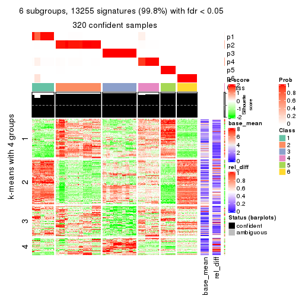</p>

</div>
</div>


Signature heatmaps where rows are not scaled:


<script>
$( function() {
	$( '#tabs-MAD-mclust-get-signatures-no-scale' ).tabs();
} );
</script>
<div id='tabs-MAD-mclust-get-signatures-no-scale'>
<ul>
<li><a href='#tab-MAD-mclust-get-signatures-no-scale-1'>k = 2</a></li>
<li><a href='#tab-MAD-mclust-get-signatures-no-scale-2'>k = 3</a></li>
<li><a href='#tab-MAD-mclust-get-signatures-no-scale-3'>k = 4</a></li>
<li><a href='#tab-MAD-mclust-get-signatures-no-scale-4'>k = 5</a></li>
<li><a href='#tab-MAD-mclust-get-signatures-no-scale-5'>k = 6</a></li>
</ul>
<div id='tab-MAD-mclust-get-signatures-no-scale-1'>
<pre><code class="r">get_signatures(res, k = 2, scale_rows = FALSE)
</code></pre>

<p></p>

</div>
<div id='tab-MAD-mclust-get-signatures-no-scale-2'>
<pre><code class="r">get_signatures(res, k = 3, scale_rows = FALSE)
</code></pre>

<p></p>

</div>
<div id='tab-MAD-mclust-get-signatures-no-scale-3'>
<pre><code class="r">get_signatures(res, k = 4, scale_rows = FALSE)
</code></pre>

<p></p>

</div>
<div id='tab-MAD-mclust-get-signatures-no-scale-4'>
<pre><code class="r">get_signatures(res, k = 5, scale_rows = FALSE)
</code></pre>

<pre><code>#&gt; Error in mat[ceiling(1:nr/h_ratio), ceiling(1:nc/w_ratio), drop = FALSE]: subscript out of bounds
</code></pre>

<p></p>

</div>
<div id='tab-MAD-mclust-get-signatures-no-scale-5'>
<pre><code class="r">get_signatures(res, k = 6, scale_rows = FALSE)
</code></pre>

<p></p>

</div>
</div>


Compare the overlap of signatures from different k:

```r
compare_signatures(res)
```


`get_signature()` returns a data frame invisibly. TO get the list of signatures, the function
call should be assigned to a variable explicitly. In following code, if `plot` argument is set
to `FALSE`, no heatmap is plotted while only the differential analysis is performed.

```r
# code only for demonstration
tb = get_signature(res, k = ..., plot = FALSE)
```

An example of the output of `tb` is:

```
#>   which_row         fdr    mean_1    mean_2 scaled_mean_1 scaled_mean_2 km
#> 1        38 0.042760348  8.373488  9.131774    -0.5533452     0.5164555  1
#> 2        40 0.018707592  7.106213  8.469186    -0.6173731     0.5762149  1
#> 3        55 0.019134737 10.221463 11.207825    -0.6159697     0.5749050  1
#> 4        59 0.006059896  5.921854  7.869574    -0.6899429     0.6439467  1
#> 5        60 0.018055526  8.928898 10.211722    -0.6204761     0.5791110  1
#> 6        98 0.009384629 15.714769 14.887706     0.6635654    -0.6193277  2
...
```

The columns in `tb` are:

1. `which_row`: row indices corresponding to the input matrix.
2. `fdr`: FDR for the differential test. 
3. `mean_x`: The mean value in group x.
4. `scaled_mean_x`: The mean value in group x after rows are scaled.
5. `km`: Row groups if k-means clustering is applied to rows.


UMAP plot which shows how samples are separated.


<script>
$( function() {
	$( '#tabs-MAD-mclust-dimension-reduction' ).tabs();
} );
</script>
<div id='tabs-MAD-mclust-dimension-reduction'>
<ul>
<li><a href='#tab-MAD-mclust-dimension-reduction-1'>k = 2</a></li>
<li><a href='#tab-MAD-mclust-dimension-reduction-2'>k = 3</a></li>
<li><a href='#tab-MAD-mclust-dimension-reduction-3'>k = 4</a></li>
<li><a href='#tab-MAD-mclust-dimension-reduction-4'>k = 5</a></li>
<li><a href='#tab-MAD-mclust-dimension-reduction-5'>k = 6</a></li>
</ul>
<div id='tab-MAD-mclust-dimension-reduction-1'>
<pre><code class="r">dimension_reduction(res, k = 2, method = &quot;UMAP&quot;)
</code></pre>

<p></p>

</div>
<div id='tab-MAD-mclust-dimension-reduction-2'>
<pre><code class="r">dimension_reduction(res, k = 3, method = &quot;UMAP&quot;)
</code></pre>

<p></p>

</div>
<div id='tab-MAD-mclust-dimension-reduction-3'>
<pre><code class="r">dimension_reduction(res, k = 4, method = &quot;UMAP&quot;)
</code></pre>

<p></p>

</div>
<div id='tab-MAD-mclust-dimension-reduction-4'>
<pre><code class="r">dimension_reduction(res, k = 5, method = &quot;UMAP&quot;)
</code></pre>

<p></p>

</div>
<div id='tab-MAD-mclust-dimension-reduction-5'>
<pre><code class="r">dimension_reduction(res, k = 6, method = &quot;UMAP&quot;)
</code></pre>

<p></p>

</div>
</div>


Following heatmap shows how subgroups are split when increasing `k`:

```r
collect_classes(res)
```


If matrix rows can be associated to genes, consider to use `functional_enrichment(res,
...)` to perform function enrichment for the signature genes. See [this vignette](http://bioconductor.org/packages/devel/bioc/vignettes/cola/inst/doc/functional_enrichment.html) for more detailed explanations.


 

---------------------------------------------------


### MAD:NMF*


The object with results only for a single top-value method and a single partition method 
can be extracted as:

```r
res = res_list["MAD", "NMF"]
# you can also extract it by
# res = res_list["MAD:NMF"]
```

A summary of `res` and all the functions that can be applied to it:

```r
res
```

```
#> A 'ConsensusPartition' object with k = 2, 3, 4, 5, 6.
#>   On a matrix with 13278 rows and 322 columns.
#>   Top rows (1000, 2000, 3000, 4000, 5000) are extracted by 'MAD' method.
#>   Subgroups are detected by 'NMF' method.
#>   Performed in total 1250 partitions by row resampling.
#>   Best k for subgroups seems to be 6.
#> 
#> Following methods can be applied to this 'ConsensusPartition' object:
#>  [1] "cola_report"             "collect_classes"         "collect_plots"          
#>  [4] "collect_stats"           "colnames"                "compare_signatures"     
#>  [7] "consensus_heatmap"       "dimension_reduction"     "functional_enrichment"  
#> [10] "get_anno_col"            "get_anno"                "get_classes"            
#> [13] "get_consensus"           "get_matrix"              "get_membership"         
#> [16] "get_param"               "get_signatures"          "get_stats"              
#> [19] "is_best_k"               "is_stable_k"             "membership_heatmap"     
#> [22] "ncol"                    "nrow"                    "plot_ecdf"              
#> [25] "rownames"                "select_partition_number" "show"                   
#> [28] "suggest_best_k"          "test_to_known_factors"
```

`collect_plots()` function collects all the plots made from `res` for all `k` (number of partitions)
into one single page to provide an easy and fast comparison between different `k`.

```r
collect_plots(res)
```


The plots are:

- The first row: a plot of the ECDF (empirical cumulative distribution
  function) curves of the consensus matrix for each `k` and the heatmap of
  predicted classes for each `k`.
- The second row: heatmaps of the consensus matrix for each `k`.
- The third row: heatmaps of the membership matrix for each `k`.
- The fouth row: heatmaps of the signatures for each `k`.

All the plots in panels can be made by individual functions and they are
plotted later in this section.

`select_partition_number()` produces several plots showing different
statistics for choosing "optimized" `k`. There are following statistics:

- ECDF curves of the consensus matrix for each `k`;
- 1-PAC. [The PAC
  score](https://en.wikipedia.org/wiki/Consensus_clustering#Over-interpretation_potential_of_consensus_clustering)
  measures the proportion of the ambiguous subgrouping.
- Mean silhouette score.
- Concordance. The mean probability of fiting the consensus class ids in all
  partitions.
- Area increased. Denote $A_k$ as the area under the ECDF curve for current
  `k`, the area increased is defined as $A_k - A_{k-1}$.
- Rand index. The percent of pairs of samples that are both in a same cluster
  or both are not in a same cluster in the partition of k and k-1.
- Jaccard index. The ratio of pairs of samples are both in a same cluster in
  the partition of k and k-1 and the pairs of samples are both in a same
  cluster in the partition k or k-1.

The detailed explanations of these statistics can be found in [the _cola_
vignette](http://bioconductor.org/packages/devel/bioc/vignettes/cola/inst/doc/cola.html#toc_13).

Generally speaking, lower PAC score, higher mean silhouette score or higher
concordance corresponds to better partition. Rand index and Jaccard index
measure how similar the current partition is compared to partition with `k-1`.
If they are too similar, we won't accept `k` is better than `k-1`.

```r
select_partition_number(res)
```


The numeric values for all these statistics can be obtained by `get_stats()`.

```r
get_stats(res)
```

```
#>   k 1-PAC mean_silhouette concordance area_increased  Rand Jaccard
#> 2 2 1.000           1.000       1.000         0.4741 0.526   0.526
#> 3 3 0.901           0.914       0.958         0.3831 0.732   0.528
#> 4 4 0.761           0.776       0.884         0.0731 0.960   0.883
#> 5 5 0.730           0.788       0.837         0.0756 0.863   0.581
#> 6 6 0.915           0.895       0.928         0.0540 0.953   0.799
```

`suggest_best_k()` suggests the best $k$ based on these statistics. The rules are as follows:

- All $k$ with Jaccard index larger than 0.95 are removed because increasing
  $k$ does not provide enough extra information. If all $k$ are removed, it is
  marked as no subgroup is detected.
- For all $k$ with 1-PAC score larger than 0.9, the maximal $k$ is taken as
  the best $k$, and other $k$ are marked as optional $k$.
- If it does not fit the second rule. The $k$ with the maximal vote of the
  highest 1-PAC score, highest mean silhouette, and highest concordance is
  taken as the best $k$.

```r
suggest_best_k(res)
```

```
#> [1] 6
#> attr(,"optional")
#> [1] 2 3
```

There is also optional best $k$ = 2 3 that is worth to check.

Following shows the table of the partitions (You need to click the **show/hide
code output** link to see it). The membership matrix (columns with name `p*`)
is inferred by
[`clue::cl_consensus()`](https://www.rdocumentation.org/link/cl_consensus?package=clue)
function with the `SE` method. Basically the value in the membership matrix
represents the probability to belong to a certain group. The finall class
label for an item is determined with the group with highest probability it
belongs to.

In `get_classes()` function, the entropy is calculated from the membership
matrix and the silhouette score is calculated from the consensus matrix.


<script>
$( function() {
	$( '#tabs-MAD-NMF-get-classes' ).tabs();
} );
</script>
<div id='tabs-MAD-NMF-get-classes'>
<ul>
<li><a href='#tab-MAD-NMF-get-classes-1'>k = 2</a></li>
<li><a href='#tab-MAD-NMF-get-classes-2'>k = 3</a></li>
<li><a href='#tab-MAD-NMF-get-classes-3'>k = 4</a></li>
<li><a href='#tab-MAD-NMF-get-classes-4'>k = 5</a></li>
<li><a href='#tab-MAD-NMF-get-classes-5'>k = 6</a></li>
</ul>

<div id='tab-MAD-NMF-get-classes-1'>
<p><a id='tab-MAD-NMF-get-classes-1-a' style='color:#0366d6' href='#'>show/hide code output</a></p>
<pre><code class="r">cbind(get_classes(res, k = 2), get_membership(res, k = 2))
</code></pre>

<pre><code>#&gt;           class entropy silhouette p1 p2
#&gt; DRR023371     1       0          1  1  0
#&gt; DRR023372     1       0          1  1  0
#&gt; DRR023373     1       0          1  1  0
#&gt; DRR023374     1       0          1  1  0
#&gt; DRR023375     1       0          1  1  0
#&gt; DRR023376     1       0          1  1  0
#&gt; DRR023377     1       0          1  1  0
#&gt; DRR023378     1       0          1  1  0
#&gt; DRR023379     1       0          1  1  0
#&gt; DRR023380     1       0          1  1  0
#&gt; DRR023381     1       0          1  1  0
#&gt; DRR023382     1       0          1  1  0
#&gt; DRR023383     1       0          1  1  0
#&gt; DRR023384     1       0          1  1  0
#&gt; DRR023385     1       0          1  1  0
#&gt; DRR023386     1       0          1  1  0
#&gt; DRR023387     1       0          1  1  0
#&gt; DRR023388     1       0          1  1  0
#&gt; DRR023389     1       0          1  1  0
#&gt; DRR023390     1       0          1  1  0
#&gt; DRR023391     1       0          1  1  0
#&gt; DRR023392     1       0          1  1  0
#&gt; DRR023394     1       0          1  1  0
#&gt; DRR023395     1       0          1  1  0
#&gt; DRR023396     1       0          1  1  0
#&gt; DRR023397     1       0          1  1  0
#&gt; DRR023398     1       0          1  1  0
#&gt; DRR023399     1       0          1  1  0
#&gt; DRR023400     1       0          1  1  0
#&gt; DRR023401     1       0          1  1  0
#&gt; DRR023402     1       0          1  1  0
#&gt; DRR023403     1       0          1  1  0
#&gt; DRR023404     2       0          1  0  1
#&gt; DRR023405     2       0          1  0  1
#&gt; DRR023406     2       0          1  0  1
#&gt; DRR023407     2       0          1  0  1
#&gt; DRR023408     2       0          1  0  1
#&gt; DRR023409     2       0          1  0  1
#&gt; DRR023410     2       0          1  0  1
#&gt; DRR023411     2       0          1  0  1
#&gt; DRR023412     2       0          1  0  1
#&gt; DRR023413     2       0          1  0  1
#&gt; DRR023414     2       0          1  0  1
#&gt; DRR023415     2       0          1  0  1
#&gt; DRR023416     2       0          1  0  1
#&gt; DRR023417     2       0          1  0  1
#&gt; DRR023418     2       0          1  0  1
#&gt; DRR023419     2       0          1  0  1
#&gt; DRR023420     2       0          1  0  1
#&gt; DRR023421     2       0          1  0  1
#&gt; DRR023422     2       0          1  0  1
#&gt; DRR023423     2       0          1  0  1
#&gt; DRR023425     2       0          1  0  1
#&gt; DRR023426     2       0          1  0  1
#&gt; DRR023427     2       0          1  0  1
#&gt; DRR023428     2       0          1  0  1
#&gt; DRR023429     2       0          1  0  1
#&gt; DRR023430     2       0          1  0  1
#&gt; DRR023431     2       0          1  0  1
#&gt; DRR023432     2       0          1  0  1
#&gt; DRR023433     2       0          1  0  1
#&gt; DRR023434     2       0          1  0  1
#&gt; DRR023435     2       0          1  0  1
#&gt; DRR023436     2       0          1  0  1
#&gt; DRR023437     2       0          1  0  1
#&gt; DRR023438     2       0          1  0  1
#&gt; DRR023439     2       0          1  0  1
#&gt; DRR023440     2       0          1  0  1
#&gt; DRR023441     2       0          1  0  1
#&gt; DRR023442     2       0          1  0  1
#&gt; DRR023443     2       0          1  0  1
#&gt; DRR023444     2       0          1  0  1
#&gt; DRR023445     2       0          1  0  1
#&gt; DRR023446     2       0          1  0  1
#&gt; DRR023447     2       0          1  0  1
#&gt; DRR023448     2       0          1  0  1
#&gt; DRR023449     2       0          1  0  1
#&gt; DRR023450     2       0          1  0  1
#&gt; DRR023451     2       0          1  0  1
#&gt; DRR023452     2       0          1  0  1
#&gt; DRR023453     1       0          1  1  0
#&gt; DRR023454     1       0          1  1  0
#&gt; DRR023455     1       0          1  1  0
#&gt; DRR023456     1       0          1  1  0
#&gt; DRR023457     1       0          1  1  0
#&gt; DRR023458     1       0          1  1  0
#&gt; DRR023459     1       0          1  1  0
#&gt; DRR023460     1       0          1  1  0
#&gt; DRR023461     1       0          1  1  0
#&gt; DRR023462     1       0          1  1  0
#&gt; DRR023463     1       0          1  1  0
#&gt; DRR023464     1       0          1  1  0
#&gt; DRR023465     1       0          1  1  0
#&gt; DRR023466     1       0          1  1  0
#&gt; DRR023467     1       0          1  1  0
#&gt; DRR023468     1       0          1  1  0
#&gt; DRR023469     1       0          1  1  0
#&gt; DRR023470     1       0          1  1  0
#&gt; DRR023471     1       0          1  1  0
#&gt; DRR023472     1       0          1  1  0
#&gt; DRR023473     1       0          1  1  0
#&gt; DRR023474     1       0          1  1  0
#&gt; DRR023475     1       0          1  1  0
#&gt; DRR023476     1       0          1  1  0
#&gt; DRR023477     1       0          1  1  0
#&gt; DRR023478     1       0          1  1  0
#&gt; DRR023479     1       0          1  1  0
#&gt; DRR023480     1       0          1  1  0
#&gt; DRR023481     1       0          1  1  0
#&gt; DRR023482     1       0          1  1  0
#&gt; DRR023483     1       0          1  1  0
#&gt; DRR023484     1       0          1  1  0
#&gt; DRR023485     1       0          1  1  0
#&gt; DRR023486     1       0          1  1  0
#&gt; DRR023487     1       0          1  1  0
#&gt; DRR023488     1       0          1  1  0
#&gt; DRR023489     1       0          1  1  0
#&gt; DRR023490     1       0          1  1  0
#&gt; DRR023491     1       0          1  1  0
#&gt; DRR023492     1       0          1  1  0
#&gt; DRR023493     1       0          1  1  0
#&gt; DRR023494     1       0          1  1  0
#&gt; DRR023495     1       0          1  1  0
#&gt; DRR023496     1       0          1  1  0
#&gt; DRR023497     1       0          1  1  0
#&gt; DRR023498     1       0          1  1  0
#&gt; DRR023499     1       0          1  1  0
#&gt; DRR023500     1       0          1  1  0
#&gt; DRR023501     1       0          1  1  0
#&gt; DRR023502     1       0          1  1  0
#&gt; DRR023503     1       0          1  1  0
#&gt; DRR023504     1       0          1  1  0
#&gt; DRR023505     1       0          1  1  0
#&gt; DRR023506     1       0          1  1  0
#&gt; DRR023507     1       0          1  1  0
#&gt; DRR023508     1       0          1  1  0
#&gt; DRR023509     1       0          1  1  0
#&gt; DRR023510     1       0          1  1  0
#&gt; DRR023511     1       0          1  1  0
#&gt; DRR023512     1       0          1  1  0
#&gt; DRR023513     1       0          1  1  0
#&gt; DRR023514     1       0          1  1  0
#&gt; DRR023515     1       0          1  1  0
#&gt; DRR023516     1       0          1  1  0
#&gt; DRR023517     1       0          1  1  0
#&gt; DRR023518     1       0          1  1  0
#&gt; DRR023519     1       0          1  1  0
#&gt; DRR023520     1       0          1  1  0
#&gt; DRR023521     1       0          1  1  0
#&gt; DRR023522     1       0          1  1  0
#&gt; DRR023523     1       0          1  1  0
#&gt; DRR023524     1       0          1  1  0
#&gt; DRR023525     1       0          1  1  0
#&gt; DRR023526     1       0          1  1  0
#&gt; DRR023527     1       0          1  1  0
#&gt; DRR023528     1       0          1  1  0
#&gt; DRR023529     1       0          1  1  0
#&gt; DRR023530     1       0          1  1  0
#&gt; DRR023531     1       0          1  1  0
#&gt; DRR023532     1       0          1  1  0
#&gt; DRR023533     1       0          1  1  0
#&gt; DRR023534     1       0          1  1  0
#&gt; DRR023535     1       0          1  1  0
#&gt; DRR023536     1       0          1  1  0
#&gt; DRR023537     1       0          1  1  0
#&gt; DRR023538     1       0          1  1  0
#&gt; DRR023539     1       0          1  1  0
#&gt; DRR023540     1       0          1  1  0
#&gt; DRR023541     1       0          1  1  0
#&gt; DRR023542     1       0          1  1  0
#&gt; DRR023543     1       0          1  1  0
#&gt; DRR023544     1       0          1  1  0
#&gt; DRR023545     1       0          1  1  0
#&gt; DRR023546     1       0          1  1  0
#&gt; DRR023547     1       0          1  1  0
#&gt; DRR023548     1       0          1  1  0
#&gt; DRR023549     1       0          1  1  0
#&gt; DRR023550     1       0          1  1  0
#&gt; DRR023551     1       0          1  1  0
#&gt; DRR023552     1       0          1  1  0
#&gt; DRR023553     1       0          1  1  0
#&gt; DRR023554     1       0          1  1  0
#&gt; DRR023555     1       0          1  1  0
#&gt; DRR023556     1       0          1  1  0
#&gt; DRR023557     1       0          1  1  0
#&gt; DRR023558     1       0          1  1  0
#&gt; DRR023559     1       0          1  1  0
#&gt; DRR023560     1       0          1  1  0
#&gt; DRR023561     1       0          1  1  0
#&gt; DRR023562     1       0          1  1  0
#&gt; DRR023563     1       0          1  1  0
#&gt; DRR023564     1       0          1  1  0
#&gt; DRR023565     1       0          1  1  0
#&gt; DRR023566     1       0          1  1  0
#&gt; DRR023567     1       0          1  1  0
#&gt; DRR023568     1       0          1  1  0
#&gt; DRR023569     1       0          1  1  0
#&gt; DRR023570     1       0          1  1  0
#&gt; DRR023571     1       0          1  1  0
#&gt; DRR023572     1       0          1  1  0
#&gt; DRR023573     1       0          1  1  0
#&gt; DRR023574     1       0          1  1  0
#&gt; DRR023575     1       0          1  1  0
#&gt; DRR023576     2       0          1  0  1
#&gt; DRR023577     2       0          1  0  1
#&gt; DRR023578     2       0          1  0  1
#&gt; DRR023579     2       0          1  0  1
#&gt; DRR023580     2       0          1  0  1
#&gt; DRR023581     2       0          1  0  1
#&gt; DRR023582     2       0          1  0  1
#&gt; DRR023583     2       0          1  0  1
#&gt; DRR023584     2       0          1  0  1
#&gt; DRR023585     2       0          1  0  1
#&gt; DRR023586     2       0          1  0  1
#&gt; DRR023587     2       0          1  0  1
#&gt; DRR023588     2       0          1  0  1
#&gt; DRR023589     2       0          1  0  1
#&gt; DRR023590     2       0          1  0  1
#&gt; DRR023591     2       0          1  0  1
#&gt; DRR023592     2       0          1  0  1
#&gt; DRR023593     2       0          1  0  1
#&gt; DRR023594     2       0          1  0  1
#&gt; DRR023595     2       0          1  0  1
#&gt; DRR023596     2       0          1  0  1
#&gt; DRR023597     2       0          1  0  1
#&gt; DRR023598     2       0          1  0  1
#&gt; DRR023599     2       0          1  0  1
#&gt; DRR023600     2       0          1  0  1
#&gt; DRR023601     2       0          1  0  1
#&gt; DRR023602     2       0          1  0  1
#&gt; DRR023603     2       0          1  0  1
#&gt; DRR023604     2       0          1  0  1
#&gt; DRR023605     2       0          1  0  1
#&gt; DRR023606     2       0          1  0  1
#&gt; DRR023607     2       0          1  0  1
#&gt; DRR023608     2       0          1  0  1
#&gt; DRR023609     2       0          1  0  1
#&gt; DRR023610     2       0          1  0  1
#&gt; DRR023611     2       0          1  0  1
#&gt; DRR023612     2       0          1  0  1
#&gt; DRR023613     2       0          1  0  1
#&gt; DRR023614     2       0          1  0  1
#&gt; DRR023615     2       0          1  0  1
#&gt; DRR023616     2       0          1  0  1
#&gt; DRR023617     2       0          1  0  1
#&gt; DRR023619     1       0          1  1  0
#&gt; DRR023620     1       0          1  1  0
#&gt; DRR023621     1       0          1  1  0
#&gt; DRR023622     1       0          1  1  0
#&gt; DRR023623     1       0          1  1  0
#&gt; DRR023624     1       0          1  1  0
#&gt; DRR023625     1       0          1  1  0
#&gt; DRR023626     1       0          1  1  0
#&gt; DRR023627     1       0          1  1  0
#&gt; DRR023628     1       0          1  1  0
#&gt; DRR023629     1       0          1  1  0
#&gt; DRR023630     1       0          1  1  0
#&gt; DRR023631     1       0          1  1  0
#&gt; DRR023632     1       0          1  1  0
#&gt; DRR023633     1       0          1  1  0
#&gt; DRR023635     2       0          1  0  1
#&gt; DRR023636     2       0          1  0  1
#&gt; DRR023637     2       0          1  0  1
#&gt; DRR023638     2       0          1  0  1
#&gt; DRR023639     2       0          1  0  1
#&gt; DRR023640     2       0          1  0  1
#&gt; DRR023641     2       0          1  0  1
#&gt; DRR023642     2       0          1  0  1
#&gt; DRR023643     2       0          1  0  1
#&gt; DRR023644     2       0          1  0  1
#&gt; DRR023645     2       0          1  0  1
#&gt; DRR023646     2       0          1  0  1
#&gt; DRR023647     2       0          1  0  1
#&gt; DRR023648     2       0          1  0  1
#&gt; DRR023649     2       0          1  0  1
#&gt; DRR023650     1       0          1  1  0
#&gt; DRR023651     1       0          1  1  0
#&gt; DRR023652     1       0          1  1  0
#&gt; DRR023653     1       0          1  1  0
#&gt; DRR023654     1       0          1  1  0
#&gt; DRR023655     1       0          1  1  0
#&gt; DRR023656     1       0          1  1  0
#&gt; DRR023657     1       0          1  1  0
#&gt; DRR023658     1       0          1  1  0
#&gt; DRR023659     1       0          1  1  0
#&gt; DRR023660     1       0          1  1  0
#&gt; DRR023661     1       0          1  1  0
#&gt; DRR023662     1       0          1  1  0
#&gt; DRR023663     1       0          1  1  0
#&gt; DRR023664     1       0          1  1  0
#&gt; DRR023665     1       0          1  1  0
#&gt; DRR023666     1       0          1  1  0
#&gt; DRR023667     1       0          1  1  0
#&gt; DRR023668     1       0          1  1  0
#&gt; DRR023669     1       0          1  1  0
#&gt; DRR023670     1       0          1  1  0
#&gt; DRR023671     1       0          1  1  0
#&gt; DRR023672     1       0          1  1  0
#&gt; DRR023673     1       0          1  1  0
#&gt; DRR023674     1       0          1  1  0
#&gt; DRR023675     1       0          1  1  0
#&gt; DRR023676     1       0          1  1  0
#&gt; DRR023677     1       0          1  1  0
#&gt; DRR023678     1       0          1  1  0
#&gt; DRR023683     2       0          1  0  1
#&gt; DRR023684     2       0          1  0  1
#&gt; DRR023685     2       0          1  0  1
#&gt; DRR023686     2       0          1  0  1
#&gt; DRR023687     2       0          1  0  1
#&gt; DRR023688     2       0          1  0  1
#&gt; DRR023689     2       0          1  0  1
#&gt; DRR023690     2       0          1  0  1
#&gt; DRR023691     2       0          1  0  1
#&gt; DRR023692     2       0          1  0  1
#&gt; DRR023693     2       0          1  0  1
#&gt; DRR023694     2       0          1  0  1
#&gt; DRR023695     2       0          1  0  1
#&gt; DRR023696     2       0          1  0  1
#&gt; DRR023697     2       0          1  0  1
#&gt; DRR023698     2       0          1  0  1
#&gt; DRR023699     2       0          1  0  1
#&gt; DRR023700     2       0          1  0  1
</code></pre>

<script>
$('#tab-MAD-NMF-get-classes-1-a').parent().next().next().hide();
$('#tab-MAD-NMF-get-classes-1-a').click(function(){
  $('#tab-MAD-NMF-get-classes-1-a').parent().next().next().toggle();
  return(false);
});
</script>
</div>

<div id='tab-MAD-NMF-get-classes-2'>
<p><a id='tab-MAD-NMF-get-classes-2-a' style='color:#0366d6' href='#'>show/hide code output</a></p>
<pre><code class="r">cbind(get_classes(res, k = 3), get_membership(res, k = 3))
</code></pre>

<pre><code>#&gt;           class entropy silhouette    p1    p2    p3
#&gt; DRR023371     3  0.0000      0.870 0.000 0.000 1.000
#&gt; DRR023372     3  0.0000      0.870 0.000 0.000 1.000
#&gt; DRR023373     3  0.0000      0.870 0.000 0.000 1.000
#&gt; DRR023374     3  0.0000      0.870 0.000 0.000 1.000
#&gt; DRR023375     3  0.0000      0.870 0.000 0.000 1.000
#&gt; DRR023376     3  0.0000      0.870 0.000 0.000 1.000
#&gt; DRR023377     3  0.0000      0.870 0.000 0.000 1.000
#&gt; DRR023378     3  0.0000      0.870 0.000 0.000 1.000
#&gt; DRR023379     3  0.0000      0.870 0.000 0.000 1.000
#&gt; DRR023380     3  0.0000      0.870 0.000 0.000 1.000
#&gt; DRR023381     3  0.0000      0.870 0.000 0.000 1.000
#&gt; DRR023382     3  0.0000      0.870 0.000 0.000 1.000
#&gt; DRR023383     3  0.0000      0.870 0.000 0.000 1.000
#&gt; DRR023384     3  0.0000      0.870 0.000 0.000 1.000
#&gt; DRR023385     3  0.0000      0.870 0.000 0.000 1.000
#&gt; DRR023386     3  0.0000      0.870 0.000 0.000 1.000
#&gt; DRR023387     3  0.0000      0.870 0.000 0.000 1.000
#&gt; DRR023388     3  0.0000      0.870 0.000 0.000 1.000
#&gt; DRR023389     3  0.0000      0.870 0.000 0.000 1.000
#&gt; DRR023390     3  0.0000      0.870 0.000 0.000 1.000
#&gt; DRR023391     3  0.0000      0.870 0.000 0.000 1.000
#&gt; DRR023392     3  0.0000      0.870 0.000 0.000 1.000
#&gt; DRR023394     3  0.0000      0.870 0.000 0.000 1.000
#&gt; DRR023395     3  0.0000      0.870 0.000 0.000 1.000
#&gt; DRR023396     3  0.0892      0.855 0.020 0.000 0.980
#&gt; DRR023397     3  0.0892      0.855 0.020 0.000 0.980
#&gt; DRR023398     3  0.0747      0.859 0.016 0.000 0.984
#&gt; DRR023399     3  0.0892      0.855 0.020 0.000 0.980
#&gt; DRR023400     3  0.0747      0.859 0.016 0.000 0.984
#&gt; DRR023401     3  0.0747      0.859 0.016 0.000 0.984
#&gt; DRR023402     3  0.0892      0.855 0.020 0.000 0.980
#&gt; DRR023403     3  0.0747      0.859 0.016 0.000 0.984
#&gt; DRR023404     2  0.3038      0.884 0.000 0.896 0.104
#&gt; DRR023405     2  0.3038      0.884 0.000 0.896 0.104
#&gt; DRR023406     2  0.3038      0.884 0.000 0.896 0.104
#&gt; DRR023407     2  0.3038      0.884 0.000 0.896 0.104
#&gt; DRR023408     2  0.3116      0.879 0.000 0.892 0.108
#&gt; DRR023409     2  0.3038      0.884 0.000 0.896 0.104
#&gt; DRR023410     2  0.3038      0.884 0.000 0.896 0.104
#&gt; DRR023411     2  0.3038      0.884 0.000 0.896 0.104
#&gt; DRR023412     2  0.3038      0.884 0.000 0.896 0.104
#&gt; DRR023413     2  0.3038      0.884 0.000 0.896 0.104
#&gt; DRR023414     2  0.3038      0.884 0.000 0.896 0.104
#&gt; DRR023415     2  0.3038      0.884 0.000 0.896 0.104
#&gt; DRR023416     2  0.3038      0.884 0.000 0.896 0.104
#&gt; DRR023417     2  0.3038      0.884 0.000 0.896 0.104
#&gt; DRR023418     2  0.3038      0.884 0.000 0.896 0.104
#&gt; DRR023419     2  0.3038      0.884 0.000 0.896 0.104
#&gt; DRR023420     2  0.3038      0.884 0.000 0.896 0.104
#&gt; DRR023421     2  0.3116      0.879 0.000 0.892 0.108
#&gt; DRR023422     3  0.6225      0.417 0.000 0.432 0.568
#&gt; DRR023423     3  0.6225      0.417 0.000 0.432 0.568
#&gt; DRR023425     3  0.6126      0.485 0.000 0.400 0.600
#&gt; DRR023426     3  0.6225      0.417 0.000 0.432 0.568
#&gt; DRR023427     3  0.6204      0.436 0.000 0.424 0.576
#&gt; DRR023428     3  0.6154      0.470 0.000 0.408 0.592
#&gt; DRR023429     3  0.6168      0.462 0.000 0.412 0.588
#&gt; DRR023430     3  0.6180      0.454 0.000 0.416 0.584
#&gt; DRR023431     3  0.6140      0.478 0.000 0.404 0.596
#&gt; DRR023432     3  0.6140      0.478 0.000 0.404 0.596
#&gt; DRR023433     3  0.6180      0.454 0.000 0.416 0.584
#&gt; DRR023434     3  0.6168      0.462 0.000 0.412 0.588
#&gt; DRR023435     3  0.6154      0.470 0.000 0.408 0.592
#&gt; DRR023436     3  0.6204      0.436 0.000 0.424 0.576
#&gt; DRR023437     3  0.6225      0.417 0.000 0.432 0.568
#&gt; DRR023438     3  0.6180      0.454 0.000 0.416 0.584
#&gt; DRR023439     3  0.6111      0.492 0.000 0.396 0.604
#&gt; DRR023440     3  0.6180      0.454 0.000 0.416 0.584
#&gt; DRR023441     3  0.6204      0.436 0.000 0.424 0.576
#&gt; DRR023442     3  0.6140      0.478 0.000 0.404 0.596
#&gt; DRR023443     3  0.6204      0.436 0.000 0.424 0.576
#&gt; DRR023444     3  0.6062      0.512 0.000 0.384 0.616
#&gt; DRR023445     3  0.5431      0.650 0.000 0.284 0.716
#&gt; DRR023446     3  0.5591      0.626 0.000 0.304 0.696
#&gt; DRR023447     3  0.5138      0.683 0.000 0.252 0.748
#&gt; DRR023448     3  0.5254      0.671 0.000 0.264 0.736
#&gt; DRR023449     3  0.5397      0.654 0.000 0.280 0.720
#&gt; DRR023450     3  0.5560      0.631 0.000 0.300 0.700
#&gt; DRR023451     3  0.5621      0.621 0.000 0.308 0.692
#&gt; DRR023452     3  0.5216      0.676 0.000 0.260 0.740
#&gt; DRR023453     3  0.0000      0.870 0.000 0.000 1.000
#&gt; DRR023454     3  0.0000      0.870 0.000 0.000 1.000
#&gt; DRR023455     3  0.0000      0.870 0.000 0.000 1.000
#&gt; DRR023456     3  0.0000      0.870 0.000 0.000 1.000
#&gt; DRR023457     3  0.0000      0.870 0.000 0.000 1.000
#&gt; DRR023458     3  0.0000      0.870 0.000 0.000 1.000
#&gt; DRR023459     3  0.0000      0.870 0.000 0.000 1.000
#&gt; DRR023460     3  0.0000      0.870 0.000 0.000 1.000
#&gt; DRR023461     3  0.0000      0.870 0.000 0.000 1.000
#&gt; DRR023462     3  0.0000      0.870 0.000 0.000 1.000
#&gt; DRR023463     3  0.0000      0.870 0.000 0.000 1.000
#&gt; DRR023464     3  0.0000      0.870 0.000 0.000 1.000
#&gt; DRR023465     3  0.0000      0.870 0.000 0.000 1.000
#&gt; DRR023466     3  0.0000      0.870 0.000 0.000 1.000
#&gt; DRR023467     3  0.0000      0.870 0.000 0.000 1.000
#&gt; DRR023468     3  0.0000      0.870 0.000 0.000 1.000
#&gt; DRR023469     3  0.0000      0.870 0.000 0.000 1.000
#&gt; DRR023470     3  0.0000      0.870 0.000 0.000 1.000
#&gt; DRR023471     3  0.0000      0.870 0.000 0.000 1.000
#&gt; DRR023472     3  0.0000      0.870 0.000 0.000 1.000
#&gt; DRR023473     3  0.0000      0.870 0.000 0.000 1.000
#&gt; DRR023474     3  0.0000      0.870 0.000 0.000 1.000
#&gt; DRR023475     3  0.0000      0.870 0.000 0.000 1.000
#&gt; DRR023476     3  0.0000      0.870 0.000 0.000 1.000
#&gt; DRR023477     3  0.0000      0.870 0.000 0.000 1.000
#&gt; DRR023478     3  0.0000      0.870 0.000 0.000 1.000
#&gt; DRR023479     3  0.0000      0.870 0.000 0.000 1.000
#&gt; DRR023480     3  0.0000      0.870 0.000 0.000 1.000
#&gt; DRR023481     3  0.0000      0.870 0.000 0.000 1.000
#&gt; DRR023482     3  0.0000      0.870 0.000 0.000 1.000
#&gt; DRR023483     3  0.0000      0.870 0.000 0.000 1.000
#&gt; DRR023484     3  0.0000      0.870 0.000 0.000 1.000
#&gt; DRR023485     3  0.0000      0.870 0.000 0.000 1.000
#&gt; DRR023486     3  0.0000      0.870 0.000 0.000 1.000
#&gt; DRR023487     3  0.0000      0.870 0.000 0.000 1.000
#&gt; DRR023488     3  0.0000      0.870 0.000 0.000 1.000
#&gt; DRR023489     3  0.0000      0.870 0.000 0.000 1.000
#&gt; DRR023490     1  0.0000      1.000 1.000 0.000 0.000
#&gt; DRR023491     1  0.0000      1.000 1.000 0.000 0.000
#&gt; DRR023492     1  0.0000      1.000 1.000 0.000 0.000
#&gt; DRR023493     1  0.0000      1.000 1.000 0.000 0.000
#&gt; DRR023494     1  0.0000      1.000 1.000 0.000 0.000
#&gt; DRR023495     1  0.0000      1.000 1.000 0.000 0.000
#&gt; DRR023496     1  0.0000      1.000 1.000 0.000 0.000
#&gt; DRR023497     1  0.0000      1.000 1.000 0.000 0.000
#&gt; DRR023498     1  0.0000      1.000 1.000 0.000 0.000
#&gt; DRR023499     1  0.0000      1.000 1.000 0.000 0.000
#&gt; DRR023500     1  0.0000      1.000 1.000 0.000 0.000
#&gt; DRR023501     1  0.0000      1.000 1.000 0.000 0.000
#&gt; DRR023502     1  0.0000      1.000 1.000 0.000 0.000
#&gt; DRR023503     1  0.0000      1.000 1.000 0.000 0.000
#&gt; DRR023504     1  0.0000      1.000 1.000 0.000 0.000
#&gt; DRR023505     1  0.0000      1.000 1.000 0.000 0.000
#&gt; DRR023506     1  0.0000      1.000 1.000 0.000 0.000
#&gt; DRR023507     1  0.0000      1.000 1.000 0.000 0.000
#&gt; DRR023508     1  0.0000      1.000 1.000 0.000 0.000
#&gt; DRR023509     1  0.0000      1.000 1.000 0.000 0.000
#&gt; DRR023510     1  0.0000      1.000 1.000 0.000 0.000
#&gt; DRR023511     1  0.0000      1.000 1.000 0.000 0.000
#&gt; DRR023512     1  0.0000      1.000 1.000 0.000 0.000
#&gt; DRR023513     1  0.0000      1.000 1.000 0.000 0.000
#&gt; DRR023514     1  0.0000      1.000 1.000 0.000 0.000
#&gt; DRR023515     1  0.0000      1.000 1.000 0.000 0.000
#&gt; DRR023516     1  0.0000      1.000 1.000 0.000 0.000
#&gt; DRR023517     1  0.0000      1.000 1.000 0.000 0.000
#&gt; DRR023518     1  0.0000      1.000 1.000 0.000 0.000
#&gt; DRR023519     1  0.0000      1.000 1.000 0.000 0.000
#&gt; DRR023520     1  0.0000      1.000 1.000 0.000 0.000
#&gt; DRR023521     1  0.0000      1.000 1.000 0.000 0.000
#&gt; DRR023522     1  0.0000      1.000 1.000 0.000 0.000
#&gt; DRR023523     1  0.0000      1.000 1.000 0.000 0.000
#&gt; DRR023524     1  0.0000      1.000 1.000 0.000 0.000
#&gt; DRR023525     1  0.0000      1.000 1.000 0.000 0.000
#&gt; DRR023526     1  0.0000      1.000 1.000 0.000 0.000
#&gt; DRR023527     1  0.0000      1.000 1.000 0.000 0.000
#&gt; DRR023528     1  0.0000      1.000 1.000 0.000 0.000
#&gt; DRR023529     1  0.0000      1.000 1.000 0.000 0.000
#&gt; DRR023530     1  0.0000      1.000 1.000 0.000 0.000
#&gt; DRR023531     1  0.0000      1.000 1.000 0.000 0.000
#&gt; DRR023532     1  0.0000      1.000 1.000 0.000 0.000
#&gt; DRR023533     1  0.0000      1.000 1.000 0.000 0.000
#&gt; DRR023534     1  0.0000      1.000 1.000 0.000 0.000
#&gt; DRR023535     1  0.0000      1.000 1.000 0.000 0.000
#&gt; DRR023536     1  0.0000      1.000 1.000 0.000 0.000
#&gt; DRR023537     1  0.0000      1.000 1.000 0.000 0.000
#&gt; DRR023538     1  0.0000      1.000 1.000 0.000 0.000
#&gt; DRR023539     1  0.0000      1.000 1.000 0.000 0.000
#&gt; DRR023540     1  0.0000      1.000 1.000 0.000 0.000
#&gt; DRR023541     1  0.0000      1.000 1.000 0.000 0.000
#&gt; DRR023542     1  0.0000      1.000 1.000 0.000 0.000
#&gt; DRR023543     1  0.0000      1.000 1.000 0.000 0.000
#&gt; DRR023544     1  0.0000      1.000 1.000 0.000 0.000
#&gt; DRR023545     1  0.0000      1.000 1.000 0.000 0.000
#&gt; DRR023546     1  0.0000      1.000 1.000 0.000 0.000
#&gt; DRR023547     1  0.0000      1.000 1.000 0.000 0.000
#&gt; DRR023548     1  0.0000      1.000 1.000 0.000 0.000
#&gt; DRR023549     1  0.0000      1.000 1.000 0.000 0.000
#&gt; DRR023550     1  0.0000      1.000 1.000 0.000 0.000
#&gt; DRR023551     1  0.0000      1.000 1.000 0.000 0.000
#&gt; DRR023552     1  0.0000      1.000 1.000 0.000 0.000
#&gt; DRR023553     1  0.0000      1.000 1.000 0.000 0.000
#&gt; DRR023554     1  0.0000      1.000 1.000 0.000 0.000
#&gt; DRR023555     1  0.0000      1.000 1.000 0.000 0.000
#&gt; DRR023556     1  0.0000      1.000 1.000 0.000 0.000
#&gt; DRR023557     1  0.0000      1.000 1.000 0.000 0.000
#&gt; DRR023558     1  0.0000      1.000 1.000 0.000 0.000
#&gt; DRR023559     1  0.0000      1.000 1.000 0.000 0.000
#&gt; DRR023560     1  0.0000      1.000 1.000 0.000 0.000
#&gt; DRR023561     1  0.0000      1.000 1.000 0.000 0.000
#&gt; DRR023562     1  0.0000      1.000 1.000 0.000 0.000
#&gt; DRR023563     1  0.0000      1.000 1.000 0.000 0.000
#&gt; DRR023564     1  0.0000      1.000 1.000 0.000 0.000
#&gt; DRR023565     1  0.0000      1.000 1.000 0.000 0.000
#&gt; DRR023566     1  0.0000      1.000 1.000 0.000 0.000
#&gt; DRR023567     1  0.0000      1.000 1.000 0.000 0.000
#&gt; DRR023568     1  0.0000      1.000 1.000 0.000 0.000
#&gt; DRR023569     1  0.0000      1.000 1.000 0.000 0.000
#&gt; DRR023570     1  0.0000      1.000 1.000 0.000 0.000
#&gt; DRR023571     1  0.0000      1.000 1.000 0.000 0.000
#&gt; DRR023572     1  0.0000      1.000 1.000 0.000 0.000
#&gt; DRR023573     1  0.0000      1.000 1.000 0.000 0.000
#&gt; DRR023574     1  0.0000      1.000 1.000 0.000 0.000
#&gt; DRR023575     1  0.0000      1.000 1.000 0.000 0.000
#&gt; DRR023576     2  0.0000      0.975 0.000 1.000 0.000
#&gt; DRR023577     2  0.0000      0.975 0.000 1.000 0.000
#&gt; DRR023578     2  0.0000      0.975 0.000 1.000 0.000
#&gt; DRR023579     2  0.0000      0.975 0.000 1.000 0.000
#&gt; DRR023580     2  0.0000      0.975 0.000 1.000 0.000
#&gt; DRR023581     2  0.0000      0.975 0.000 1.000 0.000
#&gt; DRR023582     2  0.0000      0.975 0.000 1.000 0.000
#&gt; DRR023583     2  0.0000      0.975 0.000 1.000 0.000
#&gt; DRR023584     2  0.0000      0.975 0.000 1.000 0.000
#&gt; DRR023585     2  0.0000      0.975 0.000 1.000 0.000
#&gt; DRR023586     2  0.0000      0.975 0.000 1.000 0.000
#&gt; DRR023587     2  0.0000      0.975 0.000 1.000 0.000
#&gt; DRR023588     2  0.0000      0.975 0.000 1.000 0.000
#&gt; DRR023589     2  0.0000      0.975 0.000 1.000 0.000
#&gt; DRR023590     2  0.0000      0.975 0.000 1.000 0.000
#&gt; DRR023591     2  0.0000      0.975 0.000 1.000 0.000
#&gt; DRR023592     2  0.0000      0.975 0.000 1.000 0.000
#&gt; DRR023593     2  0.0000      0.975 0.000 1.000 0.000
#&gt; DRR023594     2  0.0000      0.975 0.000 1.000 0.000
#&gt; DRR023595     2  0.0000      0.975 0.000 1.000 0.000
#&gt; DRR023596     2  0.0000      0.975 0.000 1.000 0.000
#&gt; DRR023597     2  0.0000      0.975 0.000 1.000 0.000
#&gt; DRR023598     2  0.0000      0.975 0.000 1.000 0.000
#&gt; DRR023599     2  0.0000      0.975 0.000 1.000 0.000
#&gt; DRR023600     2  0.0000      0.975 0.000 1.000 0.000
#&gt; DRR023601     2  0.0000      0.975 0.000 1.000 0.000
#&gt; DRR023602     2  0.0000      0.975 0.000 1.000 0.000
#&gt; DRR023603     2  0.0000      0.975 0.000 1.000 0.000
#&gt; DRR023604     2  0.0000      0.975 0.000 1.000 0.000
#&gt; DRR023605     2  0.0000      0.975 0.000 1.000 0.000
#&gt; DRR023606     2  0.0000      0.975 0.000 1.000 0.000
#&gt; DRR023607     2  0.0000      0.975 0.000 1.000 0.000
#&gt; DRR023608     2  0.0000      0.975 0.000 1.000 0.000
#&gt; DRR023609     2  0.0000      0.975 0.000 1.000 0.000
#&gt; DRR023610     2  0.0000      0.975 0.000 1.000 0.000
#&gt; DRR023611     2  0.0000      0.975 0.000 1.000 0.000
#&gt; DRR023612     2  0.0000      0.975 0.000 1.000 0.000
#&gt; DRR023613     2  0.0000      0.975 0.000 1.000 0.000
#&gt; DRR023614     2  0.0000      0.975 0.000 1.000 0.000
#&gt; DRR023615     2  0.0000      0.975 0.000 1.000 0.000
#&gt; DRR023616     2  0.0000      0.975 0.000 1.000 0.000
#&gt; DRR023617     2  0.0000      0.975 0.000 1.000 0.000
#&gt; DRR023619     1  0.0000      1.000 1.000 0.000 0.000
#&gt; DRR023620     1  0.0000      1.000 1.000 0.000 0.000
#&gt; DRR023621     1  0.0000      1.000 1.000 0.000 0.000
#&gt; DRR023622     1  0.0000      1.000 1.000 0.000 0.000
#&gt; DRR023623     1  0.0000      1.000 1.000 0.000 0.000
#&gt; DRR023624     1  0.0000      1.000 1.000 0.000 0.000
#&gt; DRR023625     1  0.0000      1.000 1.000 0.000 0.000
#&gt; DRR023626     1  0.0000      1.000 1.000 0.000 0.000
#&gt; DRR023627     1  0.0000      1.000 1.000 0.000 0.000
#&gt; DRR023628     1  0.0000      1.000 1.000 0.000 0.000
#&gt; DRR023629     1  0.0000      1.000 1.000 0.000 0.000
#&gt; DRR023630     1  0.0000      1.000 1.000 0.000 0.000
#&gt; DRR023631     1  0.0000      1.000 1.000 0.000 0.000
#&gt; DRR023632     1  0.0000      1.000 1.000 0.000 0.000
#&gt; DRR023633     1  0.0000      1.000 1.000 0.000 0.000
#&gt; DRR023635     2  0.0000      0.975 0.000 1.000 0.000
#&gt; DRR023636     2  0.0000      0.975 0.000 1.000 0.000
#&gt; DRR023637     2  0.0000      0.975 0.000 1.000 0.000
#&gt; DRR023638     2  0.0000      0.975 0.000 1.000 0.000
#&gt; DRR023639     2  0.0000      0.975 0.000 1.000 0.000
#&gt; DRR023640     2  0.0000      0.975 0.000 1.000 0.000
#&gt; DRR023641     2  0.0000      0.975 0.000 1.000 0.000
#&gt; DRR023642     2  0.0000      0.975 0.000 1.000 0.000
#&gt; DRR023643     2  0.0000      0.975 0.000 1.000 0.000
#&gt; DRR023644     2  0.0000      0.975 0.000 1.000 0.000
#&gt; DRR023645     2  0.0000      0.975 0.000 1.000 0.000
#&gt; DRR023646     2  0.0000      0.975 0.000 1.000 0.000
#&gt; DRR023647     2  0.0000      0.975 0.000 1.000 0.000
#&gt; DRR023648     2  0.0000      0.975 0.000 1.000 0.000
#&gt; DRR023649     2  0.0000      0.975 0.000 1.000 0.000
#&gt; DRR023650     1  0.0000      1.000 1.000 0.000 0.000
#&gt; DRR023651     1  0.0000      1.000 1.000 0.000 0.000
#&gt; DRR023652     1  0.0000      1.000 1.000 0.000 0.000
#&gt; DRR023653     1  0.0000      1.000 1.000 0.000 0.000
#&gt; DRR023654     1  0.0000      1.000 1.000 0.000 0.000
#&gt; DRR023655     1  0.0000      1.000 1.000 0.000 0.000
#&gt; DRR023656     1  0.0000      1.000 1.000 0.000 0.000
#&gt; DRR023657     1  0.0000      1.000 1.000 0.000 0.000
#&gt; DRR023658     1  0.0000      1.000 1.000 0.000 0.000
#&gt; DRR023659     1  0.0000      1.000 1.000 0.000 0.000
#&gt; DRR023660     1  0.0000      1.000 1.000 0.000 0.000
#&gt; DRR023661     1  0.0000      1.000 1.000 0.000 0.000
#&gt; DRR023662     1  0.0000      1.000 1.000 0.000 0.000
#&gt; DRR023663     1  0.0000      1.000 1.000 0.000 0.000
#&gt; DRR023664     1  0.0000      1.000 1.000 0.000 0.000
#&gt; DRR023665     1  0.0000      1.000 1.000 0.000 0.000
#&gt; DRR023666     1  0.0000      1.000 1.000 0.000 0.000
#&gt; DRR023667     1  0.0000      1.000 1.000 0.000 0.000
#&gt; DRR023668     1  0.0000      1.000 1.000 0.000 0.000
#&gt; DRR023669     1  0.0000      1.000 1.000 0.000 0.000
#&gt; DRR023670     1  0.0000      1.000 1.000 0.000 0.000
#&gt; DRR023671     1  0.0000      1.000 1.000 0.000 0.000
#&gt; DRR023672     1  0.0000      1.000 1.000 0.000 0.000
#&gt; DRR023673     1  0.0000      1.000 1.000 0.000 0.000
#&gt; DRR023674     1  0.0000      1.000 1.000 0.000 0.000
#&gt; DRR023675     1  0.0000      1.000 1.000 0.000 0.000
#&gt; DRR023676     1  0.0000      1.000 1.000 0.000 0.000
#&gt; DRR023677     1  0.0000      1.000 1.000 0.000 0.000
#&gt; DRR023678     1  0.0000      1.000 1.000 0.000 0.000
#&gt; DRR023683     2  0.0000      0.975 0.000 1.000 0.000
#&gt; DRR023684     2  0.0000      0.975 0.000 1.000 0.000
#&gt; DRR023685     2  0.0000      0.975 0.000 1.000 0.000
#&gt; DRR023686     2  0.0000      0.975 0.000 1.000 0.000
#&gt; DRR023687     2  0.0000      0.975 0.000 1.000 0.000
#&gt; DRR023688     2  0.0000      0.975 0.000 1.000 0.000
#&gt; DRR023689     2  0.0000      0.975 0.000 1.000 0.000
#&gt; DRR023690     2  0.0000      0.975 0.000 1.000 0.000
#&gt; DRR023691     2  0.0000      0.975 0.000 1.000 0.000
#&gt; DRR023692     2  0.0000      0.975 0.000 1.000 0.000
#&gt; DRR023693     2  0.0000      0.975 0.000 1.000 0.000
#&gt; DRR023694     2  0.0000      0.975 0.000 1.000 0.000
#&gt; DRR023695     2  0.0000      0.975 0.000 1.000 0.000
#&gt; DRR023696     2  0.0000      0.975 0.000 1.000 0.000
#&gt; DRR023697     2  0.0000      0.975 0.000 1.000 0.000
#&gt; DRR023698     2  0.0000      0.975 0.000 1.000 0.000
#&gt; DRR023699     2  0.0000      0.975 0.000 1.000 0.000
#&gt; DRR023700     2  0.0000      0.975 0.000 1.000 0.000
</code></pre>

<script>
$('#tab-MAD-NMF-get-classes-2-a').parent().next().next().hide();
$('#tab-MAD-NMF-get-classes-2-a').click(function(){
  $('#tab-MAD-NMF-get-classes-2-a').parent().next().next().toggle();
  return(false);
});
</script>
</div>

<div id='tab-MAD-NMF-get-classes-3'>
<p><a id='tab-MAD-NMF-get-classes-3-a' style='color:#0366d6' href='#'>show/hide code output</a></p>
<pre><code class="r">cbind(get_classes(res, k = 4), get_membership(res, k = 4))
</code></pre>

<pre><code>#&gt;           class entropy silhouette    p1    p2    p3    p4
#&gt; DRR023371     3  0.0657     0.7755 0.012 0.000 0.984 0.004
#&gt; DRR023372     3  0.0657     0.7755 0.012 0.000 0.984 0.004
#&gt; DRR023373     3  0.0657     0.7755 0.012 0.000 0.984 0.004
#&gt; DRR023374     3  0.0657     0.7755 0.012 0.000 0.984 0.004
#&gt; DRR023375     3  0.0469     0.7761 0.012 0.000 0.988 0.000
#&gt; DRR023376     3  0.0469     0.7761 0.012 0.000 0.988 0.000
#&gt; DRR023377     3  0.0657     0.7755 0.012 0.000 0.984 0.004
#&gt; DRR023378     3  0.0469     0.7761 0.012 0.000 0.988 0.000
#&gt; DRR023379     3  0.1151     0.7723 0.024 0.000 0.968 0.008
#&gt; DRR023380     3  0.1256     0.7711 0.028 0.000 0.964 0.008
#&gt; DRR023381     3  0.1256     0.7711 0.028 0.000 0.964 0.008
#&gt; DRR023382     3  0.1256     0.7711 0.028 0.000 0.964 0.008
#&gt; DRR023383     3  0.1256     0.7711 0.028 0.000 0.964 0.008
#&gt; DRR023384     3  0.1256     0.7711 0.028 0.000 0.964 0.008
#&gt; DRR023385     3  0.1256     0.7711 0.028 0.000 0.964 0.008
#&gt; DRR023386     3  0.1151     0.7723 0.024 0.000 0.968 0.008
#&gt; DRR023387     3  0.2124     0.7427 0.068 0.000 0.924 0.008
#&gt; DRR023388     3  0.2124     0.7427 0.068 0.000 0.924 0.008
#&gt; DRR023389     3  0.2124     0.7427 0.068 0.000 0.924 0.008
#&gt; DRR023390     3  0.2124     0.7427 0.068 0.000 0.924 0.008
#&gt; DRR023391     3  0.2124     0.7427 0.068 0.000 0.924 0.008
#&gt; DRR023392     3  0.2124     0.7427 0.068 0.000 0.924 0.008
#&gt; DRR023394     3  0.2124     0.7427 0.068 0.000 0.924 0.008
#&gt; DRR023395     3  0.2048     0.7455 0.064 0.000 0.928 0.008
#&gt; DRR023396     3  0.3052     0.6685 0.136 0.000 0.860 0.004
#&gt; DRR023397     3  0.3105     0.6630 0.140 0.000 0.856 0.004
#&gt; DRR023398     3  0.3052     0.6685 0.136 0.000 0.860 0.004
#&gt; DRR023399     3  0.2999     0.6725 0.132 0.000 0.864 0.004
#&gt; DRR023400     3  0.3052     0.6685 0.136 0.000 0.860 0.004
#&gt; DRR023401     3  0.3052     0.6685 0.136 0.000 0.860 0.004
#&gt; DRR023402     3  0.3052     0.6685 0.136 0.000 0.860 0.004
#&gt; DRR023403     3  0.2999     0.6725 0.132 0.000 0.864 0.004
#&gt; DRR023404     4  0.6709     0.6723 0.000 0.172 0.212 0.616
#&gt; DRR023405     4  0.6672     0.6768 0.000 0.168 0.212 0.620
#&gt; DRR023406     4  0.6672     0.6768 0.000 0.168 0.212 0.620
#&gt; DRR023407     4  0.6672     0.6768 0.000 0.168 0.212 0.620
#&gt; DRR023408     4  0.6672     0.6768 0.000 0.168 0.212 0.620
#&gt; DRR023409     4  0.6672     0.6768 0.000 0.168 0.212 0.620
#&gt; DRR023410     4  0.6672     0.6768 0.000 0.168 0.212 0.620
#&gt; DRR023411     4  0.6672     0.6768 0.000 0.168 0.212 0.620
#&gt; DRR023412     4  0.6672     0.6768 0.000 0.168 0.212 0.620
#&gt; DRR023413     4  0.6709     0.6723 0.000 0.172 0.212 0.616
#&gt; DRR023414     4  0.6672     0.6768 0.000 0.168 0.212 0.620
#&gt; DRR023415     4  0.6672     0.6768 0.000 0.168 0.212 0.620
#&gt; DRR023416     4  0.6672     0.6768 0.000 0.168 0.212 0.620
#&gt; DRR023417     4  0.6672     0.6768 0.000 0.168 0.212 0.620
#&gt; DRR023418     4  0.6672     0.6768 0.000 0.168 0.212 0.620
#&gt; DRR023419     4  0.6672     0.6768 0.000 0.168 0.212 0.620
#&gt; DRR023420     4  0.6672     0.6768 0.000 0.168 0.212 0.620
#&gt; DRR023421     4  0.6672     0.6768 0.000 0.168 0.212 0.620
#&gt; DRR023422     3  0.7475     0.0330 0.000 0.180 0.448 0.372
#&gt; DRR023423     3  0.7287     0.0822 0.000 0.152 0.464 0.384
#&gt; DRR023425     3  0.7013     0.2196 0.000 0.128 0.516 0.356
#&gt; DRR023426     3  0.7220     0.1055 0.000 0.144 0.472 0.384
#&gt; DRR023427     3  0.7275     0.1080 0.000 0.152 0.472 0.376
#&gt; DRR023428     3  0.7128     0.1604 0.000 0.136 0.492 0.372
#&gt; DRR023429     3  0.7318     0.1233 0.000 0.160 0.476 0.364
#&gt; DRR023430     3  0.7300     0.1101 0.000 0.156 0.472 0.372
#&gt; DRR023431     3  0.7136     0.1487 0.000 0.136 0.488 0.376
#&gt; DRR023432     3  0.7090     0.1684 0.000 0.132 0.496 0.372
#&gt; DRR023433     3  0.7235     0.1327 0.000 0.148 0.480 0.372
#&gt; DRR023434     3  0.7275     0.1097 0.000 0.152 0.472 0.376
#&gt; DRR023435     3  0.7165     0.1502 0.000 0.140 0.488 0.372
#&gt; DRR023436     3  0.7281     0.0960 0.000 0.152 0.468 0.380
#&gt; DRR023437     3  0.7379     0.1003 0.000 0.168 0.468 0.364
#&gt; DRR023438     3  0.7254     0.0937 0.000 0.148 0.468 0.384
#&gt; DRR023439     3  0.7002     0.2278 0.000 0.128 0.520 0.352
#&gt; DRR023440     3  0.7254     0.0935 0.000 0.148 0.468 0.384
#&gt; DRR023441     3  0.7344     0.0675 0.000 0.160 0.460 0.380
#&gt; DRR023442     3  0.7156     0.1639 0.000 0.140 0.492 0.368
#&gt; DRR023443     3  0.7287     0.0822 0.000 0.152 0.464 0.384
#&gt; DRR023444     3  0.7073     0.1887 0.000 0.132 0.504 0.364
#&gt; DRR023445     3  0.5477     0.5951 0.000 0.092 0.728 0.180
#&gt; DRR023446     3  0.5477     0.5951 0.000 0.092 0.728 0.180
#&gt; DRR023447     3  0.5556     0.5853 0.000 0.092 0.720 0.188
#&gt; DRR023448     3  0.5477     0.5951 0.000 0.092 0.728 0.180
#&gt; DRR023449     3  0.5517     0.5902 0.000 0.092 0.724 0.184
#&gt; DRR023450     3  0.5710     0.5698 0.000 0.100 0.708 0.192
#&gt; DRR023451     3  0.5690     0.5695 0.000 0.096 0.708 0.196
#&gt; DRR023452     3  0.5395     0.6037 0.000 0.092 0.736 0.172
#&gt; DRR023453     3  0.1356     0.7690 0.032 0.000 0.960 0.008
#&gt; DRR023454     3  0.1151     0.7723 0.024 0.000 0.968 0.008
#&gt; DRR023455     3  0.1151     0.7723 0.024 0.000 0.968 0.008
#&gt; DRR023456     3  0.1256     0.7710 0.028 0.000 0.964 0.008
#&gt; DRR023457     3  0.1356     0.7690 0.032 0.000 0.960 0.008
#&gt; DRR023458     3  0.1356     0.7690 0.032 0.000 0.960 0.008
#&gt; DRR023459     3  0.1356     0.7690 0.032 0.000 0.960 0.008
#&gt; DRR023460     3  0.0469     0.7761 0.012 0.000 0.988 0.000
#&gt; DRR023461     3  0.1637     0.7671 0.000 0.000 0.940 0.060
#&gt; DRR023462     3  0.1637     0.7671 0.000 0.000 0.940 0.060
#&gt; DRR023463     3  0.1637     0.7671 0.000 0.000 0.940 0.060
#&gt; DRR023464     3  0.1637     0.7671 0.000 0.000 0.940 0.060
#&gt; DRR023465     3  0.1637     0.7671 0.000 0.000 0.940 0.060
#&gt; DRR023466     3  0.1637     0.7671 0.000 0.000 0.940 0.060
#&gt; DRR023467     3  0.1716     0.7656 0.000 0.000 0.936 0.064
#&gt; DRR023468     3  0.1557     0.7681 0.000 0.000 0.944 0.056
#&gt; DRR023469     3  0.1557     0.7681 0.000 0.000 0.944 0.056
#&gt; DRR023470     3  0.1557     0.7681 0.000 0.000 0.944 0.056
#&gt; DRR023471     3  0.1557     0.7681 0.000 0.000 0.944 0.056
#&gt; DRR023472     3  0.1557     0.7681 0.000 0.000 0.944 0.056
#&gt; DRR023473     3  0.1557     0.7681 0.000 0.000 0.944 0.056
#&gt; DRR023474     3  0.1557     0.7681 0.000 0.000 0.944 0.056
#&gt; DRR023475     3  0.1637     0.7669 0.000 0.000 0.940 0.060
#&gt; DRR023476     3  0.1637     0.7669 0.000 0.000 0.940 0.060
#&gt; DRR023477     3  0.1637     0.7669 0.000 0.000 0.940 0.060
#&gt; DRR023478     3  0.1716     0.7653 0.000 0.000 0.936 0.064
#&gt; DRR023479     3  0.1637     0.7669 0.000 0.000 0.940 0.060
#&gt; DRR023480     3  0.1716     0.7653 0.000 0.000 0.936 0.064
#&gt; DRR023481     3  0.1716     0.7653 0.000 0.000 0.936 0.064
#&gt; DRR023482     3  0.0469     0.7761 0.012 0.000 0.988 0.000
#&gt; DRR023483     3  0.0469     0.7761 0.012 0.000 0.988 0.000
#&gt; DRR023484     3  0.0469     0.7761 0.012 0.000 0.988 0.000
#&gt; DRR023485     3  0.0469     0.7761 0.012 0.000 0.988 0.000
#&gt; DRR023486     3  0.0469     0.7761 0.012 0.000 0.988 0.000
#&gt; DRR023487     3  0.0336     0.7756 0.008 0.000 0.992 0.000
#&gt; DRR023488     3  0.0469     0.7761 0.012 0.000 0.988 0.000
#&gt; DRR023489     3  0.0336     0.7756 0.008 0.000 0.992 0.000
#&gt; DRR023490     1  0.0657     0.9651 0.984 0.000 0.012 0.004
#&gt; DRR023491     1  0.0657     0.9651 0.984 0.000 0.012 0.004
#&gt; DRR023492     1  0.0657     0.9651 0.984 0.000 0.012 0.004
#&gt; DRR023493     1  0.0657     0.9651 0.984 0.000 0.012 0.004
#&gt; DRR023494     1  0.0657     0.9651 0.984 0.000 0.012 0.004
#&gt; DRR023495     1  0.0657     0.9651 0.984 0.000 0.012 0.004
#&gt; DRR023496     1  0.0779     0.9636 0.980 0.000 0.016 0.004
#&gt; DRR023497     1  0.0657     0.9651 0.984 0.000 0.012 0.004
#&gt; DRR023498     1  0.0657     0.9651 0.984 0.000 0.012 0.004
#&gt; DRR023499     1  0.0657     0.9651 0.984 0.000 0.012 0.004
#&gt; DRR023500     1  0.0657     0.9651 0.984 0.000 0.012 0.004
#&gt; DRR023501     1  0.0779     0.9636 0.980 0.000 0.016 0.004
#&gt; DRR023502     1  0.0779     0.9636 0.980 0.000 0.016 0.004
#&gt; DRR023503     1  0.0657     0.9651 0.984 0.000 0.012 0.004
#&gt; DRR023504     1  0.0657     0.9651 0.984 0.000 0.012 0.004
#&gt; DRR023505     1  0.0657     0.9651 0.984 0.000 0.012 0.004
#&gt; DRR023506     1  0.0657     0.9651 0.984 0.000 0.012 0.004
#&gt; DRR023507     1  0.0657     0.9651 0.984 0.000 0.012 0.004
#&gt; DRR023508     1  0.0779     0.9636 0.980 0.000 0.016 0.004
#&gt; DRR023509     1  0.0657     0.9651 0.984 0.000 0.012 0.004
#&gt; DRR023510     1  0.0657     0.9651 0.984 0.000 0.012 0.004
#&gt; DRR023511     1  0.0657     0.9651 0.984 0.000 0.012 0.004
#&gt; DRR023512     1  0.0657     0.9651 0.984 0.000 0.012 0.004
#&gt; DRR023513     1  0.0657     0.9651 0.984 0.000 0.012 0.004
#&gt; DRR023514     1  0.0657     0.9651 0.984 0.000 0.012 0.004
#&gt; DRR023515     1  0.0657     0.9651 0.984 0.000 0.012 0.004
#&gt; DRR023516     1  0.0657     0.9651 0.984 0.000 0.012 0.004
#&gt; DRR023517     1  0.0779     0.9636 0.980 0.000 0.016 0.004
#&gt; DRR023518     1  0.0592     0.9658 0.984 0.000 0.000 0.016
#&gt; DRR023519     1  0.0592     0.9658 0.984 0.000 0.000 0.016
#&gt; DRR023520     1  0.0592     0.9658 0.984 0.000 0.000 0.016
#&gt; DRR023521     1  0.0592     0.9658 0.984 0.000 0.000 0.016
#&gt; DRR023522     1  0.0707     0.9648 0.980 0.000 0.000 0.020
#&gt; DRR023523     1  0.0817     0.9628 0.976 0.000 0.000 0.024
#&gt; DRR023524     1  0.0817     0.9628 0.976 0.000 0.000 0.024
#&gt; DRR023525     1  0.0592     0.9658 0.984 0.000 0.000 0.016
#&gt; DRR023526     1  0.0592     0.9658 0.984 0.000 0.000 0.016
#&gt; DRR023527     1  0.0592     0.9658 0.984 0.000 0.000 0.016
#&gt; DRR023528     1  0.0592     0.9658 0.984 0.000 0.000 0.016
#&gt; DRR023529     1  0.0707     0.9648 0.980 0.000 0.000 0.020
#&gt; DRR023530     1  0.0817     0.9634 0.976 0.000 0.000 0.024
#&gt; DRR023531     1  0.0707     0.9648 0.980 0.000 0.000 0.020
#&gt; DRR023532     1  0.0592     0.9658 0.984 0.000 0.000 0.016
#&gt; DRR023533     1  0.0592     0.9658 0.984 0.000 0.000 0.016
#&gt; DRR023534     1  0.0592     0.9658 0.984 0.000 0.000 0.016
#&gt; DRR023535     1  0.0592     0.9658 0.984 0.000 0.000 0.016
#&gt; DRR023536     1  0.0707     0.9648 0.980 0.000 0.000 0.020
#&gt; DRR023537     1  0.0707     0.9648 0.980 0.000 0.000 0.020
#&gt; DRR023538     1  0.0592     0.9658 0.984 0.000 0.000 0.016
#&gt; DRR023539     1  0.0592     0.9658 0.984 0.000 0.000 0.016
#&gt; DRR023540     1  0.0592     0.9658 0.984 0.000 0.000 0.016
#&gt; DRR023541     1  0.0592     0.9658 0.984 0.000 0.000 0.016
#&gt; DRR023542     1  0.0707     0.9648 0.980 0.000 0.000 0.020
#&gt; DRR023543     1  0.0707     0.9648 0.980 0.000 0.000 0.020
#&gt; DRR023544     1  0.0707     0.9648 0.980 0.000 0.000 0.020
#&gt; DRR023545     1  0.0707     0.9648 0.980 0.000 0.000 0.020
#&gt; DRR023546     1  0.0592     0.9658 0.984 0.000 0.000 0.016
#&gt; DRR023547     1  0.0592     0.9658 0.984 0.000 0.000 0.016
#&gt; DRR023548     1  0.0592     0.9658 0.984 0.000 0.000 0.016
#&gt; DRR023549     1  0.0592     0.9658 0.984 0.000 0.000 0.016
#&gt; DRR023550     1  0.0707     0.9648 0.980 0.000 0.000 0.020
#&gt; DRR023551     1  0.0817     0.9628 0.976 0.000 0.000 0.024
#&gt; DRR023552     1  0.0592     0.9658 0.984 0.000 0.000 0.016
#&gt; DRR023553     1  0.0592     0.9658 0.984 0.000 0.000 0.016
#&gt; DRR023554     1  0.0592     0.9658 0.984 0.000 0.000 0.016
#&gt; DRR023555     1  0.0592     0.9658 0.984 0.000 0.000 0.016
#&gt; DRR023556     1  0.0592     0.9658 0.984 0.000 0.000 0.016
#&gt; DRR023557     1  0.0707     0.9648 0.980 0.000 0.000 0.020
#&gt; DRR023558     1  0.0921     0.9610 0.972 0.000 0.000 0.028
#&gt; DRR023559     1  0.0804     0.9666 0.980 0.000 0.008 0.012
#&gt; DRR023560     1  0.0804     0.9666 0.980 0.000 0.008 0.012
#&gt; DRR023561     1  0.0672     0.9668 0.984 0.000 0.008 0.008
#&gt; DRR023562     1  0.0804     0.9666 0.980 0.000 0.008 0.012
#&gt; DRR023563     1  0.0804     0.9666 0.980 0.000 0.008 0.012
#&gt; DRR023564     1  0.0804     0.9666 0.980 0.000 0.008 0.012
#&gt; DRR023565     1  0.0804     0.9666 0.980 0.000 0.008 0.012
#&gt; DRR023566     1  0.0804     0.9666 0.980 0.000 0.008 0.012
#&gt; DRR023567     1  0.0672     0.9668 0.984 0.000 0.008 0.008
#&gt; DRR023568     1  0.0804     0.9666 0.980 0.000 0.008 0.012
#&gt; DRR023569     1  0.0804     0.9666 0.980 0.000 0.008 0.012
#&gt; DRR023570     1  0.0804     0.9666 0.980 0.000 0.008 0.012
#&gt; DRR023571     1  0.1209     0.9546 0.964 0.000 0.032 0.004
#&gt; DRR023572     1  0.1209     0.9546 0.964 0.000 0.032 0.004
#&gt; DRR023573     1  0.1209     0.9546 0.964 0.000 0.032 0.004
#&gt; DRR023574     1  0.1209     0.9546 0.964 0.000 0.032 0.004
#&gt; DRR023575     1  0.1305     0.9519 0.960 0.000 0.036 0.004
#&gt; DRR023576     2  0.2530     0.8061 0.000 0.888 0.000 0.112
#&gt; DRR023577     2  0.2469     0.8085 0.000 0.892 0.000 0.108
#&gt; DRR023578     2  0.2345     0.8129 0.000 0.900 0.000 0.100
#&gt; DRR023579     2  0.2345     0.8129 0.000 0.900 0.000 0.100
#&gt; DRR023580     2  0.2345     0.8129 0.000 0.900 0.000 0.100
#&gt; DRR023581     2  0.2469     0.8085 0.000 0.892 0.000 0.108
#&gt; DRR023582     2  0.2530     0.8061 0.000 0.888 0.000 0.112
#&gt; DRR023583     2  0.2530     0.8061 0.000 0.888 0.000 0.112
#&gt; DRR023584     2  0.2408     0.8112 0.000 0.896 0.000 0.104
#&gt; DRR023585     2  0.2530     0.8061 0.000 0.888 0.000 0.112
#&gt; DRR023586     2  0.2408     0.8112 0.000 0.896 0.000 0.104
#&gt; DRR023587     2  0.0000     0.8521 0.000 1.000 0.000 0.000
#&gt; DRR023588     2  0.0000     0.8521 0.000 1.000 0.000 0.000
#&gt; DRR023589     2  0.0000     0.8521 0.000 1.000 0.000 0.000
#&gt; DRR023590     2  0.0000     0.8521 0.000 1.000 0.000 0.000
#&gt; DRR023591     2  0.0000     0.8521 0.000 1.000 0.000 0.000
#&gt; DRR023592     2  0.0000     0.8521 0.000 1.000 0.000 0.000
#&gt; DRR023593     2  0.0000     0.8521 0.000 1.000 0.000 0.000
#&gt; DRR023594     2  0.0000     0.8521 0.000 1.000 0.000 0.000
#&gt; DRR023595     2  0.0000     0.8521 0.000 1.000 0.000 0.000
#&gt; DRR023596     2  0.0000     0.8521 0.000 1.000 0.000 0.000
#&gt; DRR023597     2  0.0000     0.8521 0.000 1.000 0.000 0.000
#&gt; DRR023598     2  0.0000     0.8521 0.000 1.000 0.000 0.000
#&gt; DRR023599     2  0.0000     0.8521 0.000 1.000 0.000 0.000
#&gt; DRR023600     2  0.0000     0.8521 0.000 1.000 0.000 0.000
#&gt; DRR023601     2  0.0000     0.8521 0.000 1.000 0.000 0.000
#&gt; DRR023602     2  0.0000     0.8521 0.000 1.000 0.000 0.000
#&gt; DRR023603     2  0.0000     0.8521 0.000 1.000 0.000 0.000
#&gt; DRR023604     2  0.0000     0.8521 0.000 1.000 0.000 0.000
#&gt; DRR023605     2  0.0000     0.8521 0.000 1.000 0.000 0.000
#&gt; DRR023606     2  0.0000     0.8521 0.000 1.000 0.000 0.000
#&gt; DRR023607     2  0.0000     0.8521 0.000 1.000 0.000 0.000
#&gt; DRR023608     2  0.0000     0.8521 0.000 1.000 0.000 0.000
#&gt; DRR023609     2  0.0000     0.8521 0.000 1.000 0.000 0.000
#&gt; DRR023610     2  0.0000     0.8521 0.000 1.000 0.000 0.000
#&gt; DRR023611     2  0.0000     0.8521 0.000 1.000 0.000 0.000
#&gt; DRR023612     2  0.0000     0.8521 0.000 1.000 0.000 0.000
#&gt; DRR023613     2  0.0000     0.8521 0.000 1.000 0.000 0.000
#&gt; DRR023614     2  0.0000     0.8521 0.000 1.000 0.000 0.000
#&gt; DRR023615     2  0.0000     0.8521 0.000 1.000 0.000 0.000
#&gt; DRR023616     2  0.0000     0.8521 0.000 1.000 0.000 0.000
#&gt; DRR023617     2  0.0000     0.8521 0.000 1.000 0.000 0.000
#&gt; DRR023619     1  0.0336     0.9664 0.992 0.000 0.008 0.000
#&gt; DRR023620     1  0.0336     0.9664 0.992 0.000 0.008 0.000
#&gt; DRR023621     1  0.0336     0.9664 0.992 0.000 0.008 0.000
#&gt; DRR023622     1  0.0336     0.9664 0.992 0.000 0.008 0.000
#&gt; DRR023623     1  0.0336     0.9664 0.992 0.000 0.008 0.000
#&gt; DRR023624     1  0.0336     0.9664 0.992 0.000 0.008 0.000
#&gt; DRR023625     1  0.0336     0.9664 0.992 0.000 0.008 0.000
#&gt; DRR023626     1  0.0188     0.9669 0.996 0.000 0.004 0.000
#&gt; DRR023627     1  0.0336     0.9664 0.992 0.000 0.008 0.000
#&gt; DRR023628     1  0.0188     0.9669 0.996 0.000 0.004 0.000
#&gt; DRR023629     1  0.0336     0.9664 0.992 0.000 0.008 0.000
#&gt; DRR023630     1  0.0188     0.9669 0.996 0.000 0.004 0.000
#&gt; DRR023631     1  0.0188     0.9669 0.996 0.000 0.004 0.000
#&gt; DRR023632     1  0.0188     0.9669 0.996 0.000 0.004 0.000
#&gt; DRR023633     1  0.0336     0.9664 0.992 0.000 0.008 0.000
#&gt; DRR023635     2  0.4630     0.6760 0.016 0.732 0.000 0.252
#&gt; DRR023636     2  0.4855     0.6543 0.020 0.712 0.000 0.268
#&gt; DRR023637     2  0.4401     0.6630 0.004 0.724 0.000 0.272
#&gt; DRR023638     2  0.4855     0.6533 0.020 0.712 0.000 0.268
#&gt; DRR023639     2  0.4826     0.6573 0.020 0.716 0.000 0.264
#&gt; DRR023640     2  0.4606     0.6670 0.012 0.724 0.000 0.264
#&gt; DRR023641     2  0.4882     0.6455 0.020 0.708 0.000 0.272
#&gt; DRR023642     2  0.4748     0.6569 0.016 0.716 0.000 0.268
#&gt; DRR023643     2  0.4985     0.1944 0.000 0.532 0.000 0.468
#&gt; DRR023644     2  0.4972     0.2313 0.000 0.544 0.000 0.456
#&gt; DRR023645     2  0.4989     0.1832 0.000 0.528 0.000 0.472
#&gt; DRR023646     2  0.4985     0.1967 0.000 0.532 0.000 0.468
#&gt; DRR023647     2  0.4981     0.2089 0.000 0.536 0.000 0.464
#&gt; DRR023648     2  0.4985     0.1967 0.000 0.532 0.000 0.468
#&gt; DRR023649     2  0.4967     0.2521 0.000 0.548 0.000 0.452
#&gt; DRR023650     1  0.2466     0.9183 0.900 0.000 0.004 0.096
#&gt; DRR023651     1  0.2466     0.9183 0.900 0.000 0.004 0.096
#&gt; DRR023652     1  0.2466     0.9183 0.900 0.000 0.004 0.096
#&gt; DRR023653     1  0.2401     0.9193 0.904 0.000 0.004 0.092
#&gt; DRR023654     1  0.2466     0.9183 0.900 0.000 0.004 0.096
#&gt; DRR023655     1  0.2466     0.9183 0.900 0.000 0.004 0.096
#&gt; DRR023656     1  0.2401     0.9193 0.904 0.000 0.004 0.092
#&gt; DRR023657     1  0.2466     0.9183 0.900 0.000 0.004 0.096
#&gt; DRR023658     1  0.2466     0.9183 0.900 0.000 0.004 0.096
#&gt; DRR023659     1  0.2466     0.9183 0.900 0.000 0.004 0.096
#&gt; DRR023660     1  0.2401     0.9193 0.904 0.000 0.004 0.092
#&gt; DRR023661     1  0.2401     0.9193 0.904 0.000 0.004 0.092
#&gt; DRR023662     1  0.2466     0.9183 0.900 0.000 0.004 0.096
#&gt; DRR023663     1  0.2466     0.9183 0.900 0.000 0.004 0.096
#&gt; DRR023664     1  0.2466     0.9183 0.900 0.000 0.004 0.096
#&gt; DRR023665     1  0.2401     0.9193 0.904 0.000 0.004 0.092
#&gt; DRR023666     1  0.2401     0.9210 0.904 0.000 0.004 0.092
#&gt; DRR023667     1  0.2546     0.9214 0.900 0.000 0.008 0.092
#&gt; DRR023668     1  0.2466     0.9183 0.900 0.000 0.004 0.096
#&gt; DRR023669     1  0.2401     0.9210 0.904 0.000 0.004 0.092
#&gt; DRR023670     1  0.2401     0.9210 0.904 0.000 0.004 0.092
#&gt; DRR023671     1  0.2546     0.9214 0.900 0.000 0.008 0.092
#&gt; DRR023672     1  0.2401     0.9210 0.904 0.000 0.004 0.092
#&gt; DRR023673     1  0.2401     0.9210 0.904 0.000 0.004 0.092
#&gt; DRR023674     1  0.2401     0.9210 0.904 0.000 0.004 0.092
#&gt; DRR023675     1  0.2546     0.9214 0.900 0.000 0.008 0.092
#&gt; DRR023676     1  0.2401     0.9210 0.904 0.000 0.004 0.092
#&gt; DRR023677     1  0.2546     0.9214 0.900 0.000 0.008 0.092
#&gt; DRR023678     1  0.2466     0.9183 0.900 0.000 0.004 0.096
#&gt; DRR023683     4  0.2867     0.6513 0.012 0.104 0.000 0.884
#&gt; DRR023684     4  0.2805     0.6530 0.012 0.100 0.000 0.888
#&gt; DRR023685     4  0.2730     0.6546 0.016 0.088 0.000 0.896
#&gt; DRR023686     4  0.2867     0.6513 0.012 0.104 0.000 0.884
#&gt; DRR023687     4  0.2741     0.6559 0.012 0.096 0.000 0.892
#&gt; DRR023688     4  0.2741     0.6559 0.012 0.096 0.000 0.892
#&gt; DRR023689     4  0.2928     0.6459 0.012 0.108 0.000 0.880
#&gt; DRR023690     4  0.2928     0.6459 0.012 0.108 0.000 0.880
#&gt; DRR023691     4  0.2805     0.6530 0.012 0.100 0.000 0.888
#&gt; DRR023692     4  0.2867     0.6513 0.012 0.104 0.000 0.884
#&gt; DRR023693     4  0.2741     0.6559 0.012 0.096 0.000 0.892
#&gt; DRR023694     4  0.2805     0.6530 0.012 0.100 0.000 0.888
#&gt; DRR023695     4  0.2805     0.6545 0.012 0.100 0.000 0.888
#&gt; DRR023696     4  0.2741     0.6559 0.012 0.096 0.000 0.892
#&gt; DRR023697     4  0.2796     0.6538 0.016 0.092 0.000 0.892
#&gt; DRR023698     4  0.2867     0.6513 0.012 0.104 0.000 0.884
#&gt; DRR023699     4  0.2741     0.6559 0.012 0.096 0.000 0.892
#&gt; DRR023700     4  0.2741     0.6559 0.012 0.096 0.000 0.892
</code></pre>

<script>
$('#tab-MAD-NMF-get-classes-3-a').parent().next().next().hide();
$('#tab-MAD-NMF-get-classes-3-a').click(function(){
  $('#tab-MAD-NMF-get-classes-3-a').parent().next().next().toggle();
  return(false);
});
</script>
</div>

<div id='tab-MAD-NMF-get-classes-4'>
<p><a id='tab-MAD-NMF-get-classes-4-a' style='color:#0366d6' href='#'>show/hide code output</a></p>
<pre><code class="r">cbind(get_classes(res, k = 5), get_membership(res, k = 5))
</code></pre>

<pre><code>#&gt;           class entropy silhouette    p1    p2    p3    p4    p5
#&gt; DRR023371     3  0.0404    0.90841 0.000 0.012 0.988 0.000 0.000
#&gt; DRR023372     3  0.0510    0.90926 0.000 0.016 0.984 0.000 0.000
#&gt; DRR023373     3  0.0404    0.90841 0.000 0.012 0.988 0.000 0.000
#&gt; DRR023374     3  0.0404    0.90841 0.000 0.012 0.988 0.000 0.000
#&gt; DRR023375     3  0.0609    0.90949 0.000 0.020 0.980 0.000 0.000
#&gt; DRR023376     3  0.0510    0.90926 0.000 0.016 0.984 0.000 0.000
#&gt; DRR023377     3  0.0510    0.90881 0.000 0.016 0.984 0.000 0.000
#&gt; DRR023378     3  0.0609    0.90949 0.000 0.020 0.980 0.000 0.000
#&gt; DRR023379     3  0.0898    0.89209 0.008 0.000 0.972 0.020 0.000
#&gt; DRR023380     3  0.0898    0.89209 0.008 0.000 0.972 0.020 0.000
#&gt; DRR023381     3  0.0898    0.89209 0.008 0.000 0.972 0.020 0.000
#&gt; DRR023382     3  0.0898    0.89209 0.008 0.000 0.972 0.020 0.000
#&gt; DRR023383     3  0.0898    0.89209 0.008 0.000 0.972 0.020 0.000
#&gt; DRR023384     3  0.0898    0.89209 0.008 0.000 0.972 0.020 0.000
#&gt; DRR023385     3  0.0898    0.89209 0.008 0.000 0.972 0.020 0.000
#&gt; DRR023386     3  0.0771    0.89336 0.004 0.000 0.976 0.020 0.000
#&gt; DRR023387     3  0.0798    0.89602 0.016 0.000 0.976 0.008 0.000
#&gt; DRR023388     3  0.0671    0.89913 0.016 0.000 0.980 0.004 0.000
#&gt; DRR023389     3  0.0671    0.89913 0.016 0.000 0.980 0.004 0.000
#&gt; DRR023390     3  0.0671    0.89913 0.016 0.000 0.980 0.004 0.000
#&gt; DRR023391     3  0.0671    0.89913 0.016 0.000 0.980 0.004 0.000
#&gt; DRR023392     3  0.0798    0.89602 0.016 0.000 0.976 0.008 0.000
#&gt; DRR023394     3  0.0671    0.89913 0.016 0.000 0.980 0.004 0.000
#&gt; DRR023395     3  0.0671    0.89913 0.016 0.000 0.980 0.004 0.000
#&gt; DRR023396     3  0.3159    0.88114 0.056 0.088 0.856 0.000 0.000
#&gt; DRR023397     3  0.3102    0.88186 0.056 0.084 0.860 0.000 0.000
#&gt; DRR023398     3  0.3215    0.88065 0.056 0.092 0.852 0.000 0.000
#&gt; DRR023399     3  0.3215    0.88030 0.056 0.092 0.852 0.000 0.000
#&gt; DRR023400     3  0.3159    0.88114 0.056 0.088 0.856 0.000 0.000
#&gt; DRR023401     3  0.3215    0.88030 0.056 0.092 0.852 0.000 0.000
#&gt; DRR023402     3  0.3226    0.87749 0.060 0.088 0.852 0.000 0.000
#&gt; DRR023403     3  0.3323    0.87735 0.056 0.100 0.844 0.000 0.000
#&gt; DRR023404     2  0.2635    0.81639 0.000 0.888 0.088 0.016 0.008
#&gt; DRR023405     2  0.2408    0.81363 0.000 0.892 0.092 0.016 0.000
#&gt; DRR023406     2  0.2519    0.81705 0.000 0.884 0.100 0.016 0.000
#&gt; DRR023407     2  0.2518    0.81130 0.000 0.896 0.080 0.016 0.008
#&gt; DRR023408     2  0.2519    0.81705 0.000 0.884 0.100 0.016 0.000
#&gt; DRR023409     2  0.2519    0.81705 0.000 0.884 0.100 0.016 0.000
#&gt; DRR023410     2  0.2623    0.81822 0.000 0.884 0.096 0.016 0.004
#&gt; DRR023411     2  0.2519    0.81705 0.000 0.884 0.100 0.016 0.000
#&gt; DRR023412     2  0.2464    0.81575 0.000 0.888 0.096 0.016 0.000
#&gt; DRR023413     2  0.2452    0.81253 0.000 0.896 0.084 0.016 0.004
#&gt; DRR023414     2  0.2464    0.81575 0.000 0.888 0.096 0.016 0.000
#&gt; DRR023415     2  0.2577    0.81405 0.000 0.892 0.084 0.016 0.008
#&gt; DRR023416     2  0.2464    0.81575 0.000 0.888 0.096 0.016 0.000
#&gt; DRR023417     2  0.2519    0.81705 0.000 0.884 0.100 0.016 0.000
#&gt; DRR023418     2  0.2511    0.81400 0.000 0.892 0.088 0.016 0.004
#&gt; DRR023419     2  0.2577    0.81405 0.000 0.892 0.084 0.016 0.008
#&gt; DRR023420     2  0.2511    0.81486 0.000 0.892 0.088 0.016 0.004
#&gt; DRR023421     2  0.2519    0.81705 0.000 0.884 0.100 0.016 0.000
#&gt; DRR023422     2  0.3906    0.81503 0.000 0.804 0.112 0.000 0.084
#&gt; DRR023423     2  0.3715    0.82788 0.000 0.824 0.108 0.004 0.064
#&gt; DRR023425     2  0.3601    0.83009 0.000 0.820 0.128 0.000 0.052
#&gt; DRR023426     2  0.3664    0.82688 0.000 0.828 0.104 0.004 0.064
#&gt; DRR023427     2  0.3641    0.83117 0.000 0.820 0.120 0.000 0.060
#&gt; DRR023428     2  0.3622    0.83138 0.000 0.820 0.124 0.000 0.056
#&gt; DRR023429     2  0.3657    0.82851 0.000 0.820 0.116 0.000 0.064
#&gt; DRR023430     2  0.3543    0.83071 0.000 0.828 0.112 0.000 0.060
#&gt; DRR023431     2  0.3555    0.83147 0.000 0.824 0.124 0.000 0.052
#&gt; DRR023432     2  0.3601    0.83136 0.000 0.820 0.128 0.000 0.052
#&gt; DRR023433     2  0.3608    0.82911 0.000 0.824 0.112 0.000 0.064
#&gt; DRR023434     2  0.3657    0.83031 0.000 0.820 0.116 0.000 0.064
#&gt; DRR023435     2  0.3641    0.83117 0.000 0.820 0.120 0.000 0.060
#&gt; DRR023436     2  0.3719    0.82830 0.000 0.816 0.116 0.000 0.068
#&gt; DRR023437     2  0.4057    0.81351 0.000 0.792 0.120 0.000 0.088
#&gt; DRR023438     2  0.3575    0.83229 0.000 0.824 0.120 0.000 0.056
#&gt; DRR023439     2  0.3714    0.82840 0.000 0.812 0.132 0.000 0.056
#&gt; DRR023440     2  0.3427    0.83072 0.000 0.836 0.108 0.000 0.056
#&gt; DRR023441     2  0.3558    0.82735 0.000 0.828 0.108 0.000 0.064
#&gt; DRR023442     2  0.3622    0.83194 0.000 0.820 0.124 0.000 0.056
#&gt; DRR023443     2  0.3670    0.82704 0.000 0.820 0.112 0.000 0.068
#&gt; DRR023444     2  0.3409    0.83199 0.000 0.836 0.112 0.000 0.052
#&gt; DRR023445     2  0.4736    0.76298 0.000 0.712 0.216 0.000 0.072
#&gt; DRR023446     2  0.4822    0.76245 0.000 0.704 0.220 0.000 0.076
#&gt; DRR023447     2  0.4707    0.76655 0.000 0.716 0.212 0.000 0.072
#&gt; DRR023448     2  0.4708    0.75745 0.000 0.712 0.220 0.000 0.068
#&gt; DRR023449     2  0.4676    0.76921 0.000 0.720 0.208 0.000 0.072
#&gt; DRR023450     2  0.4637    0.77925 0.000 0.728 0.196 0.000 0.076
#&gt; DRR023451     2  0.4581    0.78004 0.000 0.732 0.196 0.000 0.072
#&gt; DRR023452     2  0.4766    0.75974 0.000 0.708 0.220 0.000 0.072
#&gt; DRR023453     3  0.0579    0.90756 0.008 0.008 0.984 0.000 0.000
#&gt; DRR023454     3  0.0451    0.90611 0.008 0.004 0.988 0.000 0.000
#&gt; DRR023455     3  0.0451    0.90834 0.004 0.008 0.988 0.000 0.000
#&gt; DRR023456     3  0.0740    0.90278 0.008 0.004 0.980 0.008 0.000
#&gt; DRR023457     3  0.0613    0.90440 0.008 0.004 0.984 0.004 0.000
#&gt; DRR023458     3  0.0740    0.90628 0.008 0.008 0.980 0.004 0.000
#&gt; DRR023459     3  0.0740    0.90278 0.008 0.004 0.980 0.008 0.000
#&gt; DRR023460     3  0.0703    0.90964 0.000 0.024 0.976 0.000 0.000
#&gt; DRR023461     3  0.2970    0.85099 0.000 0.168 0.828 0.004 0.000
#&gt; DRR023462     3  0.2930    0.85492 0.000 0.164 0.832 0.004 0.000
#&gt; DRR023463     3  0.2930    0.85492 0.000 0.164 0.832 0.004 0.000
#&gt; DRR023464     3  0.2930    0.85492 0.000 0.164 0.832 0.004 0.000
#&gt; DRR023465     3  0.2930    0.85492 0.000 0.164 0.832 0.004 0.000
#&gt; DRR023466     3  0.2930    0.85492 0.000 0.164 0.832 0.004 0.000
#&gt; DRR023467     3  0.3010    0.84594 0.000 0.172 0.824 0.004 0.000
#&gt; DRR023468     3  0.2848    0.86226 0.000 0.156 0.840 0.004 0.000
#&gt; DRR023469     3  0.2848    0.86226 0.000 0.156 0.840 0.004 0.000
#&gt; DRR023470     3  0.2930    0.85563 0.000 0.164 0.832 0.004 0.000
#&gt; DRR023471     3  0.2890    0.85961 0.000 0.160 0.836 0.004 0.000
#&gt; DRR023472     3  0.2890    0.85961 0.000 0.160 0.836 0.004 0.000
#&gt; DRR023473     3  0.2848    0.86226 0.000 0.156 0.840 0.004 0.000
#&gt; DRR023474     3  0.3010    0.84620 0.000 0.172 0.824 0.004 0.000
#&gt; DRR023475     3  0.2890    0.86119 0.000 0.160 0.836 0.004 0.000
#&gt; DRR023476     3  0.2890    0.86119 0.000 0.160 0.836 0.004 0.000
#&gt; DRR023477     3  0.2890    0.86119 0.000 0.160 0.836 0.004 0.000
#&gt; DRR023478     3  0.2890    0.86119 0.000 0.160 0.836 0.004 0.000
#&gt; DRR023479     3  0.2848    0.86370 0.000 0.156 0.840 0.004 0.000
#&gt; DRR023480     3  0.2890    0.86119 0.000 0.160 0.836 0.004 0.000
#&gt; DRR023481     3  0.2970    0.85283 0.000 0.168 0.828 0.004 0.000
#&gt; DRR023482     3  0.1704    0.90761 0.004 0.068 0.928 0.000 0.000
#&gt; DRR023483     3  0.1704    0.90761 0.004 0.068 0.928 0.000 0.000
#&gt; DRR023484     3  0.1768    0.90654 0.004 0.072 0.924 0.000 0.000
#&gt; DRR023485     3  0.1608    0.90538 0.000 0.072 0.928 0.000 0.000
#&gt; DRR023486     3  0.1544    0.90659 0.000 0.068 0.932 0.000 0.000
#&gt; DRR023487     3  0.1544    0.90659 0.000 0.068 0.932 0.000 0.000
#&gt; DRR023488     3  0.1704    0.90761 0.004 0.068 0.928 0.000 0.000
#&gt; DRR023489     3  0.1544    0.90659 0.000 0.068 0.932 0.000 0.000
#&gt; DRR023490     1  0.0000    0.97897 1.000 0.000 0.000 0.000 0.000
#&gt; DRR023491     1  0.0000    0.97897 1.000 0.000 0.000 0.000 0.000
#&gt; DRR023492     1  0.0000    0.97897 1.000 0.000 0.000 0.000 0.000
#&gt; DRR023493     1  0.0000    0.97897 1.000 0.000 0.000 0.000 0.000
#&gt; DRR023494     1  0.0000    0.97897 1.000 0.000 0.000 0.000 0.000
#&gt; DRR023495     1  0.0000    0.97897 1.000 0.000 0.000 0.000 0.000
#&gt; DRR023496     1  0.0000    0.97897 1.000 0.000 0.000 0.000 0.000
#&gt; DRR023497     1  0.0000    0.97897 1.000 0.000 0.000 0.000 0.000
#&gt; DRR023498     1  0.0000    0.97897 1.000 0.000 0.000 0.000 0.000
#&gt; DRR023499     1  0.0000    0.97897 1.000 0.000 0.000 0.000 0.000
#&gt; DRR023500     1  0.0000    0.97897 1.000 0.000 0.000 0.000 0.000
#&gt; DRR023501     1  0.0000    0.97897 1.000 0.000 0.000 0.000 0.000
#&gt; DRR023502     1  0.0000    0.97897 1.000 0.000 0.000 0.000 0.000
#&gt; DRR023503     1  0.0000    0.97897 1.000 0.000 0.000 0.000 0.000
#&gt; DRR023504     1  0.0000    0.97897 1.000 0.000 0.000 0.000 0.000
#&gt; DRR023505     1  0.0000    0.97897 1.000 0.000 0.000 0.000 0.000
#&gt; DRR023506     1  0.0000    0.97897 1.000 0.000 0.000 0.000 0.000
#&gt; DRR023507     1  0.0000    0.97897 1.000 0.000 0.000 0.000 0.000
#&gt; DRR023508     1  0.0000    0.97897 1.000 0.000 0.000 0.000 0.000
#&gt; DRR023509     1  0.0290    0.97326 0.992 0.000 0.000 0.008 0.000
#&gt; DRR023510     1  0.0290    0.97326 0.992 0.000 0.000 0.008 0.000
#&gt; DRR023511     1  0.0290    0.97326 0.992 0.000 0.000 0.008 0.000
#&gt; DRR023512     1  0.0290    0.97326 0.992 0.000 0.000 0.008 0.000
#&gt; DRR023513     1  0.0290    0.97326 0.992 0.000 0.000 0.008 0.000
#&gt; DRR023514     1  0.0290    0.97326 0.992 0.000 0.000 0.008 0.000
#&gt; DRR023515     1  0.0290    0.97326 0.992 0.000 0.000 0.008 0.000
#&gt; DRR023516     1  0.0290    0.97326 0.992 0.000 0.000 0.008 0.000
#&gt; DRR023517     1  0.0290    0.97326 0.992 0.000 0.000 0.008 0.000
#&gt; DRR023518     1  0.0000    0.97897 1.000 0.000 0.000 0.000 0.000
#&gt; DRR023519     1  0.0000    0.97897 1.000 0.000 0.000 0.000 0.000
#&gt; DRR023520     1  0.0000    0.97897 1.000 0.000 0.000 0.000 0.000
#&gt; DRR023521     1  0.0000    0.97897 1.000 0.000 0.000 0.000 0.000
#&gt; DRR023522     1  0.0000    0.97897 1.000 0.000 0.000 0.000 0.000
#&gt; DRR023523     1  0.0000    0.97897 1.000 0.000 0.000 0.000 0.000
#&gt; DRR023524     1  0.0000    0.97897 1.000 0.000 0.000 0.000 0.000
#&gt; DRR023525     1  0.0000    0.97897 1.000 0.000 0.000 0.000 0.000
#&gt; DRR023526     1  0.0000    0.97897 1.000 0.000 0.000 0.000 0.000
#&gt; DRR023527     1  0.0000    0.97897 1.000 0.000 0.000 0.000 0.000
#&gt; DRR023528     1  0.0000    0.97897 1.000 0.000 0.000 0.000 0.000
#&gt; DRR023529     1  0.0000    0.97897 1.000 0.000 0.000 0.000 0.000
#&gt; DRR023530     1  0.0000    0.97897 1.000 0.000 0.000 0.000 0.000
#&gt; DRR023531     1  0.0000    0.97897 1.000 0.000 0.000 0.000 0.000
#&gt; DRR023532     1  0.0000    0.97897 1.000 0.000 0.000 0.000 0.000
#&gt; DRR023533     1  0.0000    0.97897 1.000 0.000 0.000 0.000 0.000
#&gt; DRR023534     1  0.0000    0.97897 1.000 0.000 0.000 0.000 0.000
#&gt; DRR023535     1  0.0000    0.97897 1.000 0.000 0.000 0.000 0.000
#&gt; DRR023536     1  0.0000    0.97897 1.000 0.000 0.000 0.000 0.000
#&gt; DRR023537     1  0.0000    0.97897 1.000 0.000 0.000 0.000 0.000
#&gt; DRR023538     1  0.0000    0.97897 1.000 0.000 0.000 0.000 0.000
#&gt; DRR023539     1  0.0000    0.97897 1.000 0.000 0.000 0.000 0.000
#&gt; DRR023540     1  0.0000    0.97897 1.000 0.000 0.000 0.000 0.000
#&gt; DRR023541     1  0.0000    0.97897 1.000 0.000 0.000 0.000 0.000
#&gt; DRR023542     1  0.0000    0.97897 1.000 0.000 0.000 0.000 0.000
#&gt; DRR023543     1  0.0000    0.97897 1.000 0.000 0.000 0.000 0.000
#&gt; DRR023544     1  0.0162    0.97557 0.996 0.000 0.000 0.004 0.000
#&gt; DRR023545     1  0.0000    0.97897 1.000 0.000 0.000 0.000 0.000
#&gt; DRR023546     1  0.0000    0.97897 1.000 0.000 0.000 0.000 0.000
#&gt; DRR023547     1  0.0000    0.97897 1.000 0.000 0.000 0.000 0.000
#&gt; DRR023548     1  0.0000    0.97897 1.000 0.000 0.000 0.000 0.000
#&gt; DRR023549     1  0.0000    0.97897 1.000 0.000 0.000 0.000 0.000
#&gt; DRR023550     1  0.0000    0.97897 1.000 0.000 0.000 0.000 0.000
#&gt; DRR023551     1  0.0000    0.97897 1.000 0.000 0.000 0.000 0.000
#&gt; DRR023552     1  0.0000    0.97897 1.000 0.000 0.000 0.000 0.000
#&gt; DRR023553     1  0.0000    0.97897 1.000 0.000 0.000 0.000 0.000
#&gt; DRR023554     1  0.0000    0.97897 1.000 0.000 0.000 0.000 0.000
#&gt; DRR023555     1  0.0000    0.97897 1.000 0.000 0.000 0.000 0.000
#&gt; DRR023556     1  0.0000    0.97897 1.000 0.000 0.000 0.000 0.000
#&gt; DRR023557     1  0.0000    0.97897 1.000 0.000 0.000 0.000 0.000
#&gt; DRR023558     1  0.0000    0.97897 1.000 0.000 0.000 0.000 0.000
#&gt; DRR023559     1  0.0000    0.97897 1.000 0.000 0.000 0.000 0.000
#&gt; DRR023560     1  0.0000    0.97897 1.000 0.000 0.000 0.000 0.000
#&gt; DRR023561     1  0.0000    0.97897 1.000 0.000 0.000 0.000 0.000
#&gt; DRR023562     1  0.0000    0.97897 1.000 0.000 0.000 0.000 0.000
#&gt; DRR023563     1  0.0000    0.97897 1.000 0.000 0.000 0.000 0.000
#&gt; DRR023564     1  0.0000    0.97897 1.000 0.000 0.000 0.000 0.000
#&gt; DRR023565     1  0.0000    0.97897 1.000 0.000 0.000 0.000 0.000
#&gt; DRR023566     1  0.0000    0.97897 1.000 0.000 0.000 0.000 0.000
#&gt; DRR023567     1  0.0000    0.97897 1.000 0.000 0.000 0.000 0.000
#&gt; DRR023568     1  0.0000    0.97897 1.000 0.000 0.000 0.000 0.000
#&gt; DRR023569     1  0.0000    0.97897 1.000 0.000 0.000 0.000 0.000
#&gt; DRR023570     1  0.0000    0.97897 1.000 0.000 0.000 0.000 0.000
#&gt; DRR023571     1  0.0162    0.97527 0.996 0.000 0.004 0.000 0.000
#&gt; DRR023572     1  0.0162    0.97527 0.996 0.000 0.004 0.000 0.000
#&gt; DRR023573     1  0.0162    0.97527 0.996 0.000 0.004 0.000 0.000
#&gt; DRR023574     1  0.0162    0.97527 0.996 0.000 0.004 0.000 0.000
#&gt; DRR023575     1  0.0162    0.97527 0.996 0.000 0.004 0.000 0.000
#&gt; DRR023576     5  0.4219    0.41142 0.000 0.416 0.000 0.000 0.584
#&gt; DRR023577     5  0.4227    0.40454 0.000 0.420 0.000 0.000 0.580
#&gt; DRR023578     5  0.4227    0.40454 0.000 0.420 0.000 0.000 0.580
#&gt; DRR023579     5  0.4227    0.40454 0.000 0.420 0.000 0.000 0.580
#&gt; DRR023580     5  0.4227    0.40454 0.000 0.420 0.000 0.000 0.580
#&gt; DRR023581     5  0.4227    0.40454 0.000 0.420 0.000 0.000 0.580
#&gt; DRR023582     5  0.4219    0.41142 0.000 0.416 0.000 0.000 0.584
#&gt; DRR023583     5  0.4227    0.40454 0.000 0.420 0.000 0.000 0.580
#&gt; DRR023584     5  0.4219    0.41142 0.000 0.416 0.000 0.000 0.584
#&gt; DRR023585     5  0.4227    0.40454 0.000 0.420 0.000 0.000 0.580
#&gt; DRR023586     5  0.4227    0.40454 0.000 0.420 0.000 0.000 0.580
#&gt; DRR023587     5  0.0000    0.79755 0.000 0.000 0.000 0.000 1.000
#&gt; DRR023588     5  0.0000    0.79755 0.000 0.000 0.000 0.000 1.000
#&gt; DRR023589     5  0.0000    0.79755 0.000 0.000 0.000 0.000 1.000
#&gt; DRR023590     5  0.0000    0.79755 0.000 0.000 0.000 0.000 1.000
#&gt; DRR023591     5  0.0000    0.79755 0.000 0.000 0.000 0.000 1.000
#&gt; DRR023592     5  0.0000    0.79755 0.000 0.000 0.000 0.000 1.000
#&gt; DRR023593     5  0.0000    0.79755 0.000 0.000 0.000 0.000 1.000
#&gt; DRR023594     5  0.0000    0.79755 0.000 0.000 0.000 0.000 1.000
#&gt; DRR023595     5  0.0000    0.79755 0.000 0.000 0.000 0.000 1.000
#&gt; DRR023596     5  0.0000    0.79755 0.000 0.000 0.000 0.000 1.000
#&gt; DRR023597     5  0.0000    0.79755 0.000 0.000 0.000 0.000 1.000
#&gt; DRR023598     5  0.0000    0.79755 0.000 0.000 0.000 0.000 1.000
#&gt; DRR023599     5  0.0000    0.79755 0.000 0.000 0.000 0.000 1.000
#&gt; DRR023600     5  0.0000    0.79755 0.000 0.000 0.000 0.000 1.000
#&gt; DRR023601     5  0.0000    0.79755 0.000 0.000 0.000 0.000 1.000
#&gt; DRR023602     5  0.0000    0.79755 0.000 0.000 0.000 0.000 1.000
#&gt; DRR023603     5  0.0000    0.79755 0.000 0.000 0.000 0.000 1.000
#&gt; DRR023604     5  0.0000    0.79755 0.000 0.000 0.000 0.000 1.000
#&gt; DRR023605     5  0.0000    0.79755 0.000 0.000 0.000 0.000 1.000
#&gt; DRR023606     5  0.0000    0.79755 0.000 0.000 0.000 0.000 1.000
#&gt; DRR023607     5  0.0000    0.79755 0.000 0.000 0.000 0.000 1.000
#&gt; DRR023608     5  0.0000    0.79755 0.000 0.000 0.000 0.000 1.000
#&gt; DRR023609     5  0.0000    0.79755 0.000 0.000 0.000 0.000 1.000
#&gt; DRR023610     5  0.0000    0.79755 0.000 0.000 0.000 0.000 1.000
#&gt; DRR023611     5  0.0000    0.79755 0.000 0.000 0.000 0.000 1.000
#&gt; DRR023612     5  0.0000    0.79755 0.000 0.000 0.000 0.000 1.000
#&gt; DRR023613     5  0.0000    0.79755 0.000 0.000 0.000 0.000 1.000
#&gt; DRR023614     5  0.0000    0.79755 0.000 0.000 0.000 0.000 1.000
#&gt; DRR023615     5  0.0000    0.79755 0.000 0.000 0.000 0.000 1.000
#&gt; DRR023616     5  0.0000    0.79755 0.000 0.000 0.000 0.000 1.000
#&gt; DRR023617     5  0.0000    0.79755 0.000 0.000 0.000 0.000 1.000
#&gt; DRR023619     1  0.2407    0.87420 0.896 0.000 0.004 0.012 0.088
#&gt; DRR023620     1  0.2295    0.87855 0.900 0.000 0.004 0.008 0.088
#&gt; DRR023621     1  0.2177    0.88809 0.908 0.000 0.004 0.008 0.080
#&gt; DRR023622     1  0.2116    0.89286 0.912 0.000 0.004 0.008 0.076
#&gt; DRR023623     1  0.2407    0.87537 0.896 0.000 0.004 0.012 0.088
#&gt; DRR023624     1  0.2237    0.88323 0.904 0.000 0.004 0.008 0.084
#&gt; DRR023625     1  0.2464    0.86955 0.892 0.000 0.004 0.012 0.092
#&gt; DRR023626     1  0.2237    0.88274 0.904 0.000 0.004 0.008 0.084
#&gt; DRR023627     1  0.2629    0.85483 0.880 0.000 0.004 0.012 0.104
#&gt; DRR023628     1  0.2699    0.85545 0.880 0.000 0.008 0.012 0.100
#&gt; DRR023629     1  0.2237    0.88274 0.904 0.000 0.004 0.008 0.084
#&gt; DRR023630     1  0.2077    0.88623 0.908 0.000 0.000 0.008 0.084
#&gt; DRR023631     1  0.2407    0.87537 0.896 0.000 0.004 0.012 0.088
#&gt; DRR023632     1  0.2645    0.86050 0.884 0.000 0.008 0.012 0.096
#&gt; DRR023633     1  0.2589    0.86585 0.888 0.000 0.008 0.012 0.092
#&gt; DRR023635     5  0.6834    0.41584 0.000 0.256 0.004 0.320 0.420
#&gt; DRR023636     5  0.6834    0.41584 0.000 0.256 0.004 0.320 0.420
#&gt; DRR023637     5  0.6840    0.41245 0.000 0.256 0.004 0.324 0.416
#&gt; DRR023638     5  0.6840    0.41245 0.000 0.256 0.004 0.324 0.416
#&gt; DRR023639     5  0.6857    0.40367 0.000 0.264 0.004 0.320 0.412
#&gt; DRR023640     5  0.6834    0.41584 0.000 0.256 0.004 0.320 0.420
#&gt; DRR023641     5  0.6852    0.40629 0.000 0.260 0.004 0.324 0.412
#&gt; DRR023642     5  0.6840    0.41245 0.000 0.256 0.004 0.324 0.416
#&gt; DRR023643     2  0.6744   -0.00935 0.000 0.400 0.000 0.268 0.332
#&gt; DRR023644     2  0.6709   -0.04146 0.000 0.400 0.000 0.248 0.352
#&gt; DRR023645     2  0.6762   -0.03440 0.000 0.388 0.000 0.272 0.340
#&gt; DRR023646     2  0.6694   -0.02654 0.000 0.408 0.000 0.244 0.348
#&gt; DRR023647     2  0.6746   -0.03598 0.000 0.392 0.000 0.264 0.344
#&gt; DRR023648     2  0.6718   -0.03491 0.000 0.400 0.000 0.252 0.348
#&gt; DRR023649     2  0.6785   -0.04713 0.000 0.376 0.000 0.284 0.340
#&gt; DRR023650     4  0.6978    0.64126 0.316 0.004 0.208 0.460 0.012
#&gt; DRR023651     4  0.6978    0.64126 0.316 0.004 0.208 0.460 0.012
#&gt; DRR023652     4  0.6958    0.64119 0.316 0.004 0.204 0.464 0.012
#&gt; DRR023653     4  0.6958    0.64119 0.316 0.004 0.204 0.464 0.012
#&gt; DRR023654     4  0.6921    0.63801 0.316 0.004 0.216 0.456 0.008
#&gt; DRR023655     4  0.6978    0.64126 0.316 0.004 0.208 0.460 0.012
#&gt; DRR023656     4  0.6978    0.64126 0.316 0.004 0.208 0.460 0.012
#&gt; DRR023657     4  0.6958    0.64119 0.316 0.004 0.204 0.464 0.012
#&gt; DRR023658     4  0.6978    0.64126 0.316 0.004 0.208 0.460 0.012
#&gt; DRR023659     4  0.6958    0.64119 0.316 0.004 0.204 0.464 0.012
#&gt; DRR023660     4  0.6978    0.64126 0.316 0.004 0.208 0.460 0.012
#&gt; DRR023661     4  0.6958    0.64119 0.316 0.004 0.204 0.464 0.012
#&gt; DRR023662     4  0.6978    0.64126 0.316 0.004 0.208 0.460 0.012
#&gt; DRR023663     4  0.6958    0.64119 0.316 0.004 0.204 0.464 0.012
#&gt; DRR023664     4  0.6987    0.63766 0.320 0.004 0.208 0.456 0.012
#&gt; DRR023665     4  0.7125    0.64299 0.300 0.004 0.212 0.464 0.020
#&gt; DRR023666     4  0.7161    0.63214 0.324 0.004 0.208 0.444 0.020
#&gt; DRR023667     4  0.7228    0.63508 0.320 0.004 0.208 0.444 0.024
#&gt; DRR023668     4  0.7209    0.63578 0.320 0.004 0.204 0.448 0.024
#&gt; DRR023669     4  0.7254    0.62939 0.324 0.004 0.212 0.436 0.024
#&gt; DRR023670     4  0.7247    0.63401 0.320 0.004 0.212 0.440 0.024
#&gt; DRR023671     4  0.7172    0.63535 0.320 0.004 0.212 0.444 0.020
#&gt; DRR023672     4  0.7247    0.63401 0.320 0.004 0.212 0.440 0.024
#&gt; DRR023673     4  0.7309    0.63540 0.316 0.004 0.212 0.440 0.028
#&gt; DRR023674     4  0.7247    0.63401 0.320 0.004 0.212 0.440 0.024
#&gt; DRR023675     4  0.7261    0.62348 0.328 0.004 0.212 0.432 0.024
#&gt; DRR023676     4  0.7254    0.62939 0.324 0.004 0.212 0.436 0.024
#&gt; DRR023677     4  0.7254    0.62939 0.324 0.004 0.212 0.436 0.024
#&gt; DRR023678     4  0.7189    0.63551 0.320 0.004 0.200 0.452 0.024
#&gt; DRR023683     4  0.4397    0.30202 0.000 0.276 0.000 0.696 0.028
#&gt; DRR023684     4  0.4374    0.30655 0.000 0.272 0.000 0.700 0.028
#&gt; DRR023685     4  0.4292    0.30595 0.000 0.272 0.000 0.704 0.024
#&gt; DRR023686     4  0.4397    0.30202 0.000 0.276 0.000 0.696 0.028
#&gt; DRR023687     4  0.4374    0.30655 0.000 0.272 0.000 0.700 0.028
#&gt; DRR023688     4  0.4374    0.30655 0.000 0.272 0.000 0.700 0.028
#&gt; DRR023689     4  0.4397    0.30202 0.000 0.276 0.000 0.696 0.028
#&gt; DRR023690     4  0.4397    0.30202 0.000 0.276 0.000 0.696 0.028
#&gt; DRR023691     4  0.4350    0.30877 0.000 0.268 0.000 0.704 0.028
#&gt; DRR023692     4  0.4397    0.30202 0.000 0.276 0.000 0.696 0.028
#&gt; DRR023693     4  0.4374    0.30655 0.000 0.272 0.000 0.700 0.028
#&gt; DRR023694     4  0.4374    0.30655 0.000 0.272 0.000 0.700 0.028
#&gt; DRR023695     4  0.4397    0.30202 0.000 0.276 0.000 0.696 0.028
#&gt; DRR023696     4  0.4397    0.30202 0.000 0.276 0.000 0.696 0.028
#&gt; DRR023697     4  0.4350    0.30877 0.000 0.268 0.000 0.704 0.028
#&gt; DRR023698     4  0.4420    0.29458 0.000 0.280 0.000 0.692 0.028
#&gt; DRR023699     4  0.4397    0.30202 0.000 0.276 0.000 0.696 0.028
#&gt; DRR023700     4  0.4397    0.30202 0.000 0.276 0.000 0.696 0.028
</code></pre>

<script>
$('#tab-MAD-NMF-get-classes-4-a').parent().next().next().hide();
$('#tab-MAD-NMF-get-classes-4-a').click(function(){
  $('#tab-MAD-NMF-get-classes-4-a').parent().next().next().toggle();
  return(false);
});
</script>
</div>

<div id='tab-MAD-NMF-get-classes-5'>
<p><a id='tab-MAD-NMF-get-classes-5-a' style='color:#0366d6' href='#'>show/hide code output</a></p>
<pre><code class="r">cbind(get_classes(res, k = 6), get_membership(res, k = 6))
</code></pre>

<pre><code>#&gt;           class entropy silhouette    p1    p2    p3    p4    p5    p6
#&gt; DRR023371     3  0.1444      0.944 0.000 0.000 0.928 0.072 0.000 0.000
#&gt; DRR023372     3  0.1584      0.946 0.000 0.008 0.928 0.064 0.000 0.000
#&gt; DRR023373     3  0.1444      0.944 0.000 0.000 0.928 0.072 0.000 0.000
#&gt; DRR023374     3  0.1588      0.944 0.000 0.004 0.924 0.072 0.000 0.000
#&gt; DRR023375     3  0.1701      0.945 0.000 0.008 0.920 0.072 0.000 0.000
#&gt; DRR023376     3  0.1531      0.945 0.000 0.004 0.928 0.068 0.000 0.000
#&gt; DRR023377     3  0.1444      0.944 0.000 0.000 0.928 0.072 0.000 0.000
#&gt; DRR023378     3  0.1643      0.946 0.000 0.008 0.924 0.068 0.000 0.000
#&gt; DRR023379     3  0.1958      0.929 0.004 0.000 0.896 0.100 0.000 0.000
#&gt; DRR023380     3  0.1958      0.929 0.004 0.000 0.896 0.100 0.000 0.000
#&gt; DRR023381     3  0.1958      0.929 0.004 0.000 0.896 0.100 0.000 0.000
#&gt; DRR023382     3  0.1958      0.929 0.004 0.000 0.896 0.100 0.000 0.000
#&gt; DRR023383     3  0.1958      0.929 0.004 0.000 0.896 0.100 0.000 0.000
#&gt; DRR023384     3  0.1958      0.929 0.004 0.000 0.896 0.100 0.000 0.000
#&gt; DRR023385     3  0.1958      0.929 0.004 0.000 0.896 0.100 0.000 0.000
#&gt; DRR023386     3  0.1908      0.932 0.004 0.000 0.900 0.096 0.000 0.000
#&gt; DRR023387     3  0.1806      0.937 0.004 0.000 0.908 0.088 0.000 0.000
#&gt; DRR023388     3  0.1806      0.937 0.004 0.000 0.908 0.088 0.000 0.000
#&gt; DRR023389     3  0.1806      0.937 0.004 0.000 0.908 0.088 0.000 0.000
#&gt; DRR023390     3  0.1806      0.937 0.004 0.000 0.908 0.088 0.000 0.000
#&gt; DRR023391     3  0.1806      0.937 0.004 0.000 0.908 0.088 0.000 0.000
#&gt; DRR023392     3  0.1806      0.937 0.004 0.000 0.908 0.088 0.000 0.000
#&gt; DRR023394     3  0.1806      0.937 0.004 0.000 0.908 0.088 0.000 0.000
#&gt; DRR023395     3  0.1700      0.940 0.004 0.000 0.916 0.080 0.000 0.000
#&gt; DRR023396     3  0.1369      0.942 0.016 0.016 0.952 0.016 0.000 0.000
#&gt; DRR023397     3  0.1369      0.942 0.016 0.016 0.952 0.016 0.000 0.000
#&gt; DRR023398     3  0.1369      0.942 0.016 0.016 0.952 0.016 0.000 0.000
#&gt; DRR023399     3  0.1369      0.942 0.016 0.016 0.952 0.016 0.000 0.000
#&gt; DRR023400     3  0.1369      0.942 0.016 0.016 0.952 0.016 0.000 0.000
#&gt; DRR023401     3  0.1369      0.942 0.016 0.016 0.952 0.016 0.000 0.000
#&gt; DRR023402     3  0.1458      0.943 0.016 0.016 0.948 0.020 0.000 0.000
#&gt; DRR023403     3  0.1275      0.941 0.016 0.016 0.956 0.012 0.000 0.000
#&gt; DRR023404     2  0.1887      0.884 0.000 0.924 0.048 0.016 0.000 0.012
#&gt; DRR023405     2  0.1980      0.883 0.000 0.920 0.048 0.016 0.000 0.016
#&gt; DRR023406     2  0.1980      0.883 0.000 0.920 0.048 0.016 0.000 0.016
#&gt; DRR023407     2  0.2231      0.878 0.000 0.908 0.048 0.016 0.000 0.028
#&gt; DRR023408     2  0.1887      0.884 0.000 0.924 0.048 0.016 0.000 0.012
#&gt; DRR023409     2  0.1980      0.883 0.000 0.920 0.048 0.016 0.000 0.016
#&gt; DRR023410     2  0.1887      0.884 0.000 0.924 0.048 0.016 0.000 0.012
#&gt; DRR023411     2  0.1980      0.883 0.000 0.920 0.048 0.016 0.000 0.016
#&gt; DRR023412     2  0.1980      0.883 0.000 0.920 0.048 0.016 0.000 0.016
#&gt; DRR023413     2  0.1887      0.884 0.000 0.924 0.048 0.016 0.000 0.012
#&gt; DRR023414     2  0.1980      0.883 0.000 0.920 0.048 0.016 0.000 0.016
#&gt; DRR023415     2  0.1980      0.883 0.000 0.920 0.048 0.016 0.000 0.016
#&gt; DRR023416     2  0.1887      0.884 0.000 0.924 0.048 0.016 0.000 0.012
#&gt; DRR023417     2  0.1980      0.883 0.000 0.920 0.048 0.016 0.000 0.016
#&gt; DRR023418     2  0.1980      0.883 0.000 0.920 0.048 0.016 0.000 0.016
#&gt; DRR023419     2  0.1980      0.883 0.000 0.920 0.048 0.016 0.000 0.016
#&gt; DRR023420     2  0.1980      0.883 0.000 0.920 0.048 0.016 0.000 0.016
#&gt; DRR023421     2  0.1858      0.884 0.000 0.924 0.052 0.012 0.000 0.012
#&gt; DRR023422     2  0.0870      0.891 0.000 0.972 0.012 0.012 0.004 0.000
#&gt; DRR023423     2  0.0767      0.891 0.000 0.976 0.012 0.008 0.004 0.000
#&gt; DRR023425     2  0.0862      0.891 0.000 0.972 0.016 0.008 0.004 0.000
#&gt; DRR023426     2  0.0767      0.891 0.000 0.976 0.012 0.008 0.004 0.000
#&gt; DRR023427     2  0.0870      0.891 0.000 0.972 0.012 0.012 0.004 0.000
#&gt; DRR023428     2  0.0508      0.891 0.000 0.984 0.012 0.000 0.004 0.000
#&gt; DRR023429     2  0.0870      0.891 0.000 0.972 0.012 0.012 0.004 0.000
#&gt; DRR023430     2  0.0767      0.891 0.000 0.976 0.012 0.008 0.004 0.000
#&gt; DRR023431     2  0.0870      0.891 0.000 0.972 0.012 0.012 0.004 0.000
#&gt; DRR023432     2  0.0748      0.891 0.000 0.976 0.016 0.004 0.004 0.000
#&gt; DRR023433     2  0.0870      0.891 0.000 0.972 0.012 0.012 0.004 0.000
#&gt; DRR023434     2  0.0653      0.891 0.000 0.980 0.012 0.004 0.004 0.000
#&gt; DRR023435     2  0.0862      0.891 0.000 0.972 0.016 0.008 0.004 0.000
#&gt; DRR023436     2  0.0870      0.891 0.000 0.972 0.012 0.012 0.004 0.000
#&gt; DRR023437     2  0.0767      0.891 0.000 0.976 0.012 0.008 0.004 0.000
#&gt; DRR023438     2  0.0870      0.891 0.000 0.972 0.012 0.012 0.004 0.000
#&gt; DRR023439     2  0.0748      0.891 0.000 0.976 0.016 0.004 0.004 0.000
#&gt; DRR023440     2  0.0767      0.891 0.000 0.976 0.012 0.008 0.004 0.000
#&gt; DRR023441     2  0.0870      0.891 0.000 0.972 0.012 0.012 0.004 0.000
#&gt; DRR023442     2  0.0508      0.891 0.000 0.984 0.012 0.000 0.004 0.000
#&gt; DRR023443     2  0.0767      0.891 0.000 0.976 0.012 0.008 0.004 0.000
#&gt; DRR023444     2  0.0862      0.892 0.000 0.972 0.016 0.008 0.004 0.000
#&gt; DRR023445     2  0.1812      0.882 0.000 0.924 0.060 0.004 0.008 0.004
#&gt; DRR023446     2  0.1719      0.883 0.000 0.928 0.056 0.008 0.008 0.000
#&gt; DRR023447     2  0.1555      0.882 0.000 0.932 0.060 0.004 0.004 0.000
#&gt; DRR023448     2  0.1542      0.885 0.000 0.936 0.052 0.004 0.008 0.000
#&gt; DRR023449     2  0.1812      0.883 0.000 0.924 0.060 0.004 0.008 0.004
#&gt; DRR023450     2  0.1542      0.885 0.000 0.936 0.052 0.004 0.008 0.000
#&gt; DRR023451     2  0.1606      0.884 0.000 0.932 0.056 0.004 0.008 0.000
#&gt; DRR023452     2  0.1719      0.883 0.000 0.928 0.056 0.008 0.008 0.000
#&gt; DRR023453     3  0.1501      0.943 0.000 0.000 0.924 0.076 0.000 0.000
#&gt; DRR023454     3  0.1556      0.941 0.000 0.000 0.920 0.080 0.000 0.000
#&gt; DRR023455     3  0.1501      0.943 0.000 0.000 0.924 0.076 0.000 0.000
#&gt; DRR023456     3  0.1663      0.938 0.000 0.000 0.912 0.088 0.000 0.000
#&gt; DRR023457     3  0.1663      0.938 0.000 0.000 0.912 0.088 0.000 0.000
#&gt; DRR023458     3  0.1610      0.939 0.000 0.000 0.916 0.084 0.000 0.000
#&gt; DRR023459     3  0.1610      0.939 0.000 0.000 0.916 0.084 0.000 0.000
#&gt; DRR023460     3  0.1501      0.943 0.000 0.000 0.924 0.076 0.000 0.000
#&gt; DRR023461     3  0.0692      0.937 0.000 0.020 0.976 0.004 0.000 0.000
#&gt; DRR023462     3  0.0692      0.937 0.000 0.020 0.976 0.004 0.000 0.000
#&gt; DRR023463     3  0.0692      0.937 0.000 0.020 0.976 0.004 0.000 0.000
#&gt; DRR023464     3  0.0692      0.937 0.000 0.020 0.976 0.004 0.000 0.000
#&gt; DRR023465     3  0.0692      0.937 0.000 0.020 0.976 0.004 0.000 0.000
#&gt; DRR023466     3  0.0692      0.937 0.000 0.020 0.976 0.004 0.000 0.000
#&gt; DRR023467     3  0.0858      0.933 0.000 0.028 0.968 0.004 0.000 0.000
#&gt; DRR023468     3  0.0547      0.939 0.000 0.020 0.980 0.000 0.000 0.000
#&gt; DRR023469     3  0.0547      0.939 0.000 0.020 0.980 0.000 0.000 0.000
#&gt; DRR023470     3  0.0632      0.938 0.000 0.024 0.976 0.000 0.000 0.000
#&gt; DRR023471     3  0.0547      0.939 0.000 0.020 0.980 0.000 0.000 0.000
#&gt; DRR023472     3  0.0632      0.938 0.000 0.024 0.976 0.000 0.000 0.000
#&gt; DRR023473     3  0.0632      0.938 0.000 0.024 0.976 0.000 0.000 0.000
#&gt; DRR023474     3  0.1003      0.932 0.000 0.028 0.964 0.004 0.000 0.004
#&gt; DRR023475     3  0.1010      0.929 0.000 0.036 0.960 0.004 0.000 0.000
#&gt; DRR023476     3  0.1010      0.929 0.000 0.036 0.960 0.004 0.000 0.000
#&gt; DRR023477     3  0.0865      0.932 0.000 0.036 0.964 0.000 0.000 0.000
#&gt; DRR023478     3  0.1010      0.929 0.000 0.036 0.960 0.004 0.000 0.000
#&gt; DRR023479     3  0.0865      0.932 0.000 0.036 0.964 0.000 0.000 0.000
#&gt; DRR023480     3  0.1010      0.929 0.000 0.036 0.960 0.004 0.000 0.000
#&gt; DRR023481     3  0.1010      0.929 0.000 0.036 0.960 0.004 0.000 0.000
#&gt; DRR023482     3  0.0993      0.947 0.000 0.012 0.964 0.024 0.000 0.000
#&gt; DRR023483     3  0.1074      0.948 0.000 0.012 0.960 0.028 0.000 0.000
#&gt; DRR023484     3  0.1074      0.948 0.000 0.012 0.960 0.028 0.000 0.000
#&gt; DRR023485     3  0.0993      0.947 0.000 0.012 0.964 0.024 0.000 0.000
#&gt; DRR023486     3  0.1074      0.948 0.000 0.012 0.960 0.028 0.000 0.000
#&gt; DRR023487     3  0.1074      0.948 0.000 0.012 0.960 0.028 0.000 0.000
#&gt; DRR023488     3  0.1074      0.948 0.000 0.012 0.960 0.028 0.000 0.000
#&gt; DRR023489     3  0.1074      0.948 0.000 0.012 0.960 0.028 0.000 0.000
#&gt; DRR023490     1  0.0260      0.947 0.992 0.000 0.000 0.008 0.000 0.000
#&gt; DRR023491     1  0.0260      0.947 0.992 0.000 0.000 0.008 0.000 0.000
#&gt; DRR023492     1  0.0260      0.947 0.992 0.000 0.000 0.008 0.000 0.000
#&gt; DRR023493     1  0.0260      0.947 0.992 0.000 0.000 0.008 0.000 0.000
#&gt; DRR023494     1  0.0260      0.947 0.992 0.000 0.000 0.008 0.000 0.000
#&gt; DRR023495     1  0.0260      0.947 0.992 0.000 0.000 0.008 0.000 0.000
#&gt; DRR023496     1  0.0260      0.947 0.992 0.000 0.000 0.008 0.000 0.000
#&gt; DRR023497     1  0.0260      0.947 0.992 0.000 0.000 0.008 0.000 0.000
#&gt; DRR023498     1  0.0260      0.947 0.992 0.000 0.000 0.008 0.000 0.000
#&gt; DRR023499     1  0.0260      0.947 0.992 0.000 0.000 0.008 0.000 0.000
#&gt; DRR023500     1  0.0260      0.947 0.992 0.000 0.000 0.008 0.000 0.000
#&gt; DRR023501     1  0.0260      0.947 0.992 0.000 0.000 0.008 0.000 0.000
#&gt; DRR023502     1  0.0260      0.947 0.992 0.000 0.000 0.008 0.000 0.000
#&gt; DRR023503     1  0.0260      0.947 0.992 0.000 0.000 0.008 0.000 0.000
#&gt; DRR023504     1  0.0260      0.947 0.992 0.000 0.000 0.008 0.000 0.000
#&gt; DRR023505     1  0.0260      0.947 0.992 0.000 0.000 0.008 0.000 0.000
#&gt; DRR023506     1  0.0260      0.947 0.992 0.000 0.000 0.008 0.000 0.000
#&gt; DRR023507     1  0.0260      0.947 0.992 0.000 0.000 0.008 0.000 0.000
#&gt; DRR023508     1  0.0260      0.947 0.992 0.000 0.000 0.008 0.000 0.000
#&gt; DRR023509     1  0.0260      0.947 0.992 0.000 0.000 0.008 0.000 0.000
#&gt; DRR023510     1  0.0260      0.947 0.992 0.000 0.000 0.008 0.000 0.000
#&gt; DRR023511     1  0.0260      0.947 0.992 0.000 0.000 0.008 0.000 0.000
#&gt; DRR023512     1  0.0260      0.947 0.992 0.000 0.000 0.008 0.000 0.000
#&gt; DRR023513     1  0.0260      0.947 0.992 0.000 0.000 0.008 0.000 0.000
#&gt; DRR023514     1  0.0260      0.947 0.992 0.000 0.000 0.008 0.000 0.000
#&gt; DRR023515     1  0.0260      0.947 0.992 0.000 0.000 0.008 0.000 0.000
#&gt; DRR023516     1  0.0260      0.947 0.992 0.000 0.000 0.008 0.000 0.000
#&gt; DRR023517     1  0.0260      0.947 0.992 0.000 0.000 0.008 0.000 0.000
#&gt; DRR023518     1  0.0291      0.947 0.992 0.000 0.000 0.004 0.000 0.004
#&gt; DRR023519     1  0.0291      0.947 0.992 0.000 0.000 0.004 0.000 0.004
#&gt; DRR023520     1  0.0291      0.947 0.992 0.000 0.000 0.004 0.000 0.004
#&gt; DRR023521     1  0.0291      0.947 0.992 0.000 0.000 0.004 0.000 0.004
#&gt; DRR023522     1  0.0291      0.947 0.992 0.000 0.000 0.004 0.000 0.004
#&gt; DRR023523     1  0.0291      0.947 0.992 0.000 0.000 0.004 0.000 0.004
#&gt; DRR023524     1  0.0291      0.947 0.992 0.000 0.000 0.004 0.000 0.004
#&gt; DRR023525     1  0.0291      0.947 0.992 0.000 0.000 0.004 0.000 0.004
#&gt; DRR023526     1  0.0291      0.947 0.992 0.000 0.000 0.004 0.000 0.004
#&gt; DRR023527     1  0.0291      0.947 0.992 0.000 0.000 0.004 0.000 0.004
#&gt; DRR023528     1  0.0291      0.947 0.992 0.000 0.000 0.004 0.000 0.004
#&gt; DRR023529     1  0.0291      0.947 0.992 0.000 0.000 0.004 0.000 0.004
#&gt; DRR023530     1  0.0291      0.947 0.992 0.000 0.000 0.004 0.000 0.004
#&gt; DRR023531     1  0.0291      0.947 0.992 0.000 0.000 0.004 0.000 0.004
#&gt; DRR023532     1  0.0291      0.947 0.992 0.000 0.000 0.004 0.000 0.004
#&gt; DRR023533     1  0.0291      0.947 0.992 0.000 0.000 0.004 0.000 0.004
#&gt; DRR023534     1  0.0291      0.947 0.992 0.000 0.000 0.004 0.000 0.004
#&gt; DRR023535     1  0.0291      0.947 0.992 0.000 0.000 0.004 0.000 0.004
#&gt; DRR023536     1  0.0291      0.947 0.992 0.000 0.000 0.004 0.000 0.004
#&gt; DRR023537     1  0.0291      0.947 0.992 0.000 0.000 0.004 0.000 0.004
#&gt; DRR023538     1  0.0291      0.947 0.992 0.000 0.000 0.004 0.000 0.004
#&gt; DRR023539     1  0.0291      0.947 0.992 0.000 0.000 0.004 0.000 0.004
#&gt; DRR023540     1  0.0291      0.947 0.992 0.000 0.000 0.004 0.000 0.004
#&gt; DRR023541     1  0.0291      0.947 0.992 0.000 0.000 0.004 0.000 0.004
#&gt; DRR023542     1  0.0291      0.947 0.992 0.000 0.000 0.004 0.000 0.004
#&gt; DRR023543     1  0.0291      0.947 0.992 0.000 0.000 0.004 0.000 0.004
#&gt; DRR023544     1  0.0291      0.947 0.992 0.000 0.000 0.004 0.000 0.004
#&gt; DRR023545     1  0.0291      0.947 0.992 0.000 0.000 0.004 0.000 0.004
#&gt; DRR023546     1  0.0291      0.947 0.992 0.000 0.000 0.004 0.000 0.004
#&gt; DRR023547     1  0.0291      0.947 0.992 0.000 0.000 0.004 0.000 0.004
#&gt; DRR023548     1  0.0291      0.947 0.992 0.000 0.000 0.004 0.000 0.004
#&gt; DRR023549     1  0.0291      0.947 0.992 0.000 0.000 0.004 0.000 0.004
#&gt; DRR023550     1  0.0291      0.947 0.992 0.000 0.000 0.004 0.000 0.004
#&gt; DRR023551     1  0.0291      0.947 0.992 0.000 0.000 0.004 0.000 0.004
#&gt; DRR023552     1  0.0291      0.947 0.992 0.000 0.000 0.004 0.000 0.004
#&gt; DRR023553     1  0.0291      0.947 0.992 0.000 0.000 0.004 0.000 0.004
#&gt; DRR023554     1  0.0291      0.947 0.992 0.000 0.000 0.004 0.000 0.004
#&gt; DRR023555     1  0.0291      0.947 0.992 0.000 0.000 0.004 0.000 0.004
#&gt; DRR023556     1  0.0291      0.947 0.992 0.000 0.000 0.004 0.000 0.004
#&gt; DRR023557     1  0.0291      0.947 0.992 0.000 0.000 0.004 0.000 0.004
#&gt; DRR023558     1  0.0291      0.947 0.992 0.000 0.000 0.004 0.000 0.004
#&gt; DRR023559     1  0.0632      0.940 0.976 0.000 0.000 0.024 0.000 0.000
#&gt; DRR023560     1  0.0632      0.940 0.976 0.000 0.000 0.024 0.000 0.000
#&gt; DRR023561     1  0.0632      0.940 0.976 0.000 0.000 0.024 0.000 0.000
#&gt; DRR023562     1  0.0632      0.940 0.976 0.000 0.000 0.024 0.000 0.000
#&gt; DRR023563     1  0.0632      0.940 0.976 0.000 0.000 0.024 0.000 0.000
#&gt; DRR023564     1  0.0632      0.940 0.976 0.000 0.000 0.024 0.000 0.000
#&gt; DRR023565     1  0.0632      0.940 0.976 0.000 0.000 0.024 0.000 0.000
#&gt; DRR023566     1  0.0632      0.940 0.976 0.000 0.000 0.024 0.000 0.000
#&gt; DRR023567     1  0.0632      0.940 0.976 0.000 0.000 0.024 0.000 0.000
#&gt; DRR023568     1  0.0632      0.940 0.976 0.000 0.000 0.024 0.000 0.000
#&gt; DRR023569     1  0.0632      0.940 0.976 0.000 0.000 0.024 0.000 0.000
#&gt; DRR023570     1  0.0632      0.940 0.976 0.000 0.000 0.024 0.000 0.000
#&gt; DRR023571     1  0.0363      0.946 0.988 0.000 0.000 0.012 0.000 0.000
#&gt; DRR023572     1  0.0363      0.946 0.988 0.000 0.000 0.012 0.000 0.000
#&gt; DRR023573     1  0.0363      0.946 0.988 0.000 0.000 0.012 0.000 0.000
#&gt; DRR023574     1  0.0363      0.946 0.988 0.000 0.000 0.012 0.000 0.000
#&gt; DRR023575     1  0.0363      0.946 0.988 0.000 0.000 0.012 0.000 0.000
#&gt; DRR023576     2  0.4979      0.543 0.000 0.612 0.000 0.056 0.316 0.016
#&gt; DRR023577     2  0.4964      0.547 0.000 0.616 0.000 0.056 0.312 0.016
#&gt; DRR023578     2  0.4979      0.543 0.000 0.612 0.000 0.056 0.316 0.016
#&gt; DRR023579     2  0.4964      0.547 0.000 0.616 0.000 0.056 0.312 0.016
#&gt; DRR023580     2  0.4994      0.536 0.000 0.608 0.000 0.056 0.320 0.016
#&gt; DRR023581     2  0.4979      0.543 0.000 0.612 0.000 0.056 0.316 0.016
#&gt; DRR023582     2  0.4979      0.543 0.000 0.612 0.000 0.056 0.316 0.016
#&gt; DRR023583     2  0.4979      0.543 0.000 0.612 0.000 0.056 0.316 0.016
#&gt; DRR023584     2  0.4994      0.536 0.000 0.608 0.000 0.056 0.320 0.016
#&gt; DRR023585     2  0.4979      0.543 0.000 0.612 0.000 0.056 0.316 0.016
#&gt; DRR023586     2  0.4979      0.543 0.000 0.612 0.000 0.056 0.316 0.016
#&gt; DRR023587     5  0.0000      1.000 0.000 0.000 0.000 0.000 1.000 0.000
#&gt; DRR023588     5  0.0000      1.000 0.000 0.000 0.000 0.000 1.000 0.000
#&gt; DRR023589     5  0.0000      1.000 0.000 0.000 0.000 0.000 1.000 0.000
#&gt; DRR023590     5  0.0000      1.000 0.000 0.000 0.000 0.000 1.000 0.000
#&gt; DRR023591     5  0.0000      1.000 0.000 0.000 0.000 0.000 1.000 0.000
#&gt; DRR023592     5  0.0000      1.000 0.000 0.000 0.000 0.000 1.000 0.000
#&gt; DRR023593     5  0.0000      1.000 0.000 0.000 0.000 0.000 1.000 0.000
#&gt; DRR023594     5  0.0000      1.000 0.000 0.000 0.000 0.000 1.000 0.000
#&gt; DRR023595     5  0.0000      1.000 0.000 0.000 0.000 0.000 1.000 0.000
#&gt; DRR023596     5  0.0000      1.000 0.000 0.000 0.000 0.000 1.000 0.000
#&gt; DRR023597     5  0.0000      1.000 0.000 0.000 0.000 0.000 1.000 0.000
#&gt; DRR023598     5  0.0000      1.000 0.000 0.000 0.000 0.000 1.000 0.000
#&gt; DRR023599     5  0.0000      1.000 0.000 0.000 0.000 0.000 1.000 0.000
#&gt; DRR023600     5  0.0000      1.000 0.000 0.000 0.000 0.000 1.000 0.000
#&gt; DRR023601     5  0.0000      1.000 0.000 0.000 0.000 0.000 1.000 0.000
#&gt; DRR023602     5  0.0000      1.000 0.000 0.000 0.000 0.000 1.000 0.000
#&gt; DRR023603     5  0.0000      1.000 0.000 0.000 0.000 0.000 1.000 0.000
#&gt; DRR023604     5  0.0000      1.000 0.000 0.000 0.000 0.000 1.000 0.000
#&gt; DRR023605     5  0.0000      1.000 0.000 0.000 0.000 0.000 1.000 0.000
#&gt; DRR023606     5  0.0000      1.000 0.000 0.000 0.000 0.000 1.000 0.000
#&gt; DRR023607     5  0.0000      1.000 0.000 0.000 0.000 0.000 1.000 0.000
#&gt; DRR023608     5  0.0000      1.000 0.000 0.000 0.000 0.000 1.000 0.000
#&gt; DRR023609     5  0.0000      1.000 0.000 0.000 0.000 0.000 1.000 0.000
#&gt; DRR023610     5  0.0000      1.000 0.000 0.000 0.000 0.000 1.000 0.000
#&gt; DRR023611     5  0.0000      1.000 0.000 0.000 0.000 0.000 1.000 0.000
#&gt; DRR023612     5  0.0000      1.000 0.000 0.000 0.000 0.000 1.000 0.000
#&gt; DRR023613     5  0.0000      1.000 0.000 0.000 0.000 0.000 1.000 0.000
#&gt; DRR023614     5  0.0000      1.000 0.000 0.000 0.000 0.000 1.000 0.000
#&gt; DRR023615     5  0.0000      1.000 0.000 0.000 0.000 0.000 1.000 0.000
#&gt; DRR023616     5  0.0000      1.000 0.000 0.000 0.000 0.000 1.000 0.000
#&gt; DRR023617     5  0.0000      1.000 0.000 0.000 0.000 0.000 1.000 0.000
#&gt; DRR023619     1  0.4348      0.642 0.688 0.000 0.000 0.064 0.248 0.000
#&gt; DRR023620     1  0.3614      0.721 0.752 0.000 0.000 0.028 0.220 0.000
#&gt; DRR023621     1  0.3541      0.714 0.748 0.000 0.000 0.020 0.232 0.000
#&gt; DRR023622     1  0.4085      0.681 0.716 0.000 0.000 0.052 0.232 0.000
#&gt; DRR023623     1  0.3694      0.706 0.740 0.000 0.000 0.028 0.232 0.000
#&gt; DRR023624     1  0.3925      0.688 0.724 0.000 0.000 0.040 0.236 0.000
#&gt; DRR023625     1  0.3909      0.682 0.720 0.000 0.000 0.036 0.244 0.000
#&gt; DRR023626     1  0.3770      0.690 0.728 0.000 0.000 0.028 0.244 0.000
#&gt; DRR023627     1  0.4291      0.625 0.680 0.000 0.000 0.052 0.268 0.000
#&gt; DRR023628     1  0.4274      0.616 0.676 0.000 0.000 0.048 0.276 0.000
#&gt; DRR023629     1  0.3541      0.714 0.748 0.000 0.000 0.020 0.232 0.000
#&gt; DRR023630     1  0.3630      0.728 0.756 0.000 0.000 0.032 0.212 0.000
#&gt; DRR023631     1  0.4061      0.666 0.708 0.000 0.000 0.044 0.248 0.000
#&gt; DRR023632     1  0.4487      0.610 0.668 0.000 0.000 0.068 0.264 0.000
#&gt; DRR023633     1  0.4388      0.605 0.668 0.000 0.000 0.056 0.276 0.000
#&gt; DRR023635     4  0.4827      0.490 0.000 0.296 0.000 0.620 0.084 0.000
#&gt; DRR023636     4  0.4900      0.499 0.004 0.292 0.000 0.624 0.080 0.000
#&gt; DRR023637     4  0.4775      0.511 0.000 0.284 0.000 0.632 0.084 0.000
#&gt; DRR023638     4  0.4886      0.494 0.004 0.300 0.000 0.620 0.076 0.000
#&gt; DRR023639     4  0.4874      0.465 0.000 0.308 0.000 0.608 0.084 0.000
#&gt; DRR023640     4  0.4798      0.492 0.000 0.300 0.000 0.620 0.080 0.000
#&gt; DRR023641     4  0.4798      0.492 0.000 0.300 0.000 0.620 0.080 0.000
#&gt; DRR023642     4  0.4859      0.474 0.000 0.304 0.000 0.612 0.084 0.000
#&gt; DRR023643     6  0.3457      0.848 0.000 0.052 0.000 0.004 0.136 0.808
#&gt; DRR023644     6  0.3573      0.837 0.000 0.052 0.000 0.004 0.148 0.796
#&gt; DRR023645     6  0.3417      0.851 0.000 0.052 0.000 0.004 0.132 0.812
#&gt; DRR023646     6  0.3689      0.837 0.000 0.068 0.000 0.004 0.136 0.792
#&gt; DRR023647     6  0.3496      0.845 0.000 0.052 0.000 0.004 0.140 0.804
#&gt; DRR023648     6  0.3615      0.840 0.000 0.060 0.000 0.004 0.140 0.796
#&gt; DRR023649     6  0.3293      0.848 0.000 0.048 0.000 0.000 0.140 0.812
#&gt; DRR023650     4  0.1933      0.878 0.044 0.000 0.032 0.920 0.000 0.004
#&gt; DRR023651     4  0.1933      0.878 0.044 0.000 0.032 0.920 0.000 0.004
#&gt; DRR023652     4  0.1970      0.877 0.044 0.000 0.028 0.920 0.000 0.008
#&gt; DRR023653     4  0.2101      0.878 0.052 0.000 0.028 0.912 0.000 0.008
#&gt; DRR023654     4  0.2000      0.879 0.048 0.000 0.032 0.916 0.000 0.004
#&gt; DRR023655     4  0.1933      0.878 0.044 0.000 0.032 0.920 0.000 0.004
#&gt; DRR023656     4  0.2000      0.879 0.048 0.000 0.032 0.916 0.000 0.004
#&gt; DRR023657     4  0.1970      0.877 0.044 0.000 0.028 0.920 0.000 0.008
#&gt; DRR023658     4  0.1901      0.874 0.040 0.000 0.028 0.924 0.000 0.008
#&gt; DRR023659     4  0.1970      0.877 0.044 0.000 0.028 0.920 0.000 0.008
#&gt; DRR023660     4  0.1970      0.877 0.044 0.000 0.028 0.920 0.000 0.008
#&gt; DRR023661     4  0.2000      0.879 0.048 0.000 0.032 0.916 0.000 0.004
#&gt; DRR023662     4  0.1933      0.878 0.044 0.000 0.032 0.920 0.000 0.004
#&gt; DRR023663     4  0.1970      0.877 0.044 0.000 0.028 0.920 0.000 0.008
#&gt; DRR023664     4  0.2000      0.879 0.048 0.000 0.032 0.916 0.000 0.004
#&gt; DRR023665     4  0.1864      0.874 0.040 0.000 0.032 0.924 0.000 0.004
#&gt; DRR023666     4  0.2189      0.876 0.060 0.000 0.032 0.904 0.004 0.000
#&gt; DRR023667     4  0.2189      0.876 0.060 0.000 0.032 0.904 0.004 0.000
#&gt; DRR023668     4  0.2189      0.876 0.060 0.000 0.032 0.904 0.004 0.000
#&gt; DRR023669     4  0.2189      0.876 0.060 0.000 0.032 0.904 0.004 0.000
#&gt; DRR023670     4  0.2189      0.876 0.060 0.000 0.032 0.904 0.004 0.000
#&gt; DRR023671     4  0.2189      0.876 0.060 0.000 0.032 0.904 0.004 0.000
#&gt; DRR023672     4  0.2189      0.876 0.060 0.000 0.032 0.904 0.004 0.000
#&gt; DRR023673     4  0.2189      0.876 0.060 0.000 0.032 0.904 0.004 0.000
#&gt; DRR023674     4  0.2189      0.876 0.060 0.000 0.032 0.904 0.004 0.000
#&gt; DRR023675     4  0.2189      0.876 0.060 0.000 0.032 0.904 0.004 0.000
#&gt; DRR023676     4  0.2189      0.876 0.060 0.000 0.032 0.904 0.004 0.000
#&gt; DRR023677     4  0.2189      0.876 0.060 0.000 0.032 0.904 0.004 0.000
#&gt; DRR023678     4  0.2116      0.876 0.056 0.000 0.024 0.912 0.004 0.004
#&gt; DRR023683     6  0.0146      0.947 0.000 0.000 0.000 0.004 0.000 0.996
#&gt; DRR023684     6  0.0146      0.947 0.000 0.000 0.000 0.004 0.000 0.996
#&gt; DRR023685     6  0.0146      0.947 0.000 0.000 0.000 0.004 0.000 0.996
#&gt; DRR023686     6  0.0146      0.947 0.000 0.000 0.000 0.004 0.000 0.996
#&gt; DRR023687     6  0.0146      0.947 0.000 0.000 0.000 0.004 0.000 0.996
#&gt; DRR023688     6  0.0146      0.947 0.000 0.000 0.000 0.004 0.000 0.996
#&gt; DRR023689     6  0.0146      0.947 0.000 0.000 0.000 0.004 0.000 0.996
#&gt; DRR023690     6  0.0146      0.947 0.000 0.000 0.000 0.004 0.000 0.996
#&gt; DRR023691     6  0.0146      0.947 0.000 0.000 0.000 0.004 0.000 0.996
#&gt; DRR023692     6  0.0146      0.947 0.000 0.000 0.000 0.004 0.000 0.996
#&gt; DRR023693     6  0.0146      0.947 0.000 0.000 0.000 0.004 0.000 0.996
#&gt; DRR023694     6  0.0146      0.947 0.000 0.000 0.000 0.004 0.000 0.996
#&gt; DRR023695     6  0.0146      0.947 0.000 0.000 0.000 0.004 0.000 0.996
#&gt; DRR023696     6  0.0146      0.947 0.000 0.000 0.000 0.004 0.000 0.996
#&gt; DRR023697     6  0.0146      0.947 0.000 0.000 0.000 0.004 0.000 0.996
#&gt; DRR023698     6  0.0146      0.947 0.000 0.000 0.000 0.004 0.000 0.996
#&gt; DRR023699     6  0.0146      0.947 0.000 0.000 0.000 0.004 0.000 0.996
#&gt; DRR023700     6  0.0146      0.947 0.000 0.000 0.000 0.004 0.000 0.996
</code></pre>

<script>
$('#tab-MAD-NMF-get-classes-5-a').parent().next().next().hide();
$('#tab-MAD-NMF-get-classes-5-a').click(function(){
  $('#tab-MAD-NMF-get-classes-5-a').parent().next().next().toggle();
  return(false);
});
</script>
</div>
</div>

Heatmaps for the consensus matrix. It visualizes the probability of two
samples to be in a same group.


<script>
$( function() {
	$( '#tabs-MAD-NMF-consensus-heatmap' ).tabs();
} );
</script>
<div id='tabs-MAD-NMF-consensus-heatmap'>
<ul>
<li><a href='#tab-MAD-NMF-consensus-heatmap-1'>k = 2</a></li>
<li><a href='#tab-MAD-NMF-consensus-heatmap-2'>k = 3</a></li>
<li><a href='#tab-MAD-NMF-consensus-heatmap-3'>k = 4</a></li>
<li><a href='#tab-MAD-NMF-consensus-heatmap-4'>k = 5</a></li>
<li><a href='#tab-MAD-NMF-consensus-heatmap-5'>k = 6</a></li>
</ul>
<div id='tab-MAD-NMF-consensus-heatmap-1'>
<pre><code class="r">consensus_heatmap(res, k = 2)
</code></pre>

<p></p>

</div>
<div id='tab-MAD-NMF-consensus-heatmap-2'>
<pre><code class="r">consensus_heatmap(res, k = 3)
</code></pre>

<p>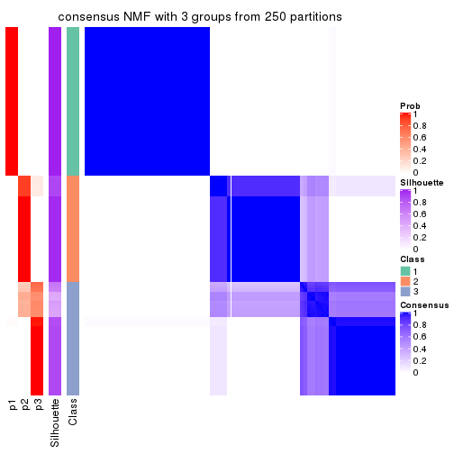</p>

</div>
<div id='tab-MAD-NMF-consensus-heatmap-3'>
<pre><code class="r">consensus_heatmap(res, k = 4)
</code></pre>

<p></p>

</div>
<div id='tab-MAD-NMF-consensus-heatmap-4'>
<pre><code class="r">consensus_heatmap(res, k = 5)
</code></pre>

<p></p>

</div>
<div id='tab-MAD-NMF-consensus-heatmap-5'>
<pre><code class="r">consensus_heatmap(res, k = 6)
</code></pre>

<p></p>

</div>
</div>

Heatmaps for the membership of samples in all partitions to see how consistent they are:


<script>
$( function() {
	$( '#tabs-MAD-NMF-membership-heatmap' ).tabs();
} );
</script>
<div id='tabs-MAD-NMF-membership-heatmap'>
<ul>
<li><a href='#tab-MAD-NMF-membership-heatmap-1'>k = 2</a></li>
<li><a href='#tab-MAD-NMF-membership-heatmap-2'>k = 3</a></li>
<li><a href='#tab-MAD-NMF-membership-heatmap-3'>k = 4</a></li>
<li><a href='#tab-MAD-NMF-membership-heatmap-4'>k = 5</a></li>
<li><a href='#tab-MAD-NMF-membership-heatmap-5'>k = 6</a></li>
</ul>
<div id='tab-MAD-NMF-membership-heatmap-1'>
<pre><code class="r">membership_heatmap(res, k = 2)
</code></pre>

<p></p>

</div>
<div id='tab-MAD-NMF-membership-heatmap-2'>
<pre><code class="r">membership_heatmap(res, k = 3)
</code></pre>

<p></p>

</div>
<div id='tab-MAD-NMF-membership-heatmap-3'>
<pre><code class="r">membership_heatmap(res, k = 4)
</code></pre>

<p></p>

</div>
<div id='tab-MAD-NMF-membership-heatmap-4'>
<pre><code class="r">membership_heatmap(res, k = 5)
</code></pre>

<p></p>

</div>
<div id='tab-MAD-NMF-membership-heatmap-5'>
<pre><code class="r">membership_heatmap(res, k = 6)
</code></pre>

<p>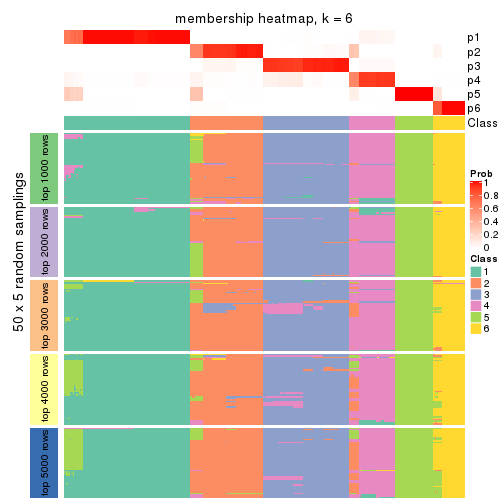</p>

</div>
</div>

As soon as we have had the classes for columns, we can look for signatures
which are significantly different between classes which can be candidate marks
for certain classes. Following are the heatmaps for signatures.


Signature heatmaps where rows are scaled:


<script>
$( function() {
	$( '#tabs-MAD-NMF-get-signatures' ).tabs();
} );
</script>
<div id='tabs-MAD-NMF-get-signatures'>
<ul>
<li><a href='#tab-MAD-NMF-get-signatures-1'>k = 2</a></li>
<li><a href='#tab-MAD-NMF-get-signatures-2'>k = 3</a></li>
<li><a href='#tab-MAD-NMF-get-signatures-3'>k = 4</a></li>
<li><a href='#tab-MAD-NMF-get-signatures-4'>k = 5</a></li>
<li><a href='#tab-MAD-NMF-get-signatures-5'>k = 6</a></li>
</ul>
<div id='tab-MAD-NMF-get-signatures-1'>
<pre><code class="r">get_signatures(res, k = 2)
</code></pre>

<p></p>

</div>
<div id='tab-MAD-NMF-get-signatures-2'>
<pre><code class="r">get_signatures(res, k = 3)
</code></pre>

<p></p>

</div>
<div id='tab-MAD-NMF-get-signatures-3'>
<pre><code class="r">get_signatures(res, k = 4)
</code></pre>

<p></p>

</div>
<div id='tab-MAD-NMF-get-signatures-4'>
<pre><code class="r">get_signatures(res, k = 5)
</code></pre>

<p></p>

</div>
<div id='tab-MAD-NMF-get-signatures-5'>
<pre><code class="r">get_signatures(res, k = 6)
</code></pre>

<p></p>

</div>
</div>


Signature heatmaps where rows are not scaled:


<script>
$( function() {
	$( '#tabs-MAD-NMF-get-signatures-no-scale' ).tabs();
} );
</script>
<div id='tabs-MAD-NMF-get-signatures-no-scale'>
<ul>
<li><a href='#tab-MAD-NMF-get-signatures-no-scale-1'>k = 2</a></li>
<li><a href='#tab-MAD-NMF-get-signatures-no-scale-2'>k = 3</a></li>
<li><a href='#tab-MAD-NMF-get-signatures-no-scale-3'>k = 4</a></li>
<li><a href='#tab-MAD-NMF-get-signatures-no-scale-4'>k = 5</a></li>
<li><a href='#tab-MAD-NMF-get-signatures-no-scale-5'>k = 6</a></li>
</ul>
<div id='tab-MAD-NMF-get-signatures-no-scale-1'>
<pre><code class="r">get_signatures(res, k = 2, scale_rows = FALSE)
</code></pre>

<p></p>

</div>
<div id='tab-MAD-NMF-get-signatures-no-scale-2'>
<pre><code class="r">get_signatures(res, k = 3, scale_rows = FALSE)
</code></pre>

<p></p>

</div>
<div id='tab-MAD-NMF-get-signatures-no-scale-3'>
<pre><code class="r">get_signatures(res, k = 4, scale_rows = FALSE)
</code></pre>

<p></p>

</div>
<div id='tab-MAD-NMF-get-signatures-no-scale-4'>
<pre><code class="r">get_signatures(res, k = 5, scale_rows = FALSE)
</code></pre>

<p></p>

</div>
<div id='tab-MAD-NMF-get-signatures-no-scale-5'>
<pre><code class="r">get_signatures(res, k = 6, scale_rows = FALSE)
</code></pre>

<p></p>

</div>
</div>


Compare the overlap of signatures from different k:

```r
compare_signatures(res)
```


`get_signature()` returns a data frame invisibly. TO get the list of signatures, the function
call should be assigned to a variable explicitly. In following code, if `plot` argument is set
to `FALSE`, no heatmap is plotted while only the differential analysis is performed.

```r
# code only for demonstration
tb = get_signature(res, k = ..., plot = FALSE)
```

An example of the output of `tb` is:

```
#>   which_row         fdr    mean_1    mean_2 scaled_mean_1 scaled_mean_2 km
#> 1        38 0.042760348  8.373488  9.131774    -0.5533452     0.5164555  1
#> 2        40 0.018707592  7.106213  8.469186    -0.6173731     0.5762149  1
#> 3        55 0.019134737 10.221463 11.207825    -0.6159697     0.5749050  1
#> 4        59 0.006059896  5.921854  7.869574    -0.6899429     0.6439467  1
#> 5        60 0.018055526  8.928898 10.211722    -0.6204761     0.5791110  1
#> 6        98 0.009384629 15.714769 14.887706     0.6635654    -0.6193277  2
...
```

The columns in `tb` are:

1. `which_row`: row indices corresponding to the input matrix.
2. `fdr`: FDR for the differential test. 
3. `mean_x`: The mean value in group x.
4. `scaled_mean_x`: The mean value in group x after rows are scaled.
5. `km`: Row groups if k-means clustering is applied to rows.


UMAP plot which shows how samples are separated.


<script>
$( function() {
	$( '#tabs-MAD-NMF-dimension-reduction' ).tabs();
} );
</script>
<div id='tabs-MAD-NMF-dimension-reduction'>
<ul>
<li><a href='#tab-MAD-NMF-dimension-reduction-1'>k = 2</a></li>
<li><a href='#tab-MAD-NMF-dimension-reduction-2'>k = 3</a></li>
<li><a href='#tab-MAD-NMF-dimension-reduction-3'>k = 4</a></li>
<li><a href='#tab-MAD-NMF-dimension-reduction-4'>k = 5</a></li>
<li><a href='#tab-MAD-NMF-dimension-reduction-5'>k = 6</a></li>
</ul>
<div id='tab-MAD-NMF-dimension-reduction-1'>
<pre><code class="r">dimension_reduction(res, k = 2, method = &quot;UMAP&quot;)
</code></pre>

<p></p>

</div>
<div id='tab-MAD-NMF-dimension-reduction-2'>
<pre><code class="r">dimension_reduction(res, k = 3, method = &quot;UMAP&quot;)
</code></pre>

<p></p>

</div>
<div id='tab-MAD-NMF-dimension-reduction-3'>
<pre><code class="r">dimension_reduction(res, k = 4, method = &quot;UMAP&quot;)
</code></pre>

<p></p>

</div>
<div id='tab-MAD-NMF-dimension-reduction-4'>
<pre><code class="r">dimension_reduction(res, k = 5, method = &quot;UMAP&quot;)
</code></pre>

<p></p>

</div>
<div id='tab-MAD-NMF-dimension-reduction-5'>
<pre><code class="r">dimension_reduction(res, k = 6, method = &quot;UMAP&quot;)
</code></pre>

<p></p>

</div>
</div>


Following heatmap shows how subgroups are split when increasing `k`:

```r
collect_classes(res)
```


If matrix rows can be associated to genes, consider to use `functional_enrichment(res,
...)` to perform function enrichment for the signature genes. See [this vignette](http://bioconductor.org/packages/devel/bioc/vignettes/cola/inst/doc/functional_enrichment.html) for more detailed explanations.


 

---------------------------------------------------


### ATC:hclust*


The object with results only for a single top-value method and a single partition method 
can be extracted as:

```r
res = res_list["ATC", "hclust"]
# you can also extract it by
# res = res_list["ATC:hclust"]
```

A summary of `res` and all the functions that can be applied to it:

```r
res
```

```
#> A 'ConsensusPartition' object with k = 2, 3, 4, 5, 6.
#>   On a matrix with 13278 rows and 322 columns.
#>   Top rows (1000, 2000, 3000, 4000, 5000) are extracted by 'ATC' method.
#>   Subgroups are detected by 'hclust' method.
#>   Performed in total 1250 partitions by row resampling.
#>   Best k for subgroups seems to be 5.
#> 
#> Following methods can be applied to this 'ConsensusPartition' object:
#>  [1] "cola_report"             "collect_classes"         "collect_plots"          
#>  [4] "collect_stats"           "colnames"                "compare_signatures"     
#>  [7] "consensus_heatmap"       "dimension_reduction"     "functional_enrichment"  
#> [10] "get_anno_col"            "get_anno"                "get_classes"            
#> [13] "get_consensus"           "get_matrix"              "get_membership"         
#> [16] "get_param"               "get_signatures"          "get_stats"              
#> [19] "is_best_k"               "is_stable_k"             "membership_heatmap"     
#> [22] "ncol"                    "nrow"                    "plot_ecdf"              
#> [25] "rownames"                "select_partition_number" "show"                   
#> [28] "suggest_best_k"          "test_to_known_factors"
```

`collect_plots()` function collects all the plots made from `res` for all `k` (number of partitions)
into one single page to provide an easy and fast comparison between different `k`.

```r
collect_plots(res)
```


The plots are:

- The first row: a plot of the ECDF (empirical cumulative distribution
  function) curves of the consensus matrix for each `k` and the heatmap of
  predicted classes for each `k`.
- The second row: heatmaps of the consensus matrix for each `k`.
- The third row: heatmaps of the membership matrix for each `k`.
- The fouth row: heatmaps of the signatures for each `k`.

All the plots in panels can be made by individual functions and they are
plotted later in this section.

`select_partition_number()` produces several plots showing different
statistics for choosing "optimized" `k`. There are following statistics:

- ECDF curves of the consensus matrix for each `k`;
- 1-PAC. [The PAC
  score](https://en.wikipedia.org/wiki/Consensus_clustering#Over-interpretation_potential_of_consensus_clustering)
  measures the proportion of the ambiguous subgrouping.
- Mean silhouette score.
- Concordance. The mean probability of fiting the consensus class ids in all
  partitions.
- Area increased. Denote $A_k$ as the area under the ECDF curve for current
  `k`, the area increased is defined as $A_k - A_{k-1}$.
- Rand index. The percent of pairs of samples that are both in a same cluster
  or both are not in a same cluster in the partition of k and k-1.
- Jaccard index. The ratio of pairs of samples are both in a same cluster in
  the partition of k and k-1 and the pairs of samples are both in a same
  cluster in the partition k or k-1.

The detailed explanations of these statistics can be found in [the _cola_
vignette](http://bioconductor.org/packages/devel/bioc/vignettes/cola/inst/doc/cola.html#toc_13).

Generally speaking, lower PAC score, higher mean silhouette score or higher
concordance corresponds to better partition. Rand index and Jaccard index
measure how similar the current partition is compared to partition with `k-1`.
If they are too similar, we won't accept `k` is better than `k-1`.

```r
select_partition_number(res)
```


The numeric values for all these statistics can be obtained by `get_stats()`.

```r
get_stats(res)
```

```
#>   k 1-PAC mean_silhouette concordance area_increased  Rand Jaccard
#> 2 2 1.000           1.000       1.000        0.47414 0.526   0.526
#> 3 3 0.879           0.974       0.982        0.39338 0.812   0.643
#> 4 4 0.879           0.963       0.982        0.00311 0.998   0.994
#> 5 5 0.926           0.851       0.886        0.05325 0.945   0.836
#> 6 6 0.854           0.942       0.891        0.07239 0.888   0.629
```

`suggest_best_k()` suggests the best $k$ based on these statistics. The rules are as follows:

- All $k$ with Jaccard index larger than 0.95 are removed because increasing
  $k$ does not provide enough extra information. If all $k$ are removed, it is
  marked as no subgroup is detected.
- For all $k$ with 1-PAC score larger than 0.9, the maximal $k$ is taken as
  the best $k$, and other $k$ are marked as optional $k$.
- If it does not fit the second rule. The $k$ with the maximal vote of the
  highest 1-PAC score, highest mean silhouette, and highest concordance is
  taken as the best $k$.

```r
suggest_best_k(res)
```

```
#> [1] 5
#> attr(,"optional")
#> [1] 2
```

There is also optional best $k$ = 2 that is worth to check.

Following shows the table of the partitions (You need to click the **show/hide
code output** link to see it). The membership matrix (columns with name `p*`)
is inferred by
[`clue::cl_consensus()`](https://www.rdocumentation.org/link/cl_consensus?package=clue)
function with the `SE` method. Basically the value in the membership matrix
represents the probability to belong to a certain group. The finall class
label for an item is determined with the group with highest probability it
belongs to.

In `get_classes()` function, the entropy is calculated from the membership
matrix and the silhouette score is calculated from the consensus matrix.


<script>
$( function() {
	$( '#tabs-ATC-hclust-get-classes' ).tabs();
} );
</script>
<div id='tabs-ATC-hclust-get-classes'>
<ul>
<li><a href='#tab-ATC-hclust-get-classes-1'>k = 2</a></li>
<li><a href='#tab-ATC-hclust-get-classes-2'>k = 3</a></li>
<li><a href='#tab-ATC-hclust-get-classes-3'>k = 4</a></li>
<li><a href='#tab-ATC-hclust-get-classes-4'>k = 5</a></li>
<li><a href='#tab-ATC-hclust-get-classes-5'>k = 6</a></li>
</ul>

<div id='tab-ATC-hclust-get-classes-1'>
<p><a id='tab-ATC-hclust-get-classes-1-a' style='color:#0366d6' href='#'>show/hide code output</a></p>
<pre><code class="r">cbind(get_classes(res, k = 2), get_membership(res, k = 2))
</code></pre>

<pre><code>#&gt;           class entropy silhouette p1 p2
#&gt; DRR023371     1       0          1  1  0
#&gt; DRR023372     1       0          1  1  0
#&gt; DRR023373     1       0          1  1  0
#&gt; DRR023374     1       0          1  1  0
#&gt; DRR023375     1       0          1  1  0
#&gt; DRR023376     1       0          1  1  0
#&gt; DRR023377     1       0          1  1  0
#&gt; DRR023378     1       0          1  1  0
#&gt; DRR023379     1       0          1  1  0
#&gt; DRR023380     1       0          1  1  0
#&gt; DRR023381     1       0          1  1  0
#&gt; DRR023382     1       0          1  1  0
#&gt; DRR023383     1       0          1  1  0
#&gt; DRR023384     1       0          1  1  0
#&gt; DRR023385     1       0          1  1  0
#&gt; DRR023386     1       0          1  1  0
#&gt; DRR023387     1       0          1  1  0
#&gt; DRR023388     1       0          1  1  0
#&gt; DRR023389     1       0          1  1  0
#&gt; DRR023390     1       0          1  1  0
#&gt; DRR023391     1       0          1  1  0
#&gt; DRR023392     1       0          1  1  0
#&gt; DRR023394     1       0          1  1  0
#&gt; DRR023395     1       0          1  1  0
#&gt; DRR023396     1       0          1  1  0
#&gt; DRR023397     1       0          1  1  0
#&gt; DRR023398     1       0          1  1  0
#&gt; DRR023399     1       0          1  1  0
#&gt; DRR023400     1       0          1  1  0
#&gt; DRR023401     1       0          1  1  0
#&gt; DRR023402     1       0          1  1  0
#&gt; DRR023403     1       0          1  1  0
#&gt; DRR023404     2       0          1  0  1
#&gt; DRR023405     2       0          1  0  1
#&gt; DRR023406     2       0          1  0  1
#&gt; DRR023407     2       0          1  0  1
#&gt; DRR023408     2       0          1  0  1
#&gt; DRR023409     2       0          1  0  1
#&gt; DRR023410     2       0          1  0  1
#&gt; DRR023411     2       0          1  0  1
#&gt; DRR023412     2       0          1  0  1
#&gt; DRR023413     2       0          1  0  1
#&gt; DRR023414     2       0          1  0  1
#&gt; DRR023415     2       0          1  0  1
#&gt; DRR023416     2       0          1  0  1
#&gt; DRR023417     2       0          1  0  1
#&gt; DRR023418     2       0          1  0  1
#&gt; DRR023419     2       0          1  0  1
#&gt; DRR023420     2       0          1  0  1
#&gt; DRR023421     2       0          1  0  1
#&gt; DRR023422     2       0          1  0  1
#&gt; DRR023423     2       0          1  0  1
#&gt; DRR023425     2       0          1  0  1
#&gt; DRR023426     2       0          1  0  1
#&gt; DRR023427     2       0          1  0  1
#&gt; DRR023428     2       0          1  0  1
#&gt; DRR023429     2       0          1  0  1
#&gt; DRR023430     2       0          1  0  1
#&gt; DRR023431     2       0          1  0  1
#&gt; DRR023432     2       0          1  0  1
#&gt; DRR023433     2       0          1  0  1
#&gt; DRR023434     2       0          1  0  1
#&gt; DRR023435     2       0          1  0  1
#&gt; DRR023436     2       0          1  0  1
#&gt; DRR023437     2       0          1  0  1
#&gt; DRR023438     2       0          1  0  1
#&gt; DRR023439     2       0          1  0  1
#&gt; DRR023440     2       0          1  0  1
#&gt; DRR023441     2       0          1  0  1
#&gt; DRR023442     2       0          1  0  1
#&gt; DRR023443     2       0          1  0  1
#&gt; DRR023444     2       0          1  0  1
#&gt; DRR023445     2       0          1  0  1
#&gt; DRR023446     2       0          1  0  1
#&gt; DRR023447     2       0          1  0  1
#&gt; DRR023448     2       0          1  0  1
#&gt; DRR023449     2       0          1  0  1
#&gt; DRR023450     2       0          1  0  1
#&gt; DRR023451     2       0          1  0  1
#&gt; DRR023452     2       0          1  0  1
#&gt; DRR023453     1       0          1  1  0
#&gt; DRR023454     1       0          1  1  0
#&gt; DRR023455     1       0          1  1  0
#&gt; DRR023456     1       0          1  1  0
#&gt; DRR023457     1       0          1  1  0
#&gt; DRR023458     1       0          1  1  0
#&gt; DRR023459     1       0          1  1  0
#&gt; DRR023460     1       0          1  1  0
#&gt; DRR023461     1       0          1  1  0
#&gt; DRR023462     1       0          1  1  0
#&gt; DRR023463     1       0          1  1  0
#&gt; DRR023464     1       0          1  1  0
#&gt; DRR023465     1       0          1  1  0
#&gt; DRR023466     1       0          1  1  0
#&gt; DRR023467     1       0          1  1  0
#&gt; DRR023468     1       0          1  1  0
#&gt; DRR023469     1       0          1  1  0
#&gt; DRR023470     1       0          1  1  0
#&gt; DRR023471     1       0          1  1  0
#&gt; DRR023472     1       0          1  1  0
#&gt; DRR023473     1       0          1  1  0
#&gt; DRR023474     1       0          1  1  0
#&gt; DRR023475     1       0          1  1  0
#&gt; DRR023476     1       0          1  1  0
#&gt; DRR023477     1       0          1  1  0
#&gt; DRR023478     1       0          1  1  0
#&gt; DRR023479     1       0          1  1  0
#&gt; DRR023480     1       0          1  1  0
#&gt; DRR023481     1       0          1  1  0
#&gt; DRR023482     1       0          1  1  0
#&gt; DRR023483     1       0          1  1  0
#&gt; DRR023484     1       0          1  1  0
#&gt; DRR023485     1       0          1  1  0
#&gt; DRR023486     1       0          1  1  0
#&gt; DRR023487     1       0          1  1  0
#&gt; DRR023488     1       0          1  1  0
#&gt; DRR023489     1       0          1  1  0
#&gt; DRR023490     1       0          1  1  0
#&gt; DRR023491     1       0          1  1  0
#&gt; DRR023492     1       0          1  1  0
#&gt; DRR023493     1       0          1  1  0
#&gt; DRR023494     1       0          1  1  0
#&gt; DRR023495     1       0          1  1  0
#&gt; DRR023496     1       0          1  1  0
#&gt; DRR023497     1       0          1  1  0
#&gt; DRR023498     1       0          1  1  0
#&gt; DRR023499     1       0          1  1  0
#&gt; DRR023500     1       0          1  1  0
#&gt; DRR023501     1       0          1  1  0
#&gt; DRR023502     1       0          1  1  0
#&gt; DRR023503     1       0          1  1  0
#&gt; DRR023504     1       0          1  1  0
#&gt; DRR023505     1       0          1  1  0
#&gt; DRR023506     1       0          1  1  0
#&gt; DRR023507     1       0          1  1  0
#&gt; DRR023508     1       0          1  1  0
#&gt; DRR023509     1       0          1  1  0
#&gt; DRR023510     1       0          1  1  0
#&gt; DRR023511     1       0          1  1  0
#&gt; DRR023512     1       0          1  1  0
#&gt; DRR023513     1       0          1  1  0
#&gt; DRR023514     1       0          1  1  0
#&gt; DRR023515     1       0          1  1  0
#&gt; DRR023516     1       0          1  1  0
#&gt; DRR023517     1       0          1  1  0
#&gt; DRR023518     1       0          1  1  0
#&gt; DRR023519     1       0          1  1  0
#&gt; DRR023520     1       0          1  1  0
#&gt; DRR023521     1       0          1  1  0
#&gt; DRR023522     1       0          1  1  0
#&gt; DRR023523     1       0          1  1  0
#&gt; DRR023524     1       0          1  1  0
#&gt; DRR023525     1       0          1  1  0
#&gt; DRR023526     1       0          1  1  0
#&gt; DRR023527     1       0          1  1  0
#&gt; DRR023528     1       0          1  1  0
#&gt; DRR023529     1       0          1  1  0
#&gt; DRR023530     1       0          1  1  0
#&gt; DRR023531     1       0          1  1  0
#&gt; DRR023532     1       0          1  1  0
#&gt; DRR023533     1       0          1  1  0
#&gt; DRR023534     1       0          1  1  0
#&gt; DRR023535     1       0          1  1  0
#&gt; DRR023536     1       0          1  1  0
#&gt; DRR023537     1       0          1  1  0
#&gt; DRR023538     1       0          1  1  0
#&gt; DRR023539     1       0          1  1  0
#&gt; DRR023540     1       0          1  1  0
#&gt; DRR023541     1       0          1  1  0
#&gt; DRR023542     1       0          1  1  0
#&gt; DRR023543     1       0          1  1  0
#&gt; DRR023544     1       0          1  1  0
#&gt; DRR023545     1       0          1  1  0
#&gt; DRR023546     1       0          1  1  0
#&gt; DRR023547     1       0          1  1  0
#&gt; DRR023548     1       0          1  1  0
#&gt; DRR023549     1       0          1  1  0
#&gt; DRR023550     1       0          1  1  0
#&gt; DRR023551     1       0          1  1  0
#&gt; DRR023552     1       0          1  1  0
#&gt; DRR023553     1       0          1  1  0
#&gt; DRR023554     1       0          1  1  0
#&gt; DRR023555     1       0          1  1  0
#&gt; DRR023556     1       0          1  1  0
#&gt; DRR023557     1       0          1  1  0
#&gt; DRR023558     1       0          1  1  0
#&gt; DRR023559     1       0          1  1  0
#&gt; DRR023560     1       0          1  1  0
#&gt; DRR023561     1       0          1  1  0
#&gt; DRR023562     1       0          1  1  0
#&gt; DRR023563     1       0          1  1  0
#&gt; DRR023564     1       0          1  1  0
#&gt; DRR023565     1       0          1  1  0
#&gt; DRR023566     1       0          1  1  0
#&gt; DRR023567     1       0          1  1  0
#&gt; DRR023568     1       0          1  1  0
#&gt; DRR023569     1       0          1  1  0
#&gt; DRR023570     1       0          1  1  0
#&gt; DRR023571     1       0          1  1  0
#&gt; DRR023572     1       0          1  1  0
#&gt; DRR023573     1       0          1  1  0
#&gt; DRR023574     1       0          1  1  0
#&gt; DRR023575     1       0          1  1  0
#&gt; DRR023576     2       0          1  0  1
#&gt; DRR023577     2       0          1  0  1
#&gt; DRR023578     2       0          1  0  1
#&gt; DRR023579     2       0          1  0  1
#&gt; DRR023580     2       0          1  0  1
#&gt; DRR023581     2       0          1  0  1
#&gt; DRR023582     2       0          1  0  1
#&gt; DRR023583     2       0          1  0  1
#&gt; DRR023584     2       0          1  0  1
#&gt; DRR023585     2       0          1  0  1
#&gt; DRR023586     2       0          1  0  1
#&gt; DRR023587     2       0          1  0  1
#&gt; DRR023588     2       0          1  0  1
#&gt; DRR023589     2       0          1  0  1
#&gt; DRR023590     2       0          1  0  1
#&gt; DRR023591     2       0          1  0  1
#&gt; DRR023592     2       0          1  0  1
#&gt; DRR023593     2       0          1  0  1
#&gt; DRR023594     2       0          1  0  1
#&gt; DRR023595     2       0          1  0  1
#&gt; DRR023596     2       0          1  0  1
#&gt; DRR023597     2       0          1  0  1
#&gt; DRR023598     2       0          1  0  1
#&gt; DRR023599     2       0          1  0  1
#&gt; DRR023600     2       0          1  0  1
#&gt; DRR023601     2       0          1  0  1
#&gt; DRR023602     2       0          1  0  1
#&gt; DRR023603     2       0          1  0  1
#&gt; DRR023604     2       0          1  0  1
#&gt; DRR023605     2       0          1  0  1
#&gt; DRR023606     2       0          1  0  1
#&gt; DRR023607     2       0          1  0  1
#&gt; DRR023608     2       0          1  0  1
#&gt; DRR023609     2       0          1  0  1
#&gt; DRR023610     2       0          1  0  1
#&gt; DRR023611     2       0          1  0  1
#&gt; DRR023612     2       0          1  0  1
#&gt; DRR023613     2       0          1  0  1
#&gt; DRR023614     2       0          1  0  1
#&gt; DRR023615     2       0          1  0  1
#&gt; DRR023616     2       0          1  0  1
#&gt; DRR023617     2       0          1  0  1
#&gt; DRR023619     1       0          1  1  0
#&gt; DRR023620     1       0          1  1  0
#&gt; DRR023621     1       0          1  1  0
#&gt; DRR023622     1       0          1  1  0
#&gt; DRR023623     1       0          1  1  0
#&gt; DRR023624     1       0          1  1  0
#&gt; DRR023625     1       0          1  1  0
#&gt; DRR023626     1       0          1  1  0
#&gt; DRR023627     1       0          1  1  0
#&gt; DRR023628     1       0          1  1  0
#&gt; DRR023629     1       0          1  1  0
#&gt; DRR023630     1       0          1  1  0
#&gt; DRR023631     1       0          1  1  0
#&gt; DRR023632     1       0          1  1  0
#&gt; DRR023633     1       0          1  1  0
#&gt; DRR023635     2       0          1  0  1
#&gt; DRR023636     2       0          1  0  1
#&gt; DRR023637     2       0          1  0  1
#&gt; DRR023638     2       0          1  0  1
#&gt; DRR023639     2       0          1  0  1
#&gt; DRR023640     2       0          1  0  1
#&gt; DRR023641     2       0          1  0  1
#&gt; DRR023642     2       0          1  0  1
#&gt; DRR023643     2       0          1  0  1
#&gt; DRR023644     2       0          1  0  1
#&gt; DRR023645     2       0          1  0  1
#&gt; DRR023646     2       0          1  0  1
#&gt; DRR023647     2       0          1  0  1
#&gt; DRR023648     2       0          1  0  1
#&gt; DRR023649     2       0          1  0  1
#&gt; DRR023650     1       0          1  1  0
#&gt; DRR023651     1       0          1  1  0
#&gt; DRR023652     1       0          1  1  0
#&gt; DRR023653     1       0          1  1  0
#&gt; DRR023654     1       0          1  1  0
#&gt; DRR023655     1       0          1  1  0
#&gt; DRR023656     1       0          1  1  0
#&gt; DRR023657     1       0          1  1  0
#&gt; DRR023658     1       0          1  1  0
#&gt; DRR023659     1       0          1  1  0
#&gt; DRR023660     1       0          1  1  0
#&gt; DRR023661     1       0          1  1  0
#&gt; DRR023662     1       0          1  1  0
#&gt; DRR023663     1       0          1  1  0
#&gt; DRR023664     1       0          1  1  0
#&gt; DRR023665     1       0          1  1  0
#&gt; DRR023666     1       0          1  1  0
#&gt; DRR023667     1       0          1  1  0
#&gt; DRR023668     1       0          1  1  0
#&gt; DRR023669     1       0          1  1  0
#&gt; DRR023670     1       0          1  1  0
#&gt; DRR023671     1       0          1  1  0
#&gt; DRR023672     1       0          1  1  0
#&gt; DRR023673     1       0          1  1  0
#&gt; DRR023674     1       0          1  1  0
#&gt; DRR023675     1       0          1  1  0
#&gt; DRR023676     1       0          1  1  0
#&gt; DRR023677     1       0          1  1  0
#&gt; DRR023678     1       0          1  1  0
#&gt; DRR023683     2       0          1  0  1
#&gt; DRR023684     2       0          1  0  1
#&gt; DRR023685     2       0          1  0  1
#&gt; DRR023686     2       0          1  0  1
#&gt; DRR023687     2       0          1  0  1
#&gt; DRR023688     2       0          1  0  1
#&gt; DRR023689     2       0          1  0  1
#&gt; DRR023690     2       0          1  0  1
#&gt; DRR023691     2       0          1  0  1
#&gt; DRR023692     2       0          1  0  1
#&gt; DRR023693     2       0          1  0  1
#&gt; DRR023694     2       0          1  0  1
#&gt; DRR023695     2       0          1  0  1
#&gt; DRR023696     2       0          1  0  1
#&gt; DRR023697     2       0          1  0  1
#&gt; DRR023698     2       0          1  0  1
#&gt; DRR023699     2       0          1  0  1
#&gt; DRR023700     2       0          1  0  1
</code></pre>

<script>
$('#tab-ATC-hclust-get-classes-1-a').parent().next().next().hide();
$('#tab-ATC-hclust-get-classes-1-a').click(function(){
  $('#tab-ATC-hclust-get-classes-1-a').parent().next().next().toggle();
  return(false);
});
</script>
</div>

<div id='tab-ATC-hclust-get-classes-2'>
<p><a id='tab-ATC-hclust-get-classes-2-a' style='color:#0366d6' href='#'>show/hide code output</a></p>
<pre><code class="r">cbind(get_classes(res, k = 3), get_membership(res, k = 3))
</code></pre>

<pre><code>#&gt;           class entropy silhouette    p1 p2    p3
#&gt; DRR023371     3   0.000      0.946 0.000  0 1.000
#&gt; DRR023372     3   0.000      0.946 0.000  0 1.000
#&gt; DRR023373     3   0.000      0.946 0.000  0 1.000
#&gt; DRR023374     3   0.000      0.946 0.000  0 1.000
#&gt; DRR023375     3   0.000      0.946 0.000  0 1.000
#&gt; DRR023376     3   0.000      0.946 0.000  0 1.000
#&gt; DRR023377     3   0.000      0.946 0.000  0 1.000
#&gt; DRR023378     3   0.000      0.946 0.000  0 1.000
#&gt; DRR023379     3   0.382      0.885 0.148  0 0.852
#&gt; DRR023380     3   0.382      0.885 0.148  0 0.852
#&gt; DRR023381     3   0.382      0.885 0.148  0 0.852
#&gt; DRR023382     3   0.382      0.885 0.148  0 0.852
#&gt; DRR023383     3   0.382      0.885 0.148  0 0.852
#&gt; DRR023384     3   0.382      0.885 0.148  0 0.852
#&gt; DRR023385     3   0.382      0.885 0.148  0 0.852
#&gt; DRR023386     3   0.382      0.885 0.148  0 0.852
#&gt; DRR023387     3   0.382      0.885 0.148  0 0.852
#&gt; DRR023388     3   0.382      0.885 0.148  0 0.852
#&gt; DRR023389     3   0.382      0.885 0.148  0 0.852
#&gt; DRR023390     3   0.382      0.885 0.148  0 0.852
#&gt; DRR023391     3   0.382      0.885 0.148  0 0.852
#&gt; DRR023392     3   0.382      0.885 0.148  0 0.852
#&gt; DRR023394     3   0.382      0.885 0.148  0 0.852
#&gt; DRR023395     3   0.382      0.885 0.148  0 0.852
#&gt; DRR023396     3   0.382      0.885 0.148  0 0.852
#&gt; DRR023397     3   0.382      0.885 0.148  0 0.852
#&gt; DRR023398     3   0.382      0.885 0.148  0 0.852
#&gt; DRR023399     3   0.382      0.885 0.148  0 0.852
#&gt; DRR023400     3   0.382      0.885 0.148  0 0.852
#&gt; DRR023401     3   0.382      0.885 0.148  0 0.852
#&gt; DRR023402     3   0.382      0.885 0.148  0 0.852
#&gt; DRR023403     3   0.382      0.885 0.148  0 0.852
#&gt; DRR023404     2   0.000      1.000 0.000  1 0.000
#&gt; DRR023405     2   0.000      1.000 0.000  1 0.000
#&gt; DRR023406     2   0.000      1.000 0.000  1 0.000
#&gt; DRR023407     2   0.000      1.000 0.000  1 0.000
#&gt; DRR023408     2   0.000      1.000 0.000  1 0.000
#&gt; DRR023409     2   0.000      1.000 0.000  1 0.000
#&gt; DRR023410     2   0.000      1.000 0.000  1 0.000
#&gt; DRR023411     2   0.000      1.000 0.000  1 0.000
#&gt; DRR023412     2   0.000      1.000 0.000  1 0.000
#&gt; DRR023413     2   0.000      1.000 0.000  1 0.000
#&gt; DRR023414     2   0.000      1.000 0.000  1 0.000
#&gt; DRR023415     2   0.000      1.000 0.000  1 0.000
#&gt; DRR023416     2   0.000      1.000 0.000  1 0.000
#&gt; DRR023417     2   0.000      1.000 0.000  1 0.000
#&gt; DRR023418     2   0.000      1.000 0.000  1 0.000
#&gt; DRR023419     2   0.000      1.000 0.000  1 0.000
#&gt; DRR023420     2   0.000      1.000 0.000  1 0.000
#&gt; DRR023421     2   0.000      1.000 0.000  1 0.000
#&gt; DRR023422     2   0.000      1.000 0.000  1 0.000
#&gt; DRR023423     2   0.000      1.000 0.000  1 0.000
#&gt; DRR023425     2   0.000      1.000 0.000  1 0.000
#&gt; DRR023426     2   0.000      1.000 0.000  1 0.000
#&gt; DRR023427     2   0.000      1.000 0.000  1 0.000
#&gt; DRR023428     2   0.000      1.000 0.000  1 0.000
#&gt; DRR023429     2   0.000      1.000 0.000  1 0.000
#&gt; DRR023430     2   0.000      1.000 0.000  1 0.000
#&gt; DRR023431     2   0.000      1.000 0.000  1 0.000
#&gt; DRR023432     2   0.000      1.000 0.000  1 0.000
#&gt; DRR023433     2   0.000      1.000 0.000  1 0.000
#&gt; DRR023434     2   0.000      1.000 0.000  1 0.000
#&gt; DRR023435     2   0.000      1.000 0.000  1 0.000
#&gt; DRR023436     2   0.000      1.000 0.000  1 0.000
#&gt; DRR023437     2   0.000      1.000 0.000  1 0.000
#&gt; DRR023438     2   0.000      1.000 0.000  1 0.000
#&gt; DRR023439     2   0.000      1.000 0.000  1 0.000
#&gt; DRR023440     2   0.000      1.000 0.000  1 0.000
#&gt; DRR023441     2   0.000      1.000 0.000  1 0.000
#&gt; DRR023442     2   0.000      1.000 0.000  1 0.000
#&gt; DRR023443     2   0.000      1.000 0.000  1 0.000
#&gt; DRR023444     2   0.000      1.000 0.000  1 0.000
#&gt; DRR023445     2   0.000      1.000 0.000  1 0.000
#&gt; DRR023446     2   0.000      1.000 0.000  1 0.000
#&gt; DRR023447     2   0.000      1.000 0.000  1 0.000
#&gt; DRR023448     2   0.000      1.000 0.000  1 0.000
#&gt; DRR023449     2   0.000      1.000 0.000  1 0.000
#&gt; DRR023450     2   0.000      1.000 0.000  1 0.000
#&gt; DRR023451     2   0.000      1.000 0.000  1 0.000
#&gt; DRR023452     2   0.000      1.000 0.000  1 0.000
#&gt; DRR023453     3   0.382      0.885 0.148  0 0.852
#&gt; DRR023454     3   0.382      0.885 0.148  0 0.852
#&gt; DRR023455     3   0.382      0.885 0.148  0 0.852
#&gt; DRR023456     3   0.382      0.885 0.148  0 0.852
#&gt; DRR023457     3   0.382      0.885 0.148  0 0.852
#&gt; DRR023458     3   0.382      0.885 0.148  0 0.852
#&gt; DRR023459     3   0.382      0.885 0.148  0 0.852
#&gt; DRR023460     3   0.000      0.946 0.000  0 1.000
#&gt; DRR023461     3   0.000      0.946 0.000  0 1.000
#&gt; DRR023462     3   0.000      0.946 0.000  0 1.000
#&gt; DRR023463     3   0.000      0.946 0.000  0 1.000
#&gt; DRR023464     3   0.000      0.946 0.000  0 1.000
#&gt; DRR023465     3   0.000      0.946 0.000  0 1.000
#&gt; DRR023466     3   0.000      0.946 0.000  0 1.000
#&gt; DRR023467     3   0.000      0.946 0.000  0 1.000
#&gt; DRR023468     3   0.000      0.946 0.000  0 1.000
#&gt; DRR023469     3   0.000      0.946 0.000  0 1.000
#&gt; DRR023470     3   0.000      0.946 0.000  0 1.000
#&gt; DRR023471     3   0.000      0.946 0.000  0 1.000
#&gt; DRR023472     3   0.000      0.946 0.000  0 1.000
#&gt; DRR023473     3   0.000      0.946 0.000  0 1.000
#&gt; DRR023474     3   0.000      0.946 0.000  0 1.000
#&gt; DRR023475     3   0.000      0.946 0.000  0 1.000
#&gt; DRR023476     3   0.000      0.946 0.000  0 1.000
#&gt; DRR023477     3   0.000      0.946 0.000  0 1.000
#&gt; DRR023478     3   0.000      0.946 0.000  0 1.000
#&gt; DRR023479     3   0.000      0.946 0.000  0 1.000
#&gt; DRR023480     3   0.000      0.946 0.000  0 1.000
#&gt; DRR023481     3   0.000      0.946 0.000  0 1.000
#&gt; DRR023482     3   0.382      0.885 0.148  0 0.852
#&gt; DRR023483     3   0.382      0.885 0.148  0 0.852
#&gt; DRR023484     3   0.382      0.885 0.148  0 0.852
#&gt; DRR023485     3   0.382      0.885 0.148  0 0.852
#&gt; DRR023486     3   0.382      0.885 0.148  0 0.852
#&gt; DRR023487     3   0.382      0.885 0.148  0 0.852
#&gt; DRR023488     3   0.382      0.885 0.148  0 0.852
#&gt; DRR023489     3   0.382      0.885 0.148  0 0.852
#&gt; DRR023490     1   0.000      1.000 1.000  0 0.000
#&gt; DRR023491     1   0.000      1.000 1.000  0 0.000
#&gt; DRR023492     1   0.000      1.000 1.000  0 0.000
#&gt; DRR023493     1   0.000      1.000 1.000  0 0.000
#&gt; DRR023494     1   0.000      1.000 1.000  0 0.000
#&gt; DRR023495     1   0.000      1.000 1.000  0 0.000
#&gt; DRR023496     1   0.000      1.000 1.000  0 0.000
#&gt; DRR023497     1   0.000      1.000 1.000  0 0.000
#&gt; DRR023498     1   0.000      1.000 1.000  0 0.000
#&gt; DRR023499     1   0.000      1.000 1.000  0 0.000
#&gt; DRR023500     1   0.000      1.000 1.000  0 0.000
#&gt; DRR023501     1   0.000      1.000 1.000  0 0.000
#&gt; DRR023502     1   0.000      1.000 1.000  0 0.000
#&gt; DRR023503     1   0.000      1.000 1.000  0 0.000
#&gt; DRR023504     1   0.000      1.000 1.000  0 0.000
#&gt; DRR023505     1   0.000      1.000 1.000  0 0.000
#&gt; DRR023506     1   0.000      1.000 1.000  0 0.000
#&gt; DRR023507     1   0.000      1.000 1.000  0 0.000
#&gt; DRR023508     1   0.000      1.000 1.000  0 0.000
#&gt; DRR023509     1   0.000      1.000 1.000  0 0.000
#&gt; DRR023510     1   0.000      1.000 1.000  0 0.000
#&gt; DRR023511     1   0.000      1.000 1.000  0 0.000
#&gt; DRR023512     1   0.000      1.000 1.000  0 0.000
#&gt; DRR023513     1   0.000      1.000 1.000  0 0.000
#&gt; DRR023514     1   0.000      1.000 1.000  0 0.000
#&gt; DRR023515     1   0.000      1.000 1.000  0 0.000
#&gt; DRR023516     1   0.000      1.000 1.000  0 0.000
#&gt; DRR023517     1   0.000      1.000 1.000  0 0.000
#&gt; DRR023518     1   0.000      1.000 1.000  0 0.000
#&gt; DRR023519     1   0.000      1.000 1.000  0 0.000
#&gt; DRR023520     1   0.000      1.000 1.000  0 0.000
#&gt; DRR023521     1   0.000      1.000 1.000  0 0.000
#&gt; DRR023522     1   0.000      1.000 1.000  0 0.000
#&gt; DRR023523     1   0.000      1.000 1.000  0 0.000
#&gt; DRR023524     1   0.000      1.000 1.000  0 0.000
#&gt; DRR023525     1   0.000      1.000 1.000  0 0.000
#&gt; DRR023526     1   0.000      1.000 1.000  0 0.000
#&gt; DRR023527     1   0.000      1.000 1.000  0 0.000
#&gt; DRR023528     1   0.000      1.000 1.000  0 0.000
#&gt; DRR023529     1   0.000      1.000 1.000  0 0.000
#&gt; DRR023530     1   0.000      1.000 1.000  0 0.000
#&gt; DRR023531     1   0.000      1.000 1.000  0 0.000
#&gt; DRR023532     1   0.000      1.000 1.000  0 0.000
#&gt; DRR023533     1   0.000      1.000 1.000  0 0.000
#&gt; DRR023534     1   0.000      1.000 1.000  0 0.000
#&gt; DRR023535     1   0.000      1.000 1.000  0 0.000
#&gt; DRR023536     1   0.000      1.000 1.000  0 0.000
#&gt; DRR023537     1   0.000      1.000 1.000  0 0.000
#&gt; DRR023538     1   0.000      1.000 1.000  0 0.000
#&gt; DRR023539     1   0.000      1.000 1.000  0 0.000
#&gt; DRR023540     1   0.000      1.000 1.000  0 0.000
#&gt; DRR023541     1   0.000      1.000 1.000  0 0.000
#&gt; DRR023542     1   0.000      1.000 1.000  0 0.000
#&gt; DRR023543     1   0.000      1.000 1.000  0 0.000
#&gt; DRR023544     1   0.000      1.000 1.000  0 0.000
#&gt; DRR023545     1   0.000      1.000 1.000  0 0.000
#&gt; DRR023546     1   0.000      1.000 1.000  0 0.000
#&gt; DRR023547     1   0.000      1.000 1.000  0 0.000
#&gt; DRR023548     1   0.000      1.000 1.000  0 0.000
#&gt; DRR023549     1   0.000      1.000 1.000  0 0.000
#&gt; DRR023550     1   0.000      1.000 1.000  0 0.000
#&gt; DRR023551     1   0.000      1.000 1.000  0 0.000
#&gt; DRR023552     1   0.000      1.000 1.000  0 0.000
#&gt; DRR023553     1   0.000      1.000 1.000  0 0.000
#&gt; DRR023554     1   0.000      1.000 1.000  0 0.000
#&gt; DRR023555     1   0.000      1.000 1.000  0 0.000
#&gt; DRR023556     1   0.000      1.000 1.000  0 0.000
#&gt; DRR023557     1   0.000      1.000 1.000  0 0.000
#&gt; DRR023558     1   0.000      1.000 1.000  0 0.000
#&gt; DRR023559     1   0.000      1.000 1.000  0 0.000
#&gt; DRR023560     1   0.000      1.000 1.000  0 0.000
#&gt; DRR023561     1   0.000      1.000 1.000  0 0.000
#&gt; DRR023562     1   0.000      1.000 1.000  0 0.000
#&gt; DRR023563     1   0.000      1.000 1.000  0 0.000
#&gt; DRR023564     1   0.000      1.000 1.000  0 0.000
#&gt; DRR023565     1   0.000      1.000 1.000  0 0.000
#&gt; DRR023566     1   0.000      1.000 1.000  0 0.000
#&gt; DRR023567     1   0.000      1.000 1.000  0 0.000
#&gt; DRR023568     1   0.000      1.000 1.000  0 0.000
#&gt; DRR023569     1   0.000      1.000 1.000  0 0.000
#&gt; DRR023570     1   0.000      1.000 1.000  0 0.000
#&gt; DRR023571     1   0.000      1.000 1.000  0 0.000
#&gt; DRR023572     1   0.000      1.000 1.000  0 0.000
#&gt; DRR023573     1   0.000      1.000 1.000  0 0.000
#&gt; DRR023574     1   0.000      1.000 1.000  0 0.000
#&gt; DRR023575     1   0.000      1.000 1.000  0 0.000
#&gt; DRR023576     2   0.000      1.000 0.000  1 0.000
#&gt; DRR023577     2   0.000      1.000 0.000  1 0.000
#&gt; DRR023578     2   0.000      1.000 0.000  1 0.000
#&gt; DRR023579     2   0.000      1.000 0.000  1 0.000
#&gt; DRR023580     2   0.000      1.000 0.000  1 0.000
#&gt; DRR023581     2   0.000      1.000 0.000  1 0.000
#&gt; DRR023582     2   0.000      1.000 0.000  1 0.000
#&gt; DRR023583     2   0.000      1.000 0.000  1 0.000
#&gt; DRR023584     2   0.000      1.000 0.000  1 0.000
#&gt; DRR023585     2   0.000      1.000 0.000  1 0.000
#&gt; DRR023586     2   0.000      1.000 0.000  1 0.000
#&gt; DRR023587     2   0.000      1.000 0.000  1 0.000
#&gt; DRR023588     2   0.000      1.000 0.000  1 0.000
#&gt; DRR023589     2   0.000      1.000 0.000  1 0.000
#&gt; DRR023590     2   0.000      1.000 0.000  1 0.000
#&gt; DRR023591     2   0.000      1.000 0.000  1 0.000
#&gt; DRR023592     2   0.000      1.000 0.000  1 0.000
#&gt; DRR023593     2   0.000      1.000 0.000  1 0.000
#&gt; DRR023594     2   0.000      1.000 0.000  1 0.000
#&gt; DRR023595     2   0.000      1.000 0.000  1 0.000
#&gt; DRR023596     2   0.000      1.000 0.000  1 0.000
#&gt; DRR023597     2   0.000      1.000 0.000  1 0.000
#&gt; DRR023598     2   0.000      1.000 0.000  1 0.000
#&gt; DRR023599     2   0.000      1.000 0.000  1 0.000
#&gt; DRR023600     2   0.000      1.000 0.000  1 0.000
#&gt; DRR023601     2   0.000      1.000 0.000  1 0.000
#&gt; DRR023602     2   0.000      1.000 0.000  1 0.000
#&gt; DRR023603     2   0.000      1.000 0.000  1 0.000
#&gt; DRR023604     2   0.000      1.000 0.000  1 0.000
#&gt; DRR023605     2   0.000      1.000 0.000  1 0.000
#&gt; DRR023606     2   0.000      1.000 0.000  1 0.000
#&gt; DRR023607     2   0.000      1.000 0.000  1 0.000
#&gt; DRR023608     2   0.000      1.000 0.000  1 0.000
#&gt; DRR023609     2   0.000      1.000 0.000  1 0.000
#&gt; DRR023610     2   0.000      1.000 0.000  1 0.000
#&gt; DRR023611     2   0.000      1.000 0.000  1 0.000
#&gt; DRR023612     2   0.000      1.000 0.000  1 0.000
#&gt; DRR023613     2   0.000      1.000 0.000  1 0.000
#&gt; DRR023614     2   0.000      1.000 0.000  1 0.000
#&gt; DRR023615     2   0.000      1.000 0.000  1 0.000
#&gt; DRR023616     2   0.000      1.000 0.000  1 0.000
#&gt; DRR023617     2   0.000      1.000 0.000  1 0.000
#&gt; DRR023619     3   0.000      0.946 0.000  0 1.000
#&gt; DRR023620     3   0.000      0.946 0.000  0 1.000
#&gt; DRR023621     3   0.000      0.946 0.000  0 1.000
#&gt; DRR023622     3   0.000      0.946 0.000  0 1.000
#&gt; DRR023623     3   0.000      0.946 0.000  0 1.000
#&gt; DRR023624     3   0.000      0.946 0.000  0 1.000
#&gt; DRR023625     3   0.000      0.946 0.000  0 1.000
#&gt; DRR023626     3   0.000      0.946 0.000  0 1.000
#&gt; DRR023627     3   0.000      0.946 0.000  0 1.000
#&gt; DRR023628     3   0.000      0.946 0.000  0 1.000
#&gt; DRR023629     3   0.000      0.946 0.000  0 1.000
#&gt; DRR023630     3   0.000      0.946 0.000  0 1.000
#&gt; DRR023631     3   0.000      0.946 0.000  0 1.000
#&gt; DRR023632     3   0.000      0.946 0.000  0 1.000
#&gt; DRR023633     3   0.000      0.946 0.000  0 1.000
#&gt; DRR023635     2   0.000      1.000 0.000  1 0.000
#&gt; DRR023636     2   0.000      1.000 0.000  1 0.000
#&gt; DRR023637     2   0.000      1.000 0.000  1 0.000
#&gt; DRR023638     2   0.000      1.000 0.000  1 0.000
#&gt; DRR023639     2   0.000      1.000 0.000  1 0.000
#&gt; DRR023640     2   0.000      1.000 0.000  1 0.000
#&gt; DRR023641     2   0.000      1.000 0.000  1 0.000
#&gt; DRR023642     2   0.000      1.000 0.000  1 0.000
#&gt; DRR023643     2   0.000      1.000 0.000  1 0.000
#&gt; DRR023644     2   0.000      1.000 0.000  1 0.000
#&gt; DRR023645     2   0.000      1.000 0.000  1 0.000
#&gt; DRR023646     2   0.000      1.000 0.000  1 0.000
#&gt; DRR023647     2   0.000      1.000 0.000  1 0.000
#&gt; DRR023648     2   0.000      1.000 0.000  1 0.000
#&gt; DRR023649     2   0.000      1.000 0.000  1 0.000
#&gt; DRR023650     3   0.000      0.946 0.000  0 1.000
#&gt; DRR023651     3   0.000      0.946 0.000  0 1.000
#&gt; DRR023652     3   0.000      0.946 0.000  0 1.000
#&gt; DRR023653     3   0.000      0.946 0.000  0 1.000
#&gt; DRR023654     3   0.000      0.946 0.000  0 1.000
#&gt; DRR023655     3   0.000      0.946 0.000  0 1.000
#&gt; DRR023656     3   0.000      0.946 0.000  0 1.000
#&gt; DRR023657     3   0.000      0.946 0.000  0 1.000
#&gt; DRR023658     3   0.000      0.946 0.000  0 1.000
#&gt; DRR023659     3   0.000      0.946 0.000  0 1.000
#&gt; DRR023660     3   0.000      0.946 0.000  0 1.000
#&gt; DRR023661     3   0.000      0.946 0.000  0 1.000
#&gt; DRR023662     3   0.000      0.946 0.000  0 1.000
#&gt; DRR023663     3   0.000      0.946 0.000  0 1.000
#&gt; DRR023664     3   0.000      0.946 0.000  0 1.000
#&gt; DRR023665     3   0.000      0.946 0.000  0 1.000
#&gt; DRR023666     3   0.000      0.946 0.000  0 1.000
#&gt; DRR023667     3   0.000      0.946 0.000  0 1.000
#&gt; DRR023668     3   0.000      0.946 0.000  0 1.000
#&gt; DRR023669     3   0.000      0.946 0.000  0 1.000
#&gt; DRR023670     3   0.000      0.946 0.000  0 1.000
#&gt; DRR023671     3   0.000      0.946 0.000  0 1.000
#&gt; DRR023672     3   0.000      0.946 0.000  0 1.000
#&gt; DRR023673     3   0.000      0.946 0.000  0 1.000
#&gt; DRR023674     3   0.000      0.946 0.000  0 1.000
#&gt; DRR023675     3   0.000      0.946 0.000  0 1.000
#&gt; DRR023676     3   0.000      0.946 0.000  0 1.000
#&gt; DRR023677     3   0.000      0.946 0.000  0 1.000
#&gt; DRR023678     3   0.000      0.946 0.000  0 1.000
#&gt; DRR023683     2   0.000      1.000 0.000  1 0.000
#&gt; DRR023684     2   0.000      1.000 0.000  1 0.000
#&gt; DRR023685     2   0.000      1.000 0.000  1 0.000
#&gt; DRR023686     2   0.000      1.000 0.000  1 0.000
#&gt; DRR023687     2   0.000      1.000 0.000  1 0.000
#&gt; DRR023688     2   0.000      1.000 0.000  1 0.000
#&gt; DRR023689     2   0.000      1.000 0.000  1 0.000
#&gt; DRR023690     2   0.000      1.000 0.000  1 0.000
#&gt; DRR023691     2   0.000      1.000 0.000  1 0.000
#&gt; DRR023692     2   0.000      1.000 0.000  1 0.000
#&gt; DRR023693     2   0.000      1.000 0.000  1 0.000
#&gt; DRR023694     2   0.000      1.000 0.000  1 0.000
#&gt; DRR023695     2   0.000      1.000 0.000  1 0.000
#&gt; DRR023696     2   0.000      1.000 0.000  1 0.000
#&gt; DRR023697     2   0.000      1.000 0.000  1 0.000
#&gt; DRR023698     2   0.000      1.000 0.000  1 0.000
#&gt; DRR023699     2   0.000      1.000 0.000  1 0.000
#&gt; DRR023700     2   0.000      1.000 0.000  1 0.000
</code></pre>

<script>
$('#tab-ATC-hclust-get-classes-2-a').parent().next().next().hide();
$('#tab-ATC-hclust-get-classes-2-a').click(function(){
  $('#tab-ATC-hclust-get-classes-2-a').parent().next().next().toggle();
  return(false);
});
</script>
</div>

<div id='tab-ATC-hclust-get-classes-3'>
<p><a id='tab-ATC-hclust-get-classes-3-a' style='color:#0366d6' href='#'>show/hide code output</a></p>
<pre><code class="r">cbind(get_classes(res, k = 4), get_membership(res, k = 4))
</code></pre>

<pre><code>#&gt;           class entropy silhouette    p1 p2    p3 p4
#&gt; DRR023371     3   0.000      0.928 0.000  0 1.000  0
#&gt; DRR023372     3   0.000      0.928 0.000  0 1.000  0
#&gt; DRR023373     3   0.000      0.928 0.000  0 1.000  0
#&gt; DRR023374     3   0.000      0.928 0.000  0 1.000  0
#&gt; DRR023375     3   0.000      0.928 0.000  0 1.000  0
#&gt; DRR023376     3   0.000      0.928 0.000  0 1.000  0
#&gt; DRR023377     3   0.000      0.928 0.000  0 1.000  0
#&gt; DRR023378     3   0.000      0.928 0.000  0 1.000  0
#&gt; DRR023379     3   0.302      0.859 0.148  0 0.852  0
#&gt; DRR023380     3   0.302      0.859 0.148  0 0.852  0
#&gt; DRR023381     3   0.302      0.859 0.148  0 0.852  0
#&gt; DRR023382     3   0.302      0.859 0.148  0 0.852  0
#&gt; DRR023383     3   0.302      0.859 0.148  0 0.852  0
#&gt; DRR023384     3   0.302      0.859 0.148  0 0.852  0
#&gt; DRR023385     3   0.302      0.859 0.148  0 0.852  0
#&gt; DRR023386     3   0.302      0.859 0.148  0 0.852  0
#&gt; DRR023387     3   0.302      0.859 0.148  0 0.852  0
#&gt; DRR023388     3   0.302      0.859 0.148  0 0.852  0
#&gt; DRR023389     3   0.302      0.859 0.148  0 0.852  0
#&gt; DRR023390     3   0.302      0.859 0.148  0 0.852  0
#&gt; DRR023391     3   0.302      0.859 0.148  0 0.852  0
#&gt; DRR023392     3   0.302      0.859 0.148  0 0.852  0
#&gt; DRR023394     3   0.302      0.859 0.148  0 0.852  0
#&gt; DRR023395     3   0.302      0.859 0.148  0 0.852  0
#&gt; DRR023396     3   0.302      0.859 0.148  0 0.852  0
#&gt; DRR023397     3   0.302      0.859 0.148  0 0.852  0
#&gt; DRR023398     3   0.302      0.859 0.148  0 0.852  0
#&gt; DRR023399     3   0.302      0.859 0.148  0 0.852  0
#&gt; DRR023400     3   0.302      0.859 0.148  0 0.852  0
#&gt; DRR023401     3   0.302      0.859 0.148  0 0.852  0
#&gt; DRR023402     3   0.302      0.859 0.148  0 0.852  0
#&gt; DRR023403     3   0.302      0.859 0.148  0 0.852  0
#&gt; DRR023404     2   0.000      1.000 0.000  1 0.000  0
#&gt; DRR023405     2   0.000      1.000 0.000  1 0.000  0
#&gt; DRR023406     2   0.000      1.000 0.000  1 0.000  0
#&gt; DRR023407     2   0.000      1.000 0.000  1 0.000  0
#&gt; DRR023408     2   0.000      1.000 0.000  1 0.000  0
#&gt; DRR023409     2   0.000      1.000 0.000  1 0.000  0
#&gt; DRR023410     2   0.000      1.000 0.000  1 0.000  0
#&gt; DRR023411     2   0.000      1.000 0.000  1 0.000  0
#&gt; DRR023412     2   0.000      1.000 0.000  1 0.000  0
#&gt; DRR023413     2   0.000      1.000 0.000  1 0.000  0
#&gt; DRR023414     2   0.000      1.000 0.000  1 0.000  0
#&gt; DRR023415     2   0.000      1.000 0.000  1 0.000  0
#&gt; DRR023416     2   0.000      1.000 0.000  1 0.000  0
#&gt; DRR023417     2   0.000      1.000 0.000  1 0.000  0
#&gt; DRR023418     2   0.000      1.000 0.000  1 0.000  0
#&gt; DRR023419     2   0.000      1.000 0.000  1 0.000  0
#&gt; DRR023420     2   0.000      1.000 0.000  1 0.000  0
#&gt; DRR023421     2   0.000      1.000 0.000  1 0.000  0
#&gt; DRR023422     2   0.000      1.000 0.000  1 0.000  0
#&gt; DRR023423     2   0.000      1.000 0.000  1 0.000  0
#&gt; DRR023425     2   0.000      1.000 0.000  1 0.000  0
#&gt; DRR023426     2   0.000      1.000 0.000  1 0.000  0
#&gt; DRR023427     2   0.000      1.000 0.000  1 0.000  0
#&gt; DRR023428     2   0.000      1.000 0.000  1 0.000  0
#&gt; DRR023429     2   0.000      1.000 0.000  1 0.000  0
#&gt; DRR023430     2   0.000      1.000 0.000  1 0.000  0
#&gt; DRR023431     2   0.000      1.000 0.000  1 0.000  0
#&gt; DRR023432     2   0.000      1.000 0.000  1 0.000  0
#&gt; DRR023433     2   0.000      1.000 0.000  1 0.000  0
#&gt; DRR023434     2   0.000      1.000 0.000  1 0.000  0
#&gt; DRR023435     2   0.000      1.000 0.000  1 0.000  0
#&gt; DRR023436     2   0.000      1.000 0.000  1 0.000  0
#&gt; DRR023437     2   0.000      1.000 0.000  1 0.000  0
#&gt; DRR023438     2   0.000      1.000 0.000  1 0.000  0
#&gt; DRR023439     2   0.000      1.000 0.000  1 0.000  0
#&gt; DRR023440     2   0.000      1.000 0.000  1 0.000  0
#&gt; DRR023441     2   0.000      1.000 0.000  1 0.000  0
#&gt; DRR023442     2   0.000      1.000 0.000  1 0.000  0
#&gt; DRR023443     2   0.000      1.000 0.000  1 0.000  0
#&gt; DRR023444     2   0.000      1.000 0.000  1 0.000  0
#&gt; DRR023445     2   0.000      1.000 0.000  1 0.000  0
#&gt; DRR023446     2   0.000      1.000 0.000  1 0.000  0
#&gt; DRR023447     2   0.000      1.000 0.000  1 0.000  0
#&gt; DRR023448     2   0.000      1.000 0.000  1 0.000  0
#&gt; DRR023449     2   0.000      1.000 0.000  1 0.000  0
#&gt; DRR023450     2   0.000      1.000 0.000  1 0.000  0
#&gt; DRR023451     2   0.000      1.000 0.000  1 0.000  0
#&gt; DRR023452     2   0.000      1.000 0.000  1 0.000  0
#&gt; DRR023453     3   0.302      0.859 0.148  0 0.852  0
#&gt; DRR023454     3   0.302      0.859 0.148  0 0.852  0
#&gt; DRR023455     3   0.302      0.859 0.148  0 0.852  0
#&gt; DRR023456     3   0.302      0.859 0.148  0 0.852  0
#&gt; DRR023457     3   0.302      0.859 0.148  0 0.852  0
#&gt; DRR023458     3   0.302      0.859 0.148  0 0.852  0
#&gt; DRR023459     3   0.302      0.859 0.148  0 0.852  0
#&gt; DRR023460     4   0.000      0.000 0.000  0 0.000  1
#&gt; DRR023461     3   0.000      0.928 0.000  0 1.000  0
#&gt; DRR023462     3   0.000      0.928 0.000  0 1.000  0
#&gt; DRR023463     3   0.000      0.928 0.000  0 1.000  0
#&gt; DRR023464     3   0.000      0.928 0.000  0 1.000  0
#&gt; DRR023465     3   0.000      0.928 0.000  0 1.000  0
#&gt; DRR023466     3   0.000      0.928 0.000  0 1.000  0
#&gt; DRR023467     3   0.000      0.928 0.000  0 1.000  0
#&gt; DRR023468     3   0.000      0.928 0.000  0 1.000  0
#&gt; DRR023469     3   0.000      0.928 0.000  0 1.000  0
#&gt; DRR023470     3   0.000      0.928 0.000  0 1.000  0
#&gt; DRR023471     3   0.000      0.928 0.000  0 1.000  0
#&gt; DRR023472     3   0.000      0.928 0.000  0 1.000  0
#&gt; DRR023473     3   0.000      0.928 0.000  0 1.000  0
#&gt; DRR023474     3   0.000      0.928 0.000  0 1.000  0
#&gt; DRR023475     3   0.000      0.928 0.000  0 1.000  0
#&gt; DRR023476     3   0.000      0.928 0.000  0 1.000  0
#&gt; DRR023477     3   0.000      0.928 0.000  0 1.000  0
#&gt; DRR023478     3   0.000      0.928 0.000  0 1.000  0
#&gt; DRR023479     3   0.000      0.928 0.000  0 1.000  0
#&gt; DRR023480     3   0.000      0.928 0.000  0 1.000  0
#&gt; DRR023481     3   0.000      0.928 0.000  0 1.000  0
#&gt; DRR023482     3   0.302      0.859 0.148  0 0.852  0
#&gt; DRR023483     3   0.302      0.859 0.148  0 0.852  0
#&gt; DRR023484     3   0.302      0.859 0.148  0 0.852  0
#&gt; DRR023485     3   0.302      0.859 0.148  0 0.852  0
#&gt; DRR023486     3   0.302      0.859 0.148  0 0.852  0
#&gt; DRR023487     3   0.302      0.859 0.148  0 0.852  0
#&gt; DRR023488     3   0.302      0.859 0.148  0 0.852  0
#&gt; DRR023489     3   0.302      0.859 0.148  0 0.852  0
#&gt; DRR023490     1   0.000      1.000 1.000  0 0.000  0
#&gt; DRR023491     1   0.000      1.000 1.000  0 0.000  0
#&gt; DRR023492     1   0.000      1.000 1.000  0 0.000  0
#&gt; DRR023493     1   0.000      1.000 1.000  0 0.000  0
#&gt; DRR023494     1   0.000      1.000 1.000  0 0.000  0
#&gt; DRR023495     1   0.000      1.000 1.000  0 0.000  0
#&gt; DRR023496     1   0.000      1.000 1.000  0 0.000  0
#&gt; DRR023497     1   0.000      1.000 1.000  0 0.000  0
#&gt; DRR023498     1   0.000      1.000 1.000  0 0.000  0
#&gt; DRR023499     1   0.000      1.000 1.000  0 0.000  0
#&gt; DRR023500     1   0.000      1.000 1.000  0 0.000  0
#&gt; DRR023501     1   0.000      1.000 1.000  0 0.000  0
#&gt; DRR023502     1   0.000      1.000 1.000  0 0.000  0
#&gt; DRR023503     1   0.000      1.000 1.000  0 0.000  0
#&gt; DRR023504     1   0.000      1.000 1.000  0 0.000  0
#&gt; DRR023505     1   0.000      1.000 1.000  0 0.000  0
#&gt; DRR023506     1   0.000      1.000 1.000  0 0.000  0
#&gt; DRR023507     1   0.000      1.000 1.000  0 0.000  0
#&gt; DRR023508     1   0.000      1.000 1.000  0 0.000  0
#&gt; DRR023509     1   0.000      1.000 1.000  0 0.000  0
#&gt; DRR023510     1   0.000      1.000 1.000  0 0.000  0
#&gt; DRR023511     1   0.000      1.000 1.000  0 0.000  0
#&gt; DRR023512     1   0.000      1.000 1.000  0 0.000  0
#&gt; DRR023513     1   0.000      1.000 1.000  0 0.000  0
#&gt; DRR023514     1   0.000      1.000 1.000  0 0.000  0
#&gt; DRR023515     1   0.000      1.000 1.000  0 0.000  0
#&gt; DRR023516     1   0.000      1.000 1.000  0 0.000  0
#&gt; DRR023517     1   0.000      1.000 1.000  0 0.000  0
#&gt; DRR023518     1   0.000      1.000 1.000  0 0.000  0
#&gt; DRR023519     1   0.000      1.000 1.000  0 0.000  0
#&gt; DRR023520     1   0.000      1.000 1.000  0 0.000  0
#&gt; DRR023521     1   0.000      1.000 1.000  0 0.000  0
#&gt; DRR023522     1   0.000      1.000 1.000  0 0.000  0
#&gt; DRR023523     1   0.000      1.000 1.000  0 0.000  0
#&gt; DRR023524     1   0.000      1.000 1.000  0 0.000  0
#&gt; DRR023525     1   0.000      1.000 1.000  0 0.000  0
#&gt; DRR023526     1   0.000      1.000 1.000  0 0.000  0
#&gt; DRR023527     1   0.000      1.000 1.000  0 0.000  0
#&gt; DRR023528     1   0.000      1.000 1.000  0 0.000  0
#&gt; DRR023529     1   0.000      1.000 1.000  0 0.000  0
#&gt; DRR023530     1   0.000      1.000 1.000  0 0.000  0
#&gt; DRR023531     1   0.000      1.000 1.000  0 0.000  0
#&gt; DRR023532     1   0.000      1.000 1.000  0 0.000  0
#&gt; DRR023533     1   0.000      1.000 1.000  0 0.000  0
#&gt; DRR023534     1   0.000      1.000 1.000  0 0.000  0
#&gt; DRR023535     1   0.000      1.000 1.000  0 0.000  0
#&gt; DRR023536     1   0.000      1.000 1.000  0 0.000  0
#&gt; DRR023537     1   0.000      1.000 1.000  0 0.000  0
#&gt; DRR023538     1   0.000      1.000 1.000  0 0.000  0
#&gt; DRR023539     1   0.000      1.000 1.000  0 0.000  0
#&gt; DRR023540     1   0.000      1.000 1.000  0 0.000  0
#&gt; DRR023541     1   0.000      1.000 1.000  0 0.000  0
#&gt; DRR023542     1   0.000      1.000 1.000  0 0.000  0
#&gt; DRR023543     1   0.000      1.000 1.000  0 0.000  0
#&gt; DRR023544     1   0.000      1.000 1.000  0 0.000  0
#&gt; DRR023545     1   0.000      1.000 1.000  0 0.000  0
#&gt; DRR023546     1   0.000      1.000 1.000  0 0.000  0
#&gt; DRR023547     1   0.000      1.000 1.000  0 0.000  0
#&gt; DRR023548     1   0.000      1.000 1.000  0 0.000  0
#&gt; DRR023549     1   0.000      1.000 1.000  0 0.000  0
#&gt; DRR023550     1   0.000      1.000 1.000  0 0.000  0
#&gt; DRR023551     1   0.000      1.000 1.000  0 0.000  0
#&gt; DRR023552     1   0.000      1.000 1.000  0 0.000  0
#&gt; DRR023553     1   0.000      1.000 1.000  0 0.000  0
#&gt; DRR023554     1   0.000      1.000 1.000  0 0.000  0
#&gt; DRR023555     1   0.000      1.000 1.000  0 0.000  0
#&gt; DRR023556     1   0.000      1.000 1.000  0 0.000  0
#&gt; DRR023557     1   0.000      1.000 1.000  0 0.000  0
#&gt; DRR023558     1   0.000      1.000 1.000  0 0.000  0
#&gt; DRR023559     1   0.000      1.000 1.000  0 0.000  0
#&gt; DRR023560     1   0.000      1.000 1.000  0 0.000  0
#&gt; DRR023561     1   0.000      1.000 1.000  0 0.000  0
#&gt; DRR023562     1   0.000      1.000 1.000  0 0.000  0
#&gt; DRR023563     1   0.000      1.000 1.000  0 0.000  0
#&gt; DRR023564     1   0.000      1.000 1.000  0 0.000  0
#&gt; DRR023565     1   0.000      1.000 1.000  0 0.000  0
#&gt; DRR023566     1   0.000      1.000 1.000  0 0.000  0
#&gt; DRR023567     1   0.000      1.000 1.000  0 0.000  0
#&gt; DRR023568     1   0.000      1.000 1.000  0 0.000  0
#&gt; DRR023569     1   0.000      1.000 1.000  0 0.000  0
#&gt; DRR023570     1   0.000      1.000 1.000  0 0.000  0
#&gt; DRR023571     1   0.000      1.000 1.000  0 0.000  0
#&gt; DRR023572     1   0.000      1.000 1.000  0 0.000  0
#&gt; DRR023573     1   0.000      1.000 1.000  0 0.000  0
#&gt; DRR023574     1   0.000      1.000 1.000  0 0.000  0
#&gt; DRR023575     1   0.000      1.000 1.000  0 0.000  0
#&gt; DRR023576     2   0.000      1.000 0.000  1 0.000  0
#&gt; DRR023577     2   0.000      1.000 0.000  1 0.000  0
#&gt; DRR023578     2   0.000      1.000 0.000  1 0.000  0
#&gt; DRR023579     2   0.000      1.000 0.000  1 0.000  0
#&gt; DRR023580     2   0.000      1.000 0.000  1 0.000  0
#&gt; DRR023581     2   0.000      1.000 0.000  1 0.000  0
#&gt; DRR023582     2   0.000      1.000 0.000  1 0.000  0
#&gt; DRR023583     2   0.000      1.000 0.000  1 0.000  0
#&gt; DRR023584     2   0.000      1.000 0.000  1 0.000  0
#&gt; DRR023585     2   0.000      1.000 0.000  1 0.000  0
#&gt; DRR023586     2   0.000      1.000 0.000  1 0.000  0
#&gt; DRR023587     2   0.000      1.000 0.000  1 0.000  0
#&gt; DRR023588     2   0.000      1.000 0.000  1 0.000  0
#&gt; DRR023589     2   0.000      1.000 0.000  1 0.000  0
#&gt; DRR023590     2   0.000      1.000 0.000  1 0.000  0
#&gt; DRR023591     2   0.000      1.000 0.000  1 0.000  0
#&gt; DRR023592     2   0.000      1.000 0.000  1 0.000  0
#&gt; DRR023593     2   0.000      1.000 0.000  1 0.000  0
#&gt; DRR023594     2   0.000      1.000 0.000  1 0.000  0
#&gt; DRR023595     2   0.000      1.000 0.000  1 0.000  0
#&gt; DRR023596     2   0.000      1.000 0.000  1 0.000  0
#&gt; DRR023597     2   0.000      1.000 0.000  1 0.000  0
#&gt; DRR023598     2   0.000      1.000 0.000  1 0.000  0
#&gt; DRR023599     2   0.000      1.000 0.000  1 0.000  0
#&gt; DRR023600     2   0.000      1.000 0.000  1 0.000  0
#&gt; DRR023601     2   0.000      1.000 0.000  1 0.000  0
#&gt; DRR023602     2   0.000      1.000 0.000  1 0.000  0
#&gt; DRR023603     2   0.000      1.000 0.000  1 0.000  0
#&gt; DRR023604     2   0.000      1.000 0.000  1 0.000  0
#&gt; DRR023605     2   0.000      1.000 0.000  1 0.000  0
#&gt; DRR023606     2   0.000      1.000 0.000  1 0.000  0
#&gt; DRR023607     2   0.000      1.000 0.000  1 0.000  0
#&gt; DRR023608     2   0.000      1.000 0.000  1 0.000  0
#&gt; DRR023609     2   0.000      1.000 0.000  1 0.000  0
#&gt; DRR023610     2   0.000      1.000 0.000  1 0.000  0
#&gt; DRR023611     2   0.000      1.000 0.000  1 0.000  0
#&gt; DRR023612     2   0.000      1.000 0.000  1 0.000  0
#&gt; DRR023613     2   0.000      1.000 0.000  1 0.000  0
#&gt; DRR023614     2   0.000      1.000 0.000  1 0.000  0
#&gt; DRR023615     2   0.000      1.000 0.000  1 0.000  0
#&gt; DRR023616     2   0.000      1.000 0.000  1 0.000  0
#&gt; DRR023617     2   0.000      1.000 0.000  1 0.000  0
#&gt; DRR023619     3   0.000      0.928 0.000  0 1.000  0
#&gt; DRR023620     3   0.000      0.928 0.000  0 1.000  0
#&gt; DRR023621     3   0.000      0.928 0.000  0 1.000  0
#&gt; DRR023622     3   0.000      0.928 0.000  0 1.000  0
#&gt; DRR023623     3   0.000      0.928 0.000  0 1.000  0
#&gt; DRR023624     3   0.000      0.928 0.000  0 1.000  0
#&gt; DRR023625     3   0.000      0.928 0.000  0 1.000  0
#&gt; DRR023626     3   0.000      0.928 0.000  0 1.000  0
#&gt; DRR023627     3   0.000      0.928 0.000  0 1.000  0
#&gt; DRR023628     3   0.000      0.928 0.000  0 1.000  0
#&gt; DRR023629     3   0.000      0.928 0.000  0 1.000  0
#&gt; DRR023630     3   0.000      0.928 0.000  0 1.000  0
#&gt; DRR023631     3   0.000      0.928 0.000  0 1.000  0
#&gt; DRR023632     3   0.000      0.928 0.000  0 1.000  0
#&gt; DRR023633     3   0.000      0.928 0.000  0 1.000  0
#&gt; DRR023635     2   0.000      1.000 0.000  1 0.000  0
#&gt; DRR023636     2   0.000      1.000 0.000  1 0.000  0
#&gt; DRR023637     2   0.000      1.000 0.000  1 0.000  0
#&gt; DRR023638     2   0.000      1.000 0.000  1 0.000  0
#&gt; DRR023639     2   0.000      1.000 0.000  1 0.000  0
#&gt; DRR023640     2   0.000      1.000 0.000  1 0.000  0
#&gt; DRR023641     2   0.000      1.000 0.000  1 0.000  0
#&gt; DRR023642     2   0.000      1.000 0.000  1 0.000  0
#&gt; DRR023643     2   0.000      1.000 0.000  1 0.000  0
#&gt; DRR023644     2   0.000      1.000 0.000  1 0.000  0
#&gt; DRR023645     2   0.000      1.000 0.000  1 0.000  0
#&gt; DRR023646     2   0.000      1.000 0.000  1 0.000  0
#&gt; DRR023647     2   0.000      1.000 0.000  1 0.000  0
#&gt; DRR023648     2   0.000      1.000 0.000  1 0.000  0
#&gt; DRR023649     2   0.000      1.000 0.000  1 0.000  0
#&gt; DRR023650     3   0.000      0.928 0.000  0 1.000  0
#&gt; DRR023651     3   0.000      0.928 0.000  0 1.000  0
#&gt; DRR023652     3   0.000      0.928 0.000  0 1.000  0
#&gt; DRR023653     3   0.000      0.928 0.000  0 1.000  0
#&gt; DRR023654     3   0.000      0.928 0.000  0 1.000  0
#&gt; DRR023655     3   0.000      0.928 0.000  0 1.000  0
#&gt; DRR023656     3   0.000      0.928 0.000  0 1.000  0
#&gt; DRR023657     3   0.000      0.928 0.000  0 1.000  0
#&gt; DRR023658     3   0.000      0.928 0.000  0 1.000  0
#&gt; DRR023659     3   0.000      0.928 0.000  0 1.000  0
#&gt; DRR023660     3   0.000      0.928 0.000  0 1.000  0
#&gt; DRR023661     3   0.000      0.928 0.000  0 1.000  0
#&gt; DRR023662     3   0.000      0.928 0.000  0 1.000  0
#&gt; DRR023663     3   0.000      0.928 0.000  0 1.000  0
#&gt; DRR023664     3   0.000      0.928 0.000  0 1.000  0
#&gt; DRR023665     3   0.000      0.928 0.000  0 1.000  0
#&gt; DRR023666     3   0.000      0.928 0.000  0 1.000  0
#&gt; DRR023667     3   0.000      0.928 0.000  0 1.000  0
#&gt; DRR023668     3   0.000      0.928 0.000  0 1.000  0
#&gt; DRR023669     3   0.000      0.928 0.000  0 1.000  0
#&gt; DRR023670     3   0.000      0.928 0.000  0 1.000  0
#&gt; DRR023671     3   0.000      0.928 0.000  0 1.000  0
#&gt; DRR023672     3   0.000      0.928 0.000  0 1.000  0
#&gt; DRR023673     3   0.000      0.928 0.000  0 1.000  0
#&gt; DRR023674     3   0.000      0.928 0.000  0 1.000  0
#&gt; DRR023675     3   0.000      0.928 0.000  0 1.000  0
#&gt; DRR023676     3   0.000      0.928 0.000  0 1.000  0
#&gt; DRR023677     3   0.000      0.928 0.000  0 1.000  0
#&gt; DRR023678     3   0.000      0.928 0.000  0 1.000  0
#&gt; DRR023683     2   0.000      1.000 0.000  1 0.000  0
#&gt; DRR023684     2   0.000      1.000 0.000  1 0.000  0
#&gt; DRR023685     2   0.000      1.000 0.000  1 0.000  0
#&gt; DRR023686     2   0.000      1.000 0.000  1 0.000  0
#&gt; DRR023687     2   0.000      1.000 0.000  1 0.000  0
#&gt; DRR023688     2   0.000      1.000 0.000  1 0.000  0
#&gt; DRR023689     2   0.000      1.000 0.000  1 0.000  0
#&gt; DRR023690     2   0.000      1.000 0.000  1 0.000  0
#&gt; DRR023691     2   0.000      1.000 0.000  1 0.000  0
#&gt; DRR023692     2   0.000      1.000 0.000  1 0.000  0
#&gt; DRR023693     2   0.000      1.000 0.000  1 0.000  0
#&gt; DRR023694     2   0.000      1.000 0.000  1 0.000  0
#&gt; DRR023695     2   0.000      1.000 0.000  1 0.000  0
#&gt; DRR023696     2   0.000      1.000 0.000  1 0.000  0
#&gt; DRR023697     2   0.000      1.000 0.000  1 0.000  0
#&gt; DRR023698     2   0.000      1.000 0.000  1 0.000  0
#&gt; DRR023699     2   0.000      1.000 0.000  1 0.000  0
#&gt; DRR023700     2   0.000      1.000 0.000  1 0.000  0
</code></pre>

<script>
$('#tab-ATC-hclust-get-classes-3-a').parent().next().next().hide();
$('#tab-ATC-hclust-get-classes-3-a').click(function(){
  $('#tab-ATC-hclust-get-classes-3-a').parent().next().next().toggle();
  return(false);
});
</script>
</div>

<div id='tab-ATC-hclust-get-classes-4'>
<p><a id='tab-ATC-hclust-get-classes-4-a' style='color:#0366d6' href='#'>show/hide code output</a></p>
<pre><code class="r">cbind(get_classes(res, k = 5), get_membership(res, k = 5))
</code></pre>

<pre><code>#&gt;           class entropy silhouette p1    p2    p3    p4 p5
#&gt; DRR023371     4  0.4015    -0.1456  0 0.000 0.348 0.652  0
#&gt; DRR023372     4  0.4015    -0.1456  0 0.000 0.348 0.652  0
#&gt; DRR023373     4  0.4015    -0.1456  0 0.000 0.348 0.652  0
#&gt; DRR023374     4  0.4015    -0.1456  0 0.000 0.348 0.652  0
#&gt; DRR023375     4  0.4015    -0.1456  0 0.000 0.348 0.652  0
#&gt; DRR023376     4  0.4015    -0.1456  0 0.000 0.348 0.652  0
#&gt; DRR023377     4  0.4015    -0.1456  0 0.000 0.348 0.652  0
#&gt; DRR023378     4  0.4015    -0.1456  0 0.000 0.348 0.652  0
#&gt; DRR023379     3  0.4294     1.0000  0 0.000 0.532 0.468  0
#&gt; DRR023380     3  0.4294     1.0000  0 0.000 0.532 0.468  0
#&gt; DRR023381     3  0.4294     1.0000  0 0.000 0.532 0.468  0
#&gt; DRR023382     3  0.4294     1.0000  0 0.000 0.532 0.468  0
#&gt; DRR023383     3  0.4294     1.0000  0 0.000 0.532 0.468  0
#&gt; DRR023384     3  0.4294     1.0000  0 0.000 0.532 0.468  0
#&gt; DRR023385     3  0.4294     1.0000  0 0.000 0.532 0.468  0
#&gt; DRR023386     3  0.4294     1.0000  0 0.000 0.532 0.468  0
#&gt; DRR023387     3  0.4294     1.0000  0 0.000 0.532 0.468  0
#&gt; DRR023388     3  0.4294     1.0000  0 0.000 0.532 0.468  0
#&gt; DRR023389     3  0.4294     1.0000  0 0.000 0.532 0.468  0
#&gt; DRR023390     3  0.4294     1.0000  0 0.000 0.532 0.468  0
#&gt; DRR023391     3  0.4294     1.0000  0 0.000 0.532 0.468  0
#&gt; DRR023392     3  0.4294     1.0000  0 0.000 0.532 0.468  0
#&gt; DRR023394     3  0.4294     1.0000  0 0.000 0.532 0.468  0
#&gt; DRR023395     3  0.4294     1.0000  0 0.000 0.532 0.468  0
#&gt; DRR023396     3  0.4294     1.0000  0 0.000 0.532 0.468  0
#&gt; DRR023397     3  0.4294     1.0000  0 0.000 0.532 0.468  0
#&gt; DRR023398     3  0.4294     1.0000  0 0.000 0.532 0.468  0
#&gt; DRR023399     3  0.4294     1.0000  0 0.000 0.532 0.468  0
#&gt; DRR023400     3  0.4294     1.0000  0 0.000 0.532 0.468  0
#&gt; DRR023401     3  0.4294     1.0000  0 0.000 0.532 0.468  0
#&gt; DRR023402     3  0.4294     1.0000  0 0.000 0.532 0.468  0
#&gt; DRR023403     3  0.4294     1.0000  0 0.000 0.532 0.468  0
#&gt; DRR023404     2  0.0404     0.9824  0 0.988 0.012 0.000  0
#&gt; DRR023405     2  0.0404     0.9824  0 0.988 0.012 0.000  0
#&gt; DRR023406     2  0.0404     0.9824  0 0.988 0.012 0.000  0
#&gt; DRR023407     2  0.0404     0.9824  0 0.988 0.012 0.000  0
#&gt; DRR023408     2  0.0404     0.9824  0 0.988 0.012 0.000  0
#&gt; DRR023409     2  0.0404     0.9824  0 0.988 0.012 0.000  0
#&gt; DRR023410     2  0.0404     0.9824  0 0.988 0.012 0.000  0
#&gt; DRR023411     2  0.0404     0.9824  0 0.988 0.012 0.000  0
#&gt; DRR023412     2  0.0404     0.9824  0 0.988 0.012 0.000  0
#&gt; DRR023413     2  0.0404     0.9824  0 0.988 0.012 0.000  0
#&gt; DRR023414     2  0.0404     0.9824  0 0.988 0.012 0.000  0
#&gt; DRR023415     2  0.0404     0.9824  0 0.988 0.012 0.000  0
#&gt; DRR023416     2  0.0404     0.9824  0 0.988 0.012 0.000  0
#&gt; DRR023417     2  0.0404     0.9824  0 0.988 0.012 0.000  0
#&gt; DRR023418     2  0.0404     0.9824  0 0.988 0.012 0.000  0
#&gt; DRR023419     2  0.0404     0.9824  0 0.988 0.012 0.000  0
#&gt; DRR023420     2  0.0404     0.9824  0 0.988 0.012 0.000  0
#&gt; DRR023421     2  0.0404     0.9824  0 0.988 0.012 0.000  0
#&gt; DRR023422     2  0.0000     0.9835  0 1.000 0.000 0.000  0
#&gt; DRR023423     2  0.0000     0.9835  0 1.000 0.000 0.000  0
#&gt; DRR023425     2  0.0000     0.9835  0 1.000 0.000 0.000  0
#&gt; DRR023426     2  0.0000     0.9835  0 1.000 0.000 0.000  0
#&gt; DRR023427     2  0.0000     0.9835  0 1.000 0.000 0.000  0
#&gt; DRR023428     2  0.0000     0.9835  0 1.000 0.000 0.000  0
#&gt; DRR023429     2  0.0000     0.9835  0 1.000 0.000 0.000  0
#&gt; DRR023430     2  0.0000     0.9835  0 1.000 0.000 0.000  0
#&gt; DRR023431     2  0.0000     0.9835  0 1.000 0.000 0.000  0
#&gt; DRR023432     2  0.0000     0.9835  0 1.000 0.000 0.000  0
#&gt; DRR023433     2  0.0000     0.9835  0 1.000 0.000 0.000  0
#&gt; DRR023434     2  0.0000     0.9835  0 1.000 0.000 0.000  0
#&gt; DRR023435     2  0.0000     0.9835  0 1.000 0.000 0.000  0
#&gt; DRR023436     2  0.0000     0.9835  0 1.000 0.000 0.000  0
#&gt; DRR023437     2  0.0000     0.9835  0 1.000 0.000 0.000  0
#&gt; DRR023438     2  0.0000     0.9835  0 1.000 0.000 0.000  0
#&gt; DRR023439     2  0.0000     0.9835  0 1.000 0.000 0.000  0
#&gt; DRR023440     2  0.0000     0.9835  0 1.000 0.000 0.000  0
#&gt; DRR023441     2  0.0000     0.9835  0 1.000 0.000 0.000  0
#&gt; DRR023442     2  0.0000     0.9835  0 1.000 0.000 0.000  0
#&gt; DRR023443     2  0.0000     0.9835  0 1.000 0.000 0.000  0
#&gt; DRR023444     2  0.0000     0.9835  0 1.000 0.000 0.000  0
#&gt; DRR023445     2  0.0000     0.9835  0 1.000 0.000 0.000  0
#&gt; DRR023446     2  0.0000     0.9835  0 1.000 0.000 0.000  0
#&gt; DRR023447     2  0.0000     0.9835  0 1.000 0.000 0.000  0
#&gt; DRR023448     2  0.0000     0.9835  0 1.000 0.000 0.000  0
#&gt; DRR023449     2  0.0000     0.9835  0 1.000 0.000 0.000  0
#&gt; DRR023450     2  0.0000     0.9835  0 1.000 0.000 0.000  0
#&gt; DRR023451     2  0.0000     0.9835  0 1.000 0.000 0.000  0
#&gt; DRR023452     2  0.0000     0.9835  0 1.000 0.000 0.000  0
#&gt; DRR023453     3  0.4294     1.0000  0 0.000 0.532 0.468  0
#&gt; DRR023454     3  0.4294     1.0000  0 0.000 0.532 0.468  0
#&gt; DRR023455     3  0.4294     1.0000  0 0.000 0.532 0.468  0
#&gt; DRR023456     3  0.4294     1.0000  0 0.000 0.532 0.468  0
#&gt; DRR023457     3  0.4294     1.0000  0 0.000 0.532 0.468  0
#&gt; DRR023458     3  0.4294     1.0000  0 0.000 0.532 0.468  0
#&gt; DRR023459     3  0.4294     1.0000  0 0.000 0.532 0.468  0
#&gt; DRR023460     5  0.0000     0.0000  0 0.000 0.000 0.000  1
#&gt; DRR023461     4  0.3949    -0.0406  0 0.000 0.332 0.668  0
#&gt; DRR023462     4  0.3949    -0.0406  0 0.000 0.332 0.668  0
#&gt; DRR023463     4  0.3949    -0.0406  0 0.000 0.332 0.668  0
#&gt; DRR023464     4  0.3949    -0.0406  0 0.000 0.332 0.668  0
#&gt; DRR023465     4  0.3949    -0.0406  0 0.000 0.332 0.668  0
#&gt; DRR023466     4  0.3949    -0.0406  0 0.000 0.332 0.668  0
#&gt; DRR023467     4  0.3949    -0.0406  0 0.000 0.332 0.668  0
#&gt; DRR023468     4  0.3949    -0.0406  0 0.000 0.332 0.668  0
#&gt; DRR023469     4  0.3949    -0.0406  0 0.000 0.332 0.668  0
#&gt; DRR023470     4  0.3949    -0.0406  0 0.000 0.332 0.668  0
#&gt; DRR023471     4  0.3949    -0.0406  0 0.000 0.332 0.668  0
#&gt; DRR023472     4  0.3949    -0.0406  0 0.000 0.332 0.668  0
#&gt; DRR023473     4  0.3949    -0.0406  0 0.000 0.332 0.668  0
#&gt; DRR023474     4  0.3949    -0.0406  0 0.000 0.332 0.668  0
#&gt; DRR023475     4  0.3949    -0.0406  0 0.000 0.332 0.668  0
#&gt; DRR023476     4  0.3949    -0.0406  0 0.000 0.332 0.668  0
#&gt; DRR023477     4  0.3949    -0.0406  0 0.000 0.332 0.668  0
#&gt; DRR023478     4  0.3949    -0.0406  0 0.000 0.332 0.668  0
#&gt; DRR023479     4  0.3949    -0.0406  0 0.000 0.332 0.668  0
#&gt; DRR023480     4  0.3949    -0.0406  0 0.000 0.332 0.668  0
#&gt; DRR023481     4  0.3949    -0.0406  0 0.000 0.332 0.668  0
#&gt; DRR023482     3  0.4294     1.0000  0 0.000 0.532 0.468  0
#&gt; DRR023483     3  0.4294     1.0000  0 0.000 0.532 0.468  0
#&gt; DRR023484     3  0.4294     1.0000  0 0.000 0.532 0.468  0
#&gt; DRR023485     3  0.4294     1.0000  0 0.000 0.532 0.468  0
#&gt; DRR023486     3  0.4294     1.0000  0 0.000 0.532 0.468  0
#&gt; DRR023487     3  0.4294     1.0000  0 0.000 0.532 0.468  0
#&gt; DRR023488     3  0.4294     1.0000  0 0.000 0.532 0.468  0
#&gt; DRR023489     3  0.4294     1.0000  0 0.000 0.532 0.468  0
#&gt; DRR023490     1  0.0000     1.0000  1 0.000 0.000 0.000  0
#&gt; DRR023491     1  0.0000     1.0000  1 0.000 0.000 0.000  0
#&gt; DRR023492     1  0.0000     1.0000  1 0.000 0.000 0.000  0
#&gt; DRR023493     1  0.0000     1.0000  1 0.000 0.000 0.000  0
#&gt; DRR023494     1  0.0000     1.0000  1 0.000 0.000 0.000  0
#&gt; DRR023495     1  0.0000     1.0000  1 0.000 0.000 0.000  0
#&gt; DRR023496     1  0.0000     1.0000  1 0.000 0.000 0.000  0
#&gt; DRR023497     1  0.0000     1.0000  1 0.000 0.000 0.000  0
#&gt; DRR023498     1  0.0000     1.0000  1 0.000 0.000 0.000  0
#&gt; DRR023499     1  0.0000     1.0000  1 0.000 0.000 0.000  0
#&gt; DRR023500     1  0.0000     1.0000  1 0.000 0.000 0.000  0
#&gt; DRR023501     1  0.0000     1.0000  1 0.000 0.000 0.000  0
#&gt; DRR023502     1  0.0000     1.0000  1 0.000 0.000 0.000  0
#&gt; DRR023503     1  0.0000     1.0000  1 0.000 0.000 0.000  0
#&gt; DRR023504     1  0.0000     1.0000  1 0.000 0.000 0.000  0
#&gt; DRR023505     1  0.0000     1.0000  1 0.000 0.000 0.000  0
#&gt; DRR023506     1  0.0000     1.0000  1 0.000 0.000 0.000  0
#&gt; DRR023507     1  0.0000     1.0000  1 0.000 0.000 0.000  0
#&gt; DRR023508     1  0.0000     1.0000  1 0.000 0.000 0.000  0
#&gt; DRR023509     1  0.0000     1.0000  1 0.000 0.000 0.000  0
#&gt; DRR023510     1  0.0000     1.0000  1 0.000 0.000 0.000  0
#&gt; DRR023511     1  0.0000     1.0000  1 0.000 0.000 0.000  0
#&gt; DRR023512     1  0.0000     1.0000  1 0.000 0.000 0.000  0
#&gt; DRR023513     1  0.0000     1.0000  1 0.000 0.000 0.000  0
#&gt; DRR023514     1  0.0000     1.0000  1 0.000 0.000 0.000  0
#&gt; DRR023515     1  0.0000     1.0000  1 0.000 0.000 0.000  0
#&gt; DRR023516     1  0.0000     1.0000  1 0.000 0.000 0.000  0
#&gt; DRR023517     1  0.0000     1.0000  1 0.000 0.000 0.000  0
#&gt; DRR023518     1  0.0000     1.0000  1 0.000 0.000 0.000  0
#&gt; DRR023519     1  0.0000     1.0000  1 0.000 0.000 0.000  0
#&gt; DRR023520     1  0.0000     1.0000  1 0.000 0.000 0.000  0
#&gt; DRR023521     1  0.0000     1.0000  1 0.000 0.000 0.000  0
#&gt; DRR023522     1  0.0000     1.0000  1 0.000 0.000 0.000  0
#&gt; DRR023523     1  0.0000     1.0000  1 0.000 0.000 0.000  0
#&gt; DRR023524     1  0.0000     1.0000  1 0.000 0.000 0.000  0
#&gt; DRR023525     1  0.0000     1.0000  1 0.000 0.000 0.000  0
#&gt; DRR023526     1  0.0000     1.0000  1 0.000 0.000 0.000  0
#&gt; DRR023527     1  0.0000     1.0000  1 0.000 0.000 0.000  0
#&gt; DRR023528     1  0.0000     1.0000  1 0.000 0.000 0.000  0
#&gt; DRR023529     1  0.0000     1.0000  1 0.000 0.000 0.000  0
#&gt; DRR023530     1  0.0000     1.0000  1 0.000 0.000 0.000  0
#&gt; DRR023531     1  0.0000     1.0000  1 0.000 0.000 0.000  0
#&gt; DRR023532     1  0.0000     1.0000  1 0.000 0.000 0.000  0
#&gt; DRR023533     1  0.0000     1.0000  1 0.000 0.000 0.000  0
#&gt; DRR023534     1  0.0000     1.0000  1 0.000 0.000 0.000  0
#&gt; DRR023535     1  0.0000     1.0000  1 0.000 0.000 0.000  0
#&gt; DRR023536     1  0.0000     1.0000  1 0.000 0.000 0.000  0
#&gt; DRR023537     1  0.0000     1.0000  1 0.000 0.000 0.000  0
#&gt; DRR023538     1  0.0000     1.0000  1 0.000 0.000 0.000  0
#&gt; DRR023539     1  0.0000     1.0000  1 0.000 0.000 0.000  0
#&gt; DRR023540     1  0.0000     1.0000  1 0.000 0.000 0.000  0
#&gt; DRR023541     1  0.0000     1.0000  1 0.000 0.000 0.000  0
#&gt; DRR023542     1  0.0000     1.0000  1 0.000 0.000 0.000  0
#&gt; DRR023543     1  0.0000     1.0000  1 0.000 0.000 0.000  0
#&gt; DRR023544     1  0.0000     1.0000  1 0.000 0.000 0.000  0
#&gt; DRR023545     1  0.0000     1.0000  1 0.000 0.000 0.000  0
#&gt; DRR023546     1  0.0000     1.0000  1 0.000 0.000 0.000  0
#&gt; DRR023547     1  0.0000     1.0000  1 0.000 0.000 0.000  0
#&gt; DRR023548     1  0.0000     1.0000  1 0.000 0.000 0.000  0
#&gt; DRR023549     1  0.0000     1.0000  1 0.000 0.000 0.000  0
#&gt; DRR023550     1  0.0000     1.0000  1 0.000 0.000 0.000  0
#&gt; DRR023551     1  0.0000     1.0000  1 0.000 0.000 0.000  0
#&gt; DRR023552     1  0.0000     1.0000  1 0.000 0.000 0.000  0
#&gt; DRR023553     1  0.0000     1.0000  1 0.000 0.000 0.000  0
#&gt; DRR023554     1  0.0000     1.0000  1 0.000 0.000 0.000  0
#&gt; DRR023555     1  0.0000     1.0000  1 0.000 0.000 0.000  0
#&gt; DRR023556     1  0.0000     1.0000  1 0.000 0.000 0.000  0
#&gt; DRR023557     1  0.0000     1.0000  1 0.000 0.000 0.000  0
#&gt; DRR023558     1  0.0000     1.0000  1 0.000 0.000 0.000  0
#&gt; DRR023559     1  0.0000     1.0000  1 0.000 0.000 0.000  0
#&gt; DRR023560     1  0.0000     1.0000  1 0.000 0.000 0.000  0
#&gt; DRR023561     1  0.0000     1.0000  1 0.000 0.000 0.000  0
#&gt; DRR023562     1  0.0000     1.0000  1 0.000 0.000 0.000  0
#&gt; DRR023563     1  0.0000     1.0000  1 0.000 0.000 0.000  0
#&gt; DRR023564     1  0.0000     1.0000  1 0.000 0.000 0.000  0
#&gt; DRR023565     1  0.0000     1.0000  1 0.000 0.000 0.000  0
#&gt; DRR023566     1  0.0000     1.0000  1 0.000 0.000 0.000  0
#&gt; DRR023567     1  0.0000     1.0000  1 0.000 0.000 0.000  0
#&gt; DRR023568     1  0.0000     1.0000  1 0.000 0.000 0.000  0
#&gt; DRR023569     1  0.0000     1.0000  1 0.000 0.000 0.000  0
#&gt; DRR023570     1  0.0000     1.0000  1 0.000 0.000 0.000  0
#&gt; DRR023571     1  0.0000     1.0000  1 0.000 0.000 0.000  0
#&gt; DRR023572     1  0.0000     1.0000  1 0.000 0.000 0.000  0
#&gt; DRR023573     1  0.0000     1.0000  1 0.000 0.000 0.000  0
#&gt; DRR023574     1  0.0000     1.0000  1 0.000 0.000 0.000  0
#&gt; DRR023575     1  0.0000     1.0000  1 0.000 0.000 0.000  0
#&gt; DRR023576     2  0.1043     0.9747  0 0.960 0.040 0.000  0
#&gt; DRR023577     2  0.1043     0.9747  0 0.960 0.040 0.000  0
#&gt; DRR023578     2  0.1043     0.9747  0 0.960 0.040 0.000  0
#&gt; DRR023579     2  0.1043     0.9747  0 0.960 0.040 0.000  0
#&gt; DRR023580     2  0.1043     0.9747  0 0.960 0.040 0.000  0
#&gt; DRR023581     2  0.1043     0.9747  0 0.960 0.040 0.000  0
#&gt; DRR023582     2  0.1043     0.9747  0 0.960 0.040 0.000  0
#&gt; DRR023583     2  0.1043     0.9747  0 0.960 0.040 0.000  0
#&gt; DRR023584     2  0.1043     0.9747  0 0.960 0.040 0.000  0
#&gt; DRR023585     2  0.1043     0.9747  0 0.960 0.040 0.000  0
#&gt; DRR023586     2  0.1043     0.9747  0 0.960 0.040 0.000  0
#&gt; DRR023587     2  0.1043     0.9747  0 0.960 0.040 0.000  0
#&gt; DRR023588     2  0.1043     0.9747  0 0.960 0.040 0.000  0
#&gt; DRR023589     2  0.1043     0.9747  0 0.960 0.040 0.000  0
#&gt; DRR023590     2  0.1043     0.9747  0 0.960 0.040 0.000  0
#&gt; DRR023591     2  0.1043     0.9747  0 0.960 0.040 0.000  0
#&gt; DRR023592     2  0.1043     0.9747  0 0.960 0.040 0.000  0
#&gt; DRR023593     2  0.1043     0.9747  0 0.960 0.040 0.000  0
#&gt; DRR023594     2  0.1043     0.9747  0 0.960 0.040 0.000  0
#&gt; DRR023595     2  0.1043     0.9747  0 0.960 0.040 0.000  0
#&gt; DRR023596     2  0.1043     0.9747  0 0.960 0.040 0.000  0
#&gt; DRR023597     2  0.1043     0.9747  0 0.960 0.040 0.000  0
#&gt; DRR023598     2  0.1043     0.9747  0 0.960 0.040 0.000  0
#&gt; DRR023599     2  0.1043     0.9747  0 0.960 0.040 0.000  0
#&gt; DRR023600     2  0.1043     0.9747  0 0.960 0.040 0.000  0
#&gt; DRR023601     2  0.1043     0.9747  0 0.960 0.040 0.000  0
#&gt; DRR023602     2  0.1043     0.9747  0 0.960 0.040 0.000  0
#&gt; DRR023603     2  0.1043     0.9747  0 0.960 0.040 0.000  0
#&gt; DRR023604     2  0.1043     0.9747  0 0.960 0.040 0.000  0
#&gt; DRR023605     2  0.1043     0.9747  0 0.960 0.040 0.000  0
#&gt; DRR023606     2  0.1043     0.9747  0 0.960 0.040 0.000  0
#&gt; DRR023607     2  0.1043     0.9747  0 0.960 0.040 0.000  0
#&gt; DRR023608     2  0.1043     0.9747  0 0.960 0.040 0.000  0
#&gt; DRR023609     2  0.1043     0.9747  0 0.960 0.040 0.000  0
#&gt; DRR023610     2  0.1043     0.9747  0 0.960 0.040 0.000  0
#&gt; DRR023611     2  0.1043     0.9747  0 0.960 0.040 0.000  0
#&gt; DRR023612     2  0.1043     0.9747  0 0.960 0.040 0.000  0
#&gt; DRR023613     2  0.1043     0.9747  0 0.960 0.040 0.000  0
#&gt; DRR023614     2  0.1043     0.9747  0 0.960 0.040 0.000  0
#&gt; DRR023615     2  0.1043     0.9747  0 0.960 0.040 0.000  0
#&gt; DRR023616     2  0.1043     0.9747  0 0.960 0.040 0.000  0
#&gt; DRR023617     2  0.1043     0.9747  0 0.960 0.040 0.000  0
#&gt; DRR023619     4  0.0000     0.7022  0 0.000 0.000 1.000  0
#&gt; DRR023620     4  0.0000     0.7022  0 0.000 0.000 1.000  0
#&gt; DRR023621     4  0.0000     0.7022  0 0.000 0.000 1.000  0
#&gt; DRR023622     4  0.0000     0.7022  0 0.000 0.000 1.000  0
#&gt; DRR023623     4  0.0000     0.7022  0 0.000 0.000 1.000  0
#&gt; DRR023624     4  0.0000     0.7022  0 0.000 0.000 1.000  0
#&gt; DRR023625     4  0.0000     0.7022  0 0.000 0.000 1.000  0
#&gt; DRR023626     4  0.0000     0.7022  0 0.000 0.000 1.000  0
#&gt; DRR023627     4  0.0000     0.7022  0 0.000 0.000 1.000  0
#&gt; DRR023628     4  0.0000     0.7022  0 0.000 0.000 1.000  0
#&gt; DRR023629     4  0.0000     0.7022  0 0.000 0.000 1.000  0
#&gt; DRR023630     4  0.0000     0.7022  0 0.000 0.000 1.000  0
#&gt; DRR023631     4  0.0000     0.7022  0 0.000 0.000 1.000  0
#&gt; DRR023632     4  0.0000     0.7022  0 0.000 0.000 1.000  0
#&gt; DRR023633     4  0.0000     0.7022  0 0.000 0.000 1.000  0
#&gt; DRR023635     2  0.0000     0.9835  0 1.000 0.000 0.000  0
#&gt; DRR023636     2  0.0000     0.9835  0 1.000 0.000 0.000  0
#&gt; DRR023637     2  0.0000     0.9835  0 1.000 0.000 0.000  0
#&gt; DRR023638     2  0.0000     0.9835  0 1.000 0.000 0.000  0
#&gt; DRR023639     2  0.0000     0.9835  0 1.000 0.000 0.000  0
#&gt; DRR023640     2  0.0000     0.9835  0 1.000 0.000 0.000  0
#&gt; DRR023641     2  0.0000     0.9835  0 1.000 0.000 0.000  0
#&gt; DRR023642     2  0.0000     0.9835  0 1.000 0.000 0.000  0
#&gt; DRR023643     2  0.0000     0.9835  0 1.000 0.000 0.000  0
#&gt; DRR023644     2  0.0000     0.9835  0 1.000 0.000 0.000  0
#&gt; DRR023645     2  0.0000     0.9835  0 1.000 0.000 0.000  0
#&gt; DRR023646     2  0.0000     0.9835  0 1.000 0.000 0.000  0
#&gt; DRR023647     2  0.0000     0.9835  0 1.000 0.000 0.000  0
#&gt; DRR023648     2  0.0000     0.9835  0 1.000 0.000 0.000  0
#&gt; DRR023649     2  0.3074     0.7558  0 0.804 0.196 0.000  0
#&gt; DRR023650     4  0.0000     0.7022  0 0.000 0.000 1.000  0
#&gt; DRR023651     4  0.0000     0.7022  0 0.000 0.000 1.000  0
#&gt; DRR023652     4  0.0000     0.7022  0 0.000 0.000 1.000  0
#&gt; DRR023653     4  0.0000     0.7022  0 0.000 0.000 1.000  0
#&gt; DRR023654     4  0.0000     0.7022  0 0.000 0.000 1.000  0
#&gt; DRR023655     4  0.0000     0.7022  0 0.000 0.000 1.000  0
#&gt; DRR023656     4  0.0000     0.7022  0 0.000 0.000 1.000  0
#&gt; DRR023657     4  0.0000     0.7022  0 0.000 0.000 1.000  0
#&gt; DRR023658     4  0.0000     0.7022  0 0.000 0.000 1.000  0
#&gt; DRR023659     4  0.0000     0.7022  0 0.000 0.000 1.000  0
#&gt; DRR023660     4  0.0000     0.7022  0 0.000 0.000 1.000  0
#&gt; DRR023661     4  0.0000     0.7022  0 0.000 0.000 1.000  0
#&gt; DRR023662     4  0.0000     0.7022  0 0.000 0.000 1.000  0
#&gt; DRR023663     4  0.0000     0.7022  0 0.000 0.000 1.000  0
#&gt; DRR023664     4  0.0000     0.7022  0 0.000 0.000 1.000  0
#&gt; DRR023665     4  0.3366     0.3955  0 0.000 0.232 0.768  0
#&gt; DRR023666     4  0.0000     0.7022  0 0.000 0.000 1.000  0
#&gt; DRR023667     4  0.0000     0.7022  0 0.000 0.000 1.000  0
#&gt; DRR023668     4  0.0000     0.7022  0 0.000 0.000 1.000  0
#&gt; DRR023669     4  0.0000     0.7022  0 0.000 0.000 1.000  0
#&gt; DRR023670     4  0.0000     0.7022  0 0.000 0.000 1.000  0
#&gt; DRR023671     4  0.0000     0.7022  0 0.000 0.000 1.000  0
#&gt; DRR023672     4  0.0000     0.7022  0 0.000 0.000 1.000  0
#&gt; DRR023673     4  0.0000     0.7022  0 0.000 0.000 1.000  0
#&gt; DRR023674     4  0.0000     0.7022  0 0.000 0.000 1.000  0
#&gt; DRR023675     4  0.0000     0.7022  0 0.000 0.000 1.000  0
#&gt; DRR023676     4  0.0000     0.7022  0 0.000 0.000 1.000  0
#&gt; DRR023677     4  0.0000     0.7022  0 0.000 0.000 1.000  0
#&gt; DRR023678     4  0.0000     0.7022  0 0.000 0.000 1.000  0
#&gt; DRR023683     2  0.0000     0.9835  0 1.000 0.000 0.000  0
#&gt; DRR023684     2  0.0000     0.9835  0 1.000 0.000 0.000  0
#&gt; DRR023685     2  0.0000     0.9835  0 1.000 0.000 0.000  0
#&gt; DRR023686     2  0.0000     0.9835  0 1.000 0.000 0.000  0
#&gt; DRR023687     2  0.0000     0.9835  0 1.000 0.000 0.000  0
#&gt; DRR023688     2  0.0000     0.9835  0 1.000 0.000 0.000  0
#&gt; DRR023689     2  0.0000     0.9835  0 1.000 0.000 0.000  0
#&gt; DRR023690     2  0.0000     0.9835  0 1.000 0.000 0.000  0
#&gt; DRR023691     2  0.0000     0.9835  0 1.000 0.000 0.000  0
#&gt; DRR023692     2  0.0000     0.9835  0 1.000 0.000 0.000  0
#&gt; DRR023693     2  0.0000     0.9835  0 1.000 0.000 0.000  0
#&gt; DRR023694     2  0.0000     0.9835  0 1.000 0.000 0.000  0
#&gt; DRR023695     2  0.0000     0.9835  0 1.000 0.000 0.000  0
#&gt; DRR023696     2  0.0000     0.9835  0 1.000 0.000 0.000  0
#&gt; DRR023697     2  0.0000     0.9835  0 1.000 0.000 0.000  0
#&gt; DRR023698     2  0.0000     0.9835  0 1.000 0.000 0.000  0
#&gt; DRR023699     2  0.0000     0.9835  0 1.000 0.000 0.000  0
#&gt; DRR023700     2  0.0000     0.9835  0 1.000 0.000 0.000  0
</code></pre>

<script>
$('#tab-ATC-hclust-get-classes-4-a').parent().next().next().hide();
$('#tab-ATC-hclust-get-classes-4-a').click(function(){
  $('#tab-ATC-hclust-get-classes-4-a').parent().next().next().toggle();
  return(false);
});
</script>
</div>

<div id='tab-ATC-hclust-get-classes-5'>
<p><a id='tab-ATC-hclust-get-classes-5-a' style='color:#0366d6' href='#'>show/hide code output</a></p>
<pre><code class="r">cbind(get_classes(res, k = 6), get_membership(res, k = 6))
</code></pre>

<pre><code>#&gt;           class entropy silhouette p1    p2    p3    p4    p5 p6
#&gt; DRR023371     3   0.266      0.796  0 0.000 0.816 0.184 0.000  0
#&gt; DRR023372     3   0.266      0.796  0 0.000 0.816 0.184 0.000  0
#&gt; DRR023373     3   0.266      0.796  0 0.000 0.816 0.184 0.000  0
#&gt; DRR023374     3   0.266      0.796  0 0.000 0.816 0.184 0.000  0
#&gt; DRR023375     3   0.266      0.796  0 0.000 0.816 0.184 0.000  0
#&gt; DRR023376     3   0.266      0.796  0 0.000 0.816 0.184 0.000  0
#&gt; DRR023377     3   0.266      0.796  0 0.000 0.816 0.184 0.000  0
#&gt; DRR023378     3   0.266      0.796  0 0.000 0.816 0.184 0.000  0
#&gt; DRR023379     3   0.000      0.873  0 0.000 1.000 0.000 0.000  0
#&gt; DRR023380     3   0.000      0.873  0 0.000 1.000 0.000 0.000  0
#&gt; DRR023381     3   0.000      0.873  0 0.000 1.000 0.000 0.000  0
#&gt; DRR023382     3   0.000      0.873  0 0.000 1.000 0.000 0.000  0
#&gt; DRR023383     3   0.000      0.873  0 0.000 1.000 0.000 0.000  0
#&gt; DRR023384     3   0.000      0.873  0 0.000 1.000 0.000 0.000  0
#&gt; DRR023385     3   0.000      0.873  0 0.000 1.000 0.000 0.000  0
#&gt; DRR023386     3   0.000      0.873  0 0.000 1.000 0.000 0.000  0
#&gt; DRR023387     3   0.000      0.873  0 0.000 1.000 0.000 0.000  0
#&gt; DRR023388     3   0.000      0.873  0 0.000 1.000 0.000 0.000  0
#&gt; DRR023389     3   0.000      0.873  0 0.000 1.000 0.000 0.000  0
#&gt; DRR023390     3   0.000      0.873  0 0.000 1.000 0.000 0.000  0
#&gt; DRR023391     3   0.000      0.873  0 0.000 1.000 0.000 0.000  0
#&gt; DRR023392     3   0.000      0.873  0 0.000 1.000 0.000 0.000  0
#&gt; DRR023394     3   0.000      0.873  0 0.000 1.000 0.000 0.000  0
#&gt; DRR023395     3   0.000      0.873  0 0.000 1.000 0.000 0.000  0
#&gt; DRR023396     3   0.000      0.873  0 0.000 1.000 0.000 0.000  0
#&gt; DRR023397     3   0.000      0.873  0 0.000 1.000 0.000 0.000  0
#&gt; DRR023398     3   0.000      0.873  0 0.000 1.000 0.000 0.000  0
#&gt; DRR023399     3   0.000      0.873  0 0.000 1.000 0.000 0.000  0
#&gt; DRR023400     3   0.000      0.873  0 0.000 1.000 0.000 0.000  0
#&gt; DRR023401     3   0.000      0.873  0 0.000 1.000 0.000 0.000  0
#&gt; DRR023402     3   0.000      0.873  0 0.000 1.000 0.000 0.000  0
#&gt; DRR023403     3   0.000      0.873  0 0.000 1.000 0.000 0.000  0
#&gt; DRR023404     2   0.156      0.874  0 0.920 0.000 0.000 0.080  0
#&gt; DRR023405     2   0.156      0.874  0 0.920 0.000 0.000 0.080  0
#&gt; DRR023406     2   0.156      0.874  0 0.920 0.000 0.000 0.080  0
#&gt; DRR023407     2   0.156      0.874  0 0.920 0.000 0.000 0.080  0
#&gt; DRR023408     2   0.156      0.874  0 0.920 0.000 0.000 0.080  0
#&gt; DRR023409     2   0.156      0.874  0 0.920 0.000 0.000 0.080  0
#&gt; DRR023410     2   0.156      0.874  0 0.920 0.000 0.000 0.080  0
#&gt; DRR023411     2   0.156      0.874  0 0.920 0.000 0.000 0.080  0
#&gt; DRR023412     2   0.156      0.874  0 0.920 0.000 0.000 0.080  0
#&gt; DRR023413     2   0.156      0.874  0 0.920 0.000 0.000 0.080  0
#&gt; DRR023414     2   0.156      0.874  0 0.920 0.000 0.000 0.080  0
#&gt; DRR023415     2   0.156      0.874  0 0.920 0.000 0.000 0.080  0
#&gt; DRR023416     2   0.156      0.874  0 0.920 0.000 0.000 0.080  0
#&gt; DRR023417     2   0.156      0.874  0 0.920 0.000 0.000 0.080  0
#&gt; DRR023418     2   0.156      0.874  0 0.920 0.000 0.000 0.080  0
#&gt; DRR023419     2   0.156      0.874  0 0.920 0.000 0.000 0.080  0
#&gt; DRR023420     2   0.156      0.874  0 0.920 0.000 0.000 0.080  0
#&gt; DRR023421     2   0.156      0.874  0 0.920 0.000 0.000 0.080  0
#&gt; DRR023422     2   0.000      0.961  0 1.000 0.000 0.000 0.000  0
#&gt; DRR023423     2   0.000      0.961  0 1.000 0.000 0.000 0.000  0
#&gt; DRR023425     2   0.000      0.961  0 1.000 0.000 0.000 0.000  0
#&gt; DRR023426     2   0.000      0.961  0 1.000 0.000 0.000 0.000  0
#&gt; DRR023427     2   0.000      0.961  0 1.000 0.000 0.000 0.000  0
#&gt; DRR023428     2   0.000      0.961  0 1.000 0.000 0.000 0.000  0
#&gt; DRR023429     2   0.000      0.961  0 1.000 0.000 0.000 0.000  0
#&gt; DRR023430     2   0.000      0.961  0 1.000 0.000 0.000 0.000  0
#&gt; DRR023431     2   0.000      0.961  0 1.000 0.000 0.000 0.000  0
#&gt; DRR023432     2   0.000      0.961  0 1.000 0.000 0.000 0.000  0
#&gt; DRR023433     2   0.000      0.961  0 1.000 0.000 0.000 0.000  0
#&gt; DRR023434     2   0.000      0.961  0 1.000 0.000 0.000 0.000  0
#&gt; DRR023435     2   0.000      0.961  0 1.000 0.000 0.000 0.000  0
#&gt; DRR023436     2   0.000      0.961  0 1.000 0.000 0.000 0.000  0
#&gt; DRR023437     2   0.000      0.961  0 1.000 0.000 0.000 0.000  0
#&gt; DRR023438     2   0.000      0.961  0 1.000 0.000 0.000 0.000  0
#&gt; DRR023439     2   0.000      0.961  0 1.000 0.000 0.000 0.000  0
#&gt; DRR023440     2   0.000      0.961  0 1.000 0.000 0.000 0.000  0
#&gt; DRR023441     2   0.000      0.961  0 1.000 0.000 0.000 0.000  0
#&gt; DRR023442     2   0.000      0.961  0 1.000 0.000 0.000 0.000  0
#&gt; DRR023443     2   0.000      0.961  0 1.000 0.000 0.000 0.000  0
#&gt; DRR023444     2   0.000      0.961  0 1.000 0.000 0.000 0.000  0
#&gt; DRR023445     2   0.000      0.961  0 1.000 0.000 0.000 0.000  0
#&gt; DRR023446     2   0.000      0.961  0 1.000 0.000 0.000 0.000  0
#&gt; DRR023447     2   0.000      0.961  0 1.000 0.000 0.000 0.000  0
#&gt; DRR023448     2   0.000      0.961  0 1.000 0.000 0.000 0.000  0
#&gt; DRR023449     2   0.000      0.961  0 1.000 0.000 0.000 0.000  0
#&gt; DRR023450     2   0.000      0.961  0 1.000 0.000 0.000 0.000  0
#&gt; DRR023451     2   0.000      0.961  0 1.000 0.000 0.000 0.000  0
#&gt; DRR023452     2   0.000      0.961  0 1.000 0.000 0.000 0.000  0
#&gt; DRR023453     3   0.000      0.873  0 0.000 1.000 0.000 0.000  0
#&gt; DRR023454     3   0.000      0.873  0 0.000 1.000 0.000 0.000  0
#&gt; DRR023455     3   0.000      0.873  0 0.000 1.000 0.000 0.000  0
#&gt; DRR023456     3   0.000      0.873  0 0.000 1.000 0.000 0.000  0
#&gt; DRR023457     3   0.000      0.873  0 0.000 1.000 0.000 0.000  0
#&gt; DRR023458     3   0.000      0.873  0 0.000 1.000 0.000 0.000  0
#&gt; DRR023459     3   0.000      0.873  0 0.000 1.000 0.000 0.000  0
#&gt; DRR023460     6   0.000      0.000  0 0.000 0.000 0.000 0.000  1
#&gt; DRR023461     3   0.279      0.783  0 0.000 0.800 0.200 0.000  0
#&gt; DRR023462     3   0.279      0.783  0 0.000 0.800 0.200 0.000  0
#&gt; DRR023463     3   0.279      0.783  0 0.000 0.800 0.200 0.000  0
#&gt; DRR023464     3   0.279      0.783  0 0.000 0.800 0.200 0.000  0
#&gt; DRR023465     3   0.279      0.783  0 0.000 0.800 0.200 0.000  0
#&gt; DRR023466     3   0.279      0.783  0 0.000 0.800 0.200 0.000  0
#&gt; DRR023467     3   0.279      0.783  0 0.000 0.800 0.200 0.000  0
#&gt; DRR023468     3   0.279      0.783  0 0.000 0.800 0.200 0.000  0
#&gt; DRR023469     3   0.279      0.783  0 0.000 0.800 0.200 0.000  0
#&gt; DRR023470     3   0.279      0.783  0 0.000 0.800 0.200 0.000  0
#&gt; DRR023471     3   0.279      0.783  0 0.000 0.800 0.200 0.000  0
#&gt; DRR023472     3   0.279      0.783  0 0.000 0.800 0.200 0.000  0
#&gt; DRR023473     3   0.279      0.783  0 0.000 0.800 0.200 0.000  0
#&gt; DRR023474     3   0.279      0.783  0 0.000 0.800 0.200 0.000  0
#&gt; DRR023475     3   0.279      0.783  0 0.000 0.800 0.200 0.000  0
#&gt; DRR023476     3   0.279      0.783  0 0.000 0.800 0.200 0.000  0
#&gt; DRR023477     3   0.279      0.783  0 0.000 0.800 0.200 0.000  0
#&gt; DRR023478     3   0.279      0.783  0 0.000 0.800 0.200 0.000  0
#&gt; DRR023479     3   0.279      0.783  0 0.000 0.800 0.200 0.000  0
#&gt; DRR023480     3   0.279      0.783  0 0.000 0.800 0.200 0.000  0
#&gt; DRR023481     3   0.279      0.783  0 0.000 0.800 0.200 0.000  0
#&gt; DRR023482     3   0.000      0.873  0 0.000 1.000 0.000 0.000  0
#&gt; DRR023483     3   0.000      0.873  0 0.000 1.000 0.000 0.000  0
#&gt; DRR023484     3   0.000      0.873  0 0.000 1.000 0.000 0.000  0
#&gt; DRR023485     3   0.000      0.873  0 0.000 1.000 0.000 0.000  0
#&gt; DRR023486     3   0.000      0.873  0 0.000 1.000 0.000 0.000  0
#&gt; DRR023487     3   0.000      0.873  0 0.000 1.000 0.000 0.000  0
#&gt; DRR023488     3   0.000      0.873  0 0.000 1.000 0.000 0.000  0
#&gt; DRR023489     3   0.000      0.873  0 0.000 1.000 0.000 0.000  0
#&gt; DRR023490     1   0.000      1.000  1 0.000 0.000 0.000 0.000  0
#&gt; DRR023491     1   0.000      1.000  1 0.000 0.000 0.000 0.000  0
#&gt; DRR023492     1   0.000      1.000  1 0.000 0.000 0.000 0.000  0
#&gt; DRR023493     1   0.000      1.000  1 0.000 0.000 0.000 0.000  0
#&gt; DRR023494     1   0.000      1.000  1 0.000 0.000 0.000 0.000  0
#&gt; DRR023495     1   0.000      1.000  1 0.000 0.000 0.000 0.000  0
#&gt; DRR023496     1   0.000      1.000  1 0.000 0.000 0.000 0.000  0
#&gt; DRR023497     1   0.000      1.000  1 0.000 0.000 0.000 0.000  0
#&gt; DRR023498     1   0.000      1.000  1 0.000 0.000 0.000 0.000  0
#&gt; DRR023499     1   0.000      1.000  1 0.000 0.000 0.000 0.000  0
#&gt; DRR023500     1   0.000      1.000  1 0.000 0.000 0.000 0.000  0
#&gt; DRR023501     1   0.000      1.000  1 0.000 0.000 0.000 0.000  0
#&gt; DRR023502     1   0.000      1.000  1 0.000 0.000 0.000 0.000  0
#&gt; DRR023503     1   0.000      1.000  1 0.000 0.000 0.000 0.000  0
#&gt; DRR023504     1   0.000      1.000  1 0.000 0.000 0.000 0.000  0
#&gt; DRR023505     1   0.000      1.000  1 0.000 0.000 0.000 0.000  0
#&gt; DRR023506     1   0.000      1.000  1 0.000 0.000 0.000 0.000  0
#&gt; DRR023507     1   0.000      1.000  1 0.000 0.000 0.000 0.000  0
#&gt; DRR023508     1   0.000      1.000  1 0.000 0.000 0.000 0.000  0
#&gt; DRR023509     1   0.000      1.000  1 0.000 0.000 0.000 0.000  0
#&gt; DRR023510     1   0.000      1.000  1 0.000 0.000 0.000 0.000  0
#&gt; DRR023511     1   0.000      1.000  1 0.000 0.000 0.000 0.000  0
#&gt; DRR023512     1   0.000      1.000  1 0.000 0.000 0.000 0.000  0
#&gt; DRR023513     1   0.000      1.000  1 0.000 0.000 0.000 0.000  0
#&gt; DRR023514     1   0.000      1.000  1 0.000 0.000 0.000 0.000  0
#&gt; DRR023515     1   0.000      1.000  1 0.000 0.000 0.000 0.000  0
#&gt; DRR023516     1   0.000      1.000  1 0.000 0.000 0.000 0.000  0
#&gt; DRR023517     1   0.000      1.000  1 0.000 0.000 0.000 0.000  0
#&gt; DRR023518     1   0.000      1.000  1 0.000 0.000 0.000 0.000  0
#&gt; DRR023519     1   0.000      1.000  1 0.000 0.000 0.000 0.000  0
#&gt; DRR023520     1   0.000      1.000  1 0.000 0.000 0.000 0.000  0
#&gt; DRR023521     1   0.000      1.000  1 0.000 0.000 0.000 0.000  0
#&gt; DRR023522     1   0.000      1.000  1 0.000 0.000 0.000 0.000  0
#&gt; DRR023523     1   0.000      1.000  1 0.000 0.000 0.000 0.000  0
#&gt; DRR023524     1   0.000      1.000  1 0.000 0.000 0.000 0.000  0
#&gt; DRR023525     1   0.000      1.000  1 0.000 0.000 0.000 0.000  0
#&gt; DRR023526     1   0.000      1.000  1 0.000 0.000 0.000 0.000  0
#&gt; DRR023527     1   0.000      1.000  1 0.000 0.000 0.000 0.000  0
#&gt; DRR023528     1   0.000      1.000  1 0.000 0.000 0.000 0.000  0
#&gt; DRR023529     1   0.000      1.000  1 0.000 0.000 0.000 0.000  0
#&gt; DRR023530     1   0.000      1.000  1 0.000 0.000 0.000 0.000  0
#&gt; DRR023531     1   0.000      1.000  1 0.000 0.000 0.000 0.000  0
#&gt; DRR023532     1   0.000      1.000  1 0.000 0.000 0.000 0.000  0
#&gt; DRR023533     1   0.000      1.000  1 0.000 0.000 0.000 0.000  0
#&gt; DRR023534     1   0.000      1.000  1 0.000 0.000 0.000 0.000  0
#&gt; DRR023535     1   0.000      1.000  1 0.000 0.000 0.000 0.000  0
#&gt; DRR023536     1   0.000      1.000  1 0.000 0.000 0.000 0.000  0
#&gt; DRR023537     1   0.000      1.000  1 0.000 0.000 0.000 0.000  0
#&gt; DRR023538     1   0.000      1.000  1 0.000 0.000 0.000 0.000  0
#&gt; DRR023539     1   0.000      1.000  1 0.000 0.000 0.000 0.000  0
#&gt; DRR023540     1   0.000      1.000  1 0.000 0.000 0.000 0.000  0
#&gt; DRR023541     1   0.000      1.000  1 0.000 0.000 0.000 0.000  0
#&gt; DRR023542     1   0.000      1.000  1 0.000 0.000 0.000 0.000  0
#&gt; DRR023543     1   0.000      1.000  1 0.000 0.000 0.000 0.000  0
#&gt; DRR023544     1   0.000      1.000  1 0.000 0.000 0.000 0.000  0
#&gt; DRR023545     1   0.000      1.000  1 0.000 0.000 0.000 0.000  0
#&gt; DRR023546     1   0.000      1.000  1 0.000 0.000 0.000 0.000  0
#&gt; DRR023547     1   0.000      1.000  1 0.000 0.000 0.000 0.000  0
#&gt; DRR023548     1   0.000      1.000  1 0.000 0.000 0.000 0.000  0
#&gt; DRR023549     1   0.000      1.000  1 0.000 0.000 0.000 0.000  0
#&gt; DRR023550     1   0.000      1.000  1 0.000 0.000 0.000 0.000  0
#&gt; DRR023551     1   0.000      1.000  1 0.000 0.000 0.000 0.000  0
#&gt; DRR023552     1   0.000      1.000  1 0.000 0.000 0.000 0.000  0
#&gt; DRR023553     1   0.000      1.000  1 0.000 0.000 0.000 0.000  0
#&gt; DRR023554     1   0.000      1.000  1 0.000 0.000 0.000 0.000  0
#&gt; DRR023555     1   0.000      1.000  1 0.000 0.000 0.000 0.000  0
#&gt; DRR023556     1   0.000      1.000  1 0.000 0.000 0.000 0.000  0
#&gt; DRR023557     1   0.000      1.000  1 0.000 0.000 0.000 0.000  0
#&gt; DRR023558     1   0.000      1.000  1 0.000 0.000 0.000 0.000  0
#&gt; DRR023559     1   0.000      1.000  1 0.000 0.000 0.000 0.000  0
#&gt; DRR023560     1   0.000      1.000  1 0.000 0.000 0.000 0.000  0
#&gt; DRR023561     1   0.000      1.000  1 0.000 0.000 0.000 0.000  0
#&gt; DRR023562     1   0.000      1.000  1 0.000 0.000 0.000 0.000  0
#&gt; DRR023563     1   0.000      1.000  1 0.000 0.000 0.000 0.000  0
#&gt; DRR023564     1   0.000      1.000  1 0.000 0.000 0.000 0.000  0
#&gt; DRR023565     1   0.000      1.000  1 0.000 0.000 0.000 0.000  0
#&gt; DRR023566     1   0.000      1.000  1 0.000 0.000 0.000 0.000  0
#&gt; DRR023567     1   0.000      1.000  1 0.000 0.000 0.000 0.000  0
#&gt; DRR023568     1   0.000      1.000  1 0.000 0.000 0.000 0.000  0
#&gt; DRR023569     1   0.000      1.000  1 0.000 0.000 0.000 0.000  0
#&gt; DRR023570     1   0.000      1.000  1 0.000 0.000 0.000 0.000  0
#&gt; DRR023571     1   0.000      1.000  1 0.000 0.000 0.000 0.000  0
#&gt; DRR023572     1   0.000      1.000  1 0.000 0.000 0.000 0.000  0
#&gt; DRR023573     1   0.000      1.000  1 0.000 0.000 0.000 0.000  0
#&gt; DRR023574     1   0.000      1.000  1 0.000 0.000 0.000 0.000  0
#&gt; DRR023575     1   0.000      1.000  1 0.000 0.000 0.000 0.000  0
#&gt; DRR023576     5   0.373      1.000  0 0.388 0.000 0.000 0.612  0
#&gt; DRR023577     5   0.373      1.000  0 0.388 0.000 0.000 0.612  0
#&gt; DRR023578     5   0.373      1.000  0 0.388 0.000 0.000 0.612  0
#&gt; DRR023579     5   0.373      1.000  0 0.388 0.000 0.000 0.612  0
#&gt; DRR023580     5   0.373      1.000  0 0.388 0.000 0.000 0.612  0
#&gt; DRR023581     5   0.373      1.000  0 0.388 0.000 0.000 0.612  0
#&gt; DRR023582     5   0.373      1.000  0 0.388 0.000 0.000 0.612  0
#&gt; DRR023583     5   0.373      1.000  0 0.388 0.000 0.000 0.612  0
#&gt; DRR023584     5   0.373      1.000  0 0.388 0.000 0.000 0.612  0
#&gt; DRR023585     5   0.373      1.000  0 0.388 0.000 0.000 0.612  0
#&gt; DRR023586     5   0.373      1.000  0 0.388 0.000 0.000 0.612  0
#&gt; DRR023587     5   0.373      1.000  0 0.388 0.000 0.000 0.612  0
#&gt; DRR023588     5   0.373      1.000  0 0.388 0.000 0.000 0.612  0
#&gt; DRR023589     5   0.373      1.000  0 0.388 0.000 0.000 0.612  0
#&gt; DRR023590     5   0.373      1.000  0 0.388 0.000 0.000 0.612  0
#&gt; DRR023591     5   0.373      1.000  0 0.388 0.000 0.000 0.612  0
#&gt; DRR023592     5   0.373      1.000  0 0.388 0.000 0.000 0.612  0
#&gt; DRR023593     5   0.373      1.000  0 0.388 0.000 0.000 0.612  0
#&gt; DRR023594     5   0.373      1.000  0 0.388 0.000 0.000 0.612  0
#&gt; DRR023595     5   0.373      1.000  0 0.388 0.000 0.000 0.612  0
#&gt; DRR023596     5   0.373      1.000  0 0.388 0.000 0.000 0.612  0
#&gt; DRR023597     5   0.373      1.000  0 0.388 0.000 0.000 0.612  0
#&gt; DRR023598     5   0.373      1.000  0 0.388 0.000 0.000 0.612  0
#&gt; DRR023599     5   0.373      1.000  0 0.388 0.000 0.000 0.612  0
#&gt; DRR023600     5   0.373      1.000  0 0.388 0.000 0.000 0.612  0
#&gt; DRR023601     5   0.373      1.000  0 0.388 0.000 0.000 0.612  0
#&gt; DRR023602     5   0.373      1.000  0 0.388 0.000 0.000 0.612  0
#&gt; DRR023603     5   0.373      1.000  0 0.388 0.000 0.000 0.612  0
#&gt; DRR023604     5   0.373      1.000  0 0.388 0.000 0.000 0.612  0
#&gt; DRR023605     5   0.373      1.000  0 0.388 0.000 0.000 0.612  0
#&gt; DRR023606     5   0.373      1.000  0 0.388 0.000 0.000 0.612  0
#&gt; DRR023607     5   0.373      1.000  0 0.388 0.000 0.000 0.612  0
#&gt; DRR023608     5   0.373      1.000  0 0.388 0.000 0.000 0.612  0
#&gt; DRR023609     5   0.373      1.000  0 0.388 0.000 0.000 0.612  0
#&gt; DRR023610     5   0.373      1.000  0 0.388 0.000 0.000 0.612  0
#&gt; DRR023611     5   0.373      1.000  0 0.388 0.000 0.000 0.612  0
#&gt; DRR023612     5   0.373      1.000  0 0.388 0.000 0.000 0.612  0
#&gt; DRR023613     5   0.373      1.000  0 0.388 0.000 0.000 0.612  0
#&gt; DRR023614     5   0.373      1.000  0 0.388 0.000 0.000 0.612  0
#&gt; DRR023615     5   0.373      1.000  0 0.388 0.000 0.000 0.612  0
#&gt; DRR023616     5   0.373      1.000  0 0.388 0.000 0.000 0.612  0
#&gt; DRR023617     5   0.373      1.000  0 0.388 0.000 0.000 0.612  0
#&gt; DRR023619     4   0.322      0.990  0 0.000 0.264 0.736 0.000  0
#&gt; DRR023620     4   0.322      0.990  0 0.000 0.264 0.736 0.000  0
#&gt; DRR023621     4   0.322      0.990  0 0.000 0.264 0.736 0.000  0
#&gt; DRR023622     4   0.322      0.990  0 0.000 0.264 0.736 0.000  0
#&gt; DRR023623     4   0.322      0.990  0 0.000 0.264 0.736 0.000  0
#&gt; DRR023624     4   0.322      0.990  0 0.000 0.264 0.736 0.000  0
#&gt; DRR023625     4   0.322      0.990  0 0.000 0.264 0.736 0.000  0
#&gt; DRR023626     4   0.322      0.990  0 0.000 0.264 0.736 0.000  0
#&gt; DRR023627     4   0.322      0.990  0 0.000 0.264 0.736 0.000  0
#&gt; DRR023628     4   0.322      0.990  0 0.000 0.264 0.736 0.000  0
#&gt; DRR023629     4   0.322      0.990  0 0.000 0.264 0.736 0.000  0
#&gt; DRR023630     4   0.322      0.990  0 0.000 0.264 0.736 0.000  0
#&gt; DRR023631     4   0.322      0.990  0 0.000 0.264 0.736 0.000  0
#&gt; DRR023632     4   0.322      0.990  0 0.000 0.264 0.736 0.000  0
#&gt; DRR023633     4   0.322      0.990  0 0.000 0.264 0.736 0.000  0
#&gt; DRR023635     2   0.000      0.961  0 1.000 0.000 0.000 0.000  0
#&gt; DRR023636     2   0.000      0.961  0 1.000 0.000 0.000 0.000  0
#&gt; DRR023637     2   0.000      0.961  0 1.000 0.000 0.000 0.000  0
#&gt; DRR023638     2   0.000      0.961  0 1.000 0.000 0.000 0.000  0
#&gt; DRR023639     2   0.000      0.961  0 1.000 0.000 0.000 0.000  0
#&gt; DRR023640     2   0.000      0.961  0 1.000 0.000 0.000 0.000  0
#&gt; DRR023641     2   0.000      0.961  0 1.000 0.000 0.000 0.000  0
#&gt; DRR023642     2   0.000      0.961  0 1.000 0.000 0.000 0.000  0
#&gt; DRR023643     2   0.000      0.961  0 1.000 0.000 0.000 0.000  0
#&gt; DRR023644     2   0.000      0.961  0 1.000 0.000 0.000 0.000  0
#&gt; DRR023645     2   0.000      0.961  0 1.000 0.000 0.000 0.000  0
#&gt; DRR023646     2   0.000      0.961  0 1.000 0.000 0.000 0.000  0
#&gt; DRR023647     2   0.000      0.961  0 1.000 0.000 0.000 0.000  0
#&gt; DRR023648     2   0.000      0.961  0 1.000 0.000 0.000 0.000  0
#&gt; DRR023649     2   0.373      0.215  0 0.612 0.000 0.000 0.388  0
#&gt; DRR023650     4   0.322      0.990  0 0.000 0.264 0.736 0.000  0
#&gt; DRR023651     4   0.322      0.990  0 0.000 0.264 0.736 0.000  0
#&gt; DRR023652     4   0.322      0.990  0 0.000 0.264 0.736 0.000  0
#&gt; DRR023653     4   0.322      0.990  0 0.000 0.264 0.736 0.000  0
#&gt; DRR023654     4   0.322      0.990  0 0.000 0.264 0.736 0.000  0
#&gt; DRR023655     4   0.322      0.990  0 0.000 0.264 0.736 0.000  0
#&gt; DRR023656     4   0.322      0.990  0 0.000 0.264 0.736 0.000  0
#&gt; DRR023657     4   0.322      0.990  0 0.000 0.264 0.736 0.000  0
#&gt; DRR023658     4   0.322      0.990  0 0.000 0.264 0.736 0.000  0
#&gt; DRR023659     4   0.322      0.990  0 0.000 0.264 0.736 0.000  0
#&gt; DRR023660     4   0.322      0.990  0 0.000 0.264 0.736 0.000  0
#&gt; DRR023661     4   0.322      0.990  0 0.000 0.264 0.736 0.000  0
#&gt; DRR023662     4   0.322      0.990  0 0.000 0.264 0.736 0.000  0
#&gt; DRR023663     4   0.322      0.990  0 0.000 0.264 0.736 0.000  0
#&gt; DRR023664     4   0.322      0.990  0 0.000 0.264 0.736 0.000  0
#&gt; DRR023665     4   0.000      0.456  0 0.000 0.000 1.000 0.000  0
#&gt; DRR023666     4   0.322      0.990  0 0.000 0.264 0.736 0.000  0
#&gt; DRR023667     4   0.322      0.990  0 0.000 0.264 0.736 0.000  0
#&gt; DRR023668     4   0.322      0.990  0 0.000 0.264 0.736 0.000  0
#&gt; DRR023669     4   0.322      0.990  0 0.000 0.264 0.736 0.000  0
#&gt; DRR023670     4   0.322      0.990  0 0.000 0.264 0.736 0.000  0
#&gt; DRR023671     4   0.322      0.990  0 0.000 0.264 0.736 0.000  0
#&gt; DRR023672     4   0.322      0.990  0 0.000 0.264 0.736 0.000  0
#&gt; DRR023673     4   0.322      0.990  0 0.000 0.264 0.736 0.000  0
#&gt; DRR023674     4   0.322      0.990  0 0.000 0.264 0.736 0.000  0
#&gt; DRR023675     4   0.322      0.990  0 0.000 0.264 0.736 0.000  0
#&gt; DRR023676     4   0.322      0.990  0 0.000 0.264 0.736 0.000  0
#&gt; DRR023677     4   0.322      0.990  0 0.000 0.264 0.736 0.000  0
#&gt; DRR023678     4   0.322      0.990  0 0.000 0.264 0.736 0.000  0
#&gt; DRR023683     2   0.000      0.961  0 1.000 0.000 0.000 0.000  0
#&gt; DRR023684     2   0.000      0.961  0 1.000 0.000 0.000 0.000  0
#&gt; DRR023685     2   0.000      0.961  0 1.000 0.000 0.000 0.000  0
#&gt; DRR023686     2   0.000      0.961  0 1.000 0.000 0.000 0.000  0
#&gt; DRR023687     2   0.000      0.961  0 1.000 0.000 0.000 0.000  0
#&gt; DRR023688     2   0.000      0.961  0 1.000 0.000 0.000 0.000  0
#&gt; DRR023689     2   0.000      0.961  0 1.000 0.000 0.000 0.000  0
#&gt; DRR023690     2   0.000      0.961  0 1.000 0.000 0.000 0.000  0
#&gt; DRR023691     2   0.000      0.961  0 1.000 0.000 0.000 0.000  0
#&gt; DRR023692     2   0.000      0.961  0 1.000 0.000 0.000 0.000  0
#&gt; DRR023693     2   0.000      0.961  0 1.000 0.000 0.000 0.000  0
#&gt; DRR023694     2   0.000      0.961  0 1.000 0.000 0.000 0.000  0
#&gt; DRR023695     2   0.000      0.961  0 1.000 0.000 0.000 0.000  0
#&gt; DRR023696     2   0.000      0.961  0 1.000 0.000 0.000 0.000  0
#&gt; DRR023697     2   0.000      0.961  0 1.000 0.000 0.000 0.000  0
#&gt; DRR023698     2   0.000      0.961  0 1.000 0.000 0.000 0.000  0
#&gt; DRR023699     2   0.000      0.961  0 1.000 0.000 0.000 0.000  0
#&gt; DRR023700     2   0.000      0.961  0 1.000 0.000 0.000 0.000  0
</code></pre>

<script>
$('#tab-ATC-hclust-get-classes-5-a').parent().next().next().hide();
$('#tab-ATC-hclust-get-classes-5-a').click(function(){
  $('#tab-ATC-hclust-get-classes-5-a').parent().next().next().toggle();
  return(false);
});
</script>
</div>
</div>

Heatmaps for the consensus matrix. It visualizes the probability of two
samples to be in a same group.


<script>
$( function() {
	$( '#tabs-ATC-hclust-consensus-heatmap' ).tabs();
} );
</script>
<div id='tabs-ATC-hclust-consensus-heatmap'>
<ul>
<li><a href='#tab-ATC-hclust-consensus-heatmap-1'>k = 2</a></li>
<li><a href='#tab-ATC-hclust-consensus-heatmap-2'>k = 3</a></li>
<li><a href='#tab-ATC-hclust-consensus-heatmap-3'>k = 4</a></li>
<li><a href='#tab-ATC-hclust-consensus-heatmap-4'>k = 5</a></li>
<li><a href='#tab-ATC-hclust-consensus-heatmap-5'>k = 6</a></li>
</ul>
<div id='tab-ATC-hclust-consensus-heatmap-1'>
<pre><code class="r">consensus_heatmap(res, k = 2)
</code></pre>

<p></p>

</div>
<div id='tab-ATC-hclust-consensus-heatmap-2'>
<pre><code class="r">consensus_heatmap(res, k = 3)
</code></pre>

<p></p>

</div>
<div id='tab-ATC-hclust-consensus-heatmap-3'>
<pre><code class="r">consensus_heatmap(res, k = 4)
</code></pre>

<p>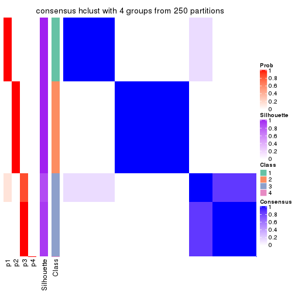</p>

</div>
<div id='tab-ATC-hclust-consensus-heatmap-4'>
<pre><code class="r">consensus_heatmap(res, k = 5)
</code></pre>

<p>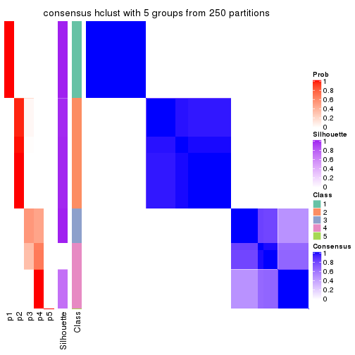</p>

</div>
<div id='tab-ATC-hclust-consensus-heatmap-5'>
<pre><code class="r">consensus_heatmap(res, k = 6)
</code></pre>

<p>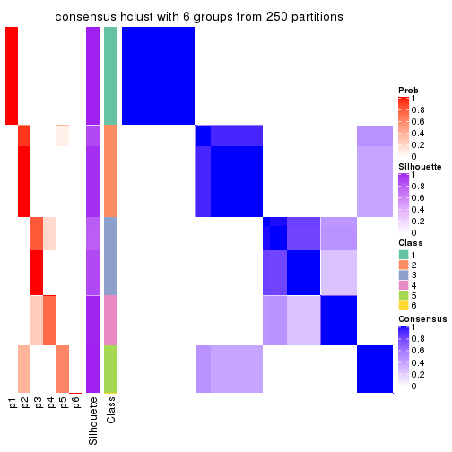</p>

</div>
</div>

Heatmaps for the membership of samples in all partitions to see how consistent they are:


<script>
$( function() {
	$( '#tabs-ATC-hclust-membership-heatmap' ).tabs();
} );
</script>
<div id='tabs-ATC-hclust-membership-heatmap'>
<ul>
<li><a href='#tab-ATC-hclust-membership-heatmap-1'>k = 2</a></li>
<li><a href='#tab-ATC-hclust-membership-heatmap-2'>k = 3</a></li>
<li><a href='#tab-ATC-hclust-membership-heatmap-3'>k = 4</a></li>
<li><a href='#tab-ATC-hclust-membership-heatmap-4'>k = 5</a></li>
<li><a href='#tab-ATC-hclust-membership-heatmap-5'>k = 6</a></li>
</ul>
<div id='tab-ATC-hclust-membership-heatmap-1'>
<pre><code class="r">membership_heatmap(res, k = 2)
</code></pre>

<p></p>

</div>
<div id='tab-ATC-hclust-membership-heatmap-2'>
<pre><code class="r">membership_heatmap(res, k = 3)
</code></pre>

<p></p>

</div>
<div id='tab-ATC-hclust-membership-heatmap-3'>
<pre><code class="r">membership_heatmap(res, k = 4)
</code></pre>

<p></p>

</div>
<div id='tab-ATC-hclust-membership-heatmap-4'>
<pre><code class="r">membership_heatmap(res, k = 5)
</code></pre>

<p></p>

</div>
<div id='tab-ATC-hclust-membership-heatmap-5'>
<pre><code class="r">membership_heatmap(res, k = 6)
</code></pre>

<p></p>

</div>
</div>

As soon as we have had the classes for columns, we can look for signatures
which are significantly different between classes which can be candidate marks
for certain classes. Following are the heatmaps for signatures.


Signature heatmaps where rows are scaled:


<script>
$( function() {
	$( '#tabs-ATC-hclust-get-signatures' ).tabs();
} );
</script>
<div id='tabs-ATC-hclust-get-signatures'>
<ul>
<li><a href='#tab-ATC-hclust-get-signatures-1'>k = 2</a></li>
<li><a href='#tab-ATC-hclust-get-signatures-2'>k = 3</a></li>
<li><a href='#tab-ATC-hclust-get-signatures-3'>k = 4</a></li>
<li><a href='#tab-ATC-hclust-get-signatures-4'>k = 5</a></li>
<li><a href='#tab-ATC-hclust-get-signatures-5'>k = 6</a></li>
</ul>
<div id='tab-ATC-hclust-get-signatures-1'>
<pre><code class="r">get_signatures(res, k = 2)
</code></pre>

<p></p>

</div>
<div id='tab-ATC-hclust-get-signatures-2'>
<pre><code class="r">get_signatures(res, k = 3)
</code></pre>

<p></p>

</div>
<div id='tab-ATC-hclust-get-signatures-3'>
<pre><code class="r">get_signatures(res, k = 4)
</code></pre>

<pre><code>#&gt; Error in mat[ceiling(1:nr/h_ratio), ceiling(1:nc/w_ratio), drop = FALSE]: subscript out of bounds
</code></pre>

<p></p>

</div>
<div id='tab-ATC-hclust-get-signatures-4'>
<pre><code class="r">get_signatures(res, k = 5)
</code></pre>

<p></p>

</div>
<div id='tab-ATC-hclust-get-signatures-5'>
<pre><code class="r">get_signatures(res, k = 6)
</code></pre>

<p>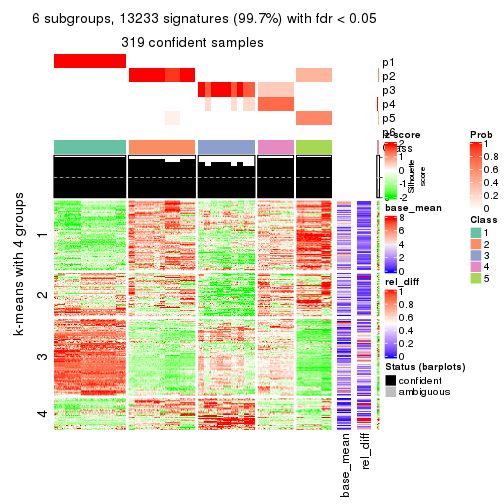</p>

</div>
</div>


Signature heatmaps where rows are not scaled:


<script>
$( function() {
	$( '#tabs-ATC-hclust-get-signatures-no-scale' ).tabs();
} );
</script>
<div id='tabs-ATC-hclust-get-signatures-no-scale'>
<ul>
<li><a href='#tab-ATC-hclust-get-signatures-no-scale-1'>k = 2</a></li>
<li><a href='#tab-ATC-hclust-get-signatures-no-scale-2'>k = 3</a></li>
<li><a href='#tab-ATC-hclust-get-signatures-no-scale-3'>k = 4</a></li>
<li><a href='#tab-ATC-hclust-get-signatures-no-scale-4'>k = 5</a></li>
<li><a href='#tab-ATC-hclust-get-signatures-no-scale-5'>k = 6</a></li>
</ul>
<div id='tab-ATC-hclust-get-signatures-no-scale-1'>
<pre><code class="r">get_signatures(res, k = 2, scale_rows = FALSE)
</code></pre>

<p></p>

</div>
<div id='tab-ATC-hclust-get-signatures-no-scale-2'>
<pre><code class="r">get_signatures(res, k = 3, scale_rows = FALSE)
</code></pre>

<p></p>

</div>
<div id='tab-ATC-hclust-get-signatures-no-scale-3'>
<pre><code class="r">get_signatures(res, k = 4, scale_rows = FALSE)
</code></pre>

<pre><code>#&gt; Error in mat[ceiling(1:nr/h_ratio), ceiling(1:nc/w_ratio), drop = FALSE]: subscript out of bounds
</code></pre>

<p></p>

</div>
<div id='tab-ATC-hclust-get-signatures-no-scale-4'>
<pre><code class="r">get_signatures(res, k = 5, scale_rows = FALSE)
</code></pre>

<p></p>

</div>
<div id='tab-ATC-hclust-get-signatures-no-scale-5'>
<pre><code class="r">get_signatures(res, k = 6, scale_rows = FALSE)
</code></pre>

<p></p>

</div>
</div>


Compare the overlap of signatures from different k:

```r
compare_signatures(res)
```


`get_signature()` returns a data frame invisibly. TO get the list of signatures, the function
call should be assigned to a variable explicitly. In following code, if `plot` argument is set
to `FALSE`, no heatmap is plotted while only the differential analysis is performed.

```r
# code only for demonstration
tb = get_signature(res, k = ..., plot = FALSE)
```

An example of the output of `tb` is:

```
#>   which_row         fdr    mean_1    mean_2 scaled_mean_1 scaled_mean_2 km
#> 1        38 0.042760348  8.373488  9.131774    -0.5533452     0.5164555  1
#> 2        40 0.018707592  7.106213  8.469186    -0.6173731     0.5762149  1
#> 3        55 0.019134737 10.221463 11.207825    -0.6159697     0.5749050  1
#> 4        59 0.006059896  5.921854  7.869574    -0.6899429     0.6439467  1
#> 5        60 0.018055526  8.928898 10.211722    -0.6204761     0.5791110  1
#> 6        98 0.009384629 15.714769 14.887706     0.6635654    -0.6193277  2
...
```

The columns in `tb` are:

1. `which_row`: row indices corresponding to the input matrix.
2. `fdr`: FDR for the differential test. 
3. `mean_x`: The mean value in group x.
4. `scaled_mean_x`: The mean value in group x after rows are scaled.
5. `km`: Row groups if k-means clustering is applied to rows.


UMAP plot which shows how samples are separated.


<script>
$( function() {
	$( '#tabs-ATC-hclust-dimension-reduction' ).tabs();
} );
</script>
<div id='tabs-ATC-hclust-dimension-reduction'>
<ul>
<li><a href='#tab-ATC-hclust-dimension-reduction-1'>k = 2</a></li>
<li><a href='#tab-ATC-hclust-dimension-reduction-2'>k = 3</a></li>
<li><a href='#tab-ATC-hclust-dimension-reduction-3'>k = 4</a></li>
<li><a href='#tab-ATC-hclust-dimension-reduction-4'>k = 5</a></li>
<li><a href='#tab-ATC-hclust-dimension-reduction-5'>k = 6</a></li>
</ul>
<div id='tab-ATC-hclust-dimension-reduction-1'>
<pre><code class="r">dimension_reduction(res, k = 2, method = &quot;UMAP&quot;)
</code></pre>

<p></p>

</div>
<div id='tab-ATC-hclust-dimension-reduction-2'>
<pre><code class="r">dimension_reduction(res, k = 3, method = &quot;UMAP&quot;)
</code></pre>

<p></p>

</div>
<div id='tab-ATC-hclust-dimension-reduction-3'>
<pre><code class="r">dimension_reduction(res, k = 4, method = &quot;UMAP&quot;)
</code></pre>

<p></p>

</div>
<div id='tab-ATC-hclust-dimension-reduction-4'>
<pre><code class="r">dimension_reduction(res, k = 5, method = &quot;UMAP&quot;)
</code></pre>

<p></p>

</div>
<div id='tab-ATC-hclust-dimension-reduction-5'>
<pre><code class="r">dimension_reduction(res, k = 6, method = &quot;UMAP&quot;)
</code></pre>

<p></p>

</div>
</div>


Following heatmap shows how subgroups are split when increasing `k`:

```r
collect_classes(res)
```


If matrix rows can be associated to genes, consider to use `functional_enrichment(res,
...)` to perform function enrichment for the signature genes. See [this vignette](http://bioconductor.org/packages/devel/bioc/vignettes/cola/inst/doc/functional_enrichment.html) for more detailed explanations.


 

---------------------------------------------------


### ATC:kmeans


The object with results only for a single top-value method and a single partition method 
can be extracted as:

```r
res = res_list["ATC", "kmeans"]
# you can also extract it by
# res = res_list["ATC:kmeans"]
```

A summary of `res` and all the functions that can be applied to it:

```r
res
```

```
#> A 'ConsensusPartition' object with k = 2, 3, 4, 5, 6.
#>   On a matrix with 13278 rows and 322 columns.
#>   Top rows (1000, 2000, 3000, 4000, 5000) are extracted by 'ATC' method.
#>   Subgroups are detected by 'kmeans' method.
#>   Performed in total 1250 partitions by row resampling.
#>   Best k for subgroups seems to be 3.
#> 
#> Following methods can be applied to this 'ConsensusPartition' object:
#>  [1] "cola_report"             "collect_classes"         "collect_plots"          
#>  [4] "collect_stats"           "colnames"                "compare_signatures"     
#>  [7] "consensus_heatmap"       "dimension_reduction"     "functional_enrichment"  
#> [10] "get_anno_col"            "get_anno"                "get_classes"            
#> [13] "get_consensus"           "get_matrix"              "get_membership"         
#> [16] "get_param"               "get_signatures"          "get_stats"              
#> [19] "is_best_k"               "is_stable_k"             "membership_heatmap"     
#> [22] "ncol"                    "nrow"                    "plot_ecdf"              
#> [25] "rownames"                "select_partition_number" "show"                   
#> [28] "suggest_best_k"          "test_to_known_factors"
```

`collect_plots()` function collects all the plots made from `res` for all `k` (number of partitions)
into one single page to provide an easy and fast comparison between different `k`.

```r
collect_plots(res)
```


The plots are:

- The first row: a plot of the ECDF (empirical cumulative distribution
  function) curves of the consensus matrix for each `k` and the heatmap of
  predicted classes for each `k`.
- The second row: heatmaps of the consensus matrix for each `k`.
- The third row: heatmaps of the membership matrix for each `k`.
- The fouth row: heatmaps of the signatures for each `k`.

All the plots in panels can be made by individual functions and they are
plotted later in this section.

`select_partition_number()` produces several plots showing different
statistics for choosing "optimized" `k`. There are following statistics:

- ECDF curves of the consensus matrix for each `k`;
- 1-PAC. [The PAC
  score](https://en.wikipedia.org/wiki/Consensus_clustering#Over-interpretation_potential_of_consensus_clustering)
  measures the proportion of the ambiguous subgrouping.
- Mean silhouette score.
- Concordance. The mean probability of fiting the consensus class ids in all
  partitions.
- Area increased. Denote $A_k$ as the area under the ECDF curve for current
  `k`, the area increased is defined as $A_k - A_{k-1}$.
- Rand index. The percent of pairs of samples that are both in a same cluster
  or both are not in a same cluster in the partition of k and k-1.
- Jaccard index. The ratio of pairs of samples are both in a same cluster in
  the partition of k and k-1 and the pairs of samples are both in a same
  cluster in the partition k or k-1.

The detailed explanations of these statistics can be found in [the _cola_
vignette](http://bioconductor.org/packages/devel/bioc/vignettes/cola/inst/doc/cola.html#toc_13).

Generally speaking, lower PAC score, higher mean silhouette score or higher
concordance corresponds to better partition. Rand index and Jaccard index
measure how similar the current partition is compared to partition with `k-1`.
If they are too similar, we won't accept `k` is better than `k-1`.

```r
select_partition_number(res)
```

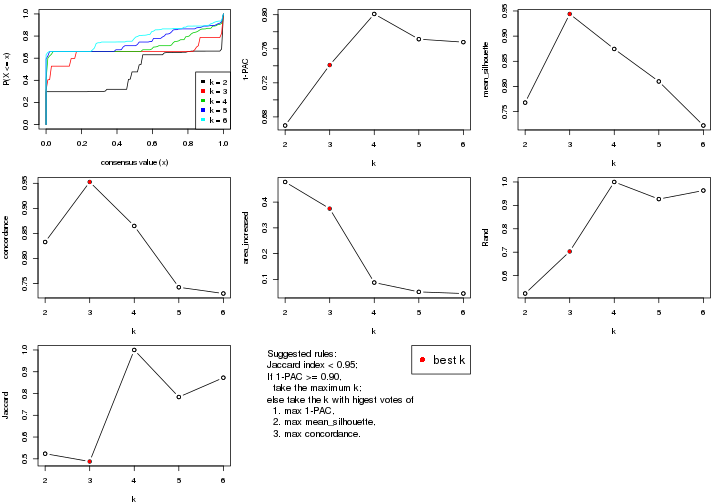

The numeric values for all these statistics can be obtained by `get_stats()`.

```r
get_stats(res)
```

```
#>   k 1-PAC mean_silhouette concordance area_increased  Rand Jaccard
#> 2 2 0.670           0.768       0.833         0.4783 0.524   0.524
#> 3 3 0.741           0.944       0.953         0.3746 0.703   0.488
#> 4 4 0.801           0.875       0.865         0.0875 1.000   1.000
#> 5 5 0.771           0.810       0.743         0.0513 0.927   0.784
#> 6 6 0.768           0.722       0.730         0.0449 0.963   0.873
```

`suggest_best_k()` suggests the best $k$ based on these statistics. The rules are as follows:

- All $k$ with Jaccard index larger than 0.95 are removed because increasing
  $k$ does not provide enough extra information. If all $k$ are removed, it is
  marked as no subgroup is detected.
- For all $k$ with 1-PAC score larger than 0.9, the maximal $k$ is taken as
  the best $k$, and other $k$ are marked as optional $k$.
- If it does not fit the second rule. The $k$ with the maximal vote of the
  highest 1-PAC score, highest mean silhouette, and highest concordance is
  taken as the best $k$.

```r
suggest_best_k(res)
```

```
#> [1] 3
```


Following shows the table of the partitions (You need to click the **show/hide
code output** link to see it). The membership matrix (columns with name `p*`)
is inferred by
[`clue::cl_consensus()`](https://www.rdocumentation.org/link/cl_consensus?package=clue)
function with the `SE` method. Basically the value in the membership matrix
represents the probability to belong to a certain group. The finall class
label for an item is determined with the group with highest probability it
belongs to.

In `get_classes()` function, the entropy is calculated from the membership
matrix and the silhouette score is calculated from the consensus matrix.


<script>
$( function() {
	$( '#tabs-ATC-kmeans-get-classes' ).tabs();
} );
</script>
<div id='tabs-ATC-kmeans-get-classes'>
<ul>
<li><a href='#tab-ATC-kmeans-get-classes-1'>k = 2</a></li>
<li><a href='#tab-ATC-kmeans-get-classes-2'>k = 3</a></li>
<li><a href='#tab-ATC-kmeans-get-classes-3'>k = 4</a></li>
<li><a href='#tab-ATC-kmeans-get-classes-4'>k = 5</a></li>
<li><a href='#tab-ATC-kmeans-get-classes-5'>k = 6</a></li>
</ul>

<div id='tab-ATC-kmeans-get-classes-1'>
<p><a id='tab-ATC-kmeans-get-classes-1-a' style='color:#0366d6' href='#'>show/hide code output</a></p>
<pre><code class="r">cbind(get_classes(res, k = 2), get_membership(res, k = 2))
</code></pre>

<pre><code>#&gt;           class entropy silhouette    p1    p2
#&gt; DRR023371     2  0.7453     -0.275 0.212 0.788
#&gt; DRR023372     2  0.7299     -0.247 0.204 0.796
#&gt; DRR023373     2  0.7299     -0.247 0.204 0.796
#&gt; DRR023374     2  0.7299     -0.247 0.204 0.796
#&gt; DRR023375     2  0.7299     -0.247 0.204 0.796
#&gt; DRR023376     2  0.7299     -0.247 0.204 0.796
#&gt; DRR023377     2  0.7299     -0.247 0.204 0.796
#&gt; DRR023378     2  0.7219     -0.233 0.200 0.800
#&gt; DRR023379     1  0.9954      1.000 0.540 0.460
#&gt; DRR023380     1  0.9954      1.000 0.540 0.460
#&gt; DRR023381     1  0.9954      1.000 0.540 0.460
#&gt; DRR023382     1  0.9954      1.000 0.540 0.460
#&gt; DRR023383     1  0.9954      1.000 0.540 0.460
#&gt; DRR023384     1  0.9954      1.000 0.540 0.460
#&gt; DRR023385     1  0.9954      1.000 0.540 0.460
#&gt; DRR023386     1  0.9954      1.000 0.540 0.460
#&gt; DRR023387     1  0.9954      1.000 0.540 0.460
#&gt; DRR023388     1  0.9954      1.000 0.540 0.460
#&gt; DRR023389     1  0.9954      1.000 0.540 0.460
#&gt; DRR023390     1  0.9954      1.000 0.540 0.460
#&gt; DRR023391     1  0.9954      1.000 0.540 0.460
#&gt; DRR023392     1  0.9954      1.000 0.540 0.460
#&gt; DRR023394     1  0.9954      1.000 0.540 0.460
#&gt; DRR023395     1  0.9954      1.000 0.540 0.460
#&gt; DRR023396     1  0.9954      1.000 0.540 0.460
#&gt; DRR023397     1  0.9954      1.000 0.540 0.460
#&gt; DRR023398     1  0.9954      1.000 0.540 0.460
#&gt; DRR023399     1  0.9954      1.000 0.540 0.460
#&gt; DRR023400     1  0.9954      1.000 0.540 0.460
#&gt; DRR023401     1  0.9954      1.000 0.540 0.460
#&gt; DRR023402     1  0.9954      1.000 0.540 0.460
#&gt; DRR023403     1  0.9954      1.000 0.540 0.460
#&gt; DRR023404     2  0.9954      0.793 0.460 0.540
#&gt; DRR023405     2  0.9954      0.793 0.460 0.540
#&gt; DRR023406     2  0.9954      0.793 0.460 0.540
#&gt; DRR023407     2  0.9954      0.793 0.460 0.540
#&gt; DRR023408     2  0.9954      0.793 0.460 0.540
#&gt; DRR023409     2  0.9954      0.793 0.460 0.540
#&gt; DRR023410     2  0.9954      0.793 0.460 0.540
#&gt; DRR023411     2  0.9954      0.793 0.460 0.540
#&gt; DRR023412     2  0.9954      0.793 0.460 0.540
#&gt; DRR023413     2  0.9954      0.793 0.460 0.540
#&gt; DRR023414     2  0.9954      0.793 0.460 0.540
#&gt; DRR023415     2  0.9954      0.793 0.460 0.540
#&gt; DRR023416     2  0.9954      0.793 0.460 0.540
#&gt; DRR023417     2  0.9954      0.793 0.460 0.540
#&gt; DRR023418     2  0.9954      0.793 0.460 0.540
#&gt; DRR023419     2  0.9954      0.793 0.460 0.540
#&gt; DRR023420     2  0.9954      0.793 0.460 0.540
#&gt; DRR023421     2  0.9954      0.793 0.460 0.540
#&gt; DRR023422     2  0.9954      0.793 0.460 0.540
#&gt; DRR023423     2  0.9954      0.793 0.460 0.540
#&gt; DRR023425     2  0.9954      0.793 0.460 0.540
#&gt; DRR023426     2  0.9954      0.793 0.460 0.540
#&gt; DRR023427     2  0.9954      0.793 0.460 0.540
#&gt; DRR023428     2  0.9954      0.793 0.460 0.540
#&gt; DRR023429     2  0.9954      0.793 0.460 0.540
#&gt; DRR023430     2  0.9954      0.793 0.460 0.540
#&gt; DRR023431     2  0.9954      0.793 0.460 0.540
#&gt; DRR023432     2  0.9954      0.793 0.460 0.540
#&gt; DRR023433     2  0.9954      0.793 0.460 0.540
#&gt; DRR023434     2  0.9954      0.793 0.460 0.540
#&gt; DRR023435     2  0.9954      0.793 0.460 0.540
#&gt; DRR023436     2  0.9954      0.793 0.460 0.540
#&gt; DRR023437     2  0.9954      0.793 0.460 0.540
#&gt; DRR023438     2  0.9954      0.793 0.460 0.540
#&gt; DRR023439     2  0.9954      0.793 0.460 0.540
#&gt; DRR023440     2  0.9954      0.793 0.460 0.540
#&gt; DRR023441     2  0.9954      0.793 0.460 0.540
#&gt; DRR023442     2  0.9954      0.793 0.460 0.540
#&gt; DRR023443     2  0.9954      0.793 0.460 0.540
#&gt; DRR023444     2  0.9954      0.793 0.460 0.540
#&gt; DRR023445     2  0.9954      0.793 0.460 0.540
#&gt; DRR023446     2  0.9954      0.793 0.460 0.540
#&gt; DRR023447     2  0.9954      0.793 0.460 0.540
#&gt; DRR023448     2  0.9954      0.793 0.460 0.540
#&gt; DRR023449     2  0.9954      0.793 0.460 0.540
#&gt; DRR023450     2  0.9954      0.793 0.460 0.540
#&gt; DRR023451     2  0.9954      0.793 0.460 0.540
#&gt; DRR023452     2  0.9954      0.793 0.460 0.540
#&gt; DRR023453     1  0.9954      1.000 0.540 0.460
#&gt; DRR023454     1  0.9954      1.000 0.540 0.460
#&gt; DRR023455     1  0.9954      1.000 0.540 0.460
#&gt; DRR023456     1  0.9954      1.000 0.540 0.460
#&gt; DRR023457     1  0.9954      1.000 0.540 0.460
#&gt; DRR023458     1  0.9954      1.000 0.540 0.460
#&gt; DRR023459     1  0.9954      1.000 0.540 0.460
#&gt; DRR023460     2  0.8861     -0.554 0.304 0.696
#&gt; DRR023461     2  0.0000      0.433 0.000 1.000
#&gt; DRR023462     2  0.0000      0.433 0.000 1.000
#&gt; DRR023463     2  0.0000      0.433 0.000 1.000
#&gt; DRR023464     2  0.0000      0.433 0.000 1.000
#&gt; DRR023465     2  0.0000      0.433 0.000 1.000
#&gt; DRR023466     2  0.0000      0.433 0.000 1.000
#&gt; DRR023467     2  0.0000      0.433 0.000 1.000
#&gt; DRR023468     2  0.0000      0.433 0.000 1.000
#&gt; DRR023469     2  0.0000      0.433 0.000 1.000
#&gt; DRR023470     2  0.0000      0.433 0.000 1.000
#&gt; DRR023471     2  0.0000      0.433 0.000 1.000
#&gt; DRR023472     2  0.0000      0.433 0.000 1.000
#&gt; DRR023473     2  0.0000      0.433 0.000 1.000
#&gt; DRR023474     2  0.0000      0.433 0.000 1.000
#&gt; DRR023475     2  0.0000      0.433 0.000 1.000
#&gt; DRR023476     2  0.0000      0.433 0.000 1.000
#&gt; DRR023477     2  0.0000      0.433 0.000 1.000
#&gt; DRR023478     2  0.0000      0.433 0.000 1.000
#&gt; DRR023479     2  0.0000      0.433 0.000 1.000
#&gt; DRR023480     2  0.0000      0.433 0.000 1.000
#&gt; DRR023481     2  0.0000      0.433 0.000 1.000
#&gt; DRR023482     1  0.9954      1.000 0.540 0.460
#&gt; DRR023483     1  0.9954      1.000 0.540 0.460
#&gt; DRR023484     1  0.9954      1.000 0.540 0.460
#&gt; DRR023485     1  0.9954      1.000 0.540 0.460
#&gt; DRR023486     1  0.9954      1.000 0.540 0.460
#&gt; DRR023487     1  0.9954      1.000 0.540 0.460
#&gt; DRR023488     1  0.9954      1.000 0.540 0.460
#&gt; DRR023489     1  0.9954      1.000 0.540 0.460
#&gt; DRR023490     1  0.9954      1.000 0.540 0.460
#&gt; DRR023491     1  0.9954      1.000 0.540 0.460
#&gt; DRR023492     1  0.9954      1.000 0.540 0.460
#&gt; DRR023493     1  0.9954      1.000 0.540 0.460
#&gt; DRR023494     1  0.9954      1.000 0.540 0.460
#&gt; DRR023495     1  0.9954      1.000 0.540 0.460
#&gt; DRR023496     1  0.9954      1.000 0.540 0.460
#&gt; DRR023497     1  0.9954      1.000 0.540 0.460
#&gt; DRR023498     1  0.9954      1.000 0.540 0.460
#&gt; DRR023499     1  0.9954      1.000 0.540 0.460
#&gt; DRR023500     1  0.9954      1.000 0.540 0.460
#&gt; DRR023501     1  0.9954      1.000 0.540 0.460
#&gt; DRR023502     1  0.9954      1.000 0.540 0.460
#&gt; DRR023503     1  0.9954      1.000 0.540 0.460
#&gt; DRR023504     1  0.9954      1.000 0.540 0.460
#&gt; DRR023505     1  0.9954      1.000 0.540 0.460
#&gt; DRR023506     1  0.9954      1.000 0.540 0.460
#&gt; DRR023507     1  0.9954      1.000 0.540 0.460
#&gt; DRR023508     1  0.9954      1.000 0.540 0.460
#&gt; DRR023509     1  0.9954      1.000 0.540 0.460
#&gt; DRR023510     1  0.9954      1.000 0.540 0.460
#&gt; DRR023511     1  0.9954      1.000 0.540 0.460
#&gt; DRR023512     1  0.9954      1.000 0.540 0.460
#&gt; DRR023513     1  0.9954      1.000 0.540 0.460
#&gt; DRR023514     1  0.9954      1.000 0.540 0.460
#&gt; DRR023515     1  0.9954      1.000 0.540 0.460
#&gt; DRR023516     1  0.9954      1.000 0.540 0.460
#&gt; DRR023517     1  0.9954      1.000 0.540 0.460
#&gt; DRR023518     1  0.9954      1.000 0.540 0.460
#&gt; DRR023519     1  0.9954      1.000 0.540 0.460
#&gt; DRR023520     1  0.9954      1.000 0.540 0.460
#&gt; DRR023521     1  0.9954      1.000 0.540 0.460
#&gt; DRR023522     1  0.9954      1.000 0.540 0.460
#&gt; DRR023523     1  0.9954      1.000 0.540 0.460
#&gt; DRR023524     1  0.9954      1.000 0.540 0.460
#&gt; DRR023525     1  0.9954      1.000 0.540 0.460
#&gt; DRR023526     1  0.9954      1.000 0.540 0.460
#&gt; DRR023527     1  0.9954      1.000 0.540 0.460
#&gt; DRR023528     1  0.9954      1.000 0.540 0.460
#&gt; DRR023529     1  0.9954      1.000 0.540 0.460
#&gt; DRR023530     1  0.9954      1.000 0.540 0.460
#&gt; DRR023531     1  0.9954      1.000 0.540 0.460
#&gt; DRR023532     1  0.9954      1.000 0.540 0.460
#&gt; DRR023533     1  0.9954      1.000 0.540 0.460
#&gt; DRR023534     1  0.9954      1.000 0.540 0.460
#&gt; DRR023535     1  0.9954      1.000 0.540 0.460
#&gt; DRR023536     1  0.9954      1.000 0.540 0.460
#&gt; DRR023537     1  0.9954      1.000 0.540 0.460
#&gt; DRR023538     1  0.9954      1.000 0.540 0.460
#&gt; DRR023539     1  0.9954      1.000 0.540 0.460
#&gt; DRR023540     1  0.9954      1.000 0.540 0.460
#&gt; DRR023541     1  0.9954      1.000 0.540 0.460
#&gt; DRR023542     1  0.9954      1.000 0.540 0.460
#&gt; DRR023543     1  0.9954      1.000 0.540 0.460
#&gt; DRR023544     1  0.9954      1.000 0.540 0.460
#&gt; DRR023545     1  0.9954      1.000 0.540 0.460
#&gt; DRR023546     1  0.9954      1.000 0.540 0.460
#&gt; DRR023547     1  0.9954      1.000 0.540 0.460
#&gt; DRR023548     1  0.9954      1.000 0.540 0.460
#&gt; DRR023549     1  0.9954      1.000 0.540 0.460
#&gt; DRR023550     1  0.9954      1.000 0.540 0.460
#&gt; DRR023551     1  0.9954      1.000 0.540 0.460
#&gt; DRR023552     1  0.9954      1.000 0.540 0.460
#&gt; DRR023553     1  0.9954      1.000 0.540 0.460
#&gt; DRR023554     1  0.9954      1.000 0.540 0.460
#&gt; DRR023555     1  0.9954      1.000 0.540 0.460
#&gt; DRR023556     1  0.9954      1.000 0.540 0.460
#&gt; DRR023557     1  0.9954      1.000 0.540 0.460
#&gt; DRR023558     1  0.9954      1.000 0.540 0.460
#&gt; DRR023559     1  0.9954      1.000 0.540 0.460
#&gt; DRR023560     1  0.9954      1.000 0.540 0.460
#&gt; DRR023561     1  0.9954      1.000 0.540 0.460
#&gt; DRR023562     1  0.9954      1.000 0.540 0.460
#&gt; DRR023563     1  0.9954      1.000 0.540 0.460
#&gt; DRR023564     1  0.9954      1.000 0.540 0.460
#&gt; DRR023565     1  0.9954      1.000 0.540 0.460
#&gt; DRR023566     1  0.9954      1.000 0.540 0.460
#&gt; DRR023567     1  0.9954      1.000 0.540 0.460
#&gt; DRR023568     1  0.9954      1.000 0.540 0.460
#&gt; DRR023569     1  0.9954      1.000 0.540 0.460
#&gt; DRR023570     1  0.9954      1.000 0.540 0.460
#&gt; DRR023571     1  0.9954      1.000 0.540 0.460
#&gt; DRR023572     1  0.9954      1.000 0.540 0.460
#&gt; DRR023573     1  0.9954      1.000 0.540 0.460
#&gt; DRR023574     1  0.9954      1.000 0.540 0.460
#&gt; DRR023575     1  0.9954      1.000 0.540 0.460
#&gt; DRR023576     2  0.9954      0.793 0.460 0.540
#&gt; DRR023577     2  0.9954      0.793 0.460 0.540
#&gt; DRR023578     2  0.9954      0.793 0.460 0.540
#&gt; DRR023579     2  0.9954      0.793 0.460 0.540
#&gt; DRR023580     2  0.9954      0.793 0.460 0.540
#&gt; DRR023581     2  0.9954      0.793 0.460 0.540
#&gt; DRR023582     2  0.9954      0.793 0.460 0.540
#&gt; DRR023583     2  0.9954      0.793 0.460 0.540
#&gt; DRR023584     2  0.9954      0.793 0.460 0.540
#&gt; DRR023585     2  0.9954      0.793 0.460 0.540
#&gt; DRR023586     2  0.9954      0.793 0.460 0.540
#&gt; DRR023587     2  0.9954      0.793 0.460 0.540
#&gt; DRR023588     2  0.9954      0.793 0.460 0.540
#&gt; DRR023589     2  0.9954      0.793 0.460 0.540
#&gt; DRR023590     2  0.9954      0.793 0.460 0.540
#&gt; DRR023591     2  0.9954      0.793 0.460 0.540
#&gt; DRR023592     2  0.9954      0.793 0.460 0.540
#&gt; DRR023593     2  0.9954      0.793 0.460 0.540
#&gt; DRR023594     2  0.9954      0.793 0.460 0.540
#&gt; DRR023595     2  0.9954      0.793 0.460 0.540
#&gt; DRR023596     2  0.9954      0.793 0.460 0.540
#&gt; DRR023597     2  0.9954      0.793 0.460 0.540
#&gt; DRR023598     2  0.9954      0.793 0.460 0.540
#&gt; DRR023599     2  0.9954      0.793 0.460 0.540
#&gt; DRR023600     2  0.9954      0.793 0.460 0.540
#&gt; DRR023601     2  0.9954      0.793 0.460 0.540
#&gt; DRR023602     2  0.9954      0.793 0.460 0.540
#&gt; DRR023603     2  0.9954      0.793 0.460 0.540
#&gt; DRR023604     2  0.9954      0.793 0.460 0.540
#&gt; DRR023605     2  0.9954      0.793 0.460 0.540
#&gt; DRR023606     2  0.9954      0.793 0.460 0.540
#&gt; DRR023607     2  0.9954      0.793 0.460 0.540
#&gt; DRR023608     2  0.9954      0.793 0.460 0.540
#&gt; DRR023609     2  0.9954      0.793 0.460 0.540
#&gt; DRR023610     2  0.9954      0.793 0.460 0.540
#&gt; DRR023611     2  0.9954      0.793 0.460 0.540
#&gt; DRR023612     2  0.9954      0.793 0.460 0.540
#&gt; DRR023613     2  0.9954      0.793 0.460 0.540
#&gt; DRR023614     2  0.9954      0.793 0.460 0.540
#&gt; DRR023615     2  0.9954      0.793 0.460 0.540
#&gt; DRR023616     2  0.9954      0.793 0.460 0.540
#&gt; DRR023617     2  0.9954      0.793 0.460 0.540
#&gt; DRR023619     2  0.0000      0.433 0.000 1.000
#&gt; DRR023620     2  0.0000      0.433 0.000 1.000
#&gt; DRR023621     2  0.0000      0.433 0.000 1.000
#&gt; DRR023622     2  0.0000      0.433 0.000 1.000
#&gt; DRR023623     2  0.0000      0.433 0.000 1.000
#&gt; DRR023624     2  0.0000      0.433 0.000 1.000
#&gt; DRR023625     2  0.0000      0.433 0.000 1.000
#&gt; DRR023626     2  0.0000      0.433 0.000 1.000
#&gt; DRR023627     2  0.0000      0.433 0.000 1.000
#&gt; DRR023628     2  0.0000      0.433 0.000 1.000
#&gt; DRR023629     2  0.0000      0.433 0.000 1.000
#&gt; DRR023630     2  0.0000      0.433 0.000 1.000
#&gt; DRR023631     2  0.0000      0.433 0.000 1.000
#&gt; DRR023632     2  0.0000      0.433 0.000 1.000
#&gt; DRR023633     2  0.0000      0.433 0.000 1.000
#&gt; DRR023635     2  0.9954      0.793 0.460 0.540
#&gt; DRR023636     2  0.9954      0.793 0.460 0.540
#&gt; DRR023637     2  0.9954      0.793 0.460 0.540
#&gt; DRR023638     2  0.9954      0.793 0.460 0.540
#&gt; DRR023639     2  0.9954      0.793 0.460 0.540
#&gt; DRR023640     2  0.9954      0.793 0.460 0.540
#&gt; DRR023641     2  0.9954      0.793 0.460 0.540
#&gt; DRR023642     2  0.9954      0.793 0.460 0.540
#&gt; DRR023643     2  0.9954      0.793 0.460 0.540
#&gt; DRR023644     2  0.9954      0.793 0.460 0.540
#&gt; DRR023645     2  0.9954      0.793 0.460 0.540
#&gt; DRR023646     2  0.9954      0.793 0.460 0.540
#&gt; DRR023647     2  0.9954      0.793 0.460 0.540
#&gt; DRR023648     2  0.9954      0.793 0.460 0.540
#&gt; DRR023649     2  0.9954      0.793 0.460 0.540
#&gt; DRR023650     2  0.1184      0.403 0.016 0.984
#&gt; DRR023651     2  0.1184      0.403 0.016 0.984
#&gt; DRR023652     2  0.1184      0.403 0.016 0.984
#&gt; DRR023653     2  0.1184      0.403 0.016 0.984
#&gt; DRR023654     2  0.1184      0.403 0.016 0.984
#&gt; DRR023655     2  0.1184      0.403 0.016 0.984
#&gt; DRR023656     2  0.1184      0.403 0.016 0.984
#&gt; DRR023657     2  0.1184      0.403 0.016 0.984
#&gt; DRR023658     2  0.1184      0.403 0.016 0.984
#&gt; DRR023659     2  0.1184      0.403 0.016 0.984
#&gt; DRR023660     2  0.1184      0.403 0.016 0.984
#&gt; DRR023661     2  0.1184      0.403 0.016 0.984
#&gt; DRR023662     2  0.1184      0.403 0.016 0.984
#&gt; DRR023663     2  0.1184      0.403 0.016 0.984
#&gt; DRR023664     2  0.1184      0.403 0.016 0.984
#&gt; DRR023665     2  0.0000      0.433 0.000 1.000
#&gt; DRR023666     2  0.1184      0.403 0.016 0.984
#&gt; DRR023667     2  0.1184      0.403 0.016 0.984
#&gt; DRR023668     2  0.1184      0.403 0.016 0.984
#&gt; DRR023669     2  0.1184      0.403 0.016 0.984
#&gt; DRR023670     2  0.1184      0.403 0.016 0.984
#&gt; DRR023671     2  0.1184      0.403 0.016 0.984
#&gt; DRR023672     2  0.1184      0.403 0.016 0.984
#&gt; DRR023673     2  0.1184      0.403 0.016 0.984
#&gt; DRR023674     2  0.1184      0.403 0.016 0.984
#&gt; DRR023675     2  0.1184      0.403 0.016 0.984
#&gt; DRR023676     2  0.1184      0.403 0.016 0.984
#&gt; DRR023677     2  0.1184      0.403 0.016 0.984
#&gt; DRR023678     2  0.0672      0.418 0.008 0.992
#&gt; DRR023683     2  0.9954      0.793 0.460 0.540
#&gt; DRR023684     2  0.9954      0.793 0.460 0.540
#&gt; DRR023685     2  0.9954      0.793 0.460 0.540
#&gt; DRR023686     2  0.9954      0.793 0.460 0.540
#&gt; DRR023687     2  0.9954      0.793 0.460 0.540
#&gt; DRR023688     2  0.9954      0.793 0.460 0.540
#&gt; DRR023689     2  0.9954      0.793 0.460 0.540
#&gt; DRR023690     2  0.9954      0.793 0.460 0.540
#&gt; DRR023691     2  0.9954      0.793 0.460 0.540
#&gt; DRR023692     2  0.9954      0.793 0.460 0.540
#&gt; DRR023693     2  0.9954      0.793 0.460 0.540
#&gt; DRR023694     2  0.9954      0.793 0.460 0.540
#&gt; DRR023695     2  0.9954      0.793 0.460 0.540
#&gt; DRR023696     2  0.9954      0.793 0.460 0.540
#&gt; DRR023697     2  0.9954      0.793 0.460 0.540
#&gt; DRR023698     2  0.9954      0.793 0.460 0.540
#&gt; DRR023699     2  0.9954      0.793 0.460 0.540
#&gt; DRR023700     2  0.9954      0.793 0.460 0.540
</code></pre>

<script>
$('#tab-ATC-kmeans-get-classes-1-a').parent().next().next().hide();
$('#tab-ATC-kmeans-get-classes-1-a').click(function(){
  $('#tab-ATC-kmeans-get-classes-1-a').parent().next().next().toggle();
  return(false);
});
</script>
</div>

<div id='tab-ATC-kmeans-get-classes-2'>
<p><a id='tab-ATC-kmeans-get-classes-2-a' style='color:#0366d6' href='#'>show/hide code output</a></p>
<pre><code class="r">cbind(get_classes(res, k = 3), get_membership(res, k = 3))
</code></pre>

<pre><code>#&gt;           class entropy silhouette    p1    p2    p3
#&gt; DRR023371     3  0.0237      0.940 0.004 0.000 0.996
#&gt; DRR023372     3  0.0237      0.940 0.004 0.000 0.996
#&gt; DRR023373     3  0.0237      0.940 0.004 0.000 0.996
#&gt; DRR023374     3  0.0237      0.940 0.004 0.000 0.996
#&gt; DRR023375     3  0.0237      0.940 0.004 0.000 0.996
#&gt; DRR023376     3  0.0237      0.940 0.004 0.000 0.996
#&gt; DRR023377     3  0.0237      0.940 0.004 0.000 0.996
#&gt; DRR023378     3  0.0237      0.940 0.004 0.000 0.996
#&gt; DRR023379     3  0.3686      0.878 0.140 0.000 0.860
#&gt; DRR023380     3  0.3686      0.878 0.140 0.000 0.860
#&gt; DRR023381     3  0.3686      0.878 0.140 0.000 0.860
#&gt; DRR023382     3  0.3686      0.878 0.140 0.000 0.860
#&gt; DRR023383     3  0.3686      0.878 0.140 0.000 0.860
#&gt; DRR023384     3  0.3686      0.878 0.140 0.000 0.860
#&gt; DRR023385     3  0.3686      0.878 0.140 0.000 0.860
#&gt; DRR023386     3  0.3551      0.882 0.132 0.000 0.868
#&gt; DRR023387     3  0.3686      0.878 0.140 0.000 0.860
#&gt; DRR023388     3  0.3686      0.878 0.140 0.000 0.860
#&gt; DRR023389     3  0.3686      0.878 0.140 0.000 0.860
#&gt; DRR023390     3  0.3686      0.878 0.140 0.000 0.860
#&gt; DRR023391     3  0.3686      0.878 0.140 0.000 0.860
#&gt; DRR023392     3  0.3686      0.878 0.140 0.000 0.860
#&gt; DRR023394     3  0.3686      0.878 0.140 0.000 0.860
#&gt; DRR023395     3  0.3686      0.878 0.140 0.000 0.860
#&gt; DRR023396     3  0.3686      0.878 0.140 0.000 0.860
#&gt; DRR023397     3  0.3686      0.878 0.140 0.000 0.860
#&gt; DRR023398     3  0.3686      0.878 0.140 0.000 0.860
#&gt; DRR023399     3  0.3686      0.878 0.140 0.000 0.860
#&gt; DRR023400     3  0.3686      0.878 0.140 0.000 0.860
#&gt; DRR023401     3  0.3686      0.878 0.140 0.000 0.860
#&gt; DRR023402     3  0.3686      0.878 0.140 0.000 0.860
#&gt; DRR023403     3  0.3686      0.878 0.140 0.000 0.860
#&gt; DRR023404     2  0.0000      0.942 0.000 1.000 0.000
#&gt; DRR023405     2  0.0000      0.942 0.000 1.000 0.000
#&gt; DRR023406     2  0.0000      0.942 0.000 1.000 0.000
#&gt; DRR023407     2  0.0000      0.942 0.000 1.000 0.000
#&gt; DRR023408     2  0.0000      0.942 0.000 1.000 0.000
#&gt; DRR023409     2  0.0000      0.942 0.000 1.000 0.000
#&gt; DRR023410     2  0.0000      0.942 0.000 1.000 0.000
#&gt; DRR023411     2  0.0000      0.942 0.000 1.000 0.000
#&gt; DRR023412     2  0.0000      0.942 0.000 1.000 0.000
#&gt; DRR023413     2  0.0000      0.942 0.000 1.000 0.000
#&gt; DRR023414     2  0.0000      0.942 0.000 1.000 0.000
#&gt; DRR023415     2  0.0000      0.942 0.000 1.000 0.000
#&gt; DRR023416     2  0.0000      0.942 0.000 1.000 0.000
#&gt; DRR023417     2  0.0000      0.942 0.000 1.000 0.000
#&gt; DRR023418     2  0.0000      0.942 0.000 1.000 0.000
#&gt; DRR023419     2  0.0000      0.942 0.000 1.000 0.000
#&gt; DRR023420     2  0.0000      0.942 0.000 1.000 0.000
#&gt; DRR023421     2  0.0000      0.942 0.000 1.000 0.000
#&gt; DRR023422     2  0.3619      0.908 0.000 0.864 0.136
#&gt; DRR023423     2  0.3619      0.908 0.000 0.864 0.136
#&gt; DRR023425     2  0.3619      0.908 0.000 0.864 0.136
#&gt; DRR023426     2  0.3619      0.908 0.000 0.864 0.136
#&gt; DRR023427     2  0.3619      0.908 0.000 0.864 0.136
#&gt; DRR023428     2  0.3619      0.908 0.000 0.864 0.136
#&gt; DRR023429     2  0.3619      0.908 0.000 0.864 0.136
#&gt; DRR023430     2  0.3619      0.908 0.000 0.864 0.136
#&gt; DRR023431     2  0.3619      0.908 0.000 0.864 0.136
#&gt; DRR023432     2  0.3619      0.908 0.000 0.864 0.136
#&gt; DRR023433     2  0.3619      0.908 0.000 0.864 0.136
#&gt; DRR023434     2  0.3619      0.908 0.000 0.864 0.136
#&gt; DRR023435     2  0.3619      0.908 0.000 0.864 0.136
#&gt; DRR023436     2  0.3619      0.908 0.000 0.864 0.136
#&gt; DRR023437     2  0.3619      0.908 0.000 0.864 0.136
#&gt; DRR023438     2  0.3619      0.908 0.000 0.864 0.136
#&gt; DRR023439     2  0.3619      0.908 0.000 0.864 0.136
#&gt; DRR023440     2  0.3619      0.908 0.000 0.864 0.136
#&gt; DRR023441     2  0.3619      0.908 0.000 0.864 0.136
#&gt; DRR023442     2  0.3619      0.908 0.000 0.864 0.136
#&gt; DRR023443     2  0.3619      0.908 0.000 0.864 0.136
#&gt; DRR023444     2  0.3619      0.908 0.000 0.864 0.136
#&gt; DRR023445     2  0.3619      0.908 0.000 0.864 0.136
#&gt; DRR023446     2  0.3619      0.908 0.000 0.864 0.136
#&gt; DRR023447     2  0.3619      0.908 0.000 0.864 0.136
#&gt; DRR023448     2  0.3619      0.908 0.000 0.864 0.136
#&gt; DRR023449     2  0.3619      0.908 0.000 0.864 0.136
#&gt; DRR023450     2  0.3619      0.908 0.000 0.864 0.136
#&gt; DRR023451     2  0.3619      0.908 0.000 0.864 0.136
#&gt; DRR023452     2  0.3619      0.908 0.000 0.864 0.136
#&gt; DRR023453     3  0.3686      0.878 0.140 0.000 0.860
#&gt; DRR023454     3  0.3686      0.878 0.140 0.000 0.860
#&gt; DRR023455     3  0.3686      0.878 0.140 0.000 0.860
#&gt; DRR023456     3  0.3686      0.878 0.140 0.000 0.860
#&gt; DRR023457     3  0.3686      0.878 0.140 0.000 0.860
#&gt; DRR023458     3  0.3686      0.878 0.140 0.000 0.860
#&gt; DRR023459     3  0.3686      0.878 0.140 0.000 0.860
#&gt; DRR023460     3  0.0237      0.940 0.004 0.000 0.996
#&gt; DRR023461     3  0.0237      0.941 0.000 0.004 0.996
#&gt; DRR023462     3  0.0237      0.941 0.000 0.004 0.996
#&gt; DRR023463     3  0.0237      0.941 0.000 0.004 0.996
#&gt; DRR023464     3  0.0237      0.941 0.000 0.004 0.996
#&gt; DRR023465     3  0.0237      0.941 0.000 0.004 0.996
#&gt; DRR023466     3  0.0237      0.941 0.000 0.004 0.996
#&gt; DRR023467     3  0.0237      0.941 0.000 0.004 0.996
#&gt; DRR023468     3  0.0237      0.941 0.000 0.004 0.996
#&gt; DRR023469     3  0.0237      0.941 0.000 0.004 0.996
#&gt; DRR023470     3  0.0237      0.941 0.000 0.004 0.996
#&gt; DRR023471     3  0.0237      0.941 0.000 0.004 0.996
#&gt; DRR023472     3  0.0237      0.941 0.000 0.004 0.996
#&gt; DRR023473     3  0.0237      0.941 0.000 0.004 0.996
#&gt; DRR023474     3  0.0424      0.938 0.000 0.008 0.992
#&gt; DRR023475     3  0.0237      0.941 0.000 0.004 0.996
#&gt; DRR023476     3  0.0237      0.941 0.000 0.004 0.996
#&gt; DRR023477     3  0.0237      0.941 0.000 0.004 0.996
#&gt; DRR023478     3  0.0237      0.941 0.000 0.004 0.996
#&gt; DRR023479     3  0.0237      0.941 0.000 0.004 0.996
#&gt; DRR023480     3  0.0237      0.941 0.000 0.004 0.996
#&gt; DRR023481     3  0.0237      0.941 0.000 0.004 0.996
#&gt; DRR023482     3  0.3686      0.878 0.140 0.000 0.860
#&gt; DRR023483     3  0.3686      0.878 0.140 0.000 0.860
#&gt; DRR023484     3  0.3686      0.878 0.140 0.000 0.860
#&gt; DRR023485     3  0.3686      0.878 0.140 0.000 0.860
#&gt; DRR023486     3  0.3686      0.878 0.140 0.000 0.860
#&gt; DRR023487     3  0.3686      0.878 0.140 0.000 0.860
#&gt; DRR023488     3  0.3686      0.878 0.140 0.000 0.860
#&gt; DRR023489     3  0.3686      0.878 0.140 0.000 0.860
#&gt; DRR023490     1  0.1031      1.000 0.976 0.000 0.024
#&gt; DRR023491     1  0.1031      1.000 0.976 0.000 0.024
#&gt; DRR023492     1  0.1031      1.000 0.976 0.000 0.024
#&gt; DRR023493     1  0.1031      1.000 0.976 0.000 0.024
#&gt; DRR023494     1  0.1031      1.000 0.976 0.000 0.024
#&gt; DRR023495     1  0.1031      1.000 0.976 0.000 0.024
#&gt; DRR023496     1  0.1031      1.000 0.976 0.000 0.024
#&gt; DRR023497     1  0.1031      1.000 0.976 0.000 0.024
#&gt; DRR023498     1  0.1031      1.000 0.976 0.000 0.024
#&gt; DRR023499     1  0.1031      1.000 0.976 0.000 0.024
#&gt; DRR023500     1  0.1031      1.000 0.976 0.000 0.024
#&gt; DRR023501     1  0.1031      1.000 0.976 0.000 0.024
#&gt; DRR023502     1  0.1031      1.000 0.976 0.000 0.024
#&gt; DRR023503     1  0.1031      1.000 0.976 0.000 0.024
#&gt; DRR023504     1  0.1031      1.000 0.976 0.000 0.024
#&gt; DRR023505     1  0.1031      1.000 0.976 0.000 0.024
#&gt; DRR023506     1  0.1031      1.000 0.976 0.000 0.024
#&gt; DRR023507     1  0.1031      1.000 0.976 0.000 0.024
#&gt; DRR023508     1  0.1031      1.000 0.976 0.000 0.024
#&gt; DRR023509     1  0.1031      1.000 0.976 0.000 0.024
#&gt; DRR023510     1  0.1031      1.000 0.976 0.000 0.024
#&gt; DRR023511     1  0.1031      1.000 0.976 0.000 0.024
#&gt; DRR023512     1  0.1031      1.000 0.976 0.000 0.024
#&gt; DRR023513     1  0.1031      1.000 0.976 0.000 0.024
#&gt; DRR023514     1  0.1031      1.000 0.976 0.000 0.024
#&gt; DRR023515     1  0.1031      1.000 0.976 0.000 0.024
#&gt; DRR023516     1  0.1031      1.000 0.976 0.000 0.024
#&gt; DRR023517     1  0.1031      1.000 0.976 0.000 0.024
#&gt; DRR023518     1  0.1031      1.000 0.976 0.000 0.024
#&gt; DRR023519     1  0.1031      1.000 0.976 0.000 0.024
#&gt; DRR023520     1  0.1031      1.000 0.976 0.000 0.024
#&gt; DRR023521     1  0.1031      1.000 0.976 0.000 0.024
#&gt; DRR023522     1  0.1031      1.000 0.976 0.000 0.024
#&gt; DRR023523     1  0.1031      1.000 0.976 0.000 0.024
#&gt; DRR023524     1  0.1031      1.000 0.976 0.000 0.024
#&gt; DRR023525     1  0.1031      1.000 0.976 0.000 0.024
#&gt; DRR023526     1  0.1031      1.000 0.976 0.000 0.024
#&gt; DRR023527     1  0.1031      1.000 0.976 0.000 0.024
#&gt; DRR023528     1  0.1031      1.000 0.976 0.000 0.024
#&gt; DRR023529     1  0.1031      1.000 0.976 0.000 0.024
#&gt; DRR023530     1  0.1031      1.000 0.976 0.000 0.024
#&gt; DRR023531     1  0.1031      1.000 0.976 0.000 0.024
#&gt; DRR023532     1  0.1031      1.000 0.976 0.000 0.024
#&gt; DRR023533     1  0.1031      1.000 0.976 0.000 0.024
#&gt; DRR023534     1  0.1031      1.000 0.976 0.000 0.024
#&gt; DRR023535     1  0.1031      1.000 0.976 0.000 0.024
#&gt; DRR023536     1  0.1031      1.000 0.976 0.000 0.024
#&gt; DRR023537     1  0.1031      1.000 0.976 0.000 0.024
#&gt; DRR023538     1  0.1031      1.000 0.976 0.000 0.024
#&gt; DRR023539     1  0.1031      1.000 0.976 0.000 0.024
#&gt; DRR023540     1  0.1031      1.000 0.976 0.000 0.024
#&gt; DRR023541     1  0.1031      1.000 0.976 0.000 0.024
#&gt; DRR023542     1  0.1031      1.000 0.976 0.000 0.024
#&gt; DRR023543     1  0.1031      1.000 0.976 0.000 0.024
#&gt; DRR023544     1  0.1031      1.000 0.976 0.000 0.024
#&gt; DRR023545     1  0.1031      1.000 0.976 0.000 0.024
#&gt; DRR023546     1  0.1031      1.000 0.976 0.000 0.024
#&gt; DRR023547     1  0.1031      1.000 0.976 0.000 0.024
#&gt; DRR023548     1  0.1031      1.000 0.976 0.000 0.024
#&gt; DRR023549     1  0.1031      1.000 0.976 0.000 0.024
#&gt; DRR023550     1  0.1031      1.000 0.976 0.000 0.024
#&gt; DRR023551     1  0.1031      1.000 0.976 0.000 0.024
#&gt; DRR023552     1  0.1031      1.000 0.976 0.000 0.024
#&gt; DRR023553     1  0.1031      1.000 0.976 0.000 0.024
#&gt; DRR023554     1  0.1031      1.000 0.976 0.000 0.024
#&gt; DRR023555     1  0.1031      1.000 0.976 0.000 0.024
#&gt; DRR023556     1  0.1031      1.000 0.976 0.000 0.024
#&gt; DRR023557     1  0.1031      1.000 0.976 0.000 0.024
#&gt; DRR023558     1  0.1031      1.000 0.976 0.000 0.024
#&gt; DRR023559     1  0.1031      1.000 0.976 0.000 0.024
#&gt; DRR023560     1  0.1031      1.000 0.976 0.000 0.024
#&gt; DRR023561     1  0.1031      1.000 0.976 0.000 0.024
#&gt; DRR023562     1  0.1031      1.000 0.976 0.000 0.024
#&gt; DRR023563     1  0.1031      1.000 0.976 0.000 0.024
#&gt; DRR023564     1  0.1031      1.000 0.976 0.000 0.024
#&gt; DRR023565     1  0.1031      1.000 0.976 0.000 0.024
#&gt; DRR023566     1  0.1031      1.000 0.976 0.000 0.024
#&gt; DRR023567     1  0.1031      1.000 0.976 0.000 0.024
#&gt; DRR023568     1  0.1031      1.000 0.976 0.000 0.024
#&gt; DRR023569     1  0.1031      1.000 0.976 0.000 0.024
#&gt; DRR023570     1  0.1031      1.000 0.976 0.000 0.024
#&gt; DRR023571     1  0.1031      1.000 0.976 0.000 0.024
#&gt; DRR023572     1  0.1031      1.000 0.976 0.000 0.024
#&gt; DRR023573     1  0.1031      1.000 0.976 0.000 0.024
#&gt; DRR023574     1  0.1031      1.000 0.976 0.000 0.024
#&gt; DRR023575     1  0.1031      1.000 0.976 0.000 0.024
#&gt; DRR023576     2  0.0747      0.940 0.016 0.984 0.000
#&gt; DRR023577     2  0.0747      0.940 0.016 0.984 0.000
#&gt; DRR023578     2  0.0747      0.940 0.016 0.984 0.000
#&gt; DRR023579     2  0.0747      0.940 0.016 0.984 0.000
#&gt; DRR023580     2  0.0747      0.940 0.016 0.984 0.000
#&gt; DRR023581     2  0.0747      0.940 0.016 0.984 0.000
#&gt; DRR023582     2  0.0747      0.940 0.016 0.984 0.000
#&gt; DRR023583     2  0.0747      0.940 0.016 0.984 0.000
#&gt; DRR023584     2  0.0747      0.940 0.016 0.984 0.000
#&gt; DRR023585     2  0.0747      0.940 0.016 0.984 0.000
#&gt; DRR023586     2  0.0747      0.940 0.016 0.984 0.000
#&gt; DRR023587     2  0.0747      0.940 0.016 0.984 0.000
#&gt; DRR023588     2  0.0747      0.940 0.016 0.984 0.000
#&gt; DRR023589     2  0.0747      0.940 0.016 0.984 0.000
#&gt; DRR023590     2  0.0747      0.940 0.016 0.984 0.000
#&gt; DRR023591     2  0.0747      0.940 0.016 0.984 0.000
#&gt; DRR023592     2  0.0747      0.940 0.016 0.984 0.000
#&gt; DRR023593     2  0.0747      0.940 0.016 0.984 0.000
#&gt; DRR023594     2  0.0747      0.940 0.016 0.984 0.000
#&gt; DRR023595     2  0.0747      0.940 0.016 0.984 0.000
#&gt; DRR023596     2  0.0747      0.940 0.016 0.984 0.000
#&gt; DRR023597     2  0.0747      0.940 0.016 0.984 0.000
#&gt; DRR023598     2  0.0747      0.940 0.016 0.984 0.000
#&gt; DRR023599     2  0.0747      0.940 0.016 0.984 0.000
#&gt; DRR023600     2  0.0747      0.940 0.016 0.984 0.000
#&gt; DRR023601     2  0.0747      0.940 0.016 0.984 0.000
#&gt; DRR023602     2  0.0747      0.940 0.016 0.984 0.000
#&gt; DRR023603     2  0.0747      0.940 0.016 0.984 0.000
#&gt; DRR023604     2  0.0747      0.940 0.016 0.984 0.000
#&gt; DRR023605     2  0.0747      0.940 0.016 0.984 0.000
#&gt; DRR023606     2  0.0747      0.940 0.016 0.984 0.000
#&gt; DRR023607     2  0.0747      0.940 0.016 0.984 0.000
#&gt; DRR023608     2  0.0747      0.940 0.016 0.984 0.000
#&gt; DRR023609     2  0.0747      0.940 0.016 0.984 0.000
#&gt; DRR023610     2  0.0747      0.940 0.016 0.984 0.000
#&gt; DRR023611     2  0.0747      0.940 0.016 0.984 0.000
#&gt; DRR023612     2  0.0747      0.940 0.016 0.984 0.000
#&gt; DRR023613     2  0.0747      0.940 0.016 0.984 0.000
#&gt; DRR023614     2  0.0747      0.940 0.016 0.984 0.000
#&gt; DRR023615     2  0.0747      0.940 0.016 0.984 0.000
#&gt; DRR023616     2  0.0747      0.940 0.016 0.984 0.000
#&gt; DRR023617     2  0.0747      0.940 0.016 0.984 0.000
#&gt; DRR023619     3  0.0237      0.941 0.000 0.004 0.996
#&gt; DRR023620     3  0.0237      0.941 0.000 0.004 0.996
#&gt; DRR023621     3  0.0237      0.941 0.000 0.004 0.996
#&gt; DRR023622     3  0.0237      0.941 0.000 0.004 0.996
#&gt; DRR023623     3  0.0237      0.941 0.000 0.004 0.996
#&gt; DRR023624     3  0.0237      0.941 0.000 0.004 0.996
#&gt; DRR023625     3  0.0237      0.941 0.000 0.004 0.996
#&gt; DRR023626     3  0.0237      0.941 0.000 0.004 0.996
#&gt; DRR023627     3  0.0237      0.941 0.000 0.004 0.996
#&gt; DRR023628     3  0.0237      0.941 0.000 0.004 0.996
#&gt; DRR023629     3  0.0237      0.941 0.000 0.004 0.996
#&gt; DRR023630     3  0.0237      0.941 0.000 0.004 0.996
#&gt; DRR023631     3  0.0237      0.941 0.000 0.004 0.996
#&gt; DRR023632     3  0.0237      0.941 0.000 0.004 0.996
#&gt; DRR023633     3  0.0237      0.941 0.000 0.004 0.996
#&gt; DRR023635     2  0.0000      0.942 0.000 1.000 0.000
#&gt; DRR023636     2  0.0000      0.942 0.000 1.000 0.000
#&gt; DRR023637     2  0.0000      0.942 0.000 1.000 0.000
#&gt; DRR023638     2  0.0000      0.942 0.000 1.000 0.000
#&gt; DRR023639     2  0.0000      0.942 0.000 1.000 0.000
#&gt; DRR023640     2  0.0000      0.942 0.000 1.000 0.000
#&gt; DRR023641     2  0.0000      0.942 0.000 1.000 0.000
#&gt; DRR023642     2  0.0000      0.942 0.000 1.000 0.000
#&gt; DRR023643     2  0.0000      0.942 0.000 1.000 0.000
#&gt; DRR023644     2  0.0000      0.942 0.000 1.000 0.000
#&gt; DRR023645     2  0.0000      0.942 0.000 1.000 0.000
#&gt; DRR023646     2  0.0000      0.942 0.000 1.000 0.000
#&gt; DRR023647     2  0.0000      0.942 0.000 1.000 0.000
#&gt; DRR023648     2  0.0000      0.942 0.000 1.000 0.000
#&gt; DRR023649     2  0.0000      0.942 0.000 1.000 0.000
#&gt; DRR023650     3  0.0237      0.941 0.000 0.004 0.996
#&gt; DRR023651     3  0.0237      0.941 0.000 0.004 0.996
#&gt; DRR023652     3  0.0237      0.941 0.000 0.004 0.996
#&gt; DRR023653     3  0.0237      0.941 0.000 0.004 0.996
#&gt; DRR023654     3  0.0237      0.941 0.000 0.004 0.996
#&gt; DRR023655     3  0.0237      0.941 0.000 0.004 0.996
#&gt; DRR023656     3  0.0237      0.941 0.000 0.004 0.996
#&gt; DRR023657     3  0.0237      0.941 0.000 0.004 0.996
#&gt; DRR023658     3  0.0237      0.941 0.000 0.004 0.996
#&gt; DRR023659     3  0.0237      0.941 0.000 0.004 0.996
#&gt; DRR023660     3  0.0237      0.941 0.000 0.004 0.996
#&gt; DRR023661     3  0.0237      0.941 0.000 0.004 0.996
#&gt; DRR023662     3  0.0237      0.941 0.000 0.004 0.996
#&gt; DRR023663     3  0.0237      0.941 0.000 0.004 0.996
#&gt; DRR023664     3  0.0237      0.941 0.000 0.004 0.996
#&gt; DRR023665     3  0.0237      0.941 0.000 0.004 0.996
#&gt; DRR023666     3  0.0237      0.941 0.000 0.004 0.996
#&gt; DRR023667     3  0.0237      0.941 0.000 0.004 0.996
#&gt; DRR023668     3  0.0237      0.941 0.000 0.004 0.996
#&gt; DRR023669     3  0.0237      0.941 0.000 0.004 0.996
#&gt; DRR023670     3  0.0237      0.941 0.000 0.004 0.996
#&gt; DRR023671     3  0.0237      0.941 0.000 0.004 0.996
#&gt; DRR023672     3  0.0237      0.941 0.000 0.004 0.996
#&gt; DRR023673     3  0.0237      0.941 0.000 0.004 0.996
#&gt; DRR023674     3  0.0237      0.941 0.000 0.004 0.996
#&gt; DRR023675     3  0.0237      0.941 0.000 0.004 0.996
#&gt; DRR023676     3  0.0237      0.941 0.000 0.004 0.996
#&gt; DRR023677     3  0.0237      0.941 0.000 0.004 0.996
#&gt; DRR023678     3  0.0237      0.941 0.000 0.004 0.996
#&gt; DRR023683     2  0.4099      0.905 0.008 0.852 0.140
#&gt; DRR023684     2  0.4099      0.905 0.008 0.852 0.140
#&gt; DRR023685     2  0.4099      0.905 0.008 0.852 0.140
#&gt; DRR023686     2  0.4099      0.905 0.008 0.852 0.140
#&gt; DRR023687     2  0.4099      0.905 0.008 0.852 0.140
#&gt; DRR023688     2  0.4099      0.905 0.008 0.852 0.140
#&gt; DRR023689     2  0.4099      0.905 0.008 0.852 0.140
#&gt; DRR023690     2  0.4099      0.905 0.008 0.852 0.140
#&gt; DRR023691     2  0.4099      0.905 0.008 0.852 0.140
#&gt; DRR023692     2  0.4099      0.905 0.008 0.852 0.140
#&gt; DRR023693     2  0.4099      0.905 0.008 0.852 0.140
#&gt; DRR023694     2  0.4099      0.905 0.008 0.852 0.140
#&gt; DRR023695     2  0.4099      0.905 0.008 0.852 0.140
#&gt; DRR023696     2  0.4099      0.905 0.008 0.852 0.140
#&gt; DRR023697     2  0.4099      0.905 0.008 0.852 0.140
#&gt; DRR023698     2  0.4099      0.905 0.008 0.852 0.140
#&gt; DRR023699     2  0.4099      0.905 0.008 0.852 0.140
#&gt; DRR023700     2  0.4099      0.905 0.008 0.852 0.140
</code></pre>

<script>
$('#tab-ATC-kmeans-get-classes-2-a').parent().next().next().hide();
$('#tab-ATC-kmeans-get-classes-2-a').click(function(){
  $('#tab-ATC-kmeans-get-classes-2-a').parent().next().next().toggle();
  return(false);
});
</script>
</div>

<div id='tab-ATC-kmeans-get-classes-3'>
<p><a id='tab-ATC-kmeans-get-classes-3-a' style='color:#0366d6' href='#'>show/hide code output</a></p>
<pre><code class="r">cbind(get_classes(res, k = 4), get_membership(res, k = 4))
</code></pre>

<pre><code>#&gt;           class entropy silhouette    p1    p2    p3 p4
#&gt; DRR023371     3  0.0817      0.905 0.000 0.000 0.976 NA
#&gt; DRR023372     3  0.0817      0.905 0.000 0.000 0.976 NA
#&gt; DRR023373     3  0.0817      0.905 0.000 0.000 0.976 NA
#&gt; DRR023374     3  0.0817      0.905 0.000 0.000 0.976 NA
#&gt; DRR023375     3  0.0817      0.905 0.000 0.000 0.976 NA
#&gt; DRR023376     3  0.0817      0.905 0.000 0.000 0.976 NA
#&gt; DRR023377     3  0.0817      0.905 0.000 0.000 0.976 NA
#&gt; DRR023378     3  0.0817      0.905 0.000 0.000 0.976 NA
#&gt; DRR023379     3  0.3172      0.878 0.000 0.000 0.840 NA
#&gt; DRR023380     3  0.3172      0.878 0.000 0.000 0.840 NA
#&gt; DRR023381     3  0.3172      0.878 0.000 0.000 0.840 NA
#&gt; DRR023382     3  0.3172      0.878 0.000 0.000 0.840 NA
#&gt; DRR023383     3  0.3172      0.878 0.000 0.000 0.840 NA
#&gt; DRR023384     3  0.3172      0.878 0.000 0.000 0.840 NA
#&gt; DRR023385     3  0.3172      0.878 0.000 0.000 0.840 NA
#&gt; DRR023386     3  0.3172      0.878 0.000 0.000 0.840 NA
#&gt; DRR023387     3  0.3172      0.878 0.000 0.000 0.840 NA
#&gt; DRR023388     3  0.3172      0.878 0.000 0.000 0.840 NA
#&gt; DRR023389     3  0.3172      0.878 0.000 0.000 0.840 NA
#&gt; DRR023390     3  0.3172      0.878 0.000 0.000 0.840 NA
#&gt; DRR023391     3  0.3172      0.878 0.000 0.000 0.840 NA
#&gt; DRR023392     3  0.3172      0.878 0.000 0.000 0.840 NA
#&gt; DRR023394     3  0.3172      0.878 0.000 0.000 0.840 NA
#&gt; DRR023395     3  0.3172      0.878 0.000 0.000 0.840 NA
#&gt; DRR023396     3  0.3172      0.878 0.000 0.000 0.840 NA
#&gt; DRR023397     3  0.3172      0.878 0.000 0.000 0.840 NA
#&gt; DRR023398     3  0.3172      0.878 0.000 0.000 0.840 NA
#&gt; DRR023399     3  0.3172      0.878 0.000 0.000 0.840 NA
#&gt; DRR023400     3  0.3172      0.878 0.000 0.000 0.840 NA
#&gt; DRR023401     3  0.3172      0.878 0.000 0.000 0.840 NA
#&gt; DRR023402     3  0.3172      0.878 0.000 0.000 0.840 NA
#&gt; DRR023403     3  0.3172      0.878 0.000 0.000 0.840 NA
#&gt; DRR023404     2  0.3448      0.840 0.004 0.828 0.000 NA
#&gt; DRR023405     2  0.3448      0.840 0.004 0.828 0.000 NA
#&gt; DRR023406     2  0.3448      0.840 0.004 0.828 0.000 NA
#&gt; DRR023407     2  0.3448      0.840 0.004 0.828 0.000 NA
#&gt; DRR023408     2  0.3448      0.840 0.004 0.828 0.000 NA
#&gt; DRR023409     2  0.3448      0.840 0.004 0.828 0.000 NA
#&gt; DRR023410     2  0.3448      0.840 0.004 0.828 0.000 NA
#&gt; DRR023411     2  0.3448      0.840 0.004 0.828 0.000 NA
#&gt; DRR023412     2  0.3448      0.840 0.004 0.828 0.000 NA
#&gt; DRR023413     2  0.3448      0.840 0.004 0.828 0.000 NA
#&gt; DRR023414     2  0.3448      0.840 0.004 0.828 0.000 NA
#&gt; DRR023415     2  0.3448      0.840 0.004 0.828 0.000 NA
#&gt; DRR023416     2  0.3448      0.840 0.004 0.828 0.000 NA
#&gt; DRR023417     2  0.3448      0.840 0.004 0.828 0.000 NA
#&gt; DRR023418     2  0.3448      0.840 0.004 0.828 0.000 NA
#&gt; DRR023419     2  0.3448      0.840 0.004 0.828 0.000 NA
#&gt; DRR023420     2  0.3448      0.840 0.004 0.828 0.000 NA
#&gt; DRR023421     2  0.3448      0.840 0.004 0.828 0.000 NA
#&gt; DRR023422     2  0.4855      0.845 0.000 0.600 0.000 NA
#&gt; DRR023423     2  0.4855      0.845 0.000 0.600 0.000 NA
#&gt; DRR023425     2  0.4855      0.845 0.000 0.600 0.000 NA
#&gt; DRR023426     2  0.4855      0.845 0.000 0.600 0.000 NA
#&gt; DRR023427     2  0.4855      0.845 0.000 0.600 0.000 NA
#&gt; DRR023428     2  0.4855      0.845 0.000 0.600 0.000 NA
#&gt; DRR023429     2  0.4855      0.845 0.000 0.600 0.000 NA
#&gt; DRR023430     2  0.4855      0.845 0.000 0.600 0.000 NA
#&gt; DRR023431     2  0.4855      0.845 0.000 0.600 0.000 NA
#&gt; DRR023432     2  0.4855      0.845 0.000 0.600 0.000 NA
#&gt; DRR023433     2  0.4855      0.845 0.000 0.600 0.000 NA
#&gt; DRR023434     2  0.4855      0.845 0.000 0.600 0.000 NA
#&gt; DRR023435     2  0.4855      0.845 0.000 0.600 0.000 NA
#&gt; DRR023436     2  0.4855      0.845 0.000 0.600 0.000 NA
#&gt; DRR023437     2  0.4855      0.845 0.000 0.600 0.000 NA
#&gt; DRR023438     2  0.4855      0.845 0.000 0.600 0.000 NA
#&gt; DRR023439     2  0.4855      0.845 0.000 0.600 0.000 NA
#&gt; DRR023440     2  0.4855      0.845 0.000 0.600 0.000 NA
#&gt; DRR023441     2  0.4855      0.845 0.000 0.600 0.000 NA
#&gt; DRR023442     2  0.4855      0.845 0.000 0.600 0.000 NA
#&gt; DRR023443     2  0.4855      0.845 0.000 0.600 0.000 NA
#&gt; DRR023444     2  0.4855      0.845 0.000 0.600 0.000 NA
#&gt; DRR023445     2  0.4855      0.845 0.000 0.600 0.000 NA
#&gt; DRR023446     2  0.4855      0.845 0.000 0.600 0.000 NA
#&gt; DRR023447     2  0.4855      0.845 0.000 0.600 0.000 NA
#&gt; DRR023448     2  0.4855      0.845 0.000 0.600 0.000 NA
#&gt; DRR023449     2  0.4855      0.845 0.000 0.600 0.000 NA
#&gt; DRR023450     2  0.4855      0.845 0.000 0.600 0.000 NA
#&gt; DRR023451     2  0.4855      0.845 0.000 0.600 0.000 NA
#&gt; DRR023452     2  0.4855      0.845 0.000 0.600 0.000 NA
#&gt; DRR023453     3  0.3172      0.878 0.000 0.000 0.840 NA
#&gt; DRR023454     3  0.3172      0.878 0.000 0.000 0.840 NA
#&gt; DRR023455     3  0.3172      0.878 0.000 0.000 0.840 NA
#&gt; DRR023456     3  0.3172      0.878 0.000 0.000 0.840 NA
#&gt; DRR023457     3  0.3172      0.878 0.000 0.000 0.840 NA
#&gt; DRR023458     3  0.3172      0.878 0.000 0.000 0.840 NA
#&gt; DRR023459     3  0.3172      0.878 0.000 0.000 0.840 NA
#&gt; DRR023460     3  0.2011      0.897 0.000 0.000 0.920 NA
#&gt; DRR023461     3  0.0921      0.906 0.000 0.000 0.972 NA
#&gt; DRR023462     3  0.0921      0.906 0.000 0.000 0.972 NA
#&gt; DRR023463     3  0.0921      0.906 0.000 0.000 0.972 NA
#&gt; DRR023464     3  0.0921      0.906 0.000 0.000 0.972 NA
#&gt; DRR023465     3  0.0921      0.906 0.000 0.000 0.972 NA
#&gt; DRR023466     3  0.0921      0.906 0.000 0.000 0.972 NA
#&gt; DRR023467     3  0.0921      0.906 0.000 0.000 0.972 NA
#&gt; DRR023468     3  0.0921      0.906 0.000 0.000 0.972 NA
#&gt; DRR023469     3  0.0921      0.906 0.000 0.000 0.972 NA
#&gt; DRR023470     3  0.0921      0.906 0.000 0.000 0.972 NA
#&gt; DRR023471     3  0.0921      0.906 0.000 0.000 0.972 NA
#&gt; DRR023472     3  0.0921      0.906 0.000 0.000 0.972 NA
#&gt; DRR023473     3  0.0921      0.906 0.000 0.000 0.972 NA
#&gt; DRR023474     3  0.0921      0.906 0.000 0.000 0.972 NA
#&gt; DRR023475     3  0.0921      0.906 0.000 0.000 0.972 NA
#&gt; DRR023476     3  0.0921      0.906 0.000 0.000 0.972 NA
#&gt; DRR023477     3  0.0921      0.906 0.000 0.000 0.972 NA
#&gt; DRR023478     3  0.0921      0.906 0.000 0.000 0.972 NA
#&gt; DRR023479     3  0.0921      0.906 0.000 0.000 0.972 NA
#&gt; DRR023480     3  0.0921      0.906 0.000 0.000 0.972 NA
#&gt; DRR023481     3  0.0921      0.906 0.000 0.000 0.972 NA
#&gt; DRR023482     3  0.3172      0.878 0.000 0.000 0.840 NA
#&gt; DRR023483     3  0.3172      0.878 0.000 0.000 0.840 NA
#&gt; DRR023484     3  0.3172      0.878 0.000 0.000 0.840 NA
#&gt; DRR023485     3  0.3172      0.878 0.000 0.000 0.840 NA
#&gt; DRR023486     3  0.3172      0.878 0.000 0.000 0.840 NA
#&gt; DRR023487     3  0.3172      0.878 0.000 0.000 0.840 NA
#&gt; DRR023488     3  0.3172      0.878 0.000 0.000 0.840 NA
#&gt; DRR023489     3  0.3172      0.878 0.000 0.000 0.840 NA
#&gt; DRR023490     1  0.4123      0.902 0.772 0.000 0.008 NA
#&gt; DRR023491     1  0.4123      0.902 0.772 0.000 0.008 NA
#&gt; DRR023492     1  0.4123      0.902 0.772 0.000 0.008 NA
#&gt; DRR023493     1  0.4123      0.902 0.772 0.000 0.008 NA
#&gt; DRR023494     1  0.4123      0.902 0.772 0.000 0.008 NA
#&gt; DRR023495     1  0.4123      0.902 0.772 0.000 0.008 NA
#&gt; DRR023496     1  0.4123      0.902 0.772 0.000 0.008 NA
#&gt; DRR023497     1  0.4123      0.902 0.772 0.000 0.008 NA
#&gt; DRR023498     1  0.4123      0.902 0.772 0.000 0.008 NA
#&gt; DRR023499     1  0.4123      0.902 0.772 0.000 0.008 NA
#&gt; DRR023500     1  0.4123      0.902 0.772 0.000 0.008 NA
#&gt; DRR023501     1  0.4123      0.902 0.772 0.000 0.008 NA
#&gt; DRR023502     1  0.4123      0.902 0.772 0.000 0.008 NA
#&gt; DRR023503     1  0.4123      0.902 0.772 0.000 0.008 NA
#&gt; DRR023504     1  0.4123      0.902 0.772 0.000 0.008 NA
#&gt; DRR023505     1  0.4123      0.902 0.772 0.000 0.008 NA
#&gt; DRR023506     1  0.4123      0.902 0.772 0.000 0.008 NA
#&gt; DRR023507     1  0.4123      0.902 0.772 0.000 0.008 NA
#&gt; DRR023508     1  0.4123      0.902 0.772 0.000 0.008 NA
#&gt; DRR023509     1  0.4123      0.902 0.772 0.000 0.008 NA
#&gt; DRR023510     1  0.4123      0.902 0.772 0.000 0.008 NA
#&gt; DRR023511     1  0.4123      0.902 0.772 0.000 0.008 NA
#&gt; DRR023512     1  0.4123      0.902 0.772 0.000 0.008 NA
#&gt; DRR023513     1  0.4123      0.902 0.772 0.000 0.008 NA
#&gt; DRR023514     1  0.4123      0.902 0.772 0.000 0.008 NA
#&gt; DRR023515     1  0.4123      0.902 0.772 0.000 0.008 NA
#&gt; DRR023516     1  0.4123      0.902 0.772 0.000 0.008 NA
#&gt; DRR023517     1  0.4123      0.902 0.772 0.000 0.008 NA
#&gt; DRR023518     1  0.0336      0.932 0.992 0.000 0.008 NA
#&gt; DRR023519     1  0.0336      0.932 0.992 0.000 0.008 NA
#&gt; DRR023520     1  0.0336      0.932 0.992 0.000 0.008 NA
#&gt; DRR023521     1  0.0336      0.932 0.992 0.000 0.008 NA
#&gt; DRR023522     1  0.0336      0.932 0.992 0.000 0.008 NA
#&gt; DRR023523     1  0.0336      0.932 0.992 0.000 0.008 NA
#&gt; DRR023524     1  0.0336      0.932 0.992 0.000 0.008 NA
#&gt; DRR023525     1  0.0336      0.932 0.992 0.000 0.008 NA
#&gt; DRR023526     1  0.0336      0.932 0.992 0.000 0.008 NA
#&gt; DRR023527     1  0.0336      0.932 0.992 0.000 0.008 NA
#&gt; DRR023528     1  0.0336      0.932 0.992 0.000 0.008 NA
#&gt; DRR023529     1  0.0336      0.932 0.992 0.000 0.008 NA
#&gt; DRR023530     1  0.0336      0.932 0.992 0.000 0.008 NA
#&gt; DRR023531     1  0.0336      0.932 0.992 0.000 0.008 NA
#&gt; DRR023532     1  0.0336      0.932 0.992 0.000 0.008 NA
#&gt; DRR023533     1  0.0336      0.932 0.992 0.000 0.008 NA
#&gt; DRR023534     1  0.0336      0.932 0.992 0.000 0.008 NA
#&gt; DRR023535     1  0.0336      0.932 0.992 0.000 0.008 NA
#&gt; DRR023536     1  0.0336      0.932 0.992 0.000 0.008 NA
#&gt; DRR023537     1  0.0336      0.932 0.992 0.000 0.008 NA
#&gt; DRR023538     1  0.0336      0.932 0.992 0.000 0.008 NA
#&gt; DRR023539     1  0.0336      0.932 0.992 0.000 0.008 NA
#&gt; DRR023540     1  0.0336      0.932 0.992 0.000 0.008 NA
#&gt; DRR023541     1  0.0336      0.932 0.992 0.000 0.008 NA
#&gt; DRR023542     1  0.0336      0.932 0.992 0.000 0.008 NA
#&gt; DRR023543     1  0.0336      0.932 0.992 0.000 0.008 NA
#&gt; DRR023544     1  0.0336      0.932 0.992 0.000 0.008 NA
#&gt; DRR023545     1  0.0336      0.932 0.992 0.000 0.008 NA
#&gt; DRR023546     1  0.0336      0.932 0.992 0.000 0.008 NA
#&gt; DRR023547     1  0.0336      0.932 0.992 0.000 0.008 NA
#&gt; DRR023548     1  0.0336      0.932 0.992 0.000 0.008 NA
#&gt; DRR023549     1  0.0336      0.932 0.992 0.000 0.008 NA
#&gt; DRR023550     1  0.0336      0.932 0.992 0.000 0.008 NA
#&gt; DRR023551     1  0.0336      0.932 0.992 0.000 0.008 NA
#&gt; DRR023552     1  0.0336      0.932 0.992 0.000 0.008 NA
#&gt; DRR023553     1  0.0336      0.932 0.992 0.000 0.008 NA
#&gt; DRR023554     1  0.0336      0.932 0.992 0.000 0.008 NA
#&gt; DRR023555     1  0.0336      0.932 0.992 0.000 0.008 NA
#&gt; DRR023556     1  0.0336      0.932 0.992 0.000 0.008 NA
#&gt; DRR023557     1  0.0336      0.932 0.992 0.000 0.008 NA
#&gt; DRR023558     1  0.0336      0.932 0.992 0.000 0.008 NA
#&gt; DRR023559     1  0.2124      0.927 0.924 0.000 0.008 NA
#&gt; DRR023560     1  0.2124      0.927 0.924 0.000 0.008 NA
#&gt; DRR023561     1  0.2124      0.927 0.924 0.000 0.008 NA
#&gt; DRR023562     1  0.2124      0.927 0.924 0.000 0.008 NA
#&gt; DRR023563     1  0.2124      0.927 0.924 0.000 0.008 NA
#&gt; DRR023564     1  0.2124      0.927 0.924 0.000 0.008 NA
#&gt; DRR023565     1  0.2124      0.927 0.924 0.000 0.008 NA
#&gt; DRR023566     1  0.2124      0.927 0.924 0.000 0.008 NA
#&gt; DRR023567     1  0.2124      0.927 0.924 0.000 0.008 NA
#&gt; DRR023568     1  0.2124      0.927 0.924 0.000 0.008 NA
#&gt; DRR023569     1  0.2124      0.927 0.924 0.000 0.008 NA
#&gt; DRR023570     1  0.2124      0.927 0.924 0.000 0.008 NA
#&gt; DRR023571     1  0.4422      0.889 0.736 0.000 0.008 NA
#&gt; DRR023572     1  0.4422      0.889 0.736 0.000 0.008 NA
#&gt; DRR023573     1  0.4422      0.889 0.736 0.000 0.008 NA
#&gt; DRR023574     1  0.4422      0.889 0.736 0.000 0.008 NA
#&gt; DRR023575     1  0.4422      0.889 0.736 0.000 0.008 NA
#&gt; DRR023576     2  0.0376      0.803 0.004 0.992 0.000 NA
#&gt; DRR023577     2  0.0376      0.803 0.004 0.992 0.000 NA
#&gt; DRR023578     2  0.0376      0.803 0.004 0.992 0.000 NA
#&gt; DRR023579     2  0.0376      0.803 0.004 0.992 0.000 NA
#&gt; DRR023580     2  0.0376      0.803 0.004 0.992 0.000 NA
#&gt; DRR023581     2  0.0376      0.803 0.004 0.992 0.000 NA
#&gt; DRR023582     2  0.0376      0.803 0.004 0.992 0.000 NA
#&gt; DRR023583     2  0.0376      0.803 0.004 0.992 0.000 NA
#&gt; DRR023584     2  0.0376      0.803 0.004 0.992 0.000 NA
#&gt; DRR023585     2  0.0376      0.803 0.004 0.992 0.000 NA
#&gt; DRR023586     2  0.0376      0.803 0.004 0.992 0.000 NA
#&gt; DRR023587     2  0.0000      0.805 0.000 1.000 0.000 NA
#&gt; DRR023588     2  0.0000      0.805 0.000 1.000 0.000 NA
#&gt; DRR023589     2  0.0000      0.805 0.000 1.000 0.000 NA
#&gt; DRR023590     2  0.0000      0.805 0.000 1.000 0.000 NA
#&gt; DRR023591     2  0.0000      0.805 0.000 1.000 0.000 NA
#&gt; DRR023592     2  0.0000      0.805 0.000 1.000 0.000 NA
#&gt; DRR023593     2  0.0000      0.805 0.000 1.000 0.000 NA
#&gt; DRR023594     2  0.0000      0.805 0.000 1.000 0.000 NA
#&gt; DRR023595     2  0.0000      0.805 0.000 1.000 0.000 NA
#&gt; DRR023596     2  0.0000      0.805 0.000 1.000 0.000 NA
#&gt; DRR023597     2  0.0000      0.805 0.000 1.000 0.000 NA
#&gt; DRR023598     2  0.0000      0.805 0.000 1.000 0.000 NA
#&gt; DRR023599     2  0.0000      0.805 0.000 1.000 0.000 NA
#&gt; DRR023600     2  0.0000      0.805 0.000 1.000 0.000 NA
#&gt; DRR023601     2  0.0000      0.805 0.000 1.000 0.000 NA
#&gt; DRR023602     2  0.0000      0.805 0.000 1.000 0.000 NA
#&gt; DRR023603     2  0.0000      0.805 0.000 1.000 0.000 NA
#&gt; DRR023604     2  0.0000      0.805 0.000 1.000 0.000 NA
#&gt; DRR023605     2  0.0000      0.805 0.000 1.000 0.000 NA
#&gt; DRR023606     2  0.0000      0.805 0.000 1.000 0.000 NA
#&gt; DRR023607     2  0.0000      0.805 0.000 1.000 0.000 NA
#&gt; DRR023608     2  0.0000      0.805 0.000 1.000 0.000 NA
#&gt; DRR023609     2  0.0000      0.805 0.000 1.000 0.000 NA
#&gt; DRR023610     2  0.0000      0.805 0.000 1.000 0.000 NA
#&gt; DRR023611     2  0.0000      0.805 0.000 1.000 0.000 NA
#&gt; DRR023612     2  0.0000      0.805 0.000 1.000 0.000 NA
#&gt; DRR023613     2  0.0000      0.805 0.000 1.000 0.000 NA
#&gt; DRR023614     2  0.0000      0.805 0.000 1.000 0.000 NA
#&gt; DRR023615     2  0.0000      0.805 0.000 1.000 0.000 NA
#&gt; DRR023616     2  0.0000      0.805 0.000 1.000 0.000 NA
#&gt; DRR023617     2  0.0469      0.799 0.000 0.988 0.000 NA
#&gt; DRR023619     3  0.2814      0.893 0.000 0.000 0.868 NA
#&gt; DRR023620     3  0.2814      0.893 0.000 0.000 0.868 NA
#&gt; DRR023621     3  0.2814      0.893 0.000 0.000 0.868 NA
#&gt; DRR023622     3  0.2814      0.893 0.000 0.000 0.868 NA
#&gt; DRR023623     3  0.2814      0.893 0.000 0.000 0.868 NA
#&gt; DRR023624     3  0.2814      0.893 0.000 0.000 0.868 NA
#&gt; DRR023625     3  0.2814      0.893 0.000 0.000 0.868 NA
#&gt; DRR023626     3  0.2814      0.893 0.000 0.000 0.868 NA
#&gt; DRR023627     3  0.2814      0.893 0.000 0.000 0.868 NA
#&gt; DRR023628     3  0.2814      0.893 0.000 0.000 0.868 NA
#&gt; DRR023629     3  0.2814      0.893 0.000 0.000 0.868 NA
#&gt; DRR023630     3  0.2814      0.893 0.000 0.000 0.868 NA
#&gt; DRR023631     3  0.2814      0.893 0.000 0.000 0.868 NA
#&gt; DRR023632     3  0.2814      0.893 0.000 0.000 0.868 NA
#&gt; DRR023633     3  0.2814      0.893 0.000 0.000 0.868 NA
#&gt; DRR023635     2  0.4746      0.848 0.000 0.632 0.000 NA
#&gt; DRR023636     2  0.4746      0.848 0.000 0.632 0.000 NA
#&gt; DRR023637     2  0.4746      0.848 0.000 0.632 0.000 NA
#&gt; DRR023638     2  0.4746      0.848 0.000 0.632 0.000 NA
#&gt; DRR023639     2  0.4746      0.848 0.000 0.632 0.000 NA
#&gt; DRR023640     2  0.4746      0.848 0.000 0.632 0.000 NA
#&gt; DRR023641     2  0.4746      0.848 0.000 0.632 0.000 NA
#&gt; DRR023642     2  0.4746      0.848 0.000 0.632 0.000 NA
#&gt; DRR023643     2  0.4746      0.848 0.000 0.632 0.000 NA
#&gt; DRR023644     2  0.4746      0.848 0.000 0.632 0.000 NA
#&gt; DRR023645     2  0.4746      0.848 0.000 0.632 0.000 NA
#&gt; DRR023646     2  0.4746      0.848 0.000 0.632 0.000 NA
#&gt; DRR023647     2  0.4746      0.848 0.000 0.632 0.000 NA
#&gt; DRR023648     2  0.4746      0.848 0.000 0.632 0.000 NA
#&gt; DRR023649     2  0.4804      0.847 0.000 0.616 0.000 NA
#&gt; DRR023650     3  0.2647      0.896 0.000 0.000 0.880 NA
#&gt; DRR023651     3  0.2647      0.896 0.000 0.000 0.880 NA
#&gt; DRR023652     3  0.2647      0.896 0.000 0.000 0.880 NA
#&gt; DRR023653     3  0.2647      0.896 0.000 0.000 0.880 NA
#&gt; DRR023654     3  0.2647      0.896 0.000 0.000 0.880 NA
#&gt; DRR023655     3  0.2647      0.896 0.000 0.000 0.880 NA
#&gt; DRR023656     3  0.2647      0.896 0.000 0.000 0.880 NA
#&gt; DRR023657     3  0.2647      0.896 0.000 0.000 0.880 NA
#&gt; DRR023658     3  0.2647      0.896 0.000 0.000 0.880 NA
#&gt; DRR023659     3  0.2647      0.896 0.000 0.000 0.880 NA
#&gt; DRR023660     3  0.2647      0.896 0.000 0.000 0.880 NA
#&gt; DRR023661     3  0.2647      0.896 0.000 0.000 0.880 NA
#&gt; DRR023662     3  0.2647      0.896 0.000 0.000 0.880 NA
#&gt; DRR023663     3  0.2647      0.896 0.000 0.000 0.880 NA
#&gt; DRR023664     3  0.2647      0.896 0.000 0.000 0.880 NA
#&gt; DRR023665     3  0.2647      0.896 0.000 0.000 0.880 NA
#&gt; DRR023666     3  0.2814      0.893 0.000 0.000 0.868 NA
#&gt; DRR023667     3  0.2814      0.893 0.000 0.000 0.868 NA
#&gt; DRR023668     3  0.2814      0.893 0.000 0.000 0.868 NA
#&gt; DRR023669     3  0.2814      0.893 0.000 0.000 0.868 NA
#&gt; DRR023670     3  0.2814      0.893 0.000 0.000 0.868 NA
#&gt; DRR023671     3  0.2814      0.893 0.000 0.000 0.868 NA
#&gt; DRR023672     3  0.2814      0.893 0.000 0.000 0.868 NA
#&gt; DRR023673     3  0.2814      0.893 0.000 0.000 0.868 NA
#&gt; DRR023674     3  0.2814      0.893 0.000 0.000 0.868 NA
#&gt; DRR023675     3  0.2814      0.893 0.000 0.000 0.868 NA
#&gt; DRR023676     3  0.2814      0.893 0.000 0.000 0.868 NA
#&gt; DRR023677     3  0.2814      0.893 0.000 0.000 0.868 NA
#&gt; DRR023678     3  0.2814      0.893 0.000 0.000 0.868 NA
#&gt; DRR023683     2  0.5143      0.824 0.004 0.540 0.000 NA
#&gt; DRR023684     2  0.5143      0.824 0.004 0.540 0.000 NA
#&gt; DRR023685     2  0.5143      0.824 0.004 0.540 0.000 NA
#&gt; DRR023686     2  0.5143      0.824 0.004 0.540 0.000 NA
#&gt; DRR023687     2  0.5143      0.824 0.004 0.540 0.000 NA
#&gt; DRR023688     2  0.5143      0.824 0.004 0.540 0.000 NA
#&gt; DRR023689     2  0.5143      0.824 0.004 0.540 0.000 NA
#&gt; DRR023690     2  0.5143      0.824 0.004 0.540 0.000 NA
#&gt; DRR023691     2  0.5143      0.824 0.004 0.540 0.000 NA
#&gt; DRR023692     2  0.5143      0.824 0.004 0.540 0.000 NA
#&gt; DRR023693     2  0.5143      0.824 0.004 0.540 0.000 NA
#&gt; DRR023694     2  0.5143      0.824 0.004 0.540 0.000 NA
#&gt; DRR023695     2  0.5143      0.824 0.004 0.540 0.000 NA
#&gt; DRR023696     2  0.5143      0.824 0.004 0.540 0.000 NA
#&gt; DRR023697     2  0.5143      0.824 0.004 0.540 0.000 NA
#&gt; DRR023698     2  0.5143      0.824 0.004 0.540 0.000 NA
#&gt; DRR023699     2  0.5143      0.824 0.004 0.540 0.000 NA
#&gt; DRR023700     2  0.5143      0.824 0.004 0.540 0.000 NA
</code></pre>

<script>
$('#tab-ATC-kmeans-get-classes-3-a').parent().next().next().hide();
$('#tab-ATC-kmeans-get-classes-3-a').click(function(){
  $('#tab-ATC-kmeans-get-classes-3-a').parent().next().next().toggle();
  return(false);
});
</script>
</div>

<div id='tab-ATC-kmeans-get-classes-4'>
<p><a id='tab-ATC-kmeans-get-classes-4-a' style='color:#0366d6' href='#'>show/hide code output</a></p>
<pre><code class="r">cbind(get_classes(res, k = 5), get_membership(res, k = 5))
</code></pre>

<pre><code>#&gt;           class entropy silhouette    p1    p2    p3    p4 p5
#&gt; DRR023371     3  0.4370      0.820 0.000 0.056 0.744 0.000 NA
#&gt; DRR023372     3  0.4370      0.820 0.000 0.056 0.744 0.000 NA
#&gt; DRR023373     3  0.4370      0.820 0.000 0.056 0.744 0.000 NA
#&gt; DRR023374     3  0.4370      0.820 0.000 0.056 0.744 0.000 NA
#&gt; DRR023375     3  0.4370      0.820 0.000 0.056 0.744 0.000 NA
#&gt; DRR023376     3  0.4370      0.820 0.000 0.056 0.744 0.000 NA
#&gt; DRR023377     3  0.4370      0.820 0.000 0.056 0.744 0.000 NA
#&gt; DRR023378     3  0.4370      0.820 0.000 0.056 0.744 0.000 NA
#&gt; DRR023379     3  0.0404      0.776 0.000 0.012 0.988 0.000 NA
#&gt; DRR023380     3  0.0404      0.776 0.000 0.012 0.988 0.000 NA
#&gt; DRR023381     3  0.0404      0.776 0.000 0.012 0.988 0.000 NA
#&gt; DRR023382     3  0.0404      0.776 0.000 0.012 0.988 0.000 NA
#&gt; DRR023383     3  0.0404      0.776 0.000 0.012 0.988 0.000 NA
#&gt; DRR023384     3  0.0404      0.776 0.000 0.012 0.988 0.000 NA
#&gt; DRR023385     3  0.0404      0.776 0.000 0.012 0.988 0.000 NA
#&gt; DRR023386     3  0.0404      0.776 0.000 0.012 0.988 0.000 NA
#&gt; DRR023387     3  0.0000      0.777 0.000 0.000 1.000 0.000 NA
#&gt; DRR023388     3  0.0000      0.777 0.000 0.000 1.000 0.000 NA
#&gt; DRR023389     3  0.0000      0.777 0.000 0.000 1.000 0.000 NA
#&gt; DRR023390     3  0.0000      0.777 0.000 0.000 1.000 0.000 NA
#&gt; DRR023391     3  0.0000      0.777 0.000 0.000 1.000 0.000 NA
#&gt; DRR023392     3  0.0000      0.777 0.000 0.000 1.000 0.000 NA
#&gt; DRR023394     3  0.0000      0.777 0.000 0.000 1.000 0.000 NA
#&gt; DRR023395     3  0.0000      0.777 0.000 0.000 1.000 0.000 NA
#&gt; DRR023396     3  0.0162      0.777 0.000 0.004 0.996 0.000 NA
#&gt; DRR023397     3  0.0162      0.777 0.000 0.004 0.996 0.000 NA
#&gt; DRR023398     3  0.0162      0.777 0.000 0.004 0.996 0.000 NA
#&gt; DRR023399     3  0.0162      0.777 0.000 0.004 0.996 0.000 NA
#&gt; DRR023400     3  0.0162      0.777 0.000 0.004 0.996 0.000 NA
#&gt; DRR023401     3  0.0162      0.777 0.000 0.004 0.996 0.000 NA
#&gt; DRR023402     3  0.0162      0.777 0.000 0.004 0.996 0.000 NA
#&gt; DRR023403     3  0.0162      0.777 0.000 0.004 0.996 0.000 NA
#&gt; DRR023404     4  0.4823      0.401 0.000 0.228 0.000 0.700 NA
#&gt; DRR023405     4  0.4823      0.401 0.000 0.228 0.000 0.700 NA
#&gt; DRR023406     4  0.4823      0.401 0.000 0.228 0.000 0.700 NA
#&gt; DRR023407     4  0.4823      0.401 0.000 0.228 0.000 0.700 NA
#&gt; DRR023408     4  0.4823      0.401 0.000 0.228 0.000 0.700 NA
#&gt; DRR023409     4  0.4823      0.401 0.000 0.228 0.000 0.700 NA
#&gt; DRR023410     4  0.4823      0.401 0.000 0.228 0.000 0.700 NA
#&gt; DRR023411     4  0.4823      0.401 0.000 0.228 0.000 0.700 NA
#&gt; DRR023412     4  0.4823      0.401 0.000 0.228 0.000 0.700 NA
#&gt; DRR023413     4  0.4823      0.401 0.000 0.228 0.000 0.700 NA
#&gt; DRR023414     4  0.4823      0.401 0.000 0.228 0.000 0.700 NA
#&gt; DRR023415     4  0.4823      0.401 0.000 0.228 0.000 0.700 NA
#&gt; DRR023416     4  0.4823      0.401 0.000 0.228 0.000 0.700 NA
#&gt; DRR023417     4  0.4823      0.401 0.000 0.228 0.000 0.700 NA
#&gt; DRR023418     4  0.4823      0.401 0.000 0.228 0.000 0.700 NA
#&gt; DRR023419     4  0.4823      0.401 0.000 0.228 0.000 0.700 NA
#&gt; DRR023420     4  0.4823      0.401 0.000 0.228 0.000 0.700 NA
#&gt; DRR023421     4  0.4823      0.401 0.000 0.228 0.000 0.700 NA
#&gt; DRR023422     2  0.4397      0.928 0.000 0.564 0.000 0.432 NA
#&gt; DRR023423     2  0.4397      0.928 0.000 0.564 0.000 0.432 NA
#&gt; DRR023425     2  0.4397      0.928 0.000 0.564 0.000 0.432 NA
#&gt; DRR023426     2  0.4397      0.928 0.000 0.564 0.000 0.432 NA
#&gt; DRR023427     2  0.4397      0.928 0.000 0.564 0.000 0.432 NA
#&gt; DRR023428     2  0.4397      0.928 0.000 0.564 0.000 0.432 NA
#&gt; DRR023429     2  0.4397      0.928 0.000 0.564 0.000 0.432 NA
#&gt; DRR023430     2  0.4397      0.928 0.000 0.564 0.000 0.432 NA
#&gt; DRR023431     2  0.4397      0.928 0.000 0.564 0.000 0.432 NA
#&gt; DRR023432     2  0.4397      0.928 0.000 0.564 0.000 0.432 NA
#&gt; DRR023433     2  0.4397      0.928 0.000 0.564 0.000 0.432 NA
#&gt; DRR023434     2  0.4397      0.928 0.000 0.564 0.000 0.432 NA
#&gt; DRR023435     2  0.4397      0.928 0.000 0.564 0.000 0.432 NA
#&gt; DRR023436     2  0.4397      0.928 0.000 0.564 0.000 0.432 NA
#&gt; DRR023437     2  0.4397      0.928 0.000 0.564 0.000 0.432 NA
#&gt; DRR023438     2  0.4397      0.928 0.000 0.564 0.000 0.432 NA
#&gt; DRR023439     2  0.4397      0.928 0.000 0.564 0.000 0.432 NA
#&gt; DRR023440     2  0.4397      0.928 0.000 0.564 0.000 0.432 NA
#&gt; DRR023441     2  0.4397      0.928 0.000 0.564 0.000 0.432 NA
#&gt; DRR023442     2  0.4397      0.928 0.000 0.564 0.000 0.432 NA
#&gt; DRR023443     2  0.4397      0.928 0.000 0.564 0.000 0.432 NA
#&gt; DRR023444     2  0.4397      0.928 0.000 0.564 0.000 0.432 NA
#&gt; DRR023445     2  0.4510      0.926 0.000 0.560 0.000 0.432 NA
#&gt; DRR023446     2  0.4510      0.926 0.000 0.560 0.000 0.432 NA
#&gt; DRR023447     2  0.4510      0.926 0.000 0.560 0.000 0.432 NA
#&gt; DRR023448     2  0.4510      0.926 0.000 0.560 0.000 0.432 NA
#&gt; DRR023449     2  0.4510      0.926 0.000 0.560 0.000 0.432 NA
#&gt; DRR023450     2  0.4510      0.926 0.000 0.560 0.000 0.432 NA
#&gt; DRR023451     2  0.4510      0.926 0.000 0.560 0.000 0.432 NA
#&gt; DRR023452     2  0.4510      0.926 0.000 0.560 0.000 0.432 NA
#&gt; DRR023453     3  0.0000      0.777 0.000 0.000 1.000 0.000 NA
#&gt; DRR023454     3  0.0000      0.777 0.000 0.000 1.000 0.000 NA
#&gt; DRR023455     3  0.0000      0.777 0.000 0.000 1.000 0.000 NA
#&gt; DRR023456     3  0.0000      0.777 0.000 0.000 1.000 0.000 NA
#&gt; DRR023457     3  0.0000      0.777 0.000 0.000 1.000 0.000 NA
#&gt; DRR023458     3  0.0000      0.777 0.000 0.000 1.000 0.000 NA
#&gt; DRR023459     3  0.0000      0.777 0.000 0.000 1.000 0.000 NA
#&gt; DRR023460     3  0.4364      0.809 0.000 0.088 0.764 0.000 NA
#&gt; DRR023461     3  0.4980      0.814 0.000 0.072 0.676 0.000 NA
#&gt; DRR023462     3  0.4980      0.814 0.000 0.072 0.676 0.000 NA
#&gt; DRR023463     3  0.4980      0.814 0.000 0.072 0.676 0.000 NA
#&gt; DRR023464     3  0.4980      0.814 0.000 0.072 0.676 0.000 NA
#&gt; DRR023465     3  0.4980      0.814 0.000 0.072 0.676 0.000 NA
#&gt; DRR023466     3  0.4980      0.814 0.000 0.072 0.676 0.000 NA
#&gt; DRR023467     3  0.4980      0.814 0.000 0.072 0.676 0.000 NA
#&gt; DRR023468     3  0.5004      0.814 0.000 0.072 0.672 0.000 NA
#&gt; DRR023469     3  0.5004      0.814 0.000 0.072 0.672 0.000 NA
#&gt; DRR023470     3  0.5004      0.814 0.000 0.072 0.672 0.000 NA
#&gt; DRR023471     3  0.5004      0.814 0.000 0.072 0.672 0.000 NA
#&gt; DRR023472     3  0.5004      0.814 0.000 0.072 0.672 0.000 NA
#&gt; DRR023473     3  0.5004      0.814 0.000 0.072 0.672 0.000 NA
#&gt; DRR023474     3  0.5004      0.814 0.000 0.072 0.672 0.000 NA
#&gt; DRR023475     3  0.4980      0.814 0.000 0.072 0.676 0.000 NA
#&gt; DRR023476     3  0.4980      0.814 0.000 0.072 0.676 0.000 NA
#&gt; DRR023477     3  0.4980      0.814 0.000 0.072 0.676 0.000 NA
#&gt; DRR023478     3  0.4980      0.814 0.000 0.072 0.676 0.000 NA
#&gt; DRR023479     3  0.4980      0.814 0.000 0.072 0.676 0.000 NA
#&gt; DRR023480     3  0.4980      0.814 0.000 0.072 0.676 0.000 NA
#&gt; DRR023481     3  0.4980      0.814 0.000 0.072 0.676 0.000 NA
#&gt; DRR023482     3  0.0000      0.777 0.000 0.000 1.000 0.000 NA
#&gt; DRR023483     3  0.0000      0.777 0.000 0.000 1.000 0.000 NA
#&gt; DRR023484     3  0.0000      0.777 0.000 0.000 1.000 0.000 NA
#&gt; DRR023485     3  0.0000      0.777 0.000 0.000 1.000 0.000 NA
#&gt; DRR023486     3  0.0000      0.777 0.000 0.000 1.000 0.000 NA
#&gt; DRR023487     3  0.0000      0.777 0.000 0.000 1.000 0.000 NA
#&gt; DRR023488     3  0.0000      0.777 0.000 0.000 1.000 0.000 NA
#&gt; DRR023489     3  0.0000      0.777 0.000 0.000 1.000 0.000 NA
#&gt; DRR023490     1  0.5740      0.806 0.600 0.272 0.000 0.000 NA
#&gt; DRR023491     1  0.5740      0.806 0.600 0.272 0.000 0.000 NA
#&gt; DRR023492     1  0.5740      0.806 0.600 0.272 0.000 0.000 NA
#&gt; DRR023493     1  0.5740      0.806 0.600 0.272 0.000 0.000 NA
#&gt; DRR023494     1  0.5740      0.806 0.600 0.272 0.000 0.000 NA
#&gt; DRR023495     1  0.5740      0.806 0.600 0.272 0.000 0.000 NA
#&gt; DRR023496     1  0.5740      0.806 0.600 0.272 0.000 0.000 NA
#&gt; DRR023497     1  0.5740      0.806 0.600 0.272 0.000 0.000 NA
#&gt; DRR023498     1  0.5740      0.806 0.600 0.272 0.000 0.000 NA
#&gt; DRR023499     1  0.5740      0.806 0.600 0.272 0.000 0.000 NA
#&gt; DRR023500     1  0.5740      0.806 0.600 0.272 0.000 0.000 NA
#&gt; DRR023501     1  0.5740      0.806 0.600 0.272 0.000 0.000 NA
#&gt; DRR023502     1  0.5740      0.806 0.600 0.272 0.000 0.000 NA
#&gt; DRR023503     1  0.5740      0.806 0.600 0.272 0.000 0.000 NA
#&gt; DRR023504     1  0.5740      0.806 0.600 0.272 0.000 0.000 NA
#&gt; DRR023505     1  0.5740      0.806 0.600 0.272 0.000 0.000 NA
#&gt; DRR023506     1  0.5740      0.806 0.600 0.272 0.000 0.000 NA
#&gt; DRR023507     1  0.5740      0.806 0.600 0.272 0.000 0.000 NA
#&gt; DRR023508     1  0.5740      0.806 0.600 0.272 0.000 0.000 NA
#&gt; DRR023509     1  0.5864      0.805 0.600 0.236 0.000 0.000 NA
#&gt; DRR023510     1  0.5864      0.805 0.600 0.236 0.000 0.000 NA
#&gt; DRR023511     1  0.5864      0.805 0.600 0.236 0.000 0.000 NA
#&gt; DRR023512     1  0.5864      0.805 0.600 0.236 0.000 0.000 NA
#&gt; DRR023513     1  0.5864      0.805 0.600 0.236 0.000 0.000 NA
#&gt; DRR023514     1  0.5864      0.805 0.600 0.236 0.000 0.000 NA
#&gt; DRR023515     1  0.5864      0.805 0.600 0.236 0.000 0.000 NA
#&gt; DRR023516     1  0.5864      0.805 0.600 0.236 0.000 0.000 NA
#&gt; DRR023517     1  0.5864      0.805 0.600 0.236 0.000 0.000 NA
#&gt; DRR023518     1  0.0000      0.865 1.000 0.000 0.000 0.000 NA
#&gt; DRR023519     1  0.0000      0.865 1.000 0.000 0.000 0.000 NA
#&gt; DRR023520     1  0.0000      0.865 1.000 0.000 0.000 0.000 NA
#&gt; DRR023521     1  0.0162      0.864 0.996 0.000 0.000 0.000 NA
#&gt; DRR023522     1  0.0510      0.864 0.984 0.000 0.000 0.000 NA
#&gt; DRR023523     1  0.0510      0.864 0.984 0.000 0.000 0.000 NA
#&gt; DRR023524     1  0.0510      0.864 0.984 0.000 0.000 0.000 NA
#&gt; DRR023525     1  0.0000      0.865 1.000 0.000 0.000 0.000 NA
#&gt; DRR023526     1  0.0000      0.865 1.000 0.000 0.000 0.000 NA
#&gt; DRR023527     1  0.0000      0.865 1.000 0.000 0.000 0.000 NA
#&gt; DRR023528     1  0.0000      0.865 1.000 0.000 0.000 0.000 NA
#&gt; DRR023529     1  0.0510      0.864 0.984 0.000 0.000 0.000 NA
#&gt; DRR023530     1  0.0510      0.864 0.984 0.000 0.000 0.000 NA
#&gt; DRR023531     1  0.0510      0.864 0.984 0.000 0.000 0.000 NA
#&gt; DRR023532     1  0.0000      0.865 1.000 0.000 0.000 0.000 NA
#&gt; DRR023533     1  0.0000      0.865 1.000 0.000 0.000 0.000 NA
#&gt; DRR023534     1  0.0000      0.865 1.000 0.000 0.000 0.000 NA
#&gt; DRR023535     1  0.0000      0.865 1.000 0.000 0.000 0.000 NA
#&gt; DRR023536     1  0.0510      0.864 0.984 0.000 0.000 0.000 NA
#&gt; DRR023537     1  0.0510      0.864 0.984 0.000 0.000 0.000 NA
#&gt; DRR023538     1  0.0000      0.865 1.000 0.000 0.000 0.000 NA
#&gt; DRR023539     1  0.0000      0.865 1.000 0.000 0.000 0.000 NA
#&gt; DRR023540     1  0.0000      0.865 1.000 0.000 0.000 0.000 NA
#&gt; DRR023541     1  0.0000      0.865 1.000 0.000 0.000 0.000 NA
#&gt; DRR023542     1  0.0510      0.864 0.984 0.000 0.000 0.000 NA
#&gt; DRR023543     1  0.0510      0.864 0.984 0.000 0.000 0.000 NA
#&gt; DRR023544     1  0.0510      0.864 0.984 0.000 0.000 0.000 NA
#&gt; DRR023545     1  0.0510      0.864 0.984 0.000 0.000 0.000 NA
#&gt; DRR023546     1  0.0000      0.865 1.000 0.000 0.000 0.000 NA
#&gt; DRR023547     1  0.0000      0.865 1.000 0.000 0.000 0.000 NA
#&gt; DRR023548     1  0.0000      0.865 1.000 0.000 0.000 0.000 NA
#&gt; DRR023549     1  0.0162      0.864 0.996 0.000 0.000 0.000 NA
#&gt; DRR023550     1  0.0510      0.864 0.984 0.000 0.000 0.000 NA
#&gt; DRR023551     1  0.0510      0.864 0.984 0.000 0.000 0.000 NA
#&gt; DRR023552     1  0.0000      0.865 1.000 0.000 0.000 0.000 NA
#&gt; DRR023553     1  0.0000      0.865 1.000 0.000 0.000 0.000 NA
#&gt; DRR023554     1  0.0000      0.865 1.000 0.000 0.000 0.000 NA
#&gt; DRR023555     1  0.0000      0.865 1.000 0.000 0.000 0.000 NA
#&gt; DRR023556     1  0.0404      0.864 0.988 0.000 0.000 0.000 NA
#&gt; DRR023557     1  0.0510      0.864 0.984 0.000 0.000 0.000 NA
#&gt; DRR023558     1  0.0510      0.864 0.984 0.000 0.000 0.000 NA
#&gt; DRR023559     1  0.3359      0.853 0.844 0.084 0.000 0.000 NA
#&gt; DRR023560     1  0.3359      0.853 0.844 0.084 0.000 0.000 NA
#&gt; DRR023561     1  0.3359      0.853 0.844 0.084 0.000 0.000 NA
#&gt; DRR023562     1  0.3359      0.853 0.844 0.084 0.000 0.000 NA
#&gt; DRR023563     1  0.3359      0.853 0.844 0.084 0.000 0.000 NA
#&gt; DRR023564     1  0.3359      0.853 0.844 0.084 0.000 0.000 NA
#&gt; DRR023565     1  0.3359      0.853 0.844 0.084 0.000 0.000 NA
#&gt; DRR023566     1  0.3359      0.853 0.844 0.084 0.000 0.000 NA
#&gt; DRR023567     1  0.3359      0.853 0.844 0.084 0.000 0.000 NA
#&gt; DRR023568     1  0.3359      0.853 0.844 0.084 0.000 0.000 NA
#&gt; DRR023569     1  0.3359      0.853 0.844 0.084 0.000 0.000 NA
#&gt; DRR023570     1  0.3359      0.853 0.844 0.084 0.000 0.000 NA
#&gt; DRR023571     1  0.6035      0.798 0.580 0.216 0.000 0.000 NA
#&gt; DRR023572     1  0.6035      0.798 0.580 0.216 0.000 0.000 NA
#&gt; DRR023573     1  0.6035      0.798 0.580 0.216 0.000 0.000 NA
#&gt; DRR023574     1  0.6035      0.798 0.580 0.216 0.000 0.000 NA
#&gt; DRR023575     1  0.6035      0.798 0.580 0.216 0.000 0.000 NA
#&gt; DRR023576     4  0.1197      0.814 0.000 0.000 0.000 0.952 NA
#&gt; DRR023577     4  0.1197      0.814 0.000 0.000 0.000 0.952 NA
#&gt; DRR023578     4  0.1197      0.814 0.000 0.000 0.000 0.952 NA
#&gt; DRR023579     4  0.1197      0.814 0.000 0.000 0.000 0.952 NA
#&gt; DRR023580     4  0.1197      0.814 0.000 0.000 0.000 0.952 NA
#&gt; DRR023581     4  0.1197      0.814 0.000 0.000 0.000 0.952 NA
#&gt; DRR023582     4  0.1197      0.814 0.000 0.000 0.000 0.952 NA
#&gt; DRR023583     4  0.1197      0.814 0.000 0.000 0.000 0.952 NA
#&gt; DRR023584     4  0.1197      0.814 0.000 0.000 0.000 0.952 NA
#&gt; DRR023585     4  0.1197      0.814 0.000 0.000 0.000 0.952 NA
#&gt; DRR023586     4  0.1197      0.814 0.000 0.000 0.000 0.952 NA
#&gt; DRR023587     4  0.0000      0.831 0.000 0.000 0.000 1.000 NA
#&gt; DRR023588     4  0.0000      0.831 0.000 0.000 0.000 1.000 NA
#&gt; DRR023589     4  0.0000      0.831 0.000 0.000 0.000 1.000 NA
#&gt; DRR023590     4  0.0000      0.831 0.000 0.000 0.000 1.000 NA
#&gt; DRR023591     4  0.0000      0.831 0.000 0.000 0.000 1.000 NA
#&gt; DRR023592     4  0.0000      0.831 0.000 0.000 0.000 1.000 NA
#&gt; DRR023593     4  0.0000      0.831 0.000 0.000 0.000 1.000 NA
#&gt; DRR023594     4  0.0000      0.831 0.000 0.000 0.000 1.000 NA
#&gt; DRR023595     4  0.0000      0.831 0.000 0.000 0.000 1.000 NA
#&gt; DRR023596     4  0.0000      0.831 0.000 0.000 0.000 1.000 NA
#&gt; DRR023597     4  0.0000      0.831 0.000 0.000 0.000 1.000 NA
#&gt; DRR023598     4  0.0000      0.831 0.000 0.000 0.000 1.000 NA
#&gt; DRR023599     4  0.0000      0.831 0.000 0.000 0.000 1.000 NA
#&gt; DRR023600     4  0.0000      0.831 0.000 0.000 0.000 1.000 NA
#&gt; DRR023601     4  0.0000      0.831 0.000 0.000 0.000 1.000 NA
#&gt; DRR023602     4  0.0000      0.831 0.000 0.000 0.000 1.000 NA
#&gt; DRR023603     4  0.0000      0.831 0.000 0.000 0.000 1.000 NA
#&gt; DRR023604     4  0.0000      0.831 0.000 0.000 0.000 1.000 NA
#&gt; DRR023605     4  0.0000      0.831 0.000 0.000 0.000 1.000 NA
#&gt; DRR023606     4  0.0000      0.831 0.000 0.000 0.000 1.000 NA
#&gt; DRR023607     4  0.0000      0.831 0.000 0.000 0.000 1.000 NA
#&gt; DRR023608     4  0.0000      0.831 0.000 0.000 0.000 1.000 NA
#&gt; DRR023609     4  0.0000      0.831 0.000 0.000 0.000 1.000 NA
#&gt; DRR023610     4  0.0000      0.831 0.000 0.000 0.000 1.000 NA
#&gt; DRR023611     4  0.0000      0.831 0.000 0.000 0.000 1.000 NA
#&gt; DRR023612     4  0.0000      0.831 0.000 0.000 0.000 1.000 NA
#&gt; DRR023613     4  0.0000      0.831 0.000 0.000 0.000 1.000 NA
#&gt; DRR023614     4  0.0000      0.831 0.000 0.000 0.000 1.000 NA
#&gt; DRR023615     4  0.0000      0.831 0.000 0.000 0.000 1.000 NA
#&gt; DRR023616     4  0.0000      0.831 0.000 0.000 0.000 1.000 NA
#&gt; DRR023617     4  0.0703      0.818 0.000 0.000 0.000 0.976 NA
#&gt; DRR023619     3  0.4655      0.798 0.000 0.012 0.512 0.000 NA
#&gt; DRR023620     3  0.4655      0.798 0.000 0.012 0.512 0.000 NA
#&gt; DRR023621     3  0.4655      0.798 0.000 0.012 0.512 0.000 NA
#&gt; DRR023622     3  0.4655      0.798 0.000 0.012 0.512 0.000 NA
#&gt; DRR023623     3  0.4655      0.798 0.000 0.012 0.512 0.000 NA
#&gt; DRR023624     3  0.4655      0.798 0.000 0.012 0.512 0.000 NA
#&gt; DRR023625     3  0.4655      0.798 0.000 0.012 0.512 0.000 NA
#&gt; DRR023626     3  0.4655      0.798 0.000 0.012 0.512 0.000 NA
#&gt; DRR023627     3  0.4655      0.798 0.000 0.012 0.512 0.000 NA
#&gt; DRR023628     3  0.4655      0.798 0.000 0.012 0.512 0.000 NA
#&gt; DRR023629     3  0.4655      0.798 0.000 0.012 0.512 0.000 NA
#&gt; DRR023630     3  0.4655      0.798 0.000 0.012 0.512 0.000 NA
#&gt; DRR023631     3  0.4655      0.798 0.000 0.012 0.512 0.000 NA
#&gt; DRR023632     3  0.4655      0.798 0.000 0.012 0.512 0.000 NA
#&gt; DRR023633     3  0.4655      0.798 0.000 0.012 0.512 0.000 NA
#&gt; DRR023635     2  0.4882      0.904 0.000 0.532 0.000 0.444 NA
#&gt; DRR023636     2  0.4882      0.904 0.000 0.532 0.000 0.444 NA
#&gt; DRR023637     2  0.4882      0.904 0.000 0.532 0.000 0.444 NA
#&gt; DRR023638     2  0.4882      0.904 0.000 0.532 0.000 0.444 NA
#&gt; DRR023639     2  0.4882      0.904 0.000 0.532 0.000 0.444 NA
#&gt; DRR023640     2  0.4882      0.904 0.000 0.532 0.000 0.444 NA
#&gt; DRR023641     2  0.4882      0.904 0.000 0.532 0.000 0.444 NA
#&gt; DRR023642     2  0.4882      0.904 0.000 0.532 0.000 0.444 NA
#&gt; DRR023643     2  0.4627      0.912 0.000 0.544 0.000 0.444 NA
#&gt; DRR023644     2  0.4627      0.912 0.000 0.544 0.000 0.444 NA
#&gt; DRR023645     2  0.4627      0.912 0.000 0.544 0.000 0.444 NA
#&gt; DRR023646     2  0.4627      0.912 0.000 0.544 0.000 0.444 NA
#&gt; DRR023647     2  0.4627      0.912 0.000 0.544 0.000 0.444 NA
#&gt; DRR023648     2  0.4627      0.912 0.000 0.544 0.000 0.444 NA
#&gt; DRR023649     2  0.4793      0.915 0.000 0.544 0.000 0.436 NA
#&gt; DRR023650     3  0.4555      0.800 0.000 0.008 0.520 0.000 NA
#&gt; DRR023651     3  0.4555      0.800 0.000 0.008 0.520 0.000 NA
#&gt; DRR023652     3  0.4555      0.800 0.000 0.008 0.520 0.000 NA
#&gt; DRR023653     3  0.4555      0.800 0.000 0.008 0.520 0.000 NA
#&gt; DRR023654     3  0.4555      0.800 0.000 0.008 0.520 0.000 NA
#&gt; DRR023655     3  0.4555      0.800 0.000 0.008 0.520 0.000 NA
#&gt; DRR023656     3  0.4555      0.800 0.000 0.008 0.520 0.000 NA
#&gt; DRR023657     3  0.4555      0.800 0.000 0.008 0.520 0.000 NA
#&gt; DRR023658     3  0.4555      0.800 0.000 0.008 0.520 0.000 NA
#&gt; DRR023659     3  0.4555      0.800 0.000 0.008 0.520 0.000 NA
#&gt; DRR023660     3  0.4555      0.800 0.000 0.008 0.520 0.000 NA
#&gt; DRR023661     3  0.4555      0.800 0.000 0.008 0.520 0.000 NA
#&gt; DRR023662     3  0.4555      0.800 0.000 0.008 0.520 0.000 NA
#&gt; DRR023663     3  0.4555      0.800 0.000 0.008 0.520 0.000 NA
#&gt; DRR023664     3  0.4555      0.800 0.000 0.008 0.520 0.000 NA
#&gt; DRR023665     3  0.4555      0.800 0.000 0.008 0.520 0.000 NA
#&gt; DRR023666     3  0.4653      0.799 0.000 0.012 0.516 0.000 NA
#&gt; DRR023667     3  0.4653      0.799 0.000 0.012 0.516 0.000 NA
#&gt; DRR023668     3  0.4653      0.799 0.000 0.012 0.516 0.000 NA
#&gt; DRR023669     3  0.4653      0.799 0.000 0.012 0.516 0.000 NA
#&gt; DRR023670     3  0.4653      0.799 0.000 0.012 0.516 0.000 NA
#&gt; DRR023671     3  0.4653      0.799 0.000 0.012 0.516 0.000 NA
#&gt; DRR023672     3  0.4653      0.799 0.000 0.012 0.516 0.000 NA
#&gt; DRR023673     3  0.4653      0.799 0.000 0.012 0.516 0.000 NA
#&gt; DRR023674     3  0.4653      0.799 0.000 0.012 0.516 0.000 NA
#&gt; DRR023675     3  0.4653      0.799 0.000 0.012 0.516 0.000 NA
#&gt; DRR023676     3  0.4653      0.799 0.000 0.012 0.516 0.000 NA
#&gt; DRR023677     3  0.4653      0.799 0.000 0.012 0.516 0.000 NA
#&gt; DRR023678     3  0.4653      0.799 0.000 0.012 0.516 0.000 NA
#&gt; DRR023683     2  0.5624      0.850 0.000 0.532 0.000 0.388 NA
#&gt; DRR023684     2  0.5624      0.850 0.000 0.532 0.000 0.388 NA
#&gt; DRR023685     2  0.5624      0.850 0.000 0.532 0.000 0.388 NA
#&gt; DRR023686     2  0.5624      0.850 0.000 0.532 0.000 0.388 NA
#&gt; DRR023687     2  0.5624      0.850 0.000 0.532 0.000 0.388 NA
#&gt; DRR023688     2  0.5624      0.850 0.000 0.532 0.000 0.388 NA
#&gt; DRR023689     2  0.5624      0.850 0.000 0.532 0.000 0.388 NA
#&gt; DRR023690     2  0.5624      0.850 0.000 0.532 0.000 0.388 NA
#&gt; DRR023691     2  0.5624      0.850 0.000 0.532 0.000 0.388 NA
#&gt; DRR023692     2  0.5624      0.850 0.000 0.532 0.000 0.388 NA
#&gt; DRR023693     2  0.5624      0.850 0.000 0.532 0.000 0.388 NA
#&gt; DRR023694     2  0.5624      0.850 0.000 0.532 0.000 0.388 NA
#&gt; DRR023695     2  0.5624      0.850 0.000 0.532 0.000 0.388 NA
#&gt; DRR023696     2  0.5624      0.850 0.000 0.532 0.000 0.388 NA
#&gt; DRR023697     2  0.5624      0.850 0.000 0.532 0.000 0.388 NA
#&gt; DRR023698     2  0.5624      0.850 0.000 0.532 0.000 0.388 NA
#&gt; DRR023699     2  0.5624      0.850 0.000 0.532 0.000 0.388 NA
#&gt; DRR023700     2  0.5624      0.850 0.000 0.532 0.000 0.388 NA
</code></pre>

<script>
$('#tab-ATC-kmeans-get-classes-4-a').parent().next().next().hide();
$('#tab-ATC-kmeans-get-classes-4-a').click(function(){
  $('#tab-ATC-kmeans-get-classes-4-a').parent().next().next().toggle();
  return(false);
});
</script>
</div>

<div id='tab-ATC-kmeans-get-classes-5'>
<p><a id='tab-ATC-kmeans-get-classes-5-a' style='color:#0366d6' href='#'>show/hide code output</a></p>
<pre><code class="r">cbind(get_classes(res, k = 6), get_membership(res, k = 6))
</code></pre>

<pre><code>#&gt;           class entropy silhouette    p1    p2    p3 p4    p5 p6
#&gt; DRR023371     3  0.1942     0.6911 0.000 0.000 0.916 NA 0.012 NA
#&gt; DRR023372     3  0.1942     0.6911 0.000 0.000 0.916 NA 0.012 NA
#&gt; DRR023373     3  0.1942     0.6911 0.000 0.000 0.916 NA 0.012 NA
#&gt; DRR023374     3  0.1942     0.6911 0.000 0.000 0.916 NA 0.012 NA
#&gt; DRR023375     3  0.1942     0.6911 0.000 0.000 0.916 NA 0.012 NA
#&gt; DRR023376     3  0.1942     0.6911 0.000 0.000 0.916 NA 0.012 NA
#&gt; DRR023377     3  0.1942     0.6911 0.000 0.000 0.916 NA 0.012 NA
#&gt; DRR023378     3  0.1882     0.6908 0.000 0.000 0.920 NA 0.012 NA
#&gt; DRR023379     3  0.4574     0.6402 0.000 0.000 0.524 NA 0.036 NA
#&gt; DRR023380     3  0.4574     0.6402 0.000 0.000 0.524 NA 0.036 NA
#&gt; DRR023381     3  0.4574     0.6402 0.000 0.000 0.524 NA 0.036 NA
#&gt; DRR023382     3  0.4574     0.6402 0.000 0.000 0.524 NA 0.036 NA
#&gt; DRR023383     3  0.4574     0.6402 0.000 0.000 0.524 NA 0.036 NA
#&gt; DRR023384     3  0.4574     0.6402 0.000 0.000 0.524 NA 0.036 NA
#&gt; DRR023385     3  0.4574     0.6402 0.000 0.000 0.524 NA 0.036 NA
#&gt; DRR023386     3  0.4574     0.6402 0.000 0.000 0.524 NA 0.036 NA
#&gt; DRR023387     3  0.4211     0.6415 0.000 0.000 0.532 NA 0.008 NA
#&gt; DRR023388     3  0.4211     0.6415 0.000 0.000 0.532 NA 0.008 NA
#&gt; DRR023389     3  0.4211     0.6415 0.000 0.000 0.532 NA 0.008 NA
#&gt; DRR023390     3  0.4211     0.6415 0.000 0.000 0.532 NA 0.008 NA
#&gt; DRR023391     3  0.4211     0.6415 0.000 0.000 0.532 NA 0.008 NA
#&gt; DRR023392     3  0.4211     0.6415 0.000 0.000 0.532 NA 0.008 NA
#&gt; DRR023394     3  0.4211     0.6415 0.000 0.000 0.532 NA 0.008 NA
#&gt; DRR023395     3  0.4211     0.6415 0.000 0.000 0.532 NA 0.008 NA
#&gt; DRR023396     3  0.4318     0.6415 0.000 0.000 0.532 NA 0.020 NA
#&gt; DRR023397     3  0.4318     0.6415 0.000 0.000 0.532 NA 0.020 NA
#&gt; DRR023398     3  0.4318     0.6415 0.000 0.000 0.532 NA 0.020 NA
#&gt; DRR023399     3  0.4318     0.6415 0.000 0.000 0.532 NA 0.020 NA
#&gt; DRR023400     3  0.4318     0.6415 0.000 0.000 0.532 NA 0.020 NA
#&gt; DRR023401     3  0.4318     0.6415 0.000 0.000 0.532 NA 0.020 NA
#&gt; DRR023402     3  0.4318     0.6415 0.000 0.000 0.532 NA 0.020 NA
#&gt; DRR023403     3  0.4318     0.6415 0.000 0.000 0.532 NA 0.020 NA
#&gt; DRR023404     2  0.5935    -0.0208 0.000 0.504 0.000 NA 0.328 NA
#&gt; DRR023405     2  0.5935    -0.0208 0.000 0.504 0.000 NA 0.328 NA
#&gt; DRR023406     2  0.5935    -0.0208 0.000 0.504 0.000 NA 0.328 NA
#&gt; DRR023407     2  0.5935    -0.0208 0.000 0.504 0.000 NA 0.328 NA
#&gt; DRR023408     2  0.5935    -0.0208 0.000 0.504 0.000 NA 0.328 NA
#&gt; DRR023409     2  0.5935    -0.0208 0.000 0.504 0.000 NA 0.328 NA
#&gt; DRR023410     2  0.5935    -0.0208 0.000 0.504 0.000 NA 0.328 NA
#&gt; DRR023411     2  0.5935    -0.0208 0.000 0.504 0.000 NA 0.328 NA
#&gt; DRR023412     2  0.5935    -0.0208 0.000 0.504 0.000 NA 0.328 NA
#&gt; DRR023413     2  0.5935    -0.0208 0.000 0.504 0.000 NA 0.328 NA
#&gt; DRR023414     2  0.5935    -0.0208 0.000 0.504 0.000 NA 0.328 NA
#&gt; DRR023415     2  0.5935    -0.0208 0.000 0.504 0.000 NA 0.328 NA
#&gt; DRR023416     2  0.5935    -0.0208 0.000 0.504 0.000 NA 0.328 NA
#&gt; DRR023417     2  0.5935    -0.0208 0.000 0.504 0.000 NA 0.328 NA
#&gt; DRR023418     2  0.5935    -0.0208 0.000 0.504 0.000 NA 0.328 NA
#&gt; DRR023419     2  0.5935    -0.0208 0.000 0.504 0.000 NA 0.328 NA
#&gt; DRR023420     2  0.5935    -0.0208 0.000 0.504 0.000 NA 0.328 NA
#&gt; DRR023421     2  0.5935    -0.0208 0.000 0.504 0.000 NA 0.328 NA
#&gt; DRR023422     2  0.0000     0.7770 0.000 1.000 0.000 NA 0.000 NA
#&gt; DRR023423     2  0.0000     0.7770 0.000 1.000 0.000 NA 0.000 NA
#&gt; DRR023425     2  0.0000     0.7770 0.000 1.000 0.000 NA 0.000 NA
#&gt; DRR023426     2  0.0000     0.7770 0.000 1.000 0.000 NA 0.000 NA
#&gt; DRR023427     2  0.0000     0.7770 0.000 1.000 0.000 NA 0.000 NA
#&gt; DRR023428     2  0.0000     0.7770 0.000 1.000 0.000 NA 0.000 NA
#&gt; DRR023429     2  0.0000     0.7770 0.000 1.000 0.000 NA 0.000 NA
#&gt; DRR023430     2  0.0000     0.7770 0.000 1.000 0.000 NA 0.000 NA
#&gt; DRR023431     2  0.0000     0.7770 0.000 1.000 0.000 NA 0.000 NA
#&gt; DRR023432     2  0.0000     0.7770 0.000 1.000 0.000 NA 0.000 NA
#&gt; DRR023433     2  0.0000     0.7770 0.000 1.000 0.000 NA 0.000 NA
#&gt; DRR023434     2  0.0000     0.7770 0.000 1.000 0.000 NA 0.000 NA
#&gt; DRR023435     2  0.0000     0.7770 0.000 1.000 0.000 NA 0.000 NA
#&gt; DRR023436     2  0.0000     0.7770 0.000 1.000 0.000 NA 0.000 NA
#&gt; DRR023437     2  0.0000     0.7770 0.000 1.000 0.000 NA 0.000 NA
#&gt; DRR023438     2  0.0000     0.7770 0.000 1.000 0.000 NA 0.000 NA
#&gt; DRR023439     2  0.0000     0.7770 0.000 1.000 0.000 NA 0.000 NA
#&gt; DRR023440     2  0.0000     0.7770 0.000 1.000 0.000 NA 0.000 NA
#&gt; DRR023441     2  0.0000     0.7770 0.000 1.000 0.000 NA 0.000 NA
#&gt; DRR023442     2  0.0000     0.7770 0.000 1.000 0.000 NA 0.000 NA
#&gt; DRR023443     2  0.0000     0.7770 0.000 1.000 0.000 NA 0.000 NA
#&gt; DRR023444     2  0.0000     0.7770 0.000 1.000 0.000 NA 0.000 NA
#&gt; DRR023445     2  0.0146     0.7765 0.000 0.996 0.000 NA 0.000 NA
#&gt; DRR023446     2  0.0146     0.7765 0.000 0.996 0.000 NA 0.000 NA
#&gt; DRR023447     2  0.0146     0.7765 0.000 0.996 0.000 NA 0.000 NA
#&gt; DRR023448     2  0.0146     0.7765 0.000 0.996 0.000 NA 0.000 NA
#&gt; DRR023449     2  0.0146     0.7765 0.000 0.996 0.000 NA 0.000 NA
#&gt; DRR023450     2  0.0146     0.7765 0.000 0.996 0.000 NA 0.000 NA
#&gt; DRR023451     2  0.0146     0.7765 0.000 0.996 0.000 NA 0.000 NA
#&gt; DRR023452     2  0.0146     0.7765 0.000 0.996 0.000 NA 0.000 NA
#&gt; DRR023453     3  0.4072     0.6431 0.000 0.000 0.544 NA 0.008 NA
#&gt; DRR023454     3  0.4072     0.6431 0.000 0.000 0.544 NA 0.008 NA
#&gt; DRR023455     3  0.4072     0.6431 0.000 0.000 0.544 NA 0.008 NA
#&gt; DRR023456     3  0.4072     0.6431 0.000 0.000 0.544 NA 0.008 NA
#&gt; DRR023457     3  0.4072     0.6431 0.000 0.000 0.544 NA 0.008 NA
#&gt; DRR023458     3  0.4072     0.6431 0.000 0.000 0.544 NA 0.008 NA
#&gt; DRR023459     3  0.4072     0.6431 0.000 0.000 0.544 NA 0.008 NA
#&gt; DRR023460     3  0.3036     0.6714 0.000 0.000 0.840 NA 0.028 NA
#&gt; DRR023461     3  0.0767     0.6809 0.000 0.000 0.976 NA 0.004 NA
#&gt; DRR023462     3  0.0767     0.6809 0.000 0.000 0.976 NA 0.004 NA
#&gt; DRR023463     3  0.0767     0.6809 0.000 0.000 0.976 NA 0.004 NA
#&gt; DRR023464     3  0.0767     0.6809 0.000 0.000 0.976 NA 0.004 NA
#&gt; DRR023465     3  0.0767     0.6809 0.000 0.000 0.976 NA 0.004 NA
#&gt; DRR023466     3  0.0767     0.6809 0.000 0.000 0.976 NA 0.004 NA
#&gt; DRR023467     3  0.0767     0.6809 0.000 0.000 0.976 NA 0.004 NA
#&gt; DRR023468     3  0.0622     0.6807 0.000 0.000 0.980 NA 0.000 NA
#&gt; DRR023469     3  0.0622     0.6807 0.000 0.000 0.980 NA 0.000 NA
#&gt; DRR023470     3  0.0622     0.6807 0.000 0.000 0.980 NA 0.000 NA
#&gt; DRR023471     3  0.0622     0.6807 0.000 0.000 0.980 NA 0.000 NA
#&gt; DRR023472     3  0.0622     0.6807 0.000 0.000 0.980 NA 0.000 NA
#&gt; DRR023473     3  0.0622     0.6807 0.000 0.000 0.980 NA 0.000 NA
#&gt; DRR023474     3  0.0622     0.6807 0.000 0.000 0.980 NA 0.000 NA
#&gt; DRR023475     3  0.0820     0.6818 0.000 0.000 0.972 NA 0.000 NA
#&gt; DRR023476     3  0.0820     0.6818 0.000 0.000 0.972 NA 0.000 NA
#&gt; DRR023477     3  0.0820     0.6818 0.000 0.000 0.972 NA 0.000 NA
#&gt; DRR023478     3  0.0820     0.6818 0.000 0.000 0.972 NA 0.000 NA
#&gt; DRR023479     3  0.0820     0.6818 0.000 0.000 0.972 NA 0.000 NA
#&gt; DRR023480     3  0.0820     0.6818 0.000 0.000 0.972 NA 0.000 NA
#&gt; DRR023481     3  0.0820     0.6818 0.000 0.000 0.972 NA 0.000 NA
#&gt; DRR023482     3  0.4250     0.6409 0.000 0.000 0.528 NA 0.016 NA
#&gt; DRR023483     3  0.4250     0.6409 0.000 0.000 0.528 NA 0.016 NA
#&gt; DRR023484     3  0.4250     0.6409 0.000 0.000 0.528 NA 0.016 NA
#&gt; DRR023485     3  0.4250     0.6409 0.000 0.000 0.528 NA 0.016 NA
#&gt; DRR023486     3  0.4250     0.6409 0.000 0.000 0.528 NA 0.016 NA
#&gt; DRR023487     3  0.4250     0.6409 0.000 0.000 0.528 NA 0.016 NA
#&gt; DRR023488     3  0.4250     0.6409 0.000 0.000 0.528 NA 0.016 NA
#&gt; DRR023489     3  0.4250     0.6409 0.000 0.000 0.528 NA 0.016 NA
#&gt; DRR023490     1  0.0260     0.7916 0.992 0.000 0.000 NA 0.000 NA
#&gt; DRR023491     1  0.0260     0.7916 0.992 0.000 0.000 NA 0.000 NA
#&gt; DRR023492     1  0.0260     0.7916 0.992 0.000 0.000 NA 0.000 NA
#&gt; DRR023493     1  0.0260     0.7916 0.992 0.000 0.000 NA 0.000 NA
#&gt; DRR023494     1  0.0260     0.7916 0.992 0.000 0.000 NA 0.000 NA
#&gt; DRR023495     1  0.0260     0.7916 0.992 0.000 0.000 NA 0.000 NA
#&gt; DRR023496     1  0.0260     0.7916 0.992 0.000 0.000 NA 0.000 NA
#&gt; DRR023497     1  0.0260     0.7916 0.992 0.000 0.000 NA 0.000 NA
#&gt; DRR023498     1  0.0260     0.7916 0.992 0.000 0.000 NA 0.000 NA
#&gt; DRR023499     1  0.0260     0.7916 0.992 0.000 0.000 NA 0.000 NA
#&gt; DRR023500     1  0.0260     0.7916 0.992 0.000 0.000 NA 0.000 NA
#&gt; DRR023501     1  0.0260     0.7916 0.992 0.000 0.000 NA 0.000 NA
#&gt; DRR023502     1  0.0260     0.7916 0.992 0.000 0.000 NA 0.000 NA
#&gt; DRR023503     1  0.0260     0.7916 0.992 0.000 0.000 NA 0.000 NA
#&gt; DRR023504     1  0.0260     0.7916 0.992 0.000 0.000 NA 0.000 NA
#&gt; DRR023505     1  0.0260     0.7916 0.992 0.000 0.000 NA 0.000 NA
#&gt; DRR023506     1  0.0260     0.7916 0.992 0.000 0.000 NA 0.000 NA
#&gt; DRR023507     1  0.0260     0.7916 0.992 0.000 0.000 NA 0.000 NA
#&gt; DRR023508     1  0.0260     0.7916 0.992 0.000 0.000 NA 0.000 NA
#&gt; DRR023509     1  0.1257     0.7906 0.952 0.000 0.000 NA 0.028 NA
#&gt; DRR023510     1  0.1257     0.7906 0.952 0.000 0.000 NA 0.028 NA
#&gt; DRR023511     1  0.1257     0.7906 0.952 0.000 0.000 NA 0.028 NA
#&gt; DRR023512     1  0.1257     0.7906 0.952 0.000 0.000 NA 0.028 NA
#&gt; DRR023513     1  0.1257     0.7906 0.952 0.000 0.000 NA 0.028 NA
#&gt; DRR023514     1  0.1257     0.7906 0.952 0.000 0.000 NA 0.028 NA
#&gt; DRR023515     1  0.1257     0.7906 0.952 0.000 0.000 NA 0.028 NA
#&gt; DRR023516     1  0.1257     0.7906 0.952 0.000 0.000 NA 0.028 NA
#&gt; DRR023517     1  0.1257     0.7906 0.952 0.000 0.000 NA 0.028 NA
#&gt; DRR023518     1  0.3756     0.8515 0.600 0.000 0.000 NA 0.000 NA
#&gt; DRR023519     1  0.3756     0.8515 0.600 0.000 0.000 NA 0.000 NA
#&gt; DRR023520     1  0.3756     0.8515 0.600 0.000 0.000 NA 0.000 NA
#&gt; DRR023521     1  0.3756     0.8515 0.600 0.000 0.000 NA 0.000 NA
#&gt; DRR023522     1  0.3881     0.8514 0.600 0.000 0.000 NA 0.000 NA
#&gt; DRR023523     1  0.3881     0.8514 0.600 0.000 0.000 NA 0.000 NA
#&gt; DRR023524     1  0.3881     0.8514 0.600 0.000 0.000 NA 0.000 NA
#&gt; DRR023525     1  0.3756     0.8515 0.600 0.000 0.000 NA 0.000 NA
#&gt; DRR023526     1  0.3756     0.8515 0.600 0.000 0.000 NA 0.000 NA
#&gt; DRR023527     1  0.3756     0.8515 0.600 0.000 0.000 NA 0.000 NA
#&gt; DRR023528     1  0.3756     0.8515 0.600 0.000 0.000 NA 0.000 NA
#&gt; DRR023529     1  0.3881     0.8514 0.600 0.000 0.000 NA 0.000 NA
#&gt; DRR023530     1  0.3881     0.8514 0.600 0.000 0.000 NA 0.000 NA
#&gt; DRR023531     1  0.3881     0.8514 0.600 0.000 0.000 NA 0.000 NA
#&gt; DRR023532     1  0.3756     0.8515 0.600 0.000 0.000 NA 0.000 NA
#&gt; DRR023533     1  0.3756     0.8515 0.600 0.000 0.000 NA 0.000 NA
#&gt; DRR023534     1  0.3756     0.8515 0.600 0.000 0.000 NA 0.000 NA
#&gt; DRR023535     1  0.3756     0.8515 0.600 0.000 0.000 NA 0.000 NA
#&gt; DRR023536     1  0.3881     0.8514 0.600 0.000 0.000 NA 0.000 NA
#&gt; DRR023537     1  0.3881     0.8514 0.600 0.000 0.000 NA 0.000 NA
#&gt; DRR023538     1  0.3756     0.8515 0.600 0.000 0.000 NA 0.000 NA
#&gt; DRR023539     1  0.3756     0.8515 0.600 0.000 0.000 NA 0.000 NA
#&gt; DRR023540     1  0.3756     0.8515 0.600 0.000 0.000 NA 0.000 NA
#&gt; DRR023541     1  0.3756     0.8515 0.600 0.000 0.000 NA 0.000 NA
#&gt; DRR023542     1  0.3881     0.8514 0.600 0.000 0.000 NA 0.000 NA
#&gt; DRR023543     1  0.3881     0.8514 0.600 0.000 0.000 NA 0.000 NA
#&gt; DRR023544     1  0.3881     0.8514 0.600 0.000 0.000 NA 0.000 NA
#&gt; DRR023545     1  0.3881     0.8514 0.600 0.000 0.000 NA 0.000 NA
#&gt; DRR023546     1  0.3756     0.8515 0.600 0.000 0.000 NA 0.000 NA
#&gt; DRR023547     1  0.3756     0.8515 0.600 0.000 0.000 NA 0.000 NA
#&gt; DRR023548     1  0.3756     0.8515 0.600 0.000 0.000 NA 0.000 NA
#&gt; DRR023549     1  0.3756     0.8515 0.600 0.000 0.000 NA 0.000 NA
#&gt; DRR023550     1  0.3881     0.8514 0.600 0.000 0.000 NA 0.000 NA
#&gt; DRR023551     1  0.3881     0.8514 0.600 0.000 0.000 NA 0.000 NA
#&gt; DRR023552     1  0.3756     0.8515 0.600 0.000 0.000 NA 0.000 NA
#&gt; DRR023553     1  0.3756     0.8515 0.600 0.000 0.000 NA 0.000 NA
#&gt; DRR023554     1  0.3756     0.8515 0.600 0.000 0.000 NA 0.000 NA
#&gt; DRR023555     1  0.3756     0.8515 0.600 0.000 0.000 NA 0.000 NA
#&gt; DRR023556     1  0.3756     0.8515 0.600 0.000 0.000 NA 0.000 NA
#&gt; DRR023557     1  0.3881     0.8514 0.600 0.000 0.000 NA 0.000 NA
#&gt; DRR023558     1  0.3881     0.8514 0.600 0.000 0.000 NA 0.000 NA
#&gt; DRR023559     1  0.5196     0.8287 0.656 0.000 0.000 NA 0.076 NA
#&gt; DRR023560     1  0.5196     0.8287 0.656 0.000 0.000 NA 0.076 NA
#&gt; DRR023561     1  0.5196     0.8287 0.656 0.000 0.000 NA 0.076 NA
#&gt; DRR023562     1  0.5196     0.8287 0.656 0.000 0.000 NA 0.076 NA
#&gt; DRR023563     1  0.5196     0.8287 0.656 0.000 0.000 NA 0.076 NA
#&gt; DRR023564     1  0.5196     0.8287 0.656 0.000 0.000 NA 0.076 NA
#&gt; DRR023565     1  0.5196     0.8287 0.656 0.000 0.000 NA 0.076 NA
#&gt; DRR023566     1  0.5196     0.8287 0.656 0.000 0.000 NA 0.076 NA
#&gt; DRR023567     1  0.5196     0.8287 0.656 0.000 0.000 NA 0.076 NA
#&gt; DRR023568     1  0.5196     0.8287 0.656 0.000 0.000 NA 0.076 NA
#&gt; DRR023569     1  0.5196     0.8287 0.656 0.000 0.000 NA 0.076 NA
#&gt; DRR023570     1  0.5196     0.8287 0.656 0.000 0.000 NA 0.076 NA
#&gt; DRR023571     1  0.2287     0.7815 0.904 0.000 0.000 NA 0.036 NA
#&gt; DRR023572     1  0.2287     0.7815 0.904 0.000 0.000 NA 0.036 NA
#&gt; DRR023573     1  0.2287     0.7815 0.904 0.000 0.000 NA 0.036 NA
#&gt; DRR023574     1  0.2287     0.7815 0.904 0.000 0.000 NA 0.036 NA
#&gt; DRR023575     1  0.2287     0.7815 0.904 0.000 0.000 NA 0.036 NA
#&gt; DRR023576     5  0.4957     0.9365 0.000 0.280 0.000 NA 0.644 NA
#&gt; DRR023577     5  0.4957     0.9365 0.000 0.280 0.000 NA 0.644 NA
#&gt; DRR023578     5  0.4957     0.9365 0.000 0.280 0.000 NA 0.644 NA
#&gt; DRR023579     5  0.4957     0.9365 0.000 0.280 0.000 NA 0.644 NA
#&gt; DRR023580     5  0.4957     0.9365 0.000 0.280 0.000 NA 0.644 NA
#&gt; DRR023581     5  0.4957     0.9365 0.000 0.280 0.000 NA 0.644 NA
#&gt; DRR023582     5  0.4957     0.9365 0.000 0.280 0.000 NA 0.644 NA
#&gt; DRR023583     5  0.4957     0.9365 0.000 0.280 0.000 NA 0.644 NA
#&gt; DRR023584     5  0.4957     0.9365 0.000 0.280 0.000 NA 0.644 NA
#&gt; DRR023585     5  0.4957     0.9365 0.000 0.280 0.000 NA 0.644 NA
#&gt; DRR023586     5  0.4957     0.9365 0.000 0.280 0.000 NA 0.644 NA
#&gt; DRR023587     5  0.3555     0.9722 0.000 0.280 0.000 NA 0.712 NA
#&gt; DRR023588     5  0.3555     0.9722 0.000 0.280 0.000 NA 0.712 NA
#&gt; DRR023589     5  0.3555     0.9722 0.000 0.280 0.000 NA 0.712 NA
#&gt; DRR023590     5  0.3555     0.9722 0.000 0.280 0.000 NA 0.712 NA
#&gt; DRR023591     5  0.3555     0.9722 0.000 0.280 0.000 NA 0.712 NA
#&gt; DRR023592     5  0.3555     0.9722 0.000 0.280 0.000 NA 0.712 NA
#&gt; DRR023593     5  0.3555     0.9722 0.000 0.280 0.000 NA 0.712 NA
#&gt; DRR023594     5  0.3555     0.9722 0.000 0.280 0.000 NA 0.712 NA
#&gt; DRR023595     5  0.3555     0.9722 0.000 0.280 0.000 NA 0.712 NA
#&gt; DRR023596     5  0.3555     0.9722 0.000 0.280 0.000 NA 0.712 NA
#&gt; DRR023597     5  0.3309     0.9739 0.000 0.280 0.000 NA 0.720 NA
#&gt; DRR023598     5  0.3309     0.9739 0.000 0.280 0.000 NA 0.720 NA
#&gt; DRR023599     5  0.3309     0.9739 0.000 0.280 0.000 NA 0.720 NA
#&gt; DRR023600     5  0.3309     0.9739 0.000 0.280 0.000 NA 0.720 NA
#&gt; DRR023601     5  0.3309     0.9739 0.000 0.280 0.000 NA 0.720 NA
#&gt; DRR023602     5  0.3309     0.9739 0.000 0.280 0.000 NA 0.720 NA
#&gt; DRR023603     5  0.3309     0.9739 0.000 0.280 0.000 NA 0.720 NA
#&gt; DRR023604     5  0.3309     0.9739 0.000 0.280 0.000 NA 0.720 NA
#&gt; DRR023605     5  0.3309     0.9739 0.000 0.280 0.000 NA 0.720 NA
#&gt; DRR023606     5  0.3309     0.9739 0.000 0.280 0.000 NA 0.720 NA
#&gt; DRR023607     5  0.3309     0.9739 0.000 0.280 0.000 NA 0.720 NA
#&gt; DRR023608     5  0.3309     0.9739 0.000 0.280 0.000 NA 0.720 NA
#&gt; DRR023609     5  0.3309     0.9739 0.000 0.280 0.000 NA 0.720 NA
#&gt; DRR023610     5  0.3309     0.9739 0.000 0.280 0.000 NA 0.720 NA
#&gt; DRR023611     5  0.3309     0.9739 0.000 0.280 0.000 NA 0.720 NA
#&gt; DRR023612     5  0.3309     0.9739 0.000 0.280 0.000 NA 0.720 NA
#&gt; DRR023613     5  0.3309     0.9739 0.000 0.280 0.000 NA 0.720 NA
#&gt; DRR023614     5  0.3309     0.9739 0.000 0.280 0.000 NA 0.720 NA
#&gt; DRR023615     5  0.3309     0.9739 0.000 0.280 0.000 NA 0.720 NA
#&gt; DRR023616     5  0.3309     0.9739 0.000 0.280 0.000 NA 0.720 NA
#&gt; DRR023617     5  0.5140     0.9027 0.000 0.280 0.000 NA 0.632 NA
#&gt; DRR023619     3  0.6495     0.6547 0.000 0.012 0.512 NA 0.084 NA
#&gt; DRR023620     3  0.6495     0.6547 0.000 0.012 0.512 NA 0.084 NA
#&gt; DRR023621     3  0.6495     0.6547 0.000 0.012 0.512 NA 0.084 NA
#&gt; DRR023622     3  0.6495     0.6547 0.000 0.012 0.512 NA 0.084 NA
#&gt; DRR023623     3  0.6495     0.6547 0.000 0.012 0.512 NA 0.084 NA
#&gt; DRR023624     3  0.6495     0.6547 0.000 0.012 0.512 NA 0.084 NA
#&gt; DRR023625     3  0.6495     0.6547 0.000 0.012 0.512 NA 0.084 NA
#&gt; DRR023626     3  0.6495     0.6547 0.000 0.012 0.512 NA 0.084 NA
#&gt; DRR023627     3  0.6495     0.6547 0.000 0.012 0.512 NA 0.084 NA
#&gt; DRR023628     3  0.6495     0.6547 0.000 0.012 0.512 NA 0.084 NA
#&gt; DRR023629     3  0.6495     0.6547 0.000 0.012 0.512 NA 0.084 NA
#&gt; DRR023630     3  0.6495     0.6547 0.000 0.012 0.512 NA 0.084 NA
#&gt; DRR023631     3  0.6495     0.6547 0.000 0.012 0.512 NA 0.084 NA
#&gt; DRR023632     3  0.6495     0.6547 0.000 0.012 0.512 NA 0.084 NA
#&gt; DRR023633     3  0.6495     0.6547 0.000 0.012 0.512 NA 0.084 NA
#&gt; DRR023635     2  0.2016     0.7538 0.000 0.920 0.000 NA 0.024 NA
#&gt; DRR023636     2  0.2016     0.7538 0.000 0.920 0.000 NA 0.024 NA
#&gt; DRR023637     2  0.2016     0.7538 0.000 0.920 0.000 NA 0.024 NA
#&gt; DRR023638     2  0.2016     0.7538 0.000 0.920 0.000 NA 0.024 NA
#&gt; DRR023639     2  0.2016     0.7538 0.000 0.920 0.000 NA 0.024 NA
#&gt; DRR023640     2  0.2016     0.7538 0.000 0.920 0.000 NA 0.024 NA
#&gt; DRR023641     2  0.2016     0.7538 0.000 0.920 0.000 NA 0.024 NA
#&gt; DRR023642     2  0.2016     0.7538 0.000 0.920 0.000 NA 0.024 NA
#&gt; DRR023643     2  0.1914     0.7620 0.000 0.920 0.000 NA 0.008 NA
#&gt; DRR023644     2  0.1914     0.7620 0.000 0.920 0.000 NA 0.008 NA
#&gt; DRR023645     2  0.1914     0.7620 0.000 0.920 0.000 NA 0.008 NA
#&gt; DRR023646     2  0.1914     0.7620 0.000 0.920 0.000 NA 0.008 NA
#&gt; DRR023647     2  0.1914     0.7620 0.000 0.920 0.000 NA 0.008 NA
#&gt; DRR023648     2  0.1914     0.7620 0.000 0.920 0.000 NA 0.008 NA
#&gt; DRR023649     2  0.1716     0.7686 0.000 0.932 0.000 NA 0.004 NA
#&gt; DRR023650     3  0.6150     0.6579 0.000 0.008 0.508 NA 0.068 NA
#&gt; DRR023651     3  0.6150     0.6579 0.000 0.008 0.508 NA 0.068 NA
#&gt; DRR023652     3  0.6150     0.6579 0.000 0.008 0.508 NA 0.068 NA
#&gt; DRR023653     3  0.6150     0.6579 0.000 0.008 0.508 NA 0.068 NA
#&gt; DRR023654     3  0.6150     0.6579 0.000 0.008 0.508 NA 0.068 NA
#&gt; DRR023655     3  0.6150     0.6579 0.000 0.008 0.508 NA 0.068 NA
#&gt; DRR023656     3  0.6150     0.6579 0.000 0.008 0.508 NA 0.068 NA
#&gt; DRR023657     3  0.6150     0.6579 0.000 0.008 0.508 NA 0.068 NA
#&gt; DRR023658     3  0.6150     0.6579 0.000 0.008 0.508 NA 0.068 NA
#&gt; DRR023659     3  0.6150     0.6579 0.000 0.008 0.508 NA 0.068 NA
#&gt; DRR023660     3  0.6150     0.6579 0.000 0.008 0.508 NA 0.068 NA
#&gt; DRR023661     3  0.6150     0.6579 0.000 0.008 0.508 NA 0.068 NA
#&gt; DRR023662     3  0.6150     0.6579 0.000 0.008 0.508 NA 0.068 NA
#&gt; DRR023663     3  0.6150     0.6579 0.000 0.008 0.508 NA 0.068 NA
#&gt; DRR023664     3  0.6150     0.6579 0.000 0.008 0.508 NA 0.068 NA
#&gt; DRR023665     3  0.6150     0.6579 0.000 0.008 0.508 NA 0.068 NA
#&gt; DRR023666     3  0.6110     0.6579 0.000 0.008 0.508 NA 0.068 NA
#&gt; DRR023667     3  0.6110     0.6579 0.000 0.008 0.508 NA 0.068 NA
#&gt; DRR023668     3  0.6110     0.6579 0.000 0.008 0.508 NA 0.068 NA
#&gt; DRR023669     3  0.6110     0.6579 0.000 0.008 0.508 NA 0.068 NA
#&gt; DRR023670     3  0.6110     0.6579 0.000 0.008 0.508 NA 0.068 NA
#&gt; DRR023671     3  0.6110     0.6579 0.000 0.008 0.508 NA 0.068 NA
#&gt; DRR023672     3  0.6110     0.6579 0.000 0.008 0.508 NA 0.068 NA
#&gt; DRR023673     3  0.6110     0.6579 0.000 0.008 0.508 NA 0.068 NA
#&gt; DRR023674     3  0.6110     0.6579 0.000 0.008 0.508 NA 0.068 NA
#&gt; DRR023675     3  0.6110     0.6579 0.000 0.008 0.508 NA 0.068 NA
#&gt; DRR023676     3  0.6110     0.6579 0.000 0.008 0.508 NA 0.068 NA
#&gt; DRR023677     3  0.6110     0.6579 0.000 0.008 0.508 NA 0.068 NA
#&gt; DRR023678     3  0.6110     0.6579 0.000 0.008 0.508 NA 0.068 NA
#&gt; DRR023683     2  0.3967     0.6984 0.000 0.776 0.000 NA 0.008 NA
#&gt; DRR023684     2  0.3967     0.6984 0.000 0.776 0.000 NA 0.008 NA
#&gt; DRR023685     2  0.3967     0.6984 0.000 0.776 0.000 NA 0.008 NA
#&gt; DRR023686     2  0.3967     0.6984 0.000 0.776 0.000 NA 0.008 NA
#&gt; DRR023687     2  0.3967     0.6984 0.000 0.776 0.000 NA 0.008 NA
#&gt; DRR023688     2  0.3967     0.6984 0.000 0.776 0.000 NA 0.008 NA
#&gt; DRR023689     2  0.3967     0.6984 0.000 0.776 0.000 NA 0.008 NA
#&gt; DRR023690     2  0.3967     0.6984 0.000 0.776 0.000 NA 0.008 NA
#&gt; DRR023691     2  0.3967     0.6984 0.000 0.776 0.000 NA 0.008 NA
#&gt; DRR023692     2  0.3967     0.6984 0.000 0.776 0.000 NA 0.008 NA
#&gt; DRR023693     2  0.3967     0.6984 0.000 0.776 0.000 NA 0.008 NA
#&gt; DRR023694     2  0.3967     0.6984 0.000 0.776 0.000 NA 0.008 NA
#&gt; DRR023695     2  0.3967     0.6984 0.000 0.776 0.000 NA 0.008 NA
#&gt; DRR023696     2  0.3967     0.6984 0.000 0.776 0.000 NA 0.008 NA
#&gt; DRR023697     2  0.3967     0.6984 0.000 0.776 0.000 NA 0.008 NA
#&gt; DRR023698     2  0.3967     0.6984 0.000 0.776 0.000 NA 0.008 NA
#&gt; DRR023699     2  0.3967     0.6984 0.000 0.776 0.000 NA 0.008 NA
#&gt; DRR023700     2  0.3967     0.6984 0.000 0.776 0.000 NA 0.008 NA
</code></pre>

<script>
$('#tab-ATC-kmeans-get-classes-5-a').parent().next().next().hide();
$('#tab-ATC-kmeans-get-classes-5-a').click(function(){
  $('#tab-ATC-kmeans-get-classes-5-a').parent().next().next().toggle();
  return(false);
});
</script>
</div>
</div>

Heatmaps for the consensus matrix. It visualizes the probability of two
samples to be in a same group.


<script>
$( function() {
	$( '#tabs-ATC-kmeans-consensus-heatmap' ).tabs();
} );
</script>
<div id='tabs-ATC-kmeans-consensus-heatmap'>
<ul>
<li><a href='#tab-ATC-kmeans-consensus-heatmap-1'>k = 2</a></li>
<li><a href='#tab-ATC-kmeans-consensus-heatmap-2'>k = 3</a></li>
<li><a href='#tab-ATC-kmeans-consensus-heatmap-3'>k = 4</a></li>
<li><a href='#tab-ATC-kmeans-consensus-heatmap-4'>k = 5</a></li>
<li><a href='#tab-ATC-kmeans-consensus-heatmap-5'>k = 6</a></li>
</ul>
<div id='tab-ATC-kmeans-consensus-heatmap-1'>
<pre><code class="r">consensus_heatmap(res, k = 2)
</code></pre>

<p></p>

</div>
<div id='tab-ATC-kmeans-consensus-heatmap-2'>
<pre><code class="r">consensus_heatmap(res, k = 3)
</code></pre>

<p></p>

</div>
<div id='tab-ATC-kmeans-consensus-heatmap-3'>
<pre><code class="r">consensus_heatmap(res, k = 4)
</code></pre>

<p></p>

</div>
<div id='tab-ATC-kmeans-consensus-heatmap-4'>
<pre><code class="r">consensus_heatmap(res, k = 5)
</code></pre>

<p></p>

</div>
<div id='tab-ATC-kmeans-consensus-heatmap-5'>
<pre><code class="r">consensus_heatmap(res, k = 6)
</code></pre>

<p></p>

</div>
</div>

Heatmaps for the membership of samples in all partitions to see how consistent they are:


<script>
$( function() {
	$( '#tabs-ATC-kmeans-membership-heatmap' ).tabs();
} );
</script>
<div id='tabs-ATC-kmeans-membership-heatmap'>
<ul>
<li><a href='#tab-ATC-kmeans-membership-heatmap-1'>k = 2</a></li>
<li><a href='#tab-ATC-kmeans-membership-heatmap-2'>k = 3</a></li>
<li><a href='#tab-ATC-kmeans-membership-heatmap-3'>k = 4</a></li>
<li><a href='#tab-ATC-kmeans-membership-heatmap-4'>k = 5</a></li>
<li><a href='#tab-ATC-kmeans-membership-heatmap-5'>k = 6</a></li>
</ul>
<div id='tab-ATC-kmeans-membership-heatmap-1'>
<pre><code class="r">membership_heatmap(res, k = 2)
</code></pre>

<p></p>

</div>
<div id='tab-ATC-kmeans-membership-heatmap-2'>
<pre><code class="r">membership_heatmap(res, k = 3)
</code></pre>

<p></p>

</div>
<div id='tab-ATC-kmeans-membership-heatmap-3'>
<pre><code class="r">membership_heatmap(res, k = 4)
</code></pre>

<p></p>

</div>
<div id='tab-ATC-kmeans-membership-heatmap-4'>
<pre><code class="r">membership_heatmap(res, k = 5)
</code></pre>

<p></p>

</div>
<div id='tab-ATC-kmeans-membership-heatmap-5'>
<pre><code class="r">membership_heatmap(res, k = 6)
</code></pre>

<p></p>

</div>
</div>

As soon as we have had the classes for columns, we can look for signatures
which are significantly different between classes which can be candidate marks
for certain classes. Following are the heatmaps for signatures.


Signature heatmaps where rows are scaled:


<script>
$( function() {
	$( '#tabs-ATC-kmeans-get-signatures' ).tabs();
} );
</script>
<div id='tabs-ATC-kmeans-get-signatures'>
<ul>
<li><a href='#tab-ATC-kmeans-get-signatures-1'>k = 2</a></li>
<li><a href='#tab-ATC-kmeans-get-signatures-2'>k = 3</a></li>
<li><a href='#tab-ATC-kmeans-get-signatures-3'>k = 4</a></li>
<li><a href='#tab-ATC-kmeans-get-signatures-4'>k = 5</a></li>
<li><a href='#tab-ATC-kmeans-get-signatures-5'>k = 6</a></li>
</ul>
<div id='tab-ATC-kmeans-get-signatures-1'>
<pre><code class="r">get_signatures(res, k = 2)
</code></pre>

<p></p>

</div>
<div id='tab-ATC-kmeans-get-signatures-2'>
<pre><code class="r">get_signatures(res, k = 3)
</code></pre>

<p></p>

</div>
<div id='tab-ATC-kmeans-get-signatures-3'>
<pre><code class="r">get_signatures(res, k = 4)
</code></pre>

<p></p>

</div>
<div id='tab-ATC-kmeans-get-signatures-4'>
<pre><code class="r">get_signatures(res, k = 5)
</code></pre>

<p></p>

</div>
<div id='tab-ATC-kmeans-get-signatures-5'>
<pre><code class="r">get_signatures(res, k = 6)
</code></pre>

<p></p>

</div>
</div>


Signature heatmaps where rows are not scaled:


<script>
$( function() {
	$( '#tabs-ATC-kmeans-get-signatures-no-scale' ).tabs();
} );
</script>
<div id='tabs-ATC-kmeans-get-signatures-no-scale'>
<ul>
<li><a href='#tab-ATC-kmeans-get-signatures-no-scale-1'>k = 2</a></li>
<li><a href='#tab-ATC-kmeans-get-signatures-no-scale-2'>k = 3</a></li>
<li><a href='#tab-ATC-kmeans-get-signatures-no-scale-3'>k = 4</a></li>
<li><a href='#tab-ATC-kmeans-get-signatures-no-scale-4'>k = 5</a></li>
<li><a href='#tab-ATC-kmeans-get-signatures-no-scale-5'>k = 6</a></li>
</ul>
<div id='tab-ATC-kmeans-get-signatures-no-scale-1'>
<pre><code class="r">get_signatures(res, k = 2, scale_rows = FALSE)
</code></pre>

<p></p>

</div>
<div id='tab-ATC-kmeans-get-signatures-no-scale-2'>
<pre><code class="r">get_signatures(res, k = 3, scale_rows = FALSE)
</code></pre>

<p></p>

</div>
<div id='tab-ATC-kmeans-get-signatures-no-scale-3'>
<pre><code class="r">get_signatures(res, k = 4, scale_rows = FALSE)
</code></pre>

<p></p>

</div>
<div id='tab-ATC-kmeans-get-signatures-no-scale-4'>
<pre><code class="r">get_signatures(res, k = 5, scale_rows = FALSE)
</code></pre>

<p></p>

</div>
<div id='tab-ATC-kmeans-get-signatures-no-scale-5'>
<pre><code class="r">get_signatures(res, k = 6, scale_rows = FALSE)
</code></pre>

<p></p>

</div>
</div>


Compare the overlap of signatures from different k:

```r
compare_signatures(res)
```


`get_signature()` returns a data frame invisibly. TO get the list of signatures, the function
call should be assigned to a variable explicitly. In following code, if `plot` argument is set
to `FALSE`, no heatmap is plotted while only the differential analysis is performed.

```r
# code only for demonstration
tb = get_signature(res, k = ..., plot = FALSE)
```

An example of the output of `tb` is:

```
#>   which_row         fdr    mean_1    mean_2 scaled_mean_1 scaled_mean_2 km
#> 1        38 0.042760348  8.373488  9.131774    -0.5533452     0.5164555  1
#> 2        40 0.018707592  7.106213  8.469186    -0.6173731     0.5762149  1
#> 3        55 0.019134737 10.221463 11.207825    -0.6159697     0.5749050  1
#> 4        59 0.006059896  5.921854  7.869574    -0.6899429     0.6439467  1
#> 5        60 0.018055526  8.928898 10.211722    -0.6204761     0.5791110  1
#> 6        98 0.009384629 15.714769 14.887706     0.6635654    -0.6193277  2
...
```

The columns in `tb` are:

1. `which_row`: row indices corresponding to the input matrix.
2. `fdr`: FDR for the differential test. 
3. `mean_x`: The mean value in group x.
4. `scaled_mean_x`: The mean value in group x after rows are scaled.
5. `km`: Row groups if k-means clustering is applied to rows.


UMAP plot which shows how samples are separated.


<script>
$( function() {
	$( '#tabs-ATC-kmeans-dimension-reduction' ).tabs();
} );
</script>
<div id='tabs-ATC-kmeans-dimension-reduction'>
<ul>
<li><a href='#tab-ATC-kmeans-dimension-reduction-1'>k = 2</a></li>
<li><a href='#tab-ATC-kmeans-dimension-reduction-2'>k = 3</a></li>
<li><a href='#tab-ATC-kmeans-dimension-reduction-3'>k = 4</a></li>
<li><a href='#tab-ATC-kmeans-dimension-reduction-4'>k = 5</a></li>
<li><a href='#tab-ATC-kmeans-dimension-reduction-5'>k = 6</a></li>
</ul>
<div id='tab-ATC-kmeans-dimension-reduction-1'>
<pre><code class="r">dimension_reduction(res, k = 2, method = &quot;UMAP&quot;)
</code></pre>

<p></p>

</div>
<div id='tab-ATC-kmeans-dimension-reduction-2'>
<pre><code class="r">dimension_reduction(res, k = 3, method = &quot;UMAP&quot;)
</code></pre>

<p></p>

</div>
<div id='tab-ATC-kmeans-dimension-reduction-3'>
<pre><code class="r">dimension_reduction(res, k = 4, method = &quot;UMAP&quot;)
</code></pre>

<p></p>

</div>
<div id='tab-ATC-kmeans-dimension-reduction-4'>
<pre><code class="r">dimension_reduction(res, k = 5, method = &quot;UMAP&quot;)
</code></pre>

<p></p>

</div>
<div id='tab-ATC-kmeans-dimension-reduction-5'>
<pre><code class="r">dimension_reduction(res, k = 6, method = &quot;UMAP&quot;)
</code></pre>

<p></p>

</div>
</div>


Following heatmap shows how subgroups are split when increasing `k`:

```r
collect_classes(res)
```


If matrix rows can be associated to genes, consider to use `functional_enrichment(res,
...)` to perform function enrichment for the signature genes. See [this vignette](http://bioconductor.org/packages/devel/bioc/vignettes/cola/inst/doc/functional_enrichment.html) for more detailed explanations.


 

---------------------------------------------------


### ATC:skmeans*


The object with results only for a single top-value method and a single partition method 
can be extracted as:

```r
res = res_list["ATC", "skmeans"]
# you can also extract it by
# res = res_list["ATC:skmeans"]
```

A summary of `res` and all the functions that can be applied to it:

```r
res
```

```
#> A 'ConsensusPartition' object with k = 2, 3, 4, 5, 6.
#>   On a matrix with 13278 rows and 322 columns.
#>   Top rows (1000, 2000, 3000, 4000, 5000) are extracted by 'ATC' method.
#>   Subgroups are detected by 'skmeans' method.
#>   Performed in total 1250 partitions by row resampling.
#>   Best k for subgroups seems to be 5.
#> 
#> Following methods can be applied to this 'ConsensusPartition' object:
#>  [1] "cola_report"             "collect_classes"         "collect_plots"          
#>  [4] "collect_stats"           "colnames"                "compare_signatures"     
#>  [7] "consensus_heatmap"       "dimension_reduction"     "functional_enrichment"  
#> [10] "get_anno_col"            "get_anno"                "get_classes"            
#> [13] "get_consensus"           "get_matrix"              "get_membership"         
#> [16] "get_param"               "get_signatures"          "get_stats"              
#> [19] "is_best_k"               "is_stable_k"             "membership_heatmap"     
#> [22] "ncol"                    "nrow"                    "plot_ecdf"              
#> [25] "rownames"                "select_partition_number" "show"                   
#> [28] "suggest_best_k"          "test_to_known_factors"
```

`collect_plots()` function collects all the plots made from `res` for all `k` (number of partitions)
into one single page to provide an easy and fast comparison between different `k`.

```r
collect_plots(res)
```


The plots are:

- The first row: a plot of the ECDF (empirical cumulative distribution
  function) curves of the consensus matrix for each `k` and the heatmap of
  predicted classes for each `k`.
- The second row: heatmaps of the consensus matrix for each `k`.
- The third row: heatmaps of the membership matrix for each `k`.
- The fouth row: heatmaps of the signatures for each `k`.

All the plots in panels can be made by individual functions and they are
plotted later in this section.

`select_partition_number()` produces several plots showing different
statistics for choosing "optimized" `k`. There are following statistics:

- ECDF curves of the consensus matrix for each `k`;
- 1-PAC. [The PAC
  score](https://en.wikipedia.org/wiki/Consensus_clustering#Over-interpretation_potential_of_consensus_clustering)
  measures the proportion of the ambiguous subgrouping.
- Mean silhouette score.
- Concordance. The mean probability of fiting the consensus class ids in all
  partitions.
- Area increased. Denote $A_k$ as the area under the ECDF curve for current
  `k`, the area increased is defined as $A_k - A_{k-1}$.
- Rand index. The percent of pairs of samples that are both in a same cluster
  or both are not in a same cluster in the partition of k and k-1.
- Jaccard index. The ratio of pairs of samples are both in a same cluster in
  the partition of k and k-1 and the pairs of samples are both in a same
  cluster in the partition k or k-1.

The detailed explanations of these statistics can be found in [the _cola_
vignette](http://bioconductor.org/packages/devel/bioc/vignettes/cola/inst/doc/cola.html#toc_13).

Generally speaking, lower PAC score, higher mean silhouette score or higher
concordance corresponds to better partition. Rand index and Jaccard index
measure how similar the current partition is compared to partition with `k-1`.
If they are too similar, we won't accept `k` is better than `k-1`.

```r
select_partition_number(res)
```


The numeric values for all these statistics can be obtained by `get_stats()`.

```r
get_stats(res)
```

```
#>   k 1-PAC mean_silhouette concordance area_increased  Rand Jaccard
#> 2 2 0.722           0.902       0.955         0.5004 0.498   0.498
#> 3 3 1.000           0.995       0.995         0.2197 0.874   0.752
#> 4 4 0.923           0.893       0.954         0.1315 0.925   0.808
#> 5 5 0.919           0.964       0.941         0.0576 0.925   0.771
#> 6 6 0.911           0.937       0.928         0.0360 0.992   0.968
```

`suggest_best_k()` suggests the best $k$ based on these statistics. The rules are as follows:

- All $k$ with Jaccard index larger than 0.95 are removed because increasing
  $k$ does not provide enough extra information. If all $k$ are removed, it is
  marked as no subgroup is detected.
- For all $k$ with 1-PAC score larger than 0.9, the maximal $k$ is taken as
  the best $k$, and other $k$ are marked as optional $k$.
- If it does not fit the second rule. The $k$ with the maximal vote of the
  highest 1-PAC score, highest mean silhouette, and highest concordance is
  taken as the best $k$.

```r
suggest_best_k(res)
```

```
#> [1] 5
#> attr(,"optional")
#> [1] 3 4
```

There is also optional best $k$ = 3 4 that is worth to check.

Following shows the table of the partitions (You need to click the **show/hide
code output** link to see it). The membership matrix (columns with name `p*`)
is inferred by
[`clue::cl_consensus()`](https://www.rdocumentation.org/link/cl_consensus?package=clue)
function with the `SE` method. Basically the value in the membership matrix
represents the probability to belong to a certain group. The finall class
label for an item is determined with the group with highest probability it
belongs to.

In `get_classes()` function, the entropy is calculated from the membership
matrix and the silhouette score is calculated from the consensus matrix.


<script>
$( function() {
	$( '#tabs-ATC-skmeans-get-classes' ).tabs();
} );
</script>
<div id='tabs-ATC-skmeans-get-classes'>
<ul>
<li><a href='#tab-ATC-skmeans-get-classes-1'>k = 2</a></li>
<li><a href='#tab-ATC-skmeans-get-classes-2'>k = 3</a></li>
<li><a href='#tab-ATC-skmeans-get-classes-3'>k = 4</a></li>
<li><a href='#tab-ATC-skmeans-get-classes-4'>k = 5</a></li>
<li><a href='#tab-ATC-skmeans-get-classes-5'>k = 6</a></li>
</ul>

<div id='tab-ATC-skmeans-get-classes-1'>
<p><a id='tab-ATC-skmeans-get-classes-1-a' style='color:#0366d6' href='#'>show/hide code output</a></p>
<pre><code class="r">cbind(get_classes(res, k = 2), get_membership(res, k = 2))
</code></pre>

<pre><code>#&gt;           class entropy silhouette    p1    p2
#&gt; DRR023371     1   0.000      0.947 1.000 0.000
#&gt; DRR023372     1   0.000      0.947 1.000 0.000
#&gt; DRR023373     1   0.000      0.947 1.000 0.000
#&gt; DRR023374     1   0.000      0.947 1.000 0.000
#&gt; DRR023375     1   0.000      0.947 1.000 0.000
#&gt; DRR023376     1   0.000      0.947 1.000 0.000
#&gt; DRR023377     1   0.000      0.947 1.000 0.000
#&gt; DRR023378     1   0.000      0.947 1.000 0.000
#&gt; DRR023379     1   0.000      0.947 1.000 0.000
#&gt; DRR023380     1   0.000      0.947 1.000 0.000
#&gt; DRR023381     1   0.000      0.947 1.000 0.000
#&gt; DRR023382     1   0.000      0.947 1.000 0.000
#&gt; DRR023383     1   0.000      0.947 1.000 0.000
#&gt; DRR023384     1   0.000      0.947 1.000 0.000
#&gt; DRR023385     1   0.000      0.947 1.000 0.000
#&gt; DRR023386     1   0.000      0.947 1.000 0.000
#&gt; DRR023387     1   0.000      0.947 1.000 0.000
#&gt; DRR023388     1   0.000      0.947 1.000 0.000
#&gt; DRR023389     1   0.000      0.947 1.000 0.000
#&gt; DRR023390     1   0.000      0.947 1.000 0.000
#&gt; DRR023391     1   0.000      0.947 1.000 0.000
#&gt; DRR023392     1   0.000      0.947 1.000 0.000
#&gt; DRR023394     1   0.000      0.947 1.000 0.000
#&gt; DRR023395     1   0.000      0.947 1.000 0.000
#&gt; DRR023396     1   0.000      0.947 1.000 0.000
#&gt; DRR023397     1   0.000      0.947 1.000 0.000
#&gt; DRR023398     1   0.000      0.947 1.000 0.000
#&gt; DRR023399     1   0.000      0.947 1.000 0.000
#&gt; DRR023400     1   0.000      0.947 1.000 0.000
#&gt; DRR023401     1   0.000      0.947 1.000 0.000
#&gt; DRR023402     1   0.000      0.947 1.000 0.000
#&gt; DRR023403     1   0.000      0.947 1.000 0.000
#&gt; DRR023404     2   0.000      0.955 0.000 1.000
#&gt; DRR023405     2   0.000      0.955 0.000 1.000
#&gt; DRR023406     2   0.000      0.955 0.000 1.000
#&gt; DRR023407     2   0.000      0.955 0.000 1.000
#&gt; DRR023408     2   0.000      0.955 0.000 1.000
#&gt; DRR023409     2   0.000      0.955 0.000 1.000
#&gt; DRR023410     2   0.000      0.955 0.000 1.000
#&gt; DRR023411     2   0.000      0.955 0.000 1.000
#&gt; DRR023412     2   0.000      0.955 0.000 1.000
#&gt; DRR023413     2   0.000      0.955 0.000 1.000
#&gt; DRR023414     2   0.000      0.955 0.000 1.000
#&gt; DRR023415     2   0.000      0.955 0.000 1.000
#&gt; DRR023416     2   0.000      0.955 0.000 1.000
#&gt; DRR023417     2   0.000      0.955 0.000 1.000
#&gt; DRR023418     2   0.000      0.955 0.000 1.000
#&gt; DRR023419     2   0.000      0.955 0.000 1.000
#&gt; DRR023420     2   0.000      0.955 0.000 1.000
#&gt; DRR023421     2   0.000      0.955 0.000 1.000
#&gt; DRR023422     2   0.000      0.955 0.000 1.000
#&gt; DRR023423     2   0.000      0.955 0.000 1.000
#&gt; DRR023425     2   0.000      0.955 0.000 1.000
#&gt; DRR023426     2   0.000      0.955 0.000 1.000
#&gt; DRR023427     2   0.000      0.955 0.000 1.000
#&gt; DRR023428     2   0.000      0.955 0.000 1.000
#&gt; DRR023429     2   0.000      0.955 0.000 1.000
#&gt; DRR023430     2   0.000      0.955 0.000 1.000
#&gt; DRR023431     2   0.000      0.955 0.000 1.000
#&gt; DRR023432     2   0.000      0.955 0.000 1.000
#&gt; DRR023433     2   0.000      0.955 0.000 1.000
#&gt; DRR023434     2   0.000      0.955 0.000 1.000
#&gt; DRR023435     2   0.000      0.955 0.000 1.000
#&gt; DRR023436     2   0.000      0.955 0.000 1.000
#&gt; DRR023437     2   0.000      0.955 0.000 1.000
#&gt; DRR023438     2   0.000      0.955 0.000 1.000
#&gt; DRR023439     2   0.000      0.955 0.000 1.000
#&gt; DRR023440     2   0.000      0.955 0.000 1.000
#&gt; DRR023441     2   0.000      0.955 0.000 1.000
#&gt; DRR023442     2   0.000      0.955 0.000 1.000
#&gt; DRR023443     2   0.000      0.955 0.000 1.000
#&gt; DRR023444     2   0.000      0.955 0.000 1.000
#&gt; DRR023445     2   0.000      0.955 0.000 1.000
#&gt; DRR023446     2   0.000      0.955 0.000 1.000
#&gt; DRR023447     2   0.000      0.955 0.000 1.000
#&gt; DRR023448     2   0.000      0.955 0.000 1.000
#&gt; DRR023449     2   0.000      0.955 0.000 1.000
#&gt; DRR023450     2   0.000      0.955 0.000 1.000
#&gt; DRR023451     2   0.000      0.955 0.000 1.000
#&gt; DRR023452     2   0.000      0.955 0.000 1.000
#&gt; DRR023453     1   0.000      0.947 1.000 0.000
#&gt; DRR023454     1   0.000      0.947 1.000 0.000
#&gt; DRR023455     1   0.000      0.947 1.000 0.000
#&gt; DRR023456     1   0.000      0.947 1.000 0.000
#&gt; DRR023457     1   0.000      0.947 1.000 0.000
#&gt; DRR023458     1   0.000      0.947 1.000 0.000
#&gt; DRR023459     1   0.000      0.947 1.000 0.000
#&gt; DRR023460     1   0.000      0.947 1.000 0.000
#&gt; DRR023461     2   0.680      0.793 0.180 0.820
#&gt; DRR023462     2   0.680      0.793 0.180 0.820
#&gt; DRR023463     2   0.680      0.793 0.180 0.820
#&gt; DRR023464     2   0.680      0.793 0.180 0.820
#&gt; DRR023465     2   0.680      0.793 0.180 0.820
#&gt; DRR023466     2   0.680      0.793 0.180 0.820
#&gt; DRR023467     2   0.680      0.793 0.180 0.820
#&gt; DRR023468     2   0.605      0.829 0.148 0.852
#&gt; DRR023469     2   0.605      0.829 0.148 0.852
#&gt; DRR023470     2   0.605      0.829 0.148 0.852
#&gt; DRR023471     2   0.605      0.829 0.148 0.852
#&gt; DRR023472     2   0.605      0.829 0.148 0.852
#&gt; DRR023473     2   0.605      0.829 0.148 0.852
#&gt; DRR023474     2   0.605      0.829 0.148 0.852
#&gt; DRR023475     2   0.680      0.793 0.180 0.820
#&gt; DRR023476     2   0.680      0.793 0.180 0.820
#&gt; DRR023477     2   0.680      0.793 0.180 0.820
#&gt; DRR023478     2   0.680      0.793 0.180 0.820
#&gt; DRR023479     2   0.680      0.793 0.180 0.820
#&gt; DRR023480     2   0.680      0.793 0.180 0.820
#&gt; DRR023481     2   0.680      0.793 0.180 0.820
#&gt; DRR023482     1   0.000      0.947 1.000 0.000
#&gt; DRR023483     1   0.000      0.947 1.000 0.000
#&gt; DRR023484     1   0.000      0.947 1.000 0.000
#&gt; DRR023485     1   0.000      0.947 1.000 0.000
#&gt; DRR023486     1   0.000      0.947 1.000 0.000
#&gt; DRR023487     1   0.000      0.947 1.000 0.000
#&gt; DRR023488     1   0.000      0.947 1.000 0.000
#&gt; DRR023489     1   0.000      0.947 1.000 0.000
#&gt; DRR023490     1   0.000      0.947 1.000 0.000
#&gt; DRR023491     1   0.000      0.947 1.000 0.000
#&gt; DRR023492     1   0.000      0.947 1.000 0.000
#&gt; DRR023493     1   0.000      0.947 1.000 0.000
#&gt; DRR023494     1   0.000      0.947 1.000 0.000
#&gt; DRR023495     1   0.000      0.947 1.000 0.000
#&gt; DRR023496     1   0.000      0.947 1.000 0.000
#&gt; DRR023497     1   0.000      0.947 1.000 0.000
#&gt; DRR023498     1   0.000      0.947 1.000 0.000
#&gt; DRR023499     1   0.000      0.947 1.000 0.000
#&gt; DRR023500     1   0.000      0.947 1.000 0.000
#&gt; DRR023501     1   0.000      0.947 1.000 0.000
#&gt; DRR023502     1   0.000      0.947 1.000 0.000
#&gt; DRR023503     1   0.000      0.947 1.000 0.000
#&gt; DRR023504     1   0.000      0.947 1.000 0.000
#&gt; DRR023505     1   0.000      0.947 1.000 0.000
#&gt; DRR023506     1   0.000      0.947 1.000 0.000
#&gt; DRR023507     1   0.000      0.947 1.000 0.000
#&gt; DRR023508     1   0.000      0.947 1.000 0.000
#&gt; DRR023509     1   0.000      0.947 1.000 0.000
#&gt; DRR023510     1   0.000      0.947 1.000 0.000
#&gt; DRR023511     1   0.000      0.947 1.000 0.000
#&gt; DRR023512     1   0.000      0.947 1.000 0.000
#&gt; DRR023513     1   0.000      0.947 1.000 0.000
#&gt; DRR023514     1   0.000      0.947 1.000 0.000
#&gt; DRR023515     1   0.000      0.947 1.000 0.000
#&gt; DRR023516     1   0.000      0.947 1.000 0.000
#&gt; DRR023517     1   0.000      0.947 1.000 0.000
#&gt; DRR023518     1   0.000      0.947 1.000 0.000
#&gt; DRR023519     1   0.000      0.947 1.000 0.000
#&gt; DRR023520     1   0.000      0.947 1.000 0.000
#&gt; DRR023521     1   0.000      0.947 1.000 0.000
#&gt; DRR023522     1   0.000      0.947 1.000 0.000
#&gt; DRR023523     1   0.000      0.947 1.000 0.000
#&gt; DRR023524     1   0.000      0.947 1.000 0.000
#&gt; DRR023525     1   0.000      0.947 1.000 0.000
#&gt; DRR023526     1   0.000      0.947 1.000 0.000
#&gt; DRR023527     1   0.000      0.947 1.000 0.000
#&gt; DRR023528     1   0.000      0.947 1.000 0.000
#&gt; DRR023529     1   0.000      0.947 1.000 0.000
#&gt; DRR023530     1   0.000      0.947 1.000 0.000
#&gt; DRR023531     1   0.000      0.947 1.000 0.000
#&gt; DRR023532     1   0.000      0.947 1.000 0.000
#&gt; DRR023533     1   0.000      0.947 1.000 0.000
#&gt; DRR023534     1   0.000      0.947 1.000 0.000
#&gt; DRR023535     1   0.000      0.947 1.000 0.000
#&gt; DRR023536     1   0.000      0.947 1.000 0.000
#&gt; DRR023537     1   0.000      0.947 1.000 0.000
#&gt; DRR023538     1   0.000      0.947 1.000 0.000
#&gt; DRR023539     1   0.000      0.947 1.000 0.000
#&gt; DRR023540     1   0.000      0.947 1.000 0.000
#&gt; DRR023541     1   0.000      0.947 1.000 0.000
#&gt; DRR023542     1   0.000      0.947 1.000 0.000
#&gt; DRR023543     1   0.000      0.947 1.000 0.000
#&gt; DRR023544     1   0.000      0.947 1.000 0.000
#&gt; DRR023545     1   0.000      0.947 1.000 0.000
#&gt; DRR023546     1   0.000      0.947 1.000 0.000
#&gt; DRR023547     1   0.000      0.947 1.000 0.000
#&gt; DRR023548     1   0.000      0.947 1.000 0.000
#&gt; DRR023549     1   0.000      0.947 1.000 0.000
#&gt; DRR023550     1   0.000      0.947 1.000 0.000
#&gt; DRR023551     1   0.000      0.947 1.000 0.000
#&gt; DRR023552     1   0.000      0.947 1.000 0.000
#&gt; DRR023553     1   0.000      0.947 1.000 0.000
#&gt; DRR023554     1   0.000      0.947 1.000 0.000
#&gt; DRR023555     1   0.000      0.947 1.000 0.000
#&gt; DRR023556     1   0.000      0.947 1.000 0.000
#&gt; DRR023557     1   0.000      0.947 1.000 0.000
#&gt; DRR023558     1   0.000      0.947 1.000 0.000
#&gt; DRR023559     1   0.000      0.947 1.000 0.000
#&gt; DRR023560     1   0.000      0.947 1.000 0.000
#&gt; DRR023561     1   0.000      0.947 1.000 0.000
#&gt; DRR023562     1   0.000      0.947 1.000 0.000
#&gt; DRR023563     1   0.000      0.947 1.000 0.000
#&gt; DRR023564     1   0.000      0.947 1.000 0.000
#&gt; DRR023565     1   0.000      0.947 1.000 0.000
#&gt; DRR023566     1   0.000      0.947 1.000 0.000
#&gt; DRR023567     1   0.000      0.947 1.000 0.000
#&gt; DRR023568     1   0.000      0.947 1.000 0.000
#&gt; DRR023569     1   0.000      0.947 1.000 0.000
#&gt; DRR023570     1   0.000      0.947 1.000 0.000
#&gt; DRR023571     1   0.000      0.947 1.000 0.000
#&gt; DRR023572     1   0.000      0.947 1.000 0.000
#&gt; DRR023573     1   0.000      0.947 1.000 0.000
#&gt; DRR023574     1   0.000      0.947 1.000 0.000
#&gt; DRR023575     1   0.000      0.947 1.000 0.000
#&gt; DRR023576     2   0.000      0.955 0.000 1.000
#&gt; DRR023577     2   0.000      0.955 0.000 1.000
#&gt; DRR023578     2   0.000      0.955 0.000 1.000
#&gt; DRR023579     2   0.000      0.955 0.000 1.000
#&gt; DRR023580     2   0.000      0.955 0.000 1.000
#&gt; DRR023581     2   0.000      0.955 0.000 1.000
#&gt; DRR023582     2   0.000      0.955 0.000 1.000
#&gt; DRR023583     2   0.000      0.955 0.000 1.000
#&gt; DRR023584     2   0.000      0.955 0.000 1.000
#&gt; DRR023585     2   0.000      0.955 0.000 1.000
#&gt; DRR023586     2   0.000      0.955 0.000 1.000
#&gt; DRR023587     2   0.000      0.955 0.000 1.000
#&gt; DRR023588     2   0.000      0.955 0.000 1.000
#&gt; DRR023589     2   0.000      0.955 0.000 1.000
#&gt; DRR023590     2   0.000      0.955 0.000 1.000
#&gt; DRR023591     2   0.000      0.955 0.000 1.000
#&gt; DRR023592     2   0.000      0.955 0.000 1.000
#&gt; DRR023593     2   0.000      0.955 0.000 1.000
#&gt; DRR023594     2   0.000      0.955 0.000 1.000
#&gt; DRR023595     2   0.000      0.955 0.000 1.000
#&gt; DRR023596     2   0.000      0.955 0.000 1.000
#&gt; DRR023597     2   0.000      0.955 0.000 1.000
#&gt; DRR023598     2   0.000      0.955 0.000 1.000
#&gt; DRR023599     2   0.000      0.955 0.000 1.000
#&gt; DRR023600     2   0.000      0.955 0.000 1.000
#&gt; DRR023601     2   0.000      0.955 0.000 1.000
#&gt; DRR023602     2   0.000      0.955 0.000 1.000
#&gt; DRR023603     2   0.000      0.955 0.000 1.000
#&gt; DRR023604     2   0.000      0.955 0.000 1.000
#&gt; DRR023605     2   0.000      0.955 0.000 1.000
#&gt; DRR023606     2   0.000      0.955 0.000 1.000
#&gt; DRR023607     2   0.000      0.955 0.000 1.000
#&gt; DRR023608     2   0.000      0.955 0.000 1.000
#&gt; DRR023609     2   0.000      0.955 0.000 1.000
#&gt; DRR023610     2   0.000      0.955 0.000 1.000
#&gt; DRR023611     2   0.000      0.955 0.000 1.000
#&gt; DRR023612     2   0.000      0.955 0.000 1.000
#&gt; DRR023613     2   0.000      0.955 0.000 1.000
#&gt; DRR023614     2   0.000      0.955 0.000 1.000
#&gt; DRR023615     2   0.000      0.955 0.000 1.000
#&gt; DRR023616     2   0.000      0.955 0.000 1.000
#&gt; DRR023617     2   0.000      0.955 0.000 1.000
#&gt; DRR023619     2   0.714      0.754 0.196 0.804
#&gt; DRR023620     2   0.714      0.754 0.196 0.804
#&gt; DRR023621     2   0.714      0.754 0.196 0.804
#&gt; DRR023622     2   0.714      0.754 0.196 0.804
#&gt; DRR023623     2   0.714      0.754 0.196 0.804
#&gt; DRR023624     2   0.714      0.754 0.196 0.804
#&gt; DRR023625     2   0.714      0.754 0.196 0.804
#&gt; DRR023626     2   0.714      0.754 0.196 0.804
#&gt; DRR023627     2   0.714      0.754 0.196 0.804
#&gt; DRR023628     2   0.311      0.911 0.056 0.944
#&gt; DRR023629     2   0.714      0.754 0.196 0.804
#&gt; DRR023630     2   0.714      0.754 0.196 0.804
#&gt; DRR023631     2   0.634      0.802 0.160 0.840
#&gt; DRR023632     2   0.714      0.754 0.196 0.804
#&gt; DRR023633     2   0.000      0.955 0.000 1.000
#&gt; DRR023635     2   0.000      0.955 0.000 1.000
#&gt; DRR023636     2   0.000      0.955 0.000 1.000
#&gt; DRR023637     2   0.000      0.955 0.000 1.000
#&gt; DRR023638     2   0.000      0.955 0.000 1.000
#&gt; DRR023639     2   0.000      0.955 0.000 1.000
#&gt; DRR023640     2   0.000      0.955 0.000 1.000
#&gt; DRR023641     2   0.000      0.955 0.000 1.000
#&gt; DRR023642     2   0.000      0.955 0.000 1.000
#&gt; DRR023643     2   0.000      0.955 0.000 1.000
#&gt; DRR023644     2   0.000      0.955 0.000 1.000
#&gt; DRR023645     2   0.000      0.955 0.000 1.000
#&gt; DRR023646     2   0.000      0.955 0.000 1.000
#&gt; DRR023647     2   0.000      0.955 0.000 1.000
#&gt; DRR023648     2   0.000      0.955 0.000 1.000
#&gt; DRR023649     2   0.000      0.955 0.000 1.000
#&gt; DRR023650     1   0.680      0.781 0.820 0.180
#&gt; DRR023651     1   0.680      0.781 0.820 0.180
#&gt; DRR023652     1   0.680      0.781 0.820 0.180
#&gt; DRR023653     1   0.680      0.781 0.820 0.180
#&gt; DRR023654     1   0.680      0.781 0.820 0.180
#&gt; DRR023655     1   0.680      0.781 0.820 0.180
#&gt; DRR023656     1   0.680      0.781 0.820 0.180
#&gt; DRR023657     1   0.680      0.781 0.820 0.180
#&gt; DRR023658     1   0.680      0.781 0.820 0.180
#&gt; DRR023659     1   0.680      0.781 0.820 0.180
#&gt; DRR023660     1   0.680      0.781 0.820 0.180
#&gt; DRR023661     1   0.680      0.781 0.820 0.180
#&gt; DRR023662     1   0.680      0.781 0.820 0.180
#&gt; DRR023663     1   0.680      0.781 0.820 0.180
#&gt; DRR023664     1   0.680      0.781 0.820 0.180
#&gt; DRR023665     2   0.895      0.530 0.312 0.688
#&gt; DRR023666     1   0.971      0.400 0.600 0.400
#&gt; DRR023667     1   0.971      0.400 0.600 0.400
#&gt; DRR023668     1   0.971      0.400 0.600 0.400
#&gt; DRR023669     1   0.971      0.400 0.600 0.400
#&gt; DRR023670     1   0.971      0.400 0.600 0.400
#&gt; DRR023671     1   0.971      0.400 0.600 0.400
#&gt; DRR023672     1   0.971      0.400 0.600 0.400
#&gt; DRR023673     1   0.971      0.400 0.600 0.400
#&gt; DRR023674     1   0.971      0.400 0.600 0.400
#&gt; DRR023675     1   0.971      0.400 0.600 0.400
#&gt; DRR023676     1   0.971      0.400 0.600 0.400
#&gt; DRR023677     1   0.971      0.400 0.600 0.400
#&gt; DRR023678     1   0.978      0.368 0.588 0.412
#&gt; DRR023683     2   0.000      0.955 0.000 1.000
#&gt; DRR023684     2   0.000      0.955 0.000 1.000
#&gt; DRR023685     2   0.000      0.955 0.000 1.000
#&gt; DRR023686     2   0.000      0.955 0.000 1.000
#&gt; DRR023687     2   0.000      0.955 0.000 1.000
#&gt; DRR023688     2   0.000      0.955 0.000 1.000
#&gt; DRR023689     2   0.000      0.955 0.000 1.000
#&gt; DRR023690     2   0.000      0.955 0.000 1.000
#&gt; DRR023691     2   0.000      0.955 0.000 1.000
#&gt; DRR023692     2   0.000      0.955 0.000 1.000
#&gt; DRR023693     2   0.000      0.955 0.000 1.000
#&gt; DRR023694     2   0.000      0.955 0.000 1.000
#&gt; DRR023695     2   0.000      0.955 0.000 1.000
#&gt; DRR023696     2   0.000      0.955 0.000 1.000
#&gt; DRR023697     2   0.000      0.955 0.000 1.000
#&gt; DRR023698     2   0.000      0.955 0.000 1.000
#&gt; DRR023699     2   0.000      0.955 0.000 1.000
#&gt; DRR023700     2   0.000      0.955 0.000 1.000
</code></pre>

<script>
$('#tab-ATC-skmeans-get-classes-1-a').parent().next().next().hide();
$('#tab-ATC-skmeans-get-classes-1-a').click(function(){
  $('#tab-ATC-skmeans-get-classes-1-a').parent().next().next().toggle();
  return(false);
});
</script>
</div>

<div id='tab-ATC-skmeans-get-classes-2'>
<p><a id='tab-ATC-skmeans-get-classes-2-a' style='color:#0366d6' href='#'>show/hide code output</a></p>
<pre><code class="r">cbind(get_classes(res, k = 3), get_membership(res, k = 3))
</code></pre>

<pre><code>#&gt;           class entropy silhouette    p1    p2    p3
#&gt; DRR023371     3  0.0592      0.992 0.012 0.000 0.988
#&gt; DRR023372     3  0.0592      0.992 0.012 0.000 0.988
#&gt; DRR023373     3  0.0592      0.992 0.012 0.000 0.988
#&gt; DRR023374     3  0.0592      0.992 0.012 0.000 0.988
#&gt; DRR023375     3  0.0592      0.992 0.012 0.000 0.988
#&gt; DRR023376     3  0.0592      0.992 0.012 0.000 0.988
#&gt; DRR023377     3  0.0592      0.992 0.012 0.000 0.988
#&gt; DRR023378     3  0.0592      0.992 0.012 0.000 0.988
#&gt; DRR023379     3  0.0424      0.995 0.008 0.000 0.992
#&gt; DRR023380     3  0.0424      0.995 0.008 0.000 0.992
#&gt; DRR023381     3  0.0424      0.995 0.008 0.000 0.992
#&gt; DRR023382     3  0.0424      0.995 0.008 0.000 0.992
#&gt; DRR023383     3  0.0424      0.995 0.008 0.000 0.992
#&gt; DRR023384     3  0.0424      0.995 0.008 0.000 0.992
#&gt; DRR023385     3  0.0424      0.995 0.008 0.000 0.992
#&gt; DRR023386     3  0.0424      0.995 0.008 0.000 0.992
#&gt; DRR023387     3  0.0424      0.995 0.008 0.000 0.992
#&gt; DRR023388     3  0.0424      0.995 0.008 0.000 0.992
#&gt; DRR023389     3  0.0424      0.995 0.008 0.000 0.992
#&gt; DRR023390     3  0.0424      0.995 0.008 0.000 0.992
#&gt; DRR023391     3  0.0424      0.995 0.008 0.000 0.992
#&gt; DRR023392     3  0.0424      0.995 0.008 0.000 0.992
#&gt; DRR023394     3  0.0424      0.995 0.008 0.000 0.992
#&gt; DRR023395     3  0.0424      0.995 0.008 0.000 0.992
#&gt; DRR023396     3  0.0424      0.995 0.008 0.000 0.992
#&gt; DRR023397     3  0.0424      0.995 0.008 0.000 0.992
#&gt; DRR023398     3  0.0424      0.995 0.008 0.000 0.992
#&gt; DRR023399     3  0.0424      0.995 0.008 0.000 0.992
#&gt; DRR023400     3  0.0424      0.995 0.008 0.000 0.992
#&gt; DRR023401     3  0.0424      0.995 0.008 0.000 0.992
#&gt; DRR023402     3  0.0424      0.995 0.008 0.000 0.992
#&gt; DRR023403     3  0.0424      0.995 0.008 0.000 0.992
#&gt; DRR023404     2  0.0000      0.998 0.000 1.000 0.000
#&gt; DRR023405     2  0.0000      0.998 0.000 1.000 0.000
#&gt; DRR023406     2  0.0000      0.998 0.000 1.000 0.000
#&gt; DRR023407     2  0.0000      0.998 0.000 1.000 0.000
#&gt; DRR023408     2  0.0000      0.998 0.000 1.000 0.000
#&gt; DRR023409     2  0.0000      0.998 0.000 1.000 0.000
#&gt; DRR023410     2  0.0000      0.998 0.000 1.000 0.000
#&gt; DRR023411     2  0.0000      0.998 0.000 1.000 0.000
#&gt; DRR023412     2  0.0000      0.998 0.000 1.000 0.000
#&gt; DRR023413     2  0.0000      0.998 0.000 1.000 0.000
#&gt; DRR023414     2  0.0000      0.998 0.000 1.000 0.000
#&gt; DRR023415     2  0.0000      0.998 0.000 1.000 0.000
#&gt; DRR023416     2  0.0000      0.998 0.000 1.000 0.000
#&gt; DRR023417     2  0.0000      0.998 0.000 1.000 0.000
#&gt; DRR023418     2  0.0000      0.998 0.000 1.000 0.000
#&gt; DRR023419     2  0.0000      0.998 0.000 1.000 0.000
#&gt; DRR023420     2  0.0000      0.998 0.000 1.000 0.000
#&gt; DRR023421     2  0.0000      0.998 0.000 1.000 0.000
#&gt; DRR023422     2  0.0000      0.998 0.000 1.000 0.000
#&gt; DRR023423     2  0.0000      0.998 0.000 1.000 0.000
#&gt; DRR023425     2  0.0000      0.998 0.000 1.000 0.000
#&gt; DRR023426     2  0.0000      0.998 0.000 1.000 0.000
#&gt; DRR023427     2  0.0000      0.998 0.000 1.000 0.000
#&gt; DRR023428     2  0.0000      0.998 0.000 1.000 0.000
#&gt; DRR023429     2  0.0000      0.998 0.000 1.000 0.000
#&gt; DRR023430     2  0.0000      0.998 0.000 1.000 0.000
#&gt; DRR023431     2  0.0000      0.998 0.000 1.000 0.000
#&gt; DRR023432     2  0.0000      0.998 0.000 1.000 0.000
#&gt; DRR023433     2  0.0000      0.998 0.000 1.000 0.000
#&gt; DRR023434     2  0.0000      0.998 0.000 1.000 0.000
#&gt; DRR023435     2  0.0000      0.998 0.000 1.000 0.000
#&gt; DRR023436     2  0.0000      0.998 0.000 1.000 0.000
#&gt; DRR023437     2  0.0000      0.998 0.000 1.000 0.000
#&gt; DRR023438     2  0.0000      0.998 0.000 1.000 0.000
#&gt; DRR023439     2  0.0000      0.998 0.000 1.000 0.000
#&gt; DRR023440     2  0.0000      0.998 0.000 1.000 0.000
#&gt; DRR023441     2  0.0000      0.998 0.000 1.000 0.000
#&gt; DRR023442     2  0.0000      0.998 0.000 1.000 0.000
#&gt; DRR023443     2  0.0000      0.998 0.000 1.000 0.000
#&gt; DRR023444     2  0.0000      0.998 0.000 1.000 0.000
#&gt; DRR023445     2  0.0000      0.998 0.000 1.000 0.000
#&gt; DRR023446     2  0.0000      0.998 0.000 1.000 0.000
#&gt; DRR023447     2  0.0000      0.998 0.000 1.000 0.000
#&gt; DRR023448     2  0.0000      0.998 0.000 1.000 0.000
#&gt; DRR023449     2  0.0000      0.998 0.000 1.000 0.000
#&gt; DRR023450     2  0.0000      0.998 0.000 1.000 0.000
#&gt; DRR023451     2  0.0000      0.998 0.000 1.000 0.000
#&gt; DRR023452     2  0.0000      0.998 0.000 1.000 0.000
#&gt; DRR023453     3  0.0424      0.995 0.008 0.000 0.992
#&gt; DRR023454     3  0.0424      0.995 0.008 0.000 0.992
#&gt; DRR023455     3  0.0424      0.995 0.008 0.000 0.992
#&gt; DRR023456     3  0.0424      0.995 0.008 0.000 0.992
#&gt; DRR023457     3  0.0424      0.995 0.008 0.000 0.992
#&gt; DRR023458     3  0.0424      0.995 0.008 0.000 0.992
#&gt; DRR023459     3  0.0424      0.995 0.008 0.000 0.992
#&gt; DRR023460     3  0.0592      0.992 0.012 0.000 0.988
#&gt; DRR023461     2  0.0747      0.986 0.016 0.984 0.000
#&gt; DRR023462     2  0.0747      0.986 0.016 0.984 0.000
#&gt; DRR023463     2  0.0747      0.986 0.016 0.984 0.000
#&gt; DRR023464     2  0.0747      0.986 0.016 0.984 0.000
#&gt; DRR023465     2  0.0747      0.986 0.016 0.984 0.000
#&gt; DRR023466     2  0.0747      0.986 0.016 0.984 0.000
#&gt; DRR023467     2  0.0747      0.986 0.016 0.984 0.000
#&gt; DRR023468     2  0.0747      0.986 0.016 0.984 0.000
#&gt; DRR023469     2  0.0747      0.986 0.016 0.984 0.000
#&gt; DRR023470     2  0.0747      0.986 0.016 0.984 0.000
#&gt; DRR023471     2  0.0747      0.986 0.016 0.984 0.000
#&gt; DRR023472     2  0.0747      0.986 0.016 0.984 0.000
#&gt; DRR023473     2  0.0747      0.986 0.016 0.984 0.000
#&gt; DRR023474     2  0.0747      0.986 0.016 0.984 0.000
#&gt; DRR023475     2  0.0747      0.986 0.016 0.984 0.000
#&gt; DRR023476     2  0.0747      0.986 0.016 0.984 0.000
#&gt; DRR023477     2  0.0747      0.986 0.016 0.984 0.000
#&gt; DRR023478     2  0.0747      0.986 0.016 0.984 0.000
#&gt; DRR023479     2  0.0747      0.986 0.016 0.984 0.000
#&gt; DRR023480     2  0.0747      0.986 0.016 0.984 0.000
#&gt; DRR023481     2  0.0747      0.986 0.016 0.984 0.000
#&gt; DRR023482     3  0.0424      0.995 0.008 0.000 0.992
#&gt; DRR023483     3  0.0424      0.995 0.008 0.000 0.992
#&gt; DRR023484     3  0.0424      0.995 0.008 0.000 0.992
#&gt; DRR023485     3  0.0424      0.995 0.008 0.000 0.992
#&gt; DRR023486     3  0.0424      0.995 0.008 0.000 0.992
#&gt; DRR023487     3  0.0424      0.995 0.008 0.000 0.992
#&gt; DRR023488     3  0.0424      0.995 0.008 0.000 0.992
#&gt; DRR023489     3  0.0424      0.995 0.008 0.000 0.992
#&gt; DRR023490     3  0.0000      0.997 0.000 0.000 1.000
#&gt; DRR023491     3  0.0000      0.997 0.000 0.000 1.000
#&gt; DRR023492     3  0.0000      0.997 0.000 0.000 1.000
#&gt; DRR023493     3  0.0000      0.997 0.000 0.000 1.000
#&gt; DRR023494     3  0.0000      0.997 0.000 0.000 1.000
#&gt; DRR023495     3  0.0000      0.997 0.000 0.000 1.000
#&gt; DRR023496     3  0.0000      0.997 0.000 0.000 1.000
#&gt; DRR023497     3  0.0000      0.997 0.000 0.000 1.000
#&gt; DRR023498     3  0.0000      0.997 0.000 0.000 1.000
#&gt; DRR023499     3  0.0000      0.997 0.000 0.000 1.000
#&gt; DRR023500     3  0.0000      0.997 0.000 0.000 1.000
#&gt; DRR023501     3  0.0000      0.997 0.000 0.000 1.000
#&gt; DRR023502     3  0.0000      0.997 0.000 0.000 1.000
#&gt; DRR023503     3  0.0000      0.997 0.000 0.000 1.000
#&gt; DRR023504     3  0.0000      0.997 0.000 0.000 1.000
#&gt; DRR023505     3  0.0000      0.997 0.000 0.000 1.000
#&gt; DRR023506     3  0.0000      0.997 0.000 0.000 1.000
#&gt; DRR023507     3  0.0000      0.997 0.000 0.000 1.000
#&gt; DRR023508     3  0.0000      0.997 0.000 0.000 1.000
#&gt; DRR023509     3  0.0000      0.997 0.000 0.000 1.000
#&gt; DRR023510     3  0.0000      0.997 0.000 0.000 1.000
#&gt; DRR023511     3  0.0000      0.997 0.000 0.000 1.000
#&gt; DRR023512     3  0.0000      0.997 0.000 0.000 1.000
#&gt; DRR023513     3  0.0000      0.997 0.000 0.000 1.000
#&gt; DRR023514     3  0.0000      0.997 0.000 0.000 1.000
#&gt; DRR023515     3  0.0000      0.997 0.000 0.000 1.000
#&gt; DRR023516     3  0.0000      0.997 0.000 0.000 1.000
#&gt; DRR023517     3  0.0000      0.997 0.000 0.000 1.000
#&gt; DRR023518     3  0.0000      0.997 0.000 0.000 1.000
#&gt; DRR023519     3  0.0000      0.997 0.000 0.000 1.000
#&gt; DRR023520     3  0.0000      0.997 0.000 0.000 1.000
#&gt; DRR023521     3  0.0000      0.997 0.000 0.000 1.000
#&gt; DRR023522     3  0.0000      0.997 0.000 0.000 1.000
#&gt; DRR023523     3  0.0000      0.997 0.000 0.000 1.000
#&gt; DRR023524     3  0.0000      0.997 0.000 0.000 1.000
#&gt; DRR023525     3  0.0000      0.997 0.000 0.000 1.000
#&gt; DRR023526     3  0.0000      0.997 0.000 0.000 1.000
#&gt; DRR023527     3  0.0000      0.997 0.000 0.000 1.000
#&gt; DRR023528     3  0.0000      0.997 0.000 0.000 1.000
#&gt; DRR023529     3  0.0000      0.997 0.000 0.000 1.000
#&gt; DRR023530     3  0.0000      0.997 0.000 0.000 1.000
#&gt; DRR023531     3  0.0000      0.997 0.000 0.000 1.000
#&gt; DRR023532     3  0.0000      0.997 0.000 0.000 1.000
#&gt; DRR023533     3  0.0000      0.997 0.000 0.000 1.000
#&gt; DRR023534     3  0.0000      0.997 0.000 0.000 1.000
#&gt; DRR023535     3  0.0000      0.997 0.000 0.000 1.000
#&gt; DRR023536     3  0.0000      0.997 0.000 0.000 1.000
#&gt; DRR023537     3  0.0000      0.997 0.000 0.000 1.000
#&gt; DRR023538     3  0.0000      0.997 0.000 0.000 1.000
#&gt; DRR023539     3  0.0000      0.997 0.000 0.000 1.000
#&gt; DRR023540     3  0.0000      0.997 0.000 0.000 1.000
#&gt; DRR023541     3  0.0000      0.997 0.000 0.000 1.000
#&gt; DRR023542     3  0.0000      0.997 0.000 0.000 1.000
#&gt; DRR023543     3  0.0000      0.997 0.000 0.000 1.000
#&gt; DRR023544     3  0.0000      0.997 0.000 0.000 1.000
#&gt; DRR023545     3  0.0000      0.997 0.000 0.000 1.000
#&gt; DRR023546     3  0.0000      0.997 0.000 0.000 1.000
#&gt; DRR023547     3  0.0000      0.997 0.000 0.000 1.000
#&gt; DRR023548     3  0.0000      0.997 0.000 0.000 1.000
#&gt; DRR023549     3  0.0000      0.997 0.000 0.000 1.000
#&gt; DRR023550     3  0.0000      0.997 0.000 0.000 1.000
#&gt; DRR023551     3  0.0000      0.997 0.000 0.000 1.000
#&gt; DRR023552     3  0.0000      0.997 0.000 0.000 1.000
#&gt; DRR023553     3  0.0000      0.997 0.000 0.000 1.000
#&gt; DRR023554     3  0.0000      0.997 0.000 0.000 1.000
#&gt; DRR023555     3  0.0000      0.997 0.000 0.000 1.000
#&gt; DRR023556     3  0.0000      0.997 0.000 0.000 1.000
#&gt; DRR023557     3  0.0000      0.997 0.000 0.000 1.000
#&gt; DRR023558     3  0.0000      0.997 0.000 0.000 1.000
#&gt; DRR023559     3  0.0000      0.997 0.000 0.000 1.000
#&gt; DRR023560     3  0.0000      0.997 0.000 0.000 1.000
#&gt; DRR023561     3  0.0000      0.997 0.000 0.000 1.000
#&gt; DRR023562     3  0.0000      0.997 0.000 0.000 1.000
#&gt; DRR023563     3  0.0000      0.997 0.000 0.000 1.000
#&gt; DRR023564     3  0.0000      0.997 0.000 0.000 1.000
#&gt; DRR023565     3  0.0000      0.997 0.000 0.000 1.000
#&gt; DRR023566     3  0.0000      0.997 0.000 0.000 1.000
#&gt; DRR023567     3  0.0000      0.997 0.000 0.000 1.000
#&gt; DRR023568     3  0.0000      0.997 0.000 0.000 1.000
#&gt; DRR023569     3  0.0000      0.997 0.000 0.000 1.000
#&gt; DRR023570     3  0.0000      0.997 0.000 0.000 1.000
#&gt; DRR023571     3  0.0000      0.997 0.000 0.000 1.000
#&gt; DRR023572     3  0.0000      0.997 0.000 0.000 1.000
#&gt; DRR023573     3  0.0000      0.997 0.000 0.000 1.000
#&gt; DRR023574     3  0.0000      0.997 0.000 0.000 1.000
#&gt; DRR023575     3  0.0000      0.997 0.000 0.000 1.000
#&gt; DRR023576     2  0.0000      0.998 0.000 1.000 0.000
#&gt; DRR023577     2  0.0000      0.998 0.000 1.000 0.000
#&gt; DRR023578     2  0.0000      0.998 0.000 1.000 0.000
#&gt; DRR023579     2  0.0000      0.998 0.000 1.000 0.000
#&gt; DRR023580     2  0.0000      0.998 0.000 1.000 0.000
#&gt; DRR023581     2  0.0000      0.998 0.000 1.000 0.000
#&gt; DRR023582     2  0.0000      0.998 0.000 1.000 0.000
#&gt; DRR023583     2  0.0000      0.998 0.000 1.000 0.000
#&gt; DRR023584     2  0.0000      0.998 0.000 1.000 0.000
#&gt; DRR023585     2  0.0000      0.998 0.000 1.000 0.000
#&gt; DRR023586     2  0.0000      0.998 0.000 1.000 0.000
#&gt; DRR023587     2  0.0000      0.998 0.000 1.000 0.000
#&gt; DRR023588     2  0.0000      0.998 0.000 1.000 0.000
#&gt; DRR023589     2  0.0000      0.998 0.000 1.000 0.000
#&gt; DRR023590     2  0.0000      0.998 0.000 1.000 0.000
#&gt; DRR023591     2  0.0000      0.998 0.000 1.000 0.000
#&gt; DRR023592     2  0.0000      0.998 0.000 1.000 0.000
#&gt; DRR023593     2  0.0000      0.998 0.000 1.000 0.000
#&gt; DRR023594     2  0.0000      0.998 0.000 1.000 0.000
#&gt; DRR023595     2  0.0000      0.998 0.000 1.000 0.000
#&gt; DRR023596     2  0.0000      0.998 0.000 1.000 0.000
#&gt; DRR023597     2  0.0000      0.998 0.000 1.000 0.000
#&gt; DRR023598     2  0.0000      0.998 0.000 1.000 0.000
#&gt; DRR023599     2  0.0000      0.998 0.000 1.000 0.000
#&gt; DRR023600     2  0.0000      0.998 0.000 1.000 0.000
#&gt; DRR023601     2  0.0000      0.998 0.000 1.000 0.000
#&gt; DRR023602     2  0.0000      0.998 0.000 1.000 0.000
#&gt; DRR023603     2  0.0000      0.998 0.000 1.000 0.000
#&gt; DRR023604     2  0.0000      0.998 0.000 1.000 0.000
#&gt; DRR023605     2  0.0000      0.998 0.000 1.000 0.000
#&gt; DRR023606     2  0.0000      0.998 0.000 1.000 0.000
#&gt; DRR023607     2  0.0000      0.998 0.000 1.000 0.000
#&gt; DRR023608     2  0.0000      0.998 0.000 1.000 0.000
#&gt; DRR023609     2  0.0000      0.998 0.000 1.000 0.000
#&gt; DRR023610     2  0.0000      0.998 0.000 1.000 0.000
#&gt; DRR023611     2  0.0000      0.998 0.000 1.000 0.000
#&gt; DRR023612     2  0.0000      0.998 0.000 1.000 0.000
#&gt; DRR023613     2  0.0000      0.998 0.000 1.000 0.000
#&gt; DRR023614     2  0.0000      0.998 0.000 1.000 0.000
#&gt; DRR023615     2  0.0000      0.998 0.000 1.000 0.000
#&gt; DRR023616     2  0.0000      0.998 0.000 1.000 0.000
#&gt; DRR023617     2  0.0000      0.998 0.000 1.000 0.000
#&gt; DRR023619     1  0.0747      0.990 0.984 0.016 0.000
#&gt; DRR023620     1  0.0747      0.990 0.984 0.016 0.000
#&gt; DRR023621     1  0.0747      0.990 0.984 0.016 0.000
#&gt; DRR023622     1  0.0747      0.990 0.984 0.016 0.000
#&gt; DRR023623     1  0.0747      0.990 0.984 0.016 0.000
#&gt; DRR023624     1  0.0747      0.990 0.984 0.016 0.000
#&gt; DRR023625     1  0.0747      0.990 0.984 0.016 0.000
#&gt; DRR023626     1  0.0747      0.990 0.984 0.016 0.000
#&gt; DRR023627     1  0.0747      0.990 0.984 0.016 0.000
#&gt; DRR023628     1  0.0747      0.990 0.984 0.016 0.000
#&gt; DRR023629     1  0.0747      0.990 0.984 0.016 0.000
#&gt; DRR023630     1  0.0747      0.990 0.984 0.016 0.000
#&gt; DRR023631     1  0.0747      0.990 0.984 0.016 0.000
#&gt; DRR023632     1  0.0747      0.990 0.984 0.016 0.000
#&gt; DRR023633     1  0.0747      0.990 0.984 0.016 0.000
#&gt; DRR023635     2  0.0000      0.998 0.000 1.000 0.000
#&gt; DRR023636     2  0.0000      0.998 0.000 1.000 0.000
#&gt; DRR023637     2  0.0000      0.998 0.000 1.000 0.000
#&gt; DRR023638     2  0.0000      0.998 0.000 1.000 0.000
#&gt; DRR023639     2  0.0000      0.998 0.000 1.000 0.000
#&gt; DRR023640     2  0.0000      0.998 0.000 1.000 0.000
#&gt; DRR023641     2  0.0000      0.998 0.000 1.000 0.000
#&gt; DRR023642     2  0.0000      0.998 0.000 1.000 0.000
#&gt; DRR023643     2  0.0000      0.998 0.000 1.000 0.000
#&gt; DRR023644     2  0.0000      0.998 0.000 1.000 0.000
#&gt; DRR023645     2  0.0000      0.998 0.000 1.000 0.000
#&gt; DRR023646     2  0.0000      0.998 0.000 1.000 0.000
#&gt; DRR023647     2  0.0000      0.998 0.000 1.000 0.000
#&gt; DRR023648     2  0.0000      0.998 0.000 1.000 0.000
#&gt; DRR023649     2  0.0000      0.998 0.000 1.000 0.000
#&gt; DRR023650     1  0.0747      0.990 0.984 0.000 0.016
#&gt; DRR023651     1  0.0747      0.990 0.984 0.000 0.016
#&gt; DRR023652     1  0.0747      0.990 0.984 0.000 0.016
#&gt; DRR023653     1  0.0747      0.990 0.984 0.000 0.016
#&gt; DRR023654     1  0.0747      0.990 0.984 0.000 0.016
#&gt; DRR023655     1  0.0747      0.990 0.984 0.000 0.016
#&gt; DRR023656     1  0.0747      0.990 0.984 0.000 0.016
#&gt; DRR023657     1  0.0747      0.990 0.984 0.000 0.016
#&gt; DRR023658     1  0.0747      0.990 0.984 0.000 0.016
#&gt; DRR023659     1  0.0747      0.990 0.984 0.000 0.016
#&gt; DRR023660     1  0.0747      0.990 0.984 0.000 0.016
#&gt; DRR023661     1  0.0747      0.990 0.984 0.000 0.016
#&gt; DRR023662     1  0.0747      0.990 0.984 0.000 0.016
#&gt; DRR023663     1  0.0747      0.990 0.984 0.000 0.016
#&gt; DRR023664     1  0.0747      0.990 0.984 0.000 0.016
#&gt; DRR023665     1  0.0829      0.992 0.984 0.012 0.004
#&gt; DRR023666     1  0.0848      0.993 0.984 0.008 0.008
#&gt; DRR023667     1  0.0848      0.993 0.984 0.008 0.008
#&gt; DRR023668     1  0.0848      0.993 0.984 0.008 0.008
#&gt; DRR023669     1  0.0848      0.993 0.984 0.008 0.008
#&gt; DRR023670     1  0.0848      0.993 0.984 0.008 0.008
#&gt; DRR023671     1  0.0848      0.993 0.984 0.008 0.008
#&gt; DRR023672     1  0.0848      0.993 0.984 0.008 0.008
#&gt; DRR023673     1  0.0848      0.993 0.984 0.008 0.008
#&gt; DRR023674     1  0.0848      0.993 0.984 0.008 0.008
#&gt; DRR023675     1  0.0848      0.993 0.984 0.008 0.008
#&gt; DRR023676     1  0.0848      0.993 0.984 0.008 0.008
#&gt; DRR023677     1  0.0848      0.993 0.984 0.008 0.008
#&gt; DRR023678     1  0.0848      0.993 0.984 0.008 0.008
#&gt; DRR023683     2  0.0000      0.998 0.000 1.000 0.000
#&gt; DRR023684     2  0.0000      0.998 0.000 1.000 0.000
#&gt; DRR023685     2  0.0000      0.998 0.000 1.000 0.000
#&gt; DRR023686     2  0.0000      0.998 0.000 1.000 0.000
#&gt; DRR023687     2  0.0000      0.998 0.000 1.000 0.000
#&gt; DRR023688     2  0.0000      0.998 0.000 1.000 0.000
#&gt; DRR023689     2  0.0000      0.998 0.000 1.000 0.000
#&gt; DRR023690     2  0.0000      0.998 0.000 1.000 0.000
#&gt; DRR023691     2  0.0000      0.998 0.000 1.000 0.000
#&gt; DRR023692     2  0.0000      0.998 0.000 1.000 0.000
#&gt; DRR023693     2  0.0000      0.998 0.000 1.000 0.000
#&gt; DRR023694     2  0.0000      0.998 0.000 1.000 0.000
#&gt; DRR023695     2  0.0000      0.998 0.000 1.000 0.000
#&gt; DRR023696     2  0.0000      0.998 0.000 1.000 0.000
#&gt; DRR023697     2  0.0000      0.998 0.000 1.000 0.000
#&gt; DRR023698     2  0.0000      0.998 0.000 1.000 0.000
#&gt; DRR023699     2  0.0000      0.998 0.000 1.000 0.000
#&gt; DRR023700     2  0.0000      0.998 0.000 1.000 0.000
</code></pre>

<script>
$('#tab-ATC-skmeans-get-classes-2-a').parent().next().next().hide();
$('#tab-ATC-skmeans-get-classes-2-a').click(function(){
  $('#tab-ATC-skmeans-get-classes-2-a').parent().next().next().toggle();
  return(false);
});
</script>
</div>

<div id='tab-ATC-skmeans-get-classes-3'>
<p><a id='tab-ATC-skmeans-get-classes-3-a' style='color:#0366d6' href='#'>show/hide code output</a></p>
<pre><code class="r">cbind(get_classes(res, k = 4), get_membership(res, k = 4))
</code></pre>

<pre><code>#&gt;           class entropy silhouette    p1    p2    p3    p4
#&gt; DRR023371     3  0.3610      0.771 0.200 0.000 0.800 0.000
#&gt; DRR023372     3  0.3610      0.771 0.200 0.000 0.800 0.000
#&gt; DRR023373     3  0.3610      0.771 0.200 0.000 0.800 0.000
#&gt; DRR023374     3  0.3610      0.771 0.200 0.000 0.800 0.000
#&gt; DRR023375     3  0.3610      0.771 0.200 0.000 0.800 0.000
#&gt; DRR023376     3  0.3610      0.771 0.200 0.000 0.800 0.000
#&gt; DRR023377     3  0.3610      0.771 0.200 0.000 0.800 0.000
#&gt; DRR023378     3  0.3610      0.771 0.200 0.000 0.800 0.000
#&gt; DRR023379     1  0.4888      0.396 0.588 0.000 0.412 0.000
#&gt; DRR023380     1  0.4888      0.396 0.588 0.000 0.412 0.000
#&gt; DRR023381     1  0.4888      0.396 0.588 0.000 0.412 0.000
#&gt; DRR023382     1  0.4888      0.396 0.588 0.000 0.412 0.000
#&gt; DRR023383     1  0.4888      0.396 0.588 0.000 0.412 0.000
#&gt; DRR023384     1  0.4888      0.396 0.588 0.000 0.412 0.000
#&gt; DRR023385     1  0.4888      0.396 0.588 0.000 0.412 0.000
#&gt; DRR023386     1  0.4898      0.387 0.584 0.000 0.416 0.000
#&gt; DRR023387     1  0.4888      0.396 0.588 0.000 0.412 0.000
#&gt; DRR023388     1  0.4888      0.396 0.588 0.000 0.412 0.000
#&gt; DRR023389     1  0.4888      0.396 0.588 0.000 0.412 0.000
#&gt; DRR023390     1  0.4888      0.396 0.588 0.000 0.412 0.000
#&gt; DRR023391     1  0.4888      0.396 0.588 0.000 0.412 0.000
#&gt; DRR023392     1  0.4888      0.396 0.588 0.000 0.412 0.000
#&gt; DRR023394     1  0.4888      0.396 0.588 0.000 0.412 0.000
#&gt; DRR023395     1  0.4888      0.396 0.588 0.000 0.412 0.000
#&gt; DRR023396     1  0.0188      0.873 0.996 0.000 0.004 0.000
#&gt; DRR023397     1  0.0188      0.873 0.996 0.000 0.004 0.000
#&gt; DRR023398     1  0.0188      0.873 0.996 0.000 0.004 0.000
#&gt; DRR023399     1  0.0188      0.873 0.996 0.000 0.004 0.000
#&gt; DRR023400     1  0.0188      0.873 0.996 0.000 0.004 0.000
#&gt; DRR023401     1  0.0188      0.873 0.996 0.000 0.004 0.000
#&gt; DRR023402     1  0.0188      0.873 0.996 0.000 0.004 0.000
#&gt; DRR023403     1  0.0188      0.873 0.996 0.000 0.004 0.000
#&gt; DRR023404     2  0.0000      1.000 0.000 1.000 0.000 0.000
#&gt; DRR023405     2  0.0000      1.000 0.000 1.000 0.000 0.000
#&gt; DRR023406     2  0.0000      1.000 0.000 1.000 0.000 0.000
#&gt; DRR023407     2  0.0000      1.000 0.000 1.000 0.000 0.000
#&gt; DRR023408     2  0.0000      1.000 0.000 1.000 0.000 0.000
#&gt; DRR023409     2  0.0000      1.000 0.000 1.000 0.000 0.000
#&gt; DRR023410     2  0.0000      1.000 0.000 1.000 0.000 0.000
#&gt; DRR023411     2  0.0000      1.000 0.000 1.000 0.000 0.000
#&gt; DRR023412     2  0.0000      1.000 0.000 1.000 0.000 0.000
#&gt; DRR023413     2  0.0000      1.000 0.000 1.000 0.000 0.000
#&gt; DRR023414     2  0.0000      1.000 0.000 1.000 0.000 0.000
#&gt; DRR023415     2  0.0000      1.000 0.000 1.000 0.000 0.000
#&gt; DRR023416     2  0.0000      1.000 0.000 1.000 0.000 0.000
#&gt; DRR023417     2  0.0000      1.000 0.000 1.000 0.000 0.000
#&gt; DRR023418     2  0.0000      1.000 0.000 1.000 0.000 0.000
#&gt; DRR023419     2  0.0000      1.000 0.000 1.000 0.000 0.000
#&gt; DRR023420     2  0.0000      1.000 0.000 1.000 0.000 0.000
#&gt; DRR023421     2  0.0000      1.000 0.000 1.000 0.000 0.000
#&gt; DRR023422     2  0.0000      1.000 0.000 1.000 0.000 0.000
#&gt; DRR023423     2  0.0000      1.000 0.000 1.000 0.000 0.000
#&gt; DRR023425     2  0.0000      1.000 0.000 1.000 0.000 0.000
#&gt; DRR023426     2  0.0000      1.000 0.000 1.000 0.000 0.000
#&gt; DRR023427     2  0.0000      1.000 0.000 1.000 0.000 0.000
#&gt; DRR023428     2  0.0000      1.000 0.000 1.000 0.000 0.000
#&gt; DRR023429     2  0.0000      1.000 0.000 1.000 0.000 0.000
#&gt; DRR023430     2  0.0000      1.000 0.000 1.000 0.000 0.000
#&gt; DRR023431     2  0.0000      1.000 0.000 1.000 0.000 0.000
#&gt; DRR023432     2  0.0000      1.000 0.000 1.000 0.000 0.000
#&gt; DRR023433     2  0.0000      1.000 0.000 1.000 0.000 0.000
#&gt; DRR023434     2  0.0000      1.000 0.000 1.000 0.000 0.000
#&gt; DRR023435     2  0.0000      1.000 0.000 1.000 0.000 0.000
#&gt; DRR023436     2  0.0000      1.000 0.000 1.000 0.000 0.000
#&gt; DRR023437     2  0.0000      1.000 0.000 1.000 0.000 0.000
#&gt; DRR023438     2  0.0000      1.000 0.000 1.000 0.000 0.000
#&gt; DRR023439     2  0.0000      1.000 0.000 1.000 0.000 0.000
#&gt; DRR023440     2  0.0000      1.000 0.000 1.000 0.000 0.000
#&gt; DRR023441     2  0.0000      1.000 0.000 1.000 0.000 0.000
#&gt; DRR023442     2  0.0000      1.000 0.000 1.000 0.000 0.000
#&gt; DRR023443     2  0.0000      1.000 0.000 1.000 0.000 0.000
#&gt; DRR023444     2  0.0000      1.000 0.000 1.000 0.000 0.000
#&gt; DRR023445     2  0.0000      1.000 0.000 1.000 0.000 0.000
#&gt; DRR023446     2  0.0000      1.000 0.000 1.000 0.000 0.000
#&gt; DRR023447     2  0.0000      1.000 0.000 1.000 0.000 0.000
#&gt; DRR023448     2  0.0000      1.000 0.000 1.000 0.000 0.000
#&gt; DRR023449     2  0.0000      1.000 0.000 1.000 0.000 0.000
#&gt; DRR023450     2  0.0000      1.000 0.000 1.000 0.000 0.000
#&gt; DRR023451     2  0.0000      1.000 0.000 1.000 0.000 0.000
#&gt; DRR023452     2  0.0000      1.000 0.000 1.000 0.000 0.000
#&gt; DRR023453     1  0.4888      0.396 0.588 0.000 0.412 0.000
#&gt; DRR023454     1  0.4888      0.396 0.588 0.000 0.412 0.000
#&gt; DRR023455     1  0.4888      0.396 0.588 0.000 0.412 0.000
#&gt; DRR023456     1  0.4888      0.396 0.588 0.000 0.412 0.000
#&gt; DRR023457     1  0.4888      0.396 0.588 0.000 0.412 0.000
#&gt; DRR023458     1  0.4888      0.396 0.588 0.000 0.412 0.000
#&gt; DRR023459     1  0.4888      0.396 0.588 0.000 0.412 0.000
#&gt; DRR023460     3  0.3610      0.771 0.200 0.000 0.800 0.000
#&gt; DRR023461     3  0.0188      0.911 0.000 0.004 0.996 0.000
#&gt; DRR023462     3  0.0188      0.911 0.000 0.004 0.996 0.000
#&gt; DRR023463     3  0.0188      0.911 0.000 0.004 0.996 0.000
#&gt; DRR023464     3  0.0188      0.911 0.000 0.004 0.996 0.000
#&gt; DRR023465     3  0.0188      0.911 0.000 0.004 0.996 0.000
#&gt; DRR023466     3  0.0188      0.911 0.000 0.004 0.996 0.000
#&gt; DRR023467     3  0.0188      0.911 0.000 0.004 0.996 0.000
#&gt; DRR023468     3  0.0188      0.911 0.000 0.004 0.996 0.000
#&gt; DRR023469     3  0.0188      0.911 0.000 0.004 0.996 0.000
#&gt; DRR023470     3  0.0188      0.911 0.000 0.004 0.996 0.000
#&gt; DRR023471     3  0.0188      0.911 0.000 0.004 0.996 0.000
#&gt; DRR023472     3  0.0188      0.911 0.000 0.004 0.996 0.000
#&gt; DRR023473     3  0.0188      0.911 0.000 0.004 0.996 0.000
#&gt; DRR023474     3  0.0188      0.911 0.000 0.004 0.996 0.000
#&gt; DRR023475     3  0.0188      0.911 0.000 0.004 0.996 0.000
#&gt; DRR023476     3  0.0188      0.911 0.000 0.004 0.996 0.000
#&gt; DRR023477     3  0.0188      0.911 0.000 0.004 0.996 0.000
#&gt; DRR023478     3  0.0188      0.911 0.000 0.004 0.996 0.000
#&gt; DRR023479     3  0.0188      0.911 0.000 0.004 0.996 0.000
#&gt; DRR023480     3  0.0188      0.911 0.000 0.004 0.996 0.000
#&gt; DRR023481     3  0.0188      0.911 0.000 0.004 0.996 0.000
#&gt; DRR023482     1  0.4898      0.387 0.584 0.000 0.416 0.000
#&gt; DRR023483     1  0.4898      0.387 0.584 0.000 0.416 0.000
#&gt; DRR023484     1  0.4898      0.387 0.584 0.000 0.416 0.000
#&gt; DRR023485     1  0.4898      0.387 0.584 0.000 0.416 0.000
#&gt; DRR023486     1  0.4898      0.387 0.584 0.000 0.416 0.000
#&gt; DRR023487     1  0.4898      0.387 0.584 0.000 0.416 0.000
#&gt; DRR023488     1  0.4898      0.387 0.584 0.000 0.416 0.000
#&gt; DRR023489     1  0.4898      0.387 0.584 0.000 0.416 0.000
#&gt; DRR023490     1  0.0000      0.875 1.000 0.000 0.000 0.000
#&gt; DRR023491     1  0.0000      0.875 1.000 0.000 0.000 0.000
#&gt; DRR023492     1  0.0000      0.875 1.000 0.000 0.000 0.000
#&gt; DRR023493     1  0.0000      0.875 1.000 0.000 0.000 0.000
#&gt; DRR023494     1  0.0000      0.875 1.000 0.000 0.000 0.000
#&gt; DRR023495     1  0.0000      0.875 1.000 0.000 0.000 0.000
#&gt; DRR023496     1  0.0000      0.875 1.000 0.000 0.000 0.000
#&gt; DRR023497     1  0.0000      0.875 1.000 0.000 0.000 0.000
#&gt; DRR023498     1  0.0000      0.875 1.000 0.000 0.000 0.000
#&gt; DRR023499     1  0.0000      0.875 1.000 0.000 0.000 0.000
#&gt; DRR023500     1  0.0000      0.875 1.000 0.000 0.000 0.000
#&gt; DRR023501     1  0.0000      0.875 1.000 0.000 0.000 0.000
#&gt; DRR023502     1  0.0000      0.875 1.000 0.000 0.000 0.000
#&gt; DRR023503     1  0.0000      0.875 1.000 0.000 0.000 0.000
#&gt; DRR023504     1  0.0000      0.875 1.000 0.000 0.000 0.000
#&gt; DRR023505     1  0.0000      0.875 1.000 0.000 0.000 0.000
#&gt; DRR023506     1  0.0000      0.875 1.000 0.000 0.000 0.000
#&gt; DRR023507     1  0.0000      0.875 1.000 0.000 0.000 0.000
#&gt; DRR023508     1  0.0000      0.875 1.000 0.000 0.000 0.000
#&gt; DRR023509     1  0.0000      0.875 1.000 0.000 0.000 0.000
#&gt; DRR023510     1  0.0000      0.875 1.000 0.000 0.000 0.000
#&gt; DRR023511     1  0.0000      0.875 1.000 0.000 0.000 0.000
#&gt; DRR023512     1  0.0000      0.875 1.000 0.000 0.000 0.000
#&gt; DRR023513     1  0.0000      0.875 1.000 0.000 0.000 0.000
#&gt; DRR023514     1  0.0000      0.875 1.000 0.000 0.000 0.000
#&gt; DRR023515     1  0.0000      0.875 1.000 0.000 0.000 0.000
#&gt; DRR023516     1  0.0000      0.875 1.000 0.000 0.000 0.000
#&gt; DRR023517     1  0.0000      0.875 1.000 0.000 0.000 0.000
#&gt; DRR023518     1  0.0000      0.875 1.000 0.000 0.000 0.000
#&gt; DRR023519     1  0.0000      0.875 1.000 0.000 0.000 0.000
#&gt; DRR023520     1  0.0000      0.875 1.000 0.000 0.000 0.000
#&gt; DRR023521     1  0.0000      0.875 1.000 0.000 0.000 0.000
#&gt; DRR023522     1  0.0000      0.875 1.000 0.000 0.000 0.000
#&gt; DRR023523     1  0.0000      0.875 1.000 0.000 0.000 0.000
#&gt; DRR023524     1  0.0000      0.875 1.000 0.000 0.000 0.000
#&gt; DRR023525     1  0.0000      0.875 1.000 0.000 0.000 0.000
#&gt; DRR023526     1  0.0000      0.875 1.000 0.000 0.000 0.000
#&gt; DRR023527     1  0.0000      0.875 1.000 0.000 0.000 0.000
#&gt; DRR023528     1  0.0000      0.875 1.000 0.000 0.000 0.000
#&gt; DRR023529     1  0.0000      0.875 1.000 0.000 0.000 0.000
#&gt; DRR023530     1  0.0000      0.875 1.000 0.000 0.000 0.000
#&gt; DRR023531     1  0.0000      0.875 1.000 0.000 0.000 0.000
#&gt; DRR023532     1  0.0000      0.875 1.000 0.000 0.000 0.000
#&gt; DRR023533     1  0.0000      0.875 1.000 0.000 0.000 0.000
#&gt; DRR023534     1  0.0000      0.875 1.000 0.000 0.000 0.000
#&gt; DRR023535     1  0.0000      0.875 1.000 0.000 0.000 0.000
#&gt; DRR023536     1  0.0000      0.875 1.000 0.000 0.000 0.000
#&gt; DRR023537     1  0.0000      0.875 1.000 0.000 0.000 0.000
#&gt; DRR023538     1  0.0000      0.875 1.000 0.000 0.000 0.000
#&gt; DRR023539     1  0.0000      0.875 1.000 0.000 0.000 0.000
#&gt; DRR023540     1  0.0000      0.875 1.000 0.000 0.000 0.000
#&gt; DRR023541     1  0.0000      0.875 1.000 0.000 0.000 0.000
#&gt; DRR023542     1  0.0000      0.875 1.000 0.000 0.000 0.000
#&gt; DRR023543     1  0.0000      0.875 1.000 0.000 0.000 0.000
#&gt; DRR023544     1  0.0000      0.875 1.000 0.000 0.000 0.000
#&gt; DRR023545     1  0.0000      0.875 1.000 0.000 0.000 0.000
#&gt; DRR023546     1  0.0000      0.875 1.000 0.000 0.000 0.000
#&gt; DRR023547     1  0.0000      0.875 1.000 0.000 0.000 0.000
#&gt; DRR023548     1  0.0000      0.875 1.000 0.000 0.000 0.000
#&gt; DRR023549     1  0.0000      0.875 1.000 0.000 0.000 0.000
#&gt; DRR023550     1  0.0000      0.875 1.000 0.000 0.000 0.000
#&gt; DRR023551     1  0.0000      0.875 1.000 0.000 0.000 0.000
#&gt; DRR023552     1  0.0000      0.875 1.000 0.000 0.000 0.000
#&gt; DRR023553     1  0.0000      0.875 1.000 0.000 0.000 0.000
#&gt; DRR023554     1  0.0000      0.875 1.000 0.000 0.000 0.000
#&gt; DRR023555     1  0.0000      0.875 1.000 0.000 0.000 0.000
#&gt; DRR023556     1  0.0000      0.875 1.000 0.000 0.000 0.000
#&gt; DRR023557     1  0.0000      0.875 1.000 0.000 0.000 0.000
#&gt; DRR023558     1  0.0000      0.875 1.000 0.000 0.000 0.000
#&gt; DRR023559     1  0.0000      0.875 1.000 0.000 0.000 0.000
#&gt; DRR023560     1  0.0000      0.875 1.000 0.000 0.000 0.000
#&gt; DRR023561     1  0.0000      0.875 1.000 0.000 0.000 0.000
#&gt; DRR023562     1  0.0000      0.875 1.000 0.000 0.000 0.000
#&gt; DRR023563     1  0.0000      0.875 1.000 0.000 0.000 0.000
#&gt; DRR023564     1  0.0000      0.875 1.000 0.000 0.000 0.000
#&gt; DRR023565     1  0.0000      0.875 1.000 0.000 0.000 0.000
#&gt; DRR023566     1  0.0000      0.875 1.000 0.000 0.000 0.000
#&gt; DRR023567     1  0.0000      0.875 1.000 0.000 0.000 0.000
#&gt; DRR023568     1  0.0000      0.875 1.000 0.000 0.000 0.000
#&gt; DRR023569     1  0.0000      0.875 1.000 0.000 0.000 0.000
#&gt; DRR023570     1  0.0000      0.875 1.000 0.000 0.000 0.000
#&gt; DRR023571     1  0.0000      0.875 1.000 0.000 0.000 0.000
#&gt; DRR023572     1  0.0000      0.875 1.000 0.000 0.000 0.000
#&gt; DRR023573     1  0.0000      0.875 1.000 0.000 0.000 0.000
#&gt; DRR023574     1  0.0000      0.875 1.000 0.000 0.000 0.000
#&gt; DRR023575     1  0.0000      0.875 1.000 0.000 0.000 0.000
#&gt; DRR023576     2  0.0000      1.000 0.000 1.000 0.000 0.000
#&gt; DRR023577     2  0.0000      1.000 0.000 1.000 0.000 0.000
#&gt; DRR023578     2  0.0000      1.000 0.000 1.000 0.000 0.000
#&gt; DRR023579     2  0.0000      1.000 0.000 1.000 0.000 0.000
#&gt; DRR023580     2  0.0000      1.000 0.000 1.000 0.000 0.000
#&gt; DRR023581     2  0.0000      1.000 0.000 1.000 0.000 0.000
#&gt; DRR023582     2  0.0000      1.000 0.000 1.000 0.000 0.000
#&gt; DRR023583     2  0.0000      1.000 0.000 1.000 0.000 0.000
#&gt; DRR023584     2  0.0000      1.000 0.000 1.000 0.000 0.000
#&gt; DRR023585     2  0.0000      1.000 0.000 1.000 0.000 0.000
#&gt; DRR023586     2  0.0000      1.000 0.000 1.000 0.000 0.000
#&gt; DRR023587     2  0.0000      1.000 0.000 1.000 0.000 0.000
#&gt; DRR023588     2  0.0000      1.000 0.000 1.000 0.000 0.000
#&gt; DRR023589     2  0.0000      1.000 0.000 1.000 0.000 0.000
#&gt; DRR023590     2  0.0000      1.000 0.000 1.000 0.000 0.000
#&gt; DRR023591     2  0.0000      1.000 0.000 1.000 0.000 0.000
#&gt; DRR023592     2  0.0000      1.000 0.000 1.000 0.000 0.000
#&gt; DRR023593     2  0.0000      1.000 0.000 1.000 0.000 0.000
#&gt; DRR023594     2  0.0000      1.000 0.000 1.000 0.000 0.000
#&gt; DRR023595     2  0.0000      1.000 0.000 1.000 0.000 0.000
#&gt; DRR023596     2  0.0000      1.000 0.000 1.000 0.000 0.000
#&gt; DRR023597     2  0.0000      1.000 0.000 1.000 0.000 0.000
#&gt; DRR023598     2  0.0000      1.000 0.000 1.000 0.000 0.000
#&gt; DRR023599     2  0.0000      1.000 0.000 1.000 0.000 0.000
#&gt; DRR023600     2  0.0000      1.000 0.000 1.000 0.000 0.000
#&gt; DRR023601     2  0.0000      1.000 0.000 1.000 0.000 0.000
#&gt; DRR023602     2  0.0000      1.000 0.000 1.000 0.000 0.000
#&gt; DRR023603     2  0.0000      1.000 0.000 1.000 0.000 0.000
#&gt; DRR023604     2  0.0000      1.000 0.000 1.000 0.000 0.000
#&gt; DRR023605     2  0.0000      1.000 0.000 1.000 0.000 0.000
#&gt; DRR023606     2  0.0000      1.000 0.000 1.000 0.000 0.000
#&gt; DRR023607     2  0.0000      1.000 0.000 1.000 0.000 0.000
#&gt; DRR023608     2  0.0000      1.000 0.000 1.000 0.000 0.000
#&gt; DRR023609     2  0.0000      1.000 0.000 1.000 0.000 0.000
#&gt; DRR023610     2  0.0000      1.000 0.000 1.000 0.000 0.000
#&gt; DRR023611     2  0.0000      1.000 0.000 1.000 0.000 0.000
#&gt; DRR023612     2  0.0000      1.000 0.000 1.000 0.000 0.000
#&gt; DRR023613     2  0.0000      1.000 0.000 1.000 0.000 0.000
#&gt; DRR023614     2  0.0000      1.000 0.000 1.000 0.000 0.000
#&gt; DRR023615     2  0.0000      1.000 0.000 1.000 0.000 0.000
#&gt; DRR023616     2  0.0000      1.000 0.000 1.000 0.000 0.000
#&gt; DRR023617     2  0.0000      1.000 0.000 1.000 0.000 0.000
#&gt; DRR023619     4  0.0188      0.998 0.000 0.000 0.004 0.996
#&gt; DRR023620     4  0.0188      0.998 0.000 0.000 0.004 0.996
#&gt; DRR023621     4  0.0188      0.998 0.000 0.000 0.004 0.996
#&gt; DRR023622     4  0.0188      0.998 0.000 0.000 0.004 0.996
#&gt; DRR023623     4  0.0188      0.998 0.000 0.000 0.004 0.996
#&gt; DRR023624     4  0.0188      0.998 0.000 0.000 0.004 0.996
#&gt; DRR023625     4  0.0188      0.998 0.000 0.000 0.004 0.996
#&gt; DRR023626     4  0.0188      0.998 0.000 0.000 0.004 0.996
#&gt; DRR023627     4  0.0188      0.998 0.000 0.000 0.004 0.996
#&gt; DRR023628     4  0.0188      0.998 0.000 0.000 0.004 0.996
#&gt; DRR023629     4  0.0188      0.998 0.000 0.000 0.004 0.996
#&gt; DRR023630     4  0.0188      0.998 0.000 0.000 0.004 0.996
#&gt; DRR023631     4  0.0188      0.998 0.000 0.000 0.004 0.996
#&gt; DRR023632     4  0.0188      0.998 0.000 0.000 0.004 0.996
#&gt; DRR023633     4  0.0188      0.998 0.000 0.000 0.004 0.996
#&gt; DRR023635     2  0.0000      1.000 0.000 1.000 0.000 0.000
#&gt; DRR023636     2  0.0000      1.000 0.000 1.000 0.000 0.000
#&gt; DRR023637     2  0.0000      1.000 0.000 1.000 0.000 0.000
#&gt; DRR023638     2  0.0000      1.000 0.000 1.000 0.000 0.000
#&gt; DRR023639     2  0.0000      1.000 0.000 1.000 0.000 0.000
#&gt; DRR023640     2  0.0000      1.000 0.000 1.000 0.000 0.000
#&gt; DRR023641     2  0.0000      1.000 0.000 1.000 0.000 0.000
#&gt; DRR023642     2  0.0000      1.000 0.000 1.000 0.000 0.000
#&gt; DRR023643     2  0.0000      1.000 0.000 1.000 0.000 0.000
#&gt; DRR023644     2  0.0000      1.000 0.000 1.000 0.000 0.000
#&gt; DRR023645     2  0.0000      1.000 0.000 1.000 0.000 0.000
#&gt; DRR023646     2  0.0000      1.000 0.000 1.000 0.000 0.000
#&gt; DRR023647     2  0.0000      1.000 0.000 1.000 0.000 0.000
#&gt; DRR023648     2  0.0000      1.000 0.000 1.000 0.000 0.000
#&gt; DRR023649     2  0.0000      1.000 0.000 1.000 0.000 0.000
#&gt; DRR023650     4  0.0000      0.999 0.000 0.000 0.000 1.000
#&gt; DRR023651     4  0.0000      0.999 0.000 0.000 0.000 1.000
#&gt; DRR023652     4  0.0000      0.999 0.000 0.000 0.000 1.000
#&gt; DRR023653     4  0.0000      0.999 0.000 0.000 0.000 1.000
#&gt; DRR023654     4  0.0000      0.999 0.000 0.000 0.000 1.000
#&gt; DRR023655     4  0.0000      0.999 0.000 0.000 0.000 1.000
#&gt; DRR023656     4  0.0000      0.999 0.000 0.000 0.000 1.000
#&gt; DRR023657     4  0.0000      0.999 0.000 0.000 0.000 1.000
#&gt; DRR023658     4  0.0000      0.999 0.000 0.000 0.000 1.000
#&gt; DRR023659     4  0.0000      0.999 0.000 0.000 0.000 1.000
#&gt; DRR023660     4  0.0000      0.999 0.000 0.000 0.000 1.000
#&gt; DRR023661     4  0.0000      0.999 0.000 0.000 0.000 1.000
#&gt; DRR023662     4  0.0000      0.999 0.000 0.000 0.000 1.000
#&gt; DRR023663     4  0.0000      0.999 0.000 0.000 0.000 1.000
#&gt; DRR023664     4  0.0000      0.999 0.000 0.000 0.000 1.000
#&gt; DRR023665     4  0.0000      0.999 0.000 0.000 0.000 1.000
#&gt; DRR023666     4  0.0000      0.999 0.000 0.000 0.000 1.000
#&gt; DRR023667     4  0.0000      0.999 0.000 0.000 0.000 1.000
#&gt; DRR023668     4  0.0000      0.999 0.000 0.000 0.000 1.000
#&gt; DRR023669     4  0.0000      0.999 0.000 0.000 0.000 1.000
#&gt; DRR023670     4  0.0000      0.999 0.000 0.000 0.000 1.000
#&gt; DRR023671     4  0.0000      0.999 0.000 0.000 0.000 1.000
#&gt; DRR023672     4  0.0000      0.999 0.000 0.000 0.000 1.000
#&gt; DRR023673     4  0.0000      0.999 0.000 0.000 0.000 1.000
#&gt; DRR023674     4  0.0000      0.999 0.000 0.000 0.000 1.000
#&gt; DRR023675     4  0.0000      0.999 0.000 0.000 0.000 1.000
#&gt; DRR023676     4  0.0000      0.999 0.000 0.000 0.000 1.000
#&gt; DRR023677     4  0.0000      0.999 0.000 0.000 0.000 1.000
#&gt; DRR023678     4  0.0000      0.999 0.000 0.000 0.000 1.000
#&gt; DRR023683     2  0.0000      1.000 0.000 1.000 0.000 0.000
#&gt; DRR023684     2  0.0000      1.000 0.000 1.000 0.000 0.000
#&gt; DRR023685     2  0.0000      1.000 0.000 1.000 0.000 0.000
#&gt; DRR023686     2  0.0000      1.000 0.000 1.000 0.000 0.000
#&gt; DRR023687     2  0.0000      1.000 0.000 1.000 0.000 0.000
#&gt; DRR023688     2  0.0000      1.000 0.000 1.000 0.000 0.000
#&gt; DRR023689     2  0.0000      1.000 0.000 1.000 0.000 0.000
#&gt; DRR023690     2  0.0000      1.000 0.000 1.000 0.000 0.000
#&gt; DRR023691     2  0.0000      1.000 0.000 1.000 0.000 0.000
#&gt; DRR023692     2  0.0000      1.000 0.000 1.000 0.000 0.000
#&gt; DRR023693     2  0.0000      1.000 0.000 1.000 0.000 0.000
#&gt; DRR023694     2  0.0000      1.000 0.000 1.000 0.000 0.000
#&gt; DRR023695     2  0.0000      1.000 0.000 1.000 0.000 0.000
#&gt; DRR023696     2  0.0000      1.000 0.000 1.000 0.000 0.000
#&gt; DRR023697     2  0.0000      1.000 0.000 1.000 0.000 0.000
#&gt; DRR023698     2  0.0000      1.000 0.000 1.000 0.000 0.000
#&gt; DRR023699     2  0.0000      1.000 0.000 1.000 0.000 0.000
#&gt; DRR023700     2  0.0000      1.000 0.000 1.000 0.000 0.000
</code></pre>

<script>
$('#tab-ATC-skmeans-get-classes-3-a').parent().next().next().hide();
$('#tab-ATC-skmeans-get-classes-3-a').click(function(){
  $('#tab-ATC-skmeans-get-classes-3-a').parent().next().next().toggle();
  return(false);
});
</script>
</div>

<div id='tab-ATC-skmeans-get-classes-4'>
<p><a id='tab-ATC-skmeans-get-classes-4-a' style='color:#0366d6' href='#'>show/hide code output</a></p>
<pre><code class="r">cbind(get_classes(res, k = 5), get_membership(res, k = 5))
</code></pre>

<pre><code>#&gt;           class entropy silhouette    p1    p2    p3    p4    p5
#&gt; DRR023371     3  0.3691      0.858 0.104 0.000 0.820 0.000 0.076
#&gt; DRR023372     3  0.3691      0.858 0.104 0.000 0.820 0.000 0.076
#&gt; DRR023373     3  0.3691      0.858 0.104 0.000 0.820 0.000 0.076
#&gt; DRR023374     3  0.3691      0.858 0.104 0.000 0.820 0.000 0.076
#&gt; DRR023375     3  0.3691      0.858 0.104 0.000 0.820 0.000 0.076
#&gt; DRR023376     3  0.3691      0.858 0.104 0.000 0.820 0.000 0.076
#&gt; DRR023377     3  0.3691      0.858 0.104 0.000 0.820 0.000 0.076
#&gt; DRR023378     3  0.3691      0.858 0.104 0.000 0.820 0.000 0.076
#&gt; DRR023379     3  0.2561      0.928 0.144 0.000 0.856 0.000 0.000
#&gt; DRR023380     3  0.2561      0.928 0.144 0.000 0.856 0.000 0.000
#&gt; DRR023381     3  0.2561      0.928 0.144 0.000 0.856 0.000 0.000
#&gt; DRR023382     3  0.2561      0.928 0.144 0.000 0.856 0.000 0.000
#&gt; DRR023383     3  0.2561      0.928 0.144 0.000 0.856 0.000 0.000
#&gt; DRR023384     3  0.2561      0.928 0.144 0.000 0.856 0.000 0.000
#&gt; DRR023385     3  0.2561      0.928 0.144 0.000 0.856 0.000 0.000
#&gt; DRR023386     3  0.2561      0.928 0.144 0.000 0.856 0.000 0.000
#&gt; DRR023387     3  0.2561      0.928 0.144 0.000 0.856 0.000 0.000
#&gt; DRR023388     3  0.2561      0.928 0.144 0.000 0.856 0.000 0.000
#&gt; DRR023389     3  0.2561      0.928 0.144 0.000 0.856 0.000 0.000
#&gt; DRR023390     3  0.2561      0.928 0.144 0.000 0.856 0.000 0.000
#&gt; DRR023391     3  0.2561      0.928 0.144 0.000 0.856 0.000 0.000
#&gt; DRR023392     3  0.2561      0.928 0.144 0.000 0.856 0.000 0.000
#&gt; DRR023394     3  0.2561      0.928 0.144 0.000 0.856 0.000 0.000
#&gt; DRR023395     3  0.2561      0.928 0.144 0.000 0.856 0.000 0.000
#&gt; DRR023396     3  0.3774      0.766 0.296 0.000 0.704 0.000 0.000
#&gt; DRR023397     3  0.3774      0.766 0.296 0.000 0.704 0.000 0.000
#&gt; DRR023398     3  0.3774      0.766 0.296 0.000 0.704 0.000 0.000
#&gt; DRR023399     3  0.3774      0.766 0.296 0.000 0.704 0.000 0.000
#&gt; DRR023400     3  0.3774      0.766 0.296 0.000 0.704 0.000 0.000
#&gt; DRR023401     3  0.3774      0.766 0.296 0.000 0.704 0.000 0.000
#&gt; DRR023402     3  0.3774      0.766 0.296 0.000 0.704 0.000 0.000
#&gt; DRR023403     3  0.3774      0.766 0.296 0.000 0.704 0.000 0.000
#&gt; DRR023404     2  0.0000      0.989 0.000 1.000 0.000 0.000 0.000
#&gt; DRR023405     2  0.0000      0.989 0.000 1.000 0.000 0.000 0.000
#&gt; DRR023406     2  0.0000      0.989 0.000 1.000 0.000 0.000 0.000
#&gt; DRR023407     2  0.0000      0.989 0.000 1.000 0.000 0.000 0.000
#&gt; DRR023408     2  0.0000      0.989 0.000 1.000 0.000 0.000 0.000
#&gt; DRR023409     2  0.0000      0.989 0.000 1.000 0.000 0.000 0.000
#&gt; DRR023410     2  0.0000      0.989 0.000 1.000 0.000 0.000 0.000
#&gt; DRR023411     2  0.0000      0.989 0.000 1.000 0.000 0.000 0.000
#&gt; DRR023412     2  0.0000      0.989 0.000 1.000 0.000 0.000 0.000
#&gt; DRR023413     2  0.0000      0.989 0.000 1.000 0.000 0.000 0.000
#&gt; DRR023414     2  0.0000      0.989 0.000 1.000 0.000 0.000 0.000
#&gt; DRR023415     2  0.0000      0.989 0.000 1.000 0.000 0.000 0.000
#&gt; DRR023416     2  0.0000      0.989 0.000 1.000 0.000 0.000 0.000
#&gt; DRR023417     2  0.0000      0.989 0.000 1.000 0.000 0.000 0.000
#&gt; DRR023418     2  0.0000      0.989 0.000 1.000 0.000 0.000 0.000
#&gt; DRR023419     2  0.0000      0.989 0.000 1.000 0.000 0.000 0.000
#&gt; DRR023420     2  0.0000      0.989 0.000 1.000 0.000 0.000 0.000
#&gt; DRR023421     2  0.0000      0.989 0.000 1.000 0.000 0.000 0.000
#&gt; DRR023422     2  0.0000      0.989 0.000 1.000 0.000 0.000 0.000
#&gt; DRR023423     2  0.0000      0.989 0.000 1.000 0.000 0.000 0.000
#&gt; DRR023425     2  0.0000      0.989 0.000 1.000 0.000 0.000 0.000
#&gt; DRR023426     2  0.0000      0.989 0.000 1.000 0.000 0.000 0.000
#&gt; DRR023427     2  0.0000      0.989 0.000 1.000 0.000 0.000 0.000
#&gt; DRR023428     2  0.0000      0.989 0.000 1.000 0.000 0.000 0.000
#&gt; DRR023429     2  0.0000      0.989 0.000 1.000 0.000 0.000 0.000
#&gt; DRR023430     2  0.0000      0.989 0.000 1.000 0.000 0.000 0.000
#&gt; DRR023431     2  0.0000      0.989 0.000 1.000 0.000 0.000 0.000
#&gt; DRR023432     2  0.0000      0.989 0.000 1.000 0.000 0.000 0.000
#&gt; DRR023433     2  0.0000      0.989 0.000 1.000 0.000 0.000 0.000
#&gt; DRR023434     2  0.0000      0.989 0.000 1.000 0.000 0.000 0.000
#&gt; DRR023435     2  0.0000      0.989 0.000 1.000 0.000 0.000 0.000
#&gt; DRR023436     2  0.0000      0.989 0.000 1.000 0.000 0.000 0.000
#&gt; DRR023437     2  0.0000      0.989 0.000 1.000 0.000 0.000 0.000
#&gt; DRR023438     2  0.0000      0.989 0.000 1.000 0.000 0.000 0.000
#&gt; DRR023439     2  0.0000      0.989 0.000 1.000 0.000 0.000 0.000
#&gt; DRR023440     2  0.0000      0.989 0.000 1.000 0.000 0.000 0.000
#&gt; DRR023441     2  0.0000      0.989 0.000 1.000 0.000 0.000 0.000
#&gt; DRR023442     2  0.0000      0.989 0.000 1.000 0.000 0.000 0.000
#&gt; DRR023443     2  0.0000      0.989 0.000 1.000 0.000 0.000 0.000
#&gt; DRR023444     2  0.0000      0.989 0.000 1.000 0.000 0.000 0.000
#&gt; DRR023445     2  0.0000      0.989 0.000 1.000 0.000 0.000 0.000
#&gt; DRR023446     2  0.0000      0.989 0.000 1.000 0.000 0.000 0.000
#&gt; DRR023447     2  0.0000      0.989 0.000 1.000 0.000 0.000 0.000
#&gt; DRR023448     2  0.0000      0.989 0.000 1.000 0.000 0.000 0.000
#&gt; DRR023449     2  0.0000      0.989 0.000 1.000 0.000 0.000 0.000
#&gt; DRR023450     2  0.0000      0.989 0.000 1.000 0.000 0.000 0.000
#&gt; DRR023451     2  0.0000      0.989 0.000 1.000 0.000 0.000 0.000
#&gt; DRR023452     2  0.0000      0.989 0.000 1.000 0.000 0.000 0.000
#&gt; DRR023453     3  0.2516      0.926 0.140 0.000 0.860 0.000 0.000
#&gt; DRR023454     3  0.2516      0.926 0.140 0.000 0.860 0.000 0.000
#&gt; DRR023455     3  0.2516      0.926 0.140 0.000 0.860 0.000 0.000
#&gt; DRR023456     3  0.2516      0.926 0.140 0.000 0.860 0.000 0.000
#&gt; DRR023457     3  0.2516      0.926 0.140 0.000 0.860 0.000 0.000
#&gt; DRR023458     3  0.2516      0.926 0.140 0.000 0.860 0.000 0.000
#&gt; DRR023459     3  0.2516      0.926 0.140 0.000 0.860 0.000 0.000
#&gt; DRR023460     3  0.5232      0.631 0.104 0.000 0.668 0.000 0.228
#&gt; DRR023461     5  0.2732      1.000 0.000 0.000 0.160 0.000 0.840
#&gt; DRR023462     5  0.2732      1.000 0.000 0.000 0.160 0.000 0.840
#&gt; DRR023463     5  0.2732      1.000 0.000 0.000 0.160 0.000 0.840
#&gt; DRR023464     5  0.2732      1.000 0.000 0.000 0.160 0.000 0.840
#&gt; DRR023465     5  0.2732      1.000 0.000 0.000 0.160 0.000 0.840
#&gt; DRR023466     5  0.2732      1.000 0.000 0.000 0.160 0.000 0.840
#&gt; DRR023467     5  0.2732      1.000 0.000 0.000 0.160 0.000 0.840
#&gt; DRR023468     5  0.2732      1.000 0.000 0.000 0.160 0.000 0.840
#&gt; DRR023469     5  0.2732      1.000 0.000 0.000 0.160 0.000 0.840
#&gt; DRR023470     5  0.2732      1.000 0.000 0.000 0.160 0.000 0.840
#&gt; DRR023471     5  0.2732      1.000 0.000 0.000 0.160 0.000 0.840
#&gt; DRR023472     5  0.2732      1.000 0.000 0.000 0.160 0.000 0.840
#&gt; DRR023473     5  0.2732      1.000 0.000 0.000 0.160 0.000 0.840
#&gt; DRR023474     5  0.2732      1.000 0.000 0.000 0.160 0.000 0.840
#&gt; DRR023475     5  0.2732      1.000 0.000 0.000 0.160 0.000 0.840
#&gt; DRR023476     5  0.2732      1.000 0.000 0.000 0.160 0.000 0.840
#&gt; DRR023477     5  0.2732      1.000 0.000 0.000 0.160 0.000 0.840
#&gt; DRR023478     5  0.2732      1.000 0.000 0.000 0.160 0.000 0.840
#&gt; DRR023479     5  0.2732      1.000 0.000 0.000 0.160 0.000 0.840
#&gt; DRR023480     5  0.2732      1.000 0.000 0.000 0.160 0.000 0.840
#&gt; DRR023481     5  0.2732      1.000 0.000 0.000 0.160 0.000 0.840
#&gt; DRR023482     3  0.2561      0.928 0.144 0.000 0.856 0.000 0.000
#&gt; DRR023483     3  0.2561      0.928 0.144 0.000 0.856 0.000 0.000
#&gt; DRR023484     3  0.2561      0.928 0.144 0.000 0.856 0.000 0.000
#&gt; DRR023485     3  0.2561      0.928 0.144 0.000 0.856 0.000 0.000
#&gt; DRR023486     3  0.2561      0.928 0.144 0.000 0.856 0.000 0.000
#&gt; DRR023487     3  0.2561      0.928 0.144 0.000 0.856 0.000 0.000
#&gt; DRR023488     3  0.2561      0.928 0.144 0.000 0.856 0.000 0.000
#&gt; DRR023489     3  0.2561      0.928 0.144 0.000 0.856 0.000 0.000
#&gt; DRR023490     1  0.0000      1.000 1.000 0.000 0.000 0.000 0.000
#&gt; DRR023491     1  0.0000      1.000 1.000 0.000 0.000 0.000 0.000
#&gt; DRR023492     1  0.0000      1.000 1.000 0.000 0.000 0.000 0.000
#&gt; DRR023493     1  0.0000      1.000 1.000 0.000 0.000 0.000 0.000
#&gt; DRR023494     1  0.0000      1.000 1.000 0.000 0.000 0.000 0.000
#&gt; DRR023495     1  0.0000      1.000 1.000 0.000 0.000 0.000 0.000
#&gt; DRR023496     1  0.0000      1.000 1.000 0.000 0.000 0.000 0.000
#&gt; DRR023497     1  0.0000      1.000 1.000 0.000 0.000 0.000 0.000
#&gt; DRR023498     1  0.0000      1.000 1.000 0.000 0.000 0.000 0.000
#&gt; DRR023499     1  0.0000      1.000 1.000 0.000 0.000 0.000 0.000
#&gt; DRR023500     1  0.0000      1.000 1.000 0.000 0.000 0.000 0.000
#&gt; DRR023501     1  0.0000      1.000 1.000 0.000 0.000 0.000 0.000
#&gt; DRR023502     1  0.0000      1.000 1.000 0.000 0.000 0.000 0.000
#&gt; DRR023503     1  0.0000      1.000 1.000 0.000 0.000 0.000 0.000
#&gt; DRR023504     1  0.0000      1.000 1.000 0.000 0.000 0.000 0.000
#&gt; DRR023505     1  0.0000      1.000 1.000 0.000 0.000 0.000 0.000
#&gt; DRR023506     1  0.0000      1.000 1.000 0.000 0.000 0.000 0.000
#&gt; DRR023507     1  0.0000      1.000 1.000 0.000 0.000 0.000 0.000
#&gt; DRR023508     1  0.0000      1.000 1.000 0.000 0.000 0.000 0.000
#&gt; DRR023509     1  0.0000      1.000 1.000 0.000 0.000 0.000 0.000
#&gt; DRR023510     1  0.0000      1.000 1.000 0.000 0.000 0.000 0.000
#&gt; DRR023511     1  0.0000      1.000 1.000 0.000 0.000 0.000 0.000
#&gt; DRR023512     1  0.0000      1.000 1.000 0.000 0.000 0.000 0.000
#&gt; DRR023513     1  0.0000      1.000 1.000 0.000 0.000 0.000 0.000
#&gt; DRR023514     1  0.0000      1.000 1.000 0.000 0.000 0.000 0.000
#&gt; DRR023515     1  0.0000      1.000 1.000 0.000 0.000 0.000 0.000
#&gt; DRR023516     1  0.0000      1.000 1.000 0.000 0.000 0.000 0.000
#&gt; DRR023517     1  0.0000      1.000 1.000 0.000 0.000 0.000 0.000
#&gt; DRR023518     1  0.0000      1.000 1.000 0.000 0.000 0.000 0.000
#&gt; DRR023519     1  0.0000      1.000 1.000 0.000 0.000 0.000 0.000
#&gt; DRR023520     1  0.0000      1.000 1.000 0.000 0.000 0.000 0.000
#&gt; DRR023521     1  0.0000      1.000 1.000 0.000 0.000 0.000 0.000
#&gt; DRR023522     1  0.0000      1.000 1.000 0.000 0.000 0.000 0.000
#&gt; DRR023523     1  0.0000      1.000 1.000 0.000 0.000 0.000 0.000
#&gt; DRR023524     1  0.0000      1.000 1.000 0.000 0.000 0.000 0.000
#&gt; DRR023525     1  0.0000      1.000 1.000 0.000 0.000 0.000 0.000
#&gt; DRR023526     1  0.0000      1.000 1.000 0.000 0.000 0.000 0.000
#&gt; DRR023527     1  0.0000      1.000 1.000 0.000 0.000 0.000 0.000
#&gt; DRR023528     1  0.0000      1.000 1.000 0.000 0.000 0.000 0.000
#&gt; DRR023529     1  0.0000      1.000 1.000 0.000 0.000 0.000 0.000
#&gt; DRR023530     1  0.0000      1.000 1.000 0.000 0.000 0.000 0.000
#&gt; DRR023531     1  0.0000      1.000 1.000 0.000 0.000 0.000 0.000
#&gt; DRR023532     1  0.0000      1.000 1.000 0.000 0.000 0.000 0.000
#&gt; DRR023533     1  0.0000      1.000 1.000 0.000 0.000 0.000 0.000
#&gt; DRR023534     1  0.0000      1.000 1.000 0.000 0.000 0.000 0.000
#&gt; DRR023535     1  0.0000      1.000 1.000 0.000 0.000 0.000 0.000
#&gt; DRR023536     1  0.0000      1.000 1.000 0.000 0.000 0.000 0.000
#&gt; DRR023537     1  0.0000      1.000 1.000 0.000 0.000 0.000 0.000
#&gt; DRR023538     1  0.0000      1.000 1.000 0.000 0.000 0.000 0.000
#&gt; DRR023539     1  0.0000      1.000 1.000 0.000 0.000 0.000 0.000
#&gt; DRR023540     1  0.0000      1.000 1.000 0.000 0.000 0.000 0.000
#&gt; DRR023541     1  0.0000      1.000 1.000 0.000 0.000 0.000 0.000
#&gt; DRR023542     1  0.0000      1.000 1.000 0.000 0.000 0.000 0.000
#&gt; DRR023543     1  0.0000      1.000 1.000 0.000 0.000 0.000 0.000
#&gt; DRR023544     1  0.0000      1.000 1.000 0.000 0.000 0.000 0.000
#&gt; DRR023545     1  0.0000      1.000 1.000 0.000 0.000 0.000 0.000
#&gt; DRR023546     1  0.0000      1.000 1.000 0.000 0.000 0.000 0.000
#&gt; DRR023547     1  0.0000      1.000 1.000 0.000 0.000 0.000 0.000
#&gt; DRR023548     1  0.0000      1.000 1.000 0.000 0.000 0.000 0.000
#&gt; DRR023549     1  0.0000      1.000 1.000 0.000 0.000 0.000 0.000
#&gt; DRR023550     1  0.0000      1.000 1.000 0.000 0.000 0.000 0.000
#&gt; DRR023551     1  0.0000      1.000 1.000 0.000 0.000 0.000 0.000
#&gt; DRR023552     1  0.0000      1.000 1.000 0.000 0.000 0.000 0.000
#&gt; DRR023553     1  0.0000      1.000 1.000 0.000 0.000 0.000 0.000
#&gt; DRR023554     1  0.0000      1.000 1.000 0.000 0.000 0.000 0.000
#&gt; DRR023555     1  0.0000      1.000 1.000 0.000 0.000 0.000 0.000
#&gt; DRR023556     1  0.0000      1.000 1.000 0.000 0.000 0.000 0.000
#&gt; DRR023557     1  0.0000      1.000 1.000 0.000 0.000 0.000 0.000
#&gt; DRR023558     1  0.0000      1.000 1.000 0.000 0.000 0.000 0.000
#&gt; DRR023559     1  0.0000      1.000 1.000 0.000 0.000 0.000 0.000
#&gt; DRR023560     1  0.0000      1.000 1.000 0.000 0.000 0.000 0.000
#&gt; DRR023561     1  0.0000      1.000 1.000 0.000 0.000 0.000 0.000
#&gt; DRR023562     1  0.0000      1.000 1.000 0.000 0.000 0.000 0.000
#&gt; DRR023563     1  0.0000      1.000 1.000 0.000 0.000 0.000 0.000
#&gt; DRR023564     1  0.0000      1.000 1.000 0.000 0.000 0.000 0.000
#&gt; DRR023565     1  0.0000      1.000 1.000 0.000 0.000 0.000 0.000
#&gt; DRR023566     1  0.0000      1.000 1.000 0.000 0.000 0.000 0.000
#&gt; DRR023567     1  0.0000      1.000 1.000 0.000 0.000 0.000 0.000
#&gt; DRR023568     1  0.0000      1.000 1.000 0.000 0.000 0.000 0.000
#&gt; DRR023569     1  0.0000      1.000 1.000 0.000 0.000 0.000 0.000
#&gt; DRR023570     1  0.0000      1.000 1.000 0.000 0.000 0.000 0.000
#&gt; DRR023571     1  0.0000      1.000 1.000 0.000 0.000 0.000 0.000
#&gt; DRR023572     1  0.0000      1.000 1.000 0.000 0.000 0.000 0.000
#&gt; DRR023573     1  0.0000      1.000 1.000 0.000 0.000 0.000 0.000
#&gt; DRR023574     1  0.0000      1.000 1.000 0.000 0.000 0.000 0.000
#&gt; DRR023575     1  0.0000      1.000 1.000 0.000 0.000 0.000 0.000
#&gt; DRR023576     2  0.0404      0.990 0.000 0.988 0.000 0.000 0.012
#&gt; DRR023577     2  0.0404      0.990 0.000 0.988 0.000 0.000 0.012
#&gt; DRR023578     2  0.0404      0.990 0.000 0.988 0.000 0.000 0.012
#&gt; DRR023579     2  0.0404      0.990 0.000 0.988 0.000 0.000 0.012
#&gt; DRR023580     2  0.0404      0.990 0.000 0.988 0.000 0.000 0.012
#&gt; DRR023581     2  0.0404      0.990 0.000 0.988 0.000 0.000 0.012
#&gt; DRR023582     2  0.0404      0.990 0.000 0.988 0.000 0.000 0.012
#&gt; DRR023583     2  0.0404      0.990 0.000 0.988 0.000 0.000 0.012
#&gt; DRR023584     2  0.0404      0.990 0.000 0.988 0.000 0.000 0.012
#&gt; DRR023585     2  0.0404      0.990 0.000 0.988 0.000 0.000 0.012
#&gt; DRR023586     2  0.0404      0.990 0.000 0.988 0.000 0.000 0.012
#&gt; DRR023587     2  0.0404      0.990 0.000 0.988 0.000 0.000 0.012
#&gt; DRR023588     2  0.0404      0.990 0.000 0.988 0.000 0.000 0.012
#&gt; DRR023589     2  0.0404      0.990 0.000 0.988 0.000 0.000 0.012
#&gt; DRR023590     2  0.0404      0.990 0.000 0.988 0.000 0.000 0.012
#&gt; DRR023591     2  0.0404      0.990 0.000 0.988 0.000 0.000 0.012
#&gt; DRR023592     2  0.0404      0.990 0.000 0.988 0.000 0.000 0.012
#&gt; DRR023593     2  0.0404      0.990 0.000 0.988 0.000 0.000 0.012
#&gt; DRR023594     2  0.0404      0.990 0.000 0.988 0.000 0.000 0.012
#&gt; DRR023595     2  0.0404      0.990 0.000 0.988 0.000 0.000 0.012
#&gt; DRR023596     2  0.0404      0.990 0.000 0.988 0.000 0.000 0.012
#&gt; DRR023597     2  0.0404      0.990 0.000 0.988 0.000 0.000 0.012
#&gt; DRR023598     2  0.0404      0.990 0.000 0.988 0.000 0.000 0.012
#&gt; DRR023599     2  0.0404      0.990 0.000 0.988 0.000 0.000 0.012
#&gt; DRR023600     2  0.0404      0.990 0.000 0.988 0.000 0.000 0.012
#&gt; DRR023601     2  0.0404      0.990 0.000 0.988 0.000 0.000 0.012
#&gt; DRR023602     2  0.0404      0.990 0.000 0.988 0.000 0.000 0.012
#&gt; DRR023603     2  0.0404      0.990 0.000 0.988 0.000 0.000 0.012
#&gt; DRR023604     2  0.0404      0.990 0.000 0.988 0.000 0.000 0.012
#&gt; DRR023605     2  0.0404      0.990 0.000 0.988 0.000 0.000 0.012
#&gt; DRR023606     2  0.0404      0.990 0.000 0.988 0.000 0.000 0.012
#&gt; DRR023607     2  0.0404      0.990 0.000 0.988 0.000 0.000 0.012
#&gt; DRR023608     2  0.0404      0.990 0.000 0.988 0.000 0.000 0.012
#&gt; DRR023609     2  0.0404      0.990 0.000 0.988 0.000 0.000 0.012
#&gt; DRR023610     2  0.0404      0.990 0.000 0.988 0.000 0.000 0.012
#&gt; DRR023611     2  0.0404      0.990 0.000 0.988 0.000 0.000 0.012
#&gt; DRR023612     2  0.0404      0.990 0.000 0.988 0.000 0.000 0.012
#&gt; DRR023613     2  0.0404      0.990 0.000 0.988 0.000 0.000 0.012
#&gt; DRR023614     2  0.0404      0.990 0.000 0.988 0.000 0.000 0.012
#&gt; DRR023615     2  0.0404      0.990 0.000 0.988 0.000 0.000 0.012
#&gt; DRR023616     2  0.0404      0.990 0.000 0.988 0.000 0.000 0.012
#&gt; DRR023617     2  0.0404      0.990 0.000 0.988 0.000 0.000 0.012
#&gt; DRR023619     4  0.4171      0.864 0.000 0.000 0.104 0.784 0.112
#&gt; DRR023620     4  0.4171      0.864 0.000 0.000 0.104 0.784 0.112
#&gt; DRR023621     4  0.4171      0.864 0.000 0.000 0.104 0.784 0.112
#&gt; DRR023622     4  0.4171      0.864 0.000 0.000 0.104 0.784 0.112
#&gt; DRR023623     4  0.4171      0.864 0.000 0.000 0.104 0.784 0.112
#&gt; DRR023624     4  0.4171      0.864 0.000 0.000 0.104 0.784 0.112
#&gt; DRR023625     4  0.4171      0.864 0.000 0.000 0.104 0.784 0.112
#&gt; DRR023626     4  0.4171      0.864 0.000 0.000 0.104 0.784 0.112
#&gt; DRR023627     4  0.4171      0.864 0.000 0.000 0.104 0.784 0.112
#&gt; DRR023628     4  0.4171      0.864 0.000 0.000 0.104 0.784 0.112
#&gt; DRR023629     4  0.4171      0.864 0.000 0.000 0.104 0.784 0.112
#&gt; DRR023630     4  0.4171      0.864 0.000 0.000 0.104 0.784 0.112
#&gt; DRR023631     4  0.4171      0.864 0.000 0.000 0.104 0.784 0.112
#&gt; DRR023632     4  0.4171      0.864 0.000 0.000 0.104 0.784 0.112
#&gt; DRR023633     4  0.4171      0.864 0.000 0.000 0.104 0.784 0.112
#&gt; DRR023635     2  0.0404      0.990 0.000 0.988 0.000 0.000 0.012
#&gt; DRR023636     2  0.0404      0.990 0.000 0.988 0.000 0.000 0.012
#&gt; DRR023637     2  0.0404      0.990 0.000 0.988 0.000 0.000 0.012
#&gt; DRR023638     2  0.0404      0.990 0.000 0.988 0.000 0.000 0.012
#&gt; DRR023639     2  0.0404      0.990 0.000 0.988 0.000 0.000 0.012
#&gt; DRR023640     2  0.0404      0.990 0.000 0.988 0.000 0.000 0.012
#&gt; DRR023641     2  0.0404      0.990 0.000 0.988 0.000 0.000 0.012
#&gt; DRR023642     2  0.0404      0.990 0.000 0.988 0.000 0.000 0.012
#&gt; DRR023643     2  0.0404      0.990 0.000 0.988 0.000 0.000 0.012
#&gt; DRR023644     2  0.0404      0.990 0.000 0.988 0.000 0.000 0.012
#&gt; DRR023645     2  0.0404      0.990 0.000 0.988 0.000 0.000 0.012
#&gt; DRR023646     2  0.0404      0.990 0.000 0.988 0.000 0.000 0.012
#&gt; DRR023647     2  0.0404      0.990 0.000 0.988 0.000 0.000 0.012
#&gt; DRR023648     2  0.0404      0.990 0.000 0.988 0.000 0.000 0.012
#&gt; DRR023649     2  0.0404      0.990 0.000 0.988 0.000 0.000 0.012
#&gt; DRR023650     4  0.0992      0.922 0.000 0.000 0.024 0.968 0.008
#&gt; DRR023651     4  0.0992      0.922 0.000 0.000 0.024 0.968 0.008
#&gt; DRR023652     4  0.0992      0.922 0.000 0.000 0.024 0.968 0.008
#&gt; DRR023653     4  0.0992      0.922 0.000 0.000 0.024 0.968 0.008
#&gt; DRR023654     4  0.0992      0.922 0.000 0.000 0.024 0.968 0.008
#&gt; DRR023655     4  0.0992      0.922 0.000 0.000 0.024 0.968 0.008
#&gt; DRR023656     4  0.0992      0.922 0.000 0.000 0.024 0.968 0.008
#&gt; DRR023657     4  0.0992      0.922 0.000 0.000 0.024 0.968 0.008
#&gt; DRR023658     4  0.0992      0.922 0.000 0.000 0.024 0.968 0.008
#&gt; DRR023659     4  0.0992      0.922 0.000 0.000 0.024 0.968 0.008
#&gt; DRR023660     4  0.0992      0.922 0.000 0.000 0.024 0.968 0.008
#&gt; DRR023661     4  0.0992      0.922 0.000 0.000 0.024 0.968 0.008
#&gt; DRR023662     4  0.0992      0.922 0.000 0.000 0.024 0.968 0.008
#&gt; DRR023663     4  0.0992      0.922 0.000 0.000 0.024 0.968 0.008
#&gt; DRR023664     4  0.0992      0.922 0.000 0.000 0.024 0.968 0.008
#&gt; DRR023665     4  0.0992      0.922 0.000 0.000 0.024 0.968 0.008
#&gt; DRR023666     4  0.0000      0.925 0.000 0.000 0.000 1.000 0.000
#&gt; DRR023667     4  0.0000      0.925 0.000 0.000 0.000 1.000 0.000
#&gt; DRR023668     4  0.0000      0.925 0.000 0.000 0.000 1.000 0.000
#&gt; DRR023669     4  0.0000      0.925 0.000 0.000 0.000 1.000 0.000
#&gt; DRR023670     4  0.0000      0.925 0.000 0.000 0.000 1.000 0.000
#&gt; DRR023671     4  0.0000      0.925 0.000 0.000 0.000 1.000 0.000
#&gt; DRR023672     4  0.0000      0.925 0.000 0.000 0.000 1.000 0.000
#&gt; DRR023673     4  0.0000      0.925 0.000 0.000 0.000 1.000 0.000
#&gt; DRR023674     4  0.0000      0.925 0.000 0.000 0.000 1.000 0.000
#&gt; DRR023675     4  0.0000      0.925 0.000 0.000 0.000 1.000 0.000
#&gt; DRR023676     4  0.0000      0.925 0.000 0.000 0.000 1.000 0.000
#&gt; DRR023677     4  0.0000      0.925 0.000 0.000 0.000 1.000 0.000
#&gt; DRR023678     4  0.0000      0.925 0.000 0.000 0.000 1.000 0.000
#&gt; DRR023683     2  0.1195      0.965 0.000 0.960 0.012 0.000 0.028
#&gt; DRR023684     2  0.1195      0.965 0.000 0.960 0.012 0.000 0.028
#&gt; DRR023685     2  0.1195      0.965 0.000 0.960 0.012 0.000 0.028
#&gt; DRR023686     2  0.1195      0.965 0.000 0.960 0.012 0.000 0.028
#&gt; DRR023687     2  0.1195      0.965 0.000 0.960 0.012 0.000 0.028
#&gt; DRR023688     2  0.1195      0.965 0.000 0.960 0.012 0.000 0.028
#&gt; DRR023689     2  0.1195      0.965 0.000 0.960 0.012 0.000 0.028
#&gt; DRR023690     2  0.1195      0.965 0.000 0.960 0.012 0.000 0.028
#&gt; DRR023691     2  0.1195      0.965 0.000 0.960 0.012 0.000 0.028
#&gt; DRR023692     2  0.1195      0.965 0.000 0.960 0.012 0.000 0.028
#&gt; DRR023693     2  0.1195      0.965 0.000 0.960 0.012 0.000 0.028
#&gt; DRR023694     2  0.1195      0.965 0.000 0.960 0.012 0.000 0.028
#&gt; DRR023695     2  0.1195      0.965 0.000 0.960 0.012 0.000 0.028
#&gt; DRR023696     2  0.1195      0.965 0.000 0.960 0.012 0.000 0.028
#&gt; DRR023697     2  0.1195      0.965 0.000 0.960 0.012 0.000 0.028
#&gt; DRR023698     2  0.1195      0.965 0.000 0.960 0.012 0.000 0.028
#&gt; DRR023699     2  0.1195      0.965 0.000 0.960 0.012 0.000 0.028
#&gt; DRR023700     2  0.1195      0.965 0.000 0.960 0.012 0.000 0.028
</code></pre>

<script>
$('#tab-ATC-skmeans-get-classes-4-a').parent().next().next().hide();
$('#tab-ATC-skmeans-get-classes-4-a').click(function(){
  $('#tab-ATC-skmeans-get-classes-4-a').parent().next().next().toggle();
  return(false);
});
</script>
</div>

<div id='tab-ATC-skmeans-get-classes-5'>
<p><a id='tab-ATC-skmeans-get-classes-5-a' style='color:#0366d6' href='#'>show/hide code output</a></p>
<pre><code class="r">cbind(get_classes(res, k = 6), get_membership(res, k = 6))
</code></pre>

<pre><code>#&gt;           class entropy silhouette    p1    p2    p3    p4    p5    p6
#&gt; DRR023371     3  0.3715      0.798 0.008 0.000 0.800 0.000 0.084 0.108
#&gt; DRR023372     3  0.3715      0.798 0.008 0.000 0.800 0.000 0.084 0.108
#&gt; DRR023373     3  0.3715      0.798 0.008 0.000 0.800 0.000 0.084 0.108
#&gt; DRR023374     3  0.3715      0.798 0.008 0.000 0.800 0.000 0.084 0.108
#&gt; DRR023375     3  0.3715      0.798 0.008 0.000 0.800 0.000 0.084 0.108
#&gt; DRR023376     3  0.3715      0.798 0.008 0.000 0.800 0.000 0.084 0.108
#&gt; DRR023377     3  0.3715      0.798 0.008 0.000 0.800 0.000 0.084 0.108
#&gt; DRR023378     3  0.3715      0.798 0.008 0.000 0.800 0.000 0.084 0.108
#&gt; DRR023379     3  0.0865      0.935 0.036 0.000 0.964 0.000 0.000 0.000
#&gt; DRR023380     3  0.0865      0.935 0.036 0.000 0.964 0.000 0.000 0.000
#&gt; DRR023381     3  0.0865      0.935 0.036 0.000 0.964 0.000 0.000 0.000
#&gt; DRR023382     3  0.0865      0.935 0.036 0.000 0.964 0.000 0.000 0.000
#&gt; DRR023383     3  0.0865      0.935 0.036 0.000 0.964 0.000 0.000 0.000
#&gt; DRR023384     3  0.0865      0.935 0.036 0.000 0.964 0.000 0.000 0.000
#&gt; DRR023385     3  0.0865      0.935 0.036 0.000 0.964 0.000 0.000 0.000
#&gt; DRR023386     3  0.0865      0.935 0.036 0.000 0.964 0.000 0.000 0.000
#&gt; DRR023387     3  0.0865      0.935 0.036 0.000 0.964 0.000 0.000 0.000
#&gt; DRR023388     3  0.0865      0.935 0.036 0.000 0.964 0.000 0.000 0.000
#&gt; DRR023389     3  0.0865      0.935 0.036 0.000 0.964 0.000 0.000 0.000
#&gt; DRR023390     3  0.0865      0.935 0.036 0.000 0.964 0.000 0.000 0.000
#&gt; DRR023391     3  0.0865      0.935 0.036 0.000 0.964 0.000 0.000 0.000
#&gt; DRR023392     3  0.0865      0.935 0.036 0.000 0.964 0.000 0.000 0.000
#&gt; DRR023394     3  0.0865      0.935 0.036 0.000 0.964 0.000 0.000 0.000
#&gt; DRR023395     3  0.0865      0.935 0.036 0.000 0.964 0.000 0.000 0.000
#&gt; DRR023396     3  0.2163      0.878 0.096 0.000 0.892 0.000 0.004 0.008
#&gt; DRR023397     3  0.2163      0.878 0.096 0.000 0.892 0.000 0.004 0.008
#&gt; DRR023398     3  0.2163      0.878 0.096 0.000 0.892 0.000 0.004 0.008
#&gt; DRR023399     3  0.2163      0.878 0.096 0.000 0.892 0.000 0.004 0.008
#&gt; DRR023400     3  0.2163      0.878 0.096 0.000 0.892 0.000 0.004 0.008
#&gt; DRR023401     3  0.2163      0.878 0.096 0.000 0.892 0.000 0.004 0.008
#&gt; DRR023402     3  0.2163      0.878 0.096 0.000 0.892 0.000 0.004 0.008
#&gt; DRR023403     3  0.2163      0.878 0.096 0.000 0.892 0.000 0.004 0.008
#&gt; DRR023404     2  0.1549      0.936 0.000 0.936 0.000 0.000 0.044 0.020
#&gt; DRR023405     2  0.1549      0.936 0.000 0.936 0.000 0.000 0.044 0.020
#&gt; DRR023406     2  0.1549      0.936 0.000 0.936 0.000 0.000 0.044 0.020
#&gt; DRR023407     2  0.1549      0.936 0.000 0.936 0.000 0.000 0.044 0.020
#&gt; DRR023408     2  0.1549      0.936 0.000 0.936 0.000 0.000 0.044 0.020
#&gt; DRR023409     2  0.1549      0.936 0.000 0.936 0.000 0.000 0.044 0.020
#&gt; DRR023410     2  0.1549      0.936 0.000 0.936 0.000 0.000 0.044 0.020
#&gt; DRR023411     2  0.1549      0.936 0.000 0.936 0.000 0.000 0.044 0.020
#&gt; DRR023412     2  0.1549      0.936 0.000 0.936 0.000 0.000 0.044 0.020
#&gt; DRR023413     2  0.1549      0.936 0.000 0.936 0.000 0.000 0.044 0.020
#&gt; DRR023414     2  0.1549      0.936 0.000 0.936 0.000 0.000 0.044 0.020
#&gt; DRR023415     2  0.1549      0.936 0.000 0.936 0.000 0.000 0.044 0.020
#&gt; DRR023416     2  0.1549      0.936 0.000 0.936 0.000 0.000 0.044 0.020
#&gt; DRR023417     2  0.1549      0.936 0.000 0.936 0.000 0.000 0.044 0.020
#&gt; DRR023418     2  0.1549      0.936 0.000 0.936 0.000 0.000 0.044 0.020
#&gt; DRR023419     2  0.1549      0.936 0.000 0.936 0.000 0.000 0.044 0.020
#&gt; DRR023420     2  0.1549      0.936 0.000 0.936 0.000 0.000 0.044 0.020
#&gt; DRR023421     2  0.1549      0.936 0.000 0.936 0.000 0.000 0.044 0.020
#&gt; DRR023422     2  0.2094      0.931 0.000 0.908 0.004 0.000 0.064 0.024
#&gt; DRR023423     2  0.2094      0.931 0.000 0.908 0.004 0.000 0.064 0.024
#&gt; DRR023425     2  0.2094      0.931 0.000 0.908 0.004 0.000 0.064 0.024
#&gt; DRR023426     2  0.2094      0.931 0.000 0.908 0.004 0.000 0.064 0.024
#&gt; DRR023427     2  0.2094      0.931 0.000 0.908 0.004 0.000 0.064 0.024
#&gt; DRR023428     2  0.2094      0.931 0.000 0.908 0.004 0.000 0.064 0.024
#&gt; DRR023429     2  0.2094      0.931 0.000 0.908 0.004 0.000 0.064 0.024
#&gt; DRR023430     2  0.2094      0.931 0.000 0.908 0.004 0.000 0.064 0.024
#&gt; DRR023431     2  0.2094      0.931 0.000 0.908 0.004 0.000 0.064 0.024
#&gt; DRR023432     2  0.2094      0.931 0.000 0.908 0.004 0.000 0.064 0.024
#&gt; DRR023433     2  0.2094      0.931 0.000 0.908 0.004 0.000 0.064 0.024
#&gt; DRR023434     2  0.2094      0.931 0.000 0.908 0.004 0.000 0.064 0.024
#&gt; DRR023435     2  0.2094      0.931 0.000 0.908 0.004 0.000 0.064 0.024
#&gt; DRR023436     2  0.2094      0.931 0.000 0.908 0.004 0.000 0.064 0.024
#&gt; DRR023437     2  0.2094      0.931 0.000 0.908 0.004 0.000 0.064 0.024
#&gt; DRR023438     2  0.2094      0.931 0.000 0.908 0.004 0.000 0.064 0.024
#&gt; DRR023439     2  0.2094      0.931 0.000 0.908 0.004 0.000 0.064 0.024
#&gt; DRR023440     2  0.2094      0.931 0.000 0.908 0.004 0.000 0.064 0.024
#&gt; DRR023441     2  0.2094      0.931 0.000 0.908 0.004 0.000 0.064 0.024
#&gt; DRR023442     2  0.2094      0.931 0.000 0.908 0.004 0.000 0.064 0.024
#&gt; DRR023443     2  0.2094      0.931 0.000 0.908 0.004 0.000 0.064 0.024
#&gt; DRR023444     2  0.2094      0.931 0.000 0.908 0.004 0.000 0.064 0.024
#&gt; DRR023445     2  0.2094      0.931 0.000 0.908 0.004 0.000 0.064 0.024
#&gt; DRR023446     2  0.2094      0.931 0.000 0.908 0.004 0.000 0.064 0.024
#&gt; DRR023447     2  0.2094      0.931 0.000 0.908 0.004 0.000 0.064 0.024
#&gt; DRR023448     2  0.2094      0.931 0.000 0.908 0.004 0.000 0.064 0.024
#&gt; DRR023449     2  0.2094      0.931 0.000 0.908 0.004 0.000 0.064 0.024
#&gt; DRR023450     2  0.2094      0.931 0.000 0.908 0.004 0.000 0.064 0.024
#&gt; DRR023451     2  0.2094      0.931 0.000 0.908 0.004 0.000 0.064 0.024
#&gt; DRR023452     2  0.2094      0.931 0.000 0.908 0.004 0.000 0.064 0.024
#&gt; DRR023453     3  0.0891      0.927 0.024 0.000 0.968 0.000 0.008 0.000
#&gt; DRR023454     3  0.0891      0.927 0.024 0.000 0.968 0.000 0.008 0.000
#&gt; DRR023455     3  0.0891      0.927 0.024 0.000 0.968 0.000 0.008 0.000
#&gt; DRR023456     3  0.0891      0.927 0.024 0.000 0.968 0.000 0.008 0.000
#&gt; DRR023457     3  0.0891      0.927 0.024 0.000 0.968 0.000 0.008 0.000
#&gt; DRR023458     3  0.0891      0.927 0.024 0.000 0.968 0.000 0.008 0.000
#&gt; DRR023459     3  0.0891      0.927 0.024 0.000 0.968 0.000 0.008 0.000
#&gt; DRR023460     3  0.4847      0.547 0.008 0.000 0.648 0.000 0.076 0.268
#&gt; DRR023461     6  0.1387      0.985 0.000 0.000 0.068 0.000 0.000 0.932
#&gt; DRR023462     6  0.1387      0.985 0.000 0.000 0.068 0.000 0.000 0.932
#&gt; DRR023463     6  0.1387      0.985 0.000 0.000 0.068 0.000 0.000 0.932
#&gt; DRR023464     6  0.1387      0.985 0.000 0.000 0.068 0.000 0.000 0.932
#&gt; DRR023465     6  0.1387      0.985 0.000 0.000 0.068 0.000 0.000 0.932
#&gt; DRR023466     6  0.1387      0.985 0.000 0.000 0.068 0.000 0.000 0.932
#&gt; DRR023467     6  0.1387      0.985 0.000 0.000 0.068 0.000 0.000 0.932
#&gt; DRR023468     6  0.1387      0.985 0.000 0.000 0.068 0.000 0.000 0.932
#&gt; DRR023469     6  0.1387      0.985 0.000 0.000 0.068 0.000 0.000 0.932
#&gt; DRR023470     6  0.1387      0.985 0.000 0.000 0.068 0.000 0.000 0.932
#&gt; DRR023471     6  0.1387      0.985 0.000 0.000 0.068 0.000 0.000 0.932
#&gt; DRR023472     6  0.1387      0.985 0.000 0.000 0.068 0.000 0.000 0.932
#&gt; DRR023473     6  0.1387      0.985 0.000 0.000 0.068 0.000 0.000 0.932
#&gt; DRR023474     6  0.1387      0.985 0.000 0.000 0.068 0.000 0.000 0.932
#&gt; DRR023475     6  0.2442      0.970 0.000 0.000 0.068 0.000 0.048 0.884
#&gt; DRR023476     6  0.2442      0.970 0.000 0.000 0.068 0.000 0.048 0.884
#&gt; DRR023477     6  0.2442      0.970 0.000 0.000 0.068 0.000 0.048 0.884
#&gt; DRR023478     6  0.2442      0.970 0.000 0.000 0.068 0.000 0.048 0.884
#&gt; DRR023479     6  0.2442      0.970 0.000 0.000 0.068 0.000 0.048 0.884
#&gt; DRR023480     6  0.2442      0.970 0.000 0.000 0.068 0.000 0.048 0.884
#&gt; DRR023481     6  0.2442      0.970 0.000 0.000 0.068 0.000 0.048 0.884
#&gt; DRR023482     3  0.1155      0.933 0.036 0.000 0.956 0.000 0.004 0.004
#&gt; DRR023483     3  0.1155      0.933 0.036 0.000 0.956 0.000 0.004 0.004
#&gt; DRR023484     3  0.1155      0.933 0.036 0.000 0.956 0.000 0.004 0.004
#&gt; DRR023485     3  0.1155      0.933 0.036 0.000 0.956 0.000 0.004 0.004
#&gt; DRR023486     3  0.1155      0.933 0.036 0.000 0.956 0.000 0.004 0.004
#&gt; DRR023487     3  0.1155      0.933 0.036 0.000 0.956 0.000 0.004 0.004
#&gt; DRR023488     3  0.1155      0.933 0.036 0.000 0.956 0.000 0.004 0.004
#&gt; DRR023489     3  0.1155      0.933 0.036 0.000 0.956 0.000 0.004 0.004
#&gt; DRR023490     1  0.0146      0.995 0.996 0.000 0.000 0.000 0.004 0.000
#&gt; DRR023491     1  0.0146      0.995 0.996 0.000 0.000 0.000 0.004 0.000
#&gt; DRR023492     1  0.0146      0.995 0.996 0.000 0.000 0.000 0.004 0.000
#&gt; DRR023493     1  0.0146      0.995 0.996 0.000 0.000 0.000 0.004 0.000
#&gt; DRR023494     1  0.0146      0.995 0.996 0.000 0.000 0.000 0.004 0.000
#&gt; DRR023495     1  0.0146      0.995 0.996 0.000 0.000 0.000 0.004 0.000
#&gt; DRR023496     1  0.0146      0.995 0.996 0.000 0.000 0.000 0.004 0.000
#&gt; DRR023497     1  0.0146      0.995 0.996 0.000 0.000 0.000 0.004 0.000
#&gt; DRR023498     1  0.0146      0.995 0.996 0.000 0.000 0.000 0.004 0.000
#&gt; DRR023499     1  0.0146      0.995 0.996 0.000 0.000 0.000 0.004 0.000
#&gt; DRR023500     1  0.0146      0.995 0.996 0.000 0.000 0.000 0.004 0.000
#&gt; DRR023501     1  0.0146      0.995 0.996 0.000 0.000 0.000 0.004 0.000
#&gt; DRR023502     1  0.0146      0.995 0.996 0.000 0.000 0.000 0.004 0.000
#&gt; DRR023503     1  0.0146      0.995 0.996 0.000 0.000 0.000 0.004 0.000
#&gt; DRR023504     1  0.0146      0.995 0.996 0.000 0.000 0.000 0.004 0.000
#&gt; DRR023505     1  0.0146      0.995 0.996 0.000 0.000 0.000 0.004 0.000
#&gt; DRR023506     1  0.0146      0.995 0.996 0.000 0.000 0.000 0.004 0.000
#&gt; DRR023507     1  0.0146      0.995 0.996 0.000 0.000 0.000 0.004 0.000
#&gt; DRR023508     1  0.0146      0.995 0.996 0.000 0.000 0.000 0.004 0.000
#&gt; DRR023509     1  0.0146      0.995 0.996 0.000 0.000 0.000 0.004 0.000
#&gt; DRR023510     1  0.0146      0.995 0.996 0.000 0.000 0.000 0.004 0.000
#&gt; DRR023511     1  0.0146      0.995 0.996 0.000 0.000 0.000 0.004 0.000
#&gt; DRR023512     1  0.0146      0.995 0.996 0.000 0.000 0.000 0.004 0.000
#&gt; DRR023513     1  0.0146      0.995 0.996 0.000 0.000 0.000 0.004 0.000
#&gt; DRR023514     1  0.0146      0.995 0.996 0.000 0.000 0.000 0.004 0.000
#&gt; DRR023515     1  0.0146      0.995 0.996 0.000 0.000 0.000 0.004 0.000
#&gt; DRR023516     1  0.0146      0.995 0.996 0.000 0.000 0.000 0.004 0.000
#&gt; DRR023517     1  0.0146      0.995 0.996 0.000 0.000 0.000 0.004 0.000
#&gt; DRR023518     1  0.0291      0.995 0.992 0.000 0.000 0.000 0.004 0.004
#&gt; DRR023519     1  0.0291      0.995 0.992 0.000 0.000 0.000 0.004 0.004
#&gt; DRR023520     1  0.0291      0.995 0.992 0.000 0.000 0.000 0.004 0.004
#&gt; DRR023521     1  0.0291      0.995 0.992 0.000 0.000 0.000 0.004 0.004
#&gt; DRR023522     1  0.0291      0.995 0.992 0.000 0.000 0.000 0.004 0.004
#&gt; DRR023523     1  0.0291      0.995 0.992 0.000 0.000 0.000 0.004 0.004
#&gt; DRR023524     1  0.0291      0.995 0.992 0.000 0.000 0.000 0.004 0.004
#&gt; DRR023525     1  0.0291      0.995 0.992 0.000 0.000 0.000 0.004 0.004
#&gt; DRR023526     1  0.0291      0.995 0.992 0.000 0.000 0.000 0.004 0.004
#&gt; DRR023527     1  0.0291      0.995 0.992 0.000 0.000 0.000 0.004 0.004
#&gt; DRR023528     1  0.0291      0.995 0.992 0.000 0.000 0.000 0.004 0.004
#&gt; DRR023529     1  0.0291      0.995 0.992 0.000 0.000 0.000 0.004 0.004
#&gt; DRR023530     1  0.0291      0.995 0.992 0.000 0.000 0.000 0.004 0.004
#&gt; DRR023531     1  0.0291      0.995 0.992 0.000 0.000 0.000 0.004 0.004
#&gt; DRR023532     1  0.0291      0.995 0.992 0.000 0.000 0.000 0.004 0.004
#&gt; DRR023533     1  0.0291      0.995 0.992 0.000 0.000 0.000 0.004 0.004
#&gt; DRR023534     1  0.0291      0.995 0.992 0.000 0.000 0.000 0.004 0.004
#&gt; DRR023535     1  0.0291      0.995 0.992 0.000 0.000 0.000 0.004 0.004
#&gt; DRR023536     1  0.0291      0.995 0.992 0.000 0.000 0.000 0.004 0.004
#&gt; DRR023537     1  0.0291      0.995 0.992 0.000 0.000 0.000 0.004 0.004
#&gt; DRR023538     1  0.0291      0.995 0.992 0.000 0.000 0.000 0.004 0.004
#&gt; DRR023539     1  0.0291      0.995 0.992 0.000 0.000 0.000 0.004 0.004
#&gt; DRR023540     1  0.0291      0.995 0.992 0.000 0.000 0.000 0.004 0.004
#&gt; DRR023541     1  0.0291      0.995 0.992 0.000 0.000 0.000 0.004 0.004
#&gt; DRR023542     1  0.0291      0.995 0.992 0.000 0.000 0.000 0.004 0.004
#&gt; DRR023543     1  0.0291      0.995 0.992 0.000 0.000 0.000 0.004 0.004
#&gt; DRR023544     1  0.0291      0.995 0.992 0.000 0.000 0.000 0.004 0.004
#&gt; DRR023545     1  0.0291      0.995 0.992 0.000 0.000 0.000 0.004 0.004
#&gt; DRR023546     1  0.0291      0.995 0.992 0.000 0.000 0.000 0.004 0.004
#&gt; DRR023547     1  0.0291      0.995 0.992 0.000 0.000 0.000 0.004 0.004
#&gt; DRR023548     1  0.0291      0.995 0.992 0.000 0.000 0.000 0.004 0.004
#&gt; DRR023549     1  0.0291      0.995 0.992 0.000 0.000 0.000 0.004 0.004
#&gt; DRR023550     1  0.0291      0.995 0.992 0.000 0.000 0.000 0.004 0.004
#&gt; DRR023551     1  0.0291      0.995 0.992 0.000 0.000 0.000 0.004 0.004
#&gt; DRR023552     1  0.0291      0.995 0.992 0.000 0.000 0.000 0.004 0.004
#&gt; DRR023553     1  0.0291      0.995 0.992 0.000 0.000 0.000 0.004 0.004
#&gt; DRR023554     1  0.0291      0.995 0.992 0.000 0.000 0.000 0.004 0.004
#&gt; DRR023555     1  0.0291      0.995 0.992 0.000 0.000 0.000 0.004 0.004
#&gt; DRR023556     1  0.0291      0.995 0.992 0.000 0.000 0.000 0.004 0.004
#&gt; DRR023557     1  0.0291      0.995 0.992 0.000 0.000 0.000 0.004 0.004
#&gt; DRR023558     1  0.0291      0.995 0.992 0.000 0.000 0.000 0.004 0.004
#&gt; DRR023559     1  0.0000      0.995 1.000 0.000 0.000 0.000 0.000 0.000
#&gt; DRR023560     1  0.0000      0.995 1.000 0.000 0.000 0.000 0.000 0.000
#&gt; DRR023561     1  0.0000      0.995 1.000 0.000 0.000 0.000 0.000 0.000
#&gt; DRR023562     1  0.0000      0.995 1.000 0.000 0.000 0.000 0.000 0.000
#&gt; DRR023563     1  0.0000      0.995 1.000 0.000 0.000 0.000 0.000 0.000
#&gt; DRR023564     1  0.0000      0.995 1.000 0.000 0.000 0.000 0.000 0.000
#&gt; DRR023565     1  0.0000      0.995 1.000 0.000 0.000 0.000 0.000 0.000
#&gt; DRR023566     1  0.0000      0.995 1.000 0.000 0.000 0.000 0.000 0.000
#&gt; DRR023567     1  0.0000      0.995 1.000 0.000 0.000 0.000 0.000 0.000
#&gt; DRR023568     1  0.0000      0.995 1.000 0.000 0.000 0.000 0.000 0.000
#&gt; DRR023569     1  0.0000      0.995 1.000 0.000 0.000 0.000 0.000 0.000
#&gt; DRR023570     1  0.0000      0.995 1.000 0.000 0.000 0.000 0.000 0.000
#&gt; DRR023571     1  0.0146      0.995 0.996 0.000 0.000 0.000 0.004 0.000
#&gt; DRR023572     1  0.0146      0.995 0.996 0.000 0.000 0.000 0.004 0.000
#&gt; DRR023573     1  0.0146      0.995 0.996 0.000 0.000 0.000 0.004 0.000
#&gt; DRR023574     1  0.0146      0.995 0.996 0.000 0.000 0.000 0.004 0.000
#&gt; DRR023575     1  0.0146      0.995 0.996 0.000 0.000 0.000 0.004 0.000
#&gt; DRR023576     2  0.0291      0.941 0.000 0.992 0.004 0.000 0.004 0.000
#&gt; DRR023577     2  0.0291      0.941 0.000 0.992 0.004 0.000 0.004 0.000
#&gt; DRR023578     2  0.0291      0.941 0.000 0.992 0.004 0.000 0.004 0.000
#&gt; DRR023579     2  0.0291      0.941 0.000 0.992 0.004 0.000 0.004 0.000
#&gt; DRR023580     2  0.0291      0.941 0.000 0.992 0.004 0.000 0.004 0.000
#&gt; DRR023581     2  0.0291      0.941 0.000 0.992 0.004 0.000 0.004 0.000
#&gt; DRR023582     2  0.0291      0.941 0.000 0.992 0.004 0.000 0.004 0.000
#&gt; DRR023583     2  0.0291      0.941 0.000 0.992 0.004 0.000 0.004 0.000
#&gt; DRR023584     2  0.0291      0.941 0.000 0.992 0.004 0.000 0.004 0.000
#&gt; DRR023585     2  0.0291      0.941 0.000 0.992 0.004 0.000 0.004 0.000
#&gt; DRR023586     2  0.0291      0.941 0.000 0.992 0.004 0.000 0.004 0.000
#&gt; DRR023587     2  0.0291      0.941 0.000 0.992 0.004 0.000 0.004 0.000
#&gt; DRR023588     2  0.0291      0.941 0.000 0.992 0.004 0.000 0.004 0.000
#&gt; DRR023589     2  0.0291      0.941 0.000 0.992 0.004 0.000 0.004 0.000
#&gt; DRR023590     2  0.0291      0.941 0.000 0.992 0.004 0.000 0.004 0.000
#&gt; DRR023591     2  0.0291      0.941 0.000 0.992 0.004 0.000 0.004 0.000
#&gt; DRR023592     2  0.0291      0.941 0.000 0.992 0.004 0.000 0.004 0.000
#&gt; DRR023593     2  0.0291      0.941 0.000 0.992 0.004 0.000 0.004 0.000
#&gt; DRR023594     2  0.0291      0.941 0.000 0.992 0.004 0.000 0.004 0.000
#&gt; DRR023595     2  0.0291      0.941 0.000 0.992 0.004 0.000 0.004 0.000
#&gt; DRR023596     2  0.0291      0.941 0.000 0.992 0.004 0.000 0.004 0.000
#&gt; DRR023597     2  0.0291      0.941 0.000 0.992 0.004 0.000 0.004 0.000
#&gt; DRR023598     2  0.0291      0.941 0.000 0.992 0.004 0.000 0.004 0.000
#&gt; DRR023599     2  0.0291      0.941 0.000 0.992 0.004 0.000 0.004 0.000
#&gt; DRR023600     2  0.0291      0.941 0.000 0.992 0.004 0.000 0.004 0.000
#&gt; DRR023601     2  0.0291      0.941 0.000 0.992 0.004 0.000 0.004 0.000
#&gt; DRR023602     2  0.0291      0.941 0.000 0.992 0.004 0.000 0.004 0.000
#&gt; DRR023603     2  0.0291      0.941 0.000 0.992 0.004 0.000 0.004 0.000
#&gt; DRR023604     2  0.0291      0.941 0.000 0.992 0.004 0.000 0.004 0.000
#&gt; DRR023605     2  0.0291      0.941 0.000 0.992 0.004 0.000 0.004 0.000
#&gt; DRR023606     2  0.0291      0.941 0.000 0.992 0.004 0.000 0.004 0.000
#&gt; DRR023607     2  0.0291      0.941 0.000 0.992 0.004 0.000 0.004 0.000
#&gt; DRR023608     2  0.0291      0.941 0.000 0.992 0.004 0.000 0.004 0.000
#&gt; DRR023609     2  0.0291      0.941 0.000 0.992 0.004 0.000 0.004 0.000
#&gt; DRR023610     2  0.0291      0.941 0.000 0.992 0.004 0.000 0.004 0.000
#&gt; DRR023611     2  0.0291      0.941 0.000 0.992 0.004 0.000 0.004 0.000
#&gt; DRR023612     2  0.0291      0.941 0.000 0.992 0.004 0.000 0.004 0.000
#&gt; DRR023613     2  0.0291      0.941 0.000 0.992 0.004 0.000 0.004 0.000
#&gt; DRR023614     2  0.0291      0.941 0.000 0.992 0.004 0.000 0.004 0.000
#&gt; DRR023615     2  0.0291      0.941 0.000 0.992 0.004 0.000 0.004 0.000
#&gt; DRR023616     2  0.0291      0.941 0.000 0.992 0.004 0.000 0.004 0.000
#&gt; DRR023617     2  0.0291      0.941 0.000 0.992 0.004 0.000 0.004 0.000
#&gt; DRR023619     5  0.3607      1.000 0.000 0.000 0.000 0.348 0.652 0.000
#&gt; DRR023620     5  0.3607      1.000 0.000 0.000 0.000 0.348 0.652 0.000
#&gt; DRR023621     5  0.3607      1.000 0.000 0.000 0.000 0.348 0.652 0.000
#&gt; DRR023622     5  0.3607      1.000 0.000 0.000 0.000 0.348 0.652 0.000
#&gt; DRR023623     5  0.3607      1.000 0.000 0.000 0.000 0.348 0.652 0.000
#&gt; DRR023624     5  0.3607      1.000 0.000 0.000 0.000 0.348 0.652 0.000
#&gt; DRR023625     5  0.3607      1.000 0.000 0.000 0.000 0.348 0.652 0.000
#&gt; DRR023626     5  0.3607      1.000 0.000 0.000 0.000 0.348 0.652 0.000
#&gt; DRR023627     5  0.3607      1.000 0.000 0.000 0.000 0.348 0.652 0.000
#&gt; DRR023628     5  0.3607      1.000 0.000 0.000 0.000 0.348 0.652 0.000
#&gt; DRR023629     5  0.3607      1.000 0.000 0.000 0.000 0.348 0.652 0.000
#&gt; DRR023630     5  0.3607      1.000 0.000 0.000 0.000 0.348 0.652 0.000
#&gt; DRR023631     5  0.3607      1.000 0.000 0.000 0.000 0.348 0.652 0.000
#&gt; DRR023632     5  0.3607      1.000 0.000 0.000 0.000 0.348 0.652 0.000
#&gt; DRR023633     5  0.3607      1.000 0.000 0.000 0.000 0.348 0.652 0.000
#&gt; DRR023635     2  0.0291      0.941 0.000 0.992 0.004 0.000 0.004 0.000
#&gt; DRR023636     2  0.0291      0.941 0.000 0.992 0.004 0.000 0.004 0.000
#&gt; DRR023637     2  0.0291      0.941 0.000 0.992 0.004 0.000 0.004 0.000
#&gt; DRR023638     2  0.0291      0.941 0.000 0.992 0.004 0.000 0.004 0.000
#&gt; DRR023639     2  0.0291      0.941 0.000 0.992 0.004 0.000 0.004 0.000
#&gt; DRR023640     2  0.0291      0.941 0.000 0.992 0.004 0.000 0.004 0.000
#&gt; DRR023641     2  0.0291      0.941 0.000 0.992 0.004 0.000 0.004 0.000
#&gt; DRR023642     2  0.0291      0.941 0.000 0.992 0.004 0.000 0.004 0.000
#&gt; DRR023643     2  0.0146      0.941 0.000 0.996 0.004 0.000 0.000 0.000
#&gt; DRR023644     2  0.0146      0.941 0.000 0.996 0.004 0.000 0.000 0.000
#&gt; DRR023645     2  0.0146      0.941 0.000 0.996 0.004 0.000 0.000 0.000
#&gt; DRR023646     2  0.0146      0.941 0.000 0.996 0.004 0.000 0.000 0.000
#&gt; DRR023647     2  0.0146      0.941 0.000 0.996 0.004 0.000 0.000 0.000
#&gt; DRR023648     2  0.0146      0.941 0.000 0.996 0.004 0.000 0.000 0.000
#&gt; DRR023649     2  0.0146      0.941 0.000 0.996 0.004 0.000 0.000 0.000
#&gt; DRR023650     4  0.0000      0.870 0.000 0.000 0.000 1.000 0.000 0.000
#&gt; DRR023651     4  0.0000      0.870 0.000 0.000 0.000 1.000 0.000 0.000
#&gt; DRR023652     4  0.0000      0.870 0.000 0.000 0.000 1.000 0.000 0.000
#&gt; DRR023653     4  0.0000      0.870 0.000 0.000 0.000 1.000 0.000 0.000
#&gt; DRR023654     4  0.0000      0.870 0.000 0.000 0.000 1.000 0.000 0.000
#&gt; DRR023655     4  0.0000      0.870 0.000 0.000 0.000 1.000 0.000 0.000
#&gt; DRR023656     4  0.0000      0.870 0.000 0.000 0.000 1.000 0.000 0.000
#&gt; DRR023657     4  0.0000      0.870 0.000 0.000 0.000 1.000 0.000 0.000
#&gt; DRR023658     4  0.0000      0.870 0.000 0.000 0.000 1.000 0.000 0.000
#&gt; DRR023659     4  0.0000      0.870 0.000 0.000 0.000 1.000 0.000 0.000
#&gt; DRR023660     4  0.0000      0.870 0.000 0.000 0.000 1.000 0.000 0.000
#&gt; DRR023661     4  0.0000      0.870 0.000 0.000 0.000 1.000 0.000 0.000
#&gt; DRR023662     4  0.0000      0.870 0.000 0.000 0.000 1.000 0.000 0.000
#&gt; DRR023663     4  0.0000      0.870 0.000 0.000 0.000 1.000 0.000 0.000
#&gt; DRR023664     4  0.0000      0.870 0.000 0.000 0.000 1.000 0.000 0.000
#&gt; DRR023665     4  0.0000      0.870 0.000 0.000 0.000 1.000 0.000 0.000
#&gt; DRR023666     4  0.2810      0.814 0.000 0.000 0.008 0.832 0.156 0.004
#&gt; DRR023667     4  0.2810      0.814 0.000 0.000 0.008 0.832 0.156 0.004
#&gt; DRR023668     4  0.2810      0.814 0.000 0.000 0.008 0.832 0.156 0.004
#&gt; DRR023669     4  0.2810      0.814 0.000 0.000 0.008 0.832 0.156 0.004
#&gt; DRR023670     4  0.2810      0.814 0.000 0.000 0.008 0.832 0.156 0.004
#&gt; DRR023671     4  0.2810      0.814 0.000 0.000 0.008 0.832 0.156 0.004
#&gt; DRR023672     4  0.2810      0.814 0.000 0.000 0.008 0.832 0.156 0.004
#&gt; DRR023673     4  0.2810      0.814 0.000 0.000 0.008 0.832 0.156 0.004
#&gt; DRR023674     4  0.2810      0.814 0.000 0.000 0.008 0.832 0.156 0.004
#&gt; DRR023675     4  0.2810      0.814 0.000 0.000 0.008 0.832 0.156 0.004
#&gt; DRR023676     4  0.2810      0.814 0.000 0.000 0.008 0.832 0.156 0.004
#&gt; DRR023677     4  0.2810      0.814 0.000 0.000 0.008 0.832 0.156 0.004
#&gt; DRR023678     4  0.2810      0.814 0.000 0.000 0.008 0.832 0.156 0.004
#&gt; DRR023683     2  0.3834      0.824 0.000 0.772 0.008 0.000 0.172 0.048
#&gt; DRR023684     2  0.3834      0.824 0.000 0.772 0.008 0.000 0.172 0.048
#&gt; DRR023685     2  0.3834      0.824 0.000 0.772 0.008 0.000 0.172 0.048
#&gt; DRR023686     2  0.3834      0.824 0.000 0.772 0.008 0.000 0.172 0.048
#&gt; DRR023687     2  0.3834      0.824 0.000 0.772 0.008 0.000 0.172 0.048
#&gt; DRR023688     2  0.3834      0.824 0.000 0.772 0.008 0.000 0.172 0.048
#&gt; DRR023689     2  0.3834      0.824 0.000 0.772 0.008 0.000 0.172 0.048
#&gt; DRR023690     2  0.3834      0.824 0.000 0.772 0.008 0.000 0.172 0.048
#&gt; DRR023691     2  0.3834      0.824 0.000 0.772 0.008 0.000 0.172 0.048
#&gt; DRR023692     2  0.3834      0.824 0.000 0.772 0.008 0.000 0.172 0.048
#&gt; DRR023693     2  0.3834      0.824 0.000 0.772 0.008 0.000 0.172 0.048
#&gt; DRR023694     2  0.3834      0.824 0.000 0.772 0.008 0.000 0.172 0.048
#&gt; DRR023695     2  0.3834      0.824 0.000 0.772 0.008 0.000 0.172 0.048
#&gt; DRR023696     2  0.3834      0.824 0.000 0.772 0.008 0.000 0.172 0.048
#&gt; DRR023697     2  0.3834      0.824 0.000 0.772 0.008 0.000 0.172 0.048
#&gt; DRR023698     2  0.3834      0.824 0.000 0.772 0.008 0.000 0.172 0.048
#&gt; DRR023699     2  0.3834      0.824 0.000 0.772 0.008 0.000 0.172 0.048
#&gt; DRR023700     2  0.3834      0.824 0.000 0.772 0.008 0.000 0.172 0.048
</code></pre>

<script>
$('#tab-ATC-skmeans-get-classes-5-a').parent().next().next().hide();
$('#tab-ATC-skmeans-get-classes-5-a').click(function(){
  $('#tab-ATC-skmeans-get-classes-5-a').parent().next().next().toggle();
  return(false);
});
</script>
</div>
</div>

Heatmaps for the consensus matrix. It visualizes the probability of two
samples to be in a same group.


<script>
$( function() {
	$( '#tabs-ATC-skmeans-consensus-heatmap' ).tabs();
} );
</script>
<div id='tabs-ATC-skmeans-consensus-heatmap'>
<ul>
<li><a href='#tab-ATC-skmeans-consensus-heatmap-1'>k = 2</a></li>
<li><a href='#tab-ATC-skmeans-consensus-heatmap-2'>k = 3</a></li>
<li><a href='#tab-ATC-skmeans-consensus-heatmap-3'>k = 4</a></li>
<li><a href='#tab-ATC-skmeans-consensus-heatmap-4'>k = 5</a></li>
<li><a href='#tab-ATC-skmeans-consensus-heatmap-5'>k = 6</a></li>
</ul>
<div id='tab-ATC-skmeans-consensus-heatmap-1'>
<pre><code class="r">consensus_heatmap(res, k = 2)
</code></pre>

<p></p>

</div>
<div id='tab-ATC-skmeans-consensus-heatmap-2'>
<pre><code class="r">consensus_heatmap(res, k = 3)
</code></pre>

<p></p>

</div>
<div id='tab-ATC-skmeans-consensus-heatmap-3'>
<pre><code class="r">consensus_heatmap(res, k = 4)
</code></pre>

<p></p>

</div>
<div id='tab-ATC-skmeans-consensus-heatmap-4'>
<pre><code class="r">consensus_heatmap(res, k = 5)
</code></pre>

<p></p>

</div>
<div id='tab-ATC-skmeans-consensus-heatmap-5'>
<pre><code class="r">consensus_heatmap(res, k = 6)
</code></pre>

<p></p>

</div>
</div>

Heatmaps for the membership of samples in all partitions to see how consistent they are:


<script>
$( function() {
	$( '#tabs-ATC-skmeans-membership-heatmap' ).tabs();
} );
</script>
<div id='tabs-ATC-skmeans-membership-heatmap'>
<ul>
<li><a href='#tab-ATC-skmeans-membership-heatmap-1'>k = 2</a></li>
<li><a href='#tab-ATC-skmeans-membership-heatmap-2'>k = 3</a></li>
<li><a href='#tab-ATC-skmeans-membership-heatmap-3'>k = 4</a></li>
<li><a href='#tab-ATC-skmeans-membership-heatmap-4'>k = 5</a></li>
<li><a href='#tab-ATC-skmeans-membership-heatmap-5'>k = 6</a></li>
</ul>
<div id='tab-ATC-skmeans-membership-heatmap-1'>
<pre><code class="r">membership_heatmap(res, k = 2)
</code></pre>

<p></p>

</div>
<div id='tab-ATC-skmeans-membership-heatmap-2'>
<pre><code class="r">membership_heatmap(res, k = 3)
</code></pre>

<p></p>

</div>
<div id='tab-ATC-skmeans-membership-heatmap-3'>
<pre><code class="r">membership_heatmap(res, k = 4)
</code></pre>

<p></p>

</div>
<div id='tab-ATC-skmeans-membership-heatmap-4'>
<pre><code class="r">membership_heatmap(res, k = 5)
</code></pre>

<p></p>

</div>
<div id='tab-ATC-skmeans-membership-heatmap-5'>
<pre><code class="r">membership_heatmap(res, k = 6)
</code></pre>

<p></p>

</div>
</div>

As soon as we have had the classes for columns, we can look for signatures
which are significantly different between classes which can be candidate marks
for certain classes. Following are the heatmaps for signatures.


Signature heatmaps where rows are scaled:


<script>
$( function() {
	$( '#tabs-ATC-skmeans-get-signatures' ).tabs();
} );
</script>
<div id='tabs-ATC-skmeans-get-signatures'>
<ul>
<li><a href='#tab-ATC-skmeans-get-signatures-1'>k = 2</a></li>
<li><a href='#tab-ATC-skmeans-get-signatures-2'>k = 3</a></li>
<li><a href='#tab-ATC-skmeans-get-signatures-3'>k = 4</a></li>
<li><a href='#tab-ATC-skmeans-get-signatures-4'>k = 5</a></li>
<li><a href='#tab-ATC-skmeans-get-signatures-5'>k = 6</a></li>
</ul>
<div id='tab-ATC-skmeans-get-signatures-1'>
<pre><code class="r">get_signatures(res, k = 2)
</code></pre>

<p></p>

</div>
<div id='tab-ATC-skmeans-get-signatures-2'>
<pre><code class="r">get_signatures(res, k = 3)
</code></pre>

<p></p>

</div>
<div id='tab-ATC-skmeans-get-signatures-3'>
<pre><code class="r">get_signatures(res, k = 4)
</code></pre>

<p></p>

</div>
<div id='tab-ATC-skmeans-get-signatures-4'>
<pre><code class="r">get_signatures(res, k = 5)
</code></pre>

<p></p>

</div>
<div id='tab-ATC-skmeans-get-signatures-5'>
<pre><code class="r">get_signatures(res, k = 6)
</code></pre>

<p></p>

</div>
</div>


Signature heatmaps where rows are not scaled:


<script>
$( function() {
	$( '#tabs-ATC-skmeans-get-signatures-no-scale' ).tabs();
} );
</script>
<div id='tabs-ATC-skmeans-get-signatures-no-scale'>
<ul>
<li><a href='#tab-ATC-skmeans-get-signatures-no-scale-1'>k = 2</a></li>
<li><a href='#tab-ATC-skmeans-get-signatures-no-scale-2'>k = 3</a></li>
<li><a href='#tab-ATC-skmeans-get-signatures-no-scale-3'>k = 4</a></li>
<li><a href='#tab-ATC-skmeans-get-signatures-no-scale-4'>k = 5</a></li>
<li><a href='#tab-ATC-skmeans-get-signatures-no-scale-5'>k = 6</a></li>
</ul>
<div id='tab-ATC-skmeans-get-signatures-no-scale-1'>
<pre><code class="r">get_signatures(res, k = 2, scale_rows = FALSE)
</code></pre>

<p>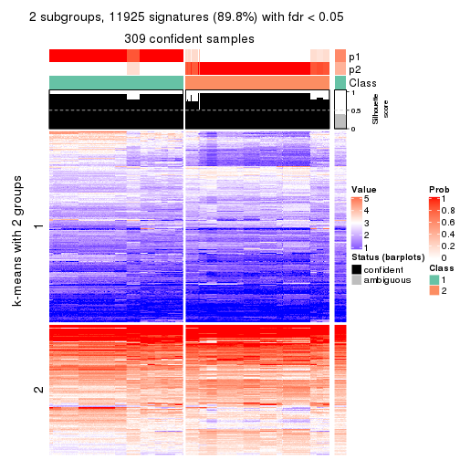</p>

</div>
<div id='tab-ATC-skmeans-get-signatures-no-scale-2'>
<pre><code class="r">get_signatures(res, k = 3, scale_rows = FALSE)
</code></pre>

<p></p>

</div>
<div id='tab-ATC-skmeans-get-signatures-no-scale-3'>
<pre><code class="r">get_signatures(res, k = 4, scale_rows = FALSE)
</code></pre>

<p></p>

</div>
<div id='tab-ATC-skmeans-get-signatures-no-scale-4'>
<pre><code class="r">get_signatures(res, k = 5, scale_rows = FALSE)
</code></pre>

<p></p>

</div>
<div id='tab-ATC-skmeans-get-signatures-no-scale-5'>
<pre><code class="r">get_signatures(res, k = 6, scale_rows = FALSE)
</code></pre>

<p></p>

</div>
</div>


Compare the overlap of signatures from different k:

```r
compare_signatures(res)
```


`get_signature()` returns a data frame invisibly. TO get the list of signatures, the function
call should be assigned to a variable explicitly. In following code, if `plot` argument is set
to `FALSE`, no heatmap is plotted while only the differential analysis is performed.

```r
# code only for demonstration
tb = get_signature(res, k = ..., plot = FALSE)
```

An example of the output of `tb` is:

```
#>   which_row         fdr    mean_1    mean_2 scaled_mean_1 scaled_mean_2 km
#> 1        38 0.042760348  8.373488  9.131774    -0.5533452     0.5164555  1
#> 2        40 0.018707592  7.106213  8.469186    -0.6173731     0.5762149  1
#> 3        55 0.019134737 10.221463 11.207825    -0.6159697     0.5749050  1
#> 4        59 0.006059896  5.921854  7.869574    -0.6899429     0.6439467  1
#> 5        60 0.018055526  8.928898 10.211722    -0.6204761     0.5791110  1
#> 6        98 0.009384629 15.714769 14.887706     0.6635654    -0.6193277  2
...
```

The columns in `tb` are:

1. `which_row`: row indices corresponding to the input matrix.
2. `fdr`: FDR for the differential test. 
3. `mean_x`: The mean value in group x.
4. `scaled_mean_x`: The mean value in group x after rows are scaled.
5. `km`: Row groups if k-means clustering is applied to rows.


UMAP plot which shows how samples are separated.


<script>
$( function() {
	$( '#tabs-ATC-skmeans-dimension-reduction' ).tabs();
} );
</script>
<div id='tabs-ATC-skmeans-dimension-reduction'>
<ul>
<li><a href='#tab-ATC-skmeans-dimension-reduction-1'>k = 2</a></li>
<li><a href='#tab-ATC-skmeans-dimension-reduction-2'>k = 3</a></li>
<li><a href='#tab-ATC-skmeans-dimension-reduction-3'>k = 4</a></li>
<li><a href='#tab-ATC-skmeans-dimension-reduction-4'>k = 5</a></li>
<li><a href='#tab-ATC-skmeans-dimension-reduction-5'>k = 6</a></li>
</ul>
<div id='tab-ATC-skmeans-dimension-reduction-1'>
<pre><code class="r">dimension_reduction(res, k = 2, method = &quot;UMAP&quot;)
</code></pre>

<p></p>

</div>
<div id='tab-ATC-skmeans-dimension-reduction-2'>
<pre><code class="r">dimension_reduction(res, k = 3, method = &quot;UMAP&quot;)
</code></pre>

<p></p>

</div>
<div id='tab-ATC-skmeans-dimension-reduction-3'>
<pre><code class="r">dimension_reduction(res, k = 4, method = &quot;UMAP&quot;)
</code></pre>

<p></p>

</div>
<div id='tab-ATC-skmeans-dimension-reduction-4'>
<pre><code class="r">dimension_reduction(res, k = 5, method = &quot;UMAP&quot;)
</code></pre>

<p></p>

</div>
<div id='tab-ATC-skmeans-dimension-reduction-5'>
<pre><code class="r">dimension_reduction(res, k = 6, method = &quot;UMAP&quot;)
</code></pre>

<p></p>

</div>
</div>


Following heatmap shows how subgroups are split when increasing `k`:

```r
collect_classes(res)
```


If matrix rows can be associated to genes, consider to use `functional_enrichment(res,
...)` to perform function enrichment for the signature genes. See [this vignette](http://bioconductor.org/packages/devel/bioc/vignettes/cola/inst/doc/functional_enrichment.html) for more detailed explanations.


 

---------------------------------------------------


### ATC:pam*


The object with results only for a single top-value method and a single partition method 
can be extracted as:

```r
res = res_list["ATC", "pam"]
# you can also extract it by
# res = res_list["ATC:pam"]
```

A summary of `res` and all the functions that can be applied to it:

```r
res
```

```
#> A 'ConsensusPartition' object with k = 2, 3, 4, 5, 6.
#>   On a matrix with 13278 rows and 322 columns.
#>   Top rows (1000, 2000, 3000, 4000, 5000) are extracted by 'ATC' method.
#>   Subgroups are detected by 'pam' method.
#>   Performed in total 1250 partitions by row resampling.
#>   Best k for subgroups seems to be 6.
#> 
#> Following methods can be applied to this 'ConsensusPartition' object:
#>  [1] "cola_report"             "collect_classes"         "collect_plots"          
#>  [4] "collect_stats"           "colnames"                "compare_signatures"     
#>  [7] "consensus_heatmap"       "dimension_reduction"     "functional_enrichment"  
#> [10] "get_anno_col"            "get_anno"                "get_classes"            
#> [13] "get_consensus"           "get_matrix"              "get_membership"         
#> [16] "get_param"               "get_signatures"          "get_stats"              
#> [19] "is_best_k"               "is_stable_k"             "membership_heatmap"     
#> [22] "ncol"                    "nrow"                    "plot_ecdf"              
#> [25] "rownames"                "select_partition_number" "show"                   
#> [28] "suggest_best_k"          "test_to_known_factors"
```

`collect_plots()` function collects all the plots made from `res` for all `k` (number of partitions)
into one single page to provide an easy and fast comparison between different `k`.

```r
collect_plots(res)
```


The plots are:

- The first row: a plot of the ECDF (empirical cumulative distribution
  function) curves of the consensus matrix for each `k` and the heatmap of
  predicted classes for each `k`.
- The second row: heatmaps of the consensus matrix for each `k`.
- The third row: heatmaps of the membership matrix for each `k`.
- The fouth row: heatmaps of the signatures for each `k`.

All the plots in panels can be made by individual functions and they are
plotted later in this section.

`select_partition_number()` produces several plots showing different
statistics for choosing "optimized" `k`. There are following statistics:

- ECDF curves of the consensus matrix for each `k`;
- 1-PAC. [The PAC
  score](https://en.wikipedia.org/wiki/Consensus_clustering#Over-interpretation_potential_of_consensus_clustering)
  measures the proportion of the ambiguous subgrouping.
- Mean silhouette score.
- Concordance. The mean probability of fiting the consensus class ids in all
  partitions.
- Area increased. Denote $A_k$ as the area under the ECDF curve for current
  `k`, the area increased is defined as $A_k - A_{k-1}$.
- Rand index. The percent of pairs of samples that are both in a same cluster
  or both are not in a same cluster in the partition of k and k-1.
- Jaccard index. The ratio of pairs of samples are both in a same cluster in
  the partition of k and k-1 and the pairs of samples are both in a same
  cluster in the partition k or k-1.

The detailed explanations of these statistics can be found in [the _cola_
vignette](http://bioconductor.org/packages/devel/bioc/vignettes/cola/inst/doc/cola.html#toc_13).

Generally speaking, lower PAC score, higher mean silhouette score or higher
concordance corresponds to better partition. Rand index and Jaccard index
measure how similar the current partition is compared to partition with `k-1`.
If they are too similar, we won't accept `k` is better than `k-1`.

```r
select_partition_number(res)
```


The numeric values for all these statistics can be obtained by `get_stats()`.

```r
get_stats(res)
```

```
#>   k 1-PAC mean_silhouette concordance area_increased  Rand Jaccard
#> 2 2 0.648           0.873       0.923         0.4760 0.524   0.524
#> 3 3 1.000           1.000       1.000         0.3906 0.703   0.488
#> 4 4 0.853           0.896       0.919         0.0886 0.941   0.826
#> 5 5 0.915           0.891       0.940         0.0937 0.934   0.765
#> 6 6 0.925           0.918       0.918         0.0298 0.977   0.894
```

`suggest_best_k()` suggests the best $k$ based on these statistics. The rules are as follows:

- All $k$ with Jaccard index larger than 0.95 are removed because increasing
  $k$ does not provide enough extra information. If all $k$ are removed, it is
  marked as no subgroup is detected.
- For all $k$ with 1-PAC score larger than 0.9, the maximal $k$ is taken as
  the best $k$, and other $k$ are marked as optional $k$.
- If it does not fit the second rule. The $k$ with the maximal vote of the
  highest 1-PAC score, highest mean silhouette, and highest concordance is
  taken as the best $k$.

```r
suggest_best_k(res)
```

```
#> [1] 6
#> attr(,"optional")
#> [1] 3 5
```

There is also optional best $k$ = 3 5 that is worth to check.

Following shows the table of the partitions (You need to click the **show/hide
code output** link to see it). The membership matrix (columns with name `p*`)
is inferred by
[`clue::cl_consensus()`](https://www.rdocumentation.org/link/cl_consensus?package=clue)
function with the `SE` method. Basically the value in the membership matrix
represents the probability to belong to a certain group. The finall class
label for an item is determined with the group with highest probability it
belongs to.

In `get_classes()` function, the entropy is calculated from the membership
matrix and the silhouette score is calculated from the consensus matrix.


<script>
$( function() {
	$( '#tabs-ATC-pam-get-classes' ).tabs();
} );
</script>
<div id='tabs-ATC-pam-get-classes'>
<ul>
<li><a href='#tab-ATC-pam-get-classes-1'>k = 2</a></li>
<li><a href='#tab-ATC-pam-get-classes-2'>k = 3</a></li>
<li><a href='#tab-ATC-pam-get-classes-3'>k = 4</a></li>
<li><a href='#tab-ATC-pam-get-classes-4'>k = 5</a></li>
<li><a href='#tab-ATC-pam-get-classes-5'>k = 6</a></li>
</ul>

<div id='tab-ATC-pam-get-classes-1'>
<p><a id='tab-ATC-pam-get-classes-1-a' style='color:#0366d6' href='#'>show/hide code output</a></p>
<pre><code class="r">cbind(get_classes(res, k = 2), get_membership(res, k = 2))
</code></pre>

<pre><code>#&gt;           class entropy silhouette    p1    p2
#&gt; DRR023371     2   0.921      0.682 0.336 0.664
#&gt; DRR023372     2   0.921      0.682 0.336 0.664
#&gt; DRR023373     2   0.921      0.682 0.336 0.664
#&gt; DRR023374     2   0.921      0.682 0.336 0.664
#&gt; DRR023375     2   0.921      0.682 0.336 0.664
#&gt; DRR023376     2   0.921      0.682 0.336 0.664
#&gt; DRR023377     2   0.921      0.682 0.336 0.664
#&gt; DRR023378     2   0.921      0.682 0.336 0.664
#&gt; DRR023379     1   0.000      1.000 1.000 0.000
#&gt; DRR023380     1   0.000      1.000 1.000 0.000
#&gt; DRR023381     1   0.000      1.000 1.000 0.000
#&gt; DRR023382     1   0.000      1.000 1.000 0.000
#&gt; DRR023383     1   0.000      1.000 1.000 0.000
#&gt; DRR023384     1   0.000      1.000 1.000 0.000
#&gt; DRR023385     1   0.000      1.000 1.000 0.000
#&gt; DRR023386     1   0.000      1.000 1.000 0.000
#&gt; DRR023387     1   0.000      1.000 1.000 0.000
#&gt; DRR023388     1   0.000      1.000 1.000 0.000
#&gt; DRR023389     1   0.000      1.000 1.000 0.000
#&gt; DRR023390     1   0.000      1.000 1.000 0.000
#&gt; DRR023391     1   0.000      1.000 1.000 0.000
#&gt; DRR023392     1   0.000      1.000 1.000 0.000
#&gt; DRR023394     1   0.000      1.000 1.000 0.000
#&gt; DRR023395     1   0.000      1.000 1.000 0.000
#&gt; DRR023396     1   0.000      1.000 1.000 0.000
#&gt; DRR023397     1   0.000      1.000 1.000 0.000
#&gt; DRR023398     1   0.000      1.000 1.000 0.000
#&gt; DRR023399     1   0.000      1.000 1.000 0.000
#&gt; DRR023400     1   0.000      1.000 1.000 0.000
#&gt; DRR023401     1   0.000      1.000 1.000 0.000
#&gt; DRR023402     1   0.000      1.000 1.000 0.000
#&gt; DRR023403     1   0.000      1.000 1.000 0.000
#&gt; DRR023404     2   0.000      0.858 0.000 1.000
#&gt; DRR023405     2   0.000      0.858 0.000 1.000
#&gt; DRR023406     2   0.000      0.858 0.000 1.000
#&gt; DRR023407     2   0.000      0.858 0.000 1.000
#&gt; DRR023408     2   0.000      0.858 0.000 1.000
#&gt; DRR023409     2   0.000      0.858 0.000 1.000
#&gt; DRR023410     2   0.000      0.858 0.000 1.000
#&gt; DRR023411     2   0.000      0.858 0.000 1.000
#&gt; DRR023412     2   0.000      0.858 0.000 1.000
#&gt; DRR023413     2   0.000      0.858 0.000 1.000
#&gt; DRR023414     2   0.000      0.858 0.000 1.000
#&gt; DRR023415     2   0.000      0.858 0.000 1.000
#&gt; DRR023416     2   0.000      0.858 0.000 1.000
#&gt; DRR023417     2   0.000      0.858 0.000 1.000
#&gt; DRR023418     2   0.000      0.858 0.000 1.000
#&gt; DRR023419     2   0.000      0.858 0.000 1.000
#&gt; DRR023420     2   0.000      0.858 0.000 1.000
#&gt; DRR023421     2   0.000      0.858 0.000 1.000
#&gt; DRR023422     2   0.000      0.858 0.000 1.000
#&gt; DRR023423     2   0.000      0.858 0.000 1.000
#&gt; DRR023425     2   0.000      0.858 0.000 1.000
#&gt; DRR023426     2   0.000      0.858 0.000 1.000
#&gt; DRR023427     2   0.000      0.858 0.000 1.000
#&gt; DRR023428     2   0.000      0.858 0.000 1.000
#&gt; DRR023429     2   0.000      0.858 0.000 1.000
#&gt; DRR023430     2   0.000      0.858 0.000 1.000
#&gt; DRR023431     2   0.000      0.858 0.000 1.000
#&gt; DRR023432     2   0.000      0.858 0.000 1.000
#&gt; DRR023433     2   0.000      0.858 0.000 1.000
#&gt; DRR023434     2   0.000      0.858 0.000 1.000
#&gt; DRR023435     2   0.000      0.858 0.000 1.000
#&gt; DRR023436     2   0.000      0.858 0.000 1.000
#&gt; DRR023437     2   0.000      0.858 0.000 1.000
#&gt; DRR023438     2   0.000      0.858 0.000 1.000
#&gt; DRR023439     2   0.000      0.858 0.000 1.000
#&gt; DRR023440     2   0.000      0.858 0.000 1.000
#&gt; DRR023441     2   0.000      0.858 0.000 1.000
#&gt; DRR023442     2   0.000      0.858 0.000 1.000
#&gt; DRR023443     2   0.000      0.858 0.000 1.000
#&gt; DRR023444     2   0.000      0.858 0.000 1.000
#&gt; DRR023445     2   0.000      0.858 0.000 1.000
#&gt; DRR023446     2   0.000      0.858 0.000 1.000
#&gt; DRR023447     2   0.000      0.858 0.000 1.000
#&gt; DRR023448     2   0.000      0.858 0.000 1.000
#&gt; DRR023449     2   0.000      0.858 0.000 1.000
#&gt; DRR023450     2   0.000      0.858 0.000 1.000
#&gt; DRR023451     2   0.000      0.858 0.000 1.000
#&gt; DRR023452     2   0.000      0.858 0.000 1.000
#&gt; DRR023453     1   0.000      1.000 1.000 0.000
#&gt; DRR023454     1   0.000      1.000 1.000 0.000
#&gt; DRR023455     1   0.000      1.000 1.000 0.000
#&gt; DRR023456     1   0.000      1.000 1.000 0.000
#&gt; DRR023457     1   0.000      1.000 1.000 0.000
#&gt; DRR023458     1   0.000      1.000 1.000 0.000
#&gt; DRR023459     1   0.000      1.000 1.000 0.000
#&gt; DRR023460     2   0.925      0.676 0.340 0.660
#&gt; DRR023461     2   0.921      0.682 0.336 0.664
#&gt; DRR023462     2   0.921      0.682 0.336 0.664
#&gt; DRR023463     2   0.921      0.682 0.336 0.664
#&gt; DRR023464     2   0.921      0.682 0.336 0.664
#&gt; DRR023465     2   0.921      0.682 0.336 0.664
#&gt; DRR023466     2   0.921      0.682 0.336 0.664
#&gt; DRR023467     2   0.921      0.682 0.336 0.664
#&gt; DRR023468     2   0.921      0.682 0.336 0.664
#&gt; DRR023469     2   0.921      0.682 0.336 0.664
#&gt; DRR023470     2   0.921      0.682 0.336 0.664
#&gt; DRR023471     2   0.921      0.682 0.336 0.664
#&gt; DRR023472     2   0.921      0.682 0.336 0.664
#&gt; DRR023473     2   0.921      0.682 0.336 0.664
#&gt; DRR023474     2   0.921      0.682 0.336 0.664
#&gt; DRR023475     2   0.921      0.682 0.336 0.664
#&gt; DRR023476     2   0.921      0.682 0.336 0.664
#&gt; DRR023477     2   0.921      0.682 0.336 0.664
#&gt; DRR023478     2   0.921      0.682 0.336 0.664
#&gt; DRR023479     2   0.921      0.682 0.336 0.664
#&gt; DRR023480     2   0.921      0.682 0.336 0.664
#&gt; DRR023481     2   0.921      0.682 0.336 0.664
#&gt; DRR023482     1   0.000      1.000 1.000 0.000
#&gt; DRR023483     1   0.000      1.000 1.000 0.000
#&gt; DRR023484     1   0.000      1.000 1.000 0.000
#&gt; DRR023485     1   0.000      1.000 1.000 0.000
#&gt; DRR023486     1   0.000      1.000 1.000 0.000
#&gt; DRR023487     1   0.000      1.000 1.000 0.000
#&gt; DRR023488     1   0.000      1.000 1.000 0.000
#&gt; DRR023489     1   0.000      1.000 1.000 0.000
#&gt; DRR023490     1   0.000      1.000 1.000 0.000
#&gt; DRR023491     1   0.000      1.000 1.000 0.000
#&gt; DRR023492     1   0.000      1.000 1.000 0.000
#&gt; DRR023493     1   0.000      1.000 1.000 0.000
#&gt; DRR023494     1   0.000      1.000 1.000 0.000
#&gt; DRR023495     1   0.000      1.000 1.000 0.000
#&gt; DRR023496     1   0.000      1.000 1.000 0.000
#&gt; DRR023497     1   0.000      1.000 1.000 0.000
#&gt; DRR023498     1   0.000      1.000 1.000 0.000
#&gt; DRR023499     1   0.000      1.000 1.000 0.000
#&gt; DRR023500     1   0.000      1.000 1.000 0.000
#&gt; DRR023501     1   0.000      1.000 1.000 0.000
#&gt; DRR023502     1   0.000      1.000 1.000 0.000
#&gt; DRR023503     1   0.000      1.000 1.000 0.000
#&gt; DRR023504     1   0.000      1.000 1.000 0.000
#&gt; DRR023505     1   0.000      1.000 1.000 0.000
#&gt; DRR023506     1   0.000      1.000 1.000 0.000
#&gt; DRR023507     1   0.000      1.000 1.000 0.000
#&gt; DRR023508     1   0.000      1.000 1.000 0.000
#&gt; DRR023509     1   0.000      1.000 1.000 0.000
#&gt; DRR023510     1   0.000      1.000 1.000 0.000
#&gt; DRR023511     1   0.000      1.000 1.000 0.000
#&gt; DRR023512     1   0.000      1.000 1.000 0.000
#&gt; DRR023513     1   0.000      1.000 1.000 0.000
#&gt; DRR023514     1   0.000      1.000 1.000 0.000
#&gt; DRR023515     1   0.000      1.000 1.000 0.000
#&gt; DRR023516     1   0.000      1.000 1.000 0.000
#&gt; DRR023517     1   0.000      1.000 1.000 0.000
#&gt; DRR023518     1   0.000      1.000 1.000 0.000
#&gt; DRR023519     1   0.000      1.000 1.000 0.000
#&gt; DRR023520     1   0.000      1.000 1.000 0.000
#&gt; DRR023521     1   0.000      1.000 1.000 0.000
#&gt; DRR023522     1   0.000      1.000 1.000 0.000
#&gt; DRR023523     1   0.000      1.000 1.000 0.000
#&gt; DRR023524     1   0.000      1.000 1.000 0.000
#&gt; DRR023525     1   0.000      1.000 1.000 0.000
#&gt; DRR023526     1   0.000      1.000 1.000 0.000
#&gt; DRR023527     1   0.000      1.000 1.000 0.000
#&gt; DRR023528     1   0.000      1.000 1.000 0.000
#&gt; DRR023529     1   0.000      1.000 1.000 0.000
#&gt; DRR023530     1   0.000      1.000 1.000 0.000
#&gt; DRR023531     1   0.000      1.000 1.000 0.000
#&gt; DRR023532     1   0.000      1.000 1.000 0.000
#&gt; DRR023533     1   0.000      1.000 1.000 0.000
#&gt; DRR023534     1   0.000      1.000 1.000 0.000
#&gt; DRR023535     1   0.000      1.000 1.000 0.000
#&gt; DRR023536     1   0.000      1.000 1.000 0.000
#&gt; DRR023537     1   0.000      1.000 1.000 0.000
#&gt; DRR023538     1   0.000      1.000 1.000 0.000
#&gt; DRR023539     1   0.000      1.000 1.000 0.000
#&gt; DRR023540     1   0.000      1.000 1.000 0.000
#&gt; DRR023541     1   0.000      1.000 1.000 0.000
#&gt; DRR023542     1   0.000      1.000 1.000 0.000
#&gt; DRR023543     1   0.000      1.000 1.000 0.000
#&gt; DRR023544     1   0.000      1.000 1.000 0.000
#&gt; DRR023545     1   0.000      1.000 1.000 0.000
#&gt; DRR023546     1   0.000      1.000 1.000 0.000
#&gt; DRR023547     1   0.000      1.000 1.000 0.000
#&gt; DRR023548     1   0.000      1.000 1.000 0.000
#&gt; DRR023549     1   0.000      1.000 1.000 0.000
#&gt; DRR023550     1   0.000      1.000 1.000 0.000
#&gt; DRR023551     1   0.000      1.000 1.000 0.000
#&gt; DRR023552     1   0.000      1.000 1.000 0.000
#&gt; DRR023553     1   0.000      1.000 1.000 0.000
#&gt; DRR023554     1   0.000      1.000 1.000 0.000
#&gt; DRR023555     1   0.000      1.000 1.000 0.000
#&gt; DRR023556     1   0.000      1.000 1.000 0.000
#&gt; DRR023557     1   0.000      1.000 1.000 0.000
#&gt; DRR023558     1   0.000      1.000 1.000 0.000
#&gt; DRR023559     1   0.000      1.000 1.000 0.000
#&gt; DRR023560     1   0.000      1.000 1.000 0.000
#&gt; DRR023561     1   0.000      1.000 1.000 0.000
#&gt; DRR023562     1   0.000      1.000 1.000 0.000
#&gt; DRR023563     1   0.000      1.000 1.000 0.000
#&gt; DRR023564     1   0.000      1.000 1.000 0.000
#&gt; DRR023565     1   0.000      1.000 1.000 0.000
#&gt; DRR023566     1   0.000      1.000 1.000 0.000
#&gt; DRR023567     1   0.000      1.000 1.000 0.000
#&gt; DRR023568     1   0.000      1.000 1.000 0.000
#&gt; DRR023569     1   0.000      1.000 1.000 0.000
#&gt; DRR023570     1   0.000      1.000 1.000 0.000
#&gt; DRR023571     1   0.000      1.000 1.000 0.000
#&gt; DRR023572     1   0.000      1.000 1.000 0.000
#&gt; DRR023573     1   0.000      1.000 1.000 0.000
#&gt; DRR023574     1   0.000      1.000 1.000 0.000
#&gt; DRR023575     1   0.000      1.000 1.000 0.000
#&gt; DRR023576     2   0.000      0.858 0.000 1.000
#&gt; DRR023577     2   0.000      0.858 0.000 1.000
#&gt; DRR023578     2   0.000      0.858 0.000 1.000
#&gt; DRR023579     2   0.000      0.858 0.000 1.000
#&gt; DRR023580     2   0.000      0.858 0.000 1.000
#&gt; DRR023581     2   0.000      0.858 0.000 1.000
#&gt; DRR023582     2   0.000      0.858 0.000 1.000
#&gt; DRR023583     2   0.000      0.858 0.000 1.000
#&gt; DRR023584     2   0.000      0.858 0.000 1.000
#&gt; DRR023585     2   0.000      0.858 0.000 1.000
#&gt; DRR023586     2   0.000      0.858 0.000 1.000
#&gt; DRR023587     2   0.000      0.858 0.000 1.000
#&gt; DRR023588     2   0.000      0.858 0.000 1.000
#&gt; DRR023589     2   0.000      0.858 0.000 1.000
#&gt; DRR023590     2   0.000      0.858 0.000 1.000
#&gt; DRR023591     2   0.000      0.858 0.000 1.000
#&gt; DRR023592     2   0.000      0.858 0.000 1.000
#&gt; DRR023593     2   0.000      0.858 0.000 1.000
#&gt; DRR023594     2   0.000      0.858 0.000 1.000
#&gt; DRR023595     2   0.000      0.858 0.000 1.000
#&gt; DRR023596     2   0.000      0.858 0.000 1.000
#&gt; DRR023597     2   0.000      0.858 0.000 1.000
#&gt; DRR023598     2   0.000      0.858 0.000 1.000
#&gt; DRR023599     2   0.000      0.858 0.000 1.000
#&gt; DRR023600     2   0.000      0.858 0.000 1.000
#&gt; DRR023601     2   0.000      0.858 0.000 1.000
#&gt; DRR023602     2   0.000      0.858 0.000 1.000
#&gt; DRR023603     2   0.000      0.858 0.000 1.000
#&gt; DRR023604     2   0.000      0.858 0.000 1.000
#&gt; DRR023605     2   0.000      0.858 0.000 1.000
#&gt; DRR023606     2   0.000      0.858 0.000 1.000
#&gt; DRR023607     2   0.000      0.858 0.000 1.000
#&gt; DRR023608     2   0.000      0.858 0.000 1.000
#&gt; DRR023609     2   0.000      0.858 0.000 1.000
#&gt; DRR023610     2   0.000      0.858 0.000 1.000
#&gt; DRR023611     2   0.000      0.858 0.000 1.000
#&gt; DRR023612     2   0.000      0.858 0.000 1.000
#&gt; DRR023613     2   0.000      0.858 0.000 1.000
#&gt; DRR023614     2   0.000      0.858 0.000 1.000
#&gt; DRR023615     2   0.000      0.858 0.000 1.000
#&gt; DRR023616     2   0.000      0.858 0.000 1.000
#&gt; DRR023617     2   0.000      0.858 0.000 1.000
#&gt; DRR023619     2   0.921      0.682 0.336 0.664
#&gt; DRR023620     2   0.921      0.682 0.336 0.664
#&gt; DRR023621     2   0.921      0.682 0.336 0.664
#&gt; DRR023622     2   0.921      0.682 0.336 0.664
#&gt; DRR023623     2   0.921      0.682 0.336 0.664
#&gt; DRR023624     2   0.921      0.682 0.336 0.664
#&gt; DRR023625     2   0.921      0.682 0.336 0.664
#&gt; DRR023626     2   0.921      0.682 0.336 0.664
#&gt; DRR023627     2   0.921      0.682 0.336 0.664
#&gt; DRR023628     2   0.921      0.682 0.336 0.664
#&gt; DRR023629     2   0.921      0.682 0.336 0.664
#&gt; DRR023630     2   0.921      0.682 0.336 0.664
#&gt; DRR023631     2   0.921      0.682 0.336 0.664
#&gt; DRR023632     2   0.921      0.682 0.336 0.664
#&gt; DRR023633     2   0.921      0.682 0.336 0.664
#&gt; DRR023635     2   0.000      0.858 0.000 1.000
#&gt; DRR023636     2   0.000      0.858 0.000 1.000
#&gt; DRR023637     2   0.000      0.858 0.000 1.000
#&gt; DRR023638     2   0.000      0.858 0.000 1.000
#&gt; DRR023639     2   0.000      0.858 0.000 1.000
#&gt; DRR023640     2   0.000      0.858 0.000 1.000
#&gt; DRR023641     2   0.000      0.858 0.000 1.000
#&gt; DRR023642     2   0.000      0.858 0.000 1.000
#&gt; DRR023643     2   0.000      0.858 0.000 1.000
#&gt; DRR023644     2   0.000      0.858 0.000 1.000
#&gt; DRR023645     2   0.000      0.858 0.000 1.000
#&gt; DRR023646     2   0.000      0.858 0.000 1.000
#&gt; DRR023647     2   0.000      0.858 0.000 1.000
#&gt; DRR023648     2   0.000      0.858 0.000 1.000
#&gt; DRR023649     2   0.000      0.858 0.000 1.000
#&gt; DRR023650     2   0.921      0.682 0.336 0.664
#&gt; DRR023651     2   0.921      0.682 0.336 0.664
#&gt; DRR023652     2   0.921      0.682 0.336 0.664
#&gt; DRR023653     2   0.921      0.682 0.336 0.664
#&gt; DRR023654     2   0.921      0.682 0.336 0.664
#&gt; DRR023655     2   0.921      0.682 0.336 0.664
#&gt; DRR023656     2   0.921      0.682 0.336 0.664
#&gt; DRR023657     2   0.921      0.682 0.336 0.664
#&gt; DRR023658     2   0.921      0.682 0.336 0.664
#&gt; DRR023659     2   0.921      0.682 0.336 0.664
#&gt; DRR023660     2   0.921      0.682 0.336 0.664
#&gt; DRR023661     2   0.921      0.682 0.336 0.664
#&gt; DRR023662     2   0.921      0.682 0.336 0.664
#&gt; DRR023663     2   0.921      0.682 0.336 0.664
#&gt; DRR023664     2   0.921      0.682 0.336 0.664
#&gt; DRR023665     2   0.921      0.682 0.336 0.664
#&gt; DRR023666     2   0.921      0.682 0.336 0.664
#&gt; DRR023667     2   0.921      0.682 0.336 0.664
#&gt; DRR023668     2   0.921      0.682 0.336 0.664
#&gt; DRR023669     2   0.921      0.682 0.336 0.664
#&gt; DRR023670     2   0.921      0.682 0.336 0.664
#&gt; DRR023671     2   0.921      0.682 0.336 0.664
#&gt; DRR023672     2   0.921      0.682 0.336 0.664
#&gt; DRR023673     2   0.921      0.682 0.336 0.664
#&gt; DRR023674     2   0.921      0.682 0.336 0.664
#&gt; DRR023675     2   0.921      0.682 0.336 0.664
#&gt; DRR023676     2   0.921      0.682 0.336 0.664
#&gt; DRR023677     2   0.921      0.682 0.336 0.664
#&gt; DRR023678     2   0.921      0.682 0.336 0.664
#&gt; DRR023683     2   0.000      0.858 0.000 1.000
#&gt; DRR023684     2   0.000      0.858 0.000 1.000
#&gt; DRR023685     2   0.000      0.858 0.000 1.000
#&gt; DRR023686     2   0.000      0.858 0.000 1.000
#&gt; DRR023687     2   0.000      0.858 0.000 1.000
#&gt; DRR023688     2   0.000      0.858 0.000 1.000
#&gt; DRR023689     2   0.000      0.858 0.000 1.000
#&gt; DRR023690     2   0.000      0.858 0.000 1.000
#&gt; DRR023691     2   0.000      0.858 0.000 1.000
#&gt; DRR023692     2   0.000      0.858 0.000 1.000
#&gt; DRR023693     2   0.000      0.858 0.000 1.000
#&gt; DRR023694     2   0.000      0.858 0.000 1.000
#&gt; DRR023695     2   0.000      0.858 0.000 1.000
#&gt; DRR023696     2   0.000      0.858 0.000 1.000
#&gt; DRR023697     2   0.000      0.858 0.000 1.000
#&gt; DRR023698     2   0.000      0.858 0.000 1.000
#&gt; DRR023699     2   0.000      0.858 0.000 1.000
#&gt; DRR023700     2   0.000      0.858 0.000 1.000
</code></pre>

<script>
$('#tab-ATC-pam-get-classes-1-a').parent().next().next().hide();
$('#tab-ATC-pam-get-classes-1-a').click(function(){
  $('#tab-ATC-pam-get-classes-1-a').parent().next().next().toggle();
  return(false);
});
</script>
</div>

<div id='tab-ATC-pam-get-classes-2'>
<p><a id='tab-ATC-pam-get-classes-2-a' style='color:#0366d6' href='#'>show/hide code output</a></p>
<pre><code class="r">cbind(get_classes(res, k = 3), get_membership(res, k = 3))
</code></pre>

<pre><code>#&gt;           class entropy silhouette p1 p2 p3
#&gt; DRR023371     3       0          1  0  0  1
#&gt; DRR023372     3       0          1  0  0  1
#&gt; DRR023373     3       0          1  0  0  1
#&gt; DRR023374     3       0          1  0  0  1
#&gt; DRR023375     3       0          1  0  0  1
#&gt; DRR023376     3       0          1  0  0  1
#&gt; DRR023377     3       0          1  0  0  1
#&gt; DRR023378     3       0          1  0  0  1
#&gt; DRR023379     3       0          1  0  0  1
#&gt; DRR023380     3       0          1  0  0  1
#&gt; DRR023381     3       0          1  0  0  1
#&gt; DRR023382     3       0          1  0  0  1
#&gt; DRR023383     3       0          1  0  0  1
#&gt; DRR023384     3       0          1  0  0  1
#&gt; DRR023385     3       0          1  0  0  1
#&gt; DRR023386     3       0          1  0  0  1
#&gt; DRR023387     3       0          1  0  0  1
#&gt; DRR023388     3       0          1  0  0  1
#&gt; DRR023389     3       0          1  0  0  1
#&gt; DRR023390     3       0          1  0  0  1
#&gt; DRR023391     3       0          1  0  0  1
#&gt; DRR023392     3       0          1  0  0  1
#&gt; DRR023394     3       0          1  0  0  1
#&gt; DRR023395     3       0          1  0  0  1
#&gt; DRR023396     3       0          1  0  0  1
#&gt; DRR023397     3       0          1  0  0  1
#&gt; DRR023398     3       0          1  0  0  1
#&gt; DRR023399     3       0          1  0  0  1
#&gt; DRR023400     3       0          1  0  0  1
#&gt; DRR023401     3       0          1  0  0  1
#&gt; DRR023402     3       0          1  0  0  1
#&gt; DRR023403     3       0          1  0  0  1
#&gt; DRR023404     2       0          1  0  1  0
#&gt; DRR023405     2       0          1  0  1  0
#&gt; DRR023406     2       0          1  0  1  0
#&gt; DRR023407     2       0          1  0  1  0
#&gt; DRR023408     2       0          1  0  1  0
#&gt; DRR023409     2       0          1  0  1  0
#&gt; DRR023410     2       0          1  0  1  0
#&gt; DRR023411     2       0          1  0  1  0
#&gt; DRR023412     2       0          1  0  1  0
#&gt; DRR023413     2       0          1  0  1  0
#&gt; DRR023414     2       0          1  0  1  0
#&gt; DRR023415     2       0          1  0  1  0
#&gt; DRR023416     2       0          1  0  1  0
#&gt; DRR023417     2       0          1  0  1  0
#&gt; DRR023418     2       0          1  0  1  0
#&gt; DRR023419     2       0          1  0  1  0
#&gt; DRR023420     2       0          1  0  1  0
#&gt; DRR023421     2       0          1  0  1  0
#&gt; DRR023422     2       0          1  0  1  0
#&gt; DRR023423     2       0          1  0  1  0
#&gt; DRR023425     2       0          1  0  1  0
#&gt; DRR023426     2       0          1  0  1  0
#&gt; DRR023427     2       0          1  0  1  0
#&gt; DRR023428     2       0          1  0  1  0
#&gt; DRR023429     2       0          1  0  1  0
#&gt; DRR023430     2       0          1  0  1  0
#&gt; DRR023431     2       0          1  0  1  0
#&gt; DRR023432     2       0          1  0  1  0
#&gt; DRR023433     2       0          1  0  1  0
#&gt; DRR023434     2       0          1  0  1  0
#&gt; DRR023435     2       0          1  0  1  0
#&gt; DRR023436     2       0          1  0  1  0
#&gt; DRR023437     2       0          1  0  1  0
#&gt; DRR023438     2       0          1  0  1  0
#&gt; DRR023439     2       0          1  0  1  0
#&gt; DRR023440     2       0          1  0  1  0
#&gt; DRR023441     2       0          1  0  1  0
#&gt; DRR023442     2       0          1  0  1  0
#&gt; DRR023443     2       0          1  0  1  0
#&gt; DRR023444     2       0          1  0  1  0
#&gt; DRR023445     2       0          1  0  1  0
#&gt; DRR023446     2       0          1  0  1  0
#&gt; DRR023447     2       0          1  0  1  0
#&gt; DRR023448     2       0          1  0  1  0
#&gt; DRR023449     2       0          1  0  1  0
#&gt; DRR023450     2       0          1  0  1  0
#&gt; DRR023451     2       0          1  0  1  0
#&gt; DRR023452     2       0          1  0  1  0
#&gt; DRR023453     3       0          1  0  0  1
#&gt; DRR023454     3       0          1  0  0  1
#&gt; DRR023455     3       0          1  0  0  1
#&gt; DRR023456     3       0          1  0  0  1
#&gt; DRR023457     3       0          1  0  0  1
#&gt; DRR023458     3       0          1  0  0  1
#&gt; DRR023459     3       0          1  0  0  1
#&gt; DRR023460     3       0          1  0  0  1
#&gt; DRR023461     3       0          1  0  0  1
#&gt; DRR023462     3       0          1  0  0  1
#&gt; DRR023463     3       0          1  0  0  1
#&gt; DRR023464     3       0          1  0  0  1
#&gt; DRR023465     3       0          1  0  0  1
#&gt; DRR023466     3       0          1  0  0  1
#&gt; DRR023467     3       0          1  0  0  1
#&gt; DRR023468     3       0          1  0  0  1
#&gt; DRR023469     3       0          1  0  0  1
#&gt; DRR023470     3       0          1  0  0  1
#&gt; DRR023471     3       0          1  0  0  1
#&gt; DRR023472     3       0          1  0  0  1
#&gt; DRR023473     3       0          1  0  0  1
#&gt; DRR023474     3       0          1  0  0  1
#&gt; DRR023475     3       0          1  0  0  1
#&gt; DRR023476     3       0          1  0  0  1
#&gt; DRR023477     3       0          1  0  0  1
#&gt; DRR023478     3       0          1  0  0  1
#&gt; DRR023479     3       0          1  0  0  1
#&gt; DRR023480     3       0          1  0  0  1
#&gt; DRR023481     3       0          1  0  0  1
#&gt; DRR023482     3       0          1  0  0  1
#&gt; DRR023483     3       0          1  0  0  1
#&gt; DRR023484     3       0          1  0  0  1
#&gt; DRR023485     3       0          1  0  0  1
#&gt; DRR023486     3       0          1  0  0  1
#&gt; DRR023487     3       0          1  0  0  1
#&gt; DRR023488     3       0          1  0  0  1
#&gt; DRR023489     3       0          1  0  0  1
#&gt; DRR023490     1       0          1  1  0  0
#&gt; DRR023491     1       0          1  1  0  0
#&gt; DRR023492     1       0          1  1  0  0
#&gt; DRR023493     1       0          1  1  0  0
#&gt; DRR023494     1       0          1  1  0  0
#&gt; DRR023495     1       0          1  1  0  0
#&gt; DRR023496     1       0          1  1  0  0
#&gt; DRR023497     1       0          1  1  0  0
#&gt; DRR023498     1       0          1  1  0  0
#&gt; DRR023499     1       0          1  1  0  0
#&gt; DRR023500     1       0          1  1  0  0
#&gt; DRR023501     1       0          1  1  0  0
#&gt; DRR023502     1       0          1  1  0  0
#&gt; DRR023503     1       0          1  1  0  0
#&gt; DRR023504     1       0          1  1  0  0
#&gt; DRR023505     1       0          1  1  0  0
#&gt; DRR023506     1       0          1  1  0  0
#&gt; DRR023507     1       0          1  1  0  0
#&gt; DRR023508     1       0          1  1  0  0
#&gt; DRR023509     1       0          1  1  0  0
#&gt; DRR023510     1       0          1  1  0  0
#&gt; DRR023511     1       0          1  1  0  0
#&gt; DRR023512     1       0          1  1  0  0
#&gt; DRR023513     1       0          1  1  0  0
#&gt; DRR023514     1       0          1  1  0  0
#&gt; DRR023515     1       0          1  1  0  0
#&gt; DRR023516     1       0          1  1  0  0
#&gt; DRR023517     1       0          1  1  0  0
#&gt; DRR023518     1       0          1  1  0  0
#&gt; DRR023519     1       0          1  1  0  0
#&gt; DRR023520     1       0          1  1  0  0
#&gt; DRR023521     1       0          1  1  0  0
#&gt; DRR023522     1       0          1  1  0  0
#&gt; DRR023523     1       0          1  1  0  0
#&gt; DRR023524     1       0          1  1  0  0
#&gt; DRR023525     1       0          1  1  0  0
#&gt; DRR023526     1       0          1  1  0  0
#&gt; DRR023527     1       0          1  1  0  0
#&gt; DRR023528     1       0          1  1  0  0
#&gt; DRR023529     1       0          1  1  0  0
#&gt; DRR023530     1       0          1  1  0  0
#&gt; DRR023531     1       0          1  1  0  0
#&gt; DRR023532     1       0          1  1  0  0
#&gt; DRR023533     1       0          1  1  0  0
#&gt; DRR023534     1       0          1  1  0  0
#&gt; DRR023535     1       0          1  1  0  0
#&gt; DRR023536     1       0          1  1  0  0
#&gt; DRR023537     1       0          1  1  0  0
#&gt; DRR023538     1       0          1  1  0  0
#&gt; DRR023539     1       0          1  1  0  0
#&gt; DRR023540     1       0          1  1  0  0
#&gt; DRR023541     1       0          1  1  0  0
#&gt; DRR023542     1       0          1  1  0  0
#&gt; DRR023543     1       0          1  1  0  0
#&gt; DRR023544     1       0          1  1  0  0
#&gt; DRR023545     1       0          1  1  0  0
#&gt; DRR023546     1       0          1  1  0  0
#&gt; DRR023547     1       0          1  1  0  0
#&gt; DRR023548     1       0          1  1  0  0
#&gt; DRR023549     1       0          1  1  0  0
#&gt; DRR023550     1       0          1  1  0  0
#&gt; DRR023551     1       0          1  1  0  0
#&gt; DRR023552     1       0          1  1  0  0
#&gt; DRR023553     1       0          1  1  0  0
#&gt; DRR023554     1       0          1  1  0  0
#&gt; DRR023555     1       0          1  1  0  0
#&gt; DRR023556     1       0          1  1  0  0
#&gt; DRR023557     1       0          1  1  0  0
#&gt; DRR023558     1       0          1  1  0  0
#&gt; DRR023559     1       0          1  1  0  0
#&gt; DRR023560     1       0          1  1  0  0
#&gt; DRR023561     1       0          1  1  0  0
#&gt; DRR023562     1       0          1  1  0  0
#&gt; DRR023563     1       0          1  1  0  0
#&gt; DRR023564     1       0          1  1  0  0
#&gt; DRR023565     1       0          1  1  0  0
#&gt; DRR023566     1       0          1  1  0  0
#&gt; DRR023567     1       0          1  1  0  0
#&gt; DRR023568     1       0          1  1  0  0
#&gt; DRR023569     1       0          1  1  0  0
#&gt; DRR023570     1       0          1  1  0  0
#&gt; DRR023571     1       0          1  1  0  0
#&gt; DRR023572     1       0          1  1  0  0
#&gt; DRR023573     1       0          1  1  0  0
#&gt; DRR023574     1       0          1  1  0  0
#&gt; DRR023575     1       0          1  1  0  0
#&gt; DRR023576     2       0          1  0  1  0
#&gt; DRR023577     2       0          1  0  1  0
#&gt; DRR023578     2       0          1  0  1  0
#&gt; DRR023579     2       0          1  0  1  0
#&gt; DRR023580     2       0          1  0  1  0
#&gt; DRR023581     2       0          1  0  1  0
#&gt; DRR023582     2       0          1  0  1  0
#&gt; DRR023583     2       0          1  0  1  0
#&gt; DRR023584     2       0          1  0  1  0
#&gt; DRR023585     2       0          1  0  1  0
#&gt; DRR023586     2       0          1  0  1  0
#&gt; DRR023587     2       0          1  0  1  0
#&gt; DRR023588     2       0          1  0  1  0
#&gt; DRR023589     2       0          1  0  1  0
#&gt; DRR023590     2       0          1  0  1  0
#&gt; DRR023591     2       0          1  0  1  0
#&gt; DRR023592     2       0          1  0  1  0
#&gt; DRR023593     2       0          1  0  1  0
#&gt; DRR023594     2       0          1  0  1  0
#&gt; DRR023595     2       0          1  0  1  0
#&gt; DRR023596     2       0          1  0  1  0
#&gt; DRR023597     2       0          1  0  1  0
#&gt; DRR023598     2       0          1  0  1  0
#&gt; DRR023599     2       0          1  0  1  0
#&gt; DRR023600     2       0          1  0  1  0
#&gt; DRR023601     2       0          1  0  1  0
#&gt; DRR023602     2       0          1  0  1  0
#&gt; DRR023603     2       0          1  0  1  0
#&gt; DRR023604     2       0          1  0  1  0
#&gt; DRR023605     2       0          1  0  1  0
#&gt; DRR023606     2       0          1  0  1  0
#&gt; DRR023607     2       0          1  0  1  0
#&gt; DRR023608     2       0          1  0  1  0
#&gt; DRR023609     2       0          1  0  1  0
#&gt; DRR023610     2       0          1  0  1  0
#&gt; DRR023611     2       0          1  0  1  0
#&gt; DRR023612     2       0          1  0  1  0
#&gt; DRR023613     2       0          1  0  1  0
#&gt; DRR023614     2       0          1  0  1  0
#&gt; DRR023615     2       0          1  0  1  0
#&gt; DRR023616     2       0          1  0  1  0
#&gt; DRR023617     2       0          1  0  1  0
#&gt; DRR023619     3       0          1  0  0  1
#&gt; DRR023620     3       0          1  0  0  1
#&gt; DRR023621     3       0          1  0  0  1
#&gt; DRR023622     3       0          1  0  0  1
#&gt; DRR023623     3       0          1  0  0  1
#&gt; DRR023624     3       0          1  0  0  1
#&gt; DRR023625     3       0          1  0  0  1
#&gt; DRR023626     3       0          1  0  0  1
#&gt; DRR023627     3       0          1  0  0  1
#&gt; DRR023628     3       0          1  0  0  1
#&gt; DRR023629     3       0          1  0  0  1
#&gt; DRR023630     3       0          1  0  0  1
#&gt; DRR023631     3       0          1  0  0  1
#&gt; DRR023632     3       0          1  0  0  1
#&gt; DRR023633     3       0          1  0  0  1
#&gt; DRR023635     2       0          1  0  1  0
#&gt; DRR023636     2       0          1  0  1  0
#&gt; DRR023637     2       0          1  0  1  0
#&gt; DRR023638     2       0          1  0  1  0
#&gt; DRR023639     2       0          1  0  1  0
#&gt; DRR023640     2       0          1  0  1  0
#&gt; DRR023641     2       0          1  0  1  0
#&gt; DRR023642     2       0          1  0  1  0
#&gt; DRR023643     2       0          1  0  1  0
#&gt; DRR023644     2       0          1  0  1  0
#&gt; DRR023645     2       0          1  0  1  0
#&gt; DRR023646     2       0          1  0  1  0
#&gt; DRR023647     2       0          1  0  1  0
#&gt; DRR023648     2       0          1  0  1  0
#&gt; DRR023649     2       0          1  0  1  0
#&gt; DRR023650     3       0          1  0  0  1
#&gt; DRR023651     3       0          1  0  0  1
#&gt; DRR023652     3       0          1  0  0  1
#&gt; DRR023653     3       0          1  0  0  1
#&gt; DRR023654     3       0          1  0  0  1
#&gt; DRR023655     3       0          1  0  0  1
#&gt; DRR023656     3       0          1  0  0  1
#&gt; DRR023657     3       0          1  0  0  1
#&gt; DRR023658     3       0          1  0  0  1
#&gt; DRR023659     3       0          1  0  0  1
#&gt; DRR023660     3       0          1  0  0  1
#&gt; DRR023661     3       0          1  0  0  1
#&gt; DRR023662     3       0          1  0  0  1
#&gt; DRR023663     3       0          1  0  0  1
#&gt; DRR023664     3       0          1  0  0  1
#&gt; DRR023665     3       0          1  0  0  1
#&gt; DRR023666     3       0          1  0  0  1
#&gt; DRR023667     3       0          1  0  0  1
#&gt; DRR023668     3       0          1  0  0  1
#&gt; DRR023669     3       0          1  0  0  1
#&gt; DRR023670     3       0          1  0  0  1
#&gt; DRR023671     3       0          1  0  0  1
#&gt; DRR023672     3       0          1  0  0  1
#&gt; DRR023673     3       0          1  0  0  1
#&gt; DRR023674     3       0          1  0  0  1
#&gt; DRR023675     3       0          1  0  0  1
#&gt; DRR023676     3       0          1  0  0  1
#&gt; DRR023677     3       0          1  0  0  1
#&gt; DRR023678     3       0          1  0  0  1
#&gt; DRR023683     2       0          1  0  1  0
#&gt; DRR023684     2       0          1  0  1  0
#&gt; DRR023685     2       0          1  0  1  0
#&gt; DRR023686     2       0          1  0  1  0
#&gt; DRR023687     2       0          1  0  1  0
#&gt; DRR023688     2       0          1  0  1  0
#&gt; DRR023689     2       0          1  0  1  0
#&gt; DRR023690     2       0          1  0  1  0
#&gt; DRR023691     2       0          1  0  1  0
#&gt; DRR023692     2       0          1  0  1  0
#&gt; DRR023693     2       0          1  0  1  0
#&gt; DRR023694     2       0          1  0  1  0
#&gt; DRR023695     2       0          1  0  1  0
#&gt; DRR023696     2       0          1  0  1  0
#&gt; DRR023697     2       0          1  0  1  0
#&gt; DRR023698     2       0          1  0  1  0
#&gt; DRR023699     2       0          1  0  1  0
#&gt; DRR023700     2       0          1  0  1  0
</code></pre>

<script>
$('#tab-ATC-pam-get-classes-2-a').parent().next().next().hide();
$('#tab-ATC-pam-get-classes-2-a').click(function(){
  $('#tab-ATC-pam-get-classes-2-a').parent().next().next().toggle();
  return(false);
});
</script>
</div>

<div id='tab-ATC-pam-get-classes-3'>
<p><a id='tab-ATC-pam-get-classes-3-a' style='color:#0366d6' href='#'>show/hide code output</a></p>
<pre><code class="r">cbind(get_classes(res, k = 4), get_membership(res, k = 4))
</code></pre>

<pre><code>#&gt;           class entropy silhouette p1    p2    p3    p4
#&gt; DRR023371     3   0.485      0.474  0 0.000 0.600 0.400
#&gt; DRR023372     3   0.485      0.474  0 0.000 0.600 0.400
#&gt; DRR023373     3   0.485      0.474  0 0.000 0.600 0.400
#&gt; DRR023374     3   0.485      0.474  0 0.000 0.600 0.400
#&gt; DRR023375     3   0.485      0.474  0 0.000 0.600 0.400
#&gt; DRR023376     3   0.485      0.474  0 0.000 0.600 0.400
#&gt; DRR023377     3   0.485      0.474  0 0.000 0.600 0.400
#&gt; DRR023378     3   0.485      0.474  0 0.000 0.600 0.400
#&gt; DRR023379     3   0.000      0.754  0 0.000 1.000 0.000
#&gt; DRR023380     3   0.000      0.754  0 0.000 1.000 0.000
#&gt; DRR023381     3   0.000      0.754  0 0.000 1.000 0.000
#&gt; DRR023382     3   0.000      0.754  0 0.000 1.000 0.000
#&gt; DRR023383     3   0.000      0.754  0 0.000 1.000 0.000
#&gt; DRR023384     3   0.000      0.754  0 0.000 1.000 0.000
#&gt; DRR023385     3   0.000      0.754  0 0.000 1.000 0.000
#&gt; DRR023386     3   0.000      0.754  0 0.000 1.000 0.000
#&gt; DRR023387     3   0.000      0.754  0 0.000 1.000 0.000
#&gt; DRR023388     3   0.000      0.754  0 0.000 1.000 0.000
#&gt; DRR023389     3   0.000      0.754  0 0.000 1.000 0.000
#&gt; DRR023390     3   0.000      0.754  0 0.000 1.000 0.000
#&gt; DRR023391     3   0.000      0.754  0 0.000 1.000 0.000
#&gt; DRR023392     3   0.000      0.754  0 0.000 1.000 0.000
#&gt; DRR023394     3   0.000      0.754  0 0.000 1.000 0.000
#&gt; DRR023395     3   0.000      0.754  0 0.000 1.000 0.000
#&gt; DRR023396     3   0.000      0.754  0 0.000 1.000 0.000
#&gt; DRR023397     3   0.000      0.754  0 0.000 1.000 0.000
#&gt; DRR023398     3   0.000      0.754  0 0.000 1.000 0.000
#&gt; DRR023399     3   0.000      0.754  0 0.000 1.000 0.000
#&gt; DRR023400     3   0.000      0.754  0 0.000 1.000 0.000
#&gt; DRR023401     3   0.000      0.754  0 0.000 1.000 0.000
#&gt; DRR023402     3   0.000      0.754  0 0.000 1.000 0.000
#&gt; DRR023403     3   0.000      0.754  0 0.000 1.000 0.000
#&gt; DRR023404     2   0.000      0.951  0 1.000 0.000 0.000
#&gt; DRR023405     2   0.000      0.951  0 1.000 0.000 0.000
#&gt; DRR023406     2   0.000      0.951  0 1.000 0.000 0.000
#&gt; DRR023407     2   0.000      0.951  0 1.000 0.000 0.000
#&gt; DRR023408     2   0.000      0.951  0 1.000 0.000 0.000
#&gt; DRR023409     2   0.000      0.951  0 1.000 0.000 0.000
#&gt; DRR023410     2   0.000      0.951  0 1.000 0.000 0.000
#&gt; DRR023411     2   0.000      0.951  0 1.000 0.000 0.000
#&gt; DRR023412     2   0.000      0.951  0 1.000 0.000 0.000
#&gt; DRR023413     2   0.000      0.951  0 1.000 0.000 0.000
#&gt; DRR023414     2   0.000      0.951  0 1.000 0.000 0.000
#&gt; DRR023415     2   0.000      0.951  0 1.000 0.000 0.000
#&gt; DRR023416     2   0.000      0.951  0 1.000 0.000 0.000
#&gt; DRR023417     2   0.000      0.951  0 1.000 0.000 0.000
#&gt; DRR023418     2   0.000      0.951  0 1.000 0.000 0.000
#&gt; DRR023419     2   0.000      0.951  0 1.000 0.000 0.000
#&gt; DRR023420     2   0.000      0.951  0 1.000 0.000 0.000
#&gt; DRR023421     2   0.000      0.951  0 1.000 0.000 0.000
#&gt; DRR023422     2   0.000      0.951  0 1.000 0.000 0.000
#&gt; DRR023423     2   0.000      0.951  0 1.000 0.000 0.000
#&gt; DRR023425     2   0.000      0.951  0 1.000 0.000 0.000
#&gt; DRR023426     2   0.000      0.951  0 1.000 0.000 0.000
#&gt; DRR023427     2   0.000      0.951  0 1.000 0.000 0.000
#&gt; DRR023428     2   0.000      0.951  0 1.000 0.000 0.000
#&gt; DRR023429     2   0.000      0.951  0 1.000 0.000 0.000
#&gt; DRR023430     2   0.000      0.951  0 1.000 0.000 0.000
#&gt; DRR023431     2   0.000      0.951  0 1.000 0.000 0.000
#&gt; DRR023432     2   0.000      0.951  0 1.000 0.000 0.000
#&gt; DRR023433     2   0.000      0.951  0 1.000 0.000 0.000
#&gt; DRR023434     2   0.000      0.951  0 1.000 0.000 0.000
#&gt; DRR023435     2   0.000      0.951  0 1.000 0.000 0.000
#&gt; DRR023436     2   0.000      0.951  0 1.000 0.000 0.000
#&gt; DRR023437     2   0.000      0.951  0 1.000 0.000 0.000
#&gt; DRR023438     2   0.000      0.951  0 1.000 0.000 0.000
#&gt; DRR023439     2   0.000      0.951  0 1.000 0.000 0.000
#&gt; DRR023440     2   0.000      0.951  0 1.000 0.000 0.000
#&gt; DRR023441     2   0.000      0.951  0 1.000 0.000 0.000
#&gt; DRR023442     2   0.000      0.951  0 1.000 0.000 0.000
#&gt; DRR023443     2   0.000      0.951  0 1.000 0.000 0.000
#&gt; DRR023444     2   0.000      0.951  0 1.000 0.000 0.000
#&gt; DRR023445     2   0.000      0.951  0 1.000 0.000 0.000
#&gt; DRR023446     2   0.000      0.951  0 1.000 0.000 0.000
#&gt; DRR023447     2   0.000      0.951  0 1.000 0.000 0.000
#&gt; DRR023448     2   0.000      0.951  0 1.000 0.000 0.000
#&gt; DRR023449     2   0.000      0.951  0 1.000 0.000 0.000
#&gt; DRR023450     2   0.000      0.951  0 1.000 0.000 0.000
#&gt; DRR023451     2   0.000      0.951  0 1.000 0.000 0.000
#&gt; DRR023452     2   0.000      0.951  0 1.000 0.000 0.000
#&gt; DRR023453     3   0.000      0.754  0 0.000 1.000 0.000
#&gt; DRR023454     3   0.000      0.754  0 0.000 1.000 0.000
#&gt; DRR023455     3   0.000      0.754  0 0.000 1.000 0.000
#&gt; DRR023456     3   0.000      0.754  0 0.000 1.000 0.000
#&gt; DRR023457     3   0.000      0.754  0 0.000 1.000 0.000
#&gt; DRR023458     3   0.000      0.754  0 0.000 1.000 0.000
#&gt; DRR023459     3   0.000      0.754  0 0.000 1.000 0.000
#&gt; DRR023460     3   0.484      0.478  0 0.000 0.604 0.396
#&gt; DRR023461     3   0.485      0.474  0 0.000 0.600 0.400
#&gt; DRR023462     3   0.485      0.474  0 0.000 0.600 0.400
#&gt; DRR023463     3   0.485      0.474  0 0.000 0.600 0.400
#&gt; DRR023464     3   0.485      0.474  0 0.000 0.600 0.400
#&gt; DRR023465     3   0.485      0.474  0 0.000 0.600 0.400
#&gt; DRR023466     3   0.485      0.474  0 0.000 0.600 0.400
#&gt; DRR023467     3   0.485      0.474  0 0.000 0.600 0.400
#&gt; DRR023468     3   0.485      0.474  0 0.000 0.600 0.400
#&gt; DRR023469     3   0.485      0.474  0 0.000 0.600 0.400
#&gt; DRR023470     3   0.485      0.474  0 0.000 0.600 0.400
#&gt; DRR023471     3   0.485      0.474  0 0.000 0.600 0.400
#&gt; DRR023472     3   0.485      0.474  0 0.000 0.600 0.400
#&gt; DRR023473     3   0.485      0.474  0 0.000 0.600 0.400
#&gt; DRR023474     3   0.485      0.474  0 0.000 0.600 0.400
#&gt; DRR023475     3   0.485      0.474  0 0.000 0.600 0.400
#&gt; DRR023476     3   0.485      0.474  0 0.000 0.600 0.400
#&gt; DRR023477     3   0.485      0.474  0 0.000 0.600 0.400
#&gt; DRR023478     3   0.485      0.474  0 0.000 0.600 0.400
#&gt; DRR023479     3   0.485      0.474  0 0.000 0.600 0.400
#&gt; DRR023480     3   0.485      0.474  0 0.000 0.600 0.400
#&gt; DRR023481     3   0.485      0.474  0 0.000 0.600 0.400
#&gt; DRR023482     3   0.000      0.754  0 0.000 1.000 0.000
#&gt; DRR023483     3   0.000      0.754  0 0.000 1.000 0.000
#&gt; DRR023484     3   0.000      0.754  0 0.000 1.000 0.000
#&gt; DRR023485     3   0.000      0.754  0 0.000 1.000 0.000
#&gt; DRR023486     3   0.000      0.754  0 0.000 1.000 0.000
#&gt; DRR023487     3   0.000      0.754  0 0.000 1.000 0.000
#&gt; DRR023488     3   0.000      0.754  0 0.000 1.000 0.000
#&gt; DRR023489     3   0.000      0.754  0 0.000 1.000 0.000
#&gt; DRR023490     1   0.000      1.000  1 0.000 0.000 0.000
#&gt; DRR023491     1   0.000      1.000  1 0.000 0.000 0.000
#&gt; DRR023492     1   0.000      1.000  1 0.000 0.000 0.000
#&gt; DRR023493     1   0.000      1.000  1 0.000 0.000 0.000
#&gt; DRR023494     1   0.000      1.000  1 0.000 0.000 0.000
#&gt; DRR023495     1   0.000      1.000  1 0.000 0.000 0.000
#&gt; DRR023496     1   0.000      1.000  1 0.000 0.000 0.000
#&gt; DRR023497     1   0.000      1.000  1 0.000 0.000 0.000
#&gt; DRR023498     1   0.000      1.000  1 0.000 0.000 0.000
#&gt; DRR023499     1   0.000      1.000  1 0.000 0.000 0.000
#&gt; DRR023500     1   0.000      1.000  1 0.000 0.000 0.000
#&gt; DRR023501     1   0.000      1.000  1 0.000 0.000 0.000
#&gt; DRR023502     1   0.000      1.000  1 0.000 0.000 0.000
#&gt; DRR023503     1   0.000      1.000  1 0.000 0.000 0.000
#&gt; DRR023504     1   0.000      1.000  1 0.000 0.000 0.000
#&gt; DRR023505     1   0.000      1.000  1 0.000 0.000 0.000
#&gt; DRR023506     1   0.000      1.000  1 0.000 0.000 0.000
#&gt; DRR023507     1   0.000      1.000  1 0.000 0.000 0.000
#&gt; DRR023508     1   0.000      1.000  1 0.000 0.000 0.000
#&gt; DRR023509     1   0.000      1.000  1 0.000 0.000 0.000
#&gt; DRR023510     1   0.000      1.000  1 0.000 0.000 0.000
#&gt; DRR023511     1   0.000      1.000  1 0.000 0.000 0.000
#&gt; DRR023512     1   0.000      1.000  1 0.000 0.000 0.000
#&gt; DRR023513     1   0.000      1.000  1 0.000 0.000 0.000
#&gt; DRR023514     1   0.000      1.000  1 0.000 0.000 0.000
#&gt; DRR023515     1   0.000      1.000  1 0.000 0.000 0.000
#&gt; DRR023516     1   0.000      1.000  1 0.000 0.000 0.000
#&gt; DRR023517     1   0.000      1.000  1 0.000 0.000 0.000
#&gt; DRR023518     1   0.000      1.000  1 0.000 0.000 0.000
#&gt; DRR023519     1   0.000      1.000  1 0.000 0.000 0.000
#&gt; DRR023520     1   0.000      1.000  1 0.000 0.000 0.000
#&gt; DRR023521     1   0.000      1.000  1 0.000 0.000 0.000
#&gt; DRR023522     1   0.000      1.000  1 0.000 0.000 0.000
#&gt; DRR023523     1   0.000      1.000  1 0.000 0.000 0.000
#&gt; DRR023524     1   0.000      1.000  1 0.000 0.000 0.000
#&gt; DRR023525     1   0.000      1.000  1 0.000 0.000 0.000
#&gt; DRR023526     1   0.000      1.000  1 0.000 0.000 0.000
#&gt; DRR023527     1   0.000      1.000  1 0.000 0.000 0.000
#&gt; DRR023528     1   0.000      1.000  1 0.000 0.000 0.000
#&gt; DRR023529     1   0.000      1.000  1 0.000 0.000 0.000
#&gt; DRR023530     1   0.000      1.000  1 0.000 0.000 0.000
#&gt; DRR023531     1   0.000      1.000  1 0.000 0.000 0.000
#&gt; DRR023532     1   0.000      1.000  1 0.000 0.000 0.000
#&gt; DRR023533     1   0.000      1.000  1 0.000 0.000 0.000
#&gt; DRR023534     1   0.000      1.000  1 0.000 0.000 0.000
#&gt; DRR023535     1   0.000      1.000  1 0.000 0.000 0.000
#&gt; DRR023536     1   0.000      1.000  1 0.000 0.000 0.000
#&gt; DRR023537     1   0.000      1.000  1 0.000 0.000 0.000
#&gt; DRR023538     1   0.000      1.000  1 0.000 0.000 0.000
#&gt; DRR023539     1   0.000      1.000  1 0.000 0.000 0.000
#&gt; DRR023540     1   0.000      1.000  1 0.000 0.000 0.000
#&gt; DRR023541     1   0.000      1.000  1 0.000 0.000 0.000
#&gt; DRR023542     1   0.000      1.000  1 0.000 0.000 0.000
#&gt; DRR023543     1   0.000      1.000  1 0.000 0.000 0.000
#&gt; DRR023544     1   0.000      1.000  1 0.000 0.000 0.000
#&gt; DRR023545     1   0.000      1.000  1 0.000 0.000 0.000
#&gt; DRR023546     1   0.000      1.000  1 0.000 0.000 0.000
#&gt; DRR023547     1   0.000      1.000  1 0.000 0.000 0.000
#&gt; DRR023548     1   0.000      1.000  1 0.000 0.000 0.000
#&gt; DRR023549     1   0.000      1.000  1 0.000 0.000 0.000
#&gt; DRR023550     1   0.000      1.000  1 0.000 0.000 0.000
#&gt; DRR023551     1   0.000      1.000  1 0.000 0.000 0.000
#&gt; DRR023552     1   0.000      1.000  1 0.000 0.000 0.000
#&gt; DRR023553     1   0.000      1.000  1 0.000 0.000 0.000
#&gt; DRR023554     1   0.000      1.000  1 0.000 0.000 0.000
#&gt; DRR023555     1   0.000      1.000  1 0.000 0.000 0.000
#&gt; DRR023556     1   0.000      1.000  1 0.000 0.000 0.000
#&gt; DRR023557     1   0.000      1.000  1 0.000 0.000 0.000
#&gt; DRR023558     1   0.000      1.000  1 0.000 0.000 0.000
#&gt; DRR023559     1   0.000      1.000  1 0.000 0.000 0.000
#&gt; DRR023560     1   0.000      1.000  1 0.000 0.000 0.000
#&gt; DRR023561     1   0.000      1.000  1 0.000 0.000 0.000
#&gt; DRR023562     1   0.000      1.000  1 0.000 0.000 0.000
#&gt; DRR023563     1   0.000      1.000  1 0.000 0.000 0.000
#&gt; DRR023564     1   0.000      1.000  1 0.000 0.000 0.000
#&gt; DRR023565     1   0.000      1.000  1 0.000 0.000 0.000
#&gt; DRR023566     1   0.000      1.000  1 0.000 0.000 0.000
#&gt; DRR023567     1   0.000      1.000  1 0.000 0.000 0.000
#&gt; DRR023568     1   0.000      1.000  1 0.000 0.000 0.000
#&gt; DRR023569     1   0.000      1.000  1 0.000 0.000 0.000
#&gt; DRR023570     1   0.000      1.000  1 0.000 0.000 0.000
#&gt; DRR023571     1   0.000      1.000  1 0.000 0.000 0.000
#&gt; DRR023572     1   0.000      1.000  1 0.000 0.000 0.000
#&gt; DRR023573     1   0.000      1.000  1 0.000 0.000 0.000
#&gt; DRR023574     1   0.000      1.000  1 0.000 0.000 0.000
#&gt; DRR023575     1   0.000      1.000  1 0.000 0.000 0.000
#&gt; DRR023576     2   0.322      0.902  0 0.836 0.000 0.164
#&gt; DRR023577     2   0.322      0.902  0 0.836 0.000 0.164
#&gt; DRR023578     2   0.322      0.902  0 0.836 0.000 0.164
#&gt; DRR023579     2   0.322      0.902  0 0.836 0.000 0.164
#&gt; DRR023580     2   0.322      0.902  0 0.836 0.000 0.164
#&gt; DRR023581     2   0.322      0.902  0 0.836 0.000 0.164
#&gt; DRR023582     2   0.322      0.902  0 0.836 0.000 0.164
#&gt; DRR023583     2   0.322      0.902  0 0.836 0.000 0.164
#&gt; DRR023584     2   0.322      0.902  0 0.836 0.000 0.164
#&gt; DRR023585     2   0.322      0.902  0 0.836 0.000 0.164
#&gt; DRR023586     2   0.322      0.902  0 0.836 0.000 0.164
#&gt; DRR023587     2   0.322      0.902  0 0.836 0.000 0.164
#&gt; DRR023588     2   0.322      0.902  0 0.836 0.000 0.164
#&gt; DRR023589     2   0.322      0.902  0 0.836 0.000 0.164
#&gt; DRR023590     2   0.322      0.902  0 0.836 0.000 0.164
#&gt; DRR023591     2   0.322      0.902  0 0.836 0.000 0.164
#&gt; DRR023592     2   0.322      0.902  0 0.836 0.000 0.164
#&gt; DRR023593     2   0.322      0.902  0 0.836 0.000 0.164
#&gt; DRR023594     2   0.322      0.902  0 0.836 0.000 0.164
#&gt; DRR023595     2   0.322      0.902  0 0.836 0.000 0.164
#&gt; DRR023596     2   0.322      0.902  0 0.836 0.000 0.164
#&gt; DRR023597     2   0.322      0.902  0 0.836 0.000 0.164
#&gt; DRR023598     2   0.322      0.902  0 0.836 0.000 0.164
#&gt; DRR023599     2   0.322      0.902  0 0.836 0.000 0.164
#&gt; DRR023600     2   0.322      0.902  0 0.836 0.000 0.164
#&gt; DRR023601     2   0.322      0.902  0 0.836 0.000 0.164
#&gt; DRR023602     2   0.322      0.902  0 0.836 0.000 0.164
#&gt; DRR023603     2   0.322      0.902  0 0.836 0.000 0.164
#&gt; DRR023604     2   0.322      0.902  0 0.836 0.000 0.164
#&gt; DRR023605     2   0.322      0.902  0 0.836 0.000 0.164
#&gt; DRR023606     2   0.322      0.902  0 0.836 0.000 0.164
#&gt; DRR023607     2   0.322      0.902  0 0.836 0.000 0.164
#&gt; DRR023608     2   0.322      0.902  0 0.836 0.000 0.164
#&gt; DRR023609     2   0.322      0.902  0 0.836 0.000 0.164
#&gt; DRR023610     2   0.322      0.902  0 0.836 0.000 0.164
#&gt; DRR023611     2   0.322      0.902  0 0.836 0.000 0.164
#&gt; DRR023612     2   0.322      0.902  0 0.836 0.000 0.164
#&gt; DRR023613     2   0.322      0.902  0 0.836 0.000 0.164
#&gt; DRR023614     2   0.322      0.902  0 0.836 0.000 0.164
#&gt; DRR023615     2   0.322      0.902  0 0.836 0.000 0.164
#&gt; DRR023616     2   0.322      0.902  0 0.836 0.000 0.164
#&gt; DRR023617     2   0.322      0.902  0 0.836 0.000 0.164
#&gt; DRR023619     4   0.322      1.000  0 0.000 0.164 0.836
#&gt; DRR023620     4   0.322      1.000  0 0.000 0.164 0.836
#&gt; DRR023621     4   0.322      1.000  0 0.000 0.164 0.836
#&gt; DRR023622     4   0.322      1.000  0 0.000 0.164 0.836
#&gt; DRR023623     4   0.322      1.000  0 0.000 0.164 0.836
#&gt; DRR023624     4   0.322      1.000  0 0.000 0.164 0.836
#&gt; DRR023625     4   0.322      1.000  0 0.000 0.164 0.836
#&gt; DRR023626     4   0.322      1.000  0 0.000 0.164 0.836
#&gt; DRR023627     4   0.322      1.000  0 0.000 0.164 0.836
#&gt; DRR023628     4   0.322      1.000  0 0.000 0.164 0.836
#&gt; DRR023629     4   0.322      1.000  0 0.000 0.164 0.836
#&gt; DRR023630     4   0.322      1.000  0 0.000 0.164 0.836
#&gt; DRR023631     4   0.322      1.000  0 0.000 0.164 0.836
#&gt; DRR023632     4   0.322      1.000  0 0.000 0.164 0.836
#&gt; DRR023633     4   0.322      1.000  0 0.000 0.164 0.836
#&gt; DRR023635     2   0.000      0.951  0 1.000 0.000 0.000
#&gt; DRR023636     2   0.000      0.951  0 1.000 0.000 0.000
#&gt; DRR023637     2   0.000      0.951  0 1.000 0.000 0.000
#&gt; DRR023638     2   0.000      0.951  0 1.000 0.000 0.000
#&gt; DRR023639     2   0.000      0.951  0 1.000 0.000 0.000
#&gt; DRR023640     2   0.000      0.951  0 1.000 0.000 0.000
#&gt; DRR023641     2   0.000      0.951  0 1.000 0.000 0.000
#&gt; DRR023642     2   0.000      0.951  0 1.000 0.000 0.000
#&gt; DRR023643     2   0.000      0.951  0 1.000 0.000 0.000
#&gt; DRR023644     2   0.000      0.951  0 1.000 0.000 0.000
#&gt; DRR023645     2   0.000      0.951  0 1.000 0.000 0.000
#&gt; DRR023646     2   0.000      0.951  0 1.000 0.000 0.000
#&gt; DRR023647     2   0.000      0.951  0 1.000 0.000 0.000
#&gt; DRR023648     2   0.000      0.951  0 1.000 0.000 0.000
#&gt; DRR023649     2   0.000      0.951  0 1.000 0.000 0.000
#&gt; DRR023650     4   0.322      1.000  0 0.000 0.164 0.836
#&gt; DRR023651     4   0.322      1.000  0 0.000 0.164 0.836
#&gt; DRR023652     4   0.322      1.000  0 0.000 0.164 0.836
#&gt; DRR023653     4   0.322      1.000  0 0.000 0.164 0.836
#&gt; DRR023654     4   0.322      1.000  0 0.000 0.164 0.836
#&gt; DRR023655     4   0.322      1.000  0 0.000 0.164 0.836
#&gt; DRR023656     4   0.322      1.000  0 0.000 0.164 0.836
#&gt; DRR023657     4   0.322      1.000  0 0.000 0.164 0.836
#&gt; DRR023658     4   0.322      1.000  0 0.000 0.164 0.836
#&gt; DRR023659     4   0.322      1.000  0 0.000 0.164 0.836
#&gt; DRR023660     4   0.322      1.000  0 0.000 0.164 0.836
#&gt; DRR023661     4   0.322      1.000  0 0.000 0.164 0.836
#&gt; DRR023662     4   0.322      1.000  0 0.000 0.164 0.836
#&gt; DRR023663     4   0.322      1.000  0 0.000 0.164 0.836
#&gt; DRR023664     4   0.322      1.000  0 0.000 0.164 0.836
#&gt; DRR023665     4   0.322      1.000  0 0.000 0.164 0.836
#&gt; DRR023666     4   0.322      1.000  0 0.000 0.164 0.836
#&gt; DRR023667     4   0.322      1.000  0 0.000 0.164 0.836
#&gt; DRR023668     4   0.322      1.000  0 0.000 0.164 0.836
#&gt; DRR023669     4   0.322      1.000  0 0.000 0.164 0.836
#&gt; DRR023670     4   0.322      1.000  0 0.000 0.164 0.836
#&gt; DRR023671     4   0.322      1.000  0 0.000 0.164 0.836
#&gt; DRR023672     4   0.322      1.000  0 0.000 0.164 0.836
#&gt; DRR023673     4   0.322      1.000  0 0.000 0.164 0.836
#&gt; DRR023674     4   0.322      1.000  0 0.000 0.164 0.836
#&gt; DRR023675     4   0.322      1.000  0 0.000 0.164 0.836
#&gt; DRR023676     4   0.322      1.000  0 0.000 0.164 0.836
#&gt; DRR023677     4   0.322      1.000  0 0.000 0.164 0.836
#&gt; DRR023678     4   0.322      1.000  0 0.000 0.164 0.836
#&gt; DRR023683     2   0.000      0.951  0 1.000 0.000 0.000
#&gt; DRR023684     2   0.000      0.951  0 1.000 0.000 0.000
#&gt; DRR023685     2   0.000      0.951  0 1.000 0.000 0.000
#&gt; DRR023686     2   0.000      0.951  0 1.000 0.000 0.000
#&gt; DRR023687     2   0.000      0.951  0 1.000 0.000 0.000
#&gt; DRR023688     2   0.000      0.951  0 1.000 0.000 0.000
#&gt; DRR023689     2   0.000      0.951  0 1.000 0.000 0.000
#&gt; DRR023690     2   0.000      0.951  0 1.000 0.000 0.000
#&gt; DRR023691     2   0.000      0.951  0 1.000 0.000 0.000
#&gt; DRR023692     2   0.000      0.951  0 1.000 0.000 0.000
#&gt; DRR023693     2   0.000      0.951  0 1.000 0.000 0.000
#&gt; DRR023694     2   0.000      0.951  0 1.000 0.000 0.000
#&gt; DRR023695     2   0.000      0.951  0 1.000 0.000 0.000
#&gt; DRR023696     2   0.000      0.951  0 1.000 0.000 0.000
#&gt; DRR023697     2   0.000      0.951  0 1.000 0.000 0.000
#&gt; DRR023698     2   0.000      0.951  0 1.000 0.000 0.000
#&gt; DRR023699     2   0.000      0.951  0 1.000 0.000 0.000
#&gt; DRR023700     2   0.000      0.951  0 1.000 0.000 0.000
</code></pre>

<script>
$('#tab-ATC-pam-get-classes-3-a').parent().next().next().hide();
$('#tab-ATC-pam-get-classes-3-a').click(function(){
  $('#tab-ATC-pam-get-classes-3-a').parent().next().next().toggle();
  return(false);
});
</script>
</div>

<div id='tab-ATC-pam-get-classes-4'>
<p><a id='tab-ATC-pam-get-classes-4-a' style='color:#0366d6' href='#'>show/hide code output</a></p>
<pre><code class="r">cbind(get_classes(res, k = 5), get_membership(res, k = 5))
</code></pre>

<pre><code>#&gt;           class entropy silhouette p1  p2    p3    p4  p5
#&gt; DRR023371     3   0.418      0.618  0 0.0 0.600 0.400 0.0
#&gt; DRR023372     3   0.418      0.618  0 0.0 0.600 0.400 0.0
#&gt; DRR023373     3   0.418      0.618  0 0.0 0.600 0.400 0.0
#&gt; DRR023374     3   0.418      0.618  0 0.0 0.600 0.400 0.0
#&gt; DRR023375     3   0.418      0.618  0 0.0 0.600 0.400 0.0
#&gt; DRR023376     3   0.418      0.618  0 0.0 0.600 0.400 0.0
#&gt; DRR023377     3   0.418      0.618  0 0.0 0.600 0.400 0.0
#&gt; DRR023378     3   0.418      0.618  0 0.0 0.600 0.400 0.0
#&gt; DRR023379     3   0.000      0.796  0 0.0 1.000 0.000 0.0
#&gt; DRR023380     3   0.000      0.796  0 0.0 1.000 0.000 0.0
#&gt; DRR023381     3   0.000      0.796  0 0.0 1.000 0.000 0.0
#&gt; DRR023382     3   0.000      0.796  0 0.0 1.000 0.000 0.0
#&gt; DRR023383     3   0.000      0.796  0 0.0 1.000 0.000 0.0
#&gt; DRR023384     3   0.000      0.796  0 0.0 1.000 0.000 0.0
#&gt; DRR023385     3   0.000      0.796  0 0.0 1.000 0.000 0.0
#&gt; DRR023386     3   0.000      0.796  0 0.0 1.000 0.000 0.0
#&gt; DRR023387     3   0.000      0.796  0 0.0 1.000 0.000 0.0
#&gt; DRR023388     3   0.000      0.796  0 0.0 1.000 0.000 0.0
#&gt; DRR023389     3   0.000      0.796  0 0.0 1.000 0.000 0.0
#&gt; DRR023390     3   0.000      0.796  0 0.0 1.000 0.000 0.0
#&gt; DRR023391     3   0.000      0.796  0 0.0 1.000 0.000 0.0
#&gt; DRR023392     3   0.000      0.796  0 0.0 1.000 0.000 0.0
#&gt; DRR023394     3   0.000      0.796  0 0.0 1.000 0.000 0.0
#&gt; DRR023395     3   0.000      0.796  0 0.0 1.000 0.000 0.0
#&gt; DRR023396     3   0.000      0.796  0 0.0 1.000 0.000 0.0
#&gt; DRR023397     3   0.000      0.796  0 0.0 1.000 0.000 0.0
#&gt; DRR023398     3   0.000      0.796  0 0.0 1.000 0.000 0.0
#&gt; DRR023399     3   0.000      0.796  0 0.0 1.000 0.000 0.0
#&gt; DRR023400     3   0.000      0.796  0 0.0 1.000 0.000 0.0
#&gt; DRR023401     3   0.000      0.796  0 0.0 1.000 0.000 0.0
#&gt; DRR023402     3   0.000      0.796  0 0.0 1.000 0.000 0.0
#&gt; DRR023403     3   0.000      0.796  0 0.0 1.000 0.000 0.0
#&gt; DRR023404     2   0.418      0.475  0 0.6 0.000 0.000 0.4
#&gt; DRR023405     2   0.418      0.475  0 0.6 0.000 0.000 0.4
#&gt; DRR023406     2   0.418      0.475  0 0.6 0.000 0.000 0.4
#&gt; DRR023407     2   0.418      0.475  0 0.6 0.000 0.000 0.4
#&gt; DRR023408     2   0.418      0.475  0 0.6 0.000 0.000 0.4
#&gt; DRR023409     2   0.418      0.475  0 0.6 0.000 0.000 0.4
#&gt; DRR023410     2   0.418      0.475  0 0.6 0.000 0.000 0.4
#&gt; DRR023411     2   0.418      0.475  0 0.6 0.000 0.000 0.4
#&gt; DRR023412     2   0.418      0.475  0 0.6 0.000 0.000 0.4
#&gt; DRR023413     2   0.418      0.475  0 0.6 0.000 0.000 0.4
#&gt; DRR023414     2   0.418      0.475  0 0.6 0.000 0.000 0.4
#&gt; DRR023415     2   0.418      0.475  0 0.6 0.000 0.000 0.4
#&gt; DRR023416     2   0.418      0.475  0 0.6 0.000 0.000 0.4
#&gt; DRR023417     2   0.418      0.475  0 0.6 0.000 0.000 0.4
#&gt; DRR023418     2   0.418      0.475  0 0.6 0.000 0.000 0.4
#&gt; DRR023419     2   0.418      0.475  0 0.6 0.000 0.000 0.4
#&gt; DRR023420     2   0.418      0.475  0 0.6 0.000 0.000 0.4
#&gt; DRR023421     2   0.418      0.475  0 0.6 0.000 0.000 0.4
#&gt; DRR023422     2   0.000      0.903  0 1.0 0.000 0.000 0.0
#&gt; DRR023423     2   0.000      0.903  0 1.0 0.000 0.000 0.0
#&gt; DRR023425     2   0.000      0.903  0 1.0 0.000 0.000 0.0
#&gt; DRR023426     2   0.000      0.903  0 1.0 0.000 0.000 0.0
#&gt; DRR023427     2   0.000      0.903  0 1.0 0.000 0.000 0.0
#&gt; DRR023428     2   0.000      0.903  0 1.0 0.000 0.000 0.0
#&gt; DRR023429     2   0.000      0.903  0 1.0 0.000 0.000 0.0
#&gt; DRR023430     2   0.000      0.903  0 1.0 0.000 0.000 0.0
#&gt; DRR023431     2   0.000      0.903  0 1.0 0.000 0.000 0.0
#&gt; DRR023432     2   0.000      0.903  0 1.0 0.000 0.000 0.0
#&gt; DRR023433     2   0.000      0.903  0 1.0 0.000 0.000 0.0
#&gt; DRR023434     2   0.000      0.903  0 1.0 0.000 0.000 0.0
#&gt; DRR023435     2   0.000      0.903  0 1.0 0.000 0.000 0.0
#&gt; DRR023436     2   0.000      0.903  0 1.0 0.000 0.000 0.0
#&gt; DRR023437     2   0.000      0.903  0 1.0 0.000 0.000 0.0
#&gt; DRR023438     2   0.000      0.903  0 1.0 0.000 0.000 0.0
#&gt; DRR023439     2   0.000      0.903  0 1.0 0.000 0.000 0.0
#&gt; DRR023440     2   0.000      0.903  0 1.0 0.000 0.000 0.0
#&gt; DRR023441     2   0.000      0.903  0 1.0 0.000 0.000 0.0
#&gt; DRR023442     2   0.000      0.903  0 1.0 0.000 0.000 0.0
#&gt; DRR023443     2   0.000      0.903  0 1.0 0.000 0.000 0.0
#&gt; DRR023444     2   0.000      0.903  0 1.0 0.000 0.000 0.0
#&gt; DRR023445     2   0.000      0.903  0 1.0 0.000 0.000 0.0
#&gt; DRR023446     2   0.000      0.903  0 1.0 0.000 0.000 0.0
#&gt; DRR023447     2   0.000      0.903  0 1.0 0.000 0.000 0.0
#&gt; DRR023448     2   0.000      0.903  0 1.0 0.000 0.000 0.0
#&gt; DRR023449     2   0.000      0.903  0 1.0 0.000 0.000 0.0
#&gt; DRR023450     2   0.000      0.903  0 1.0 0.000 0.000 0.0
#&gt; DRR023451     2   0.000      0.903  0 1.0 0.000 0.000 0.0
#&gt; DRR023452     2   0.000      0.903  0 1.0 0.000 0.000 0.0
#&gt; DRR023453     3   0.000      0.796  0 0.0 1.000 0.000 0.0
#&gt; DRR023454     3   0.000      0.796  0 0.0 1.000 0.000 0.0
#&gt; DRR023455     3   0.000      0.796  0 0.0 1.000 0.000 0.0
#&gt; DRR023456     3   0.000      0.796  0 0.0 1.000 0.000 0.0
#&gt; DRR023457     3   0.000      0.796  0 0.0 1.000 0.000 0.0
#&gt; DRR023458     3   0.000      0.796  0 0.0 1.000 0.000 0.0
#&gt; DRR023459     3   0.000      0.796  0 0.0 1.000 0.000 0.0
#&gt; DRR023460     3   0.417      0.620  0 0.0 0.604 0.396 0.0
#&gt; DRR023461     3   0.418      0.618  0 0.0 0.600 0.400 0.0
#&gt; DRR023462     3   0.418      0.618  0 0.0 0.600 0.400 0.0
#&gt; DRR023463     3   0.418      0.618  0 0.0 0.600 0.400 0.0
#&gt; DRR023464     3   0.418      0.618  0 0.0 0.600 0.400 0.0
#&gt; DRR023465     3   0.418      0.618  0 0.0 0.600 0.400 0.0
#&gt; DRR023466     3   0.418      0.618  0 0.0 0.600 0.400 0.0
#&gt; DRR023467     3   0.418      0.618  0 0.0 0.600 0.400 0.0
#&gt; DRR023468     3   0.418      0.618  0 0.0 0.600 0.400 0.0
#&gt; DRR023469     3   0.418      0.618  0 0.0 0.600 0.400 0.0
#&gt; DRR023470     3   0.418      0.618  0 0.0 0.600 0.400 0.0
#&gt; DRR023471     3   0.418      0.618  0 0.0 0.600 0.400 0.0
#&gt; DRR023472     3   0.418      0.618  0 0.0 0.600 0.400 0.0
#&gt; DRR023473     3   0.418      0.618  0 0.0 0.600 0.400 0.0
#&gt; DRR023474     3   0.418      0.618  0 0.0 0.600 0.400 0.0
#&gt; DRR023475     3   0.418      0.618  0 0.0 0.600 0.400 0.0
#&gt; DRR023476     3   0.418      0.618  0 0.0 0.600 0.400 0.0
#&gt; DRR023477     3   0.418      0.618  0 0.0 0.600 0.400 0.0
#&gt; DRR023478     3   0.418      0.618  0 0.0 0.600 0.400 0.0
#&gt; DRR023479     3   0.418      0.618  0 0.0 0.600 0.400 0.0
#&gt; DRR023480     3   0.418      0.618  0 0.0 0.600 0.400 0.0
#&gt; DRR023481     3   0.418      0.618  0 0.0 0.600 0.400 0.0
#&gt; DRR023482     3   0.000      0.796  0 0.0 1.000 0.000 0.0
#&gt; DRR023483     3   0.000      0.796  0 0.0 1.000 0.000 0.0
#&gt; DRR023484     3   0.000      0.796  0 0.0 1.000 0.000 0.0
#&gt; DRR023485     3   0.000      0.796  0 0.0 1.000 0.000 0.0
#&gt; DRR023486     3   0.000      0.796  0 0.0 1.000 0.000 0.0
#&gt; DRR023487     3   0.000      0.796  0 0.0 1.000 0.000 0.0
#&gt; DRR023488     3   0.000      0.796  0 0.0 1.000 0.000 0.0
#&gt; DRR023489     3   0.000      0.796  0 0.0 1.000 0.000 0.0
#&gt; DRR023490     1   0.000      1.000  1 0.0 0.000 0.000 0.0
#&gt; DRR023491     1   0.000      1.000  1 0.0 0.000 0.000 0.0
#&gt; DRR023492     1   0.000      1.000  1 0.0 0.000 0.000 0.0
#&gt; DRR023493     1   0.000      1.000  1 0.0 0.000 0.000 0.0
#&gt; DRR023494     1   0.000      1.000  1 0.0 0.000 0.000 0.0
#&gt; DRR023495     1   0.000      1.000  1 0.0 0.000 0.000 0.0
#&gt; DRR023496     1   0.000      1.000  1 0.0 0.000 0.000 0.0
#&gt; DRR023497     1   0.000      1.000  1 0.0 0.000 0.000 0.0
#&gt; DRR023498     1   0.000      1.000  1 0.0 0.000 0.000 0.0
#&gt; DRR023499     1   0.000      1.000  1 0.0 0.000 0.000 0.0
#&gt; DRR023500     1   0.000      1.000  1 0.0 0.000 0.000 0.0
#&gt; DRR023501     1   0.000      1.000  1 0.0 0.000 0.000 0.0
#&gt; DRR023502     1   0.000      1.000  1 0.0 0.000 0.000 0.0
#&gt; DRR023503     1   0.000      1.000  1 0.0 0.000 0.000 0.0
#&gt; DRR023504     1   0.000      1.000  1 0.0 0.000 0.000 0.0
#&gt; DRR023505     1   0.000      1.000  1 0.0 0.000 0.000 0.0
#&gt; DRR023506     1   0.000      1.000  1 0.0 0.000 0.000 0.0
#&gt; DRR023507     1   0.000      1.000  1 0.0 0.000 0.000 0.0
#&gt; DRR023508     1   0.000      1.000  1 0.0 0.000 0.000 0.0
#&gt; DRR023509     1   0.000      1.000  1 0.0 0.000 0.000 0.0
#&gt; DRR023510     1   0.000      1.000  1 0.0 0.000 0.000 0.0
#&gt; DRR023511     1   0.000      1.000  1 0.0 0.000 0.000 0.0
#&gt; DRR023512     1   0.000      1.000  1 0.0 0.000 0.000 0.0
#&gt; DRR023513     1   0.000      1.000  1 0.0 0.000 0.000 0.0
#&gt; DRR023514     1   0.000      1.000  1 0.0 0.000 0.000 0.0
#&gt; DRR023515     1   0.000      1.000  1 0.0 0.000 0.000 0.0
#&gt; DRR023516     1   0.000      1.000  1 0.0 0.000 0.000 0.0
#&gt; DRR023517     1   0.000      1.000  1 0.0 0.000 0.000 0.0
#&gt; DRR023518     1   0.000      1.000  1 0.0 0.000 0.000 0.0
#&gt; DRR023519     1   0.000      1.000  1 0.0 0.000 0.000 0.0
#&gt; DRR023520     1   0.000      1.000  1 0.0 0.000 0.000 0.0
#&gt; DRR023521     1   0.000      1.000  1 0.0 0.000 0.000 0.0
#&gt; DRR023522     1   0.000      1.000  1 0.0 0.000 0.000 0.0
#&gt; DRR023523     1   0.000      1.000  1 0.0 0.000 0.000 0.0
#&gt; DRR023524     1   0.000      1.000  1 0.0 0.000 0.000 0.0
#&gt; DRR023525     1   0.000      1.000  1 0.0 0.000 0.000 0.0
#&gt; DRR023526     1   0.000      1.000  1 0.0 0.000 0.000 0.0
#&gt; DRR023527     1   0.000      1.000  1 0.0 0.000 0.000 0.0
#&gt; DRR023528     1   0.000      1.000  1 0.0 0.000 0.000 0.0
#&gt; DRR023529     1   0.000      1.000  1 0.0 0.000 0.000 0.0
#&gt; DRR023530     1   0.000      1.000  1 0.0 0.000 0.000 0.0
#&gt; DRR023531     1   0.000      1.000  1 0.0 0.000 0.000 0.0
#&gt; DRR023532     1   0.000      1.000  1 0.0 0.000 0.000 0.0
#&gt; DRR023533     1   0.000      1.000  1 0.0 0.000 0.000 0.0
#&gt; DRR023534     1   0.000      1.000  1 0.0 0.000 0.000 0.0
#&gt; DRR023535     1   0.000      1.000  1 0.0 0.000 0.000 0.0
#&gt; DRR023536     1   0.000      1.000  1 0.0 0.000 0.000 0.0
#&gt; DRR023537     1   0.000      1.000  1 0.0 0.000 0.000 0.0
#&gt; DRR023538     1   0.000      1.000  1 0.0 0.000 0.000 0.0
#&gt; DRR023539     1   0.000      1.000  1 0.0 0.000 0.000 0.0
#&gt; DRR023540     1   0.000      1.000  1 0.0 0.000 0.000 0.0
#&gt; DRR023541     1   0.000      1.000  1 0.0 0.000 0.000 0.0
#&gt; DRR023542     1   0.000      1.000  1 0.0 0.000 0.000 0.0
#&gt; DRR023543     1   0.000      1.000  1 0.0 0.000 0.000 0.0
#&gt; DRR023544     1   0.000      1.000  1 0.0 0.000 0.000 0.0
#&gt; DRR023545     1   0.000      1.000  1 0.0 0.000 0.000 0.0
#&gt; DRR023546     1   0.000      1.000  1 0.0 0.000 0.000 0.0
#&gt; DRR023547     1   0.000      1.000  1 0.0 0.000 0.000 0.0
#&gt; DRR023548     1   0.000      1.000  1 0.0 0.000 0.000 0.0
#&gt; DRR023549     1   0.000      1.000  1 0.0 0.000 0.000 0.0
#&gt; DRR023550     1   0.000      1.000  1 0.0 0.000 0.000 0.0
#&gt; DRR023551     1   0.000      1.000  1 0.0 0.000 0.000 0.0
#&gt; DRR023552     1   0.000      1.000  1 0.0 0.000 0.000 0.0
#&gt; DRR023553     1   0.000      1.000  1 0.0 0.000 0.000 0.0
#&gt; DRR023554     1   0.000      1.000  1 0.0 0.000 0.000 0.0
#&gt; DRR023555     1   0.000      1.000  1 0.0 0.000 0.000 0.0
#&gt; DRR023556     1   0.000      1.000  1 0.0 0.000 0.000 0.0
#&gt; DRR023557     1   0.000      1.000  1 0.0 0.000 0.000 0.0
#&gt; DRR023558     1   0.000      1.000  1 0.0 0.000 0.000 0.0
#&gt; DRR023559     1   0.000      1.000  1 0.0 0.000 0.000 0.0
#&gt; DRR023560     1   0.000      1.000  1 0.0 0.000 0.000 0.0
#&gt; DRR023561     1   0.000      1.000  1 0.0 0.000 0.000 0.0
#&gt; DRR023562     1   0.000      1.000  1 0.0 0.000 0.000 0.0
#&gt; DRR023563     1   0.000      1.000  1 0.0 0.000 0.000 0.0
#&gt; DRR023564     1   0.000      1.000  1 0.0 0.000 0.000 0.0
#&gt; DRR023565     1   0.000      1.000  1 0.0 0.000 0.000 0.0
#&gt; DRR023566     1   0.000      1.000  1 0.0 0.000 0.000 0.0
#&gt; DRR023567     1   0.000      1.000  1 0.0 0.000 0.000 0.0
#&gt; DRR023568     1   0.000      1.000  1 0.0 0.000 0.000 0.0
#&gt; DRR023569     1   0.000      1.000  1 0.0 0.000 0.000 0.0
#&gt; DRR023570     1   0.000      1.000  1 0.0 0.000 0.000 0.0
#&gt; DRR023571     1   0.000      1.000  1 0.0 0.000 0.000 0.0
#&gt; DRR023572     1   0.000      1.000  1 0.0 0.000 0.000 0.0
#&gt; DRR023573     1   0.000      1.000  1 0.0 0.000 0.000 0.0
#&gt; DRR023574     1   0.000      1.000  1 0.0 0.000 0.000 0.0
#&gt; DRR023575     1   0.000      1.000  1 0.0 0.000 0.000 0.0
#&gt; DRR023576     5   0.000      1.000  0 0.0 0.000 0.000 1.0
#&gt; DRR023577     5   0.000      1.000  0 0.0 0.000 0.000 1.0
#&gt; DRR023578     5   0.000      1.000  0 0.0 0.000 0.000 1.0
#&gt; DRR023579     5   0.000      1.000  0 0.0 0.000 0.000 1.0
#&gt; DRR023580     5   0.000      1.000  0 0.0 0.000 0.000 1.0
#&gt; DRR023581     5   0.000      1.000  0 0.0 0.000 0.000 1.0
#&gt; DRR023582     5   0.000      1.000  0 0.0 0.000 0.000 1.0
#&gt; DRR023583     5   0.000      1.000  0 0.0 0.000 0.000 1.0
#&gt; DRR023584     5   0.000      1.000  0 0.0 0.000 0.000 1.0
#&gt; DRR023585     5   0.000      1.000  0 0.0 0.000 0.000 1.0
#&gt; DRR023586     5   0.000      1.000  0 0.0 0.000 0.000 1.0
#&gt; DRR023587     5   0.000      1.000  0 0.0 0.000 0.000 1.0
#&gt; DRR023588     5   0.000      1.000  0 0.0 0.000 0.000 1.0
#&gt; DRR023589     5   0.000      1.000  0 0.0 0.000 0.000 1.0
#&gt; DRR023590     5   0.000      1.000  0 0.0 0.000 0.000 1.0
#&gt; DRR023591     5   0.000      1.000  0 0.0 0.000 0.000 1.0
#&gt; DRR023592     5   0.000      1.000  0 0.0 0.000 0.000 1.0
#&gt; DRR023593     5   0.000      1.000  0 0.0 0.000 0.000 1.0
#&gt; DRR023594     5   0.000      1.000  0 0.0 0.000 0.000 1.0
#&gt; DRR023595     5   0.000      1.000  0 0.0 0.000 0.000 1.0
#&gt; DRR023596     5   0.000      1.000  0 0.0 0.000 0.000 1.0
#&gt; DRR023597     5   0.000      1.000  0 0.0 0.000 0.000 1.0
#&gt; DRR023598     5   0.000      1.000  0 0.0 0.000 0.000 1.0
#&gt; DRR023599     5   0.000      1.000  0 0.0 0.000 0.000 1.0
#&gt; DRR023600     5   0.000      1.000  0 0.0 0.000 0.000 1.0
#&gt; DRR023601     5   0.000      1.000  0 0.0 0.000 0.000 1.0
#&gt; DRR023602     5   0.000      1.000  0 0.0 0.000 0.000 1.0
#&gt; DRR023603     5   0.000      1.000  0 0.0 0.000 0.000 1.0
#&gt; DRR023604     5   0.000      1.000  0 0.0 0.000 0.000 1.0
#&gt; DRR023605     5   0.000      1.000  0 0.0 0.000 0.000 1.0
#&gt; DRR023606     5   0.000      1.000  0 0.0 0.000 0.000 1.0
#&gt; DRR023607     5   0.000      1.000  0 0.0 0.000 0.000 1.0
#&gt; DRR023608     5   0.000      1.000  0 0.0 0.000 0.000 1.0
#&gt; DRR023609     5   0.000      1.000  0 0.0 0.000 0.000 1.0
#&gt; DRR023610     5   0.000      1.000  0 0.0 0.000 0.000 1.0
#&gt; DRR023611     5   0.000      1.000  0 0.0 0.000 0.000 1.0
#&gt; DRR023612     5   0.000      1.000  0 0.0 0.000 0.000 1.0
#&gt; DRR023613     5   0.000      1.000  0 0.0 0.000 0.000 1.0
#&gt; DRR023614     5   0.000      1.000  0 0.0 0.000 0.000 1.0
#&gt; DRR023615     5   0.000      1.000  0 0.0 0.000 0.000 1.0
#&gt; DRR023616     5   0.000      1.000  0 0.0 0.000 0.000 1.0
#&gt; DRR023617     5   0.000      1.000  0 0.0 0.000 0.000 1.0
#&gt; DRR023619     4   0.000      1.000  0 0.0 0.000 1.000 0.0
#&gt; DRR023620     4   0.000      1.000  0 0.0 0.000 1.000 0.0
#&gt; DRR023621     4   0.000      1.000  0 0.0 0.000 1.000 0.0
#&gt; DRR023622     4   0.000      1.000  0 0.0 0.000 1.000 0.0
#&gt; DRR023623     4   0.000      1.000  0 0.0 0.000 1.000 0.0
#&gt; DRR023624     4   0.000      1.000  0 0.0 0.000 1.000 0.0
#&gt; DRR023625     4   0.000      1.000  0 0.0 0.000 1.000 0.0
#&gt; DRR023626     4   0.000      1.000  0 0.0 0.000 1.000 0.0
#&gt; DRR023627     4   0.000      1.000  0 0.0 0.000 1.000 0.0
#&gt; DRR023628     4   0.000      1.000  0 0.0 0.000 1.000 0.0
#&gt; DRR023629     4   0.000      1.000  0 0.0 0.000 1.000 0.0
#&gt; DRR023630     4   0.000      1.000  0 0.0 0.000 1.000 0.0
#&gt; DRR023631     4   0.000      1.000  0 0.0 0.000 1.000 0.0
#&gt; DRR023632     4   0.000      1.000  0 0.0 0.000 1.000 0.0
#&gt; DRR023633     4   0.000      1.000  0 0.0 0.000 1.000 0.0
#&gt; DRR023635     2   0.000      0.903  0 1.0 0.000 0.000 0.0
#&gt; DRR023636     2   0.000      0.903  0 1.0 0.000 0.000 0.0
#&gt; DRR023637     2   0.000      0.903  0 1.0 0.000 0.000 0.0
#&gt; DRR023638     2   0.000      0.903  0 1.0 0.000 0.000 0.0
#&gt; DRR023639     2   0.000      0.903  0 1.0 0.000 0.000 0.0
#&gt; DRR023640     2   0.000      0.903  0 1.0 0.000 0.000 0.0
#&gt; DRR023641     2   0.000      0.903  0 1.0 0.000 0.000 0.0
#&gt; DRR023642     2   0.000      0.903  0 1.0 0.000 0.000 0.0
#&gt; DRR023643     2   0.000      0.903  0 1.0 0.000 0.000 0.0
#&gt; DRR023644     2   0.000      0.903  0 1.0 0.000 0.000 0.0
#&gt; DRR023645     2   0.000      0.903  0 1.0 0.000 0.000 0.0
#&gt; DRR023646     2   0.000      0.903  0 1.0 0.000 0.000 0.0
#&gt; DRR023647     2   0.000      0.903  0 1.0 0.000 0.000 0.0
#&gt; DRR023648     2   0.000      0.903  0 1.0 0.000 0.000 0.0
#&gt; DRR023649     2   0.000      0.903  0 1.0 0.000 0.000 0.0
#&gt; DRR023650     4   0.000      1.000  0 0.0 0.000 1.000 0.0
#&gt; DRR023651     4   0.000      1.000  0 0.0 0.000 1.000 0.0
#&gt; DRR023652     4   0.000      1.000  0 0.0 0.000 1.000 0.0
#&gt; DRR023653     4   0.000      1.000  0 0.0 0.000 1.000 0.0
#&gt; DRR023654     4   0.000      1.000  0 0.0 0.000 1.000 0.0
#&gt; DRR023655     4   0.000      1.000  0 0.0 0.000 1.000 0.0
#&gt; DRR023656     4   0.000      1.000  0 0.0 0.000 1.000 0.0
#&gt; DRR023657     4   0.000      1.000  0 0.0 0.000 1.000 0.0
#&gt; DRR023658     4   0.000      1.000  0 0.0 0.000 1.000 0.0
#&gt; DRR023659     4   0.000      1.000  0 0.0 0.000 1.000 0.0
#&gt; DRR023660     4   0.000      1.000  0 0.0 0.000 1.000 0.0
#&gt; DRR023661     4   0.000      1.000  0 0.0 0.000 1.000 0.0
#&gt; DRR023662     4   0.000      1.000  0 0.0 0.000 1.000 0.0
#&gt; DRR023663     4   0.000      1.000  0 0.0 0.000 1.000 0.0
#&gt; DRR023664     4   0.000      1.000  0 0.0 0.000 1.000 0.0
#&gt; DRR023665     4   0.000      1.000  0 0.0 0.000 1.000 0.0
#&gt; DRR023666     4   0.000      1.000  0 0.0 0.000 1.000 0.0
#&gt; DRR023667     4   0.000      1.000  0 0.0 0.000 1.000 0.0
#&gt; DRR023668     4   0.000      1.000  0 0.0 0.000 1.000 0.0
#&gt; DRR023669     4   0.000      1.000  0 0.0 0.000 1.000 0.0
#&gt; DRR023670     4   0.000      1.000  0 0.0 0.000 1.000 0.0
#&gt; DRR023671     4   0.000      1.000  0 0.0 0.000 1.000 0.0
#&gt; DRR023672     4   0.000      1.000  0 0.0 0.000 1.000 0.0
#&gt; DRR023673     4   0.000      1.000  0 0.0 0.000 1.000 0.0
#&gt; DRR023674     4   0.000      1.000  0 0.0 0.000 1.000 0.0
#&gt; DRR023675     4   0.000      1.000  0 0.0 0.000 1.000 0.0
#&gt; DRR023676     4   0.000      1.000  0 0.0 0.000 1.000 0.0
#&gt; DRR023677     4   0.000      1.000  0 0.0 0.000 1.000 0.0
#&gt; DRR023678     4   0.000      1.000  0 0.0 0.000 1.000 0.0
#&gt; DRR023683     2   0.000      0.903  0 1.0 0.000 0.000 0.0
#&gt; DRR023684     2   0.000      0.903  0 1.0 0.000 0.000 0.0
#&gt; DRR023685     2   0.000      0.903  0 1.0 0.000 0.000 0.0
#&gt; DRR023686     2   0.000      0.903  0 1.0 0.000 0.000 0.0
#&gt; DRR023687     2   0.000      0.903  0 1.0 0.000 0.000 0.0
#&gt; DRR023688     2   0.000      0.903  0 1.0 0.000 0.000 0.0
#&gt; DRR023689     2   0.000      0.903  0 1.0 0.000 0.000 0.0
#&gt; DRR023690     2   0.000      0.903  0 1.0 0.000 0.000 0.0
#&gt; DRR023691     2   0.000      0.903  0 1.0 0.000 0.000 0.0
#&gt; DRR023692     2   0.000      0.903  0 1.0 0.000 0.000 0.0
#&gt; DRR023693     2   0.000      0.903  0 1.0 0.000 0.000 0.0
#&gt; DRR023694     2   0.000      0.903  0 1.0 0.000 0.000 0.0
#&gt; DRR023695     2   0.000      0.903  0 1.0 0.000 0.000 0.0
#&gt; DRR023696     2   0.000      0.903  0 1.0 0.000 0.000 0.0
#&gt; DRR023697     2   0.000      0.903  0 1.0 0.000 0.000 0.0
#&gt; DRR023698     2   0.000      0.903  0 1.0 0.000 0.000 0.0
#&gt; DRR023699     2   0.000      0.903  0 1.0 0.000 0.000 0.0
#&gt; DRR023700     2   0.000      0.903  0 1.0 0.000 0.000 0.0
</code></pre>

<script>
$('#tab-ATC-pam-get-classes-4-a').parent().next().next().hide();
$('#tab-ATC-pam-get-classes-4-a').click(function(){
  $('#tab-ATC-pam-get-classes-4-a').parent().next().next().toggle();
  return(false);
});
</script>
</div>

<div id='tab-ATC-pam-get-classes-5'>
<p><a id='tab-ATC-pam-get-classes-5-a' style='color:#0366d6' href='#'>show/hide code output</a></p>
<pre><code class="r">cbind(get_classes(res, k = 6), get_membership(res, k = 6))
</code></pre>

<pre><code>#&gt;           class entropy silhouette p1  p2  p3    p4  p5    p6
#&gt; DRR023371     6   0.026      0.983  0 0.0 0.0 0.008 0.0 0.992
#&gt; DRR023372     6   0.000      0.996  0 0.0 0.0 0.000 0.0 1.000
#&gt; DRR023373     6   0.000      0.996  0 0.0 0.0 0.000 0.0 1.000
#&gt; DRR023374     6   0.000      0.996  0 0.0 0.0 0.000 0.0 1.000
#&gt; DRR023375     6   0.000      0.996  0 0.0 0.0 0.000 0.0 1.000
#&gt; DRR023376     6   0.000      0.996  0 0.0 0.0 0.000 0.0 1.000
#&gt; DRR023377     6   0.000      0.996  0 0.0 0.0 0.000 0.0 1.000
#&gt; DRR023378     6   0.000      0.996  0 0.0 0.0 0.000 0.0 1.000
#&gt; DRR023379     3   0.376      1.000  0 0.0 0.6 0.000 0.0 0.400
#&gt; DRR023380     3   0.376      1.000  0 0.0 0.6 0.000 0.0 0.400
#&gt; DRR023381     3   0.376      1.000  0 0.0 0.6 0.000 0.0 0.400
#&gt; DRR023382     3   0.376      1.000  0 0.0 0.6 0.000 0.0 0.400
#&gt; DRR023383     3   0.376      1.000  0 0.0 0.6 0.000 0.0 0.400
#&gt; DRR023384     3   0.376      1.000  0 0.0 0.6 0.000 0.0 0.400
#&gt; DRR023385     3   0.376      1.000  0 0.0 0.6 0.000 0.0 0.400
#&gt; DRR023386     3   0.376      1.000  0 0.0 0.6 0.000 0.0 0.400
#&gt; DRR023387     3   0.376      1.000  0 0.0 0.6 0.000 0.0 0.400
#&gt; DRR023388     3   0.376      1.000  0 0.0 0.6 0.000 0.0 0.400
#&gt; DRR023389     3   0.376      1.000  0 0.0 0.6 0.000 0.0 0.400
#&gt; DRR023390     3   0.376      1.000  0 0.0 0.6 0.000 0.0 0.400
#&gt; DRR023391     3   0.376      1.000  0 0.0 0.6 0.000 0.0 0.400
#&gt; DRR023392     3   0.376      1.000  0 0.0 0.6 0.000 0.0 0.400
#&gt; DRR023394     3   0.376      1.000  0 0.0 0.6 0.000 0.0 0.400
#&gt; DRR023395     3   0.376      1.000  0 0.0 0.6 0.000 0.0 0.400
#&gt; DRR023396     3   0.376      1.000  0 0.0 0.6 0.000 0.0 0.400
#&gt; DRR023397     3   0.376      1.000  0 0.0 0.6 0.000 0.0 0.400
#&gt; DRR023398     3   0.376      1.000  0 0.0 0.6 0.000 0.0 0.400
#&gt; DRR023399     3   0.376      1.000  0 0.0 0.6 0.000 0.0 0.400
#&gt; DRR023400     3   0.376      1.000  0 0.0 0.6 0.000 0.0 0.400
#&gt; DRR023401     3   0.376      1.000  0 0.0 0.6 0.000 0.0 0.400
#&gt; DRR023402     3   0.376      1.000  0 0.0 0.6 0.000 0.0 0.400
#&gt; DRR023403     3   0.376      1.000  0 0.0 0.6 0.000 0.0 0.400
#&gt; DRR023404     2   0.376      0.400  0 0.6 0.0 0.000 0.4 0.000
#&gt; DRR023405     2   0.376      0.400  0 0.6 0.0 0.000 0.4 0.000
#&gt; DRR023406     2   0.376      0.400  0 0.6 0.0 0.000 0.4 0.000
#&gt; DRR023407     2   0.376      0.400  0 0.6 0.0 0.000 0.4 0.000
#&gt; DRR023408     2   0.376      0.400  0 0.6 0.0 0.000 0.4 0.000
#&gt; DRR023409     2   0.376      0.400  0 0.6 0.0 0.000 0.4 0.000
#&gt; DRR023410     2   0.376      0.400  0 0.6 0.0 0.000 0.4 0.000
#&gt; DRR023411     2   0.376      0.400  0 0.6 0.0 0.000 0.4 0.000
#&gt; DRR023412     2   0.376      0.400  0 0.6 0.0 0.000 0.4 0.000
#&gt; DRR023413     2   0.376      0.400  0 0.6 0.0 0.000 0.4 0.000
#&gt; DRR023414     2   0.376      0.400  0 0.6 0.0 0.000 0.4 0.000
#&gt; DRR023415     2   0.376      0.400  0 0.6 0.0 0.000 0.4 0.000
#&gt; DRR023416     2   0.376      0.400  0 0.6 0.0 0.000 0.4 0.000
#&gt; DRR023417     2   0.376      0.400  0 0.6 0.0 0.000 0.4 0.000
#&gt; DRR023418     2   0.376      0.400  0 0.6 0.0 0.000 0.4 0.000
#&gt; DRR023419     2   0.376      0.400  0 0.6 0.0 0.000 0.4 0.000
#&gt; DRR023420     2   0.376      0.400  0 0.6 0.0 0.000 0.4 0.000
#&gt; DRR023421     2   0.376      0.400  0 0.6 0.0 0.000 0.4 0.000
#&gt; DRR023422     2   0.000      0.813  0 1.0 0.0 0.000 0.0 0.000
#&gt; DRR023423     2   0.000      0.813  0 1.0 0.0 0.000 0.0 0.000
#&gt; DRR023425     2   0.000      0.813  0 1.0 0.0 0.000 0.0 0.000
#&gt; DRR023426     2   0.000      0.813  0 1.0 0.0 0.000 0.0 0.000
#&gt; DRR023427     2   0.000      0.813  0 1.0 0.0 0.000 0.0 0.000
#&gt; DRR023428     2   0.000      0.813  0 1.0 0.0 0.000 0.0 0.000
#&gt; DRR023429     2   0.000      0.813  0 1.0 0.0 0.000 0.0 0.000
#&gt; DRR023430     2   0.000      0.813  0 1.0 0.0 0.000 0.0 0.000
#&gt; DRR023431     2   0.000      0.813  0 1.0 0.0 0.000 0.0 0.000
#&gt; DRR023432     2   0.000      0.813  0 1.0 0.0 0.000 0.0 0.000
#&gt; DRR023433     2   0.000      0.813  0 1.0 0.0 0.000 0.0 0.000
#&gt; DRR023434     2   0.000      0.813  0 1.0 0.0 0.000 0.0 0.000
#&gt; DRR023435     2   0.000      0.813  0 1.0 0.0 0.000 0.0 0.000
#&gt; DRR023436     2   0.000      0.813  0 1.0 0.0 0.000 0.0 0.000
#&gt; DRR023437     2   0.000      0.813  0 1.0 0.0 0.000 0.0 0.000
#&gt; DRR023438     2   0.000      0.813  0 1.0 0.0 0.000 0.0 0.000
#&gt; DRR023439     2   0.000      0.813  0 1.0 0.0 0.000 0.0 0.000
#&gt; DRR023440     2   0.000      0.813  0 1.0 0.0 0.000 0.0 0.000
#&gt; DRR023441     2   0.000      0.813  0 1.0 0.0 0.000 0.0 0.000
#&gt; DRR023442     2   0.000      0.813  0 1.0 0.0 0.000 0.0 0.000
#&gt; DRR023443     2   0.000      0.813  0 1.0 0.0 0.000 0.0 0.000
#&gt; DRR023444     2   0.000      0.813  0 1.0 0.0 0.000 0.0 0.000
#&gt; DRR023445     2   0.000      0.813  0 1.0 0.0 0.000 0.0 0.000
#&gt; DRR023446     2   0.000      0.813  0 1.0 0.0 0.000 0.0 0.000
#&gt; DRR023447     2   0.000      0.813  0 1.0 0.0 0.000 0.0 0.000
#&gt; DRR023448     2   0.000      0.813  0 1.0 0.0 0.000 0.0 0.000
#&gt; DRR023449     2   0.000      0.813  0 1.0 0.0 0.000 0.0 0.000
#&gt; DRR023450     2   0.000      0.813  0 1.0 0.0 0.000 0.0 0.000
#&gt; DRR023451     2   0.000      0.813  0 1.0 0.0 0.000 0.0 0.000
#&gt; DRR023452     2   0.000      0.813  0 1.0 0.0 0.000 0.0 0.000
#&gt; DRR023453     3   0.376      1.000  0 0.0 0.6 0.000 0.0 0.400
#&gt; DRR023454     3   0.376      1.000  0 0.0 0.6 0.000 0.0 0.400
#&gt; DRR023455     3   0.376      1.000  0 0.0 0.6 0.000 0.0 0.400
#&gt; DRR023456     3   0.376      1.000  0 0.0 0.6 0.000 0.0 0.400
#&gt; DRR023457     3   0.376      1.000  0 0.0 0.6 0.000 0.0 0.400
#&gt; DRR023458     3   0.376      1.000  0 0.0 0.6 0.000 0.0 0.400
#&gt; DRR023459     3   0.376      1.000  0 0.0 0.6 0.000 0.0 0.400
#&gt; DRR023460     6   0.127      0.893  0 0.0 0.0 0.060 0.0 0.940
#&gt; DRR023461     6   0.000      0.996  0 0.0 0.0 0.000 0.0 1.000
#&gt; DRR023462     6   0.000      0.996  0 0.0 0.0 0.000 0.0 1.000
#&gt; DRR023463     6   0.000      0.996  0 0.0 0.0 0.000 0.0 1.000
#&gt; DRR023464     6   0.000      0.996  0 0.0 0.0 0.000 0.0 1.000
#&gt; DRR023465     6   0.000      0.996  0 0.0 0.0 0.000 0.0 1.000
#&gt; DRR023466     6   0.000      0.996  0 0.0 0.0 0.000 0.0 1.000
#&gt; DRR023467     6   0.000      0.996  0 0.0 0.0 0.000 0.0 1.000
#&gt; DRR023468     6   0.000      0.996  0 0.0 0.0 0.000 0.0 1.000
#&gt; DRR023469     6   0.000      0.996  0 0.0 0.0 0.000 0.0 1.000
#&gt; DRR023470     6   0.000      0.996  0 0.0 0.0 0.000 0.0 1.000
#&gt; DRR023471     6   0.000      0.996  0 0.0 0.0 0.000 0.0 1.000
#&gt; DRR023472     6   0.000      0.996  0 0.0 0.0 0.000 0.0 1.000
#&gt; DRR023473     6   0.000      0.996  0 0.0 0.0 0.000 0.0 1.000
#&gt; DRR023474     6   0.000      0.996  0 0.0 0.0 0.000 0.0 1.000
#&gt; DRR023475     6   0.000      0.996  0 0.0 0.0 0.000 0.0 1.000
#&gt; DRR023476     6   0.000      0.996  0 0.0 0.0 0.000 0.0 1.000
#&gt; DRR023477     6   0.000      0.996  0 0.0 0.0 0.000 0.0 1.000
#&gt; DRR023478     6   0.000      0.996  0 0.0 0.0 0.000 0.0 1.000
#&gt; DRR023479     6   0.000      0.996  0 0.0 0.0 0.000 0.0 1.000
#&gt; DRR023480     6   0.000      0.996  0 0.0 0.0 0.000 0.0 1.000
#&gt; DRR023481     6   0.000      0.996  0 0.0 0.0 0.000 0.0 1.000
#&gt; DRR023482     3   0.376      1.000  0 0.0 0.6 0.000 0.0 0.400
#&gt; DRR023483     3   0.376      1.000  0 0.0 0.6 0.000 0.0 0.400
#&gt; DRR023484     3   0.376      1.000  0 0.0 0.6 0.000 0.0 0.400
#&gt; DRR023485     3   0.376      1.000  0 0.0 0.6 0.000 0.0 0.400
#&gt; DRR023486     3   0.376      1.000  0 0.0 0.6 0.000 0.0 0.400
#&gt; DRR023487     3   0.376      1.000  0 0.0 0.6 0.000 0.0 0.400
#&gt; DRR023488     3   0.376      1.000  0 0.0 0.6 0.000 0.0 0.400
#&gt; DRR023489     3   0.376      1.000  0 0.0 0.6 0.000 0.0 0.400
#&gt; DRR023490     1   0.000      1.000  1 0.0 0.0 0.000 0.0 0.000
#&gt; DRR023491     1   0.000      1.000  1 0.0 0.0 0.000 0.0 0.000
#&gt; DRR023492     1   0.000      1.000  1 0.0 0.0 0.000 0.0 0.000
#&gt; DRR023493     1   0.000      1.000  1 0.0 0.0 0.000 0.0 0.000
#&gt; DRR023494     1   0.000      1.000  1 0.0 0.0 0.000 0.0 0.000
#&gt; DRR023495     1   0.000      1.000  1 0.0 0.0 0.000 0.0 0.000
#&gt; DRR023496     1   0.000      1.000  1 0.0 0.0 0.000 0.0 0.000
#&gt; DRR023497     1   0.000      1.000  1 0.0 0.0 0.000 0.0 0.000
#&gt; DRR023498     1   0.000      1.000  1 0.0 0.0 0.000 0.0 0.000
#&gt; DRR023499     1   0.000      1.000  1 0.0 0.0 0.000 0.0 0.000
#&gt; DRR023500     1   0.000      1.000  1 0.0 0.0 0.000 0.0 0.000
#&gt; DRR023501     1   0.000      1.000  1 0.0 0.0 0.000 0.0 0.000
#&gt; DRR023502     1   0.000      1.000  1 0.0 0.0 0.000 0.0 0.000
#&gt; DRR023503     1   0.000      1.000  1 0.0 0.0 0.000 0.0 0.000
#&gt; DRR023504     1   0.000      1.000  1 0.0 0.0 0.000 0.0 0.000
#&gt; DRR023505     1   0.000      1.000  1 0.0 0.0 0.000 0.0 0.000
#&gt; DRR023506     1   0.000      1.000  1 0.0 0.0 0.000 0.0 0.000
#&gt; DRR023507     1   0.000      1.000  1 0.0 0.0 0.000 0.0 0.000
#&gt; DRR023508     1   0.000      1.000  1 0.0 0.0 0.000 0.0 0.000
#&gt; DRR023509     1   0.000      1.000  1 0.0 0.0 0.000 0.0 0.000
#&gt; DRR023510     1   0.000      1.000  1 0.0 0.0 0.000 0.0 0.000
#&gt; DRR023511     1   0.000      1.000  1 0.0 0.0 0.000 0.0 0.000
#&gt; DRR023512     1   0.000      1.000  1 0.0 0.0 0.000 0.0 0.000
#&gt; DRR023513     1   0.000      1.000  1 0.0 0.0 0.000 0.0 0.000
#&gt; DRR023514     1   0.000      1.000  1 0.0 0.0 0.000 0.0 0.000
#&gt; DRR023515     1   0.000      1.000  1 0.0 0.0 0.000 0.0 0.000
#&gt; DRR023516     1   0.000      1.000  1 0.0 0.0 0.000 0.0 0.000
#&gt; DRR023517     1   0.000      1.000  1 0.0 0.0 0.000 0.0 0.000
#&gt; DRR023518     1   0.000      1.000  1 0.0 0.0 0.000 0.0 0.000
#&gt; DRR023519     1   0.000      1.000  1 0.0 0.0 0.000 0.0 0.000
#&gt; DRR023520     1   0.000      1.000  1 0.0 0.0 0.000 0.0 0.000
#&gt; DRR023521     1   0.000      1.000  1 0.0 0.0 0.000 0.0 0.000
#&gt; DRR023522     1   0.000      1.000  1 0.0 0.0 0.000 0.0 0.000
#&gt; DRR023523     1   0.000      1.000  1 0.0 0.0 0.000 0.0 0.000
#&gt; DRR023524     1   0.000      1.000  1 0.0 0.0 0.000 0.0 0.000
#&gt; DRR023525     1   0.000      1.000  1 0.0 0.0 0.000 0.0 0.000
#&gt; DRR023526     1   0.000      1.000  1 0.0 0.0 0.000 0.0 0.000
#&gt; DRR023527     1   0.000      1.000  1 0.0 0.0 0.000 0.0 0.000
#&gt; DRR023528     1   0.000      1.000  1 0.0 0.0 0.000 0.0 0.000
#&gt; DRR023529     1   0.000      1.000  1 0.0 0.0 0.000 0.0 0.000
#&gt; DRR023530     1   0.000      1.000  1 0.0 0.0 0.000 0.0 0.000
#&gt; DRR023531     1   0.000      1.000  1 0.0 0.0 0.000 0.0 0.000
#&gt; DRR023532     1   0.000      1.000  1 0.0 0.0 0.000 0.0 0.000
#&gt; DRR023533     1   0.000      1.000  1 0.0 0.0 0.000 0.0 0.000
#&gt; DRR023534     1   0.000      1.000  1 0.0 0.0 0.000 0.0 0.000
#&gt; DRR023535     1   0.000      1.000  1 0.0 0.0 0.000 0.0 0.000
#&gt; DRR023536     1   0.000      1.000  1 0.0 0.0 0.000 0.0 0.000
#&gt; DRR023537     1   0.000      1.000  1 0.0 0.0 0.000 0.0 0.000
#&gt; DRR023538     1   0.000      1.000  1 0.0 0.0 0.000 0.0 0.000
#&gt; DRR023539     1   0.000      1.000  1 0.0 0.0 0.000 0.0 0.000
#&gt; DRR023540     1   0.000      1.000  1 0.0 0.0 0.000 0.0 0.000
#&gt; DRR023541     1   0.000      1.000  1 0.0 0.0 0.000 0.0 0.000
#&gt; DRR023542     1   0.000      1.000  1 0.0 0.0 0.000 0.0 0.000
#&gt; DRR023543     1   0.000      1.000  1 0.0 0.0 0.000 0.0 0.000
#&gt; DRR023544     1   0.000      1.000  1 0.0 0.0 0.000 0.0 0.000
#&gt; DRR023545     1   0.000      1.000  1 0.0 0.0 0.000 0.0 0.000
#&gt; DRR023546     1   0.000      1.000  1 0.0 0.0 0.000 0.0 0.000
#&gt; DRR023547     1   0.000      1.000  1 0.0 0.0 0.000 0.0 0.000
#&gt; DRR023548     1   0.000      1.000  1 0.0 0.0 0.000 0.0 0.000
#&gt; DRR023549     1   0.000      1.000  1 0.0 0.0 0.000 0.0 0.000
#&gt; DRR023550     1   0.000      1.000  1 0.0 0.0 0.000 0.0 0.000
#&gt; DRR023551     1   0.000      1.000  1 0.0 0.0 0.000 0.0 0.000
#&gt; DRR023552     1   0.000      1.000  1 0.0 0.0 0.000 0.0 0.000
#&gt; DRR023553     1   0.000      1.000  1 0.0 0.0 0.000 0.0 0.000
#&gt; DRR023554     1   0.000      1.000  1 0.0 0.0 0.000 0.0 0.000
#&gt; DRR023555     1   0.000      1.000  1 0.0 0.0 0.000 0.0 0.000
#&gt; DRR023556     1   0.000      1.000  1 0.0 0.0 0.000 0.0 0.000
#&gt; DRR023557     1   0.000      1.000  1 0.0 0.0 0.000 0.0 0.000
#&gt; DRR023558     1   0.000      1.000  1 0.0 0.0 0.000 0.0 0.000
#&gt; DRR023559     1   0.000      1.000  1 0.0 0.0 0.000 0.0 0.000
#&gt; DRR023560     1   0.000      1.000  1 0.0 0.0 0.000 0.0 0.000
#&gt; DRR023561     1   0.000      1.000  1 0.0 0.0 0.000 0.0 0.000
#&gt; DRR023562     1   0.000      1.000  1 0.0 0.0 0.000 0.0 0.000
#&gt; DRR023563     1   0.000      1.000  1 0.0 0.0 0.000 0.0 0.000
#&gt; DRR023564     1   0.000      1.000  1 0.0 0.0 0.000 0.0 0.000
#&gt; DRR023565     1   0.000      1.000  1 0.0 0.0 0.000 0.0 0.000
#&gt; DRR023566     1   0.000      1.000  1 0.0 0.0 0.000 0.0 0.000
#&gt; DRR023567     1   0.000      1.000  1 0.0 0.0 0.000 0.0 0.000
#&gt; DRR023568     1   0.000      1.000  1 0.0 0.0 0.000 0.0 0.000
#&gt; DRR023569     1   0.000      1.000  1 0.0 0.0 0.000 0.0 0.000
#&gt; DRR023570     1   0.000      1.000  1 0.0 0.0 0.000 0.0 0.000
#&gt; DRR023571     1   0.000      1.000  1 0.0 0.0 0.000 0.0 0.000
#&gt; DRR023572     1   0.000      1.000  1 0.0 0.0 0.000 0.0 0.000
#&gt; DRR023573     1   0.000      1.000  1 0.0 0.0 0.000 0.0 0.000
#&gt; DRR023574     1   0.000      1.000  1 0.0 0.0 0.000 0.0 0.000
#&gt; DRR023575     1   0.000      1.000  1 0.0 0.0 0.000 0.0 0.000
#&gt; DRR023576     5   0.000      1.000  0 0.0 0.0 0.000 1.0 0.000
#&gt; DRR023577     5   0.000      1.000  0 0.0 0.0 0.000 1.0 0.000
#&gt; DRR023578     5   0.000      1.000  0 0.0 0.0 0.000 1.0 0.000
#&gt; DRR023579     5   0.000      1.000  0 0.0 0.0 0.000 1.0 0.000
#&gt; DRR023580     5   0.000      1.000  0 0.0 0.0 0.000 1.0 0.000
#&gt; DRR023581     5   0.000      1.000  0 0.0 0.0 0.000 1.0 0.000
#&gt; DRR023582     5   0.000      1.000  0 0.0 0.0 0.000 1.0 0.000
#&gt; DRR023583     5   0.000      1.000  0 0.0 0.0 0.000 1.0 0.000
#&gt; DRR023584     5   0.000      1.000  0 0.0 0.0 0.000 1.0 0.000
#&gt; DRR023585     5   0.000      1.000  0 0.0 0.0 0.000 1.0 0.000
#&gt; DRR023586     5   0.000      1.000  0 0.0 0.0 0.000 1.0 0.000
#&gt; DRR023587     5   0.000      1.000  0 0.0 0.0 0.000 1.0 0.000
#&gt; DRR023588     5   0.000      1.000  0 0.0 0.0 0.000 1.0 0.000
#&gt; DRR023589     5   0.000      1.000  0 0.0 0.0 0.000 1.0 0.000
#&gt; DRR023590     5   0.000      1.000  0 0.0 0.0 0.000 1.0 0.000
#&gt; DRR023591     5   0.000      1.000  0 0.0 0.0 0.000 1.0 0.000
#&gt; DRR023592     5   0.000      1.000  0 0.0 0.0 0.000 1.0 0.000
#&gt; DRR023593     5   0.000      1.000  0 0.0 0.0 0.000 1.0 0.000
#&gt; DRR023594     5   0.000      1.000  0 0.0 0.0 0.000 1.0 0.000
#&gt; DRR023595     5   0.000      1.000  0 0.0 0.0 0.000 1.0 0.000
#&gt; DRR023596     5   0.000      1.000  0 0.0 0.0 0.000 1.0 0.000
#&gt; DRR023597     5   0.000      1.000  0 0.0 0.0 0.000 1.0 0.000
#&gt; DRR023598     5   0.000      1.000  0 0.0 0.0 0.000 1.0 0.000
#&gt; DRR023599     5   0.000      1.000  0 0.0 0.0 0.000 1.0 0.000
#&gt; DRR023600     5   0.000      1.000  0 0.0 0.0 0.000 1.0 0.000
#&gt; DRR023601     5   0.000      1.000  0 0.0 0.0 0.000 1.0 0.000
#&gt; DRR023602     5   0.000      1.000  0 0.0 0.0 0.000 1.0 0.000
#&gt; DRR023603     5   0.000      1.000  0 0.0 0.0 0.000 1.0 0.000
#&gt; DRR023604     5   0.000      1.000  0 0.0 0.0 0.000 1.0 0.000
#&gt; DRR023605     5   0.000      1.000  0 0.0 0.0 0.000 1.0 0.000
#&gt; DRR023606     5   0.000      1.000  0 0.0 0.0 0.000 1.0 0.000
#&gt; DRR023607     5   0.000      1.000  0 0.0 0.0 0.000 1.0 0.000
#&gt; DRR023608     5   0.000      1.000  0 0.0 0.0 0.000 1.0 0.000
#&gt; DRR023609     5   0.000      1.000  0 0.0 0.0 0.000 1.0 0.000
#&gt; DRR023610     5   0.000      1.000  0 0.0 0.0 0.000 1.0 0.000
#&gt; DRR023611     5   0.000      1.000  0 0.0 0.0 0.000 1.0 0.000
#&gt; DRR023612     5   0.000      1.000  0 0.0 0.0 0.000 1.0 0.000
#&gt; DRR023613     5   0.000      1.000  0 0.0 0.0 0.000 1.0 0.000
#&gt; DRR023614     5   0.000      1.000  0 0.0 0.0 0.000 1.0 0.000
#&gt; DRR023615     5   0.000      1.000  0 0.0 0.0 0.000 1.0 0.000
#&gt; DRR023616     5   0.000      1.000  0 0.0 0.0 0.000 1.0 0.000
#&gt; DRR023617     5   0.000      1.000  0 0.0 0.0 0.000 1.0 0.000
#&gt; DRR023619     4   0.000      1.000  0 0.0 0.0 1.000 0.0 0.000
#&gt; DRR023620     4   0.000      1.000  0 0.0 0.0 1.000 0.0 0.000
#&gt; DRR023621     4   0.000      1.000  0 0.0 0.0 1.000 0.0 0.000
#&gt; DRR023622     4   0.000      1.000  0 0.0 0.0 1.000 0.0 0.000
#&gt; DRR023623     4   0.000      1.000  0 0.0 0.0 1.000 0.0 0.000
#&gt; DRR023624     4   0.000      1.000  0 0.0 0.0 1.000 0.0 0.000
#&gt; DRR023625     4   0.000      1.000  0 0.0 0.0 1.000 0.0 0.000
#&gt; DRR023626     4   0.000      1.000  0 0.0 0.0 1.000 0.0 0.000
#&gt; DRR023627     4   0.000      1.000  0 0.0 0.0 1.000 0.0 0.000
#&gt; DRR023628     4   0.000      1.000  0 0.0 0.0 1.000 0.0 0.000
#&gt; DRR023629     4   0.000      1.000  0 0.0 0.0 1.000 0.0 0.000
#&gt; DRR023630     4   0.000      1.000  0 0.0 0.0 1.000 0.0 0.000
#&gt; DRR023631     4   0.000      1.000  0 0.0 0.0 1.000 0.0 0.000
#&gt; DRR023632     4   0.000      1.000  0 0.0 0.0 1.000 0.0 0.000
#&gt; DRR023633     4   0.000      1.000  0 0.0 0.0 1.000 0.0 0.000
#&gt; DRR023635     2   0.000      0.813  0 1.0 0.0 0.000 0.0 0.000
#&gt; DRR023636     2   0.000      0.813  0 1.0 0.0 0.000 0.0 0.000
#&gt; DRR023637     2   0.000      0.813  0 1.0 0.0 0.000 0.0 0.000
#&gt; DRR023638     2   0.000      0.813  0 1.0 0.0 0.000 0.0 0.000
#&gt; DRR023639     2   0.000      0.813  0 1.0 0.0 0.000 0.0 0.000
#&gt; DRR023640     2   0.000      0.813  0 1.0 0.0 0.000 0.0 0.000
#&gt; DRR023641     2   0.000      0.813  0 1.0 0.0 0.000 0.0 0.000
#&gt; DRR023642     2   0.000      0.813  0 1.0 0.0 0.000 0.0 0.000
#&gt; DRR023643     2   0.000      0.813  0 1.0 0.0 0.000 0.0 0.000
#&gt; DRR023644     2   0.000      0.813  0 1.0 0.0 0.000 0.0 0.000
#&gt; DRR023645     2   0.000      0.813  0 1.0 0.0 0.000 0.0 0.000
#&gt; DRR023646     2   0.000      0.813  0 1.0 0.0 0.000 0.0 0.000
#&gt; DRR023647     2   0.000      0.813  0 1.0 0.0 0.000 0.0 0.000
#&gt; DRR023648     2   0.000      0.813  0 1.0 0.0 0.000 0.0 0.000
#&gt; DRR023649     2   0.000      0.813  0 1.0 0.0 0.000 0.0 0.000
#&gt; DRR023650     4   0.000      1.000  0 0.0 0.0 1.000 0.0 0.000
#&gt; DRR023651     4   0.000      1.000  0 0.0 0.0 1.000 0.0 0.000
#&gt; DRR023652     4   0.000      1.000  0 0.0 0.0 1.000 0.0 0.000
#&gt; DRR023653     4   0.000      1.000  0 0.0 0.0 1.000 0.0 0.000
#&gt; DRR023654     4   0.000      1.000  0 0.0 0.0 1.000 0.0 0.000
#&gt; DRR023655     4   0.000      1.000  0 0.0 0.0 1.000 0.0 0.000
#&gt; DRR023656     4   0.000      1.000  0 0.0 0.0 1.000 0.0 0.000
#&gt; DRR023657     4   0.000      1.000  0 0.0 0.0 1.000 0.0 0.000
#&gt; DRR023658     4   0.000      1.000  0 0.0 0.0 1.000 0.0 0.000
#&gt; DRR023659     4   0.000      1.000  0 0.0 0.0 1.000 0.0 0.000
#&gt; DRR023660     4   0.000      1.000  0 0.0 0.0 1.000 0.0 0.000
#&gt; DRR023661     4   0.000      1.000  0 0.0 0.0 1.000 0.0 0.000
#&gt; DRR023662     4   0.000      1.000  0 0.0 0.0 1.000 0.0 0.000
#&gt; DRR023663     4   0.000      1.000  0 0.0 0.0 1.000 0.0 0.000
#&gt; DRR023664     4   0.000      1.000  0 0.0 0.0 1.000 0.0 0.000
#&gt; DRR023665     4   0.000      1.000  0 0.0 0.0 1.000 0.0 0.000
#&gt; DRR023666     4   0.000      1.000  0 0.0 0.0 1.000 0.0 0.000
#&gt; DRR023667     4   0.000      1.000  0 0.0 0.0 1.000 0.0 0.000
#&gt; DRR023668     4   0.000      1.000  0 0.0 0.0 1.000 0.0 0.000
#&gt; DRR023669     4   0.000      1.000  0 0.0 0.0 1.000 0.0 0.000
#&gt; DRR023670     4   0.000      1.000  0 0.0 0.0 1.000 0.0 0.000
#&gt; DRR023671     4   0.000      1.000  0 0.0 0.0 1.000 0.0 0.000
#&gt; DRR023672     4   0.000      1.000  0 0.0 0.0 1.000 0.0 0.000
#&gt; DRR023673     4   0.000      1.000  0 0.0 0.0 1.000 0.0 0.000
#&gt; DRR023674     4   0.000      1.000  0 0.0 0.0 1.000 0.0 0.000
#&gt; DRR023675     4   0.000      1.000  0 0.0 0.0 1.000 0.0 0.000
#&gt; DRR023676     4   0.000      1.000  0 0.0 0.0 1.000 0.0 0.000
#&gt; DRR023677     4   0.000      1.000  0 0.0 0.0 1.000 0.0 0.000
#&gt; DRR023678     4   0.000      1.000  0 0.0 0.0 1.000 0.0 0.000
#&gt; DRR023683     2   0.376      0.614  0 0.6 0.4 0.000 0.0 0.000
#&gt; DRR023684     2   0.376      0.614  0 0.6 0.4 0.000 0.0 0.000
#&gt; DRR023685     2   0.376      0.614  0 0.6 0.4 0.000 0.0 0.000
#&gt; DRR023686     2   0.376      0.614  0 0.6 0.4 0.000 0.0 0.000
#&gt; DRR023687     2   0.376      0.614  0 0.6 0.4 0.000 0.0 0.000
#&gt; DRR023688     2   0.376      0.614  0 0.6 0.4 0.000 0.0 0.000
#&gt; DRR023689     2   0.376      0.614  0 0.6 0.4 0.000 0.0 0.000
#&gt; DRR023690     2   0.376      0.614  0 0.6 0.4 0.000 0.0 0.000
#&gt; DRR023691     2   0.376      0.614  0 0.6 0.4 0.000 0.0 0.000
#&gt; DRR023692     2   0.376      0.614  0 0.6 0.4 0.000 0.0 0.000
#&gt; DRR023693     2   0.376      0.614  0 0.6 0.4 0.000 0.0 0.000
#&gt; DRR023694     2   0.376      0.614  0 0.6 0.4 0.000 0.0 0.000
#&gt; DRR023695     2   0.376      0.614  0 0.6 0.4 0.000 0.0 0.000
#&gt; DRR023696     2   0.376      0.614  0 0.6 0.4 0.000 0.0 0.000
#&gt; DRR023697     2   0.376      0.614  0 0.6 0.4 0.000 0.0 0.000
#&gt; DRR023698     2   0.376      0.614  0 0.6 0.4 0.000 0.0 0.000
#&gt; DRR023699     2   0.376      0.614  0 0.6 0.4 0.000 0.0 0.000
#&gt; DRR023700     2   0.376      0.614  0 0.6 0.4 0.000 0.0 0.000
</code></pre>

<script>
$('#tab-ATC-pam-get-classes-5-a').parent().next().next().hide();
$('#tab-ATC-pam-get-classes-5-a').click(function(){
  $('#tab-ATC-pam-get-classes-5-a').parent().next().next().toggle();
  return(false);
});
</script>
</div>
</div>

Heatmaps for the consensus matrix. It visualizes the probability of two
samples to be in a same group.


<script>
$( function() {
	$( '#tabs-ATC-pam-consensus-heatmap' ).tabs();
} );
</script>
<div id='tabs-ATC-pam-consensus-heatmap'>
<ul>
<li><a href='#tab-ATC-pam-consensus-heatmap-1'>k = 2</a></li>
<li><a href='#tab-ATC-pam-consensus-heatmap-2'>k = 3</a></li>
<li><a href='#tab-ATC-pam-consensus-heatmap-3'>k = 4</a></li>
<li><a href='#tab-ATC-pam-consensus-heatmap-4'>k = 5</a></li>
<li><a href='#tab-ATC-pam-consensus-heatmap-5'>k = 6</a></li>
</ul>
<div id='tab-ATC-pam-consensus-heatmap-1'>
<pre><code class="r">consensus_heatmap(res, k = 2)
</code></pre>

<p></p>

</div>
<div id='tab-ATC-pam-consensus-heatmap-2'>
<pre><code class="r">consensus_heatmap(res, k = 3)
</code></pre>

<p></p>

</div>
<div id='tab-ATC-pam-consensus-heatmap-3'>
<pre><code class="r">consensus_heatmap(res, k = 4)
</code></pre>

<p></p>

</div>
<div id='tab-ATC-pam-consensus-heatmap-4'>
<pre><code class="r">consensus_heatmap(res, k = 5)
</code></pre>

<p></p>

</div>
<div id='tab-ATC-pam-consensus-heatmap-5'>
<pre><code class="r">consensus_heatmap(res, k = 6)
</code></pre>

<p></p>

</div>
</div>

Heatmaps for the membership of samples in all partitions to see how consistent they are:


<script>
$( function() {
	$( '#tabs-ATC-pam-membership-heatmap' ).tabs();
} );
</script>
<div id='tabs-ATC-pam-membership-heatmap'>
<ul>
<li><a href='#tab-ATC-pam-membership-heatmap-1'>k = 2</a></li>
<li><a href='#tab-ATC-pam-membership-heatmap-2'>k = 3</a></li>
<li><a href='#tab-ATC-pam-membership-heatmap-3'>k = 4</a></li>
<li><a href='#tab-ATC-pam-membership-heatmap-4'>k = 5</a></li>
<li><a href='#tab-ATC-pam-membership-heatmap-5'>k = 6</a></li>
</ul>
<div id='tab-ATC-pam-membership-heatmap-1'>
<pre><code class="r">membership_heatmap(res, k = 2)
</code></pre>

<p></p>

</div>
<div id='tab-ATC-pam-membership-heatmap-2'>
<pre><code class="r">membership_heatmap(res, k = 3)
</code></pre>

<p></p>

</div>
<div id='tab-ATC-pam-membership-heatmap-3'>
<pre><code class="r">membership_heatmap(res, k = 4)
</code></pre>

<p></p>

</div>
<div id='tab-ATC-pam-membership-heatmap-4'>
<pre><code class="r">membership_heatmap(res, k = 5)
</code></pre>

<p></p>

</div>
<div id='tab-ATC-pam-membership-heatmap-5'>
<pre><code class="r">membership_heatmap(res, k = 6)
</code></pre>

<p></p>

</div>
</div>

As soon as we have had the classes for columns, we can look for signatures
which are significantly different between classes which can be candidate marks
for certain classes. Following are the heatmaps for signatures.


Signature heatmaps where rows are scaled:


<script>
$( function() {
	$( '#tabs-ATC-pam-get-signatures' ).tabs();
} );
</script>
<div id='tabs-ATC-pam-get-signatures'>
<ul>
<li><a href='#tab-ATC-pam-get-signatures-1'>k = 2</a></li>
<li><a href='#tab-ATC-pam-get-signatures-2'>k = 3</a></li>
<li><a href='#tab-ATC-pam-get-signatures-3'>k = 4</a></li>
<li><a href='#tab-ATC-pam-get-signatures-4'>k = 5</a></li>
<li><a href='#tab-ATC-pam-get-signatures-5'>k = 6</a></li>
</ul>
<div id='tab-ATC-pam-get-signatures-1'>
<pre><code class="r">get_signatures(res, k = 2)
</code></pre>

<p></p>

</div>
<div id='tab-ATC-pam-get-signatures-2'>
<pre><code class="r">get_signatures(res, k = 3)
</code></pre>

<p>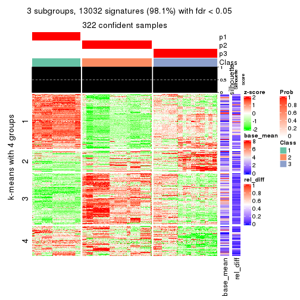</p>

</div>
<div id='tab-ATC-pam-get-signatures-3'>
<pre><code class="r">get_signatures(res, k = 4)
</code></pre>

<p></p>

</div>
<div id='tab-ATC-pam-get-signatures-4'>
<pre><code class="r">get_signatures(res, k = 5)
</code></pre>

<p></p>

</div>
<div id='tab-ATC-pam-get-signatures-5'>
<pre><code class="r">get_signatures(res, k = 6)
</code></pre>

<p></p>

</div>
</div>


Signature heatmaps where rows are not scaled:


<script>
$( function() {
	$( '#tabs-ATC-pam-get-signatures-no-scale' ).tabs();
} );
</script>
<div id='tabs-ATC-pam-get-signatures-no-scale'>
<ul>
<li><a href='#tab-ATC-pam-get-signatures-no-scale-1'>k = 2</a></li>
<li><a href='#tab-ATC-pam-get-signatures-no-scale-2'>k = 3</a></li>
<li><a href='#tab-ATC-pam-get-signatures-no-scale-3'>k = 4</a></li>
<li><a href='#tab-ATC-pam-get-signatures-no-scale-4'>k = 5</a></li>
<li><a href='#tab-ATC-pam-get-signatures-no-scale-5'>k = 6</a></li>
</ul>
<div id='tab-ATC-pam-get-signatures-no-scale-1'>
<pre><code class="r">get_signatures(res, k = 2, scale_rows = FALSE)
</code></pre>

<p></p>

</div>
<div id='tab-ATC-pam-get-signatures-no-scale-2'>
<pre><code class="r">get_signatures(res, k = 3, scale_rows = FALSE)
</code></pre>

<p></p>

</div>
<div id='tab-ATC-pam-get-signatures-no-scale-3'>
<pre><code class="r">get_signatures(res, k = 4, scale_rows = FALSE)
</code></pre>

<p></p>

</div>
<div id='tab-ATC-pam-get-signatures-no-scale-4'>
<pre><code class="r">get_signatures(res, k = 5, scale_rows = FALSE)
</code></pre>

<p></p>

</div>
<div id='tab-ATC-pam-get-signatures-no-scale-5'>
<pre><code class="r">get_signatures(res, k = 6, scale_rows = FALSE)
</code></pre>

<p></p>

</div>
</div>


Compare the overlap of signatures from different k:

```r
compare_signatures(res)
```


`get_signature()` returns a data frame invisibly. TO get the list of signatures, the function
call should be assigned to a variable explicitly. In following code, if `plot` argument is set
to `FALSE`, no heatmap is plotted while only the differential analysis is performed.

```r
# code only for demonstration
tb = get_signature(res, k = ..., plot = FALSE)
```

An example of the output of `tb` is:

```
#>   which_row         fdr    mean_1    mean_2 scaled_mean_1 scaled_mean_2 km
#> 1        38 0.042760348  8.373488  9.131774    -0.5533452     0.5164555  1
#> 2        40 0.018707592  7.106213  8.469186    -0.6173731     0.5762149  1
#> 3        55 0.019134737 10.221463 11.207825    -0.6159697     0.5749050  1
#> 4        59 0.006059896  5.921854  7.869574    -0.6899429     0.6439467  1
#> 5        60 0.018055526  8.928898 10.211722    -0.6204761     0.5791110  1
#> 6        98 0.009384629 15.714769 14.887706     0.6635654    -0.6193277  2
...
```

The columns in `tb` are:

1. `which_row`: row indices corresponding to the input matrix.
2. `fdr`: FDR for the differential test. 
3. `mean_x`: The mean value in group x.
4. `scaled_mean_x`: The mean value in group x after rows are scaled.
5. `km`: Row groups if k-means clustering is applied to rows.


UMAP plot which shows how samples are separated.


<script>
$( function() {
	$( '#tabs-ATC-pam-dimension-reduction' ).tabs();
} );
</script>
<div id='tabs-ATC-pam-dimension-reduction'>
<ul>
<li><a href='#tab-ATC-pam-dimension-reduction-1'>k = 2</a></li>
<li><a href='#tab-ATC-pam-dimension-reduction-2'>k = 3</a></li>
<li><a href='#tab-ATC-pam-dimension-reduction-3'>k = 4</a></li>
<li><a href='#tab-ATC-pam-dimension-reduction-4'>k = 5</a></li>
<li><a href='#tab-ATC-pam-dimension-reduction-5'>k = 6</a></li>
</ul>
<div id='tab-ATC-pam-dimension-reduction-1'>
<pre><code class="r">dimension_reduction(res, k = 2, method = &quot;UMAP&quot;)
</code></pre>

<p></p>

</div>
<div id='tab-ATC-pam-dimension-reduction-2'>
<pre><code class="r">dimension_reduction(res, k = 3, method = &quot;UMAP&quot;)
</code></pre>

<p></p>

</div>
<div id='tab-ATC-pam-dimension-reduction-3'>
<pre><code class="r">dimension_reduction(res, k = 4, method = &quot;UMAP&quot;)
</code></pre>

<p></p>

</div>
<div id='tab-ATC-pam-dimension-reduction-4'>
<pre><code class="r">dimension_reduction(res, k = 5, method = &quot;UMAP&quot;)
</code></pre>

<p></p>

</div>
<div id='tab-ATC-pam-dimension-reduction-5'>
<pre><code class="r">dimension_reduction(res, k = 6, method = &quot;UMAP&quot;)
</code></pre>

<p></p>

</div>
</div>


Following heatmap shows how subgroups are split when increasing `k`:

```r
collect_classes(res)
```


If matrix rows can be associated to genes, consider to use `functional_enrichment(res,
...)` to perform function enrichment for the signature genes. See [this vignette](http://bioconductor.org/packages/devel/bioc/vignettes/cola/inst/doc/functional_enrichment.html) for more detailed explanations.


 

---------------------------------------------------


### ATC:mclust**


The object with results only for a single top-value method and a single partition method 
can be extracted as:

```r
res = res_list["ATC", "mclust"]
# you can also extract it by
# res = res_list["ATC:mclust"]
```

A summary of `res` and all the functions that can be applied to it:

```r
res
```

```
#> A 'ConsensusPartition' object with k = 2, 3, 4, 5, 6.
#>   On a matrix with 13278 rows and 322 columns.
#>   Top rows (1000, 2000, 3000, 4000, 5000) are extracted by 'ATC' method.
#>   Subgroups are detected by 'mclust' method.
#>   Performed in total 1250 partitions by row resampling.
#>   Best k for subgroups seems to be 6.
#> 
#> Following methods can be applied to this 'ConsensusPartition' object:
#>  [1] "cola_report"             "collect_classes"         "collect_plots"          
#>  [4] "collect_stats"           "colnames"                "compare_signatures"     
#>  [7] "consensus_heatmap"       "dimension_reduction"     "functional_enrichment"  
#> [10] "get_anno_col"            "get_anno"                "get_classes"            
#> [13] "get_consensus"           "get_matrix"              "get_membership"         
#> [16] "get_param"               "get_signatures"          "get_stats"              
#> [19] "is_best_k"               "is_stable_k"             "membership_heatmap"     
#> [22] "ncol"                    "nrow"                    "plot_ecdf"              
#> [25] "rownames"                "select_partition_number" "show"                   
#> [28] "suggest_best_k"          "test_to_known_factors"
```

`collect_plots()` function collects all the plots made from `res` for all `k` (number of partitions)
into one single page to provide an easy and fast comparison between different `k`.

```r
collect_plots(res)
```

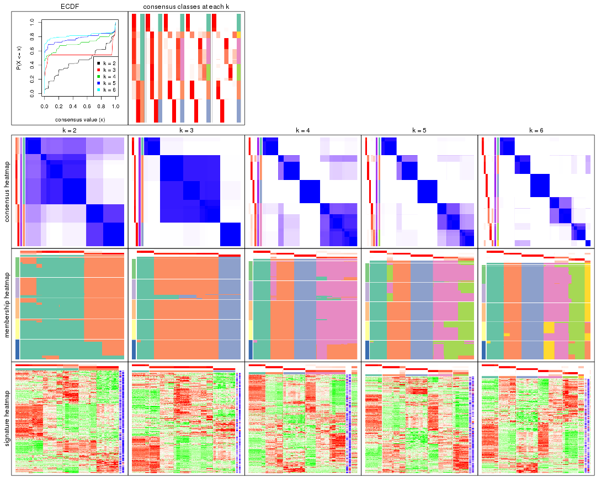

The plots are:

- The first row: a plot of the ECDF (empirical cumulative distribution
  function) curves of the consensus matrix for each `k` and the heatmap of
  predicted classes for each `k`.
- The second row: heatmaps of the consensus matrix for each `k`.
- The third row: heatmaps of the membership matrix for each `k`.
- The fouth row: heatmaps of the signatures for each `k`.

All the plots in panels can be made by individual functions and they are
plotted later in this section.

`select_partition_number()` produces several plots showing different
statistics for choosing "optimized" `k`. There are following statistics:

- ECDF curves of the consensus matrix for each `k`;
- 1-PAC. [The PAC
  score](https://en.wikipedia.org/wiki/Consensus_clustering#Over-interpretation_potential_of_consensus_clustering)
  measures the proportion of the ambiguous subgrouping.
- Mean silhouette score.
- Concordance. The mean probability of fiting the consensus class ids in all
  partitions.
- Area increased. Denote $A_k$ as the area under the ECDF curve for current
  `k`, the area increased is defined as $A_k - A_{k-1}$.
- Rand index. The percent of pairs of samples that are both in a same cluster
  or both are not in a same cluster in the partition of k and k-1.
- Jaccard index. The ratio of pairs of samples are both in a same cluster in
  the partition of k and k-1 and the pairs of samples are both in a same
  cluster in the partition k or k-1.

The detailed explanations of these statistics can be found in [the _cola_
vignette](http://bioconductor.org/packages/devel/bioc/vignettes/cola/inst/doc/cola.html#toc_13).

Generally speaking, lower PAC score, higher mean silhouette score or higher
concordance corresponds to better partition. Rand index and Jaccard index
measure how similar the current partition is compared to partition with `k-1`.
If they are too similar, we won't accept `k` is better than `k-1`.

```r
select_partition_number(res)
```


The numeric values for all these statistics can be obtained by `get_stats()`.

```r
get_stats(res)
```

```
#>   k 1-PAC mean_silhouette concordance area_increased  Rand Jaccard
#> 2 2 0.463           0.845       0.900         0.4532 0.525   0.525
#> 3 3 1.000           0.981       0.981         0.2063 0.624   0.446
#> 4 4 0.767           0.890       0.909         0.2878 0.821   0.608
#> 5 5 0.852           0.909       0.884         0.1014 0.926   0.734
#> 6 6 0.950           0.931       0.930         0.0524 0.978   0.895
```

`suggest_best_k()` suggests the best $k$ based on these statistics. The rules are as follows:

- All $k$ with Jaccard index larger than 0.95 are removed because increasing
  $k$ does not provide enough extra information. If all $k$ are removed, it is
  marked as no subgroup is detected.
- For all $k$ with 1-PAC score larger than 0.9, the maximal $k$ is taken as
  the best $k$, and other $k$ are marked as optional $k$.
- If it does not fit the second rule. The $k$ with the maximal vote of the
  highest 1-PAC score, highest mean silhouette, and highest concordance is
  taken as the best $k$.

```r
suggest_best_k(res)
```

```
#> [1] 6
#> attr(,"optional")
#> [1] 3
```

There is also optional best $k$ = 3 that is worth to check.

Following shows the table of the partitions (You need to click the **show/hide
code output** link to see it). The membership matrix (columns with name `p*`)
is inferred by
[`clue::cl_consensus()`](https://www.rdocumentation.org/link/cl_consensus?package=clue)
function with the `SE` method. Basically the value in the membership matrix
represents the probability to belong to a certain group. The finall class
label for an item is determined with the group with highest probability it
belongs to.

In `get_classes()` function, the entropy is calculated from the membership
matrix and the silhouette score is calculated from the consensus matrix.


<script>
$( function() {
	$( '#tabs-ATC-mclust-get-classes' ).tabs();
} );
</script>
<div id='tabs-ATC-mclust-get-classes'>
<ul>
<li><a href='#tab-ATC-mclust-get-classes-1'>k = 2</a></li>
<li><a href='#tab-ATC-mclust-get-classes-2'>k = 3</a></li>
<li><a href='#tab-ATC-mclust-get-classes-3'>k = 4</a></li>
<li><a href='#tab-ATC-mclust-get-classes-4'>k = 5</a></li>
<li><a href='#tab-ATC-mclust-get-classes-5'>k = 6</a></li>
</ul>

<div id='tab-ATC-mclust-get-classes-1'>
<p><a id='tab-ATC-mclust-get-classes-1-a' style='color:#0366d6' href='#'>show/hide code output</a></p>
<pre><code class="r">cbind(get_classes(res, k = 2), get_membership(res, k = 2))
</code></pre>

<pre><code>#&gt;           class entropy silhouette    p1    p2
#&gt; DRR023371     2   0.000      0.921 0.000 1.000
#&gt; DRR023372     2   0.000      0.921 0.000 1.000
#&gt; DRR023373     2   0.000      0.921 0.000 1.000
#&gt; DRR023374     2   0.000      0.921 0.000 1.000
#&gt; DRR023375     2   0.000      0.921 0.000 1.000
#&gt; DRR023376     2   0.000      0.921 0.000 1.000
#&gt; DRR023377     2   0.000      0.921 0.000 1.000
#&gt; DRR023378     2   0.000      0.921 0.000 1.000
#&gt; DRR023379     2   0.000      0.921 0.000 1.000
#&gt; DRR023380     2   0.000      0.921 0.000 1.000
#&gt; DRR023381     2   0.000      0.921 0.000 1.000
#&gt; DRR023382     2   0.000      0.921 0.000 1.000
#&gt; DRR023383     2   0.000      0.921 0.000 1.000
#&gt; DRR023384     2   0.000      0.921 0.000 1.000
#&gt; DRR023385     2   0.000      0.921 0.000 1.000
#&gt; DRR023386     2   0.000      0.921 0.000 1.000
#&gt; DRR023387     2   0.000      0.921 0.000 1.000
#&gt; DRR023388     2   0.000      0.921 0.000 1.000
#&gt; DRR023389     2   0.000      0.921 0.000 1.000
#&gt; DRR023390     2   0.000      0.921 0.000 1.000
#&gt; DRR023391     2   0.000      0.921 0.000 1.000
#&gt; DRR023392     2   0.000      0.921 0.000 1.000
#&gt; DRR023394     2   0.000      0.921 0.000 1.000
#&gt; DRR023395     2   0.000      0.921 0.000 1.000
#&gt; DRR023396     2   0.000      0.921 0.000 1.000
#&gt; DRR023397     2   0.000      0.921 0.000 1.000
#&gt; DRR023398     2   0.000      0.921 0.000 1.000
#&gt; DRR023399     2   0.000      0.921 0.000 1.000
#&gt; DRR023400     2   0.000      0.921 0.000 1.000
#&gt; DRR023401     2   0.000      0.921 0.000 1.000
#&gt; DRR023402     2   0.000      0.921 0.000 1.000
#&gt; DRR023403     2   0.000      0.921 0.000 1.000
#&gt; DRR023404     2   0.574      0.887 0.136 0.864
#&gt; DRR023405     2   0.574      0.887 0.136 0.864
#&gt; DRR023406     2   0.574      0.887 0.136 0.864
#&gt; DRR023407     2   0.574      0.887 0.136 0.864
#&gt; DRR023408     2   0.574      0.887 0.136 0.864
#&gt; DRR023409     2   0.574      0.887 0.136 0.864
#&gt; DRR023410     2   0.574      0.887 0.136 0.864
#&gt; DRR023411     2   0.574      0.887 0.136 0.864
#&gt; DRR023412     2   0.574      0.887 0.136 0.864
#&gt; DRR023413     2   0.574      0.887 0.136 0.864
#&gt; DRR023414     2   0.574      0.887 0.136 0.864
#&gt; DRR023415     2   0.574      0.887 0.136 0.864
#&gt; DRR023416     2   0.574      0.887 0.136 0.864
#&gt; DRR023417     2   0.574      0.887 0.136 0.864
#&gt; DRR023418     2   0.574      0.887 0.136 0.864
#&gt; DRR023419     2   0.574      0.887 0.136 0.864
#&gt; DRR023420     2   0.574      0.887 0.136 0.864
#&gt; DRR023421     2   0.574      0.887 0.136 0.864
#&gt; DRR023422     2   0.574      0.887 0.136 0.864
#&gt; DRR023423     2   0.574      0.887 0.136 0.864
#&gt; DRR023425     2   0.574      0.887 0.136 0.864
#&gt; DRR023426     2   0.574      0.887 0.136 0.864
#&gt; DRR023427     2   0.574      0.887 0.136 0.864
#&gt; DRR023428     2   0.574      0.887 0.136 0.864
#&gt; DRR023429     2   0.574      0.887 0.136 0.864
#&gt; DRR023430     2   0.574      0.887 0.136 0.864
#&gt; DRR023431     2   0.574      0.887 0.136 0.864
#&gt; DRR023432     2   0.574      0.887 0.136 0.864
#&gt; DRR023433     2   0.574      0.887 0.136 0.864
#&gt; DRR023434     2   0.574      0.887 0.136 0.864
#&gt; DRR023435     2   0.574      0.887 0.136 0.864
#&gt; DRR023436     2   0.574      0.887 0.136 0.864
#&gt; DRR023437     2   0.574      0.887 0.136 0.864
#&gt; DRR023438     2   0.574      0.887 0.136 0.864
#&gt; DRR023439     2   0.574      0.887 0.136 0.864
#&gt; DRR023440     2   0.574      0.887 0.136 0.864
#&gt; DRR023441     2   0.574      0.887 0.136 0.864
#&gt; DRR023442     2   0.574      0.887 0.136 0.864
#&gt; DRR023443     2   0.574      0.887 0.136 0.864
#&gt; DRR023444     2   0.574      0.887 0.136 0.864
#&gt; DRR023445     2   0.574      0.887 0.136 0.864
#&gt; DRR023446     2   0.574      0.887 0.136 0.864
#&gt; DRR023447     2   0.574      0.887 0.136 0.864
#&gt; DRR023448     2   0.574      0.887 0.136 0.864
#&gt; DRR023449     2   0.574      0.887 0.136 0.864
#&gt; DRR023450     2   0.574      0.887 0.136 0.864
#&gt; DRR023451     2   0.574      0.887 0.136 0.864
#&gt; DRR023452     2   0.574      0.887 0.136 0.864
#&gt; DRR023453     2   0.000      0.921 0.000 1.000
#&gt; DRR023454     2   0.000      0.921 0.000 1.000
#&gt; DRR023455     2   0.000      0.921 0.000 1.000
#&gt; DRR023456     2   0.000      0.921 0.000 1.000
#&gt; DRR023457     2   0.000      0.921 0.000 1.000
#&gt; DRR023458     2   0.000      0.921 0.000 1.000
#&gt; DRR023459     2   0.000      0.921 0.000 1.000
#&gt; DRR023460     2   0.000      0.921 0.000 1.000
#&gt; DRR023461     2   0.000      0.921 0.000 1.000
#&gt; DRR023462     2   0.000      0.921 0.000 1.000
#&gt; DRR023463     2   0.000      0.921 0.000 1.000
#&gt; DRR023464     2   0.000      0.921 0.000 1.000
#&gt; DRR023465     2   0.000      0.921 0.000 1.000
#&gt; DRR023466     2   0.000      0.921 0.000 1.000
#&gt; DRR023467     2   0.000      0.921 0.000 1.000
#&gt; DRR023468     2   0.000      0.921 0.000 1.000
#&gt; DRR023469     2   0.000      0.921 0.000 1.000
#&gt; DRR023470     2   0.000      0.921 0.000 1.000
#&gt; DRR023471     2   0.000      0.921 0.000 1.000
#&gt; DRR023472     2   0.000      0.921 0.000 1.000
#&gt; DRR023473     2   0.000      0.921 0.000 1.000
#&gt; DRR023474     2   0.000      0.921 0.000 1.000
#&gt; DRR023475     2   0.000      0.921 0.000 1.000
#&gt; DRR023476     2   0.000      0.921 0.000 1.000
#&gt; DRR023477     2   0.000      0.921 0.000 1.000
#&gt; DRR023478     2   0.000      0.921 0.000 1.000
#&gt; DRR023479     2   0.000      0.921 0.000 1.000
#&gt; DRR023480     2   0.000      0.921 0.000 1.000
#&gt; DRR023481     2   0.000      0.921 0.000 1.000
#&gt; DRR023482     2   0.000      0.921 0.000 1.000
#&gt; DRR023483     2   0.000      0.921 0.000 1.000
#&gt; DRR023484     2   0.000      0.921 0.000 1.000
#&gt; DRR023485     2   0.000      0.921 0.000 1.000
#&gt; DRR023486     2   0.000      0.921 0.000 1.000
#&gt; DRR023487     2   0.000      0.921 0.000 1.000
#&gt; DRR023488     2   0.000      0.921 0.000 1.000
#&gt; DRR023489     2   0.000      0.921 0.000 1.000
#&gt; DRR023490     1   0.311      0.882 0.944 0.056
#&gt; DRR023491     1   0.311      0.882 0.944 0.056
#&gt; DRR023492     1   0.311      0.882 0.944 0.056
#&gt; DRR023493     1   0.311      0.882 0.944 0.056
#&gt; DRR023494     1   0.311      0.882 0.944 0.056
#&gt; DRR023495     1   0.311      0.882 0.944 0.056
#&gt; DRR023496     1   0.311      0.882 0.944 0.056
#&gt; DRR023497     1   0.311      0.882 0.944 0.056
#&gt; DRR023498     1   0.311      0.882 0.944 0.056
#&gt; DRR023499     1   0.311      0.882 0.944 0.056
#&gt; DRR023500     1   0.311      0.882 0.944 0.056
#&gt; DRR023501     1   0.311      0.882 0.944 0.056
#&gt; DRR023502     1   0.311      0.882 0.944 0.056
#&gt; DRR023503     1   0.311      0.882 0.944 0.056
#&gt; DRR023504     1   0.311      0.882 0.944 0.056
#&gt; DRR023505     1   0.311      0.882 0.944 0.056
#&gt; DRR023506     1   0.311      0.882 0.944 0.056
#&gt; DRR023507     1   0.311      0.882 0.944 0.056
#&gt; DRR023508     1   0.311      0.882 0.944 0.056
#&gt; DRR023509     1   0.311      0.882 0.944 0.056
#&gt; DRR023510     1   0.311      0.882 0.944 0.056
#&gt; DRR023511     1   0.311      0.882 0.944 0.056
#&gt; DRR023512     1   0.311      0.882 0.944 0.056
#&gt; DRR023513     1   0.311      0.882 0.944 0.056
#&gt; DRR023514     1   0.311      0.882 0.944 0.056
#&gt; DRR023515     1   0.311      0.882 0.944 0.056
#&gt; DRR023516     1   0.311      0.882 0.944 0.056
#&gt; DRR023517     1   0.311      0.882 0.944 0.056
#&gt; DRR023518     1   0.000      0.862 1.000 0.000
#&gt; DRR023519     1   0.000      0.862 1.000 0.000
#&gt; DRR023520     1   0.000      0.862 1.000 0.000
#&gt; DRR023521     1   0.000      0.862 1.000 0.000
#&gt; DRR023522     1   0.000      0.862 1.000 0.000
#&gt; DRR023523     1   0.000      0.862 1.000 0.000
#&gt; DRR023524     1   0.000      0.862 1.000 0.000
#&gt; DRR023525     1   0.000      0.862 1.000 0.000
#&gt; DRR023526     1   0.000      0.862 1.000 0.000
#&gt; DRR023527     1   0.000      0.862 1.000 0.000
#&gt; DRR023528     1   0.000      0.862 1.000 0.000
#&gt; DRR023529     1   0.000      0.862 1.000 0.000
#&gt; DRR023530     1   0.000      0.862 1.000 0.000
#&gt; DRR023531     1   0.000      0.862 1.000 0.000
#&gt; DRR023532     1   0.000      0.862 1.000 0.000
#&gt; DRR023533     1   0.000      0.862 1.000 0.000
#&gt; DRR023534     1   0.000      0.862 1.000 0.000
#&gt; DRR023535     1   0.000      0.862 1.000 0.000
#&gt; DRR023536     1   0.000      0.862 1.000 0.000
#&gt; DRR023537     1   0.000      0.862 1.000 0.000
#&gt; DRR023538     1   0.000      0.862 1.000 0.000
#&gt; DRR023539     1   0.000      0.862 1.000 0.000
#&gt; DRR023540     1   0.000      0.862 1.000 0.000
#&gt; DRR023541     1   0.000      0.862 1.000 0.000
#&gt; DRR023542     1   0.000      0.862 1.000 0.000
#&gt; DRR023543     1   0.000      0.862 1.000 0.000
#&gt; DRR023544     1   0.000      0.862 1.000 0.000
#&gt; DRR023545     1   0.000      0.862 1.000 0.000
#&gt; DRR023546     1   0.000      0.862 1.000 0.000
#&gt; DRR023547     1   0.000      0.862 1.000 0.000
#&gt; DRR023548     1   0.000      0.862 1.000 0.000
#&gt; DRR023549     1   0.000      0.862 1.000 0.000
#&gt; DRR023550     1   0.000      0.862 1.000 0.000
#&gt; DRR023551     1   0.000      0.862 1.000 0.000
#&gt; DRR023552     1   0.000      0.862 1.000 0.000
#&gt; DRR023553     1   0.000      0.862 1.000 0.000
#&gt; DRR023554     1   0.000      0.862 1.000 0.000
#&gt; DRR023555     1   0.000      0.862 1.000 0.000
#&gt; DRR023556     1   0.000      0.862 1.000 0.000
#&gt; DRR023557     1   0.000      0.862 1.000 0.000
#&gt; DRR023558     1   0.000      0.862 1.000 0.000
#&gt; DRR023559     1   0.118      0.870 0.984 0.016
#&gt; DRR023560     1   0.118      0.870 0.984 0.016
#&gt; DRR023561     1   0.118      0.870 0.984 0.016
#&gt; DRR023562     1   0.118      0.870 0.984 0.016
#&gt; DRR023563     1   0.118      0.870 0.984 0.016
#&gt; DRR023564     1   0.118      0.870 0.984 0.016
#&gt; DRR023565     1   0.118      0.870 0.984 0.016
#&gt; DRR023566     1   0.118      0.870 0.984 0.016
#&gt; DRR023567     1   0.118      0.870 0.984 0.016
#&gt; DRR023568     1   0.118      0.870 0.984 0.016
#&gt; DRR023569     1   0.118      0.870 0.984 0.016
#&gt; DRR023570     1   0.118      0.870 0.984 0.016
#&gt; DRR023571     1   0.311      0.882 0.944 0.056
#&gt; DRR023572     1   0.311      0.882 0.944 0.056
#&gt; DRR023573     1   0.311      0.882 0.944 0.056
#&gt; DRR023574     1   0.311      0.882 0.944 0.056
#&gt; DRR023575     1   0.311      0.882 0.944 0.056
#&gt; DRR023576     1   0.925      0.621 0.660 0.340
#&gt; DRR023577     1   0.925      0.621 0.660 0.340
#&gt; DRR023578     1   0.925      0.621 0.660 0.340
#&gt; DRR023579     1   0.925      0.621 0.660 0.340
#&gt; DRR023580     1   0.925      0.621 0.660 0.340
#&gt; DRR023581     1   0.925      0.621 0.660 0.340
#&gt; DRR023582     1   0.925      0.621 0.660 0.340
#&gt; DRR023583     1   0.925      0.621 0.660 0.340
#&gt; DRR023584     1   0.925      0.621 0.660 0.340
#&gt; DRR023585     1   0.925      0.621 0.660 0.340
#&gt; DRR023586     1   0.925      0.621 0.660 0.340
#&gt; DRR023587     1   0.925      0.621 0.660 0.340
#&gt; DRR023588     1   0.925      0.621 0.660 0.340
#&gt; DRR023589     1   0.925      0.621 0.660 0.340
#&gt; DRR023590     1   0.925      0.621 0.660 0.340
#&gt; DRR023591     1   0.925      0.621 0.660 0.340
#&gt; DRR023592     1   0.925      0.621 0.660 0.340
#&gt; DRR023593     1   0.925      0.621 0.660 0.340
#&gt; DRR023594     1   0.925      0.621 0.660 0.340
#&gt; DRR023595     1   0.925      0.621 0.660 0.340
#&gt; DRR023596     1   0.925      0.621 0.660 0.340
#&gt; DRR023597     1   0.925      0.621 0.660 0.340
#&gt; DRR023598     1   0.925      0.621 0.660 0.340
#&gt; DRR023599     1   0.925      0.621 0.660 0.340
#&gt; DRR023600     1   0.925      0.621 0.660 0.340
#&gt; DRR023601     1   0.925      0.621 0.660 0.340
#&gt; DRR023602     1   0.925      0.621 0.660 0.340
#&gt; DRR023603     1   0.925      0.621 0.660 0.340
#&gt; DRR023604     1   0.925      0.621 0.660 0.340
#&gt; DRR023605     1   0.925      0.621 0.660 0.340
#&gt; DRR023606     1   0.925      0.621 0.660 0.340
#&gt; DRR023607     1   0.925      0.621 0.660 0.340
#&gt; DRR023608     1   0.925      0.621 0.660 0.340
#&gt; DRR023609     1   0.925      0.621 0.660 0.340
#&gt; DRR023610     1   0.925      0.621 0.660 0.340
#&gt; DRR023611     1   0.925      0.621 0.660 0.340
#&gt; DRR023612     1   0.925      0.621 0.660 0.340
#&gt; DRR023613     1   0.925      0.621 0.660 0.340
#&gt; DRR023614     1   0.925      0.621 0.660 0.340
#&gt; DRR023615     1   0.925      0.621 0.660 0.340
#&gt; DRR023616     1   0.925      0.621 0.660 0.340
#&gt; DRR023617     1   0.925      0.621 0.660 0.340
#&gt; DRR023619     1   0.311      0.882 0.944 0.056
#&gt; DRR023620     1   0.311      0.882 0.944 0.056
#&gt; DRR023621     1   0.311      0.882 0.944 0.056
#&gt; DRR023622     1   0.311      0.882 0.944 0.056
#&gt; DRR023623     1   0.311      0.882 0.944 0.056
#&gt; DRR023624     1   0.311      0.882 0.944 0.056
#&gt; DRR023625     1   0.311      0.882 0.944 0.056
#&gt; DRR023626     1   0.311      0.882 0.944 0.056
#&gt; DRR023627     1   0.311      0.882 0.944 0.056
#&gt; DRR023628     1   0.311      0.882 0.944 0.056
#&gt; DRR023629     1   0.311      0.882 0.944 0.056
#&gt; DRR023630     1   0.311      0.882 0.944 0.056
#&gt; DRR023631     1   0.311      0.882 0.944 0.056
#&gt; DRR023632     1   0.311      0.882 0.944 0.056
#&gt; DRR023633     1   0.311      0.882 0.944 0.056
#&gt; DRR023635     1   0.909      0.643 0.676 0.324
#&gt; DRR023636     1   0.909      0.643 0.676 0.324
#&gt; DRR023637     1   0.909      0.643 0.676 0.324
#&gt; DRR023638     1   0.917      0.632 0.668 0.332
#&gt; DRR023639     1   0.909      0.643 0.676 0.324
#&gt; DRR023640     1   0.909      0.643 0.676 0.324
#&gt; DRR023641     1   0.909      0.643 0.676 0.324
#&gt; DRR023642     1   0.913      0.637 0.672 0.328
#&gt; DRR023643     2   0.574      0.887 0.136 0.864
#&gt; DRR023644     2   0.574      0.887 0.136 0.864
#&gt; DRR023645     2   0.574      0.887 0.136 0.864
#&gt; DRR023646     2   0.574      0.887 0.136 0.864
#&gt; DRR023647     2   0.574      0.887 0.136 0.864
#&gt; DRR023648     2   0.574      0.887 0.136 0.864
#&gt; DRR023649     2   0.706      0.816 0.192 0.808
#&gt; DRR023650     1   0.311      0.882 0.944 0.056
#&gt; DRR023651     1   0.311      0.882 0.944 0.056
#&gt; DRR023652     1   0.311      0.882 0.944 0.056
#&gt; DRR023653     1   0.311      0.882 0.944 0.056
#&gt; DRR023654     1   0.311      0.882 0.944 0.056
#&gt; DRR023655     1   0.311      0.882 0.944 0.056
#&gt; DRR023656     1   0.311      0.882 0.944 0.056
#&gt; DRR023657     1   0.311      0.882 0.944 0.056
#&gt; DRR023658     1   0.311      0.882 0.944 0.056
#&gt; DRR023659     1   0.311      0.882 0.944 0.056
#&gt; DRR023660     1   0.311      0.882 0.944 0.056
#&gt; DRR023661     1   0.311      0.882 0.944 0.056
#&gt; DRR023662     1   0.311      0.882 0.944 0.056
#&gt; DRR023663     1   0.311      0.882 0.944 0.056
#&gt; DRR023664     1   0.311      0.882 0.944 0.056
#&gt; DRR023665     1   0.402      0.872 0.920 0.080
#&gt; DRR023666     1   0.311      0.882 0.944 0.056
#&gt; DRR023667     1   0.311      0.882 0.944 0.056
#&gt; DRR023668     1   0.311      0.882 0.944 0.056
#&gt; DRR023669     1   0.311      0.882 0.944 0.056
#&gt; DRR023670     1   0.311      0.882 0.944 0.056
#&gt; DRR023671     1   0.311      0.882 0.944 0.056
#&gt; DRR023672     1   0.311      0.882 0.944 0.056
#&gt; DRR023673     1   0.311      0.882 0.944 0.056
#&gt; DRR023674     1   0.311      0.882 0.944 0.056
#&gt; DRR023675     1   0.311      0.882 0.944 0.056
#&gt; DRR023676     1   0.311      0.882 0.944 0.056
#&gt; DRR023677     1   0.311      0.882 0.944 0.056
#&gt; DRR023678     1   0.311      0.882 0.944 0.056
#&gt; DRR023683     1   0.574      0.832 0.864 0.136
#&gt; DRR023684     1   0.574      0.832 0.864 0.136
#&gt; DRR023685     1   0.574      0.832 0.864 0.136
#&gt; DRR023686     1   0.574      0.832 0.864 0.136
#&gt; DRR023687     1   0.574      0.832 0.864 0.136
#&gt; DRR023688     1   0.574      0.832 0.864 0.136
#&gt; DRR023689     1   0.574      0.832 0.864 0.136
#&gt; DRR023690     1   0.574      0.832 0.864 0.136
#&gt; DRR023691     1   0.574      0.832 0.864 0.136
#&gt; DRR023692     1   0.574      0.832 0.864 0.136
#&gt; DRR023693     1   0.574      0.832 0.864 0.136
#&gt; DRR023694     1   0.574      0.832 0.864 0.136
#&gt; DRR023695     1   0.574      0.832 0.864 0.136
#&gt; DRR023696     1   0.574      0.832 0.864 0.136
#&gt; DRR023697     1   0.574      0.832 0.864 0.136
#&gt; DRR023698     1   0.574      0.832 0.864 0.136
#&gt; DRR023699     1   0.574      0.832 0.864 0.136
#&gt; DRR023700     1   0.574      0.832 0.864 0.136
</code></pre>

<script>
$('#tab-ATC-mclust-get-classes-1-a').parent().next().next().hide();
$('#tab-ATC-mclust-get-classes-1-a').click(function(){
  $('#tab-ATC-mclust-get-classes-1-a').parent().next().next().toggle();
  return(false);
});
</script>
</div>

<div id='tab-ATC-mclust-get-classes-2'>
<p><a id='tab-ATC-mclust-get-classes-2-a' style='color:#0366d6' href='#'>show/hide code output</a></p>
<pre><code class="r">cbind(get_classes(res, k = 3), get_membership(res, k = 3))
</code></pre>

<pre><code>#&gt;           class entropy silhouette    p1    p2    p3
#&gt; DRR023371     3  0.0237      1.000 0.000 0.004 0.996
#&gt; DRR023372     3  0.0237      1.000 0.000 0.004 0.996
#&gt; DRR023373     3  0.0237      1.000 0.000 0.004 0.996
#&gt; DRR023374     3  0.0237      1.000 0.000 0.004 0.996
#&gt; DRR023375     3  0.0237      1.000 0.000 0.004 0.996
#&gt; DRR023376     3  0.0237      1.000 0.000 0.004 0.996
#&gt; DRR023377     3  0.0237      1.000 0.000 0.004 0.996
#&gt; DRR023378     3  0.0237      1.000 0.000 0.004 0.996
#&gt; DRR023379     3  0.0237      1.000 0.000 0.004 0.996
#&gt; DRR023380     3  0.0237      1.000 0.000 0.004 0.996
#&gt; DRR023381     3  0.0237      1.000 0.000 0.004 0.996
#&gt; DRR023382     3  0.0237      1.000 0.000 0.004 0.996
#&gt; DRR023383     3  0.0237      1.000 0.000 0.004 0.996
#&gt; DRR023384     3  0.0237      1.000 0.000 0.004 0.996
#&gt; DRR023385     3  0.0237      1.000 0.000 0.004 0.996
#&gt; DRR023386     3  0.0237      1.000 0.000 0.004 0.996
#&gt; DRR023387     3  0.0237      1.000 0.000 0.004 0.996
#&gt; DRR023388     3  0.0237      1.000 0.000 0.004 0.996
#&gt; DRR023389     3  0.0237      1.000 0.000 0.004 0.996
#&gt; DRR023390     3  0.0237      1.000 0.000 0.004 0.996
#&gt; DRR023391     3  0.0237      1.000 0.000 0.004 0.996
#&gt; DRR023392     3  0.0237      1.000 0.000 0.004 0.996
#&gt; DRR023394     3  0.0237      1.000 0.000 0.004 0.996
#&gt; DRR023395     3  0.0237      1.000 0.000 0.004 0.996
#&gt; DRR023396     3  0.0237      1.000 0.000 0.004 0.996
#&gt; DRR023397     3  0.0237      1.000 0.000 0.004 0.996
#&gt; DRR023398     3  0.0237      1.000 0.000 0.004 0.996
#&gt; DRR023399     3  0.0237      1.000 0.000 0.004 0.996
#&gt; DRR023400     3  0.0237      1.000 0.000 0.004 0.996
#&gt; DRR023401     3  0.0237      1.000 0.000 0.004 0.996
#&gt; DRR023402     3  0.0237      1.000 0.000 0.004 0.996
#&gt; DRR023403     3  0.0237      1.000 0.000 0.004 0.996
#&gt; DRR023404     2  0.1411      0.971 0.000 0.964 0.036
#&gt; DRR023405     2  0.1411      0.971 0.000 0.964 0.036
#&gt; DRR023406     2  0.1411      0.971 0.000 0.964 0.036
#&gt; DRR023407     2  0.1411      0.971 0.000 0.964 0.036
#&gt; DRR023408     2  0.1411      0.971 0.000 0.964 0.036
#&gt; DRR023409     2  0.1411      0.971 0.000 0.964 0.036
#&gt; DRR023410     2  0.1411      0.971 0.000 0.964 0.036
#&gt; DRR023411     2  0.1411      0.971 0.000 0.964 0.036
#&gt; DRR023412     2  0.1411      0.971 0.000 0.964 0.036
#&gt; DRR023413     2  0.1411      0.971 0.000 0.964 0.036
#&gt; DRR023414     2  0.1411      0.971 0.000 0.964 0.036
#&gt; DRR023415     2  0.1411      0.971 0.000 0.964 0.036
#&gt; DRR023416     2  0.1411      0.971 0.000 0.964 0.036
#&gt; DRR023417     2  0.1411      0.971 0.000 0.964 0.036
#&gt; DRR023418     2  0.1411      0.971 0.000 0.964 0.036
#&gt; DRR023419     2  0.1411      0.971 0.000 0.964 0.036
#&gt; DRR023420     2  0.1411      0.971 0.000 0.964 0.036
#&gt; DRR023421     2  0.1411      0.971 0.000 0.964 0.036
#&gt; DRR023422     2  0.1411      0.971 0.000 0.964 0.036
#&gt; DRR023423     2  0.1411      0.971 0.000 0.964 0.036
#&gt; DRR023425     2  0.1411      0.971 0.000 0.964 0.036
#&gt; DRR023426     2  0.1411      0.971 0.000 0.964 0.036
#&gt; DRR023427     2  0.1411      0.971 0.000 0.964 0.036
#&gt; DRR023428     2  0.1411      0.971 0.000 0.964 0.036
#&gt; DRR023429     2  0.1411      0.971 0.000 0.964 0.036
#&gt; DRR023430     2  0.1411      0.971 0.000 0.964 0.036
#&gt; DRR023431     2  0.1411      0.971 0.000 0.964 0.036
#&gt; DRR023432     2  0.1411      0.971 0.000 0.964 0.036
#&gt; DRR023433     2  0.1411      0.971 0.000 0.964 0.036
#&gt; DRR023434     2  0.1411      0.971 0.000 0.964 0.036
#&gt; DRR023435     2  0.1411      0.971 0.000 0.964 0.036
#&gt; DRR023436     2  0.1411      0.971 0.000 0.964 0.036
#&gt; DRR023437     2  0.1411      0.971 0.000 0.964 0.036
#&gt; DRR023438     2  0.1411      0.971 0.000 0.964 0.036
#&gt; DRR023439     2  0.1411      0.971 0.000 0.964 0.036
#&gt; DRR023440     2  0.1411      0.971 0.000 0.964 0.036
#&gt; DRR023441     2  0.1411      0.971 0.000 0.964 0.036
#&gt; DRR023442     2  0.1411      0.971 0.000 0.964 0.036
#&gt; DRR023443     2  0.1411      0.971 0.000 0.964 0.036
#&gt; DRR023444     2  0.1411      0.971 0.000 0.964 0.036
#&gt; DRR023445     2  0.1411      0.971 0.000 0.964 0.036
#&gt; DRR023446     2  0.1411      0.971 0.000 0.964 0.036
#&gt; DRR023447     2  0.1411      0.971 0.000 0.964 0.036
#&gt; DRR023448     2  0.1411      0.971 0.000 0.964 0.036
#&gt; DRR023449     2  0.1411      0.971 0.000 0.964 0.036
#&gt; DRR023450     2  0.1411      0.971 0.000 0.964 0.036
#&gt; DRR023451     2  0.1411      0.971 0.000 0.964 0.036
#&gt; DRR023452     2  0.1411      0.971 0.000 0.964 0.036
#&gt; DRR023453     3  0.0237      1.000 0.000 0.004 0.996
#&gt; DRR023454     3  0.0237      1.000 0.000 0.004 0.996
#&gt; DRR023455     3  0.0237      1.000 0.000 0.004 0.996
#&gt; DRR023456     3  0.0237      1.000 0.000 0.004 0.996
#&gt; DRR023457     3  0.0237      1.000 0.000 0.004 0.996
#&gt; DRR023458     3  0.0237      1.000 0.000 0.004 0.996
#&gt; DRR023459     3  0.0237      1.000 0.000 0.004 0.996
#&gt; DRR023460     3  0.0237      1.000 0.000 0.004 0.996
#&gt; DRR023461     3  0.0237      1.000 0.000 0.004 0.996
#&gt; DRR023462     3  0.0237      1.000 0.000 0.004 0.996
#&gt; DRR023463     3  0.0237      1.000 0.000 0.004 0.996
#&gt; DRR023464     3  0.0237      1.000 0.000 0.004 0.996
#&gt; DRR023465     3  0.0237      1.000 0.000 0.004 0.996
#&gt; DRR023466     3  0.0237      1.000 0.000 0.004 0.996
#&gt; DRR023467     3  0.0237      1.000 0.000 0.004 0.996
#&gt; DRR023468     3  0.0237      1.000 0.000 0.004 0.996
#&gt; DRR023469     3  0.0237      1.000 0.000 0.004 0.996
#&gt; DRR023470     3  0.0237      1.000 0.000 0.004 0.996
#&gt; DRR023471     3  0.0237      1.000 0.000 0.004 0.996
#&gt; DRR023472     3  0.0237      1.000 0.000 0.004 0.996
#&gt; DRR023473     3  0.0237      1.000 0.000 0.004 0.996
#&gt; DRR023474     3  0.0237      1.000 0.000 0.004 0.996
#&gt; DRR023475     3  0.0237      1.000 0.000 0.004 0.996
#&gt; DRR023476     3  0.0237      1.000 0.000 0.004 0.996
#&gt; DRR023477     3  0.0237      1.000 0.000 0.004 0.996
#&gt; DRR023478     3  0.0237      1.000 0.000 0.004 0.996
#&gt; DRR023479     3  0.0237      1.000 0.000 0.004 0.996
#&gt; DRR023480     3  0.0237      1.000 0.000 0.004 0.996
#&gt; DRR023481     3  0.0237      1.000 0.000 0.004 0.996
#&gt; DRR023482     3  0.0237      1.000 0.000 0.004 0.996
#&gt; DRR023483     3  0.0237      1.000 0.000 0.004 0.996
#&gt; DRR023484     3  0.0237      1.000 0.000 0.004 0.996
#&gt; DRR023485     3  0.0237      1.000 0.000 0.004 0.996
#&gt; DRR023486     3  0.0237      1.000 0.000 0.004 0.996
#&gt; DRR023487     3  0.0237      1.000 0.000 0.004 0.996
#&gt; DRR023488     3  0.0237      1.000 0.000 0.004 0.996
#&gt; DRR023489     3  0.0237      1.000 0.000 0.004 0.996
#&gt; DRR023490     2  0.1643      0.974 0.044 0.956 0.000
#&gt; DRR023491     2  0.1643      0.974 0.044 0.956 0.000
#&gt; DRR023492     2  0.1643      0.974 0.044 0.956 0.000
#&gt; DRR023493     2  0.1643      0.974 0.044 0.956 0.000
#&gt; DRR023494     2  0.1643      0.974 0.044 0.956 0.000
#&gt; DRR023495     2  0.1643      0.974 0.044 0.956 0.000
#&gt; DRR023496     2  0.1643      0.974 0.044 0.956 0.000
#&gt; DRR023497     2  0.1643      0.974 0.044 0.956 0.000
#&gt; DRR023498     2  0.1643      0.974 0.044 0.956 0.000
#&gt; DRR023499     2  0.1643      0.974 0.044 0.956 0.000
#&gt; DRR023500     2  0.1643      0.974 0.044 0.956 0.000
#&gt; DRR023501     2  0.1643      0.974 0.044 0.956 0.000
#&gt; DRR023502     2  0.1643      0.974 0.044 0.956 0.000
#&gt; DRR023503     2  0.1643      0.974 0.044 0.956 0.000
#&gt; DRR023504     2  0.1643      0.974 0.044 0.956 0.000
#&gt; DRR023505     2  0.1643      0.974 0.044 0.956 0.000
#&gt; DRR023506     2  0.1643      0.974 0.044 0.956 0.000
#&gt; DRR023507     2  0.1643      0.974 0.044 0.956 0.000
#&gt; DRR023508     2  0.1643      0.974 0.044 0.956 0.000
#&gt; DRR023509     2  0.1643      0.974 0.044 0.956 0.000
#&gt; DRR023510     2  0.1643      0.974 0.044 0.956 0.000
#&gt; DRR023511     2  0.1643      0.974 0.044 0.956 0.000
#&gt; DRR023512     2  0.1643      0.974 0.044 0.956 0.000
#&gt; DRR023513     2  0.1643      0.974 0.044 0.956 0.000
#&gt; DRR023514     2  0.1643      0.974 0.044 0.956 0.000
#&gt; DRR023515     2  0.1643      0.974 0.044 0.956 0.000
#&gt; DRR023516     2  0.1643      0.974 0.044 0.956 0.000
#&gt; DRR023517     2  0.1643      0.974 0.044 0.956 0.000
#&gt; DRR023518     1  0.0000      0.991 1.000 0.000 0.000
#&gt; DRR023519     1  0.0000      0.991 1.000 0.000 0.000
#&gt; DRR023520     1  0.0000      0.991 1.000 0.000 0.000
#&gt; DRR023521     1  0.0000      0.991 1.000 0.000 0.000
#&gt; DRR023522     1  0.0000      0.991 1.000 0.000 0.000
#&gt; DRR023523     1  0.0000      0.991 1.000 0.000 0.000
#&gt; DRR023524     1  0.0000      0.991 1.000 0.000 0.000
#&gt; DRR023525     1  0.0000      0.991 1.000 0.000 0.000
#&gt; DRR023526     1  0.0000      0.991 1.000 0.000 0.000
#&gt; DRR023527     1  0.0000      0.991 1.000 0.000 0.000
#&gt; DRR023528     1  0.0000      0.991 1.000 0.000 0.000
#&gt; DRR023529     1  0.0000      0.991 1.000 0.000 0.000
#&gt; DRR023530     1  0.0000      0.991 1.000 0.000 0.000
#&gt; DRR023531     1  0.0000      0.991 1.000 0.000 0.000
#&gt; DRR023532     1  0.0000      0.991 1.000 0.000 0.000
#&gt; DRR023533     1  0.0000      0.991 1.000 0.000 0.000
#&gt; DRR023534     1  0.0000      0.991 1.000 0.000 0.000
#&gt; DRR023535     1  0.0000      0.991 1.000 0.000 0.000
#&gt; DRR023536     1  0.0000      0.991 1.000 0.000 0.000
#&gt; DRR023537     1  0.0000      0.991 1.000 0.000 0.000
#&gt; DRR023538     1  0.0000      0.991 1.000 0.000 0.000
#&gt; DRR023539     1  0.0000      0.991 1.000 0.000 0.000
#&gt; DRR023540     1  0.0000      0.991 1.000 0.000 0.000
#&gt; DRR023541     1  0.0000      0.991 1.000 0.000 0.000
#&gt; DRR023542     1  0.0000      0.991 1.000 0.000 0.000
#&gt; DRR023543     1  0.0000      0.991 1.000 0.000 0.000
#&gt; DRR023544     1  0.0000      0.991 1.000 0.000 0.000
#&gt; DRR023545     1  0.0000      0.991 1.000 0.000 0.000
#&gt; DRR023546     1  0.0000      0.991 1.000 0.000 0.000
#&gt; DRR023547     1  0.0000      0.991 1.000 0.000 0.000
#&gt; DRR023548     1  0.0000      0.991 1.000 0.000 0.000
#&gt; DRR023549     1  0.0000      0.991 1.000 0.000 0.000
#&gt; DRR023550     1  0.0000      0.991 1.000 0.000 0.000
#&gt; DRR023551     1  0.0000      0.991 1.000 0.000 0.000
#&gt; DRR023552     1  0.0000      0.991 1.000 0.000 0.000
#&gt; DRR023553     1  0.0000      0.991 1.000 0.000 0.000
#&gt; DRR023554     1  0.0000      0.991 1.000 0.000 0.000
#&gt; DRR023555     1  0.0000      0.991 1.000 0.000 0.000
#&gt; DRR023556     1  0.0000      0.991 1.000 0.000 0.000
#&gt; DRR023557     1  0.0000      0.991 1.000 0.000 0.000
#&gt; DRR023558     1  0.0000      0.991 1.000 0.000 0.000
#&gt; DRR023559     1  0.1031      0.972 0.976 0.024 0.000
#&gt; DRR023560     1  0.1031      0.972 0.976 0.024 0.000
#&gt; DRR023561     1  0.1031      0.972 0.976 0.024 0.000
#&gt; DRR023562     1  0.1031      0.972 0.976 0.024 0.000
#&gt; DRR023563     1  0.1031      0.972 0.976 0.024 0.000
#&gt; DRR023564     1  0.1031      0.972 0.976 0.024 0.000
#&gt; DRR023565     1  0.1031      0.972 0.976 0.024 0.000
#&gt; DRR023566     1  0.1031      0.972 0.976 0.024 0.000
#&gt; DRR023567     1  0.1031      0.972 0.976 0.024 0.000
#&gt; DRR023568     1  0.1031      0.972 0.976 0.024 0.000
#&gt; DRR023569     1  0.1031      0.972 0.976 0.024 0.000
#&gt; DRR023570     1  0.1964      0.927 0.944 0.056 0.000
#&gt; DRR023571     2  0.1643      0.974 0.044 0.956 0.000
#&gt; DRR023572     2  0.1643      0.974 0.044 0.956 0.000
#&gt; DRR023573     2  0.1643      0.974 0.044 0.956 0.000
#&gt; DRR023574     2  0.1643      0.974 0.044 0.956 0.000
#&gt; DRR023575     2  0.1643      0.974 0.044 0.956 0.000
#&gt; DRR023576     2  0.0237      0.973 0.000 0.996 0.004
#&gt; DRR023577     2  0.0237      0.973 0.000 0.996 0.004
#&gt; DRR023578     2  0.0237      0.973 0.000 0.996 0.004
#&gt; DRR023579     2  0.0237      0.973 0.000 0.996 0.004
#&gt; DRR023580     2  0.0237      0.973 0.000 0.996 0.004
#&gt; DRR023581     2  0.0237      0.973 0.000 0.996 0.004
#&gt; DRR023582     2  0.0237      0.973 0.000 0.996 0.004
#&gt; DRR023583     2  0.0237      0.973 0.000 0.996 0.004
#&gt; DRR023584     2  0.0237      0.973 0.000 0.996 0.004
#&gt; DRR023585     2  0.0237      0.973 0.000 0.996 0.004
#&gt; DRR023586     2  0.0237      0.973 0.000 0.996 0.004
#&gt; DRR023587     2  0.0237      0.973 0.000 0.996 0.004
#&gt; DRR023588     2  0.0237      0.973 0.000 0.996 0.004
#&gt; DRR023589     2  0.0237      0.973 0.000 0.996 0.004
#&gt; DRR023590     2  0.0237      0.973 0.000 0.996 0.004
#&gt; DRR023591     2  0.0237      0.973 0.000 0.996 0.004
#&gt; DRR023592     2  0.0237      0.973 0.000 0.996 0.004
#&gt; DRR023593     2  0.0237      0.973 0.000 0.996 0.004
#&gt; DRR023594     2  0.0237      0.973 0.000 0.996 0.004
#&gt; DRR023595     2  0.0237      0.973 0.000 0.996 0.004
#&gt; DRR023596     2  0.0237      0.973 0.000 0.996 0.004
#&gt; DRR023597     2  0.0237      0.973 0.000 0.996 0.004
#&gt; DRR023598     2  0.0237      0.973 0.000 0.996 0.004
#&gt; DRR023599     2  0.0237      0.973 0.000 0.996 0.004
#&gt; DRR023600     2  0.0237      0.973 0.000 0.996 0.004
#&gt; DRR023601     2  0.0237      0.973 0.000 0.996 0.004
#&gt; DRR023602     2  0.0237      0.973 0.000 0.996 0.004
#&gt; DRR023603     2  0.0237      0.973 0.000 0.996 0.004
#&gt; DRR023604     2  0.0237      0.973 0.000 0.996 0.004
#&gt; DRR023605     2  0.0237      0.973 0.000 0.996 0.004
#&gt; DRR023606     2  0.0237      0.973 0.000 0.996 0.004
#&gt; DRR023607     2  0.0237      0.973 0.000 0.996 0.004
#&gt; DRR023608     2  0.0237      0.973 0.000 0.996 0.004
#&gt; DRR023609     2  0.0237      0.973 0.000 0.996 0.004
#&gt; DRR023610     2  0.0237      0.973 0.000 0.996 0.004
#&gt; DRR023611     2  0.0237      0.973 0.000 0.996 0.004
#&gt; DRR023612     2  0.0237      0.973 0.000 0.996 0.004
#&gt; DRR023613     2  0.0237      0.973 0.000 0.996 0.004
#&gt; DRR023614     2  0.0237      0.973 0.000 0.996 0.004
#&gt; DRR023615     2  0.0237      0.973 0.000 0.996 0.004
#&gt; DRR023616     2  0.0237      0.973 0.000 0.996 0.004
#&gt; DRR023617     2  0.0000      0.974 0.000 1.000 0.000
#&gt; DRR023619     2  0.1643      0.974 0.044 0.956 0.000
#&gt; DRR023620     2  0.1643      0.974 0.044 0.956 0.000
#&gt; DRR023621     2  0.1643      0.974 0.044 0.956 0.000
#&gt; DRR023622     2  0.1643      0.974 0.044 0.956 0.000
#&gt; DRR023623     2  0.1643      0.974 0.044 0.956 0.000
#&gt; DRR023624     2  0.1643      0.974 0.044 0.956 0.000
#&gt; DRR023625     2  0.1643      0.974 0.044 0.956 0.000
#&gt; DRR023626     2  0.1643      0.974 0.044 0.956 0.000
#&gt; DRR023627     2  0.1643      0.974 0.044 0.956 0.000
#&gt; DRR023628     2  0.1643      0.974 0.044 0.956 0.000
#&gt; DRR023629     2  0.1643      0.974 0.044 0.956 0.000
#&gt; DRR023630     2  0.1643      0.974 0.044 0.956 0.000
#&gt; DRR023631     2  0.1643      0.974 0.044 0.956 0.000
#&gt; DRR023632     2  0.1643      0.974 0.044 0.956 0.000
#&gt; DRR023633     2  0.1643      0.974 0.044 0.956 0.000
#&gt; DRR023635     2  0.0000      0.974 0.000 1.000 0.000
#&gt; DRR023636     2  0.0000      0.974 0.000 1.000 0.000
#&gt; DRR023637     2  0.0000      0.974 0.000 1.000 0.000
#&gt; DRR023638     2  0.0000      0.974 0.000 1.000 0.000
#&gt; DRR023639     2  0.0000      0.974 0.000 1.000 0.000
#&gt; DRR023640     2  0.0000      0.974 0.000 1.000 0.000
#&gt; DRR023641     2  0.0000      0.974 0.000 1.000 0.000
#&gt; DRR023642     2  0.0000      0.974 0.000 1.000 0.000
#&gt; DRR023643     2  0.1411      0.971 0.000 0.964 0.036
#&gt; DRR023644     2  0.1411      0.971 0.000 0.964 0.036
#&gt; DRR023645     2  0.1411      0.971 0.000 0.964 0.036
#&gt; DRR023646     2  0.1411      0.971 0.000 0.964 0.036
#&gt; DRR023647     2  0.1411      0.971 0.000 0.964 0.036
#&gt; DRR023648     2  0.1411      0.971 0.000 0.964 0.036
#&gt; DRR023649     2  0.1411      0.971 0.000 0.964 0.036
#&gt; DRR023650     2  0.1643      0.974 0.044 0.956 0.000
#&gt; DRR023651     2  0.1643      0.974 0.044 0.956 0.000
#&gt; DRR023652     2  0.1643      0.974 0.044 0.956 0.000
#&gt; DRR023653     2  0.1643      0.974 0.044 0.956 0.000
#&gt; DRR023654     2  0.1643      0.974 0.044 0.956 0.000
#&gt; DRR023655     2  0.1643      0.974 0.044 0.956 0.000
#&gt; DRR023656     2  0.1643      0.974 0.044 0.956 0.000
#&gt; DRR023657     2  0.1643      0.974 0.044 0.956 0.000
#&gt; DRR023658     2  0.1643      0.974 0.044 0.956 0.000
#&gt; DRR023659     2  0.1643      0.974 0.044 0.956 0.000
#&gt; DRR023660     2  0.1643      0.974 0.044 0.956 0.000
#&gt; DRR023661     2  0.1643      0.974 0.044 0.956 0.000
#&gt; DRR023662     2  0.1643      0.974 0.044 0.956 0.000
#&gt; DRR023663     2  0.1643      0.974 0.044 0.956 0.000
#&gt; DRR023664     2  0.1643      0.974 0.044 0.956 0.000
#&gt; DRR023665     2  0.1643      0.974 0.044 0.956 0.000
#&gt; DRR023666     2  0.1643      0.974 0.044 0.956 0.000
#&gt; DRR023667     2  0.1643      0.974 0.044 0.956 0.000
#&gt; DRR023668     2  0.1643      0.974 0.044 0.956 0.000
#&gt; DRR023669     2  0.1643      0.974 0.044 0.956 0.000
#&gt; DRR023670     2  0.1643      0.974 0.044 0.956 0.000
#&gt; DRR023671     2  0.1643      0.974 0.044 0.956 0.000
#&gt; DRR023672     2  0.1643      0.974 0.044 0.956 0.000
#&gt; DRR023673     2  0.1643      0.974 0.044 0.956 0.000
#&gt; DRR023674     2  0.1643      0.974 0.044 0.956 0.000
#&gt; DRR023675     2  0.1643      0.974 0.044 0.956 0.000
#&gt; DRR023676     2  0.1643      0.974 0.044 0.956 0.000
#&gt; DRR023677     2  0.1643      0.974 0.044 0.956 0.000
#&gt; DRR023678     2  0.1643      0.974 0.044 0.956 0.000
#&gt; DRR023683     2  0.0424      0.974 0.000 0.992 0.008
#&gt; DRR023684     2  0.0424      0.974 0.000 0.992 0.008
#&gt; DRR023685     2  0.0424      0.974 0.000 0.992 0.008
#&gt; DRR023686     2  0.0424      0.974 0.000 0.992 0.008
#&gt; DRR023687     2  0.0424      0.974 0.000 0.992 0.008
#&gt; DRR023688     2  0.0424      0.974 0.000 0.992 0.008
#&gt; DRR023689     2  0.0424      0.974 0.000 0.992 0.008
#&gt; DRR023690     2  0.0424      0.974 0.000 0.992 0.008
#&gt; DRR023691     2  0.0424      0.974 0.000 0.992 0.008
#&gt; DRR023692     2  0.0424      0.974 0.000 0.992 0.008
#&gt; DRR023693     2  0.0424      0.974 0.000 0.992 0.008
#&gt; DRR023694     2  0.0424      0.974 0.000 0.992 0.008
#&gt; DRR023695     2  0.0424      0.974 0.000 0.992 0.008
#&gt; DRR023696     2  0.0424      0.974 0.000 0.992 0.008
#&gt; DRR023697     2  0.0424      0.974 0.000 0.992 0.008
#&gt; DRR023698     2  0.0424      0.974 0.000 0.992 0.008
#&gt; DRR023699     2  0.0424      0.974 0.000 0.992 0.008
#&gt; DRR023700     2  0.0424      0.974 0.000 0.992 0.008
</code></pre>

<script>
$('#tab-ATC-mclust-get-classes-2-a').parent().next().next().hide();
$('#tab-ATC-mclust-get-classes-2-a').click(function(){
  $('#tab-ATC-mclust-get-classes-2-a').parent().next().next().toggle();
  return(false);
});
</script>
</div>

<div id='tab-ATC-mclust-get-classes-3'>
<p><a id='tab-ATC-mclust-get-classes-3-a' style='color:#0366d6' href='#'>show/hide code output</a></p>
<pre><code class="r">cbind(get_classes(res, k = 4), get_membership(res, k = 4))
</code></pre>

<pre><code>#&gt;           class entropy silhouette    p1    p2 p3    p4
#&gt; DRR023371     3  0.0000      1.000 0.000 0.000  1 0.000
#&gt; DRR023372     3  0.0000      1.000 0.000 0.000  1 0.000
#&gt; DRR023373     3  0.0000      1.000 0.000 0.000  1 0.000
#&gt; DRR023374     3  0.0000      1.000 0.000 0.000  1 0.000
#&gt; DRR023375     3  0.0000      1.000 0.000 0.000  1 0.000
#&gt; DRR023376     3  0.0000      1.000 0.000 0.000  1 0.000
#&gt; DRR023377     3  0.0000      1.000 0.000 0.000  1 0.000
#&gt; DRR023378     3  0.0000      1.000 0.000 0.000  1 0.000
#&gt; DRR023379     3  0.0000      1.000 0.000 0.000  1 0.000
#&gt; DRR023380     3  0.0000      1.000 0.000 0.000  1 0.000
#&gt; DRR023381     3  0.0000      1.000 0.000 0.000  1 0.000
#&gt; DRR023382     3  0.0000      1.000 0.000 0.000  1 0.000
#&gt; DRR023383     3  0.0000      1.000 0.000 0.000  1 0.000
#&gt; DRR023384     3  0.0000      1.000 0.000 0.000  1 0.000
#&gt; DRR023385     3  0.0000      1.000 0.000 0.000  1 0.000
#&gt; DRR023386     3  0.0000      1.000 0.000 0.000  1 0.000
#&gt; DRR023387     3  0.0000      1.000 0.000 0.000  1 0.000
#&gt; DRR023388     3  0.0000      1.000 0.000 0.000  1 0.000
#&gt; DRR023389     3  0.0000      1.000 0.000 0.000  1 0.000
#&gt; DRR023390     3  0.0000      1.000 0.000 0.000  1 0.000
#&gt; DRR023391     3  0.0000      1.000 0.000 0.000  1 0.000
#&gt; DRR023392     3  0.0000      1.000 0.000 0.000  1 0.000
#&gt; DRR023394     3  0.0000      1.000 0.000 0.000  1 0.000
#&gt; DRR023395     3  0.0000      1.000 0.000 0.000  1 0.000
#&gt; DRR023396     3  0.0000      1.000 0.000 0.000  1 0.000
#&gt; DRR023397     3  0.0000      1.000 0.000 0.000  1 0.000
#&gt; DRR023398     3  0.0000      1.000 0.000 0.000  1 0.000
#&gt; DRR023399     3  0.0000      1.000 0.000 0.000  1 0.000
#&gt; DRR023400     3  0.0000      1.000 0.000 0.000  1 0.000
#&gt; DRR023401     3  0.0000      1.000 0.000 0.000  1 0.000
#&gt; DRR023402     3  0.0000      1.000 0.000 0.000  1 0.000
#&gt; DRR023403     3  0.0000      1.000 0.000 0.000  1 0.000
#&gt; DRR023404     2  0.0000      0.882 0.000 1.000  0 0.000
#&gt; DRR023405     2  0.0000      0.882 0.000 1.000  0 0.000
#&gt; DRR023406     2  0.0000      0.882 0.000 1.000  0 0.000
#&gt; DRR023407     2  0.0000      0.882 0.000 1.000  0 0.000
#&gt; DRR023408     2  0.0000      0.882 0.000 1.000  0 0.000
#&gt; DRR023409     2  0.0000      0.882 0.000 1.000  0 0.000
#&gt; DRR023410     2  0.0000      0.882 0.000 1.000  0 0.000
#&gt; DRR023411     2  0.0000      0.882 0.000 1.000  0 0.000
#&gt; DRR023412     2  0.0000      0.882 0.000 1.000  0 0.000
#&gt; DRR023413     2  0.0000      0.882 0.000 1.000  0 0.000
#&gt; DRR023414     2  0.0000      0.882 0.000 1.000  0 0.000
#&gt; DRR023415     2  0.0000      0.882 0.000 1.000  0 0.000
#&gt; DRR023416     2  0.0000      0.882 0.000 1.000  0 0.000
#&gt; DRR023417     2  0.0000      0.882 0.000 1.000  0 0.000
#&gt; DRR023418     2  0.0000      0.882 0.000 1.000  0 0.000
#&gt; DRR023419     2  0.0000      0.882 0.000 1.000  0 0.000
#&gt; DRR023420     2  0.0000      0.882 0.000 1.000  0 0.000
#&gt; DRR023421     2  0.0000      0.882 0.000 1.000  0 0.000
#&gt; DRR023422     2  0.0000      0.882 0.000 1.000  0 0.000
#&gt; DRR023423     2  0.0000      0.882 0.000 1.000  0 0.000
#&gt; DRR023425     2  0.0000      0.882 0.000 1.000  0 0.000
#&gt; DRR023426     2  0.0000      0.882 0.000 1.000  0 0.000
#&gt; DRR023427     2  0.0000      0.882 0.000 1.000  0 0.000
#&gt; DRR023428     2  0.0000      0.882 0.000 1.000  0 0.000
#&gt; DRR023429     2  0.0000      0.882 0.000 1.000  0 0.000
#&gt; DRR023430     2  0.0000      0.882 0.000 1.000  0 0.000
#&gt; DRR023431     2  0.0000      0.882 0.000 1.000  0 0.000
#&gt; DRR023432     2  0.0000      0.882 0.000 1.000  0 0.000
#&gt; DRR023433     2  0.0000      0.882 0.000 1.000  0 0.000
#&gt; DRR023434     2  0.0000      0.882 0.000 1.000  0 0.000
#&gt; DRR023435     2  0.0000      0.882 0.000 1.000  0 0.000
#&gt; DRR023436     2  0.0000      0.882 0.000 1.000  0 0.000
#&gt; DRR023437     2  0.0000      0.882 0.000 1.000  0 0.000
#&gt; DRR023438     2  0.0000      0.882 0.000 1.000  0 0.000
#&gt; DRR023439     2  0.0000      0.882 0.000 1.000  0 0.000
#&gt; DRR023440     2  0.0000      0.882 0.000 1.000  0 0.000
#&gt; DRR023441     2  0.0000      0.882 0.000 1.000  0 0.000
#&gt; DRR023442     2  0.0000      0.882 0.000 1.000  0 0.000
#&gt; DRR023443     2  0.0000      0.882 0.000 1.000  0 0.000
#&gt; DRR023444     2  0.0000      0.882 0.000 1.000  0 0.000
#&gt; DRR023445     2  0.0000      0.882 0.000 1.000  0 0.000
#&gt; DRR023446     2  0.0000      0.882 0.000 1.000  0 0.000
#&gt; DRR023447     2  0.0000      0.882 0.000 1.000  0 0.000
#&gt; DRR023448     2  0.0000      0.882 0.000 1.000  0 0.000
#&gt; DRR023449     2  0.0000      0.882 0.000 1.000  0 0.000
#&gt; DRR023450     2  0.0000      0.882 0.000 1.000  0 0.000
#&gt; DRR023451     2  0.0000      0.882 0.000 1.000  0 0.000
#&gt; DRR023452     2  0.0000      0.882 0.000 1.000  0 0.000
#&gt; DRR023453     3  0.0000      1.000 0.000 0.000  1 0.000
#&gt; DRR023454     3  0.0000      1.000 0.000 0.000  1 0.000
#&gt; DRR023455     3  0.0000      1.000 0.000 0.000  1 0.000
#&gt; DRR023456     3  0.0000      1.000 0.000 0.000  1 0.000
#&gt; DRR023457     3  0.0000      1.000 0.000 0.000  1 0.000
#&gt; DRR023458     3  0.0000      1.000 0.000 0.000  1 0.000
#&gt; DRR023459     3  0.0000      1.000 0.000 0.000  1 0.000
#&gt; DRR023460     3  0.0000      1.000 0.000 0.000  1 0.000
#&gt; DRR023461     3  0.0000      1.000 0.000 0.000  1 0.000
#&gt; DRR023462     3  0.0000      1.000 0.000 0.000  1 0.000
#&gt; DRR023463     3  0.0000      1.000 0.000 0.000  1 0.000
#&gt; DRR023464     3  0.0000      1.000 0.000 0.000  1 0.000
#&gt; DRR023465     3  0.0000      1.000 0.000 0.000  1 0.000
#&gt; DRR023466     3  0.0000      1.000 0.000 0.000  1 0.000
#&gt; DRR023467     3  0.0000      1.000 0.000 0.000  1 0.000
#&gt; DRR023468     3  0.0000      1.000 0.000 0.000  1 0.000
#&gt; DRR023469     3  0.0000      1.000 0.000 0.000  1 0.000
#&gt; DRR023470     3  0.0000      1.000 0.000 0.000  1 0.000
#&gt; DRR023471     3  0.0000      1.000 0.000 0.000  1 0.000
#&gt; DRR023472     3  0.0000      1.000 0.000 0.000  1 0.000
#&gt; DRR023473     3  0.0000      1.000 0.000 0.000  1 0.000
#&gt; DRR023474     3  0.0000      1.000 0.000 0.000  1 0.000
#&gt; DRR023475     3  0.0000      1.000 0.000 0.000  1 0.000
#&gt; DRR023476     3  0.0000      1.000 0.000 0.000  1 0.000
#&gt; DRR023477     3  0.0000      1.000 0.000 0.000  1 0.000
#&gt; DRR023478     3  0.0000      1.000 0.000 0.000  1 0.000
#&gt; DRR023479     3  0.0000      1.000 0.000 0.000  1 0.000
#&gt; DRR023480     3  0.0000      1.000 0.000 0.000  1 0.000
#&gt; DRR023481     3  0.0000      1.000 0.000 0.000  1 0.000
#&gt; DRR023482     3  0.0000      1.000 0.000 0.000  1 0.000
#&gt; DRR023483     3  0.0000      1.000 0.000 0.000  1 0.000
#&gt; DRR023484     3  0.0000      1.000 0.000 0.000  1 0.000
#&gt; DRR023485     3  0.0000      1.000 0.000 0.000  1 0.000
#&gt; DRR023486     3  0.0000      1.000 0.000 0.000  1 0.000
#&gt; DRR023487     3  0.0000      1.000 0.000 0.000  1 0.000
#&gt; DRR023488     3  0.0000      1.000 0.000 0.000  1 0.000
#&gt; DRR023489     3  0.0000      1.000 0.000 0.000  1 0.000
#&gt; DRR023490     4  0.2466      0.775 0.096 0.004  0 0.900
#&gt; DRR023491     4  0.2466      0.775 0.096 0.004  0 0.900
#&gt; DRR023492     4  0.2466      0.775 0.096 0.004  0 0.900
#&gt; DRR023493     4  0.2466      0.775 0.096 0.004  0 0.900
#&gt; DRR023494     4  0.2466      0.775 0.096 0.004  0 0.900
#&gt; DRR023495     4  0.2466      0.775 0.096 0.004  0 0.900
#&gt; DRR023496     4  0.2466      0.775 0.096 0.004  0 0.900
#&gt; DRR023497     4  0.2466      0.775 0.096 0.004  0 0.900
#&gt; DRR023498     4  0.2466      0.775 0.096 0.004  0 0.900
#&gt; DRR023499     4  0.2466      0.775 0.096 0.004  0 0.900
#&gt; DRR023500     4  0.2466      0.775 0.096 0.004  0 0.900
#&gt; DRR023501     4  0.2466      0.775 0.096 0.004  0 0.900
#&gt; DRR023502     4  0.2466      0.775 0.096 0.004  0 0.900
#&gt; DRR023503     4  0.2466      0.775 0.096 0.004  0 0.900
#&gt; DRR023504     4  0.2466      0.775 0.096 0.004  0 0.900
#&gt; DRR023505     4  0.2466      0.775 0.096 0.004  0 0.900
#&gt; DRR023506     4  0.2466      0.775 0.096 0.004  0 0.900
#&gt; DRR023507     4  0.2466      0.775 0.096 0.004  0 0.900
#&gt; DRR023508     4  0.5325      0.861 0.096 0.160  0 0.744
#&gt; DRR023509     4  0.2401      0.777 0.092 0.004  0 0.904
#&gt; DRR023510     4  0.2401      0.777 0.092 0.004  0 0.904
#&gt; DRR023511     4  0.2401      0.777 0.092 0.004  0 0.904
#&gt; DRR023512     4  0.2401      0.777 0.092 0.004  0 0.904
#&gt; DRR023513     4  0.2401      0.777 0.092 0.004  0 0.904
#&gt; DRR023514     4  0.2401      0.777 0.092 0.004  0 0.904
#&gt; DRR023515     4  0.2401      0.777 0.092 0.004  0 0.904
#&gt; DRR023516     4  0.2401      0.777 0.092 0.004  0 0.904
#&gt; DRR023517     4  0.2401      0.777 0.092 0.004  0 0.904
#&gt; DRR023518     1  0.0000      0.992 1.000 0.000  0 0.000
#&gt; DRR023519     1  0.0000      0.992 1.000 0.000  0 0.000
#&gt; DRR023520     1  0.0000      0.992 1.000 0.000  0 0.000
#&gt; DRR023521     1  0.0000      0.992 1.000 0.000  0 0.000
#&gt; DRR023522     1  0.0000      0.992 1.000 0.000  0 0.000
#&gt; DRR023523     1  0.0000      0.992 1.000 0.000  0 0.000
#&gt; DRR023524     1  0.0000      0.992 1.000 0.000  0 0.000
#&gt; DRR023525     1  0.0000      0.992 1.000 0.000  0 0.000
#&gt; DRR023526     1  0.0000      0.992 1.000 0.000  0 0.000
#&gt; DRR023527     1  0.0000      0.992 1.000 0.000  0 0.000
#&gt; DRR023528     1  0.0000      0.992 1.000 0.000  0 0.000
#&gt; DRR023529     1  0.0000      0.992 1.000 0.000  0 0.000
#&gt; DRR023530     1  0.0000      0.992 1.000 0.000  0 0.000
#&gt; DRR023531     1  0.0000      0.992 1.000 0.000  0 0.000
#&gt; DRR023532     1  0.0000      0.992 1.000 0.000  0 0.000
#&gt; DRR023533     1  0.0000      0.992 1.000 0.000  0 0.000
#&gt; DRR023534     1  0.0000      0.992 1.000 0.000  0 0.000
#&gt; DRR023535     1  0.0000      0.992 1.000 0.000  0 0.000
#&gt; DRR023536     1  0.0000      0.992 1.000 0.000  0 0.000
#&gt; DRR023537     1  0.0000      0.992 1.000 0.000  0 0.000
#&gt; DRR023538     1  0.0000      0.992 1.000 0.000  0 0.000
#&gt; DRR023539     1  0.0000      0.992 1.000 0.000  0 0.000
#&gt; DRR023540     1  0.0000      0.992 1.000 0.000  0 0.000
#&gt; DRR023541     1  0.0000      0.992 1.000 0.000  0 0.000
#&gt; DRR023542     1  0.0000      0.992 1.000 0.000  0 0.000
#&gt; DRR023543     1  0.0000      0.992 1.000 0.000  0 0.000
#&gt; DRR023544     1  0.0000      0.992 1.000 0.000  0 0.000
#&gt; DRR023545     1  0.0000      0.992 1.000 0.000  0 0.000
#&gt; DRR023546     1  0.0000      0.992 1.000 0.000  0 0.000
#&gt; DRR023547     1  0.0000      0.992 1.000 0.000  0 0.000
#&gt; DRR023548     1  0.0000      0.992 1.000 0.000  0 0.000
#&gt; DRR023549     1  0.0000      0.992 1.000 0.000  0 0.000
#&gt; DRR023550     1  0.0000      0.992 1.000 0.000  0 0.000
#&gt; DRR023551     1  0.0000      0.992 1.000 0.000  0 0.000
#&gt; DRR023552     1  0.0000      0.992 1.000 0.000  0 0.000
#&gt; DRR023553     1  0.0000      0.992 1.000 0.000  0 0.000
#&gt; DRR023554     1  0.0000      0.992 1.000 0.000  0 0.000
#&gt; DRR023555     1  0.0000      0.992 1.000 0.000  0 0.000
#&gt; DRR023556     1  0.0000      0.992 1.000 0.000  0 0.000
#&gt; DRR023557     1  0.0000      0.992 1.000 0.000  0 0.000
#&gt; DRR023558     1  0.0000      0.992 1.000 0.000  0 0.000
#&gt; DRR023559     1  0.0817      0.975 0.976 0.000  0 0.024
#&gt; DRR023560     1  0.0817      0.975 0.976 0.000  0 0.024
#&gt; DRR023561     1  0.0817      0.975 0.976 0.000  0 0.024
#&gt; DRR023562     1  0.0817      0.975 0.976 0.000  0 0.024
#&gt; DRR023563     1  0.0817      0.975 0.976 0.000  0 0.024
#&gt; DRR023564     1  0.0817      0.975 0.976 0.000  0 0.024
#&gt; DRR023565     1  0.0817      0.975 0.976 0.000  0 0.024
#&gt; DRR023566     1  0.0817      0.975 0.976 0.000  0 0.024
#&gt; DRR023567     1  0.0817      0.975 0.976 0.000  0 0.024
#&gt; DRR023568     1  0.0817      0.975 0.976 0.000  0 0.024
#&gt; DRR023569     1  0.0817      0.975 0.976 0.000  0 0.024
#&gt; DRR023570     1  0.1716      0.924 0.936 0.000  0 0.064
#&gt; DRR023571     4  0.2334      0.777 0.088 0.004  0 0.908
#&gt; DRR023572     4  0.2334      0.777 0.088 0.004  0 0.908
#&gt; DRR023573     4  0.2334      0.777 0.088 0.004  0 0.908
#&gt; DRR023574     4  0.2334      0.777 0.088 0.004  0 0.908
#&gt; DRR023575     4  0.2334      0.777 0.088 0.004  0 0.908
#&gt; DRR023576     4  0.3610      0.882 0.000 0.200  0 0.800
#&gt; DRR023577     4  0.3610      0.882 0.000 0.200  0 0.800
#&gt; DRR023578     4  0.3610      0.882 0.000 0.200  0 0.800
#&gt; DRR023579     4  0.3610      0.882 0.000 0.200  0 0.800
#&gt; DRR023580     4  0.3610      0.882 0.000 0.200  0 0.800
#&gt; DRR023581     4  0.3610      0.882 0.000 0.200  0 0.800
#&gt; DRR023582     4  0.3610      0.882 0.000 0.200  0 0.800
#&gt; DRR023583     4  0.3610      0.882 0.000 0.200  0 0.800
#&gt; DRR023584     4  0.3610      0.882 0.000 0.200  0 0.800
#&gt; DRR023585     4  0.3610      0.882 0.000 0.200  0 0.800
#&gt; DRR023586     4  0.3610      0.882 0.000 0.200  0 0.800
#&gt; DRR023587     4  0.3726      0.876 0.000 0.212  0 0.788
#&gt; DRR023588     4  0.3726      0.876 0.000 0.212  0 0.788
#&gt; DRR023589     4  0.3726      0.876 0.000 0.212  0 0.788
#&gt; DRR023590     4  0.3726      0.876 0.000 0.212  0 0.788
#&gt; DRR023591     4  0.3726      0.876 0.000 0.212  0 0.788
#&gt; DRR023592     4  0.3726      0.876 0.000 0.212  0 0.788
#&gt; DRR023593     4  0.3726      0.876 0.000 0.212  0 0.788
#&gt; DRR023594     4  0.3726      0.876 0.000 0.212  0 0.788
#&gt; DRR023595     4  0.3726      0.876 0.000 0.212  0 0.788
#&gt; DRR023596     4  0.3726      0.876 0.000 0.212  0 0.788
#&gt; DRR023597     4  0.3726      0.876 0.000 0.212  0 0.788
#&gt; DRR023598     4  0.3726      0.876 0.000 0.212  0 0.788
#&gt; DRR023599     4  0.3726      0.876 0.000 0.212  0 0.788
#&gt; DRR023600     4  0.3726      0.876 0.000 0.212  0 0.788
#&gt; DRR023601     4  0.3726      0.876 0.000 0.212  0 0.788
#&gt; DRR023602     4  0.3726      0.876 0.000 0.212  0 0.788
#&gt; DRR023603     4  0.3726      0.876 0.000 0.212  0 0.788
#&gt; DRR023604     4  0.3726      0.876 0.000 0.212  0 0.788
#&gt; DRR023605     4  0.3726      0.876 0.000 0.212  0 0.788
#&gt; DRR023606     4  0.3726      0.876 0.000 0.212  0 0.788
#&gt; DRR023607     4  0.3726      0.876 0.000 0.212  0 0.788
#&gt; DRR023608     4  0.3726      0.876 0.000 0.212  0 0.788
#&gt; DRR023609     4  0.3726      0.876 0.000 0.212  0 0.788
#&gt; DRR023610     4  0.3726      0.876 0.000 0.212  0 0.788
#&gt; DRR023611     4  0.3726      0.876 0.000 0.212  0 0.788
#&gt; DRR023612     4  0.3726      0.876 0.000 0.212  0 0.788
#&gt; DRR023613     4  0.3726      0.876 0.000 0.212  0 0.788
#&gt; DRR023614     4  0.3726      0.876 0.000 0.212  0 0.788
#&gt; DRR023615     4  0.3726      0.876 0.000 0.212  0 0.788
#&gt; DRR023616     4  0.3726      0.876 0.000 0.212  0 0.788
#&gt; DRR023617     4  0.3764      0.876 0.000 0.216  0 0.784
#&gt; DRR023619     4  0.4004      0.890 0.024 0.164  0 0.812
#&gt; DRR023620     4  0.4004      0.890 0.024 0.164  0 0.812
#&gt; DRR023621     4  0.4004      0.890 0.024 0.164  0 0.812
#&gt; DRR023622     4  0.4004      0.890 0.024 0.164  0 0.812
#&gt; DRR023623     4  0.4004      0.890 0.024 0.164  0 0.812
#&gt; DRR023624     4  0.4004      0.890 0.024 0.164  0 0.812
#&gt; DRR023625     4  0.4004      0.890 0.024 0.164  0 0.812
#&gt; DRR023626     4  0.4004      0.890 0.024 0.164  0 0.812
#&gt; DRR023627     4  0.4004      0.890 0.024 0.164  0 0.812
#&gt; DRR023628     4  0.4004      0.890 0.024 0.164  0 0.812
#&gt; DRR023629     4  0.4004      0.890 0.024 0.164  0 0.812
#&gt; DRR023630     4  0.4004      0.890 0.024 0.164  0 0.812
#&gt; DRR023631     4  0.4004      0.890 0.024 0.164  0 0.812
#&gt; DRR023632     4  0.4004      0.890 0.024 0.164  0 0.812
#&gt; DRR023633     4  0.3900      0.890 0.020 0.164  0 0.816
#&gt; DRR023635     4  0.3356      0.885 0.000 0.176  0 0.824
#&gt; DRR023636     4  0.3356      0.885 0.000 0.176  0 0.824
#&gt; DRR023637     4  0.3356      0.885 0.000 0.176  0 0.824
#&gt; DRR023638     4  0.3356      0.885 0.000 0.176  0 0.824
#&gt; DRR023639     4  0.3356      0.885 0.000 0.176  0 0.824
#&gt; DRR023640     4  0.3356      0.885 0.000 0.176  0 0.824
#&gt; DRR023641     4  0.3356      0.885 0.000 0.176  0 0.824
#&gt; DRR023642     4  0.3356      0.885 0.000 0.176  0 0.824
#&gt; DRR023643     2  0.0000      0.882 0.000 1.000  0 0.000
#&gt; DRR023644     2  0.0000      0.882 0.000 1.000  0 0.000
#&gt; DRR023645     2  0.0000      0.882 0.000 1.000  0 0.000
#&gt; DRR023646     2  0.0000      0.882 0.000 1.000  0 0.000
#&gt; DRR023647     2  0.0000      0.882 0.000 1.000  0 0.000
#&gt; DRR023648     2  0.0000      0.882 0.000 1.000  0 0.000
#&gt; DRR023649     2  0.4382      0.549 0.000 0.704  0 0.296
#&gt; DRR023650     4  0.4004      0.890 0.024 0.164  0 0.812
#&gt; DRR023651     4  0.4004      0.890 0.024 0.164  0 0.812
#&gt; DRR023652     4  0.4004      0.890 0.024 0.164  0 0.812
#&gt; DRR023653     4  0.4004      0.890 0.024 0.164  0 0.812
#&gt; DRR023654     4  0.4004      0.890 0.024 0.164  0 0.812
#&gt; DRR023655     4  0.4004      0.890 0.024 0.164  0 0.812
#&gt; DRR023656     4  0.4004      0.890 0.024 0.164  0 0.812
#&gt; DRR023657     4  0.4004      0.890 0.024 0.164  0 0.812
#&gt; DRR023658     4  0.4004      0.890 0.024 0.164  0 0.812
#&gt; DRR023659     4  0.4004      0.890 0.024 0.164  0 0.812
#&gt; DRR023660     4  0.4004      0.890 0.024 0.164  0 0.812
#&gt; DRR023661     4  0.4004      0.890 0.024 0.164  0 0.812
#&gt; DRR023662     4  0.4004      0.890 0.024 0.164  0 0.812
#&gt; DRR023663     4  0.4004      0.890 0.024 0.164  0 0.812
#&gt; DRR023664     4  0.4004      0.890 0.024 0.164  0 0.812
#&gt; DRR023665     4  0.3881      0.889 0.016 0.172  0 0.812
#&gt; DRR023666     4  0.4004      0.890 0.024 0.164  0 0.812
#&gt; DRR023667     4  0.4004      0.890 0.024 0.164  0 0.812
#&gt; DRR023668     4  0.4004      0.890 0.024 0.164  0 0.812
#&gt; DRR023669     4  0.4004      0.890 0.024 0.164  0 0.812
#&gt; DRR023670     4  0.4004      0.890 0.024 0.164  0 0.812
#&gt; DRR023671     4  0.4004      0.890 0.024 0.164  0 0.812
#&gt; DRR023672     4  0.4004      0.890 0.024 0.164  0 0.812
#&gt; DRR023673     4  0.4004      0.890 0.024 0.164  0 0.812
#&gt; DRR023674     4  0.4004      0.890 0.024 0.164  0 0.812
#&gt; DRR023675     4  0.4004      0.890 0.024 0.164  0 0.812
#&gt; DRR023676     4  0.4004      0.890 0.024 0.164  0 0.812
#&gt; DRR023677     4  0.4004      0.890 0.024 0.164  0 0.812
#&gt; DRR023678     4  0.4004      0.890 0.024 0.164  0 0.812
#&gt; DRR023683     2  0.4761      0.455 0.000 0.628  0 0.372
#&gt; DRR023684     2  0.4761      0.455 0.000 0.628  0 0.372
#&gt; DRR023685     2  0.4761      0.455 0.000 0.628  0 0.372
#&gt; DRR023686     2  0.4761      0.455 0.000 0.628  0 0.372
#&gt; DRR023687     2  0.4761      0.455 0.000 0.628  0 0.372
#&gt; DRR023688     2  0.4761      0.455 0.000 0.628  0 0.372
#&gt; DRR023689     2  0.4761      0.455 0.000 0.628  0 0.372
#&gt; DRR023690     2  0.4761      0.455 0.000 0.628  0 0.372
#&gt; DRR023691     2  0.4761      0.455 0.000 0.628  0 0.372
#&gt; DRR023692     2  0.4761      0.455 0.000 0.628  0 0.372
#&gt; DRR023693     2  0.4761      0.455 0.000 0.628  0 0.372
#&gt; DRR023694     2  0.4761      0.455 0.000 0.628  0 0.372
#&gt; DRR023695     2  0.4761      0.455 0.000 0.628  0 0.372
#&gt; DRR023696     2  0.4761      0.455 0.000 0.628  0 0.372
#&gt; DRR023697     2  0.4761      0.455 0.000 0.628  0 0.372
#&gt; DRR023698     2  0.4761      0.455 0.000 0.628  0 0.372
#&gt; DRR023699     2  0.4761      0.455 0.000 0.628  0 0.372
#&gt; DRR023700     2  0.4761      0.455 0.000 0.628  0 0.372
</code></pre>

<script>
$('#tab-ATC-mclust-get-classes-3-a').parent().next().next().hide();
$('#tab-ATC-mclust-get-classes-3-a').click(function(){
  $('#tab-ATC-mclust-get-classes-3-a').parent().next().next().toggle();
  return(false);
});
</script>
</div>

<div id='tab-ATC-mclust-get-classes-4'>
<p><a id='tab-ATC-mclust-get-classes-4-a' style='color:#0366d6' href='#'>show/hide code output</a></p>
<pre><code class="r">cbind(get_classes(res, k = 5), get_membership(res, k = 5))
</code></pre>

<pre><code>#&gt;           class entropy silhouette    p1    p2 p3    p4    p5
#&gt; DRR023371     3  0.0000      1.000 0.000 0.000  1 0.000 0.000
#&gt; DRR023372     3  0.0000      1.000 0.000 0.000  1 0.000 0.000
#&gt; DRR023373     3  0.0000      1.000 0.000 0.000  1 0.000 0.000
#&gt; DRR023374     3  0.0000      1.000 0.000 0.000  1 0.000 0.000
#&gt; DRR023375     3  0.0000      1.000 0.000 0.000  1 0.000 0.000
#&gt; DRR023376     3  0.0000      1.000 0.000 0.000  1 0.000 0.000
#&gt; DRR023377     3  0.0000      1.000 0.000 0.000  1 0.000 0.000
#&gt; DRR023378     3  0.0000      1.000 0.000 0.000  1 0.000 0.000
#&gt; DRR023379     3  0.0000      1.000 0.000 0.000  1 0.000 0.000
#&gt; DRR023380     3  0.0000      1.000 0.000 0.000  1 0.000 0.000
#&gt; DRR023381     3  0.0000      1.000 0.000 0.000  1 0.000 0.000
#&gt; DRR023382     3  0.0000      1.000 0.000 0.000  1 0.000 0.000
#&gt; DRR023383     3  0.0000      1.000 0.000 0.000  1 0.000 0.000
#&gt; DRR023384     3  0.0000      1.000 0.000 0.000  1 0.000 0.000
#&gt; DRR023385     3  0.0000      1.000 0.000 0.000  1 0.000 0.000
#&gt; DRR023386     3  0.0000      1.000 0.000 0.000  1 0.000 0.000
#&gt; DRR023387     3  0.0000      1.000 0.000 0.000  1 0.000 0.000
#&gt; DRR023388     3  0.0000      1.000 0.000 0.000  1 0.000 0.000
#&gt; DRR023389     3  0.0000      1.000 0.000 0.000  1 0.000 0.000
#&gt; DRR023390     3  0.0000      1.000 0.000 0.000  1 0.000 0.000
#&gt; DRR023391     3  0.0000      1.000 0.000 0.000  1 0.000 0.000
#&gt; DRR023392     3  0.0000      1.000 0.000 0.000  1 0.000 0.000
#&gt; DRR023394     3  0.0000      1.000 0.000 0.000  1 0.000 0.000
#&gt; DRR023395     3  0.0000      1.000 0.000 0.000  1 0.000 0.000
#&gt; DRR023396     3  0.0000      1.000 0.000 0.000  1 0.000 0.000
#&gt; DRR023397     3  0.0000      1.000 0.000 0.000  1 0.000 0.000
#&gt; DRR023398     3  0.0000      1.000 0.000 0.000  1 0.000 0.000
#&gt; DRR023399     3  0.0000      1.000 0.000 0.000  1 0.000 0.000
#&gt; DRR023400     3  0.0000      1.000 0.000 0.000  1 0.000 0.000
#&gt; DRR023401     3  0.0000      1.000 0.000 0.000  1 0.000 0.000
#&gt; DRR023402     3  0.0000      1.000 0.000 0.000  1 0.000 0.000
#&gt; DRR023403     3  0.0000      1.000 0.000 0.000  1 0.000 0.000
#&gt; DRR023404     2  0.0000      0.911 0.000 1.000  0 0.000 0.000
#&gt; DRR023405     2  0.0000      0.911 0.000 1.000  0 0.000 0.000
#&gt; DRR023406     2  0.0000      0.911 0.000 1.000  0 0.000 0.000
#&gt; DRR023407     2  0.0000      0.911 0.000 1.000  0 0.000 0.000
#&gt; DRR023408     2  0.0000      0.911 0.000 1.000  0 0.000 0.000
#&gt; DRR023409     2  0.0000      0.911 0.000 1.000  0 0.000 0.000
#&gt; DRR023410     2  0.0000      0.911 0.000 1.000  0 0.000 0.000
#&gt; DRR023411     2  0.0000      0.911 0.000 1.000  0 0.000 0.000
#&gt; DRR023412     2  0.0000      0.911 0.000 1.000  0 0.000 0.000
#&gt; DRR023413     2  0.0000      0.911 0.000 1.000  0 0.000 0.000
#&gt; DRR023414     2  0.0000      0.911 0.000 1.000  0 0.000 0.000
#&gt; DRR023415     2  0.0000      0.911 0.000 1.000  0 0.000 0.000
#&gt; DRR023416     2  0.0000      0.911 0.000 1.000  0 0.000 0.000
#&gt; DRR023417     2  0.0000      0.911 0.000 1.000  0 0.000 0.000
#&gt; DRR023418     2  0.0000      0.911 0.000 1.000  0 0.000 0.000
#&gt; DRR023419     2  0.0000      0.911 0.000 1.000  0 0.000 0.000
#&gt; DRR023420     2  0.0000      0.911 0.000 1.000  0 0.000 0.000
#&gt; DRR023421     2  0.0000      0.911 0.000 1.000  0 0.000 0.000
#&gt; DRR023422     2  0.0000      0.911 0.000 1.000  0 0.000 0.000
#&gt; DRR023423     2  0.0000      0.911 0.000 1.000  0 0.000 0.000
#&gt; DRR023425     2  0.0000      0.911 0.000 1.000  0 0.000 0.000
#&gt; DRR023426     2  0.0000      0.911 0.000 1.000  0 0.000 0.000
#&gt; DRR023427     2  0.0000      0.911 0.000 1.000  0 0.000 0.000
#&gt; DRR023428     2  0.0000      0.911 0.000 1.000  0 0.000 0.000
#&gt; DRR023429     2  0.0000      0.911 0.000 1.000  0 0.000 0.000
#&gt; DRR023430     2  0.0000      0.911 0.000 1.000  0 0.000 0.000
#&gt; DRR023431     2  0.0000      0.911 0.000 1.000  0 0.000 0.000
#&gt; DRR023432     2  0.0000      0.911 0.000 1.000  0 0.000 0.000
#&gt; DRR023433     2  0.0000      0.911 0.000 1.000  0 0.000 0.000
#&gt; DRR023434     2  0.0000      0.911 0.000 1.000  0 0.000 0.000
#&gt; DRR023435     2  0.0000      0.911 0.000 1.000  0 0.000 0.000
#&gt; DRR023436     2  0.0000      0.911 0.000 1.000  0 0.000 0.000
#&gt; DRR023437     2  0.0000      0.911 0.000 1.000  0 0.000 0.000
#&gt; DRR023438     2  0.0000      0.911 0.000 1.000  0 0.000 0.000
#&gt; DRR023439     2  0.0000      0.911 0.000 1.000  0 0.000 0.000
#&gt; DRR023440     2  0.0000      0.911 0.000 1.000  0 0.000 0.000
#&gt; DRR023441     2  0.0000      0.911 0.000 1.000  0 0.000 0.000
#&gt; DRR023442     2  0.0000      0.911 0.000 1.000  0 0.000 0.000
#&gt; DRR023443     2  0.0000      0.911 0.000 1.000  0 0.000 0.000
#&gt; DRR023444     2  0.0000      0.911 0.000 1.000  0 0.000 0.000
#&gt; DRR023445     2  0.0000      0.911 0.000 1.000  0 0.000 0.000
#&gt; DRR023446     2  0.0000      0.911 0.000 1.000  0 0.000 0.000
#&gt; DRR023447     2  0.0000      0.911 0.000 1.000  0 0.000 0.000
#&gt; DRR023448     2  0.0000      0.911 0.000 1.000  0 0.000 0.000
#&gt; DRR023449     2  0.0000      0.911 0.000 1.000  0 0.000 0.000
#&gt; DRR023450     2  0.0000      0.911 0.000 1.000  0 0.000 0.000
#&gt; DRR023451     2  0.0000      0.911 0.000 1.000  0 0.000 0.000
#&gt; DRR023452     2  0.0000      0.911 0.000 1.000  0 0.000 0.000
#&gt; DRR023453     3  0.0000      1.000 0.000 0.000  1 0.000 0.000
#&gt; DRR023454     3  0.0000      1.000 0.000 0.000  1 0.000 0.000
#&gt; DRR023455     3  0.0000      1.000 0.000 0.000  1 0.000 0.000
#&gt; DRR023456     3  0.0000      1.000 0.000 0.000  1 0.000 0.000
#&gt; DRR023457     3  0.0000      1.000 0.000 0.000  1 0.000 0.000
#&gt; DRR023458     3  0.0000      1.000 0.000 0.000  1 0.000 0.000
#&gt; DRR023459     3  0.0000      1.000 0.000 0.000  1 0.000 0.000
#&gt; DRR023460     3  0.0000      1.000 0.000 0.000  1 0.000 0.000
#&gt; DRR023461     3  0.0000      1.000 0.000 0.000  1 0.000 0.000
#&gt; DRR023462     3  0.0000      1.000 0.000 0.000  1 0.000 0.000
#&gt; DRR023463     3  0.0000      1.000 0.000 0.000  1 0.000 0.000
#&gt; DRR023464     3  0.0000      1.000 0.000 0.000  1 0.000 0.000
#&gt; DRR023465     3  0.0000      1.000 0.000 0.000  1 0.000 0.000
#&gt; DRR023466     3  0.0000      1.000 0.000 0.000  1 0.000 0.000
#&gt; DRR023467     3  0.0000      1.000 0.000 0.000  1 0.000 0.000
#&gt; DRR023468     3  0.0000      1.000 0.000 0.000  1 0.000 0.000
#&gt; DRR023469     3  0.0000      1.000 0.000 0.000  1 0.000 0.000
#&gt; DRR023470     3  0.0000      1.000 0.000 0.000  1 0.000 0.000
#&gt; DRR023471     3  0.0000      1.000 0.000 0.000  1 0.000 0.000
#&gt; DRR023472     3  0.0000      1.000 0.000 0.000  1 0.000 0.000
#&gt; DRR023473     3  0.0000      1.000 0.000 0.000  1 0.000 0.000
#&gt; DRR023474     3  0.0000      1.000 0.000 0.000  1 0.000 0.000
#&gt; DRR023475     3  0.0000      1.000 0.000 0.000  1 0.000 0.000
#&gt; DRR023476     3  0.0000      1.000 0.000 0.000  1 0.000 0.000
#&gt; DRR023477     3  0.0000      1.000 0.000 0.000  1 0.000 0.000
#&gt; DRR023478     3  0.0000      1.000 0.000 0.000  1 0.000 0.000
#&gt; DRR023479     3  0.0000      1.000 0.000 0.000  1 0.000 0.000
#&gt; DRR023480     3  0.0000      1.000 0.000 0.000  1 0.000 0.000
#&gt; DRR023481     3  0.0000      1.000 0.000 0.000  1 0.000 0.000
#&gt; DRR023482     3  0.0000      1.000 0.000 0.000  1 0.000 0.000
#&gt; DRR023483     3  0.0000      1.000 0.000 0.000  1 0.000 0.000
#&gt; DRR023484     3  0.0000      1.000 0.000 0.000  1 0.000 0.000
#&gt; DRR023485     3  0.0000      1.000 0.000 0.000  1 0.000 0.000
#&gt; DRR023486     3  0.0000      1.000 0.000 0.000  1 0.000 0.000
#&gt; DRR023487     3  0.0000      1.000 0.000 0.000  1 0.000 0.000
#&gt; DRR023488     3  0.0000      1.000 0.000 0.000  1 0.000 0.000
#&gt; DRR023489     3  0.0000      1.000 0.000 0.000  1 0.000 0.000
#&gt; DRR023490     4  0.0290      0.782 0.008 0.000  0 0.992 0.000
#&gt; DRR023491     4  0.0290      0.782 0.008 0.000  0 0.992 0.000
#&gt; DRR023492     4  0.0290      0.782 0.008 0.000  0 0.992 0.000
#&gt; DRR023493     4  0.0290      0.782 0.008 0.000  0 0.992 0.000
#&gt; DRR023494     4  0.0290      0.782 0.008 0.000  0 0.992 0.000
#&gt; DRR023495     4  0.0290      0.782 0.008 0.000  0 0.992 0.000
#&gt; DRR023496     4  0.0290      0.782 0.008 0.000  0 0.992 0.000
#&gt; DRR023497     4  0.0290      0.782 0.008 0.000  0 0.992 0.000
#&gt; DRR023498     4  0.0290      0.782 0.008 0.000  0 0.992 0.000
#&gt; DRR023499     4  0.0290      0.782 0.008 0.000  0 0.992 0.000
#&gt; DRR023500     4  0.0290      0.782 0.008 0.000  0 0.992 0.000
#&gt; DRR023501     4  0.0290      0.782 0.008 0.000  0 0.992 0.000
#&gt; DRR023502     4  0.0290      0.782 0.008 0.000  0 0.992 0.000
#&gt; DRR023503     4  0.0290      0.782 0.008 0.000  0 0.992 0.000
#&gt; DRR023504     4  0.0290      0.782 0.008 0.000  0 0.992 0.000
#&gt; DRR023505     4  0.0290      0.782 0.008 0.000  0 0.992 0.000
#&gt; DRR023506     4  0.0290      0.782 0.008 0.000  0 0.992 0.000
#&gt; DRR023507     4  0.0290      0.782 0.008 0.000  0 0.992 0.000
#&gt; DRR023508     4  0.3246      0.802 0.008 0.000  0 0.808 0.184
#&gt; DRR023509     4  0.0290      0.782 0.008 0.000  0 0.992 0.000
#&gt; DRR023510     4  0.0290      0.782 0.008 0.000  0 0.992 0.000
#&gt; DRR023511     4  0.0290      0.782 0.008 0.000  0 0.992 0.000
#&gt; DRR023512     4  0.0290      0.782 0.008 0.000  0 0.992 0.000
#&gt; DRR023513     4  0.0290      0.782 0.008 0.000  0 0.992 0.000
#&gt; DRR023514     4  0.0290      0.782 0.008 0.000  0 0.992 0.000
#&gt; DRR023515     4  0.0290      0.782 0.008 0.000  0 0.992 0.000
#&gt; DRR023516     4  0.0290      0.782 0.008 0.000  0 0.992 0.000
#&gt; DRR023517     4  0.0290      0.782 0.008 0.000  0 0.992 0.000
#&gt; DRR023518     1  0.0000      0.993 1.000 0.000  0 0.000 0.000
#&gt; DRR023519     1  0.0000      0.993 1.000 0.000  0 0.000 0.000
#&gt; DRR023520     1  0.0000      0.993 1.000 0.000  0 0.000 0.000
#&gt; DRR023521     1  0.0000      0.993 1.000 0.000  0 0.000 0.000
#&gt; DRR023522     1  0.0000      0.993 1.000 0.000  0 0.000 0.000
#&gt; DRR023523     1  0.0000      0.993 1.000 0.000  0 0.000 0.000
#&gt; DRR023524     1  0.0000      0.993 1.000 0.000  0 0.000 0.000
#&gt; DRR023525     1  0.0000      0.993 1.000 0.000  0 0.000 0.000
#&gt; DRR023526     1  0.0000      0.993 1.000 0.000  0 0.000 0.000
#&gt; DRR023527     1  0.0000      0.993 1.000 0.000  0 0.000 0.000
#&gt; DRR023528     1  0.0000      0.993 1.000 0.000  0 0.000 0.000
#&gt; DRR023529     1  0.0000      0.993 1.000 0.000  0 0.000 0.000
#&gt; DRR023530     1  0.0000      0.993 1.000 0.000  0 0.000 0.000
#&gt; DRR023531     1  0.0000      0.993 1.000 0.000  0 0.000 0.000
#&gt; DRR023532     1  0.0000      0.993 1.000 0.000  0 0.000 0.000
#&gt; DRR023533     1  0.0000      0.993 1.000 0.000  0 0.000 0.000
#&gt; DRR023534     1  0.0000      0.993 1.000 0.000  0 0.000 0.000
#&gt; DRR023535     1  0.0000      0.993 1.000 0.000  0 0.000 0.000
#&gt; DRR023536     1  0.0000      0.993 1.000 0.000  0 0.000 0.000
#&gt; DRR023537     1  0.0000      0.993 1.000 0.000  0 0.000 0.000
#&gt; DRR023538     1  0.0000      0.993 1.000 0.000  0 0.000 0.000
#&gt; DRR023539     1  0.0000      0.993 1.000 0.000  0 0.000 0.000
#&gt; DRR023540     1  0.0000      0.993 1.000 0.000  0 0.000 0.000
#&gt; DRR023541     1  0.0000      0.993 1.000 0.000  0 0.000 0.000
#&gt; DRR023542     1  0.0000      0.993 1.000 0.000  0 0.000 0.000
#&gt; DRR023543     1  0.0000      0.993 1.000 0.000  0 0.000 0.000
#&gt; DRR023544     1  0.0000      0.993 1.000 0.000  0 0.000 0.000
#&gt; DRR023545     1  0.0000      0.993 1.000 0.000  0 0.000 0.000
#&gt; DRR023546     1  0.0000      0.993 1.000 0.000  0 0.000 0.000
#&gt; DRR023547     1  0.0000      0.993 1.000 0.000  0 0.000 0.000
#&gt; DRR023548     1  0.0000      0.993 1.000 0.000  0 0.000 0.000
#&gt; DRR023549     1  0.0000      0.993 1.000 0.000  0 0.000 0.000
#&gt; DRR023550     1  0.0000      0.993 1.000 0.000  0 0.000 0.000
#&gt; DRR023551     1  0.0000      0.993 1.000 0.000  0 0.000 0.000
#&gt; DRR023552     1  0.0000      0.993 1.000 0.000  0 0.000 0.000
#&gt; DRR023553     1  0.0000      0.993 1.000 0.000  0 0.000 0.000
#&gt; DRR023554     1  0.0000      0.993 1.000 0.000  0 0.000 0.000
#&gt; DRR023555     1  0.0000      0.993 1.000 0.000  0 0.000 0.000
#&gt; DRR023556     1  0.0000      0.993 1.000 0.000  0 0.000 0.000
#&gt; DRR023557     1  0.0000      0.993 1.000 0.000  0 0.000 0.000
#&gt; DRR023558     1  0.0000      0.993 1.000 0.000  0 0.000 0.000
#&gt; DRR023559     1  0.0703      0.978 0.976 0.000  0 0.024 0.000
#&gt; DRR023560     1  0.0703      0.978 0.976 0.000  0 0.024 0.000
#&gt; DRR023561     1  0.0703      0.978 0.976 0.000  0 0.024 0.000
#&gt; DRR023562     1  0.0703      0.978 0.976 0.000  0 0.024 0.000
#&gt; DRR023563     1  0.0703      0.978 0.976 0.000  0 0.024 0.000
#&gt; DRR023564     1  0.0703      0.978 0.976 0.000  0 0.024 0.000
#&gt; DRR023565     1  0.0703      0.978 0.976 0.000  0 0.024 0.000
#&gt; DRR023566     1  0.0703      0.978 0.976 0.000  0 0.024 0.000
#&gt; DRR023567     1  0.0703      0.978 0.976 0.000  0 0.024 0.000
#&gt; DRR023568     1  0.0703      0.978 0.976 0.000  0 0.024 0.000
#&gt; DRR023569     1  0.0703      0.978 0.976 0.000  0 0.024 0.000
#&gt; DRR023570     1  0.1270      0.946 0.948 0.000  0 0.052 0.000
#&gt; DRR023571     4  0.0290      0.782 0.008 0.000  0 0.992 0.000
#&gt; DRR023572     4  0.0290      0.782 0.008 0.000  0 0.992 0.000
#&gt; DRR023573     4  0.0290      0.782 0.008 0.000  0 0.992 0.000
#&gt; DRR023574     4  0.0290      0.782 0.008 0.000  0 0.992 0.000
#&gt; DRR023575     4  0.0290      0.782 0.008 0.000  0 0.992 0.000
#&gt; DRR023576     5  0.4801      0.950 0.000 0.048  0 0.284 0.668
#&gt; DRR023577     5  0.4801      0.950 0.000 0.048  0 0.284 0.668
#&gt; DRR023578     5  0.4801      0.950 0.000 0.048  0 0.284 0.668
#&gt; DRR023579     5  0.4801      0.950 0.000 0.048  0 0.284 0.668
#&gt; DRR023580     5  0.4801      0.950 0.000 0.048  0 0.284 0.668
#&gt; DRR023581     5  0.4801      0.950 0.000 0.048  0 0.284 0.668
#&gt; DRR023582     5  0.4801      0.950 0.000 0.048  0 0.284 0.668
#&gt; DRR023583     5  0.4801      0.950 0.000 0.048  0 0.284 0.668
#&gt; DRR023584     5  0.4801      0.950 0.000 0.048  0 0.284 0.668
#&gt; DRR023585     5  0.4801      0.950 0.000 0.048  0 0.284 0.668
#&gt; DRR023586     5  0.4801      0.950 0.000 0.048  0 0.284 0.668
#&gt; DRR023587     5  0.4615      0.966 0.000 0.048  0 0.252 0.700
#&gt; DRR023588     5  0.4615      0.966 0.000 0.048  0 0.252 0.700
#&gt; DRR023589     5  0.4615      0.966 0.000 0.048  0 0.252 0.700
#&gt; DRR023590     5  0.4615      0.966 0.000 0.048  0 0.252 0.700
#&gt; DRR023591     5  0.4615      0.966 0.000 0.048  0 0.252 0.700
#&gt; DRR023592     5  0.4615      0.966 0.000 0.048  0 0.252 0.700
#&gt; DRR023593     5  0.4615      0.966 0.000 0.048  0 0.252 0.700
#&gt; DRR023594     5  0.4615      0.966 0.000 0.048  0 0.252 0.700
#&gt; DRR023595     5  0.4615      0.966 0.000 0.048  0 0.252 0.700
#&gt; DRR023596     5  0.4615      0.966 0.000 0.048  0 0.252 0.700
#&gt; DRR023597     5  0.4615      0.966 0.000 0.048  0 0.252 0.700
#&gt; DRR023598     5  0.4615      0.966 0.000 0.048  0 0.252 0.700
#&gt; DRR023599     5  0.4615      0.966 0.000 0.048  0 0.252 0.700
#&gt; DRR023600     5  0.4615      0.966 0.000 0.048  0 0.252 0.700
#&gt; DRR023601     5  0.4615      0.966 0.000 0.048  0 0.252 0.700
#&gt; DRR023602     5  0.4615      0.966 0.000 0.048  0 0.252 0.700
#&gt; DRR023603     5  0.4615      0.966 0.000 0.048  0 0.252 0.700
#&gt; DRR023604     5  0.4615      0.966 0.000 0.048  0 0.252 0.700
#&gt; DRR023605     5  0.4615      0.966 0.000 0.048  0 0.252 0.700
#&gt; DRR023606     5  0.4615      0.966 0.000 0.048  0 0.252 0.700
#&gt; DRR023607     5  0.4615      0.966 0.000 0.048  0 0.252 0.700
#&gt; DRR023608     5  0.4615      0.966 0.000 0.048  0 0.252 0.700
#&gt; DRR023609     5  0.4615      0.966 0.000 0.048  0 0.252 0.700
#&gt; DRR023610     5  0.4615      0.966 0.000 0.048  0 0.252 0.700
#&gt; DRR023611     5  0.4615      0.966 0.000 0.048  0 0.252 0.700
#&gt; DRR023612     5  0.4615      0.966 0.000 0.048  0 0.252 0.700
#&gt; DRR023613     5  0.4615      0.966 0.000 0.048  0 0.252 0.700
#&gt; DRR023614     5  0.4615      0.966 0.000 0.048  0 0.252 0.700
#&gt; DRR023615     5  0.4615      0.966 0.000 0.048  0 0.252 0.700
#&gt; DRR023616     5  0.4615      0.966 0.000 0.048  0 0.252 0.700
#&gt; DRR023617     4  0.4615      0.608 0.000 0.048  0 0.700 0.252
#&gt; DRR023619     4  0.3366      0.817 0.000 0.000  0 0.768 0.232
#&gt; DRR023620     4  0.3366      0.817 0.000 0.000  0 0.768 0.232
#&gt; DRR023621     4  0.3366      0.817 0.000 0.000  0 0.768 0.232
#&gt; DRR023622     4  0.3366      0.817 0.000 0.000  0 0.768 0.232
#&gt; DRR023623     4  0.3366      0.817 0.000 0.000  0 0.768 0.232
#&gt; DRR023624     4  0.3366      0.817 0.000 0.000  0 0.768 0.232
#&gt; DRR023625     4  0.3366      0.817 0.000 0.000  0 0.768 0.232
#&gt; DRR023626     4  0.3366      0.817 0.000 0.000  0 0.768 0.232
#&gt; DRR023627     4  0.3366      0.817 0.000 0.000  0 0.768 0.232
#&gt; DRR023628     4  0.3366      0.817 0.000 0.000  0 0.768 0.232
#&gt; DRR023629     4  0.3366      0.817 0.000 0.000  0 0.768 0.232
#&gt; DRR023630     4  0.3366      0.817 0.000 0.000  0 0.768 0.232
#&gt; DRR023631     4  0.3366      0.817 0.000 0.000  0 0.768 0.232
#&gt; DRR023632     4  0.3366      0.817 0.000 0.000  0 0.768 0.232
#&gt; DRR023633     4  0.3366      0.817 0.000 0.000  0 0.768 0.232
#&gt; DRR023635     5  0.4925      0.897 0.000 0.044  0 0.324 0.632
#&gt; DRR023636     5  0.4941      0.888 0.000 0.044  0 0.328 0.628
#&gt; DRR023637     5  0.4925      0.897 0.000 0.044  0 0.324 0.632
#&gt; DRR023638     5  0.4925      0.897 0.000 0.044  0 0.324 0.632
#&gt; DRR023639     5  0.4925      0.897 0.000 0.044  0 0.324 0.632
#&gt; DRR023640     5  0.4925      0.897 0.000 0.044  0 0.324 0.632
#&gt; DRR023641     5  0.4925      0.897 0.000 0.044  0 0.324 0.632
#&gt; DRR023642     5  0.4925      0.897 0.000 0.044  0 0.324 0.632
#&gt; DRR023643     2  0.0000      0.911 0.000 1.000  0 0.000 0.000
#&gt; DRR023644     2  0.0000      0.911 0.000 1.000  0 0.000 0.000
#&gt; DRR023645     2  0.0000      0.911 0.000 1.000  0 0.000 0.000
#&gt; DRR023646     2  0.0162      0.909 0.000 0.996  0 0.004 0.000
#&gt; DRR023647     2  0.0000      0.911 0.000 1.000  0 0.000 0.000
#&gt; DRR023648     2  0.0000      0.911 0.000 1.000  0 0.000 0.000
#&gt; DRR023649     2  0.3508      0.654 0.000 0.748  0 0.252 0.000
#&gt; DRR023650     4  0.3424      0.814 0.000 0.000  0 0.760 0.240
#&gt; DRR023651     4  0.3424      0.814 0.000 0.000  0 0.760 0.240
#&gt; DRR023652     4  0.3424      0.814 0.000 0.000  0 0.760 0.240
#&gt; DRR023653     4  0.3424      0.814 0.000 0.000  0 0.760 0.240
#&gt; DRR023654     4  0.3424      0.814 0.000 0.000  0 0.760 0.240
#&gt; DRR023655     4  0.3424      0.814 0.000 0.000  0 0.760 0.240
#&gt; DRR023656     4  0.3424      0.814 0.000 0.000  0 0.760 0.240
#&gt; DRR023657     4  0.3424      0.814 0.000 0.000  0 0.760 0.240
#&gt; DRR023658     4  0.3424      0.814 0.000 0.000  0 0.760 0.240
#&gt; DRR023659     4  0.3424      0.814 0.000 0.000  0 0.760 0.240
#&gt; DRR023660     4  0.3424      0.814 0.000 0.000  0 0.760 0.240
#&gt; DRR023661     4  0.3424      0.814 0.000 0.000  0 0.760 0.240
#&gt; DRR023662     4  0.3424      0.814 0.000 0.000  0 0.760 0.240
#&gt; DRR023663     4  0.3424      0.814 0.000 0.000  0 0.760 0.240
#&gt; DRR023664     4  0.3424      0.814 0.000 0.000  0 0.760 0.240
#&gt; DRR023665     4  0.4134      0.744 0.000 0.044  0 0.760 0.196
#&gt; DRR023666     4  0.3366      0.817 0.000 0.000  0 0.768 0.232
#&gt; DRR023667     4  0.3366      0.817 0.000 0.000  0 0.768 0.232
#&gt; DRR023668     4  0.3366      0.817 0.000 0.000  0 0.768 0.232
#&gt; DRR023669     4  0.3366      0.817 0.000 0.000  0 0.768 0.232
#&gt; DRR023670     4  0.3366      0.817 0.000 0.000  0 0.768 0.232
#&gt; DRR023671     4  0.3366      0.817 0.000 0.000  0 0.768 0.232
#&gt; DRR023672     4  0.3366      0.817 0.000 0.000  0 0.768 0.232
#&gt; DRR023673     4  0.3366      0.817 0.000 0.000  0 0.768 0.232
#&gt; DRR023674     4  0.3366      0.817 0.000 0.000  0 0.768 0.232
#&gt; DRR023675     4  0.3366      0.817 0.000 0.000  0 0.768 0.232
#&gt; DRR023676     4  0.3366      0.817 0.000 0.000  0 0.768 0.232
#&gt; DRR023677     4  0.3366      0.817 0.000 0.000  0 0.768 0.232
#&gt; DRR023678     4  0.3366      0.817 0.000 0.000  0 0.768 0.232
#&gt; DRR023683     2  0.5733      0.703 0.000 0.608  0 0.136 0.256
#&gt; DRR023684     2  0.5733      0.703 0.000 0.608  0 0.136 0.256
#&gt; DRR023685     2  0.5733      0.703 0.000 0.608  0 0.136 0.256
#&gt; DRR023686     2  0.5733      0.703 0.000 0.608  0 0.136 0.256
#&gt; DRR023687     2  0.5733      0.703 0.000 0.608  0 0.136 0.256
#&gt; DRR023688     2  0.5733      0.703 0.000 0.608  0 0.136 0.256
#&gt; DRR023689     2  0.5733      0.703 0.000 0.608  0 0.136 0.256
#&gt; DRR023690     2  0.5733      0.703 0.000 0.608  0 0.136 0.256
#&gt; DRR023691     2  0.5733      0.703 0.000 0.608  0 0.136 0.256
#&gt; DRR023692     2  0.5733      0.703 0.000 0.608  0 0.136 0.256
#&gt; DRR023693     2  0.5733      0.703 0.000 0.608  0 0.136 0.256
#&gt; DRR023694     2  0.5733      0.703 0.000 0.608  0 0.136 0.256
#&gt; DRR023695     2  0.5733      0.703 0.000 0.608  0 0.136 0.256
#&gt; DRR023696     2  0.5733      0.703 0.000 0.608  0 0.136 0.256
#&gt; DRR023697     2  0.5733      0.703 0.000 0.608  0 0.136 0.256
#&gt; DRR023698     2  0.5733      0.703 0.000 0.608  0 0.136 0.256
#&gt; DRR023699     2  0.5733      0.703 0.000 0.608  0 0.136 0.256
#&gt; DRR023700     2  0.5733      0.703 0.000 0.608  0 0.136 0.256
</code></pre>

<script>
$('#tab-ATC-mclust-get-classes-4-a').parent().next().next().hide();
$('#tab-ATC-mclust-get-classes-4-a').click(function(){
  $('#tab-ATC-mclust-get-classes-4-a').parent().next().next().toggle();
  return(false);
});
</script>
</div>

<div id='tab-ATC-mclust-get-classes-5'>
<p><a id='tab-ATC-mclust-get-classes-5-a' style='color:#0366d6' href='#'>show/hide code output</a></p>
<pre><code class="r">cbind(get_classes(res, k = 6), get_membership(res, k = 6))
</code></pre>

<pre><code>#&gt;           class entropy silhouette    p1    p2 p3    p4    p5    p6
#&gt; DRR023371     3  0.0000     1.0000 0.000 0.000  1 0.000 0.000 0.000
#&gt; DRR023372     3  0.0000     1.0000 0.000 0.000  1 0.000 0.000 0.000
#&gt; DRR023373     3  0.0000     1.0000 0.000 0.000  1 0.000 0.000 0.000
#&gt; DRR023374     3  0.0000     1.0000 0.000 0.000  1 0.000 0.000 0.000
#&gt; DRR023375     3  0.0000     1.0000 0.000 0.000  1 0.000 0.000 0.000
#&gt; DRR023376     3  0.0000     1.0000 0.000 0.000  1 0.000 0.000 0.000
#&gt; DRR023377     3  0.0000     1.0000 0.000 0.000  1 0.000 0.000 0.000
#&gt; DRR023378     3  0.0000     1.0000 0.000 0.000  1 0.000 0.000 0.000
#&gt; DRR023379     3  0.0000     1.0000 0.000 0.000  1 0.000 0.000 0.000
#&gt; DRR023380     3  0.0000     1.0000 0.000 0.000  1 0.000 0.000 0.000
#&gt; DRR023381     3  0.0000     1.0000 0.000 0.000  1 0.000 0.000 0.000
#&gt; DRR023382     3  0.0000     1.0000 0.000 0.000  1 0.000 0.000 0.000
#&gt; DRR023383     3  0.0000     1.0000 0.000 0.000  1 0.000 0.000 0.000
#&gt; DRR023384     3  0.0000     1.0000 0.000 0.000  1 0.000 0.000 0.000
#&gt; DRR023385     3  0.0000     1.0000 0.000 0.000  1 0.000 0.000 0.000
#&gt; DRR023386     3  0.0000     1.0000 0.000 0.000  1 0.000 0.000 0.000
#&gt; DRR023387     3  0.0000     1.0000 0.000 0.000  1 0.000 0.000 0.000
#&gt; DRR023388     3  0.0000     1.0000 0.000 0.000  1 0.000 0.000 0.000
#&gt; DRR023389     3  0.0000     1.0000 0.000 0.000  1 0.000 0.000 0.000
#&gt; DRR023390     3  0.0000     1.0000 0.000 0.000  1 0.000 0.000 0.000
#&gt; DRR023391     3  0.0000     1.0000 0.000 0.000  1 0.000 0.000 0.000
#&gt; DRR023392     3  0.0000     1.0000 0.000 0.000  1 0.000 0.000 0.000
#&gt; DRR023394     3  0.0000     1.0000 0.000 0.000  1 0.000 0.000 0.000
#&gt; DRR023395     3  0.0000     1.0000 0.000 0.000  1 0.000 0.000 0.000
#&gt; DRR023396     3  0.0000     1.0000 0.000 0.000  1 0.000 0.000 0.000
#&gt; DRR023397     3  0.0000     1.0000 0.000 0.000  1 0.000 0.000 0.000
#&gt; DRR023398     3  0.0000     1.0000 0.000 0.000  1 0.000 0.000 0.000
#&gt; DRR023399     3  0.0000     1.0000 0.000 0.000  1 0.000 0.000 0.000
#&gt; DRR023400     3  0.0000     1.0000 0.000 0.000  1 0.000 0.000 0.000
#&gt; DRR023401     3  0.0000     1.0000 0.000 0.000  1 0.000 0.000 0.000
#&gt; DRR023402     3  0.0000     1.0000 0.000 0.000  1 0.000 0.000 0.000
#&gt; DRR023403     3  0.0000     1.0000 0.000 0.000  1 0.000 0.000 0.000
#&gt; DRR023404     2  0.0937     0.9531 0.000 0.960  0 0.000 0.000 0.040
#&gt; DRR023405     2  0.0937     0.9531 0.000 0.960  0 0.000 0.000 0.040
#&gt; DRR023406     2  0.0937     0.9531 0.000 0.960  0 0.000 0.000 0.040
#&gt; DRR023407     2  0.0937     0.9531 0.000 0.960  0 0.000 0.000 0.040
#&gt; DRR023408     2  0.0937     0.9531 0.000 0.960  0 0.000 0.000 0.040
#&gt; DRR023409     2  0.0937     0.9531 0.000 0.960  0 0.000 0.000 0.040
#&gt; DRR023410     2  0.0937     0.9531 0.000 0.960  0 0.000 0.000 0.040
#&gt; DRR023411     2  0.0937     0.9531 0.000 0.960  0 0.000 0.000 0.040
#&gt; DRR023412     2  0.0937     0.9531 0.000 0.960  0 0.000 0.000 0.040
#&gt; DRR023413     2  0.0937     0.9531 0.000 0.960  0 0.000 0.000 0.040
#&gt; DRR023414     2  0.0937     0.9531 0.000 0.960  0 0.000 0.000 0.040
#&gt; DRR023415     2  0.0937     0.9531 0.000 0.960  0 0.000 0.000 0.040
#&gt; DRR023416     2  0.0937     0.9531 0.000 0.960  0 0.000 0.000 0.040
#&gt; DRR023417     2  0.0937     0.9531 0.000 0.960  0 0.000 0.000 0.040
#&gt; DRR023418     2  0.0937     0.9531 0.000 0.960  0 0.000 0.000 0.040
#&gt; DRR023419     2  0.0937     0.9531 0.000 0.960  0 0.000 0.000 0.040
#&gt; DRR023420     2  0.0937     0.9531 0.000 0.960  0 0.000 0.000 0.040
#&gt; DRR023421     2  0.0937     0.9531 0.000 0.960  0 0.000 0.000 0.040
#&gt; DRR023422     2  0.0000     0.9743 0.000 1.000  0 0.000 0.000 0.000
#&gt; DRR023423     2  0.0000     0.9743 0.000 1.000  0 0.000 0.000 0.000
#&gt; DRR023425     2  0.0000     0.9743 0.000 1.000  0 0.000 0.000 0.000
#&gt; DRR023426     2  0.0000     0.9743 0.000 1.000  0 0.000 0.000 0.000
#&gt; DRR023427     2  0.0000     0.9743 0.000 1.000  0 0.000 0.000 0.000
#&gt; DRR023428     2  0.0000     0.9743 0.000 1.000  0 0.000 0.000 0.000
#&gt; DRR023429     2  0.0000     0.9743 0.000 1.000  0 0.000 0.000 0.000
#&gt; DRR023430     2  0.0000     0.9743 0.000 1.000  0 0.000 0.000 0.000
#&gt; DRR023431     2  0.0000     0.9743 0.000 1.000  0 0.000 0.000 0.000
#&gt; DRR023432     2  0.0000     0.9743 0.000 1.000  0 0.000 0.000 0.000
#&gt; DRR023433     2  0.0000     0.9743 0.000 1.000  0 0.000 0.000 0.000
#&gt; DRR023434     2  0.0000     0.9743 0.000 1.000  0 0.000 0.000 0.000
#&gt; DRR023435     2  0.0000     0.9743 0.000 1.000  0 0.000 0.000 0.000
#&gt; DRR023436     2  0.0000     0.9743 0.000 1.000  0 0.000 0.000 0.000
#&gt; DRR023437     2  0.0000     0.9743 0.000 1.000  0 0.000 0.000 0.000
#&gt; DRR023438     2  0.0000     0.9743 0.000 1.000  0 0.000 0.000 0.000
#&gt; DRR023439     2  0.0000     0.9743 0.000 1.000  0 0.000 0.000 0.000
#&gt; DRR023440     2  0.0000     0.9743 0.000 1.000  0 0.000 0.000 0.000
#&gt; DRR023441     2  0.0000     0.9743 0.000 1.000  0 0.000 0.000 0.000
#&gt; DRR023442     2  0.0000     0.9743 0.000 1.000  0 0.000 0.000 0.000
#&gt; DRR023443     2  0.0000     0.9743 0.000 1.000  0 0.000 0.000 0.000
#&gt; DRR023444     2  0.0000     0.9743 0.000 1.000  0 0.000 0.000 0.000
#&gt; DRR023445     2  0.0000     0.9743 0.000 1.000  0 0.000 0.000 0.000
#&gt; DRR023446     2  0.0000     0.9743 0.000 1.000  0 0.000 0.000 0.000
#&gt; DRR023447     2  0.0000     0.9743 0.000 1.000  0 0.000 0.000 0.000
#&gt; DRR023448     2  0.0000     0.9743 0.000 1.000  0 0.000 0.000 0.000
#&gt; DRR023449     2  0.0000     0.9743 0.000 1.000  0 0.000 0.000 0.000
#&gt; DRR023450     2  0.0000     0.9743 0.000 1.000  0 0.000 0.000 0.000
#&gt; DRR023451     2  0.0000     0.9743 0.000 1.000  0 0.000 0.000 0.000
#&gt; DRR023452     2  0.0000     0.9743 0.000 1.000  0 0.000 0.000 0.000
#&gt; DRR023453     3  0.0000     1.0000 0.000 0.000  1 0.000 0.000 0.000
#&gt; DRR023454     3  0.0000     1.0000 0.000 0.000  1 0.000 0.000 0.000
#&gt; DRR023455     3  0.0000     1.0000 0.000 0.000  1 0.000 0.000 0.000
#&gt; DRR023456     3  0.0000     1.0000 0.000 0.000  1 0.000 0.000 0.000
#&gt; DRR023457     3  0.0000     1.0000 0.000 0.000  1 0.000 0.000 0.000
#&gt; DRR023458     3  0.0000     1.0000 0.000 0.000  1 0.000 0.000 0.000
#&gt; DRR023459     3  0.0000     1.0000 0.000 0.000  1 0.000 0.000 0.000
#&gt; DRR023460     3  0.0000     1.0000 0.000 0.000  1 0.000 0.000 0.000
#&gt; DRR023461     3  0.0000     1.0000 0.000 0.000  1 0.000 0.000 0.000
#&gt; DRR023462     3  0.0000     1.0000 0.000 0.000  1 0.000 0.000 0.000
#&gt; DRR023463     3  0.0000     1.0000 0.000 0.000  1 0.000 0.000 0.000
#&gt; DRR023464     3  0.0000     1.0000 0.000 0.000  1 0.000 0.000 0.000
#&gt; DRR023465     3  0.0000     1.0000 0.000 0.000  1 0.000 0.000 0.000
#&gt; DRR023466     3  0.0000     1.0000 0.000 0.000  1 0.000 0.000 0.000
#&gt; DRR023467     3  0.0000     1.0000 0.000 0.000  1 0.000 0.000 0.000
#&gt; DRR023468     3  0.0000     1.0000 0.000 0.000  1 0.000 0.000 0.000
#&gt; DRR023469     3  0.0000     1.0000 0.000 0.000  1 0.000 0.000 0.000
#&gt; DRR023470     3  0.0000     1.0000 0.000 0.000  1 0.000 0.000 0.000
#&gt; DRR023471     3  0.0000     1.0000 0.000 0.000  1 0.000 0.000 0.000
#&gt; DRR023472     3  0.0000     1.0000 0.000 0.000  1 0.000 0.000 0.000
#&gt; DRR023473     3  0.0000     1.0000 0.000 0.000  1 0.000 0.000 0.000
#&gt; DRR023474     3  0.0000     1.0000 0.000 0.000  1 0.000 0.000 0.000
#&gt; DRR023475     3  0.0000     1.0000 0.000 0.000  1 0.000 0.000 0.000
#&gt; DRR023476     3  0.0000     1.0000 0.000 0.000  1 0.000 0.000 0.000
#&gt; DRR023477     3  0.0000     1.0000 0.000 0.000  1 0.000 0.000 0.000
#&gt; DRR023478     3  0.0000     1.0000 0.000 0.000  1 0.000 0.000 0.000
#&gt; DRR023479     3  0.0000     1.0000 0.000 0.000  1 0.000 0.000 0.000
#&gt; DRR023480     3  0.0000     1.0000 0.000 0.000  1 0.000 0.000 0.000
#&gt; DRR023481     3  0.0000     1.0000 0.000 0.000  1 0.000 0.000 0.000
#&gt; DRR023482     3  0.0000     1.0000 0.000 0.000  1 0.000 0.000 0.000
#&gt; DRR023483     3  0.0000     1.0000 0.000 0.000  1 0.000 0.000 0.000
#&gt; DRR023484     3  0.0000     1.0000 0.000 0.000  1 0.000 0.000 0.000
#&gt; DRR023485     3  0.0000     1.0000 0.000 0.000  1 0.000 0.000 0.000
#&gt; DRR023486     3  0.0000     1.0000 0.000 0.000  1 0.000 0.000 0.000
#&gt; DRR023487     3  0.0000     1.0000 0.000 0.000  1 0.000 0.000 0.000
#&gt; DRR023488     3  0.0000     1.0000 0.000 0.000  1 0.000 0.000 0.000
#&gt; DRR023489     3  0.0000     1.0000 0.000 0.000  1 0.000 0.000 0.000
#&gt; DRR023490     4  0.0000     0.7987 0.000 0.000  0 1.000 0.000 0.000
#&gt; DRR023491     4  0.0000     0.7987 0.000 0.000  0 1.000 0.000 0.000
#&gt; DRR023492     4  0.0000     0.7987 0.000 0.000  0 1.000 0.000 0.000
#&gt; DRR023493     4  0.0000     0.7987 0.000 0.000  0 1.000 0.000 0.000
#&gt; DRR023494     4  0.0000     0.7987 0.000 0.000  0 1.000 0.000 0.000
#&gt; DRR023495     4  0.0000     0.7987 0.000 0.000  0 1.000 0.000 0.000
#&gt; DRR023496     4  0.0000     0.7987 0.000 0.000  0 1.000 0.000 0.000
#&gt; DRR023497     4  0.0000     0.7987 0.000 0.000  0 1.000 0.000 0.000
#&gt; DRR023498     4  0.0000     0.7987 0.000 0.000  0 1.000 0.000 0.000
#&gt; DRR023499     4  0.0000     0.7987 0.000 0.000  0 1.000 0.000 0.000
#&gt; DRR023500     4  0.0000     0.7987 0.000 0.000  0 1.000 0.000 0.000
#&gt; DRR023501     4  0.0000     0.7987 0.000 0.000  0 1.000 0.000 0.000
#&gt; DRR023502     4  0.0000     0.7987 0.000 0.000  0 1.000 0.000 0.000
#&gt; DRR023503     4  0.0000     0.7987 0.000 0.000  0 1.000 0.000 0.000
#&gt; DRR023504     4  0.0000     0.7987 0.000 0.000  0 1.000 0.000 0.000
#&gt; DRR023505     4  0.0000     0.7987 0.000 0.000  0 1.000 0.000 0.000
#&gt; DRR023506     4  0.0000     0.7987 0.000 0.000  0 1.000 0.000 0.000
#&gt; DRR023507     4  0.0000     0.7987 0.000 0.000  0 1.000 0.000 0.000
#&gt; DRR023508     4  0.0713     0.8022 0.000 0.000  0 0.972 0.028 0.000
#&gt; DRR023509     4  0.0000     0.7987 0.000 0.000  0 1.000 0.000 0.000
#&gt; DRR023510     4  0.0000     0.7987 0.000 0.000  0 1.000 0.000 0.000
#&gt; DRR023511     4  0.0000     0.7987 0.000 0.000  0 1.000 0.000 0.000
#&gt; DRR023512     4  0.0000     0.7987 0.000 0.000  0 1.000 0.000 0.000
#&gt; DRR023513     4  0.0000     0.7987 0.000 0.000  0 1.000 0.000 0.000
#&gt; DRR023514     4  0.0000     0.7987 0.000 0.000  0 1.000 0.000 0.000
#&gt; DRR023515     4  0.0000     0.7987 0.000 0.000  0 1.000 0.000 0.000
#&gt; DRR023516     4  0.0000     0.7987 0.000 0.000  0 1.000 0.000 0.000
#&gt; DRR023517     4  0.0000     0.7987 0.000 0.000  0 1.000 0.000 0.000
#&gt; DRR023518     1  0.0000     0.9934 1.000 0.000  0 0.000 0.000 0.000
#&gt; DRR023519     1  0.0000     0.9934 1.000 0.000  0 0.000 0.000 0.000
#&gt; DRR023520     1  0.0000     0.9934 1.000 0.000  0 0.000 0.000 0.000
#&gt; DRR023521     1  0.0000     0.9934 1.000 0.000  0 0.000 0.000 0.000
#&gt; DRR023522     1  0.0000     0.9934 1.000 0.000  0 0.000 0.000 0.000
#&gt; DRR023523     1  0.0000     0.9934 1.000 0.000  0 0.000 0.000 0.000
#&gt; DRR023524     1  0.0000     0.9934 1.000 0.000  0 0.000 0.000 0.000
#&gt; DRR023525     1  0.0000     0.9934 1.000 0.000  0 0.000 0.000 0.000
#&gt; DRR023526     1  0.0000     0.9934 1.000 0.000  0 0.000 0.000 0.000
#&gt; DRR023527     1  0.0000     0.9934 1.000 0.000  0 0.000 0.000 0.000
#&gt; DRR023528     1  0.0000     0.9934 1.000 0.000  0 0.000 0.000 0.000
#&gt; DRR023529     1  0.0000     0.9934 1.000 0.000  0 0.000 0.000 0.000
#&gt; DRR023530     1  0.0000     0.9934 1.000 0.000  0 0.000 0.000 0.000
#&gt; DRR023531     1  0.0000     0.9934 1.000 0.000  0 0.000 0.000 0.000
#&gt; DRR023532     1  0.0000     0.9934 1.000 0.000  0 0.000 0.000 0.000
#&gt; DRR023533     1  0.0000     0.9934 1.000 0.000  0 0.000 0.000 0.000
#&gt; DRR023534     1  0.0000     0.9934 1.000 0.000  0 0.000 0.000 0.000
#&gt; DRR023535     1  0.0000     0.9934 1.000 0.000  0 0.000 0.000 0.000
#&gt; DRR023536     1  0.0000     0.9934 1.000 0.000  0 0.000 0.000 0.000
#&gt; DRR023537     1  0.0000     0.9934 1.000 0.000  0 0.000 0.000 0.000
#&gt; DRR023538     1  0.0000     0.9934 1.000 0.000  0 0.000 0.000 0.000
#&gt; DRR023539     1  0.0000     0.9934 1.000 0.000  0 0.000 0.000 0.000
#&gt; DRR023540     1  0.0000     0.9934 1.000 0.000  0 0.000 0.000 0.000
#&gt; DRR023541     1  0.0000     0.9934 1.000 0.000  0 0.000 0.000 0.000
#&gt; DRR023542     1  0.0000     0.9934 1.000 0.000  0 0.000 0.000 0.000
#&gt; DRR023543     1  0.0000     0.9934 1.000 0.000  0 0.000 0.000 0.000
#&gt; DRR023544     1  0.0000     0.9934 1.000 0.000  0 0.000 0.000 0.000
#&gt; DRR023545     1  0.0000     0.9934 1.000 0.000  0 0.000 0.000 0.000
#&gt; DRR023546     1  0.0000     0.9934 1.000 0.000  0 0.000 0.000 0.000
#&gt; DRR023547     1  0.0000     0.9934 1.000 0.000  0 0.000 0.000 0.000
#&gt; DRR023548     1  0.0000     0.9934 1.000 0.000  0 0.000 0.000 0.000
#&gt; DRR023549     1  0.0000     0.9934 1.000 0.000  0 0.000 0.000 0.000
#&gt; DRR023550     1  0.0000     0.9934 1.000 0.000  0 0.000 0.000 0.000
#&gt; DRR023551     1  0.0000     0.9934 1.000 0.000  0 0.000 0.000 0.000
#&gt; DRR023552     1  0.0000     0.9934 1.000 0.000  0 0.000 0.000 0.000
#&gt; DRR023553     1  0.0000     0.9934 1.000 0.000  0 0.000 0.000 0.000
#&gt; DRR023554     1  0.0000     0.9934 1.000 0.000  0 0.000 0.000 0.000
#&gt; DRR023555     1  0.0000     0.9934 1.000 0.000  0 0.000 0.000 0.000
#&gt; DRR023556     1  0.0000     0.9934 1.000 0.000  0 0.000 0.000 0.000
#&gt; DRR023557     1  0.0000     0.9934 1.000 0.000  0 0.000 0.000 0.000
#&gt; DRR023558     1  0.0000     0.9934 1.000 0.000  0 0.000 0.000 0.000
#&gt; DRR023559     1  0.0632     0.9789 0.976 0.000  0 0.024 0.000 0.000
#&gt; DRR023560     1  0.0632     0.9789 0.976 0.000  0 0.024 0.000 0.000
#&gt; DRR023561     1  0.0632     0.9789 0.976 0.000  0 0.024 0.000 0.000
#&gt; DRR023562     1  0.0632     0.9789 0.976 0.000  0 0.024 0.000 0.000
#&gt; DRR023563     1  0.0632     0.9789 0.976 0.000  0 0.024 0.000 0.000
#&gt; DRR023564     1  0.0632     0.9789 0.976 0.000  0 0.024 0.000 0.000
#&gt; DRR023565     1  0.0632     0.9789 0.976 0.000  0 0.024 0.000 0.000
#&gt; DRR023566     1  0.0632     0.9789 0.976 0.000  0 0.024 0.000 0.000
#&gt; DRR023567     1  0.0632     0.9789 0.976 0.000  0 0.024 0.000 0.000
#&gt; DRR023568     1  0.0632     0.9789 0.976 0.000  0 0.024 0.000 0.000
#&gt; DRR023569     1  0.0632     0.9789 0.976 0.000  0 0.024 0.000 0.000
#&gt; DRR023570     1  0.1204     0.9412 0.944 0.000  0 0.056 0.000 0.000
#&gt; DRR023571     4  0.0363     0.8010 0.000 0.000  0 0.988 0.012 0.000
#&gt; DRR023572     4  0.0363     0.8010 0.000 0.000  0 0.988 0.012 0.000
#&gt; DRR023573     4  0.0363     0.8010 0.000 0.000  0 0.988 0.012 0.000
#&gt; DRR023574     4  0.0363     0.8010 0.000 0.000  0 0.988 0.012 0.000
#&gt; DRR023575     4  0.0363     0.8010 0.000 0.000  0 0.988 0.012 0.000
#&gt; DRR023576     5  0.1501     0.8880 0.000 0.076  0 0.000 0.924 0.000
#&gt; DRR023577     5  0.1501     0.8880 0.000 0.076  0 0.000 0.924 0.000
#&gt; DRR023578     5  0.1501     0.8880 0.000 0.076  0 0.000 0.924 0.000
#&gt; DRR023579     5  0.1501     0.8880 0.000 0.076  0 0.000 0.924 0.000
#&gt; DRR023580     5  0.1501     0.8880 0.000 0.076  0 0.000 0.924 0.000
#&gt; DRR023581     5  0.1501     0.8880 0.000 0.076  0 0.000 0.924 0.000
#&gt; DRR023582     5  0.1501     0.8880 0.000 0.076  0 0.000 0.924 0.000
#&gt; DRR023583     5  0.1501     0.8880 0.000 0.076  0 0.000 0.924 0.000
#&gt; DRR023584     5  0.1501     0.8880 0.000 0.076  0 0.000 0.924 0.000
#&gt; DRR023585     5  0.1501     0.8880 0.000 0.076  0 0.000 0.924 0.000
#&gt; DRR023586     5  0.1501     0.8880 0.000 0.076  0 0.000 0.924 0.000
#&gt; DRR023587     5  0.0000     0.9259 0.000 0.000  0 0.000 1.000 0.000
#&gt; DRR023588     5  0.0000     0.9259 0.000 0.000  0 0.000 1.000 0.000
#&gt; DRR023589     5  0.0000     0.9259 0.000 0.000  0 0.000 1.000 0.000
#&gt; DRR023590     5  0.0000     0.9259 0.000 0.000  0 0.000 1.000 0.000
#&gt; DRR023591     5  0.0000     0.9259 0.000 0.000  0 0.000 1.000 0.000
#&gt; DRR023592     5  0.0000     0.9259 0.000 0.000  0 0.000 1.000 0.000
#&gt; DRR023593     5  0.0000     0.9259 0.000 0.000  0 0.000 1.000 0.000
#&gt; DRR023594     5  0.0000     0.9259 0.000 0.000  0 0.000 1.000 0.000
#&gt; DRR023595     5  0.0000     0.9259 0.000 0.000  0 0.000 1.000 0.000
#&gt; DRR023596     5  0.0000     0.9259 0.000 0.000  0 0.000 1.000 0.000
#&gt; DRR023597     5  0.0000     0.9259 0.000 0.000  0 0.000 1.000 0.000
#&gt; DRR023598     5  0.0000     0.9259 0.000 0.000  0 0.000 1.000 0.000
#&gt; DRR023599     5  0.0000     0.9259 0.000 0.000  0 0.000 1.000 0.000
#&gt; DRR023600     5  0.0000     0.9259 0.000 0.000  0 0.000 1.000 0.000
#&gt; DRR023601     5  0.0000     0.9259 0.000 0.000  0 0.000 1.000 0.000
#&gt; DRR023602     5  0.0000     0.9259 0.000 0.000  0 0.000 1.000 0.000
#&gt; DRR023603     5  0.0000     0.9259 0.000 0.000  0 0.000 1.000 0.000
#&gt; DRR023604     5  0.0000     0.9259 0.000 0.000  0 0.000 1.000 0.000
#&gt; DRR023605     5  0.0000     0.9259 0.000 0.000  0 0.000 1.000 0.000
#&gt; DRR023606     5  0.0000     0.9259 0.000 0.000  0 0.000 1.000 0.000
#&gt; DRR023607     5  0.0000     0.9259 0.000 0.000  0 0.000 1.000 0.000
#&gt; DRR023608     5  0.0000     0.9259 0.000 0.000  0 0.000 1.000 0.000
#&gt; DRR023609     5  0.0000     0.9259 0.000 0.000  0 0.000 1.000 0.000
#&gt; DRR023610     5  0.0000     0.9259 0.000 0.000  0 0.000 1.000 0.000
#&gt; DRR023611     5  0.0000     0.9259 0.000 0.000  0 0.000 1.000 0.000
#&gt; DRR023612     5  0.0000     0.9259 0.000 0.000  0 0.000 1.000 0.000
#&gt; DRR023613     5  0.0000     0.9259 0.000 0.000  0 0.000 1.000 0.000
#&gt; DRR023614     5  0.0000     0.9259 0.000 0.000  0 0.000 1.000 0.000
#&gt; DRR023615     5  0.0000     0.9259 0.000 0.000  0 0.000 1.000 0.000
#&gt; DRR023616     5  0.0000     0.9259 0.000 0.000  0 0.000 1.000 0.000
#&gt; DRR023617     5  0.5075    -0.0119 0.000 0.076  0 0.456 0.468 0.000
#&gt; DRR023619     4  0.4236     0.8527 0.000 0.000  0 0.656 0.036 0.308
#&gt; DRR023620     4  0.4236     0.8527 0.000 0.000  0 0.656 0.036 0.308
#&gt; DRR023621     4  0.4236     0.8527 0.000 0.000  0 0.656 0.036 0.308
#&gt; DRR023622     4  0.4236     0.8527 0.000 0.000  0 0.656 0.036 0.308
#&gt; DRR023623     4  0.4236     0.8527 0.000 0.000  0 0.656 0.036 0.308
#&gt; DRR023624     4  0.4236     0.8527 0.000 0.000  0 0.656 0.036 0.308
#&gt; DRR023625     4  0.4236     0.8527 0.000 0.000  0 0.656 0.036 0.308
#&gt; DRR023626     4  0.4236     0.8527 0.000 0.000  0 0.656 0.036 0.308
#&gt; DRR023627     4  0.4236     0.8527 0.000 0.000  0 0.656 0.036 0.308
#&gt; DRR023628     4  0.4236     0.8527 0.000 0.000  0 0.656 0.036 0.308
#&gt; DRR023629     4  0.4236     0.8527 0.000 0.000  0 0.656 0.036 0.308
#&gt; DRR023630     4  0.4236     0.8527 0.000 0.000  0 0.656 0.036 0.308
#&gt; DRR023631     4  0.4236     0.8527 0.000 0.000  0 0.656 0.036 0.308
#&gt; DRR023632     4  0.4236     0.8527 0.000 0.000  0 0.656 0.036 0.308
#&gt; DRR023633     4  0.4236     0.8527 0.000 0.000  0 0.656 0.036 0.308
#&gt; DRR023635     5  0.3627     0.7874 0.000 0.080  0 0.128 0.792 0.000
#&gt; DRR023636     5  0.3627     0.7874 0.000 0.080  0 0.128 0.792 0.000
#&gt; DRR023637     5  0.3627     0.7874 0.000 0.080  0 0.128 0.792 0.000
#&gt; DRR023638     5  0.3627     0.7874 0.000 0.080  0 0.128 0.792 0.000
#&gt; DRR023639     5  0.3627     0.7874 0.000 0.080  0 0.128 0.792 0.000
#&gt; DRR023640     5  0.3627     0.7874 0.000 0.080  0 0.128 0.792 0.000
#&gt; DRR023641     5  0.3627     0.7874 0.000 0.080  0 0.128 0.792 0.000
#&gt; DRR023642     5  0.3627     0.7874 0.000 0.080  0 0.128 0.792 0.000
#&gt; DRR023643     2  0.0000     0.9743 0.000 1.000  0 0.000 0.000 0.000
#&gt; DRR023644     2  0.0000     0.9743 0.000 1.000  0 0.000 0.000 0.000
#&gt; DRR023645     2  0.0000     0.9743 0.000 1.000  0 0.000 0.000 0.000
#&gt; DRR023646     2  0.0000     0.9743 0.000 1.000  0 0.000 0.000 0.000
#&gt; DRR023647     2  0.0000     0.9743 0.000 1.000  0 0.000 0.000 0.000
#&gt; DRR023648     2  0.0000     0.9743 0.000 1.000  0 0.000 0.000 0.000
#&gt; DRR023649     2  0.2972     0.6401 0.000 0.836  0 0.128 0.036 0.000
#&gt; DRR023650     4  0.4372     0.8510 0.000 0.004  0 0.652 0.036 0.308
#&gt; DRR023651     4  0.4372     0.8510 0.000 0.004  0 0.652 0.036 0.308
#&gt; DRR023652     4  0.4372     0.8510 0.000 0.004  0 0.652 0.036 0.308
#&gt; DRR023653     4  0.4372     0.8510 0.000 0.004  0 0.652 0.036 0.308
#&gt; DRR023654     4  0.4372     0.8510 0.000 0.004  0 0.652 0.036 0.308
#&gt; DRR023655     4  0.4372     0.8510 0.000 0.004  0 0.652 0.036 0.308
#&gt; DRR023656     4  0.4372     0.8510 0.000 0.004  0 0.652 0.036 0.308
#&gt; DRR023657     4  0.4372     0.8510 0.000 0.004  0 0.652 0.036 0.308
#&gt; DRR023658     4  0.4372     0.8510 0.000 0.004  0 0.652 0.036 0.308
#&gt; DRR023659     4  0.4372     0.8510 0.000 0.004  0 0.652 0.036 0.308
#&gt; DRR023660     4  0.4372     0.8510 0.000 0.004  0 0.652 0.036 0.308
#&gt; DRR023661     4  0.4372     0.8510 0.000 0.004  0 0.652 0.036 0.308
#&gt; DRR023662     4  0.4372     0.8510 0.000 0.004  0 0.652 0.036 0.308
#&gt; DRR023663     4  0.4372     0.8510 0.000 0.004  0 0.652 0.036 0.308
#&gt; DRR023664     4  0.4372     0.8510 0.000 0.004  0 0.652 0.036 0.308
#&gt; DRR023665     4  0.5376     0.6647 0.000 0.204  0 0.652 0.036 0.108
#&gt; DRR023666     4  0.4236     0.8527 0.000 0.000  0 0.656 0.036 0.308
#&gt; DRR023667     4  0.4236     0.8527 0.000 0.000  0 0.656 0.036 0.308
#&gt; DRR023668     4  0.4236     0.8527 0.000 0.000  0 0.656 0.036 0.308
#&gt; DRR023669     4  0.4236     0.8527 0.000 0.000  0 0.656 0.036 0.308
#&gt; DRR023670     4  0.4236     0.8527 0.000 0.000  0 0.656 0.036 0.308
#&gt; DRR023671     4  0.4236     0.8527 0.000 0.000  0 0.656 0.036 0.308
#&gt; DRR023672     4  0.4236     0.8527 0.000 0.000  0 0.656 0.036 0.308
#&gt; DRR023673     4  0.4236     0.8527 0.000 0.000  0 0.656 0.036 0.308
#&gt; DRR023674     4  0.4236     0.8527 0.000 0.000  0 0.656 0.036 0.308
#&gt; DRR023675     4  0.4236     0.8527 0.000 0.000  0 0.656 0.036 0.308
#&gt; DRR023676     4  0.4236     0.8527 0.000 0.000  0 0.656 0.036 0.308
#&gt; DRR023677     4  0.4236     0.8527 0.000 0.000  0 0.656 0.036 0.308
#&gt; DRR023678     4  0.4236     0.8527 0.000 0.000  0 0.656 0.036 0.308
#&gt; DRR023683     6  0.3446     1.0000 0.000 0.308  0 0.000 0.000 0.692
#&gt; DRR023684     6  0.3446     1.0000 0.000 0.308  0 0.000 0.000 0.692
#&gt; DRR023685     6  0.3446     1.0000 0.000 0.308  0 0.000 0.000 0.692
#&gt; DRR023686     6  0.3446     1.0000 0.000 0.308  0 0.000 0.000 0.692
#&gt; DRR023687     6  0.3446     1.0000 0.000 0.308  0 0.000 0.000 0.692
#&gt; DRR023688     6  0.3446     1.0000 0.000 0.308  0 0.000 0.000 0.692
#&gt; DRR023689     6  0.3446     1.0000 0.000 0.308  0 0.000 0.000 0.692
#&gt; DRR023690     6  0.3446     1.0000 0.000 0.308  0 0.000 0.000 0.692
#&gt; DRR023691     6  0.3446     1.0000 0.000 0.308  0 0.000 0.000 0.692
#&gt; DRR023692     6  0.3446     1.0000 0.000 0.308  0 0.000 0.000 0.692
#&gt; DRR023693     6  0.3446     1.0000 0.000 0.308  0 0.000 0.000 0.692
#&gt; DRR023694     6  0.3446     1.0000 0.000 0.308  0 0.000 0.000 0.692
#&gt; DRR023695     6  0.3446     1.0000 0.000 0.308  0 0.000 0.000 0.692
#&gt; DRR023696     6  0.3446     1.0000 0.000 0.308  0 0.000 0.000 0.692
#&gt; DRR023697     6  0.3446     1.0000 0.000 0.308  0 0.000 0.000 0.692
#&gt; DRR023698     6  0.3446     1.0000 0.000 0.308  0 0.000 0.000 0.692
#&gt; DRR023699     6  0.3446     1.0000 0.000 0.308  0 0.000 0.000 0.692
#&gt; DRR023700     6  0.3446     1.0000 0.000 0.308  0 0.000 0.000 0.692
</code></pre>

<script>
$('#tab-ATC-mclust-get-classes-5-a').parent().next().next().hide();
$('#tab-ATC-mclust-get-classes-5-a').click(function(){
  $('#tab-ATC-mclust-get-classes-5-a').parent().next().next().toggle();
  return(false);
});
</script>
</div>
</div>

Heatmaps for the consensus matrix. It visualizes the probability of two
samples to be in a same group.


<script>
$( function() {
	$( '#tabs-ATC-mclust-consensus-heatmap' ).tabs();
} );
</script>
<div id='tabs-ATC-mclust-consensus-heatmap'>
<ul>
<li><a href='#tab-ATC-mclust-consensus-heatmap-1'>k = 2</a></li>
<li><a href='#tab-ATC-mclust-consensus-heatmap-2'>k = 3</a></li>
<li><a href='#tab-ATC-mclust-consensus-heatmap-3'>k = 4</a></li>
<li><a href='#tab-ATC-mclust-consensus-heatmap-4'>k = 5</a></li>
<li><a href='#tab-ATC-mclust-consensus-heatmap-5'>k = 6</a></li>
</ul>
<div id='tab-ATC-mclust-consensus-heatmap-1'>
<pre><code class="r">consensus_heatmap(res, k = 2)
</code></pre>

<p></p>

</div>
<div id='tab-ATC-mclust-consensus-heatmap-2'>
<pre><code class="r">consensus_heatmap(res, k = 3)
</code></pre>

<p></p>

</div>
<div id='tab-ATC-mclust-consensus-heatmap-3'>
<pre><code class="r">consensus_heatmap(res, k = 4)
</code></pre>

<p></p>

</div>
<div id='tab-ATC-mclust-consensus-heatmap-4'>
<pre><code class="r">consensus_heatmap(res, k = 5)
</code></pre>

<p></p>

</div>
<div id='tab-ATC-mclust-consensus-heatmap-5'>
<pre><code class="r">consensus_heatmap(res, k = 6)
</code></pre>

<p>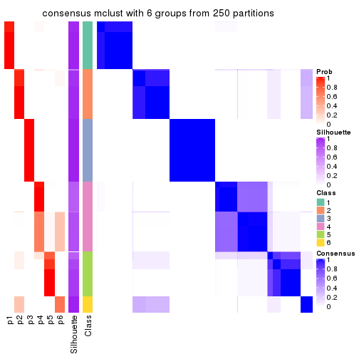</p>

</div>
</div>

Heatmaps for the membership of samples in all partitions to see how consistent they are:


<script>
$( function() {
	$( '#tabs-ATC-mclust-membership-heatmap' ).tabs();
} );
</script>
<div id='tabs-ATC-mclust-membership-heatmap'>
<ul>
<li><a href='#tab-ATC-mclust-membership-heatmap-1'>k = 2</a></li>
<li><a href='#tab-ATC-mclust-membership-heatmap-2'>k = 3</a></li>
<li><a href='#tab-ATC-mclust-membership-heatmap-3'>k = 4</a></li>
<li><a href='#tab-ATC-mclust-membership-heatmap-4'>k = 5</a></li>
<li><a href='#tab-ATC-mclust-membership-heatmap-5'>k = 6</a></li>
</ul>
<div id='tab-ATC-mclust-membership-heatmap-1'>
<pre><code class="r">membership_heatmap(res, k = 2)
</code></pre>

<p></p>

</div>
<div id='tab-ATC-mclust-membership-heatmap-2'>
<pre><code class="r">membership_heatmap(res, k = 3)
</code></pre>

<p></p>

</div>
<div id='tab-ATC-mclust-membership-heatmap-3'>
<pre><code class="r">membership_heatmap(res, k = 4)
</code></pre>

<p></p>

</div>
<div id='tab-ATC-mclust-membership-heatmap-4'>
<pre><code class="r">membership_heatmap(res, k = 5)
</code></pre>

<p></p>

</div>
<div id='tab-ATC-mclust-membership-heatmap-5'>
<pre><code class="r">membership_heatmap(res, k = 6)
</code></pre>

<p></p>

</div>
</div>

As soon as we have had the classes for columns, we can look for signatures
which are significantly different between classes which can be candidate marks
for certain classes. Following are the heatmaps for signatures.


Signature heatmaps where rows are scaled:


<script>
$( function() {
	$( '#tabs-ATC-mclust-get-signatures' ).tabs();
} );
</script>
<div id='tabs-ATC-mclust-get-signatures'>
<ul>
<li><a href='#tab-ATC-mclust-get-signatures-1'>k = 2</a></li>
<li><a href='#tab-ATC-mclust-get-signatures-2'>k = 3</a></li>
<li><a href='#tab-ATC-mclust-get-signatures-3'>k = 4</a></li>
<li><a href='#tab-ATC-mclust-get-signatures-4'>k = 5</a></li>
<li><a href='#tab-ATC-mclust-get-signatures-5'>k = 6</a></li>
</ul>
<div id='tab-ATC-mclust-get-signatures-1'>
<pre><code class="r">get_signatures(res, k = 2)
</code></pre>

<p></p>

</div>
<div id='tab-ATC-mclust-get-signatures-2'>
<pre><code class="r">get_signatures(res, k = 3)
</code></pre>

<p></p>

</div>
<div id='tab-ATC-mclust-get-signatures-3'>
<pre><code class="r">get_signatures(res, k = 4)
</code></pre>

<p></p>

</div>
<div id='tab-ATC-mclust-get-signatures-4'>
<pre><code class="r">get_signatures(res, k = 5)
</code></pre>

<p></p>

</div>
<div id='tab-ATC-mclust-get-signatures-5'>
<pre><code class="r">get_signatures(res, k = 6)
</code></pre>

<pre><code>#&gt; Error in mat[ceiling(1:nr/h_ratio), ceiling(1:nc/w_ratio), drop = FALSE]: subscript out of bounds
</code></pre>

<p></p>

</div>
</div>


Signature heatmaps where rows are not scaled:


<script>
$( function() {
	$( '#tabs-ATC-mclust-get-signatures-no-scale' ).tabs();
} );
</script>
<div id='tabs-ATC-mclust-get-signatures-no-scale'>
<ul>
<li><a href='#tab-ATC-mclust-get-signatures-no-scale-1'>k = 2</a></li>
<li><a href='#tab-ATC-mclust-get-signatures-no-scale-2'>k = 3</a></li>
<li><a href='#tab-ATC-mclust-get-signatures-no-scale-3'>k = 4</a></li>
<li><a href='#tab-ATC-mclust-get-signatures-no-scale-4'>k = 5</a></li>
<li><a href='#tab-ATC-mclust-get-signatures-no-scale-5'>k = 6</a></li>
</ul>
<div id='tab-ATC-mclust-get-signatures-no-scale-1'>
<pre><code class="r">get_signatures(res, k = 2, scale_rows = FALSE)
</code></pre>

<p></p>

</div>
<div id='tab-ATC-mclust-get-signatures-no-scale-2'>
<pre><code class="r">get_signatures(res, k = 3, scale_rows = FALSE)
</code></pre>

<p></p>

</div>
<div id='tab-ATC-mclust-get-signatures-no-scale-3'>
<pre><code class="r">get_signatures(res, k = 4, scale_rows = FALSE)
</code></pre>

<p></p>

</div>
<div id='tab-ATC-mclust-get-signatures-no-scale-4'>
<pre><code class="r">get_signatures(res, k = 5, scale_rows = FALSE)
</code></pre>

<p></p>

</div>
<div id='tab-ATC-mclust-get-signatures-no-scale-5'>
<pre><code class="r">get_signatures(res, k = 6, scale_rows = FALSE)
</code></pre>

<pre><code>#&gt; Error in mat[ceiling(1:nr/h_ratio), ceiling(1:nc/w_ratio), drop = FALSE]: subscript out of bounds
</code></pre>

<p></p>

</div>
</div>


Compare the overlap of signatures from different k:

```r
compare_signatures(res)
```


`get_signature()` returns a data frame invisibly. TO get the list of signatures, the function
call should be assigned to a variable explicitly. In following code, if `plot` argument is set
to `FALSE`, no heatmap is plotted while only the differential analysis is performed.

```r
# code only for demonstration
tb = get_signature(res, k = ..., plot = FALSE)
```

An example of the output of `tb` is:

```
#>   which_row         fdr    mean_1    mean_2 scaled_mean_1 scaled_mean_2 km
#> 1        38 0.042760348  8.373488  9.131774    -0.5533452     0.5164555  1
#> 2        40 0.018707592  7.106213  8.469186    -0.6173731     0.5762149  1
#> 3        55 0.019134737 10.221463 11.207825    -0.6159697     0.5749050  1
#> 4        59 0.006059896  5.921854  7.869574    -0.6899429     0.6439467  1
#> 5        60 0.018055526  8.928898 10.211722    -0.6204761     0.5791110  1
#> 6        98 0.009384629 15.714769 14.887706     0.6635654    -0.6193277  2
...
```

The columns in `tb` are:

1. `which_row`: row indices corresponding to the input matrix.
2. `fdr`: FDR for the differential test. 
3. `mean_x`: The mean value in group x.
4. `scaled_mean_x`: The mean value in group x after rows are scaled.
5. `km`: Row groups if k-means clustering is applied to rows.


UMAP plot which shows how samples are separated.


<script>
$( function() {
	$( '#tabs-ATC-mclust-dimension-reduction' ).tabs();
} );
</script>
<div id='tabs-ATC-mclust-dimension-reduction'>
<ul>
<li><a href='#tab-ATC-mclust-dimension-reduction-1'>k = 2</a></li>
<li><a href='#tab-ATC-mclust-dimension-reduction-2'>k = 3</a></li>
<li><a href='#tab-ATC-mclust-dimension-reduction-3'>k = 4</a></li>
<li><a href='#tab-ATC-mclust-dimension-reduction-4'>k = 5</a></li>
<li><a href='#tab-ATC-mclust-dimension-reduction-5'>k = 6</a></li>
</ul>
<div id='tab-ATC-mclust-dimension-reduction-1'>
<pre><code class="r">dimension_reduction(res, k = 2, method = &quot;UMAP&quot;)
</code></pre>

<p></p>

</div>
<div id='tab-ATC-mclust-dimension-reduction-2'>
<pre><code class="r">dimension_reduction(res, k = 3, method = &quot;UMAP&quot;)
</code></pre>

<p></p>

</div>
<div id='tab-ATC-mclust-dimension-reduction-3'>
<pre><code class="r">dimension_reduction(res, k = 4, method = &quot;UMAP&quot;)
</code></pre>

<p></p>

</div>
<div id='tab-ATC-mclust-dimension-reduction-4'>
<pre><code class="r">dimension_reduction(res, k = 5, method = &quot;UMAP&quot;)
</code></pre>

<p></p>

</div>
<div id='tab-ATC-mclust-dimension-reduction-5'>
<pre><code class="r">dimension_reduction(res, k = 6, method = &quot;UMAP&quot;)
</code></pre>

<p></p>

</div>
</div>


Following heatmap shows how subgroups are split when increasing `k`:

```r
collect_classes(res)
```


If matrix rows can be associated to genes, consider to use `functional_enrichment(res,
...)` to perform function enrichment for the signature genes. See [this vignette](http://bioconductor.org/packages/devel/bioc/vignettes/cola/inst/doc/functional_enrichment.html) for more detailed explanations.


 

---------------------------------------------------


### ATC:NMF**


The object with results only for a single top-value method and a single partition method 
can be extracted as:

```r
res = res_list["ATC", "NMF"]
# you can also extract it by
# res = res_list["ATC:NMF"]
```

A summary of `res` and all the functions that can be applied to it:

```r
res
```

```
#> A 'ConsensusPartition' object with k = 2, 3, 4, 5, 6.
#>   On a matrix with 13278 rows and 322 columns.
#>   Top rows (1000, 2000, 3000, 4000, 5000) are extracted by 'ATC' method.
#>   Subgroups are detected by 'NMF' method.
#>   Performed in total 1250 partitions by row resampling.
#>   Best k for subgroups seems to be 4.
#> 
#> Following methods can be applied to this 'ConsensusPartition' object:
#>  [1] "cola_report"             "collect_classes"         "collect_plots"          
#>  [4] "collect_stats"           "colnames"                "compare_signatures"     
#>  [7] "consensus_heatmap"       "dimension_reduction"     "functional_enrichment"  
#> [10] "get_anno_col"            "get_anno"                "get_classes"            
#> [13] "get_consensus"           "get_matrix"              "get_membership"         
#> [16] "get_param"               "get_signatures"          "get_stats"              
#> [19] "is_best_k"               "is_stable_k"             "membership_heatmap"     
#> [22] "ncol"                    "nrow"                    "plot_ecdf"              
#> [25] "rownames"                "select_partition_number" "show"                   
#> [28] "suggest_best_k"          "test_to_known_factors"
```

`collect_plots()` function collects all the plots made from `res` for all `k` (number of partitions)
into one single page to provide an easy and fast comparison between different `k`.

```r
collect_plots(res)
```


The plots are:

- The first row: a plot of the ECDF (empirical cumulative distribution
  function) curves of the consensus matrix for each `k` and the heatmap of
  predicted classes for each `k`.
- The second row: heatmaps of the consensus matrix for each `k`.
- The third row: heatmaps of the membership matrix for each `k`.
- The fouth row: heatmaps of the signatures for each `k`.

All the plots in panels can be made by individual functions and they are
plotted later in this section.

`select_partition_number()` produces several plots showing different
statistics for choosing "optimized" `k`. There are following statistics:

- ECDF curves of the consensus matrix for each `k`;
- 1-PAC. [The PAC
  score](https://en.wikipedia.org/wiki/Consensus_clustering#Over-interpretation_potential_of_consensus_clustering)
  measures the proportion of the ambiguous subgrouping.
- Mean silhouette score.
- Concordance. The mean probability of fiting the consensus class ids in all
  partitions.
- Area increased. Denote $A_k$ as the area under the ECDF curve for current
  `k`, the area increased is defined as $A_k - A_{k-1}$.
- Rand index. The percent of pairs of samples that are both in a same cluster
  or both are not in a same cluster in the partition of k and k-1.
- Jaccard index. The ratio of pairs of samples are both in a same cluster in
  the partition of k and k-1 and the pairs of samples are both in a same
  cluster in the partition k or k-1.

The detailed explanations of these statistics can be found in [the _cola_
vignette](http://bioconductor.org/packages/devel/bioc/vignettes/cola/inst/doc/cola.html#toc_13).

Generally speaking, lower PAC score, higher mean silhouette score or higher
concordance corresponds to better partition. Rand index and Jaccard index
measure how similar the current partition is compared to partition with `k-1`.
If they are too similar, we won't accept `k` is better than `k-1`.

```r
select_partition_number(res)
```


The numeric values for all these statistics can be obtained by `get_stats()`.

```r
get_stats(res)
```

```
#>   k 1-PAC mean_silhouette concordance area_increased  Rand Jaccard
#> 2 2 1.000           1.000       1.000         0.4742 0.526   0.526
#> 3 3 0.692           0.910       0.896         0.3186 0.826   0.670
#> 4 4 0.969           0.959       0.970         0.1022 0.963   0.896
#> 5 5 0.769           0.877       0.900         0.0363 1.000   1.000
#> 6 6 0.831           0.904       0.886         0.0517 0.927   0.768
```

`suggest_best_k()` suggests the best $k$ based on these statistics. The rules are as follows:

- All $k$ with Jaccard index larger than 0.95 are removed because increasing
  $k$ does not provide enough extra information. If all $k$ are removed, it is
  marked as no subgroup is detected.
- For all $k$ with 1-PAC score larger than 0.9, the maximal $k$ is taken as
  the best $k$, and other $k$ are marked as optional $k$.
- If it does not fit the second rule. The $k$ with the maximal vote of the
  highest 1-PAC score, highest mean silhouette, and highest concordance is
  taken as the best $k$.

```r
suggest_best_k(res)
```

```
#> [1] 4
#> attr(,"optional")
#> [1] 2
```

There is also optional best $k$ = 2 that is worth to check.

Following shows the table of the partitions (You need to click the **show/hide
code output** link to see it). The membership matrix (columns with name `p*`)
is inferred by
[`clue::cl_consensus()`](https://www.rdocumentation.org/link/cl_consensus?package=clue)
function with the `SE` method. Basically the value in the membership matrix
represents the probability to belong to a certain group. The finall class
label for an item is determined with the group with highest probability it
belongs to.

In `get_classes()` function, the entropy is calculated from the membership
matrix and the silhouette score is calculated from the consensus matrix.


<script>
$( function() {
	$( '#tabs-ATC-NMF-get-classes' ).tabs();
} );
</script>
<div id='tabs-ATC-NMF-get-classes'>
<ul>
<li><a href='#tab-ATC-NMF-get-classes-1'>k = 2</a></li>
<li><a href='#tab-ATC-NMF-get-classes-2'>k = 3</a></li>
<li><a href='#tab-ATC-NMF-get-classes-3'>k = 4</a></li>
<li><a href='#tab-ATC-NMF-get-classes-4'>k = 5</a></li>
<li><a href='#tab-ATC-NMF-get-classes-5'>k = 6</a></li>
</ul>

<div id='tab-ATC-NMF-get-classes-1'>
<p><a id='tab-ATC-NMF-get-classes-1-a' style='color:#0366d6' href='#'>show/hide code output</a></p>
<pre><code class="r">cbind(get_classes(res, k = 2), get_membership(res, k = 2))
</code></pre>

<pre><code>#&gt;           class entropy silhouette    p1    p2
#&gt; DRR023371     1  0.0000      1.000 1.000 0.000
#&gt; DRR023372     1  0.0000      1.000 1.000 0.000
#&gt; DRR023373     1  0.0000      1.000 1.000 0.000
#&gt; DRR023374     1  0.0000      1.000 1.000 0.000
#&gt; DRR023375     1  0.0000      1.000 1.000 0.000
#&gt; DRR023376     1  0.0000      1.000 1.000 0.000
#&gt; DRR023377     1  0.0000      1.000 1.000 0.000
#&gt; DRR023378     1  0.0000      1.000 1.000 0.000
#&gt; DRR023379     1  0.0000      1.000 1.000 0.000
#&gt; DRR023380     1  0.0000      1.000 1.000 0.000
#&gt; DRR023381     1  0.0000      1.000 1.000 0.000
#&gt; DRR023382     1  0.0000      1.000 1.000 0.000
#&gt; DRR023383     1  0.0000      1.000 1.000 0.000
#&gt; DRR023384     1  0.0000      1.000 1.000 0.000
#&gt; DRR023385     1  0.0000      1.000 1.000 0.000
#&gt; DRR023386     1  0.0000      1.000 1.000 0.000
#&gt; DRR023387     1  0.0000      1.000 1.000 0.000
#&gt; DRR023388     1  0.0000      1.000 1.000 0.000
#&gt; DRR023389     1  0.0000      1.000 1.000 0.000
#&gt; DRR023390     1  0.0000      1.000 1.000 0.000
#&gt; DRR023391     1  0.0000      1.000 1.000 0.000
#&gt; DRR023392     1  0.0000      1.000 1.000 0.000
#&gt; DRR023394     1  0.0000      1.000 1.000 0.000
#&gt; DRR023395     1  0.0000      1.000 1.000 0.000
#&gt; DRR023396     1  0.0000      1.000 1.000 0.000
#&gt; DRR023397     1  0.0000      1.000 1.000 0.000
#&gt; DRR023398     1  0.0000      1.000 1.000 0.000
#&gt; DRR023399     1  0.0000      1.000 1.000 0.000
#&gt; DRR023400     1  0.0000      1.000 1.000 0.000
#&gt; DRR023401     1  0.0000      1.000 1.000 0.000
#&gt; DRR023402     1  0.0000      1.000 1.000 0.000
#&gt; DRR023403     1  0.0000      1.000 1.000 0.000
#&gt; DRR023404     2  0.0000      1.000 0.000 1.000
#&gt; DRR023405     2  0.0000      1.000 0.000 1.000
#&gt; DRR023406     2  0.0000      1.000 0.000 1.000
#&gt; DRR023407     2  0.0000      1.000 0.000 1.000
#&gt; DRR023408     2  0.0000      1.000 0.000 1.000
#&gt; DRR023409     2  0.0000      1.000 0.000 1.000
#&gt; DRR023410     2  0.0000      1.000 0.000 1.000
#&gt; DRR023411     2  0.0000      1.000 0.000 1.000
#&gt; DRR023412     2  0.0000      1.000 0.000 1.000
#&gt; DRR023413     2  0.0000      1.000 0.000 1.000
#&gt; DRR023414     2  0.0000      1.000 0.000 1.000
#&gt; DRR023415     2  0.0000      1.000 0.000 1.000
#&gt; DRR023416     2  0.0000      1.000 0.000 1.000
#&gt; DRR023417     2  0.0000      1.000 0.000 1.000
#&gt; DRR023418     2  0.0000      1.000 0.000 1.000
#&gt; DRR023419     2  0.0000      1.000 0.000 1.000
#&gt; DRR023420     2  0.0000      1.000 0.000 1.000
#&gt; DRR023421     2  0.0000      1.000 0.000 1.000
#&gt; DRR023422     2  0.0000      1.000 0.000 1.000
#&gt; DRR023423     2  0.0000      1.000 0.000 1.000
#&gt; DRR023425     2  0.0000      1.000 0.000 1.000
#&gt; DRR023426     2  0.0000      1.000 0.000 1.000
#&gt; DRR023427     2  0.0000      1.000 0.000 1.000
#&gt; DRR023428     2  0.0000      1.000 0.000 1.000
#&gt; DRR023429     2  0.0000      1.000 0.000 1.000
#&gt; DRR023430     2  0.0000      1.000 0.000 1.000
#&gt; DRR023431     2  0.0000      1.000 0.000 1.000
#&gt; DRR023432     2  0.0000      1.000 0.000 1.000
#&gt; DRR023433     2  0.0000      1.000 0.000 1.000
#&gt; DRR023434     2  0.0000      1.000 0.000 1.000
#&gt; DRR023435     2  0.0000      1.000 0.000 1.000
#&gt; DRR023436     2  0.0000      1.000 0.000 1.000
#&gt; DRR023437     2  0.0000      1.000 0.000 1.000
#&gt; DRR023438     2  0.0000      1.000 0.000 1.000
#&gt; DRR023439     2  0.0000      1.000 0.000 1.000
#&gt; DRR023440     2  0.0000      1.000 0.000 1.000
#&gt; DRR023441     2  0.0000      1.000 0.000 1.000
#&gt; DRR023442     2  0.0000      1.000 0.000 1.000
#&gt; DRR023443     2  0.0000      1.000 0.000 1.000
#&gt; DRR023444     2  0.0000      1.000 0.000 1.000
#&gt; DRR023445     2  0.0000      1.000 0.000 1.000
#&gt; DRR023446     2  0.0000      1.000 0.000 1.000
#&gt; DRR023447     2  0.0000      1.000 0.000 1.000
#&gt; DRR023448     2  0.0000      1.000 0.000 1.000
#&gt; DRR023449     2  0.0000      1.000 0.000 1.000
#&gt; DRR023450     2  0.0000      1.000 0.000 1.000
#&gt; DRR023451     2  0.0000      1.000 0.000 1.000
#&gt; DRR023452     2  0.0000      1.000 0.000 1.000
#&gt; DRR023453     1  0.0000      1.000 1.000 0.000
#&gt; DRR023454     1  0.0000      1.000 1.000 0.000
#&gt; DRR023455     1  0.0000      1.000 1.000 0.000
#&gt; DRR023456     1  0.0000      1.000 1.000 0.000
#&gt; DRR023457     1  0.0000      1.000 1.000 0.000
#&gt; DRR023458     1  0.0000      1.000 1.000 0.000
#&gt; DRR023459     1  0.0000      1.000 1.000 0.000
#&gt; DRR023460     1  0.0000      1.000 1.000 0.000
#&gt; DRR023461     1  0.0000      1.000 1.000 0.000
#&gt; DRR023462     1  0.0000      1.000 1.000 0.000
#&gt; DRR023463     1  0.0000      1.000 1.000 0.000
#&gt; DRR023464     1  0.0000      1.000 1.000 0.000
#&gt; DRR023465     1  0.0000      1.000 1.000 0.000
#&gt; DRR023466     1  0.0000      1.000 1.000 0.000
#&gt; DRR023467     1  0.0000      1.000 1.000 0.000
#&gt; DRR023468     1  0.0000      1.000 1.000 0.000
#&gt; DRR023469     1  0.0000      1.000 1.000 0.000
#&gt; DRR023470     1  0.0000      1.000 1.000 0.000
#&gt; DRR023471     1  0.0000      1.000 1.000 0.000
#&gt; DRR023472     1  0.0000      1.000 1.000 0.000
#&gt; DRR023473     1  0.0000      1.000 1.000 0.000
#&gt; DRR023474     1  0.0000      1.000 1.000 0.000
#&gt; DRR023475     1  0.0000      1.000 1.000 0.000
#&gt; DRR023476     1  0.0000      1.000 1.000 0.000
#&gt; DRR023477     1  0.0000      1.000 1.000 0.000
#&gt; DRR023478     1  0.0000      1.000 1.000 0.000
#&gt; DRR023479     1  0.0000      1.000 1.000 0.000
#&gt; DRR023480     1  0.0000      1.000 1.000 0.000
#&gt; DRR023481     1  0.0000      1.000 1.000 0.000
#&gt; DRR023482     1  0.0000      1.000 1.000 0.000
#&gt; DRR023483     1  0.0000      1.000 1.000 0.000
#&gt; DRR023484     1  0.0000      1.000 1.000 0.000
#&gt; DRR023485     1  0.0000      1.000 1.000 0.000
#&gt; DRR023486     1  0.0000      1.000 1.000 0.000
#&gt; DRR023487     1  0.0000      1.000 1.000 0.000
#&gt; DRR023488     1  0.0000      1.000 1.000 0.000
#&gt; DRR023489     1  0.0000      1.000 1.000 0.000
#&gt; DRR023490     1  0.0000      1.000 1.000 0.000
#&gt; DRR023491     1  0.0000      1.000 1.000 0.000
#&gt; DRR023492     1  0.0000      1.000 1.000 0.000
#&gt; DRR023493     1  0.0000      1.000 1.000 0.000
#&gt; DRR023494     1  0.0000      1.000 1.000 0.000
#&gt; DRR023495     1  0.0000      1.000 1.000 0.000
#&gt; DRR023496     1  0.0000      1.000 1.000 0.000
#&gt; DRR023497     1  0.0000      1.000 1.000 0.000
#&gt; DRR023498     1  0.0000      1.000 1.000 0.000
#&gt; DRR023499     1  0.0000      1.000 1.000 0.000
#&gt; DRR023500     1  0.0000      1.000 1.000 0.000
#&gt; DRR023501     1  0.0000      1.000 1.000 0.000
#&gt; DRR023502     1  0.0000      1.000 1.000 0.000
#&gt; DRR023503     1  0.0000      1.000 1.000 0.000
#&gt; DRR023504     1  0.0000      1.000 1.000 0.000
#&gt; DRR023505     1  0.0000      1.000 1.000 0.000
#&gt; DRR023506     1  0.0000      1.000 1.000 0.000
#&gt; DRR023507     1  0.0000      1.000 1.000 0.000
#&gt; DRR023508     1  0.0000      1.000 1.000 0.000
#&gt; DRR023509     1  0.0000      1.000 1.000 0.000
#&gt; DRR023510     1  0.0000      1.000 1.000 0.000
#&gt; DRR023511     1  0.0000      1.000 1.000 0.000
#&gt; DRR023512     1  0.0000      1.000 1.000 0.000
#&gt; DRR023513     1  0.0000      1.000 1.000 0.000
#&gt; DRR023514     1  0.0000      1.000 1.000 0.000
#&gt; DRR023515     1  0.0000      1.000 1.000 0.000
#&gt; DRR023516     1  0.0000      1.000 1.000 0.000
#&gt; DRR023517     1  0.0000      1.000 1.000 0.000
#&gt; DRR023518     1  0.0000      1.000 1.000 0.000
#&gt; DRR023519     1  0.0000      1.000 1.000 0.000
#&gt; DRR023520     1  0.0000      1.000 1.000 0.000
#&gt; DRR023521     1  0.0000      1.000 1.000 0.000
#&gt; DRR023522     1  0.0000      1.000 1.000 0.000
#&gt; DRR023523     1  0.0000      1.000 1.000 0.000
#&gt; DRR023524     1  0.0000      1.000 1.000 0.000
#&gt; DRR023525     1  0.0000      1.000 1.000 0.000
#&gt; DRR023526     1  0.0000      1.000 1.000 0.000
#&gt; DRR023527     1  0.0000      1.000 1.000 0.000
#&gt; DRR023528     1  0.0000      1.000 1.000 0.000
#&gt; DRR023529     1  0.0000      1.000 1.000 0.000
#&gt; DRR023530     1  0.0000      1.000 1.000 0.000
#&gt; DRR023531     1  0.0000      1.000 1.000 0.000
#&gt; DRR023532     1  0.0000      1.000 1.000 0.000
#&gt; DRR023533     1  0.0000      1.000 1.000 0.000
#&gt; DRR023534     1  0.0000      1.000 1.000 0.000
#&gt; DRR023535     1  0.0000      1.000 1.000 0.000
#&gt; DRR023536     1  0.0000      1.000 1.000 0.000
#&gt; DRR023537     1  0.0000      1.000 1.000 0.000
#&gt; DRR023538     1  0.0000      1.000 1.000 0.000
#&gt; DRR023539     1  0.0000      1.000 1.000 0.000
#&gt; DRR023540     1  0.0000      1.000 1.000 0.000
#&gt; DRR023541     1  0.0000      1.000 1.000 0.000
#&gt; DRR023542     1  0.0000      1.000 1.000 0.000
#&gt; DRR023543     1  0.0000      1.000 1.000 0.000
#&gt; DRR023544     1  0.0000      1.000 1.000 0.000
#&gt; DRR023545     1  0.0000      1.000 1.000 0.000
#&gt; DRR023546     1  0.0000      1.000 1.000 0.000
#&gt; DRR023547     1  0.0000      1.000 1.000 0.000
#&gt; DRR023548     1  0.0000      1.000 1.000 0.000
#&gt; DRR023549     1  0.0000      1.000 1.000 0.000
#&gt; DRR023550     1  0.0000      1.000 1.000 0.000
#&gt; DRR023551     1  0.0000      1.000 1.000 0.000
#&gt; DRR023552     1  0.0000      1.000 1.000 0.000
#&gt; DRR023553     1  0.0000      1.000 1.000 0.000
#&gt; DRR023554     1  0.0000      1.000 1.000 0.000
#&gt; DRR023555     1  0.0000      1.000 1.000 0.000
#&gt; DRR023556     1  0.0000      1.000 1.000 0.000
#&gt; DRR023557     1  0.0000      1.000 1.000 0.000
#&gt; DRR023558     1  0.0000      1.000 1.000 0.000
#&gt; DRR023559     1  0.0000      1.000 1.000 0.000
#&gt; DRR023560     1  0.0000      1.000 1.000 0.000
#&gt; DRR023561     1  0.0000      1.000 1.000 0.000
#&gt; DRR023562     1  0.0000      1.000 1.000 0.000
#&gt; DRR023563     1  0.0000      1.000 1.000 0.000
#&gt; DRR023564     1  0.0000      1.000 1.000 0.000
#&gt; DRR023565     1  0.0000      1.000 1.000 0.000
#&gt; DRR023566     1  0.0000      1.000 1.000 0.000
#&gt; DRR023567     1  0.0000      1.000 1.000 0.000
#&gt; DRR023568     1  0.0000      1.000 1.000 0.000
#&gt; DRR023569     1  0.0000      1.000 1.000 0.000
#&gt; DRR023570     1  0.0000      1.000 1.000 0.000
#&gt; DRR023571     1  0.0000      1.000 1.000 0.000
#&gt; DRR023572     1  0.0000      1.000 1.000 0.000
#&gt; DRR023573     1  0.0000      1.000 1.000 0.000
#&gt; DRR023574     1  0.0000      1.000 1.000 0.000
#&gt; DRR023575     1  0.0000      1.000 1.000 0.000
#&gt; DRR023576     2  0.0000      1.000 0.000 1.000
#&gt; DRR023577     2  0.0000      1.000 0.000 1.000
#&gt; DRR023578     2  0.0000      1.000 0.000 1.000
#&gt; DRR023579     2  0.0000      1.000 0.000 1.000
#&gt; DRR023580     2  0.0000      1.000 0.000 1.000
#&gt; DRR023581     2  0.0000      1.000 0.000 1.000
#&gt; DRR023582     2  0.0000      1.000 0.000 1.000
#&gt; DRR023583     2  0.0000      1.000 0.000 1.000
#&gt; DRR023584     2  0.0000      1.000 0.000 1.000
#&gt; DRR023585     2  0.0000      1.000 0.000 1.000
#&gt; DRR023586     2  0.0000      1.000 0.000 1.000
#&gt; DRR023587     2  0.0000      1.000 0.000 1.000
#&gt; DRR023588     2  0.0000      1.000 0.000 1.000
#&gt; DRR023589     2  0.0000      1.000 0.000 1.000
#&gt; DRR023590     2  0.0000      1.000 0.000 1.000
#&gt; DRR023591     2  0.0000      1.000 0.000 1.000
#&gt; DRR023592     2  0.0000      1.000 0.000 1.000
#&gt; DRR023593     2  0.0000      1.000 0.000 1.000
#&gt; DRR023594     2  0.0000      1.000 0.000 1.000
#&gt; DRR023595     2  0.0000      1.000 0.000 1.000
#&gt; DRR023596     2  0.0000      1.000 0.000 1.000
#&gt; DRR023597     2  0.0000      1.000 0.000 1.000
#&gt; DRR023598     2  0.0000      1.000 0.000 1.000
#&gt; DRR023599     2  0.0000      1.000 0.000 1.000
#&gt; DRR023600     2  0.0000      1.000 0.000 1.000
#&gt; DRR023601     2  0.0000      1.000 0.000 1.000
#&gt; DRR023602     2  0.0000      1.000 0.000 1.000
#&gt; DRR023603     2  0.0000      1.000 0.000 1.000
#&gt; DRR023604     2  0.0000      1.000 0.000 1.000
#&gt; DRR023605     2  0.0000      1.000 0.000 1.000
#&gt; DRR023606     2  0.0000      1.000 0.000 1.000
#&gt; DRR023607     2  0.0000      1.000 0.000 1.000
#&gt; DRR023608     2  0.0000      1.000 0.000 1.000
#&gt; DRR023609     2  0.0000      1.000 0.000 1.000
#&gt; DRR023610     2  0.0000      1.000 0.000 1.000
#&gt; DRR023611     2  0.0000      1.000 0.000 1.000
#&gt; DRR023612     2  0.0000      1.000 0.000 1.000
#&gt; DRR023613     2  0.0000      1.000 0.000 1.000
#&gt; DRR023614     2  0.0000      1.000 0.000 1.000
#&gt; DRR023615     2  0.0000      1.000 0.000 1.000
#&gt; DRR023616     2  0.0000      1.000 0.000 1.000
#&gt; DRR023617     2  0.0000      1.000 0.000 1.000
#&gt; DRR023619     1  0.0000      1.000 1.000 0.000
#&gt; DRR023620     1  0.0000      1.000 1.000 0.000
#&gt; DRR023621     1  0.0000      1.000 1.000 0.000
#&gt; DRR023622     1  0.0000      1.000 1.000 0.000
#&gt; DRR023623     1  0.0000      1.000 1.000 0.000
#&gt; DRR023624     1  0.0000      1.000 1.000 0.000
#&gt; DRR023625     1  0.0000      1.000 1.000 0.000
#&gt; DRR023626     1  0.0000      1.000 1.000 0.000
#&gt; DRR023627     1  0.0376      0.996 0.996 0.004
#&gt; DRR023628     1  0.0376      0.996 0.996 0.004
#&gt; DRR023629     1  0.0000      1.000 1.000 0.000
#&gt; DRR023630     1  0.0000      1.000 1.000 0.000
#&gt; DRR023631     1  0.0000      1.000 1.000 0.000
#&gt; DRR023632     1  0.0000      1.000 1.000 0.000
#&gt; DRR023633     1  0.0376      0.996 0.996 0.004
#&gt; DRR023635     2  0.0000      1.000 0.000 1.000
#&gt; DRR023636     2  0.0000      1.000 0.000 1.000
#&gt; DRR023637     2  0.0000      1.000 0.000 1.000
#&gt; DRR023638     2  0.0000      1.000 0.000 1.000
#&gt; DRR023639     2  0.0000      1.000 0.000 1.000
#&gt; DRR023640     2  0.0000      1.000 0.000 1.000
#&gt; DRR023641     2  0.0000      1.000 0.000 1.000
#&gt; DRR023642     2  0.0000      1.000 0.000 1.000
#&gt; DRR023643     2  0.0000      1.000 0.000 1.000
#&gt; DRR023644     2  0.0000      1.000 0.000 1.000
#&gt; DRR023645     2  0.0000      1.000 0.000 1.000
#&gt; DRR023646     2  0.0000      1.000 0.000 1.000
#&gt; DRR023647     2  0.0000      1.000 0.000 1.000
#&gt; DRR023648     2  0.0000      1.000 0.000 1.000
#&gt; DRR023649     2  0.0000      1.000 0.000 1.000
#&gt; DRR023650     1  0.0000      1.000 1.000 0.000
#&gt; DRR023651     1  0.0000      1.000 1.000 0.000
#&gt; DRR023652     1  0.0000      1.000 1.000 0.000
#&gt; DRR023653     1  0.0000      1.000 1.000 0.000
#&gt; DRR023654     1  0.0000      1.000 1.000 0.000
#&gt; DRR023655     1  0.0000      1.000 1.000 0.000
#&gt; DRR023656     1  0.0000      1.000 1.000 0.000
#&gt; DRR023657     1  0.0000      1.000 1.000 0.000
#&gt; DRR023658     1  0.0000      1.000 1.000 0.000
#&gt; DRR023659     1  0.0000      1.000 1.000 0.000
#&gt; DRR023660     1  0.0000      1.000 1.000 0.000
#&gt; DRR023661     1  0.0000      1.000 1.000 0.000
#&gt; DRR023662     1  0.0000      1.000 1.000 0.000
#&gt; DRR023663     1  0.0000      1.000 1.000 0.000
#&gt; DRR023664     1  0.0000      1.000 1.000 0.000
#&gt; DRR023665     1  0.0000      1.000 1.000 0.000
#&gt; DRR023666     1  0.0000      1.000 1.000 0.000
#&gt; DRR023667     1  0.0000      1.000 1.000 0.000
#&gt; DRR023668     1  0.0000      1.000 1.000 0.000
#&gt; DRR023669     1  0.0000      1.000 1.000 0.000
#&gt; DRR023670     1  0.0000      1.000 1.000 0.000
#&gt; DRR023671     1  0.0000      1.000 1.000 0.000
#&gt; DRR023672     1  0.0000      1.000 1.000 0.000
#&gt; DRR023673     1  0.0000      1.000 1.000 0.000
#&gt; DRR023674     1  0.0000      1.000 1.000 0.000
#&gt; DRR023675     1  0.0000      1.000 1.000 0.000
#&gt; DRR023676     1  0.0000      1.000 1.000 0.000
#&gt; DRR023677     1  0.0000      1.000 1.000 0.000
#&gt; DRR023678     1  0.0000      1.000 1.000 0.000
#&gt; DRR023683     2  0.0000      1.000 0.000 1.000
#&gt; DRR023684     2  0.0000      1.000 0.000 1.000
#&gt; DRR023685     2  0.0000      1.000 0.000 1.000
#&gt; DRR023686     2  0.0000      1.000 0.000 1.000
#&gt; DRR023687     2  0.0000      1.000 0.000 1.000
#&gt; DRR023688     2  0.0000      1.000 0.000 1.000
#&gt; DRR023689     2  0.0000      1.000 0.000 1.000
#&gt; DRR023690     2  0.0000      1.000 0.000 1.000
#&gt; DRR023691     2  0.0000      1.000 0.000 1.000
#&gt; DRR023692     2  0.0000      1.000 0.000 1.000
#&gt; DRR023693     2  0.0000      1.000 0.000 1.000
#&gt; DRR023694     2  0.0000      1.000 0.000 1.000
#&gt; DRR023695     2  0.0000      1.000 0.000 1.000
#&gt; DRR023696     2  0.0000      1.000 0.000 1.000
#&gt; DRR023697     2  0.0000      1.000 0.000 1.000
#&gt; DRR023698     2  0.0000      1.000 0.000 1.000
#&gt; DRR023699     2  0.0000      1.000 0.000 1.000
#&gt; DRR023700     2  0.0000      1.000 0.000 1.000
</code></pre>

<script>
$('#tab-ATC-NMF-get-classes-1-a').parent().next().next().hide();
$('#tab-ATC-NMF-get-classes-1-a').click(function(){
  $('#tab-ATC-NMF-get-classes-1-a').parent().next().next().toggle();
  return(false);
});
</script>
</div>

<div id='tab-ATC-NMF-get-classes-2'>
<p><a id='tab-ATC-NMF-get-classes-2-a' style='color:#0366d6' href='#'>show/hide code output</a></p>
<pre><code class="r">cbind(get_classes(res, k = 3), get_membership(res, k = 3))
</code></pre>

<pre><code>#&gt;           class entropy silhouette    p1    p2    p3
#&gt; DRR023371     3  0.4555      0.940 0.200 0.000 0.800
#&gt; DRR023372     3  0.4555      0.940 0.200 0.000 0.800
#&gt; DRR023373     3  0.4555      0.940 0.200 0.000 0.800
#&gt; DRR023374     3  0.4555      0.940 0.200 0.000 0.800
#&gt; DRR023375     3  0.4555      0.940 0.200 0.000 0.800
#&gt; DRR023376     3  0.4555      0.940 0.200 0.000 0.800
#&gt; DRR023377     3  0.4555      0.940 0.200 0.000 0.800
#&gt; DRR023378     3  0.4555      0.940 0.200 0.000 0.800
#&gt; DRR023379     3  0.4555      0.940 0.200 0.000 0.800
#&gt; DRR023380     3  0.4555      0.940 0.200 0.000 0.800
#&gt; DRR023381     3  0.4555      0.940 0.200 0.000 0.800
#&gt; DRR023382     3  0.4555      0.940 0.200 0.000 0.800
#&gt; DRR023383     3  0.4555      0.940 0.200 0.000 0.800
#&gt; DRR023384     3  0.4555      0.940 0.200 0.000 0.800
#&gt; DRR023385     3  0.4555      0.940 0.200 0.000 0.800
#&gt; DRR023386     3  0.4555      0.940 0.200 0.000 0.800
#&gt; DRR023387     3  0.5058      0.913 0.244 0.000 0.756
#&gt; DRR023388     3  0.4842      0.928 0.224 0.000 0.776
#&gt; DRR023389     3  0.4931      0.923 0.232 0.000 0.768
#&gt; DRR023390     3  0.4796      0.931 0.220 0.000 0.780
#&gt; DRR023391     3  0.4887      0.926 0.228 0.000 0.772
#&gt; DRR023392     3  0.4974      0.920 0.236 0.000 0.764
#&gt; DRR023394     3  0.5016      0.916 0.240 0.000 0.760
#&gt; DRR023395     3  0.4842      0.928 0.224 0.000 0.776
#&gt; DRR023396     3  0.6095      0.721 0.392 0.000 0.608
#&gt; DRR023397     3  0.6062      0.737 0.384 0.000 0.616
#&gt; DRR023398     3  0.6079      0.730 0.388 0.000 0.612
#&gt; DRR023399     3  0.6079      0.730 0.388 0.000 0.612
#&gt; DRR023400     3  0.6026      0.752 0.376 0.000 0.624
#&gt; DRR023401     3  0.6095      0.721 0.392 0.000 0.608
#&gt; DRR023402     3  0.6026      0.752 0.376 0.000 0.624
#&gt; DRR023403     3  0.5948      0.779 0.360 0.000 0.640
#&gt; DRR023404     2  0.0000      0.876 0.000 1.000 0.000
#&gt; DRR023405     2  0.0000      0.876 0.000 1.000 0.000
#&gt; DRR023406     2  0.0237      0.875 0.000 0.996 0.004
#&gt; DRR023407     2  0.0000      0.876 0.000 1.000 0.000
#&gt; DRR023408     2  0.0000      0.876 0.000 1.000 0.000
#&gt; DRR023409     2  0.0237      0.875 0.000 0.996 0.004
#&gt; DRR023410     2  0.0000      0.876 0.000 1.000 0.000
#&gt; DRR023411     2  0.0000      0.876 0.000 1.000 0.000
#&gt; DRR023412     2  0.0424      0.875 0.000 0.992 0.008
#&gt; DRR023413     2  0.0424      0.875 0.000 0.992 0.008
#&gt; DRR023414     2  0.0237      0.875 0.000 0.996 0.004
#&gt; DRR023415     2  0.0000      0.876 0.000 1.000 0.000
#&gt; DRR023416     2  0.0000      0.876 0.000 1.000 0.000
#&gt; DRR023417     2  0.0000      0.876 0.000 1.000 0.000
#&gt; DRR023418     2  0.0237      0.875 0.000 0.996 0.004
#&gt; DRR023419     2  0.0237      0.875 0.000 0.996 0.004
#&gt; DRR023420     2  0.0000      0.876 0.000 1.000 0.000
#&gt; DRR023421     2  0.0424      0.875 0.000 0.992 0.008
#&gt; DRR023422     2  0.5650      0.777 0.000 0.688 0.312
#&gt; DRR023423     2  0.5882      0.756 0.000 0.652 0.348
#&gt; DRR023425     2  0.5926      0.750 0.000 0.644 0.356
#&gt; DRR023426     2  0.5733      0.771 0.000 0.676 0.324
#&gt; DRR023427     2  0.5810      0.762 0.000 0.664 0.336
#&gt; DRR023428     2  0.5882      0.754 0.000 0.652 0.348
#&gt; DRR023429     2  0.5706      0.770 0.000 0.680 0.320
#&gt; DRR023430     2  0.5733      0.769 0.000 0.676 0.324
#&gt; DRR023431     2  0.5529      0.783 0.000 0.704 0.296
#&gt; DRR023432     2  0.5733      0.769 0.000 0.676 0.324
#&gt; DRR023433     2  0.5650      0.775 0.000 0.688 0.312
#&gt; DRR023434     2  0.5733      0.771 0.000 0.676 0.324
#&gt; DRR023435     2  0.5785      0.762 0.000 0.668 0.332
#&gt; DRR023436     2  0.5363      0.794 0.000 0.724 0.276
#&gt; DRR023437     2  0.5216      0.798 0.000 0.740 0.260
#&gt; DRR023438     2  0.5760      0.765 0.000 0.672 0.328
#&gt; DRR023439     2  0.5810      0.761 0.000 0.664 0.336
#&gt; DRR023440     2  0.5591      0.779 0.000 0.696 0.304
#&gt; DRR023441     2  0.5621      0.777 0.000 0.692 0.308
#&gt; DRR023442     2  0.5733      0.769 0.000 0.676 0.324
#&gt; DRR023443     2  0.5835      0.761 0.000 0.660 0.340
#&gt; DRR023444     2  0.5058      0.796 0.000 0.756 0.244
#&gt; DRR023445     2  0.5621      0.775 0.000 0.692 0.308
#&gt; DRR023446     2  0.5785      0.763 0.000 0.668 0.332
#&gt; DRR023447     2  0.5905      0.753 0.000 0.648 0.352
#&gt; DRR023448     2  0.5560      0.781 0.000 0.700 0.300
#&gt; DRR023449     2  0.5810      0.763 0.000 0.664 0.336
#&gt; DRR023450     2  0.5178      0.800 0.000 0.744 0.256
#&gt; DRR023451     2  0.5785      0.767 0.000 0.668 0.332
#&gt; DRR023452     2  0.5733      0.768 0.000 0.676 0.324
#&gt; DRR023453     3  0.5859      0.803 0.344 0.000 0.656
#&gt; DRR023454     3  0.5810      0.814 0.336 0.000 0.664
#&gt; DRR023455     3  0.5905      0.791 0.352 0.000 0.648
#&gt; DRR023456     3  0.5785      0.819 0.332 0.000 0.668
#&gt; DRR023457     3  0.5859      0.803 0.344 0.000 0.656
#&gt; DRR023458     3  0.5810      0.814 0.336 0.000 0.664
#&gt; DRR023459     3  0.5988      0.766 0.368 0.000 0.632
#&gt; DRR023460     3  0.4702      0.935 0.212 0.000 0.788
#&gt; DRR023461     3  0.4452      0.936 0.192 0.000 0.808
#&gt; DRR023462     3  0.4452      0.936 0.192 0.000 0.808
#&gt; DRR023463     3  0.4452      0.936 0.192 0.000 0.808
#&gt; DRR023464     3  0.4452      0.936 0.192 0.000 0.808
#&gt; DRR023465     3  0.4452      0.936 0.192 0.000 0.808
#&gt; DRR023466     3  0.4452      0.936 0.192 0.000 0.808
#&gt; DRR023467     3  0.4399      0.933 0.188 0.000 0.812
#&gt; DRR023468     3  0.4452      0.936 0.192 0.000 0.808
#&gt; DRR023469     3  0.4452      0.936 0.192 0.000 0.808
#&gt; DRR023470     3  0.4452      0.936 0.192 0.000 0.808
#&gt; DRR023471     3  0.4504      0.938 0.196 0.000 0.804
#&gt; DRR023472     3  0.4504      0.938 0.196 0.000 0.804
#&gt; DRR023473     3  0.4452      0.936 0.192 0.000 0.808
#&gt; DRR023474     3  0.4452      0.936 0.192 0.000 0.808
#&gt; DRR023475     3  0.4346      0.929 0.184 0.000 0.816
#&gt; DRR023476     3  0.4346      0.929 0.184 0.000 0.816
#&gt; DRR023477     3  0.4346      0.929 0.184 0.000 0.816
#&gt; DRR023478     3  0.4346      0.929 0.184 0.000 0.816
#&gt; DRR023479     3  0.4346      0.929 0.184 0.000 0.816
#&gt; DRR023480     3  0.4346      0.929 0.184 0.000 0.816
#&gt; DRR023481     3  0.4399      0.933 0.188 0.000 0.812
#&gt; DRR023482     3  0.4555      0.940 0.200 0.000 0.800
#&gt; DRR023483     3  0.4555      0.940 0.200 0.000 0.800
#&gt; DRR023484     3  0.4605      0.939 0.204 0.000 0.796
#&gt; DRR023485     3  0.4555      0.940 0.200 0.000 0.800
#&gt; DRR023486     3  0.4654      0.937 0.208 0.000 0.792
#&gt; DRR023487     3  0.4605      0.939 0.204 0.000 0.796
#&gt; DRR023488     3  0.4555      0.940 0.200 0.000 0.800
#&gt; DRR023489     3  0.4605      0.939 0.204 0.000 0.796
#&gt; DRR023490     1  0.0000      0.996 1.000 0.000 0.000
#&gt; DRR023491     1  0.0000      0.996 1.000 0.000 0.000
#&gt; DRR023492     1  0.0000      0.996 1.000 0.000 0.000
#&gt; DRR023493     1  0.0000      0.996 1.000 0.000 0.000
#&gt; DRR023494     1  0.0000      0.996 1.000 0.000 0.000
#&gt; DRR023495     1  0.0000      0.996 1.000 0.000 0.000
#&gt; DRR023496     1  0.0000      0.996 1.000 0.000 0.000
#&gt; DRR023497     1  0.0000      0.996 1.000 0.000 0.000
#&gt; DRR023498     1  0.0000      0.996 1.000 0.000 0.000
#&gt; DRR023499     1  0.0000      0.996 1.000 0.000 0.000
#&gt; DRR023500     1  0.0000      0.996 1.000 0.000 0.000
#&gt; DRR023501     1  0.0000      0.996 1.000 0.000 0.000
#&gt; DRR023502     1  0.0000      0.996 1.000 0.000 0.000
#&gt; DRR023503     1  0.0000      0.996 1.000 0.000 0.000
#&gt; DRR023504     1  0.0000      0.996 1.000 0.000 0.000
#&gt; DRR023505     1  0.0000      0.996 1.000 0.000 0.000
#&gt; DRR023506     1  0.0000      0.996 1.000 0.000 0.000
#&gt; DRR023507     1  0.0000      0.996 1.000 0.000 0.000
#&gt; DRR023508     1  0.0000      0.996 1.000 0.000 0.000
#&gt; DRR023509     1  0.0000      0.996 1.000 0.000 0.000
#&gt; DRR023510     1  0.0000      0.996 1.000 0.000 0.000
#&gt; DRR023511     1  0.0000      0.996 1.000 0.000 0.000
#&gt; DRR023512     1  0.0000      0.996 1.000 0.000 0.000
#&gt; DRR023513     1  0.0000      0.996 1.000 0.000 0.000
#&gt; DRR023514     1  0.0000      0.996 1.000 0.000 0.000
#&gt; DRR023515     1  0.0000      0.996 1.000 0.000 0.000
#&gt; DRR023516     1  0.0000      0.996 1.000 0.000 0.000
#&gt; DRR023517     1  0.0000      0.996 1.000 0.000 0.000
#&gt; DRR023518     1  0.0000      0.996 1.000 0.000 0.000
#&gt; DRR023519     1  0.0000      0.996 1.000 0.000 0.000
#&gt; DRR023520     1  0.0000      0.996 1.000 0.000 0.000
#&gt; DRR023521     1  0.0000      0.996 1.000 0.000 0.000
#&gt; DRR023522     1  0.0000      0.996 1.000 0.000 0.000
#&gt; DRR023523     1  0.0000      0.996 1.000 0.000 0.000
#&gt; DRR023524     1  0.0000      0.996 1.000 0.000 0.000
#&gt; DRR023525     1  0.0000      0.996 1.000 0.000 0.000
#&gt; DRR023526     1  0.0000      0.996 1.000 0.000 0.000
#&gt; DRR023527     1  0.0000      0.996 1.000 0.000 0.000
#&gt; DRR023528     1  0.0000      0.996 1.000 0.000 0.000
#&gt; DRR023529     1  0.0000      0.996 1.000 0.000 0.000
#&gt; DRR023530     1  0.0000      0.996 1.000 0.000 0.000
#&gt; DRR023531     1  0.0000      0.996 1.000 0.000 0.000
#&gt; DRR023532     1  0.0000      0.996 1.000 0.000 0.000
#&gt; DRR023533     1  0.0000      0.996 1.000 0.000 0.000
#&gt; DRR023534     1  0.0000      0.996 1.000 0.000 0.000
#&gt; DRR023535     1  0.0000      0.996 1.000 0.000 0.000
#&gt; DRR023536     1  0.0000      0.996 1.000 0.000 0.000
#&gt; DRR023537     1  0.0000      0.996 1.000 0.000 0.000
#&gt; DRR023538     1  0.0000      0.996 1.000 0.000 0.000
#&gt; DRR023539     1  0.0000      0.996 1.000 0.000 0.000
#&gt; DRR023540     1  0.0000      0.996 1.000 0.000 0.000
#&gt; DRR023541     1  0.0000      0.996 1.000 0.000 0.000
#&gt; DRR023542     1  0.0000      0.996 1.000 0.000 0.000
#&gt; DRR023543     1  0.0000      0.996 1.000 0.000 0.000
#&gt; DRR023544     1  0.0000      0.996 1.000 0.000 0.000
#&gt; DRR023545     1  0.0000      0.996 1.000 0.000 0.000
#&gt; DRR023546     1  0.0000      0.996 1.000 0.000 0.000
#&gt; DRR023547     1  0.0000      0.996 1.000 0.000 0.000
#&gt; DRR023548     1  0.0000      0.996 1.000 0.000 0.000
#&gt; DRR023549     1  0.0000      0.996 1.000 0.000 0.000
#&gt; DRR023550     1  0.0000      0.996 1.000 0.000 0.000
#&gt; DRR023551     1  0.0000      0.996 1.000 0.000 0.000
#&gt; DRR023552     1  0.0000      0.996 1.000 0.000 0.000
#&gt; DRR023553     1  0.0000      0.996 1.000 0.000 0.000
#&gt; DRR023554     1  0.0000      0.996 1.000 0.000 0.000
#&gt; DRR023555     1  0.0000      0.996 1.000 0.000 0.000
#&gt; DRR023556     1  0.0000      0.996 1.000 0.000 0.000
#&gt; DRR023557     1  0.0000      0.996 1.000 0.000 0.000
#&gt; DRR023558     1  0.0000      0.996 1.000 0.000 0.000
#&gt; DRR023559     1  0.0000      0.996 1.000 0.000 0.000
#&gt; DRR023560     1  0.0000      0.996 1.000 0.000 0.000
#&gt; DRR023561     1  0.0000      0.996 1.000 0.000 0.000
#&gt; DRR023562     1  0.0000      0.996 1.000 0.000 0.000
#&gt; DRR023563     1  0.0000      0.996 1.000 0.000 0.000
#&gt; DRR023564     1  0.0000      0.996 1.000 0.000 0.000
#&gt; DRR023565     1  0.0000      0.996 1.000 0.000 0.000
#&gt; DRR023566     1  0.0000      0.996 1.000 0.000 0.000
#&gt; DRR023567     1  0.0000      0.996 1.000 0.000 0.000
#&gt; DRR023568     1  0.0000      0.996 1.000 0.000 0.000
#&gt; DRR023569     1  0.0000      0.996 1.000 0.000 0.000
#&gt; DRR023570     1  0.0000      0.996 1.000 0.000 0.000
#&gt; DRR023571     1  0.0000      0.996 1.000 0.000 0.000
#&gt; DRR023572     1  0.0000      0.996 1.000 0.000 0.000
#&gt; DRR023573     1  0.0000      0.996 1.000 0.000 0.000
#&gt; DRR023574     1  0.0000      0.996 1.000 0.000 0.000
#&gt; DRR023575     1  0.0000      0.996 1.000 0.000 0.000
#&gt; DRR023576     2  0.0000      0.876 0.000 1.000 0.000
#&gt; DRR023577     2  0.0000      0.876 0.000 1.000 0.000
#&gt; DRR023578     2  0.0000      0.876 0.000 1.000 0.000
#&gt; DRR023579     2  0.0000      0.876 0.000 1.000 0.000
#&gt; DRR023580     2  0.0000      0.876 0.000 1.000 0.000
#&gt; DRR023581     2  0.0000      0.876 0.000 1.000 0.000
#&gt; DRR023582     2  0.0000      0.876 0.000 1.000 0.000
#&gt; DRR023583     2  0.0000      0.876 0.000 1.000 0.000
#&gt; DRR023584     2  0.0000      0.876 0.000 1.000 0.000
#&gt; DRR023585     2  0.0000      0.876 0.000 1.000 0.000
#&gt; DRR023586     2  0.0000      0.876 0.000 1.000 0.000
#&gt; DRR023587     2  0.0000      0.876 0.000 1.000 0.000
#&gt; DRR023588     2  0.0000      0.876 0.000 1.000 0.000
#&gt; DRR023589     2  0.0000      0.876 0.000 1.000 0.000
#&gt; DRR023590     2  0.0000      0.876 0.000 1.000 0.000
#&gt; DRR023591     2  0.0000      0.876 0.000 1.000 0.000
#&gt; DRR023592     2  0.0000      0.876 0.000 1.000 0.000
#&gt; DRR023593     2  0.0000      0.876 0.000 1.000 0.000
#&gt; DRR023594     2  0.0000      0.876 0.000 1.000 0.000
#&gt; DRR023595     2  0.0000      0.876 0.000 1.000 0.000
#&gt; DRR023596     2  0.0000      0.876 0.000 1.000 0.000
#&gt; DRR023597     2  0.0000      0.876 0.000 1.000 0.000
#&gt; DRR023598     2  0.0000      0.876 0.000 1.000 0.000
#&gt; DRR023599     2  0.0000      0.876 0.000 1.000 0.000
#&gt; DRR023600     2  0.0000      0.876 0.000 1.000 0.000
#&gt; DRR023601     2  0.0000      0.876 0.000 1.000 0.000
#&gt; DRR023602     2  0.0000      0.876 0.000 1.000 0.000
#&gt; DRR023603     2  0.0000      0.876 0.000 1.000 0.000
#&gt; DRR023604     2  0.0000      0.876 0.000 1.000 0.000
#&gt; DRR023605     2  0.0000      0.876 0.000 1.000 0.000
#&gt; DRR023606     2  0.0000      0.876 0.000 1.000 0.000
#&gt; DRR023607     2  0.0000      0.876 0.000 1.000 0.000
#&gt; DRR023608     2  0.0000      0.876 0.000 1.000 0.000
#&gt; DRR023609     2  0.0000      0.876 0.000 1.000 0.000
#&gt; DRR023610     2  0.0000      0.876 0.000 1.000 0.000
#&gt; DRR023611     2  0.0000      0.876 0.000 1.000 0.000
#&gt; DRR023612     2  0.0000      0.876 0.000 1.000 0.000
#&gt; DRR023613     2  0.0000      0.876 0.000 1.000 0.000
#&gt; DRR023614     2  0.0000      0.876 0.000 1.000 0.000
#&gt; DRR023615     2  0.0000      0.876 0.000 1.000 0.000
#&gt; DRR023616     2  0.0000      0.876 0.000 1.000 0.000
#&gt; DRR023617     2  0.0000      0.876 0.000 1.000 0.000
#&gt; DRR023619     1  0.0237      0.992 0.996 0.004 0.000
#&gt; DRR023620     1  0.0237      0.992 0.996 0.004 0.000
#&gt; DRR023621     1  0.0237      0.992 0.996 0.004 0.000
#&gt; DRR023622     1  0.0237      0.992 0.996 0.004 0.000
#&gt; DRR023623     1  0.0424      0.987 0.992 0.008 0.000
#&gt; DRR023624     1  0.0237      0.992 0.996 0.004 0.000
#&gt; DRR023625     1  0.0237      0.992 0.996 0.004 0.000
#&gt; DRR023626     1  0.0892      0.970 0.980 0.020 0.000
#&gt; DRR023627     1  0.1753      0.927 0.952 0.048 0.000
#&gt; DRR023628     1  0.2066      0.908 0.940 0.060 0.000
#&gt; DRR023629     1  0.0237      0.992 0.996 0.004 0.000
#&gt; DRR023630     1  0.0592      0.981 0.988 0.012 0.000
#&gt; DRR023631     1  0.1411      0.946 0.964 0.036 0.000
#&gt; DRR023632     1  0.0237      0.992 0.996 0.004 0.000
#&gt; DRR023633     1  0.2625      0.868 0.916 0.084 0.000
#&gt; DRR023635     2  0.0000      0.876 0.000 1.000 0.000
#&gt; DRR023636     2  0.0000      0.876 0.000 1.000 0.000
#&gt; DRR023637     2  0.0000      0.876 0.000 1.000 0.000
#&gt; DRR023638     2  0.0000      0.876 0.000 1.000 0.000
#&gt; DRR023639     2  0.0000      0.876 0.000 1.000 0.000
#&gt; DRR023640     2  0.0000      0.876 0.000 1.000 0.000
#&gt; DRR023641     2  0.0000      0.876 0.000 1.000 0.000
#&gt; DRR023642     2  0.0000      0.876 0.000 1.000 0.000
#&gt; DRR023643     2  0.0000      0.876 0.000 1.000 0.000
#&gt; DRR023644     2  0.0000      0.876 0.000 1.000 0.000
#&gt; DRR023645     2  0.0000      0.876 0.000 1.000 0.000
#&gt; DRR023646     2  0.0000      0.876 0.000 1.000 0.000
#&gt; DRR023647     2  0.0000      0.876 0.000 1.000 0.000
#&gt; DRR023648     2  0.0000      0.876 0.000 1.000 0.000
#&gt; DRR023649     2  0.0000      0.876 0.000 1.000 0.000
#&gt; DRR023650     1  0.0000      0.996 1.000 0.000 0.000
#&gt; DRR023651     1  0.0000      0.996 1.000 0.000 0.000
#&gt; DRR023652     1  0.0000      0.996 1.000 0.000 0.000
#&gt; DRR023653     1  0.0000      0.996 1.000 0.000 0.000
#&gt; DRR023654     1  0.0000      0.996 1.000 0.000 0.000
#&gt; DRR023655     1  0.0000      0.996 1.000 0.000 0.000
#&gt; DRR023656     1  0.0000      0.996 1.000 0.000 0.000
#&gt; DRR023657     1  0.0000      0.996 1.000 0.000 0.000
#&gt; DRR023658     1  0.0000      0.996 1.000 0.000 0.000
#&gt; DRR023659     1  0.0000      0.996 1.000 0.000 0.000
#&gt; DRR023660     1  0.0000      0.996 1.000 0.000 0.000
#&gt; DRR023661     1  0.0000      0.996 1.000 0.000 0.000
#&gt; DRR023662     1  0.0000      0.996 1.000 0.000 0.000
#&gt; DRR023663     1  0.0000      0.996 1.000 0.000 0.000
#&gt; DRR023664     1  0.0000      0.996 1.000 0.000 0.000
#&gt; DRR023665     1  0.0237      0.992 0.996 0.000 0.004
#&gt; DRR023666     1  0.0000      0.996 1.000 0.000 0.000
#&gt; DRR023667     1  0.0000      0.996 1.000 0.000 0.000
#&gt; DRR023668     1  0.0000      0.996 1.000 0.000 0.000
#&gt; DRR023669     1  0.0000      0.996 1.000 0.000 0.000
#&gt; DRR023670     1  0.0000      0.996 1.000 0.000 0.000
#&gt; DRR023671     1  0.0000      0.996 1.000 0.000 0.000
#&gt; DRR023672     1  0.0000      0.996 1.000 0.000 0.000
#&gt; DRR023673     1  0.0237      0.992 0.996 0.004 0.000
#&gt; DRR023674     1  0.0000      0.996 1.000 0.000 0.000
#&gt; DRR023675     1  0.0000      0.996 1.000 0.000 0.000
#&gt; DRR023676     1  0.0000      0.996 1.000 0.000 0.000
#&gt; DRR023677     1  0.0000      0.996 1.000 0.000 0.000
#&gt; DRR023678     1  0.0237      0.992 0.996 0.004 0.000
#&gt; DRR023683     2  0.6126      0.722 0.000 0.600 0.400
#&gt; DRR023684     2  0.6126      0.722 0.000 0.600 0.400
#&gt; DRR023685     2  0.6126      0.722 0.000 0.600 0.400
#&gt; DRR023686     2  0.6126      0.722 0.000 0.600 0.400
#&gt; DRR023687     2  0.6126      0.722 0.000 0.600 0.400
#&gt; DRR023688     2  0.6126      0.722 0.000 0.600 0.400
#&gt; DRR023689     2  0.6126      0.722 0.000 0.600 0.400
#&gt; DRR023690     2  0.6126      0.722 0.000 0.600 0.400
#&gt; DRR023691     2  0.6126      0.722 0.000 0.600 0.400
#&gt; DRR023692     2  0.6126      0.722 0.000 0.600 0.400
#&gt; DRR023693     2  0.6126      0.722 0.000 0.600 0.400
#&gt; DRR023694     2  0.6126      0.722 0.000 0.600 0.400
#&gt; DRR023695     2  0.6126      0.722 0.000 0.600 0.400
#&gt; DRR023696     2  0.6126      0.722 0.000 0.600 0.400
#&gt; DRR023697     2  0.6126      0.722 0.000 0.600 0.400
#&gt; DRR023698     2  0.6126      0.722 0.000 0.600 0.400
#&gt; DRR023699     2  0.6126      0.722 0.000 0.600 0.400
#&gt; DRR023700     2  0.6126      0.722 0.000 0.600 0.400
</code></pre>

<script>
$('#tab-ATC-NMF-get-classes-2-a').parent().next().next().hide();
$('#tab-ATC-NMF-get-classes-2-a').click(function(){
  $('#tab-ATC-NMF-get-classes-2-a').parent().next().next().toggle();
  return(false);
});
</script>
</div>

<div id='tab-ATC-NMF-get-classes-3'>
<p><a id='tab-ATC-NMF-get-classes-3-a' style='color:#0366d6' href='#'>show/hide code output</a></p>
<pre><code class="r">cbind(get_classes(res, k = 4), get_membership(res, k = 4))
</code></pre>

<pre><code>#&gt;           class entropy silhouette    p1    p2    p3    p4
#&gt; DRR023371     3  0.0000      0.984 0.000 0.000 1.000 0.000
#&gt; DRR023372     3  0.0000      0.984 0.000 0.000 1.000 0.000
#&gt; DRR023373     3  0.0000      0.984 0.000 0.000 1.000 0.000
#&gt; DRR023374     3  0.0188      0.983 0.000 0.000 0.996 0.004
#&gt; DRR023375     3  0.0000      0.984 0.000 0.000 1.000 0.000
#&gt; DRR023376     3  0.0000      0.984 0.000 0.000 1.000 0.000
#&gt; DRR023377     3  0.0000      0.984 0.000 0.000 1.000 0.000
#&gt; DRR023378     3  0.0000      0.984 0.000 0.000 1.000 0.000
#&gt; DRR023379     3  0.0376      0.982 0.004 0.000 0.992 0.004
#&gt; DRR023380     3  0.0000      0.984 0.000 0.000 1.000 0.000
#&gt; DRR023381     3  0.0000      0.984 0.000 0.000 1.000 0.000
#&gt; DRR023382     3  0.0000      0.984 0.000 0.000 1.000 0.000
#&gt; DRR023383     3  0.0000      0.984 0.000 0.000 1.000 0.000
#&gt; DRR023384     3  0.0376      0.982 0.004 0.000 0.992 0.004
#&gt; DRR023385     3  0.0188      0.983 0.000 0.000 0.996 0.004
#&gt; DRR023386     3  0.0376      0.982 0.004 0.000 0.992 0.004
#&gt; DRR023387     3  0.0469      0.982 0.000 0.000 0.988 0.012
#&gt; DRR023388     3  0.0469      0.982 0.000 0.000 0.988 0.012
#&gt; DRR023389     3  0.0336      0.983 0.000 0.000 0.992 0.008
#&gt; DRR023390     3  0.0469      0.982 0.000 0.000 0.988 0.012
#&gt; DRR023391     3  0.0469      0.982 0.000 0.000 0.988 0.012
#&gt; DRR023392     3  0.0469      0.982 0.000 0.000 0.988 0.012
#&gt; DRR023394     3  0.0657      0.980 0.004 0.000 0.984 0.012
#&gt; DRR023395     3  0.0336      0.983 0.000 0.000 0.992 0.008
#&gt; DRR023396     3  0.0524      0.981 0.004 0.000 0.988 0.008
#&gt; DRR023397     3  0.0524      0.981 0.004 0.000 0.988 0.008
#&gt; DRR023398     3  0.0524      0.981 0.004 0.000 0.988 0.008
#&gt; DRR023399     3  0.0524      0.981 0.004 0.000 0.988 0.008
#&gt; DRR023400     3  0.0524      0.981 0.004 0.000 0.988 0.008
#&gt; DRR023401     3  0.0524      0.981 0.004 0.000 0.988 0.008
#&gt; DRR023402     3  0.0524      0.981 0.004 0.000 0.988 0.008
#&gt; DRR023403     3  0.0524      0.981 0.004 0.000 0.988 0.008
#&gt; DRR023404     2  0.0000      0.956 0.000 1.000 0.000 0.000
#&gt; DRR023405     2  0.0000      0.956 0.000 1.000 0.000 0.000
#&gt; DRR023406     2  0.0000      0.956 0.000 1.000 0.000 0.000
#&gt; DRR023407     2  0.0000      0.956 0.000 1.000 0.000 0.000
#&gt; DRR023408     2  0.0000      0.956 0.000 1.000 0.000 0.000
#&gt; DRR023409     2  0.0188      0.954 0.000 0.996 0.000 0.004
#&gt; DRR023410     2  0.0000      0.956 0.000 1.000 0.000 0.000
#&gt; DRR023411     2  0.0000      0.956 0.000 1.000 0.000 0.000
#&gt; DRR023412     2  0.0188      0.954 0.000 0.996 0.000 0.004
#&gt; DRR023413     2  0.0000      0.956 0.000 1.000 0.000 0.000
#&gt; DRR023414     2  0.0000      0.956 0.000 1.000 0.000 0.000
#&gt; DRR023415     2  0.0000      0.956 0.000 1.000 0.000 0.000
#&gt; DRR023416     2  0.0000      0.956 0.000 1.000 0.000 0.000
#&gt; DRR023417     2  0.0000      0.956 0.000 1.000 0.000 0.000
#&gt; DRR023418     2  0.0000      0.956 0.000 1.000 0.000 0.000
#&gt; DRR023419     2  0.0000      0.956 0.000 1.000 0.000 0.000
#&gt; DRR023420     2  0.0000      0.956 0.000 1.000 0.000 0.000
#&gt; DRR023421     2  0.0000      0.956 0.000 1.000 0.000 0.000
#&gt; DRR023422     2  0.3032      0.878 0.000 0.868 0.008 0.124
#&gt; DRR023423     2  0.2976      0.881 0.000 0.872 0.008 0.120
#&gt; DRR023425     2  0.3271      0.868 0.000 0.856 0.012 0.132
#&gt; DRR023426     2  0.3280      0.872 0.000 0.860 0.016 0.124
#&gt; DRR023427     2  0.3335      0.868 0.000 0.856 0.016 0.128
#&gt; DRR023428     2  0.3443      0.861 0.000 0.848 0.016 0.136
#&gt; DRR023429     2  0.3217      0.871 0.000 0.860 0.012 0.128
#&gt; DRR023430     2  0.3335      0.868 0.000 0.856 0.016 0.128
#&gt; DRR023431     2  0.2799      0.890 0.000 0.884 0.008 0.108
#&gt; DRR023432     2  0.2799      0.891 0.000 0.884 0.008 0.108
#&gt; DRR023433     2  0.2675      0.896 0.000 0.892 0.008 0.100
#&gt; DRR023434     2  0.3335      0.868 0.000 0.856 0.016 0.128
#&gt; DRR023435     2  0.3088      0.875 0.000 0.864 0.008 0.128
#&gt; DRR023436     2  0.2149      0.907 0.000 0.912 0.000 0.088
#&gt; DRR023437     2  0.2334      0.906 0.000 0.908 0.004 0.088
#&gt; DRR023438     2  0.3032      0.879 0.000 0.868 0.008 0.124
#&gt; DRR023439     2  0.3280      0.872 0.000 0.860 0.016 0.124
#&gt; DRR023440     2  0.2611      0.899 0.000 0.896 0.008 0.096
#&gt; DRR023441     2  0.2611      0.899 0.000 0.896 0.008 0.096
#&gt; DRR023442     2  0.2918      0.885 0.000 0.876 0.008 0.116
#&gt; DRR023443     2  0.3032      0.878 0.000 0.868 0.008 0.124
#&gt; DRR023444     2  0.2412      0.907 0.000 0.908 0.008 0.084
#&gt; DRR023445     2  0.3876      0.848 0.000 0.836 0.040 0.124
#&gt; DRR023446     2  0.3931      0.844 0.000 0.832 0.040 0.128
#&gt; DRR023447     2  0.3653      0.857 0.000 0.844 0.028 0.128
#&gt; DRR023448     2  0.3542      0.865 0.000 0.852 0.028 0.120
#&gt; DRR023449     2  0.3390      0.865 0.000 0.852 0.016 0.132
#&gt; DRR023450     2  0.3934      0.846 0.000 0.836 0.048 0.116
#&gt; DRR023451     2  0.3335      0.868 0.000 0.856 0.016 0.128
#&gt; DRR023452     2  0.3161      0.875 0.000 0.864 0.012 0.124
#&gt; DRR023453     3  0.0657      0.980 0.004 0.000 0.984 0.012
#&gt; DRR023454     3  0.0657      0.980 0.004 0.000 0.984 0.012
#&gt; DRR023455     3  0.0657      0.980 0.004 0.000 0.984 0.012
#&gt; DRR023456     3  0.0657      0.980 0.004 0.000 0.984 0.012
#&gt; DRR023457     3  0.0657      0.980 0.004 0.000 0.984 0.012
#&gt; DRR023458     3  0.0657      0.980 0.004 0.000 0.984 0.012
#&gt; DRR023459     3  0.0657      0.980 0.004 0.000 0.984 0.012
#&gt; DRR023460     3  0.0000      0.984 0.000 0.000 1.000 0.000
#&gt; DRR023461     3  0.0707      0.977 0.000 0.000 0.980 0.020
#&gt; DRR023462     3  0.0707      0.977 0.000 0.000 0.980 0.020
#&gt; DRR023463     3  0.0817      0.974 0.000 0.000 0.976 0.024
#&gt; DRR023464     3  0.0707      0.977 0.000 0.000 0.980 0.020
#&gt; DRR023465     3  0.0707      0.977 0.000 0.000 0.980 0.020
#&gt; DRR023466     3  0.0817      0.974 0.000 0.000 0.976 0.024
#&gt; DRR023467     3  0.0817      0.974 0.000 0.000 0.976 0.024
#&gt; DRR023468     3  0.0707      0.977 0.000 0.000 0.980 0.020
#&gt; DRR023469     3  0.0707      0.977 0.000 0.000 0.980 0.020
#&gt; DRR023470     3  0.0707      0.977 0.000 0.000 0.980 0.020
#&gt; DRR023471     3  0.0707      0.977 0.000 0.000 0.980 0.020
#&gt; DRR023472     3  0.0707      0.977 0.000 0.000 0.980 0.020
#&gt; DRR023473     3  0.0707      0.977 0.000 0.000 0.980 0.020
#&gt; DRR023474     3  0.0921      0.971 0.000 0.000 0.972 0.028
#&gt; DRR023475     3  0.1557      0.948 0.000 0.000 0.944 0.056
#&gt; DRR023476     3  0.1557      0.948 0.000 0.000 0.944 0.056
#&gt; DRR023477     3  0.1557      0.948 0.000 0.000 0.944 0.056
#&gt; DRR023478     3  0.1557      0.948 0.000 0.000 0.944 0.056
#&gt; DRR023479     3  0.1557      0.948 0.000 0.000 0.944 0.056
#&gt; DRR023480     3  0.1557      0.948 0.000 0.000 0.944 0.056
#&gt; DRR023481     3  0.1557      0.948 0.000 0.000 0.944 0.056
#&gt; DRR023482     3  0.0000      0.984 0.000 0.000 1.000 0.000
#&gt; DRR023483     3  0.0000      0.984 0.000 0.000 1.000 0.000
#&gt; DRR023484     3  0.0000      0.984 0.000 0.000 1.000 0.000
#&gt; DRR023485     3  0.0000      0.984 0.000 0.000 1.000 0.000
#&gt; DRR023486     3  0.0000      0.984 0.000 0.000 1.000 0.000
#&gt; DRR023487     3  0.0000      0.984 0.000 0.000 1.000 0.000
#&gt; DRR023488     3  0.0000      0.984 0.000 0.000 1.000 0.000
#&gt; DRR023489     3  0.0000      0.984 0.000 0.000 1.000 0.000
#&gt; DRR023490     1  0.0927      0.973 0.976 0.000 0.008 0.016
#&gt; DRR023491     1  0.0779      0.974 0.980 0.000 0.004 0.016
#&gt; DRR023492     1  0.0779      0.974 0.980 0.000 0.004 0.016
#&gt; DRR023493     1  0.0927      0.973 0.976 0.000 0.008 0.016
#&gt; DRR023494     1  0.0779      0.974 0.980 0.000 0.004 0.016
#&gt; DRR023495     1  0.0779      0.974 0.980 0.000 0.004 0.016
#&gt; DRR023496     1  0.0779      0.974 0.980 0.000 0.004 0.016
#&gt; DRR023497     1  0.0779      0.974 0.980 0.000 0.004 0.016
#&gt; DRR023498     1  0.0779      0.974 0.980 0.000 0.004 0.016
#&gt; DRR023499     1  0.0779      0.974 0.980 0.000 0.004 0.016
#&gt; DRR023500     1  0.0779      0.974 0.980 0.000 0.004 0.016
#&gt; DRR023501     1  0.0779      0.974 0.980 0.000 0.004 0.016
#&gt; DRR023502     1  0.0779      0.974 0.980 0.000 0.004 0.016
#&gt; DRR023503     1  0.0779      0.974 0.980 0.000 0.004 0.016
#&gt; DRR023504     1  0.0779      0.974 0.980 0.000 0.004 0.016
#&gt; DRR023505     1  0.0779      0.974 0.980 0.000 0.004 0.016
#&gt; DRR023506     1  0.0779      0.974 0.980 0.000 0.004 0.016
#&gt; DRR023507     1  0.0779      0.974 0.980 0.000 0.004 0.016
#&gt; DRR023508     1  0.0927      0.973 0.976 0.000 0.008 0.016
#&gt; DRR023509     1  0.1174      0.968 0.968 0.000 0.020 0.012
#&gt; DRR023510     1  0.0937      0.972 0.976 0.000 0.012 0.012
#&gt; DRR023511     1  0.1182      0.968 0.968 0.000 0.016 0.016
#&gt; DRR023512     1  0.1174      0.968 0.968 0.000 0.020 0.012
#&gt; DRR023513     1  0.1182      0.968 0.968 0.000 0.016 0.016
#&gt; DRR023514     1  0.1297      0.965 0.964 0.000 0.020 0.016
#&gt; DRR023515     1  0.0804      0.974 0.980 0.000 0.008 0.012
#&gt; DRR023516     1  0.0804      0.974 0.980 0.000 0.008 0.012
#&gt; DRR023517     1  0.1059      0.970 0.972 0.000 0.016 0.012
#&gt; DRR023518     1  0.0336      0.978 0.992 0.000 0.000 0.008
#&gt; DRR023519     1  0.0336      0.978 0.992 0.000 0.000 0.008
#&gt; DRR023520     1  0.0336      0.978 0.992 0.000 0.000 0.008
#&gt; DRR023521     1  0.0188      0.978 0.996 0.000 0.000 0.004
#&gt; DRR023522     1  0.0188      0.978 0.996 0.000 0.000 0.004
#&gt; DRR023523     1  0.0336      0.978 0.992 0.000 0.000 0.008
#&gt; DRR023524     1  0.0336      0.978 0.992 0.000 0.000 0.008
#&gt; DRR023525     1  0.0336      0.978 0.992 0.000 0.000 0.008
#&gt; DRR023526     1  0.0336      0.978 0.992 0.000 0.000 0.008
#&gt; DRR023527     1  0.0336      0.978 0.992 0.000 0.000 0.008
#&gt; DRR023528     1  0.0336      0.978 0.992 0.000 0.000 0.008
#&gt; DRR023529     1  0.0336      0.978 0.992 0.000 0.000 0.008
#&gt; DRR023530     1  0.0188      0.978 0.996 0.000 0.000 0.004
#&gt; DRR023531     1  0.0336      0.978 0.992 0.000 0.000 0.008
#&gt; DRR023532     1  0.0336      0.978 0.992 0.000 0.000 0.008
#&gt; DRR023533     1  0.0336      0.978 0.992 0.000 0.000 0.008
#&gt; DRR023534     1  0.0336      0.978 0.992 0.000 0.000 0.008
#&gt; DRR023535     1  0.0336      0.978 0.992 0.000 0.000 0.008
#&gt; DRR023536     1  0.0336      0.978 0.992 0.000 0.000 0.008
#&gt; DRR023537     1  0.0188      0.978 0.996 0.000 0.000 0.004
#&gt; DRR023538     1  0.0336      0.978 0.992 0.000 0.000 0.008
#&gt; DRR023539     1  0.0336      0.978 0.992 0.000 0.000 0.008
#&gt; DRR023540     1  0.0336      0.978 0.992 0.000 0.000 0.008
#&gt; DRR023541     1  0.0336      0.978 0.992 0.000 0.000 0.008
#&gt; DRR023542     1  0.0336      0.978 0.992 0.000 0.000 0.008
#&gt; DRR023543     1  0.0336      0.978 0.992 0.000 0.000 0.008
#&gt; DRR023544     1  0.0336      0.978 0.992 0.000 0.000 0.008
#&gt; DRR023545     1  0.0336      0.978 0.992 0.000 0.000 0.008
#&gt; DRR023546     1  0.0336      0.978 0.992 0.000 0.000 0.008
#&gt; DRR023547     1  0.0336      0.978 0.992 0.000 0.000 0.008
#&gt; DRR023548     1  0.0336      0.978 0.992 0.000 0.000 0.008
#&gt; DRR023549     1  0.0336      0.978 0.992 0.000 0.000 0.008
#&gt; DRR023550     1  0.0336      0.978 0.992 0.000 0.000 0.008
#&gt; DRR023551     1  0.0336      0.978 0.992 0.000 0.000 0.008
#&gt; DRR023552     1  0.0336      0.978 0.992 0.000 0.000 0.008
#&gt; DRR023553     1  0.0336      0.978 0.992 0.000 0.000 0.008
#&gt; DRR023554     1  0.0336      0.978 0.992 0.000 0.000 0.008
#&gt; DRR023555     1  0.0336      0.978 0.992 0.000 0.000 0.008
#&gt; DRR023556     1  0.0336      0.978 0.992 0.000 0.000 0.008
#&gt; DRR023557     1  0.0336      0.978 0.992 0.000 0.000 0.008
#&gt; DRR023558     1  0.0188      0.978 0.996 0.000 0.000 0.004
#&gt; DRR023559     1  0.0000      0.978 1.000 0.000 0.000 0.000
#&gt; DRR023560     1  0.0000      0.978 1.000 0.000 0.000 0.000
#&gt; DRR023561     1  0.0000      0.978 1.000 0.000 0.000 0.000
#&gt; DRR023562     1  0.0000      0.978 1.000 0.000 0.000 0.000
#&gt; DRR023563     1  0.0000      0.978 1.000 0.000 0.000 0.000
#&gt; DRR023564     1  0.0000      0.978 1.000 0.000 0.000 0.000
#&gt; DRR023565     1  0.0000      0.978 1.000 0.000 0.000 0.000
#&gt; DRR023566     1  0.0000      0.978 1.000 0.000 0.000 0.000
#&gt; DRR023567     1  0.0000      0.978 1.000 0.000 0.000 0.000
#&gt; DRR023568     1  0.0000      0.978 1.000 0.000 0.000 0.000
#&gt; DRR023569     1  0.0000      0.978 1.000 0.000 0.000 0.000
#&gt; DRR023570     1  0.0000      0.978 1.000 0.000 0.000 0.000
#&gt; DRR023571     1  0.1182      0.968 0.968 0.000 0.016 0.016
#&gt; DRR023572     1  0.1297      0.965 0.964 0.000 0.020 0.016
#&gt; DRR023573     1  0.1182      0.968 0.968 0.000 0.016 0.016
#&gt; DRR023574     1  0.1297      0.965 0.964 0.000 0.020 0.016
#&gt; DRR023575     1  0.1182      0.968 0.968 0.000 0.016 0.016
#&gt; DRR023576     2  0.0000      0.956 0.000 1.000 0.000 0.000
#&gt; DRR023577     2  0.0000      0.956 0.000 1.000 0.000 0.000
#&gt; DRR023578     2  0.0000      0.956 0.000 1.000 0.000 0.000
#&gt; DRR023579     2  0.0000      0.956 0.000 1.000 0.000 0.000
#&gt; DRR023580     2  0.0000      0.956 0.000 1.000 0.000 0.000
#&gt; DRR023581     2  0.0000      0.956 0.000 1.000 0.000 0.000
#&gt; DRR023582     2  0.0000      0.956 0.000 1.000 0.000 0.000
#&gt; DRR023583     2  0.0000      0.956 0.000 1.000 0.000 0.000
#&gt; DRR023584     2  0.0000      0.956 0.000 1.000 0.000 0.000
#&gt; DRR023585     2  0.0000      0.956 0.000 1.000 0.000 0.000
#&gt; DRR023586     2  0.0000      0.956 0.000 1.000 0.000 0.000
#&gt; DRR023587     2  0.0336      0.954 0.000 0.992 0.000 0.008
#&gt; DRR023588     2  0.0336      0.954 0.000 0.992 0.000 0.008
#&gt; DRR023589     2  0.0336      0.954 0.000 0.992 0.000 0.008
#&gt; DRR023590     2  0.0336      0.954 0.000 0.992 0.000 0.008
#&gt; DRR023591     2  0.0336      0.954 0.000 0.992 0.000 0.008
#&gt; DRR023592     2  0.0336      0.954 0.000 0.992 0.000 0.008
#&gt; DRR023593     2  0.0336      0.954 0.000 0.992 0.000 0.008
#&gt; DRR023594     2  0.0336      0.954 0.000 0.992 0.000 0.008
#&gt; DRR023595     2  0.0336      0.954 0.000 0.992 0.000 0.008
#&gt; DRR023596     2  0.0336      0.954 0.000 0.992 0.000 0.008
#&gt; DRR023597     2  0.0336      0.954 0.000 0.992 0.000 0.008
#&gt; DRR023598     2  0.0336      0.954 0.000 0.992 0.000 0.008
#&gt; DRR023599     2  0.0336      0.954 0.000 0.992 0.000 0.008
#&gt; DRR023600     2  0.0336      0.954 0.000 0.992 0.000 0.008
#&gt; DRR023601     2  0.0336      0.954 0.000 0.992 0.000 0.008
#&gt; DRR023602     2  0.0336      0.954 0.000 0.992 0.000 0.008
#&gt; DRR023603     2  0.0336      0.954 0.000 0.992 0.000 0.008
#&gt; DRR023604     2  0.0336      0.954 0.000 0.992 0.000 0.008
#&gt; DRR023605     2  0.0336      0.954 0.000 0.992 0.000 0.008
#&gt; DRR023606     2  0.0336      0.954 0.000 0.992 0.000 0.008
#&gt; DRR023607     2  0.0336      0.954 0.000 0.992 0.000 0.008
#&gt; DRR023608     2  0.0336      0.954 0.000 0.992 0.000 0.008
#&gt; DRR023609     2  0.0336      0.954 0.000 0.992 0.000 0.008
#&gt; DRR023610     2  0.0336      0.954 0.000 0.992 0.000 0.008
#&gt; DRR023611     2  0.0336      0.954 0.000 0.992 0.000 0.008
#&gt; DRR023612     2  0.0336      0.954 0.000 0.992 0.000 0.008
#&gt; DRR023613     2  0.0336      0.954 0.000 0.992 0.000 0.008
#&gt; DRR023614     2  0.0336      0.954 0.000 0.992 0.000 0.008
#&gt; DRR023615     2  0.0336      0.954 0.000 0.992 0.000 0.008
#&gt; DRR023616     2  0.0336      0.954 0.000 0.992 0.000 0.008
#&gt; DRR023617     2  0.0336      0.954 0.000 0.992 0.000 0.008
#&gt; DRR023619     1  0.1305      0.956 0.960 0.036 0.004 0.000
#&gt; DRR023620     1  0.1585      0.951 0.952 0.040 0.004 0.004
#&gt; DRR023621     1  0.1585      0.951 0.952 0.040 0.004 0.004
#&gt; DRR023622     1  0.1492      0.955 0.956 0.036 0.004 0.004
#&gt; DRR023623     1  0.1762      0.943 0.944 0.048 0.004 0.004
#&gt; DRR023624     1  0.1305      0.956 0.960 0.036 0.000 0.004
#&gt; DRR023625     1  0.1305      0.956 0.960 0.036 0.000 0.004
#&gt; DRR023626     1  0.2311      0.908 0.916 0.076 0.004 0.004
#&gt; DRR023627     1  0.2831      0.848 0.876 0.120 0.004 0.000
#&gt; DRR023628     1  0.3289      0.817 0.852 0.140 0.004 0.004
#&gt; DRR023629     1  0.1492      0.955 0.956 0.036 0.004 0.004
#&gt; DRR023630     1  0.1762      0.943 0.944 0.048 0.004 0.004
#&gt; DRR023631     1  0.2714      0.859 0.884 0.112 0.004 0.000
#&gt; DRR023632     1  0.1492      0.955 0.956 0.036 0.004 0.004
#&gt; DRR023633     1  0.3351      0.802 0.844 0.148 0.000 0.008
#&gt; DRR023635     2  0.0000      0.956 0.000 1.000 0.000 0.000
#&gt; DRR023636     2  0.0000      0.956 0.000 1.000 0.000 0.000
#&gt; DRR023637     2  0.0000      0.956 0.000 1.000 0.000 0.000
#&gt; DRR023638     2  0.0000      0.956 0.000 1.000 0.000 0.000
#&gt; DRR023639     2  0.0000      0.956 0.000 1.000 0.000 0.000
#&gt; DRR023640     2  0.0000      0.956 0.000 1.000 0.000 0.000
#&gt; DRR023641     2  0.0000      0.956 0.000 1.000 0.000 0.000
#&gt; DRR023642     2  0.0000      0.956 0.000 1.000 0.000 0.000
#&gt; DRR023643     2  0.0000      0.956 0.000 1.000 0.000 0.000
#&gt; DRR023644     2  0.0000      0.956 0.000 1.000 0.000 0.000
#&gt; DRR023645     2  0.0000      0.956 0.000 1.000 0.000 0.000
#&gt; DRR023646     2  0.0000      0.956 0.000 1.000 0.000 0.000
#&gt; DRR023647     2  0.0000      0.956 0.000 1.000 0.000 0.000
#&gt; DRR023648     2  0.0000      0.956 0.000 1.000 0.000 0.000
#&gt; DRR023649     2  0.0000      0.956 0.000 1.000 0.000 0.000
#&gt; DRR023650     1  0.1022      0.968 0.968 0.000 0.000 0.032
#&gt; DRR023651     1  0.1118      0.966 0.964 0.000 0.000 0.036
#&gt; DRR023652     1  0.1022      0.968 0.968 0.000 0.000 0.032
#&gt; DRR023653     1  0.1022      0.968 0.968 0.000 0.000 0.032
#&gt; DRR023654     1  0.0921      0.970 0.972 0.000 0.000 0.028
#&gt; DRR023655     1  0.1118      0.966 0.964 0.000 0.000 0.036
#&gt; DRR023656     1  0.1022      0.968 0.968 0.000 0.000 0.032
#&gt; DRR023657     1  0.1022      0.968 0.968 0.000 0.000 0.032
#&gt; DRR023658     1  0.1022      0.968 0.968 0.000 0.000 0.032
#&gt; DRR023659     1  0.1022      0.968 0.968 0.000 0.000 0.032
#&gt; DRR023660     1  0.0921      0.970 0.972 0.000 0.000 0.028
#&gt; DRR023661     1  0.1022      0.968 0.968 0.000 0.000 0.032
#&gt; DRR023662     1  0.1118      0.966 0.964 0.000 0.000 0.036
#&gt; DRR023663     1  0.1022      0.968 0.968 0.000 0.000 0.032
#&gt; DRR023664     1  0.0921      0.970 0.972 0.000 0.000 0.028
#&gt; DRR023665     1  0.1389      0.957 0.952 0.000 0.000 0.048
#&gt; DRR023666     1  0.0376      0.977 0.992 0.004 0.004 0.000
#&gt; DRR023667     1  0.0524      0.976 0.988 0.008 0.004 0.000
#&gt; DRR023668     1  0.0376      0.977 0.992 0.004 0.004 0.000
#&gt; DRR023669     1  0.0844      0.975 0.980 0.004 0.012 0.004
#&gt; DRR023670     1  0.0657      0.974 0.984 0.012 0.004 0.000
#&gt; DRR023671     1  0.0564      0.976 0.988 0.004 0.004 0.004
#&gt; DRR023672     1  0.0992      0.973 0.976 0.008 0.012 0.004
#&gt; DRR023673     1  0.0804      0.974 0.980 0.012 0.008 0.000
#&gt; DRR023674     1  0.0524      0.976 0.988 0.008 0.004 0.000
#&gt; DRR023675     1  0.0859      0.975 0.980 0.008 0.008 0.004
#&gt; DRR023676     1  0.1124      0.971 0.972 0.012 0.012 0.004
#&gt; DRR023677     1  0.0859      0.975 0.980 0.008 0.008 0.004
#&gt; DRR023678     1  0.0895      0.969 0.976 0.020 0.004 0.000
#&gt; DRR023683     4  0.1940      0.992 0.000 0.076 0.000 0.924
#&gt; DRR023684     4  0.2081      0.987 0.000 0.084 0.000 0.916
#&gt; DRR023685     4  0.1716      0.985 0.000 0.064 0.000 0.936
#&gt; DRR023686     4  0.2216      0.980 0.000 0.092 0.000 0.908
#&gt; DRR023687     4  0.1867      0.991 0.000 0.072 0.000 0.928
#&gt; DRR023688     4  0.1867      0.991 0.000 0.072 0.000 0.928
#&gt; DRR023689     4  0.2149      0.985 0.000 0.088 0.000 0.912
#&gt; DRR023690     4  0.1867      0.991 0.000 0.072 0.000 0.928
#&gt; DRR023691     4  0.1940      0.991 0.000 0.076 0.000 0.924
#&gt; DRR023692     4  0.2011      0.990 0.000 0.080 0.000 0.920
#&gt; DRR023693     4  0.1867      0.991 0.000 0.072 0.000 0.928
#&gt; DRR023694     4  0.2081      0.987 0.000 0.084 0.000 0.916
#&gt; DRR023695     4  0.2011      0.990 0.000 0.080 0.000 0.920
#&gt; DRR023696     4  0.1637      0.981 0.000 0.060 0.000 0.940
#&gt; DRR023697     4  0.1867      0.989 0.000 0.072 0.000 0.928
#&gt; DRR023698     4  0.1940      0.991 0.000 0.076 0.000 0.924
#&gt; DRR023699     4  0.1940      0.992 0.000 0.076 0.000 0.924
#&gt; DRR023700     4  0.1792      0.989 0.000 0.068 0.000 0.932
</code></pre>

<script>
$('#tab-ATC-NMF-get-classes-3-a').parent().next().next().hide();
$('#tab-ATC-NMF-get-classes-3-a').click(function(){
  $('#tab-ATC-NMF-get-classes-3-a').parent().next().next().toggle();
  return(false);
});
</script>
</div>

<div id='tab-ATC-NMF-get-classes-4'>
<p><a id='tab-ATC-NMF-get-classes-4-a' style='color:#0366d6' href='#'>show/hide code output</a></p>
<pre><code class="r">cbind(get_classes(res, k = 5), get_membership(res, k = 5))
</code></pre>

<pre><code>#&gt;           class entropy silhouette    p1    p2    p3    p4 p5
#&gt; DRR023371     3  0.0451      0.948 0.000 0.000 0.988 0.008 NA
#&gt; DRR023372     3  0.0451      0.948 0.000 0.000 0.988 0.008 NA
#&gt; DRR023373     3  0.0451      0.949 0.000 0.000 0.988 0.008 NA
#&gt; DRR023374     3  0.0290      0.948 0.000 0.000 0.992 0.008 NA
#&gt; DRR023375     3  0.0290      0.948 0.000 0.000 0.992 0.008 NA
#&gt; DRR023376     3  0.0451      0.948 0.000 0.000 0.988 0.008 NA
#&gt; DRR023377     3  0.0290      0.948 0.000 0.000 0.992 0.008 NA
#&gt; DRR023378     3  0.0451      0.948 0.000 0.000 0.988 0.008 NA
#&gt; DRR023379     3  0.2079      0.935 0.000 0.000 0.916 0.020 NA
#&gt; DRR023380     3  0.2208      0.934 0.000 0.000 0.908 0.020 NA
#&gt; DRR023381     3  0.2171      0.935 0.000 0.000 0.912 0.024 NA
#&gt; DRR023382     3  0.2012      0.938 0.000 0.000 0.920 0.020 NA
#&gt; DRR023383     3  0.2012      0.938 0.000 0.000 0.920 0.020 NA
#&gt; DRR023384     3  0.2171      0.935 0.000 0.000 0.912 0.024 NA
#&gt; DRR023385     3  0.2208      0.934 0.000 0.000 0.908 0.020 NA
#&gt; DRR023386     3  0.2300      0.933 0.000 0.000 0.904 0.024 NA
#&gt; DRR023387     3  0.1059      0.945 0.004 0.000 0.968 0.008 NA
#&gt; DRR023388     3  0.1153      0.944 0.004 0.000 0.964 0.008 NA
#&gt; DRR023389     3  0.0932      0.946 0.004 0.000 0.972 0.004 NA
#&gt; DRR023390     3  0.1153      0.944 0.004 0.000 0.964 0.008 NA
#&gt; DRR023391     3  0.1059      0.945 0.004 0.000 0.968 0.008 NA
#&gt; DRR023392     3  0.1026      0.945 0.004 0.000 0.968 0.004 NA
#&gt; DRR023394     3  0.1153      0.944 0.004 0.000 0.964 0.008 NA
#&gt; DRR023395     3  0.0932      0.946 0.004 0.000 0.972 0.004 NA
#&gt; DRR023396     3  0.3359      0.905 0.016 0.000 0.848 0.024 NA
#&gt; DRR023397     3  0.3592      0.895 0.016 0.000 0.832 0.028 NA
#&gt; DRR023398     3  0.3356      0.903 0.012 0.000 0.844 0.024 NA
#&gt; DRR023399     3  0.3639      0.895 0.016 0.000 0.828 0.028 NA
#&gt; DRR023400     3  0.3197      0.908 0.008 0.000 0.852 0.024 NA
#&gt; DRR023401     3  0.3506      0.898 0.016 0.000 0.836 0.024 NA
#&gt; DRR023402     3  0.3592      0.897 0.016 0.000 0.832 0.028 NA
#&gt; DRR023403     3  0.3592      0.897 0.016 0.000 0.832 0.028 NA
#&gt; DRR023404     2  0.1493      0.916 0.000 0.948 0.000 0.024 NA
#&gt; DRR023405     2  0.1753      0.912 0.000 0.936 0.000 0.032 NA
#&gt; DRR023406     2  0.2370      0.894 0.000 0.904 0.000 0.040 NA
#&gt; DRR023407     2  0.1753      0.912 0.000 0.936 0.000 0.032 NA
#&gt; DRR023408     2  0.1661      0.914 0.000 0.940 0.000 0.024 NA
#&gt; DRR023409     2  0.2228      0.900 0.000 0.912 0.000 0.040 NA
#&gt; DRR023410     2  0.1493      0.916 0.000 0.948 0.000 0.024 NA
#&gt; DRR023411     2  0.1836      0.910 0.000 0.932 0.000 0.032 NA
#&gt; DRR023412     2  0.1918      0.909 0.000 0.928 0.000 0.036 NA
#&gt; DRR023413     2  0.1485      0.916 0.000 0.948 0.000 0.020 NA
#&gt; DRR023414     2  0.1668      0.913 0.000 0.940 0.000 0.032 NA
#&gt; DRR023415     2  0.1915      0.909 0.000 0.928 0.000 0.032 NA
#&gt; DRR023416     2  0.1579      0.915 0.000 0.944 0.000 0.024 NA
#&gt; DRR023417     2  0.1668      0.913 0.000 0.940 0.000 0.032 NA
#&gt; DRR023418     2  0.1661      0.914 0.000 0.940 0.000 0.024 NA
#&gt; DRR023419     2  0.1582      0.914 0.000 0.944 0.000 0.028 NA
#&gt; DRR023420     2  0.1668      0.913 0.000 0.940 0.000 0.032 NA
#&gt; DRR023421     2  0.1750      0.912 0.000 0.936 0.000 0.028 NA
#&gt; DRR023422     2  0.3246      0.855 0.000 0.848 0.008 0.120 NA
#&gt; DRR023423     2  0.3398      0.839 0.000 0.828 0.004 0.144 NA
#&gt; DRR023425     2  0.3645      0.813 0.000 0.804 0.004 0.168 NA
#&gt; DRR023426     2  0.3396      0.845 0.000 0.832 0.004 0.136 NA
#&gt; DRR023427     2  0.3856      0.825 0.000 0.812 0.016 0.140 NA
#&gt; DRR023428     2  0.3722      0.826 0.000 0.812 0.004 0.144 NA
#&gt; DRR023429     2  0.3317      0.857 0.000 0.848 0.008 0.112 NA
#&gt; DRR023430     2  0.3310      0.847 0.000 0.836 0.004 0.136 NA
#&gt; DRR023431     2  0.2972      0.871 0.000 0.864 0.004 0.108 NA
#&gt; DRR023432     2  0.2919      0.871 0.000 0.868 0.004 0.104 NA
#&gt; DRR023433     2  0.3218      0.852 0.000 0.844 0.004 0.128 NA
#&gt; DRR023434     2  0.3218      0.852 0.000 0.844 0.004 0.128 NA
#&gt; DRR023435     2  0.3218      0.853 0.000 0.844 0.004 0.128 NA
#&gt; DRR023436     2  0.2866      0.874 0.000 0.872 0.004 0.100 NA
#&gt; DRR023437     2  0.2393      0.890 0.000 0.900 0.004 0.080 NA
#&gt; DRR023438     2  0.3170      0.859 0.000 0.848 0.004 0.124 NA
#&gt; DRR023439     2  0.3396      0.842 0.000 0.832 0.004 0.136 NA
#&gt; DRR023440     2  0.2812      0.878 0.000 0.876 0.004 0.096 NA
#&gt; DRR023441     2  0.2787      0.880 0.000 0.880 0.004 0.088 NA
#&gt; DRR023442     2  0.3059      0.866 0.000 0.860 0.004 0.108 NA
#&gt; DRR023443     2  0.3264      0.848 0.000 0.840 0.004 0.132 NA
#&gt; DRR023444     2  0.2460      0.895 0.000 0.900 0.004 0.072 NA
#&gt; DRR023445     2  0.3704      0.837 0.000 0.832 0.036 0.112 NA
#&gt; DRR023446     2  0.3753      0.834 0.000 0.828 0.036 0.116 NA
#&gt; DRR023447     2  0.3592      0.839 0.000 0.832 0.016 0.124 NA
#&gt; DRR023448     2  0.3409      0.851 0.000 0.844 0.016 0.116 NA
#&gt; DRR023449     2  0.3599      0.831 0.000 0.824 0.016 0.140 NA
#&gt; DRR023450     2  0.3825      0.837 0.000 0.832 0.044 0.096 NA
#&gt; DRR023451     2  0.3441      0.830 0.000 0.824 0.004 0.148 NA
#&gt; DRR023452     2  0.3155      0.854 0.000 0.848 0.008 0.128 NA
#&gt; DRR023453     3  0.1568      0.935 0.000 0.000 0.944 0.020 NA
#&gt; DRR023454     3  0.1568      0.935 0.000 0.000 0.944 0.020 NA
#&gt; DRR023455     3  0.1568      0.935 0.000 0.000 0.944 0.020 NA
#&gt; DRR023456     3  0.1568      0.935 0.000 0.000 0.944 0.020 NA
#&gt; DRR023457     3  0.1568      0.935 0.000 0.000 0.944 0.020 NA
#&gt; DRR023458     3  0.1568      0.935 0.000 0.000 0.944 0.020 NA
#&gt; DRR023459     3  0.1648      0.934 0.000 0.000 0.940 0.020 NA
#&gt; DRR023460     3  0.1725      0.935 0.000 0.000 0.936 0.020 NA
#&gt; DRR023461     3  0.1403      0.943 0.000 0.000 0.952 0.024 NA
#&gt; DRR023462     3  0.1493      0.942 0.000 0.000 0.948 0.028 NA
#&gt; DRR023463     3  0.1403      0.943 0.000 0.000 0.952 0.024 NA
#&gt; DRR023464     3  0.1403      0.943 0.000 0.000 0.952 0.024 NA
#&gt; DRR023465     3  0.1493      0.942 0.000 0.000 0.948 0.028 NA
#&gt; DRR023466     3  0.1493      0.942 0.000 0.000 0.948 0.024 NA
#&gt; DRR023467     3  0.1493      0.942 0.000 0.000 0.948 0.028 NA
#&gt; DRR023468     3  0.1579      0.944 0.000 0.000 0.944 0.024 NA
#&gt; DRR023469     3  0.1386      0.945 0.000 0.000 0.952 0.016 NA
#&gt; DRR023470     3  0.1579      0.944 0.000 0.000 0.944 0.024 NA
#&gt; DRR023471     3  0.1281      0.946 0.000 0.000 0.956 0.012 NA
#&gt; DRR023472     3  0.1195      0.946 0.000 0.000 0.960 0.012 NA
#&gt; DRR023473     3  0.1485      0.945 0.000 0.000 0.948 0.020 NA
#&gt; DRR023474     3  0.1750      0.943 0.000 0.000 0.936 0.028 NA
#&gt; DRR023475     3  0.3517      0.895 0.000 0.000 0.832 0.068 NA
#&gt; DRR023476     3  0.3454      0.898 0.000 0.000 0.836 0.064 NA
#&gt; DRR023477     3  0.3464      0.897 0.000 0.000 0.836 0.068 NA
#&gt; DRR023478     3  0.3517      0.895 0.000 0.000 0.832 0.068 NA
#&gt; DRR023479     3  0.3517      0.895 0.000 0.000 0.832 0.068 NA
#&gt; DRR023480     3  0.3464      0.897 0.000 0.000 0.836 0.068 NA
#&gt; DRR023481     3  0.3517      0.895 0.000 0.000 0.832 0.068 NA
#&gt; DRR023482     3  0.0451      0.946 0.000 0.000 0.988 0.004 NA
#&gt; DRR023483     3  0.0324      0.948 0.000 0.000 0.992 0.004 NA
#&gt; DRR023484     3  0.0451      0.948 0.000 0.000 0.988 0.004 NA
#&gt; DRR023485     3  0.0324      0.948 0.000 0.000 0.992 0.004 NA
#&gt; DRR023486     3  0.0579      0.947 0.000 0.000 0.984 0.008 NA
#&gt; DRR023487     3  0.0324      0.948 0.000 0.000 0.992 0.004 NA
#&gt; DRR023488     3  0.0324      0.948 0.000 0.000 0.992 0.004 NA
#&gt; DRR023489     3  0.0290      0.947 0.000 0.000 0.992 0.000 NA
#&gt; DRR023490     1  0.2291      0.862 0.908 0.000 0.008 0.012 NA
#&gt; DRR023491     1  0.2166      0.863 0.912 0.000 0.004 0.012 NA
#&gt; DRR023492     1  0.2291      0.862 0.908 0.000 0.008 0.012 NA
#&gt; DRR023493     1  0.2291      0.862 0.908 0.000 0.008 0.012 NA
#&gt; DRR023494     1  0.2291      0.862 0.908 0.000 0.008 0.012 NA
#&gt; DRR023495     1  0.2291      0.862 0.908 0.000 0.008 0.012 NA
#&gt; DRR023496     1  0.2291      0.862 0.908 0.000 0.008 0.012 NA
#&gt; DRR023497     1  0.2291      0.862 0.908 0.000 0.008 0.012 NA
#&gt; DRR023498     1  0.2291      0.862 0.908 0.000 0.008 0.012 NA
#&gt; DRR023499     1  0.2291      0.862 0.908 0.000 0.008 0.012 NA
#&gt; DRR023500     1  0.2166      0.863 0.912 0.000 0.004 0.012 NA
#&gt; DRR023501     1  0.2228      0.862 0.912 0.000 0.008 0.012 NA
#&gt; DRR023502     1  0.2228      0.862 0.912 0.000 0.008 0.012 NA
#&gt; DRR023503     1  0.2166      0.863 0.912 0.000 0.004 0.012 NA
#&gt; DRR023504     1  0.2166      0.863 0.912 0.000 0.004 0.012 NA
#&gt; DRR023505     1  0.2291      0.862 0.908 0.000 0.008 0.012 NA
#&gt; DRR023506     1  0.2291      0.862 0.908 0.000 0.008 0.012 NA
#&gt; DRR023507     1  0.2291      0.862 0.908 0.000 0.008 0.012 NA
#&gt; DRR023508     1  0.2166      0.863 0.912 0.000 0.004 0.012 NA
#&gt; DRR023509     1  0.2241      0.860 0.908 0.000 0.008 0.008 NA
#&gt; DRR023510     1  0.2228      0.862 0.908 0.000 0.004 0.012 NA
#&gt; DRR023511     1  0.2302      0.860 0.904 0.000 0.008 0.008 NA
#&gt; DRR023512     1  0.2291      0.860 0.908 0.000 0.008 0.012 NA
#&gt; DRR023513     1  0.2228      0.862 0.908 0.000 0.004 0.012 NA
#&gt; DRR023514     1  0.2241      0.860 0.908 0.000 0.008 0.008 NA
#&gt; DRR023515     1  0.2006      0.863 0.916 0.000 0.000 0.012 NA
#&gt; DRR023516     1  0.1894      0.863 0.920 0.000 0.000 0.008 NA
#&gt; DRR023517     1  0.2166      0.862 0.912 0.000 0.004 0.012 NA
#&gt; DRR023518     1  0.0451      0.871 0.988 0.000 0.000 0.004 NA
#&gt; DRR023519     1  0.0451      0.871 0.988 0.000 0.000 0.004 NA
#&gt; DRR023520     1  0.0290      0.871 0.992 0.000 0.000 0.000 NA
#&gt; DRR023521     1  0.0451      0.871 0.988 0.000 0.000 0.004 NA
#&gt; DRR023522     1  0.0290      0.871 0.992 0.000 0.000 0.000 NA
#&gt; DRR023523     1  0.0290      0.871 0.992 0.000 0.000 0.000 NA
#&gt; DRR023524     1  0.0404      0.871 0.988 0.000 0.000 0.000 NA
#&gt; DRR023525     1  0.0451      0.871 0.988 0.000 0.000 0.004 NA
#&gt; DRR023526     1  0.0451      0.871 0.988 0.000 0.000 0.004 NA
#&gt; DRR023527     1  0.0290      0.871 0.992 0.000 0.000 0.000 NA
#&gt; DRR023528     1  0.0404      0.871 0.988 0.000 0.000 0.000 NA
#&gt; DRR023529     1  0.0290      0.871 0.992 0.000 0.000 0.000 NA
#&gt; DRR023530     1  0.0290      0.871 0.992 0.000 0.000 0.000 NA
#&gt; DRR023531     1  0.0404      0.871 0.988 0.000 0.000 0.000 NA
#&gt; DRR023532     1  0.0451      0.871 0.988 0.000 0.000 0.004 NA
#&gt; DRR023533     1  0.0451      0.871 0.988 0.000 0.000 0.004 NA
#&gt; DRR023534     1  0.0451      0.871 0.988 0.000 0.000 0.004 NA
#&gt; DRR023535     1  0.0451      0.871 0.988 0.000 0.000 0.004 NA
#&gt; DRR023536     1  0.0451      0.871 0.988 0.000 0.000 0.004 NA
#&gt; DRR023537     1  0.0290      0.871 0.992 0.000 0.000 0.000 NA
#&gt; DRR023538     1  0.0451      0.871 0.988 0.000 0.000 0.004 NA
#&gt; DRR023539     1  0.0451      0.871 0.988 0.000 0.000 0.004 NA
#&gt; DRR023540     1  0.0451      0.871 0.988 0.000 0.000 0.004 NA
#&gt; DRR023541     1  0.0290      0.871 0.992 0.000 0.000 0.000 NA
#&gt; DRR023542     1  0.0290      0.871 0.992 0.000 0.000 0.000 NA
#&gt; DRR023543     1  0.0290      0.871 0.992 0.000 0.000 0.000 NA
#&gt; DRR023544     1  0.0404      0.871 0.988 0.000 0.000 0.000 NA
#&gt; DRR023545     1  0.0290      0.871 0.992 0.000 0.000 0.000 NA
#&gt; DRR023546     1  0.0451      0.871 0.988 0.000 0.000 0.004 NA
#&gt; DRR023547     1  0.0451      0.871 0.988 0.000 0.000 0.004 NA
#&gt; DRR023548     1  0.0451      0.871 0.988 0.000 0.000 0.004 NA
#&gt; DRR023549     1  0.0290      0.871 0.992 0.000 0.000 0.000 NA
#&gt; DRR023550     1  0.0290      0.871 0.992 0.000 0.000 0.000 NA
#&gt; DRR023551     1  0.0404      0.871 0.988 0.000 0.000 0.000 NA
#&gt; DRR023552     1  0.0451      0.871 0.988 0.000 0.000 0.004 NA
#&gt; DRR023553     1  0.0451      0.871 0.988 0.000 0.000 0.004 NA
#&gt; DRR023554     1  0.0290      0.871 0.992 0.000 0.000 0.000 NA
#&gt; DRR023555     1  0.0451      0.871 0.988 0.000 0.000 0.004 NA
#&gt; DRR023556     1  0.0451      0.871 0.988 0.000 0.000 0.004 NA
#&gt; DRR023557     1  0.0451      0.871 0.988 0.000 0.000 0.004 NA
#&gt; DRR023558     1  0.0290      0.871 0.992 0.000 0.000 0.000 NA
#&gt; DRR023559     1  0.1571      0.866 0.936 0.000 0.000 0.004 NA
#&gt; DRR023560     1  0.1638      0.866 0.932 0.000 0.000 0.004 NA
#&gt; DRR023561     1  0.1571      0.866 0.936 0.000 0.000 0.004 NA
#&gt; DRR023562     1  0.1571      0.866 0.936 0.000 0.000 0.004 NA
#&gt; DRR023563     1  0.1571      0.866 0.936 0.000 0.000 0.004 NA
#&gt; DRR023564     1  0.1571      0.866 0.936 0.000 0.000 0.004 NA
#&gt; DRR023565     1  0.1571      0.866 0.936 0.000 0.000 0.004 NA
#&gt; DRR023566     1  0.1571      0.866 0.936 0.000 0.000 0.004 NA
#&gt; DRR023567     1  0.1571      0.866 0.936 0.000 0.000 0.004 NA
#&gt; DRR023568     1  0.1571      0.866 0.936 0.000 0.000 0.004 NA
#&gt; DRR023569     1  0.1571      0.866 0.936 0.000 0.000 0.004 NA
#&gt; DRR023570     1  0.1571      0.866 0.936 0.000 0.000 0.004 NA
#&gt; DRR023571     1  0.2403      0.858 0.904 0.000 0.012 0.012 NA
#&gt; DRR023572     1  0.2403      0.858 0.904 0.000 0.012 0.012 NA
#&gt; DRR023573     1  0.2403      0.858 0.904 0.000 0.012 0.012 NA
#&gt; DRR023574     1  0.2354      0.859 0.904 0.000 0.012 0.008 NA
#&gt; DRR023575     1  0.2403      0.858 0.904 0.000 0.012 0.012 NA
#&gt; DRR023576     2  0.0000      0.925 0.000 1.000 0.000 0.000 NA
#&gt; DRR023577     2  0.0000      0.925 0.000 1.000 0.000 0.000 NA
#&gt; DRR023578     2  0.0000      0.925 0.000 1.000 0.000 0.000 NA
#&gt; DRR023579     2  0.0000      0.925 0.000 1.000 0.000 0.000 NA
#&gt; DRR023580     2  0.0000      0.925 0.000 1.000 0.000 0.000 NA
#&gt; DRR023581     2  0.0000      0.925 0.000 1.000 0.000 0.000 NA
#&gt; DRR023582     2  0.0000      0.925 0.000 1.000 0.000 0.000 NA
#&gt; DRR023583     2  0.0000      0.925 0.000 1.000 0.000 0.000 NA
#&gt; DRR023584     2  0.0000      0.925 0.000 1.000 0.000 0.000 NA
#&gt; DRR023585     2  0.0000      0.925 0.000 1.000 0.000 0.000 NA
#&gt; DRR023586     2  0.0000      0.925 0.000 1.000 0.000 0.000 NA
#&gt; DRR023587     2  0.0609      0.924 0.000 0.980 0.000 0.000 NA
#&gt; DRR023588     2  0.0609      0.924 0.000 0.980 0.000 0.000 NA
#&gt; DRR023589     2  0.0609      0.924 0.000 0.980 0.000 0.000 NA
#&gt; DRR023590     2  0.0703      0.924 0.000 0.976 0.000 0.000 NA
#&gt; DRR023591     2  0.0609      0.924 0.000 0.980 0.000 0.000 NA
#&gt; DRR023592     2  0.0609      0.924 0.000 0.980 0.000 0.000 NA
#&gt; DRR023593     2  0.0609      0.924 0.000 0.980 0.000 0.000 NA
#&gt; DRR023594     2  0.0609      0.924 0.000 0.980 0.000 0.000 NA
#&gt; DRR023595     2  0.0609      0.924 0.000 0.980 0.000 0.000 NA
#&gt; DRR023596     2  0.0609      0.924 0.000 0.980 0.000 0.000 NA
#&gt; DRR023597     2  0.1082      0.921 0.000 0.964 0.000 0.008 NA
#&gt; DRR023598     2  0.1082      0.921 0.000 0.964 0.000 0.008 NA
#&gt; DRR023599     2  0.1082      0.921 0.000 0.964 0.000 0.008 NA
#&gt; DRR023600     2  0.1082      0.921 0.000 0.964 0.000 0.008 NA
#&gt; DRR023601     2  0.1082      0.921 0.000 0.964 0.000 0.008 NA
#&gt; DRR023602     2  0.1082      0.921 0.000 0.964 0.000 0.008 NA
#&gt; DRR023603     2  0.1195      0.920 0.000 0.960 0.000 0.012 NA
#&gt; DRR023604     2  0.1082      0.921 0.000 0.964 0.000 0.008 NA
#&gt; DRR023605     2  0.1082      0.921 0.000 0.964 0.000 0.008 NA
#&gt; DRR023606     2  0.1195      0.920 0.000 0.960 0.000 0.012 NA
#&gt; DRR023607     2  0.0992      0.922 0.000 0.968 0.000 0.008 NA
#&gt; DRR023608     2  0.1082      0.921 0.000 0.964 0.000 0.008 NA
#&gt; DRR023609     2  0.1082      0.921 0.000 0.964 0.000 0.008 NA
#&gt; DRR023610     2  0.0992      0.922 0.000 0.968 0.000 0.008 NA
#&gt; DRR023611     2  0.1082      0.921 0.000 0.964 0.000 0.008 NA
#&gt; DRR023612     2  0.1082      0.921 0.000 0.964 0.000 0.008 NA
#&gt; DRR023613     2  0.1082      0.921 0.000 0.964 0.000 0.008 NA
#&gt; DRR023614     2  0.0992      0.922 0.000 0.968 0.000 0.008 NA
#&gt; DRR023615     2  0.1195      0.920 0.000 0.960 0.000 0.012 NA
#&gt; DRR023616     2  0.1082      0.921 0.000 0.964 0.000 0.008 NA
#&gt; DRR023617     2  0.1818      0.907 0.000 0.932 0.000 0.024 NA
#&gt; DRR023619     1  0.4605      0.756 0.756 0.132 0.000 0.004 NA
#&gt; DRR023620     1  0.4557      0.756 0.760 0.132 0.000 0.004 NA
#&gt; DRR023621     1  0.4600      0.751 0.756 0.136 0.000 0.004 NA
#&gt; DRR023622     1  0.4517      0.760 0.764 0.124 0.000 0.004 NA
#&gt; DRR023623     1  0.4779      0.741 0.740 0.144 0.000 0.004 NA
#&gt; DRR023624     1  0.4899      0.738 0.736 0.144 0.000 0.008 NA
#&gt; DRR023625     1  0.4557      0.755 0.760 0.132 0.000 0.004 NA
#&gt; DRR023626     1  0.4802      0.730 0.736 0.156 0.000 0.004 NA
#&gt; DRR023627     1  0.5122      0.667 0.688 0.200 0.000 0.000 NA
#&gt; DRR023628     1  0.5301      0.641 0.676 0.216 0.000 0.004 NA
#&gt; DRR023629     1  0.4648      0.750 0.752 0.136 0.000 0.004 NA
#&gt; DRR023630     1  0.4819      0.733 0.736 0.148 0.000 0.004 NA
#&gt; DRR023631     1  0.5018      0.713 0.716 0.164 0.000 0.004 NA
#&gt; DRR023632     1  0.4830      0.740 0.736 0.140 0.000 0.004 NA
#&gt; DRR023633     1  0.5407      0.646 0.676 0.208 0.000 0.008 NA
#&gt; DRR023635     2  0.0162      0.925 0.000 0.996 0.000 0.000 NA
#&gt; DRR023636     2  0.0162      0.925 0.000 0.996 0.000 0.000 NA
#&gt; DRR023637     2  0.0162      0.925 0.000 0.996 0.000 0.000 NA
#&gt; DRR023638     2  0.0162      0.925 0.000 0.996 0.000 0.000 NA
#&gt; DRR023639     2  0.0162      0.925 0.000 0.996 0.000 0.000 NA
#&gt; DRR023640     2  0.0162      0.925 0.000 0.996 0.000 0.000 NA
#&gt; DRR023641     2  0.0162      0.925 0.000 0.996 0.000 0.000 NA
#&gt; DRR023642     2  0.0000      0.925 0.000 1.000 0.000 0.000 NA
#&gt; DRR023643     2  0.1195      0.920 0.000 0.960 0.000 0.012 NA
#&gt; DRR023644     2  0.1195      0.920 0.000 0.960 0.000 0.012 NA
#&gt; DRR023645     2  0.1300      0.918 0.000 0.956 0.000 0.016 NA
#&gt; DRR023646     2  0.1195      0.920 0.000 0.960 0.000 0.012 NA
#&gt; DRR023647     2  0.1300      0.918 0.000 0.956 0.000 0.016 NA
#&gt; DRR023648     2  0.1106      0.922 0.000 0.964 0.000 0.012 NA
#&gt; DRR023649     2  0.1579      0.911 0.000 0.944 0.000 0.024 NA
#&gt; DRR023650     1  0.5536      0.689 0.660 0.012 0.004 0.076 NA
#&gt; DRR023651     1  0.6033      0.623 0.608 0.008 0.004 0.124 NA
#&gt; DRR023652     1  0.5649      0.659 0.636 0.008 0.000 0.104 NA
#&gt; DRR023653     1  0.5686      0.642 0.624 0.004 0.000 0.116 NA
#&gt; DRR023654     1  0.5292      0.702 0.676 0.004 0.004 0.080 NA
#&gt; DRR023655     1  0.5862      0.642 0.620 0.012 0.000 0.112 NA
#&gt; DRR023656     1  0.5456      0.688 0.660 0.008 0.004 0.076 NA
#&gt; DRR023657     1  0.5432      0.692 0.664 0.008 0.004 0.076 NA
#&gt; DRR023658     1  0.5611      0.674 0.648 0.008 0.004 0.088 NA
#&gt; DRR023659     1  0.5844      0.650 0.628 0.008 0.004 0.108 NA
#&gt; DRR023660     1  0.5777      0.655 0.632 0.008 0.004 0.100 NA
#&gt; DRR023661     1  0.5568      0.672 0.648 0.004 0.004 0.096 NA
#&gt; DRR023662     1  0.5844      0.650 0.628 0.008 0.004 0.108 NA
#&gt; DRR023663     1  0.5731      0.660 0.636 0.008 0.004 0.096 NA
#&gt; DRR023664     1  0.5402      0.693 0.664 0.008 0.004 0.072 NA
#&gt; DRR023665     1  0.7125      0.408 0.480 0.024 0.004 0.204 NA
#&gt; DRR023666     1  0.4776      0.757 0.736 0.076 0.000 0.008 NA
#&gt; DRR023667     1  0.4883      0.755 0.732 0.076 0.000 0.012 NA
#&gt; DRR023668     1  0.4939      0.752 0.728 0.080 0.000 0.012 NA
#&gt; DRR023669     1  0.5006      0.750 0.728 0.084 0.004 0.008 NA
#&gt; DRR023670     1  0.5182      0.736 0.708 0.096 0.000 0.012 NA
#&gt; DRR023671     1  0.4848      0.756 0.736 0.076 0.000 0.012 NA
#&gt; DRR023672     1  0.4958      0.750 0.728 0.084 0.000 0.012 NA
#&gt; DRR023673     1  0.5042      0.740 0.716 0.096 0.000 0.008 NA
#&gt; DRR023674     1  0.4797      0.755 0.736 0.080 0.000 0.008 NA
#&gt; DRR023675     1  0.4887      0.752 0.728 0.084 0.000 0.008 NA
#&gt; DRR023676     1  0.5091      0.739 0.712 0.100 0.000 0.008 NA
#&gt; DRR023677     1  0.4887      0.752 0.728 0.084 0.000 0.008 NA
#&gt; DRR023678     1  0.5245      0.727 0.704 0.104 0.000 0.012 NA
#&gt; DRR023683     4  0.2798      0.990 0.000 0.140 0.008 0.852 NA
#&gt; DRR023684     4  0.2818      0.993 0.000 0.132 0.012 0.856 NA
#&gt; DRR023685     4  0.2771      0.991 0.000 0.128 0.012 0.860 NA
#&gt; DRR023686     4  0.2920      0.991 0.000 0.132 0.016 0.852 NA
#&gt; DRR023687     4  0.2818      0.993 0.000 0.132 0.012 0.856 NA
#&gt; DRR023688     4  0.2753      0.992 0.000 0.136 0.008 0.856 NA
#&gt; DRR023689     4  0.2843      0.986 0.000 0.144 0.008 0.848 NA
#&gt; DRR023690     4  0.2753      0.992 0.000 0.136 0.008 0.856 NA
#&gt; DRR023691     4  0.2771      0.991 0.000 0.128 0.012 0.860 NA
#&gt; DRR023692     4  0.2864      0.992 0.000 0.136 0.012 0.852 NA
#&gt; DRR023693     4  0.2864      0.992 0.000 0.136 0.012 0.852 NA
#&gt; DRR023694     4  0.2753      0.992 0.000 0.136 0.008 0.856 NA
#&gt; DRR023695     4  0.2864      0.992 0.000 0.136 0.012 0.852 NA
#&gt; DRR023696     4  0.2771      0.991 0.000 0.128 0.012 0.860 NA
#&gt; DRR023697     4  0.2723      0.987 0.000 0.124 0.012 0.864 NA
#&gt; DRR023698     4  0.2953      0.983 0.000 0.144 0.012 0.844 NA
#&gt; DRR023699     4  0.2771      0.991 0.000 0.128 0.012 0.860 NA
#&gt; DRR023700     4  0.2707      0.991 0.000 0.132 0.008 0.860 NA
</code></pre>

<script>
$('#tab-ATC-NMF-get-classes-4-a').parent().next().next().hide();
$('#tab-ATC-NMF-get-classes-4-a').click(function(){
  $('#tab-ATC-NMF-get-classes-4-a').parent().next().next().toggle();
  return(false);
});
</script>
</div>

<div id='tab-ATC-NMF-get-classes-5'>
<p><a id='tab-ATC-NMF-get-classes-5-a' style='color:#0366d6' href='#'>show/hide code output</a></p>
<pre><code class="r">cbind(get_classes(res, k = 6), get_membership(res, k = 6))
</code></pre>

<pre><code>#&gt;           class entropy silhouette    p1    p2    p3    p4    p5 p6
#&gt; DRR023371     3  0.1462      0.933 0.000 0.000 0.936 0.008 0.000 NA
#&gt; DRR023372     3  0.1477      0.936 0.000 0.000 0.940 0.008 0.004 NA
#&gt; DRR023373     3  0.1462      0.934 0.000 0.000 0.936 0.008 0.000 NA
#&gt; DRR023374     3  0.1410      0.937 0.000 0.000 0.944 0.008 0.004 NA
#&gt; DRR023375     3  0.1542      0.935 0.000 0.000 0.936 0.008 0.004 NA
#&gt; DRR023376     3  0.1477      0.936 0.000 0.000 0.940 0.008 0.004 NA
#&gt; DRR023377     3  0.1477      0.936 0.000 0.000 0.940 0.008 0.004 NA
#&gt; DRR023378     3  0.1728      0.932 0.000 0.000 0.924 0.008 0.004 NA
#&gt; DRR023379     3  0.2536      0.919 0.004 0.000 0.888 0.064 0.004 NA
#&gt; DRR023380     3  0.2392      0.919 0.004 0.000 0.896 0.064 0.004 NA
#&gt; DRR023381     3  0.2465      0.918 0.004 0.000 0.892 0.064 0.004 NA
#&gt; DRR023382     3  0.2536      0.918 0.004 0.000 0.888 0.064 0.004 NA
#&gt; DRR023383     3  0.2333      0.923 0.004 0.000 0.900 0.060 0.004 NA
#&gt; DRR023384     3  0.2392      0.920 0.004 0.000 0.896 0.064 0.004 NA
#&gt; DRR023385     3  0.2536      0.919 0.004 0.000 0.888 0.064 0.004 NA
#&gt; DRR023386     3  0.2544      0.921 0.004 0.000 0.888 0.060 0.004 NA
#&gt; DRR023387     3  0.1257      0.940 0.000 0.000 0.952 0.020 0.000 NA
#&gt; DRR023388     3  0.1257      0.940 0.000 0.000 0.952 0.020 0.000 NA
#&gt; DRR023389     3  0.1257      0.940 0.000 0.000 0.952 0.020 0.000 NA
#&gt; DRR023390     3  0.1257      0.940 0.000 0.000 0.952 0.020 0.000 NA
#&gt; DRR023391     3  0.1257      0.940 0.000 0.000 0.952 0.020 0.000 NA
#&gt; DRR023392     3  0.1257      0.940 0.000 0.000 0.952 0.020 0.000 NA
#&gt; DRR023394     3  0.1257      0.940 0.000 0.000 0.952 0.020 0.000 NA
#&gt; DRR023395     3  0.1176      0.940 0.000 0.000 0.956 0.020 0.000 NA
#&gt; DRR023396     3  0.2774      0.916 0.012 0.000 0.872 0.040 0.000 NA
#&gt; DRR023397     3  0.3117      0.903 0.016 0.000 0.852 0.052 0.000 NA
#&gt; DRR023398     3  0.2830      0.913 0.008 0.000 0.872 0.044 0.004 NA
#&gt; DRR023399     3  0.3169      0.900 0.016 0.000 0.848 0.052 0.000 NA
#&gt; DRR023400     3  0.2839      0.913 0.008 0.000 0.872 0.048 0.004 NA
#&gt; DRR023401     3  0.3008      0.908 0.016 0.000 0.860 0.052 0.000 NA
#&gt; DRR023402     3  0.2961      0.907 0.012 0.000 0.860 0.048 0.000 NA
#&gt; DRR023403     3  0.2908      0.909 0.012 0.000 0.864 0.048 0.000 NA
#&gt; DRR023404     2  0.2335      0.892 0.000 0.904 0.000 0.024 0.044 NA
#&gt; DRR023405     2  0.2459      0.888 0.000 0.896 0.000 0.020 0.052 NA
#&gt; DRR023406     2  0.2911      0.881 0.000 0.876 0.004 0.032 0.052 NA
#&gt; DRR023407     2  0.2421      0.888 0.000 0.900 0.004 0.012 0.052 NA
#&gt; DRR023408     2  0.2811      0.886 0.000 0.884 0.008 0.028 0.048 NA
#&gt; DRR023409     2  0.2757      0.883 0.000 0.884 0.004 0.024 0.052 NA
#&gt; DRR023410     2  0.1970      0.894 0.000 0.920 0.000 0.008 0.044 NA
#&gt; DRR023411     2  0.2318      0.891 0.000 0.904 0.000 0.020 0.048 NA
#&gt; DRR023412     2  0.2675      0.884 0.000 0.888 0.004 0.020 0.052 NA
#&gt; DRR023413     2  0.2328      0.891 0.000 0.904 0.000 0.020 0.044 NA
#&gt; DRR023414     2  0.2252      0.893 0.000 0.908 0.000 0.020 0.044 NA
#&gt; DRR023415     2  0.2675      0.884 0.000 0.888 0.004 0.020 0.052 NA
#&gt; DRR023416     2  0.2395      0.892 0.000 0.904 0.004 0.020 0.044 NA
#&gt; DRR023417     2  0.2231      0.892 0.000 0.908 0.000 0.016 0.048 NA
#&gt; DRR023418     2  0.2214      0.893 0.000 0.912 0.004 0.012 0.044 NA
#&gt; DRR023419     2  0.2486      0.891 0.000 0.900 0.008 0.016 0.048 NA
#&gt; DRR023420     2  0.2231      0.891 0.000 0.908 0.000 0.016 0.048 NA
#&gt; DRR023421     2  0.2620      0.887 0.000 0.892 0.004 0.024 0.048 NA
#&gt; DRR023422     2  0.3955      0.850 0.000 0.812 0.040 0.096 0.016 NA
#&gt; DRR023423     2  0.4491      0.834 0.000 0.780 0.032 0.104 0.036 NA
#&gt; DRR023425     2  0.5452      0.770 0.000 0.712 0.052 0.120 0.044 NA
#&gt; DRR023426     2  0.4576      0.826 0.000 0.772 0.040 0.108 0.024 NA
#&gt; DRR023427     2  0.5159      0.794 0.000 0.736 0.052 0.108 0.040 NA
#&gt; DRR023428     2  0.5143      0.791 0.000 0.732 0.052 0.116 0.028 NA
#&gt; DRR023429     2  0.4343      0.831 0.000 0.784 0.044 0.104 0.012 NA
#&gt; DRR023430     2  0.4233      0.844 0.000 0.796 0.036 0.100 0.024 NA
#&gt; DRR023431     2  0.4021      0.850 0.000 0.808 0.036 0.096 0.016 NA
#&gt; DRR023432     2  0.3863      0.853 0.000 0.816 0.032 0.100 0.016 NA
#&gt; DRR023433     2  0.3316      0.869 0.000 0.844 0.020 0.100 0.012 NA
#&gt; DRR023434     2  0.4182      0.839 0.000 0.796 0.040 0.104 0.016 NA
#&gt; DRR023435     2  0.4026      0.848 0.000 0.804 0.040 0.104 0.012 NA
#&gt; DRR023436     2  0.3621      0.860 0.000 0.828 0.024 0.100 0.012 NA
#&gt; DRR023437     2  0.2931      0.877 0.000 0.868 0.024 0.084 0.008 NA
#&gt; DRR023438     2  0.4089      0.847 0.000 0.804 0.044 0.096 0.016 NA
#&gt; DRR023439     2  0.4443      0.834 0.000 0.784 0.044 0.100 0.028 NA
#&gt; DRR023440     2  0.3432      0.864 0.000 0.840 0.028 0.092 0.008 NA
#&gt; DRR023441     2  0.3777      0.855 0.000 0.820 0.032 0.092 0.008 NA
#&gt; DRR023442     2  0.3791      0.854 0.000 0.816 0.036 0.104 0.008 NA
#&gt; DRR023443     2  0.4133      0.843 0.000 0.800 0.036 0.104 0.020 NA
#&gt; DRR023444     2  0.3481      0.866 0.000 0.840 0.028 0.088 0.012 NA
#&gt; DRR023445     2  0.4757      0.794 0.000 0.748 0.084 0.120 0.012 NA
#&gt; DRR023446     2  0.5308      0.761 0.000 0.716 0.080 0.124 0.024 NA
#&gt; DRR023447     2  0.4995      0.794 0.000 0.744 0.064 0.112 0.028 NA
#&gt; DRR023448     2  0.4642      0.809 0.000 0.760 0.064 0.124 0.020 NA
#&gt; DRR023449     2  0.4922      0.802 0.000 0.748 0.064 0.116 0.032 NA
#&gt; DRR023450     2  0.4749      0.795 0.000 0.748 0.080 0.124 0.012 NA
#&gt; DRR023451     2  0.4864      0.808 0.000 0.756 0.060 0.104 0.032 NA
#&gt; DRR023452     2  0.4671      0.811 0.000 0.760 0.064 0.120 0.020 NA
#&gt; DRR023453     3  0.2212      0.904 0.000 0.000 0.880 0.008 0.000 NA
#&gt; DRR023454     3  0.2357      0.901 0.000 0.000 0.872 0.012 0.000 NA
#&gt; DRR023455     3  0.2257      0.902 0.000 0.000 0.876 0.008 0.000 NA
#&gt; DRR023456     3  0.2266      0.904 0.000 0.000 0.880 0.012 0.000 NA
#&gt; DRR023457     3  0.2257      0.902 0.000 0.000 0.876 0.008 0.000 NA
#&gt; DRR023458     3  0.2212      0.904 0.000 0.000 0.880 0.008 0.000 NA
#&gt; DRR023459     3  0.2357      0.899 0.000 0.000 0.872 0.012 0.000 NA
#&gt; DRR023460     3  0.3125      0.877 0.000 0.000 0.828 0.032 0.004 NA
#&gt; DRR023461     3  0.0935      0.938 0.000 0.000 0.964 0.004 0.000 NA
#&gt; DRR023462     3  0.1226      0.937 0.000 0.000 0.952 0.004 0.004 NA
#&gt; DRR023463     3  0.1307      0.938 0.000 0.000 0.952 0.008 0.008 NA
#&gt; DRR023464     3  0.1410      0.936 0.000 0.000 0.944 0.008 0.004 NA
#&gt; DRR023465     3  0.1226      0.938 0.000 0.000 0.952 0.004 0.004 NA
#&gt; DRR023466     3  0.1307      0.938 0.000 0.000 0.952 0.008 0.008 NA
#&gt; DRR023467     3  0.1230      0.939 0.000 0.000 0.956 0.008 0.008 NA
#&gt; DRR023468     3  0.1036      0.939 0.000 0.000 0.964 0.004 0.008 NA
#&gt; DRR023469     3  0.0922      0.939 0.000 0.000 0.968 0.004 0.004 NA
#&gt; DRR023470     3  0.1116      0.939 0.000 0.000 0.960 0.004 0.008 NA
#&gt; DRR023471     3  0.0922      0.939 0.000 0.000 0.968 0.004 0.004 NA
#&gt; DRR023472     3  0.0922      0.939 0.000 0.000 0.968 0.004 0.004 NA
#&gt; DRR023473     3  0.1003      0.940 0.000 0.000 0.964 0.004 0.004 NA
#&gt; DRR023474     3  0.1194      0.939 0.000 0.000 0.956 0.008 0.004 NA
#&gt; DRR023475     3  0.2939      0.900 0.000 0.000 0.856 0.032 0.012 NA
#&gt; DRR023476     3  0.2766      0.906 0.000 0.000 0.868 0.028 0.012 NA
#&gt; DRR023477     3  0.2766      0.906 0.000 0.000 0.868 0.028 0.012 NA
#&gt; DRR023478     3  0.2766      0.906 0.000 0.000 0.868 0.028 0.012 NA
#&gt; DRR023479     3  0.2687      0.909 0.000 0.000 0.872 0.024 0.012 NA
#&gt; DRR023480     3  0.2766      0.906 0.000 0.000 0.868 0.028 0.012 NA
#&gt; DRR023481     3  0.2737      0.907 0.000 0.000 0.868 0.024 0.012 NA
#&gt; DRR023482     3  0.1059      0.940 0.000 0.000 0.964 0.016 0.004 NA
#&gt; DRR023483     3  0.0964      0.940 0.000 0.000 0.968 0.016 0.004 NA
#&gt; DRR023484     3  0.1138      0.939 0.000 0.000 0.960 0.024 0.004 NA
#&gt; DRR023485     3  0.1237      0.940 0.000 0.000 0.956 0.020 0.004 NA
#&gt; DRR023486     3  0.0820      0.941 0.000 0.000 0.972 0.016 0.000 NA
#&gt; DRR023487     3  0.1148      0.939 0.000 0.000 0.960 0.020 0.004 NA
#&gt; DRR023488     3  0.1148      0.939 0.000 0.000 0.960 0.016 0.004 NA
#&gt; DRR023489     3  0.1003      0.941 0.000 0.000 0.964 0.016 0.000 NA
#&gt; DRR023490     1  0.1092      0.950 0.960 0.000 0.000 0.020 0.000 NA
#&gt; DRR023491     1  0.1176      0.948 0.956 0.000 0.000 0.024 0.000 NA
#&gt; DRR023492     1  0.1092      0.948 0.960 0.000 0.000 0.020 0.000 NA
#&gt; DRR023493     1  0.0909      0.949 0.968 0.000 0.000 0.012 0.000 NA
#&gt; DRR023494     1  0.1003      0.949 0.964 0.000 0.000 0.016 0.000 NA
#&gt; DRR023495     1  0.1003      0.949 0.964 0.000 0.000 0.016 0.000 NA
#&gt; DRR023496     1  0.0909      0.949 0.968 0.000 0.000 0.012 0.000 NA
#&gt; DRR023497     1  0.1003      0.950 0.964 0.000 0.000 0.016 0.000 NA
#&gt; DRR023498     1  0.1092      0.950 0.960 0.000 0.000 0.020 0.000 NA
#&gt; DRR023499     1  0.0909      0.949 0.968 0.000 0.000 0.012 0.000 NA
#&gt; DRR023500     1  0.1257      0.946 0.952 0.000 0.000 0.028 0.000 NA
#&gt; DRR023501     1  0.1092      0.948 0.960 0.000 0.000 0.020 0.000 NA
#&gt; DRR023502     1  0.1003      0.949 0.964 0.000 0.000 0.016 0.000 NA
#&gt; DRR023503     1  0.1092      0.950 0.960 0.000 0.000 0.020 0.000 NA
#&gt; DRR023504     1  0.1092      0.950 0.960 0.000 0.000 0.020 0.000 NA
#&gt; DRR023505     1  0.1003      0.949 0.964 0.000 0.000 0.016 0.000 NA
#&gt; DRR023506     1  0.1092      0.950 0.960 0.000 0.000 0.020 0.000 NA
#&gt; DRR023507     1  0.1176      0.948 0.956 0.000 0.000 0.024 0.000 NA
#&gt; DRR023508     1  0.1334      0.943 0.948 0.000 0.000 0.032 0.000 NA
#&gt; DRR023509     1  0.0909      0.948 0.968 0.000 0.000 0.012 0.000 NA
#&gt; DRR023510     1  0.0909      0.948 0.968 0.000 0.000 0.012 0.000 NA
#&gt; DRR023511     1  0.0909      0.948 0.968 0.000 0.000 0.012 0.000 NA
#&gt; DRR023512     1  0.0909      0.948 0.968 0.000 0.000 0.012 0.000 NA
#&gt; DRR023513     1  0.0909      0.948 0.968 0.000 0.000 0.012 0.000 NA
#&gt; DRR023514     1  0.0909      0.948 0.968 0.000 0.000 0.012 0.000 NA
#&gt; DRR023515     1  0.0909      0.948 0.968 0.000 0.000 0.012 0.000 NA
#&gt; DRR023516     1  0.0909      0.948 0.968 0.000 0.000 0.012 0.000 NA
#&gt; DRR023517     1  0.0909      0.948 0.968 0.000 0.000 0.012 0.000 NA
#&gt; DRR023518     1  0.1152      0.949 0.952 0.000 0.000 0.044 0.000 NA
#&gt; DRR023519     1  0.1152      0.949 0.952 0.000 0.000 0.044 0.000 NA
#&gt; DRR023520     1  0.1082      0.950 0.956 0.000 0.000 0.040 0.000 NA
#&gt; DRR023521     1  0.1082      0.949 0.956 0.000 0.000 0.040 0.000 NA
#&gt; DRR023522     1  0.1010      0.950 0.960 0.000 0.000 0.036 0.000 NA
#&gt; DRR023523     1  0.1219      0.946 0.948 0.000 0.000 0.048 0.000 NA
#&gt; DRR023524     1  0.1152      0.949 0.952 0.000 0.000 0.044 0.000 NA
#&gt; DRR023525     1  0.1152      0.949 0.952 0.000 0.000 0.044 0.000 NA
#&gt; DRR023526     1  0.1152      0.949 0.952 0.000 0.000 0.044 0.000 NA
#&gt; DRR023527     1  0.1219      0.946 0.948 0.000 0.000 0.048 0.000 NA
#&gt; DRR023528     1  0.1082      0.949 0.956 0.000 0.000 0.040 0.000 NA
#&gt; DRR023529     1  0.1082      0.949 0.956 0.000 0.000 0.040 0.000 NA
#&gt; DRR023530     1  0.1010      0.950 0.960 0.000 0.000 0.036 0.000 NA
#&gt; DRR023531     1  0.1010      0.950 0.960 0.000 0.000 0.036 0.000 NA
#&gt; DRR023532     1  0.1082      0.949 0.956 0.000 0.000 0.040 0.000 NA
#&gt; DRR023533     1  0.1082      0.949 0.956 0.000 0.000 0.040 0.000 NA
#&gt; DRR023534     1  0.1152      0.949 0.952 0.000 0.000 0.044 0.000 NA
#&gt; DRR023535     1  0.1010      0.950 0.960 0.000 0.000 0.036 0.000 NA
#&gt; DRR023536     1  0.1010      0.950 0.960 0.000 0.000 0.036 0.000 NA
#&gt; DRR023537     1  0.1082      0.949 0.956 0.000 0.000 0.040 0.000 NA
#&gt; DRR023538     1  0.1152      0.949 0.952 0.000 0.000 0.044 0.000 NA
#&gt; DRR023539     1  0.1152      0.949 0.952 0.000 0.000 0.044 0.000 NA
#&gt; DRR023540     1  0.1152      0.949 0.952 0.000 0.000 0.044 0.000 NA
#&gt; DRR023541     1  0.1082      0.949 0.956 0.000 0.000 0.040 0.000 NA
#&gt; DRR023542     1  0.1152      0.949 0.952 0.000 0.000 0.044 0.000 NA
#&gt; DRR023543     1  0.1010      0.950 0.960 0.000 0.000 0.036 0.000 NA
#&gt; DRR023544     1  0.1010      0.950 0.960 0.000 0.000 0.036 0.000 NA
#&gt; DRR023545     1  0.1082      0.950 0.956 0.000 0.000 0.040 0.000 NA
#&gt; DRR023546     1  0.1152      0.949 0.952 0.000 0.000 0.044 0.000 NA
#&gt; DRR023547     1  0.1010      0.950 0.960 0.000 0.000 0.036 0.000 NA
#&gt; DRR023548     1  0.1152      0.949 0.952 0.000 0.000 0.044 0.000 NA
#&gt; DRR023549     1  0.1152      0.949 0.952 0.000 0.000 0.044 0.000 NA
#&gt; DRR023550     1  0.1082      0.949 0.956 0.000 0.000 0.040 0.000 NA
#&gt; DRR023551     1  0.1152      0.949 0.952 0.000 0.000 0.044 0.000 NA
#&gt; DRR023552     1  0.1082      0.949 0.956 0.000 0.000 0.040 0.000 NA
#&gt; DRR023553     1  0.1285      0.943 0.944 0.000 0.000 0.052 0.000 NA
#&gt; DRR023554     1  0.1082      0.949 0.956 0.000 0.000 0.040 0.000 NA
#&gt; DRR023555     1  0.1082      0.949 0.956 0.000 0.000 0.040 0.000 NA
#&gt; DRR023556     1  0.1082      0.949 0.956 0.000 0.000 0.040 0.000 NA
#&gt; DRR023557     1  0.1082      0.950 0.956 0.000 0.000 0.040 0.000 NA
#&gt; DRR023558     1  0.1082      0.949 0.956 0.000 0.000 0.040 0.000 NA
#&gt; DRR023559     1  0.0622      0.951 0.980 0.000 0.000 0.008 0.000 NA
#&gt; DRR023560     1  0.0725      0.952 0.976 0.000 0.000 0.012 0.000 NA
#&gt; DRR023561     1  0.0622      0.951 0.980 0.000 0.000 0.008 0.000 NA
#&gt; DRR023562     1  0.0622      0.951 0.980 0.000 0.000 0.008 0.000 NA
#&gt; DRR023563     1  0.0909      0.951 0.968 0.000 0.000 0.020 0.000 NA
#&gt; DRR023564     1  0.0820      0.952 0.972 0.000 0.000 0.016 0.000 NA
#&gt; DRR023565     1  0.0820      0.952 0.972 0.000 0.000 0.016 0.000 NA
#&gt; DRR023566     1  0.1003      0.950 0.964 0.000 0.000 0.020 0.000 NA
#&gt; DRR023567     1  0.0820      0.951 0.972 0.000 0.000 0.016 0.000 NA
#&gt; DRR023568     1  0.0820      0.951 0.972 0.000 0.000 0.016 0.000 NA
#&gt; DRR023569     1  0.0725      0.952 0.976 0.000 0.000 0.012 0.000 NA
#&gt; DRR023570     1  0.0622      0.951 0.980 0.000 0.000 0.008 0.000 NA
#&gt; DRR023571     1  0.0891      0.947 0.968 0.000 0.000 0.008 0.000 NA
#&gt; DRR023572     1  0.0891      0.947 0.968 0.000 0.000 0.008 0.000 NA
#&gt; DRR023573     1  0.0891      0.947 0.968 0.000 0.000 0.008 0.000 NA
#&gt; DRR023574     1  0.0806      0.949 0.972 0.000 0.000 0.008 0.000 NA
#&gt; DRR023575     1  0.0891      0.947 0.968 0.000 0.000 0.008 0.000 NA
#&gt; DRR023576     2  0.0291      0.912 0.000 0.992 0.000 0.000 0.004 NA
#&gt; DRR023577     2  0.0291      0.912 0.000 0.992 0.000 0.000 0.004 NA
#&gt; DRR023578     2  0.0291      0.912 0.000 0.992 0.000 0.000 0.004 NA
#&gt; DRR023579     2  0.0291      0.912 0.000 0.992 0.000 0.000 0.004 NA
#&gt; DRR023580     2  0.0291      0.912 0.000 0.992 0.000 0.000 0.004 NA
#&gt; DRR023581     2  0.0291      0.912 0.000 0.992 0.000 0.000 0.004 NA
#&gt; DRR023582     2  0.0291      0.912 0.000 0.992 0.000 0.000 0.004 NA
#&gt; DRR023583     2  0.0291      0.912 0.000 0.992 0.000 0.000 0.004 NA
#&gt; DRR023584     2  0.0291      0.912 0.000 0.992 0.000 0.000 0.004 NA
#&gt; DRR023585     2  0.0291      0.912 0.000 0.992 0.000 0.000 0.004 NA
#&gt; DRR023586     2  0.0291      0.912 0.000 0.992 0.000 0.000 0.004 NA
#&gt; DRR023587     2  0.0622      0.912 0.000 0.980 0.000 0.012 0.000 NA
#&gt; DRR023588     2  0.0622      0.912 0.000 0.980 0.000 0.012 0.000 NA
#&gt; DRR023589     2  0.0622      0.912 0.000 0.980 0.000 0.012 0.000 NA
#&gt; DRR023590     2  0.0622      0.912 0.000 0.980 0.000 0.012 0.000 NA
#&gt; DRR023591     2  0.0725      0.912 0.000 0.976 0.000 0.012 0.000 NA
#&gt; DRR023592     2  0.0622      0.912 0.000 0.980 0.000 0.012 0.000 NA
#&gt; DRR023593     2  0.0622      0.912 0.000 0.980 0.000 0.012 0.000 NA
#&gt; DRR023594     2  0.0622      0.912 0.000 0.980 0.000 0.012 0.000 NA
#&gt; DRR023595     2  0.0622      0.912 0.000 0.980 0.000 0.012 0.000 NA
#&gt; DRR023596     2  0.0622      0.912 0.000 0.980 0.000 0.012 0.000 NA
#&gt; DRR023597     2  0.1269      0.908 0.000 0.956 0.000 0.020 0.012 NA
#&gt; DRR023598     2  0.1053      0.910 0.000 0.964 0.000 0.020 0.004 NA
#&gt; DRR023599     2  0.1167      0.909 0.000 0.960 0.000 0.020 0.008 NA
#&gt; DRR023600     2  0.1269      0.908 0.000 0.956 0.000 0.020 0.012 NA
#&gt; DRR023601     2  0.1269      0.908 0.000 0.956 0.000 0.020 0.012 NA
#&gt; DRR023602     2  0.1167      0.909 0.000 0.960 0.000 0.020 0.008 NA
#&gt; DRR023603     2  0.1364      0.907 0.000 0.952 0.000 0.020 0.012 NA
#&gt; DRR023604     2  0.1269      0.908 0.000 0.956 0.000 0.020 0.012 NA
#&gt; DRR023605     2  0.1167      0.909 0.000 0.960 0.000 0.020 0.008 NA
#&gt; DRR023606     2  0.1630      0.903 0.000 0.940 0.000 0.020 0.016 NA
#&gt; DRR023607     2  0.1167      0.909 0.000 0.960 0.000 0.020 0.008 NA
#&gt; DRR023608     2  0.1262      0.909 0.000 0.956 0.000 0.020 0.008 NA
#&gt; DRR023609     2  0.1167      0.909 0.000 0.960 0.000 0.020 0.008 NA
#&gt; DRR023610     2  0.1167      0.909 0.000 0.960 0.000 0.020 0.008 NA
#&gt; DRR023611     2  0.1364      0.907 0.000 0.952 0.000 0.020 0.016 NA
#&gt; DRR023612     2  0.1167      0.909 0.000 0.960 0.000 0.020 0.008 NA
#&gt; DRR023613     2  0.1269      0.908 0.000 0.956 0.000 0.020 0.012 NA
#&gt; DRR023614     2  0.1167      0.909 0.000 0.960 0.000 0.020 0.008 NA
#&gt; DRR023615     2  0.1269      0.908 0.000 0.956 0.000 0.020 0.012 NA
#&gt; DRR023616     2  0.1167      0.909 0.000 0.960 0.000 0.020 0.008 NA
#&gt; DRR023617     2  0.3605      0.820 0.000 0.816 0.000 0.056 0.020 NA
#&gt; DRR023619     4  0.5756      0.783 0.356 0.104 0.000 0.520 0.004 NA
#&gt; DRR023620     4  0.5835      0.736 0.388 0.128 0.000 0.472 0.004 NA
#&gt; DRR023621     4  0.5827      0.769 0.364 0.120 0.000 0.500 0.004 NA
#&gt; DRR023622     4  0.5736      0.778 0.364 0.100 0.000 0.516 0.004 NA
#&gt; DRR023623     4  0.5794      0.770 0.364 0.116 0.000 0.504 0.004 NA
#&gt; DRR023624     4  0.5852      0.762 0.372 0.120 0.000 0.492 0.008 NA
#&gt; DRR023625     4  0.5737      0.785 0.352 0.112 0.000 0.520 0.004 NA
#&gt; DRR023626     4  0.5711      0.774 0.364 0.112 0.000 0.508 0.000 NA
#&gt; DRR023627     4  0.5595      0.791 0.344 0.108 0.000 0.536 0.004 NA
#&gt; DRR023628     4  0.6121      0.772 0.300 0.144 0.000 0.528 0.012 NA
#&gt; DRR023629     4  0.5734      0.770 0.368 0.108 0.000 0.508 0.004 NA
#&gt; DRR023630     4  0.5779      0.775 0.356 0.116 0.000 0.512 0.004 NA
#&gt; DRR023631     4  0.5902      0.797 0.312 0.112 0.000 0.548 0.012 NA
#&gt; DRR023632     4  0.5774      0.789 0.348 0.108 0.000 0.524 0.004 NA
#&gt; DRR023633     4  0.5947      0.758 0.348 0.140 0.000 0.496 0.004 NA
#&gt; DRR023635     2  0.0405      0.912 0.000 0.988 0.000 0.004 0.000 NA
#&gt; DRR023636     2  0.0260      0.912 0.000 0.992 0.000 0.000 0.000 NA
#&gt; DRR023637     2  0.0405      0.912 0.000 0.988 0.000 0.004 0.000 NA
#&gt; DRR023638     2  0.0260      0.912 0.000 0.992 0.000 0.000 0.000 NA
#&gt; DRR023639     2  0.0260      0.912 0.000 0.992 0.000 0.000 0.000 NA
#&gt; DRR023640     2  0.0260      0.912 0.000 0.992 0.000 0.000 0.000 NA
#&gt; DRR023641     2  0.0405      0.912 0.000 0.988 0.000 0.004 0.000 NA
#&gt; DRR023642     2  0.0260      0.912 0.000 0.992 0.000 0.000 0.000 NA
#&gt; DRR023643     2  0.1180      0.909 0.000 0.960 0.000 0.016 0.012 NA
#&gt; DRR023644     2  0.1364      0.908 0.000 0.952 0.000 0.020 0.012 NA
#&gt; DRR023645     2  0.1364      0.908 0.000 0.952 0.000 0.020 0.012 NA
#&gt; DRR023646     2  0.1180      0.909 0.000 0.960 0.000 0.016 0.012 NA
#&gt; DRR023647     2  0.1269      0.908 0.000 0.956 0.000 0.020 0.012 NA
#&gt; DRR023648     2  0.1180      0.909 0.000 0.960 0.000 0.016 0.012 NA
#&gt; DRR023649     2  0.2322      0.894 0.000 0.904 0.000 0.048 0.024 NA
#&gt; DRR023650     4  0.4591      0.824 0.224 0.004 0.000 0.688 0.084 NA
#&gt; DRR023651     4  0.4540      0.788 0.184 0.004 0.000 0.708 0.104 NA
#&gt; DRR023652     4  0.4722      0.801 0.196 0.004 0.000 0.696 0.100 NA
#&gt; DRR023653     4  0.4653      0.791 0.188 0.004 0.000 0.696 0.112 NA
#&gt; DRR023654     4  0.4651      0.817 0.212 0.004 0.000 0.696 0.084 NA
#&gt; DRR023655     4  0.4613      0.806 0.200 0.004 0.000 0.696 0.100 NA
#&gt; DRR023656     4  0.4579      0.814 0.208 0.004 0.000 0.696 0.092 NA
#&gt; DRR023657     4  0.4560      0.817 0.212 0.004 0.000 0.696 0.088 NA
#&gt; DRR023658     4  0.4506      0.812 0.204 0.004 0.000 0.704 0.088 NA
#&gt; DRR023659     4  0.4582      0.787 0.184 0.004 0.000 0.704 0.108 NA
#&gt; DRR023660     4  0.4596      0.811 0.204 0.004 0.000 0.696 0.096 NA
#&gt; DRR023661     4  0.4667      0.813 0.208 0.004 0.000 0.688 0.100 NA
#&gt; DRR023662     4  0.4624      0.786 0.184 0.004 0.000 0.700 0.112 NA
#&gt; DRR023663     4  0.4613      0.807 0.200 0.004 0.000 0.696 0.100 NA
#&gt; DRR023664     4  0.4568      0.826 0.228 0.004 0.000 0.688 0.080 NA
#&gt; DRR023665     4  0.4955      0.698 0.132 0.008 0.000 0.708 0.136 NA
#&gt; DRR023666     4  0.4207      0.842 0.308 0.016 0.000 0.664 0.012 NA
#&gt; DRR023667     4  0.4267      0.839 0.312 0.016 0.000 0.660 0.008 NA
#&gt; DRR023668     4  0.4113      0.842 0.308 0.016 0.000 0.668 0.008 NA
#&gt; DRR023669     4  0.4408      0.832 0.324 0.016 0.004 0.644 0.012 NA
#&gt; DRR023670     4  0.4248      0.846 0.296 0.024 0.004 0.672 0.004 NA
#&gt; DRR023671     4  0.4283      0.836 0.316 0.016 0.004 0.656 0.008 NA
#&gt; DRR023672     4  0.4296      0.844 0.300 0.020 0.004 0.668 0.008 NA
#&gt; DRR023673     4  0.4407      0.844 0.304 0.020 0.004 0.660 0.012 NA
#&gt; DRR023674     4  0.4122      0.837 0.316 0.020 0.004 0.660 0.000 NA
#&gt; DRR023675     4  0.4190      0.843 0.300 0.020 0.004 0.672 0.000 NA
#&gt; DRR023676     4  0.4573      0.844 0.304 0.020 0.000 0.652 0.020 NA
#&gt; DRR023677     4  0.4228      0.839 0.316 0.020 0.000 0.656 0.008 NA
#&gt; DRR023678     4  0.4313      0.843 0.304 0.020 0.004 0.664 0.008 NA
#&gt; DRR023683     5  0.1749      0.991 0.000 0.044 0.004 0.016 0.932 NA
#&gt; DRR023684     5  0.1605      0.991 0.000 0.044 0.004 0.016 0.936 NA
#&gt; DRR023685     5  0.1672      0.991 0.000 0.048 0.004 0.016 0.932 NA
#&gt; DRR023686     5  0.1816      0.990 0.000 0.048 0.004 0.016 0.928 NA
#&gt; DRR023687     5  0.1536      0.989 0.000 0.040 0.004 0.016 0.940 NA
#&gt; DRR023688     5  0.1562      0.982 0.000 0.032 0.004 0.024 0.940 NA
#&gt; DRR023689     5  0.1816      0.989 0.000 0.048 0.004 0.016 0.928 NA
#&gt; DRR023690     5  0.1672      0.991 0.000 0.048 0.004 0.016 0.932 NA
#&gt; DRR023691     5  0.1749      0.991 0.000 0.044 0.004 0.016 0.932 NA
#&gt; DRR023692     5  0.1816      0.990 0.000 0.048 0.004 0.016 0.928 NA
#&gt; DRR023693     5  0.1485      0.977 0.000 0.028 0.004 0.024 0.944 NA
#&gt; DRR023694     5  0.1816      0.990 0.000 0.048 0.004 0.016 0.928 NA
#&gt; DRR023695     5  0.1672      0.991 0.000 0.048 0.004 0.016 0.932 NA
#&gt; DRR023696     5  0.1464      0.986 0.000 0.036 0.004 0.016 0.944 NA
#&gt; DRR023697     5  0.1478      0.982 0.000 0.032 0.004 0.020 0.944 NA
#&gt; DRR023698     5  0.1816      0.990 0.000 0.048 0.004 0.016 0.928 NA
#&gt; DRR023699     5  0.1605      0.991 0.000 0.044 0.004 0.016 0.936 NA
#&gt; DRR023700     5  0.1680      0.990 0.000 0.040 0.004 0.016 0.936 NA
</code></pre>

<script>
$('#tab-ATC-NMF-get-classes-5-a').parent().next().next().hide();
$('#tab-ATC-NMF-get-classes-5-a').click(function(){
  $('#tab-ATC-NMF-get-classes-5-a').parent().next().next().toggle();
  return(false);
});
</script>
</div>
</div>

Heatmaps for the consensus matrix. It visualizes the probability of two
samples to be in a same group.


<script>
$( function() {
	$( '#tabs-ATC-NMF-consensus-heatmap' ).tabs();
} );
</script>
<div id='tabs-ATC-NMF-consensus-heatmap'>
<ul>
<li><a href='#tab-ATC-NMF-consensus-heatmap-1'>k = 2</a></li>
<li><a href='#tab-ATC-NMF-consensus-heatmap-2'>k = 3</a></li>
<li><a href='#tab-ATC-NMF-consensus-heatmap-3'>k = 4</a></li>
<li><a href='#tab-ATC-NMF-consensus-heatmap-4'>k = 5</a></li>
<li><a href='#tab-ATC-NMF-consensus-heatmap-5'>k = 6</a></li>
</ul>
<div id='tab-ATC-NMF-consensus-heatmap-1'>
<pre><code class="r">consensus_heatmap(res, k = 2)
</code></pre>

<p></p>

</div>
<div id='tab-ATC-NMF-consensus-heatmap-2'>
<pre><code class="r">consensus_heatmap(res, k = 3)
</code></pre>

<p></p>

</div>
<div id='tab-ATC-NMF-consensus-heatmap-3'>
<pre><code class="r">consensus_heatmap(res, k = 4)
</code></pre>

<p></p>

</div>
<div id='tab-ATC-NMF-consensus-heatmap-4'>
<pre><code class="r">consensus_heatmap(res, k = 5)
</code></pre>

<p></p>

</div>
<div id='tab-ATC-NMF-consensus-heatmap-5'>
<pre><code class="r">consensus_heatmap(res, k = 6)
</code></pre>

<p></p>

</div>
</div>

Heatmaps for the membership of samples in all partitions to see how consistent they are:


<script>
$( function() {
	$( '#tabs-ATC-NMF-membership-heatmap' ).tabs();
} );
</script>
<div id='tabs-ATC-NMF-membership-heatmap'>
<ul>
<li><a href='#tab-ATC-NMF-membership-heatmap-1'>k = 2</a></li>
<li><a href='#tab-ATC-NMF-membership-heatmap-2'>k = 3</a></li>
<li><a href='#tab-ATC-NMF-membership-heatmap-3'>k = 4</a></li>
<li><a href='#tab-ATC-NMF-membership-heatmap-4'>k = 5</a></li>
<li><a href='#tab-ATC-NMF-membership-heatmap-5'>k = 6</a></li>
</ul>
<div id='tab-ATC-NMF-membership-heatmap-1'>
<pre><code class="r">membership_heatmap(res, k = 2)
</code></pre>

<p></p>

</div>
<div id='tab-ATC-NMF-membership-heatmap-2'>
<pre><code class="r">membership_heatmap(res, k = 3)
</code></pre>

<p></p>

</div>
<div id='tab-ATC-NMF-membership-heatmap-3'>
<pre><code class="r">membership_heatmap(res, k = 4)
</code></pre>

<p></p>

</div>
<div id='tab-ATC-NMF-membership-heatmap-4'>
<pre><code class="r">membership_heatmap(res, k = 5)
</code></pre>

<p></p>

</div>
<div id='tab-ATC-NMF-membership-heatmap-5'>
<pre><code class="r">membership_heatmap(res, k = 6)
</code></pre>

<p></p>

</div>
</div>

As soon as we have had the classes for columns, we can look for signatures
which are significantly different between classes which can be candidate marks
for certain classes. Following are the heatmaps for signatures.


Signature heatmaps where rows are scaled:


<script>
$( function() {
	$( '#tabs-ATC-NMF-get-signatures' ).tabs();
} );
</script>
<div id='tabs-ATC-NMF-get-signatures'>
<ul>
<li><a href='#tab-ATC-NMF-get-signatures-1'>k = 2</a></li>
<li><a href='#tab-ATC-NMF-get-signatures-2'>k = 3</a></li>
<li><a href='#tab-ATC-NMF-get-signatures-3'>k = 4</a></li>
<li><a href='#tab-ATC-NMF-get-signatures-4'>k = 5</a></li>
<li><a href='#tab-ATC-NMF-get-signatures-5'>k = 6</a></li>
</ul>
<div id='tab-ATC-NMF-get-signatures-1'>
<pre><code class="r">get_signatures(res, k = 2)
</code></pre>

<p></p>

</div>
<div id='tab-ATC-NMF-get-signatures-2'>
<pre><code class="r">get_signatures(res, k = 3)
</code></pre>

<p></p>

</div>
<div id='tab-ATC-NMF-get-signatures-3'>
<pre><code class="r">get_signatures(res, k = 4)
</code></pre>

<p></p>

</div>
<div id='tab-ATC-NMF-get-signatures-4'>
<pre><code class="r">get_signatures(res, k = 5)
</code></pre>

<pre><code>#&gt; Error in mat[ceiling(1:nr/h_ratio), ceiling(1:nc/w_ratio), drop = FALSE]: subscript out of bounds
</code></pre>

<p></p>

</div>
<div id='tab-ATC-NMF-get-signatures-5'>
<pre><code class="r">get_signatures(res, k = 6)
</code></pre>

<p></p>

</div>
</div>


Signature heatmaps where rows are not scaled:


<script>
$( function() {
	$( '#tabs-ATC-NMF-get-signatures-no-scale' ).tabs();
} );
</script>
<div id='tabs-ATC-NMF-get-signatures-no-scale'>
<ul>
<li><a href='#tab-ATC-NMF-get-signatures-no-scale-1'>k = 2</a></li>
<li><a href='#tab-ATC-NMF-get-signatures-no-scale-2'>k = 3</a></li>
<li><a href='#tab-ATC-NMF-get-signatures-no-scale-3'>k = 4</a></li>
<li><a href='#tab-ATC-NMF-get-signatures-no-scale-4'>k = 5</a></li>
<li><a href='#tab-ATC-NMF-get-signatures-no-scale-5'>k = 6</a></li>
</ul>
<div id='tab-ATC-NMF-get-signatures-no-scale-1'>
<pre><code class="r">get_signatures(res, k = 2, scale_rows = FALSE)
</code></pre>

<p></p>

</div>
<div id='tab-ATC-NMF-get-signatures-no-scale-2'>
<pre><code class="r">get_signatures(res, k = 3, scale_rows = FALSE)
</code></pre>

<p></p>

</div>
<div id='tab-ATC-NMF-get-signatures-no-scale-3'>
<pre><code class="r">get_signatures(res, k = 4, scale_rows = FALSE)
</code></pre>

<p></p>

</div>
<div id='tab-ATC-NMF-get-signatures-no-scale-4'>
<pre><code class="r">get_signatures(res, k = 5, scale_rows = FALSE)
</code></pre>

<pre><code>#&gt; Error in mat[ceiling(1:nr/h_ratio), ceiling(1:nc/w_ratio), drop = FALSE]: subscript out of bounds
</code></pre>

<p></p>

</div>
<div id='tab-ATC-NMF-get-signatures-no-scale-5'>
<pre><code class="r">get_signatures(res, k = 6, scale_rows = FALSE)
</code></pre>

<p></p>

</div>
</div>


Compare the overlap of signatures from different k:

```r
compare_signatures(res)
```


`get_signature()` returns a data frame invisibly. TO get the list of signatures, the function
call should be assigned to a variable explicitly. In following code, if `plot` argument is set
to `FALSE`, no heatmap is plotted while only the differential analysis is performed.

```r
# code only for demonstration
tb = get_signature(res, k = ..., plot = FALSE)
```

An example of the output of `tb` is:

```
#>   which_row         fdr    mean_1    mean_2 scaled_mean_1 scaled_mean_2 km
#> 1        38 0.042760348  8.373488  9.131774    -0.5533452     0.5164555  1
#> 2        40 0.018707592  7.106213  8.469186    -0.6173731     0.5762149  1
#> 3        55 0.019134737 10.221463 11.207825    -0.6159697     0.5749050  1
#> 4        59 0.006059896  5.921854  7.869574    -0.6899429     0.6439467  1
#> 5        60 0.018055526  8.928898 10.211722    -0.6204761     0.5791110  1
#> 6        98 0.009384629 15.714769 14.887706     0.6635654    -0.6193277  2
...
```

The columns in `tb` are:

1. `which_row`: row indices corresponding to the input matrix.
2. `fdr`: FDR for the differential test. 
3. `mean_x`: The mean value in group x.
4. `scaled_mean_x`: The mean value in group x after rows are scaled.
5. `km`: Row groups if k-means clustering is applied to rows.


UMAP plot which shows how samples are separated.


<script>
$( function() {
	$( '#tabs-ATC-NMF-dimension-reduction' ).tabs();
} );
</script>
<div id='tabs-ATC-NMF-dimension-reduction'>
<ul>
<li><a href='#tab-ATC-NMF-dimension-reduction-1'>k = 2</a></li>
<li><a href='#tab-ATC-NMF-dimension-reduction-2'>k = 3</a></li>
<li><a href='#tab-ATC-NMF-dimension-reduction-3'>k = 4</a></li>
<li><a href='#tab-ATC-NMF-dimension-reduction-4'>k = 5</a></li>
<li><a href='#tab-ATC-NMF-dimension-reduction-5'>k = 6</a></li>
</ul>
<div id='tab-ATC-NMF-dimension-reduction-1'>
<pre><code class="r">dimension_reduction(res, k = 2, method = &quot;UMAP&quot;)
</code></pre>

<p></p>

</div>
<div id='tab-ATC-NMF-dimension-reduction-2'>
<pre><code class="r">dimension_reduction(res, k = 3, method = &quot;UMAP&quot;)
</code></pre>

<p></p>

</div>
<div id='tab-ATC-NMF-dimension-reduction-3'>
<pre><code class="r">dimension_reduction(res, k = 4, method = &quot;UMAP&quot;)
</code></pre>

<p></p>

</div>
<div id='tab-ATC-NMF-dimension-reduction-4'>
<pre><code class="r">dimension_reduction(res, k = 5, method = &quot;UMAP&quot;)
</code></pre>

<p>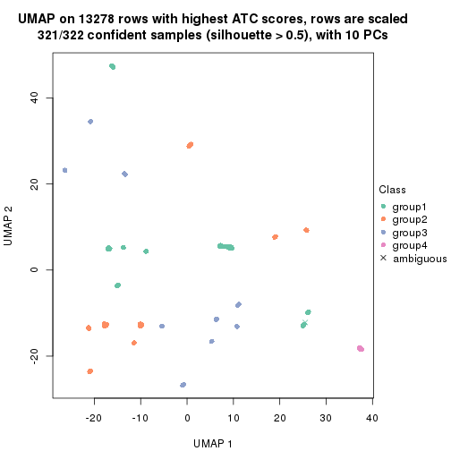</p>

</div>
<div id='tab-ATC-NMF-dimension-reduction-5'>
<pre><code class="r">dimension_reduction(res, k = 6, method = &quot;UMAP&quot;)
</code></pre>

<p>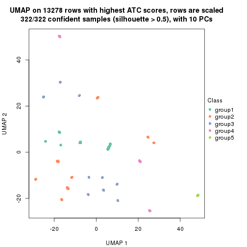</p>

</div>
</div>


Following heatmap shows how subgroups are split when increasing `k`:

```r
collect_classes(res)
```


If matrix rows can be associated to genes, consider to use `functional_enrichment(res,
...)` to perform function enrichment for the signature genes. See [this vignette](http://bioconductor.org/packages/devel/bioc/vignettes/cola/inst/doc/functional_enrichment.html) for more detailed explanations.


 

## Session info


```r
sessionInfo()
```

```
#> R version 3.6.0 (2019-04-26)
#> Platform: x86_64-pc-linux-gnu (64-bit)
#> Running under: CentOS Linux 7 (Core)
#> 
#> Matrix products: default
#> BLAS:   /usr/lib64/libblas.so.3.4.2
#> LAPACK: /usr/lib64/liblapack.so.3.4.2
#> 
#> locale:
#>  [1] LC_CTYPE=en_GB.UTF-8       LC_NUMERIC=C               LC_TIME=en_GB.UTF-8       
#>  [4] LC_COLLATE=en_GB.UTF-8     LC_MONETARY=en_GB.UTF-8    LC_MESSAGES=en_GB.UTF-8   
#>  [7] LC_PAPER=en_GB.UTF-8       LC_NAME=C                  LC_ADDRESS=C              
#> [10] LC_TELEPHONE=C             LC_MEASUREMENT=en_GB.UTF-8 LC_IDENTIFICATION=C       
#> 
#> attached base packages:
#> [1] grid      stats     graphics  grDevices utils     datasets  methods   base     
#> 
#> other attached packages:
#> [1] genefilter_1.66.0    ComplexHeatmap_2.3.1 markdown_1.1         knitr_1.26          
#> [5] GetoptLong_0.1.7     cola_1.3.2          
#> 
#> loaded via a namespace (and not attached):
#>  [1] circlize_0.4.8       shape_1.4.4          xfun_0.11            slam_0.1-46         
#>  [5] lattice_0.20-38      splines_3.6.0        colorspace_1.4-1     vctrs_0.2.0         
#>  [9] stats4_3.6.0         blob_1.2.0           XML_3.98-1.20        survival_2.44-1.1   
#> [13] rlang_0.4.2          pillar_1.4.2         DBI_1.0.0            BiocGenerics_0.30.0 
#> [17] bit64_0.9-7          RColorBrewer_1.1-2   matrixStats_0.55.0   stringr_1.4.0       
#> [21] GlobalOptions_0.1.1  evaluate_0.14        memoise_1.1.0        Biobase_2.44.0      
#> [25] IRanges_2.18.3       parallel_3.6.0       AnnotationDbi_1.46.1 highr_0.8           
#> [29] Rcpp_1.0.3           xtable_1.8-4         backports_1.1.5      S4Vectors_0.22.1    
#> [33] annotate_1.62.0      skmeans_0.2-11       bit_1.1-14           microbenchmark_1.4-7
#> [37] brew_1.0-6           impute_1.58.0        rjson_0.2.20         png_0.1-7           
#> [41] digest_0.6.23        stringi_1.4.3        polyclip_1.10-0      clue_0.3-57         
#> [45] tools_3.6.0          bitops_1.0-6         magrittr_1.5         eulerr_6.0.0        
#> [49] RCurl_1.95-4.12      RSQLite_2.1.4        tibble_2.1.3         cluster_2.1.0       
#> [53] crayon_1.3.4         pkgconfig_2.0.3      zeallot_0.1.0        Matrix_1.2-17       
#> [57] xml2_1.2.2           httr_1.4.1           R6_2.4.1             mclust_5.4.5        
#> [61] compiler_3.6.0
```


